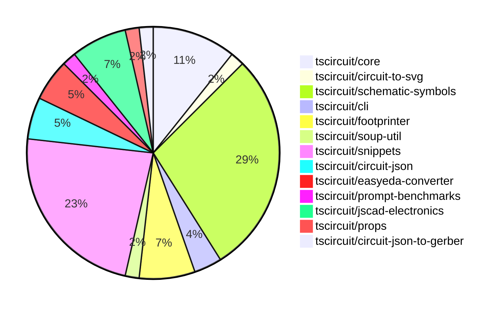

# contribution-tracker

Generates weekly contribution overviews for tscircuit contributors. Check out all
the [contribution overviews here](./contribution-overviews/)

* All PRs in the tscircuit org are scanned/summarized via Claude Haiku
* Claude classifies each Diff/PR as a Major, Minor or Tiny contribution
* All the PRs, summaries, and classifications are organized into charts and tables

The current week is shown below. There are 3 major sections:

* [Contributor Overview](#contributor-overview)
* [PRs by Repository](#prs-by-repository)
* [PRs by Contributor](#changes-by-contributor)

## Current Week

<!-- START_CURRENT_WEEK -->

# Contribution Overview 2024-10-05

## PRs by Repository

## Contributor Overview

| Contributor | 🐳 Major | 🐙 Minor | 🐌 Tiny |
|-------------|-------|-------|-------|
| imrishabh18 | 3 | 4 | 1 |
| DhairyaMajmudar | 2 | 3 | 0 |
| seveibar | 13 | 2 | 0 |
| anas-sarkez | 2 | 4 | 0 |
| ShiboSoftwareDev | 4 | 1 | 0 |
| andrii-balitskyi | 1 | 0 | 0 |
| Complexlity | 1 | 0 | 0 |
| aman1376 | 4 | 1 | 0 |
| 0xkafkaa | 4 | 0 | 0 |
| Timer00 | 1 | 0 | 0 |
| bbland1 | 2 | 2 | 0 |
| PALLAVIKHEDLE | 1 | 0 | 0 |

## Changes by Repository

### [tscircuit/core](https://github.com/tscircuit/core)

| PR # | Impact | Contributor | Description |
|------|--------|-------------|-------------|
| [#139](https://github.com/tscircuit/core/pull/139) | 🐳 Major | imrishabh18 | Fixes an issue with the placement of chips in the schematic box by updating the algorithm to properly calculate the dimensions and positions of the ports. |
| [#137](https://github.com/tscircuit/core/pull/137) | 🐳 Major | seveibar | Improve invalid prop errors by throwing a custom `InvalidProps` error with detailed information about the invalid props. |
| [#136](https://github.com/tscircuit/core/pull/136) | 🐳 Major | ShiboSoftwareDev | Creates a new `pcb_solder_paste` component from the `smtpads` component. |
| [#143](https://github.com/tscircuit/core/pull/143) | 🐙 Minor | imrishabh18 | Update the "@tscircuit/soup-util" package to a smaller bundle size |
| [#141](https://github.com/tscircuit/core/pull/141) | 🐙 Minor | imrishabh18 | Update the package.json file to use the latest version of the "@tscircuit/footprinter" package without the "lodash" dependency. |
| [#138](https://github.com/tscircuit/core/pull/138) | 🐙 Minor | ShiboSoftwareDev | The pull request inherits the `_setPositionFromLayout` behavior from the `pcb_smt_pad` class to the `pcb_solder_paste` class, ensuring that the solder paste position is updated when the SMT pad position changes. |

### [tscircuit/circuit-to-svg](https://github.com/tscircuit/circuit-to-svg)

| PR # | Impact | Contributor | Description |
|------|--------|-------------|-------------|
| [#82](https://github.com/tscircuit/circuit-to-svg/pull/82) | 🐳 Major | imrishabh18 | Fix the placement of chip ports in the schematic SVG |

### [tscircuit/schematic-symbols](https://github.com/tscircuit/schematic-symbols)

| PR # | Impact | Contributor | Description |
|------|--------|-------------|-------------|
| [#135](https://github.com/tscircuit/schematic-symbols/pull/135) | 🐳 Major | imrishabh18 | Adding support for cubic bezier curve in the `svgPathToPoints` function. |
| [#102](https://github.com/tscircuit/schematic-symbols/pull/102) | 🐳 Major | Complexlity | Modify the `generate` script to add the `Primitive` type for text elements in the generated TypeScript file. |
| [#151](https://github.com/tscircuit/schematic-symbols/pull/151) | 🐳 Major | aman1376 | Add n-channel D-MOSFET transistor symbol |
| [#152](https://github.com/tscircuit/schematic-symbols/pull/152) | 🐳 Major | aman1376 | Add a new P-channel depletion MOSFET transistor symbol. |
| [#150](https://github.com/tscircuit/schematic-symbols/pull/150) | 🐳 Major | aman1376 | Add a new n-JFET transistor symbol and metadata. |
| [#149](https://github.com/tscircuit/schematic-symbols/pull/149) | 🐳 Major | aman1376 | Add a P-JFET transistor symbol to the project. |
| [#145](https://github.com/tscircuit/schematic-symbols/pull/145) | 🐳 Major | 0xkafkaa | Add SVG and JSON definitions for a crystal symbol. |
| [#146](https://github.com/tscircuit/schematic-symbols/pull/146) | 🐳 Major | 0xkafkaa | Add a new resonator feature |
| [#137](https://github.com/tscircuit/schematic-symbols/pull/137) | 🐳 Major | 0xkafkaa | Add a new step recovery diode component |
| [#133](https://github.com/tscircuit/schematic-symbols/pull/133) | 🐳 Major | 0xkafkaa | Adds a new JSON file for the Gunn diode symbol and updates the corresponding SVG file. |
| [#136](https://github.com/tscircuit/schematic-symbols/pull/136) | 🐳 Major | Timer00 | Add snapshot tests for SVG symbols |
| [#132](https://github.com/tscircuit/schematic-symbols/pull/132) | 🐳 Major | bbland1 | Fixes an issue where the green center dot in the silicon controlled rectifier symbol was off-center for some symbols, and updates the bounds and center calculations to correctly center the symbol. |
| [#111](https://github.com/tscircuit/schematic-symbols/pull/111) | 🐳 Major | bbland1 | Create an SVG and TypeScript file for a unijunction transistor symbol |
| [#130](https://github.com/tscircuit/schematic-symbols/pull/130) | 🐙 Minor | aman1376 | Update the `BaseSymbolName` type to use a union of string literals instead of a single string literal. |
| [#131](https://github.com/tscircuit/schematic-symbols/pull/131) | 🐙 Minor | bbland1 | Fixing the reference symbol {REF} in the diac symbol |
| [#110](https://github.com/tscircuit/schematic-symbols/pull/110) | 🐙 Minor | bbland1 | Add a diac SVG and TypeScript file to the project. |

### [tscircuit/cli](https://github.com/tscircuit/cli)

| PR # | Impact | Contributor | Description |
|------|--------|-------------|-------------|
| [#226](https://github.com/tscircuit/cli/pull/226) | 🐙 Minor | imrishabh18 | Update the `circuit-to-svg` dependency to the latest version |
| [#215](https://github.com/tscircuit/cli/pull/215) | 🐙 Minor | DhairyaMajmudar | Refactor files to use better TypeScript types by removing `any` keywords and replacing them with suitable types, as well as removing unused imports. |

### [tscircuit/footprinter](https://github.com/tscircuit/footprinter)

| PR # | Impact | Contributor | Description |
|------|--------|-------------|-------------|
| [#48](https://github.com/tscircuit/footprinter/pull/48) | 🐳 Major | DhairyaMajmudar | Adding SOT363 circuit |
| [#55](https://github.com/tscircuit/footprinter/pull/55) | 🐙 Minor | imrishabh18 | Update the dependencies to the latest versions without using the lodash library. |
| [#58](https://github.com/tscircuit/footprinter/pull/58) | 🐙 Minor | anas-sarkez | Modified test files and added preload |
| [#56](https://github.com/tscircuit/footprinter/pull/56) | 🐙 Minor | anas-sarkez | Migrates the testing framework from AVA to Bun. |

### [tscircuit/soup-util](https://github.com/tscircuit/soup-util)

| PR # | Impact | Contributor | Description |
|------|--------|-------------|-------------|
| [#17](https://github.com/tscircuit/soup-util/pull/17) | 🐌 Tiny | imrishabh18 | Removes an unused dependency from the project |

### [tscircuit/snippets](https://github.com/tscircuit/snippets)

| PR # | Impact | Contributor | Description |
|------|--------|-------------|-------------|
| [#37](https://github.com/tscircuit/snippets/pull/37) | 🐳 Major | DhairyaMajmudar | Home page made responsive and HTML tags in footer updated |
| [#40](https://github.com/tscircuit/snippets/pull/40) | 🐳 Major | seveibar | Add database seeding, fix view snippets page, and load TypeScript types for imported snippets. |
| [#35](https://github.com/tscircuit/snippets/pull/35) | 🐳 Major | seveibar | Reverts the "new button hover changes" pull request, which caused issues with the scroll bar and dropdown menu. |
| [#39](https://github.com/tscircuit/snippets/pull/39) | 🐳 Major | seveibar | Introduce a typesafe code editor with CodeMirror, TypeScript support, and autocomplete features. |
| [#36](https://github.com/tscircuit/snippets/pull/36) | 🐳 Major | seveibar | Introduce a fake API switch to allow using a fake API instead of the real one. |
| [#32](https://github.com/tscircuit/snippets/pull/32) | 🐳 Major | seveibar |  |
| [#23](https://github.com/tscircuit/snippets/pull/23) | 🐳 Major | seveibar | Introduces several improvements to the AI chat interface, including better handling of code snippets, new features for the editor, and bug fixes. |
| [#21](https://github.com/tscircuit/snippets/pull/21) | 🐳 Major | seveibar | Adds an empty state message and account balance display to the AI chat interface. |
| [#12](https://github.com/tscircuit/snippets/pull/12) | 🐳 Major | seveibar | Add registry compatibility, login functionality, and additional database schemas (sessions, login pages, accounts) |
| [#33](https://github.com/tscircuit/snippets/pull/33) | 🐳 Major | PALLAVIKHEDLE | The pull request introduces a new button hover behavior, where hovering on the 'New' button now shows a dropdown, and clicking the button takes the user to the '/editor' page. |
| [#28](https://github.com/tscircuit/snippets/pull/28) | 🐙 Minor | DhairyaMajmudar | Introduce a naming convention for biome.json files, requiring camelCase for constants. |
| [#10](https://github.com/tscircuit/snippets/pull/10) | 🐙 Minor | DhairyaMajmudar | Add functionality to hide the "Onboarding Tips" section by clicking the cross button. |
| [#13](https://github.com/tscircuit/snippets/pull/13) | 🐙 Minor | seveibar | Formats the repository, adds Vercel rewrites, and fixes minor issues |

### [tscircuit/circuit-json](https://github.com/tscircuit/circuit-json)

| PR # | Impact | Contributor | Description |
|------|--------|-------------|-------------|
| [#55](https://github.com/tscircuit/circuit-json/pull/55) | 🐳 Major | seveibar | Adds a GitHub Actions workflow to run tests for the Bun runtime. |
| [#56](https://github.com/tscircuit/circuit-json/pull/56) | 🐳 Major | ShiboSoftwareDev | Introduce a new component called `pcb_solder_paste` to represent solder paste on a PCB. |
| [#57](https://github.com/tscircuit/circuit-json/pull/57) | 🐙 Minor | anas-sarkez | Add mil unit and format script |

### [tscircuit/easyeda-converter](https://github.com/tscircuit/easyeda-converter)

| PR # | Impact | Contributor | Description |
|------|--------|-------------|-------------|
| [#46](https://github.com/tscircuit/easyeda-converter/pull/46) | 🐳 Major | seveibar | Convert the project to use ECMAScript modules (ESM) instead of CommonJS modules. |
| [#45](https://github.com/tscircuit/easyeda-converter/pull/45) | 🐳 Major | seveibar | This pull request updates the README with more usage details, migrates the code to use `circuit-json` and `@tscircuit/soup-util` instead of `@tscircuit/soup`, and removes the `builder` dependency. |
| [#44](https://github.com/tscircuit/easyeda-converter/pull/44) | 🐳 Major | andrii-balitskyi | Fix build and add typecheck workflow |

### [tscircuit/prompt-benchmarks](https://github.com/tscircuit/prompt-benchmarks)

| PR # | Impact | Contributor | Description |
|------|--------|-------------|-------------|
| [#2](https://github.com/tscircuit/prompt-benchmarks/pull/2) | 🐳 Major | seveibar | Introduce a feature to support running generated code and testing with threshold acceptance. |

### [tscircuit/jscad-electronics](https://github.com/tscircuit/jscad-electronics)

| PR # | Impact | Contributor | Description |
|------|--------|-------------|-------------|
| [#62](https://github.com/tscircuit/jscad-electronics/pull/62) | 🐳 Major | anas-sarkez | Updated the soup dependency to circuit-json |
| [#58](https://github.com/tscircuit/jscad-electronics/pull/58) | 🐳 Major | anas-sarkez | Fixed the SOT-23, SOT-563, and SOT-723 component models to match their respective footprint specifications. |
| [#61](https://github.com/tscircuit/jscad-electronics/pull/61) | 🐙 Minor | seveibar | Create a CODEOWNERS file to specify the code owners for the repository |
| [#60](https://github.com/tscircuit/jscad-electronics/pull/60) | 🐙 Minor | anas-sarkez | Added the `showGrid` property to all test examples. |

### [tscircuit/props](https://github.com/tscircuit/props)

| PR # | Impact | Contributor | Description |
|------|--------|-------------|-------------|
| [#56](https://github.com/tscircuit/props/pull/56) | 🐳 Major | ShiboSoftwareDev | Introduce new `solderpaste` component with support for rectangular and circular shapes. |

### [tscircuit/circuit-json-to-gerber](https://github.com/tscircuit/circuit-json-to-gerber)

| PR # | Impact | Contributor | Description |
|------|--------|-------------|-------------|
| [#18](https://github.com/tscircuit/circuit-json-to-gerber/pull/18) | 🐳 Major | ShiboSoftwareDev | Implemented support for PCB solder paste in the gerber conversion process. |

## Changes by Contributor

### [imrishabh18](https://github.com/imrishabh18)

| PR # | Impact | Description |
|------|--------|-------------|
| [#139](https://github.com/tscircuit/core/pull/139) | 🐳 Major | Fixes an issue with the placement of chips in the schematic box by updating the algorithm to properly calculate the dimensions and positions of the ports. |
| [#82](https://github.com/tscircuit/circuit-to-svg/pull/82) | 🐳 Major | Fix the placement of chip ports in the schematic SVG |
| [#135](https://github.com/tscircuit/schematic-symbols/pull/135) | 🐳 Major | Adding support for cubic bezier curve in the `svgPathToPoints` function. |
| [#226](https://github.com/tscircuit/cli/pull/226) | 🐙 Minor | Update the `circuit-to-svg` dependency to the latest version |
| [#55](https://github.com/tscircuit/footprinter/pull/55) | 🐙 Minor | Update the dependencies to the latest versions without using the lodash library. |
| [#143](https://github.com/tscircuit/core/pull/143) | 🐙 Minor | Update the "@tscircuit/soup-util" package to a smaller bundle size |
| [#141](https://github.com/tscircuit/core/pull/141) | 🐙 Minor | Update the package.json file to use the latest version of the "@tscircuit/footprinter" package without the "lodash" dependency. |
| [#17](https://github.com/tscircuit/soup-util/pull/17) | 🐌 Tiny | Removes an unused dependency from the project |

### [DhairyaMajmudar](https://github.com/DhairyaMajmudar)

| PR # | Impact | Description |
|------|--------|-------------|
| [#48](https://github.com/tscircuit/footprinter/pull/48) | 🐳 Major | Adding SOT363 circuit |
| [#37](https://github.com/tscircuit/snippets/pull/37) | 🐳 Major | Home page made responsive and HTML tags in footer updated |
| [#215](https://github.com/tscircuit/cli/pull/215) | 🐙 Minor | Refactor files to use better TypeScript types by removing `any` keywords and replacing them with suitable types, as well as removing unused imports. |
| [#28](https://github.com/tscircuit/snippets/pull/28) | 🐙 Minor | Introduce a naming convention for biome.json files, requiring camelCase for constants. |
| [#10](https://github.com/tscircuit/snippets/pull/10) | 🐙 Minor | Add functionality to hide the "Onboarding Tips" section by clicking the cross button. |

### [seveibar](https://github.com/seveibar)

| PR # | Impact | Description |
|------|--------|-------------|
| [#55](https://github.com/tscircuit/circuit-json/pull/55) | 🐳 Major | Adds a GitHub Actions workflow to run tests for the Bun runtime. |
| [#46](https://github.com/tscircuit/easyeda-converter/pull/46) | 🐳 Major | Convert the project to use ECMAScript modules (ESM) instead of CommonJS modules. |
| [#45](https://github.com/tscircuit/easyeda-converter/pull/45) | 🐳 Major | This pull request updates the README with more usage details, migrates the code to use `circuit-json` and `@tscircuit/soup-util` instead of `@tscircuit/soup`, and removes the `builder` dependency. |
| [#137](https://github.com/tscircuit/core/pull/137) | 🐳 Major | Improve invalid prop errors by throwing a custom `InvalidProps` error with detailed information about the invalid props. |
| [#40](https://github.com/tscircuit/snippets/pull/40) | 🐳 Major | Add database seeding, fix view snippets page, and load TypeScript types for imported snippets. |
| [#35](https://github.com/tscircuit/snippets/pull/35) | 🐳 Major | Reverts the "new button hover changes" pull request, which caused issues with the scroll bar and dropdown menu. |
| [#39](https://github.com/tscircuit/snippets/pull/39) | 🐳 Major | Introduce a typesafe code editor with CodeMirror, TypeScript support, and autocomplete features. |
| [#36](https://github.com/tscircuit/snippets/pull/36) | 🐳 Major | Introduce a fake API switch to allow using a fake API instead of the real one. |
| [#32](https://github.com/tscircuit/snippets/pull/32) | 🐳 Major |  |
| [#23](https://github.com/tscircuit/snippets/pull/23) | 🐳 Major | Introduces several improvements to the AI chat interface, including better handling of code snippets, new features for the editor, and bug fixes. |
| [#21](https://github.com/tscircuit/snippets/pull/21) | 🐳 Major | Adds an empty state message and account balance display to the AI chat interface. |
| [#12](https://github.com/tscircuit/snippets/pull/12) | 🐳 Major | Add registry compatibility, login functionality, and additional database schemas (sessions, login pages, accounts) |
| [#2](https://github.com/tscircuit/prompt-benchmarks/pull/2) | 🐳 Major | Introduce a feature to support running generated code and testing with threshold acceptance. |
| [#61](https://github.com/tscircuit/jscad-electronics/pull/61) | 🐙 Minor | Create a CODEOWNERS file to specify the code owners for the repository |
| [#13](https://github.com/tscircuit/snippets/pull/13) | 🐙 Minor | Formats the repository, adds Vercel rewrites, and fixes minor issues |

### [anas-sarkez](https://github.com/anas-sarkez)

| PR # | Impact | Description |
|------|--------|-------------|
| [#62](https://github.com/tscircuit/jscad-electronics/pull/62) | 🐳 Major | Updated the soup dependency to circuit-json |
| [#58](https://github.com/tscircuit/jscad-electronics/pull/58) | 🐳 Major | Fixed the SOT-23, SOT-563, and SOT-723 component models to match their respective footprint specifications. |
| [#57](https://github.com/tscircuit/circuit-json/pull/57) | 🐙 Minor | Add mil unit and format script |
| [#58](https://github.com/tscircuit/footprinter/pull/58) | 🐙 Minor | Modified test files and added preload |
| [#56](https://github.com/tscircuit/footprinter/pull/56) | 🐙 Minor | Migrates the testing framework from AVA to Bun. |
| [#60](https://github.com/tscircuit/jscad-electronics/pull/60) | 🐙 Minor | Added the `showGrid` property to all test examples. |

### [ShiboSoftwareDev](https://github.com/ShiboSoftwareDev)

| PR # | Impact | Description |
|------|--------|-------------|
| [#56](https://github.com/tscircuit/circuit-json/pull/56) | 🐳 Major | Introduce a new component called `pcb_solder_paste` to represent solder paste on a PCB. |
| [#56](https://github.com/tscircuit/props/pull/56) | 🐳 Major | Introduce new `solderpaste` component with support for rectangular and circular shapes. |
| [#136](https://github.com/tscircuit/core/pull/136) | 🐳 Major | Creates a new `pcb_solder_paste` component from the `smtpads` component. |
| [#18](https://github.com/tscircuit/circuit-json-to-gerber/pull/18) | 🐳 Major | Implemented support for PCB solder paste in the gerber conversion process. |
| [#138](https://github.com/tscircuit/core/pull/138) | 🐙 Minor | The pull request inherits the `_setPositionFromLayout` behavior from the `pcb_smt_pad` class to the `pcb_solder_paste` class, ensuring that the solder paste position is updated when the SMT pad position changes. |

### [andrii-balitskyi](https://github.com/andrii-balitskyi)

| PR # | Impact | Description |
|------|--------|-------------|
| [#44](https://github.com/tscircuit/easyeda-converter/pull/44) | 🐳 Major | Fix build and add typecheck workflow |

### [Complexlity](https://github.com/Complexlity)

| PR # | Impact | Description |
|------|--------|-------------|
| [#102](https://github.com/tscircuit/schematic-symbols/pull/102) | 🐳 Major | Modify the `generate` script to add the `Primitive` type for text elements in the generated TypeScript file. |

### [aman1376](https://github.com/aman1376)

| PR # | Impact | Description |
|------|--------|-------------|
| [#151](https://github.com/tscircuit/schematic-symbols/pull/151) | 🐳 Major | Add n-channel D-MOSFET transistor symbol |
| [#152](https://github.com/tscircuit/schematic-symbols/pull/152) | 🐳 Major | Add a new P-channel depletion MOSFET transistor symbol. |
| [#150](https://github.com/tscircuit/schematic-symbols/pull/150) | 🐳 Major | Add a new n-JFET transistor symbol and metadata. |
| [#149](https://github.com/tscircuit/schematic-symbols/pull/149) | 🐳 Major | Add a P-JFET transistor symbol to the project. |
| [#130](https://github.com/tscircuit/schematic-symbols/pull/130) | 🐙 Minor | Update the `BaseSymbolName` type to use a union of string literals instead of a single string literal. |

### [0xkafkaa](https://github.com/0xkafkaa)

| PR # | Impact | Description |
|------|--------|-------------|
| [#145](https://github.com/tscircuit/schematic-symbols/pull/145) | 🐳 Major | Add SVG and JSON definitions for a crystal symbol. |
| [#146](https://github.com/tscircuit/schematic-symbols/pull/146) | 🐳 Major | Add a new resonator feature |
| [#137](https://github.com/tscircuit/schematic-symbols/pull/137) | 🐳 Major | Add a new step recovery diode component |
| [#133](https://github.com/tscircuit/schematic-symbols/pull/133) | 🐳 Major | Adds a new JSON file for the Gunn diode symbol and updates the corresponding SVG file. |

### [Timer00](https://github.com/Timer00)

| PR # | Impact | Description |
|------|--------|-------------|
| [#136](https://github.com/tscircuit/schematic-symbols/pull/136) | 🐳 Major | Add snapshot tests for SVG symbols |

### [bbland1](https://github.com/bbland1)

| PR # | Impact | Description |
|------|--------|-------------|
| [#132](https://github.com/tscircuit/schematic-symbols/pull/132) | 🐳 Major | Fixes an issue where the green center dot in the silicon controlled rectifier symbol was off-center for some symbols, and updates the bounds and center calculations to correctly center the symbol. |
| [#111](https://github.com/tscircuit/schematic-symbols/pull/111) | 🐳 Major | Create an SVG and TypeScript file for a unijunction transistor symbol |
| [#131](https://github.com/tscircuit/schematic-symbols/pull/131) | 🐙 Minor | Fixing the reference symbol {REF} in the diac symbol |
| [#110](https://github.com/tscircuit/schematic-symbols/pull/110) | 🐙 Minor | Add a diac SVG and TypeScript file to the project. |

### [PALLAVIKHEDLE](https://github.com/PALLAVIKHEDLE)

| PR # | Impact | Description |
|------|--------|-------------|
| [#33](https://github.com/tscircuit/snippets/pull/33) | 🐳 Major | The pull request introduces a new button hover behavior, where hovering on the 'New' button now shows a dropdown, and clicking the button takes the user to the '/editor' page. |

<!-- END_CURRENT_WEEK -->
