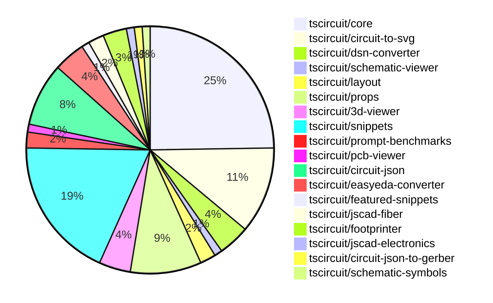

# contribution-tracker

Generates weekly contribution overviews for tscircuit contributors. Check out all
the [contribution overviews here](./contribution-overviews/)

* All PRs in the tscircuit org are scanned/summarized via Claude Haiku
* Claude classifies each Diff/PR as a Major, Minor or Tiny contribution
* All the PRs, summaries, and classifications are organized into charts and tables

The current week is shown below. There are 3 major sections:

* [Contributor Overview](#contributor-overview)
* [PRs by Repository](#prs-by-repository)
* [PRs by Contributor](#changes-by-contributor)

## Current Week

<!-- START_CURRENT_WEEK -->

# Contribution Overview 2024-10-30

## PRs by Repository

## Contributor Overview

| Contributor | 🐳 Major | 🐙 Minor | 🐌 Tiny | ⭐ |
|-------------|-------|-------|-------|-------|
| [seveibar](#seveibar) | 14 | 38 | 2 | 👑👑👑 |
| [imrishabh18](#imrishabh18) | 4 | 13 | 1 | ⭐⭐⭐ |
| [ShiboSoftwareDev](#ShiboSoftwareDev) | 1 | 7 | 0 | ⭐⭐ |
| [anas-sarkez](#anas-sarkez) | 1 | 3 | 0 | ⭐ |
| [andrii-balitskyi](#andrii-balitskyi) | 0 | 5 | 0 | ⭐ |
| [mrudulpatil18](#mrudulpatil18) | 1 | 2 | 0 | ⭐ |
| [tscircuitbot](#tscircuitbot) | 0 | 2 | 0 | ⭐ |
| [aman1376](#aman1376) | 1 | 0 | 0 | ⭐ |
| [Satvik1769](#Satvik1769) | 0 | 1 | 0 |  |
| [SufyaanKhateeb](#SufyaanKhateeb) | 0 | 1 | 0 |  |

## Changes by Repository

### [tscircuit/core](https://github.com/tscircuit/core)

| PR # | Impact | Contributor | Description |
|------|--------|-------------|-------------|
| [#224](https://github.com/tscircuit/core/pull/224) | 🐳 Major | imrishabh18 | Adds support for manual edits to the PCB layout, allowing developers to specify custom placements for components on the PCB. |
| [#260](https://github.com/tscircuit/core/pull/260) | 🐳 Major | seveibar | Introduces junction support to handle trace intersections on the same net. |
| [#257](https://github.com/tscircuit/core/pull/257) | 🐳 Major | seveibar | Implement source_trace.subcircuit_connectivity_map_key |
| [#252](https://github.com/tscircuit/core/pull/252) | 🐳 Major | seveibar | Adds the `is_crossing` property and splits schematic trace segments to enable the "trace hop" feature. |
| [#238](https://github.com/tscircuit/core/pull/238) | 🐳 Major | seveibar | Refactors the schematic box computation to improve the handling of port positions and tracing. |
| [#236](https://github.com/tscircuit/core/pull/236) | 🐳 Major | seveibar | Enhances schematic box rendering for components other than chips, and properly renders PinHeader components. |
| [#235](https://github.com/tscircuit/core/pull/235) | 🐳 Major | seveibar | Adds support for pinheaders and implied footprint strings |
| [#214](https://github.com/tscircuit/core/pull/214) | 🐳 Major | seveibar | Introduces three new hooks: `useChip`, `useResistor`, and `useCapacitor`. |
| [#245](https://github.com/tscircuit/core/pull/245) | 🐙 Minor | imrishabh18 | Overrides footprint ports when port arrangement is present in the schematic |
| [#229](https://github.com/tscircuit/core/pull/229) | 🐙 Minor | imrishabh18 | Add the pin number as an alias for portHints |
| [#262](https://github.com/tscircuit/core/pull/262) | 🐙 Minor | seveibar | Fixes an issue where the schematic component's rotation was not properly parsed from the component's props. |
| [#261](https://github.com/tscircuit/core/pull/261) | 🐙 Minor | seveibar | Adds the anchor position to schematic net labels and creates net labels when a schematic trace is connected to a net on one side. |
| [#251](https://github.com/tscircuit/core/pull/251) | 🐙 Minor | seveibar | Fixes a schematic trace overlap issue by pushing traces away from other traces. |
| [#247](https://github.com/tscircuit/core/pull/247) | 🐙 Minor | seveibar | Adds `display_pin_label` to schematic ports and `symbol_display_value` to schematic components. |
| [#239](https://github.com/tscircuit/core/pull/239) | 🐙 Minor | seveibar | Fix stub edges on schematic traces |
| [#227](https://github.com/tscircuit/core/pull/227) | 🐙 Minor | seveibar | Fix the bounds calculation to update the center of the PCB component correctly. |
| [#223](https://github.com/tscircuit/core/pull/223) | 🐙 Minor | seveibar | Enable removing path loops in the Trace component |
| [#218](https://github.com/tscircuit/core/pull/218) | 🐙 Minor | seveibar | The change ensures that a fatal error is not thrown if the net islands fail to route, and instead a more informative error message is displayed. |
| [#217](https://github.com/tscircuit/core/pull/217) | 🐙 Minor | seveibar | Introduce a new hook called `useDiode` for creating a diode component |
| [#212](https://github.com/tscircuit/core/pull/212) | 🐙 Minor | seveibar | The pull request improves the types for the `createUseComponent` function and the component it creates, allowing it to accept the `pinLabels` native format. |
| [#259](https://github.com/tscircuit/core/pull/259) | 🐙 Minor | ShiboSoftwareDev | Schematic box components now expand to fit the label text. |
| [#244](https://github.com/tscircuit/core/pull/244) | 🐙 Minor | andrii-balitskyi | Adds a GitHub Action workflow for automatically formatting code in pull requests. |
| [#243](https://github.com/tscircuit/core/pull/243) | 🐙 Minor | andrii-balitskyi | Add a new `useLed` hook for creating LED components in the circuit. |
| [#228](https://github.com/tscircuit/core/pull/228) | 🐌 Tiny | imrishabh18 | Updates the project's lockfile to the latest versions of dependencies. |

### [tscircuit/circuit-to-svg](https://github.com/tscircuit/circuit-to-svg)

| PR # | Impact | Contributor | Description |
|------|--------|-------------|-------------|
| [#106](https://github.com/tscircuit/circuit-to-svg/pull/106) | 🐳 Major | imrishabh18 | Adds support for rendering schematic net labels in the SVG output. |
| [#113](https://github.com/tscircuit/circuit-to-svg/pull/113) | 🐳 Major | seveibar | Introduces comprehensive calculations for Netlabel size and position, including support for `center` and `anchor_position`. |
| [#112](https://github.com/tscircuit/circuit-to-svg/pull/112) | 🐳 Major | seveibar | Add junction support and improve drawing of crossings for schematic traces |
| [#110](https://github.com/tscircuit/circuit-to-svg/pull/110) | 🐳 Major | seveibar | Introduces an initial implementation for crossing traces in the schematic SVG rendering. |
| [#104](https://github.com/tscircuit/circuit-to-svg/pull/104) | 🐳 Major | seveibar | This pull request introduces a major refactor to the way schematic objects are handled, including the use of absolute coordinates, breaking up functions, and fixing offsets. |
| [#111](https://github.com/tscircuit/circuit-to-svg/pull/111) | 🐙 Minor | seveibar | Fix labelled points not appearing at correct position, make labels sans-serif |
| [#109](https://github.com/tscircuit/circuit-to-svg/pull/109) | 🐙 Minor | seveibar | Fix schematic port label name using schematic_port.display_pin_label, fix anchoring of bottom text on components, and update core |
| [#108](https://github.com/tscircuit/circuit-to-svg/pull/108) | 🐙 Minor | seveibar | Switch to `symbol_display_value` for symbol values |
| [#107](https://github.com/tscircuit/circuit-to-svg/pull/107) | 🐙 Minor | seveibar | Adds a GitHub Actions workflow for running a format check, formats the code, adds a no-console rule, and updates a dependency. |
| [#103](https://github.com/tscircuit/circuit-to-svg/pull/103) | 🐙 Minor | seveibar | Fix schematic component rendering relying on non-standard props |
| [#105](https://github.com/tscircuit/circuit-to-svg/pull/105) | 🐌 Tiny | seveibar | Update the version of the "@tscircuit/core" dependency from 0.0.147 to 0.0.148. |

### [tscircuit/dsn-converter](https://github.com/tscircuit/dsn-converter)

| PR # | Impact | Contributor | Description |
|------|--------|-------------|-------------|
| [#15](https://github.com/tscircuit/dsn-converter/pull/15) | 🐳 Major | imrishabh18 | Add support for the polygon shape in the padstack conversion process. |
| [#13](https://github.com/tscircuit/dsn-converter/pull/13) | 🐳 Major | imrishabh18 | Introduces a new feature to convert circuit JSON to DSN JSON and vice versa. |
| [#8](https://github.com/tscircuit/dsn-converter/pull/8) | 🐳 Major | seveibar | Major refactor to improve code separation, add tests, build, release, stringification, and README usage examples. |
| [#14](https://github.com/tscircuit/dsn-converter/pull/14) | 🐙 Minor | seveibar | Updates the README file with new sections and examples for the library. |

### [tscircuit/schematic-viewer](https://github.com/tscircuit/schematic-viewer)

| PR # | Impact | Contributor | Description |
|------|--------|-------------|-------------|
| [#71](https://github.com/tscircuit/schematic-viewer/pull/71) | 🐙 Minor | imrishabh18 | Fix drag sensitivity to be constant throughout the transformation. |

### [tscircuit/layout](https://github.com/tscircuit/layout)

| PR # | Impact | Contributor | Description |
|------|--------|-------------|-------------|
| [#4](https://github.com/tscircuit/layout/pull/4) | 🐙 Minor | imrishabh18 | Fix types in the `manual-layout-pcb.ts` file. |
| [#3](https://github.com/tscircuit/layout/pull/3) | 🐙 Minor | imrishabh18 | Refactor to use "circuit-json" instead of "@tscircuit/soup" |

### [tscircuit/props](https://github.com/tscircuit/props)

| PR # | Impact | Contributor | Description |
|------|--------|-------------|-------------|
| [#80](https://github.com/tscircuit/props/pull/80) | 🐙 Minor | imrishabh18 | Replace `@tscircuit/soup` dependencies with `circuit-json` dependencies |
| [#79](https://github.com/tscircuit/props/pull/79) | 🐙 Minor | imrishabh18 | Adds support for pin definitions as strings in the `PinSideDefinition` interface. |
| [#70](https://github.com/tscircuit/props/pull/70) | 🐙 Minor | imrishabh18 | Manual edits added as props |
| [#83](https://github.com/tscircuit/props/pull/83) | 🐙 Minor | seveibar | Add netAlias props |
| [#82](https://github.com/tscircuit/props/pull/82) | 🐙 Minor | seveibar | Change the type of `pinLabels` property in `ChipProps` interface to accept readonly arrays. |
| [#72](https://github.com/tscircuit/props/pull/72) | 🐙 Minor | seveibar | Introduces the `headerProps` interface and exports it from the `lib/components/header` module. |
| [#76](https://github.com/tscircuit/props/pull/76) | 🐙 Minor | tscircuitbot | Rename `headerProps` to `pinHeaderProps`, add `pinHeader.pinLabels` |
| [#74](https://github.com/tscircuit/props/pull/74) | 🐙 Minor | tscircuitbot | Add parameters `holeDiameter` and `platedDiameter` to the `headers` component. |
| [#68](https://github.com/tscircuit/props/pull/68) | 🐌 Tiny | seveibar | Adds a link to the latest version of the generated props overview in the documentation. |

### [tscircuit/3d-viewer](https://github.com/tscircuit/3d-viewer)

| PR # | Impact | Contributor | Description |
|------|--------|-------------|-------------|
| [#29](https://github.com/tscircuit/3d-viewer/pull/29) | 🐙 Minor | imrishabh18 | Update the version of the "@tscircuit/core" dependency from "^0.0.97" to "^0.0.136" |
| [#33](https://github.com/tscircuit/3d-viewer/pull/33) | 🐙 Minor | ShiboSoftwareDev | Adds a feature to hover over a component in the CAD viewer to highlight and view the reference designator. |
| [#34](https://github.com/tscircuit/3d-viewer/pull/34) | 🐙 Minor | ShiboSoftwareDev | Changed the highlight color of the 3D model from a low-intensity white to a higher-intensity blue. |
| [#32](https://github.com/tscircuit/3d-viewer/pull/32) | 🐙 Minor | ShiboSoftwareDev | Fixes the rotation of 3D models in the CAD viewer component. |

### [tscircuit/snippets](https://github.com/tscircuit/snippets)

| PR # | Impact | Contributor | Description |
|------|--------|-------------|-------------|
| [#162](https://github.com/tscircuit/snippets/pull/162) | 🐳 Major | seveibar | Introduces manual edits as props, refactors one-way dataflow for manual edits file, and fixes a bug in rendering the PCB viewer. |
| [#121](https://github.com/tscircuit/snippets/pull/121) | 🐳 Major | mrudulpatil18 | Fixes the search filtering issue in the Command palette by rewriting the logic and using Fuzzy search to filter the possible commands. |
| [#164](https://github.com/tscircuit/snippets/pull/164) | 🐙 Minor | imrishabh18 | Fix the overflow issue on the view snippet page. |
| [#159](https://github.com/tscircuit/snippets/pull/159) | 🐙 Minor | imrishabh18 | Removes the button from the view page |
| [#143](https://github.com/tscircuit/snippets/pull/143) | 🐙 Minor | imrishabh18 | Adds position update on movement in manual-edits and updates dependencies. |
| [#141](https://github.com/tscircuit/snippets/pull/141) | 🐙 Minor | imrishabh18 | Fix code update when the current file changes |
| [#173](https://github.com/tscircuit/snippets/pull/173) | 🐙 Minor | seveibar | Update dependencies for `@tscircuit/core` and `circuit-to-svg` packages |
| [#169](https://github.com/tscircuit/snippets/pull/169) | 🐙 Minor | seveibar | Updates dependencies (core and circuit-to-svg) and swaps the schematic viewer to circuit-to-svg with mouse controls. |
| [#155](https://github.com/tscircuit/snippets/pull/155) | 🐙 Minor | seveibar | Disable automatic closing bracket insertion in the CodeEditor component. |
| [#154](https://github.com/tscircuit/snippets/pull/154) | 🐙 Minor | seveibar | Fix the regular expression used in "go to definition" to include dashes in the package name |
| [#150](https://github.com/tscircuit/snippets/pull/150) | 🐙 Minor | seveibar | Update dependencies, add TypeScript virtual file system, improve dropdown color, and move toast to bottom right. |
| [#149](https://github.com/tscircuit/snippets/pull/149) | 🐙 Minor | seveibar | Fix createUseComponent types, improve toast position, sticky preview, and improve code editor header filename select box color |
| [#147](https://github.com/tscircuit/snippets/pull/147) | 🐙 Minor | seveibar | Updates the easyeda package to version 0.0.62 to fix the ESP32 import issue, and also includes improvements to the Schematic Viewer Height and Sticky Preview. |
| [#167](https://github.com/tscircuit/snippets/pull/167) | 🐙 Minor | ShiboSoftwareDev | Fixed the issue where the cmd+click tooltip appears on all tsci imports instead of only the hovered import. |
| [#170](https://github.com/tscircuit/snippets/pull/170) | 🐙 Minor | mrudulpatil18 | Added functionality to change the snippet type. |
| [#137](https://github.com/tscircuit/snippets/pull/137) | 🐙 Minor | mrudulpatil18 | Adds the snippet type to the URL for the copy URL feature. |
| [#163](https://github.com/tscircuit/snippets/pull/163) | 🐙 Minor | Satvik1769 | Adds a hook to warn the user before leaving the page if there are unsaved changes. |
| [#144](https://github.com/tscircuit/snippets/pull/144) | 🐙 Minor | SufyaanKhateeb | Fix the profile page header to say "My Profile" when the current user is viewing their profile and fix the "My Profile" link in the footer to show up only when logged in. |

### [tscircuit/prompt-benchmarks](https://github.com/tscircuit/prompt-benchmarks)

| PR # | Impact | Contributor | Description |
|------|--------|-------------|-------------|
| [#4](https://github.com/tscircuit/prompt-benchmarks/pull/4) | 🐳 Major | seveibar | This pull request introduces new prompt templates for creating circuit board and module samples. |
| [#5](https://github.com/tscircuit/prompt-benchmarks/pull/5) | 🐙 Minor | seveibar | Integrates tscircuit snippets for prompt generation, with refactoring of sample and name. |

### [tscircuit/pcb-viewer](https://github.com/tscircuit/pcb-viewer)

| PR # | Impact | Contributor | Description |
|------|--------|-------------|-------------|
| [#79](https://github.com/tscircuit/pcb-viewer/pull/79) | 🐙 Minor | seveibar | Standardize the zIndex values for various overlays and components in the application. |

### [tscircuit/circuit-json](https://github.com/tscircuit/circuit-json)

| PR # | Impact | Contributor | Description |
|------|--------|-------------|-------------|
| [#74](https://github.com/tscircuit/circuit-json/pull/74) | 🐙 Minor | seveibar | Add `anchor_position` and `symbol_name` properties to `SchematicNetLabel` type. |
| [#63](https://github.com/tscircuit/circuit-json/pull/63) | 🐙 Minor | seveibar | Improve the schematic debug object definition by using explicit interfaces instead of relying on Zod type inference. |
| [#73](https://github.com/tscircuit/circuit-json/pull/73) | 🐙 Minor | seveibar | Adds a `junctions` field to the `SchematicTrace` type, which is an array of objects with `x` and `y` properties representing the coordinates of junctions in the schematic trace. |
| [#72](https://github.com/tscircuit/circuit-json/pull/72) | 🐙 Minor | seveibar | Add `is_crossing` property to `SchematicTraceEdge` interface and update the `schematic_trace` Zod schema accordingly. |
| [#70](https://github.com/tscircuit/circuit-json/pull/70) | 🐙 Minor | seveibar | Fix for parsing unitless resistance values in the `convert-si-unit-to-number` utility. |
| [#69](https://github.com/tscircuit/circuit-json/pull/69) | 🐙 Minor | seveibar | Refactor schematic component to use Zod types and add a new `symbol_display_value` field. |
| [#68](https://github.com/tscircuit/circuit-json/pull/68) | 🐙 Minor | seveibar | Add the `display_pin_label` property to the `SchematicPort` interface and the `schematic_port` Zod schema. |
| [#67](https://github.com/tscircuit/circuit-json/pull/67) | 🐙 Minor | seveibar | Improved the SI unit parsing by handling the "uF" unit and using a more robust regular expression to extract the unit. |

### [tscircuit/easyeda-converter](https://github.com/tscircuit/easyeda-converter)

| PR # | Impact | Contributor | Description |
|------|--------|-------------|-------------|
| [#89](https://github.com/tscircuit/easyeda-converter/pull/89) | 🐙 Minor | seveibar | Normalizes pin labels to preserve the original pin numbers. |
| [#94](https://github.com/tscircuit/easyeda-converter/pull/94) | 🐙 Minor | andrii-balitskyi | Correctly parse right-facing (end) pins from raw EasyEDA JSON |
| [#93](https://github.com/tscircuit/easyeda-converter/pull/93) | 🐙 Minor | andrii-balitskyi | Sort pin labels in alphabetical order |
| [#91](https://github.com/tscircuit/easyeda-converter/pull/91) | 🐙 Minor | andrii-balitskyi | Include duplicate pin name in pin label array and remove pinNames from component template |

### [tscircuit/featured-snippets](https://github.com/tscircuit/featured-snippets)

| PR # | Impact | Contributor | Description |
|------|--------|-------------|-------------|
| [#2](https://github.com/tscircuit/featured-snippets/pull/2) | 🐙 Minor | seveibar | The change exports file content to help with building prompts. |

### [tscircuit/jscad-fiber](https://github.com/tscircuit/jscad-fiber)

| PR # | Impact | Contributor | Description |
|------|--------|-------------|-------------|
| [#86](https://github.com/tscircuit/jscad-fiber/pull/86) | 🐳 Major | anas-sarkez | Refactor `createHostConfig` to support array-based subtraction of React elements, improve error handling, and flatten nested React elements. |
| [#87](https://github.com/tscircuit/jscad-fiber/pull/87) | 🐙 Minor | anas-sarkez | Fixed type errors in the `createInstance` function. |

### [tscircuit/footprinter](https://github.com/tscircuit/footprinter)

| PR # | Impact | Contributor | Description |
|------|--------|-------------|-------------|
| [#78](https://github.com/tscircuit/footprinter/pull/78) | 🐙 Minor | anas-sarkez | Implemented the sot235 (sot23-5) footprint with testing. |
| [#77](https://github.com/tscircuit/footprinter/pull/77) | 🐙 Minor | ShiboSoftwareDev | `getFootprintNames` is now a method of `footprinter` |
| [#76](https://github.com/tscircuit/footprinter/pull/76) | 🐙 Minor | ShiboSoftwareDev | Adds a new method `getFootprintNames()` to the `Footprinter` object to retrieve an array of footprint names. |

### [tscircuit/jscad-electronics](https://github.com/tscircuit/jscad-electronics)

| PR # | Impact | Contributor | Description |
|------|--------|-------------|-------------|
| [#77](https://github.com/tscircuit/jscad-electronics/pull/77) | 🐙 Minor | anas-sarkez | Added support for different color for capacitors and updated dependencies. |

### [tscircuit/circuit-json-to-gerber](https://github.com/tscircuit/circuit-json-to-gerber)

| PR # | Impact | Contributor | Description |
|------|--------|-------------|-------------|
| [#27](https://github.com/tscircuit/circuit-json-to-gerber/pull/27) | 🐳 Major | ShiboSoftwareDev | Added support for silkscreen text rendering |

### [tscircuit/schematic-symbols](https://github.com/tscircuit/schematic-symbols)

| PR # | Impact | Contributor | Description |
|------|--------|-------------|-------------|
| [#187](https://github.com/tscircuit/schematic-symbols/pull/187) | 🐳 Major | aman1376 | Adds a new SVG file and JSON data for an illuminated push button in a normally open configuration. |

## Changes by Contributor

### [imrishabh18](https://github.com/imrishabh18)

| PR # | Impact | Description |
|------|--------|-------------|
| [#224](https://github.com/tscircuit/core/pull/224) | 🐳 Major | Adds support for manual edits to the PCB layout, allowing developers to specify custom placements for components on the PCB. |
| [#106](https://github.com/tscircuit/circuit-to-svg/pull/106) | 🐳 Major | Adds support for rendering schematic net labels in the SVG output. |
| [#15](https://github.com/tscircuit/dsn-converter/pull/15) | 🐳 Major | Add support for the polygon shape in the padstack conversion process. |
| [#13](https://github.com/tscircuit/dsn-converter/pull/13) | 🐳 Major | Introduces a new feature to convert circuit JSON to DSN JSON and vice versa. |
| [#71](https://github.com/tscircuit/schematic-viewer/pull/71) | 🐙 Minor | Fix drag sensitivity to be constant throughout the transformation. |
| [#4](https://github.com/tscircuit/layout/pull/4) | 🐙 Minor | Fix types in the `manual-layout-pcb.ts` file. |
| [#3](https://github.com/tscircuit/layout/pull/3) | 🐙 Minor | Refactor to use "circuit-json" instead of "@tscircuit/soup" |
| [#80](https://github.com/tscircuit/props/pull/80) | 🐙 Minor | Replace `@tscircuit/soup` dependencies with `circuit-json` dependencies |
| [#79](https://github.com/tscircuit/props/pull/79) | 🐙 Minor | Adds support for pin definitions as strings in the `PinSideDefinition` interface. |
| [#70](https://github.com/tscircuit/props/pull/70) | 🐙 Minor | Manual edits added as props |
| [#29](https://github.com/tscircuit/3d-viewer/pull/29) | 🐙 Minor | Update the version of the "@tscircuit/core" dependency from "^0.0.97" to "^0.0.136" |
| [#245](https://github.com/tscircuit/core/pull/245) | 🐙 Minor | Overrides footprint ports when port arrangement is present in the schematic |
| [#229](https://github.com/tscircuit/core/pull/229) | 🐙 Minor | Add the pin number as an alias for portHints |
| [#164](https://github.com/tscircuit/snippets/pull/164) | 🐙 Minor | Fix the overflow issue on the view snippet page. |
| [#159](https://github.com/tscircuit/snippets/pull/159) | 🐙 Minor | Removes the button from the view page |
| [#143](https://github.com/tscircuit/snippets/pull/143) | 🐙 Minor | Adds position update on movement in manual-edits and updates dependencies. |
| [#141](https://github.com/tscircuit/snippets/pull/141) | 🐙 Minor | Fix code update when the current file changes |
| [#228](https://github.com/tscircuit/core/pull/228) | 🐌 Tiny | Updates the project's lockfile to the latest versions of dependencies. |

### [seveibar](https://github.com/seveibar)

| PR # | Impact | Description |
|------|--------|-------------|
| [#260](https://github.com/tscircuit/core/pull/260) | 🐳 Major | Introduces junction support to handle trace intersections on the same net. |
| [#257](https://github.com/tscircuit/core/pull/257) | 🐳 Major | Implement source_trace.subcircuit_connectivity_map_key |
| [#252](https://github.com/tscircuit/core/pull/252) | 🐳 Major | Adds the `is_crossing` property and splits schematic trace segments to enable the "trace hop" feature. |
| [#238](https://github.com/tscircuit/core/pull/238) | 🐳 Major | Refactors the schematic box computation to improve the handling of port positions and tracing. |
| [#236](https://github.com/tscircuit/core/pull/236) | 🐳 Major | Enhances schematic box rendering for components other than chips, and properly renders PinHeader components. |
| [#235](https://github.com/tscircuit/core/pull/235) | 🐳 Major | Adds support for pinheaders and implied footprint strings |
| [#214](https://github.com/tscircuit/core/pull/214) | 🐳 Major | Introduces three new hooks: `useChip`, `useResistor`, and `useCapacitor`. |
| [#113](https://github.com/tscircuit/circuit-to-svg/pull/113) | 🐳 Major | Introduces comprehensive calculations for Netlabel size and position, including support for `center` and `anchor_position`. |
| [#112](https://github.com/tscircuit/circuit-to-svg/pull/112) | 🐳 Major | Add junction support and improve drawing of crossings for schematic traces |
| [#110](https://github.com/tscircuit/circuit-to-svg/pull/110) | 🐳 Major | Introduces an initial implementation for crossing traces in the schematic SVG rendering. |
| [#104](https://github.com/tscircuit/circuit-to-svg/pull/104) | 🐳 Major | This pull request introduces a major refactor to the way schematic objects are handled, including the use of absolute coordinates, breaking up functions, and fixing offsets. |
| [#8](https://github.com/tscircuit/dsn-converter/pull/8) | 🐳 Major | Major refactor to improve code separation, add tests, build, release, stringification, and README usage examples. |
| [#162](https://github.com/tscircuit/snippets/pull/162) | 🐳 Major | Introduces manual edits as props, refactors one-way dataflow for manual edits file, and fixes a bug in rendering the PCB viewer. |
| [#4](https://github.com/tscircuit/prompt-benchmarks/pull/4) | 🐳 Major | This pull request introduces new prompt templates for creating circuit board and module samples. |
| [#79](https://github.com/tscircuit/pcb-viewer/pull/79) | 🐙 Minor | Standardize the zIndex values for various overlays and components in the application. |
| [#74](https://github.com/tscircuit/circuit-json/pull/74) | 🐙 Minor | Add `anchor_position` and `symbol_name` properties to `SchematicNetLabel` type. |
| [#63](https://github.com/tscircuit/circuit-json/pull/63) | 🐙 Minor | Improve the schematic debug object definition by using explicit interfaces instead of relying on Zod type inference. |
| [#73](https://github.com/tscircuit/circuit-json/pull/73) | 🐙 Minor | Adds a `junctions` field to the `SchematicTrace` type, which is an array of objects with `x` and `y` properties representing the coordinates of junctions in the schematic trace. |
| [#72](https://github.com/tscircuit/circuit-json/pull/72) | 🐙 Minor | Add `is_crossing` property to `SchematicTraceEdge` interface and update the `schematic_trace` Zod schema accordingly. |
| [#70](https://github.com/tscircuit/circuit-json/pull/70) | 🐙 Minor | Fix for parsing unitless resistance values in the `convert-si-unit-to-number` utility. |
| [#69](https://github.com/tscircuit/circuit-json/pull/69) | 🐙 Minor | Refactor schematic component to use Zod types and add a new `symbol_display_value` field. |
| [#68](https://github.com/tscircuit/circuit-json/pull/68) | 🐙 Minor | Add the `display_pin_label` property to the `SchematicPort` interface and the `schematic_port` Zod schema. |
| [#67](https://github.com/tscircuit/circuit-json/pull/67) | 🐙 Minor | Improved the SI unit parsing by handling the "uF" unit and using a more robust regular expression to extract the unit. |
| [#83](https://github.com/tscircuit/props/pull/83) | 🐙 Minor | Add netAlias props |
| [#82](https://github.com/tscircuit/props/pull/82) | 🐙 Minor | Change the type of `pinLabels` property in `ChipProps` interface to accept readonly arrays. |
| [#72](https://github.com/tscircuit/props/pull/72) | 🐙 Minor | Introduces the `headerProps` interface and exports it from the `lib/components/header` module. |
| [#89](https://github.com/tscircuit/easyeda-converter/pull/89) | 🐙 Minor | Normalizes pin labels to preserve the original pin numbers. |
| [#262](https://github.com/tscircuit/core/pull/262) | 🐙 Minor | Fixes an issue where the schematic component's rotation was not properly parsed from the component's props. |
| [#261](https://github.com/tscircuit/core/pull/261) | 🐙 Minor | Adds the anchor position to schematic net labels and creates net labels when a schematic trace is connected to a net on one side. |
| [#251](https://github.com/tscircuit/core/pull/251) | 🐙 Minor | Fixes a schematic trace overlap issue by pushing traces away from other traces. |
| [#247](https://github.com/tscircuit/core/pull/247) | 🐙 Minor | Adds `display_pin_label` to schematic ports and `symbol_display_value` to schematic components. |
| [#239](https://github.com/tscircuit/core/pull/239) | 🐙 Minor | Fix stub edges on schematic traces |
| [#227](https://github.com/tscircuit/core/pull/227) | 🐙 Minor | Fix the bounds calculation to update the center of the PCB component correctly. |
| [#223](https://github.com/tscircuit/core/pull/223) | 🐙 Minor | Enable removing path loops in the Trace component |
| [#218](https://github.com/tscircuit/core/pull/218) | 🐙 Minor | The change ensures that a fatal error is not thrown if the net islands fail to route, and instead a more informative error message is displayed. |
| [#217](https://github.com/tscircuit/core/pull/217) | 🐙 Minor | Introduce a new hook called `useDiode` for creating a diode component |
| [#212](https://github.com/tscircuit/core/pull/212) | 🐙 Minor | The pull request improves the types for the `createUseComponent` function and the component it creates, allowing it to accept the `pinLabels` native format. |
| [#111](https://github.com/tscircuit/circuit-to-svg/pull/111) | 🐙 Minor | Fix labelled points not appearing at correct position, make labels sans-serif |
| [#109](https://github.com/tscircuit/circuit-to-svg/pull/109) | 🐙 Minor | Fix schematic port label name using schematic_port.display_pin_label, fix anchoring of bottom text on components, and update core |
| [#108](https://github.com/tscircuit/circuit-to-svg/pull/108) | 🐙 Minor | Switch to `symbol_display_value` for symbol values |
| [#107](https://github.com/tscircuit/circuit-to-svg/pull/107) | 🐙 Minor | Adds a GitHub Actions workflow for running a format check, formats the code, adds a no-console rule, and updates a dependency. |
| [#103](https://github.com/tscircuit/circuit-to-svg/pull/103) | 🐙 Minor | Fix schematic component rendering relying on non-standard props |
| [#14](https://github.com/tscircuit/dsn-converter/pull/14) | 🐙 Minor | Updates the README file with new sections and examples for the library. |
| [#173](https://github.com/tscircuit/snippets/pull/173) | 🐙 Minor | Update dependencies for `@tscircuit/core` and `circuit-to-svg` packages |
| [#169](https://github.com/tscircuit/snippets/pull/169) | 🐙 Minor | Updates dependencies (core and circuit-to-svg) and swaps the schematic viewer to circuit-to-svg with mouse controls. |
| [#155](https://github.com/tscircuit/snippets/pull/155) | 🐙 Minor | Disable automatic closing bracket insertion in the CodeEditor component. |
| [#154](https://github.com/tscircuit/snippets/pull/154) | 🐙 Minor | Fix the regular expression used in "go to definition" to include dashes in the package name |
| [#150](https://github.com/tscircuit/snippets/pull/150) | 🐙 Minor | Update dependencies, add TypeScript virtual file system, improve dropdown color, and move toast to bottom right. |
| [#149](https://github.com/tscircuit/snippets/pull/149) | 🐙 Minor | Fix createUseComponent types, improve toast position, sticky preview, and improve code editor header filename select box color |
| [#147](https://github.com/tscircuit/snippets/pull/147) | 🐙 Minor | Updates the easyeda package to version 0.0.62 to fix the ESP32 import issue, and also includes improvements to the Schematic Viewer Height and Sticky Preview. |
| [#5](https://github.com/tscircuit/prompt-benchmarks/pull/5) | 🐙 Minor | Integrates tscircuit snippets for prompt generation, with refactoring of sample and name. |
| [#2](https://github.com/tscircuit/featured-snippets/pull/2) | 🐙 Minor | The change exports file content to help with building prompts. |
| [#68](https://github.com/tscircuit/props/pull/68) | 🐌 Tiny | Adds a link to the latest version of the generated props overview in the documentation. |
| [#105](https://github.com/tscircuit/circuit-to-svg/pull/105) | 🐌 Tiny | Update the version of the "@tscircuit/core" dependency from 0.0.147 to 0.0.148. |

### [tscircuitbot](https://github.com/tscircuitbot)

| PR # | Impact | Description |
|------|--------|-------------|
| [#76](https://github.com/tscircuit/props/pull/76) | 🐙 Minor | Rename `headerProps` to `pinHeaderProps`, add `pinHeader.pinLabels` |
| [#74](https://github.com/tscircuit/props/pull/74) | 🐙 Minor | Add parameters `holeDiameter` and `platedDiameter` to the `headers` component. |

### [anas-sarkez](https://github.com/anas-sarkez)

| PR # | Impact | Description |
|------|--------|-------------|
| [#86](https://github.com/tscircuit/jscad-fiber/pull/86) | 🐳 Major | Refactor `createHostConfig` to support array-based subtraction of React elements, improve error handling, and flatten nested React elements. |
| [#78](https://github.com/tscircuit/footprinter/pull/78) | 🐙 Minor | Implemented the sot235 (sot23-5) footprint with testing. |
| [#77](https://github.com/tscircuit/jscad-electronics/pull/77) | 🐙 Minor | Added support for different color for capacitors and updated dependencies. |
| [#87](https://github.com/tscircuit/jscad-fiber/pull/87) | 🐙 Minor | Fixed type errors in the `createInstance` function. |

### [ShiboSoftwareDev](https://github.com/ShiboSoftwareDev)

| PR # | Impact | Description |
|------|--------|-------------|
| [#27](https://github.com/tscircuit/circuit-json-to-gerber/pull/27) | 🐳 Major | Added support for silkscreen text rendering |
| [#77](https://github.com/tscircuit/footprinter/pull/77) | 🐙 Minor | `getFootprintNames` is now a method of `footprinter` |
| [#76](https://github.com/tscircuit/footprinter/pull/76) | 🐙 Minor | Adds a new method `getFootprintNames()` to the `Footprinter` object to retrieve an array of footprint names. |
| [#33](https://github.com/tscircuit/3d-viewer/pull/33) | 🐙 Minor | Adds a feature to hover over a component in the CAD viewer to highlight and view the reference designator. |
| [#34](https://github.com/tscircuit/3d-viewer/pull/34) | 🐙 Minor | Changed the highlight color of the 3D model from a low-intensity white to a higher-intensity blue. |
| [#32](https://github.com/tscircuit/3d-viewer/pull/32) | 🐙 Minor | Fixes the rotation of 3D models in the CAD viewer component. |
| [#259](https://github.com/tscircuit/core/pull/259) | 🐙 Minor | Schematic box components now expand to fit the label text. |
| [#167](https://github.com/tscircuit/snippets/pull/167) | 🐙 Minor | Fixed the issue where the cmd+click tooltip appears on all tsci imports instead of only the hovered import. |

### [andrii-balitskyi](https://github.com/andrii-balitskyi)

| PR # | Impact | Description |
|------|--------|-------------|
| [#94](https://github.com/tscircuit/easyeda-converter/pull/94) | 🐙 Minor | Correctly parse right-facing (end) pins from raw EasyEDA JSON |
| [#93](https://github.com/tscircuit/easyeda-converter/pull/93) | 🐙 Minor | Sort pin labels in alphabetical order |
| [#91](https://github.com/tscircuit/easyeda-converter/pull/91) | 🐙 Minor | Include duplicate pin name in pin label array and remove pinNames from component template |
| [#244](https://github.com/tscircuit/core/pull/244) | 🐙 Minor | Adds a GitHub Action workflow for automatically formatting code in pull requests. |
| [#243](https://github.com/tscircuit/core/pull/243) | 🐙 Minor | Add a new `useLed` hook for creating LED components in the circuit. |

### [aman1376](https://github.com/aman1376)

| PR # | Impact | Description |
|------|--------|-------------|
| [#187](https://github.com/tscircuit/schematic-symbols/pull/187) | 🐳 Major | Adds a new SVG file and JSON data for an illuminated push button in a normally open configuration. |

### [mrudulpatil18](https://github.com/mrudulpatil18)

| PR # | Impact | Description |
|------|--------|-------------|
| [#121](https://github.com/tscircuit/snippets/pull/121) | 🐳 Major | Fixes the search filtering issue in the Command palette by rewriting the logic and using Fuzzy search to filter the possible commands. |
| [#170](https://github.com/tscircuit/snippets/pull/170) | 🐙 Minor | Added functionality to change the snippet type. |
| [#137](https://github.com/tscircuit/snippets/pull/137) | 🐙 Minor | Adds the snippet type to the URL for the copy URL feature. |

### [Satvik1769](https://github.com/Satvik1769)

| PR # | Impact | Description |
|------|--------|-------------|
| [#163](https://github.com/tscircuit/snippets/pull/163) | 🐙 Minor | Adds a hook to warn the user before leaving the page if there are unsaved changes. |

### [SufyaanKhateeb](https://github.com/SufyaanKhateeb)

| PR # | Impact | Description |
|------|--------|-------------|
| [#144](https://github.com/tscircuit/snippets/pull/144) | 🐙 Minor | Fix the profile page header to say "My Profile" when the current user is viewing their profile and fix the "My Profile" link in the footer to show up only when logged in. |

<!-- END_CURRENT_WEEK -->
