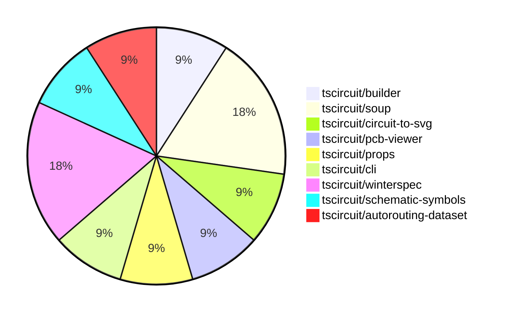

# contribution-tracker

Generates weekly contribution overviews for tscircuit contributors. Check out all
the [contribution overviews here](./contribution-overviews/)

* All PRs in the tscircuit org are scanned/summarized via Claude Haiku
* Claude classifies each Diff/PR as a Major, Minor or Tiny contribution
* All the PRs, summaries, and classifications are organized into charts and tables

The current week is shown below. There are 3 major sections:

* [Contributor Overview](#contributor-overview)
* [PRs by Repository](#prs-by-repository)
* [PRs by Contributor](#changes-by-contributor)

## Current Week

<!-- START_CURRENT_WEEK -->

# Contribution Overview 2024-08-10

## PRs by Repository

## Contributor Overview

| Contributor | 🐳 Major | 🐙 Minor | 🐌 Tiny |
|-------------|-------|-------|-------|
| abhijitxy | 1 | 0 | 0 |
| imrishabh18 | 2 | 3 | 0 |
| seveibar | 3 | 1 | 0 |
| angelacaq | 1 | 0 | 0 |

## Changes by Repository

### [tscircuit/builder](https://github.com/tscircuit/builder)

| PR # | Impact | Contributor | Description |
|------|--------|-------------|-------------|
| [#97](https://github.com/tscircuit/builder/pull/97) | 🐳 Major | abhijitxy | Add a test to replicate the issue of duplicate port hints for a bug with "soic8" footprint. |

### [tscircuit/soup](https://github.com/tscircuit/soup)

| PR # | Impact | Contributor | Description |
|------|--------|-------------|-------------|
| [#18](https://github.com/tscircuit/soup/pull/18) | 🐳 Major | imrishabh18 | Introduce a new "pcb_keepout" feature to the project. |
| [#19](https://github.com/tscircuit/soup/pull/19) | 🐙 Minor | imrishabh18 | Add an optional `trace_width` field to the `pcb_trace_hint` schema. |

### [tscircuit/circuit-to-svg](https://github.com/tscircuit/circuit-to-svg)

| PR # | Impact | Contributor | Description |
|------|--------|-------------|-------------|
| [#12](https://github.com/tscircuit/circuit-to-svg/pull/12) | 🐳 Major | imrishabh18 | Adds support for schematic ports, flips the schematic in the Y-axis to match the schematic-viewer, and creates lines connecting the ports to the component edges. |

### [tscircuit/pcb-viewer](https://github.com/tscircuit/pcb-viewer)

| PR # | Impact | Contributor | Description |
|------|--------|-------------|-------------|
| [#34](https://github.com/tscircuit/pcb-viewer/pull/34) | 🐙 Minor | imrishabh18 | Fix TypeScript import issues in several components |

### [tscircuit/props](https://github.com/tscircuit/props)

| PR # | Impact | Contributor | Description |
|------|--------|-------------|-------------|
| [#16](https://github.com/tscircuit/props/pull/16) | 🐙 Minor | imrishabh18 | Introduced a new `traceWidth` property in the `traceHintProps` type. |

### [tscircuit/cli](https://github.com/tscircuit/cli)

| PR # | Impact | Contributor | Description |
|------|--------|-------------|-------------|
| [#120](https://github.com/tscircuit/cli/pull/120) | 🐳 Major | seveibar | This pull request performs a major refactor of the project, including reorganizing the codebase into four main directories, fixing all types, improving imports, and improving overall project organization. |

### [tscircuit/winterspec](https://github.com/tscircuit/winterspec)

| PR # | Impact | Contributor | Description |
|------|--------|-------------|-------------|
| [#7](https://github.com/tscircuit/winterspec/pull/7) | 🐳 Major | seveibar | Adds the ability to pass custom middleware options when making a request against a Winter Spec bundle. |
| [#6](https://github.com/tscircuit/winterspec/pull/6) | 🐙 Minor | seveibar | Add support for fetch middleware |

### [tscircuit/schematic-symbols](https://github.com/tscircuit/schematic-symbols)

| PR # | Impact | Contributor | Description |
|------|--------|-------------|-------------|
| [#2](https://github.com/tscircuit/schematic-symbols/pull/2) | 🐳 Major | seveibar | Added a new symbol for a fuse in both horizontal and vertical orientations. |

### [tscircuit/autorouting-dataset](https://github.com/tscircuit/autorouting-dataset)

| PR # | Impact | Contributor | Description |
|------|--------|-------------|-------------|
| [#22](https://github.com/tscircuit/autorouting-dataset/pull/22) | 🐳 Major | angelacaq | Introduces a new algorithm, the Jump Point Finder, to improve the speed of the grid solver for distant-single-trace routing. |

## Changes by Contributor

### [abhijitxy](https://github.com/abhijitxy)

| PR # | Impact | Description |
|------|--------|-------------|
| [#97](https://github.com/tscircuit/builder/pull/97) | 🐳 Major | Add a test to replicate the issue of duplicate port hints for a bug with "soic8" footprint. |

### [imrishabh18](https://github.com/imrishabh18)

| PR # | Impact | Description |
|------|--------|-------------|
| [#18](https://github.com/tscircuit/soup/pull/18) | 🐳 Major | Introduce a new "pcb_keepout" feature to the project. |
| [#12](https://github.com/tscircuit/circuit-to-svg/pull/12) | 🐳 Major | Adds support for schematic ports, flips the schematic in the Y-axis to match the schematic-viewer, and creates lines connecting the ports to the component edges. |
| [#34](https://github.com/tscircuit/pcb-viewer/pull/34) | 🐙 Minor | Fix TypeScript import issues in several components |
| [#19](https://github.com/tscircuit/soup/pull/19) | 🐙 Minor | Add an optional `trace_width` field to the `pcb_trace_hint` schema. |
| [#16](https://github.com/tscircuit/props/pull/16) | 🐙 Minor | Introduced a new `traceWidth` property in the `traceHintProps` type. |

### [seveibar](https://github.com/seveibar)

| PR # | Impact | Description |
|------|--------|-------------|
| [#120](https://github.com/tscircuit/cli/pull/120) | 🐳 Major | This pull request performs a major refactor of the project, including reorganizing the codebase into four main directories, fixing all types, improving imports, and improving overall project organization. |
| [#7](https://github.com/tscircuit/winterspec/pull/7) | 🐳 Major | Adds the ability to pass custom middleware options when making a request against a Winter Spec bundle. |
| [#2](https://github.com/tscircuit/schematic-symbols/pull/2) | 🐳 Major | Added a new symbol for a fuse in both horizontal and vertical orientations. |
| [#6](https://github.com/tscircuit/winterspec/pull/6) | 🐙 Minor | Add support for fetch middleware |

### [angelacaq](https://github.com/angelacaq)

| PR # | Impact | Description |
|------|--------|-------------|
| [#22](https://github.com/tscircuit/autorouting-dataset/pull/22) | 🐳 Major | Introduces a new algorithm, the Jump Point Finder, to improve the speed of the grid solver for distant-single-trace routing. |

<!-- END_CURRENT_WEEK -->
