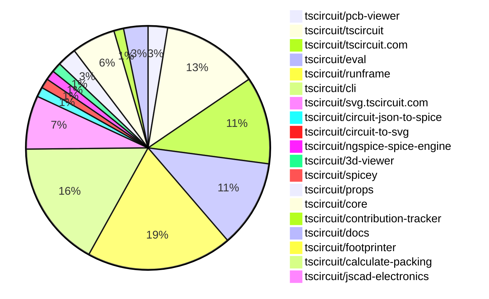
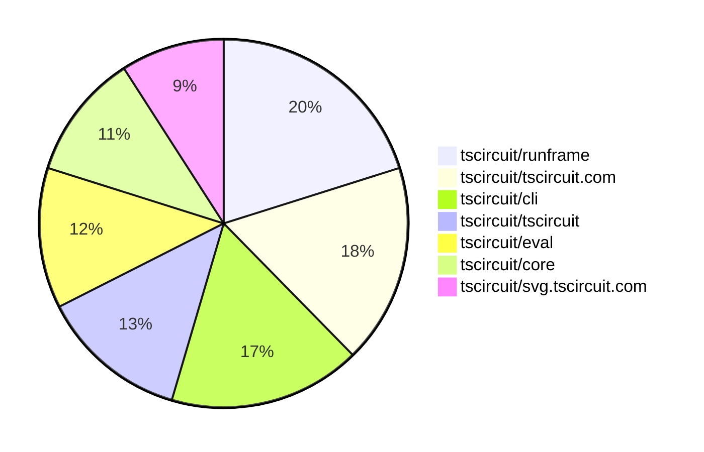

# contribution-tracker

[contributions.tscircuit.com](https://contributions.tscircuit.com) ・ [tscircuit.com](https://tscircuit.com) ・ [Contribution Overviews](./contribution-overviews/) ・ [Changelogs](./changelogs/)

Generates weekly contribution overviews for tscircuit contributors. Check out all
the [contribution overviews here](./contribution-overviews/)
You can find AI-generated monthly changelogs in the [changelogs directory](./changelogs/).

- All PRs in the tscircuit org are scanned/summarized via an LLM
- The LLM classifies each Diff/PR as into a set of attributes for scoring
- All the PRs, summaries, and classifications are organized into charts and tables for [the website](https://contributions.tscircuit.com)

> Want to run locally? See the [Development Section](#development)

The current week is shown below. There are 3 major sections:

- [Contributor Overview](#contributor-overview)
- [PRs by Repository](#prs-by-repository)
- [PRs by Contributor](#changes-by-contributor)

## Current Week

<!-- START_CURRENT_WEEK -->

# Contribution Overview 2025-10-22

## PRs by Repository



## Contributor Overview

| Contributor | 🐳 Major | 🐙 Minor | 🐌 Tiny | ⭐ | Score | Discussion Contributions |
|-------------|---------|---------|---------|-----|----------------|--------------------------|
| [seveibar](#seveibar) | 2 | 11 | 6 | ⭐⭐⭐ | 48 | 1🔹 0🔶 0💎 |
| [imrishabh18](#imrishabh18) | 3 | 4 | 3 | ⭐⭐ | 25 | 0🔹 0🔶 0💎 |
| [tscircuitbot](#tscircuitbot) | 0 | 0 | 108 | ⭐⭐ | 13.5 | 0🔹 0🔶 0💎 |
| [ArnavK-09](#ArnavK-09) | 2 | 0 | 4 | ⭐⭐ | 13 | 1🔹 0🔶 0💎 |
| [ShiboSoftwareDev](#ShiboSoftwareDev) | 0 | 2 | 2 | ⭐ | 10 | 0🔹 0🔶 0💎 |
| [techmannih](#techmannih) | 0 | 0 | 2 | ⭐ | 8 | 0🔹 0🔶 0💎 |
| [pxlpal](#pxlpal) | 0 | 1 | 2 | ⭐ | 4 | 0🔹 0🔶 0💎 |
| [MustafaMulla29](#MustafaMulla29) | 0 | 1 | 0 |  | 3 | 0🔹 0🔶 0💎 |
| [Abse2001](#Abse2001) | 0 | 1 | 0 |  | 3 | 0🔹 0🔶 0💎 |
| [joncherry](#joncherry) | 0 | 0 | 1 |  | 2 | 0🔹 0🔶 0💎 |
| [nailoo](#nailoo) | 0 | 0 | 1 |  | 2 | 0🔹 0🔶 0💎 |
| [Ayushjhawar8](#Ayushjhawar8) | 0 | 0 | 2 |  | 2 | 0🔹 0🔶 0💎 |
| [zojize](#zojize) | 0 | 0 | 1 |  | 1 | 0🔹 0🔶 0💎 |
| [Anshgrover23](#Anshgrover23) | 0 | 0 | 0 |  | 0 | 1🔹 0🔶 0💎 |

### Discussion Contribution Legend

- 🔹 Normal Comments: Basic participation with minimal effort
- 🔶 Great Informative Comments: Thoughtful participation that adds value
- 💎 Incredible Comments: Exceptional participation with high-quality content

## Review Table

[reviews-received-hover]: ## "Number of reviews received for PRs for this contributor"
[approvals-received-hover]: ## "Number of approvals received for PRs this contributor authored"
[rejections-received-hover]: ## "Number of rejections received for PRs this contributor authored"
[prs-opened-hover]: ## "Number of PRs opened by this contributor"
[issues-created-hover]: ## "Number of issues created by this contributor"
[bountied-issues-hover]: ## "Number of issues this contributor created with a bounty"
[bountied-issue-$-hover]: ## "Total bounty amount placed on issues authored by this contributor"

| Contributor | Reviews Received | Approvals Received | Rejections Received | Approvals | Rejections | PRs Opened | PRs Merged | Score | Issues Created | Bountied Issues | Bountied Issue $ |
|---|---|---|---|---|---|---|---|---|---|---|---|
| [Excellencedev](#Excellencedev) | 2 | 0 | 1 | 0 | 0 | 1 | 0 | 0 | 0 | 0 | 0 |
| [nailoo](#nailoo) | 3 | 2 | 0 | 0 | 0 | 1 | 1 | 2 | 0 | 0 | 0 |
| [techmannih](#techmannih) | 2 | 2 | 0 | 2 | 1 | 4 | 2 | 8 | 0 | 0 | 0 |
| [tscircuitbot](#tscircuitbot) | 0 | 0 | 0 | 0 | 0 | 122 | 108 | 13.5 | 0 | 0 | 0 |
| [ShiboSoftwareDev](#ShiboSoftwareDev) | 25 | 3 | 3 | 3 | 0 | 6 | 4 | 10 | 0 | 0 | 0 |
| [seveibar](#seveibar) | 12 | 5 | 0 | 23 | 5 | 24 | 20 | 48 | 0 | 0 | 0 |
| [Abse2001](#Abse2001) | 2 | 2 | 0 | 1 | 0 | 5 | 1 | 3 | 0 | 0 | 0 |
| [joncherry](#joncherry) | 13 | 3 | 1 | 0 | 0 | 2 | 1 | 2 | 0 | 0 | 0 |
| [MustafaMulla29](#MustafaMulla29) | 2 | 1 | 0 | 1 | 0 | 1 | 1 | 3 | 0 | 0 | 0 |
| [saurabhraghuvanshii](#saurabhraghuvanshii) | 3 | 0 | 0 | 0 | 0 | 1 | 0 | 0 | 0 | 0 | 0 |
| [Aqil-Ahmad](#Aqil-Ahmad) | 4 | 0 | 0 | 0 | 0 | 2 | 0 | 0 | 0 | 0 | 0 |
| [baeoc](#baeoc) | 0 | 0 | 0 | 0 | 0 | 1 | 0 | 0 | 0 | 0 | 0 |
| [rushabhcodes](#rushabhcodes) | 1 | 0 | 0 | 0 | 0 | 1 | 0 | 0 | 0 | 0 | 0 |
| [imrishabh18](#imrishabh18) | 9 | 5 | 0 | 0 | 2 | 12 | 10 | 25 | 0 | 0 | 0 |
| [Pranjal6955](#Pranjal6955) | 2 | 0 | 0 | 0 | 0 | 1 | 0 | 0 | 0 | 0 | 0 |
| [7908837174](#7908837174) | 1 | 0 | 0 | 0 | 0 | 1 | 0 | 0 | 0 | 0 | 0 |
| [RaghavArora14](#RaghavArora14) | 4 | 0 | 0 | 0 | 0 | 2 | 0 | 0 | 0 | 0 | 0 |
| [dhvll](#dhvll) | 0 | 0 | 0 | 0 | 0 | 1 | 0 | 0 | 0 | 0 | 0 |
| [ArnavK-09](#ArnavK-09) | 8 | 2 | 1 | 1 | 0 | 7 | 6 | 13 | 0 | 0 | 0 |
| [Sahelisaha04](#Sahelisaha04) | 0 | 0 | 0 | 0 | 0 | 1 | 0 | 0 | 0 | 0 | 0 |
| [zojize](#zojize) | 1 | 1 | 0 | 0 | 0 | 1 | 1 | 1 | 0 | 0 | 0 |
| [Ayushjhawar8](#Ayushjhawar8) | 3 | 2 | 0 | 0 | 0 | 2 | 2 | 2 | 0 | 0 | 0 |
| [brymut](#brymut) | 10 | 0 | 1 | 0 | 0 | 1 | 0 | 0 | 0 | 0 | 0 |
| [Asymtode712](#Asymtode712) | 0 | 0 | 0 | 0 | 0 | 1 | 0 | 0 | 0 | 0 | 0 |
| [pxlpal](#pxlpal) | 3 | 3 | 0 | 0 | 0 | 4 | 3 | 4 | 0 | 0 | 0 |
| [7secondsquests-prog](#7secondsquests-prog) | 1 | 0 | 1 | 0 | 0 | 1 | 0 | 0 | 0 | 0 | 0 |
| [colmwoods](#colmwoods) | 0 | 0 | 0 | 0 | 0 | 1 | 0 | 0 | 0 | 0 | 0 |
| [1914Jegx](#1914Jegx) | 0 | 0 | 0 | 0 | 0 | 2 | 0 | 0 | 0 | 0 | 0 |
| [MayorChristopher](#MayorChristopher) | 0 | 0 | 0 | 0 | 0 | 1 | 0 | 0 | 0 | 0 | 0 |
| [Anshgrover23](#Anshgrover23) | 0 | 0 | 0 | 0 | 0 | 0 | 0 | 1 | 0 | 0 | 0 |

## Top 7 Repositories by Contribution Points



## Changes by Repository

### [tscircuit/pcb-viewer](https://github.com/tscircuit/pcb-viewer)

| PR # | Impact | Rating | Contributor | Description |
|------|--------|--------|-------------|-------------|
| [#427](https://github.com/tscircuit/pcb-viewer/pull/427) | 🐙 Minor | ⭐⭐ | ShiboSoftwareDev | Fixes incorrect rendering of pcb_note colors by utilizing a color library for parsing CSS color strings, ensuring proper display of colors instead of only on hover. |
| [#423](https://github.com/tscircuit/pcb-viewer/pull/423) | 🐙 Minor | ⭐⭐ | seveibar | Adds support for lowercase text in PCB notes by importing an updated alphabet dataset and modifying the text rendering logic accordingly. |

<details>
<summary>🐌 Tiny Contributions (2)</summary>

| PR # | Impact | Contributor | Description |
|------|--------|-------------|-------------|
| [#428](https://github.com/tscircuit/pcb-viewer/pull/428) | 🐌 Tiny | tscircuitbot | Automated package update |
| [#424](https://github.com/tscircuit/pcb-viewer/pull/424) | 🐌 Tiny | tscircuitbot | Automated package update |

</details>

### [tscircuit/tscircuit](https://github.com/tscircuit/tscircuit)


<details>
<summary>🐌 Tiny Contributions (20)</summary>

| PR # | Impact | Contributor | Description |
|------|--------|-------------|-------------|
| [#1155](https://github.com/tscircuit/tscircuit/pull/1155) | 🐌 Tiny | tscircuitbot | Updates the package version from 0.0.810 to 0.0.811 in package.json |
| [#1154](https://github.com/tscircuit/tscircuit/pull/1154) | 🐌 Tiny | tscircuitbot | Automated package update |
| [#1153](https://github.com/tscircuit/tscircuit/pull/1153) | 🐌 Tiny | tscircuitbot | Automated package update |
| [#1152](https://github.com/tscircuit/tscircuit/pull/1152) | 🐌 Tiny | tscircuitbot | Automated package update |
| [#1148](https://github.com/tscircuit/tscircuit/pull/1148) | 🐌 Tiny | tscircuitbot | Automated package update |
| [#1147](https://github.com/tscircuit/tscircuit/pull/1147) | 🐌 Tiny | tscircuitbot | Automated package update |
| [#1146](https://github.com/tscircuit/tscircuit/pull/1146) | 🐌 Tiny | tscircuitbot | Automated package update |
| [#1145](https://github.com/tscircuit/tscircuit/pull/1145) | 🐌 Tiny | tscircuitbot | Updates the versions of several dependencies in the package.json file, including tscircuitcli, tscircuitcore, and tscircuiteval. |
| [#1144](https://github.com/tscircuit/tscircuit/pull/1144) | 🐌 Tiny | tscircuitbot | Automated package update |
| [#1143](https://github.com/tscircuit/tscircuit/pull/1143) | 🐌 Tiny | tscircuitbot | Automated package update |
| [#1142](https://github.com/tscircuit/tscircuit/pull/1142) | 🐌 Tiny | tscircuitbot | Automated package update |
| [#1141](https://github.com/tscircuit/tscircuit/pull/1141) | 🐌 Tiny | tscircuitbot | Automated package update |
| [#1139](https://github.com/tscircuit/tscircuit/pull/1139) | 🐌 Tiny | tscircuitbot | Updates the tscircuitcli package from version 0.1.379 to 0.1.380 and the tscircuitrunframe package from version 0.0.1143 to 0.0.1144 in package.json |
| [#1138](https://github.com/tscircuit/tscircuit/pull/1138) | 🐌 Tiny | tscircuitbot | Automated package update |
| [#1137](https://github.com/tscircuit/tscircuit/pull/1137) | 🐌 Tiny | tscircuitbot | Automated package update |
| [#1136](https://github.com/tscircuit/tscircuit/pull/1136) | 🐌 Tiny | tscircuitbot | Automated package update |
| [#1135](https://github.com/tscircuit/tscircuit/pull/1135) | 🐌 Tiny | tscircuitbot | Automated package update |
| [#1133](https://github.com/tscircuit/tscircuit/pull/1133) | 🐌 Tiny | tscircuitbot | Automated package update |
| [#1132](https://github.com/tscircuit/tscircuit/pull/1132) | 🐌 Tiny | tscircuitbot | Automated package update |
| [#1131](https://github.com/tscircuit/tscircuit/pull/1131) | 🐌 Tiny | seveibar | Adds resvgresvg-js as a dependency to the project. |

</details>

### [tscircuit/tscircuit.com](https://github.com/tscircuit/tscircuit.com)

| PR # | Impact | Rating | Contributor | Description |
|------|--------|--------|-------------|-------------|
| [#1836](https://github.com/tscircuit/tscircuit.com/pull/1836) | 🐳 Major | ⭐⭐⭐ | imrishabh18 | Fixes session management by ensuring that the session is invalidated after a user signs out, preventing unauthorized access with stale session tokens. |
| [#1852](https://github.com/tscircuit/tscircuit.com/pull/1852) | 🐳 Major | ⭐⭐⭐ | ArnavK-09 | Adds support for a display name in organization settings, including database schema updates, organization creation logic, and UI modifications to display the new field. |
| [#1844](https://github.com/tscircuit/tscircuit.com/pull/1844) | 🐳 Major | ⭐⭐⭐ | ArnavK-09 | Adds functionality to update organization member permissions via API, including permission checks and error handling for various scenarios. |

<details>
<summary>🐌 Tiny Contributions (15)</summary>

| PR # | Impact | Contributor | Description |
|------|--------|-------------|-------------|
| [#1853](https://github.com/tscircuit/tscircuit.com/pull/1853) | 🐌 Tiny | tscircuitbot | Updates the package version from 0.0.126 to 0.0.127 in package.json |
| [#1851](https://github.com/tscircuit/tscircuit.com/pull/1851) | 🐌 Tiny | tscircuitbot | Updates the tscircuiteval package to version 0.0.424 in the package.json file |
| [#1850](https://github.com/tscircuit/tscircuit.com/pull/1850) | 🐌 Tiny | tscircuitbot | Updates the tscircuiteval package from version 0.0.422 to 0.0.423 |
| [#1849](https://github.com/tscircuit/tscircuit.com/pull/1849) | 🐌 Tiny | tscircuitbot | Updates the tscircuiteval package from version 0.0.421 to 0.0.422 |
| [#1848](https://github.com/tscircuit/tscircuit.com/pull/1848) | 🐌 Tiny | tscircuitbot | Automated package update |
| [#1847](https://github.com/tscircuit/tscircuit.com/pull/1847) | 🐌 Tiny | tscircuitbot | Automated package update |
| [#1845](https://github.com/tscircuit/tscircuit.com/pull/1845) | 🐌 Tiny | tscircuitbot | Automated package update to version 0.0.125 |
| [#1842](https://github.com/tscircuit/tscircuit.com/pull/1842) | 🐌 Tiny | tscircuitbot | Updates the tscircuiteval package from version 0.0.419 to 0.0.420 |
| [#1840](https://github.com/tscircuit/tscircuit.com/pull/1840) | 🐌 Tiny | tscircuitbot | Automated package update |
| [#1838](https://github.com/tscircuit/tscircuit.com/pull/1838) | 🐌 Tiny | tscircuitbot | Automated package update |
| [#1837](https://github.com/tscircuit/tscircuit.com/pull/1837) | 🐌 Tiny | tscircuitbot | Automated package update to version 0.0.124 |
| [#1834](https://github.com/tscircuit/tscircuit.com/pull/1834) | 🐌 Tiny | tscircuitbot | Automated package update |
| [#1843](https://github.com/tscircuit/tscircuit.com/pull/1843) | 🐌 Tiny | ArnavK-09 | Fixes saving issues related to package files by allowing POST requests and adjusting cache settings for better data handling. |
| [#1841](https://github.com/tscircuit/tscircuit.com/pull/1841) | 🐌 Tiny | ArnavK-09 | Ensures uniform button widths in the NotFound component for consistent layout. |
| [#1839](https://github.com/tscircuit/tscircuit.com/pull/1839) | 🐌 Tiny | ArnavK-09 | Updates the return value in the useListOrgMembers hook to align with the API response by changing data.members to data.org_members. |

</details>

### [tscircuit/eval](https://github.com/tscircuit/eval)

| PR # | Impact | Rating | Contributor | Description |
|------|--------|--------|-------------|-------------|
| [#1359](https://github.com/tscircuit/eval/pull/1359) | 🐙 Minor | ⭐⭐ | seveibar | Skip import type statements when collecting dependency names and add a regression test to ensure type-only imports do not trigger circular detection. |

<details>
<summary>🐌 Tiny Contributions (17)</summary>

| PR # | Impact | Contributor | Description |
|------|--------|-------------|-------------|
| [#1384](https://github.com/tscircuit/eval/pull/1384) | 🐌 Tiny | tscircuitbot | Automated package update |
| [#1383](https://github.com/tscircuit/eval/pull/1383) | 🐌 Tiny | tscircuitbot | Updates the version of the tscircuitcore package from 0.0.820 to 0.0.821 in package.json |
| [#1381](https://github.com/tscircuit/eval/pull/1381) | 🐌 Tiny | tscircuitbot | Automated package update |
| [#1380](https://github.com/tscircuit/eval/pull/1380) | 🐌 Tiny | tscircuitbot | Automated package update |
| [#1378](https://github.com/tscircuit/eval/pull/1378) | 🐌 Tiny | tscircuitbot | Automated package update |
| [#1377](https://github.com/tscircuit/eval/pull/1377) | 🐌 Tiny | tscircuitbot | Updates the version of the tscircuitcore package from 0.0.818 to 0.0.819 in package.json |
| [#1375](https://github.com/tscircuit/eval/pull/1375) | 🐌 Tiny | tscircuitbot | Automated package update |
| [#1374](https://github.com/tscircuit/eval/pull/1374) | 🐌 Tiny | tscircuitbot | Automated package update |
| [#1372](https://github.com/tscircuit/eval/pull/1372) | 🐌 Tiny | tscircuitbot | Automated package update |
| [#1371](https://github.com/tscircuit/eval/pull/1371) | 🐌 Tiny | tscircuitbot | Updates the version of the tscircuitcore package from 0.0.816 to 0.0.817 in package.json |
| [#1369](https://github.com/tscircuit/eval/pull/1369) | 🐌 Tiny | tscircuitbot | Automated package update |
| [#1368](https://github.com/tscircuit/eval/pull/1368) | 🐌 Tiny | tscircuitbot | Automated package update |
| [#1366](https://github.com/tscircuit/eval/pull/1366) | 🐌 Tiny | tscircuitbot | Automated package update |
| [#1365](https://github.com/tscircuit/eval/pull/1365) | 🐌 Tiny | tscircuitbot | Updates the version of the tscircuitcore package from 0.0.813 to 0.0.815 in package.json |
| [#1363](https://github.com/tscircuit/eval/pull/1363) | 🐌 Tiny | tscircuitbot | Automated package update |
| [#1362](https://github.com/tscircuit/eval/pull/1362) | 🐌 Tiny | tscircuitbot | Automated package update |
| [#1264](https://github.com/tscircuit/eval/pull/1264) | 🐌 Tiny | zojize | Fixes flakiness in tests caused by improper handling of async function clearEventListeners, ensuring reliable test results. |

</details>

### [tscircuit/runframe](https://github.com/tscircuit/runframe)

| PR # | Impact | Rating | Contributor | Description |
|------|--------|--------|-------------|-------------|
| [#1542](https://github.com/tscircuit/runframe/pull/1542) | 🐙 Minor | ⭐⭐ | seveibar | Fixes the bug report dialog to always link to the production bug report viewer. |

<details>
<summary>🐌 Tiny Contributions (29)</summary>

| PR # | Impact | Contributor | Description |
|------|--------|-------------|-------------|
| [#1559](https://github.com/tscircuit/runframe/pull/1559) | 🐌 Tiny | tscircuitbot | Automated package update |
| [#1558](https://github.com/tscircuit/runframe/pull/1558) | 🐌 Tiny | tscircuitbot | Updates the tscircuitpcb-viewer package from version 1.11.237 to 1.11.238 |
| [#1557](https://github.com/tscircuit/runframe/pull/1557) | 🐌 Tiny | tscircuitbot | Updates the package version from 0.0.1148 to 0.0.1149 in package.json |
| [#1556](https://github.com/tscircuit/runframe/pull/1556) | 🐌 Tiny | tscircuitbot | Updates the tscircuiteval package to version 0.0.424 in the package.json file. |
| [#1555](https://github.com/tscircuit/runframe/pull/1555) | 🐌 Tiny | tscircuitbot | Updates the package version from 0.0.1147 to 0.0.1148 in package.json |
| [#1554](https://github.com/tscircuit/runframe/pull/1554) | 🐌 Tiny | tscircuitbot | Updates the tscircuiteval package to version 0.0.423 |
| [#1553](https://github.com/tscircuit/runframe/pull/1553) | 🐌 Tiny | tscircuitbot | Updates the package version from 0.0.1146 to 0.0.1147 in package.json |
| [#1552](https://github.com/tscircuit/runframe/pull/1552) | 🐌 Tiny | tscircuitbot | Updates the tscircuiteval package to version 0.0.422 in the package.json file. |
| [#1551](https://github.com/tscircuit/runframe/pull/1551) | 🐌 Tiny | tscircuitbot | Updates the package version from 0.0.1145 to 0.0.1146 in package.json |
| [#1550](https://github.com/tscircuit/runframe/pull/1550) | 🐌 Tiny | tscircuitbot | Updates the tscircuiteval package to version 0.0.421 in the package.json file. |
| [#1549](https://github.com/tscircuit/runframe/pull/1549) | 🐌 Tiny | tscircuitbot | Automated package update |
| [#1548](https://github.com/tscircuit/runframe/pull/1548) | 🐌 Tiny | tscircuitbot | Automated package update |
| [#1547](https://github.com/tscircuit/runframe/pull/1547) | 🐌 Tiny | tscircuitbot | Automated package update |
| [#1546](https://github.com/tscircuit/runframe/pull/1546) | 🐌 Tiny | tscircuitbot | Automated package update |
| [#1545](https://github.com/tscircuit/runframe/pull/1545) | 🐌 Tiny | tscircuitbot | Updates the tscircuiteval package to version 0.0.420 |
| [#1544](https://github.com/tscircuit/runframe/pull/1544) | 🐌 Tiny | tscircuitbot | Automated package update |
| [#1543](https://github.com/tscircuit/runframe/pull/1543) | 🐌 Tiny | tscircuitbot | Updates the tscircuiteval package to version 0.0.419 in the package.json file. |
| [#1541](https://github.com/tscircuit/runframe/pull/1541) | 🐌 Tiny | tscircuitbot | Automated package update |
| [#1540](https://github.com/tscircuit/runframe/pull/1540) | 🐌 Tiny | tscircuitbot | Updates the tscircuiteval package from version 0.0.416 to 0.0.418 |
| [#1539](https://github.com/tscircuit/runframe/pull/1539) | 🐌 Tiny | tscircuitbot | Automated package update to version 0.0.1140 |
| [#1537](https://github.com/tscircuit/runframe/pull/1537) | 🐌 Tiny | tscircuitbot | Automated package update |
| [#1536](https://github.com/tscircuit/runframe/pull/1536) | 🐌 Tiny | tscircuitbot | Automated package update |
| [#1532](https://github.com/tscircuit/runframe/pull/1532) | 🐌 Tiny | tscircuitbot | Updates the tscircuit3d-viewer package from version 0.0.418 to 0.0.419 |
| [#1530](https://github.com/tscircuit/runframe/pull/1530) | 🐌 Tiny | tscircuitbot | Updates the tscircuiteval package from version 0.0.415 to 0.0.416 |
| [#1529](https://github.com/tscircuit/runframe/pull/1529) | 🐌 Tiny | tscircuitbot | Updates the tscircuitpcb-viewer package from version 1.11.236 to 1.11.237 |
| [#1535](https://github.com/tscircuit/runframe/pull/1535) | 🐌 Tiny | imrishabh18 | This pull request adds the jose package to the project to resolve issues related to publishing. |
| [#1534](https://github.com/tscircuit/runframe/pull/1534) | 🐌 Tiny | imrishabh18 | This pull request addresses issues with the lockfile used for publishing, ensuring that dependencies are correctly resolved and that the project can be published without errors. |
| [#1538](https://github.com/tscircuit/runframe/pull/1538) | 🐌 Tiny | Ayushjhawar8 | Removes the duplicate dependency jose from the package.json file. |
| [#1533](https://github.com/tscircuit/runframe/pull/1533) | 🐌 Tiny | Ayushjhawar8 | Try to address these point img width828 height547 altimage srchttps:github.comuser-attachmentsassets13ea2a8e-6e03-466c-b989-ce963ec0ba91 |

</details>

### [tscircuit/cli](https://github.com/tscircuit/cli)


<details>
<summary>🐌 Tiny Contributions (26)</summary>

| PR # | Impact | Contributor | Description |
|------|--------|-------------|-------------|
| [#717](https://github.com/tscircuit/cli/pull/717) | 🐌 Tiny | tscircuitbot | Automated package update |
| [#716](https://github.com/tscircuit/cli/pull/716) | 🐌 Tiny | tscircuitbot | Updates the tscircuitrunframe package from version 0.0.1149 to 0.0.1150 |
| [#715](https://github.com/tscircuit/cli/pull/715) | 🐌 Tiny | tscircuitbot | Automated package update |
| [#714](https://github.com/tscircuit/cli/pull/714) | 🐌 Tiny | tscircuitbot | Updates the tscircuitrunframe package from version 0.0.1148 to 0.0.1149 |
| [#713](https://github.com/tscircuit/cli/pull/713) | 🐌 Tiny | tscircuitbot | Automated package update |
| [#712](https://github.com/tscircuit/cli/pull/712) | 🐌 Tiny | tscircuitbot | Updates the tscircuitrunframe package from version 0.0.1147 to 0.0.1148 |
| [#711](https://github.com/tscircuit/cli/pull/711) | 🐌 Tiny | tscircuitbot | Automated package update |
| [#710](https://github.com/tscircuit/cli/pull/710) | 🐌 Tiny | tscircuitbot | Updates the tscircuitrunframe package to version 0.0.1147 in the package.json file. |
| [#709](https://github.com/tscircuit/cli/pull/709) | 🐌 Tiny | tscircuitbot | Automated package update |
| [#708](https://github.com/tscircuit/cli/pull/708) | 🐌 Tiny | tscircuitbot | Updates the tscircuitrunframe package to version 0.0.1146 |
| [#707](https://github.com/tscircuit/cli/pull/707) | 🐌 Tiny | tscircuitbot | Automated package update to version 0.1.381 |
| [#706](https://github.com/tscircuit/cli/pull/706) | 🐌 Tiny | tscircuitbot | Updates the tscircuitrunframe package from version 0.0.1144 to 0.0.1145 |
| [#705](https://github.com/tscircuit/cli/pull/705) | 🐌 Tiny | tscircuitbot | Automated package update |
| [#704](https://github.com/tscircuit/cli/pull/704) | 🐌 Tiny | tscircuitbot | Updates the tscircuitrunframe package from version 0.0.1143 to 0.0.1144 |
| [#703](https://github.com/tscircuit/cli/pull/703) | 🐌 Tiny | tscircuitbot | Automated package update |
| [#702](https://github.com/tscircuit/cli/pull/702) | 🐌 Tiny | tscircuitbot | Updates the tscircuitrunframe package to version 0.0.1143 in package.json |
| [#701](https://github.com/tscircuit/cli/pull/701) | 🐌 Tiny | tscircuitbot | Automated package update |
| [#700](https://github.com/tscircuit/cli/pull/700) | 🐌 Tiny | tscircuitbot | Updates the tscircuitrunframe package from version 0.0.1141 to 0.0.1142 |
| [#699](https://github.com/tscircuit/cli/pull/699) | 🐌 Tiny | tscircuitbot | Automated package update |
| [#698](https://github.com/tscircuit/cli/pull/698) | 🐌 Tiny | tscircuitbot | Updates the tscircuitrunframe package from version 0.0.1140 to 0.0.1141 |
| [#697](https://github.com/tscircuit/cli/pull/697) | 🐌 Tiny | tscircuitbot | Automated package update |
| [#696](https://github.com/tscircuit/cli/pull/696) | 🐌 Tiny | tscircuitbot | Updates the tscircuitrunframe package from version 0.0.1139 to 0.0.1140 |
| [#695](https://github.com/tscircuit/cli/pull/695) | 🐌 Tiny | tscircuitbot | Automated package update |
| [#694](https://github.com/tscircuit/cli/pull/694) | 🐌 Tiny | tscircuitbot | Updates the tscircuitrunframe package from version 0.0.1138 to 0.0.1139 |
| [#693](https://github.com/tscircuit/cli/pull/693) | 🐌 Tiny | tscircuitbot | Automated package update |
| [#692](https://github.com/tscircuit/cli/pull/692) | 🐌 Tiny | tscircuitbot | Updates the tscircuitrunframe package from version 0.0.1137 to 0.0.1138 |

</details>

### [tscircuit/svg.tscircuit.com](https://github.com/tscircuit/svg.tscircuit.com)

| PR # | Impact | Rating | Contributor | Description |
|------|--------|--------|-------------|-------------|
| [#480](https://github.com/tscircuit/svg.tscircuit.com/pull/480) | 🐳 Major | ⭐⭐⭐ | imrishabh18 | Switches the image rendering library from sharp to resvg and resolves a font rendering issue in PNG outputs on Vercel. |

<details>
<summary>🐌 Tiny Contributions (10)</summary>

| PR # | Impact | Contributor | Description |
|------|--------|-------------|-------------|
| [#492](https://github.com/tscircuit/svg.tscircuit.com/pull/492) | 🐌 Tiny | tscircuitbot | Updates the tscircuit package version from 0.0.810 to 0.0.811 in package.json |
| [#491](https://github.com/tscircuit/svg.tscircuit.com/pull/491) | 🐌 Tiny | tscircuitbot | Updates the tscircuit package version from 0.0.809 to 0.0.810 in package.json |
| [#490](https://github.com/tscircuit/svg.tscircuit.com/pull/490) | 🐌 Tiny | tscircuitbot | Updates the tscircuit package version from 0.0.808 to 0.0.809 in package.json |
| [#489](https://github.com/tscircuit/svg.tscircuit.com/pull/489) | 🐌 Tiny | tscircuitbot | Updates the tscircuit package version from 0.0.807 to 0.0.808 in package.json |
| [#488](https://github.com/tscircuit/svg.tscircuit.com/pull/488) | 🐌 Tiny | tscircuitbot | Automated package update |
| [#487](https://github.com/tscircuit/svg.tscircuit.com/pull/487) | 🐌 Tiny | tscircuitbot | Updates the tscircuit package version from 0.0.804 to 0.0.806 in package.json |
| [#486](https://github.com/tscircuit/svg.tscircuit.com/pull/486) | 🐌 Tiny | tscircuitbot | Updates the tscircuit package version from 0.0.803 to 0.0.804 in package.json |
| [#485](https://github.com/tscircuit/svg.tscircuit.com/pull/485) | 🐌 Tiny | tscircuitbot | Updates the tscircuit package version from 0.0.800 to 0.0.803 in package.json |
| [#483](https://github.com/tscircuit/svg.tscircuit.com/pull/483) | 🐌 Tiny | pxlpal | Updates the tscircuit dependency version from 0.0.798 to 0.0.800 in package.json |
| [#482](https://github.com/tscircuit/svg.tscircuit.com/pull/482) | 🐌 Tiny | techmannih | Updates the circuit-to-svg dependency to version 0.0.251 in the package.json file. |

</details>

### [tscircuit/circuit-json-to-spice](https://github.com/tscircuit/circuit-json-to-spice)

| PR # | Impact | Rating | Contributor | Description |
|------|--------|--------|-------------|-------------|
| [#16](https://github.com/tscircuit/circuit-json-to-spice/pull/16) | 🐙 Minor | ⭐⭐ | ShiboSoftwareDev | Adds the UIC (Use Initial Conditions) flag to the .tran command for transient analysis, ensuring SPICE simulators use specified initial conditions for simulations involving oscillators or switching circuits. |

<details>
<summary>🐌 Tiny Contributions (1)</summary>

| PR # | Impact | Contributor | Description |
|------|--------|-------------|-------------|
| [#17](https://github.com/tscircuit/circuit-json-to-spice/pull/17) | 🐌 Tiny | seveibar | Adds circuit-json as a development and peer dependency in the package.json file. |

</details>

### [tscircuit/circuit-to-svg](https://github.com/tscircuit/circuit-to-svg)

| PR # | Impact | Rating | Contributor | Description |
|------|--------|--------|-------------|-------------|
| [#399](https://github.com/tscircuit/circuit-to-svg/pull/399) | 🐙 Minor | ⭐⭐ | Abse2001 | Fixes potential crashes by safely handling undefined or non-numeric geometry values in PCB SVG rendering. |

<details>
<summary>🐌 Tiny Contributions (1)</summary>

| PR # | Impact | Contributor | Description |
|------|--------|-------------|-------------|
| [#397](https://github.com/tscircuit/circuit-to-svg/pull/397) | 🐌 Tiny | ShiboSoftwareDev | Updates the data points on simulation graphs to be solid dots instead of hollow circles and reduces their size for a cleaner appearance. |

</details>

### [tscircuit/ngspice-spice-engine](https://github.com/tscircuit/ngspice-spice-engine)


<details>
<summary>🐌 Tiny Contributions (2)</summary>

| PR # | Impact | Contributor | Description |
|------|--------|-------------|-------------|
| [#2](https://github.com/tscircuit/ngspice-spice-engine/pull/2) | 🐌 Tiny | ShiboSoftwareDev | Fixes broken tests that prevented publishing of the ngspice-spice-engine. |
| [#1](https://github.com/tscircuit/ngspice-spice-engine/pull/1) | 🐌 Tiny | seveibar | Bootstrap the Bun-based package configuration, workflows, and formatting setup; implement the ngspice spice engine wrapper with transient results parsing utilities; add unit tests covering transient parameter parsing and voltage graph extraction. |

</details>

### [tscircuit/3d-viewer](https://github.com/tscircuit/3d-viewer)

| PR # | Impact | Rating | Contributor | Description |
|------|--------|--------|-------------|-------------|
| [#533](https://github.com/tscircuit/3d-viewer/pull/533) | 🐳 Major | ⭐⭐⭐ | seveibar | Animate the camera orientation with quaternion slerp for smooth roll transitions between presets and derive intermediate targets from the interpolated orientation to update orbit controlsmatrices for stable animation. |
| [#538](https://github.com/tscircuit/3d-viewer/pull/538) | 🐙 Minor | ⭐⭐ | MustafaMulla29 | Fixes context menu positioning to prevent it from going off-screen and improves the styling for a more standard appearance. |

### [tscircuit/spicey](https://github.com/tscircuit/spicey)

| PR # | Impact | Rating | Contributor | Description |
|------|--------|--------|-------------|-------------|
| [#17](https://github.com/tscircuit/spicey/pull/17) | 🐳 Major | ⭐⭐⭐ | seveibar | Add a compareVoltageLevels fixture for measuring differences between voltage graphs and polyfill Bun fetch and WebAssembly helpers for eecircuit-engine to load its wasm in tests. |

### [tscircuit/props](https://github.com/tscircuit/props)

| PR # | Impact | Rating | Contributor | Description |
|------|--------|--------|-------------|-------------|
| [#470](https://github.com/tscircuit/props/pull/470) | 🐙 Minor | ⭐⭐ | seveibar | Add optional outerEdgeToEdge, centerToCenter, and innerEdgeToEdge flags to pcb and fabrication note dimension props and regenerate generated documentation to surface the new note dimension options |
| [#469](https://github.com/tscircuit/props/pull/469) | 🐙 Minor | ⭐⭐ | seveibar | Adds an optional width property to the trace props schema as an alias for thickness |
| [#467](https://github.com/tscircuit/props/pull/467) | 🐙 Minor | ⭐⭐ | seveibar | Allows trace  props to accept a new width distance and maps the parsed trace thickness to the provided width when no explicit thickness is supplied. |
| [#465](https://github.com/tscircuit/props/pull/465) | 🐙 Minor | ⭐⭐ | seveibar | Allows fabrication and PCB note dimension components to accept explicit units (in or mm) and regenerates component documentation to include the new units property. |

### [tscircuit/core](https://github.com/tscircuit/core)

| PR # | Impact | Rating | Contributor | Description |
|------|--------|--------|-------------|-------------|
| [#1564](https://github.com/tscircuit/core/pull/1564) | 🐙 Minor | ⭐⭐ | seveibar | Adds support for inch units in PCB and fabrication note dimensions, updating the formatting and tests accordingly. |
| [#1566](https://github.com/tscircuit/core/pull/1566) | 🐙 Minor | ⭐⭐ | seveibar | Adds support for using width as an alias for thickness in trace properties and handles cases where pcbPath may be empty or undefined. |
| [#1559](https://github.com/tscircuit/core/pull/1559) | 🐙 Minor | ⭐⭐ | seveibar | Infers has_stroke for fabrication note rectangles when only a stroke width is provided, ensuring correct rendering of stroke properties in PCB designs. |
| [#1555](https://github.com/tscircuit/core/pull/1555) | 🐙 Minor | ⭐⭐ | seveibar | Defaults PCB and fabrication note dimension text to the measured distance when no text is provided, formatting the generated text with whole numbers left as-is and other values rounded to two decimal places, and adds unit tests for the new behavior. |
| [#1570](https://github.com/tscircuit/core/pull/1570) | 🐙 Minor | ⭐⭐ | imrishabh18 | Fixes the mapping of facing_direction to the correct side_of_component values in the schematic layout. |
| [#1565](https://github.com/tscircuit/core/pull/1565) | 🐙 Minor | ⭐⭐ | imrishabh18 | Fixes autolayout issues for the pinHeader component when no explicit facingDirection is provided. |
| [#1563](https://github.com/tscircuit/core/pull/1563) | 🐙 Minor | ⭐⭐ | imrishabh18 | Prevents rotation of pinheaders in autolayout when facingDirection is specified, ensuring correct schematic representation. |
| [#1558](https://github.com/tscircuit/core/pull/1558) | 🐙 Minor | ⭐⭐ | imrishabh18 | Updates the calculate-packing library to version 0.0.50, enabling support for packing with outlines and improving the initial positioning of components on the board. |

<details>
<summary>🐌 Tiny Contributions (1)</summary>

| PR # | Impact | Contributor | Description |
|------|--------|-------------|-------------|
| [#1562](https://github.com/tscircuit/core/pull/1562) | 🐌 Tiny | imrishabh18 | Adds a test case to reproduce the issue where pinheader ports are floating away in schematic autolayout. |

</details>

### [tscircuit/contribution-tracker](https://github.com/tscircuit/contribution-tracker)


<details>
<summary>🐌 Tiny Contributions (2)</summary>

| PR # | Impact | Contributor | Description |
|------|--------|-------------|-------------|
| [#232](https://github.com/tscircuit/contribution-tracker/pull/232) | 🐌 Tiny | seveibar | Adds techmannih as a maintainer in the maintainers list. |
| [#240](https://github.com/tscircuit/contribution-tracker/pull/240) | 🐌 Tiny | ArnavK-09 | Swaps the icons and adjusts the priority levels for maintainers in the MaintainersList component, changing the visual representation and order of maintainers displayed. |

</details>

### [tscircuit/docs](https://github.com/tscircuit/docs)

| PR # | Impact | Rating | Contributor | Description |
|------|--------|--------|-------------|-------------|
| [#279](https://github.com/tscircuit/docs/pull/279) | 🐙 Minor | ⭐⭐ | pxlpal | Fixes the rendering issue of the fabrication note rectangle in the documentation. |

<details>
<summary>🐌 Tiny Contributions (4)</summary>

| PR # | Impact | Contributor | Description |
|------|--------|-------------|-------------|
| [#284](https://github.com/tscircuit/docs/pull/284) | 🐌 Tiny | seveibar | Documents the thickness trace property and adds an example for using it in direct routing. |
| [#283](https://github.com/tscircuit/docs/pull/283) | 🐌 Tiny | seveibar | Updates the documentation for the pcbnotedimension  component to remove hardcoded measurement strings and clarify the usage of the text property for overriding auto-generated labels. |
| [#278](https://github.com/tscircuit/docs/pull/278) | 🐌 Tiny | pxlpal | Updates category descriptions for various tscircuit Essentials guides to provide clearer information on their content and usage. |
| [#281](https://github.com/tscircuit/docs/pull/281) | 🐌 Tiny | techmannih | Adds documentation for the cornerRadius property in rectangular smtpad components, including an example of its usage. |

</details>

### [tscircuit/footprinter](https://github.com/tscircuit/footprinter)


<details>
<summary>🐌 Tiny Contributions (1)</summary>

| PR # | Impact | Contributor | Description |
|------|--------|-------------|-------------|
| [#372](https://github.com/tscircuit/footprinter/pull/372) | 🐌 Tiny | joncherry | Fixes the sorting of gallery items by name to ensure consistent order in the display. |

</details>

### [tscircuit/calculate-packing](https://github.com/tscircuit/calculate-packing)

| PR # | Impact | Rating | Contributor | Description |
|------|--------|--------|-------------|-------------|
| [#61](https://github.com/tscircuit/calculate-packing/pull/61) | 🐳 Major | ⭐⭐⭐ | imrishabh18 | Changes the initial placement of components to use the geometric centroid of the boundary outline, improving packing efficiency and ensuring components are placed within the defined boundaries. |

### [tscircuit/jscad-electronics](https://github.com/tscircuit/jscad-electronics)


<details>
<summary>🐌 Tiny Contributions (1)</summary>

| PR # | Impact | Contributor | Description |
|------|--------|-------------|-------------|
| [#154](https://github.com/tscircuit/jscad-electronics/pull/154) | 🐌 Tiny | nailoo | Adds support for the SMC electronic component model, including its 3D representation and integration into the existing footprint rendering system. |

</details>

## Changes by Contributor

### [tscircuitbot](https://github.com/tscircuitbot)


<details>
<summary>🐌 Tiny Contributions (108)</summary>

| PR # | Impact | Description |
|------|--------|-------------|
| [#428](https://github.com/tscircuit/pcb-viewer/pull/428) | 🐌 Tiny | Automated package update |
| [#424](https://github.com/tscircuit/pcb-viewer/pull/424) | 🐌 Tiny | Automated package update |
| [#1155](https://github.com/tscircuit/tscircuit/pull/1155) | 🐌 Tiny | Updates the package version from 0.0.810 to 0.0.811 in package.json |
| [#1154](https://github.com/tscircuit/tscircuit/pull/1154) | 🐌 Tiny | Automated package update |
| [#1153](https://github.com/tscircuit/tscircuit/pull/1153) | 🐌 Tiny | Automated package update |
| [#1152](https://github.com/tscircuit/tscircuit/pull/1152) | 🐌 Tiny | Automated package update |
| [#1148](https://github.com/tscircuit/tscircuit/pull/1148) | 🐌 Tiny | Automated package update |
| [#1147](https://github.com/tscircuit/tscircuit/pull/1147) | 🐌 Tiny | Automated package update |
| [#1146](https://github.com/tscircuit/tscircuit/pull/1146) | 🐌 Tiny | Automated package update |
| [#1145](https://github.com/tscircuit/tscircuit/pull/1145) | 🐌 Tiny | Updates the versions of several dependencies in the package.json file, including tscircuitcli, tscircuitcore, and tscircuiteval. |
| [#1144](https://github.com/tscircuit/tscircuit/pull/1144) | 🐌 Tiny | Automated package update |
| [#1143](https://github.com/tscircuit/tscircuit/pull/1143) | 🐌 Tiny | Automated package update |
| [#1142](https://github.com/tscircuit/tscircuit/pull/1142) | 🐌 Tiny | Automated package update |
| [#1141](https://github.com/tscircuit/tscircuit/pull/1141) | 🐌 Tiny | Automated package update |
| [#1139](https://github.com/tscircuit/tscircuit/pull/1139) | 🐌 Tiny | Updates the tscircuitcli package from version 0.1.379 to 0.1.380 and the tscircuitrunframe package from version 0.0.1143 to 0.0.1144 in package.json |
| [#1138](https://github.com/tscircuit/tscircuit/pull/1138) | 🐌 Tiny | Automated package update |
| [#1137](https://github.com/tscircuit/tscircuit/pull/1137) | 🐌 Tiny | Automated package update |
| [#1136](https://github.com/tscircuit/tscircuit/pull/1136) | 🐌 Tiny | Automated package update |
| [#1135](https://github.com/tscircuit/tscircuit/pull/1135) | 🐌 Tiny | Automated package update |
| [#1133](https://github.com/tscircuit/tscircuit/pull/1133) | 🐌 Tiny | Automated package update |
| [#1132](https://github.com/tscircuit/tscircuit/pull/1132) | 🐌 Tiny | Automated package update |
| [#1853](https://github.com/tscircuit/tscircuit.com/pull/1853) | 🐌 Tiny | Updates the package version from 0.0.126 to 0.0.127 in package.json |
| [#1851](https://github.com/tscircuit/tscircuit.com/pull/1851) | 🐌 Tiny | Updates the tscircuiteval package to version 0.0.424 in the package.json file |
| [#1850](https://github.com/tscircuit/tscircuit.com/pull/1850) | 🐌 Tiny | Updates the tscircuiteval package from version 0.0.422 to 0.0.423 |
| [#1849](https://github.com/tscircuit/tscircuit.com/pull/1849) | 🐌 Tiny | Updates the tscircuiteval package from version 0.0.421 to 0.0.422 |
| [#1848](https://github.com/tscircuit/tscircuit.com/pull/1848) | 🐌 Tiny | Automated package update |
| [#1847](https://github.com/tscircuit/tscircuit.com/pull/1847) | 🐌 Tiny | Automated package update |
| [#1845](https://github.com/tscircuit/tscircuit.com/pull/1845) | 🐌 Tiny | Automated package update to version 0.0.125 |
| [#1842](https://github.com/tscircuit/tscircuit.com/pull/1842) | 🐌 Tiny | Updates the tscircuiteval package from version 0.0.419 to 0.0.420 |
| [#1840](https://github.com/tscircuit/tscircuit.com/pull/1840) | 🐌 Tiny | Automated package update |
| [#1838](https://github.com/tscircuit/tscircuit.com/pull/1838) | 🐌 Tiny | Automated package update |
| [#1837](https://github.com/tscircuit/tscircuit.com/pull/1837) | 🐌 Tiny | Automated package update to version 0.0.124 |
| [#1834](https://github.com/tscircuit/tscircuit.com/pull/1834) | 🐌 Tiny | Automated package update |
| [#1384](https://github.com/tscircuit/eval/pull/1384) | 🐌 Tiny | Automated package update |
| [#1383](https://github.com/tscircuit/eval/pull/1383) | 🐌 Tiny | Updates the version of the tscircuitcore package from 0.0.820 to 0.0.821 in package.json |
| [#1381](https://github.com/tscircuit/eval/pull/1381) | 🐌 Tiny | Automated package update |
| [#1380](https://github.com/tscircuit/eval/pull/1380) | 🐌 Tiny | Automated package update |
| [#1378](https://github.com/tscircuit/eval/pull/1378) | 🐌 Tiny | Automated package update |
| [#1377](https://github.com/tscircuit/eval/pull/1377) | 🐌 Tiny | Updates the version of the tscircuitcore package from 0.0.818 to 0.0.819 in package.json |
| [#1375](https://github.com/tscircuit/eval/pull/1375) | 🐌 Tiny | Automated package update |
| [#1374](https://github.com/tscircuit/eval/pull/1374) | 🐌 Tiny | Automated package update |
| [#1372](https://github.com/tscircuit/eval/pull/1372) | 🐌 Tiny | Automated package update |
| [#1371](https://github.com/tscircuit/eval/pull/1371) | 🐌 Tiny | Updates the version of the tscircuitcore package from 0.0.816 to 0.0.817 in package.json |
| [#1369](https://github.com/tscircuit/eval/pull/1369) | 🐌 Tiny | Automated package update |
| [#1368](https://github.com/tscircuit/eval/pull/1368) | 🐌 Tiny | Automated package update |
| [#1366](https://github.com/tscircuit/eval/pull/1366) | 🐌 Tiny | Automated package update |
| [#1365](https://github.com/tscircuit/eval/pull/1365) | 🐌 Tiny | Updates the version of the tscircuitcore package from 0.0.813 to 0.0.815 in package.json |
| [#1363](https://github.com/tscircuit/eval/pull/1363) | 🐌 Tiny | Automated package update |
| [#1362](https://github.com/tscircuit/eval/pull/1362) | 🐌 Tiny | Automated package update |
| [#1559](https://github.com/tscircuit/runframe/pull/1559) | 🐌 Tiny | Automated package update |
| [#1558](https://github.com/tscircuit/runframe/pull/1558) | 🐌 Tiny | Updates the tscircuitpcb-viewer package from version 1.11.237 to 1.11.238 |
| [#1557](https://github.com/tscircuit/runframe/pull/1557) | 🐌 Tiny | Updates the package version from 0.0.1148 to 0.0.1149 in package.json |
| [#1556](https://github.com/tscircuit/runframe/pull/1556) | 🐌 Tiny | Updates the tscircuiteval package to version 0.0.424 in the package.json file. |
| [#1555](https://github.com/tscircuit/runframe/pull/1555) | 🐌 Tiny | Updates the package version from 0.0.1147 to 0.0.1148 in package.json |
| [#1554](https://github.com/tscircuit/runframe/pull/1554) | 🐌 Tiny | Updates the tscircuiteval package to version 0.0.423 |
| [#1553](https://github.com/tscircuit/runframe/pull/1553) | 🐌 Tiny | Updates the package version from 0.0.1146 to 0.0.1147 in package.json |
| [#1552](https://github.com/tscircuit/runframe/pull/1552) | 🐌 Tiny | Updates the tscircuiteval package to version 0.0.422 in the package.json file. |
| [#1551](https://github.com/tscircuit/runframe/pull/1551) | 🐌 Tiny | Updates the package version from 0.0.1145 to 0.0.1146 in package.json |
| [#1550](https://github.com/tscircuit/runframe/pull/1550) | 🐌 Tiny | Updates the tscircuiteval package to version 0.0.421 in the package.json file. |
| [#1549](https://github.com/tscircuit/runframe/pull/1549) | 🐌 Tiny | Automated package update |
| [#1548](https://github.com/tscircuit/runframe/pull/1548) | 🐌 Tiny | Automated package update |
| [#1547](https://github.com/tscircuit/runframe/pull/1547) | 🐌 Tiny | Automated package update |
| [#1546](https://github.com/tscircuit/runframe/pull/1546) | 🐌 Tiny | Automated package update |
| [#1545](https://github.com/tscircuit/runframe/pull/1545) | 🐌 Tiny | Updates the tscircuiteval package to version 0.0.420 |
| [#1544](https://github.com/tscircuit/runframe/pull/1544) | 🐌 Tiny | Automated package update |
| [#1543](https://github.com/tscircuit/runframe/pull/1543) | 🐌 Tiny | Updates the tscircuiteval package to version 0.0.419 in the package.json file. |
| [#1541](https://github.com/tscircuit/runframe/pull/1541) | 🐌 Tiny | Automated package update |
| [#1540](https://github.com/tscircuit/runframe/pull/1540) | 🐌 Tiny | Updates the tscircuiteval package from version 0.0.416 to 0.0.418 |
| [#1539](https://github.com/tscircuit/runframe/pull/1539) | 🐌 Tiny | Automated package update to version 0.0.1140 |
| [#1537](https://github.com/tscircuit/runframe/pull/1537) | 🐌 Tiny | Automated package update |
| [#1536](https://github.com/tscircuit/runframe/pull/1536) | 🐌 Tiny | Automated package update |
| [#1532](https://github.com/tscircuit/runframe/pull/1532) | 🐌 Tiny | Updates the tscircuit3d-viewer package from version 0.0.418 to 0.0.419 |
| [#1530](https://github.com/tscircuit/runframe/pull/1530) | 🐌 Tiny | Updates the tscircuiteval package from version 0.0.415 to 0.0.416 |
| [#1529](https://github.com/tscircuit/runframe/pull/1529) | 🐌 Tiny | Updates the tscircuitpcb-viewer package from version 1.11.236 to 1.11.237 |
| [#717](https://github.com/tscircuit/cli/pull/717) | 🐌 Tiny | Automated package update |
| [#716](https://github.com/tscircuit/cli/pull/716) | 🐌 Tiny | Updates the tscircuitrunframe package from version 0.0.1149 to 0.0.1150 |
| [#715](https://github.com/tscircuit/cli/pull/715) | 🐌 Tiny | Automated package update |
| [#714](https://github.com/tscircuit/cli/pull/714) | 🐌 Tiny | Updates the tscircuitrunframe package from version 0.0.1148 to 0.0.1149 |
| [#713](https://github.com/tscircuit/cli/pull/713) | 🐌 Tiny | Automated package update |
| [#712](https://github.com/tscircuit/cli/pull/712) | 🐌 Tiny | Updates the tscircuitrunframe package from version 0.0.1147 to 0.0.1148 |
| [#711](https://github.com/tscircuit/cli/pull/711) | 🐌 Tiny | Automated package update |
| [#710](https://github.com/tscircuit/cli/pull/710) | 🐌 Tiny | Updates the tscircuitrunframe package to version 0.0.1147 in the package.json file. |
| [#709](https://github.com/tscircuit/cli/pull/709) | 🐌 Tiny | Automated package update |
| [#708](https://github.com/tscircuit/cli/pull/708) | 🐌 Tiny | Updates the tscircuitrunframe package to version 0.0.1146 |
| [#707](https://github.com/tscircuit/cli/pull/707) | 🐌 Tiny | Automated package update to version 0.1.381 |
| [#706](https://github.com/tscircuit/cli/pull/706) | 🐌 Tiny | Updates the tscircuitrunframe package from version 0.0.1144 to 0.0.1145 |
| [#705](https://github.com/tscircuit/cli/pull/705) | 🐌 Tiny | Automated package update |
| [#704](https://github.com/tscircuit/cli/pull/704) | 🐌 Tiny | Updates the tscircuitrunframe package from version 0.0.1143 to 0.0.1144 |
| [#703](https://github.com/tscircuit/cli/pull/703) | 🐌 Tiny | Automated package update |
| [#702](https://github.com/tscircuit/cli/pull/702) | 🐌 Tiny | Updates the tscircuitrunframe package to version 0.0.1143 in package.json |
| [#701](https://github.com/tscircuit/cli/pull/701) | 🐌 Tiny | Automated package update |
| [#700](https://github.com/tscircuit/cli/pull/700) | 🐌 Tiny | Updates the tscircuitrunframe package from version 0.0.1141 to 0.0.1142 |
| [#699](https://github.com/tscircuit/cli/pull/699) | 🐌 Tiny | Automated package update |
| [#698](https://github.com/tscircuit/cli/pull/698) | 🐌 Tiny | Updates the tscircuitrunframe package from version 0.0.1140 to 0.0.1141 |
| [#697](https://github.com/tscircuit/cli/pull/697) | 🐌 Tiny | Automated package update |
| [#696](https://github.com/tscircuit/cli/pull/696) | 🐌 Tiny | Updates the tscircuitrunframe package from version 0.0.1139 to 0.0.1140 |
| [#695](https://github.com/tscircuit/cli/pull/695) | 🐌 Tiny | Automated package update |
| [#694](https://github.com/tscircuit/cli/pull/694) | 🐌 Tiny | Updates the tscircuitrunframe package from version 0.0.1138 to 0.0.1139 |
| [#693](https://github.com/tscircuit/cli/pull/693) | 🐌 Tiny | Automated package update |
| [#692](https://github.com/tscircuit/cli/pull/692) | 🐌 Tiny | Updates the tscircuitrunframe package from version 0.0.1137 to 0.0.1138 |
| [#492](https://github.com/tscircuit/svg.tscircuit.com/pull/492) | 🐌 Tiny | Updates the tscircuit package version from 0.0.810 to 0.0.811 in package.json |
| [#491](https://github.com/tscircuit/svg.tscircuit.com/pull/491) | 🐌 Tiny | Updates the tscircuit package version from 0.0.809 to 0.0.810 in package.json |
| [#490](https://github.com/tscircuit/svg.tscircuit.com/pull/490) | 🐌 Tiny | Updates the tscircuit package version from 0.0.808 to 0.0.809 in package.json |
| [#489](https://github.com/tscircuit/svg.tscircuit.com/pull/489) | 🐌 Tiny | Updates the tscircuit package version from 0.0.807 to 0.0.808 in package.json |
| [#488](https://github.com/tscircuit/svg.tscircuit.com/pull/488) | 🐌 Tiny | Automated package update |
| [#487](https://github.com/tscircuit/svg.tscircuit.com/pull/487) | 🐌 Tiny | Updates the tscircuit package version from 0.0.804 to 0.0.806 in package.json |
| [#486](https://github.com/tscircuit/svg.tscircuit.com/pull/486) | 🐌 Tiny | Updates the tscircuit package version from 0.0.803 to 0.0.804 in package.json |
| [#485](https://github.com/tscircuit/svg.tscircuit.com/pull/485) | 🐌 Tiny | Updates the tscircuit package version from 0.0.800 to 0.0.803 in package.json |

</details>

### [ShiboSoftwareDev](https://github.com/ShiboSoftwareDev)

| PRs # | Impact | Rating | Description |
|------|--------|--------|-------------|
| [#427](https://github.com/tscircuit/pcb-viewer/pull/427) | 🐙 Minor | ⭐⭐ | Fixes incorrect rendering of pcb_note colors by utilizing a color library for parsing CSS color strings, ensuring proper display of colors instead of only on hover. |
| [#16](https://github.com/tscircuit/circuit-json-to-spice/pull/16) | 🐙 Minor | ⭐⭐ | Adds the UIC (Use Initial Conditions) flag to the .tran command for transient analysis, ensuring SPICE simulators use specified initial conditions for simulations involving oscillators or switching circuits. |

<details>
<summary>🐌 Tiny Contributions (2)</summary>

| PR # | Impact | Description |
|------|--------|-------------|
| [#397](https://github.com/tscircuit/circuit-to-svg/pull/397) | 🐌 Tiny | Updates the data points on simulation graphs to be solid dots instead of hollow circles and reduces their size for a cleaner appearance. |
| [#2](https://github.com/tscircuit/ngspice-spice-engine/pull/2) | 🐌 Tiny | Fixes broken tests that prevented publishing of the ngspice-spice-engine. |

</details>

### [seveibar](https://github.com/seveibar)

| PRs # | Impact | Rating | Description |
|------|--------|--------|-------------|
| [#533](https://github.com/tscircuit/3d-viewer/pull/533) | 🐳 Major | ⭐⭐⭐ | Animate the camera orientation with quaternion slerp for smooth roll transitions between presets and derive intermediate targets from the interpolated orientation to update orbit controlsmatrices for stable animation. |
| [#17](https://github.com/tscircuit/spicey/pull/17) | 🐳 Major | ⭐⭐⭐ | Add a compareVoltageLevels fixture for measuring differences between voltage graphs and polyfill Bun fetch and WebAssembly helpers for eecircuit-engine to load its wasm in tests. |
| [#423](https://github.com/tscircuit/pcb-viewer/pull/423) | 🐙 Minor | ⭐⭐ | Adds support for lowercase text in PCB notes by importing an updated alphabet dataset and modifying the text rendering logic accordingly. |
| [#470](https://github.com/tscircuit/props/pull/470) | 🐙 Minor | ⭐⭐ | Add optional outerEdgeToEdge, centerToCenter, and innerEdgeToEdge flags to pcb and fabrication note dimension props and regenerate generated documentation to surface the new note dimension options |
| [#469](https://github.com/tscircuit/props/pull/469) | 🐙 Minor | ⭐⭐ | Adds an optional width property to the trace props schema as an alias for thickness |
| [#467](https://github.com/tscircuit/props/pull/467) | 🐙 Minor | ⭐⭐ | Allows trace  props to accept a new width distance and maps the parsed trace thickness to the provided width when no explicit thickness is supplied. |
| [#465](https://github.com/tscircuit/props/pull/465) | 🐙 Minor | ⭐⭐ | Allows fabrication and PCB note dimension components to accept explicit units (in or mm) and regenerates component documentation to include the new units property. |
| [#1564](https://github.com/tscircuit/core/pull/1564) | 🐙 Minor | ⭐⭐ | Adds support for inch units in PCB and fabrication note dimensions, updating the formatting and tests accordingly. |
| [#1566](https://github.com/tscircuit/core/pull/1566) | 🐙 Minor | ⭐⭐ | Adds support for using width as an alias for thickness in trace properties and handles cases where pcbPath may be empty or undefined. |
| [#1559](https://github.com/tscircuit/core/pull/1559) | 🐙 Minor | ⭐⭐ | Infers has_stroke for fabrication note rectangles when only a stroke width is provided, ensuring correct rendering of stroke properties in PCB designs. |
| [#1555](https://github.com/tscircuit/core/pull/1555) | 🐙 Minor | ⭐⭐ | Defaults PCB and fabrication note dimension text to the measured distance when no text is provided, formatting the generated text with whole numbers left as-is and other values rounded to two decimal places, and adds unit tests for the new behavior. |
| [#1359](https://github.com/tscircuit/eval/pull/1359) | 🐙 Minor | ⭐⭐ | Skip import type statements when collecting dependency names and add a regression test to ensure type-only imports do not trigger circular detection. |
| [#1542](https://github.com/tscircuit/runframe/pull/1542) | 🐙 Minor | ⭐⭐ | Fixes the bug report dialog to always link to the production bug report viewer. |

<details>
<summary>🐌 Tiny Contributions (6)</summary>

| PR # | Impact | Description |
|------|--------|-------------|
| [#1131](https://github.com/tscircuit/tscircuit/pull/1131) | 🐌 Tiny | Adds resvgresvg-js as a dependency to the project. |
| [#232](https://github.com/tscircuit/contribution-tracker/pull/232) | 🐌 Tiny | Adds techmannih as a maintainer in the maintainers list. |
| [#17](https://github.com/tscircuit/circuit-json-to-spice/pull/17) | 🐌 Tiny | Adds circuit-json as a development and peer dependency in the package.json file. |
| [#284](https://github.com/tscircuit/docs/pull/284) | 🐌 Tiny | Documents the thickness trace property and adds an example for using it in direct routing. |
| [#283](https://github.com/tscircuit/docs/pull/283) | 🐌 Tiny | Updates the documentation for the pcbnotedimension  component to remove hardcoded measurement strings and clarify the usage of the text property for overriding auto-generated labels. |
| [#1](https://github.com/tscircuit/ngspice-spice-engine/pull/1) | 🐌 Tiny | Bootstrap the Bun-based package configuration, workflows, and formatting setup; implement the ngspice spice engine wrapper with transient results parsing utilities; add unit tests covering transient parameter parsing and voltage graph extraction. |

</details>

### [joncherry](https://github.com/joncherry)


<details>
<summary>🐌 Tiny Contributions (1)</summary>

| PR # | Impact | Description |
|------|--------|-------------|
| [#372](https://github.com/tscircuit/footprinter/pull/372) | 🐌 Tiny | Fixes the sorting of gallery items by name to ensure consistent order in the display. |

</details>

### [MustafaMulla29](https://github.com/MustafaMulla29)

| PRs # | Impact | Rating | Description |
|------|--------|--------|-------------|
| [#538](https://github.com/tscircuit/3d-viewer/pull/538) | 🐙 Minor | ⭐⭐ | Fixes context menu positioning to prevent it from going off-screen and improves the styling for a more standard appearance. |

### [imrishabh18](https://github.com/imrishabh18)

| PRs # | Impact | Rating | Description |
|------|--------|--------|-------------|
| [#1836](https://github.com/tscircuit/tscircuit.com/pull/1836) | 🐳 Major | ⭐⭐⭐ | Fixes session management by ensuring that the session is invalidated after a user signs out, preventing unauthorized access with stale session tokens. |
| [#480](https://github.com/tscircuit/svg.tscircuit.com/pull/480) | 🐳 Major | ⭐⭐⭐ | Switches the image rendering library from sharp to resvg and resolves a font rendering issue in PNG outputs on Vercel. |
| [#61](https://github.com/tscircuit/calculate-packing/pull/61) | 🐳 Major | ⭐⭐⭐ | Changes the initial placement of components to use the geometric centroid of the boundary outline, improving packing efficiency and ensuring components are placed within the defined boundaries. |
| [#1570](https://github.com/tscircuit/core/pull/1570) | 🐙 Minor | ⭐⭐ | Fixes the mapping of facing_direction to the correct side_of_component values in the schematic layout. |
| [#1565](https://github.com/tscircuit/core/pull/1565) | 🐙 Minor | ⭐⭐ | Fixes autolayout issues for the pinHeader component when no explicit facingDirection is provided. |
| [#1563](https://github.com/tscircuit/core/pull/1563) | 🐙 Minor | ⭐⭐ | Prevents rotation of pinheaders in autolayout when facingDirection is specified, ensuring correct schematic representation. |
| [#1558](https://github.com/tscircuit/core/pull/1558) | 🐙 Minor | ⭐⭐ | Updates the calculate-packing library to version 0.0.50, enabling support for packing with outlines and improving the initial positioning of components on the board. |

<details>
<summary>🐌 Tiny Contributions (3)</summary>

| PR # | Impact | Description |
|------|--------|-------------|
| [#1562](https://github.com/tscircuit/core/pull/1562) | 🐌 Tiny | Adds a test case to reproduce the issue where pinheader ports are floating away in schematic autolayout. |
| [#1535](https://github.com/tscircuit/runframe/pull/1535) | 🐌 Tiny | This pull request adds the jose package to the project to resolve issues related to publishing. |
| [#1534](https://github.com/tscircuit/runframe/pull/1534) | 🐌 Tiny | This pull request addresses issues with the lockfile used for publishing, ensuring that dependencies are correctly resolved and that the project can be published without errors. |

</details>

### [nailoo](https://github.com/nailoo)


<details>
<summary>🐌 Tiny Contributions (1)</summary>

| PR # | Impact | Description |
|------|--------|-------------|
| [#154](https://github.com/tscircuit/jscad-electronics/pull/154) | 🐌 Tiny | Adds support for the SMC electronic component model, including its 3D representation and integration into the existing footprint rendering system. |

</details>

### [ArnavK-09](https://github.com/ArnavK-09)

| PRs # | Impact | Rating | Description |
|------|--------|--------|-------------|
| [#1852](https://github.com/tscircuit/tscircuit.com/pull/1852) | 🐳 Major | ⭐⭐⭐ | Adds support for a display name in organization settings, including database schema updates, organization creation logic, and UI modifications to display the new field. |
| [#1844](https://github.com/tscircuit/tscircuit.com/pull/1844) | 🐳 Major | ⭐⭐⭐ | Adds functionality to update organization member permissions via API, including permission checks and error handling for various scenarios. |

<details>
<summary>🐌 Tiny Contributions (4)</summary>

| PR # | Impact | Description |
|------|--------|-------------|
| [#240](https://github.com/tscircuit/contribution-tracker/pull/240) | 🐌 Tiny | Swaps the icons and adjusts the priority levels for maintainers in the MaintainersList component, changing the visual representation and order of maintainers displayed. |
| [#1843](https://github.com/tscircuit/tscircuit.com/pull/1843) | 🐌 Tiny | Fixes saving issues related to package files by allowing POST requests and adjusting cache settings for better data handling. |
| [#1841](https://github.com/tscircuit/tscircuit.com/pull/1841) | 🐌 Tiny | Ensures uniform button widths in the NotFound component for consistent layout. |
| [#1839](https://github.com/tscircuit/tscircuit.com/pull/1839) | 🐌 Tiny | Updates the return value in the useListOrgMembers hook to align with the API response by changing data.members to data.org_members. |

</details>

### [Abse2001](https://github.com/Abse2001)

| PRs # | Impact | Rating | Description |
|------|--------|--------|-------------|
| [#399](https://github.com/tscircuit/circuit-to-svg/pull/399) | 🐙 Minor | ⭐⭐ | Fixes potential crashes by safely handling undefined or non-numeric geometry values in PCB SVG rendering. |

### [zojize](https://github.com/zojize)


<details>
<summary>🐌 Tiny Contributions (1)</summary>

| PR # | Impact | Description |
|------|--------|-------------|
| [#1264](https://github.com/tscircuit/eval/pull/1264) | 🐌 Tiny | Fixes flakiness in tests caused by improper handling of async function clearEventListeners, ensuring reliable test results. |

</details>

### [Ayushjhawar8](https://github.com/Ayushjhawar8)


<details>
<summary>🐌 Tiny Contributions (2)</summary>

| PR # | Impact | Description |
|------|--------|-------------|
| [#1538](https://github.com/tscircuit/runframe/pull/1538) | 🐌 Tiny | Removes the duplicate dependency jose from the package.json file. |
| [#1533](https://github.com/tscircuit/runframe/pull/1533) | 🐌 Tiny | Try to address these point img width828 height547 altimage srchttps:github.comuser-attachmentsassets13ea2a8e-6e03-466c-b989-ce963ec0ba91 |

</details>

### [pxlpal](https://github.com/pxlpal)

| PRs # | Impact | Rating | Description |
|------|--------|--------|-------------|
| [#279](https://github.com/tscircuit/docs/pull/279) | 🐙 Minor | ⭐⭐ | Fixes the rendering issue of the fabrication note rectangle in the documentation. |

<details>
<summary>🐌 Tiny Contributions (2)</summary>

| PR # | Impact | Description |
|------|--------|-------------|
| [#483](https://github.com/tscircuit/svg.tscircuit.com/pull/483) | 🐌 Tiny | Updates the tscircuit dependency version from 0.0.798 to 0.0.800 in package.json |
| [#278](https://github.com/tscircuit/docs/pull/278) | 🐌 Tiny | Updates category descriptions for various tscircuit Essentials guides to provide clearer information on their content and usage. |

</details>

### [techmannih](https://github.com/techmannih)


<details>
<summary>🐌 Tiny Contributions (2)</summary>

| PR # | Impact | Description |
|------|--------|-------------|
| [#482](https://github.com/tscircuit/svg.tscircuit.com/pull/482) | 🐌 Tiny | Updates the circuit-to-svg dependency to version 0.0.251 in the package.json file. |
| [#281](https://github.com/tscircuit/docs/pull/281) | 🐌 Tiny | Adds documentation for the cornerRadius property in rectangular smtpad components, including an example of its usage. |

</details>

## Repository Owners

| Repository | Codeowners |
|------------|------------|
| [builder](https://github.com/tscircuit/builder/blob/main/.github/CODEOWNERS) | [seveibar](https://github.com/seveibar)
| [pcb-viewer](https://github.com/tscircuit/pcb-viewer/blob/main/.github/CODEOWNERS) | [seveibar](https://github.com/seveibar), [ShiboSoftwareDev](https://github.com/ShiboSoftwareDev)
| [footprints-old](https://github.com/tscircuit/footprints-old/blob/main/.github/CODEOWNERS) | [seveibar](https://github.com/seveibar)
| [footprinter](https://github.com/tscircuit/footprinter/blob/main/.github/CODEOWNERS) | [seveibar](https://github.com/seveibar), [techmannih](https://github.com/techmannih)
| [3d-viewer](https://github.com/tscircuit/3d-viewer/blob/main/.github/CODEOWNERS) | [ShiboSoftwareDev](https://github.com/ShiboSoftwareDev)
| [winterspec](https://github.com/tscircuit/winterspec/blob/main/.github/CODEOWNERS) | [seveibar](https://github.com/seveibar), [ShiboSoftwareDev](https://github.com/ShiboSoftwareDev)
| [jscad-electronics](https://github.com/tscircuit/jscad-electronics/blob/main/.github/CODEOWNERS) | [seveibar](https://github.com/seveibar), [abhijitxy](https://github.com/abhijitxy), [anas-sarkez](https://github.com/anas-sarkez)
| [circuit-to-svg](https://github.com/tscircuit/circuit-to-svg/blob/main/.github/CODEOWNERS) | [imrishabh18](https://github.com/imrishabh18)
| [schematic-symbols](https://github.com/tscircuit/schematic-symbols/blob/main/.github/CODEOWNERS) | [seveibar](https://github.com/seveibar), [imrishabh18](https://github.com/imrishabh18), [techmannih](https://github.com/techmannih)
| [circuit-json-to-gerber](https://github.com/tscircuit/circuit-json-to-gerber/blob/main/.github/CODEOWNERS) | [seveibar](https://github.com/seveibar), [ShiboSoftwareDev](https://github.com/ShiboSoftwareDev)
| [tscircuit.com](https://github.com/tscircuit/tscircuit.com/blob/main/.github/CODEOWNERS) | [seveibar](https://github.com/seveibar), [imrishabh18](https://github.com/imrishabh18)
| [issue-roulette](https://github.com/tscircuit/issue-roulette/blob/main/.github/CODEOWNERS) | [Anshgrover23](https://github.com/Anshgrover23)
| [sparkfun-boards](https://github.com/tscircuit/sparkfun-boards/blob/main/.github/CODEOWNERS) | [ShiboSoftwareDev](https://github.com/ShiboSoftwareDev), [Abse2001](https://github.com/Abse2001), [MustafaMulla29](https://github.com/MustafaMulla29), [Anshgrover23](https://github.com/Anshgrover23), [techmannih](https://github.com/techmannih)
| [schematic-corpus](https://github.com/tscircuit/schematic-corpus/blob/main/.github/CODEOWNERS) | [Abse2001](https://github.com/Abse2001)
| [common](https://github.com/tscircuit/common/blob/main/.github/CODEOWNERS) | [seveibar](https://github.com/seveibar), [Abse2001](https://github.com/Abse2001)

## Repositories by Owner

| User | Repo |
|------|------|
| [seveibar](https://github.com/seveibar) | [builder](https://github.com/tscircuit/builder/blob/main/.github/CODEOWNERS) |
|  | [pcb-viewer](https://github.com/tscircuit/pcb-viewer/blob/main/.github/CODEOWNERS) |
|  | [footprints-old](https://github.com/tscircuit/footprints-old/blob/main/.github/CODEOWNERS) |
|  | [footprinter](https://github.com/tscircuit/footprinter/blob/main/.github/CODEOWNERS) |
|  | [winterspec](https://github.com/tscircuit/winterspec/blob/main/.github/CODEOWNERS) |
|  | [jscad-electronics](https://github.com/tscircuit/jscad-electronics/blob/main/.github/CODEOWNERS) |
|  | [schematic-symbols](https://github.com/tscircuit/schematic-symbols/blob/main/.github/CODEOWNERS) |
|  | [circuit-json-to-gerber](https://github.com/tscircuit/circuit-json-to-gerber/blob/main/.github/CODEOWNERS) |
|  | [tscircuit.com](https://github.com/tscircuit/tscircuit.com/blob/main/.github/CODEOWNERS) |
|  | [common](https://github.com/tscircuit/common/blob/main/.github/CODEOWNERS) |
| [ShiboSoftwareDev](https://github.com/ShiboSoftwareDev) | [pcb-viewer](https://github.com/tscircuit/pcb-viewer/blob/main/.github/CODEOWNERS) |
|  | [3d-viewer](https://github.com/tscircuit/3d-viewer/blob/main/.github/CODEOWNERS) |
|  | [winterspec](https://github.com/tscircuit/winterspec/blob/main/.github/CODEOWNERS) |
|  | [circuit-json-to-gerber](https://github.com/tscircuit/circuit-json-to-gerber/blob/main/.github/CODEOWNERS) |
|  | [sparkfun-boards](https://github.com/tscircuit/sparkfun-boards/blob/main/.github/CODEOWNERS) |
| [techmannih](https://github.com/techmannih) | [footprinter](https://github.com/tscircuit/footprinter/blob/main/.github/CODEOWNERS) |
|  | [schematic-symbols](https://github.com/tscircuit/schematic-symbols/blob/main/.github/CODEOWNERS) |
|  | [sparkfun-boards](https://github.com/tscircuit/sparkfun-boards/blob/main/.github/CODEOWNERS) |
| [abhijitxy](https://github.com/abhijitxy) | [jscad-electronics](https://github.com/tscircuit/jscad-electronics/blob/main/.github/CODEOWNERS) |
| [anas-sarkez](https://github.com/anas-sarkez) | [jscad-electronics](https://github.com/tscircuit/jscad-electronics/blob/main/.github/CODEOWNERS) |
| [imrishabh18](https://github.com/imrishabh18) | [circuit-to-svg](https://github.com/tscircuit/circuit-to-svg/blob/main/.github/CODEOWNERS) |
|  | [schematic-symbols](https://github.com/tscircuit/schematic-symbols/blob/main/.github/CODEOWNERS) |
|  | [tscircuit.com](https://github.com/tscircuit/tscircuit.com/blob/main/.github/CODEOWNERS) |
| [Anshgrover23](https://github.com/Anshgrover23) | [issue-roulette](https://github.com/tscircuit/issue-roulette/blob/main/.github/CODEOWNERS) |
|  | [sparkfun-boards](https://github.com/tscircuit/sparkfun-boards/blob/main/.github/CODEOWNERS) |
| [Abse2001](https://github.com/Abse2001) | [sparkfun-boards](https://github.com/tscircuit/sparkfun-boards/blob/main/.github/CODEOWNERS) |
|  | [schematic-corpus](https://github.com/tscircuit/schematic-corpus/blob/main/.github/CODEOWNERS) |
|  | [common](https://github.com/tscircuit/common/blob/main/.github/CODEOWNERS) |
| [MustafaMulla29](https://github.com/MustafaMulla29) | [sparkfun-boards](https://github.com/tscircuit/sparkfun-boards/blob/main/.github/CODEOWNERS) |


<!-- END_CURRENT_WEEK -->


## Development

### Prerequisites

- [Bun](https://bun.sh/) runtime
- `.env` file with required API keys:
  ```
  GITHUB_TOKEN=your_github_token
  OPENAI_API_KEY=your_openai_api_key
  DISCORD_TOKEN=your_discord_token (optional, for Discord integration)
  SLACK_BOT_TOKEN=your_slack_token (optional, for Slack integration)
  ```

### Available Scripts

#### Core Generation Scripts

- `bun run generate:weekly` - Generate current week's contribution overview
- `bun run generate:monthly` - Generate current month's contribution overview
- `bun run generate:changelog` - Generate monthly changelog from PRs

#### Analysis & Testing

- `bun run analyze-pr` - Analyze a single PR (interactive prompt)
- `bun run test:github` - Test GitHub API integration

#### Notifications & Sync

- `bun run notifications:issues` - Send notifications for new issues
- `bun run notifications:pr` - Send notifications for new PRs
- `bun run sync:discord` - Sync contributor roles with Discord

#### Data Export

- `bun run export:sponsorship` - Generate sponsorship data CSV

#### Development

- `bun run dev` - Start development server for web UI
- `bun run build` - Build for production
- `bun run format` - Format code with Biome

### Usage Examples

```bash
# Generate this week's contribution overview
bun run generate:weekly

# Generate current month's overview
bun run generate:monthly

# Analyze a specific PR
bun run analyze-pr

# Test your GitHub token setup
bun run test:github
```
