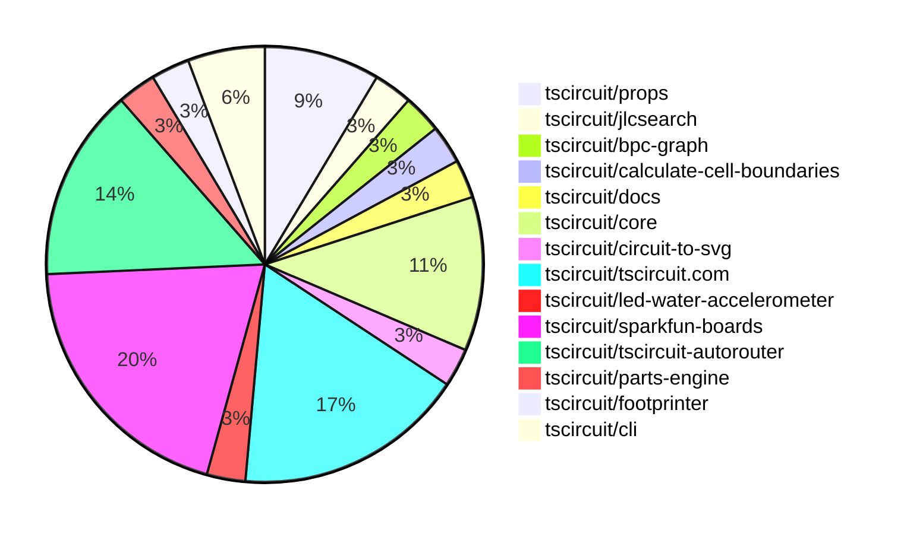

# contribution-tracker

Generates weekly contribution overviews for tscircuit contributors. Check out all
the [contribution overviews here](./contribution-overviews/)
You can find AI-generated monthly changelogs in the [changelogs directory](./changelogs/).

* All PRs in the tscircuit org are scanned/summarized via Claude Haiku
* Claude classifies each Diff/PR as a Major, Minor or Tiny contribution
* All the PRs, summaries, and classifications are organized into charts and tables

The current week is shown below. There are 3 major sections:

* [Contributor Overview](#contributor-overview)
* [PRs by Repository](#prs-by-repository)
* [PRs by Contributor](#changes-by-contributor)

## Current Week

<!-- START_CURRENT_WEEK -->

# Contribution Overview 2025-06-25

## PRs by Repository

## Contributor Overview

| Contributor | 🐳 Major | 🐙 Minor | 🐌 Tiny | ⭐ | Issues Created | Discussion Contributions |
|-------------|---------|---------|---------|-----|----------------|--------------------------|
| [Anshgrover23](#Anshgrover23) | 1 | 7 | 3 | ⭐⭐ | 5 | 0🔹 0🔶 0💎 |
| [seveibar](#seveibar) | 0 | 4 | 1 | ⭐⭐ | 2 | 0🔹 0🔶 0💎 |
| [imrishabh18](#imrishabh18) | 0 | 7 | 0 | ⭐⭐ | 1 | 0🔹 0🔶 0💎 |
| [ShiboSoftwareDev](#ShiboSoftwareDev) | 0 | 2 | 1 | ⭐⭐ | 2 | 0🔹 0🔶 0💎 |
| [techmannih](#techmannih) | 0 | 2 | 0 | ⭐ | 2 | 0🔹 0🔶 0💎 |
| [Abse2001](#Abse2001) | 1 | 1 | 0 | ⭐ | 1 | 0🔹 0🔶 0💎 |
| [ArnavK-09](#ArnavK-09) | 0 | 3 | 0 | ⭐ | 3 | 0🔹 0🔶 0💎 |
| [andrii-balitskyi](#andrii-balitskyi) | 0 | 1 | 0 |  | 0 | 0🔹 0🔶 0💎 |
| [MustafaMulla29](#MustafaMulla29) | 0 | 0 | 1 |  | 0 | 0🔹 0🔶 0💎 |

### Discussion Contribution Legend

- 🔹 Normal Comments: Basic participation with minimal effort
- 🔶 Great Informative Comments: Thoughtful participation that adds value
- 💎 Incredible Comments: Exceptional participation with high-quality content

## Review Table

[reviews-received-hover]: ## "Number of reviews received for PRs for this contributor"
[approvals-received-hover]: ## "Number of approvals received for PRs this contributor authored"
[rejections-received-hover]: ## "Number of rejections received for PRs this contributor authored"
[prs-opened-hover]: ## "Number of PRs opened by this contributor"
[issues-created-hover]: ## "Number of issues created by this contributor"
[bountied-issues-hover]: ## "Number of issues this contributor created with a bounty"
[bountied-issue-$-hover]: ## "Total bounty amount placed on issues authored by this contributor"

| Contributor | Reviews Received | Approvals Received | Rejections Received | Approvals | Rejections | PRs Opened | PRs Merged | Issues Created | Bountied Issues | Bountied Issue $ |
|---|---|---|---|---|---|---|---|---|---|---|
| [seveibar](#seveibar) | 2 | 0 | 0 | 16 | 2 | 9 | 5 | 2 | 0 | 0 |
| [graphite-app[bot]](#graphite-app[bot]) | 0 | 0 | 0 | 0 | 0 | 0 | 0 | 0 | 0 | 0 |
| [imrishabh18](#imrishabh18) | 8 | 4 | 0 | 4 | 0 | 10 | 7 | 1 | 0 | 0 |
| [techmannih](#techmannih) | 14 | 4 | 2 | 0 | 4 | 7 | 2 | 2 | 0 | 0 |
| [Anshgrover23](#Anshgrover23) | 16 | 10 | 3 | 1 | 3 | 12 | 11 | 5 | 0 | 0 |
| [Abse2001](#Abse2001) | 5 | 3 | 1 | 1 | 0 | 4 | 2 | 1 | 0 | 0 |
| [ShiboSoftwareDev](#ShiboSoftwareDev) | 3 | 2 | 0 | 7 | 1 | 5 | 3 | 2 | 0 | 0 |
| [ArnavK-09](#ArnavK-09) | 5 | 4 | 0 | 0 | 0 | 3 | 3 | 3 | 0 | 0 |
| [andrii-balitskyi](#andrii-balitskyi) | 2 | 1 | 1 | 0 | 0 | 2 | 1 | 0 | 0 | 0 |
| [tscircuitbot](#tscircuitbot) | 0 | 0 | 0 | 0 | 0 | 8 | 0 | 0 | 0 | 0 |
| [MustafaMulla29](#MustafaMulla29) | 5 | 1 | 3 | 0 | 0 | 2 | 1 | 0 | 0 | 0 |

## Changes by Repository

### [tscircuit/props](https://github.com/tscircuit/props)

| PR # | Impact | Contributor | Description | Milestone Aligned |
|------|--------|-------------|-------------|-------------------|
| [#308](https://github.com/tscircuit/props/pull/308) | 🐙 Minor | seveibar | Enhancements to component props with new optional attributes improve type safety and flexibility in component usage. | ❌ |
| [#307](https://github.com/tscircuit/props/pull/307) | 🐙 Minor | imrishabh18 | Enhancements to the PlatformConfig interface improve configurability and documentation for board information. | ❌ |
| [#304](https://github.com/tscircuit/props/pull/304) | 🐙 Minor | Anshgrover23 | Enhancement of LED component functionality by introducing a connections property for better integration. | ❌ |

### [tscircuit/jlcsearch](https://github.com/tscircuit/jlcsearch)

| PR # | Impact | Contributor | Description | Milestone Aligned |
|------|--------|-------------|-------------|-------------------|
| [#60](https://github.com/tscircuit/jlcsearch/pull/60) | 🐙 Minor | seveibar | The addition of a dedicated page for Boost DC-DC converters enhances the repository's functionality by providing users with a comprehensive list and details of available converters. | ❌ |

### [tscircuit/bpc-graph](https://github.com/tscircuit/bpc-graph)

| PR # | Impact | Contributor | Description | Milestone Aligned |
|------|--------|-------------|-------------|-------------------|
| [#4](https://github.com/tscircuit/bpc-graph/pull/4) | 🐙 Minor | seveibar | The addition of a corpus matcher page enhances the functionality of the application by allowing users to compare BPC graphs against a predefined corpus, thereby improving usability and feature set. | ❌ |

### [tscircuit/calculate-cell-boundaries](https://github.com/tscircuit/calculate-cell-boundaries)

| PR # | Impact | Contributor | Description | Milestone Aligned |
|------|--------|-------------|-------------|-------------------|
| [#7](https://github.com/tscircuit/calculate-cell-boundaries/pull/7) | 🐙 Minor | seveibar | Refactoring the internal layout enhances code organization and maintainability, improving the overall structure of the project. | ❌ |

### [tscircuit/docs](https://github.com/tscircuit/docs)

| PR # | Impact | Contributor | Description | Milestone Aligned |
|------|--------|-------------|-------------|-------------------|
| [#92](https://github.com/tscircuit/docs/pull/92) | 🐌 Tiny | seveibar | Enhances documentation by detailing the usage of `sel.net` within the selector pattern, improving developer understanding. | ❌ |

### [tscircuit/core](https://github.com/tscircuit/core)

| PR # | Impact | Contributor | Description | Milestone Aligned |
|------|--------|-------------|-------------|-------------------|
| [#992](https://github.com/tscircuit/core/pull/992) | 🐙 Minor | imrishabh18 | Enhancements to the SolderJumper component improve its configurability by allowing the use of a custom symbol name. | ❌ |
| [#989](https://github.com/tscircuit/core/pull/989) | 🐙 Minor | imrishabh18 | Enhancement of the SolderJumper component to support a new bridged property, improving its functionality and test coverage. | ❌ |
| [#996](https://github.com/tscircuit/core/pull/996) | 🐙 Minor | Abse2001 | Enhances selector functionality by introducing support for test point selectors, improving the library's capability. | ❌ |
| [#995](https://github.com/tscircuit/core/pull/995) | 🐌 Tiny | Anshgrover23 | Enhances testing capabilities for the LED component by adding a connections test, ensuring proper functionality. | ❌ |

### [tscircuit/circuit-to-svg](https://github.com/tscircuit/circuit-to-svg)

| PR # | Impact | Contributor | Description | Milestone Aligned |
|------|--------|-------------|-------------|-------------------|
| [#268](https://github.com/tscircuit/circuit-to-svg/pull/268) | 🐙 Minor | imrishabh18 | Enhancement of text rendering capabilities in PCB silkscreen by supporting multi-line text through newline handling. | ❌ |

### [tscircuit/tscircuit.com](https://github.com/tscircuit/tscircuit.com)

| PR # | Impact | Contributor | Description | Milestone Aligned |
|------|--------|-------------|-------------|-------------------|
| [#1371](https://github.com/tscircuit/tscircuit.com/pull/1371) | 🐙 Minor | imrishabh18 | Enhances the dashboard by ensuring packages are sorted by their update or creation date, improving user experience. | ❌ |
| [#1370](https://github.com/tscircuit/tscircuit.com/pull/1370) | 🐙 Minor | imrishabh18 | Enhances the dashboard functionality by ensuring the cached package list remains unaltered during sorting operations. | ❌ |
| [#1374](https://github.com/tscircuit/tscircuit.com/pull/1374) | 🐙 Minor | ArnavK-09 | Refines user identification in the settings dialog by switching from account ID to GitHub username, enhancing clarity and functionality. | ❌ |
| [#1373](https://github.com/tscircuit/tscircuit.com/pull/1373) | 🐙 Minor | ArnavK-09 | Enhances security by limiting AI review generation to package owners, ensuring only authorized users can access this feature. | ❌ |
| [#1372](https://github.com/tscircuit/tscircuit.com/pull/1372) | 🐙 Minor | ArnavK-09 | Introducing a toggle button for AI autocomplete enhances user interaction and functionality within the Code Editor. | ❌ |
| [#1368](https://github.com/tscircuit/tscircuit.com/pull/1368) | 🐙 Minor | andrii-balitskyi | Enhancements to the AI review loading state improve user experience during review requests. | ❌ |

### [tscircuit/led-water-accelerometer](https://github.com/tscircuit/led-water-accelerometer)

| PR # | Impact | Contributor | Description | Milestone Aligned |
|------|--------|-------------|-------------|-------------------|
| [#3](https://github.com/tscircuit/led-water-accelerometer/pull/3) | 🐙 Minor | imrishabh18 | Enhancements to the PCB layout by adding mounting holes and improving power connections. | ❌ |

### [tscircuit/sparkfun-boards](https://github.com/tscircuit/sparkfun-boards)

| PR # | Impact | Contributor | Description | Milestone Aligned |
|------|--------|-------------|-------------|-------------------|
| [#18](https://github.com/tscircuit/sparkfun-boards/pull/18) | 🐳 Major | Anshgrover23 | Introduces a new sensor board with comprehensive documentation and schematic integration, enhancing the repository's offerings. | ❌ |
| [#29](https://github.com/tscircuit/sparkfun-boards/pull/29) | 🐳 Major | Abse2001 | Introduces a new board design for the SparkFun Transceiver Breakout MAX3232, enhancing the repository's offerings. | ❌ |
| [#24](https://github.com/tscircuit/sparkfun-boards/pull/24) | 🐙 Minor | Anshgrover23 | The update enhances the RFM69 breakout board's design and functionality, ensuring it meets current standards and requirements. | ❌ |
| [#12](https://github.com/tscircuit/sparkfun-boards/pull/12) | 🐙 Minor | techmannih | Enhancements to the USBToSerialBreakout board's pin labeling and component integration improve clarity and functionality. | ❌ |
| [#16](https://github.com/tscircuit/sparkfun-boards/pull/16) | 🐌 Tiny | Anshgrover23 | Adding a README file enhances documentation and usability for users of the SparkFun RFM69 Breakout board. | ❌ |
| [#25](https://github.com/tscircuit/sparkfun-boards/pull/25) | 🐌 Tiny | ShiboSoftwareDev | Enhancements to the CI workflows ensure compatibility with Node.js version 22 and update dependencies for improved functionality. | ❌ |
| [#21](https://github.com/tscircuit/sparkfun-boards/pull/21) | 🐌 Tiny | MustafaMulla29 | Updates dependencies and snapshots to ensure compatibility and reflect recent changes in the project. | ❌ |

### [tscircuit/tscircuit-autorouter](https://github.com/tscircuit/tscircuit-autorouter)

| PR # | Impact | Contributor | Description | Milestone Aligned |
|------|--------|-------------|-------------|-------------------|
| [#172](https://github.com/tscircuit/tscircuit-autorouter/pull/172) | 🐙 Minor | Anshgrover23 | Enhancements to testing fixtures for improved debugging of hypersolver issues. | ❌ |
| [#171](https://github.com/tscircuit/tscircuit-autorouter/pull/171) | 🐙 Minor | Anshgrover23 | Enhancements to testing fixtures for hyperdensity routing issues improve debugging capabilities. | ❌ |
| [#165](https://github.com/tscircuit/tscircuit-autorouter/pull/165) | 🐙 Minor | Anshgrover23 | Enhancements to testing fixtures for improved debugging of hyperdensity solver issues. | ❌ |
| [#168](https://github.com/tscircuit/tscircuit-autorouter/pull/168) | 🐙 Minor | Anshgrover23 | Introduces a new JSON asset and a corresponding fixture for high-density debugging, enhancing testing capabilities. | ❌ |
| [#170](https://github.com/tscircuit/tscircuit-autorouter/pull/170) | 🐌 Tiny | Anshgrover23 | Excluding JSON files from formatting enhances the development workflow by preventing unnecessary changes in these files. | ❌ |

### [tscircuit/parts-engine](https://github.com/tscircuit/parts-engine)

| PR # | Impact | Contributor | Description | Milestone Aligned |
|------|--------|-------------|-------------|-------------------|
| [#8](https://github.com/tscircuit/parts-engine/pull/8) | 🐙 Minor | Anshgrover23 | Enhances robustness by ensuring that undefined fuses are handled gracefully, preventing potential runtime errors. | ❌ |

### [tscircuit/footprinter](https://github.com/tscircuit/footprinter)

| PR # | Impact | Contributor | Description | Milestone Aligned |
|------|--------|-------------|-------------|-------------------|
| [#306](https://github.com/tscircuit/footprinter/pull/306) | 🐙 Minor | techmannih | Adjusts the dimensions of the 1210 footprint to improve compatibility with tall pads, enhancing design accuracy. | ❌ |

### [tscircuit/cli](https://github.com/tscircuit/cli)

| PR # | Impact | Contributor | Description | Milestone Aligned |
|------|--------|-------------|-------------|-------------------|
| [#251](https://github.com/tscircuit/cli/pull/251) | 🐙 Minor | ShiboSoftwareDev | Updating the Node.js version in workflows enhances compatibility and performance for the project. | ❌ |
| [#250](https://github.com/tscircuit/cli/pull/250) | 🐙 Minor | ShiboSoftwareDev | Enhances the build command by allowing it to proceed despite circuitJson errors when the --ignore-errors flag is used. | ❌ |

## Changes by Contributor

### [seveibar](https://github.com/seveibar)

| PR # | Impact | Description | Milestone Aligned |
|------|--------|-------------|-------------------|
| [#308](https://github.com/tscircuit/props/pull/308) | 🐙 Minor | Enhancements to component props with new optional attributes improve type safety and flexibility in component usage. | ❌ |
| [#60](https://github.com/tscircuit/jlcsearch/pull/60) | 🐙 Minor | The addition of a dedicated page for Boost DC-DC converters enhances the repository's functionality by providing users with a comprehensive list and details of available converters. | ❌ |
| [#4](https://github.com/tscircuit/bpc-graph/pull/4) | 🐙 Minor | The addition of a corpus matcher page enhances the functionality of the application by allowing users to compare BPC graphs against a predefined corpus, thereby improving usability and feature set. | ❌ |
| [#7](https://github.com/tscircuit/calculate-cell-boundaries/pull/7) | 🐙 Minor | Refactoring the internal layout enhances code organization and maintainability, improving the overall structure of the project. | ❌ |
| [#92](https://github.com/tscircuit/docs/pull/92) | 🐌 Tiny | Enhances documentation by detailing the usage of `sel.net` within the selector pattern, improving developer understanding. | ❌ |

### [imrishabh18](https://github.com/imrishabh18)

| PR # | Impact | Description | Milestone Aligned |
|------|--------|-------------|-------------------|
| [#307](https://github.com/tscircuit/props/pull/307) | 🐙 Minor | Enhancements to the PlatformConfig interface improve configurability and documentation for board information. | ❌ |
| [#992](https://github.com/tscircuit/core/pull/992) | 🐙 Minor | Enhancements to the SolderJumper component improve its configurability by allowing the use of a custom symbol name. | ❌ |
| [#989](https://github.com/tscircuit/core/pull/989) | 🐙 Minor | Enhancement of the SolderJumper component to support a new bridged property, improving its functionality and test coverage. | ❌ |
| [#268](https://github.com/tscircuit/circuit-to-svg/pull/268) | 🐙 Minor | Enhancement of text rendering capabilities in PCB silkscreen by supporting multi-line text through newline handling. | ❌ |
| [#1371](https://github.com/tscircuit/tscircuit.com/pull/1371) | 🐙 Minor | Enhances the dashboard by ensuring packages are sorted by their update or creation date, improving user experience. | ❌ |
| [#1370](https://github.com/tscircuit/tscircuit.com/pull/1370) | 🐙 Minor | Enhances the dashboard functionality by ensuring the cached package list remains unaltered during sorting operations. | ❌ |
| [#3](https://github.com/tscircuit/led-water-accelerometer/pull/3) | 🐙 Minor | Enhancements to the PCB layout by adding mounting holes and improving power connections. | ❌ |

### [Anshgrover23](https://github.com/Anshgrover23)

| PR # | Impact | Description | Milestone Aligned |
|------|--------|-------------|-------------------|
| [#18](https://github.com/tscircuit/sparkfun-boards/pull/18) | 🐳 Major | Introduces a new sensor board with comprehensive documentation and schematic integration, enhancing the repository's offerings. | ❌ |
| [#304](https://github.com/tscircuit/props/pull/304) | 🐙 Minor | Enhancement of LED component functionality by introducing a connections property for better integration. | ❌ |
| [#172](https://github.com/tscircuit/tscircuit-autorouter/pull/172) | 🐙 Minor | Enhancements to testing fixtures for improved debugging of hypersolver issues. | ❌ |
| [#171](https://github.com/tscircuit/tscircuit-autorouter/pull/171) | 🐙 Minor | Enhancements to testing fixtures for hyperdensity routing issues improve debugging capabilities. | ❌ |
| [#165](https://github.com/tscircuit/tscircuit-autorouter/pull/165) | 🐙 Minor | Enhancements to testing fixtures for improved debugging of hyperdensity solver issues. | ❌ |
| [#168](https://github.com/tscircuit/tscircuit-autorouter/pull/168) | 🐙 Minor | Introduces a new JSON asset and a corresponding fixture for high-density debugging, enhancing testing capabilities. | ❌ |
| [#8](https://github.com/tscircuit/parts-engine/pull/8) | 🐙 Minor | Enhances robustness by ensuring that undefined fuses are handled gracefully, preventing potential runtime errors. | ❌ |
| [#24](https://github.com/tscircuit/sparkfun-boards/pull/24) | 🐙 Minor | The update enhances the RFM69 breakout board's design and functionality, ensuring it meets current standards and requirements. | ❌ |
| [#995](https://github.com/tscircuit/core/pull/995) | 🐌 Tiny | Enhances testing capabilities for the LED component by adding a connections test, ensuring proper functionality. | ❌ |
| [#170](https://github.com/tscircuit/tscircuit-autorouter/pull/170) | 🐌 Tiny | Excluding JSON files from formatting enhances the development workflow by preventing unnecessary changes in these files. | ❌ |
| [#16](https://github.com/tscircuit/sparkfun-boards/pull/16) | 🐌 Tiny | Adding a README file enhances documentation and usability for users of the SparkFun RFM69 Breakout board. | ❌ |

### [techmannih](https://github.com/techmannih)

| PR # | Impact | Description | Milestone Aligned |
|------|--------|-------------|-------------------|
| [#306](https://github.com/tscircuit/footprinter/pull/306) | 🐙 Minor | Adjusts the dimensions of the 1210 footprint to improve compatibility with tall pads, enhancing design accuracy. | ❌ |
| [#12](https://github.com/tscircuit/sparkfun-boards/pull/12) | 🐙 Minor | Enhancements to the USBToSerialBreakout board's pin labeling and component integration improve clarity and functionality. | ❌ |

### [Abse2001](https://github.com/Abse2001)

| PR # | Impact | Description | Milestone Aligned |
|------|--------|-------------|-------------------|
| [#29](https://github.com/tscircuit/sparkfun-boards/pull/29) | 🐳 Major | Introduces a new board design for the SparkFun Transceiver Breakout MAX3232, enhancing the repository's offerings. | ❌ |
| [#996](https://github.com/tscircuit/core/pull/996) | 🐙 Minor | Enhances selector functionality by introducing support for test point selectors, improving the library's capability. | ❌ |

### [ArnavK-09](https://github.com/ArnavK-09)

| PR # | Impact | Description | Milestone Aligned |
|------|--------|-------------|-------------------|
| [#1374](https://github.com/tscircuit/tscircuit.com/pull/1374) | 🐙 Minor | Refines user identification in the settings dialog by switching from account ID to GitHub username, enhancing clarity and functionality. | ❌ |
| [#1373](https://github.com/tscircuit/tscircuit.com/pull/1373) | 🐙 Minor | Enhances security by limiting AI review generation to package owners, ensuring only authorized users can access this feature. | ❌ |
| [#1372](https://github.com/tscircuit/tscircuit.com/pull/1372) | 🐙 Minor | Introducing a toggle button for AI autocomplete enhances user interaction and functionality within the Code Editor. | ❌ |

### [andrii-balitskyi](https://github.com/andrii-balitskyi)

| PR # | Impact | Description | Milestone Aligned |
|------|--------|-------------|-------------------|
| [#1368](https://github.com/tscircuit/tscircuit.com/pull/1368) | 🐙 Minor | Enhancements to the AI review loading state improve user experience during review requests. | ❌ |

### [ShiboSoftwareDev](https://github.com/ShiboSoftwareDev)

| PR # | Impact | Description | Milestone Aligned |
|------|--------|-------------|-------------------|
| [#251](https://github.com/tscircuit/cli/pull/251) | 🐙 Minor | Updating the Node.js version in workflows enhances compatibility and performance for the project. | ❌ |
| [#250](https://github.com/tscircuit/cli/pull/250) | 🐙 Minor | Enhances the build command by allowing it to proceed despite circuitJson errors when the --ignore-errors flag is used. | ❌ |
| [#25](https://github.com/tscircuit/sparkfun-boards/pull/25) | 🐌 Tiny | Enhancements to the CI workflows ensure compatibility with Node.js version 22 and update dependencies for improved functionality. | ❌ |

### [MustafaMulla29](https://github.com/MustafaMulla29)

| PR # | Impact | Description | Milestone Aligned |
|------|--------|-------------|-------------------|
| [#21](https://github.com/tscircuit/sparkfun-boards/pull/21) | 🐌 Tiny | Updates dependencies and snapshots to ensure compatibility and reflect recent changes in the project. | ❌ |

## Repository Owners

| Repository | Codeowners |
|------------|------------|
| [circuit-json-to-gerber](https://github.com/tscircuit/circuit-json-to-gerber/blob/main/.github/CODEOWNERS) | [seveibar](https://github.com/seveibar), [ShiboSoftwareDev](https://github.com/ShiboSoftwareDev) |
| [circuit-to-svg](https://github.com/tscircuit/circuit-to-svg/blob/main/.github/CODEOWNERS) | [imrishabh18](https://github.com/imrishabh18) |
| [tscircuit.com](https://github.com/tscircuit/tscircuit.com/blob/main/.github/CODEOWNERS) | [imrishabh18](https://github.com/imrishabh18) |
| [footprinter](https://github.com/tscircuit/footprinter/blob/main/.github/CODEOWNERS) | [techmannih](https://github.com/techmannih) |

## Repos by Owner

| User | Repo |
|------|------|
| [seveibar](https://github.com/seveibar) | [circuit-json-to-gerber](https://github.com/tscircuit/circuit-json-to-gerber/blob/main/.github/CODEOWNERS) |
| [imrishabh18](https://github.com/imrishabh18) | [circuit-to-svg](https://github.com/tscircuit/circuit-to-svg/blob/main/.github/CODEOWNERS) |
|  | [tscircuit.com](https://github.com/tscircuit/tscircuit.com/blob/main/.github/CODEOWNERS) |
| [techmannih](https://github.com/techmannih) | [footprinter](https://github.com/tscircuit/footprinter/blob/main/.github/CODEOWNERS) |
| [ShiboSoftwareDev](https://github.com/ShiboSoftwareDev) | [circuit-json-to-gerber](https://github.com/tscircuit/circuit-json-to-gerber/blob/main/.github/CODEOWNERS) |

<!-- END_CURRENT_WEEK -->
