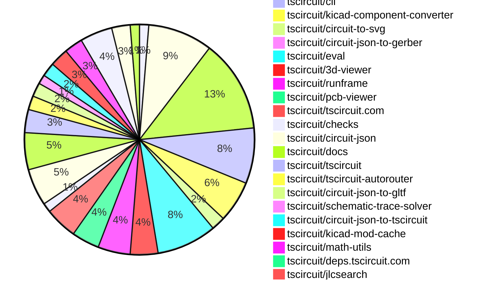
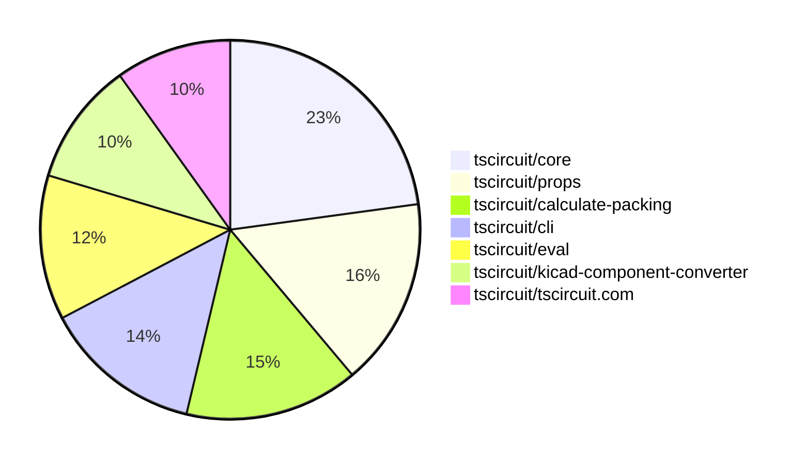

# contribution-tracker

[contributions.tscircuit.com](https://contributions.tscircuit.com) ・ [tscircuit.com](https://tscircuit.com) ・ [Contribution Overviews](./contribution-overviews/) ・ [Changelogs](./changelogs/)

Generates weekly contribution overviews for tscircuit contributors. Check out all
the [contribution overviews here](./contribution-overviews/)
You can find AI-generated monthly changelogs in the [changelogs directory](./changelogs/).

- All PRs in the tscircuit org are scanned/summarized via an LLM
- The LLM classifies each Diff/PR as into a set of attributes for scoring
- All the PRs, summaries, and classifications are organized into charts and tables for [the website](https://contributions.tscircuit.com)

> Want to run locally? See the [Development Section](#development)

The current week is shown below. There are 3 major sections:

- [Contributor Overview](#contributor-overview)
- [PRs by Repository](#prs-by-repository)
- [PRs by Contributor](#changes-by-contributor)

## Current Week

<!-- START_CURRENT_WEEK -->

# Contribution Overview 2025-09-10

## PRs by Repository



## Contributor Overview

| Contributor | 🐳 Major | 🐙 Minor | 🐌 Tiny | ⭐ | Score | Discussion Contributions |
|-------------|---------|---------|---------|-----|----------------|--------------------------|
| [seveibar](#seveibar) | 10 | 31 | 29 | 👑👑 | 91 | 0🔹 0🔶 0💎 |
| [imrishabh18](#imrishabh18) | 5 | 17 | 16 | 👑 | 64 | 0🔹 0🔶 0💎 |
| [ShiboSoftwareDev](#ShiboSoftwareDev) | 4 | 5 | 4 | ⭐⭐ | 29.5 | 0🔹 0🔶 0💎 |
| [AnasSarkiz](#AnasSarkiz) | 2 | 7 | 1 | ⭐⭐ | 23 | 0🔹 0🔶 0💎 |
| [ArnavK-09](#ArnavK-09) | 4 | 1 | 2 | ⭐⭐ | 20 | 0🔹 0🔶 0💎 |
| [techmannih](#techmannih) | 1 | 3 | 2 | ⭐⭐ | 17 | 0🔹 0🔶 0💎 |
| [Abse2001](#Abse2001) | 0 | 1 | 3 | ⭐ | 6 | 0🔹 0🔶 0💎 |
| [Heinrich-XIAO](#Heinrich-XIAO) | 1 | 1 | 0 | ⭐ | 6 | 0🔹 0🔶 0💎 |
| [nailoo](#nailoo) | 0 | 2 | 0 | ⭐ | 4 | 0🔹 0🔶 0💎 |
| [tscircuitbot](#tscircuitbot) | 0 | 0 | 4 | ⭐ | 4 | 0🔹 0🔶 0💎 |
| [devroy10](#devroy10) | 0 | 1 | 0 |  | 2 | 0🔹 0🔶 0💎 |

### Discussion Contribution Legend

- 🔹 Normal Comments: Basic participation with minimal effort
- 🔶 Great Informative Comments: Thoughtful participation that adds value
- 💎 Incredible Comments: Exceptional participation with high-quality content

## Review Table

[reviews-received-hover]: ## "Number of reviews received for PRs for this contributor"
[approvals-received-hover]: ## "Number of approvals received for PRs this contributor authored"
[rejections-received-hover]: ## "Number of rejections received for PRs this contributor authored"
[prs-opened-hover]: ## "Number of PRs opened by this contributor"
[issues-created-hover]: ## "Number of issues created by this contributor"
[bountied-issues-hover]: ## "Number of issues this contributor created with a bounty"
[bountied-issue-$-hover]: ## "Total bounty amount placed on issues authored by this contributor"

| Contributor | Reviews Received | Approvals Received | Rejections Received | Approvals | Rejections | PRs Opened | PRs Merged | Score | Issues Created | Bountied Issues | Bountied Issue $ |
|---|---|---|---|---|---|---|---|---|---|---|---|
| [ShiboSoftwareDev](#ShiboSoftwareDev) | 24 | 13 | 1 | 0 | 0 | 15 | 13 | 29.5 | 0 | 0 | 0 |
| [seveibar](#seveibar) | 25 | 0 | 0 | 51 | 13 | 92 | 71 | 91 | 0 | 0 | 0 |
| [ArnavK-09](#ArnavK-09) | 25 | 7 | 1 | 0 | 0 | 9 | 7 | 20 | 0 | 0 | 0 |
| [AnasSarkiz](#AnasSarkiz) | 20 | 10 | 0 | 0 | 0 | 12 | 10 | 23 | 0 | 0 | 0 |
| [Abse2001](#Abse2001) | 5 | 4 | 0 | 1 | 0 | 4 | 4 | 6 | 0 | 0 | 0 |
| [imrishabh18](#imrishabh18) | 18 | 13 | 0 | 5 | 4 | 40 | 38 | 64 | 0 | 0 | 0 |
| [techmannih](#techmannih) | 32 | 4 | 5 | 0 | 1 | 14 | 6 | 17 | 0 | 0 | 0 |
| [Rukhnuddin786](#Rukhnuddin786) | 0 | 0 | 0 | 0 | 0 | 1 | 0 | 0 | 0 | 0 | 0 |
| [sharmaut](#sharmaut) | 2 | 0 | 0 | 0 | 0 | 4 | 0 | 0 | 0 | 0 | 0 |
| [Excellencedev](#Excellencedev) | 2 | 0 | 1 | 0 | 0 | 2 | 0 | 0 | 0 | 0 | 0 |
| [nailoo](#nailoo) | 5 | 2 | 1 | 0 | 0 | 3 | 2 | 4 | 0 | 0 | 0 |
| [BenraouaneSoufiane](#BenraouaneSoufiane) | 4 | 0 | 0 | 0 | 0 | 3 | 0 | 0 | 0 | 0 | 0 |
| [SamarthShukla17](#SamarthShukla17) | 5 | 0 | 0 | 0 | 0 | 3 | 0 | 0 | 0 | 0 | 0 |
| [sudarshan-magar7](#sudarshan-magar7) | 0 | 0 | 0 | 0 | 0 | 1 | 0 | 0 | 0 | 0 | 0 |
| [Heinrich-XIAO](#Heinrich-XIAO) | 3 | 2 | 0 | 0 | 0 | 2 | 2 | 6 | 0 | 0 | 0 |
| [tscircuitbot](#tscircuitbot) | 0 | 0 | 0 | 0 | 0 | 33 | 4 | 4 | 0 | 0 | 0 |
| [shravanngoswamii](#shravanngoswamii) | 2 | 0 | 0 | 0 | 0 | 1 | 0 | 0 | 0 | 0 | 0 |
| [tribhuwan-kumar](#tribhuwan-kumar) | 1 | 0 | 0 | 0 | 0 | 1 | 0 | 0 | 0 | 0 | 0 |
| [Ayushjhawar8](#Ayushjhawar8) | 1 | 0 | 0 | 0 | 0 | 1 | 0 | 0 | 0 | 0 | 0 |
| [devroy10](#devroy10) | 2 | 1 | 0 | 0 | 0 | 1 | 1 | 2 | 0 | 0 | 0 |
| [baeoc](#baeoc) | 1 | 0 | 0 | 0 | 0 | 1 | 0 | 0 | 0 | 0 | 0 |
| [MAVRICK-1](#MAVRICK-1) | 4 | 1 | 3 | 0 | 0 | 2 | 0 | 0 | 0 | 0 | 0 |
| [melmathari](#melmathari) | 0 | 0 | 0 | 0 | 0 | 1 | 0 | 0 | 0 | 0 | 0 |
| [Bhavyajain21](#Bhavyajain21) | 1 | 0 | 0 | 0 | 0 | 1 | 0 | 0 | 0 | 0 | 0 |
| [DiwanshuVerma](#DiwanshuVerma) | 0 | 0 | 0 | 0 | 0 | 1 | 0 | 0 | 0 | 0 | 0 |
| [ManbirS07](#ManbirS07) | 2 | 0 | 0 | 0 | 0 | 2 | 0 | 0 | 0 | 0 | 0 |
| [0hmX](#0hmX) | 16 | 0 | 4 | 0 | 0 | 2 | 0 | 0 | 0 | 0 | 0 |
| [Vincenzo-Verma](#Vincenzo-Verma) | 1 | 0 | 0 | 0 | 0 | 1 | 0 | 0 | 0 | 0 | 0 |
| [abhix4](#abhix4) | 0 | 0 | 0 | 0 | 0 | 1 | 0 | 0 | 0 | 0 | 0 |
| [gurjeetsinghvirdee](#gurjeetsinghvirdee) | 2 | 0 | 2 | 0 | 0 | 1 | 0 | 0 | 0 | 0 | 0 |
| [h30s](#h30s) | 0 | 0 | 0 | 0 | 0 | 1 | 0 | 0 | 0 | 0 | 0 |
| [rish170](#rish170) | 1 | 0 | 0 | 0 | 0 | 1 | 0 | 0 | 0 | 0 | 0 |

## Top 7 Repositories by Contribution Points



## Changes by Repository

### [tscircuit/schematic-viewer](https://github.com/tscircuit/schematic-viewer)

| PR # | Impact | Rating | Contributor | Description |
|------|--------|--------|-------------|-------------|
| [#131](https://github.com/tscircuit/schematic-viewer/pull/131) | 🐳 Major | ⭐⭐⭐ | ShiboSoftwareDev | This PR prevents the SPICE simulation from running automatically when the overlay is opened, requiring user action to trigger the simulation. |

<details>
<summary>🐌 Tiny Contributions (1)</summary>

| PR # | Impact | Contributor | Description |
|------|--------|-------------|-------------|
| [#130](https://github.com/tscircuit/schematic-viewer/pull/130) | 🐌 Tiny | ArnavK-09 | Removes rounded borders from group overlays in the schematic viewer by setting the rx and ry attributes to 0. |

</details>

### [tscircuit/props](https://github.com/tscircuit/props)

| PR # | Impact | Rating | Contributor | Description |
|------|--------|--------|-------------|-------------|
| [#376](https://github.com/tscircuit/props/pull/376) | 🐳 Major | ⭐⭐⭐ | ShiboSoftwareDev | Refactors the copper-pour component to support a more flexible and customizable interface for different shapes. |
| [#393](https://github.com/tscircuit/props/pull/393) | 🐙 Minor | ⭐⭐ | techmannih | Adds properties for knockout effect and padding for silkscreen text in PCB layouts |
| [#392](https://github.com/tscircuit/props/pull/392) | 🐙 Minor | ⭐⭐ | imrishabh18 | Adds properties pcbHoleOffsetX and pcbHoleOffsetY to the CircularHoleWithRectPlatedProps interface for specifying PCB hole offsets. |
| [#404](https://github.com/tscircuit/props/pull/404) | 🐙 Minor | ⭐⭐ | seveibar | Adds support for the includeInBoardPinout pin attribute, validates it in the shared schema, and documents it in the generated component type references. |
| [#397](https://github.com/tscircuit/props/pull/397) | 🐙 Minor | ⭐⭐ | seveibar | Adds support for freerouting in autorouter presets, switches autorouter presets to snake_case, and documents the deprecation of kebab-case presets. |
| [#396](https://github.com/tscircuit/props/pull/396) | 🐙 Minor | ⭐⭐ | seveibar | Adds support for ReactElement in CadModelProp type and updates the corresponding schema validation. |
| [#395](https://github.com/tscircuit/props/pull/395) | 🐙 Minor | ⭐⭐ | seveibar | Add cadassembly  component mirroring footprint orientation support and introduce cadmodel  component with pcbXpcbYpcbZ and generic modelUrl source, along with documentation and export of the new components. |
| [#394](https://github.com/tscircuit/props/pull/394) | 🐙 Minor | ⭐⭐ | seveibar | Adds an optional projectBaseUrl to PlatformConfig, documents it in README, and tests its parsing functionality. |
| [#391](https://github.com/tscircuit/props/pull/391) | 🐙 Minor | ⭐⭐ | seveibar | Allows specifying CAD model unit scale via optional modelUnitToMmScale and covers the new CAD model property in tests. |
| [#403](https://github.com/tscircuit/props/pull/403) | 🐙 Minor | ⭐⭐ | nailoo | Adds schematic box support to groups by introducing showAsSchematicBox, connections, and schPinArrangement props, enabling subcircuits to render as a single schematic box with customizable pin mapping |

<details>
<summary>🐌 Tiny Contributions (4)</summary>

| PR # | Impact | Contributor | Description |
|------|--------|-------------|-------------|
| [#401](https://github.com/tscircuit/props/pull/401) | 🐌 Tiny | imrishabh18 | Adds an optional rectBorderRadius property to the RectSmtPad and CircularHoleWithRectPlated components to allow for rounded corners. |
| [#400](https://github.com/tscircuit/props/pull/400) | 🐌 Tiny | seveibar | Adds the pcbPackGap option to group layout properties, documents the new property in README and generated docs, and covers parsing of pcbPack and pcbPackGap in tests. |
| [#399](https://github.com/tscircuit/props/pull/399) | 🐌 Tiny | seveibar | Add optional coveredWithSolderMask property to smtpad component and document it in PCB JSON docs, including tests and generated documentation. |
| [#398](https://github.com/tscircuit/props/pull/398) | 🐌 Tiny | seveibar | Adds project-specific settings derived from platformConfig, exposes projectConfig in README, updates documentation generator and tests, and removes platform-only options from projectConfig. |

</details>

### [tscircuit/core](https://github.com/tscircuit/core)

| PR # | Impact | Rating | Contributor | Description |
|------|--------|--------|-------------|-------------|
| [#1345](https://github.com/tscircuit/core/pull/1345) | 🐳 Major | ⭐⭐⭐ | ShiboSoftwareDev | Adds a new copperpour  primitive component for creating copper fills on PCB layers, including a CopperPour class and a new rendering phase for PCB copper pours. |
| [#1362](https://github.com/tscircuit/core/pull/1362) | 🐙 Minor | ⭐⭐ | AnasSarkiz | Add support for pill-shaped SMT pads with proper bounds calculation and comprehensive test cases. |
| [#1351](https://github.com/tscircuit/core/pull/1351) | 🐙 Minor | ⭐⭐ | AnasSarkiz | Adds a test PCB board featuring a custom polygon-shaped SMT pad for enhanced component placement. |
| [#1336](https://github.com/tscircuit/core/pull/1336) | 🐙 Minor | ⭐⭐ | AnasSarkiz | Adds a design rule check that flags components extending beyond the board outline during design rule checking. |
| [#1355](https://github.com/tscircuit/core/pull/1355) | 🐙 Minor | ⭐⭐ | imrishabh18 | Adds support for rectBorderRadius property to rectangle pads in PCB layout, allowing for rounded corners in pad designs. |
| [#1339](https://github.com/tscircuit/core/pull/1339) | 🐙 Minor | ⭐⭐ | imrishabh18 | Adds support for new plated hole shapes pill and oval in the PCB component creation process. |
| [#1321](https://github.com/tscircuit/core/pull/1321) | 🐙 Minor | ⭐⭐ | imrishabh18 | Fixes an issue where the pcbPack functionality fails to work with asynchronous footprints in the circuit rendering process. |
| [#1326](https://github.com/tscircuit/core/pull/1326) | 🐙 Minor | ⭐⭐ | imrishabh18 | Adds support for hole offset in the shape circular_hole_with_rect_pad by introducing hole_offset_x and hole_offset_y properties. |
| [#1353](https://github.com/tscircuit/core/pull/1353) | 🐙 Minor | ⭐⭐ | seveibar | Add support for coveredWithSolderMask on smtpad and propagate to circuit-json as is_covered_with_solder_mask, along with documentation updates. |
| [#1341](https://github.com/tscircuit/core/pull/1341) | 🐙 Minor | ⭐⭐ | seveibar | Allows components to anchor pcbXpcbY to pins or nine-point positions via pcbPositionAnchor and aligns components during the new PcbComponentAnchorAlignment render phase. |
| [#1334](https://github.com/tscircuit/core/pull/1334) | 🐙 Minor | ⭐⭐ | seveibar | Add cadmodel and cadassembly elements and their corresponding primitive classes to support 3D model rendering in the circuit design. |
| [#1335](https://github.com/tscircuit/core/pull/1335) | 🐙 Minor | ⭐⭐ | seveibar | Adds a snapshot test for PCB packing with margin and removes the spy implementation for the packing calculation. |
| [#1332](https://github.com/tscircuit/core/pull/1332) | 🐙 Minor | ⭐⭐ | seveibar | Passes component pcbMargin values to calculate-packing using chipMarginsMap and adds a test to ensure pcbMargin reaches packing library. |
| [#1327](https://github.com/tscircuit/core/pull/1327) | 🐙 Minor | ⭐⭐ | seveibar | Adds support for generating rounded board outlines when the borderRadius property is set, along with a PCB snapshot test for this feature. |
| [#1325](https://github.com/tscircuit/core/pull/1325) | 🐙 Minor | ⭐⭐ | seveibar | Maps cadModel.modelUnitToMmScale onto cad_component.model_unit_to_mm_scale_factor and updates dependencies for improved CAD component scale factor propagation. |

<details>
<summary>🐌 Tiny Contributions (5)</summary>

| PR # | Impact | Contributor | Description |
|------|--------|-------------|-------------|
| [#1340](https://github.com/tscircuit/core/pull/1340) | 🐌 Tiny | techmannih | Updates the circuit-json dependency to version 0.0.252 in package.json |
| [#1349](https://github.com/tscircuit/core/pull/1349) | 🐌 Tiny | seveibar | Updates the dependencies for calculate-packing and schematic-trace-solver to their latest versions in package.json |
| [#1346](https://github.com/tscircuit/core/pull/1346) | 🐌 Tiny | seveibar | Updates the version of schematic symbols in the package.json file from 0.0.198 to 0.0.201 |
| [#1338](https://github.com/tscircuit/core/pull/1338) | 🐌 Tiny | seveibar | Summary add getTestStaticAssetsServer to serve local models allow getTestFixture to start the fake static asset server update model-related tests to use local models  Testing bunx tsc --noEmit bun test testscomponentsnormal-componentsresistor-cadmodel-react-element.test.tsx bun test testscomponentsnormal-componentschip-cadassembly-react-element.test.tsx bun test testscomponentsnormal-componentsred-led-name-validation.test.tsx bun test testscomponentsnormal-componentsresistor-cad-component-position.test.tsx BUN_UPDATE_SNAPSHOTS1 bun test testscomponentsnormal-componentschip-override-footprint-ports-when-schPortArrangement.test.tsx BUN_UPDATE_SNAPSHOTS1 bun test testscomponentsnormal-componentscustom-footprint-4-ports.test.tsx |
| [#1337](https://github.com/tscircuit/core/pull/1337) | 🐌 Tiny | seveibar | Waits for footprints to load before running downstream PCB phases and updates the PCB snapshot for footprint library map test. |

</details>

### [tscircuit/cli](https://github.com/tscircuit/cli)

| PR # | Impact | Rating | Contributor | Description |
|------|--------|--------|-------------|-------------|
| [#332](https://github.com/tscircuit/cli/pull/332) | 🐳 Major | ⭐⭐⭐ | ShiboSoftwareDev | Enables successful import of npm packages in the CLI after updates to eval and runframe. |
| [#338](https://github.com/tscircuit/cli/pull/338) | 🐳 Major | ⭐⭐⭐ | seveibar | Add --kicad option to tsci search to only query KiCad footprints |
| [#331](https://github.com/tscircuit/cli/pull/331) | 🐙 Minor | ⭐⭐ | imrishabh18 | Adds support for exporting circuit JSON as GLB and updates the tscircuitrunframe package to the latest version. |
| [#330](https://github.com/tscircuit/cli/pull/330) | 🐙 Minor | ⭐⭐ | imrishabh18 | Adds a command to convert .kicad_mod files into TSX components, integrating kicad and circuit-json conversion packages. |
| [#340](https://github.com/tscircuit/cli/pull/340) | 🐙 Minor | ⭐⭐ | seveibar | Fixes crash in search command when JLC search returns no components |
| [#336](https://github.com/tscircuit/cli/pull/336) | 🐙 Minor | ⭐⭐ | seveibar | Extends the tsci search command to query the KiCad footprint index with fuzzy matching, documents the search command for footprints, CAD models, or packages, and adds a test for the KiCad footprint search. |

<details>
<summary>🐌 Tiny Contributions (6)</summary>

| PR # | Impact | Contributor | Description |
|------|--------|-------------|-------------|
| [#322](https://github.com/tscircuit/cli/pull/322) | 🐌 Tiny | ShiboSoftwareDev | Updates various dependencies in the project, including tscircuitmath-utils and tscircuitprops, and adds tscircuitcircuit-json-util. |
| [#345](https://github.com/tscircuit/cli/pull/345) | 🐌 Tiny | seveibar | Updates the file server dependency to version 0.0.28 and fixes the loading of .obj files. |
| [#344](https://github.com/tscircuit/cli/pull/344) | 🐌 Tiny | seveibar | Updates the tscircuitrunframe package to version 0.0.931 in the project dependencies. |
| [#343](https://github.com/tscircuit/cli/pull/343) | 🐌 Tiny | seveibar | Updates the tscircuitfile-server and tscircuitrunframe packages to their latest versions. |
| [#337](https://github.com/tscircuit/cli/pull/337) | 🐌 Tiny | seveibar | Prefixes KiCad footprint search results with kicad: for easier copypaste into tscircuit and updates CLI test to expect kicad: prefix. |
| [#327](https://github.com/tscircuit/cli/pull/327) | 🐌 Tiny | seveibar | Updates the RunFrame and easyeda dependencies to their latest versions in the package.json file |

</details>

### [tscircuit/kicad-component-converter](https://github.com/tscircuit/kicad-component-converter)

| PR # | Impact | Rating | Contributor | Description |
|------|--------|--------|-------------|-------------|
| [#131](https://github.com/tscircuit/kicad-component-converter/pull/131) | 🐳 Major | ⭐⭐⭐ | imrishabh18 | Adds a button to download the generated tsx code from circuit JSON. |
| [#134](https://github.com/tscircuit/kicad-component-converter/pull/134) | 🐙 Minor | ⭐⭐ | ShiboSoftwareDev | Adds support for the fp_poly directive in KiCad module files, enabling conversion of polygon shapes on copper, silkscreen, and fabrication layers into appropriate circuit elements. |
| [#138](https://github.com/tscircuit/kicad-component-converter/pull/138) | 🐙 Minor | ⭐⭐ | imrishabh18 | Adds support for the pcb_fabrication_note_text type in the conversion process, allowing for the inclusion of fabrication notes in the generated circuit JSON. |
| [#137](https://github.com/tscircuit/kicad-component-converter/pull/137) | 🐙 Minor | ⭐⭐ | imrishabh18 | Adds support for rect_border_radius in the rendering of PCB plated holes, allowing for rounded corners in rectangular pads. |
| [#129](https://github.com/tscircuit/kicad-component-converter/pull/129) | 🐙 Minor | ⭐⭐ | imrishabh18 | Adds support for a new pad shape circular_hole_with_rect_pad in the KiCad component converter, allowing for better representation of specific PCB designs. |
| [#128](https://github.com/tscircuit/kicad-component-converter/pull/128) | 🐙 Minor | ⭐⭐ | imrishabh18 | Fixes parsing issues in kicad_mod files for capacitors by filtering out non-numeric values before processing attributes. |

<details>
<summary>🐌 Tiny Contributions (3)</summary>

| PR # | Impact | Contributor | Description |
|------|--------|-------------|-------------|
| [#136](https://github.com/tscircuit/kicad-component-converter/pull/136) | 🐌 Tiny | imrishabh18 | Is adding the schematic_port inside this library correct? Or it needs to be created inside core? |
| [#130](https://github.com/tscircuit/kicad-component-converter/pull/130) | 🐌 Tiny | imrishabh18 | Adds a vercel.json configuration file for Vercel deployment and updates several dependencies in package.json. |
| [#135](https://github.com/tscircuit/kicad-component-converter/pull/135) | 🐌 Tiny | seveibar | Adds a test for loading JST connectors and verifies the output against expected SVG snapshots. |

</details>

### [tscircuit/circuit-to-svg](https://github.com/tscircuit/circuit-to-svg)

| PR # | Impact | Rating | Contributor | Description |
|------|--------|--------|-------------|-------------|
| [#313](https://github.com/tscircuit/circuit-to-svg/pull/313) | 🐳 Major | ⭐⭐⭐ | techmannih | Adds support for rect_border_radius in PCB and SMT pad definitions, allowing for rounded corners in SVG rendering. |
| [#310](https://github.com/tscircuit/circuit-to-svg/pull/310) | 🐳 Major | ⭐⭐⭐ | imrishabh18 | Adds support for an offset in the circular hole within a rectangular pad in PCB designs, allowing for more precise placement of holes in the layout. |
| [#316](https://github.com/tscircuit/circuit-to-svg/pull/316) | 🐙 Minor | ⭐⭐ | ShiboSoftwareDev | Fixes incorrect arc rendering in BREP shapes due to an inverted sweep-flag in the SVG arc path command. |

### [tscircuit/circuit-json-to-gerber](https://github.com/tscircuit/circuit-json-to-gerber)

| PR # | Impact | Rating | Contributor | Description |
|------|--------|--------|-------------|-------------|
| [#54](https://github.com/tscircuit/circuit-json-to-gerber/pull/54) | 🐙 Minor | ⭐⭐ | ShiboSoftwareDev | Adds support for drawing pcb_copper_pour elements with the new brep shape and enhances arccircle drawing capabilities by correcting the create_arc command and refactoring circle drawing logic for improved accuracy. |

### [tscircuit/eval](https://github.com/tscircuit/eval)

| PR # | Impact | Rating | Contributor | Description |
|------|--------|--------|-------------|-------------|
| [#1032](https://github.com/tscircuit/eval/pull/1032) | 🐙 Minor | ⭐⭐ | ShiboSoftwareDev | Adds support for importing .gltf files that reference external binary (.bin) or image assets, enabling inlining of these assets as data URIs within the GLTF JSON structure. |
| [#1033](https://github.com/tscircuit/eval/pull/1033) | 🐙 Minor | ⭐⭐ | ShiboSoftwareDev | Fixes an issue where NPM packages with their own dependencies (transitive dependencies) were not being resolved correctly by implementing recursive loading of those dependencies. |
| [#1057](https://github.com/tscircuit/eval/pull/1057) | 🐙 Minor | ⭐⭐ | seveibar | Modifies the importLocalFile function to allow static assets to be imported even if they are not present in the fsMap, preventing errors when accessing static files. |
| [#1053](https://github.com/tscircuit/eval/pull/1053) | 🐙 Minor | ⭐⭐ | seveibar | Adds support for importing static files with specific extensions (.glb, .kicad_mod, .gltf, .obj) by allowing file paths to be configured in the project base URL. |
| [#1045](https://github.com/tscircuit/eval/pull/1045) | 🐙 Minor | ⭐⭐ | seveibar | Adds support for importing .glb files by converting them to object URLs and includes a regression test to ensure functionality. |
| [#1029](https://github.com/tscircuit/eval/pull/1029) | 🐙 Minor | ⭐⭐ | seveibar | Sets the model unit scale for WRLs derived from KiCad STEP files to 2.54 cm. |
| [#1028](https://github.com/tscircuit/eval/pull/1028) | 🐙 Minor | ⭐⭐ | seveibar | Adds an export for the function that retrieves the default platform configuration for tscircuit. |

<details>
<summary>🐌 Tiny Contributions (6)</summary>

| PR # | Impact | Contributor | Description |
|------|--------|-------------|-------------|
| [#1074](https://github.com/tscircuit/eval/pull/1074) | 🐌 Tiny | imrishabh18 | Updates the versions of the tscircuitcore and tscircuitschematic-trace-solver dependencies in package.json |
| [#1056](https://github.com/tscircuit/eval/pull/1056) | 🐌 Tiny | seveibar | Retries bun tests on segmentation faults for up to three attempts before failing. |
| [#1050](https://github.com/tscircuit/eval/pull/1050) | 🐌 Tiny | tscircuitbot | Updates the tscircuitcore package from version 0.0.722 to 0.0.723 and updates the circuit-json package from version 0.0.251 to 0.0.252. |
| [#1049](https://github.com/tscircuit/eval/pull/1049) | 🐌 Tiny | tscircuitbot | Automated update of tscircuitcore to v0.0.722. |
| [#1042](https://github.com/tscircuit/eval/pull/1042) | 🐌 Tiny | tscircuitbot | Automated update of tscircuitcore to v0.0.719 and other dependencies in package.json. |
| [#1031](https://github.com/tscircuit/eval/pull/1031) | 🐌 Tiny | tscircuitbot | Automated update of tscircuitcore to v0.0.715. |

</details>

### [tscircuit/3d-viewer](https://github.com/tscircuit/3d-viewer)

| PR # | Impact | Rating | Contributor | Description |
|------|--------|--------|-------------|-------------|
| [#480](https://github.com/tscircuit/3d-viewer/pull/480) | 🐳 Major | ⭐⭐⭐ | AnasSarkiz | Add support for a custom orbit target based on the board center from circuit JSON. Orbit controls now center on the actual board center instead of the origin (0,0,0). |
| [#470](https://github.com/tscircuit/3d-viewer/pull/470) | 🐙 Minor | ⭐⭐ | seveibar | Adds model unit scaling support and removes KiCad autoscaling line |
| [#469](https://github.com/tscircuit/3d-viewer/pull/469) | 🐙 Minor | ⭐⭐ | seveibar | Sanitizes VRML DEFUSE names containing hyphens before parsing, ensuring compatibility with the VRML parser and adds a regression test for this functionality. |
| [#472](https://github.com/tscircuit/3d-viewer/pull/472) | 🐙 Minor | ⭐⭐ | Abse2001 | Fixes tooltip positioning calculations to ensure tooltips are displayed correctly when the 3D viewer is embedded in containers with different positioning contexts. |

<details>
<summary>🐌 Tiny Contributions (2)</summary>

| PR # | Impact | Contributor | Description |
|------|--------|-------------|-------------|
| [#465](https://github.com/tscircuit/3d-viewer/pull/465) | 🐌 Tiny | ShiboSoftwareDev | Adds a story test for GLTF model support in the CadViewer component. |
| [#468](https://github.com/tscircuit/3d-viewer/pull/468) | 🐌 Tiny | seveibar | Fixes start script, adds KiCad resistor story, adds proper async rendering, and replicates VRMLLoader error. |

</details>

### [tscircuit/runframe](https://github.com/tscircuit/runframe)

| PR # | Impact | Rating | Contributor | Description |
|------|--------|--------|-------------|-------------|
| [#1140](https://github.com/tscircuit/runframe/pull/1140) | 🐳 Major | ⭐⭐⭐ | seveibar | Adds support for project base URL paths to facilitate the loading of static files, including a local object file example and its demonstration. |
| [#1130](https://github.com/tscircuit/runframe/pull/1130) | 🐙 Minor | ⭐⭐ | imrishabh18 | Excludes resvgresvg-js from the bundling process and fixes the GLB export functionality by ensuring valid data is returned before creating a blob for download. |
| [#1121](https://github.com/tscircuit/runframe/pull/1121) | 🐙 Minor | ⭐⭐ | imrishabh18 | Adds a GLB export option in the RunFrame file menu, allowing users to export circuit designs in the GLB format using the circuit-json-to-gltf library. |
| [#1127](https://github.com/tscircuit/runframe/pull/1127) | 🐙 Minor | ⭐⭐ | devroy10 | Fixes the faulty logic that prevented the local API from initializing in development environments, ensuring proper functionality for local testing. |

<details>
<summary>🐌 Tiny Contributions (3)</summary>

| PR # | Impact | Contributor | Description |
|------|--------|-------------|-------------|
| [#1150](https://github.com/tscircuit/runframe/pull/1150) | 🐌 Tiny | ShiboSoftwareDev | Changes the behavior of the spice simulation to run only manually instead of in the background. |
| [#1132](https://github.com/tscircuit/runframe/pull/1132) | 🐌 Tiny | ShiboSoftwareDev | This took a while to get done, front end is annoying This PR introduces a new Kicad tab to the Import Component dialog, allowing users to search for and copy standard Kicad footprint names. New Kicad Tab: A dedicated tab for searching Kicad footprints. Fuzzy Search: Implements fuzzy searching using fuse.js against a cached list of Kicads standard library footprints. Copy to Clipboard: The primary action for a Kicad footprint is to copy the formatted string (e.g., kicad:Resistor_SMD:R_0402_1005Metric) to the users clipboard for easy use in their circuit code. |
| [#1112](https://github.com/tscircuit/runframe/pull/1112) | 🐌 Tiny | imrishabh18 | Updates the 3D viewer dependency and adds an example for using an asynchronous footprint circuit in the RunFrame component. |

</details>

### [tscircuit/pcb-viewer](https://github.com/tscircuit/pcb-viewer)

| PR # | Impact | Rating | Contributor | Description |
|------|--------|--------|-------------|-------------|
| [#369](https://github.com/tscircuit/pcb-viewer/pull/369) | 🐳 Major | ⭐⭐⭐ | ArnavK-09 | fix 368  claim 368 |
| [#372](https://github.com/tscircuit/pcb-viewer/pull/372) | 🐙 Minor | ⭐⭐ | ArnavK-09 | Fixes the overlap issue between the dropdown and error list in the toolbar overlay, ensuring that the error list is only displayed when there are errors present. |
| [#378](https://github.com/tscircuit/pcb-viewer/pull/378) | 🐙 Minor | ⭐⭐ | AnasSarkiz | Add support for pill and rotated pill shape rendering for SMT pads and provide an example fixture demonstrating various configurations. |
| [#377](https://github.com/tscircuit/pcb-viewer/pull/377) | 🐙 Minor | ⭐⭐ | AnasSarkiz | Add polygon shape rendering for SMT pads and provide an example fixture demonstrating various polygon pad configurations |
| [#375](https://github.com/tscircuit/pcb-viewer/pull/375) | 🐙 Minor | ⭐⭐ | techmannih | Adds support for rectangular border radius in pads, allowing for rounded corners in PCB designs. |
| [#371](https://github.com/tscircuit/pcb-viewer/pull/371) | 🐙 Minor | ⭐⭐ | imrishabh18 | Adds support for hole_offset in the circular_hole_with_rect_pad element, allowing for precise positioning of holes in PCB designs. |

### [tscircuit/tscircuit.com](https://github.com/tscircuit/tscircuit.com)

| PR # | Impact | Rating | Contributor | Description |
|------|--------|--------|-------------|-------------|
| [#1662](https://github.com/tscircuit/tscircuit.com/pull/1662) | 🐳 Major | ⭐⭐⭐ | ArnavK-09 | Adds a confirmation dialog to warn users about unsaved changes before navigating away from the editor. |
| [#1663](https://github.com/tscircuit/tscircuit.com/pull/1663) | 🐳 Major | ⭐⭐⭐ | ArnavK-09 | Refactors image loading logic to replace SVG loading with direct PNG URLs from API, adds skeleton loading states for better UX, removes unnecessary file path checks, and consolidates view configuration into a single constant. |
| [#1638](https://github.com/tscircuit/tscircuit.com/pull/1638) | 🐳 Major | ⭐⭐⭐ | ArnavK-09 | Fixes a bug where the UI displayed outdated content after files were saved, ensuring the latest changes are reflected immediately. |

<details>
<summary>🐌 Tiny Contributions (4)</summary>

| PR # | Impact | Contributor | Description |
|------|--------|-------------|-------------|
| [#1661](https://github.com/tscircuit/tscircuit.com/pull/1661) | 🐌 Tiny | ArnavK-09 | Removes an unused import and adds functionality for the Circuit JSON import dialog in the CmdK menu. |
| [#1655](https://github.com/tscircuit/tscircuit.com/pull/1655) | 🐌 Tiny | imrishabh18 | Updates the versions of the 3D viewer and assembly viewer dependencies in the project. |
| [#1665](https://github.com/tscircuit/tscircuit.com/pull/1665) | 🐌 Tiny | seveibar | Updates the schematic-symbols dependency to version 0.0.201 in package.json |
| [#1657](https://github.com/tscircuit/tscircuit.com/pull/1657) | 🐌 Tiny | Abse2001 | Updates the dependency version of the 3D viewer from 0.0.375 to 0.0.379 in package.json |

</details>

### [tscircuit/checks](https://github.com/tscircuit/checks)

| PR # | Impact | Rating | Contributor | Description |
|------|--------|--------|-------------|-------------|
| [#73](https://github.com/tscircuit/checks/pull/73) | 🐳 Major | ⭐⭐⭐ | AnasSarkiz | Add polygon collision detection for PCB component boundary validation using flattenjs, including rotation support and detailed error reporting for custom board shapes. |
| [#74](https://github.com/tscircuit/checks/pull/74) | 🐙 Minor | ⭐⭐ | AnasSarkiz | Prevents checkPcbComponentsOutOfBoard from crashing when encountering components with no real footprint by skipping them during DRC checks. |

### [tscircuit/circuit-json](https://github.com/tscircuit/circuit-json)

| PR # | Impact | Rating | Contributor | Description |
|------|--------|--------|-------------|-------------|
| [#272](https://github.com/tscircuit/circuit-json/pull/272) | 🐙 Minor | ⭐⭐ | AnasSarkiz | Add PcbComponentOutsideBoardError to detect when PCB components are placed outside the boards physical boundaries, with detailed positioning data for debugging and automated correction. |
| [#275](https://github.com/tscircuit/circuit-json/pull/275) | 🐙 Minor | ⭐⭐ | techmannih | Adds knockout functionality for silkscreen text in PCB designs, allowing for customizable padding around the text. |
| [#274](https://github.com/tscircuit/circuit-json/pull/274) | 🐙 Minor | ⭐⭐ | imrishabh18 | Adds hole offset parameters for circular plated holes with rectangular pads, allowing for non-centered hole placements. |
| [#279](https://github.com/tscircuit/circuit-json/pull/279) | 🐙 Minor | ⭐⭐ | seveibar | Add optional is_board_pinout support to the pcb_port schema and type definitions, document the new pcb_port property in the README and PCB component overview, cover parsing of pcb_port with the board pinout flag, including via any_circuit_element |
| [#276](https://github.com/tscircuit/circuit-json/pull/276) | 🐙 Minor | ⭐⭐ | seveibar | Add optional rect_border_radius to plated hole types using rectangular pads and support it on rectangular and rotated SMT pads, along with documentation and tests for the new option. |
| [#273](https://github.com/tscircuit/circuit-json/pull/273) | 🐙 Minor | ⭐⭐ | seveibar | Adds an optional model_unit_to_mm_scale_factor to the CAD component schema, allowing for unit scaling in CAD components. |
| [#278](https://github.com/tscircuit/circuit-json/pull/278) | 🐙 Minor | ⭐⭐ | nailoo | Adds support for schematic box representation by introducing optional properties for schematic components and groups to display as schematic boxes. |

<details>
<summary>🐌 Tiny Contributions (1)</summary>

| PR # | Impact | Contributor | Description |
|------|--------|-------------|-------------|
| [#277](https://github.com/tscircuit/circuit-json/pull/277) | 🐌 Tiny | seveibar | Adds an optional is_covered_with_solder_mask flag to all pcb_smtpad shapes, documents the new solder mask coverage field for SMT pads, and tests parsing an SMT pad with solder mask coverage. |

</details>

### [tscircuit/docs](https://github.com/tscircuit/docs)

| PR # | Impact | Rating | Contributor | Description |
|------|--------|--------|-------------|-------------|
| [#144](https://github.com/tscircuit/docs/pull/144) | 🐳 Major | ⭐⭐⭐ | seveibar | Add documentation for the tsci search command, including usage examples and output. |

<details>
<summary>🐌 Tiny Contributions (7)</summary>

| PR # | Impact | Contributor | Description |
|------|--------|-------------|-------------|
| [#148](https://github.com/tscircuit/docs/pull/148) | 🐌 Tiny | AnasSarkiz | Adds an example usage of a polygon-shaped SMT pad in the documentation, including its properties and an example code snippet. |
| [#139](https://github.com/tscircuit/docs/pull/139) | 🐌 Tiny | imrishabh18 | Adds documentation for using KiCads footprint libraries with tscircuit, detailing the footprint string format and providing an example. |
| [#147](https://github.com/tscircuit/docs/pull/147) | 🐌 Tiny | seveibar | Documents the layer property for testpoint  and adds a usage example for a bottom-layer testpoint. |
| [#146](https://github.com/tscircuit/docs/pull/146) | 🐌 Tiny | seveibar | Adds a recommendation for using kicad: footprint strings directly in the documentation to simplify the process of referencing standard footprints from KiCad. |
| [#145](https://github.com/tscircuit/docs/pull/145) | 🐌 Tiny | seveibar | Removes an accidental .trim() from the ChatGPT quickstart guide to ensure generated documentation remains clean. |
| [#143](https://github.com/tscircuit/docs/pull/143) | 🐌 Tiny | seveibar | Moves guidance on component properties related to part selection and do-not-place instructions to dedicated sections for better clarity. |
| [#142](https://github.com/tscircuit/docs/pull/142) | 🐌 Tiny | seveibar | Fixes the sidebar category label for tscircuit Essentials by renaming the category JSON file to the correct format. |

</details>

### [tscircuit/tscircuit](https://github.com/tscircuit/tscircuit)


<details>
<summary>🐌 Tiny Contributions (5)</summary>

| PR # | Impact | Contributor | Description |
|------|--------|-------------|-------------|
| [#773](https://github.com/tscircuit/tscircuit/pull/773) | 🐌 Tiny | techmannih | Updates the circuit-json dependency to version 0.0.251 in package.json |
| [#769](https://github.com/tscircuit/tscircuit/pull/769) | 🐌 Tiny | imrishabh18 | Updates the versions of the tscircuitprops and circuit-json dependencies in package.json |
| [#784](https://github.com/tscircuit/tscircuit/pull/784) | 🐌 Tiny | seveibar | Updates the tscircuitrunframe dependency to version 0.0.930 and the schematic-symbols dependency to version 0.0.201, ensuring that the runframe is always up to date. |
| [#777](https://github.com/tscircuit/tscircuit/pull/777) | 🐌 Tiny | seveibar | Adds PinLabelsProp to the exported types from the props module, allowing users to utilize this new property in their components. |
| [#772](https://github.com/tscircuit/tscircuit/pull/772) | 🐌 Tiny | seveibar | Exports the ChipProps type from the tscircuitprops module for use in other parts of the application. |

</details>

### [tscircuit/tscircuit-autorouter](https://github.com/tscircuit/tscircuit-autorouter)

| PR # | Impact | Rating | Contributor | Description |
|------|--------|--------|-------------|-------------|
| [#241](https://github.com/tscircuit/tscircuit-autorouter/pull/241) | 🐳 Major | ⭐⭐⭐ | imrishabh18 | cc seveibar img width2072 height1798 altimage srchttps:github.comuser-attachmentsassets2d8b0ef5-ce65-4967-9635-030eb67f9677 |
| [#242](https://github.com/tscircuit/tscircuit-autorouter/pull/242) | 🐳 Major | ⭐⭐⭐ | Heinrich-XIAO | Fixed 235 by updating version of tscircuitmath-utils and using correct function to not use manhattan distance. claim 235 |

<details>
<summary>🐌 Tiny Contributions (1)</summary>

| PR # | Impact | Contributor | Description |
|------|--------|-------------|-------------|
| [#243](https://github.com/tscircuit/tscircuit-autorouter/pull/243) | 🐌 Tiny | seveibar | Add CI workflows for building the project and deploying to Vercel using bun. |

</details>

### [tscircuit/circuit-json-to-gltf](https://github.com/tscircuit/circuit-json-to-gltf)

| PR # | Impact | Rating | Contributor | Description |
|------|--------|--------|-------------|-------------|
| [#9](https://github.com/tscircuit/circuit-json-to-gltf/pull/9) | 🐳 Major | ⭐⭐⭐ | imrishabh18 | Enables SVG to PNG conversion in a Node.js environment using native Resvg, with a fallback to browser method if the native import fails. |
| [#10](https://github.com/tscircuit/circuit-json-to-gltf/pull/10) | 🐙 Minor | ⭐⭐ | imrishabh18 | Fixes the parsing issue of GLB files in the model viewer by adding a buffer reference to the embedded binary data and ensuring proper padding for JSON data according to the GLB specification. |

<details>
<summary>🐌 Tiny Contributions (1)</summary>

| PR # | Impact | Contributor | Description |
|------|--------|-------------|-------------|
| [#8](https://github.com/tscircuit/circuit-json-to-gltf/pull/8) | 🐌 Tiny | imrishabh18 | Fixes the relative import of the WASM file in the svg-to-png-browser utility to ensure proper loading in Node.js environments. |

</details>

### [tscircuit/schematic-trace-solver](https://github.com/tscircuit/schematic-trace-solver)

| PR # | Impact | Rating | Contributor | Description |
|------|--------|--------|-------------|-------------|
| [#63](https://github.com/tscircuit/schematic-trace-solver/pull/63) | 🐳 Major | ⭐⭐⭐ | imrishabh18 | Ensures that the trace path connects the first and last points of the schematic trace solver, adding a sanity check for path validation. |

<details>
<summary>🐌 Tiny Contributions (1)</summary>

| PR # | Impact | Contributor | Description |
|------|--------|-------------|-------------|
| [#59](https://github.com/tscircuit/schematic-trace-solver/pull/59) | 🐌 Tiny | imrishabh18 | Adds a test case for the schematic trace solver to address missing schematic traces for certain orientations. |

</details>

### [tscircuit/circuit-json-to-tscircuit](https://github.com/tscircuit/circuit-json-to-tscircuit)

| PR # | Impact | Rating | Contributor | Description |
|------|--------|--------|-------------|-------------|
| [#11](https://github.com/tscircuit/circuit-json-to-tscircuit/pull/11) | 🐙 Minor | ⭐⭐ | imrishabh18 | Adds silkscreentext and silkscreenpath elements to the generated TSX code for PCB footprints, enhancing the representation of silkscreen features in the output. |

<details>
<summary>🐌 Tiny Contributions (2)</summary>

| PR # | Impact | Contributor | Description |
|------|--------|-------------|-------------|
| [#10](https://github.com/tscircuit/circuit-json-to-tscircuit/pull/10) | 🐌 Tiny | imrishabh18 | Changes the build process to utilize tsup-node instead of tsup for building TypeScript files. |
| [#9](https://github.com/tscircuit/circuit-json-to-tscircuit/pull/9) | 🐌 Tiny | seveibar | Removes the deprecated createUseComponent hook from the generated component template and updates the component generation to use ChipProps instead. |

</details>

### [tscircuit/kicad-mod-cache](https://github.com/tscircuit/kicad-mod-cache)


<details>
<summary>🐌 Tiny Contributions (4)</summary>

| PR # | Impact | Contributor | Description |
|------|--------|-------------|-------------|
| [#11](https://github.com/tscircuit/kicad-mod-cache/pull/11) | 🐌 Tiny | imrishabh18 | Updates the kicad-component-converter dependency to version 0.1.19 and adds a Renovate configuration file for automated dependency management. |
| [#10](https://github.com/tscircuit/kicad-mod-cache/pull/10) | 🐌 Tiny | imrishabh18 | Updates the kicad-component-converter dependency from version 0.1.17 to 0.1.18 in package.json |
| [#9](https://github.com/tscircuit/kicad-mod-cache/pull/9) | 🐌 Tiny | imrishabh18 | Updates the kicad-component-converter dependency from version 0.1.16 to 0.1.17 in package.json |
| [#8](https://github.com/tscircuit/kicad-mod-cache/pull/8) | 🐌 Tiny | seveibar | Updates the kicad-component-converter dependency to version 0.1.16 and adds bun-types for improved TypeScript support including DOM library. |

</details>

### [tscircuit/math-utils](https://github.com/tscircuit/math-utils)

| PR # | Impact | Rating | Contributor | Description |
|------|--------|--------|-------------|-------------|
| [#22](https://github.com/tscircuit/math-utils/pull/22) | 🐳 Major | ⭐⭐⭐ | seveibar | Adds a utility function to compute the overlapping bounds of two rectangles, returning null if there is no overlap, and includes comprehensive tests for various cases. |
| [#20](https://github.com/tscircuit/math-utils/pull/20) | 🐙 Minor | ⭐⭐ | Heinrich-XIAO | Creates a new function computeGapBetweenBoxes to calculate the gap between two boxes, addressing issues with the previous computeDistanceBetweenBoxes function while maintaining backward compatibility. |

<details>
<summary>🐌 Tiny Contributions (2)</summary>

| PR # | Impact | Contributor | Description |
|------|--------|-------------|-------------|
| [#19](https://github.com/tscircuit/math-utils/pull/19) | 🐌 Tiny | imrishabh18 | Replaces package-lock.json with bun.lock to manage dependencies using Bun instead of npm. |
| [#21](https://github.com/tscircuit/math-utils/pull/21) | 🐌 Tiny | seveibar | Renames computeDistanceBetweenBoxes to computeManhattanDistanceBetweenBoxes, adds a deprecated alias, and includes documentation and tests for the new function. |

</details>

### [tscircuit/deps.tscircuit.com](https://github.com/tscircuit/deps.tscircuit.com)


<details>
<summary>🐌 Tiny Contributions (1)</summary>

| PR # | Impact | Contributor | Description |
|------|--------|-------------|-------------|
| [#26](https://github.com/tscircuit/deps.tscircuit.com/pull/26) | 🐌 Tiny | imrishabh18 | Adds a new Upstream category to the dependency graph, allowing users to filter dependencies related to the core version used in circuit previews. |

</details>

### [tscircuit/jlcsearch](https://github.com/tscircuit/jlcsearch)

| PR # | Impact | Rating | Contributor | Description |
|------|--------|--------|-------------|-------------|
| [#86](https://github.com/tscircuit/jlcsearch/pull/86) | 🐳 Major | ⭐⭐⭐ | seveibar | Add JST connector derived table and route, expose JST connectors link on home page, and cover JST connectors API with tests. |

### [tscircuit/calculate-packing](https://github.com/tscircuit/calculate-packing)

| PR # | Impact | Rating | Contributor | Description |
|------|--------|--------|-------------|-------------|
| [#47](https://github.com/tscircuit/calculate-packing/pull/47) | 🐳 Major | ⭐⭐⭐ | seveibar | Adds bounds to the PackInput structure and visualizes these bounds in the packing algorithms. |
| [#46](https://github.com/tscircuit/calculate-packing/pull/46) | 🐳 Major | ⭐⭐⭐ | seveibar | Adds obstacle handling in the packing algorithm to ensure components maintain a minimum gap from obstacles during placement. |
| [#44](https://github.com/tscircuit/calculate-packing/pull/44) | 🐳 Major | ⭐⭐⭐ | seveibar | Implements a new outward normal calculation method that prevents errors during execution. |
| [#42](https://github.com/tscircuit/calculate-packing/pull/42) | 🐳 Major | ⭐⭐⭐ | seveibar | obstacle viz add obstacle packing test add visualization for obstacles remove legacy PhasedPackSolver |
| [#41](https://github.com/tscircuit/calculate-packing/pull/41) | 🐳 Major | ⭐⭐⭐ | seveibar | Adds a new InputObstacle type to define obstacles with properties such as obstacleId, absoluteCenter, width, and height for packing calculations. |
| [#50](https://github.com/tscircuit/calculate-packing/pull/50) | 🐙 Minor | ⭐⭐ | seveibar | Handles circle plated holes in pad extraction without spurious warnings and adds tests covering circle plated hole handling. |
| [#39](https://github.com/tscircuit/calculate-packing/pull/39) | 🐙 Minor | ⭐⭐ | seveibar | Allows the conversion of circuit JSON to pack output to expand pads using custom chip margins, enhancing the layout flexibility for PCB designs. |

### [tscircuit/file-server](https://github.com/tscircuit/file-server)

| PR # | Impact | Rating | Contributor | Description |
|------|--------|--------|-------------|-------------|
| [#19](https://github.com/tscircuit/file-server/pull/19) | 🐙 Minor | ⭐⭐ | seveibar | Fixes static route handling to support nested file paths, allowing for more flexible file serving. |
| [#18](https://github.com/tscircuit/file-server/pull/18) | 🐙 Minor | ⭐⭐ | seveibar | Show download and static file links on the admin file details page using relative paths to support proxies with path prefixes. |
| [#17](https://github.com/tscircuit/file-server/pull/17) | 🐙 Minor | ⭐⭐ | seveibar | Allows files to store either text_content or binary_content_b64, enabling downloadstatic routes to serve binary data and adding tests for binary file uploads and downloads. |
| [#16](https://github.com/tscircuit/file-server/pull/16) | 🐙 Minor | ⭐⭐ | seveibar | Adds a new route for serving static files based on their file path, including MIME type handling and 404 error responses for missing files. |

### [tscircuit/common](https://github.com/tscircuit/common)


<details>
<summary>🐌 Tiny Contributions (2)</summary>

| PR # | Impact | Contributor | Description |
|------|--------|-------------|-------------|
| [#12](https://github.com/tscircuit/common/pull/12) | 🐌 Tiny | Abse2001 | Adds a new Micro Mod Board component with two variants (processor and function) and an outlineBuilder function for generating board outlines. |
| [#9](https://github.com/tscircuit/common/pull/9) | 🐌 Tiny | Abse2001 | Add ArduinoShield component with standard pin header configuration, including proper pin labeling for digital, analog, power, and communication pins, and footprint specifications for standard Arduino headers. |

</details>

## Changes by Contributor

### [ShiboSoftwareDev](https://github.com/ShiboSoftwareDev)

| PRs # | Impact | Rating | Description |
|------|--------|--------|-------------|
| [#131](https://github.com/tscircuit/schematic-viewer/pull/131) | 🐳 Major | ⭐⭐⭐ | This PR prevents the SPICE simulation from running automatically when the overlay is opened, requiring user action to trigger the simulation. |
| [#376](https://github.com/tscircuit/props/pull/376) | 🐳 Major | ⭐⭐⭐ | Refactors the copper-pour component to support a more flexible and customizable interface for different shapes. |
| [#1345](https://github.com/tscircuit/core/pull/1345) | 🐳 Major | ⭐⭐⭐ | Adds a new copperpour  primitive component for creating copper fills on PCB layers, including a CopperPour class and a new rendering phase for PCB copper pours. |
| [#332](https://github.com/tscircuit/cli/pull/332) | 🐳 Major | ⭐⭐⭐ | Enables successful import of npm packages in the CLI after updates to eval and runframe. |
| [#134](https://github.com/tscircuit/kicad-component-converter/pull/134) | 🐙 Minor | ⭐⭐ | Adds support for the fp_poly directive in KiCad module files, enabling conversion of polygon shapes on copper, silkscreen, and fabrication layers into appropriate circuit elements. |
| [#316](https://github.com/tscircuit/circuit-to-svg/pull/316) | 🐙 Minor | ⭐⭐ | Fixes incorrect arc rendering in BREP shapes due to an inverted sweep-flag in the SVG arc path command. |
| [#54](https://github.com/tscircuit/circuit-json-to-gerber/pull/54) | 🐙 Minor | ⭐⭐ | Adds support for drawing pcb_copper_pour elements with the new brep shape and enhances arccircle drawing capabilities by correcting the create_arc command and refactoring circle drawing logic for improved accuracy. |
| [#1032](https://github.com/tscircuit/eval/pull/1032) | 🐙 Minor | ⭐⭐ | Adds support for importing .gltf files that reference external binary (.bin) or image assets, enabling inlining of these assets as data URIs within the GLTF JSON structure. |
| [#1033](https://github.com/tscircuit/eval/pull/1033) | 🐙 Minor | ⭐⭐ | Fixes an issue where NPM packages with their own dependencies (transitive dependencies) were not being resolved correctly by implementing recursive loading of those dependencies. |

<details>
<summary>🐌 Tiny Contributions (4)</summary>

| PR # | Impact | Description |
|------|--------|-------------|
| [#465](https://github.com/tscircuit/3d-viewer/pull/465) | 🐌 Tiny | Adds a story test for GLTF model support in the CadViewer component. |
| [#1150](https://github.com/tscircuit/runframe/pull/1150) | 🐌 Tiny | Changes the behavior of the spice simulation to run only manually instead of in the background. |
| [#1132](https://github.com/tscircuit/runframe/pull/1132) | 🐌 Tiny | This took a while to get done, front end is annoying This PR introduces a new Kicad tab to the Import Component dialog, allowing users to search for and copy standard Kicad footprint names. New Kicad Tab: A dedicated tab for searching Kicad footprints. Fuzzy Search: Implements fuzzy searching using fuse.js against a cached list of Kicads standard library footprints. Copy to Clipboard: The primary action for a Kicad footprint is to copy the formatted string (e.g., kicad:Resistor_SMD:R_0402_1005Metric) to the users clipboard for easy use in their circuit code. |
| [#322](https://github.com/tscircuit/cli/pull/322) | 🐌 Tiny | Updates various dependencies in the project, including tscircuitmath-utils and tscircuitprops, and adds tscircuitcircuit-json-util. |

</details>

### [ArnavK-09](https://github.com/ArnavK-09)

| PRs # | Impact | Rating | Description |
|------|--------|--------|-------------|
| [#369](https://github.com/tscircuit/pcb-viewer/pull/369) | 🐳 Major | ⭐⭐⭐ | fix 368  claim 368 |
| [#1662](https://github.com/tscircuit/tscircuit.com/pull/1662) | 🐳 Major | ⭐⭐⭐ | Adds a confirmation dialog to warn users about unsaved changes before navigating away from the editor. |
| [#1663](https://github.com/tscircuit/tscircuit.com/pull/1663) | 🐳 Major | ⭐⭐⭐ | Refactors image loading logic to replace SVG loading with direct PNG URLs from API, adds skeleton loading states for better UX, removes unnecessary file path checks, and consolidates view configuration into a single constant. |
| [#1638](https://github.com/tscircuit/tscircuit.com/pull/1638) | 🐳 Major | ⭐⭐⭐ | Fixes a bug where the UI displayed outdated content after files were saved, ensuring the latest changes are reflected immediately. |
| [#372](https://github.com/tscircuit/pcb-viewer/pull/372) | 🐙 Minor | ⭐⭐ | Fixes the overlap issue between the dropdown and error list in the toolbar overlay, ensuring that the error list is only displayed when there are errors present. |

<details>
<summary>🐌 Tiny Contributions (2)</summary>

| PR # | Impact | Description |
|------|--------|-------------|
| [#130](https://github.com/tscircuit/schematic-viewer/pull/130) | 🐌 Tiny | Removes rounded borders from group overlays in the schematic viewer by setting the rx and ry attributes to 0. |
| [#1661](https://github.com/tscircuit/tscircuit.com/pull/1661) | 🐌 Tiny | Removes an unused import and adds functionality for the Circuit JSON import dialog in the CmdK menu. |

</details>

### [AnasSarkiz](https://github.com/AnasSarkiz)

| PRs # | Impact | Rating | Description |
|------|--------|--------|-------------|
| [#480](https://github.com/tscircuit/3d-viewer/pull/480) | 🐳 Major | ⭐⭐⭐ | Add support for a custom orbit target based on the board center from circuit JSON. Orbit controls now center on the actual board center instead of the origin (0,0,0). |
| [#73](https://github.com/tscircuit/checks/pull/73) | 🐳 Major | ⭐⭐⭐ | Add polygon collision detection for PCB component boundary validation using flattenjs, including rotation support and detailed error reporting for custom board shapes. |
| [#378](https://github.com/tscircuit/pcb-viewer/pull/378) | 🐙 Minor | ⭐⭐ | Add support for pill and rotated pill shape rendering for SMT pads and provide an example fixture demonstrating various configurations. |
| [#377](https://github.com/tscircuit/pcb-viewer/pull/377) | 🐙 Minor | ⭐⭐ | Add polygon shape rendering for SMT pads and provide an example fixture demonstrating various polygon pad configurations |
| [#272](https://github.com/tscircuit/circuit-json/pull/272) | 🐙 Minor | ⭐⭐ | Add PcbComponentOutsideBoardError to detect when PCB components are placed outside the boards physical boundaries, with detailed positioning data for debugging and automated correction. |
| [#1362](https://github.com/tscircuit/core/pull/1362) | 🐙 Minor | ⭐⭐ | Add support for pill-shaped SMT pads with proper bounds calculation and comprehensive test cases. |
| [#1351](https://github.com/tscircuit/core/pull/1351) | 🐙 Minor | ⭐⭐ | Adds a test PCB board featuring a custom polygon-shaped SMT pad for enhanced component placement. |
| [#1336](https://github.com/tscircuit/core/pull/1336) | 🐙 Minor | ⭐⭐ | Adds a design rule check that flags components extending beyond the board outline during design rule checking. |
| [#74](https://github.com/tscircuit/checks/pull/74) | 🐙 Minor | ⭐⭐ | Prevents checkPcbComponentsOutOfBoard from crashing when encountering components with no real footprint by skipping them during DRC checks. |

<details>
<summary>🐌 Tiny Contributions (1)</summary>

| PR # | Impact | Description |
|------|--------|-------------|
| [#148](https://github.com/tscircuit/docs/pull/148) | 🐌 Tiny | Adds an example usage of a polygon-shaped SMT pad in the documentation, including its properties and an example code snippet. |

</details>

### [techmannih](https://github.com/techmannih)

| PRs # | Impact | Rating | Description |
|------|--------|--------|-------------|
| [#313](https://github.com/tscircuit/circuit-to-svg/pull/313) | 🐳 Major | ⭐⭐⭐ | Adds support for rect_border_radius in PCB and SMT pad definitions, allowing for rounded corners in SVG rendering. |
| [#375](https://github.com/tscircuit/pcb-viewer/pull/375) | 🐙 Minor | ⭐⭐ | Adds support for rectangular border radius in pads, allowing for rounded corners in PCB designs. |
| [#275](https://github.com/tscircuit/circuit-json/pull/275) | 🐙 Minor | ⭐⭐ | Adds knockout functionality for silkscreen text in PCB designs, allowing for customizable padding around the text. |
| [#393](https://github.com/tscircuit/props/pull/393) | 🐙 Minor | ⭐⭐ | Adds properties for knockout effect and padding for silkscreen text in PCB layouts |

<details>
<summary>🐌 Tiny Contributions (2)</summary>

| PR # | Impact | Description |
|------|--------|-------------|
| [#773](https://github.com/tscircuit/tscircuit/pull/773) | 🐌 Tiny | Updates the circuit-json dependency to version 0.0.251 in package.json |
| [#1340](https://github.com/tscircuit/core/pull/1340) | 🐌 Tiny | Updates the circuit-json dependency to version 0.0.252 in package.json |

</details>

### [imrishabh18](https://github.com/imrishabh18)

| PRs # | Impact | Rating | Description |
|------|--------|--------|-------------|
| [#131](https://github.com/tscircuit/kicad-component-converter/pull/131) | 🐳 Major | ⭐⭐⭐ | Adds a button to download the generated tsx code from circuit JSON. |
| [#310](https://github.com/tscircuit/circuit-to-svg/pull/310) | 🐳 Major | ⭐⭐⭐ | Adds support for an offset in the circular hole within a rectangular pad in PCB designs, allowing for more precise placement of holes in the layout. |
| [#241](https://github.com/tscircuit/tscircuit-autorouter/pull/241) | 🐳 Major | ⭐⭐⭐ | cc seveibar img width2072 height1798 altimage srchttps:github.comuser-attachmentsassets2d8b0ef5-ce65-4967-9635-030eb67f9677 |
| [#9](https://github.com/tscircuit/circuit-json-to-gltf/pull/9) | 🐳 Major | ⭐⭐⭐ | Enables SVG to PNG conversion in a Node.js environment using native Resvg, with a fallback to browser method if the native import fails. |
| [#63](https://github.com/tscircuit/schematic-trace-solver/pull/63) | 🐳 Major | ⭐⭐⭐ | Ensures that the trace path connects the first and last points of the schematic trace solver, adding a sanity check for path validation. |
| [#371](https://github.com/tscircuit/pcb-viewer/pull/371) | 🐙 Minor | ⭐⭐ | Adds support for hole_offset in the circular_hole_with_rect_pad element, allowing for precise positioning of holes in PCB designs. |
| [#274](https://github.com/tscircuit/circuit-json/pull/274) | 🐙 Minor | ⭐⭐ | Adds hole offset parameters for circular plated holes with rectangular pads, allowing for non-centered hole placements. |
| [#392](https://github.com/tscircuit/props/pull/392) | 🐙 Minor | ⭐⭐ | Adds properties pcbHoleOffsetX and pcbHoleOffsetY to the CircularHoleWithRectPlatedProps interface for specifying PCB hole offsets. |
| [#138](https://github.com/tscircuit/kicad-component-converter/pull/138) | 🐙 Minor | ⭐⭐ | Adds support for the pcb_fabrication_note_text type in the conversion process, allowing for the inclusion of fabrication notes in the generated circuit JSON. |
| [#137](https://github.com/tscircuit/kicad-component-converter/pull/137) | 🐙 Minor | ⭐⭐ | Adds support for rect_border_radius in the rendering of PCB plated holes, allowing for rounded corners in rectangular pads. |
| [#129](https://github.com/tscircuit/kicad-component-converter/pull/129) | 🐙 Minor | ⭐⭐ | Adds support for a new pad shape circular_hole_with_rect_pad in the KiCad component converter, allowing for better representation of specific PCB designs. |
| [#128](https://github.com/tscircuit/kicad-component-converter/pull/128) | 🐙 Minor | ⭐⭐ | Fixes parsing issues in kicad_mod files for capacitors by filtering out non-numeric values before processing attributes. |
| [#1355](https://github.com/tscircuit/core/pull/1355) | 🐙 Minor | ⭐⭐ | Adds support for rectBorderRadius property to rectangle pads in PCB layout, allowing for rounded corners in pad designs. |
| [#1339](https://github.com/tscircuit/core/pull/1339) | 🐙 Minor | ⭐⭐ | Adds support for new plated hole shapes pill and oval in the PCB component creation process. |
| [#1321](https://github.com/tscircuit/core/pull/1321) | 🐙 Minor | ⭐⭐ | Fixes an issue where the pcbPack functionality fails to work with asynchronous footprints in the circuit rendering process. |
| [#1326](https://github.com/tscircuit/core/pull/1326) | 🐙 Minor | ⭐⭐ | Adds support for hole offset in the shape circular_hole_with_rect_pad by introducing hole_offset_x and hole_offset_y properties. |
| [#1130](https://github.com/tscircuit/runframe/pull/1130) | 🐙 Minor | ⭐⭐ | Excludes resvgresvg-js from the bundling process and fixes the GLB export functionality by ensuring valid data is returned before creating a blob for download. |
| [#1121](https://github.com/tscircuit/runframe/pull/1121) | 🐙 Minor | ⭐⭐ | Adds a GLB export option in the RunFrame file menu, allowing users to export circuit designs in the GLB format using the circuit-json-to-gltf library. |
| [#331](https://github.com/tscircuit/cli/pull/331) | 🐙 Minor | ⭐⭐ | Adds support for exporting circuit JSON as GLB and updates the tscircuitrunframe package to the latest version. |
| [#330](https://github.com/tscircuit/cli/pull/330) | 🐙 Minor | ⭐⭐ | Adds a command to convert .kicad_mod files into TSX components, integrating kicad and circuit-json conversion packages. |
| [#11](https://github.com/tscircuit/circuit-json-to-tscircuit/pull/11) | 🐙 Minor | ⭐⭐ | Adds silkscreentext and silkscreenpath elements to the generated TSX code for PCB footprints, enhancing the representation of silkscreen features in the output. |
| [#10](https://github.com/tscircuit/circuit-json-to-gltf/pull/10) | 🐙 Minor | ⭐⭐ | Fixes the parsing issue of GLB files in the model viewer by adding a buffer reference to the embedded binary data and ensuring proper padding for JSON data according to the GLB specification. |

<details>
<summary>🐌 Tiny Contributions (16)</summary>

| PR # | Impact | Description |
|------|--------|-------------|
| [#769](https://github.com/tscircuit/tscircuit/pull/769) | 🐌 Tiny | Updates the versions of the tscircuitprops and circuit-json dependencies in package.json |
| [#401](https://github.com/tscircuit/props/pull/401) | 🐌 Tiny | Adds an optional rectBorderRadius property to the RectSmtPad and CircularHoleWithRectPlated components to allow for rounded corners. |
| [#136](https://github.com/tscircuit/kicad-component-converter/pull/136) | 🐌 Tiny | Is adding the schematic_port inside this library correct? Or it needs to be created inside core? |
| [#130](https://github.com/tscircuit/kicad-component-converter/pull/130) | 🐌 Tiny | Adds a vercel.json configuration file for Vercel deployment and updates several dependencies in package.json. |
| [#11](https://github.com/tscircuit/kicad-mod-cache/pull/11) | 🐌 Tiny | Updates the kicad-component-converter dependency to version 0.1.19 and adds a Renovate configuration file for automated dependency management. |
| [#10](https://github.com/tscircuit/kicad-mod-cache/pull/10) | 🐌 Tiny | Updates the kicad-component-converter dependency from version 0.1.17 to 0.1.18 in package.json |
| [#9](https://github.com/tscircuit/kicad-mod-cache/pull/9) | 🐌 Tiny | Updates the kicad-component-converter dependency from version 0.1.16 to 0.1.17 in package.json |
| [#19](https://github.com/tscircuit/math-utils/pull/19) | 🐌 Tiny | Replaces package-lock.json with bun.lock to manage dependencies using Bun instead of npm. |
| [#1655](https://github.com/tscircuit/tscircuit.com/pull/1655) | 🐌 Tiny | Updates the versions of the 3D viewer and assembly viewer dependencies in the project. |
| [#1074](https://github.com/tscircuit/eval/pull/1074) | 🐌 Tiny | Updates the versions of the tscircuitcore and tscircuitschematic-trace-solver dependencies in package.json |
| [#1112](https://github.com/tscircuit/runframe/pull/1112) | 🐌 Tiny | Updates the 3D viewer dependency and adds an example for using an asynchronous footprint circuit in the RunFrame component. |
| [#10](https://github.com/tscircuit/circuit-json-to-tscircuit/pull/10) | 🐌 Tiny | Changes the build process to utilize tsup-node instead of tsup for building TypeScript files. |
| [#139](https://github.com/tscircuit/docs/pull/139) | 🐌 Tiny | Adds documentation for using KiCads footprint libraries with tscircuit, detailing the footprint string format and providing an example. |
| [#26](https://github.com/tscircuit/deps.tscircuit.com/pull/26) | 🐌 Tiny | Adds a new Upstream category to the dependency graph, allowing users to filter dependencies related to the core version used in circuit previews. |
| [#8](https://github.com/tscircuit/circuit-json-to-gltf/pull/8) | 🐌 Tiny | Fixes the relative import of the WASM file in the svg-to-png-browser utility to ensure proper loading in Node.js environments. |
| [#59](https://github.com/tscircuit/schematic-trace-solver/pull/59) | 🐌 Tiny | Adds a test case for the schematic trace solver to address missing schematic traces for certain orientations. |

</details>

### [seveibar](https://github.com/seveibar)

| PRs # | Impact | Rating | Description |
|------|--------|--------|-------------|
| [#22](https://github.com/tscircuit/math-utils/pull/22) | 🐳 Major | ⭐⭐⭐ | Adds a utility function to compute the overlapping bounds of two rectangles, returning null if there is no overlap, and includes comprehensive tests for various cases. |
| [#86](https://github.com/tscircuit/jlcsearch/pull/86) | 🐳 Major | ⭐⭐⭐ | Add JST connector derived table and route, expose JST connectors link on home page, and cover JST connectors API with tests. |
| [#1140](https://github.com/tscircuit/runframe/pull/1140) | 🐳 Major | ⭐⭐⭐ | Adds support for project base URL paths to facilitate the loading of static files, including a local object file example and its demonstration. |
| [#338](https://github.com/tscircuit/cli/pull/338) | 🐳 Major | ⭐⭐⭐ | Add --kicad option to tsci search to only query KiCad footprints |
| [#144](https://github.com/tscircuit/docs/pull/144) | 🐳 Major | ⭐⭐⭐ | Add documentation for the tsci search command, including usage examples and output. |
| [#47](https://github.com/tscircuit/calculate-packing/pull/47) | 🐳 Major | ⭐⭐⭐ | Adds bounds to the PackInput structure and visualizes these bounds in the packing algorithms. |
| [#46](https://github.com/tscircuit/calculate-packing/pull/46) | 🐳 Major | ⭐⭐⭐ | Adds obstacle handling in the packing algorithm to ensure components maintain a minimum gap from obstacles during placement. |
| [#44](https://github.com/tscircuit/calculate-packing/pull/44) | 🐳 Major | ⭐⭐⭐ | Implements a new outward normal calculation method that prevents errors during execution. |
| [#42](https://github.com/tscircuit/calculate-packing/pull/42) | 🐳 Major | ⭐⭐⭐ | obstacle viz add obstacle packing test add visualization for obstacles remove legacy PhasedPackSolver |
| [#41](https://github.com/tscircuit/calculate-packing/pull/41) | 🐳 Major | ⭐⭐⭐ | Adds a new InputObstacle type to define obstacles with properties such as obstacleId, absoluteCenter, width, and height for packing calculations. |
| [#279](https://github.com/tscircuit/circuit-json/pull/279) | 🐙 Minor | ⭐⭐ | Add optional is_board_pinout support to the pcb_port schema and type definitions, document the new pcb_port property in the README and PCB component overview, cover parsing of pcb_port with the board pinout flag, including via any_circuit_element |
| [#276](https://github.com/tscircuit/circuit-json/pull/276) | 🐙 Minor | ⭐⭐ | Add optional rect_border_radius to plated hole types using rectangular pads and support it on rectangular and rotated SMT pads, along with documentation and tests for the new option. |
| [#273](https://github.com/tscircuit/circuit-json/pull/273) | 🐙 Minor | ⭐⭐ | Adds an optional model_unit_to_mm_scale_factor to the CAD component schema, allowing for unit scaling in CAD components. |
| [#404](https://github.com/tscircuit/props/pull/404) | 🐙 Minor | ⭐⭐ | Adds support for the includeInBoardPinout pin attribute, validates it in the shared schema, and documents it in the generated component type references. |
| [#397](https://github.com/tscircuit/props/pull/397) | 🐙 Minor | ⭐⭐ | Adds support for freerouting in autorouter presets, switches autorouter presets to snake_case, and documents the deprecation of kebab-case presets. |
| [#396](https://github.com/tscircuit/props/pull/396) | 🐙 Minor | ⭐⭐ | Adds support for ReactElement in CadModelProp type and updates the corresponding schema validation. |
| [#395](https://github.com/tscircuit/props/pull/395) | 🐙 Minor | ⭐⭐ | Add cadassembly  component mirroring footprint orientation support and introduce cadmodel  component with pcbXpcbYpcbZ and generic modelUrl source, along with documentation and export of the new components. |
| [#394](https://github.com/tscircuit/props/pull/394) | 🐙 Minor | ⭐⭐ | Adds an optional projectBaseUrl to PlatformConfig, documents it in README, and tests its parsing functionality. |
| [#391](https://github.com/tscircuit/props/pull/391) | 🐙 Minor | ⭐⭐ | Allows specifying CAD model unit scale via optional modelUnitToMmScale and covers the new CAD model property in tests. |
| [#470](https://github.com/tscircuit/3d-viewer/pull/470) | 🐙 Minor | ⭐⭐ | Adds model unit scaling support and removes KiCad autoscaling line |
| [#469](https://github.com/tscircuit/3d-viewer/pull/469) | 🐙 Minor | ⭐⭐ | Sanitizes VRML DEFUSE names containing hyphens before parsing, ensuring compatibility with the VRML parser and adds a regression test for this functionality. |
| [#1353](https://github.com/tscircuit/core/pull/1353) | 🐙 Minor | ⭐⭐ | Add support for coveredWithSolderMask on smtpad and propagate to circuit-json as is_covered_with_solder_mask, along with documentation updates. |
| [#1341](https://github.com/tscircuit/core/pull/1341) | 🐙 Minor | ⭐⭐ | Allows components to anchor pcbXpcbY to pins or nine-point positions via pcbPositionAnchor and aligns components during the new PcbComponentAnchorAlignment render phase. |
| [#1334](https://github.com/tscircuit/core/pull/1334) | 🐙 Minor | ⭐⭐ | Add cadmodel and cadassembly elements and their corresponding primitive classes to support 3D model rendering in the circuit design. |
| [#1335](https://github.com/tscircuit/core/pull/1335) | 🐙 Minor | ⭐⭐ | Adds a snapshot test for PCB packing with margin and removes the spy implementation for the packing calculation. |
| [#1332](https://github.com/tscircuit/core/pull/1332) | 🐙 Minor | ⭐⭐ | Passes component pcbMargin values to calculate-packing using chipMarginsMap and adds a test to ensure pcbMargin reaches packing library. |
| [#1327](https://github.com/tscircuit/core/pull/1327) | 🐙 Minor | ⭐⭐ | Adds support for generating rounded board outlines when the borderRadius property is set, along with a PCB snapshot test for this feature. |
| [#1325](https://github.com/tscircuit/core/pull/1325) | 🐙 Minor | ⭐⭐ | Maps cadModel.modelUnitToMmScale onto cad_component.model_unit_to_mm_scale_factor and updates dependencies for improved CAD component scale factor propagation. |
| [#1057](https://github.com/tscircuit/eval/pull/1057) | 🐙 Minor | ⭐⭐ | Modifies the importLocalFile function to allow static assets to be imported even if they are not present in the fsMap, preventing errors when accessing static files. |
| [#1053](https://github.com/tscircuit/eval/pull/1053) | 🐙 Minor | ⭐⭐ | Adds support for importing static files with specific extensions (.glb, .kicad_mod, .gltf, .obj) by allowing file paths to be configured in the project base URL. |
| [#1045](https://github.com/tscircuit/eval/pull/1045) | 🐙 Minor | ⭐⭐ | Adds support for importing .glb files by converting them to object URLs and includes a regression test to ensure functionality. |
| [#1029](https://github.com/tscircuit/eval/pull/1029) | 🐙 Minor | ⭐⭐ | Sets the model unit scale for WRLs derived from KiCad STEP files to 2.54 cm. |
| [#1028](https://github.com/tscircuit/eval/pull/1028) | 🐙 Minor | ⭐⭐ | Adds an export for the function that retrieves the default platform configuration for tscircuit. |
| [#340](https://github.com/tscircuit/cli/pull/340) | 🐙 Minor | ⭐⭐ | Fixes crash in search command when JLC search returns no components |
| [#336](https://github.com/tscircuit/cli/pull/336) | 🐙 Minor | ⭐⭐ | Extends the tsci search command to query the KiCad footprint index with fuzzy matching, documents the search command for footprints, CAD models, or packages, and adds a test for the KiCad footprint search. |
| [#19](https://github.com/tscircuit/file-server/pull/19) | 🐙 Minor | ⭐⭐ | Fixes static route handling to support nested file paths, allowing for more flexible file serving. |
| [#18](https://github.com/tscircuit/file-server/pull/18) | 🐙 Minor | ⭐⭐ | Show download and static file links on the admin file details page using relative paths to support proxies with path prefixes. |
| [#17](https://github.com/tscircuit/file-server/pull/17) | 🐙 Minor | ⭐⭐ | Allows files to store either text_content or binary_content_b64, enabling downloadstatic routes to serve binary data and adding tests for binary file uploads and downloads. |
| [#16](https://github.com/tscircuit/file-server/pull/16) | 🐙 Minor | ⭐⭐ | Adds a new route for serving static files based on their file path, including MIME type handling and 404 error responses for missing files. |
| [#50](https://github.com/tscircuit/calculate-packing/pull/50) | 🐙 Minor | ⭐⭐ | Handles circle plated holes in pad extraction without spurious warnings and adds tests covering circle plated hole handling. |
| [#39](https://github.com/tscircuit/calculate-packing/pull/39) | 🐙 Minor | ⭐⭐ | Allows the conversion of circuit JSON to pack output to expand pads using custom chip margins, enhancing the layout flexibility for PCB designs. |

<details>
<summary>🐌 Tiny Contributions (29)</summary>

| PR # | Impact | Description |
|------|--------|-------------|
| [#784](https://github.com/tscircuit/tscircuit/pull/784) | 🐌 Tiny | Updates the tscircuitrunframe dependency to version 0.0.930 and the schematic-symbols dependency to version 0.0.201, ensuring that the runframe is always up to date. |
| [#777](https://github.com/tscircuit/tscircuit/pull/777) | 🐌 Tiny | Adds PinLabelsProp to the exported types from the props module, allowing users to utilize this new property in their components. |
| [#772](https://github.com/tscircuit/tscircuit/pull/772) | 🐌 Tiny | Exports the ChipProps type from the tscircuitprops module for use in other parts of the application. |
| [#277](https://github.com/tscircuit/circuit-json/pull/277) | 🐌 Tiny | Adds an optional is_covered_with_solder_mask flag to all pcb_smtpad shapes, documents the new solder mask coverage field for SMT pads, and tests parsing an SMT pad with solder mask coverage. |
| [#400](https://github.com/tscircuit/props/pull/400) | 🐌 Tiny | Adds the pcbPackGap option to group layout properties, documents the new property in README and generated docs, and covers parsing of pcbPack and pcbPackGap in tests. |
| [#399](https://github.com/tscircuit/props/pull/399) | 🐌 Tiny | Add optional coveredWithSolderMask property to smtpad component and document it in PCB JSON docs, including tests and generated documentation. |
| [#398](https://github.com/tscircuit/props/pull/398) | 🐌 Tiny | Adds project-specific settings derived from platformConfig, exposes projectConfig in README, updates documentation generator and tests, and removes platform-only options from projectConfig. |
| [#135](https://github.com/tscircuit/kicad-component-converter/pull/135) | 🐌 Tiny | Adds a test for loading JST connectors and verifies the output against expected SVG snapshots. |
| [#8](https://github.com/tscircuit/kicad-mod-cache/pull/8) | 🐌 Tiny | Updates the kicad-component-converter dependency to version 0.1.16 and adds bun-types for improved TypeScript support including DOM library. |
| [#468](https://github.com/tscircuit/3d-viewer/pull/468) | 🐌 Tiny | Fixes start script, adds KiCad resistor story, adds proper async rendering, and replicates VRMLLoader error. |
| [#1349](https://github.com/tscircuit/core/pull/1349) | 🐌 Tiny | Updates the dependencies for calculate-packing and schematic-trace-solver to their latest versions in package.json |
| [#1346](https://github.com/tscircuit/core/pull/1346) | 🐌 Tiny | Updates the version of schematic symbols in the package.json file from 0.0.198 to 0.0.201 |
| [#1338](https://github.com/tscircuit/core/pull/1338) | 🐌 Tiny | Summary add getTestStaticAssetsServer to serve local models allow getTestFixture to start the fake static asset server update model-related tests to use local models  Testing bunx tsc --noEmit bun test testscomponentsnormal-componentsresistor-cadmodel-react-element.test.tsx bun test testscomponentsnormal-componentschip-cadassembly-react-element.test.tsx bun test testscomponentsnormal-componentsred-led-name-validation.test.tsx bun test testscomponentsnormal-componentsresistor-cad-component-position.test.tsx BUN_UPDATE_SNAPSHOTS1 bun test testscomponentsnormal-componentschip-override-footprint-ports-when-schPortArrangement.test.tsx BUN_UPDATE_SNAPSHOTS1 bun test testscomponentsnormal-componentscustom-footprint-4-ports.test.tsx |
| [#1337](https://github.com/tscircuit/core/pull/1337) | 🐌 Tiny | Waits for footprints to load before running downstream PCB phases and updates the PCB snapshot for footprint library map test. |
| [#21](https://github.com/tscircuit/math-utils/pull/21) | 🐌 Tiny | Renames computeDistanceBetweenBoxes to computeManhattanDistanceBetweenBoxes, adds a deprecated alias, and includes documentation and tests for the new function. |
| [#1665](https://github.com/tscircuit/tscircuit.com/pull/1665) | 🐌 Tiny | Updates the schematic-symbols dependency to version 0.0.201 in package.json |
| [#1056](https://github.com/tscircuit/eval/pull/1056) | 🐌 Tiny | Retries bun tests on segmentation faults for up to three attempts before failing. |
| [#345](https://github.com/tscircuit/cli/pull/345) | 🐌 Tiny | Updates the file server dependency to version 0.0.28 and fixes the loading of .obj files. |
| [#344](https://github.com/tscircuit/cli/pull/344) | 🐌 Tiny | Updates the tscircuitrunframe package to version 0.0.931 in the project dependencies. |
| [#343](https://github.com/tscircuit/cli/pull/343) | 🐌 Tiny | Updates the tscircuitfile-server and tscircuitrunframe packages to their latest versions. |
| [#337](https://github.com/tscircuit/cli/pull/337) | 🐌 Tiny | Prefixes KiCad footprint search results with kicad: for easier copypaste into tscircuit and updates CLI test to expect kicad: prefix. |
| [#327](https://github.com/tscircuit/cli/pull/327) | 🐌 Tiny | Updates the RunFrame and easyeda dependencies to their latest versions in the package.json file |
| [#9](https://github.com/tscircuit/circuit-json-to-tscircuit/pull/9) | 🐌 Tiny | Removes the deprecated createUseComponent hook from the generated component template and updates the component generation to use ChipProps instead. |
| [#147](https://github.com/tscircuit/docs/pull/147) | 🐌 Tiny | Documents the layer property for testpoint  and adds a usage example for a bottom-layer testpoint. |
| [#146](https://github.com/tscircuit/docs/pull/146) | 🐌 Tiny | Adds a recommendation for using kicad: footprint strings directly in the documentation to simplify the process of referencing standard footprints from KiCad. |
| [#145](https://github.com/tscircuit/docs/pull/145) | 🐌 Tiny | Removes an accidental .trim() from the ChatGPT quickstart guide to ensure generated documentation remains clean. |
| [#143](https://github.com/tscircuit/docs/pull/143) | 🐌 Tiny | Moves guidance on component properties related to part selection and do-not-place instructions to dedicated sections for better clarity. |
| [#142](https://github.com/tscircuit/docs/pull/142) | 🐌 Tiny | Fixes the sidebar category label for tscircuit Essentials by renaming the category JSON file to the correct format. |
| [#243](https://github.com/tscircuit/tscircuit-autorouter/pull/243) | 🐌 Tiny | Add CI workflows for building the project and deploying to Vercel using bun. |

</details>

### [nailoo](https://github.com/nailoo)

| PRs # | Impact | Rating | Description |
|------|--------|--------|-------------|
| [#278](https://github.com/tscircuit/circuit-json/pull/278) | 🐙 Minor | ⭐⭐ | Adds support for schematic box representation by introducing optional properties for schematic components and groups to display as schematic boxes. |
| [#403](https://github.com/tscircuit/props/pull/403) | 🐙 Minor | ⭐⭐ | Adds schematic box support to groups by introducing showAsSchematicBox, connections, and schPinArrangement props, enabling subcircuits to render as a single schematic box with customizable pin mapping |

### [Abse2001](https://github.com/Abse2001)

| PRs # | Impact | Rating | Description |
|------|--------|--------|-------------|
| [#472](https://github.com/tscircuit/3d-viewer/pull/472) | 🐙 Minor | ⭐⭐ | Fixes tooltip positioning calculations to ensure tooltips are displayed correctly when the 3D viewer is embedded in containers with different positioning contexts. |

<details>
<summary>🐌 Tiny Contributions (3)</summary>

| PR # | Impact | Description |
|------|--------|-------------|
| [#1657](https://github.com/tscircuit/tscircuit.com/pull/1657) | 🐌 Tiny | Updates the dependency version of the 3D viewer from 0.0.375 to 0.0.379 in package.json |
| [#12](https://github.com/tscircuit/common/pull/12) | 🐌 Tiny | Adds a new Micro Mod Board component with two variants (processor and function) and an outlineBuilder function for generating board outlines. |
| [#9](https://github.com/tscircuit/common/pull/9) | 🐌 Tiny | Add ArduinoShield component with standard pin header configuration, including proper pin labeling for digital, analog, power, and communication pins, and footprint specifications for standard Arduino headers. |

</details>

### [Heinrich-XIAO](https://github.com/Heinrich-XIAO)

| PRs # | Impact | Rating | Description |
|------|--------|--------|-------------|
| [#242](https://github.com/tscircuit/tscircuit-autorouter/pull/242) | 🐳 Major | ⭐⭐⭐ | Fixed 235 by updating version of tscircuitmath-utils and using correct function to not use manhattan distance. claim 235 |
| [#20](https://github.com/tscircuit/math-utils/pull/20) | 🐙 Minor | ⭐⭐ | Creates a new function computeGapBetweenBoxes to calculate the gap between two boxes, addressing issues with the previous computeDistanceBetweenBoxes function while maintaining backward compatibility. |

### [tscircuitbot](https://github.com/tscircuitbot)


<details>
<summary>🐌 Tiny Contributions (4)</summary>

| PR # | Impact | Description |
|------|--------|-------------|
| [#1050](https://github.com/tscircuit/eval/pull/1050) | 🐌 Tiny | Updates the tscircuitcore package from version 0.0.722 to 0.0.723 and updates the circuit-json package from version 0.0.251 to 0.0.252. |
| [#1049](https://github.com/tscircuit/eval/pull/1049) | 🐌 Tiny | Automated update of tscircuitcore to v0.0.722. |
| [#1042](https://github.com/tscircuit/eval/pull/1042) | 🐌 Tiny | Automated update of tscircuitcore to v0.0.719 and other dependencies in package.json. |
| [#1031](https://github.com/tscircuit/eval/pull/1031) | 🐌 Tiny | Automated update of tscircuitcore to v0.0.715. |

</details>

### [devroy10](https://github.com/devroy10)

| PRs # | Impact | Rating | Description |
|------|--------|--------|-------------|
| [#1127](https://github.com/tscircuit/runframe/pull/1127) | 🐙 Minor | ⭐⭐ | Fixes the faulty logic that prevented the local API from initializing in development environments, ensuring proper functionality for local testing. |

## Repository Owners

| Repository | Codeowners |
|------------|------------|
| [builder](https://github.com/tscircuit/builder/blob/main/.github/CODEOWNERS) | [seveibar](https://github.com/seveibar)
| [pcb-viewer](https://github.com/tscircuit/pcb-viewer/blob/main/.github/CODEOWNERS) | [seveibar](https://github.com/seveibar), [ShiboSoftwareDev](https://github.com/ShiboSoftwareDev)
| [footprints-old](https://github.com/tscircuit/footprints-old/blob/main/.github/CODEOWNERS) | [seveibar](https://github.com/seveibar)
| [footprinter](https://github.com/tscircuit/footprinter/blob/main/.github/CODEOWNERS) | [seveibar](https://github.com/seveibar), [techmannih](https://github.com/techmannih)
| [3d-viewer](https://github.com/tscircuit/3d-viewer/blob/main/.github/CODEOWNERS) | [ShiboSoftwareDev](https://github.com/ShiboSoftwareDev)
| [winterspec](https://github.com/tscircuit/winterspec/blob/main/.github/CODEOWNERS) | [seveibar](https://github.com/seveibar), [ShiboSoftwareDev](https://github.com/ShiboSoftwareDev)
| [jscad-electronics](https://github.com/tscircuit/jscad-electronics/blob/main/.github/CODEOWNERS) | [seveibar](https://github.com/seveibar), [abhijitxy](https://github.com/abhijitxy), [anas-sarkez](https://github.com/anas-sarkez)
| [circuit-to-svg](https://github.com/tscircuit/circuit-to-svg/blob/main/.github/CODEOWNERS) | [imrishabh18](https://github.com/imrishabh18)
| [schematic-symbols](https://github.com/tscircuit/schematic-symbols/blob/main/.github/CODEOWNERS) | [seveibar](https://github.com/seveibar), [imrishabh18](https://github.com/imrishabh18), [techmannih](https://github.com/techmannih)
| [circuit-json-to-gerber](https://github.com/tscircuit/circuit-json-to-gerber/blob/main/.github/CODEOWNERS) | [seveibar](https://github.com/seveibar), [ShiboSoftwareDev](https://github.com/ShiboSoftwareDev)
| [tscircuit.com](https://github.com/tscircuit/tscircuit.com/blob/main/.github/CODEOWNERS) | [seveibar](https://github.com/seveibar), [imrishabh18](https://github.com/imrishabh18)
| [cli](https://github.com/tscircuit/cli/blob/main/.github/CODEOWNERS) | [seveibar](https://github.com/seveibar), [imrishabh18](https://github.com/imrishabh18), [ArnavK-09](https://github.com/ArnavK-09)
| [issue-roulette](https://github.com/tscircuit/issue-roulette/blob/main/.github/CODEOWNERS) | [Anshgrover23](https://github.com/Anshgrover23)
| [sparkfun-boards](https://github.com/tscircuit/sparkfun-boards/blob/main/.github/CODEOWNERS) | [ShiboSoftwareDev](https://github.com/ShiboSoftwareDev), [Abse2001](https://github.com/Abse2001), [MustafaMulla29](https://github.com/MustafaMulla29), [Anshgrover23](https://github.com/Anshgrover23), [techmannih](https://github.com/techmannih)
| [schematic-corpus](https://github.com/tscircuit/schematic-corpus/blob/main/.github/CODEOWNERS) | [Abse2001](https://github.com/Abse2001)

## Repositories by Owner

| User | Repo |
|------|------|
| [seveibar](https://github.com/seveibar) | [builder](https://github.com/tscircuit/builder/blob/main/.github/CODEOWNERS) |
|  | [pcb-viewer](https://github.com/tscircuit/pcb-viewer/blob/main/.github/CODEOWNERS) |
|  | [footprints-old](https://github.com/tscircuit/footprints-old/blob/main/.github/CODEOWNERS) |
|  | [footprinter](https://github.com/tscircuit/footprinter/blob/main/.github/CODEOWNERS) |
|  | [winterspec](https://github.com/tscircuit/winterspec/blob/main/.github/CODEOWNERS) |
|  | [jscad-electronics](https://github.com/tscircuit/jscad-electronics/blob/main/.github/CODEOWNERS) |
|  | [schematic-symbols](https://github.com/tscircuit/schematic-symbols/blob/main/.github/CODEOWNERS) |
|  | [circuit-json-to-gerber](https://github.com/tscircuit/circuit-json-to-gerber/blob/main/.github/CODEOWNERS) |
|  | [tscircuit.com](https://github.com/tscircuit/tscircuit.com/blob/main/.github/CODEOWNERS) |
|  | [cli](https://github.com/tscircuit/cli/blob/main/.github/CODEOWNERS) |
| [ShiboSoftwareDev](https://github.com/ShiboSoftwareDev) | [pcb-viewer](https://github.com/tscircuit/pcb-viewer/blob/main/.github/CODEOWNERS) |
|  | [3d-viewer](https://github.com/tscircuit/3d-viewer/blob/main/.github/CODEOWNERS) |
|  | [winterspec](https://github.com/tscircuit/winterspec/blob/main/.github/CODEOWNERS) |
|  | [circuit-json-to-gerber](https://github.com/tscircuit/circuit-json-to-gerber/blob/main/.github/CODEOWNERS) |
|  | [sparkfun-boards](https://github.com/tscircuit/sparkfun-boards/blob/main/.github/CODEOWNERS) |
| [techmannih](https://github.com/techmannih) | [footprinter](https://github.com/tscircuit/footprinter/blob/main/.github/CODEOWNERS) |
|  | [schematic-symbols](https://github.com/tscircuit/schematic-symbols/blob/main/.github/CODEOWNERS) |
|  | [sparkfun-boards](https://github.com/tscircuit/sparkfun-boards/blob/main/.github/CODEOWNERS) |
| [abhijitxy](https://github.com/abhijitxy) | [jscad-electronics](https://github.com/tscircuit/jscad-electronics/blob/main/.github/CODEOWNERS) |
| [anas-sarkez](https://github.com/anas-sarkez) | [jscad-electronics](https://github.com/tscircuit/jscad-electronics/blob/main/.github/CODEOWNERS) |
| [imrishabh18](https://github.com/imrishabh18) | [circuit-to-svg](https://github.com/tscircuit/circuit-to-svg/blob/main/.github/CODEOWNERS) |
|  | [schematic-symbols](https://github.com/tscircuit/schematic-symbols/blob/main/.github/CODEOWNERS) |
|  | [tscircuit.com](https://github.com/tscircuit/tscircuit.com/blob/main/.github/CODEOWNERS) |
|  | [cli](https://github.com/tscircuit/cli/blob/main/.github/CODEOWNERS) |
| [ArnavK-09](https://github.com/ArnavK-09) | [cli](https://github.com/tscircuit/cli/blob/main/.github/CODEOWNERS) |
| [Anshgrover23](https://github.com/Anshgrover23) | [issue-roulette](https://github.com/tscircuit/issue-roulette/blob/main/.github/CODEOWNERS) |
|  | [sparkfun-boards](https://github.com/tscircuit/sparkfun-boards/blob/main/.github/CODEOWNERS) |
| [Abse2001](https://github.com/Abse2001) | [sparkfun-boards](https://github.com/tscircuit/sparkfun-boards/blob/main/.github/CODEOWNERS) |
|  | [schematic-corpus](https://github.com/tscircuit/schematic-corpus/blob/main/.github/CODEOWNERS) |
| [MustafaMulla29](https://github.com/MustafaMulla29) | [sparkfun-boards](https://github.com/tscircuit/sparkfun-boards/blob/main/.github/CODEOWNERS) |


<!-- END_CURRENT_WEEK -->


## Development

### Prerequisites

- [Bun](https://bun.sh/) runtime
- `.env` file with required API keys:
  ```
  GITHUB_TOKEN=your_github_token
  OPENAI_API_KEY=your_openai_api_key
  DISCORD_TOKEN=your_discord_token (optional, for Discord integration)
  SLACK_BOT_TOKEN=your_slack_token (optional, for Slack integration)
  ```

### Available Scripts

#### Core Generation Scripts

- `bun run generate:weekly` - Generate current week's contribution overview
- `bun run generate:monthly` - Generate current month's contribution overview
- `bun run generate:changelog` - Generate monthly changelog from PRs

#### Analysis & Testing

- `bun run analyze-pr` - Analyze a single PR (interactive prompt)
- `bun run test:github` - Test GitHub API integration

#### Notifications & Sync

- `bun run notifications:issues` - Send notifications for new issues
- `bun run notifications:pr` - Send notifications for new PRs
- `bun run sync:discord` - Sync contributor roles with Discord

#### Data Export

- `bun run export:sponsorship` - Generate sponsorship data CSV

#### Development

- `bun run dev` - Start development server for web UI
- `bun run build` - Build for production
- `bun run format` - Format code with Biome

### Usage Examples

```bash
# Generate this week's contribution overview
bun run generate:weekly

# Generate current month's overview
bun run generate:monthly

# Analyze a specific PR
bun run analyze-pr

# Test your GitHub token setup
bun run test:github
```
