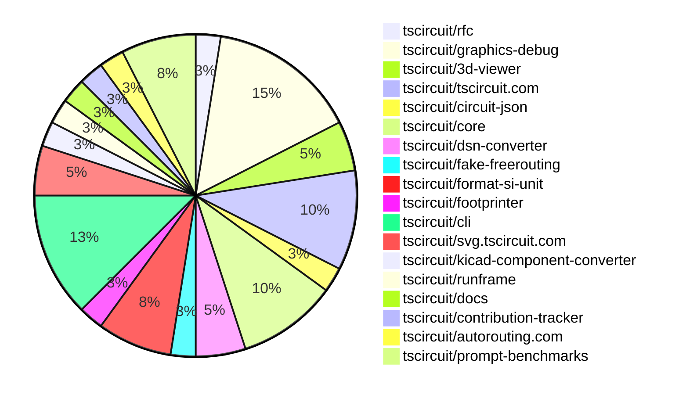

# contribution-tracker

Generates weekly contribution overviews for tscircuit contributors. Check out all
the [contribution overviews here](./contribution-overviews/)

* All PRs in the tscircuit org are scanned/summarized via Claude Haiku
* Claude classifies each Diff/PR as a Major, Minor or Tiny contribution
* All the PRs, summaries, and classifications are organized into charts and tables

The current week is shown below. There are 3 major sections:

* [Contributor Overview](#contributor-overview)
* [PRs by Repository](#prs-by-repository)
* [PRs by Contributor](#changes-by-contributor)

## Current Week

<!-- START_CURRENT_WEEK -->

# Contribution Overview 2025-01-29

## PRs by Repository

## Contributor Overview

| Contributor | 🐳 Major | 🐙 Minor | 🐌 Tiny | ⭐ | Issues Created |
|-------------|---------|---------|---------|-----|----------------|
| [seveibar](#seveibar) | 3 | 3 | 0 | ⭐⭐⭐ | 25 |
| [imrishabh18](#imrishabh18) | 2 | 10 | 1 | ⭐⭐⭐ | 5 |
| [ShiboSoftwareDev](#ShiboSoftwareDev) | 2 | 1 | 0 | ⭐⭐ | 12 |
| [ArnavK-09](#ArnavK-09) | 3 | 3 | 2 | ⭐⭐ | 3 |
| [kom-senapati](#kom-senapati) | 1 | 3 | 0 | ⭐ | 3 |
| [Anshgrover23](#Anshgrover23) | 0 | 2 | 0 | ⭐ | 2 |
| [Abse2001](#Abse2001) | 1 | 0 | 0 | ⭐ | 0 |
| [Ayushjhawar8](#Ayushjhawar8) | 0 | 1 | 0 |  | 0 |
| [MustafaMulla29](#MustafaMulla29) | 0 | 1 | 0 |  | 0 |
| [krushnarout](#krushnarout) | 0 | 1 | 0 |  | 0 |

## Review Table

[reviews-received-hover]: ## "Number of reviews received for PRs for this contributor"
[approvals-received-hover]: ## "Number of approvals received for PRs this contributor authored"
[rejections-received-hover]: ## "Number of rejections received for PRs this contributor authored"
[prs-opened-hover]: ## "Number of PRs opened by this contributor"
[issues-created-hover]: ## "Number of issues created by this contributor"
[bountied-issues-hover]: ## "Number of issues this contributor created with a bounty"
[bountied-issue-$-hover]: ## "Total bounty amount placed on issues authored by this contributor"

| Contributor | Reviews Received | Approvals Received | Rejections Received | Approvals | Rejections | PRs Opened | PRs Merged | Issues Created | Bountied Issues | Bountied Issue $ |
|---|---|---|---|---|---|---|---|---|---|---|
| [DrSensor](#DrSensor) | 0 | 0 | 0 | 1 | 0 | 2 | 0 | 3 | 0 | 0 |
| [seveibar](#seveibar) | 0 | 0 | 0 | 23 | 10 | 7 | 6 | 25 | 22 | 296 |
| [imrishabh18](#imrishabh18) | 16 | 2 | 0 | 2 | 2 | 16 | 13 | 5 | 2 | 15 |
| [Ayushjhawar8](#Ayushjhawar8) | 9 | 1 | 4 | 0 | 0 | 1 | 1 | 0 | 0 | 0 |
| [Anshgrover23](#Anshgrover23) | 11 | 2 | 6 | 5 | 17 | 6 | 2 | 2 | 1 | 10 |
| [Rishikesh63](#Rishikesh63) | 5 | 0 | 4 | 0 | 0 | 1 | 0 | 0 | 0 | 0 |
| [ArnavK-09](#ArnavK-09) | 51 | 12 | 11 | 0 | 0 | 11 | 8 | 3 | 0 | 0 |
| [rohittcodes](#rohittcodes) | 2 | 1 | 1 | 0 | 0 | 2 | 0 | 0 | 0 | 0 |
| [MustafaMulla29](#MustafaMulla29) | 3 | 2 | 1 | 0 | 0 | 2 | 1 | 0 | 0 | 0 |
| [ShiboSoftwareDev](#ShiboSoftwareDev) | 2 | 2 | 0 | 0 | 2 | 3 | 3 | 12 | 8 | 79 |
| [UTK-a-RSH](#UTK-a-RSH) | 0 | 0 | 0 | 0 | 0 | 1 | 0 | 0 | 0 | 0 |
| [ARYPROGRAMMER](#ARYPROGRAMMER) | 1 | 0 | 1 | 0 | 0 | 1 | 0 | 0 | 0 | 0 |
| [kom-senapati](#kom-senapati) | 11 | 7 | 0 | 0 | 0 | 5 | 4 | 3 | 1 | 2 |
| [Abse2001](#Abse2001) | 1 | 1 | 0 | 0 | 0 | 1 | 1 | 0 | 0 | 0 |
| [techmannih](#techmannih) | 1 | 0 | 1 | 0 | 0 | 1 | 0 | 0 | 0 | 0 |
| [krushnarout](#krushnarout) | 3 | 1 | 2 | 0 | 0 | 1 | 1 | 0 | 0 | 0 |

## Changes by Repository

### [tscircuit/rfc](https://github.com/tscircuit/rfc)

| PR # | Impact | Contributor | Description |
|------|--------|-------------|-------------|
| [#5](https://github.com/tscircuit/rfc/pull/5) | 🐳 Major | seveibar | This RFC introduces a new version of the tscircuit tool, v0.1, which aims to make tscircuit more viable for commercial electronics development by enabling modern development practices. |

### [tscircuit/graphics-debug](https://github.com/tscircuit/graphics-debug)

| PR # | Impact | Contributor | Description |
|------|--------|-------------|-------------|
| [#19](https://github.com/tscircuit/graphics-debug/pull/19) | 🐳 Major | seveibar | Adds filtering functionality for layers and steps, and centers the interactive graphics around the objects. |
| [#18](https://github.com/tscircuit/graphics-debug/pull/18) | 🐳 Major | seveibar | Add support for React Cosmos, interactive React components, and various new features like tooltips, distance to line segments, and more. |
| [#22](https://github.com/tscircuit/graphics-debug/pull/22) | 🐙 Minor | seveibar | Add full width and height to the SVG container to fix the lines. |
| [#21](https://github.com/tscircuit/graphics-debug/pull/21) | 🐙 Minor | seveibar | Add handling for invalid/undefined color when hovering over a rectangle in the interactive graphics component. |
| [#20](https://github.com/tscircuit/graphics-debug/pull/20) | 🐙 Minor | seveibar | Fixes the center coordinates of an example data point for the step filtering feature. |
| [#16](https://github.com/tscircuit/graphics-debug/pull/16) | 🐙 Minor | Anshgrover23 | Add a GitHub badge to the landing page and an example button to load a sample graphics JSON file. |

### [tscircuit/3d-viewer](https://github.com/tscircuit/3d-viewer)

| PR # | Impact | Contributor | Description |
|------|--------|-------------|-------------|
| [#143](https://github.com/tscircuit/3d-viewer/pull/143) | 🐳 Major | imrishabh18 | This pull request adds a new function `convertCircuitJsonTo3dSvg` that converts a 3D circuit representation in JSON format to an SVG string. |
| [#141](https://github.com/tscircuit/3d-viewer/pull/141) | 🐙 Minor | Anshgrover23 | Add a new prop `autoRotateDisabled` to disable the automatic rotation of the 3D viewer. |

### [tscircuit/tscircuit.com](https://github.com/tscircuit/tscircuit.com)

| PR # | Impact | Contributor | Description |
|------|--------|-------------|-------------|
| [#627](https://github.com/tscircuit/tscircuit.com/pull/627) | 🐳 Major | imrishabh18 | Add a fake API for the packages |
| [#622](https://github.com/tscircuit/tscircuit.com/pull/622) | 🐙 Minor | imrishabh18 | Encode the search parameters to prevent issues with special characters. |
| [#599](https://github.com/tscircuit/tscircuit.com/pull/599) | 🐙 Minor | ArnavK-09 | Introduces a new package "circuit-json-to-tscircuit" and updates several dependencies. |
| [#624](https://github.com/tscircuit/tscircuit.com/pull/624) | 🐌 Tiny | ArnavK-09 | Updated the versions of the external actions used in the `bundle-size-analysis` GitHub workflow. |

### [tscircuit/circuit-json](https://github.com/tscircuit/circuit-json)

| PR # | Impact | Contributor | Description |
|------|--------|-------------|-------------|
| [#126](https://github.com/tscircuit/circuit-json/pull/126) | 🐙 Minor | imrishabh18 | Fixes the `convertSiUnitToNumber` function to handle negative numbers. |

### [tscircuit/core](https://github.com/tscircuit/core)

| PR # | Impact | Contributor | Description |
|------|--------|-------------|-------------|
| [#589](https://github.com/tscircuit/core/pull/589) | 🐙 Minor | imrishabh18 | Fix for parsing negative value PCB properties |
| [#588](https://github.com/tscircuit/core/pull/588) | 🐙 Minor | imrishabh18 | Fix the use of `schematic x and y props` by using the parsed value in mm. |
| [#584](https://github.com/tscircuit/core/pull/584) | 🐙 Minor | MustafaMulla29 | Modified the bundle-size.yml GitHub Actions workflow to post a comment on the pull request if the bundle size or install size difference is greater than or equal to 10 KB. |
| [#592](https://github.com/tscircuit/core/pull/592) | 🐌 Tiny | imrishabh18 | Update the version of the `format-si-unit` dependency in the `package.json` file. |

### [tscircuit/dsn-converter](https://github.com/tscircuit/dsn-converter)

| PR # | Impact | Contributor | Description |
|------|--------|-------------|-------------|
| [#85](https://github.com/tscircuit/dsn-converter/pull/85) | 🐙 Minor | imrishabh18 | Fix the calculation of trace length by using the `getTraceLength` utility function instead of calculating it based on the trace width. |
| [#84](https://github.com/tscircuit/dsn-converter/pull/84) | 🐙 Minor | imrishabh18 | Adds the `trace_length` property to the `pcb_trace` object for both `convert-polyline-path-to-pcb-traces.ts` and `convert-wiring-path-to-pcb-traces.ts` files. |

### [tscircuit/fake-freerouting](https://github.com/tscircuit/fake-freerouting)

| PR # | Impact | Contributor | Description |
|------|--------|-------------|-------------|
| [#22](https://github.com/tscircuit/fake-freerouting/pull/22) | 🐙 Minor | imrishabh18 | The change fixes a bug where source_trace elements in the circuit JSON can have more than 3 connected_ports, and splits these traces into multiple traces with only 2 connected ports each. |

### [tscircuit/format-si-unit](https://github.com/tscircuit/format-si-unit)

| PR # | Impact | Contributor | Description |
|------|--------|-------------|-------------|
| [#4](https://github.com/tscircuit/format-si-unit/pull/4) | 🐙 Minor | imrishabh18 | Updates the GitHub Actions workflow for the Bun release process, including setting up Bun and using `bun install` instead of `npm ci`. |
| [#3](https://github.com/tscircuit/format-si-unit/pull/3) | 🐙 Minor | imrishabh18 | Adds a GitHub Actions workflow to publish the package to npm. |
| [#2](https://github.com/tscircuit/format-si-unit/pull/2) | 🐙 Minor | imrishabh18 | The pull request fixes a bug in the `formatSiUnit` function to correctly convert values like "100uF" (100 microfarads). |

### [tscircuit/footprinter](https://github.com/tscircuit/footprinter)

| PR # | Impact | Contributor | Description |
|------|--------|-------------|-------------|
| [#115](https://github.com/tscircuit/footprinter/pull/115) | 🐙 Minor | Ayushjhawar8 | Introduces a new single-pin pad footprint with configurable width and height, including snapshot tests to verify the dimensions. |

### [tscircuit/cli](https://github.com/tscircuit/cli)

| PR # | Impact | Contributor | Description |
|------|--------|-------------|-------------|
| [#32](https://github.com/tscircuit/cli/pull/32) | 🐳 Major | ArnavK-09 | Automatically refreshes import types on file update |
| [#47](https://github.com/tscircuit/cli/pull/47) | 🐙 Minor | kom-senapati | Enforces the use of .tsx file extension for the dev command. |
| [#45](https://github.com/tscircuit/cli/pull/45) | 🐙 Minor | kom-senapati | Fix endpoint types issues in the CLI |
| [#42](https://github.com/tscircuit/cli/pull/42) | 🐙 Minor | kom-senapati | Fetch the GitHub username from the session token and store it in the CLI config. |
| [#37](https://github.com/tscircuit/cli/pull/37) | 🐙 Minor | krushnarout | Sets the default port for the development server to 3020. |

### [tscircuit/svg.tscircuit.com](https://github.com/tscircuit/svg.tscircuit.com)

| PR # | Impact | Contributor | Description |
|------|--------|-------------|-------------|
| [#21](https://github.com/tscircuit/svg.tscircuit.com/pull/21) | 🐳 Major | ArnavK-09 | Refactor the `getErrorSvg` function to include better and full-length errors in landscape mode. |
| [#6](https://github.com/tscircuit/svg.tscircuit.com/pull/6) | 🐳 Major | ArnavK-09 | Adds error handling to the endpoint and generates a red SVG error message when there's an issue |

### [tscircuit/kicad-component-converter](https://github.com/tscircuit/kicad-component-converter)

| PR # | Impact | Contributor | Description |
|------|--------|-------------|-------------|
| [#118](https://github.com/tscircuit/kicad-component-converter/pull/118) | 🐙 Minor | ArnavK-09 | Fixes an issue where missing `mid` and `stroke` attributes in the `fp_arc_row` data were causing errors during the conversion process. |

### [tscircuit/runframe](https://github.com/tscircuit/runframe)

| PR # | Impact | Contributor | Description |
|------|--------|-------------|-------------|
| [#167](https://github.com/tscircuit/runframe/pull/167) | 🐙 Minor | ArnavK-09 | Fix to show import error message and allow to rerun if any worker error occurs. |

### [tscircuit/docs](https://github.com/tscircuit/docs)

| PR # | Impact | Contributor | Description |
|------|--------|-------------|-------------|
| [#2](https://github.com/tscircuit/docs/pull/2) | 🐌 Tiny | ArnavK-09 |  |

### [tscircuit/contribution-tracker](https://github.com/tscircuit/contribution-tracker)

| PR # | Impact | Contributor | Description |
|------|--------|-------------|-------------|
| [#43](https://github.com/tscircuit/contribution-tracker/pull/43) | 🐳 Major | kom-senapati | Introduces a podium and PR statistics by repository to the frontend application. |

### [tscircuit/autorouting.com](https://github.com/tscircuit/autorouting.com)

| PR # | Impact | Contributor | Description |
|------|--------|-------------|-------------|
| [#30](https://github.com/tscircuit/autorouting.com/pull/30) | 🐳 Major | Abse2001 | This pull request introduces a new feature to the CLI application, allowing users to run the local freerouting autorouter instead of using the server. |

### [tscircuit/prompt-benchmarks](https://github.com/tscircuit/prompt-benchmarks)

| PR # | Impact | Contributor | Description |
|------|--------|-------------|-------------|
| [#22](https://github.com/tscircuit/prompt-benchmarks/pull/22) | 🐳 Major | ShiboSoftwareDev | Fixes a critical bug that caused circuits to fail in both problem sets. |
| [#21](https://github.com/tscircuit/prompt-benchmarks/pull/21) | 🐳 Major | ShiboSoftwareDev | Adds a new set of circuit design problems to the benchmarks-evalite project and increases the timeout for the evalite function. |
| [#23](https://github.com/tscircuit/prompt-benchmarks/pull/23) | 🐙 Minor | ShiboSoftwareDev | The pull request creates a log directory to save all failed attempts during the benchmark. This is great for debugging and providing data for improving the system. |

## Changes by Contributor

### [seveibar](https://github.com/seveibar)

| PR # | Impact | Description |
|------|--------|-------------|
| [#5](https://github.com/tscircuit/rfc/pull/5) | 🐳 Major | This RFC introduces a new version of the tscircuit tool, v0.1, which aims to make tscircuit more viable for commercial electronics development by enabling modern development practices. |
| [#19](https://github.com/tscircuit/graphics-debug/pull/19) | 🐳 Major | Adds filtering functionality for layers and steps, and centers the interactive graphics around the objects. |
| [#18](https://github.com/tscircuit/graphics-debug/pull/18) | 🐳 Major | Add support for React Cosmos, interactive React components, and various new features like tooltips, distance to line segments, and more. |
| [#22](https://github.com/tscircuit/graphics-debug/pull/22) | 🐙 Minor | Add full width and height to the SVG container to fix the lines. |
| [#21](https://github.com/tscircuit/graphics-debug/pull/21) | 🐙 Minor | Add handling for invalid/undefined color when hovering over a rectangle in the interactive graphics component. |
| [#20](https://github.com/tscircuit/graphics-debug/pull/20) | 🐙 Minor | Fixes the center coordinates of an example data point for the step filtering feature. |

### [imrishabh18](https://github.com/imrishabh18)

| PR # | Impact | Description |
|------|--------|-------------|
| [#143](https://github.com/tscircuit/3d-viewer/pull/143) | 🐳 Major | This pull request adds a new function `convertCircuitJsonTo3dSvg` that converts a 3D circuit representation in JSON format to an SVG string. |
| [#627](https://github.com/tscircuit/tscircuit.com/pull/627) | 🐳 Major | Add a fake API for the packages |
| [#126](https://github.com/tscircuit/circuit-json/pull/126) | 🐙 Minor | Fixes the `convertSiUnitToNumber` function to handle negative numbers. |
| [#589](https://github.com/tscircuit/core/pull/589) | 🐙 Minor | Fix for parsing negative value PCB properties |
| [#588](https://github.com/tscircuit/core/pull/588) | 🐙 Minor | Fix the use of `schematic x and y props` by using the parsed value in mm. |
| [#85](https://github.com/tscircuit/dsn-converter/pull/85) | 🐙 Minor | Fix the calculation of trace length by using the `getTraceLength` utility function instead of calculating it based on the trace width. |
| [#84](https://github.com/tscircuit/dsn-converter/pull/84) | 🐙 Minor | Adds the `trace_length` property to the `pcb_trace` object for both `convert-polyline-path-to-pcb-traces.ts` and `convert-wiring-path-to-pcb-traces.ts` files. |
| [#622](https://github.com/tscircuit/tscircuit.com/pull/622) | 🐙 Minor | Encode the search parameters to prevent issues with special characters. |
| [#22](https://github.com/tscircuit/fake-freerouting/pull/22) | 🐙 Minor | The change fixes a bug where source_trace elements in the circuit JSON can have more than 3 connected_ports, and splits these traces into multiple traces with only 2 connected ports each. |
| [#4](https://github.com/tscircuit/format-si-unit/pull/4) | 🐙 Minor | Updates the GitHub Actions workflow for the Bun release process, including setting up Bun and using `bun install` instead of `npm ci`. |
| [#3](https://github.com/tscircuit/format-si-unit/pull/3) | 🐙 Minor | Adds a GitHub Actions workflow to publish the package to npm. |
| [#2](https://github.com/tscircuit/format-si-unit/pull/2) | 🐙 Minor | The pull request fixes a bug in the `formatSiUnit` function to correctly convert values like "100uF" (100 microfarads). |
| [#592](https://github.com/tscircuit/core/pull/592) | 🐌 Tiny | Update the version of the `format-si-unit` dependency in the `package.json` file. |

### [Ayushjhawar8](https://github.com/Ayushjhawar8)

| PR # | Impact | Description |
|------|--------|-------------|
| [#115](https://github.com/tscircuit/footprinter/pull/115) | 🐙 Minor | Introduces a new single-pin pad footprint with configurable width and height, including snapshot tests to verify the dimensions. |

### [ArnavK-09](https://github.com/ArnavK-09)

| PR # | Impact | Description |
|------|--------|-------------|
| [#32](https://github.com/tscircuit/cli/pull/32) | 🐳 Major | Automatically refreshes import types on file update |
| [#21](https://github.com/tscircuit/svg.tscircuit.com/pull/21) | 🐳 Major | Refactor the `getErrorSvg` function to include better and full-length errors in landscape mode. |
| [#6](https://github.com/tscircuit/svg.tscircuit.com/pull/6) | 🐳 Major | Adds error handling to the endpoint and generates a red SVG error message when there's an issue |
| [#118](https://github.com/tscircuit/kicad-component-converter/pull/118) | 🐙 Minor | Fixes an issue where missing `mid` and `stroke` attributes in the `fp_arc_row` data were causing errors during the conversion process. |
| [#599](https://github.com/tscircuit/tscircuit.com/pull/599) | 🐙 Minor | Introduces a new package "circuit-json-to-tscircuit" and updates several dependencies. |
| [#167](https://github.com/tscircuit/runframe/pull/167) | 🐙 Minor | Fix to show import error message and allow to rerun if any worker error occurs. |
| [#624](https://github.com/tscircuit/tscircuit.com/pull/624) | 🐌 Tiny | Updated the versions of the external actions used in the `bundle-size-analysis` GitHub workflow. |
| [#2](https://github.com/tscircuit/docs/pull/2) | 🐌 Tiny |  |

### [Anshgrover23](https://github.com/Anshgrover23)

| PR # | Impact | Description |
|------|--------|-------------|
| [#141](https://github.com/tscircuit/3d-viewer/pull/141) | 🐙 Minor | Add a new prop `autoRotateDisabled` to disable the automatic rotation of the 3D viewer. |
| [#16](https://github.com/tscircuit/graphics-debug/pull/16) | 🐙 Minor | Add a GitHub badge to the landing page and an example button to load a sample graphics JSON file. |

### [MustafaMulla29](https://github.com/MustafaMulla29)

| PR # | Impact | Description |
|------|--------|-------------|
| [#584](https://github.com/tscircuit/core/pull/584) | 🐙 Minor | Modified the bundle-size.yml GitHub Actions workflow to post a comment on the pull request if the bundle size or install size difference is greater than or equal to 10 KB. |

### [kom-senapati](https://github.com/kom-senapati)

| PR # | Impact | Description |
|------|--------|-------------|
| [#43](https://github.com/tscircuit/contribution-tracker/pull/43) | 🐳 Major | Introduces a podium and PR statistics by repository to the frontend application. |
| [#47](https://github.com/tscircuit/cli/pull/47) | 🐙 Minor | Enforces the use of .tsx file extension for the dev command. |
| [#45](https://github.com/tscircuit/cli/pull/45) | 🐙 Minor | Fix endpoint types issues in the CLI |
| [#42](https://github.com/tscircuit/cli/pull/42) | 🐙 Minor | Fetch the GitHub username from the session token and store it in the CLI config. |

### [Abse2001](https://github.com/Abse2001)

| PR # | Impact | Description |
|------|--------|-------------|
| [#30](https://github.com/tscircuit/autorouting.com/pull/30) | 🐳 Major | This pull request introduces a new feature to the CLI application, allowing users to run the local freerouting autorouter instead of using the server. |

### [ShiboSoftwareDev](https://github.com/ShiboSoftwareDev)

| PR # | Impact | Description |
|------|--------|-------------|
| [#22](https://github.com/tscircuit/prompt-benchmarks/pull/22) | 🐳 Major | Fixes a critical bug that caused circuits to fail in both problem sets. |
| [#21](https://github.com/tscircuit/prompt-benchmarks/pull/21) | 🐳 Major | Adds a new set of circuit design problems to the benchmarks-evalite project and increases the timeout for the evalite function. |
| [#23](https://github.com/tscircuit/prompt-benchmarks/pull/23) | 🐙 Minor | The pull request creates a log directory to save all failed attempts during the benchmark. This is great for debugging and providing data for improving the system. |

### [krushnarout](https://github.com/krushnarout)

| PR # | Impact | Description |
|------|--------|-------------|
| [#37](https://github.com/tscircuit/cli/pull/37) | 🐙 Minor | Sets the default port for the development server to 3020. |

<!-- END_CURRENT_WEEK -->
