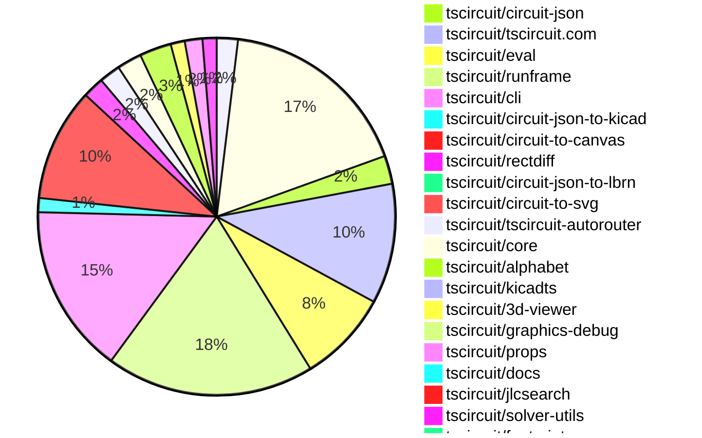
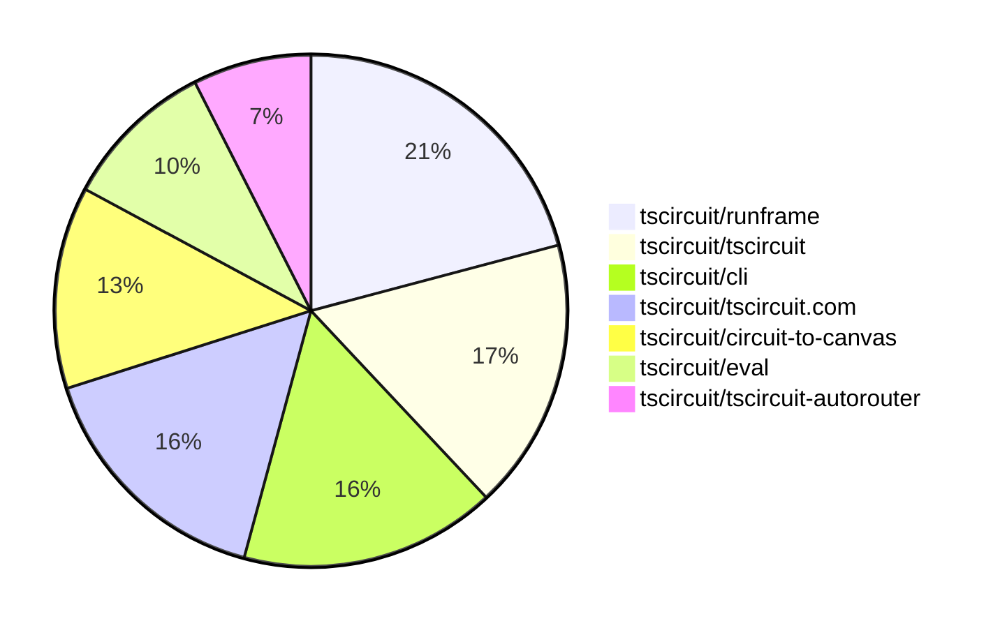

# contribution-tracker

[contributions.tscircuit.com](https://contributions.tscircuit.com) ・ [tscircuit.com](https://tscircuit.com) ・ [Contribution Overviews](./contribution-overviews/) ・ [Changelogs](./changelogs/)

Generates weekly contribution overviews for tscircuit contributors. Check out all
the [contribution overviews here](./contribution-overviews/)
You can find AI-generated monthly changelogs in the [changelogs directory](./changelogs/)

- All PRs in the tscircuit org are scanned/summarized via an LLM
- The LLM classifies each Diff/PR as into a set of attributes for scoring
- All the PRs, summaries, and classifications are organized into charts and tables for [the website](https://contributions.tscircuit.com)

> Want to run locally? See the [Development Section](#development)

The current week is shown below. There are 4 major sections:

- [Contributor Overview](#contributor-overview)
- [PRs by Repository](#prs-by-repository)
- [PRs by Contributor](#changes-by-contributor)
- [Scoring & Sponsorship System](#scoring--sponsorship-system)

## Current Week

<!-- START_CURRENT_WEEK -->

# Contribution Overview 2025-12-17

The current week is shown below. There are 4 major sections:

- [Contributor Overview](#contributor-overview)
- [PRs by Repository](#prs-by-repository)
- [PRs by Contributor](#changes-by-contributor)
- [Scoring & Sponsorship System](#scoring--sponsorship-system)

## PRs by Repository



## Contributor Overview

| Contributor | 🐳 Major | 🐙 Minor | 🐌 Tiny | ⭐ | Score | Discussion Contributions |
|-------------|---------|---------|---------|-----|----------------|--------------------------|
| [seveibar](#seveibar) | 6 | 10 | 9 | 👑 | 54 | 0🔹 0🔶 0💎 |
| [ShiboSoftwareDev](#ShiboSoftwareDev) | 3 | 7 | 1 | ⭐⭐ | 30 | 0🔹 0🔶 0💎 |
| [imrishabh18](#imrishabh18) | 0 | 9 | 11 | ⭐⭐ | 30 | 0🔹 0🔶 0💎 |
| [techmannih](#techmannih) | 0 | 7 | 8 | ⭐⭐ | 29 | 0🔹 0🔶 0💎 |
| [ArnavK-09](#ArnavK-09) | 4 | 1 | 4 | ⭐⭐ | 22 | 0🔹 0🔶 0💎 |
| [MustafaMulla29](#MustafaMulla29) | 4 | 0 | 5 | ⭐⭐ | 21 | 0🔹 0🔶 0💎 |
| [Ayushjhawar8](#Ayushjhawar8) | 1 | 1 | 6 | ⭐⭐ | 13 | 0🔹 0🔶 0💎 |
| [tscircuitbot](#tscircuitbot) | 0 | 0 | 211 | ⭐⭐ | 12.5 | 0🔹 0🔶 0💎 |
| [rushabhcodes](#rushabhcodes) | 1 | 2 | 2 | ⭐⭐ | 11 | 0🔹 0🔶 0💎 |
| [0hmX](#0hmX) | 2 | 1 | 0 | ⭐⭐ | 11 | 0🔹 0🔶 0💎 |
| [Abse2001](#Abse2001) | 0 | 3 | 0 | ⭐ | 9 | 0🔹 0🔶 0💎 |
| [pxlpal](#pxlpal) | 2 | 0 | 0 | ⭐ | 8 | 0🔹 0🔶 0💎 |
| [nailoo](#nailoo) | 1 | 1 | 1 | ⭐ | 7 | 0🔹 0🔶 0💎 |
| [AnasSarkiz](#AnasSarkiz) | 1 | 0 | 0 | ⭐ | 4 | 0🔹 0🔶 0💎 |
| [Juste-Leo2](#Juste-Leo2) | 0 | 0 | 2 |  | 2 | 0🔹 0🔶 0💎 |
| [shehaban](#shehaban) | 0 | 0 | 1 |  | 1 | 0🔹 0🔶 0💎 |

> Note: AI evaluates PRs and assigns 1-3 star ratings automatically. 4 and 5 star ratings require manual staff review.

### Discussion Contribution Legend

- 🔹 Normal Comments: Basic participation with minimal effort
- 🔶 Great Informative Comments: Thoughtful participation that adds value
- 💎 Incredible Comments: Exceptional participation with high-quality content

## Review Table

[reviews-received-hover]: ## "Number of reviews received for PRs for this contributor"
[approvals-received-hover]: ## "Number of approvals received for PRs this contributor authored"
[rejections-received-hover]: ## "Number of rejections received for PRs this contributor authored"
[prs-opened-hover]: ## "Number of PRs opened by this contributor"
[issues-created-hover]: ## "Number of issues created by this contributor"
[bountied-issues-hover]: ## "Number of issues this contributor created with a bounty"
[bountied-issue-$-hover]: ## "Total bounty amount placed on issues authored by this contributor"

| Contributor | Reviews Received | Approvals Received | Rejections Received | Approvals | Rejections | PRs Opened | PRs Merged | Score | Issues Created | Bountied Issues | Bountied Issue $ |
|---|---|---|---|---|---|---|---|---|---|---|---|
| [tscircuitbot](#tscircuitbot) | 5 | 0 | 0 | 0 | 0 | 289 | 211 | 12.5 | 0 | 0 | 0 |
| [nailoo](#nailoo) | 13 | 8 | 3 | 0 | 0 | 8 | 3 | 7 | 0 | 0 | 0 |
| [seveibar](#seveibar) | 7 | 1 | 0 | 50 | 14 | 41 | 27 | 54 | 0 | 0 | 0 |
| [techmannih](#techmannih) | 15 | 9 | 3 | 5 | 2 | 18 | 15 | 29 | 0 | 0 | 0 |
| [ShiboSoftwareDev](#ShiboSoftwareDev) | 16 | 10 | 1 | 1 | 0 | 14 | 12 | 30 | 0 | 0 | 0 |
| [Abse2001](#Abse2001) | 18 | 5 | 0 | 3 | 1 | 7 | 3 | 9 | 0 | 0 | 0 |
| [imrishabh18](#imrishabh18) | 5 | 2 | 0 | 14 | 3 | 22 | 20 | 30 | 0 | 0 | 0 |
| [MustafaMulla29](#MustafaMulla29) | 10 | 6 | 0 | 0 | 0 | 15 | 9 | 21 | 0 | 0 | 0 |
| [rushabhcodes](#rushabhcodes) | 31 | 8 | 5 | 0 | 0 | 11 | 5 | 11 | 0 | 0 | 0 |
| [shehaban](#shehaban) | 5 | 2 | 2 | 0 | 0 | 3 | 1 | 1 | 0 | 0 | 0 |
| [Juste-Leo2](#Juste-Leo2) | 6 | 4 | 0 | 0 | 0 | 2 | 2 | 2 | 0 | 0 | 0 |
| [Ayushjhawar8](#Ayushjhawar8) | 19 | 9 | 4 | 0 | 0 | 13 | 8 | 13 | 0 | 0 | 0 |
| [Excellencedev](#Excellencedev) | 1 | 0 | 1 | 0 | 0 | 1 | 0 | 0 | 0 | 0 | 0 |
| [ArnavK-09](#ArnavK-09) | 4 | 4 | 0 | 0 | 0 | 9 | 9 | 22 | 0 | 0 | 0 |
| [pxlpal](#pxlpal) | 2 | 2 | 0 | 0 | 0 | 2 | 2 | 8 | 0 | 0 | 0 |
| [0hmX](#0hmX) | 9 | 3 | 1 | 1 | 0 | 8 | 3 | 11 | 0 | 0 | 0 |
| [AnasSarkiz](#AnasSarkiz) | 1 | 1 | 0 | 0 | 0 | 1 | 1 | 4 | 0 | 0 | 0 |

## Top 7 Repositories by Contribution Points



## Scoring & Sponsorship System

### Overview

PRs are analyzed by AI and assigned a **star rating (1-3 stars)**. 4 and 5 star ratings can only be manually assigned by staff. Weekly scores use `2^(starRating - 1)` per PR (capped at 12 PRs per rating), plus review/discussion points.

### Weekly Score → Star String

| Score Range | Star String | Count Value |
|------------|-------------|-------------|
| 0-3 | (empty) | 0 stars |
| 4-10 | ⭐ | 1 star |
| 11-30 | ⭐⭐ | 2 stars |
| 31-50 | ⭐⭐⭐ | 3 stars |
| 51-75 | 👑 | 1 crown |
| 76-100 | 👑👑 | 2 crowns |
| 101+ | 👑👑👑 | 3 crowns |

> Crowns count as 3 stars for sponsorship.

### Monthly Sponsorship Calculation

The sponsorship system calculates monthly payments based on your **weekly star counts** over the complete weeks in that month (typically 4-5 weeks, Wednesday-Tuesday format).

**Step 1: Collect Weekly Stars**
- All complete weeks in the month are analyzed
- Each week's star string is converted to a numeric count (⭐ = 1 star, ⭐⭐⭐ = 3 stars)
- Example: `[2, 2, 2, 1, 0]` means 2 stars in week 1, 2 stars in week 2, etc.

**Step 2: Calculate Metrics**
- **Median stars**: The median value of all weekly star counts
- **Min stars**: The minimum weekly star count
- **Max stars**: The maximum weekly star count
- **High score**: The maximum raw weekly score (0-100+ range from the scoring table) from any week in the month

**Step 3: Determine Base Amount**
The sponsorship amount is calculated based on these metrics (checked in order):

| Condition | Base Amount |
|-----------|-------------|
| `minStarCount >= 3` | **$700** |
| `medianStars >= 3` | **$550** |
| `medianStars >= 2.5` | **$400** |
| `medianStars >= 2` | **$250** |
| `medianStars >= 1.5` | **$120** |
| `medianStars >= 1` | **$75** |
| `maxStarCount >= 2` | **$45** |
| `maxStarCount >= 1` | **$30** |
| `highScore >= 3` (and all stars = 0) | **$10** |

| Maintainer Level | Monthly Bonus |
|------------------|---------------|
| Level 1 | **$200** |
| Level 2 | **$350** |
| Level 3 | **$500** |
| Level 4 | **$850** |
| Level 5 | **$1300** |
| Level 6 | **$2000** |

**Final Amount** = Base Amount + Maintainer Bonus

## Changes by Repository

### [tscircuit/pcb-viewer](https://github.com/tscircuit/pcb-viewer)

| PR # | Impact | Rating | Contributor | Description |
|------|--------|--------|-------------|-------------|
| [#558](https://github.com/tscircuit/pcb-viewer/pull/558) | 🐙 Minor | ⭐⭐ | nailoo | Fixes the display issue of duplicate delta xy and mm units in the nested group anchor offset overlay. |
| [#559](https://github.com/tscircuit/pcb-viewer/pull/559) | 🐙 Minor | ⭐⭐ | ShiboSoftwareDev | Add a new component to display anchor offsets for PCB panels, enhancing the visualization of board placements relative to panel anchors. |

<details>
<summary>🐌 Tiny Contributions (4)</summary>

| PR # | Impact | Contributor | Description |
|------|--------|-------------|-------------|
| [#561](https://github.com/tscircuit/pcb-viewer/pull/561) | 🐌 Tiny | tscircuitbot | Automated package update |
| [#560](https://github.com/tscircuit/pcb-viewer/pull/560) | 🐌 Tiny | tscircuitbot | Automated package update |
| [#556](https://github.com/tscircuit/pcb-viewer/pull/556) | 🐌 Tiny | tscircuitbot | Automated package update |
| [#555](https://github.com/tscircuit/pcb-viewer/pull/555) | 🐌 Tiny | techmannih | Removes baseline alignment handling for lowercase letters in text rendering, simplifying the text geometry calculations. |

</details>

### [tscircuit/tscircuit](https://github.com/tscircuit/tscircuit)


<details>
<summary>🐌 Tiny Contributions (55)</summary>

| PR # | Impact | Contributor | Description |
|------|--------|-------------|-------------|
| [#1731](https://github.com/tscircuit/tscircuit/pull/1731) | 🐌 Tiny | tscircuitbot | Automated package update |
| [#1730](https://github.com/tscircuit/tscircuit/pull/1730) | 🐌 Tiny | tscircuitbot | Updates the tscircuitcli package from version 0.1.677 to 0.1.678 and the tscircuitrunframe package from version 0.0.1431 to 0.0.1432 in package.json |
| [#1729](https://github.com/tscircuit/tscircuit/pull/1729) | 🐌 Tiny | tscircuitbot | Automated package update |
| [#1728](https://github.com/tscircuit/tscircuit/pull/1728) | 🐌 Tiny | tscircuitbot | Updates the tscircuitcli package from version 0.1.676 to 0.1.677 and the tscircuitrunframe package from version 0.0.1430 to 0.0.1431 in package.json |
| [#1727](https://github.com/tscircuit/tscircuit/pull/1727) | 🐌 Tiny | tscircuitbot | Automated package update |
| [#1726](https://github.com/tscircuit/tscircuit/pull/1726) | 🐌 Tiny | tscircuitbot | Automated package update |
| [#1725](https://github.com/tscircuit/tscircuit/pull/1725) | 🐌 Tiny | tscircuitbot | Automated package update |
| [#1724](https://github.com/tscircuit/tscircuit/pull/1724) | 🐌 Tiny | tscircuitbot | Automated package update |
| [#1723](https://github.com/tscircuit/tscircuit/pull/1723) | 🐌 Tiny | tscircuitbot | Automated package update |
| [#1722](https://github.com/tscircuit/tscircuit/pull/1722) | 🐌 Tiny | tscircuitbot | Automated package update |
| [#1718](https://github.com/tscircuit/tscircuit/pull/1718) | 🐌 Tiny | tscircuitbot | Updates the tscircuitcli package to version 0.1.672 |
| [#1715](https://github.com/tscircuit/tscircuit/pull/1715) | 🐌 Tiny | tscircuitbot | Automated package update |
| [#1720](https://github.com/tscircuit/tscircuit/pull/1720) | 🐌 Tiny | tscircuitbot | Updates the tscircuitcli package from version 0.1.672 to 0.1.673 and the tscircuitrunframe package from version 0.0.1426 to 0.0.1427 in package.json |
| [#1716](https://github.com/tscircuit/tscircuit/pull/1716) | 🐌 Tiny | tscircuitbot | Automated package update |
| [#1721](https://github.com/tscircuit/tscircuit/pull/1721) | 🐌 Tiny | tscircuitbot | Automated package update |
| [#1713](https://github.com/tscircuit/tscircuit/pull/1713) | 🐌 Tiny | tscircuitbot | Automated package update |
| [#1717](https://github.com/tscircuit/tscircuit/pull/1717) | 🐌 Tiny | tscircuitbot | Automated package update |
| [#1711](https://github.com/tscircuit/tscircuit/pull/1711) | 🐌 Tiny | tscircuitbot | Automated package update |
| [#1712](https://github.com/tscircuit/tscircuit/pull/1712) | 🐌 Tiny | tscircuitbot | Automated package update |
| [#1691](https://github.com/tscircuit/tscircuit/pull/1691) | 🐌 Tiny | tscircuitbot | Automated package update |
| [#1708](https://github.com/tscircuit/tscircuit/pull/1708) | 🐌 Tiny | tscircuitbot | Automated package update |
| [#1701](https://github.com/tscircuit/tscircuit/pull/1701) | 🐌 Tiny | tscircuitbot | Automated package update |
| [#1694](https://github.com/tscircuit/tscircuit/pull/1694) | 🐌 Tiny | tscircuitbot | Updates the tscircuitcli package to version 0.1.663 in the package.json file. |
| [#1697](https://github.com/tscircuit/tscircuit/pull/1697) | 🐌 Tiny | tscircuitbot | Automated package update |
| [#1693](https://github.com/tscircuit/tscircuit/pull/1693) | 🐌 Tiny | tscircuitbot | Updates the package version from 0.0.1065 to 0.0.1066 in package.json |
| [#1692](https://github.com/tscircuit/tscircuit/pull/1692) | 🐌 Tiny | tscircuitbot | Automated package update |
| [#1705](https://github.com/tscircuit/tscircuit/pull/1705) | 🐌 Tiny | tscircuitbot | Automated package update |
| [#1703](https://github.com/tscircuit/tscircuit/pull/1703) | 🐌 Tiny | tscircuitbot | Automated package update |
| [#1707](https://github.com/tscircuit/tscircuit/pull/1707) | 🐌 Tiny | tscircuitbot | Automated package update |
| [#1695](https://github.com/tscircuit/tscircuit/pull/1695) | 🐌 Tiny | tscircuitbot | Automated package update |
| [#1696](https://github.com/tscircuit/tscircuit/pull/1696) | 🐌 Tiny | tscircuitbot | Automated package update |
| [#1709](https://github.com/tscircuit/tscircuit/pull/1709) | 🐌 Tiny | tscircuitbot | Automated package update |
| [#1699](https://github.com/tscircuit/tscircuit/pull/1699) | 🐌 Tiny | tscircuitbot | Automated package update |
| [#1690](https://github.com/tscircuit/tscircuit/pull/1690) | 🐌 Tiny | tscircuitbot | Updates the tscircuitcli package from version 0.1.660 to 0.1.661 and the tscircuitrunframe package from version 0.0.1416 to 0.0.1417 in package.json |
| [#1702](https://github.com/tscircuit/tscircuit/pull/1702) | 🐌 Tiny | tscircuitbot | Updates the tscircuitcli package and other dependencies to their latest versions. |
| [#1704](https://github.com/tscircuit/tscircuit/pull/1704) | 🐌 Tiny | tscircuitbot | Updates the tscircuitcli package to version 0.1.666 in the package.json file |
| [#1676](https://github.com/tscircuit/tscircuit/pull/1676) | 🐌 Tiny | tscircuitbot | Updates the tscircuitcli package from version 0.1.654 to 0.1.655 |
| [#1684](https://github.com/tscircuit/tscircuit/pull/1684) | 🐌 Tiny | tscircuitbot | Automated package update |
| [#1685](https://github.com/tscircuit/tscircuit/pull/1685) | 🐌 Tiny | tscircuitbot | Automated package update |
| [#1677](https://github.com/tscircuit/tscircuit/pull/1677) | 🐌 Tiny | tscircuitbot | Automated package update |
| [#1681](https://github.com/tscircuit/tscircuit/pull/1681) | 🐌 Tiny | tscircuitbot | Automated package update |
| [#1686](https://github.com/tscircuit/tscircuit/pull/1686) | 🐌 Tiny | tscircuitbot | Automated package update |
| [#1689](https://github.com/tscircuit/tscircuit/pull/1689) | 🐌 Tiny | tscircuitbot | Automated package update |
| [#1678](https://github.com/tscircuit/tscircuit/pull/1678) | 🐌 Tiny | tscircuitbot | Automated package update |
| [#1675](https://github.com/tscircuit/tscircuit/pull/1675) | 🐌 Tiny | tscircuitbot | Automated package update |
| [#1682](https://github.com/tscircuit/tscircuit/pull/1682) | 🐌 Tiny | tscircuitbot | Automated package update |
| [#1687](https://github.com/tscircuit/tscircuit/pull/1687) | 🐌 Tiny | tscircuitbot | Automated package update |
| [#1683](https://github.com/tscircuit/tscircuit/pull/1683) | 🐌 Tiny | tscircuitbot | Automated package update |
| [#1688](https://github.com/tscircuit/tscircuit/pull/1688) | 🐌 Tiny | tscircuitbot | Automated package update |
| [#1680](https://github.com/tscircuit/tscircuit/pull/1680) | 🐌 Tiny | tscircuitbot | Updates the tscircuitcli package from version 0.1.656 to 0.1.657 and the tscircuitrunframe package from version 0.0.1411 to 0.0.1412 in package.json |
| [#1679](https://github.com/tscircuit/tscircuit/pull/1679) | 🐌 Tiny | tscircuitbot | Automated package update |
| [#1674](https://github.com/tscircuit/tscircuit/pull/1674) | 🐌 Tiny | tscircuitbot | Automated package update |
| [#1706](https://github.com/tscircuit/tscircuit/pull/1706) | 🐌 Tiny | MustafaMulla29 | Updates the kicadts dependency from version 0.0.22 to 0.0.23 in package.json |
| [#1700](https://github.com/tscircuit/tscircuit/pull/1700) | 🐌 Tiny | imrishabh18 | Updates the graphics-debug dependency version from 0.0.72 to 0.0.73 in package.json |
| [#1698](https://github.com/tscircuit/tscircuit/pull/1698) | 🐌 Tiny | imrishabh18 | Updates the graphics-debug dependency from version 0.0.60 to 0.0.72 in package.json |

</details>

### [tscircuit/circuit-json](https://github.com/tscircuit/circuit-json)

| PR # | Impact | Rating | Contributor | Description |
|------|--------|--------|-------------|-------------|
| [#384](https://github.com/tscircuit/circuit-json/pull/384) | 🐙 Minor | ⭐⭐ | ShiboSoftwareDev | Makes the anchor_alignment property optional for PCB boards, allowing for more flexible board configurations. |
| [#381](https://github.com/tscircuit/circuit-json/pull/381) | 🐙 Minor | ⭐⭐ | ShiboSoftwareDev | Adds a new simulation current source functionality, allowing for both DC and AC current sources to be defined for circuit simulations. |
| [#379](https://github.com/tscircuit/circuit-json/pull/379) | 🐙 Minor | ⭐⭐ | ShiboSoftwareDev | Adds new properties to pcb_board and pcb_panel to support advanced board panelization layouts. |
| [#377](https://github.com/tscircuit/circuit-json/pull/377) | 🐙 Minor | ⭐⭐ | ShiboSoftwareDev | Adds an optional pcb_component_id to all pcb_hole types |
| [#378](https://github.com/tscircuit/circuit-json/pull/378) | 🐙 Minor | ⭐⭐ | Abse2001 | Adds the pcb_silkscreen_pill to the any_circuit_element export in the PCB module |

<details>
<summary>🐌 Tiny Contributions (3)</summary>

| PR # | Impact | Contributor | Description |
|------|--------|-------------|-------------|
| [#385](https://github.com/tscircuit/circuit-json/pull/385) | 🐌 Tiny | tscircuitbot | Automated package update |
| [#383](https://github.com/tscircuit/circuit-json/pull/383) | 🐌 Tiny | tscircuitbot | Automated package update |
| [#382](https://github.com/tscircuit/circuit-json/pull/382) | 🐌 Tiny | ShiboSoftwareDev | This PR updates the release workflow by replacing the old release configuration with a new one that automates the publishing process to npm and includes version bumping. |

</details>

### [tscircuit/tscircuit.com](https://github.com/tscircuit/tscircuit.com)

| PR # | Impact | Rating | Contributor | Description |
|------|--------|--------|-------------|-------------|
| [#2285](https://github.com/tscircuit/tscircuit.com/pull/2285) | 🐳 Major | ⭐⭐⭐ | ArnavK-09 | Allows users to view files of a selected version in the editor, including a read-only indication for older versions. |
| [#2288](https://github.com/tscircuit/tscircuit.com/pull/2288) | 🐳 Major | ⭐⭐⭐ | ArnavK-09 | Adds additional test data for package releases, including new versions and associated files for the Test2 package. |
| [#2231](https://github.com/tscircuit/tscircuit.com/pull/2231) | 🐳 Major | ⭐⭐⭐ | ArnavK-09 | Adds a release version selector component to the package view, allowing users to switch between different package versions easily. |
| [#2247](https://github.com/tscircuit/tscircuit.com/pull/2247) | 🐳 Major | ⭐⭐⭐ | pxlpal | Fixes the UI issue where the application incorrectly shows the logged-in state after the user session has expired by clearing the session on receiving a 401 error with session-related codes. |
| [#2248](https://github.com/tscircuit/tscircuit.com/pull/2248) | 🐳 Major | ⭐⭐⭐ | pxlpal | Restricts the GitHub connection section to organization managers and displays the number of connected GitHub accounts. |
| [#2281](https://github.com/tscircuit/tscircuit.com/pull/2281) | 🐙 Minor | ⭐⭐ | imrishabh18 | Adds session token authorization to fetch private package files from the npm registry |
| [#2287](https://github.com/tscircuit/tscircuit.com/pull/2287) | 🐙 Minor | ⭐⭐ | ArnavK-09 | Adds support for versioned file links in the editor by including version parameters in the URL when a file is clicked or edited. |

<details>
<summary>🐌 Tiny Contributions (27)</summary>

| PR # | Impact | Contributor | Description |
|------|--------|-------------|-------------|
| [#2300](https://github.com/tscircuit/tscircuit.com/pull/2300) | 🐌 Tiny | tscircuitbot | Updates the tscircuiteval package from version 0.0.550 to 0.0.551 |
| [#2295](https://github.com/tscircuit/tscircuit.com/pull/2295) | 🐌 Tiny | tscircuitbot | Updates the tscircuitrunframe package from version 0.0.1425 to 0.0.1426 |
| [#2294](https://github.com/tscircuit/tscircuit.com/pull/2294) | 🐌 Tiny | tscircuitbot | Updates the tscircuiteval package from version 0.0.549 to 0.0.550 |
| [#2289](https://github.com/tscircuit/tscircuit.com/pull/2289) | 🐌 Tiny | tscircuitbot | Automated package update to version 0.0.168 |
| [#2296](https://github.com/tscircuit/tscircuit.com/pull/2296) | 🐌 Tiny | tscircuitbot | Updates the tscircuitrunframe package from version 0.0.1426 to 0.0.1427 |
| [#2283](https://github.com/tscircuit/tscircuit.com/pull/2283) | 🐌 Tiny | tscircuitbot | Updates the tscircuitrunframe package from version 0.0.1421 to 0.0.1422 in package.json |
| [#2280](https://github.com/tscircuit/tscircuit.com/pull/2280) | 🐌 Tiny | tscircuitbot | Updates the tscircuitrunframe package from version 0.0.1420 to 0.0.1421 |
| [#2276](https://github.com/tscircuit/tscircuit.com/pull/2276) | 🐌 Tiny | tscircuitbot | Updates the tscircuiteval package from version 0.0.547 to 0.0.548 |
| [#2282](https://github.com/tscircuit/tscircuit.com/pull/2282) | 🐌 Tiny | tscircuitbot | Updates the tscircuiteval package to version 0.0.549 in the package.json file. |
| [#2274](https://github.com/tscircuit/tscircuit.com/pull/2274) | 🐌 Tiny | tscircuitbot | Automated package update |
| [#2253](https://github.com/tscircuit/tscircuit.com/pull/2253) | 🐌 Tiny | tscircuitbot | Updates the tscircuitrunframe package from version 0.0.1404 to 0.0.1405 |
| [#2270](https://github.com/tscircuit/tscircuit.com/pull/2270) | 🐌 Tiny | tscircuitbot | Updates the tscircuiteval package from version 0.0.545 to 0.0.546 |
| [#2255](https://github.com/tscircuit/tscircuit.com/pull/2255) | 🐌 Tiny | tscircuitbot | Updates the tscircuitrunframe package from version 0.0.1405 to 0.0.1406 |
| [#2266](https://github.com/tscircuit/tscircuit.com/pull/2266) | 🐌 Tiny | tscircuitbot | Updates the tscircuiteval package from version 0.0.543 to 0.0.544 |
| [#2251](https://github.com/tscircuit/tscircuit.com/pull/2251) | 🐌 Tiny | tscircuitbot | Automated package update |
| [#2250](https://github.com/tscircuit/tscircuit.com/pull/2250) | 🐌 Tiny | tscircuitbot | Updates the tscircuiteval package from version 0.0.538 to 0.0.539 |
| [#2252](https://github.com/tscircuit/tscircuit.com/pull/2252) | 🐌 Tiny | tscircuitbot | Automated package update |
| [#2268](https://github.com/tscircuit/tscircuit.com/pull/2268) | 🐌 Tiny | tscircuitbot | Automated package update |
| [#2263](https://github.com/tscircuit/tscircuit.com/pull/2263) | 🐌 Tiny | tscircuitbot | Updates the tscircuiteval package from version 0.0.542 to 0.0.543 |
| [#2260](https://github.com/tscircuit/tscircuit.com/pull/2260) | 🐌 Tiny | tscircuitbot | Automated package update |
| [#2249](https://github.com/tscircuit/tscircuit.com/pull/2249) | 🐌 Tiny | tscircuitbot | Automated package update to version 0.0.167 |
| [#2246](https://github.com/tscircuit/tscircuit.com/pull/2246) | 🐌 Tiny | tscircuitbot | Automated package update |
| [#2272](https://github.com/tscircuit/tscircuit.com/pull/2272) | 🐌 Tiny | imrishabh18 | Adds a step to close existing pull requests authored by tscircuitbot that are in an open state and have titles starting with chore: before creating a new pull request. |
| [#2279](https://github.com/tscircuit/tscircuit.com/pull/2279) | 🐌 Tiny | imrishabh18 | Updates package dependencies and resolves build failures in RunFrame on Vercel. |
| [#2284](https://github.com/tscircuit/tscircuit.com/pull/2284) | 🐌 Tiny | ArnavK-09 | Fixes the issue where users are able to scroll in the GitHub repository selector component, enhancing usability. |
| [#2292](https://github.com/tscircuit/tscircuit.com/pull/2292) | 🐌 Tiny | ArnavK-09 | Allows users to search for private packages in the package search functionality. |
| [#2290](https://github.com/tscircuit/tscircuit.com/pull/2290) | 🐌 Tiny | ArnavK-09 | Fixes the content header layout for mobile devices to prevent overflow issues. |

</details>

### [tscircuit/eval](https://github.com/tscircuit/eval)

| PR # | Impact | Rating | Contributor | Description |
|------|--------|--------|-------------|-------------|
| [#1763](https://github.com/tscircuit/eval/pull/1763) | 🐙 Minor | ⭐⭐ | imrishabh18 | Fixes the resolution of transitive dependencies in CommonJS code using require() to ensure all necessary imports are evaluated correctly before execution. |
| [#1759](https://github.com/tscircuit/eval/pull/1759) | 🐙 Minor | ⭐⭐ | imrishabh18 | Adds support for importing npm packages with minified import statements, enhancing the import functionality in the codebase. |
| [#1751](https://github.com/tscircuit/eval/pull/1751) | 🐙 Minor | ⭐⭐ | imrishabh18 | Adds support for sessionToken to authenticate and fetch private packages from the tscircuit npm registry. |
| [#1753](https://github.com/tscircuit/eval/pull/1753) | 🐙 Minor | ⭐⭐ | imrishabh18 | Changes the session token handling to use tscircuitSessionToken instead of sessionToken for authentication in various components. |
| [#1740](https://github.com/tscircuit/eval/pull/1740) | 🐙 Minor | ⭐⭐ | imrishabh18 | Adds a fragment value to the blob URL to preserve the file extension when importing local files. |

<details>
<summary>🐌 Tiny Contributions (21)</summary>

| PR # | Impact | Contributor | Description |
|------|--------|-------------|-------------|
| [#1764](https://github.com/tscircuit/eval/pull/1764) | 🐌 Tiny | tscircuitbot | Automated package update |
| [#1760](https://github.com/tscircuit/eval/pull/1760) | 🐌 Tiny | tscircuitbot | Automated package update |
| [#1754](https://github.com/tscircuit/eval/pull/1754) | 🐌 Tiny | tscircuitbot | Automated package update |
| [#1757](https://github.com/tscircuit/eval/pull/1757) | 🐌 Tiny | tscircuitbot | Automated package update |
| [#1756](https://github.com/tscircuit/eval/pull/1756) | 🐌 Tiny | tscircuitbot | Updates the version of the tscircuitcore package from 0.0.936 to 0.0.937 in package.json |
| [#1752](https://github.com/tscircuit/eval/pull/1752) | 🐌 Tiny | tscircuitbot | Automated package update |
| [#1742](https://github.com/tscircuit/eval/pull/1742) | 🐌 Tiny | tscircuitbot | Updates the version of the tscircuitcore package from 0.0.933 to 0.0.934 in package.json |
| [#1745](https://github.com/tscircuit/eval/pull/1745) | 🐌 Tiny | tscircuitbot | Updates the version of the tscircuitcore package from 0.0.934 to 0.0.935 in package.json |
| [#1736](https://github.com/tscircuit/eval/pull/1736) | 🐌 Tiny | tscircuitbot | Updates the package version from 0.0.540 to 0.0.541 in package.json |
| [#1743](https://github.com/tscircuit/eval/pull/1743) | 🐌 Tiny | tscircuitbot | Automated package update |
| [#1738](https://github.com/tscircuit/eval/pull/1738) | 🐌 Tiny | tscircuitbot | Automated package update |
| [#1749](https://github.com/tscircuit/eval/pull/1749) | 🐌 Tiny | tscircuitbot | Automated package update |
| [#1750](https://github.com/tscircuit/eval/pull/1750) | 🐌 Tiny | tscircuitbot | Automated package update |
| [#1731](https://github.com/tscircuit/eval/pull/1731) | 🐌 Tiny | tscircuitbot | Automated package update to version 0.0.539 |
| [#1739](https://github.com/tscircuit/eval/pull/1739) | 🐌 Tiny | tscircuitbot | Automated package update |
| [#1748](https://github.com/tscircuit/eval/pull/1748) | 🐌 Tiny | tscircuitbot | Automated package update |
| [#1746](https://github.com/tscircuit/eval/pull/1746) | 🐌 Tiny | tscircuitbot | Automated package update |
| [#1735](https://github.com/tscircuit/eval/pull/1735) | 🐌 Tiny | tscircuitbot | Updates the version of the tscircuitcore package from 0.0.931 to 0.0.932 in package.json |
| [#1733](https://github.com/tscircuit/eval/pull/1733) | 🐌 Tiny | tscircuitbot | Automated package update |
| [#1732](https://github.com/tscircuit/eval/pull/1732) | 🐌 Tiny | seveibar | Disables full minification of identifiers in the web worker entrypoint to improve readability of debug messages. |
| [#1730](https://github.com/tscircuit/eval/pull/1730) | 🐌 Tiny | seveibar | Updates the core library version and several dependencies in the project. |

</details>

### [tscircuit/runframe](https://github.com/tscircuit/runframe)

| PR # | Impact | Rating | Contributor | Description |
|------|--------|--------|-------------|-------------|
| [#2146](https://github.com/tscircuit/runframe/pull/2146) | 🐳 Major | ⭐⭐⭐ | rushabhcodes | Adds an Analog Simulation tab to the CircuitJsonPreview component, allowing users to view analog simulation results and includes a fixture for demonstration. |
| [#2171](https://github.com/tscircuit/runframe/pull/2171) | 🐳 Major | ⭐⭐⭐ | ArnavK-09 | img width890 height834 altimage srchttps:github.comuser-attachmentsassetse3502450-06ca-4b0f-bab9-30663d5497bc |
| [#2167](https://github.com/tscircuit/runframe/pull/2167) | 🐙 Minor | ⭐⭐ | imrishabh18 | Passes the sessionToken prop to both web workers in the RunFrame component for improved session management. |
| [#2163](https://github.com/tscircuit/runframe/pull/2163) | 🐙 Minor | ⭐⭐ | imrishabh18 | Adds a new prop to the RunFrame component to pass the tscircuit session token for authentication purposes. |

<details>
<summary>🐌 Tiny Contributions (55)</summary>

| PR # | Impact | Contributor | Description |
|------|--------|-------------|-------------|
| [#2189](https://github.com/tscircuit/runframe/pull/2189) | 🐌 Tiny | tscircuitbot | Automated package update |
| [#2188](https://github.com/tscircuit/runframe/pull/2188) | 🐌 Tiny | tscircuitbot | Updates the tscircuitpcb-viewer package from version 1.11.291 to 1.11.292 |
| [#2187](https://github.com/tscircuit/runframe/pull/2187) | 🐌 Tiny | tscircuitbot | Automated package update |
| [#2186](https://github.com/tscircuit/runframe/pull/2186) | 🐌 Tiny | tscircuitbot | Updates the tscircuitpcb-viewer package from version 1.11.290 to 1.11.291 |
| [#2185](https://github.com/tscircuit/runframe/pull/2185) | 🐌 Tiny | tscircuitbot | Automated package update |
| [#2184](https://github.com/tscircuit/runframe/pull/2184) | 🐌 Tiny | tscircuitbot | Updates the tscircuiteval package to version 0.0.551 |
| [#2183](https://github.com/tscircuit/runframe/pull/2183) | 🐌 Tiny | tscircuitbot | Automated package update |
| [#2182](https://github.com/tscircuit/runframe/pull/2182) | 🐌 Tiny | tscircuitbot | Updates the tscircuit3d-viewer package to version 0.0.477 in package.json |
| [#2181](https://github.com/tscircuit/runframe/pull/2181) | 🐌 Tiny | tscircuitbot | Automated package update |
| [#2179](https://github.com/tscircuit/runframe/pull/2179) | 🐌 Tiny | tscircuitbot | Automated package update |
| [#2177](https://github.com/tscircuit/runframe/pull/2177) | 🐌 Tiny | tscircuitbot | Automated package update |
| [#2176](https://github.com/tscircuit/runframe/pull/2176) | 🐌 Tiny | tscircuitbot | Updates the tscircuiteval package from version 0.0.549 to 0.0.550 |
| [#2173](https://github.com/tscircuit/runframe/pull/2173) | 🐌 Tiny | tscircuitbot | Automated package update |
| [#2172](https://github.com/tscircuit/runframe/pull/2172) | 🐌 Tiny | tscircuitbot | Automated package update |
| [#2175](https://github.com/tscircuit/runframe/pull/2175) | 🐌 Tiny | tscircuitbot | Automated package update |
| [#2161](https://github.com/tscircuit/runframe/pull/2161) | 🐌 Tiny | tscircuitbot | Updates the tscircuiteval package to version 0.0.548 in the package.json file. |
| [#2159](https://github.com/tscircuit/runframe/pull/2159) | 🐌 Tiny | tscircuitbot | Updates the tscircuiteval package to version 0.0.547 in the package.json file. |
| [#2170](https://github.com/tscircuit/runframe/pull/2170) | 🐌 Tiny | tscircuitbot | Automated package update |
| [#2169](https://github.com/tscircuit/runframe/pull/2169) | 🐌 Tiny | tscircuitbot | Updates the tscircuiteval package to version 0.0.549 in the package.json file. |
| [#2168](https://github.com/tscircuit/runframe/pull/2168) | 🐌 Tiny | tscircuitbot | Automated package update |
| [#2164](https://github.com/tscircuit/runframe/pull/2164) | 🐌 Tiny | tscircuitbot | Automated package update |
| [#2160](https://github.com/tscircuit/runframe/pull/2160) | 🐌 Tiny | tscircuitbot | Automated package update |
| [#2157](https://github.com/tscircuit/runframe/pull/2157) | 🐌 Tiny | tscircuitbot | Updates the tscircuitpcb-viewer package from version 1.11.289 to 1.11.290 |
| [#2158](https://github.com/tscircuit/runframe/pull/2158) | 🐌 Tiny | tscircuitbot | Automated package update |
| [#2162](https://github.com/tscircuit/runframe/pull/2162) | 🐌 Tiny | tscircuitbot | Automated package update |
| [#2149](https://github.com/tscircuit/runframe/pull/2149) | 🐌 Tiny | tscircuitbot | Updates the tscircuiteval package from version 0.0.542 to 0.0.543 |
| [#2144](https://github.com/tscircuit/runframe/pull/2144) | 🐌 Tiny | tscircuitbot | Automated package update |
| [#2155](https://github.com/tscircuit/runframe/pull/2155) | 🐌 Tiny | tscircuitbot | Updates the tscircuiteval package from version 0.0.545 to 0.0.546 |
| [#2151](https://github.com/tscircuit/runframe/pull/2151) | 🐌 Tiny | tscircuitbot | Updates the tscircuiteval package to version 0.0.544 in the package.json file. |
| [#2136](https://github.com/tscircuit/runframe/pull/2136) | 🐌 Tiny | tscircuitbot | Automated package update |
| [#2135](https://github.com/tscircuit/runframe/pull/2135) | 🐌 Tiny | tscircuitbot | Updates the tscircuiteval package to version 0.0.541 in the package.json file. |
| [#2156](https://github.com/tscircuit/runframe/pull/2156) | 🐌 Tiny | tscircuitbot | Automated package update |
| [#2154](https://github.com/tscircuit/runframe/pull/2154) | 🐌 Tiny | tscircuitbot | Automated package update |
| [#2153](https://github.com/tscircuit/runframe/pull/2153) | 🐌 Tiny | tscircuitbot | Updates the tscircuiteval package to version 0.0.545 in the package.json file. |
| [#2152](https://github.com/tscircuit/runframe/pull/2152) | 🐌 Tiny | tscircuitbot | Automated package update |
| [#2150](https://github.com/tscircuit/runframe/pull/2150) | 🐌 Tiny | tscircuitbot | Automated package update |
| [#2148](https://github.com/tscircuit/runframe/pull/2148) | 🐌 Tiny | tscircuitbot | Automated package update |
| [#2145](https://github.com/tscircuit/runframe/pull/2145) | 🐌 Tiny | tscircuitbot | Automated package update |
| [#2142](https://github.com/tscircuit/runframe/pull/2142) | 🐌 Tiny | tscircuitbot | Automated package update |
| [#2139](https://github.com/tscircuit/runframe/pull/2139) | 🐌 Tiny | tscircuitbot | Automated package update |
| [#2137](https://github.com/tscircuit/runframe/pull/2137) | 🐌 Tiny | tscircuitbot | Automated package update |
| [#2134](https://github.com/tscircuit/runframe/pull/2134) | 🐌 Tiny | tscircuitbot | Automated package update |
| [#2132](https://github.com/tscircuit/runframe/pull/2132) | 🐌 Tiny | tscircuitbot | Automated package update |
| [#2131](https://github.com/tscircuit/runframe/pull/2131) | 🐌 Tiny | tscircuitbot | Automated package update |
| [#2141](https://github.com/tscircuit/runframe/pull/2141) | 🐌 Tiny | tscircuitbot | Updates the circuit-json-to-kicad package from version 0.0.28 to 0.0.29 |
| [#2140](https://github.com/tscircuit/runframe/pull/2140) | 🐌 Tiny | tscircuitbot | Updates the circuit-json-to-kicad package version from 0.0.28 to 0.0.29 in package.json |
| [#2133](https://github.com/tscircuit/runframe/pull/2133) | 🐌 Tiny | tscircuitbot | Updates the tscircuiteval package to version 0.0.540 in the package.json file. |
| [#2129](https://github.com/tscircuit/runframe/pull/2129) | 🐌 Tiny | tscircuitbot | Automated package update |
| [#2180](https://github.com/tscircuit/runframe/pull/2180) | 🐌 Tiny | MustafaMulla29 | https:github.comuser-attachmentsassets616f4495-1f4d-4b78-8d01-3faad7a409dd |
| [#2178](https://github.com/tscircuit/runframe/pull/2178) | 🐌 Tiny | MustafaMulla29 | Updates the versions of circuit-json-to-kicad and kicadts dependencies in package.json |
| [#2147](https://github.com/tscircuit/runframe/pull/2147) | 🐌 Tiny | imrishabh18 | Adds a test to verify the loading of a model using a blob URL in the RunFrame component. |
| [#2128](https://github.com/tscircuit/runframe/pull/2128) | 🐌 Tiny | imrishabh18 | Updates the version of the 3D viewer and props, while removing unnecessary development dependencies from the package.json file. |
| [#2138](https://github.com/tscircuit/runframe/pull/2138) | 🐌 Tiny | seveibar | Adds icons for different solvers in the SolversTabContent component to visually distinguish between them. |
| [#2130](https://github.com/tscircuit/runframe/pull/2130) | 🐌 Tiny | seveibar | This pull request introduces a new Solvers tab in the CircuitJsonPreview component, allowing users to debug algorithms related to circuit rendering. It includes a new SolversTabContent component that displays solver events and their parameters, enhancing the debugging experience for users. |
| [#2174](https://github.com/tscircuit/runframe/pull/2174) | 🐌 Tiny | ArnavK-09 | Updates the tscircuitschematic-viewer dependency to version 2.0.50 in package.json |

</details>

### [tscircuit/cli](https://github.com/tscircuit/cli)

| PR # | Impact | Rating | Contributor | Description |
|------|--------|--------|-------------|-------------|
| [#1403](https://github.com/tscircuit/cli/pull/1403) | 🐳 Major | ⭐⭐⭐ | MustafaMulla29 | This pull request introduces support for exporting KiCad libraries through the tsci export command. It enhances the existing functionality by allowing users to generate both symbol and footprint libraries in a structured format, including the necessary 3D model files. The changes include updates to the library generation logic, ensuring that the output is compatible with KiCads requirements. Additionally, it modifies the export options to include the new library format, making it easier for users to integrate their designs with KiCad. |
| [#1389](https://github.com/tscircuit/cli/pull/1389) | 🐙 Minor | ⭐⭐ | Ayushjhawar8 | Adds support for previewComponentPath in the build process, allowing users to specify a separate component for preview images, which takes precedence over the main entrypoint. |

<details>
<summary>🐌 Tiny Contributions (46)</summary>

| PR # | Impact | Contributor | Description |
|------|--------|-------------|-------------|
| [#1458](https://github.com/tscircuit/cli/pull/1458) | 🐌 Tiny | tscircuitbot | Automated package update |
| [#1457](https://github.com/tscircuit/cli/pull/1457) | 🐌 Tiny | tscircuitbot | Updates the tscircuitrunframe package from version 0.0.1431 to 0.0.1432 |
| [#1456](https://github.com/tscircuit/cli/pull/1456) | 🐌 Tiny | tscircuitbot | Automated package update |
| [#1455](https://github.com/tscircuit/cli/pull/1455) | 🐌 Tiny | tscircuitbot | Automated package update |
| [#1454](https://github.com/tscircuit/cli/pull/1454) | 🐌 Tiny | tscircuitbot | Automated package update |
| [#1453](https://github.com/tscircuit/cli/pull/1453) | 🐌 Tiny | tscircuitbot | Updates the tscircuitrunframe package from version 0.0.1429 to 0.0.1430 |
| [#1452](https://github.com/tscircuit/cli/pull/1452) | 🐌 Tiny | tscircuitbot | Automated package update |
| [#1451](https://github.com/tscircuit/cli/pull/1451) | 🐌 Tiny | tscircuitbot | Updates the tscircuitrunframe package from version 0.0.1428 to 0.0.1429 |
| [#1450](https://github.com/tscircuit/cli/pull/1450) | 🐌 Tiny | tscircuitbot | Automated package update |
| [#1449](https://github.com/tscircuit/cli/pull/1449) | 🐌 Tiny | tscircuitbot | Updates the tscircuitrunframe package from version 0.0.1427 to 0.0.1428 |
| [#1439](https://github.com/tscircuit/cli/pull/1439) | 🐌 Tiny | tscircuitbot | Updates the tscircuitrunframe package from version 0.0.1422 to 0.0.1424 |
| [#1438](https://github.com/tscircuit/cli/pull/1438) | 🐌 Tiny | tscircuitbot | Automated package update |
| [#1447](https://github.com/tscircuit/cli/pull/1447) | 🐌 Tiny | tscircuitbot | Updates the tscircuitrunframe package version from 0.0.1425 to 0.0.1427 in package.json |
| [#1448](https://github.com/tscircuit/cli/pull/1448) | 🐌 Tiny | tscircuitbot | Automated package update |
| [#1446](https://github.com/tscircuit/cli/pull/1446) | 🐌 Tiny | tscircuitbot | Automated package update |
| [#1444](https://github.com/tscircuit/cli/pull/1444) | 🐌 Tiny | tscircuitbot | Automated README update with latest CLI usage output. |
| [#1441](https://github.com/tscircuit/cli/pull/1441) | 🐌 Tiny | tscircuitbot | Updates the tscircuitrunframe package from version 0.0.1424 to 0.0.1425 |
| [#1440](https://github.com/tscircuit/cli/pull/1440) | 🐌 Tiny | tscircuitbot | Automated package update |
| [#1421](https://github.com/tscircuit/cli/pull/1421) | 🐌 Tiny | tscircuitbot | Updates the tscircuitrunframe package to version 0.0.1418 in the package.json file |
| [#1433](https://github.com/tscircuit/cli/pull/1433) | 🐌 Tiny | tscircuitbot | Updates the tscircuitrunframe package from version 0.0.1420 to 0.0.1421 |
| [#1431](https://github.com/tscircuit/cli/pull/1431) | 🐌 Tiny | tscircuitbot | Automated package update |
| [#1422](https://github.com/tscircuit/cli/pull/1422) | 🐌 Tiny | tscircuitbot | Automated package update |
| [#1437](https://github.com/tscircuit/cli/pull/1437) | 🐌 Tiny | tscircuitbot | Updates the tscircuitrunframe package to version 0.0.1422 in package.json |
| [#1424](https://github.com/tscircuit/cli/pull/1424) | 🐌 Tiny | tscircuitbot | Updates the tscircuitrunframe package from version 0.0.1418 to 0.0.1419 |
| [#1425](https://github.com/tscircuit/cli/pull/1425) | 🐌 Tiny | tscircuitbot | Automated package update |
| [#1426](https://github.com/tscircuit/cli/pull/1426) | 🐌 Tiny | tscircuitbot | Updates the tscircuitrunframe package to version 0.0.1420 in package.json |
| [#1434](https://github.com/tscircuit/cli/pull/1434) | 🐌 Tiny | tscircuitbot | Automated package update |
| [#1423](https://github.com/tscircuit/cli/pull/1423) | 🐌 Tiny | tscircuitbot | Automated package update |
| [#1420](https://github.com/tscircuit/cli/pull/1420) | 🐌 Tiny | tscircuitbot | Automated package update |
| [#1427](https://github.com/tscircuit/cli/pull/1427) | 🐌 Tiny | tscircuitbot | Automated package update |
| [#1419](https://github.com/tscircuit/cli/pull/1419) | 🐌 Tiny | tscircuitbot | Updates the tscircuitrunframe package from version 0.0.1416 to 0.0.1417 |
| [#1417](https://github.com/tscircuit/cli/pull/1417) | 🐌 Tiny | tscircuitbot | Updates the tscircuitrunframe package to version 0.0.1416 in package.json |
| [#1413](https://github.com/tscircuit/cli/pull/1413) | 🐌 Tiny | tscircuitbot | Updates the tscircuitrunframe package to version 0.0.1414 in the package.json file |
| [#1416](https://github.com/tscircuit/cli/pull/1416) | 🐌 Tiny | tscircuitbot | Automated package update |
| [#1414](https://github.com/tscircuit/cli/pull/1414) | 🐌 Tiny | tscircuitbot | Automated package update |
| [#1411](https://github.com/tscircuit/cli/pull/1411) | 🐌 Tiny | tscircuitbot | Automated package update |
| [#1415](https://github.com/tscircuit/cli/pull/1415) | 🐌 Tiny | tscircuitbot | Automated package update |
| [#1418](https://github.com/tscircuit/cli/pull/1418) | 🐌 Tiny | tscircuitbot | Automated package update |
| [#1407](https://github.com/tscircuit/cli/pull/1407) | 🐌 Tiny | tscircuitbot | Automated package update |
| [#1410](https://github.com/tscircuit/cli/pull/1410) | 🐌 Tiny | tscircuitbot | Updates the tscircuitrunframe package from version 0.0.1411 to 0.0.1412 |
| [#1408](https://github.com/tscircuit/cli/pull/1408) | 🐌 Tiny | tscircuitbot | Updates the tscircuitrunframe package to version 0.0.1411 in package.json |
| [#1409](https://github.com/tscircuit/cli/pull/1409) | 🐌 Tiny | tscircuitbot | Automated package update |
| [#1430](https://github.com/tscircuit/cli/pull/1430) | 🐌 Tiny | MustafaMulla29 | Updates the kicadts dependency from version 0.0.22 to 0.0.23 in package.json |
| [#1400](https://github.com/tscircuit/cli/pull/1400) | 🐌 Tiny | MustafaMulla29 | Updates the version of the circuit-json-to-kicad dependency from 0.0.3 to 0.0.29 in package.json |
| [#1443](https://github.com/tscircuit/cli/pull/1443) | 🐌 Tiny | imrishabh18 | Provides a clear hint to users to rename .ts entry files to .tsx when building tscircuit components, addressing a common error message. |
| [#1406](https://github.com/tscircuit/cli/pull/1406) | 🐌 Tiny | seveibar | Fixes dependency resolution in the importFromUserLand function to prefer user or CLI dependencies over Buns auto-install, and increases snapshot CLI test timeouts to accommodate slower runs. |

</details>

### [tscircuit/circuit-json-to-kicad](https://github.com/tscircuit/circuit-json-to-kicad)

| PR # | Impact | Rating | Contributor | Description |
|------|--------|--------|-------------|-------------|
| [#40](https://github.com/tscircuit/circuit-json-to-kicad/pull/40) | 🐳 Major | ⭐⭐⭐ | MustafaMulla29 | img width864 height283 altimage srchttps:github.comuser-attachmentsassets7f375dae-ff7c-4334-80aa-0095332284cb  img width890 height227 altimage srchttps:github.comuser-attachmentsassets11e070ae-c797-4e7a-a454-713ed3250145  img width932 height250 altimage srchttps:github.comuser-attachmentsassetsbcf2cdcd-3c33-46c3-81bc-7437f94c7d17 |
| [#38](https://github.com/tscircuit/circuit-json-to-kicad/pull/38) | 🐳 Major | ⭐⭐⭐ | MustafaMulla29 | Links 3D models to footprints and schematic symbols to footprints in the circuit JSON to KiCad conversion process. |

<details>
<summary>🐌 Tiny Contributions (2)</summary>

| PR # | Impact | Contributor | Description |
|------|--------|-------------|-------------|
| [#41](https://github.com/tscircuit/circuit-json-to-kicad/pull/41) | 🐌 Tiny | tscircuitbot | Automated package update |
| [#39](https://github.com/tscircuit/circuit-json-to-kicad/pull/39) | 🐌 Tiny | tscircuitbot | Automated package update |

</details>

### [tscircuit/circuit-to-canvas](https://github.com/tscircuit/circuit-to-canvas)

| PR # | Impact | Rating | Contributor | Description |
|------|--------|--------|-------------|-------------|
| [#57](https://github.com/tscircuit/circuit-to-canvas/pull/57) | 🐳 Major | ⭐⭐⭐ | Ayushjhawar8 | Fixes font embedding issues for SVG-to-PNG conversion and improves stroke rendering for lineAlphabet text in PCB silkscreen drawings. |
| [#39](https://github.com/tscircuit/circuit-to-canvas/pull/39) | 🐙 Minor | ⭐⭐ | techmannih | Adds functionality to draw PCB note lines in the canvas rendering, including support for custom colors and dashed lines. |
| [#29](https://github.com/tscircuit/circuit-to-canvas/pull/29) | 🐙 Minor | ⭐⭐ | techmannih | Removes special handling for the characters o, O, and 0 in text rendering, simplifying the rendering logic. |
| [#25](https://github.com/tscircuit/circuit-to-canvas/pull/25) | 🐙 Minor | ⭐⭐ | techmannih | Removes baseline alignment adjustments for text rendering in PCB copper and silkscreen layers, simplifying the text layout calculations. |
| [#22](https://github.com/tscircuit/circuit-to-canvas/pull/22) | 🐙 Minor | ⭐⭐ | techmannih | Adds support for rendering PCB note paths in the canvas drawing functionality. |
| [#23](https://github.com/tscircuit/circuit-to-canvas/pull/23) | 🐙 Minor | ⭐⭐ | techmannih | Adds support for rendering PCB note text elements in the canvas drawing context, allowing for customizable text annotations on circuit boards. |
| [#41](https://github.com/tscircuit/circuit-to-canvas/pull/41) | 🐙 Minor | ⭐⭐ | rushabhcodes | Adds support for rendering PCB note dimensions in the canvas drawing library, including a new drawing function and comprehensive tests for various dimension scenarios. |

<details>
<summary>🐌 Tiny Contributions (25)</summary>

| PR # | Impact | Contributor | Description |
|------|--------|-------------|-------------|
| [#63](https://github.com/tscircuit/circuit-to-canvas/pull/63) | 🐌 Tiny | tscircuitbot | Automated package update |
| [#58](https://github.com/tscircuit/circuit-to-canvas/pull/58) | 🐌 Tiny | tscircuitbot | Automated package update |
| [#56](https://github.com/tscircuit/circuit-to-canvas/pull/56) | 🐌 Tiny | tscircuitbot | Automated package update |
| [#54](https://github.com/tscircuit/circuit-to-canvas/pull/54) | 🐌 Tiny | tscircuitbot | Automated package update |
| [#51](https://github.com/tscircuit/circuit-to-canvas/pull/51) | 🐌 Tiny | tscircuitbot | Automated package update |
| [#50](https://github.com/tscircuit/circuit-to-canvas/pull/50) | 🐌 Tiny | tscircuitbot | Automated package update |
| [#42](https://github.com/tscircuit/circuit-to-canvas/pull/42) | 🐌 Tiny | tscircuitbot | Updates the package version from 0.0.13 to 0.0.14 in package.json |
| [#45](https://github.com/tscircuit/circuit-to-canvas/pull/45) | 🐌 Tiny | tscircuitbot | Automated package update |
| [#47](https://github.com/tscircuit/circuit-to-canvas/pull/47) | 🐌 Tiny | tscircuitbot | Automated package update |
| [#48](https://github.com/tscircuit/circuit-to-canvas/pull/48) | 🐌 Tiny | tscircuitbot | Automated package update |
| [#31](https://github.com/tscircuit/circuit-to-canvas/pull/31) | 🐌 Tiny | tscircuitbot | Updates the package version from 0.0.8 to 0.0.9 in package.json |
| [#27](https://github.com/tscircuit/circuit-to-canvas/pull/27) | 🐌 Tiny | tscircuitbot | Updates the package version from 0.0.6 to 0.0.7 in package.json |
| [#36](https://github.com/tscircuit/circuit-to-canvas/pull/36) | 🐌 Tiny | tscircuitbot | Automated package update |
| [#34](https://github.com/tscircuit/circuit-to-canvas/pull/34) | 🐌 Tiny | tscircuitbot | Updates the package version from 0.0.10 to 0.0.11 in package.json |
| [#32](https://github.com/tscircuit/circuit-to-canvas/pull/32) | 🐌 Tiny | tscircuitbot | Updates the package version from 0.0.9 to 0.0.10 in package.json |
| [#37](https://github.com/tscircuit/circuit-to-canvas/pull/37) | 🐌 Tiny | tscircuitbot | Updates the package version from 0.0.12 to 0.0.13 in package.json |
| [#30](https://github.com/tscircuit/circuit-to-canvas/pull/30) | 🐌 Tiny | tscircuitbot | Updates the package version from 0.0.7 to 0.0.8 in package.json |
| [#61](https://github.com/tscircuit/circuit-to-canvas/pull/61) | 🐌 Tiny | nailoo | Refactors the pcb-silkscreen.ts file to eliminate the multi-export anti-pattern by splitting exports into individual files for better modularity and maintainability. |
| [#44](https://github.com/tscircuit/circuit-to-canvas/pull/44) | 🐌 Tiny | techmannih | Renames the variable transform to realToCanvasMat across multiple drawing functions to standardize naming conventions and improve code clarity. |
| [#33](https://github.com/tscircuit/circuit-to-canvas/pull/33) | 🐌 Tiny | techmannih | Updates the circuit-json dependency to version 0.0.335 in the package.json file. |
| [#49](https://github.com/tscircuit/circuit-to-canvas/pull/49) | 🐌 Tiny | seveibar | Add snapshot tests for USB-C flashlight board rendering format refactor update snapshot and fix flip logic update snapshots add looks-same dep update snapshot separate function out move board to better directory usb c flashlight diff 1 |
| [#53](https://github.com/tscircuit/circuit-to-canvas/pull/53) | 🐌 Tiny | Ayushjhawar8 | Fixes font rendering issues by updating the tscircuitalphabet dependency and restoring the USB-C flashlight test. |
| [#43](https://github.com/tscircuit/circuit-to-canvas/pull/43) | 🐌 Tiny | Ayushjhawar8 | Adds an artifact upload step to the bun test workflow to store test snapshot artifacts after running tests. |
| [#28](https://github.com/tscircuit/circuit-to-canvas/pull/28) | 🐌 Tiny | Ayushjhawar8 | Replaces the canvas dependency with napi-rscanvas and updates all related tests to ensure compatibility with the new library. |
| [#35](https://github.com/tscircuit/circuit-to-canvas/pull/35) | 🐌 Tiny | Ayushjhawar8 | Updates dependencies and resolves type errors in the project. |

</details>

### [tscircuit/rectdiff](https://github.com/tscircuit/rectdiff)

| PR # | Impact | Rating | Contributor | Description |
|------|--------|--------|-------------|-------------|
| [#36](https://github.com/tscircuit/rectdiff/pull/36) | 🐳 Major | ⭐⭐⭐ | seveibar | Adds a gap fill pipeline to the RectDiffSolver, enhancing the ability to fill gaps in mesh nodes by finding segments with adjacent empty space and expanding edges to fill those gaps. |
| [#30](https://github.com/tscircuit/rectdiff/pull/30) | 🐳 Major | ⭐⭐⭐ | 0hmX | Adds a new RectDiffPipeline class that integrates the RectDiffSolver into a pipeline structure for improved routing capabilities. |
| [#28](https://github.com/tscircuit/rectdiff/pull/28) | 🐙 Minor | ⭐⭐ | 0hmX | Removes gap-fill related functions and types from the RectDiffSolver, streamlining the codebase by eliminating unused components. |

<details>
<summary>🐌 Tiny Contributions (3)</summary>

| PR # | Impact | Contributor | Description |
|------|--------|-------------|-------------|
| [#37](https://github.com/tscircuit/rectdiff/pull/37) | 🐌 Tiny | tscircuitbot | Automated package update |
| [#33](https://github.com/tscircuit/rectdiff/pull/33) | 🐌 Tiny | tscircuitbot | Automated package update |
| [#32](https://github.com/tscircuit/rectdiff/pull/32) | 🐌 Tiny | tscircuitbot | Automated package update |

</details>

### [tscircuit/circuit-json-to-lbrn](https://github.com/tscircuit/circuit-json-to-lbrn)

| PR # | Impact | Rating | Contributor | Description |
|------|--------|--------|-------------|-------------|
| [#53](https://github.com/tscircuit/circuit-json-to-lbrn/pull/53) | 🐳 Major | ⭐⭐⭐ | AnasSarkiz | Adds comprehensive UI controls for all conversion options including copper, soldermask, layers, margins, and spot size, enabling full customization of LBRN output generation. |

<details>
<summary>🐌 Tiny Contributions (1)</summary>

| PR # | Impact | Contributor | Description |
|------|--------|-------------|-------------|
| [#54](https://github.com/tscircuit/circuit-json-to-lbrn/pull/54) | 🐌 Tiny | tscircuitbot | Automated package update |

</details>

### [tscircuit/circuit-to-svg](https://github.com/tscircuit/circuit-to-svg)

| PR # | Impact | Rating | Contributor | Description |
|------|--------|--------|-------------|-------------|
| [#461](https://github.com/tscircuit/circuit-to-svg/pull/461) | 🐳 Major | ⭐⭐⭐ | nailoo | Adds support for rendering the pcb_silkscreen_pill element in SVG output. |
| [#462](https://github.com/tscircuit/circuit-to-svg/pull/462) | 🐳 Major | ⭐⭐⭐ | ShiboSoftwareDev | Correctly handles anchor offsets for boards in panels by updating the createSvgObjectsFromPcbBoard function to render offset indicators based on the available positioning properties. |
| [#460](https://github.com/tscircuit/circuit-to-svg/pull/460) | 🐙 Minor | ⭐⭐ | Abse2001 | Removes lowercase-specific baseline adjustments in copper text path generation for consistent glyph positioning. |

### [tscircuit/tscircuit-autorouter](https://github.com/tscircuit/tscircuit-autorouter)

| PR # | Impact | Rating | Contributor | Description |
|------|--------|--------|-------------|-------------|
| [#424](https://github.com/tscircuit/tscircuit-autorouter/pull/424) | 🐳 Major | ⭐⭐⭐ | ShiboSoftwareDev | Adds specific error messages to high-density solvers for improved debugging, including reasons for failure such as incorrect input routes and search space exhaustion, along with a new test case for reproduction. |
| [#425](https://github.com/tscircuit/tscircuit-autorouter/pull/425) | 🐳 Major | ⭐⭐⭐ | ShiboSoftwareDev | Enhances error handling in ViaPossibilitiesSolver2 by setting specific error messages for maximum via count exceedance and Z-layer determination failures, improving debugging for solver failures. |
| [#431](https://github.com/tscircuit/tscircuit-autorouter/pull/431) | 🐳 Major | ⭐⭐⭐ | seveibar | Allows the reuse of the same net ports in point pathing and updates the rectdiff solver to a new version. |
| [#426](https://github.com/tscircuit/tscircuit-autorouter/pull/426) | 🐳 Major | ⭐⭐⭐ | seveibar | Fixes autorouting failure by constraining assignable obstacles to their declared layers, preventing routing onto layers where it should not occur. |
| [#419](https://github.com/tscircuit/tscircuit-autorouter/pull/419) | 🐳 Major | ⭐⭐⭐ | seveibar | Adds a fixture for bug report 25-4b1d55 and implements a short-circuit routing solution for vertical via-only connections in the autorouting system. |
| [#428](https://github.com/tscircuit/tscircuit-autorouter/pull/428) | 🐳 Major | ⭐⭐⭐ | 0hmX | Fixes autorouting issues related to bottom layer traces in the AssignableVia autorouting pipeline. |

### [tscircuit/core](https://github.com/tscircuit/core)

| PR # | Impact | Rating | Contributor | Description |
|------|--------|--------|-------------|-------------|
| [#1782](https://github.com/tscircuit/core/pull/1782) | 🐙 Minor | ⭐⭐ | ShiboSoftwareDev | Ensures that silkscreen primitive components are correctly repositioned when their parent board is moved by a layout manager. |
| [#1778](https://github.com/tscircuit/core/pull/1778) | 🐙 Minor | ⭐⭐ | ShiboSoftwareDev | Associates Hole primitives with their parents pcb_component_id to ensure correct placement during auto-layout. |
| [#1777](https://github.com/tscircuit/core/pull/1777) | 🐙 Minor | ⭐⭐ | imrishabh18 | Handles blob URL fragments in the getFileExtension function to correctly extract file extensions from URLs containing fragment identifiers. |
| [#1775](https://github.com/tscircuit/core/pull/1775) | 🐙 Minor | ⭐⭐ | Abse2001 | Adds a standardized solver:started event emission when the Copper Pour pipeline begins execution, including solver name, input parameters, and component name for improved observability. |
| [#1780](https://github.com/tscircuit/core/pull/1780) | 🐙 Minor | ⭐⭐ | seveibar | Fixes incorrect positioning of silkscreen rectangles in footprints by using the global PCB transform instead of local offsets. |
| [#1772](https://github.com/tscircuit/core/pull/1772) | 🐙 Minor | ⭐⭐ | seveibar | Ensures that the solverName property retains its value after minification by replacing it with a static string in the event emission. |
| [#1774](https://github.com/tscircuit/core/pull/1774) | 🐙 Minor | ⭐⭐ | seveibar | Implement interconnect custom footprint test, add silkscreen text, and fix test to be more explicit |

### [tscircuit/alphabet](https://github.com/tscircuit/alphabet)

| PR # | Impact | Rating | Contributor | Description |
|------|--------|--------|-------------|-------------|
| [#34](https://github.com/tscircuit/alphabet/pull/34) | 🐙 Minor | ⭐⭐ | techmannih | Adds support for the  special character in the SVG alphabet rendering. |
| [#33](https://github.com/tscircuit/alphabet/pull/33) | 🐙 Minor | ⭐⭐ | techmannih | Adds support for the  special character in the SVG alphabet rendering. |

<details>
<summary>🐌 Tiny Contributions (7)</summary>

| PR # | Impact | Contributor | Description |
|------|--------|-------------|-------------|
| [#31](https://github.com/tscircuit/alphabet/pull/31) | 🐌 Tiny | techmannih | Adds a new slanted  special symbol to the font rendering in the TscircuitAlphabet. |
| [#30](https://github.com/tscircuit/alphabet/pull/30) | 🐌 Tiny | techmannih | Adjusts the alignment and stroke spacing of the  glyph in the font rendering. |
| [#29](https://github.com/tscircuit/alphabet/pull/29) | 🐌 Tiny | techmannih | Modifies the SVG representations of the plus and minus signs in the font to improve their visual appearance. |
| [#28](https://github.com/tscircuit/alphabet/pull/28) | 🐌 Tiny | techmannih | Fixes the glyph shape of the parenthesis characters to align with the font-style arcs in the TscircuitAlphabet font. |
| [#27](https://github.com/tscircuit/alphabet/pull/27) | 🐌 Tiny | techmannih | Adds a GitHub Actions workflow for checking code formatting on push and pull request events to the main branch. |
| [#36](https://github.com/tscircuit/alphabet/pull/36) | 🐌 Tiny | seveibar | Add a build output for base64 font export, allowing users to import the font as a base64 string without special loaders. |
| [#37](https://github.com/tscircuit/alphabet/pull/37) | 🐌 Tiny | Ayushjhawar8 | Removes TscircuitAlphabet.ttf from git tracking to resolve failed publish to npm check on main |

</details>

### [tscircuit/kicadts](https://github.com/tscircuit/kicadts)

| PR # | Impact | Rating | Contributor | Description |
|------|--------|--------|-------------|-------------|
| [#22](https://github.com/tscircuit/kicadts/pull/22) | 🐳 Major | ⭐⭐⭐ | MustafaMulla29 | Adds new classes for handling KiCad symbol libraries, including versioning and generator information, along with support for schematic symbols. |

### [tscircuit/3d-viewer](https://github.com/tscircuit/3d-viewer)

| PR # | Impact | Rating | Contributor | Description |
|------|--------|--------|-------------|-------------|
| [#628](https://github.com/tscircuit/3d-viewer/pull/628) | 🐙 Minor | ⭐⭐ | rushabhcodes | Calculates the bounding box of a PCB board using its outline and updates texture generation logic to ensure accurate sizing and positioning for non-rectangular boards. |

<details>
<summary>🐌 Tiny Contributions (3)</summary>

| PR # | Impact | Contributor | Description |
|------|--------|-------------|-------------|
| [#625](https://github.com/tscircuit/3d-viewer/pull/625) | 🐌 Tiny | imrishabh18 | Updates the versions of core, props, and autorouter dependencies in the project. |
| [#626](https://github.com/tscircuit/3d-viewer/pull/626) | 🐌 Tiny | imrishabh18 | Removes development dependencies that are now available in tscircuit and updates the tscircuit package to the latest version. |
| [#627](https://github.com/tscircuit/3d-viewer/pull/627) | 🐌 Tiny | imrishabh18 | Removes the bun.lock file due to issues with lockfile generation. |

</details>

### [tscircuit/graphics-debug](https://github.com/tscircuit/graphics-debug)

| PR # | Impact | Rating | Contributor | Description |
|------|--------|--------|-------------|-------------|
| [#88](https://github.com/tscircuit/graphics-debug/pull/88) | 🐙 Minor | ⭐⭐ | seveibar | Adds a function to set the step property for all graphics objects in the graphics module. |

<details>
<summary>🐌 Tiny Contributions (2)</summary>

| PR # | Impact | Contributor | Description |
|------|--------|-------------|-------------|
| [#86](https://github.com/tscircuit/graphics-debug/pull/86) | 🐌 Tiny | imrishabh18 | Moves the react-hookresize-observer dependency from devDependencies to dependencies in package.json, ensuring it is included in the production build. |
| [#87](https://github.com/tscircuit/graphics-debug/pull/87) | 🐌 Tiny | seveibar | Add an optional height prop to InteractiveGraphics to allow configurable viewer height with a default of 600. |

</details>

### [tscircuit/props](https://github.com/tscircuit/props)

| PR # | Impact | Rating | Contributor | Description |
|------|--------|--------|-------------|-------------|
| [#537](https://github.com/tscircuit/props/pull/537) | 🐙 Minor | ⭐⭐ | seveibar | Adds an optional pinLabels property to InterconnectProps to allow labeling of pins like other components, ensuring runtime schema and TypeScript typings are in sync and documentation reflects the new prop. |
| [#534](https://github.com/tscircuit/props/pull/534) | 🐙 Minor | ⭐⭐ | seveibar | Adds connectsTo support to trace properties to allow explicit net connections and regenerates component type and props overview documentation. |
| [#535](https://github.com/tscircuit/props/pull/535) | 🐙 Minor | ⭐⭐ | seveibar | Adds support for multiple PCB paths in trace properties by introducing a reusable pcbPath schema and a pcbPaths array, along with unit tests for the new functionality. |
| [#536](https://github.com/tscircuit/props/pull/536) | 🐙 Minor | ⭐⭐ | seveibar | Allows interconnect components to specify internallyConnectedPins in their props schema and documents the new prop in generated component docs |

<details>
<summary>🐌 Tiny Contributions (1)</summary>

| PR # | Impact | Contributor | Description |
|------|--------|-------------|-------------|
| [#541](https://github.com/tscircuit/props/pull/541) | 🐌 Tiny | rushabhcodes | Makes the holeShape and padShape properties optional in the PillWithRectPadPlatedHoleProps interface, allowing for greater flexibility when these props are not explicitly set, and updates the Zod schema for runtime validation. |

</details>

### [tscircuit/docs](https://github.com/tscircuit/docs)


<details>
<summary>🐌 Tiny Contributions (1)</summary>

| PR # | Impact | Contributor | Description |
|------|--------|-------------|-------------|
| [#396](https://github.com/tscircuit/docs/pull/396) | 🐌 Tiny | rushabhcodes | Simplifies how the latest CDN URLs are provided for both tscircuitcircuit-preview and tscircuit by replacing dynamic fetching with static URLs from jsdelivr, removing related state and effects in hooks. |

</details>

### [tscircuit/jlcsearch](https://github.com/tscircuit/jlcsearch)

| PR # | Impact | Rating | Contributor | Description |
|------|--------|--------|-------------|-------------|
| [#112](https://github.com/tscircuit/jlcsearch/pull/112) | 🐳 Major | ⭐⭐⭐ | seveibar | Add a battery holder derived table that normalizes connector type, battery type, and temperature data, expose a Battery Holders page and JSON endpoint with filtering and navigation entry, include battery holder setup in derived table tooling and add route tests |

### [tscircuit/solver-utils](https://github.com/tscircuit/solver-utils)

| PR # | Impact | Rating | Contributor | Description |
|------|--------|--------|-------------|-------------|
| [#9](https://github.com/tscircuit/solver-utils/pull/9) | 🐳 Major | ⭐⭐⭐ | seveibar | Adds a PipelineStagesTable component to display the status of each stage in a pipeline solver, enhancing the debugging interface for users. |
| [#12](https://github.com/tscircuit/solver-utils/pull/12) | 🐙 Minor | ⭐⭐ | seveibar | Add initializeVisualize and finalVisualize functions for pipeline visualization and rename phase to stage in the BasePipelineSolver class. |
| [#11](https://github.com/tscircuit/solver-utils/pull/11) | 🐙 Minor | ⭐⭐ | seveibar | Renames methods and variables related to pipeline processing from phase to stage for clarity, and adds a subtable for displaying pipeline stages in the UI. |

<details>
<summary>🐌 Tiny Contributions (1)</summary>

| PR # | Impact | Contributor | Description |
|------|--------|-------------|-------------|
| [#10](https://github.com/tscircuit/solver-utils/pull/10) | 🐌 Tiny | seveibar | Renames and updates the handling of solver interfaces from Step to Stage in the PipelineStagesTable component. |

</details>

### [tscircuit/footprinter](https://github.com/tscircuit/footprinter)


<details>
<summary>🐌 Tiny Contributions (3)</summary>

| PR # | Impact | Contributor | Description |
|------|--------|-------------|-------------|
| [#445](https://github.com/tscircuit/footprinter/pull/445) | 🐌 Tiny | shehaban | Refines the TO-92 footprint by adjusting pad geometry to match KiCad standards, including a rectangular pad for pin 1 and pill-shaped pads for other pins. |
| [#447](https://github.com/tscircuit/footprinter/pull/447) | 🐌 Tiny | Juste-Leo2 | Added support for the _inline variant to the to92l footprint, reducing pad diameter to prevent overlap and adding a test case for correct alignment. |
| [#446](https://github.com/tscircuit/footprinter/pull/446) | 🐌 Tiny | Juste-Leo2 | Adds a new TO-92L footprint for electronic components based on the Kicad reference. |

</details>

### [tscircuit/plop](https://github.com/tscircuit/plop)


<details>
<summary>🐌 Tiny Contributions (1)</summary>

| PR # | Impact | Contributor | Description |
|------|--------|-------------|-------------|
| [#28](https://github.com/tscircuit/plop/pull/28) | 🐌 Tiny | Ayushjhawar8 | Adds a step to upload test snapshot artifacts in the bun test workflow. |

</details>

## Changes by Contributor

### [tscircuitbot](https://github.com/tscircuitbot)


<details>
<summary>🐌 Tiny Contributions (211)</summary>

| PR # | Impact | Description |
|------|--------|-------------|
| [#561](https://github.com/tscircuit/pcb-viewer/pull/561) | 🐌 Tiny | Automated package update |
| [#560](https://github.com/tscircuit/pcb-viewer/pull/560) | 🐌 Tiny | Automated package update |
| [#556](https://github.com/tscircuit/pcb-viewer/pull/556) | 🐌 Tiny | Automated package update |
| [#1731](https://github.com/tscircuit/tscircuit/pull/1731) | 🐌 Tiny | Automated package update |
| [#1730](https://github.com/tscircuit/tscircuit/pull/1730) | 🐌 Tiny | Updates the tscircuitcli package from version 0.1.677 to 0.1.678 and the tscircuitrunframe package from version 0.0.1431 to 0.0.1432 in package.json |
| [#1729](https://github.com/tscircuit/tscircuit/pull/1729) | 🐌 Tiny | Automated package update |
| [#1728](https://github.com/tscircuit/tscircuit/pull/1728) | 🐌 Tiny | Updates the tscircuitcli package from version 0.1.676 to 0.1.677 and the tscircuitrunframe package from version 0.0.1430 to 0.0.1431 in package.json |
| [#1727](https://github.com/tscircuit/tscircuit/pull/1727) | 🐌 Tiny | Automated package update |
| [#1726](https://github.com/tscircuit/tscircuit/pull/1726) | 🐌 Tiny | Automated package update |
| [#1725](https://github.com/tscircuit/tscircuit/pull/1725) | 🐌 Tiny | Automated package update |
| [#1724](https://github.com/tscircuit/tscircuit/pull/1724) | 🐌 Tiny | Automated package update |
| [#1723](https://github.com/tscircuit/tscircuit/pull/1723) | 🐌 Tiny | Automated package update |
| [#1722](https://github.com/tscircuit/tscircuit/pull/1722) | 🐌 Tiny | Automated package update |
| [#1718](https://github.com/tscircuit/tscircuit/pull/1718) | 🐌 Tiny | Updates the tscircuitcli package to version 0.1.672 |
| [#1715](https://github.com/tscircuit/tscircuit/pull/1715) | 🐌 Tiny | Automated package update |
| [#1720](https://github.com/tscircuit/tscircuit/pull/1720) | 🐌 Tiny | Updates the tscircuitcli package from version 0.1.672 to 0.1.673 and the tscircuitrunframe package from version 0.0.1426 to 0.0.1427 in package.json |
| [#1716](https://github.com/tscircuit/tscircuit/pull/1716) | 🐌 Tiny | Automated package update |
| [#1721](https://github.com/tscircuit/tscircuit/pull/1721) | 🐌 Tiny | Automated package update |
| [#1713](https://github.com/tscircuit/tscircuit/pull/1713) | 🐌 Tiny | Automated package update |
| [#1717](https://github.com/tscircuit/tscircuit/pull/1717) | 🐌 Tiny | Automated package update |
| [#1711](https://github.com/tscircuit/tscircuit/pull/1711) | 🐌 Tiny | Automated package update |
| [#1712](https://github.com/tscircuit/tscircuit/pull/1712) | 🐌 Tiny | Automated package update |
| [#1691](https://github.com/tscircuit/tscircuit/pull/1691) | 🐌 Tiny | Automated package update |
| [#1708](https://github.com/tscircuit/tscircuit/pull/1708) | 🐌 Tiny | Automated package update |
| [#1701](https://github.com/tscircuit/tscircuit/pull/1701) | 🐌 Tiny | Automated package update |
| [#1694](https://github.com/tscircuit/tscircuit/pull/1694) | 🐌 Tiny | Updates the tscircuitcli package to version 0.1.663 in the package.json file. |
| [#1697](https://github.com/tscircuit/tscircuit/pull/1697) | 🐌 Tiny | Automated package update |
| [#1693](https://github.com/tscircuit/tscircuit/pull/1693) | 🐌 Tiny | Updates the package version from 0.0.1065 to 0.0.1066 in package.json |
| [#1692](https://github.com/tscircuit/tscircuit/pull/1692) | 🐌 Tiny | Automated package update |
| [#1705](https://github.com/tscircuit/tscircuit/pull/1705) | 🐌 Tiny | Automated package update |
| [#1703](https://github.com/tscircuit/tscircuit/pull/1703) | 🐌 Tiny | Automated package update |
| [#1707](https://github.com/tscircuit/tscircuit/pull/1707) | 🐌 Tiny | Automated package update |
| [#1695](https://github.com/tscircuit/tscircuit/pull/1695) | 🐌 Tiny | Automated package update |
| [#1696](https://github.com/tscircuit/tscircuit/pull/1696) | 🐌 Tiny | Automated package update |
| [#1709](https://github.com/tscircuit/tscircuit/pull/1709) | 🐌 Tiny | Automated package update |
| [#1699](https://github.com/tscircuit/tscircuit/pull/1699) | 🐌 Tiny | Automated package update |
| [#1690](https://github.com/tscircuit/tscircuit/pull/1690) | 🐌 Tiny | Updates the tscircuitcli package from version 0.1.660 to 0.1.661 and the tscircuitrunframe package from version 0.0.1416 to 0.0.1417 in package.json |
| [#1702](https://github.com/tscircuit/tscircuit/pull/1702) | 🐌 Tiny | Updates the tscircuitcli package and other dependencies to their latest versions. |
| [#1704](https://github.com/tscircuit/tscircuit/pull/1704) | 🐌 Tiny | Updates the tscircuitcli package to version 0.1.666 in the package.json file |
| [#1676](https://github.com/tscircuit/tscircuit/pull/1676) | 🐌 Tiny | Updates the tscircuitcli package from version 0.1.654 to 0.1.655 |
| [#1684](https://github.com/tscircuit/tscircuit/pull/1684) | 🐌 Tiny | Automated package update |
| [#1685](https://github.com/tscircuit/tscircuit/pull/1685) | 🐌 Tiny | Automated package update |
| [#1677](https://github.com/tscircuit/tscircuit/pull/1677) | 🐌 Tiny | Automated package update |
| [#1681](https://github.com/tscircuit/tscircuit/pull/1681) | 🐌 Tiny | Automated package update |
| [#1686](https://github.com/tscircuit/tscircuit/pull/1686) | 🐌 Tiny | Automated package update |
| [#1689](https://github.com/tscircuit/tscircuit/pull/1689) | 🐌 Tiny | Automated package update |
| [#1678](https://github.com/tscircuit/tscircuit/pull/1678) | 🐌 Tiny | Automated package update |
| [#1675](https://github.com/tscircuit/tscircuit/pull/1675) | 🐌 Tiny | Automated package update |
| [#1682](https://github.com/tscircuit/tscircuit/pull/1682) | 🐌 Tiny | Automated package update |
| [#1687](https://github.com/tscircuit/tscircuit/pull/1687) | 🐌 Tiny | Automated package update |
| [#1683](https://github.com/tscircuit/tscircuit/pull/1683) | 🐌 Tiny | Automated package update |
| [#1688](https://github.com/tscircuit/tscircuit/pull/1688) | 🐌 Tiny | Automated package update |
| [#1680](https://github.com/tscircuit/tscircuit/pull/1680) | 🐌 Tiny | Updates the tscircuitcli package from version 0.1.656 to 0.1.657 and the tscircuitrunframe package from version 0.0.1411 to 0.0.1412 in package.json |
| [#1679](https://github.com/tscircuit/tscircuit/pull/1679) | 🐌 Tiny | Automated package update |
| [#1674](https://github.com/tscircuit/tscircuit/pull/1674) | 🐌 Tiny | Automated package update |
| [#385](https://github.com/tscircuit/circuit-json/pull/385) | 🐌 Tiny | Automated package update |
| [#383](https://github.com/tscircuit/circuit-json/pull/383) | 🐌 Tiny | Automated package update |
| [#2300](https://github.com/tscircuit/tscircuit.com/pull/2300) | 🐌 Tiny | Updates the tscircuiteval package from version 0.0.550 to 0.0.551 |
| [#2295](https://github.com/tscircuit/tscircuit.com/pull/2295) | 🐌 Tiny | Updates the tscircuitrunframe package from version 0.0.1425 to 0.0.1426 |
| [#2294](https://github.com/tscircuit/tscircuit.com/pull/2294) | 🐌 Tiny | Updates the tscircuiteval package from version 0.0.549 to 0.0.550 |
| [#2289](https://github.com/tscircuit/tscircuit.com/pull/2289) | 🐌 Tiny | Automated package update to version 0.0.168 |
| [#2296](https://github.com/tscircuit/tscircuit.com/pull/2296) | 🐌 Tiny | Updates the tscircuitrunframe package from version 0.0.1426 to 0.0.1427 |
| [#2283](https://github.com/tscircuit/tscircuit.com/pull/2283) | 🐌 Tiny | Updates the tscircuitrunframe package from version 0.0.1421 to 0.0.1422 in package.json |
| [#2280](https://github.com/tscircuit/tscircuit.com/pull/2280) | 🐌 Tiny | Updates the tscircuitrunframe package from version 0.0.1420 to 0.0.1421 |
| [#2276](https://github.com/tscircuit/tscircuit.com/pull/2276) | 🐌 Tiny | Updates the tscircuiteval package from version 0.0.547 to 0.0.548 |
| [#2282](https://github.com/tscircuit/tscircuit.com/pull/2282) | 🐌 Tiny | Updates the tscircuiteval package to version 0.0.549 in the package.json file. |
| [#2274](https://github.com/tscircuit/tscircuit.com/pull/2274) | 🐌 Tiny | Automated package update |
| [#2253](https://github.com/tscircuit/tscircuit.com/pull/2253) | 🐌 Tiny | Updates the tscircuitrunframe package from version 0.0.1404 to 0.0.1405 |
| [#2270](https://github.com/tscircuit/tscircuit.com/pull/2270) | 🐌 Tiny | Updates the tscircuiteval package from version 0.0.545 to 0.0.546 |
| [#2255](https://github.com/tscircuit/tscircuit.com/pull/2255) | 🐌 Tiny | Updates the tscircuitrunframe package from version 0.0.1405 to 0.0.1406 |
| [#2266](https://github.com/tscircuit/tscircuit.com/pull/2266) | 🐌 Tiny | Updates the tscircuiteval package from version 0.0.543 to 0.0.544 |
| [#2251](https://github.com/tscircuit/tscircuit.com/pull/2251) | 🐌 Tiny | Automated package update |
| [#2250](https://github.com/tscircuit/tscircuit.com/pull/2250) | 🐌 Tiny | Updates the tscircuiteval package from version 0.0.538 to 0.0.539 |
| [#2252](https://github.com/tscircuit/tscircuit.com/pull/2252) | 🐌 Tiny | Automated package update |
| [#2268](https://github.com/tscircuit/tscircuit.com/pull/2268) | 🐌 Tiny | Automated package update |
| [#2263](https://github.com/tscircuit/tscircuit.com/pull/2263) | 🐌 Tiny | Updates the tscircuiteval package from version 0.0.542 to 0.0.543 |
| [#2260](https://github.com/tscircuit/tscircuit.com/pull/2260) | 🐌 Tiny | Automated package update |
| [#2249](https://github.com/tscircuit/tscircuit.com/pull/2249) | 🐌 Tiny | Automated package update to version 0.0.167 |
| [#2246](https://github.com/tscircuit/tscircuit.com/pull/2246) | 🐌 Tiny | Automated package update |
| [#1764](https://github.com/tscircuit/eval/pull/1764) | 🐌 Tiny | Automated package update |
| [#1760](https://github.com/tscircuit/eval/pull/1760) | 🐌 Tiny | Automated package update |
| [#1754](https://github.com/tscircuit/eval/pull/1754) | 🐌 Tiny | Automated package update |
| [#1757](https://github.com/tscircuit/eval/pull/1757) | 🐌 Tiny | Automated package update |
| [#1756](https://github.com/tscircuit/eval/pull/1756) | 🐌 Tiny | Updates the version of the tscircuitcore package from 0.0.936 to 0.0.937 in package.json |
| [#1752](https://github.com/tscircuit/eval/pull/1752) | 🐌 Tiny | Automated package update |
| [#1742](https://github.com/tscircuit/eval/pull/1742) | 🐌 Tiny | Updates the version of the tscircuitcore package from 0.0.933 to 0.0.934 in package.json |
| [#1745](https://github.com/tscircuit/eval/pull/1745) | 🐌 Tiny | Updates the version of the tscircuitcore package from 0.0.934 to 0.0.935 in package.json |
| [#1736](https://github.com/tscircuit/eval/pull/1736) | 🐌 Tiny | Updates the package version from 0.0.540 to 0.0.541 in package.json |
| [#1743](https://github.com/tscircuit/eval/pull/1743) | 🐌 Tiny | Automated package update |
| [#1738](https://github.com/tscircuit/eval/pull/1738) | 🐌 Tiny | Automated package update |
| [#1749](https://github.com/tscircuit/eval/pull/1749) | 🐌 Tiny | Automated package update |
| [#1750](https://github.com/tscircuit/eval/pull/1750) | 🐌 Tiny | Automated package update |
| [#1731](https://github.com/tscircuit/eval/pull/1731) | 🐌 Tiny | Automated package update to version 0.0.539 |
| [#1739](https://github.com/tscircuit/eval/pull/1739) | 🐌 Tiny | Automated package update |
| [#1748](https://github.com/tscircuit/eval/pull/1748) | 🐌 Tiny | Automated package update |
| [#1746](https://github.com/tscircuit/eval/pull/1746) | 🐌 Tiny | Automated package update |
| [#1735](https://github.com/tscircuit/eval/pull/1735) | 🐌 Tiny | Updates the version of the tscircuitcore package from 0.0.931 to 0.0.932 in package.json |
| [#1733](https://github.com/tscircuit/eval/pull/1733) | 🐌 Tiny | Automated package update |
| [#2189](https://github.com/tscircuit/runframe/pull/2189) | 🐌 Tiny | Automated package update |
| [#2188](https://github.com/tscircuit/runframe/pull/2188) | 🐌 Tiny | Updates the tscircuitpcb-viewer package from version 1.11.291 to 1.11.292 |
| [#2187](https://github.com/tscircuit/runframe/pull/2187) | 🐌 Tiny | Automated package update |
| [#2186](https://github.com/tscircuit/runframe/pull/2186) | 🐌 Tiny | Updates the tscircuitpcb-viewer package from version 1.11.290 to 1.11.291 |
| [#2185](https://github.com/tscircuit/runframe/pull/2185) | 🐌 Tiny | Automated package update |
| [#2184](https://github.com/tscircuit/runframe/pull/2184) | 🐌 Tiny | Updates the tscircuiteval package to version 0.0.551 |
| [#2183](https://github.com/tscircuit/runframe/pull/2183) | 🐌 Tiny | Automated package update |
| [#2182](https://github.com/tscircuit/runframe/pull/2182) | 🐌 Tiny | Updates the tscircuit3d-viewer package to version 0.0.477 in package.json |
| [#2181](https://github.com/tscircuit/runframe/pull/2181) | 🐌 Tiny | Automated package update |
| [#2179](https://github.com/tscircuit/runframe/pull/2179) | 🐌 Tiny | Automated package update |
| [#2177](https://github.com/tscircuit/runframe/pull/2177) | 🐌 Tiny | Automated package update |
| [#2176](https://github.com/tscircuit/runframe/pull/2176) | 🐌 Tiny | Updates the tscircuiteval package from version 0.0.549 to 0.0.550 |
| [#2173](https://github.com/tscircuit/runframe/pull/2173) | 🐌 Tiny | Automated package update |
| [#2172](https://github.com/tscircuit/runframe/pull/2172) | 🐌 Tiny | Automated package update |
| [#2175](https://github.com/tscircuit/runframe/pull/2175) | 🐌 Tiny | Automated package update |
| [#2161](https://github.com/tscircuit/runframe/pull/2161) | 🐌 Tiny | Updates the tscircuiteval package to version 0.0.548 in the package.json file. |
| [#2159](https://github.com/tscircuit/runframe/pull/2159) | 🐌 Tiny | Updates the tscircuiteval package to version 0.0.547 in the package.json file. |
| [#2170](https://github.com/tscircuit/runframe/pull/2170) | 🐌 Tiny | Automated package update |
| [#2169](https://github.com/tscircuit/runframe/pull/2169) | 🐌 Tiny | Updates the tscircuiteval package to version 0.0.549 in the package.json file. |
| [#2168](https://github.com/tscircuit/runframe/pull/2168) | 🐌 Tiny | Automated package update |
| [#2164](https://github.com/tscircuit/runframe/pull/2164) | 🐌 Tiny | Automated package update |
| [#2160](https://github.com/tscircuit/runframe/pull/2160) | 🐌 Tiny | Automated package update |
| [#2157](https://github.com/tscircuit/runframe/pull/2157) | 🐌 Tiny | Updates the tscircuitpcb-viewer package from version 1.11.289 to 1.11.290 |
| [#2158](https://github.com/tscircuit/runframe/pull/2158) | 🐌 Tiny | Automated package update |
| [#2162](https://github.com/tscircuit/runframe/pull/2162) | 🐌 Tiny | Automated package update |
| [#2149](https://github.com/tscircuit/runframe/pull/2149) | 🐌 Tiny | Updates the tscircuiteval package from version 0.0.542 to 0.0.543 |
| [#2144](https://github.com/tscircuit/runframe/pull/2144) | 🐌 Tiny | Automated package update |
| [#2155](https://github.com/tscircuit/runframe/pull/2155) | 🐌 Tiny | Updates the tscircuiteval package from version 0.0.545 to 0.0.546 |
| [#2151](https://github.com/tscircuit/runframe/pull/2151) | 🐌 Tiny | Updates the tscircuiteval package to version 0.0.544 in the package.json file. |
| [#2136](https://github.com/tscircuit/runframe/pull/2136) | 🐌 Tiny | Automated package update |
| [#2135](https://github.com/tscircuit/runframe/pull/2135) | 🐌 Tiny | Updates the tscircuiteval package to version 0.0.541 in the package.json file. |
| [#2156](https://github.com/tscircuit/runframe/pull/2156) | 🐌 Tiny | Automated package update |
| [#2154](https://github.com/tscircuit/runframe/pull/2154) | 🐌 Tiny | Automated package update |
| [#2153](https://github.com/tscircuit/runframe/pull/2153) | 🐌 Tiny | Updates the tscircuiteval package to version 0.0.545 in the package.json file. |
| [#2152](https://github.com/tscircuit/runframe/pull/2152) | 🐌 Tiny | Automated package update |
| [#2150](https://github.com/tscircuit/runframe/pull/2150) | 🐌 Tiny | Automated package update |
| [#2148](https://github.com/tscircuit/runframe/pull/2148) | 🐌 Tiny | Automated package update |
| [#2145](https://github.com/tscircuit/runframe/pull/2145) | 🐌 Tiny | Automated package update |
| [#2142](https://github.com/tscircuit/runframe/pull/2142) | 🐌 Tiny | Automated package update |
| [#2139](https://github.com/tscircuit/runframe/pull/2139) | 🐌 Tiny | Automated package update |
| [#2137](https://github.com/tscircuit/runframe/pull/2137) | 🐌 Tiny | Automated package update |
| [#2134](https://github.com/tscircuit/runframe/pull/2134) | 🐌 Tiny | Automated package update |
| [#2132](https://github.com/tscircuit/runframe/pull/2132) | 🐌 Tiny | Automated package update |
| [#2131](https://github.com/tscircuit/runframe/pull/2131) | 🐌 Tiny | Automated package update |
| [#2141](https://github.com/tscircuit/runframe/pull/2141) | 🐌 Tiny | Updates the circuit-json-to-kicad package from version 0.0.28 to 0.0.29 |
| [#2140](https://github.com/tscircuit/runframe/pull/2140) | 🐌 Tiny | Updates the circuit-json-to-kicad package version from 0.0.28 to 0.0.29 in package.json |
| [#2133](https://github.com/tscircuit/runframe/pull/2133) | 🐌 Tiny | Updates the tscircuiteval package to version 0.0.540 in the package.json file. |
| [#2129](https://github.com/tscircuit/runframe/pull/2129) | 🐌 Tiny | Automated package update |
| [#1458](https://github.com/tscircuit/cli/pull/1458) | 🐌 Tiny | Automated package update |
| [#1457](https://github.com/tscircuit/cli/pull/1457) | 🐌 Tiny | Updates the tscircuitrunframe package from version 0.0.1431 to 0.0.1432 |
| [#1456](https://github.com/tscircuit/cli/pull/1456) | 🐌 Tiny | Automated package update |
| [#1455](https://github.com/tscircuit/cli/pull/1455) | 🐌 Tiny | Automated package update |
| [#1454](https://github.com/tscircuit/cli/pull/1454) | 🐌 Tiny | Automated package update |
| [#1453](https://github.com/tscircuit/cli/pull/1453) | 🐌 Tiny | Updates the tscircuitrunframe package from version 0.0.1429 to 0.0.1430 |
| [#1452](https://github.com/tscircuit/cli/pull/1452) | 🐌 Tiny | Automated package update |
| [#1451](https://github.com/tscircuit/cli/pull/1451) | 🐌 Tiny | Updates the tscircuitrunframe package from version 0.0.1428 to 0.0.1429 |
| [#1450](https://github.com/tscircuit/cli/pull/1450) | 🐌 Tiny | Automated package update |
| [#1449](https://github.com/tscircuit/cli/pull/1449) | 🐌 Tiny | Updates the tscircuitrunframe package from version 0.0.1427 to 0.0.1428 |
| [#1439](https://github.com/tscircuit/cli/pull/1439) | 🐌 Tiny | Updates the tscircuitrunframe package from version 0.0.1422 to 0.0.1424 |
| [#1438](https://github.com/tscircuit/cli/pull/1438) | 🐌 Tiny | Automated package update |
| [#1447](https://github.com/tscircuit/cli/pull/1447) | 🐌 Tiny | Updates the tscircuitrunframe package version from 0.0.1425 to 0.0.1427 in package.json |
| [#1448](https://github.com/tscircuit/cli/pull/1448) | 🐌 Tiny | Automated package update |
| [#1446](https://github.com/tscircuit/cli/pull/1446) | 🐌 Tiny | Automated package update |
| [#1444](https://github.com/tscircuit/cli/pull/1444) | 🐌 Tiny | Automated README update with latest CLI usage output. |
| [#1441](https://github.com/tscircuit/cli/pull/1441) | 🐌 Tiny | Updates the tscircuitrunframe package from version 0.0.1424 to 0.0.1425 |
| [#1440](https://github.com/tscircuit/cli/pull/1440) | 🐌 Tiny | Automated package update |
| [#1421](https://github.com/tscircuit/cli/pull/1421) | 🐌 Tiny | Updates the tscircuitrunframe package to version 0.0.1418 in the package.json file |
| [#1433](https://github.com/tscircuit/cli/pull/1433) | 🐌 Tiny | Updates the tscircuitrunframe package from version 0.0.1420 to 0.0.1421 |
| [#1431](https://github.com/tscircuit/cli/pull/1431) | 🐌 Tiny | Automated package update |
| [#1422](https://github.com/tscircuit/cli/pull/1422) | 🐌 Tiny | Automated package update |
| [#1437](https://github.com/tscircuit/cli/pull/1437) | 🐌 Tiny | Updates the tscircuitrunframe package to version 0.0.1422 in package.json |
| [#1424](https://github.com/tscircuit/cli/pull/1424) | 🐌 Tiny | Updates the tscircuitrunframe package from version 0.0.1418 to 0.0.1419 |
| [#1425](https://github.com/tscircuit/cli/pull/1425) | 🐌 Tiny | Automated package update |
| [#1426](https://github.com/tscircuit/cli/pull/1426) | 🐌 Tiny | Updates the tscircuitrunframe package to version 0.0.1420 in package.json |
| [#1434](https://github.com/tscircuit/cli/pull/1434) | 🐌 Tiny | Automated package update |
| [#1423](https://github.com/tscircuit/cli/pull/1423) | 🐌 Tiny | Automated package update |
| [#1420](https://github.com/tscircuit/cli/pull/1420) | 🐌 Tiny | Automated package update |
| [#1427](https://github.com/tscircuit/cli/pull/1427) | 🐌 Tiny | Automated package update |
| [#1419](https://github.com/tscircuit/cli/pull/1419) | 🐌 Tiny | Updates the tscircuitrunframe package from version 0.0.1416 to 0.0.1417 |
| [#1417](https://github.com/tscircuit/cli/pull/1417) | 🐌 Tiny | Updates the tscircuitrunframe package to version 0.0.1416 in package.json |
| [#1413](https://github.com/tscircuit/cli/pull/1413) | 🐌 Tiny | Updates the tscircuitrunframe package to version 0.0.1414 in the package.json file |
| [#1416](https://github.com/tscircuit/cli/pull/1416) | 🐌 Tiny | Automated package update |
| [#1414](https://github.com/tscircuit/cli/pull/1414) | 🐌 Tiny | Automated package update |
| [#1411](https://github.com/tscircuit/cli/pull/1411) | 🐌 Tiny | Automated package update |
| [#1415](https://github.com/tscircuit/cli/pull/1415) | 🐌 Tiny | Automated package update |
| [#1418](https://github.com/tscircuit/cli/pull/1418) | 🐌 Tiny | Automated package update |
| [#1407](https://github.com/tscircuit/cli/pull/1407) | 🐌 Tiny | Automated package update |
| [#1410](https://github.com/tscircuit/cli/pull/1410) | 🐌 Tiny | Updates the tscircuitrunframe package from version 0.0.1411 to 0.0.1412 |
| [#1408](https://github.com/tscircuit/cli/pull/1408) | 🐌 Tiny | Updates the tscircuitrunframe package to version 0.0.1411 in package.json |
| [#1409](https://github.com/tscircuit/cli/pull/1409) | 🐌 Tiny | Automated package update |
| [#41](https://github.com/tscircuit/circuit-json-to-kicad/pull/41) | 🐌 Tiny | Automated package update |
| [#39](https://github.com/tscircuit/circuit-json-to-kicad/pull/39) | 🐌 Tiny | Automated package update |
| [#63](https://github.com/tscircuit/circuit-to-canvas/pull/63) | 🐌 Tiny | Automated package update |
| [#58](https://github.com/tscircuit/circuit-to-canvas/pull/58) | 🐌 Tiny | Automated package update |
| [#56](https://github.com/tscircuit/circuit-to-canvas/pull/56) | 🐌 Tiny | Automated package update |
| [#54](https://github.com/tscircuit/circuit-to-canvas/pull/54) | 🐌 Tiny | Automated package update |
| [#51](https://github.com/tscircuit/circuit-to-canvas/pull/51) | 🐌 Tiny | Automated package update |
| [#50](https://github.com/tscircuit/circuit-to-canvas/pull/50) | 🐌 Tiny | Automated package update |
| [#42](https://github.com/tscircuit/circuit-to-canvas/pull/42) | 🐌 Tiny | Updates the package version from 0.0.13 to 0.0.14 in package.json |
| [#45](https://github.com/tscircuit/circuit-to-canvas/pull/45) | 🐌 Tiny | Automated package update |
| [#47](https://github.com/tscircuit/circuit-to-canvas/pull/47) | 🐌 Tiny | Automated package update |
| [#48](https://github.com/tscircuit/circuit-to-canvas/pull/48) | 🐌 Tiny | Automated package update |
| [#31](https://github.com/tscircuit/circuit-to-canvas/pull/31) | 🐌 Tiny | Updates the package version from 0.0.8 to 0.0.9 in package.json |
| [#27](https://github.com/tscircuit/circuit-to-canvas/pull/27) | 🐌 Tiny | Updates the package version from 0.0.6 to 0.0.7 in package.json |
| [#36](https://github.com/tscircuit/circuit-to-canvas/pull/36) | 🐌 Tiny | Automated package update |
| [#34](https://github.com/tscircuit/circuit-to-canvas/pull/34) | 🐌 Tiny | Updates the package version from 0.0.10 to 0.0.11 in package.json |
| [#32](https://github.com/tscircuit/circuit-to-canvas/pull/32) | 🐌 Tiny | Updates the package version from 0.0.9 to 0.0.10 in package.json |
| [#37](https://github.com/tscircuit/circuit-to-canvas/pull/37) | 🐌 Tiny | Updates the package version from 0.0.12 to 0.0.13 in package.json |
| [#30](https://github.com/tscircuit/circuit-to-canvas/pull/30) | 🐌 Tiny | Updates the package version from 0.0.7 to 0.0.8 in package.json |
| [#37](https://github.com/tscircuit/rectdiff/pull/37) | 🐌 Tiny | Automated package update |
| [#33](https://github.com/tscircuit/rectdiff/pull/33) | 🐌 Tiny | Automated package update |
| [#32](https://github.com/tscircuit/rectdiff/pull/32) | 🐌 Tiny | Automated package update |
| [#54](https://github.com/tscircuit/circuit-json-to-lbrn/pull/54) | 🐌 Tiny | Automated package update |

</details>

### [nailoo](https://github.com/nailoo)

| PRs # | Impact | Rating | Description |
|------|--------|--------|-------------|
| [#461](https://github.com/tscircuit/circuit-to-svg/pull/461) | 🐳 Major | ⭐⭐⭐ | Adds support for rendering the pcb_silkscreen_pill element in SVG output. |
| [#558](https://github.com/tscircuit/pcb-viewer/pull/558) | 🐙 Minor | ⭐⭐ | Fixes the display issue of duplicate delta xy and mm units in the nested group anchor offset overlay. |

<details>
<summary>🐌 Tiny Contributions (1)</summary>

| PR # | Impact | Description |
|------|--------|-------------|
| [#61](https://github.com/tscircuit/circuit-to-canvas/pull/61) | 🐌 Tiny | Refactors the pcb-silkscreen.ts file to eliminate the multi-export anti-pattern by splitting exports into individual files for better modularity and maintainability. |

</details>

### [ShiboSoftwareDev](https://github.com/ShiboSoftwareDev)

| PRs # | Impact | Rating | Description |
|------|--------|--------|-------------|
| [#462](https://github.com/tscircuit/circuit-to-svg/pull/462) | 🐳 Major | ⭐⭐⭐ | Correctly handles anchor offsets for boards in panels by updating the createSvgObjectsFromPcbBoard function to render offset indicators based on the available positioning properties. |
| [#424](https://github.com/tscircuit/tscircuit-autorouter/pull/424) | 🐳 Major | ⭐⭐⭐ | Adds specific error messages to high-density solvers for improved debugging, including reasons for failure such as incorrect input routes and search space exhaustion, along with a new test case for reproduction. |
| [#425](https://github.com/tscircuit/tscircuit-autorouter/pull/425) | 🐳 Major | ⭐⭐⭐ | Enhances error handling in ViaPossibilitiesSolver2 by setting specific error messages for maximum via count exceedance and Z-layer determination failures, improving debugging for solver failures. |
| [#559](https://github.com/tscircuit/pcb-viewer/pull/559) | 🐙 Minor | ⭐⭐ | Add a new component to display anchor offsets for PCB panels, enhancing the visualization of board placements relative to panel anchors. |
| [#384](https://github.com/tscircuit/circuit-json/pull/384) | 🐙 Minor | ⭐⭐ | Makes the anchor_alignment property optional for PCB boards, allowing for more flexible board configurations. |
| [#381](https://github.com/tscircuit/circuit-json/pull/381) | 🐙 Minor | ⭐⭐ | Adds a new simulation current source functionality, allowing for both DC and AC current sources to be defined for circuit simulations. |
| [#379](https://github.com/tscircuit/circuit-json/pull/379) | 🐙 Minor | ⭐⭐ | Adds new properties to pcb_board and pcb_panel to support advanced board panelization layouts. |
| [#377](https://github.com/tscircuit/circuit-json/pull/377) | 🐙 Minor | ⭐⭐ | Adds an optional pcb_component_id to all pcb_hole types |
| [#1782](https://github.com/tscircuit/core/pull/1782) | 🐙 Minor | ⭐⭐ | Ensures that silkscreen primitive components are correctly repositioned when their parent board is moved by a layout manager. |
| [#1778](https://github.com/tscircuit/core/pull/1778) | 🐙 Minor | ⭐⭐ | Associates Hole primitives with their parents pcb_component_id to ensure correct placement during auto-layout. |

<details>
<summary>🐌 Tiny Contributions (1)</summary>

| PR # | Impact | Description |
|------|--------|-------------|
| [#382](https://github.com/tscircuit/circuit-json/pull/382) | 🐌 Tiny | This PR updates the release workflow by replacing the old release configuration with a new one that automates the publishing process to npm and includes version bumping. |

</details>

### [techmannih](https://github.com/techmannih)

| PRs # | Impact | Rating | Description |
|------|--------|--------|-------------|
| [#34](https://github.com/tscircuit/alphabet/pull/34) | 🐙 Minor | ⭐⭐ | Adds support for the  special character in the SVG alphabet rendering. |
| [#33](https://github.com/tscircuit/alphabet/pull/33) | 🐙 Minor | ⭐⭐ | Adds support for the  special character in the SVG alphabet rendering. |
| [#39](https://github.com/tscircuit/circuit-to-canvas/pull/39) | 🐙 Minor | ⭐⭐ | Adds functionality to draw PCB note lines in the canvas rendering, including support for custom colors and dashed lines. |
| [#29](https://github.com/tscircuit/circuit-to-canvas/pull/29) | 🐙 Minor | ⭐⭐ | Removes special handling for the characters o, O, and 0 in text rendering, simplifying the rendering logic. |
| [#25](https://github.com/tscircuit/circuit-to-canvas/pull/25) | 🐙 Minor | ⭐⭐ | Removes baseline alignment adjustments for text rendering in PCB copper and silkscreen layers, simplifying the text layout calculations. |
| [#22](https://github.com/tscircuit/circuit-to-canvas/pull/22) | 🐙 Minor | ⭐⭐ | Adds support for rendering PCB note paths in the canvas drawing functionality. |
| [#23](https://github.com/tscircuit/circuit-to-canvas/pull/23) | 🐙 Minor | ⭐⭐ | Adds support for rendering PCB note text elements in the canvas drawing context, allowing for customizable text annotations on circuit boards. |

<details>
<summary>🐌 Tiny Contributions (8)</summary>

| PR # | Impact | Description |
|------|--------|-------------|
| [#555](https://github.com/tscircuit/pcb-viewer/pull/555) | 🐌 Tiny | Removes baseline alignment handling for lowercase letters in text rendering, simplifying the text geometry calculations. |
| [#31](https://github.com/tscircuit/alphabet/pull/31) | 🐌 Tiny | Adds a new slanted  special symbol to the font rendering in the TscircuitAlphabet. |
| [#30](https://github.com/tscircuit/alphabet/pull/30) | 🐌 Tiny | Adjusts the alignment and stroke spacing of the  glyph in the font rendering. |
| [#29](https://github.com/tscircuit/alphabet/pull/29) | 🐌 Tiny | Modifies the SVG representations of the plus and minus signs in the font to improve their visual appearance. |
| [#28](https://github.com/tscircuit/alphabet/pull/28) | 🐌 Tiny | Fixes the glyph shape of the parenthesis characters to align with the font-style arcs in the TscircuitAlphabet font. |
| [#27](https://github.com/tscircuit/alphabet/pull/27) | 🐌 Tiny | Adds a GitHub Actions workflow for checking code formatting on push and pull request events to the main branch. |
| [#44](https://github.com/tscircuit/circuit-to-canvas/pull/44) | 🐌 Tiny | Renames the variable transform to realToCanvasMat across multiple drawing functions to standardize naming conventions and improve code clarity. |
| [#33](https://github.com/tscircuit/circuit-to-canvas/pull/33) | 🐌 Tiny | Updates the circuit-json dependency to version 0.0.335 in the package.json file. |

</details>

### [MustafaMulla29](https://github.com/MustafaMulla29)

| PRs # | Impact | Rating | Description |
|------|--------|--------|-------------|
| [#1403](https://github.com/tscircuit/cli/pull/1403) | 🐳 Major | ⭐⭐⭐ | This pull request introduces support for exporting KiCad libraries through the tsci export command. It enhances the existing functionality by allowing users to generate both symbol and footprint libraries in a structured format, including the necessary 3D model files. The changes include updates to the library generation logic, ensuring that the output is compatible with KiCads requirements. Additionally, it modifies the export options to include the new library format, making it easier for users to integrate their designs with KiCad. |
| [#22](https://github.com/tscircuit/kicadts/pull/22) | 🐳 Major | ⭐⭐⭐ | Adds new classes for handling KiCad symbol libraries, including versioning and generator information, along with support for schematic symbols. |
| [#40](https://github.com/tscircuit/circuit-json-to-kicad/pull/40) | 🐳 Major | ⭐⭐⭐ | img width864 height283 altimage srchttps:github.comuser-attachmentsassets7f375dae-ff7c-4334-80aa-0095332284cb  img width890 height227 altimage srchttps:github.comuser-attachmentsassets11e070ae-c797-4e7a-a454-713ed3250145  img width932 height250 altimage srchttps:github.comuser-attachmentsassetsbcf2cdcd-3c33-46c3-81bc-7437f94c7d17 |
| [#38](https://github.com/tscircuit/circuit-json-to-kicad/pull/38) | 🐳 Major | ⭐⭐⭐ | Links 3D models to footprints and schematic symbols to footprints in the circuit JSON to KiCad conversion process. |

<details>
<summary>🐌 Tiny Contributions (5)</summary>

| PR # | Impact | Description |
|------|--------|-------------|
| [#1706](https://github.com/tscircuit/tscircuit/pull/1706) | 🐌 Tiny | Updates the kicadts dependency from version 0.0.22 to 0.0.23 in package.json |
| [#2180](https://github.com/tscircuit/runframe/pull/2180) | 🐌 Tiny | https:github.comuser-attachmentsassets616f4495-1f4d-4b78-8d01-3faad7a409dd |
| [#2178](https://github.com/tscircuit/runframe/pull/2178) | 🐌 Tiny | Updates the versions of circuit-json-to-kicad and kicadts dependencies in package.json |
| [#1430](https://github.com/tscircuit/cli/pull/1430) | 🐌 Tiny | Updates the kicadts dependency from version 0.0.22 to 0.0.23 in package.json |
| [#1400](https://github.com/tscircuit/cli/pull/1400) | 🐌 Tiny | Updates the version of the circuit-json-to-kicad dependency from 0.0.3 to 0.0.29 in package.json |

</details>

### [imrishabh18](https://github.com/imrishabh18)

| PRs # | Impact | Rating | Description |
|------|--------|--------|-------------|
| [#1777](https://github.com/tscircuit/core/pull/1777) | 🐙 Minor | ⭐⭐ | Handles blob URL fragments in the getFileExtension function to correctly extract file extensions from URLs containing fragment identifiers. |
| [#2281](https://github.com/tscircuit/tscircuit.com/pull/2281) | 🐙 Minor | ⭐⭐ | Adds session token authorization to fetch private package files from the npm registry |
| [#1763](https://github.com/tscircuit/eval/pull/1763) | 🐙 Minor | ⭐⭐ | Fixes the resolution of transitive dependencies in CommonJS code using require() to ensure all necessary imports are evaluated correctly before execution. |
| [#1759](https://github.com/tscircuit/eval/pull/1759) | 🐙 Minor | ⭐⭐ | Adds support for importing npm packages with minified import statements, enhancing the import functionality in the codebase. |
| [#1751](https://github.com/tscircuit/eval/pull/1751) | 🐙 Minor | ⭐⭐ | Adds support for sessionToken to authenticate and fetch private packages from the tscircuit npm registry. |
| [#1753](https://github.com/tscircuit/eval/pull/1753) | 🐙 Minor | ⭐⭐ | Changes the session token handling to use tscircuitSessionToken instead of sessionToken for authentication in various components. |
| [#1740](https://github.com/tscircuit/eval/pull/1740) | 🐙 Minor | ⭐⭐ | Adds a fragment value to the blob URL to preserve the file extension when importing local files. |
| [#2167](https://github.com/tscircuit/runframe/pull/2167) | 🐙 Minor | ⭐⭐ | Passes the sessionToken prop to both web workers in the RunFrame component for improved session management. |
| [#2163](https://github.com/tscircuit/runframe/pull/2163) | 🐙 Minor | ⭐⭐ | Adds a new prop to the RunFrame component to pass the tscircuit session token for authentication purposes. |

<details>
<summary>🐌 Tiny Contributions (11)</summary>

| PR # | Impact | Description |
|------|--------|-------------|
| [#1700](https://github.com/tscircuit/tscircuit/pull/1700) | 🐌 Tiny | Updates the graphics-debug dependency version from 0.0.72 to 0.0.73 in package.json |
| [#1698](https://github.com/tscircuit/tscircuit/pull/1698) | 🐌 Tiny | Updates the graphics-debug dependency from version 0.0.60 to 0.0.72 in package.json |
| [#625](https://github.com/tscircuit/3d-viewer/pull/625) | 🐌 Tiny | Updates the versions of core, props, and autorouter dependencies in the project. |
| [#626](https://github.com/tscircuit/3d-viewer/pull/626) | 🐌 Tiny | Removes development dependencies that are now available in tscircuit and updates the tscircuit package to the latest version. |
| [#627](https://github.com/tscircuit/3d-viewer/pull/627) | 🐌 Tiny | Removes the bun.lock file due to issues with lockfile generation. |
| [#2272](https://github.com/tscircuit/tscircuit.com/pull/2272) | 🐌 Tiny | Adds a step to close existing pull requests authored by tscircuitbot that are in an open state and have titles starting with chore: before creating a new pull request. |
| [#2279](https://github.com/tscircuit/tscircuit.com/pull/2279) | 🐌 Tiny | Updates package dependencies and resolves build failures in RunFrame on Vercel. |
| [#86](https://github.com/tscircuit/graphics-debug/pull/86) | 🐌 Tiny | Moves the react-hookresize-observer dependency from devDependencies to dependencies in package.json, ensuring it is included in the production build. |
| [#2147](https://github.com/tscircuit/runframe/pull/2147) | 🐌 Tiny | Adds a test to verify the loading of a model using a blob URL in the RunFrame component. |
| [#2128](https://github.com/tscircuit/runframe/pull/2128) | 🐌 Tiny | Updates the version of the 3D viewer and props, while removing unnecessary development dependencies from the package.json file. |
| [#1443](https://github.com/tscircuit/cli/pull/1443) | 🐌 Tiny | Provides a clear hint to users to rename .ts entry files to .tsx when building tscircuit components, addressing a common error message. |

</details>

### [Abse2001](https://github.com/Abse2001)

| PRs # | Impact | Rating | Description |
|------|--------|--------|-------------|
| [#378](https://github.com/tscircuit/circuit-json/pull/378) | 🐙 Minor | ⭐⭐ | Adds the pcb_silkscreen_pill to the any_circuit_element export in the PCB module |
| [#1775](https://github.com/tscircuit/core/pull/1775) | 🐙 Minor | ⭐⭐ | Adds a standardized solver:started event emission when the Copper Pour pipeline begins execution, including solver name, input parameters, and component name for improved observability. |
| [#460](https://github.com/tscircuit/circuit-to-svg/pull/460) | 🐙 Minor | ⭐⭐ | Removes lowercase-specific baseline adjustments in copper text path generation for consistent glyph positioning. |

### [rushabhcodes](https://github.com/rushabhcodes)

| PRs # | Impact | Rating | Description |
|------|--------|--------|-------------|
| [#2146](https://github.com/tscircuit/runframe/pull/2146) | 🐳 Major | ⭐⭐⭐ | Adds an Analog Simulation tab to the CircuitJsonPreview component, allowing users to view analog simulation results and includes a fixture for demonstration. |
| [#628](https://github.com/tscircuit/3d-viewer/pull/628) | 🐙 Minor | ⭐⭐ | Calculates the bounding box of a PCB board using its outline and updates texture generation logic to ensure accurate sizing and positioning for non-rectangular boards. |
| [#41](https://github.com/tscircuit/circuit-to-canvas/pull/41) | 🐙 Minor | ⭐⭐ | Adds support for rendering PCB note dimensions in the canvas drawing library, including a new drawing function and comprehensive tests for various dimension scenarios. |

<details>
<summary>🐌 Tiny Contributions (2)</summary>

| PR # | Impact | Description |
|------|--------|-------------|
| [#541](https://github.com/tscircuit/props/pull/541) | 🐌 Tiny | Makes the holeShape and padShape properties optional in the PillWithRectPadPlatedHoleProps interface, allowing for greater flexibility when these props are not explicitly set, and updates the Zod schema for runtime validation. |
| [#396](https://github.com/tscircuit/docs/pull/396) | 🐌 Tiny | Simplifies how the latest CDN URLs are provided for both tscircuitcircuit-preview and tscircuit by replacing dynamic fetching with static URLs from jsdelivr, removing related state and effects in hooks. |

</details>

### [seveibar](https://github.com/seveibar)

| PRs # | Impact | Rating | Description |
|------|--------|--------|-------------|
| [#112](https://github.com/tscircuit/jlcsearch/pull/112) | 🐳 Major | ⭐⭐⭐ | Add a battery holder derived table that normalizes connector type, battery type, and temperature data, expose a Battery Holders page and JSON endpoint with filtering and navigation entry, include battery holder setup in derived table tooling and add route tests |
| [#431](https://github.com/tscircuit/tscircuit-autorouter/pull/431) | 🐳 Major | ⭐⭐⭐ | Allows the reuse of the same net ports in point pathing and updates the rectdiff solver to a new version. |
| [#426](https://github.com/tscircuit/tscircuit-autorouter/pull/426) | 🐳 Major | ⭐⭐⭐ | Fixes autorouting failure by constraining assignable obstacles to their declared layers, preventing routing onto layers where it should not occur. |
| [#419](https://github.com/tscircuit/tscircuit-autorouter/pull/419) | 🐳 Major | ⭐⭐⭐ | Adds a fixture for bug report 25-4b1d55 and implements a short-circuit routing solution for vertical via-only connections in the autorouting system. |
| [#9](https://github.com/tscircuit/solver-utils/pull/9) | 🐳 Major | ⭐⭐⭐ | Adds a PipelineStagesTable component to display the status of each stage in a pipeline solver, enhancing the debugging interface for users. |
| [#36](https://github.com/tscircuit/rectdiff/pull/36) | 🐳 Major | ⭐⭐⭐ | Adds a gap fill pipeline to the RectDiffSolver, enhancing the ability to fill gaps in mesh nodes by finding segments with adjacent empty space and expanding edges to fill those gaps. |
| [#537](https://github.com/tscircuit/props/pull/537) | 🐙 Minor | ⭐⭐ | Adds an optional pinLabels property to InterconnectProps to allow labeling of pins like other components, ensuring runtime schema and TypeScript typings are in sync and documentation reflects the new prop. |
| [#534](https://github.com/tscircuit/props/pull/534) | 🐙 Minor | ⭐⭐ | Adds connectsTo support to trace properties to allow explicit net connections and regenerates component type and props overview documentation. |
| [#535](https://github.com/tscircuit/props/pull/535) | 🐙 Minor | ⭐⭐ | Adds support for multiple PCB paths in trace properties by introducing a reusable pcbPath schema and a pcbPaths array, along with unit tests for the new functionality. |
| [#536](https://github.com/tscircuit/props/pull/536) | 🐙 Minor | ⭐⭐ | Allows interconnect components to specify internallyConnectedPins in their props schema and documents the new prop in generated component docs |
| [#1780](https://github.com/tscircuit/core/pull/1780) | 🐙 Minor | ⭐⭐ | Fixes incorrect positioning of silkscreen rectangles in footprints by using the global PCB transform instead of local offsets. |
| [#1772](https://github.com/tscircuit/core/pull/1772) | 🐙 Minor | ⭐⭐ | Ensures that the solverName property retains its value after minification by replacing it with a static string in the event emission. |
| [#1774](https://github.com/tscircuit/core/pull/1774) | 🐙 Minor | ⭐⭐ | Implement interconnect custom footprint test, add silkscreen text, and fix test to be more explicit |
| [#88](https://github.com/tscircuit/graphics-debug/pull/88) | 🐙 Minor | ⭐⭐ | Adds a function to set the step property for all graphics objects in the graphics module. |
| [#12](https://github.com/tscircuit/solver-utils/pull/12) | 🐙 Minor | ⭐⭐ | Add initializeVisualize and finalVisualize functions for pipeline visualization and rename phase to stage in the BasePipelineSolver class. |
| [#11](https://github.com/tscircuit/solver-utils/pull/11) | 🐙 Minor | ⭐⭐ | Renames methods and variables related to pipeline processing from phase to stage for clarity, and adds a subtable for displaying pipeline stages in the UI. |

<details>
<summary>🐌 Tiny Contributions (9)</summary>

| PR # | Impact | Description |
|------|--------|-------------|
| [#36](https://github.com/tscircuit/alphabet/pull/36) | 🐌 Tiny | Add a build output for base64 font export, allowing users to import the font as a base64 string without special loaders. |
| [#87](https://github.com/tscircuit/graphics-debug/pull/87) | 🐌 Tiny | Add an optional height prop to InteractiveGraphics to allow configurable viewer height with a default of 600. |
| [#1732](https://github.com/tscircuit/eval/pull/1732) | 🐌 Tiny | Disables full minification of identifiers in the web worker entrypoint to improve readability of debug messages. |
| [#1730](https://github.com/tscircuit/eval/pull/1730) | 🐌 Tiny | Updates the core library version and several dependencies in the project. |
| [#2138](https://github.com/tscircuit/runframe/pull/2138) | 🐌 Tiny | Adds icons for different solvers in the SolversTabContent component to visually distinguish between them. |
| [#2130](https://github.com/tscircuit/runframe/pull/2130) | 🐌 Tiny | This pull request introduces a new Solvers tab in the CircuitJsonPreview component, allowing users to debug algorithms related to circuit rendering. It includes a new SolversTabContent component that displays solver events and their parameters, enhancing the debugging experience for users. |
| [#1406](https://github.com/tscircuit/cli/pull/1406) | 🐌 Tiny | Fixes dependency resolution in the importFromUserLand function to prefer user or CLI dependencies over Buns auto-install, and increases snapshot CLI test timeouts to accommodate slower runs. |
| [#10](https://github.com/tscircuit/solver-utils/pull/10) | 🐌 Tiny | Renames and updates the handling of solver interfaces from Step to Stage in the PipelineStagesTable component. |
| [#49](https://github.com/tscircuit/circuit-to-canvas/pull/49) | 🐌 Tiny | Add snapshot tests for USB-C flashlight board rendering format refactor update snapshot and fix flip logic update snapshots add looks-same dep update snapshot separate function out move board to better directory usb c flashlight diff 1 |

</details>

### [shehaban](https://github.com/shehaban)


<details>
<summary>🐌 Tiny Contributions (1)</summary>

| PR # | Impact | Description |
|------|--------|-------------|
| [#445](https://github.com/tscircuit/footprinter/pull/445) | 🐌 Tiny | Refines the TO-92 footprint by adjusting pad geometry to match KiCad standards, including a rectangular pad for pin 1 and pill-shaped pads for other pins. |

</details>

### [Juste-Leo2](https://github.com/Juste-Leo2)


<details>
<summary>🐌 Tiny Contributions (2)</summary>

| PR # | Impact | Description |
|------|--------|-------------|
| [#447](https://github.com/tscircuit/footprinter/pull/447) | 🐌 Tiny | Added support for the _inline variant to the to92l footprint, reducing pad diameter to prevent overlap and adding a test case for correct alignment. |
| [#446](https://github.com/tscircuit/footprinter/pull/446) | 🐌 Tiny | Adds a new TO-92L footprint for electronic components based on the Kicad reference. |

</details>

### [Ayushjhawar8](https://github.com/Ayushjhawar8)

| PRs # | Impact | Rating | Description |
|------|--------|--------|-------------|
| [#57](https://github.com/tscircuit/circuit-to-canvas/pull/57) | 🐳 Major | ⭐⭐⭐ | Fixes font embedding issues for SVG-to-PNG conversion and improves stroke rendering for lineAlphabet text in PCB silkscreen drawings. |
| [#1389](https://github.com/tscircuit/cli/pull/1389) | 🐙 Minor | ⭐⭐ | Adds support for previewComponentPath in the build process, allowing users to specify a separate component for preview images, which takes precedence over the main entrypoint. |

<details>
<summary>🐌 Tiny Contributions (6)</summary>

| PR # | Impact | Description |
|------|--------|-------------|
| [#28](https://github.com/tscircuit/plop/pull/28) | 🐌 Tiny | Adds a step to upload test snapshot artifacts in the bun test workflow. |
| [#37](https://github.com/tscircuit/alphabet/pull/37) | 🐌 Tiny | Removes TscircuitAlphabet.ttf from git tracking to resolve failed publish to npm check on main |
| [#53](https://github.com/tscircuit/circuit-to-canvas/pull/53) | 🐌 Tiny | Fixes font rendering issues by updating the tscircuitalphabet dependency and restoring the USB-C flashlight test. |
| [#43](https://github.com/tscircuit/circuit-to-canvas/pull/43) | 🐌 Tiny | Adds an artifact upload step to the bun test workflow to store test snapshot artifacts after running tests. |
| [#28](https://github.com/tscircuit/circuit-to-canvas/pull/28) | 🐌 Tiny | Replaces the canvas dependency with napi-rscanvas and updates all related tests to ensure compatibility with the new library. |
| [#35](https://github.com/tscircuit/circuit-to-canvas/pull/35) | 🐌 Tiny | Updates dependencies and resolves type errors in the project. |

</details>

### [ArnavK-09](https://github.com/ArnavK-09)

| PRs # | Impact | Rating | Description |
|------|--------|--------|-------------|
| [#2285](https://github.com/tscircuit/tscircuit.com/pull/2285) | 🐳 Major | ⭐⭐⭐ | Allows users to view files of a selected version in the editor, including a read-only indication for older versions. |
| [#2288](https://github.com/tscircuit/tscircuit.com/pull/2288) | 🐳 Major | ⭐⭐⭐ | Adds additional test data for package releases, including new versions and associated files for the Test2 package. |
| [#2231](https://github.com/tscircuit/tscircuit.com/pull/2231) | 🐳 Major | ⭐⭐⭐ | Adds a release version selector component to the package view, allowing users to switch between different package versions easily. |
| [#2171](https://github.com/tscircuit/runframe/pull/2171) | 🐳 Major | ⭐⭐⭐ | img width890 height834 altimage srchttps:github.comuser-attachmentsassetse3502450-06ca-4b0f-bab9-30663d5497bc |
| [#2287](https://github.com/tscircuit/tscircuit.com/pull/2287) | 🐙 Minor | ⭐⭐ | Adds support for versioned file links in the editor by including version parameters in the URL when a file is clicked or edited. |

<details>
<summary>🐌 Tiny Contributions (4)</summary>

| PR # | Impact | Description |
|------|--------|-------------|
| [#2284](https://github.com/tscircuit/tscircuit.com/pull/2284) | 🐌 Tiny | Fixes the issue where users are able to scroll in the GitHub repository selector component, enhancing usability. |
| [#2292](https://github.com/tscircuit/tscircuit.com/pull/2292) | 🐌 Tiny | Allows users to search for private packages in the package search functionality. |
| [#2290](https://github.com/tscircuit/tscircuit.com/pull/2290) | 🐌 Tiny | Fixes the content header layout for mobile devices to prevent overflow issues. |
| [#2174](https://github.com/tscircuit/runframe/pull/2174) | 🐌 Tiny | Updates the tscircuitschematic-viewer dependency to version 2.0.50 in package.json |

</details>

### [pxlpal](https://github.com/pxlpal)

| PRs # | Impact | Rating | Description |
|------|--------|--------|-------------|
| [#2247](https://github.com/tscircuit/tscircuit.com/pull/2247) | 🐳 Major | ⭐⭐⭐ | Fixes the UI issue where the application incorrectly shows the logged-in state after the user session has expired by clearing the session on receiving a 401 error with session-related codes. |
| [#2248](https://github.com/tscircuit/tscircuit.com/pull/2248) | 🐳 Major | ⭐⭐⭐ | Restricts the GitHub connection section to organization managers and displays the number of connected GitHub accounts. |

### [0hmX](https://github.com/0hmX)

| PRs # | Impact | Rating | Description |
|------|--------|--------|-------------|
| [#428](https://github.com/tscircuit/tscircuit-autorouter/pull/428) | 🐳 Major | ⭐⭐⭐ | Fixes autorouting issues related to bottom layer traces in the AssignableVia autorouting pipeline. |
| [#30](https://github.com/tscircuit/rectdiff/pull/30) | 🐳 Major | ⭐⭐⭐ | Adds a new RectDiffPipeline class that integrates the RectDiffSolver into a pipeline structure for improved routing capabilities. |
| [#28](https://github.com/tscircuit/rectdiff/pull/28) | 🐙 Minor | ⭐⭐ | Removes gap-fill related functions and types from the RectDiffSolver, streamlining the codebase by eliminating unused components. |

### [AnasSarkiz](https://github.com/AnasSarkiz)

| PRs # | Impact | Rating | Description |
|------|--------|--------|-------------|
| [#53](https://github.com/tscircuit/circuit-json-to-lbrn/pull/53) | 🐳 Major | ⭐⭐⭐ | Adds comprehensive UI controls for all conversion options including copper, soldermask, layers, margins, and spot size, enabling full customization of LBRN output generation. |

## Repository Owners

| Repository | Codeowners |
|------------|------------|
| [builder](https://github.com/tscircuit/builder/blob/main/.github/CODEOWNERS) | [seveibar](https://github.com/seveibar)
| [pcb-viewer](https://github.com/tscircuit/pcb-viewer/blob/main/.github/CODEOWNERS) | [seveibar](https://github.com/seveibar), [ShiboSoftwareDev](https://github.com/ShiboSoftwareDev)
| [footprints-old](https://github.com/tscircuit/footprints-old/blob/main/.github/CODEOWNERS) | [seveibar](https://github.com/seveibar)
| [footprinter](https://github.com/tscircuit/footprinter/blob/main/.github/CODEOWNERS) | [seveibar](https://github.com/seveibar), [techmannih](https://github.com/techmannih)
| [3d-viewer](https://github.com/tscircuit/3d-viewer/blob/main/.github/CODEOWNERS) | [ShiboSoftwareDev](https://github.com/ShiboSoftwareDev)
| [winterspec](https://github.com/tscircuit/winterspec/blob/main/.github/CODEOWNERS) | [seveibar](https://github.com/seveibar), [ShiboSoftwareDev](https://github.com/ShiboSoftwareDev)
| [jscad-electronics](https://github.com/tscircuit/jscad-electronics/blob/main/.github/CODEOWNERS) | [seveibar](https://github.com/seveibar), [techmannih](https://github.com/techmannih), [ShiboSoftwareDev](https://github.com/ShiboSoftwareDev), [anas-sarkez](https://github.com/anas-sarkez)
| [circuit-to-svg](https://github.com/tscircuit/circuit-to-svg/blob/main/.github/CODEOWNERS) | [imrishabh18](https://github.com/imrishabh18)
| [schematic-symbols](https://github.com/tscircuit/schematic-symbols/blob/main/.github/CODEOWNERS) | [seveibar](https://github.com/seveibar), [imrishabh18](https://github.com/imrishabh18), [techmannih](https://github.com/techmannih)
| [circuit-json-to-gerber](https://github.com/tscircuit/circuit-json-to-gerber/blob/main/.github/CODEOWNERS) | [seveibar](https://github.com/seveibar), [ShiboSoftwareDev](https://github.com/ShiboSoftwareDev)
| [tscircuit.com](https://github.com/tscircuit/tscircuit.com/blob/main/.github/CODEOWNERS) | [seveibar](https://github.com/seveibar), [imrishabh18](https://github.com/imrishabh18)
| [issue-roulette](https://github.com/tscircuit/issue-roulette/blob/main/.github/CODEOWNERS) | [Anshgrover23](https://github.com/Anshgrover23)
| [sparkfun-boards](https://github.com/tscircuit/sparkfun-boards/blob/main/.github/CODEOWNERS) | [ShiboSoftwareDev](https://github.com/ShiboSoftwareDev), [Abse2001](https://github.com/Abse2001), [MustafaMulla29](https://github.com/MustafaMulla29), [Anshgrover23](https://github.com/Anshgrover23), [techmannih](https://github.com/techmannih)
| [schematic-corpus](https://github.com/tscircuit/schematic-corpus/blob/main/.github/CODEOWNERS) | [Abse2001](https://github.com/Abse2001)
| [copper-pour-solver](https://github.com/tscircuit/copper-pour-solver/blob/main/.github/CODEOWNERS) | [seveibar](https://github.com/seveibar), [ShiboSoftwareDev](https://github.com/ShiboSoftwareDev)
| [common](https://github.com/tscircuit/common/blob/main/.github/CODEOWNERS) | [seveibar](https://github.com/seveibar), [Abse2001](https://github.com/Abse2001)

## Repositories by Owner

| User | Repo |
|------|------|
| [seveibar](https://github.com/seveibar) | [builder](https://github.com/tscircuit/builder/blob/main/.github/CODEOWNERS) |
|  | [pcb-viewer](https://github.com/tscircuit/pcb-viewer/blob/main/.github/CODEOWNERS) |
|  | [footprints-old](https://github.com/tscircuit/footprints-old/blob/main/.github/CODEOWNERS) |
|  | [footprinter](https://github.com/tscircuit/footprinter/blob/main/.github/CODEOWNERS) |
|  | [winterspec](https://github.com/tscircuit/winterspec/blob/main/.github/CODEOWNERS) |
|  | [jscad-electronics](https://github.com/tscircuit/jscad-electronics/blob/main/.github/CODEOWNERS) |
|  | [schematic-symbols](https://github.com/tscircuit/schematic-symbols/blob/main/.github/CODEOWNERS) |
|  | [circuit-json-to-gerber](https://github.com/tscircuit/circuit-json-to-gerber/blob/main/.github/CODEOWNERS) |
|  | [tscircuit.com](https://github.com/tscircuit/tscircuit.com/blob/main/.github/CODEOWNERS) |
|  | [copper-pour-solver](https://github.com/tscircuit/copper-pour-solver/blob/main/.github/CODEOWNERS) |
|  | [common](https://github.com/tscircuit/common/blob/main/.github/CODEOWNERS) |
| [ShiboSoftwareDev](https://github.com/ShiboSoftwareDev) | [pcb-viewer](https://github.com/tscircuit/pcb-viewer/blob/main/.github/CODEOWNERS) |
|  | [3d-viewer](https://github.com/tscircuit/3d-viewer/blob/main/.github/CODEOWNERS) |
|  | [winterspec](https://github.com/tscircuit/winterspec/blob/main/.github/CODEOWNERS) |
|  | [jscad-electronics](https://github.com/tscircuit/jscad-electronics/blob/main/.github/CODEOWNERS) |
|  | [circuit-json-to-gerber](https://github.com/tscircuit/circuit-json-to-gerber/blob/main/.github/CODEOWNERS) |
|  | [sparkfun-boards](https://github.com/tscircuit/sparkfun-boards/blob/main/.github/CODEOWNERS) |
|  | [copper-pour-solver](https://github.com/tscircuit/copper-pour-solver/blob/main/.github/CODEOWNERS) |
| [techmannih](https://github.com/techmannih) | [footprinter](https://github.com/tscircuit/footprinter/blob/main/.github/CODEOWNERS) |
|  | [jscad-electronics](https://github.com/tscircuit/jscad-electronics/blob/main/.github/CODEOWNERS) |
|  | [schematic-symbols](https://github.com/tscircuit/schematic-symbols/blob/main/.github/CODEOWNERS) |
|  | [sparkfun-boards](https://github.com/tscircuit/sparkfun-boards/blob/main/.github/CODEOWNERS) |
| [anas-sarkez](https://github.com/anas-sarkez) | [jscad-electronics](https://github.com/tscircuit/jscad-electronics/blob/main/.github/CODEOWNERS) |
| [imrishabh18](https://github.com/imrishabh18) | [circuit-to-svg](https://github.com/tscircuit/circuit-to-svg/blob/main/.github/CODEOWNERS) |
|  | [schematic-symbols](https://github.com/tscircuit/schematic-symbols/blob/main/.github/CODEOWNERS) |
|  | [tscircuit.com](https://github.com/tscircuit/tscircuit.com/blob/main/.github/CODEOWNERS) |
| [Anshgrover23](https://github.com/Anshgrover23) | [issue-roulette](https://github.com/tscircuit/issue-roulette/blob/main/.github/CODEOWNERS) |
|  | [sparkfun-boards](https://github.com/tscircuit/sparkfun-boards/blob/main/.github/CODEOWNERS) |
| [Abse2001](https://github.com/Abse2001) | [sparkfun-boards](https://github.com/tscircuit/sparkfun-boards/blob/main/.github/CODEOWNERS) |
|  | [schematic-corpus](https://github.com/tscircuit/schematic-corpus/blob/main/.github/CODEOWNERS) |
|  | [common](https://github.com/tscircuit/common/blob/main/.github/CODEOWNERS) |
| [MustafaMulla29](https://github.com/MustafaMulla29) | [sparkfun-boards](https://github.com/tscircuit/sparkfun-boards/blob/main/.github/CODEOWNERS) |


<!-- END_CURRENT_WEEK -->


## Development

### Prerequisites

- [Bun](https://bun.sh/) runtime
- `.env` file with required API keys:
  ```
  GITHUB_TOKEN=your_github_token
  OPENAI_API_KEY=your_openai_api_key
  DISCORD_TOKEN=your_discord_token (optional, for Discord integration)
  SLACK_BOT_TOKEN=your_slack_token (optional, for Slack integration)
  ```

### Available Scripts

#### Core Generation Scripts

- `bun run generate:weekly` - Generate current week's contribution overview
- `bun run generate:monthly` - Generate current month's contribution overview
- `bun run generate:changelog` - Generate monthly changelog from PRs

#### Analysis & Testing

- `bun run analyze-pr` - Analyze a single PR (interactive prompt)
- `bun run test:github` - Test GitHub API integration

#### Notifications & Sync

- `bun run notifications:issues` - Send notifications for new issues
- `bun run notifications:pr` - Send notifications for new PRs
- `bun run sync:discord` - Sync contributor roles with Discord

#### Data Export

- `bun run export:sponsorship` - Generate sponsorship data CSV

#### Development

- `bun run dev` - Start development server for web UI
- `bun run build` - Build for production
- `bun run format` - Format code with Biome

### Usage Examples

```bash
# Generate this week's contribution overview
bun run generate:weekly

# Generate current month's overview
bun run generate:monthly

# Analyze a specific PR
bun run analyze-pr

# Test your GitHub token setup
bun run test:github
```
