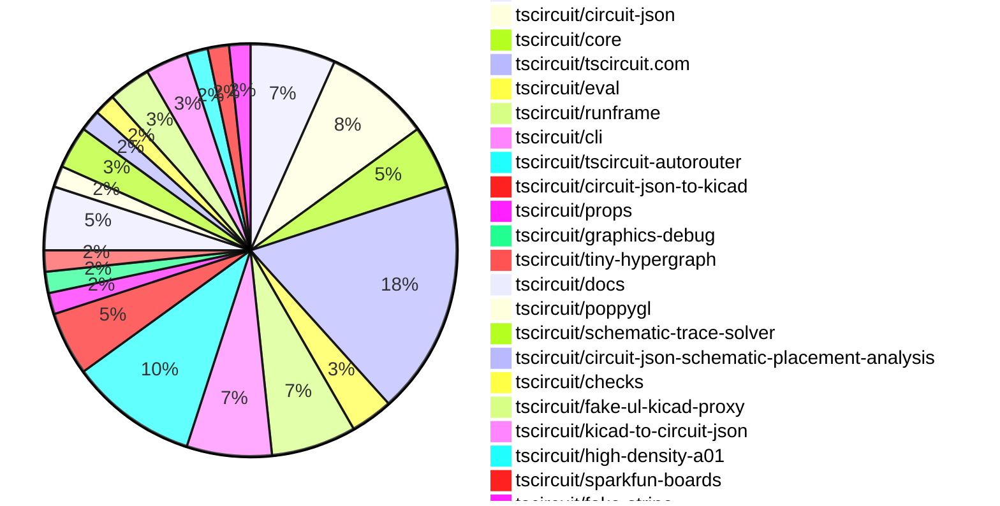

# contribution tracker

[contributions.tscircuit.com](https://contributions.tscircuit.com) ・ [tscircuit.com](https://tscircuit.com) ・ [Contribution Overviews](./contribution-overviews/) ・ [Changelogs](./changelogs/)

Generates weekly contribution overviews for tscircuit contributors. Check out all
the [contribution overviews here](./contribution-overviews/)
You can find AI-generated monthly changelogs in the [changelogs directory](./changelogs/)

- All PRs in the tscircuit org are scanned/summarized via an LLM
- The LLM classifies each Diff/PR as into a set of attributes for scoring
- All the PRs, summaries, and classifications are organized into charts and tables for [the website](https://contributions.tscircuit.com)

> Want to run locally? See the [Development Section](#development)

## Current Week

<!-- START_CURRENT_WEEK -->

# Contribution Overview 2026-05-26

The current week is shown below. There are 3 major sections:

- [Contributor Overview](#contributor-overview)
- [PRs by Repository](#prs-by-repository)
- [PRs by Contributor](#changes-by-contributor)
- [Scoring & Sponsorship Details](/docs/sponsorship-calculation-explanation.md)

## PRs by Repository


```mermaid
pie
    "tscircuit/tscircuit" : 4
    "tscircuit/circuit-json" : 5
    "tscircuit/core" : 3
    "tscircuit/tscircuit.com" : 11
    "tscircuit/eval" : 2
    "tscircuit/runframe" : 4
    "tscircuit/cli" : 4
    "tscircuit/tscircuit-autorouter" : 6
    "tscircuit/circuit-json-to-kicad" : 3
    "tscircuit/props" : 1
    "tscircuit/graphics-debug" : 1
    "tscircuit/tiny-hypergraph" : 1
    "tscircuit/docs" : 3
    "tscircuit/poppygl" : 1
    "tscircuit/schematic-trace-solver" : 2
    "tscircuit/circuit-json-schematic-placement-analysis" : 1
    "tscircuit/checks" : 1
    "tscircuit/fake-ul-kicad-proxy" : 2
    "tscircuit/kicad-to-circuit-json" : 2
    "tscircuit/high-density-a01" : 1
    "tscircuit/sparkfun-boards" : 1
    "tscircuit/fake-stripe" : 1
```

## Contributor Overview

| Contributor | 🐳 Major | 🐙 Minor | 🐌 Tiny | Score | ⭐ | Discussion Contributions |
|-------------|---------|---------|---------|-------|-----|--------------------------|
| [imrishabh18](#imrishabh18) | 0 | 3 | 6 | 13 | ⭐⭐ | 0🔹 0🔶 0💎 |
| [tscircuitbot](#tscircuitbot) | 0 | 0 | 26 | 12 | ⭐⭐ | 0🔹 0🔶 0💎 |
| [techmannih](#techmannih) | 2 | 1 | 0 | 10 | ⭐ | 0🔹 0🔶 0💎 |
| [0hmX](#0hmX) | 2 | 0 | 1 | 9 | ⭐ | 0🔹 0🔶 0💎 |
| [mohan-bee](#mohan-bee) | 1 | 2 | 0 | 8 | ⭐ | 0🔹 0🔶 0💎 |
| [rushabhcodes](#rushabhcodes) | 1 | 0 | 3 | 7 | ⭐ | 0🔹 0🔶 0💎 |
| [MustafaMulla29](#MustafaMulla29) | 0 | 2 | 0 | 5 | ⭐ | 0🔹 0🔶 0💎 |
| [seveibar](#seveibar) | 0 | 1 | 2 | 5 | ⭐ | 0🔹 0🔶 0💎 |
| [Sang-it](#Sang-it) | 0 | 1 | 3 | 5 | ⭐ | 0🔹 0🔶 0💎 |
| [anil08607](#anil08607) | 0 | 1 | 0 | 2 |  | 0🔹 0🔶 0💎 |
| [Devesh36](#Devesh36) | 0 | 0 | 2 | 2 |  | 0🔹 0🔶 0💎 |

## Staff Pass Ratio (SPR)

| Contributor | Reviewed PRs | Rejections | Approvals | SPR |
|-------------|--------------|------------|-----------|-----|
| [mohan-bee](#mohan-bee) | 4 | 1 | 3 | 75.0% |
| [MustafaMulla29](#MustafaMulla29) | 3 | 1 | 2 | 66.7% |
| [techmannih](#techmannih) | 3 | 1 | 2 | 66.7% |
| [rushabhcodes](#rushabhcodes) | 2 | 1 | 1 | 50.0% |
| [imrishabh18](#imrishabh18) | 1 | 0 | 1 | 100.0% |
| [Sang-it](#Sang-it) | 1 | 0 | 1 | 100.0% |
| [0hmX](#0hmX) | 1 | 0 | 1 | 100.0% |

<details>
<summary>mohan-bee SPR PRs (4)</summary>

- [#588](https://github.com/tscircuit/circuit-json/pull/588) Add PCB board color fields
- [#565](https://github.com/tscircuit/circuit-to-svg/pull/565) Add board soldermask and silkscreen colors (no merge) 
- [#314](https://github.com/tscircuit/circuit-json-to-kicad/pull/314) Fix through_pad routes producing NaN KiCad PCB segments
- [#312](https://github.com/tscircuit/circuit-json-to-kicad/pull/312) repro: through_pad routes producing NaN KiCad PCB segments

</details>

<details>
<summary>MustafaMulla29 SPR PRs (3)</summary>

- [#590](https://github.com/tscircuit/circuit-json/pull/590) Add `source_component_misconfigured_error` error type
- [#679](https://github.com/tscircuit/props/pull/679) Introduce drc-check component
- [#2342](https://github.com/tscircuit/core/pull/2342)  Add custom DRC check support with <drccheck />

</details>

<details>
<summary>techmannih SPR PRs (3)</summary>

- [#3119](https://github.com/tscircuit/cli/pull/3119) feat(import): support jlcpcb identifiers in import flow
- [#661](https://github.com/tscircuit/docs/pull/661) Add JLCPCB footprint docs
- [#109](https://github.com/tscircuit/kicad-to-circuit-json/pull/109) Classify fiducial footprints as simple_fiducial

</details>

<details>
<summary>rushabhcodes SPR PRs (2)</summary>

- [#2332](https://github.com/tscircuit/core/pull/2332) fix: ensure deterministic unnamed subcircuit connectivity keys
- [#27](https://github.com/tscircuit/poppygl/pull/27) Make GLTF-to-PNG rendering browser-safe with Node path support

</details>

<details>
<summary>imrishabh18 SPR PRs (1)</summary>

- [#153](https://github.com/tscircuit/checks/pull/153) fix: `checkEachPcbTraceNonOverlapping` should take into account the `minTraceToPadEdgeClearance` drc value

</details>

<details>
<summary>Sang-it SPR PRs (1)</summary>

- [#2337](https://github.com/tscircuit/core/pull/2337) add handcoded-rp2040 as reference

</details>

<details>
<summary>0hmX SPR PRs (1)</summary>

- [#82](https://github.com/tscircuit/high-density-a01/pull/82) add prev and next portPointId

</details>

> Note: AI evaluates PRs and assigns 1-3 star ratings automatically. 4 and 5 star ratings require manual staff review.

### Discussion Contribution Legend

- 🔹 Normal Comments: Basic participation with minimal effort
- 🔶 Great Informative Comments: Thoughtful participation that adds value
- 💎 Incredible Comments: Exceptional participation with high-quality content

## Review Table

[reviews-received-hover]: ## "Number of reviews received for PRs for this contributor"
[approvals-received-hover]: ## "Number of approvals received for PRs this contributor authored"
[rejections-received-hover]: ## "Number of rejections received for PRs this contributor authored"
[prs-opened-hover]: ## "Number of PRs opened by this contributor"
[issues-created-hover]: ## "Number of issues created by this contributor"

| Contributor | Reviews Received | Approvals Received | Rejections Received | Approvals | Rejections Given | PRs Opened | PRs Merged | Issues Created |
|---|---|---|---|---|---|---|---|---|
| [tscircuitbot](#tscircuitbot) | 0 | 0 | 0 | 0 | 0 | 34 | 26 | 0 |
| [memelord42](#memelord42) | 0 | 0 | 0 | 0 | 0 | 2 | 0 | 0 |
| [MustafaMulla29](#MustafaMulla29) | 7 | 2 | 1 | 2 | 0 | 4 | 2 | 0 |
| [seveibar](#seveibar) | 1 | 0 | 0 | 15 | 4 | 6 | 3 | 0 |
| [mohan-bee](#mohan-bee) | 5 | 4 | 1 | 0 | 0 | 5 | 3 | 0 |
| [ItsOtherMauridian](#ItsOtherMauridian) | 0 | 0 | 0 | 0 | 0 | 2 | 0 | 0 |
| [charlie12520](#charlie12520) | 0 | 0 | 0 | 0 | 0 | 2 | 0 | 0 |
| [kpassito](#kpassito) | 0 | 0 | 0 | 0 | 0 | 1 | 0 | 0 |
| [Squirbie](#Squirbie) | 0 | 0 | 0 | 0 | 0 | 2 | 0 | 0 |
| [Heyzerohey](#Heyzerohey) | 0 | 0 | 0 | 0 | 0 | 1 | 0 | 0 |
| [imrishabh18](#imrishabh18) | 2 | 1 | 0 | 5 | 0 | 10 | 9 | 0 |
| [rushabhcodes](#rushabhcodes) | 20 | 6 | 1 | 0 | 2 | 6 | 4 | 0 |
| [Sang-it](#Sang-it) | 7 | 2 | 0 | 0 | 0 | 5 | 4 | 0 |
| [anil08607](#anil08607) | 1 | 1 | 0 | 0 | 0 | 1 | 1 | 0 |
| [michaelapollopimentel-svg](#michaelapollopimentel-svg) | 0 | 0 | 0 | 0 | 0 | 1 | 0 | 0 |
| [techmannih](#techmannih) | 7 | 4 | 1 | 0 | 0 | 8 | 3 | 0 |
| [P3xill](#P3xill) | 0 | 0 | 0 | 0 | 0 | 11 | 0 | 0 |
| [nikhiltiwari0](#nikhiltiwari0) | 0 | 0 | 0 | 0 | 0 | 1 | 0 | 0 |
| [notforyou23](#notforyou23) | 3 | 0 | 0 | 0 | 0 | 1 | 0 | 0 |
| [0hmX](#0hmX) | 2 | 1 | 0 | 0 | 0 | 7 | 3 | 0 |
| [Priyanshu31102003](#Priyanshu31102003) | 0 | 0 | 0 | 0 | 0 | 2 | 0 | 0 |
| [sucloudflare](#sucloudflare) | 2 | 0 | 2 | 0 | 0 | 3 | 0 | 0 |
| [Devesh36](#Devesh36) | 1 | 1 | 0 | 0 | 0 | 2 | 2 | 0 |
| [khozakhulile27-netizen](#khozakhulile27-netizen) | 0 | 0 | 0 | 0 | 0 | 2 | 0 | 0 |

## Changes by Repository

### [tscircuit/tscircuit](https://github.com/tscircuit/tscircuit)


<details>
<summary>🐌 Tiny Contributions (4)</summary>

| PR # | Impact | Contributor | Description |
|------|--------|-------------|-------------|
| [#3279](https://github.com/tscircuit/tscircuit/pull/3279) | 🐌 Tiny | tscircuitbot | Automated package version bump from 0.0.1786 to 0.0.1787 |
| [#3278](https://github.com/tscircuit/tscircuit/pull/3278) | 🐌 Tiny | tscircuitbot | Automated package update |
| [#3274](https://github.com/tscircuit/tscircuit/pull/3274) | 🐌 Tiny | tscircuitbot | Automated package update |
| [#3273](https://github.com/tscircuit/tscircuit/pull/3273) | 🐌 Tiny | tscircuitbot | Automated package update |

</details>

### [tscircuit/circuit-json](https://github.com/tscircuit/circuit-json)

| PR # | Impact | Rating | Contributor | Description |
|------|--------|--------|-------------|-------------|
| [#590](https://github.com/tscircuit/circuit-json/pull/590) | 🐙 Minor | ⭐⭐ | MustafaMulla29 | Adds a new error type for handling misconfigured source components in the circuit JSON schema. |
| [#588](https://github.com/tscircuit/circuit-json/pull/588) | 🐙 Minor | ⭐⭐ | mohan-bee | Adds optional fields for solder mask color and silkscreen color to the PCB board interface. |
| [#586](https://github.com/tscircuit/circuit-json/pull/586) | 🐙 Minor | ⭐⭐ | seveibar | Adds optional dash_length and dash_gap distance fields to schematic_line and schematic_path, along with tests and documentation updates. |

<details>
<summary>🐌 Tiny Contributions (2)</summary>

| PR # | Impact | Contributor | Description |
|------|--------|-------------|-------------|
| [#591](https://github.com/tscircuit/circuit-json/pull/591) | 🐌 Tiny | tscircuitbot | Automated package update |
| [#587](https://github.com/tscircuit/circuit-json/pull/587) | 🐌 Tiny | tscircuitbot | Automated package update |

</details>

### [tscircuit/core](https://github.com/tscircuit/core)

| PR # | Impact | Rating | Contributor | Description |
|------|--------|--------|-------------|-------------|
| [#2332](https://github.com/tscircuit/core/pull/2332) | 🐳 Major | ⭐⭐⭐ | rushabhcodes | Ensures deterministic generation of unnamed subcircuit connectivity map keys by using a combination of subcircuit_id, source_group_id, and render ID, reducing key collisions and inconsistencies across renders. |
| [#2337](https://github.com/tscircuit/core/pull/2337) | 🐙 Minor | ⭐⭐ | Sang-it | Adds a new circuit design for the RP2040 microcontroller, including associated components and connections in the schematic. |

<details>
<summary>🐌 Tiny Contributions (1)</summary>

| PR # | Impact | Contributor | Description |
|------|--------|-------------|-------------|
| [#2339](https://github.com/tscircuit/core/pull/2339) | 🐌 Tiny | tscircuitbot | Updates the tscircuitchecks package from version 0.0.132 to 0.0.133 in package.json |

</details>

### [tscircuit/tscircuit.com](https://github.com/tscircuit/tscircuit.com)

| PR # | Impact | Rating | Contributor | Description |
|------|--------|--------|-------------|-------------|
| [#3511](https://github.com/tscircuit/tscircuit.com/pull/3511) | 🐙 Minor | ⭐⭐ | imrishabh18 | Modifies the apiorderscreate endpoint to optionally accept a session token for associating orders with user accounts. |
| [#3509](https://github.com/tscircuit/tscircuit.com/pull/3509) | 🐙 Minor | ⭐⭐ | imrishabh18 | Modifies the orderslist endpoint to return orders specific to a user account, including pagination support via a limit parameter. |
| [#3499](https://github.com/tscircuit/tscircuit.com/pull/3499) | 🐙 Minor | ⭐⭐ | anil08607 | Prevents the command palette from fetching recent packages while it is closed, ensuring background requests only occur when the palette is actively used. |

<details>
<summary>🐌 Tiny Contributions (8)</summary>

| PR # | Impact | Contributor | Description |
|------|--------|-------------|-------------|
| [#3517](https://github.com/tscircuit/tscircuit.com/pull/3517) | 🐌 Tiny | tscircuitbot | Updates the tscircuitrunframe package from version 0.0.2003 to 0.0.2004 |
| [#3516](https://github.com/tscircuit/tscircuit.com/pull/3516) | 🐌 Tiny | tscircuitbot | Updates the tscircuiteval package to version 0.0.868 in the package.json file. |
| [#3512](https://github.com/tscircuit/tscircuit.com/pull/3512) | 🐌 Tiny | tscircuitbot | Automated package update |
| [#3510](https://github.com/tscircuit/tscircuit.com/pull/3510) | 🐌 Tiny | tscircuitbot | Automated package update |
| [#3508](https://github.com/tscircuit/tscircuit.com/pull/3508) | 🐌 Tiny | tscircuitbot | Updates the tscircuitrunframe package from version 0.0.2002 to 0.0.2003 |
| [#3515](https://github.com/tscircuit/tscircuit.com/pull/3515) | 🐌 Tiny | imrishabh18 | Fixes the order card information display on the my-orders page by improving the layout and status representation of orders. |
| [#3514](https://github.com/tscircuit/tscircuit.com/pull/3514) | 🐌 Tiny | imrishabh18 | Adds a new order cancel page that displays information when an order fails or is canceled, including order ID and options to view the order or return to previous pages. |
| [#3513](https://github.com/tscircuit/tscircuit.com/pull/3513) | 🐌 Tiny | imrishabh18 | Fixes a typo in the boolean condition that controls the visibility of the order dialog in the package header component. |

</details>

### [tscircuit/eval](https://github.com/tscircuit/eval)


<details>
<summary>🐌 Tiny Contributions (2)</summary>

| PR # | Impact | Contributor | Description |
|------|--------|-------------|-------------|
| [#2743](https://github.com/tscircuit/eval/pull/2743) | 🐌 Tiny | tscircuitbot | Automated package update |
| [#2742](https://github.com/tscircuit/eval/pull/2742) | 🐌 Tiny | tscircuitbot | Updates package versions in package.json to the latest compatible versions. |

</details>

### [tscircuit/runframe](https://github.com/tscircuit/runframe)


<details>
<summary>🐌 Tiny Contributions (4)</summary>

| PR # | Impact | Contributor | Description |
|------|--------|-------------|-------------|
| [#3521](https://github.com/tscircuit/runframe/pull/3521) | 🐌 Tiny | tscircuitbot | Automated package update |
| [#3520](https://github.com/tscircuit/runframe/pull/3520) | 🐌 Tiny | tscircuitbot | Updates the tscircuiteval package from version 0.0.867 to 0.0.868 in the package.json file. |
| [#3519](https://github.com/tscircuit/runframe/pull/3519) | 🐌 Tiny | tscircuitbot | Automated package update |
| [#3518](https://github.com/tscircuit/runframe/pull/3518) | 🐌 Tiny | tscircuitbot | Updates the circuit-json-to-kicad package version from 0.0.140 to 0.0.142 in package.json |

</details>

### [tscircuit/cli](https://github.com/tscircuit/cli)


<details>
<summary>🐌 Tiny Contributions (4)</summary>

| PR # | Impact | Contributor | Description |
|------|--------|-------------|-------------|
| [#3121](https://github.com/tscircuit/cli/pull/3121) | 🐌 Tiny | tscircuitbot | Automated package update |
| [#3120](https://github.com/tscircuit/cli/pull/3120) | 🐌 Tiny | tscircuitbot | Updates the tscircuitrunframe package from version 0.0.2003 to 0.0.2004 |
| [#3117](https://github.com/tscircuit/cli/pull/3117) | 🐌 Tiny | tscircuitbot | Automated package update |
| [#3116](https://github.com/tscircuit/cli/pull/3116) | 🐌 Tiny | tscircuitbot | Updates the tscircuitrunframe package from version 0.0.2002 to 0.0.2003 |

</details>

### [tscircuit/tscircuit-autorouter](https://github.com/tscircuit/tscircuit-autorouter)

| PR # | Impact | Rating | Contributor | Description |
|------|--------|--------|-------------|-------------|
| [#1298](https://github.com/tscircuit/tscircuit-autorouter/pull/1298) | 🐳 Major | ⭐⭐⭐ | 0hmX | add prev and next port point ids svg update |

<details>
<summary>🐌 Tiny Contributions (5)</summary>

| PR # | Impact | Contributor | Description |
|------|--------|-------------|-------------|
| [#1303](https://github.com/tscircuit/tscircuit-autorouter/pull/1303) | 🐌 Tiny | tscircuitbot | Automated package update |
| [#1297](https://github.com/tscircuit/tscircuit-autorouter/pull/1297) | 🐌 Tiny | tscircuitbot | Automated package update |
| [#1300](https://github.com/tscircuit/tscircuit-autorouter/pull/1300) | 🐌 Tiny | tscircuitbot | Automated package update |
| [#1302](https://github.com/tscircuit/tscircuit-autorouter/pull/1302) | 🐌 Tiny | imrishabh18 | Add a new bug report fixture and corresponding test for the autorouting system, specifically for bug report ID 64. |
| [#1296](https://github.com/tscircuit/tscircuit-autorouter/pull/1296) | 🐌 Tiny | 0hmX | Updates the dataset-srj11-45-degree dependency version and adds new sample circuits to the benchmark tests. |

</details>

### [tscircuit/circuit-json-to-kicad](https://github.com/tscircuit/circuit-json-to-kicad)

| PR # | Impact | Rating | Contributor | Description |
|------|--------|--------|-------------|-------------|
| [#312](https://github.com/tscircuit/circuit-json-to-kicad/pull/312) | 🐳 Major | ⭐⭐⭐ | mohan-bee | Adds a repro using alarmv2.json showing that valid through_pad route points are converted into KiCad PCB segments with NaN coordinates, causing kicadts parsing to fail. core emits a valid circuit-json through_pad route point with startend coordinates, matching the circuit-json schema. where the converter assumes every route point has top-level xy, producing NaN for valid through_pad points. |
| [#314](https://github.com/tscircuit/circuit-json-to-kicad/pull/314) | 🐙 Minor | ⭐⭐ | mohan-bee | Fixes NaN coordinates in KiCad PCB segments by reading through_pad.start and through_pad.end coordinates instead of assuming top-level xy for every route point. |

<details>
<summary>🐌 Tiny Contributions (1)</summary>

| PR # | Impact | Contributor | Description |
|------|--------|-------------|-------------|
| [#315](https://github.com/tscircuit/circuit-json-to-kicad/pull/315) | 🐌 Tiny | tscircuitbot | Automated package update |

</details>

### [tscircuit/props](https://github.com/tscircuit/props)

| PR # | Impact | Rating | Contributor | Description |
|------|--------|--------|-------------|-------------|
| [#679](https://github.com/tscircuit/props/pull/679) | 🐙 Minor | ⭐⭐ | MustafaMulla29 | Adds a new DRC check component with customizable check functions for design rule checking in circuit designs. |

### [tscircuit/graphics-debug](https://github.com/tscircuit/graphics-debug)


<details>
<summary>🐌 Tiny Contributions (1)</summary>

| PR # | Impact | Contributor | Description |
|------|--------|-------------|-------------|
| [#225](https://github.com/tscircuit/graphics-debug/pull/225) | 🐌 Tiny | seveibar | Resolves merge conflicts on the interactive graphics UI path while preserving step metadata and right-aligned step title support. |

</details>

### [tscircuit/tiny-hypergraph](https://github.com/tscircuit/tiny-hypergraph)


<details>
<summary>🐌 Tiny Contributions (1)</summary>

| PR # | Impact | Contributor | Description |
|------|--------|-------------|-------------|
| [#101](https://github.com/tscircuit/tiny-hypergraph/pull/101) | 🐌 Tiny | seveibar | Updates the dataset-srj18 dependency to a specific commit and modifies the DatasetSrj18Page to load samples dynamically from the updated dataset. |

</details>

### [tscircuit/docs](https://github.com/tscircuit/docs)

| PR # | Impact | Rating | Contributor | Description |
|------|--------|--------|-------------|-------------|
| [#661](https://github.com/tscircuit/docs/pull/661) | 🐳 Major | ⭐⭐⭐ | techmannih | Adds documentation for using JLCPCB footprint strings directly in tscircuit, including usage examples and clarifications on built-in prefixes. |

<details>
<summary>🐌 Tiny Contributions (2)</summary>

| PR # | Impact | Contributor | Description |
|------|--------|-------------|-------------|
| [#671](https://github.com/tscircuit/docs/pull/671) | 🐌 Tiny | rushabhcodes | This PR updates the documentation for the QFN package footprint to clarify and expand support for thermal pads, as well as to improve parameter descriptions and preview examples. |
| [#669](https://github.com/tscircuit/docs/pull/669) | 🐌 Tiny | rushabhcodes | Adds QFP footprinter documentation for exposed thermal pads, including both default qfp32_thermalpad and sized qfp32_thermalpad3x3mm examples. Also updates the QFP parameter table to match tscircuitprops, replacing the stale body_size entry with w and h, and documenting legsoutside. |

</details>

### [tscircuit/poppygl](https://github.com/tscircuit/poppygl)


<details>
<summary>🐌 Tiny Contributions (1)</summary>

| PR # | Impact | Contributor | Description |
|------|--------|-------------|-------------|
| [#26](https://github.com/tscircuit/poppygl/pull/26) | 🐌 Tiny | rushabhcodes | Adds Playwright-based browser compatibility testing and backward compatibility tests for the Node.js API, including a new browser compatibility fixture and improvements to the test setup. |

</details>

### [tscircuit/schematic-trace-solver](https://github.com/tscircuit/schematic-trace-solver)


<details>
<summary>🐌 Tiny Contributions (2)</summary>

| PR # | Impact | Contributor | Description |
|------|--------|-------------|-------------|
| [#443](https://github.com/tscircuit/schematic-trace-solver/pull/443) | 🐌 Tiny | Sang-it | Adds a new test case and example for a failing net label placement issue in the schematic trace solver. |
| [#445](https://github.com/tscircuit/schematic-trace-solver/pull/445) | 🐌 Tiny | Sang-it | Adds a new example for tracing through a component using the PipelineDebugger with a specific input problem. |

</details>

### [tscircuit/circuit-json-schematic-placement-analysis](https://github.com/tscircuit/circuit-json-schematic-placement-analysis)


<details>
<summary>🐌 Tiny Contributions (1)</summary>

| PR # | Impact | Contributor | Description |
|------|--------|-------------|-------------|
| [#29](https://github.com/tscircuit/circuit-json-schematic-placement-analysis/pull/29) | 🐌 Tiny | Sang-it | Adds a message to the capacitor orientation analyzer to guide users on fixing symbol orientation issues. |

</details>

### [tscircuit/checks](https://github.com/tscircuit/checks)

| PR # | Impact | Rating | Contributor | Description |
|------|--------|--------|-------------|-------------|
| [#153](https://github.com/tscircuit/checks/pull/153) | 🐙 Minor | ⭐⭐ | imrishabh18 | Fixes a bug where the clearance check for PCB traces did not consider the minimum trace-to-pad edge clearance, leading to erroneous DRC errors. |

### [tscircuit/fake-ul-kicad-proxy](https://github.com/tscircuit/fake-ul-kicad-proxy)


<details>
<summary>🐌 Tiny Contributions (2)</summary>

| PR # | Impact | Contributor | Description |
|------|--------|-------------|-------------|
| [#2](https://github.com/tscircuit/fake-ul-kicad-proxy/pull/2) | 🐌 Tiny | imrishabh18 | Adds a fixture for the test server to facilitate testing with the ULKiCadProxyServer. |
| [#1](https://github.com/tscircuit/fake-ul-kicad-proxy/pull/1) | 🐌 Tiny | imrishabh18 | Adds initial project structure including a server implementation, database client, and health check route for the fake UL KiCad proxy. |

</details>

### [tscircuit/kicad-to-circuit-json](https://github.com/tscircuit/kicad-to-circuit-json)

| PR # | Impact | Rating | Contributor | Description |
|------|--------|--------|-------------|-------------|
| [#109](https://github.com/tscircuit/kicad-to-circuit-json/pull/109) | 🐳 Major | ⭐⭐⭐ | techmannih | Classifies PCB fiducial footprints as simple_fiducial and updates the inference logic to correctly identify fiducials based on their metadata. |
| [#110](https://github.com/tscircuit/kicad-to-circuit-json/pull/110) | 🐙 Minor | ⭐⭐ | techmannih | Summary classify Arduino Nano LED footprints as simple_led instead of simple_diode pass the full footprint into PCB component type inference so diode designators can use footprint metadata add a focused regression test for LED vs diode classification  Root Cause PCB ftype inference was using only the reference designator prefix. That caused D parts with LED footprints to collapse to simple_diode even when the footprint metadata clearly identified them as LEDs.  Validation bun test testspcbled-component-type.test.ts testspcbfootprint-properties.test.ts |

### [tscircuit/high-density-a01](https://github.com/tscircuit/high-density-a01)

| PR # | Impact | Rating | Contributor | Description |
|------|--------|--------|-------------|-------------|
| [#82](https://github.com/tscircuit/high-density-a01/pull/82) | 🐳 Major | ⭐⭐⭐ | 0hmX | Add prev and next portPointId to enhance routing capabilities by linking port points in the circuit design. |

### [tscircuit/sparkfun-boards](https://github.com/tscircuit/sparkfun-boards)


<details>
<summary>🐌 Tiny Contributions (1)</summary>

| PR # | Impact | Contributor | Description |
|------|--------|-------------|-------------|
| [#289](https://github.com/tscircuit/sparkfun-boards/pull/289) | 🐌 Tiny | Devesh36 | Adds index.tsx export barrels to every SparkFun board folder so all 96 boards match the repo convention and can be imported as modules, while fixing broken filenames and refreshing snapshots for renamed circuit files. |

</details>

### [tscircuit/fake-stripe](https://github.com/tscircuit/fake-stripe)


<details>
<summary>🐌 Tiny Contributions (1)</summary>

| PR # | Impact | Contributor | Description |
|------|--------|-------------|-------------|
| [#6](https://github.com/tscircuit/fake-stripe/pull/6) | 🐌 Tiny | Devesh36 | Adds testsfixturesget-test-server.ts with a getTestServer() helper that starts a StripeServer, returns  url, server , and registers afterEach cleanup. Refactors testscheckout-sessions.test.ts to use the fixture instead of manual server setupteardown in each test. |

</details>

## Changes by Contributor

### [tscircuitbot](https://github.com/tscircuitbot)


<details>
<summary>🐌 Tiny Contributions (26)</summary>

| PR # | Impact | Description |
|------|--------|-------------|
| [#3279](https://github.com/tscircuit/tscircuit/pull/3279) | 🐌 Tiny | Automated package version bump from 0.0.1786 to 0.0.1787 |
| [#3278](https://github.com/tscircuit/tscircuit/pull/3278) | 🐌 Tiny | Automated package update |
| [#3274](https://github.com/tscircuit/tscircuit/pull/3274) | 🐌 Tiny | Automated package update |
| [#3273](https://github.com/tscircuit/tscircuit/pull/3273) | 🐌 Tiny | Automated package update |
| [#591](https://github.com/tscircuit/circuit-json/pull/591) | 🐌 Tiny | Automated package update |
| [#587](https://github.com/tscircuit/circuit-json/pull/587) | 🐌 Tiny | Automated package update |
| [#2339](https://github.com/tscircuit/core/pull/2339) | 🐌 Tiny | Updates the tscircuitchecks package from version 0.0.132 to 0.0.133 in package.json |
| [#3517](https://github.com/tscircuit/tscircuit.com/pull/3517) | 🐌 Tiny | Updates the tscircuitrunframe package from version 0.0.2003 to 0.0.2004 |
| [#3516](https://github.com/tscircuit/tscircuit.com/pull/3516) | 🐌 Tiny | Updates the tscircuiteval package to version 0.0.868 in the package.json file. |
| [#3512](https://github.com/tscircuit/tscircuit.com/pull/3512) | 🐌 Tiny | Automated package update |
| [#3510](https://github.com/tscircuit/tscircuit.com/pull/3510) | 🐌 Tiny | Automated package update |
| [#3508](https://github.com/tscircuit/tscircuit.com/pull/3508) | 🐌 Tiny | Updates the tscircuitrunframe package from version 0.0.2002 to 0.0.2003 |
| [#2743](https://github.com/tscircuit/eval/pull/2743) | 🐌 Tiny | Automated package update |
| [#2742](https://github.com/tscircuit/eval/pull/2742) | 🐌 Tiny | Updates package versions in package.json to the latest compatible versions. |
| [#3521](https://github.com/tscircuit/runframe/pull/3521) | 🐌 Tiny | Automated package update |
| [#3520](https://github.com/tscircuit/runframe/pull/3520) | 🐌 Tiny | Updates the tscircuiteval package from version 0.0.867 to 0.0.868 in the package.json file. |
| [#3519](https://github.com/tscircuit/runframe/pull/3519) | 🐌 Tiny | Automated package update |
| [#3518](https://github.com/tscircuit/runframe/pull/3518) | 🐌 Tiny | Updates the circuit-json-to-kicad package version from 0.0.140 to 0.0.142 in package.json |
| [#3121](https://github.com/tscircuit/cli/pull/3121) | 🐌 Tiny | Automated package update |
| [#3120](https://github.com/tscircuit/cli/pull/3120) | 🐌 Tiny | Updates the tscircuitrunframe package from version 0.0.2003 to 0.0.2004 |
| [#3117](https://github.com/tscircuit/cli/pull/3117) | 🐌 Tiny | Automated package update |
| [#3116](https://github.com/tscircuit/cli/pull/3116) | 🐌 Tiny | Updates the tscircuitrunframe package from version 0.0.2002 to 0.0.2003 |
| [#1303](https://github.com/tscircuit/tscircuit-autorouter/pull/1303) | 🐌 Tiny | Automated package update |
| [#1297](https://github.com/tscircuit/tscircuit-autorouter/pull/1297) | 🐌 Tiny | Automated package update |
| [#1300](https://github.com/tscircuit/tscircuit-autorouter/pull/1300) | 🐌 Tiny | Automated package update |
| [#315](https://github.com/tscircuit/circuit-json-to-kicad/pull/315) | 🐌 Tiny | Automated package update |

</details>

### [MustafaMulla29](https://github.com/MustafaMulla29)

| PRs # | Impact | Rating | Description |
|------|--------|--------|-------------|
| [#590](https://github.com/tscircuit/circuit-json/pull/590) | 🐙 Minor | ⭐⭐ | Adds a new error type for handling misconfigured source components in the circuit JSON schema. |
| [#679](https://github.com/tscircuit/props/pull/679) | 🐙 Minor | ⭐⭐ | Adds a new DRC check component with customizable check functions for design rule checking in circuit designs. |

### [mohan-bee](https://github.com/mohan-bee)

| PRs # | Impact | Rating | Description |
|------|--------|--------|-------------|
| [#312](https://github.com/tscircuit/circuit-json-to-kicad/pull/312) | 🐳 Major | ⭐⭐⭐ | Adds a repro using alarmv2.json showing that valid through_pad route points are converted into KiCad PCB segments with NaN coordinates, causing kicadts parsing to fail. core emits a valid circuit-json through_pad route point with startend coordinates, matching the circuit-json schema. where the converter assumes every route point has top-level xy, producing NaN for valid through_pad points. |
| [#588](https://github.com/tscircuit/circuit-json/pull/588) | 🐙 Minor | ⭐⭐ | Adds optional fields for solder mask color and silkscreen color to the PCB board interface. |
| [#314](https://github.com/tscircuit/circuit-json-to-kicad/pull/314) | 🐙 Minor | ⭐⭐ | Fixes NaN coordinates in KiCad PCB segments by reading through_pad.start and through_pad.end coordinates instead of assuming top-level xy for every route point. |

### [seveibar](https://github.com/seveibar)

| PRs # | Impact | Rating | Description |
|------|--------|--------|-------------|
| [#586](https://github.com/tscircuit/circuit-json/pull/586) | 🐙 Minor | ⭐⭐ | Adds optional dash_length and dash_gap distance fields to schematic_line and schematic_path, along with tests and documentation updates. |

<details>
<summary>🐌 Tiny Contributions (2)</summary>

| PR # | Impact | Description |
|------|--------|-------------|
| [#225](https://github.com/tscircuit/graphics-debug/pull/225) | 🐌 Tiny | Resolves merge conflicts on the interactive graphics UI path while preserving step metadata and right-aligned step title support. |
| [#101](https://github.com/tscircuit/tiny-hypergraph/pull/101) | 🐌 Tiny | Updates the dataset-srj18 dependency to a specific commit and modifies the DatasetSrj18Page to load samples dynamically from the updated dataset. |

</details>

### [rushabhcodes](https://github.com/rushabhcodes)

| PRs # | Impact | Rating | Description |
|------|--------|--------|-------------|
| [#2332](https://github.com/tscircuit/core/pull/2332) | 🐳 Major | ⭐⭐⭐ | Ensures deterministic generation of unnamed subcircuit connectivity map keys by using a combination of subcircuit_id, source_group_id, and render ID, reducing key collisions and inconsistencies across renders. |

<details>
<summary>🐌 Tiny Contributions (3)</summary>

| PR # | Impact | Description |
|------|--------|-------------|
| [#671](https://github.com/tscircuit/docs/pull/671) | 🐌 Tiny | This PR updates the documentation for the QFN package footprint to clarify and expand support for thermal pads, as well as to improve parameter descriptions and preview examples. |
| [#669](https://github.com/tscircuit/docs/pull/669) | 🐌 Tiny | Adds QFP footprinter documentation for exposed thermal pads, including both default qfp32_thermalpad and sized qfp32_thermalpad3x3mm examples. Also updates the QFP parameter table to match tscircuitprops, replacing the stale body_size entry with w and h, and documenting legsoutside. |
| [#26](https://github.com/tscircuit/poppygl/pull/26) | 🐌 Tiny | Adds Playwright-based browser compatibility testing and backward compatibility tests for the Node.js API, including a new browser compatibility fixture and improvements to the test setup. |

</details>

### [Sang-it](https://github.com/Sang-it)

| PRs # | Impact | Rating | Description |
|------|--------|--------|-------------|
| [#2337](https://github.com/tscircuit/core/pull/2337) | 🐙 Minor | ⭐⭐ | Adds a new circuit design for the RP2040 microcontroller, including associated components and connections in the schematic. |

<details>
<summary>🐌 Tiny Contributions (3)</summary>

| PR # | Impact | Description |
|------|--------|-------------|
| [#443](https://github.com/tscircuit/schematic-trace-solver/pull/443) | 🐌 Tiny | Adds a new test case and example for a failing net label placement issue in the schematic trace solver. |
| [#445](https://github.com/tscircuit/schematic-trace-solver/pull/445) | 🐌 Tiny | Adds a new example for tracing through a component using the PipelineDebugger with a specific input problem. |
| [#29](https://github.com/tscircuit/circuit-json-schematic-placement-analysis/pull/29) | 🐌 Tiny | Adds a message to the capacitor orientation analyzer to guide users on fixing symbol orientation issues. |

</details>

### [imrishabh18](https://github.com/imrishabh18)

| PRs # | Impact | Rating | Description |
|------|--------|--------|-------------|
| [#153](https://github.com/tscircuit/checks/pull/153) | 🐙 Minor | ⭐⭐ | Fixes a bug where the clearance check for PCB traces did not consider the minimum trace-to-pad edge clearance, leading to erroneous DRC errors. |
| [#3511](https://github.com/tscircuit/tscircuit.com/pull/3511) | 🐙 Minor | ⭐⭐ | Modifies the apiorderscreate endpoint to optionally accept a session token for associating orders with user accounts. |
| [#3509](https://github.com/tscircuit/tscircuit.com/pull/3509) | 🐙 Minor | ⭐⭐ | Modifies the orderslist endpoint to return orders specific to a user account, including pagination support via a limit parameter. |

<details>
<summary>🐌 Tiny Contributions (6)</summary>

| PR # | Impact | Description |
|------|--------|-------------|
| [#3515](https://github.com/tscircuit/tscircuit.com/pull/3515) | 🐌 Tiny | Fixes the order card information display on the my-orders page by improving the layout and status representation of orders. |
| [#3514](https://github.com/tscircuit/tscircuit.com/pull/3514) | 🐌 Tiny | Adds a new order cancel page that displays information when an order fails or is canceled, including order ID and options to view the order or return to previous pages. |
| [#3513](https://github.com/tscircuit/tscircuit.com/pull/3513) | 🐌 Tiny | Fixes a typo in the boolean condition that controls the visibility of the order dialog in the package header component. |
| [#1302](https://github.com/tscircuit/tscircuit-autorouter/pull/1302) | 🐌 Tiny | Add a new bug report fixture and corresponding test for the autorouting system, specifically for bug report ID 64. |
| [#2](https://github.com/tscircuit/fake-ul-kicad-proxy/pull/2) | 🐌 Tiny | Adds a fixture for the test server to facilitate testing with the ULKiCadProxyServer. |
| [#1](https://github.com/tscircuit/fake-ul-kicad-proxy/pull/1) | 🐌 Tiny | Adds initial project structure including a server implementation, database client, and health check route for the fake UL KiCad proxy. |

</details>

### [anil08607](https://github.com/anil08607)

| PRs # | Impact | Rating | Description |
|------|--------|--------|-------------|
| [#3499](https://github.com/tscircuit/tscircuit.com/pull/3499) | 🐙 Minor | ⭐⭐ | Prevents the command palette from fetching recent packages while it is closed, ensuring background requests only occur when the palette is actively used. |

### [techmannih](https://github.com/techmannih)

| PRs # | Impact | Rating | Description |
|------|--------|--------|-------------|
| [#661](https://github.com/tscircuit/docs/pull/661) | 🐳 Major | ⭐⭐⭐ | Adds documentation for using JLCPCB footprint strings directly in tscircuit, including usage examples and clarifications on built-in prefixes. |
| [#109](https://github.com/tscircuit/kicad-to-circuit-json/pull/109) | 🐳 Major | ⭐⭐⭐ | Classifies PCB fiducial footprints as simple_fiducial and updates the inference logic to correctly identify fiducials based on their metadata. |
| [#110](https://github.com/tscircuit/kicad-to-circuit-json/pull/110) | 🐙 Minor | ⭐⭐ | Summary classify Arduino Nano LED footprints as simple_led instead of simple_diode pass the full footprint into PCB component type inference so diode designators can use footprint metadata add a focused regression test for LED vs diode classification  Root Cause PCB ftype inference was using only the reference designator prefix. That caused D parts with LED footprints to collapse to simple_diode even when the footprint metadata clearly identified them as LEDs.  Validation bun test testspcbled-component-type.test.ts testspcbfootprint-properties.test.ts |

### [0hmX](https://github.com/0hmX)

| PRs # | Impact | Rating | Description |
|------|--------|--------|-------------|
| [#1298](https://github.com/tscircuit/tscircuit-autorouter/pull/1298) | 🐳 Major | ⭐⭐⭐ | add prev and next port point ids svg update |
| [#82](https://github.com/tscircuit/high-density-a01/pull/82) | 🐳 Major | ⭐⭐⭐ | Add prev and next portPointId to enhance routing capabilities by linking port points in the circuit design. |

<details>
<summary>🐌 Tiny Contributions (1)</summary>

| PR # | Impact | Description |
|------|--------|-------------|
| [#1296](https://github.com/tscircuit/tscircuit-autorouter/pull/1296) | 🐌 Tiny | Updates the dataset-srj11-45-degree dependency version and adds new sample circuits to the benchmark tests. |

</details>

### [Devesh36](https://github.com/Devesh36)


<details>
<summary>🐌 Tiny Contributions (2)</summary>

| PR # | Impact | Description |
|------|--------|-------------|
| [#289](https://github.com/tscircuit/sparkfun-boards/pull/289) | 🐌 Tiny | Adds index.tsx export barrels to every SparkFun board folder so all 96 boards match the repo convention and can be imported as modules, while fixing broken filenames and refreshing snapshots for renamed circuit files. |
| [#6](https://github.com/tscircuit/fake-stripe/pull/6) | 🐌 Tiny | Adds testsfixturesget-test-server.ts with a getTestServer() helper that starts a StripeServer, returns  url, server , and registers afterEach cleanup. Refactors testscheckout-sessions.test.ts to use the fixture instead of manual server setupteardown in each test. |

</details>

## Repository Owners

| Repository | Codeowners |
|------------|------------|
| [builder](https://github.com/tscircuit/builder/blob/main/.github/CODEOWNERS) | [seveibar](https://github.com/seveibar)
| [pcb-viewer](https://github.com/tscircuit/pcb-viewer/blob/main/.github/CODEOWNERS) | [seveibar](https://github.com/seveibar), [ShiboSoftwareDev](https://github.com/ShiboSoftwareDev), [Abse2001](https://github.com/Abse2001)
| [footprints-old](https://github.com/tscircuit/footprints-old/blob/main/.github/CODEOWNERS) | [seveibar](https://github.com/seveibar)
| [footprinter](https://github.com/tscircuit/footprinter/blob/main/.github/CODEOWNERS) | [seveibar](https://github.com/seveibar), [techmannih](https://github.com/techmannih)
| [3d-viewer](https://github.com/tscircuit/3d-viewer/blob/main/.github/CODEOWNERS) | [ShiboSoftwareDev](https://github.com/ShiboSoftwareDev), [Abse2001](https://github.com/Abse2001)
| [winterspec](https://github.com/tscircuit/winterspec/blob/main/.github/CODEOWNERS) | [seveibar](https://github.com/seveibar), [ShiboSoftwareDev](https://github.com/ShiboSoftwareDev)
| [jscad-electronics](https://github.com/tscircuit/jscad-electronics/blob/main/.github/CODEOWNERS) | [seveibar](https://github.com/seveibar), [techmannih](https://github.com/techmannih), [ShiboSoftwareDev](https://github.com/ShiboSoftwareDev), [anas-sarkez](https://github.com/anas-sarkez)
| [circuit-to-svg](https://github.com/tscircuit/circuit-to-svg/blob/main/.github/CODEOWNERS) | [imrishabh18](https://github.com/imrishabh18)
| [schematic-symbols](https://github.com/tscircuit/schematic-symbols/blob/main/.github/CODEOWNERS) | [seveibar](https://github.com/seveibar), [imrishabh18](https://github.com/imrishabh18), [techmannih](https://github.com/techmannih)
| [circuit-json-to-gerber](https://github.com/tscircuit/circuit-json-to-gerber/blob/main/.github/CODEOWNERS) | [seveibar](https://github.com/seveibar), [ShiboSoftwareDev](https://github.com/ShiboSoftwareDev)
| [tscircuit.com](https://github.com/tscircuit/tscircuit.com/blob/main/.github/CODEOWNERS) | [seveibar](https://github.com/seveibar), [imrishabh18](https://github.com/imrishabh18)
| [issue-roulette](https://github.com/tscircuit/issue-roulette/blob/main/.github/CODEOWNERS) | [Anshgrover23](https://github.com/Anshgrover23)
| [sparkfun-boards](https://github.com/tscircuit/sparkfun-boards/blob/main/.github/CODEOWNERS) | [ShiboSoftwareDev](https://github.com/ShiboSoftwareDev), [Abse2001](https://github.com/Abse2001), [MustafaMulla29](https://github.com/MustafaMulla29), [Anshgrover23](https://github.com/Anshgrover23), [techmannih](https://github.com/techmannih)
| [schematic-corpus](https://github.com/tscircuit/schematic-corpus/blob/main/.github/CODEOWNERS) | [Abse2001](https://github.com/Abse2001)
| [copper-pour-solver](https://github.com/tscircuit/copper-pour-solver/blob/main/.github/CODEOWNERS) | [seveibar](https://github.com/seveibar), [ShiboSoftwareDev](https://github.com/ShiboSoftwareDev)
| [common](https://github.com/tscircuit/common/blob/main/.github/CODEOWNERS) | [seveibar](https://github.com/seveibar), [Abse2001](https://github.com/Abse2001)
| [circuit-to-canvas](https://github.com/tscircuit/circuit-to-canvas/blob/main/.github/CODEOWNERS) | [ShiboSoftwareDev](https://github.com/ShiboSoftwareDev), [Abse2001](https://github.com/Abse2001), [techmannih](https://github.com/techmannih)
| [circuit-json-to-lbrn](https://github.com/tscircuit/circuit-json-to-lbrn/blob/main/.github/CODEOWNERS) | [AnasSarkiz](https://github.com/AnasSarkiz)
| [pcbburn.com](https://github.com/tscircuit/pcbburn.com/blob/main/.github/CODEOWNERS) | [AnasSarkiz](https://github.com/AnasSarkiz)
| [high-density-repair03](https://github.com/tscircuit/high-density-repair03/blob/main/.github/CODEOWNERS) | [Abse2001](https://github.com/Abse2001)
| [fabrication-operator-ui](https://github.com/tscircuit/fabrication-operator-ui/blob/main/.github/CODEOWNERS) | [AnasSarkiz](https://github.com/AnasSarkiz)

## Repositories by Owner

| User | Repo |
|------|------|
| [seveibar](https://github.com/seveibar) | [builder](https://github.com/tscircuit/builder/blob/main/.github/CODEOWNERS) |
|  | [pcb-viewer](https://github.com/tscircuit/pcb-viewer/blob/main/.github/CODEOWNERS) |
|  | [footprints-old](https://github.com/tscircuit/footprints-old/blob/main/.github/CODEOWNERS) |
|  | [footprinter](https://github.com/tscircuit/footprinter/blob/main/.github/CODEOWNERS) |
|  | [winterspec](https://github.com/tscircuit/winterspec/blob/main/.github/CODEOWNERS) |
|  | [jscad-electronics](https://github.com/tscircuit/jscad-electronics/blob/main/.github/CODEOWNERS) |
|  | [schematic-symbols](https://github.com/tscircuit/schematic-symbols/blob/main/.github/CODEOWNERS) |
|  | [circuit-json-to-gerber](https://github.com/tscircuit/circuit-json-to-gerber/blob/main/.github/CODEOWNERS) |
|  | [tscircuit.com](https://github.com/tscircuit/tscircuit.com/blob/main/.github/CODEOWNERS) |
|  | [copper-pour-solver](https://github.com/tscircuit/copper-pour-solver/blob/main/.github/CODEOWNERS) |
|  | [common](https://github.com/tscircuit/common/blob/main/.github/CODEOWNERS) |
| [ShiboSoftwareDev](https://github.com/ShiboSoftwareDev) | [pcb-viewer](https://github.com/tscircuit/pcb-viewer/blob/main/.github/CODEOWNERS) |
|  | [3d-viewer](https://github.com/tscircuit/3d-viewer/blob/main/.github/CODEOWNERS) |
|  | [winterspec](https://github.com/tscircuit/winterspec/blob/main/.github/CODEOWNERS) |
|  | [jscad-electronics](https://github.com/tscircuit/jscad-electronics/blob/main/.github/CODEOWNERS) |
|  | [circuit-json-to-gerber](https://github.com/tscircuit/circuit-json-to-gerber/blob/main/.github/CODEOWNERS) |
|  | [sparkfun-boards](https://github.com/tscircuit/sparkfun-boards/blob/main/.github/CODEOWNERS) |
|  | [copper-pour-solver](https://github.com/tscircuit/copper-pour-solver/blob/main/.github/CODEOWNERS) |
|  | [circuit-to-canvas](https://github.com/tscircuit/circuit-to-canvas/blob/main/.github/CODEOWNERS) |
| [Abse2001](https://github.com/Abse2001) | [pcb-viewer](https://github.com/tscircuit/pcb-viewer/blob/main/.github/CODEOWNERS) |
|  | [3d-viewer](https://github.com/tscircuit/3d-viewer/blob/main/.github/CODEOWNERS) |
|  | [sparkfun-boards](https://github.com/tscircuit/sparkfun-boards/blob/main/.github/CODEOWNERS) |
|  | [schematic-corpus](https://github.com/tscircuit/schematic-corpus/blob/main/.github/CODEOWNERS) |
|  | [common](https://github.com/tscircuit/common/blob/main/.github/CODEOWNERS) |
|  | [circuit-to-canvas](https://github.com/tscircuit/circuit-to-canvas/blob/main/.github/CODEOWNERS) |
|  | [high-density-repair03](https://github.com/tscircuit/high-density-repair03/blob/main/.github/CODEOWNERS) |
| [techmannih](https://github.com/techmannih) | [footprinter](https://github.com/tscircuit/footprinter/blob/main/.github/CODEOWNERS) |
|  | [jscad-electronics](https://github.com/tscircuit/jscad-electronics/blob/main/.github/CODEOWNERS) |
|  | [schematic-symbols](https://github.com/tscircuit/schematic-symbols/blob/main/.github/CODEOWNERS) |
|  | [sparkfun-boards](https://github.com/tscircuit/sparkfun-boards/blob/main/.github/CODEOWNERS) |
|  | [circuit-to-canvas](https://github.com/tscircuit/circuit-to-canvas/blob/main/.github/CODEOWNERS) |
| [anas-sarkez](https://github.com/anas-sarkez) | [jscad-electronics](https://github.com/tscircuit/jscad-electronics/blob/main/.github/CODEOWNERS) |
| [imrishabh18](https://github.com/imrishabh18) | [circuit-to-svg](https://github.com/tscircuit/circuit-to-svg/blob/main/.github/CODEOWNERS) |
|  | [schematic-symbols](https://github.com/tscircuit/schematic-symbols/blob/main/.github/CODEOWNERS) |
|  | [tscircuit.com](https://github.com/tscircuit/tscircuit.com/blob/main/.github/CODEOWNERS) |
| [Anshgrover23](https://github.com/Anshgrover23) | [issue-roulette](https://github.com/tscircuit/issue-roulette/blob/main/.github/CODEOWNERS) |
|  | [sparkfun-boards](https://github.com/tscircuit/sparkfun-boards/blob/main/.github/CODEOWNERS) |
| [MustafaMulla29](https://github.com/MustafaMulla29) | [sparkfun-boards](https://github.com/tscircuit/sparkfun-boards/blob/main/.github/CODEOWNERS) |
| [AnasSarkiz](https://github.com/AnasSarkiz) | [circuit-json-to-lbrn](https://github.com/tscircuit/circuit-json-to-lbrn/blob/main/.github/CODEOWNERS) |
|  | [pcbburn.com](https://github.com/tscircuit/pcbburn.com/blob/main/.github/CODEOWNERS) |
|  | [fabrication-operator-ui](https://github.com/tscircuit/fabrication-operator-ui/blob/main/.github/CODEOWNERS) |


<!-- END_CURRENT_WEEK -->


## Development

### Prerequisites

- [Bun](https://bun.sh/) runtime
- `.env` file with required API keys:
  ```
  GITHUB_TOKEN=your_github_token
  OPENAI_API_KEY=your_openai_api_key
  DISCORD_TOKEN=your_discord_token (optional, for Discord integration)
  SLACK_BOT_TOKEN=your_slack_token (optional, for Slack integration)
  ```

### Available Scripts

#### Core Generation Scripts

- `bun run generate:weekly` - Generate current week's contribution overview
- `bun run generate:monthly` - Generate current month's contribution overview
- `bun run generate:changelog` - Generate monthly changelog from PRs

#### Analysis & Testing

- `bun run analyze-pr` - Analyze a single PR (interactive prompt)
- `bun run test:github` - Test GitHub API integration

#### Notifications & Sync

- `bun run notifications:issues` - Send notifications for new issues
- `bun run notifications:pr` - Send notifications for new PRs
- `bun run sync:discord` - Sync contributor roles with Discord

#### Data Export

- `bun run export:sponsorship` - Generate sponsorship data CSV

#### Development

- `bun run dev` - Start development server for web UI
- `bun run build` - Build for production
- `bun run format` - Format code with Biome

### Usage Examples

```bash
# Generate this week's contribution overview
bun run generate:weekly

# Generate current month's overview
bun run generate:monthly

# Analyze a specific PR
bun run analyze-pr

# Test your GitHub token setup
bun run test:github
```
