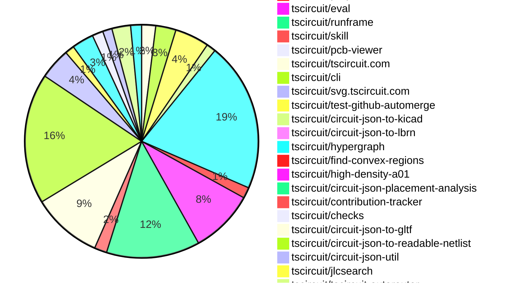

# contribution tracker

[contributions.tscircuit.com](https://contributions.tscircuit.com) ・ [tscircuit.com](https://tscircuit.com) ・ [Contribution Overviews](./contribution-overviews/) ・ [Changelogs](./changelogs/)

Generates weekly contribution overviews for tscircuit contributors. Check out all
the [contribution overviews here](./contribution-overviews/)
You can find AI-generated monthly changelogs in the [changelogs directory](./changelogs/)

- All PRs in the tscircuit org are scanned/summarized via an LLM
- The LLM classifies each Diff/PR as into a set of attributes for scoring
- All the PRs, summaries, and classifications are organized into charts and tables for [the website](https://contributions.tscircuit.com)

> Want to run locally? See the [Development Section](#development)

## Current Week

<!-- START_CURRENT_WEEK -->

# Contribution Overview 2026-03-03

The current week is shown below. There are 3 major sections:

- [Contributor Overview](#contributor-overview)
- [PRs by Repository](#prs-by-repository)
- [PRs by Contributor](#changes-by-contributor)
- [Scoring & Sponsorship Details](/docs/sponsorship-calculation-explanation.md)

## PRs by Repository


```mermaid
pie
    "tscircuit/easyeda-converter" : 2
    "tscircuit/3d-viewer" : 9
    "tscircuit/circuit-json" : 13
    "tscircuit/kicad-mod-cache" : 2
    "tscircuit/core" : 22
    "tscircuit/circuit-to-canvas" : 6
    "tscircuit/schematic-viewer" : 1
    "tscircuit/tscircuit" : 96
    "tscircuit/props" : 7
    "tscircuit/eval" : 41
    "tscircuit/runframe" : 60
    "tscircuit/skill" : 8
    "tscircuit/pcb-viewer" : 4
    "tscircuit/tscircuit.com" : 45
    "tscircuit/cli" : 84
    "tscircuit/svg.tscircuit.com" : 20
    "tscircuit/test-github-automerge" : 6
    "tscircuit/circuit-json-to-kicad" : 2
    "tscircuit/circuit-json-to-lbrn" : 2
    "tscircuit/hypergraph" : 14
    "tscircuit/find-convex-regions" : 4
    "tscircuit/high-density-a01" : 4
    "tscircuit/circuit-json-placement-analysis" : 5
    "tscircuit/contribution-tracker" : 3
    "tscircuit/checks" : 7
    "tscircuit/circuit-json-to-gltf" : 2
    "tscircuit/circuit-json-to-readable-netlist" : 1
    "tscircuit/circuit-json-util" : 6
    "tscircuit/jlcsearch" : 2
    "tscircuit/tscircuit-autorouter" : 12
    "tscircuit/circuit-json-to-tscircuit" : 3
    "tscircuit/docs" : 7
    "tscircuit/footprinter" : 3
    "tscircuit/jscad-electronics" : 2
    "tscircuit/kicad-to-circuit-json" : 1
    "tscircuit/tscircuit-code-editor" : 1
    "tscircuit/pcbburn.com" : 2
    "tscircuit/high-density-dataset-z04" : 2
```

## Contributor Overview

| Contributor | 🐳 Major | 🐙 Minor | 🐌 Tiny | Score | ⭐ | Discussion Contributions |
|-------------|---------|---------|---------|-------|-----|--------------------------|
| [seveibar](#seveibar) | 18 | 28 | 22 | 85 | 👑 | 0🔹 0🔶 0💎 |
| [ShiboSoftwareDev](#ShiboSoftwareDev) | 5 | 8 | 6 | 56 | ⭐⭐⭐ | 0🔹 0🔶 0💎 |
| [Abse2001](#Abse2001) | 4 | 6 | 4 | 35 | ⭐⭐ | 0🔹 0🔶 0💎 |
| [MustafaMulla29](#MustafaMulla29) | 2 | 8 | 10 | 34 | ⭐⭐ | 0🔹 0🔶 0💎 |
| [imrishabh18](#imrishabh18) | 4 | 4 | 9 | 34 | ⭐⭐ | 0🔹 0🔶 0💎 |
| [AnasSarkiz](#AnasSarkiz) | 6 | 3 | 1 | 32 | ⭐⭐ | 0🔹 0🔶 0💎 |
| [0hmX](#0hmX) | 5 | 0 | 2 | 22 | ⭐⭐ | 0🔹 0🔶 0💎 |
| [tscircuitbot](#tscircuitbot) | 0 | 0 | 340 | 16.5 | ⭐⭐ | 0🔹 0🔶 0💎 |
| [rushabhcodes](#rushabhcodes) | 1 | 1 | 1 | 11 | ⭐⭐ | 0🔹 0🔶 0💎 |
| [techmannih](#techmannih) | 0 | 2 | 4 | 8 | ⭐ | 0🔹 0🔶 0💎 |
| [ArnavK-09](#ArnavK-09) | 0 | 1 | 2 | 4 | ⭐ | 0🔹 0🔶 0💎 |
| [CuboYe](#CuboYe) | 0 | 1 | 1 | 3 |  | 0🔹 0🔶 0💎 |
| [Devesh36](#Devesh36) | 0 | 1 | 1 | 3 |  | 0🔹 0🔶 0💎 |

> Note: AI evaluates PRs and assigns 1-3 star ratings automatically. 4 and 5 star ratings require manual staff review.

### Discussion Contribution Legend

- 🔹 Normal Comments: Basic participation with minimal effort
- 🔶 Great Informative Comments: Thoughtful participation that adds value
- 💎 Incredible Comments: Exceptional participation with high-quality content

## Review Table

[reviews-received-hover]: ## "Number of reviews received for PRs for this contributor"
[approvals-received-hover]: ## "Number of approvals received for PRs this contributor authored"
[rejections-received-hover]: ## "Number of rejections received for PRs this contributor authored"
[prs-opened-hover]: ## "Number of PRs opened by this contributor"
[issues-created-hover]: ## "Number of issues created by this contributor"

| Contributor | Reviews Received | Approvals Received | Rejections Received | Approvals | Rejections Given | PRs Opened | PRs Merged | Issues Created |
|---|---|---|---|---|---|---|---|---|
| [MustafaMulla29](#MustafaMulla29) | 24 | 18 | 0 | 0 | 0 | 24 | 22 | 0 |
| [techmannih](#techmannih) | 20 | 8 | 0 | 0 | 1 | 10 | 6 | 0 |
| [seveibar](#seveibar) | 14 | 0 | 0 | 65 | 11 | 83 | 69 | 0 |
| [tscircuitbot](#tscircuitbot) | 0 | 0 | 0 | 0 | 0 | 452 | 363 | 0 |
| [ShiboSoftwareDev](#ShiboSoftwareDev) | 30 | 21 | 2 | 14 | 0 | 23 | 19 | 0 |
| [Abse2001](#Abse2001) | 15 | 15 | 0 | 3 | 0 | 15 | 15 | 0 |
| [huangyebiaoke](#huangyebiaoke) | 0 | 0 | 0 | 0 | 0 | 6 | 0 | 0 |
| [imrishabh18](#imrishabh18) | 10 | 8 | 0 | 5 | 1 | 24 | 21 | 0 |
| [rushabhcodes](#rushabhcodes) | 38 | 3 | 7 | 4 | 2 | 15 | 3 | 0 |
| [yifan19860831-hub](#yifan19860831-hub) | 0 | 0 | 0 | 0 | 0 | 3 | 0 | 0 |
| [CuboYe](#CuboYe) | 5 | 3 | 0 | 0 | 0 | 8 | 2 | 0 |
| [telewin95](#telewin95) | 1 | 0 | 0 | 0 | 0 | 2 | 0 | 0 |
| [lucaferri-dev](#lucaferri-dev) | 17 | 0 | 5 | 0 | 0 | 16 | 0 | 0 |
| [Devesh36](#Devesh36) | 5 | 4 | 0 | 0 | 0 | 2 | 2 | 0 |
| [zscy0710](#zscy0710) | 0 | 0 | 0 | 0 | 0 | 1 | 0 | 0 |
| [realmpastai-web](#realmpastai-web) | 0 | 0 | 0 | 0 | 0 | 1 | 0 | 0 |
| [chassidysandraik-hash](#chassidysandraik-hash) | 0 | 0 | 0 | 0 | 0 | 1 | 0 | 0 |
| [apexlj1130](#apexlj1130) | 1 | 0 | 1 | 0 | 0 | 4 | 0 | 0 |
| [legendary658](#legendary658) | 0 | 0 | 0 | 0 | 0 | 1 | 0 | 0 |
| [AnasSarkiz](#AnasSarkiz) | 9 | 8 | 0 | 1 | 0 | 12 | 10 | 0 |
| [shehaban](#shehaban) | 0 | 0 | 0 | 0 | 0 | 1 | 0 | 0 |
| [ArnavK-09](#ArnavK-09) | 1 | 1 | 0 | 0 | 0 | 4 | 3 | 0 |
| [CharlesWong](#CharlesWong) | 0 | 0 | 0 | 0 | 0 | 2 | 0 | 0 |
| [soongtv](#soongtv) | 0 | 0 | 0 | 0 | 0 | 1 | 0 | 0 |
| [davidweb3-ctrl](#davidweb3-ctrl) | 1 | 0 | 0 | 0 | 0 | 1 | 0 | 0 |
| [usernametooshort](#usernametooshort) | 1 | 0 | 0 | 0 | 0 | 2 | 0 | 0 |
| [ckmtools](#ckmtools) | 0 | 0 | 0 | 0 | 0 | 1 | 0 | 0 |
| [alekmek](#alekmek) | 0 | 0 | 0 | 0 | 0 | 2 | 0 | 0 |
| [0hmX](#0hmX) | 7 | 3 | 0 | 0 | 0 | 14 | 7 | 0 |
| [1028bc](#1028bc) | 0 | 0 | 0 | 0 | 0 | 2 | 0 | 0 |
| [zalo](#zalo) | 2 | 0 | 0 | 0 | 0 | 1 | 0 | 0 |
| [Abu1982](#Abu1982) | 0 | 0 | 0 | 0 | 0 | 1 | 0 | 0 |
| [gittare](#gittare) | 0 | 0 | 0 | 0 | 0 | 1 | 0 | 0 |

## Changes by Repository

### [tscircuit/easyeda-converter](https://github.com/tscircuit/easyeda-converter)

| PR # | Impact | Rating | Contributor | Description |
|------|--------|--------|-------------|-------------|
| [#354](https://github.com/tscircuit/easyeda-converter/pull/354) | 🐳 Major | ⭐⭐⭐ | MustafaMulla29 | Generates pcb_courtyard_outline for all components using packageDetail.dataStr.BBox(EasyEDAs own footprint bounding box) with a 0.25mm clearance margin. Previously, courtyards were only generated for components with explicit TRACK shapes on courtyard layers (131415), leaving JST headers and most other connectors without any courtyard. Removes the TRACK-based courtyard approach in favor of the simpler, consistent BBox method. |
| [#350](https://github.com/tscircuit/easyeda-converter/pull/350) | 🐙 Minor | ⭐⭐ | seveibar | Add support for EasyEDA courtyard shapes by representing them as dedicated pcb_courtyard_outline elements and ensuring they are included in footprint rendering for TSX output. |

### [tscircuit/3d-viewer](https://github.com/tscircuit/3d-viewer)

| PR # | Impact | Rating | Contributor | Description |
|------|--------|--------|-------------|-------------|
| [#721](https://github.com/tscircuit/3d-viewer/pull/721) | 🐳 Major | ⭐⭐⭐ | MustafaMulla29 | Adds a toggle for PCB notes elements in the context menu, which are set to be hidden by default. |
| [#728](https://github.com/tscircuit/3d-viewer/pull/728) | 🐳 Major | ⭐⭐⭐ | seveibar | Attempts to load alternate CAD model URLs sequentially before displaying an error, improving the robustness of model loading in the viewer. |
| [#730](https://github.com/tscircuit/3d-viewer/pull/730) | 🐳 Major | ⭐⭐⭐ | Abse2001 | Refactors the SMT pad texture generation process to utilize the CircuitToCanvasDrawer for improved rendering of SMT pads on PCB layers. |
| [#724](https://github.com/tscircuit/3d-viewer/pull/724) | 🐳 Major | ⭐⭐⭐ | Abse2001 | Refactors the texture generation for plated holes and vias to utilize the circuit-to-canvas renderer, improving rendering efficiency and quality. |
| [#723](https://github.com/tscircuit/3d-viewer/pull/723) | 🐳 Major | ⭐⭐⭐ | Abse2001 | Enhances panel outline texture generation by implementing robust detection of panel and board relationships in circuit JSON data. |
| [#729](https://github.com/tscircuit/3d-viewer/pull/729) | 🐙 Minor | ⭐⭐ | Abse2001 | Fixes the Z positioning of CAD components for both top and bottom layers of the PCB to ensure correct placement based on PCB thickness. |
| [#727](https://github.com/tscircuit/3d-viewer/pull/727) | 🐙 Minor | ⭐⭐ | Abse2001 | Splits PCB traces into per-layer segments to enhance texture rendering accuracy in the 3D viewer. |
| [#726](https://github.com/tscircuit/3d-viewer/pull/726) | 🐙 Minor | ⭐⭐ | Abse2001 | Refactors the trace texture rendering process to utilize the CircuitToCanvasDrawer for improved rendering of PCB layers. |

<details>
<summary>🐌 Tiny Contributions (1)</summary>

| PR # | Impact | Contributor | Description |
|------|--------|-------------|-------------|
| [#733](https://github.com/tscircuit/3d-viewer/pull/733) | 🐌 Tiny | Abse2001 | Updates the tscircuit dependency version and fixes the core panel test by adding layout mode and enhancing the circuit JSON output. |

</details>

### [tscircuit/circuit-json](https://github.com/tscircuit/circuit-json)

| PR # | Impact | Rating | Contributor | Description |
|------|--------|--------|-------------|-------------|
| [#493](https://github.com/tscircuit/circuit-json/pull/493) | 🐳 Major | ⭐⭐⭐ | ShiboSoftwareDev | Adds missing pin attributes to the SourcePort interface, enhancing its configurability for various electrical characteristics and protocols. |
| [#497](https://github.com/tscircuit/circuit-json/pull/497) | 🐳 Major | ⭐⭐⭐ | seveibar | Expose metadata for 3D model placement and handling on cad_component so consumers can specify which model axis is up, where the model origin is, and how the object should be fitscaled. |
| [#485](https://github.com/tscircuit/circuit-json/pull/485) | 🐳 Major | ⭐⭐⭐ | seveibar | Adds optional anchor metadata for flexible component placement and a new position mode for referencing other components in PCB design. |
| [#495](https://github.com/tscircuit/circuit-json/pull/495) | 🐙 Minor | ⭐⭐ | MustafaMulla29 | Adds a new error type for handling ambiguous port references in circuit definitions, improving error reporting for users. |
| [#487](https://github.com/tscircuit/circuit-json/pull/487) | 🐙 Minor | ⭐⭐ | MustafaMulla29 | Adds a specification for the simple_connector component, including its type and optional standards. |
| [#489](https://github.com/tscircuit/circuit-json/pull/489) | 🐙 Minor | ⭐⭐ | seveibar | Adds an optional cable insertion center coordinate to PCB components for better connector and cable description. |
| [#491](https://github.com/tscircuit/circuit-json/pull/491) | 🐙 Minor | ⭐⭐ | seveibar | Add a warning for PCB connectors that are oriented inward toward the board, requiring reorientation for accessibility. |

<details>
<summary>🐌 Tiny Contributions (6)</summary>

| PR # | Impact | Contributor | Description |
|------|--------|-------------|-------------|
| [#498](https://github.com/tscircuit/circuit-json/pull/498) | 🐌 Tiny | tscircuitbot | Automated package update |
| [#496](https://github.com/tscircuit/circuit-json/pull/496) | 🐌 Tiny | tscircuitbot | Automated package update |
| [#490](https://github.com/tscircuit/circuit-json/pull/490) | 🐌 Tiny | tscircuitbot | Automated package update |
| [#492](https://github.com/tscircuit/circuit-json/pull/492) | 🐌 Tiny | tscircuitbot | Automated package update |
| [#486](https://github.com/tscircuit/circuit-json/pull/486) | 🐌 Tiny | tscircuitbot | Automated package update |
| [#488](https://github.com/tscircuit/circuit-json/pull/488) | 🐌 Tiny | tscircuitbot | Automated package update |

</details>

### [tscircuit/kicad-mod-cache](https://github.com/tscircuit/kicad-mod-cache)

| PR # | Impact | Rating | Contributor | Description |
|------|--------|--------|-------------|-------------|
| [#16](https://github.com/tscircuit/kicad-mod-cache/pull/16) | 🐙 Minor | ⭐⭐ | MustafaMulla29 | This pull request regenerates the kicad_files.json file to reflect the current state of the KiCad library hosted on GitLab. The previous version of the file was outdated and did not include the latest components and modules available in the library. This update ensures that users have access to the most recent parts for their designs, improving the overall usability and accuracy of the library. |
| [#14](https://github.com/tscircuit/kicad-mod-cache/pull/14) | 🐙 Minor | ⭐⭐ | seveibar | Fixes 404 errors when loading KiCad footprints and 3D models by implementing multiple fetch attempts and URL encoding for special characters in paths. |

### [tscircuit/core](https://github.com/tscircuit/core)

| PR # | Impact | Rating | Contributor | Description |
|------|--------|--------|-------------|-------------|
| [#2008](https://github.com/tscircuit/core/pull/2008) | 🐳 Major | ⭐⭐⭐ | ShiboSoftwareDev | Fixes the handling of library footprint references in NormalComponent to ensure correct extraction of ports after asynchronous loading of footprints. |
| [#2019](https://github.com/tscircuit/core/pull/2019) | 🐳 Major | ⭐⭐⭐ | seveibar | Adds support for nominal trace width in autorouting, allowing users to specify preferred trace widths for connections. |
| [#2022](https://github.com/tscircuit/core/pull/2022) | 🐙 Minor | ⭐⭐ | MustafaMulla29 | Changes the handling of ambiguous port hints by issuing a warning instead of throwing an error when multiple non-overlapping pads share the same name, allowing the circuit to continue rendering. |
| [#2013](https://github.com/tscircuit/core/pull/2013) | 🐙 Minor | ⭐⭐ | MustafaMulla29 | Fixes the issue where custom symbols with schematic_path do not auto layout correctly in the circuit rendering. |
| [#1997](https://github.com/tscircuit/core/pull/1997) | 🐙 Minor | ⭐⭐ | MustafaMulla29 | Updates the error message for invalid pin labels to specify that they can only contain letters, numbers, and underscores. |
| [#1998](https://github.com/tscircuit/core/pull/1998) | 🐙 Minor | ⭐⭐ | MustafaMulla29 | Emits a pcb_missing_footprint_error when no footprint is specified for a chip component, improving error handling in the circuit design process. |
| [#2016](https://github.com/tscircuit/core/pull/2016) | 🐙 Minor | ⭐⭐ | ShiboSoftwareDev | Adds support for pcbSx visibility property in FabricationNoteText, allowing conditional rendering based on visibility settings. |
| [#2014](https://github.com/tscircuit/core/pull/2014) | 🐙 Minor | ⭐⭐ | ShiboSoftwareDev | Excludes courtyard and fabrication notes from affecting the outside-board DRC bounds calculations in PCB design. |
| [#2012](https://github.com/tscircuit/core/pull/2012) | 🐙 Minor | ⭐⭐ | ShiboSoftwareDev | Prevents crashes during PCB trace rendering when port selectors are unresolved by handling connection errors gracefully. |
| [#2007](https://github.com/tscircuit/core/pull/2007) | 🐙 Minor | ⭐⭐ | ShiboSoftwareDev | Adds support for shorthand notation for accessing symbol-nested ports in components. |
| [#2005](https://github.com/tscircuit/core/pull/2005) | 🐙 Minor | ⭐⭐ | ShiboSoftwareDev | Prevents subpanels from triggering the regular group layout system and allows nested boards to be included in panelization. |
| [#2002](https://github.com/tscircuit/core/pull/2002) | 🐙 Minor | ⭐⭐ | ShiboSoftwareDev | Adds support for subpanels in grid layout and consolidates packing utilities while fixing PCB note transformations. |
| [#2011](https://github.com/tscircuit/core/pull/2011) | 🐙 Minor | ⭐⭐ | seveibar | Adds a new Connector component that calculates and populates the cable insertion center for PCB components based on their configuration. |
| [#2010](https://github.com/tscircuit/core/pull/2010) | 🐙 Minor | ⭐⭐ | seveibar | Adds a localized fallback for resolving single-pin component selectors in traces without altering global selector semantics. |
| [#2003](https://github.com/tscircuit/core/pull/2003) | 🐙 Minor | ⭐⭐ | seveibar | Add support for platform-level toggles to disable specific PCB DRC categories (netlist, placement, routing) allowing CIhost environments to selectively skip checks. |
| [#2004](https://github.com/tscircuit/core/pull/2004) | 🐙 Minor | ⭐⭐ | CuboYe | Fixes broken non-React usage example in README by correcting variable names and ensuring the snippet is runnable for new contributors. |
| [#2026](https://github.com/tscircuit/core/pull/2026) | 🐙 Minor | ⭐⭐ | Abse2001 | Fixes CAD model Z positioning in panels by correctly using the containing board thickness for accurate placement. |

<details>
<summary>🐌 Tiny Contributions (5)</summary>

| PR # | Impact | Contributor | Description |
|------|--------|-------------|-------------|
| [#2015](https://github.com/tscircuit/core/pull/2015) | 🐌 Tiny | MustafaMulla29 | Fixes auto-layout issues for custom schematic symbols by properly handling schematic paths in the layout process. |
| [#2029](https://github.com/tscircuit/core/pull/2029) | 🐌 Tiny | imrishabh18 | Updates the tscircuitcapacity-autorouter dependency to version 0.0.320, which includes better timeout handling. |
| [#2001](https://github.com/tscircuit/core/pull/2001) | 🐌 Tiny | imrishabh18 | Updates the tscircuitchecks package to version 0.0.100 and removes the check for PCB component footprint pad overlap. |
| [#2017](https://github.com/tscircuit/core/pull/2017) | 🐌 Tiny | seveibar | Adds a platform-level switch to disable all PCB DRC checks, allowing operators to globally silence netlist, placement, and routing DRC without toggling each flag individually. |
| [#2020](https://github.com/tscircuit/core/pull/2020) | 🐌 Tiny | seveibar | Updates the tscircuitchecks dependency to version 0.0.104, resolving a test case where errors were previously detected in circuit layouts. |

</details>

### [tscircuit/circuit-to-canvas](https://github.com/tscircuit/circuit-to-canvas)

| PR # | Impact | Rating | Contributor | Description |
|------|--------|--------|-------------|-------------|
| [#202](https://github.com/tscircuit/circuit-to-canvas/pull/202) | 🐙 Minor | ⭐⭐ | MustafaMulla29 | Adds a toggle option to control the rendering of pcb_note elements in the drawing options. |
| [#206](https://github.com/tscircuit/circuit-to-canvas/pull/206) | 🐙 Minor | ⭐⭐ | Abse2001 | Cuts copper trace endpoints at via and plated-hole drill locations during rendering, ensuring accurate visual representation of PCB designs. |
| [#204](https://github.com/tscircuit/circuit-to-canvas/pull/204) | 🐙 Minor | ⭐⭐ | Abse2001 | Cuts drill holes out of copper for vias and plated holes using destination-out masks, enhancing the rendering of PCB elements. |

<details>
<summary>🐌 Tiny Contributions (3)</summary>

| PR # | Impact | Contributor | Description |
|------|--------|-------------|-------------|
| [#207](https://github.com/tscircuit/circuit-to-canvas/pull/207) | 🐌 Tiny | tscircuitbot | Automated package update |
| [#203](https://github.com/tscircuit/circuit-to-canvas/pull/203) | 🐌 Tiny | tscircuitbot | Automated package update |
| [#205](https://github.com/tscircuit/circuit-to-canvas/pull/205) | 🐌 Tiny | tscircuitbot | Automated package update |

</details>

### [tscircuit/schematic-viewer](https://github.com/tscircuit/schematic-viewer)


<details>
<summary>🐌 Tiny Contributions (1)</summary>

| PR # | Impact | Contributor | Description |
|------|--------|-------------|-------------|
| [#169](https://github.com/tscircuit/schematic-viewer/pull/169) | 🐌 Tiny | MustafaMulla29 | Updates the tscircuit dependency version from 0.0.1194 to 0.0.1437 and adds a new fixture for a custom symbol in the schematic viewer. |

</details>

### [tscircuit/tscircuit](https://github.com/tscircuit/tscircuit)


<details>
<summary>🐌 Tiny Contributions (96)</summary>

| PR # | Impact | Contributor | Description |
|------|--------|-------------|-------------|
| [#2539](https://github.com/tscircuit/tscircuit/pull/2539) | 🐌 Tiny | MustafaMulla29 | Exports kicadFootprintStrings from the tscircuitprops package and updates the dependency version for tscircuitprops to 0.0.493. |
| [#2478](https://github.com/tscircuit/tscircuit/pull/2478) | 🐌 Tiny | MustafaMulla29 | Updates the versions of the tscircuitcore and tscircuiteval dependencies in package.json |
| [#2474](https://github.com/tscircuit/tscircuit/pull/2474) | 🐌 Tiny | MustafaMulla29 | Updates the versions of core and eval dependencies in the package.json file. |
| [#2540](https://github.com/tscircuit/tscircuit/pull/2540) | 🐌 Tiny | tscircuitbot | Automated package update |
| [#2537](https://github.com/tscircuit/tscircuit/pull/2537) | 🐌 Tiny | tscircuitbot | Automated package update |
| [#2536](https://github.com/tscircuit/tscircuit/pull/2536) | 🐌 Tiny | tscircuitbot | Updates the tscircuitcli package to version 0.1.1068 in the package.json file. |
| [#2535](https://github.com/tscircuit/tscircuit/pull/2535) | 🐌 Tiny | tscircuitbot | Automated package update |
| [#2534](https://github.com/tscircuit/tscircuit/pull/2534) | 🐌 Tiny | tscircuitbot | Automated package update |
| [#2516](https://github.com/tscircuit/tscircuit/pull/2516) | 🐌 Tiny | tscircuitbot | Automated package update |
| [#2519](https://github.com/tscircuit/tscircuit/pull/2519) | 🐌 Tiny | tscircuitbot | Updates the tscircuitcli package from version 0.1.1062 to 0.1.1063 and the tscircuitrunframe package from version 0.0.1699 to 0.0.1700 in package.json |
| [#2521](https://github.com/tscircuit/tscircuit/pull/2521) | 🐌 Tiny | tscircuitbot | Updates the tscircuitcli package to version 0.1.1064 in the package.json file |
| [#2515](https://github.com/tscircuit/tscircuit/pull/2515) | 🐌 Tiny | tscircuitbot | Updates the tscircuitcli package to version 0.1.1061 in the package.json file |
| [#2526](https://github.com/tscircuit/tscircuit/pull/2526) | 🐌 Tiny | tscircuitbot | Automated package update |
| [#2524](https://github.com/tscircuit/tscircuit/pull/2524) | 🐌 Tiny | tscircuitbot | Automated package update |
| [#2532](https://github.com/tscircuit/tscircuit/pull/2532) | 🐌 Tiny | tscircuitbot | Automated package update |
| [#2517](https://github.com/tscircuit/tscircuit/pull/2517) | 🐌 Tiny | tscircuitbot | Automated package update |
| [#2520](https://github.com/tscircuit/tscircuit/pull/2520) | 🐌 Tiny | tscircuitbot | Automated package update |
| [#2523](https://github.com/tscircuit/tscircuit/pull/2523) | 🐌 Tiny | tscircuitbot | Automated package update |
| [#2518](https://github.com/tscircuit/tscircuit/pull/2518) | 🐌 Tiny | tscircuitbot | Updates the package version from 0.0.1455 to 0.0.1456 in package.json |
| [#2525](https://github.com/tscircuit/tscircuit/pull/2525) | 🐌 Tiny | tscircuitbot | Updates the tscircuitcli package to version 0.1.1066 in package.json |
| [#2529](https://github.com/tscircuit/tscircuit/pull/2529) | 🐌 Tiny | tscircuitbot | Automated package update |
| [#2533](https://github.com/tscircuit/tscircuit/pull/2533) | 🐌 Tiny | tscircuitbot | Automated package version bump from 0.0.1462 to 0.0.1463 |
| [#2514](https://github.com/tscircuit/tscircuit/pull/2514) | 🐌 Tiny | tscircuitbot | Automated package update |
| [#2513](https://github.com/tscircuit/tscircuit/pull/2513) | 🐌 Tiny | tscircuitbot | Automated package update |
| [#2499](https://github.com/tscircuit/tscircuit/pull/2499) | 🐌 Tiny | tscircuitbot | Automated package update |
| [#2510](https://github.com/tscircuit/tscircuit/pull/2510) | 🐌 Tiny | tscircuitbot | Updates the package version from 0.0.1451 to 0.0.1452 in package.json |
| [#2512](https://github.com/tscircuit/tscircuit/pull/2512) | 🐌 Tiny | tscircuitbot | Automated package update |
| [#2504](https://github.com/tscircuit/tscircuit/pull/2504) | 🐌 Tiny | tscircuitbot | Updates the tscircuitcli package to version 0.1.1056 in package.json |
| [#2498](https://github.com/tscircuit/tscircuit/pull/2498) | 🐌 Tiny | tscircuitbot | Updates the tscircuitcli package version from 0.1.1052 to 0.1.1053 in package.json |
| [#2511](https://github.com/tscircuit/tscircuit/pull/2511) | 🐌 Tiny | tscircuitbot | Automated package update |
| [#2507](https://github.com/tscircuit/tscircuit/pull/2507) | 🐌 Tiny | tscircuitbot | Updates the tscircuitcli package version from 0.1.1056 to 0.1.1057 in package.json |
| [#2508](https://github.com/tscircuit/tscircuit/pull/2508) | 🐌 Tiny | tscircuitbot | Automated package update |
| [#2500](https://github.com/tscircuit/tscircuit/pull/2500) | 🐌 Tiny | tscircuitbot | Updates the tscircuitcli package to version 0.1.1054 in the package.json file |
| [#2503](https://github.com/tscircuit/tscircuit/pull/2503) | 🐌 Tiny | tscircuitbot | Automated package update |
| [#2505](https://github.com/tscircuit/tscircuit/pull/2505) | 🐌 Tiny | tscircuitbot | Automated package update |
| [#2501](https://github.com/tscircuit/tscircuit/pull/2501) | 🐌 Tiny | tscircuitbot | Automated package update |
| [#2509](https://github.com/tscircuit/tscircuit/pull/2509) | 🐌 Tiny | tscircuitbot | Automated package update |
| [#2502](https://github.com/tscircuit/tscircuit/pull/2502) | 🐌 Tiny | tscircuitbot | Updates the tscircuitcli package from version 0.1.1054 to 0.1.1055 |
| [#2490](https://github.com/tscircuit/tscircuit/pull/2490) | 🐌 Tiny | tscircuitbot | Automated package update |
| [#2494](https://github.com/tscircuit/tscircuit/pull/2494) | 🐌 Tiny | tscircuitbot | Updates the tscircuitcli package to version 0.1.1051 in the package.json file. |
| [#2488](https://github.com/tscircuit/tscircuit/pull/2488) | 🐌 Tiny | tscircuitbot | Automated package update |
| [#2484](https://github.com/tscircuit/tscircuit/pull/2484) | 🐌 Tiny | tscircuitbot | Automated package update |
| [#2487](https://github.com/tscircuit/tscircuit/pull/2487) | 🐌 Tiny | tscircuitbot | Automated package update |
| [#2489](https://github.com/tscircuit/tscircuit/pull/2489) | 🐌 Tiny | tscircuitbot | Automated package version bump from 0.0.1441 to 0.0.1442 |
| [#2496](https://github.com/tscircuit/tscircuit/pull/2496) | 🐌 Tiny | tscircuitbot | Updates the tscircuitcli package version from 0.1.1051 to 0.1.1052 in package.json |
| [#2486](https://github.com/tscircuit/tscircuit/pull/2486) | 🐌 Tiny | tscircuitbot | Automated package update |
| [#2491](https://github.com/tscircuit/tscircuit/pull/2491) | 🐌 Tiny | tscircuitbot | Automated package update |
| [#2485](https://github.com/tscircuit/tscircuit/pull/2485) | 🐌 Tiny | tscircuitbot | Automated package update |
| [#2495](https://github.com/tscircuit/tscircuit/pull/2495) | 🐌 Tiny | tscircuitbot | Updates the package version from 0.0.1444 to 0.0.1445 in package.json |
| [#2492](https://github.com/tscircuit/tscircuit/pull/2492) | 🐌 Tiny | tscircuitbot | Automated package update |
| [#2497](https://github.com/tscircuit/tscircuit/pull/2497) | 🐌 Tiny | tscircuitbot | Automated package update to version 0.0.1446 |
| [#2493](https://github.com/tscircuit/tscircuit/pull/2493) | 🐌 Tiny | tscircuitbot | Updates the package version from 0.0.1443 to 0.0.1444 in package.json |
| [#2480](https://github.com/tscircuit/tscircuit/pull/2480) | 🐌 Tiny | tscircuitbot | Updates the tscircuitcli package from version 0.1.1040 to 0.1.1043 and the tscircuitrunframe package from version 0.0.1686 to 0.0.1688 in package.json |
| [#2472](https://github.com/tscircuit/tscircuit/pull/2472) | 🐌 Tiny | tscircuitbot | Updates the versions of several dependencies in the package.json file, including tscircuitcli, tscircuitcore, and tscircuiteval. |
| [#2477](https://github.com/tscircuit/tscircuit/pull/2477) | 🐌 Tiny | tscircuitbot | Automated package update to version 0.0.1436 |
| [#2469](https://github.com/tscircuit/tscircuit/pull/2469) | 🐌 Tiny | tscircuitbot | Automated package update |
| [#2471](https://github.com/tscircuit/tscircuit/pull/2471) | 🐌 Tiny | tscircuitbot | Updates the package version from 0.0.1432 to 0.0.1433 in package.json |
| [#2468](https://github.com/tscircuit/tscircuit/pull/2468) | 🐌 Tiny | tscircuitbot | Automated package update |
| [#2465](https://github.com/tscircuit/tscircuit/pull/2465) | 🐌 Tiny | tscircuitbot | Updates the tscircuitcli package to version 0.1.1035 in package.json |
| [#2473](https://github.com/tscircuit/tscircuit/pull/2473) | 🐌 Tiny | tscircuitbot | Automated package update |
| [#2475](https://github.com/tscircuit/tscircuit/pull/2475) | 🐌 Tiny | tscircuitbot | Automated package update |
| [#2464](https://github.com/tscircuit/tscircuit/pull/2464) | 🐌 Tiny | tscircuitbot | Automated package update |
| [#2476](https://github.com/tscircuit/tscircuit/pull/2476) | 🐌 Tiny | tscircuitbot | Automated package update |
| [#2481](https://github.com/tscircuit/tscircuit/pull/2481) | 🐌 Tiny | tscircuitbot | Automated package update to version 0.0.1438 |
| [#2479](https://github.com/tscircuit/tscircuit/pull/2479) | 🐌 Tiny | tscircuitbot | Automated package update |
| [#2470](https://github.com/tscircuit/tscircuit/pull/2470) | 🐌 Tiny | tscircuitbot | Automated package update |
| [#2483](https://github.com/tscircuit/tscircuit/pull/2483) | 🐌 Tiny | tscircuitbot | Automated package update |
| [#2466](https://github.com/tscircuit/tscircuit/pull/2466) | 🐌 Tiny | tscircuitbot | Automated package update to version 0.0.1431 |
| [#2482](https://github.com/tscircuit/tscircuit/pull/2482) | 🐌 Tiny | tscircuitbot | Updates the tscircuitcli package from version 0.1.1043 to 0.1.1044 and the tscircuitrunframe package from version 0.0.1688 to 0.0.1690 in package.json |
| [#2440](https://github.com/tscircuit/tscircuit/pull/2440) | 🐌 Tiny | tscircuitbot | Updates the tscircuitcli and tscircuitrunframe packages to their latest versions. |
| [#2463](https://github.com/tscircuit/tscircuit/pull/2463) | 🐌 Tiny | tscircuitbot | Updates the tscircuitcli package to version 0.1.1034 in the package.json file. |
| [#2429](https://github.com/tscircuit/tscircuit/pull/2429) | 🐌 Tiny | tscircuitbot | Updates the tscircuitcli package from version 0.1.1018 to 0.1.1020 and the tscircuitrunframe package from version 0.0.1673 to 0.0.1674 in package.json |
| [#2450](https://github.com/tscircuit/tscircuit/pull/2450) | 🐌 Tiny | tscircuitbot | Automated package update to version 0.0.1423 |
| [#2453](https://github.com/tscircuit/tscircuit/pull/2453) | 🐌 Tiny | tscircuitbot | Updates the tscircuitrunframe package version from 0.0.1680 to 0.0.1681 in package.json |
| [#2435](https://github.com/tscircuit/tscircuit/pull/2435) | 🐌 Tiny | tscircuitbot | Updates the package version from 0.0.1415 to 0.0.1416 in package.json |
| [#2445](https://github.com/tscircuit/tscircuit/pull/2445) | 🐌 Tiny | tscircuitbot | Updates the tscircuitcli package to version 0.1.1027 in package.json |
| [#2434](https://github.com/tscircuit/tscircuit/pull/2434) | 🐌 Tiny | tscircuitbot | Updates the versions of several dependencies in the package.json file, including tscircuitcli and others. |
| [#2439](https://github.com/tscircuit/tscircuit/pull/2439) | 🐌 Tiny | tscircuitbot | Automated package update to version 0.0.1418 |
| [#2462](https://github.com/tscircuit/tscircuit/pull/2462) | 🐌 Tiny | tscircuitbot | Automated package update |
| [#2447](https://github.com/tscircuit/tscircuit/pull/2447) | 🐌 Tiny | tscircuitbot | Automated package update |
| [#2438](https://github.com/tscircuit/tscircuit/pull/2438) | 🐌 Tiny | tscircuitbot | Updates the version of the tscircuiteval package from 0.0.676 to 0.0.677 in package.json |
| [#2428](https://github.com/tscircuit/tscircuit/pull/2428) | 🐌 Tiny | tscircuitbot | Automated package update |
| [#2455](https://github.com/tscircuit/tscircuit/pull/2455) | 🐌 Tiny | tscircuitbot | Updates the tscircuitcli package version from 0.1.1029 to 0.1.1030 in package.json |
| [#2427](https://github.com/tscircuit/tscircuit/pull/2427) | 🐌 Tiny | tscircuitbot | Updates the versions of tscircuitcore and tscircuiteval packages in package.json |
| [#2452](https://github.com/tscircuit/tscircuit/pull/2452) | 🐌 Tiny | tscircuitbot | Automated package update |
| [#2432](https://github.com/tscircuit/tscircuit/pull/2432) | 🐌 Tiny | tscircuitbot | Automated package update |
| [#2461](https://github.com/tscircuit/tscircuit/pull/2461) | 🐌 Tiny | tscircuitbot | Updates the tscircuitcli package from version 0.1.1032 to 0.1.1033 |
| [#2449](https://github.com/tscircuit/tscircuit/pull/2449) | 🐌 Tiny | tscircuitbot | Automated package update |
| [#2451](https://github.com/tscircuit/tscircuit/pull/2451) | 🐌 Tiny | tscircuitbot | Automated package update |
| [#2436](https://github.com/tscircuit/tscircuit/pull/2436) | 🐌 Tiny | tscircuitbot | Automated package update |
| [#2446](https://github.com/tscircuit/tscircuit/pull/2446) | 🐌 Tiny | tscircuitbot | Automated package update |
| [#2430](https://github.com/tscircuit/tscircuit/pull/2430) | 🐌 Tiny | tscircuitbot | Automated package update |
| [#2441](https://github.com/tscircuit/tscircuit/pull/2441) | 🐌 Tiny | tscircuitbot | Automated package update |
| [#2538](https://github.com/tscircuit/tscircuit/pull/2538) | 🐌 Tiny | imrishabh18 | Updates the graphics-debug dependency to version 0.0.86 in package.json |
| [#2528](https://github.com/tscircuit/tscircuit/pull/2528) | 🐌 Tiny | imrishabh18 | Adds runframe to the list of upstream repositories in the GitHub Actions workflow configuration for package updates. |
| [#2531](https://github.com/tscircuit/tscircuit/pull/2531) | 🐌 Tiny | imrishabh18 | Bumps tscircuitcircuit-json-util to version 0.0.86 to incorporate the latest fixes. |

</details>

### [tscircuit/props](https://github.com/tscircuit/props)

| PR # | Impact | Rating | Contributor | Description |
|------|--------|--------|-------------|-------------|
| [#613](https://github.com/tscircuit/props/pull/613) | 🐳 Major | ⭐⭐⭐ | seveibar | Extracts the PinAttributeMap interface and related schema into a new module, adding an isGpio flag for marking pins as general-purpose IO. |
| [#612](https://github.com/tscircuit/props/pull/612) | 🐳 Major | ⭐⭐⭐ | seveibar | Adds functionality to infer the shape of plated-hole props when omitted, defaulting to a pin-header circular plated hole, while maintaining type contracts and improving validation. |
| [#609](https://github.com/tscircuit/props/pull/609) | 🐙 Minor | ⭐⭐ | ShiboSoftwareDev | Adds support for the fabricationnotetext selector in the pcbSx interface, allowing visibility control for fabrication notes in PCB designs. |
| [#611](https://github.com/tscircuit/props/pull/611) | 🐙 Minor | ⭐⭐ | seveibar | Adds a global switch in the platform configuration to disable all DRC checks while retaining existing per-check flags. |
| [#608](https://github.com/tscircuit/props/pull/608) | 🐙 Minor | ⭐⭐ | seveibar | Add optional boolean flags to the PlatformConfig interface to disable specific DRC checks (netlist, routing, placement) for downstream tooling. |

<details>
<summary>🐌 Tiny Contributions (2)</summary>

| PR # | Impact | Contributor | Description |
|------|--------|-------------|-------------|
| [#614](https://github.com/tscircuit/props/pull/614) | 🐌 Tiny | MustafaMulla29 | This pull request regenerates the kicad-autocomplete.ts file and introduces a strongly typed object export for kicadFootprintStrings. The changes include a significant update to the existing type definitions, enhancing type safety and usability for developers working with KiCad footprints. |
| [#610](https://github.com/tscircuit/props/pull/610) | 🐌 Tiny | ShiboSoftwareDev | Changes the property visible to visibility in the PcbSxValue interface to align with web conventions, allowing for values hidden, visible, or inherit. |

</details>

### [tscircuit/eval](https://github.com/tscircuit/eval)


<details>
<summary>🐌 Tiny Contributions (41)</summary>

| PR # | Impact | Contributor | Description |
|------|--------|-------------|-------------|
| [#2198](https://github.com/tscircuit/eval/pull/2198) | 🐌 Tiny | MustafaMulla29 | Updates the tscircuitcore dependency from version 0.0.1085 to 0.0.1086 in package.json |
| [#2213](https://github.com/tscircuit/eval/pull/2213) | 🐌 Tiny | tscircuitbot | Updates the version of the tscircuitcore package from 0.0.1090 to 0.0.1091 in package.json |
| [#2214](https://github.com/tscircuit/eval/pull/2214) | 🐌 Tiny | tscircuitbot | Automated package update |
| [#2216](https://github.com/tscircuit/eval/pull/2216) | 🐌 Tiny | tscircuitbot | Automated package update |
| [#2217](https://github.com/tscircuit/eval/pull/2217) | 🐌 Tiny | tscircuitbot | Automated package update |
| [#2211](https://github.com/tscircuit/eval/pull/2211) | 🐌 Tiny | tscircuitbot | Automated package update |
| [#2208](https://github.com/tscircuit/eval/pull/2208) | 🐌 Tiny | tscircuitbot | Automated package update to version 0.0.691 |
| [#2201](https://github.com/tscircuit/eval/pull/2201) | 🐌 Tiny | tscircuitbot | Automated package update |
| [#2206](https://github.com/tscircuit/eval/pull/2206) | 🐌 Tiny | tscircuitbot | Automated package update |
| [#2210](https://github.com/tscircuit/eval/pull/2210) | 🐌 Tiny | tscircuitbot | Updates the package versions in package.json to their latest compatible versions. |
| [#2202](https://github.com/tscircuit/eval/pull/2202) | 🐌 Tiny | tscircuitbot | Automated package update |
| [#2207](https://github.com/tscircuit/eval/pull/2207) | 🐌 Tiny | tscircuitbot | Automated package update |
| [#2205](https://github.com/tscircuit/eval/pull/2205) | 🐌 Tiny | tscircuitbot | Automated package update |
| [#2180](https://github.com/tscircuit/eval/pull/2180) | 🐌 Tiny | tscircuitbot | Updates the version of the tscircuitcore package from 0.0.1079 to 0.0.1080 in package.json |
| [#2183](https://github.com/tscircuit/eval/pull/2183) | 🐌 Tiny | tscircuitbot | Updates the version of the tscircuitcore package from 0.0.1080 to 0.0.1081 in package.json |
| [#2199](https://github.com/tscircuit/eval/pull/2199) | 🐌 Tiny | tscircuitbot | Automated package update |
| [#2184](https://github.com/tscircuit/eval/pull/2184) | 🐌 Tiny | tscircuitbot | Automated package update |
| [#2187](https://github.com/tscircuit/eval/pull/2187) | 🐌 Tiny | tscircuitbot | Automated package update |
| [#2181](https://github.com/tscircuit/eval/pull/2181) | 🐌 Tiny | tscircuitbot | Automated package update |
| [#2186](https://github.com/tscircuit/eval/pull/2186) | 🐌 Tiny | tscircuitbot | Updates the version of the tscircuitcore package from 0.0.1081 to 0.0.1082 in package.json |
| [#2177](https://github.com/tscircuit/eval/pull/2177) | 🐌 Tiny | tscircuitbot | Updates the version of the tscircuitcore package from 0.0.1078 to 0.0.1079 in package.json |
| [#2193](https://github.com/tscircuit/eval/pull/2193) | 🐌 Tiny | tscircuitbot | Automated package update to version 0.0.686 |
| [#2189](https://github.com/tscircuit/eval/pull/2189) | 🐌 Tiny | tscircuitbot | Automated package update |
| [#2197](https://github.com/tscircuit/eval/pull/2197) | 🐌 Tiny | tscircuitbot | Automated package update to version 0.0.687 |
| [#2196](https://github.com/tscircuit/eval/pull/2196) | 🐌 Tiny | tscircuitbot | Automated package update |
| [#2178](https://github.com/tscircuit/eval/pull/2178) | 🐌 Tiny | tscircuitbot | Automated package update |
| [#2190](https://github.com/tscircuit/eval/pull/2190) | 🐌 Tiny | tscircuitbot | Automated package update |
| [#2192](https://github.com/tscircuit/eval/pull/2192) | 🐌 Tiny | tscircuitbot | Updates the version of the tscircuitcore package from 0.0.1083 to 0.0.1084 in package.json |
| [#2174](https://github.com/tscircuit/eval/pull/2174) | 🐌 Tiny | tscircuitbot | Updates the version of the tscircuitcore package from 0.0.1077 to 0.0.1078 in package.json |
| [#2162](https://github.com/tscircuit/eval/pull/2162) | 🐌 Tiny | tscircuitbot | Updates the versions of tscircuitcircuit-json-util and tscircuitcore packages in package.json |
| [#2168](https://github.com/tscircuit/eval/pull/2168) | 🐌 Tiny | tscircuitbot | Automated package update |
| [#2165](https://github.com/tscircuit/eval/pull/2165) | 🐌 Tiny | tscircuitbot | Updates the version of tscircuitcore from 0.0.1074 to 0.0.1075 and tscircuitprops from 0.0.485 to 0.0.487 in package.json |
| [#2161](https://github.com/tscircuit/eval/pull/2161) | 🐌 Tiny | tscircuitbot | Automated package update |
| [#2169](https://github.com/tscircuit/eval/pull/2169) | 🐌 Tiny | tscircuitbot | Automated package update |
| [#2175](https://github.com/tscircuit/eval/pull/2175) | 🐌 Tiny | tscircuitbot | Automated package update |
| [#2158](https://github.com/tscircuit/eval/pull/2158) | 🐌 Tiny | tscircuitbot | Automated package update |
| [#2160](https://github.com/tscircuit/eval/pull/2160) | 🐌 Tiny | tscircuitbot | Updates the package versions in package.json to their latest compatible versions. |
| [#2172](https://github.com/tscircuit/eval/pull/2172) | 🐌 Tiny | tscircuitbot | Automated package update |
| [#2171](https://github.com/tscircuit/eval/pull/2171) | 🐌 Tiny | tscircuitbot | Updates the version of the tscircuitcore package from 0.0.1076 to 0.0.1077 in package.json |
| [#2163](https://github.com/tscircuit/eval/pull/2163) | 🐌 Tiny | tscircuitbot | Automated package update |
| [#2166](https://github.com/tscircuit/eval/pull/2166) | 🐌 Tiny | tscircuitbot | Automated package update |

</details>

### [tscircuit/runframe](https://github.com/tscircuit/runframe)


<details>
<summary>🐌 Tiny Contributions (60)</summary>

| PR # | Impact | Contributor | Description |
|------|--------|-------------|-------------|
| [#2811](https://github.com/tscircuit/runframe/pull/2811) | 🐌 Tiny | MustafaMulla29 | Updates the tscircuit3d-viewer dependency to version 0.0.527 in package.json |
| [#2816](https://github.com/tscircuit/runframe/pull/2816) | 🐌 Tiny | MustafaMulla29 | Updates the versions of the schematic-viewer and tscircuit dependencies in package.json |
| [#2854](https://github.com/tscircuit/runframe/pull/2854) | 🐌 Tiny | tscircuitbot | Automated package update |
| [#2853](https://github.com/tscircuit/runframe/pull/2853) | 🐌 Tiny | tscircuitbot | Updates the tscircuitpcb-viewer package from version 1.11.346 to 1.11.347 |
| [#2851](https://github.com/tscircuit/runframe/pull/2851) | 🐌 Tiny | tscircuitbot | Updates the package version from v0.0.1701 to v0.0.1702 in package.json |
| [#2847](https://github.com/tscircuit/runframe/pull/2847) | 🐌 Tiny | tscircuitbot | Automated package update |
| [#2844](https://github.com/tscircuit/runframe/pull/2844) | 🐌 Tiny | tscircuitbot | Updates the tscircuiteval package to version 0.0.693 in the package.json file. |
| [#2848](https://github.com/tscircuit/runframe/pull/2848) | 🐌 Tiny | tscircuitbot | Updates the tscircuiteval package to version 0.0.694 in the package.json file. |
| [#2846](https://github.com/tscircuit/runframe/pull/2846) | 🐌 Tiny | tscircuitbot | Automated package update |
| [#2849](https://github.com/tscircuit/runframe/pull/2849) | 🐌 Tiny | tscircuitbot | Updates the package version from 0.0.1700 to 0.0.1701 in package.json |
| [#2845](https://github.com/tscircuit/runframe/pull/2845) | 🐌 Tiny | tscircuitbot | Updates the package version from v0.0.1698 to v0.0.1699 in package.json |
| [#2841](https://github.com/tscircuit/runframe/pull/2841) | 🐌 Tiny | tscircuitbot | Updates the tscircuit3d-viewer package to version 0.0.535 in package.json |
| [#2842](https://github.com/tscircuit/runframe/pull/2842) | 🐌 Tiny | tscircuitbot | Updates the package version from 0.0.1697 to 0.0.1698 in package.json |
| [#2839](https://github.com/tscircuit/runframe/pull/2839) | 🐌 Tiny | tscircuitbot | Updates the tscircuit3d-viewer package to version 0.0.534 in the package.json file. |
| [#2840](https://github.com/tscircuit/runframe/pull/2840) | 🐌 Tiny | tscircuitbot | Automated package update |
| [#2838](https://github.com/tscircuit/runframe/pull/2838) | 🐌 Tiny | tscircuitbot | Automated package update |
| [#2830](https://github.com/tscircuit/runframe/pull/2830) | 🐌 Tiny | tscircuitbot | Automated package update |
| [#2824](https://github.com/tscircuit/runframe/pull/2824) | 🐌 Tiny | tscircuitbot | Updates the package version from v0.0.1691 to v0.0.1692 in package.json |
| [#2826](https://github.com/tscircuit/runframe/pull/2826) | 🐌 Tiny | tscircuitbot | Automated package update |
| [#2825](https://github.com/tscircuit/runframe/pull/2825) | 🐌 Tiny | tscircuitbot | Updates the tscircuiteval package from version 0.0.689 to 0.0.690 |
| [#2827](https://github.com/tscircuit/runframe/pull/2827) | 🐌 Tiny | tscircuitbot | Updates the tscircuiteval package to version 0.0.691 in the package.json file. |
| [#2823](https://github.com/tscircuit/runframe/pull/2823) | 🐌 Tiny | tscircuitbot | Updates the tscircuiteval package to version 0.0.689 in the package.json file. |
| [#2829](https://github.com/tscircuit/runframe/pull/2829) | 🐌 Tiny | tscircuitbot | Automated package update |
| [#2822](https://github.com/tscircuit/runframe/pull/2822) | 🐌 Tiny | tscircuitbot | Automated package update |
| [#2828](https://github.com/tscircuit/runframe/pull/2828) | 🐌 Tiny | tscircuitbot | Automated package update |
| [#2801](https://github.com/tscircuit/runframe/pull/2801) | 🐌 Tiny | tscircuitbot | Updates the tscircuiteval package to version 0.0.681 in package.json |
| [#2815](https://github.com/tscircuit/runframe/pull/2815) | 🐌 Tiny | tscircuitbot | Updates the tscircuitschematic-viewer package to version 2.0.58 |
| [#2817](https://github.com/tscircuit/runframe/pull/2817) | 🐌 Tiny | tscircuitbot | Automated package update |
| [#2805](https://github.com/tscircuit/runframe/pull/2805) | 🐌 Tiny | tscircuitbot | Updates the tscircuiteval package to version 0.0.683 in the package.json file. |
| [#2802](https://github.com/tscircuit/runframe/pull/2802) | 🐌 Tiny | tscircuitbot | Automated package update |
| [#2818](https://github.com/tscircuit/runframe/pull/2818) | 🐌 Tiny | tscircuitbot | Automated package update |
| [#2807](https://github.com/tscircuit/runframe/pull/2807) | 🐌 Tiny | tscircuitbot | Updates the tscircuiteval package to version 0.0.684 in the package.json file. |
| [#2806](https://github.com/tscircuit/runframe/pull/2806) | 🐌 Tiny | tscircuitbot | Automated package update |
| [#2809](https://github.com/tscircuit/runframe/pull/2809) | 🐌 Tiny | tscircuitbot | Updates the tscircuiteval package from version 0.0.684 to 0.0.686 in the package.json file. |
| [#2814](https://github.com/tscircuit/runframe/pull/2814) | 🐌 Tiny | tscircuitbot | Automated package update |
| [#2821](https://github.com/tscircuit/runframe/pull/2821) | 🐌 Tiny | tscircuitbot | Updates the circuit-json-to-kicad package version from 0.0.82 to 0.0.83 in package.json |
| [#2803](https://github.com/tscircuit/runframe/pull/2803) | 🐌 Tiny | tscircuitbot | Automated package update |
| [#2812](https://github.com/tscircuit/runframe/pull/2812) | 🐌 Tiny | tscircuitbot | Automated package update |
| [#2813](https://github.com/tscircuit/runframe/pull/2813) | 🐌 Tiny | tscircuitbot | Automated package update |
| [#2810](https://github.com/tscircuit/runframe/pull/2810) | 🐌 Tiny | tscircuitbot | Automated package update |
| [#2808](https://github.com/tscircuit/runframe/pull/2808) | 🐌 Tiny | tscircuitbot | Automated package update |
| [#2804](https://github.com/tscircuit/runframe/pull/2804) | 🐌 Tiny | tscircuitbot | Automated package update |
| [#2793](https://github.com/tscircuit/runframe/pull/2793) | 🐌 Tiny | tscircuitbot | Updates the tscircuiteval package to version 0.0.678 in the package.json file. |
| [#2790](https://github.com/tscircuit/runframe/pull/2790) | 🐌 Tiny | tscircuitbot | Updates the package version from 0.0.1675 to 0.0.1676 in package.json |
| [#2797](https://github.com/tscircuit/runframe/pull/2797) | 🐌 Tiny | tscircuitbot | Updates the tscircuiteval package from version 0.0.679 to 0.0.680 |
| [#2799](https://github.com/tscircuit/runframe/pull/2799) | 🐌 Tiny | tscircuitbot | Updates the tscircuitpcb-viewer package from version 1.11.345 to 1.11.346 |
| [#2791](https://github.com/tscircuit/runframe/pull/2791) | 🐌 Tiny | tscircuitbot | Updates the tscircuiteval package to version 0.0.677 in the package.json file. |
| [#2786](https://github.com/tscircuit/runframe/pull/2786) | 🐌 Tiny | tscircuitbot | Updates the package version from v0.0.1673 to v0.0.1674 in package.json |
| [#2789](https://github.com/tscircuit/runframe/pull/2789) | 🐌 Tiny | tscircuitbot | Updates the tscircuiteval package to version 0.0.676 in the package.json file. |
| [#2785](https://github.com/tscircuit/runframe/pull/2785) | 🐌 Tiny | tscircuitbot | Updates the tscircuiteval package from version 0.0.673 to 0.0.674 in the package.json file. |
| [#2794](https://github.com/tscircuit/runframe/pull/2794) | 🐌 Tiny | tscircuitbot | Automated package update |
| [#2800](https://github.com/tscircuit/runframe/pull/2800) | 🐌 Tiny | tscircuitbot | Automated package update |
| [#2792](https://github.com/tscircuit/runframe/pull/2792) | 🐌 Tiny | tscircuitbot | Automated package update |
| [#2798](https://github.com/tscircuit/runframe/pull/2798) | 🐌 Tiny | tscircuitbot | Automated package update |
| [#2787](https://github.com/tscircuit/runframe/pull/2787) | 🐌 Tiny | tscircuitbot | Updates the tscircuiteval package to version 0.0.675 in the package.json file. |
| [#2796](https://github.com/tscircuit/runframe/pull/2796) | 🐌 Tiny | tscircuitbot | Automated package update |
| [#2788](https://github.com/tscircuit/runframe/pull/2788) | 🐌 Tiny | tscircuitbot | Automated package update |
| [#2795](https://github.com/tscircuit/runframe/pull/2795) | 🐌 Tiny | tscircuitbot | Updates the tscircuiteval package to version 0.0.679 in the package.json file. |
| [#2850](https://github.com/tscircuit/runframe/pull/2850) | 🐌 Tiny | imrishabh18 | Removes duplicate dependencies from package.json that are already included in the tscircuit package. |
| [#2837](https://github.com/tscircuit/runframe/pull/2837) | 🐌 Tiny | Abse2001 | Updates the 3D viewer dependency to a newer version, ensuring compatibility and potentially fixing issues related to the previous version. |

</details>

### [tscircuit/skill](https://github.com/tscircuit/skill)


<details>
<summary>🐌 Tiny Contributions (8)</summary>

| PR # | Impact | Contributor | Description |
|------|--------|-------------|-------------|
| [#6](https://github.com/tscircuit/skill/pull/6) | 🐌 Tiny | MustafaMulla29 | Adds a new trace example for the V3_3 net in the SYNTAX.md documentation. |
| [#11](https://github.com/tscircuit/skill/pull/11) | 🐌 Tiny | ShiboSoftwareDev | Removes the flags --ignore-errors and --ignore-warnings from the CLI documentation, clarifying the recommended usage for users. |
| [#5](https://github.com/tscircuit/skill/pull/5) | 🐌 Tiny | ShiboSoftwareDev | Adds documentation for pinLabels and pinAttributes, including examples for chip components and their usage in schematic design. |
| [#7](https://github.com/tscircuit/skill/pull/7) | 🐌 Tiny | seveibar | Adds guidance to use connector  for USB connectors to improve DRC checks and suggests refactoring USB receptacles modeled as chip  into connector . |
| [#8](https://github.com/tscircuit/skill/pull/8) | 🐌 Tiny | seveibar | Adds guidance to run tsci check netlist before placement and build to catch connectivity errors early in the workflow. |
| [#9](https://github.com/tscircuit/skill/pull/9) | 🐌 Tiny | seveibar | Add guidance to run tsci snapshot to inspect placement before routing checks in CLI.md, SKILL.md, and WORKFLOW.md. |
| [#10](https://github.com/tscircuit/skill/pull/10) | 🐌 Tiny | seveibar | Adds documentation for the --json flag in the tsci search command, including an example of its output format. |
| [#12](https://github.com/tscircuit/skill/pull/12) | 🐌 Tiny | rushabhcodes | Updates documentation and scripts to reference index.circuit.tsx instead of index.tsx for consistency in the project. |

</details>

### [tscircuit/pcb-viewer](https://github.com/tscircuit/pcb-viewer)

| PR # | Impact | Rating | Contributor | Description |
|------|--------|--------|-------------|-------------|
| [#690](https://github.com/tscircuit/pcb-viewer/pull/690) | 🐳 Major | ⭐⭐⭐ | ShiboSoftwareDev | Adds a toggle to show or hide fabrication notes in the PCB viewer, enhancing user control over displayed information. |

<details>
<summary>🐌 Tiny Contributions (3)</summary>

| PR # | Impact | Contributor | Description |
|------|--------|-------------|-------------|
| [#691](https://github.com/tscircuit/pcb-viewer/pull/691) | 🐌 Tiny | tscircuitbot | Automated package update |
| [#688](https://github.com/tscircuit/pcb-viewer/pull/688) | 🐌 Tiny | tscircuitbot | Automated package update |
| [#687](https://github.com/tscircuit/pcb-viewer/pull/687) | 🐌 Tiny | ShiboSoftwareDev | Hides the group overlay for subpanels in the PCB viewer to improve clarity and usability. |

</details>

### [tscircuit/tscircuit.com](https://github.com/tscircuit/tscircuit.com)

| PR # | Impact | Rating | Contributor | Description |
|------|--------|--------|-------------|-------------|
| [#2922](https://github.com/tscircuit/tscircuit.com/pull/2922) | 🐙 Minor | ⭐⭐ | imrishabh18 | Fixes the issue of duplicate build logs being displayed during live streaming by ensuring that completed logs are only shown after streaming finishes. |
| [#2956](https://github.com/tscircuit/tscircuit.com/pull/2956) | 🐙 Minor | ⭐⭐ | ArnavK-09 | Adds permission checks for managing package domains, ensuring only owners can create, update, or delete domains associated with their packages. |

<details>
<summary>🐌 Tiny Contributions (43)</summary>

| PR # | Impact | Contributor | Description |
|------|--------|-------------|-------------|
| [#2957](https://github.com/tscircuit/tscircuit.com/pull/2957) | 🐌 Tiny | tscircuitbot | Automated package update to version 0.0.206 |
| [#2955](https://github.com/tscircuit/tscircuit.com/pull/2955) | 🐌 Tiny | tscircuitbot | Automated package update |
| [#2951](https://github.com/tscircuit/tscircuit.com/pull/2951) | 🐌 Tiny | tscircuitbot | Automated package update |
| [#2949](https://github.com/tscircuit/tscircuit.com/pull/2949) | 🐌 Tiny | tscircuitbot | Updates the tscircuiteval package from version 0.0.692 to 0.0.693 |
| [#2950](https://github.com/tscircuit/tscircuit.com/pull/2950) | 🐌 Tiny | tscircuitbot | Automated package update |
| [#2953](https://github.com/tscircuit/tscircuit.com/pull/2953) | 🐌 Tiny | tscircuitbot | Updates the tscircuitrunframe package from version 0.0.1700 to 0.0.1701 |
| [#2954](https://github.com/tscircuit/tscircuit.com/pull/2954) | 🐌 Tiny | tscircuitbot | Updates the tscircuitrunframe package from version 0.0.1701 to 0.0.1702 |
| [#2948](https://github.com/tscircuit/tscircuit.com/pull/2948) | 🐌 Tiny | tscircuitbot | Updates the tscircuitrunframe package from version 0.0.1697 to 0.0.1698 |
| [#2946](https://github.com/tscircuit/tscircuit.com/pull/2946) | 🐌 Tiny | tscircuitbot | Automated package update |
| [#2947](https://github.com/tscircuit/tscircuit.com/pull/2947) | 🐌 Tiny | tscircuitbot | Updates the version of the tscircuitrunframe package from 0.0.1696 to 0.0.1697 in package.json |
| [#2942](https://github.com/tscircuit/tscircuit.com/pull/2942) | 🐌 Tiny | tscircuitbot | Updates the tscircuiteval package from version 0.0.690 to 0.0.691 |
| [#2938](https://github.com/tscircuit/tscircuit.com/pull/2938) | 🐌 Tiny | tscircuitbot | Automated package update |
| [#2940](https://github.com/tscircuit/tscircuit.com/pull/2940) | 🐌 Tiny | tscircuitbot | Automated package update |
| [#2939](https://github.com/tscircuit/tscircuit.com/pull/2939) | 🐌 Tiny | tscircuitbot | Updates the tscircuitrunframe package from version 0.0.1690 to 0.0.1692 |
| [#2941](https://github.com/tscircuit/tscircuit.com/pull/2941) | 🐌 Tiny | tscircuitbot | Updates the tscircuitrunframe package from version 0.0.1692 to 0.0.1693 |
| [#2943](https://github.com/tscircuit/tscircuit.com/pull/2943) | 🐌 Tiny | tscircuitbot | Updates the tscircuitrunframe package to version 0.0.1694 |
| [#2945](https://github.com/tscircuit/tscircuit.com/pull/2945) | 🐌 Tiny | tscircuitbot | Automated package update |
| [#2944](https://github.com/tscircuit/tscircuit.com/pull/2944) | 🐌 Tiny | tscircuitbot | Updates the tscircuiteval package to version 0.0.692 in package.json |
| [#2928](https://github.com/tscircuit/tscircuit.com/pull/2928) | 🐌 Tiny | tscircuitbot | Updates the tscircuitrunframe package from version 0.0.1683 to 0.0.1684 |
| [#2926](https://github.com/tscircuit/tscircuit.com/pull/2926) | 🐌 Tiny | tscircuitbot | Updates the tscircuitrunframe package from version 0.0.1681 to 0.0.1683 |
| [#2927](https://github.com/tscircuit/tscircuit.com/pull/2927) | 🐌 Tiny | tscircuitbot | Automated package update |
| [#2932](https://github.com/tscircuit/tscircuit.com/pull/2932) | 🐌 Tiny | tscircuitbot | Automated package update |
| [#2923](https://github.com/tscircuit/tscircuit.com/pull/2923) | 🐌 Tiny | tscircuitbot | Automated package update |
| [#2935](https://github.com/tscircuit/tscircuit.com/pull/2935) | 🐌 Tiny | tscircuitbot | Automated package update |
| [#2936](https://github.com/tscircuit/tscircuit.com/pull/2936) | 🐌 Tiny | tscircuitbot | Updates the tscircuitrunframe package from version 0.0.1689 to 0.0.1690 |
| [#2931](https://github.com/tscircuit/tscircuit.com/pull/2931) | 🐌 Tiny | tscircuitbot | Updates the tscircuiteval package from version 0.0.684 to 0.0.686 |
| [#2929](https://github.com/tscircuit/tscircuit.com/pull/2929) | 🐌 Tiny | tscircuitbot | Updates the tscircuiteval package version from 0.0.683 to 0.0.684 |
| [#2930](https://github.com/tscircuit/tscircuit.com/pull/2930) | 🐌 Tiny | tscircuitbot | Updates the tscircuitrunframe package to version 0.0.1685 |
| [#2934](https://github.com/tscircuit/tscircuit.com/pull/2934) | 🐌 Tiny | tscircuitbot | Updates the tscircuitrunframe package version from 0.0.1686 to 0.0.1688 in package.json |
| [#2908](https://github.com/tscircuit/tscircuit.com/pull/2908) | 🐌 Tiny | tscircuitbot | Updates the tscircuitrunframe package from version 0.0.1673 to 0.0.1674 |
| [#2915](https://github.com/tscircuit/tscircuit.com/pull/2915) | 🐌 Tiny | tscircuitbot | Automated package update |
| [#2917](https://github.com/tscircuit/tscircuit.com/pull/2917) | 🐌 Tiny | tscircuitbot | Updates the tscircuiteval package to version 0.0.679 in the package.json file |
| [#2913](https://github.com/tscircuit/tscircuit.com/pull/2913) | 🐌 Tiny | tscircuitbot | Automated package update |
| [#2910](https://github.com/tscircuit/tscircuit.com/pull/2910) | 🐌 Tiny | tscircuitbot | Updates the tscircuitrunframe package from version 0.0.1674 to 0.0.1675 |
| [#2909](https://github.com/tscircuit/tscircuit.com/pull/2909) | 🐌 Tiny | tscircuitbot | Updates the version of the tscircuiteval package from 0.0.674 to 0.0.675 in package.json |
| [#2912](https://github.com/tscircuit/tscircuit.com/pull/2912) | 🐌 Tiny | tscircuitbot | Updates the tscircuitrunframe package from version 0.0.1675 to 0.0.1676 |
| [#2911](https://github.com/tscircuit/tscircuit.com/pull/2911) | 🐌 Tiny | tscircuitbot | Updates the tscircuiteval package from version 0.0.675 to 0.0.676 |
| [#2914](https://github.com/tscircuit/tscircuit.com/pull/2914) | 🐌 Tiny | tscircuitbot | Updates the tscircuitrunframe package from version 0.0.1676 to 0.0.1677 |
| [#2920](https://github.com/tscircuit/tscircuit.com/pull/2920) | 🐌 Tiny | tscircuitbot | Updates the tscircuitrunframe package from version 0.0.1677 to 0.0.1680 |
| [#2921](https://github.com/tscircuit/tscircuit.com/pull/2921) | 🐌 Tiny | tscircuitbot | Automated package update |
| [#2919](https://github.com/tscircuit/tscircuit.com/pull/2919) | 🐌 Tiny | tscircuitbot | Updates the tscircuiteval package from version 0.0.679 to 0.0.680 |
| [#2907](https://github.com/tscircuit/tscircuit.com/pull/2907) | 🐌 Tiny | tscircuitbot | Updates the tscircuiteval package version from 0.0.672 to 0.0.674 in package.json |
| [#2906](https://github.com/tscircuit/tscircuit.com/pull/2906) | 🐌 Tiny | ArnavK-09 | Adjusts the column layout of package cards in the organization profile to match that of the user profile. |

</details>

### [tscircuit/cli](https://github.com/tscircuit/cli)

| PR # | Impact | Rating | Contributor | Description |
|------|--------|--------|-------------|-------------|
| [#2277](https://github.com/tscircuit/cli/pull/2277) | 🐳 Major | ⭐⭐⭐ | imrishabh18 | Add support for --concurrency option in the tsci snapshot command to allow parallel processing of snapshot files, enhancing performance and efficiency during snapshot generation. |
| [#2255](https://github.com/tscircuit/cli/pull/2255) | 🐳 Major | ⭐⭐⭐ | imrishabh18 | Implements a client-server pattern for the worker to generate circuit JSON, GLB files, and preview images based on configuration settings. |
| [#2233](https://github.com/tscircuit/cli/pull/2233) | 🐳 Major | ⭐⭐⭐ | imrishabh18 | Adds support for concurrent GLB conversion in the circuit-json build process, enhancing performance by utilizing worker threads for file processing. |
| [#2309](https://github.com/tscircuit/cli/pull/2309) | 🐳 Major | ⭐⭐⭐ | seveibar | Changes the search and import CLI commands to accept unquoted multi-word queries by allowing variadic positional arguments and normalizing them into a single query string. |
| [#2279](https://github.com/tscircuit/cli/pull/2279) | 🐳 Major | ⭐⭐⭐ | seveibar | Add a tsci check netlist command that generates a human-readable netlist and basic diagnostics for circuit verification. |
| [#2282](https://github.com/tscircuit/cli/pull/2282) | 🐳 Major | ⭐⭐⭐ | seveibar | Add a --json option to the search command to provide machine-readable output for unified results from KiCad, JLCPCB, and tscircuit registry. |
| [#2269](https://github.com/tscircuit/cli/pull/2269) | 🐳 Major | ⭐⭐⭐ | seveibar | Sets the default confirmation for initializing a project in the current directory to Yes, logs createdskipped file paths as relative paths, and installs the TSCircuit skill for both Claude and Codex ecosystems. |
| [#2304](https://github.com/tscircuit/cli/pull/2304) | 🐳 Major | ⭐⭐⭐ | AnasSarkiz | Adds granular preview output flags to tsci build so only requested assets are generated in the same build pass, preserving legacy compatibility. |
| [#2187](https://github.com/tscircuit/cli/pull/2187) | 🐳 Major | ⭐⭐⭐ | rushabhcodes | Adds support for camera angle presets when generating 3D snapshots via the CLI, allowing users to select different viewpoints for rendered images. |
| [#2321](https://github.com/tscircuit/cli/pull/2321) | 🐙 Minor | ⭐⭐ | imrishabh18 | Adds a timeout feature for thread workers to prevent jobs from getting stuck indefinitely during execution. |
| [#2275](https://github.com/tscircuit/cli/pull/2275) | 🐙 Minor | ⭐⭐ | imrishabh18 | Fixes build failure caused by DRC errors present in the circuit JSON, allowing builds to succeed even with errors present. |
| [#2235](https://github.com/tscircuit/cli/pull/2235) | 🐙 Minor | ⭐⭐ | imrishabh18 | Adds a stall timeout feature to the GLB worker pool to handle stalled jobs during the build process. |
| [#2302](https://github.com/tscircuit/cli/pull/2302) | 🐙 Minor | ⭐⭐ | seveibar | Emit a warning when multiple common-location entrypoint files are detected, indicating which file was chosen and which were ignored. |
| [#2281](https://github.com/tscircuit/cli/pull/2281) | 🐙 Minor | ⭐⭐ | seveibar | Disables routing during netlist generation to ensure accurate netlist diagnostics and modifies CLI test to focus on output structure instead of fixed error count. |
| [#2263](https://github.com/tscircuit/cli/pull/2263) | 🐙 Minor | ⭐⭐ | seveibar | Add a dedicated libraryEntrypoint configuration key to allow projects to specify a TypeScript library entry file as an alias for mainEntrypoint, while preserving existing behavior and precedence. |
| [#2239](https://github.com/tscircuit/cli/pull/2239) | 🐙 Minor | ⭐⭐ | seveibar | Enable callers of tsci build to inject a JSON props object into the default export of a component at build-time, a common need when adjusting behavior like autorouting without editing source files. |
| [#2322](https://github.com/tscircuit/cli/pull/2322) | 🐙 Minor | ⭐⭐ | AnasSarkiz | This change makes build image outputs consistent across sequential and worker builds: generated files now live next to each circuits circuit.json in distoutputDir and updates tests to lock the new path behavior. |
| [#2232](https://github.com/tscircuit/cli/pull/2232) | 🐙 Minor | ⭐⭐ | rushabhcodes | Adds a new camera preset for a pseudo-orthographic top-down view and a normalizeDir function to ensure direction vectors are consistently normalized for improved camera positioning. |

<details>
<summary>🐌 Tiny Contributions (66)</summary>

| PR # | Impact | Contributor | Description |
|------|--------|-------------|-------------|
| [#2320](https://github.com/tscircuit/cli/pull/2320) | 🐌 Tiny | tscircuitbot | Automated package update |
| [#2318](https://github.com/tscircuit/cli/pull/2318) | 🐌 Tiny | tscircuitbot | Automated package update |
| [#2317](https://github.com/tscircuit/cli/pull/2317) | 🐌 Tiny | tscircuitbot | Updates the tscircuitrunframe package from version 0.0.1701 to 0.0.1703 |
| [#2305](https://github.com/tscircuit/cli/pull/2305) | 🐌 Tiny | tscircuitbot | Updates the tscircuitrunframe package from version 0.0.1698 to 0.0.1699 |
| [#2307](https://github.com/tscircuit/cli/pull/2307) | 🐌 Tiny | tscircuitbot | Updates the tscircuitrunframe package to version 0.0.1700 |
| [#2310](https://github.com/tscircuit/cli/pull/2310) | 🐌 Tiny | tscircuitbot | Automated README update with latest CLI usage output. |
| [#2311](https://github.com/tscircuit/cli/pull/2311) | 🐌 Tiny | tscircuitbot | Automated package update |
| [#2306](https://github.com/tscircuit/cli/pull/2306) | 🐌 Tiny | tscircuitbot | Automated package update |
| [#2303](https://github.com/tscircuit/cli/pull/2303) | 🐌 Tiny | tscircuitbot | Automated package update |
| [#2308](https://github.com/tscircuit/cli/pull/2308) | 🐌 Tiny | tscircuitbot | Updates the package version from 0.1.1062 to 0.1.1063 in package.json |
| [#2314](https://github.com/tscircuit/cli/pull/2314) | 🐌 Tiny | tscircuitbot | Automated package update |
| [#2313](https://github.com/tscircuit/cli/pull/2313) | 🐌 Tiny | tscircuitbot | Updates the tscircuitrunframe package from version 0.0.1700 to 0.0.1701 |
| [#2316](https://github.com/tscircuit/cli/pull/2316) | 🐌 Tiny | tscircuitbot | Automated package update |
| [#2300](https://github.com/tscircuit/cli/pull/2300) | 🐌 Tiny | tscircuitbot | Automated package update |
| [#2299](https://github.com/tscircuit/cli/pull/2299) | 🐌 Tiny | tscircuitbot | Updates the tscircuitrunframe package from version 0.0.1697 to 0.0.1698 |
| [#2290](https://github.com/tscircuit/cli/pull/2290) | 🐌 Tiny | tscircuitbot | Automated README update with latest CLI usage output. |
| [#2278](https://github.com/tscircuit/cli/pull/2278) | 🐌 Tiny | tscircuitbot | Automated package update |
| [#2284](https://github.com/tscircuit/cli/pull/2284) | 🐌 Tiny | tscircuitbot | Automated package update |
| [#2287](https://github.com/tscircuit/cli/pull/2287) | 🐌 Tiny | tscircuitbot | Automated package update |
| [#2293](https://github.com/tscircuit/cli/pull/2293) | 🐌 Tiny | tscircuitbot | Updates the tscircuitrunframe package from version 0.0.1695 to 0.0.1696 |
| [#2295](https://github.com/tscircuit/cli/pull/2295) | 🐌 Tiny | tscircuitbot | Automated package update |
| [#2280](https://github.com/tscircuit/cli/pull/2280) | 🐌 Tiny | tscircuitbot | Automated package update |
| [#2291](https://github.com/tscircuit/cli/pull/2291) | 🐌 Tiny | tscircuitbot | Automated package update |
| [#2294](https://github.com/tscircuit/cli/pull/2294) | 🐌 Tiny | tscircuitbot | Updates the tscircuitrunframe package to version 0.0.1697 in the package.json file |
| [#2270](https://github.com/tscircuit/cli/pull/2270) | 🐌 Tiny | tscircuitbot | Updates the tscircuitrunframe package from version 0.0.1693 to 0.0.1694 |
| [#2267](https://github.com/tscircuit/cli/pull/2267) | 🐌 Tiny | tscircuitbot | Updates the tscircuitrunframe package from version 0.0.1692 to 0.0.1693 |
| [#2262](https://github.com/tscircuit/cli/pull/2262) | 🐌 Tiny | tscircuitbot | Automated package update |
| [#2273](https://github.com/tscircuit/cli/pull/2273) | 🐌 Tiny | tscircuitbot | Automated package update |
| [#2276](https://github.com/tscircuit/cli/pull/2276) | 🐌 Tiny | tscircuitbot | Automated package update |
| [#2272](https://github.com/tscircuit/cli/pull/2272) | 🐌 Tiny | tscircuitbot | Updates the tscircuitrunframe package from version 0.0.1694 to 0.0.1695 |
| [#2271](https://github.com/tscircuit/cli/pull/2271) | 🐌 Tiny | tscircuitbot | Automated package update |
| [#2261](https://github.com/tscircuit/cli/pull/2261) | 🐌 Tiny | tscircuitbot | Updates the tscircuitrunframe package from version 0.0.1690 to 0.0.1691 |
| [#2266](https://github.com/tscircuit/cli/pull/2266) | 🐌 Tiny | tscircuitbot | Automated package update |
| [#2274](https://github.com/tscircuit/cli/pull/2274) | 🐌 Tiny | tscircuitbot | Automated package update |
| [#2268](https://github.com/tscircuit/cli/pull/2268) | 🐌 Tiny | tscircuitbot | Automated package update |
| [#2265](https://github.com/tscircuit/cli/pull/2265) | 🐌 Tiny | tscircuitbot | Updates the tscircuitrunframe package from version 0.0.1691 to 0.0.1692 |
| [#2256](https://github.com/tscircuit/cli/pull/2256) | 🐌 Tiny | tscircuitbot | Updates the tscircuitrunframe package from version 0.0.1686 to 0.0.1688 |
| [#2240](https://github.com/tscircuit/cli/pull/2240) | 🐌 Tiny | tscircuitbot | Automated package update |
| [#2244](https://github.com/tscircuit/cli/pull/2244) | 🐌 Tiny | tscircuitbot | Automated package update |
| [#2250](https://github.com/tscircuit/cli/pull/2250) | 🐌 Tiny | tscircuitbot | Automated package update |
| [#2257](https://github.com/tscircuit/cli/pull/2257) | 🐌 Tiny | tscircuitbot | Automated package update |
| [#2259](https://github.com/tscircuit/cli/pull/2259) | 🐌 Tiny | tscircuitbot | Updates the tscircuitrunframe package from version 0.0.1688 to 0.0.1690 |
| [#2245](https://github.com/tscircuit/cli/pull/2245) | 🐌 Tiny | tscircuitbot | Updates the tscircuitrunframe package from version 0.0.1683 to 0.0.1684 |
| [#2246](https://github.com/tscircuit/cli/pull/2246) | 🐌 Tiny | tscircuitbot | Automated package update |
| [#2254](https://github.com/tscircuit/cli/pull/2254) | 🐌 Tiny | tscircuitbot | Automated package update |
| [#2242](https://github.com/tscircuit/cli/pull/2242) | 🐌 Tiny | tscircuitbot | Automated package update |
| [#2249](https://github.com/tscircuit/cli/pull/2249) | 🐌 Tiny | tscircuitbot | Updates the tscircuitrunframe package to version 0.0.1686 |
| [#2260](https://github.com/tscircuit/cli/pull/2260) | 🐌 Tiny | tscircuitbot | Automated package update |
| [#2247](https://github.com/tscircuit/cli/pull/2247) | 🐌 Tiny | tscircuitbot | Updates the tscircuitrunframe package from version 0.0.1684 to 0.0.1685 |
| [#2238](https://github.com/tscircuit/cli/pull/2238) | 🐌 Tiny | tscircuitbot | Automated package update |
| [#2248](https://github.com/tscircuit/cli/pull/2248) | 🐌 Tiny | tscircuitbot | Automated package update |
| [#2243](https://github.com/tscircuit/cli/pull/2243) | 🐌 Tiny | tscircuitbot | Updates the tscircuitrunframe package from version 0.0.1682 to 0.0.1683 |
| [#2241](https://github.com/tscircuit/cli/pull/2241) | 🐌 Tiny | tscircuitbot | Updates the tscircuitrunframe package from version 0.0.1681 to 0.0.1682 |
| [#2213](https://github.com/tscircuit/cli/pull/2213) | 🐌 Tiny | tscircuitbot | Automated package update |
| [#2227](https://github.com/tscircuit/cli/pull/2227) | 🐌 Tiny | tscircuitbot | Updates the tscircuitrunframe package from version 0.0.1680 to 0.0.1681 |
| [#2236](https://github.com/tscircuit/cli/pull/2236) | 🐌 Tiny | tscircuitbot | Automated package update |
| [#2225](https://github.com/tscircuit/cli/pull/2225) | 🐌 Tiny | tscircuitbot | Updates the tscircuitrunframe package from version 0.0.1678 to 0.0.1680 |
| [#2234](https://github.com/tscircuit/cli/pull/2234) | 🐌 Tiny | tscircuitbot | Automated package update |
| [#2211](https://github.com/tscircuit/cli/pull/2211) | 🐌 Tiny | tscircuitbot | Automated package update |
| [#2220](https://github.com/tscircuit/cli/pull/2220) | 🐌 Tiny | tscircuitbot | Automated README update with latest CLI usage output. |
| [#2226](https://github.com/tscircuit/cli/pull/2226) | 🐌 Tiny | tscircuitbot | Automated package update |
| [#2222](https://github.com/tscircuit/cli/pull/2222) | 🐌 Tiny | tscircuitbot | Updates the tscircuitrunframe package from version 0.0.1677 to 0.0.1678 |
| [#2228](https://github.com/tscircuit/cli/pull/2228) | 🐌 Tiny | tscircuitbot | Updates the package version from 0.1.1029 to 0.1.1030 in package.json |
| [#2319](https://github.com/tscircuit/cli/pull/2319) | 🐌 Tiny | imrishabh18 | Updates the tscircuit package to use the latest version of circuit-json-to-gltf and updates related dependencies in package.json |
| [#2283](https://github.com/tscircuit/cli/pull/2283) | 🐌 Tiny | seveibar | Updates the tscircuitcircuit-json-placement-analysis package to version 0.0.4 in devDependencies to incorporate fixes and improvements in placement validation. |
| [#2215](https://github.com/tscircuit/cli/pull/2215) | 🐌 Tiny | seveibar | Restores the placement-check behavior while ensuring placement analysis runs with PCB generation enabled and routing disabled, and improves test coverage for component details. |

</details>

### [tscircuit/svg.tscircuit.com](https://github.com/tscircuit/svg.tscircuit.com)

| PR # | Impact | Rating | Contributor | Description |
|------|--------|--------|-------------|-------------|
| [#1140](https://github.com/tscircuit/svg.tscircuit.com/pull/1140) | 🐙 Minor | ⭐⭐ | seveibar | Adds support for the show_courtyards flag in the PCB SVG renderer, allowing for courtyard visibility to be controlled regardless of casing. |

<details>
<summary>🐌 Tiny Contributions (19)</summary>

| PR # | Impact | Contributor | Description |
|------|--------|-------------|-------------|
| [#1156](https://github.com/tscircuit/svg.tscircuit.com/pull/1156) | 🐌 Tiny | tscircuitbot | Updates the tscircuit package version from 0.0.1465 to 0.0.1468 in package.json |
| [#1155](https://github.com/tscircuit/svg.tscircuit.com/pull/1155) | 🐌 Tiny | tscircuitbot | Updates the tscircuit package version from 0.0.1464 to 0.0.1465 in package.json |
| [#1154](https://github.com/tscircuit/svg.tscircuit.com/pull/1154) | 🐌 Tiny | tscircuitbot | Updates the tscircuit package version from 0.0.1462 to 0.0.1464 in package.json |
| [#1151](https://github.com/tscircuit/svg.tscircuit.com/pull/1151) | 🐌 Tiny | tscircuitbot | Updates the tscircuit package version from 0.0.1459 to 0.0.1460 in package.json |
| [#1148](https://github.com/tscircuit/svg.tscircuit.com/pull/1148) | 🐌 Tiny | tscircuitbot | Updates the tscircuit package version from 0.0.1454 to 0.0.1456 in package.json |
| [#1149](https://github.com/tscircuit/svg.tscircuit.com/pull/1149) | 🐌 Tiny | tscircuitbot | Updates the tscircuit package version from 0.0.1456 to 0.0.1457 in package.json |
| [#1152](https://github.com/tscircuit/svg.tscircuit.com/pull/1152) | 🐌 Tiny | tscircuitbot | Updates the tscircuit package version from 0.0.1460 to 0.0.1461 in package.json |
| [#1153](https://github.com/tscircuit/svg.tscircuit.com/pull/1153) | 🐌 Tiny | tscircuitbot | Updates the tscircuit package version from 0.0.1461 to 0.0.1462 in package.json |
| [#1150](https://github.com/tscircuit/svg.tscircuit.com/pull/1150) | 🐌 Tiny | tscircuitbot | Updates the tscircuit package version from 0.0.1457 to 0.0.1459 in package.json |
| [#1147](https://github.com/tscircuit/svg.tscircuit.com/pull/1147) | 🐌 Tiny | tscircuitbot | Updates the tscircuit package version from 0.0.1453 to 0.0.1454 in package.json |
| [#1141](https://github.com/tscircuit/svg.tscircuit.com/pull/1141) | 🐌 Tiny | tscircuitbot | Updates the tscircuit package version from 0.0.1447 to 0.0.1448 in package.json |
| [#1146](https://github.com/tscircuit/svg.tscircuit.com/pull/1146) | 🐌 Tiny | tscircuitbot | Updates the tscircuit package version from 0.0.1452 to 0.0.1453 in package.json |
| [#1144](https://github.com/tscircuit/svg.tscircuit.com/pull/1144) | 🐌 Tiny | tscircuitbot | Updates the tscircuit package version from 0.0.1450 to 0.0.1451 in package.json |
| [#1142](https://github.com/tscircuit/svg.tscircuit.com/pull/1142) | 🐌 Tiny | tscircuitbot | Automated package update |
| [#1143](https://github.com/tscircuit/svg.tscircuit.com/pull/1143) | 🐌 Tiny | tscircuitbot | Updates the tscircuit package version from 0.0.1449 to 0.0.1450 in package.json |
| [#1145](https://github.com/tscircuit/svg.tscircuit.com/pull/1145) | 🐌 Tiny | tscircuitbot | Updates the tscircuit package version from 0.0.1451 to 0.0.1452 in package.json |
| [#1137](https://github.com/tscircuit/svg.tscircuit.com/pull/1137) | 🐌 Tiny | seveibar | Updates the circuit-to-svg dependency from version 0.0.327 to 0.0.333 in package.json and bun.lock to ensure the workspace dependencies are current and buildstests utilize the new package version. |
| [#1138](https://github.com/tscircuit/svg.tscircuit.com/pull/1138) | 🐌 Tiny | seveibar | Updates the circuit-to-svg dependency from version 0.0.327 to 0.0.333 in package.json and bun.lock, ensuring the workspace dependencies are current and buildstests utilize the new package version. |
| [#1139](https://github.com/tscircuit/svg.tscircuit.com/pull/1139) | 🐌 Tiny | seveibar | Updates the dependencies tscircuit and circuit-json-to-gltf to their latest versions and refreshes the PCB SVG test snapshot to match the updated rendering output. |

</details>

### [tscircuit/test-github-automerge](https://github.com/tscircuit/test-github-automerge)


<details>
<summary>🐌 Tiny Contributions (6)</summary>

| PR # | Impact | Contributor | Description |
|------|--------|-------------|-------------|
| [#31](https://github.com/tscircuit/test-github-automerge/pull/31) | 🐌 Tiny | tscircuitbot | Updates the tscircuitcircuit-json-util package to version 0.0.87 in the development dependencies. |
| [#29](https://github.com/tscircuit/test-github-automerge/pull/29) | 🐌 Tiny | tscircuitbot | Updates the tscircuitcircuit-json-util package from version 0.0.85 to 0.0.86 in the development dependencies. |
| [#27](https://github.com/tscircuit/test-github-automerge/pull/27) | 🐌 Tiny | tscircuitbot | Updates the tscircuitcircuit-json-util package from version 0.0.84 to 0.0.85 in the development dependencies. |
| [#25](https://github.com/tscircuit/test-github-automerge/pull/25) | 🐌 Tiny | tscircuitbot | Updates the tscircuitcircuit-json-util package from version 0.0.83 to 0.0.84 in the development dependencies. |
| [#23](https://github.com/tscircuit/test-github-automerge/pull/23) | 🐌 Tiny | tscircuitbot | Updates the tscircuitcircuit-json-util package from version 0.0.82 to 0.0.83 in the development dependencies. |
| [#22](https://github.com/tscircuit/test-github-automerge/pull/22) | 🐌 Tiny | tscircuitbot | Updates the tscircuitcircuit-json-util package from version 0.0.81 to 0.0.82 in the development dependencies. |

</details>

### [tscircuit/circuit-json-to-kicad](https://github.com/tscircuit/circuit-json-to-kicad)


<details>
<summary>🐌 Tiny Contributions (2)</summary>

| PR # | Impact | Contributor | Description |
|------|--------|-------------|-------------|
| [#158](https://github.com/tscircuit/circuit-json-to-kicad/pull/158) | 🐌 Tiny | tscircuitbot | Automated package update |
| [#157](https://github.com/tscircuit/circuit-json-to-kicad/pull/157) | 🐌 Tiny | techmannih | Updates the tscircuit dependency version from 0.0.1396 to 0.0.1439 and modifies the snapshot image for the Joule Thief PCB test. |

</details>

### [tscircuit/circuit-json-to-lbrn](https://github.com/tscircuit/circuit-json-to-lbrn)

| PR # | Impact | Rating | Contributor | Description |
|------|--------|--------|-------------|-------------|
| [#149](https://github.com/tscircuit/circuit-json-to-lbrn/pull/149) | 🐙 Minor | ⭐⭐ | AnasSarkiz | This PR introduces dedicated top and bottom soldermask layers, along with matching soldermask-cure layers, so mask geometry is no longer merged through a single shared output path. |

<details>
<summary>🐌 Tiny Contributions (1)</summary>

| PR # | Impact | Contributor | Description |
|------|--------|-------------|-------------|
| [#150](https://github.com/tscircuit/circuit-json-to-lbrn/pull/150) | 🐌 Tiny | tscircuitbot | Automated package update |

</details>

### [tscircuit/hypergraph](https://github.com/tscircuit/hypergraph)

| PR # | Impact | Rating | Contributor | Description |
|------|--------|--------|-------------|-------------|
| [#119](https://github.com/tscircuit/hypergraph/pull/119) | 🐳 Major | ⭐⭐⭐ | ShiboSoftwareDev | Updates the find convex regions repository to version 0.1.3 and refines the algorithm for recommending via tiles based on graph input parameters. |
| [#112](https://github.com/tscircuit/hypergraph/pull/112) | 🐳 Major | ⭐⭐⭐ | Abse2001 | Adds functionality for automatic selection of via tiles in convex via graph generation, improving the accuracy of graph generation based on dataset2. |
| [#125](https://github.com/tscircuit/hypergraph/pull/125) | 🐳 Major | ⭐⭐⭐ | AnasSarkiz | Eliminates expensive runtime port generation by baking tile-internal ports into ViaTiles, allowing the runtime generator to reuse those ports instead of recomputing them. |
| [#123](https://github.com/tscircuit/hypergraph/pull/123) | 🐳 Major | ⭐⭐⭐ | AnasSarkiz | This PR fully integrates baked via-tiles into the convex via topology generation pipeline, simplifying the data model while improving generation performance and determinism. |
| [#121](https://github.com/tscircuit/hypergraph/pull/121) | 🐳 Major | ⭐⭐⭐ | AnasSarkiz | This PR introduces a via tile baking pipeline that precomputes convex topology regions and internal ports for a single ViaTile. The goal is to generate a deterministic, serialized representation of via-tile topology that can be reused without recomputing convex region decomposition at runtime. |

<details>
<summary>🐌 Tiny Contributions (9)</summary>

| PR # | Impact | Contributor | Description |
|------|--------|-------------|-------------|
| [#124](https://github.com/tscircuit/hypergraph/pull/124) | 🐌 Tiny | tscircuitbot | Automated package update |
| [#126](https://github.com/tscircuit/hypergraph/pull/126) | 🐌 Tiny | tscircuitbot | Automated package update |
| [#120](https://github.com/tscircuit/hypergraph/pull/120) | 🐌 Tiny | tscircuitbot | Automated package update |
| [#122](https://github.com/tscircuit/hypergraph/pull/122) | 🐌 Tiny | tscircuitbot | Automated package update |
| [#116](https://github.com/tscircuit/hypergraph/pull/116) | 🐌 Tiny | tscircuitbot | Automated package update |
| [#118](https://github.com/tscircuit/hypergraph/pull/118) | 🐌 Tiny | tscircuitbot | Automated package update |
| [#114](https://github.com/tscircuit/hypergraph/pull/114) | 🐌 Tiny | tscircuitbot | Automated package update |
| [#117](https://github.com/tscircuit/hypergraph/pull/117) | 🐌 Tiny | ShiboSoftwareDev | This pull request introduces a new dataset (dataset03) and creates a fixture for it. Additionally, it provides an option to select the dataset in the benchmark, enhancing the flexibility and usability of the benchmarking process. |
| [#115](https://github.com/tscircuit/hypergraph/pull/115) | 🐌 Tiny | Abse2001 | Fixes missing port in the 4-via-region topology by adjusting segment coordinates and adding a new segment for proper connectivity. |

</details>

### [tscircuit/find-convex-regions](https://github.com/tscircuit/find-convex-regions)

| PR # | Impact | Rating | Contributor | Description |
|------|--------|--------|-------------|-------------|
| [#16](https://github.com/tscircuit/find-convex-regions/pull/16) | 🐳 Major | ⭐⭐⭐ | AnasSarkiz | Hardens geometry consistency and numeric robustness across the convex-regions pipeline by ensuring outputs are derived from clamped points and replacing fixed tolerances with scale-aware values. |
| [#14](https://github.com/tscircuit/find-convex-regions/pull/14) | 🐳 Major | ⭐⭐⭐ | AnasSarkiz | Normalizes small coordinate domains for consistent visualization of convex regions by auto-scaling and adds new test cases for various tile region scenarios. |

<details>
<summary>🐌 Tiny Contributions (2)</summary>

| PR # | Impact | Contributor | Description |
|------|--------|-------------|-------------|
| [#17](https://github.com/tscircuit/find-convex-regions/pull/17) | 🐌 Tiny | tscircuitbot | Automated package update |
| [#15](https://github.com/tscircuit/find-convex-regions/pull/15) | 🐌 Tiny | tscircuitbot | Automated package update |

</details>

### [tscircuit/high-density-a01](https://github.com/tscircuit/high-density-a01)

| PR # | Impact | Rating | Contributor | Description |
|------|--------|--------|-------------|-------------|
| [#20](https://github.com/tscircuit/high-density-a01/pull/20) | 🐙 Minor | ⭐⭐ | seveibar | Adds support for a maximum cell count limit in the HighDensitySolverA01, preventing setups that exceed this limit from proceeding. |

<details>
<summary>🐌 Tiny Contributions (3)</summary>

| PR # | Impact | Contributor | Description |
|------|--------|-------------|-------------|
| [#21](https://github.com/tscircuit/high-density-a01/pull/21) | 🐌 Tiny | tscircuitbot | Automated package update |
| [#17](https://github.com/tscircuit/high-density-a01/pull/17) | 🐌 Tiny | tscircuitbot | Automated package update |
| [#18](https://github.com/tscircuit/high-density-a01/pull/18) | 🐌 Tiny | ShiboSoftwareDev | Initializes the solver state in fixture files to ensure the problem space is correctly represented before solving. |

</details>

### [tscircuit/circuit-json-placement-analysis](https://github.com/tscircuit/circuit-json-placement-analysis)

| PR # | Impact | Rating | Contributor | Description |
|------|--------|--------|-------------|-------------|
| [#4](https://github.com/tscircuit/circuit-json-placement-analysis/pull/4) | 🐙 Minor | ⭐⭐ | seveibar | Adds direct pin-to-pin distance output for placement analysis to show distances between pins with direct connections. |
| [#2](https://github.com/tscircuit/circuit-json-placement-analysis/pull/2) | 🐙 Minor | ⭐⭐ | seveibar | Add pad-level spacing insight to placement analysis so the tool can report the nearest pad clearance between a component and neighboring components. |

<details>
<summary>🐌 Tiny Contributions (3)</summary>

| PR # | Impact | Contributor | Description |
|------|--------|-------------|-------------|
| [#5](https://github.com/tscircuit/circuit-json-placement-analysis/pull/5) | 🐌 Tiny | tscircuitbot | Automated package update |
| [#3](https://github.com/tscircuit/circuit-json-placement-analysis/pull/3) | 🐌 Tiny | tscircuitbot | Automated package update |
| [#1](https://github.com/tscircuit/circuit-json-placement-analysis/pull/1) | 🐌 Tiny | tscircuitbot | Updates the package version from 0.0.1 to 0.0.2 in package.json |

</details>

### [tscircuit/contribution-tracker](https://github.com/tscircuit/contribution-tracker)

| PR # | Impact | Rating | Contributor | Description |
|------|--------|--------|-------------|-------------|
| [#319](https://github.com/tscircuit/contribution-tracker/pull/319) | 🐳 Major | ⭐⭐⭐ | ShiboSoftwareDev | Adds functionality to adjust sponsorship score thresholds based on maintainer levels, impacting how contributions are evaluated for sponsorship. |
| [#317](https://github.com/tscircuit/contribution-tracker/pull/317) | 🐙 Minor | ⭐⭐ | seveibar | Updates the scoring thresholds for star ratings and sponsorship tiers in the contribution tracker to align with revised weekly score boundaries. |
| [#318](https://github.com/tscircuit/contribution-tracker/pull/318) | 🐙 Minor | ⭐⭐ | seveibar | Aligns the mapping between raw weekly scores and starcrown strings with updated thresholds used for sponsorship calculations, ensures documentation and CSV generation logic reflect the new score ranges and crown handling consistently, and adds a unit test for the updated score mapping. |

### [tscircuit/checks](https://github.com/tscircuit/checks)

| PR # | Impact | Rating | Contributor | Description |
|------|--------|--------|-------------|-------------|
| [#112](https://github.com/tscircuit/checks/pull/112) | 🐙 Minor | ⭐⭐ | ShiboSoftwareDev | Adds a check that returns a warning when all pins on a component lack specified attributes, enhancing the validation process for circuit components. |
| [#115](https://github.com/tscircuit/checks/pull/115) | 🐙 Minor | ⭐⭐ | seveibar | This pull request introduces a new test case (repro02) and fixes an issue where a hole was not causing a Design Rule Check (DRC) error with a PCB plated hole. The changes include updating the circuit-json-util dependency and adding a new JSON file for the repro02 test case. |
| [#107](https://github.com/tscircuit/checks/pull/107) | 🐙 Minor | ⭐⭐ | seveibar | Add a check to ensure PCB connectors are oriented toward the nearest board edge for accessible cable insertion, along with unit tests and integration into existing placement checks. |
| [#110](https://github.com/tscircuit/checks/pull/110) | 🐙 Minor | ⭐⭐ | seveibar | Moves PCB trace connectivity validations from netlist checks to routing checks, ensuring proper classification of checks in the system. |
| [#106](https://github.com/tscircuit/checks/pull/106) | 🐙 Minor | ⭐⭐ | seveibar | Make PCB footprint overlap diagnostics more actionable by including clearer identifiers and spatial context for overlapping elements to simplify debugging of errors like pcb_smtpad element overlaps with pcb_smtpad element. Provide a small, reproducible test in the same JSXstyle as the provided sample circuit to ensure the new message format is emitted and rendered. |

<details>
<summary>🐌 Tiny Contributions (2)</summary>

| PR # | Impact | Contributor | Description |
|------|--------|-------------|-------------|
| [#105](https://github.com/tscircuit/checks/pull/105) | 🐌 Tiny | imrishabh18 | Removes the checkPcbComponentOwnFootprintPadOverlap check from the checks pipeline to simplify the placement check process and reduce the public API surface. |
| [#109](https://github.com/tscircuit/checks/pull/109) | 🐌 Tiny | seveibar | Consolidates README documentation by replacing detailed per-function sections with a single overview table linking to source files, ensuring all exported checks are discoverable. |

</details>

### [tscircuit/circuit-json-to-gltf](https://github.com/tscircuit/circuit-json-to-gltf)

| PR # | Impact | Rating | Contributor | Description |
|------|--------|--------|-------------|-------------|
| [#133](https://github.com/tscircuit/circuit-json-to-gltf/pull/133) | 🐳 Major | ⭐⭐⭐ | imrishabh18 | Add support for batchedUnion cut for holes and cutouts in PcbPanel, improving the efficiency of geometry operations by unifying multiple cutouts into a single operation. |

<details>
<summary>🐌 Tiny Contributions (1)</summary>

| PR # | Impact | Contributor | Description |
|------|--------|-------------|-------------|
| [#131](https://github.com/tscircuit/circuit-json-to-gltf/pull/131) | 🐌 Tiny | Abse2001 | Fixes browser WASM loading for occt-import-js and adds a STEP model to GLTF demo fixture for improved rendering. |

</details>

### [tscircuit/circuit-json-to-readable-netlist](https://github.com/tscircuit/circuit-json-to-readable-netlist)


<details>
<summary>🐌 Tiny Contributions (1)</summary>

| PR # | Impact | Contributor | Description |
|------|--------|-------------|-------------|
| [#20](https://github.com/tscircuit/circuit-json-to-readable-netlist/pull/20) | 🐌 Tiny | imrishabh18 | Updates the tscircuitcircuit-json-util and tscircuitmath-utils packages to newer versions in package.json and adjusts test snapshots accordingly. |

</details>

### [tscircuit/circuit-json-util](https://github.com/tscircuit/circuit-json-util)

| PR # | Impact | Rating | Contributor | Description |
|------|--------|--------|-------------|-------------|
| [#84](https://github.com/tscircuit/circuit-json-util/pull/84) | 🐳 Major | ⭐⭐⭐ | seveibar | Add a utility to compute the minimum gap between copper features on PCB elements by decomposing circuit elements into primitive shapes and measuring distances between them. |
| [#85](https://github.com/tscircuit/circuit-json-util/pull/85) | 🐳 Major | ⭐⭐⭐ | seveibar | Add a clearance-aware distance function that considers non-copper geometry (holes, keepouts, cutouts, board) in addition to copper, using the same decomposition and pairwise shape-distance approach used by computeGapBetweenCopper. |
| [#83](https://github.com/tscircuit/circuit-json-util/pull/83) | 🐳 Major | ⭐⭐⭐ | seveibar | Fixes bounds calculation for plated holes and hole offsets in PCB elements to ensure accurate rendering and placement. |
| [#81](https://github.com/tscircuit/circuit-json-util/pull/81) | 🐳 Major | ⭐⭐⭐ | seveibar | Add a utility to compute PCB board bounds from widthheightcenter or outline, and document the API in README. |
| [#87](https://github.com/tscircuit/circuit-json-util/pull/87) | 🐙 Minor | ⭐⭐ | seveibar | Add a utility to classify DRC errorwarning types into high-level categories: netlist, placement, routing, or unknown. |

<details>
<summary>🐌 Tiny Contributions (1)</summary>

| PR # | Impact | Contributor | Description |
|------|--------|-------------|-------------|
| [#86](https://github.com/tscircuit/circuit-json-util/pull/86) | 🐌 Tiny | seveibar | Adds the computeClearanceBetweenElements export to the README API table to ensure documentation matches the codebase. |

</details>

### [tscircuit/jlcsearch](https://github.com/tscircuit/jlcsearch)

| PR # | Impact | Rating | Contributor | Description |
|------|--------|--------|-------------|-------------|
| [#136](https://github.com/tscircuit/jlcsearch/pull/136) | 🐳 Major | ⭐⭐⭐ | seveibar | Enhances the search functionality by implementing tokenization and fallback queries for improved component retrieval based on user input. |
| [#140](https://github.com/tscircuit/jlcsearch/pull/140) | 🐙 Minor | ⭐⭐ | seveibar | Adds a new API endpoint and page for browsing microphone parts, including filtering options for package and microphone type. |

### [tscircuit/tscircuit-autorouter](https://github.com/tscircuit/tscircuit-autorouter)

| PR # | Impact | Rating | Contributor | Description |
|------|--------|--------|-------------|-------------|
| [#639](https://github.com/tscircuit/tscircuit-autorouter/pull/639) | 🐳 Major | ⭐⭐⭐ | seveibar | Tune max iterations and hyper parameters to reduce timeout occurrences and improve runtime consistency in autorouting processes. |
| [#619](https://github.com/tscircuit/tscircuit-autorouter/pull/619) | 🐳 Major | ⭐⭐⭐ | seveibar | Optimizes obstacle checks in the SingleHighDensityRouteSolver by implementing a spatial index using Flatbush, reducing computational overhead during routing iterations. |
| [#621](https://github.com/tscircuit/tscircuit-autorouter/pull/621) | 🐳 Major | ⭐⭐⭐ | seveibar | Adjusts the MAX_ITERATIONS parameter for the FixedTopologyHighDensitySolver and introduces a profiling script for solvers to capture performance metrics. |
| [#642](https://github.com/tscircuit/tscircuit-autorouter/pull/642) | 🐳 Major | ⭐⭐⭐ | 0hmX | Improves capacity estimation for narrowrectangular nodes by accounting for the limiting (narrow) side and how many vias can be packed across it. |
| [#641](https://github.com/tscircuit/tscircuit-autorouter/pull/641) | 🐳 Major | ⭐⭐⭐ | 0hmX | Fixes high RAM usage and visualization lag in AutoroutingPipelineSolver3_HgPortPointPathing by preventing duplicate port points and improving candidate cost evaluation. |
| [#640](https://github.com/tscircuit/tscircuit-autorouter/pull/640) | 🐳 Major | ⭐⭐⭐ | 0hmX | Add test for necessary cramped port point solver to prevent duplicate candidate explosion and refactor necessary cramped port point solver test to remove unused statistics and ensure candidate count exceeds 500 |
| [#632](https://github.com/tscircuit/tscircuit-autorouter/pull/632) | 🐳 Major | ⭐⭐⭐ | 0hmX | Adds support for high-density datasets and includes scripts for evaluating metrics related to benchmark performance. |
| [#626](https://github.com/tscircuit/tscircuit-autorouter/pull/626) | 🐳 Major | ⭐⭐⭐ | 0hmX | Sets CENTER_OFFSET_DIST_PENALTY_FACTOR to zero and removes RIPPING_PF_THRESHOLD to improve autorouting compatibility without changing the solvers performance. |

<details>
<summary>🐌 Tiny Contributions (4)</summary>

| PR # | Impact | Contributor | Description |
|------|--------|-------------|-------------|
| [#633](https://github.com/tscircuit/tscircuit-autorouter/pull/633) | 🐌 Tiny | seveibar | Adds a fast benchmarking system for the autorouter that supports a 32-core machine, defaults to a single solver, and introduces a 120-second timeout for tasks. |
| [#629](https://github.com/tscircuit/tscircuit-autorouter/pull/629) | 🐌 Tiny | seveibar | Motivation Reproduce and debug the circuit JSON attached to issue 628 by converting it to the router input format and storing a fixture for local investigation. Preserve both the original circuit_json and the produced simple_route_json so the failure can be inspected from either representation.  Description Added a new bug report fixture directory fixturesbug-reportsbugreport45-issue628 containing the generated JSON bugreport45-issue628.json that includes simple_route_json and the original circuit_json. Added a viewer fixture component bugreport45-issue628.fixture.tsx which loads the bug report into AutoroutingPipelineDebugger. The conversion from circuit JSON to simple route JSON was performed using getSimpleRouteJsonFromCircuitJson from tscircuitcore, and only the resulting fixture files were committed (no conversion script was added).  Testing Ran the project formatter with bun run format which completed successfully. Ran TypeScript type checks with bunx tsc --noEmit which completed successfully. |
| [#620](https://github.com/tscircuit/tscircuit-autorouter/pull/620) | 🐌 Tiny | seveibar | Adds a link to the GitHub Actions workflow run in the benchmark status comment for easier debugging and log access. |
| [#618](https://github.com/tscircuit/tscircuit-autorouter/pull/618) | 🐌 Tiny | seveibar | Add workflow_dispatch to benchmark workflow allowing manual benchmark runs with options for solver name, scenario limit, concurrency, and inclusion of assignable pipelines, while excluding assignable solvers by default. |

</details>

### [tscircuit/circuit-json-to-tscircuit](https://github.com/tscircuit/circuit-json-to-tscircuit)

| PR # | Impact | Rating | Contributor | Description |
|------|--------|--------|-------------|-------------|
| [#25](https://github.com/tscircuit/circuit-json-to-tscircuit/pull/25) | 🐙 Minor | ⭐⭐ | seveibar | Add support for courtyard shapes in generated TSX footprints so courtyard outlines and rectangles in circuit JSON are preserved in the tscircuit output. |
| [#24](https://github.com/tscircuit/circuit-json-to-tscircuit/pull/24) | 🐙 Minor | ⭐⭐ | techmannih | Adds support for schematic box, path, text, and circle elements in the circuit JSON to TSCircuit conversion process. |
| [#22](https://github.com/tscircuit/circuit-json-to-tscircuit/pull/22) | 🐙 Minor | ⭐⭐ | techmannih | Adds functionality to generate schematic symbols from circuit JSON data. |

### [tscircuit/docs](https://github.com/tscircuit/docs)

| PR # | Impact | Rating | Contributor | Description |
|------|--------|--------|-------------|-------------|
| [#493](https://github.com/tscircuit/docs/pull/493) | 🐙 Minor | ⭐⭐ | seveibar | Enables rendering of courtyard layers in PCB previews by adding a showCourtyards prop to CircuitPreview, allowing users to visualize courtyard layers in their designs. |
| [#489](https://github.com/tscircuit/docs/pull/489) | 🐙 Minor | ⭐⭐ | seveibar | Add documentation for new API endpoints to create one-off package builds and retrieve their status, including error handling and examples. |

<details>
<summary>🐌 Tiny Contributions (5)</summary>

| PR # | Impact | Contributor | Description |
|------|--------|-------------|-------------|
| [#500](https://github.com/tscircuit/docs/pull/500) | 🐌 Tiny | seveibar | Updates the KiCad PCM URL guide to instruct users to enable kicadPcm in their tscircuit config if the KiCad PCM URL link is not visible on their package page. |
| [#499](https://github.com/tscircuit/docs/pull/499) | 🐌 Tiny | seveibar | Removes unused props strokeWidth and isFilled from the courtyard outline documentation examples. |
| [#496](https://github.com/tscircuit/docs/pull/496) | 🐌 Tiny | seveibar | Aligns documentation examples with the expected courtyardoutline  API by using the outline prop instead of points to reduce confusion. |
| [#491](https://github.com/tscircuit/docs/pull/491) | 🐌 Tiny | seveibar | Add user-facing documentation for the courtyard drawing elements to assist footprint authors in declaring clearance areas for circular, rectangular, and polygon courtyards, including runnable examples. |
| [#492](https://github.com/tscircuit/docs/pull/492) | 🐌 Tiny | seveibar | Add user-facing documentation for the connector  component, detailing its behaviors, usage, and properties. |

</details>

### [tscircuit/footprinter](https://github.com/tscircuit/footprinter)

| PR # | Impact | Rating | Contributor | Description |
|------|--------|--------|-------------|-------------|
| [#514](https://github.com/tscircuit/footprinter/pull/514) | 🐙 Minor | ⭐⭐ | Devesh36 | Adds support for the JST ZH connector family (1.5mm pitch wire-to-board) to the footprint generator, including updates to type definitions, parsing logic, pad and silkscreen generation, and tests. |

<details>
<summary>🐌 Tiny Contributions (2)</summary>

| PR # | Impact | Contributor | Description |
|------|--------|-------------|-------------|
| [#521](https://github.com/tscircuit/footprinter/pull/521) | 🐌 Tiny | techmannih | Renames the pad_h parameter to ph in the TO-220F footprint definition to align with naming conventions. |
| [#515](https://github.com/tscircuit/footprinter/pull/515) | 🐌 Tiny | CuboYe | Adds support for SOT-223-5 and TO-220F-3 footprints, including hyphenated alias normalization. |

</details>

### [tscircuit/jscad-electronics](https://github.com/tscircuit/jscad-electronics)


<details>
<summary>🐌 Tiny Contributions (2)</summary>

| PR # | Impact | Contributor | Description |
|------|--------|-------------|-------------|
| [#281](https://github.com/tscircuit/jscad-electronics/pull/281) | 🐌 Tiny | techmannih | Adds support for pill-shaped footprints in FootprintPlatedHole, corrects rectangular pad dimensions, and applies pill-shaped footprints to JSTZH1_5mm pins. |
| [#278](https://github.com/tscircuit/jscad-electronics/pull/278) | 🐌 Tiny | Devesh36 | Adds a new parametric 3D component, JSTZH1_5mm, to the library, including its implementation, example usage, and snapshot test coverage. |

</details>

### [tscircuit/kicad-to-circuit-json](https://github.com/tscircuit/kicad-to-circuit-json)


<details>
<summary>🐌 Tiny Contributions (1)</summary>

| PR # | Impact | Contributor | Description |
|------|--------|-------------|-------------|
| [#45](https://github.com/tscircuit/kicad-to-circuit-json/pull/45) | 🐌 Tiny | techmannih | Add a test case for the JST XH AM mounting hole and update the pad processing logic to include the component ID in the hole definition. |

</details>

### [tscircuit/tscircuit-code-editor](https://github.com/tscircuit/tscircuit-code-editor)


<details>
<summary>🐌 Tiny Contributions (1)</summary>

| PR # | Impact | Contributor | Description |
|------|--------|-------------|-------------|
| [#5](https://github.com/tscircuit/tscircuit-code-editor/pull/5) | 🐌 Tiny | ArnavK-09 | ss components. |

</details>

### [tscircuit/pcbburn.com](https://github.com/tscircuit/pcbburn.com)

| PR # | Impact | Rating | Contributor | Description |
|------|--------|--------|-------------|-------------|
| [#79](https://github.com/tscircuit/pcbburn.com/pull/79) | 🐙 Minor | ⭐⭐ | AnasSarkiz | Adds support for two layers (top and bottom) with different soldermask layers in the PCB design. |

<details>
<summary>🐌 Tiny Contributions (1)</summary>

| PR # | Impact | Contributor | Description |
|------|--------|-------------|-------------|
| [#80](https://github.com/tscircuit/pcbburn.com/pull/80) | 🐌 Tiny | AnasSarkiz | Updates the versions of circuit-to-svg and kicad-to-circuit-json dependencies in package.json |

</details>

### [tscircuit/high-density-dataset-z04](https://github.com/tscircuit/high-density-dataset-z04)


<details>
<summary>🐌 Tiny Contributions (2)</summary>

| PR # | Impact | Contributor | Description |
|------|--------|-------------|-------------|
| [#3](https://github.com/tscircuit/high-density-dataset-z04/pull/3) | 🐌 Tiny | 0hmX | Updated resultsindex.ts to export results as a map and an array, improving organization and access. Modified generate-index.ts to create a map and array for problem exports, enhancing consistency with results. Changed generate-results-index.ts to sort files numerically and generate structured exports for results. |
| [#2](https://github.com/tscircuit/high-density-dataset-z04/pull/2) | 🐌 Tiny | 0hmX | Adds results index generation and updates package.json to include exports for results files. |

</details>

## Changes by Contributor

### [MustafaMulla29](https://github.com/MustafaMulla29)

| PRs # | Impact | Rating | Description |
|------|--------|--------|-------------|
| [#354](https://github.com/tscircuit/easyeda-converter/pull/354) | 🐳 Major | ⭐⭐⭐ | Generates pcb_courtyard_outline for all components using packageDetail.dataStr.BBox(EasyEDAs own footprint bounding box) with a 0.25mm clearance margin. Previously, courtyards were only generated for components with explicit TRACK shapes on courtyard layers (131415), leaving JST headers and most other connectors without any courtyard. Removes the TRACK-based courtyard approach in favor of the simpler, consistent BBox method. |
| [#721](https://github.com/tscircuit/3d-viewer/pull/721) | 🐳 Major | ⭐⭐⭐ | Adds a toggle for PCB notes elements in the context menu, which are set to be hidden by default. |
| [#495](https://github.com/tscircuit/circuit-json/pull/495) | 🐙 Minor | ⭐⭐ | Adds a new error type for handling ambiguous port references in circuit definitions, improving error reporting for users. |
| [#487](https://github.com/tscircuit/circuit-json/pull/487) | 🐙 Minor | ⭐⭐ | Adds a specification for the simple_connector component, including its type and optional standards. |
| [#16](https://github.com/tscircuit/kicad-mod-cache/pull/16) | 🐙 Minor | ⭐⭐ | This pull request regenerates the kicad_files.json file to reflect the current state of the KiCad library hosted on GitLab. The previous version of the file was outdated and did not include the latest components and modules available in the library. This update ensures that users have access to the most recent parts for their designs, improving the overall usability and accuracy of the library. |
| [#2022](https://github.com/tscircuit/core/pull/2022) | 🐙 Minor | ⭐⭐ | Changes the handling of ambiguous port hints by issuing a warning instead of throwing an error when multiple non-overlapping pads share the same name, allowing the circuit to continue rendering. |
| [#2013](https://github.com/tscircuit/core/pull/2013) | 🐙 Minor | ⭐⭐ | Fixes the issue where custom symbols with schematic_path do not auto layout correctly in the circuit rendering. |
| [#1997](https://github.com/tscircuit/core/pull/1997) | 🐙 Minor | ⭐⭐ | Updates the error message for invalid pin labels to specify that they can only contain letters, numbers, and underscores. |
| [#1998](https://github.com/tscircuit/core/pull/1998) | 🐙 Minor | ⭐⭐ | Emits a pcb_missing_footprint_error when no footprint is specified for a chip component, improving error handling in the circuit design process. |
| [#202](https://github.com/tscircuit/circuit-to-canvas/pull/202) | 🐙 Minor | ⭐⭐ | Adds a toggle option to control the rendering of pcb_note elements in the drawing options. |

<details>
<summary>🐌 Tiny Contributions (10)</summary>

| PR # | Impact | Description |
|------|--------|-------------|
| [#169](https://github.com/tscircuit/schematic-viewer/pull/169) | 🐌 Tiny | Updates the tscircuit dependency version from 0.0.1194 to 0.0.1437 and adds a new fixture for a custom symbol in the schematic viewer. |
| [#2539](https://github.com/tscircuit/tscircuit/pull/2539) | 🐌 Tiny | Exports kicadFootprintStrings from the tscircuitprops package and updates the dependency version for tscircuitprops to 0.0.493. |
| [#2478](https://github.com/tscircuit/tscircuit/pull/2478) | 🐌 Tiny | Updates the versions of the tscircuitcore and tscircuiteval dependencies in package.json |
| [#2474](https://github.com/tscircuit/tscircuit/pull/2474) | 🐌 Tiny | Updates the versions of core and eval dependencies in the package.json file. |
| [#614](https://github.com/tscircuit/props/pull/614) | 🐌 Tiny | This pull request regenerates the kicad-autocomplete.ts file and introduces a strongly typed object export for kicadFootprintStrings. The changes include a significant update to the existing type definitions, enhancing type safety and usability for developers working with KiCad footprints. |
| [#2015](https://github.com/tscircuit/core/pull/2015) | 🐌 Tiny | Fixes auto-layout issues for custom schematic symbols by properly handling schematic paths in the layout process. |
| [#2198](https://github.com/tscircuit/eval/pull/2198) | 🐌 Tiny | Updates the tscircuitcore dependency from version 0.0.1085 to 0.0.1086 in package.json |
| [#2811](https://github.com/tscircuit/runframe/pull/2811) | 🐌 Tiny | Updates the tscircuit3d-viewer dependency to version 0.0.527 in package.json |
| [#2816](https://github.com/tscircuit/runframe/pull/2816) | 🐌 Tiny | Updates the versions of the schematic-viewer and tscircuit dependencies in package.json |
| [#6](https://github.com/tscircuit/skill/pull/6) | 🐌 Tiny | Adds a new trace example for the V3_3 net in the SYNTAX.md documentation. |

</details>

### [tscircuitbot](https://github.com/tscircuitbot)


<details>
<summary>🐌 Tiny Contributions (340)</summary>

| PR # | Impact | Description |
|------|--------|-------------|
| [#691](https://github.com/tscircuit/pcb-viewer/pull/691) | 🐌 Tiny | Automated package update |
| [#688](https://github.com/tscircuit/pcb-viewer/pull/688) | 🐌 Tiny | Automated package update |
| [#2540](https://github.com/tscircuit/tscircuit/pull/2540) | 🐌 Tiny | Automated package update |
| [#2537](https://github.com/tscircuit/tscircuit/pull/2537) | 🐌 Tiny | Automated package update |
| [#2536](https://github.com/tscircuit/tscircuit/pull/2536) | 🐌 Tiny | Updates the tscircuitcli package to version 0.1.1068 in the package.json file. |
| [#2535](https://github.com/tscircuit/tscircuit/pull/2535) | 🐌 Tiny | Automated package update |
| [#2534](https://github.com/tscircuit/tscircuit/pull/2534) | 🐌 Tiny | Automated package update |
| [#2516](https://github.com/tscircuit/tscircuit/pull/2516) | 🐌 Tiny | Automated package update |
| [#2519](https://github.com/tscircuit/tscircuit/pull/2519) | 🐌 Tiny | Updates the tscircuitcli package from version 0.1.1062 to 0.1.1063 and the tscircuitrunframe package from version 0.0.1699 to 0.0.1700 in package.json |
| [#2521](https://github.com/tscircuit/tscircuit/pull/2521) | 🐌 Tiny | Updates the tscircuitcli package to version 0.1.1064 in the package.json file |
| [#2515](https://github.com/tscircuit/tscircuit/pull/2515) | 🐌 Tiny | Updates the tscircuitcli package to version 0.1.1061 in the package.json file |
| [#2526](https://github.com/tscircuit/tscircuit/pull/2526) | 🐌 Tiny | Automated package update |
| [#2524](https://github.com/tscircuit/tscircuit/pull/2524) | 🐌 Tiny | Automated package update |
| [#2532](https://github.com/tscircuit/tscircuit/pull/2532) | 🐌 Tiny | Automated package update |
| [#2517](https://github.com/tscircuit/tscircuit/pull/2517) | 🐌 Tiny | Automated package update |
| [#2520](https://github.com/tscircuit/tscircuit/pull/2520) | 🐌 Tiny | Automated package update |
| [#2523](https://github.com/tscircuit/tscircuit/pull/2523) | 🐌 Tiny | Automated package update |
| [#2518](https://github.com/tscircuit/tscircuit/pull/2518) | 🐌 Tiny | Updates the package version from 0.0.1455 to 0.0.1456 in package.json |
| [#2525](https://github.com/tscircuit/tscircuit/pull/2525) | 🐌 Tiny | Updates the tscircuitcli package to version 0.1.1066 in package.json |
| [#2529](https://github.com/tscircuit/tscircuit/pull/2529) | 🐌 Tiny | Automated package update |
| [#2533](https://github.com/tscircuit/tscircuit/pull/2533) | 🐌 Tiny | Automated package version bump from 0.0.1462 to 0.0.1463 |
| [#2514](https://github.com/tscircuit/tscircuit/pull/2514) | 🐌 Tiny | Automated package update |
| [#2513](https://github.com/tscircuit/tscircuit/pull/2513) | 🐌 Tiny | Automated package update |
| [#2499](https://github.com/tscircuit/tscircuit/pull/2499) | 🐌 Tiny | Automated package update |
| [#2510](https://github.com/tscircuit/tscircuit/pull/2510) | 🐌 Tiny | Updates the package version from 0.0.1451 to 0.0.1452 in package.json |
| [#2512](https://github.com/tscircuit/tscircuit/pull/2512) | 🐌 Tiny | Automated package update |
| [#2504](https://github.com/tscircuit/tscircuit/pull/2504) | 🐌 Tiny | Updates the tscircuitcli package to version 0.1.1056 in package.json |
| [#2498](https://github.com/tscircuit/tscircuit/pull/2498) | 🐌 Tiny | Updates the tscircuitcli package version from 0.1.1052 to 0.1.1053 in package.json |
| [#2511](https://github.com/tscircuit/tscircuit/pull/2511) | 🐌 Tiny | Automated package update |
| [#2507](https://github.com/tscircuit/tscircuit/pull/2507) | 🐌 Tiny | Updates the tscircuitcli package version from 0.1.1056 to 0.1.1057 in package.json |
| [#2508](https://github.com/tscircuit/tscircuit/pull/2508) | 🐌 Tiny | Automated package update |
| [#2500](https://github.com/tscircuit/tscircuit/pull/2500) | 🐌 Tiny | Updates the tscircuitcli package to version 0.1.1054 in the package.json file |
| [#2503](https://github.com/tscircuit/tscircuit/pull/2503) | 🐌 Tiny | Automated package update |
| [#2505](https://github.com/tscircuit/tscircuit/pull/2505) | 🐌 Tiny | Automated package update |
| [#2501](https://github.com/tscircuit/tscircuit/pull/2501) | 🐌 Tiny | Automated package update |
| [#2509](https://github.com/tscircuit/tscircuit/pull/2509) | 🐌 Tiny | Automated package update |
| [#2502](https://github.com/tscircuit/tscircuit/pull/2502) | 🐌 Tiny | Updates the tscircuitcli package from version 0.1.1054 to 0.1.1055 |
| [#2490](https://github.com/tscircuit/tscircuit/pull/2490) | 🐌 Tiny | Automated package update |
| [#2494](https://github.com/tscircuit/tscircuit/pull/2494) | 🐌 Tiny | Updates the tscircuitcli package to version 0.1.1051 in the package.json file. |
| [#2488](https://github.com/tscircuit/tscircuit/pull/2488) | 🐌 Tiny | Automated package update |
| [#2484](https://github.com/tscircuit/tscircuit/pull/2484) | 🐌 Tiny | Automated package update |
| [#2487](https://github.com/tscircuit/tscircuit/pull/2487) | 🐌 Tiny | Automated package update |
| [#2489](https://github.com/tscircuit/tscircuit/pull/2489) | 🐌 Tiny | Automated package version bump from 0.0.1441 to 0.0.1442 |
| [#2496](https://github.com/tscircuit/tscircuit/pull/2496) | 🐌 Tiny | Updates the tscircuitcli package version from 0.1.1051 to 0.1.1052 in package.json |
| [#2486](https://github.com/tscircuit/tscircuit/pull/2486) | 🐌 Tiny | Automated package update |
| [#2491](https://github.com/tscircuit/tscircuit/pull/2491) | 🐌 Tiny | Automated package update |
| [#2485](https://github.com/tscircuit/tscircuit/pull/2485) | 🐌 Tiny | Automated package update |
| [#2495](https://github.com/tscircuit/tscircuit/pull/2495) | 🐌 Tiny | Updates the package version from 0.0.1444 to 0.0.1445 in package.json |
| [#2492](https://github.com/tscircuit/tscircuit/pull/2492) | 🐌 Tiny | Automated package update |
| [#2497](https://github.com/tscircuit/tscircuit/pull/2497) | 🐌 Tiny | Automated package update to version 0.0.1446 |
| [#2493](https://github.com/tscircuit/tscircuit/pull/2493) | 🐌 Tiny | Updates the package version from 0.0.1443 to 0.0.1444 in package.json |
| [#2480](https://github.com/tscircuit/tscircuit/pull/2480) | 🐌 Tiny | Updates the tscircuitcli package from version 0.1.1040 to 0.1.1043 and the tscircuitrunframe package from version 0.0.1686 to 0.0.1688 in package.json |
| [#2472](https://github.com/tscircuit/tscircuit/pull/2472) | 🐌 Tiny | Updates the versions of several dependencies in the package.json file, including tscircuitcli, tscircuitcore, and tscircuiteval. |
| [#2477](https://github.com/tscircuit/tscircuit/pull/2477) | 🐌 Tiny | Automated package update to version 0.0.1436 |
| [#2469](https://github.com/tscircuit/tscircuit/pull/2469) | 🐌 Tiny | Automated package update |
| [#2471](https://github.com/tscircuit/tscircuit/pull/2471) | 🐌 Tiny | Updates the package version from 0.0.1432 to 0.0.1433 in package.json |
| [#2468](https://github.com/tscircuit/tscircuit/pull/2468) | 🐌 Tiny | Automated package update |
| [#2465](https://github.com/tscircuit/tscircuit/pull/2465) | 🐌 Tiny | Updates the tscircuitcli package to version 0.1.1035 in package.json |
| [#2473](https://github.com/tscircuit/tscircuit/pull/2473) | 🐌 Tiny | Automated package update |
| [#2475](https://github.com/tscircuit/tscircuit/pull/2475) | 🐌 Tiny | Automated package update |
| [#2464](https://github.com/tscircuit/tscircuit/pull/2464) | 🐌 Tiny | Automated package update |
| [#2476](https://github.com/tscircuit/tscircuit/pull/2476) | 🐌 Tiny | Automated package update |
| [#2481](https://github.com/tscircuit/tscircuit/pull/2481) | 🐌 Tiny | Automated package update to version 0.0.1438 |
| [#2479](https://github.com/tscircuit/tscircuit/pull/2479) | 🐌 Tiny | Automated package update |
| [#2470](https://github.com/tscircuit/tscircuit/pull/2470) | 🐌 Tiny | Automated package update |
| [#2483](https://github.com/tscircuit/tscircuit/pull/2483) | 🐌 Tiny | Automated package update |
| [#2466](https://github.com/tscircuit/tscircuit/pull/2466) | 🐌 Tiny | Automated package update to version 0.0.1431 |
| [#2482](https://github.com/tscircuit/tscircuit/pull/2482) | 🐌 Tiny | Updates the tscircuitcli package from version 0.1.1043 to 0.1.1044 and the tscircuitrunframe package from version 0.0.1688 to 0.0.1690 in package.json |
| [#2440](https://github.com/tscircuit/tscircuit/pull/2440) | 🐌 Tiny | Updates the tscircuitcli and tscircuitrunframe packages to their latest versions. |
| [#2463](https://github.com/tscircuit/tscircuit/pull/2463) | 🐌 Tiny | Updates the tscircuitcli package to version 0.1.1034 in the package.json file. |
| [#2429](https://github.com/tscircuit/tscircuit/pull/2429) | 🐌 Tiny | Updates the tscircuitcli package from version 0.1.1018 to 0.1.1020 and the tscircuitrunframe package from version 0.0.1673 to 0.0.1674 in package.json |
| [#2450](https://github.com/tscircuit/tscircuit/pull/2450) | 🐌 Tiny | Automated package update to version 0.0.1423 |
| [#2453](https://github.com/tscircuit/tscircuit/pull/2453) | 🐌 Tiny | Updates the tscircuitrunframe package version from 0.0.1680 to 0.0.1681 in package.json |
| [#2435](https://github.com/tscircuit/tscircuit/pull/2435) | 🐌 Tiny | Updates the package version from 0.0.1415 to 0.0.1416 in package.json |
| [#2445](https://github.com/tscircuit/tscircuit/pull/2445) | 🐌 Tiny | Updates the tscircuitcli package to version 0.1.1027 in package.json |
| [#2434](https://github.com/tscircuit/tscircuit/pull/2434) | 🐌 Tiny | Updates the versions of several dependencies in the package.json file, including tscircuitcli and others. |
| [#2439](https://github.com/tscircuit/tscircuit/pull/2439) | 🐌 Tiny | Automated package update to version 0.0.1418 |
| [#2462](https://github.com/tscircuit/tscircuit/pull/2462) | 🐌 Tiny | Automated package update |
| [#2447](https://github.com/tscircuit/tscircuit/pull/2447) | 🐌 Tiny | Automated package update |
| [#2438](https://github.com/tscircuit/tscircuit/pull/2438) | 🐌 Tiny | Updates the version of the tscircuiteval package from 0.0.676 to 0.0.677 in package.json |
| [#2428](https://github.com/tscircuit/tscircuit/pull/2428) | 🐌 Tiny | Automated package update |
| [#2455](https://github.com/tscircuit/tscircuit/pull/2455) | 🐌 Tiny | Updates the tscircuitcli package version from 0.1.1029 to 0.1.1030 in package.json |
| [#2427](https://github.com/tscircuit/tscircuit/pull/2427) | 🐌 Tiny | Updates the versions of tscircuitcore and tscircuiteval packages in package.json |
| [#2452](https://github.com/tscircuit/tscircuit/pull/2452) | 🐌 Tiny | Automated package update |
| [#2432](https://github.com/tscircuit/tscircuit/pull/2432) | 🐌 Tiny | Automated package update |
| [#2461](https://github.com/tscircuit/tscircuit/pull/2461) | 🐌 Tiny | Updates the tscircuitcli package from version 0.1.1032 to 0.1.1033 |
| [#2449](https://github.com/tscircuit/tscircuit/pull/2449) | 🐌 Tiny | Automated package update |
| [#2451](https://github.com/tscircuit/tscircuit/pull/2451) | 🐌 Tiny | Automated package update |
| [#2436](https://github.com/tscircuit/tscircuit/pull/2436) | 🐌 Tiny | Automated package update |
| [#2446](https://github.com/tscircuit/tscircuit/pull/2446) | 🐌 Tiny | Automated package update |
| [#2430](https://github.com/tscircuit/tscircuit/pull/2430) | 🐌 Tiny | Automated package update |
| [#2441](https://github.com/tscircuit/tscircuit/pull/2441) | 🐌 Tiny | Automated package update |
| [#498](https://github.com/tscircuit/circuit-json/pull/498) | 🐌 Tiny | Automated package update |
| [#496](https://github.com/tscircuit/circuit-json/pull/496) | 🐌 Tiny | Automated package update |
| [#490](https://github.com/tscircuit/circuit-json/pull/490) | 🐌 Tiny | Automated package update |
| [#492](https://github.com/tscircuit/circuit-json/pull/492) | 🐌 Tiny | Automated package update |
| [#486](https://github.com/tscircuit/circuit-json/pull/486) | 🐌 Tiny | Automated package update |
| [#488](https://github.com/tscircuit/circuit-json/pull/488) | 🐌 Tiny | Automated package update |
| [#2957](https://github.com/tscircuit/tscircuit.com/pull/2957) | 🐌 Tiny | Automated package update to version 0.0.206 |
| [#2955](https://github.com/tscircuit/tscircuit.com/pull/2955) | 🐌 Tiny | Automated package update |
| [#2951](https://github.com/tscircuit/tscircuit.com/pull/2951) | 🐌 Tiny | Automated package update |
| [#2949](https://github.com/tscircuit/tscircuit.com/pull/2949) | 🐌 Tiny | Updates the tscircuiteval package from version 0.0.692 to 0.0.693 |
| [#2950](https://github.com/tscircuit/tscircuit.com/pull/2950) | 🐌 Tiny | Automated package update |
| [#2953](https://github.com/tscircuit/tscircuit.com/pull/2953) | 🐌 Tiny | Updates the tscircuitrunframe package from version 0.0.1700 to 0.0.1701 |
| [#2954](https://github.com/tscircuit/tscircuit.com/pull/2954) | 🐌 Tiny | Updates the tscircuitrunframe package from version 0.0.1701 to 0.0.1702 |
| [#2948](https://github.com/tscircuit/tscircuit.com/pull/2948) | 🐌 Tiny | Updates the tscircuitrunframe package from version 0.0.1697 to 0.0.1698 |
| [#2946](https://github.com/tscircuit/tscircuit.com/pull/2946) | 🐌 Tiny | Automated package update |
| [#2947](https://github.com/tscircuit/tscircuit.com/pull/2947) | 🐌 Tiny | Updates the version of the tscircuitrunframe package from 0.0.1696 to 0.0.1697 in package.json |
| [#2942](https://github.com/tscircuit/tscircuit.com/pull/2942) | 🐌 Tiny | Updates the tscircuiteval package from version 0.0.690 to 0.0.691 |
| [#2938](https://github.com/tscircuit/tscircuit.com/pull/2938) | 🐌 Tiny | Automated package update |
| [#2940](https://github.com/tscircuit/tscircuit.com/pull/2940) | 🐌 Tiny | Automated package update |
| [#2939](https://github.com/tscircuit/tscircuit.com/pull/2939) | 🐌 Tiny | Updates the tscircuitrunframe package from version 0.0.1690 to 0.0.1692 |
| [#2941](https://github.com/tscircuit/tscircuit.com/pull/2941) | 🐌 Tiny | Updates the tscircuitrunframe package from version 0.0.1692 to 0.0.1693 |
| [#2943](https://github.com/tscircuit/tscircuit.com/pull/2943) | 🐌 Tiny | Updates the tscircuitrunframe package to version 0.0.1694 |
| [#2945](https://github.com/tscircuit/tscircuit.com/pull/2945) | 🐌 Tiny | Automated package update |
| [#2944](https://github.com/tscircuit/tscircuit.com/pull/2944) | 🐌 Tiny | Updates the tscircuiteval package to version 0.0.692 in package.json |
| [#2928](https://github.com/tscircuit/tscircuit.com/pull/2928) | 🐌 Tiny | Updates the tscircuitrunframe package from version 0.0.1683 to 0.0.1684 |
| [#2926](https://github.com/tscircuit/tscircuit.com/pull/2926) | 🐌 Tiny | Updates the tscircuitrunframe package from version 0.0.1681 to 0.0.1683 |
| [#2927](https://github.com/tscircuit/tscircuit.com/pull/2927) | 🐌 Tiny | Automated package update |
| [#2932](https://github.com/tscircuit/tscircuit.com/pull/2932) | 🐌 Tiny | Automated package update |
| [#2923](https://github.com/tscircuit/tscircuit.com/pull/2923) | 🐌 Tiny | Automated package update |
| [#2935](https://github.com/tscircuit/tscircuit.com/pull/2935) | 🐌 Tiny | Automated package update |
| [#2936](https://github.com/tscircuit/tscircuit.com/pull/2936) | 🐌 Tiny | Updates the tscircuitrunframe package from version 0.0.1689 to 0.0.1690 |
| [#2931](https://github.com/tscircuit/tscircuit.com/pull/2931) | 🐌 Tiny | Updates the tscircuiteval package from version 0.0.684 to 0.0.686 |
| [#2929](https://github.com/tscircuit/tscircuit.com/pull/2929) | 🐌 Tiny | Updates the tscircuiteval package version from 0.0.683 to 0.0.684 |
| [#2930](https://github.com/tscircuit/tscircuit.com/pull/2930) | 🐌 Tiny | Updates the tscircuitrunframe package to version 0.0.1685 |
| [#2934](https://github.com/tscircuit/tscircuit.com/pull/2934) | 🐌 Tiny | Updates the tscircuitrunframe package version from 0.0.1686 to 0.0.1688 in package.json |
| [#2908](https://github.com/tscircuit/tscircuit.com/pull/2908) | 🐌 Tiny | Updates the tscircuitrunframe package from version 0.0.1673 to 0.0.1674 |
| [#2915](https://github.com/tscircuit/tscircuit.com/pull/2915) | 🐌 Tiny | Automated package update |
| [#2917](https://github.com/tscircuit/tscircuit.com/pull/2917) | 🐌 Tiny | Updates the tscircuiteval package to version 0.0.679 in the package.json file |
| [#2913](https://github.com/tscircuit/tscircuit.com/pull/2913) | 🐌 Tiny | Automated package update |
| [#2910](https://github.com/tscircuit/tscircuit.com/pull/2910) | 🐌 Tiny | Updates the tscircuitrunframe package from version 0.0.1674 to 0.0.1675 |
| [#2909](https://github.com/tscircuit/tscircuit.com/pull/2909) | 🐌 Tiny | Updates the version of the tscircuiteval package from 0.0.674 to 0.0.675 in package.json |
| [#2912](https://github.com/tscircuit/tscircuit.com/pull/2912) | 🐌 Tiny | Updates the tscircuitrunframe package from version 0.0.1675 to 0.0.1676 |
| [#2911](https://github.com/tscircuit/tscircuit.com/pull/2911) | 🐌 Tiny | Updates the tscircuiteval package from version 0.0.675 to 0.0.676 |
| [#2914](https://github.com/tscircuit/tscircuit.com/pull/2914) | 🐌 Tiny | Updates the tscircuitrunframe package from version 0.0.1676 to 0.0.1677 |
| [#2920](https://github.com/tscircuit/tscircuit.com/pull/2920) | 🐌 Tiny | Updates the tscircuitrunframe package from version 0.0.1677 to 0.0.1680 |
| [#2921](https://github.com/tscircuit/tscircuit.com/pull/2921) | 🐌 Tiny | Automated package update |
| [#2919](https://github.com/tscircuit/tscircuit.com/pull/2919) | 🐌 Tiny | Updates the tscircuiteval package from version 0.0.679 to 0.0.680 |
| [#2907](https://github.com/tscircuit/tscircuit.com/pull/2907) | 🐌 Tiny | Updates the tscircuiteval package version from 0.0.672 to 0.0.674 in package.json |
| [#2213](https://github.com/tscircuit/eval/pull/2213) | 🐌 Tiny | Updates the version of the tscircuitcore package from 0.0.1090 to 0.0.1091 in package.json |
| [#2214](https://github.com/tscircuit/eval/pull/2214) | 🐌 Tiny | Automated package update |
| [#2216](https://github.com/tscircuit/eval/pull/2216) | 🐌 Tiny | Automated package update |
| [#2217](https://github.com/tscircuit/eval/pull/2217) | 🐌 Tiny | Automated package update |
| [#2211](https://github.com/tscircuit/eval/pull/2211) | 🐌 Tiny | Automated package update |
| [#2208](https://github.com/tscircuit/eval/pull/2208) | 🐌 Tiny | Automated package update to version 0.0.691 |
| [#2201](https://github.com/tscircuit/eval/pull/2201) | 🐌 Tiny | Automated package update |
| [#2206](https://github.com/tscircuit/eval/pull/2206) | 🐌 Tiny | Automated package update |
| [#2210](https://github.com/tscircuit/eval/pull/2210) | 🐌 Tiny | Updates the package versions in package.json to their latest compatible versions. |
| [#2202](https://github.com/tscircuit/eval/pull/2202) | 🐌 Tiny | Automated package update |
| [#2207](https://github.com/tscircuit/eval/pull/2207) | 🐌 Tiny | Automated package update |
| [#2205](https://github.com/tscircuit/eval/pull/2205) | 🐌 Tiny | Automated package update |
| [#2180](https://github.com/tscircuit/eval/pull/2180) | 🐌 Tiny | Updates the version of the tscircuitcore package from 0.0.1079 to 0.0.1080 in package.json |
| [#2183](https://github.com/tscircuit/eval/pull/2183) | 🐌 Tiny | Updates the version of the tscircuitcore package from 0.0.1080 to 0.0.1081 in package.json |
| [#2199](https://github.com/tscircuit/eval/pull/2199) | 🐌 Tiny | Automated package update |
| [#2184](https://github.com/tscircuit/eval/pull/2184) | 🐌 Tiny | Automated package update |
| [#2187](https://github.com/tscircuit/eval/pull/2187) | 🐌 Tiny | Automated package update |
| [#2181](https://github.com/tscircuit/eval/pull/2181) | 🐌 Tiny | Automated package update |
| [#2186](https://github.com/tscircuit/eval/pull/2186) | 🐌 Tiny | Updates the version of the tscircuitcore package from 0.0.1081 to 0.0.1082 in package.json |
| [#2177](https://github.com/tscircuit/eval/pull/2177) | 🐌 Tiny | Updates the version of the tscircuitcore package from 0.0.1078 to 0.0.1079 in package.json |
| [#2193](https://github.com/tscircuit/eval/pull/2193) | 🐌 Tiny | Automated package update to version 0.0.686 |
| [#2189](https://github.com/tscircuit/eval/pull/2189) | 🐌 Tiny | Automated package update |
| [#2197](https://github.com/tscircuit/eval/pull/2197) | 🐌 Tiny | Automated package update to version 0.0.687 |
| [#2196](https://github.com/tscircuit/eval/pull/2196) | 🐌 Tiny | Automated package update |
| [#2178](https://github.com/tscircuit/eval/pull/2178) | 🐌 Tiny | Automated package update |
| [#2190](https://github.com/tscircuit/eval/pull/2190) | 🐌 Tiny | Automated package update |
| [#2192](https://github.com/tscircuit/eval/pull/2192) | 🐌 Tiny | Updates the version of the tscircuitcore package from 0.0.1083 to 0.0.1084 in package.json |
| [#2174](https://github.com/tscircuit/eval/pull/2174) | 🐌 Tiny | Updates the version of the tscircuitcore package from 0.0.1077 to 0.0.1078 in package.json |
| [#2162](https://github.com/tscircuit/eval/pull/2162) | 🐌 Tiny | Updates the versions of tscircuitcircuit-json-util and tscircuitcore packages in package.json |
| [#2168](https://github.com/tscircuit/eval/pull/2168) | 🐌 Tiny | Automated package update |
| [#2165](https://github.com/tscircuit/eval/pull/2165) | 🐌 Tiny | Updates the version of tscircuitcore from 0.0.1074 to 0.0.1075 and tscircuitprops from 0.0.485 to 0.0.487 in package.json |
| [#2161](https://github.com/tscircuit/eval/pull/2161) | 🐌 Tiny | Automated package update |
| [#2169](https://github.com/tscircuit/eval/pull/2169) | 🐌 Tiny | Automated package update |
| [#2175](https://github.com/tscircuit/eval/pull/2175) | 🐌 Tiny | Automated package update |
| [#2158](https://github.com/tscircuit/eval/pull/2158) | 🐌 Tiny | Automated package update |
| [#2160](https://github.com/tscircuit/eval/pull/2160) | 🐌 Tiny | Updates the package versions in package.json to their latest compatible versions. |
| [#2172](https://github.com/tscircuit/eval/pull/2172) | 🐌 Tiny | Automated package update |
| [#2171](https://github.com/tscircuit/eval/pull/2171) | 🐌 Tiny | Updates the version of the tscircuitcore package from 0.0.1076 to 0.0.1077 in package.json |
| [#2163](https://github.com/tscircuit/eval/pull/2163) | 🐌 Tiny | Automated package update |
| [#2166](https://github.com/tscircuit/eval/pull/2166) | 🐌 Tiny | Automated package update |
| [#2854](https://github.com/tscircuit/runframe/pull/2854) | 🐌 Tiny | Automated package update |
| [#2853](https://github.com/tscircuit/runframe/pull/2853) | 🐌 Tiny | Updates the tscircuitpcb-viewer package from version 1.11.346 to 1.11.347 |
| [#2851](https://github.com/tscircuit/runframe/pull/2851) | 🐌 Tiny | Updates the package version from v0.0.1701 to v0.0.1702 in package.json |
| [#2847](https://github.com/tscircuit/runframe/pull/2847) | 🐌 Tiny | Automated package update |
| [#2844](https://github.com/tscircuit/runframe/pull/2844) | 🐌 Tiny | Updates the tscircuiteval package to version 0.0.693 in the package.json file. |
| [#2848](https://github.com/tscircuit/runframe/pull/2848) | 🐌 Tiny | Updates the tscircuiteval package to version 0.0.694 in the package.json file. |
| [#2846](https://github.com/tscircuit/runframe/pull/2846) | 🐌 Tiny | Automated package update |
| [#2849](https://github.com/tscircuit/runframe/pull/2849) | 🐌 Tiny | Updates the package version from 0.0.1700 to 0.0.1701 in package.json |
| [#2845](https://github.com/tscircuit/runframe/pull/2845) | 🐌 Tiny | Updates the package version from v0.0.1698 to v0.0.1699 in package.json |
| [#2841](https://github.com/tscircuit/runframe/pull/2841) | 🐌 Tiny | Updates the tscircuit3d-viewer package to version 0.0.535 in package.json |
| [#2842](https://github.com/tscircuit/runframe/pull/2842) | 🐌 Tiny | Updates the package version from 0.0.1697 to 0.0.1698 in package.json |
| [#2839](https://github.com/tscircuit/runframe/pull/2839) | 🐌 Tiny | Updates the tscircuit3d-viewer package to version 0.0.534 in the package.json file. |
| [#2840](https://github.com/tscircuit/runframe/pull/2840) | 🐌 Tiny | Automated package update |
| [#2838](https://github.com/tscircuit/runframe/pull/2838) | 🐌 Tiny | Automated package update |
| [#2830](https://github.com/tscircuit/runframe/pull/2830) | 🐌 Tiny | Automated package update |
| [#2824](https://github.com/tscircuit/runframe/pull/2824) | 🐌 Tiny | Updates the package version from v0.0.1691 to v0.0.1692 in package.json |
| [#2826](https://github.com/tscircuit/runframe/pull/2826) | 🐌 Tiny | Automated package update |
| [#2825](https://github.com/tscircuit/runframe/pull/2825) | 🐌 Tiny | Updates the tscircuiteval package from version 0.0.689 to 0.0.690 |
| [#2827](https://github.com/tscircuit/runframe/pull/2827) | 🐌 Tiny | Updates the tscircuiteval package to version 0.0.691 in the package.json file. |
| [#2823](https://github.com/tscircuit/runframe/pull/2823) | 🐌 Tiny | Updates the tscircuiteval package to version 0.0.689 in the package.json file. |
| [#2829](https://github.com/tscircuit/runframe/pull/2829) | 🐌 Tiny | Automated package update |
| [#2822](https://github.com/tscircuit/runframe/pull/2822) | 🐌 Tiny | Automated package update |
| [#2828](https://github.com/tscircuit/runframe/pull/2828) | 🐌 Tiny | Automated package update |
| [#2801](https://github.com/tscircuit/runframe/pull/2801) | 🐌 Tiny | Updates the tscircuiteval package to version 0.0.681 in package.json |
| [#2815](https://github.com/tscircuit/runframe/pull/2815) | 🐌 Tiny | Updates the tscircuitschematic-viewer package to version 2.0.58 |
| [#2817](https://github.com/tscircuit/runframe/pull/2817) | 🐌 Tiny | Automated package update |
| [#2805](https://github.com/tscircuit/runframe/pull/2805) | 🐌 Tiny | Updates the tscircuiteval package to version 0.0.683 in the package.json file. |
| [#2802](https://github.com/tscircuit/runframe/pull/2802) | 🐌 Tiny | Automated package update |
| [#2818](https://github.com/tscircuit/runframe/pull/2818) | 🐌 Tiny | Automated package update |
| [#2807](https://github.com/tscircuit/runframe/pull/2807) | 🐌 Tiny | Updates the tscircuiteval package to version 0.0.684 in the package.json file. |
| [#2806](https://github.com/tscircuit/runframe/pull/2806) | 🐌 Tiny | Automated package update |
| [#2809](https://github.com/tscircuit/runframe/pull/2809) | 🐌 Tiny | Updates the tscircuiteval package from version 0.0.684 to 0.0.686 in the package.json file. |
| [#2814](https://github.com/tscircuit/runframe/pull/2814) | 🐌 Tiny | Automated package update |
| [#2821](https://github.com/tscircuit/runframe/pull/2821) | 🐌 Tiny | Updates the circuit-json-to-kicad package version from 0.0.82 to 0.0.83 in package.json |
| [#2803](https://github.com/tscircuit/runframe/pull/2803) | 🐌 Tiny | Automated package update |
| [#2812](https://github.com/tscircuit/runframe/pull/2812) | 🐌 Tiny | Automated package update |
| [#2813](https://github.com/tscircuit/runframe/pull/2813) | 🐌 Tiny | Automated package update |
| [#2810](https://github.com/tscircuit/runframe/pull/2810) | 🐌 Tiny | Automated package update |
| [#2808](https://github.com/tscircuit/runframe/pull/2808) | 🐌 Tiny | Automated package update |
| [#2804](https://github.com/tscircuit/runframe/pull/2804) | 🐌 Tiny | Automated package update |
| [#2793](https://github.com/tscircuit/runframe/pull/2793) | 🐌 Tiny | Updates the tscircuiteval package to version 0.0.678 in the package.json file. |
| [#2790](https://github.com/tscircuit/runframe/pull/2790) | 🐌 Tiny | Updates the package version from 0.0.1675 to 0.0.1676 in package.json |
| [#2797](https://github.com/tscircuit/runframe/pull/2797) | 🐌 Tiny | Updates the tscircuiteval package from version 0.0.679 to 0.0.680 |
| [#2799](https://github.com/tscircuit/runframe/pull/2799) | 🐌 Tiny | Updates the tscircuitpcb-viewer package from version 1.11.345 to 1.11.346 |
| [#2791](https://github.com/tscircuit/runframe/pull/2791) | 🐌 Tiny | Updates the tscircuiteval package to version 0.0.677 in the package.json file. |
| [#2786](https://github.com/tscircuit/runframe/pull/2786) | 🐌 Tiny | Updates the package version from v0.0.1673 to v0.0.1674 in package.json |
| [#2789](https://github.com/tscircuit/runframe/pull/2789) | 🐌 Tiny | Updates the tscircuiteval package to version 0.0.676 in the package.json file. |
| [#2785](https://github.com/tscircuit/runframe/pull/2785) | 🐌 Tiny | Updates the tscircuiteval package from version 0.0.673 to 0.0.674 in the package.json file. |
| [#2794](https://github.com/tscircuit/runframe/pull/2794) | 🐌 Tiny | Automated package update |
| [#2800](https://github.com/tscircuit/runframe/pull/2800) | 🐌 Tiny | Automated package update |
| [#2792](https://github.com/tscircuit/runframe/pull/2792) | 🐌 Tiny | Automated package update |
| [#2798](https://github.com/tscircuit/runframe/pull/2798) | 🐌 Tiny | Automated package update |
| [#2787](https://github.com/tscircuit/runframe/pull/2787) | 🐌 Tiny | Updates the tscircuiteval package to version 0.0.675 in the package.json file. |
| [#2796](https://github.com/tscircuit/runframe/pull/2796) | 🐌 Tiny | Automated package update |
| [#2788](https://github.com/tscircuit/runframe/pull/2788) | 🐌 Tiny | Automated package update |
| [#2795](https://github.com/tscircuit/runframe/pull/2795) | 🐌 Tiny | Updates the tscircuiteval package to version 0.0.679 in the package.json file. |
| [#2320](https://github.com/tscircuit/cli/pull/2320) | 🐌 Tiny | Automated package update |
| [#2318](https://github.com/tscircuit/cli/pull/2318) | 🐌 Tiny | Automated package update |
| [#2317](https://github.com/tscircuit/cli/pull/2317) | 🐌 Tiny | Updates the tscircuitrunframe package from version 0.0.1701 to 0.0.1703 |
| [#2305](https://github.com/tscircuit/cli/pull/2305) | 🐌 Tiny | Updates the tscircuitrunframe package from version 0.0.1698 to 0.0.1699 |
| [#2307](https://github.com/tscircuit/cli/pull/2307) | 🐌 Tiny | Updates the tscircuitrunframe package to version 0.0.1700 |
| [#2310](https://github.com/tscircuit/cli/pull/2310) | 🐌 Tiny | Automated README update with latest CLI usage output. |
| [#2311](https://github.com/tscircuit/cli/pull/2311) | 🐌 Tiny | Automated package update |
| [#2306](https://github.com/tscircuit/cli/pull/2306) | 🐌 Tiny | Automated package update |
| [#2303](https://github.com/tscircuit/cli/pull/2303) | 🐌 Tiny | Automated package update |
| [#2308](https://github.com/tscircuit/cli/pull/2308) | 🐌 Tiny | Updates the package version from 0.1.1062 to 0.1.1063 in package.json |
| [#2314](https://github.com/tscircuit/cli/pull/2314) | 🐌 Tiny | Automated package update |
| [#2313](https://github.com/tscircuit/cli/pull/2313) | 🐌 Tiny | Updates the tscircuitrunframe package from version 0.0.1700 to 0.0.1701 |
| [#2316](https://github.com/tscircuit/cli/pull/2316) | 🐌 Tiny | Automated package update |
| [#2300](https://github.com/tscircuit/cli/pull/2300) | 🐌 Tiny | Automated package update |
| [#2299](https://github.com/tscircuit/cli/pull/2299) | 🐌 Tiny | Updates the tscircuitrunframe package from version 0.0.1697 to 0.0.1698 |
| [#2290](https://github.com/tscircuit/cli/pull/2290) | 🐌 Tiny | Automated README update with latest CLI usage output. |
| [#2278](https://github.com/tscircuit/cli/pull/2278) | 🐌 Tiny | Automated package update |
| [#2284](https://github.com/tscircuit/cli/pull/2284) | 🐌 Tiny | Automated package update |
| [#2287](https://github.com/tscircuit/cli/pull/2287) | 🐌 Tiny | Automated package update |
| [#2293](https://github.com/tscircuit/cli/pull/2293) | 🐌 Tiny | Updates the tscircuitrunframe package from version 0.0.1695 to 0.0.1696 |
| [#2295](https://github.com/tscircuit/cli/pull/2295) | 🐌 Tiny | Automated package update |
| [#2280](https://github.com/tscircuit/cli/pull/2280) | 🐌 Tiny | Automated package update |
| [#2291](https://github.com/tscircuit/cli/pull/2291) | 🐌 Tiny | Automated package update |
| [#2294](https://github.com/tscircuit/cli/pull/2294) | 🐌 Tiny | Updates the tscircuitrunframe package to version 0.0.1697 in the package.json file |
| [#2270](https://github.com/tscircuit/cli/pull/2270) | 🐌 Tiny | Updates the tscircuitrunframe package from version 0.0.1693 to 0.0.1694 |
| [#2267](https://github.com/tscircuit/cli/pull/2267) | 🐌 Tiny | Updates the tscircuitrunframe package from version 0.0.1692 to 0.0.1693 |
| [#2262](https://github.com/tscircuit/cli/pull/2262) | 🐌 Tiny | Automated package update |
| [#2273](https://github.com/tscircuit/cli/pull/2273) | 🐌 Tiny | Automated package update |
| [#2276](https://github.com/tscircuit/cli/pull/2276) | 🐌 Tiny | Automated package update |
| [#2272](https://github.com/tscircuit/cli/pull/2272) | 🐌 Tiny | Updates the tscircuitrunframe package from version 0.0.1694 to 0.0.1695 |
| [#2271](https://github.com/tscircuit/cli/pull/2271) | 🐌 Tiny | Automated package update |
| [#2261](https://github.com/tscircuit/cli/pull/2261) | 🐌 Tiny | Updates the tscircuitrunframe package from version 0.0.1690 to 0.0.1691 |
| [#2266](https://github.com/tscircuit/cli/pull/2266) | 🐌 Tiny | Automated package update |
| [#2274](https://github.com/tscircuit/cli/pull/2274) | 🐌 Tiny | Automated package update |
| [#2268](https://github.com/tscircuit/cli/pull/2268) | 🐌 Tiny | Automated package update |
| [#2265](https://github.com/tscircuit/cli/pull/2265) | 🐌 Tiny | Updates the tscircuitrunframe package from version 0.0.1691 to 0.0.1692 |
| [#2256](https://github.com/tscircuit/cli/pull/2256) | 🐌 Tiny | Updates the tscircuitrunframe package from version 0.0.1686 to 0.0.1688 |
| [#2240](https://github.com/tscircuit/cli/pull/2240) | 🐌 Tiny | Automated package update |
| [#2244](https://github.com/tscircuit/cli/pull/2244) | 🐌 Tiny | Automated package update |
| [#2250](https://github.com/tscircuit/cli/pull/2250) | 🐌 Tiny | Automated package update |
| [#2257](https://github.com/tscircuit/cli/pull/2257) | 🐌 Tiny | Automated package update |
| [#2259](https://github.com/tscircuit/cli/pull/2259) | 🐌 Tiny | Updates the tscircuitrunframe package from version 0.0.1688 to 0.0.1690 |
| [#2245](https://github.com/tscircuit/cli/pull/2245) | 🐌 Tiny | Updates the tscircuitrunframe package from version 0.0.1683 to 0.0.1684 |
| [#2246](https://github.com/tscircuit/cli/pull/2246) | 🐌 Tiny | Automated package update |
| [#2254](https://github.com/tscircuit/cli/pull/2254) | 🐌 Tiny | Automated package update |
| [#2242](https://github.com/tscircuit/cli/pull/2242) | 🐌 Tiny | Automated package update |
| [#2249](https://github.com/tscircuit/cli/pull/2249) | 🐌 Tiny | Updates the tscircuitrunframe package to version 0.0.1686 |
| [#2260](https://github.com/tscircuit/cli/pull/2260) | 🐌 Tiny | Automated package update |
| [#2247](https://github.com/tscircuit/cli/pull/2247) | 🐌 Tiny | Updates the tscircuitrunframe package from version 0.0.1684 to 0.0.1685 |
| [#2238](https://github.com/tscircuit/cli/pull/2238) | 🐌 Tiny | Automated package update |
| [#2248](https://github.com/tscircuit/cli/pull/2248) | 🐌 Tiny | Automated package update |
| [#2243](https://github.com/tscircuit/cli/pull/2243) | 🐌 Tiny | Updates the tscircuitrunframe package from version 0.0.1682 to 0.0.1683 |
| [#2241](https://github.com/tscircuit/cli/pull/2241) | 🐌 Tiny | Updates the tscircuitrunframe package from version 0.0.1681 to 0.0.1682 |
| [#2213](https://github.com/tscircuit/cli/pull/2213) | 🐌 Tiny | Automated package update |
| [#2227](https://github.com/tscircuit/cli/pull/2227) | 🐌 Tiny | Updates the tscircuitrunframe package from version 0.0.1680 to 0.0.1681 |
| [#2236](https://github.com/tscircuit/cli/pull/2236) | 🐌 Tiny | Automated package update |
| [#2225](https://github.com/tscircuit/cli/pull/2225) | 🐌 Tiny | Updates the tscircuitrunframe package from version 0.0.1678 to 0.0.1680 |
| [#2234](https://github.com/tscircuit/cli/pull/2234) | 🐌 Tiny | Automated package update |
| [#2211](https://github.com/tscircuit/cli/pull/2211) | 🐌 Tiny | Automated package update |
| [#2220](https://github.com/tscircuit/cli/pull/2220) | 🐌 Tiny | Automated README update with latest CLI usage output. |
| [#2226](https://github.com/tscircuit/cli/pull/2226) | 🐌 Tiny | Automated package update |
| [#2222](https://github.com/tscircuit/cli/pull/2222) | 🐌 Tiny | Updates the tscircuitrunframe package from version 0.0.1677 to 0.0.1678 |
| [#2228](https://github.com/tscircuit/cli/pull/2228) | 🐌 Tiny | Updates the package version from 0.1.1029 to 0.1.1030 in package.json |
| [#1156](https://github.com/tscircuit/svg.tscircuit.com/pull/1156) | 🐌 Tiny | Updates the tscircuit package version from 0.0.1465 to 0.0.1468 in package.json |
| [#1155](https://github.com/tscircuit/svg.tscircuit.com/pull/1155) | 🐌 Tiny | Updates the tscircuit package version from 0.0.1464 to 0.0.1465 in package.json |
| [#1154](https://github.com/tscircuit/svg.tscircuit.com/pull/1154) | 🐌 Tiny | Updates the tscircuit package version from 0.0.1462 to 0.0.1464 in package.json |
| [#1151](https://github.com/tscircuit/svg.tscircuit.com/pull/1151) | 🐌 Tiny | Updates the tscircuit package version from 0.0.1459 to 0.0.1460 in package.json |
| [#1148](https://github.com/tscircuit/svg.tscircuit.com/pull/1148) | 🐌 Tiny | Updates the tscircuit package version from 0.0.1454 to 0.0.1456 in package.json |
| [#1149](https://github.com/tscircuit/svg.tscircuit.com/pull/1149) | 🐌 Tiny | Updates the tscircuit package version from 0.0.1456 to 0.0.1457 in package.json |
| [#1152](https://github.com/tscircuit/svg.tscircuit.com/pull/1152) | 🐌 Tiny | Updates the tscircuit package version from 0.0.1460 to 0.0.1461 in package.json |
| [#1153](https://github.com/tscircuit/svg.tscircuit.com/pull/1153) | 🐌 Tiny | Updates the tscircuit package version from 0.0.1461 to 0.0.1462 in package.json |
| [#1150](https://github.com/tscircuit/svg.tscircuit.com/pull/1150) | 🐌 Tiny | Updates the tscircuit package version from 0.0.1457 to 0.0.1459 in package.json |
| [#1147](https://github.com/tscircuit/svg.tscircuit.com/pull/1147) | 🐌 Tiny | Updates the tscircuit package version from 0.0.1453 to 0.0.1454 in package.json |
| [#1141](https://github.com/tscircuit/svg.tscircuit.com/pull/1141) | 🐌 Tiny | Updates the tscircuit package version from 0.0.1447 to 0.0.1448 in package.json |
| [#1146](https://github.com/tscircuit/svg.tscircuit.com/pull/1146) | 🐌 Tiny | Updates the tscircuit package version from 0.0.1452 to 0.0.1453 in package.json |
| [#1144](https://github.com/tscircuit/svg.tscircuit.com/pull/1144) | 🐌 Tiny | Updates the tscircuit package version from 0.0.1450 to 0.0.1451 in package.json |
| [#1142](https://github.com/tscircuit/svg.tscircuit.com/pull/1142) | 🐌 Tiny | Automated package update |
| [#1143](https://github.com/tscircuit/svg.tscircuit.com/pull/1143) | 🐌 Tiny | Updates the tscircuit package version from 0.0.1449 to 0.0.1450 in package.json |
| [#1145](https://github.com/tscircuit/svg.tscircuit.com/pull/1145) | 🐌 Tiny | Updates the tscircuit package version from 0.0.1451 to 0.0.1452 in package.json |
| [#31](https://github.com/tscircuit/test-github-automerge/pull/31) | 🐌 Tiny | Updates the tscircuitcircuit-json-util package to version 0.0.87 in the development dependencies. |
| [#29](https://github.com/tscircuit/test-github-automerge/pull/29) | 🐌 Tiny | Updates the tscircuitcircuit-json-util package from version 0.0.85 to 0.0.86 in the development dependencies. |
| [#27](https://github.com/tscircuit/test-github-automerge/pull/27) | 🐌 Tiny | Updates the tscircuitcircuit-json-util package from version 0.0.84 to 0.0.85 in the development dependencies. |
| [#25](https://github.com/tscircuit/test-github-automerge/pull/25) | 🐌 Tiny | Updates the tscircuitcircuit-json-util package from version 0.0.83 to 0.0.84 in the development dependencies. |
| [#23](https://github.com/tscircuit/test-github-automerge/pull/23) | 🐌 Tiny | Updates the tscircuitcircuit-json-util package from version 0.0.82 to 0.0.83 in the development dependencies. |
| [#22](https://github.com/tscircuit/test-github-automerge/pull/22) | 🐌 Tiny | Updates the tscircuitcircuit-json-util package from version 0.0.81 to 0.0.82 in the development dependencies. |
| [#158](https://github.com/tscircuit/circuit-json-to-kicad/pull/158) | 🐌 Tiny | Automated package update |
| [#207](https://github.com/tscircuit/circuit-to-canvas/pull/207) | 🐌 Tiny | Automated package update |
| [#203](https://github.com/tscircuit/circuit-to-canvas/pull/203) | 🐌 Tiny | Automated package update |
| [#205](https://github.com/tscircuit/circuit-to-canvas/pull/205) | 🐌 Tiny | Automated package update |
| [#150](https://github.com/tscircuit/circuit-json-to-lbrn/pull/150) | 🐌 Tiny | Automated package update |
| [#124](https://github.com/tscircuit/hypergraph/pull/124) | 🐌 Tiny | Automated package update |
| [#126](https://github.com/tscircuit/hypergraph/pull/126) | 🐌 Tiny | Automated package update |
| [#120](https://github.com/tscircuit/hypergraph/pull/120) | 🐌 Tiny | Automated package update |
| [#122](https://github.com/tscircuit/hypergraph/pull/122) | 🐌 Tiny | Automated package update |
| [#116](https://github.com/tscircuit/hypergraph/pull/116) | 🐌 Tiny | Automated package update |
| [#118](https://github.com/tscircuit/hypergraph/pull/118) | 🐌 Tiny | Automated package update |
| [#114](https://github.com/tscircuit/hypergraph/pull/114) | 🐌 Tiny | Automated package update |
| [#17](https://github.com/tscircuit/find-convex-regions/pull/17) | 🐌 Tiny | Automated package update |
| [#15](https://github.com/tscircuit/find-convex-regions/pull/15) | 🐌 Tiny | Automated package update |
| [#21](https://github.com/tscircuit/high-density-a01/pull/21) | 🐌 Tiny | Automated package update |
| [#17](https://github.com/tscircuit/high-density-a01/pull/17) | 🐌 Tiny | Automated package update |
| [#5](https://github.com/tscircuit/circuit-json-placement-analysis/pull/5) | 🐌 Tiny | Automated package update |
| [#3](https://github.com/tscircuit/circuit-json-placement-analysis/pull/3) | 🐌 Tiny | Automated package update |
| [#1](https://github.com/tscircuit/circuit-json-placement-analysis/pull/1) | 🐌 Tiny | Updates the package version from 0.0.1 to 0.0.2 in package.json |

</details>

### [ShiboSoftwareDev](https://github.com/ShiboSoftwareDev)

| PRs # | Impact | Rating | Description |
|------|--------|--------|-------------|
| [#690](https://github.com/tscircuit/pcb-viewer/pull/690) | 🐳 Major | ⭐⭐⭐ | Adds a toggle to show or hide fabrication notes in the PCB viewer, enhancing user control over displayed information. |
| [#493](https://github.com/tscircuit/circuit-json/pull/493) | 🐳 Major | ⭐⭐⭐ | Adds missing pin attributes to the SourcePort interface, enhancing its configurability for various electrical characteristics and protocols. |
| [#2008](https://github.com/tscircuit/core/pull/2008) | 🐳 Major | ⭐⭐⭐ | Fixes the handling of library footprint references in NormalComponent to ensure correct extraction of ports after asynchronous loading of footprints. |
| [#319](https://github.com/tscircuit/contribution-tracker/pull/319) | 🐳 Major | ⭐⭐⭐ | Adds functionality to adjust sponsorship score thresholds based on maintainer levels, impacting how contributions are evaluated for sponsorship. |
| [#119](https://github.com/tscircuit/hypergraph/pull/119) | 🐳 Major | ⭐⭐⭐ | Updates the find convex regions repository to version 0.1.3 and refines the algorithm for recommending via tiles based on graph input parameters. |
| [#609](https://github.com/tscircuit/props/pull/609) | 🐙 Minor | ⭐⭐ | Adds support for the fabricationnotetext selector in the pcbSx interface, allowing visibility control for fabrication notes in PCB designs. |
| [#2016](https://github.com/tscircuit/core/pull/2016) | 🐙 Minor | ⭐⭐ | Adds support for pcbSx visibility property in FabricationNoteText, allowing conditional rendering based on visibility settings. |
| [#2014](https://github.com/tscircuit/core/pull/2014) | 🐙 Minor | ⭐⭐ | Excludes courtyard and fabrication notes from affecting the outside-board DRC bounds calculations in PCB design. |
| [#2012](https://github.com/tscircuit/core/pull/2012) | 🐙 Minor | ⭐⭐ | Prevents crashes during PCB trace rendering when port selectors are unresolved by handling connection errors gracefully. |
| [#2007](https://github.com/tscircuit/core/pull/2007) | 🐙 Minor | ⭐⭐ | Adds support for shorthand notation for accessing symbol-nested ports in components. |
| [#2005](https://github.com/tscircuit/core/pull/2005) | 🐙 Minor | ⭐⭐ | Prevents subpanels from triggering the regular group layout system and allows nested boards to be included in panelization. |
| [#2002](https://github.com/tscircuit/core/pull/2002) | 🐙 Minor | ⭐⭐ | Adds support for subpanels in grid layout and consolidates packing utilities while fixing PCB note transformations. |
| [#112](https://github.com/tscircuit/checks/pull/112) | 🐙 Minor | ⭐⭐ | Adds a check that returns a warning when all pins on a component lack specified attributes, enhancing the validation process for circuit components. |

<details>
<summary>🐌 Tiny Contributions (6)</summary>

| PR # | Impact | Description |
|------|--------|-------------|
| [#687](https://github.com/tscircuit/pcb-viewer/pull/687) | 🐌 Tiny | Hides the group overlay for subpanels in the PCB viewer to improve clarity and usability. |
| [#610](https://github.com/tscircuit/props/pull/610) | 🐌 Tiny | Changes the property visible to visibility in the PcbSxValue interface to align with web conventions, allowing for values hidden, visible, or inherit. |
| [#117](https://github.com/tscircuit/hypergraph/pull/117) | 🐌 Tiny | This pull request introduces a new dataset (dataset03) and creates a fixture for it. Additionally, it provides an option to select the dataset in the benchmark, enhancing the flexibility and usability of the benchmarking process. |
| [#11](https://github.com/tscircuit/skill/pull/11) | 🐌 Tiny | Removes the flags --ignore-errors and --ignore-warnings from the CLI documentation, clarifying the recommended usage for users. |
| [#5](https://github.com/tscircuit/skill/pull/5) | 🐌 Tiny | Adds documentation for pinLabels and pinAttributes, including examples for chip components and their usage in schematic design. |
| [#18](https://github.com/tscircuit/high-density-a01/pull/18) | 🐌 Tiny | Initializes the solver state in fixture files to ensure the problem space is correctly represented before solving. |

</details>

### [imrishabh18](https://github.com/imrishabh18)

| PRs # | Impact | Rating | Description |
|------|--------|--------|-------------|
| [#2277](https://github.com/tscircuit/cli/pull/2277) | 🐳 Major | ⭐⭐⭐ | Add support for --concurrency option in the tsci snapshot command to allow parallel processing of snapshot files, enhancing performance and efficiency during snapshot generation. |
| [#2255](https://github.com/tscircuit/cli/pull/2255) | 🐳 Major | ⭐⭐⭐ | Implements a client-server pattern for the worker to generate circuit JSON, GLB files, and preview images based on configuration settings. |
| [#2233](https://github.com/tscircuit/cli/pull/2233) | 🐳 Major | ⭐⭐⭐ | Adds support for concurrent GLB conversion in the circuit-json build process, enhancing performance by utilizing worker threads for file processing. |
| [#133](https://github.com/tscircuit/circuit-json-to-gltf/pull/133) | 🐳 Major | ⭐⭐⭐ | Add support for batchedUnion cut for holes and cutouts in PcbPanel, improving the efficiency of geometry operations by unifying multiple cutouts into a single operation. |
| [#2922](https://github.com/tscircuit/tscircuit.com/pull/2922) | 🐙 Minor | ⭐⭐ | Fixes the issue of duplicate build logs being displayed during live streaming by ensuring that completed logs are only shown after streaming finishes. |
| [#2321](https://github.com/tscircuit/cli/pull/2321) | 🐙 Minor | ⭐⭐ | Adds a timeout feature for thread workers to prevent jobs from getting stuck indefinitely during execution. |
| [#2275](https://github.com/tscircuit/cli/pull/2275) | 🐙 Minor | ⭐⭐ | Fixes build failure caused by DRC errors present in the circuit JSON, allowing builds to succeed even with errors present. |
| [#2235](https://github.com/tscircuit/cli/pull/2235) | 🐙 Minor | ⭐⭐ | Adds a stall timeout feature to the GLB worker pool to handle stalled jobs during the build process. |

<details>
<summary>🐌 Tiny Contributions (9)</summary>

| PR # | Impact | Description |
|------|--------|-------------|
| [#2538](https://github.com/tscircuit/tscircuit/pull/2538) | 🐌 Tiny | Updates the graphics-debug dependency to version 0.0.86 in package.json |
| [#2528](https://github.com/tscircuit/tscircuit/pull/2528) | 🐌 Tiny | Adds runframe to the list of upstream repositories in the GitHub Actions workflow configuration for package updates. |
| [#2531](https://github.com/tscircuit/tscircuit/pull/2531) | 🐌 Tiny | Bumps tscircuitcircuit-json-util to version 0.0.86 to incorporate the latest fixes. |
| [#2029](https://github.com/tscircuit/core/pull/2029) | 🐌 Tiny | Updates the tscircuitcapacity-autorouter dependency to version 0.0.320, which includes better timeout handling. |
| [#2001](https://github.com/tscircuit/core/pull/2001) | 🐌 Tiny | Updates the tscircuitchecks package to version 0.0.100 and removes the check for PCB component footprint pad overlap. |
| [#105](https://github.com/tscircuit/checks/pull/105) | 🐌 Tiny | Removes the checkPcbComponentOwnFootprintPadOverlap check from the checks pipeline to simplify the placement check process and reduce the public API surface. |
| [#2850](https://github.com/tscircuit/runframe/pull/2850) | 🐌 Tiny | Removes duplicate dependencies from package.json that are already included in the tscircuit package. |
| [#2319](https://github.com/tscircuit/cli/pull/2319) | 🐌 Tiny | Updates the tscircuit package to use the latest version of circuit-json-to-gltf and updates related dependencies in package.json |
| [#20](https://github.com/tscircuit/circuit-json-to-readable-netlist/pull/20) | 🐌 Tiny | Updates the tscircuitcircuit-json-util and tscircuitmath-utils packages to newer versions in package.json and adjusts test snapshots accordingly. |

</details>

### [seveibar](https://github.com/seveibar)

| PRs # | Impact | Rating | Description |
|------|--------|--------|-------------|
| [#497](https://github.com/tscircuit/circuit-json/pull/497) | 🐳 Major | ⭐⭐⭐ | Expose metadata for 3D model placement and handling on cad_component so consumers can specify which model axis is up, where the model origin is, and how the object should be fitscaled. |
| [#485](https://github.com/tscircuit/circuit-json/pull/485) | 🐳 Major | ⭐⭐⭐ | Adds optional anchor metadata for flexible component placement and a new position mode for referencing other components in PCB design. |
| [#84](https://github.com/tscircuit/circuit-json-util/pull/84) | 🐳 Major | ⭐⭐⭐ | Add a utility to compute the minimum gap between copper features on PCB elements by decomposing circuit elements into primitive shapes and measuring distances between them. |
| [#85](https://github.com/tscircuit/circuit-json-util/pull/85) | 🐳 Major | ⭐⭐⭐ | Add a clearance-aware distance function that considers non-copper geometry (holes, keepouts, cutouts, board) in addition to copper, using the same decomposition and pairwise shape-distance approach used by computeGapBetweenCopper. |
| [#83](https://github.com/tscircuit/circuit-json-util/pull/83) | 🐳 Major | ⭐⭐⭐ | Fixes bounds calculation for plated holes and hole offsets in PCB elements to ensure accurate rendering and placement. |
| [#81](https://github.com/tscircuit/circuit-json-util/pull/81) | 🐳 Major | ⭐⭐⭐ | Add a utility to compute PCB board bounds from widthheightcenter or outline, and document the API in README. |
| [#613](https://github.com/tscircuit/props/pull/613) | 🐳 Major | ⭐⭐⭐ | Extracts the PinAttributeMap interface and related schema into a new module, adding an isGpio flag for marking pins as general-purpose IO. |
| [#612](https://github.com/tscircuit/props/pull/612) | 🐳 Major | ⭐⭐⭐ | Adds functionality to infer the shape of plated-hole props when omitted, defaulting to a pin-header circular plated hole, while maintaining type contracts and improving validation. |
| [#728](https://github.com/tscircuit/3d-viewer/pull/728) | 🐳 Major | ⭐⭐⭐ | Attempts to load alternate CAD model URLs sequentially before displaying an error, improving the robustness of model loading in the viewer. |
| [#2019](https://github.com/tscircuit/core/pull/2019) | 🐳 Major | ⭐⭐⭐ | Adds support for nominal trace width in autorouting, allowing users to specify preferred trace widths for connections. |
| [#136](https://github.com/tscircuit/jlcsearch/pull/136) | 🐳 Major | ⭐⭐⭐ | Enhances the search functionality by implementing tokenization and fallback queries for improved component retrieval based on user input. |
| [#2309](https://github.com/tscircuit/cli/pull/2309) | 🐳 Major | ⭐⭐⭐ | Changes the search and import CLI commands to accept unquoted multi-word queries by allowing variadic positional arguments and normalizing them into a single query string. |
| [#2279](https://github.com/tscircuit/cli/pull/2279) | 🐳 Major | ⭐⭐⭐ | Add a tsci check netlist command that generates a human-readable netlist and basic diagnostics for circuit verification. |
| [#2282](https://github.com/tscircuit/cli/pull/2282) | 🐳 Major | ⭐⭐⭐ | Add a --json option to the search command to provide machine-readable output for unified results from KiCad, JLCPCB, and tscircuit registry. |
| [#2269](https://github.com/tscircuit/cli/pull/2269) | 🐳 Major | ⭐⭐⭐ | Sets the default confirmation for initializing a project in the current directory to Yes, logs createdskipped file paths as relative paths, and installs the TSCircuit skill for both Claude and Codex ecosystems. |
| [#639](https://github.com/tscircuit/tscircuit-autorouter/pull/639) | 🐳 Major | ⭐⭐⭐ | Tune max iterations and hyper parameters to reduce timeout occurrences and improve runtime consistency in autorouting processes. |
| [#619](https://github.com/tscircuit/tscircuit-autorouter/pull/619) | 🐳 Major | ⭐⭐⭐ | Optimizes obstacle checks in the SingleHighDensityRouteSolver by implementing a spatial index using Flatbush, reducing computational overhead during routing iterations. |
| [#621](https://github.com/tscircuit/tscircuit-autorouter/pull/621) | 🐳 Major | ⭐⭐⭐ | Adjusts the MAX_ITERATIONS parameter for the FixedTopologyHighDensitySolver and introduces a profiling script for solvers to capture performance metrics. |
| [#489](https://github.com/tscircuit/circuit-json/pull/489) | 🐙 Minor | ⭐⭐ | Adds an optional cable insertion center coordinate to PCB components for better connector and cable description. |
| [#491](https://github.com/tscircuit/circuit-json/pull/491) | 🐙 Minor | ⭐⭐ | Add a warning for PCB connectors that are oriented inward toward the board, requiring reorientation for accessibility. |
| [#87](https://github.com/tscircuit/circuit-json-util/pull/87) | 🐙 Minor | ⭐⭐ | Add a utility to classify DRC errorwarning types into high-level categories: netlist, placement, routing, or unknown. |
| [#611](https://github.com/tscircuit/props/pull/611) | 🐙 Minor | ⭐⭐ | Adds a global switch in the platform configuration to disable all DRC checks while retaining existing per-check flags. |
| [#608](https://github.com/tscircuit/props/pull/608) | 🐙 Minor | ⭐⭐ | Add optional boolean flags to the PlatformConfig interface to disable specific DRC checks (netlist, routing, placement) for downstream tooling. |
| [#14](https://github.com/tscircuit/kicad-mod-cache/pull/14) | 🐙 Minor | ⭐⭐ | Fixes 404 errors when loading KiCad footprints and 3D models by implementing multiple fetch attempts and URL encoding for special characters in paths. |
| [#350](https://github.com/tscircuit/easyeda-converter/pull/350) | 🐙 Minor | ⭐⭐ | Add support for EasyEDA courtyard shapes by representing them as dedicated pcb_courtyard_outline elements and ensuring they are included in footprint rendering for TSX output. |
| [#2011](https://github.com/tscircuit/core/pull/2011) | 🐙 Minor | ⭐⭐ | Adds a new Connector component that calculates and populates the cable insertion center for PCB components based on their configuration. |
| [#2010](https://github.com/tscircuit/core/pull/2010) | 🐙 Minor | ⭐⭐ | Adds a localized fallback for resolving single-pin component selectors in traces without altering global selector semantics. |
| [#2003](https://github.com/tscircuit/core/pull/2003) | 🐙 Minor | ⭐⭐ | Add support for platform-level toggles to disable specific PCB DRC categories (netlist, placement, routing) allowing CIhost environments to selectively skip checks. |
| [#317](https://github.com/tscircuit/contribution-tracker/pull/317) | 🐙 Minor | ⭐⭐ | Updates the scoring thresholds for star ratings and sponsorship tiers in the contribution tracker to align with revised weekly score boundaries. |
| [#318](https://github.com/tscircuit/contribution-tracker/pull/318) | 🐙 Minor | ⭐⭐ | Aligns the mapping between raw weekly scores and starcrown strings with updated thresholds used for sponsorship calculations, ensures documentation and CSV generation logic reflect the new score ranges and crown handling consistently, and adds a unit test for the updated score mapping. |
| [#115](https://github.com/tscircuit/checks/pull/115) | 🐙 Minor | ⭐⭐ | This pull request introduces a new test case (repro02) and fixes an issue where a hole was not causing a Design Rule Check (DRC) error with a PCB plated hole. The changes include updating the circuit-json-util dependency and adding a new JSON file for the repro02 test case. |
| [#107](https://github.com/tscircuit/checks/pull/107) | 🐙 Minor | ⭐⭐ | Add a check to ensure PCB connectors are oriented toward the nearest board edge for accessible cable insertion, along with unit tests and integration into existing placement checks. |
| [#110](https://github.com/tscircuit/checks/pull/110) | 🐙 Minor | ⭐⭐ | Moves PCB trace connectivity validations from netlist checks to routing checks, ensuring proper classification of checks in the system. |
| [#106](https://github.com/tscircuit/checks/pull/106) | 🐙 Minor | ⭐⭐ | Make PCB footprint overlap diagnostics more actionable by including clearer identifiers and spatial context for overlapping elements to simplify debugging of errors like pcb_smtpad element overlaps with pcb_smtpad element. Provide a small, reproducible test in the same JSXstyle as the provided sample circuit to ensure the new message format is emitted and rendered. |
| [#140](https://github.com/tscircuit/jlcsearch/pull/140) | 🐙 Minor | ⭐⭐ | Adds a new API endpoint and page for browsing microphone parts, including filtering options for package and microphone type. |
| [#2302](https://github.com/tscircuit/cli/pull/2302) | 🐙 Minor | ⭐⭐ | Emit a warning when multiple common-location entrypoint files are detected, indicating which file was chosen and which were ignored. |
| [#2281](https://github.com/tscircuit/cli/pull/2281) | 🐙 Minor | ⭐⭐ | Disables routing during netlist generation to ensure accurate netlist diagnostics and modifies CLI test to focus on output structure instead of fixed error count. |
| [#2263](https://github.com/tscircuit/cli/pull/2263) | 🐙 Minor | ⭐⭐ | Add a dedicated libraryEntrypoint configuration key to allow projects to specify a TypeScript library entry file as an alias for mainEntrypoint, while preserving existing behavior and precedence. |
| [#2239](https://github.com/tscircuit/cli/pull/2239) | 🐙 Minor | ⭐⭐ | Enable callers of tsci build to inject a JSON props object into the default export of a component at build-time, a common need when adjusting behavior like autorouting without editing source files. |
| [#25](https://github.com/tscircuit/circuit-json-to-tscircuit/pull/25) | 🐙 Minor | ⭐⭐ | Add support for courtyard shapes in generated TSX footprints so courtyard outlines and rectangles in circuit JSON are preserved in the tscircuit output. |
| [#1140](https://github.com/tscircuit/svg.tscircuit.com/pull/1140) | 🐙 Minor | ⭐⭐ | Adds support for the show_courtyards flag in the PCB SVG renderer, allowing for courtyard visibility to be controlled regardless of casing. |
| [#493](https://github.com/tscircuit/docs/pull/493) | 🐙 Minor | ⭐⭐ | Enables rendering of courtyard layers in PCB previews by adding a showCourtyards prop to CircuitPreview, allowing users to visualize courtyard layers in their designs. |
| [#489](https://github.com/tscircuit/docs/pull/489) | 🐙 Minor | ⭐⭐ | Add documentation for new API endpoints to create one-off package builds and retrieve their status, including error handling and examples. |
| [#20](https://github.com/tscircuit/high-density-a01/pull/20) | 🐙 Minor | ⭐⭐ | Adds support for a maximum cell count limit in the HighDensitySolverA01, preventing setups that exceed this limit from proceeding. |
| [#4](https://github.com/tscircuit/circuit-json-placement-analysis/pull/4) | 🐙 Minor | ⭐⭐ | Adds direct pin-to-pin distance output for placement analysis to show distances between pins with direct connections. |
| [#2](https://github.com/tscircuit/circuit-json-placement-analysis/pull/2) | 🐙 Minor | ⭐⭐ | Add pad-level spacing insight to placement analysis so the tool can report the nearest pad clearance between a component and neighboring components. |

<details>
<summary>🐌 Tiny Contributions (22)</summary>

| PR # | Impact | Description |
|------|--------|-------------|
| [#86](https://github.com/tscircuit/circuit-json-util/pull/86) | 🐌 Tiny | Adds the computeClearanceBetweenElements export to the README API table to ensure documentation matches the codebase. |
| [#2017](https://github.com/tscircuit/core/pull/2017) | 🐌 Tiny | Adds a platform-level switch to disable all PCB DRC checks, allowing operators to globally silence netlist, placement, and routing DRC without toggling each flag individually. |
| [#2020](https://github.com/tscircuit/core/pull/2020) | 🐌 Tiny | Updates the tscircuitchecks dependency to version 0.0.104, resolving a test case where errors were previously detected in circuit layouts. |
| [#109](https://github.com/tscircuit/checks/pull/109) | 🐌 Tiny | Consolidates README documentation by replacing detailed per-function sections with a single overview table linking to source files, ensuring all exported checks are discoverable. |
| [#2283](https://github.com/tscircuit/cli/pull/2283) | 🐌 Tiny | Updates the tscircuitcircuit-json-placement-analysis package to version 0.0.4 in devDependencies to incorporate fixes and improvements in placement validation. |
| [#2215](https://github.com/tscircuit/cli/pull/2215) | 🐌 Tiny | Restores the placement-check behavior while ensuring placement analysis runs with PCB generation enabled and routing disabled, and improves test coverage for component details. |
| [#1137](https://github.com/tscircuit/svg.tscircuit.com/pull/1137) | 🐌 Tiny | Updates the circuit-to-svg dependency from version 0.0.327 to 0.0.333 in package.json and bun.lock to ensure the workspace dependencies are current and buildstests utilize the new package version. |
| [#1138](https://github.com/tscircuit/svg.tscircuit.com/pull/1138) | 🐌 Tiny | Updates the circuit-to-svg dependency from version 0.0.327 to 0.0.333 in package.json and bun.lock, ensuring the workspace dependencies are current and buildstests utilize the new package version. |
| [#1139](https://github.com/tscircuit/svg.tscircuit.com/pull/1139) | 🐌 Tiny | Updates the dependencies tscircuit and circuit-json-to-gltf to their latest versions and refreshes the PCB SVG test snapshot to match the updated rendering output. |
| [#500](https://github.com/tscircuit/docs/pull/500) | 🐌 Tiny | Updates the KiCad PCM URL guide to instruct users to enable kicadPcm in their tscircuit config if the KiCad PCM URL link is not visible on their package page. |
| [#499](https://github.com/tscircuit/docs/pull/499) | 🐌 Tiny | Removes unused props strokeWidth and isFilled from the courtyard outline documentation examples. |
| [#496](https://github.com/tscircuit/docs/pull/496) | 🐌 Tiny | Aligns documentation examples with the expected courtyardoutline  API by using the outline prop instead of points to reduce confusion. |
| [#491](https://github.com/tscircuit/docs/pull/491) | 🐌 Tiny | Add user-facing documentation for the courtyard drawing elements to assist footprint authors in declaring clearance areas for circular, rectangular, and polygon courtyards, including runnable examples. |
| [#492](https://github.com/tscircuit/docs/pull/492) | 🐌 Tiny | Add user-facing documentation for the connector  component, detailing its behaviors, usage, and properties. |
| [#633](https://github.com/tscircuit/tscircuit-autorouter/pull/633) | 🐌 Tiny | Adds a fast benchmarking system for the autorouter that supports a 32-core machine, defaults to a single solver, and introduces a 120-second timeout for tasks. |
| [#629](https://github.com/tscircuit/tscircuit-autorouter/pull/629) | 🐌 Tiny | Motivation Reproduce and debug the circuit JSON attached to issue 628 by converting it to the router input format and storing a fixture for local investigation. Preserve both the original circuit_json and the produced simple_route_json so the failure can be inspected from either representation.  Description Added a new bug report fixture directory fixturesbug-reportsbugreport45-issue628 containing the generated JSON bugreport45-issue628.json that includes simple_route_json and the original circuit_json. Added a viewer fixture component bugreport45-issue628.fixture.tsx which loads the bug report into AutoroutingPipelineDebugger. The conversion from circuit JSON to simple route JSON was performed using getSimpleRouteJsonFromCircuitJson from tscircuitcore, and only the resulting fixture files were committed (no conversion script was added).  Testing Ran the project formatter with bun run format which completed successfully. Ran TypeScript type checks with bunx tsc --noEmit which completed successfully. |
| [#620](https://github.com/tscircuit/tscircuit-autorouter/pull/620) | 🐌 Tiny | Adds a link to the GitHub Actions workflow run in the benchmark status comment for easier debugging and log access. |
| [#618](https://github.com/tscircuit/tscircuit-autorouter/pull/618) | 🐌 Tiny | Add workflow_dispatch to benchmark workflow allowing manual benchmark runs with options for solver name, scenario limit, concurrency, and inclusion of assignable pipelines, while excluding assignable solvers by default. |
| [#7](https://github.com/tscircuit/skill/pull/7) | 🐌 Tiny | Adds guidance to use connector  for USB connectors to improve DRC checks and suggests refactoring USB receptacles modeled as chip  into connector . |
| [#8](https://github.com/tscircuit/skill/pull/8) | 🐌 Tiny | Adds guidance to run tsci check netlist before placement and build to catch connectivity errors early in the workflow. |
| [#9](https://github.com/tscircuit/skill/pull/9) | 🐌 Tiny | Add guidance to run tsci snapshot to inspect placement before routing checks in CLI.md, SKILL.md, and WORKFLOW.md. |
| [#10](https://github.com/tscircuit/skill/pull/10) | 🐌 Tiny | Adds documentation for the --json flag in the tsci search command, including an example of its output format. |

</details>

### [techmannih](https://github.com/techmannih)

| PRs # | Impact | Rating | Description |
|------|--------|--------|-------------|
| [#24](https://github.com/tscircuit/circuit-json-to-tscircuit/pull/24) | 🐙 Minor | ⭐⭐ | Adds support for schematic box, path, text, and circle elements in the circuit JSON to TSCircuit conversion process. |
| [#22](https://github.com/tscircuit/circuit-json-to-tscircuit/pull/22) | 🐙 Minor | ⭐⭐ | Adds functionality to generate schematic symbols from circuit JSON data. |

<details>
<summary>🐌 Tiny Contributions (4)</summary>

| PR # | Impact | Description |
|------|--------|-------------|
| [#521](https://github.com/tscircuit/footprinter/pull/521) | 🐌 Tiny | Renames the pad_h parameter to ph in the TO-220F footprint definition to align with naming conventions. |
| [#281](https://github.com/tscircuit/jscad-electronics/pull/281) | 🐌 Tiny | Adds support for pill-shaped footprints in FootprintPlatedHole, corrects rectangular pad dimensions, and applies pill-shaped footprints to JSTZH1_5mm pins. |
| [#157](https://github.com/tscircuit/circuit-json-to-kicad/pull/157) | 🐌 Tiny | Updates the tscircuit dependency version from 0.0.1396 to 0.0.1439 and modifies the snapshot image for the Joule Thief PCB test. |
| [#45](https://github.com/tscircuit/kicad-to-circuit-json/pull/45) | 🐌 Tiny | Add a test case for the JST XH AM mounting hole and update the pad processing logic to include the component ID in the hole definition. |

</details>

### [CuboYe](https://github.com/CuboYe)

| PRs # | Impact | Rating | Description |
|------|--------|--------|-------------|
| [#2004](https://github.com/tscircuit/core/pull/2004) | 🐙 Minor | ⭐⭐ | Fixes broken non-React usage example in README by correcting variable names and ensuring the snippet is runnable for new contributors. |

<details>
<summary>🐌 Tiny Contributions (1)</summary>

| PR # | Impact | Description |
|------|--------|-------------|
| [#515](https://github.com/tscircuit/footprinter/pull/515) | 🐌 Tiny | Adds support for SOT-223-5 and TO-220F-3 footprints, including hyphenated alias normalization. |

</details>

### [Devesh36](https://github.com/Devesh36)

| PRs # | Impact | Rating | Description |
|------|--------|--------|-------------|
| [#514](https://github.com/tscircuit/footprinter/pull/514) | 🐙 Minor | ⭐⭐ | Adds support for the JST ZH connector family (1.5mm pitch wire-to-board) to the footprint generator, including updates to type definitions, parsing logic, pad and silkscreen generation, and tests. |

<details>
<summary>🐌 Tiny Contributions (1)</summary>

| PR # | Impact | Description |
|------|--------|-------------|
| [#278](https://github.com/tscircuit/jscad-electronics/pull/278) | 🐌 Tiny | Adds a new parametric 3D component, JSTZH1_5mm, to the library, including its implementation, example usage, and snapshot test coverage. |

</details>

### [Abse2001](https://github.com/Abse2001)

| PRs # | Impact | Rating | Description |
|------|--------|--------|-------------|
| [#730](https://github.com/tscircuit/3d-viewer/pull/730) | 🐳 Major | ⭐⭐⭐ | Refactors the SMT pad texture generation process to utilize the CircuitToCanvasDrawer for improved rendering of SMT pads on PCB layers. |
| [#724](https://github.com/tscircuit/3d-viewer/pull/724) | 🐳 Major | ⭐⭐⭐ | Refactors the texture generation for plated holes and vias to utilize the circuit-to-canvas renderer, improving rendering efficiency and quality. |
| [#723](https://github.com/tscircuit/3d-viewer/pull/723) | 🐳 Major | ⭐⭐⭐ | Enhances panel outline texture generation by implementing robust detection of panel and board relationships in circuit JSON data. |
| [#112](https://github.com/tscircuit/hypergraph/pull/112) | 🐳 Major | ⭐⭐⭐ | Adds functionality for automatic selection of via tiles in convex via graph generation, improving the accuracy of graph generation based on dataset2. |
| [#729](https://github.com/tscircuit/3d-viewer/pull/729) | 🐙 Minor | ⭐⭐ | Fixes the Z positioning of CAD components for both top and bottom layers of the PCB to ensure correct placement based on PCB thickness. |
| [#727](https://github.com/tscircuit/3d-viewer/pull/727) | 🐙 Minor | ⭐⭐ | Splits PCB traces into per-layer segments to enhance texture rendering accuracy in the 3D viewer. |
| [#726](https://github.com/tscircuit/3d-viewer/pull/726) | 🐙 Minor | ⭐⭐ | Refactors the trace texture rendering process to utilize the CircuitToCanvasDrawer for improved rendering of PCB layers. |
| [#2026](https://github.com/tscircuit/core/pull/2026) | 🐙 Minor | ⭐⭐ | Fixes CAD model Z positioning in panels by correctly using the containing board thickness for accurate placement. |
| [#206](https://github.com/tscircuit/circuit-to-canvas/pull/206) | 🐙 Minor | ⭐⭐ | Cuts copper trace endpoints at via and plated-hole drill locations during rendering, ensuring accurate visual representation of PCB designs. |
| [#204](https://github.com/tscircuit/circuit-to-canvas/pull/204) | 🐙 Minor | ⭐⭐ | Cuts drill holes out of copper for vias and plated holes using destination-out masks, enhancing the rendering of PCB elements. |

<details>
<summary>🐌 Tiny Contributions (4)</summary>

| PR # | Impact | Description |
|------|--------|-------------|
| [#733](https://github.com/tscircuit/3d-viewer/pull/733) | 🐌 Tiny | Updates the tscircuit dependency version and fixes the core panel test by adding layout mode and enhancing the circuit JSON output. |
| [#2837](https://github.com/tscircuit/runframe/pull/2837) | 🐌 Tiny | Updates the 3D viewer dependency to a newer version, ensuring compatibility and potentially fixing issues related to the previous version. |
| [#131](https://github.com/tscircuit/circuit-json-to-gltf/pull/131) | 🐌 Tiny | Fixes browser WASM loading for occt-import-js and adds a STEP model to GLTF demo fixture for improved rendering. |
| [#115](https://github.com/tscircuit/hypergraph/pull/115) | 🐌 Tiny | Fixes missing port in the 4-via-region topology by adjusting segment coordinates and adding a new segment for proper connectivity. |

</details>

### [ArnavK-09](https://github.com/ArnavK-09)

| PRs # | Impact | Rating | Description |
|------|--------|--------|-------------|
| [#2956](https://github.com/tscircuit/tscircuit.com/pull/2956) | 🐙 Minor | ⭐⭐ | Adds permission checks for managing package domains, ensuring only owners can create, update, or delete domains associated with their packages. |

<details>
<summary>🐌 Tiny Contributions (2)</summary>

| PR # | Impact | Description |
|------|--------|-------------|
| [#2906](https://github.com/tscircuit/tscircuit.com/pull/2906) | 🐌 Tiny | Adjusts the column layout of package cards in the organization profile to match that of the user profile. |
| [#5](https://github.com/tscircuit/tscircuit-code-editor/pull/5) | 🐌 Tiny | ss components. |

</details>

### [AnasSarkiz](https://github.com/AnasSarkiz)

| PRs # | Impact | Rating | Description |
|------|--------|--------|-------------|
| [#2304](https://github.com/tscircuit/cli/pull/2304) | 🐳 Major | ⭐⭐⭐ | Adds granular preview output flags to tsci build so only requested assets are generated in the same build pass, preserving legacy compatibility. |
| [#125](https://github.com/tscircuit/hypergraph/pull/125) | 🐳 Major | ⭐⭐⭐ | Eliminates expensive runtime port generation by baking tile-internal ports into ViaTiles, allowing the runtime generator to reuse those ports instead of recomputing them. |
| [#123](https://github.com/tscircuit/hypergraph/pull/123) | 🐳 Major | ⭐⭐⭐ | This PR fully integrates baked via-tiles into the convex via topology generation pipeline, simplifying the data model while improving generation performance and determinism. |
| [#121](https://github.com/tscircuit/hypergraph/pull/121) | 🐳 Major | ⭐⭐⭐ | This PR introduces a via tile baking pipeline that precomputes convex topology regions and internal ports for a single ViaTile. The goal is to generate a deterministic, serialized representation of via-tile topology that can be reused without recomputing convex region decomposition at runtime. |
| [#16](https://github.com/tscircuit/find-convex-regions/pull/16) | 🐳 Major | ⭐⭐⭐ | Hardens geometry consistency and numeric robustness across the convex-regions pipeline by ensuring outputs are derived from clamped points and replacing fixed tolerances with scale-aware values. |
| [#14](https://github.com/tscircuit/find-convex-regions/pull/14) | 🐳 Major | ⭐⭐⭐ | Normalizes small coordinate domains for consistent visualization of convex regions by auto-scaling and adds new test cases for various tile region scenarios. |
| [#2322](https://github.com/tscircuit/cli/pull/2322) | 🐙 Minor | ⭐⭐ | This change makes build image outputs consistent across sequential and worker builds: generated files now live next to each circuits circuit.json in distoutputDir and updates tests to lock the new path behavior. |
| [#149](https://github.com/tscircuit/circuit-json-to-lbrn/pull/149) | 🐙 Minor | ⭐⭐ | This PR introduces dedicated top and bottom soldermask layers, along with matching soldermask-cure layers, so mask geometry is no longer merged through a single shared output path. |
| [#79](https://github.com/tscircuit/pcbburn.com/pull/79) | 🐙 Minor | ⭐⭐ | Adds support for two layers (top and bottom) with different soldermask layers in the PCB design. |

<details>
<summary>🐌 Tiny Contributions (1)</summary>

| PR # | Impact | Description |
|------|--------|-------------|
| [#80](https://github.com/tscircuit/pcbburn.com/pull/80) | 🐌 Tiny | Updates the versions of circuit-to-svg and kicad-to-circuit-json dependencies in package.json |

</details>

### [rushabhcodes](https://github.com/rushabhcodes)

| PRs # | Impact | Rating | Description |
|------|--------|--------|-------------|
| [#2187](https://github.com/tscircuit/cli/pull/2187) | 🐳 Major | ⭐⭐⭐ | Adds support for camera angle presets when generating 3D snapshots via the CLI, allowing users to select different viewpoints for rendered images. |
| [#2232](https://github.com/tscircuit/cli/pull/2232) | 🐙 Minor | ⭐⭐ | Adds a new camera preset for a pseudo-orthographic top-down view and a normalizeDir function to ensure direction vectors are consistently normalized for improved camera positioning. |

<details>
<summary>🐌 Tiny Contributions (1)</summary>

| PR # | Impact | Description |
|------|--------|-------------|
| [#12](https://github.com/tscircuit/skill/pull/12) | 🐌 Tiny | Updates documentation and scripts to reference index.circuit.tsx instead of index.tsx for consistency in the project. |

</details>

### [0hmX](https://github.com/0hmX)

| PRs # | Impact | Rating | Description |
|------|--------|--------|-------------|
| [#642](https://github.com/tscircuit/tscircuit-autorouter/pull/642) | 🐳 Major | ⭐⭐⭐ | Improves capacity estimation for narrowrectangular nodes by accounting for the limiting (narrow) side and how many vias can be packed across it. |
| [#641](https://github.com/tscircuit/tscircuit-autorouter/pull/641) | 🐳 Major | ⭐⭐⭐ | Fixes high RAM usage and visualization lag in AutoroutingPipelineSolver3_HgPortPointPathing by preventing duplicate port points and improving candidate cost evaluation. |
| [#640](https://github.com/tscircuit/tscircuit-autorouter/pull/640) | 🐳 Major | ⭐⭐⭐ | Add test for necessary cramped port point solver to prevent duplicate candidate explosion and refactor necessary cramped port point solver test to remove unused statistics and ensure candidate count exceeds 500 |
| [#632](https://github.com/tscircuit/tscircuit-autorouter/pull/632) | 🐳 Major | ⭐⭐⭐ | Adds support for high-density datasets and includes scripts for evaluating metrics related to benchmark performance. |
| [#626](https://github.com/tscircuit/tscircuit-autorouter/pull/626) | 🐳 Major | ⭐⭐⭐ | Sets CENTER_OFFSET_DIST_PENALTY_FACTOR to zero and removes RIPPING_PF_THRESHOLD to improve autorouting compatibility without changing the solvers performance. |

<details>
<summary>🐌 Tiny Contributions (2)</summary>

| PR # | Impact | Description |
|------|--------|-------------|
| [#3](https://github.com/tscircuit/high-density-dataset-z04/pull/3) | 🐌 Tiny | Updated resultsindex.ts to export results as a map and an array, improving organization and access. Modified generate-index.ts to create a map and array for problem exports, enhancing consistency with results. Changed generate-results-index.ts to sort files numerically and generate structured exports for results. |
| [#2](https://github.com/tscircuit/high-density-dataset-z04/pull/2) | 🐌 Tiny | Adds results index generation and updates package.json to include exports for results files. |

</details>

## Repository Owners

| Repository | Codeowners |
|------------|------------|
| [builder](https://github.com/tscircuit/builder/blob/main/.github/CODEOWNERS) | [seveibar](https://github.com/seveibar)
| [pcb-viewer](https://github.com/tscircuit/pcb-viewer/blob/main/.github/CODEOWNERS) | [seveibar](https://github.com/seveibar), [ShiboSoftwareDev](https://github.com/ShiboSoftwareDev), [Abse2001](https://github.com/Abse2001)
| [footprints-old](https://github.com/tscircuit/footprints-old/blob/main/.github/CODEOWNERS) | [seveibar](https://github.com/seveibar)
| [footprinter](https://github.com/tscircuit/footprinter/blob/main/.github/CODEOWNERS) | [seveibar](https://github.com/seveibar), [techmannih](https://github.com/techmannih)
| [3d-viewer](https://github.com/tscircuit/3d-viewer/blob/main/.github/CODEOWNERS) | [ShiboSoftwareDev](https://github.com/ShiboSoftwareDev), [Abse2001](https://github.com/Abse2001)
| [winterspec](https://github.com/tscircuit/winterspec/blob/main/.github/CODEOWNERS) | [seveibar](https://github.com/seveibar), [ShiboSoftwareDev](https://github.com/ShiboSoftwareDev)
| [jscad-electronics](https://github.com/tscircuit/jscad-electronics/blob/main/.github/CODEOWNERS) | [seveibar](https://github.com/seveibar), [techmannih](https://github.com/techmannih), [ShiboSoftwareDev](https://github.com/ShiboSoftwareDev), [anas-sarkez](https://github.com/anas-sarkez)
| [circuit-to-svg](https://github.com/tscircuit/circuit-to-svg/blob/main/.github/CODEOWNERS) | [imrishabh18](https://github.com/imrishabh18)
| [schematic-symbols](https://github.com/tscircuit/schematic-symbols/blob/main/.github/CODEOWNERS) | [seveibar](https://github.com/seveibar), [imrishabh18](https://github.com/imrishabh18), [techmannih](https://github.com/techmannih)
| [circuit-json-to-gerber](https://github.com/tscircuit/circuit-json-to-gerber/blob/main/.github/CODEOWNERS) | [seveibar](https://github.com/seveibar), [ShiboSoftwareDev](https://github.com/ShiboSoftwareDev)
| [tscircuit.com](https://github.com/tscircuit/tscircuit.com/blob/main/.github/CODEOWNERS) | [seveibar](https://github.com/seveibar), [imrishabh18](https://github.com/imrishabh18)
| [issue-roulette](https://github.com/tscircuit/issue-roulette/blob/main/.github/CODEOWNERS) | [Anshgrover23](https://github.com/Anshgrover23)
| [sparkfun-boards](https://github.com/tscircuit/sparkfun-boards/blob/main/.github/CODEOWNERS) | [ShiboSoftwareDev](https://github.com/ShiboSoftwareDev), [Abse2001](https://github.com/Abse2001), [MustafaMulla29](https://github.com/MustafaMulla29), [Anshgrover23](https://github.com/Anshgrover23), [techmannih](https://github.com/techmannih)
| [schematic-corpus](https://github.com/tscircuit/schematic-corpus/blob/main/.github/CODEOWNERS) | [Abse2001](https://github.com/Abse2001)
| [copper-pour-solver](https://github.com/tscircuit/copper-pour-solver/blob/main/.github/CODEOWNERS) | [seveibar](https://github.com/seveibar), [ShiboSoftwareDev](https://github.com/ShiboSoftwareDev)
| [common](https://github.com/tscircuit/common/blob/main/.github/CODEOWNERS) | [seveibar](https://github.com/seveibar), [Abse2001](https://github.com/Abse2001)
| [circuit-to-canvas](https://github.com/tscircuit/circuit-to-canvas/blob/main/.github/CODEOWNERS) | [ShiboSoftwareDev](https://github.com/ShiboSoftwareDev), [Abse2001](https://github.com/Abse2001), [techmannih](https://github.com/techmannih)
| [circuit-json-to-lbrn](https://github.com/tscircuit/circuit-json-to-lbrn/blob/main/.github/CODEOWNERS) | [AnasSarkiz](https://github.com/AnasSarkiz)
| [pcbburn.com](https://github.com/tscircuit/pcbburn.com/blob/main/.github/CODEOWNERS) | [AnasSarkiz](https://github.com/AnasSarkiz)

## Repositories by Owner

| User | Repo |
|------|------|
| [seveibar](https://github.com/seveibar) | [builder](https://github.com/tscircuit/builder/blob/main/.github/CODEOWNERS) |
|  | [pcb-viewer](https://github.com/tscircuit/pcb-viewer/blob/main/.github/CODEOWNERS) |
|  | [footprints-old](https://github.com/tscircuit/footprints-old/blob/main/.github/CODEOWNERS) |
|  | [footprinter](https://github.com/tscircuit/footprinter/blob/main/.github/CODEOWNERS) |
|  | [winterspec](https://github.com/tscircuit/winterspec/blob/main/.github/CODEOWNERS) |
|  | [jscad-electronics](https://github.com/tscircuit/jscad-electronics/blob/main/.github/CODEOWNERS) |
|  | [schematic-symbols](https://github.com/tscircuit/schematic-symbols/blob/main/.github/CODEOWNERS) |
|  | [circuit-json-to-gerber](https://github.com/tscircuit/circuit-json-to-gerber/blob/main/.github/CODEOWNERS) |
|  | [tscircuit.com](https://github.com/tscircuit/tscircuit.com/blob/main/.github/CODEOWNERS) |
|  | [copper-pour-solver](https://github.com/tscircuit/copper-pour-solver/blob/main/.github/CODEOWNERS) |
|  | [common](https://github.com/tscircuit/common/blob/main/.github/CODEOWNERS) |
| [ShiboSoftwareDev](https://github.com/ShiboSoftwareDev) | [pcb-viewer](https://github.com/tscircuit/pcb-viewer/blob/main/.github/CODEOWNERS) |
|  | [3d-viewer](https://github.com/tscircuit/3d-viewer/blob/main/.github/CODEOWNERS) |
|  | [winterspec](https://github.com/tscircuit/winterspec/blob/main/.github/CODEOWNERS) |
|  | [jscad-electronics](https://github.com/tscircuit/jscad-electronics/blob/main/.github/CODEOWNERS) |
|  | [circuit-json-to-gerber](https://github.com/tscircuit/circuit-json-to-gerber/blob/main/.github/CODEOWNERS) |
|  | [sparkfun-boards](https://github.com/tscircuit/sparkfun-boards/blob/main/.github/CODEOWNERS) |
|  | [copper-pour-solver](https://github.com/tscircuit/copper-pour-solver/blob/main/.github/CODEOWNERS) |
|  | [circuit-to-canvas](https://github.com/tscircuit/circuit-to-canvas/blob/main/.github/CODEOWNERS) |
| [Abse2001](https://github.com/Abse2001) | [pcb-viewer](https://github.com/tscircuit/pcb-viewer/blob/main/.github/CODEOWNERS) |
|  | [3d-viewer](https://github.com/tscircuit/3d-viewer/blob/main/.github/CODEOWNERS) |
|  | [sparkfun-boards](https://github.com/tscircuit/sparkfun-boards/blob/main/.github/CODEOWNERS) |
|  | [schematic-corpus](https://github.com/tscircuit/schematic-corpus/blob/main/.github/CODEOWNERS) |
|  | [common](https://github.com/tscircuit/common/blob/main/.github/CODEOWNERS) |
|  | [circuit-to-canvas](https://github.com/tscircuit/circuit-to-canvas/blob/main/.github/CODEOWNERS) |
| [techmannih](https://github.com/techmannih) | [footprinter](https://github.com/tscircuit/footprinter/blob/main/.github/CODEOWNERS) |
|  | [jscad-electronics](https://github.com/tscircuit/jscad-electronics/blob/main/.github/CODEOWNERS) |
|  | [schematic-symbols](https://github.com/tscircuit/schematic-symbols/blob/main/.github/CODEOWNERS) |
|  | [sparkfun-boards](https://github.com/tscircuit/sparkfun-boards/blob/main/.github/CODEOWNERS) |
|  | [circuit-to-canvas](https://github.com/tscircuit/circuit-to-canvas/blob/main/.github/CODEOWNERS) |
| [anas-sarkez](https://github.com/anas-sarkez) | [jscad-electronics](https://github.com/tscircuit/jscad-electronics/blob/main/.github/CODEOWNERS) |
| [imrishabh18](https://github.com/imrishabh18) | [circuit-to-svg](https://github.com/tscircuit/circuit-to-svg/blob/main/.github/CODEOWNERS) |
|  | [schematic-symbols](https://github.com/tscircuit/schematic-symbols/blob/main/.github/CODEOWNERS) |
|  | [tscircuit.com](https://github.com/tscircuit/tscircuit.com/blob/main/.github/CODEOWNERS) |
| [Anshgrover23](https://github.com/Anshgrover23) | [issue-roulette](https://github.com/tscircuit/issue-roulette/blob/main/.github/CODEOWNERS) |
|  | [sparkfun-boards](https://github.com/tscircuit/sparkfun-boards/blob/main/.github/CODEOWNERS) |
| [MustafaMulla29](https://github.com/MustafaMulla29) | [sparkfun-boards](https://github.com/tscircuit/sparkfun-boards/blob/main/.github/CODEOWNERS) |
| [AnasSarkiz](https://github.com/AnasSarkiz) | [circuit-json-to-lbrn](https://github.com/tscircuit/circuit-json-to-lbrn/blob/main/.github/CODEOWNERS) |
|  | [pcbburn.com](https://github.com/tscircuit/pcbburn.com/blob/main/.github/CODEOWNERS) |


<!-- END_CURRENT_WEEK -->


## Development

### Prerequisites

- [Bun](https://bun.sh/) runtime
- `.env` file with required API keys:
  ```
  GITHUB_TOKEN=your_github_token
  OPENAI_API_KEY=your_openai_api_key
  DISCORD_TOKEN=your_discord_token (optional, for Discord integration)
  SLACK_BOT_TOKEN=your_slack_token (optional, for Slack integration)
  ```

### Available Scripts

#### Core Generation Scripts

- `bun run generate:weekly` - Generate current week's contribution overview
- `bun run generate:monthly` - Generate current month's contribution overview
- `bun run generate:changelog` - Generate monthly changelog from PRs

#### Analysis & Testing

- `bun run analyze-pr` - Analyze a single PR (interactive prompt)
- `bun run test:github` - Test GitHub API integration

#### Notifications & Sync

- `bun run notifications:issues` - Send notifications for new issues
- `bun run notifications:pr` - Send notifications for new PRs
- `bun run sync:discord` - Sync contributor roles with Discord

#### Data Export

- `bun run export:sponsorship` - Generate sponsorship data CSV

#### Development

- `bun run dev` - Start development server for web UI
- `bun run build` - Build for production
- `bun run format` - Format code with Biome

### Usage Examples

```bash
# Generate this week's contribution overview
bun run generate:weekly

# Generate current month's overview
bun run generate:monthly

# Analyze a specific PR
bun run analyze-pr

# Test your GitHub token setup
bun run test:github
```
