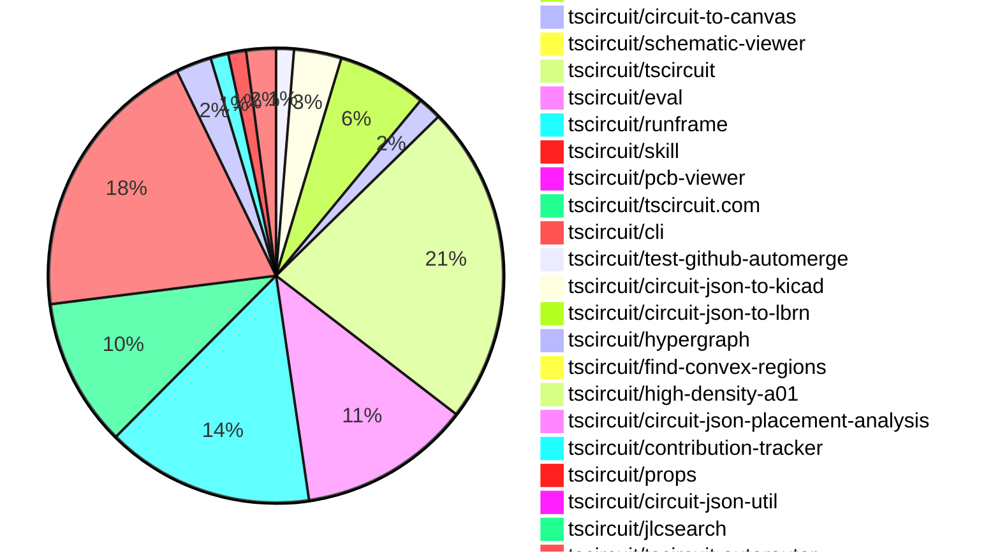

# contribution tracker

[contributions.tscircuit.com](https://contributions.tscircuit.com) ・ [tscircuit.com](https://tscircuit.com) ・ [Contribution Overviews](./contribution-overviews/) ・ [Changelogs](./changelogs/)

Generates weekly contribution overviews for tscircuit contributors. Check out all
the [contribution overviews here](./contribution-overviews/)
You can find AI-generated monthly changelogs in the [changelogs directory](./changelogs/)

- All PRs in the tscircuit org are scanned/summarized via an LLM
- The LLM classifies each Diff/PR as into a set of attributes for scoring
- All the PRs, summaries, and classifications are organized into charts and tables for [the website](https://contributions.tscircuit.com)

> Want to run locally? See the [Development Section](#development)

## Current Week

<!-- START_CURRENT_WEEK -->

# Contribution Overview 2026-03-03

The current week is shown below. There are 3 major sections:

- [Contributor Overview](#contributor-overview)
- [PRs by Repository](#prs-by-repository)
- [PRs by Contributor](#changes-by-contributor)
- [Scoring & Sponsorship Details](/docs/sponsorship-calculation-explanation.md)

## PRs by Repository


```mermaid
pie
    "tscircuit/3d-viewer" : 3
    "tscircuit/circuit-json" : 8
    "tscircuit/core" : 15
    "tscircuit/circuit-to-canvas" : 4
    "tscircuit/schematic-viewer" : 1
    "tscircuit/tscircuit" : 54
    "tscircuit/eval" : 29
    "tscircuit/runframe" : 35
    "tscircuit/skill" : 2
    "tscircuit/pcb-viewer" : 2
    "tscircuit/tscircuit.com" : 25
    "tscircuit/cli" : 47
    "tscircuit/test-github-automerge" : 1
    "tscircuit/circuit-json-to-kicad" : 2
    "tscircuit/circuit-json-to-lbrn" : 2
    "tscircuit/hypergraph" : 6
    "tscircuit/find-convex-regions" : 2
    "tscircuit/high-density-a01" : 1
    "tscircuit/circuit-json-placement-analysis" : 1
    "tscircuit/contribution-tracker" : 3
    "tscircuit/props" : 3
    "tscircuit/circuit-json-util" : 1
    "tscircuit/jlcsearch" : 1
    "tscircuit/tscircuit-autorouter" : 5
    "tscircuit/checks" : 2
    "tscircuit/docs" : 1
```

## Contributor Overview

| Contributor | 🐳 Major | 🐙 Minor | 🐌 Tiny | Score | ⭐ | Discussion Contributions |
|-------------|---------|---------|---------|-------|-----|--------------------------|
| [seveibar](#seveibar) | 5 | 12 | 3 | 48 | ⭐⭐ | 0🔹 0🔶 0💎 |
| [ShiboSoftwareDev](#ShiboSoftwareDev) | 2 | 6 | 4 | 29 | ⭐⭐ | 0🔹 0🔶 0💎 |
| [MustafaMulla29](#MustafaMulla29) | 1 | 5 | 8 | 22 | ⭐⭐ | 0🔹 0🔶 0💎 |
| [Abse2001](#Abse2001) | 3 | 1 | 1 | 17 | ⭐⭐ | 0🔹 0🔶 0💎 |
| [tscircuitbot](#tscircuitbot) | 0 | 0 | 192 | 13.5 | ⭐⭐ | 0🔹 0🔶 0💎 |
| [imrishabh18](#imrishabh18) | 1 | 3 | 2 | 13 | ⭐⭐ | 0🔹 0🔶 0💎 |
| [rushabhcodes](#rushabhcodes) | 1 | 1 | 0 | 7 | ⭐ | 0🔹 0🔶 0💎 |
| [AnasSarkiz](#AnasSarkiz) | 1 | 1 | 0 | 6 | ⭐ | 0🔹 0🔶 0💎 |
| [0hmX](#0hmX) | 1 | 0 | 0 | 4 | ⭐ | 0🔹 0🔶 0💎 |
| [CuboYe](#CuboYe) | 0 | 1 | 0 | 2 |  | 0🔹 0🔶 0💎 |
| [techmannih](#techmannih) | 0 | 0 | 1 | 1 |  | 0🔹 0🔶 0💎 |

> Note: AI evaluates PRs and assigns 1-3 star ratings automatically. 4 and 5 star ratings require manual staff review.

### Discussion Contribution Legend

- 🔹 Normal Comments: Basic participation with minimal effort
- 🔶 Great Informative Comments: Thoughtful participation that adds value
- 💎 Incredible Comments: Exceptional participation with high-quality content

## Review Table

[reviews-received-hover]: ## "Number of reviews received for PRs for this contributor"
[approvals-received-hover]: ## "Number of approvals received for PRs this contributor authored"
[rejections-received-hover]: ## "Number of rejections received for PRs this contributor authored"
[prs-opened-hover]: ## "Number of PRs opened by this contributor"
[issues-created-hover]: ## "Number of issues created by this contributor"

| Contributor | Reviews Received | Approvals Received | Rejections Received | Approvals | Rejections Given | PRs Opened | PRs Merged | Issues Created |
|---|---|---|---|---|---|---|---|---|
| [MustafaMulla29](#MustafaMulla29) | 14 | 12 | 0 | 0 | 0 | 16 | 16 | 0 |
| [tscircuitbot](#tscircuitbot) | 0 | 0 | 0 | 0 | 0 | 249 | 193 | 0 |
| [ShiboSoftwareDev](#ShiboSoftwareDev) | 15 | 12 | 0 | 5 | 0 | 13 | 12 | 0 |
| [seveibar](#seveibar) | 6 | 0 | 0 | 27 | 3 | 21 | 20 | 0 |
| [CuboYe](#CuboYe) | 4 | 2 | 0 | 0 | 0 | 6 | 1 | 0 |
| [techmannih](#techmannih) | 1 | 1 | 0 | 0 | 0 | 2 | 1 | 0 |
| [Devesh36](#Devesh36) | 2 | 1 | 0 | 0 | 0 | 1 | 0 | 0 |
| [rushabhcodes](#rushabhcodes) | 15 | 2 | 3 | 2 | 0 | 7 | 2 | 0 |
| [chassidysandraik-hash](#chassidysandraik-hash) | 0 | 0 | 0 | 0 | 0 | 1 | 0 | 0 |
| [Abse2001](#Abse2001) | 6 | 6 | 0 | 2 | 0 | 6 | 5 | 0 |
| [imrishabh18](#imrishabh18) | 3 | 3 | 0 | 5 | 0 | 9 | 8 | 0 |
| [AnasSarkiz](#AnasSarkiz) | 3 | 2 | 0 | 0 | 0 | 4 | 2 | 0 |
| [legendary658](#legendary658) | 0 | 0 | 0 | 0 | 0 | 1 | 0 | 0 |
| [shehaban](#shehaban) | 0 | 0 | 0 | 0 | 0 | 1 | 0 | 0 |
| [davidweb3-ctrl](#davidweb3-ctrl) | 1 | 0 | 0 | 0 | 0 | 1 | 0 | 0 |
| [ckmtools](#ckmtools) | 0 | 0 | 0 | 0 | 0 | 1 | 0 | 0 |
| [alekmek](#alekmek) | 0 | 0 | 0 | 0 | 0 | 2 | 0 | 0 |
| [0hmX](#0hmX) | 0 | 0 | 0 | 0 | 0 | 5 | 1 | 0 |

## Changes by Repository

### [tscircuit/3d-viewer](https://github.com/tscircuit/3d-viewer)

| PR # | Impact | Rating | Contributor | Description |
|------|--------|--------|-------------|-------------|
| [#721](https://github.com/tscircuit/3d-viewer/pull/721) | 🐳 Major | ⭐⭐⭐ | MustafaMulla29 | Adds a toggle for PCB notes elements in the context menu, which are set to be hidden by default. |
| [#724](https://github.com/tscircuit/3d-viewer/pull/724) | 🐳 Major | ⭐⭐⭐ | Abse2001 | Refactors the texture generation for plated holes and vias to utilize the circuit-to-canvas renderer, improving rendering efficiency and quality. |
| [#723](https://github.com/tscircuit/3d-viewer/pull/723) | 🐳 Major | ⭐⭐⭐ | Abse2001 | Enhances panel outline texture generation by implementing robust detection of panel and board relationships in circuit JSON data. |

### [tscircuit/circuit-json](https://github.com/tscircuit/circuit-json)

| PR # | Impact | Rating | Contributor | Description |
|------|--------|--------|-------------|-------------|
| [#485](https://github.com/tscircuit/circuit-json/pull/485) | 🐳 Major | ⭐⭐⭐ | seveibar | Adds optional anchor metadata for flexible component placement and a new position mode for referencing other components in PCB design. |
| [#487](https://github.com/tscircuit/circuit-json/pull/487) | 🐙 Minor | ⭐⭐ | MustafaMulla29 | Adds a specification for the simple_connector component, including its type and optional standards. |
| [#491](https://github.com/tscircuit/circuit-json/pull/491) | 🐙 Minor | ⭐⭐ | seveibar | Add a warning for PCB connectors that are oriented inward toward the board, requiring reorientation for accessibility. |
| [#489](https://github.com/tscircuit/circuit-json/pull/489) | 🐙 Minor | ⭐⭐ | seveibar | Adds an optional cable insertion center coordinate to PCB components for better connector and cable description. |

<details>
<summary>🐌 Tiny Contributions (4)</summary>

| PR # | Impact | Contributor | Description |
|------|--------|-------------|-------------|
| [#492](https://github.com/tscircuit/circuit-json/pull/492) | 🐌 Tiny | tscircuitbot | Automated package update |
| [#490](https://github.com/tscircuit/circuit-json/pull/490) | 🐌 Tiny | tscircuitbot | Automated package update |
| [#486](https://github.com/tscircuit/circuit-json/pull/486) | 🐌 Tiny | tscircuitbot | Automated package update |
| [#488](https://github.com/tscircuit/circuit-json/pull/488) | 🐌 Tiny | tscircuitbot | Automated package update |

</details>

### [tscircuit/core](https://github.com/tscircuit/core)

| PR # | Impact | Rating | Contributor | Description |
|------|--------|--------|-------------|-------------|
| [#2008](https://github.com/tscircuit/core/pull/2008) | 🐳 Major | ⭐⭐⭐ | ShiboSoftwareDev | Fixes the handling of library footprint references in NormalComponent to ensure correct extraction of ports after asynchronous loading of footprints. |
| [#2013](https://github.com/tscircuit/core/pull/2013) | 🐙 Minor | ⭐⭐ | MustafaMulla29 | Fixes the issue where custom symbols with schematic_path do not auto layout correctly in the circuit rendering. |
| [#1997](https://github.com/tscircuit/core/pull/1997) | 🐙 Minor | ⭐⭐ | MustafaMulla29 | Updates the error message for invalid pin labels to specify that they can only contain letters, numbers, and underscores. |
| [#1998](https://github.com/tscircuit/core/pull/1998) | 🐙 Minor | ⭐⭐ | MustafaMulla29 | Emits a pcb_missing_footprint_error when no footprint is specified for a chip component, improving error handling in the circuit design process. |
| [#2014](https://github.com/tscircuit/core/pull/2014) | 🐙 Minor | ⭐⭐ | ShiboSoftwareDev | Excludes courtyard and fabrication notes from affecting the outside-board DRC bounds calculations in PCB design. |
| [#2012](https://github.com/tscircuit/core/pull/2012) | 🐙 Minor | ⭐⭐ | ShiboSoftwareDev | Prevents crashes during PCB trace rendering when port selectors are unresolved by handling connection errors gracefully. |
| [#2007](https://github.com/tscircuit/core/pull/2007) | 🐙 Minor | ⭐⭐ | ShiboSoftwareDev | Adds support for shorthand notation for accessing symbol-nested ports in components. |
| [#2005](https://github.com/tscircuit/core/pull/2005) | 🐙 Minor | ⭐⭐ | ShiboSoftwareDev | Prevents subpanels from triggering the regular group layout system and allows nested boards to be included in panelization. |
| [#2002](https://github.com/tscircuit/core/pull/2002) | 🐙 Minor | ⭐⭐ | ShiboSoftwareDev | Adds support for subpanels in grid layout and consolidates packing utilities while fixing PCB note transformations. |
| [#2011](https://github.com/tscircuit/core/pull/2011) | 🐙 Minor | ⭐⭐ | seveibar | Adds a new Connector component that calculates and populates the cable insertion center for PCB components based on their configuration. |
| [#2010](https://github.com/tscircuit/core/pull/2010) | 🐙 Minor | ⭐⭐ | seveibar | Adds a localized fallback for resolving single-pin component selectors in traces without altering global selector semantics. |
| [#2003](https://github.com/tscircuit/core/pull/2003) | 🐙 Minor | ⭐⭐ | seveibar | Add support for platform-level toggles to disable specific PCB DRC categories (netlist, placement, routing) allowing CIhost environments to selectively skip checks. |
| [#2004](https://github.com/tscircuit/core/pull/2004) | 🐙 Minor | ⭐⭐ | CuboYe | Fixes broken non-React usage example in README by correcting variable names and ensuring the snippet is runnable for new contributors. |

<details>
<summary>🐌 Tiny Contributions (2)</summary>

| PR # | Impact | Contributor | Description |
|------|--------|-------------|-------------|
| [#2015](https://github.com/tscircuit/core/pull/2015) | 🐌 Tiny | MustafaMulla29 | Fixes auto-layout issues for custom schematic symbols by properly handling schematic paths in the layout process. |
| [#2001](https://github.com/tscircuit/core/pull/2001) | 🐌 Tiny | imrishabh18 | Updates the tscircuitchecks package to version 0.0.100 and removes the check for PCB component footprint pad overlap. |

</details>

### [tscircuit/circuit-to-canvas](https://github.com/tscircuit/circuit-to-canvas)

| PR # | Impact | Rating | Contributor | Description |
|------|--------|--------|-------------|-------------|
| [#202](https://github.com/tscircuit/circuit-to-canvas/pull/202) | 🐙 Minor | ⭐⭐ | MustafaMulla29 | Adds a toggle option to control the rendering of pcb_note elements in the drawing options. |
| [#204](https://github.com/tscircuit/circuit-to-canvas/pull/204) | 🐙 Minor | ⭐⭐ | Abse2001 | Cuts drill holes out of copper for vias and plated holes using destination-out masks, enhancing the rendering of PCB elements. |

<details>
<summary>🐌 Tiny Contributions (2)</summary>

| PR # | Impact | Contributor | Description |
|------|--------|-------------|-------------|
| [#205](https://github.com/tscircuit/circuit-to-canvas/pull/205) | 🐌 Tiny | tscircuitbot | Automated package update |
| [#203](https://github.com/tscircuit/circuit-to-canvas/pull/203) | 🐌 Tiny | tscircuitbot | Automated package update |

</details>

### [tscircuit/schematic-viewer](https://github.com/tscircuit/schematic-viewer)


<details>
<summary>🐌 Tiny Contributions (1)</summary>

| PR # | Impact | Contributor | Description |
|------|--------|-------------|-------------|
| [#169](https://github.com/tscircuit/schematic-viewer/pull/169) | 🐌 Tiny | MustafaMulla29 | Updates the tscircuit dependency version from 0.0.1194 to 0.0.1437 and adds a new fixture for a custom symbol in the schematic viewer. |

</details>

### [tscircuit/tscircuit](https://github.com/tscircuit/tscircuit)


<details>
<summary>🐌 Tiny Contributions (54)</summary>

| PR # | Impact | Contributor | Description |
|------|--------|-------------|-------------|
| [#2478](https://github.com/tscircuit/tscircuit/pull/2478) | 🐌 Tiny | MustafaMulla29 | Updates the versions of the tscircuitcore and tscircuiteval dependencies in package.json |
| [#2474](https://github.com/tscircuit/tscircuit/pull/2474) | 🐌 Tiny | MustafaMulla29 | Updates the versions of core and eval dependencies in the package.json file. |
| [#2483](https://github.com/tscircuit/tscircuit/pull/2483) | 🐌 Tiny | tscircuitbot | Automated package update |
| [#2482](https://github.com/tscircuit/tscircuit/pull/2482) | 🐌 Tiny | tscircuitbot | Updates the tscircuitcli package from version 0.1.1043 to 0.1.1044 and the tscircuitrunframe package from version 0.0.1688 to 0.0.1690 in package.json |
| [#2481](https://github.com/tscircuit/tscircuit/pull/2481) | 🐌 Tiny | tscircuitbot | Automated package update to version 0.0.1438 |
| [#2480](https://github.com/tscircuit/tscircuit/pull/2480) | 🐌 Tiny | tscircuitbot | Updates the tscircuitcli package from version 0.1.1040 to 0.1.1043 and the tscircuitrunframe package from version 0.0.1686 to 0.0.1688 in package.json |
| [#2479](https://github.com/tscircuit/tscircuit/pull/2479) | 🐌 Tiny | tscircuitbot | Automated package update |
| [#2477](https://github.com/tscircuit/tscircuit/pull/2477) | 🐌 Tiny | tscircuitbot | Automated package update to version 0.0.1436 |
| [#2476](https://github.com/tscircuit/tscircuit/pull/2476) | 🐌 Tiny | tscircuitbot | Automated package update |
| [#2475](https://github.com/tscircuit/tscircuit/pull/2475) | 🐌 Tiny | tscircuitbot | Automated package update |
| [#2473](https://github.com/tscircuit/tscircuit/pull/2473) | 🐌 Tiny | tscircuitbot | Automated package update |
| [#2472](https://github.com/tscircuit/tscircuit/pull/2472) | 🐌 Tiny | tscircuitbot | Updates the versions of several dependencies in the package.json file, including tscircuitcli, tscircuitcore, and tscircuiteval. |
| [#2471](https://github.com/tscircuit/tscircuit/pull/2471) | 🐌 Tiny | tscircuitbot | Updates the package version from 0.0.1432 to 0.0.1433 in package.json |
| [#2470](https://github.com/tscircuit/tscircuit/pull/2470) | 🐌 Tiny | tscircuitbot | Automated package update |
| [#2469](https://github.com/tscircuit/tscircuit/pull/2469) | 🐌 Tiny | tscircuitbot | Automated package update |
| [#2468](https://github.com/tscircuit/tscircuit/pull/2468) | 🐌 Tiny | tscircuitbot | Automated package update |
| [#2466](https://github.com/tscircuit/tscircuit/pull/2466) | 🐌 Tiny | tscircuitbot | Automated package update to version 0.0.1431 |
| [#2465](https://github.com/tscircuit/tscircuit/pull/2465) | 🐌 Tiny | tscircuitbot | Updates the tscircuitcli package to version 0.1.1035 in package.json |
| [#2450](https://github.com/tscircuit/tscircuit/pull/2450) | 🐌 Tiny | tscircuitbot | Automated package update to version 0.0.1423 |
| [#2429](https://github.com/tscircuit/tscircuit/pull/2429) | 🐌 Tiny | tscircuitbot | Updates the tscircuitcli package from version 0.1.1018 to 0.1.1020 and the tscircuitrunframe package from version 0.0.1673 to 0.0.1674 in package.json |
| [#2463](https://github.com/tscircuit/tscircuit/pull/2463) | 🐌 Tiny | tscircuitbot | Updates the tscircuitcli package to version 0.1.1034 in the package.json file. |
| [#2440](https://github.com/tscircuit/tscircuit/pull/2440) | 🐌 Tiny | tscircuitbot | Updates the tscircuitcli and tscircuitrunframe packages to their latest versions. |
| [#2434](https://github.com/tscircuit/tscircuit/pull/2434) | 🐌 Tiny | tscircuitbot | Updates the versions of several dependencies in the package.json file, including tscircuitcli and others. |
| [#2435](https://github.com/tscircuit/tscircuit/pull/2435) | 🐌 Tiny | tscircuitbot | Updates the package version from 0.0.1415 to 0.0.1416 in package.json |
| [#2445](https://github.com/tscircuit/tscircuit/pull/2445) | 🐌 Tiny | tscircuitbot | Updates the tscircuitcli package to version 0.1.1027 in package.json |
| [#2453](https://github.com/tscircuit/tscircuit/pull/2453) | 🐌 Tiny | tscircuitbot | Updates the tscircuitrunframe package version from 0.0.1680 to 0.0.1681 in package.json |
| [#2447](https://github.com/tscircuit/tscircuit/pull/2447) | 🐌 Tiny | tscircuitbot | Automated package update |
| [#2432](https://github.com/tscircuit/tscircuit/pull/2432) | 🐌 Tiny | tscircuitbot | Automated package update |
| [#2452](https://github.com/tscircuit/tscircuit/pull/2452) | 🐌 Tiny | tscircuitbot | Automated package update |
| [#2449](https://github.com/tscircuit/tscircuit/pull/2449) | 🐌 Tiny | tscircuitbot | Automated package update |
| [#2439](https://github.com/tscircuit/tscircuit/pull/2439) | 🐌 Tiny | tscircuitbot | Automated package update to version 0.0.1418 |
| [#2438](https://github.com/tscircuit/tscircuit/pull/2438) | 🐌 Tiny | tscircuitbot | Updates the version of the tscircuiteval package from 0.0.676 to 0.0.677 in package.json |
| [#2461](https://github.com/tscircuit/tscircuit/pull/2461) | 🐌 Tiny | tscircuitbot | Updates the tscircuitcli package from version 0.1.1032 to 0.1.1033 |
| [#2428](https://github.com/tscircuit/tscircuit/pull/2428) | 🐌 Tiny | tscircuitbot | Automated package update |
| [#2427](https://github.com/tscircuit/tscircuit/pull/2427) | 🐌 Tiny | tscircuitbot | Updates the versions of tscircuitcore and tscircuiteval packages in package.json |
| [#2462](https://github.com/tscircuit/tscircuit/pull/2462) | 🐌 Tiny | tscircuitbot | Automated package update |
| [#2451](https://github.com/tscircuit/tscircuit/pull/2451) | 🐌 Tiny | tscircuitbot | Automated package update |
| [#2455](https://github.com/tscircuit/tscircuit/pull/2455) | 🐌 Tiny | tscircuitbot | Updates the tscircuitcli package version from 0.1.1029 to 0.1.1030 in package.json |
| [#2436](https://github.com/tscircuit/tscircuit/pull/2436) | 🐌 Tiny | tscircuitbot | Automated package update |
| [#2446](https://github.com/tscircuit/tscircuit/pull/2446) | 🐌 Tiny | tscircuitbot | Automated package update |
| [#2448](https://github.com/tscircuit/tscircuit/pull/2448) | 🐌 Tiny | tscircuitbot | Automated package update |
| [#2441](https://github.com/tscircuit/tscircuit/pull/2441) | 🐌 Tiny | tscircuitbot | Automated package update |
| [#2430](https://github.com/tscircuit/tscircuit/pull/2430) | 🐌 Tiny | tscircuitbot | Automated package update |
| [#2456](https://github.com/tscircuit/tscircuit/pull/2456) | 🐌 Tiny | tscircuitbot | Automated package update |
| [#2460](https://github.com/tscircuit/tscircuit/pull/2460) | 🐌 Tiny | tscircuitbot | Automated package update |
| [#2458](https://github.com/tscircuit/tscircuit/pull/2458) | 🐌 Tiny | tscircuitbot | Automated package update |
| [#2444](https://github.com/tscircuit/tscircuit/pull/2444) | 🐌 Tiny | tscircuitbot | Automated package update |
| [#2454](https://github.com/tscircuit/tscircuit/pull/2454) | 🐌 Tiny | tscircuitbot | Automated package update |
| [#2431](https://github.com/tscircuit/tscircuit/pull/2431) | 🐌 Tiny | tscircuitbot | Automated package update |
| [#2464](https://github.com/tscircuit/tscircuit/pull/2464) | 🐌 Tiny | tscircuitbot | Automated package update |
| [#2459](https://github.com/tscircuit/tscircuit/pull/2459) | 🐌 Tiny | tscircuitbot | Updates the tscircuitcli package to version 0.1.1032 in package.json |
| [#2457](https://github.com/tscircuit/tscircuit/pull/2457) | 🐌 Tiny | tscircuitbot | Updates the tscircuitcli package to version 0.1.1031 in package.json |
| [#2443](https://github.com/tscircuit/tscircuit/pull/2443) | 🐌 Tiny | tscircuitbot | Updates the tscircuitcli package version from 0.1.1024 to 0.1.1026 in package.json |
| [#2437](https://github.com/tscircuit/tscircuit/pull/2437) | 🐌 Tiny | tscircuitbot | Automated package update to version 0.0.1417 |

</details>

### [tscircuit/eval](https://github.com/tscircuit/eval)


<details>
<summary>🐌 Tiny Contributions (29)</summary>

| PR # | Impact | Contributor | Description |
|------|--------|-------------|-------------|
| [#2198](https://github.com/tscircuit/eval/pull/2198) | 🐌 Tiny | MustafaMulla29 | Updates the tscircuitcore dependency from version 0.0.1085 to 0.0.1086 in package.json |
| [#2199](https://github.com/tscircuit/eval/pull/2199) | 🐌 Tiny | tscircuitbot | Automated package update |
| [#2197](https://github.com/tscircuit/eval/pull/2197) | 🐌 Tiny | tscircuitbot | Automated package update to version 0.0.687 |
| [#2196](https://github.com/tscircuit/eval/pull/2196) | 🐌 Tiny | tscircuitbot | Automated package update |
| [#2193](https://github.com/tscircuit/eval/pull/2193) | 🐌 Tiny | tscircuitbot | Automated package update to version 0.0.686 |
| [#2192](https://github.com/tscircuit/eval/pull/2192) | 🐌 Tiny | tscircuitbot | Updates the version of the tscircuitcore package from 0.0.1083 to 0.0.1084 in package.json |
| [#2190](https://github.com/tscircuit/eval/pull/2190) | 🐌 Tiny | tscircuitbot | Automated package update |
| [#2189](https://github.com/tscircuit/eval/pull/2189) | 🐌 Tiny | tscircuitbot | Automated package update |
| [#2187](https://github.com/tscircuit/eval/pull/2187) | 🐌 Tiny | tscircuitbot | Automated package update |
| [#2186](https://github.com/tscircuit/eval/pull/2186) | 🐌 Tiny | tscircuitbot | Updates the version of the tscircuitcore package from 0.0.1081 to 0.0.1082 in package.json |
| [#2184](https://github.com/tscircuit/eval/pull/2184) | 🐌 Tiny | tscircuitbot | Automated package update |
| [#2183](https://github.com/tscircuit/eval/pull/2183) | 🐌 Tiny | tscircuitbot | Updates the version of the tscircuitcore package from 0.0.1080 to 0.0.1081 in package.json |
| [#2181](https://github.com/tscircuit/eval/pull/2181) | 🐌 Tiny | tscircuitbot | Automated package update |
| [#2180](https://github.com/tscircuit/eval/pull/2180) | 🐌 Tiny | tscircuitbot | Updates the version of the tscircuitcore package from 0.0.1079 to 0.0.1080 in package.json |
| [#2178](https://github.com/tscircuit/eval/pull/2178) | 🐌 Tiny | tscircuitbot | Automated package update |
| [#2177](https://github.com/tscircuit/eval/pull/2177) | 🐌 Tiny | tscircuitbot | Updates the version of the tscircuitcore package from 0.0.1078 to 0.0.1079 in package.json |
| [#2174](https://github.com/tscircuit/eval/pull/2174) | 🐌 Tiny | tscircuitbot | Updates the version of the tscircuitcore package from 0.0.1077 to 0.0.1078 in package.json |
| [#2175](https://github.com/tscircuit/eval/pull/2175) | 🐌 Tiny | tscircuitbot | Automated package update |
| [#2172](https://github.com/tscircuit/eval/pull/2172) | 🐌 Tiny | tscircuitbot | Automated package update |
| [#2171](https://github.com/tscircuit/eval/pull/2171) | 🐌 Tiny | tscircuitbot | Updates the version of the tscircuitcore package from 0.0.1076 to 0.0.1077 in package.json |
| [#2169](https://github.com/tscircuit/eval/pull/2169) | 🐌 Tiny | tscircuitbot | Automated package update |
| [#2168](https://github.com/tscircuit/eval/pull/2168) | 🐌 Tiny | tscircuitbot | Automated package update |
| [#2165](https://github.com/tscircuit/eval/pull/2165) | 🐌 Tiny | tscircuitbot | Updates the version of tscircuitcore from 0.0.1074 to 0.0.1075 and tscircuitprops from 0.0.485 to 0.0.487 in package.json |
| [#2162](https://github.com/tscircuit/eval/pull/2162) | 🐌 Tiny | tscircuitbot | Updates the versions of tscircuitcircuit-json-util and tscircuitcore packages in package.json |
| [#2161](https://github.com/tscircuit/eval/pull/2161) | 🐌 Tiny | tscircuitbot | Automated package update |
| [#2160](https://github.com/tscircuit/eval/pull/2160) | 🐌 Tiny | tscircuitbot | Updates the package versions in package.json to their latest compatible versions. |
| [#2158](https://github.com/tscircuit/eval/pull/2158) | 🐌 Tiny | tscircuitbot | Automated package update |
| [#2166](https://github.com/tscircuit/eval/pull/2166) | 🐌 Tiny | tscircuitbot | Automated package update |
| [#2163](https://github.com/tscircuit/eval/pull/2163) | 🐌 Tiny | tscircuitbot | Automated package update |

</details>

### [tscircuit/runframe](https://github.com/tscircuit/runframe)


<details>
<summary>🐌 Tiny Contributions (35)</summary>

| PR # | Impact | Contributor | Description |
|------|--------|-------------|-------------|
| [#2816](https://github.com/tscircuit/runframe/pull/2816) | 🐌 Tiny | MustafaMulla29 | Updates the versions of the schematic-viewer and tscircuit dependencies in package.json |
| [#2811](https://github.com/tscircuit/runframe/pull/2811) | 🐌 Tiny | MustafaMulla29 | Updates the tscircuit3d-viewer dependency to version 0.0.527 in package.json |
| [#2821](https://github.com/tscircuit/runframe/pull/2821) | 🐌 Tiny | tscircuitbot | Updates the circuit-json-to-kicad package version from 0.0.82 to 0.0.83 in package.json |
| [#2818](https://github.com/tscircuit/runframe/pull/2818) | 🐌 Tiny | tscircuitbot | Automated package update |
| [#2817](https://github.com/tscircuit/runframe/pull/2817) | 🐌 Tiny | tscircuitbot | Automated package update |
| [#2815](https://github.com/tscircuit/runframe/pull/2815) | 🐌 Tiny | tscircuitbot | Updates the tscircuitschematic-viewer package to version 2.0.58 |
| [#2814](https://github.com/tscircuit/runframe/pull/2814) | 🐌 Tiny | tscircuitbot | Automated package update |
| [#2813](https://github.com/tscircuit/runframe/pull/2813) | 🐌 Tiny | tscircuitbot | Automated package update |
| [#2812](https://github.com/tscircuit/runframe/pull/2812) | 🐌 Tiny | tscircuitbot | Automated package update |
| [#2810](https://github.com/tscircuit/runframe/pull/2810) | 🐌 Tiny | tscircuitbot | Automated package update |
| [#2809](https://github.com/tscircuit/runframe/pull/2809) | 🐌 Tiny | tscircuitbot | Updates the tscircuiteval package from version 0.0.684 to 0.0.686 in the package.json file. |
| [#2808](https://github.com/tscircuit/runframe/pull/2808) | 🐌 Tiny | tscircuitbot | Automated package update |
| [#2807](https://github.com/tscircuit/runframe/pull/2807) | 🐌 Tiny | tscircuitbot | Updates the tscircuiteval package to version 0.0.684 in the package.json file. |
| [#2806](https://github.com/tscircuit/runframe/pull/2806) | 🐌 Tiny | tscircuitbot | Automated package update |
| [#2805](https://github.com/tscircuit/runframe/pull/2805) | 🐌 Tiny | tscircuitbot | Updates the tscircuiteval package to version 0.0.683 in the package.json file. |
| [#2804](https://github.com/tscircuit/runframe/pull/2804) | 🐌 Tiny | tscircuitbot | Automated package update |
| [#2803](https://github.com/tscircuit/runframe/pull/2803) | 🐌 Tiny | tscircuitbot | Automated package update |
| [#2802](https://github.com/tscircuit/runframe/pull/2802) | 🐌 Tiny | tscircuitbot | Automated package update |
| [#2801](https://github.com/tscircuit/runframe/pull/2801) | 🐌 Tiny | tscircuitbot | Updates the tscircuiteval package to version 0.0.681 in package.json |
| [#2799](https://github.com/tscircuit/runframe/pull/2799) | 🐌 Tiny | tscircuitbot | Updates the tscircuitpcb-viewer package from version 1.11.345 to 1.11.346 |
| [#2797](https://github.com/tscircuit/runframe/pull/2797) | 🐌 Tiny | tscircuitbot | Updates the tscircuiteval package from version 0.0.679 to 0.0.680 |
| [#2793](https://github.com/tscircuit/runframe/pull/2793) | 🐌 Tiny | tscircuitbot | Updates the tscircuiteval package to version 0.0.678 in the package.json file. |
| [#2791](https://github.com/tscircuit/runframe/pull/2791) | 🐌 Tiny | tscircuitbot | Updates the tscircuiteval package to version 0.0.677 in the package.json file. |
| [#2790](https://github.com/tscircuit/runframe/pull/2790) | 🐌 Tiny | tscircuitbot | Updates the package version from 0.0.1675 to 0.0.1676 in package.json |
| [#2786](https://github.com/tscircuit/runframe/pull/2786) | 🐌 Tiny | tscircuitbot | Updates the package version from v0.0.1673 to v0.0.1674 in package.json |
| [#2800](https://github.com/tscircuit/runframe/pull/2800) | 🐌 Tiny | tscircuitbot | Automated package update |
| [#2798](https://github.com/tscircuit/runframe/pull/2798) | 🐌 Tiny | tscircuitbot | Automated package update |
| [#2794](https://github.com/tscircuit/runframe/pull/2794) | 🐌 Tiny | tscircuitbot | Automated package update |
| [#2792](https://github.com/tscircuit/runframe/pull/2792) | 🐌 Tiny | tscircuitbot | Automated package update |
| [#2789](https://github.com/tscircuit/runframe/pull/2789) | 🐌 Tiny | tscircuitbot | Updates the tscircuiteval package to version 0.0.676 in the package.json file. |
| [#2785](https://github.com/tscircuit/runframe/pull/2785) | 🐌 Tiny | tscircuitbot | Updates the tscircuiteval package from version 0.0.673 to 0.0.674 in the package.json file. |
| [#2796](https://github.com/tscircuit/runframe/pull/2796) | 🐌 Tiny | tscircuitbot | Automated package update |
| [#2788](https://github.com/tscircuit/runframe/pull/2788) | 🐌 Tiny | tscircuitbot | Automated package update |
| [#2787](https://github.com/tscircuit/runframe/pull/2787) | 🐌 Tiny | tscircuitbot | Updates the tscircuiteval package to version 0.0.675 in the package.json file. |
| [#2795](https://github.com/tscircuit/runframe/pull/2795) | 🐌 Tiny | tscircuitbot | Updates the tscircuiteval package to version 0.0.679 in the package.json file. |

</details>

### [tscircuit/skill](https://github.com/tscircuit/skill)


<details>
<summary>🐌 Tiny Contributions (2)</summary>

| PR # | Impact | Contributor | Description |
|------|--------|-------------|-------------|
| [#6](https://github.com/tscircuit/skill/pull/6) | 🐌 Tiny | MustafaMulla29 | Adds a new trace example for the V3_3 net in the SYNTAX.md documentation. |
| [#5](https://github.com/tscircuit/skill/pull/5) | 🐌 Tiny | ShiboSoftwareDev | Adds documentation for pinLabels and pinAttributes, including examples for chip components and their usage in schematic design. |

</details>

### [tscircuit/pcb-viewer](https://github.com/tscircuit/pcb-viewer)


<details>
<summary>🐌 Tiny Contributions (2)</summary>

| PR # | Impact | Contributor | Description |
|------|--------|-------------|-------------|
| [#688](https://github.com/tscircuit/pcb-viewer/pull/688) | 🐌 Tiny | tscircuitbot | Automated package update |
| [#687](https://github.com/tscircuit/pcb-viewer/pull/687) | 🐌 Tiny | ShiboSoftwareDev | Hides the group overlay for subpanels in the PCB viewer to improve clarity and usability. |

</details>

### [tscircuit/tscircuit.com](https://github.com/tscircuit/tscircuit.com)

| PR # | Impact | Rating | Contributor | Description |
|------|--------|--------|-------------|-------------|
| [#2922](https://github.com/tscircuit/tscircuit.com/pull/2922) | 🐙 Minor | ⭐⭐ | imrishabh18 | Fixes the issue of duplicate build logs being displayed during live streaming by ensuring that completed logs are only shown after streaming finishes. |

<details>
<summary>🐌 Tiny Contributions (24)</summary>

| PR # | Impact | Contributor | Description |
|------|--------|-------------|-------------|
| [#2936](https://github.com/tscircuit/tscircuit.com/pull/2936) | 🐌 Tiny | tscircuitbot | Updates the tscircuitrunframe package from version 0.0.1689 to 0.0.1690 |
| [#2935](https://github.com/tscircuit/tscircuit.com/pull/2935) | 🐌 Tiny | tscircuitbot | Automated package update |
| [#2934](https://github.com/tscircuit/tscircuit.com/pull/2934) | 🐌 Tiny | tscircuitbot | Updates the tscircuitrunframe package version from 0.0.1686 to 0.0.1688 in package.json |
| [#2932](https://github.com/tscircuit/tscircuit.com/pull/2932) | 🐌 Tiny | tscircuitbot | Automated package update |
| [#2931](https://github.com/tscircuit/tscircuit.com/pull/2931) | 🐌 Tiny | tscircuitbot | Updates the tscircuiteval package from version 0.0.684 to 0.0.686 |
| [#2930](https://github.com/tscircuit/tscircuit.com/pull/2930) | 🐌 Tiny | tscircuitbot | Updates the tscircuitrunframe package to version 0.0.1685 |
| [#2929](https://github.com/tscircuit/tscircuit.com/pull/2929) | 🐌 Tiny | tscircuitbot | Updates the tscircuiteval package version from 0.0.683 to 0.0.684 |
| [#2928](https://github.com/tscircuit/tscircuit.com/pull/2928) | 🐌 Tiny | tscircuitbot | Updates the tscircuitrunframe package from version 0.0.1683 to 0.0.1684 |
| [#2927](https://github.com/tscircuit/tscircuit.com/pull/2927) | 🐌 Tiny | tscircuitbot | Automated package update |
| [#2926](https://github.com/tscircuit/tscircuit.com/pull/2926) | 🐌 Tiny | tscircuitbot | Updates the tscircuitrunframe package from version 0.0.1681 to 0.0.1683 |
| [#2923](https://github.com/tscircuit/tscircuit.com/pull/2923) | 🐌 Tiny | tscircuitbot | Automated package update |
| [#2917](https://github.com/tscircuit/tscircuit.com/pull/2917) | 🐌 Tiny | tscircuitbot | Updates the tscircuiteval package to version 0.0.679 in the package.json file |
| [#2915](https://github.com/tscircuit/tscircuit.com/pull/2915) | 🐌 Tiny | tscircuitbot | Automated package update |
| [#2908](https://github.com/tscircuit/tscircuit.com/pull/2908) | 🐌 Tiny | tscircuitbot | Updates the tscircuitrunframe package from version 0.0.1673 to 0.0.1674 |
| [#2921](https://github.com/tscircuit/tscircuit.com/pull/2921) | 🐌 Tiny | tscircuitbot | Automated package update |
| [#2920](https://github.com/tscircuit/tscircuit.com/pull/2920) | 🐌 Tiny | tscircuitbot | Updates the tscircuitrunframe package from version 0.0.1677 to 0.0.1680 |
| [#2919](https://github.com/tscircuit/tscircuit.com/pull/2919) | 🐌 Tiny | tscircuitbot | Updates the tscircuiteval package from version 0.0.679 to 0.0.680 |
| [#2914](https://github.com/tscircuit/tscircuit.com/pull/2914) | 🐌 Tiny | tscircuitbot | Updates the tscircuitrunframe package from version 0.0.1676 to 0.0.1677 |
| [#2913](https://github.com/tscircuit/tscircuit.com/pull/2913) | 🐌 Tiny | tscircuitbot | Automated package update |
| [#2912](https://github.com/tscircuit/tscircuit.com/pull/2912) | 🐌 Tiny | tscircuitbot | Updates the tscircuitrunframe package from version 0.0.1675 to 0.0.1676 |
| [#2911](https://github.com/tscircuit/tscircuit.com/pull/2911) | 🐌 Tiny | tscircuitbot | Updates the tscircuiteval package from version 0.0.675 to 0.0.676 |
| [#2910](https://github.com/tscircuit/tscircuit.com/pull/2910) | 🐌 Tiny | tscircuitbot | Updates the tscircuitrunframe package from version 0.0.1674 to 0.0.1675 |
| [#2909](https://github.com/tscircuit/tscircuit.com/pull/2909) | 🐌 Tiny | tscircuitbot | Updates the version of the tscircuiteval package from 0.0.674 to 0.0.675 in package.json |
| [#2907](https://github.com/tscircuit/tscircuit.com/pull/2907) | 🐌 Tiny | tscircuitbot | Updates the tscircuiteval package version from 0.0.672 to 0.0.674 in package.json |

</details>

### [tscircuit/cli](https://github.com/tscircuit/cli)

| PR # | Impact | Rating | Contributor | Description |
|------|--------|--------|-------------|-------------|
| [#2233](https://github.com/tscircuit/cli/pull/2233) | 🐳 Major | ⭐⭐⭐ | imrishabh18 | Adds support for concurrent GLB conversion in the circuit-json build process, enhancing performance by utilizing worker threads for file processing. |
| [#2187](https://github.com/tscircuit/cli/pull/2187) | 🐳 Major | ⭐⭐⭐ | rushabhcodes | Adds support for camera angle presets when generating 3D snapshots via the CLI, allowing users to select different viewpoints for rendered images. |
| [#2239](https://github.com/tscircuit/cli/pull/2239) | 🐙 Minor | ⭐⭐ | seveibar | Enable callers of tsci build to inject a JSON props object into the default export of a component at build-time, a common need when adjusting behavior like autorouting without editing source files. |
| [#2210](https://github.com/tscircuit/cli/pull/2210) | 🐙 Minor | ⭐⭐ | seveibar | Enables PCB geometry generation for placement checks while disabling routing, and updates dependencies to newer versions. |
| [#2235](https://github.com/tscircuit/cli/pull/2235) | 🐙 Minor | ⭐⭐ | imrishabh18 | Adds a stall timeout feature to the GLB worker pool to handle stalled jobs during the build process. |
| [#2229](https://github.com/tscircuit/cli/pull/2229) | 🐙 Minor | ⭐⭐ | imrishabh18 | Allows uploading of binary files via multipartform-data in the local sync pipeline, eliminating the need for base64 encoding on the client side. |
| [#2232](https://github.com/tscircuit/cli/pull/2232) | 🐙 Minor | ⭐⭐ | rushabhcodes | Adds a new camera preset for a pseudo-orthographic top-down view and a normalizeDir function to ensure direction vectors are consistently normalized for improved camera positioning. |

<details>
<summary>🐌 Tiny Contributions (40)</summary>

| PR # | Impact | Contributor | Description |
|------|--------|-------------|-------------|
| [#2260](https://github.com/tscircuit/cli/pull/2260) | 🐌 Tiny | tscircuitbot | Automated package update |
| [#2259](https://github.com/tscircuit/cli/pull/2259) | 🐌 Tiny | tscircuitbot | Updates the tscircuitrunframe package from version 0.0.1688 to 0.0.1690 |
| [#2257](https://github.com/tscircuit/cli/pull/2257) | 🐌 Tiny | tscircuitbot | Automated package update |
| [#2256](https://github.com/tscircuit/cli/pull/2256) | 🐌 Tiny | tscircuitbot | Updates the tscircuitrunframe package from version 0.0.1686 to 0.0.1688 |
| [#2254](https://github.com/tscircuit/cli/pull/2254) | 🐌 Tiny | tscircuitbot | Automated package update |
| [#2250](https://github.com/tscircuit/cli/pull/2250) | 🐌 Tiny | tscircuitbot | Automated package update |
| [#2249](https://github.com/tscircuit/cli/pull/2249) | 🐌 Tiny | tscircuitbot | Updates the tscircuitrunframe package to version 0.0.1686 |
| [#2248](https://github.com/tscircuit/cli/pull/2248) | 🐌 Tiny | tscircuitbot | Automated package update |
| [#2247](https://github.com/tscircuit/cli/pull/2247) | 🐌 Tiny | tscircuitbot | Updates the tscircuitrunframe package from version 0.0.1684 to 0.0.1685 |
| [#2246](https://github.com/tscircuit/cli/pull/2246) | 🐌 Tiny | tscircuitbot | Automated package update |
| [#2245](https://github.com/tscircuit/cli/pull/2245) | 🐌 Tiny | tscircuitbot | Updates the tscircuitrunframe package from version 0.0.1683 to 0.0.1684 |
| [#2244](https://github.com/tscircuit/cli/pull/2244) | 🐌 Tiny | tscircuitbot | Automated package update |
| [#2243](https://github.com/tscircuit/cli/pull/2243) | 🐌 Tiny | tscircuitbot | Updates the tscircuitrunframe package from version 0.0.1682 to 0.0.1683 |
| [#2242](https://github.com/tscircuit/cli/pull/2242) | 🐌 Tiny | tscircuitbot | Automated package update |
| [#2241](https://github.com/tscircuit/cli/pull/2241) | 🐌 Tiny | tscircuitbot | Updates the tscircuitrunframe package from version 0.0.1681 to 0.0.1682 |
| [#2240](https://github.com/tscircuit/cli/pull/2240) | 🐌 Tiny | tscircuitbot | Automated package update |
| [#2234](https://github.com/tscircuit/cli/pull/2234) | 🐌 Tiny | tscircuitbot | Automated package update |
| [#2222](https://github.com/tscircuit/cli/pull/2222) | 🐌 Tiny | tscircuitbot | Updates the tscircuitrunframe package from version 0.0.1677 to 0.0.1678 |
| [#2227](https://github.com/tscircuit/cli/pull/2227) | 🐌 Tiny | tscircuitbot | Updates the tscircuitrunframe package from version 0.0.1680 to 0.0.1681 |
| [#2211](https://github.com/tscircuit/cli/pull/2211) | 🐌 Tiny | tscircuitbot | Automated package update |
| [#2237](https://github.com/tscircuit/cli/pull/2237) | 🐌 Tiny | tscircuitbot | Automated package update |
| [#2228](https://github.com/tscircuit/cli/pull/2228) | 🐌 Tiny | tscircuitbot | Updates the package version from 0.1.1029 to 0.1.1030 in package.json |
| [#2225](https://github.com/tscircuit/cli/pull/2225) | 🐌 Tiny | tscircuitbot | Updates the tscircuitrunframe package from version 0.0.1678 to 0.0.1680 |
| [#2236](https://github.com/tscircuit/cli/pull/2236) | 🐌 Tiny | tscircuitbot | Automated package update |
| [#2226](https://github.com/tscircuit/cli/pull/2226) | 🐌 Tiny | tscircuitbot | Automated package update |
| [#2220](https://github.com/tscircuit/cli/pull/2220) | 🐌 Tiny | tscircuitbot | Automated README update with latest CLI usage output. |
| [#2206](https://github.com/tscircuit/cli/pull/2206) | 🐌 Tiny | tscircuitbot | Updates the tscircuitrunframe package from version 0.0.1674 to 0.0.1675 |
| [#2213](https://github.com/tscircuit/cli/pull/2213) | 🐌 Tiny | tscircuitbot | Automated package update |
| [#2209](https://github.com/tscircuit/cli/pull/2209) | 🐌 Tiny | tscircuitbot | Automated package update |
| [#2223](https://github.com/tscircuit/cli/pull/2223) | 🐌 Tiny | tscircuitbot | Automated package update |
| [#2205](https://github.com/tscircuit/cli/pull/2205) | 🐌 Tiny | tscircuitbot | Automated package update |
| [#2204](https://github.com/tscircuit/cli/pull/2204) | 🐌 Tiny | tscircuitbot | Updates the tscircuitrunframe package from version 0.0.1673 to 0.0.1674 |
| [#2202](https://github.com/tscircuit/cli/pull/2202) | 🐌 Tiny | tscircuitbot | Automated README update with latest CLI usage output. |
| [#2219](https://github.com/tscircuit/cli/pull/2219) | 🐌 Tiny | tscircuitbot | Automated package update |
| [#2214](https://github.com/tscircuit/cli/pull/2214) | 🐌 Tiny | tscircuitbot | Automated package update |
| [#2221](https://github.com/tscircuit/cli/pull/2221) | 🐌 Tiny | tscircuitbot | Automated package update |
| [#2207](https://github.com/tscircuit/cli/pull/2207) | 🐌 Tiny | tscircuitbot | Automated package update |
| [#2238](https://github.com/tscircuit/cli/pull/2238) | 🐌 Tiny | tscircuitbot | Automated package update |
| [#2208](https://github.com/tscircuit/cli/pull/2208) | 🐌 Tiny | tscircuitbot | Updates the tscircuitrunframe package from version 0.0.1675 to 0.0.1676 |
| [#2215](https://github.com/tscircuit/cli/pull/2215) | 🐌 Tiny | seveibar | Restores the placement-check behavior while ensuring placement analysis runs with PCB generation enabled and routing disabled, and improves test coverage for component details. |

</details>

### [tscircuit/test-github-automerge](https://github.com/tscircuit/test-github-automerge)


<details>
<summary>🐌 Tiny Contributions (1)</summary>

| PR # | Impact | Contributor | Description |
|------|--------|-------------|-------------|
| [#22](https://github.com/tscircuit/test-github-automerge/pull/22) | 🐌 Tiny | tscircuitbot | Updates the tscircuitcircuit-json-util package from version 0.0.81 to 0.0.82 in the development dependencies. |

</details>

### [tscircuit/circuit-json-to-kicad](https://github.com/tscircuit/circuit-json-to-kicad)


<details>
<summary>🐌 Tiny Contributions (2)</summary>

| PR # | Impact | Contributor | Description |
|------|--------|-------------|-------------|
| [#158](https://github.com/tscircuit/circuit-json-to-kicad/pull/158) | 🐌 Tiny | tscircuitbot | Automated package update |
| [#157](https://github.com/tscircuit/circuit-json-to-kicad/pull/157) | 🐌 Tiny | techmannih | Updates the tscircuit dependency version from 0.0.1396 to 0.0.1439 and modifies the snapshot image for the Joule Thief PCB test. |

</details>

### [tscircuit/circuit-json-to-lbrn](https://github.com/tscircuit/circuit-json-to-lbrn)

| PR # | Impact | Rating | Contributor | Description |
|------|--------|--------|-------------|-------------|
| [#149](https://github.com/tscircuit/circuit-json-to-lbrn/pull/149) | 🐙 Minor | ⭐⭐ | AnasSarkiz | This PR introduces dedicated top and bottom soldermask layers, along with matching soldermask-cure layers, so mask geometry is no longer merged through a single shared output path. |

<details>
<summary>🐌 Tiny Contributions (1)</summary>

| PR # | Impact | Contributor | Description |
|------|--------|-------------|-------------|
| [#150](https://github.com/tscircuit/circuit-json-to-lbrn/pull/150) | 🐌 Tiny | tscircuitbot | Automated package update |

</details>

### [tscircuit/hypergraph](https://github.com/tscircuit/hypergraph)

| PR # | Impact | Rating | Contributor | Description |
|------|--------|--------|-------------|-------------|
| [#112](https://github.com/tscircuit/hypergraph/pull/112) | 🐳 Major | ⭐⭐⭐ | Abse2001 | Adds functionality for automatic selection of via tiles in convex via graph generation, improving the accuracy of graph generation based on dataset2. |

<details>
<summary>🐌 Tiny Contributions (5)</summary>

| PR # | Impact | Contributor | Description |
|------|--------|-------------|-------------|
| [#118](https://github.com/tscircuit/hypergraph/pull/118) | 🐌 Tiny | tscircuitbot | Automated package update |
| [#116](https://github.com/tscircuit/hypergraph/pull/116) | 🐌 Tiny | tscircuitbot | Automated package update |
| [#114](https://github.com/tscircuit/hypergraph/pull/114) | 🐌 Tiny | tscircuitbot | Automated package update |
| [#117](https://github.com/tscircuit/hypergraph/pull/117) | 🐌 Tiny | ShiboSoftwareDev | This pull request introduces a new dataset (dataset03) and creates a fixture for it. Additionally, it provides an option to select the dataset in the benchmark, enhancing the flexibility and usability of the benchmarking process. |
| [#115](https://github.com/tscircuit/hypergraph/pull/115) | 🐌 Tiny | Abse2001 | Fixes missing port in the 4-via-region topology by adjusting segment coordinates and adding a new segment for proper connectivity. |

</details>

### [tscircuit/find-convex-regions](https://github.com/tscircuit/find-convex-regions)

| PR # | Impact | Rating | Contributor | Description |
|------|--------|--------|-------------|-------------|
| [#14](https://github.com/tscircuit/find-convex-regions/pull/14) | 🐳 Major | ⭐⭐⭐ | AnasSarkiz | Normalizes small coordinate domains for consistent visualization of convex regions by auto-scaling and adds new test cases for various tile region scenarios. |

<details>
<summary>🐌 Tiny Contributions (1)</summary>

| PR # | Impact | Contributor | Description |
|------|--------|-------------|-------------|
| [#15](https://github.com/tscircuit/find-convex-regions/pull/15) | 🐌 Tiny | tscircuitbot | Automated package update |

</details>

### [tscircuit/high-density-a01](https://github.com/tscircuit/high-density-a01)


<details>
<summary>🐌 Tiny Contributions (1)</summary>

| PR # | Impact | Contributor | Description |
|------|--------|-------------|-------------|
| [#17](https://github.com/tscircuit/high-density-a01/pull/17) | 🐌 Tiny | tscircuitbot | Automated package update |

</details>

### [tscircuit/circuit-json-placement-analysis](https://github.com/tscircuit/circuit-json-placement-analysis)


<details>
<summary>🐌 Tiny Contributions (1)</summary>

| PR # | Impact | Contributor | Description |
|------|--------|-------------|-------------|
| [#1](https://github.com/tscircuit/circuit-json-placement-analysis/pull/1) | 🐌 Tiny | tscircuitbot | Updates the package version from 0.0.1 to 0.0.2 in package.json |

</details>

### [tscircuit/contribution-tracker](https://github.com/tscircuit/contribution-tracker)

| PR # | Impact | Rating | Contributor | Description |
|------|--------|--------|-------------|-------------|
| [#319](https://github.com/tscircuit/contribution-tracker/pull/319) | 🐳 Major | ⭐⭐⭐ | ShiboSoftwareDev | Adds functionality to adjust sponsorship score thresholds based on maintainer levels, impacting how contributions are evaluated for sponsorship. |
| [#317](https://github.com/tscircuit/contribution-tracker/pull/317) | 🐙 Minor | ⭐⭐ | seveibar | Updates the scoring thresholds for star ratings and sponsorship tiers in the contribution tracker to align with revised weekly score boundaries. |
| [#318](https://github.com/tscircuit/contribution-tracker/pull/318) | 🐙 Minor | ⭐⭐ | seveibar | Aligns the mapping between raw weekly scores and starcrown strings with updated thresholds used for sponsorship calculations, ensures documentation and CSV generation logic reflect the new score ranges and crown handling consistently, and adds a unit test for the updated score mapping. |

### [tscircuit/props](https://github.com/tscircuit/props)

| PR # | Impact | Rating | Contributor | Description |
|------|--------|--------|-------------|-------------|
| [#609](https://github.com/tscircuit/props/pull/609) | 🐙 Minor | ⭐⭐ | ShiboSoftwareDev | Adds support for the fabricationnotetext selector in the pcbSx interface, allowing visibility control for fabrication notes in PCB designs. |
| [#608](https://github.com/tscircuit/props/pull/608) | 🐙 Minor | ⭐⭐ | seveibar | Add optional boolean flags to the PlatformConfig interface to disable specific DRC checks (netlist, routing, placement) for downstream tooling. |

<details>
<summary>🐌 Tiny Contributions (1)</summary>

| PR # | Impact | Contributor | Description |
|------|--------|-------------|-------------|
| [#610](https://github.com/tscircuit/props/pull/610) | 🐌 Tiny | ShiboSoftwareDev | Changes the property visible to visibility in the PcbSxValue interface to align with web conventions, allowing for values hidden, visible, or inherit. |

</details>

### [tscircuit/circuit-json-util](https://github.com/tscircuit/circuit-json-util)

| PR # | Impact | Rating | Contributor | Description |
|------|--------|--------|-------------|-------------|
| [#81](https://github.com/tscircuit/circuit-json-util/pull/81) | 🐳 Major | ⭐⭐⭐ | seveibar | Add a utility to compute PCB board bounds from widthheightcenter or outline, and document the API in README. |

### [tscircuit/jlcsearch](https://github.com/tscircuit/jlcsearch)

| PR # | Impact | Rating | Contributor | Description |
|------|--------|--------|-------------|-------------|
| [#136](https://github.com/tscircuit/jlcsearch/pull/136) | 🐳 Major | ⭐⭐⭐ | seveibar | Enhances the search functionality by implementing tokenization and fallback queries for improved component retrieval based on user input. |

### [tscircuit/tscircuit-autorouter](https://github.com/tscircuit/tscircuit-autorouter)

| PR # | Impact | Rating | Contributor | Description |
|------|--------|--------|-------------|-------------|
| [#619](https://github.com/tscircuit/tscircuit-autorouter/pull/619) | 🐳 Major | ⭐⭐⭐ | seveibar | Optimizes obstacle checks in the SingleHighDensityRouteSolver by implementing a spatial index using Flatbush, reducing computational overhead during routing iterations. |
| [#621](https://github.com/tscircuit/tscircuit-autorouter/pull/621) | 🐳 Major | ⭐⭐⭐ | seveibar | Adjusts the MAX_ITERATIONS parameter for the FixedTopologyHighDensitySolver and introduces a profiling script for solvers to capture performance metrics. |
| [#626](https://github.com/tscircuit/tscircuit-autorouter/pull/626) | 🐳 Major | ⭐⭐⭐ | 0hmX | Sets CENTER_OFFSET_DIST_PENALTY_FACTOR to zero and removes RIPPING_PF_THRESHOLD to improve autorouting compatibility without changing the solvers performance. |

<details>
<summary>🐌 Tiny Contributions (2)</summary>

| PR # | Impact | Contributor | Description |
|------|--------|-------------|-------------|
| [#620](https://github.com/tscircuit/tscircuit-autorouter/pull/620) | 🐌 Tiny | seveibar | Adds a link to the GitHub Actions workflow run in the benchmark status comment for easier debugging and log access. |
| [#618](https://github.com/tscircuit/tscircuit-autorouter/pull/618) | 🐌 Tiny | seveibar | Add workflow_dispatch to benchmark workflow allowing manual benchmark runs with options for solver name, scenario limit, concurrency, and inclusion of assignable pipelines, while excluding assignable solvers by default. |

</details>

### [tscircuit/checks](https://github.com/tscircuit/checks)

| PR # | Impact | Rating | Contributor | Description |
|------|--------|--------|-------------|-------------|
| [#106](https://github.com/tscircuit/checks/pull/106) | 🐙 Minor | ⭐⭐ | seveibar | Make PCB footprint overlap diagnostics more actionable by including clearer identifiers and spatial context for overlapping elements to simplify debugging of errors like pcb_smtpad element overlaps with pcb_smtpad element. Provide a small, reproducible test in the same JSXstyle as the provided sample circuit to ensure the new message format is emitted and rendered. |

<details>
<summary>🐌 Tiny Contributions (1)</summary>

| PR # | Impact | Contributor | Description |
|------|--------|-------------|-------------|
| [#105](https://github.com/tscircuit/checks/pull/105) | 🐌 Tiny | imrishabh18 | Removes the checkPcbComponentOwnFootprintPadOverlap check from the checks pipeline to simplify the placement check process and reduce the public API surface. |

</details>

### [tscircuit/docs](https://github.com/tscircuit/docs)

| PR # | Impact | Rating | Contributor | Description |
|------|--------|--------|-------------|-------------|
| [#489](https://github.com/tscircuit/docs/pull/489) | 🐙 Minor | ⭐⭐ | seveibar | Add documentation for new API endpoints to create one-off package builds and retrieve their status, including error handling and examples. |

## Changes by Contributor

### [MustafaMulla29](https://github.com/MustafaMulla29)

| PRs # | Impact | Rating | Description |
|------|--------|--------|-------------|
| [#721](https://github.com/tscircuit/3d-viewer/pull/721) | 🐳 Major | ⭐⭐⭐ | Adds a toggle for PCB notes elements in the context menu, which are set to be hidden by default. |
| [#487](https://github.com/tscircuit/circuit-json/pull/487) | 🐙 Minor | ⭐⭐ | Adds a specification for the simple_connector component, including its type and optional standards. |
| [#2013](https://github.com/tscircuit/core/pull/2013) | 🐙 Minor | ⭐⭐ | Fixes the issue where custom symbols with schematic_path do not auto layout correctly in the circuit rendering. |
| [#1997](https://github.com/tscircuit/core/pull/1997) | 🐙 Minor | ⭐⭐ | Updates the error message for invalid pin labels to specify that they can only contain letters, numbers, and underscores. |
| [#1998](https://github.com/tscircuit/core/pull/1998) | 🐙 Minor | ⭐⭐ | Emits a pcb_missing_footprint_error when no footprint is specified for a chip component, improving error handling in the circuit design process. |
| [#202](https://github.com/tscircuit/circuit-to-canvas/pull/202) | 🐙 Minor | ⭐⭐ | Adds a toggle option to control the rendering of pcb_note elements in the drawing options. |

<details>
<summary>🐌 Tiny Contributions (8)</summary>

| PR # | Impact | Description |
|------|--------|-------------|
| [#169](https://github.com/tscircuit/schematic-viewer/pull/169) | 🐌 Tiny | Updates the tscircuit dependency version from 0.0.1194 to 0.0.1437 and adds a new fixture for a custom symbol in the schematic viewer. |
| [#2478](https://github.com/tscircuit/tscircuit/pull/2478) | 🐌 Tiny | Updates the versions of the tscircuitcore and tscircuiteval dependencies in package.json |
| [#2474](https://github.com/tscircuit/tscircuit/pull/2474) | 🐌 Tiny | Updates the versions of core and eval dependencies in the package.json file. |
| [#2015](https://github.com/tscircuit/core/pull/2015) | 🐌 Tiny | Fixes auto-layout issues for custom schematic symbols by properly handling schematic paths in the layout process. |
| [#2198](https://github.com/tscircuit/eval/pull/2198) | 🐌 Tiny | Updates the tscircuitcore dependency from version 0.0.1085 to 0.0.1086 in package.json |
| [#2816](https://github.com/tscircuit/runframe/pull/2816) | 🐌 Tiny | Updates the versions of the schematic-viewer and tscircuit dependencies in package.json |
| [#2811](https://github.com/tscircuit/runframe/pull/2811) | 🐌 Tiny | Updates the tscircuit3d-viewer dependency to version 0.0.527 in package.json |
| [#6](https://github.com/tscircuit/skill/pull/6) | 🐌 Tiny | Adds a new trace example for the V3_3 net in the SYNTAX.md documentation. |

</details>

### [tscircuitbot](https://github.com/tscircuitbot)


<details>
<summary>🐌 Tiny Contributions (192)</summary>

| PR # | Impact | Description |
|------|--------|-------------|
| [#688](https://github.com/tscircuit/pcb-viewer/pull/688) | 🐌 Tiny | Automated package update |
| [#2483](https://github.com/tscircuit/tscircuit/pull/2483) | 🐌 Tiny | Automated package update |
| [#2482](https://github.com/tscircuit/tscircuit/pull/2482) | 🐌 Tiny | Updates the tscircuitcli package from version 0.1.1043 to 0.1.1044 and the tscircuitrunframe package from version 0.0.1688 to 0.0.1690 in package.json |
| [#2481](https://github.com/tscircuit/tscircuit/pull/2481) | 🐌 Tiny | Automated package update to version 0.0.1438 |
| [#2480](https://github.com/tscircuit/tscircuit/pull/2480) | 🐌 Tiny | Updates the tscircuitcli package from version 0.1.1040 to 0.1.1043 and the tscircuitrunframe package from version 0.0.1686 to 0.0.1688 in package.json |
| [#2479](https://github.com/tscircuit/tscircuit/pull/2479) | 🐌 Tiny | Automated package update |
| [#2477](https://github.com/tscircuit/tscircuit/pull/2477) | 🐌 Tiny | Automated package update to version 0.0.1436 |
| [#2476](https://github.com/tscircuit/tscircuit/pull/2476) | 🐌 Tiny | Automated package update |
| [#2475](https://github.com/tscircuit/tscircuit/pull/2475) | 🐌 Tiny | Automated package update |
| [#2473](https://github.com/tscircuit/tscircuit/pull/2473) | 🐌 Tiny | Automated package update |
| [#2472](https://github.com/tscircuit/tscircuit/pull/2472) | 🐌 Tiny | Updates the versions of several dependencies in the package.json file, including tscircuitcli, tscircuitcore, and tscircuiteval. |
| [#2471](https://github.com/tscircuit/tscircuit/pull/2471) | 🐌 Tiny | Updates the package version from 0.0.1432 to 0.0.1433 in package.json |
| [#2470](https://github.com/tscircuit/tscircuit/pull/2470) | 🐌 Tiny | Automated package update |
| [#2469](https://github.com/tscircuit/tscircuit/pull/2469) | 🐌 Tiny | Automated package update |
| [#2468](https://github.com/tscircuit/tscircuit/pull/2468) | 🐌 Tiny | Automated package update |
| [#2466](https://github.com/tscircuit/tscircuit/pull/2466) | 🐌 Tiny | Automated package update to version 0.0.1431 |
| [#2465](https://github.com/tscircuit/tscircuit/pull/2465) | 🐌 Tiny | Updates the tscircuitcli package to version 0.1.1035 in package.json |
| [#2450](https://github.com/tscircuit/tscircuit/pull/2450) | 🐌 Tiny | Automated package update to version 0.0.1423 |
| [#2429](https://github.com/tscircuit/tscircuit/pull/2429) | 🐌 Tiny | Updates the tscircuitcli package from version 0.1.1018 to 0.1.1020 and the tscircuitrunframe package from version 0.0.1673 to 0.0.1674 in package.json |
| [#2463](https://github.com/tscircuit/tscircuit/pull/2463) | 🐌 Tiny | Updates the tscircuitcli package to version 0.1.1034 in the package.json file. |
| [#2440](https://github.com/tscircuit/tscircuit/pull/2440) | 🐌 Tiny | Updates the tscircuitcli and tscircuitrunframe packages to their latest versions. |
| [#2434](https://github.com/tscircuit/tscircuit/pull/2434) | 🐌 Tiny | Updates the versions of several dependencies in the package.json file, including tscircuitcli and others. |
| [#2435](https://github.com/tscircuit/tscircuit/pull/2435) | 🐌 Tiny | Updates the package version from 0.0.1415 to 0.0.1416 in package.json |
| [#2445](https://github.com/tscircuit/tscircuit/pull/2445) | 🐌 Tiny | Updates the tscircuitcli package to version 0.1.1027 in package.json |
| [#2453](https://github.com/tscircuit/tscircuit/pull/2453) | 🐌 Tiny | Updates the tscircuitrunframe package version from 0.0.1680 to 0.0.1681 in package.json |
| [#2447](https://github.com/tscircuit/tscircuit/pull/2447) | 🐌 Tiny | Automated package update |
| [#2432](https://github.com/tscircuit/tscircuit/pull/2432) | 🐌 Tiny | Automated package update |
| [#2452](https://github.com/tscircuit/tscircuit/pull/2452) | 🐌 Tiny | Automated package update |
| [#2449](https://github.com/tscircuit/tscircuit/pull/2449) | 🐌 Tiny | Automated package update |
| [#2439](https://github.com/tscircuit/tscircuit/pull/2439) | 🐌 Tiny | Automated package update to version 0.0.1418 |
| [#2438](https://github.com/tscircuit/tscircuit/pull/2438) | 🐌 Tiny | Updates the version of the tscircuiteval package from 0.0.676 to 0.0.677 in package.json |
| [#2461](https://github.com/tscircuit/tscircuit/pull/2461) | 🐌 Tiny | Updates the tscircuitcli package from version 0.1.1032 to 0.1.1033 |
| [#2428](https://github.com/tscircuit/tscircuit/pull/2428) | 🐌 Tiny | Automated package update |
| [#2427](https://github.com/tscircuit/tscircuit/pull/2427) | 🐌 Tiny | Updates the versions of tscircuitcore and tscircuiteval packages in package.json |
| [#2462](https://github.com/tscircuit/tscircuit/pull/2462) | 🐌 Tiny | Automated package update |
| [#2451](https://github.com/tscircuit/tscircuit/pull/2451) | 🐌 Tiny | Automated package update |
| [#2455](https://github.com/tscircuit/tscircuit/pull/2455) | 🐌 Tiny | Updates the tscircuitcli package version from 0.1.1029 to 0.1.1030 in package.json |
| [#2436](https://github.com/tscircuit/tscircuit/pull/2436) | 🐌 Tiny | Automated package update |
| [#2446](https://github.com/tscircuit/tscircuit/pull/2446) | 🐌 Tiny | Automated package update |
| [#2448](https://github.com/tscircuit/tscircuit/pull/2448) | 🐌 Tiny | Automated package update |
| [#2441](https://github.com/tscircuit/tscircuit/pull/2441) | 🐌 Tiny | Automated package update |
| [#2430](https://github.com/tscircuit/tscircuit/pull/2430) | 🐌 Tiny | Automated package update |
| [#2456](https://github.com/tscircuit/tscircuit/pull/2456) | 🐌 Tiny | Automated package update |
| [#2460](https://github.com/tscircuit/tscircuit/pull/2460) | 🐌 Tiny | Automated package update |
| [#2458](https://github.com/tscircuit/tscircuit/pull/2458) | 🐌 Tiny | Automated package update |
| [#2444](https://github.com/tscircuit/tscircuit/pull/2444) | 🐌 Tiny | Automated package update |
| [#2454](https://github.com/tscircuit/tscircuit/pull/2454) | 🐌 Tiny | Automated package update |
| [#2431](https://github.com/tscircuit/tscircuit/pull/2431) | 🐌 Tiny | Automated package update |
| [#2464](https://github.com/tscircuit/tscircuit/pull/2464) | 🐌 Tiny | Automated package update |
| [#2459](https://github.com/tscircuit/tscircuit/pull/2459) | 🐌 Tiny | Updates the tscircuitcli package to version 0.1.1032 in package.json |
| [#2457](https://github.com/tscircuit/tscircuit/pull/2457) | 🐌 Tiny | Updates the tscircuitcli package to version 0.1.1031 in package.json |
| [#2443](https://github.com/tscircuit/tscircuit/pull/2443) | 🐌 Tiny | Updates the tscircuitcli package version from 0.1.1024 to 0.1.1026 in package.json |
| [#2437](https://github.com/tscircuit/tscircuit/pull/2437) | 🐌 Tiny | Automated package update to version 0.0.1417 |
| [#492](https://github.com/tscircuit/circuit-json/pull/492) | 🐌 Tiny | Automated package update |
| [#490](https://github.com/tscircuit/circuit-json/pull/490) | 🐌 Tiny | Automated package update |
| [#486](https://github.com/tscircuit/circuit-json/pull/486) | 🐌 Tiny | Automated package update |
| [#488](https://github.com/tscircuit/circuit-json/pull/488) | 🐌 Tiny | Automated package update |
| [#2936](https://github.com/tscircuit/tscircuit.com/pull/2936) | 🐌 Tiny | Updates the tscircuitrunframe package from version 0.0.1689 to 0.0.1690 |
| [#2935](https://github.com/tscircuit/tscircuit.com/pull/2935) | 🐌 Tiny | Automated package update |
| [#2934](https://github.com/tscircuit/tscircuit.com/pull/2934) | 🐌 Tiny | Updates the tscircuitrunframe package version from 0.0.1686 to 0.0.1688 in package.json |
| [#2932](https://github.com/tscircuit/tscircuit.com/pull/2932) | 🐌 Tiny | Automated package update |
| [#2931](https://github.com/tscircuit/tscircuit.com/pull/2931) | 🐌 Tiny | Updates the tscircuiteval package from version 0.0.684 to 0.0.686 |
| [#2930](https://github.com/tscircuit/tscircuit.com/pull/2930) | 🐌 Tiny | Updates the tscircuitrunframe package to version 0.0.1685 |
| [#2929](https://github.com/tscircuit/tscircuit.com/pull/2929) | 🐌 Tiny | Updates the tscircuiteval package version from 0.0.683 to 0.0.684 |
| [#2928](https://github.com/tscircuit/tscircuit.com/pull/2928) | 🐌 Tiny | Updates the tscircuitrunframe package from version 0.0.1683 to 0.0.1684 |
| [#2927](https://github.com/tscircuit/tscircuit.com/pull/2927) | 🐌 Tiny | Automated package update |
| [#2926](https://github.com/tscircuit/tscircuit.com/pull/2926) | 🐌 Tiny | Updates the tscircuitrunframe package from version 0.0.1681 to 0.0.1683 |
| [#2923](https://github.com/tscircuit/tscircuit.com/pull/2923) | 🐌 Tiny | Automated package update |
| [#2917](https://github.com/tscircuit/tscircuit.com/pull/2917) | 🐌 Tiny | Updates the tscircuiteval package to version 0.0.679 in the package.json file |
| [#2915](https://github.com/tscircuit/tscircuit.com/pull/2915) | 🐌 Tiny | Automated package update |
| [#2908](https://github.com/tscircuit/tscircuit.com/pull/2908) | 🐌 Tiny | Updates the tscircuitrunframe package from version 0.0.1673 to 0.0.1674 |
| [#2921](https://github.com/tscircuit/tscircuit.com/pull/2921) | 🐌 Tiny | Automated package update |
| [#2920](https://github.com/tscircuit/tscircuit.com/pull/2920) | 🐌 Tiny | Updates the tscircuitrunframe package from version 0.0.1677 to 0.0.1680 |
| [#2919](https://github.com/tscircuit/tscircuit.com/pull/2919) | 🐌 Tiny | Updates the tscircuiteval package from version 0.0.679 to 0.0.680 |
| [#2914](https://github.com/tscircuit/tscircuit.com/pull/2914) | 🐌 Tiny | Updates the tscircuitrunframe package from version 0.0.1676 to 0.0.1677 |
| [#2913](https://github.com/tscircuit/tscircuit.com/pull/2913) | 🐌 Tiny | Automated package update |
| [#2912](https://github.com/tscircuit/tscircuit.com/pull/2912) | 🐌 Tiny | Updates the tscircuitrunframe package from version 0.0.1675 to 0.0.1676 |
| [#2911](https://github.com/tscircuit/tscircuit.com/pull/2911) | 🐌 Tiny | Updates the tscircuiteval package from version 0.0.675 to 0.0.676 |
| [#2910](https://github.com/tscircuit/tscircuit.com/pull/2910) | 🐌 Tiny | Updates the tscircuitrunframe package from version 0.0.1674 to 0.0.1675 |
| [#2909](https://github.com/tscircuit/tscircuit.com/pull/2909) | 🐌 Tiny | Updates the version of the tscircuiteval package from 0.0.674 to 0.0.675 in package.json |
| [#2907](https://github.com/tscircuit/tscircuit.com/pull/2907) | 🐌 Tiny | Updates the tscircuiteval package version from 0.0.672 to 0.0.674 in package.json |
| [#2199](https://github.com/tscircuit/eval/pull/2199) | 🐌 Tiny | Automated package update |
| [#2197](https://github.com/tscircuit/eval/pull/2197) | 🐌 Tiny | Automated package update to version 0.0.687 |
| [#2196](https://github.com/tscircuit/eval/pull/2196) | 🐌 Tiny | Automated package update |
| [#2193](https://github.com/tscircuit/eval/pull/2193) | 🐌 Tiny | Automated package update to version 0.0.686 |
| [#2192](https://github.com/tscircuit/eval/pull/2192) | 🐌 Tiny | Updates the version of the tscircuitcore package from 0.0.1083 to 0.0.1084 in package.json |
| [#2190](https://github.com/tscircuit/eval/pull/2190) | 🐌 Tiny | Automated package update |
| [#2189](https://github.com/tscircuit/eval/pull/2189) | 🐌 Tiny | Automated package update |
| [#2187](https://github.com/tscircuit/eval/pull/2187) | 🐌 Tiny | Automated package update |
| [#2186](https://github.com/tscircuit/eval/pull/2186) | 🐌 Tiny | Updates the version of the tscircuitcore package from 0.0.1081 to 0.0.1082 in package.json |
| [#2184](https://github.com/tscircuit/eval/pull/2184) | 🐌 Tiny | Automated package update |
| [#2183](https://github.com/tscircuit/eval/pull/2183) | 🐌 Tiny | Updates the version of the tscircuitcore package from 0.0.1080 to 0.0.1081 in package.json |
| [#2181](https://github.com/tscircuit/eval/pull/2181) | 🐌 Tiny | Automated package update |
| [#2180](https://github.com/tscircuit/eval/pull/2180) | 🐌 Tiny | Updates the version of the tscircuitcore package from 0.0.1079 to 0.0.1080 in package.json |
| [#2178](https://github.com/tscircuit/eval/pull/2178) | 🐌 Tiny | Automated package update |
| [#2177](https://github.com/tscircuit/eval/pull/2177) | 🐌 Tiny | Updates the version of the tscircuitcore package from 0.0.1078 to 0.0.1079 in package.json |
| [#2174](https://github.com/tscircuit/eval/pull/2174) | 🐌 Tiny | Updates the version of the tscircuitcore package from 0.0.1077 to 0.0.1078 in package.json |
| [#2175](https://github.com/tscircuit/eval/pull/2175) | 🐌 Tiny | Automated package update |
| [#2172](https://github.com/tscircuit/eval/pull/2172) | 🐌 Tiny | Automated package update |
| [#2171](https://github.com/tscircuit/eval/pull/2171) | 🐌 Tiny | Updates the version of the tscircuitcore package from 0.0.1076 to 0.0.1077 in package.json |
| [#2169](https://github.com/tscircuit/eval/pull/2169) | 🐌 Tiny | Automated package update |
| [#2168](https://github.com/tscircuit/eval/pull/2168) | 🐌 Tiny | Automated package update |
| [#2165](https://github.com/tscircuit/eval/pull/2165) | 🐌 Tiny | Updates the version of tscircuitcore from 0.0.1074 to 0.0.1075 and tscircuitprops from 0.0.485 to 0.0.487 in package.json |
| [#2162](https://github.com/tscircuit/eval/pull/2162) | 🐌 Tiny | Updates the versions of tscircuitcircuit-json-util and tscircuitcore packages in package.json |
| [#2161](https://github.com/tscircuit/eval/pull/2161) | 🐌 Tiny | Automated package update |
| [#2160](https://github.com/tscircuit/eval/pull/2160) | 🐌 Tiny | Updates the package versions in package.json to their latest compatible versions. |
| [#2158](https://github.com/tscircuit/eval/pull/2158) | 🐌 Tiny | Automated package update |
| [#2166](https://github.com/tscircuit/eval/pull/2166) | 🐌 Tiny | Automated package update |
| [#2163](https://github.com/tscircuit/eval/pull/2163) | 🐌 Tiny | Automated package update |
| [#2821](https://github.com/tscircuit/runframe/pull/2821) | 🐌 Tiny | Updates the circuit-json-to-kicad package version from 0.0.82 to 0.0.83 in package.json |
| [#2818](https://github.com/tscircuit/runframe/pull/2818) | 🐌 Tiny | Automated package update |
| [#2817](https://github.com/tscircuit/runframe/pull/2817) | 🐌 Tiny | Automated package update |
| [#2815](https://github.com/tscircuit/runframe/pull/2815) | 🐌 Tiny | Updates the tscircuitschematic-viewer package to version 2.0.58 |
| [#2814](https://github.com/tscircuit/runframe/pull/2814) | 🐌 Tiny | Automated package update |
| [#2813](https://github.com/tscircuit/runframe/pull/2813) | 🐌 Tiny | Automated package update |
| [#2812](https://github.com/tscircuit/runframe/pull/2812) | 🐌 Tiny | Automated package update |
| [#2810](https://github.com/tscircuit/runframe/pull/2810) | 🐌 Tiny | Automated package update |
| [#2809](https://github.com/tscircuit/runframe/pull/2809) | 🐌 Tiny | Updates the tscircuiteval package from version 0.0.684 to 0.0.686 in the package.json file. |
| [#2808](https://github.com/tscircuit/runframe/pull/2808) | 🐌 Tiny | Automated package update |
| [#2807](https://github.com/tscircuit/runframe/pull/2807) | 🐌 Tiny | Updates the tscircuiteval package to version 0.0.684 in the package.json file. |
| [#2806](https://github.com/tscircuit/runframe/pull/2806) | 🐌 Tiny | Automated package update |
| [#2805](https://github.com/tscircuit/runframe/pull/2805) | 🐌 Tiny | Updates the tscircuiteval package to version 0.0.683 in the package.json file. |
| [#2804](https://github.com/tscircuit/runframe/pull/2804) | 🐌 Tiny | Automated package update |
| [#2803](https://github.com/tscircuit/runframe/pull/2803) | 🐌 Tiny | Automated package update |
| [#2802](https://github.com/tscircuit/runframe/pull/2802) | 🐌 Tiny | Automated package update |
| [#2801](https://github.com/tscircuit/runframe/pull/2801) | 🐌 Tiny | Updates the tscircuiteval package to version 0.0.681 in package.json |
| [#2799](https://github.com/tscircuit/runframe/pull/2799) | 🐌 Tiny | Updates the tscircuitpcb-viewer package from version 1.11.345 to 1.11.346 |
| [#2797](https://github.com/tscircuit/runframe/pull/2797) | 🐌 Tiny | Updates the tscircuiteval package from version 0.0.679 to 0.0.680 |
| [#2793](https://github.com/tscircuit/runframe/pull/2793) | 🐌 Tiny | Updates the tscircuiteval package to version 0.0.678 in the package.json file. |
| [#2791](https://github.com/tscircuit/runframe/pull/2791) | 🐌 Tiny | Updates the tscircuiteval package to version 0.0.677 in the package.json file. |
| [#2790](https://github.com/tscircuit/runframe/pull/2790) | 🐌 Tiny | Updates the package version from 0.0.1675 to 0.0.1676 in package.json |
| [#2786](https://github.com/tscircuit/runframe/pull/2786) | 🐌 Tiny | Updates the package version from v0.0.1673 to v0.0.1674 in package.json |
| [#2800](https://github.com/tscircuit/runframe/pull/2800) | 🐌 Tiny | Automated package update |
| [#2798](https://github.com/tscircuit/runframe/pull/2798) | 🐌 Tiny | Automated package update |
| [#2794](https://github.com/tscircuit/runframe/pull/2794) | 🐌 Tiny | Automated package update |
| [#2792](https://github.com/tscircuit/runframe/pull/2792) | 🐌 Tiny | Automated package update |
| [#2789](https://github.com/tscircuit/runframe/pull/2789) | 🐌 Tiny | Updates the tscircuiteval package to version 0.0.676 in the package.json file. |
| [#2785](https://github.com/tscircuit/runframe/pull/2785) | 🐌 Tiny | Updates the tscircuiteval package from version 0.0.673 to 0.0.674 in the package.json file. |
| [#2796](https://github.com/tscircuit/runframe/pull/2796) | 🐌 Tiny | Automated package update |
| [#2788](https://github.com/tscircuit/runframe/pull/2788) | 🐌 Tiny | Automated package update |
| [#2787](https://github.com/tscircuit/runframe/pull/2787) | 🐌 Tiny | Updates the tscircuiteval package to version 0.0.675 in the package.json file. |
| [#2795](https://github.com/tscircuit/runframe/pull/2795) | 🐌 Tiny | Updates the tscircuiteval package to version 0.0.679 in the package.json file. |
| [#2260](https://github.com/tscircuit/cli/pull/2260) | 🐌 Tiny | Automated package update |
| [#2259](https://github.com/tscircuit/cli/pull/2259) | 🐌 Tiny | Updates the tscircuitrunframe package from version 0.0.1688 to 0.0.1690 |
| [#2257](https://github.com/tscircuit/cli/pull/2257) | 🐌 Tiny | Automated package update |
| [#2256](https://github.com/tscircuit/cli/pull/2256) | 🐌 Tiny | Updates the tscircuitrunframe package from version 0.0.1686 to 0.0.1688 |
| [#2254](https://github.com/tscircuit/cli/pull/2254) | 🐌 Tiny | Automated package update |
| [#2250](https://github.com/tscircuit/cli/pull/2250) | 🐌 Tiny | Automated package update |
| [#2249](https://github.com/tscircuit/cli/pull/2249) | 🐌 Tiny | Updates the tscircuitrunframe package to version 0.0.1686 |
| [#2248](https://github.com/tscircuit/cli/pull/2248) | 🐌 Tiny | Automated package update |
| [#2247](https://github.com/tscircuit/cli/pull/2247) | 🐌 Tiny | Updates the tscircuitrunframe package from version 0.0.1684 to 0.0.1685 |
| [#2246](https://github.com/tscircuit/cli/pull/2246) | 🐌 Tiny | Automated package update |
| [#2245](https://github.com/tscircuit/cli/pull/2245) | 🐌 Tiny | Updates the tscircuitrunframe package from version 0.0.1683 to 0.0.1684 |
| [#2244](https://github.com/tscircuit/cli/pull/2244) | 🐌 Tiny | Automated package update |
| [#2243](https://github.com/tscircuit/cli/pull/2243) | 🐌 Tiny | Updates the tscircuitrunframe package from version 0.0.1682 to 0.0.1683 |
| [#2242](https://github.com/tscircuit/cli/pull/2242) | 🐌 Tiny | Automated package update |
| [#2241](https://github.com/tscircuit/cli/pull/2241) | 🐌 Tiny | Updates the tscircuitrunframe package from version 0.0.1681 to 0.0.1682 |
| [#2240](https://github.com/tscircuit/cli/pull/2240) | 🐌 Tiny | Automated package update |
| [#2234](https://github.com/tscircuit/cli/pull/2234) | 🐌 Tiny | Automated package update |
| [#2222](https://github.com/tscircuit/cli/pull/2222) | 🐌 Tiny | Updates the tscircuitrunframe package from version 0.0.1677 to 0.0.1678 |
| [#2227](https://github.com/tscircuit/cli/pull/2227) | 🐌 Tiny | Updates the tscircuitrunframe package from version 0.0.1680 to 0.0.1681 |
| [#2211](https://github.com/tscircuit/cli/pull/2211) | 🐌 Tiny | Automated package update |
| [#2237](https://github.com/tscircuit/cli/pull/2237) | 🐌 Tiny | Automated package update |
| [#2228](https://github.com/tscircuit/cli/pull/2228) | 🐌 Tiny | Updates the package version from 0.1.1029 to 0.1.1030 in package.json |
| [#2225](https://github.com/tscircuit/cli/pull/2225) | 🐌 Tiny | Updates the tscircuitrunframe package from version 0.0.1678 to 0.0.1680 |
| [#2236](https://github.com/tscircuit/cli/pull/2236) | 🐌 Tiny | Automated package update |
| [#2226](https://github.com/tscircuit/cli/pull/2226) | 🐌 Tiny | Automated package update |
| [#2220](https://github.com/tscircuit/cli/pull/2220) | 🐌 Tiny | Automated README update with latest CLI usage output. |
| [#2206](https://github.com/tscircuit/cli/pull/2206) | 🐌 Tiny | Updates the tscircuitrunframe package from version 0.0.1674 to 0.0.1675 |
| [#2213](https://github.com/tscircuit/cli/pull/2213) | 🐌 Tiny | Automated package update |
| [#2209](https://github.com/tscircuit/cli/pull/2209) | 🐌 Tiny | Automated package update |
| [#2223](https://github.com/tscircuit/cli/pull/2223) | 🐌 Tiny | Automated package update |
| [#2205](https://github.com/tscircuit/cli/pull/2205) | 🐌 Tiny | Automated package update |
| [#2204](https://github.com/tscircuit/cli/pull/2204) | 🐌 Tiny | Updates the tscircuitrunframe package from version 0.0.1673 to 0.0.1674 |
| [#2202](https://github.com/tscircuit/cli/pull/2202) | 🐌 Tiny | Automated README update with latest CLI usage output. |
| [#2219](https://github.com/tscircuit/cli/pull/2219) | 🐌 Tiny | Automated package update |
| [#2214](https://github.com/tscircuit/cli/pull/2214) | 🐌 Tiny | Automated package update |
| [#2221](https://github.com/tscircuit/cli/pull/2221) | 🐌 Tiny | Automated package update |
| [#2207](https://github.com/tscircuit/cli/pull/2207) | 🐌 Tiny | Automated package update |
| [#2238](https://github.com/tscircuit/cli/pull/2238) | 🐌 Tiny | Automated package update |
| [#2208](https://github.com/tscircuit/cli/pull/2208) | 🐌 Tiny | Updates the tscircuitrunframe package from version 0.0.1675 to 0.0.1676 |
| [#22](https://github.com/tscircuit/test-github-automerge/pull/22) | 🐌 Tiny | Updates the tscircuitcircuit-json-util package from version 0.0.81 to 0.0.82 in the development dependencies. |
| [#158](https://github.com/tscircuit/circuit-json-to-kicad/pull/158) | 🐌 Tiny | Automated package update |
| [#205](https://github.com/tscircuit/circuit-to-canvas/pull/205) | 🐌 Tiny | Automated package update |
| [#203](https://github.com/tscircuit/circuit-to-canvas/pull/203) | 🐌 Tiny | Automated package update |
| [#150](https://github.com/tscircuit/circuit-json-to-lbrn/pull/150) | 🐌 Tiny | Automated package update |
| [#118](https://github.com/tscircuit/hypergraph/pull/118) | 🐌 Tiny | Automated package update |
| [#116](https://github.com/tscircuit/hypergraph/pull/116) | 🐌 Tiny | Automated package update |
| [#114](https://github.com/tscircuit/hypergraph/pull/114) | 🐌 Tiny | Automated package update |
| [#15](https://github.com/tscircuit/find-convex-regions/pull/15) | 🐌 Tiny | Automated package update |
| [#17](https://github.com/tscircuit/high-density-a01/pull/17) | 🐌 Tiny | Automated package update |
| [#1](https://github.com/tscircuit/circuit-json-placement-analysis/pull/1) | 🐌 Tiny | Updates the package version from 0.0.1 to 0.0.2 in package.json |

</details>

### [ShiboSoftwareDev](https://github.com/ShiboSoftwareDev)

| PRs # | Impact | Rating | Description |
|------|--------|--------|-------------|
| [#2008](https://github.com/tscircuit/core/pull/2008) | 🐳 Major | ⭐⭐⭐ | Fixes the handling of library footprint references in NormalComponent to ensure correct extraction of ports after asynchronous loading of footprints. |
| [#319](https://github.com/tscircuit/contribution-tracker/pull/319) | 🐳 Major | ⭐⭐⭐ | Adds functionality to adjust sponsorship score thresholds based on maintainer levels, impacting how contributions are evaluated for sponsorship. |
| [#609](https://github.com/tscircuit/props/pull/609) | 🐙 Minor | ⭐⭐ | Adds support for the fabricationnotetext selector in the pcbSx interface, allowing visibility control for fabrication notes in PCB designs. |
| [#2014](https://github.com/tscircuit/core/pull/2014) | 🐙 Minor | ⭐⭐ | Excludes courtyard and fabrication notes from affecting the outside-board DRC bounds calculations in PCB design. |
| [#2012](https://github.com/tscircuit/core/pull/2012) | 🐙 Minor | ⭐⭐ | Prevents crashes during PCB trace rendering when port selectors are unresolved by handling connection errors gracefully. |
| [#2007](https://github.com/tscircuit/core/pull/2007) | 🐙 Minor | ⭐⭐ | Adds support for shorthand notation for accessing symbol-nested ports in components. |
| [#2005](https://github.com/tscircuit/core/pull/2005) | 🐙 Minor | ⭐⭐ | Prevents subpanels from triggering the regular group layout system and allows nested boards to be included in panelization. |
| [#2002](https://github.com/tscircuit/core/pull/2002) | 🐙 Minor | ⭐⭐ | Adds support for subpanels in grid layout and consolidates packing utilities while fixing PCB note transformations. |

<details>
<summary>🐌 Tiny Contributions (4)</summary>

| PR # | Impact | Description |
|------|--------|-------------|
| [#687](https://github.com/tscircuit/pcb-viewer/pull/687) | 🐌 Tiny | Hides the group overlay for subpanels in the PCB viewer to improve clarity and usability. |
| [#610](https://github.com/tscircuit/props/pull/610) | 🐌 Tiny | Changes the property visible to visibility in the PcbSxValue interface to align with web conventions, allowing for values hidden, visible, or inherit. |
| [#117](https://github.com/tscircuit/hypergraph/pull/117) | 🐌 Tiny | This pull request introduces a new dataset (dataset03) and creates a fixture for it. Additionally, it provides an option to select the dataset in the benchmark, enhancing the flexibility and usability of the benchmarking process. |
| [#5](https://github.com/tscircuit/skill/pull/5) | 🐌 Tiny | Adds documentation for pinLabels and pinAttributes, including examples for chip components and their usage in schematic design. |

</details>

### [seveibar](https://github.com/seveibar)

| PRs # | Impact | Rating | Description |
|------|--------|--------|-------------|
| [#485](https://github.com/tscircuit/circuit-json/pull/485) | 🐳 Major | ⭐⭐⭐ | Adds optional anchor metadata for flexible component placement and a new position mode for referencing other components in PCB design. |
| [#81](https://github.com/tscircuit/circuit-json-util/pull/81) | 🐳 Major | ⭐⭐⭐ | Add a utility to compute PCB board bounds from widthheightcenter or outline, and document the API in README. |
| [#136](https://github.com/tscircuit/jlcsearch/pull/136) | 🐳 Major | ⭐⭐⭐ | Enhances the search functionality by implementing tokenization and fallback queries for improved component retrieval based on user input. |
| [#619](https://github.com/tscircuit/tscircuit-autorouter/pull/619) | 🐳 Major | ⭐⭐⭐ | Optimizes obstacle checks in the SingleHighDensityRouteSolver by implementing a spatial index using Flatbush, reducing computational overhead during routing iterations. |
| [#621](https://github.com/tscircuit/tscircuit-autorouter/pull/621) | 🐳 Major | ⭐⭐⭐ | Adjusts the MAX_ITERATIONS parameter for the FixedTopologyHighDensitySolver and introduces a profiling script for solvers to capture performance metrics. |
| [#491](https://github.com/tscircuit/circuit-json/pull/491) | 🐙 Minor | ⭐⭐ | Add a warning for PCB connectors that are oriented inward toward the board, requiring reorientation for accessibility. |
| [#489](https://github.com/tscircuit/circuit-json/pull/489) | 🐙 Minor | ⭐⭐ | Adds an optional cable insertion center coordinate to PCB components for better connector and cable description. |
| [#608](https://github.com/tscircuit/props/pull/608) | 🐙 Minor | ⭐⭐ | Add optional boolean flags to the PlatformConfig interface to disable specific DRC checks (netlist, routing, placement) for downstream tooling. |
| [#2011](https://github.com/tscircuit/core/pull/2011) | 🐙 Minor | ⭐⭐ | Adds a new Connector component that calculates and populates the cable insertion center for PCB components based on their configuration. |
| [#2010](https://github.com/tscircuit/core/pull/2010) | 🐙 Minor | ⭐⭐ | Adds a localized fallback for resolving single-pin component selectors in traces without altering global selector semantics. |
| [#2003](https://github.com/tscircuit/core/pull/2003) | 🐙 Minor | ⭐⭐ | Add support for platform-level toggles to disable specific PCB DRC categories (netlist, placement, routing) allowing CIhost environments to selectively skip checks. |
| [#317](https://github.com/tscircuit/contribution-tracker/pull/317) | 🐙 Minor | ⭐⭐ | Updates the scoring thresholds for star ratings and sponsorship tiers in the contribution tracker to align with revised weekly score boundaries. |
| [#318](https://github.com/tscircuit/contribution-tracker/pull/318) | 🐙 Minor | ⭐⭐ | Aligns the mapping between raw weekly scores and starcrown strings with updated thresholds used for sponsorship calculations, ensures documentation and CSV generation logic reflect the new score ranges and crown handling consistently, and adds a unit test for the updated score mapping. |
| [#106](https://github.com/tscircuit/checks/pull/106) | 🐙 Minor | ⭐⭐ | Make PCB footprint overlap diagnostics more actionable by including clearer identifiers and spatial context for overlapping elements to simplify debugging of errors like pcb_smtpad element overlaps with pcb_smtpad element. Provide a small, reproducible test in the same JSXstyle as the provided sample circuit to ensure the new message format is emitted and rendered. |
| [#2239](https://github.com/tscircuit/cli/pull/2239) | 🐙 Minor | ⭐⭐ | Enable callers of tsci build to inject a JSON props object into the default export of a component at build-time, a common need when adjusting behavior like autorouting without editing source files. |
| [#2210](https://github.com/tscircuit/cli/pull/2210) | 🐙 Minor | ⭐⭐ | Enables PCB geometry generation for placement checks while disabling routing, and updates dependencies to newer versions. |
| [#489](https://github.com/tscircuit/docs/pull/489) | 🐙 Minor | ⭐⭐ | Add documentation for new API endpoints to create one-off package builds and retrieve their status, including error handling and examples. |

<details>
<summary>🐌 Tiny Contributions (3)</summary>

| PR # | Impact | Description |
|------|--------|-------------|
| [#2215](https://github.com/tscircuit/cli/pull/2215) | 🐌 Tiny | Restores the placement-check behavior while ensuring placement analysis runs with PCB generation enabled and routing disabled, and improves test coverage for component details. |
| [#620](https://github.com/tscircuit/tscircuit-autorouter/pull/620) | 🐌 Tiny | Adds a link to the GitHub Actions workflow run in the benchmark status comment for easier debugging and log access. |
| [#618](https://github.com/tscircuit/tscircuit-autorouter/pull/618) | 🐌 Tiny | Add workflow_dispatch to benchmark workflow allowing manual benchmark runs with options for solver name, scenario limit, concurrency, and inclusion of assignable pipelines, while excluding assignable solvers by default. |

</details>

### [Abse2001](https://github.com/Abse2001)

| PRs # | Impact | Rating | Description |
|------|--------|--------|-------------|
| [#724](https://github.com/tscircuit/3d-viewer/pull/724) | 🐳 Major | ⭐⭐⭐ | Refactors the texture generation for plated holes and vias to utilize the circuit-to-canvas renderer, improving rendering efficiency and quality. |
| [#723](https://github.com/tscircuit/3d-viewer/pull/723) | 🐳 Major | ⭐⭐⭐ | Enhances panel outline texture generation by implementing robust detection of panel and board relationships in circuit JSON data. |
| [#112](https://github.com/tscircuit/hypergraph/pull/112) | 🐳 Major | ⭐⭐⭐ | Adds functionality for automatic selection of via tiles in convex via graph generation, improving the accuracy of graph generation based on dataset2. |
| [#204](https://github.com/tscircuit/circuit-to-canvas/pull/204) | 🐙 Minor | ⭐⭐ | Cuts drill holes out of copper for vias and plated holes using destination-out masks, enhancing the rendering of PCB elements. |

<details>
<summary>🐌 Tiny Contributions (1)</summary>

| PR # | Impact | Description |
|------|--------|-------------|
| [#115](https://github.com/tscircuit/hypergraph/pull/115) | 🐌 Tiny | Fixes missing port in the 4-via-region topology by adjusting segment coordinates and adding a new segment for proper connectivity. |

</details>

### [CuboYe](https://github.com/CuboYe)

| PRs # | Impact | Rating | Description |
|------|--------|--------|-------------|
| [#2004](https://github.com/tscircuit/core/pull/2004) | 🐙 Minor | ⭐⭐ | Fixes broken non-React usage example in README by correcting variable names and ensuring the snippet is runnable for new contributors. |

### [imrishabh18](https://github.com/imrishabh18)

| PRs # | Impact | Rating | Description |
|------|--------|--------|-------------|
| [#2233](https://github.com/tscircuit/cli/pull/2233) | 🐳 Major | ⭐⭐⭐ | Adds support for concurrent GLB conversion in the circuit-json build process, enhancing performance by utilizing worker threads for file processing. |
| [#2922](https://github.com/tscircuit/tscircuit.com/pull/2922) | 🐙 Minor | ⭐⭐ | Fixes the issue of duplicate build logs being displayed during live streaming by ensuring that completed logs are only shown after streaming finishes. |
| [#2235](https://github.com/tscircuit/cli/pull/2235) | 🐙 Minor | ⭐⭐ | Adds a stall timeout feature to the GLB worker pool to handle stalled jobs during the build process. |
| [#2229](https://github.com/tscircuit/cli/pull/2229) | 🐙 Minor | ⭐⭐ | Allows uploading of binary files via multipartform-data in the local sync pipeline, eliminating the need for base64 encoding on the client side. |

<details>
<summary>🐌 Tiny Contributions (2)</summary>

| PR # | Impact | Description |
|------|--------|-------------|
| [#2001](https://github.com/tscircuit/core/pull/2001) | 🐌 Tiny | Updates the tscircuitchecks package to version 0.0.100 and removes the check for PCB component footprint pad overlap. |
| [#105](https://github.com/tscircuit/checks/pull/105) | 🐌 Tiny | Removes the checkPcbComponentOwnFootprintPadOverlap check from the checks pipeline to simplify the placement check process and reduce the public API surface. |

</details>

### [rushabhcodes](https://github.com/rushabhcodes)

| PRs # | Impact | Rating | Description |
|------|--------|--------|-------------|
| [#2187](https://github.com/tscircuit/cli/pull/2187) | 🐳 Major | ⭐⭐⭐ | Adds support for camera angle presets when generating 3D snapshots via the CLI, allowing users to select different viewpoints for rendered images. |
| [#2232](https://github.com/tscircuit/cli/pull/2232) | 🐙 Minor | ⭐⭐ | Adds a new camera preset for a pseudo-orthographic top-down view and a normalizeDir function to ensure direction vectors are consistently normalized for improved camera positioning. |

### [0hmX](https://github.com/0hmX)

| PRs # | Impact | Rating | Description |
|------|--------|--------|-------------|
| [#626](https://github.com/tscircuit/tscircuit-autorouter/pull/626) | 🐳 Major | ⭐⭐⭐ | Sets CENTER_OFFSET_DIST_PENALTY_FACTOR to zero and removes RIPPING_PF_THRESHOLD to improve autorouting compatibility without changing the solvers performance. |

### [techmannih](https://github.com/techmannih)


<details>
<summary>🐌 Tiny Contributions (1)</summary>

| PR # | Impact | Description |
|------|--------|-------------|
| [#157](https://github.com/tscircuit/circuit-json-to-kicad/pull/157) | 🐌 Tiny | Updates the tscircuit dependency version from 0.0.1396 to 0.0.1439 and modifies the snapshot image for the Joule Thief PCB test. |

</details>

### [AnasSarkiz](https://github.com/AnasSarkiz)

| PRs # | Impact | Rating | Description |
|------|--------|--------|-------------|
| [#14](https://github.com/tscircuit/find-convex-regions/pull/14) | 🐳 Major | ⭐⭐⭐ | Normalizes small coordinate domains for consistent visualization of convex regions by auto-scaling and adds new test cases for various tile region scenarios. |
| [#149](https://github.com/tscircuit/circuit-json-to-lbrn/pull/149) | 🐙 Minor | ⭐⭐ | This PR introduces dedicated top and bottom soldermask layers, along with matching soldermask-cure layers, so mask geometry is no longer merged through a single shared output path. |

## Repository Owners

| Repository | Codeowners |
|------------|------------|
| [builder](https://github.com/tscircuit/builder/blob/main/.github/CODEOWNERS) | [seveibar](https://github.com/seveibar)
| [pcb-viewer](https://github.com/tscircuit/pcb-viewer/blob/main/.github/CODEOWNERS) | [seveibar](https://github.com/seveibar), [ShiboSoftwareDev](https://github.com/ShiboSoftwareDev), [Abse2001](https://github.com/Abse2001)
| [footprints-old](https://github.com/tscircuit/footprints-old/blob/main/.github/CODEOWNERS) | [seveibar](https://github.com/seveibar)
| [footprinter](https://github.com/tscircuit/footprinter/blob/main/.github/CODEOWNERS) | [seveibar](https://github.com/seveibar), [techmannih](https://github.com/techmannih)
| [3d-viewer](https://github.com/tscircuit/3d-viewer/blob/main/.github/CODEOWNERS) | [ShiboSoftwareDev](https://github.com/ShiboSoftwareDev), [Abse2001](https://github.com/Abse2001)
| [winterspec](https://github.com/tscircuit/winterspec/blob/main/.github/CODEOWNERS) | [seveibar](https://github.com/seveibar), [ShiboSoftwareDev](https://github.com/ShiboSoftwareDev)
| [jscad-electronics](https://github.com/tscircuit/jscad-electronics/blob/main/.github/CODEOWNERS) | [seveibar](https://github.com/seveibar), [techmannih](https://github.com/techmannih), [ShiboSoftwareDev](https://github.com/ShiboSoftwareDev), [anas-sarkez](https://github.com/anas-sarkez)
| [circuit-to-svg](https://github.com/tscircuit/circuit-to-svg/blob/main/.github/CODEOWNERS) | [imrishabh18](https://github.com/imrishabh18)
| [schematic-symbols](https://github.com/tscircuit/schematic-symbols/blob/main/.github/CODEOWNERS) | [seveibar](https://github.com/seveibar), [imrishabh18](https://github.com/imrishabh18), [techmannih](https://github.com/techmannih)
| [circuit-json-to-gerber](https://github.com/tscircuit/circuit-json-to-gerber/blob/main/.github/CODEOWNERS) | [seveibar](https://github.com/seveibar), [ShiboSoftwareDev](https://github.com/ShiboSoftwareDev)
| [tscircuit.com](https://github.com/tscircuit/tscircuit.com/blob/main/.github/CODEOWNERS) | [seveibar](https://github.com/seveibar), [imrishabh18](https://github.com/imrishabh18)
| [issue-roulette](https://github.com/tscircuit/issue-roulette/blob/main/.github/CODEOWNERS) | [Anshgrover23](https://github.com/Anshgrover23)
| [sparkfun-boards](https://github.com/tscircuit/sparkfun-boards/blob/main/.github/CODEOWNERS) | [ShiboSoftwareDev](https://github.com/ShiboSoftwareDev), [Abse2001](https://github.com/Abse2001), [MustafaMulla29](https://github.com/MustafaMulla29), [Anshgrover23](https://github.com/Anshgrover23), [techmannih](https://github.com/techmannih)
| [schematic-corpus](https://github.com/tscircuit/schematic-corpus/blob/main/.github/CODEOWNERS) | [Abse2001](https://github.com/Abse2001)
| [copper-pour-solver](https://github.com/tscircuit/copper-pour-solver/blob/main/.github/CODEOWNERS) | [seveibar](https://github.com/seveibar), [ShiboSoftwareDev](https://github.com/ShiboSoftwareDev)
| [common](https://github.com/tscircuit/common/blob/main/.github/CODEOWNERS) | [seveibar](https://github.com/seveibar), [Abse2001](https://github.com/Abse2001)
| [circuit-to-canvas](https://github.com/tscircuit/circuit-to-canvas/blob/main/.github/CODEOWNERS) | [ShiboSoftwareDev](https://github.com/ShiboSoftwareDev), [Abse2001](https://github.com/Abse2001), [techmannih](https://github.com/techmannih)
| [circuit-json-to-lbrn](https://github.com/tscircuit/circuit-json-to-lbrn/blob/main/.github/CODEOWNERS) | [AnasSarkiz](https://github.com/AnasSarkiz)
| [pcbburn.com](https://github.com/tscircuit/pcbburn.com/blob/main/.github/CODEOWNERS) | [AnasSarkiz](https://github.com/AnasSarkiz)

## Repositories by Owner

| User | Repo |
|------|------|
| [seveibar](https://github.com/seveibar) | [builder](https://github.com/tscircuit/builder/blob/main/.github/CODEOWNERS) |
|  | [pcb-viewer](https://github.com/tscircuit/pcb-viewer/blob/main/.github/CODEOWNERS) |
|  | [footprints-old](https://github.com/tscircuit/footprints-old/blob/main/.github/CODEOWNERS) |
|  | [footprinter](https://github.com/tscircuit/footprinter/blob/main/.github/CODEOWNERS) |
|  | [winterspec](https://github.com/tscircuit/winterspec/blob/main/.github/CODEOWNERS) |
|  | [jscad-electronics](https://github.com/tscircuit/jscad-electronics/blob/main/.github/CODEOWNERS) |
|  | [schematic-symbols](https://github.com/tscircuit/schematic-symbols/blob/main/.github/CODEOWNERS) |
|  | [circuit-json-to-gerber](https://github.com/tscircuit/circuit-json-to-gerber/blob/main/.github/CODEOWNERS) |
|  | [tscircuit.com](https://github.com/tscircuit/tscircuit.com/blob/main/.github/CODEOWNERS) |
|  | [copper-pour-solver](https://github.com/tscircuit/copper-pour-solver/blob/main/.github/CODEOWNERS) |
|  | [common](https://github.com/tscircuit/common/blob/main/.github/CODEOWNERS) |
| [ShiboSoftwareDev](https://github.com/ShiboSoftwareDev) | [pcb-viewer](https://github.com/tscircuit/pcb-viewer/blob/main/.github/CODEOWNERS) |
|  | [3d-viewer](https://github.com/tscircuit/3d-viewer/blob/main/.github/CODEOWNERS) |
|  | [winterspec](https://github.com/tscircuit/winterspec/blob/main/.github/CODEOWNERS) |
|  | [jscad-electronics](https://github.com/tscircuit/jscad-electronics/blob/main/.github/CODEOWNERS) |
|  | [circuit-json-to-gerber](https://github.com/tscircuit/circuit-json-to-gerber/blob/main/.github/CODEOWNERS) |
|  | [sparkfun-boards](https://github.com/tscircuit/sparkfun-boards/blob/main/.github/CODEOWNERS) |
|  | [copper-pour-solver](https://github.com/tscircuit/copper-pour-solver/blob/main/.github/CODEOWNERS) |
|  | [circuit-to-canvas](https://github.com/tscircuit/circuit-to-canvas/blob/main/.github/CODEOWNERS) |
| [Abse2001](https://github.com/Abse2001) | [pcb-viewer](https://github.com/tscircuit/pcb-viewer/blob/main/.github/CODEOWNERS) |
|  | [3d-viewer](https://github.com/tscircuit/3d-viewer/blob/main/.github/CODEOWNERS) |
|  | [sparkfun-boards](https://github.com/tscircuit/sparkfun-boards/blob/main/.github/CODEOWNERS) |
|  | [schematic-corpus](https://github.com/tscircuit/schematic-corpus/blob/main/.github/CODEOWNERS) |
|  | [common](https://github.com/tscircuit/common/blob/main/.github/CODEOWNERS) |
|  | [circuit-to-canvas](https://github.com/tscircuit/circuit-to-canvas/blob/main/.github/CODEOWNERS) |
| [techmannih](https://github.com/techmannih) | [footprinter](https://github.com/tscircuit/footprinter/blob/main/.github/CODEOWNERS) |
|  | [jscad-electronics](https://github.com/tscircuit/jscad-electronics/blob/main/.github/CODEOWNERS) |
|  | [schematic-symbols](https://github.com/tscircuit/schematic-symbols/blob/main/.github/CODEOWNERS) |
|  | [sparkfun-boards](https://github.com/tscircuit/sparkfun-boards/blob/main/.github/CODEOWNERS) |
|  | [circuit-to-canvas](https://github.com/tscircuit/circuit-to-canvas/blob/main/.github/CODEOWNERS) |
| [anas-sarkez](https://github.com/anas-sarkez) | [jscad-electronics](https://github.com/tscircuit/jscad-electronics/blob/main/.github/CODEOWNERS) |
| [imrishabh18](https://github.com/imrishabh18) | [circuit-to-svg](https://github.com/tscircuit/circuit-to-svg/blob/main/.github/CODEOWNERS) |
|  | [schematic-symbols](https://github.com/tscircuit/schematic-symbols/blob/main/.github/CODEOWNERS) |
|  | [tscircuit.com](https://github.com/tscircuit/tscircuit.com/blob/main/.github/CODEOWNERS) |
| [Anshgrover23](https://github.com/Anshgrover23) | [issue-roulette](https://github.com/tscircuit/issue-roulette/blob/main/.github/CODEOWNERS) |
|  | [sparkfun-boards](https://github.com/tscircuit/sparkfun-boards/blob/main/.github/CODEOWNERS) |
| [MustafaMulla29](https://github.com/MustafaMulla29) | [sparkfun-boards](https://github.com/tscircuit/sparkfun-boards/blob/main/.github/CODEOWNERS) |
| [AnasSarkiz](https://github.com/AnasSarkiz) | [circuit-json-to-lbrn](https://github.com/tscircuit/circuit-json-to-lbrn/blob/main/.github/CODEOWNERS) |
|  | [pcbburn.com](https://github.com/tscircuit/pcbburn.com/blob/main/.github/CODEOWNERS) |


<!-- END_CURRENT_WEEK -->


## Development

### Prerequisites

- [Bun](https://bun.sh/) runtime
- `.env` file with required API keys:
  ```
  GITHUB_TOKEN=your_github_token
  OPENAI_API_KEY=your_openai_api_key
  DISCORD_TOKEN=your_discord_token (optional, for Discord integration)
  SLACK_BOT_TOKEN=your_slack_token (optional, for Slack integration)
  ```

### Available Scripts

#### Core Generation Scripts

- `bun run generate:weekly` - Generate current week's contribution overview
- `bun run generate:monthly` - Generate current month's contribution overview
- `bun run generate:changelog` - Generate monthly changelog from PRs

#### Analysis & Testing

- `bun run analyze-pr` - Analyze a single PR (interactive prompt)
- `bun run test:github` - Test GitHub API integration

#### Notifications & Sync

- `bun run notifications:issues` - Send notifications for new issues
- `bun run notifications:pr` - Send notifications for new PRs
- `bun run sync:discord` - Sync contributor roles with Discord

#### Data Export

- `bun run export:sponsorship` - Generate sponsorship data CSV

#### Development

- `bun run dev` - Start development server for web UI
- `bun run build` - Build for production
- `bun run format` - Format code with Biome

### Usage Examples

```bash
# Generate this week's contribution overview
bun run generate:weekly

# Generate current month's overview
bun run generate:monthly

# Analyze a specific PR
bun run analyze-pr

# Test your GitHub token setup
bun run test:github
```
