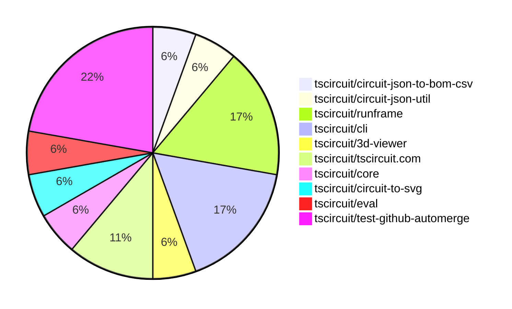
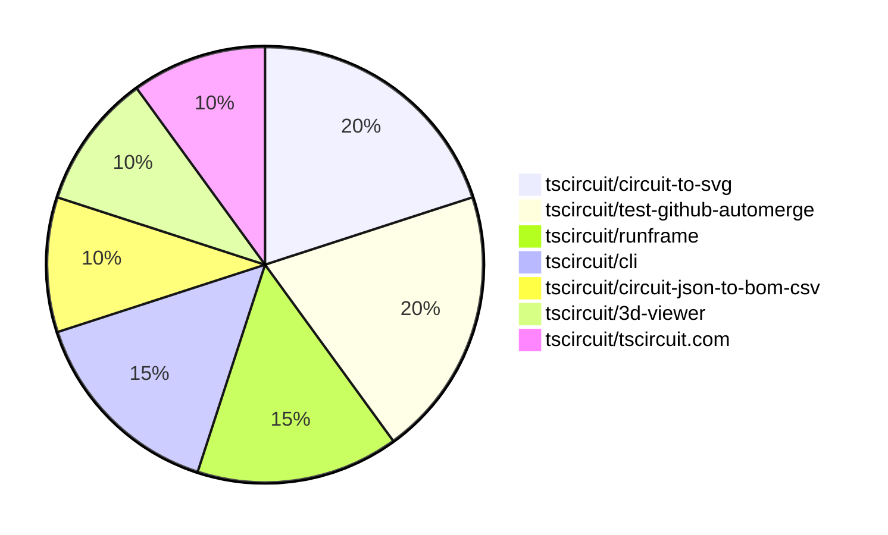

# contribution-tracker

[contributions.tscircuit.com](https://contributions.tscircuit.com) ・ [tscircuit.com](https://tscircuit.com) ・ [Contribution Overviews](./contribution-overviews/) ・ [Changelogs](./changelogs/)

Generates weekly contribution overviews for tscircuit contributors. Check out all
the [contribution overviews here](./contribution-overviews/)
You can find AI-generated monthly changelogs in the [changelogs directory](./changelogs/).

- All PRs in the tscircuit org are scanned/summarized via an LLM
- The LLM classifies each Diff/PR as into a set of attributes for scoring
- All the PRs, summaries, and classifications are organized into charts and tables for [the website](https://contributions.tscircuit.com)

> Want to run locally? See the [Development Section](#development)

The current week is shown below. There are 3 major sections:

- [Contributor Overview](#contributor-overview)
- [PRs by Repository](#prs-by-repository)
- [PRs by Contributor](#changes-by-contributor)

## Current Week

<!-- START_CURRENT_WEEK -->

# Contribution Overview 2025-09-24

## PRs by Repository


```mermaid
pie
    "tscircuit/circuit-json-to-bom-csv" : 1
    "tscircuit/circuit-json-util" : 1
    "tscircuit/runframe" : 3
    "tscircuit/cli" : 3
    "tscircuit/3d-viewer" : 1
    "tscircuit/tscircuit.com" : 2
    "tscircuit/core" : 1
    "tscircuit/circuit-to-svg" : 1
    "tscircuit/eval" : 1
    "tscircuit/test-github-automerge" : 4
```

## Contributor Overview

| Contributor | 🐳 Major | 🐙 Minor | 🐌 Tiny | ⭐ | Score | Discussion Contributions |
|-------------|---------|---------|---------|-----|----------------|--------------------------|
| [imrishabh18](#imrishabh18) | 0 | 1 | 4 | ⭐ | 9 | 0🔹 0🔶 0💎 |
| [tscircuitbot](#tscircuitbot) | 0 | 0 | 8 | ⭐ | 8 | 0🔹 0🔶 0💎 |
| [nailoo](#nailoo) | 1 | 0 | 0 | ⭐ | 4 | 0🔹 0🔶 0💎 |
| [Asymtode712](#Asymtode712) | 0 | 1 | 2 | ⭐ | 3.5 | 0🔹 0🔶 0💎 |
| [MustafaMulla29](#MustafaMulla29) | 0 | 0 | 1 |  | 1 | 0🔹 0🔶 0💎 |

### Discussion Contribution Legend

- 🔹 Normal Comments: Basic participation with minimal effort
- 🔶 Great Informative Comments: Thoughtful participation that adds value
- 💎 Incredible Comments: Exceptional participation with high-quality content

## Review Table

[reviews-received-hover]: ## "Number of reviews received for PRs for this contributor"
[approvals-received-hover]: ## "Number of approvals received for PRs this contributor authored"
[rejections-received-hover]: ## "Number of rejections received for PRs this contributor authored"
[prs-opened-hover]: ## "Number of PRs opened by this contributor"
[issues-created-hover]: ## "Number of issues created by this contributor"
[bountied-issues-hover]: ## "Number of issues this contributor created with a bounty"
[bountied-issue-$-hover]: ## "Total bounty amount placed on issues authored by this contributor"

| Contributor | Reviews Received | Approvals Received | Rejections Received | Approvals | Rejections | PRs Opened | PRs Merged | Score | Issues Created | Bountied Issues | Bountied Issue $ |
|---|---|---|---|---|---|---|---|---|---|---|---|
| [imrishabh18](#imrishabh18) | 0 | 0 | 0 | 2 | 1 | 6 | 5 | 9 | 0 | 0 | 0 |
| [Asymtode712](#Asymtode712) | 3 | 3 | 0 | 0 | 0 | 4 | 3 | 3.5 | 0 | 0 | 0 |
| [seveibar](#seveibar) | 0 | 0 | 0 | 5 | 2 | 0 | 0 | 0 | 0 | 0 | 0 |
| [MustafaMulla29](#MustafaMulla29) | 4 | 3 | 0 | 0 | 0 | 4 | 2 | 1 | 0 | 0 | 0 |
| [dhvll](#dhvll) | 1 | 0 | 0 | 0 | 0 | 1 | 0 | 0 | 0 | 0 | 0 |
| [nailoo](#nailoo) | 4 | 1 | 2 | 0 | 0 | 2 | 1 | 4 | 0 | 0 | 0 |
| [ArnavK-09](#ArnavK-09) | 1 | 1 | 0 | 1 | 0 | 4 | 0 | 0 | 0 | 0 | 0 |
| [Sahelisaha04](#Sahelisaha04) | 5 | 0 | 0 | 0 | 0 | 1 | 0 | 0 | 0 | 0 | 0 |
| [tscircuitbot](#tscircuitbot) | 0 | 0 | 0 | 0 | 0 | 10 | 8 | 8 | 0 | 0 | 0 |
| [zhyd1997](#zhyd1997) | 0 | 0 | 0 | 0 | 0 | 3 | 0 | 0 | 0 | 0 | 0 |
| [melmathari](#melmathari) | 1 | 0 | 1 | 0 | 0 | 1 | 0 | 0 | 0 | 0 | 0 |
| [aybanda](#aybanda) | 0 | 0 | 0 | 0 | 0 | 1 | 0 | 0 | 0 | 0 | 0 |

## Top 7 Repositories by Contribution Points


```mermaid
pie
    "tscircuit/circuit-to-svg" : 4
    "tscircuit/test-github-automerge" : 4
    "tscircuit/runframe" : 3
    "tscircuit/cli" : 3
    "tscircuit/circuit-json-to-bom-csv" : 2
    "tscircuit/3d-viewer" : 2
    "tscircuit/tscircuit.com" : 2
```

## Changes by Repository

### [tscircuit/circuit-json-to-bom-csv](https://github.com/tscircuit/circuit-json-to-bom-csv)

| PR # | Impact | Rating | Contributor | Description |
|------|--------|--------|-------------|-------------|
| [#7](https://github.com/tscircuit/circuit-json-to-bom-csv/pull/7) | 🐙 Minor | ⭐⭐ | imrishabh18 | Sets the comment and value to DNP when the do_not_place flag is true, and clears the supplier part number columns accordingly. |

### [tscircuit/circuit-json-util](https://github.com/tscircuit/circuit-json-util)


<details>
<summary>🐌 Tiny Contributions (1)</summary>

| PR # | Impact | Contributor | Description |
|------|--------|-------------|-------------|
| [#69](https://github.com/tscircuit/circuit-json-util/pull/69) | 🐌 Tiny | imrishabh18 | Changes the upstream repository name in the GitHub Actions workflow configuration from pcb-viewer to test-github-automerge. |

</details>

### [tscircuit/runframe](https://github.com/tscircuit/runframe)


<details>
<summary>🐌 Tiny Contributions (3)</summary>

| PR # | Impact | Contributor | Description |
|------|--------|-------------|-------------|
| [#1215](https://github.com/tscircuit/runframe/pull/1215) | 🐌 Tiny | imrishabh18 | Updates the version of the circuit-json-to-bom-csv dependency from 0.0.7 to 0.0.8 in package.json |
| [#1214](https://github.com/tscircuit/runframe/pull/1214) | 🐌 Tiny | imrishabh18 | Adds a GitHub workflow to update the CLI with the latest version of RunFrame upon pushing to the main branch. |
| [#1212](https://github.com/tscircuit/runframe/pull/1212) | 🐌 Tiny | tscircuitbot | Updates the tscircuit3d-viewer package to version 0.0.402 in package.json |

</details>

### [tscircuit/cli](https://github.com/tscircuit/cli)


<details>
<summary>🐌 Tiny Contributions (3)</summary>

| PR # | Impact | Contributor | Description |
|------|--------|-------------|-------------|
| [#368](https://github.com/tscircuit/cli/pull/368) | 🐌 Tiny | imrishabh18 | Adds a GitHub workflow to automate the update of tscircuit packages and trigger updates in the upstream repository. |
| [#370](https://github.com/tscircuit/cli/pull/370) | 🐌 Tiny | tscircuitbot | Updates the tscircuitrunframe package to version 0.0.993 in the package.json file. |
| [#369](https://github.com/tscircuit/cli/pull/369) | 🐌 Tiny | tscircuitbot | Updates the tscircuitrunframe package to version 0.0.992 in package.json |

</details>

### [tscircuit/3d-viewer](https://github.com/tscircuit/3d-viewer)

| PR # | Impact | Rating | Contributor | Description |
|------|--------|--------|-------------|-------------|
| [#503](https://github.com/tscircuit/3d-viewer/pull/503) | 🐙 Minor | ⭐⭐ | Asymtode712 | Fixes loading state issue for the Manifold module by implementing a global cache to store the initialized module and prevent unnecessary reinitialization on subsequent renders. |

### [tscircuit/tscircuit.com](https://github.com/tscircuit/tscircuit.com)


<details>
<summary>🐌 Tiny Contributions (2)</summary>

| PR # | Impact | Contributor | Description |
|------|--------|-------------|-------------|
| [#1706](https://github.com/tscircuit/tscircuit.com/pull/1706) | 🐌 Tiny | Asymtode712 | Updates the version of the tscircuitrunframe dependency from 0.0.972 to 0.0.993 in package.json |
| [#1702](https://github.com/tscircuit/tscircuit.com/pull/1702) | 🐌 Tiny | Asymtode712 | Updates the tscircuit3d-viewer dependency from version 0.0.391 to 0.0.402 and modifies the renovate configuration for package rules. |

</details>

### [tscircuit/core](https://github.com/tscircuit/core)


<details>
<summary>🐌 Tiny Contributions (1)</summary>

| PR # | Impact | Contributor | Description |
|------|--------|-------------|-------------|
| [#1403](https://github.com/tscircuit/core/pull/1403) | 🐌 Tiny | MustafaMulla29 | Updates the schematic-symbols dependency to version 0.0.202 to resolve an offset issue in symbol rendering. |

</details>

### [tscircuit/circuit-to-svg](https://github.com/tscircuit/circuit-to-svg)

| PR # | Impact | Rating | Contributor | Description |
|------|--------|--------|-------------|-------------|
| [#315](https://github.com/tscircuit/circuit-to-svg/pull/315) | 🐳 Major | ⭐⭐⭐ | nailoo | Adds support for rendering the soldermask layer in SVG output when the renderSolderMask option is enabled. |

### [tscircuit/eval](https://github.com/tscircuit/eval)


<details>
<summary>🐌 Tiny Contributions (1)</summary>

| PR # | Impact | Contributor | Description |
|------|--------|-------------|-------------|
| [#1113](https://github.com/tscircuit/eval/pull/1113) | 🐌 Tiny | tscircuitbot | Automated update of tscircuitcore to v0.0.745. |

</details>

### [tscircuit/test-github-automerge](https://github.com/tscircuit/test-github-automerge)


<details>
<summary>🐌 Tiny Contributions (4)</summary>

| PR # | Impact | Contributor | Description |
|------|--------|-------------|-------------|
| [#5](https://github.com/tscircuit/test-github-automerge/pull/5) | 🐌 Tiny | tscircuitbot | Automated package update |
| [#4](https://github.com/tscircuit/test-github-automerge/pull/4) | 🐌 Tiny | tscircuitbot | Updates the tscircuitcircuit-json-util package from version 0.0.68 to 0.0.72 in the package.json file. |
| [#3](https://github.com/tscircuit/test-github-automerge/pull/3) | 🐌 Tiny | tscircuitbot | Updates the tscircuitcircuit-json-util package from version 0.0.68 to 0.0.72 in the package.json file. |
| [#2](https://github.com/tscircuit/test-github-automerge/pull/2) | 🐌 Tiny | tscircuitbot | Updates the tscircuitcircuit-json-util package from version 0.0.71 to 0.0.72 |

</details>

## Changes by Contributor

### [imrishabh18](https://github.com/imrishabh18)

| PRs # | Impact | Rating | Description |
|------|--------|--------|-------------|
| [#7](https://github.com/tscircuit/circuit-json-to-bom-csv/pull/7) | 🐙 Minor | ⭐⭐ | Sets the comment and value to DNP when the do_not_place flag is true, and clears the supplier part number columns accordingly. |

<details>
<summary>🐌 Tiny Contributions (4)</summary>

| PR # | Impact | Description |
|------|--------|-------------|
| [#69](https://github.com/tscircuit/circuit-json-util/pull/69) | 🐌 Tiny | Changes the upstream repository name in the GitHub Actions workflow configuration from pcb-viewer to test-github-automerge. |
| [#1215](https://github.com/tscircuit/runframe/pull/1215) | 🐌 Tiny | Updates the version of the circuit-json-to-bom-csv dependency from 0.0.7 to 0.0.8 in package.json |
| [#1214](https://github.com/tscircuit/runframe/pull/1214) | 🐌 Tiny | Adds a GitHub workflow to update the CLI with the latest version of RunFrame upon pushing to the main branch. |
| [#368](https://github.com/tscircuit/cli/pull/368) | 🐌 Tiny | Adds a GitHub workflow to automate the update of tscircuit packages and trigger updates in the upstream repository. |

</details>

### [Asymtode712](https://github.com/Asymtode712)

| PRs # | Impact | Rating | Description |
|------|--------|--------|-------------|
| [#503](https://github.com/tscircuit/3d-viewer/pull/503) | 🐙 Minor | ⭐⭐ | Fixes loading state issue for the Manifold module by implementing a global cache to store the initialized module and prevent unnecessary reinitialization on subsequent renders. |

<details>
<summary>🐌 Tiny Contributions (2)</summary>

| PR # | Impact | Description |
|------|--------|-------------|
| [#1706](https://github.com/tscircuit/tscircuit.com/pull/1706) | 🐌 Tiny | Updates the version of the tscircuitrunframe dependency from 0.0.972 to 0.0.993 in package.json |
| [#1702](https://github.com/tscircuit/tscircuit.com/pull/1702) | 🐌 Tiny | Updates the tscircuit3d-viewer dependency from version 0.0.391 to 0.0.402 and modifies the renovate configuration for package rules. |

</details>

### [MustafaMulla29](https://github.com/MustafaMulla29)


<details>
<summary>🐌 Tiny Contributions (1)</summary>

| PR # | Impact | Description |
|------|--------|-------------|
| [#1403](https://github.com/tscircuit/core/pull/1403) | 🐌 Tiny | Updates the schematic-symbols dependency to version 0.0.202 to resolve an offset issue in symbol rendering. |

</details>

### [nailoo](https://github.com/nailoo)

| PRs # | Impact | Rating | Description |
|------|--------|--------|-------------|
| [#315](https://github.com/tscircuit/circuit-to-svg/pull/315) | 🐳 Major | ⭐⭐⭐ | Adds support for rendering the soldermask layer in SVG output when the renderSolderMask option is enabled. |

### [tscircuitbot](https://github.com/tscircuitbot)


<details>
<summary>🐌 Tiny Contributions (8)</summary>

| PR # | Impact | Description |
|------|--------|-------------|
| [#1113](https://github.com/tscircuit/eval/pull/1113) | 🐌 Tiny | Automated update of tscircuitcore to v0.0.745. |
| [#1212](https://github.com/tscircuit/runframe/pull/1212) | 🐌 Tiny | Updates the tscircuit3d-viewer package to version 0.0.402 in package.json |
| [#370](https://github.com/tscircuit/cli/pull/370) | 🐌 Tiny | Updates the tscircuitrunframe package to version 0.0.993 in the package.json file. |
| [#369](https://github.com/tscircuit/cli/pull/369) | 🐌 Tiny | Updates the tscircuitrunframe package to version 0.0.992 in package.json |
| [#5](https://github.com/tscircuit/test-github-automerge/pull/5) | 🐌 Tiny | Automated package update |
| [#4](https://github.com/tscircuit/test-github-automerge/pull/4) | 🐌 Tiny | Updates the tscircuitcircuit-json-util package from version 0.0.68 to 0.0.72 in the package.json file. |
| [#3](https://github.com/tscircuit/test-github-automerge/pull/3) | 🐌 Tiny | Updates the tscircuitcircuit-json-util package from version 0.0.68 to 0.0.72 in the package.json file. |
| [#2](https://github.com/tscircuit/test-github-automerge/pull/2) | 🐌 Tiny | Updates the tscircuitcircuit-json-util package from version 0.0.71 to 0.0.72 |

</details>

## Repository Owners

| Repository | Codeowners |
|------------|------------|
| [builder](https://github.com/tscircuit/builder/blob/main/.github/CODEOWNERS) | [seveibar](https://github.com/seveibar)
| [pcb-viewer](https://github.com/tscircuit/pcb-viewer/blob/main/.github/CODEOWNERS) | [seveibar](https://github.com/seveibar), [ShiboSoftwareDev](https://github.com/ShiboSoftwareDev)
| [footprints-old](https://github.com/tscircuit/footprints-old/blob/main/.github/CODEOWNERS) | [seveibar](https://github.com/seveibar)
| [footprinter](https://github.com/tscircuit/footprinter/blob/main/.github/CODEOWNERS) | [seveibar](https://github.com/seveibar), [techmannih](https://github.com/techmannih)
| [3d-viewer](https://github.com/tscircuit/3d-viewer/blob/main/.github/CODEOWNERS) | [ShiboSoftwareDev](https://github.com/ShiboSoftwareDev)
| [winterspec](https://github.com/tscircuit/winterspec/blob/main/.github/CODEOWNERS) | [seveibar](https://github.com/seveibar), [ShiboSoftwareDev](https://github.com/ShiboSoftwareDev)
| [jscad-electronics](https://github.com/tscircuit/jscad-electronics/blob/main/.github/CODEOWNERS) | [seveibar](https://github.com/seveibar), [abhijitxy](https://github.com/abhijitxy), [anas-sarkez](https://github.com/anas-sarkez)
| [circuit-to-svg](https://github.com/tscircuit/circuit-to-svg/blob/main/.github/CODEOWNERS) | [imrishabh18](https://github.com/imrishabh18)
| [schematic-symbols](https://github.com/tscircuit/schematic-symbols/blob/main/.github/CODEOWNERS) | [seveibar](https://github.com/seveibar), [imrishabh18](https://github.com/imrishabh18), [techmannih](https://github.com/techmannih)
| [circuit-json-to-gerber](https://github.com/tscircuit/circuit-json-to-gerber/blob/main/.github/CODEOWNERS) | [seveibar](https://github.com/seveibar), [ShiboSoftwareDev](https://github.com/ShiboSoftwareDev)
| [tscircuit.com](https://github.com/tscircuit/tscircuit.com/blob/main/.github/CODEOWNERS) | [seveibar](https://github.com/seveibar), [imrishabh18](https://github.com/imrishabh18)
| [cli](https://github.com/tscircuit/cli/blob/main/.github/CODEOWNERS) | [seveibar](https://github.com/seveibar), [imrishabh18](https://github.com/imrishabh18), [ArnavK-09](https://github.com/ArnavK-09)
| [issue-roulette](https://github.com/tscircuit/issue-roulette/blob/main/.github/CODEOWNERS) | [Anshgrover23](https://github.com/Anshgrover23)
| [sparkfun-boards](https://github.com/tscircuit/sparkfun-boards/blob/main/.github/CODEOWNERS) | [ShiboSoftwareDev](https://github.com/ShiboSoftwareDev), [Abse2001](https://github.com/Abse2001), [MustafaMulla29](https://github.com/MustafaMulla29), [Anshgrover23](https://github.com/Anshgrover23), [techmannih](https://github.com/techmannih)
| [schematic-corpus](https://github.com/tscircuit/schematic-corpus/blob/main/.github/CODEOWNERS) | [Abse2001](https://github.com/Abse2001)

## Repositories by Owner

| User | Repo |
|------|------|
| [seveibar](https://github.com/seveibar) | [builder](https://github.com/tscircuit/builder/blob/main/.github/CODEOWNERS) |
|  | [pcb-viewer](https://github.com/tscircuit/pcb-viewer/blob/main/.github/CODEOWNERS) |
|  | [footprints-old](https://github.com/tscircuit/footprints-old/blob/main/.github/CODEOWNERS) |
|  | [footprinter](https://github.com/tscircuit/footprinter/blob/main/.github/CODEOWNERS) |
|  | [winterspec](https://github.com/tscircuit/winterspec/blob/main/.github/CODEOWNERS) |
|  | [jscad-electronics](https://github.com/tscircuit/jscad-electronics/blob/main/.github/CODEOWNERS) |
|  | [schematic-symbols](https://github.com/tscircuit/schematic-symbols/blob/main/.github/CODEOWNERS) |
|  | [circuit-json-to-gerber](https://github.com/tscircuit/circuit-json-to-gerber/blob/main/.github/CODEOWNERS) |
|  | [tscircuit.com](https://github.com/tscircuit/tscircuit.com/blob/main/.github/CODEOWNERS) |
|  | [cli](https://github.com/tscircuit/cli/blob/main/.github/CODEOWNERS) |
| [ShiboSoftwareDev](https://github.com/ShiboSoftwareDev) | [pcb-viewer](https://github.com/tscircuit/pcb-viewer/blob/main/.github/CODEOWNERS) |
|  | [3d-viewer](https://github.com/tscircuit/3d-viewer/blob/main/.github/CODEOWNERS) |
|  | [winterspec](https://github.com/tscircuit/winterspec/blob/main/.github/CODEOWNERS) |
|  | [circuit-json-to-gerber](https://github.com/tscircuit/circuit-json-to-gerber/blob/main/.github/CODEOWNERS) |
|  | [sparkfun-boards](https://github.com/tscircuit/sparkfun-boards/blob/main/.github/CODEOWNERS) |
| [techmannih](https://github.com/techmannih) | [footprinter](https://github.com/tscircuit/footprinter/blob/main/.github/CODEOWNERS) |
|  | [schematic-symbols](https://github.com/tscircuit/schematic-symbols/blob/main/.github/CODEOWNERS) |
|  | [sparkfun-boards](https://github.com/tscircuit/sparkfun-boards/blob/main/.github/CODEOWNERS) |
| [abhijitxy](https://github.com/abhijitxy) | [jscad-electronics](https://github.com/tscircuit/jscad-electronics/blob/main/.github/CODEOWNERS) |
| [anas-sarkez](https://github.com/anas-sarkez) | [jscad-electronics](https://github.com/tscircuit/jscad-electronics/blob/main/.github/CODEOWNERS) |
| [imrishabh18](https://github.com/imrishabh18) | [circuit-to-svg](https://github.com/tscircuit/circuit-to-svg/blob/main/.github/CODEOWNERS) |
|  | [schematic-symbols](https://github.com/tscircuit/schematic-symbols/blob/main/.github/CODEOWNERS) |
|  | [tscircuit.com](https://github.com/tscircuit/tscircuit.com/blob/main/.github/CODEOWNERS) |
|  | [cli](https://github.com/tscircuit/cli/blob/main/.github/CODEOWNERS) |
| [ArnavK-09](https://github.com/ArnavK-09) | [cli](https://github.com/tscircuit/cli/blob/main/.github/CODEOWNERS) |
| [Anshgrover23](https://github.com/Anshgrover23) | [issue-roulette](https://github.com/tscircuit/issue-roulette/blob/main/.github/CODEOWNERS) |
|  | [sparkfun-boards](https://github.com/tscircuit/sparkfun-boards/blob/main/.github/CODEOWNERS) |
| [Abse2001](https://github.com/Abse2001) | [sparkfun-boards](https://github.com/tscircuit/sparkfun-boards/blob/main/.github/CODEOWNERS) |
|  | [schematic-corpus](https://github.com/tscircuit/schematic-corpus/blob/main/.github/CODEOWNERS) |
| [MustafaMulla29](https://github.com/MustafaMulla29) | [sparkfun-boards](https://github.com/tscircuit/sparkfun-boards/blob/main/.github/CODEOWNERS) |


<!-- END_CURRENT_WEEK -->


## Development

### Prerequisites

- [Bun](https://bun.sh/) runtime
- `.env` file with required API keys:
  ```
  GITHUB_TOKEN=your_github_token
  OPENAI_API_KEY=your_openai_api_key
  DISCORD_TOKEN=your_discord_token (optional, for Discord integration)
  SLACK_BOT_TOKEN=your_slack_token (optional, for Slack integration)
  ```

### Available Scripts

#### Core Generation Scripts

- `bun run generate:weekly` - Generate current week's contribution overview
- `bun run generate:monthly` - Generate current month's contribution overview
- `bun run generate:changelog` - Generate monthly changelog from PRs

#### Analysis & Testing

- `bun run analyze-pr` - Analyze a single PR (interactive prompt)
- `bun run test:github` - Test GitHub API integration

#### Notifications & Sync

- `bun run notifications:issues` - Send notifications for new issues
- `bun run notifications:pr` - Send notifications for new PRs
- `bun run sync:discord` - Sync contributor roles with Discord

#### Data Export

- `bun run export:sponsorship` - Generate sponsorship data CSV

#### Sponsorship Management

- `bun run manage:ineligible add <username> <reason> [added-by]` - Add user to ineligible list
- `bun run manage:ineligible remove <username>` - Remove user from ineligible list  
- `bun run manage:ineligible list` - List all ineligible users
- `bun run manage:ineligible check <username>` - Check if user is ineligible

#### Development

- `bun run dev` - Start development server for web UI
- `bun run build` - Build for production
- `bun run format` - Format code with Biome

## Ineligible for Sponsorship Management

The project includes a system to manage users who are ineligible for sponsorship payments. This is useful for handling cases where contributors claim bounties early or violate contribution guidelines.

### How It Works

- Users on the ineligible list will still appear in all contribution overviews and reports
- However, they will be automatically excluded from the generated `sponsorships.csv` file
- The system maintains an audit trail with reasons and timestamps

### Managing Ineligible Users

The ineligible users list is stored in `ineligible-for-sponsorship.csv` with the following columns:
- `github_username` - The GitHub username
- `reason` - Reason for ineligibility  
- `date_added` - Date when user was added (YYYY-MM-DD)
- `added_by` - Who added the user to the list

### Common Usage Examples

```bash
# Add a user who claimed bounties early
bun run manage:ineligible add user123 "Claimed bounty before completing work" maintainer1

# Check if a user is ineligible
bun run manage:ineligible check user123

# List all ineligible users
bun run manage:ineligible list

# Remove a user from the ineligible list
bun run manage:ineligible remove user123

# Generate sponsorship CSV (automatically excludes ineligible users)
bun run export:sponsorship
```

### Usage Examples

```bash
# Generate this week's contribution overview
bun run generate:weekly

# Generate current month's overview
bun run generate:monthly

# Analyze a specific PR
bun run analyze-pr

# Test your GitHub token setup
bun run test:github
```
