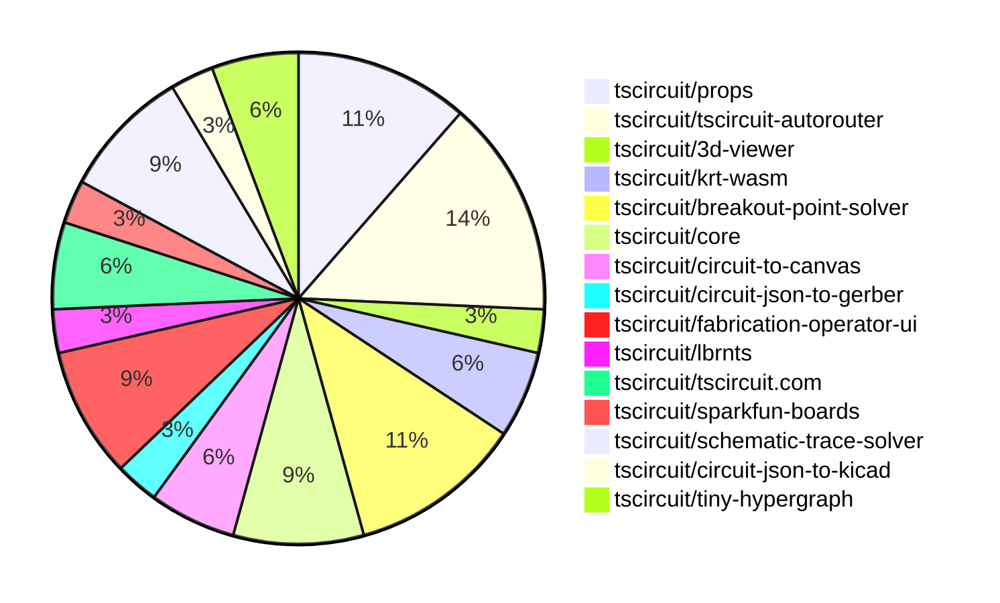

# contribution tracker

[contributions.tscircuit.com](https://contributions.tscircuit.com) ・ [tscircuit.com](https://tscircuit.com) ・ [Contribution Overviews](./contribution-overviews/) ・ [Changelogs](./changelogs/)

Generates weekly contribution overviews for tscircuit contributors. Check out all
the [contribution overviews here](./contribution-overviews/)
You can find AI-generated monthly changelogs in the [changelogs directory](./changelogs/)

- All PRs in the tscircuit org are scanned/summarized via an LLM
- The LLM classifies each Diff/PR as into a set of attributes for scoring
- All the PRs, summaries, and classifications are organized into charts and tables for [the website](https://contributions.tscircuit.com)

> Want to run locally? See the [Development Section](#development)

## Current Week

<!-- START_CURRENT_WEEK -->

# Contribution Overview 2026-05-19

The current week is shown below. There are 3 major sections:

- [Contributor Overview](#contributor-overview)
- [PRs by Repository](#prs-by-repository)
- [PRs by Contributor](#changes-by-contributor)
- [Scoring & Sponsorship Details](/docs/sponsorship-calculation-explanation.md)

## PRs by Repository


```mermaid
pie
    "tscircuit/props" : 4
    "tscircuit/tscircuit-autorouter" : 5
    "tscircuit/3d-viewer" : 1
    "tscircuit/krt-wasm" : 2
    "tscircuit/breakout-point-solver" : 4
    "tscircuit/core" : 3
    "tscircuit/circuit-to-canvas" : 2
    "tscircuit/circuit-json-to-gerber" : 1
    "tscircuit/fabrication-operator-ui" : 3
    "tscircuit/lbrnts" : 1
    "tscircuit/tscircuit.com" : 2
    "tscircuit/sparkfun-boards" : 1
    "tscircuit/schematic-trace-solver" : 3
    "tscircuit/circuit-json-to-kicad" : 1
    "tscircuit/tiny-hypergraph" : 2
```

## Contributor Overview

| Contributor | 🐳 Major | 🐙 Minor | 🐌 Tiny | Score | ⭐ | Discussion Contributions |
|-------------|---------|---------|---------|-------|-----|--------------------------|
| [MustafaMulla29](#MustafaMulla29) | 3 | 2 | 3 | 20 | ⭐⭐ | 0🔹 0🔶 0💎 |
| [AnasSarkiz](#AnasSarkiz) | 2 | 1 | 2 | 12 | ⭐⭐ | 0🔹 0🔶 0💎 |
| [Abse2001](#Abse2001) | 2 | 0 | 0 | 11 | ⭐⭐ | 0🔹 0🔶 0💎 |
| [ShiboSoftwareDev](#ShiboSoftwareDev) | 1 | 0 | 4 | 10.5 | ⭐ | 0🔹 0🔶 0💎 |
| [0hmX](#0hmX) | 2 | 0 | 0 | 8 | ⭐ | 0🔹 0🔶 0💎 |
| [Sang-it](#Sang-it) | 1 | 1 | 1 | 7 | ⭐ | 0🔹 0🔶 0💎 |
| [imrishabh18](#imrishabh18) | 1 | 0 | 1 | 6 | ⭐ | 0🔹 0🔶 0💎 |
| [techmannih](#techmannih) | 0 | 2 | 0 | 4 | ⭐ | 0🔹 0🔶 0💎 |
| [itisrohit](#itisrohit) | 1 | 0 | 0 | 4 | ⭐ | 0🔹 0🔶 0💎 |
| [shehaban](#shehaban) | 1 | 0 | 0 | 4 | ⭐ | 0🔹 0🔶 0💎 |
| [mohan-bee](#mohan-bee) | 1 | 0 | 0 | 4 | ⭐ | 0🔹 0🔶 0💎 |
| [Msa360](#Msa360) | 0 | 1 | 0 | 2 |  | 0🔹 0🔶 0💎 |
| [tscircuitbot](#tscircuitbot) | 0 | 0 | 2 | 2 |  | 0🔹 0🔶 0💎 |

## Staff Pass Ratio (SPR)

| Contributor | Reviewed PRs | Rejections | Approvals | SPR |
|-------------|--------------|------------|-----------|-----|
| [MustafaMulla29](#MustafaMulla29) | 5 | 0 | 5 | 100.0% |
| [Sang-it](#Sang-it) | 3 | 1 | 2 | 66.7% |
| [techmannih](#techmannih) | 3 | 0 | 3 | 100.0% |
| [Msa360](#Msa360) | 1 | 0 | 1 | 100.0% |
| [mohan-bee](#mohan-bee) | 1 | 0 | 1 | 100.0% |
| [AnasSarkiz](#AnasSarkiz) | 1 | 0 | 1 | 100.0% |
| [itisrohit](#itisrohit) | 1 | 0 | 1 | 100.0% |
| [imrishabh18](#imrishabh18) | 1 | 1 | 1 | 0.0% |
| [0hmX](#0hmX) | 1 | 0 | 1 | 100.0% |

<details>
<summary>MustafaMulla29 SPR PRs (5)</summary>

- [#2312](https://github.com/tscircuit/core/pull/2312) Add autorouting start SRJ stack snapshots for breakout repros
- [#2311](https://github.com/tscircuit/core/pull/2311) Add breakout repros and autorouting end-phase stack snapshots
- [#10](https://github.com/tscircuit/krt-wasm/pull/10) Fix same-net routed traces being treated as obstacles in KRT
- [#4](https://github.com/tscircuit/breakout-point-solver/pull/4) Add breakout point spacing solver with clearer QFN snapshots
- [#2](https://github.com/tscircuit/breakout-point-solver/pull/2) Add initial breakout solver with ray-boundary placement

</details>

<details>
<summary>Sang-it SPR PRs (3)</summary>

- [#403](https://github.com/tscircuit/schematic-trace-solver/pull/403) fix repro35
- [#394](https://github.com/tscircuit/schematic-trace-solver/pull/394) add netLabelWidth to direct connecitons / update Example28Solver alg
- [#1](https://github.com/tscircuit/fake-fabrication-server/pull/1) design initial api spec

</details>

<details>
<summary>techmannih SPR PRs (3)</summary>

- [#2305](https://github.com/tscircuit/core/pull/2305) Fix jlcpcb CAD fallback for library footprints
- [#563](https://github.com/tscircuit/circuit-to-svg/pull/563) Render route vias from trace points
- [#238](https://github.com/tscircuit/circuit-to-canvas/pull/238) Use text geometry for anchor alignment

</details>

<details>
<summary>Msa360 SPR PRs (1)</summary>

- [#910](https://github.com/tscircuit/3d-viewer/pull/910) fix: persist CadViewer engine and camera choices across remounts

</details>

<details>
<summary>mohan-bee SPR PRs (1)</summary>

- [#305](https://github.com/tscircuit/circuit-json-to-kicad/pull/305) Fix 3D model placement for rotated 3D components

</details>

<details>
<summary>AnasSarkiz SPR PRs (1)</summary>

- [#37](https://github.com/tscircuit/lbrnts/pull/37) Introduce LightBurn Content Offsetting API

</details>

<details>
<summary>itisrohit SPR PRs (1)</summary>

- [#3461](https://github.com/tscircuit/tscircuit.com/pull/3461) fix: preserve full redirect URL (path, query, and hash) on login and session timeout

</details>

<details>
<summary>imrishabh18 SPR PRs (1)</summary>

- [#1203](https://github.com/tscircuit/tscircuit-autorouter/pull/1203) Add Pipeline8 for routing the board with pre placed via's

</details>

<details>
<summary>0hmX SPR PRs (1)</summary>

- [#1200](https://github.com/tscircuit/tscircuit-autorouter/pull/1200) feat: add pipeline7 multigraph topology planner

</details>

> Note: AI evaluates PRs and assigns 1-3 star ratings automatically. 4 and 5 star ratings require manual staff review.

### Discussion Contribution Legend

- 🔹 Normal Comments: Basic participation with minimal effort
- 🔶 Great Informative Comments: Thoughtful participation that adds value
- 💎 Incredible Comments: Exceptional participation with high-quality content

## Review Table

[reviews-received-hover]: ## "Number of reviews received for PRs for this contributor"
[approvals-received-hover]: ## "Number of approvals received for PRs this contributor authored"
[rejections-received-hover]: ## "Number of rejections received for PRs this contributor authored"
[prs-opened-hover]: ## "Number of PRs opened by this contributor"
[issues-created-hover]: ## "Number of issues created by this contributor"

| Contributor | Reviews Received | Approvals Received | Rejections Received | Approvals | Rejections Given | PRs Opened | PRs Merged | Issues Created |
|---|---|---|---|---|---|---|---|---|
| [junn-dev](#junn-dev) | 0 | 0 | 0 | 0 | 0 | 2 | 0 | 0 |
| [ChandraDvitiyah](#ChandraDvitiyah) | 0 | 0 | 0 | 0 | 0 | 3 | 0 | 0 |
| [onchito-walks](#onchito-walks) | 0 | 0 | 0 | 0 | 0 | 3 | 0 | 0 |
| [kayeve](#kayeve) | 0 | 0 | 0 | 0 | 0 | 1 | 0 | 0 |
| [RoyZhao1991](#RoyZhao1991) | 0 | 0 | 0 | 0 | 0 | 29 | 0 | 0 |
| [Myrarc](#Myrarc) | 0 | 0 | 0 | 0 | 0 | 1 | 0 | 0 |
| [fabicholas](#fabicholas) | 0 | 0 | 0 | 0 | 0 | 1 | 0 | 0 |
| [kodahhhhh](#kodahhhhh) | 0 | 0 | 0 | 0 | 0 | 1 | 0 | 0 |
| [mjzs13](#mjzs13) | 0 | 0 | 0 | 0 | 0 | 2 | 0 | 0 |
| [NguyenTienDat-GTR](#NguyenTienDat-GTR) | 0 | 0 | 0 | 0 | 0 | 2 | 0 | 0 |
| [2bf](#2bf) | 0 | 0 | 0 | 0 | 0 | 11 | 0 | 0 |
| [absalonCRC](#absalonCRC) | 0 | 0 | 0 | 0 | 0 | 9 | 0 | 0 |
| [Begarudev](#Begarudev) | 1 | 0 | 0 | 0 | 0 | 1 | 0 | 0 |
| [SimplyRayYZL](#SimplyRayYZL) | 0 | 0 | 0 | 0 | 0 | 8 | 0 | 0 |
| [ajjucoder](#ajjucoder) | 0 | 0 | 0 | 0 | 0 | 1 | 0 | 0 |
| [tomaspinkas-com](#tomaspinkas-com) | 0 | 0 | 0 | 0 | 0 | 1 | 0 | 0 |
| [kennedydqz-del](#kennedydqz-del) | 0 | 0 | 0 | 0 | 0 | 2 | 0 | 0 |
| [ShiboSoftwareDev](#ShiboSoftwareDev) | 12 | 0 | 0 | 3 | 0 | 10 | 7 | 0 |
| [MINBBBIGcode](#MINBBBIGcode) | 2 | 0 | 0 | 0 | 0 | 3 | 0 | 0 |
| [voltrace-io](#voltrace-io) | 0 | 0 | 0 | 0 | 0 | 8 | 0 | 0 |
| [ar-amk](#ar-amk) | 0 | 0 | 0 | 0 | 0 | 6 | 0 | 0 |
| [dukunline-cyber](#dukunline-cyber) | 0 | 0 | 0 | 0 | 0 | 1 | 0 | 0 |
| [Msa360](#Msa360) | 3 | 3 | 0 | 0 | 0 | 1 | 1 | 0 |
| [Abse2001](#Abse2001) | 4 | 1 | 0 | 3 | 0 | 7 | 2 | 0 |
| [seveibar](#seveibar) | 0 | 0 | 0 | 16 | 1 | 0 | 0 | 0 |
| [ktk-research-9185](#ktk-research-9185) | 0 | 0 | 0 | 0 | 0 | 1 | 0 | 0 |
| [LaoChouPro](#LaoChouPro) | 0 | 0 | 0 | 0 | 0 | 1 | 0 | 0 |
| [landiscode](#landiscode) | 0 | 0 | 0 | 0 | 0 | 7 | 0 | 0 |
| [leninug](#leninug) | 0 | 0 | 0 | 0 | 0 | 1 | 0 | 0 |
| [GX88](#GX88) | 0 | 0 | 0 | 0 | 0 | 1 | 0 | 0 |
| [cwklurks](#cwklurks) | 0 | 0 | 0 | 0 | 0 | 1 | 0 | 0 |
| [swhan0329](#swhan0329) | 0 | 0 | 0 | 0 | 0 | 39 | 0 | 0 |
| [Finesssee](#Finesssee) | 1 | 0 | 0 | 0 | 0 | 2 | 0 | 0 |
| [ayskobtw-lil](#ayskobtw-lil) | 0 | 0 | 0 | 0 | 0 | 1 | 0 | 0 |
| [jeffreybarts-max](#jeffreybarts-max) | 0 | 0 | 0 | 0 | 0 | 1 | 0 | 0 |
| [zergzorg](#zergzorg) | 0 | 0 | 0 | 0 | 0 | 6 | 0 | 0 |
| [g8rr5dg2p7-svg](#g8rr5dg2p7-svg) | 0 | 0 | 0 | 0 | 0 | 1 | 0 | 0 |
| [rtbogt11-droid](#rtbogt11-droid) | 0 | 0 | 0 | 0 | 0 | 1 | 0 | 0 |
| [shriram-svg](#shriram-svg) | 0 | 0 | 0 | 0 | 0 | 1 | 0 | 0 |
| [maiqiu-cat](#maiqiu-cat) | 0 | 0 | 0 | 0 | 0 | 2 | 0 | 0 |
| [yuetongli-PL](#yuetongli-PL) | 0 | 0 | 0 | 0 | 0 | 1 | 0 | 0 |
| [swright7001](#swright7001) | 0 | 0 | 0 | 0 | 0 | 1 | 0 | 0 |
| [itsdior01](#itsdior01) | 0 | 0 | 0 | 0 | 0 | 1 | 0 | 0 |
| [sdibella](#sdibella) | 0 | 0 | 0 | 0 | 0 | 1 | 0 | 0 |
| [Charolex](#Charolex) | 0 | 0 | 0 | 0 | 0 | 1 | 0 | 0 |
| [illgitthat](#illgitthat) | 0 | 0 | 0 | 0 | 0 | 1 | 0 | 0 |
| [mohan-bee](#mohan-bee) | 4 | 3 | 0 | 0 | 0 | 3 | 1 | 0 |
| [Sang-it](#Sang-it) | 14 | 2 | 1 | 0 | 0 | 8 | 3 | 0 |
| [rushabhcodes](#rushabhcodes) | 1 | 0 | 0 | 1 | 0 | 1 | 0 | 0 |
| [MustafaMulla29](#MustafaMulla29) | 17 | 6 | 0 | 1 | 2 | 9 | 8 | 0 |
| [techmannih](#techmannih) | 11 | 4 | 0 | 0 | 0 | 4 | 2 | 0 |
| [garrettparker245-code](#garrettparker245-code) | 0 | 0 | 0 | 0 | 0 | 2 | 0 | 0 |
| [AnasSarkiz](#AnasSarkiz) | 2 | 2 | 0 | 0 | 0 | 5 | 5 | 0 |
| [100more](#100more) | 0 | 0 | 0 | 0 | 0 | 3 | 0 | 0 |
| [shootingallday](#shootingallday) | 0 | 0 | 0 | 0 | 0 | 2 | 0 | 0 |
| [iFaceTheWind](#iFaceTheWind) | 0 | 0 | 0 | 0 | 0 | 1 | 0 | 0 |
| [yeguacelestial](#yeguacelestial) | 0 | 0 | 0 | 0 | 0 | 1 | 0 | 0 |
| [itisrohit](#itisrohit) | 3 | 1 | 1 | 0 | 0 | 4 | 1 | 0 |
| [imrishabh18](#imrishabh18) | 2 | 1 | 0 | 1 | 1 | 2 | 2 | 0 |
| [a1local](#a1local) | 0 | 0 | 0 | 0 | 0 | 3 | 0 | 0 |
| [Fire-Fairy84](#Fire-Fairy84) | 0 | 0 | 0 | 0 | 0 | 1 | 0 | 0 |
| [juanfgaviriac](#juanfgaviriac) | 0 | 0 | 0 | 0 | 0 | 2 | 0 | 0 |
| [ProtonsAndElectrons](#ProtonsAndElectrons) | 0 | 0 | 0 | 0 | 0 | 1 | 0 | 0 |
| [ryonakae](#ryonakae) | 0 | 0 | 0 | 0 | 0 | 1 | 0 | 0 |
| [Haenlein1](#Haenlein1) | 0 | 0 | 0 | 0 | 0 | 2 | 0 | 0 |
| [acdunbrack](#acdunbrack) | 0 | 0 | 0 | 0 | 0 | 1 | 0 | 0 |
| [codeaustral-oss](#codeaustral-oss) | 0 | 0 | 0 | 0 | 0 | 1 | 0 | 0 |
| [chriszlr](#chriszlr) | 0 | 0 | 0 | 0 | 0 | 5 | 0 | 0 |
| [hanjav](#hanjav) | 0 | 0 | 0 | 0 | 0 | 1 | 0 | 0 |
| [VOVANQUOCBAO](#VOVANQUOCBAO) | 0 | 0 | 0 | 0 | 0 | 2 | 0 | 0 |
| [demetacrypto](#demetacrypto) | 4 | 0 | 0 | 0 | 0 | 2 | 0 | 0 |
| [1aday](#1aday) | 5 | 0 | 0 | 0 | 0 | 2 | 0 | 0 |
| [tscircuitbot](#tscircuitbot) | 0 | 0 | 0 | 0 | 0 | 4 | 2 | 0 |
| [jing11223344](#jing11223344) | 0 | 0 | 0 | 0 | 0 | 1 | 0 | 0 |
| [mjshanker](#mjshanker) | 0 | 0 | 0 | 0 | 0 | 2 | 0 | 0 |
| [nyashahama](#nyashahama) | 0 | 0 | 0 | 0 | 0 | 2 | 0 | 0 |
| [Okidoki9903](#Okidoki9903) | 0 | 0 | 0 | 0 | 0 | 1 | 0 | 0 |
| [6c696e68](#6c696e68) | 0 | 0 | 0 | 0 | 0 | 1 | 0 | 0 |
| [MolhamHamwi](#MolhamHamwi) | 1 | 0 | 0 | 0 | 0 | 1 | 0 | 0 |
| [Neabigmo](#Neabigmo) | 0 | 0 | 0 | 0 | 0 | 1 | 0 | 0 |
| [SadmanPinon](#SadmanPinon) | 0 | 0 | 0 | 0 | 0 | 5 | 0 | 0 |
| [sk8kpwhrjt-creator](#sk8kpwhrjt-creator) | 0 | 0 | 0 | 0 | 0 | 1 | 0 | 0 |
| [firewine](#firewine) | 4 | 0 | 0 | 0 | 0 | 2 | 0 | 0 |
| [jiangwen1115-ui](#jiangwen1115-ui) | 0 | 0 | 0 | 0 | 0 | 1 | 0 | 0 |
| [kiet1i38](#kiet1i38) | 0 | 0 | 0 | 0 | 0 | 1 | 0 | 0 |
| [aaronlab](#aaronlab) | 0 | 0 | 0 | 0 | 0 | 1 | 0 | 0 |
| [JPL-Jarvis](#JPL-Jarvis) | 0 | 0 | 0 | 0 | 0 | 16 | 0 | 0 |
| [itsjustet-lab](#itsjustet-lab) | 0 | 0 | 0 | 0 | 0 | 1 | 0 | 0 |
| [khanwang009](#khanwang009) | 0 | 0 | 0 | 0 | 0 | 1 | 0 | 0 |
| [xfocus3](#xfocus3) | 0 | 0 | 0 | 0 | 0 | 7 | 0 | 0 |
| [steves83](#steves83) | 0 | 0 | 0 | 0 | 0 | 4 | 0 | 0 |
| [ZainKazmiii](#ZainKazmiii) | 1 | 0 | 0 | 0 | 0 | 1 | 0 | 0 |
| [Aquileo-hub](#Aquileo-hub) | 0 | 0 | 0 | 0 | 0 | 1 | 0 | 0 |
| [Globalpropertyguy](#Globalpropertyguy) | 0 | 0 | 0 | 0 | 0 | 1 | 0 | 0 |
| [sonnymay](#sonnymay) | 0 | 0 | 0 | 0 | 0 | 1 | 0 | 0 |
| [DukeDawg](#DukeDawg) | 0 | 0 | 0 | 0 | 0 | 1 | 0 | 0 |
| [ya-nsh](#ya-nsh) | 0 | 0 | 0 | 0 | 0 | 2 | 0 | 0 |
| [KLSGG](#KLSGG) | 0 | 0 | 0 | 0 | 0 | 1 | 0 | 0 |
| [enormusdapp-prog](#enormusdapp-prog) | 0 | 0 | 0 | 0 | 0 | 1 | 0 | 0 |
| [FigLangHQ](#FigLangHQ) | 0 | 0 | 0 | 0 | 0 | 1 | 0 | 0 |
| [Wmedrado](#Wmedrado) | 2 | 0 | 0 | 0 | 0 | 2 | 0 | 0 |
| [mara-241](#mara-241) | 0 | 0 | 0 | 0 | 0 | 1 | 0 | 0 |
| [eric-cheong](#eric-cheong) | 0 | 0 | 0 | 0 | 0 | 2 | 0 | 0 |
| [MANFIT7](#MANFIT7) | 0 | 0 | 0 | 0 | 0 | 1 | 0 | 0 |
| [surim0n](#surim0n) | 0 | 0 | 0 | 0 | 0 | 2 | 0 | 0 |
| [Meliwat](#Meliwat) | 0 | 0 | 0 | 0 | 0 | 1 | 0 | 0 |
| [luoshui-coder](#luoshui-coder) | 0 | 0 | 0 | 0 | 0 | 1 | 0 | 0 |
| [dhrubasumatary](#dhrubasumatary) | 0 | 0 | 0 | 0 | 0 | 1 | 0 | 0 |
| [uniquenesslabs](#uniquenesslabs) | 0 | 0 | 0 | 0 | 0 | 1 | 0 | 0 |
| [emulatronicGIT](#emulatronicGIT) | 0 | 0 | 0 | 0 | 0 | 1 | 0 | 0 |
| [yangsori](#yangsori) | 0 | 0 | 0 | 0 | 0 | 4 | 0 | 0 |
| [7vf7gcpwsy-create](#7vf7gcpwsy-create) | 0 | 0 | 0 | 0 | 0 | 1 | 0 | 0 |
| [haocyan0723-code](#haocyan0723-code) | 0 | 0 | 0 | 0 | 0 | 2 | 0 | 0 |
| [JacKane21](#JacKane21) | 0 | 0 | 0 | 0 | 0 | 1 | 0 | 0 |
| [cuongwf1711](#cuongwf1711) | 0 | 0 | 0 | 0 | 0 | 1 | 0 | 0 |
| [lukaIvanic](#lukaIvanic) | 0 | 0 | 0 | 0 | 0 | 1 | 0 | 0 |
| [EnesBrt](#EnesBrt) | 0 | 0 | 0 | 0 | 0 | 1 | 0 | 0 |
| [mg272011](#mg272011) | 0 | 0 | 0 | 0 | 0 | 1 | 0 | 0 |
| [thepianistdirector](#thepianistdirector) | 0 | 0 | 0 | 0 | 0 | 1 | 0 | 0 |
| [Misch369](#Misch369) | 0 | 0 | 0 | 0 | 0 | 1 | 0 | 0 |
| [nguyentamdat](#nguyentamdat) | 0 | 0 | 0 | 0 | 0 | 2 | 0 | 0 |
| [arthurgervais](#arthurgervais) | 0 | 0 | 0 | 0 | 0 | 1 | 0 | 0 |
| [Spina7](#Spina7) | 0 | 0 | 0 | 0 | 0 | 1 | 0 | 0 |
| [kebanks2](#kebanks2) | 0 | 0 | 0 | 0 | 0 | 2 | 0 | 0 |
| [0hmX](#0hmX) | 1 | 1 | 0 | 0 | 0 | 2 | 2 | 0 |
| [shehaban](#shehaban) | 2 | 1 | 0 | 0 | 0 | 1 | 1 | 0 |
| [tanmayxchoudhary](#tanmayxchoudhary) | 0 | 0 | 0 | 0 | 0 | 1 | 0 | 0 |
| [qkzdreamer](#qkzdreamer) | 1 | 0 | 0 | 0 | 0 | 1 | 0 | 0 |
| [Mohamed-elgypaly](#Mohamed-elgypaly) | 0 | 0 | 0 | 0 | 0 | 1 | 0 | 0 |
| [akmittal006](#akmittal006) | 0 | 0 | 0 | 0 | 0 | 1 | 0 | 0 |
| [morganschp](#morganschp) | 0 | 0 | 0 | 0 | 0 | 1 | 0 | 0 |
| [PassivelyWealthyDad](#PassivelyWealthyDad) | 0 | 0 | 0 | 0 | 0 | 2 | 0 | 0 |
| [patchplain](#patchplain) | 0 | 0 | 0 | 0 | 0 | 1 | 0 | 0 |
| [mauricemohr88-debug](#mauricemohr88-debug) | 0 | 0 | 0 | 0 | 0 | 1 | 0 | 0 |
| [Thanhdn1984](#Thanhdn1984) | 0 | 0 | 0 | 0 | 0 | 1 | 0 | 0 |
| [driptux](#driptux) | 0 | 0 | 0 | 0 | 0 | 1 | 0 | 0 |
| [kennynwokoye](#kennynwokoye) | 0 | 0 | 0 | 0 | 0 | 1 | 0 | 0 |
| [liangtovi-debug](#liangtovi-debug) | 0 | 0 | 0 | 0 | 0 | 1 | 0 | 0 |
| [thebasedcapital](#thebasedcapital) | 0 | 0 | 0 | 0 | 0 | 1 | 0 | 0 |
| [HunterCML](#HunterCML) | 0 | 0 | 0 | 0 | 0 | 1 | 0 | 0 |
| [partyplatter08-lab](#partyplatter08-lab) | 0 | 0 | 0 | 0 | 0 | 1 | 0 | 0 |
| [Bilal-Lodhi](#Bilal-Lodhi) | 6 | 0 | 2 | 0 | 0 | 2 | 0 | 0 |

## Changes by Repository

### [tscircuit/props](https://github.com/tscircuit/props)

| PR # | Impact | Rating | Contributor | Description |
|------|--------|--------|-------------|-------------|
| [#673](https://github.com/tscircuit/props/pull/673) | 🐳 Major | ⭐⭐⭐ | ShiboSoftwareDev | Adds connection and connections properties to AutoroutingPhaseProps for enhanced autorouting capabilities. |

<details>
<summary>🐌 Tiny Contributions (3)</summary>

| PR # | Impact | Contributor | Description |
|------|--------|-------------|-------------|
| [#676](https://github.com/tscircuit/props/pull/676) | 🐌 Tiny | ShiboSoftwareDev | Resets package version in package.json from 0.0.536 to 0.0.535 to match the currently published npm version and removes a trailing blank line in README.md. |
| [#675](https://github.com/tscircuit/props/pull/675) | 🐌 Tiny | ShiboSoftwareDev | Adds a new line to the README.md file for formatting purposes |
| [#674](https://github.com/tscircuit/props/pull/674) | 🐌 Tiny | ShiboSoftwareDev | Bumps the package version from 0.0.535 to 0.0.536 in package.json |

</details>

### [tscircuit/tscircuit-autorouter](https://github.com/tscircuit/tscircuit-autorouter)

| PR # | Impact | Rating | Contributor | Description |
|------|--------|--------|-------------|-------------|
| [#1203](https://github.com/tscircuit/tscircuit-autorouter/pull/1203) | 🐳 Major | ⭐⭐⭐ | imrishabh18 | This pull request introduces Pipeline8, a new routing algorithm for the autorouter that utilizes pre-placed vias to enhance routing efficiency and accuracy. The implementation includes new test fixtures and a bug report for validation. |
| [#1200](https://github.com/tscircuit/tscircuit-autorouter/pull/1200) | 🐳 Major | ⭐⭐⭐ | 0hmX | https:github.comtscircuittscircuit-autorouterpull1175changes |
| [#1199](https://github.com/tscircuit/tscircuit-autorouter/pull/1199) | 🐳 Major | ⭐⭐⭐ | 0hmX | Adds a new portPointsInPairs field to NodeWithPortPoint to clarify connections between ports and nodes, enhancing the autorouting process. |

<details>
<summary>🐌 Tiny Contributions (2)</summary>

| PR # | Impact | Contributor | Description |
|------|--------|-------------|-------------|
| [#1198](https://github.com/tscircuit/tscircuit-autorouter/pull/1198) | 🐌 Tiny | ShiboSoftwareDev | This pull request adds more samples to the reroute dataset 15, increasing the sample count from 25 to 55. It introduces new datasets and modifies existing sample data, including adjustments to the retained trace counts and ripped connection counts for various samples. The changes aim to enhance the testing and validation of the autorouting functionality. |
| [#1207](https://github.com/tscircuit/tscircuit-autorouter/pull/1207) | 🐌 Tiny | tscircuitbot | Automated package update |

</details>

### [tscircuit/3d-viewer](https://github.com/tscircuit/3d-viewer)

| PR # | Impact | Rating | Contributor | Description |
|------|--------|--------|-------------|-------------|
| [#910](https://github.com/tscircuit/3d-viewer/pull/910) | 🐙 Minor | ⭐⭐ | Msa360 | Fixes a localStorage race condition in CadViewer that clobbered the users persisted engine and camera-type choices on every mount. |

### [tscircuit/krt-wasm](https://github.com/tscircuit/krt-wasm)

| PR # | Impact | Rating | Contributor | Description |
|------|--------|--------|-------------|-------------|
| [#10](https://github.com/tscircuit/krt-wasm/pull/10) | 🐳 Major | ⭐⭐⭐ | MustafaMulla29 | Fixes routing failure where same-net copper traces block later same-net traces in KRT. |

<details>
<summary>🐌 Tiny Contributions (1)</summary>

| PR # | Impact | Contributor | Description |
|------|--------|-------------|-------------|
| [#9](https://github.com/tscircuit/krt-wasm/pull/9) | 🐌 Tiny | MustafaMulla29 | Adds a test to reproduce an autorouting error when traces are routed on the same net with obstacles. |

</details>

### [tscircuit/breakout-point-solver](https://github.com/tscircuit/breakout-point-solver)

| PR # | Impact | Rating | Contributor | Description |
|------|--------|--------|-------------|-------------|
| [#4](https://github.com/tscircuit/breakout-point-solver/pull/4) | 🐳 Major | ⭐⭐⭐ | MustafaMulla29 | Computes a breakout boundary point for each inside port by projecting toward the outside target, avoids already-used boundary points when usedBoundaryPoints and boundaryPointSpacing are provided, chooses the nearest available point on the same boundary edge when the ideal point is occupied, and returns only breakoutPoints, not routed traces. |
| [#2](https://github.com/tscircuit/breakout-point-solver/pull/2) | 🐳 Major | ⭐⭐⭐ | MustafaMulla29 | Adds an initial implementation of a breakout solver that calculates breakout points based on ray-boundary intersections. |

<details>
<summary>🐌 Tiny Contributions (2)</summary>

| PR # | Impact | Contributor | Description |
|------|--------|-------------|-------------|
| [#3](https://github.com/tscircuit/breakout-point-solver/pull/3) | 🐌 Tiny | MustafaMulla29 | Renames the BreakoutSolver class to BreakoutPointSolver and updates related types, while adding new test cases for the renamed solver. |
| [#1](https://github.com/tscircuit/breakout-point-solver/pull/1) | 🐌 Tiny | MustafaMulla29 | Adds GitHub workflows for format checking, testing, and type checking, along with initial project setup files and a basic README. |

</details>

### [tscircuit/core](https://github.com/tscircuit/core)

| PR # | Impact | Rating | Contributor | Description |
|------|--------|--------|-------------|-------------|
| [#2312](https://github.com/tscircuit/core/pull/2312) | 🐙 Minor | ⭐⭐ | MustafaMulla29 | Adds autorouting phase IO stack snapshots for breakout repros in the testing framework |
| [#2311](https://github.com/tscircuit/core/pull/2311) | 🐙 Minor | ⭐⭐ | MustafaMulla29 | Adds tests for breakout routing and autorouting end-phase stack snapshots, enhancing the testing framework for autorouting functionality. |
| [#2305](https://github.com/tscircuit/core/pull/2305) | 🐙 Minor | ⭐⭐ | techmannih | Fixes 3D rendering for library footprints that do not provide a CAD model by falling back cleanly to a bounding box instead of surfacing a parser error. |

### [tscircuit/circuit-to-canvas](https://github.com/tscircuit/circuit-to-canvas)

| PR # | Impact | Rating | Contributor | Description |
|------|--------|--------|-------------|-------------|
| [#238](https://github.com/tscircuit/circuit-to-canvas/pull/238) | 🐙 Minor | ⭐⭐ | techmannih | Replaces approximate text anchor offsets with geometry derived from actual glyph outline bounds, ensuring accurate text alignment and consistency in rendering knockout backgrounds and stroked text. |

<details>
<summary>🐌 Tiny Contributions (1)</summary>

| PR # | Impact | Contributor | Description |
|------|--------|-------------|-------------|
| [#239](https://github.com/tscircuit/circuit-to-canvas/pull/239) | 🐌 Tiny | tscircuitbot | Automated package update |

</details>

### [tscircuit/circuit-json-to-gerber](https://github.com/tscircuit/circuit-json-to-gerber)

| PR # | Impact | Rating | Contributor | Description |
|------|--------|--------|-------------|-------------|
| [#99](https://github.com/tscircuit/circuit-json-to-gerber/pull/99) | 🐳 Major | ⭐⭐⭐ | AnasSarkiz | This pull request introduces support for native Gerber apertures specifically for pill-shaped SMT pads. It includes validation for the dimensions of the pill shape and defines the necessary configurations for both standard and solder mask layers. The changes ensure that the Gerber output correctly represents pill-shaped pads, enhancing the overall functionality of the circuit design tool. |

### [tscircuit/fabrication-operator-ui](https://github.com/tscircuit/fabrication-operator-ui)

| PR # | Impact | Rating | Contributor | Description |
|------|--------|--------|-------------|-------------|
| [#10](https://github.com/tscircuit/fabrication-operator-ui/pull/10) | 🐳 Major | ⭐⭐⭐ | AnasSarkiz | Adds a CameraPreviewCard component for camera-assisted PCB alignment with controls for starting the camera, retaking snapshots, and using snapshots. |

<details>
<summary>🐌 Tiny Contributions (2)</summary>

| PR # | Impact | Contributor | Description |
|------|--------|-------------|-------------|
| [#9](https://github.com/tscircuit/fabrication-operator-ui/pull/9) | 🐌 Tiny | AnasSarkiz | Adds new React components for the Dashboard and Fabrication workflow, enabling fixture pages for development and testing. |
| [#11](https://github.com/tscircuit/fabrication-operator-ui/pull/11) | 🐌 Tiny | AnasSarkiz | Refactors the user interface to utilize Tailwind CSS for styling and enhances the visual representation of workflow state indicators across various components. |

</details>

### [tscircuit/lbrnts](https://github.com/tscircuit/lbrnts)

| PR # | Impact | Rating | Contributor | Description |
|------|--------|--------|-------------|-------------|
| [#37](https://github.com/tscircuit/lbrnts/pull/37) | 🐙 Minor | ⭐⭐ | AnasSarkiz | Adds a new applyOffsetToLbrn utility for translating LightBurn project geometry by applying XY offsets directly to shape transforms. |

### [tscircuit/tscircuit.com](https://github.com/tscircuit/tscircuit.com)

| PR # | Impact | Rating | Contributor | Description |
|------|--------|--------|-------------|-------------|
| [#3461](https://github.com/tscircuit/tscircuit.com/pull/3461) | 🐳 Major | ⭐⭐⭐ | itisrohit | Fixes the issue where logging back in after a session timeout discards the users location state, search parameters, or hash fragments, ensuring users are redirected back to their intended location with full URL structure preserved. |

<details>
<summary>🐌 Tiny Contributions (1)</summary>

| PR # | Impact | Contributor | Description |
|------|--------|-------------|-------------|
| [#3462](https://github.com/tscircuit/tscircuit.com/pull/3462) | 🐌 Tiny | imrishabh18 | Removes deprecated fake API endpoints for order files and quotes, cleaning up the codebase and eliminating unused functionality. |

</details>

### [tscircuit/sparkfun-boards](https://github.com/tscircuit/sparkfun-boards)

| PR # | Impact | Rating | Contributor | Description |
|------|--------|--------|-------------|-------------|
| [#284](https://github.com/tscircuit/sparkfun-boards/pull/284) | 🐳 Major | ⭐⭐⭐ | shehaban | Adds a new SparkFun Qwiic Shield for Thing Plus, including schematic and footprint definitions for multiple connectors. |

### [tscircuit/schematic-trace-solver](https://github.com/tscircuit/schematic-trace-solver)

| PR # | Impact | Rating | Contributor | Description |
|------|--------|--------|-------------|-------------|
| [#394](https://github.com/tscircuit/schematic-trace-solver/pull/394) | 🐳 Major | ⭐⭐⭐ | Sang-it | Adds netLabelWidth property to direct connections and updates the Example28Solver algorithm to utilize this property for better net label width handling. |
| [#403](https://github.com/tscircuit/schematic-trace-solver/pull/403) | 🐙 Minor | ⭐⭐ | Sang-it | Fixes a bug in the rectangle detection logic by using a precision threshold for point comparisons. |

<details>
<summary>🐌 Tiny Contributions (1)</summary>

| PR # | Impact | Contributor | Description |
|------|--------|-------------|-------------|
| [#390](https://github.com/tscircuit/schematic-trace-solver/pull/390) | 🐌 Tiny | Sang-it | Adds a new example page and corresponding test for the schematic trace solver using example35 data. |

</details>

### [tscircuit/circuit-json-to-kicad](https://github.com/tscircuit/circuit-json-to-kicad)

| PR # | Impact | Rating | Contributor | Description |
|------|--------|--------|-------------|-------------|
| [#305](https://github.com/tscircuit/circuit-json-to-kicad/pull/305) | 🐳 Major | ⭐⭐⭐ | mohan-bee | Fixes 3D model rotation and offset for rotated PCB components in KiCad export. The model rotation is now relative to the footprint rotation, and model_origin_position is included when calculating the model offset. |

### [tscircuit/tiny-hypergraph](https://github.com/tscircuit/tiny-hypergraph)

| PR # | Impact | Rating | Contributor | Description |
|------|--------|--------|-------------|-------------|
| [#89](https://github.com/tscircuit/tiny-hypergraph/pull/89) | 🐳 Major | ⭐⭐⭐ | Abse2001 | Adds a benchmarking script and a new interactive page for the SRJ13 core solver, allowing users to run benchmarks and debug datasets interactively. |
| [#90](https://github.com/tscircuit/tiny-hypergraph/pull/90) | 🐳 Major | ⭐⭐⭐ | Abse2001 | Adds configurable lazy heuristics and sparse candidate storage to improve rendering of large hypergraph visualizations, specifically fixing sample 02 in the srj13 dataset. |

## Changes by Contributor

### [ShiboSoftwareDev](https://github.com/ShiboSoftwareDev)

| PRs # | Impact | Rating | Description |
|------|--------|--------|-------------|
| [#673](https://github.com/tscircuit/props/pull/673) | 🐳 Major | ⭐⭐⭐ | Adds connection and connections properties to AutoroutingPhaseProps for enhanced autorouting capabilities. |

<details>
<summary>🐌 Tiny Contributions (4)</summary>

| PR # | Impact | Description |
|------|--------|-------------|
| [#676](https://github.com/tscircuit/props/pull/676) | 🐌 Tiny | Resets package version in package.json from 0.0.536 to 0.0.535 to match the currently published npm version and removes a trailing blank line in README.md. |
| [#675](https://github.com/tscircuit/props/pull/675) | 🐌 Tiny | Adds a new line to the README.md file for formatting purposes |
| [#674](https://github.com/tscircuit/props/pull/674) | 🐌 Tiny | Bumps the package version from 0.0.535 to 0.0.536 in package.json |
| [#1198](https://github.com/tscircuit/tscircuit-autorouter/pull/1198) | 🐌 Tiny | This pull request adds more samples to the reroute dataset 15, increasing the sample count from 25 to 55. It introduces new datasets and modifies existing sample data, including adjustments to the retained trace counts and ripped connection counts for various samples. The changes aim to enhance the testing and validation of the autorouting functionality. |

</details>

### [Msa360](https://github.com/Msa360)

| PRs # | Impact | Rating | Description |
|------|--------|--------|-------------|
| [#910](https://github.com/tscircuit/3d-viewer/pull/910) | 🐙 Minor | ⭐⭐ | Fixes a localStorage race condition in CadViewer that clobbered the users persisted engine and camera-type choices on every mount. |

### [MustafaMulla29](https://github.com/MustafaMulla29)

| PRs # | Impact | Rating | Description |
|------|--------|--------|-------------|
| [#10](https://github.com/tscircuit/krt-wasm/pull/10) | 🐳 Major | ⭐⭐⭐ | Fixes routing failure where same-net copper traces block later same-net traces in KRT. |
| [#4](https://github.com/tscircuit/breakout-point-solver/pull/4) | 🐳 Major | ⭐⭐⭐ | Computes a breakout boundary point for each inside port by projecting toward the outside target, avoids already-used boundary points when usedBoundaryPoints and boundaryPointSpacing are provided, chooses the nearest available point on the same boundary edge when the ideal point is occupied, and returns only breakoutPoints, not routed traces. |
| [#2](https://github.com/tscircuit/breakout-point-solver/pull/2) | 🐳 Major | ⭐⭐⭐ | Adds an initial implementation of a breakout solver that calculates breakout points based on ray-boundary intersections. |
| [#2312](https://github.com/tscircuit/core/pull/2312) | 🐙 Minor | ⭐⭐ | Adds autorouting phase IO stack snapshots for breakout repros in the testing framework |
| [#2311](https://github.com/tscircuit/core/pull/2311) | 🐙 Minor | ⭐⭐ | Adds tests for breakout routing and autorouting end-phase stack snapshots, enhancing the testing framework for autorouting functionality. |

<details>
<summary>🐌 Tiny Contributions (3)</summary>

| PR # | Impact | Description |
|------|--------|-------------|
| [#9](https://github.com/tscircuit/krt-wasm/pull/9) | 🐌 Tiny | Adds a test to reproduce an autorouting error when traces are routed on the same net with obstacles. |
| [#3](https://github.com/tscircuit/breakout-point-solver/pull/3) | 🐌 Tiny | Renames the BreakoutSolver class to BreakoutPointSolver and updates related types, while adding new test cases for the renamed solver. |
| [#1](https://github.com/tscircuit/breakout-point-solver/pull/1) | 🐌 Tiny | Adds GitHub workflows for format checking, testing, and type checking, along with initial project setup files and a basic README. |

</details>

### [techmannih](https://github.com/techmannih)

| PRs # | Impact | Rating | Description |
|------|--------|--------|-------------|
| [#2305](https://github.com/tscircuit/core/pull/2305) | 🐙 Minor | ⭐⭐ | Fixes 3D rendering for library footprints that do not provide a CAD model by falling back cleanly to a bounding box instead of surfacing a parser error. |
| [#238](https://github.com/tscircuit/circuit-to-canvas/pull/238) | 🐙 Minor | ⭐⭐ | Replaces approximate text anchor offsets with geometry derived from actual glyph outline bounds, ensuring accurate text alignment and consistency in rendering knockout backgrounds and stroked text. |

### [AnasSarkiz](https://github.com/AnasSarkiz)

| PRs # | Impact | Rating | Description |
|------|--------|--------|-------------|
| [#99](https://github.com/tscircuit/circuit-json-to-gerber/pull/99) | 🐳 Major | ⭐⭐⭐ | This pull request introduces support for native Gerber apertures specifically for pill-shaped SMT pads. It includes validation for the dimensions of the pill shape and defines the necessary configurations for both standard and solder mask layers. The changes ensure that the Gerber output correctly represents pill-shaped pads, enhancing the overall functionality of the circuit design tool. |
| [#10](https://github.com/tscircuit/fabrication-operator-ui/pull/10) | 🐳 Major | ⭐⭐⭐ | Adds a CameraPreviewCard component for camera-assisted PCB alignment with controls for starting the camera, retaking snapshots, and using snapshots. |
| [#37](https://github.com/tscircuit/lbrnts/pull/37) | 🐙 Minor | ⭐⭐ | Adds a new applyOffsetToLbrn utility for translating LightBurn project geometry by applying XY offsets directly to shape transforms. |

<details>
<summary>🐌 Tiny Contributions (2)</summary>

| PR # | Impact | Description |
|------|--------|-------------|
| [#9](https://github.com/tscircuit/fabrication-operator-ui/pull/9) | 🐌 Tiny | Adds new React components for the Dashboard and Fabrication workflow, enabling fixture pages for development and testing. |
| [#11](https://github.com/tscircuit/fabrication-operator-ui/pull/11) | 🐌 Tiny | Refactors the user interface to utilize Tailwind CSS for styling and enhances the visual representation of workflow state indicators across various components. |

</details>

### [itisrohit](https://github.com/itisrohit)

| PRs # | Impact | Rating | Description |
|------|--------|--------|-------------|
| [#3461](https://github.com/tscircuit/tscircuit.com/pull/3461) | 🐳 Major | ⭐⭐⭐ | Fixes the issue where logging back in after a session timeout discards the users location state, search parameters, or hash fragments, ensuring users are redirected back to their intended location with full URL structure preserved. |

### [imrishabh18](https://github.com/imrishabh18)

| PRs # | Impact | Rating | Description |
|------|--------|--------|-------------|
| [#1203](https://github.com/tscircuit/tscircuit-autorouter/pull/1203) | 🐳 Major | ⭐⭐⭐ | This pull request introduces Pipeline8, a new routing algorithm for the autorouter that utilizes pre-placed vias to enhance routing efficiency and accuracy. The implementation includes new test fixtures and a bug report for validation. |

<details>
<summary>🐌 Tiny Contributions (1)</summary>

| PR # | Impact | Description |
|------|--------|-------------|
| [#3462](https://github.com/tscircuit/tscircuit.com/pull/3462) | 🐌 Tiny | Removes deprecated fake API endpoints for order files and quotes, cleaning up the codebase and eliminating unused functionality. |

</details>

### [tscircuitbot](https://github.com/tscircuitbot)


<details>
<summary>🐌 Tiny Contributions (2)</summary>

| PR # | Impact | Description |
|------|--------|-------------|
| [#1207](https://github.com/tscircuit/tscircuit-autorouter/pull/1207) | 🐌 Tiny | Automated package update |
| [#239](https://github.com/tscircuit/circuit-to-canvas/pull/239) | 🐌 Tiny | Automated package update |

</details>

### [0hmX](https://github.com/0hmX)

| PRs # | Impact | Rating | Description |
|------|--------|--------|-------------|
| [#1200](https://github.com/tscircuit/tscircuit-autorouter/pull/1200) | 🐳 Major | ⭐⭐⭐ | https:github.comtscircuittscircuit-autorouterpull1175changes |
| [#1199](https://github.com/tscircuit/tscircuit-autorouter/pull/1199) | 🐳 Major | ⭐⭐⭐ | Adds a new portPointsInPairs field to NodeWithPortPoint to clarify connections between ports and nodes, enhancing the autorouting process. |

### [shehaban](https://github.com/shehaban)

| PRs # | Impact | Rating | Description |
|------|--------|--------|-------------|
| [#284](https://github.com/tscircuit/sparkfun-boards/pull/284) | 🐳 Major | ⭐⭐⭐ | Adds a new SparkFun Qwiic Shield for Thing Plus, including schematic and footprint definitions for multiple connectors. |

### [Sang-it](https://github.com/Sang-it)

| PRs # | Impact | Rating | Description |
|------|--------|--------|-------------|
| [#394](https://github.com/tscircuit/schematic-trace-solver/pull/394) | 🐳 Major | ⭐⭐⭐ | Adds netLabelWidth property to direct connections and updates the Example28Solver algorithm to utilize this property for better net label width handling. |
| [#403](https://github.com/tscircuit/schematic-trace-solver/pull/403) | 🐙 Minor | ⭐⭐ | Fixes a bug in the rectangle detection logic by using a precision threshold for point comparisons. |

<details>
<summary>🐌 Tiny Contributions (1)</summary>

| PR # | Impact | Description |
|------|--------|-------------|
| [#390](https://github.com/tscircuit/schematic-trace-solver/pull/390) | 🐌 Tiny | Adds a new example page and corresponding test for the schematic trace solver using example35 data. |

</details>

### [mohan-bee](https://github.com/mohan-bee)

| PRs # | Impact | Rating | Description |
|------|--------|--------|-------------|
| [#305](https://github.com/tscircuit/circuit-json-to-kicad/pull/305) | 🐳 Major | ⭐⭐⭐ | Fixes 3D model rotation and offset for rotated PCB components in KiCad export. The model rotation is now relative to the footprint rotation, and model_origin_position is included when calculating the model offset. |

### [Abse2001](https://github.com/Abse2001)

| PRs # | Impact | Rating | Description |
|------|--------|--------|-------------|
| [#89](https://github.com/tscircuit/tiny-hypergraph/pull/89) | 🐳 Major | ⭐⭐⭐ | Adds a benchmarking script and a new interactive page for the SRJ13 core solver, allowing users to run benchmarks and debug datasets interactively. |
| [#90](https://github.com/tscircuit/tiny-hypergraph/pull/90) | 🐳 Major | ⭐⭐⭐ | Adds configurable lazy heuristics and sparse candidate storage to improve rendering of large hypergraph visualizations, specifically fixing sample 02 in the srj13 dataset. |

## Repository Owners

| Repository | Codeowners |
|------------|------------|
| [builder](https://github.com/tscircuit/builder/blob/main/.github/CODEOWNERS) | [seveibar](https://github.com/seveibar)
| [pcb-viewer](https://github.com/tscircuit/pcb-viewer/blob/main/.github/CODEOWNERS) | [seveibar](https://github.com/seveibar), [ShiboSoftwareDev](https://github.com/ShiboSoftwareDev), [Abse2001](https://github.com/Abse2001)
| [footprints-old](https://github.com/tscircuit/footprints-old/blob/main/.github/CODEOWNERS) | [seveibar](https://github.com/seveibar)
| [footprinter](https://github.com/tscircuit/footprinter/blob/main/.github/CODEOWNERS) | [seveibar](https://github.com/seveibar), [techmannih](https://github.com/techmannih)
| [3d-viewer](https://github.com/tscircuit/3d-viewer/blob/main/.github/CODEOWNERS) | [ShiboSoftwareDev](https://github.com/ShiboSoftwareDev), [Abse2001](https://github.com/Abse2001)
| [winterspec](https://github.com/tscircuit/winterspec/blob/main/.github/CODEOWNERS) | [seveibar](https://github.com/seveibar), [ShiboSoftwareDev](https://github.com/ShiboSoftwareDev)
| [jscad-electronics](https://github.com/tscircuit/jscad-electronics/blob/main/.github/CODEOWNERS) | [seveibar](https://github.com/seveibar), [techmannih](https://github.com/techmannih), [ShiboSoftwareDev](https://github.com/ShiboSoftwareDev), [anas-sarkez](https://github.com/anas-sarkez)
| [circuit-to-svg](https://github.com/tscircuit/circuit-to-svg/blob/main/.github/CODEOWNERS) | [imrishabh18](https://github.com/imrishabh18)
| [schematic-symbols](https://github.com/tscircuit/schematic-symbols/blob/main/.github/CODEOWNERS) | [seveibar](https://github.com/seveibar), [imrishabh18](https://github.com/imrishabh18), [techmannih](https://github.com/techmannih)
| [circuit-json-to-gerber](https://github.com/tscircuit/circuit-json-to-gerber/blob/main/.github/CODEOWNERS) | [seveibar](https://github.com/seveibar), [ShiboSoftwareDev](https://github.com/ShiboSoftwareDev)
| [tscircuit.com](https://github.com/tscircuit/tscircuit.com/blob/main/.github/CODEOWNERS) | [seveibar](https://github.com/seveibar), [imrishabh18](https://github.com/imrishabh18)
| [issue-roulette](https://github.com/tscircuit/issue-roulette/blob/main/.github/CODEOWNERS) | [Anshgrover23](https://github.com/Anshgrover23)
| [sparkfun-boards](https://github.com/tscircuit/sparkfun-boards/blob/main/.github/CODEOWNERS) | [ShiboSoftwareDev](https://github.com/ShiboSoftwareDev), [Abse2001](https://github.com/Abse2001), [MustafaMulla29](https://github.com/MustafaMulla29), [Anshgrover23](https://github.com/Anshgrover23), [techmannih](https://github.com/techmannih)
| [schematic-corpus](https://github.com/tscircuit/schematic-corpus/blob/main/.github/CODEOWNERS) | [Abse2001](https://github.com/Abse2001)
| [copper-pour-solver](https://github.com/tscircuit/copper-pour-solver/blob/main/.github/CODEOWNERS) | [seveibar](https://github.com/seveibar), [ShiboSoftwareDev](https://github.com/ShiboSoftwareDev)
| [common](https://github.com/tscircuit/common/blob/main/.github/CODEOWNERS) | [seveibar](https://github.com/seveibar), [Abse2001](https://github.com/Abse2001)
| [circuit-to-canvas](https://github.com/tscircuit/circuit-to-canvas/blob/main/.github/CODEOWNERS) | [ShiboSoftwareDev](https://github.com/ShiboSoftwareDev), [Abse2001](https://github.com/Abse2001), [techmannih](https://github.com/techmannih)
| [circuit-json-to-lbrn](https://github.com/tscircuit/circuit-json-to-lbrn/blob/main/.github/CODEOWNERS) | [AnasSarkiz](https://github.com/AnasSarkiz)
| [pcbburn.com](https://github.com/tscircuit/pcbburn.com/blob/main/.github/CODEOWNERS) | [AnasSarkiz](https://github.com/AnasSarkiz)
| [high-density-repair03](https://github.com/tscircuit/high-density-repair03/blob/main/.github/CODEOWNERS) | [Abse2001](https://github.com/Abse2001)
| [fabrication-operator-ui](https://github.com/tscircuit/fabrication-operator-ui/blob/main/.github/CODEOWNERS) | [AnasSarkiz](https://github.com/AnasSarkiz)

## Repositories by Owner

| User | Repo |
|------|------|
| [seveibar](https://github.com/seveibar) | [builder](https://github.com/tscircuit/builder/blob/main/.github/CODEOWNERS) |
|  | [pcb-viewer](https://github.com/tscircuit/pcb-viewer/blob/main/.github/CODEOWNERS) |
|  | [footprints-old](https://github.com/tscircuit/footprints-old/blob/main/.github/CODEOWNERS) |
|  | [footprinter](https://github.com/tscircuit/footprinter/blob/main/.github/CODEOWNERS) |
|  | [winterspec](https://github.com/tscircuit/winterspec/blob/main/.github/CODEOWNERS) |
|  | [jscad-electronics](https://github.com/tscircuit/jscad-electronics/blob/main/.github/CODEOWNERS) |
|  | [schematic-symbols](https://github.com/tscircuit/schematic-symbols/blob/main/.github/CODEOWNERS) |
|  | [circuit-json-to-gerber](https://github.com/tscircuit/circuit-json-to-gerber/blob/main/.github/CODEOWNERS) |
|  | [tscircuit.com](https://github.com/tscircuit/tscircuit.com/blob/main/.github/CODEOWNERS) |
|  | [copper-pour-solver](https://github.com/tscircuit/copper-pour-solver/blob/main/.github/CODEOWNERS) |
|  | [common](https://github.com/tscircuit/common/blob/main/.github/CODEOWNERS) |
| [ShiboSoftwareDev](https://github.com/ShiboSoftwareDev) | [pcb-viewer](https://github.com/tscircuit/pcb-viewer/blob/main/.github/CODEOWNERS) |
|  | [3d-viewer](https://github.com/tscircuit/3d-viewer/blob/main/.github/CODEOWNERS) |
|  | [winterspec](https://github.com/tscircuit/winterspec/blob/main/.github/CODEOWNERS) |
|  | [jscad-electronics](https://github.com/tscircuit/jscad-electronics/blob/main/.github/CODEOWNERS) |
|  | [circuit-json-to-gerber](https://github.com/tscircuit/circuit-json-to-gerber/blob/main/.github/CODEOWNERS) |
|  | [sparkfun-boards](https://github.com/tscircuit/sparkfun-boards/blob/main/.github/CODEOWNERS) |
|  | [copper-pour-solver](https://github.com/tscircuit/copper-pour-solver/blob/main/.github/CODEOWNERS) |
|  | [circuit-to-canvas](https://github.com/tscircuit/circuit-to-canvas/blob/main/.github/CODEOWNERS) |
| [Abse2001](https://github.com/Abse2001) | [pcb-viewer](https://github.com/tscircuit/pcb-viewer/blob/main/.github/CODEOWNERS) |
|  | [3d-viewer](https://github.com/tscircuit/3d-viewer/blob/main/.github/CODEOWNERS) |
|  | [sparkfun-boards](https://github.com/tscircuit/sparkfun-boards/blob/main/.github/CODEOWNERS) |
|  | [schematic-corpus](https://github.com/tscircuit/schematic-corpus/blob/main/.github/CODEOWNERS) |
|  | [common](https://github.com/tscircuit/common/blob/main/.github/CODEOWNERS) |
|  | [circuit-to-canvas](https://github.com/tscircuit/circuit-to-canvas/blob/main/.github/CODEOWNERS) |
|  | [high-density-repair03](https://github.com/tscircuit/high-density-repair03/blob/main/.github/CODEOWNERS) |
| [techmannih](https://github.com/techmannih) | [footprinter](https://github.com/tscircuit/footprinter/blob/main/.github/CODEOWNERS) |
|  | [jscad-electronics](https://github.com/tscircuit/jscad-electronics/blob/main/.github/CODEOWNERS) |
|  | [schematic-symbols](https://github.com/tscircuit/schematic-symbols/blob/main/.github/CODEOWNERS) |
|  | [sparkfun-boards](https://github.com/tscircuit/sparkfun-boards/blob/main/.github/CODEOWNERS) |
|  | [circuit-to-canvas](https://github.com/tscircuit/circuit-to-canvas/blob/main/.github/CODEOWNERS) |
| [anas-sarkez](https://github.com/anas-sarkez) | [jscad-electronics](https://github.com/tscircuit/jscad-electronics/blob/main/.github/CODEOWNERS) |
| [imrishabh18](https://github.com/imrishabh18) | [circuit-to-svg](https://github.com/tscircuit/circuit-to-svg/blob/main/.github/CODEOWNERS) |
|  | [schematic-symbols](https://github.com/tscircuit/schematic-symbols/blob/main/.github/CODEOWNERS) |
|  | [tscircuit.com](https://github.com/tscircuit/tscircuit.com/blob/main/.github/CODEOWNERS) |
| [Anshgrover23](https://github.com/Anshgrover23) | [issue-roulette](https://github.com/tscircuit/issue-roulette/blob/main/.github/CODEOWNERS) |
|  | [sparkfun-boards](https://github.com/tscircuit/sparkfun-boards/blob/main/.github/CODEOWNERS) |
| [MustafaMulla29](https://github.com/MustafaMulla29) | [sparkfun-boards](https://github.com/tscircuit/sparkfun-boards/blob/main/.github/CODEOWNERS) |
| [AnasSarkiz](https://github.com/AnasSarkiz) | [circuit-json-to-lbrn](https://github.com/tscircuit/circuit-json-to-lbrn/blob/main/.github/CODEOWNERS) |
|  | [pcbburn.com](https://github.com/tscircuit/pcbburn.com/blob/main/.github/CODEOWNERS) |
|  | [fabrication-operator-ui](https://github.com/tscircuit/fabrication-operator-ui/blob/main/.github/CODEOWNERS) |


<!-- END_CURRENT_WEEK -->


## Development

### Prerequisites

- [Bun](https://bun.sh/) runtime
- `.env` file with required API keys:
  ```
  GITHUB_TOKEN=your_github_token
  OPENAI_API_KEY=your_openai_api_key
  DISCORD_TOKEN=your_discord_token (optional, for Discord integration)
  SLACK_BOT_TOKEN=your_slack_token (optional, for Slack integration)
  ```

### Available Scripts

#### Core Generation Scripts

- `bun run generate:weekly` - Generate current week's contribution overview
- `bun run generate:monthly` - Generate current month's contribution overview
- `bun run generate:changelog` - Generate monthly changelog from PRs

#### Analysis & Testing

- `bun run analyze-pr` - Analyze a single PR (interactive prompt)
- `bun run test:github` - Test GitHub API integration

#### Notifications & Sync

- `bun run notifications:issues` - Send notifications for new issues
- `bun run notifications:pr` - Send notifications for new PRs
- `bun run sync:discord` - Sync contributor roles with Discord

#### Data Export

- `bun run export:sponsorship` - Generate sponsorship data CSV

#### Development

- `bun run dev` - Start development server for web UI
- `bun run build` - Build for production
- `bun run format` - Format code with Biome

### Usage Examples

```bash
# Generate this week's contribution overview
bun run generate:weekly

# Generate current month's overview
bun run generate:monthly

# Analyze a specific PR
bun run analyze-pr

# Test your GitHub token setup
bun run test:github
```
