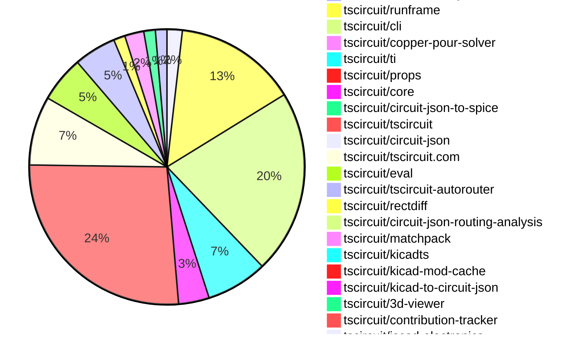

# contribution tracker

[contributions.tscircuit.com](https://contributions.tscircuit.com) ・ [tscircuit.com](https://tscircuit.com) ・ [Contribution Overviews](./contribution-overviews/) ・ [Changelogs](./changelogs/)

Generates weekly contribution overviews for tscircuit contributors. Check out all
the [contribution overviews here](./contribution-overviews/)
You can find AI-generated monthly changelogs in the [changelogs directory](./changelogs/)

- All PRs in the tscircuit org are scanned/summarized via an LLM
- The LLM classifies each Diff/PR as into a set of attributes for scoring
- All the PRs, summaries, and classifications are organized into charts and tables for [the website](https://contributions.tscircuit.com)

> Want to run locally? See the [Development Section](#development)

## Current Week

<!-- START_CURRENT_WEEK -->

# Contribution Overview 2026-06-23

The current week is shown below. There are 3 major sections:

- [Contributor Overview](#contributor-overview)
- [PRs by Repository](#prs-by-repository)
- [PRs by Contributor](#changes-by-contributor)
- [Scoring & Sponsorship Details](/docs/sponsorship-calculation-explanation.md)

## PRs by Repository


```mermaid
pie
    "tscircuit/schematic-viewer" : 4
    "tscircuit/svg.tscircuit.com" : 2
    "tscircuit/circuit-json-to-3d-png" : 2
    "tscircuit/schematic-symbols" : 1
    "tscircuit/runframe" : 32
    "tscircuit/cli" : 48
    "tscircuit/copper-pour-solver" : 1
    "tscircuit/ti" : 16
    "tscircuit/props" : 2
    "tscircuit/core" : 8
    "tscircuit/circuit-json-to-spice" : 1
    "tscircuit/tscircuit" : 59
    "tscircuit/circuit-json" : 2
    "tscircuit/tscircuit.com" : 18
    "tscircuit/eval" : 12
    "tscircuit/tscircuit-autorouter" : 11
    "tscircuit/rectdiff" : 3
    "tscircuit/circuit-json-routing-analysis" : 2
    "tscircuit/matchpack" : 5
    "tscircuit/kicadts" : 1
    "tscircuit/kicad-mod-cache" : 1
    "tscircuit/kicad-to-circuit-json" : 2
    "tscircuit/3d-viewer" : 3
    "tscircuit/contribution-tracker" : 1
    "tscircuit/jscad-electronics" : 1
    "tscircuit/handbook" : 1
    "tscircuit/docs" : 1
    "tscircuit/fabrication-operator-ui" : 3
```

## Contributor Overview

| Contributor | 🐳 Major | 🐙 Minor | 🐌 Tiny | Score | ⭐ | Discussion Contributions |
|-------------|---------|---------|---------|-------|-----|--------------------------|
| [ShiboSoftwareDev](#ShiboSoftwareDev) | 2 | 7 | 6 | 32 | ⭐⭐ | 0🔹 0🔶 0💎 |
| [MustafaMulla29](#MustafaMulla29) | 0 | 7 | 6 | 20.5 | ⭐⭐ | 0🔹 0🔶 0💎 |
| [rushabhcodes](#rushabhcodes) | 0 | 3 | 6 | 16 | ⭐⭐ | 0🔹 0🔶 0💎 |
| [techmannih](#techmannih) | 1 | 3 | 3 | 14 | ⭐⭐ | 0🔹 0🔶 0💎 |
| [0hmX](#0hmX) | 3 | 0 | 1 | 14 | ⭐⭐ | 0🔹 0🔶 0💎 |
| [AnasSarkiz](#AnasSarkiz) | 3 | 0 | 0 | 14 | ⭐⭐ | 0🔹 0🔶 0💎 |
| [tscircuitbot](#tscircuitbot) | 0 | 0 | 168 | 13 | ⭐⭐ | 0🔹 0🔶 0💎 |
| [imrishabh18](#imrishabh18) | 0 | 2 | 7 | 12 | ⭐⭐ | 0🔹 0🔶 0💎 |
| [mohan-bee](#mohan-bee) | 0 | 2 | 5 | 9 | ⭐ | 0🔹 0🔶 0💎 |
| [Abse2001](#Abse2001) | 0 | 1 | 2 | 7 | ⭐ | 0🔹 0🔶 0💎 |
| [Sang-it](#Sang-it) | 0 | 1 | 4 | 5.5 | ⭐ | 0🔹 0🔶 0💎 |

## Staff Pass Ratio (SPR)

| Contributor | Reviewed PRs | Rejections | Approvals | SPR |
|-------------|--------------|------------|-----------|-----|
| [MustafaMulla29](#MustafaMulla29) | 5 | 1 | 4 | 80.0% |
| [0hmX](#0hmX) | 4 | 0 | 4 | 100.0% |
| [ShiboSoftwareDev](#ShiboSoftwareDev) | 3 | 1 | 3 | 66.7% |
| [techmannih](#techmannih) | 3 | 1 | 2 | 66.7% |
| [rushabhcodes](#rushabhcodes) | 2 | 0 | 2 | 100.0% |
| [mohan-bee](#mohan-bee) | 1 | 0 | 1 | 100.0% |

<details>
<summary>MustafaMulla29 SPR PRs (5)</summary>

- [#618](https://github.com/tscircuit/circuit-json/pull/618) Add 'name' to source_trace
- [#701](https://github.com/tscircuit/props/pull/701) Add name and displayName props to trace
- [#2504](https://github.com/tscircuit/core/pull/2504) Add trace name/displayName support for schematic net labels
- [#3469](https://github.com/tscircuit/cli/pull/3469) Fix: tsci dev uses the project-local tscircuit version when available
- [#145](https://github.com/tscircuit/matchpack/pull/145) Align same-side passive groups into a row (ParallelAlignedPassiveSolver)

</details>

<details>
<summary>0hmX SPR PRs (4)</summary>

- [#1435](https://github.com/tscircuit/tscircuit-autorouter/pull/1435) Use rectdiff recursive gap fill commit
- [#1438](https://github.com/tscircuit/tscircuit-autorouter/pull/1438) Fix publish workflow auto-merge fallback
- [#133](https://github.com/tscircuit/rectdiff/pull/133) Fill rectdiff gaps across multiple passes using maxGapFillPasses
- [#121](https://github.com/tscircuit/tiny-hypergraph/pull/121) Queue duplicate congested port route solves

</details>

<details>
<summary>ShiboSoftwareDev SPR PRs (3)</summary>

- [#702](https://github.com/tscircuit/props/pull/702)  Flatten meter display props for probes and ammeters
- [#2503](https://github.com/tscircuit/core/pull/2503) update copper-pour-solver & usage
- [#53](https://github.com/tscircuit/copper-pour-solver/pull/53) Resolve copper pour connectivity by source net & usage documentation & cosmos deploy

</details>

<details>
<summary>techmannih SPR PRs (3)</summary>

- [#943](https://github.com/tscircuit/3d-viewer/pull/943) Add KiCad TL3342 STEP face color white repro story
- [#764](https://github.com/tscircuit/docs/pull/764) docs: update tscircuit TI library guide for current Subcircuit exports
- [#152](https://github.com/tscircuit/kicad-to-circuit-json/pull/152) Support simple_test_point inference for TP symbols and footprints

</details>

<details>
<summary>rushabhcodes SPR PRs (2)</summary>

- [#1686](https://github.com/tscircuit/svg.tscircuit.com/pull/1686) Prevent CDN fallback in production by preloading bundled ngspice
- [#156](https://github.com/tscircuit/kicad-to-circuit-json/pull/156) Update schematic symbols

</details>

<details>
<summary>mohan-bee SPR PRs (1)</summary>

- [#3793](https://github.com/tscircuit/runframe/pull/3793) fix static runframe file hash selection

</details>

> Note: AI evaluates PRs and assigns 1-3 star ratings automatically. 4 and 5 star ratings require manual staff review.

### Discussion Contribution Legend

- 🔹 Normal Comments: Basic participation with minimal effort
- 🔶 Great Informative Comments: Thoughtful participation that adds value
- 💎 Incredible Comments: Exceptional participation with high-quality content

## Review Table

[reviews-received-hover]: ## "Number of reviews received for PRs for this contributor"
[approvals-received-hover]: ## "Number of approvals received for PRs this contributor authored"
[rejections-received-hover]: ## "Number of rejections received for PRs this contributor authored"
[prs-opened-hover]: ## "Number of PRs opened by this contributor"
[issues-created-hover]: ## "Number of issues created by this contributor"

| Contributor | Reviews Received | Approvals Received | Rejections Received | Approvals | Rejections Given | PRs Opened | PRs Merged | Issues Created |
|---|---|---|---|---|---|---|---|---|
| [rushabhcodes](#rushabhcodes) | 25 | 11 | 0 | 4 | 0 | 17 | 9 | 0 |
| [imrishabh18](#imrishabh18) | 0 | 0 | 0 | 16 | 0 | 10 | 9 | 0 |
| [ShiboSoftwareDev](#ShiboSoftwareDev) | 16 | 16 | 0 | 6 | 0 | 16 | 16 | 0 |
| [addibble](#addibble) | 2 | 0 | 0 | 0 | 0 | 2 | 0 | 0 |
| [tscircuitbot](#tscircuitbot) | 0 | 0 | 0 | 0 | 0 | 219 | 168 | 0 |
| [MustafaMulla29](#MustafaMulla29) | 11 | 7 | 1 | 9 | 0 | 16 | 13 | 0 |
| [techmannih](#techmannih) | 8 | 7 | 1 | 1 | 0 | 12 | 7 | 0 |
| [seveibar](#seveibar) | 1 | 0 | 0 | 20 | 3 | 4 | 0 | 0 |
| [vahapogut](#vahapogut) | 0 | 0 | 0 | 0 | 0 | 10 | 0 | 0 |
| [singhaditya21](#singhaditya21) | 0 | 0 | 0 | 0 | 0 | 7 | 0 | 0 |
| [Abse2001](#Abse2001) | 7 | 4 | 0 | 3 | 0 | 6 | 3 | 0 |
| [AdityaSinghBiztech](#AdityaSinghBiztech) | 0 | 0 | 0 | 0 | 0 | 1 | 0 | 0 |
| [mohan-bee](#mohan-bee) | 9 | 8 | 0 | 0 | 0 | 7 | 7 | 0 |
| [Sang-it](#Sang-it) | 3 | 2 | 0 | 0 | 0 | 6 | 5 | 0 |
| [Lathikaa-S](#Lathikaa-S) | 3 | 0 | 0 | 0 | 0 | 1 | 0 | 0 |
| [AnasSarkiz](#AnasSarkiz) | 0 | 0 | 0 | 2 | 0 | 3 | 3 | 0 |
| [ybgwon96](#ybgwon96) | 0 | 0 | 0 | 0 | 0 | 1 | 0 | 0 |
| [daxia778](#daxia778) | 0 | 0 | 0 | 0 | 0 | 1 | 0 | 0 |
| [shehanrao12-cpu](#shehanrao12-cpu) | 0 | 0 | 0 | 0 | 0 | 1 | 0 | 0 |
| [r-bt](#r-bt) | 1 | 1 | 0 | 0 | 0 | 2 | 0 | 0 |
| [ghorhh473-coder](#ghorhh473-coder) | 0 | 0 | 0 | 0 | 0 | 1 | 0 | 0 |
| [0hmX](#0hmX) | 8 | 4 | 0 | 1 | 0 | 11 | 4 | 0 |
| [Ami765](#Ami765) | 0 | 0 | 0 | 0 | 0 | 2 | 0 | 0 |

## Changes by Repository

### [tscircuit/schematic-viewer](https://github.com/tscircuit/schematic-viewer)

| PR # | Impact | Rating | Contributor | Description |
|------|--------|--------|-------------|-------------|
| [#232](https://github.com/tscircuit/schematic-viewer/pull/232) | 🐙 Minor | ⭐⭐ | rushabhcodes | Fixes the issue where ammeter current waveforms were not rendered in the AnalogSimulationViewer despite being generated during simulation. |

<details>
<summary>🐌 Tiny Contributions (3)</summary>

| PR # | Impact | Contributor | Description |
|------|--------|-------------|-------------|
| [#231](https://github.com/tscircuit/schematic-viewer/pull/231) | 🐌 Tiny | rushabhcodes | Updates the circuit-json-to-spice dependency from version 0.0.30 to 0.0.39 in package.json |
| [#233](https://github.com/tscircuit/schematic-viewer/pull/233) | 🐌 Tiny | rushabhcodes | Updates the tscircuit dependency version from 0.0.1922 to 0.0.1938 in package.json |
| [#234](https://github.com/tscircuit/schematic-viewer/pull/234) | 🐌 Tiny | ShiboSoftwareDev | Moves circuit-json-to-spice from dependencies to peerDependencies in package.json |

</details>

### [tscircuit/svg.tscircuit.com](https://github.com/tscircuit/svg.tscircuit.com)

| PR # | Impact | Rating | Contributor | Description |
|------|--------|--------|-------------|-------------|
| [#1686](https://github.com/tscircuit/svg.tscircuit.com/pull/1686) | 🐙 Minor | ⭐⭐ | rushabhcodes | Fixes a production reliability bug in svg.tscircuit.com where server-side circuit evaluation could fall back to CDN-loaded dependencies instead of using bundled runtime packages. |

<details>
<summary>🐌 Tiny Contributions (1)</summary>

| PR # | Impact | Contributor | Description |
|------|--------|-------------|-------------|
| [#1659](https://github.com/tscircuit/svg.tscircuit.com/pull/1659) | 🐌 Tiny | rushabhcodes | Updates the tscircuit dependency version from 0.0.1906 to 0.0.1958 in package.json |

</details>

### [tscircuit/circuit-json-to-3d-png](https://github.com/tscircuit/circuit-json-to-3d-png)

| PR # | Impact | Rating | Contributor | Description |
|------|--------|--------|-------------|-------------|
| [#11](https://github.com/tscircuit/circuit-json-to-3d-png/pull/11) | 🐙 Minor | ⭐⭐ | rushabhcodes | Fixes the issue where render options for width, height, background color, grid visibility, and supersampling were not forwarded to the underlying renderer, resulting in all outputs defaulting to 800x600 resolution with default settings. |

<details>
<summary>🐌 Tiny Contributions (1)</summary>

| PR # | Impact | Contributor | Description |
|------|--------|-------------|-------------|
| [#12](https://github.com/tscircuit/circuit-json-to-3d-png/pull/12) | 🐌 Tiny | tscircuitbot | Automated package update |

</details>

### [tscircuit/schematic-symbols](https://github.com/tscircuit/schematic-symbols)


<details>
<summary>🐌 Tiny Contributions (1)</summary>

| PR # | Impact | Contributor | Description |
|------|--------|-------------|-------------|
| [#432](https://github.com/tscircuit/schematic-symbols/pull/432) | 🐌 Tiny | rushabhcodes | Fixes the inductor symbol generation to ensure each orientation is built explicitly with consistent pin labeling and repositioned anchors, enhancing deterministic behavior across all orientations. |

</details>

### [tscircuit/runframe](https://github.com/tscircuit/runframe)

| PR # | Impact | Rating | Contributor | Description |
|------|--------|--------|-------------|-------------|
| [#3793](https://github.com/tscircuit/runframe/pull/3793) | 🐙 Minor | ⭐⭐ | mohan-bee | Fixes static runframe file selection by making RunFrameStaticBuildViewer read file  main_component from the URL, matching the behavior that already works in the local CLI. |

<details>
<summary>🐌 Tiny Contributions (31)</summary>

| PR # | Impact | Contributor | Description |
|------|--------|-------------|-------------|
| [#3759](https://github.com/tscircuit/runframe/pull/3759) | 🐌 Tiny | rushabhcodes | Updates the schematic-symbols dependency from version 0.0.224 to 0.0.227 in package.json |
| [#3790](https://github.com/tscircuit/runframe/pull/3790) | 🐌 Tiny | ShiboSoftwareDev | Updates the tscircuit dependency version from 0.0.1930 to 0.0.1955 in package.json |
| [#3787](https://github.com/tscircuit/runframe/pull/3787) | 🐌 Tiny | tscircuitbot | Updates the tscircuiteval package to version 0.0.953 in the package.json file. |
| [#3792](https://github.com/tscircuit/runframe/pull/3792) | 🐌 Tiny | tscircuitbot | Automated package update |
| [#3785](https://github.com/tscircuit/runframe/pull/3785) | 🐌 Tiny | tscircuitbot | Updates the tscircuiteval package to version 0.0.952 in the package.json file. |
| [#3795](https://github.com/tscircuit/runframe/pull/3795) | 🐌 Tiny | tscircuitbot | Automated package update |
| [#3786](https://github.com/tscircuit/runframe/pull/3786) | 🐌 Tiny | tscircuitbot | Automated package update |
| [#3784](https://github.com/tscircuit/runframe/pull/3784) | 🐌 Tiny | tscircuitbot | Automated package update |
| [#3788](https://github.com/tscircuit/runframe/pull/3788) | 🐌 Tiny | tscircuitbot | Automated package update |
| [#3783](https://github.com/tscircuit/runframe/pull/3783) | 🐌 Tiny | tscircuitbot | Updates the tscircuiteval package from version 0.0.950 to 0.0.951 |
| [#3791](https://github.com/tscircuit/runframe/pull/3791) | 🐌 Tiny | tscircuitbot | Automated package update |
| [#3789](https://github.com/tscircuit/runframe/pull/3789) | 🐌 Tiny | tscircuitbot | Updates the tscircuiteval package to version 0.0.954 in the project dependencies. |
| [#3761](https://github.com/tscircuit/runframe/pull/3761) | 🐌 Tiny | tscircuitbot | Updates the tscircuitschematic-viewer package to version 2.0.64 |
| [#3782](https://github.com/tscircuit/runframe/pull/3782) | 🐌 Tiny | tscircuitbot | Automated package update |
| [#3779](https://github.com/tscircuit/runframe/pull/3779) | 🐌 Tiny | tscircuitbot | Updates the tscircuiteval package from version 0.0.948 to 0.0.949 in the package.json file. |
| [#3767](https://github.com/tscircuit/runframe/pull/3767) | 🐌 Tiny | tscircuitbot | Automated package update |
| [#3765](https://github.com/tscircuit/runframe/pull/3765) | 🐌 Tiny | tscircuitbot | Automated package update |
| [#3778](https://github.com/tscircuit/runframe/pull/3778) | 🐌 Tiny | tscircuitbot | Automated package update |
| [#3774](https://github.com/tscircuit/runframe/pull/3774) | 🐌 Tiny | tscircuitbot | Updates the tscircuit3d-viewer package to version 0.0.571 in package.json |
| [#3768](https://github.com/tscircuit/runframe/pull/3768) | 🐌 Tiny | tscircuitbot | Automated package update |
| [#3762](https://github.com/tscircuit/runframe/pull/3762) | 🐌 Tiny | tscircuitbot | Automated package update |
| [#3772](https://github.com/tscircuit/runframe/pull/3772) | 🐌 Tiny | tscircuitbot | Automated package update |
| [#3773](https://github.com/tscircuit/runframe/pull/3773) | 🐌 Tiny | tscircuitbot | Automated package update |
| [#3780](https://github.com/tscircuit/runframe/pull/3780) | 🐌 Tiny | tscircuitbot | Automated package update |
| [#3781](https://github.com/tscircuit/runframe/pull/3781) | 🐌 Tiny | tscircuitbot | Updates the tscircuiteval package from version 0.0.949 to 0.0.950 in the package.json file. |
| [#3775](https://github.com/tscircuit/runframe/pull/3775) | 🐌 Tiny | tscircuitbot | Automated package update |
| [#3771](https://github.com/tscircuit/runframe/pull/3771) | 🐌 Tiny | tscircuitbot | Automated package update |
| [#3764](https://github.com/tscircuit/runframe/pull/3764) | 🐌 Tiny | tscircuitbot | Updates the tscircuit3d-viewer package to version 0.0.569 in package.json |
| [#3777](https://github.com/tscircuit/runframe/pull/3777) | 🐌 Tiny | tscircuitbot | Updates the tscircuitschematic-viewer package to version 2.0.67 |
| [#3770](https://github.com/tscircuit/runframe/pull/3770) | 🐌 Tiny | tscircuitbot | Updates the tscircuitschematic-viewer package from version 2.0.65 to 2.0.66 |
| [#3763](https://github.com/tscircuit/runframe/pull/3763) | 🐌 Tiny | tscircuitbot | Updates the package version from v0.0.2111 to v0.0.2112 in package.json |

</details>

### [tscircuit/cli](https://github.com/tscircuit/cli)

| PR # | Impact | Rating | Contributor | Description |
|------|--------|--------|-------------|-------------|
| [#3457](https://github.com/tscircuit/cli/pull/3457) | 🐙 Minor | ⭐⭐ | ShiboSoftwareDev | Changes the platform configuration retrieval method to align with CLI defaults for SPICE simulation and snapshot behavior. |
| [#3425](https://github.com/tscircuit/cli/pull/3425) | 🐙 Minor | ⭐⭐ | ShiboSoftwareDev | Adds support for simulation_transient_current_graph elements alongside existing voltage graph support when generating simulation SVG assets, allowing current and voltage graphs to render in tsci build --simulation-svgs and tsci snapshot --simulation-only. |
| [#3471](https://github.com/tscircuit/cli/pull/3471) | 🐙 Minor | ⭐⭐ | MustafaMulla29 | When a project has no local tscircuit, the dev server now serves the bundle exposed via TSCIRCUIT_GLOBAL_STANDALONE_FILE_PATH before falling back to the runframe bundled into the CLI. |
| [#3469](https://github.com/tscircuit/cli/pull/3469) | 🐙 Minor | ⭐⭐ | MustafaMulla29 | tsci dev now renders the preview with the tscircuit version installed in the project, instead of always using the runframe baked into the CLI. |

<details>
<summary>🐌 Tiny Contributions (44)</summary>

| PR # | Impact | Contributor | Description |
|------|--------|-------------|-------------|
| [#3439](https://github.com/tscircuit/cli/pull/3439) | 🐌 Tiny | rushabhcodes | Add an example for a standalone analog multi-channel scope reproduction with voltage source, load resistor, current meters, and voltage probes, including necessary configuration files for direct execution. |
| [#3450](https://github.com/tscircuit/cli/pull/3450) | 🐌 Tiny | ShiboSoftwareDev | Updates various dependencies in the package.json file to their latest versions. |
| [#3462](https://github.com/tscircuit/cli/pull/3462) | 🐌 Tiny | ShiboSoftwareDev | Updates the version of the tscircuiteval and tscircuit dependencies in the package.json file. |
| [#3474](https://github.com/tscircuit/cli/pull/3474) | 🐌 Tiny | tscircuitbot | Automated package update |
| [#3472](https://github.com/tscircuit/cli/pull/3472) | 🐌 Tiny | tscircuitbot | Automated package update |
| [#3470](https://github.com/tscircuit/cli/pull/3470) | 🐌 Tiny | tscircuitbot | Automated package update |
| [#3467](https://github.com/tscircuit/cli/pull/3467) | 🐌 Tiny | tscircuitbot | Updates the tscircuitrunframe package from version 0.0.2125 to 0.0.2126 in the package.json file. |
| [#3452](https://github.com/tscircuit/cli/pull/3452) | 🐌 Tiny | tscircuitbot | Automated package update |
| [#3455](https://github.com/tscircuit/cli/pull/3455) | 🐌 Tiny | tscircuitbot | Updates the tscircuitrunframe package from version 0.0.2122 to 0.0.2123 |
| [#3456](https://github.com/tscircuit/cli/pull/3456) | 🐌 Tiny | tscircuitbot | Automated package update |
| [#3447](https://github.com/tscircuit/cli/pull/3447) | 🐌 Tiny | tscircuitbot | Automated package update |
| [#3459](https://github.com/tscircuit/cli/pull/3459) | 🐌 Tiny | tscircuitbot | Automated package update |
| [#3446](https://github.com/tscircuit/cli/pull/3446) | 🐌 Tiny | tscircuitbot | Updates the tscircuitrunframe package from version 0.0.2120 to 0.0.2121 |
| [#3468](https://github.com/tscircuit/cli/pull/3468) | 🐌 Tiny | tscircuitbot | Automated package update |
| [#3449](https://github.com/tscircuit/cli/pull/3449) | 🐌 Tiny | tscircuitbot | Automated package update |
| [#3448](https://github.com/tscircuit/cli/pull/3448) | 🐌 Tiny | tscircuitbot | Automated package update |
| [#3451](https://github.com/tscircuit/cli/pull/3451) | 🐌 Tiny | tscircuitbot | Automated README update with latest CLI usage output. |
| [#3458](https://github.com/tscircuit/cli/pull/3458) | 🐌 Tiny | tscircuitbot | Automated package update |
| [#3463](https://github.com/tscircuit/cli/pull/3463) | 🐌 Tiny | tscircuitbot | Automated package update |
| [#3461](https://github.com/tscircuit/cli/pull/3461) | 🐌 Tiny | tscircuitbot | Updates the tscircuitrunframe package version from 0.0.2123 to 0.0.2125 in package.json |
| [#3421](https://github.com/tscircuit/cli/pull/3421) | 🐌 Tiny | tscircuitbot | Updates the tscircuitrunframe package from version 0.0.2110 to 0.0.2111 in the package.json file. |
| [#3441](https://github.com/tscircuit/cli/pull/3441) | 🐌 Tiny | tscircuitbot | Updates the tscircuitrunframe package from version 0.0.2118 to 0.0.2120 |
| [#3433](https://github.com/tscircuit/cli/pull/3433) | 🐌 Tiny | tscircuitbot | Updates the tscircuitrunframe package from version 0.0.2115 to 0.0.2116 |
| [#3426](https://github.com/tscircuit/cli/pull/3426) | 🐌 Tiny | tscircuitbot | Updates the tscircuitrunframe package from version 0.0.2112 to 0.0.2113 |
| [#3434](https://github.com/tscircuit/cli/pull/3434) | 🐌 Tiny | tscircuitbot | Automated package update |
| [#3429](https://github.com/tscircuit/cli/pull/3429) | 🐌 Tiny | tscircuitbot | Updates the tscircuitrunframe package version from 0.0.2113 to 0.0.2114 in package.json |
| [#3423](https://github.com/tscircuit/cli/pull/3423) | 🐌 Tiny | tscircuitbot | Updates the tscircuitrunframe package from version 0.0.2111 to 0.0.2112 |
| [#3443](https://github.com/tscircuit/cli/pull/3443) | 🐌 Tiny | tscircuitbot | Automated README update with latest CLI usage output. |
| [#3437](https://github.com/tscircuit/cli/pull/3437) | 🐌 Tiny | tscircuitbot | Updates the tscircuitrunframe package version from 0.0.2117 to 0.0.2118 in package.json |
| [#3435](https://github.com/tscircuit/cli/pull/3435) | 🐌 Tiny | tscircuitbot | Updates the tscircuitrunframe package version from 0.0.2116 to 0.0.2117 in package.json |
| [#3432](https://github.com/tscircuit/cli/pull/3432) | 🐌 Tiny | tscircuitbot | Updates the package version from 0.1.1547 to 0.1.1548 in package.json |
| [#3444](https://github.com/tscircuit/cli/pull/3444) | 🐌 Tiny | tscircuitbot | Automated package update |
| [#3436](https://github.com/tscircuit/cli/pull/3436) | 🐌 Tiny | tscircuitbot | Automated package update |
| [#3442](https://github.com/tscircuit/cli/pull/3442) | 🐌 Tiny | tscircuitbot | Automated package update |
| [#3438](https://github.com/tscircuit/cli/pull/3438) | 🐌 Tiny | tscircuitbot | Automated package update |
| [#3428](https://github.com/tscircuit/cli/pull/3428) | 🐌 Tiny | tscircuitbot | Automated package update |
| [#3430](https://github.com/tscircuit/cli/pull/3430) | 🐌 Tiny | tscircuitbot | Automated package update |
| [#3445](https://github.com/tscircuit/cli/pull/3445) | 🐌 Tiny | tscircuitbot | Automated package update |
| [#3422](https://github.com/tscircuit/cli/pull/3422) | 🐌 Tiny | tscircuitbot | Automated package update |
| [#3424](https://github.com/tscircuit/cli/pull/3424) | 🐌 Tiny | tscircuitbot | Automated package update |
| [#3431](https://github.com/tscircuit/cli/pull/3431) | 🐌 Tiny | tscircuitbot | Automated package update |
| [#3427](https://github.com/tscircuit/cli/pull/3427) | 🐌 Tiny | tscircuitbot | Automated package update |
| [#3473](https://github.com/tscircuit/cli/pull/3473) | 🐌 Tiny | MustafaMulla29 | Removes the Texas Instruments search option from the command line interface, along with related code and tests. |
| [#3454](https://github.com/tscircuit/cli/pull/3454) | 🐌 Tiny | mohan-bee | Fixes an issue in circuit-json-routing-analysis that caused a never-ending loop during routing analysis. |

</details>

### [tscircuit/copper-pour-solver](https://github.com/tscircuit/copper-pour-solver)

| PR # | Impact | Rating | Contributor | Description |
|------|--------|--------|-------------|-------------|
| [#53](https://github.com/tscircuit/copper-pour-solver/pull/53) | 🐳 Major | ⭐⭐⭐ | ShiboSoftwareDev | Update the Circuit JSON adapter to use stable subcircuit_connectivity_map_key values for pour and pad connectivity, with source net idname lookup and validation against generated connectivity-map ids. Also expands README usage docs, adds a Cosmos docs siteexport setup for Vercel, and covers the new connectivity API behavior with tests. |

### [tscircuit/ti](https://github.com/tscircuit/ti)

| PR # | Impact | Rating | Contributor | Description |
|------|--------|--------|-------------|-------------|
| [#36](https://github.com/tscircuit/ti/pull/36) | 🐳 Major | ⭐⭐⭐ | ShiboSoftwareDev | ref: img width736 height592 altimage srchttps:github.comuser-attachmentsassets7fa5abaa-0a59-46ed-bb87-7d8cc0a16a2f  ours: img width1272 height854 altimage srchttps:github.comuser-attachmentsassets755287d2-78af-4a8c-9a37-fe35d409d848 |
| [#38](https://github.com/tscircuit/ti/pull/38) | 🐙 Minor | ⭐⭐ | ShiboSoftwareDev | Adds a new simulation for the DRV8876 driver that demonstrates PWM operation with current feedback, including a detailed circuit design and associated components. |
| [#43](https://github.com/tscircuit/ti/pull/43) | 🐙 Minor | ⭐⭐ | techmannih | Enables routing functionality for the CC3235SF subcircuit by removing the routingDisabled property. |
| [#47](https://github.com/tscircuit/ti/pull/47) | 🐙 Minor | ⭐⭐ | imrishabh18 | Changes the main entry point of the application from libsubcircuitsBQ24074-subcircuit.circuit.tsx to index.ts. |
| [#42](https://github.com/tscircuit/ti/pull/42) | 🐙 Minor | ⭐⭐ | imrishabh18 | Exports multiple subcircuits and renames the CC3235SF subcircuit component for consistency with its file name. |

<details>
<summary>🐌 Tiny Contributions (11)</summary>

| PR # | Impact | Contributor | Description |
|------|--------|-------------|-------------|
| [#39](https://github.com/tscircuit/ti/pull/39) | 🐌 Tiny | ShiboSoftwareDev | Adds a new simulation for the DRV8876 driver with PWM operation for PH and EN control. |
| [#37](https://github.com/tscircuit/ti/pull/37) | 🐌 Tiny | MustafaMulla29 | Adjusts schematic coordinates for better visual alignment in the TPS63802 switching waveforms simulation. |
| [#40](https://github.com/tscircuit/ti/pull/40) | 🐌 Tiny | MustafaMulla29 | Fixes the schematic representation and layout of the DRV8876 driver simulation circuits by adjusting component positions and orientations. |
| [#41](https://github.com/tscircuit/ti/pull/41) | 🐌 Tiny | MustafaMulla29 | Fixes the CC3235SF schematic subcircuit by introducing a new chip component and updating pin arrangements and connections. |
| [#35](https://github.com/tscircuit/ti/pull/35) | 🐌 Tiny | techmannih | Replaces the generic CC2340R5 chip definition with a dedicated CC2340R52E0RKPR component that includes specific pin mapping, footprint, and CAD model metadata. |
| [#34](https://github.com/tscircuit/ti/pull/34) | 🐌 Tiny | techmannih | Add a dedicated MSPM0G3507SPMR chip component with the MCU pin map, footprint, supplier part number, and CAD model metadata, and update MSPM0G3507Subcircuit to use the reusable chip component instead of defining the chip inline. |
| [#44](https://github.com/tscircuit/ti/pull/44) | 🐌 Tiny | imrishabh18 | Comments out the supplierNumber and manufacturerPartNumber to address timeout issues in cloud build processes. |
| [#45](https://github.com/tscircuit/ti/pull/45) | 🐌 Tiny | imrishabh18 | Updates the README.md to provide clearer installation instructions, usage examples, and details about the TI tscircuit library and its components. |
| [#31](https://github.com/tscircuit/ti/pull/31) | 🐌 Tiny | imrishabh18 | Reorganizes the file structure by separating chips and subcircuits into distinct directories, improving project organization. |
| [#32](https://github.com/tscircuit/ti/pull/32) | 🐌 Tiny | imrishabh18 | Removes the snapshots directory and renames component export names for better clarity and organization in the codebase. |
| [#33](https://github.com/tscircuit/ti/pull/33) | 🐌 Tiny | imrishabh18 | Fixes import statements in index.ts to correctly reference subcircuit components instead of using export syntax. |

</details>

### [tscircuit/props](https://github.com/tscircuit/props)

| PR # | Impact | Rating | Contributor | Description |
|------|--------|--------|-------------|-------------|
| [#702](https://github.com/tscircuit/props/pull/702) | 🐙 Minor | ⭐⭐ | ShiboSoftwareDev | Changes the display properties for Ammeter and VoltageProbe components by flattening the structure and renaming properties for better clarity and consistency. |
| [#701](https://github.com/tscircuit/props/pull/701) | 🐙 Minor | ⭐⭐ | MustafaMulla29 | Adds optional name and displayName properties to the trace component for improved identification and display purposes. |

### [tscircuit/core](https://github.com/tscircuit/core)

| PR # | Impact | Rating | Contributor | Description |
|------|--------|--------|-------------|-------------|
| [#2505](https://github.com/tscircuit/core/pull/2505) | 🐙 Minor | ⭐⭐ | ShiboSoftwareDev | Updates the core components to utilize the new graph display API from tscircuitprops, replacing previous display properties with graph-specific properties for better integration. |
| [#2503](https://github.com/tscircuit/core/pull/2503) | 🐙 Minor | ⭐⭐ | ShiboSoftwareDev | Updates the copper-pour-solver dependency to version 0.0.34 and modifies the CopperPour component to use source_net_id instead of pour_connectivity_key for input problem conversion. |
| [#2504](https://github.com/tscircuit/core/pull/2504) | 🐙 Minor | ⭐⭐ | MustafaMulla29 | Adds support for trace name and displayName to be used as schematic net labels, allowing for better identification of traces in schematics. |
| [#2482](https://github.com/tscircuit/core/pull/2482) | 🐙 Minor | ⭐⭐ | Sang-it | Add text-aware bounding boxes for inductor, crystal, resonator, potentiometer, and fuse components in schematic rendering. |

<details>
<summary>🐌 Tiny Contributions (4)</summary>

| PR # | Impact | Contributor | Description |
|------|--------|-------------|-------------|
| [#2506](https://github.com/tscircuit/core/pull/2506) | 🐌 Tiny | ShiboSoftwareDev | Updates the version of the circuit-json-to-spice dependency from 0.0.39 to 0.0.40 in package.json |
| [#2501](https://github.com/tscircuit/core/pull/2501) | 🐌 Tiny | mohan-bee | Fixes the issue of duplicate overlapping schematic net labels for named nets by reusing existing labels instead of inserting duplicates. |
| [#2497](https://github.com/tscircuit/core/pull/2497) | 🐌 Tiny | mohan-bee | Reproduces a bug related to duplicate net labels in a multidrop circuit configuration by adding a comprehensive test case. |
| [#2508](https://github.com/tscircuit/core/pull/2508) | 🐌 Tiny | Sang-it | Add text-aware functionality to diode, led, transistor, mosfet, and op-amp components, including updates to their schematic representations and bounding boxes. |

</details>

### [tscircuit/circuit-json-to-spice](https://github.com/tscircuit/circuit-json-to-spice)

| PR # | Impact | Rating | Contributor | Description |
|------|--------|--------|-------------|-------------|
| [#40](https://github.com/tscircuit/circuit-json-to-spice/pull/40) | 🐙 Minor | ⭐⭐ | ShiboSoftwareDev | Fixes parsing of continuation lines in SPICE .SUBCKT definitions to correctly handle pin names across multiple lines |

### [tscircuit/tscircuit](https://github.com/tscircuit/tscircuit)

| PR # | Impact | Rating | Contributor | Description |
|------|--------|--------|-------------|-------------|
| [#3697](https://github.com/tscircuit/tscircuit/pull/3697) | 🐙 Minor | ⭐⭐ | MustafaMulla29 | Sets TSCIRCUIT_GLOBAL_STANDALONE_FILE_PATH to the packages distbrowser.min.js for use in tsci dev when no local tscircuit is installed. |

<details>
<summary>🐌 Tiny Contributions (58)</summary>

| PR # | Impact | Contributor | Description |
|------|--------|-------------|-------------|
| [#3702](https://github.com/tscircuit/tscircuit/pull/3702) | 🐌 Tiny | tscircuitbot | Automated package update |
| [#3701](https://github.com/tscircuit/tscircuit/pull/3701) | 🐌 Tiny | tscircuitbot | Updates the tscircuitcli package version from 0.1.1566 to 0.1.1567 in package.json |
| [#3700](https://github.com/tscircuit/tscircuit/pull/3700) | 🐌 Tiny | tscircuitbot | Automated package update to version 0.0.1962 |
| [#3699](https://github.com/tscircuit/tscircuit/pull/3699) | 🐌 Tiny | tscircuitbot | Updates the package version from 0.0.1960 to 0.0.1961 in package.json |
| [#3698](https://github.com/tscircuit/tscircuit/pull/3698) | 🐌 Tiny | tscircuitbot | Updates the tscircuitcli package from version 0.1.1565 to 0.1.1566 |
| [#3696](https://github.com/tscircuit/tscircuit/pull/3696) | 🐌 Tiny | tscircuitbot | Automated package update |
| [#3695](https://github.com/tscircuit/tscircuit/pull/3695) | 🐌 Tiny | tscircuitbot | Updates the tscircuitcli package to version 0.1.1565 |
| [#3671](https://github.com/tscircuit/tscircuit/pull/3671) | 🐌 Tiny | tscircuitbot | Automated package update |
| [#3685](https://github.com/tscircuit/tscircuit/pull/3685) | 🐌 Tiny | tscircuitbot | Updates the version of tscircuitcore from 0.0.1357 to 0.0.1358 and updates circuit-json-to-spice from 0.0.39 to 0.0.40 in package.json |
| [#3675](https://github.com/tscircuit/tscircuit/pull/3675) | 🐌 Tiny | tscircuitbot | Updates the package version from 0.0.1949 to 0.0.1950 in package.json |
| [#3678](https://github.com/tscircuit/tscircuit/pull/3678) | 🐌 Tiny | tscircuitbot | Updates the package version from 0.0.1950 to 0.0.1951 in package.json |
| [#3680](https://github.com/tscircuit/tscircuit/pull/3680) | 🐌 Tiny | tscircuitbot | Automated package update |
| [#3670](https://github.com/tscircuit/tscircuit/pull/3670) | 🐌 Tiny | tscircuitbot | Updates the tscircuiteval package to version 0.0.952 |
| [#3666](https://github.com/tscircuit/tscircuit/pull/3666) | 🐌 Tiny | tscircuitbot | Automated package update |
| [#3673](https://github.com/tscircuit/tscircuit/pull/3673) | 🐌 Tiny | tscircuitbot | Automated package update |
| [#3684](https://github.com/tscircuit/tscircuit/pull/3684) | 🐌 Tiny | tscircuitbot | Automated package update |
| [#3677](https://github.com/tscircuit/tscircuit/pull/3677) | 🐌 Tiny | tscircuitbot | Updates the tscircuitcli package version from 0.1.1557 to 0.1.1558 in package.json |
| [#3694](https://github.com/tscircuit/tscircuit/pull/3694) | 🐌 Tiny | tscircuitbot | Updates the tscircuitcli package from version 0.1.1563 to 0.1.1564 and the tscircuitrunframe package from version 0.0.2125 to 0.0.2126 |
| [#3692](https://github.com/tscircuit/tscircuit/pull/3692) | 🐌 Tiny | tscircuitbot | Updates the tscircuitcli package to version 0.1.1563 in the package.json file. |
| [#3689](https://github.com/tscircuit/tscircuit/pull/3689) | 🐌 Tiny | tscircuitbot | Updates the tscircuitcli package to version 0.1.1562 in the package.json file |
| [#3682](https://github.com/tscircuit/tscircuit/pull/3682) | 🐌 Tiny | tscircuitbot | Automated package update |
| [#3690](https://github.com/tscircuit/tscircuit/pull/3690) | 🐌 Tiny | tscircuitbot | Automated package update |
| [#3681](https://github.com/tscircuit/tscircuit/pull/3681) | 🐌 Tiny | tscircuitbot | Updates the tscircuitcli package to version 0.1.1560 |
| [#3683](https://github.com/tscircuit/tscircuit/pull/3683) | 🐌 Tiny | tscircuitbot | Updates the tscircuitcli package to version 0.1.1561 in package.json |
| [#3672](https://github.com/tscircuit/tscircuit/pull/3672) | 🐌 Tiny | tscircuitbot | Updates the tscircuitcli package from version 0.1.1555 to 0.1.1556 and the tscircuitrunframe package from version 0.0.2121 to 0.0.2122 |
| [#3688](https://github.com/tscircuit/tscircuit/pull/3688) | 🐌 Tiny | tscircuitbot | Automated package update |
| [#3686](https://github.com/tscircuit/tscircuit/pull/3686) | 🐌 Tiny | tscircuitbot | Updates the package version from 0.0.1954 to 0.0.1955 in package.json |
| [#3674](https://github.com/tscircuit/tscircuit/pull/3674) | 🐌 Tiny | tscircuitbot | Updates the tscircuitcli package version from 0.1.1556 to 0.1.1557 in package.json |
| [#3669](https://github.com/tscircuit/tscircuit/pull/3669) | 🐌 Tiny | tscircuitbot | Automated package update |
| [#3667](https://github.com/tscircuit/tscircuit/pull/3667) | 🐌 Tiny | tscircuitbot | Updates the package version from 0.0.1945 to 0.0.1946 in package.json |
| [#3693](https://github.com/tscircuit/tscircuit/pull/3693) | 🐌 Tiny | tscircuitbot | Automated package update |
| [#3668](https://github.com/tscircuit/tscircuit/pull/3668) | 🐌 Tiny | tscircuitbot | Updates the tscircuitcore package from version 0.0.1355 to 0.0.1356 and the tscircuitprops package from version 0.0.553 to 0.0.555 as part of an automated package update. |
| [#3679](https://github.com/tscircuit/tscircuit/pull/3679) | 🐌 Tiny | tscircuitbot | Automated package update |
| [#3687](https://github.com/tscircuit/tscircuit/pull/3687) | 🐌 Tiny | tscircuitbot | Automated package update |
| [#3650](https://github.com/tscircuit/tscircuit/pull/3650) | 🐌 Tiny | tscircuitbot | Automated package update |
| [#3654](https://github.com/tscircuit/tscircuit/pull/3654) | 🐌 Tiny | tscircuitbot | Updates the tscircuitcli package from version 0.1.1548 to 0.1.1549 and the tscircuitrunframe package from version 0.0.2115 to 0.0.2116 |
| [#3658](https://github.com/tscircuit/tscircuit/pull/3658) | 🐌 Tiny | tscircuitbot | Updates the tscircuitcli package from version 0.1.1550 to 0.1.1551 and the tscircuitrunframe package from version 0.0.2117 to 0.0.2118 in the package.json file. |
| [#3642](https://github.com/tscircuit/tscircuit/pull/3642) | 🐌 Tiny | tscircuitbot | Updates the tscircuitcli package from version 0.1.1542 to 0.1.1543 and the tscircuitrunframe package from version 0.0.2110 to 0.0.2111. |
| [#3656](https://github.com/tscircuit/tscircuit/pull/3656) | 🐌 Tiny | tscircuitbot | Updates the tscircuitcli package from version 0.1.1549 to 0.1.1550 and the tscircuitrunframe package from version 0.0.2116 to 0.0.2117 |
| [#3644](https://github.com/tscircuit/tscircuit/pull/3644) | 🐌 Tiny | tscircuitbot | Updates the tscircuitcli package from version 0.1.1543 to 0.1.1544 and the tscircuitrunframe package from version 0.0.2111 to 0.0.2112 in package.json |
| [#3652](https://github.com/tscircuit/tscircuit/pull/3652) | 🐌 Tiny | tscircuitbot | Updates the tscircuitcli package from version 0.1.1547 to 0.1.1548 and the tscircuitcore package from version 0.0.1352 to 0.0.1353, along with the tscircuitrunframe package from version 0.0.2114 to 0.0.2115 as part of an automated package update. |
| [#3660](https://github.com/tscircuit/tscircuit/pull/3660) | 🐌 Tiny | tscircuitbot | Automated package update |
| [#3653](https://github.com/tscircuit/tscircuit/pull/3653) | 🐌 Tiny | tscircuitbot | Automated package update |
| [#3655](https://github.com/tscircuit/tscircuit/pull/3655) | 🐌 Tiny | tscircuitbot | Automated package update |
| [#3649](https://github.com/tscircuit/tscircuit/pull/3649) | 🐌 Tiny | tscircuitbot | Automated package update to version 0.0.1937 |
| [#3645](https://github.com/tscircuit/tscircuit/pull/3645) | 🐌 Tiny | tscircuitbot | Automated package update |
| [#3659](https://github.com/tscircuit/tscircuit/pull/3659) | 🐌 Tiny | tscircuitbot | Automated package update |
| [#3657](https://github.com/tscircuit/tscircuit/pull/3657) | 🐌 Tiny | tscircuitbot | Automated package update |
| [#3663](https://github.com/tscircuit/tscircuit/pull/3663) | 🐌 Tiny | tscircuitbot | Automated package update |
| [#3662](https://github.com/tscircuit/tscircuit/pull/3662) | 🐌 Tiny | tscircuitbot | Updates the tscircuitcli package to version 0.1.1553 |
| [#3647](https://github.com/tscircuit/tscircuit/pull/3647) | 🐌 Tiny | tscircuitbot | Automated package update |
| [#3643](https://github.com/tscircuit/tscircuit/pull/3643) | 🐌 Tiny | tscircuitbot | Automated package update |
| [#3646](https://github.com/tscircuit/tscircuit/pull/3646) | 🐌 Tiny | tscircuitbot | Automated package update |
| [#3664](https://github.com/tscircuit/tscircuit/pull/3664) | 🐌 Tiny | tscircuitbot | Updates the tscircuitcli package to version 0.1.1554 in the package.json file |
| [#3661](https://github.com/tscircuit/tscircuit/pull/3661) | 🐌 Tiny | tscircuitbot | Automated package update |
| [#3665](https://github.com/tscircuit/tscircuit/pull/3665) | 🐌 Tiny | tscircuitbot | Automated package update to version 0.0.1945 |
| [#3648](https://github.com/tscircuit/tscircuit/pull/3648) | 🐌 Tiny | tscircuitbot | Updates the tscircuitcli package to version 0.1.1546 |
| [#3651](https://github.com/tscircuit/tscircuit/pull/3651) | 🐌 Tiny | tscircuitbot | Automated package update |

</details>

### [tscircuit/circuit-json](https://github.com/tscircuit/circuit-json)

| PR # | Impact | Rating | Contributor | Description |
|------|--------|--------|-------------|-------------|
| [#618](https://github.com/tscircuit/circuit-json/pull/618) | 🐙 Minor | ⭐⭐ | MustafaMulla29 | Adds an optional name field to the SourceTrace interface and its corresponding Zod schema for improved trace identification. |

<details>
<summary>🐌 Tiny Contributions (1)</summary>

| PR # | Impact | Contributor | Description |
|------|--------|-------------|-------------|
| [#619](https://github.com/tscircuit/circuit-json/pull/619) | 🐌 Tiny | tscircuitbot | Automated package update |

</details>

### [tscircuit/tscircuit.com](https://github.com/tscircuit/tscircuit.com)


<details>
<summary>🐌 Tiny Contributions (18)</summary>

| PR # | Impact | Contributor | Description |
|------|--------|-------------|-------------|
| [#3754](https://github.com/tscircuit/tscircuit.com/pull/3754) | 🐌 Tiny | tscircuitbot | Automated package update |
| [#3750](https://github.com/tscircuit/tscircuit.com/pull/3750) | 🐌 Tiny | tscircuitbot | Automated package update |
| [#3758](https://github.com/tscircuit/tscircuit.com/pull/3758) | 🐌 Tiny | tscircuitbot | Automated package update |
| [#3753](https://github.com/tscircuit/tscircuit.com/pull/3753) | 🐌 Tiny | tscircuitbot | Updates the tscircuitrunframe package version from 0.0.2120 to 0.0.2122 in package.json |
| [#3757](https://github.com/tscircuit/tscircuit.com/pull/3757) | 🐌 Tiny | tscircuitbot | Updates the tscircuitrunframe package from version 0.0.2122 to 0.0.2125 |
| [#3752](https://github.com/tscircuit/tscircuit.com/pull/3752) | 🐌 Tiny | tscircuitbot | Updates the tscircuiteval package to version 0.0.952 in the package.json file. |
| [#3755](https://github.com/tscircuit/tscircuit.com/pull/3755) | 🐌 Tiny | tscircuitbot | Updates the tscircuiteval package from version 0.0.953 to 0.0.954 |
| [#3747](https://github.com/tscircuit/tscircuit.com/pull/3747) | 🐌 Tiny | tscircuitbot | Updates the tscircuitrunframe package from version 0.0.2118 to 0.0.2119 |
| [#3739](https://github.com/tscircuit/tscircuit.com/pull/3739) | 🐌 Tiny | tscircuitbot | Updates the tscircuitrunframe package from version 0.0.2111 to 0.0.2112 |
| [#3744](https://github.com/tscircuit/tscircuit.com/pull/3744) | 🐌 Tiny | tscircuitbot | Automated package update |
| [#3741](https://github.com/tscircuit/tscircuit.com/pull/3741) | 🐌 Tiny | tscircuitbot | Automated package update |
| [#3738](https://github.com/tscircuit/tscircuit.com/pull/3738) | 🐌 Tiny | tscircuitbot | Automated package update |
| [#3749](https://github.com/tscircuit/tscircuit.com/pull/3749) | 🐌 Tiny | tscircuitbot | Updates the tscircuitrunframe package to version 0.0.2120 |
| [#3742](https://github.com/tscircuit/tscircuit.com/pull/3742) | 🐌 Tiny | tscircuitbot | Automated package update |
| [#3745](https://github.com/tscircuit/tscircuit.com/pull/3745) | 🐌 Tiny | tscircuitbot | Automated package update |
| [#3746](https://github.com/tscircuit/tscircuit.com/pull/3746) | 🐌 Tiny | tscircuitbot | Updates the tscircuiteval package to version 0.0.949 in the package.json file. |
| [#3740](https://github.com/tscircuit/tscircuit.com/pull/3740) | 🐌 Tiny | tscircuitbot | Automated package update |
| [#3743](https://github.com/tscircuit/tscircuit.com/pull/3743) | 🐌 Tiny | tscircuitbot | Updates the tscircuitrunframe package from version 0.0.2115 to 0.0.2116 |

</details>

### [tscircuit/eval](https://github.com/tscircuit/eval)


<details>
<summary>🐌 Tiny Contributions (12)</summary>

| PR # | Impact | Contributor | Description |
|------|--------|-------------|-------------|
| [#3010](https://github.com/tscircuit/eval/pull/3010) | 🐌 Tiny | tscircuitbot | Automated package update |
| [#3008](https://github.com/tscircuit/eval/pull/3008) | 🐌 Tiny | tscircuitbot | Updates the version of the tscircuitcore package from 0.0.1354 to 0.0.1355 in package.json |
| [#3011](https://github.com/tscircuit/eval/pull/3011) | 🐌 Tiny | tscircuitbot | Automated package update |
| [#3009](https://github.com/tscircuit/eval/pull/3009) | 🐌 Tiny | tscircuitbot | Automated package update |
| [#3014](https://github.com/tscircuit/eval/pull/3014) | 🐌 Tiny | tscircuitbot | Automated package update |
| [#3013](https://github.com/tscircuit/eval/pull/3013) | 🐌 Tiny | tscircuitbot | Automated package update |
| [#3017](https://github.com/tscircuit/eval/pull/3017) | 🐌 Tiny | tscircuitbot | Automated package update |
| [#3016](https://github.com/tscircuit/eval/pull/3016) | 🐌 Tiny | tscircuitbot | Updates the version of tscircuitcore from 0.0.1357 to 0.0.1358 and circuit-json-to-spice from 0.0.39 to 0.0.40 in package.json |
| [#3001](https://github.com/tscircuit/eval/pull/3001) | 🐌 Tiny | tscircuitbot | Automated package update |
| [#3006](https://github.com/tscircuit/eval/pull/3006) | 🐌 Tiny | tscircuitbot | Automated package update |
| [#3003](https://github.com/tscircuit/eval/pull/3003) | 🐌 Tiny | tscircuitbot | Automated package update |
| [#3005](https://github.com/tscircuit/eval/pull/3005) | 🐌 Tiny | tscircuitbot | Automated package update |

</details>

### [tscircuit/tscircuit-autorouter](https://github.com/tscircuit/tscircuit-autorouter)

| PR # | Impact | Rating | Contributor | Description |
|------|--------|--------|-------------|-------------|
| [#1435](https://github.com/tscircuit/tscircuit-autorouter/pull/1435) | 🐳 Major | ⭐⭐⭐ | 0hmX | Adds maxGapFillPasses parameter to RectDiffPipeline invocations across multiple autorouting pipelines to enhance gap filling capabilities. |
| [#1438](https://github.com/tscircuit/tscircuit-autorouter/pull/1438) | 🐳 Major | ⭐⭐⭐ | 0hmX | Fixes the auto-merge fallback in the publish workflow to handle cases where the pull request is already in a clean state, preventing stale version-bump PRs after a package is published. |

<details>
<summary>🐌 Tiny Contributions (9)</summary>

| PR # | Impact | Contributor | Description |
|------|--------|-------------|-------------|
| [#1459](https://github.com/tscircuit/tscircuit-autorouter/pull/1459) | 🐌 Tiny | tscircuitbot | Automated package update |
| [#1443](https://github.com/tscircuit/tscircuit-autorouter/pull/1443) | 🐌 Tiny | tscircuitbot | Automated package update |
| [#1450](https://github.com/tscircuit/tscircuit-autorouter/pull/1450) | 🐌 Tiny | tscircuitbot | Automated package update |
| [#1456](https://github.com/tscircuit/tscircuit-autorouter/pull/1456) | 🐌 Tiny | tscircuitbot | Automated package update |
| [#1454](https://github.com/tscircuit/tscircuit-autorouter/pull/1454) | 🐌 Tiny | tscircuitbot | Automated package update |
| [#1452](https://github.com/tscircuit/tscircuit-autorouter/pull/1452) | 🐌 Tiny | tscircuitbot | Automated package update |
| [#1441](https://github.com/tscircuit/tscircuit-autorouter/pull/1441) | 🐌 Tiny | tscircuitbot | Automated package update |
| [#1439](https://github.com/tscircuit/tscircuit-autorouter/pull/1439) | 🐌 Tiny | tscircuitbot | Automated package update |
| [#1442](https://github.com/tscircuit/tscircuit-autorouter/pull/1442) | 🐌 Tiny | imrishabh18 | This pull request introduces a new fixture for bug report 66, which includes a JSON representation of the autorouting bug and a corresponding React component for debugging. |

</details>

### [tscircuit/rectdiff](https://github.com/tscircuit/rectdiff)

| PR # | Impact | Rating | Contributor | Description |
|------|--------|--------|-------------|-------------|
| [#133](https://github.com/tscircuit/rectdiff/pull/133) | 🐳 Major | ⭐⭐⭐ | 0hmX | Run gap filling across repeated findexpand passes until a pass adds no nodes, capping the loop at 4 total passes and updating SVG snapshots accordingly. |

<details>
<summary>🐌 Tiny Contributions (2)</summary>

| PR # | Impact | Contributor | Description |
|------|--------|-------------|-------------|
| [#137](https://github.com/tscircuit/rectdiff/pull/137) | 🐌 Tiny | tscircuitbot | Automated package update |
| [#135](https://github.com/tscircuit/rectdiff/pull/135) | 🐌 Tiny | 0hmX | Adds a standalone visual snapshot fixture for srj18 sample002. This PR intentionally contains only the fixture SRJ, the visual snapshot test, and the baseline SVG snapshot. |

</details>

### [tscircuit/circuit-json-routing-analysis](https://github.com/tscircuit/circuit-json-routing-analysis)


<details>
<summary>🐌 Tiny Contributions (2)</summary>

| PR # | Impact | Contributor | Description |
|------|--------|-------------|-------------|
| [#4](https://github.com/tscircuit/circuit-json-routing-analysis/pull/4) | 🐌 Tiny | tscircuitbot | Updates the package version from 0.0.4 to 0.0.5 in package.json |
| [#3](https://github.com/tscircuit/circuit-json-routing-analysis/pull/3) | 🐌 Tiny | mohan-bee | Updates the versions of circuit-json and tscircuitcapacity-autorouter in the project dependencies. |

</details>

### [tscircuit/matchpack](https://github.com/tscircuit/matchpack)

| PR # | Impact | Rating | Contributor | Description |
|------|--------|--------|-------------|-------------|
| [#143](https://github.com/tscircuit/matchpack/pull/143) | 🐙 Minor | ⭐⭐ | MustafaMulla29 | Fixes incorrect placement of resistors in the layout for the BQ24074 chip, ensuring they are positioned correctly under the chip in the schematic. |

<details>
<summary>🐌 Tiny Contributions (4)</summary>

| PR # | Impact | Contributor | Description |
|------|--------|-------------|-------------|
| [#142](https://github.com/tscircuit/matchpack/pull/142) | 🐌 Tiny | MustafaMulla29 | This pull request adds additional snapshot tests to improve the testing coverage of the project. The new tests include various input JSON files that represent different circuit configurations and their expected outputs. This enhancement aims to ensure that the circuit simulation behaves as expected across a wider range of scenarios. |
| [#144](https://github.com/tscircuit/matchpack/pull/144) | 🐌 Tiny | MustafaMulla29 | Reproduces a layout issue with right-side vertical stack resistors in the BQ24074 circuit configuration. |
| [#148](https://github.com/tscircuit/matchpack/pull/148) | 🐌 Tiny | Sang-it | Adds a new test case and JSON configuration for scattered components in the layout solver. |
| [#146](https://github.com/tscircuit/matchpack/pull/146) | 🐌 Tiny | Sang-it | Adds a new test case and associated JSON data for layout solver functionality, ensuring that test points are correctly aligned in the layout pipeline solver. |

</details>

### [tscircuit/kicadts](https://github.com/tscircuit/kicadts)

| PR # | Impact | Rating | Contributor | Description |
|------|--------|--------|-------------|-------------|
| [#55](https://github.com/tscircuit/kicadts/pull/55) | 🐙 Minor | ⭐⭐ | Abse2001 | Allows parsing of fp_poly elements in KiCad S-expressions without requiring uuid or tstamp attributes, enhancing flexibility in footprint definitions. |

### [tscircuit/kicad-mod-cache](https://github.com/tscircuit/kicad-mod-cache)


<details>
<summary>🐌 Tiny Contributions (1)</summary>

| PR # | Impact | Contributor | Description |
|------|--------|-------------|-------------|
| [#27](https://github.com/tscircuit/kicad-mod-cache/pull/27) | 🐌 Tiny | Abse2001 | Updates the dependencies for KiCad conversion to resolve issues with fp_poly 500s. |

</details>

### [tscircuit/kicad-to-circuit-json](https://github.com/tscircuit/kicad-to-circuit-json)

| PR # | Impact | Rating | Contributor | Description |
|------|--------|--------|-------------|-------------|
| [#152](https://github.com/tscircuit/kicad-to-circuit-json/pull/152) | 🐳 Major | ⭐⭐⭐ | techmannih | Classifies TP references and TestPoint library symbols as simple_test_point instead of simple_chip, extends symbol-library source component generation to emit simple_test_point, and adds PCB-side test point detection from reference prefixes and footprint metadata. |

<details>
<summary>🐌 Tiny Contributions (1)</summary>

| PR # | Impact | Contributor | Description |
|------|--------|-------------|-------------|
| [#155](https://github.com/tscircuit/kicad-to-circuit-json/pull/155) | 🐌 Tiny | Abse2001 | Updates the kicadts library to allow the conversion of fp_poly elements that do not include uuid or tstamp attributes, enhancing compatibility with certain KiCad footprint files. |

</details>

### [tscircuit/3d-viewer](https://github.com/tscircuit/3d-viewer)

| PR # | Impact | Rating | Contributor | Description |
|------|--------|--------|-------------|-------------|
| [#943](https://github.com/tscircuit/3d-viewer/pull/943) | 🐙 Minor | ⭐⭐ | techmannih | https:3d-viewer-git-fork-techmannih-wh-tscircuit.vercel.app?pathstorybugs-kicad-tl3342-step-face-colors--step-only-local-fixture |
| [#945](https://github.com/tscircuit/3d-viewer/pull/945) | 🐙 Minor | ⭐⭐ | techmannih | Updates the STEP-to-GLB pipeline to preserve per-face colors from OCCT meshes in the exported model. |

<details>
<summary>🐌 Tiny Contributions (1)</summary>

| PR # | Impact | Contributor | Description |
|------|--------|-------------|-------------|
| [#944](https://github.com/tscircuit/3d-viewer/pull/944) | 🐌 Tiny | mohan-bee | Updates the jscad-electronics dependency from version 0.0.133 to 0.0.138 in package.json |

</details>

### [tscircuit/contribution-tracker](https://github.com/tscircuit/contribution-tracker)


<details>
<summary>🐌 Tiny Contributions (1)</summary>

| PR # | Impact | Contributor | Description |
|------|--------|-------------|-------------|
| [#337](https://github.com/tscircuit/contribution-tracker/pull/337) | 🐌 Tiny | techmannih | Moves the user techmannih from the maintainers list to the staff list in the contribution tracker. |

</details>

### [tscircuit/jscad-electronics](https://github.com/tscircuit/jscad-electronics)

| PR # | Impact | Rating | Contributor | Description |
|------|--------|--------|-------------|-------------|
| [#297](https://github.com/tscircuit/jscad-electronics/pull/297) | 🐙 Minor | ⭐⭐ | mohan-bee | Fixes the QFN footprint rendering issue by changing object-shaped centers to array-shaped centers for QFN body, pads, and thermal pad geometry. |

### [tscircuit/handbook](https://github.com/tscircuit/handbook)


<details>
<summary>🐌 Tiny Contributions (1)</summary>

| PR # | Impact | Contributor | Description |
|------|--------|-------------|-------------|
| [#9](https://github.com/tscircuit/handbook/pull/9) | 🐌 Tiny | Sang-it | Add code examples to AI Code Guidelines and API Design documentation to improve clarity and understanding of coding practices. |

</details>

### [tscircuit/docs](https://github.com/tscircuit/docs)


<details>
<summary>🐌 Tiny Contributions (1)</summary>

| PR # | Impact | Contributor | Description |
|------|--------|-------------|-------------|
| [#763](https://github.com/tscircuit/docs/pull/763) | 🐌 Tiny | imrishabh18 | Changes the chip example from INA237 to BQ24074 in the documentation. |

</details>

### [tscircuit/fabrication-operator-ui](https://github.com/tscircuit/fabrication-operator-ui)

| PR # | Impact | Rating | Contributor | Description |
|------|--------|--------|-------------|-------------|
| [#18](https://github.com/tscircuit/fabrication-operator-ui/pull/18) | 🐳 Major | ⭐⭐⭐ | AnasSarkiz | Transforms the dashboard from a static mock interface into a server-backed experience by synchronizing fabrication jobs and job details with the fake fabrication server. |
| [#17](https://github.com/tscircuit/fabrication-operator-ui/pull/17) | 🐳 Major | ⭐⭐⭐ | AnasSarkiz | Establishes a centralized client SDK that standardizes communication with the fake fabrication server while providing a scalable foundation for future fabrication workflow integration. |
| [#16](https://github.com/tscircuit/fabrication-operator-ui/pull/16) | 🐳 Major | ⭐⭐⭐ | AnasSarkiz | Upgrades job previews from locally rendered PCB SVGs to hosted 3D PCB PNG previews generated from each jobs Circuit JSON. |

## Changes by Contributor

### [rushabhcodes](https://github.com/rushabhcodes)

| PRs # | Impact | Rating | Description |
|------|--------|--------|-------------|
| [#232](https://github.com/tscircuit/schematic-viewer/pull/232) | 🐙 Minor | ⭐⭐ | Fixes the issue where ammeter current waveforms were not rendered in the AnalogSimulationViewer despite being generated during simulation. |
| [#1686](https://github.com/tscircuit/svg.tscircuit.com/pull/1686) | 🐙 Minor | ⭐⭐ | Fixes a production reliability bug in svg.tscircuit.com where server-side circuit evaluation could fall back to CDN-loaded dependencies instead of using bundled runtime packages. |
| [#11](https://github.com/tscircuit/circuit-json-to-3d-png/pull/11) | 🐙 Minor | ⭐⭐ | Fixes the issue where render options for width, height, background color, grid visibility, and supersampling were not forwarded to the underlying renderer, resulting in all outputs defaulting to 800x600 resolution with default settings. |

<details>
<summary>🐌 Tiny Contributions (6)</summary>

| PR # | Impact | Description |
|------|--------|-------------|
| [#231](https://github.com/tscircuit/schematic-viewer/pull/231) | 🐌 Tiny | Updates the circuit-json-to-spice dependency from version 0.0.30 to 0.0.39 in package.json |
| [#233](https://github.com/tscircuit/schematic-viewer/pull/233) | 🐌 Tiny | Updates the tscircuit dependency version from 0.0.1922 to 0.0.1938 in package.json |
| [#432](https://github.com/tscircuit/schematic-symbols/pull/432) | 🐌 Tiny | Fixes the inductor symbol generation to ensure each orientation is built explicitly with consistent pin labeling and repositioned anchors, enhancing deterministic behavior across all orientations. |
| [#3759](https://github.com/tscircuit/runframe/pull/3759) | 🐌 Tiny | Updates the schematic-symbols dependency from version 0.0.224 to 0.0.227 in package.json |
| [#3439](https://github.com/tscircuit/cli/pull/3439) | 🐌 Tiny | Add an example for a standalone analog multi-channel scope reproduction with voltage source, load resistor, current meters, and voltage probes, including necessary configuration files for direct execution. |
| [#1659](https://github.com/tscircuit/svg.tscircuit.com/pull/1659) | 🐌 Tiny | Updates the tscircuit dependency version from 0.0.1906 to 0.0.1958 in package.json |

</details>

### [ShiboSoftwareDev](https://github.com/ShiboSoftwareDev)

| PRs # | Impact | Rating | Description |
|------|--------|--------|-------------|
| [#53](https://github.com/tscircuit/copper-pour-solver/pull/53) | 🐳 Major | ⭐⭐⭐ | Update the Circuit JSON adapter to use stable subcircuit_connectivity_map_key values for pour and pad connectivity, with source net idname lookup and validation against generated connectivity-map ids. Also expands README usage docs, adds a Cosmos docs siteexport setup for Vercel, and covers the new connectivity API behavior with tests. |
| [#36](https://github.com/tscircuit/ti/pull/36) | 🐳 Major | ⭐⭐⭐ | ref: img width736 height592 altimage srchttps:github.comuser-attachmentsassets7fa5abaa-0a59-46ed-bb87-7d8cc0a16a2f  ours: img width1272 height854 altimage srchttps:github.comuser-attachmentsassets755287d2-78af-4a8c-9a37-fe35d409d848 |
| [#702](https://github.com/tscircuit/props/pull/702) | 🐙 Minor | ⭐⭐ | Changes the display properties for Ammeter and VoltageProbe components by flattening the structure and renaming properties for better clarity and consistency. |
| [#2505](https://github.com/tscircuit/core/pull/2505) | 🐙 Minor | ⭐⭐ | Updates the core components to utilize the new graph display API from tscircuitprops, replacing previous display properties with graph-specific properties for better integration. |
| [#2503](https://github.com/tscircuit/core/pull/2503) | 🐙 Minor | ⭐⭐ | Updates the copper-pour-solver dependency to version 0.0.34 and modifies the CopperPour component to use source_net_id instead of pour_connectivity_key for input problem conversion. |
| [#40](https://github.com/tscircuit/circuit-json-to-spice/pull/40) | 🐙 Minor | ⭐⭐ | Fixes parsing of continuation lines in SPICE .SUBCKT definitions to correctly handle pin names across multiple lines |
| [#3457](https://github.com/tscircuit/cli/pull/3457) | 🐙 Minor | ⭐⭐ | Changes the platform configuration retrieval method to align with CLI defaults for SPICE simulation and snapshot behavior. |
| [#3425](https://github.com/tscircuit/cli/pull/3425) | 🐙 Minor | ⭐⭐ | Adds support for simulation_transient_current_graph elements alongside existing voltage graph support when generating simulation SVG assets, allowing current and voltage graphs to render in tsci build --simulation-svgs and tsci snapshot --simulation-only. |
| [#38](https://github.com/tscircuit/ti/pull/38) | 🐙 Minor | ⭐⭐ | Adds a new simulation for the DRV8876 driver that demonstrates PWM operation with current feedback, including a detailed circuit design and associated components. |

<details>
<summary>🐌 Tiny Contributions (6)</summary>

| PR # | Impact | Description |
|------|--------|-------------|
| [#234](https://github.com/tscircuit/schematic-viewer/pull/234) | 🐌 Tiny | Moves circuit-json-to-spice from dependencies to peerDependencies in package.json |
| [#2506](https://github.com/tscircuit/core/pull/2506) | 🐌 Tiny | Updates the version of the circuit-json-to-spice dependency from 0.0.39 to 0.0.40 in package.json |
| [#3790](https://github.com/tscircuit/runframe/pull/3790) | 🐌 Tiny | Updates the tscircuit dependency version from 0.0.1930 to 0.0.1955 in package.json |
| [#3450](https://github.com/tscircuit/cli/pull/3450) | 🐌 Tiny | Updates various dependencies in the package.json file to their latest versions. |
| [#3462](https://github.com/tscircuit/cli/pull/3462) | 🐌 Tiny | Updates the version of the tscircuiteval and tscircuit dependencies in the package.json file. |
| [#39](https://github.com/tscircuit/ti/pull/39) | 🐌 Tiny | Adds a new simulation for the DRV8876 driver with PWM operation for PH and EN control. |

</details>

### [tscircuitbot](https://github.com/tscircuitbot)


<details>
<summary>🐌 Tiny Contributions (168)</summary>

| PR # | Impact | Description |
|------|--------|-------------|
| [#3702](https://github.com/tscircuit/tscircuit/pull/3702) | 🐌 Tiny | Automated package update |
| [#3701](https://github.com/tscircuit/tscircuit/pull/3701) | 🐌 Tiny | Updates the tscircuitcli package version from 0.1.1566 to 0.1.1567 in package.json |
| [#3700](https://github.com/tscircuit/tscircuit/pull/3700) | 🐌 Tiny | Automated package update to version 0.0.1962 |
| [#3699](https://github.com/tscircuit/tscircuit/pull/3699) | 🐌 Tiny | Updates the package version from 0.0.1960 to 0.0.1961 in package.json |
| [#3698](https://github.com/tscircuit/tscircuit/pull/3698) | 🐌 Tiny | Updates the tscircuitcli package from version 0.1.1565 to 0.1.1566 |
| [#3696](https://github.com/tscircuit/tscircuit/pull/3696) | 🐌 Tiny | Automated package update |
| [#3695](https://github.com/tscircuit/tscircuit/pull/3695) | 🐌 Tiny | Updates the tscircuitcli package to version 0.1.1565 |
| [#3671](https://github.com/tscircuit/tscircuit/pull/3671) | 🐌 Tiny | Automated package update |
| [#3685](https://github.com/tscircuit/tscircuit/pull/3685) | 🐌 Tiny | Updates the version of tscircuitcore from 0.0.1357 to 0.0.1358 and updates circuit-json-to-spice from 0.0.39 to 0.0.40 in package.json |
| [#3675](https://github.com/tscircuit/tscircuit/pull/3675) | 🐌 Tiny | Updates the package version from 0.0.1949 to 0.0.1950 in package.json |
| [#3678](https://github.com/tscircuit/tscircuit/pull/3678) | 🐌 Tiny | Updates the package version from 0.0.1950 to 0.0.1951 in package.json |
| [#3680](https://github.com/tscircuit/tscircuit/pull/3680) | 🐌 Tiny | Automated package update |
| [#3670](https://github.com/tscircuit/tscircuit/pull/3670) | 🐌 Tiny | Updates the tscircuiteval package to version 0.0.952 |
| [#3666](https://github.com/tscircuit/tscircuit/pull/3666) | 🐌 Tiny | Automated package update |
| [#3673](https://github.com/tscircuit/tscircuit/pull/3673) | 🐌 Tiny | Automated package update |
| [#3684](https://github.com/tscircuit/tscircuit/pull/3684) | 🐌 Tiny | Automated package update |
| [#3677](https://github.com/tscircuit/tscircuit/pull/3677) | 🐌 Tiny | Updates the tscircuitcli package version from 0.1.1557 to 0.1.1558 in package.json |
| [#3694](https://github.com/tscircuit/tscircuit/pull/3694) | 🐌 Tiny | Updates the tscircuitcli package from version 0.1.1563 to 0.1.1564 and the tscircuitrunframe package from version 0.0.2125 to 0.0.2126 |
| [#3692](https://github.com/tscircuit/tscircuit/pull/3692) | 🐌 Tiny | Updates the tscircuitcli package to version 0.1.1563 in the package.json file. |
| [#3689](https://github.com/tscircuit/tscircuit/pull/3689) | 🐌 Tiny | Updates the tscircuitcli package to version 0.1.1562 in the package.json file |
| [#3682](https://github.com/tscircuit/tscircuit/pull/3682) | 🐌 Tiny | Automated package update |
| [#3690](https://github.com/tscircuit/tscircuit/pull/3690) | 🐌 Tiny | Automated package update |
| [#3681](https://github.com/tscircuit/tscircuit/pull/3681) | 🐌 Tiny | Updates the tscircuitcli package to version 0.1.1560 |
| [#3683](https://github.com/tscircuit/tscircuit/pull/3683) | 🐌 Tiny | Updates the tscircuitcli package to version 0.1.1561 in package.json |
| [#3672](https://github.com/tscircuit/tscircuit/pull/3672) | 🐌 Tiny | Updates the tscircuitcli package from version 0.1.1555 to 0.1.1556 and the tscircuitrunframe package from version 0.0.2121 to 0.0.2122 |
| [#3688](https://github.com/tscircuit/tscircuit/pull/3688) | 🐌 Tiny | Automated package update |
| [#3686](https://github.com/tscircuit/tscircuit/pull/3686) | 🐌 Tiny | Updates the package version from 0.0.1954 to 0.0.1955 in package.json |
| [#3674](https://github.com/tscircuit/tscircuit/pull/3674) | 🐌 Tiny | Updates the tscircuitcli package version from 0.1.1556 to 0.1.1557 in package.json |
| [#3669](https://github.com/tscircuit/tscircuit/pull/3669) | 🐌 Tiny | Automated package update |
| [#3667](https://github.com/tscircuit/tscircuit/pull/3667) | 🐌 Tiny | Updates the package version from 0.0.1945 to 0.0.1946 in package.json |
| [#3693](https://github.com/tscircuit/tscircuit/pull/3693) | 🐌 Tiny | Automated package update |
| [#3668](https://github.com/tscircuit/tscircuit/pull/3668) | 🐌 Tiny | Updates the tscircuitcore package from version 0.0.1355 to 0.0.1356 and the tscircuitprops package from version 0.0.553 to 0.0.555 as part of an automated package update. |
| [#3679](https://github.com/tscircuit/tscircuit/pull/3679) | 🐌 Tiny | Automated package update |
| [#3687](https://github.com/tscircuit/tscircuit/pull/3687) | 🐌 Tiny | Automated package update |
| [#3650](https://github.com/tscircuit/tscircuit/pull/3650) | 🐌 Tiny | Automated package update |
| [#3654](https://github.com/tscircuit/tscircuit/pull/3654) | 🐌 Tiny | Updates the tscircuitcli package from version 0.1.1548 to 0.1.1549 and the tscircuitrunframe package from version 0.0.2115 to 0.0.2116 |
| [#3658](https://github.com/tscircuit/tscircuit/pull/3658) | 🐌 Tiny | Updates the tscircuitcli package from version 0.1.1550 to 0.1.1551 and the tscircuitrunframe package from version 0.0.2117 to 0.0.2118 in the package.json file. |
| [#3642](https://github.com/tscircuit/tscircuit/pull/3642) | 🐌 Tiny | Updates the tscircuitcli package from version 0.1.1542 to 0.1.1543 and the tscircuitrunframe package from version 0.0.2110 to 0.0.2111. |
| [#3656](https://github.com/tscircuit/tscircuit/pull/3656) | 🐌 Tiny | Updates the tscircuitcli package from version 0.1.1549 to 0.1.1550 and the tscircuitrunframe package from version 0.0.2116 to 0.0.2117 |
| [#3644](https://github.com/tscircuit/tscircuit/pull/3644) | 🐌 Tiny | Updates the tscircuitcli package from version 0.1.1543 to 0.1.1544 and the tscircuitrunframe package from version 0.0.2111 to 0.0.2112 in package.json |
| [#3652](https://github.com/tscircuit/tscircuit/pull/3652) | 🐌 Tiny | Updates the tscircuitcli package from version 0.1.1547 to 0.1.1548 and the tscircuitcore package from version 0.0.1352 to 0.0.1353, along with the tscircuitrunframe package from version 0.0.2114 to 0.0.2115 as part of an automated package update. |
| [#3660](https://github.com/tscircuit/tscircuit/pull/3660) | 🐌 Tiny | Automated package update |
| [#3653](https://github.com/tscircuit/tscircuit/pull/3653) | 🐌 Tiny | Automated package update |
| [#3655](https://github.com/tscircuit/tscircuit/pull/3655) | 🐌 Tiny | Automated package update |
| [#3649](https://github.com/tscircuit/tscircuit/pull/3649) | 🐌 Tiny | Automated package update to version 0.0.1937 |
| [#3645](https://github.com/tscircuit/tscircuit/pull/3645) | 🐌 Tiny | Automated package update |
| [#3659](https://github.com/tscircuit/tscircuit/pull/3659) | 🐌 Tiny | Automated package update |
| [#3657](https://github.com/tscircuit/tscircuit/pull/3657) | 🐌 Tiny | Automated package update |
| [#3663](https://github.com/tscircuit/tscircuit/pull/3663) | 🐌 Tiny | Automated package update |
| [#3662](https://github.com/tscircuit/tscircuit/pull/3662) | 🐌 Tiny | Updates the tscircuitcli package to version 0.1.1553 |
| [#3647](https://github.com/tscircuit/tscircuit/pull/3647) | 🐌 Tiny | Automated package update |
| [#3643](https://github.com/tscircuit/tscircuit/pull/3643) | 🐌 Tiny | Automated package update |
| [#3646](https://github.com/tscircuit/tscircuit/pull/3646) | 🐌 Tiny | Automated package update |
| [#3664](https://github.com/tscircuit/tscircuit/pull/3664) | 🐌 Tiny | Updates the tscircuitcli package to version 0.1.1554 in the package.json file |
| [#3661](https://github.com/tscircuit/tscircuit/pull/3661) | 🐌 Tiny | Automated package update |
| [#3665](https://github.com/tscircuit/tscircuit/pull/3665) | 🐌 Tiny | Automated package update to version 0.0.1945 |
| [#3648](https://github.com/tscircuit/tscircuit/pull/3648) | 🐌 Tiny | Updates the tscircuitcli package to version 0.1.1546 |
| [#3651](https://github.com/tscircuit/tscircuit/pull/3651) | 🐌 Tiny | Automated package update |
| [#619](https://github.com/tscircuit/circuit-json/pull/619) | 🐌 Tiny | Automated package update |
| [#3754](https://github.com/tscircuit/tscircuit.com/pull/3754) | 🐌 Tiny | Automated package update |
| [#3750](https://github.com/tscircuit/tscircuit.com/pull/3750) | 🐌 Tiny | Automated package update |
| [#3758](https://github.com/tscircuit/tscircuit.com/pull/3758) | 🐌 Tiny | Automated package update |
| [#3753](https://github.com/tscircuit/tscircuit.com/pull/3753) | 🐌 Tiny | Updates the tscircuitrunframe package version from 0.0.2120 to 0.0.2122 in package.json |
| [#3757](https://github.com/tscircuit/tscircuit.com/pull/3757) | 🐌 Tiny | Updates the tscircuitrunframe package from version 0.0.2122 to 0.0.2125 |
| [#3752](https://github.com/tscircuit/tscircuit.com/pull/3752) | 🐌 Tiny | Updates the tscircuiteval package to version 0.0.952 in the package.json file. |
| [#3755](https://github.com/tscircuit/tscircuit.com/pull/3755) | 🐌 Tiny | Updates the tscircuiteval package from version 0.0.953 to 0.0.954 |
| [#3747](https://github.com/tscircuit/tscircuit.com/pull/3747) | 🐌 Tiny | Updates the tscircuitrunframe package from version 0.0.2118 to 0.0.2119 |
| [#3739](https://github.com/tscircuit/tscircuit.com/pull/3739) | 🐌 Tiny | Updates the tscircuitrunframe package from version 0.0.2111 to 0.0.2112 |
| [#3744](https://github.com/tscircuit/tscircuit.com/pull/3744) | 🐌 Tiny | Automated package update |
| [#3741](https://github.com/tscircuit/tscircuit.com/pull/3741) | 🐌 Tiny | Automated package update |
| [#3738](https://github.com/tscircuit/tscircuit.com/pull/3738) | 🐌 Tiny | Automated package update |
| [#3749](https://github.com/tscircuit/tscircuit.com/pull/3749) | 🐌 Tiny | Updates the tscircuitrunframe package to version 0.0.2120 |
| [#3742](https://github.com/tscircuit/tscircuit.com/pull/3742) | 🐌 Tiny | Automated package update |
| [#3745](https://github.com/tscircuit/tscircuit.com/pull/3745) | 🐌 Tiny | Automated package update |
| [#3746](https://github.com/tscircuit/tscircuit.com/pull/3746) | 🐌 Tiny | Updates the tscircuiteval package to version 0.0.949 in the package.json file. |
| [#3740](https://github.com/tscircuit/tscircuit.com/pull/3740) | 🐌 Tiny | Automated package update |
| [#3743](https://github.com/tscircuit/tscircuit.com/pull/3743) | 🐌 Tiny | Updates the tscircuitrunframe package from version 0.0.2115 to 0.0.2116 |
| [#3010](https://github.com/tscircuit/eval/pull/3010) | 🐌 Tiny | Automated package update |
| [#3008](https://github.com/tscircuit/eval/pull/3008) | 🐌 Tiny | Updates the version of the tscircuitcore package from 0.0.1354 to 0.0.1355 in package.json |
| [#3011](https://github.com/tscircuit/eval/pull/3011) | 🐌 Tiny | Automated package update |
| [#3009](https://github.com/tscircuit/eval/pull/3009) | 🐌 Tiny | Automated package update |
| [#3014](https://github.com/tscircuit/eval/pull/3014) | 🐌 Tiny | Automated package update |
| [#3013](https://github.com/tscircuit/eval/pull/3013) | 🐌 Tiny | Automated package update |
| [#3017](https://github.com/tscircuit/eval/pull/3017) | 🐌 Tiny | Automated package update |
| [#3016](https://github.com/tscircuit/eval/pull/3016) | 🐌 Tiny | Updates the version of tscircuitcore from 0.0.1357 to 0.0.1358 and circuit-json-to-spice from 0.0.39 to 0.0.40 in package.json |
| [#3001](https://github.com/tscircuit/eval/pull/3001) | 🐌 Tiny | Automated package update |
| [#3006](https://github.com/tscircuit/eval/pull/3006) | 🐌 Tiny | Automated package update |
| [#3003](https://github.com/tscircuit/eval/pull/3003) | 🐌 Tiny | Automated package update |
| [#3005](https://github.com/tscircuit/eval/pull/3005) | 🐌 Tiny | Automated package update |
| [#3787](https://github.com/tscircuit/runframe/pull/3787) | 🐌 Tiny | Updates the tscircuiteval package to version 0.0.953 in the package.json file. |
| [#3792](https://github.com/tscircuit/runframe/pull/3792) | 🐌 Tiny | Automated package update |
| [#3785](https://github.com/tscircuit/runframe/pull/3785) | 🐌 Tiny | Updates the tscircuiteval package to version 0.0.952 in the package.json file. |
| [#3795](https://github.com/tscircuit/runframe/pull/3795) | 🐌 Tiny | Automated package update |
| [#3786](https://github.com/tscircuit/runframe/pull/3786) | 🐌 Tiny | Automated package update |
| [#3784](https://github.com/tscircuit/runframe/pull/3784) | 🐌 Tiny | Automated package update |
| [#3788](https://github.com/tscircuit/runframe/pull/3788) | 🐌 Tiny | Automated package update |
| [#3783](https://github.com/tscircuit/runframe/pull/3783) | 🐌 Tiny | Updates the tscircuiteval package from version 0.0.950 to 0.0.951 |
| [#3791](https://github.com/tscircuit/runframe/pull/3791) | 🐌 Tiny | Automated package update |
| [#3789](https://github.com/tscircuit/runframe/pull/3789) | 🐌 Tiny | Updates the tscircuiteval package to version 0.0.954 in the project dependencies. |
| [#3761](https://github.com/tscircuit/runframe/pull/3761) | 🐌 Tiny | Updates the tscircuitschematic-viewer package to version 2.0.64 |
| [#3782](https://github.com/tscircuit/runframe/pull/3782) | 🐌 Tiny | Automated package update |
| [#3779](https://github.com/tscircuit/runframe/pull/3779) | 🐌 Tiny | Updates the tscircuiteval package from version 0.0.948 to 0.0.949 in the package.json file. |
| [#3767](https://github.com/tscircuit/runframe/pull/3767) | 🐌 Tiny | Automated package update |
| [#3765](https://github.com/tscircuit/runframe/pull/3765) | 🐌 Tiny | Automated package update |
| [#3778](https://github.com/tscircuit/runframe/pull/3778) | 🐌 Tiny | Automated package update |
| [#3774](https://github.com/tscircuit/runframe/pull/3774) | 🐌 Tiny | Updates the tscircuit3d-viewer package to version 0.0.571 in package.json |
| [#3768](https://github.com/tscircuit/runframe/pull/3768) | 🐌 Tiny | Automated package update |
| [#3762](https://github.com/tscircuit/runframe/pull/3762) | 🐌 Tiny | Automated package update |
| [#3772](https://github.com/tscircuit/runframe/pull/3772) | 🐌 Tiny | Automated package update |
| [#3773](https://github.com/tscircuit/runframe/pull/3773) | 🐌 Tiny | Automated package update |
| [#3780](https://github.com/tscircuit/runframe/pull/3780) | 🐌 Tiny | Automated package update |
| [#3781](https://github.com/tscircuit/runframe/pull/3781) | 🐌 Tiny | Updates the tscircuiteval package from version 0.0.949 to 0.0.950 in the package.json file. |
| [#3775](https://github.com/tscircuit/runframe/pull/3775) | 🐌 Tiny | Automated package update |
| [#3771](https://github.com/tscircuit/runframe/pull/3771) | 🐌 Tiny | Automated package update |
| [#3764](https://github.com/tscircuit/runframe/pull/3764) | 🐌 Tiny | Updates the tscircuit3d-viewer package to version 0.0.569 in package.json |
| [#3777](https://github.com/tscircuit/runframe/pull/3777) | 🐌 Tiny | Updates the tscircuitschematic-viewer package to version 2.0.67 |
| [#3770](https://github.com/tscircuit/runframe/pull/3770) | 🐌 Tiny | Updates the tscircuitschematic-viewer package from version 2.0.65 to 2.0.66 |
| [#3763](https://github.com/tscircuit/runframe/pull/3763) | 🐌 Tiny | Updates the package version from v0.0.2111 to v0.0.2112 in package.json |
| [#3474](https://github.com/tscircuit/cli/pull/3474) | 🐌 Tiny | Automated package update |
| [#3472](https://github.com/tscircuit/cli/pull/3472) | 🐌 Tiny | Automated package update |
| [#3470](https://github.com/tscircuit/cli/pull/3470) | 🐌 Tiny | Automated package update |
| [#3467](https://github.com/tscircuit/cli/pull/3467) | 🐌 Tiny | Updates the tscircuitrunframe package from version 0.0.2125 to 0.0.2126 in the package.json file. |
| [#3452](https://github.com/tscircuit/cli/pull/3452) | 🐌 Tiny | Automated package update |
| [#3455](https://github.com/tscircuit/cli/pull/3455) | 🐌 Tiny | Updates the tscircuitrunframe package from version 0.0.2122 to 0.0.2123 |
| [#3456](https://github.com/tscircuit/cli/pull/3456) | 🐌 Tiny | Automated package update |
| [#3447](https://github.com/tscircuit/cli/pull/3447) | 🐌 Tiny | Automated package update |
| [#3459](https://github.com/tscircuit/cli/pull/3459) | 🐌 Tiny | Automated package update |
| [#3446](https://github.com/tscircuit/cli/pull/3446) | 🐌 Tiny | Updates the tscircuitrunframe package from version 0.0.2120 to 0.0.2121 |
| [#3468](https://github.com/tscircuit/cli/pull/3468) | 🐌 Tiny | Automated package update |
| [#3449](https://github.com/tscircuit/cli/pull/3449) | 🐌 Tiny | Automated package update |
| [#3448](https://github.com/tscircuit/cli/pull/3448) | 🐌 Tiny | Automated package update |
| [#3451](https://github.com/tscircuit/cli/pull/3451) | 🐌 Tiny | Automated README update with latest CLI usage output. |
| [#3458](https://github.com/tscircuit/cli/pull/3458) | 🐌 Tiny | Automated package update |
| [#3463](https://github.com/tscircuit/cli/pull/3463) | 🐌 Tiny | Automated package update |
| [#3461](https://github.com/tscircuit/cli/pull/3461) | 🐌 Tiny | Updates the tscircuitrunframe package version from 0.0.2123 to 0.0.2125 in package.json |
| [#3421](https://github.com/tscircuit/cli/pull/3421) | 🐌 Tiny | Updates the tscircuitrunframe package from version 0.0.2110 to 0.0.2111 in the package.json file. |
| [#3441](https://github.com/tscircuit/cli/pull/3441) | 🐌 Tiny | Updates the tscircuitrunframe package from version 0.0.2118 to 0.0.2120 |
| [#3433](https://github.com/tscircuit/cli/pull/3433) | 🐌 Tiny | Updates the tscircuitrunframe package from version 0.0.2115 to 0.0.2116 |
| [#3426](https://github.com/tscircuit/cli/pull/3426) | 🐌 Tiny | Updates the tscircuitrunframe package from version 0.0.2112 to 0.0.2113 |
| [#3434](https://github.com/tscircuit/cli/pull/3434) | 🐌 Tiny | Automated package update |
| [#3429](https://github.com/tscircuit/cli/pull/3429) | 🐌 Tiny | Updates the tscircuitrunframe package version from 0.0.2113 to 0.0.2114 in package.json |
| [#3423](https://github.com/tscircuit/cli/pull/3423) | 🐌 Tiny | Updates the tscircuitrunframe package from version 0.0.2111 to 0.0.2112 |
| [#3443](https://github.com/tscircuit/cli/pull/3443) | 🐌 Tiny | Automated README update with latest CLI usage output. |
| [#3437](https://github.com/tscircuit/cli/pull/3437) | 🐌 Tiny | Updates the tscircuitrunframe package version from 0.0.2117 to 0.0.2118 in package.json |
| [#3435](https://github.com/tscircuit/cli/pull/3435) | 🐌 Tiny | Updates the tscircuitrunframe package version from 0.0.2116 to 0.0.2117 in package.json |
| [#3432](https://github.com/tscircuit/cli/pull/3432) | 🐌 Tiny | Updates the package version from 0.1.1547 to 0.1.1548 in package.json |
| [#3444](https://github.com/tscircuit/cli/pull/3444) | 🐌 Tiny | Automated package update |
| [#3436](https://github.com/tscircuit/cli/pull/3436) | 🐌 Tiny | Automated package update |
| [#3442](https://github.com/tscircuit/cli/pull/3442) | 🐌 Tiny | Automated package update |
| [#3438](https://github.com/tscircuit/cli/pull/3438) | 🐌 Tiny | Automated package update |
| [#3428](https://github.com/tscircuit/cli/pull/3428) | 🐌 Tiny | Automated package update |
| [#3430](https://github.com/tscircuit/cli/pull/3430) | 🐌 Tiny | Automated package update |
| [#3445](https://github.com/tscircuit/cli/pull/3445) | 🐌 Tiny | Automated package update |
| [#3422](https://github.com/tscircuit/cli/pull/3422) | 🐌 Tiny | Automated package update |
| [#3424](https://github.com/tscircuit/cli/pull/3424) | 🐌 Tiny | Automated package update |
| [#3431](https://github.com/tscircuit/cli/pull/3431) | 🐌 Tiny | Automated package update |
| [#3427](https://github.com/tscircuit/cli/pull/3427) | 🐌 Tiny | Automated package update |
| [#1459](https://github.com/tscircuit/tscircuit-autorouter/pull/1459) | 🐌 Tiny | Automated package update |
| [#1443](https://github.com/tscircuit/tscircuit-autorouter/pull/1443) | 🐌 Tiny | Automated package update |
| [#1450](https://github.com/tscircuit/tscircuit-autorouter/pull/1450) | 🐌 Tiny | Automated package update |
| [#1456](https://github.com/tscircuit/tscircuit-autorouter/pull/1456) | 🐌 Tiny | Automated package update |
| [#1454](https://github.com/tscircuit/tscircuit-autorouter/pull/1454) | 🐌 Tiny | Automated package update |
| [#1452](https://github.com/tscircuit/tscircuit-autorouter/pull/1452) | 🐌 Tiny | Automated package update |
| [#1441](https://github.com/tscircuit/tscircuit-autorouter/pull/1441) | 🐌 Tiny | Automated package update |
| [#1439](https://github.com/tscircuit/tscircuit-autorouter/pull/1439) | 🐌 Tiny | Automated package update |
| [#137](https://github.com/tscircuit/rectdiff/pull/137) | 🐌 Tiny | Automated package update |
| [#4](https://github.com/tscircuit/circuit-json-routing-analysis/pull/4) | 🐌 Tiny | Updates the package version from 0.0.4 to 0.0.5 in package.json |
| [#12](https://github.com/tscircuit/circuit-json-to-3d-png/pull/12) | 🐌 Tiny | Automated package update |

</details>

### [MustafaMulla29](https://github.com/MustafaMulla29)

| PRs # | Impact | Rating | Description |
|------|--------|--------|-------------|
| [#3697](https://github.com/tscircuit/tscircuit/pull/3697) | 🐙 Minor | ⭐⭐ | Sets TSCIRCUIT_GLOBAL_STANDALONE_FILE_PATH to the packages distbrowser.min.js for use in tsci dev when no local tscircuit is installed. |
| [#618](https://github.com/tscircuit/circuit-json/pull/618) | 🐙 Minor | ⭐⭐ | Adds an optional name field to the SourceTrace interface and its corresponding Zod schema for improved trace identification. |
| [#701](https://github.com/tscircuit/props/pull/701) | 🐙 Minor | ⭐⭐ | Adds optional name and displayName properties to the trace component for improved identification and display purposes. |
| [#2504](https://github.com/tscircuit/core/pull/2504) | 🐙 Minor | ⭐⭐ | Adds support for trace name and displayName to be used as schematic net labels, allowing for better identification of traces in schematics. |
| [#3471](https://github.com/tscircuit/cli/pull/3471) | 🐙 Minor | ⭐⭐ | When a project has no local tscircuit, the dev server now serves the bundle exposed via TSCIRCUIT_GLOBAL_STANDALONE_FILE_PATH before falling back to the runframe bundled into the CLI. |
| [#3469](https://github.com/tscircuit/cli/pull/3469) | 🐙 Minor | ⭐⭐ | tsci dev now renders the preview with the tscircuit version installed in the project, instead of always using the runframe baked into the CLI. |
| [#143](https://github.com/tscircuit/matchpack/pull/143) | 🐙 Minor | ⭐⭐ | Fixes incorrect placement of resistors in the layout for the BQ24074 chip, ensuring they are positioned correctly under the chip in the schematic. |

<details>
<summary>🐌 Tiny Contributions (6)</summary>

| PR # | Impact | Description |
|------|--------|-------------|
| [#3473](https://github.com/tscircuit/cli/pull/3473) | 🐌 Tiny | Removes the Texas Instruments search option from the command line interface, along with related code and tests. |
| [#142](https://github.com/tscircuit/matchpack/pull/142) | 🐌 Tiny | This pull request adds additional snapshot tests to improve the testing coverage of the project. The new tests include various input JSON files that represent different circuit configurations and their expected outputs. This enhancement aims to ensure that the circuit simulation behaves as expected across a wider range of scenarios. |
| [#144](https://github.com/tscircuit/matchpack/pull/144) | 🐌 Tiny | Reproduces a layout issue with right-side vertical stack resistors in the BQ24074 circuit configuration. |
| [#37](https://github.com/tscircuit/ti/pull/37) | 🐌 Tiny | Adjusts schematic coordinates for better visual alignment in the TPS63802 switching waveforms simulation. |
| [#40](https://github.com/tscircuit/ti/pull/40) | 🐌 Tiny | Fixes the schematic representation and layout of the DRV8876 driver simulation circuits by adjusting component positions and orientations. |
| [#41](https://github.com/tscircuit/ti/pull/41) | 🐌 Tiny | Fixes the CC3235SF schematic subcircuit by introducing a new chip component and updating pin arrangements and connections. |

</details>

### [Abse2001](https://github.com/Abse2001)

| PRs # | Impact | Rating | Description |
|------|--------|--------|-------------|
| [#55](https://github.com/tscircuit/kicadts/pull/55) | 🐙 Minor | ⭐⭐ | Allows parsing of fp_poly elements in KiCad S-expressions without requiring uuid or tstamp attributes, enhancing flexibility in footprint definitions. |

<details>
<summary>🐌 Tiny Contributions (2)</summary>

| PR # | Impact | Description |
|------|--------|-------------|
| [#27](https://github.com/tscircuit/kicad-mod-cache/pull/27) | 🐌 Tiny | Updates the dependencies for KiCad conversion to resolve issues with fp_poly 500s. |
| [#155](https://github.com/tscircuit/kicad-to-circuit-json/pull/155) | 🐌 Tiny | Updates the kicadts library to allow the conversion of fp_poly elements that do not include uuid or tstamp attributes, enhancing compatibility with certain KiCad footprint files. |

</details>

### [techmannih](https://github.com/techmannih)

| PRs # | Impact | Rating | Description |
|------|--------|--------|-------------|
| [#152](https://github.com/tscircuit/kicad-to-circuit-json/pull/152) | 🐳 Major | ⭐⭐⭐ | Classifies TP references and TestPoint library symbols as simple_test_point instead of simple_chip, extends symbol-library source component generation to emit simple_test_point, and adds PCB-side test point detection from reference prefixes and footprint metadata. |
| [#943](https://github.com/tscircuit/3d-viewer/pull/943) | 🐙 Minor | ⭐⭐ | https:3d-viewer-git-fork-techmannih-wh-tscircuit.vercel.app?pathstorybugs-kicad-tl3342-step-face-colors--step-only-local-fixture |
| [#945](https://github.com/tscircuit/3d-viewer/pull/945) | 🐙 Minor | ⭐⭐ | Updates the STEP-to-GLB pipeline to preserve per-face colors from OCCT meshes in the exported model. |
| [#43](https://github.com/tscircuit/ti/pull/43) | 🐙 Minor | ⭐⭐ | Enables routing functionality for the CC3235SF subcircuit by removing the routingDisabled property. |

<details>
<summary>🐌 Tiny Contributions (3)</summary>

| PR # | Impact | Description |
|------|--------|-------------|
| [#337](https://github.com/tscircuit/contribution-tracker/pull/337) | 🐌 Tiny | Moves the user techmannih from the maintainers list to the staff list in the contribution tracker. |
| [#35](https://github.com/tscircuit/ti/pull/35) | 🐌 Tiny | Replaces the generic CC2340R5 chip definition with a dedicated CC2340R52E0RKPR component that includes specific pin mapping, footprint, and CAD model metadata. |
| [#34](https://github.com/tscircuit/ti/pull/34) | 🐌 Tiny | Add a dedicated MSPM0G3507SPMR chip component with the MCU pin map, footprint, supplier part number, and CAD model metadata, and update MSPM0G3507Subcircuit to use the reusable chip component instead of defining the chip inline. |

</details>

### [mohan-bee](https://github.com/mohan-bee)

| PRs # | Impact | Rating | Description |
|------|--------|--------|-------------|
| [#297](https://github.com/tscircuit/jscad-electronics/pull/297) | 🐙 Minor | ⭐⭐ | Fixes the QFN footprint rendering issue by changing object-shaped centers to array-shaped centers for QFN body, pads, and thermal pad geometry. |
| [#3793](https://github.com/tscircuit/runframe/pull/3793) | 🐙 Minor | ⭐⭐ | Fixes static runframe file selection by making RunFrameStaticBuildViewer read file  main_component from the URL, matching the behavior that already works in the local CLI. |

<details>
<summary>🐌 Tiny Contributions (5)</summary>

| PR # | Impact | Description |
|------|--------|-------------|
| [#944](https://github.com/tscircuit/3d-viewer/pull/944) | 🐌 Tiny | Updates the jscad-electronics dependency from version 0.0.133 to 0.0.138 in package.json |
| [#2501](https://github.com/tscircuit/core/pull/2501) | 🐌 Tiny | Fixes the issue of duplicate overlapping schematic net labels for named nets by reusing existing labels instead of inserting duplicates. |
| [#2497](https://github.com/tscircuit/core/pull/2497) | 🐌 Tiny | Reproduces a bug related to duplicate net labels in a multidrop circuit configuration by adding a comprehensive test case. |
| [#3454](https://github.com/tscircuit/cli/pull/3454) | 🐌 Tiny | Fixes an issue in circuit-json-routing-analysis that caused a never-ending loop during routing analysis. |
| [#3](https://github.com/tscircuit/circuit-json-routing-analysis/pull/3) | 🐌 Tiny | Updates the versions of circuit-json and tscircuitcapacity-autorouter in the project dependencies. |

</details>

### [Sang-it](https://github.com/Sang-it)

| PRs # | Impact | Rating | Description |
|------|--------|--------|-------------|
| [#2482](https://github.com/tscircuit/core/pull/2482) | 🐙 Minor | ⭐⭐ | Add text-aware bounding boxes for inductor, crystal, resonator, potentiometer, and fuse components in schematic rendering. |

<details>
<summary>🐌 Tiny Contributions (4)</summary>

| PR # | Impact | Description |
|------|--------|-------------|
| [#2508](https://github.com/tscircuit/core/pull/2508) | 🐌 Tiny | Add text-aware functionality to diode, led, transistor, mosfet, and op-amp components, including updates to their schematic representations and bounding boxes. |
| [#9](https://github.com/tscircuit/handbook/pull/9) | 🐌 Tiny | Add code examples to AI Code Guidelines and API Design documentation to improve clarity and understanding of coding practices. |
| [#148](https://github.com/tscircuit/matchpack/pull/148) | 🐌 Tiny | Adds a new test case and JSON configuration for scattered components in the layout solver. |
| [#146](https://github.com/tscircuit/matchpack/pull/146) | 🐌 Tiny | Adds a new test case and associated JSON data for layout solver functionality, ensuring that test points are correctly aligned in the layout pipeline solver. |

</details>

### [imrishabh18](https://github.com/imrishabh18)

| PRs # | Impact | Rating | Description |
|------|--------|--------|-------------|
| [#47](https://github.com/tscircuit/ti/pull/47) | 🐙 Minor | ⭐⭐ | Changes the main entry point of the application from libsubcircuitsBQ24074-subcircuit.circuit.tsx to index.ts. |
| [#42](https://github.com/tscircuit/ti/pull/42) | 🐙 Minor | ⭐⭐ | Exports multiple subcircuits and renames the CC3235SF subcircuit component for consistency with its file name. |

<details>
<summary>🐌 Tiny Contributions (7)</summary>

| PR # | Impact | Description |
|------|--------|-------------|
| [#763](https://github.com/tscircuit/docs/pull/763) | 🐌 Tiny | Changes the chip example from INA237 to BQ24074 in the documentation. |
| [#1442](https://github.com/tscircuit/tscircuit-autorouter/pull/1442) | 🐌 Tiny | This pull request introduces a new fixture for bug report 66, which includes a JSON representation of the autorouting bug and a corresponding React component for debugging. |
| [#44](https://github.com/tscircuit/ti/pull/44) | 🐌 Tiny | Comments out the supplierNumber and manufacturerPartNumber to address timeout issues in cloud build processes. |
| [#45](https://github.com/tscircuit/ti/pull/45) | 🐌 Tiny | Updates the README.md to provide clearer installation instructions, usage examples, and details about the TI tscircuit library and its components. |
| [#31](https://github.com/tscircuit/ti/pull/31) | 🐌 Tiny | Reorganizes the file structure by separating chips and subcircuits into distinct directories, improving project organization. |
| [#32](https://github.com/tscircuit/ti/pull/32) | 🐌 Tiny | Removes the snapshots directory and renames component export names for better clarity and organization in the codebase. |
| [#33](https://github.com/tscircuit/ti/pull/33) | 🐌 Tiny | Fixes import statements in index.ts to correctly reference subcircuit components instead of using export syntax. |

</details>

### [0hmX](https://github.com/0hmX)

| PRs # | Impact | Rating | Description |
|------|--------|--------|-------------|
| [#1435](https://github.com/tscircuit/tscircuit-autorouter/pull/1435) | 🐳 Major | ⭐⭐⭐ | Adds maxGapFillPasses parameter to RectDiffPipeline invocations across multiple autorouting pipelines to enhance gap filling capabilities. |
| [#1438](https://github.com/tscircuit/tscircuit-autorouter/pull/1438) | 🐳 Major | ⭐⭐⭐ | Fixes the auto-merge fallback in the publish workflow to handle cases where the pull request is already in a clean state, preventing stale version-bump PRs after a package is published. |
| [#133](https://github.com/tscircuit/rectdiff/pull/133) | 🐳 Major | ⭐⭐⭐ | Run gap filling across repeated findexpand passes until a pass adds no nodes, capping the loop at 4 total passes and updating SVG snapshots accordingly. |

<details>
<summary>🐌 Tiny Contributions (1)</summary>

| PR # | Impact | Description |
|------|--------|-------------|
| [#135](https://github.com/tscircuit/rectdiff/pull/135) | 🐌 Tiny | Adds a standalone visual snapshot fixture for srj18 sample002. This PR intentionally contains only the fixture SRJ, the visual snapshot test, and the baseline SVG snapshot. |

</details>

### [AnasSarkiz](https://github.com/AnasSarkiz)

| PRs # | Impact | Rating | Description |
|------|--------|--------|-------------|
| [#18](https://github.com/tscircuit/fabrication-operator-ui/pull/18) | 🐳 Major | ⭐⭐⭐ | Transforms the dashboard from a static mock interface into a server-backed experience by synchronizing fabrication jobs and job details with the fake fabrication server. |
| [#17](https://github.com/tscircuit/fabrication-operator-ui/pull/17) | 🐳 Major | ⭐⭐⭐ | Establishes a centralized client SDK that standardizes communication with the fake fabrication server while providing a scalable foundation for future fabrication workflow integration. |
| [#16](https://github.com/tscircuit/fabrication-operator-ui/pull/16) | 🐳 Major | ⭐⭐⭐ | Upgrades job previews from locally rendered PCB SVGs to hosted 3D PCB PNG previews generated from each jobs Circuit JSON. |

## Repository Owners

| Repository | Codeowners |
|------------|------------|
| [builder](https://github.com/tscircuit/builder/blob/main/.github/CODEOWNERS) | [seveibar](https://github.com/seveibar)
| [pcb-viewer](https://github.com/tscircuit/pcb-viewer/blob/main/.github/CODEOWNERS) | [seveibar](https://github.com/seveibar), [ShiboSoftwareDev](https://github.com/ShiboSoftwareDev), [Abse2001](https://github.com/Abse2001)
| [footprints-old](https://github.com/tscircuit/footprints-old/blob/main/.github/CODEOWNERS) | [seveibar](https://github.com/seveibar)
| [footprinter](https://github.com/tscircuit/footprinter/blob/main/.github/CODEOWNERS) | [seveibar](https://github.com/seveibar), [techmannih](https://github.com/techmannih)
| [3d-viewer](https://github.com/tscircuit/3d-viewer/blob/main/.github/CODEOWNERS) | [ShiboSoftwareDev](https://github.com/ShiboSoftwareDev), [Abse2001](https://github.com/Abse2001)
| [winterspec](https://github.com/tscircuit/winterspec/blob/main/.github/CODEOWNERS) | [seveibar](https://github.com/seveibar), [ShiboSoftwareDev](https://github.com/ShiboSoftwareDev)
| [jscad-electronics](https://github.com/tscircuit/jscad-electronics/blob/main/.github/CODEOWNERS) | [seveibar](https://github.com/seveibar), [techmannih](https://github.com/techmannih), [ShiboSoftwareDev](https://github.com/ShiboSoftwareDev), [anas-sarkez](https://github.com/anas-sarkez)
| [circuit-to-svg](https://github.com/tscircuit/circuit-to-svg/blob/main/.github/CODEOWNERS) | [imrishabh18](https://github.com/imrishabh18)
| [schematic-symbols](https://github.com/tscircuit/schematic-symbols/blob/main/.github/CODEOWNERS) | [seveibar](https://github.com/seveibar), [imrishabh18](https://github.com/imrishabh18), [techmannih](https://github.com/techmannih)
| [circuit-json-to-gerber](https://github.com/tscircuit/circuit-json-to-gerber/blob/main/.github/CODEOWNERS) | [seveibar](https://github.com/seveibar), [ShiboSoftwareDev](https://github.com/ShiboSoftwareDev)
| [tscircuit.com](https://github.com/tscircuit/tscircuit.com/blob/main/.github/CODEOWNERS) | [seveibar](https://github.com/seveibar), [imrishabh18](https://github.com/imrishabh18)
| [issue-roulette](https://github.com/tscircuit/issue-roulette/blob/main/.github/CODEOWNERS) | [Anshgrover23](https://github.com/Anshgrover23)
| [sparkfun-boards](https://github.com/tscircuit/sparkfun-boards/blob/main/.github/CODEOWNERS) | [ShiboSoftwareDev](https://github.com/ShiboSoftwareDev), [Abse2001](https://github.com/Abse2001), [MustafaMulla29](https://github.com/MustafaMulla29), [Anshgrover23](https://github.com/Anshgrover23), [techmannih](https://github.com/techmannih)
| [schematic-corpus](https://github.com/tscircuit/schematic-corpus/blob/main/.github/CODEOWNERS) | [Abse2001](https://github.com/Abse2001)
| [copper-pour-solver](https://github.com/tscircuit/copper-pour-solver/blob/main/.github/CODEOWNERS) | [seveibar](https://github.com/seveibar), [ShiboSoftwareDev](https://github.com/ShiboSoftwareDev)
| [common](https://github.com/tscircuit/common/blob/main/.github/CODEOWNERS) | [seveibar](https://github.com/seveibar), [Abse2001](https://github.com/Abse2001)
| [circuit-to-canvas](https://github.com/tscircuit/circuit-to-canvas/blob/main/.github/CODEOWNERS) | [ShiboSoftwareDev](https://github.com/ShiboSoftwareDev), [Abse2001](https://github.com/Abse2001), [techmannih](https://github.com/techmannih)
| [circuit-json-to-lbrn](https://github.com/tscircuit/circuit-json-to-lbrn/blob/main/.github/CODEOWNERS) | [AnasSarkiz](https://github.com/AnasSarkiz)
| [pcbburn.com](https://github.com/tscircuit/pcbburn.com/blob/main/.github/CODEOWNERS) | [AnasSarkiz](https://github.com/AnasSarkiz)
| [high-density-repair03](https://github.com/tscircuit/high-density-repair03/blob/main/.github/CODEOWNERS) | [Abse2001](https://github.com/Abse2001)
| [fabrication-operator-ui](https://github.com/tscircuit/fabrication-operator-ui/blob/main/.github/CODEOWNERS) | [AnasSarkiz](https://github.com/AnasSarkiz)

## Repositories by Owner

| User | Repo |
|------|------|
| [seveibar](https://github.com/seveibar) | [builder](https://github.com/tscircuit/builder/blob/main/.github/CODEOWNERS) |
|  | [pcb-viewer](https://github.com/tscircuit/pcb-viewer/blob/main/.github/CODEOWNERS) |
|  | [footprints-old](https://github.com/tscircuit/footprints-old/blob/main/.github/CODEOWNERS) |
|  | [footprinter](https://github.com/tscircuit/footprinter/blob/main/.github/CODEOWNERS) |
|  | [winterspec](https://github.com/tscircuit/winterspec/blob/main/.github/CODEOWNERS) |
|  | [jscad-electronics](https://github.com/tscircuit/jscad-electronics/blob/main/.github/CODEOWNERS) |
|  | [schematic-symbols](https://github.com/tscircuit/schematic-symbols/blob/main/.github/CODEOWNERS) |
|  | [circuit-json-to-gerber](https://github.com/tscircuit/circuit-json-to-gerber/blob/main/.github/CODEOWNERS) |
|  | [tscircuit.com](https://github.com/tscircuit/tscircuit.com/blob/main/.github/CODEOWNERS) |
|  | [copper-pour-solver](https://github.com/tscircuit/copper-pour-solver/blob/main/.github/CODEOWNERS) |
|  | [common](https://github.com/tscircuit/common/blob/main/.github/CODEOWNERS) |
| [ShiboSoftwareDev](https://github.com/ShiboSoftwareDev) | [pcb-viewer](https://github.com/tscircuit/pcb-viewer/blob/main/.github/CODEOWNERS) |
|  | [3d-viewer](https://github.com/tscircuit/3d-viewer/blob/main/.github/CODEOWNERS) |
|  | [winterspec](https://github.com/tscircuit/winterspec/blob/main/.github/CODEOWNERS) |
|  | [jscad-electronics](https://github.com/tscircuit/jscad-electronics/blob/main/.github/CODEOWNERS) |
|  | [circuit-json-to-gerber](https://github.com/tscircuit/circuit-json-to-gerber/blob/main/.github/CODEOWNERS) |
|  | [sparkfun-boards](https://github.com/tscircuit/sparkfun-boards/blob/main/.github/CODEOWNERS) |
|  | [copper-pour-solver](https://github.com/tscircuit/copper-pour-solver/blob/main/.github/CODEOWNERS) |
|  | [circuit-to-canvas](https://github.com/tscircuit/circuit-to-canvas/blob/main/.github/CODEOWNERS) |
| [Abse2001](https://github.com/Abse2001) | [pcb-viewer](https://github.com/tscircuit/pcb-viewer/blob/main/.github/CODEOWNERS) |
|  | [3d-viewer](https://github.com/tscircuit/3d-viewer/blob/main/.github/CODEOWNERS) |
|  | [sparkfun-boards](https://github.com/tscircuit/sparkfun-boards/blob/main/.github/CODEOWNERS) |
|  | [schematic-corpus](https://github.com/tscircuit/schematic-corpus/blob/main/.github/CODEOWNERS) |
|  | [common](https://github.com/tscircuit/common/blob/main/.github/CODEOWNERS) |
|  | [circuit-to-canvas](https://github.com/tscircuit/circuit-to-canvas/blob/main/.github/CODEOWNERS) |
|  | [high-density-repair03](https://github.com/tscircuit/high-density-repair03/blob/main/.github/CODEOWNERS) |
| [techmannih](https://github.com/techmannih) | [footprinter](https://github.com/tscircuit/footprinter/blob/main/.github/CODEOWNERS) |
|  | [jscad-electronics](https://github.com/tscircuit/jscad-electronics/blob/main/.github/CODEOWNERS) |
|  | [schematic-symbols](https://github.com/tscircuit/schematic-symbols/blob/main/.github/CODEOWNERS) |
|  | [sparkfun-boards](https://github.com/tscircuit/sparkfun-boards/blob/main/.github/CODEOWNERS) |
|  | [circuit-to-canvas](https://github.com/tscircuit/circuit-to-canvas/blob/main/.github/CODEOWNERS) |
| [anas-sarkez](https://github.com/anas-sarkez) | [jscad-electronics](https://github.com/tscircuit/jscad-electronics/blob/main/.github/CODEOWNERS) |
| [imrishabh18](https://github.com/imrishabh18) | [circuit-to-svg](https://github.com/tscircuit/circuit-to-svg/blob/main/.github/CODEOWNERS) |
|  | [schematic-symbols](https://github.com/tscircuit/schematic-symbols/blob/main/.github/CODEOWNERS) |
|  | [tscircuit.com](https://github.com/tscircuit/tscircuit.com/blob/main/.github/CODEOWNERS) |
| [Anshgrover23](https://github.com/Anshgrover23) | [issue-roulette](https://github.com/tscircuit/issue-roulette/blob/main/.github/CODEOWNERS) |
|  | [sparkfun-boards](https://github.com/tscircuit/sparkfun-boards/blob/main/.github/CODEOWNERS) |
| [MustafaMulla29](https://github.com/MustafaMulla29) | [sparkfun-boards](https://github.com/tscircuit/sparkfun-boards/blob/main/.github/CODEOWNERS) |
| [AnasSarkiz](https://github.com/AnasSarkiz) | [circuit-json-to-lbrn](https://github.com/tscircuit/circuit-json-to-lbrn/blob/main/.github/CODEOWNERS) |
|  | [pcbburn.com](https://github.com/tscircuit/pcbburn.com/blob/main/.github/CODEOWNERS) |
|  | [fabrication-operator-ui](https://github.com/tscircuit/fabrication-operator-ui/blob/main/.github/CODEOWNERS) |


<!-- END_CURRENT_WEEK -->


## Development

### Prerequisites

- [Bun](https://bun.sh/) runtime
- `.env` file with required API keys:
  ```
  GITHUB_TOKEN=your_github_token
  OPENAI_API_KEY=your_openai_api_key
  DISCORD_TOKEN=your_discord_token (optional, for Discord integration)
  SLACK_BOT_TOKEN=your_slack_token (optional, for Slack integration)
  ```

### Available Scripts

#### Core Generation Scripts

- `bun run generate:weekly` - Generate current week's contribution overview
- `bun run generate:monthly` - Generate current month's contribution overview
- `bun run generate:changelog` - Generate monthly changelog from PRs

#### Analysis & Testing

- `bun run analyze-pr` - Analyze a single PR (interactive prompt)
- `bun run test:github` - Test GitHub API integration

#### Notifications & Sync

- `bun run notifications:issues` - Send notifications for new issues
- `bun run notifications:pr` - Send notifications for new PRs
- `bun run sync:discord` - Sync contributor roles with Discord

#### Data Export

- `bun run export:sponsorship` - Generate sponsorship data CSV

#### Development

- `bun run dev` - Start development server for web UI
- `bun run build` - Build for production
- `bun run format` - Format code with Biome

### Usage Examples

```bash
# Generate this week's contribution overview
bun run generate:weekly

# Generate current month's overview
bun run generate:monthly

# Analyze a specific PR
bun run analyze-pr

# Test your GitHub token setup
bun run test:github
```
