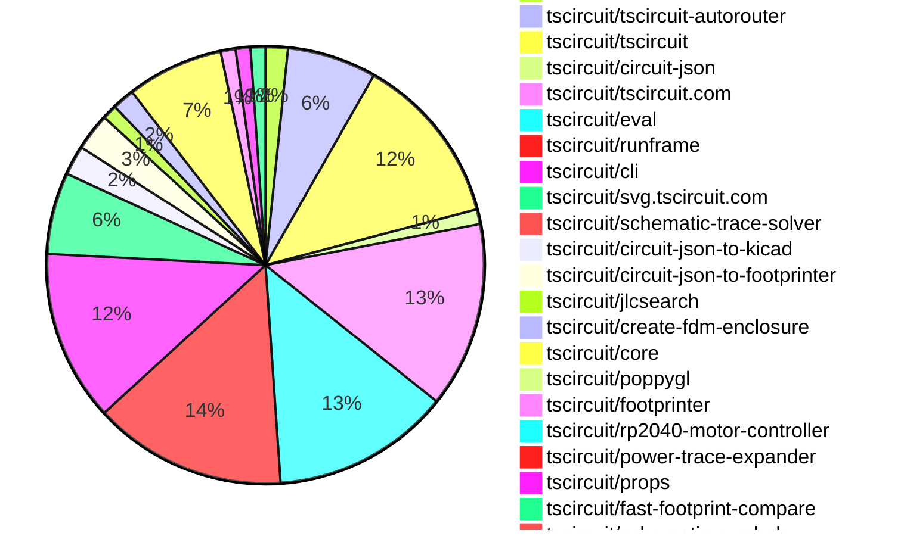

# contribution tracker

[contributions.tscircuit.com](https://contributions.tscircuit.com) ・ [tscircuit.com](https://tscircuit.com) ・ [Contribution Overviews](./contribution-overviews/) ・ [Changelogs](./changelogs/)

Generates weekly contribution overviews for tscircuit contributors. Check out all
the [contribution overviews here](./contribution-overviews/)
You can find AI-generated monthly changelogs in the [changelogs directory](./changelogs/)

- All PRs in the tscircuit org are scanned/summarized via an LLM
- The LLM classifies each Diff/PR as into a set of attributes for scoring
- All the PRs, summaries, and classifications are organized into charts and tables for [the website](https://contributions.tscircuit.com)

> Want to run locally? See the [Development Section](#development)

## Current Week

<!-- START_CURRENT_WEEK -->

# Contribution Overview 2026-07-21

The current week is shown below. There are 3 major sections:

- [Contributor Overview](#contributor-overview)
- [PRs by Repository](#prs-by-repository)
- [PRs by Contributor](#changes-by-contributor)
- [Scoring & Sponsorship Details](/docs/sponsorship-calculation-explanation.md)

## PRs by Repository


```mermaid
pie
    "tscircuit/rfc" : 1
    "tscircuit/high-density-repair03" : 1
    "tscircuit/datasheet-to-tscircuit" : 3
    "tscircuit/tscircuit-autorouter" : 12
    "tscircuit/tscircuit" : 23
    "tscircuit/circuit-json" : 2
    "tscircuit/tscircuit.com" : 25
    "tscircuit/eval" : 24
    "tscircuit/runframe" : 26
    "tscircuit/cli" : 23
    "tscircuit/svg.tscircuit.com" : 11
    "tscircuit/schematic-trace-solver" : 1
    "tscircuit/circuit-json-to-kicad" : 4
    "tscircuit/circuit-json-to-footprinter" : 5
    "tscircuit/jlcsearch" : 2
    "tscircuit/create-fdm-enclosure" : 3
    "tscircuit/core" : 13
    "tscircuit/poppygl" : 1
    "tscircuit/footprinter" : 2
    "tscircuit/rp2040-motor-controller" : 1
    "tscircuit/power-trace-expander" : 1
    "tscircuit/props" : 2
    "tscircuit/fast-footprint-compare" : 2
    "tscircuit/schematic-symbols" : 1
    "tscircuit/ti" : 1
    "tscircuit/tsci-agent" : 1
```

## Contributor Overview

| Contributor | 🐳 Major | 🐙 Minor | 🐌 Tiny | Score | ⭐ |
|-------------|---------|---------|---------|-------|-----|
| [seveibar](#seveibar) | 4 | 4 | 9 | 34 | ⭐⭐ |
| [imrishabh18](#imrishabh18) | 2 | 4 | 5 | 22 | ⭐⭐ |
| [ShiboSoftwareDev](#ShiboSoftwareDev) | 4 | 0 | 1 | 18 | ⭐⭐ |
| [tscircuitbot](#tscircuitbot) | 0 | 0 | 139 | 13 | ⭐⭐ |
| [techmannih](#techmannih) | 2 | 1 | 3 | 13 | ⭐⭐ |
| [0hmX](#0hmX) | 2 | 0 | 2 | 10 | ⭐ |
| [AnasSarkiz](#AnasSarkiz) | 1 | 0 | 1 | 9.5 | ⭐ |
| [MustafaMulla29](#MustafaMulla29) | 1 | 0 | 2 | 6 | ⭐ |
| [itisrohit](#itisrohit) | 0 | 1 | 1 | 3 |  |
| [Lathikaa-S](#Lathikaa-S) | 0 | 0 | 1 | 1 |  |
| [Abse2001](#Abse2001) | 0 | 0 | 1 | 1 |  |

## Staff Pass Ratio (SPR)

| Contributor | Reviewed PRs | Rejections | Approvals | SPR |
|-------------|--------------|------------|-----------|-----|
| [imrishabh18](#imrishabh18) | 4 | 0 | 4 | 100.0% |
| [itisrohit](#itisrohit) | 3 | 2 | 1 | 33.3% |
| [MustafaMulla29](#MustafaMulla29) | 2 | 0 | 2 | 100.0% |
| [ShiboSoftwareDev](#ShiboSoftwareDev) | 2 | 0 | 3 | 100.0% |
| [0hmX](#0hmX) | 1 | 0 | 1 | 100.0% |
| [AnasSarkiz](#AnasSarkiz) | 1 | 1 | 1 | 0.0% |
| [techmannih](#techmannih) | 1 | 0 | 1 | 100.0% |

<details>
<summary>imrishabh18 SPR PRs (4)</summary>

- [#746](https://github.com/tscircuit/props/pull/746) Add disabled flags to project config
- [#745](https://github.com/tscircuit/props/pull/745) Add schematic box chip reference props
- [#2751](https://github.com/tscircuit/core/pull/2751) feat: Support multi schematic sheet representation of a single chip component
- [#2750](https://github.com/tscircuit/core/pull/2750) Example test for multiple schematic sheet representation of a chip

</details>

<details>
<summary>itisrohit SPR PRs (3)</summary>

- [#718](https://github.com/tscircuit/footprinter/pull/718) repro(dip): add fabrication note pin label rendering repro
- [#2749](https://github.com/tscircuit/core/pull/2749) repro(pcb): add DIP-8 fabrication note pin label rendering repro
- [#396](https://github.com/tscircuit/circuit-json-to-kicad/pull/396) fix(pcb): export pcb_keepout elements as KiCad rule-area zones

</details>

<details>
<summary>MustafaMulla29 SPR PRs (2)</summary>

- [#2761](https://github.com/tscircuit/core/pull/2761) Render canonical USB-C ports when Parts Engine resolution fails
- [#2745](https://github.com/tscircuit/core/pull/2745) Render chip ports on internal circuit symbols

</details>

<details>
<summary>ShiboSoftwareDev SPR PRs (2)</summary>

- [#9](https://github.com/tscircuit/rfc/pull/9) Add analog simulation analyses and parameter sweep RFC
- [#21](https://github.com/tscircuit/datasheet-to-tscircuit/pull/21) doesn't match ref warning

</details>

<details>
<summary>0hmX SPR PRs (1)</summary>

- [#1728](https://github.com/tscircuit/tscircuit-autorouter/pull/1728) Fix physical net in hypergraph pathing

</details>

<details>
<summary>AnasSarkiz SPR PRs (1)</summary>

- [#15](https://github.com/tscircuit/tsci-agent/pull/15) Add OpenAI login support

</details>

<details>
<summary>techmannih SPR PRs (1)</summary>

- [#18](https://github.com/tscircuit/circuit-json-to-footprinter/pull/18) Move footprint geometry and comparison into circuit-json-to-footprinter

</details>

> Note: AI evaluates PRs and assigns 1-3 star ratings automatically. 4 and 5 star ratings require manual staff review.

## Review Table

[reviews-received-hover]: ## "Number of reviews received for PRs for this contributor"
[approvals-received-hover]: ## "Number of approvals received for PRs this contributor authored"
[rejections-received-hover]: ## "Number of rejections received for PRs this contributor authored"
[prs-opened-hover]: ## "Number of PRs opened by this contributor"
[issues-created-hover]: ## "Number of issues created by this contributor"

| Contributor | Reviews Received | Approvals Received | Rejections Received | Approvals | Rejections Given | PRs Opened | PRs Merged | Issues Created |
|---|---|---|---|---|---|---|---|---|
| [0hmX](#0hmX) | 2 | 1 | 0 | 1 | 0 | 5 | 4 | 0 |
| [Abse2001](#Abse2001) | 0 | 0 | 0 | 0 | 0 | 1 | 1 | 0 |
| [AnasSarkiz](#AnasSarkiz) | 4 | 4 | 0 | 5 | 0 | 3 | 2 | 0 |
| [Hero988](#Hero988) | 1 | 0 | 0 | 0 | 0 | 4 | 0 | 0 |
| [imrishabh18](#imrishabh18) | 6 | 4 | 0 | 4 | 1 | 16 | 12 | 0 |
| [itisrohit](#itisrohit) | 8 | 4 | 2 | 0 | 0 | 5 | 2 | 0 |
| [KrishnaX12](#KrishnaX12) | 4 | 0 | 1 | 0 | 0 | 2 | 0 | 0 |
| [Lathikaa-S](#Lathikaa-S) | 3 | 3 | 0 | 0 | 0 | 1 | 1 | 0 |
| [mohan-bee](#mohan-bee) | 0 | 0 | 0 | 3 | 0 | 0 | 0 | 0 |
| [MustafaMulla29](#MustafaMulla29) | 4 | 3 | 0 | 0 | 0 | 4 | 3 | 0 |
| [rootdgy](#rootdgy) | 0 | 0 | 0 | 0 | 0 | 3 | 0 | 0 |
| [rushabhcodes](#rushabhcodes) | 2 | 1 | 0 | 1 | 0 | 2 | 1 | 0 |
| [seveibar](#seveibar) | 6 | 1 | 0 | 13 | 2 | 20 | 18 | 0 |
| [ShiboSoftwareDev](#ShiboSoftwareDev) | 7 | 7 | 0 | 2 | 0 | 8 | 6 | 0 |
| [techmannih](#techmannih) | 6 | 1 | 0 | 0 | 0 | 10 | 6 | 0 |
| [thairc-dev](#thairc-dev) | 0 | 0 | 0 | 0 | 0 | 5 | 0 | 0 |
| [tscircuitbot](#tscircuitbot) | 0 | 0 | 0 | 0 | 0 | 162 | 140 | 0 |

## Changes by Repository

### [tscircuit/rfc](https://github.com/tscircuit/rfc)

| PR # | Impact | Rating | Contributor | Description |
|------|--------|--------|-------------|-------------|
| [#9](https://github.com/tscircuit/rfc/pull/9) | 🐳 Major | ⭐⭐⭐ | ShiboSoftwareDev | Add dedicated analog.simulation elements for transient, DC operating point, direct DC sweep, and AC sweep usage, along with one-dimensional component sweeps through a nested analog.sweepparameter with parameter-specific target props, defining the Circuit JSON experiments, sweep relationships, and analysis-specific voltagecurrent result types produced by that TSX. |

### [tscircuit/high-density-repair03](https://github.com/tscircuit/high-density-repair03)

| PR # | Impact | Rating | Contributor | Description |
|------|--------|--------|-------------|-------------|
| [#26](https://github.com/tscircuit/high-density-repair03/pull/26) | 🐳 Major | ⭐⭐⭐ | ShiboSoftwareDev | Add opt-in via-in-pad topology candidates to GlobalDrcForceImproveSolver, allowing GlobalDrcBranchPortfolioSolver to run these candidates as its final internal phase, relocating terminal-side vias and moving fully single-layer terminal routes using pad-centered transitions, while validating that the drilled hole fits inside each connected single-layer terminal pad before proposing a candidate and scoring every valid topology candidate with the caller-provided full DRC evaluator. |

### [tscircuit/datasheet-to-tscircuit](https://github.com/tscircuit/datasheet-to-tscircuit)

| PR # | Impact | Rating | Contributor | Description |
|------|--------|--------|-------------|-------------|
| [#19](https://github.com/tscircuit/datasheet-to-tscircuit/pull/19) | 🐳 Major | ⭐⭐⭐ | ShiboSoftwareDev | Preserve and validate every response and stimulus graph in multi-channel datasheet figures through simulation, scoring, and previews. Harden benchmark generation and retries, improve reference graph layoutdefault view, simplify artifact downloads, and expand regression coverage. |
| [#18](https://github.com/tscircuit/datasheet-to-tscircuit/pull/18) | 🐳 Major | ⭐⭐⭐ | ShiboSoftwareDev | Adds source-backed application modes, stronger component and visual validation, server-owned netlist checks, SPICE powerrange preflights, and monotonic checkpoint promotion. Prevents false evidence stops and regressed models from advancing. Adds regression coverage with 137 passing tests. |

<details>
<summary>🐌 Tiny Contributions (1)</summary>

| PR # | Impact | Contributor | Description |
|------|--------|-------------|-------------|
| [#20](https://github.com/tscircuit/datasheet-to-tscircuit/pull/20) | 🐌 Tiny | AnasSarkiz | Removes the logo image and its associated styles from the application. |

</details>

### [tscircuit/tscircuit-autorouter](https://github.com/tscircuit/tscircuit-autorouter)

| PR # | Impact | Rating | Contributor | Description |
|------|--------|--------|-------------|-------------|
| [#1728](https://github.com/tscircuit/tscircuit-autorouter/pull/1728) | 🐳 Major | ⭐⭐⭐ | 0hmX | Fixes routing failures caused by incorrect physical net IDs in hypergraph construction, ensuring consistent net identity during autorouting. |
| [#1733](https://github.com/tscircuit/tscircuit-autorouter/pull/1733) | 🐳 Major | ⭐⭐⭐ | 0hmX | Preserves SRJ root connection identities for accurate trace-width and connectivity lookups in hypergraph pathing. |
| [#1726](https://github.com/tscircuit/tscircuit-autorouter/pull/1726) | 🐙 Minor | ⭐⭐ | imrishabh18 | Summary remove all 51 pre-routed pcb_trace entries from bugreport76-373c24s input traces array regenerate the focused SVG snapshot from the corrected trace-free problem  Why The downloaded bug report fixture included already-routed traces in simple_route_json.traces. That made the reproduction start from a partially routed board instead of the raw autorouting problem, so it did not accurately represent bugreport76.  Impact The bugreport76 regression test now gives the autorouter zero input traces while preserving its six requested connections and existing obstacles.  Validation bun test testsbugsbugreport76-373c24.test.ts --timeout 9999999 git diff --check |

<details>
<summary>🐌 Tiny Contributions (9)</summary>

| PR # | Impact | Contributor | Description |
|------|--------|-------------|-------------|
| [#1725](https://github.com/tscircuit/tscircuit-autorouter/pull/1725) | 🐌 Tiny | ShiboSoftwareDev | Updates the high-density-repair03 dependency to the latest main commit, ensuring the autorouter uses the merged version of the via-in-pad DRC repair. |
| [#1740](https://github.com/tscircuit/tscircuit-autorouter/pull/1740) | 🐌 Tiny | tscircuitbot | Automated package update |
| [#1735](https://github.com/tscircuit/tscircuit-autorouter/pull/1735) | 🐌 Tiny | tscircuitbot | Automated package update |
| [#1732](https://github.com/tscircuit/tscircuit-autorouter/pull/1732) | 🐌 Tiny | tscircuitbot | Automated package update |
| [#1730](https://github.com/tscircuit/tscircuit-autorouter/pull/1730) | 🐌 Tiny | tscircuitbot | Automated package update |
| [#1727](https://github.com/tscircuit/tscircuit-autorouter/pull/1727) | 🐌 Tiny | tscircuitbot | Automated package update |
| [#1724](https://github.com/tscircuit/tscircuit-autorouter/pull/1724) | 🐌 Tiny | tscircuitbot | Automated package update |
| [#1723](https://github.com/tscircuit/tscircuit-autorouter/pull/1723) | 🐌 Tiny | imrishabh18 | Summary add the downloaded board1169  autorouting report as bugreport76-373c24 add an AutoroutingPipelineDebugger fixture for local investigation add a focused solver snapshot test and its SVG baseline  Why This preserves a reproducible test case for autorouting bug report 373c2447-1a1f-4703-bf79-36855faeaf44(https:api.tscircuit.comautoroutingbug_reportsview?autorouting_bug_report_id373c2447-1a1f-4703-bf79-36855faeaf44). It is a repro-only change and does not modify solver behavior.  Validation bun test testsbugsbugreport76-373c24.test.ts --timeout 9999999 bun run build rendered and visually inspected the generated SVG snapshot |
| [#1739](https://github.com/tscircuit/tscircuit-autorouter/pull/1739) | 🐌 Tiny | 0hmX | Updates the version of the length-matching-solver dependency in the package.json file. |

</details>

### [tscircuit/tscircuit](https://github.com/tscircuit/tscircuit)


<details>
<summary>🐌 Tiny Contributions (23)</summary>

| PR # | Impact | Contributor | Description |
|------|--------|-------------|-------------|
| [#4051](https://github.com/tscircuit/tscircuit/pull/4051) | 🐌 Tiny | tscircuitbot | Automated package update |
| [#4050](https://github.com/tscircuit/tscircuit/pull/4050) | 🐌 Tiny | tscircuitbot | Automated package update |
| [#4049](https://github.com/tscircuit/tscircuit/pull/4049) | 🐌 Tiny | tscircuitbot | Updates the tscircuitcli package from version 0.1.1716 to 0.1.1717 and the tscircuitrunframe package from version 0.0.2248 to 0.0.2249 in package.json |
| [#4047](https://github.com/tscircuit/tscircuit/pull/4047) | 🐌 Tiny | tscircuitbot | Automated package update to version 0.0.2129 |
| [#4046](https://github.com/tscircuit/tscircuit/pull/4046) | 🐌 Tiny | tscircuitbot | Automated package update |
| [#4045](https://github.com/tscircuit/tscircuit/pull/4045) | 🐌 Tiny | tscircuitbot | Updates the package version from 0.0.2127 to 0.0.2128 in package.json |
| [#4044](https://github.com/tscircuit/tscircuit/pull/4044) | 🐌 Tiny | tscircuitbot | Updates the version of several packages in the project, including tscircuitcli, tscircuitcore, tscircuiteval, tscircuitrunframe, and circuit-json. |
| [#4043](https://github.com/tscircuit/tscircuit/pull/4043) | 🐌 Tiny | tscircuitbot | Updates the package version from 0.0.2126 to 0.0.2127 in package.json |
| [#4042](https://github.com/tscircuit/tscircuit/pull/4042) | 🐌 Tiny | tscircuitbot | Automated package update |
| [#4041](https://github.com/tscircuit/tscircuit/pull/4041) | 🐌 Tiny | tscircuitbot | Automated package update |
| [#4040](https://github.com/tscircuit/tscircuit/pull/4040) | 🐌 Tiny | tscircuitbot | Automated package update |
| [#4039](https://github.com/tscircuit/tscircuit/pull/4039) | 🐌 Tiny | tscircuitbot | Automated package update |
| [#4038](https://github.com/tscircuit/tscircuit/pull/4038) | 🐌 Tiny | tscircuitbot | Automated package update |
| [#4037](https://github.com/tscircuit/tscircuit/pull/4037) | 🐌 Tiny | tscircuitbot | Automated package update |
| [#4035](https://github.com/tscircuit/tscircuit/pull/4035) | 🐌 Tiny | tscircuitbot | Automated package update |
| [#4034](https://github.com/tscircuit/tscircuit/pull/4034) | 🐌 Tiny | tscircuitbot | Automated package update |
| [#4033](https://github.com/tscircuit/tscircuit/pull/4033) | 🐌 Tiny | tscircuitbot | Updates the package version from 0.0.2121 to 0.0.2122 in package.json |
| [#4032](https://github.com/tscircuit/tscircuit/pull/4032) | 🐌 Tiny | tscircuitbot | Automated package update |
| [#4031](https://github.com/tscircuit/tscircuit/pull/4031) | 🐌 Tiny | tscircuitbot | Automated package update |
| [#4030](https://github.com/tscircuit/tscircuit/pull/4030) | 🐌 Tiny | tscircuitbot | Automated package update |
| [#4029](https://github.com/tscircuit/tscircuit/pull/4029) | 🐌 Tiny | tscircuitbot | Automated package update |
| [#4028](https://github.com/tscircuit/tscircuit/pull/4028) | 🐌 Tiny | tscircuitbot | Automated package update |
| [#4036](https://github.com/tscircuit/tscircuit/pull/4036) | 🐌 Tiny | seveibar | Adds the tscircuitcreate-fdm-enclosure dependency to the aggregate package, allowing the package updater to complete its dependency synchronization without failure. |

</details>

### [tscircuit/circuit-json](https://github.com/tscircuit/circuit-json)

| PR # | Impact | Rating | Contributor | Description |
|------|--------|--------|-------------|-------------|
| [#655](https://github.com/tscircuit/circuit-json/pull/655) | 🐙 Minor | ⭐⭐ | seveibar | Add a schematic component overlap warning to identify overlapping schematic components and include it in AnyCircuitElement and generated reference docs. |

<details>
<summary>🐌 Tiny Contributions (1)</summary>

| PR # | Impact | Contributor | Description |
|------|--------|-------------|-------------|
| [#656](https://github.com/tscircuit/circuit-json/pull/656) | 🐌 Tiny | tscircuitbot | Automated package update |

</details>

### [tscircuit/tscircuit.com](https://github.com/tscircuit/tscircuit.com)


<details>
<summary>🐌 Tiny Contributions (25)</summary>

| PR # | Impact | Contributor | Description |
|------|--------|-------------|-------------|
| [#4014](https://github.com/tscircuit/tscircuit.com/pull/4014) | 🐌 Tiny | tscircuitbot | Automated package update |
| [#4013](https://github.com/tscircuit/tscircuit.com/pull/4013) | 🐌 Tiny | tscircuitbot | Updates the tscircuiteval package to version 0.0.1039 in the project dependencies. |
| [#4012](https://github.com/tscircuit/tscircuit.com/pull/4012) | 🐌 Tiny | tscircuitbot | Updates the tscircuitrunframe package to version 0.0.2249 |
| [#4011](https://github.com/tscircuit/tscircuit.com/pull/4011) | 🐌 Tiny | tscircuitbot | Automated package update |
| [#4010](https://github.com/tscircuit/tscircuit.com/pull/4010) | 🐌 Tiny | tscircuitbot | Updates the tscircuiteval package from version 0.0.1037 to 0.0.1038 |
| [#4009](https://github.com/tscircuit/tscircuit.com/pull/4009) | 🐌 Tiny | tscircuitbot | Automated package update |
| [#4008](https://github.com/tscircuit/tscircuit.com/pull/4008) | 🐌 Tiny | tscircuitbot | Updates the tscircuiteval package to version 0.0.1037 in the package.json file |
| [#4007](https://github.com/tscircuit/tscircuit.com/pull/4007) | 🐌 Tiny | tscircuitbot | Updates the tscircuitrunframe package from version 0.0.2244 to 0.0.2246 |
| [#4006](https://github.com/tscircuit/tscircuit.com/pull/4006) | 🐌 Tiny | tscircuitbot | Updates the tscircuiteval package from version 0.0.1035 to 0.0.1036 |
| [#4004](https://github.com/tscircuit/tscircuit.com/pull/4004) | 🐌 Tiny | tscircuitbot | Automated package update |
| [#4003](https://github.com/tscircuit/tscircuit.com/pull/4003) | 🐌 Tiny | tscircuitbot | Automated package update |
| [#4002](https://github.com/tscircuit/tscircuit.com/pull/4002) | 🐌 Tiny | tscircuitbot | Updates the tscircuiteval package to version 0.0.1034 |
| [#4000](https://github.com/tscircuit/tscircuit.com/pull/4000) | 🐌 Tiny | tscircuitbot | Updates the tscircuiteval package to version 0.0.1033 in the package.json file. |
| [#3999](https://github.com/tscircuit/tscircuit.com/pull/3999) | 🐌 Tiny | tscircuitbot | Automated package update |
| [#3998](https://github.com/tscircuit/tscircuit.com/pull/3998) | 🐌 Tiny | tscircuitbot | Updates the tscircuiteval package from version 0.0.1031 to 0.0.1032 |
| [#3996](https://github.com/tscircuit/tscircuit.com/pull/3996) | 🐌 Tiny | tscircuitbot | Updates the tscircuiteval package from version 0.0.1030 to 0.0.1031 |
| [#3994](https://github.com/tscircuit/tscircuit.com/pull/3994) | 🐌 Tiny | tscircuitbot | Automated package update |
| [#3993](https://github.com/tscircuit/tscircuit.com/pull/3993) | 🐌 Tiny | tscircuitbot | Updates the tscircuiteval package from version 0.0.1029 to 0.0.1030 in the package.json file. |
| [#3992](https://github.com/tscircuit/tscircuit.com/pull/3992) | 🐌 Tiny | tscircuitbot | Updates the tscircuitrunframe package from version 0.0.2238 to 0.0.2239 |
| [#3991](https://github.com/tscircuit/tscircuit.com/pull/3991) | 🐌 Tiny | tscircuitbot | Automated package update |
| [#3990](https://github.com/tscircuit/tscircuit.com/pull/3990) | 🐌 Tiny | tscircuitbot | Automated package update |
| [#3989](https://github.com/tscircuit/tscircuit.com/pull/3989) | 🐌 Tiny | tscircuitbot | Updates the tscircuitrunframe package from version 0.0.2236 to 0.0.2237 |
| [#3988](https://github.com/tscircuit/tscircuit.com/pull/3988) | 🐌 Tiny | tscircuitbot | Updates the tscircuiteval package from version 0.0.1027 to 0.0.1028 in the package.json file. |
| [#3995](https://github.com/tscircuit/tscircuit.com/pull/3995) | 🐌 Tiny | imrishabh18 | Removes the AI Review tab and its associated controls from the package view, along with related polling and requests, while keeping the AI-generated package description behavior unchanged. |
| [#3986](https://github.com/tscircuit/tscircuit.com/pull/3986) | 🐌 Tiny | Lathikaa-S | Hides the Sign In link in the footer for users who are already authenticated. |

</details>

### [tscircuit/eval](https://github.com/tscircuit/eval)

| PR # | Impact | Rating | Contributor | Description |
|------|--------|--------|-------------|-------------|
| [#3329](https://github.com/tscircuit/eval/pull/3329) | 🐳 Major | ⭐⭐⭐ | seveibar | Fixes TSX transform errors by allowing block comments between component props and providing clearer error messages for syntax issues. |

<details>
<summary>🐌 Tiny Contributions (23)</summary>

| PR # | Impact | Contributor | Description |
|------|--------|-------------|-------------|
| [#3359](https://github.com/tscircuit/eval/pull/3359) | 🐌 Tiny | tscircuitbot | Automated package update to version 0.0.1039 |
| [#3358](https://github.com/tscircuit/eval/pull/3358) | 🐌 Tiny | tscircuitbot | Automated package update |
| [#3357](https://github.com/tscircuit/eval/pull/3357) | 🐌 Tiny | tscircuitbot | Automated package update |
| [#3356](https://github.com/tscircuit/eval/pull/3356) | 🐌 Tiny | tscircuitbot | Updates package dependencies to their latest versions in package.json |
| [#3354](https://github.com/tscircuit/eval/pull/3354) | 🐌 Tiny | tscircuitbot | Automated package update |
| [#3353](https://github.com/tscircuit/eval/pull/3353) | 🐌 Tiny | tscircuitbot | Automated package update |
| [#3351](https://github.com/tscircuit/eval/pull/3351) | 🐌 Tiny | tscircuitbot | Automated package update |
| [#3350](https://github.com/tscircuit/eval/pull/3350) | 🐌 Tiny | tscircuitbot | Automated package update |
| [#3348](https://github.com/tscircuit/eval/pull/3348) | 🐌 Tiny | tscircuitbot | Automated package update |
| [#3347](https://github.com/tscircuit/eval/pull/3347) | 🐌 Tiny | tscircuitbot | Updates the version of tscircuitcore from 0.0.1478 to 0.0.1479 and tscircuitcreate-fdm-enclosure from 0.0.2 to 0.0.3 in package.json |
| [#3346](https://github.com/tscircuit/eval/pull/3346) | 🐌 Tiny | tscircuitbot | Automated package update |
| [#3345](https://github.com/tscircuit/eval/pull/3345) | 🐌 Tiny | tscircuitbot | Updates the version of tscircuitcore from 0.0.1477 to 0.0.1478 and poppygl from 0.0.25 to 0.0.26 in package.json |
| [#3343](https://github.com/tscircuit/eval/pull/3343) | 🐌 Tiny | tscircuitbot | Automated package update |
| [#3342](https://github.com/tscircuit/eval/pull/3342) | 🐌 Tiny | tscircuitbot | Updates the version of the tscircuitcore package from 0.0.1476 to 0.0.1477 in package.json |
| [#3340](https://github.com/tscircuit/eval/pull/3340) | 🐌 Tiny | tscircuitbot | Automated package update |
| [#3339](https://github.com/tscircuit/eval/pull/3339) | 🐌 Tiny | tscircuitbot | Automated package update |
| [#3337](https://github.com/tscircuit/eval/pull/3337) | 🐌 Tiny | tscircuitbot | Automated package update |
| [#3336](https://github.com/tscircuit/eval/pull/3336) | 🐌 Tiny | tscircuitbot | Updates the version of the tscircuitcore package from 0.0.1474 to 0.0.1475 in package.json |
| [#3333](https://github.com/tscircuit/eval/pull/3333) | 🐌 Tiny | tscircuitbot | Automated package update |
| [#3332](https://github.com/tscircuit/eval/pull/3332) | 🐌 Tiny | tscircuitbot | Automated package update |
| [#3331](https://github.com/tscircuit/eval/pull/3331) | 🐌 Tiny | tscircuitbot | Updates the version of tscircuitcore from 0.0.1473 to 0.0.1474 and tscircuitprops from 0.0.586 to 0.0.587 in package.json |
| [#3328](https://github.com/tscircuit/eval/pull/3328) | 🐌 Tiny | tscircuitbot | Automated package update |
| [#3327](https://github.com/tscircuit/eval/pull/3327) | 🐌 Tiny | tscircuitbot | Automated package update |

</details>

### [tscircuit/runframe](https://github.com/tscircuit/runframe)


<details>
<summary>🐌 Tiny Contributions (26)</summary>

| PR # | Impact | Contributor | Description |
|------|--------|-------------|-------------|
| [#4087](https://github.com/tscircuit/runframe/pull/4087) | 🐌 Tiny | tscircuitbot | Automated package update |
| [#4086](https://github.com/tscircuit/runframe/pull/4086) | 🐌 Tiny | tscircuitbot | Updates the tscircuiteval package from version 0.0.1038 to 0.0.1039 in the package.json file. |
| [#4085](https://github.com/tscircuit/runframe/pull/4085) | 🐌 Tiny | tscircuitbot | Automated package update |
| [#4084](https://github.com/tscircuit/runframe/pull/4084) | 🐌 Tiny | tscircuitbot | Updates the circuit-json-to-kicad package version from 0.0.169 to 0.0.170 in package.json |
| [#4082](https://github.com/tscircuit/runframe/pull/4082) | 🐌 Tiny | tscircuitbot | Automated package update |
| [#4081](https://github.com/tscircuit/runframe/pull/4081) | 🐌 Tiny | tscircuitbot | Updates the tscircuiteval package from version 0.0.1037 to 0.0.1038 in the package.json file. |
| [#4080](https://github.com/tscircuit/runframe/pull/4080) | 🐌 Tiny | tscircuitbot | Automated package update |
| [#4079](https://github.com/tscircuit/runframe/pull/4079) | 🐌 Tiny | tscircuitbot | Updates the tscircuiteval package from version 0.0.1036 to 0.0.1037 in the package.json file. |
| [#4078](https://github.com/tscircuit/runframe/pull/4078) | 🐌 Tiny | tscircuitbot | Automated package update |
| [#4077](https://github.com/tscircuit/runframe/pull/4077) | 🐌 Tiny | tscircuitbot | Updates the tscircuiteval package to version 0.0.1036 in the package.json file. |
| [#4076](https://github.com/tscircuit/runframe/pull/4076) | 🐌 Tiny | tscircuitbot | Automated package update |
| [#4075](https://github.com/tscircuit/runframe/pull/4075) | 🐌 Tiny | tscircuitbot | Updates the tscircuiteval package from version 0.0.1034 to 0.0.1035 in the package.json file. |
| [#4074](https://github.com/tscircuit/runframe/pull/4074) | 🐌 Tiny | tscircuitbot | Automated package update |
| [#4073](https://github.com/tscircuit/runframe/pull/4073) | 🐌 Tiny | tscircuitbot | Updates the tscircuiteval package from version 0.0.1033 to 0.0.1034 in the package.json file. |
| [#4071](https://github.com/tscircuit/runframe/pull/4071) | 🐌 Tiny | tscircuitbot | Updates the tscircuiteval package to version 0.0.1033 in the package.json file. |
| [#4070](https://github.com/tscircuit/runframe/pull/4070) | 🐌 Tiny | tscircuitbot | Automated package update |
| [#4069](https://github.com/tscircuit/runframe/pull/4069) | 🐌 Tiny | tscircuitbot | Updates the tscircuiteval package from version 0.0.1031 to 0.0.1032 in the package.json file. |
| [#4067](https://github.com/tscircuit/runframe/pull/4067) | 🐌 Tiny | tscircuitbot | Updates the tscircuiteval package to version 0.0.1031 in the package.json file. |
| [#4066](https://github.com/tscircuit/runframe/pull/4066) | 🐌 Tiny | tscircuitbot | Automated package update |
| [#4065](https://github.com/tscircuit/runframe/pull/4065) | 🐌 Tiny | tscircuitbot | Updates the tscircuiteval package from version 0.0.1029 to 0.0.1030 in the package.json file. |
| [#4064](https://github.com/tscircuit/runframe/pull/4064) | 🐌 Tiny | tscircuitbot | Automated package update |
| [#4063](https://github.com/tscircuit/runframe/pull/4063) | 🐌 Tiny | tscircuitbot | Updates the tscircuiteval package from version 0.0.1028 to 0.0.1029 in the package.json file. |
| [#4062](https://github.com/tscircuit/runframe/pull/4062) | 🐌 Tiny | tscircuitbot | Automated package update |
| [#4061](https://github.com/tscircuit/runframe/pull/4061) | 🐌 Tiny | tscircuitbot | Updates the circuit-json-to-kicad package from version 0.0.168 to 0.0.169 |
| [#4059](https://github.com/tscircuit/runframe/pull/4059) | 🐌 Tiny | tscircuitbot | Automated package update |
| [#4058](https://github.com/tscircuit/runframe/pull/4058) | 🐌 Tiny | tscircuitbot | Updates the tscircuiteval package from version 0.0.1027 to 0.0.1028 in the package.json file. |

</details>

### [tscircuit/cli](https://github.com/tscircuit/cli)


<details>
<summary>🐌 Tiny Contributions (23)</summary>

| PR # | Impact | Contributor | Description |
|------|--------|-------------|-------------|
| [#3791](https://github.com/tscircuit/cli/pull/3791) | 🐌 Tiny | tscircuitbot | Updates the tscircuitrunframe package from version 0.0.2249 to 0.0.2250 |
| [#3790](https://github.com/tscircuit/cli/pull/3790) | 🐌 Tiny | tscircuitbot | Automated package update |
| [#3789](https://github.com/tscircuit/cli/pull/3789) | 🐌 Tiny | tscircuitbot | Updates the tscircuitrunframe package from version 0.0.2248 to 0.0.2249 |
| [#3788](https://github.com/tscircuit/cli/pull/3788) | 🐌 Tiny | tscircuitbot | Automated package update |
| [#3787](https://github.com/tscircuit/cli/pull/3787) | 🐌 Tiny | tscircuitbot | Updates the tscircuitrunframe package from version 0.0.2247 to 0.0.2248 |
| [#3786](https://github.com/tscircuit/cli/pull/3786) | 🐌 Tiny | tscircuitbot | Updates the package version from 0.1.1714 to 0.1.1715 in package.json |
| [#3785](https://github.com/tscircuit/cli/pull/3785) | 🐌 Tiny | tscircuitbot | Updates the tscircuitrunframe package from version 0.0.2246 to 0.0.2247 |
| [#3784](https://github.com/tscircuit/cli/pull/3784) | 🐌 Tiny | tscircuitbot | Automated package update |
| [#3783](https://github.com/tscircuit/cli/pull/3783) | 🐌 Tiny | tscircuitbot | Updates the tscircuitrunframe package from version 0.0.2245 to 0.0.2246 |
| [#3782](https://github.com/tscircuit/cli/pull/3782) | 🐌 Tiny | tscircuitbot | Automated package update |
| [#3781](https://github.com/tscircuit/cli/pull/3781) | 🐌 Tiny | tscircuitbot | Updates the tscircuitrunframe package to version 0.0.2245 in package.json |
| [#3780](https://github.com/tscircuit/cli/pull/3780) | 🐌 Tiny | tscircuitbot | Automated package update |
| [#3779](https://github.com/tscircuit/cli/pull/3779) | 🐌 Tiny | tscircuitbot | Updates the tscircuitrunframe package from version 0.0.2242 to 0.0.2244 |
| [#3777](https://github.com/tscircuit/cli/pull/3777) | 🐌 Tiny | tscircuitbot | Automated package update |
| [#3776](https://github.com/tscircuit/cli/pull/3776) | 🐌 Tiny | tscircuitbot | Automated package update |
| [#3774](https://github.com/tscircuit/cli/pull/3774) | 🐌 Tiny | tscircuitbot | Automated package update |
| [#3773](https://github.com/tscircuit/cli/pull/3773) | 🐌 Tiny | tscircuitbot | Updates the tscircuitrunframe package from version 0.0.2239 to 0.0.2240 |
| [#3772](https://github.com/tscircuit/cli/pull/3772) | 🐌 Tiny | tscircuitbot | Automated package update |
| [#3771](https://github.com/tscircuit/cli/pull/3771) | 🐌 Tiny | tscircuitbot | Updates the tscircuitrunframe package version from 0.0.2238 to 0.0.2239 in package.json |
| [#3770](https://github.com/tscircuit/cli/pull/3770) | 🐌 Tiny | tscircuitbot | Automated package update |
| [#3769](https://github.com/tscircuit/cli/pull/3769) | 🐌 Tiny | tscircuitbot | Updates the tscircuitrunframe package from version 0.0.2237 to 0.0.2238 |
| [#3768](https://github.com/tscircuit/cli/pull/3768) | 🐌 Tiny | tscircuitbot | Automated package update |
| [#3767](https://github.com/tscircuit/cli/pull/3767) | 🐌 Tiny | tscircuitbot | Updates the tscircuitrunframe package from version 0.0.2236 to 0.0.2237 |

</details>

### [tscircuit/svg.tscircuit.com](https://github.com/tscircuit/svg.tscircuit.com)


<details>
<summary>🐌 Tiny Contributions (11)</summary>

| PR # | Impact | Contributor | Description |
|------|--------|-------------|-------------|
| [#1866](https://github.com/tscircuit/svg.tscircuit.com/pull/1866) | 🐌 Tiny | tscircuitbot | Updates the tscircuit package version from 0.0.2129 to 0.0.2130 in package.json |
| [#1865](https://github.com/tscircuit/svg.tscircuit.com/pull/1865) | 🐌 Tiny | tscircuitbot | Automated package update |
| [#1864](https://github.com/tscircuit/svg.tscircuit.com/pull/1864) | 🐌 Tiny | tscircuitbot | Updates the tscircuit package version from 0.0.2127 to 0.0.2128 in package.json |
| [#1863](https://github.com/tscircuit/svg.tscircuit.com/pull/1863) | 🐌 Tiny | tscircuitbot | Updates the tscircuit package version from 0.0.2126 to 0.0.2127 in package.json |
| [#1862](https://github.com/tscircuit/svg.tscircuit.com/pull/1862) | 🐌 Tiny | tscircuitbot | Updates the tscircuit package version from 0.0.2125 to 0.0.2126 in package.json |
| [#1861](https://github.com/tscircuit/svg.tscircuit.com/pull/1861) | 🐌 Tiny | tscircuitbot | Updates the tscircuit package version from 0.0.2124 to 0.0.2125 in package.json |
| [#1860](https://github.com/tscircuit/svg.tscircuit.com/pull/1860) | 🐌 Tiny | tscircuitbot | Updates the tscircuit package version from 0.0.2123 to 0.0.2124 in package.json |
| [#1859](https://github.com/tscircuit/svg.tscircuit.com/pull/1859) | 🐌 Tiny | tscircuitbot | Updates the tscircuit package version from 0.0.2122 to 0.0.2123 in package.json |
| [#1858](https://github.com/tscircuit/svg.tscircuit.com/pull/1858) | 🐌 Tiny | tscircuitbot | Updates the tscircuit package version from 0.0.2121 to 0.0.2122 in package.json |
| [#1857](https://github.com/tscircuit/svg.tscircuit.com/pull/1857) | 🐌 Tiny | tscircuitbot | Updates the tscircuit package version from 0.0.2120 to 0.0.2121 in package.json |
| [#1856](https://github.com/tscircuit/svg.tscircuit.com/pull/1856) | 🐌 Tiny | tscircuitbot | Updates the tscircuit package version from 0.0.2119 to 0.0.2120 in package.json |

</details>

### [tscircuit/schematic-trace-solver](https://github.com/tscircuit/schematic-trace-solver)


<details>
<summary>🐌 Tiny Contributions (1)</summary>

| PR # | Impact | Contributor | Description |
|------|--------|-------------|-------------|
| [#688](https://github.com/tscircuit/schematic-trace-solver/pull/688) | 🐌 Tiny | tscircuitbot | Adds a snapshot-only regression test and debugger page for the attached JSON solver input. |

</details>

### [tscircuit/circuit-json-to-kicad](https://github.com/tscircuit/circuit-json-to-kicad)

| PR # | Impact | Rating | Contributor | Description |
|------|--------|--------|-------------|-------------|
| [#396](https://github.com/tscircuit/circuit-json-to-kicad/pull/396) | 🐙 Minor | ⭐⭐ | itisrohit | Fixes the issue where pcb_keepout elements are not exported in KiCad output, ensuring they are represented as rule-area zones with appropriate constraints. |

<details>
<summary>🐌 Tiny Contributions (3)</summary>

| PR # | Impact | Contributor | Description |
|------|--------|-------------|-------------|
| [#397](https://github.com/tscircuit/circuit-json-to-kicad/pull/397) | 🐌 Tiny | tscircuitbot | Automated package update |
| [#395](https://github.com/tscircuit/circuit-json-to-kicad/pull/395) | 🐌 Tiny | tscircuitbot | Automated package update |
| [#391](https://github.com/tscircuit/circuit-json-to-kicad/pull/391) | 🐌 Tiny | itisrohit | Adds a failing regression test for Issue 371, reproducing the current behavior where pcb_keepout elements are dropped during KiCad PCB export. |

</details>

### [tscircuit/circuit-json-to-footprinter](https://github.com/tscircuit/circuit-json-to-footprinter)

| PR # | Impact | Rating | Contributor | Description |
|------|--------|--------|-------------|-------------|
| [#23](https://github.com/tscircuit/circuit-json-to-footprinter/pull/23) | 🐳 Major | ⭐⭐⭐ | seveibar | Prioritizes one exact pad-shape seed per footprint family when the target contains pill pads, while keeping ordinary rectangular targets on the existing seed-selection path, and updates the footprinter for DFN pill-pad generation. |
| [#18](https://github.com/tscircuit/circuit-json-to-footprinter/pull/18) | 🐳 Major | ⭐⭐⭐ | techmannih | Centralizes footprint preview generation and comparison logic into circuit-json-to-footprinter, making it the single source of truth for footprint geometry, copper comparison, and hole comparison. |

<details>
<summary>🐌 Tiny Contributions (3)</summary>

| PR # | Impact | Contributor | Description |
|------|--------|-------------|-------------|
| [#21](https://github.com/tscircuit/circuit-json-to-footprinter/pull/21) | 🐌 Tiny | tscircuitbot | Automated package update |
| [#22](https://github.com/tscircuit/circuit-json-to-footprinter/pull/22) | 🐌 Tiny | seveibar | Swaps width and height heuristics for seeds rotated by 90 or 270, using oriented dimensions for parameter detection and optimization, and adds regression tests for accurate recovery of rotated footprints. |
| [#20](https://github.com/tscircuit/circuit-json-to-footprinter/pull/20) | 🐌 Tiny | seveibar | Require tscircuitfootprinter 0.0.381 to support quad-derived footprints and add regression tests for QFN pads. |

</details>

### [tscircuit/jlcsearch](https://github.com/tscircuit/jlcsearch)

| PR # | Impact | Rating | Contributor | Description |
|------|--------|--------|-------------|-------------|
| [#413](https://github.com/tscircuit/jlcsearch/pull/413) | 🐳 Major | ⭐⭐⭐ | seveibar | Fixes the LCD display derived table population and adds a new page for listing LCD drivers with filtering options. |
| [#414](https://github.com/tscircuit/jlcsearch/pull/414) | 🐙 Minor | ⭐⭐ | seveibar | Add a new tft_display_driverslist page and JSON endpoint to classify in-stock TFT support ICs as display controllers, biaspower ICs, gamma buffers, or backlight drivers, with filtering options. |

### [tscircuit/create-fdm-enclosure](https://github.com/tscircuit/create-fdm-enclosure)

| PR # | Impact | Rating | Contributor | Description |
|------|--------|--------|-------------|-------------|
| [#1](https://github.com/tscircuit/create-fdm-enclosure/pull/1) | 🐳 Major | ⭐⭐⭐ | seveibar | Summary bootstrap tscircuitcreate-fdm-enclosure as a typed solver-pattern library expose a small millimetre-based input for board dimensions, optional enclosure overrides, and rectpillcircle wall apertures implement a four-stage BasePipelineSolver: resolve dimensions, create the open-top shell, create aperture cutouts, and compose the final JSCAD plan keep shape, margin, wall orientation, and placement logic in libaperturescreate-aperture-cutout-plan.ts add validation for board fit, floor intersections, wall bounds, and explicit dimensions add Cosmos fixtures for a USB-C pill aperture, multiple apertures on all four walls, and explicit dimensions combine the standard solver debuggers stepanimate controls with an interactive, downloadable GLB preview add SVG solver snapshots and white-background, grid-free GLB render snapshots  Input model All values are millimetres. The enclosure is centred on XY with its outside floor at Z  0. Apertures select a wall and provide a signed offset along that wall plus centerZ above the floor. Width, height, and depth are inferred from the board and configured clearances when omitted.  Scope This PR owns enclosure planning and cutout generation only. The follow-up core integration will translate enclosure.fdm.Box  and nested enclosure.cutoutaperture  metadata into this solver input and emit the returned JSCAD plan.  Visual snapshots USB-C pill enclosure(https:github.comtscircuitcreate-fdm-enclosureblobagentinitial-enclosure-solvertests__snapshots__inferred-usb-c-pill.snap.png) Multiple wall apertures(https:github.comtscircuitcreate-fdm-enclosureblobagentinitial-enclosure-solvertests__snapshots__multiple-apertures.snap.png)  Validation bunx biome check . bun run format:check bun test bunx tsc --noEmit bun run build bun run build:site git diff --check |

<details>
<summary>🐌 Tiny Contributions (2)</summary>

| PR # | Impact | Contributor | Description |
|------|--------|-------------|-------------|
| [#2](https://github.com/tscircuit/create-fdm-enclosure/pull/2) | 🐌 Tiny | seveibar | Configures the npm package as public for publication and sets up Vercel deployment with build configurations. |
| [#3](https://github.com/tscircuit/create-fdm-enclosure/pull/3) | 🐌 Tiny | imrishabh18 | Changes the package exports to publish compiled JavaScript and declarations from dist instead of raw TypeScript from lib, enabling plain Node consumers to import the package without a TypeScript runtime loader. |

</details>

### [tscircuit/core](https://github.com/tscircuit/core)

| PR # | Impact | Rating | Contributor | Description |
|------|--------|--------|-------------|-------------|
| [#2751](https://github.com/tscircuit/core/pull/2751) | 🐳 Major | ⭐⭐⭐ | imrishabh18 | Adds support for multiple schematic sheets to represent a single chip component, allowing for independent rendering of traces on different sheets. |
| [#2752](https://github.com/tscircuit/core/pull/2752) | 🐳 Major | ⭐⭐⭐ | imrishabh18 | Moves the SchematicBox primitive into its own directory and updates its public export, derives local ID aliases from canonical Circuit JSON interfaces, renames mappings for clarity, and prepares layout trees for multiple schematic representations without changing existing runtime behavior. |
| [#2745](https://github.com/tscircuit/core/pull/2745) | 🐳 Major | ⭐⭐⭐ | MustafaMulla29 | Allows chip schematic ports to be rendered on explicitly mapped internal circuit terminals, ensuring proper schematic representation without altering chip naming or geometry. |
| [#2747](https://github.com/tscircuit/core/pull/2747) | 🐙 Minor | ⭐⭐ | seveibar | Adds namespaced TSX elements for FDM enclosures, including the construction of a solver for generating enclosures based on PCB components and their apertures, along with 3D rendering capabilities. |
| [#2750](https://github.com/tscircuit/core/pull/2750) | 🐙 Minor | ⭐⭐ | imrishabh18 | Adds a test for rendering multiple schematic sheets representing the same chip component in the circuit. |
| [#2756](https://github.com/tscircuit/core/pull/2756) | 🐙 Minor | ⭐⭐ | techmannih | Adds a test for battery schematic rotation at cardinal angles (0, 90, 180, 270 degrees) in the circuit rendering. |

<details>
<summary>🐌 Tiny Contributions (7)</summary>

| PR # | Impact | Contributor | Description |
|------|--------|-------------|-------------|
| [#2753](https://github.com/tscircuit/core/pull/2753) | 🐌 Tiny | seveibar | Updates the enclosure snapshots to use PoppyGL 0.0.26, ensuring that the rendered images display fully opaque pixels instead of translucent ones. |
| [#2755](https://github.com/tscircuit/core/pull/2755) | 🐌 Tiny | imrishabh18 | Updates the tscircuitcreate-fdm-enclosure package from version 0.0.2 to 0.0.3 to resolve import issues in Node environments by providing compiled JavaScript and declarations instead of raw TypeScript files. |
| [#2746](https://github.com/tscircuit/core/pull/2746) | 🐌 Tiny | imrishabh18 | Updates the footprinter dependency version from 0.0.371 to 0.0.380 and modifies tests to reflect changes in error reporting for invalid footprint properties. |
| [#2760](https://github.com/tscircuit/core/pull/2760) | 🐌 Tiny | MustafaMulla29 | Replaces generated slash-joined schematic net labels with readable component-pin labels, improving schematic readability and maintaining explicit trace labels. |
| [#2759](https://github.com/tscircuit/core/pull/2759) | 🐌 Tiny | MustafaMulla29 | Adds a reproduction test for a USB-C connector that fails to fetch circuit JSON from the Parts Engine, resulting in an empty schematic box. |
| [#2758](https://github.com/tscircuit/core/pull/2758) | 🐌 Tiny | 0hmX | Updates tscircuitcapacity-autorouter from 0.0.696 to 0.0.710 so core uses the latest autorouting fixes and behavior. |
| [#2757](https://github.com/tscircuit/core/pull/2757) | 🐌 Tiny | techmannih | Updates the schematic-symbol dependency version from 0.0.232 to 0.0.233 in package.json |

</details>

### [tscircuit/poppygl](https://github.com/tscircuit/poppygl)

| PR # | Impact | Rating | Contributor | Description |
|------|--------|--------|-------------|-------------|
| [#33](https://github.com/tscircuit/poppygl/pull/33) | 🐙 Minor | ⭐⭐ | seveibar | Fixes rendering of opaque glTF materials by ensuring OPAQUE fragments write a fully opaque alpha value, while MASK fragments become opaque after passing the cutoff, and BLEND materials retain their fractional alpha behavior. |

### [tscircuit/footprinter](https://github.com/tscircuit/footprinter)


<details>
<summary>🐌 Tiny Contributions (2)</summary>

| PR # | Impact | Contributor | Description |
|------|--------|-------------|-------------|
| [#717](https://github.com/tscircuit/footprinter/pull/717) | 🐌 Tiny | seveibar | Adds support for stadium-shaped copper pads in DFN footprints by modifying the DFN generator to honor the inherited pillpads parameter and exposing it in the typed DFN builder. |
| [#716](https://github.com/tscircuit/footprinter/pull/716) | 🐌 Tiny | seveibar | Adds a _pillpads option to the quad generator, allowing for pill-shaped perimeter pads while maintaining rectangular thermal pads, improving the representation of imported EasyEDAJLC quad footprints. |

</details>

### [tscircuit/rp2040-motor-controller](https://github.com/tscircuit/rp2040-motor-controller)


<details>
<summary>🐌 Tiny Contributions (1)</summary>

| PR # | Impact | Contributor | Description |
|------|--------|-------------|-------------|
| [#1](https://github.com/tscircuit/rp2040-motor-controller/pull/1) | 🐌 Tiny | seveibar | Add a dedicated USB-C motor-power input using a CH224K PD sink requesting a 9 V contract, replacing the existing motor-power screw terminal while retaining screw terminals for both motor outputs. |

</details>

### [tscircuit/power-trace-expander](https://github.com/tscircuit/power-trace-expander)


<details>
<summary>🐌 Tiny Contributions (1)</summary>

| PR # | Impact | Contributor | Description |
|------|--------|-------------|-------------|
| [#1](https://github.com/tscircuit/power-trace-expander/pull/1) | 🐌 Tiny | seveibar | Fixes React Cosmos fixture discovery by changing the fixture file suffix and adds multiple selectable fixtures for debugging, enhancing the production debuggers usability. |

</details>

### [tscircuit/props](https://github.com/tscircuit/props)

| PR # | Impact | Rating | Contributor | Description |
|------|--------|--------|-------------|-------------|
| [#746](https://github.com/tscircuit/props/pull/746) | 🐙 Minor | ⭐⭐ | imrishabh18 | Add pcbDisabled and schematicDisabled flags to the exported ProjectConfig type, allowing consumers to avoid redeclaring these fields and providing a shared source of truth for JSON project configuration. |
| [#745](https://github.com/tscircuit/props/pull/745) | 🐙 Minor | ⭐⭐ | imrishabh18 | Add name, chipRef, pinLabels, and schPinArrangement to schematicBoxProps and SchematicBoxProps, enabling better representation of chips across schematic sheets. |

### [tscircuit/fast-footprint-compare](https://github.com/tscircuit/fast-footprint-compare)

| PR # | Impact | Rating | Contributor | Description |
|------|--------|--------|-------------|-------------|
| [#9](https://github.com/tscircuit/fast-footprint-compare/pull/9) | 🐳 Major | ⭐⭐⭐ | techmannih | Removes duplicated footprint geometry and comparison logic from fast-footprint-compare and reuses the shared implementation from circuit-json-to-footprinter, ensuring consistent footprint comparison and reducing frontend bundle size. |

<details>
<summary>🐌 Tiny Contributions (1)</summary>

| PR # | Impact | Contributor | Description |
|------|--------|-------------|-------------|
| [#10](https://github.com/tscircuit/fast-footprint-compare/pull/10) | 🐌 Tiny | Abse2001 | Updates the versions of dependencies related to footprint recovery in the project. |

</details>

### [tscircuit/schematic-symbols](https://github.com/tscircuit/schematic-symbols)


<details>
<summary>🐌 Tiny Contributions (1)</summary>

| PR # | Impact | Contributor | Description |
|------|--------|-------------|-------------|
| [#438](https://github.com/tscircuit/schematic-symbols/pull/438) | 🐌 Tiny | techmannih | Adds new orientation variants for battery symbols including down, left, right, and up. |

</details>

### [tscircuit/ti](https://github.com/tscircuit/ti)


<details>
<summary>🐌 Tiny Contributions (1)</summary>

| PR # | Impact | Contributor | Description |
|------|--------|-------------|-------------|
| [#76](https://github.com/tscircuit/ti/pull/76) | 🐌 Tiny | techmannih | Adds new schematics for the TRF7960TB RFID module and TMP1827 multi-drop bus configuration. |

</details>

### [tscircuit/tsci-agent](https://github.com/tscircuit/tsci-agent)

| PR # | Impact | Rating | Contributor | Description |
|------|--------|--------|-------------|-------------|
| [#15](https://github.com/tscircuit/tsci-agent/pull/15) | 🐳 Major | ⭐⭐⭐ | AnasSarkiz | Add OpenAI login support allowing users to authenticate directly with a ChatGPT account, manage credentials, and run OpenAI-backed tasks from the command line. |

## Changes by Contributor

### [ShiboSoftwareDev](https://github.com/ShiboSoftwareDev)

| PRs # | Impact | Rating | Description |
|------|--------|--------|-------------|
| [#9](https://github.com/tscircuit/rfc/pull/9) | 🐳 Major | ⭐⭐⭐ | Add dedicated analog.simulation elements for transient, DC operating point, direct DC sweep, and AC sweep usage, along with one-dimensional component sweeps through a nested analog.sweepparameter with parameter-specific target props, defining the Circuit JSON experiments, sweep relationships, and analysis-specific voltagecurrent result types produced by that TSX. |
| [#26](https://github.com/tscircuit/high-density-repair03/pull/26) | 🐳 Major | ⭐⭐⭐ | Add opt-in via-in-pad topology candidates to GlobalDrcForceImproveSolver, allowing GlobalDrcBranchPortfolioSolver to run these candidates as its final internal phase, relocating terminal-side vias and moving fully single-layer terminal routes using pad-centered transitions, while validating that the drilled hole fits inside each connected single-layer terminal pad before proposing a candidate and scoring every valid topology candidate with the caller-provided full DRC evaluator. |
| [#19](https://github.com/tscircuit/datasheet-to-tscircuit/pull/19) | 🐳 Major | ⭐⭐⭐ | Preserve and validate every response and stimulus graph in multi-channel datasheet figures through simulation, scoring, and previews. Harden benchmark generation and retries, improve reference graph layoutdefault view, simplify artifact downloads, and expand regression coverage. |
| [#18](https://github.com/tscircuit/datasheet-to-tscircuit/pull/18) | 🐳 Major | ⭐⭐⭐ | Adds source-backed application modes, stronger component and visual validation, server-owned netlist checks, SPICE powerrange preflights, and monotonic checkpoint promotion. Prevents false evidence stops and regressed models from advancing. Adds regression coverage with 137 passing tests. |

<details>
<summary>🐌 Tiny Contributions (1)</summary>

| PR # | Impact | Description |
|------|--------|-------------|
| [#1725](https://github.com/tscircuit/tscircuit-autorouter/pull/1725) | 🐌 Tiny | Updates the high-density-repair03 dependency to the latest main commit, ensuring the autorouter uses the merged version of the via-in-pad DRC repair. |

</details>

### [tscircuitbot](https://github.com/tscircuitbot)


<details>
<summary>🐌 Tiny Contributions (139)</summary>

| PR # | Impact | Description |
|------|--------|-------------|
| [#4051](https://github.com/tscircuit/tscircuit/pull/4051) | 🐌 Tiny | Automated package update |
| [#4050](https://github.com/tscircuit/tscircuit/pull/4050) | 🐌 Tiny | Automated package update |
| [#4049](https://github.com/tscircuit/tscircuit/pull/4049) | 🐌 Tiny | Updates the tscircuitcli package from version 0.1.1716 to 0.1.1717 and the tscircuitrunframe package from version 0.0.2248 to 0.0.2249 in package.json |
| [#4047](https://github.com/tscircuit/tscircuit/pull/4047) | 🐌 Tiny | Automated package update to version 0.0.2129 |
| [#4046](https://github.com/tscircuit/tscircuit/pull/4046) | 🐌 Tiny | Automated package update |
| [#4045](https://github.com/tscircuit/tscircuit/pull/4045) | 🐌 Tiny | Updates the package version from 0.0.2127 to 0.0.2128 in package.json |
| [#4044](https://github.com/tscircuit/tscircuit/pull/4044) | 🐌 Tiny | Updates the version of several packages in the project, including tscircuitcli, tscircuitcore, tscircuiteval, tscircuitrunframe, and circuit-json. |
| [#4043](https://github.com/tscircuit/tscircuit/pull/4043) | 🐌 Tiny | Updates the package version from 0.0.2126 to 0.0.2127 in package.json |
| [#4042](https://github.com/tscircuit/tscircuit/pull/4042) | 🐌 Tiny | Automated package update |
| [#4041](https://github.com/tscircuit/tscircuit/pull/4041) | 🐌 Tiny | Automated package update |
| [#4040](https://github.com/tscircuit/tscircuit/pull/4040) | 🐌 Tiny | Automated package update |
| [#4039](https://github.com/tscircuit/tscircuit/pull/4039) | 🐌 Tiny | Automated package update |
| [#4038](https://github.com/tscircuit/tscircuit/pull/4038) | 🐌 Tiny | Automated package update |
| [#4037](https://github.com/tscircuit/tscircuit/pull/4037) | 🐌 Tiny | Automated package update |
| [#4035](https://github.com/tscircuit/tscircuit/pull/4035) | 🐌 Tiny | Automated package update |
| [#4034](https://github.com/tscircuit/tscircuit/pull/4034) | 🐌 Tiny | Automated package update |
| [#4033](https://github.com/tscircuit/tscircuit/pull/4033) | 🐌 Tiny | Updates the package version from 0.0.2121 to 0.0.2122 in package.json |
| [#4032](https://github.com/tscircuit/tscircuit/pull/4032) | 🐌 Tiny | Automated package update |
| [#4031](https://github.com/tscircuit/tscircuit/pull/4031) | 🐌 Tiny | Automated package update |
| [#4030](https://github.com/tscircuit/tscircuit/pull/4030) | 🐌 Tiny | Automated package update |
| [#4029](https://github.com/tscircuit/tscircuit/pull/4029) | 🐌 Tiny | Automated package update |
| [#4028](https://github.com/tscircuit/tscircuit/pull/4028) | 🐌 Tiny | Automated package update |
| [#656](https://github.com/tscircuit/circuit-json/pull/656) | 🐌 Tiny | Automated package update |
| [#4014](https://github.com/tscircuit/tscircuit.com/pull/4014) | 🐌 Tiny | Automated package update |
| [#4013](https://github.com/tscircuit/tscircuit.com/pull/4013) | 🐌 Tiny | Updates the tscircuiteval package to version 0.0.1039 in the project dependencies. |
| [#4012](https://github.com/tscircuit/tscircuit.com/pull/4012) | 🐌 Tiny | Updates the tscircuitrunframe package to version 0.0.2249 |
| [#4011](https://github.com/tscircuit/tscircuit.com/pull/4011) | 🐌 Tiny | Automated package update |
| [#4010](https://github.com/tscircuit/tscircuit.com/pull/4010) | 🐌 Tiny | Updates the tscircuiteval package from version 0.0.1037 to 0.0.1038 |
| [#4009](https://github.com/tscircuit/tscircuit.com/pull/4009) | 🐌 Tiny | Automated package update |
| [#4008](https://github.com/tscircuit/tscircuit.com/pull/4008) | 🐌 Tiny | Updates the tscircuiteval package to version 0.0.1037 in the package.json file |
| [#4007](https://github.com/tscircuit/tscircuit.com/pull/4007) | 🐌 Tiny | Updates the tscircuitrunframe package from version 0.0.2244 to 0.0.2246 |
| [#4006](https://github.com/tscircuit/tscircuit.com/pull/4006) | 🐌 Tiny | Updates the tscircuiteval package from version 0.0.1035 to 0.0.1036 |
| [#4004](https://github.com/tscircuit/tscircuit.com/pull/4004) | 🐌 Tiny | Automated package update |
| [#4003](https://github.com/tscircuit/tscircuit.com/pull/4003) | 🐌 Tiny | Automated package update |
| [#4002](https://github.com/tscircuit/tscircuit.com/pull/4002) | 🐌 Tiny | Updates the tscircuiteval package to version 0.0.1034 |
| [#4000](https://github.com/tscircuit/tscircuit.com/pull/4000) | 🐌 Tiny | Updates the tscircuiteval package to version 0.0.1033 in the package.json file. |
| [#3999](https://github.com/tscircuit/tscircuit.com/pull/3999) | 🐌 Tiny | Automated package update |
| [#3998](https://github.com/tscircuit/tscircuit.com/pull/3998) | 🐌 Tiny | Updates the tscircuiteval package from version 0.0.1031 to 0.0.1032 |
| [#3996](https://github.com/tscircuit/tscircuit.com/pull/3996) | 🐌 Tiny | Updates the tscircuiteval package from version 0.0.1030 to 0.0.1031 |
| [#3994](https://github.com/tscircuit/tscircuit.com/pull/3994) | 🐌 Tiny | Automated package update |
| [#3993](https://github.com/tscircuit/tscircuit.com/pull/3993) | 🐌 Tiny | Updates the tscircuiteval package from version 0.0.1029 to 0.0.1030 in the package.json file. |
| [#3992](https://github.com/tscircuit/tscircuit.com/pull/3992) | 🐌 Tiny | Updates the tscircuitrunframe package from version 0.0.2238 to 0.0.2239 |
| [#3991](https://github.com/tscircuit/tscircuit.com/pull/3991) | 🐌 Tiny | Automated package update |
| [#3990](https://github.com/tscircuit/tscircuit.com/pull/3990) | 🐌 Tiny | Automated package update |
| [#3989](https://github.com/tscircuit/tscircuit.com/pull/3989) | 🐌 Tiny | Updates the tscircuitrunframe package from version 0.0.2236 to 0.0.2237 |
| [#3988](https://github.com/tscircuit/tscircuit.com/pull/3988) | 🐌 Tiny | Updates the tscircuiteval package from version 0.0.1027 to 0.0.1028 in the package.json file. |
| [#3359](https://github.com/tscircuit/eval/pull/3359) | 🐌 Tiny | Automated package update to version 0.0.1039 |
| [#3358](https://github.com/tscircuit/eval/pull/3358) | 🐌 Tiny | Automated package update |
| [#3357](https://github.com/tscircuit/eval/pull/3357) | 🐌 Tiny | Automated package update |
| [#3356](https://github.com/tscircuit/eval/pull/3356) | 🐌 Tiny | Updates package dependencies to their latest versions in package.json |
| [#3354](https://github.com/tscircuit/eval/pull/3354) | 🐌 Tiny | Automated package update |
| [#3353](https://github.com/tscircuit/eval/pull/3353) | 🐌 Tiny | Automated package update |
| [#3351](https://github.com/tscircuit/eval/pull/3351) | 🐌 Tiny | Automated package update |
| [#3350](https://github.com/tscircuit/eval/pull/3350) | 🐌 Tiny | Automated package update |
| [#3348](https://github.com/tscircuit/eval/pull/3348) | 🐌 Tiny | Automated package update |
| [#3347](https://github.com/tscircuit/eval/pull/3347) | 🐌 Tiny | Updates the version of tscircuitcore from 0.0.1478 to 0.0.1479 and tscircuitcreate-fdm-enclosure from 0.0.2 to 0.0.3 in package.json |
| [#3346](https://github.com/tscircuit/eval/pull/3346) | 🐌 Tiny | Automated package update |
| [#3345](https://github.com/tscircuit/eval/pull/3345) | 🐌 Tiny | Updates the version of tscircuitcore from 0.0.1477 to 0.0.1478 and poppygl from 0.0.25 to 0.0.26 in package.json |
| [#3343](https://github.com/tscircuit/eval/pull/3343) | 🐌 Tiny | Automated package update |
| [#3342](https://github.com/tscircuit/eval/pull/3342) | 🐌 Tiny | Updates the version of the tscircuitcore package from 0.0.1476 to 0.0.1477 in package.json |
| [#3340](https://github.com/tscircuit/eval/pull/3340) | 🐌 Tiny | Automated package update |
| [#3339](https://github.com/tscircuit/eval/pull/3339) | 🐌 Tiny | Automated package update |
| [#3337](https://github.com/tscircuit/eval/pull/3337) | 🐌 Tiny | Automated package update |
| [#3336](https://github.com/tscircuit/eval/pull/3336) | 🐌 Tiny | Updates the version of the tscircuitcore package from 0.0.1474 to 0.0.1475 in package.json |
| [#3333](https://github.com/tscircuit/eval/pull/3333) | 🐌 Tiny | Automated package update |
| [#3332](https://github.com/tscircuit/eval/pull/3332) | 🐌 Tiny | Automated package update |
| [#3331](https://github.com/tscircuit/eval/pull/3331) | 🐌 Tiny | Updates the version of tscircuitcore from 0.0.1473 to 0.0.1474 and tscircuitprops from 0.0.586 to 0.0.587 in package.json |
| [#3328](https://github.com/tscircuit/eval/pull/3328) | 🐌 Tiny | Automated package update |
| [#3327](https://github.com/tscircuit/eval/pull/3327) | 🐌 Tiny | Automated package update |
| [#4087](https://github.com/tscircuit/runframe/pull/4087) | 🐌 Tiny | Automated package update |
| [#4086](https://github.com/tscircuit/runframe/pull/4086) | 🐌 Tiny | Updates the tscircuiteval package from version 0.0.1038 to 0.0.1039 in the package.json file. |
| [#4085](https://github.com/tscircuit/runframe/pull/4085) | 🐌 Tiny | Automated package update |
| [#4084](https://github.com/tscircuit/runframe/pull/4084) | 🐌 Tiny | Updates the circuit-json-to-kicad package version from 0.0.169 to 0.0.170 in package.json |
| [#4082](https://github.com/tscircuit/runframe/pull/4082) | 🐌 Tiny | Automated package update |
| [#4081](https://github.com/tscircuit/runframe/pull/4081) | 🐌 Tiny | Updates the tscircuiteval package from version 0.0.1037 to 0.0.1038 in the package.json file. |
| [#4080](https://github.com/tscircuit/runframe/pull/4080) | 🐌 Tiny | Automated package update |
| [#4079](https://github.com/tscircuit/runframe/pull/4079) | 🐌 Tiny | Updates the tscircuiteval package from version 0.0.1036 to 0.0.1037 in the package.json file. |
| [#4078](https://github.com/tscircuit/runframe/pull/4078) | 🐌 Tiny | Automated package update |
| [#4077](https://github.com/tscircuit/runframe/pull/4077) | 🐌 Tiny | Updates the tscircuiteval package to version 0.0.1036 in the package.json file. |
| [#4076](https://github.com/tscircuit/runframe/pull/4076) | 🐌 Tiny | Automated package update |
| [#4075](https://github.com/tscircuit/runframe/pull/4075) | 🐌 Tiny | Updates the tscircuiteval package from version 0.0.1034 to 0.0.1035 in the package.json file. |
| [#4074](https://github.com/tscircuit/runframe/pull/4074) | 🐌 Tiny | Automated package update |
| [#4073](https://github.com/tscircuit/runframe/pull/4073) | 🐌 Tiny | Updates the tscircuiteval package from version 0.0.1033 to 0.0.1034 in the package.json file. |
| [#4071](https://github.com/tscircuit/runframe/pull/4071) | 🐌 Tiny | Updates the tscircuiteval package to version 0.0.1033 in the package.json file. |
| [#4070](https://github.com/tscircuit/runframe/pull/4070) | 🐌 Tiny | Automated package update |
| [#4069](https://github.com/tscircuit/runframe/pull/4069) | 🐌 Tiny | Updates the tscircuiteval package from version 0.0.1031 to 0.0.1032 in the package.json file. |
| [#4067](https://github.com/tscircuit/runframe/pull/4067) | 🐌 Tiny | Updates the tscircuiteval package to version 0.0.1031 in the package.json file. |
| [#4066](https://github.com/tscircuit/runframe/pull/4066) | 🐌 Tiny | Automated package update |
| [#4065](https://github.com/tscircuit/runframe/pull/4065) | 🐌 Tiny | Updates the tscircuiteval package from version 0.0.1029 to 0.0.1030 in the package.json file. |
| [#4064](https://github.com/tscircuit/runframe/pull/4064) | 🐌 Tiny | Automated package update |
| [#4063](https://github.com/tscircuit/runframe/pull/4063) | 🐌 Tiny | Updates the tscircuiteval package from version 0.0.1028 to 0.0.1029 in the package.json file. |
| [#4062](https://github.com/tscircuit/runframe/pull/4062) | 🐌 Tiny | Automated package update |
| [#4061](https://github.com/tscircuit/runframe/pull/4061) | 🐌 Tiny | Updates the circuit-json-to-kicad package from version 0.0.168 to 0.0.169 |
| [#4059](https://github.com/tscircuit/runframe/pull/4059) | 🐌 Tiny | Automated package update |
| [#4058](https://github.com/tscircuit/runframe/pull/4058) | 🐌 Tiny | Updates the tscircuiteval package from version 0.0.1027 to 0.0.1028 in the package.json file. |
| [#3791](https://github.com/tscircuit/cli/pull/3791) | 🐌 Tiny | Updates the tscircuitrunframe package from version 0.0.2249 to 0.0.2250 |
| [#3790](https://github.com/tscircuit/cli/pull/3790) | 🐌 Tiny | Automated package update |
| [#3789](https://github.com/tscircuit/cli/pull/3789) | 🐌 Tiny | Updates the tscircuitrunframe package from version 0.0.2248 to 0.0.2249 |
| [#3788](https://github.com/tscircuit/cli/pull/3788) | 🐌 Tiny | Automated package update |
| [#3787](https://github.com/tscircuit/cli/pull/3787) | 🐌 Tiny | Updates the tscircuitrunframe package from version 0.0.2247 to 0.0.2248 |
| [#3786](https://github.com/tscircuit/cli/pull/3786) | 🐌 Tiny | Updates the package version from 0.1.1714 to 0.1.1715 in package.json |
| [#3785](https://github.com/tscircuit/cli/pull/3785) | 🐌 Tiny | Updates the tscircuitrunframe package from version 0.0.2246 to 0.0.2247 |
| [#3784](https://github.com/tscircuit/cli/pull/3784) | 🐌 Tiny | Automated package update |
| [#3783](https://github.com/tscircuit/cli/pull/3783) | 🐌 Tiny | Updates the tscircuitrunframe package from version 0.0.2245 to 0.0.2246 |
| [#3782](https://github.com/tscircuit/cli/pull/3782) | 🐌 Tiny | Automated package update |
| [#3781](https://github.com/tscircuit/cli/pull/3781) | 🐌 Tiny | Updates the tscircuitrunframe package to version 0.0.2245 in package.json |
| [#3780](https://github.com/tscircuit/cli/pull/3780) | 🐌 Tiny | Automated package update |
| [#3779](https://github.com/tscircuit/cli/pull/3779) | 🐌 Tiny | Updates the tscircuitrunframe package from version 0.0.2242 to 0.0.2244 |
| [#3777](https://github.com/tscircuit/cli/pull/3777) | 🐌 Tiny | Automated package update |
| [#3776](https://github.com/tscircuit/cli/pull/3776) | 🐌 Tiny | Automated package update |
| [#3774](https://github.com/tscircuit/cli/pull/3774) | 🐌 Tiny | Automated package update |
| [#3773](https://github.com/tscircuit/cli/pull/3773) | 🐌 Tiny | Updates the tscircuitrunframe package from version 0.0.2239 to 0.0.2240 |
| [#3772](https://github.com/tscircuit/cli/pull/3772) | 🐌 Tiny | Automated package update |
| [#3771](https://github.com/tscircuit/cli/pull/3771) | 🐌 Tiny | Updates the tscircuitrunframe package version from 0.0.2238 to 0.0.2239 in package.json |
| [#3770](https://github.com/tscircuit/cli/pull/3770) | 🐌 Tiny | Automated package update |
| [#3769](https://github.com/tscircuit/cli/pull/3769) | 🐌 Tiny | Updates the tscircuitrunframe package from version 0.0.2237 to 0.0.2238 |
| [#3768](https://github.com/tscircuit/cli/pull/3768) | 🐌 Tiny | Automated package update |
| [#3767](https://github.com/tscircuit/cli/pull/3767) | 🐌 Tiny | Updates the tscircuitrunframe package from version 0.0.2236 to 0.0.2237 |
| [#1866](https://github.com/tscircuit/svg.tscircuit.com/pull/1866) | 🐌 Tiny | Updates the tscircuit package version from 0.0.2129 to 0.0.2130 in package.json |
| [#1865](https://github.com/tscircuit/svg.tscircuit.com/pull/1865) | 🐌 Tiny | Automated package update |
| [#1864](https://github.com/tscircuit/svg.tscircuit.com/pull/1864) | 🐌 Tiny | Updates the tscircuit package version from 0.0.2127 to 0.0.2128 in package.json |
| [#1863](https://github.com/tscircuit/svg.tscircuit.com/pull/1863) | 🐌 Tiny | Updates the tscircuit package version from 0.0.2126 to 0.0.2127 in package.json |
| [#1862](https://github.com/tscircuit/svg.tscircuit.com/pull/1862) | 🐌 Tiny | Updates the tscircuit package version from 0.0.2125 to 0.0.2126 in package.json |
| [#1861](https://github.com/tscircuit/svg.tscircuit.com/pull/1861) | 🐌 Tiny | Updates the tscircuit package version from 0.0.2124 to 0.0.2125 in package.json |
| [#1860](https://github.com/tscircuit/svg.tscircuit.com/pull/1860) | 🐌 Tiny | Updates the tscircuit package version from 0.0.2123 to 0.0.2124 in package.json |
| [#1859](https://github.com/tscircuit/svg.tscircuit.com/pull/1859) | 🐌 Tiny | Updates the tscircuit package version from 0.0.2122 to 0.0.2123 in package.json |
| [#1858](https://github.com/tscircuit/svg.tscircuit.com/pull/1858) | 🐌 Tiny | Updates the tscircuit package version from 0.0.2121 to 0.0.2122 in package.json |
| [#1857](https://github.com/tscircuit/svg.tscircuit.com/pull/1857) | 🐌 Tiny | Updates the tscircuit package version from 0.0.2120 to 0.0.2121 in package.json |
| [#1856](https://github.com/tscircuit/svg.tscircuit.com/pull/1856) | 🐌 Tiny | Updates the tscircuit package version from 0.0.2119 to 0.0.2120 in package.json |
| [#1740](https://github.com/tscircuit/tscircuit-autorouter/pull/1740) | 🐌 Tiny | Automated package update |
| [#1735](https://github.com/tscircuit/tscircuit-autorouter/pull/1735) | 🐌 Tiny | Automated package update |
| [#1732](https://github.com/tscircuit/tscircuit-autorouter/pull/1732) | 🐌 Tiny | Automated package update |
| [#1730](https://github.com/tscircuit/tscircuit-autorouter/pull/1730) | 🐌 Tiny | Automated package update |
| [#1727](https://github.com/tscircuit/tscircuit-autorouter/pull/1727) | 🐌 Tiny | Automated package update |
| [#1724](https://github.com/tscircuit/tscircuit-autorouter/pull/1724) | 🐌 Tiny | Automated package update |
| [#688](https://github.com/tscircuit/schematic-trace-solver/pull/688) | 🐌 Tiny | Adds a snapshot-only regression test and debugger page for the attached JSON solver input. |
| [#397](https://github.com/tscircuit/circuit-json-to-kicad/pull/397) | 🐌 Tiny | Automated package update |
| [#395](https://github.com/tscircuit/circuit-json-to-kicad/pull/395) | 🐌 Tiny | Automated package update |
| [#21](https://github.com/tscircuit/circuit-json-to-footprinter/pull/21) | 🐌 Tiny | Automated package update |

</details>

### [seveibar](https://github.com/seveibar)

| PRs # | Impact | Rating | Description |
|------|--------|--------|-------------|
| [#413](https://github.com/tscircuit/jlcsearch/pull/413) | 🐳 Major | ⭐⭐⭐ | Fixes the LCD display derived table population and adds a new page for listing LCD drivers with filtering options. |
| [#3329](https://github.com/tscircuit/eval/pull/3329) | 🐳 Major | ⭐⭐⭐ | Fixes TSX transform errors by allowing block comments between component props and providing clearer error messages for syntax issues. |
| [#23](https://github.com/tscircuit/circuit-json-to-footprinter/pull/23) | 🐳 Major | ⭐⭐⭐ | Prioritizes one exact pad-shape seed per footprint family when the target contains pill pads, while keeping ordinary rectangular targets on the existing seed-selection path, and updates the footprinter for DFN pill-pad generation. |
| [#1](https://github.com/tscircuit/create-fdm-enclosure/pull/1) | 🐳 Major | ⭐⭐⭐ | Summary bootstrap tscircuitcreate-fdm-enclosure as a typed solver-pattern library expose a small millimetre-based input for board dimensions, optional enclosure overrides, and rectpillcircle wall apertures implement a four-stage BasePipelineSolver: resolve dimensions, create the open-top shell, create aperture cutouts, and compose the final JSCAD plan keep shape, margin, wall orientation, and placement logic in libaperturescreate-aperture-cutout-plan.ts add validation for board fit, floor intersections, wall bounds, and explicit dimensions add Cosmos fixtures for a USB-C pill aperture, multiple apertures on all four walls, and explicit dimensions combine the standard solver debuggers stepanimate controls with an interactive, downloadable GLB preview add SVG solver snapshots and white-background, grid-free GLB render snapshots  Input model All values are millimetres. The enclosure is centred on XY with its outside floor at Z  0. Apertures select a wall and provide a signed offset along that wall plus centerZ above the floor. Width, height, and depth are inferred from the board and configured clearances when omitted.  Scope This PR owns enclosure planning and cutout generation only. The follow-up core integration will translate enclosure.fdm.Box  and nested enclosure.cutoutaperture  metadata into this solver input and emit the returned JSCAD plan.  Visual snapshots USB-C pill enclosure(https:github.comtscircuitcreate-fdm-enclosureblobagentinitial-enclosure-solvertests__snapshots__inferred-usb-c-pill.snap.png) Multiple wall apertures(https:github.comtscircuitcreate-fdm-enclosureblobagentinitial-enclosure-solvertests__snapshots__multiple-apertures.snap.png)  Validation bunx biome check . bun run format:check bun test bunx tsc --noEmit bun run build bun run build:site git diff --check |
| [#655](https://github.com/tscircuit/circuit-json/pull/655) | 🐙 Minor | ⭐⭐ | Add a schematic component overlap warning to identify overlapping schematic components and include it in AnyCircuitElement and generated reference docs. |
| [#2747](https://github.com/tscircuit/core/pull/2747) | 🐙 Minor | ⭐⭐ | Adds namespaced TSX elements for FDM enclosures, including the construction of a solver for generating enclosures based on PCB components and their apertures, along with 3D rendering capabilities. |
| [#414](https://github.com/tscircuit/jlcsearch/pull/414) | 🐙 Minor | ⭐⭐ | Add a new tft_display_driverslist page and JSON endpoint to classify in-stock TFT support ICs as display controllers, biaspower ICs, gamma buffers, or backlight drivers, with filtering options. |
| [#33](https://github.com/tscircuit/poppygl/pull/33) | 🐙 Minor | ⭐⭐ | Fixes rendering of opaque glTF materials by ensuring OPAQUE fragments write a fully opaque alpha value, while MASK fragments become opaque after passing the cutoff, and BLEND materials retain their fractional alpha behavior. |

<details>
<summary>🐌 Tiny Contributions (9)</summary>

| PR # | Impact | Description |
|------|--------|-------------|
| [#4036](https://github.com/tscircuit/tscircuit/pull/4036) | 🐌 Tiny | Adds the tscircuitcreate-fdm-enclosure dependency to the aggregate package, allowing the package updater to complete its dependency synchronization without failure. |
| [#717](https://github.com/tscircuit/footprinter/pull/717) | 🐌 Tiny | Adds support for stadium-shaped copper pads in DFN footprints by modifying the DFN generator to honor the inherited pillpads parameter and exposing it in the typed DFN builder. |
| [#716](https://github.com/tscircuit/footprinter/pull/716) | 🐌 Tiny | Adds a _pillpads option to the quad generator, allowing for pill-shaped perimeter pads while maintaining rectangular thermal pads, improving the representation of imported EasyEDAJLC quad footprints. |
| [#2753](https://github.com/tscircuit/core/pull/2753) | 🐌 Tiny | Updates the enclosure snapshots to use PoppyGL 0.0.26, ensuring that the rendered images display fully opaque pixels instead of translucent ones. |
| [#22](https://github.com/tscircuit/circuit-json-to-footprinter/pull/22) | 🐌 Tiny | Swaps width and height heuristics for seeds rotated by 90 or 270, using oriented dimensions for parameter detection and optimization, and adds regression tests for accurate recovery of rotated footprints. |
| [#20](https://github.com/tscircuit/circuit-json-to-footprinter/pull/20) | 🐌 Tiny | Require tscircuitfootprinter 0.0.381 to support quad-derived footprints and add regression tests for QFN pads. |
| [#1](https://github.com/tscircuit/rp2040-motor-controller/pull/1) | 🐌 Tiny | Add a dedicated USB-C motor-power input using a CH224K PD sink requesting a 9 V contract, replacing the existing motor-power screw terminal while retaining screw terminals for both motor outputs. |
| [#2](https://github.com/tscircuit/create-fdm-enclosure/pull/2) | 🐌 Tiny | Configures the npm package as public for publication and sets up Vercel deployment with build configurations. |
| [#1](https://github.com/tscircuit/power-trace-expander/pull/1) | 🐌 Tiny | Fixes React Cosmos fixture discovery by changing the fixture file suffix and adds multiple selectable fixtures for debugging, enhancing the production debuggers usability. |

</details>

### [imrishabh18](https://github.com/imrishabh18)

| PRs # | Impact | Rating | Description |
|------|--------|--------|-------------|
| [#2751](https://github.com/tscircuit/core/pull/2751) | 🐳 Major | ⭐⭐⭐ | Adds support for multiple schematic sheets to represent a single chip component, allowing for independent rendering of traces on different sheets. |
| [#2752](https://github.com/tscircuit/core/pull/2752) | 🐳 Major | ⭐⭐⭐ | Moves the SchematicBox primitive into its own directory and updates its public export, derives local ID aliases from canonical Circuit JSON interfaces, renames mappings for clarity, and prepares layout trees for multiple schematic representations without changing existing runtime behavior. |
| [#746](https://github.com/tscircuit/props/pull/746) | 🐙 Minor | ⭐⭐ | Add pcbDisabled and schematicDisabled flags to the exported ProjectConfig type, allowing consumers to avoid redeclaring these fields and providing a shared source of truth for JSON project configuration. |
| [#745](https://github.com/tscircuit/props/pull/745) | 🐙 Minor | ⭐⭐ | Add name, chipRef, pinLabels, and schPinArrangement to schematicBoxProps and SchematicBoxProps, enabling better representation of chips across schematic sheets. |
| [#2750](https://github.com/tscircuit/core/pull/2750) | 🐙 Minor | ⭐⭐ | Adds a test for rendering multiple schematic sheets representing the same chip component in the circuit. |
| [#1726](https://github.com/tscircuit/tscircuit-autorouter/pull/1726) | 🐙 Minor | ⭐⭐ | Summary remove all 51 pre-routed pcb_trace entries from bugreport76-373c24s input traces array regenerate the focused SVG snapshot from the corrected trace-free problem  Why The downloaded bug report fixture included already-routed traces in simple_route_json.traces. That made the reproduction start from a partially routed board instead of the raw autorouting problem, so it did not accurately represent bugreport76.  Impact The bugreport76 regression test now gives the autorouter zero input traces while preserving its six requested connections and existing obstacles.  Validation bun test testsbugsbugreport76-373c24.test.ts --timeout 9999999 git diff --check |

<details>
<summary>🐌 Tiny Contributions (5)</summary>

| PR # | Impact | Description |
|------|--------|-------------|
| [#2755](https://github.com/tscircuit/core/pull/2755) | 🐌 Tiny | Updates the tscircuitcreate-fdm-enclosure package from version 0.0.2 to 0.0.3 to resolve import issues in Node environments by providing compiled JavaScript and declarations instead of raw TypeScript files. |
| [#2746](https://github.com/tscircuit/core/pull/2746) | 🐌 Tiny | Updates the footprinter dependency version from 0.0.371 to 0.0.380 and modifies tests to reflect changes in error reporting for invalid footprint properties. |
| [#3995](https://github.com/tscircuit/tscircuit.com/pull/3995) | 🐌 Tiny | Removes the AI Review tab and its associated controls from the package view, along with related polling and requests, while keeping the AI-generated package description behavior unchanged. |
| [#1723](https://github.com/tscircuit/tscircuit-autorouter/pull/1723) | 🐌 Tiny | Summary add the downloaded board1169  autorouting report as bugreport76-373c24 add an AutoroutingPipelineDebugger fixture for local investigation add a focused solver snapshot test and its SVG baseline  Why This preserves a reproducible test case for autorouting bug report 373c2447-1a1f-4703-bf79-36855faeaf44(https:api.tscircuit.comautoroutingbug_reportsview?autorouting_bug_report_id373c2447-1a1f-4703-bf79-36855faeaf44). It is a repro-only change and does not modify solver behavior.  Validation bun test testsbugsbugreport76-373c24.test.ts --timeout 9999999 bun run build rendered and visually inspected the generated SVG snapshot |
| [#3](https://github.com/tscircuit/create-fdm-enclosure/pull/3) | 🐌 Tiny | Changes the package exports to publish compiled JavaScript and declarations from dist instead of raw TypeScript from lib, enabling plain Node consumers to import the package without a TypeScript runtime loader. |

</details>

### [MustafaMulla29](https://github.com/MustafaMulla29)

| PRs # | Impact | Rating | Description |
|------|--------|--------|-------------|
| [#2745](https://github.com/tscircuit/core/pull/2745) | 🐳 Major | ⭐⭐⭐ | Allows chip schematic ports to be rendered on explicitly mapped internal circuit terminals, ensuring proper schematic representation without altering chip naming or geometry. |

<details>
<summary>🐌 Tiny Contributions (2)</summary>

| PR # | Impact | Description |
|------|--------|-------------|
| [#2760](https://github.com/tscircuit/core/pull/2760) | 🐌 Tiny | Replaces generated slash-joined schematic net labels with readable component-pin labels, improving schematic readability and maintaining explicit trace labels. |
| [#2759](https://github.com/tscircuit/core/pull/2759) | 🐌 Tiny | Adds a reproduction test for a USB-C connector that fails to fetch circuit JSON from the Parts Engine, resulting in an empty schematic box. |

</details>

### [0hmX](https://github.com/0hmX)

| PRs # | Impact | Rating | Description |
|------|--------|--------|-------------|
| [#1728](https://github.com/tscircuit/tscircuit-autorouter/pull/1728) | 🐳 Major | ⭐⭐⭐ | Fixes routing failures caused by incorrect physical net IDs in hypergraph construction, ensuring consistent net identity during autorouting. |
| [#1733](https://github.com/tscircuit/tscircuit-autorouter/pull/1733) | 🐳 Major | ⭐⭐⭐ | Preserves SRJ root connection identities for accurate trace-width and connectivity lookups in hypergraph pathing. |

<details>
<summary>🐌 Tiny Contributions (2)</summary>

| PR # | Impact | Description |
|------|--------|-------------|
| [#2758](https://github.com/tscircuit/core/pull/2758) | 🐌 Tiny | Updates tscircuitcapacity-autorouter from 0.0.696 to 0.0.710 so core uses the latest autorouting fixes and behavior. |
| [#1739](https://github.com/tscircuit/tscircuit-autorouter/pull/1739) | 🐌 Tiny | Updates the version of the length-matching-solver dependency in the package.json file. |

</details>

### [techmannih](https://github.com/techmannih)

| PRs # | Impact | Rating | Description |
|------|--------|--------|-------------|
| [#9](https://github.com/tscircuit/fast-footprint-compare/pull/9) | 🐳 Major | ⭐⭐⭐ | Removes duplicated footprint geometry and comparison logic from fast-footprint-compare and reuses the shared implementation from circuit-json-to-footprinter, ensuring consistent footprint comparison and reducing frontend bundle size. |
| [#18](https://github.com/tscircuit/circuit-json-to-footprinter/pull/18) | 🐳 Major | ⭐⭐⭐ | Centralizes footprint preview generation and comparison logic into circuit-json-to-footprinter, making it the single source of truth for footprint geometry, copper comparison, and hole comparison. |
| [#2756](https://github.com/tscircuit/core/pull/2756) | 🐙 Minor | ⭐⭐ | Adds a test for battery schematic rotation at cardinal angles (0, 90, 180, 270 degrees) in the circuit rendering. |

<details>
<summary>🐌 Tiny Contributions (3)</summary>

| PR # | Impact | Description |
|------|--------|-------------|
| [#2757](https://github.com/tscircuit/core/pull/2757) | 🐌 Tiny | Updates the schematic-symbol dependency version from 0.0.232 to 0.0.233 in package.json |
| [#438](https://github.com/tscircuit/schematic-symbols/pull/438) | 🐌 Tiny | Adds new orientation variants for battery symbols including down, left, right, and up. |
| [#76](https://github.com/tscircuit/ti/pull/76) | 🐌 Tiny | Adds new schematics for the TRF7960TB RFID module and TMP1827 multi-drop bus configuration. |

</details>

### [Lathikaa-S](https://github.com/Lathikaa-S)


<details>
<summary>🐌 Tiny Contributions (1)</summary>

| PR # | Impact | Description |
|------|--------|-------------|
| [#3986](https://github.com/tscircuit/tscircuit.com/pull/3986) | 🐌 Tiny | Hides the Sign In link in the footer for users who are already authenticated. |

</details>

### [itisrohit](https://github.com/itisrohit)

| PRs # | Impact | Rating | Description |
|------|--------|--------|-------------|
| [#396](https://github.com/tscircuit/circuit-json-to-kicad/pull/396) | 🐙 Minor | ⭐⭐ | Fixes the issue where pcb_keepout elements are not exported in KiCad output, ensuring they are represented as rule-area zones with appropriate constraints. |

<details>
<summary>🐌 Tiny Contributions (1)</summary>

| PR # | Impact | Description |
|------|--------|-------------|
| [#391](https://github.com/tscircuit/circuit-json-to-kicad/pull/391) | 🐌 Tiny | Adds a failing regression test for Issue 371, reproducing the current behavior where pcb_keepout elements are dropped during KiCad PCB export. |

</details>

### [Abse2001](https://github.com/Abse2001)


<details>
<summary>🐌 Tiny Contributions (1)</summary>

| PR # | Impact | Description |
|------|--------|-------------|
| [#10](https://github.com/tscircuit/fast-footprint-compare/pull/10) | 🐌 Tiny | Updates the versions of dependencies related to footprint recovery in the project. |

</details>

### [AnasSarkiz](https://github.com/AnasSarkiz)

| PRs # | Impact | Rating | Description |
|------|--------|--------|-------------|
| [#15](https://github.com/tscircuit/tsci-agent/pull/15) | 🐳 Major | ⭐⭐⭐ | Add OpenAI login support allowing users to authenticate directly with a ChatGPT account, manage credentials, and run OpenAI-backed tasks from the command line. |

<details>
<summary>🐌 Tiny Contributions (1)</summary>

| PR # | Impact | Description |
|------|--------|-------------|
| [#20](https://github.com/tscircuit/datasheet-to-tscircuit/pull/20) | 🐌 Tiny | Removes the logo image and its associated styles from the application. |

</details>

## Repository Owners

| Repository | Codeowners |
|------------|------------|
| [builder](https://github.com/tscircuit/builder/blob/main/.github/CODEOWNERS) | [seveibar](https://github.com/seveibar)
| [pcb-viewer](https://github.com/tscircuit/pcb-viewer/blob/main/.github/CODEOWNERS) | [seveibar](https://github.com/seveibar), [ShiboSoftwareDev](https://github.com/ShiboSoftwareDev), [Abse2001](https://github.com/Abse2001)
| [footprints-old](https://github.com/tscircuit/footprints-old/blob/main/.github/CODEOWNERS) | [seveibar](https://github.com/seveibar)
| [footprinter](https://github.com/tscircuit/footprinter/blob/main/.github/CODEOWNERS) | [seveibar](https://github.com/seveibar), [techmannih](https://github.com/techmannih)
| [3d-viewer](https://github.com/tscircuit/3d-viewer/blob/main/.github/CODEOWNERS) | [ShiboSoftwareDev](https://github.com/ShiboSoftwareDev), [Abse2001](https://github.com/Abse2001)
| [winterspec](https://github.com/tscircuit/winterspec/blob/main/.github/CODEOWNERS) | [seveibar](https://github.com/seveibar), [ShiboSoftwareDev](https://github.com/ShiboSoftwareDev)
| [jscad-electronics](https://github.com/tscircuit/jscad-electronics/blob/main/.github/CODEOWNERS) | [seveibar](https://github.com/seveibar), [techmannih](https://github.com/techmannih), [ShiboSoftwareDev](https://github.com/ShiboSoftwareDev), [anas-sarkez](https://github.com/anas-sarkez)
| [circuit-to-svg](https://github.com/tscircuit/circuit-to-svg/blob/main/.github/CODEOWNERS) | [imrishabh18](https://github.com/imrishabh18)
| [schematic-symbols](https://github.com/tscircuit/schematic-symbols/blob/main/.github/CODEOWNERS) | [seveibar](https://github.com/seveibar), [imrishabh18](https://github.com/imrishabh18), [techmannih](https://github.com/techmannih)
| [circuit-json-to-gerber](https://github.com/tscircuit/circuit-json-to-gerber/blob/main/.github/CODEOWNERS) | [seveibar](https://github.com/seveibar), [ShiboSoftwareDev](https://github.com/ShiboSoftwareDev)
| [tscircuit.com](https://github.com/tscircuit/tscircuit.com/blob/main/.github/CODEOWNERS) | [seveibar](https://github.com/seveibar), [imrishabh18](https://github.com/imrishabh18)
| [issue-roulette](https://github.com/tscircuit/issue-roulette/blob/main/.github/CODEOWNERS) | [Anshgrover23](https://github.com/Anshgrover23)
| [sparkfun-boards](https://github.com/tscircuit/sparkfun-boards/blob/main/.github/CODEOWNERS) | [ShiboSoftwareDev](https://github.com/ShiboSoftwareDev), [Abse2001](https://github.com/Abse2001), [MustafaMulla29](https://github.com/MustafaMulla29), [Anshgrover23](https://github.com/Anshgrover23), [techmannih](https://github.com/techmannih)
| [schematic-corpus](https://github.com/tscircuit/schematic-corpus/blob/main/.github/CODEOWNERS) | [Abse2001](https://github.com/Abse2001)
| [copper-pour-solver](https://github.com/tscircuit/copper-pour-solver/blob/main/.github/CODEOWNERS) | [seveibar](https://github.com/seveibar), [ShiboSoftwareDev](https://github.com/ShiboSoftwareDev)
| [common](https://github.com/tscircuit/common/blob/main/.github/CODEOWNERS) | [seveibar](https://github.com/seveibar), [Abse2001](https://github.com/Abse2001)
| [circuit-to-canvas](https://github.com/tscircuit/circuit-to-canvas/blob/main/.github/CODEOWNERS) | [ShiboSoftwareDev](https://github.com/ShiboSoftwareDev), [Abse2001](https://github.com/Abse2001), [techmannih](https://github.com/techmannih)
| [circuit-json-to-lbrn](https://github.com/tscircuit/circuit-json-to-lbrn/blob/main/.github/CODEOWNERS) | [AnasSarkiz](https://github.com/AnasSarkiz)
| [pcbburn.com](https://github.com/tscircuit/pcbburn.com/blob/main/.github/CODEOWNERS) | [AnasSarkiz](https://github.com/AnasSarkiz)
| [high-density-repair03](https://github.com/tscircuit/high-density-repair03/blob/main/.github/CODEOWNERS) | [Abse2001](https://github.com/Abse2001)
| [fabrication-operator-ui](https://github.com/tscircuit/fabrication-operator-ui/blob/main/.github/CODEOWNERS) | [AnasSarkiz](https://github.com/AnasSarkiz)
| [layerweaver](https://github.com/tscircuit/layerweaver/blob/main/.github/CODEOWNERS) | [0hmx](https://github.com/0hmx)

## Repositories by Owner

| User | Repo |
|------|------|
| [seveibar](https://github.com/seveibar) | [builder](https://github.com/tscircuit/builder/blob/main/.github/CODEOWNERS) |
|  | [pcb-viewer](https://github.com/tscircuit/pcb-viewer/blob/main/.github/CODEOWNERS) |
|  | [footprints-old](https://github.com/tscircuit/footprints-old/blob/main/.github/CODEOWNERS) |
|  | [footprinter](https://github.com/tscircuit/footprinter/blob/main/.github/CODEOWNERS) |
|  | [winterspec](https://github.com/tscircuit/winterspec/blob/main/.github/CODEOWNERS) |
|  | [jscad-electronics](https://github.com/tscircuit/jscad-electronics/blob/main/.github/CODEOWNERS) |
|  | [schematic-symbols](https://github.com/tscircuit/schematic-symbols/blob/main/.github/CODEOWNERS) |
|  | [circuit-json-to-gerber](https://github.com/tscircuit/circuit-json-to-gerber/blob/main/.github/CODEOWNERS) |
|  | [tscircuit.com](https://github.com/tscircuit/tscircuit.com/blob/main/.github/CODEOWNERS) |
|  | [copper-pour-solver](https://github.com/tscircuit/copper-pour-solver/blob/main/.github/CODEOWNERS) |
|  | [common](https://github.com/tscircuit/common/blob/main/.github/CODEOWNERS) |
| [ShiboSoftwareDev](https://github.com/ShiboSoftwareDev) | [pcb-viewer](https://github.com/tscircuit/pcb-viewer/blob/main/.github/CODEOWNERS) |
|  | [3d-viewer](https://github.com/tscircuit/3d-viewer/blob/main/.github/CODEOWNERS) |
|  | [winterspec](https://github.com/tscircuit/winterspec/blob/main/.github/CODEOWNERS) |
|  | [jscad-electronics](https://github.com/tscircuit/jscad-electronics/blob/main/.github/CODEOWNERS) |
|  | [circuit-json-to-gerber](https://github.com/tscircuit/circuit-json-to-gerber/blob/main/.github/CODEOWNERS) |
|  | [sparkfun-boards](https://github.com/tscircuit/sparkfun-boards/blob/main/.github/CODEOWNERS) |
|  | [copper-pour-solver](https://github.com/tscircuit/copper-pour-solver/blob/main/.github/CODEOWNERS) |
|  | [circuit-to-canvas](https://github.com/tscircuit/circuit-to-canvas/blob/main/.github/CODEOWNERS) |
| [Abse2001](https://github.com/Abse2001) | [pcb-viewer](https://github.com/tscircuit/pcb-viewer/blob/main/.github/CODEOWNERS) |
|  | [3d-viewer](https://github.com/tscircuit/3d-viewer/blob/main/.github/CODEOWNERS) |
|  | [sparkfun-boards](https://github.com/tscircuit/sparkfun-boards/blob/main/.github/CODEOWNERS) |
|  | [schematic-corpus](https://github.com/tscircuit/schematic-corpus/blob/main/.github/CODEOWNERS) |
|  | [common](https://github.com/tscircuit/common/blob/main/.github/CODEOWNERS) |
|  | [circuit-to-canvas](https://github.com/tscircuit/circuit-to-canvas/blob/main/.github/CODEOWNERS) |
|  | [high-density-repair03](https://github.com/tscircuit/high-density-repair03/blob/main/.github/CODEOWNERS) |
| [techmannih](https://github.com/techmannih) | [footprinter](https://github.com/tscircuit/footprinter/blob/main/.github/CODEOWNERS) |
|  | [jscad-electronics](https://github.com/tscircuit/jscad-electronics/blob/main/.github/CODEOWNERS) |
|  | [schematic-symbols](https://github.com/tscircuit/schematic-symbols/blob/main/.github/CODEOWNERS) |
|  | [sparkfun-boards](https://github.com/tscircuit/sparkfun-boards/blob/main/.github/CODEOWNERS) |
|  | [circuit-to-canvas](https://github.com/tscircuit/circuit-to-canvas/blob/main/.github/CODEOWNERS) |
| [anas-sarkez](https://github.com/anas-sarkez) | [jscad-electronics](https://github.com/tscircuit/jscad-electronics/blob/main/.github/CODEOWNERS) |
| [imrishabh18](https://github.com/imrishabh18) | [circuit-to-svg](https://github.com/tscircuit/circuit-to-svg/blob/main/.github/CODEOWNERS) |
|  | [schematic-symbols](https://github.com/tscircuit/schematic-symbols/blob/main/.github/CODEOWNERS) |
|  | [tscircuit.com](https://github.com/tscircuit/tscircuit.com/blob/main/.github/CODEOWNERS) |
| [Anshgrover23](https://github.com/Anshgrover23) | [issue-roulette](https://github.com/tscircuit/issue-roulette/blob/main/.github/CODEOWNERS) |
|  | [sparkfun-boards](https://github.com/tscircuit/sparkfun-boards/blob/main/.github/CODEOWNERS) |
| [MustafaMulla29](https://github.com/MustafaMulla29) | [sparkfun-boards](https://github.com/tscircuit/sparkfun-boards/blob/main/.github/CODEOWNERS) |
| [AnasSarkiz](https://github.com/AnasSarkiz) | [circuit-json-to-lbrn](https://github.com/tscircuit/circuit-json-to-lbrn/blob/main/.github/CODEOWNERS) |
|  | [pcbburn.com](https://github.com/tscircuit/pcbburn.com/blob/main/.github/CODEOWNERS) |
|  | [fabrication-operator-ui](https://github.com/tscircuit/fabrication-operator-ui/blob/main/.github/CODEOWNERS) |
| [0hmx](https://github.com/0hmx) | [layerweaver](https://github.com/tscircuit/layerweaver/blob/main/.github/CODEOWNERS) |


<!-- END_CURRENT_WEEK -->


## Development

### Prerequisites

- [Bun](https://bun.sh/) runtime
- `.env` file with required API keys:
  ```
  GITHUB_TOKEN=your_github_token
  OPENAI_API_KEY=your_openai_api_key
  DISCORD_TOKEN=your_discord_token (optional, for Discord integration)
  SLACK_BOT_TOKEN=your_slack_token (optional, for Slack integration)
  ```

### Available Scripts

#### Core Generation Scripts

- `bun run generate:weekly` - Generate current week's contribution overview
- `bun run generate:monthly` - Generate current month's contribution overview
- `bun run generate:changelog` - Generate monthly changelog from PRs

#### Analysis & Testing

- `bun run analyze-pr` - Analyze a single PR (interactive prompt)
- `bun run test:github` - Test GitHub API integration

#### Notifications & Sync

- `bun run notifications:issues` - Send notifications for new issues
- `bun run notifications:pr` - Send notifications for new PRs
- `bun run sync:discord` - Sync contributor roles with Discord

#### Data Export

- `bun run export:sponsorship` - Generate sponsorship data CSV

#### Development

- `bun run dev` - Start development server for web UI
- `bun run build` - Build for production
- `bun run format` - Format code with Biome

### Usage Examples

```bash
# Generate this week's contribution overview
bun run generate:weekly

# Generate current month's overview
bun run generate:monthly

# Analyze a specific PR
bun run analyze-pr

# Test your GitHub token setup
bun run test:github
```
