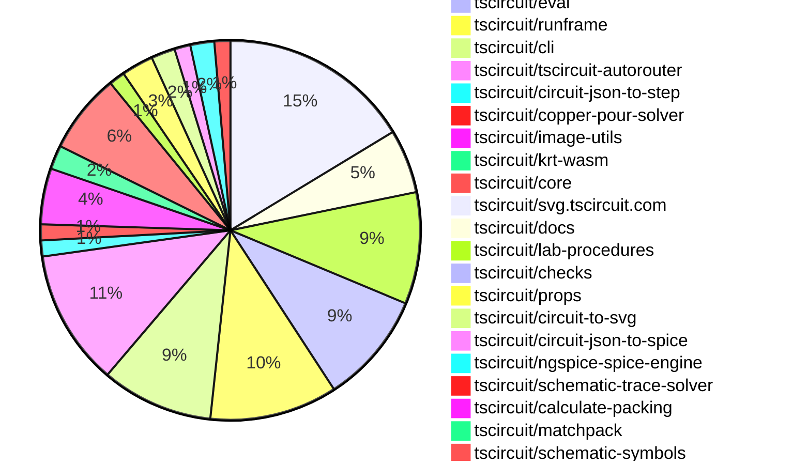

# contribution tracker

[contributions.tscircuit.com](https://contributions.tscircuit.com) ・ [tscircuit.com](https://tscircuit.com) ・ [Contribution Overviews](./contribution-overviews/) ・ [Changelogs](./changelogs/)

Generates weekly contribution overviews for tscircuit contributors. Check out all
the [contribution overviews here](./contribution-overviews/)
You can find AI-generated monthly changelogs in the [changelogs directory](./changelogs/)

- All PRs in the tscircuit org are scanned/summarized via an LLM
- The LLM classifies each Diff/PR as into a set of attributes for scoring
- All the PRs, summaries, and classifications are organized into charts and tables for [the website](https://contributions.tscircuit.com)

> Want to run locally? See the [Development Section](#development)

## Current Week

<!-- START_CURRENT_WEEK -->

# Contribution Overview 2026-06-16

The current week is shown below. There are 3 major sections:

- [Contributor Overview](#contributor-overview)
- [PRs by Repository](#prs-by-repository)
- [PRs by Contributor](#changes-by-contributor)
- [Scoring & Sponsorship Details](/docs/sponsorship-calculation-explanation.md)

## PRs by Repository


```mermaid
pie
    "tscircuit/tscircuit" : 24
    "tscircuit/circuit-json" : 8
    "tscircuit/tscircuit.com" : 14
    "tscircuit/eval" : 14
    "tscircuit/runframe" : 16
    "tscircuit/cli" : 14
    "tscircuit/tscircuit-autorouter" : 17
    "tscircuit/circuit-json-to-step" : 2
    "tscircuit/copper-pour-solver" : 2
    "tscircuit/image-utils" : 7
    "tscircuit/krt-wasm" : 3
    "tscircuit/core" : 10
    "tscircuit/svg.tscircuit.com" : 1
    "tscircuit/docs" : 1
    "tscircuit/lab-procedures" : 2
    "tscircuit/checks" : 1
    "tscircuit/props" : 4
    "tscircuit/circuit-to-svg" : 3
    "tscircuit/circuit-json-to-spice" : 2
    "tscircuit/ngspice-spice-engine" : 3
    "tscircuit/schematic-trace-solver" : 2
    "tscircuit/calculate-packing" : 1
    "tscircuit/matchpack" : 1
    "tscircuit/schematic-symbols" : 1
    "tscircuit/kicad-to-circuit-json" : 1
    "tscircuit/ti-parts-engine" : 1
    "tscircuit/system-diagram-proposal" : 1
```

## Contributor Overview

| Contributor | 🐳 Major | 🐙 Minor | 🐌 Tiny | Score | ⭐ | Discussion Contributions |
|-------------|---------|---------|---------|-------|-----|--------------------------|
| [ShiboSoftwareDev](#ShiboSoftwareDev) | 0 | 10 | 8 | 32 | ⭐⭐ | 0🔹 0🔶 0💎 |
| [AnasSarkiz](#AnasSarkiz) | 2 | 5 | 2 | 27 | ⭐⭐ | 0🔹 0🔶 0💎 |
| [0hmX](#0hmX) | 3 | 2 | 3 | 19 | ⭐⭐ | 0🔹 0🔶 0💎 |
| [imrishabh18](#imrishabh18) | 1 | 2 | 7 | 16 | ⭐⭐ | 0🔹 0🔶 0💎 |
| [tscircuitbot](#tscircuitbot) | 0 | 0 | 94 | 12.5 | ⭐⭐ | 0🔹 0🔶 0💎 |
| [rushabhcodes](#rushabhcodes) | 0 | 1 | 4 | 10 | ⭐ | 0🔹 0🔶 0💎 |
| [Sang-it](#Sang-it) | 1 | 1 | 1 | 7 | ⭐ | 0🔹 0🔶 0💎 |
| [MustafaMulla29](#MustafaMulla29) | 0 | 1 | 2 | 5 | ⭐ | 0🔹 0🔶 0💎 |
| [techmannih](#techmannih) | 0 | 1 | 2 | 5 | ⭐ | 0🔹 0🔶 0💎 |
| [Abse2001](#Abse2001) | 1 | 0 | 0 | 4 | ⭐ | 0🔹 0🔶 0💎 |
| [gwhthompson](#gwhthompson) | 0 | 1 | 0 | 2 |  | 0🔹 0🔶 0💎 |
| [mohan-bee](#mohan-bee) | 0 | 0 | 1 | 2 |  | 0🔹 0🔶 0💎 |

## Staff Pass Ratio (SPR)

| Contributor | Reviewed PRs | Rejections | Approvals | SPR |
|-------------|--------------|------------|-----------|-----|
| [AnasSarkiz](#AnasSarkiz) | 6 | 0 | 6 | 100.0% |
| [0hmX](#0hmX) | 3 | 0 | 3 | 100.0% |
| [ShiboSoftwareDev](#ShiboSoftwareDev) | 2 | 0 | 2 | 100.0% |
| [Sang-it](#Sang-it) | 2 | 1 | 1 | 50.0% |
| [MustafaMulla29](#MustafaMulla29) | 2 | 1 | 1 | 50.0% |
| [imrishabh18](#imrishabh18) | 1 | 0 | 1 | 100.0% |
| [gwhthompson](#gwhthompson) | 1 | 0 | 1 | 100.0% |
| [Abse2001](#Abse2001) | 1 | 0 | 1 | 100.0% |

<details>
<summary>AnasSarkiz SPR PRs (6)</summary>

- [#612](https://github.com/tscircuit/circuit-json/pull/612) Introduce Ammeter Source Component
- [#610](https://github.com/tscircuit/circuit-json/pull/610) Introduce End-to-End Current Probe Support and Simulation Models
- [#695](https://github.com/tscircuit/props/pull/695) Introduce Ammeter Component Props with Validated Current Measurement Connections
- [#161](https://github.com/tscircuit/checks/pull/161) Adds comprehensive support for Rotated-Pill Pad Geometry across DRC, Connectivity, and Trace Validation
- [#39](https://github.com/tscircuit/circuit-json-to-spice/pull/39) Introduce SPICE Current Probe Instrumentation with Automatic Sense Sources and Transient Waveform Capture
- [#50](https://github.com/tscircuit/copper-pour-solver/pull/50) Introduce Native Pill-Pad Geometry Support for Copper Pour Obstacle Generation and Clearance Processing

</details>

<details>
<summary>0hmX SPR PRs (3)</summary>

- [#1408](https://github.com/tscircuit/tscircuit-autorouter/pull/1408) preprocessSimpleRouteJsonSolver: snap point to connect to nearest pad for rotated rect cases where the point is outside and enables STATIC_REACHABILITY_PRECHECK in DuplicateCongestedPortSolver
- [#1405](https://github.com/tscircuit/tscircuit-autorouter/pull/1405) 300s base + 60s x effort
- [#1400](https://github.com/tscircuit/tscircuit-autorouter/pull/1400) Fix BGA detection and BGA topology generation for unevenly sized obstacle pads and super small grids.

</details>

<details>
<summary>ShiboSoftwareDev SPR PRs (2)</summary>

- [#2459](https://github.com/tscircuit/core/pull/2459)  Wire simulation timing, SPICE options, pulse controls, and probe display options
- [#20](https://github.com/tscircuit/ngspice-spice-engine/pull/20)  Handle PSPICE resistor TC and VALUE caret compatibility

</details>

<details>
<summary>Sang-it SPR PRs (2)</summary>

- [#2467](https://github.com/tscircuit/core/pull/2467) Add text-aware bounding box to resistor
- [#2456](https://github.com/tscircuit/core/pull/2456) include resistor text labels in schematic bounding box passed to layout/trace solvers

</details>

<details>
<summary>MustafaMulla29 SPR PRs (2)</summary>

- [#98](https://github.com/tscircuit/calculate-packing/pull/98) Fix PackSolver2 initial rotation handling
- [#138](https://github.com/tscircuit/matchpack/pull/138)  Constrain two-pin power/ground schematic rotations

</details>

<details>
<summary>imrishabh18 SPR PRs (1)</summary>

- [#2463](https://github.com/tscircuit/core/pull/2463) Add support for `<silkscreengraphics />`

</details>

<details>
<summary>gwhthompson SPR PRs (1)</summary>

- [#2416](https://github.com/tscircuit/core/pull/2416) fix(core): populate pcb_via.layers with all spanned layers

</details>

<details>
<summary>Abse2001 SPR PRs (1)</summary>

- [#1](https://github.com/tscircuit/system-diagram-proposal/pull/1) Add additional reference image fixtures and a PIC32CM MC00 system diagram

</details>

> Note: AI evaluates PRs and assigns 1-3 star ratings automatically. 4 and 5 star ratings require manual staff review.

### Discussion Contribution Legend

- 🔹 Normal Comments: Basic participation with minimal effort
- 🔶 Great Informative Comments: Thoughtful participation that adds value
- 💎 Incredible Comments: Exceptional participation with high-quality content

## Review Table

[reviews-received-hover]: ## "Number of reviews received for PRs for this contributor"
[approvals-received-hover]: ## "Number of approvals received for PRs this contributor authored"
[rejections-received-hover]: ## "Number of rejections received for PRs this contributor authored"
[prs-opened-hover]: ## "Number of PRs opened by this contributor"
[issues-created-hover]: ## "Number of issues created by this contributor"

| Contributor | Reviews Received | Approvals Received | Rejections Received | Approvals | Rejections Given | PRs Opened | PRs Merged | Issues Created |
|---|---|---|---|---|---|---|---|---|
| [XananasX7](#XananasX7) | 0 | 0 | 0 | 0 | 0 | 3 | 0 | 0 |
| [tscircuitbot](#tscircuitbot) | 0 | 0 | 0 | 0 | 0 | 136 | 95 | 0 |
| [imrishabh18](#imrishabh18) | 1 | 1 | 0 | 10 | 1 | 10 | 10 | 0 |
| [AnasSarkiz](#AnasSarkiz) | 11 | 11 | 0 | 7 | 0 | 11 | 9 | 0 |
| [seveibar](#seveibar) | 0 | 0 | 0 | 19 | 2 | 0 | 0 | 0 |
| [ShiboSoftwareDev](#ShiboSoftwareDev) | 15 | 13 | 0 | 4 | 0 | 19 | 19 | 0 |
| [rushabhcodes](#rushabhcodes) | 10 | 6 | 0 | 5 | 0 | 9 | 5 | 0 |
| [Msa360](#Msa360) | 0 | 0 | 0 | 0 | 0 | 1 | 0 | 0 |
| [Sang-it](#Sang-it) | 13 | 1 | 1 | 0 | 0 | 4 | 3 | 0 |
| [techmannih](#techmannih) | 9 | 5 | 1 | 1 | 0 | 8 | 3 | 0 |
| [MustafaMulla29](#MustafaMulla29) | 5 | 2 | 1 | 2 | 0 | 5 | 3 | 0 |
| [mohan-bee](#mohan-bee) | 5 | 3 | 0 | 1 | 0 | 4 | 1 | 0 |
| [gwhthompson](#gwhthompson) | 2 | 1 | 0 | 0 | 0 | 1 | 1 | 0 |
| [snkk2x-collab](#snkk2x-collab) | 0 | 0 | 0 | 0 | 0 | 2 | 0 | 0 |
| [xgcing](#xgcing) | 0 | 0 | 0 | 0 | 0 | 1 | 0 | 0 |
| [jamilahmadzai](#jamilahmadzai) | 0 | 0 | 0 | 0 | 0 | 1 | 0 | 0 |
| [Desalzes](#Desalzes) | 0 | 0 | 0 | 0 | 0 | 1 | 0 | 0 |
| [ldbld](#ldbld) | 0 | 0 | 0 | 0 | 0 | 1 | 0 | 0 |
| [b3417](#b3417) | 0 | 0 | 0 | 0 | 0 | 5 | 0 | 0 |
| [0hmX](#0hmX) | 10 | 4 | 0 | 0 | 0 | 10 | 8 | 0 |
| [Ami765](#Ami765) | 0 | 0 | 0 | 0 | 0 | 1 | 0 | 0 |
| [Monster5860](#Monster5860) | 0 | 0 | 0 | 0 | 0 | 1 | 0 | 0 |
| [anil08607](#anil08607) | 0 | 0 | 0 | 0 | 0 | 1 | 0 | 0 |
| [Abse2001](#Abse2001) | 2 | 2 | 0 | 0 | 0 | 1 | 1 | 0 |

## Changes by Repository

### [tscircuit/tscircuit](https://github.com/tscircuit/tscircuit)


<details>
<summary>🐌 Tiny Contributions (24)</summary>

| PR # | Impact | Contributor | Description |
|------|--------|-------------|-------------|
| [#3563](https://github.com/tscircuit/tscircuit/pull/3563) | 🐌 Tiny | tscircuitbot | Automated package update |
| [#3562](https://github.com/tscircuit/tscircuit/pull/3562) | 🐌 Tiny | tscircuitbot | Updates the version of the tscircuitcli package from 0.1.1510 to 0.1.1511 and the tscircuiteval package from 0.0.934 to 0.0.935 in package.json |
| [#3561](https://github.com/tscircuit/tscircuit/pull/3561) | 🐌 Tiny | tscircuitbot | Automated package update |
| [#3560](https://github.com/tscircuit/tscircuit/pull/3560) | 🐌 Tiny | tscircuitbot | Automated package update |
| [#3559](https://github.com/tscircuit/tscircuit/pull/3559) | 🐌 Tiny | tscircuitbot | Updates the package version from 0.0.1894 to 0.0.1895 in package.json |
| [#3558](https://github.com/tscircuit/tscircuit/pull/3558) | 🐌 Tiny | tscircuitbot | Automated package update |
| [#3557](https://github.com/tscircuit/tscircuit/pull/3557) | 🐌 Tiny | tscircuitbot | Automated package update |
| [#3555](https://github.com/tscircuit/tscircuit/pull/3555) | 🐌 Tiny | tscircuitbot | Automated package update |
| [#3554](https://github.com/tscircuit/tscircuit/pull/3554) | 🐌 Tiny | tscircuitbot | Updates the tscircuitcli package to version 0.1.1507 in the package.json file |
| [#3552](https://github.com/tscircuit/tscircuit/pull/3552) | 🐌 Tiny | tscircuitbot | Updates the package version from 0.0.1891 to 0.0.1892 in package.json |
| [#3551](https://github.com/tscircuit/tscircuit/pull/3551) | 🐌 Tiny | tscircuitbot | Updates the tscircuitcli package to version 0.1.1506 in package.json |
| [#3550](https://github.com/tscircuit/tscircuit/pull/3550) | 🐌 Tiny | tscircuitbot | Updates the package version from 0.0.1890 to 0.0.1891 in package.json |
| [#3549](https://github.com/tscircuit/tscircuit/pull/3549) | 🐌 Tiny | tscircuitbot | Automated package update |
| [#3538](https://github.com/tscircuit/tscircuit/pull/3538) | 🐌 Tiny | tscircuitbot | Automated package update |
| [#3539](https://github.com/tscircuit/tscircuit/pull/3539) | 🐌 Tiny | tscircuitbot | Updates the package version from 0.0.1885 to 0.0.1886 in package.json |
| [#3545](https://github.com/tscircuit/tscircuit/pull/3545) | 🐌 Tiny | tscircuitbot | Updates the tscircuitrunframe package from version 0.0.2083 to 0.0.2084 |
| [#3546](https://github.com/tscircuit/tscircuit/pull/3546) | 🐌 Tiny | tscircuitbot | Updates the package version from 0.0.1888 to 0.0.1889 |
| [#3548](https://github.com/tscircuit/tscircuit/pull/3548) | 🐌 Tiny | tscircuitbot | Automated package update to version 0.0.1890 |
| [#3542](https://github.com/tscircuit/tscircuit/pull/3542) | 🐌 Tiny | tscircuitbot | Automated package update to version 0.0.1887 |
| [#3547](https://github.com/tscircuit/tscircuit/pull/3547) | 🐌 Tiny | tscircuitbot | Updates the tscircuitcli package from version 0.1.1503 to 0.1.1504 and the tscircuitrunframe package from version 0.0.2083 to 0.0.2084. |
| [#3544](https://github.com/tscircuit/tscircuit/pull/3544) | 🐌 Tiny | tscircuitbot | Automated package update |
| [#3543](https://github.com/tscircuit/tscircuit/pull/3543) | 🐌 Tiny | tscircuitbot | Automated package update |
| [#3556](https://github.com/tscircuit/tscircuit/pull/3556) | 🐌 Tiny | imrishabh18 | Adds a new dependency tscircuitimage-utils to the project for image processing utilities. |
| [#3541](https://github.com/tscircuit/tscircuit/pull/3541) | 🐌 Tiny | AnasSarkiz | Adds tscircuiteecircuit-engine to the DO_NOT_SYNC_PACKAGE list, preventing it from being synchronized with core package versions. |

</details>

### [tscircuit/circuit-json](https://github.com/tscircuit/circuit-json)

| PR # | Impact | Rating | Contributor | Description |
|------|--------|--------|-------------|-------------|
| [#612](https://github.com/tscircuit/circuit-json/pull/612) | 🐙 Minor | ⭐⭐ | AnasSarkiz | Adds a dedicated simple_ammeter source component to the circuit model, establishing a first-class representation for ammeter devices within source-level circuit definitions. |
| [#610](https://github.com/tscircuit/circuit-json/pull/610) | 🐙 Minor | ⭐⭐ | AnasSarkiz | Adds simulation-level current measurement schemas, following the existing transient voltage graph pattern where applicable. |
| [#608](https://github.com/tscircuit/circuit-json/pull/608) | 🐙 Minor | ⭐⭐ | ShiboSoftwareDev | Adds display options for voltage probes in circuit-json, allowing customization of label, center, offset, and units per division. |
| [#605](https://github.com/tscircuit/circuit-json/pull/605) | 🐙 Minor | ⭐⭐ | ShiboSoftwareDev | Adds SPICE options and pulse timing fields to circuit-json simulations, and fixes unit parsing for various electrical units. |

<details>
<summary>🐌 Tiny Contributions (4)</summary>

| PR # | Impact | Contributor | Description |
|------|--------|-------------|-------------|
| [#613](https://github.com/tscircuit/circuit-json/pull/613) | 🐌 Tiny | tscircuitbot | Automated package update |
| [#611](https://github.com/tscircuit/circuit-json/pull/611) | 🐌 Tiny | tscircuitbot | Automated package update |
| [#609](https://github.com/tscircuit/circuit-json/pull/609) | 🐌 Tiny | tscircuitbot | Automated package update |
| [#607](https://github.com/tscircuit/circuit-json/pull/607) | 🐌 Tiny | tscircuitbot | Automated package update |

</details>

### [tscircuit/tscircuit.com](https://github.com/tscircuit/tscircuit.com)


<details>
<summary>🐌 Tiny Contributions (14)</summary>

| PR # | Impact | Contributor | Description |
|------|--------|-------------|-------------|
| [#3701](https://github.com/tscircuit/tscircuit.com/pull/3701) | 🐌 Tiny | tscircuitbot | Updates the tscircuitrunframe package from version 0.0.2090 to 0.0.2091 |
| [#3700](https://github.com/tscircuit/tscircuit.com/pull/3700) | 🐌 Tiny | tscircuitbot | Updates the tscircuiteval package from version 0.0.934 to 0.0.935 in the package.json file. |
| [#3699](https://github.com/tscircuit/tscircuit.com/pull/3699) | 🐌 Tiny | tscircuitbot | Automated package update |
| [#3698](https://github.com/tscircuit/tscircuit.com/pull/3698) | 🐌 Tiny | tscircuitbot | Updates the tscircuiteval package from version 0.0.933 to 0.0.934 |
| [#3697](https://github.com/tscircuit/tscircuit.com/pull/3697) | 🐌 Tiny | tscircuitbot | Updates the tscircuiteval package from version 0.0.932 to 0.0.933 |
| [#3695](https://github.com/tscircuit/tscircuit.com/pull/3695) | 🐌 Tiny | tscircuitbot | Updates the tscircuitrunframe package from version 0.0.2086 to 0.0.2088 |
| [#3694](https://github.com/tscircuit/tscircuit.com/pull/3694) | 🐌 Tiny | tscircuitbot | Updates the tscircuiteval package to version 0.0.932 |
| [#3692](https://github.com/tscircuit/tscircuit.com/pull/3692) | 🐌 Tiny | tscircuitbot | Automated package update |
| [#3691](https://github.com/tscircuit/tscircuit.com/pull/3691) | 🐌 Tiny | tscircuitbot | Updates the tscircuiteval package from version 0.0.930 to 0.0.931 |
| [#3690](https://github.com/tscircuit/tscircuit.com/pull/3690) | 🐌 Tiny | tscircuitbot | Automated package update |
| [#3689](https://github.com/tscircuit/tscircuit.com/pull/3689) | 🐌 Tiny | tscircuitbot | Automated package update |
| [#3687](https://github.com/tscircuit/tscircuit.com/pull/3687) | 🐌 Tiny | tscircuitbot | Updates the tscircuitrunframe package from version 0.0.2082 to 0.0.2083 |
| [#3686](https://github.com/tscircuit/tscircuit.com/pull/3686) | 🐌 Tiny | tscircuitbot | Updates the tscircuiteval package from version 0.0.928 to 0.0.929 |
| [#3688](https://github.com/tscircuit/tscircuit.com/pull/3688) | 🐌 Tiny | tscircuitbot | Automated package update |

</details>

### [tscircuit/eval](https://github.com/tscircuit/eval)

| PR # | Impact | Rating | Contributor | Description |
|------|--------|--------|-------------|-------------|
| [#2947](https://github.com/tscircuit/eval/pull/2947) | 🐙 Minor | ⭐⭐ | rushabhcodes | Replaces the legacy kicad-component-converter footprint path with KicadFootprintToCircuitJsonConverter from kicad-to-circuit-json. |

<details>
<summary>🐌 Tiny Contributions (13)</summary>

| PR # | Impact | Contributor | Description |
|------|--------|-------------|-------------|
| [#2951](https://github.com/tscircuit/eval/pull/2951) | 🐌 Tiny | tscircuitbot | Automated package update |
| [#2950](https://github.com/tscircuit/eval/pull/2950) | 🐌 Tiny | tscircuitbot | Automated package update |
| [#2949](https://github.com/tscircuit/eval/pull/2949) | 🐌 Tiny | tscircuitbot | Updates the version of tscircuitcore from 0.0.1335 to 0.0.1336 and tscircuitschematic-trace-solver from 0.0.69 to 0.0.70 in package.json |
| [#2946](https://github.com/tscircuit/eval/pull/2946) | 🐌 Tiny | tscircuitbot | Automated package update |
| [#2942](https://github.com/tscircuit/eval/pull/2942) | 🐌 Tiny | tscircuitbot | Automated package update |
| [#2941](https://github.com/tscircuit/eval/pull/2941) | 🐌 Tiny | tscircuitbot | Updates the version of the tscircuitcore package from 0.0.1333 to 0.0.1334 in package.json |
| [#2939](https://github.com/tscircuit/eval/pull/2939) | 🐌 Tiny | tscircuitbot | Automated package update |
| [#2938](https://github.com/tscircuit/eval/pull/2938) | 🐌 Tiny | tscircuitbot | Updates the version of tscircuitcore from 0.0.1331 to 0.0.1333 and adds tscircuitimage-utils as a new dependency. |
| [#2934](https://github.com/tscircuit/eval/pull/2934) | 🐌 Tiny | tscircuitbot | Automated package update |
| [#2933](https://github.com/tscircuit/eval/pull/2933) | 🐌 Tiny | tscircuitbot | Automated package update |
| [#2923](https://github.com/tscircuit/eval/pull/2923) | 🐌 Tiny | tscircuitbot | Automated package update |
| [#2945](https://github.com/tscircuit/eval/pull/2945) | 🐌 Tiny | rushabhcodes | Updates the versions of tscircuitcore and poppygl dependencies in the project. |
| [#2922](https://github.com/tscircuit/eval/pull/2922) | 🐌 Tiny | techmannih | Fixes the CAD model scaling issue by removing the hardcoded scale factor, allowing for the preservation of the native scale for KiCad footprint CAD models. |

</details>

### [tscircuit/runframe](https://github.com/tscircuit/runframe)


<details>
<summary>🐌 Tiny Contributions (16)</summary>

| PR # | Impact | Contributor | Description |
|------|--------|-------------|-------------|
| [#3715](https://github.com/tscircuit/runframe/pull/3715) | 🐌 Tiny | tscircuitbot | Automated package update |
| [#3714](https://github.com/tscircuit/runframe/pull/3714) | 🐌 Tiny | tscircuitbot | Automated package update |
| [#3713](https://github.com/tscircuit/runframe/pull/3713) | 🐌 Tiny | tscircuitbot | Automated package update |
| [#3712](https://github.com/tscircuit/runframe/pull/3712) | 🐌 Tiny | tscircuitbot | Updates the tscircuiteval package from version 0.0.933 to 0.0.934 in the package.json file. |
| [#3710](https://github.com/tscircuit/runframe/pull/3710) | 🐌 Tiny | tscircuitbot | Automated package update |
| [#3709](https://github.com/tscircuit/runframe/pull/3709) | 🐌 Tiny | tscircuitbot | Automated package update |
| [#3708](https://github.com/tscircuit/runframe/pull/3708) | 🐌 Tiny | tscircuitbot | Updates the tscircuiteval package from version 0.0.931 to 0.0.932 |
| [#3705](https://github.com/tscircuit/runframe/pull/3705) | 🐌 Tiny | tscircuitbot | Automated package update |
| [#3704](https://github.com/tscircuit/runframe/pull/3704) | 🐌 Tiny | tscircuitbot | Updates the tscircuiteval package from version 0.0.930 to 0.0.931 in the package.json file. |
| [#3703](https://github.com/tscircuit/runframe/pull/3703) | 🐌 Tiny | tscircuitbot | Automated package update |
| [#3702](https://github.com/tscircuit/runframe/pull/3702) | 🐌 Tiny | tscircuitbot | Updates the tscircuiteval package from version 0.0.929 to 0.0.930 in the package.json file. |
| [#3701](https://github.com/tscircuit/runframe/pull/3701) | 🐌 Tiny | tscircuitbot | Automated package update |
| [#3698](https://github.com/tscircuit/runframe/pull/3698) | 🐌 Tiny | tscircuitbot | Updates the tscircuiteval package from version 0.0.928 to 0.0.929 in the package.json file. |
| [#3699](https://github.com/tscircuit/runframe/pull/3699) | 🐌 Tiny | tscircuitbot | Automated package update |
| [#3700](https://github.com/tscircuit/runframe/pull/3700) | 🐌 Tiny | ShiboSoftwareDev | Adds circuit-to-svg0.0.356 directly to runframe so the prebuilt standalone preview bundle used by tsci dev embeds the current SVG renderer instead of resolving an older transitive copy at publish time. |
| [#3706](https://github.com/tscircuit/runframe/pull/3706) | 🐌 Tiny | rushabhcodes | Updates the dependencies kicad-to-circuit-json from version 0.0.94 to 0.0.98 and kicadts from version 0.0.45 to 0.0.47 in package.json |

</details>

### [tscircuit/cli](https://github.com/tscircuit/cli)


<details>
<summary>🐌 Tiny Contributions (14)</summary>

| PR # | Impact | Contributor | Description |
|------|--------|-------------|-------------|
| [#3355](https://github.com/tscircuit/cli/pull/3355) | 🐌 Tiny | tscircuitbot | Updates the tscircuitrunframe package from version 0.0.2090 to 0.0.2091 |
| [#3353](https://github.com/tscircuit/cli/pull/3353) | 🐌 Tiny | tscircuitbot | Updates the tscircuitrunframe package version from 0.0.2088 to 0.0.2090 in package.json |
| [#3351](https://github.com/tscircuit/cli/pull/3351) | 🐌 Tiny | tscircuitbot | Updates the tscircuitrunframe package from version 0.0.2086 to 0.0.2088 |
| [#3352](https://github.com/tscircuit/cli/pull/3352) | 🐌 Tiny | tscircuitbot | Automated package update |
| [#3349](https://github.com/tscircuit/cli/pull/3349) | 🐌 Tiny | tscircuitbot | Automated package update |
| [#3348](https://github.com/tscircuit/cli/pull/3348) | 🐌 Tiny | tscircuitbot | Updates the tscircuitrunframe package from version 0.0.2085 to 0.0.2086 |
| [#3346](https://github.com/tscircuit/cli/pull/3346) | 🐌 Tiny | tscircuitbot | Automated package update |
| [#3345](https://github.com/tscircuit/cli/pull/3345) | 🐌 Tiny | tscircuitbot | Automated README update with latest CLI usage output. |
| [#3343](https://github.com/tscircuit/cli/pull/3343) | 🐌 Tiny | tscircuitbot | Automated package update |
| [#3342](https://github.com/tscircuit/cli/pull/3342) | 🐌 Tiny | tscircuitbot | Updates the tscircuitrunframe package from version 0.0.2084 to 0.0.2085 |
| [#3338](https://github.com/tscircuit/cli/pull/3338) | 🐌 Tiny | tscircuitbot | Updates the tscircuitrunframe package from version 0.0.2082 to 0.0.2083 |
| [#3339](https://github.com/tscircuit/cli/pull/3339) | 🐌 Tiny | tscircuitbot | Automated package update |
| [#3340](https://github.com/tscircuit/cli/pull/3340) | 🐌 Tiny | tscircuitbot | Updates the tscircuitrunframe package from version 0.0.2083 to 0.0.2084 |
| [#3344](https://github.com/tscircuit/cli/pull/3344) | 🐌 Tiny | ShiboSoftwareDev | Updates dependencies in package.json to newer versions for improved compatibility and performance. |

</details>

### [tscircuit/tscircuit-autorouter](https://github.com/tscircuit/tscircuit-autorouter)

| PR # | Impact | Rating | Contributor | Description |
|------|--------|--------|-------------|-------------|
| [#1411](https://github.com/tscircuit/tscircuit-autorouter/pull/1411) | 🐳 Major | ⭐⭐⭐ | 0hmX | Adds a tolerance to the distance check to prevent solver failures when connection points are near the boundary of a region. |
| [#1408](https://github.com/tscircuit/tscircuit-autorouter/pull/1408) | 🐳 Major | ⭐⭐⭐ | 0hmX | Enables STATIC_REACHABILITY_PRECHECK in DuplicateCongestedPortSolver and adjusts point snapping to connect to the nearest pad for rotated rectangles when the point is outside. |
| [#1400](https://github.com/tscircuit/tscircuit-autorouter/pull/1400) | 🐳 Major | ⭐⭐⭐ | 0hmX | What does this fix The BGA Solver now has a full pipeline that enables better handling of obstacle overlap than before, including large nodes, thanks to the merge step. This could have been a separate fix, but the issue was only discovered when rewriting from scratch: component Topology Generator was generating replacement obstacles that were single-layer only instead of multi-layer, which was bad because rectDiff was expanding into the below layers and the merging was also causing gaps. The BGA Solver now always uses the full set of available layers. Previously it was trying to restrict itself to topinner layers, which was unnecessary, so that has been removed. Much better readability overall. The MergeSolver still needs a rewrite as the logic isnt fully clear yet, but that is planned for later. Changed what is detected as BGA: the current logic requires at least a 33 matrix to work properly, so the detection logic was updated to reflect this constraint. Changed the SOIC detection logic to be independent of the BGA detection logic (required for tests to pass). |
| [#1417](https://github.com/tscircuit/tscircuit-autorouter/pull/1417) | 🐙 Minor | ⭐⭐ | 0hmX | Adds a new skill for working with GraphicsObject debug visualizations in the autorouter codebase, enabling rendering to SVG and PNG, snapshot testing, and debugging routing stages. |
| [#1405](https://github.com/tscircuit/tscircuit-autorouter/pull/1405) | 🐙 Minor | ⭐⭐ | 0hmX | Changes the sample timeout calculation in the benchmark scripts to use a base timeout of 300 seconds plus an additional 60 seconds multiplied by the effort level. |

<details>
<summary>🐌 Tiny Contributions (12)</summary>

| PR # | Impact | Contributor | Description |
|------|--------|-------------|-------------|
| [#1418](https://github.com/tscircuit/tscircuit-autorouter/pull/1418) | 🐌 Tiny | tscircuitbot | Automated package update |
| [#1416](https://github.com/tscircuit/tscircuit-autorouter/pull/1416) | 🐌 Tiny | tscircuitbot | Automated package update |
| [#1414](https://github.com/tscircuit/tscircuit-autorouter/pull/1414) | 🐌 Tiny | tscircuitbot | Automated package update |
| [#1412](https://github.com/tscircuit/tscircuit-autorouter/pull/1412) | 🐌 Tiny | tscircuitbot | Automated package update |
| [#1409](https://github.com/tscircuit/tscircuit-autorouter/pull/1409) | 🐌 Tiny | tscircuitbot | Automated package update |
| [#1406](https://github.com/tscircuit/tscircuit-autorouter/pull/1406) | 🐌 Tiny | tscircuitbot | Automated package update |
| [#1404](https://github.com/tscircuit/tscircuit-autorouter/pull/1404) | 🐌 Tiny | tscircuitbot | Automated package update |
| [#1402](https://github.com/tscircuit/tscircuit-autorouter/pull/1402) | 🐌 Tiny | tscircuitbot | Automated package update |
| [#1401](https://github.com/tscircuit/tscircuit-autorouter/pull/1401) | 🐌 Tiny | AnasSarkiz | Updates the dataset-srj18 dependency to a newer commit in the GitHub repository. |
| [#1413](https://github.com/tscircuit/tscircuit-autorouter/pull/1413) | 🐌 Tiny | 0hmX | Moves the development guide content from CLAUDE.md to AGENTS.md for better organization and clarity. |
| [#1415](https://github.com/tscircuit/tscircuit-autorouter/pull/1415) | 🐌 Tiny | 0hmX | Moves the SKILL.md file from the .claude directory to the .agents directory and creates a symbolic link in the .claude directory. |
| [#1403](https://github.com/tscircuit/tscircuit-autorouter/pull/1403) | 🐌 Tiny | 0hmX | Reduces TypeScript memory footprint during LSP usage, increasing available RAM from 8.5 GB to 9.5 GB. |

</details>

### [tscircuit/circuit-json-to-step](https://github.com/tscircuit/circuit-json-to-step)


<details>
<summary>🐌 Tiny Contributions (2)</summary>

| PR # | Impact | Contributor | Description |
|------|--------|-------------|-------------|
| [#114](https://github.com/tscircuit/circuit-json-to-step/pull/114) | 🐌 Tiny | tscircuitbot | Automated package update |
| [#113](https://github.com/tscircuit/circuit-json-to-step/pull/113) | 🐌 Tiny | ShiboSoftwareDev | Adds circuit-to-svg as a peer dependency in the package.json file. |

</details>

### [tscircuit/copper-pour-solver](https://github.com/tscircuit/copper-pour-solver)

| PR # | Impact | Rating | Contributor | Description |
|------|--------|--------|-------------|-------------|
| [#50](https://github.com/tscircuit/copper-pour-solver/pull/50) | 🐳 Major | ⭐⭐⭐ | AnasSarkiz | Adds first-class support for pill and rotated pill pads throughout the copper pour pipeline, enabling accurate obstacle generation and clearance handling for modern SMT footprints. |

<details>
<summary>🐌 Tiny Contributions (1)</summary>

| PR # | Impact | Contributor | Description |
|------|--------|-------------|-------------|
| [#51](https://github.com/tscircuit/copper-pour-solver/pull/51) | 🐌 Tiny | tscircuitbot | Automated package update |

</details>

### [tscircuit/image-utils](https://github.com/tscircuit/image-utils)

| PR # | Impact | Rating | Contributor | Description |
|------|--------|--------|-------------|-------------|
| [#7](https://github.com/tscircuit/image-utils/pull/7) | 🐳 Major | ⭐⭐⭐ | imrishabh18 | Adds utility functions for converting SVG paths to points and generating boundary representation shapes from SVG data. |
| [#11](https://github.com/tscircuit/image-utils/pull/11) | 🐙 Minor | ⭐⭐ | imrishabh18 | Removes the usage of the fs module in the library logic to facilitate evaluation, changing the input type from Buffer to Uint8Array and modifying related functions accordingly. |

<details>
<summary>🐌 Tiny Contributions (5)</summary>

| PR # | Impact | Contributor | Description |
|------|--------|-------------|-------------|
| [#12](https://github.com/tscircuit/image-utils/pull/12) | 🐌 Tiny | tscircuitbot | Automated package update |
| [#6](https://github.com/tscircuit/image-utils/pull/6) | 🐌 Tiny | tscircuitbot | Automated package update |
| [#8](https://github.com/tscircuit/image-utils/pull/8) | 🐌 Tiny | tscircuitbot | Automated package update |
| [#10](https://github.com/tscircuit/image-utils/pull/10) | 🐌 Tiny | tscircuitbot | Updates the package version from 0.0.5 to 0.0.6 in package.json |
| [#9](https://github.com/tscircuit/image-utils/pull/9) | 🐌 Tiny | imrishabh18 | Fixes the build output directory in the package.json to correctly point to index.ts instead of lib. |

</details>

### [tscircuit/krt-wasm](https://github.com/tscircuit/krt-wasm)


<details>
<summary>🐌 Tiny Contributions (3)</summary>

| PR # | Impact | Contributor | Description |
|------|--------|-------------|-------------|
| [#14](https://github.com/tscircuit/krt-wasm/pull/14) | 🐌 Tiny | tscircuitbot | Automated package update |
| [#13](https://github.com/tscircuit/krt-wasm/pull/13) | 🐌 Tiny | tscircuitbot | Automated package update |
| [#15](https://github.com/tscircuit/krt-wasm/pull/15) | 🐌 Tiny | ShiboSoftwareDev | Changes the peer dependency for tscircuit from a specific version to any version. |

</details>

### [tscircuit/core](https://github.com/tscircuit/core)

| PR # | Impact | Rating | Contributor | Description |
|------|--------|--------|-------------|-------------|
| [#2463](https://github.com/tscircuit/core/pull/2463) | 🐙 Minor | ⭐⭐ | imrishabh18 | Adds a new component silkscreengraphics  for rendering silkscreen graphics in PCB designs, supporting SVG and PNG images. |
| [#2459](https://github.com/tscircuit/core/pull/2459) | 🐙 Minor | ⭐⭐ | ShiboSoftwareDev | Adds new simulation properties for analog simulation including start time, SPICE options, pulse timing controls for voltage sources, and display options for voltage probes, along with related package version updates and new tests. |
| [#2461](https://github.com/tscircuit/core/pull/2461) | 🐙 Minor | ⭐⭐ | ShiboSoftwareDev | Fixes inflation issues for imported KiCad LEDs and fiducials, and resolves trace inflation problems when multiple physical geometries exist for a single logical source trace. |
| [#2467](https://github.com/tscircuit/core/pull/2467) | 🐙 Minor | ⭐⭐ | Sang-it | Adds a text-aware bounding box to resistors, ensuring traces connect correctly to pins even when text extends beyond the components original bounds. |
| [#2416](https://github.com/tscircuit/core/pull/2416) | 🐙 Minor | ⭐⭐ | gwhthompson | Fixes incorrect layer reporting for vias on multi-layer boards by populating pcb_via.layers with all layers spanned between fromLayer and toLayer, ensuring accurate copper pour interactions and DRC checks. |

<details>
<summary>🐌 Tiny Contributions (5)</summary>

| PR # | Impact | Contributor | Description |
|------|--------|-------------|-------------|
| [#2471](https://github.com/tscircuit/core/pull/2471) | 🐌 Tiny | imrishabh18 | Updates the version of the tscircuitimage-utils dependency from 0.0.6 to 0.0.7 in package.json |
| [#2465](https://github.com/tscircuit/core/pull/2465) | 🐌 Tiny | ShiboSoftwareDev | Updates the ngspice-spice-engine dependency to version 0.0.16 in package.json |
| [#2464](https://github.com/tscircuit/core/pull/2464) | 🐌 Tiny | ShiboSoftwareDev | Adds tscircuiteecircuit-engine as a development dependency in package.json |
| [#2472](https://github.com/tscircuit/core/pull/2472) | 🐌 Tiny | rushabhcodes | Upgrades the poppygl dependency to version 0.0.24 and refreshes 3D snapshots for various components in the test suite. |
| [#2466](https://github.com/tscircuit/core/pull/2466) | 🐌 Tiny | MustafaMulla29 | Fixes schematic auto-layout rotation for two-pin powerground components to ensure correct orientation before layout. |

</details>

### [tscircuit/svg.tscircuit.com](https://github.com/tscircuit/svg.tscircuit.com)


<details>
<summary>🐌 Tiny Contributions (1)</summary>

| PR # | Impact | Contributor | Description |
|------|--------|-------------|-------------|
| [#1611](https://github.com/tscircuit/svg.tscircuit.com/pull/1611) | 🐌 Tiny | imrishabh18 | Bump the tscircuit devDependency in package.json from 0.0.1873 to 0.0.1894, updating multiple related packages and ensuring successful builds and formatting checks. |

</details>

### [tscircuit/docs](https://github.com/tscircuit/docs)


<details>
<summary>🐌 Tiny Contributions (1)</summary>

| PR # | Impact | Contributor | Description |
|------|--------|-------------|-------------|
| [#754](https://github.com/tscircuit/docs/pull/754) | 🐌 Tiny | imrishabh18 | Adds documentation for the silkscreengraphic  element, detailing its usage, properties, and examples for placing graphics on the PCB silkscreen layer. |

</details>

### [tscircuit/lab-procedures](https://github.com/tscircuit/lab-procedures)


<details>
<summary>🐌 Tiny Contributions (2)</summary>

| PR # | Impact | Contributor | Description |
|------|--------|-------------|-------------|
| [#2](https://github.com/tscircuit/lab-procedures/pull/2) | 🐌 Tiny | imrishabh18 | Adds comprehensive safety policies for the heat insert tool and oven, detailing usage guidelines, hazards, and operator responsibilities. |
| [#1](https://github.com/tscircuit/lab-procedures/pull/1) | 🐌 Tiny | imrishabh18 | Adds a script to convert Markdown files to PDF format and generates PDF files for existing Markdown safety policy documents. |

</details>

### [tscircuit/checks](https://github.com/tscircuit/checks)

| PR # | Impact | Rating | Contributor | Description |
|------|--------|--------|-------------|-------------|
| [#161](https://github.com/tscircuit/checks/pull/161) | 🐳 Major | ⭐⭐⭐ | AnasSarkiz | Adds comprehensive geometric support for rotated_pill SMT pads throughout the PCB validation pipeline, replacing bounding-box approximations with accurate shape-aware calculations. |

### [tscircuit/props](https://github.com/tscircuit/props)

| PR # | Impact | Rating | Contributor | Description |
|------|--------|--------|-------------|-------------|
| [#695](https://github.com/tscircuit/props/pull/695) | 🐙 Minor | ⭐⭐ | AnasSarkiz | Adds first-class ammeter  prop support for current measurement components, including validated connection pairs and display configuration. |
| [#693](https://github.com/tscircuit/props/pull/693) | 🐙 Minor | ⭐⭐ | ShiboSoftwareDev | Adds display properties for voltage probes to enhance simulation graph representation. |

<details>
<summary>🐌 Tiny Contributions (2)</summary>

| PR # | Impact | Contributor | Description |
|------|--------|-------------|-------------|
| [#694](https://github.com/tscircuit/props/pull/694) | 🐌 Tiny | ShiboSoftwareDev | Removes the color property from the voltage probe display options, affecting how voltage probes are visually represented in the application. |
| [#696](https://github.com/tscircuit/props/pull/696) | 🐌 Tiny | rushabhcodes | Make padDiameter required for fiducial at both the TypeScript and runtime schema levels |

</details>

### [tscircuit/circuit-to-svg](https://github.com/tscircuit/circuit-to-svg)

| PR # | Impact | Rating | Contributor | Description |
|------|--------|--------|-------------|-------------|
| [#578](https://github.com/tscircuit/circuit-to-svg/pull/578) | 🐙 Minor | ⭐⭐ | AnasSarkiz | Expands the simulation visualization pipeline to treat current and voltage waveforms as first-class graph types, enabling combined rendering, selection, and analysis within a single simulation view. |
| [#575](https://github.com/tscircuit/circuit-to-svg/pull/575) | 🐙 Minor | ⭐⭐ | ShiboSoftwareDev | Adds support for rendering simulation probe display options in SVG graphs, allowing for customizable voltage display based on probe settings. |
| [#576](https://github.com/tscircuit/circuit-to-svg/pull/576) | 🐙 Minor | ⭐⭐ | ShiboSoftwareDev | Fixes the x-axis of the simulation graph to accurately reflect the exact transient time domain based on the start and end times of the simulation experiment. |

### [tscircuit/circuit-json-to-spice](https://github.com/tscircuit/circuit-json-to-spice)

| PR # | Impact | Rating | Contributor | Description |
|------|--------|--------|-------------|-------------|
| [#39](https://github.com/tscircuit/circuit-json-to-spice/pull/39) | 🐙 Minor | ⭐⭐ | AnasSarkiz | Adds end-to-end SPICE netlist support for simulation current probes by automatically instrumenting circuits with zero-volt sense sources and exporting current waveforms during transient analysis. |
| [#38](https://github.com/tscircuit/circuit-json-to-spice/pull/38) | 🐙 Minor | ⭐⭐ | ShiboSoftwareDev | Adds support for simulation_experiment.spice_options, emits voltage-source PULSE delayrisefall widthperiod controls, and formats transient timing values with SPICE suffixes. Also emits tscircuit_probe metadata comments that map voltage probes to SPICE vectors so downstream simulation graph rendering can recover probe identity. |

### [tscircuit/ngspice-spice-engine](https://github.com/tscircuit/ngspice-spice-engine)

| PR # | Impact | Rating | Contributor | Description |
|------|--------|--------|-------------|-------------|
| [#20](https://github.com/tscircuit/ngspice-spice-engine/pull/20) | 🐙 Minor | ⭐⭐ | ShiboSoftwareDev | Adds a narrow PSPICE compatibility normalization pass before ngspice simulation, converting resistor-line TCa,b syntax to TC1a TC2b and rewriting spaced boolean  in VALUE blocks while preserving numeric exponentiation. |
| [#18](https://github.com/tscircuit/ngspice-spice-engine/pull/18) | 🐙 Minor | ⭐⭐ | ShiboSoftwareDev | Preserves probe metadata in ngspice simulation graphs to enhance the identification and representation of voltage probes in simulation results. |

<details>
<summary>🐌 Tiny Contributions (1)</summary>

| PR # | Impact | Contributor | Description |
|------|--------|-------------|-------------|
| [#19](https://github.com/tscircuit/ngspice-spice-engine/pull/19) | 🐌 Tiny | ShiboSoftwareDev | Adds the eecircuit engine as a development dependency in the project. |

</details>

### [tscircuit/schematic-trace-solver](https://github.com/tscircuit/schematic-trace-solver)

| PR # | Impact | Rating | Contributor | Description |
|------|--------|--------|-------------|-------------|
| [#550](https://github.com/tscircuit/schematic-trace-solver/pull/550) | 🐳 Major | ⭐⭐⭐ | Sang-it | Prevents obstacle-aware trace shifts from crossing through obstacles during routing calculations. |

<details>
<summary>🐌 Tiny Contributions (1)</summary>

| PR # | Impact | Contributor | Description |
|------|--------|-------------|-------------|
| [#549](https://github.com/tscircuit/schematic-trace-solver/pull/549) | 🐌 Tiny | Sang-it | Adds an example page and test for tracing through a chip using the PipelineDebugger component. |

</details>

### [tscircuit/calculate-packing](https://github.com/tscircuit/calculate-packing)

| PR # | Impact | Rating | Contributor | Description |
|------|--------|--------|-------------|-------------|
| [#98](https://github.com/tscircuit/calculate-packing/pull/98) | 🐙 Minor | ⭐⭐ | MustafaMulla29 | Fixes PackSolver2 to honor availableRotationDegrees for packed components and preserves ccwRotationOffset for static components, along with adding regression tests for rotation handling. |

### [tscircuit/matchpack](https://github.com/tscircuit/matchpack)


<details>
<summary>🐌 Tiny Contributions (1)</summary>

| PR # | Impact | Contributor | Description |
|------|--------|-------------|-------------|
| [#139](https://github.com/tscircuit/matchpack/pull/139) | 🐌 Tiny | MustafaMulla29 | Updates the versions of the tscircuit and calculate-packing dependencies in the package.json file. |

</details>

### [tscircuit/schematic-symbols](https://github.com/tscircuit/schematic-symbols)


<details>
<summary>🐌 Tiny Contributions (1)</summary>

| PR # | Impact | Contributor | Description |
|------|--------|-------------|-------------|
| [#428](https://github.com/tscircuit/schematic-symbols/pull/428) | 🐌 Tiny | mohan-bee | Updates the DC ammeter symbol to render the center A as SVG path primitives instead of text, ensuring consistent rendering across symbol previews and downstream schematic SVG output. |

</details>

### [tscircuit/kicad-to-circuit-json](https://github.com/tscircuit/kicad-to-circuit-json)

| PR # | Impact | Rating | Contributor | Description |
|------|--------|--------|-------------|-------------|
| [#143](https://github.com/tscircuit/kicad-to-circuit-json/pull/143) | 🐙 Minor | ⭐⭐ | techmannih | Classifies SW PCB references as simple_switch and adds a regression test for Arduino Nanos reset switch. |

### [tscircuit/ti-parts-engine](https://github.com/tscircuit/ti-parts-engine)


<details>
<summary>🐌 Tiny Contributions (1)</summary>

| PR # | Impact | Contributor | Description |
|------|--------|-------------|-------------|
| [#29](https://github.com/tscircuit/ti-parts-engine/pull/29) | 🐌 Tiny | techmannih | Updates the tscircuitfake-ul-kicad-proxy dependency to a newer version in the package.json file. |

</details>

### [tscircuit/system-diagram-proposal](https://github.com/tscircuit/system-diagram-proposal)

| PR # | Impact | Rating | Contributor | Description |
|------|--------|--------|-------------|-------------|
| [#1](https://github.com/tscircuit/system-diagram-proposal/pull/1) | 🐳 Major | ⭐⭐⭐ | Abse2001 | This pull request introduces additional reference image fixtures and a system diagram for the PIC32CM MC00 family. It includes new JSON files for the reference images and updates to the system diagram types to accommodate the new components and styles. |

## Changes by Contributor

### [tscircuitbot](https://github.com/tscircuitbot)


<details>
<summary>🐌 Tiny Contributions (94)</summary>

| PR # | Impact | Description |
|------|--------|-------------|
| [#3563](https://github.com/tscircuit/tscircuit/pull/3563) | 🐌 Tiny | Automated package update |
| [#3562](https://github.com/tscircuit/tscircuit/pull/3562) | 🐌 Tiny | Updates the version of the tscircuitcli package from 0.1.1510 to 0.1.1511 and the tscircuiteval package from 0.0.934 to 0.0.935 in package.json |
| [#3561](https://github.com/tscircuit/tscircuit/pull/3561) | 🐌 Tiny | Automated package update |
| [#3560](https://github.com/tscircuit/tscircuit/pull/3560) | 🐌 Tiny | Automated package update |
| [#3559](https://github.com/tscircuit/tscircuit/pull/3559) | 🐌 Tiny | Updates the package version from 0.0.1894 to 0.0.1895 in package.json |
| [#3558](https://github.com/tscircuit/tscircuit/pull/3558) | 🐌 Tiny | Automated package update |
| [#3557](https://github.com/tscircuit/tscircuit/pull/3557) | 🐌 Tiny | Automated package update |
| [#3555](https://github.com/tscircuit/tscircuit/pull/3555) | 🐌 Tiny | Automated package update |
| [#3554](https://github.com/tscircuit/tscircuit/pull/3554) | 🐌 Tiny | Updates the tscircuitcli package to version 0.1.1507 in the package.json file |
| [#3552](https://github.com/tscircuit/tscircuit/pull/3552) | 🐌 Tiny | Updates the package version from 0.0.1891 to 0.0.1892 in package.json |
| [#3551](https://github.com/tscircuit/tscircuit/pull/3551) | 🐌 Tiny | Updates the tscircuitcli package to version 0.1.1506 in package.json |
| [#3550](https://github.com/tscircuit/tscircuit/pull/3550) | 🐌 Tiny | Updates the package version from 0.0.1890 to 0.0.1891 in package.json |
| [#3549](https://github.com/tscircuit/tscircuit/pull/3549) | 🐌 Tiny | Automated package update |
| [#3538](https://github.com/tscircuit/tscircuit/pull/3538) | 🐌 Tiny | Automated package update |
| [#3539](https://github.com/tscircuit/tscircuit/pull/3539) | 🐌 Tiny | Updates the package version from 0.0.1885 to 0.0.1886 in package.json |
| [#3545](https://github.com/tscircuit/tscircuit/pull/3545) | 🐌 Tiny | Updates the tscircuitrunframe package from version 0.0.2083 to 0.0.2084 |
| [#3546](https://github.com/tscircuit/tscircuit/pull/3546) | 🐌 Tiny | Updates the package version from 0.0.1888 to 0.0.1889 |
| [#3548](https://github.com/tscircuit/tscircuit/pull/3548) | 🐌 Tiny | Automated package update to version 0.0.1890 |
| [#3542](https://github.com/tscircuit/tscircuit/pull/3542) | 🐌 Tiny | Automated package update to version 0.0.1887 |
| [#3547](https://github.com/tscircuit/tscircuit/pull/3547) | 🐌 Tiny | Updates the tscircuitcli package from version 0.1.1503 to 0.1.1504 and the tscircuitrunframe package from version 0.0.2083 to 0.0.2084. |
| [#3544](https://github.com/tscircuit/tscircuit/pull/3544) | 🐌 Tiny | Automated package update |
| [#3543](https://github.com/tscircuit/tscircuit/pull/3543) | 🐌 Tiny | Automated package update |
| [#613](https://github.com/tscircuit/circuit-json/pull/613) | 🐌 Tiny | Automated package update |
| [#611](https://github.com/tscircuit/circuit-json/pull/611) | 🐌 Tiny | Automated package update |
| [#609](https://github.com/tscircuit/circuit-json/pull/609) | 🐌 Tiny | Automated package update |
| [#607](https://github.com/tscircuit/circuit-json/pull/607) | 🐌 Tiny | Automated package update |
| [#3701](https://github.com/tscircuit/tscircuit.com/pull/3701) | 🐌 Tiny | Updates the tscircuitrunframe package from version 0.0.2090 to 0.0.2091 |
| [#3700](https://github.com/tscircuit/tscircuit.com/pull/3700) | 🐌 Tiny | Updates the tscircuiteval package from version 0.0.934 to 0.0.935 in the package.json file. |
| [#3699](https://github.com/tscircuit/tscircuit.com/pull/3699) | 🐌 Tiny | Automated package update |
| [#3698](https://github.com/tscircuit/tscircuit.com/pull/3698) | 🐌 Tiny | Updates the tscircuiteval package from version 0.0.933 to 0.0.934 |
| [#3697](https://github.com/tscircuit/tscircuit.com/pull/3697) | 🐌 Tiny | Updates the tscircuiteval package from version 0.0.932 to 0.0.933 |
| [#3695](https://github.com/tscircuit/tscircuit.com/pull/3695) | 🐌 Tiny | Updates the tscircuitrunframe package from version 0.0.2086 to 0.0.2088 |
| [#3694](https://github.com/tscircuit/tscircuit.com/pull/3694) | 🐌 Tiny | Updates the tscircuiteval package to version 0.0.932 |
| [#3692](https://github.com/tscircuit/tscircuit.com/pull/3692) | 🐌 Tiny | Automated package update |
| [#3691](https://github.com/tscircuit/tscircuit.com/pull/3691) | 🐌 Tiny | Updates the tscircuiteval package from version 0.0.930 to 0.0.931 |
| [#3690](https://github.com/tscircuit/tscircuit.com/pull/3690) | 🐌 Tiny | Automated package update |
| [#3689](https://github.com/tscircuit/tscircuit.com/pull/3689) | 🐌 Tiny | Automated package update |
| [#3687](https://github.com/tscircuit/tscircuit.com/pull/3687) | 🐌 Tiny | Updates the tscircuitrunframe package from version 0.0.2082 to 0.0.2083 |
| [#3686](https://github.com/tscircuit/tscircuit.com/pull/3686) | 🐌 Tiny | Updates the tscircuiteval package from version 0.0.928 to 0.0.929 |
| [#3688](https://github.com/tscircuit/tscircuit.com/pull/3688) | 🐌 Tiny | Automated package update |
| [#2951](https://github.com/tscircuit/eval/pull/2951) | 🐌 Tiny | Automated package update |
| [#2950](https://github.com/tscircuit/eval/pull/2950) | 🐌 Tiny | Automated package update |
| [#2949](https://github.com/tscircuit/eval/pull/2949) | 🐌 Tiny | Updates the version of tscircuitcore from 0.0.1335 to 0.0.1336 and tscircuitschematic-trace-solver from 0.0.69 to 0.0.70 in package.json |
| [#2946](https://github.com/tscircuit/eval/pull/2946) | 🐌 Tiny | Automated package update |
| [#2942](https://github.com/tscircuit/eval/pull/2942) | 🐌 Tiny | Automated package update |
| [#2941](https://github.com/tscircuit/eval/pull/2941) | 🐌 Tiny | Updates the version of the tscircuitcore package from 0.0.1333 to 0.0.1334 in package.json |
| [#2939](https://github.com/tscircuit/eval/pull/2939) | 🐌 Tiny | Automated package update |
| [#2938](https://github.com/tscircuit/eval/pull/2938) | 🐌 Tiny | Updates the version of tscircuitcore from 0.0.1331 to 0.0.1333 and adds tscircuitimage-utils as a new dependency. |
| [#2934](https://github.com/tscircuit/eval/pull/2934) | 🐌 Tiny | Automated package update |
| [#2933](https://github.com/tscircuit/eval/pull/2933) | 🐌 Tiny | Automated package update |
| [#2923](https://github.com/tscircuit/eval/pull/2923) | 🐌 Tiny | Automated package update |
| [#3715](https://github.com/tscircuit/runframe/pull/3715) | 🐌 Tiny | Automated package update |
| [#3714](https://github.com/tscircuit/runframe/pull/3714) | 🐌 Tiny | Automated package update |
| [#3713](https://github.com/tscircuit/runframe/pull/3713) | 🐌 Tiny | Automated package update |
| [#3712](https://github.com/tscircuit/runframe/pull/3712) | 🐌 Tiny | Updates the tscircuiteval package from version 0.0.933 to 0.0.934 in the package.json file. |
| [#3710](https://github.com/tscircuit/runframe/pull/3710) | 🐌 Tiny | Automated package update |
| [#3709](https://github.com/tscircuit/runframe/pull/3709) | 🐌 Tiny | Automated package update |
| [#3708](https://github.com/tscircuit/runframe/pull/3708) | 🐌 Tiny | Updates the tscircuiteval package from version 0.0.931 to 0.0.932 |
| [#3705](https://github.com/tscircuit/runframe/pull/3705) | 🐌 Tiny | Automated package update |
| [#3704](https://github.com/tscircuit/runframe/pull/3704) | 🐌 Tiny | Updates the tscircuiteval package from version 0.0.930 to 0.0.931 in the package.json file. |
| [#3703](https://github.com/tscircuit/runframe/pull/3703) | 🐌 Tiny | Automated package update |
| [#3702](https://github.com/tscircuit/runframe/pull/3702) | 🐌 Tiny | Updates the tscircuiteval package from version 0.0.929 to 0.0.930 in the package.json file. |
| [#3701](https://github.com/tscircuit/runframe/pull/3701) | 🐌 Tiny | Automated package update |
| [#3698](https://github.com/tscircuit/runframe/pull/3698) | 🐌 Tiny | Updates the tscircuiteval package from version 0.0.928 to 0.0.929 in the package.json file. |
| [#3699](https://github.com/tscircuit/runframe/pull/3699) | 🐌 Tiny | Automated package update |
| [#3355](https://github.com/tscircuit/cli/pull/3355) | 🐌 Tiny | Updates the tscircuitrunframe package from version 0.0.2090 to 0.0.2091 |
| [#3353](https://github.com/tscircuit/cli/pull/3353) | 🐌 Tiny | Updates the tscircuitrunframe package version from 0.0.2088 to 0.0.2090 in package.json |
| [#3351](https://github.com/tscircuit/cli/pull/3351) | 🐌 Tiny | Updates the tscircuitrunframe package from version 0.0.2086 to 0.0.2088 |
| [#3352](https://github.com/tscircuit/cli/pull/3352) | 🐌 Tiny | Automated package update |
| [#3349](https://github.com/tscircuit/cli/pull/3349) | 🐌 Tiny | Automated package update |
| [#3348](https://github.com/tscircuit/cli/pull/3348) | 🐌 Tiny | Updates the tscircuitrunframe package from version 0.0.2085 to 0.0.2086 |
| [#3346](https://github.com/tscircuit/cli/pull/3346) | 🐌 Tiny | Automated package update |
| [#3345](https://github.com/tscircuit/cli/pull/3345) | 🐌 Tiny | Automated README update with latest CLI usage output. |
| [#3343](https://github.com/tscircuit/cli/pull/3343) | 🐌 Tiny | Automated package update |
| [#3342](https://github.com/tscircuit/cli/pull/3342) | 🐌 Tiny | Updates the tscircuitrunframe package from version 0.0.2084 to 0.0.2085 |
| [#3338](https://github.com/tscircuit/cli/pull/3338) | 🐌 Tiny | Updates the tscircuitrunframe package from version 0.0.2082 to 0.0.2083 |
| [#3339](https://github.com/tscircuit/cli/pull/3339) | 🐌 Tiny | Automated package update |
| [#3340](https://github.com/tscircuit/cli/pull/3340) | 🐌 Tiny | Updates the tscircuitrunframe package from version 0.0.2083 to 0.0.2084 |
| [#1418](https://github.com/tscircuit/tscircuit-autorouter/pull/1418) | 🐌 Tiny | Automated package update |
| [#1416](https://github.com/tscircuit/tscircuit-autorouter/pull/1416) | 🐌 Tiny | Automated package update |
| [#1414](https://github.com/tscircuit/tscircuit-autorouter/pull/1414) | 🐌 Tiny | Automated package update |
| [#1412](https://github.com/tscircuit/tscircuit-autorouter/pull/1412) | 🐌 Tiny | Automated package update |
| [#1409](https://github.com/tscircuit/tscircuit-autorouter/pull/1409) | 🐌 Tiny | Automated package update |
| [#1406](https://github.com/tscircuit/tscircuit-autorouter/pull/1406) | 🐌 Tiny | Automated package update |
| [#1404](https://github.com/tscircuit/tscircuit-autorouter/pull/1404) | 🐌 Tiny | Automated package update |
| [#1402](https://github.com/tscircuit/tscircuit-autorouter/pull/1402) | 🐌 Tiny | Automated package update |
| [#114](https://github.com/tscircuit/circuit-json-to-step/pull/114) | 🐌 Tiny | Automated package update |
| [#51](https://github.com/tscircuit/copper-pour-solver/pull/51) | 🐌 Tiny | Automated package update |
| [#12](https://github.com/tscircuit/image-utils/pull/12) | 🐌 Tiny | Automated package update |
| [#6](https://github.com/tscircuit/image-utils/pull/6) | 🐌 Tiny | Automated package update |
| [#8](https://github.com/tscircuit/image-utils/pull/8) | 🐌 Tiny | Automated package update |
| [#10](https://github.com/tscircuit/image-utils/pull/10) | 🐌 Tiny | Updates the package version from 0.0.5 to 0.0.6 in package.json |
| [#14](https://github.com/tscircuit/krt-wasm/pull/14) | 🐌 Tiny | Automated package update |
| [#13](https://github.com/tscircuit/krt-wasm/pull/13) | 🐌 Tiny | Automated package update |

</details>

### [imrishabh18](https://github.com/imrishabh18)

| PRs # | Impact | Rating | Description |
|------|--------|--------|-------------|
| [#7](https://github.com/tscircuit/image-utils/pull/7) | 🐳 Major | ⭐⭐⭐ | Adds utility functions for converting SVG paths to points and generating boundary representation shapes from SVG data. |
| [#2463](https://github.com/tscircuit/core/pull/2463) | 🐙 Minor | ⭐⭐ | Adds a new component silkscreengraphics  for rendering silkscreen graphics in PCB designs, supporting SVG and PNG images. |
| [#11](https://github.com/tscircuit/image-utils/pull/11) | 🐙 Minor | ⭐⭐ | Removes the usage of the fs module in the library logic to facilitate evaluation, changing the input type from Buffer to Uint8Array and modifying related functions accordingly. |

<details>
<summary>🐌 Tiny Contributions (7)</summary>

| PR # | Impact | Description |
|------|--------|-------------|
| [#3556](https://github.com/tscircuit/tscircuit/pull/3556) | 🐌 Tiny | Adds a new dependency tscircuitimage-utils to the project for image processing utilities. |
| [#2471](https://github.com/tscircuit/core/pull/2471) | 🐌 Tiny | Updates the version of the tscircuitimage-utils dependency from 0.0.6 to 0.0.7 in package.json |
| [#1611](https://github.com/tscircuit/svg.tscircuit.com/pull/1611) | 🐌 Tiny | Bump the tscircuit devDependency in package.json from 0.0.1873 to 0.0.1894, updating multiple related packages and ensuring successful builds and formatting checks. |
| [#754](https://github.com/tscircuit/docs/pull/754) | 🐌 Tiny | Adds documentation for the silkscreengraphic  element, detailing its usage, properties, and examples for placing graphics on the PCB silkscreen layer. |
| [#9](https://github.com/tscircuit/image-utils/pull/9) | 🐌 Tiny | Fixes the build output directory in the package.json to correctly point to index.ts instead of lib. |
| [#2](https://github.com/tscircuit/lab-procedures/pull/2) | 🐌 Tiny | Adds comprehensive safety policies for the heat insert tool and oven, detailing usage guidelines, hazards, and operator responsibilities. |
| [#1](https://github.com/tscircuit/lab-procedures/pull/1) | 🐌 Tiny | Adds a script to convert Markdown files to PDF format and generates PDF files for existing Markdown safety policy documents. |

</details>

### [AnasSarkiz](https://github.com/AnasSarkiz)

| PRs # | Impact | Rating | Description |
|------|--------|--------|-------------|
| [#161](https://github.com/tscircuit/checks/pull/161) | 🐳 Major | ⭐⭐⭐ | Adds comprehensive geometric support for rotated_pill SMT pads throughout the PCB validation pipeline, replacing bounding-box approximations with accurate shape-aware calculations. |
| [#50](https://github.com/tscircuit/copper-pour-solver/pull/50) | 🐳 Major | ⭐⭐⭐ | Adds first-class support for pill and rotated pill pads throughout the copper pour pipeline, enabling accurate obstacle generation and clearance handling for modern SMT footprints. |
| [#612](https://github.com/tscircuit/circuit-json/pull/612) | 🐙 Minor | ⭐⭐ | Adds a dedicated simple_ammeter source component to the circuit model, establishing a first-class representation for ammeter devices within source-level circuit definitions. |
| [#610](https://github.com/tscircuit/circuit-json/pull/610) | 🐙 Minor | ⭐⭐ | Adds simulation-level current measurement schemas, following the existing transient voltage graph pattern where applicable. |
| [#695](https://github.com/tscircuit/props/pull/695) | 🐙 Minor | ⭐⭐ | Adds first-class ammeter  prop support for current measurement components, including validated connection pairs and display configuration. |
| [#578](https://github.com/tscircuit/circuit-to-svg/pull/578) | 🐙 Minor | ⭐⭐ | Expands the simulation visualization pipeline to treat current and voltage waveforms as first-class graph types, enabling combined rendering, selection, and analysis within a single simulation view. |
| [#39](https://github.com/tscircuit/circuit-json-to-spice/pull/39) | 🐙 Minor | ⭐⭐ | Adds end-to-end SPICE netlist support for simulation current probes by automatically instrumenting circuits with zero-volt sense sources and exporting current waveforms during transient analysis. |

<details>
<summary>🐌 Tiny Contributions (2)</summary>

| PR # | Impact | Description |
|------|--------|-------------|
| [#3541](https://github.com/tscircuit/tscircuit/pull/3541) | 🐌 Tiny | Adds tscircuiteecircuit-engine to the DO_NOT_SYNC_PACKAGE list, preventing it from being synchronized with core package versions. |
| [#1401](https://github.com/tscircuit/tscircuit-autorouter/pull/1401) | 🐌 Tiny | Updates the dataset-srj18 dependency to a newer commit in the GitHub repository. |

</details>

### [ShiboSoftwareDev](https://github.com/ShiboSoftwareDev)

| PRs # | Impact | Rating | Description |
|------|--------|--------|-------------|
| [#608](https://github.com/tscircuit/circuit-json/pull/608) | 🐙 Minor | ⭐⭐ | Adds display options for voltage probes in circuit-json, allowing customization of label, center, offset, and units per division. |
| [#605](https://github.com/tscircuit/circuit-json/pull/605) | 🐙 Minor | ⭐⭐ | Adds SPICE options and pulse timing fields to circuit-json simulations, and fixes unit parsing for various electrical units. |
| [#693](https://github.com/tscircuit/props/pull/693) | 🐙 Minor | ⭐⭐ | Adds display properties for voltage probes to enhance simulation graph representation. |
| [#2459](https://github.com/tscircuit/core/pull/2459) | 🐙 Minor | ⭐⭐ | Adds new simulation properties for analog simulation including start time, SPICE options, pulse timing controls for voltage sources, and display options for voltage probes, along with related package version updates and new tests. |
| [#2461](https://github.com/tscircuit/core/pull/2461) | 🐙 Minor | ⭐⭐ | Fixes inflation issues for imported KiCad LEDs and fiducials, and resolves trace inflation problems when multiple physical geometries exist for a single logical source trace. |
| [#575](https://github.com/tscircuit/circuit-to-svg/pull/575) | 🐙 Minor | ⭐⭐ | Adds support for rendering simulation probe display options in SVG graphs, allowing for customizable voltage display based on probe settings. |
| [#576](https://github.com/tscircuit/circuit-to-svg/pull/576) | 🐙 Minor | ⭐⭐ | Fixes the x-axis of the simulation graph to accurately reflect the exact transient time domain based on the start and end times of the simulation experiment. |
| [#38](https://github.com/tscircuit/circuit-json-to-spice/pull/38) | 🐙 Minor | ⭐⭐ | Adds support for simulation_experiment.spice_options, emits voltage-source PULSE delayrisefall widthperiod controls, and formats transient timing values with SPICE suffixes. Also emits tscircuit_probe metadata comments that map voltage probes to SPICE vectors so downstream simulation graph rendering can recover probe identity. |
| [#20](https://github.com/tscircuit/ngspice-spice-engine/pull/20) | 🐙 Minor | ⭐⭐ | Adds a narrow PSPICE compatibility normalization pass before ngspice simulation, converting resistor-line TCa,b syntax to TC1a TC2b and rewriting spaced boolean  in VALUE blocks while preserving numeric exponentiation. |
| [#18](https://github.com/tscircuit/ngspice-spice-engine/pull/18) | 🐙 Minor | ⭐⭐ | Preserves probe metadata in ngspice simulation graphs to enhance the identification and representation of voltage probes in simulation results. |

<details>
<summary>🐌 Tiny Contributions (8)</summary>

| PR # | Impact | Description |
|------|--------|-------------|
| [#694](https://github.com/tscircuit/props/pull/694) | 🐌 Tiny | Removes the color property from the voltage probe display options, affecting how voltage probes are visually represented in the application. |
| [#2465](https://github.com/tscircuit/core/pull/2465) | 🐌 Tiny | Updates the ngspice-spice-engine dependency to version 0.0.16 in package.json |
| [#2464](https://github.com/tscircuit/core/pull/2464) | 🐌 Tiny | Adds tscircuiteecircuit-engine as a development dependency in package.json |
| [#3700](https://github.com/tscircuit/runframe/pull/3700) | 🐌 Tiny | Adds circuit-to-svg0.0.356 directly to runframe so the prebuilt standalone preview bundle used by tsci dev embeds the current SVG renderer instead of resolving an older transitive copy at publish time. |
| [#3344](https://github.com/tscircuit/cli/pull/3344) | 🐌 Tiny | Updates dependencies in package.json to newer versions for improved compatibility and performance. |
| [#113](https://github.com/tscircuit/circuit-json-to-step/pull/113) | 🐌 Tiny | Adds circuit-to-svg as a peer dependency in the package.json file. |
| [#19](https://github.com/tscircuit/ngspice-spice-engine/pull/19) | 🐌 Tiny | Adds the eecircuit engine as a development dependency in the project. |
| [#15](https://github.com/tscircuit/krt-wasm/pull/15) | 🐌 Tiny | Changes the peer dependency for tscircuit from a specific version to any version. |

</details>

### [rushabhcodes](https://github.com/rushabhcodes)

| PRs # | Impact | Rating | Description |
|------|--------|--------|-------------|
| [#2947](https://github.com/tscircuit/eval/pull/2947) | 🐙 Minor | ⭐⭐ | Replaces the legacy kicad-component-converter footprint path with KicadFootprintToCircuitJsonConverter from kicad-to-circuit-json. |

<details>
<summary>🐌 Tiny Contributions (4)</summary>

| PR # | Impact | Description |
|------|--------|-------------|
| [#696](https://github.com/tscircuit/props/pull/696) | 🐌 Tiny | Make padDiameter required for fiducial at both the TypeScript and runtime schema levels |
| [#2472](https://github.com/tscircuit/core/pull/2472) | 🐌 Tiny | Upgrades the poppygl dependency to version 0.0.24 and refreshes 3D snapshots for various components in the test suite. |
| [#2945](https://github.com/tscircuit/eval/pull/2945) | 🐌 Tiny | Updates the versions of tscircuitcore and poppygl dependencies in the project. |
| [#3706](https://github.com/tscircuit/runframe/pull/3706) | 🐌 Tiny | Updates the dependencies kicad-to-circuit-json from version 0.0.94 to 0.0.98 and kicadts from version 0.0.45 to 0.0.47 in package.json |

</details>

### [Sang-it](https://github.com/Sang-it)

| PRs # | Impact | Rating | Description |
|------|--------|--------|-------------|
| [#550](https://github.com/tscircuit/schematic-trace-solver/pull/550) | 🐳 Major | ⭐⭐⭐ | Prevents obstacle-aware trace shifts from crossing through obstacles during routing calculations. |
| [#2467](https://github.com/tscircuit/core/pull/2467) | 🐙 Minor | ⭐⭐ | Adds a text-aware bounding box to resistors, ensuring traces connect correctly to pins even when text extends beyond the components original bounds. |

<details>
<summary>🐌 Tiny Contributions (1)</summary>

| PR # | Impact | Description |
|------|--------|-------------|
| [#549](https://github.com/tscircuit/schematic-trace-solver/pull/549) | 🐌 Tiny | Adds an example page and test for tracing through a chip using the PipelineDebugger component. |

</details>

### [gwhthompson](https://github.com/gwhthompson)

| PRs # | Impact | Rating | Description |
|------|--------|--------|-------------|
| [#2416](https://github.com/tscircuit/core/pull/2416) | 🐙 Minor | ⭐⭐ | Fixes incorrect layer reporting for vias on multi-layer boards by populating pcb_via.layers with all layers spanned between fromLayer and toLayer, ensuring accurate copper pour interactions and DRC checks. |

### [MustafaMulla29](https://github.com/MustafaMulla29)

| PRs # | Impact | Rating | Description |
|------|--------|--------|-------------|
| [#98](https://github.com/tscircuit/calculate-packing/pull/98) | 🐙 Minor | ⭐⭐ | Fixes PackSolver2 to honor availableRotationDegrees for packed components and preserves ccwRotationOffset for static components, along with adding regression tests for rotation handling. |

<details>
<summary>🐌 Tiny Contributions (2)</summary>

| PR # | Impact | Description |
|------|--------|-------------|
| [#2466](https://github.com/tscircuit/core/pull/2466) | 🐌 Tiny | Fixes schematic auto-layout rotation for two-pin powerground components to ensure correct orientation before layout. |
| [#139](https://github.com/tscircuit/matchpack/pull/139) | 🐌 Tiny | Updates the versions of the tscircuit and calculate-packing dependencies in the package.json file. |

</details>

### [mohan-bee](https://github.com/mohan-bee)


<details>
<summary>🐌 Tiny Contributions (1)</summary>

| PR # | Impact | Description |
|------|--------|-------------|
| [#428](https://github.com/tscircuit/schematic-symbols/pull/428) | 🐌 Tiny | Updates the DC ammeter symbol to render the center A as SVG path primitives instead of text, ensuring consistent rendering across symbol previews and downstream schematic SVG output. |

</details>

### [techmannih](https://github.com/techmannih)

| PRs # | Impact | Rating | Description |
|------|--------|--------|-------------|
| [#143](https://github.com/tscircuit/kicad-to-circuit-json/pull/143) | 🐙 Minor | ⭐⭐ | Classifies SW PCB references as simple_switch and adds a regression test for Arduino Nanos reset switch. |

<details>
<summary>🐌 Tiny Contributions (2)</summary>

| PR # | Impact | Description |
|------|--------|-------------|
| [#2922](https://github.com/tscircuit/eval/pull/2922) | 🐌 Tiny | Fixes the CAD model scaling issue by removing the hardcoded scale factor, allowing for the preservation of the native scale for KiCad footprint CAD models. |
| [#29](https://github.com/tscircuit/ti-parts-engine/pull/29) | 🐌 Tiny | Updates the tscircuitfake-ul-kicad-proxy dependency to a newer version in the package.json file. |

</details>

### [0hmX](https://github.com/0hmX)

| PRs # | Impact | Rating | Description |
|------|--------|--------|-------------|
| [#1411](https://github.com/tscircuit/tscircuit-autorouter/pull/1411) | 🐳 Major | ⭐⭐⭐ | Adds a tolerance to the distance check to prevent solver failures when connection points are near the boundary of a region. |
| [#1408](https://github.com/tscircuit/tscircuit-autorouter/pull/1408) | 🐳 Major | ⭐⭐⭐ | Enables STATIC_REACHABILITY_PRECHECK in DuplicateCongestedPortSolver and adjusts point snapping to connect to the nearest pad for rotated rectangles when the point is outside. |
| [#1400](https://github.com/tscircuit/tscircuit-autorouter/pull/1400) | 🐳 Major | ⭐⭐⭐ | What does this fix The BGA Solver now has a full pipeline that enables better handling of obstacle overlap than before, including large nodes, thanks to the merge step. This could have been a separate fix, but the issue was only discovered when rewriting from scratch: component Topology Generator was generating replacement obstacles that were single-layer only instead of multi-layer, which was bad because rectDiff was expanding into the below layers and the merging was also causing gaps. The BGA Solver now always uses the full set of available layers. Previously it was trying to restrict itself to topinner layers, which was unnecessary, so that has been removed. Much better readability overall. The MergeSolver still needs a rewrite as the logic isnt fully clear yet, but that is planned for later. Changed what is detected as BGA: the current logic requires at least a 33 matrix to work properly, so the detection logic was updated to reflect this constraint. Changed the SOIC detection logic to be independent of the BGA detection logic (required for tests to pass). |
| [#1417](https://github.com/tscircuit/tscircuit-autorouter/pull/1417) | 🐙 Minor | ⭐⭐ | Adds a new skill for working with GraphicsObject debug visualizations in the autorouter codebase, enabling rendering to SVG and PNG, snapshot testing, and debugging routing stages. |
| [#1405](https://github.com/tscircuit/tscircuit-autorouter/pull/1405) | 🐙 Minor | ⭐⭐ | Changes the sample timeout calculation in the benchmark scripts to use a base timeout of 300 seconds plus an additional 60 seconds multiplied by the effort level. |

<details>
<summary>🐌 Tiny Contributions (3)</summary>

| PR # | Impact | Description |
|------|--------|-------------|
| [#1413](https://github.com/tscircuit/tscircuit-autorouter/pull/1413) | 🐌 Tiny | Moves the development guide content from CLAUDE.md to AGENTS.md for better organization and clarity. |
| [#1415](https://github.com/tscircuit/tscircuit-autorouter/pull/1415) | 🐌 Tiny | Moves the SKILL.md file from the .claude directory to the .agents directory and creates a symbolic link in the .claude directory. |
| [#1403](https://github.com/tscircuit/tscircuit-autorouter/pull/1403) | 🐌 Tiny | Reduces TypeScript memory footprint during LSP usage, increasing available RAM from 8.5 GB to 9.5 GB. |

</details>

### [Abse2001](https://github.com/Abse2001)

| PRs # | Impact | Rating | Description |
|------|--------|--------|-------------|
| [#1](https://github.com/tscircuit/system-diagram-proposal/pull/1) | 🐳 Major | ⭐⭐⭐ | This pull request introduces additional reference image fixtures and a system diagram for the PIC32CM MC00 family. It includes new JSON files for the reference images and updates to the system diagram types to accommodate the new components and styles. |

## Repository Owners

| Repository | Codeowners |
|------------|------------|
| [builder](https://github.com/tscircuit/builder/blob/main/.github/CODEOWNERS) | [seveibar](https://github.com/seveibar)
| [pcb-viewer](https://github.com/tscircuit/pcb-viewer/blob/main/.github/CODEOWNERS) | [seveibar](https://github.com/seveibar), [ShiboSoftwareDev](https://github.com/ShiboSoftwareDev), [Abse2001](https://github.com/Abse2001)
| [footprints-old](https://github.com/tscircuit/footprints-old/blob/main/.github/CODEOWNERS) | [seveibar](https://github.com/seveibar)
| [footprinter](https://github.com/tscircuit/footprinter/blob/main/.github/CODEOWNERS) | [seveibar](https://github.com/seveibar), [techmannih](https://github.com/techmannih)
| [3d-viewer](https://github.com/tscircuit/3d-viewer/blob/main/.github/CODEOWNERS) | [ShiboSoftwareDev](https://github.com/ShiboSoftwareDev), [Abse2001](https://github.com/Abse2001)
| [winterspec](https://github.com/tscircuit/winterspec/blob/main/.github/CODEOWNERS) | [seveibar](https://github.com/seveibar), [ShiboSoftwareDev](https://github.com/ShiboSoftwareDev)
| [jscad-electronics](https://github.com/tscircuit/jscad-electronics/blob/main/.github/CODEOWNERS) | [seveibar](https://github.com/seveibar), [techmannih](https://github.com/techmannih), [ShiboSoftwareDev](https://github.com/ShiboSoftwareDev), [anas-sarkez](https://github.com/anas-sarkez)
| [circuit-to-svg](https://github.com/tscircuit/circuit-to-svg/blob/main/.github/CODEOWNERS) | [imrishabh18](https://github.com/imrishabh18)
| [schematic-symbols](https://github.com/tscircuit/schematic-symbols/blob/main/.github/CODEOWNERS) | [seveibar](https://github.com/seveibar), [imrishabh18](https://github.com/imrishabh18), [techmannih](https://github.com/techmannih)
| [circuit-json-to-gerber](https://github.com/tscircuit/circuit-json-to-gerber/blob/main/.github/CODEOWNERS) | [seveibar](https://github.com/seveibar), [ShiboSoftwareDev](https://github.com/ShiboSoftwareDev)
| [tscircuit.com](https://github.com/tscircuit/tscircuit.com/blob/main/.github/CODEOWNERS) | [seveibar](https://github.com/seveibar), [imrishabh18](https://github.com/imrishabh18)
| [issue-roulette](https://github.com/tscircuit/issue-roulette/blob/main/.github/CODEOWNERS) | [Anshgrover23](https://github.com/Anshgrover23)
| [sparkfun-boards](https://github.com/tscircuit/sparkfun-boards/blob/main/.github/CODEOWNERS) | [ShiboSoftwareDev](https://github.com/ShiboSoftwareDev), [Abse2001](https://github.com/Abse2001), [MustafaMulla29](https://github.com/MustafaMulla29), [Anshgrover23](https://github.com/Anshgrover23), [techmannih](https://github.com/techmannih)
| [schematic-corpus](https://github.com/tscircuit/schematic-corpus/blob/main/.github/CODEOWNERS) | [Abse2001](https://github.com/Abse2001)
| [copper-pour-solver](https://github.com/tscircuit/copper-pour-solver/blob/main/.github/CODEOWNERS) | [seveibar](https://github.com/seveibar), [ShiboSoftwareDev](https://github.com/ShiboSoftwareDev)
| [common](https://github.com/tscircuit/common/blob/main/.github/CODEOWNERS) | [seveibar](https://github.com/seveibar), [Abse2001](https://github.com/Abse2001)
| [circuit-to-canvas](https://github.com/tscircuit/circuit-to-canvas/blob/main/.github/CODEOWNERS) | [ShiboSoftwareDev](https://github.com/ShiboSoftwareDev), [Abse2001](https://github.com/Abse2001), [techmannih](https://github.com/techmannih)
| [circuit-json-to-lbrn](https://github.com/tscircuit/circuit-json-to-lbrn/blob/main/.github/CODEOWNERS) | [AnasSarkiz](https://github.com/AnasSarkiz)
| [pcbburn.com](https://github.com/tscircuit/pcbburn.com/blob/main/.github/CODEOWNERS) | [AnasSarkiz](https://github.com/AnasSarkiz)
| [high-density-repair03](https://github.com/tscircuit/high-density-repair03/blob/main/.github/CODEOWNERS) | [Abse2001](https://github.com/Abse2001)
| [fabrication-operator-ui](https://github.com/tscircuit/fabrication-operator-ui/blob/main/.github/CODEOWNERS) | [AnasSarkiz](https://github.com/AnasSarkiz)

## Repositories by Owner

| User | Repo |
|------|------|
| [seveibar](https://github.com/seveibar) | [builder](https://github.com/tscircuit/builder/blob/main/.github/CODEOWNERS) |
|  | [pcb-viewer](https://github.com/tscircuit/pcb-viewer/blob/main/.github/CODEOWNERS) |
|  | [footprints-old](https://github.com/tscircuit/footprints-old/blob/main/.github/CODEOWNERS) |
|  | [footprinter](https://github.com/tscircuit/footprinter/blob/main/.github/CODEOWNERS) |
|  | [winterspec](https://github.com/tscircuit/winterspec/blob/main/.github/CODEOWNERS) |
|  | [jscad-electronics](https://github.com/tscircuit/jscad-electronics/blob/main/.github/CODEOWNERS) |
|  | [schematic-symbols](https://github.com/tscircuit/schematic-symbols/blob/main/.github/CODEOWNERS) |
|  | [circuit-json-to-gerber](https://github.com/tscircuit/circuit-json-to-gerber/blob/main/.github/CODEOWNERS) |
|  | [tscircuit.com](https://github.com/tscircuit/tscircuit.com/blob/main/.github/CODEOWNERS) |
|  | [copper-pour-solver](https://github.com/tscircuit/copper-pour-solver/blob/main/.github/CODEOWNERS) |
|  | [common](https://github.com/tscircuit/common/blob/main/.github/CODEOWNERS) |
| [ShiboSoftwareDev](https://github.com/ShiboSoftwareDev) | [pcb-viewer](https://github.com/tscircuit/pcb-viewer/blob/main/.github/CODEOWNERS) |
|  | [3d-viewer](https://github.com/tscircuit/3d-viewer/blob/main/.github/CODEOWNERS) |
|  | [winterspec](https://github.com/tscircuit/winterspec/blob/main/.github/CODEOWNERS) |
|  | [jscad-electronics](https://github.com/tscircuit/jscad-electronics/blob/main/.github/CODEOWNERS) |
|  | [circuit-json-to-gerber](https://github.com/tscircuit/circuit-json-to-gerber/blob/main/.github/CODEOWNERS) |
|  | [sparkfun-boards](https://github.com/tscircuit/sparkfun-boards/blob/main/.github/CODEOWNERS) |
|  | [copper-pour-solver](https://github.com/tscircuit/copper-pour-solver/blob/main/.github/CODEOWNERS) |
|  | [circuit-to-canvas](https://github.com/tscircuit/circuit-to-canvas/blob/main/.github/CODEOWNERS) |
| [Abse2001](https://github.com/Abse2001) | [pcb-viewer](https://github.com/tscircuit/pcb-viewer/blob/main/.github/CODEOWNERS) |
|  | [3d-viewer](https://github.com/tscircuit/3d-viewer/blob/main/.github/CODEOWNERS) |
|  | [sparkfun-boards](https://github.com/tscircuit/sparkfun-boards/blob/main/.github/CODEOWNERS) |
|  | [schematic-corpus](https://github.com/tscircuit/schematic-corpus/blob/main/.github/CODEOWNERS) |
|  | [common](https://github.com/tscircuit/common/blob/main/.github/CODEOWNERS) |
|  | [circuit-to-canvas](https://github.com/tscircuit/circuit-to-canvas/blob/main/.github/CODEOWNERS) |
|  | [high-density-repair03](https://github.com/tscircuit/high-density-repair03/blob/main/.github/CODEOWNERS) |
| [techmannih](https://github.com/techmannih) | [footprinter](https://github.com/tscircuit/footprinter/blob/main/.github/CODEOWNERS) |
|  | [jscad-electronics](https://github.com/tscircuit/jscad-electronics/blob/main/.github/CODEOWNERS) |
|  | [schematic-symbols](https://github.com/tscircuit/schematic-symbols/blob/main/.github/CODEOWNERS) |
|  | [sparkfun-boards](https://github.com/tscircuit/sparkfun-boards/blob/main/.github/CODEOWNERS) |
|  | [circuit-to-canvas](https://github.com/tscircuit/circuit-to-canvas/blob/main/.github/CODEOWNERS) |
| [anas-sarkez](https://github.com/anas-sarkez) | [jscad-electronics](https://github.com/tscircuit/jscad-electronics/blob/main/.github/CODEOWNERS) |
| [imrishabh18](https://github.com/imrishabh18) | [circuit-to-svg](https://github.com/tscircuit/circuit-to-svg/blob/main/.github/CODEOWNERS) |
|  | [schematic-symbols](https://github.com/tscircuit/schematic-symbols/blob/main/.github/CODEOWNERS) |
|  | [tscircuit.com](https://github.com/tscircuit/tscircuit.com/blob/main/.github/CODEOWNERS) |
| [Anshgrover23](https://github.com/Anshgrover23) | [issue-roulette](https://github.com/tscircuit/issue-roulette/blob/main/.github/CODEOWNERS) |
|  | [sparkfun-boards](https://github.com/tscircuit/sparkfun-boards/blob/main/.github/CODEOWNERS) |
| [MustafaMulla29](https://github.com/MustafaMulla29) | [sparkfun-boards](https://github.com/tscircuit/sparkfun-boards/blob/main/.github/CODEOWNERS) |
| [AnasSarkiz](https://github.com/AnasSarkiz) | [circuit-json-to-lbrn](https://github.com/tscircuit/circuit-json-to-lbrn/blob/main/.github/CODEOWNERS) |
|  | [pcbburn.com](https://github.com/tscircuit/pcbburn.com/blob/main/.github/CODEOWNERS) |
|  | [fabrication-operator-ui](https://github.com/tscircuit/fabrication-operator-ui/blob/main/.github/CODEOWNERS) |


<!-- END_CURRENT_WEEK -->


## Development

### Prerequisites

- [Bun](https://bun.sh/) runtime
- `.env` file with required API keys:
  ```
  GITHUB_TOKEN=your_github_token
  OPENAI_API_KEY=your_openai_api_key
  DISCORD_TOKEN=your_discord_token (optional, for Discord integration)
  SLACK_BOT_TOKEN=your_slack_token (optional, for Slack integration)
  ```

### Available Scripts

#### Core Generation Scripts

- `bun run generate:weekly` - Generate current week's contribution overview
- `bun run generate:monthly` - Generate current month's contribution overview
- `bun run generate:changelog` - Generate monthly changelog from PRs

#### Analysis & Testing

- `bun run analyze-pr` - Analyze a single PR (interactive prompt)
- `bun run test:github` - Test GitHub API integration

#### Notifications & Sync

- `bun run notifications:issues` - Send notifications for new issues
- `bun run notifications:pr` - Send notifications for new PRs
- `bun run sync:discord` - Sync contributor roles with Discord

#### Data Export

- `bun run export:sponsorship` - Generate sponsorship data CSV

#### Development

- `bun run dev` - Start development server for web UI
- `bun run build` - Build for production
- `bun run format` - Format code with Biome

### Usage Examples

```bash
# Generate this week's contribution overview
bun run generate:weekly

# Generate current month's overview
bun run generate:monthly

# Analyze a specific PR
bun run analyze-pr

# Test your GitHub token setup
bun run test:github
```
