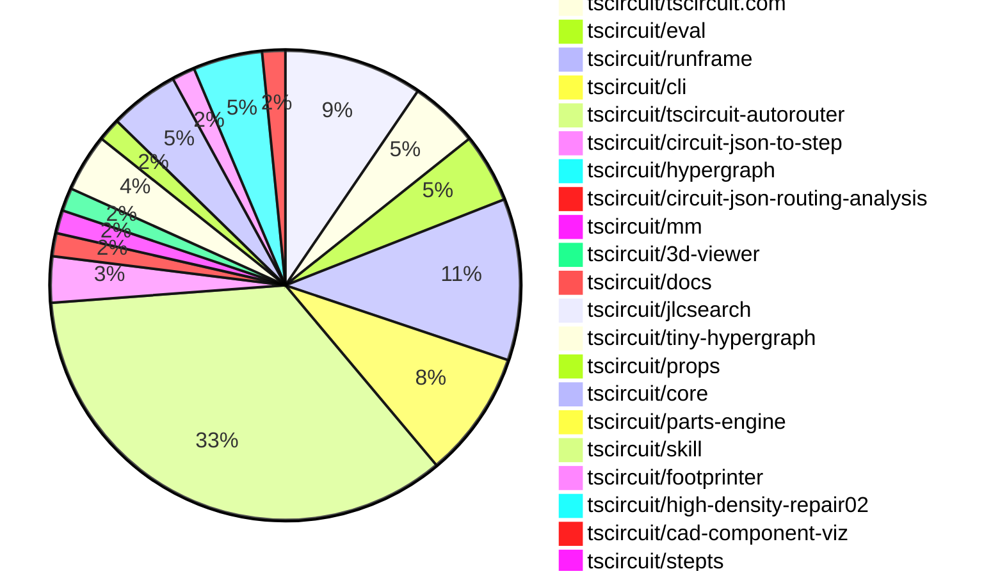

# contribution tracker

[contributions.tscircuit.com](https://contributions.tscircuit.com) ・ [tscircuit.com](https://tscircuit.com) ・ [Contribution Overviews](./contribution-overviews/) ・ [Changelogs](./changelogs/)

Generates weekly contribution overviews for tscircuit contributors. Check out all
the [contribution overviews here](./contribution-overviews/)
You can find AI-generated monthly changelogs in the [changelogs directory](./changelogs/)

- All PRs in the tscircuit org are scanned/summarized via an LLM
- The LLM classifies each Diff/PR as into a set of attributes for scoring
- All the PRs, summaries, and classifications are organized into charts and tables for [the website](https://contributions.tscircuit.com)

> Want to run locally? See the [Development Section](#development)

## Current Week

<!-- START_CURRENT_WEEK -->

# Contribution Overview 2026-03-31

The current week is shown below. There are 3 major sections:

- [Contributor Overview](#contributor-overview)
- [PRs by Repository](#prs-by-repository)
- [PRs by Contributor](#changes-by-contributor)
- [Scoring & Sponsorship Details](/docs/sponsorship-calculation-explanation.md)

## PRs by Repository


```mermaid
pie
    "tscircuit/tscircuit" : 12
    "tscircuit/tscircuit.com" : 6
    "tscircuit/eval" : 6
    "tscircuit/runframe" : 14
    "tscircuit/cli" : 11
    "tscircuit/tscircuit-autorouter" : 44
    "tscircuit/circuit-json-to-step" : 4
    "tscircuit/hypergraph" : 1
    "tscircuit/circuit-json-routing-analysis" : 2
    "tscircuit/mm" : 2
    "tscircuit/3d-viewer" : 2
    "tscircuit/docs" : 1
    "tscircuit/jlcsearch" : 1
    "tscircuit/tiny-hypergraph" : 5
    "tscircuit/props" : 2
    "tscircuit/core" : 6
    "tscircuit/parts-engine" : 1
    "tscircuit/skill" : 1
    "tscircuit/footprinter" : 2
    "tscircuit/high-density-repair02" : 6
    "tscircuit/cad-component-viz" : 2
    "tscircuit/stepts" : 1
    "tscircuit/fake-r2" : 1
```

## Contributor Overview

| Contributor | 🐳 Major | 🐙 Minor | 🐌 Tiny | Score | ⭐ | Discussion Contributions |
|-------------|---------|---------|---------|-------|-----|--------------------------|
| [seveibar](#seveibar) | 8 | 3 | 7 | 46 | ⭐⭐ | 0🔹 0🔶 0💎 |
| [ShiboSoftwareDev](#ShiboSoftwareDev) | 10 | 1 | 1 | 44 | ⭐⭐ | 0🔹 0🔶 0💎 |
| [Abse2001](#Abse2001) | 3 | 1 | 4 | 21.5 | ⭐⭐ | 0🔹 0🔶 0💎 |
| [MustafaMulla29](#MustafaMulla29) | 3 | 2 | 2 | 19 | ⭐⭐ | 0🔹 0🔶 0💎 |
| [AnasSarkiz](#AnasSarkiz) | 3 | 1 | 1 | 16 | ⭐⭐ | 0🔹 0🔶 0💎 |
| [0hmX](#0hmX) | 3 | 1 | 1 | 15 | ⭐⭐ | 0🔹 0🔶 0💎 |
| [tscircuitbot](#tscircuitbot) | 0 | 0 | 68 | 12 | ⭐⭐ | 0🔹 0🔶 0💎 |
| [rushabhcodes](#rushabhcodes) | 0 | 1 | 4 | 6 | ⭐ | 0🔹 0🔶 0💎 |
| [techmannih2](#techmannih2) | 0 | 1 | 3 | 5 | ⭐ | 0🔹 0🔶 0💎 |
| [imrishabh18](#imrishabh18) | 0 | 0 | 1 | 1 |  | 0🔹 0🔶 0💎 |

## Staff Pass Ratio (SPR)

| Contributor | Reviewed PRs | Rejections | Approvals | SPR |
|-------------|--------------|------------|-----------|-----|
| [ShiboSoftwareDev](#ShiboSoftwareDev) | 7 | 0 | 7 | 100.0% |
| [MustafaMulla29](#MustafaMulla29) | 5 | 0 | 6 | 100.0% |
| [0hmX](#0hmX) | 4 | 0 | 5 | 100.0% |
| [AnasSarkiz](#AnasSarkiz) | 3 | 0 | 3 | 100.0% |
| [techmannih2](#techmannih2) | 2 | 1 | 1 | 50.0% |
| [mohan-bee](#mohan-bee) | 2 | 5 | 0 | -150.0% |
| [rushabhcodes](#rushabhcodes) | 1 | 0 | 1 | 100.0% |
| [Abse2001](#Abse2001) | 1 | 0 | 1 | 100.0% |

<details>
<summary>ShiboSoftwareDev SPR PRs (7)</summary>

- [#2100](https://github.com/tscircuit/core/pull/2100) Preserve imported footprint aliases and internal pin connectivity during inflation
- [#795](https://github.com/tscircuit/tscircuit-autorouter/pull/795) Fix invalid rounded high-density seed causing circuit015 trace overlap
- [#789](https://github.com/tscircuit/tscircuit-autorouter/pull/789) Stitch degenerate fragmented MST connections as a single route set
- [#782](https://github.com/tscircuit/tscircuit-autorouter/pull/782) Prevent stitch solver from creating cross-node diagonal jumps
- [#763](https://github.com/tscircuit/tscircuit-autorouter/pull/763) Fix obstacle pcb_port attribution in circuit-json conversion
- [#766](https://github.com/tscircuit/tscircuit-autorouter/pull/766) fix disconnected traces
- [#740](https://github.com/tscircuit/tscircuit-autorouter/pull/740) Fix plated-hole conversion for multilayer SRJ obstacles

</details>

<details>
<summary>MustafaMulla29 SPR PRs (5)</summary>

- [#625](https://github.com/tscircuit/props/pull/625) Extend ChipProps for ConnectorProps instead of CommonComponentProps
- [#2095](https://github.com/tscircuit/core/pull/2095) Fix USB-C connector pin-label normalization and schematic render lifecycle
- [#2090](https://github.com/tscircuit/core/pull/2090) Support standard=usb_c for connector using parts-engine
- [#2589](https://github.com/tscircuit/cli/pull/2589) feat: add --show-courtyards flag to snapshot, build, and export commands
- [#20](https://github.com/tscircuit/parts-engine/pull/20) Feat: add fetchPartCircuitJson and USB-C connector support

</details>

<details>
<summary>0hmX SPR PRs (4)</summary>

- [#780](https://github.com/tscircuit/tscircuit-autorouter/pull/780) Fix hypergraph pipelines ignoring necessary cramped port point filtering
- [#784](https://github.com/tscircuit/tscircuit-autorouter/pull/784) Nearby obstacle-segment proximity check for high-density solver; enable for VertHorzLayer strategy and update tests
- [#1](https://github.com/tscircuit/circuit-json-routing-analysis/pull/1) Update to use the alias for the autorouter
- [#23](https://github.com/tscircuit/tiny-hypergraph/pull/23) Pre exit if fount an port that contains an net belong to same connection and go to the same obstacle

</details>

<details>
<summary>AnasSarkiz SPR PRs (3)</summary>

- [#786](https://github.com/tscircuit/tscircuit-autorouter/pull/786) Group solver profiling by solver name across scenarios, rank by total runtime, and improve sub-1s timing precision
- [#767](https://github.com/tscircuit/tscircuit-autorouter/pull/767) Fix stale fixed-via integration by removing manual convex graph bootstrapping and adopting `FixedViaHypergraphSolver` auto-convex API
- [#746](https://github.com/tscircuit/tscircuit-autorouter/pull/746) Introduce PCB SVG renderer with Debug menu toggle

</details>

<details>
<summary>techmannih2 SPR PRs (2)</summary>

- [#2099](https://github.com/tscircuit/core/pull/2099) Repro: add repro for alphanumeric pin number validation error
- [#2094](https://github.com/tscircuit/core/pull/2094) feat: add common net definitions to sel and include validation tests

</details>

<details>
<summary>mohan-bee SPR PRs (2)</summary>

- [#2091](https://github.com/tscircuit/core/pull/2091) Fix Human readable IDs in autorouter diagnostics
- [#193](https://github.com/tscircuit/circuit-json-to-kicad/pull/193) Add KiCad footprint export converter

</details>

<details>
<summary>rushabhcodes SPR PRs (1)</summary>

- [#6](https://github.com/tscircuit/mm/pull/6) Prevent mmStr from emitting scientific notation for small metric values

</details>

<details>
<summary>Abse2001 SPR PRs (1)</summary>

- [#3025](https://github.com/tscircuit/runframe/pull/3025) Refactor exports to dynamic loading to ensure latest dependency used

</details>

> Note: AI evaluates PRs and assigns 1-3 star ratings automatically. 4 and 5 star ratings require manual staff review.

### Discussion Contribution Legend

- 🔹 Normal Comments: Basic participation with minimal effort
- 🔶 Great Informative Comments: Thoughtful participation that adds value
- 💎 Incredible Comments: Exceptional participation with high-quality content

## Review Table

[reviews-received-hover]: ## "Number of reviews received for PRs for this contributor"
[approvals-received-hover]: ## "Number of approvals received for PRs this contributor authored"
[rejections-received-hover]: ## "Number of rejections received for PRs this contributor authored"
[prs-opened-hover]: ## "Number of PRs opened by this contributor"
[issues-created-hover]: ## "Number of issues created by this contributor"

| Contributor | Reviews Received | Approvals Received | Rejections Received | Approvals | Rejections Given | PRs Opened | PRs Merged | Issues Created |
|---|---|---|---|---|---|---|---|---|
| [tscircuitbot](#tscircuitbot) | 1 | 0 | 0 | 0 | 0 | 89 | 68 | 0 |
| [Cripto5588](#Cripto5588) | 0 | 0 | 0 | 0 | 0 | 1 | 0 | 0 |
| [rushabhcodes](#rushabhcodes) | 22 | 4 | 0 | 0 | 2 | 6 | 5 | 0 |
| [seveibar](#seveibar) | 8 | 0 | 0 | 30 | 6 | 34 | 18 | 0 |
| [techmannih2](#techmannih2) | 12 | 4 | 2 | 0 | 0 | 10 | 4 | 0 |
| [MustafaMulla29](#MustafaMulla29) | 12 | 6 | 0 | 2 | 3 | 8 | 7 | 0 |
| [sungdark](#sungdark) | 3 | 0 | 0 | 0 | 0 | 4 | 0 | 0 |
| [claw-explorer](#claw-explorer) | 2 | 0 | 0 | 0 | 0 | 4 | 0 | 0 |
| [Susanth2005](#Susanth2005) | 0 | 0 | 0 | 0 | 0 | 2 | 0 | 0 |
| [Abse2001](#Abse2001) | 5 | 5 | 0 | 4 | 0 | 9 | 8 | 0 |
| [ShiboSoftwareDev](#ShiboSoftwareDev) | 9 | 7 | 0 | 1 | 0 | 19 | 12 | 0 |
| [mohan-bee](#mohan-bee) | 30 | 0 | 7 | 0 | 0 | 5 | 0 | 0 |
| [crftsmnd](#crftsmnd) | 0 | 0 | 0 | 0 | 0 | 1 | 0 | 0 |
| [hinzwilliam52-ship-it](#hinzwilliam52-ship-it) | 0 | 0 | 0 | 0 | 0 | 1 | 0 | 0 |
| [Chronolapse411](#Chronolapse411) | 0 | 0 | 0 | 0 | 0 | 2 | 0 | 0 |
| [PurdueDM](#PurdueDM) | 0 | 0 | 0 | 0 | 0 | 1 | 0 | 0 |
| [0hmX](#0hmX) | 6 | 5 | 0 | 0 | 0 | 6 | 5 | 0 |
| [AnasSarkiz](#AnasSarkiz) | 7 | 7 | 0 | 1 | 0 | 6 | 6 | 0 |
| [oceanlight-cn](#oceanlight-cn) | 0 | 0 | 0 | 0 | 0 | 1 | 0 | 0 |
| [drmabus](#drmabus) | 1 | 0 | 1 | 0 | 0 | 1 | 0 | 0 |
| [mitchellecm7](#mitchellecm7) | 1 | 0 | 1 | 0 | 0 | 2 | 0 | 0 |
| [billwestrup](#billwestrup) | 0 | 0 | 0 | 0 | 0 | 1 | 0 | 0 |
| [imrishabh18](#imrishabh18) | 0 | 0 | 0 | 0 | 0 | 1 | 1 | 0 |

## Changes by Repository

### [tscircuit/tscircuit](https://github.com/tscircuit/tscircuit)


<details>
<summary>🐌 Tiny Contributions (12)</summary>

| PR # | Impact | Contributor | Description |
|------|--------|-------------|-------------|
| [#2830](https://github.com/tscircuit/tscircuit/pull/2830) | 🐌 Tiny | tscircuitbot | Automated package update |
| [#2829](https://github.com/tscircuit/tscircuit/pull/2829) | 🐌 Tiny | tscircuitbot | Automated package update |
| [#2825](https://github.com/tscircuit/tscircuit/pull/2825) | 🐌 Tiny | tscircuitbot | Automated package update |
| [#2824](https://github.com/tscircuit/tscircuit/pull/2824) | 🐌 Tiny | tscircuitbot | Automated package update |
| [#2816](https://github.com/tscircuit/tscircuit/pull/2816) | 🐌 Tiny | tscircuitbot | Updates the tscircuitcli package and other related dependencies to their latest versions. |
| [#2822](https://github.com/tscircuit/tscircuit/pull/2822) | 🐌 Tiny | tscircuitbot | Updates the tscircuitcli package from version 0.1.1194 to 0.1.1195 |
| [#2817](https://github.com/tscircuit/tscircuit/pull/2817) | 🐌 Tiny | tscircuitbot | Automated package update |
| [#2823](https://github.com/tscircuit/tscircuit/pull/2823) | 🐌 Tiny | tscircuitbot | Automated package update |
| [#2818](https://github.com/tscircuit/tscircuit/pull/2818) | 🐌 Tiny | tscircuitbot | Automated package update |
| [#2819](https://github.com/tscircuit/tscircuit/pull/2819) | 🐌 Tiny | tscircuitbot | Automated package update |
| [#2813](https://github.com/tscircuit/tscircuit/pull/2813) | 🐌 Tiny | tscircuitbot | Automated package update |
| [#2814](https://github.com/tscircuit/tscircuit/pull/2814) | 🐌 Tiny | tscircuitbot | Automated package update |

</details>

### [tscircuit/tscircuit.com](https://github.com/tscircuit/tscircuit.com)


<details>
<summary>🐌 Tiny Contributions (6)</summary>

| PR # | Impact | Contributor | Description |
|------|--------|-------------|-------------|
| [#3087](https://github.com/tscircuit/tscircuit.com/pull/3087) | 🐌 Tiny | tscircuitbot | Automated package update |
| [#3085](https://github.com/tscircuit/tscircuit.com/pull/3085) | 🐌 Tiny | tscircuitbot | Updates the tscircuiteval package from version 0.0.727 to 0.0.728 |
| [#3082](https://github.com/tscircuit/tscircuit.com/pull/3082) | 🐌 Tiny | tscircuitbot | Updates the tscircuitrunframe package from version 0.0.1777 to 0.0.1778 |
| [#3081](https://github.com/tscircuit/tscircuit.com/pull/3081) | 🐌 Tiny | tscircuitbot | Automated package update |
| [#3080](https://github.com/tscircuit/tscircuit.com/pull/3080) | 🐌 Tiny | tscircuitbot | Automated package update |
| [#3079](https://github.com/tscircuit/tscircuit.com/pull/3079) | 🐌 Tiny | tscircuitbot | Updates the tscircuitrunframe package from version 0.0.1774 to 0.0.1776 in the package.json file. |

</details>

### [tscircuit/eval](https://github.com/tscircuit/eval)


<details>
<summary>🐌 Tiny Contributions (6)</summary>

| PR # | Impact | Contributor | Description |
|------|--------|-------------|-------------|
| [#2319](https://github.com/tscircuit/eval/pull/2319) | 🐌 Tiny | tscircuitbot | Automated package update |
| [#2318](https://github.com/tscircuit/eval/pull/2318) | 🐌 Tiny | tscircuitbot | Automated package update |
| [#2316](https://github.com/tscircuit/eval/pull/2316) | 🐌 Tiny | tscircuitbot | Automated package update |
| [#2315](https://github.com/tscircuit/eval/pull/2315) | 🐌 Tiny | tscircuitbot | Automated package update |
| [#2314](https://github.com/tscircuit/eval/pull/2314) | 🐌 Tiny | tscircuitbot | Automated package update |
| [#2313](https://github.com/tscircuit/eval/pull/2313) | 🐌 Tiny | tscircuitbot | Automated package update |

</details>

### [tscircuit/runframe](https://github.com/tscircuit/runframe)

| PR # | Impact | Rating | Contributor | Description |
|------|--------|--------|-------------|-------------|
| [#3025](https://github.com/tscircuit/runframe/pull/3025) | 🐙 Minor | ⭐⭐ | Abse2001 | Refactors the export functionality to utilize dynamic imports for dependencies, ensuring the latest versions are used during the export process. |

<details>
<summary>🐌 Tiny Contributions (13)</summary>

| PR # | Impact | Contributor | Description |
|------|--------|-------------|-------------|
| [#3030](https://github.com/tscircuit/runframe/pull/3030) | 🐌 Tiny | tscircuitbot | Automated package update |
| [#3029](https://github.com/tscircuit/runframe/pull/3029) | 🐌 Tiny | tscircuitbot | Updates the tscircuiteval package from version 0.0.728 to 0.0.729 in the package.json file. |
| [#3028](https://github.com/tscircuit/runframe/pull/3028) | 🐌 Tiny | tscircuitbot | Automated package update |
| [#3027](https://github.com/tscircuit/runframe/pull/3027) | 🐌 Tiny | tscircuitbot | Updates the tscircuiteval package from version 0.0.727 to 0.0.728 |
| [#3026](https://github.com/tscircuit/runframe/pull/3026) | 🐌 Tiny | tscircuitbot | Automated package update |
| [#3024](https://github.com/tscircuit/runframe/pull/3024) | 🐌 Tiny | tscircuitbot | Automated package update |
| [#3023](https://github.com/tscircuit/runframe/pull/3023) | 🐌 Tiny | tscircuitbot | Updates the tscircuiteval package from version 0.0.726 to 0.0.727 in the package.json file. |
| [#3022](https://github.com/tscircuit/runframe/pull/3022) | 🐌 Tiny | tscircuitbot | Automated package update |
| [#3020](https://github.com/tscircuit/runframe/pull/3020) | 🐌 Tiny | tscircuitbot | Automated package update |
| [#3019](https://github.com/tscircuit/runframe/pull/3019) | 🐌 Tiny | tscircuitbot | Updates the tscircuit3d-viewer package to version 0.0.547 in package.json |
| [#3021](https://github.com/tscircuit/runframe/pull/3021) | 🐌 Tiny | tscircuitbot | Updates the tscircuit3d-viewer package to version 0.0.548 |
| [#3018](https://github.com/tscircuit/runframe/pull/3018) | 🐌 Tiny | tscircuitbot | Automated package update |
| [#3017](https://github.com/tscircuit/runframe/pull/3017) | 🐌 Tiny | techmannih2 | Updates the easyeda dependency version from 0.0.252 to 0.0.254 in package.json |

</details>

### [tscircuit/cli](https://github.com/tscircuit/cli)

| PR # | Impact | Rating | Contributor | Description |
|------|--------|--------|-------------|-------------|
| [#2589](https://github.com/tscircuit/cli/pull/2589) | 🐳 Major | ⭐⭐⭐ | MustafaMulla29 | Adds a --show-courtyards flag to the snapshot, build, and export commands to include courtyard outlines in PCB SVG outputs. |

<details>
<summary>🐌 Tiny Contributions (10)</summary>

| PR # | Impact | Contributor | Description |
|------|--------|-------------|-------------|
| [#2603](https://github.com/tscircuit/cli/pull/2603) | 🐌 Tiny | tscircuitbot | Automated package update |
| [#2602](https://github.com/tscircuit/cli/pull/2602) | 🐌 Tiny | tscircuitbot | Updates the tscircuitrunframe package version from 0.0.1778 to 0.0.1780 in package.json |
| [#2600](https://github.com/tscircuit/cli/pull/2600) | 🐌 Tiny | tscircuitbot | Automated package update |
| [#2599](https://github.com/tscircuit/cli/pull/2599) | 🐌 Tiny | tscircuitbot | Updates the tscircuitrunframe package to version 0.0.1778 |
| [#2593](https://github.com/tscircuit/cli/pull/2593) | 🐌 Tiny | tscircuitbot | Updates the tscircuitrunframe package from version 0.0.1774 to 0.0.1776 |
| [#2595](https://github.com/tscircuit/cli/pull/2595) | 🐌 Tiny | tscircuitbot | Updates the tscircuitrunframe package from version 0.0.1776 to 0.0.1777 |
| [#2598](https://github.com/tscircuit/cli/pull/2598) | 🐌 Tiny | tscircuitbot | Automated package update |
| [#2596](https://github.com/tscircuit/cli/pull/2596) | 🐌 Tiny | tscircuitbot | Automated package update |
| [#2594](https://github.com/tscircuit/cli/pull/2594) | 🐌 Tiny | tscircuitbot | Automated package update |
| [#2597](https://github.com/tscircuit/cli/pull/2597) | 🐌 Tiny | MustafaMulla29 | Returns a message indicating no congested regions when the routing difficulty check does not find any issues. |

</details>

### [tscircuit/tscircuit-autorouter](https://github.com/tscircuit/tscircuit-autorouter)

| PR # | Impact | Rating | Contributor | Description |
|------|--------|--------|-------------|-------------|
| [#805](https://github.com/tscircuit/tscircuit-autorouter/pull/805) | 🐳 Major | ⭐⭐⭐ | seveibar | Fixes a bug where the simplification process incorrectly removes vias and creates invalid lines in the autorouting algorithm. |
| [#792](https://github.com/tscircuit/tscircuit-autorouter/pull/792) | 🐳 Major | ⭐⭐⭐ | seveibar | Fixes high-density node downloads by preferring preserved inputs and adding regression coverage for node metadata. |
| [#754](https://github.com/tscircuit/tscircuit-autorouter/pull/754) | 🐳 Major | ⭐⭐⭐ | seveibar | This pull request introduces a new autorouting pipeline (Pipeline5) that supports asynchronous high-density caching, along with fixes for tiny hypergraph issues and single-layer node problems. The changes aim to enhance the performance and reliability of the autorouter, particularly in handling complex datasets. |
| [#774](https://github.com/tscircuit/tscircuit-autorouter/pull/774) | 🐳 Major | ⭐⭐⭐ | seveibar | Add kOrder to high density phase, fix sanitization to handle hypergraphs that arent serialized, experimental tiny-hypergraph optimization, and update tiny-hypergraph dependency version. |
| [#795](https://github.com/tscircuit/tscircuit-autorouter/pull/795) | 🐳 Major | ⭐⭐⭐ | ShiboSoftwareDev | Fixes autorouting failure by preventing SingleHighDensityRouteSolver from starting on an invalid rounded seed node, ensuring proper obstacle clearance and preventing trace overlaps in circuit015. |
| [#789](https://github.com/tscircuit/tscircuit-autorouter/pull/789) | 🐳 Major | ⭐⭐⭐ | ShiboSoftwareDev | Fixes autorouting issue where degenerate fragmented MST connections were incorrectly processed as separate jobs, leading to erroneous routing paths. |
| [#782](https://github.com/tscircuit/tscircuit-autorouter/pull/782) | 🐳 Major | ⭐⭐⭐ | ShiboSoftwareDev | Prunes each stitched connection down to the endpoint-to-endpoint route path before handing it to the single-route stitcher, which avoids gap-bridging onto stray branches. |
| [#763](https://github.com/tscircuit/tscircuit-autorouter/pull/763) | 🐳 Major | ⭐⭐⭐ | ShiboSoftwareDev | Fixes incorrect attribution of pcb_port in circuit-json conversion by selecting the nearest pcb_port_id for obstacles instead of the first connected port, ensuring accurate DRC labels and alignment with obstacle geometry. |
| [#766](https://github.com/tscircuit/tscircuit-autorouter/pull/766) | 🐳 Major | ⭐⭐⭐ | ShiboSoftwareDev | Fixes the issue of disconnected traces in the autorouting process, ensuring proper connectivity in circuit designs. |
| [#740](https://github.com/tscircuit/tscircuit-autorouter/pull/740) | 🐳 Major | ⭐⭐⭐ | ShiboSoftwareDev | Fixes misclassification of multilayer SRJ obstacles during circuit-json conversion, ensuring proper detection of plated-hole collisions in DRC. |
| [#780](https://github.com/tscircuit/tscircuit-autorouter/pull/780) | 🐳 Major | ⭐⭐⭐ | 0hmX | Fixes hypergraph pipelines to correctly apply cramped port point filtering, ensuring accurate routing in complex circuit designs. |
| [#784](https://github.com/tscircuit/tscircuit-autorouter/pull/784) | 🐳 Major | ⭐⭐⭐ | 0hmX | Adds a configurable proximity check to avoid routes coming too close to existing obstacle segments, improving DRC results and enabling it by default for the VertHorzLayer strategy. |
| [#781](https://github.com/tscircuit/tscircuit-autorouter/pull/781) | 🐳 Major | ⭐⭐⭐ | AnasSarkiz | Fixes a misleading visualization bug in Pipeline4HighDensityRepairSolver where repaired traces appeared as top-layer solid lines, even when routed on non-top layers. |
| [#767](https://github.com/tscircuit/tscircuit-autorouter/pull/767) | 🐳 Major | ⭐⭐⭐ | AnasSarkiz | Removes manual convex graph bootstrapping in favor of the FixedViaHypergraphSolver auto-convex API for improved integration and reduced maintenance risk. |
| [#746](https://github.com/tscircuit/tscircuit-autorouter/pull/746) | 🐳 Major | ⭐⭐⭐ | AnasSarkiz | Adds a PCB SVG renderer to the autorouting debugger, allowing users to toggle the display of PCB SVGs after successful routing. |
| [#798](https://github.com/tscircuit/tscircuit-autorouter/pull/798) | 🐙 Minor | ⭐⭐ | seveibar | Add a Delta column to benchmark results in PR details to indicate improvements or regressions compared to the main branch. |
| [#786](https://github.com/tscircuit/tscircuit-autorouter/pull/786) | 🐙 Minor | ⭐⭐ | AnasSarkiz | Changes the solver profiling output to group by solver name, providing clearer metrics and improved timing precision. |

<details>
<summary>🐌 Tiny Contributions (27)</summary>

| PR # | Impact | Contributor | Description |
|------|--------|-------------|-------------|
| [#812](https://github.com/tscircuit/tscircuit-autorouter/pull/812) | 🐌 Tiny | tscircuitbot | Automated package update |
| [#808](https://github.com/tscircuit/tscircuit-autorouter/pull/808) | 🐌 Tiny | tscircuitbot | Automated package update |
| [#807](https://github.com/tscircuit/tscircuit-autorouter/pull/807) | 🐌 Tiny | tscircuitbot | Automated package update |
| [#793](https://github.com/tscircuit/tscircuit-autorouter/pull/793) | 🐌 Tiny | tscircuitbot | Automated package update |
| [#810](https://github.com/tscircuit/tscircuit-autorouter/pull/810) | 🐌 Tiny | tscircuitbot | Automated package update |
| [#796](https://github.com/tscircuit/tscircuit-autorouter/pull/796) | 🐌 Tiny | tscircuitbot | Automated package update |
| [#794](https://github.com/tscircuit/tscircuit-autorouter/pull/794) | 🐌 Tiny | tscircuitbot | Automated package update |
| [#788](https://github.com/tscircuit/tscircuit-autorouter/pull/788) | 🐌 Tiny | tscircuitbot | Automated package update |
| [#772](https://github.com/tscircuit/tscircuit-autorouter/pull/772) | 🐌 Tiny | tscircuitbot | Automated package update |
| [#785](https://github.com/tscircuit/tscircuit-autorouter/pull/785) | 🐌 Tiny | tscircuitbot | Automated package update |
| [#787](https://github.com/tscircuit/tscircuit-autorouter/pull/787) | 🐌 Tiny | tscircuitbot | Automated package update |
| [#775](https://github.com/tscircuit/tscircuit-autorouter/pull/775) | 🐌 Tiny | tscircuitbot | Automated package update |
| [#761](https://github.com/tscircuit/tscircuit-autorouter/pull/761) | 🐌 Tiny | tscircuitbot | Automated package update |
| [#768](https://github.com/tscircuit/tscircuit-autorouter/pull/768) | 🐌 Tiny | tscircuitbot | Automated package update |
| [#757](https://github.com/tscircuit/tscircuit-autorouter/pull/757) | 🐌 Tiny | tscircuitbot | Automated package update |
| [#762](https://github.com/tscircuit/tscircuit-autorouter/pull/762) | 🐌 Tiny | tscircuitbot | Automated package update |
| [#765](https://github.com/tscircuit/tscircuit-autorouter/pull/765) | 🐌 Tiny | tscircuitbot | Automated package update |
| [#771](https://github.com/tscircuit/tscircuit-autorouter/pull/771) | 🐌 Tiny | tscircuitbot | Automated package update |
| [#755](https://github.com/tscircuit/tscircuit-autorouter/pull/755) | 🐌 Tiny | tscircuitbot | Automated package update |
| [#814](https://github.com/tscircuit/tscircuit-autorouter/pull/814) | 🐌 Tiny | seveibar | Fixes the issue where the benchmark job fails early, preventing the temporary comment from being updated with failure details in the PR thread. |
| [#804](https://github.com/tscircuit/tscircuit-autorouter/pull/804) | 🐌 Tiny | seveibar | Allows snapshot commits and pushes to proceed even when tests fail, and updates status comments accordingly. |
| [#778](https://github.com/tscircuit/tscircuit-autorouter/pull/778) | 🐌 Tiny | seveibar | Adds a GitHub Actions workflow that allows users to update test snapshots via a comment command in pull requests, automating the process of running tests and committing changes back to the PR branch. |
| [#806](https://github.com/tscircuit/tscircuit-autorouter/pull/806) | 🐌 Tiny | seveibar | Moves the Auto Solve and Auto DRC Check options into a new Automations submenu under the Debug menu to declutter the interface and improve discoverability. |
| [#760](https://github.com/tscircuit/tscircuit-autorouter/pull/760) | 🐌 Tiny | seveibar | Updates the tiny-hypergraph dependency in package.json to a specific commit to ensure the inclusion of a fix for penalizing single-layer intersections in the region mask. |
| [#764](https://github.com/tscircuit/tscircuit-autorouter/pull/764) | 🐌 Tiny | seveibar | Changes the benchmark GitHub comment script to use emoji indicators for test status instead of verbose text labels. |
| [#815](https://github.com/tscircuit/tscircuit-autorouter/pull/815) | 🐌 Tiny | Abse2001 | Updates the dependency high-density-repair02 to the latest commit in the repository. |
| [#756](https://github.com/tscircuit/tscircuit-autorouter/pull/756) | 🐌 Tiny | AnasSarkiz | Fixes visualization issue where non-primary-layer traces appeared as near-continuous lines when zooming in by replacing fixed string dash pattern with numeric dash units and reducing non-primary-layer transparency for improved trace visibility. |

</details>

### [tscircuit/circuit-json-to-step](https://github.com/tscircuit/circuit-json-to-step)


<details>
<summary>🐌 Tiny Contributions (4)</summary>

| PR # | Impact | Contributor | Description |
|------|--------|-------------|-------------|
| [#66](https://github.com/tscircuit/circuit-json-to-step/pull/66) | 🐌 Tiny | tscircuitbot | Automated package update |
| [#68](https://github.com/tscircuit/circuit-json-to-step/pull/68) | 🐌 Tiny | tscircuitbot | Automated package update |
| [#65](https://github.com/tscircuit/circuit-json-to-step/pull/65) | 🐌 Tiny | Abse2001 | Fixes import resolution for the stepts library in the browser bundle by correcting the import path in the step-model-merger.ts file and ensuring the library is included in peerDependencies in package.json. |
| [#67](https://github.com/tscircuit/circuit-json-to-step/pull/67) | 🐌 Tiny | Abse2001 | Updates the stepts dependency version from 0.0.3 to 0.0.4 in package.json |

</details>

### [tscircuit/hypergraph](https://github.com/tscircuit/hypergraph)


<details>
<summary>🐌 Tiny Contributions (1)</summary>

| PR # | Impact | Contributor | Description |
|------|--------|-------------|-------------|
| [#163](https://github.com/tscircuit/hypergraph/pull/163) | 🐌 Tiny | tscircuitbot | Automated package update |

</details>

### [tscircuit/circuit-json-routing-analysis](https://github.com/tscircuit/circuit-json-routing-analysis)

| PR # | Impact | Rating | Contributor | Description |
|------|--------|--------|-------------|-------------|
| [#1](https://github.com/tscircuit/circuit-json-routing-analysis/pull/1) | 🐙 Minor | ⭐⭐ | 0hmX | ref: https:discord.comchannels123348724812992113512334872481299211381488744706237268008 |

<details>
<summary>🐌 Tiny Contributions (1)</summary>

| PR # | Impact | Contributor | Description |
|------|--------|-------------|-------------|
| [#2](https://github.com/tscircuit/circuit-json-routing-analysis/pull/2) | 🐌 Tiny | tscircuitbot | Automated package update |

</details>

### [tscircuit/mm](https://github.com/tscircuit/mm)

| PR # | Impact | Rating | Contributor | Description |
|------|--------|--------|-------------|-------------|
| [#6](https://github.com/tscircuit/mm/pull/6) | 🐙 Minor | ⭐⭐ | rushabhcodes | Fixes a subtle formatting bug in mmStr where very small values could be returned in scientific notation instead of a plain decimal millimeter string. |

<details>
<summary>🐌 Tiny Contributions (1)</summary>

| PR # | Impact | Contributor | Description |
|------|--------|-------------|-------------|
| [#7](https://github.com/tscircuit/mm/pull/7) | 🐌 Tiny | rushabhcodes | Adds a GitHub Actions workflow to automate npm releases for tscircuitmm from main, reducing manual release steps and making the publish flow more consistent and repeatable. |

</details>

### [tscircuit/3d-viewer](https://github.com/tscircuit/3d-viewer)


<details>
<summary>🐌 Tiny Contributions (2)</summary>

| PR # | Impact | Contributor | Description |
|------|--------|-------------|-------------|
| [#750](https://github.com/tscircuit/3d-viewer/pull/750) | 🐌 Tiny | rushabhcodes | Updates the circuit-to-canvas dependency version from 0.0.92 to 0.0.94 in package.json |
| [#749](https://github.com/tscircuit/3d-viewer/pull/749) | 🐌 Tiny | rushabhcodes | Updates the tscircuitalphabet dependency to version 0.0.25 in the package.json file. |

</details>

### [tscircuit/docs](https://github.com/tscircuit/docs)


<details>
<summary>🐌 Tiny Contributions (1)</summary>

| PR # | Impact | Contributor | Description |
|------|--------|-------------|-------------|
| [#523](https://github.com/tscircuit/docs/pull/523) | 🐌 Tiny | rushabhcodes | This PR updates the CLI documentation to include missing tsci options and corrects existing descriptions, enhancing the clarity and completeness of the command reference pages. |

</details>

### [tscircuit/jlcsearch](https://github.com/tscircuit/jlcsearch)

| PR # | Impact | Rating | Contributor | Description |
|------|--------|--------|-------------|-------------|
| [#159](https://github.com/tscircuit/jlcsearch/pull/159) | 🐳 Major | ⭐⭐⭐ | seveibar | Caches D1 componentslist responses in KV for both HTML and JSON formats to reduce repeated query work and improve response times. |

### [tscircuit/tiny-hypergraph](https://github.com/tscircuit/tiny-hypergraph)

| PR # | Impact | Rating | Contributor | Description |
|------|--------|--------|-------------|-------------|
| [#18](https://github.com/tscircuit/tiny-hypergraph/pull/18) | 🐳 Major | ⭐⭐⭐ | seveibar | Sets the default maximum number of hot regions to 2 and implements minor snapshotting in the section solver to enhance processing speed. |
| [#17](https://github.com/tscircuit/tiny-hypergraph/pull/17) | 🐳 Major | ⭐⭐⭐ | seveibar | Refines the logic for identifying known single-layer regions in the routing algorithm, ensuring that only valid single-layer masks are accepted as candidates for routing. |
| [#16](https://github.com/tscircuit/tiny-hypergraph/pull/16) | 🐳 Major | ⭐⭐⭐ | seveibar | Adds support for region z mask and resolves the issue of impossible single-layer nodes being created in the hypergraph. |
| [#23](https://github.com/tscircuit/tiny-hypergraph/pull/23) | 🐳 Major | ⭐⭐⭐ | 0hmX | Fixes routing logic to ensure that ports connected to the same net can share bottleneck ports without causing routing failures. |

<details>
<summary>🐌 Tiny Contributions (1)</summary>

| PR # | Impact | Contributor | Description |
|------|--------|-------------|-------------|
| [#22](https://github.com/tscircuit/tiny-hypergraph/pull/22) | 🐌 Tiny | 0hmX | Adds a new page and test for reproducing the shared bottleneck issue in same-net routes, including SVG snapshot visualization. |

</details>

### [tscircuit/props](https://github.com/tscircuit/props)

| PR # | Impact | Rating | Contributor | Description |
|------|--------|--------|-------------|-------------|
| [#627](https://github.com/tscircuit/props/pull/627) | 🐙 Minor | ⭐⭐ | seveibar | Adds support for the autorouter version v5 in the TypeScript union, updates validation schemas, and regenerates documentation to reflect this new allowed value. |
| [#625](https://github.com/tscircuit/props/pull/625) | 🐙 Minor | ⭐⭐ | MustafaMulla29 | Changes ConnectorProps to extend ChipPropsSU instead of CommonComponentProps, modifying its structure and properties. |

### [tscircuit/core](https://github.com/tscircuit/core)

| PR # | Impact | Rating | Contributor | Description |
|------|--------|--------|-------------|-------------|
| [#2095](https://github.com/tscircuit/core/pull/2095) | 🐳 Major | ⭐⭐⭐ | MustafaMulla29 | This pull request addresses the normalization of pin labels for USB-C connectors and improves the lifecycle management of schematic renders. It introduces a new utility function to rewrite USB-C port hints, ensuring that pin labels are standardized and that the rendering process is more efficient and reliable. |
| [#2090](https://github.com/tscircuit/core/pull/2090) | 🐳 Major | ⭐⭐⭐ | MustafaMulla29 | Adds support for the USB-C standard in connectors by integrating with the parts engine to fetch circuit JSON and manage footprints accordingly. |
| [#2100](https://github.com/tscircuit/core/pull/2100) | 🐳 Major | ⭐⭐⭐ | ShiboSoftwareDev | Fixes the issue where imported footprint aliases are dropped when a matching port already exists, ensuring correct alias merging and treating numeric hints as valid pin identifiers. |
| [#2101](https://github.com/tscircuit/core/pull/2101) | 🐙 Minor | ⭐⭐ | seveibar | Expose the new high-density v5 autorouter pipeline so callers can opt into autorouterVersionv5 when running local autorouting. |
| [#2094](https://github.com/tscircuit/core/pull/2094) | 🐙 Minor | ⭐⭐ | techmannih2 | Adds common net definitions (VBUS, SWCLK, USB_DM, USB_DP, QSPI_SS, XIN, XOUT, RUN, SWD, GPIONums40) to the CommonNetNames type and includes a comprehensive test suite for validation. |

<details>
<summary>🐌 Tiny Contributions (1)</summary>

| PR # | Impact | Contributor | Description |
|------|--------|-------------|-------------|
| [#2098](https://github.com/tscircuit/core/pull/2098) | 🐌 Tiny | seveibar | Updates the autorouter dependency to version 0.0.398 and refreshes the associated snapshots in the testing suite. |

</details>

### [tscircuit/parts-engine](https://github.com/tscircuit/parts-engine)

| PR # | Impact | Rating | Contributor | Description |
|------|--------|--------|-------------|-------------|
| [#20](https://github.com/tscircuit/parts-engine/pull/20) | 🐙 Minor | ⭐⭐ | MustafaMulla29 | Adds fetchPartCircuitJson to PartsEngine to fetch full circuit JSON for a part via EasyEDA API and adds findPart support for simple_connector with standardusb_c. |

### [tscircuit/skill](https://github.com/tscircuit/skill)


<details>
<summary>🐌 Tiny Contributions (1)</summary>

| PR # | Impact | Contributor | Description |
|------|--------|-------------|-------------|
| [#15](https://github.com/tscircuit/skill/pull/15) | 🐌 Tiny | MustafaMulla29 | Enforces that the tsci check placement must pass with no actionable placement violations before finalizing the circuit layout in the tscircuit skill documentation. |

</details>

### [tscircuit/footprinter](https://github.com/tscircuit/footprinter)


<details>
<summary>🐌 Tiny Contributions (2)</summary>

| PR # | Impact | Contributor | Description |
|------|--------|-------------|-------------|
| [#571](https://github.com/tscircuit/footprinter/pull/571) | 🐌 Tiny | techmannih2 | Aligns pad dimensions and coordinates for the SOT-23 footprint with KiCad standards, ensuring accurate representation in PCB designs. |
| [#572](https://github.com/tscircuit/footprinter/pull/572) | 🐌 Tiny | techmannih2 | Fixes the footprint string parser to support the sot23-5 alias for electronic components. |

</details>

### [tscircuit/high-density-repair02](https://github.com/tscircuit/high-density-repair02)

| PR # | Impact | Rating | Contributor | Description |
|------|--------|--------|-------------|-------------|
| [#19](https://github.com/tscircuit/high-density-repair02/pull/19) | 🐳 Major | ⭐⭐⭐ | ShiboSoftwareDev | Reduces the geometry complexity for conflict detection in the high-density repair solver by collapsing collinear segment chains into single segments, improving performance without altering route points or solver output. |
| [#16](https://github.com/tscircuit/high-density-repair02/pull/16) | 🐳 Major | ⭐⭐⭐ | ShiboSoftwareDev | Reduces solver overhead by skipping progress frame capture during normal solves and benchmarks, while allowing for explicit captureProgressFrames opt-in for full debugger visualization. |
| [#18](https://github.com/tscircuit/high-density-repair02/pull/18) | 🐳 Major | ⭐⭐⭐ | ShiboSoftwareDev | Reduces benchmark time from 5078ms to 4581ms by optimizing conflict detection and move evaluation in the routing algorithm. |
| [#20](https://github.com/tscircuit/high-density-repair02/pull/20) | 🐳 Major | ⭐⭐⭐ | Abse2001 | Add functionality to detect boundary and buffer-zone violations for traces, including benchmarking integration to measure performance. |
| [#17](https://github.com/tscircuit/high-density-repair02/pull/17) | 🐙 Minor | ⭐⭐ | ShiboSoftwareDev | Preserves route endpoints on any node boundary side they originally touch exactly, so repair moves no longer pull terminals off the graph edge in the cmn_72 and cmn_79 repros. |

<details>
<summary>🐌 Tiny Contributions (1)</summary>

| PR # | Impact | Contributor | Description |
|------|--------|-------------|-------------|
| [#21](https://github.com/tscircuit/high-density-repair02/pull/21) | 🐌 Tiny | ShiboSoftwareDev | more hard nodes |

</details>

### [tscircuit/cad-component-viz](https://github.com/tscircuit/cad-component-viz)

| PR # | Impact | Rating | Contributor | Description |
|------|--------|--------|-------------|-------------|
| [#4](https://github.com/tscircuit/cad-component-viz/pull/4) | 🐳 Major | ⭐⭐⭐ | Abse2001 | Adds support for loading glTF and GLB model formats alongside existing formats, enhancing the model loading capabilities of the application. |
| [#3](https://github.com/tscircuit/cad-component-viz/pull/3) | 🐳 Major | ⭐⭐⭐ | Abse2001 | Consolidates the viewer into a single board-space view with an option to toggle the board overlay on or off. |

### [tscircuit/stepts](https://github.com/tscircuit/stepts)


<details>
<summary>🐌 Tiny Contributions (1)</summary>

| PR # | Impact | Contributor | Description |
|------|--------|-------------|-------------|
| [#18](https://github.com/tscircuit/stepts/pull/18) | 🐌 Tiny | Abse2001 | Fixes the package export structure to ensure that only the built artifacts are published, preventing internal paths from being exposed and causing import failures for downstream consumers. |

</details>

### [tscircuit/fake-r2](https://github.com/tscircuit/fake-r2)


<details>
<summary>🐌 Tiny Contributions (1)</summary>

| PR # | Impact | Contributor | Description |
|------|--------|-------------|-------------|
| [#1](https://github.com/tscircuit/fake-r2/pull/1) | 🐌 Tiny | imrishabh18 | Changes the package.json to update the files and scripts sections, modifying the build process and dependencies. |

</details>

## Changes by Contributor

### [tscircuitbot](https://github.com/tscircuitbot)


<details>
<summary>🐌 Tiny Contributions (68)</summary>

| PR # | Impact | Description |
|------|--------|-------------|
| [#2830](https://github.com/tscircuit/tscircuit/pull/2830) | 🐌 Tiny | Automated package update |
| [#2829](https://github.com/tscircuit/tscircuit/pull/2829) | 🐌 Tiny | Automated package update |
| [#2825](https://github.com/tscircuit/tscircuit/pull/2825) | 🐌 Tiny | Automated package update |
| [#2824](https://github.com/tscircuit/tscircuit/pull/2824) | 🐌 Tiny | Automated package update |
| [#2816](https://github.com/tscircuit/tscircuit/pull/2816) | 🐌 Tiny | Updates the tscircuitcli package and other related dependencies to their latest versions. |
| [#2822](https://github.com/tscircuit/tscircuit/pull/2822) | 🐌 Tiny | Updates the tscircuitcli package from version 0.1.1194 to 0.1.1195 |
| [#2817](https://github.com/tscircuit/tscircuit/pull/2817) | 🐌 Tiny | Automated package update |
| [#2823](https://github.com/tscircuit/tscircuit/pull/2823) | 🐌 Tiny | Automated package update |
| [#2818](https://github.com/tscircuit/tscircuit/pull/2818) | 🐌 Tiny | Automated package update |
| [#2819](https://github.com/tscircuit/tscircuit/pull/2819) | 🐌 Tiny | Automated package update |
| [#2813](https://github.com/tscircuit/tscircuit/pull/2813) | 🐌 Tiny | Automated package update |
| [#2814](https://github.com/tscircuit/tscircuit/pull/2814) | 🐌 Tiny | Automated package update |
| [#3087](https://github.com/tscircuit/tscircuit.com/pull/3087) | 🐌 Tiny | Automated package update |
| [#3085](https://github.com/tscircuit/tscircuit.com/pull/3085) | 🐌 Tiny | Updates the tscircuiteval package from version 0.0.727 to 0.0.728 |
| [#3082](https://github.com/tscircuit/tscircuit.com/pull/3082) | 🐌 Tiny | Updates the tscircuitrunframe package from version 0.0.1777 to 0.0.1778 |
| [#3081](https://github.com/tscircuit/tscircuit.com/pull/3081) | 🐌 Tiny | Automated package update |
| [#3080](https://github.com/tscircuit/tscircuit.com/pull/3080) | 🐌 Tiny | Automated package update |
| [#3079](https://github.com/tscircuit/tscircuit.com/pull/3079) | 🐌 Tiny | Updates the tscircuitrunframe package from version 0.0.1774 to 0.0.1776 in the package.json file. |
| [#2319](https://github.com/tscircuit/eval/pull/2319) | 🐌 Tiny | Automated package update |
| [#2318](https://github.com/tscircuit/eval/pull/2318) | 🐌 Tiny | Automated package update |
| [#2316](https://github.com/tscircuit/eval/pull/2316) | 🐌 Tiny | Automated package update |
| [#2315](https://github.com/tscircuit/eval/pull/2315) | 🐌 Tiny | Automated package update |
| [#2314](https://github.com/tscircuit/eval/pull/2314) | 🐌 Tiny | Automated package update |
| [#2313](https://github.com/tscircuit/eval/pull/2313) | 🐌 Tiny | Automated package update |
| [#3030](https://github.com/tscircuit/runframe/pull/3030) | 🐌 Tiny | Automated package update |
| [#3029](https://github.com/tscircuit/runframe/pull/3029) | 🐌 Tiny | Updates the tscircuiteval package from version 0.0.728 to 0.0.729 in the package.json file. |
| [#3028](https://github.com/tscircuit/runframe/pull/3028) | 🐌 Tiny | Automated package update |
| [#3027](https://github.com/tscircuit/runframe/pull/3027) | 🐌 Tiny | Updates the tscircuiteval package from version 0.0.727 to 0.0.728 |
| [#3026](https://github.com/tscircuit/runframe/pull/3026) | 🐌 Tiny | Automated package update |
| [#3024](https://github.com/tscircuit/runframe/pull/3024) | 🐌 Tiny | Automated package update |
| [#3023](https://github.com/tscircuit/runframe/pull/3023) | 🐌 Tiny | Updates the tscircuiteval package from version 0.0.726 to 0.0.727 in the package.json file. |
| [#3022](https://github.com/tscircuit/runframe/pull/3022) | 🐌 Tiny | Automated package update |
| [#3020](https://github.com/tscircuit/runframe/pull/3020) | 🐌 Tiny | Automated package update |
| [#3019](https://github.com/tscircuit/runframe/pull/3019) | 🐌 Tiny | Updates the tscircuit3d-viewer package to version 0.0.547 in package.json |
| [#3021](https://github.com/tscircuit/runframe/pull/3021) | 🐌 Tiny | Updates the tscircuit3d-viewer package to version 0.0.548 |
| [#3018](https://github.com/tscircuit/runframe/pull/3018) | 🐌 Tiny | Automated package update |
| [#2603](https://github.com/tscircuit/cli/pull/2603) | 🐌 Tiny | Automated package update |
| [#2602](https://github.com/tscircuit/cli/pull/2602) | 🐌 Tiny | Updates the tscircuitrunframe package version from 0.0.1778 to 0.0.1780 in package.json |
| [#2600](https://github.com/tscircuit/cli/pull/2600) | 🐌 Tiny | Automated package update |
| [#2599](https://github.com/tscircuit/cli/pull/2599) | 🐌 Tiny | Updates the tscircuitrunframe package to version 0.0.1778 |
| [#2593](https://github.com/tscircuit/cli/pull/2593) | 🐌 Tiny | Updates the tscircuitrunframe package from version 0.0.1774 to 0.0.1776 |
| [#2595](https://github.com/tscircuit/cli/pull/2595) | 🐌 Tiny | Updates the tscircuitrunframe package from version 0.0.1776 to 0.0.1777 |
| [#2598](https://github.com/tscircuit/cli/pull/2598) | 🐌 Tiny | Automated package update |
| [#2596](https://github.com/tscircuit/cli/pull/2596) | 🐌 Tiny | Automated package update |
| [#2594](https://github.com/tscircuit/cli/pull/2594) | 🐌 Tiny | Automated package update |
| [#812](https://github.com/tscircuit/tscircuit-autorouter/pull/812) | 🐌 Tiny | Automated package update |
| [#808](https://github.com/tscircuit/tscircuit-autorouter/pull/808) | 🐌 Tiny | Automated package update |
| [#807](https://github.com/tscircuit/tscircuit-autorouter/pull/807) | 🐌 Tiny | Automated package update |
| [#793](https://github.com/tscircuit/tscircuit-autorouter/pull/793) | 🐌 Tiny | Automated package update |
| [#810](https://github.com/tscircuit/tscircuit-autorouter/pull/810) | 🐌 Tiny | Automated package update |
| [#796](https://github.com/tscircuit/tscircuit-autorouter/pull/796) | 🐌 Tiny | Automated package update |
| [#794](https://github.com/tscircuit/tscircuit-autorouter/pull/794) | 🐌 Tiny | Automated package update |
| [#788](https://github.com/tscircuit/tscircuit-autorouter/pull/788) | 🐌 Tiny | Automated package update |
| [#772](https://github.com/tscircuit/tscircuit-autorouter/pull/772) | 🐌 Tiny | Automated package update |
| [#785](https://github.com/tscircuit/tscircuit-autorouter/pull/785) | 🐌 Tiny | Automated package update |
| [#787](https://github.com/tscircuit/tscircuit-autorouter/pull/787) | 🐌 Tiny | Automated package update |
| [#775](https://github.com/tscircuit/tscircuit-autorouter/pull/775) | 🐌 Tiny | Automated package update |
| [#761](https://github.com/tscircuit/tscircuit-autorouter/pull/761) | 🐌 Tiny | Automated package update |
| [#768](https://github.com/tscircuit/tscircuit-autorouter/pull/768) | 🐌 Tiny | Automated package update |
| [#757](https://github.com/tscircuit/tscircuit-autorouter/pull/757) | 🐌 Tiny | Automated package update |
| [#762](https://github.com/tscircuit/tscircuit-autorouter/pull/762) | 🐌 Tiny | Automated package update |
| [#765](https://github.com/tscircuit/tscircuit-autorouter/pull/765) | 🐌 Tiny | Automated package update |
| [#771](https://github.com/tscircuit/tscircuit-autorouter/pull/771) | 🐌 Tiny | Automated package update |
| [#755](https://github.com/tscircuit/tscircuit-autorouter/pull/755) | 🐌 Tiny | Automated package update |
| [#66](https://github.com/tscircuit/circuit-json-to-step/pull/66) | 🐌 Tiny | Automated package update |
| [#68](https://github.com/tscircuit/circuit-json-to-step/pull/68) | 🐌 Tiny | Automated package update |
| [#163](https://github.com/tscircuit/hypergraph/pull/163) | 🐌 Tiny | Automated package update |
| [#2](https://github.com/tscircuit/circuit-json-routing-analysis/pull/2) | 🐌 Tiny | Automated package update |

</details>

### [rushabhcodes](https://github.com/rushabhcodes)

| PRs # | Impact | Rating | Description |
|------|--------|--------|-------------|
| [#6](https://github.com/tscircuit/mm/pull/6) | 🐙 Minor | ⭐⭐ | Fixes a subtle formatting bug in mmStr where very small values could be returned in scientific notation instead of a plain decimal millimeter string. |

<details>
<summary>🐌 Tiny Contributions (4)</summary>

| PR # | Impact | Description |
|------|--------|-------------|
| [#7](https://github.com/tscircuit/mm/pull/7) | 🐌 Tiny | Adds a GitHub Actions workflow to automate npm releases for tscircuitmm from main, reducing manual release steps and making the publish flow more consistent and repeatable. |
| [#750](https://github.com/tscircuit/3d-viewer/pull/750) | 🐌 Tiny | Updates the circuit-to-canvas dependency version from 0.0.92 to 0.0.94 in package.json |
| [#749](https://github.com/tscircuit/3d-viewer/pull/749) | 🐌 Tiny | Updates the tscircuitalphabet dependency to version 0.0.25 in the package.json file. |
| [#523](https://github.com/tscircuit/docs/pull/523) | 🐌 Tiny | This PR updates the CLI documentation to include missing tsci options and corrects existing descriptions, enhancing the clarity and completeness of the command reference pages. |

</details>

### [seveibar](https://github.com/seveibar)

| PRs # | Impact | Rating | Description |
|------|--------|--------|-------------|
| [#159](https://github.com/tscircuit/jlcsearch/pull/159) | 🐳 Major | ⭐⭐⭐ | Caches D1 componentslist responses in KV for both HTML and JSON formats to reduce repeated query work and improve response times. |
| [#805](https://github.com/tscircuit/tscircuit-autorouter/pull/805) | 🐳 Major | ⭐⭐⭐ | Fixes a bug where the simplification process incorrectly removes vias and creates invalid lines in the autorouting algorithm. |
| [#792](https://github.com/tscircuit/tscircuit-autorouter/pull/792) | 🐳 Major | ⭐⭐⭐ | Fixes high-density node downloads by preferring preserved inputs and adding regression coverage for node metadata. |
| [#754](https://github.com/tscircuit/tscircuit-autorouter/pull/754) | 🐳 Major | ⭐⭐⭐ | This pull request introduces a new autorouting pipeline (Pipeline5) that supports asynchronous high-density caching, along with fixes for tiny hypergraph issues and single-layer node problems. The changes aim to enhance the performance and reliability of the autorouter, particularly in handling complex datasets. |
| [#774](https://github.com/tscircuit/tscircuit-autorouter/pull/774) | 🐳 Major | ⭐⭐⭐ | Add kOrder to high density phase, fix sanitization to handle hypergraphs that arent serialized, experimental tiny-hypergraph optimization, and update tiny-hypergraph dependency version. |
| [#18](https://github.com/tscircuit/tiny-hypergraph/pull/18) | 🐳 Major | ⭐⭐⭐ | Sets the default maximum number of hot regions to 2 and implements minor snapshotting in the section solver to enhance processing speed. |
| [#17](https://github.com/tscircuit/tiny-hypergraph/pull/17) | 🐳 Major | ⭐⭐⭐ | Refines the logic for identifying known single-layer regions in the routing algorithm, ensuring that only valid single-layer masks are accepted as candidates for routing. |
| [#16](https://github.com/tscircuit/tiny-hypergraph/pull/16) | 🐳 Major | ⭐⭐⭐ | Adds support for region z mask and resolves the issue of impossible single-layer nodes being created in the hypergraph. |
| [#627](https://github.com/tscircuit/props/pull/627) | 🐙 Minor | ⭐⭐ | Adds support for the autorouter version v5 in the TypeScript union, updates validation schemas, and regenerates documentation to reflect this new allowed value. |
| [#2101](https://github.com/tscircuit/core/pull/2101) | 🐙 Minor | ⭐⭐ | Expose the new high-density v5 autorouter pipeline so callers can opt into autorouterVersionv5 when running local autorouting. |
| [#798](https://github.com/tscircuit/tscircuit-autorouter/pull/798) | 🐙 Minor | ⭐⭐ | Add a Delta column to benchmark results in PR details to indicate improvements or regressions compared to the main branch. |

<details>
<summary>🐌 Tiny Contributions (7)</summary>

| PR # | Impact | Description |
|------|--------|-------------|
| [#2098](https://github.com/tscircuit/core/pull/2098) | 🐌 Tiny | Updates the autorouter dependency to version 0.0.398 and refreshes the associated snapshots in the testing suite. |
| [#814](https://github.com/tscircuit/tscircuit-autorouter/pull/814) | 🐌 Tiny | Fixes the issue where the benchmark job fails early, preventing the temporary comment from being updated with failure details in the PR thread. |
| [#804](https://github.com/tscircuit/tscircuit-autorouter/pull/804) | 🐌 Tiny | Allows snapshot commits and pushes to proceed even when tests fail, and updates status comments accordingly. |
| [#778](https://github.com/tscircuit/tscircuit-autorouter/pull/778) | 🐌 Tiny | Adds a GitHub Actions workflow that allows users to update test snapshots via a comment command in pull requests, automating the process of running tests and committing changes back to the PR branch. |
| [#806](https://github.com/tscircuit/tscircuit-autorouter/pull/806) | 🐌 Tiny | Moves the Auto Solve and Auto DRC Check options into a new Automations submenu under the Debug menu to declutter the interface and improve discoverability. |
| [#760](https://github.com/tscircuit/tscircuit-autorouter/pull/760) | 🐌 Tiny | Updates the tiny-hypergraph dependency in package.json to a specific commit to ensure the inclusion of a fix for penalizing single-layer intersections in the region mask. |
| [#764](https://github.com/tscircuit/tscircuit-autorouter/pull/764) | 🐌 Tiny | Changes the benchmark GitHub comment script to use emoji indicators for test status instead of verbose text labels. |

</details>

### [MustafaMulla29](https://github.com/MustafaMulla29)

| PRs # | Impact | Rating | Description |
|------|--------|--------|-------------|
| [#2095](https://github.com/tscircuit/core/pull/2095) | 🐳 Major | ⭐⭐⭐ | This pull request addresses the normalization of pin labels for USB-C connectors and improves the lifecycle management of schematic renders. It introduces a new utility function to rewrite USB-C port hints, ensuring that pin labels are standardized and that the rendering process is more efficient and reliable. |
| [#2090](https://github.com/tscircuit/core/pull/2090) | 🐳 Major | ⭐⭐⭐ | Adds support for the USB-C standard in connectors by integrating with the parts engine to fetch circuit JSON and manage footprints accordingly. |
| [#2589](https://github.com/tscircuit/cli/pull/2589) | 🐳 Major | ⭐⭐⭐ | Adds a --show-courtyards flag to the snapshot, build, and export commands to include courtyard outlines in PCB SVG outputs. |
| [#625](https://github.com/tscircuit/props/pull/625) | 🐙 Minor | ⭐⭐ | Changes ConnectorProps to extend ChipPropsSU instead of CommonComponentProps, modifying its structure and properties. |
| [#20](https://github.com/tscircuit/parts-engine/pull/20) | 🐙 Minor | ⭐⭐ | Adds fetchPartCircuitJson to PartsEngine to fetch full circuit JSON for a part via EasyEDA API and adds findPart support for simple_connector with standardusb_c. |

<details>
<summary>🐌 Tiny Contributions (2)</summary>

| PR # | Impact | Description |
|------|--------|-------------|
| [#2597](https://github.com/tscircuit/cli/pull/2597) | 🐌 Tiny | Returns a message indicating no congested regions when the routing difficulty check does not find any issues. |
| [#15](https://github.com/tscircuit/skill/pull/15) | 🐌 Tiny | Enforces that the tsci check placement must pass with no actionable placement violations before finalizing the circuit layout in the tscircuit skill documentation. |

</details>

### [techmannih2](https://github.com/techmannih2)

| PRs # | Impact | Rating | Description |
|------|--------|--------|-------------|
| [#2094](https://github.com/tscircuit/core/pull/2094) | 🐙 Minor | ⭐⭐ | Adds common net definitions (VBUS, SWCLK, USB_DM, USB_DP, QSPI_SS, XIN, XOUT, RUN, SWD, GPIONums40) to the CommonNetNames type and includes a comprehensive test suite for validation. |

<details>
<summary>🐌 Tiny Contributions (3)</summary>

| PR # | Impact | Description |
|------|--------|-------------|
| [#571](https://github.com/tscircuit/footprinter/pull/571) | 🐌 Tiny | Aligns pad dimensions and coordinates for the SOT-23 footprint with KiCad standards, ensuring accurate representation in PCB designs. |
| [#572](https://github.com/tscircuit/footprinter/pull/572) | 🐌 Tiny | Fixes the footprint string parser to support the sot23-5 alias for electronic components. |
| [#3017](https://github.com/tscircuit/runframe/pull/3017) | 🐌 Tiny | Updates the easyeda dependency version from 0.0.252 to 0.0.254 in package.json |

</details>

### [ShiboSoftwareDev](https://github.com/ShiboSoftwareDev)

| PRs # | Impact | Rating | Description |
|------|--------|--------|-------------|
| [#2100](https://github.com/tscircuit/core/pull/2100) | 🐳 Major | ⭐⭐⭐ | Fixes the issue where imported footprint aliases are dropped when a matching port already exists, ensuring correct alias merging and treating numeric hints as valid pin identifiers. |
| [#795](https://github.com/tscircuit/tscircuit-autorouter/pull/795) | 🐳 Major | ⭐⭐⭐ | Fixes autorouting failure by preventing SingleHighDensityRouteSolver from starting on an invalid rounded seed node, ensuring proper obstacle clearance and preventing trace overlaps in circuit015. |
| [#789](https://github.com/tscircuit/tscircuit-autorouter/pull/789) | 🐳 Major | ⭐⭐⭐ | Fixes autorouting issue where degenerate fragmented MST connections were incorrectly processed as separate jobs, leading to erroneous routing paths. |
| [#782](https://github.com/tscircuit/tscircuit-autorouter/pull/782) | 🐳 Major | ⭐⭐⭐ | Prunes each stitched connection down to the endpoint-to-endpoint route path before handing it to the single-route stitcher, which avoids gap-bridging onto stray branches. |
| [#763](https://github.com/tscircuit/tscircuit-autorouter/pull/763) | 🐳 Major | ⭐⭐⭐ | Fixes incorrect attribution of pcb_port in circuit-json conversion by selecting the nearest pcb_port_id for obstacles instead of the first connected port, ensuring accurate DRC labels and alignment with obstacle geometry. |
| [#766](https://github.com/tscircuit/tscircuit-autorouter/pull/766) | 🐳 Major | ⭐⭐⭐ | Fixes the issue of disconnected traces in the autorouting process, ensuring proper connectivity in circuit designs. |
| [#740](https://github.com/tscircuit/tscircuit-autorouter/pull/740) | 🐳 Major | ⭐⭐⭐ | Fixes misclassification of multilayer SRJ obstacles during circuit-json conversion, ensuring proper detection of plated-hole collisions in DRC. |
| [#19](https://github.com/tscircuit/high-density-repair02/pull/19) | 🐳 Major | ⭐⭐⭐ | Reduces the geometry complexity for conflict detection in the high-density repair solver by collapsing collinear segment chains into single segments, improving performance without altering route points or solver output. |
| [#16](https://github.com/tscircuit/high-density-repair02/pull/16) | 🐳 Major | ⭐⭐⭐ | Reduces solver overhead by skipping progress frame capture during normal solves and benchmarks, while allowing for explicit captureProgressFrames opt-in for full debugger visualization. |
| [#18](https://github.com/tscircuit/high-density-repair02/pull/18) | 🐳 Major | ⭐⭐⭐ | Reduces benchmark time from 5078ms to 4581ms by optimizing conflict detection and move evaluation in the routing algorithm. |
| [#17](https://github.com/tscircuit/high-density-repair02/pull/17) | 🐙 Minor | ⭐⭐ | Preserves route endpoints on any node boundary side they originally touch exactly, so repair moves no longer pull terminals off the graph edge in the cmn_72 and cmn_79 repros. |

<details>
<summary>🐌 Tiny Contributions (1)</summary>

| PR # | Impact | Description |
|------|--------|-------------|
| [#21](https://github.com/tscircuit/high-density-repair02/pull/21) | 🐌 Tiny | more hard nodes |

</details>

### [Abse2001](https://github.com/Abse2001)

| PRs # | Impact | Rating | Description |
|------|--------|--------|-------------|
| [#4](https://github.com/tscircuit/cad-component-viz/pull/4) | 🐳 Major | ⭐⭐⭐ | Adds support for loading glTF and GLB model formats alongside existing formats, enhancing the model loading capabilities of the application. |
| [#3](https://github.com/tscircuit/cad-component-viz/pull/3) | 🐳 Major | ⭐⭐⭐ | Consolidates the viewer into a single board-space view with an option to toggle the board overlay on or off. |
| [#20](https://github.com/tscircuit/high-density-repair02/pull/20) | 🐳 Major | ⭐⭐⭐ | Add functionality to detect boundary and buffer-zone violations for traces, including benchmarking integration to measure performance. |
| [#3025](https://github.com/tscircuit/runframe/pull/3025) | 🐙 Minor | ⭐⭐ | Refactors the export functionality to utilize dynamic imports for dependencies, ensuring the latest versions are used during the export process. |

<details>
<summary>🐌 Tiny Contributions (4)</summary>

| PR # | Impact | Description |
|------|--------|-------------|
| [#815](https://github.com/tscircuit/tscircuit-autorouter/pull/815) | 🐌 Tiny | Updates the dependency high-density-repair02 to the latest commit in the repository. |
| [#65](https://github.com/tscircuit/circuit-json-to-step/pull/65) | 🐌 Tiny | Fixes import resolution for the stepts library in the browser bundle by correcting the import path in the step-model-merger.ts file and ensuring the library is included in peerDependencies in package.json. |
| [#67](https://github.com/tscircuit/circuit-json-to-step/pull/67) | 🐌 Tiny | Updates the stepts dependency version from 0.0.3 to 0.0.4 in package.json |
| [#18](https://github.com/tscircuit/stepts/pull/18) | 🐌 Tiny | Fixes the package export structure to ensure that only the built artifacts are published, preventing internal paths from being exposed and causing import failures for downstream consumers. |

</details>

### [0hmX](https://github.com/0hmX)

| PRs # | Impact | Rating | Description |
|------|--------|--------|-------------|
| [#780](https://github.com/tscircuit/tscircuit-autorouter/pull/780) | 🐳 Major | ⭐⭐⭐ | Fixes hypergraph pipelines to correctly apply cramped port point filtering, ensuring accurate routing in complex circuit designs. |
| [#784](https://github.com/tscircuit/tscircuit-autorouter/pull/784) | 🐳 Major | ⭐⭐⭐ | Adds a configurable proximity check to avoid routes coming too close to existing obstacle segments, improving DRC results and enabling it by default for the VertHorzLayer strategy. |
| [#23](https://github.com/tscircuit/tiny-hypergraph/pull/23) | 🐳 Major | ⭐⭐⭐ | Fixes routing logic to ensure that ports connected to the same net can share bottleneck ports without causing routing failures. |
| [#1](https://github.com/tscircuit/circuit-json-routing-analysis/pull/1) | 🐙 Minor | ⭐⭐ | ref: https:discord.comchannels123348724812992113512334872481299211381488744706237268008 |

<details>
<summary>🐌 Tiny Contributions (1)</summary>

| PR # | Impact | Description |
|------|--------|-------------|
| [#22](https://github.com/tscircuit/tiny-hypergraph/pull/22) | 🐌 Tiny | Adds a new page and test for reproducing the shared bottleneck issue in same-net routes, including SVG snapshot visualization. |

</details>

### [AnasSarkiz](https://github.com/AnasSarkiz)

| PRs # | Impact | Rating | Description |
|------|--------|--------|-------------|
| [#781](https://github.com/tscircuit/tscircuit-autorouter/pull/781) | 🐳 Major | ⭐⭐⭐ | Fixes a misleading visualization bug in Pipeline4HighDensityRepairSolver where repaired traces appeared as top-layer solid lines, even when routed on non-top layers. |
| [#767](https://github.com/tscircuit/tscircuit-autorouter/pull/767) | 🐳 Major | ⭐⭐⭐ | Removes manual convex graph bootstrapping in favor of the FixedViaHypergraphSolver auto-convex API for improved integration and reduced maintenance risk. |
| [#746](https://github.com/tscircuit/tscircuit-autorouter/pull/746) | 🐳 Major | ⭐⭐⭐ | Adds a PCB SVG renderer to the autorouting debugger, allowing users to toggle the display of PCB SVGs after successful routing. |
| [#786](https://github.com/tscircuit/tscircuit-autorouter/pull/786) | 🐙 Minor | ⭐⭐ | Changes the solver profiling output to group by solver name, providing clearer metrics and improved timing precision. |

<details>
<summary>🐌 Tiny Contributions (1)</summary>

| PR # | Impact | Description |
|------|--------|-------------|
| [#756](https://github.com/tscircuit/tscircuit-autorouter/pull/756) | 🐌 Tiny | Fixes visualization issue where non-primary-layer traces appeared as near-continuous lines when zooming in by replacing fixed string dash pattern with numeric dash units and reducing non-primary-layer transparency for improved trace visibility. |

</details>

### [imrishabh18](https://github.com/imrishabh18)


<details>
<summary>🐌 Tiny Contributions (1)</summary>

| PR # | Impact | Description |
|------|--------|-------------|
| [#1](https://github.com/tscircuit/fake-r2/pull/1) | 🐌 Tiny | Changes the package.json to update the files and scripts sections, modifying the build process and dependencies. |

</details>

## Repository Owners

| Repository | Codeowners |
|------------|------------|
| [builder](https://github.com/tscircuit/builder/blob/main/.github/CODEOWNERS) | [seveibar](https://github.com/seveibar)
| [pcb-viewer](https://github.com/tscircuit/pcb-viewer/blob/main/.github/CODEOWNERS) | [seveibar](https://github.com/seveibar), [ShiboSoftwareDev](https://github.com/ShiboSoftwareDev), [Abse2001](https://github.com/Abse2001)
| [footprints-old](https://github.com/tscircuit/footprints-old/blob/main/.github/CODEOWNERS) | [seveibar](https://github.com/seveibar)
| [footprinter](https://github.com/tscircuit/footprinter/blob/main/.github/CODEOWNERS) | [seveibar](https://github.com/seveibar), [techmannih](https://github.com/techmannih)
| [3d-viewer](https://github.com/tscircuit/3d-viewer/blob/main/.github/CODEOWNERS) | [ShiboSoftwareDev](https://github.com/ShiboSoftwareDev), [Abse2001](https://github.com/Abse2001)
| [winterspec](https://github.com/tscircuit/winterspec/blob/main/.github/CODEOWNERS) | [seveibar](https://github.com/seveibar), [ShiboSoftwareDev](https://github.com/ShiboSoftwareDev)
| [jscad-electronics](https://github.com/tscircuit/jscad-electronics/blob/main/.github/CODEOWNERS) | [seveibar](https://github.com/seveibar), [techmannih](https://github.com/techmannih), [ShiboSoftwareDev](https://github.com/ShiboSoftwareDev), [anas-sarkez](https://github.com/anas-sarkez)
| [circuit-to-svg](https://github.com/tscircuit/circuit-to-svg/blob/main/.github/CODEOWNERS) | [imrishabh18](https://github.com/imrishabh18)
| [schematic-symbols](https://github.com/tscircuit/schematic-symbols/blob/main/.github/CODEOWNERS) | [seveibar](https://github.com/seveibar), [imrishabh18](https://github.com/imrishabh18), [techmannih](https://github.com/techmannih)
| [circuit-json-to-gerber](https://github.com/tscircuit/circuit-json-to-gerber/blob/main/.github/CODEOWNERS) | [seveibar](https://github.com/seveibar), [ShiboSoftwareDev](https://github.com/ShiboSoftwareDev)
| [tscircuit.com](https://github.com/tscircuit/tscircuit.com/blob/main/.github/CODEOWNERS) | [seveibar](https://github.com/seveibar), [imrishabh18](https://github.com/imrishabh18)
| [issue-roulette](https://github.com/tscircuit/issue-roulette/blob/main/.github/CODEOWNERS) | [Anshgrover23](https://github.com/Anshgrover23)
| [sparkfun-boards](https://github.com/tscircuit/sparkfun-boards/blob/main/.github/CODEOWNERS) | [ShiboSoftwareDev](https://github.com/ShiboSoftwareDev), [Abse2001](https://github.com/Abse2001), [MustafaMulla29](https://github.com/MustafaMulla29), [Anshgrover23](https://github.com/Anshgrover23), [techmannih](https://github.com/techmannih)
| [schematic-corpus](https://github.com/tscircuit/schematic-corpus/blob/main/.github/CODEOWNERS) | [Abse2001](https://github.com/Abse2001)
| [copper-pour-solver](https://github.com/tscircuit/copper-pour-solver/blob/main/.github/CODEOWNERS) | [seveibar](https://github.com/seveibar), [ShiboSoftwareDev](https://github.com/ShiboSoftwareDev)
| [common](https://github.com/tscircuit/common/blob/main/.github/CODEOWNERS) | [seveibar](https://github.com/seveibar), [Abse2001](https://github.com/Abse2001)
| [circuit-to-canvas](https://github.com/tscircuit/circuit-to-canvas/blob/main/.github/CODEOWNERS) | [ShiboSoftwareDev](https://github.com/ShiboSoftwareDev), [Abse2001](https://github.com/Abse2001), [techmannih](https://github.com/techmannih)
| [circuit-json-to-lbrn](https://github.com/tscircuit/circuit-json-to-lbrn/blob/main/.github/CODEOWNERS) | [AnasSarkiz](https://github.com/AnasSarkiz)
| [pcbburn.com](https://github.com/tscircuit/pcbburn.com/blob/main/.github/CODEOWNERS) | [AnasSarkiz](https://github.com/AnasSarkiz)

## Repositories by Owner

| User | Repo |
|------|------|
| [seveibar](https://github.com/seveibar) | [builder](https://github.com/tscircuit/builder/blob/main/.github/CODEOWNERS) |
|  | [pcb-viewer](https://github.com/tscircuit/pcb-viewer/blob/main/.github/CODEOWNERS) |
|  | [footprints-old](https://github.com/tscircuit/footprints-old/blob/main/.github/CODEOWNERS) |
|  | [footprinter](https://github.com/tscircuit/footprinter/blob/main/.github/CODEOWNERS) |
|  | [winterspec](https://github.com/tscircuit/winterspec/blob/main/.github/CODEOWNERS) |
|  | [jscad-electronics](https://github.com/tscircuit/jscad-electronics/blob/main/.github/CODEOWNERS) |
|  | [schematic-symbols](https://github.com/tscircuit/schematic-symbols/blob/main/.github/CODEOWNERS) |
|  | [circuit-json-to-gerber](https://github.com/tscircuit/circuit-json-to-gerber/blob/main/.github/CODEOWNERS) |
|  | [tscircuit.com](https://github.com/tscircuit/tscircuit.com/blob/main/.github/CODEOWNERS) |
|  | [copper-pour-solver](https://github.com/tscircuit/copper-pour-solver/blob/main/.github/CODEOWNERS) |
|  | [common](https://github.com/tscircuit/common/blob/main/.github/CODEOWNERS) |
| [ShiboSoftwareDev](https://github.com/ShiboSoftwareDev) | [pcb-viewer](https://github.com/tscircuit/pcb-viewer/blob/main/.github/CODEOWNERS) |
|  | [3d-viewer](https://github.com/tscircuit/3d-viewer/blob/main/.github/CODEOWNERS) |
|  | [winterspec](https://github.com/tscircuit/winterspec/blob/main/.github/CODEOWNERS) |
|  | [jscad-electronics](https://github.com/tscircuit/jscad-electronics/blob/main/.github/CODEOWNERS) |
|  | [circuit-json-to-gerber](https://github.com/tscircuit/circuit-json-to-gerber/blob/main/.github/CODEOWNERS) |
|  | [sparkfun-boards](https://github.com/tscircuit/sparkfun-boards/blob/main/.github/CODEOWNERS) |
|  | [copper-pour-solver](https://github.com/tscircuit/copper-pour-solver/blob/main/.github/CODEOWNERS) |
|  | [circuit-to-canvas](https://github.com/tscircuit/circuit-to-canvas/blob/main/.github/CODEOWNERS) |
| [Abse2001](https://github.com/Abse2001) | [pcb-viewer](https://github.com/tscircuit/pcb-viewer/blob/main/.github/CODEOWNERS) |
|  | [3d-viewer](https://github.com/tscircuit/3d-viewer/blob/main/.github/CODEOWNERS) |
|  | [sparkfun-boards](https://github.com/tscircuit/sparkfun-boards/blob/main/.github/CODEOWNERS) |
|  | [schematic-corpus](https://github.com/tscircuit/schematic-corpus/blob/main/.github/CODEOWNERS) |
|  | [common](https://github.com/tscircuit/common/blob/main/.github/CODEOWNERS) |
|  | [circuit-to-canvas](https://github.com/tscircuit/circuit-to-canvas/blob/main/.github/CODEOWNERS) |
| [techmannih](https://github.com/techmannih) | [footprinter](https://github.com/tscircuit/footprinter/blob/main/.github/CODEOWNERS) |
|  | [jscad-electronics](https://github.com/tscircuit/jscad-electronics/blob/main/.github/CODEOWNERS) |
|  | [schematic-symbols](https://github.com/tscircuit/schematic-symbols/blob/main/.github/CODEOWNERS) |
|  | [sparkfun-boards](https://github.com/tscircuit/sparkfun-boards/blob/main/.github/CODEOWNERS) |
|  | [circuit-to-canvas](https://github.com/tscircuit/circuit-to-canvas/blob/main/.github/CODEOWNERS) |
| [anas-sarkez](https://github.com/anas-sarkez) | [jscad-electronics](https://github.com/tscircuit/jscad-electronics/blob/main/.github/CODEOWNERS) |
| [imrishabh18](https://github.com/imrishabh18) | [circuit-to-svg](https://github.com/tscircuit/circuit-to-svg/blob/main/.github/CODEOWNERS) |
|  | [schematic-symbols](https://github.com/tscircuit/schematic-symbols/blob/main/.github/CODEOWNERS) |
|  | [tscircuit.com](https://github.com/tscircuit/tscircuit.com/blob/main/.github/CODEOWNERS) |
| [Anshgrover23](https://github.com/Anshgrover23) | [issue-roulette](https://github.com/tscircuit/issue-roulette/blob/main/.github/CODEOWNERS) |
|  | [sparkfun-boards](https://github.com/tscircuit/sparkfun-boards/blob/main/.github/CODEOWNERS) |
| [MustafaMulla29](https://github.com/MustafaMulla29) | [sparkfun-boards](https://github.com/tscircuit/sparkfun-boards/blob/main/.github/CODEOWNERS) |
| [AnasSarkiz](https://github.com/AnasSarkiz) | [circuit-json-to-lbrn](https://github.com/tscircuit/circuit-json-to-lbrn/blob/main/.github/CODEOWNERS) |
|  | [pcbburn.com](https://github.com/tscircuit/pcbburn.com/blob/main/.github/CODEOWNERS) |


<!-- END_CURRENT_WEEK -->


## Development

### Prerequisites

- [Bun](https://bun.sh/) runtime
- `.env` file with required API keys:
  ```
  GITHUB_TOKEN=your_github_token
  OPENAI_API_KEY=your_openai_api_key
  DISCORD_TOKEN=your_discord_token (optional, for Discord integration)
  SLACK_BOT_TOKEN=your_slack_token (optional, for Slack integration)
  ```

### Available Scripts

#### Core Generation Scripts

- `bun run generate:weekly` - Generate current week's contribution overview
- `bun run generate:monthly` - Generate current month's contribution overview
- `bun run generate:changelog` - Generate monthly changelog from PRs

#### Analysis & Testing

- `bun run analyze-pr` - Analyze a single PR (interactive prompt)
- `bun run test:github` - Test GitHub API integration

#### Notifications & Sync

- `bun run notifications:issues` - Send notifications for new issues
- `bun run notifications:pr` - Send notifications for new PRs
- `bun run sync:discord` - Sync contributor roles with Discord

#### Data Export

- `bun run export:sponsorship` - Generate sponsorship data CSV

#### Development

- `bun run dev` - Start development server for web UI
- `bun run build` - Build for production
- `bun run format` - Format code with Biome

### Usage Examples

```bash
# Generate this week's contribution overview
bun run generate:weekly

# Generate current month's overview
bun run generate:monthly

# Analyze a specific PR
bun run analyze-pr

# Test your GitHub token setup
bun run test:github
```
