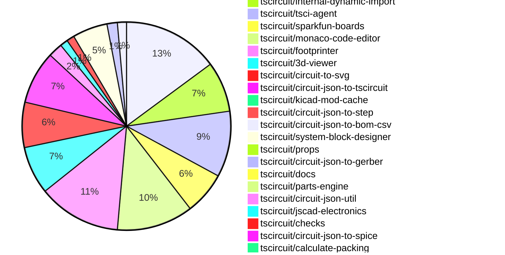

# contribution tracker

[contributions.tscircuit.com](https://contributions.tscircuit.com) ・ [tscircuit.com](https://tscircuit.com) ・ [Contribution Overviews](./contribution-overviews/) ・ [Changelogs](./changelogs/)

Generates weekly contribution overviews for tscircuit contributors. Check out all
the [contribution overviews here](./contribution-overviews/)
You can find AI-generated monthly changelogs in the [changelogs directory](./changelogs/)

- All PRs in the tscircuit org are scanned/summarized via an LLM
- The LLM classifies each Diff/PR as into a set of attributes for scoring
- All the PRs, summaries, and classifications are organized into charts and tables for [the website](https://contributions.tscircuit.com)

> Want to run locally? See the [Development Section](#development)

## Current Week

<!-- START_CURRENT_WEEK -->

# Contribution Overview 2026-06-30

The current week is shown below. There are 3 major sections:

- [Contributor Overview](#contributor-overview)
- [PRs by Repository](#prs-by-repository)
- [PRs by Contributor](#changes-by-contributor)
- [Scoring & Sponsorship Details](/docs/sponsorship-calculation-explanation.md)

## PRs by Repository


```mermaid
pie
    "tscircuit/tscircuit" : 74
    "tscircuit/circuit-json" : 5
    "tscircuit/core" : 39
    "tscircuit/tscircuit.com" : 51
    "tscircuit/eval" : 33
    "tscircuit/runframe" : 59
    "tscircuit/cli" : 64
    "tscircuit/svg.tscircuit.com" : 37
    "tscircuit/tscircuit-autorouter" : 35
    "tscircuit/schematic-trace-solver" : 41
    "tscircuit/test-github-automerge" : 3
    "tscircuit/circuit-json-to-kicad" : 4
    "tscircuit/circuit-to-canvas" : 2
    "tscircuit/circuit-json-to-lbrn" : 1
    "tscircuit/internal-dynamic-import" : 4
    "tscircuit/tsci-agent" : 3
    "tscircuit/sparkfun-boards" : 1
    "tscircuit/monaco-code-editor" : 5
    "tscircuit/footprinter" : 11
    "tscircuit/3d-viewer" : 6
    "tscircuit/circuit-to-svg" : 6
    "tscircuit/circuit-json-to-tscircuit" : 4
    "tscircuit/kicad-mod-cache" : 1
    "tscircuit/circuit-json-to-step" : 1
    "tscircuit/circuit-json-to-bom-csv" : 2
    "tscircuit/system-block-designer" : 27
    "tscircuit/props" : 2
    "tscircuit/circuit-json-to-gerber" : 1
    "tscircuit/docs" : 2
    "tscircuit/parts-engine" : 1
    "tscircuit/circuit-json-util" : 3
    "tscircuit/jscad-electronics" : 1
    "tscircuit/checks" : 2
    "tscircuit/circuit-json-to-spice" : 2
    "tscircuit/calculate-packing" : 1
    "tscircuit/kicad-to-circuit-json" : 1
    "tscircuit/circuit-json-to-connectivity-map" : 1
    "tscircuit/easyeda-converter" : 3
    "tscircuit/check-shorts" : 1
    "tscircuit/ti" : 8
    "tscircuit/contribution-tracker" : 2
    "tscircuit/graphics-debug" : 1
    "tscircuit/matchpack" : 1
    "tscircuit/circuit-json-schematic-placement-analysis" : 1
    "tscircuit/schematic-symbols" : 1
    "tscircuit/multi-component-dataset-srj01" : 2
    "tscircuit/layerweaver" : 2
    "tscircuit/fabrication-operator-ui" : 3
    "tscircuit/laser-fabrication-bench" : 7
```

## Contributor Overview

| Contributor | 🐳 Major | 🐙 Minor | 🐌 Tiny | Score | ⭐ | Discussion Contributions |
|-------------|---------|---------|---------|-------|-----|--------------------------|
| [imrishabh18](#imrishabh18) | 11 | 11 | 12 | 79 | ⭐⭐⭐ | 0🔹 0🔶 0💎 |
| [seveibar](#seveibar) | 12 | 12 | 5 | 78 | ⭐⭐⭐ | 0🔹 0🔶 0💎 |
| [rushabhcodes](#rushabhcodes) | 4 | 7 | 18 | 49 | ⭐⭐ | 0🔹 0🔶 0💎 |
| [0hmX](#0hmX) | 8 | 0 | 15 | 45 | ⭐⭐ | 0🔹 0🔶 0💎 |
| [MustafaMulla29](#MustafaMulla29) | 3 | 9 | 13 | 43 | ⭐⭐ | 0🔹 0🔶 0💎 |
| [Sang-it](#Sang-it) | 5 | 4 | 14 | 41 | ⭐⭐ | 0🔹 0🔶 0💎 |
| [AnasSarkiz](#AnasSarkiz) | 5 | 5 | 2 | 37 | ⭐⭐ | 0🔹 0🔶 0💎 |
| [ShiboSoftwareDev](#ShiboSoftwareDev) | 2 | 8 | 5 | 32.5 | ⭐⭐ | 0🔹 0🔶 0💎 |
| [techmannih](#techmannih) | 3 | 2 | 6 | 23 | ⭐⭐ | 0🔹 0🔶 0💎 |
| [Abse2001](#Abse2001) | 2 | 4 | 2 | 22 | ⭐⭐ | 0🔹 0🔶 0💎 |
| [technologyet31-create](#technologyet31-create) | 0 | 8 | 4 | 20 | ⭐⭐ | 0🔹 0🔶 0💎 |
| [tscircuitbot](#tscircuitbot) | 0 | 0 | 335 | 18 | ⭐⭐ | 0🔹 0🔶 0💎 |
| [mohan-bee](#mohan-bee) | 1 | 2 | 2 | 14 | ⭐⭐ | 0🔹 0🔶 0💎 |
| [anil08607](#anil08607) | 0 | 1 | 3 | 5 | ⭐ | 0🔹 0🔶 0💎 |
| [Lathikaa-S](#Lathikaa-S) | 0 | 1 | 2 | 4 | ⭐ | 0🔹 0🔶 0💎 |

## Staff Pass Ratio (SPR)

| Contributor | Reviewed PRs | Rejections | Approvals | SPR |
|-------------|--------------|------------|-----------|-----|
| [rushabhcodes](#rushabhcodes) | 10 | 3 | 8 | 70.0% |
| [technologyet31-create](#technologyet31-create) | 8 | 2 | 7 | 75.0% |
| [MustafaMulla29](#MustafaMulla29) | 7 | 4 | 6 | 42.9% |
| [imrishabh18](#imrishabh18) | 6 | 0 | 6 | 100.0% |
| [Abse2001](#Abse2001) | 6 | 0 | 6 | 100.0% |
| [ShiboSoftwareDev](#ShiboSoftwareDev) | 6 | 1 | 6 | 83.3% |
| [Sang-it](#Sang-it) | 5 | 1 | 4 | 80.0% |
| [0hmX](#0hmX) | 5 | 1 | 4 | 80.0% |
| [mohan-bee](#mohan-bee) | 4 | 3 | 2 | 25.0% |
| [AnasSarkiz](#AnasSarkiz) | 3 | 1 | 2 | 66.7% |
| [techmannih](#techmannih) | 2 | 0 | 2 | 100.0% |
| [anil08607](#anil08607) | 1 | 1 | 0 | 0.0% |

<details>
<summary>rushabhcodes SPR PRs (10)</summary>

- [#692](https://github.com/tscircuit/footprinter/pull/692) Fix KiCad boolean-difference rendering for rounded and circular SMT pads
- [#953](https://github.com/tscircuit/3d-viewer/pull/953) Fix Manifold PCB textures disappearing in StrictMode iframes
- [#952](https://github.com/tscircuit/3d-viewer/pull/952) Fix PCB cutouts failing to clip overlapping SMT pad copper
- [#69](https://github.com/tscircuit/circuit-json-to-tscircuit/pull/69) Fix board conversion flattening components into an anonymous <chip />: kicadts-style deserializers emit typed <resistor /> with full source, PCB, and schematic data
- [#64](https://github.com/tscircuit/circuit-json-to-tscircuit/pull/64) Add source component reconstruction and placement to board conversion
- [#60](https://github.com/tscircuit/circuit-json-to-tscircuit/pull/60) Add pcb_board template support for board-level Circuit JSON conversion
- [#253](https://github.com/tscircuit/circuit-to-canvas/pull/253) Fix PCB cutouts leaving copper in overlapping SMT pads
- [#18](https://github.com/tscircuit/internal-dynamic-import/pull/18) Fix 3D PNG exports by enabling circuit-json-to-3d-png imports
- [#20](https://github.com/tscircuit/internal-dynamic-import/pull/20) update circuit-json-to-gltf
- [#17](https://github.com/tscircuit/internal-dynamic-import/pull/17) chore(deps): update circuit-json-to-tscircuit to ^0.0.40

</details>

<details>
<summary>technologyet31-create SPR PRs (8)</summary>

- [#104](https://github.com/tscircuit/circuit-json-util/pull/104) Account for pcb_component rotation in getBoundsOfPcbElements
- [#2574](https://github.com/tscircuit/core/pull/2574) Propagate board solderMaskColor/silkscreenColor to pcb_board
- [#2573](https://github.com/tscircuit/core/pull/2573) Add a repro test for board solderMaskColor/silkscreenColor being dropped
- [#302](https://github.com/tscircuit/jscad-electronics/pull/302) Fix led0603 throwing by bumping @tscircuit/footprinter to 0.0.374
- [#597](https://github.com/tscircuit/circuit-to-svg/pull/597) Account for ccw_rotation in pcb_silkscreen_rect bounds
- [#43](https://github.com/tscircuit/circuit-json-to-spice/pull/43) Emit DC voltage sources that use terminal1/terminal2
- [#103](https://github.com/tscircuit/calculate-packing/pull/103) Fix double-rotation of rect pad bounds in getComponentBounds
- [#158](https://github.com/tscircuit/kicad-to-circuit-json/pull/158) fix: include the anchor shape of KiCad custom pads

</details>

<details>
<summary>MustafaMulla29 SPR PRs (7)</summary>

- [#2600](https://github.com/tscircuit/core/pull/2600) Fix duplicate net label on unconnected pins with text-expanded bounds
- [#2555](https://github.com/tscircuit/core/pull/2555) fix(sch): create cross-sheet net labels per schematic sheet
- [#2527](https://github.com/tscircuit/core/pull/2527) Lay out schematic sheets independently
- [#601](https://github.com/tscircuit/circuit-to-svg/pull/601) Add net-label hover highlighting for schematic net labels
- [#357](https://github.com/tscircuit/circuit-json-to-kicad/pull/357) Add hierarchical schematic sheet (.kicad_sch) export support
- [#31](https://github.com/tscircuit/circuit-json-schematic-placement-analysis/pull/31) Add schematic sheet support to schematic placement analysis
- [#26](https://github.com/tscircuit/system-block-designer/pull/26) Support browser PDF generation and add browser tests

</details>

<details>
<summary>imrishabh18 SPR PRs (6)</summary>

- [#635](https://github.com/tscircuit/circuit-json/pull/635) Add `source_part_not_found_warning`
- [#949](https://github.com/tscircuit/3d-viewer/pull/949) Make the light cast shadow
- [#948](https://github.com/tscircuit/3d-viewer/pull/948) Remove flat lighting setup no-decay point with group lighting giving more shape and contrast
- [#2570](https://github.com/tscircuit/core/pull/2570) Switch from `unknown_error_finding_part` to `source_part_not_found_warning`
- [#2530](https://github.com/tscircuit/core/pull/2530) Fix: repro14 where exposingNets didn't create `pcb_trace` but the schematic showed connection
- [#42](https://github.com/tscircuit/system-block-designer/pull/42) Add support for spi interface

</details>

<details>
<summary>Abse2001 SPR PRs (6)</summary>

- [#717](https://github.com/tscircuit/props/pull/717) Add pinLabels support to switch props
- [#403](https://github.com/tscircuit/easyeda-converter/pull/403) Preserve diode polarity metadata in generated components
- [#405](https://github.com/tscircuit/easyeda-converter/pull/405) Recognize polarity aliases for diode pin labels
- [#402](https://github.com/tscircuit/easyeda-converter/pull/402) Generate pushbutton and switch components from switch categories
- [#2580](https://github.com/tscircuit/core/pull/2580) Add pinLabels support to switch components
- [#5](https://github.com/tscircuit/check-shorts/pull/5) Implement bitmap-based flying probe short detection for PCB and Gerber layers

</details>

<details>
<summary>ShiboSoftwareDev SPR PRs (6)</summary>

- [#2589](https://github.com/tscircuit/core/pull/2589) Preserve explicit narrow autoroute trace widths
- [#226](https://github.com/tscircuit/graphics-debug/pull/226) Add step support for arrows
- [#3569](https://github.com/tscircuit/cli/pull/3569) Fix concurrent build with function-valued platformConfig
- [#1510](https://github.com/tscircuit/tscircuit-autorouter/pull/1510) Expose and expand AI-readable visualization artifacts in run-sample
- [#634](https://github.com/tscircuit/schematic-trace-solver/pull/634) Reject reroutes along component boundaries
- [#64](https://github.com/tscircuit/ti/pull/64) encryption

</details>

<details>
<summary>Sang-it SPR PRs (5)</summary>

- [#2588](https://github.com/tscircuit/core/pull/2588) fix(schematic): only pass net label orientations for power and gnd
- [#596](https://github.com/tscircuit/schematic-trace-solver/pull/596) Fix label placement near traces
- [#591](https://github.com/tscircuit/schematic-trace-solver/pull/591) fix: re-anchor net labels when NetLabelTraceCollisionSolver reroutes a trace
- [#569](https://github.com/tscircuit/schematic-trace-solver/pull/569) fix gnd label failing to route downward due to trace crossings  - example43
- [#570](https://github.com/tscircuit/schematic-trace-solver/pull/570) add spec for adding textBoxes to the InputProblem

</details>

<details>
<summary>0hmX SPR PRs (5)</summary>

- [#2540](https://github.com/tscircuit/core/pull/2540) update autorouter to use the new Pipeline 7
- [#1492](https://github.com/tscircuit/tscircuit-autorouter/pull/1492) add connectTo to all
- [#1497](https://github.com/tscircuit/tscircuit-autorouter/pull/1497) use contiguous trace DRC check
- [#1499](https://github.com/tscircuit/tscircuit-autorouter/pull/1499) getNearestIndexForDistance returns route index, but pathSegments index is needed
- [#1480](https://github.com/tscircuit/tscircuit-autorouter/pull/1480) refine approximation obstacle ownership

</details>

<details>
<summary>mohan-bee SPR PRs (4)</summary>

- [#2607](https://github.com/tscircuit/core/pull/2607) Fix schematic trace endpoints stopping short of connected symbol ports
- [#356](https://github.com/tscircuit/circuit-json-to-kicad/pull/356) Fix KiCad via spans for multi-layer PCB routes
- [#355](https://github.com/tscircuit/circuit-json-to-kicad/pull/355) Add KiCad schematic sheet export support
- [#353](https://github.com/tscircuit/circuit-json-to-kicad/pull/353) Add schematic file output API

</details>

<details>
<summary>AnasSarkiz SPR PRs (3)</summary>

- [#1720](https://github.com/tscircuit/svg.tscircuit.com/pull/1720) Add Built-In qrcode-svg Support for Circuit Evaluation
- [#773](https://github.com/tscircuit/docs/pull/773) Introduce QR Code Silkscreen Documentation with 3D and PCB Example using`silkscreengraphic`
- [#1533](https://github.com/tscircuit/tscircuit-autorouter/pull/1533) Fix stitch endpoint snapping to prevent closed-loop two-port traces

</details>

<details>
<summary>techmannih SPR PRs (2)</summary>

- [#694](https://github.com/tscircuit/footprinter/pull/694) Add fabrication note support to all diode footprints
- [#28](https://github.com/tscircuit/system-block-designer/pull/28) Add BOM tables to PDF exports and simplify BOM download options

</details>

<details>
<summary>anil08607 SPR PRs (1)</summary>

- [#691](https://github.com/tscircuit/footprinter/pull/691) feat: add rounded pad corners to all footprints

</details>

> Note: AI evaluates PRs and assigns 1-3 star ratings automatically. 4 and 5 star ratings require manual staff review.

### Discussion Contribution Legend

- 🔹 Normal Comments: Basic participation with minimal effort
- 🔶 Great Informative Comments: Thoughtful participation that adds value
- 💎 Incredible Comments: Exceptional participation with high-quality content

## Review Table

[reviews-received-hover]: ## "Number of reviews received for PRs for this contributor"
[approvals-received-hover]: ## "Number of approvals received for PRs this contributor authored"
[rejections-received-hover]: ## "Number of rejections received for PRs this contributor authored"
[prs-opened-hover]: ## "Number of PRs opened by this contributor"
[issues-created-hover]: ## "Number of issues created by this contributor"

| Contributor | Reviews Received | Approvals Received | Rejections Received | Approvals | Rejections Given | PRs Opened | PRs Merged | Issues Created |
|---|---|---|---|---|---|---|---|---|
| [b3417](#b3417) | 0 | 0 | 0 | 0 | 0 | 19 | 0 | 0 |
| [rushabhcodes](#rushabhcodes) | 109 | 27 | 3 | 7 | 0 | 43 | 29 | 0 |
| [laogongcy-del](#laogongcy-del) | 0 | 0 | 0 | 0 | 0 | 1 | 0 | 0 |
| [tscircuitbot](#tscircuitbot) | 1 | 1 | 0 | 0 | 0 | 403 | 335 | 0 |
| [imrishabh18](#imrishabh18) | 10 | 6 | 0 | 36 | 3 | 36 | 35 | 0 |
| [yanyishuai](#yanyishuai) | 0 | 0 | 0 | 0 | 0 | 2 | 0 | 0 |
| [seveibar](#seveibar) | 14 | 3 | 0 | 72 | 12 | 38 | 29 | 0 |
| [technologyet31-create](#technologyet31-create) | 39 | 19 | 5 | 0 | 0 | 37 | 12 | 0 |
| [yasdhf](#yasdhf) | 0 | 0 | 0 | 0 | 0 | 5 | 0 | 0 |
| [Abse2001](#Abse2001) | 9 | 9 | 0 | 4 | 0 | 11 | 8 | 0 |
| [derekbreden](#derekbreden) | 0 | 0 | 0 | 0 | 0 | 4 | 0 | 0 |
| [di3go04](#di3go04) | 0 | 0 | 0 | 0 | 0 | 7 | 0 | 0 |
| [sagarmaurya64-ai](#sagarmaurya64-ai) | 0 | 0 | 0 | 0 | 0 | 1 | 0 | 0 |
| [techmannih](#techmannih) | 14 | 8 | 0 | 1 | 0 | 17 | 11 | 0 |
| [chayan-1906](#chayan-1906) | 0 | 0 | 0 | 0 | 0 | 7 | 0 | 0 |
| [anil08607](#anil08607) | 9 | 6 | 1 | 0 | 0 | 6 | 4 | 0 |
| [Lathikaa-S](#Lathikaa-S) | 6 | 5 | 0 | 0 | 0 | 5 | 3 | 0 |
| [maci0](#maci0) | 2 | 0 | 1 | 0 | 0 | 10 | 0 | 0 |
| [StealthEyeLLC](#StealthEyeLLC) | 0 | 0 | 0 | 0 | 0 | 1 | 0 | 0 |
| [mohan-bee](#mohan-bee) | 27 | 7 | 3 | 4 | 0 | 12 | 5 | 0 |
| [Sang-it](#Sang-it) | 19 | 8 | 1 | 1 | 0 | 33 | 23 | 0 |
| [ShiboSoftwareDev](#ShiboSoftwareDev) | 27 | 24 | 0 | 5 | 0 | 21 | 17 | 0 |
| [0hmX](#0hmX) | 22 | 11 | 1 | 10 | 2 | 43 | 24 | 0 |
| [MustafaMulla29](#MustafaMulla29) | 22 | 15 | 3 | 8 | 2 | 26 | 25 | 0 |
| [AnasSarkiz](#AnasSarkiz) | 9 | 4 | 1 | 5 | 0 | 15 | 12 | 0 |
| [rovidev95](#rovidev95) | 0 | 0 | 0 | 0 | 0 | 2 | 0 | 0 |
| [r-audio](#r-audio) | 0 | 0 | 0 | 0 | 0 | 1 | 0 | 0 |
| [Tamish-25](#Tamish-25) | 0 | 0 | 0 | 0 | 0 | 3 | 0 | 0 |
| [lifuzhang1108](#lifuzhang1108) | 0 | 0 | 0 | 0 | 0 | 2 | 0 | 0 |
| [bcornish1797](#bcornish1797) | 0 | 0 | 0 | 0 | 0 | 1 | 0 | 0 |
| [sureshchouksey8](#sureshchouksey8) | 0 | 0 | 0 | 0 | 0 | 1 | 0 | 0 |
| [cyrillical00](#cyrillical00) | 0 | 0 | 0 | 0 | 0 | 2 | 0 | 0 |
| [tangmingxiu11-commits](#tangmingxiu11-commits) | 0 | 0 | 0 | 0 | 0 | 1 | 0 | 0 |
| [silasbrookshaha](#silasbrookshaha) | 0 | 0 | 0 | 0 | 0 | 4 | 0 | 0 |
| [bingmokaka](#bingmokaka) | 0 | 0 | 0 | 0 | 0 | 1 | 0 | 0 |
| [saitejabandaru-in](#saitejabandaru-in) | 0 | 0 | 0 | 0 | 0 | 1 | 0 | 0 |
| [Ojas2095](#Ojas2095) | 0 | 0 | 0 | 0 | 0 | 1 | 0 | 0 |
| [joebkarwalo](#joebkarwalo) | 0 | 0 | 0 | 0 | 0 | 1 | 0 | 0 |
| [lucientheski](#lucientheski) | 0 | 0 | 0 | 0 | 0 | 1 | 0 | 0 |

## Changes by Repository

### [tscircuit/tscircuit](https://github.com/tscircuit/tscircuit)


<details>
<summary>🐌 Tiny Contributions (74)</summary>

| PR # | Impact | Contributor | Description |
|------|--------|-------------|-------------|
| [#3802](https://github.com/tscircuit/tscircuit/pull/3802) | 🐌 Tiny | tscircuitbot | Automated package update |
| [#3801](https://github.com/tscircuit/tscircuit/pull/3801) | 🐌 Tiny | tscircuitbot | Updates the tscircuitcli package to version 0.1.1612 in the package.json file |
| [#3800](https://github.com/tscircuit/tscircuit/pull/3800) | 🐌 Tiny | tscircuitbot | Automated package update |
| [#3799](https://github.com/tscircuit/tscircuit/pull/3799) | 🐌 Tiny | tscircuitbot | Updates the version of several dependencies in the package.json file, including tscircuitcli from 0.1.1610 to 0.1.1611, tscircuitcore from 0.0.1398 to 0.0.1400, and schematic-symbols from 0.0.226 to 0.0.230. |
| [#3798](https://github.com/tscircuit/tscircuit/pull/3798) | 🐌 Tiny | tscircuitbot | Updates the package version from 0.0.2008 to 0.0.2009 in package.json |
| [#3797](https://github.com/tscircuit/tscircuit/pull/3797) | 🐌 Tiny | tscircuitbot | Updates the tscircuitcli and tscircuitcore packages to their latest versions as part of routine maintenance. |
| [#3796](https://github.com/tscircuit/tscircuit/pull/3796) | 🐌 Tiny | tscircuitbot | Automated package update |
| [#3795](https://github.com/tscircuit/tscircuit/pull/3795) | 🐌 Tiny | tscircuitbot | Updates the tscircuitcli package version from 0.1.1608 to 0.1.1609 in package.json |
| [#3794](https://github.com/tscircuit/tscircuit/pull/3794) | 🐌 Tiny | tscircuitbot | Automated package update |
| [#3793](https://github.com/tscircuit/tscircuit/pull/3793) | 🐌 Tiny | tscircuitbot | Updates the tscircuitcli package from version 0.1.1607 to 0.1.1608 and the tscircuitcore package from version 0.0.1395 to 0.0.1396 |
| [#3791](https://github.com/tscircuit/tscircuit/pull/3791) | 🐌 Tiny | tscircuitbot | Updates the package version from 0.0.2005 to 0.0.2006 in package.json |
| [#3790](https://github.com/tscircuit/tscircuit/pull/3790) | 🐌 Tiny | tscircuitbot | Automated package update |
| [#3789](https://github.com/tscircuit/tscircuit/pull/3789) | 🐌 Tiny | tscircuitbot | Automated package update |
| [#3788](https://github.com/tscircuit/tscircuit/pull/3788) | 🐌 Tiny | tscircuitbot | Updates the tscircuitcli package from version 0.1.1605 to 0.1.1606 and the tscircuitrunframe package from version 0.0.2162 to 0.0.2163 in package.json |
| [#3787](https://github.com/tscircuit/tscircuit/pull/3787) | 🐌 Tiny | tscircuitbot | Automated package update |
| [#3784](https://github.com/tscircuit/tscircuit/pull/3784) | 🐌 Tiny | tscircuitbot | Updates the tscircuitcli package from version 0.1.1604 to 0.1.1605 and the tscircuitrunframe package from version 0.0.2161 to 0.0.2162 in package.json |
| [#3783](https://github.com/tscircuit/tscircuit/pull/3783) | 🐌 Tiny | tscircuitbot | Automated package update to version 0.0.2002 |
| [#3785](https://github.com/tscircuit/tscircuit/pull/3785) | 🐌 Tiny | tscircuitbot | Automated package update |
| [#3782](https://github.com/tscircuit/tscircuit/pull/3782) | 🐌 Tiny | tscircuitbot | Automated package update |
| [#3780](https://github.com/tscircuit/tscircuit/pull/3780) | 🐌 Tiny | tscircuitbot | Automated package update |
| [#3781](https://github.com/tscircuit/tscircuit/pull/3781) | 🐌 Tiny | tscircuitbot | Automated package update |
| [#3779](https://github.com/tscircuit/tscircuit/pull/3779) | 🐌 Tiny | tscircuitbot | Updates the package version from 0.0.1999 to 0.0.2000 in package.json |
| [#3776](https://github.com/tscircuit/tscircuit/pull/3776) | 🐌 Tiny | tscircuitbot | Automated package update |
| [#3778](https://github.com/tscircuit/tscircuit/pull/3778) | 🐌 Tiny | tscircuitbot | Automated package update |
| [#3777](https://github.com/tscircuit/tscircuit/pull/3777) | 🐌 Tiny | tscircuitbot | Updates the package version from 0.0.1998 to 0.0.1999 in package.json |
| [#3774](https://github.com/tscircuit/tscircuit/pull/3774) | 🐌 Tiny | tscircuitbot | Updates the version of several packages including tscircuitcli, tscircuitcore, tscircuiteval, tscircuitfootprinter, and tscircuitrunframe in package.json |
| [#3772](https://github.com/tscircuit/tscircuit/pull/3772) | 🐌 Tiny | tscircuitbot | Updates the tscircuitcli package from version 0.1.1598 to 0.1.1599 and the tscircuitrunframe package from version 0.0.2153 to 0.0.2154 in package.json |
| [#3770](https://github.com/tscircuit/tscircuit/pull/3770) | 🐌 Tiny | tscircuitbot | Automated package update |
| [#3775](https://github.com/tscircuit/tscircuit/pull/3775) | 🐌 Tiny | tscircuitbot | Updates the package version from 0.0.1997 to 0.0.1998 in package.json |
| [#3773](https://github.com/tscircuit/tscircuit/pull/3773) | 🐌 Tiny | tscircuitbot | Automated package update |
| [#3771](https://github.com/tscircuit/tscircuit/pull/3771) | 🐌 Tiny | tscircuitbot | Automated package update |
| [#3769](https://github.com/tscircuit/tscircuit/pull/3769) | 🐌 Tiny | tscircuitbot | Updates the package version from 0.0.1994 to 0.0.1995 in package.json |
| [#3768](https://github.com/tscircuit/tscircuit/pull/3768) | 🐌 Tiny | tscircuitbot | Updates the version of the tscircuitcli package from 0.1.1596 to 0.1.1597 and the tscircuitrunframe package from 0.0.2151 to 0.0.2152 in package.json |
| [#3767](https://github.com/tscircuit/tscircuit/pull/3767) | 🐌 Tiny | tscircuitbot | Automated package update to version 0.0.1994 |
| [#3766](https://github.com/tscircuit/tscircuit/pull/3766) | 🐌 Tiny | tscircuitbot | Updates the tscircuitcli package from version 0.1.1595 to 0.1.1596 |
| [#3765](https://github.com/tscircuit/tscircuit/pull/3765) | 🐌 Tiny | tscircuitbot | Automated package update |
| [#3764](https://github.com/tscircuit/tscircuit/pull/3764) | 🐌 Tiny | tscircuitbot | Updates the tscircuitcli package to version 0.1.1595 in the package.json file |
| [#3763](https://github.com/tscircuit/tscircuit/pull/3763) | 🐌 Tiny | tscircuitbot | Automated package update |
| [#3762](https://github.com/tscircuit/tscircuit/pull/3762) | 🐌 Tiny | tscircuitbot | Updates the tscircuitcli package from version 0.1.1593 to 0.1.1594 and the tscircuitrunframe package from version 0.0.2150 to 0.0.2151 in package.json |
| [#3760](https://github.com/tscircuit/tscircuit/pull/3760) | 🐌 Tiny | tscircuitbot | Updates the tscircuitcli package from version 0.1.1592 to 0.1.1593 and the tscircuitrunframe package from version 0.0.2149 to 0.0.2150 in the package.json file. |
| [#3759](https://github.com/tscircuit/tscircuit/pull/3759) | 🐌 Tiny | tscircuitbot | Updates the package version from 0.0.1989 to 0.0.1990 in package.json |
| [#3758](https://github.com/tscircuit/tscircuit/pull/3758) | 🐌 Tiny | tscircuitbot | Updates the tscircuitcli package to version 0.1.1592 in the package.json file |
| [#3755](https://github.com/tscircuit/tscircuit/pull/3755) | 🐌 Tiny | tscircuitbot | Updates the tscircuitcli package to version 0.1.1591 in the package.json file. |
| [#3754](https://github.com/tscircuit/tscircuit/pull/3754) | 🐌 Tiny | tscircuitbot | Automated package update |
| [#3753](https://github.com/tscircuit/tscircuit/pull/3753) | 🐌 Tiny | tscircuitbot | Automated package update |
| [#3761](https://github.com/tscircuit/tscircuit/pull/3761) | 🐌 Tiny | tscircuitbot | Automated package update |
| [#3756](https://github.com/tscircuit/tscircuit/pull/3756) | 🐌 Tiny | tscircuitbot | Automated package update |
| [#3744](https://github.com/tscircuit/tscircuit/pull/3744) | 🐌 Tiny | tscircuitbot | Automated package update |
| [#3752](https://github.com/tscircuit/tscircuit/pull/3752) | 🐌 Tiny | tscircuitbot | Automated package update |
| [#3751](https://github.com/tscircuit/tscircuit/pull/3751) | 🐌 Tiny | tscircuitbot | Updates the tscircuitcli package to version 0.1.1589 in the package.json file |
| [#3748](https://github.com/tscircuit/tscircuit/pull/3748) | 🐌 Tiny | tscircuitbot | Automated package update |
| [#3747](https://github.com/tscircuit/tscircuit/pull/3747) | 🐌 Tiny | tscircuitbot | Automated package update |
| [#3746](https://github.com/tscircuit/tscircuit/pull/3746) | 🐌 Tiny | tscircuitbot | Automated package update |
| [#3745](https://github.com/tscircuit/tscircuit/pull/3745) | 🐌 Tiny | tscircuitbot | Updates the version of the tscircuitcore package from 0.0.1379 to 0.0.1380 in package.json |
| [#3743](https://github.com/tscircuit/tscircuit/pull/3743) | 🐌 Tiny | tscircuitbot | Updates the versions of several dependencies in the package.json file, including tscircuitcli, tscircuitcore, and tscircuiteval. |
| [#3741](https://github.com/tscircuit/tscircuit/pull/3741) | 🐌 Tiny | tscircuitbot | Automated package update |
| [#3740](https://github.com/tscircuit/tscircuit/pull/3740) | 🐌 Tiny | tscircuitbot | Updates the versions of several dependencies in the package.json file, including tscircuitcli, tscircuitcore, and tscircuiteval. |
| [#3750](https://github.com/tscircuit/tscircuit/pull/3750) | 🐌 Tiny | tscircuitbot | Automated package update |
| [#3749](https://github.com/tscircuit/tscircuit/pull/3749) | 🐌 Tiny | tscircuitbot | Automated package update |
| [#3734](https://github.com/tscircuit/tscircuit/pull/3734) | 🐌 Tiny | tscircuitbot | Automated package update |
| [#3732](https://github.com/tscircuit/tscircuit/pull/3732) | 🐌 Tiny | tscircuitbot | Automated package update |
| [#3739](https://github.com/tscircuit/tscircuit/pull/3739) | 🐌 Tiny | tscircuitbot | Automated package update |
| [#3738](https://github.com/tscircuit/tscircuit/pull/3738) | 🐌 Tiny | tscircuitbot | Automated package update |
| [#3737](https://github.com/tscircuit/tscircuit/pull/3737) | 🐌 Tiny | tscircuitbot | Updates the package version from 0.0.1979 to 0.0.1980 in package.json |
| [#3735](https://github.com/tscircuit/tscircuit/pull/3735) | 🐌 Tiny | tscircuitbot | Automated package update |
| [#3733](https://github.com/tscircuit/tscircuit/pull/3733) | 🐌 Tiny | tscircuitbot | Automated package update |
| [#3730](https://github.com/tscircuit/tscircuit/pull/3730) | 🐌 Tiny | tscircuitbot | Automated package update |
| [#3729](https://github.com/tscircuit/tscircuit/pull/3729) | 🐌 Tiny | tscircuitbot | Automated package update |
| [#3727](https://github.com/tscircuit/tscircuit/pull/3727) | 🐌 Tiny | tscircuitbot | Automated package update |
| [#3726](https://github.com/tscircuit/tscircuit/pull/3726) | 🐌 Tiny | tscircuitbot | Updates the version of several packages in the project, including tscircuitcli, tscircuitcore, and tscircuiteval. |
| [#3731](https://github.com/tscircuit/tscircuit/pull/3731) | 🐌 Tiny | tscircuitbot | Automated package update |
| [#3736](https://github.com/tscircuit/tscircuit/pull/3736) | 🐌 Tiny | tscircuitbot | Automated package update |
| [#3728](https://github.com/tscircuit/tscircuit/pull/3728) | 🐌 Tiny | tscircuitbot | Updates the tscircuitcli package from version 0.1.1578 to 0.1.1579 |
| [#3786](https://github.com/tscircuit/tscircuit/pull/3786) | 🐌 Tiny | rushabhcodes | Updates the tscircuitinternal-dynamic-import package from version 0.0.2 to 0.0.10 in package.json |

</details>

### [tscircuit/circuit-json](https://github.com/tscircuit/circuit-json)

| PR # | Impact | Rating | Contributor | Description |
|------|--------|--------|-------------|-------------|
| [#640](https://github.com/tscircuit/circuit-json/pull/640) | 🐙 Minor | ⭐⭐ | seveibar | Adds a warning for when a source component reference designator does not match the component type convention |
| [#635](https://github.com/tscircuit/circuit-json/pull/635) | 🐙 Minor | ⭐⭐ | imrishabh18 | Adds a new warning type for when a requested part cannot be found in the circuit. |

<details>
<summary>🐌 Tiny Contributions (3)</summary>

| PR # | Impact | Contributor | Description |
|------|--------|-------------|-------------|
| [#641](https://github.com/tscircuit/circuit-json/pull/641) | 🐌 Tiny | tscircuitbot | Automated package update |
| [#638](https://github.com/tscircuit/circuit-json/pull/638) | 🐌 Tiny | tscircuitbot | Automated package update |
| [#636](https://github.com/tscircuit/circuit-json/pull/636) | 🐌 Tiny | rushabhcodes | Exports the source_simple_fuse module from the source entrypoint, making it available for use in other parts of the application. |

</details>

### [tscircuit/core](https://github.com/tscircuit/core)

| PR # | Impact | Rating | Contributor | Description |
|------|--------|--------|-------------|-------------|
| [#2569](https://github.com/tscircuit/core/pull/2569) | 🐳 Major | ⭐⭐⭐ | seveibar | Adds support for improved aliasing of diode pins, allowing for more flexible pin labeling and handling of pin numbers that differ from the traditional anode and cathode assignments. |
| [#2550](https://github.com/tscircuit/core/pull/2550) | 🐳 Major | ⭐⭐⭐ | seveibar | What Changed This is a code-clarity follow-up built on top of 2549. Documented the SRJ contract in getSimpleRouteJsonFromCircuitJson: connections are routing work for the current autorouter, while traces are existing copper to preserve. Removed the breakout-point route trimming helper for preserved child subcircuit traces. Preserved child subcircuit traces now keep their original route geometry and carry connectedTo metadata derived from the connectivity map, source trace, attached netsports, and route endpoint PCB ports. Updated the local SRJ trace type so core can pass traces.connectedTo through to the updated tscircuitcapacity-autorouter. Renamed the local routed-trace bookkeeping so it is clear which source_traces are already represented by preserved SRJ traces. Renamed _createTracesForExposedNets to _createTracesForExposedConnections. Added Trace._exposesSubcircuitConnection and set it on generated exposed-connection helper traces, so re-render protection only matches traces created by this helper. Removed generated name values from exposed-connection helper traces. They now keep only displayName, because these traces are generated routing intent, not user-named children. Updated subcircuit duplicate-name DRC so immediate non-subcircuit children generally need unique names, but same-named traces are allowed when every duplicate has the same non-empty subcircuit_connectivity_map_key. Added focused unit coverage for duplicate trace-name connectivity keys and preserved SRJ trace connectivity metadata.  Why The subcircuitSRJ interaction is easy to misread because the same circuit-json data can represent two different things: a child subcircuit route that already exists and should be preserved as SRJ traces parent-board routing intent that still needs to be emitted as SRJ connections With traces.connectedTo support in the autorouter, core no longer needs to trim preserved trace geometry around breakout points to make parent routing work. The preserved trace stays geometrically accurate, and the autorouter gets the same-net relationship explicitly through SRJ connectivity metadata. For naming, the invariant is: generated exposed-connection helper traces should not set name user-named immediate children should not collide across different things same-named traces may coexist only when the connectivity map proves they are the same underlying connection nested subcircuits remain separately scoped  Validation .node_modules.binbiome format --write libutilsautoroutinggetSimpleRouteJsonFromCircuitJson.ts libutilsautoroutingSimpleRouteJson.ts testsutilsautoroutingsimple-route-json-ignores-routed-subcircuit-traces.test.ts bun test testsutilsautoroutingsimple-route-json-ignores-routed-subcircuit-traces.test.ts testscomponentsprimitive-componentsgroup-duplicate-trace-name-connectivity-key.test.ts bunx tsc --noEmit still fails on existing unrelated baseline errors around graph display props, source_unnamed_trace_warning, and the circuit-to-svg convertCircuitJsonToStackedSchematicSheetsSvg export. Previously attempted: bun test testssubcircuitssubcircuit-exposed-nets-copper-pour01.test.tsx The fixture-backed exposed-net test is still blocked at module load by the existing circuit-to-svg export issue: convertCircuitJsonToStackedSchematicSheetsSvg is not exported. |
| [#2558](https://github.com/tscircuit/core/pull/2558) | 🐳 Major | ⭐⭐⭐ | imrishabh18 | Adds awareness of schematic sheets for junctions, crossings, and overlaps in schematic trace rendering. |
| [#2530](https://github.com/tscircuit/core/pull/2530) | 🐳 Major | ⭐⭐⭐ | imrishabh18 | Fixes the issue where net-to-net traces created logical source_trace entries but failed to generate physical pcb_trace due to insufficient routing detection. |
| [#2589](https://github.com/tscircuit/core/pull/2589) | 🐳 Major | ⭐⭐⭐ | ShiboSoftwareDev | Sets default widths on autorouter connections to preserve explicit narrow trace widths below the board default without causing unannotated traces to shrink. |
| [#2578](https://github.com/tscircuit/core/pull/2578) | 🐙 Minor | ⭐⭐ | seveibar | Enables the Schematic Trace Pipeline Solver to be included in the Solvers tab and emits an event when the solver starts processing. |
| [#2575](https://github.com/tscircuit/core/pull/2575) | 🐙 Minor | ⭐⭐ | seveibar | Adds functionality to check and warn about reference designator conventions for electronic components based on their type. |
| [#2587](https://github.com/tscircuit/core/pull/2587) | 🐙 Minor | ⭐⭐ | imrishabh18 | Fixes overlap of schematic text by passing bounds to the input problem and includes minor fixes in the trace-solver. |
| [#2570](https://github.com/tscircuit/core/pull/2570) | 🐙 Minor | ⭐⭐ | imrishabh18 | Changes error handling from a generic unknown error to a specific source part not found warning, improving clarity in error reporting. |
| [#2539](https://github.com/tscircuit/core/pull/2539) | 🐙 Minor | ⭐⭐ | imrishabh18 | Fixes smtpad rotation issue in pill shape rendering within the circuit-json-util library |
| [#2574](https://github.com/tscircuit/core/pull/2574) | 🐙 Minor | ⭐⭐ | technologyet31-create | Propagates the solderMaskColor and silkscreenColor properties from the board component to the pcb_board circuit-json element, ensuring they are rendered correctly in the output. |
| [#2573](https://github.com/tscircuit/core/pull/2573) | 🐙 Minor | ⭐⭐ | technologyet31-create | Adds a test to verify that the boards solderMaskColor and silkscreenColor properties are correctly passed to the pcb_board component. |
| [#2580](https://github.com/tscircuit/core/pull/2580) | 🐙 Minor | ⭐⭐ | Abse2001 | Adds support for pin labels in switch components, allowing users to specify labels for each pin in schematic representations. |
| [#2600](https://github.com/tscircuit/core/pull/2600) | 🐙 Minor | ⭐⭐ | MustafaMulla29 | Fixes the issue of duplicate net labels appearing for unconnected pins due to incorrect label anchoring in the schematic rendering process. |
| [#2555](https://github.com/tscircuit/core/pull/2555) | 🐙 Minor | ⭐⭐ | MustafaMulla29 | Fixes the issue where cross-subcircuit net labels collapsed to a single label for the whole net instead of one per sheet, ensuring each schematic sheet receives its own label for shared connections. |
| [#2527](https://github.com/tscircuit/core/pull/2527) | 🐙 Minor | ⭐⭐ | MustafaMulla29 | Changes the layout behavior of schematic sheets to ensure they are arranged independently, allowing for separate layout origins for each sheet. |
| [#2538](https://github.com/tscircuit/core/pull/2538) | 🐙 Minor | ⭐⭐ | MustafaMulla29 | Fixes incorrect net label generation for subcircuit ports with missing traces, ensuring user-assigned labels are respected. |
| [#2537](https://github.com/tscircuit/core/pull/2537) | 🐙 Minor | ⭐⭐ | MustafaMulla29 | Fixes the issue where cross-boundary subcircuit traces incorrectly use selector fallback labels instead of trace names. |
| [#2543](https://github.com/tscircuit/core/pull/2543) | 🐙 Minor | ⭐⭐ | Sang-it | Fixes the issue where net labels do not show up when the net label text is too long. |
| [#2542](https://github.com/tscircuit/core/pull/2542) | 🐙 Minor | ⭐⭐ | Sang-it | Prevents the schematic trace solver from placing duplicate net labels when user-defined labels are present for the same net, avoiding visual clutter. |

<details>
<summary>🐌 Tiny Contributions (19)</summary>

| PR # | Impact | Contributor | Description |
|------|--------|-------------|-------------|
| [#2582](https://github.com/tscircuit/core/pull/2582) | 🐌 Tiny | tscircuitbot | Updates the tscircuitchecks package from version 0.0.141 to 0.0.142 |
| [#2572](https://github.com/tscircuit/core/pull/2572) | 🐌 Tiny | tscircuitbot | Updates the version of the tscircuitchecks package from 0.0.140 to 0.0.141 in package.json |
| [#2544](https://github.com/tscircuit/core/pull/2544) | 🐌 Tiny | rushabhcodes | Updates the circuit-to-svg dependency to version 0.0.369 and refreshes the associated snapshots in the project. |
| [#2597](https://github.com/tscircuit/core/pull/2597) | 🐌 Tiny | seveibar | Adjusts schematic text box rendering to expand based on associated component reference designators, ensuring proper alignment and spacing in schematic layouts. |
| [#2606](https://github.com/tscircuit/core/pull/2606) | 🐌 Tiny | imrishabh18 | Updates the GitHub Actions workflow to run the test suite in parallel for improved efficiency during snapshot updates. |
| [#2604](https://github.com/tscircuit/core/pull/2604) | 🐌 Tiny | imrishabh18 | Adds a GitHub Actions workflow that allows users to update test snapshots by commenting on pull requests. |
| [#2586](https://github.com/tscircuit/core/pull/2586) | 🐌 Tiny | imrishabh18 | Adds a test to reproduce issue 143 regarding GND text placement close to pins in the circuit rendering. |
| [#2576](https://github.com/tscircuit/core/pull/2576) | 🐌 Tiny | imrishabh18 | Adds a test to reproduce the manufacturer part number overflow issue in the circuit rendering. |
| [#2591](https://github.com/tscircuit/core/pull/2591) | 🐌 Tiny | techmannih | Reproduces a bug where the GND net label text is too close to the pins of a USB connector, making it difficult to read and potentially leading to design errors. |
| [#2571](https://github.com/tscircuit/core/pull/2571) | 🐌 Tiny | anil08607 | Updates the tscircuitfootprinter dependency to version 0.0.371 in the package.json file. |
| [#2584](https://github.com/tscircuit/core/pull/2584) | 🐌 Tiny | mohan-bee | Updates the schematic-symbols dependency version from 0.0.226 to 0.0.230 and increases the timeout for a test case in the seveibar__rp2040-zero project. |
| [#2602](https://github.com/tscircuit/core/pull/2602) | 🐌 Tiny | MustafaMulla29 | Fixes the net-name text width handling for power and ground rail net labels in the schematic trace solver input. |
| [#2592](https://github.com/tscircuit/core/pull/2592) | 🐌 Tiny | MustafaMulla29 | Adds tests to reproduce issues related to text overlap and duplicate net labels in the ATMEGA328P circuit design. |
| [#2546](https://github.com/tscircuit/core/pull/2546) | 🐌 Tiny | MustafaMulla29 | Reproduces a bug where a multi-sheet shared bus net label collapses to one sheet instead of being displayed on all relevant sheets. |
| [#2598](https://github.com/tscircuit/core/pull/2598) | 🐌 Tiny | Sang-it | Updates the schematic trace solver dependency to version 0.0.87 in the package.json file. |
| [#2551](https://github.com/tscircuit/core/pull/2551) | 🐌 Tiny | Sang-it | Updates the schematic-trace-solver dependency to version 0.0.75 in package.json |
| [#2577](https://github.com/tscircuit/core/pull/2577) | 🐌 Tiny | 0hmX | Updates tscircuitcapacity-autorouter from 0.0.625 to 0.0.628 |
| [#2568](https://github.com/tscircuit/core/pull/2568) | 🐌 Tiny | 0hmX | Updates the version of the tscircuitcapacity-autorouter package from 0.0.624 to 0.0.625 in package.json |
| [#2557](https://github.com/tscircuit/core/pull/2557) | 🐌 Tiny | 0hmX | Updates the capacity autorouter dependency to version 0.0.624 without changing any defaults. |

</details>

### [tscircuit/tscircuit.com](https://github.com/tscircuit/tscircuit.com)

| PR # | Impact | Rating | Contributor | Description |
|------|--------|--------|-------------|-------------|
| [#3820](https://github.com/tscircuit/tscircuit.com/pull/3820) | 🐳 Major | ⭐⭐⭐ | seveibar | Adds functionality to set user information in the Crisp chat service based on session data. |
| [#3814](https://github.com/tscircuit/tscircuit.com/pull/3814) | 🐳 Major | ⭐⭐⭐ | seveibar | Adds dynamic loading of various circuit JSON converters, enabling support for multiple output formats including SVG, PNG, and CSV. |
| [#3794](https://github.com/tscircuit/tscircuit.com/pull/3794) | 🐳 Major | ⭐⭐⭐ | mohan-bee | Fixes the editor package visibility menu to synchronize the visibility state with the actual package data, ensuring that the editor reflects the correct publicprivate status during updates. |
| [#3812](https://github.com/tscircuit/tscircuit.com/pull/3812) | 🐙 Minor | ⭐⭐ | imrishabh18 | Implements a hook to automatically log out users when their JWT token expires. |

<details>
<summary>🐌 Tiny Contributions (47)</summary>

| PR # | Impact | Contributor | Description |
|------|--------|-------------|-------------|
| [#3835](https://github.com/tscircuit/tscircuit.com/pull/3835) | 🐌 Tiny | tscircuitbot | Automated package update |
| [#3834](https://github.com/tscircuit/tscircuit.com/pull/3834) | 🐌 Tiny | tscircuitbot | Updates the tscircuiteval package from version 0.0.977 to 0.0.978 |
| [#3833](https://github.com/tscircuit/tscircuit.com/pull/3833) | 🐌 Tiny | tscircuitbot | Automated package update |
| [#3829](https://github.com/tscircuit/tscircuit.com/pull/3829) | 🐌 Tiny | tscircuitbot | Automated package update |
| [#3826](https://github.com/tscircuit/tscircuit.com/pull/3826) | 🐌 Tiny | tscircuitbot | Automated package update |
| [#3825](https://github.com/tscircuit/tscircuit.com/pull/3825) | 🐌 Tiny | tscircuitbot | Updates the tscircuiteval package to version 0.0.977 |
| [#3823](https://github.com/tscircuit/tscircuit.com/pull/3823) | 🐌 Tiny | tscircuitbot | Updates the tscircuitrunframe package from version 0.0.2157 to 0.0.2158 |
| [#3822](https://github.com/tscircuit/tscircuit.com/pull/3822) | 🐌 Tiny | tscircuitbot | Updates the tscircuiteval package to version 0.0.976 |
| [#3821](https://github.com/tscircuit/tscircuit.com/pull/3821) | 🐌 Tiny | tscircuitbot | Automated package update |
| [#3819](https://github.com/tscircuit/tscircuit.com/pull/3819) | 🐌 Tiny | tscircuitbot | Updates the tscircuitrunframe package version from 0.0.2155 to 0.0.2156 in package.json |
| [#3818](https://github.com/tscircuit/tscircuit.com/pull/3818) | 🐌 Tiny | tscircuitbot | Updates the tscircuitrunframe package from version 0.0.2154 to 0.0.2155 |
| [#3811](https://github.com/tscircuit/tscircuit.com/pull/3811) | 🐌 Tiny | tscircuitbot | Updates the tscircuitrunframe package from version 0.0.2152 to 0.0.2153 |
| [#3810](https://github.com/tscircuit/tscircuit.com/pull/3810) | 🐌 Tiny | tscircuitbot | Updates the tscircuiteval package from version 0.0.973 to 0.0.974 |
| [#3817](https://github.com/tscircuit/tscircuit.com/pull/3817) | 🐌 Tiny | tscircuitbot | Automated package update |
| [#3816](https://github.com/tscircuit/tscircuit.com/pull/3816) | 🐌 Tiny | tscircuitbot | Automated package update |
| [#3815](https://github.com/tscircuit/tscircuit.com/pull/3815) | 🐌 Tiny | tscircuitbot | Automated package update |
| [#3808](https://github.com/tscircuit/tscircuit.com/pull/3808) | 🐌 Tiny | tscircuitbot | Updates the tscircuitrunframe package from version 0.0.2150 to 0.0.2151 |
| [#3807](https://github.com/tscircuit/tscircuit.com/pull/3807) | 🐌 Tiny | tscircuitbot | Automated package update |
| [#3804](https://github.com/tscircuit/tscircuit.com/pull/3804) | 🐌 Tiny | tscircuitbot | Updates the tscircuitrunframe package to version 0.0.2149 in the package.json file. |
| [#3803](https://github.com/tscircuit/tscircuit.com/pull/3803) | 🐌 Tiny | tscircuitbot | Updates the tscircuiteval package to version 0.0.973 |
| [#3809](https://github.com/tscircuit/tscircuit.com/pull/3809) | 🐌 Tiny | tscircuitbot | Automated package update |
| [#3792](https://github.com/tscircuit/tscircuit.com/pull/3792) | 🐌 Tiny | tscircuitbot | Updates the tscircuitrunframe package from version 0.0.2143 to 0.0.2144 |
| [#3799](https://github.com/tscircuit/tscircuit.com/pull/3799) | 🐌 Tiny | tscircuitbot | Updates the tscircuiteval package version from 0.0.970 to 0.0.972 in package.json |
| [#3798](https://github.com/tscircuit/tscircuit.com/pull/3798) | 🐌 Tiny | tscircuitbot | Updates the tscircuitrunframe package from version 0.0.2145 to 0.0.2146 |
| [#3797](https://github.com/tscircuit/tscircuit.com/pull/3797) | 🐌 Tiny | tscircuitbot | Updates the tscircuiteval package from version 0.0.969 to 0.0.970 |
| [#3795](https://github.com/tscircuit/tscircuit.com/pull/3795) | 🐌 Tiny | tscircuitbot | Updates the tscircuiteval package from version 0.0.968 to 0.0.969 |
| [#3791](https://github.com/tscircuit/tscircuit.com/pull/3791) | 🐌 Tiny | tscircuitbot | Updates the tscircuiteval package version from 0.0.967 to 0.0.968 |
| [#3790](https://github.com/tscircuit/tscircuit.com/pull/3790) | 🐌 Tiny | tscircuitbot | Automated package update |
| [#3802](https://github.com/tscircuit/tscircuit.com/pull/3802) | 🐌 Tiny | tscircuitbot | Automated package update |
| [#3796](https://github.com/tscircuit/tscircuit.com/pull/3796) | 🐌 Tiny | tscircuitbot | Updates the tscircuitrunframe package from version 0.0.2144 to 0.0.2145 |
| [#3789](https://github.com/tscircuit/tscircuit.com/pull/3789) | 🐌 Tiny | tscircuitbot | Automated package update |
| [#3787](https://github.com/tscircuit/tscircuit.com/pull/3787) | 🐌 Tiny | tscircuitbot | Automated package update |
| [#3786](https://github.com/tscircuit/tscircuit.com/pull/3786) | 🐌 Tiny | tscircuitbot | Updates the tscircuitrunframe package from version 0.0.2140 to 0.0.2141 |
| [#3784](https://github.com/tscircuit/tscircuit.com/pull/3784) | 🐌 Tiny | tscircuitbot | Automated package update |
| [#3783](https://github.com/tscircuit/tscircuit.com/pull/3783) | 🐌 Tiny | tscircuitbot | Updates the tscircuiteval package from version 0.0.963 to 0.0.964 |
| [#3782](https://github.com/tscircuit/tscircuit.com/pull/3782) | 🐌 Tiny | tscircuitbot | Updates the tscircuitrunframe package to version 0.0.2139 in the package.json file. |
| [#3781](https://github.com/tscircuit/tscircuit.com/pull/3781) | 🐌 Tiny | tscircuitbot | Updates the tscircuiteval package to version 0.0.963 in the package.json file. |
| [#3780](https://github.com/tscircuit/tscircuit.com/pull/3780) | 🐌 Tiny | tscircuitbot | Automated package update |
| [#3778](https://github.com/tscircuit/tscircuit.com/pull/3778) | 🐌 Tiny | tscircuitbot | Updates the tscircuiteval package from version 0.0.961 to 0.0.962 |
| [#3788](https://github.com/tscircuit/tscircuit.com/pull/3788) | 🐌 Tiny | tscircuitbot | Automated package update |
| [#3779](https://github.com/tscircuit/tscircuit.com/pull/3779) | 🐌 Tiny | tscircuitbot | Automated package update |
| [#3785](https://github.com/tscircuit/tscircuit.com/pull/3785) | 🐌 Tiny | tscircuitbot | Updates the tscircuiteval package from version 0.0.964 to 0.0.965 |
| [#3836](https://github.com/tscircuit/tscircuit.com/pull/3836) | 🐌 Tiny | rushabhcodes | Updates the tscircuit dependency version from 0.0.1819 to 0.0.2008 in package.json |
| [#3806](https://github.com/tscircuit/tscircuit.com/pull/3806) | 🐌 Tiny | rushabhcodes | Updates the circuit-json-to-tscircuit dependency version from 0.0.35 to 0.0.40 in package.json |
| [#3831](https://github.com/tscircuit/tscircuit.com/pull/3831) | 🐌 Tiny | Abse2001 | Fixes scrolling issues in the file sidebar and runframe tab panel, ensuring proper overflow handling and layout adjustments for better user experience. |
| [#3793](https://github.com/tscircuit/tscircuit.com/pull/3793) | 🐌 Tiny | mohan-bee | Updates the circuit-to-svg dependency to version 0.0.370 in package.json, which may include improvements or fixes related to schematic sheet rendering. |
| [#3813](https://github.com/tscircuit/tscircuit.com/pull/3813) | 🐌 Tiny | Lathikaa-S | Fixes z-index overlap issue on the profile dropdown menu, ensuring proper visibility and interaction. |

</details>

### [tscircuit/eval](https://github.com/tscircuit/eval)


<details>
<summary>🐌 Tiny Contributions (33)</summary>

| PR # | Impact | Contributor | Description |
|------|--------|-------------|-------------|
| [#3119](https://github.com/tscircuit/eval/pull/3119) | 🐌 Tiny | tscircuitbot | Automated package update |
| [#3118](https://github.com/tscircuit/eval/pull/3118) | 🐌 Tiny | tscircuitbot | Automated package update |
| [#3114](https://github.com/tscircuit/eval/pull/3114) | 🐌 Tiny | tscircuitbot | Automated package update |
| [#3113](https://github.com/tscircuit/eval/pull/3113) | 🐌 Tiny | tscircuitbot | Updates package dependencies to their latest versions as part of routine maintenance. |
| [#3108](https://github.com/tscircuit/eval/pull/3108) | 🐌 Tiny | tscircuitbot | Automated package update |
| [#3107](https://github.com/tscircuit/eval/pull/3107) | 🐌 Tiny | tscircuitbot | Automated package update |
| [#3095](https://github.com/tscircuit/eval/pull/3095) | 🐌 Tiny | tscircuitbot | Automated package update |
| [#3094](https://github.com/tscircuit/eval/pull/3094) | 🐌 Tiny | tscircuitbot | Updates package versions for dependencies in the project. |
| [#3092](https://github.com/tscircuit/eval/pull/3092) | 🐌 Tiny | tscircuitbot | Automated package update |
| [#3091](https://github.com/tscircuit/eval/pull/3091) | 🐌 Tiny | tscircuitbot | Automated package update |
| [#3084](https://github.com/tscircuit/eval/pull/3084) | 🐌 Tiny | tscircuitbot | Automated package update |
| [#3083](https://github.com/tscircuit/eval/pull/3083) | 🐌 Tiny | tscircuitbot | Updates the versions of several dependencies in the package.json file. |
| [#3076](https://github.com/tscircuit/eval/pull/3076) | 🐌 Tiny | tscircuitbot | Updates the version of the tscircuitcore package from 0.0.1379 to 0.0.1380 in package.json |
| [#3074](https://github.com/tscircuit/eval/pull/3074) | 🐌 Tiny | tscircuitbot | Automated package update |
| [#3081](https://github.com/tscircuit/eval/pull/3081) | 🐌 Tiny | tscircuitbot | Automated package update |
| [#3079](https://github.com/tscircuit/eval/pull/3079) | 🐌 Tiny | tscircuitbot | Updates the version of the tscircuitcore package from 0.0.1380 to 0.0.1381 in package.json |
| [#3075](https://github.com/tscircuit/eval/pull/3075) | 🐌 Tiny | tscircuitbot | Updates the package version from 0.0.968 to 0.0.969 in package.json |
| [#3073](https://github.com/tscircuit/eval/pull/3073) | 🐌 Tiny | tscircuitbot | Automated package update |
| [#3069](https://github.com/tscircuit/eval/pull/3069) | 🐌 Tiny | tscircuitbot | Updates the version of the tscircuitcore package from 0.0.1376 to 0.0.1377 in package.json |
| [#3077](https://github.com/tscircuit/eval/pull/3077) | 🐌 Tiny | tscircuitbot | Automated package update |
| [#3072](https://github.com/tscircuit/eval/pull/3072) | 🐌 Tiny | tscircuitbot | Automated package update |
| [#3070](https://github.com/tscircuit/eval/pull/3070) | 🐌 Tiny | tscircuitbot | Automated package update |
| [#3067](https://github.com/tscircuit/eval/pull/3067) | 🐌 Tiny | tscircuitbot | Automated package update |
| [#3066](https://github.com/tscircuit/eval/pull/3066) | 🐌 Tiny | tscircuitbot | Automated package update |
| [#3064](https://github.com/tscircuit/eval/pull/3064) | 🐌 Tiny | tscircuitbot | Automated package update |
| [#3062](https://github.com/tscircuit/eval/pull/3062) | 🐌 Tiny | tscircuitbot | Automated package update |
| [#3061](https://github.com/tscircuit/eval/pull/3061) | 🐌 Tiny | tscircuitbot | Updates package versions in package.json to the latest compatible versions. |
| [#3059](https://github.com/tscircuit/eval/pull/3059) | 🐌 Tiny | tscircuitbot | Automated package update |
| [#3058](https://github.com/tscircuit/eval/pull/3058) | 🐌 Tiny | tscircuitbot | Automated package update |
| [#3056](https://github.com/tscircuit/eval/pull/3056) | 🐌 Tiny | tscircuitbot | Automated package update |
| [#3055](https://github.com/tscircuit/eval/pull/3055) | 🐌 Tiny | tscircuitbot | Updates the version of the tscircuitcore package from 0.0.1371 to 0.0.1372 in package.json |
| [#3053](https://github.com/tscircuit/eval/pull/3053) | 🐌 Tiny | tscircuitbot | Automated package update |
| [#3052](https://github.com/tscircuit/eval/pull/3052) | 🐌 Tiny | tscircuitbot | Automated package update |

</details>

### [tscircuit/runframe](https://github.com/tscircuit/runframe)

| PR # | Impact | Rating | Contributor | Description |
|------|--------|--------|-------------|-------------|
| [#3885](https://github.com/tscircuit/runframe/pull/3885) | 🐳 Major | ⭐⭐⭐ | seveibar | Triggers a browser download for the provided content. |
| [#3881](https://github.com/tscircuit/runframe/pull/3881) | 🐳 Major | ⭐⭐⭐ | seveibar | Adds functionality to download solver input JSON and updates core components for better integration with PCB viewer. |
| [#3865](https://github.com/tscircuit/runframe/pull/3865) | 🐙 Minor | ⭐⭐ | seveibar | Enables dynamic imports for converters used in exporting fabrication files, improving modularity and potentially reducing initial load times. |
| [#3867](https://github.com/tscircuit/runframe/pull/3867) | 🐙 Minor | ⭐⭐ | seveibar | Limits the display of the Crisp feedback button based on the running environment and hostname. |

<details>
<summary>🐌 Tiny Contributions (55)</summary>

| PR # | Impact | Contributor | Description |
|------|--------|-------------|-------------|
| [#3892](https://github.com/tscircuit/runframe/pull/3892) | 🐌 Tiny | tscircuitbot | Automated package update |
| [#3891](https://github.com/tscircuit/runframe/pull/3891) | 🐌 Tiny | tscircuitbot | Automated package update |
| [#3890](https://github.com/tscircuit/runframe/pull/3890) | 🐌 Tiny | tscircuitbot | Automated package update |
| [#3889](https://github.com/tscircuit/runframe/pull/3889) | 🐌 Tiny | tscircuitbot | Updates the tscircuit3d-viewer package to version 0.0.576 |
| [#3888](https://github.com/tscircuit/runframe/pull/3888) | 🐌 Tiny | tscircuitbot | Updates the package version from 0.0.2163 to 0.0.2164 in package.json |
| [#3887](https://github.com/tscircuit/runframe/pull/3887) | 🐌 Tiny | tscircuitbot | Updates the tscircuiteval package from version 0.0.977 to 0.0.978 in the package.json file. |
| [#3886](https://github.com/tscircuit/runframe/pull/3886) | 🐌 Tiny | tscircuitbot | Automated package update |
| [#3883](https://github.com/tscircuit/runframe/pull/3883) | 🐌 Tiny | tscircuitbot | Updates the tscircuit3d-viewer package to version 0.0.575 |
| [#3882](https://github.com/tscircuit/runframe/pull/3882) | 🐌 Tiny | tscircuitbot | Automated package update |
| [#3884](https://github.com/tscircuit/runframe/pull/3884) | 🐌 Tiny | tscircuitbot | Automated package update |
| [#3879](https://github.com/tscircuit/runframe/pull/3879) | 🐌 Tiny | tscircuitbot | Updates the tscircuiteval package to version 0.0.977 in the package.json file. |
| [#3875](https://github.com/tscircuit/runframe/pull/3875) | 🐌 Tiny | tscircuitbot | Updates the tscircuiteval package from version 0.0.974 to 0.0.975 in the package.json file. |
| [#3880](https://github.com/tscircuit/runframe/pull/3880) | 🐌 Tiny | tscircuitbot | Automated package update |
| [#3878](https://github.com/tscircuit/runframe/pull/3878) | 🐌 Tiny | tscircuitbot | Automated package update |
| [#3877](https://github.com/tscircuit/runframe/pull/3877) | 🐌 Tiny | tscircuitbot | Automated package update |
| [#3876](https://github.com/tscircuit/runframe/pull/3876) | 🐌 Tiny | tscircuitbot | Automated package update |
| [#3874](https://github.com/tscircuit/runframe/pull/3874) | 🐌 Tiny | tscircuitbot | Automated package update |
| [#3872](https://github.com/tscircuit/runframe/pull/3872) | 🐌 Tiny | tscircuitbot | Automated package update |
| [#3863](https://github.com/tscircuit/runframe/pull/3863) | 🐌 Tiny | tscircuitbot | Updates the tscircuiteval package from version 0.0.973 to 0.0.974 in the package.json file. |
| [#3868](https://github.com/tscircuit/runframe/pull/3868) | 🐌 Tiny | tscircuitbot | Automated package update |
| [#3866](https://github.com/tscircuit/runframe/pull/3866) | 🐌 Tiny | tscircuitbot | Automated package update |
| [#3864](https://github.com/tscircuit/runframe/pull/3864) | 🐌 Tiny | tscircuitbot | Automated package update |
| [#3862](https://github.com/tscircuit/runframe/pull/3862) | 🐌 Tiny | tscircuitbot | Automated package update |
| [#3858](https://github.com/tscircuit/runframe/pull/3858) | 🐌 Tiny | tscircuitbot | Updates the package version from v0.0.2150 to v0.0.2151 in package.json |
| [#3857](https://github.com/tscircuit/runframe/pull/3857) | 🐌 Tiny | tscircuitbot | Updates the circuit-json-to-kicad package from version 0.0.155 to 0.0.157 in package.json |
| [#3855](https://github.com/tscircuit/runframe/pull/3855) | 🐌 Tiny | tscircuitbot | Automated package update |
| [#3854](https://github.com/tscircuit/runframe/pull/3854) | 🐌 Tiny | tscircuitbot | Updates the circuit-json-to-gerber package from version 0.0.78 to 0.0.79 |
| [#3844](https://github.com/tscircuit/runframe/pull/3844) | 🐌 Tiny | tscircuitbot | Automated package update |
| [#3843](https://github.com/tscircuit/runframe/pull/3843) | 🐌 Tiny | tscircuitbot | Updates the tscircuiteval package from version 0.0.972 to 0.0.973 in the package.json file. |
| [#3835](https://github.com/tscircuit/runframe/pull/3835) | 🐌 Tiny | tscircuitbot | Updates the tscircuiteval package from version 0.0.968 to 0.0.969 in the package.json file. |
| [#3834](https://github.com/tscircuit/runframe/pull/3834) | 🐌 Tiny | tscircuitbot | Automated package update |
| [#3840](https://github.com/tscircuit/runframe/pull/3840) | 🐌 Tiny | tscircuitbot | Updates the tscircuiteval package to version 0.0.972 in the package.json file. |
| [#3837](https://github.com/tscircuit/runframe/pull/3837) | 🐌 Tiny | tscircuitbot | Updates the tscircuiteval package from version 0.0.969 to 0.0.970 in the package.json file. |
| [#3836](https://github.com/tscircuit/runframe/pull/3836) | 🐌 Tiny | tscircuitbot | Automated package update |
| [#3832](https://github.com/tscircuit/runframe/pull/3832) | 🐌 Tiny | tscircuitbot | Automated package update |
| [#3841](https://github.com/tscircuit/runframe/pull/3841) | 🐌 Tiny | tscircuitbot | Automated package update |
| [#3839](https://github.com/tscircuit/runframe/pull/3839) | 🐌 Tiny | tscircuitbot | Updates the tscircuiteval package to version 0.0.972 in the package.json file. |
| [#3838](https://github.com/tscircuit/runframe/pull/3838) | 🐌 Tiny | tscircuitbot | Automated package update |
| [#3833](https://github.com/tscircuit/runframe/pull/3833) | 🐌 Tiny | tscircuitbot | Updates the tscircuiteval package from version 0.0.967 to 0.0.968 in the package.json file. |
| [#3831](https://github.com/tscircuit/runframe/pull/3831) | 🐌 Tiny | tscircuitbot | Updates the tscircuiteval package to version 0.0.967 in the package.json file. |
| [#3830](https://github.com/tscircuit/runframe/pull/3830) | 🐌 Tiny | tscircuitbot | Automated package update |
| [#3829](https://github.com/tscircuit/runframe/pull/3829) | 🐌 Tiny | tscircuitbot | Updates the tscircuiteval package to version 0.0.966 in the package.json file. |
| [#3828](https://github.com/tscircuit/runframe/pull/3828) | 🐌 Tiny | tscircuitbot | Automated package update |
| [#3827](https://github.com/tscircuit/runframe/pull/3827) | 🐌 Tiny | tscircuitbot | Updates the tscircuiteval package from version 0.0.964 to 0.0.965 in the project dependencies. |
| [#3826](https://github.com/tscircuit/runframe/pull/3826) | 🐌 Tiny | tscircuitbot | Automated package update |
| [#3825](https://github.com/tscircuit/runframe/pull/3825) | 🐌 Tiny | tscircuitbot | Updates the tscircuiteval package to version 0.0.964 in the package.json file. |
| [#3824](https://github.com/tscircuit/runframe/pull/3824) | 🐌 Tiny | tscircuitbot | Automated package update |
| [#3823](https://github.com/tscircuit/runframe/pull/3823) | 🐌 Tiny | tscircuitbot | Updates the tscircuiteval package to version 0.0.963 in the package.json file. |
| [#3822](https://github.com/tscircuit/runframe/pull/3822) | 🐌 Tiny | tscircuitbot | Automated package update |
| [#3820](https://github.com/tscircuit/runframe/pull/3820) | 🐌 Tiny | tscircuitbot | Automated package update |
| [#3819](https://github.com/tscircuit/runframe/pull/3819) | 🐌 Tiny | tscircuitbot | Updates the tscircuiteval package to version 0.0.962 in the package.json file. |
| [#3873](https://github.com/tscircuit/runframe/pull/3873) | 🐌 Tiny | seveibar | Hides the Crisp feedback button on tscircuit.com to prevent user confusion and streamline the interface. |
| [#3871](https://github.com/tscircuit/runframe/pull/3871) | 🐌 Tiny | imrishabh18 | Updates the tscircuit3d-viewer and tscircuit dependencies to their latest versions in package.json |
| [#3861](https://github.com/tscircuit/runframe/pull/3861) | 🐌 Tiny | imrishabh18 | This pull request introduces a new feedback button that integrates with the Crisp chat service, allowing users to provide feedback directly from the CircuitJsonPreview component. The button is designed to enhance user interaction by providing a quick way to access support and feedback options. |
| [#3821](https://github.com/tscircuit/runframe/pull/3821) | 🐌 Tiny | MustafaMulla29 | Updates the dependencies for tscircuit and circuit-to-svg to ensure schematic sheets function correctly. |

</details>

### [tscircuit/cli](https://github.com/tscircuit/cli)

| PR # | Impact | Rating | Contributor | Description |
|------|--------|--------|-------------|-------------|
| [#3482](https://github.com/tscircuit/cli/pull/3482) | 🐳 Major | ⭐⭐⭐ | seveibar | Adds functionality to install, update, and run the tsci-agent, including version checks and user confirmation for actions. |
| [#3569](https://github.com/tscircuit/cli/pull/3569) | 🐙 Minor | ⭐⭐ | ShiboSoftwareDev | Fixes concurrent build issues by preventing non-structured-cloneable function-valued platformConfig from being sent through build worker messages, ensuring proper handling of SPICE engines and other configurations. |

<details>
<summary>🐌 Tiny Contributions (62)</summary>

| PR # | Impact | Contributor | Description |
|------|--------|-------------|-------------|
| [#3571](https://github.com/tscircuit/cli/pull/3571) | 🐌 Tiny | tscircuitbot | Automated package update |
| [#3570](https://github.com/tscircuit/cli/pull/3570) | 🐌 Tiny | tscircuitbot | Updates the tscircuitrunframe package from version 0.0.2165 to 0.0.2166 |
| [#3568](https://github.com/tscircuit/cli/pull/3568) | 🐌 Tiny | tscircuitbot | Automated package update |
| [#3567](https://github.com/tscircuit/cli/pull/3567) | 🐌 Tiny | tscircuitbot | Updates the tscircuitrunframe package to version 0.0.2165 |
| [#3566](https://github.com/tscircuit/cli/pull/3566) | 🐌 Tiny | tscircuitbot | Automated package update |
| [#3565](https://github.com/tscircuit/cli/pull/3565) | 🐌 Tiny | tscircuitbot | Automated README update with latest CLI usage output. |
| [#3564](https://github.com/tscircuit/cli/pull/3564) | 🐌 Tiny | tscircuitbot | Automated package update |
| [#3560](https://github.com/tscircuit/cli/pull/3560) | 🐌 Tiny | tscircuitbot | Automated package update |
| [#3559](https://github.com/tscircuit/cli/pull/3559) | 🐌 Tiny | tscircuitbot | Updates the tscircuitrunframe package from version 0.0.2163 to 0.0.2164 |
| [#3558](https://github.com/tscircuit/cli/pull/3558) | 🐌 Tiny | tscircuitbot | Automated package update |
| [#3557](https://github.com/tscircuit/cli/pull/3557) | 🐌 Tiny | tscircuitbot | Updates the tscircuitrunframe package from version 0.0.2162 to 0.0.2163 |
| [#3553](https://github.com/tscircuit/cli/pull/3553) | 🐌 Tiny | tscircuitbot | Updates the tscircuitrunframe package to version 0.0.2161 in package.json |
| [#3556](https://github.com/tscircuit/cli/pull/3556) | 🐌 Tiny | tscircuitbot | Automated package update |
| [#3555](https://github.com/tscircuit/cli/pull/3555) | 🐌 Tiny | tscircuitbot | Automated package update |
| [#3554](https://github.com/tscircuit/cli/pull/3554) | 🐌 Tiny | tscircuitbot | Automated package update |
| [#3551](https://github.com/tscircuit/cli/pull/3551) | 🐌 Tiny | tscircuitbot | Automated package update |
| [#3550](https://github.com/tscircuit/cli/pull/3550) | 🐌 Tiny | tscircuitbot | Updates the tscircuitrunframe package from version 0.0.2157 to 0.0.2158 |
| [#3548](https://github.com/tscircuit/cli/pull/3548) | 🐌 Tiny | tscircuitbot | Updates the tscircuitrunframe package from version 0.0.2156 to 0.0.2157 |
| [#3547](https://github.com/tscircuit/cli/pull/3547) | 🐌 Tiny | tscircuitbot | Automated package update |
| [#3546](https://github.com/tscircuit/cli/pull/3546) | 🐌 Tiny | tscircuitbot | Updates the tscircuitrunframe package to version 0.0.2156 |
| [#3544](https://github.com/tscircuit/cli/pull/3544) | 🐌 Tiny | tscircuitbot | Updates the tscircuitrunframe package from version 0.0.2154 to 0.0.2155 |
| [#3542](https://github.com/tscircuit/cli/pull/3542) | 🐌 Tiny | tscircuitbot | Updates the tscircuitrunframe package to version 0.0.2154 |
| [#3541](https://github.com/tscircuit/cli/pull/3541) | 🐌 Tiny | tscircuitbot | Automated package update |
| [#3540](https://github.com/tscircuit/cli/pull/3540) | 🐌 Tiny | tscircuitbot | Updates the tscircuitrunframe package from version 0.0.2152 to 0.0.2153 |
| [#3539](https://github.com/tscircuit/cli/pull/3539) | 🐌 Tiny | tscircuitbot | Automated package update |
| [#3538](https://github.com/tscircuit/cli/pull/3538) | 🐌 Tiny | tscircuitbot | Updates the tscircuitrunframe package from version 0.0.2151 to 0.0.2152 |
| [#3537](https://github.com/tscircuit/cli/pull/3537) | 🐌 Tiny | tscircuitbot | Automated package update |
| [#3536](https://github.com/tscircuit/cli/pull/3536) | 🐌 Tiny | tscircuitbot | Automated README update with latest CLI usage output. |
| [#3535](https://github.com/tscircuit/cli/pull/3535) | 🐌 Tiny | tscircuitbot | Automated package update |
| [#3531](https://github.com/tscircuit/cli/pull/3531) | 🐌 Tiny | tscircuitbot | Updates the tscircuitrunframe package from version 0.0.2150 to 0.0.2151 |
| [#3530](https://github.com/tscircuit/cli/pull/3530) | 🐌 Tiny | tscircuitbot | Automated package update |
| [#3529](https://github.com/tscircuit/cli/pull/3529) | 🐌 Tiny | tscircuitbot | Updates the tscircuitrunframe package to version 0.0.2150 in the package.json file |
| [#3527](https://github.com/tscircuit/cli/pull/3527) | 🐌 Tiny | tscircuitbot | Automated package update |
| [#3526](https://github.com/tscircuit/cli/pull/3526) | 🐌 Tiny | tscircuitbot | Automated README update with latest CLI usage output. |
| [#3523](https://github.com/tscircuit/cli/pull/3523) | 🐌 Tiny | tscircuitbot | Automated package update |
| [#3522](https://github.com/tscircuit/cli/pull/3522) | 🐌 Tiny | tscircuitbot | Automated package update |
| [#3519](https://github.com/tscircuit/cli/pull/3519) | 🐌 Tiny | tscircuitbot | Updates the tscircuitrunframe package version from 0.0.2146 to 0.0.2148 in package.json |
| [#3517](https://github.com/tscircuit/cli/pull/3517) | 🐌 Tiny | tscircuitbot | Automated package update |
| [#3513](https://github.com/tscircuit/cli/pull/3513) | 🐌 Tiny | tscircuitbot | Automated package update |
| [#3520](https://github.com/tscircuit/cli/pull/3520) | 🐌 Tiny | tscircuitbot | Automated package update |
| [#3518](https://github.com/tscircuit/cli/pull/3518) | 🐌 Tiny | tscircuitbot | Updates the tscircuitrunframe package from version 0.0.2146 to 0.0.2148 |
| [#3516](https://github.com/tscircuit/cli/pull/3516) | 🐌 Tiny | tscircuitbot | Updates the tscircuitrunframe package from version 0.0.2145 to 0.0.2146 |
| [#3515](https://github.com/tscircuit/cli/pull/3515) | 🐌 Tiny | tscircuitbot | Automated package update |
| [#3512](https://github.com/tscircuit/cli/pull/3512) | 🐌 Tiny | tscircuitbot | Updates the tscircuitrunframe package version from 0.0.2142 to 0.0.2144 in package.json |
| [#3514](https://github.com/tscircuit/cli/pull/3514) | 🐌 Tiny | tscircuitbot | Updates the tscircuitrunframe package from version 0.0.2144 to 0.0.2145 |
| [#3504](https://github.com/tscircuit/cli/pull/3504) | 🐌 Tiny | tscircuitbot | Updates the tscircuitrunframe package to version 0.0.2139 in the package.json file |
| [#3511](https://github.com/tscircuit/cli/pull/3511) | 🐌 Tiny | tscircuitbot | Automated package update |
| [#3510](https://github.com/tscircuit/cli/pull/3510) | 🐌 Tiny | tscircuitbot | Updates the tscircuitrunframe package version from 0.0.2141 to 0.0.2142 |
| [#3509](https://github.com/tscircuit/cli/pull/3509) | 🐌 Tiny | tscircuitbot | Automated package update |
| [#3508](https://github.com/tscircuit/cli/pull/3508) | 🐌 Tiny | tscircuitbot | Updates the tscircuitrunframe package version from 0.0.2140 to 0.0.2141 in package.json |
| [#3507](https://github.com/tscircuit/cli/pull/3507) | 🐌 Tiny | tscircuitbot | Automated package update |
| [#3506](https://github.com/tscircuit/cli/pull/3506) | 🐌 Tiny | tscircuitbot | Updates the tscircuitrunframe package to version 0.0.2140 |
| [#3505](https://github.com/tscircuit/cli/pull/3505) | 🐌 Tiny | tscircuitbot | Automated package update |
| [#3503](https://github.com/tscircuit/cli/pull/3503) | 🐌 Tiny | tscircuitbot | Automated package update |
| [#3502](https://github.com/tscircuit/cli/pull/3502) | 🐌 Tiny | tscircuitbot | Automated package update |
| [#3501](https://github.com/tscircuit/cli/pull/3501) | 🐌 Tiny | tscircuitbot | Automated package update |
| [#3500](https://github.com/tscircuit/cli/pull/3500) | 🐌 Tiny | tscircuitbot | Automated README update with latest CLI usage output. |
| [#3499](https://github.com/tscircuit/cli/pull/3499) | 🐌 Tiny | tscircuitbot | Automated package update |
| [#3498](https://github.com/tscircuit/cli/pull/3498) | 🐌 Tiny | tscircuitbot | Updates the tscircuitrunframe package version from 0.0.2136 to 0.0.2137 in package.json |
| [#3525](https://github.com/tscircuit/cli/pull/3525) | 🐌 Tiny | rushabhcodes | Updates the circuit-json-to-tscircuit dependency to version 0.0.40 in package.json |
| [#3562](https://github.com/tscircuit/cli/pull/3562) | 🐌 Tiny | ShiboSoftwareDev | Updates various dependencies in the package.json file to their latest versions. |
| [#3533](https://github.com/tscircuit/cli/pull/3533) | 🐌 Tiny | MustafaMulla29 | Updates the circuit-json-to-kicad dependency version from 0.0.153 to 0.0.157 in package.json |

</details>

### [tscircuit/svg.tscircuit.com](https://github.com/tscircuit/svg.tscircuit.com)

| PR # | Impact | Rating | Contributor | Description |
|------|--------|--------|-------------|-------------|
| [#1720](https://github.com/tscircuit/svg.tscircuit.com/pull/1720) | 🐳 Major | ⭐⭐⭐ | AnasSarkiz | This PR adds built-in support for the qrcode-svg package in the evaluation runtime, allowing Circuit code to generate QR codes without requiring external module resolution. |
| [#1733](https://github.com/tscircuit/svg.tscircuit.com/pull/1733) | 🐙 Minor | ⭐⭐ | imrishabh18 | Adds the tscircuitcommon package to the built-in modules, enabling access to various circuit board components. |

<details>
<summary>🐌 Tiny Contributions (35)</summary>

| PR # | Impact | Contributor | Description |
|------|--------|-------------|-------------|
| [#1743](https://github.com/tscircuit/svg.tscircuit.com/pull/1743) | 🐌 Tiny | tscircuitbot | Updates the tscircuit package version from 0.0.2008 to 0.0.2009 in package.json |
| [#1742](https://github.com/tscircuit/svg.tscircuit.com/pull/1742) | 🐌 Tiny | tscircuitbot | Updates the tscircuit package version from 0.0.2007 to 0.0.2008 in package.json |
| [#1741](https://github.com/tscircuit/svg.tscircuit.com/pull/1741) | 🐌 Tiny | tscircuitbot | Updates the tscircuit package version from 0.0.2006 to 0.0.2007 in package.json |
| [#1740](https://github.com/tscircuit/svg.tscircuit.com/pull/1740) | 🐌 Tiny | tscircuitbot | Updates the tscircuit package version from 0.0.2005 to 0.0.2006 in package.json |
| [#1739](https://github.com/tscircuit/svg.tscircuit.com/pull/1739) | 🐌 Tiny | tscircuitbot | Updates the tscircuit package version from 0.0.2004 to 0.0.2005 in package.json |
| [#1738](https://github.com/tscircuit/svg.tscircuit.com/pull/1738) | 🐌 Tiny | tscircuitbot | Updates the tscircuit package version from 0.0.2003 to 0.0.2004 in package.json |
| [#1736](https://github.com/tscircuit/svg.tscircuit.com/pull/1736) | 🐌 Tiny | tscircuitbot | Updates the tscircuit package version from 0.0.2001 to 0.0.2002 in package.json |
| [#1737](https://github.com/tscircuit/svg.tscircuit.com/pull/1737) | 🐌 Tiny | tscircuitbot | Updates the tscircuit package version from 0.0.2002 to 0.0.2003 in package.json |
| [#1735](https://github.com/tscircuit/svg.tscircuit.com/pull/1735) | 🐌 Tiny | tscircuitbot | Updates the tscircuit package version from 0.0.2000 to 0.0.2001 in package.json |
| [#1734](https://github.com/tscircuit/svg.tscircuit.com/pull/1734) | 🐌 Tiny | tscircuitbot | Updates the tscircuit package version from 0.0.1999 to 0.0.2000 in package.json |
| [#1732](https://github.com/tscircuit/svg.tscircuit.com/pull/1732) | 🐌 Tiny | tscircuitbot | Updates the tscircuit package version from 0.0.1998 to 0.0.1999 in package.json |
| [#1729](https://github.com/tscircuit/svg.tscircuit.com/pull/1729) | 🐌 Tiny | tscircuitbot | Updates the tscircuit package version from 0.0.1995 to 0.0.1996 in package.json |
| [#1731](https://github.com/tscircuit/svg.tscircuit.com/pull/1731) | 🐌 Tiny | tscircuitbot | Updates the tscircuit package version from 0.0.1997 to 0.0.1998 in package.json |
| [#1730](https://github.com/tscircuit/svg.tscircuit.com/pull/1730) | 🐌 Tiny | tscircuitbot | Updates the tscircuit package version from 0.0.1996 to 0.0.1997 in package.json |
| [#1728](https://github.com/tscircuit/svg.tscircuit.com/pull/1728) | 🐌 Tiny | tscircuitbot | Updates the tscircuit package version from 0.0.1994 to 0.0.1995 in package.json |
| [#1725](https://github.com/tscircuit/svg.tscircuit.com/pull/1725) | 🐌 Tiny | tscircuitbot | Updates the tscircuit package version from 0.0.1991 to 0.0.1992 in package.json |
| [#1723](https://github.com/tscircuit/svg.tscircuit.com/pull/1723) | 🐌 Tiny | tscircuitbot | Updates the tscircuit package version from 0.0.1989 to 0.0.1990 in package.json |
| [#1727](https://github.com/tscircuit/svg.tscircuit.com/pull/1727) | 🐌 Tiny | tscircuitbot | Updates the tscircuit package version from 0.0.1993 to 0.0.1994 in package.json |
| [#1726](https://github.com/tscircuit/svg.tscircuit.com/pull/1726) | 🐌 Tiny | tscircuitbot | Updates the tscircuit package version from 0.0.1992 to 0.0.1993 in package.json |
| [#1724](https://github.com/tscircuit/svg.tscircuit.com/pull/1724) | 🐌 Tiny | tscircuitbot | Updates the tscircuit package version from 0.0.1990 to 0.0.1991 in package.json |
| [#1722](https://github.com/tscircuit/svg.tscircuit.com/pull/1722) | 🐌 Tiny | tscircuitbot | Updates the tscircuit package version from 0.0.1988 to 0.0.1989 in package.json |
| [#1721](https://github.com/tscircuit/svg.tscircuit.com/pull/1721) | 🐌 Tiny | tscircuitbot | Updates the tscircuit package version from 0.0.1987 to 0.0.1988 in package.json |
| [#1719](https://github.com/tscircuit/svg.tscircuit.com/pull/1719) | 🐌 Tiny | tscircuitbot | Updates the tscircuit package version from 0.0.1986 to 0.0.1987 in package.json |
| [#1718](https://github.com/tscircuit/svg.tscircuit.com/pull/1718) | 🐌 Tiny | tscircuitbot | Updates the tscircuit package version from 0.0.1985 to 0.0.1986 in package.json |
| [#1717](https://github.com/tscircuit/svg.tscircuit.com/pull/1717) | 🐌 Tiny | tscircuitbot | Updates the tscircuit package version from 0.0.1984 to 0.0.1985 in package.json |
| [#1716](https://github.com/tscircuit/svg.tscircuit.com/pull/1716) | 🐌 Tiny | tscircuitbot | Updates the tscircuit package version from 0.0.1983 to 0.0.1984 in package.json |
| [#1715](https://github.com/tscircuit/svg.tscircuit.com/pull/1715) | 🐌 Tiny | tscircuitbot | Updates the tscircuit package version from 0.0.1982 to 0.0.1983 in package.json |
| [#1714](https://github.com/tscircuit/svg.tscircuit.com/pull/1714) | 🐌 Tiny | tscircuitbot | Updates the tscircuit package version from 0.0.1981 to 0.0.1982 in package.json |
| [#1711](https://github.com/tscircuit/svg.tscircuit.com/pull/1711) | 🐌 Tiny | tscircuitbot | Updates the tscircuit package version from 0.0.1978 to 0.0.1979 in package.json |
| [#1708](https://github.com/tscircuit/svg.tscircuit.com/pull/1708) | 🐌 Tiny | tscircuitbot | Updates the tscircuit package version from 0.0.1975 to 0.0.1976 in package.json |
| [#1713](https://github.com/tscircuit/svg.tscircuit.com/pull/1713) | 🐌 Tiny | tscircuitbot | Updates the tscircuit package version from 0.0.1980 to 0.0.1981 in package.json |
| [#1712](https://github.com/tscircuit/svg.tscircuit.com/pull/1712) | 🐌 Tiny | tscircuitbot | Updates the tscircuit package version from 0.0.1979 to 0.0.1980 in package.json |
| [#1710](https://github.com/tscircuit/svg.tscircuit.com/pull/1710) | 🐌 Tiny | tscircuitbot | Updates the tscircuit package version from 0.0.1977 to 0.0.1978 in package.json |
| [#1709](https://github.com/tscircuit/svg.tscircuit.com/pull/1709) | 🐌 Tiny | tscircuitbot | Updates the tscircuit package version from 0.0.1976 to 0.0.1977 in package.json |
| [#1707](https://github.com/tscircuit/svg.tscircuit.com/pull/1707) | 🐌 Tiny | tscircuitbot | Updates the tscircuit package version from 0.0.1974 to 0.0.1975 in package.json |

</details>

### [tscircuit/tscircuit-autorouter](https://github.com/tscircuit/tscircuit-autorouter)

| PR # | Impact | Rating | Contributor | Description |
|------|--------|--------|-------------|-------------|
| [#1475](https://github.com/tscircuit/tscircuit-autorouter/pull/1475) | 🐳 Major | ⭐⭐⭐ | seveibar | Adds support for preexisting connected traces in the autorouting system, allowing traces to be recognized and utilized in routing calculations. |
| [#1519](https://github.com/tscircuit/tscircuit-autorouter/pull/1519) | 🐳 Major | ⭐⭐⭐ | 0hmX | Skip component detection when any member obstacle is outside the SRJ board bounds, reusing the existing topology bounds-containment helper for the board-bounds check. |
| [#1492](https://github.com/tscircuit/tscircuit-autorouter/pull/1492) | 🐳 Major | ⭐⭐⭐ | 0hmX | Modifies the connectedTo property in the addApproximatingRectsToSrj function to ensure all approximating rectangles maintain their connectivity information. |
| [#1497](https://github.com/tscircuit/tscircuit-autorouter/pull/1497) | 🐳 Major | ⭐⭐⭐ | 0hmX | Adds the newly exported checkTracesAreContiguous DRC check to getDrcErrors and bumps tscircuitchecks to the version that exports it. |
| [#1499](https://github.com/tscircuit/tscircuit-autorouter/pull/1499) | 🐳 Major | ⭐⭐⭐ | 0hmX | Fixes the calculation of the nearest index for a given distance by using the correct pathSegments index instead of the route index. |
| [#1488](https://github.com/tscircuit/tscircuit-autorouter/pull/1488) | 🐳 Major | ⭐⭐⭐ | 0hmX | Gates BGA component topology multilayer regions by physical via diameter, splits BGA gaps and missing slots into single-layer nodes when either rectangular axis is at or below 1.2x via diameter, and removes overlapping global multilayer component-target nodes to ensure component-local BGA topology owns routing inside detected components. |
| [#1482](https://github.com/tscircuit/tscircuit-autorouter/pull/1482) | 🐳 Major | ⭐⭐⭐ | 0hmX | Removes explicit obstacle mesh-node emission from the initial BGA topology solver, preventing the creation of unnecessary capacity nodes for blocked BGA pad regions. |
| [#1470](https://github.com/tscircuit/tscircuit-autorouter/pull/1470) | 🐳 Major | ⭐⭐⭐ | 0hmX | Changes the default autorouting solver to AutoroutingPipelineSolver7_MultiGraph and updates related benchmarks and exports accordingly. |
| [#1505](https://github.com/tscircuit/tscircuit-autorouter/pull/1505) | 🐳 Major | ⭐⭐⭐ | AnasSarkiz | Fixes a source-trace conversion bug where obstacle-derived same-net connectivity was being treated as required physical trace endpoints. |
| [#1510](https://github.com/tscircuit/tscircuit-autorouter/pull/1510) | 🐙 Minor | ⭐⭐ | ShiboSoftwareDev | Adds functionality to export AI-readable visualization artifacts including PNG, SVG, and GraphicsObject JSON during the run-sample process. |

<details>
<summary>🐌 Tiny Contributions (25)</summary>

| PR # | Impact | Contributor | Description |
|------|--------|-------------|-------------|
| [#1529](https://github.com/tscircuit/tscircuit-autorouter/pull/1529) | 🐌 Tiny | tscircuitbot | Automated package update |
| [#1526](https://github.com/tscircuit/tscircuit-autorouter/pull/1526) | 🐌 Tiny | tscircuitbot | Automated package update |
| [#1521](https://github.com/tscircuit/tscircuit-autorouter/pull/1521) | 🐌 Tiny | tscircuitbot | Automated package update |
| [#1518](https://github.com/tscircuit/tscircuit-autorouter/pull/1518) | 🐌 Tiny | tscircuitbot | Automated package update |
| [#1514](https://github.com/tscircuit/tscircuit-autorouter/pull/1514) | 🐌 Tiny | tscircuitbot | Automated package update |
| [#1511](https://github.com/tscircuit/tscircuit-autorouter/pull/1511) | 🐌 Tiny | tscircuitbot | Automated package update |
| [#1509](https://github.com/tscircuit/tscircuit-autorouter/pull/1509) | 🐌 Tiny | tscircuitbot | Automated package update |
| [#1506](https://github.com/tscircuit/tscircuit-autorouter/pull/1506) | 🐌 Tiny | tscircuitbot | Automated package update |
| [#1498](https://github.com/tscircuit/tscircuit-autorouter/pull/1498) | 🐌 Tiny | tscircuitbot | Automated package update |
| [#1504](https://github.com/tscircuit/tscircuit-autorouter/pull/1504) | 🐌 Tiny | tscircuitbot | Automated package update |
| [#1496](https://github.com/tscircuit/tscircuit-autorouter/pull/1496) | 🐌 Tiny | tscircuitbot | Automated package update |
| [#1493](https://github.com/tscircuit/tscircuit-autorouter/pull/1493) | 🐌 Tiny | tscircuitbot | Automated package update |
| [#1489](https://github.com/tscircuit/tscircuit-autorouter/pull/1489) | 🐌 Tiny | tscircuitbot | Automated package update |
| [#1487](https://github.com/tscircuit/tscircuit-autorouter/pull/1487) | 🐌 Tiny | tscircuitbot | Automated package update |
| [#1485](https://github.com/tscircuit/tscircuit-autorouter/pull/1485) | 🐌 Tiny | tscircuitbot | Automated package update |
| [#1484](https://github.com/tscircuit/tscircuit-autorouter/pull/1484) | 🐌 Tiny | tscircuitbot | Automated package update |
| [#1476](https://github.com/tscircuit/tscircuit-autorouter/pull/1476) | 🐌 Tiny | tscircuitbot | Automated package update |
| [#1472](https://github.com/tscircuit/tscircuit-autorouter/pull/1472) | 🐌 Tiny | tscircuitbot | Automated package update |
| [#1527](https://github.com/tscircuit/tscircuit-autorouter/pull/1527) | 🐌 Tiny | 0hmX | Add a workflow_run Slack notifier for main benchmark regressions that compares current benchmark artifacts against the previous successful main push benchmark and fails on various error conditions. |
| [#1508](https://github.com/tscircuit/tscircuit-autorouter/pull/1508) | 🐌 Tiny | 0hmX | Updates high-density-repair01 and high-density-repair03 to current upstream main, while keeping high-density-repair02 unchanged, and modifies tests to reflect changes in DRC error counts. |
| [#1520](https://github.com/tscircuit/tscircuit-autorouter/pull/1520) | 🐌 Tiny | 0hmX | Updates benchmark documentation to reflect the new default pipeline 7 and its associated examples, replacing references to the old pipeline 4. |
| [#1517](https://github.com/tscircuit/tscircuit-autorouter/pull/1517) | 🐌 Tiny | 0hmX | Adds reproduction tests for bug reports 69 and 70 to ensure the autorouting system handles specific failure cases correctly. |
| [#1512](https://github.com/tscircuit/tscircuit-autorouter/pull/1512) | 🐌 Tiny | 0hmX | Summary Adds two React Cosmos fixtures for pipeline 7 SRJ phase inputs from skipped-autorouting-exports that currently fail to route at the static reachability precheck. The derived SRJs from the same export folder were checked and route successfully, so only the two failing phase-input SRJs are included as fixtures. No test files or SVG snapshots are included in the final PR diff.  Validation bun run build |
| [#1495](https://github.com/tscircuit/tscircuit-autorouter/pull/1495) | 🐌 Tiny | 0hmX | Summary Adds downloaded autorouting bug report 41562efa-d8e4-41db-903f-e7ebed25d782 as bugreport68-41562e. Adds the matching renderer fixture and one snapshot regression test. The regression test explicitly uses AutoroutingPipelineSolver7_MultiGraph and keeps the test source free of an explicit timeout.  Validation bun test --timeout 999999999 testsbugsbugreport68-41562e.test.ts passes. |
| [#1483](https://github.com/tscircuit/tscircuit-autorouter/pull/1483) | 🐌 Tiny | 0hmX | Summary Adds the solar battery charger SRJ as bugreport68. Adds a Cosmos fixture for inspecting the bugreport. Adds a focused Pipeline 7 SVG snapshot test that runs through component topology before snapshotting the solver visualization.  Validation BUN_UPDATE_SNAPSHOTS1 bun test testsbugsbugreport68-solar-battery-charger.test.ts bun run format bun run build |

</details>

### [tscircuit/schematic-trace-solver](https://github.com/tscircuit/schematic-trace-solver)

| PR # | Impact | Rating | Contributor | Description |
|------|--------|--------|-------------|-------------|
| [#604](https://github.com/tscircuit/schematic-trace-solver/pull/604) | 🐳 Major | ⭐⭐⭐ | imrishabh18 | Add repro51 which is merging the VCC and GND traces together |
| [#599](https://github.com/tscircuit/schematic-trace-solver/pull/599) | 🐳 Major | ⭐⭐⭐ | imrishabh18 | Fixes the issue of rail net labels shifting off existing schematic traces by implementing a new candidate evaluation phase and adjusting the collision detection logic. |
| [#580](https://github.com/tscircuit/schematic-trace-solver/pull/580) | 🐳 Major | ⭐⭐⭐ | imrishabh18 | Fixes the overlap issue between the manufacturePartNumber text box and the net label in the schematic solver. |
| [#610](https://github.com/tscircuit/schematic-trace-solver/pull/610) | 🐳 Major | ⭐⭐⭐ | Sang-it | Fixes routing behavior to avoid crossing traces over net labels when possible, improving trace layout. |
| [#607](https://github.com/tscircuit/schematic-trace-solver/pull/607) | 🐳 Major | ⭐⭐⭐ | Sang-it | Changes the data types for pin and chip identifiers from string to specific PinId and ChipId types in the Example28Solver class. |
| [#600](https://github.com/tscircuit/schematic-trace-solver/pull/600) | 🐳 Major | ⭐⭐⭐ | Sang-it | Avoids label-bordering schematic trace reroutes by moving labels outward if no valid placement exists and increasing label clearance for reroute candidates. |
| [#596](https://github.com/tscircuit/schematic-trace-solver/pull/596) | 🐳 Major | ⭐⭐⭐ | Sang-it | Add trace clearance validation for available net-label orientation candidates. |
| [#570](https://github.com/tscircuit/schematic-trace-solver/pull/570) | 🐳 Major | ⭐⭐⭐ | Sang-it | Adds specification for obstacles by introducing textBoxes to the InputProblem interface, allowing the schematic trace solver to recognize text bounds as obstacles to prevent trace collisions. |
| [#605](https://github.com/tscircuit/schematic-trace-solver/pull/605) | 🐙 Minor | ⭐⭐ | imrishabh18 | Fixes the issue where VCC and GND traces were merging, preventing the current trace list from being properly passed in the schematic trace solver. |
| [#634](https://github.com/tscircuit/schematic-trace-solver/pull/634) | 🐙 Minor | ⭐⭐ | ShiboSoftwareDev | Prevents reroute candidates from being selected when they run along component edges by treating those paths as chip collisions. |
| [#591](https://github.com/tscircuit/schematic-trace-solver/pull/591) | 🐙 Minor | ⭐⭐ | Sang-it | Re-anchors net labels when the NetLabelTraceCollisionSolver reroutes a trace to ensure labels remain correctly positioned on the new trace path. |
| [#569](https://github.com/tscircuit/schematic-trace-solver/pull/569) | 🐙 Minor | ⭐⭐ | Sang-it | Fixes ground label failing to route downward due to trace crossings by removing the guard that prevented trace crossing candidates from being selected. |

<details>
<summary>🐌 Tiny Contributions (29)</summary>

| PR # | Impact | Contributor | Description |
|------|--------|-------------|-------------|
| [#598](https://github.com/tscircuit/schematic-trace-solver/pull/598) | 🐌 Tiny | tscircuitbot | Adds a snapshot-only regression test for the attached JSON solver input. |
| [#631](https://github.com/tscircuit/schematic-trace-solver/pull/631) | 🐌 Tiny | tscircuitbot | Adds a snapshot-only regression test and debugger page for the attached JSON solver input. |
| [#629](https://github.com/tscircuit/schematic-trace-solver/pull/629) | 🐌 Tiny | tscircuitbot | Adds a snapshot-only regression test and debugger page for the attached JSON solver input. |
| [#627](https://github.com/tscircuit/schematic-trace-solver/pull/627) | 🐌 Tiny | tscircuitbot | Adds a snapshot-only regression test and debugger page for the attached JSON solver input. |
| [#625](https://github.com/tscircuit/schematic-trace-solver/pull/625) | 🐌 Tiny | tscircuitbot | Adds a snapshot-only regression test and debugger page for the attached JSON solver input. |
| [#623](https://github.com/tscircuit/schematic-trace-solver/pull/623) | 🐌 Tiny | tscircuitbot | Adds a snapshot-only regression test and debugger page for the attached JSON solver input. |
| [#621](https://github.com/tscircuit/schematic-trace-solver/pull/621) | 🐌 Tiny | tscircuitbot | Adds a snapshot-only regression test and debugger page for the attached JSON solver input. |
| [#618](https://github.com/tscircuit/schematic-trace-solver/pull/618) | 🐌 Tiny | tscircuitbot | Adds a snapshot-only regression test and debugger page for the attached JSON solver input. |
| [#612](https://github.com/tscircuit/schematic-trace-solver/pull/612) | 🐌 Tiny | tscircuitbot | Adds a snapshot-only regression test for the attached JSON solver input. |
| [#602](https://github.com/tscircuit/schematic-trace-solver/pull/602) | 🐌 Tiny | tscircuitbot | Adds a snapshot-only regression test for the attached JSON solver input. |
| [#614](https://github.com/tscircuit/schematic-trace-solver/pull/614) | 🐌 Tiny | seveibar | Adds a workflow that generates a debugger page for bug reports, allowing users to visualize the input problem associated with the bug. |
| [#581](https://github.com/tscircuit/schematic-trace-solver/pull/581) | 🐌 Tiny | seveibar | Adds a GitHub issue template and workflow for submitting JSON bug reports, enabling automated regression testing for schematic trace solver inputs. |
| [#579](https://github.com/tscircuit/schematic-trace-solver/pull/579) | 🐌 Tiny | imrishabh18 | Adds a schematic trace solver repro for repro142, capturing the current behavior where the generated GND net label overlaps the long manufacturer text. |
| [#633](https://github.com/tscircuit/schematic-trace-solver/pull/633) | 🐌 Tiny | ShiboSoftwareDev | Updates SVG and lock files to reflect changes made after the graphics-debug update. |
| [#616](https://github.com/tscircuit/schematic-trace-solver/pull/616) | 🐌 Tiny | ShiboSoftwareDev | Adds a repo-local visualization skill and agent notes for schematic trace solver debugging, enabling headless execution of the SchematicTracePipelineSolver with output of PNG, SVG, and JSON artifacts for each pipeline stage. |
| [#603](https://github.com/tscircuit/schematic-trace-solver/pull/603) | 🐌 Tiny | ShiboSoftwareDev | Disables the JSON file formatter in the configuration, preventing automatic formatting of JSON files. |
| [#619](https://github.com/tscircuit/schematic-trace-solver/pull/619) | 🐌 Tiny | MustafaMulla29 | Fixes issue where GND pins U_MCU.3 and U_MCU.5 do not receive net labels due to interleaving with other components, leading to visual unlabeled pins in the schematic. |
| [#609](https://github.com/tscircuit/schematic-trace-solver/pull/609) | 🐌 Tiny | Sang-it | Refactors the code by extracting the functions doesPathRunAlongChipBoundary and segmentRunsAlongRectBoundary into separate files for better organization and maintainability. |
| [#608](https://github.com/tscircuit/schematic-trace-solver/pull/608) | 🐌 Tiny | Sang-it | Adds example50 to demonstrate trace overlap handling even when a trace overlap free path exists. |
| [#593](https://github.com/tscircuit/schematic-trace-solver/pull/593) | 🐌 Tiny | Sang-it | Refactors the label reroute helpers by moving them to separate files for better organization and maintainability. |
| [#588](https://github.com/tscircuit/schematic-trace-solver/pull/588) | 🐌 Tiny | Sang-it | Adds a new example page and corresponding test for the PipelineDebugger component using a JSON input problem. |
| [#587](https://github.com/tscircuit/schematic-trace-solver/pull/587) | 🐌 Tiny | Sang-it | Adds a new example page and corresponding test for the schematic trace solver using a JSON input problem. |
| [#590](https://github.com/tscircuit/schematic-trace-solver/pull/590) | 🐌 Tiny | Sang-it | Adds a new example page and test for the schematic trace solver, demonstrating a specific input problem with a detailed JSON representation. |
| [#589](https://github.com/tscircuit/schematic-trace-solver/pull/589) | 🐌 Tiny | Sang-it | Adds a new example page and test for the PipelineDebugger component using a JSON input problem that includes GND and other net connections. |
| [#577](https://github.com/tscircuit/schematic-trace-solver/pull/577) | 🐌 Tiny | Sang-it | Refactors code by moving reused functions to utility files for better organization and maintainability. |
| [#571](https://github.com/tscircuit/schematic-trace-solver/pull/571) | 🐌 Tiny | Sang-it | Adds example44 demonstrating a VCC label positioning issue in the schematic. |
| [#568](https://github.com/tscircuit/schematic-trace-solver/pull/568) | 🐌 Tiny | Sang-it | Adds a new test case for the GND net label trace routing issue, providing a JSON input problem and a corresponding test to validate the solvers functionality. |
| [#572](https://github.com/tscircuit/schematic-trace-solver/pull/572) | 🐌 Tiny | Sang-it | Adds example45 demonstrating a scenario where label crossing is not penalized in the schematic trace solver. |
| [#586](https://github.com/tscircuit/schematic-trace-solver/pull/586) | 🐌 Tiny | 0hmX | Adds a numbered reproduction for the GND overlap case, including input fixture, focused pipeline test, and SVG snapshot. |

</details>

### [tscircuit/test-github-automerge](https://github.com/tscircuit/test-github-automerge)


<details>
<summary>🐌 Tiny Contributions (3)</summary>

| PR # | Impact | Contributor | Description |
|------|--------|-------------|-------------|
| [#51](https://github.com/tscircuit/test-github-automerge/pull/51) | 🐌 Tiny | tscircuitbot | Updates the tscircuitcircuit-json-util package from version 0.0.98 to 0.0.99 in the project dependencies. |
| [#49](https://github.com/tscircuit/test-github-automerge/pull/49) | 🐌 Tiny | tscircuitbot | Updates the tscircuitcircuit-json-util package from version 0.0.97 to 0.0.98 in the development dependencies. |
| [#48](https://github.com/tscircuit/test-github-automerge/pull/48) | 🐌 Tiny | tscircuitbot | Updates the tscircuitcircuit-json-util package from version 0.0.96 to 0.0.97 in the development dependencies. |

</details>

### [tscircuit/circuit-json-to-kicad](https://github.com/tscircuit/circuit-json-to-kicad)

| PR # | Impact | Rating | Contributor | Description |
|------|--------|--------|-------------|-------------|
| [#357](https://github.com/tscircuit/circuit-json-to-kicad/pull/357) | 🐳 Major | ⭐⭐⭐ | MustafaMulla29 | Adds support for exporting KiCad hierarchical schematics from Circuit JSON. When a design uses tscircuit schematicsheet (or assigns components to a sheet via schSheetName), the schematic converter now emits a root .kicad_sch containing (sheet) nodes plus one child .kicad_sch per sheet, instead of flattening everything onto a single page. Designs with no schematic_sheet elements are unaffected  they still produce a single flat file with byte-identical output. How it works Sheet plan (buildSchematicSheetPlan): computes the root  child file identities (UUIDs, filenames, page numbers) up front, so the .kicad_sch files and the .kicad_pro agree on the same identifiers. Partitioning (partitionCircuitJsonBySheet): slices the circuit-json into a per-sheet subset, then runs the existing stage pipeline unchanged on each subset  no forked rendering logic. Root-level (unassigned) content goes on the root page. Symbol instance paths: child-sheet symbols use (path rootUuidsheetNodeUuid ) (root UUID first, per KiCad); root-level symbols keep rootUuid. Root sheet_instances stays (path  (page 1)); child page numbers live in each (sheet) nodes instances, matching KiCads own format. Cross-sheet nets: same-named net labels on different sheets map to KiCad labels that connect by name across the hierarchy  the faithful representation of how circuit-json already models shared nets. No synthesized sheet pins required. .kicad_pro: the projects sheets list reuses the plans UUIDs so it matches the generated .kicad_sch hierarchy. The s-expression structure (sheet nodes, instances, sheet_instances, symbol paths) was matched against KiCads official complex_hierarchy  video demos. |
| [#353](https://github.com/tscircuit/circuit-json-to-kicad/pull/353) | 🐙 Minor | ⭐⭐ | mohan-bee | This PR changes the output of the schematic file generation to return a list of schematic files instead of a single file, allowing for future support of multi-sheet schematics without requiring structural changes. |
| [#359](https://github.com/tscircuit/circuit-json-to-kicad/pull/359) | 🐙 Minor | ⭐⭐ | MustafaMulla29 | Fixes the issue where KiCad symbol library drops components placed on schematic sheets due to incorrect handling of hierarchical designs. |

<details>
<summary>🐌 Tiny Contributions (1)</summary>

| PR # | Impact | Contributor | Description |
|------|--------|-------------|-------------|
| [#358](https://github.com/tscircuit/circuit-json-to-kicad/pull/358) | 🐌 Tiny | tscircuitbot | Automated package update |

</details>

### [tscircuit/circuit-to-canvas](https://github.com/tscircuit/circuit-to-canvas)

| PR # | Impact | Rating | Contributor | Description |
|------|--------|--------|-------------|-------------|
| [#253](https://github.com/tscircuit/circuit-to-canvas/pull/253) | 🐙 Minor | ⭐⭐ | rushabhcodes | Fixes a subtle PCB rendering bug where board cutouts overlapping SMT pads could leave copper visible, especially when the drill color was transparent. |

<details>
<summary>🐌 Tiny Contributions (1)</summary>

| PR # | Impact | Contributor | Description |
|------|--------|-------------|-------------|
| [#254](https://github.com/tscircuit/circuit-to-canvas/pull/254) | 🐌 Tiny | tscircuitbot | Automated package update |

</details>

### [tscircuit/circuit-json-to-lbrn](https://github.com/tscircuit/circuit-json-to-lbrn)


<details>
<summary>🐌 Tiny Contributions (1)</summary>

| PR # | Impact | Contributor | Description |
|------|--------|-------------|-------------|
| [#179](https://github.com/tscircuit/circuit-json-to-lbrn/pull/179) | 🐌 Tiny | tscircuitbot | Automated package update |

</details>

### [tscircuit/internal-dynamic-import](https://github.com/tscircuit/internal-dynamic-import)

| PR # | Impact | Rating | Contributor | Description |
|------|--------|--------|-------------|-------------|
| [#18](https://github.com/tscircuit/internal-dynamic-import/pull/18) | 🐳 Major | ⭐⭐⭐ | rushabhcodes | Restores 3D PNG exports by adding circuit-json-to-3d-png to the dynamic importers supported modules. |
| [#20](https://github.com/tscircuit/internal-dynamic-import/pull/20) | 🐙 Minor | ⭐⭐ | rushabhcodes | Updates the bundled circuit-json-to-gltf declarations so dynamically imported modules expose the latest camera-fitting API. |

<details>
<summary>🐌 Tiny Contributions (2)</summary>

| PR # | Impact | Contributor | Description |
|------|--------|-------------|-------------|
| [#21](https://github.com/tscircuit/internal-dynamic-import/pull/21) | 🐌 Tiny | tscircuitbot | Automated package update |
| [#19](https://github.com/tscircuit/internal-dynamic-import/pull/19) | 🐌 Tiny | tscircuitbot | Automated package update |

</details>

### [tscircuit/tsci-agent](https://github.com/tscircuit/tsci-agent)

| PR # | Impact | Rating | Contributor | Description |
|------|--------|--------|-------------|-------------|
| [#3](https://github.com/tscircuit/tsci-agent/pull/3) | 🐳 Major | ⭐⭐⭐ | seveibar | Adjusts the welcome message and removes the update check header while implementing a session token mechanism for authentication. |

<details>
<summary>🐌 Tiny Contributions (2)</summary>

| PR # | Impact | Contributor | Description |
|------|--------|-------------|-------------|
| [#4](https://github.com/tscircuit/tsci-agent/pull/4) | 🐌 Tiny | tscircuitbot | Automated package update |
| [#2](https://github.com/tscircuit/tsci-agent/pull/2) | 🐌 Tiny | tscircuitbot | Automated package update |

</details>

### [tscircuit/sparkfun-boards](https://github.com/tscircuit/sparkfun-boards)

| PR # | Impact | Rating | Contributor | Description |
|------|--------|--------|-------------|-------------|
| [#304](https://github.com/tscircuit/sparkfun-boards/pull/304) | 🐳 Major | ⭐⭐⭐ | rushabhcodes | Add a tscircuit model for the SparkFun RS232 Breakout, including the SP3223 transceiver and DE9 connector footprints, TTLCMOS header connectivity, charge-pump components, mounting holes, and board silkscreen, along with PCB, schematic, and 3D snapshots. |

### [tscircuit/monaco-code-editor](https://github.com/tscircuit/monaco-code-editor)

| PR # | Impact | Rating | Contributor | Description |
|------|--------|--------|-------------|-------------|
| [#13](https://github.com/tscircuit/monaco-code-editor/pull/13) | 🐳 Major | ⭐⭐⭐ | rushabhcodes | Fixes a first-load bug where Monaco reported valid relative imports as missing until the page was refreshed, and adds clickable tsci package references to enhance the editing experience. |
| [#12](https://github.com/tscircuit/monaco-code-editor/pull/12) | 🐳 Major | ⭐⭐⭐ | rushabhcodes | Fixes the issue where importing tsci registry packages in the Monaco editor resulted in a Cannot find module error and no IntelliSense support. |

<details>
<summary>🐌 Tiny Contributions (3)</summary>

| PR # | Impact | Contributor | Description |
|------|--------|-------------|-------------|
| [#16](https://github.com/tscircuit/monaco-code-editor/pull/16) | 🐌 Tiny | rushabhcodes | Establishes automated validation and a repeatable release pipeline for the monaco-code-editor by integrating Bun CI for testing and GitHub Packages for publishing. |
| [#15](https://github.com/tscircuit/monaco-code-editor/pull/15) | 🐌 Tiny | rushabhcodes | Updates the tscircuitinternal-dynamic-import package version from 0.0.7 to 0.0.9 in package.json |
| [#14](https://github.com/tscircuit/monaco-code-editor/pull/14) | 🐌 Tiny | rushabhcodes | Renames ambiguous single-purpose identifiers across the workspace editing path to improve code readability and intent clarity without changing behavior or functionality. |

</details>

### [tscircuit/footprinter](https://github.com/tscircuit/footprinter)

| PR # | Impact | Rating | Contributor | Description |
|------|--------|--------|-------------|-------------|
| [#681](https://github.com/tscircuit/footprinter/pull/681) | 🐙 Minor | ⭐⭐ | rushabhcodes | Fixes MSOP pad placement by deriving pad-row positions from body width and pad length, ensuring correct scaling and complete pad overlap in KiCad. |
| [#687](https://github.com/tscircuit/footprinter/pull/687) | 🐙 Minor | ⭐⭐ | seveibar | Adds functionality to create fabrication notes for diodes based on copper pad parameters in the circuit design. |
| [#694](https://github.com/tscircuit/footprinter/pull/694) | 🐙 Minor | ⭐⭐ | techmannih | Adds support for fabrication notes to all diode footprints, enhancing the information available for manufacturing. |
| [#693](https://github.com/tscircuit/footprinter/pull/693) | 🐙 Minor | ⭐⭐ | anil08607 | Adds support for corner radius in rectangular pads for boolean difference operations in KiCad. |

<details>
<summary>🐌 Tiny Contributions (7)</summary>

| PR # | Impact | Contributor | Description |
|------|--------|-------------|-------------|
| [#696](https://github.com/tscircuit/footprinter/pull/696) | 🐌 Tiny | rushabhcodes | Updates the schematic-symbols dependency to version 0.0.230 in package.json |
| [#689](https://github.com/tscircuit/footprinter/pull/689) | 🐌 Tiny | rushabhcodes | Fixes the SOT-89-3 footprint to match KiCad specifications by correcting lead pads, collector polygon, and courtyard dimensions, ensuring 100 courtyard IoU and proper reference designator placement. |
| [#680](https://github.com/tscircuit/footprinter/pull/680) | 🐌 Tiny | rushabhcodes | Changes the pad for pin 1 of the electrolytic capacitor footprint from circular to square to match KiCad specifications, while retaining the circular pad for pin 2. |
| [#684](https://github.com/tscircuit/footprinter/pull/684) | 🐌 Tiny | rushabhcodes | Fixes the pad shapes and dimensions for the two-pin TO-92S footprint to match KiCads specifications, ensuring proper land pattern alignment. |
| [#682](https://github.com/tscircuit/footprinter/pull/682) | 🐌 Tiny | rushabhcodes | Fixes the vertical pin offset of the potentiometer footprint to align with KiCads CA14 footprint by using the potentiometer pitch parameter and setting the default offset to 5 mm. |
| [#685](https://github.com/tscircuit/footprinter/pull/685) | 🐌 Tiny | techmannih | Aligns the SOT-89-5 footprint center pad with the KiCad polygon land pattern by introducing a new polygon pad definition. |
| [#690](https://github.com/tscircuit/footprinter/pull/690) | 🐌 Tiny | anil08607 | Adds rounded corners to the pads of various electronic component footprints, enhancing the visual representation and potentially improving soldering quality. |

</details>

### [tscircuit/3d-viewer](https://github.com/tscircuit/3d-viewer)

| PR # | Impact | Rating | Contributor | Description |
|------|--------|--------|-------------|-------------|
| [#950](https://github.com/tscircuit/3d-viewer/pull/950) | 🐳 Major | ⭐⭐⭐ | seveibar | Changes the PCB boards lighting response and removes the use of yellow light, enhancing visual representation in the 3D viewer. |
| [#949](https://github.com/tscircuit/3d-viewer/pull/949) | 🐳 Major | ⭐⭐⭐ | imrishabh18 | Enables shadows for lights in the 3D viewer, enhancing the realism of rendered scenes. |
| [#948](https://github.com/tscircuit/3d-viewer/pull/948) | 🐳 Major | ⭐⭐⭐ | imrishabh18 | Replaces the flat lighting setup with a group lighting configuration that enhances shape and contrast in the 3D viewer. |
| [#953](https://github.com/tscircuit/3d-viewer/pull/953) | 🐙 Minor | ⭐⭐ | rushabhcodes | Fixes a subtle Manifold rendering bug where PCB soldermask, copper, traces, pads, and silkscreen disappeared inside React StrictMode-based iframes, leaving the board flat gray. |
| [#952](https://github.com/tscircuit/3d-viewer/pull/952) | 🐙 Minor | ⭐⭐ | rushabhcodes | Fixes the issue where PCB cutouts do not properly clip overlapping SMT pad copper in the 3D viewer, ensuring accurate rendering of PCB designs. |

<details>
<summary>🐌 Tiny Contributions (1)</summary>

| PR # | Impact | Contributor | Description |
|------|--------|-------------|-------------|
| [#954](https://github.com/tscircuit/3d-viewer/pull/954) | 🐌 Tiny | rushabhcodes | Updates the circuit-json dependency version from 0.0.421 to 0.0.446 and the tscircuit dependency version from 0.0.1704 to 0.0.2009 in package.json |

</details>

### [tscircuit/circuit-to-svg](https://github.com/tscircuit/circuit-to-svg)

| PR # | Impact | Rating | Contributor | Description |
|------|--------|--------|-------------|-------------|
| [#592](https://github.com/tscircuit/circuit-to-svg/pull/592) | 🐙 Minor | ⭐⭐ | rushabhcodes | Fixes the legend layout in the simulation oscilloscope to dynamically adjust the number of columns based on the available width, preventing unnecessary wrapping of channel cards. |
| [#594](https://github.com/tscircuit/circuit-to-svg/pull/594) | 🐙 Minor | ⭐⭐ | seveibar | Adds data attributes for pad names and net names to SMT pads and plated holes in the SVG output. |

<details>
<summary>🐌 Tiny Contributions (4)</summary>

| PR # | Impact | Contributor | Description |
|------|--------|-------------|-------------|
| [#591](https://github.com/tscircuit/circuit-to-svg/pull/591) | 🐌 Tiny | rushabhcodes | Updates the tscircuit and circuit-json dependencies to their latest versions in package.json |
| [#600](https://github.com/tscircuit/circuit-to-svg/pull/600) | 🐌 Tiny | seveibar | Fixes net label heights to ensure proper alignment and rendering in schematic diagrams. |
| [#598](https://github.com/tscircuit/circuit-to-svg/pull/598) | 🐌 Tiny | technologyet31-create | Renames getPcbBoundsFromCircuitJson to getComprehensivePcbBounds for clarity, keeping the old name as a deprecated alias for backward compatibility. |
| [#593](https://github.com/tscircuit/circuit-to-svg/pull/593) | 🐌 Tiny | MustafaMulla29 | Updates the tscircuit dependency version from 0.0.1976 to 0.0.1981 in package.json |

</details>

### [tscircuit/circuit-json-to-tscircuit](https://github.com/tscircuit/circuit-json-to-tscircuit)

| PR # | Impact | Rating | Contributor | Description |
|------|--------|--------|-------------|-------------|
| [#60](https://github.com/tscircuit/circuit-json-to-tscircuit/pull/60) | 🐙 Minor | ⭐⭐ | rushabhcodes | Adds support for converting board-level Circuit JSON with a pcb_board template to tscircuit format, enabling richer circuit designs beyond the existing chip conversion path. |
| [#63](https://github.com/tscircuit/circuit-json-to-tscircuit/pull/63) | 🐙 Minor | ⭐⭐ | Lathikaa-S | Fixes the issue where board conversion drops child footprint geometry from Circuit JSON generated from real TSX board code by reusing the existing generateFootprintTsx helper and emitting a child chip footprint...  when board Circuit JSON includes footprint elements. |

<details>
<summary>🐌 Tiny Contributions (2)</summary>

| PR # | Impact | Contributor | Description |
|------|--------|-------------|-------------|
| [#61](https://github.com/tscircuit/circuit-json-to-tscircuit/pull/61) | 🐌 Tiny | anil08607 | Fixes the preservation of courtyard rectangle rotation when importing circuit JSON data. |
| [#62](https://github.com/tscircuit/circuit-json-to-tscircuit/pull/62) | 🐌 Tiny | Lathikaa-S | Adds a TSX-based regression test for a board conversion issue where convertCircuitJsonToTscircuit receives Circuit JSON generated from a board with child chip pads, but outputs an empty board and drops the child component geometry. |

</details>

### [tscircuit/kicad-mod-cache](https://github.com/tscircuit/kicad-mod-cache)


<details>
<summary>🐌 Tiny Contributions (1)</summary>

| PR # | Impact | Contributor | Description |
|------|--------|-------------|-------------|
| [#28](https://github.com/tscircuit/kicad-mod-cache/pull/28) | 🐌 Tiny | rushabhcodes | Updates the kicad-to-circuit-json dependency to version 0.0.108 in package.json |

</details>

### [tscircuit/circuit-json-to-step](https://github.com/tscircuit/circuit-json-to-step)


<details>
<summary>🐌 Tiny Contributions (1)</summary>

| PR # | Impact | Contributor | Description |
|------|--------|-------------|-------------|
| [#115](https://github.com/tscircuit/circuit-json-to-step/pull/115) | 🐌 Tiny | rushabhcodes | Updates the dependency version of circuit-json-to-gltf from 0.0.102 to 0.0.106 in package.json |

</details>

### [tscircuit/circuit-json-to-bom-csv](https://github.com/tscircuit/circuit-json-to-bom-csv)

| PR # | Impact | Rating | Contributor | Description |
|------|--------|--------|-------------|-------------|
| [#15](https://github.com/tscircuit/circuit-json-to-bom-csv/pull/15) | 🐳 Major | ⭐⭐⭐ | seveibar | Adds a new site directory with an HTML page and React component for converting Circuit JSON files to BOM CSV files. |
| [#14](https://github.com/tscircuit/circuit-json-to-bom-csv/pull/14) | 🐙 Minor | ⭐⭐ | seveibar | Sanitizes CSV output to ensure JLCPCB accepts bom.csv by replacing non-ASCII characters with ASCII equivalents. |

### [tscircuit/system-block-designer](https://github.com/tscircuit/system-block-designer)

| PR # | Impact | Rating | Contributor | Description |
|------|--------|--------|-------------|-------------|
| [#29](https://github.com/tscircuit/system-block-designer/pull/29) | 🐳 Major | ⭐⭐⭐ | seveibar | This pull request addresses several issues related to the system block designer, including fixing a typo in the word Designer and improving the visual representation of system block traces. The changes include renaming files and functions to correct the typo, as well as implementing a new trace solving algorithm that enhances the appearance of the traces in the design interface. |
| [#39](https://github.com/tscircuit/system-block-designer/pull/39) | 🐳 Major | ⭐⭐⭐ | imrishabh18 | Add icon color support to system blocks, allowing users to configure icon colors through the UI and ensuring proper rendering in SVG outputs. |
| [#49](https://github.com/tscircuit/system-block-designer/pull/49) | 🐳 Major | ⭐⭐⭐ | imrishabh18 | Fixes the sheetName output in TSX to use semantic names instead of generated IDs for TI blocks. |
| [#27](https://github.com/tscircuit/system-block-designer/pull/27) | 🐳 Major | ⭐⭐⭐ | imrishabh18 | Adds support for traces  in the system interface, removes a connection option, and outputs the TSX format with a default export. |
| [#43](https://github.com/tscircuit/system-block-designer/pull/43) | 🐳 Major | ⭐⭐⭐ | techmannih | Updates the PDF project details page to include dynamic export metadata and additional project information such as functionality and applications. |
| [#38](https://github.com/tscircuit/system-block-designer/pull/38) | 🐳 Major | ⭐⭐⭐ | techmannih | Adds units to the Bill of Materials (BOM) values for various circuit components, enhancing clarity and usability. |
| [#28](https://github.com/tscircuit/system-block-designer/pull/28) | 🐳 Major | ⭐⭐⭐ | techmannih | This PR expands the export flow so the generated PDF now includes a proper BOM section, and cleans up the BOM download experience. |
| [#26](https://github.com/tscircuit/system-block-designer/pull/26) | 🐳 Major | ⭐⭐⭐ | MustafaMulla29 | This pull request introduces the capability to generate PDFs directly in the browser, along with the addition of browser tests to ensure functionality. It includes new HTML and TypeScript files for PDF generation, as well as Playwright tests to validate the PDF generation process. The changes also include updates to the GitHub Actions workflow for testing and the addition of agent notes for testing best practices. |
| [#32](https://github.com/tscircuit/system-block-designer/pull/32) | 🐳 Major | ⭐⭐⭐ | MustafaMulla29 | Adds page numbers and a shared footer to all pages in the PDF output, enhancing document consistency and branding. |
| [#53](https://github.com/tscircuit/system-block-designer/pull/53) | 🐙 Minor | ⭐⭐ | imrishabh18 | Removes the redundant routeOrthogonalPath method and replaces its usage with routeTemporaryConnectionPath, streamlining the connection routing process in the design canvas. |
| [#40](https://github.com/tscircuit/system-block-designer/pull/40) | 🐙 Minor | ⭐⭐ | imrishabh18 | Fixes the issue where icons are not rendering for blocks in the PDF output by extracting shared system icon paths and updating the PDF layout. |
| [#42](https://github.com/tscircuit/system-block-designer/pull/42) | 🐙 Minor | ⭐⭐ | imrishabh18 | Adds support for SPI interface in the system block designer, including new SPI pin configurations and related functionality. |
| [#33](https://github.com/tscircuit/system-block-designer/pull/33) | 🐙 Minor | ⭐⭐ | imrishabh18 | Modifies the design01 example to display only the ports that have active connections, enhancing clarity in the system block designer. |
| [#45](https://github.com/tscircuit/system-block-designer/pull/45) | 🐙 Minor | ⭐⭐ | techmannih | Changes the BOM view and BOM table to format package names in PascalCase for better readability in the PDF package output. |
| [#37](https://github.com/tscircuit/system-block-designer/pull/37) | 🐙 Minor | ⭐⭐ | MustafaMulla29 | Adds support for schematic sheets in the output files, allowing for multiple schematic sheets to be rendered and included in project PDFs. |
| [#30](https://github.com/tscircuit/system-block-designer/pull/30) | 🐙 Minor | ⭐⭐ | MustafaMulla29 | Fixes the issue of overflowing Notes text in the Technical Specifications PDF table by allowing rows to resize based on their content, ensuring proper rendering without overflow. |

<details>
<summary>🐌 Tiny Contributions (11)</summary>

| PR # | Impact | Contributor | Description |
|------|--------|-------------|-------------|
| [#54](https://github.com/tscircuit/system-block-designer/pull/54) | 🐌 Tiny | imrishabh18 | Refactors the project structure by removing the design-system directory and relocating files with strict types to their appropriate locations, ensuring better organization and type safety. |
| [#52](https://github.com/tscircuit/system-block-designer/pull/52) | 🐌 Tiny | imrishabh18 | Refactors the DesignCanvas component to reduce the props list by consolidating related props into structured objects. |
| [#41](https://github.com/tscircuit/system-block-designer/pull/41) | 🐌 Tiny | imrishabh18 | Removes the supply interface and related connections from the system block designer. |
| [#31](https://github.com/tscircuit/system-block-designer/pull/31) | 🐌 Tiny | imrishabh18 | Removes the lifecycle column from the BOM table in the user interface, simplifying the display of parts information. |
| [#35](https://github.com/tscircuit/system-block-designer/pull/35) | 🐌 Tiny | Abse2001 | Changes the subtitle of the generated project PDF title page from System design package to Project document. |
| [#46](https://github.com/tscircuit/system-block-designer/pull/46) | 🐌 Tiny | techmannih | Fixes the footer and disclaimer text in the project details PDF to clarify the distinction between AI-generated and non-AI-generated content. |
| [#34](https://github.com/tscircuit/system-block-designer/pull/34) | 🐌 Tiny | techmannih | Fixes overflow issue in the BOM tables Package column by increasing its width and allowing long package names to wrap within the cell. |
| [#48](https://github.com/tscircuit/system-block-designer/pull/48) | 🐌 Tiny | techmannih | Cleans up both the PDF export and BOM presentation so generated outputs are more consistent and less error-prone. |
| [#36](https://github.com/tscircuit/system-block-designer/pull/36) | 🐌 Tiny | techmannih | Removes the underline from the MPN links in the BOM view for a cleaner appearance. |
| [#47](https://github.com/tscircuit/system-block-designer/pull/47) | 🐌 Tiny | MustafaMulla29 | Updates the dependency version of tscitscircuit.ti from 1.0.56 to 1.0.58 in package.json |
| [#44](https://github.com/tscircuit/system-block-designer/pull/44) | 🐌 Tiny | MustafaMulla29 | Updates the tscircuiteval dependency from version 0.0.965 to 0.0.970 in package.json |

</details>

### [tscircuit/props](https://github.com/tscircuit/props)

| PR # | Impact | Rating | Contributor | Description |
|------|--------|--------|-------------|-------------|
| [#716](https://github.com/tscircuit/props/pull/716) | 🐙 Minor | ⭐⭐ | seveibar | Adds optional pinLabels property to DiodeProps for better pin identification in schematic representations. |
| [#717](https://github.com/tscircuit/props/pull/717) | 🐙 Minor | ⭐⭐ | Abse2001 | Adds support for pinLabels in the SwitchProps interface, allowing for enhanced labeling of schematic pins. |

### [tscircuit/circuit-json-to-gerber](https://github.com/tscircuit/circuit-json-to-gerber)

| PR # | Impact | Rating | Contributor | Description |
|------|--------|--------|-------------|-------------|
| [#116](https://github.com/tscircuit/circuit-json-to-gerber/pull/116) | 🐙 Minor | ⭐⭐ | seveibar | Adds support for fabrication notes in Gerber files, including text and path elements, enhancing compatibility with KiCad. |

### [tscircuit/docs](https://github.com/tscircuit/docs)

| PR # | Impact | Rating | Contributor | Description |
|------|--------|--------|-------------|-------------|
| [#772](https://github.com/tscircuit/docs/pull/772) | 🐳 Major | ⭐⭐⭐ | imrishabh18 | Adds a button to open the current circuit in the playground editor from the preview interface. |
| [#771](https://github.com/tscircuit/docs/pull/771) | 🐙 Minor | ⭐⭐ | seveibar | Normalizes indentation in code previews to enhance readability and maintain consistency across different code snippets. |

### [tscircuit/parts-engine](https://github.com/tscircuit/parts-engine)

| PR # | Impact | Rating | Contributor | Description |
|------|--------|--------|-------------|-------------|
| [#38](https://github.com/tscircuit/parts-engine/pull/38) | 🐙 Minor | ⭐⭐ | seveibar | Adds support for pin headers in the parts engine, allowing for better handling and searching of pin header components. |

### [tscircuit/circuit-json-util](https://github.com/tscircuit/circuit-json-util)

| PR # | Impact | Rating | Contributor | Description |
|------|--------|--------|-------------|-------------|
| [#104](https://github.com/tscircuit/circuit-json-util/pull/104) | 🐙 Minor | ⭐⭐ | technologyet31-create | Fixes bounding box calculations for rotated PCB components by using their rotated dimensions instead of unrotated ones. |

<details>
<summary>🐌 Tiny Contributions (2)</summary>

| PR # | Impact | Contributor | Description |
|------|--------|-------------|-------------|
| [#102](https://github.com/tscircuit/circuit-json-util/pull/102) | 🐌 Tiny | imrishabh18 | Fixes the rotation of SMT pad shapes from rectangular to pill, ensuring correct dimension swapping during transformations. |
| [#103](https://github.com/tscircuit/circuit-json-util/pull/103) | 🐌 Tiny | technologyet31-create | Adds a failing repro test for the incorrect bounds calculation of rotated pcb_components in getBoundsOfPcbElements |

</details>

### [tscircuit/jscad-electronics](https://github.com/tscircuit/jscad-electronics)

| PR # | Impact | Rating | Contributor | Description |
|------|--------|--------|-------------|-------------|
| [#302](https://github.com/tscircuit/jscad-electronics/pull/302) | 🐙 Minor | ⭐⭐ | technologyet31-create | Fixes led0603 rendering error caused by outdated tscircuitfootprinter version, resolving pad dimension parsing issues. |

### [tscircuit/checks](https://github.com/tscircuit/checks)

| PR # | Impact | Rating | Contributor | Description |
|------|--------|--------|-------------|-------------|
| [#165](https://github.com/tscircuit/checks/pull/165) | 🐙 Minor | ⭐⭐ | technologyet31-create | Adds a failing test for the checkTracesAreContiguous function to ensure it correctly flags connections between traces and pads on different layers. |

<details>
<summary>🐌 Tiny Contributions (1)</summary>

| PR # | Impact | Contributor | Description |
|------|--------|-------------|-------------|
| [#168](https://github.com/tscircuit/checks/pull/168) | 🐌 Tiny | 0hmX | Exports the existing checkTracesAreContiguous helper from the package entrypoint so downstream consumers can import it directly. |

</details>

### [tscircuit/circuit-json-to-spice](https://github.com/tscircuit/circuit-json-to-spice)

| PR # | Impact | Rating | Contributor | Description |
|------|--------|--------|-------------|-------------|
| [#43](https://github.com/tscircuit/circuit-json-to-spice/pull/43) | 🐙 Minor | ⭐⭐ | technologyet31-create | Fixes issue where DC sources with only terminal1terminal2 emitted no V line, ensuring they are correctly processed and included in the output. |

<details>
<summary>🐌 Tiny Contributions (1)</summary>

| PR # | Impact | Contributor | Description |
|------|--------|-------------|-------------|
| [#41](https://github.com/tscircuit/circuit-json-to-spice/pull/41) | 🐌 Tiny | technologyet31-create | Adds a failing test for a DC voltage source that uses terminal1_source_port_idterminal2_source_port_id, which is silently dropped without emitting a V line. |

</details>

### [tscircuit/calculate-packing](https://github.com/tscircuit/calculate-packing)

| PR # | Impact | Rating | Contributor | Description |
|------|--------|--------|-------------|-------------|
| [#103](https://github.com/tscircuit/calculate-packing/pull/103) | 🐙 Minor | ⭐⭐ | technologyet31-create | Fixes incorrect bounds calculation for rotated rectangular pads in the getComponentBounds function, ensuring accurate axis-aligned bounding box representation. |

### [tscircuit/kicad-to-circuit-json](https://github.com/tscircuit/kicad-to-circuit-json)

| PR # | Impact | Rating | Contributor | Description |
|------|--------|--------|-------------|-------------|
| [#158](https://github.com/tscircuit/kicad-to-circuit-json/pull/158) | 🐙 Minor | ⭐⭐ | technologyet31-create | Fixes the omission of anchor shapes in KiCad custom pads, ensuring accurate copper representation in converted footprints. |

### [tscircuit/circuit-json-to-connectivity-map](https://github.com/tscircuit/circuit-json-to-connectivity-map)


<details>
<summary>🐌 Tiny Contributions (1)</summary>

| PR # | Impact | Contributor | Description |
|------|--------|-------------|-------------|
| [#23](https://github.com/tscircuit/circuit-json-to-connectivity-map/pull/23) | 🐌 Tiny | technologyet31-create | Fixes type-check error by explicitly annotating the parameter rp with the PcbTraceRoutePoint type to resolve implicit any type issue in the filter callback. |

</details>

### [tscircuit/easyeda-converter](https://github.com/tscircuit/easyeda-converter)

| PR # | Impact | Rating | Contributor | Description |
|------|--------|--------|-------------|-------------|
| [#403](https://github.com/tscircuit/easyeda-converter/pull/403) | 🐳 Major | ⭐⭐⭐ | Abse2001 | Preserves diode polarity metadata in generated components to ensure accurate representation of pin labels and port hints in the generated TypeScript components. |
| [#405](https://github.com/tscircuit/easyeda-converter/pull/405) | 🐙 Minor | ⭐⭐ | Abse2001 | Recognizes and normalizes polarity aliases for diode pin labels in the EasyEDA converter. |
| [#402](https://github.com/tscircuit/easyeda-converter/pull/402) | 🐙 Minor | ⭐⭐ | Abse2001 | Adds functionality to generate pushbutton and switch components based on their respective categories in the EasyEDA JSON schema. |

### [tscircuit/check-shorts](https://github.com/tscircuit/check-shorts)

| PR # | Impact | Rating | Contributor | Description |
|------|--------|--------|-------------|-------------|
| [#5](https://github.com/tscircuit/check-shorts/pull/5) | 🐳 Major | ⭐⭐⭐ | Abse2001 | This pull request introduces a bitmap-based approach for detecting shorts in PCB and Gerber layers. It includes new functionalities for rendering and debugging shorts, as well as enhancements to the existing connectivity mapping. The implementation is designed to improve the accuracy and efficiency of short detection in circuit designs. |

### [tscircuit/ti](https://github.com/tscircuit/ti)

| PR # | Impact | Rating | Contributor | Description |
|------|--------|--------|-------------|-------------|
| [#61](https://github.com/tscircuit/ti/pull/61) | 🐳 Major | ⭐⭐⭐ | ShiboSoftwareDev | This pull request introduces additional models and a new simulation for the TPS22919 chip, enhancing the librarys capabilities for circuit simulation. |
| [#65](https://github.com/tscircuit/ti/pull/65) | 🐙 Minor | ⭐⭐ | ShiboSoftwareDev | Migrates simulation probes to the new graph prop names, enables graphIndependentAxes on analog simulations, loads the ngspice SPICE engine from the CDN, replaces Node crypto usage with Web Crypto for encrypted PSPICE models, and bumps tscircuit to 0.0.2007. |
| [#64](https://github.com/tscircuit/ti/pull/64) | 🐙 Minor | ⭐⭐ | ShiboSoftwareDev | Adds encryption functionality for PSPICE models, allowing secure handling of circuit simulation data. |
| [#59](https://github.com/tscircuit/ti/pull/59) | 🐙 Minor | ⭐⭐ | ShiboSoftwareDev | Adds behavioral transient macromodel for BQ24074 chip and introduces new OVP fault simulation while removing the previous DPPM and battery supplement simulation. |

<details>
<summary>🐌 Tiny Contributions (4)</summary>

| PR # | Impact | Contributor | Description |
|------|--------|-------------|-------------|
| [#62](https://github.com/tscircuit/ti/pull/62) | 🐌 Tiny | MustafaMulla29 | Fixes schematic representation issues in the TPS22919 simulation circuit by adjusting component positions. |
| [#60](https://github.com/tscircuit/ti/pull/60) | 🐌 Tiny | MustafaMulla29 | Fixes schematic coordinates for various components in the BQ24074 and BQ24075 circuit simulations. |
| [#58](https://github.com/tscircuit/ti/pull/58) | 🐌 Tiny | MustafaMulla29 | Fixes coordinates for schematic elements in the Microcontroller_MSPM0G3507 and PowerMonitor_INA237 subcircuits. |
| [#57](https://github.com/tscircuit/ti/pull/57) | 🐌 Tiny | MustafaMulla29 | Removes explicit netlabels and replaces them with traces in various circuit files, while also adjusting coordinates for better alignment. |

</details>

### [tscircuit/contribution-tracker](https://github.com/tscircuit/contribution-tracker)

| PR # | Impact | Rating | Contributor | Description |
|------|--------|--------|-------------|-------------|
| [#339](https://github.com/tscircuit/contribution-tracker/pull/339) | 🐙 Minor | ⭐⭐ | ShiboSoftwareDev | Updates weekly and manual overview generation to use a reporting window ending at the latest completed 18:00 UTC cutoff. |

<details>
<summary>🐌 Tiny Contributions (1)</summary>

| PR # | Impact | Contributor | Description |
|------|--------|-------------|-------------|
| [#341](https://github.com/tscircuit/contribution-tracker/pull/341) | 🐌 Tiny | ShiboSoftwareDev | Adds a manual sponsorship workflow that allows users to generate and update sponsorships CSV files based on specified months, enhancing the contribution tracking process. |

</details>

### [tscircuit/graphics-debug](https://github.com/tscircuit/graphics-debug)

| PR # | Impact | Rating | Contributor | Description |
|------|--------|--------|-------------|-------------|
| [#226](https://github.com/tscircuit/graphics-debug/pull/226) | 🐙 Minor | ⭐⭐ | ShiboSoftwareDev | Adds step support for arrows in the graphics rendering system, allowing arrows to be filtered and set by step values. |

### [tscircuit/matchpack](https://github.com/tscircuit/matchpack)

| PR # | Impact | Rating | Contributor | Description |
|------|--------|--------|-------------|-------------|
| [#151](https://github.com/tscircuit/matchpack/pull/151) | 🐙 Minor | ⭐⭐ | mohan-bee | Fixes layout collision issue between decoupling capacitors and series resistor-LED indicator branch in dense schematics. |

### [tscircuit/circuit-json-schematic-placement-analysis](https://github.com/tscircuit/circuit-json-schematic-placement-analysis)

| PR # | Impact | Rating | Contributor | Description |
|------|--------|--------|-------------|-------------|
| [#31](https://github.com/tscircuit/circuit-json-schematic-placement-analysis/pull/31) | 🐙 Minor | ⭐⭐ | MustafaMulla29 | Adds schematic sheet awareness across schematic placement analysis and updates tests to use stacked sheet snapshots. |

### [tscircuit/schematic-symbols](https://github.com/tscircuit/schematic-symbols)


<details>
<summary>🐌 Tiny Contributions (1)</summary>

| PR # | Impact | Contributor | Description |
|------|--------|-------------|-------------|
| [#435](https://github.com/tscircuit/schematic-symbols/pull/435) | 🐌 Tiny | Sang-it | Resizes resistor and capacitor symbols to KiCad proportions, adjusts REFVAL positioning, and updates SVG snapshots accordingly. |

</details>

### [tscircuit/multi-component-dataset-srj01](https://github.com/tscircuit/multi-component-dataset-srj01)

| PR # | Impact | Rating | Contributor | Description |
|------|--------|--------|-------------|-------------|
| [#2](https://github.com/tscircuit/multi-component-dataset-srj01/pull/2) | 🐳 Major | ⭐⭐⭐ | 0hmX | What changed Added a Bun dataset generation script that mirrors the autorouting dataset SRJ extraction flow. Generated Simple Route JSON files for all 10 circuits under libdataset. Uses the same package API shape as tscircuitautorouting-dataset-01: named circuit exports from the dataset index. Keeps generated export files as JS: libdatasetindex.js plus libdatasetindex.d.ts.  Usage ts import  circuit001  from tsci0hmX.multi-component-dataset-srj01   Validation bun run create-dataset bun run typecheck Runtime import check confirmed import  circuit001, circuit010  from .index.js works and the root module exposes the 10 named circuit exports. Note: bun run create-dataset logs tscircuit autorouter async-effect warnings for circuits 002 and 003, but generation completes and writes all 10 SRJ files. |

<details>
<summary>🐌 Tiny Contributions (1)</summary>

| PR # | Impact | Contributor | Description |
|------|--------|-------------|-------------|
| [#1](https://github.com/tscircuit/multi-component-dataset-srj01/pull/1) | 🐌 Tiny | 0hmX | Add ten easy topology-pair tscircuit fixtures as circuit001 through circuit010, exporting them from root index.js with lightweight index.d.ts types and configuring tscircuit to discover easy.circuit.tsx. |

</details>

### [tscircuit/layerweaver](https://github.com/tscircuit/layerweaver)


<details>
<summary>🐌 Tiny Contributions (2)</summary>

| PR # | Impact | Contributor | Description |
|------|--------|-------------|-------------|
| [#1](https://github.com/tscircuit/layerweaver/pull/1) | 🐌 Tiny | 0hmX | Removes the invalid tscircuitlayerweaver team from CODEOWNERS and keeps 0hmx as the default owner for all files. |
| [#2](https://github.com/tscircuit/layerweaver/pull/2) | 🐌 Tiny | 0hmX | Fixes the reference to AGENTS.md in CLAUDE.md to use the correct filename casing. |

</details>

### [tscircuit/fabrication-operator-ui](https://github.com/tscircuit/fabrication-operator-ui)

| PR # | Impact | Rating | Contributor | Description |
|------|--------|--------|-------------|-------------|
| [#19](https://github.com/tscircuit/fabrication-operator-ui/pull/19) | 🐳 Major | ⭐⭐⭐ | AnasSarkiz | Transforms the dashboard from a monitoring interface into an interactive fabrication workstation by integrating job creation, LightBurn file generation, carrier controls, laser operations, and burn-run inspection. |
| [#20](https://github.com/tscircuit/fabrication-operator-ui/pull/20) | 🐳 Major | ⭐⭐⭐ | AnasSarkiz | Transforms the fabrication UI into a complete operator workspace by supporting Circuit JSON imports, dedicated stage execution pages, and end-to-end fabrication job management. |
| [#21](https://github.com/tscircuit/fabrication-operator-ui/pull/21) | 🐳 Major | ⭐⭐⭐ | AnasSarkiz | Adds interactive scenarios for the Cosmos UI and comprehensive documentation for the Fabrication Operator workflow, enhancing user guidance and experience. |

### [tscircuit/laser-fabrication-bench](https://github.com/tscircuit/laser-fabrication-bench)

| PR # | Impact | Rating | Contributor | Description |
|------|--------|--------|-------------|-------------|
| [#9](https://github.com/tscircuit/laser-fabrication-bench/pull/9) | 🐙 Minor | ⭐⭐ | AnasSarkiz | Adds feeder-wheel-driven PCB translation to the GLB bench model, connecting feeder control input to visible board movement inside the rotating jig assembly. |
| [#10](https://github.com/tscircuit/laser-fabrication-bench/pull/10) | 🐙 Minor | ⭐⭐ | AnasSarkiz | Refines PCB feed animation by replacing rotation-based travel with a normalized percentage-driven motion model and aligning board movement with the CAD coordinate system. |
| [#8](https://github.com/tscircuit/laser-fabrication-bench/pull/8) | 🐙 Minor | ⭐⭐ | AnasSarkiz | Establishes a reusable mechanical animation framework for the laser fabrication bench, enabling physically accurate assembly motion and providing a foundation for future kinematics, machine simulation, and coordinated component animations. |
| [#7](https://github.com/tscircuit/laser-fabrication-bench/pull/7) | 🐙 Minor | ⭐⭐ | AnasSarkiz | Fixes issue where separated Shapr3D GLB exports lose assembly positioning and overlap at the origin during rendering. |
| [#6](https://github.com/tscircuit/laser-fabrication-bench/pull/6) | 🐙 Minor | ⭐⭐ | AnasSarkiz | Replaces the placeholder 3D scene with a production-ready GLB asset pipeline, introducing a modular model architecture for the laser fabrication bench and laying the foundation for realistic machine visualization and future animation. |

<details>
<summary>🐌 Tiny Contributions (2)</summary>

| PR # | Impact | Contributor | Description |
|------|--------|-------------|-------------|
| [#12](https://github.com/tscircuit/laser-fabrication-bench/pull/12) | 🐌 Tiny | AnasSarkiz | Adds a Vite build and deployment pipeline for the Laser Fabrication Bench application and updates the jig GLB model. |
| [#11](https://github.com/tscircuit/laser-fabrication-bench/pull/11) | 🐌 Tiny | AnasSarkiz | Adds a README file that provides usage instructions and details about the laser fabrication bench visualizer component. |

</details>

## Changes by Contributor

### [tscircuitbot](https://github.com/tscircuitbot)


<details>
<summary>🐌 Tiny Contributions (335)</summary>

| PR # | Impact | Description |
|------|--------|-------------|
| [#3802](https://github.com/tscircuit/tscircuit/pull/3802) | 🐌 Tiny | Automated package update |
| [#3801](https://github.com/tscircuit/tscircuit/pull/3801) | 🐌 Tiny | Updates the tscircuitcli package to version 0.1.1612 in the package.json file |
| [#3800](https://github.com/tscircuit/tscircuit/pull/3800) | 🐌 Tiny | Automated package update |
| [#3799](https://github.com/tscircuit/tscircuit/pull/3799) | 🐌 Tiny | Updates the version of several dependencies in the package.json file, including tscircuitcli from 0.1.1610 to 0.1.1611, tscircuitcore from 0.0.1398 to 0.0.1400, and schematic-symbols from 0.0.226 to 0.0.230. |
| [#3798](https://github.com/tscircuit/tscircuit/pull/3798) | 🐌 Tiny | Updates the package version from 0.0.2008 to 0.0.2009 in package.json |
| [#3797](https://github.com/tscircuit/tscircuit/pull/3797) | 🐌 Tiny | Updates the tscircuitcli and tscircuitcore packages to their latest versions as part of routine maintenance. |
| [#3796](https://github.com/tscircuit/tscircuit/pull/3796) | 🐌 Tiny | Automated package update |
| [#3795](https://github.com/tscircuit/tscircuit/pull/3795) | 🐌 Tiny | Updates the tscircuitcli package version from 0.1.1608 to 0.1.1609 in package.json |
| [#3794](https://github.com/tscircuit/tscircuit/pull/3794) | 🐌 Tiny | Automated package update |
| [#3793](https://github.com/tscircuit/tscircuit/pull/3793) | 🐌 Tiny | Updates the tscircuitcli package from version 0.1.1607 to 0.1.1608 and the tscircuitcore package from version 0.0.1395 to 0.0.1396 |
| [#3791](https://github.com/tscircuit/tscircuit/pull/3791) | 🐌 Tiny | Updates the package version from 0.0.2005 to 0.0.2006 in package.json |
| [#3790](https://github.com/tscircuit/tscircuit/pull/3790) | 🐌 Tiny | Automated package update |
| [#3789](https://github.com/tscircuit/tscircuit/pull/3789) | 🐌 Tiny | Automated package update |
| [#3788](https://github.com/tscircuit/tscircuit/pull/3788) | 🐌 Tiny | Updates the tscircuitcli package from version 0.1.1605 to 0.1.1606 and the tscircuitrunframe package from version 0.0.2162 to 0.0.2163 in package.json |
| [#3787](https://github.com/tscircuit/tscircuit/pull/3787) | 🐌 Tiny | Automated package update |
| [#3784](https://github.com/tscircuit/tscircuit/pull/3784) | 🐌 Tiny | Updates the tscircuitcli package from version 0.1.1604 to 0.1.1605 and the tscircuitrunframe package from version 0.0.2161 to 0.0.2162 in package.json |
| [#3783](https://github.com/tscircuit/tscircuit/pull/3783) | 🐌 Tiny | Automated package update to version 0.0.2002 |
| [#3785](https://github.com/tscircuit/tscircuit/pull/3785) | 🐌 Tiny | Automated package update |
| [#3782](https://github.com/tscircuit/tscircuit/pull/3782) | 🐌 Tiny | Automated package update |
| [#3780](https://github.com/tscircuit/tscircuit/pull/3780) | 🐌 Tiny | Automated package update |
| [#3781](https://github.com/tscircuit/tscircuit/pull/3781) | 🐌 Tiny | Automated package update |
| [#3779](https://github.com/tscircuit/tscircuit/pull/3779) | 🐌 Tiny | Updates the package version from 0.0.1999 to 0.0.2000 in package.json |
| [#3776](https://github.com/tscircuit/tscircuit/pull/3776) | 🐌 Tiny | Automated package update |
| [#3778](https://github.com/tscircuit/tscircuit/pull/3778) | 🐌 Tiny | Automated package update |
| [#3777](https://github.com/tscircuit/tscircuit/pull/3777) | 🐌 Tiny | Updates the package version from 0.0.1998 to 0.0.1999 in package.json |
| [#3774](https://github.com/tscircuit/tscircuit/pull/3774) | 🐌 Tiny | Updates the version of several packages including tscircuitcli, tscircuitcore, tscircuiteval, tscircuitfootprinter, and tscircuitrunframe in package.json |
| [#3772](https://github.com/tscircuit/tscircuit/pull/3772) | 🐌 Tiny | Updates the tscircuitcli package from version 0.1.1598 to 0.1.1599 and the tscircuitrunframe package from version 0.0.2153 to 0.0.2154 in package.json |
| [#3770](https://github.com/tscircuit/tscircuit/pull/3770) | 🐌 Tiny | Automated package update |
| [#3775](https://github.com/tscircuit/tscircuit/pull/3775) | 🐌 Tiny | Updates the package version from 0.0.1997 to 0.0.1998 in package.json |
| [#3773](https://github.com/tscircuit/tscircuit/pull/3773) | 🐌 Tiny | Automated package update |
| [#3771](https://github.com/tscircuit/tscircuit/pull/3771) | 🐌 Tiny | Automated package update |
| [#3769](https://github.com/tscircuit/tscircuit/pull/3769) | 🐌 Tiny | Updates the package version from 0.0.1994 to 0.0.1995 in package.json |
| [#3768](https://github.com/tscircuit/tscircuit/pull/3768) | 🐌 Tiny | Updates the version of the tscircuitcli package from 0.1.1596 to 0.1.1597 and the tscircuitrunframe package from 0.0.2151 to 0.0.2152 in package.json |
| [#3767](https://github.com/tscircuit/tscircuit/pull/3767) | 🐌 Tiny | Automated package update to version 0.0.1994 |
| [#3766](https://github.com/tscircuit/tscircuit/pull/3766) | 🐌 Tiny | Updates the tscircuitcli package from version 0.1.1595 to 0.1.1596 |
| [#3765](https://github.com/tscircuit/tscircuit/pull/3765) | 🐌 Tiny | Automated package update |
| [#3764](https://github.com/tscircuit/tscircuit/pull/3764) | 🐌 Tiny | Updates the tscircuitcli package to version 0.1.1595 in the package.json file |
| [#3763](https://github.com/tscircuit/tscircuit/pull/3763) | 🐌 Tiny | Automated package update |
| [#3762](https://github.com/tscircuit/tscircuit/pull/3762) | 🐌 Tiny | Updates the tscircuitcli package from version 0.1.1593 to 0.1.1594 and the tscircuitrunframe package from version 0.0.2150 to 0.0.2151 in package.json |
| [#3760](https://github.com/tscircuit/tscircuit/pull/3760) | 🐌 Tiny | Updates the tscircuitcli package from version 0.1.1592 to 0.1.1593 and the tscircuitrunframe package from version 0.0.2149 to 0.0.2150 in the package.json file. |
| [#3759](https://github.com/tscircuit/tscircuit/pull/3759) | 🐌 Tiny | Updates the package version from 0.0.1989 to 0.0.1990 in package.json |
| [#3758](https://github.com/tscircuit/tscircuit/pull/3758) | 🐌 Tiny | Updates the tscircuitcli package to version 0.1.1592 in the package.json file |
| [#3755](https://github.com/tscircuit/tscircuit/pull/3755) | 🐌 Tiny | Updates the tscircuitcli package to version 0.1.1591 in the package.json file. |
| [#3754](https://github.com/tscircuit/tscircuit/pull/3754) | 🐌 Tiny | Automated package update |
| [#3753](https://github.com/tscircuit/tscircuit/pull/3753) | 🐌 Tiny | Automated package update |
| [#3761](https://github.com/tscircuit/tscircuit/pull/3761) | 🐌 Tiny | Automated package update |
| [#3756](https://github.com/tscircuit/tscircuit/pull/3756) | 🐌 Tiny | Automated package update |
| [#3744](https://github.com/tscircuit/tscircuit/pull/3744) | 🐌 Tiny | Automated package update |
| [#3752](https://github.com/tscircuit/tscircuit/pull/3752) | 🐌 Tiny | Automated package update |
| [#3751](https://github.com/tscircuit/tscircuit/pull/3751) | 🐌 Tiny | Updates the tscircuitcli package to version 0.1.1589 in the package.json file |
| [#3748](https://github.com/tscircuit/tscircuit/pull/3748) | 🐌 Tiny | Automated package update |
| [#3747](https://github.com/tscircuit/tscircuit/pull/3747) | 🐌 Tiny | Automated package update |
| [#3746](https://github.com/tscircuit/tscircuit/pull/3746) | 🐌 Tiny | Automated package update |
| [#3745](https://github.com/tscircuit/tscircuit/pull/3745) | 🐌 Tiny | Updates the version of the tscircuitcore package from 0.0.1379 to 0.0.1380 in package.json |
| [#3743](https://github.com/tscircuit/tscircuit/pull/3743) | 🐌 Tiny | Updates the versions of several dependencies in the package.json file, including tscircuitcli, tscircuitcore, and tscircuiteval. |
| [#3741](https://github.com/tscircuit/tscircuit/pull/3741) | 🐌 Tiny | Automated package update |
| [#3740](https://github.com/tscircuit/tscircuit/pull/3740) | 🐌 Tiny | Updates the versions of several dependencies in the package.json file, including tscircuitcli, tscircuitcore, and tscircuiteval. |
| [#3750](https://github.com/tscircuit/tscircuit/pull/3750) | 🐌 Tiny | Automated package update |
| [#3749](https://github.com/tscircuit/tscircuit/pull/3749) | 🐌 Tiny | Automated package update |
| [#3734](https://github.com/tscircuit/tscircuit/pull/3734) | 🐌 Tiny | Automated package update |
| [#3732](https://github.com/tscircuit/tscircuit/pull/3732) | 🐌 Tiny | Automated package update |
| [#3739](https://github.com/tscircuit/tscircuit/pull/3739) | 🐌 Tiny | Automated package update |
| [#3738](https://github.com/tscircuit/tscircuit/pull/3738) | 🐌 Tiny | Automated package update |
| [#3737](https://github.com/tscircuit/tscircuit/pull/3737) | 🐌 Tiny | Updates the package version from 0.0.1979 to 0.0.1980 in package.json |
| [#3735](https://github.com/tscircuit/tscircuit/pull/3735) | 🐌 Tiny | Automated package update |
| [#3733](https://github.com/tscircuit/tscircuit/pull/3733) | 🐌 Tiny | Automated package update |
| [#3730](https://github.com/tscircuit/tscircuit/pull/3730) | 🐌 Tiny | Automated package update |
| [#3729](https://github.com/tscircuit/tscircuit/pull/3729) | 🐌 Tiny | Automated package update |
| [#3727](https://github.com/tscircuit/tscircuit/pull/3727) | 🐌 Tiny | Automated package update |
| [#3726](https://github.com/tscircuit/tscircuit/pull/3726) | 🐌 Tiny | Updates the version of several packages in the project, including tscircuitcli, tscircuitcore, and tscircuiteval. |
| [#3731](https://github.com/tscircuit/tscircuit/pull/3731) | 🐌 Tiny | Automated package update |
| [#3736](https://github.com/tscircuit/tscircuit/pull/3736) | 🐌 Tiny | Automated package update |
| [#3728](https://github.com/tscircuit/tscircuit/pull/3728) | 🐌 Tiny | Updates the tscircuitcli package from version 0.1.1578 to 0.1.1579 |
| [#641](https://github.com/tscircuit/circuit-json/pull/641) | 🐌 Tiny | Automated package update |
| [#638](https://github.com/tscircuit/circuit-json/pull/638) | 🐌 Tiny | Automated package update |
| [#2582](https://github.com/tscircuit/core/pull/2582) | 🐌 Tiny | Updates the tscircuitchecks package from version 0.0.141 to 0.0.142 |
| [#2572](https://github.com/tscircuit/core/pull/2572) | 🐌 Tiny | Updates the version of the tscircuitchecks package from 0.0.140 to 0.0.141 in package.json |
| [#3835](https://github.com/tscircuit/tscircuit.com/pull/3835) | 🐌 Tiny | Automated package update |
| [#3834](https://github.com/tscircuit/tscircuit.com/pull/3834) | 🐌 Tiny | Updates the tscircuiteval package from version 0.0.977 to 0.0.978 |
| [#3833](https://github.com/tscircuit/tscircuit.com/pull/3833) | 🐌 Tiny | Automated package update |
| [#3829](https://github.com/tscircuit/tscircuit.com/pull/3829) | 🐌 Tiny | Automated package update |
| [#3826](https://github.com/tscircuit/tscircuit.com/pull/3826) | 🐌 Tiny | Automated package update |
| [#3825](https://github.com/tscircuit/tscircuit.com/pull/3825) | 🐌 Tiny | Updates the tscircuiteval package to version 0.0.977 |
| [#3823](https://github.com/tscircuit/tscircuit.com/pull/3823) | 🐌 Tiny | Updates the tscircuitrunframe package from version 0.0.2157 to 0.0.2158 |
| [#3822](https://github.com/tscircuit/tscircuit.com/pull/3822) | 🐌 Tiny | Updates the tscircuiteval package to version 0.0.976 |
| [#3821](https://github.com/tscircuit/tscircuit.com/pull/3821) | 🐌 Tiny | Automated package update |
| [#3819](https://github.com/tscircuit/tscircuit.com/pull/3819) | 🐌 Tiny | Updates the tscircuitrunframe package version from 0.0.2155 to 0.0.2156 in package.json |
| [#3818](https://github.com/tscircuit/tscircuit.com/pull/3818) | 🐌 Tiny | Updates the tscircuitrunframe package from version 0.0.2154 to 0.0.2155 |
| [#3811](https://github.com/tscircuit/tscircuit.com/pull/3811) | 🐌 Tiny | Updates the tscircuitrunframe package from version 0.0.2152 to 0.0.2153 |
| [#3810](https://github.com/tscircuit/tscircuit.com/pull/3810) | 🐌 Tiny | Updates the tscircuiteval package from version 0.0.973 to 0.0.974 |
| [#3817](https://github.com/tscircuit/tscircuit.com/pull/3817) | 🐌 Tiny | Automated package update |
| [#3816](https://github.com/tscircuit/tscircuit.com/pull/3816) | 🐌 Tiny | Automated package update |
| [#3815](https://github.com/tscircuit/tscircuit.com/pull/3815) | 🐌 Tiny | Automated package update |
| [#3808](https://github.com/tscircuit/tscircuit.com/pull/3808) | 🐌 Tiny | Updates the tscircuitrunframe package from version 0.0.2150 to 0.0.2151 |
| [#3807](https://github.com/tscircuit/tscircuit.com/pull/3807) | 🐌 Tiny | Automated package update |
| [#3804](https://github.com/tscircuit/tscircuit.com/pull/3804) | 🐌 Tiny | Updates the tscircuitrunframe package to version 0.0.2149 in the package.json file. |
| [#3803](https://github.com/tscircuit/tscircuit.com/pull/3803) | 🐌 Tiny | Updates the tscircuiteval package to version 0.0.973 |
| [#3809](https://github.com/tscircuit/tscircuit.com/pull/3809) | 🐌 Tiny | Automated package update |
| [#3792](https://github.com/tscircuit/tscircuit.com/pull/3792) | 🐌 Tiny | Updates the tscircuitrunframe package from version 0.0.2143 to 0.0.2144 |
| [#3799](https://github.com/tscircuit/tscircuit.com/pull/3799) | 🐌 Tiny | Updates the tscircuiteval package version from 0.0.970 to 0.0.972 in package.json |
| [#3798](https://github.com/tscircuit/tscircuit.com/pull/3798) | 🐌 Tiny | Updates the tscircuitrunframe package from version 0.0.2145 to 0.0.2146 |
| [#3797](https://github.com/tscircuit/tscircuit.com/pull/3797) | 🐌 Tiny | Updates the tscircuiteval package from version 0.0.969 to 0.0.970 |
| [#3795](https://github.com/tscircuit/tscircuit.com/pull/3795) | 🐌 Tiny | Updates the tscircuiteval package from version 0.0.968 to 0.0.969 |
| [#3791](https://github.com/tscircuit/tscircuit.com/pull/3791) | 🐌 Tiny | Updates the tscircuiteval package version from 0.0.967 to 0.0.968 |
| [#3790](https://github.com/tscircuit/tscircuit.com/pull/3790) | 🐌 Tiny | Automated package update |
| [#3802](https://github.com/tscircuit/tscircuit.com/pull/3802) | 🐌 Tiny | Automated package update |
| [#3796](https://github.com/tscircuit/tscircuit.com/pull/3796) | 🐌 Tiny | Updates the tscircuitrunframe package from version 0.0.2144 to 0.0.2145 |
| [#3789](https://github.com/tscircuit/tscircuit.com/pull/3789) | 🐌 Tiny | Automated package update |
| [#3787](https://github.com/tscircuit/tscircuit.com/pull/3787) | 🐌 Tiny | Automated package update |
| [#3786](https://github.com/tscircuit/tscircuit.com/pull/3786) | 🐌 Tiny | Updates the tscircuitrunframe package from version 0.0.2140 to 0.0.2141 |
| [#3784](https://github.com/tscircuit/tscircuit.com/pull/3784) | 🐌 Tiny | Automated package update |
| [#3783](https://github.com/tscircuit/tscircuit.com/pull/3783) | 🐌 Tiny | Updates the tscircuiteval package from version 0.0.963 to 0.0.964 |
| [#3782](https://github.com/tscircuit/tscircuit.com/pull/3782) | 🐌 Tiny | Updates the tscircuitrunframe package to version 0.0.2139 in the package.json file. |
| [#3781](https://github.com/tscircuit/tscircuit.com/pull/3781) | 🐌 Tiny | Updates the tscircuiteval package to version 0.0.963 in the package.json file. |
| [#3780](https://github.com/tscircuit/tscircuit.com/pull/3780) | 🐌 Tiny | Automated package update |
| [#3778](https://github.com/tscircuit/tscircuit.com/pull/3778) | 🐌 Tiny | Updates the tscircuiteval package from version 0.0.961 to 0.0.962 |
| [#3788](https://github.com/tscircuit/tscircuit.com/pull/3788) | 🐌 Tiny | Automated package update |
| [#3779](https://github.com/tscircuit/tscircuit.com/pull/3779) | 🐌 Tiny | Automated package update |
| [#3785](https://github.com/tscircuit/tscircuit.com/pull/3785) | 🐌 Tiny | Updates the tscircuiteval package from version 0.0.964 to 0.0.965 |
| [#3119](https://github.com/tscircuit/eval/pull/3119) | 🐌 Tiny | Automated package update |
| [#3118](https://github.com/tscircuit/eval/pull/3118) | 🐌 Tiny | Automated package update |
| [#3114](https://github.com/tscircuit/eval/pull/3114) | 🐌 Tiny | Automated package update |
| [#3113](https://github.com/tscircuit/eval/pull/3113) | 🐌 Tiny | Updates package dependencies to their latest versions as part of routine maintenance. |
| [#3108](https://github.com/tscircuit/eval/pull/3108) | 🐌 Tiny | Automated package update |
| [#3107](https://github.com/tscircuit/eval/pull/3107) | 🐌 Tiny | Automated package update |
| [#3095](https://github.com/tscircuit/eval/pull/3095) | 🐌 Tiny | Automated package update |
| [#3094](https://github.com/tscircuit/eval/pull/3094) | 🐌 Tiny | Updates package versions for dependencies in the project. |
| [#3092](https://github.com/tscircuit/eval/pull/3092) | 🐌 Tiny | Automated package update |
| [#3091](https://github.com/tscircuit/eval/pull/3091) | 🐌 Tiny | Automated package update |
| [#3084](https://github.com/tscircuit/eval/pull/3084) | 🐌 Tiny | Automated package update |
| [#3083](https://github.com/tscircuit/eval/pull/3083) | 🐌 Tiny | Updates the versions of several dependencies in the package.json file. |
| [#3076](https://github.com/tscircuit/eval/pull/3076) | 🐌 Tiny | Updates the version of the tscircuitcore package from 0.0.1379 to 0.0.1380 in package.json |
| [#3074](https://github.com/tscircuit/eval/pull/3074) | 🐌 Tiny | Automated package update |
| [#3081](https://github.com/tscircuit/eval/pull/3081) | 🐌 Tiny | Automated package update |
| [#3079](https://github.com/tscircuit/eval/pull/3079) | 🐌 Tiny | Updates the version of the tscircuitcore package from 0.0.1380 to 0.0.1381 in package.json |
| [#3075](https://github.com/tscircuit/eval/pull/3075) | 🐌 Tiny | Updates the package version from 0.0.968 to 0.0.969 in package.json |
| [#3073](https://github.com/tscircuit/eval/pull/3073) | 🐌 Tiny | Automated package update |
| [#3069](https://github.com/tscircuit/eval/pull/3069) | 🐌 Tiny | Updates the version of the tscircuitcore package from 0.0.1376 to 0.0.1377 in package.json |
| [#3077](https://github.com/tscircuit/eval/pull/3077) | 🐌 Tiny | Automated package update |
| [#3072](https://github.com/tscircuit/eval/pull/3072) | 🐌 Tiny | Automated package update |
| [#3070](https://github.com/tscircuit/eval/pull/3070) | 🐌 Tiny | Automated package update |
| [#3067](https://github.com/tscircuit/eval/pull/3067) | 🐌 Tiny | Automated package update |
| [#3066](https://github.com/tscircuit/eval/pull/3066) | 🐌 Tiny | Automated package update |
| [#3064](https://github.com/tscircuit/eval/pull/3064) | 🐌 Tiny | Automated package update |
| [#3062](https://github.com/tscircuit/eval/pull/3062) | 🐌 Tiny | Automated package update |
| [#3061](https://github.com/tscircuit/eval/pull/3061) | 🐌 Tiny | Updates package versions in package.json to the latest compatible versions. |
| [#3059](https://github.com/tscircuit/eval/pull/3059) | 🐌 Tiny | Automated package update |
| [#3058](https://github.com/tscircuit/eval/pull/3058) | 🐌 Tiny | Automated package update |
| [#3056](https://github.com/tscircuit/eval/pull/3056) | 🐌 Tiny | Automated package update |
| [#3055](https://github.com/tscircuit/eval/pull/3055) | 🐌 Tiny | Updates the version of the tscircuitcore package from 0.0.1371 to 0.0.1372 in package.json |
| [#3053](https://github.com/tscircuit/eval/pull/3053) | 🐌 Tiny | Automated package update |
| [#3052](https://github.com/tscircuit/eval/pull/3052) | 🐌 Tiny | Automated package update |
| [#3892](https://github.com/tscircuit/runframe/pull/3892) | 🐌 Tiny | Automated package update |
| [#3891](https://github.com/tscircuit/runframe/pull/3891) | 🐌 Tiny | Automated package update |
| [#3890](https://github.com/tscircuit/runframe/pull/3890) | 🐌 Tiny | Automated package update |
| [#3889](https://github.com/tscircuit/runframe/pull/3889) | 🐌 Tiny | Updates the tscircuit3d-viewer package to version 0.0.576 |
| [#3888](https://github.com/tscircuit/runframe/pull/3888) | 🐌 Tiny | Updates the package version from 0.0.2163 to 0.0.2164 in package.json |
| [#3887](https://github.com/tscircuit/runframe/pull/3887) | 🐌 Tiny | Updates the tscircuiteval package from version 0.0.977 to 0.0.978 in the package.json file. |
| [#3886](https://github.com/tscircuit/runframe/pull/3886) | 🐌 Tiny | Automated package update |
| [#3883](https://github.com/tscircuit/runframe/pull/3883) | 🐌 Tiny | Updates the tscircuit3d-viewer package to version 0.0.575 |
| [#3882](https://github.com/tscircuit/runframe/pull/3882) | 🐌 Tiny | Automated package update |
| [#3884](https://github.com/tscircuit/runframe/pull/3884) | 🐌 Tiny | Automated package update |
| [#3879](https://github.com/tscircuit/runframe/pull/3879) | 🐌 Tiny | Updates the tscircuiteval package to version 0.0.977 in the package.json file. |
| [#3875](https://github.com/tscircuit/runframe/pull/3875) | 🐌 Tiny | Updates the tscircuiteval package from version 0.0.974 to 0.0.975 in the package.json file. |
| [#3880](https://github.com/tscircuit/runframe/pull/3880) | 🐌 Tiny | Automated package update |
| [#3878](https://github.com/tscircuit/runframe/pull/3878) | 🐌 Tiny | Automated package update |
| [#3877](https://github.com/tscircuit/runframe/pull/3877) | 🐌 Tiny | Automated package update |
| [#3876](https://github.com/tscircuit/runframe/pull/3876) | 🐌 Tiny | Automated package update |
| [#3874](https://github.com/tscircuit/runframe/pull/3874) | 🐌 Tiny | Automated package update |
| [#3872](https://github.com/tscircuit/runframe/pull/3872) | 🐌 Tiny | Automated package update |
| [#3863](https://github.com/tscircuit/runframe/pull/3863) | 🐌 Tiny | Updates the tscircuiteval package from version 0.0.973 to 0.0.974 in the package.json file. |
| [#3868](https://github.com/tscircuit/runframe/pull/3868) | 🐌 Tiny | Automated package update |
| [#3866](https://github.com/tscircuit/runframe/pull/3866) | 🐌 Tiny | Automated package update |
| [#3864](https://github.com/tscircuit/runframe/pull/3864) | 🐌 Tiny | Automated package update |
| [#3862](https://github.com/tscircuit/runframe/pull/3862) | 🐌 Tiny | Automated package update |
| [#3858](https://github.com/tscircuit/runframe/pull/3858) | 🐌 Tiny | Updates the package version from v0.0.2150 to v0.0.2151 in package.json |
| [#3857](https://github.com/tscircuit/runframe/pull/3857) | 🐌 Tiny | Updates the circuit-json-to-kicad package from version 0.0.155 to 0.0.157 in package.json |
| [#3855](https://github.com/tscircuit/runframe/pull/3855) | 🐌 Tiny | Automated package update |
| [#3854](https://github.com/tscircuit/runframe/pull/3854) | 🐌 Tiny | Updates the circuit-json-to-gerber package from version 0.0.78 to 0.0.79 |
| [#3844](https://github.com/tscircuit/runframe/pull/3844) | 🐌 Tiny | Automated package update |
| [#3843](https://github.com/tscircuit/runframe/pull/3843) | 🐌 Tiny | Updates the tscircuiteval package from version 0.0.972 to 0.0.973 in the package.json file. |
| [#3835](https://github.com/tscircuit/runframe/pull/3835) | 🐌 Tiny | Updates the tscircuiteval package from version 0.0.968 to 0.0.969 in the package.json file. |
| [#3834](https://github.com/tscircuit/runframe/pull/3834) | 🐌 Tiny | Automated package update |
| [#3840](https://github.com/tscircuit/runframe/pull/3840) | 🐌 Tiny | Updates the tscircuiteval package to version 0.0.972 in the package.json file. |
| [#3837](https://github.com/tscircuit/runframe/pull/3837) | 🐌 Tiny | Updates the tscircuiteval package from version 0.0.969 to 0.0.970 in the package.json file. |
| [#3836](https://github.com/tscircuit/runframe/pull/3836) | 🐌 Tiny | Automated package update |
| [#3832](https://github.com/tscircuit/runframe/pull/3832) | 🐌 Tiny | Automated package update |
| [#3841](https://github.com/tscircuit/runframe/pull/3841) | 🐌 Tiny | Automated package update |
| [#3839](https://github.com/tscircuit/runframe/pull/3839) | 🐌 Tiny | Updates the tscircuiteval package to version 0.0.972 in the package.json file. |
| [#3838](https://github.com/tscircuit/runframe/pull/3838) | 🐌 Tiny | Automated package update |
| [#3833](https://github.com/tscircuit/runframe/pull/3833) | 🐌 Tiny | Updates the tscircuiteval package from version 0.0.967 to 0.0.968 in the package.json file. |
| [#3831](https://github.com/tscircuit/runframe/pull/3831) | 🐌 Tiny | Updates the tscircuiteval package to version 0.0.967 in the package.json file. |
| [#3830](https://github.com/tscircuit/runframe/pull/3830) | 🐌 Tiny | Automated package update |
| [#3829](https://github.com/tscircuit/runframe/pull/3829) | 🐌 Tiny | Updates the tscircuiteval package to version 0.0.966 in the package.json file. |
| [#3828](https://github.com/tscircuit/runframe/pull/3828) | 🐌 Tiny | Automated package update |
| [#3827](https://github.com/tscircuit/runframe/pull/3827) | 🐌 Tiny | Updates the tscircuiteval package from version 0.0.964 to 0.0.965 in the project dependencies. |
| [#3826](https://github.com/tscircuit/runframe/pull/3826) | 🐌 Tiny | Automated package update |
| [#3825](https://github.com/tscircuit/runframe/pull/3825) | 🐌 Tiny | Updates the tscircuiteval package to version 0.0.964 in the package.json file. |
| [#3824](https://github.com/tscircuit/runframe/pull/3824) | 🐌 Tiny | Automated package update |
| [#3823](https://github.com/tscircuit/runframe/pull/3823) | 🐌 Tiny | Updates the tscircuiteval package to version 0.0.963 in the package.json file. |
| [#3822](https://github.com/tscircuit/runframe/pull/3822) | 🐌 Tiny | Automated package update |
| [#3820](https://github.com/tscircuit/runframe/pull/3820) | 🐌 Tiny | Automated package update |
| [#3819](https://github.com/tscircuit/runframe/pull/3819) | 🐌 Tiny | Updates the tscircuiteval package to version 0.0.962 in the package.json file. |
| [#3571](https://github.com/tscircuit/cli/pull/3571) | 🐌 Tiny | Automated package update |
| [#3570](https://github.com/tscircuit/cli/pull/3570) | 🐌 Tiny | Updates the tscircuitrunframe package from version 0.0.2165 to 0.0.2166 |
| [#3568](https://github.com/tscircuit/cli/pull/3568) | 🐌 Tiny | Automated package update |
| [#3567](https://github.com/tscircuit/cli/pull/3567) | 🐌 Tiny | Updates the tscircuitrunframe package to version 0.0.2165 |
| [#3566](https://github.com/tscircuit/cli/pull/3566) | 🐌 Tiny | Automated package update |
| [#3565](https://github.com/tscircuit/cli/pull/3565) | 🐌 Tiny | Automated README update with latest CLI usage output. |
| [#3564](https://github.com/tscircuit/cli/pull/3564) | 🐌 Tiny | Automated package update |
| [#3560](https://github.com/tscircuit/cli/pull/3560) | 🐌 Tiny | Automated package update |
| [#3559](https://github.com/tscircuit/cli/pull/3559) | 🐌 Tiny | Updates the tscircuitrunframe package from version 0.0.2163 to 0.0.2164 |
| [#3558](https://github.com/tscircuit/cli/pull/3558) | 🐌 Tiny | Automated package update |
| [#3557](https://github.com/tscircuit/cli/pull/3557) | 🐌 Tiny | Updates the tscircuitrunframe package from version 0.0.2162 to 0.0.2163 |
| [#3553](https://github.com/tscircuit/cli/pull/3553) | 🐌 Tiny | Updates the tscircuitrunframe package to version 0.0.2161 in package.json |
| [#3556](https://github.com/tscircuit/cli/pull/3556) | 🐌 Tiny | Automated package update |
| [#3555](https://github.com/tscircuit/cli/pull/3555) | 🐌 Tiny | Automated package update |
| [#3554](https://github.com/tscircuit/cli/pull/3554) | 🐌 Tiny | Automated package update |
| [#3551](https://github.com/tscircuit/cli/pull/3551) | 🐌 Tiny | Automated package update |
| [#3550](https://github.com/tscircuit/cli/pull/3550) | 🐌 Tiny | Updates the tscircuitrunframe package from version 0.0.2157 to 0.0.2158 |
| [#3548](https://github.com/tscircuit/cli/pull/3548) | 🐌 Tiny | Updates the tscircuitrunframe package from version 0.0.2156 to 0.0.2157 |
| [#3547](https://github.com/tscircuit/cli/pull/3547) | 🐌 Tiny | Automated package update |
| [#3546](https://github.com/tscircuit/cli/pull/3546) | 🐌 Tiny | Updates the tscircuitrunframe package to version 0.0.2156 |
| [#3544](https://github.com/tscircuit/cli/pull/3544) | 🐌 Tiny | Updates the tscircuitrunframe package from version 0.0.2154 to 0.0.2155 |
| [#3542](https://github.com/tscircuit/cli/pull/3542) | 🐌 Tiny | Updates the tscircuitrunframe package to version 0.0.2154 |
| [#3541](https://github.com/tscircuit/cli/pull/3541) | 🐌 Tiny | Automated package update |
| [#3540](https://github.com/tscircuit/cli/pull/3540) | 🐌 Tiny | Updates the tscircuitrunframe package from version 0.0.2152 to 0.0.2153 |
| [#3539](https://github.com/tscircuit/cli/pull/3539) | 🐌 Tiny | Automated package update |
| [#3538](https://github.com/tscircuit/cli/pull/3538) | 🐌 Tiny | Updates the tscircuitrunframe package from version 0.0.2151 to 0.0.2152 |
| [#3537](https://github.com/tscircuit/cli/pull/3537) | 🐌 Tiny | Automated package update |
| [#3536](https://github.com/tscircuit/cli/pull/3536) | 🐌 Tiny | Automated README update with latest CLI usage output. |
| [#3535](https://github.com/tscircuit/cli/pull/3535) | 🐌 Tiny | Automated package update |
| [#3531](https://github.com/tscircuit/cli/pull/3531) | 🐌 Tiny | Updates the tscircuitrunframe package from version 0.0.2150 to 0.0.2151 |
| [#3530](https://github.com/tscircuit/cli/pull/3530) | 🐌 Tiny | Automated package update |
| [#3529](https://github.com/tscircuit/cli/pull/3529) | 🐌 Tiny | Updates the tscircuitrunframe package to version 0.0.2150 in the package.json file |
| [#3527](https://github.com/tscircuit/cli/pull/3527) | 🐌 Tiny | Automated package update |
| [#3526](https://github.com/tscircuit/cli/pull/3526) | 🐌 Tiny | Automated README update with latest CLI usage output. |
| [#3523](https://github.com/tscircuit/cli/pull/3523) | 🐌 Tiny | Automated package update |
| [#3522](https://github.com/tscircuit/cli/pull/3522) | 🐌 Tiny | Automated package update |
| [#3519](https://github.com/tscircuit/cli/pull/3519) | 🐌 Tiny | Updates the tscircuitrunframe package version from 0.0.2146 to 0.0.2148 in package.json |
| [#3517](https://github.com/tscircuit/cli/pull/3517) | 🐌 Tiny | Automated package update |
| [#3513](https://github.com/tscircuit/cli/pull/3513) | 🐌 Tiny | Automated package update |
| [#3520](https://github.com/tscircuit/cli/pull/3520) | 🐌 Tiny | Automated package update |
| [#3518](https://github.com/tscircuit/cli/pull/3518) | 🐌 Tiny | Updates the tscircuitrunframe package from version 0.0.2146 to 0.0.2148 |
| [#3516](https://github.com/tscircuit/cli/pull/3516) | 🐌 Tiny | Updates the tscircuitrunframe package from version 0.0.2145 to 0.0.2146 |
| [#3515](https://github.com/tscircuit/cli/pull/3515) | 🐌 Tiny | Automated package update |
| [#3512](https://github.com/tscircuit/cli/pull/3512) | 🐌 Tiny | Updates the tscircuitrunframe package version from 0.0.2142 to 0.0.2144 in package.json |
| [#3514](https://github.com/tscircuit/cli/pull/3514) | 🐌 Tiny | Updates the tscircuitrunframe package from version 0.0.2144 to 0.0.2145 |
| [#3504](https://github.com/tscircuit/cli/pull/3504) | 🐌 Tiny | Updates the tscircuitrunframe package to version 0.0.2139 in the package.json file |
| [#3511](https://github.com/tscircuit/cli/pull/3511) | 🐌 Tiny | Automated package update |
| [#3510](https://github.com/tscircuit/cli/pull/3510) | 🐌 Tiny | Updates the tscircuitrunframe package version from 0.0.2141 to 0.0.2142 |
| [#3509](https://github.com/tscircuit/cli/pull/3509) | 🐌 Tiny | Automated package update |
| [#3508](https://github.com/tscircuit/cli/pull/3508) | 🐌 Tiny | Updates the tscircuitrunframe package version from 0.0.2140 to 0.0.2141 in package.json |
| [#3507](https://github.com/tscircuit/cli/pull/3507) | 🐌 Tiny | Automated package update |
| [#3506](https://github.com/tscircuit/cli/pull/3506) | 🐌 Tiny | Updates the tscircuitrunframe package to version 0.0.2140 |
| [#3505](https://github.com/tscircuit/cli/pull/3505) | 🐌 Tiny | Automated package update |
| [#3503](https://github.com/tscircuit/cli/pull/3503) | 🐌 Tiny | Automated package update |
| [#3502](https://github.com/tscircuit/cli/pull/3502) | 🐌 Tiny | Automated package update |
| [#3501](https://github.com/tscircuit/cli/pull/3501) | 🐌 Tiny | Automated package update |
| [#3500](https://github.com/tscircuit/cli/pull/3500) | 🐌 Tiny | Automated README update with latest CLI usage output. |
| [#3499](https://github.com/tscircuit/cli/pull/3499) | 🐌 Tiny | Automated package update |
| [#3498](https://github.com/tscircuit/cli/pull/3498) | 🐌 Tiny | Updates the tscircuitrunframe package version from 0.0.2136 to 0.0.2137 in package.json |
| [#1743](https://github.com/tscircuit/svg.tscircuit.com/pull/1743) | 🐌 Tiny | Updates the tscircuit package version from 0.0.2008 to 0.0.2009 in package.json |
| [#1742](https://github.com/tscircuit/svg.tscircuit.com/pull/1742) | 🐌 Tiny | Updates the tscircuit package version from 0.0.2007 to 0.0.2008 in package.json |
| [#1741](https://github.com/tscircuit/svg.tscircuit.com/pull/1741) | 🐌 Tiny | Updates the tscircuit package version from 0.0.2006 to 0.0.2007 in package.json |
| [#1740](https://github.com/tscircuit/svg.tscircuit.com/pull/1740) | 🐌 Tiny | Updates the tscircuit package version from 0.0.2005 to 0.0.2006 in package.json |
| [#1739](https://github.com/tscircuit/svg.tscircuit.com/pull/1739) | 🐌 Tiny | Updates the tscircuit package version from 0.0.2004 to 0.0.2005 in package.json |
| [#1738](https://github.com/tscircuit/svg.tscircuit.com/pull/1738) | 🐌 Tiny | Updates the tscircuit package version from 0.0.2003 to 0.0.2004 in package.json |
| [#1736](https://github.com/tscircuit/svg.tscircuit.com/pull/1736) | 🐌 Tiny | Updates the tscircuit package version from 0.0.2001 to 0.0.2002 in package.json |
| [#1737](https://github.com/tscircuit/svg.tscircuit.com/pull/1737) | 🐌 Tiny | Updates the tscircuit package version from 0.0.2002 to 0.0.2003 in package.json |
| [#1735](https://github.com/tscircuit/svg.tscircuit.com/pull/1735) | 🐌 Tiny | Updates the tscircuit package version from 0.0.2000 to 0.0.2001 in package.json |
| [#1734](https://github.com/tscircuit/svg.tscircuit.com/pull/1734) | 🐌 Tiny | Updates the tscircuit package version from 0.0.1999 to 0.0.2000 in package.json |
| [#1732](https://github.com/tscircuit/svg.tscircuit.com/pull/1732) | 🐌 Tiny | Updates the tscircuit package version from 0.0.1998 to 0.0.1999 in package.json |
| [#1729](https://github.com/tscircuit/svg.tscircuit.com/pull/1729) | 🐌 Tiny | Updates the tscircuit package version from 0.0.1995 to 0.0.1996 in package.json |
| [#1731](https://github.com/tscircuit/svg.tscircuit.com/pull/1731) | 🐌 Tiny | Updates the tscircuit package version from 0.0.1997 to 0.0.1998 in package.json |
| [#1730](https://github.com/tscircuit/svg.tscircuit.com/pull/1730) | 🐌 Tiny | Updates the tscircuit package version from 0.0.1996 to 0.0.1997 in package.json |
| [#1728](https://github.com/tscircuit/svg.tscircuit.com/pull/1728) | 🐌 Tiny | Updates the tscircuit package version from 0.0.1994 to 0.0.1995 in package.json |
| [#1725](https://github.com/tscircuit/svg.tscircuit.com/pull/1725) | 🐌 Tiny | Updates the tscircuit package version from 0.0.1991 to 0.0.1992 in package.json |
| [#1723](https://github.com/tscircuit/svg.tscircuit.com/pull/1723) | 🐌 Tiny | Updates the tscircuit package version from 0.0.1989 to 0.0.1990 in package.json |
| [#1727](https://github.com/tscircuit/svg.tscircuit.com/pull/1727) | 🐌 Tiny | Updates the tscircuit package version from 0.0.1993 to 0.0.1994 in package.json |
| [#1726](https://github.com/tscircuit/svg.tscircuit.com/pull/1726) | 🐌 Tiny | Updates the tscircuit package version from 0.0.1992 to 0.0.1993 in package.json |
| [#1724](https://github.com/tscircuit/svg.tscircuit.com/pull/1724) | 🐌 Tiny | Updates the tscircuit package version from 0.0.1990 to 0.0.1991 in package.json |
| [#1722](https://github.com/tscircuit/svg.tscircuit.com/pull/1722) | 🐌 Tiny | Updates the tscircuit package version from 0.0.1988 to 0.0.1989 in package.json |
| [#1721](https://github.com/tscircuit/svg.tscircuit.com/pull/1721) | 🐌 Tiny | Updates the tscircuit package version from 0.0.1987 to 0.0.1988 in package.json |
| [#1719](https://github.com/tscircuit/svg.tscircuit.com/pull/1719) | 🐌 Tiny | Updates the tscircuit package version from 0.0.1986 to 0.0.1987 in package.json |
| [#1718](https://github.com/tscircuit/svg.tscircuit.com/pull/1718) | 🐌 Tiny | Updates the tscircuit package version from 0.0.1985 to 0.0.1986 in package.json |
| [#1717](https://github.com/tscircuit/svg.tscircuit.com/pull/1717) | 🐌 Tiny | Updates the tscircuit package version from 0.0.1984 to 0.0.1985 in package.json |
| [#1716](https://github.com/tscircuit/svg.tscircuit.com/pull/1716) | 🐌 Tiny | Updates the tscircuit package version from 0.0.1983 to 0.0.1984 in package.json |
| [#1715](https://github.com/tscircuit/svg.tscircuit.com/pull/1715) | 🐌 Tiny | Updates the tscircuit package version from 0.0.1982 to 0.0.1983 in package.json |
| [#1714](https://github.com/tscircuit/svg.tscircuit.com/pull/1714) | 🐌 Tiny | Updates the tscircuit package version from 0.0.1981 to 0.0.1982 in package.json |
| [#1711](https://github.com/tscircuit/svg.tscircuit.com/pull/1711) | 🐌 Tiny | Updates the tscircuit package version from 0.0.1978 to 0.0.1979 in package.json |
| [#1708](https://github.com/tscircuit/svg.tscircuit.com/pull/1708) | 🐌 Tiny | Updates the tscircuit package version from 0.0.1975 to 0.0.1976 in package.json |
| [#1713](https://github.com/tscircuit/svg.tscircuit.com/pull/1713) | 🐌 Tiny | Updates the tscircuit package version from 0.0.1980 to 0.0.1981 in package.json |
| [#1712](https://github.com/tscircuit/svg.tscircuit.com/pull/1712) | 🐌 Tiny | Updates the tscircuit package version from 0.0.1979 to 0.0.1980 in package.json |
| [#1710](https://github.com/tscircuit/svg.tscircuit.com/pull/1710) | 🐌 Tiny | Updates the tscircuit package version from 0.0.1977 to 0.0.1978 in package.json |
| [#1709](https://github.com/tscircuit/svg.tscircuit.com/pull/1709) | 🐌 Tiny | Updates the tscircuit package version from 0.0.1976 to 0.0.1977 in package.json |
| [#1707](https://github.com/tscircuit/svg.tscircuit.com/pull/1707) | 🐌 Tiny | Updates the tscircuit package version from 0.0.1974 to 0.0.1975 in package.json |
| [#1529](https://github.com/tscircuit/tscircuit-autorouter/pull/1529) | 🐌 Tiny | Automated package update |
| [#1526](https://github.com/tscircuit/tscircuit-autorouter/pull/1526) | 🐌 Tiny | Automated package update |
| [#1521](https://github.com/tscircuit/tscircuit-autorouter/pull/1521) | 🐌 Tiny | Automated package update |
| [#1518](https://github.com/tscircuit/tscircuit-autorouter/pull/1518) | 🐌 Tiny | Automated package update |
| [#1514](https://github.com/tscircuit/tscircuit-autorouter/pull/1514) | 🐌 Tiny | Automated package update |
| [#1511](https://github.com/tscircuit/tscircuit-autorouter/pull/1511) | 🐌 Tiny | Automated package update |
| [#1509](https://github.com/tscircuit/tscircuit-autorouter/pull/1509) | 🐌 Tiny | Automated package update |
| [#1506](https://github.com/tscircuit/tscircuit-autorouter/pull/1506) | 🐌 Tiny | Automated package update |
| [#1498](https://github.com/tscircuit/tscircuit-autorouter/pull/1498) | 🐌 Tiny | Automated package update |
| [#1504](https://github.com/tscircuit/tscircuit-autorouter/pull/1504) | 🐌 Tiny | Automated package update |
| [#1496](https://github.com/tscircuit/tscircuit-autorouter/pull/1496) | 🐌 Tiny | Automated package update |
| [#1493](https://github.com/tscircuit/tscircuit-autorouter/pull/1493) | 🐌 Tiny | Automated package update |
| [#1489](https://github.com/tscircuit/tscircuit-autorouter/pull/1489) | 🐌 Tiny | Automated package update |
| [#1487](https://github.com/tscircuit/tscircuit-autorouter/pull/1487) | 🐌 Tiny | Automated package update |
| [#1485](https://github.com/tscircuit/tscircuit-autorouter/pull/1485) | 🐌 Tiny | Automated package update |
| [#1484](https://github.com/tscircuit/tscircuit-autorouter/pull/1484) | 🐌 Tiny | Automated package update |
| [#1476](https://github.com/tscircuit/tscircuit-autorouter/pull/1476) | 🐌 Tiny | Automated package update |
| [#1472](https://github.com/tscircuit/tscircuit-autorouter/pull/1472) | 🐌 Tiny | Automated package update |
| [#598](https://github.com/tscircuit/schematic-trace-solver/pull/598) | 🐌 Tiny | Adds a snapshot-only regression test for the attached JSON solver input. |
| [#631](https://github.com/tscircuit/schematic-trace-solver/pull/631) | 🐌 Tiny | Adds a snapshot-only regression test and debugger page for the attached JSON solver input. |
| [#629](https://github.com/tscircuit/schematic-trace-solver/pull/629) | 🐌 Tiny | Adds a snapshot-only regression test and debugger page for the attached JSON solver input. |
| [#627](https://github.com/tscircuit/schematic-trace-solver/pull/627) | 🐌 Tiny | Adds a snapshot-only regression test and debugger page for the attached JSON solver input. |
| [#625](https://github.com/tscircuit/schematic-trace-solver/pull/625) | 🐌 Tiny | Adds a snapshot-only regression test and debugger page for the attached JSON solver input. |
| [#623](https://github.com/tscircuit/schematic-trace-solver/pull/623) | 🐌 Tiny | Adds a snapshot-only regression test and debugger page for the attached JSON solver input. |
| [#621](https://github.com/tscircuit/schematic-trace-solver/pull/621) | 🐌 Tiny | Adds a snapshot-only regression test and debugger page for the attached JSON solver input. |
| [#618](https://github.com/tscircuit/schematic-trace-solver/pull/618) | 🐌 Tiny | Adds a snapshot-only regression test and debugger page for the attached JSON solver input. |
| [#612](https://github.com/tscircuit/schematic-trace-solver/pull/612) | 🐌 Tiny | Adds a snapshot-only regression test for the attached JSON solver input. |
| [#602](https://github.com/tscircuit/schematic-trace-solver/pull/602) | 🐌 Tiny | Adds a snapshot-only regression test for the attached JSON solver input. |
| [#51](https://github.com/tscircuit/test-github-automerge/pull/51) | 🐌 Tiny | Updates the tscircuitcircuit-json-util package from version 0.0.98 to 0.0.99 in the project dependencies. |
| [#49](https://github.com/tscircuit/test-github-automerge/pull/49) | 🐌 Tiny | Updates the tscircuitcircuit-json-util package from version 0.0.97 to 0.0.98 in the development dependencies. |
| [#48](https://github.com/tscircuit/test-github-automerge/pull/48) | 🐌 Tiny | Updates the tscircuitcircuit-json-util package from version 0.0.96 to 0.0.97 in the development dependencies. |
| [#358](https://github.com/tscircuit/circuit-json-to-kicad/pull/358) | 🐌 Tiny | Automated package update |
| [#254](https://github.com/tscircuit/circuit-to-canvas/pull/254) | 🐌 Tiny | Automated package update |
| [#179](https://github.com/tscircuit/circuit-json-to-lbrn/pull/179) | 🐌 Tiny | Automated package update |
| [#21](https://github.com/tscircuit/internal-dynamic-import/pull/21) | 🐌 Tiny | Automated package update |
| [#19](https://github.com/tscircuit/internal-dynamic-import/pull/19) | 🐌 Tiny | Automated package update |
| [#4](https://github.com/tscircuit/tsci-agent/pull/4) | 🐌 Tiny | Automated package update |
| [#2](https://github.com/tscircuit/tsci-agent/pull/2) | 🐌 Tiny | Automated package update |

</details>

### [rushabhcodes](https://github.com/rushabhcodes)

| PRs # | Impact | Rating | Description |
|------|--------|--------|-------------|
| [#304](https://github.com/tscircuit/sparkfun-boards/pull/304) | 🐳 Major | ⭐⭐⭐ | Add a tscircuit model for the SparkFun RS232 Breakout, including the SP3223 transceiver and DE9 connector footprints, TTLCMOS header connectivity, charge-pump components, mounting holes, and board silkscreen, along with PCB, schematic, and 3D snapshots. |
| [#18](https://github.com/tscircuit/internal-dynamic-import/pull/18) | 🐳 Major | ⭐⭐⭐ | Restores 3D PNG exports by adding circuit-json-to-3d-png to the dynamic importers supported modules. |
| [#13](https://github.com/tscircuit/monaco-code-editor/pull/13) | 🐳 Major | ⭐⭐⭐ | Fixes a first-load bug where Monaco reported valid relative imports as missing until the page was refreshed, and adds clickable tsci package references to enhance the editing experience. |
| [#12](https://github.com/tscircuit/monaco-code-editor/pull/12) | 🐳 Major | ⭐⭐⭐ | Fixes the issue where importing tsci registry packages in the Monaco editor resulted in a Cannot find module error and no IntelliSense support. |
| [#681](https://github.com/tscircuit/footprinter/pull/681) | 🐙 Minor | ⭐⭐ | Fixes MSOP pad placement by deriving pad-row positions from body width and pad length, ensuring correct scaling and complete pad overlap in KiCad. |
| [#953](https://github.com/tscircuit/3d-viewer/pull/953) | 🐙 Minor | ⭐⭐ | Fixes a subtle Manifold rendering bug where PCB soldermask, copper, traces, pads, and silkscreen disappeared inside React StrictMode-based iframes, leaving the board flat gray. |
| [#952](https://github.com/tscircuit/3d-viewer/pull/952) | 🐙 Minor | ⭐⭐ | Fixes the issue where PCB cutouts do not properly clip overlapping SMT pad copper in the 3D viewer, ensuring accurate rendering of PCB designs. |
| [#592](https://github.com/tscircuit/circuit-to-svg/pull/592) | 🐙 Minor | ⭐⭐ | Fixes the legend layout in the simulation oscilloscope to dynamically adjust the number of columns based on the available width, preventing unnecessary wrapping of channel cards. |
| [#60](https://github.com/tscircuit/circuit-json-to-tscircuit/pull/60) | 🐙 Minor | ⭐⭐ | Adds support for converting board-level Circuit JSON with a pcb_board template to tscircuit format, enabling richer circuit designs beyond the existing chip conversion path. |
| [#253](https://github.com/tscircuit/circuit-to-canvas/pull/253) | 🐙 Minor | ⭐⭐ | Fixes a subtle PCB rendering bug where board cutouts overlapping SMT pads could leave copper visible, especially when the drill color was transparent. |
| [#20](https://github.com/tscircuit/internal-dynamic-import/pull/20) | 🐙 Minor | ⭐⭐ | Updates the bundled circuit-json-to-gltf declarations so dynamically imported modules expose the latest camera-fitting API. |

<details>
<summary>🐌 Tiny Contributions (18)</summary>

| PR # | Impact | Description |
|------|--------|-------------|
| [#3786](https://github.com/tscircuit/tscircuit/pull/3786) | 🐌 Tiny | Updates the tscircuitinternal-dynamic-import package from version 0.0.2 to 0.0.10 in package.json |
| [#636](https://github.com/tscircuit/circuit-json/pull/636) | 🐌 Tiny | Exports the source_simple_fuse module from the source entrypoint, making it available for use in other parts of the application. |
| [#696](https://github.com/tscircuit/footprinter/pull/696) | 🐌 Tiny | Updates the schematic-symbols dependency to version 0.0.230 in package.json |
| [#689](https://github.com/tscircuit/footprinter/pull/689) | 🐌 Tiny | Fixes the SOT-89-3 footprint to match KiCad specifications by correcting lead pads, collector polygon, and courtyard dimensions, ensuring 100 courtyard IoU and proper reference designator placement. |
| [#680](https://github.com/tscircuit/footprinter/pull/680) | 🐌 Tiny | Changes the pad for pin 1 of the electrolytic capacitor footprint from circular to square to match KiCad specifications, while retaining the circular pad for pin 2. |
| [#684](https://github.com/tscircuit/footprinter/pull/684) | 🐌 Tiny | Fixes the pad shapes and dimensions for the two-pin TO-92S footprint to match KiCads specifications, ensuring proper land pattern alignment. |
| [#682](https://github.com/tscircuit/footprinter/pull/682) | 🐌 Tiny | Fixes the vertical pin offset of the potentiometer footprint to align with KiCads CA14 footprint by using the potentiometer pitch parameter and setting the default offset to 5 mm. |
| [#28](https://github.com/tscircuit/kicad-mod-cache/pull/28) | 🐌 Tiny | Updates the kicad-to-circuit-json dependency to version 0.0.108 in package.json |
| [#954](https://github.com/tscircuit/3d-viewer/pull/954) | 🐌 Tiny | Updates the circuit-json dependency version from 0.0.421 to 0.0.446 and the tscircuit dependency version from 0.0.1704 to 0.0.2009 in package.json |
| [#2544](https://github.com/tscircuit/core/pull/2544) | 🐌 Tiny | Updates the circuit-to-svg dependency to version 0.0.369 and refreshes the associated snapshots in the project. |
| [#591](https://github.com/tscircuit/circuit-to-svg/pull/591) | 🐌 Tiny | Updates the tscircuit and circuit-json dependencies to their latest versions in package.json |
| [#3836](https://github.com/tscircuit/tscircuit.com/pull/3836) | 🐌 Tiny | Updates the tscircuit dependency version from 0.0.1819 to 0.0.2008 in package.json |
| [#3806](https://github.com/tscircuit/tscircuit.com/pull/3806) | 🐌 Tiny | Updates the circuit-json-to-tscircuit dependency version from 0.0.35 to 0.0.40 in package.json |
| [#3525](https://github.com/tscircuit/cli/pull/3525) | 🐌 Tiny | Updates the circuit-json-to-tscircuit dependency to version 0.0.40 in package.json |
| [#115](https://github.com/tscircuit/circuit-json-to-step/pull/115) | 🐌 Tiny | Updates the dependency version of circuit-json-to-gltf from 0.0.102 to 0.0.106 in package.json |
| [#16](https://github.com/tscircuit/monaco-code-editor/pull/16) | 🐌 Tiny | Establishes automated validation and a repeatable release pipeline for the monaco-code-editor by integrating Bun CI for testing and GitHub Packages for publishing. |
| [#15](https://github.com/tscircuit/monaco-code-editor/pull/15) | 🐌 Tiny | Updates the tscircuitinternal-dynamic-import package version from 0.0.7 to 0.0.9 in package.json |
| [#14](https://github.com/tscircuit/monaco-code-editor/pull/14) | 🐌 Tiny | Renames ambiguous single-purpose identifiers across the workspace editing path to improve code readability and intent clarity without changing behavior or functionality. |

</details>

### [seveibar](https://github.com/seveibar)

| PRs # | Impact | Rating | Description |
|------|--------|--------|-------------|
| [#950](https://github.com/tscircuit/3d-viewer/pull/950) | 🐳 Major | ⭐⭐⭐ | Changes the PCB boards lighting response and removes the use of yellow light, enhancing visual representation in the 3D viewer. |
| [#2569](https://github.com/tscircuit/core/pull/2569) | 🐳 Major | ⭐⭐⭐ | Adds support for improved aliasing of diode pins, allowing for more flexible pin labeling and handling of pin numbers that differ from the traditional anode and cathode assignments. |
| [#2550](https://github.com/tscircuit/core/pull/2550) | 🐳 Major | ⭐⭐⭐ | What Changed This is a code-clarity follow-up built on top of 2549. Documented the SRJ contract in getSimpleRouteJsonFromCircuitJson: connections are routing work for the current autorouter, while traces are existing copper to preserve. Removed the breakout-point route trimming helper for preserved child subcircuit traces. Preserved child subcircuit traces now keep their original route geometry and carry connectedTo metadata derived from the connectivity map, source trace, attached netsports, and route endpoint PCB ports. Updated the local SRJ trace type so core can pass traces.connectedTo through to the updated tscircuitcapacity-autorouter. Renamed the local routed-trace bookkeeping so it is clear which source_traces are already represented by preserved SRJ traces. Renamed _createTracesForExposedNets to _createTracesForExposedConnections. Added Trace._exposesSubcircuitConnection and set it on generated exposed-connection helper traces, so re-render protection only matches traces created by this helper. Removed generated name values from exposed-connection helper traces. They now keep only displayName, because these traces are generated routing intent, not user-named children. Updated subcircuit duplicate-name DRC so immediate non-subcircuit children generally need unique names, but same-named traces are allowed when every duplicate has the same non-empty subcircuit_connectivity_map_key. Added focused unit coverage for duplicate trace-name connectivity keys and preserved SRJ trace connectivity metadata.  Why The subcircuitSRJ interaction is easy to misread because the same circuit-json data can represent two different things: a child subcircuit route that already exists and should be preserved as SRJ traces parent-board routing intent that still needs to be emitted as SRJ connections With traces.connectedTo support in the autorouter, core no longer needs to trim preserved trace geometry around breakout points to make parent routing work. The preserved trace stays geometrically accurate, and the autorouter gets the same-net relationship explicitly through SRJ connectivity metadata. For naming, the invariant is: generated exposed-connection helper traces should not set name user-named immediate children should not collide across different things same-named traces may coexist only when the connectivity map proves they are the same underlying connection nested subcircuits remain separately scoped  Validation .node_modules.binbiome format --write libutilsautoroutinggetSimpleRouteJsonFromCircuitJson.ts libutilsautoroutingSimpleRouteJson.ts testsutilsautoroutingsimple-route-json-ignores-routed-subcircuit-traces.test.ts bun test testsutilsautoroutingsimple-route-json-ignores-routed-subcircuit-traces.test.ts testscomponentsprimitive-componentsgroup-duplicate-trace-name-connectivity-key.test.ts bunx tsc --noEmit still fails on existing unrelated baseline errors around graph display props, source_unnamed_trace_warning, and the circuit-to-svg convertCircuitJsonToStackedSchematicSheetsSvg export. Previously attempted: bun test testssubcircuitssubcircuit-exposed-nets-copper-pour01.test.tsx The fixture-backed exposed-net test is still blocked at module load by the existing circuit-to-svg export issue: convertCircuitJsonToStackedSchematicSheetsSvg is not exported. |
| [#15](https://github.com/tscircuit/circuit-json-to-bom-csv/pull/15) | 🐳 Major | ⭐⭐⭐ | Adds a new site directory with an HTML page and React component for converting Circuit JSON files to BOM CSV files. |
| [#3820](https://github.com/tscircuit/tscircuit.com/pull/3820) | 🐳 Major | ⭐⭐⭐ | Adds functionality to set user information in the Crisp chat service based on session data. |
| [#3814](https://github.com/tscircuit/tscircuit.com/pull/3814) | 🐳 Major | ⭐⭐⭐ | Adds dynamic loading of various circuit JSON converters, enabling support for multiple output formats including SVG, PNG, and CSV. |
| [#3885](https://github.com/tscircuit/runframe/pull/3885) | 🐳 Major | ⭐⭐⭐ | Triggers a browser download for the provided content. |
| [#3881](https://github.com/tscircuit/runframe/pull/3881) | 🐳 Major | ⭐⭐⭐ | Adds functionality to download solver input JSON and updates core components for better integration with PCB viewer. |
| [#3482](https://github.com/tscircuit/cli/pull/3482) | 🐳 Major | ⭐⭐⭐ | Adds functionality to install, update, and run the tsci-agent, including version checks and user confirmation for actions. |
| [#1475](https://github.com/tscircuit/tscircuit-autorouter/pull/1475) | 🐳 Major | ⭐⭐⭐ | Adds support for preexisting connected traces in the autorouting system, allowing traces to be recognized and utilized in routing calculations. |
| [#29](https://github.com/tscircuit/system-block-designer/pull/29) | 🐳 Major | ⭐⭐⭐ | This pull request addresses several issues related to the system block designer, including fixing a typo in the word Designer and improving the visual representation of system block traces. The changes include renaming files and functions to correct the typo, as well as implementing a new trace solving algorithm that enhances the appearance of the traces in the design interface. |
| [#3](https://github.com/tscircuit/tsci-agent/pull/3) | 🐳 Major | ⭐⭐⭐ | Adjusts the welcome message and removes the update check header while implementing a session token mechanism for authentication. |
| [#640](https://github.com/tscircuit/circuit-json/pull/640) | 🐙 Minor | ⭐⭐ | Adds a warning for when a source component reference designator does not match the component type convention |
| [#716](https://github.com/tscircuit/props/pull/716) | 🐙 Minor | ⭐⭐ | Adds optional pinLabels property to DiodeProps for better pin identification in schematic representations. |
| [#687](https://github.com/tscircuit/footprinter/pull/687) | 🐙 Minor | ⭐⭐ | Adds functionality to create fabrication notes for diodes based on copper pad parameters in the circuit design. |
| [#2578](https://github.com/tscircuit/core/pull/2578) | 🐙 Minor | ⭐⭐ | Enables the Schematic Trace Pipeline Solver to be included in the Solvers tab and emits an event when the solver starts processing. |
| [#2575](https://github.com/tscircuit/core/pull/2575) | 🐙 Minor | ⭐⭐ | Adds functionality to check and warn about reference designator conventions for electronic components based on their type. |
| [#594](https://github.com/tscircuit/circuit-to-svg/pull/594) | 🐙 Minor | ⭐⭐ | Adds data attributes for pad names and net names to SMT pads and plated holes in the SVG output. |
| [#116](https://github.com/tscircuit/circuit-json-to-gerber/pull/116) | 🐙 Minor | ⭐⭐ | Adds support for fabrication notes in Gerber files, including text and path elements, enhancing compatibility with KiCad. |
| [#14](https://github.com/tscircuit/circuit-json-to-bom-csv/pull/14) | 🐙 Minor | ⭐⭐ | Sanitizes CSV output to ensure JLCPCB accepts bom.csv by replacing non-ASCII characters with ASCII equivalents. |
| [#3865](https://github.com/tscircuit/runframe/pull/3865) | 🐙 Minor | ⭐⭐ | Enables dynamic imports for converters used in exporting fabrication files, improving modularity and potentially reducing initial load times. |
| [#3867](https://github.com/tscircuit/runframe/pull/3867) | 🐙 Minor | ⭐⭐ | Limits the display of the Crisp feedback button based on the running environment and hostname. |
| [#771](https://github.com/tscircuit/docs/pull/771) | 🐙 Minor | ⭐⭐ | Normalizes indentation in code previews to enhance readability and maintain consistency across different code snippets. |
| [#38](https://github.com/tscircuit/parts-engine/pull/38) | 🐙 Minor | ⭐⭐ | Adds support for pin headers in the parts engine, allowing for better handling and searching of pin header components. |

<details>
<summary>🐌 Tiny Contributions (5)</summary>

| PR # | Impact | Description |
|------|--------|-------------|
| [#2597](https://github.com/tscircuit/core/pull/2597) | 🐌 Tiny | Adjusts schematic text box rendering to expand based on associated component reference designators, ensuring proper alignment and spacing in schematic layouts. |
| [#600](https://github.com/tscircuit/circuit-to-svg/pull/600) | 🐌 Tiny | Fixes net label heights to ensure proper alignment and rendering in schematic diagrams. |
| [#3873](https://github.com/tscircuit/runframe/pull/3873) | 🐌 Tiny | Hides the Crisp feedback button on tscircuit.com to prevent user confusion and streamline the interface. |
| [#614](https://github.com/tscircuit/schematic-trace-solver/pull/614) | 🐌 Tiny | Adds a workflow that generates a debugger page for bug reports, allowing users to visualize the input problem associated with the bug. |
| [#581](https://github.com/tscircuit/schematic-trace-solver/pull/581) | 🐌 Tiny | Adds a GitHub issue template and workflow for submitting JSON bug reports, enabling automated regression testing for schematic trace solver inputs. |

</details>

### [imrishabh18](https://github.com/imrishabh18)

| PRs # | Impact | Rating | Description |
|------|--------|--------|-------------|
| [#949](https://github.com/tscircuit/3d-viewer/pull/949) | 🐳 Major | ⭐⭐⭐ | Enables shadows for lights in the 3D viewer, enhancing the realism of rendered scenes. |
| [#948](https://github.com/tscircuit/3d-viewer/pull/948) | 🐳 Major | ⭐⭐⭐ | Replaces the flat lighting setup with a group lighting configuration that enhances shape and contrast in the 3D viewer. |
| [#2558](https://github.com/tscircuit/core/pull/2558) | 🐳 Major | ⭐⭐⭐ | Adds awareness of schematic sheets for junctions, crossings, and overlaps in schematic trace rendering. |
| [#2530](https://github.com/tscircuit/core/pull/2530) | 🐳 Major | ⭐⭐⭐ | Fixes the issue where net-to-net traces created logical source_trace entries but failed to generate physical pcb_trace due to insufficient routing detection. |
| [#772](https://github.com/tscircuit/docs/pull/772) | 🐳 Major | ⭐⭐⭐ | Adds a button to open the current circuit in the playground editor from the preview interface. |
| [#604](https://github.com/tscircuit/schematic-trace-solver/pull/604) | 🐳 Major | ⭐⭐⭐ | Add repro51 which is merging the VCC and GND traces together |
| [#599](https://github.com/tscircuit/schematic-trace-solver/pull/599) | 🐳 Major | ⭐⭐⭐ | Fixes the issue of rail net labels shifting off existing schematic traces by implementing a new candidate evaluation phase and adjusting the collision detection logic. |
| [#580](https://github.com/tscircuit/schematic-trace-solver/pull/580) | 🐳 Major | ⭐⭐⭐ | Fixes the overlap issue between the manufacturePartNumber text box and the net label in the schematic solver. |
| [#39](https://github.com/tscircuit/system-block-designer/pull/39) | 🐳 Major | ⭐⭐⭐ | Add icon color support to system blocks, allowing users to configure icon colors through the UI and ensuring proper rendering in SVG outputs. |
| [#49](https://github.com/tscircuit/system-block-designer/pull/49) | 🐳 Major | ⭐⭐⭐ | Fixes the sheetName output in TSX to use semantic names instead of generated IDs for TI blocks. |
| [#27](https://github.com/tscircuit/system-block-designer/pull/27) | 🐳 Major | ⭐⭐⭐ | Adds support for traces  in the system interface, removes a connection option, and outputs the TSX format with a default export. |
| [#635](https://github.com/tscircuit/circuit-json/pull/635) | 🐙 Minor | ⭐⭐ | Adds a new warning type for when a requested part cannot be found in the circuit. |
| [#2587](https://github.com/tscircuit/core/pull/2587) | 🐙 Minor | ⭐⭐ | Fixes overlap of schematic text by passing bounds to the input problem and includes minor fixes in the trace-solver. |
| [#2570](https://github.com/tscircuit/core/pull/2570) | 🐙 Minor | ⭐⭐ | Changes error handling from a generic unknown error to a specific source part not found warning, improving clarity in error reporting. |
| [#2539](https://github.com/tscircuit/core/pull/2539) | 🐙 Minor | ⭐⭐ | Fixes smtpad rotation issue in pill shape rendering within the circuit-json-util library |
| [#3812](https://github.com/tscircuit/tscircuit.com/pull/3812) | 🐙 Minor | ⭐⭐ | Implements a hook to automatically log out users when their JWT token expires. |
| [#1733](https://github.com/tscircuit/svg.tscircuit.com/pull/1733) | 🐙 Minor | ⭐⭐ | Adds the tscircuitcommon package to the built-in modules, enabling access to various circuit board components. |
| [#605](https://github.com/tscircuit/schematic-trace-solver/pull/605) | 🐙 Minor | ⭐⭐ | Fixes the issue where VCC and GND traces were merging, preventing the current trace list from being properly passed in the schematic trace solver. |
| [#53](https://github.com/tscircuit/system-block-designer/pull/53) | 🐙 Minor | ⭐⭐ | Removes the redundant routeOrthogonalPath method and replaces its usage with routeTemporaryConnectionPath, streamlining the connection routing process in the design canvas. |
| [#40](https://github.com/tscircuit/system-block-designer/pull/40) | 🐙 Minor | ⭐⭐ | Fixes the issue where icons are not rendering for blocks in the PDF output by extracting shared system icon paths and updating the PDF layout. |
| [#42](https://github.com/tscircuit/system-block-designer/pull/42) | 🐙 Minor | ⭐⭐ | Adds support for SPI interface in the system block designer, including new SPI pin configurations and related functionality. |
| [#33](https://github.com/tscircuit/system-block-designer/pull/33) | 🐙 Minor | ⭐⭐ | Modifies the design01 example to display only the ports that have active connections, enhancing clarity in the system block designer. |

<details>
<summary>🐌 Tiny Contributions (12)</summary>

| PR # | Impact | Description |
|------|--------|-------------|
| [#102](https://github.com/tscircuit/circuit-json-util/pull/102) | 🐌 Tiny | Fixes the rotation of SMT pad shapes from rectangular to pill, ensuring correct dimension swapping during transformations. |
| [#2606](https://github.com/tscircuit/core/pull/2606) | 🐌 Tiny | Updates the GitHub Actions workflow to run the test suite in parallel for improved efficiency during snapshot updates. |
| [#2604](https://github.com/tscircuit/core/pull/2604) | 🐌 Tiny | Adds a GitHub Actions workflow that allows users to update test snapshots by commenting on pull requests. |
| [#2586](https://github.com/tscircuit/core/pull/2586) | 🐌 Tiny | Adds a test to reproduce issue 143 regarding GND text placement close to pins in the circuit rendering. |
| [#2576](https://github.com/tscircuit/core/pull/2576) | 🐌 Tiny | Adds a test to reproduce the manufacturer part number overflow issue in the circuit rendering. |
| [#3871](https://github.com/tscircuit/runframe/pull/3871) | 🐌 Tiny | Updates the tscircuit3d-viewer and tscircuit dependencies to their latest versions in package.json |
| [#3861](https://github.com/tscircuit/runframe/pull/3861) | 🐌 Tiny | This pull request introduces a new feedback button that integrates with the Crisp chat service, allowing users to provide feedback directly from the CircuitJsonPreview component. The button is designed to enhance user interaction by providing a quick way to access support and feedback options. |
| [#579](https://github.com/tscircuit/schematic-trace-solver/pull/579) | 🐌 Tiny | Adds a schematic trace solver repro for repro142, capturing the current behavior where the generated GND net label overlaps the long manufacturer text. |
| [#54](https://github.com/tscircuit/system-block-designer/pull/54) | 🐌 Tiny | Refactors the project structure by removing the design-system directory and relocating files with strict types to their appropriate locations, ensuring better organization and type safety. |
| [#52](https://github.com/tscircuit/system-block-designer/pull/52) | 🐌 Tiny | Refactors the DesignCanvas component to reduce the props list by consolidating related props into structured objects. |
| [#41](https://github.com/tscircuit/system-block-designer/pull/41) | 🐌 Tiny | Removes the supply interface and related connections from the system block designer. |
| [#31](https://github.com/tscircuit/system-block-designer/pull/31) | 🐌 Tiny | Removes the lifecycle column from the BOM table in the user interface, simplifying the display of parts information. |

</details>

### [technologyet31-create](https://github.com/technologyet31-create)

| PRs # | Impact | Rating | Description |
|------|--------|--------|-------------|
| [#104](https://github.com/tscircuit/circuit-json-util/pull/104) | 🐙 Minor | ⭐⭐ | Fixes bounding box calculations for rotated PCB components by using their rotated dimensions instead of unrotated ones. |
| [#2574](https://github.com/tscircuit/core/pull/2574) | 🐙 Minor | ⭐⭐ | Propagates the solderMaskColor and silkscreenColor properties from the board component to the pcb_board circuit-json element, ensuring they are rendered correctly in the output. |
| [#2573](https://github.com/tscircuit/core/pull/2573) | 🐙 Minor | ⭐⭐ | Adds a test to verify that the boards solderMaskColor and silkscreenColor properties are correctly passed to the pcb_board component. |
| [#302](https://github.com/tscircuit/jscad-electronics/pull/302) | 🐙 Minor | ⭐⭐ | Fixes led0603 rendering error caused by outdated tscircuitfootprinter version, resolving pad dimension parsing issues. |
| [#165](https://github.com/tscircuit/checks/pull/165) | 🐙 Minor | ⭐⭐ | Adds a failing test for the checkTracesAreContiguous function to ensure it correctly flags connections between traces and pads on different layers. |
| [#43](https://github.com/tscircuit/circuit-json-to-spice/pull/43) | 🐙 Minor | ⭐⭐ | Fixes issue where DC sources with only terminal1terminal2 emitted no V line, ensuring they are correctly processed and included in the output. |
| [#103](https://github.com/tscircuit/calculate-packing/pull/103) | 🐙 Minor | ⭐⭐ | Fixes incorrect bounds calculation for rotated rectangular pads in the getComponentBounds function, ensuring accurate axis-aligned bounding box representation. |
| [#158](https://github.com/tscircuit/kicad-to-circuit-json/pull/158) | 🐙 Minor | ⭐⭐ | Fixes the omission of anchor shapes in KiCad custom pads, ensuring accurate copper representation in converted footprints. |

<details>
<summary>🐌 Tiny Contributions (4)</summary>

| PR # | Impact | Description |
|------|--------|-------------|
| [#103](https://github.com/tscircuit/circuit-json-util/pull/103) | 🐌 Tiny | Adds a failing repro test for the incorrect bounds calculation of rotated pcb_components in getBoundsOfPcbElements |
| [#598](https://github.com/tscircuit/circuit-to-svg/pull/598) | 🐌 Tiny | Renames getPcbBoundsFromCircuitJson to getComprehensivePcbBounds for clarity, keeping the old name as a deprecated alias for backward compatibility. |
| [#23](https://github.com/tscircuit/circuit-json-to-connectivity-map/pull/23) | 🐌 Tiny | Fixes type-check error by explicitly annotating the parameter rp with the PcbTraceRoutePoint type to resolve implicit any type issue in the filter callback. |
| [#41](https://github.com/tscircuit/circuit-json-to-spice/pull/41) | 🐌 Tiny | Adds a failing test for a DC voltage source that uses terminal1_source_port_idterminal2_source_port_id, which is silently dropped without emitting a V line. |

</details>

### [Abse2001](https://github.com/Abse2001)

| PRs # | Impact | Rating | Description |
|------|--------|--------|-------------|
| [#403](https://github.com/tscircuit/easyeda-converter/pull/403) | 🐳 Major | ⭐⭐⭐ | Preserves diode polarity metadata in generated components to ensure accurate representation of pin labels and port hints in the generated TypeScript components. |
| [#5](https://github.com/tscircuit/check-shorts/pull/5) | 🐳 Major | ⭐⭐⭐ | This pull request introduces a bitmap-based approach for detecting shorts in PCB and Gerber layers. It includes new functionalities for rendering and debugging shorts, as well as enhancements to the existing connectivity mapping. The implementation is designed to improve the accuracy and efficiency of short detection in circuit designs. |
| [#717](https://github.com/tscircuit/props/pull/717) | 🐙 Minor | ⭐⭐ | Adds support for pinLabels in the SwitchProps interface, allowing for enhanced labeling of schematic pins. |
| [#405](https://github.com/tscircuit/easyeda-converter/pull/405) | 🐙 Minor | ⭐⭐ | Recognizes and normalizes polarity aliases for diode pin labels in the EasyEDA converter. |
| [#402](https://github.com/tscircuit/easyeda-converter/pull/402) | 🐙 Minor | ⭐⭐ | Adds functionality to generate pushbutton and switch components based on their respective categories in the EasyEDA JSON schema. |
| [#2580](https://github.com/tscircuit/core/pull/2580) | 🐙 Minor | ⭐⭐ | Adds support for pin labels in switch components, allowing users to specify labels for each pin in schematic representations. |

<details>
<summary>🐌 Tiny Contributions (2)</summary>

| PR # | Impact | Description |
|------|--------|-------------|
| [#3831](https://github.com/tscircuit/tscircuit.com/pull/3831) | 🐌 Tiny | Fixes scrolling issues in the file sidebar and runframe tab panel, ensuring proper overflow handling and layout adjustments for better user experience. |
| [#35](https://github.com/tscircuit/system-block-designer/pull/35) | 🐌 Tiny | Changes the subtitle of the generated project PDF title page from System design package to Project document. |

</details>

### [techmannih](https://github.com/techmannih)

| PRs # | Impact | Rating | Description |
|------|--------|--------|-------------|
| [#43](https://github.com/tscircuit/system-block-designer/pull/43) | 🐳 Major | ⭐⭐⭐ | Updates the PDF project details page to include dynamic export metadata and additional project information such as functionality and applications. |
| [#38](https://github.com/tscircuit/system-block-designer/pull/38) | 🐳 Major | ⭐⭐⭐ | Adds units to the Bill of Materials (BOM) values for various circuit components, enhancing clarity and usability. |
| [#28](https://github.com/tscircuit/system-block-designer/pull/28) | 🐳 Major | ⭐⭐⭐ | This PR expands the export flow so the generated PDF now includes a proper BOM section, and cleans up the BOM download experience. |
| [#694](https://github.com/tscircuit/footprinter/pull/694) | 🐙 Minor | ⭐⭐ | Adds support for fabrication notes to all diode footprints, enhancing the information available for manufacturing. |
| [#45](https://github.com/tscircuit/system-block-designer/pull/45) | 🐙 Minor | ⭐⭐ | Changes the BOM view and BOM table to format package names in PascalCase for better readability in the PDF package output. |

<details>
<summary>🐌 Tiny Contributions (6)</summary>

| PR # | Impact | Description |
|------|--------|-------------|
| [#685](https://github.com/tscircuit/footprinter/pull/685) | 🐌 Tiny | Aligns the SOT-89-5 footprint center pad with the KiCad polygon land pattern by introducing a new polygon pad definition. |
| [#2591](https://github.com/tscircuit/core/pull/2591) | 🐌 Tiny | Reproduces a bug where the GND net label text is too close to the pins of a USB connector, making it difficult to read and potentially leading to design errors. |
| [#46](https://github.com/tscircuit/system-block-designer/pull/46) | 🐌 Tiny | Fixes the footer and disclaimer text in the project details PDF to clarify the distinction between AI-generated and non-AI-generated content. |
| [#34](https://github.com/tscircuit/system-block-designer/pull/34) | 🐌 Tiny | Fixes overflow issue in the BOM tables Package column by increasing its width and allowing long package names to wrap within the cell. |
| [#48](https://github.com/tscircuit/system-block-designer/pull/48) | 🐌 Tiny | Cleans up both the PDF export and BOM presentation so generated outputs are more consistent and less error-prone. |
| [#36](https://github.com/tscircuit/system-block-designer/pull/36) | 🐌 Tiny | Removes the underline from the MPN links in the BOM view for a cleaner appearance. |

</details>

### [anil08607](https://github.com/anil08607)

| PRs # | Impact | Rating | Description |
|------|--------|--------|-------------|
| [#693](https://github.com/tscircuit/footprinter/pull/693) | 🐙 Minor | ⭐⭐ | Adds support for corner radius in rectangular pads for boolean difference operations in KiCad. |

<details>
<summary>🐌 Tiny Contributions (3)</summary>

| PR # | Impact | Description |
|------|--------|-------------|
| [#690](https://github.com/tscircuit/footprinter/pull/690) | 🐌 Tiny | Adds rounded corners to the pads of various electronic component footprints, enhancing the visual representation and potentially improving soldering quality. |
| [#2571](https://github.com/tscircuit/core/pull/2571) | 🐌 Tiny | Updates the tscircuitfootprinter dependency to version 0.0.371 in the package.json file. |
| [#61](https://github.com/tscircuit/circuit-json-to-tscircuit/pull/61) | 🐌 Tiny | Fixes the preservation of courtyard rectangle rotation when importing circuit JSON data. |

</details>

### [ShiboSoftwareDev](https://github.com/ShiboSoftwareDev)

| PRs # | Impact | Rating | Description |
|------|--------|--------|-------------|
| [#2589](https://github.com/tscircuit/core/pull/2589) | 🐳 Major | ⭐⭐⭐ | Sets default widths on autorouter connections to preserve explicit narrow trace widths below the board default without causing unannotated traces to shrink. |
| [#61](https://github.com/tscircuit/ti/pull/61) | 🐳 Major | ⭐⭐⭐ | This pull request introduces additional models and a new simulation for the TPS22919 chip, enhancing the librarys capabilities for circuit simulation. |
| [#339](https://github.com/tscircuit/contribution-tracker/pull/339) | 🐙 Minor | ⭐⭐ | Updates weekly and manual overview generation to use a reporting window ending at the latest completed 18:00 UTC cutoff. |
| [#226](https://github.com/tscircuit/graphics-debug/pull/226) | 🐙 Minor | ⭐⭐ | Adds step support for arrows in the graphics rendering system, allowing arrows to be filtered and set by step values. |
| [#3569](https://github.com/tscircuit/cli/pull/3569) | 🐙 Minor | ⭐⭐ | Fixes concurrent build issues by preventing non-structured-cloneable function-valued platformConfig from being sent through build worker messages, ensuring proper handling of SPICE engines and other configurations. |
| [#1510](https://github.com/tscircuit/tscircuit-autorouter/pull/1510) | 🐙 Minor | ⭐⭐ | Adds functionality to export AI-readable visualization artifacts including PNG, SVG, and GraphicsObject JSON during the run-sample process. |
| [#634](https://github.com/tscircuit/schematic-trace-solver/pull/634) | 🐙 Minor | ⭐⭐ | Prevents reroute candidates from being selected when they run along component edges by treating those paths as chip collisions. |
| [#65](https://github.com/tscircuit/ti/pull/65) | 🐙 Minor | ⭐⭐ | Migrates simulation probes to the new graph prop names, enables graphIndependentAxes on analog simulations, loads the ngspice SPICE engine from the CDN, replaces Node crypto usage with Web Crypto for encrypted PSPICE models, and bumps tscircuit to 0.0.2007. |
| [#64](https://github.com/tscircuit/ti/pull/64) | 🐙 Minor | ⭐⭐ | Adds encryption functionality for PSPICE models, allowing secure handling of circuit simulation data. |
| [#59](https://github.com/tscircuit/ti/pull/59) | 🐙 Minor | ⭐⭐ | Adds behavioral transient macromodel for BQ24074 chip and introduces new OVP fault simulation while removing the previous DPPM and battery supplement simulation. |

<details>
<summary>🐌 Tiny Contributions (5)</summary>

| PR # | Impact | Description |
|------|--------|-------------|
| [#341](https://github.com/tscircuit/contribution-tracker/pull/341) | 🐌 Tiny | Adds a manual sponsorship workflow that allows users to generate and update sponsorships CSV files based on specified months, enhancing the contribution tracking process. |
| [#3562](https://github.com/tscircuit/cli/pull/3562) | 🐌 Tiny | Updates various dependencies in the package.json file to their latest versions. |
| [#633](https://github.com/tscircuit/schematic-trace-solver/pull/633) | 🐌 Tiny | Updates SVG and lock files to reflect changes made after the graphics-debug update. |
| [#616](https://github.com/tscircuit/schematic-trace-solver/pull/616) | 🐌 Tiny | Adds a repo-local visualization skill and agent notes for schematic trace solver debugging, enabling headless execution of the SchematicTracePipelineSolver with output of PNG, SVG, and JSON artifacts for each pipeline stage. |
| [#603](https://github.com/tscircuit/schematic-trace-solver/pull/603) | 🐌 Tiny | Disables the JSON file formatter in the configuration, preventing automatic formatting of JSON files. |

</details>

### [mohan-bee](https://github.com/mohan-bee)

| PRs # | Impact | Rating | Description |
|------|--------|--------|-------------|
| [#3794](https://github.com/tscircuit/tscircuit.com/pull/3794) | 🐳 Major | ⭐⭐⭐ | Fixes the editor package visibility menu to synchronize the visibility state with the actual package data, ensuring that the editor reflects the correct publicprivate status during updates. |
| [#151](https://github.com/tscircuit/matchpack/pull/151) | 🐙 Minor | ⭐⭐ | Fixes layout collision issue between decoupling capacitors and series resistor-LED indicator branch in dense schematics. |
| [#353](https://github.com/tscircuit/circuit-json-to-kicad/pull/353) | 🐙 Minor | ⭐⭐ | This PR changes the output of the schematic file generation to return a list of schematic files instead of a single file, allowing for future support of multi-sheet schematics without requiring structural changes. |

<details>
<summary>🐌 Tiny Contributions (2)</summary>

| PR # | Impact | Description |
|------|--------|-------------|
| [#2584](https://github.com/tscircuit/core/pull/2584) | 🐌 Tiny | Updates the schematic-symbols dependency version from 0.0.226 to 0.0.230 and increases the timeout for a test case in the seveibar__rp2040-zero project. |
| [#3793](https://github.com/tscircuit/tscircuit.com/pull/3793) | 🐌 Tiny | Updates the circuit-to-svg dependency to version 0.0.370 in package.json, which may include improvements or fixes related to schematic sheet rendering. |

</details>

### [MustafaMulla29](https://github.com/MustafaMulla29)

| PRs # | Impact | Rating | Description |
|------|--------|--------|-------------|
| [#357](https://github.com/tscircuit/circuit-json-to-kicad/pull/357) | 🐳 Major | ⭐⭐⭐ | Adds support for exporting KiCad hierarchical schematics from Circuit JSON. When a design uses tscircuit schematicsheet (or assigns components to a sheet via schSheetName), the schematic converter now emits a root .kicad_sch containing (sheet) nodes plus one child .kicad_sch per sheet, instead of flattening everything onto a single page. Designs with no schematic_sheet elements are unaffected  they still produce a single flat file with byte-identical output. How it works Sheet plan (buildSchematicSheetPlan): computes the root  child file identities (UUIDs, filenames, page numbers) up front, so the .kicad_sch files and the .kicad_pro agree on the same identifiers. Partitioning (partitionCircuitJsonBySheet): slices the circuit-json into a per-sheet subset, then runs the existing stage pipeline unchanged on each subset  no forked rendering logic. Root-level (unassigned) content goes on the root page. Symbol instance paths: child-sheet symbols use (path rootUuidsheetNodeUuid ) (root UUID first, per KiCad); root-level symbols keep rootUuid. Root sheet_instances stays (path  (page 1)); child page numbers live in each (sheet) nodes instances, matching KiCads own format. Cross-sheet nets: same-named net labels on different sheets map to KiCad labels that connect by name across the hierarchy  the faithful representation of how circuit-json already models shared nets. No synthesized sheet pins required. .kicad_pro: the projects sheets list reuses the plans UUIDs so it matches the generated .kicad_sch hierarchy. The s-expression structure (sheet nodes, instances, sheet_instances, symbol paths) was matched against KiCads official complex_hierarchy  video demos. |
| [#26](https://github.com/tscircuit/system-block-designer/pull/26) | 🐳 Major | ⭐⭐⭐ | This pull request introduces the capability to generate PDFs directly in the browser, along with the addition of browser tests to ensure functionality. It includes new HTML and TypeScript files for PDF generation, as well as Playwright tests to validate the PDF generation process. The changes also include updates to the GitHub Actions workflow for testing and the addition of agent notes for testing best practices. |
| [#32](https://github.com/tscircuit/system-block-designer/pull/32) | 🐳 Major | ⭐⭐⭐ | Adds page numbers and a shared footer to all pages in the PDF output, enhancing document consistency and branding. |
| [#2600](https://github.com/tscircuit/core/pull/2600) | 🐙 Minor | ⭐⭐ | Fixes the issue of duplicate net labels appearing for unconnected pins due to incorrect label anchoring in the schematic rendering process. |
| [#2555](https://github.com/tscircuit/core/pull/2555) | 🐙 Minor | ⭐⭐ | Fixes the issue where cross-subcircuit net labels collapsed to a single label for the whole net instead of one per sheet, ensuring each schematic sheet receives its own label for shared connections. |
| [#2527](https://github.com/tscircuit/core/pull/2527) | 🐙 Minor | ⭐⭐ | Changes the layout behavior of schematic sheets to ensure they are arranged independently, allowing for separate layout origins for each sheet. |
| [#2538](https://github.com/tscircuit/core/pull/2538) | 🐙 Minor | ⭐⭐ | Fixes incorrect net label generation for subcircuit ports with missing traces, ensuring user-assigned labels are respected. |
| [#2537](https://github.com/tscircuit/core/pull/2537) | 🐙 Minor | ⭐⭐ | Fixes the issue where cross-boundary subcircuit traces incorrectly use selector fallback labels instead of trace names. |
| [#359](https://github.com/tscircuit/circuit-json-to-kicad/pull/359) | 🐙 Minor | ⭐⭐ | Fixes the issue where KiCad symbol library drops components placed on schematic sheets due to incorrect handling of hierarchical designs. |
| [#31](https://github.com/tscircuit/circuit-json-schematic-placement-analysis/pull/31) | 🐙 Minor | ⭐⭐ | Adds schematic sheet awareness across schematic placement analysis and updates tests to use stacked sheet snapshots. |
| [#37](https://github.com/tscircuit/system-block-designer/pull/37) | 🐙 Minor | ⭐⭐ | Adds support for schematic sheets in the output files, allowing for multiple schematic sheets to be rendered and included in project PDFs. |
| [#30](https://github.com/tscircuit/system-block-designer/pull/30) | 🐙 Minor | ⭐⭐ | Fixes the issue of overflowing Notes text in the Technical Specifications PDF table by allowing rows to resize based on their content, ensuring proper rendering without overflow. |

<details>
<summary>🐌 Tiny Contributions (13)</summary>

| PR # | Impact | Description |
|------|--------|-------------|
| [#2602](https://github.com/tscircuit/core/pull/2602) | 🐌 Tiny | Fixes the net-name text width handling for power and ground rail net labels in the schematic trace solver input. |
| [#2592](https://github.com/tscircuit/core/pull/2592) | 🐌 Tiny | Adds tests to reproduce issues related to text overlap and duplicate net labels in the ATMEGA328P circuit design. |
| [#2546](https://github.com/tscircuit/core/pull/2546) | 🐌 Tiny | Reproduces a bug where a multi-sheet shared bus net label collapses to one sheet instead of being displayed on all relevant sheets. |
| [#593](https://github.com/tscircuit/circuit-to-svg/pull/593) | 🐌 Tiny | Updates the tscircuit dependency version from 0.0.1976 to 0.0.1981 in package.json |
| [#3821](https://github.com/tscircuit/runframe/pull/3821) | 🐌 Tiny | Updates the dependencies for tscircuit and circuit-to-svg to ensure schematic sheets function correctly. |
| [#3533](https://github.com/tscircuit/cli/pull/3533) | 🐌 Tiny | Updates the circuit-json-to-kicad dependency version from 0.0.153 to 0.0.157 in package.json |
| [#619](https://github.com/tscircuit/schematic-trace-solver/pull/619) | 🐌 Tiny | Fixes issue where GND pins U_MCU.3 and U_MCU.5 do not receive net labels due to interleaving with other components, leading to visual unlabeled pins in the schematic. |
| [#62](https://github.com/tscircuit/ti/pull/62) | 🐌 Tiny | Fixes schematic representation issues in the TPS22919 simulation circuit by adjusting component positions. |
| [#60](https://github.com/tscircuit/ti/pull/60) | 🐌 Tiny | Fixes schematic coordinates for various components in the BQ24074 and BQ24075 circuit simulations. |
| [#58](https://github.com/tscircuit/ti/pull/58) | 🐌 Tiny | Fixes coordinates for schematic elements in the Microcontroller_MSPM0G3507 and PowerMonitor_INA237 subcircuits. |
| [#57](https://github.com/tscircuit/ti/pull/57) | 🐌 Tiny | Removes explicit netlabels and replaces them with traces in various circuit files, while also adjusting coordinates for better alignment. |
| [#47](https://github.com/tscircuit/system-block-designer/pull/47) | 🐌 Tiny | Updates the dependency version of tscitscircuit.ti from 1.0.56 to 1.0.58 in package.json |
| [#44](https://github.com/tscircuit/system-block-designer/pull/44) | 🐌 Tiny | Updates the tscircuiteval dependency from version 0.0.965 to 0.0.970 in package.json |

</details>

### [Sang-it](https://github.com/Sang-it)

| PRs # | Impact | Rating | Description |
|------|--------|--------|-------------|
| [#610](https://github.com/tscircuit/schematic-trace-solver/pull/610) | 🐳 Major | ⭐⭐⭐ | Fixes routing behavior to avoid crossing traces over net labels when possible, improving trace layout. |
| [#607](https://github.com/tscircuit/schematic-trace-solver/pull/607) | 🐳 Major | ⭐⭐⭐ | Changes the data types for pin and chip identifiers from string to specific PinId and ChipId types in the Example28Solver class. |
| [#600](https://github.com/tscircuit/schematic-trace-solver/pull/600) | 🐳 Major | ⭐⭐⭐ | Avoids label-bordering schematic trace reroutes by moving labels outward if no valid placement exists and increasing label clearance for reroute candidates. |
| [#596](https://github.com/tscircuit/schematic-trace-solver/pull/596) | 🐳 Major | ⭐⭐⭐ | Add trace clearance validation for available net-label orientation candidates. |
| [#570](https://github.com/tscircuit/schematic-trace-solver/pull/570) | 🐳 Major | ⭐⭐⭐ | Adds specification for obstacles by introducing textBoxes to the InputProblem interface, allowing the schematic trace solver to recognize text bounds as obstacles to prevent trace collisions. |
| [#2543](https://github.com/tscircuit/core/pull/2543) | 🐙 Minor | ⭐⭐ | Fixes the issue where net labels do not show up when the net label text is too long. |
| [#2542](https://github.com/tscircuit/core/pull/2542) | 🐙 Minor | ⭐⭐ | Prevents the schematic trace solver from placing duplicate net labels when user-defined labels are present for the same net, avoiding visual clutter. |
| [#591](https://github.com/tscircuit/schematic-trace-solver/pull/591) | 🐙 Minor | ⭐⭐ | Re-anchors net labels when the NetLabelTraceCollisionSolver reroutes a trace to ensure labels remain correctly positioned on the new trace path. |
| [#569](https://github.com/tscircuit/schematic-trace-solver/pull/569) | 🐙 Minor | ⭐⭐ | Fixes ground label failing to route downward due to trace crossings by removing the guard that prevented trace crossing candidates from being selected. |

<details>
<summary>🐌 Tiny Contributions (14)</summary>

| PR # | Impact | Description |
|------|--------|-------------|
| [#2598](https://github.com/tscircuit/core/pull/2598) | 🐌 Tiny | Updates the schematic trace solver dependency to version 0.0.87 in the package.json file. |
| [#2551](https://github.com/tscircuit/core/pull/2551) | 🐌 Tiny | Updates the schematic-trace-solver dependency to version 0.0.75 in package.json |
| [#435](https://github.com/tscircuit/schematic-symbols/pull/435) | 🐌 Tiny | Resizes resistor and capacitor symbols to KiCad proportions, adjusts REFVAL positioning, and updates SVG snapshots accordingly. |
| [#609](https://github.com/tscircuit/schematic-trace-solver/pull/609) | 🐌 Tiny | Refactors the code by extracting the functions doesPathRunAlongChipBoundary and segmentRunsAlongRectBoundary into separate files for better organization and maintainability. |
| [#608](https://github.com/tscircuit/schematic-trace-solver/pull/608) | 🐌 Tiny | Adds example50 to demonstrate trace overlap handling even when a trace overlap free path exists. |
| [#593](https://github.com/tscircuit/schematic-trace-solver/pull/593) | 🐌 Tiny | Refactors the label reroute helpers by moving them to separate files for better organization and maintainability. |
| [#588](https://github.com/tscircuit/schematic-trace-solver/pull/588) | 🐌 Tiny | Adds a new example page and corresponding test for the PipelineDebugger component using a JSON input problem. |
| [#587](https://github.com/tscircuit/schematic-trace-solver/pull/587) | 🐌 Tiny | Adds a new example page and corresponding test for the schematic trace solver using a JSON input problem. |
| [#590](https://github.com/tscircuit/schematic-trace-solver/pull/590) | 🐌 Tiny | Adds a new example page and test for the schematic trace solver, demonstrating a specific input problem with a detailed JSON representation. |
| [#589](https://github.com/tscircuit/schematic-trace-solver/pull/589) | 🐌 Tiny | Adds a new example page and test for the PipelineDebugger component using a JSON input problem that includes GND and other net connections. |
| [#577](https://github.com/tscircuit/schematic-trace-solver/pull/577) | 🐌 Tiny | Refactors code by moving reused functions to utility files for better organization and maintainability. |
| [#571](https://github.com/tscircuit/schematic-trace-solver/pull/571) | 🐌 Tiny | Adds example44 demonstrating a VCC label positioning issue in the schematic. |
| [#568](https://github.com/tscircuit/schematic-trace-solver/pull/568) | 🐌 Tiny | Adds a new test case for the GND net label trace routing issue, providing a JSON input problem and a corresponding test to validate the solvers functionality. |
| [#572](https://github.com/tscircuit/schematic-trace-solver/pull/572) | 🐌 Tiny | Adds example45 demonstrating a scenario where label crossing is not penalized in the schematic trace solver. |

</details>

### [0hmX](https://github.com/0hmX)

| PRs # | Impact | Rating | Description |
|------|--------|--------|-------------|
| [#1519](https://github.com/tscircuit/tscircuit-autorouter/pull/1519) | 🐳 Major | ⭐⭐⭐ | Skip component detection when any member obstacle is outside the SRJ board bounds, reusing the existing topology bounds-containment helper for the board-bounds check. |
| [#1492](https://github.com/tscircuit/tscircuit-autorouter/pull/1492) | 🐳 Major | ⭐⭐⭐ | Modifies the connectedTo property in the addApproximatingRectsToSrj function to ensure all approximating rectangles maintain their connectivity information. |
| [#1497](https://github.com/tscircuit/tscircuit-autorouter/pull/1497) | 🐳 Major | ⭐⭐⭐ | Adds the newly exported checkTracesAreContiguous DRC check to getDrcErrors and bumps tscircuitchecks to the version that exports it. |
| [#1499](https://github.com/tscircuit/tscircuit-autorouter/pull/1499) | 🐳 Major | ⭐⭐⭐ | Fixes the calculation of the nearest index for a given distance by using the correct pathSegments index instead of the route index. |
| [#1488](https://github.com/tscircuit/tscircuit-autorouter/pull/1488) | 🐳 Major | ⭐⭐⭐ | Gates BGA component topology multilayer regions by physical via diameter, splits BGA gaps and missing slots into single-layer nodes when either rectangular axis is at or below 1.2x via diameter, and removes overlapping global multilayer component-target nodes to ensure component-local BGA topology owns routing inside detected components. |
| [#1482](https://github.com/tscircuit/tscircuit-autorouter/pull/1482) | 🐳 Major | ⭐⭐⭐ | Removes explicit obstacle mesh-node emission from the initial BGA topology solver, preventing the creation of unnecessary capacity nodes for blocked BGA pad regions. |
| [#1470](https://github.com/tscircuit/tscircuit-autorouter/pull/1470) | 🐳 Major | ⭐⭐⭐ | Changes the default autorouting solver to AutoroutingPipelineSolver7_MultiGraph and updates related benchmarks and exports accordingly. |
| [#2](https://github.com/tscircuit/multi-component-dataset-srj01/pull/2) | 🐳 Major | ⭐⭐⭐ | What changed Added a Bun dataset generation script that mirrors the autorouting dataset SRJ extraction flow. Generated Simple Route JSON files for all 10 circuits under libdataset. Uses the same package API shape as tscircuitautorouting-dataset-01: named circuit exports from the dataset index. Keeps generated export files as JS: libdatasetindex.js plus libdatasetindex.d.ts.  Usage ts import  circuit001  from tsci0hmX.multi-component-dataset-srj01   Validation bun run create-dataset bun run typecheck Runtime import check confirmed import  circuit001, circuit010  from .index.js works and the root module exposes the 10 named circuit exports. Note: bun run create-dataset logs tscircuit autorouter async-effect warnings for circuits 002 and 003, but generation completes and writes all 10 SRJ files. |

<details>
<summary>🐌 Tiny Contributions (15)</summary>

| PR # | Impact | Description |
|------|--------|-------------|
| [#2577](https://github.com/tscircuit/core/pull/2577) | 🐌 Tiny | Updates tscircuitcapacity-autorouter from 0.0.625 to 0.0.628 |
| [#2568](https://github.com/tscircuit/core/pull/2568) | 🐌 Tiny | Updates the version of the tscircuitcapacity-autorouter package from 0.0.624 to 0.0.625 in package.json |
| [#2557](https://github.com/tscircuit/core/pull/2557) | 🐌 Tiny | Updates the capacity autorouter dependency to version 0.0.624 without changing any defaults. |
| [#168](https://github.com/tscircuit/checks/pull/168) | 🐌 Tiny | Exports the existing checkTracesAreContiguous helper from the package entrypoint so downstream consumers can import it directly. |
| [#1527](https://github.com/tscircuit/tscircuit-autorouter/pull/1527) | 🐌 Tiny | Add a workflow_run Slack notifier for main benchmark regressions that compares current benchmark artifacts against the previous successful main push benchmark and fails on various error conditions. |
| [#1508](https://github.com/tscircuit/tscircuit-autorouter/pull/1508) | 🐌 Tiny | Updates high-density-repair01 and high-density-repair03 to current upstream main, while keeping high-density-repair02 unchanged, and modifies tests to reflect changes in DRC error counts. |
| [#1520](https://github.com/tscircuit/tscircuit-autorouter/pull/1520) | 🐌 Tiny | Updates benchmark documentation to reflect the new default pipeline 7 and its associated examples, replacing references to the old pipeline 4. |
| [#1517](https://github.com/tscircuit/tscircuit-autorouter/pull/1517) | 🐌 Tiny | Adds reproduction tests for bug reports 69 and 70 to ensure the autorouting system handles specific failure cases correctly. |
| [#1512](https://github.com/tscircuit/tscircuit-autorouter/pull/1512) | 🐌 Tiny | Summary Adds two React Cosmos fixtures for pipeline 7 SRJ phase inputs from skipped-autorouting-exports that currently fail to route at the static reachability precheck. The derived SRJs from the same export folder were checked and route successfully, so only the two failing phase-input SRJs are included as fixtures. No test files or SVG snapshots are included in the final PR diff.  Validation bun run build |
| [#1495](https://github.com/tscircuit/tscircuit-autorouter/pull/1495) | 🐌 Tiny | Summary Adds downloaded autorouting bug report 41562efa-d8e4-41db-903f-e7ebed25d782 as bugreport68-41562e. Adds the matching renderer fixture and one snapshot regression test. The regression test explicitly uses AutoroutingPipelineSolver7_MultiGraph and keeps the test source free of an explicit timeout.  Validation bun test --timeout 999999999 testsbugsbugreport68-41562e.test.ts passes. |
| [#1483](https://github.com/tscircuit/tscircuit-autorouter/pull/1483) | 🐌 Tiny | Summary Adds the solar battery charger SRJ as bugreport68. Adds a Cosmos fixture for inspecting the bugreport. Adds a focused Pipeline 7 SVG snapshot test that runs through component topology before snapshotting the solver visualization.  Validation BUN_UPDATE_SNAPSHOTS1 bun test testsbugsbugreport68-solar-battery-charger.test.ts bun run format bun run build |
| [#586](https://github.com/tscircuit/schematic-trace-solver/pull/586) | 🐌 Tiny | Adds a numbered reproduction for the GND overlap case, including input fixture, focused pipeline test, and SVG snapshot. |
| [#1](https://github.com/tscircuit/layerweaver/pull/1) | 🐌 Tiny | Removes the invalid tscircuitlayerweaver team from CODEOWNERS and keeps 0hmx as the default owner for all files. |
| [#2](https://github.com/tscircuit/layerweaver/pull/2) | 🐌 Tiny | Fixes the reference to AGENTS.md in CLAUDE.md to use the correct filename casing. |
| [#1](https://github.com/tscircuit/multi-component-dataset-srj01/pull/1) | 🐌 Tiny | Add ten easy topology-pair tscircuit fixtures as circuit001 through circuit010, exporting them from root index.js with lightweight index.d.ts types and configuring tscircuit to discover easy.circuit.tsx. |

</details>

### [Lathikaa-S](https://github.com/Lathikaa-S)

| PRs # | Impact | Rating | Description |
|------|--------|--------|-------------|
| [#63](https://github.com/tscircuit/circuit-json-to-tscircuit/pull/63) | 🐙 Minor | ⭐⭐ | Fixes the issue where board conversion drops child footprint geometry from Circuit JSON generated from real TSX board code by reusing the existing generateFootprintTsx helper and emitting a child chip footprint...  when board Circuit JSON includes footprint elements. |

<details>
<summary>🐌 Tiny Contributions (2)</summary>

| PR # | Impact | Description |
|------|--------|-------------|
| [#3813](https://github.com/tscircuit/tscircuit.com/pull/3813) | 🐌 Tiny | Fixes z-index overlap issue on the profile dropdown menu, ensuring proper visibility and interaction. |
| [#62](https://github.com/tscircuit/circuit-json-to-tscircuit/pull/62) | 🐌 Tiny | Adds a TSX-based regression test for a board conversion issue where convertCircuitJsonToTscircuit receives Circuit JSON generated from a board with child chip pads, but outputs an empty board and drops the child component geometry. |

</details>

### [AnasSarkiz](https://github.com/AnasSarkiz)

| PRs # | Impact | Rating | Description |
|------|--------|--------|-------------|
| [#1720](https://github.com/tscircuit/svg.tscircuit.com/pull/1720) | 🐳 Major | ⭐⭐⭐ | This PR adds built-in support for the qrcode-svg package in the evaluation runtime, allowing Circuit code to generate QR codes without requiring external module resolution. |
| [#1505](https://github.com/tscircuit/tscircuit-autorouter/pull/1505) | 🐳 Major | ⭐⭐⭐ | Fixes a source-trace conversion bug where obstacle-derived same-net connectivity was being treated as required physical trace endpoints. |
| [#19](https://github.com/tscircuit/fabrication-operator-ui/pull/19) | 🐳 Major | ⭐⭐⭐ | Transforms the dashboard from a monitoring interface into an interactive fabrication workstation by integrating job creation, LightBurn file generation, carrier controls, laser operations, and burn-run inspection. |
| [#20](https://github.com/tscircuit/fabrication-operator-ui/pull/20) | 🐳 Major | ⭐⭐⭐ | Transforms the fabrication UI into a complete operator workspace by supporting Circuit JSON imports, dedicated stage execution pages, and end-to-end fabrication job management. |
| [#21](https://github.com/tscircuit/fabrication-operator-ui/pull/21) | 🐳 Major | ⭐⭐⭐ | Adds interactive scenarios for the Cosmos UI and comprehensive documentation for the Fabrication Operator workflow, enhancing user guidance and experience. |
| [#9](https://github.com/tscircuit/laser-fabrication-bench/pull/9) | 🐙 Minor | ⭐⭐ | Adds feeder-wheel-driven PCB translation to the GLB bench model, connecting feeder control input to visible board movement inside the rotating jig assembly. |
| [#10](https://github.com/tscircuit/laser-fabrication-bench/pull/10) | 🐙 Minor | ⭐⭐ | Refines PCB feed animation by replacing rotation-based travel with a normalized percentage-driven motion model and aligning board movement with the CAD coordinate system. |
| [#8](https://github.com/tscircuit/laser-fabrication-bench/pull/8) | 🐙 Minor | ⭐⭐ | Establishes a reusable mechanical animation framework for the laser fabrication bench, enabling physically accurate assembly motion and providing a foundation for future kinematics, machine simulation, and coordinated component animations. |
| [#7](https://github.com/tscircuit/laser-fabrication-bench/pull/7) | 🐙 Minor | ⭐⭐ | Fixes issue where separated Shapr3D GLB exports lose assembly positioning and overlap at the origin during rendering. |
| [#6](https://github.com/tscircuit/laser-fabrication-bench/pull/6) | 🐙 Minor | ⭐⭐ | Replaces the placeholder 3D scene with a production-ready GLB asset pipeline, introducing a modular model architecture for the laser fabrication bench and laying the foundation for realistic machine visualization and future animation. |

<details>
<summary>🐌 Tiny Contributions (2)</summary>

| PR # | Impact | Description |
|------|--------|-------------|
| [#12](https://github.com/tscircuit/laser-fabrication-bench/pull/12) | 🐌 Tiny | Adds a Vite build and deployment pipeline for the Laser Fabrication Bench application and updates the jig GLB model. |
| [#11](https://github.com/tscircuit/laser-fabrication-bench/pull/11) | 🐌 Tiny | Adds a README file that provides usage instructions and details about the laser fabrication bench visualizer component. |

</details>

## Repository Owners

| Repository | Codeowners |
|------------|------------|
| [builder](https://github.com/tscircuit/builder/blob/main/.github/CODEOWNERS) | [seveibar](https://github.com/seveibar)
| [pcb-viewer](https://github.com/tscircuit/pcb-viewer/blob/main/.github/CODEOWNERS) | [seveibar](https://github.com/seveibar), [ShiboSoftwareDev](https://github.com/ShiboSoftwareDev), [Abse2001](https://github.com/Abse2001)
| [footprints-old](https://github.com/tscircuit/footprints-old/blob/main/.github/CODEOWNERS) | [seveibar](https://github.com/seveibar)
| [footprinter](https://github.com/tscircuit/footprinter/blob/main/.github/CODEOWNERS) | [seveibar](https://github.com/seveibar), [techmannih](https://github.com/techmannih)
| [3d-viewer](https://github.com/tscircuit/3d-viewer/blob/main/.github/CODEOWNERS) | [ShiboSoftwareDev](https://github.com/ShiboSoftwareDev), [Abse2001](https://github.com/Abse2001)
| [winterspec](https://github.com/tscircuit/winterspec/blob/main/.github/CODEOWNERS) | [seveibar](https://github.com/seveibar), [ShiboSoftwareDev](https://github.com/ShiboSoftwareDev)
| [jscad-electronics](https://github.com/tscircuit/jscad-electronics/blob/main/.github/CODEOWNERS) | [seveibar](https://github.com/seveibar), [techmannih](https://github.com/techmannih), [ShiboSoftwareDev](https://github.com/ShiboSoftwareDev), [anas-sarkez](https://github.com/anas-sarkez)
| [circuit-to-svg](https://github.com/tscircuit/circuit-to-svg/blob/main/.github/CODEOWNERS) | [imrishabh18](https://github.com/imrishabh18)
| [schematic-symbols](https://github.com/tscircuit/schematic-symbols/blob/main/.github/CODEOWNERS) | [seveibar](https://github.com/seveibar), [imrishabh18](https://github.com/imrishabh18), [techmannih](https://github.com/techmannih)
| [circuit-json-to-gerber](https://github.com/tscircuit/circuit-json-to-gerber/blob/main/.github/CODEOWNERS) | [seveibar](https://github.com/seveibar), [ShiboSoftwareDev](https://github.com/ShiboSoftwareDev)
| [tscircuit.com](https://github.com/tscircuit/tscircuit.com/blob/main/.github/CODEOWNERS) | [seveibar](https://github.com/seveibar), [imrishabh18](https://github.com/imrishabh18)
| [issue-roulette](https://github.com/tscircuit/issue-roulette/blob/main/.github/CODEOWNERS) | [Anshgrover23](https://github.com/Anshgrover23)
| [sparkfun-boards](https://github.com/tscircuit/sparkfun-boards/blob/main/.github/CODEOWNERS) | [ShiboSoftwareDev](https://github.com/ShiboSoftwareDev), [Abse2001](https://github.com/Abse2001), [MustafaMulla29](https://github.com/MustafaMulla29), [Anshgrover23](https://github.com/Anshgrover23), [techmannih](https://github.com/techmannih)
| [schematic-corpus](https://github.com/tscircuit/schematic-corpus/blob/main/.github/CODEOWNERS) | [Abse2001](https://github.com/Abse2001)
| [copper-pour-solver](https://github.com/tscircuit/copper-pour-solver/blob/main/.github/CODEOWNERS) | [seveibar](https://github.com/seveibar), [ShiboSoftwareDev](https://github.com/ShiboSoftwareDev)
| [common](https://github.com/tscircuit/common/blob/main/.github/CODEOWNERS) | [seveibar](https://github.com/seveibar), [Abse2001](https://github.com/Abse2001)
| [circuit-to-canvas](https://github.com/tscircuit/circuit-to-canvas/blob/main/.github/CODEOWNERS) | [ShiboSoftwareDev](https://github.com/ShiboSoftwareDev), [Abse2001](https://github.com/Abse2001), [techmannih](https://github.com/techmannih)
| [circuit-json-to-lbrn](https://github.com/tscircuit/circuit-json-to-lbrn/blob/main/.github/CODEOWNERS) | [AnasSarkiz](https://github.com/AnasSarkiz)
| [pcbburn.com](https://github.com/tscircuit/pcbburn.com/blob/main/.github/CODEOWNERS) | [AnasSarkiz](https://github.com/AnasSarkiz)
| [high-density-repair03](https://github.com/tscircuit/high-density-repair03/blob/main/.github/CODEOWNERS) | [Abse2001](https://github.com/Abse2001)
| [fabrication-operator-ui](https://github.com/tscircuit/fabrication-operator-ui/blob/main/.github/CODEOWNERS) | [AnasSarkiz](https://github.com/AnasSarkiz)
| [layerweaver](https://github.com/tscircuit/layerweaver/blob/main/.github/CODEOWNERS) | [0hmx](https://github.com/0hmx)

## Repositories by Owner

| User | Repo |
|------|------|
| [seveibar](https://github.com/seveibar) | [builder](https://github.com/tscircuit/builder/blob/main/.github/CODEOWNERS) |
|  | [pcb-viewer](https://github.com/tscircuit/pcb-viewer/blob/main/.github/CODEOWNERS) |
|  | [footprints-old](https://github.com/tscircuit/footprints-old/blob/main/.github/CODEOWNERS) |
|  | [footprinter](https://github.com/tscircuit/footprinter/blob/main/.github/CODEOWNERS) |
|  | [winterspec](https://github.com/tscircuit/winterspec/blob/main/.github/CODEOWNERS) |
|  | [jscad-electronics](https://github.com/tscircuit/jscad-electronics/blob/main/.github/CODEOWNERS) |
|  | [schematic-symbols](https://github.com/tscircuit/schematic-symbols/blob/main/.github/CODEOWNERS) |
|  | [circuit-json-to-gerber](https://github.com/tscircuit/circuit-json-to-gerber/blob/main/.github/CODEOWNERS) |
|  | [tscircuit.com](https://github.com/tscircuit/tscircuit.com/blob/main/.github/CODEOWNERS) |
|  | [copper-pour-solver](https://github.com/tscircuit/copper-pour-solver/blob/main/.github/CODEOWNERS) |
|  | [common](https://github.com/tscircuit/common/blob/main/.github/CODEOWNERS) |
| [ShiboSoftwareDev](https://github.com/ShiboSoftwareDev) | [pcb-viewer](https://github.com/tscircuit/pcb-viewer/blob/main/.github/CODEOWNERS) |
|  | [3d-viewer](https://github.com/tscircuit/3d-viewer/blob/main/.github/CODEOWNERS) |
|  | [winterspec](https://github.com/tscircuit/winterspec/blob/main/.github/CODEOWNERS) |
|  | [jscad-electronics](https://github.com/tscircuit/jscad-electronics/blob/main/.github/CODEOWNERS) |
|  | [circuit-json-to-gerber](https://github.com/tscircuit/circuit-json-to-gerber/blob/main/.github/CODEOWNERS) |
|  | [sparkfun-boards](https://github.com/tscircuit/sparkfun-boards/blob/main/.github/CODEOWNERS) |
|  | [copper-pour-solver](https://github.com/tscircuit/copper-pour-solver/blob/main/.github/CODEOWNERS) |
|  | [circuit-to-canvas](https://github.com/tscircuit/circuit-to-canvas/blob/main/.github/CODEOWNERS) |
| [Abse2001](https://github.com/Abse2001) | [pcb-viewer](https://github.com/tscircuit/pcb-viewer/blob/main/.github/CODEOWNERS) |
|  | [3d-viewer](https://github.com/tscircuit/3d-viewer/blob/main/.github/CODEOWNERS) |
|  | [sparkfun-boards](https://github.com/tscircuit/sparkfun-boards/blob/main/.github/CODEOWNERS) |
|  | [schematic-corpus](https://github.com/tscircuit/schematic-corpus/blob/main/.github/CODEOWNERS) |
|  | [common](https://github.com/tscircuit/common/blob/main/.github/CODEOWNERS) |
|  | [circuit-to-canvas](https://github.com/tscircuit/circuit-to-canvas/blob/main/.github/CODEOWNERS) |
|  | [high-density-repair03](https://github.com/tscircuit/high-density-repair03/blob/main/.github/CODEOWNERS) |
| [techmannih](https://github.com/techmannih) | [footprinter](https://github.com/tscircuit/footprinter/blob/main/.github/CODEOWNERS) |
|  | [jscad-electronics](https://github.com/tscircuit/jscad-electronics/blob/main/.github/CODEOWNERS) |
|  | [schematic-symbols](https://github.com/tscircuit/schematic-symbols/blob/main/.github/CODEOWNERS) |
|  | [sparkfun-boards](https://github.com/tscircuit/sparkfun-boards/blob/main/.github/CODEOWNERS) |
|  | [circuit-to-canvas](https://github.com/tscircuit/circuit-to-canvas/blob/main/.github/CODEOWNERS) |
| [anas-sarkez](https://github.com/anas-sarkez) | [jscad-electronics](https://github.com/tscircuit/jscad-electronics/blob/main/.github/CODEOWNERS) |
| [imrishabh18](https://github.com/imrishabh18) | [circuit-to-svg](https://github.com/tscircuit/circuit-to-svg/blob/main/.github/CODEOWNERS) |
|  | [schematic-symbols](https://github.com/tscircuit/schematic-symbols/blob/main/.github/CODEOWNERS) |
|  | [tscircuit.com](https://github.com/tscircuit/tscircuit.com/blob/main/.github/CODEOWNERS) |
| [Anshgrover23](https://github.com/Anshgrover23) | [issue-roulette](https://github.com/tscircuit/issue-roulette/blob/main/.github/CODEOWNERS) |
|  | [sparkfun-boards](https://github.com/tscircuit/sparkfun-boards/blob/main/.github/CODEOWNERS) |
| [MustafaMulla29](https://github.com/MustafaMulla29) | [sparkfun-boards](https://github.com/tscircuit/sparkfun-boards/blob/main/.github/CODEOWNERS) |
| [AnasSarkiz](https://github.com/AnasSarkiz) | [circuit-json-to-lbrn](https://github.com/tscircuit/circuit-json-to-lbrn/blob/main/.github/CODEOWNERS) |
|  | [pcbburn.com](https://github.com/tscircuit/pcbburn.com/blob/main/.github/CODEOWNERS) |
|  | [fabrication-operator-ui](https://github.com/tscircuit/fabrication-operator-ui/blob/main/.github/CODEOWNERS) |
| [0hmx](https://github.com/0hmx) | [layerweaver](https://github.com/tscircuit/layerweaver/blob/main/.github/CODEOWNERS) |


<!-- END_CURRENT_WEEK -->


## Development

### Prerequisites

- [Bun](https://bun.sh/) runtime
- `.env` file with required API keys:
  ```
  GITHUB_TOKEN=your_github_token
  OPENAI_API_KEY=your_openai_api_key
  DISCORD_TOKEN=your_discord_token (optional, for Discord integration)
  SLACK_BOT_TOKEN=your_slack_token (optional, for Slack integration)
  ```

### Available Scripts

#### Core Generation Scripts

- `bun run generate:weekly` - Generate current week's contribution overview
- `bun run generate:monthly` - Generate current month's contribution overview
- `bun run generate:changelog` - Generate monthly changelog from PRs

#### Analysis & Testing

- `bun run analyze-pr` - Analyze a single PR (interactive prompt)
- `bun run test:github` - Test GitHub API integration

#### Notifications & Sync

- `bun run notifications:issues` - Send notifications for new issues
- `bun run notifications:pr` - Send notifications for new PRs
- `bun run sync:discord` - Sync contributor roles with Discord

#### Data Export

- `bun run export:sponsorship` - Generate sponsorship data CSV

#### Development

- `bun run dev` - Start development server for web UI
- `bun run build` - Build for production
- `bun run format` - Format code with Biome

### Usage Examples

```bash
# Generate this week's contribution overview
bun run generate:weekly

# Generate current month's overview
bun run generate:monthly

# Analyze a specific PR
bun run analyze-pr

# Test your GitHub token setup
bun run test:github
```
