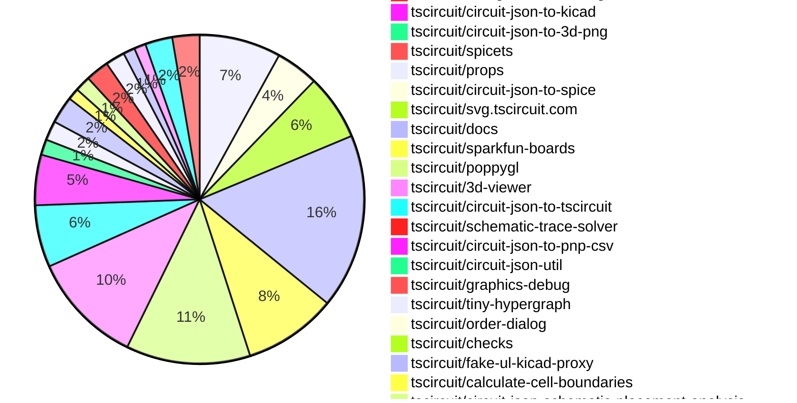

# contribution tracker

[contributions.tscircuit.com](https://contributions.tscircuit.com) ・ [tscircuit.com](https://tscircuit.com) ・ [Contribution Overviews](./contribution-overviews/) ・ [Changelogs](./changelogs/)

Generates weekly contribution overviews for tscircuit contributors. Check out all
the [contribution overviews here](./contribution-overviews/)
You can find AI-generated monthly changelogs in the [changelogs directory](./changelogs/)

- All PRs in the tscircuit org are scanned/summarized via an LLM
- The LLM classifies each Diff/PR as into a set of attributes for scoring
- All the PRs, summaries, and classifications are organized into charts and tables for [the website](https://contributions.tscircuit.com)

> Want to run locally? See the [Development Section](#development)

## Current Week

<!-- START_CURRENT_WEEK -->

# Contribution Overview 2026-05-26

The current week is shown below. There are 3 major sections:

- [Contributor Overview](#contributor-overview)
- [PRs by Repository](#prs-by-repository)
- [PRs by Contributor](#changes-by-contributor)
- [Scoring & Sponsorship Details](/docs/sponsorship-calculation-explanation.md)

## PRs by Repository


```mermaid
pie
    "tscircuit/tscircuit" : 21
    "tscircuit/circuit-json" : 11
    "tscircuit/core" : 17
    "tscircuit/tscircuit.com" : 45
    "tscircuit/eval" : 24
    "tscircuit/runframe" : 32
    "tscircuit/cli" : 29
    "tscircuit/tscircuit-autorouter" : 16
    "tscircuit/test-github-automerge" : 1
    "tscircuit/circuit-json-to-kicad" : 13
    "tscircuit/circuit-json-to-3d-png" : 4
    "tscircuit/spicets" : 2
    "tscircuit/props" : 5
    "tscircuit/circuit-json-to-spice" : 1
    "tscircuit/svg.tscircuit.com" : 2
    "tscircuit/docs" : 7
    "tscircuit/sparkfun-boards" : 3
    "tscircuit/poppygl" : 4
    "tscircuit/3d-viewer" : 1
    "tscircuit/circuit-json-to-tscircuit" : 2
    "tscircuit/schematic-trace-solver" : 6
    "tscircuit/circuit-json-to-pnp-csv" : 1
    "tscircuit/circuit-json-util" : 1
    "tscircuit/graphics-debug" : 1
    "tscircuit/tiny-hypergraph" : 5
    "tscircuit/order-dialog" : 1
    "tscircuit/checks" : 1
    "tscircuit/fake-ul-kicad-proxy" : 3
    "tscircuit/calculate-cell-boundaries" : 2
    "tscircuit/circuit-json-schematic-placement-analysis" : 1
    "tscircuit/kicad-to-circuit-json" : 3
    "tscircuit/ti-parts-engine" : 7
    "tscircuit/high-density-a01" : 2
    "tscircuit/high-density-repair01" : 2
    "tscircuit/fake-stripe" : 1
    "tscircuit/cad-component-viz" : 7
    "tscircuit/fabrication-operator-ui" : 2
    "tscircuit/dataset-srj18" : 1
```

## Contributor Overview

| Contributor | 🐳 Major | 🐙 Minor | 🐌 Tiny | Score | ⭐ | Discussion Contributions |
|-------------|---------|---------|---------|-------|-----|--------------------------|
| [rushabhcodes](#rushabhcodes) | 3 | 11 | 13 | 51 | ⭐⭐⭐ | 0🔹 1🔶 0💎 |
| [imrishabh18](#imrishabh18) | 4 | 5 | 10 | 37 | ⭐⭐ | 0🔹 0🔶 0💎 |
| [MustafaMulla29](#MustafaMulla29) | 3 | 6 | 2 | 27 | ⭐⭐ | 0🔹 0🔶 0💎 |
| [techmannih](#techmannih) | 3 | 5 | 3 | 26 | ⭐⭐ | 0🔹 0🔶 0💎 |
| [0hmX](#0hmX) | 5 | 2 | 1 | 26 | ⭐⭐ | 0🔹 0🔶 0💎 |
| [ShiboSoftwareDev](#ShiboSoftwareDev) | 1 | 5 | 6 | 22 | ⭐⭐ | 0🔹 0🔶 0💎 |
| [Abse2001](#Abse2001) | 4 | 2 | 1 | 21 | ⭐⭐ | 0🔹 0🔶 0💎 |
| [Sang-it](#Sang-it) | 3 | 1 | 5 | 20 | ⭐⭐ | 0🔹 0🔶 0💎 |
| [AnasSarkiz](#AnasSarkiz) | 3 | 0 | 5 | 20 | ⭐⭐ | 0🔹 0🔶 0💎 |
| [mohan-bee](#mohan-bee) | 1 | 3 | 0 | 14 | ⭐⭐ | 0🔹 0🔶 0💎 |
| [tscircuitbot](#tscircuitbot) | 0 | 0 | 155 | 13 | ⭐⭐ | 0🔹 0🔶 0💎 |
| [anil08607](#anil08607) | 1 | 3 | 1 | 11 | ⭐⭐ | 2🔹 0🔶 0💎 |
| [seveibar](#seveibar) | 1 | 1 | 3 | 10 | ⭐ | 0🔹 0🔶 0💎 |
| [Lathikaa-S](#Lathikaa-S) | 0 | 1 | 3 | 5 | ⭐ | 0🔹 0🔶 0💎 |
| [Devesh36](#Devesh36) | 0 | 0 | 2 | 2 |  | 0🔹 0🔶 0💎 |
| [matthewhardern](#matthewhardern) | 0 | 0 | 0 | 5 | ⭐ | 1🔹 0🔶 1💎 |

## Staff Pass Ratio (SPR)

| Contributor | Reviewed PRs | Rejections | Approvals | SPR |
|-------------|--------------|------------|-----------|-----|
| [rushabhcodes](#rushabhcodes) | 11 | 2 | 13 | 81.8% |
| [MustafaMulla29](#MustafaMulla29) | 10 | 2 | 9 | 80.0% |
| [techmannih](#techmannih) | 8 | 3 | 5 | 62.5% |
| [imrishabh18](#imrishabh18) | 6 | 0 | 6 | 100.0% |
| [mohan-bee](#mohan-bee) | 6 | 4 | 4 | 33.3% |
| [ShiboSoftwareDev](#ShiboSoftwareDev) | 5 | 2 | 7 | 60.0% |
| [Sang-it](#Sang-it) | 4 | 0 | 4 | 100.0% |
| [0hmX](#0hmX) | 4 | 1 | 3 | 75.0% |
| [anil08607](#anil08607) | 2 | 1 | 2 | 50.0% |
| [Lathikaa-S](#Lathikaa-S) | 1 | 0 | 1 | 100.0% |
| [Abse2001](#Abse2001) | 1 | 0 | 1 | 100.0% |

<details>
<summary>rushabhcodes SPR PRs (11)</summary>

- [#595](https://github.com/tscircuit/circuit-json/pull/595) Add PcbCourtyardPill definition and tests
- [#684](https://github.com/tscircuit/props/pull/684) Add dash length and gap props for schematic line and path
- [#2366](https://github.com/tscircuit/core/pull/2366) Respect sectionTitleFontSize for schematic section labels
- [#2332](https://github.com/tscircuit/core/pull/2332) fix: ensure deterministic unnamed subcircuit connectivity keys
- [#3525](https://github.com/tscircuit/tscircuit.com/pull/3525) Fix stale page titles in order workflow pages
- [#35](https://github.com/tscircuit/circuit-json-to-tscircuit/pull/35) Add schematicrect support to symbol generation
- [#29](https://github.com/tscircuit/poppygl/pull/29) Add browser-safe PNG rendering for glTF scenes without Node dependencies
- [#28](https://github.com/tscircuit/poppygl/pull/28) Use Uint8Array-first byte helpers in shared runtime paths
- [#27](https://github.com/tscircuit/poppygl/pull/27) Make GLTF-to-PNG rendering browser-safe with Node path support
- [#117](https://github.com/tscircuit/kicad-to-circuit-json/pull/117) Refactor footprint pad processing into focused modules
- [#118](https://github.com/tscircuit/kicad-to-circuit-json/pull/118) Update tscircuit version and make Arduino Uno via-overlay repro robust against via ordering

</details>

<details>
<summary>MustafaMulla29 SPR PRs (10)</summary>

- [#590](https://github.com/tscircuit/circuit-json/pull/590) Add `source_component_misconfigured_error` error type
- [#97](https://github.com/tscircuit/circuit-json-util/pull/97) Fix findBoundsAndCenter for circular_hole_with_rect_pad plated holes
- [#679](https://github.com/tscircuit/props/pull/679) Introduce drc-check component
- [#2360](https://github.com/tscircuit/core/pull/2360) Fix breakout point SRJ construction to route through boundary points
- [#2354](https://github.com/tscircuit/core/pull/2354) Partial integration of breakout-point-solver
- [#2353](https://github.com/tscircuit/core/pull/2353) Add AutoPlacedBreakoutPoint class and implement doInitialCreateAutoplacedBreakoutPoints phase
- [#2349](https://github.com/tscircuit/core/pull/2349) Add CreateAutoplacedBreakoutPoints render phase
- [#2344](https://github.com/tscircuit/core/pull/2344) Initial integration of breakout-point-solver
- [#2342](https://github.com/tscircuit/core/pull/2342)  Add custom DRC check support with <drccheck />
- [#2350](https://github.com/tscircuit/core/pull/2350) Add full-circuit SRJ panel to autorouting snapshot infrastructure

</details>

<details>
<summary>techmannih SPR PRs (8)</summary>

- [#2762](https://github.com/tscircuit/eval/pull/2762) Add TI footprint support to eval platform config
- [#3119](https://github.com/tscircuit/cli/pull/3119) feat(import): support jlcpcb identifiers in import flow
- [#697](https://github.com/tscircuit/docs/pull/697) docs: add TI parts engine platform config guide
- [#661](https://github.com/tscircuit/docs/pull/661) Add JLCPCB footprint docs
- [#115](https://github.com/tscircuit/kicad-to-circuit-json/pull/115) Add support for pill shape smt pads
- [#109](https://github.com/tscircuit/kicad-to-circuit-json/pull/109) Classify fiducial footprints as simple_fiducial
- [#5](https://github.com/tscircuit/ti-parts-engine/pull/5) Add TI footprint library support for loading KiCad archives
- [#4](https://github.com/tscircuit/ti-parts-engine/pull/4) Add tscircuit platform parts engine example

</details>

<details>
<summary>imrishabh18 SPR PRs (6)</summary>

- [#2359](https://github.com/tscircuit/core/pull/2359) fix: When `<chip />` and `<smtpad />` both have layer as `bottom` then the footprint should render it on the `bottom` layer
- [#2363](https://github.com/tscircuit/core/pull/2363) fix: `orginalLayer` and` layer` prop both have it as `bottom` but due to missing layer prop on `<chip />` it was rendering on top due to flip bug
- [#2365](https://github.com/tscircuit/core/pull/2365) chore: update the autorouter version in core to the latest
- [#153](https://github.com/tscircuit/checks/pull/153) fix: `checkEachPcbTraceNonOverlapping` should take into account the `minTraceToPadEdgeClearance` drc value
- [#3531](https://github.com/tscircuit/tscircuit.com/pull/3531) Pending payment link should show the checkout url until those are expired
- [#1309](https://github.com/tscircuit/tscircuit-autorouter/pull/1309) Converge traces which have traceThickness more than the terminal pad dimension

</details>

<details>
<summary>mohan-bee SPR PRs (6)</summary>

- [#588](https://github.com/tscircuit/circuit-json/pull/588) Add PCB board color fields
- [#565](https://github.com/tscircuit/circuit-to-svg/pull/565) Add board soldermask and silkscreen colors (no merge) 
- [#4](https://github.com/tscircuit/circuit-json-to-pnp-csv/pull/4) Skip pcb_component s entries in PNP export
- [#314](https://github.com/tscircuit/circuit-json-to-kicad/pull/314) Fix through_pad routes producing NaN KiCad PCB segments
- [#312](https://github.com/tscircuit/circuit-json-to-kicad/pull/312) repro: through_pad routes producing NaN KiCad PCB segments
- [#240](https://github.com/tscircuit/circuit-to-canvas/pull/240) Apply PCB board colors only in real canvas renders

</details>

<details>
<summary>ShiboSoftwareDev SPR PRs (5)</summary>

- [#592](https://github.com/tscircuit/circuit-json/pull/592) introduce simulation_spice_subcircuit
- [#682](https://github.com/tscircuit/props/pull/682) Add spicemodel support to chip props and spicemodel component
- [#2368](https://github.com/tscircuit/core/pull/2368) bundle breakout-point-solver
- [#2364](https://github.com/tscircuit/core/pull/2364)   Add custom SPICE subcircuit models via <spicemodel />
- [#1](https://github.com/tscircuit/spicets/pull/1) Initialize SPICE parser library structure

</details>

<details>
<summary>Sang-it SPR PRs (4)</summary>

- [#2337](https://github.com/tscircuit/core/pull/2337) add handcoded-rp2040 as reference
- [#12](https://github.com/tscircuit/calculate-cell-boundaries/pull/12) migrate to solver-utils
- [#452](https://github.com/tscircuit/schematic-trace-solver/pull/452) fix label-label collision - example39/41
- [#448](https://github.com/tscircuit/schematic-trace-solver/pull/448) trace going through chips - fix example38

</details>

<details>
<summary>0hmX SPR PRs (4)</summary>

- [#1323](https://github.com/tscircuit/tscircuit-autorouter/pull/1323) Add regionId and propagate through high-density routing and repair solvers
- [#1312](https://github.com/tscircuit/tscircuit-autorouter/pull/1312) move to Base Pipeline Solver and automatic marking of step number in graphics object
- [#83](https://github.com/tscircuit/high-density-a01/pull/83) Propagate regionId in route outputs
- [#82](https://github.com/tscircuit/high-density-a01/pull/82) add prev and next portPointId

</details>

<details>
<summary>anil08607 SPR PRs (2)</summary>

- [#594](https://github.com/tscircuit/circuit-json/pull/594) Add dashed path fields to schematic_path in circuit-json
- [#34](https://github.com/tscircuit/circuit-json-to-tscircuit/pull/34) Support pcb_copper_text in footprint conversion

</details>

<details>
<summary>Lathikaa-S SPR PRs (1)</summary>

- [#3541](https://github.com/tscircuit/tscircuit.com/pull/3541) Fix package default view hash

</details>

<details>
<summary>Abse2001 SPR PRs (1)</summary>

- [#111](https://github.com/tscircuit/tiny-hypergraph/pull/111) Add all-route greedy timeout fallback and skip section search after timeout recovery

</details>

> Note: AI evaluates PRs and assigns 1-3 star ratings automatically. 4 and 5 star ratings require manual staff review.

### Discussion Contribution Legend

- 🔹 Normal Comments: Basic participation with minimal effort
- 🔶 Great Informative Comments: Thoughtful participation that adds value
- 💎 Incredible Comments: Exceptional participation with high-quality content

## Review Table

[reviews-received-hover]: ## "Number of reviews received for PRs for this contributor"
[approvals-received-hover]: ## "Number of approvals received for PRs this contributor authored"
[rejections-received-hover]: ## "Number of rejections received for PRs this contributor authored"
[prs-opened-hover]: ## "Number of PRs opened by this contributor"
[issues-created-hover]: ## "Number of issues created by this contributor"

| Contributor | Reviews Received | Approvals Received | Rejections Received | Approvals | Rejections Given | PRs Opened | PRs Merged | Issues Created |
|---|---|---|---|---|---|---|---|---|
| [kitwongpixel](#kitwongpixel) | 0 | 0 | 0 | 0 | 0 | 1 | 0 | 0 |
| [vasyatolstyakov88-sys](#vasyatolstyakov88-sys) | 0 | 0 | 0 | 0 | 0 | 1 | 0 | 0 |
| [theherrovn-sys](#theherrovn-sys) | 1 | 0 | 0 | 0 | 0 | 17 | 0 | 0 |
| [khozakhulile27-netizen](#khozakhulile27-netizen) | 0 | 0 | 0 | 0 | 0 | 3 | 0 | 0 |
| [tscircuitbot](#tscircuitbot) | 1 | 1 | 0 | 0 | 0 | 194 | 155 | 0 |
| [MustafaMulla29](#MustafaMulla29) | 21 | 11 | 1 | 4 | 1 | 20 | 11 | 0 |
| [gfgf-brain](#gfgf-brain) | 0 | 0 | 0 | 0 | 0 | 2 | 0 | 0 |
| [jlaustill](#jlaustill) | 0 | 0 | 0 | 0 | 0 | 2 | 0 | 0 |
| [ShiboSoftwareDev](#ShiboSoftwareDev) | 11 | 11 | 0 | 2 | 0 | 12 | 12 | 0 |
| [seveibar](#seveibar) | 3 | 1 | 0 | 71 | 9 | 9 | 5 | 0 |
| [rushabhcodes](#rushabhcodes) | 80 | 33 | 0 | 5 | 4 | 35 | 27 | 0 |
| [chaudl113](#chaudl113) | 0 | 0 | 0 | 0 | 0 | 1 | 0 | 0 |
| [memelord42](#memelord42) | 0 | 0 | 0 | 0 | 0 | 2 | 0 | 0 |
| [anil08607](#anil08607) | 11 | 7 | 1 | 0 | 0 | 8 | 5 | 0 |
| [imrishabh18](#imrishabh18) | 9 | 7 | 0 | 18 | 2 | 22 | 19 | 0 |
| [mohan-bee](#mohan-bee) | 13 | 6 | 5 | 5 | 0 | 10 | 4 | 0 |
| [podarok](#podarok) | 0 | 0 | 0 | 0 | 0 | 6 | 0 | 0 |
| [matthewhardern](#matthewhardern) | 3 | 1 | 0 | 0 | 0 | 6 | 0 | 0 |
| [ItsOtherMauridian](#ItsOtherMauridian) | 0 | 0 | 0 | 0 | 0 | 2 | 0 | 0 |
| [bluewojack](#bluewojack) | 0 | 0 | 0 | 0 | 0 | 1 | 0 | 0 |
| [huangse199](#huangse199) | 0 | 0 | 0 | 0 | 0 | 4 | 0 | 0 |
| [ldmstudio7](#ldmstudio7) | 0 | 0 | 0 | 0 | 0 | 1 | 0 | 0 |
| [kejuunuy](#kejuunuy) | 0 | 0 | 0 | 0 | 0 | 1 | 0 | 0 |
| [charlie12520](#charlie12520) | 0 | 0 | 0 | 0 | 0 | 2 | 0 | 0 |
| [kpassito](#kpassito) | 0 | 0 | 0 | 0 | 0 | 1 | 0 | 0 |
| [Squirbie](#Squirbie) | 0 | 0 | 0 | 0 | 0 | 2 | 0 | 0 |
| [Heyzerohey](#Heyzerohey) | 0 | 0 | 0 | 0 | 0 | 1 | 0 | 0 |
| [Sang-it](#Sang-it) | 11 | 6 | 0 | 1 | 0 | 19 | 9 | 0 |
| [Timmmmmo](#Timmmmmo) | 0 | 0 | 0 | 0 | 0 | 1 | 0 | 0 |
| [haim1120](#haim1120) | 0 | 0 | 0 | 0 | 0 | 1 | 0 | 0 |
| [Photon101](#Photon101) | 0 | 0 | 0 | 0 | 0 | 1 | 0 | 0 |
| [Adit-Jain-srm](#Adit-Jain-srm) | 0 | 0 | 0 | 0 | 0 | 2 | 0 | 0 |
| [Lathikaa-S](#Lathikaa-S) | 16 | 9 | 1 | 0 | 0 | 5 | 4 | 0 |
| [michaelapollopimentel-svg](#michaelapollopimentel-svg) | 0 | 0 | 0 | 0 | 0 | 1 | 0 | 0 |
| [jonahsills](#jonahsills) | 0 | 0 | 0 | 0 | 0 | 2 | 0 | 0 |
| [JirA44](#JirA44) | 0 | 0 | 0 | 0 | 0 | 7 | 0 | 0 |
| [Serve63](#Serve63) | 0 | 0 | 0 | 0 | 0 | 1 | 0 | 0 |
| [techmannih](#techmannih) | 28 | 10 | 4 | 1 | 0 | 21 | 11 | 0 |
| [AnasSarkiz](#AnasSarkiz) | 2 | 2 | 0 | 3 | 0 | 10 | 8 | 0 |
| [jfredysalazar-proyectos](#jfredysalazar-proyectos) | 0 | 0 | 0 | 0 | 0 | 3 | 0 | 0 |
| [TheChosenOne-Sunyuchen](#TheChosenOne-Sunyuchen) | 0 | 0 | 0 | 0 | 0 | 1 | 0 | 0 |
| [Mjh1231](#Mjh1231) | 0 | 0 | 0 | 0 | 0 | 4 | 0 | 0 |
| [TeedsK](#TeedsK) | 0 | 0 | 0 | 0 | 0 | 1 | 0 | 0 |
| [JuanDiegoRV](#JuanDiegoRV) | 0 | 0 | 0 | 0 | 0 | 2 | 0 | 0 |
| [bong000](#bong000) | 0 | 0 | 0 | 0 | 0 | 1 | 0 | 0 |
| [Barroso0](#Barroso0) | 0 | 0 | 0 | 0 | 0 | 1 | 0 | 0 |
| [CProphet16](#CProphet16) | 0 | 0 | 0 | 0 | 0 | 2 | 0 | 0 |
| [P3xill](#P3xill) | 0 | 0 | 0 | 0 | 0 | 14 | 0 | 0 |
| [Finesssee](#Finesssee) | 0 | 0 | 0 | 0 | 0 | 1 | 0 | 0 |
| [rehanhaider](#rehanhaider) | 0 | 0 | 0 | 0 | 0 | 2 | 0 | 0 |
| [CodexWalletAgent7d38bf22](#CodexWalletAgent7d38bf22) | 0 | 0 | 0 | 0 | 0 | 1 | 0 | 0 |
| [misakaAron](#misakaAron) | 0 | 0 | 0 | 0 | 0 | 1 | 0 | 0 |
| [javierramirezg841-arch](#javierramirezg841-arch) | 0 | 0 | 0 | 0 | 0 | 1 | 0 | 0 |
| [nguyenduchuyhd](#nguyenduchuyhd) | 0 | 0 | 0 | 0 | 0 | 1 | 0 | 0 |
| [nikhiltiwari0](#nikhiltiwari0) | 0 | 0 | 0 | 0 | 0 | 1 | 0 | 0 |
| [cryptomentor139-cell](#cryptomentor139-cell) | 0 | 0 | 0 | 0 | 0 | 1 | 0 | 0 |
| [victorhblancom-design](#victorhblancom-design) | 0 | 0 | 0 | 0 | 0 | 5 | 0 | 0 |
| [fenglianhua](#fenglianhua) | 0 | 0 | 0 | 0 | 0 | 1 | 0 | 0 |
| [q404365631](#q404365631) | 0 | 0 | 0 | 0 | 0 | 8 | 0 | 0 |
| [autochamchikim-pixel](#autochamchikim-pixel) | 0 | 0 | 0 | 0 | 0 | 2 | 0 | 0 |
| [notforyou23](#notforyou23) | 3 | 0 | 0 | 0 | 0 | 1 | 0 | 0 |
| [danhkhanglamdata](#danhkhanglamdata) | 0 | 0 | 0 | 0 | 0 | 1 | 0 | 0 |
| [0hmX](#0hmX) | 9 | 4 | 1 | 1 | 0 | 19 | 8 | 0 |
| [Abse2001](#Abse2001) | 5 | 1 | 0 | 0 | 0 | 10 | 7 | 0 |
| [Priyanshu31102003](#Priyanshu31102003) | 0 | 0 | 0 | 0 | 0 | 2 | 0 | 0 |
| [Devesh36](#Devesh36) | 1 | 1 | 0 | 0 | 0 | 3 | 2 | 0 |
| [sucloudflare](#sucloudflare) | 3 | 0 | 3 | 0 | 0 | 6 | 0 | 0 |
| [Ojas2095](#Ojas2095) | 0 | 0 | 0 | 0 | 0 | 1 | 0 | 0 |
| [ElecTream](#ElecTream) | 0 | 0 | 0 | 0 | 0 | 1 | 0 | 0 |
| [starsaintf](#starsaintf) | 0 | 0 | 0 | 0 | 0 | 2 | 0 | 0 |
| [Hamil4815](#Hamil4815) | 0 | 0 | 0 | 0 | 0 | 1 | 0 | 0 |

## Changes by Repository

### [tscircuit/tscircuit](https://github.com/tscircuit/tscircuit)


<details>
<summary>🐌 Tiny Contributions (21)</summary>

| PR # | Impact | Contributor | Description |
|------|--------|-------------|-------------|
| [#3318](https://github.com/tscircuit/tscircuit/pull/3318) | 🐌 Tiny | tscircuitbot | Automated package update |
| [#3317](https://github.com/tscircuit/tscircuit/pull/3317) | 🐌 Tiny | tscircuitbot | Automated package update |
| [#3316](https://github.com/tscircuit/tscircuit/pull/3316) | 🐌 Tiny | tscircuitbot | Automated package update |
| [#3314](https://github.com/tscircuit/tscircuit/pull/3314) | 🐌 Tiny | tscircuitbot | Automated package update |
| [#3307](https://github.com/tscircuit/tscircuit/pull/3307) | 🐌 Tiny | tscircuitbot | Automated package update |
| [#3300](https://github.com/tscircuit/tscircuit/pull/3300) | 🐌 Tiny | tscircuitbot | Automated package update |
| [#3288](https://github.com/tscircuit/tscircuit/pull/3288) | 🐌 Tiny | tscircuitbot | Updates the version of several packages in the project, including tscircuitcli, tscircuitcore, and tscircuiteval. |
| [#3292](https://github.com/tscircuit/tscircuit/pull/3292) | 🐌 Tiny | tscircuitbot | Automated package update |
| [#3291](https://github.com/tscircuit/tscircuit/pull/3291) | 🐌 Tiny | tscircuitbot | Updates the version of several packages in package.json, including tscircuitcli, tscircuitcore, and tscircuiteval. |
| [#3285](https://github.com/tscircuit/tscircuit/pull/3285) | 🐌 Tiny | tscircuitbot | Automated package update |
| [#3286](https://github.com/tscircuit/tscircuit/pull/3286) | 🐌 Tiny | tscircuitbot | Automated package update |
| [#3284](https://github.com/tscircuit/tscircuit/pull/3284) | 🐌 Tiny | tscircuitbot | Automated package update |
| [#3281](https://github.com/tscircuit/tscircuit/pull/3281) | 🐌 Tiny | tscircuitbot | Automated package update |
| [#3282](https://github.com/tscircuit/tscircuit/pull/3282) | 🐌 Tiny | tscircuitbot | Automated package update |
| [#3287](https://github.com/tscircuit/tscircuit/pull/3287) | 🐌 Tiny | tscircuitbot | Automated package update |
| [#3278](https://github.com/tscircuit/tscircuit/pull/3278) | 🐌 Tiny | tscircuitbot | Automated package update |
| [#3279](https://github.com/tscircuit/tscircuit/pull/3279) | 🐌 Tiny | tscircuitbot | Automated package version bump from 0.0.1786 to 0.0.1787 |
| [#3274](https://github.com/tscircuit/tscircuit/pull/3274) | 🐌 Tiny | tscircuitbot | Automated package update |
| [#3273](https://github.com/tscircuit/tscircuit/pull/3273) | 🐌 Tiny | tscircuitbot | Automated package update |
| [#3305](https://github.com/tscircuit/tscircuit/pull/3305) | 🐌 Tiny | ShiboSoftwareDev | Adds the spicets dependency to the project and ignores the tscircuitbreakout-point-solver package during synchronization. |
| [#3299](https://github.com/tscircuit/tscircuit/pull/3299) | 🐌 Tiny | rushabhcodes | Updates the kicad-to-circuit-json dependency to version 0.0.77 in package.json |

</details>

### [tscircuit/circuit-json](https://github.com/tscircuit/circuit-json)

| PR # | Impact | Rating | Contributor | Description |
|------|--------|--------|-------------|-------------|
| [#592](https://github.com/tscircuit/circuit-json/pull/592) | 🐙 Minor | ⭐⭐ | ShiboSoftwareDev | Defines a custom SPICE subcircuit model for simulation. |
| [#595](https://github.com/tscircuit/circuit-json/pull/595) | 🐙 Minor | ⭐⭐ | rushabhcodes | Adds support for a new PCB courtyard shape called Pill (PcbCourtyardPill) with schema, type definitions, documentation, and tests. |
| [#594](https://github.com/tscircuit/circuit-json/pull/594) | 🐙 Minor | ⭐⭐ | anil08607 | Adds dashed-line schema support to schematic_path so it matches the schematic line styling model more closely. |
| [#588](https://github.com/tscircuit/circuit-json/pull/588) | 🐙 Minor | ⭐⭐ | mohan-bee | Adds optional fields for solder mask color and silkscreen color to the PCB board interface. |
| [#590](https://github.com/tscircuit/circuit-json/pull/590) | 🐙 Minor | ⭐⭐ | MustafaMulla29 | Adds a new error type for handling misconfigured source components in the circuit JSON schema. |
| [#586](https://github.com/tscircuit/circuit-json/pull/586) | 🐙 Minor | ⭐⭐ | seveibar | Adds optional dash_length and dash_gap distance fields to schematic_line and schematic_path, along with tests and documentation updates. |

<details>
<summary>🐌 Tiny Contributions (5)</summary>

| PR # | Impact | Contributor | Description |
|------|--------|-------------|-------------|
| [#598](https://github.com/tscircuit/circuit-json/pull/598) | 🐌 Tiny | tscircuitbot | Automated package update |
| [#596](https://github.com/tscircuit/circuit-json/pull/596) | 🐌 Tiny | tscircuitbot | Automated package update |
| [#593](https://github.com/tscircuit/circuit-json/pull/593) | 🐌 Tiny | tscircuitbot | Automated package update |
| [#591](https://github.com/tscircuit/circuit-json/pull/591) | 🐌 Tiny | tscircuitbot | Automated package update |
| [#587](https://github.com/tscircuit/circuit-json/pull/587) | 🐌 Tiny | tscircuitbot | Automated package update |

</details>

### [tscircuit/core](https://github.com/tscircuit/core)

| PR # | Impact | Rating | Contributor | Description |
|------|--------|--------|-------------|-------------|
| [#2332](https://github.com/tscircuit/core/pull/2332) | 🐳 Major | ⭐⭐⭐ | rushabhcodes | Ensures deterministic generation of unnamed subcircuit connectivity map keys by using a combination of subcircuit_id, source_group_id, and render ID, reducing key collisions and inconsistencies across renders. |
| [#2360](https://github.com/tscircuit/core/pull/2360) | 🐳 Major | ⭐⭐⭐ | MustafaMulla29 | Fixes routing issues by ensuring breakout point coordinates are correctly handled for cross-boundary traces, preventing duplication of internal traces in parent SRJ. |
| [#2354](https://github.com/tscircuit/core/pull/2354) | 🐳 Major | ⭐⭐⭐ | MustafaMulla29 | Integrates the breakout-point-solver functionality into the rendering process for PCB layout, allowing for automatic placement of breakout points based on solver output. |
| [#2353](https://github.com/tscircuit/core/pull/2353) | 🐳 Major | ⭐⭐⭐ | MustafaMulla29 | Adds a new AutoPlacedBreakoutPoint class and implements functionality to automatically create breakout points for ports whose traces cross the breakout boundary. |
| [#2368](https://github.com/tscircuit/core/pull/2368) | 🐙 Minor | ⭐⭐ | ShiboSoftwareDev | Adds the breakout-point-solver package to the noExternal configuration in the build setup. |
| [#2364](https://github.com/tscircuit/core/pull/2364) | 🐙 Minor | ⭐⭐ | ShiboSoftwareDev | Adds a Spicemodel component that can be passed through spiceModelspicemodel  on normal components to emit simulation_spice_subcircuit circuit-json. The implementation uses spicets to parse .subckt definitions, maps SPICE pins to component ports through spicePinMapping or matching pin names. |
| [#2366](https://github.com/tscircuit/core/pull/2366) | 🐙 Minor | ⭐⭐ | rushabhcodes | Adds support for sectionTitleFontSize in schematic section labels, allowing customization of label font size instead of defaulting to 0.18. |
| [#2349](https://github.com/tscircuit/core/pull/2349) | 🐙 Minor | ⭐⭐ | MustafaMulla29 | Adds a new render phase for creating autoplaced breakout points in the rendering process. |
| [#2342](https://github.com/tscircuit/core/pull/2342) | 🐙 Minor | ⭐⭐ | MustafaMulla29 | Adds support for custom Design Rule Checks (DRC) using the drccheck  component, allowing users to define and run custom DRC checks on circuit designs. |
| [#2350](https://github.com/tscircuit/core/pull/2350) | 🐙 Minor | ⭐⭐ | MustafaMulla29 | Adds a full-circuit SRJ panel to the autorouting snapshot infrastructure, enhancing the visualization of autorouting phases with full circuit details. |
| [#2359](https://github.com/tscircuit/core/pull/2359) | 🐙 Minor | ⭐⭐ | imrishabh18 | Fixes rendering issue where chip  and smtpad  components with layer set to bottom were not displayed correctly on the bottom layer. |
| [#2363](https://github.com/tscircuit/core/pull/2363) | 🐙 Minor | ⭐⭐ | imrishabh18 | Fixes rendering issue where chip  components were incorrectly displayed on top layer due to missing layer prop, despite both originalLayer and layer being set to bottom. |
| [#2337](https://github.com/tscircuit/core/pull/2337) | 🐙 Minor | ⭐⭐ | Sang-it | Adds a new circuit design for the RP2040 microcontroller, including associated components and connections in the schematic. |

<details>
<summary>🐌 Tiny Contributions (4)</summary>

| PR # | Impact | Contributor | Description |
|------|--------|-------------|-------------|
| [#2340](https://github.com/tscircuit/core/pull/2340) | 🐌 Tiny | tscircuitbot | Updates the tscircuitchecks package from version 0.0.132 to 0.0.133 |
| [#2339](https://github.com/tscircuit/core/pull/2339) | 🐌 Tiny | tscircuitbot | Updates the tscircuitchecks package from version 0.0.132 to 0.0.133 in package.json |
| [#2356](https://github.com/tscircuit/core/pull/2356) | 🐌 Tiny | MustafaMulla29 | Removes redundant padding updates in Breakout.ts as padding is already applied by Group.calculatePcbGroupBounds() method. |
| [#2358](https://github.com/tscircuit/core/pull/2358) | 🐌 Tiny | imrishabh18 | Adds a test to ensure that the footprint for a component is rendered on the bottom layer of the PCB when specified. |

</details>

### [tscircuit/tscircuit.com](https://github.com/tscircuit/tscircuit.com)

| PR # | Impact | Rating | Contributor | Description |
|------|--------|--------|-------------|-------------|
| [#3533](https://github.com/tscircuit/tscircuit.com/pull/3533) | 🐳 Major | ⭐⭐⭐ | anil08607 | Removes the login requirement from Circuit JSON import and opens imported content in the editor as an unsaved URL-backed session instead of creating a package immediately. Also updates Playwright coverage for anonymous pastefile import and validation behavior |
| [#3531](https://github.com/tscircuit/tscircuit.com/pull/3531) | 🐳 Major | ⭐⭐⭐ | imrishabh18 | Changes the behavior of the pending payment link to display the checkout URL until it expires, enhancing user experience during the payment process. |
| [#3536](https://github.com/tscircuit/tscircuit.com/pull/3536) | 🐳 Major | ⭐⭐⭐ | imrishabh18 | Prevents the display of the checkout expired section if the payment for the order has already been completed. |
| [#3552](https://github.com/tscircuit/tscircuit.com/pull/3552) | 🐙 Minor | ⭐⭐ | rushabhcodes | Adds pinout support to the PNG download pipeline, allowing users to download pinout diagrams alongside other image types. |
| [#3539](https://github.com/tscircuit/tscircuit.com/pull/3539) | 🐙 Minor | ⭐⭐ | rushabhcodes | Adds a My Orders entry to the logged-in profile dropdown directly under My Profile, visible only to users with is_tscircuit_staff session. |
| [#3535](https://github.com/tscircuit/tscircuit.com/pull/3535) | 🐙 Minor | ⭐⭐ | rushabhcodes | Fixes the order detail status pill so paid orders show Payment confirmed even when the checkout session is also marked expired. |
| [#3525](https://github.com/tscircuit/tscircuit.com/pull/3525) | 🐙 Minor | ⭐⭐ | rushabhcodes | Fixes stale page titles in order workflow pages by adding explicit Helmet titles to order detail, order success, order cancel, and my orders pages, preventing stale titles from appearing after client-side navigation. |
| [#3499](https://github.com/tscircuit/tscircuit.com/pull/3499) | 🐙 Minor | ⭐⭐ | anil08607 | Prevents the command palette from fetching recent packages while it is closed, ensuring background requests only occur when the palette is actively used. |
| [#3511](https://github.com/tscircuit/tscircuit.com/pull/3511) | 🐙 Minor | ⭐⭐ | imrishabh18 | Modifies the apiorderscreate endpoint to optionally accept a session token for associating orders with user accounts. |
| [#3509](https://github.com/tscircuit/tscircuit.com/pull/3509) | 🐙 Minor | ⭐⭐ | imrishabh18 | Modifies the orderslist endpoint to return orders specific to a user account, including pagination support via a limit parameter. |
| [#3541](https://github.com/tscircuit/tscircuit.com/pull/3541) | 🐙 Minor | ⭐⭐ | Lathikaa-S | Fixes the issue where the default view setting for packages is overridden by the files tab while the circuit JSON is still loading, ensuring users see the expected default view when opening a package page. |

<details>
<summary>🐌 Tiny Contributions (34)</summary>

| PR # | Impact | Contributor | Description |
|------|--------|-------------|-------------|
| [#3555](https://github.com/tscircuit/tscircuit.com/pull/3555) | 🐌 Tiny | tscircuitbot | Automated package update |
| [#3554](https://github.com/tscircuit/tscircuit.com/pull/3554) | 🐌 Tiny | tscircuitbot | Automated package update |
| [#3553](https://github.com/tscircuit/tscircuit.com/pull/3553) | 🐌 Tiny | tscircuitbot | Updates the tscircuiteval package to version 0.0.879 |
| [#3549](https://github.com/tscircuit/tscircuit.com/pull/3549) | 🐌 Tiny | tscircuitbot | Automated package update |
| [#3546](https://github.com/tscircuit/tscircuit.com/pull/3546) | 🐌 Tiny | tscircuitbot | Updates the tscircuiteval package version from 0.0.874 to 0.0.876 |
| [#3550](https://github.com/tscircuit/tscircuit.com/pull/3550) | 🐌 Tiny | tscircuitbot | Updates the tscircuiteval package to version 0.0.878 in the package.json file. |
| [#3548](https://github.com/tscircuit/tscircuit.com/pull/3548) | 🐌 Tiny | tscircuitbot | Automated package update |
| [#3547](https://github.com/tscircuit/tscircuit.com/pull/3547) | 🐌 Tiny | tscircuitbot | Updates the tscircuitrunframe package from version 0.0.2013 to 0.0.2014 |
| [#3543](https://github.com/tscircuit/tscircuit.com/pull/3543) | 🐌 Tiny | tscircuitbot | Automated package update |
| [#3551](https://github.com/tscircuit/tscircuit.com/pull/3551) | 🐌 Tiny | tscircuitbot | Automated package update |
| [#3544](https://github.com/tscircuit/tscircuit.com/pull/3544) | 🐌 Tiny | tscircuitbot | Automated package update |
| [#3542](https://github.com/tscircuit/tscircuit.com/pull/3542) | 🐌 Tiny | tscircuitbot | Automated package update |
| [#3532](https://github.com/tscircuit/tscircuit.com/pull/3532) | 🐌 Tiny | tscircuitbot | Automated package update |
| [#3538](https://github.com/tscircuit/tscircuit.com/pull/3538) | 🐌 Tiny | tscircuitbot | Automated package update |
| [#3530](https://github.com/tscircuit/tscircuit.com/pull/3530) | 🐌 Tiny | tscircuitbot | Updates the tscircuitrunframe package from version 0.0.2009 to 0.0.2010 |
| [#3529](https://github.com/tscircuit/tscircuit.com/pull/3529) | 🐌 Tiny | tscircuitbot | Updates the tscircuiteval package from version 0.0.871 to 0.0.873 in the package.json file. |
| [#3524](https://github.com/tscircuit/tscircuit.com/pull/3524) | 🐌 Tiny | tscircuitbot | Updates the tscircuitrunframe package from version 0.0.2007 to 0.0.2008 |
| [#3526](https://github.com/tscircuit/tscircuit.com/pull/3526) | 🐌 Tiny | tscircuitbot | Automated package update |
| [#3527](https://github.com/tscircuit/tscircuit.com/pull/3527) | 🐌 Tiny | tscircuitbot | Updates the tscircuitrunframe package from version 0.0.2008 to 0.0.2009 |
| [#3520](https://github.com/tscircuit/tscircuit.com/pull/3520) | 🐌 Tiny | tscircuitbot | Updates the tscircuitrunframe package from version 0.0.2005 to 0.0.2006 |
| [#3518](https://github.com/tscircuit/tscircuit.com/pull/3518) | 🐌 Tiny | tscircuitbot | Automated package update |
| [#3521](https://github.com/tscircuit/tscircuit.com/pull/3521) | 🐌 Tiny | tscircuitbot | Updates the tscircuitrunframe package from version 0.0.2006 to 0.0.2007 |
| [#3519](https://github.com/tscircuit/tscircuit.com/pull/3519) | 🐌 Tiny | tscircuitbot | Automated package update |
| [#3510](https://github.com/tscircuit/tscircuit.com/pull/3510) | 🐌 Tiny | tscircuitbot | Automated package update |
| [#3508](https://github.com/tscircuit/tscircuit.com/pull/3508) | 🐌 Tiny | tscircuitbot | Updates the tscircuitrunframe package from version 0.0.2002 to 0.0.2003 |
| [#3516](https://github.com/tscircuit/tscircuit.com/pull/3516) | 🐌 Tiny | tscircuitbot | Updates the tscircuiteval package to version 0.0.868 in the package.json file. |
| [#3512](https://github.com/tscircuit/tscircuit.com/pull/3512) | 🐌 Tiny | tscircuitbot | Automated package update |
| [#3517](https://github.com/tscircuit/tscircuit.com/pull/3517) | 🐌 Tiny | tscircuitbot | Updates the tscircuitrunframe package from version 0.0.2003 to 0.0.2004 |
| [#3545](https://github.com/tscircuit/tscircuit.com/pull/3545) | 🐌 Tiny | rushabhcodes | Updates the version of circuit-json-to-tscircuit in package.json from 0.0.11 to 0.0.21 |
| [#3534](https://github.com/tscircuit/tscircuit.com/pull/3534) | 🐌 Tiny | imrishabh18 | Changes the condition for rendering the OrderDialog component from a hardcoded true to a state variable isOrderDialogOpen, allowing for dynamic control of the dialogs visibility. |
| [#3528](https://github.com/tscircuit/tscircuit.com/pull/3528) | 🐌 Tiny | imrishabh18 | Updates the order-dialog dependency to a specific commit in the repository. |
| [#3513](https://github.com/tscircuit/tscircuit.com/pull/3513) | 🐌 Tiny | imrishabh18 | Fixes a typo in the boolean condition that controls the visibility of the order dialog in the package header component. |
| [#3514](https://github.com/tscircuit/tscircuit.com/pull/3514) | 🐌 Tiny | imrishabh18 | Adds a new order cancel page that displays information when an order fails or is canceled, including order ID and options to view the order or return to previous pages. |
| [#3515](https://github.com/tscircuit/tscircuit.com/pull/3515) | 🐌 Tiny | imrishabh18 | Fixes the order card information display on the my-orders page by improving the layout and status representation of orders. |

</details>

### [tscircuit/eval](https://github.com/tscircuit/eval)


<details>
<summary>🐌 Tiny Contributions (24)</summary>

| PR # | Impact | Contributor | Description |
|------|--------|-------------|-------------|
| [#2774](https://github.com/tscircuit/eval/pull/2774) | 🐌 Tiny | tscircuitbot | Automated package update |
| [#2773](https://github.com/tscircuit/eval/pull/2773) | 🐌 Tiny | tscircuitbot | Updates the version of the tscircuitcore package from 0.0.1281 to 0.0.1282 in package.json |
| [#2768](https://github.com/tscircuit/eval/pull/2768) | 🐌 Tiny | tscircuitbot | Automated package update |
| [#2764](https://github.com/tscircuit/eval/pull/2764) | 🐌 Tiny | tscircuitbot | Automated package update |
| [#2763](https://github.com/tscircuit/eval/pull/2763) | 🐌 Tiny | tscircuitbot | Automated package update |
| [#2766](https://github.com/tscircuit/eval/pull/2766) | 🐌 Tiny | tscircuitbot | Automated package update |
| [#2761](https://github.com/tscircuit/eval/pull/2761) | 🐌 Tiny | tscircuitbot | Automated package update |
| [#2760](https://github.com/tscircuit/eval/pull/2760) | 🐌 Tiny | tscircuitbot | Updates the version of the tscircuitcore package from 0.0.1276 to 0.0.1277 in package.json |
| [#2770](https://github.com/tscircuit/eval/pull/2770) | 🐌 Tiny | tscircuitbot | Automated package update |
| [#2769](https://github.com/tscircuit/eval/pull/2769) | 🐌 Tiny | tscircuitbot | Automated package update |
| [#2767](https://github.com/tscircuit/eval/pull/2767) | 🐌 Tiny | tscircuitbot | Automated package update |
| [#2765](https://github.com/tscircuit/eval/pull/2765) | 🐌 Tiny | tscircuitbot | Automated package update |
| [#2755](https://github.com/tscircuit/eval/pull/2755) | 🐌 Tiny | tscircuitbot | Automated package update |
| [#2758](https://github.com/tscircuit/eval/pull/2758) | 🐌 Tiny | tscircuitbot | Automated package update |
| [#2757](https://github.com/tscircuit/eval/pull/2757) | 🐌 Tiny | tscircuitbot | Automated package update |
| [#2752](https://github.com/tscircuit/eval/pull/2752) | 🐌 Tiny | tscircuitbot | Automated package update |
| [#2751](https://github.com/tscircuit/eval/pull/2751) | 🐌 Tiny | tscircuitbot | Updates the version of the tscircuitcore package from 0.0.1273 to 0.0.1274 in package.json |
| [#2749](https://github.com/tscircuit/eval/pull/2749) | 🐌 Tiny | tscircuitbot | Automated package update to version 0.0.870 |
| [#2754](https://github.com/tscircuit/eval/pull/2754) | 🐌 Tiny | tscircuitbot | Automated package update |
| [#2748](https://github.com/tscircuit/eval/pull/2748) | 🐌 Tiny | tscircuitbot | Updates the version of the tscircuitcore package from 0.0.1272 to 0.0.1273 in package.json |
| [#2745](https://github.com/tscircuit/eval/pull/2745) | 🐌 Tiny | tscircuitbot | Automated package update |
| [#2746](https://github.com/tscircuit/eval/pull/2746) | 🐌 Tiny | tscircuitbot | Automated package update |
| [#2743](https://github.com/tscircuit/eval/pull/2743) | 🐌 Tiny | tscircuitbot | Automated package update |
| [#2742](https://github.com/tscircuit/eval/pull/2742) | 🐌 Tiny | tscircuitbot | Updates package versions in package.json to the latest compatible versions. |

</details>

### [tscircuit/runframe](https://github.com/tscircuit/runframe)


<details>
<summary>🐌 Tiny Contributions (32)</summary>

| PR # | Impact | Contributor | Description |
|------|--------|-------------|-------------|
| [#3557](https://github.com/tscircuit/runframe/pull/3557) | 🐌 Tiny | tscircuitbot | Automated package update |
| [#3556](https://github.com/tscircuit/runframe/pull/3556) | 🐌 Tiny | tscircuitbot | Updates the tscircuit3d-viewer package to version 0.0.564 in the package.json file. |
| [#3555](https://github.com/tscircuit/runframe/pull/3555) | 🐌 Tiny | tscircuitbot | Automated package update |
| [#3554](https://github.com/tscircuit/runframe/pull/3554) | 🐌 Tiny | tscircuitbot | Updates the tscircuiteval package to version 0.0.879 in the package.json file. |
| [#3543](https://github.com/tscircuit/runframe/pull/3543) | 🐌 Tiny | tscircuitbot | Automated package update |
| [#3551](https://github.com/tscircuit/runframe/pull/3551) | 🐌 Tiny | tscircuitbot | Updates the tscircuiteval package from version 0.0.877 to 0.0.878 |
| [#3545](https://github.com/tscircuit/runframe/pull/3545) | 🐌 Tiny | tscircuitbot | Automated package update |
| [#3547](https://github.com/tscircuit/runframe/pull/3547) | 🐌 Tiny | tscircuitbot | Updates the tscircuiteval package from version 0.0.874 to 0.0.876 in the package.json file. |
| [#3544](https://github.com/tscircuit/runframe/pull/3544) | 🐌 Tiny | tscircuitbot | Updates the tscircuiteval package from version 0.0.873 to 0.0.874 in the package.json file. |
| [#3552](https://github.com/tscircuit/runframe/pull/3552) | 🐌 Tiny | tscircuitbot | Automated package update |
| [#3550](https://github.com/tscircuit/runframe/pull/3550) | 🐌 Tiny | tscircuitbot | Automated package update |
| [#3549](https://github.com/tscircuit/runframe/pull/3549) | 🐌 Tiny | tscircuitbot | Updates the tscircuiteval package to version 0.0.877 in the package.json file. |
| [#3548](https://github.com/tscircuit/runframe/pull/3548) | 🐌 Tiny | tscircuitbot | Automated package update |
| [#3542](https://github.com/tscircuit/runframe/pull/3542) | 🐌 Tiny | tscircuitbot | Updates the circuit-json-to-kicad package version from 0.0.146 to 0.0.147 in package.json |
| [#3539](https://github.com/tscircuit/runframe/pull/3539) | 🐌 Tiny | tscircuitbot | Updates the circuit-json-to-kicad package version from 0.0.145 to 0.0.146 in package.json |
| [#3540](https://github.com/tscircuit/runframe/pull/3540) | 🐌 Tiny | tscircuitbot | Automated package update |
| [#3532](https://github.com/tscircuit/runframe/pull/3532) | 🐌 Tiny | tscircuitbot | Updates the tscircuiteval package from version 0.0.869 to 0.0.870 |
| [#3534](https://github.com/tscircuit/runframe/pull/3534) | 🐌 Tiny | tscircuitbot | Updates the tscircuiteval package from version 0.0.870 to 0.0.871 in the package.json file. |
| [#3535](https://github.com/tscircuit/runframe/pull/3535) | 🐌 Tiny | tscircuitbot | Automated package update |
| [#3533](https://github.com/tscircuit/runframe/pull/3533) | 🐌 Tiny | tscircuitbot | Automated package update |
| [#3537](https://github.com/tscircuit/runframe/pull/3537) | 🐌 Tiny | tscircuitbot | Automated package update |
| [#3536](https://github.com/tscircuit/runframe/pull/3536) | 🐌 Tiny | tscircuitbot | Updates the tscircuiteval package from version 0.0.871 to 0.0.873 in the package.json file. |
| [#3531](https://github.com/tscircuit/runframe/pull/3531) | 🐌 Tiny | tscircuitbot | Automated package update |
| [#3530](https://github.com/tscircuit/runframe/pull/3530) | 🐌 Tiny | tscircuitbot | Updates the circuit-json-to-kicad package version from 0.0.144 to 0.0.145 in package.json |
| [#3523](https://github.com/tscircuit/runframe/pull/3523) | 🐌 Tiny | tscircuitbot | Automated package update |
| [#3528](https://github.com/tscircuit/runframe/pull/3528) | 🐌 Tiny | tscircuitbot | Automated package update |
| [#3522](https://github.com/tscircuit/runframe/pull/3522) | 🐌 Tiny | tscircuitbot | Updates the tscircuiteval package from version 0.0.868 to 0.0.869 |
| [#3527](https://github.com/tscircuit/runframe/pull/3527) | 🐌 Tiny | tscircuitbot | Updates the circuit-json-to-kicad package version from 0.0.142 to 0.0.144 in package.json |
| [#3521](https://github.com/tscircuit/runframe/pull/3521) | 🐌 Tiny | tscircuitbot | Automated package update |
| [#3519](https://github.com/tscircuit/runframe/pull/3519) | 🐌 Tiny | tscircuitbot | Automated package update |
| [#3520](https://github.com/tscircuit/runframe/pull/3520) | 🐌 Tiny | tscircuitbot | Updates the tscircuiteval package from version 0.0.867 to 0.0.868 in the package.json file. |
| [#3518](https://github.com/tscircuit/runframe/pull/3518) | 🐌 Tiny | tscircuitbot | Updates the circuit-json-to-kicad package version from 0.0.140 to 0.0.142 in package.json |

</details>

### [tscircuit/cli](https://github.com/tscircuit/cli)


<details>
<summary>🐌 Tiny Contributions (29)</summary>

| PR # | Impact | Contributor | Description |
|------|--------|-------------|-------------|
| [#3148](https://github.com/tscircuit/cli/pull/3148) | 🐌 Tiny | tscircuitbot | Automated package update |
| [#3147](https://github.com/tscircuit/cli/pull/3147) | 🐌 Tiny | tscircuitbot | Updates the tscircuitrunframe package from version 0.0.2017 to 0.0.2018 |
| [#3146](https://github.com/tscircuit/cli/pull/3146) | 🐌 Tiny | tscircuitbot | Automated package update |
| [#3145](https://github.com/tscircuit/cli/pull/3145) | 🐌 Tiny | tscircuitbot | Updates the tscircuitrunframe package from version 0.0.2016 to 0.0.2017 |
| [#3138](https://github.com/tscircuit/cli/pull/3138) | 🐌 Tiny | tscircuitbot | Automated package update |
| [#3140](https://github.com/tscircuit/cli/pull/3140) | 🐌 Tiny | tscircuitbot | Automated package update |
| [#3137](https://github.com/tscircuit/cli/pull/3137) | 🐌 Tiny | tscircuitbot | Updates the tscircuitrunframe package from version 0.0.2012 to 0.0.2013 |
| [#3141](https://github.com/tscircuit/cli/pull/3141) | 🐌 Tiny | tscircuitbot | Updates the tscircuitrunframe package from version 0.0.2014 to 0.0.2015 |
| [#3135](https://github.com/tscircuit/cli/pull/3135) | 🐌 Tiny | tscircuitbot | Updates the tscircuitrunframe package from version 0.0.2010 to 0.0.2012 |
| [#3143](https://github.com/tscircuit/cli/pull/3143) | 🐌 Tiny | tscircuitbot | Updates the tscircuitrunframe package from version 0.0.2015 to 0.0.2016 |
| [#3139](https://github.com/tscircuit/cli/pull/3139) | 🐌 Tiny | tscircuitbot | Updates the tscircuitrunframe package from version 0.0.2013 to 0.0.2014 |
| [#3144](https://github.com/tscircuit/cli/pull/3144) | 🐌 Tiny | tscircuitbot | Automated package update |
| [#3136](https://github.com/tscircuit/cli/pull/3136) | 🐌 Tiny | tscircuitbot | Automated package update |
| [#3133](https://github.com/tscircuit/cli/pull/3133) | 🐌 Tiny | tscircuitbot | Updates the tscircuitrunframe package from version 0.0.2009 to 0.0.2010 |
| [#3134](https://github.com/tscircuit/cli/pull/3134) | 🐌 Tiny | tscircuitbot | Automated package update |
| [#3128](https://github.com/tscircuit/cli/pull/3128) | 🐌 Tiny | tscircuitbot | Updates the tscircuitrunframe package from version 0.0.2007 to 0.0.2008 |
| [#3131](https://github.com/tscircuit/cli/pull/3131) | 🐌 Tiny | tscircuitbot | Updates the tscircuitrunframe package from version 0.0.2008 to 0.0.2009 |
| [#3132](https://github.com/tscircuit/cli/pull/3132) | 🐌 Tiny | tscircuitbot | Automated package update |
| [#3129](https://github.com/tscircuit/cli/pull/3129) | 🐌 Tiny | tscircuitbot | Automated package update |
| [#3124](https://github.com/tscircuit/cli/pull/3124) | 🐌 Tiny | tscircuitbot | Updates the tscircuitrunframe package from version 0.0.2005 to 0.0.2006 |
| [#3125](https://github.com/tscircuit/cli/pull/3125) | 🐌 Tiny | tscircuitbot | Automated package update |
| [#3127](https://github.com/tscircuit/cli/pull/3127) | 🐌 Tiny | tscircuitbot | Automated package update |
| [#3122](https://github.com/tscircuit/cli/pull/3122) | 🐌 Tiny | tscircuitbot | Updates the tscircuitrunframe package to version 0.0.2005 in package.json |
| [#3123](https://github.com/tscircuit/cli/pull/3123) | 🐌 Tiny | tscircuitbot | Automated package update |
| [#3126](https://github.com/tscircuit/cli/pull/3126) | 🐌 Tiny | tscircuitbot | Updates the tscircuitrunframe package from version 0.0.2006 to 0.0.2007 |
| [#3117](https://github.com/tscircuit/cli/pull/3117) | 🐌 Tiny | tscircuitbot | Automated package update |
| [#3116](https://github.com/tscircuit/cli/pull/3116) | 🐌 Tiny | tscircuitbot | Updates the tscircuitrunframe package from version 0.0.2002 to 0.0.2003 |
| [#3120](https://github.com/tscircuit/cli/pull/3120) | 🐌 Tiny | tscircuitbot | Updates the tscircuitrunframe package from version 0.0.2003 to 0.0.2004 |
| [#3121](https://github.com/tscircuit/cli/pull/3121) | 🐌 Tiny | tscircuitbot | Automated package update |

</details>

### [tscircuit/tscircuit-autorouter](https://github.com/tscircuit/tscircuit-autorouter)

| PR # | Impact | Rating | Contributor | Description |
|------|--------|--------|-------------|-------------|
| [#1313](https://github.com/tscircuit/tscircuit-autorouter/pull/1313) | 🐳 Major | ⭐⭐⭐ | seveibar | Limits the number of member obstacles for BGAs in the autorouting process to prevent excessive topology size. |
| [#1309](https://github.com/tscircuit/tscircuit-autorouter/pull/1309) | 🐳 Major | ⭐⭐⭐ | imrishabh18 | Converges traces with thickness greater than the terminal pad dimension to ensure proper routing and clearance in circuit designs. |
| [#1323](https://github.com/tscircuit/tscircuit-autorouter/pull/1323) | 🐳 Major | ⭐⭐⭐ | 0hmX | Adds regionId to high-density routing and repair solvers, ensuring it propagates through various routing algorithms for improved routing accuracy. |
| [#1324](https://github.com/tscircuit/tscircuit-autorouter/pull/1324) | 🐳 Major | ⭐⭐⭐ | 0hmX | Fixes visualization issues in the BGA fixture and solver, ensuring accurate representation of the BGA topology during autorouting processes. |
| [#1321](https://github.com/tscircuit/tscircuit-autorouter/pull/1321) | 🐳 Major | ⭐⭐⭐ | 0hmX | This pull request introduces a new fixture and associated logic for handling broken trace segments in the autorouting process. It includes a comprehensive set of solvers designed to manage high-density routing, force improvement, repair, stitching, and trace simplification. The changes aim to enhance the autorouters ability to handle complex routing scenarios, particularly those involving broken traces. |
| [#1298](https://github.com/tscircuit/tscircuit-autorouter/pull/1298) | 🐳 Major | ⭐⭐⭐ | 0hmX | add prev and next port point ids svg update |

<details>
<summary>🐌 Tiny Contributions (10)</summary>

| PR # | Impact | Contributor | Description |
|------|--------|-------------|-------------|
| [#1326](https://github.com/tscircuit/tscircuit-autorouter/pull/1326) | 🐌 Tiny | tscircuitbot | Automated package update |
| [#1325](https://github.com/tscircuit/tscircuit-autorouter/pull/1325) | 🐌 Tiny | tscircuitbot | Automated package update |
| [#1322](https://github.com/tscircuit/tscircuit-autorouter/pull/1322) | 🐌 Tiny | tscircuitbot | Automated package update |
| [#1310](https://github.com/tscircuit/tscircuit-autorouter/pull/1310) | 🐌 Tiny | tscircuitbot | Automated package update |
| [#1303](https://github.com/tscircuit/tscircuit-autorouter/pull/1303) | 🐌 Tiny | tscircuitbot | Automated package update |
| [#1297](https://github.com/tscircuit/tscircuit-autorouter/pull/1297) | 🐌 Tiny | tscircuitbot | Automated package update |
| [#1300](https://github.com/tscircuit/tscircuit-autorouter/pull/1300) | 🐌 Tiny | tscircuitbot | Automated package update |
| [#1275](https://github.com/tscircuit/tscircuit-autorouter/pull/1275) | 🐌 Tiny | seveibar | Adds Blacksmith Testbox configuration for running CI against local changes. |
| [#1302](https://github.com/tscircuit/tscircuit-autorouter/pull/1302) | 🐌 Tiny | imrishabh18 | Add a new bug report fixture and corresponding test for the autorouting system, specifically for bug report ID 64. |
| [#1296](https://github.com/tscircuit/tscircuit-autorouter/pull/1296) | 🐌 Tiny | 0hmX | Updates the dataset-srj11-45-degree dependency version and adds new sample circuits to the benchmark tests. |

</details>

### [tscircuit/test-github-automerge](https://github.com/tscircuit/test-github-automerge)


<details>
<summary>🐌 Tiny Contributions (1)</summary>

| PR # | Impact | Contributor | Description |
|------|--------|-------------|-------------|
| [#45](https://github.com/tscircuit/test-github-automerge/pull/45) | 🐌 Tiny | tscircuitbot | Updates the tscircuitcircuit-json-util package from version 0.0.94 to 0.0.95 in the project dependencies. |

</details>

### [tscircuit/circuit-json-to-kicad](https://github.com/tscircuit/circuit-json-to-kicad)

| PR # | Impact | Rating | Contributor | Description |
|------|--------|--------|-------------|-------------|
| [#312](https://github.com/tscircuit/circuit-json-to-kicad/pull/312) | 🐳 Major | ⭐⭐⭐ | mohan-bee | Adds a repro using alarmv2.json showing that valid through_pad route points are converted into KiCad PCB segments with NaN coordinates, causing kicadts parsing to fail. core emits a valid circuit-json through_pad route point with startend coordinates, matching the circuit-json schema. where the converter assumes every route point has top-level xy, producing NaN for valid through_pad points. |
| [#314](https://github.com/tscircuit/circuit-json-to-kicad/pull/314) | 🐙 Minor | ⭐⭐ | mohan-bee | Fixes NaN coordinates in KiCad PCB segments by reading through_pad.start and through_pad.end coordinates instead of assuming top-level xy for every route point. |

<details>
<summary>🐌 Tiny Contributions (11)</summary>

| PR # | Impact | Contributor | Description |
|------|--------|-------------|-------------|
| [#326](https://github.com/tscircuit/circuit-json-to-kicad/pull/326) | 🐌 Tiny | tscircuitbot | Automated package update |
| [#324](https://github.com/tscircuit/circuit-json-to-kicad/pull/324) | 🐌 Tiny | tscircuitbot | Automated package update |
| [#321](https://github.com/tscircuit/circuit-json-to-kicad/pull/321) | 🐌 Tiny | tscircuitbot | Automated package update |
| [#319](https://github.com/tscircuit/circuit-json-to-kicad/pull/319) | 🐌 Tiny | tscircuitbot | Automated package update |
| [#318](https://github.com/tscircuit/circuit-json-to-kicad/pull/318) | 🐌 Tiny | tscircuitbot | Automated package update |
| [#315](https://github.com/tscircuit/circuit-json-to-kicad/pull/315) | 🐌 Tiny | tscircuitbot | Automated package update |
| [#323](https://github.com/tscircuit/circuit-json-to-kicad/pull/323) | 🐌 Tiny | rushabhcodes | Refactors several converter functions to use a single parameter object instead of multiple positional arguments, improving code readability and maintainability without changing functional logic. |
| [#325](https://github.com/tscircuit/circuit-json-to-kicad/pull/325) | 🐌 Tiny | anil08607 | Adds test coverage for various PCB cutout shapes including rectangle, circle, and polygon in the repro21 test suite. |
| [#320](https://github.com/tscircuit/circuit-json-to-kicad/pull/320) | 🐌 Tiny | Lathikaa-S | Fixes schematic reference names for connectors to ensure proper naming conventions are followed in the output. |
| [#316](https://github.com/tscircuit/circuit-json-to-kicad/pull/316) | 🐌 Tiny | Lathikaa-S | Reproduces a bug where the schematic falls back to a default name instead of using the parsed name for components. |
| [#317](https://github.com/tscircuit/circuit-json-to-kicad/pull/317) | 🐌 Tiny | Lathikaa-S | Reproduces a bug where the LED schematic reference designator falls back to a default name instead of using the parsed name from the circuit JSON. |

</details>

### [tscircuit/circuit-json-to-3d-png](https://github.com/tscircuit/circuit-json-to-3d-png)


<details>
<summary>🐌 Tiny Contributions (4)</summary>

| PR # | Impact | Contributor | Description |
|------|--------|-------------|-------------|
| [#8](https://github.com/tscircuit/circuit-json-to-3d-png/pull/8) | 🐌 Tiny | tscircuitbot | Automated package update |
| [#6](https://github.com/tscircuit/circuit-json-to-3d-png/pull/6) | 🐌 Tiny | tscircuitbot | Automated package update |
| [#7](https://github.com/tscircuit/circuit-json-to-3d-png/pull/7) | 🐌 Tiny | rushabhcodes | Adds a Playwright-based browser smoke test for renderGLTFToPNGFromURL. |
| [#5](https://github.com/tscircuit/circuit-json-to-3d-png/pull/5) | 🐌 Tiny | rushabhcodes | Updates the poppygl dependency to version 0.0.23 in the package.json file. |

</details>

### [tscircuit/spicets](https://github.com/tscircuit/spicets)

| PR # | Impact | Rating | Contributor | Description |
|------|--------|--------|-------------|-------------|
| [#1](https://github.com/tscircuit/spicets/pull/1) | 🐳 Major | ⭐⭐⭐ | ShiboSoftwareDev | Scaffolds spicets following the tscircuit parser-library guide with a tokenized parse pipeline, registered class-based SPICE card model, root netlistlibrary classes, parse functions, deterministic serialization, unknown-card preservation, public exports, README API docs, and focused unitround-trip fixture tests. |

<details>
<summary>🐌 Tiny Contributions (1)</summary>

| PR # | Impact | Contributor | Description |
|------|--------|-------------|-------------|
| [#2](https://github.com/tscircuit/spicets/pull/2) | 🐌 Tiny | ShiboSoftwareDev | This pull request introduces several GitHub workflows for formatting checks, testing, type checking, and publishing to npm. It also adds a configuration file for the Biome formatter, which standardizes code formatting across the project. The workflows are designed to run on pushes and pull requests to the main branch, ensuring that code adheres to formatting standards and passes tests before being merged. |

</details>

### [tscircuit/props](https://github.com/tscircuit/props)

| PR # | Impact | Rating | Contributor | Description |
|------|--------|--------|-------------|-------------|
| [#682](https://github.com/tscircuit/props/pull/682) | 🐙 Minor | ⭐⭐ | ShiboSoftwareDev | Adds support for spicemodel in chip properties and introduces a new spicemodel component for handling SPICE simulations. |
| [#684](https://github.com/tscircuit/props/pull/684) | 🐙 Minor | ⭐⭐ | rushabhcodes | Adds dashLength and dashGap support to schematicline  and schematicpath , matching the existing dash_length and dash_gap fields in circuit-json. |
| [#679](https://github.com/tscircuit/props/pull/679) | 🐙 Minor | ⭐⭐ | MustafaMulla29 | Adds a new DRC check component with customizable check functions for design rule checking in circuit designs. |

<details>
<summary>🐌 Tiny Contributions (2)</summary>

| PR # | Impact | Contributor | Description |
|------|--------|-------------|-------------|
| [#685](https://github.com/tscircuit/props/pull/685) | 🐌 Tiny | ShiboSoftwareDev | Renames the Spicemodel component and its associated types to SpiceModel for consistency in naming conventions. |
| [#683](https://github.com/tscircuit/props/pull/683) | 🐌 Tiny | rushabhcodes | Adds an optional sectionTitleFontSize prop to schematicsection , allowing callers to configure schematic section title sizing. |

</details>

### [tscircuit/circuit-json-to-spice](https://github.com/tscircuit/circuit-json-to-spice)

| PR # | Impact | Rating | Contributor | Description |
|------|--------|--------|-------------|-------------|
| [#36](https://github.com/tscircuit/circuit-json-to-spice/pull/36) | 🐙 Minor | ⭐⭐ | ShiboSoftwareDev | Adds support for native simulation of SPICE subcircuits in the circuit JSON to SPICE conversion process. |

### [tscircuit/svg.tscircuit.com](https://github.com/tscircuit/svg.tscircuit.com)


<details>
<summary>🐌 Tiny Contributions (2)</summary>

| PR # | Impact | Contributor | Description |
|------|--------|-------------|-------------|
| [#1504](https://github.com/tscircuit/svg.tscircuit.com/pull/1504) | 🐌 Tiny | ShiboSoftwareDev | Updates the tscircuit dependency version from 0.0.1790 to 0.0.1795 in package.json |
| [#1498](https://github.com/tscircuit/svg.tscircuit.com/pull/1498) | 🐌 Tiny | ShiboSoftwareDev | Updates the tscircuit dependency version from 0.0.1773 to 0.0.1790 in package.json |

</details>

### [tscircuit/docs](https://github.com/tscircuit/docs)

| PR # | Impact | Rating | Contributor | Description |
|------|--------|--------|-------------|-------------|
| [#661](https://github.com/tscircuit/docs/pull/661) | 🐳 Major | ⭐⭐⭐ | techmannih | Adds documentation for using JLCPCB footprint strings directly in tscircuit, including usage examples and clarifications on built-in prefixes. |

<details>
<summary>🐌 Tiny Contributions (6)</summary>

| PR # | Impact | Contributor | Description |
|------|--------|-------------|-------------|
| [#675](https://github.com/tscircuit/docs/pull/675) | 🐌 Tiny | ShiboSoftwareDev | Adds documentation for connection-based autorouting phases, including rerouting selected connections and their usage in the autorouting process. |
| [#694](https://github.com/tscircuit/docs/pull/694) | 🐌 Tiny | rushabhcodes | Expands the documentation for the hole  element to include the new rect shape and solder mask properties, aligning it with the tscircuitprops API. |
| [#689](https://github.com/tscircuit/docs/pull/689) | 🐌 Tiny | rushabhcodes | Updates the schematicrect documentation to include dashed outlines, adds an example of a dashed rectangle, and documents the isDashed prop in the props table. |
| [#671](https://github.com/tscircuit/docs/pull/671) | 🐌 Tiny | rushabhcodes | This PR updates the documentation for the QFN package footprint to clarify and expand support for thermal pads, as well as to improve parameter descriptions and preview examples. |
| [#669](https://github.com/tscircuit/docs/pull/669) | 🐌 Tiny | rushabhcodes | Adds QFP footprinter documentation for exposed thermal pads, including both default qfp32_thermalpad and sized qfp32_thermalpad3x3mm examples. Also updates the QFP parameter table to match tscircuitprops, replacing the stale body_size entry with w and h, and documenting legsoutside. |
| [#680](https://github.com/tscircuit/docs/pull/680) | 🐌 Tiny | MustafaMulla29 | Adds documentation for the drccheck element, detailing its usage for custom design rule checks in circuit design. |

</details>

### [tscircuit/sparkfun-boards](https://github.com/tscircuit/sparkfun-boards)

| PR # | Impact | Rating | Contributor | Description |
|------|--------|--------|-------------|-------------|
| [#294](https://github.com/tscircuit/sparkfun-boards/pull/294) | 🐳 Major | ⭐⭐⭐ | rushabhcodes | Adds a new circuit board design for the SparkFun Digital Compass HMC6343, including schematic and footprint definitions. |

<details>
<summary>🐌 Tiny Contributions (2)</summary>

| PR # | Impact | Contributor | Description |
|------|--------|-------------|-------------|
| [#290](https://github.com/tscircuit/sparkfun-boards/pull/290) | 🐌 Tiny | rushabhcodes | This pull request updates the version of the tscircuit library used in the project. It includes changes to various circuit snapshots to reflect the new version. |
| [#289](https://github.com/tscircuit/sparkfun-boards/pull/289) | 🐌 Tiny | Devesh36 | Adds index.tsx export barrels to every SparkFun board folder so all 96 boards match the repo convention and can be imported as modules, while fixing broken filenames and refreshing snapshots for renamed circuit files. |

</details>

### [tscircuit/poppygl](https://github.com/tscircuit/poppygl)

| PR # | Impact | Rating | Contributor | Description |
|------|--------|--------|-------------|-------------|
| [#29](https://github.com/tscircuit/poppygl/pull/29) | 🐳 Major | ⭐⭐⭐ | rushabhcodes | Add a browser-safe rendering path for glTF scenes that returns plain Uint8Array instead of Node Buffer, using OffscreenCanvas and createImageBitmap for encodingdecoding. |
| [#28](https://github.com/tscircuit/poppygl/pull/28) | 🐙 Minor | ⭐⭐ | rushabhcodes | Refactors shared byte handling to use Uint8Array-first helpers instead of direct Buffer methods in library runtime paths, while preserving existing Node Buffer return behavior. |
| [#27](https://github.com/tscircuit/poppygl/pull/27) | 🐙 Minor | ⭐⭐ | rushabhcodes | Refactors the renderGLTFToPNGBuffer implementation to improve modularity and cross-environment support by moving the function to the main library and enhancing input handling for various GLTF sources. |

<details>
<summary>🐌 Tiny Contributions (1)</summary>

| PR # | Impact | Contributor | Description |
|------|--------|-------------|-------------|
| [#26](https://github.com/tscircuit/poppygl/pull/26) | 🐌 Tiny | rushabhcodes | Adds Playwright-based browser compatibility testing and backward compatibility tests for the Node.js API, including a new browser compatibility fixture and improvements to the test setup. |

</details>

### [tscircuit/3d-viewer](https://github.com/tscircuit/3d-viewer)

| PR # | Impact | Rating | Contributor | Description |
|------|--------|--------|-------------|-------------|
| [#936](https://github.com/tscircuit/3d-viewer/pull/936) | 🐙 Minor | ⭐⭐ | rushabhcodes | Fixes rendering of rectangular non-plated holes in the 3D viewer by implementing proper cutout shapes and ensuring export compatibility. |

### [tscircuit/circuit-json-to-tscircuit](https://github.com/tscircuit/circuit-json-to-tscircuit)

| PR # | Impact | Rating | Contributor | Description |
|------|--------|--------|-------------|-------------|
| [#35](https://github.com/tscircuit/circuit-json-to-tscircuit/pull/35) | 🐙 Minor | ⭐⭐ | rushabhcodes | Adds schematic_rect support to the symbol generator, allowing Circuit JSON schematic rectangles to round-trip into tscircuit symbols with preserved attributes. |
| [#34](https://github.com/tscircuit/circuit-json-to-tscircuit/pull/34) | 🐙 Minor | ⭐⭐ | anil08607 | Adds support for reading and rendering pcb_copper_text elements in footprint conversion, including attributes for positioning, alignment, font, and layer handling. |

### [tscircuit/schematic-trace-solver](https://github.com/tscircuit/schematic-trace-solver)

| PR # | Impact | Rating | Contributor | Description |
|------|--------|--------|-------------|-------------|
| [#452](https://github.com/tscircuit/schematic-trace-solver/pull/452) | 🐳 Major | ⭐⭐⭐ | Sang-it | Fixes label-label collision in schematic trace solver to prevent overlapping labels during net label placement. |
| [#448](https://github.com/tscircuit/schematic-trace-solver/pull/448) | 🐳 Major | ⭐⭐⭐ | Sang-it | Fixes the handling of lateral shifts in net label placements to avoid collisions with chip boundaries during trace routing. |

<details>
<summary>🐌 Tiny Contributions (4)</summary>

| PR # | Impact | Contributor | Description |
|------|--------|-------------|-------------|
| [#450](https://github.com/tscircuit/schematic-trace-solver/pull/450) | 🐌 Tiny | rushabhcodes | Adds a schematic trace solver repro covering a dense set of parallel direct connections from a 9-pin J2 header to U1, exercising routing behavior where adjacent nets must cross between closely spaced left-side pins and mixedstaggered right-side pins. |
| [#449](https://github.com/tscircuit/schematic-trace-solver/pull/449) | 🐌 Tiny | Sang-it | Adds a new example for net label collision in the schematic trace solver, including a test and input problem data. |
| [#443](https://github.com/tscircuit/schematic-trace-solver/pull/443) | 🐌 Tiny | Sang-it | Adds a new test case and example for a failing net label placement issue in the schematic trace solver. |
| [#445](https://github.com/tscircuit/schematic-trace-solver/pull/445) | 🐌 Tiny | Sang-it | Adds a new example for tracing through a component using the PipelineDebugger with a specific input problem. |

</details>

### [tscircuit/circuit-json-to-pnp-csv](https://github.com/tscircuit/circuit-json-to-pnp-csv)

| PR # | Impact | Rating | Contributor | Description |
|------|--------|--------|-------------|-------------|
| [#4](https://github.com/tscircuit/circuit-json-to-pnp-csv/pull/4) | 🐙 Minor | ⭐⭐ | mohan-bee | Removes PCB components generated for manually placed vias from the PNP CSV export, ensuring only assemblable parts are included. |

### [tscircuit/circuit-json-util](https://github.com/tscircuit/circuit-json-util)

| PR # | Impact | Rating | Contributor | Description |
|------|--------|--------|-------------|-------------|
| [#97](https://github.com/tscircuit/circuit-json-util/pull/97) | 🐙 Minor | ⭐⭐ | MustafaMulla29 | Fixes bounds calculation for circular_hole_with_rect_pad plated holes by correctly handling rect_pad_width, rect_pad_height, and hole_diameter properties. |

### [tscircuit/graphics-debug](https://github.com/tscircuit/graphics-debug)


<details>
<summary>🐌 Tiny Contributions (1)</summary>

| PR # | Impact | Contributor | Description |
|------|--------|-------------|-------------|
| [#225](https://github.com/tscircuit/graphics-debug/pull/225) | 🐌 Tiny | seveibar | Resolves merge conflicts on the interactive graphics UI path while preserving step metadata and right-aligned step title support. |

</details>

### [tscircuit/tiny-hypergraph](https://github.com/tscircuit/tiny-hypergraph)


<details>
<summary>🐌 Tiny Contributions (5)</summary>

| PR # | Impact | Contributor | Description |
|------|--------|-------------|-------------|
| [#101](https://github.com/tscircuit/tiny-hypergraph/pull/101) | 🐌 Tiny | seveibar | Updates the dataset-srj18 dependency to a specific commit and modifies the DatasetSrj18Page to load samples dynamically from the updated dataset. |
| [#110](https://github.com/tscircuit/tiny-hypergraph/pull/110) | 🐌 Tiny | AnasSarkiz | Adds a concurrency configuration option to the benchmark workflow, allowing users to specify the level of concurrency for benchmarking operations. |
| [#108](https://github.com/tscircuit/tiny-hypergraph/pull/108) | 🐌 Tiny | AnasSarkiz | Caches benchmark results for all datasets and matches PR comparisons by dataset to improve benchmarking accuracy. |
| [#105](https://github.com/tscircuit/tiny-hypergraph/pull/105) | 🐌 Tiny | AnasSarkiz | Add a continuous integration workflow for benchmarking that includes automated instructions, persistent artifact reuse, and detailed reporting with comparison tables for pull requests. |
| [#107](https://github.com/tscircuit/tiny-hypergraph/pull/107) | 🐌 Tiny | AnasSarkiz | Adds an optional GitHub token for the TSCIRCUIT_BOT to enhance comment creation in benchmark workflows. |

</details>

### [tscircuit/order-dialog](https://github.com/tscircuit/order-dialog)

| PR # | Impact | Rating | Contributor | Description |
|------|--------|--------|-------------|-------------|
| [#6](https://github.com/tscircuit/order-dialog/pull/6) | 🐳 Major | ⭐⭐⭐ | imrishabh18 | Adds a fallback image for PCB previews, removes the autofixable section from the FabricatorSelector component, and limits the decimal places of board size in the PcbPreview component. |

### [tscircuit/checks](https://github.com/tscircuit/checks)

| PR # | Impact | Rating | Contributor | Description |
|------|--------|--------|-------------|-------------|
| [#153](https://github.com/tscircuit/checks/pull/153) | 🐙 Minor | ⭐⭐ | imrishabh18 | Fixes a bug where the clearance check for PCB traces did not consider the minimum trace-to-pad edge clearance, leading to erroneous DRC errors. |

### [tscircuit/fake-ul-kicad-proxy](https://github.com/tscircuit/fake-ul-kicad-proxy)


<details>
<summary>🐌 Tiny Contributions (3)</summary>

| PR # | Impact | Contributor | Description |
|------|--------|-------------|-------------|
| [#3](https://github.com/tscircuit/fake-ul-kicad-proxy/pull/3) | 🐌 Tiny | imrishabh18 | Adds new API endpoints for exporting fake parts in KiCad format and searching for parts by MPN or UID, including middleware for authorization. |
| [#1](https://github.com/tscircuit/fake-ul-kicad-proxy/pull/1) | 🐌 Tiny | imrishabh18 | Adds initial project structure including a server implementation, database client, and health check route for the fake UL KiCad proxy. |
| [#2](https://github.com/tscircuit/fake-ul-kicad-proxy/pull/2) | 🐌 Tiny | imrishabh18 | Adds a fixture for the test server to facilitate testing with the ULKiCadProxyServer. |

</details>

### [tscircuit/calculate-cell-boundaries](https://github.com/tscircuit/calculate-cell-boundaries)

| PR # | Impact | Rating | Contributor | Description |
|------|--------|--------|-------------|-------------|
| [#12](https://github.com/tscircuit/calculate-cell-boundaries/pull/12) | 🐳 Major | ⭐⭐⭐ | Sang-it | This pull request migrates the project to use the new solver-utils library for calculating cell boundaries, replacing the previous implementation with a more modular and efficient approach. It introduces a new pipeline for solving cell boundaries and removes several outdated utility functions that are no longer needed. The changes also include the addition of configuration files for React Cosmos and a new HTML entry point for the application. |

<details>
<summary>🐌 Tiny Contributions (1)</summary>

| PR # | Impact | Contributor | Description |
|------|--------|-------------|-------------|
| [#9](https://github.com/tscircuit/calculate-cell-boundaries/pull/9) | 🐌 Tiny | Sang-it | Updates test fixtures to support snapshot testing and resolves type errors in the codebase. |

</details>

### [tscircuit/circuit-json-schematic-placement-analysis](https://github.com/tscircuit/circuit-json-schematic-placement-analysis)


<details>
<summary>🐌 Tiny Contributions (1)</summary>

| PR # | Impact | Contributor | Description |
|------|--------|-------------|-------------|
| [#29](https://github.com/tscircuit/circuit-json-schematic-placement-analysis/pull/29) | 🐌 Tiny | Sang-it | Adds a message to the capacitor orientation analyzer to guide users on fixing symbol orientation issues. |

</details>

### [tscircuit/kicad-to-circuit-json](https://github.com/tscircuit/kicad-to-circuit-json)

| PR # | Impact | Rating | Contributor | Description |
|------|--------|--------|-------------|-------------|
| [#109](https://github.com/tscircuit/kicad-to-circuit-json/pull/109) | 🐳 Major | ⭐⭐⭐ | techmannih | Classifies PCB fiducial footprints as simple_fiducial and updates the inference logic to correctly identify fiducials based on their metadata. |
| [#115](https://github.com/tscircuit/kicad-to-circuit-json/pull/115) | 🐙 Minor | ⭐⭐ | techmannih | Adds support for pill shape SMT pads in the PCB design process, allowing for more versatile pad shapes in circuit designs. |
| [#110](https://github.com/tscircuit/kicad-to-circuit-json/pull/110) | 🐙 Minor | ⭐⭐ | techmannih | Summary classify Arduino Nano LED footprints as simple_led instead of simple_diode pass the full footprint into PCB component type inference so diode designators can use footprint metadata add a focused regression test for LED vs diode classification  Root Cause PCB ftype inference was using only the reference designator prefix. That caused D parts with LED footprints to collapse to simple_diode even when the footprint metadata clearly identified them as LEDs.  Validation bun test testspcbled-component-type.test.ts testspcbfootprint-properties.test.ts |

### [tscircuit/ti-parts-engine](https://github.com/tscircuit/ti-parts-engine)

| PR # | Impact | Rating | Contributor | Description |
|------|--------|--------|-------------|-------------|
| [#4](https://github.com/tscircuit/ti-parts-engine/pull/4) | 🐳 Major | ⭐⭐⭐ | techmannih | Adds a real TSX tscircuit example showing how to use the TI parts engine through platform.partsEngine. |
| [#8](https://github.com/tscircuit/ti-parts-engine/pull/8) | 🐙 Minor | ⭐⭐ | techmannih | Adds a new createTiPartsEngine helper function, updates createTiPlatformConfig to utilize it, and maintains backward compatibility with a deprecated wrapper. |
| [#6](https://github.com/tscircuit/ti-parts-engine/pull/6) | 🐙 Minor | ⭐⭐ | techmannih | Add a public .footprint-library export for TI footprint loading and make the footprint-library load path browser-safe by returning archive bytes as ArrayBuffer, while updating KiCad archive helpers to accept browser-safe byte inputs. |
| [#5](https://github.com/tscircuit/ti-parts-engine/pull/5) | 🐙 Minor | ⭐⭐ | techmannih | Add support for loading TI footprint libraries from KiCad archives, including functions for extracting and converting footprints to Circuit JSON without writing to disk. |

<details>
<summary>🐌 Tiny Contributions (3)</summary>

| PR # | Impact | Contributor | Description |
|------|--------|-------------|-------------|
| [#3](https://github.com/tscircuit/ti-parts-engine/pull/3) | 🐌 Tiny | techmannih | Adds a local-only verification flow for the Ultra Librarian Bridge using LM358. |
| [#1](https://github.com/tscircuit/ti-parts-engine/pull/1) | 🐌 Tiny | techmannih | Bootstraps the initial package setup and adds a typed Ultra Librarian bridge client as the first shared integration module. |
| [#2](https://github.com/tscircuit/ti-parts-engine/pull/2) | 🐌 Tiny | techmannih | Adds a small KiCad archive helper module for working with Ultra Librarian KiCad zip buffers, which reads archive buffers, identifies supported KiCad symbolfootprint files, rejects unsafe archive paths during extraction, and exports helper APIs from the package entrypoint. |

</details>

### [tscircuit/high-density-a01](https://github.com/tscircuit/high-density-a01)

| PR # | Impact | Rating | Contributor | Description |
|------|--------|--------|-------------|-------------|
| [#82](https://github.com/tscircuit/high-density-a01/pull/82) | 🐳 Major | ⭐⭐⭐ | 0hmX | Add prev and next portPointId to enhance routing capabilities by linking port points in the circuit design. |
| [#83](https://github.com/tscircuit/high-density-a01/pull/83) | 🐙 Minor | ⭐⭐ | 0hmX | Adds regionId to high-density route output types and ensures A01A02A03A05A09Wasm outputs preserve or emit the capacity mesh node id. |

### [tscircuit/high-density-repair01](https://github.com/tscircuit/high-density-repair01)

| PR # | Impact | Rating | Contributor | Description |
|------|--------|--------|-------------|-------------|
| [#13](https://github.com/tscircuit/high-density-repair01/pull/13) | 🐳 Major | ⭐⭐⭐ | AnasSarkiz | Adds protected endpoint segment handling in the force-improvement solver to prevent pad escape and arrival geometry from being altered during route optimization. |
| [#14](https://github.com/tscircuit/high-density-repair01/pull/14) | 🐙 Minor | ⭐⭐ | 0hmX | Adds regionId to high-density route types and uses route.regionId for force-improve region selection before falling back to geometry. |

### [tscircuit/fake-stripe](https://github.com/tscircuit/fake-stripe)


<details>
<summary>🐌 Tiny Contributions (1)</summary>

| PR # | Impact | Contributor | Description |
|------|--------|-------------|-------------|
| [#6](https://github.com/tscircuit/fake-stripe/pull/6) | 🐌 Tiny | Devesh36 | Adds testsfixturesget-test-server.ts with a getTestServer() helper that starts a StripeServer, returns  url, server , and registers afterEach cleanup. Refactors testscheckout-sessions.test.ts to use the fixture instead of manual server setupteardown in each test. |

</details>

### [tscircuit/cad-component-viz](https://github.com/tscircuit/cad-component-viz)

| PR # | Impact | Rating | Contributor | Description |
|------|--------|--------|-------------|-------------|
| [#15](https://github.com/tscircuit/cad-component-viz/pull/15) | 🐳 Major | ⭐⭐⭐ | Abse2001 | Adds progress tracking for model loading and provides download status feedback to users during the loading process. |
| [#14](https://github.com/tscircuit/cad-component-viz/pull/14) | 🐳 Major | ⭐⭐⭐ | Abse2001 | Aligns CAD component placement by utilizing model geometry bounds and anchor alignment offsets for improved accuracy in positioning. |
| [#12](https://github.com/tscircuit/cad-component-viz/pull/12) | 🐳 Major | ⭐⭐⭐ | Abse2001 | Adds an interactive 3D axis compass to the SceneCanvas component for improved camera orientation and view selection. |
| [#13](https://github.com/tscircuit/cad-component-viz/pull/13) | 🐳 Major | ⭐⭐⭐ | Abse2001 | Adds functionality to fit the camera view to the scene bounds, enhancing the visualization of components in the CAD environment. |
| [#16](https://github.com/tscircuit/cad-component-viz/pull/16) | 🐙 Minor | ⭐⭐ | Abse2001 | Refactors the SceneCanvas component by breaking it down into reusable viewer modules and camera utilities, enhancing modularity and maintainability. |
| [#11](https://github.com/tscircuit/cad-component-viz/pull/11) | 🐙 Minor | ⭐⭐ | Abse2001 | Changes the rendering of axis badges to use depth-aware occlusion by enabling depth testing and disabling depth writing. |

<details>
<summary>🐌 Tiny Contributions (1)</summary>

| PR # | Impact | Contributor | Description |
|------|--------|-------------|-------------|
| [#10](https://github.com/tscircuit/cad-component-viz/pull/10) | 🐌 Tiny | Abse2001 | This pull request refactors the CAD component workbench by breaking it down into modular components, hooks, and utilities. This change aims to improve code maintainability, readability, and reusability, aligning with best practices in React development. |

</details>

### [tscircuit/fabrication-operator-ui](https://github.com/tscircuit/fabrication-operator-ui)

| PR # | Impact | Rating | Contributor | Description |
|------|--------|--------|-------------|-------------|
| [#13](https://github.com/tscircuit/fabrication-operator-ui/pull/13) | 🐳 Major | ⭐⭐⭐ | AnasSarkiz | Adds interactive stage progression and job state management for PCB fabrication workflows, allowing users to confirm stages and track job progress. |
| [#12](https://github.com/tscircuit/fabrication-operator-ui/pull/12) | 🐳 Major | ⭐⭐⭐ | AnasSarkiz | Adds a dedicated jobs management workspace with navigation for job queues and progress tracking for exports. |

### [tscircuit/dataset-srj18](https://github.com/tscircuit/dataset-srj18)


<details>
<summary>🐌 Tiny Contributions (1)</summary>

| PR # | Impact | Contributor | Description |
|------|--------|-------------|-------------|
| [#3](https://github.com/tscircuit/dataset-srj18/pull/3) | 🐌 Tiny | AnasSarkiz | This pull request updates the dataset by regenerating it using the latest version of kicad-to-circuit-json. The changes primarily involve updating the component types from simple_diode to simple_led and simple_chip to simple_fiducial across multiple JSON files in the circuit-json directory. This ensures that the dataset reflects the most current definitions and standards for the components used in the projects. |

</details>

## Changes by Contributor

### [tscircuitbot](https://github.com/tscircuitbot)


<details>
<summary>🐌 Tiny Contributions (155)</summary>

| PR # | Impact | Description |
|------|--------|-------------|
| [#3318](https://github.com/tscircuit/tscircuit/pull/3318) | 🐌 Tiny | Automated package update |
| [#3317](https://github.com/tscircuit/tscircuit/pull/3317) | 🐌 Tiny | Automated package update |
| [#3316](https://github.com/tscircuit/tscircuit/pull/3316) | 🐌 Tiny | Automated package update |
| [#3314](https://github.com/tscircuit/tscircuit/pull/3314) | 🐌 Tiny | Automated package update |
| [#3307](https://github.com/tscircuit/tscircuit/pull/3307) | 🐌 Tiny | Automated package update |
| [#3300](https://github.com/tscircuit/tscircuit/pull/3300) | 🐌 Tiny | Automated package update |
| [#3288](https://github.com/tscircuit/tscircuit/pull/3288) | 🐌 Tiny | Updates the version of several packages in the project, including tscircuitcli, tscircuitcore, and tscircuiteval. |
| [#3292](https://github.com/tscircuit/tscircuit/pull/3292) | 🐌 Tiny | Automated package update |
| [#3291](https://github.com/tscircuit/tscircuit/pull/3291) | 🐌 Tiny | Updates the version of several packages in package.json, including tscircuitcli, tscircuitcore, and tscircuiteval. |
| [#3285](https://github.com/tscircuit/tscircuit/pull/3285) | 🐌 Tiny | Automated package update |
| [#3286](https://github.com/tscircuit/tscircuit/pull/3286) | 🐌 Tiny | Automated package update |
| [#3284](https://github.com/tscircuit/tscircuit/pull/3284) | 🐌 Tiny | Automated package update |
| [#3281](https://github.com/tscircuit/tscircuit/pull/3281) | 🐌 Tiny | Automated package update |
| [#3282](https://github.com/tscircuit/tscircuit/pull/3282) | 🐌 Tiny | Automated package update |
| [#3287](https://github.com/tscircuit/tscircuit/pull/3287) | 🐌 Tiny | Automated package update |
| [#3278](https://github.com/tscircuit/tscircuit/pull/3278) | 🐌 Tiny | Automated package update |
| [#3279](https://github.com/tscircuit/tscircuit/pull/3279) | 🐌 Tiny | Automated package version bump from 0.0.1786 to 0.0.1787 |
| [#3274](https://github.com/tscircuit/tscircuit/pull/3274) | 🐌 Tiny | Automated package update |
| [#3273](https://github.com/tscircuit/tscircuit/pull/3273) | 🐌 Tiny | Automated package update |
| [#598](https://github.com/tscircuit/circuit-json/pull/598) | 🐌 Tiny | Automated package update |
| [#596](https://github.com/tscircuit/circuit-json/pull/596) | 🐌 Tiny | Automated package update |
| [#593](https://github.com/tscircuit/circuit-json/pull/593) | 🐌 Tiny | Automated package update |
| [#591](https://github.com/tscircuit/circuit-json/pull/591) | 🐌 Tiny | Automated package update |
| [#587](https://github.com/tscircuit/circuit-json/pull/587) | 🐌 Tiny | Automated package update |
| [#2340](https://github.com/tscircuit/core/pull/2340) | 🐌 Tiny | Updates the tscircuitchecks package from version 0.0.132 to 0.0.133 |
| [#2339](https://github.com/tscircuit/core/pull/2339) | 🐌 Tiny | Updates the tscircuitchecks package from version 0.0.132 to 0.0.133 in package.json |
| [#3555](https://github.com/tscircuit/tscircuit.com/pull/3555) | 🐌 Tiny | Automated package update |
| [#3554](https://github.com/tscircuit/tscircuit.com/pull/3554) | 🐌 Tiny | Automated package update |
| [#3553](https://github.com/tscircuit/tscircuit.com/pull/3553) | 🐌 Tiny | Updates the tscircuiteval package to version 0.0.879 |
| [#3549](https://github.com/tscircuit/tscircuit.com/pull/3549) | 🐌 Tiny | Automated package update |
| [#3546](https://github.com/tscircuit/tscircuit.com/pull/3546) | 🐌 Tiny | Updates the tscircuiteval package version from 0.0.874 to 0.0.876 |
| [#3550](https://github.com/tscircuit/tscircuit.com/pull/3550) | 🐌 Tiny | Updates the tscircuiteval package to version 0.0.878 in the package.json file. |
| [#3548](https://github.com/tscircuit/tscircuit.com/pull/3548) | 🐌 Tiny | Automated package update |
| [#3547](https://github.com/tscircuit/tscircuit.com/pull/3547) | 🐌 Tiny | Updates the tscircuitrunframe package from version 0.0.2013 to 0.0.2014 |
| [#3543](https://github.com/tscircuit/tscircuit.com/pull/3543) | 🐌 Tiny | Automated package update |
| [#3551](https://github.com/tscircuit/tscircuit.com/pull/3551) | 🐌 Tiny | Automated package update |
| [#3544](https://github.com/tscircuit/tscircuit.com/pull/3544) | 🐌 Tiny | Automated package update |
| [#3542](https://github.com/tscircuit/tscircuit.com/pull/3542) | 🐌 Tiny | Automated package update |
| [#3532](https://github.com/tscircuit/tscircuit.com/pull/3532) | 🐌 Tiny | Automated package update |
| [#3538](https://github.com/tscircuit/tscircuit.com/pull/3538) | 🐌 Tiny | Automated package update |
| [#3530](https://github.com/tscircuit/tscircuit.com/pull/3530) | 🐌 Tiny | Updates the tscircuitrunframe package from version 0.0.2009 to 0.0.2010 |
| [#3529](https://github.com/tscircuit/tscircuit.com/pull/3529) | 🐌 Tiny | Updates the tscircuiteval package from version 0.0.871 to 0.0.873 in the package.json file. |
| [#3524](https://github.com/tscircuit/tscircuit.com/pull/3524) | 🐌 Tiny | Updates the tscircuitrunframe package from version 0.0.2007 to 0.0.2008 |
| [#3526](https://github.com/tscircuit/tscircuit.com/pull/3526) | 🐌 Tiny | Automated package update |
| [#3527](https://github.com/tscircuit/tscircuit.com/pull/3527) | 🐌 Tiny | Updates the tscircuitrunframe package from version 0.0.2008 to 0.0.2009 |
| [#3520](https://github.com/tscircuit/tscircuit.com/pull/3520) | 🐌 Tiny | Updates the tscircuitrunframe package from version 0.0.2005 to 0.0.2006 |
| [#3518](https://github.com/tscircuit/tscircuit.com/pull/3518) | 🐌 Tiny | Automated package update |
| [#3521](https://github.com/tscircuit/tscircuit.com/pull/3521) | 🐌 Tiny | Updates the tscircuitrunframe package from version 0.0.2006 to 0.0.2007 |
| [#3519](https://github.com/tscircuit/tscircuit.com/pull/3519) | 🐌 Tiny | Automated package update |
| [#3510](https://github.com/tscircuit/tscircuit.com/pull/3510) | 🐌 Tiny | Automated package update |
| [#3508](https://github.com/tscircuit/tscircuit.com/pull/3508) | 🐌 Tiny | Updates the tscircuitrunframe package from version 0.0.2002 to 0.0.2003 |
| [#3516](https://github.com/tscircuit/tscircuit.com/pull/3516) | 🐌 Tiny | Updates the tscircuiteval package to version 0.0.868 in the package.json file. |
| [#3512](https://github.com/tscircuit/tscircuit.com/pull/3512) | 🐌 Tiny | Automated package update |
| [#3517](https://github.com/tscircuit/tscircuit.com/pull/3517) | 🐌 Tiny | Updates the tscircuitrunframe package from version 0.0.2003 to 0.0.2004 |
| [#2774](https://github.com/tscircuit/eval/pull/2774) | 🐌 Tiny | Automated package update |
| [#2773](https://github.com/tscircuit/eval/pull/2773) | 🐌 Tiny | Updates the version of the tscircuitcore package from 0.0.1281 to 0.0.1282 in package.json |
| [#2768](https://github.com/tscircuit/eval/pull/2768) | 🐌 Tiny | Automated package update |
| [#2764](https://github.com/tscircuit/eval/pull/2764) | 🐌 Tiny | Automated package update |
| [#2763](https://github.com/tscircuit/eval/pull/2763) | 🐌 Tiny | Automated package update |
| [#2766](https://github.com/tscircuit/eval/pull/2766) | 🐌 Tiny | Automated package update |
| [#2761](https://github.com/tscircuit/eval/pull/2761) | 🐌 Tiny | Automated package update |
| [#2760](https://github.com/tscircuit/eval/pull/2760) | 🐌 Tiny | Updates the version of the tscircuitcore package from 0.0.1276 to 0.0.1277 in package.json |
| [#2770](https://github.com/tscircuit/eval/pull/2770) | 🐌 Tiny | Automated package update |
| [#2769](https://github.com/tscircuit/eval/pull/2769) | 🐌 Tiny | Automated package update |
| [#2767](https://github.com/tscircuit/eval/pull/2767) | 🐌 Tiny | Automated package update |
| [#2765](https://github.com/tscircuit/eval/pull/2765) | 🐌 Tiny | Automated package update |
| [#2755](https://github.com/tscircuit/eval/pull/2755) | 🐌 Tiny | Automated package update |
| [#2758](https://github.com/tscircuit/eval/pull/2758) | 🐌 Tiny | Automated package update |
| [#2757](https://github.com/tscircuit/eval/pull/2757) | 🐌 Tiny | Automated package update |
| [#2752](https://github.com/tscircuit/eval/pull/2752) | 🐌 Tiny | Automated package update |
| [#2751](https://github.com/tscircuit/eval/pull/2751) | 🐌 Tiny | Updates the version of the tscircuitcore package from 0.0.1273 to 0.0.1274 in package.json |
| [#2749](https://github.com/tscircuit/eval/pull/2749) | 🐌 Tiny | Automated package update to version 0.0.870 |
| [#2754](https://github.com/tscircuit/eval/pull/2754) | 🐌 Tiny | Automated package update |
| [#2748](https://github.com/tscircuit/eval/pull/2748) | 🐌 Tiny | Updates the version of the tscircuitcore package from 0.0.1272 to 0.0.1273 in package.json |
| [#2745](https://github.com/tscircuit/eval/pull/2745) | 🐌 Tiny | Automated package update |
| [#2746](https://github.com/tscircuit/eval/pull/2746) | 🐌 Tiny | Automated package update |
| [#2743](https://github.com/tscircuit/eval/pull/2743) | 🐌 Tiny | Automated package update |
| [#2742](https://github.com/tscircuit/eval/pull/2742) | 🐌 Tiny | Updates package versions in package.json to the latest compatible versions. |
| [#3557](https://github.com/tscircuit/runframe/pull/3557) | 🐌 Tiny | Automated package update |
| [#3556](https://github.com/tscircuit/runframe/pull/3556) | 🐌 Tiny | Updates the tscircuit3d-viewer package to version 0.0.564 in the package.json file. |
| [#3555](https://github.com/tscircuit/runframe/pull/3555) | 🐌 Tiny | Automated package update |
| [#3554](https://github.com/tscircuit/runframe/pull/3554) | 🐌 Tiny | Updates the tscircuiteval package to version 0.0.879 in the package.json file. |
| [#3543](https://github.com/tscircuit/runframe/pull/3543) | 🐌 Tiny | Automated package update |
| [#3551](https://github.com/tscircuit/runframe/pull/3551) | 🐌 Tiny | Updates the tscircuiteval package from version 0.0.877 to 0.0.878 |
| [#3545](https://github.com/tscircuit/runframe/pull/3545) | 🐌 Tiny | Automated package update |
| [#3547](https://github.com/tscircuit/runframe/pull/3547) | 🐌 Tiny | Updates the tscircuiteval package from version 0.0.874 to 0.0.876 in the package.json file. |
| [#3544](https://github.com/tscircuit/runframe/pull/3544) | 🐌 Tiny | Updates the tscircuiteval package from version 0.0.873 to 0.0.874 in the package.json file. |
| [#3552](https://github.com/tscircuit/runframe/pull/3552) | 🐌 Tiny | Automated package update |
| [#3550](https://github.com/tscircuit/runframe/pull/3550) | 🐌 Tiny | Automated package update |
| [#3549](https://github.com/tscircuit/runframe/pull/3549) | 🐌 Tiny | Updates the tscircuiteval package to version 0.0.877 in the package.json file. |
| [#3548](https://github.com/tscircuit/runframe/pull/3548) | 🐌 Tiny | Automated package update |
| [#3542](https://github.com/tscircuit/runframe/pull/3542) | 🐌 Tiny | Updates the circuit-json-to-kicad package version from 0.0.146 to 0.0.147 in package.json |
| [#3539](https://github.com/tscircuit/runframe/pull/3539) | 🐌 Tiny | Updates the circuit-json-to-kicad package version from 0.0.145 to 0.0.146 in package.json |
| [#3540](https://github.com/tscircuit/runframe/pull/3540) | 🐌 Tiny | Automated package update |
| [#3532](https://github.com/tscircuit/runframe/pull/3532) | 🐌 Tiny | Updates the tscircuiteval package from version 0.0.869 to 0.0.870 |
| [#3534](https://github.com/tscircuit/runframe/pull/3534) | 🐌 Tiny | Updates the tscircuiteval package from version 0.0.870 to 0.0.871 in the package.json file. |
| [#3535](https://github.com/tscircuit/runframe/pull/3535) | 🐌 Tiny | Automated package update |
| [#3533](https://github.com/tscircuit/runframe/pull/3533) | 🐌 Tiny | Automated package update |
| [#3537](https://github.com/tscircuit/runframe/pull/3537) | 🐌 Tiny | Automated package update |
| [#3536](https://github.com/tscircuit/runframe/pull/3536) | 🐌 Tiny | Updates the tscircuiteval package from version 0.0.871 to 0.0.873 in the package.json file. |
| [#3531](https://github.com/tscircuit/runframe/pull/3531) | 🐌 Tiny | Automated package update |
| [#3530](https://github.com/tscircuit/runframe/pull/3530) | 🐌 Tiny | Updates the circuit-json-to-kicad package version from 0.0.144 to 0.0.145 in package.json |
| [#3523](https://github.com/tscircuit/runframe/pull/3523) | 🐌 Tiny | Automated package update |
| [#3528](https://github.com/tscircuit/runframe/pull/3528) | 🐌 Tiny | Automated package update |
| [#3522](https://github.com/tscircuit/runframe/pull/3522) | 🐌 Tiny | Updates the tscircuiteval package from version 0.0.868 to 0.0.869 |
| [#3527](https://github.com/tscircuit/runframe/pull/3527) | 🐌 Tiny | Updates the circuit-json-to-kicad package version from 0.0.142 to 0.0.144 in package.json |
| [#3521](https://github.com/tscircuit/runframe/pull/3521) | 🐌 Tiny | Automated package update |
| [#3519](https://github.com/tscircuit/runframe/pull/3519) | 🐌 Tiny | Automated package update |
| [#3520](https://github.com/tscircuit/runframe/pull/3520) | 🐌 Tiny | Updates the tscircuiteval package from version 0.0.867 to 0.0.868 in the package.json file. |
| [#3518](https://github.com/tscircuit/runframe/pull/3518) | 🐌 Tiny | Updates the circuit-json-to-kicad package version from 0.0.140 to 0.0.142 in package.json |
| [#3148](https://github.com/tscircuit/cli/pull/3148) | 🐌 Tiny | Automated package update |
| [#3147](https://github.com/tscircuit/cli/pull/3147) | 🐌 Tiny | Updates the tscircuitrunframe package from version 0.0.2017 to 0.0.2018 |
| [#3146](https://github.com/tscircuit/cli/pull/3146) | 🐌 Tiny | Automated package update |
| [#3145](https://github.com/tscircuit/cli/pull/3145) | 🐌 Tiny | Updates the tscircuitrunframe package from version 0.0.2016 to 0.0.2017 |
| [#3138](https://github.com/tscircuit/cli/pull/3138) | 🐌 Tiny | Automated package update |
| [#3140](https://github.com/tscircuit/cli/pull/3140) | 🐌 Tiny | Automated package update |
| [#3137](https://github.com/tscircuit/cli/pull/3137) | 🐌 Tiny | Updates the tscircuitrunframe package from version 0.0.2012 to 0.0.2013 |
| [#3141](https://github.com/tscircuit/cli/pull/3141) | 🐌 Tiny | Updates the tscircuitrunframe package from version 0.0.2014 to 0.0.2015 |
| [#3135](https://github.com/tscircuit/cli/pull/3135) | 🐌 Tiny | Updates the tscircuitrunframe package from version 0.0.2010 to 0.0.2012 |
| [#3143](https://github.com/tscircuit/cli/pull/3143) | 🐌 Tiny | Updates the tscircuitrunframe package from version 0.0.2015 to 0.0.2016 |
| [#3139](https://github.com/tscircuit/cli/pull/3139) | 🐌 Tiny | Updates the tscircuitrunframe package from version 0.0.2013 to 0.0.2014 |
| [#3144](https://github.com/tscircuit/cli/pull/3144) | 🐌 Tiny | Automated package update |
| [#3136](https://github.com/tscircuit/cli/pull/3136) | 🐌 Tiny | Automated package update |
| [#3133](https://github.com/tscircuit/cli/pull/3133) | 🐌 Tiny | Updates the tscircuitrunframe package from version 0.0.2009 to 0.0.2010 |
| [#3134](https://github.com/tscircuit/cli/pull/3134) | 🐌 Tiny | Automated package update |
| [#3128](https://github.com/tscircuit/cli/pull/3128) | 🐌 Tiny | Updates the tscircuitrunframe package from version 0.0.2007 to 0.0.2008 |
| [#3131](https://github.com/tscircuit/cli/pull/3131) | 🐌 Tiny | Updates the tscircuitrunframe package from version 0.0.2008 to 0.0.2009 |
| [#3132](https://github.com/tscircuit/cli/pull/3132) | 🐌 Tiny | Automated package update |
| [#3129](https://github.com/tscircuit/cli/pull/3129) | 🐌 Tiny | Automated package update |
| [#3124](https://github.com/tscircuit/cli/pull/3124) | 🐌 Tiny | Updates the tscircuitrunframe package from version 0.0.2005 to 0.0.2006 |
| [#3125](https://github.com/tscircuit/cli/pull/3125) | 🐌 Tiny | Automated package update |
| [#3127](https://github.com/tscircuit/cli/pull/3127) | 🐌 Tiny | Automated package update |
| [#3122](https://github.com/tscircuit/cli/pull/3122) | 🐌 Tiny | Updates the tscircuitrunframe package to version 0.0.2005 in package.json |
| [#3123](https://github.com/tscircuit/cli/pull/3123) | 🐌 Tiny | Automated package update |
| [#3126](https://github.com/tscircuit/cli/pull/3126) | 🐌 Tiny | Updates the tscircuitrunframe package from version 0.0.2006 to 0.0.2007 |
| [#3117](https://github.com/tscircuit/cli/pull/3117) | 🐌 Tiny | Automated package update |
| [#3116](https://github.com/tscircuit/cli/pull/3116) | 🐌 Tiny | Updates the tscircuitrunframe package from version 0.0.2002 to 0.0.2003 |
| [#3120](https://github.com/tscircuit/cli/pull/3120) | 🐌 Tiny | Updates the tscircuitrunframe package from version 0.0.2003 to 0.0.2004 |
| [#3121](https://github.com/tscircuit/cli/pull/3121) | 🐌 Tiny | Automated package update |
| [#1326](https://github.com/tscircuit/tscircuit-autorouter/pull/1326) | 🐌 Tiny | Automated package update |
| [#1325](https://github.com/tscircuit/tscircuit-autorouter/pull/1325) | 🐌 Tiny | Automated package update |
| [#1322](https://github.com/tscircuit/tscircuit-autorouter/pull/1322) | 🐌 Tiny | Automated package update |
| [#1310](https://github.com/tscircuit/tscircuit-autorouter/pull/1310) | 🐌 Tiny | Automated package update |
| [#1303](https://github.com/tscircuit/tscircuit-autorouter/pull/1303) | 🐌 Tiny | Automated package update |
| [#1297](https://github.com/tscircuit/tscircuit-autorouter/pull/1297) | 🐌 Tiny | Automated package update |
| [#1300](https://github.com/tscircuit/tscircuit-autorouter/pull/1300) | 🐌 Tiny | Automated package update |
| [#45](https://github.com/tscircuit/test-github-automerge/pull/45) | 🐌 Tiny | Updates the tscircuitcircuit-json-util package from version 0.0.94 to 0.0.95 in the project dependencies. |
| [#326](https://github.com/tscircuit/circuit-json-to-kicad/pull/326) | 🐌 Tiny | Automated package update |
| [#324](https://github.com/tscircuit/circuit-json-to-kicad/pull/324) | 🐌 Tiny | Automated package update |
| [#321](https://github.com/tscircuit/circuit-json-to-kicad/pull/321) | 🐌 Tiny | Automated package update |
| [#319](https://github.com/tscircuit/circuit-json-to-kicad/pull/319) | 🐌 Tiny | Automated package update |
| [#318](https://github.com/tscircuit/circuit-json-to-kicad/pull/318) | 🐌 Tiny | Automated package update |
| [#315](https://github.com/tscircuit/circuit-json-to-kicad/pull/315) | 🐌 Tiny | Automated package update |
| [#8](https://github.com/tscircuit/circuit-json-to-3d-png/pull/8) | 🐌 Tiny | Automated package update |
| [#6](https://github.com/tscircuit/circuit-json-to-3d-png/pull/6) | 🐌 Tiny | Automated package update |

</details>

### [ShiboSoftwareDev](https://github.com/ShiboSoftwareDev)

| PRs # | Impact | Rating | Description |
|------|--------|--------|-------------|
| [#1](https://github.com/tscircuit/spicets/pull/1) | 🐳 Major | ⭐⭐⭐ | Scaffolds spicets following the tscircuit parser-library guide with a tokenized parse pipeline, registered class-based SPICE card model, root netlistlibrary classes, parse functions, deterministic serialization, unknown-card preservation, public exports, README API docs, and focused unitround-trip fixture tests. |
| [#592](https://github.com/tscircuit/circuit-json/pull/592) | 🐙 Minor | ⭐⭐ | Defines a custom SPICE subcircuit model for simulation. |
| [#682](https://github.com/tscircuit/props/pull/682) | 🐙 Minor | ⭐⭐ | Adds support for spicemodel in chip properties and introduces a new spicemodel component for handling SPICE simulations. |
| [#2368](https://github.com/tscircuit/core/pull/2368) | 🐙 Minor | ⭐⭐ | Adds the breakout-point-solver package to the noExternal configuration in the build setup. |
| [#2364](https://github.com/tscircuit/core/pull/2364) | 🐙 Minor | ⭐⭐ | Adds a Spicemodel component that can be passed through spiceModelspicemodel  on normal components to emit simulation_spice_subcircuit circuit-json. The implementation uses spicets to parse .subckt definitions, maps SPICE pins to component ports through spicePinMapping or matching pin names. |
| [#36](https://github.com/tscircuit/circuit-json-to-spice/pull/36) | 🐙 Minor | ⭐⭐ | Adds support for native simulation of SPICE subcircuits in the circuit JSON to SPICE conversion process. |

<details>
<summary>🐌 Tiny Contributions (6)</summary>

| PR # | Impact | Description |
|------|--------|-------------|
| [#3305](https://github.com/tscircuit/tscircuit/pull/3305) | 🐌 Tiny | Adds the spicets dependency to the project and ignores the tscircuitbreakout-point-solver package during synchronization. |
| [#685](https://github.com/tscircuit/props/pull/685) | 🐌 Tiny | Renames the Spicemodel component and its associated types to SpiceModel for consistency in naming conventions. |
| [#1504](https://github.com/tscircuit/svg.tscircuit.com/pull/1504) | 🐌 Tiny | Updates the tscircuit dependency version from 0.0.1790 to 0.0.1795 in package.json |
| [#1498](https://github.com/tscircuit/svg.tscircuit.com/pull/1498) | 🐌 Tiny | Updates the tscircuit dependency version from 0.0.1773 to 0.0.1790 in package.json |
| [#675](https://github.com/tscircuit/docs/pull/675) | 🐌 Tiny | Adds documentation for connection-based autorouting phases, including rerouting selected connections and their usage in the autorouting process. |
| [#2](https://github.com/tscircuit/spicets/pull/2) | 🐌 Tiny | This pull request introduces several GitHub workflows for formatting checks, testing, type checking, and publishing to npm. It also adds a configuration file for the Biome formatter, which standardizes code formatting across the project. The workflows are designed to run on pushes and pull requests to the main branch, ensuring that code adheres to formatting standards and passes tests before being merged. |

</details>

### [rushabhcodes](https://github.com/rushabhcodes)

| PRs # | Impact | Rating | Description |
|------|--------|--------|-------------|
| [#2332](https://github.com/tscircuit/core/pull/2332) | 🐳 Major | ⭐⭐⭐ | Ensures deterministic generation of unnamed subcircuit connectivity map keys by using a combination of subcircuit_id, source_group_id, and render ID, reducing key collisions and inconsistencies across renders. |
| [#294](https://github.com/tscircuit/sparkfun-boards/pull/294) | 🐳 Major | ⭐⭐⭐ | Adds a new circuit board design for the SparkFun Digital Compass HMC6343, including schematic and footprint definitions. |
| [#29](https://github.com/tscircuit/poppygl/pull/29) | 🐳 Major | ⭐⭐⭐ | Add a browser-safe rendering path for glTF scenes that returns plain Uint8Array instead of Node Buffer, using OffscreenCanvas and createImageBitmap for encodingdecoding. |
| [#595](https://github.com/tscircuit/circuit-json/pull/595) | 🐙 Minor | ⭐⭐ | Adds support for a new PCB courtyard shape called Pill (PcbCourtyardPill) with schema, type definitions, documentation, and tests. |
| [#684](https://github.com/tscircuit/props/pull/684) | 🐙 Minor | ⭐⭐ | Adds dashLength and dashGap support to schematicline  and schematicpath , matching the existing dash_length and dash_gap fields in circuit-json. |
| [#936](https://github.com/tscircuit/3d-viewer/pull/936) | 🐙 Minor | ⭐⭐ | Fixes rendering of rectangular non-plated holes in the 3D viewer by implementing proper cutout shapes and ensuring export compatibility. |
| [#2366](https://github.com/tscircuit/core/pull/2366) | 🐙 Minor | ⭐⭐ | Adds support for sectionTitleFontSize in schematic section labels, allowing customization of label font size instead of defaulting to 0.18. |
| [#3552](https://github.com/tscircuit/tscircuit.com/pull/3552) | 🐙 Minor | ⭐⭐ | Adds pinout support to the PNG download pipeline, allowing users to download pinout diagrams alongside other image types. |
| [#3539](https://github.com/tscircuit/tscircuit.com/pull/3539) | 🐙 Minor | ⭐⭐ | Adds a My Orders entry to the logged-in profile dropdown directly under My Profile, visible only to users with is_tscircuit_staff session. |
| [#3535](https://github.com/tscircuit/tscircuit.com/pull/3535) | 🐙 Minor | ⭐⭐ | Fixes the order detail status pill so paid orders show Payment confirmed even when the checkout session is also marked expired. |
| [#3525](https://github.com/tscircuit/tscircuit.com/pull/3525) | 🐙 Minor | ⭐⭐ | Fixes stale page titles in order workflow pages by adding explicit Helmet titles to order detail, order success, order cancel, and my orders pages, preventing stale titles from appearing after client-side navigation. |
| [#35](https://github.com/tscircuit/circuit-json-to-tscircuit/pull/35) | 🐙 Minor | ⭐⭐ | Adds schematic_rect support to the symbol generator, allowing Circuit JSON schematic rectangles to round-trip into tscircuit symbols with preserved attributes. |
| [#28](https://github.com/tscircuit/poppygl/pull/28) | 🐙 Minor | ⭐⭐ | Refactors shared byte handling to use Uint8Array-first helpers instead of direct Buffer methods in library runtime paths, while preserving existing Node Buffer return behavior. |
| [#27](https://github.com/tscircuit/poppygl/pull/27) | 🐙 Minor | ⭐⭐ | Refactors the renderGLTFToPNGBuffer implementation to improve modularity and cross-environment support by moving the function to the main library and enhancing input handling for various GLTF sources. |

<details>
<summary>🐌 Tiny Contributions (13)</summary>

| PR # | Impact | Description |
|------|--------|-------------|
| [#3299](https://github.com/tscircuit/tscircuit/pull/3299) | 🐌 Tiny | Updates the kicad-to-circuit-json dependency to version 0.0.77 in package.json |
| [#683](https://github.com/tscircuit/props/pull/683) | 🐌 Tiny | Adds an optional sectionTitleFontSize prop to schematicsection , allowing callers to configure schematic section title sizing. |
| [#3545](https://github.com/tscircuit/tscircuit.com/pull/3545) | 🐌 Tiny | Updates the version of circuit-json-to-tscircuit in package.json from 0.0.11 to 0.0.21 |
| [#694](https://github.com/tscircuit/docs/pull/694) | 🐌 Tiny | Expands the documentation for the hole  element to include the new rect shape and solder mask properties, aligning it with the tscircuitprops API. |
| [#689](https://github.com/tscircuit/docs/pull/689) | 🐌 Tiny | Updates the schematicrect documentation to include dashed outlines, adds an example of a dashed rectangle, and documents the isDashed prop in the props table. |
| [#671](https://github.com/tscircuit/docs/pull/671) | 🐌 Tiny | This PR updates the documentation for the QFN package footprint to clarify and expand support for thermal pads, as well as to improve parameter descriptions and preview examples. |
| [#669](https://github.com/tscircuit/docs/pull/669) | 🐌 Tiny | Adds QFP footprinter documentation for exposed thermal pads, including both default qfp32_thermalpad and sized qfp32_thermalpad3x3mm examples. Also updates the QFP parameter table to match tscircuitprops, replacing the stale body_size entry with w and h, and documenting legsoutside. |
| [#290](https://github.com/tscircuit/sparkfun-boards/pull/290) | 🐌 Tiny | This pull request updates the version of the tscircuit library used in the project. It includes changes to various circuit snapshots to reflect the new version. |
| [#450](https://github.com/tscircuit/schematic-trace-solver/pull/450) | 🐌 Tiny | Adds a schematic trace solver repro covering a dense set of parallel direct connections from a 9-pin J2 header to U1, exercising routing behavior where adjacent nets must cross between closely spaced left-side pins and mixedstaggered right-side pins. |
| [#26](https://github.com/tscircuit/poppygl/pull/26) | 🐌 Tiny | Adds Playwright-based browser compatibility testing and backward compatibility tests for the Node.js API, including a new browser compatibility fixture and improvements to the test setup. |
| [#323](https://github.com/tscircuit/circuit-json-to-kicad/pull/323) | 🐌 Tiny | Refactors several converter functions to use a single parameter object instead of multiple positional arguments, improving code readability and maintainability without changing functional logic. |
| [#7](https://github.com/tscircuit/circuit-json-to-3d-png/pull/7) | 🐌 Tiny | Adds a Playwright-based browser smoke test for renderGLTFToPNGFromURL. |
| [#5](https://github.com/tscircuit/circuit-json-to-3d-png/pull/5) | 🐌 Tiny | Updates the poppygl dependency to version 0.0.23 in the package.json file. |

</details>

### [anil08607](https://github.com/anil08607)

| PRs # | Impact | Rating | Description |
|------|--------|--------|-------------|
| [#3533](https://github.com/tscircuit/tscircuit.com/pull/3533) | 🐳 Major | ⭐⭐⭐ | Removes the login requirement from Circuit JSON import and opens imported content in the editor as an unsaved URL-backed session instead of creating a package immediately. Also updates Playwright coverage for anonymous pastefile import and validation behavior |
| [#594](https://github.com/tscircuit/circuit-json/pull/594) | 🐙 Minor | ⭐⭐ | Adds dashed-line schema support to schematic_path so it matches the schematic line styling model more closely. |
| [#3499](https://github.com/tscircuit/tscircuit.com/pull/3499) | 🐙 Minor | ⭐⭐ | Prevents the command palette from fetching recent packages while it is closed, ensuring background requests only occur when the palette is actively used. |
| [#34](https://github.com/tscircuit/circuit-json-to-tscircuit/pull/34) | 🐙 Minor | ⭐⭐ | Adds support for reading and rendering pcb_copper_text elements in footprint conversion, including attributes for positioning, alignment, font, and layer handling. |

<details>
<summary>🐌 Tiny Contributions (1)</summary>

| PR # | Impact | Description |
|------|--------|-------------|
| [#325](https://github.com/tscircuit/circuit-json-to-kicad/pull/325) | 🐌 Tiny | Adds test coverage for various PCB cutout shapes including rectangle, circle, and polygon in the repro21 test suite. |

</details>

### [mohan-bee](https://github.com/mohan-bee)

| PRs # | Impact | Rating | Description |
|------|--------|--------|-------------|
| [#312](https://github.com/tscircuit/circuit-json-to-kicad/pull/312) | 🐳 Major | ⭐⭐⭐ | Adds a repro using alarmv2.json showing that valid through_pad route points are converted into KiCad PCB segments with NaN coordinates, causing kicadts parsing to fail. core emits a valid circuit-json through_pad route point with startend coordinates, matching the circuit-json schema. where the converter assumes every route point has top-level xy, producing NaN for valid through_pad points. |
| [#588](https://github.com/tscircuit/circuit-json/pull/588) | 🐙 Minor | ⭐⭐ | Adds optional fields for solder mask color and silkscreen color to the PCB board interface. |
| [#4](https://github.com/tscircuit/circuit-json-to-pnp-csv/pull/4) | 🐙 Minor | ⭐⭐ | Removes PCB components generated for manually placed vias from the PNP CSV export, ensuring only assemblable parts are included. |
| [#314](https://github.com/tscircuit/circuit-json-to-kicad/pull/314) | 🐙 Minor | ⭐⭐ | Fixes NaN coordinates in KiCad PCB segments by reading through_pad.start and through_pad.end coordinates instead of assuming top-level xy for every route point. |

### [MustafaMulla29](https://github.com/MustafaMulla29)

| PRs # | Impact | Rating | Description |
|------|--------|--------|-------------|
| [#2360](https://github.com/tscircuit/core/pull/2360) | 🐳 Major | ⭐⭐⭐ | Fixes routing issues by ensuring breakout point coordinates are correctly handled for cross-boundary traces, preventing duplication of internal traces in parent SRJ. |
| [#2354](https://github.com/tscircuit/core/pull/2354) | 🐳 Major | ⭐⭐⭐ | Integrates the breakout-point-solver functionality into the rendering process for PCB layout, allowing for automatic placement of breakout points based on solver output. |
| [#2353](https://github.com/tscircuit/core/pull/2353) | 🐳 Major | ⭐⭐⭐ | Adds a new AutoPlacedBreakoutPoint class and implements functionality to automatically create breakout points for ports whose traces cross the breakout boundary. |
| [#590](https://github.com/tscircuit/circuit-json/pull/590) | 🐙 Minor | ⭐⭐ | Adds a new error type for handling misconfigured source components in the circuit JSON schema. |
| [#97](https://github.com/tscircuit/circuit-json-util/pull/97) | 🐙 Minor | ⭐⭐ | Fixes bounds calculation for circular_hole_with_rect_pad plated holes by correctly handling rect_pad_width, rect_pad_height, and hole_diameter properties. |
| [#679](https://github.com/tscircuit/props/pull/679) | 🐙 Minor | ⭐⭐ | Adds a new DRC check component with customizable check functions for design rule checking in circuit designs. |
| [#2349](https://github.com/tscircuit/core/pull/2349) | 🐙 Minor | ⭐⭐ | Adds a new render phase for creating autoplaced breakout points in the rendering process. |
| [#2342](https://github.com/tscircuit/core/pull/2342) | 🐙 Minor | ⭐⭐ | Adds support for custom Design Rule Checks (DRC) using the drccheck  component, allowing users to define and run custom DRC checks on circuit designs. |
| [#2350](https://github.com/tscircuit/core/pull/2350) | 🐙 Minor | ⭐⭐ | Adds a full-circuit SRJ panel to the autorouting snapshot infrastructure, enhancing the visualization of autorouting phases with full circuit details. |

<details>
<summary>🐌 Tiny Contributions (2)</summary>

| PR # | Impact | Description |
|------|--------|-------------|
| [#2356](https://github.com/tscircuit/core/pull/2356) | 🐌 Tiny | Removes redundant padding updates in Breakout.ts as padding is already applied by Group.calculatePcbGroupBounds() method. |
| [#680](https://github.com/tscircuit/docs/pull/680) | 🐌 Tiny | Adds documentation for the drccheck element, detailing its usage for custom design rule checks in circuit design. |

</details>

### [seveibar](https://github.com/seveibar)

| PRs # | Impact | Rating | Description |
|------|--------|--------|-------------|
| [#1313](https://github.com/tscircuit/tscircuit-autorouter/pull/1313) | 🐳 Major | ⭐⭐⭐ | Limits the number of member obstacles for BGAs in the autorouting process to prevent excessive topology size. |
| [#586](https://github.com/tscircuit/circuit-json/pull/586) | 🐙 Minor | ⭐⭐ | Adds optional dash_length and dash_gap distance fields to schematic_line and schematic_path, along with tests and documentation updates. |

<details>
<summary>🐌 Tiny Contributions (3)</summary>

| PR # | Impact | Description |
|------|--------|-------------|
| [#225](https://github.com/tscircuit/graphics-debug/pull/225) | 🐌 Tiny | Resolves merge conflicts on the interactive graphics UI path while preserving step metadata and right-aligned step title support. |
| [#1275](https://github.com/tscircuit/tscircuit-autorouter/pull/1275) | 🐌 Tiny | Adds Blacksmith Testbox configuration for running CI against local changes. |
| [#101](https://github.com/tscircuit/tiny-hypergraph/pull/101) | 🐌 Tiny | Updates the dataset-srj18 dependency to a specific commit and modifies the DatasetSrj18Page to load samples dynamically from the updated dataset. |

</details>

### [imrishabh18](https://github.com/imrishabh18)

| PRs # | Impact | Rating | Description |
|------|--------|--------|-------------|
| [#3531](https://github.com/tscircuit/tscircuit.com/pull/3531) | 🐳 Major | ⭐⭐⭐ | Changes the behavior of the pending payment link to display the checkout URL until it expires, enhancing user experience during the payment process. |
| [#3536](https://github.com/tscircuit/tscircuit.com/pull/3536) | 🐳 Major | ⭐⭐⭐ | Prevents the display of the checkout expired section if the payment for the order has already been completed. |
| [#1309](https://github.com/tscircuit/tscircuit-autorouter/pull/1309) | 🐳 Major | ⭐⭐⭐ | Converges traces with thickness greater than the terminal pad dimension to ensure proper routing and clearance in circuit designs. |
| [#6](https://github.com/tscircuit/order-dialog/pull/6) | 🐳 Major | ⭐⭐⭐ | Adds a fallback image for PCB previews, removes the autofixable section from the FabricatorSelector component, and limits the decimal places of board size in the PcbPreview component. |
| [#2359](https://github.com/tscircuit/core/pull/2359) | 🐙 Minor | ⭐⭐ | Fixes rendering issue where chip  and smtpad  components with layer set to bottom were not displayed correctly on the bottom layer. |
| [#2363](https://github.com/tscircuit/core/pull/2363) | 🐙 Minor | ⭐⭐ | Fixes rendering issue where chip  components were incorrectly displayed on top layer due to missing layer prop, despite both originalLayer and layer being set to bottom. |
| [#153](https://github.com/tscircuit/checks/pull/153) | 🐙 Minor | ⭐⭐ | Fixes a bug where the clearance check for PCB traces did not consider the minimum trace-to-pad edge clearance, leading to erroneous DRC errors. |
| [#3511](https://github.com/tscircuit/tscircuit.com/pull/3511) | 🐙 Minor | ⭐⭐ | Modifies the apiorderscreate endpoint to optionally accept a session token for associating orders with user accounts. |
| [#3509](https://github.com/tscircuit/tscircuit.com/pull/3509) | 🐙 Minor | ⭐⭐ | Modifies the orderslist endpoint to return orders specific to a user account, including pagination support via a limit parameter. |

<details>
<summary>🐌 Tiny Contributions (10)</summary>

| PR # | Impact | Description |
|------|--------|-------------|
| [#2358](https://github.com/tscircuit/core/pull/2358) | 🐌 Tiny | Adds a test to ensure that the footprint for a component is rendered on the bottom layer of the PCB when specified. |
| [#3534](https://github.com/tscircuit/tscircuit.com/pull/3534) | 🐌 Tiny | Changes the condition for rendering the OrderDialog component from a hardcoded true to a state variable isOrderDialogOpen, allowing for dynamic control of the dialogs visibility. |
| [#3528](https://github.com/tscircuit/tscircuit.com/pull/3528) | 🐌 Tiny | Updates the order-dialog dependency to a specific commit in the repository. |
| [#3513](https://github.com/tscircuit/tscircuit.com/pull/3513) | 🐌 Tiny | Fixes a typo in the boolean condition that controls the visibility of the order dialog in the package header component. |
| [#3514](https://github.com/tscircuit/tscircuit.com/pull/3514) | 🐌 Tiny | Adds a new order cancel page that displays information when an order fails or is canceled, including order ID and options to view the order or return to previous pages. |
| [#3515](https://github.com/tscircuit/tscircuit.com/pull/3515) | 🐌 Tiny | Fixes the order card information display on the my-orders page by improving the layout and status representation of orders. |
| [#1302](https://github.com/tscircuit/tscircuit-autorouter/pull/1302) | 🐌 Tiny | Add a new bug report fixture and corresponding test for the autorouting system, specifically for bug report ID 64. |
| [#3](https://github.com/tscircuit/fake-ul-kicad-proxy/pull/3) | 🐌 Tiny | Adds new API endpoints for exporting fake parts in KiCad format and searching for parts by MPN or UID, including middleware for authorization. |
| [#1](https://github.com/tscircuit/fake-ul-kicad-proxy/pull/1) | 🐌 Tiny | Adds initial project structure including a server implementation, database client, and health check route for the fake UL KiCad proxy. |
| [#2](https://github.com/tscircuit/fake-ul-kicad-proxy/pull/2) | 🐌 Tiny | Adds a fixture for the test server to facilitate testing with the ULKiCadProxyServer. |

</details>

### [Sang-it](https://github.com/Sang-it)

| PRs # | Impact | Rating | Description |
|------|--------|--------|-------------|
| [#12](https://github.com/tscircuit/calculate-cell-boundaries/pull/12) | 🐳 Major | ⭐⭐⭐ | This pull request migrates the project to use the new solver-utils library for calculating cell boundaries, replacing the previous implementation with a more modular and efficient approach. It introduces a new pipeline for solving cell boundaries and removes several outdated utility functions that are no longer needed. The changes also include the addition of configuration files for React Cosmos and a new HTML entry point for the application. |
| [#452](https://github.com/tscircuit/schematic-trace-solver/pull/452) | 🐳 Major | ⭐⭐⭐ | Fixes label-label collision in schematic trace solver to prevent overlapping labels during net label placement. |
| [#448](https://github.com/tscircuit/schematic-trace-solver/pull/448) | 🐳 Major | ⭐⭐⭐ | Fixes the handling of lateral shifts in net label placements to avoid collisions with chip boundaries during trace routing. |
| [#2337](https://github.com/tscircuit/core/pull/2337) | 🐙 Minor | ⭐⭐ | Adds a new circuit design for the RP2040 microcontroller, including associated components and connections in the schematic. |

<details>
<summary>🐌 Tiny Contributions (5)</summary>

| PR # | Impact | Description |
|------|--------|-------------|
| [#9](https://github.com/tscircuit/calculate-cell-boundaries/pull/9) | 🐌 Tiny | Updates test fixtures to support snapshot testing and resolves type errors in the codebase. |
| [#449](https://github.com/tscircuit/schematic-trace-solver/pull/449) | 🐌 Tiny | Adds a new example for net label collision in the schematic trace solver, including a test and input problem data. |
| [#443](https://github.com/tscircuit/schematic-trace-solver/pull/443) | 🐌 Tiny | Adds a new test case and example for a failing net label placement issue in the schematic trace solver. |
| [#445](https://github.com/tscircuit/schematic-trace-solver/pull/445) | 🐌 Tiny | Adds a new example for tracing through a component using the PipelineDebugger with a specific input problem. |
| [#29](https://github.com/tscircuit/circuit-json-schematic-placement-analysis/pull/29) | 🐌 Tiny | Adds a message to the capacitor orientation analyzer to guide users on fixing symbol orientation issues. |

</details>

### [Lathikaa-S](https://github.com/Lathikaa-S)

| PRs # | Impact | Rating | Description |
|------|--------|--------|-------------|
| [#3541](https://github.com/tscircuit/tscircuit.com/pull/3541) | 🐙 Minor | ⭐⭐ | Fixes the issue where the default view setting for packages is overridden by the files tab while the circuit JSON is still loading, ensuring users see the expected default view when opening a package page. |

<details>
<summary>🐌 Tiny Contributions (3)</summary>

| PR # | Impact | Description |
|------|--------|-------------|
| [#320](https://github.com/tscircuit/circuit-json-to-kicad/pull/320) | 🐌 Tiny | Fixes schematic reference names for connectors to ensure proper naming conventions are followed in the output. |
| [#316](https://github.com/tscircuit/circuit-json-to-kicad/pull/316) | 🐌 Tiny | Reproduces a bug where the schematic falls back to a default name instead of using the parsed name for components. |
| [#317](https://github.com/tscircuit/circuit-json-to-kicad/pull/317) | 🐌 Tiny | Reproduces a bug where the LED schematic reference designator falls back to a default name instead of using the parsed name from the circuit JSON. |

</details>

### [techmannih](https://github.com/techmannih)

| PRs # | Impact | Rating | Description |
|------|--------|--------|-------------|
| [#661](https://github.com/tscircuit/docs/pull/661) | 🐳 Major | ⭐⭐⭐ | Adds documentation for using JLCPCB footprint strings directly in tscircuit, including usage examples and clarifications on built-in prefixes. |
| [#109](https://github.com/tscircuit/kicad-to-circuit-json/pull/109) | 🐳 Major | ⭐⭐⭐ | Classifies PCB fiducial footprints as simple_fiducial and updates the inference logic to correctly identify fiducials based on their metadata. |
| [#4](https://github.com/tscircuit/ti-parts-engine/pull/4) | 🐳 Major | ⭐⭐⭐ | Adds a real TSX tscircuit example showing how to use the TI parts engine through platform.partsEngine. |
| [#115](https://github.com/tscircuit/kicad-to-circuit-json/pull/115) | 🐙 Minor | ⭐⭐ | Adds support for pill shape SMT pads in the PCB design process, allowing for more versatile pad shapes in circuit designs. |
| [#110](https://github.com/tscircuit/kicad-to-circuit-json/pull/110) | 🐙 Minor | ⭐⭐ | Summary classify Arduino Nano LED footprints as simple_led instead of simple_diode pass the full footprint into PCB component type inference so diode designators can use footprint metadata add a focused regression test for LED vs diode classification  Root Cause PCB ftype inference was using only the reference designator prefix. That caused D parts with LED footprints to collapse to simple_diode even when the footprint metadata clearly identified them as LEDs.  Validation bun test testspcbled-component-type.test.ts testspcbfootprint-properties.test.ts |
| [#8](https://github.com/tscircuit/ti-parts-engine/pull/8) | 🐙 Minor | ⭐⭐ | Adds a new createTiPartsEngine helper function, updates createTiPlatformConfig to utilize it, and maintains backward compatibility with a deprecated wrapper. |
| [#6](https://github.com/tscircuit/ti-parts-engine/pull/6) | 🐙 Minor | ⭐⭐ | Add a public .footprint-library export for TI footprint loading and make the footprint-library load path browser-safe by returning archive bytes as ArrayBuffer, while updating KiCad archive helpers to accept browser-safe byte inputs. |
| [#5](https://github.com/tscircuit/ti-parts-engine/pull/5) | 🐙 Minor | ⭐⭐ | Add support for loading TI footprint libraries from KiCad archives, including functions for extracting and converting footprints to Circuit JSON without writing to disk. |

<details>
<summary>🐌 Tiny Contributions (3)</summary>

| PR # | Impact | Description |
|------|--------|-------------|
| [#3](https://github.com/tscircuit/ti-parts-engine/pull/3) | 🐌 Tiny | Adds a local-only verification flow for the Ultra Librarian Bridge using LM358. |
| [#1](https://github.com/tscircuit/ti-parts-engine/pull/1) | 🐌 Tiny | Bootstraps the initial package setup and adds a typed Ultra Librarian bridge client as the first shared integration module. |
| [#2](https://github.com/tscircuit/ti-parts-engine/pull/2) | 🐌 Tiny | Adds a small KiCad archive helper module for working with Ultra Librarian KiCad zip buffers, which reads archive buffers, identifies supported KiCad symbolfootprint files, rejects unsafe archive paths during extraction, and exports helper APIs from the package entrypoint. |

</details>

### [0hmX](https://github.com/0hmX)

| PRs # | Impact | Rating | Description |
|------|--------|--------|-------------|
| [#1323](https://github.com/tscircuit/tscircuit-autorouter/pull/1323) | 🐳 Major | ⭐⭐⭐ | Adds regionId to high-density routing and repair solvers, ensuring it propagates through various routing algorithms for improved routing accuracy. |
| [#1324](https://github.com/tscircuit/tscircuit-autorouter/pull/1324) | 🐳 Major | ⭐⭐⭐ | Fixes visualization issues in the BGA fixture and solver, ensuring accurate representation of the BGA topology during autorouting processes. |
| [#1321](https://github.com/tscircuit/tscircuit-autorouter/pull/1321) | 🐳 Major | ⭐⭐⭐ | This pull request introduces a new fixture and associated logic for handling broken trace segments in the autorouting process. It includes a comprehensive set of solvers designed to manage high-density routing, force improvement, repair, stitching, and trace simplification. The changes aim to enhance the autorouters ability to handle complex routing scenarios, particularly those involving broken traces. |
| [#1298](https://github.com/tscircuit/tscircuit-autorouter/pull/1298) | 🐳 Major | ⭐⭐⭐ | add prev and next port point ids svg update |
| [#82](https://github.com/tscircuit/high-density-a01/pull/82) | 🐳 Major | ⭐⭐⭐ | Add prev and next portPointId to enhance routing capabilities by linking port points in the circuit design. |
| [#83](https://github.com/tscircuit/high-density-a01/pull/83) | 🐙 Minor | ⭐⭐ | Adds regionId to high-density route output types and ensures A01A02A03A05A09Wasm outputs preserve or emit the capacity mesh node id. |
| [#14](https://github.com/tscircuit/high-density-repair01/pull/14) | 🐙 Minor | ⭐⭐ | Adds regionId to high-density route types and uses route.regionId for force-improve region selection before falling back to geometry. |

<details>
<summary>🐌 Tiny Contributions (1)</summary>

| PR # | Impact | Description |
|------|--------|-------------|
| [#1296](https://github.com/tscircuit/tscircuit-autorouter/pull/1296) | 🐌 Tiny | Updates the dataset-srj11-45-degree dependency version and adds new sample circuits to the benchmark tests. |

</details>

### [Devesh36](https://github.com/Devesh36)


<details>
<summary>🐌 Tiny Contributions (2)</summary>

| PR # | Impact | Description |
|------|--------|-------------|
| [#289](https://github.com/tscircuit/sparkfun-boards/pull/289) | 🐌 Tiny | Adds index.tsx export barrels to every SparkFun board folder so all 96 boards match the repo convention and can be imported as modules, while fixing broken filenames and refreshing snapshots for renamed circuit files. |
| [#6](https://github.com/tscircuit/fake-stripe/pull/6) | 🐌 Tiny | Adds testsfixturesget-test-server.ts with a getTestServer() helper that starts a StripeServer, returns  url, server , and registers afterEach cleanup. Refactors testscheckout-sessions.test.ts to use the fixture instead of manual server setupteardown in each test. |

</details>

### [Abse2001](https://github.com/Abse2001)

| PRs # | Impact | Rating | Description |
|------|--------|--------|-------------|
| [#15](https://github.com/tscircuit/cad-component-viz/pull/15) | 🐳 Major | ⭐⭐⭐ | Adds progress tracking for model loading and provides download status feedback to users during the loading process. |
| [#14](https://github.com/tscircuit/cad-component-viz/pull/14) | 🐳 Major | ⭐⭐⭐ | Aligns CAD component placement by utilizing model geometry bounds and anchor alignment offsets for improved accuracy in positioning. |
| [#12](https://github.com/tscircuit/cad-component-viz/pull/12) | 🐳 Major | ⭐⭐⭐ | Adds an interactive 3D axis compass to the SceneCanvas component for improved camera orientation and view selection. |
| [#13](https://github.com/tscircuit/cad-component-viz/pull/13) | 🐳 Major | ⭐⭐⭐ | Adds functionality to fit the camera view to the scene bounds, enhancing the visualization of components in the CAD environment. |
| [#16](https://github.com/tscircuit/cad-component-viz/pull/16) | 🐙 Minor | ⭐⭐ | Refactors the SceneCanvas component by breaking it down into reusable viewer modules and camera utilities, enhancing modularity and maintainability. |
| [#11](https://github.com/tscircuit/cad-component-viz/pull/11) | 🐙 Minor | ⭐⭐ | Changes the rendering of axis badges to use depth-aware occlusion by enabling depth testing and disabling depth writing. |

<details>
<summary>🐌 Tiny Contributions (1)</summary>

| PR # | Impact | Description |
|------|--------|-------------|
| [#10](https://github.com/tscircuit/cad-component-viz/pull/10) | 🐌 Tiny | This pull request refactors the CAD component workbench by breaking it down into modular components, hooks, and utilities. This change aims to improve code maintainability, readability, and reusability, aligning with best practices in React development. |

</details>

### [AnasSarkiz](https://github.com/AnasSarkiz)

| PRs # | Impact | Rating | Description |
|------|--------|--------|-------------|
| [#13](https://github.com/tscircuit/high-density-repair01/pull/13) | 🐳 Major | ⭐⭐⭐ | Adds protected endpoint segment handling in the force-improvement solver to prevent pad escape and arrival geometry from being altered during route optimization. |
| [#13](https://github.com/tscircuit/fabrication-operator-ui/pull/13) | 🐳 Major | ⭐⭐⭐ | Adds interactive stage progression and job state management for PCB fabrication workflows, allowing users to confirm stages and track job progress. |
| [#12](https://github.com/tscircuit/fabrication-operator-ui/pull/12) | 🐳 Major | ⭐⭐⭐ | Adds a dedicated jobs management workspace with navigation for job queues and progress tracking for exports. |

<details>
<summary>🐌 Tiny Contributions (5)</summary>

| PR # | Impact | Description |
|------|--------|-------------|
| [#110](https://github.com/tscircuit/tiny-hypergraph/pull/110) | 🐌 Tiny | Adds a concurrency configuration option to the benchmark workflow, allowing users to specify the level of concurrency for benchmarking operations. |
| [#108](https://github.com/tscircuit/tiny-hypergraph/pull/108) | 🐌 Tiny | Caches benchmark results for all datasets and matches PR comparisons by dataset to improve benchmarking accuracy. |
| [#105](https://github.com/tscircuit/tiny-hypergraph/pull/105) | 🐌 Tiny | Add a continuous integration workflow for benchmarking that includes automated instructions, persistent artifact reuse, and detailed reporting with comparison tables for pull requests. |
| [#107](https://github.com/tscircuit/tiny-hypergraph/pull/107) | 🐌 Tiny | Adds an optional GitHub token for the TSCIRCUIT_BOT to enhance comment creation in benchmark workflows. |
| [#3](https://github.com/tscircuit/dataset-srj18/pull/3) | 🐌 Tiny | This pull request updates the dataset by regenerating it using the latest version of kicad-to-circuit-json. The changes primarily involve updating the component types from simple_diode to simple_led and simple_chip to simple_fiducial across multiple JSON files in the circuit-json directory. This ensures that the dataset reflects the most current definitions and standards for the components used in the projects. |

</details>

## Repository Owners

| Repository | Codeowners |
|------------|------------|
| [builder](https://github.com/tscircuit/builder/blob/main/.github/CODEOWNERS) | [seveibar](https://github.com/seveibar)
| [pcb-viewer](https://github.com/tscircuit/pcb-viewer/blob/main/.github/CODEOWNERS) | [seveibar](https://github.com/seveibar), [ShiboSoftwareDev](https://github.com/ShiboSoftwareDev), [Abse2001](https://github.com/Abse2001)
| [footprints-old](https://github.com/tscircuit/footprints-old/blob/main/.github/CODEOWNERS) | [seveibar](https://github.com/seveibar)
| [footprinter](https://github.com/tscircuit/footprinter/blob/main/.github/CODEOWNERS) | [seveibar](https://github.com/seveibar), [techmannih](https://github.com/techmannih)
| [3d-viewer](https://github.com/tscircuit/3d-viewer/blob/main/.github/CODEOWNERS) | [ShiboSoftwareDev](https://github.com/ShiboSoftwareDev), [Abse2001](https://github.com/Abse2001)
| [winterspec](https://github.com/tscircuit/winterspec/blob/main/.github/CODEOWNERS) | [seveibar](https://github.com/seveibar), [ShiboSoftwareDev](https://github.com/ShiboSoftwareDev)
| [jscad-electronics](https://github.com/tscircuit/jscad-electronics/blob/main/.github/CODEOWNERS) | [seveibar](https://github.com/seveibar), [techmannih](https://github.com/techmannih), [ShiboSoftwareDev](https://github.com/ShiboSoftwareDev), [anas-sarkez](https://github.com/anas-sarkez)
| [circuit-to-svg](https://github.com/tscircuit/circuit-to-svg/blob/main/.github/CODEOWNERS) | [imrishabh18](https://github.com/imrishabh18)
| [schematic-symbols](https://github.com/tscircuit/schematic-symbols/blob/main/.github/CODEOWNERS) | [seveibar](https://github.com/seveibar), [imrishabh18](https://github.com/imrishabh18), [techmannih](https://github.com/techmannih)
| [circuit-json-to-gerber](https://github.com/tscircuit/circuit-json-to-gerber/blob/main/.github/CODEOWNERS) | [seveibar](https://github.com/seveibar), [ShiboSoftwareDev](https://github.com/ShiboSoftwareDev)
| [tscircuit.com](https://github.com/tscircuit/tscircuit.com/blob/main/.github/CODEOWNERS) | [seveibar](https://github.com/seveibar), [imrishabh18](https://github.com/imrishabh18)
| [issue-roulette](https://github.com/tscircuit/issue-roulette/blob/main/.github/CODEOWNERS) | [Anshgrover23](https://github.com/Anshgrover23)
| [sparkfun-boards](https://github.com/tscircuit/sparkfun-boards/blob/main/.github/CODEOWNERS) | [ShiboSoftwareDev](https://github.com/ShiboSoftwareDev), [Abse2001](https://github.com/Abse2001), [MustafaMulla29](https://github.com/MustafaMulla29), [Anshgrover23](https://github.com/Anshgrover23), [techmannih](https://github.com/techmannih)
| [schematic-corpus](https://github.com/tscircuit/schematic-corpus/blob/main/.github/CODEOWNERS) | [Abse2001](https://github.com/Abse2001)
| [copper-pour-solver](https://github.com/tscircuit/copper-pour-solver/blob/main/.github/CODEOWNERS) | [seveibar](https://github.com/seveibar), [ShiboSoftwareDev](https://github.com/ShiboSoftwareDev)
| [common](https://github.com/tscircuit/common/blob/main/.github/CODEOWNERS) | [seveibar](https://github.com/seveibar), [Abse2001](https://github.com/Abse2001)
| [circuit-to-canvas](https://github.com/tscircuit/circuit-to-canvas/blob/main/.github/CODEOWNERS) | [ShiboSoftwareDev](https://github.com/ShiboSoftwareDev), [Abse2001](https://github.com/Abse2001), [techmannih](https://github.com/techmannih)
| [circuit-json-to-lbrn](https://github.com/tscircuit/circuit-json-to-lbrn/blob/main/.github/CODEOWNERS) | [AnasSarkiz](https://github.com/AnasSarkiz)
| [pcbburn.com](https://github.com/tscircuit/pcbburn.com/blob/main/.github/CODEOWNERS) | [AnasSarkiz](https://github.com/AnasSarkiz)
| [high-density-repair03](https://github.com/tscircuit/high-density-repair03/blob/main/.github/CODEOWNERS) | [Abse2001](https://github.com/Abse2001)
| [fabrication-operator-ui](https://github.com/tscircuit/fabrication-operator-ui/blob/main/.github/CODEOWNERS) | [AnasSarkiz](https://github.com/AnasSarkiz)

## Repositories by Owner

| User | Repo |
|------|------|
| [seveibar](https://github.com/seveibar) | [builder](https://github.com/tscircuit/builder/blob/main/.github/CODEOWNERS) |
|  | [pcb-viewer](https://github.com/tscircuit/pcb-viewer/blob/main/.github/CODEOWNERS) |
|  | [footprints-old](https://github.com/tscircuit/footprints-old/blob/main/.github/CODEOWNERS) |
|  | [footprinter](https://github.com/tscircuit/footprinter/blob/main/.github/CODEOWNERS) |
|  | [winterspec](https://github.com/tscircuit/winterspec/blob/main/.github/CODEOWNERS) |
|  | [jscad-electronics](https://github.com/tscircuit/jscad-electronics/blob/main/.github/CODEOWNERS) |
|  | [schematic-symbols](https://github.com/tscircuit/schematic-symbols/blob/main/.github/CODEOWNERS) |
|  | [circuit-json-to-gerber](https://github.com/tscircuit/circuit-json-to-gerber/blob/main/.github/CODEOWNERS) |
|  | [tscircuit.com](https://github.com/tscircuit/tscircuit.com/blob/main/.github/CODEOWNERS) |
|  | [copper-pour-solver](https://github.com/tscircuit/copper-pour-solver/blob/main/.github/CODEOWNERS) |
|  | [common](https://github.com/tscircuit/common/blob/main/.github/CODEOWNERS) |
| [ShiboSoftwareDev](https://github.com/ShiboSoftwareDev) | [pcb-viewer](https://github.com/tscircuit/pcb-viewer/blob/main/.github/CODEOWNERS) |
|  | [3d-viewer](https://github.com/tscircuit/3d-viewer/blob/main/.github/CODEOWNERS) |
|  | [winterspec](https://github.com/tscircuit/winterspec/blob/main/.github/CODEOWNERS) |
|  | [jscad-electronics](https://github.com/tscircuit/jscad-electronics/blob/main/.github/CODEOWNERS) |
|  | [circuit-json-to-gerber](https://github.com/tscircuit/circuit-json-to-gerber/blob/main/.github/CODEOWNERS) |
|  | [sparkfun-boards](https://github.com/tscircuit/sparkfun-boards/blob/main/.github/CODEOWNERS) |
|  | [copper-pour-solver](https://github.com/tscircuit/copper-pour-solver/blob/main/.github/CODEOWNERS) |
|  | [circuit-to-canvas](https://github.com/tscircuit/circuit-to-canvas/blob/main/.github/CODEOWNERS) |
| [Abse2001](https://github.com/Abse2001) | [pcb-viewer](https://github.com/tscircuit/pcb-viewer/blob/main/.github/CODEOWNERS) |
|  | [3d-viewer](https://github.com/tscircuit/3d-viewer/blob/main/.github/CODEOWNERS) |
|  | [sparkfun-boards](https://github.com/tscircuit/sparkfun-boards/blob/main/.github/CODEOWNERS) |
|  | [schematic-corpus](https://github.com/tscircuit/schematic-corpus/blob/main/.github/CODEOWNERS) |
|  | [common](https://github.com/tscircuit/common/blob/main/.github/CODEOWNERS) |
|  | [circuit-to-canvas](https://github.com/tscircuit/circuit-to-canvas/blob/main/.github/CODEOWNERS) |
|  | [high-density-repair03](https://github.com/tscircuit/high-density-repair03/blob/main/.github/CODEOWNERS) |
| [techmannih](https://github.com/techmannih) | [footprinter](https://github.com/tscircuit/footprinter/blob/main/.github/CODEOWNERS) |
|  | [jscad-electronics](https://github.com/tscircuit/jscad-electronics/blob/main/.github/CODEOWNERS) |
|  | [schematic-symbols](https://github.com/tscircuit/schematic-symbols/blob/main/.github/CODEOWNERS) |
|  | [sparkfun-boards](https://github.com/tscircuit/sparkfun-boards/blob/main/.github/CODEOWNERS) |
|  | [circuit-to-canvas](https://github.com/tscircuit/circuit-to-canvas/blob/main/.github/CODEOWNERS) |
| [anas-sarkez](https://github.com/anas-sarkez) | [jscad-electronics](https://github.com/tscircuit/jscad-electronics/blob/main/.github/CODEOWNERS) |
| [imrishabh18](https://github.com/imrishabh18) | [circuit-to-svg](https://github.com/tscircuit/circuit-to-svg/blob/main/.github/CODEOWNERS) |
|  | [schematic-symbols](https://github.com/tscircuit/schematic-symbols/blob/main/.github/CODEOWNERS) |
|  | [tscircuit.com](https://github.com/tscircuit/tscircuit.com/blob/main/.github/CODEOWNERS) |
| [Anshgrover23](https://github.com/Anshgrover23) | [issue-roulette](https://github.com/tscircuit/issue-roulette/blob/main/.github/CODEOWNERS) |
|  | [sparkfun-boards](https://github.com/tscircuit/sparkfun-boards/blob/main/.github/CODEOWNERS) |
| [MustafaMulla29](https://github.com/MustafaMulla29) | [sparkfun-boards](https://github.com/tscircuit/sparkfun-boards/blob/main/.github/CODEOWNERS) |
| [AnasSarkiz](https://github.com/AnasSarkiz) | [circuit-json-to-lbrn](https://github.com/tscircuit/circuit-json-to-lbrn/blob/main/.github/CODEOWNERS) |
|  | [pcbburn.com](https://github.com/tscircuit/pcbburn.com/blob/main/.github/CODEOWNERS) |
|  | [fabrication-operator-ui](https://github.com/tscircuit/fabrication-operator-ui/blob/main/.github/CODEOWNERS) |


<!-- END_CURRENT_WEEK -->


## Development

### Prerequisites

- [Bun](https://bun.sh/) runtime
- `.env` file with required API keys:
  ```
  GITHUB_TOKEN=your_github_token
  OPENAI_API_KEY=your_openai_api_key
  DISCORD_TOKEN=your_discord_token (optional, for Discord integration)
  SLACK_BOT_TOKEN=your_slack_token (optional, for Slack integration)
  ```

### Available Scripts

#### Core Generation Scripts

- `bun run generate:weekly` - Generate current week's contribution overview
- `bun run generate:monthly` - Generate current month's contribution overview
- `bun run generate:changelog` - Generate monthly changelog from PRs

#### Analysis & Testing

- `bun run analyze-pr` - Analyze a single PR (interactive prompt)
- `bun run test:github` - Test GitHub API integration

#### Notifications & Sync

- `bun run notifications:issues` - Send notifications for new issues
- `bun run notifications:pr` - Send notifications for new PRs
- `bun run sync:discord` - Sync contributor roles with Discord

#### Data Export

- `bun run export:sponsorship` - Generate sponsorship data CSV

#### Development

- `bun run dev` - Start development server for web UI
- `bun run build` - Build for production
- `bun run format` - Format code with Biome

### Usage Examples

```bash
# Generate this week's contribution overview
bun run generate:weekly

# Generate current month's overview
bun run generate:monthly

# Analyze a specific PR
bun run analyze-pr

# Test your GitHub token setup
bun run test:github
```
