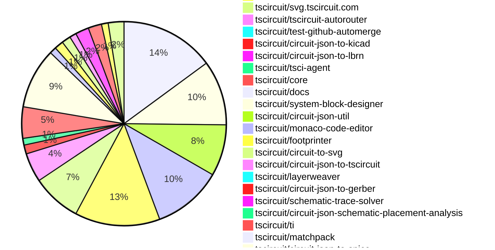

# contribution tracker

[contributions.tscircuit.com](https://contributions.tscircuit.com) ・ [tscircuit.com](https://tscircuit.com) ・ [Contribution Overviews](./contribution-overviews/) ・ [Changelogs](./changelogs/)

Generates weekly contribution overviews for tscircuit contributors. Check out all
the [contribution overviews here](./contribution-overviews/)
You can find AI-generated monthly changelogs in the [changelogs directory](./changelogs/)

- All PRs in the tscircuit org are scanned/summarized via an LLM
- The LLM classifies each Diff/PR as into a set of attributes for scoring
- All the PRs, summaries, and classifications are organized into charts and tables for [the website](https://contributions.tscircuit.com)

> Want to run locally? See the [Development Section](#development)

## Current Week

<!-- START_CURRENT_WEEK -->

# Contribution Overview 2026-06-30

The current week is shown below. There are 3 major sections:

- [Contributor Overview](#contributor-overview)
- [PRs by Repository](#prs-by-repository)
- [PRs by Contributor](#changes-by-contributor)
- [Scoring & Sponsorship Details](/docs/sponsorship-calculation-explanation.md)

## PRs by Repository


```mermaid
pie
    "tscircuit/tscircuit" : 42
    "tscircuit/tscircuit.com" : 29
    "tscircuit/eval" : 23
    "tscircuit/runframe" : 31
    "tscircuit/cli" : 38
    "tscircuit/svg.tscircuit.com" : 22
    "tscircuit/tscircuit-autorouter" : 13
    "tscircuit/test-github-automerge" : 1
    "tscircuit/circuit-json-to-kicad" : 4
    "tscircuit/circuit-json-to-lbrn" : 1
    "tscircuit/tsci-agent" : 3
    "tscircuit/core" : 14
    "tscircuit/docs" : 2
    "tscircuit/system-block-designer" : 27
    "tscircuit/circuit-json-util" : 1
    "tscircuit/monaco-code-editor" : 3
    "tscircuit/footprinter" : 4
    "tscircuit/circuit-to-svg" : 4
    "tscircuit/circuit-json-to-tscircuit" : 3
    "tscircuit/layerweaver" : 2
    "tscircuit/circuit-json-to-gerber" : 1
    "tscircuit/schematic-trace-solver" : 6
    "tscircuit/circuit-json-schematic-placement-analysis" : 1
    "tscircuit/ti" : 6
    "tscircuit/matchpack" : 1
    "tscircuit/circuit-json-to-spice" : 2
    "tscircuit/calculate-packing" : 1
    "tscircuit/kicad-to-circuit-json" : 1
    "tscircuit/fabrication-operator-ui" : 3
    "tscircuit/laser-fabrication-bench" : 7
```

## Contributor Overview

| Contributor | 🐳 Major | 🐙 Minor | 🐌 Tiny | Score | ⭐ | Discussion Contributions |
|-------------|---------|---------|---------|-------|-----|--------------------------|
| [imrishabh18](#imrishabh18) | 6 | 5 | 6 | 41 | ⭐⭐ | 0🔹 0🔶 0💎 |
| [MustafaMulla29](#MustafaMulla29) | 3 | 8 | 10 | 39 | ⭐⭐ | 0🔹 0🔶 0💎 |
| [AnasSarkiz](#AnasSarkiz) | 4 | 5 | 2 | 29 | ⭐⭐ | 0🔹 0🔶 0💎 |
| [seveibar](#seveibar) | 5 | 3 | 0 | 27 | ⭐⭐ | 0🔹 0🔶 0💎 |
| [rushabhcodes](#rushabhcodes) | 2 | 3 | 7 | 22 | ⭐⭐ | 0🔹 0🔶 0💎 |
| [0hmX](#0hmX) | 4 | 0 | 4 | 20 | ⭐⭐ | 0🔹 0🔶 0💎 |
| [techmannih](#techmannih) | 3 | 1 | 5 | 19 | ⭐⭐ | 0🔹 0🔶 0💎 |
| [tscircuitbot](#tscircuitbot) | 0 | 0 | 188 | 16 | ⭐⭐ | 0🔹 0🔶 0💎 |
| [Sang-it](#Sang-it) | 1 | 3 | 5 | 15 | ⭐⭐ | 0🔹 0🔶 0💎 |
| [mohan-bee](#mohan-bee) | 1 | 2 | 1 | 10 | ⭐ | 0🔹 0🔶 0💎 |
| [ShiboSoftwareDev](#ShiboSoftwareDev) | 1 | 1 | 0 | 9 | ⭐ | 0🔹 0🔶 0💎 |
| [technologyet31-create](#technologyet31-create) | 0 | 3 | 1 | 7 | ⭐ | 0🔹 0🔶 0💎 |
| [Lathikaa-S](#Lathikaa-S) | 0 | 1 | 1 | 3 |  | 0🔹 0🔶 0💎 |
| [Abse2001](#Abse2001) | 0 | 0 | 1 | 3 |  | 0🔹 0🔶 0💎 |

## Staff Pass Ratio (SPR)

| Contributor | Reviewed PRs | Rejections | Approvals | SPR |
|-------------|--------------|------------|-----------|-----|
| [MustafaMulla29](#MustafaMulla29) | 5 | 3 | 5 | 40.0% |
| [0hmX](#0hmX) | 4 | 1 | 3 | 75.0% |
| [technologyet31-create](#technologyet31-create) | 3 | 0 | 3 | 100.0% |
| [mohan-bee](#mohan-bee) | 3 | 2 | 2 | 33.3% |
| [imrishabh18](#imrishabh18) | 2 | 0 | 2 | 100.0% |
| [rushabhcodes](#rushabhcodes) | 2 | 0 | 2 | 100.0% |
| [Sang-it](#Sang-it) | 2 | 0 | 2 | 100.0% |
| [AnasSarkiz](#AnasSarkiz) | 2 | 1 | 1 | 50.0% |
| [techmannih](#techmannih) | 1 | 0 | 1 | 100.0% |

<details>
<summary>MustafaMulla29 SPR PRs (5)</summary>

- [#2555](https://github.com/tscircuit/core/pull/2555) fix(sch): create cross-sheet net labels per schematic sheet
- [#2527](https://github.com/tscircuit/core/pull/2527) Lay out schematic sheets independently
- [#357](https://github.com/tscircuit/circuit-json-to-kicad/pull/357) Add hierarchical schematic sheet (.kicad_sch) export support
- [#31](https://github.com/tscircuit/circuit-json-schematic-placement-analysis/pull/31) Add schematic sheet support to schematic placement analysis
- [#26](https://github.com/tscircuit/system-block-designer/pull/26) Support browser PDF generation and add browser tests

</details>

<details>
<summary>0hmX SPR PRs (4)</summary>

- [#2568](https://github.com/tscircuit/core/pull/2568) Update capacity-autorouter version to 0.0.625
- [#2540](https://github.com/tscircuit/core/pull/2540) update autorouter to use the new Pipeline 7
- [#1492](https://github.com/tscircuit/tscircuit-autorouter/pull/1492) add connectTo to all
- [#1480](https://github.com/tscircuit/tscircuit-autorouter/pull/1480) refine approximation obstacle ownership

</details>

<details>
<summary>technologyet31-create SPR PRs (3)</summary>

- [#43](https://github.com/tscircuit/circuit-json-to-spice/pull/43) Emit DC voltage sources that use terminal1/terminal2
- [#103](https://github.com/tscircuit/calculate-packing/pull/103) Fix double-rotation of rect pad bounds in getComponentBounds
- [#158](https://github.com/tscircuit/kicad-to-circuit-json/pull/158) fix: include the anchor shape of KiCad custom pads

</details>

<details>
<summary>mohan-bee SPR PRs (3)</summary>

- [#356](https://github.com/tscircuit/circuit-json-to-kicad/pull/356) Fix KiCad via spans for multi-layer PCB routes
- [#355](https://github.com/tscircuit/circuit-json-to-kicad/pull/355) Add KiCad schematic sheet export support
- [#353](https://github.com/tscircuit/circuit-json-to-kicad/pull/353) Add schematic file output API

</details>

<details>
<summary>imrishabh18 SPR PRs (2)</summary>

- [#2530](https://github.com/tscircuit/core/pull/2530) Fix: repro14 where exposingNets didn't create `pcb_trace` but the schematic showed connection
- [#42](https://github.com/tscircuit/system-block-designer/pull/42) Add support for spi interface

</details>

<details>
<summary>rushabhcodes SPR PRs (2)</summary>

- [#60](https://github.com/tscircuit/circuit-json-to-tscircuit/pull/60) Add pcb_board template support for board-level Circuit JSON conversion
- [#17](https://github.com/tscircuit/internal-dynamic-import/pull/17) chore(deps): update circuit-json-to-tscircuit to ^0.0.40

</details>

<details>
<summary>Sang-it SPR PRs (2)</summary>

- [#569](https://github.com/tscircuit/schematic-trace-solver/pull/569) fix gnd label failing to route downward due to trace crossings  - example43
- [#570](https://github.com/tscircuit/schematic-trace-solver/pull/570) add spec for adding textBoxes to the InputProblem

</details>

<details>
<summary>AnasSarkiz SPR PRs (2)</summary>

- [#1720](https://github.com/tscircuit/svg.tscircuit.com/pull/1720) Add Built-In qrcode-svg Support for Circuit Evaluation
- [#773](https://github.com/tscircuit/docs/pull/773) Introduce QR Code Silkscreen Documentation with 3D and PCB Example using`silkscreengraphic`

</details>

<details>
<summary>techmannih SPR PRs (1)</summary>

- [#28](https://github.com/tscircuit/system-block-designer/pull/28) Add BOM tables to PDF exports and simplify BOM download options

</details>

> Note: AI evaluates PRs and assigns 1-3 star ratings automatically. 4 and 5 star ratings require manual staff review.

### Discussion Contribution Legend

- 🔹 Normal Comments: Basic participation with minimal effort
- 🔶 Great Informative Comments: Thoughtful participation that adds value
- 💎 Incredible Comments: Exceptional participation with high-quality content

## Review Table

[reviews-received-hover]: ## "Number of reviews received for PRs for this contributor"
[approvals-received-hover]: ## "Number of approvals received for PRs this contributor authored"
[rejections-received-hover]: ## "Number of rejections received for PRs this contributor authored"
[prs-opened-hover]: ## "Number of PRs opened by this contributor"
[issues-created-hover]: ## "Number of issues created by this contributor"

| Contributor | Reviews Received | Approvals Received | Rejections Received | Approvals | Rejections Given | PRs Opened | PRs Merged | Issues Created |
|---|---|---|---|---|---|---|---|---|
| [tscircuitbot](#tscircuitbot) | 0 | 0 | 0 | 0 | 0 | 210 | 188 | 0 |
| [yanyishuai](#yanyishuai) | 0 | 0 | 0 | 0 | 0 | 2 | 0 | 0 |
| [yasdhf](#yasdhf) | 0 | 0 | 0 | 0 | 0 | 5 | 0 | 0 |
| [technologyet31-create](#technologyet31-create) | 11 | 8 | 1 | 0 | 0 | 16 | 4 | 0 |
| [Abse2001](#Abse2001) | 1 | 1 | 0 | 3 | 0 | 3 | 1 | 0 |
| [imrishabh18](#imrishabh18) | 2 | 2 | 0 | 24 | 1 | 18 | 18 | 0 |
| [seveibar](#seveibar) | 5 | 2 | 0 | 24 | 4 | 12 | 8 | 0 |
| [derekbreden](#derekbreden) | 0 | 0 | 0 | 0 | 0 | 4 | 0 | 0 |
| [di3go04](#di3go04) | 0 | 0 | 0 | 0 | 0 | 7 | 0 | 0 |
| [rushabhcodes](#rushabhcodes) | 27 | 8 | 0 | 1 | 0 | 20 | 12 | 0 |
| [chayan-1906](#chayan-1906) | 0 | 0 | 0 | 0 | 0 | 4 | 0 | 0 |
| [techmannih](#techmannih) | 10 | 6 | 0 | 0 | 0 | 12 | 9 | 0 |
| [Lathikaa-S](#Lathikaa-S) | 4 | 3 | 0 | 0 | 0 | 4 | 2 | 0 |
| [StealthEyeLLC](#StealthEyeLLC) | 0 | 0 | 0 | 0 | 0 | 1 | 0 | 0 |
| [0hmX](#0hmX) | 16 | 6 | 1 | 2 | 1 | 20 | 9 | 0 |
| [r-audio](#r-audio) | 0 | 0 | 0 | 0 | 0 | 1 | 0 | 0 |
| [Sang-it](#Sang-it) | 11 | 4 | 0 | 0 | 0 | 16 | 9 | 0 |
| [MustafaMulla29](#MustafaMulla29) | 16 | 13 | 1 | 4 | 0 | 21 | 21 | 0 |
| [rovidev95](#rovidev95) | 0 | 0 | 0 | 0 | 0 | 2 | 0 | 0 |
| [AnasSarkiz](#AnasSarkiz) | 3 | 1 | 1 | 1 | 0 | 12 | 11 | 0 |
| [ShiboSoftwareDev](#ShiboSoftwareDev) | 3 | 3 | 0 | 3 | 0 | 5 | 3 | 0 |
| [sureshchouksey8](#sureshchouksey8) | 0 | 0 | 0 | 0 | 0 | 1 | 0 | 0 |
| [mohan-bee](#mohan-bee) | 19 | 6 | 2 | 1 | 0 | 7 | 4 | 0 |
| [silasbrookshaha](#silasbrookshaha) | 0 | 0 | 0 | 0 | 0 | 4 | 0 | 0 |
| [bingmokaka](#bingmokaka) | 0 | 0 | 0 | 0 | 0 | 1 | 0 | 0 |
| [saitejabandaru-in](#saitejabandaru-in) | 0 | 0 | 0 | 0 | 0 | 1 | 0 | 0 |
| [b3417](#b3417) | 0 | 0 | 0 | 0 | 0 | 1 | 0 | 0 |
| [anil08607](#anil08607) | 2 | 0 | 0 | 0 | 0 | 1 | 0 | 0 |
| [lucientheski](#lucientheski) | 0 | 0 | 0 | 0 | 0 | 1 | 0 | 0 |

## Changes by Repository

### [tscircuit/tscircuit](https://github.com/tscircuit/tscircuit)


<details>
<summary>🐌 Tiny Contributions (42)</summary>

| PR # | Impact | Contributor | Description |
|------|--------|-------------|-------------|
| [#3769](https://github.com/tscircuit/tscircuit/pull/3769) | 🐌 Tiny | tscircuitbot | Updates the package version from 0.0.1994 to 0.0.1995 in package.json |
| [#3768](https://github.com/tscircuit/tscircuit/pull/3768) | 🐌 Tiny | tscircuitbot | Updates the version of the tscircuitcli package from 0.1.1596 to 0.1.1597 and the tscircuitrunframe package from 0.0.2151 to 0.0.2152 in package.json |
| [#3767](https://github.com/tscircuit/tscircuit/pull/3767) | 🐌 Tiny | tscircuitbot | Automated package update to version 0.0.1994 |
| [#3766](https://github.com/tscircuit/tscircuit/pull/3766) | 🐌 Tiny | tscircuitbot | Updates the tscircuitcli package from version 0.1.1595 to 0.1.1596 |
| [#3765](https://github.com/tscircuit/tscircuit/pull/3765) | 🐌 Tiny | tscircuitbot | Automated package update |
| [#3764](https://github.com/tscircuit/tscircuit/pull/3764) | 🐌 Tiny | tscircuitbot | Updates the tscircuitcli package to version 0.1.1595 in the package.json file |
| [#3763](https://github.com/tscircuit/tscircuit/pull/3763) | 🐌 Tiny | tscircuitbot | Automated package update |
| [#3762](https://github.com/tscircuit/tscircuit/pull/3762) | 🐌 Tiny | tscircuitbot | Updates the tscircuitcli package from version 0.1.1593 to 0.1.1594 and the tscircuitrunframe package from version 0.0.2150 to 0.0.2151 in package.json |
| [#3761](https://github.com/tscircuit/tscircuit/pull/3761) | 🐌 Tiny | tscircuitbot | Automated package update |
| [#3760](https://github.com/tscircuit/tscircuit/pull/3760) | 🐌 Tiny | tscircuitbot | Updates the tscircuitcli package from version 0.1.1592 to 0.1.1593 and the tscircuitrunframe package from version 0.0.2149 to 0.0.2150 in the package.json file. |
| [#3759](https://github.com/tscircuit/tscircuit/pull/3759) | 🐌 Tiny | tscircuitbot | Updates the package version from 0.0.1989 to 0.0.1990 in package.json |
| [#3758](https://github.com/tscircuit/tscircuit/pull/3758) | 🐌 Tiny | tscircuitbot | Updates the tscircuitcli package to version 0.1.1592 in the package.json file |
| [#3756](https://github.com/tscircuit/tscircuit/pull/3756) | 🐌 Tiny | tscircuitbot | Automated package update |
| [#3755](https://github.com/tscircuit/tscircuit/pull/3755) | 🐌 Tiny | tscircuitbot | Updates the tscircuitcli package to version 0.1.1591 in the package.json file. |
| [#3754](https://github.com/tscircuit/tscircuit/pull/3754) | 🐌 Tiny | tscircuitbot | Automated package update |
| [#3753](https://github.com/tscircuit/tscircuit/pull/3753) | 🐌 Tiny | tscircuitbot | Automated package update |
| [#3744](https://github.com/tscircuit/tscircuit/pull/3744) | 🐌 Tiny | tscircuitbot | Automated package update |
| [#3752](https://github.com/tscircuit/tscircuit/pull/3752) | 🐌 Tiny | tscircuitbot | Automated package update |
| [#3751](https://github.com/tscircuit/tscircuit/pull/3751) | 🐌 Tiny | tscircuitbot | Updates the tscircuitcli package to version 0.1.1589 in the package.json file |
| [#3748](https://github.com/tscircuit/tscircuit/pull/3748) | 🐌 Tiny | tscircuitbot | Automated package update |
| [#3747](https://github.com/tscircuit/tscircuit/pull/3747) | 🐌 Tiny | tscircuitbot | Automated package update |
| [#3746](https://github.com/tscircuit/tscircuit/pull/3746) | 🐌 Tiny | tscircuitbot | Automated package update |
| [#3745](https://github.com/tscircuit/tscircuit/pull/3745) | 🐌 Tiny | tscircuitbot | Updates the version of the tscircuitcore package from 0.0.1379 to 0.0.1380 in package.json |
| [#3743](https://github.com/tscircuit/tscircuit/pull/3743) | 🐌 Tiny | tscircuitbot | Updates the versions of several dependencies in the package.json file, including tscircuitcli, tscircuitcore, and tscircuiteval. |
| [#3741](https://github.com/tscircuit/tscircuit/pull/3741) | 🐌 Tiny | tscircuitbot | Automated package update |
| [#3740](https://github.com/tscircuit/tscircuit/pull/3740) | 🐌 Tiny | tscircuitbot | Updates the versions of several dependencies in the package.json file, including tscircuitcli, tscircuitcore, and tscircuiteval. |
| [#3750](https://github.com/tscircuit/tscircuit/pull/3750) | 🐌 Tiny | tscircuitbot | Automated package update |
| [#3749](https://github.com/tscircuit/tscircuit/pull/3749) | 🐌 Tiny | tscircuitbot | Automated package update |
| [#3734](https://github.com/tscircuit/tscircuit/pull/3734) | 🐌 Tiny | tscircuitbot | Automated package update |
| [#3732](https://github.com/tscircuit/tscircuit/pull/3732) | 🐌 Tiny | tscircuitbot | Automated package update |
| [#3739](https://github.com/tscircuit/tscircuit/pull/3739) | 🐌 Tiny | tscircuitbot | Automated package update |
| [#3738](https://github.com/tscircuit/tscircuit/pull/3738) | 🐌 Tiny | tscircuitbot | Automated package update |
| [#3737](https://github.com/tscircuit/tscircuit/pull/3737) | 🐌 Tiny | tscircuitbot | Updates the package version from 0.0.1979 to 0.0.1980 in package.json |
| [#3735](https://github.com/tscircuit/tscircuit/pull/3735) | 🐌 Tiny | tscircuitbot | Automated package update |
| [#3733](https://github.com/tscircuit/tscircuit/pull/3733) | 🐌 Tiny | tscircuitbot | Automated package update |
| [#3730](https://github.com/tscircuit/tscircuit/pull/3730) | 🐌 Tiny | tscircuitbot | Automated package update |
| [#3729](https://github.com/tscircuit/tscircuit/pull/3729) | 🐌 Tiny | tscircuitbot | Automated package update |
| [#3727](https://github.com/tscircuit/tscircuit/pull/3727) | 🐌 Tiny | tscircuitbot | Automated package update |
| [#3726](https://github.com/tscircuit/tscircuit/pull/3726) | 🐌 Tiny | tscircuitbot | Updates the version of several packages in the project, including tscircuitcli, tscircuitcore, and tscircuiteval. |
| [#3731](https://github.com/tscircuit/tscircuit/pull/3731) | 🐌 Tiny | tscircuitbot | Automated package update |
| [#3736](https://github.com/tscircuit/tscircuit/pull/3736) | 🐌 Tiny | tscircuitbot | Automated package update |
| [#3728](https://github.com/tscircuit/tscircuit/pull/3728) | 🐌 Tiny | tscircuitbot | Updates the tscircuitcli package from version 0.1.1578 to 0.1.1579 |

</details>

### [tscircuit/tscircuit.com](https://github.com/tscircuit/tscircuit.com)

| PR # | Impact | Rating | Contributor | Description |
|------|--------|--------|-------------|-------------|
| [#3794](https://github.com/tscircuit/tscircuit.com/pull/3794) | 🐳 Major | ⭐⭐⭐ | mohan-bee | Fixes the editor package visibility menu to synchronize the visibility state with the actual package data, ensuring that the editor reflects the correct publicprivate status during updates. |

<details>
<summary>🐌 Tiny Contributions (28)</summary>

| PR # | Impact | Contributor | Description |
|------|--------|-------------|-------------|
| [#3809](https://github.com/tscircuit/tscircuit.com/pull/3809) | 🐌 Tiny | tscircuitbot | Automated package update |
| [#3808](https://github.com/tscircuit/tscircuit.com/pull/3808) | 🐌 Tiny | tscircuitbot | Updates the tscircuitrunframe package from version 0.0.2150 to 0.0.2151 |
| [#3807](https://github.com/tscircuit/tscircuit.com/pull/3807) | 🐌 Tiny | tscircuitbot | Automated package update |
| [#3804](https://github.com/tscircuit/tscircuit.com/pull/3804) | 🐌 Tiny | tscircuitbot | Updates the tscircuitrunframe package to version 0.0.2149 in the package.json file. |
| [#3803](https://github.com/tscircuit/tscircuit.com/pull/3803) | 🐌 Tiny | tscircuitbot | Updates the tscircuiteval package to version 0.0.973 |
| [#3792](https://github.com/tscircuit/tscircuit.com/pull/3792) | 🐌 Tiny | tscircuitbot | Updates the tscircuitrunframe package from version 0.0.2143 to 0.0.2144 |
| [#3799](https://github.com/tscircuit/tscircuit.com/pull/3799) | 🐌 Tiny | tscircuitbot | Updates the tscircuiteval package version from 0.0.970 to 0.0.972 in package.json |
| [#3798](https://github.com/tscircuit/tscircuit.com/pull/3798) | 🐌 Tiny | tscircuitbot | Updates the tscircuitrunframe package from version 0.0.2145 to 0.0.2146 |
| [#3797](https://github.com/tscircuit/tscircuit.com/pull/3797) | 🐌 Tiny | tscircuitbot | Updates the tscircuiteval package from version 0.0.969 to 0.0.970 |
| [#3795](https://github.com/tscircuit/tscircuit.com/pull/3795) | 🐌 Tiny | tscircuitbot | Updates the tscircuiteval package from version 0.0.968 to 0.0.969 |
| [#3791](https://github.com/tscircuit/tscircuit.com/pull/3791) | 🐌 Tiny | tscircuitbot | Updates the tscircuiteval package version from 0.0.967 to 0.0.968 |
| [#3790](https://github.com/tscircuit/tscircuit.com/pull/3790) | 🐌 Tiny | tscircuitbot | Automated package update |
| [#3802](https://github.com/tscircuit/tscircuit.com/pull/3802) | 🐌 Tiny | tscircuitbot | Automated package update |
| [#3796](https://github.com/tscircuit/tscircuit.com/pull/3796) | 🐌 Tiny | tscircuitbot | Updates the tscircuitrunframe package from version 0.0.2144 to 0.0.2145 |
| [#3789](https://github.com/tscircuit/tscircuit.com/pull/3789) | 🐌 Tiny | tscircuitbot | Automated package update |
| [#3787](https://github.com/tscircuit/tscircuit.com/pull/3787) | 🐌 Tiny | tscircuitbot | Automated package update |
| [#3786](https://github.com/tscircuit/tscircuit.com/pull/3786) | 🐌 Tiny | tscircuitbot | Updates the tscircuitrunframe package from version 0.0.2140 to 0.0.2141 |
| [#3784](https://github.com/tscircuit/tscircuit.com/pull/3784) | 🐌 Tiny | tscircuitbot | Automated package update |
| [#3783](https://github.com/tscircuit/tscircuit.com/pull/3783) | 🐌 Tiny | tscircuitbot | Updates the tscircuiteval package from version 0.0.963 to 0.0.964 |
| [#3782](https://github.com/tscircuit/tscircuit.com/pull/3782) | 🐌 Tiny | tscircuitbot | Updates the tscircuitrunframe package to version 0.0.2139 in the package.json file. |
| [#3781](https://github.com/tscircuit/tscircuit.com/pull/3781) | 🐌 Tiny | tscircuitbot | Updates the tscircuiteval package to version 0.0.963 in the package.json file. |
| [#3780](https://github.com/tscircuit/tscircuit.com/pull/3780) | 🐌 Tiny | tscircuitbot | Automated package update |
| [#3778](https://github.com/tscircuit/tscircuit.com/pull/3778) | 🐌 Tiny | tscircuitbot | Updates the tscircuiteval package from version 0.0.961 to 0.0.962 |
| [#3788](https://github.com/tscircuit/tscircuit.com/pull/3788) | 🐌 Tiny | tscircuitbot | Automated package update |
| [#3779](https://github.com/tscircuit/tscircuit.com/pull/3779) | 🐌 Tiny | tscircuitbot | Automated package update |
| [#3785](https://github.com/tscircuit/tscircuit.com/pull/3785) | 🐌 Tiny | tscircuitbot | Updates the tscircuiteval package from version 0.0.964 to 0.0.965 |
| [#3806](https://github.com/tscircuit/tscircuit.com/pull/3806) | 🐌 Tiny | rushabhcodes | Updates the circuit-json-to-tscircuit dependency version from 0.0.35 to 0.0.40 in package.json |
| [#3793](https://github.com/tscircuit/tscircuit.com/pull/3793) | 🐌 Tiny | mohan-bee | Updates the circuit-to-svg dependency to version 0.0.370 in package.json, which may include improvements or fixes related to schematic sheet rendering. |

</details>

### [tscircuit/eval](https://github.com/tscircuit/eval)


<details>
<summary>🐌 Tiny Contributions (23)</summary>

| PR # | Impact | Contributor | Description |
|------|--------|-------------|-------------|
| [#3084](https://github.com/tscircuit/eval/pull/3084) | 🐌 Tiny | tscircuitbot | Automated package update |
| [#3083](https://github.com/tscircuit/eval/pull/3083) | 🐌 Tiny | tscircuitbot | Updates the versions of several dependencies in the package.json file. |
| [#3076](https://github.com/tscircuit/eval/pull/3076) | 🐌 Tiny | tscircuitbot | Updates the version of the tscircuitcore package from 0.0.1379 to 0.0.1380 in package.json |
| [#3074](https://github.com/tscircuit/eval/pull/3074) | 🐌 Tiny | tscircuitbot | Automated package update |
| [#3081](https://github.com/tscircuit/eval/pull/3081) | 🐌 Tiny | tscircuitbot | Automated package update |
| [#3079](https://github.com/tscircuit/eval/pull/3079) | 🐌 Tiny | tscircuitbot | Updates the version of the tscircuitcore package from 0.0.1380 to 0.0.1381 in package.json |
| [#3075](https://github.com/tscircuit/eval/pull/3075) | 🐌 Tiny | tscircuitbot | Updates the package version from 0.0.968 to 0.0.969 in package.json |
| [#3073](https://github.com/tscircuit/eval/pull/3073) | 🐌 Tiny | tscircuitbot | Automated package update |
| [#3069](https://github.com/tscircuit/eval/pull/3069) | 🐌 Tiny | tscircuitbot | Updates the version of the tscircuitcore package from 0.0.1376 to 0.0.1377 in package.json |
| [#3077](https://github.com/tscircuit/eval/pull/3077) | 🐌 Tiny | tscircuitbot | Automated package update |
| [#3072](https://github.com/tscircuit/eval/pull/3072) | 🐌 Tiny | tscircuitbot | Automated package update |
| [#3070](https://github.com/tscircuit/eval/pull/3070) | 🐌 Tiny | tscircuitbot | Automated package update |
| [#3067](https://github.com/tscircuit/eval/pull/3067) | 🐌 Tiny | tscircuitbot | Automated package update |
| [#3066](https://github.com/tscircuit/eval/pull/3066) | 🐌 Tiny | tscircuitbot | Automated package update |
| [#3064](https://github.com/tscircuit/eval/pull/3064) | 🐌 Tiny | tscircuitbot | Automated package update |
| [#3062](https://github.com/tscircuit/eval/pull/3062) | 🐌 Tiny | tscircuitbot | Automated package update |
| [#3061](https://github.com/tscircuit/eval/pull/3061) | 🐌 Tiny | tscircuitbot | Updates package versions in package.json to the latest compatible versions. |
| [#3059](https://github.com/tscircuit/eval/pull/3059) | 🐌 Tiny | tscircuitbot | Automated package update |
| [#3058](https://github.com/tscircuit/eval/pull/3058) | 🐌 Tiny | tscircuitbot | Automated package update |
| [#3056](https://github.com/tscircuit/eval/pull/3056) | 🐌 Tiny | tscircuitbot | Automated package update |
| [#3055](https://github.com/tscircuit/eval/pull/3055) | 🐌 Tiny | tscircuitbot | Updates the version of the tscircuitcore package from 0.0.1371 to 0.0.1372 in package.json |
| [#3053](https://github.com/tscircuit/eval/pull/3053) | 🐌 Tiny | tscircuitbot | Automated package update |
| [#3052](https://github.com/tscircuit/eval/pull/3052) | 🐌 Tiny | tscircuitbot | Automated package update |

</details>

### [tscircuit/runframe](https://github.com/tscircuit/runframe)


<details>
<summary>🐌 Tiny Contributions (31)</summary>

| PR # | Impact | Contributor | Description |
|------|--------|-------------|-------------|
| [#3862](https://github.com/tscircuit/runframe/pull/3862) | 🐌 Tiny | tscircuitbot | Automated package update |
| [#3858](https://github.com/tscircuit/runframe/pull/3858) | 🐌 Tiny | tscircuitbot | Updates the package version from v0.0.2150 to v0.0.2151 in package.json |
| [#3857](https://github.com/tscircuit/runframe/pull/3857) | 🐌 Tiny | tscircuitbot | Updates the circuit-json-to-kicad package from version 0.0.155 to 0.0.157 in package.json |
| [#3855](https://github.com/tscircuit/runframe/pull/3855) | 🐌 Tiny | tscircuitbot | Automated package update |
| [#3854](https://github.com/tscircuit/runframe/pull/3854) | 🐌 Tiny | tscircuitbot | Updates the circuit-json-to-gerber package from version 0.0.78 to 0.0.79 |
| [#3844](https://github.com/tscircuit/runframe/pull/3844) | 🐌 Tiny | tscircuitbot | Automated package update |
| [#3843](https://github.com/tscircuit/runframe/pull/3843) | 🐌 Tiny | tscircuitbot | Updates the tscircuiteval package from version 0.0.972 to 0.0.973 in the package.json file. |
| [#3835](https://github.com/tscircuit/runframe/pull/3835) | 🐌 Tiny | tscircuitbot | Updates the tscircuiteval package from version 0.0.968 to 0.0.969 in the package.json file. |
| [#3834](https://github.com/tscircuit/runframe/pull/3834) | 🐌 Tiny | tscircuitbot | Automated package update |
| [#3840](https://github.com/tscircuit/runframe/pull/3840) | 🐌 Tiny | tscircuitbot | Updates the tscircuiteval package to version 0.0.972 in the package.json file. |
| [#3837](https://github.com/tscircuit/runframe/pull/3837) | 🐌 Tiny | tscircuitbot | Updates the tscircuiteval package from version 0.0.969 to 0.0.970 in the package.json file. |
| [#3836](https://github.com/tscircuit/runframe/pull/3836) | 🐌 Tiny | tscircuitbot | Automated package update |
| [#3832](https://github.com/tscircuit/runframe/pull/3832) | 🐌 Tiny | tscircuitbot | Automated package update |
| [#3841](https://github.com/tscircuit/runframe/pull/3841) | 🐌 Tiny | tscircuitbot | Automated package update |
| [#3839](https://github.com/tscircuit/runframe/pull/3839) | 🐌 Tiny | tscircuitbot | Updates the tscircuiteval package to version 0.0.972 in the package.json file. |
| [#3838](https://github.com/tscircuit/runframe/pull/3838) | 🐌 Tiny | tscircuitbot | Automated package update |
| [#3833](https://github.com/tscircuit/runframe/pull/3833) | 🐌 Tiny | tscircuitbot | Updates the tscircuiteval package from version 0.0.967 to 0.0.968 in the package.json file. |
| [#3831](https://github.com/tscircuit/runframe/pull/3831) | 🐌 Tiny | tscircuitbot | Updates the tscircuiteval package to version 0.0.967 in the package.json file. |
| [#3830](https://github.com/tscircuit/runframe/pull/3830) | 🐌 Tiny | tscircuitbot | Automated package update |
| [#3829](https://github.com/tscircuit/runframe/pull/3829) | 🐌 Tiny | tscircuitbot | Updates the tscircuiteval package to version 0.0.966 in the package.json file. |
| [#3828](https://github.com/tscircuit/runframe/pull/3828) | 🐌 Tiny | tscircuitbot | Automated package update |
| [#3827](https://github.com/tscircuit/runframe/pull/3827) | 🐌 Tiny | tscircuitbot | Updates the tscircuiteval package from version 0.0.964 to 0.0.965 in the project dependencies. |
| [#3826](https://github.com/tscircuit/runframe/pull/3826) | 🐌 Tiny | tscircuitbot | Automated package update |
| [#3825](https://github.com/tscircuit/runframe/pull/3825) | 🐌 Tiny | tscircuitbot | Updates the tscircuiteval package to version 0.0.964 in the package.json file. |
| [#3824](https://github.com/tscircuit/runframe/pull/3824) | 🐌 Tiny | tscircuitbot | Automated package update |
| [#3823](https://github.com/tscircuit/runframe/pull/3823) | 🐌 Tiny | tscircuitbot | Updates the tscircuiteval package to version 0.0.963 in the package.json file. |
| [#3822](https://github.com/tscircuit/runframe/pull/3822) | 🐌 Tiny | tscircuitbot | Automated package update |
| [#3820](https://github.com/tscircuit/runframe/pull/3820) | 🐌 Tiny | tscircuitbot | Automated package update |
| [#3819](https://github.com/tscircuit/runframe/pull/3819) | 🐌 Tiny | tscircuitbot | Updates the tscircuiteval package to version 0.0.962 in the package.json file. |
| [#3861](https://github.com/tscircuit/runframe/pull/3861) | 🐌 Tiny | imrishabh18 | This pull request introduces a new feedback button that integrates with the Crisp chat service, allowing users to provide feedback directly from the CircuitJsonPreview component. The button is designed to enhance user interaction by providing a quick way to access support and feedback options. |
| [#3821](https://github.com/tscircuit/runframe/pull/3821) | 🐌 Tiny | MustafaMulla29 | Updates the dependencies for tscircuit and circuit-to-svg to ensure schematic sheets function correctly. |

</details>

### [tscircuit/cli](https://github.com/tscircuit/cli)

| PR # | Impact | Rating | Contributor | Description |
|------|--------|--------|-------------|-------------|
| [#3482](https://github.com/tscircuit/cli/pull/3482) | 🐳 Major | ⭐⭐⭐ | seveibar | Adds functionality to install, update, and run the tsci-agent, including version checks and user confirmation for actions. |

<details>
<summary>🐌 Tiny Contributions (37)</summary>

| PR # | Impact | Contributor | Description |
|------|--------|-------------|-------------|
| [#3539](https://github.com/tscircuit/cli/pull/3539) | 🐌 Tiny | tscircuitbot | Automated package update |
| [#3538](https://github.com/tscircuit/cli/pull/3538) | 🐌 Tiny | tscircuitbot | Updates the tscircuitrunframe package from version 0.0.2151 to 0.0.2152 |
| [#3537](https://github.com/tscircuit/cli/pull/3537) | 🐌 Tiny | tscircuitbot | Automated package update |
| [#3536](https://github.com/tscircuit/cli/pull/3536) | 🐌 Tiny | tscircuitbot | Automated README update with latest CLI usage output. |
| [#3535](https://github.com/tscircuit/cli/pull/3535) | 🐌 Tiny | tscircuitbot | Automated package update |
| [#3531](https://github.com/tscircuit/cli/pull/3531) | 🐌 Tiny | tscircuitbot | Updates the tscircuitrunframe package from version 0.0.2150 to 0.0.2151 |
| [#3530](https://github.com/tscircuit/cli/pull/3530) | 🐌 Tiny | tscircuitbot | Automated package update |
| [#3529](https://github.com/tscircuit/cli/pull/3529) | 🐌 Tiny | tscircuitbot | Updates the tscircuitrunframe package to version 0.0.2150 in the package.json file |
| [#3527](https://github.com/tscircuit/cli/pull/3527) | 🐌 Tiny | tscircuitbot | Automated package update |
| [#3526](https://github.com/tscircuit/cli/pull/3526) | 🐌 Tiny | tscircuitbot | Automated README update with latest CLI usage output. |
| [#3523](https://github.com/tscircuit/cli/pull/3523) | 🐌 Tiny | tscircuitbot | Automated package update |
| [#3522](https://github.com/tscircuit/cli/pull/3522) | 🐌 Tiny | tscircuitbot | Automated package update |
| [#3519](https://github.com/tscircuit/cli/pull/3519) | 🐌 Tiny | tscircuitbot | Updates the tscircuitrunframe package version from 0.0.2146 to 0.0.2148 in package.json |
| [#3517](https://github.com/tscircuit/cli/pull/3517) | 🐌 Tiny | tscircuitbot | Automated package update |
| [#3513](https://github.com/tscircuit/cli/pull/3513) | 🐌 Tiny | tscircuitbot | Automated package update |
| [#3520](https://github.com/tscircuit/cli/pull/3520) | 🐌 Tiny | tscircuitbot | Automated package update |
| [#3518](https://github.com/tscircuit/cli/pull/3518) | 🐌 Tiny | tscircuitbot | Updates the tscircuitrunframe package from version 0.0.2146 to 0.0.2148 |
| [#3516](https://github.com/tscircuit/cli/pull/3516) | 🐌 Tiny | tscircuitbot | Updates the tscircuitrunframe package from version 0.0.2145 to 0.0.2146 |
| [#3515](https://github.com/tscircuit/cli/pull/3515) | 🐌 Tiny | tscircuitbot | Automated package update |
| [#3512](https://github.com/tscircuit/cli/pull/3512) | 🐌 Tiny | tscircuitbot | Updates the tscircuitrunframe package version from 0.0.2142 to 0.0.2144 in package.json |
| [#3514](https://github.com/tscircuit/cli/pull/3514) | 🐌 Tiny | tscircuitbot | Updates the tscircuitrunframe package from version 0.0.2144 to 0.0.2145 |
| [#3504](https://github.com/tscircuit/cli/pull/3504) | 🐌 Tiny | tscircuitbot | Updates the tscircuitrunframe package to version 0.0.2139 in the package.json file |
| [#3511](https://github.com/tscircuit/cli/pull/3511) | 🐌 Tiny | tscircuitbot | Automated package update |
| [#3510](https://github.com/tscircuit/cli/pull/3510) | 🐌 Tiny | tscircuitbot | Updates the tscircuitrunframe package version from 0.0.2141 to 0.0.2142 |
| [#3509](https://github.com/tscircuit/cli/pull/3509) | 🐌 Tiny | tscircuitbot | Automated package update |
| [#3508](https://github.com/tscircuit/cli/pull/3508) | 🐌 Tiny | tscircuitbot | Updates the tscircuitrunframe package version from 0.0.2140 to 0.0.2141 in package.json |
| [#3507](https://github.com/tscircuit/cli/pull/3507) | 🐌 Tiny | tscircuitbot | Automated package update |
| [#3506](https://github.com/tscircuit/cli/pull/3506) | 🐌 Tiny | tscircuitbot | Updates the tscircuitrunframe package to version 0.0.2140 |
| [#3505](https://github.com/tscircuit/cli/pull/3505) | 🐌 Tiny | tscircuitbot | Automated package update |
| [#3503](https://github.com/tscircuit/cli/pull/3503) | 🐌 Tiny | tscircuitbot | Automated package update |
| [#3502](https://github.com/tscircuit/cli/pull/3502) | 🐌 Tiny | tscircuitbot | Automated package update |
| [#3501](https://github.com/tscircuit/cli/pull/3501) | 🐌 Tiny | tscircuitbot | Automated package update |
| [#3500](https://github.com/tscircuit/cli/pull/3500) | 🐌 Tiny | tscircuitbot | Automated README update with latest CLI usage output. |
| [#3499](https://github.com/tscircuit/cli/pull/3499) | 🐌 Tiny | tscircuitbot | Automated package update |
| [#3498](https://github.com/tscircuit/cli/pull/3498) | 🐌 Tiny | tscircuitbot | Updates the tscircuitrunframe package version from 0.0.2136 to 0.0.2137 in package.json |
| [#3525](https://github.com/tscircuit/cli/pull/3525) | 🐌 Tiny | rushabhcodes | Updates the circuit-json-to-tscircuit dependency to version 0.0.40 in package.json |
| [#3533](https://github.com/tscircuit/cli/pull/3533) | 🐌 Tiny | MustafaMulla29 | Updates the circuit-json-to-kicad dependency version from 0.0.153 to 0.0.157 in package.json |

</details>

### [tscircuit/svg.tscircuit.com](https://github.com/tscircuit/svg.tscircuit.com)

| PR # | Impact | Rating | Contributor | Description |
|------|--------|--------|-------------|-------------|
| [#1720](https://github.com/tscircuit/svg.tscircuit.com/pull/1720) | 🐳 Major | ⭐⭐⭐ | AnasSarkiz | This PR adds built-in support for the qrcode-svg package in the evaluation runtime, allowing Circuit code to generate QR codes without requiring external module resolution. |

<details>
<summary>🐌 Tiny Contributions (21)</summary>

| PR # | Impact | Contributor | Description |
|------|--------|-------------|-------------|
| [#1728](https://github.com/tscircuit/svg.tscircuit.com/pull/1728) | 🐌 Tiny | tscircuitbot | Updates the tscircuit package version from 0.0.1994 to 0.0.1995 in package.json |
| [#1727](https://github.com/tscircuit/svg.tscircuit.com/pull/1727) | 🐌 Tiny | tscircuitbot | Updates the tscircuit package version from 0.0.1993 to 0.0.1994 in package.json |
| [#1726](https://github.com/tscircuit/svg.tscircuit.com/pull/1726) | 🐌 Tiny | tscircuitbot | Updates the tscircuit package version from 0.0.1992 to 0.0.1993 in package.json |
| [#1725](https://github.com/tscircuit/svg.tscircuit.com/pull/1725) | 🐌 Tiny | tscircuitbot | Updates the tscircuit package version from 0.0.1991 to 0.0.1992 in package.json |
| [#1724](https://github.com/tscircuit/svg.tscircuit.com/pull/1724) | 🐌 Tiny | tscircuitbot | Updates the tscircuit package version from 0.0.1990 to 0.0.1991 in package.json |
| [#1723](https://github.com/tscircuit/svg.tscircuit.com/pull/1723) | 🐌 Tiny | tscircuitbot | Updates the tscircuit package version from 0.0.1989 to 0.0.1990 in package.json |
| [#1722](https://github.com/tscircuit/svg.tscircuit.com/pull/1722) | 🐌 Tiny | tscircuitbot | Updates the tscircuit package version from 0.0.1988 to 0.0.1989 in package.json |
| [#1721](https://github.com/tscircuit/svg.tscircuit.com/pull/1721) | 🐌 Tiny | tscircuitbot | Updates the tscircuit package version from 0.0.1987 to 0.0.1988 in package.json |
| [#1719](https://github.com/tscircuit/svg.tscircuit.com/pull/1719) | 🐌 Tiny | tscircuitbot | Updates the tscircuit package version from 0.0.1986 to 0.0.1987 in package.json |
| [#1718](https://github.com/tscircuit/svg.tscircuit.com/pull/1718) | 🐌 Tiny | tscircuitbot | Updates the tscircuit package version from 0.0.1985 to 0.0.1986 in package.json |
| [#1717](https://github.com/tscircuit/svg.tscircuit.com/pull/1717) | 🐌 Tiny | tscircuitbot | Updates the tscircuit package version from 0.0.1984 to 0.0.1985 in package.json |
| [#1716](https://github.com/tscircuit/svg.tscircuit.com/pull/1716) | 🐌 Tiny | tscircuitbot | Updates the tscircuit package version from 0.0.1983 to 0.0.1984 in package.json |
| [#1715](https://github.com/tscircuit/svg.tscircuit.com/pull/1715) | 🐌 Tiny | tscircuitbot | Updates the tscircuit package version from 0.0.1982 to 0.0.1983 in package.json |
| [#1714](https://github.com/tscircuit/svg.tscircuit.com/pull/1714) | 🐌 Tiny | tscircuitbot | Updates the tscircuit package version from 0.0.1981 to 0.0.1982 in package.json |
| [#1711](https://github.com/tscircuit/svg.tscircuit.com/pull/1711) | 🐌 Tiny | tscircuitbot | Updates the tscircuit package version from 0.0.1978 to 0.0.1979 in package.json |
| [#1708](https://github.com/tscircuit/svg.tscircuit.com/pull/1708) | 🐌 Tiny | tscircuitbot | Updates the tscircuit package version from 0.0.1975 to 0.0.1976 in package.json |
| [#1713](https://github.com/tscircuit/svg.tscircuit.com/pull/1713) | 🐌 Tiny | tscircuitbot | Updates the tscircuit package version from 0.0.1980 to 0.0.1981 in package.json |
| [#1712](https://github.com/tscircuit/svg.tscircuit.com/pull/1712) | 🐌 Tiny | tscircuitbot | Updates the tscircuit package version from 0.0.1979 to 0.0.1980 in package.json |
| [#1710](https://github.com/tscircuit/svg.tscircuit.com/pull/1710) | 🐌 Tiny | tscircuitbot | Updates the tscircuit package version from 0.0.1977 to 0.0.1978 in package.json |
| [#1709](https://github.com/tscircuit/svg.tscircuit.com/pull/1709) | 🐌 Tiny | tscircuitbot | Updates the tscircuit package version from 0.0.1976 to 0.0.1977 in package.json |
| [#1707](https://github.com/tscircuit/svg.tscircuit.com/pull/1707) | 🐌 Tiny | tscircuitbot | Updates the tscircuit package version from 0.0.1974 to 0.0.1975 in package.json |

</details>

### [tscircuit/tscircuit-autorouter](https://github.com/tscircuit/tscircuit-autorouter)

| PR # | Impact | Rating | Contributor | Description |
|------|--------|--------|-------------|-------------|
| [#1492](https://github.com/tscircuit/tscircuit-autorouter/pull/1492) | 🐳 Major | ⭐⭐⭐ | 0hmX | Modifies the connectedTo property in the addApproximatingRectsToSrj function to ensure all approximating rectangles maintain their connectivity information. |
| [#1488](https://github.com/tscircuit/tscircuit-autorouter/pull/1488) | 🐳 Major | ⭐⭐⭐ | 0hmX | Gates BGA component topology multilayer regions by physical via diameter, splits BGA gaps and missing slots into single-layer nodes when either rectangular axis is at or below 1.2x via diameter, and removes overlapping global multilayer component-target nodes to ensure component-local BGA topology owns routing inside detected components. |
| [#1482](https://github.com/tscircuit/tscircuit-autorouter/pull/1482) | 🐳 Major | ⭐⭐⭐ | 0hmX | Removes explicit obstacle mesh-node emission from the initial BGA topology solver, preventing the creation of unnecessary capacity nodes for blocked BGA pad regions. |
| [#1470](https://github.com/tscircuit/tscircuit-autorouter/pull/1470) | 🐳 Major | ⭐⭐⭐ | 0hmX | Changes the default autorouting solver to AutoroutingPipelineSolver7_MultiGraph and updates related benchmarks and exports accordingly. |
| [#1475](https://github.com/tscircuit/tscircuit-autorouter/pull/1475) | 🐳 Major | ⭐⭐⭐ | seveibar | Adds support for preexisting connected traces in the autorouting system, allowing traces to be recognized and utilized in routing calculations. |

<details>
<summary>🐌 Tiny Contributions (8)</summary>

| PR # | Impact | Contributor | Description |
|------|--------|-------------|-------------|
| [#1493](https://github.com/tscircuit/tscircuit-autorouter/pull/1493) | 🐌 Tiny | tscircuitbot | Automated package update |
| [#1489](https://github.com/tscircuit/tscircuit-autorouter/pull/1489) | 🐌 Tiny | tscircuitbot | Automated package update |
| [#1487](https://github.com/tscircuit/tscircuit-autorouter/pull/1487) | 🐌 Tiny | tscircuitbot | Automated package update |
| [#1485](https://github.com/tscircuit/tscircuit-autorouter/pull/1485) | 🐌 Tiny | tscircuitbot | Automated package update |
| [#1484](https://github.com/tscircuit/tscircuit-autorouter/pull/1484) | 🐌 Tiny | tscircuitbot | Automated package update |
| [#1476](https://github.com/tscircuit/tscircuit-autorouter/pull/1476) | 🐌 Tiny | tscircuitbot | Automated package update |
| [#1472](https://github.com/tscircuit/tscircuit-autorouter/pull/1472) | 🐌 Tiny | tscircuitbot | Automated package update |
| [#1483](https://github.com/tscircuit/tscircuit-autorouter/pull/1483) | 🐌 Tiny | 0hmX | Summary Adds the solar battery charger SRJ as bugreport68. Adds a Cosmos fixture for inspecting the bugreport. Adds a focused Pipeline 7 SVG snapshot test that runs through component topology before snapshotting the solver visualization.  Validation BUN_UPDATE_SNAPSHOTS1 bun test testsbugsbugreport68-solar-battery-charger.test.ts bun run format bun run build |

</details>

### [tscircuit/test-github-automerge](https://github.com/tscircuit/test-github-automerge)


<details>
<summary>🐌 Tiny Contributions (1)</summary>

| PR # | Impact | Contributor | Description |
|------|--------|-------------|-------------|
| [#48](https://github.com/tscircuit/test-github-automerge/pull/48) | 🐌 Tiny | tscircuitbot | Updates the tscircuitcircuit-json-util package from version 0.0.96 to 0.0.97 in the development dependencies. |

</details>

### [tscircuit/circuit-json-to-kicad](https://github.com/tscircuit/circuit-json-to-kicad)

| PR # | Impact | Rating | Contributor | Description |
|------|--------|--------|-------------|-------------|
| [#357](https://github.com/tscircuit/circuit-json-to-kicad/pull/357) | 🐳 Major | ⭐⭐⭐ | MustafaMulla29 | Adds support for exporting KiCad hierarchical schematics from Circuit JSON. When a design uses tscircuit schematicsheet (or assigns components to a sheet via schSheetName), the schematic converter now emits a root .kicad_sch containing (sheet) nodes plus one child .kicad_sch per sheet, instead of flattening everything onto a single page. Designs with no schematic_sheet elements are unaffected  they still produce a single flat file with byte-identical output. How it works Sheet plan (buildSchematicSheetPlan): computes the root  child file identities (UUIDs, filenames, page numbers) up front, so the .kicad_sch files and the .kicad_pro agree on the same identifiers. Partitioning (partitionCircuitJsonBySheet): slices the circuit-json into a per-sheet subset, then runs the existing stage pipeline unchanged on each subset  no forked rendering logic. Root-level (unassigned) content goes on the root page. Symbol instance paths: child-sheet symbols use (path rootUuidsheetNodeUuid ) (root UUID first, per KiCad); root-level symbols keep rootUuid. Root sheet_instances stays (path  (page 1)); child page numbers live in each (sheet) nodes instances, matching KiCads own format. Cross-sheet nets: same-named net labels on different sheets map to KiCad labels that connect by name across the hierarchy  the faithful representation of how circuit-json already models shared nets. No synthesized sheet pins required. .kicad_pro: the projects sheets list reuses the plans UUIDs so it matches the generated .kicad_sch hierarchy. The s-expression structure (sheet nodes, instances, sheet_instances, symbol paths) was matched against KiCads official complex_hierarchy  video demos. |
| [#359](https://github.com/tscircuit/circuit-json-to-kicad/pull/359) | 🐙 Minor | ⭐⭐ | MustafaMulla29 | Fixes the issue where KiCad symbol library drops components placed on schematic sheets due to incorrect handling of hierarchical designs. |
| [#353](https://github.com/tscircuit/circuit-json-to-kicad/pull/353) | 🐙 Minor | ⭐⭐ | mohan-bee | This PR changes the output of the schematic file generation to return a list of schematic files instead of a single file, allowing for future support of multi-sheet schematics without requiring structural changes. |

<details>
<summary>🐌 Tiny Contributions (1)</summary>

| PR # | Impact | Contributor | Description |
|------|--------|-------------|-------------|
| [#358](https://github.com/tscircuit/circuit-json-to-kicad/pull/358) | 🐌 Tiny | tscircuitbot | Automated package update |

</details>

### [tscircuit/circuit-json-to-lbrn](https://github.com/tscircuit/circuit-json-to-lbrn)


<details>
<summary>🐌 Tiny Contributions (1)</summary>

| PR # | Impact | Contributor | Description |
|------|--------|-------------|-------------|
| [#179](https://github.com/tscircuit/circuit-json-to-lbrn/pull/179) | 🐌 Tiny | tscircuitbot | Automated package update |

</details>

### [tscircuit/tsci-agent](https://github.com/tscircuit/tsci-agent)

| PR # | Impact | Rating | Contributor | Description |
|------|--------|--------|-------------|-------------|
| [#3](https://github.com/tscircuit/tsci-agent/pull/3) | 🐳 Major | ⭐⭐⭐ | seveibar | Adjusts the welcome message and removes the update check header while implementing a session token mechanism for authentication. |

<details>
<summary>🐌 Tiny Contributions (2)</summary>

| PR # | Impact | Contributor | Description |
|------|--------|-------------|-------------|
| [#4](https://github.com/tscircuit/tsci-agent/pull/4) | 🐌 Tiny | tscircuitbot | Automated package update |
| [#2](https://github.com/tscircuit/tsci-agent/pull/2) | 🐌 Tiny | tscircuitbot | Automated package update |

</details>

### [tscircuit/core](https://github.com/tscircuit/core)

| PR # | Impact | Rating | Contributor | Description |
|------|--------|--------|-------------|-------------|
| [#2558](https://github.com/tscircuit/core/pull/2558) | 🐳 Major | ⭐⭐⭐ | imrishabh18 | Adds awareness of schematic sheets for junctions, crossings, and overlaps in schematic trace rendering. |
| [#2530](https://github.com/tscircuit/core/pull/2530) | 🐳 Major | ⭐⭐⭐ | imrishabh18 | Fixes the issue where net-to-net traces created logical source_trace entries but failed to generate physical pcb_trace due to insufficient routing detection. |
| [#2550](https://github.com/tscircuit/core/pull/2550) | 🐳 Major | ⭐⭐⭐ | seveibar | What Changed This is a code-clarity follow-up built on top of 2549. Documented the SRJ contract in getSimpleRouteJsonFromCircuitJson: connections are routing work for the current autorouter, while traces are existing copper to preserve. Removed the breakout-point route trimming helper for preserved child subcircuit traces. Preserved child subcircuit traces now keep their original route geometry and carry connectedTo metadata derived from the connectivity map, source trace, attached netsports, and route endpoint PCB ports. Updated the local SRJ trace type so core can pass traces.connectedTo through to the updated tscircuitcapacity-autorouter. Renamed the local routed-trace bookkeeping so it is clear which source_traces are already represented by preserved SRJ traces. Renamed _createTracesForExposedNets to _createTracesForExposedConnections. Added Trace._exposesSubcircuitConnection and set it on generated exposed-connection helper traces, so re-render protection only matches traces created by this helper. Removed generated name values from exposed-connection helper traces. They now keep only displayName, because these traces are generated routing intent, not user-named children. Updated subcircuit duplicate-name DRC so immediate non-subcircuit children generally need unique names, but same-named traces are allowed when every duplicate has the same non-empty subcircuit_connectivity_map_key. Added focused unit coverage for duplicate trace-name connectivity keys and preserved SRJ trace connectivity metadata.  Why The subcircuitSRJ interaction is easy to misread because the same circuit-json data can represent two different things: a child subcircuit route that already exists and should be preserved as SRJ traces parent-board routing intent that still needs to be emitted as SRJ connections With traces.connectedTo support in the autorouter, core no longer needs to trim preserved trace geometry around breakout points to make parent routing work. The preserved trace stays geometrically accurate, and the autorouter gets the same-net relationship explicitly through SRJ connectivity metadata. For naming, the invariant is: generated exposed-connection helper traces should not set name user-named immediate children should not collide across different things same-named traces may coexist only when the connectivity map proves they are the same underlying connection nested subcircuits remain separately scoped  Validation .node_modules.binbiome format --write libutilsautoroutinggetSimpleRouteJsonFromCircuitJson.ts libutilsautoroutingSimpleRouteJson.ts testsutilsautoroutingsimple-route-json-ignores-routed-subcircuit-traces.test.ts bun test testsutilsautoroutingsimple-route-json-ignores-routed-subcircuit-traces.test.ts testscomponentsprimitive-componentsgroup-duplicate-trace-name-connectivity-key.test.ts bunx tsc --noEmit still fails on existing unrelated baseline errors around graph display props, source_unnamed_trace_warning, and the circuit-to-svg convertCircuitJsonToStackedSchematicSheetsSvg export. Previously attempted: bun test testssubcircuitssubcircuit-exposed-nets-copper-pour01.test.tsx The fixture-backed exposed-net test is still blocked at module load by the existing circuit-to-svg export issue: convertCircuitJsonToStackedSchematicSheetsSvg is not exported. |
| [#2539](https://github.com/tscircuit/core/pull/2539) | 🐙 Minor | ⭐⭐ | imrishabh18 | Fixes smtpad rotation issue in pill shape rendering within the circuit-json-util library |
| [#2543](https://github.com/tscircuit/core/pull/2543) | 🐙 Minor | ⭐⭐ | Sang-it | Fixes the issue where net labels do not show up when the net label text is too long. |
| [#2542](https://github.com/tscircuit/core/pull/2542) | 🐙 Minor | ⭐⭐ | Sang-it | Prevents the schematic trace solver from placing duplicate net labels when user-defined labels are present for the same net, avoiding visual clutter. |
| [#2555](https://github.com/tscircuit/core/pull/2555) | 🐙 Minor | ⭐⭐ | MustafaMulla29 | Fixes the issue where cross-subcircuit net labels collapsed to a single label for the whole net instead of one per sheet, ensuring each schematic sheet receives its own label for shared connections. |
| [#2527](https://github.com/tscircuit/core/pull/2527) | 🐙 Minor | ⭐⭐ | MustafaMulla29 | Changes the layout behavior of schematic sheets to ensure they are arranged independently, allowing for separate layout origins for each sheet. |
| [#2538](https://github.com/tscircuit/core/pull/2538) | 🐙 Minor | ⭐⭐ | MustafaMulla29 | Fixes incorrect net label generation for subcircuit ports with missing traces, ensuring user-assigned labels are respected. |
| [#2537](https://github.com/tscircuit/core/pull/2537) | 🐙 Minor | ⭐⭐ | MustafaMulla29 | Fixes the issue where cross-boundary subcircuit traces incorrectly use selector fallback labels instead of trace names. |

<details>
<summary>🐌 Tiny Contributions (4)</summary>

| PR # | Impact | Contributor | Description |
|------|--------|-------------|-------------|
| [#2544](https://github.com/tscircuit/core/pull/2544) | 🐌 Tiny | rushabhcodes | Updates the circuit-to-svg dependency to version 0.0.369 and refreshes the associated snapshots in the project. |
| [#2557](https://github.com/tscircuit/core/pull/2557) | 🐌 Tiny | 0hmX | Updates the capacity autorouter dependency to version 0.0.624 without changing any defaults. |
| [#2551](https://github.com/tscircuit/core/pull/2551) | 🐌 Tiny | Sang-it | Updates the schematic-trace-solver dependency to version 0.0.75 in package.json |
| [#2546](https://github.com/tscircuit/core/pull/2546) | 🐌 Tiny | MustafaMulla29 | Reproduces a bug where a multi-sheet shared bus net label collapses to one sheet instead of being displayed on all relevant sheets. |

</details>

### [tscircuit/docs](https://github.com/tscircuit/docs)

| PR # | Impact | Rating | Contributor | Description |
|------|--------|--------|-------------|-------------|
| [#772](https://github.com/tscircuit/docs/pull/772) | 🐳 Major | ⭐⭐⭐ | imrishabh18 | Adds a button to open the current circuit in the playground editor from the preview interface. |
| [#771](https://github.com/tscircuit/docs/pull/771) | 🐙 Minor | ⭐⭐ | seveibar | Normalizes indentation in code previews to enhance readability and maintain consistency across different code snippets. |

### [tscircuit/system-block-designer](https://github.com/tscircuit/system-block-designer)

| PR # | Impact | Rating | Contributor | Description |
|------|--------|--------|-------------|-------------|
| [#39](https://github.com/tscircuit/system-block-designer/pull/39) | 🐳 Major | ⭐⭐⭐ | imrishabh18 | Add icon color support to system blocks, allowing users to configure icon colors through the UI and ensuring proper rendering in SVG outputs. |
| [#49](https://github.com/tscircuit/system-block-designer/pull/49) | 🐳 Major | ⭐⭐⭐ | imrishabh18 | Fixes the sheetName output in TSX to use semantic names instead of generated IDs for TI blocks. |
| [#27](https://github.com/tscircuit/system-block-designer/pull/27) | 🐳 Major | ⭐⭐⭐ | imrishabh18 | Adds support for traces  in the system interface, removes a connection option, and outputs the TSX format with a default export. |
| [#43](https://github.com/tscircuit/system-block-designer/pull/43) | 🐳 Major | ⭐⭐⭐ | techmannih | Updates the PDF project details page to include dynamic export metadata and additional project information such as functionality and applications. |
| [#38](https://github.com/tscircuit/system-block-designer/pull/38) | 🐳 Major | ⭐⭐⭐ | techmannih | Adds units to the Bill of Materials (BOM) values for various circuit components, enhancing clarity and usability. |
| [#28](https://github.com/tscircuit/system-block-designer/pull/28) | 🐳 Major | ⭐⭐⭐ | techmannih | This PR expands the export flow so the generated PDF now includes a proper BOM section, and cleans up the BOM download experience. |
| [#29](https://github.com/tscircuit/system-block-designer/pull/29) | 🐳 Major | ⭐⭐⭐ | seveibar | This pull request addresses several issues related to the system block designer, including fixing a typo in the word Designer and improving the visual representation of system block traces. The changes include renaming files and functions to correct the typo, as well as implementing a new trace solving algorithm that enhances the appearance of the traces in the design interface. |
| [#26](https://github.com/tscircuit/system-block-designer/pull/26) | 🐳 Major | ⭐⭐⭐ | MustafaMulla29 | This pull request introduces the capability to generate PDFs directly in the browser, along with the addition of browser tests to ensure functionality. It includes new HTML and TypeScript files for PDF generation, as well as Playwright tests to validate the PDF generation process. The changes also include updates to the GitHub Actions workflow for testing and the addition of agent notes for testing best practices. |
| [#32](https://github.com/tscircuit/system-block-designer/pull/32) | 🐳 Major | ⭐⭐⭐ | MustafaMulla29 | Adds page numbers and a shared footer to all pages in the PDF output, enhancing document consistency and branding. |
| [#53](https://github.com/tscircuit/system-block-designer/pull/53) | 🐙 Minor | ⭐⭐ | imrishabh18 | Removes the redundant routeOrthogonalPath method and replaces its usage with routeTemporaryConnectionPath, streamlining the connection routing process in the design canvas. |
| [#40](https://github.com/tscircuit/system-block-designer/pull/40) | 🐙 Minor | ⭐⭐ | imrishabh18 | Fixes the issue where icons are not rendering for blocks in the PDF output by extracting shared system icon paths and updating the PDF layout. |
| [#42](https://github.com/tscircuit/system-block-designer/pull/42) | 🐙 Minor | ⭐⭐ | imrishabh18 | Adds support for SPI interface in the system block designer, including new SPI pin configurations and related functionality. |
| [#33](https://github.com/tscircuit/system-block-designer/pull/33) | 🐙 Minor | ⭐⭐ | imrishabh18 | Modifies the design01 example to display only the ports that have active connections, enhancing clarity in the system block designer. |
| [#45](https://github.com/tscircuit/system-block-designer/pull/45) | 🐙 Minor | ⭐⭐ | techmannih | Changes the BOM view and BOM table to format package names in PascalCase for better readability in the PDF package output. |
| [#37](https://github.com/tscircuit/system-block-designer/pull/37) | 🐙 Minor | ⭐⭐ | MustafaMulla29 | Adds support for schematic sheets in the output files, allowing for multiple schematic sheets to be rendered and included in project PDFs. |
| [#30](https://github.com/tscircuit/system-block-designer/pull/30) | 🐙 Minor | ⭐⭐ | MustafaMulla29 | Fixes the issue of overflowing Notes text in the Technical Specifications PDF table by allowing rows to resize based on their content, ensuring proper rendering without overflow. |

<details>
<summary>🐌 Tiny Contributions (11)</summary>

| PR # | Impact | Contributor | Description |
|------|--------|-------------|-------------|
| [#54](https://github.com/tscircuit/system-block-designer/pull/54) | 🐌 Tiny | imrishabh18 | Refactors the project structure by removing the design-system directory and relocating files with strict types to their appropriate locations, ensuring better organization and type safety. |
| [#52](https://github.com/tscircuit/system-block-designer/pull/52) | 🐌 Tiny | imrishabh18 | Refactors the DesignCanvas component to reduce the props list by consolidating related props into structured objects. |
| [#41](https://github.com/tscircuit/system-block-designer/pull/41) | 🐌 Tiny | imrishabh18 | Removes the supply interface and related connections from the system block designer. |
| [#31](https://github.com/tscircuit/system-block-designer/pull/31) | 🐌 Tiny | imrishabh18 | Removes the lifecycle column from the BOM table in the user interface, simplifying the display of parts information. |
| [#46](https://github.com/tscircuit/system-block-designer/pull/46) | 🐌 Tiny | techmannih | Fixes the footer and disclaimer text in the project details PDF to clarify the distinction between AI-generated and non-AI-generated content. |
| [#34](https://github.com/tscircuit/system-block-designer/pull/34) | 🐌 Tiny | techmannih | Fixes overflow issue in the BOM tables Package column by increasing its width and allowing long package names to wrap within the cell. |
| [#48](https://github.com/tscircuit/system-block-designer/pull/48) | 🐌 Tiny | techmannih | Cleans up both the PDF export and BOM presentation so generated outputs are more consistent and less error-prone. |
| [#36](https://github.com/tscircuit/system-block-designer/pull/36) | 🐌 Tiny | techmannih | Removes the underline from the MPN links in the BOM view for a cleaner appearance. |
| [#47](https://github.com/tscircuit/system-block-designer/pull/47) | 🐌 Tiny | MustafaMulla29 | Updates the dependency version of tscitscircuit.ti from 1.0.56 to 1.0.58 in package.json |
| [#44](https://github.com/tscircuit/system-block-designer/pull/44) | 🐌 Tiny | MustafaMulla29 | Updates the tscircuiteval dependency from version 0.0.965 to 0.0.970 in package.json |
| [#35](https://github.com/tscircuit/system-block-designer/pull/35) | 🐌 Tiny | Abse2001 | Changes the subtitle of the generated project PDF title page from System design package to Project document. |

</details>

### [tscircuit/circuit-json-util](https://github.com/tscircuit/circuit-json-util)


<details>
<summary>🐌 Tiny Contributions (1)</summary>

| PR # | Impact | Contributor | Description |
|------|--------|-------------|-------------|
| [#102](https://github.com/tscircuit/circuit-json-util/pull/102) | 🐌 Tiny | imrishabh18 | Fixes the rotation of SMT pad shapes from rectangular to pill, ensuring correct dimension swapping during transformations. |

</details>

### [tscircuit/monaco-code-editor](https://github.com/tscircuit/monaco-code-editor)

| PR # | Impact | Rating | Contributor | Description |
|------|--------|--------|-------------|-------------|
| [#13](https://github.com/tscircuit/monaco-code-editor/pull/13) | 🐳 Major | ⭐⭐⭐ | rushabhcodes | Fixes a first-load bug where Monaco reported valid relative imports as missing until the page was refreshed, and adds clickable tsci package references to enhance the editing experience. |
| [#12](https://github.com/tscircuit/monaco-code-editor/pull/12) | 🐳 Major | ⭐⭐⭐ | rushabhcodes | Fixes the issue where importing tsci registry packages in the Monaco editor resulted in a Cannot find module error and no IntelliSense support. |

<details>
<summary>🐌 Tiny Contributions (1)</summary>

| PR # | Impact | Contributor | Description |
|------|--------|-------------|-------------|
| [#14](https://github.com/tscircuit/monaco-code-editor/pull/14) | 🐌 Tiny | rushabhcodes | Renames ambiguous single-purpose identifiers across the workspace editing path to improve code readability and intent clarity without changing behavior or functionality. |

</details>

### [tscircuit/footprinter](https://github.com/tscircuit/footprinter)

| PR # | Impact | Rating | Contributor | Description |
|------|--------|--------|-------------|-------------|
| [#681](https://github.com/tscircuit/footprinter/pull/681) | 🐙 Minor | ⭐⭐ | rushabhcodes | Fixes MSOP pad placement by deriving pad-row positions from body width and pad length, ensuring correct scaling and complete pad overlap in KiCad. |

<details>
<summary>🐌 Tiny Contributions (3)</summary>

| PR # | Impact | Contributor | Description |
|------|--------|-------------|-------------|
| [#682](https://github.com/tscircuit/footprinter/pull/682) | 🐌 Tiny | rushabhcodes | Fixes the vertical pin offset of the potentiometer footprint to align with KiCads CA14 footprint by using the potentiometer pitch parameter and setting the default offset to 5 mm. |
| [#684](https://github.com/tscircuit/footprinter/pull/684) | 🐌 Tiny | rushabhcodes | Fixes the pad shapes and dimensions for the two-pin TO-92S footprint to match KiCads specifications, ensuring proper land pattern alignment. |
| [#685](https://github.com/tscircuit/footprinter/pull/685) | 🐌 Tiny | techmannih | Aligns the SOT-89-5 footprint center pad with the KiCad polygon land pattern by introducing a new polygon pad definition. |

</details>

### [tscircuit/circuit-to-svg](https://github.com/tscircuit/circuit-to-svg)

| PR # | Impact | Rating | Contributor | Description |
|------|--------|--------|-------------|-------------|
| [#592](https://github.com/tscircuit/circuit-to-svg/pull/592) | 🐙 Minor | ⭐⭐ | rushabhcodes | Fixes the legend layout in the simulation oscilloscope to dynamically adjust the number of columns based on the available width, preventing unnecessary wrapping of channel cards. |
| [#594](https://github.com/tscircuit/circuit-to-svg/pull/594) | 🐙 Minor | ⭐⭐ | seveibar | Adds data attributes for pad names and net names to SMT pads and plated holes in the SVG output. |

<details>
<summary>🐌 Tiny Contributions (2)</summary>

| PR # | Impact | Contributor | Description |
|------|--------|-------------|-------------|
| [#591](https://github.com/tscircuit/circuit-to-svg/pull/591) | 🐌 Tiny | rushabhcodes | Updates the tscircuit and circuit-json dependencies to their latest versions in package.json |
| [#593](https://github.com/tscircuit/circuit-to-svg/pull/593) | 🐌 Tiny | MustafaMulla29 | Updates the tscircuit dependency version from 0.0.1976 to 0.0.1981 in package.json |

</details>

### [tscircuit/circuit-json-to-tscircuit](https://github.com/tscircuit/circuit-json-to-tscircuit)

| PR # | Impact | Rating | Contributor | Description |
|------|--------|--------|-------------|-------------|
| [#60](https://github.com/tscircuit/circuit-json-to-tscircuit/pull/60) | 🐙 Minor | ⭐⭐ | rushabhcodes | Adds support for converting board-level Circuit JSON with a pcb_board template to tscircuit format, enabling richer circuit designs beyond the existing chip conversion path. |
| [#63](https://github.com/tscircuit/circuit-json-to-tscircuit/pull/63) | 🐙 Minor | ⭐⭐ | Lathikaa-S | Fixes the issue where board conversion drops child footprint geometry from Circuit JSON generated from real TSX board code by reusing the existing generateFootprintTsx helper and emitting a child chip footprint...  when board Circuit JSON includes footprint elements. |

<details>
<summary>🐌 Tiny Contributions (1)</summary>

| PR # | Impact | Contributor | Description |
|------|--------|-------------|-------------|
| [#62](https://github.com/tscircuit/circuit-json-to-tscircuit/pull/62) | 🐌 Tiny | Lathikaa-S | Adds a TSX-based regression test for a board conversion issue where convertCircuitJsonToTscircuit receives Circuit JSON generated from a board with child chip pads, but outputs an empty board and drops the child component geometry. |

</details>

### [tscircuit/layerweaver](https://github.com/tscircuit/layerweaver)


<details>
<summary>🐌 Tiny Contributions (2)</summary>

| PR # | Impact | Contributor | Description |
|------|--------|-------------|-------------|
| [#2](https://github.com/tscircuit/layerweaver/pull/2) | 🐌 Tiny | 0hmX | Fixes the reference to AGENTS.md in CLAUDE.md to use the correct filename casing. |
| [#1](https://github.com/tscircuit/layerweaver/pull/1) | 🐌 Tiny | 0hmX | Removes the invalid tscircuitlayerweaver team from CODEOWNERS and keeps 0hmx as the default owner for all files. |

</details>

### [tscircuit/circuit-json-to-gerber](https://github.com/tscircuit/circuit-json-to-gerber)

| PR # | Impact | Rating | Contributor | Description |
|------|--------|--------|-------------|-------------|
| [#116](https://github.com/tscircuit/circuit-json-to-gerber/pull/116) | 🐙 Minor | ⭐⭐ | seveibar | Adds support for fabrication notes in Gerber files, including text and path elements, enhancing compatibility with KiCad. |

### [tscircuit/schematic-trace-solver](https://github.com/tscircuit/schematic-trace-solver)

| PR # | Impact | Rating | Contributor | Description |
|------|--------|--------|-------------|-------------|
| [#570](https://github.com/tscircuit/schematic-trace-solver/pull/570) | 🐳 Major | ⭐⭐⭐ | Sang-it | Adds specification for obstacles by introducing textBoxes to the InputProblem interface, allowing the schematic trace solver to recognize text bounds as obstacles to prevent trace collisions. |
| [#569](https://github.com/tscircuit/schematic-trace-solver/pull/569) | 🐙 Minor | ⭐⭐ | Sang-it | Fixes ground label failing to route downward due to trace crossings by removing the guard that prevented trace crossing candidates from being selected. |

<details>
<summary>🐌 Tiny Contributions (4)</summary>

| PR # | Impact | Contributor | Description |
|------|--------|-------------|-------------|
| [#577](https://github.com/tscircuit/schematic-trace-solver/pull/577) | 🐌 Tiny | Sang-it | Refactors code by moving reused functions to utility files for better organization and maintainability. |
| [#571](https://github.com/tscircuit/schematic-trace-solver/pull/571) | 🐌 Tiny | Sang-it | Adds example44 demonstrating a VCC label positioning issue in the schematic. |
| [#568](https://github.com/tscircuit/schematic-trace-solver/pull/568) | 🐌 Tiny | Sang-it | Adds a new test case for the GND net label trace routing issue, providing a JSON input problem and a corresponding test to validate the solvers functionality. |
| [#572](https://github.com/tscircuit/schematic-trace-solver/pull/572) | 🐌 Tiny | Sang-it | Adds example45 demonstrating a scenario where label crossing is not penalized in the schematic trace solver. |

</details>

### [tscircuit/circuit-json-schematic-placement-analysis](https://github.com/tscircuit/circuit-json-schematic-placement-analysis)

| PR # | Impact | Rating | Contributor | Description |
|------|--------|--------|-------------|-------------|
| [#31](https://github.com/tscircuit/circuit-json-schematic-placement-analysis/pull/31) | 🐙 Minor | ⭐⭐ | MustafaMulla29 | Adds schematic sheet awareness across schematic placement analysis and updates tests to use stacked sheet snapshots. |

### [tscircuit/ti](https://github.com/tscircuit/ti)

| PR # | Impact | Rating | Contributor | Description |
|------|--------|--------|-------------|-------------|
| [#61](https://github.com/tscircuit/ti/pull/61) | 🐳 Major | ⭐⭐⭐ | ShiboSoftwareDev | This pull request introduces additional models and a new simulation for the TPS22919 chip, enhancing the librarys capabilities for circuit simulation. |
| [#59](https://github.com/tscircuit/ti/pull/59) | 🐙 Minor | ⭐⭐ | ShiboSoftwareDev | Adds behavioral transient macromodel for BQ24074 chip and introduces new OVP fault simulation while removing the previous DPPM and battery supplement simulation. |

<details>
<summary>🐌 Tiny Contributions (4)</summary>

| PR # | Impact | Contributor | Description |
|------|--------|-------------|-------------|
| [#62](https://github.com/tscircuit/ti/pull/62) | 🐌 Tiny | MustafaMulla29 | Fixes schematic representation issues in the TPS22919 simulation circuit by adjusting component positions. |
| [#60](https://github.com/tscircuit/ti/pull/60) | 🐌 Tiny | MustafaMulla29 | Fixes schematic coordinates for various components in the BQ24074 and BQ24075 circuit simulations. |
| [#58](https://github.com/tscircuit/ti/pull/58) | 🐌 Tiny | MustafaMulla29 | Fixes coordinates for schematic elements in the Microcontroller_MSPM0G3507 and PowerMonitor_INA237 subcircuits. |
| [#57](https://github.com/tscircuit/ti/pull/57) | 🐌 Tiny | MustafaMulla29 | Removes explicit netlabels and replaces them with traces in various circuit files, while also adjusting coordinates for better alignment. |

</details>

### [tscircuit/matchpack](https://github.com/tscircuit/matchpack)

| PR # | Impact | Rating | Contributor | Description |
|------|--------|--------|-------------|-------------|
| [#151](https://github.com/tscircuit/matchpack/pull/151) | 🐙 Minor | ⭐⭐ | mohan-bee | Fixes layout collision issue between decoupling capacitors and series resistor-LED indicator branch in dense schematics. |

### [tscircuit/circuit-json-to-spice](https://github.com/tscircuit/circuit-json-to-spice)

| PR # | Impact | Rating | Contributor | Description |
|------|--------|--------|-------------|-------------|
| [#43](https://github.com/tscircuit/circuit-json-to-spice/pull/43) | 🐙 Minor | ⭐⭐ | technologyet31-create | Fixes issue where DC sources with only terminal1terminal2 emitted no V line, ensuring they are correctly processed and included in the output. |

<details>
<summary>🐌 Tiny Contributions (1)</summary>

| PR # | Impact | Contributor | Description |
|------|--------|-------------|-------------|
| [#41](https://github.com/tscircuit/circuit-json-to-spice/pull/41) | 🐌 Tiny | technologyet31-create | Adds a failing test for a DC voltage source that uses terminal1_source_port_idterminal2_source_port_id, which is silently dropped without emitting a V line. |

</details>

### [tscircuit/calculate-packing](https://github.com/tscircuit/calculate-packing)

| PR # | Impact | Rating | Contributor | Description |
|------|--------|--------|-------------|-------------|
| [#103](https://github.com/tscircuit/calculate-packing/pull/103) | 🐙 Minor | ⭐⭐ | technologyet31-create | Fixes incorrect bounds calculation for rotated rectangular pads in the getComponentBounds function, ensuring accurate axis-aligned bounding box representation. |

### [tscircuit/kicad-to-circuit-json](https://github.com/tscircuit/kicad-to-circuit-json)

| PR # | Impact | Rating | Contributor | Description |
|------|--------|--------|-------------|-------------|
| [#158](https://github.com/tscircuit/kicad-to-circuit-json/pull/158) | 🐙 Minor | ⭐⭐ | technologyet31-create | Fixes the omission of anchor shapes in KiCad custom pads, ensuring accurate copper representation in converted footprints. |

### [tscircuit/fabrication-operator-ui](https://github.com/tscircuit/fabrication-operator-ui)

| PR # | Impact | Rating | Contributor | Description |
|------|--------|--------|-------------|-------------|
| [#19](https://github.com/tscircuit/fabrication-operator-ui/pull/19) | 🐳 Major | ⭐⭐⭐ | AnasSarkiz | Transforms the dashboard from a monitoring interface into an interactive fabrication workstation by integrating job creation, LightBurn file generation, carrier controls, laser operations, and burn-run inspection. |
| [#20](https://github.com/tscircuit/fabrication-operator-ui/pull/20) | 🐳 Major | ⭐⭐⭐ | AnasSarkiz | Transforms the fabrication UI into a complete operator workspace by supporting Circuit JSON imports, dedicated stage execution pages, and end-to-end fabrication job management. |
| [#21](https://github.com/tscircuit/fabrication-operator-ui/pull/21) | 🐳 Major | ⭐⭐⭐ | AnasSarkiz | Adds interactive scenarios for the Cosmos UI and comprehensive documentation for the Fabrication Operator workflow, enhancing user guidance and experience. |

### [tscircuit/laser-fabrication-bench](https://github.com/tscircuit/laser-fabrication-bench)

| PR # | Impact | Rating | Contributor | Description |
|------|--------|--------|-------------|-------------|
| [#9](https://github.com/tscircuit/laser-fabrication-bench/pull/9) | 🐙 Minor | ⭐⭐ | AnasSarkiz | Adds feeder-wheel-driven PCB translation to the GLB bench model, connecting feeder control input to visible board movement inside the rotating jig assembly. |
| [#10](https://github.com/tscircuit/laser-fabrication-bench/pull/10) | 🐙 Minor | ⭐⭐ | AnasSarkiz | Refines PCB feed animation by replacing rotation-based travel with a normalized percentage-driven motion model and aligning board movement with the CAD coordinate system. |
| [#8](https://github.com/tscircuit/laser-fabrication-bench/pull/8) | 🐙 Minor | ⭐⭐ | AnasSarkiz | Establishes a reusable mechanical animation framework for the laser fabrication bench, enabling physically accurate assembly motion and providing a foundation for future kinematics, machine simulation, and coordinated component animations. |
| [#7](https://github.com/tscircuit/laser-fabrication-bench/pull/7) | 🐙 Minor | ⭐⭐ | AnasSarkiz | Fixes issue where separated Shapr3D GLB exports lose assembly positioning and overlap at the origin during rendering. |
| [#6](https://github.com/tscircuit/laser-fabrication-bench/pull/6) | 🐙 Minor | ⭐⭐ | AnasSarkiz | Replaces the placeholder 3D scene with a production-ready GLB asset pipeline, introducing a modular model architecture for the laser fabrication bench and laying the foundation for realistic machine visualization and future animation. |

<details>
<summary>🐌 Tiny Contributions (2)</summary>

| PR # | Impact | Contributor | Description |
|------|--------|-------------|-------------|
| [#12](https://github.com/tscircuit/laser-fabrication-bench/pull/12) | 🐌 Tiny | AnasSarkiz | Adds a Vite build and deployment pipeline for the Laser Fabrication Bench application and updates the jig GLB model. |
| [#11](https://github.com/tscircuit/laser-fabrication-bench/pull/11) | 🐌 Tiny | AnasSarkiz | Adds a README file that provides usage instructions and details about the laser fabrication bench visualizer component. |

</details>

## Changes by Contributor

### [tscircuitbot](https://github.com/tscircuitbot)


<details>
<summary>🐌 Tiny Contributions (188)</summary>

| PR # | Impact | Description |
|------|--------|-------------|
| [#3769](https://github.com/tscircuit/tscircuit/pull/3769) | 🐌 Tiny | Updates the package version from 0.0.1994 to 0.0.1995 in package.json |
| [#3768](https://github.com/tscircuit/tscircuit/pull/3768) | 🐌 Tiny | Updates the version of the tscircuitcli package from 0.1.1596 to 0.1.1597 and the tscircuitrunframe package from 0.0.2151 to 0.0.2152 in package.json |
| [#3767](https://github.com/tscircuit/tscircuit/pull/3767) | 🐌 Tiny | Automated package update to version 0.0.1994 |
| [#3766](https://github.com/tscircuit/tscircuit/pull/3766) | 🐌 Tiny | Updates the tscircuitcli package from version 0.1.1595 to 0.1.1596 |
| [#3765](https://github.com/tscircuit/tscircuit/pull/3765) | 🐌 Tiny | Automated package update |
| [#3764](https://github.com/tscircuit/tscircuit/pull/3764) | 🐌 Tiny | Updates the tscircuitcli package to version 0.1.1595 in the package.json file |
| [#3763](https://github.com/tscircuit/tscircuit/pull/3763) | 🐌 Tiny | Automated package update |
| [#3762](https://github.com/tscircuit/tscircuit/pull/3762) | 🐌 Tiny | Updates the tscircuitcli package from version 0.1.1593 to 0.1.1594 and the tscircuitrunframe package from version 0.0.2150 to 0.0.2151 in package.json |
| [#3761](https://github.com/tscircuit/tscircuit/pull/3761) | 🐌 Tiny | Automated package update |
| [#3760](https://github.com/tscircuit/tscircuit/pull/3760) | 🐌 Tiny | Updates the tscircuitcli package from version 0.1.1592 to 0.1.1593 and the tscircuitrunframe package from version 0.0.2149 to 0.0.2150 in the package.json file. |
| [#3759](https://github.com/tscircuit/tscircuit/pull/3759) | 🐌 Tiny | Updates the package version from 0.0.1989 to 0.0.1990 in package.json |
| [#3758](https://github.com/tscircuit/tscircuit/pull/3758) | 🐌 Tiny | Updates the tscircuitcli package to version 0.1.1592 in the package.json file |
| [#3756](https://github.com/tscircuit/tscircuit/pull/3756) | 🐌 Tiny | Automated package update |
| [#3755](https://github.com/tscircuit/tscircuit/pull/3755) | 🐌 Tiny | Updates the tscircuitcli package to version 0.1.1591 in the package.json file. |
| [#3754](https://github.com/tscircuit/tscircuit/pull/3754) | 🐌 Tiny | Automated package update |
| [#3753](https://github.com/tscircuit/tscircuit/pull/3753) | 🐌 Tiny | Automated package update |
| [#3744](https://github.com/tscircuit/tscircuit/pull/3744) | 🐌 Tiny | Automated package update |
| [#3752](https://github.com/tscircuit/tscircuit/pull/3752) | 🐌 Tiny | Automated package update |
| [#3751](https://github.com/tscircuit/tscircuit/pull/3751) | 🐌 Tiny | Updates the tscircuitcli package to version 0.1.1589 in the package.json file |
| [#3748](https://github.com/tscircuit/tscircuit/pull/3748) | 🐌 Tiny | Automated package update |
| [#3747](https://github.com/tscircuit/tscircuit/pull/3747) | 🐌 Tiny | Automated package update |
| [#3746](https://github.com/tscircuit/tscircuit/pull/3746) | 🐌 Tiny | Automated package update |
| [#3745](https://github.com/tscircuit/tscircuit/pull/3745) | 🐌 Tiny | Updates the version of the tscircuitcore package from 0.0.1379 to 0.0.1380 in package.json |
| [#3743](https://github.com/tscircuit/tscircuit/pull/3743) | 🐌 Tiny | Updates the versions of several dependencies in the package.json file, including tscircuitcli, tscircuitcore, and tscircuiteval. |
| [#3741](https://github.com/tscircuit/tscircuit/pull/3741) | 🐌 Tiny | Automated package update |
| [#3740](https://github.com/tscircuit/tscircuit/pull/3740) | 🐌 Tiny | Updates the versions of several dependencies in the package.json file, including tscircuitcli, tscircuitcore, and tscircuiteval. |
| [#3750](https://github.com/tscircuit/tscircuit/pull/3750) | 🐌 Tiny | Automated package update |
| [#3749](https://github.com/tscircuit/tscircuit/pull/3749) | 🐌 Tiny | Automated package update |
| [#3734](https://github.com/tscircuit/tscircuit/pull/3734) | 🐌 Tiny | Automated package update |
| [#3732](https://github.com/tscircuit/tscircuit/pull/3732) | 🐌 Tiny | Automated package update |
| [#3739](https://github.com/tscircuit/tscircuit/pull/3739) | 🐌 Tiny | Automated package update |
| [#3738](https://github.com/tscircuit/tscircuit/pull/3738) | 🐌 Tiny | Automated package update |
| [#3737](https://github.com/tscircuit/tscircuit/pull/3737) | 🐌 Tiny | Updates the package version from 0.0.1979 to 0.0.1980 in package.json |
| [#3735](https://github.com/tscircuit/tscircuit/pull/3735) | 🐌 Tiny | Automated package update |
| [#3733](https://github.com/tscircuit/tscircuit/pull/3733) | 🐌 Tiny | Automated package update |
| [#3730](https://github.com/tscircuit/tscircuit/pull/3730) | 🐌 Tiny | Automated package update |
| [#3729](https://github.com/tscircuit/tscircuit/pull/3729) | 🐌 Tiny | Automated package update |
| [#3727](https://github.com/tscircuit/tscircuit/pull/3727) | 🐌 Tiny | Automated package update |
| [#3726](https://github.com/tscircuit/tscircuit/pull/3726) | 🐌 Tiny | Updates the version of several packages in the project, including tscircuitcli, tscircuitcore, and tscircuiteval. |
| [#3731](https://github.com/tscircuit/tscircuit/pull/3731) | 🐌 Tiny | Automated package update |
| [#3736](https://github.com/tscircuit/tscircuit/pull/3736) | 🐌 Tiny | Automated package update |
| [#3728](https://github.com/tscircuit/tscircuit/pull/3728) | 🐌 Tiny | Updates the tscircuitcli package from version 0.1.1578 to 0.1.1579 |
| [#3809](https://github.com/tscircuit/tscircuit.com/pull/3809) | 🐌 Tiny | Automated package update |
| [#3808](https://github.com/tscircuit/tscircuit.com/pull/3808) | 🐌 Tiny | Updates the tscircuitrunframe package from version 0.0.2150 to 0.0.2151 |
| [#3807](https://github.com/tscircuit/tscircuit.com/pull/3807) | 🐌 Tiny | Automated package update |
| [#3804](https://github.com/tscircuit/tscircuit.com/pull/3804) | 🐌 Tiny | Updates the tscircuitrunframe package to version 0.0.2149 in the package.json file. |
| [#3803](https://github.com/tscircuit/tscircuit.com/pull/3803) | 🐌 Tiny | Updates the tscircuiteval package to version 0.0.973 |
| [#3792](https://github.com/tscircuit/tscircuit.com/pull/3792) | 🐌 Tiny | Updates the tscircuitrunframe package from version 0.0.2143 to 0.0.2144 |
| [#3799](https://github.com/tscircuit/tscircuit.com/pull/3799) | 🐌 Tiny | Updates the tscircuiteval package version from 0.0.970 to 0.0.972 in package.json |
| [#3798](https://github.com/tscircuit/tscircuit.com/pull/3798) | 🐌 Tiny | Updates the tscircuitrunframe package from version 0.0.2145 to 0.0.2146 |
| [#3797](https://github.com/tscircuit/tscircuit.com/pull/3797) | 🐌 Tiny | Updates the tscircuiteval package from version 0.0.969 to 0.0.970 |
| [#3795](https://github.com/tscircuit/tscircuit.com/pull/3795) | 🐌 Tiny | Updates the tscircuiteval package from version 0.0.968 to 0.0.969 |
| [#3791](https://github.com/tscircuit/tscircuit.com/pull/3791) | 🐌 Tiny | Updates the tscircuiteval package version from 0.0.967 to 0.0.968 |
| [#3790](https://github.com/tscircuit/tscircuit.com/pull/3790) | 🐌 Tiny | Automated package update |
| [#3802](https://github.com/tscircuit/tscircuit.com/pull/3802) | 🐌 Tiny | Automated package update |
| [#3796](https://github.com/tscircuit/tscircuit.com/pull/3796) | 🐌 Tiny | Updates the tscircuitrunframe package from version 0.0.2144 to 0.0.2145 |
| [#3789](https://github.com/tscircuit/tscircuit.com/pull/3789) | 🐌 Tiny | Automated package update |
| [#3787](https://github.com/tscircuit/tscircuit.com/pull/3787) | 🐌 Tiny | Automated package update |
| [#3786](https://github.com/tscircuit/tscircuit.com/pull/3786) | 🐌 Tiny | Updates the tscircuitrunframe package from version 0.0.2140 to 0.0.2141 |
| [#3784](https://github.com/tscircuit/tscircuit.com/pull/3784) | 🐌 Tiny | Automated package update |
| [#3783](https://github.com/tscircuit/tscircuit.com/pull/3783) | 🐌 Tiny | Updates the tscircuiteval package from version 0.0.963 to 0.0.964 |
| [#3782](https://github.com/tscircuit/tscircuit.com/pull/3782) | 🐌 Tiny | Updates the tscircuitrunframe package to version 0.0.2139 in the package.json file. |
| [#3781](https://github.com/tscircuit/tscircuit.com/pull/3781) | 🐌 Tiny | Updates the tscircuiteval package to version 0.0.963 in the package.json file. |
| [#3780](https://github.com/tscircuit/tscircuit.com/pull/3780) | 🐌 Tiny | Automated package update |
| [#3778](https://github.com/tscircuit/tscircuit.com/pull/3778) | 🐌 Tiny | Updates the tscircuiteval package from version 0.0.961 to 0.0.962 |
| [#3788](https://github.com/tscircuit/tscircuit.com/pull/3788) | 🐌 Tiny | Automated package update |
| [#3779](https://github.com/tscircuit/tscircuit.com/pull/3779) | 🐌 Tiny | Automated package update |
| [#3785](https://github.com/tscircuit/tscircuit.com/pull/3785) | 🐌 Tiny | Updates the tscircuiteval package from version 0.0.964 to 0.0.965 |
| [#3084](https://github.com/tscircuit/eval/pull/3084) | 🐌 Tiny | Automated package update |
| [#3083](https://github.com/tscircuit/eval/pull/3083) | 🐌 Tiny | Updates the versions of several dependencies in the package.json file. |
| [#3076](https://github.com/tscircuit/eval/pull/3076) | 🐌 Tiny | Updates the version of the tscircuitcore package from 0.0.1379 to 0.0.1380 in package.json |
| [#3074](https://github.com/tscircuit/eval/pull/3074) | 🐌 Tiny | Automated package update |
| [#3081](https://github.com/tscircuit/eval/pull/3081) | 🐌 Tiny | Automated package update |
| [#3079](https://github.com/tscircuit/eval/pull/3079) | 🐌 Tiny | Updates the version of the tscircuitcore package from 0.0.1380 to 0.0.1381 in package.json |
| [#3075](https://github.com/tscircuit/eval/pull/3075) | 🐌 Tiny | Updates the package version from 0.0.968 to 0.0.969 in package.json |
| [#3073](https://github.com/tscircuit/eval/pull/3073) | 🐌 Tiny | Automated package update |
| [#3069](https://github.com/tscircuit/eval/pull/3069) | 🐌 Tiny | Updates the version of the tscircuitcore package from 0.0.1376 to 0.0.1377 in package.json |
| [#3077](https://github.com/tscircuit/eval/pull/3077) | 🐌 Tiny | Automated package update |
| [#3072](https://github.com/tscircuit/eval/pull/3072) | 🐌 Tiny | Automated package update |
| [#3070](https://github.com/tscircuit/eval/pull/3070) | 🐌 Tiny | Automated package update |
| [#3067](https://github.com/tscircuit/eval/pull/3067) | 🐌 Tiny | Automated package update |
| [#3066](https://github.com/tscircuit/eval/pull/3066) | 🐌 Tiny | Automated package update |
| [#3064](https://github.com/tscircuit/eval/pull/3064) | 🐌 Tiny | Automated package update |
| [#3062](https://github.com/tscircuit/eval/pull/3062) | 🐌 Tiny | Automated package update |
| [#3061](https://github.com/tscircuit/eval/pull/3061) | 🐌 Tiny | Updates package versions in package.json to the latest compatible versions. |
| [#3059](https://github.com/tscircuit/eval/pull/3059) | 🐌 Tiny | Automated package update |
| [#3058](https://github.com/tscircuit/eval/pull/3058) | 🐌 Tiny | Automated package update |
| [#3056](https://github.com/tscircuit/eval/pull/3056) | 🐌 Tiny | Automated package update |
| [#3055](https://github.com/tscircuit/eval/pull/3055) | 🐌 Tiny | Updates the version of the tscircuitcore package from 0.0.1371 to 0.0.1372 in package.json |
| [#3053](https://github.com/tscircuit/eval/pull/3053) | 🐌 Tiny | Automated package update |
| [#3052](https://github.com/tscircuit/eval/pull/3052) | 🐌 Tiny | Automated package update |
| [#3862](https://github.com/tscircuit/runframe/pull/3862) | 🐌 Tiny | Automated package update |
| [#3858](https://github.com/tscircuit/runframe/pull/3858) | 🐌 Tiny | Updates the package version from v0.0.2150 to v0.0.2151 in package.json |
| [#3857](https://github.com/tscircuit/runframe/pull/3857) | 🐌 Tiny | Updates the circuit-json-to-kicad package from version 0.0.155 to 0.0.157 in package.json |
| [#3855](https://github.com/tscircuit/runframe/pull/3855) | 🐌 Tiny | Automated package update |
| [#3854](https://github.com/tscircuit/runframe/pull/3854) | 🐌 Tiny | Updates the circuit-json-to-gerber package from version 0.0.78 to 0.0.79 |
| [#3844](https://github.com/tscircuit/runframe/pull/3844) | 🐌 Tiny | Automated package update |
| [#3843](https://github.com/tscircuit/runframe/pull/3843) | 🐌 Tiny | Updates the tscircuiteval package from version 0.0.972 to 0.0.973 in the package.json file. |
| [#3835](https://github.com/tscircuit/runframe/pull/3835) | 🐌 Tiny | Updates the tscircuiteval package from version 0.0.968 to 0.0.969 in the package.json file. |
| [#3834](https://github.com/tscircuit/runframe/pull/3834) | 🐌 Tiny | Automated package update |
| [#3840](https://github.com/tscircuit/runframe/pull/3840) | 🐌 Tiny | Updates the tscircuiteval package to version 0.0.972 in the package.json file. |
| [#3837](https://github.com/tscircuit/runframe/pull/3837) | 🐌 Tiny | Updates the tscircuiteval package from version 0.0.969 to 0.0.970 in the package.json file. |
| [#3836](https://github.com/tscircuit/runframe/pull/3836) | 🐌 Tiny | Automated package update |
| [#3832](https://github.com/tscircuit/runframe/pull/3832) | 🐌 Tiny | Automated package update |
| [#3841](https://github.com/tscircuit/runframe/pull/3841) | 🐌 Tiny | Automated package update |
| [#3839](https://github.com/tscircuit/runframe/pull/3839) | 🐌 Tiny | Updates the tscircuiteval package to version 0.0.972 in the package.json file. |
| [#3838](https://github.com/tscircuit/runframe/pull/3838) | 🐌 Tiny | Automated package update |
| [#3833](https://github.com/tscircuit/runframe/pull/3833) | 🐌 Tiny | Updates the tscircuiteval package from version 0.0.967 to 0.0.968 in the package.json file. |
| [#3831](https://github.com/tscircuit/runframe/pull/3831) | 🐌 Tiny | Updates the tscircuiteval package to version 0.0.967 in the package.json file. |
| [#3830](https://github.com/tscircuit/runframe/pull/3830) | 🐌 Tiny | Automated package update |
| [#3829](https://github.com/tscircuit/runframe/pull/3829) | 🐌 Tiny | Updates the tscircuiteval package to version 0.0.966 in the package.json file. |
| [#3828](https://github.com/tscircuit/runframe/pull/3828) | 🐌 Tiny | Automated package update |
| [#3827](https://github.com/tscircuit/runframe/pull/3827) | 🐌 Tiny | Updates the tscircuiteval package from version 0.0.964 to 0.0.965 in the project dependencies. |
| [#3826](https://github.com/tscircuit/runframe/pull/3826) | 🐌 Tiny | Automated package update |
| [#3825](https://github.com/tscircuit/runframe/pull/3825) | 🐌 Tiny | Updates the tscircuiteval package to version 0.0.964 in the package.json file. |
| [#3824](https://github.com/tscircuit/runframe/pull/3824) | 🐌 Tiny | Automated package update |
| [#3823](https://github.com/tscircuit/runframe/pull/3823) | 🐌 Tiny | Updates the tscircuiteval package to version 0.0.963 in the package.json file. |
| [#3822](https://github.com/tscircuit/runframe/pull/3822) | 🐌 Tiny | Automated package update |
| [#3820](https://github.com/tscircuit/runframe/pull/3820) | 🐌 Tiny | Automated package update |
| [#3819](https://github.com/tscircuit/runframe/pull/3819) | 🐌 Tiny | Updates the tscircuiteval package to version 0.0.962 in the package.json file. |
| [#3539](https://github.com/tscircuit/cli/pull/3539) | 🐌 Tiny | Automated package update |
| [#3538](https://github.com/tscircuit/cli/pull/3538) | 🐌 Tiny | Updates the tscircuitrunframe package from version 0.0.2151 to 0.0.2152 |
| [#3537](https://github.com/tscircuit/cli/pull/3537) | 🐌 Tiny | Automated package update |
| [#3536](https://github.com/tscircuit/cli/pull/3536) | 🐌 Tiny | Automated README update with latest CLI usage output. |
| [#3535](https://github.com/tscircuit/cli/pull/3535) | 🐌 Tiny | Automated package update |
| [#3531](https://github.com/tscircuit/cli/pull/3531) | 🐌 Tiny | Updates the tscircuitrunframe package from version 0.0.2150 to 0.0.2151 |
| [#3530](https://github.com/tscircuit/cli/pull/3530) | 🐌 Tiny | Automated package update |
| [#3529](https://github.com/tscircuit/cli/pull/3529) | 🐌 Tiny | Updates the tscircuitrunframe package to version 0.0.2150 in the package.json file |
| [#3527](https://github.com/tscircuit/cli/pull/3527) | 🐌 Tiny | Automated package update |
| [#3526](https://github.com/tscircuit/cli/pull/3526) | 🐌 Tiny | Automated README update with latest CLI usage output. |
| [#3523](https://github.com/tscircuit/cli/pull/3523) | 🐌 Tiny | Automated package update |
| [#3522](https://github.com/tscircuit/cli/pull/3522) | 🐌 Tiny | Automated package update |
| [#3519](https://github.com/tscircuit/cli/pull/3519) | 🐌 Tiny | Updates the tscircuitrunframe package version from 0.0.2146 to 0.0.2148 in package.json |
| [#3517](https://github.com/tscircuit/cli/pull/3517) | 🐌 Tiny | Automated package update |
| [#3513](https://github.com/tscircuit/cli/pull/3513) | 🐌 Tiny | Automated package update |
| [#3520](https://github.com/tscircuit/cli/pull/3520) | 🐌 Tiny | Automated package update |
| [#3518](https://github.com/tscircuit/cli/pull/3518) | 🐌 Tiny | Updates the tscircuitrunframe package from version 0.0.2146 to 0.0.2148 |
| [#3516](https://github.com/tscircuit/cli/pull/3516) | 🐌 Tiny | Updates the tscircuitrunframe package from version 0.0.2145 to 0.0.2146 |
| [#3515](https://github.com/tscircuit/cli/pull/3515) | 🐌 Tiny | Automated package update |
| [#3512](https://github.com/tscircuit/cli/pull/3512) | 🐌 Tiny | Updates the tscircuitrunframe package version from 0.0.2142 to 0.0.2144 in package.json |
| [#3514](https://github.com/tscircuit/cli/pull/3514) | 🐌 Tiny | Updates the tscircuitrunframe package from version 0.0.2144 to 0.0.2145 |
| [#3504](https://github.com/tscircuit/cli/pull/3504) | 🐌 Tiny | Updates the tscircuitrunframe package to version 0.0.2139 in the package.json file |
| [#3511](https://github.com/tscircuit/cli/pull/3511) | 🐌 Tiny | Automated package update |
| [#3510](https://github.com/tscircuit/cli/pull/3510) | 🐌 Tiny | Updates the tscircuitrunframe package version from 0.0.2141 to 0.0.2142 |
| [#3509](https://github.com/tscircuit/cli/pull/3509) | 🐌 Tiny | Automated package update |
| [#3508](https://github.com/tscircuit/cli/pull/3508) | 🐌 Tiny | Updates the tscircuitrunframe package version from 0.0.2140 to 0.0.2141 in package.json |
| [#3507](https://github.com/tscircuit/cli/pull/3507) | 🐌 Tiny | Automated package update |
| [#3506](https://github.com/tscircuit/cli/pull/3506) | 🐌 Tiny | Updates the tscircuitrunframe package to version 0.0.2140 |
| [#3505](https://github.com/tscircuit/cli/pull/3505) | 🐌 Tiny | Automated package update |
| [#3503](https://github.com/tscircuit/cli/pull/3503) | 🐌 Tiny | Automated package update |
| [#3502](https://github.com/tscircuit/cli/pull/3502) | 🐌 Tiny | Automated package update |
| [#3501](https://github.com/tscircuit/cli/pull/3501) | 🐌 Tiny | Automated package update |
| [#3500](https://github.com/tscircuit/cli/pull/3500) | 🐌 Tiny | Automated README update with latest CLI usage output. |
| [#3499](https://github.com/tscircuit/cli/pull/3499) | 🐌 Tiny | Automated package update |
| [#3498](https://github.com/tscircuit/cli/pull/3498) | 🐌 Tiny | Updates the tscircuitrunframe package version from 0.0.2136 to 0.0.2137 in package.json |
| [#1728](https://github.com/tscircuit/svg.tscircuit.com/pull/1728) | 🐌 Tiny | Updates the tscircuit package version from 0.0.1994 to 0.0.1995 in package.json |
| [#1727](https://github.com/tscircuit/svg.tscircuit.com/pull/1727) | 🐌 Tiny | Updates the tscircuit package version from 0.0.1993 to 0.0.1994 in package.json |
| [#1726](https://github.com/tscircuit/svg.tscircuit.com/pull/1726) | 🐌 Tiny | Updates the tscircuit package version from 0.0.1992 to 0.0.1993 in package.json |
| [#1725](https://github.com/tscircuit/svg.tscircuit.com/pull/1725) | 🐌 Tiny | Updates the tscircuit package version from 0.0.1991 to 0.0.1992 in package.json |
| [#1724](https://github.com/tscircuit/svg.tscircuit.com/pull/1724) | 🐌 Tiny | Updates the tscircuit package version from 0.0.1990 to 0.0.1991 in package.json |
| [#1723](https://github.com/tscircuit/svg.tscircuit.com/pull/1723) | 🐌 Tiny | Updates the tscircuit package version from 0.0.1989 to 0.0.1990 in package.json |
| [#1722](https://github.com/tscircuit/svg.tscircuit.com/pull/1722) | 🐌 Tiny | Updates the tscircuit package version from 0.0.1988 to 0.0.1989 in package.json |
| [#1721](https://github.com/tscircuit/svg.tscircuit.com/pull/1721) | 🐌 Tiny | Updates the tscircuit package version from 0.0.1987 to 0.0.1988 in package.json |
| [#1719](https://github.com/tscircuit/svg.tscircuit.com/pull/1719) | 🐌 Tiny | Updates the tscircuit package version from 0.0.1986 to 0.0.1987 in package.json |
| [#1718](https://github.com/tscircuit/svg.tscircuit.com/pull/1718) | 🐌 Tiny | Updates the tscircuit package version from 0.0.1985 to 0.0.1986 in package.json |
| [#1717](https://github.com/tscircuit/svg.tscircuit.com/pull/1717) | 🐌 Tiny | Updates the tscircuit package version from 0.0.1984 to 0.0.1985 in package.json |
| [#1716](https://github.com/tscircuit/svg.tscircuit.com/pull/1716) | 🐌 Tiny | Updates the tscircuit package version from 0.0.1983 to 0.0.1984 in package.json |
| [#1715](https://github.com/tscircuit/svg.tscircuit.com/pull/1715) | 🐌 Tiny | Updates the tscircuit package version from 0.0.1982 to 0.0.1983 in package.json |
| [#1714](https://github.com/tscircuit/svg.tscircuit.com/pull/1714) | 🐌 Tiny | Updates the tscircuit package version from 0.0.1981 to 0.0.1982 in package.json |
| [#1711](https://github.com/tscircuit/svg.tscircuit.com/pull/1711) | 🐌 Tiny | Updates the tscircuit package version from 0.0.1978 to 0.0.1979 in package.json |
| [#1708](https://github.com/tscircuit/svg.tscircuit.com/pull/1708) | 🐌 Tiny | Updates the tscircuit package version from 0.0.1975 to 0.0.1976 in package.json |
| [#1713](https://github.com/tscircuit/svg.tscircuit.com/pull/1713) | 🐌 Tiny | Updates the tscircuit package version from 0.0.1980 to 0.0.1981 in package.json |
| [#1712](https://github.com/tscircuit/svg.tscircuit.com/pull/1712) | 🐌 Tiny | Updates the tscircuit package version from 0.0.1979 to 0.0.1980 in package.json |
| [#1710](https://github.com/tscircuit/svg.tscircuit.com/pull/1710) | 🐌 Tiny | Updates the tscircuit package version from 0.0.1977 to 0.0.1978 in package.json |
| [#1709](https://github.com/tscircuit/svg.tscircuit.com/pull/1709) | 🐌 Tiny | Updates the tscircuit package version from 0.0.1976 to 0.0.1977 in package.json |
| [#1707](https://github.com/tscircuit/svg.tscircuit.com/pull/1707) | 🐌 Tiny | Updates the tscircuit package version from 0.0.1974 to 0.0.1975 in package.json |
| [#1493](https://github.com/tscircuit/tscircuit-autorouter/pull/1493) | 🐌 Tiny | Automated package update |
| [#1489](https://github.com/tscircuit/tscircuit-autorouter/pull/1489) | 🐌 Tiny | Automated package update |
| [#1487](https://github.com/tscircuit/tscircuit-autorouter/pull/1487) | 🐌 Tiny | Automated package update |
| [#1485](https://github.com/tscircuit/tscircuit-autorouter/pull/1485) | 🐌 Tiny | Automated package update |
| [#1484](https://github.com/tscircuit/tscircuit-autorouter/pull/1484) | 🐌 Tiny | Automated package update |
| [#1476](https://github.com/tscircuit/tscircuit-autorouter/pull/1476) | 🐌 Tiny | Automated package update |
| [#1472](https://github.com/tscircuit/tscircuit-autorouter/pull/1472) | 🐌 Tiny | Automated package update |
| [#48](https://github.com/tscircuit/test-github-automerge/pull/48) | 🐌 Tiny | Updates the tscircuitcircuit-json-util package from version 0.0.96 to 0.0.97 in the development dependencies. |
| [#358](https://github.com/tscircuit/circuit-json-to-kicad/pull/358) | 🐌 Tiny | Automated package update |
| [#179](https://github.com/tscircuit/circuit-json-to-lbrn/pull/179) | 🐌 Tiny | Automated package update |
| [#4](https://github.com/tscircuit/tsci-agent/pull/4) | 🐌 Tiny | Automated package update |
| [#2](https://github.com/tscircuit/tsci-agent/pull/2) | 🐌 Tiny | Automated package update |

</details>

### [imrishabh18](https://github.com/imrishabh18)

| PRs # | Impact | Rating | Description |
|------|--------|--------|-------------|
| [#2558](https://github.com/tscircuit/core/pull/2558) | 🐳 Major | ⭐⭐⭐ | Adds awareness of schematic sheets for junctions, crossings, and overlaps in schematic trace rendering. |
| [#2530](https://github.com/tscircuit/core/pull/2530) | 🐳 Major | ⭐⭐⭐ | Fixes the issue where net-to-net traces created logical source_trace entries but failed to generate physical pcb_trace due to insufficient routing detection. |
| [#772](https://github.com/tscircuit/docs/pull/772) | 🐳 Major | ⭐⭐⭐ | Adds a button to open the current circuit in the playground editor from the preview interface. |
| [#39](https://github.com/tscircuit/system-block-designer/pull/39) | 🐳 Major | ⭐⭐⭐ | Add icon color support to system blocks, allowing users to configure icon colors through the UI and ensuring proper rendering in SVG outputs. |
| [#49](https://github.com/tscircuit/system-block-designer/pull/49) | 🐳 Major | ⭐⭐⭐ | Fixes the sheetName output in TSX to use semantic names instead of generated IDs for TI blocks. |
| [#27](https://github.com/tscircuit/system-block-designer/pull/27) | 🐳 Major | ⭐⭐⭐ | Adds support for traces  in the system interface, removes a connection option, and outputs the TSX format with a default export. |
| [#2539](https://github.com/tscircuit/core/pull/2539) | 🐙 Minor | ⭐⭐ | Fixes smtpad rotation issue in pill shape rendering within the circuit-json-util library |
| [#53](https://github.com/tscircuit/system-block-designer/pull/53) | 🐙 Minor | ⭐⭐ | Removes the redundant routeOrthogonalPath method and replaces its usage with routeTemporaryConnectionPath, streamlining the connection routing process in the design canvas. |
| [#40](https://github.com/tscircuit/system-block-designer/pull/40) | 🐙 Minor | ⭐⭐ | Fixes the issue where icons are not rendering for blocks in the PDF output by extracting shared system icon paths and updating the PDF layout. |
| [#42](https://github.com/tscircuit/system-block-designer/pull/42) | 🐙 Minor | ⭐⭐ | Adds support for SPI interface in the system block designer, including new SPI pin configurations and related functionality. |
| [#33](https://github.com/tscircuit/system-block-designer/pull/33) | 🐙 Minor | ⭐⭐ | Modifies the design01 example to display only the ports that have active connections, enhancing clarity in the system block designer. |

<details>
<summary>🐌 Tiny Contributions (6)</summary>

| PR # | Impact | Description |
|------|--------|-------------|
| [#102](https://github.com/tscircuit/circuit-json-util/pull/102) | 🐌 Tiny | Fixes the rotation of SMT pad shapes from rectangular to pill, ensuring correct dimension swapping during transformations. |
| [#3861](https://github.com/tscircuit/runframe/pull/3861) | 🐌 Tiny | This pull request introduces a new feedback button that integrates with the Crisp chat service, allowing users to provide feedback directly from the CircuitJsonPreview component. The button is designed to enhance user interaction by providing a quick way to access support and feedback options. |
| [#54](https://github.com/tscircuit/system-block-designer/pull/54) | 🐌 Tiny | Refactors the project structure by removing the design-system directory and relocating files with strict types to their appropriate locations, ensuring better organization and type safety. |
| [#52](https://github.com/tscircuit/system-block-designer/pull/52) | 🐌 Tiny | Refactors the DesignCanvas component to reduce the props list by consolidating related props into structured objects. |
| [#41](https://github.com/tscircuit/system-block-designer/pull/41) | 🐌 Tiny | Removes the supply interface and related connections from the system block designer. |
| [#31](https://github.com/tscircuit/system-block-designer/pull/31) | 🐌 Tiny | Removes the lifecycle column from the BOM table in the user interface, simplifying the display of parts information. |

</details>

### [rushabhcodes](https://github.com/rushabhcodes)

| PRs # | Impact | Rating | Description |
|------|--------|--------|-------------|
| [#13](https://github.com/tscircuit/monaco-code-editor/pull/13) | 🐳 Major | ⭐⭐⭐ | Fixes a first-load bug where Monaco reported valid relative imports as missing until the page was refreshed, and adds clickable tsci package references to enhance the editing experience. |
| [#12](https://github.com/tscircuit/monaco-code-editor/pull/12) | 🐳 Major | ⭐⭐⭐ | Fixes the issue where importing tsci registry packages in the Monaco editor resulted in a Cannot find module error and no IntelliSense support. |
| [#681](https://github.com/tscircuit/footprinter/pull/681) | 🐙 Minor | ⭐⭐ | Fixes MSOP pad placement by deriving pad-row positions from body width and pad length, ensuring correct scaling and complete pad overlap in KiCad. |
| [#592](https://github.com/tscircuit/circuit-to-svg/pull/592) | 🐙 Minor | ⭐⭐ | Fixes the legend layout in the simulation oscilloscope to dynamically adjust the number of columns based on the available width, preventing unnecessary wrapping of channel cards. |
| [#60](https://github.com/tscircuit/circuit-json-to-tscircuit/pull/60) | 🐙 Minor | ⭐⭐ | Adds support for converting board-level Circuit JSON with a pcb_board template to tscircuit format, enabling richer circuit designs beyond the existing chip conversion path. |

<details>
<summary>🐌 Tiny Contributions (7)</summary>

| PR # | Impact | Description |
|------|--------|-------------|
| [#682](https://github.com/tscircuit/footprinter/pull/682) | 🐌 Tiny | Fixes the vertical pin offset of the potentiometer footprint to align with KiCads CA14 footprint by using the potentiometer pitch parameter and setting the default offset to 5 mm. |
| [#684](https://github.com/tscircuit/footprinter/pull/684) | 🐌 Tiny | Fixes the pad shapes and dimensions for the two-pin TO-92S footprint to match KiCads specifications, ensuring proper land pattern alignment. |
| [#2544](https://github.com/tscircuit/core/pull/2544) | 🐌 Tiny | Updates the circuit-to-svg dependency to version 0.0.369 and refreshes the associated snapshots in the project. |
| [#591](https://github.com/tscircuit/circuit-to-svg/pull/591) | 🐌 Tiny | Updates the tscircuit and circuit-json dependencies to their latest versions in package.json |
| [#3806](https://github.com/tscircuit/tscircuit.com/pull/3806) | 🐌 Tiny | Updates the circuit-json-to-tscircuit dependency version from 0.0.35 to 0.0.40 in package.json |
| [#3525](https://github.com/tscircuit/cli/pull/3525) | 🐌 Tiny | Updates the circuit-json-to-tscircuit dependency to version 0.0.40 in package.json |
| [#14](https://github.com/tscircuit/monaco-code-editor/pull/14) | 🐌 Tiny | Renames ambiguous single-purpose identifiers across the workspace editing path to improve code readability and intent clarity without changing behavior or functionality. |

</details>

### [techmannih](https://github.com/techmannih)

| PRs # | Impact | Rating | Description |
|------|--------|--------|-------------|
| [#43](https://github.com/tscircuit/system-block-designer/pull/43) | 🐳 Major | ⭐⭐⭐ | Updates the PDF project details page to include dynamic export metadata and additional project information such as functionality and applications. |
| [#38](https://github.com/tscircuit/system-block-designer/pull/38) | 🐳 Major | ⭐⭐⭐ | Adds units to the Bill of Materials (BOM) values for various circuit components, enhancing clarity and usability. |
| [#28](https://github.com/tscircuit/system-block-designer/pull/28) | 🐳 Major | ⭐⭐⭐ | This PR expands the export flow so the generated PDF now includes a proper BOM section, and cleans up the BOM download experience. |
| [#45](https://github.com/tscircuit/system-block-designer/pull/45) | 🐙 Minor | ⭐⭐ | Changes the BOM view and BOM table to format package names in PascalCase for better readability in the PDF package output. |

<details>
<summary>🐌 Tiny Contributions (5)</summary>

| PR # | Impact | Description |
|------|--------|-------------|
| [#685](https://github.com/tscircuit/footprinter/pull/685) | 🐌 Tiny | Aligns the SOT-89-5 footprint center pad with the KiCad polygon land pattern by introducing a new polygon pad definition. |
| [#46](https://github.com/tscircuit/system-block-designer/pull/46) | 🐌 Tiny | Fixes the footer and disclaimer text in the project details PDF to clarify the distinction between AI-generated and non-AI-generated content. |
| [#34](https://github.com/tscircuit/system-block-designer/pull/34) | 🐌 Tiny | Fixes overflow issue in the BOM tables Package column by increasing its width and allowing long package names to wrap within the cell. |
| [#48](https://github.com/tscircuit/system-block-designer/pull/48) | 🐌 Tiny | Cleans up both the PDF export and BOM presentation so generated outputs are more consistent and less error-prone. |
| [#36](https://github.com/tscircuit/system-block-designer/pull/36) | 🐌 Tiny | Removes the underline from the MPN links in the BOM view for a cleaner appearance. |

</details>

### [0hmX](https://github.com/0hmX)

| PRs # | Impact | Rating | Description |
|------|--------|--------|-------------|
| [#1492](https://github.com/tscircuit/tscircuit-autorouter/pull/1492) | 🐳 Major | ⭐⭐⭐ | Modifies the connectedTo property in the addApproximatingRectsToSrj function to ensure all approximating rectangles maintain their connectivity information. |
| [#1488](https://github.com/tscircuit/tscircuit-autorouter/pull/1488) | 🐳 Major | ⭐⭐⭐ | Gates BGA component topology multilayer regions by physical via diameter, splits BGA gaps and missing slots into single-layer nodes when either rectangular axis is at or below 1.2x via diameter, and removes overlapping global multilayer component-target nodes to ensure component-local BGA topology owns routing inside detected components. |
| [#1482](https://github.com/tscircuit/tscircuit-autorouter/pull/1482) | 🐳 Major | ⭐⭐⭐ | Removes explicit obstacle mesh-node emission from the initial BGA topology solver, preventing the creation of unnecessary capacity nodes for blocked BGA pad regions. |
| [#1470](https://github.com/tscircuit/tscircuit-autorouter/pull/1470) | 🐳 Major | ⭐⭐⭐ | Changes the default autorouting solver to AutoroutingPipelineSolver7_MultiGraph and updates related benchmarks and exports accordingly. |

<details>
<summary>🐌 Tiny Contributions (4)</summary>

| PR # | Impact | Description |
|------|--------|-------------|
| [#2557](https://github.com/tscircuit/core/pull/2557) | 🐌 Tiny | Updates the capacity autorouter dependency to version 0.0.624 without changing any defaults. |
| [#1483](https://github.com/tscircuit/tscircuit-autorouter/pull/1483) | 🐌 Tiny | Summary Adds the solar battery charger SRJ as bugreport68. Adds a Cosmos fixture for inspecting the bugreport. Adds a focused Pipeline 7 SVG snapshot test that runs through component topology before snapshotting the solver visualization.  Validation BUN_UPDATE_SNAPSHOTS1 bun test testsbugsbugreport68-solar-battery-charger.test.ts bun run format bun run build |
| [#2](https://github.com/tscircuit/layerweaver/pull/2) | 🐌 Tiny | Fixes the reference to AGENTS.md in CLAUDE.md to use the correct filename casing. |
| [#1](https://github.com/tscircuit/layerweaver/pull/1) | 🐌 Tiny | Removes the invalid tscircuitlayerweaver team from CODEOWNERS and keeps 0hmx as the default owner for all files. |

</details>

### [seveibar](https://github.com/seveibar)

| PRs # | Impact | Rating | Description |
|------|--------|--------|-------------|
| [#2550](https://github.com/tscircuit/core/pull/2550) | 🐳 Major | ⭐⭐⭐ | What Changed This is a code-clarity follow-up built on top of 2549. Documented the SRJ contract in getSimpleRouteJsonFromCircuitJson: connections are routing work for the current autorouter, while traces are existing copper to preserve. Removed the breakout-point route trimming helper for preserved child subcircuit traces. Preserved child subcircuit traces now keep their original route geometry and carry connectedTo metadata derived from the connectivity map, source trace, attached netsports, and route endpoint PCB ports. Updated the local SRJ trace type so core can pass traces.connectedTo through to the updated tscircuitcapacity-autorouter. Renamed the local routed-trace bookkeeping so it is clear which source_traces are already represented by preserved SRJ traces. Renamed _createTracesForExposedNets to _createTracesForExposedConnections. Added Trace._exposesSubcircuitConnection and set it on generated exposed-connection helper traces, so re-render protection only matches traces created by this helper. Removed generated name values from exposed-connection helper traces. They now keep only displayName, because these traces are generated routing intent, not user-named children. Updated subcircuit duplicate-name DRC so immediate non-subcircuit children generally need unique names, but same-named traces are allowed when every duplicate has the same non-empty subcircuit_connectivity_map_key. Added focused unit coverage for duplicate trace-name connectivity keys and preserved SRJ trace connectivity metadata.  Why The subcircuitSRJ interaction is easy to misread because the same circuit-json data can represent two different things: a child subcircuit route that already exists and should be preserved as SRJ traces parent-board routing intent that still needs to be emitted as SRJ connections With traces.connectedTo support in the autorouter, core no longer needs to trim preserved trace geometry around breakout points to make parent routing work. The preserved trace stays geometrically accurate, and the autorouter gets the same-net relationship explicitly through SRJ connectivity metadata. For naming, the invariant is: generated exposed-connection helper traces should not set name user-named immediate children should not collide across different things same-named traces may coexist only when the connectivity map proves they are the same underlying connection nested subcircuits remain separately scoped  Validation .node_modules.binbiome format --write libutilsautoroutinggetSimpleRouteJsonFromCircuitJson.ts libutilsautoroutingSimpleRouteJson.ts testsutilsautoroutingsimple-route-json-ignores-routed-subcircuit-traces.test.ts bun test testsutilsautoroutingsimple-route-json-ignores-routed-subcircuit-traces.test.ts testscomponentsprimitive-componentsgroup-duplicate-trace-name-connectivity-key.test.ts bunx tsc --noEmit still fails on existing unrelated baseline errors around graph display props, source_unnamed_trace_warning, and the circuit-to-svg convertCircuitJsonToStackedSchematicSheetsSvg export. Previously attempted: bun test testssubcircuitssubcircuit-exposed-nets-copper-pour01.test.tsx The fixture-backed exposed-net test is still blocked at module load by the existing circuit-to-svg export issue: convertCircuitJsonToStackedSchematicSheetsSvg is not exported. |
| [#3482](https://github.com/tscircuit/cli/pull/3482) | 🐳 Major | ⭐⭐⭐ | Adds functionality to install, update, and run the tsci-agent, including version checks and user confirmation for actions. |
| [#1475](https://github.com/tscircuit/tscircuit-autorouter/pull/1475) | 🐳 Major | ⭐⭐⭐ | Adds support for preexisting connected traces in the autorouting system, allowing traces to be recognized and utilized in routing calculations. |
| [#29](https://github.com/tscircuit/system-block-designer/pull/29) | 🐳 Major | ⭐⭐⭐ | This pull request addresses several issues related to the system block designer, including fixing a typo in the word Designer and improving the visual representation of system block traces. The changes include renaming files and functions to correct the typo, as well as implementing a new trace solving algorithm that enhances the appearance of the traces in the design interface. |
| [#3](https://github.com/tscircuit/tsci-agent/pull/3) | 🐳 Major | ⭐⭐⭐ | Adjusts the welcome message and removes the update check header while implementing a session token mechanism for authentication. |
| [#594](https://github.com/tscircuit/circuit-to-svg/pull/594) | 🐙 Minor | ⭐⭐ | Adds data attributes for pad names and net names to SMT pads and plated holes in the SVG output. |
| [#116](https://github.com/tscircuit/circuit-json-to-gerber/pull/116) | 🐙 Minor | ⭐⭐ | Adds support for fabrication notes in Gerber files, including text and path elements, enhancing compatibility with KiCad. |
| [#771](https://github.com/tscircuit/docs/pull/771) | 🐙 Minor | ⭐⭐ | Normalizes indentation in code previews to enhance readability and maintain consistency across different code snippets. |

### [Sang-it](https://github.com/Sang-it)

| PRs # | Impact | Rating | Description |
|------|--------|--------|-------------|
| [#570](https://github.com/tscircuit/schematic-trace-solver/pull/570) | 🐳 Major | ⭐⭐⭐ | Adds specification for obstacles by introducing textBoxes to the InputProblem interface, allowing the schematic trace solver to recognize text bounds as obstacles to prevent trace collisions. |
| [#2543](https://github.com/tscircuit/core/pull/2543) | 🐙 Minor | ⭐⭐ | Fixes the issue where net labels do not show up when the net label text is too long. |
| [#2542](https://github.com/tscircuit/core/pull/2542) | 🐙 Minor | ⭐⭐ | Prevents the schematic trace solver from placing duplicate net labels when user-defined labels are present for the same net, avoiding visual clutter. |
| [#569](https://github.com/tscircuit/schematic-trace-solver/pull/569) | 🐙 Minor | ⭐⭐ | Fixes ground label failing to route downward due to trace crossings by removing the guard that prevented trace crossing candidates from being selected. |

<details>
<summary>🐌 Tiny Contributions (5)</summary>

| PR # | Impact | Description |
|------|--------|-------------|
| [#2551](https://github.com/tscircuit/core/pull/2551) | 🐌 Tiny | Updates the schematic-trace-solver dependency to version 0.0.75 in package.json |
| [#577](https://github.com/tscircuit/schematic-trace-solver/pull/577) | 🐌 Tiny | Refactors code by moving reused functions to utility files for better organization and maintainability. |
| [#571](https://github.com/tscircuit/schematic-trace-solver/pull/571) | 🐌 Tiny | Adds example44 demonstrating a VCC label positioning issue in the schematic. |
| [#568](https://github.com/tscircuit/schematic-trace-solver/pull/568) | 🐌 Tiny | Adds a new test case for the GND net label trace routing issue, providing a JSON input problem and a corresponding test to validate the solvers functionality. |
| [#572](https://github.com/tscircuit/schematic-trace-solver/pull/572) | 🐌 Tiny | Adds example45 demonstrating a scenario where label crossing is not penalized in the schematic trace solver. |

</details>

### [MustafaMulla29](https://github.com/MustafaMulla29)

| PRs # | Impact | Rating | Description |
|------|--------|--------|-------------|
| [#357](https://github.com/tscircuit/circuit-json-to-kicad/pull/357) | 🐳 Major | ⭐⭐⭐ | Adds support for exporting KiCad hierarchical schematics from Circuit JSON. When a design uses tscircuit schematicsheet (or assigns components to a sheet via schSheetName), the schematic converter now emits a root .kicad_sch containing (sheet) nodes plus one child .kicad_sch per sheet, instead of flattening everything onto a single page. Designs with no schematic_sheet elements are unaffected  they still produce a single flat file with byte-identical output. How it works Sheet plan (buildSchematicSheetPlan): computes the root  child file identities (UUIDs, filenames, page numbers) up front, so the .kicad_sch files and the .kicad_pro agree on the same identifiers. Partitioning (partitionCircuitJsonBySheet): slices the circuit-json into a per-sheet subset, then runs the existing stage pipeline unchanged on each subset  no forked rendering logic. Root-level (unassigned) content goes on the root page. Symbol instance paths: child-sheet symbols use (path rootUuidsheetNodeUuid ) (root UUID first, per KiCad); root-level symbols keep rootUuid. Root sheet_instances stays (path  (page 1)); child page numbers live in each (sheet) nodes instances, matching KiCads own format. Cross-sheet nets: same-named net labels on different sheets map to KiCad labels that connect by name across the hierarchy  the faithful representation of how circuit-json already models shared nets. No synthesized sheet pins required. .kicad_pro: the projects sheets list reuses the plans UUIDs so it matches the generated .kicad_sch hierarchy. The s-expression structure (sheet nodes, instances, sheet_instances, symbol paths) was matched against KiCads official complex_hierarchy  video demos. |
| [#26](https://github.com/tscircuit/system-block-designer/pull/26) | 🐳 Major | ⭐⭐⭐ | This pull request introduces the capability to generate PDFs directly in the browser, along with the addition of browser tests to ensure functionality. It includes new HTML and TypeScript files for PDF generation, as well as Playwright tests to validate the PDF generation process. The changes also include updates to the GitHub Actions workflow for testing and the addition of agent notes for testing best practices. |
| [#32](https://github.com/tscircuit/system-block-designer/pull/32) | 🐳 Major | ⭐⭐⭐ | Adds page numbers and a shared footer to all pages in the PDF output, enhancing document consistency and branding. |
| [#2555](https://github.com/tscircuit/core/pull/2555) | 🐙 Minor | ⭐⭐ | Fixes the issue where cross-subcircuit net labels collapsed to a single label for the whole net instead of one per sheet, ensuring each schematic sheet receives its own label for shared connections. |
| [#2527](https://github.com/tscircuit/core/pull/2527) | 🐙 Minor | ⭐⭐ | Changes the layout behavior of schematic sheets to ensure they are arranged independently, allowing for separate layout origins for each sheet. |
| [#2538](https://github.com/tscircuit/core/pull/2538) | 🐙 Minor | ⭐⭐ | Fixes incorrect net label generation for subcircuit ports with missing traces, ensuring user-assigned labels are respected. |
| [#2537](https://github.com/tscircuit/core/pull/2537) | 🐙 Minor | ⭐⭐ | Fixes the issue where cross-boundary subcircuit traces incorrectly use selector fallback labels instead of trace names. |
| [#359](https://github.com/tscircuit/circuit-json-to-kicad/pull/359) | 🐙 Minor | ⭐⭐ | Fixes the issue where KiCad symbol library drops components placed on schematic sheets due to incorrect handling of hierarchical designs. |
| [#31](https://github.com/tscircuit/circuit-json-schematic-placement-analysis/pull/31) | 🐙 Minor | ⭐⭐ | Adds schematic sheet awareness across schematic placement analysis and updates tests to use stacked sheet snapshots. |
| [#37](https://github.com/tscircuit/system-block-designer/pull/37) | 🐙 Minor | ⭐⭐ | Adds support for schematic sheets in the output files, allowing for multiple schematic sheets to be rendered and included in project PDFs. |
| [#30](https://github.com/tscircuit/system-block-designer/pull/30) | 🐙 Minor | ⭐⭐ | Fixes the issue of overflowing Notes text in the Technical Specifications PDF table by allowing rows to resize based on their content, ensuring proper rendering without overflow. |

<details>
<summary>🐌 Tiny Contributions (10)</summary>

| PR # | Impact | Description |
|------|--------|-------------|
| [#2546](https://github.com/tscircuit/core/pull/2546) | 🐌 Tiny | Reproduces a bug where a multi-sheet shared bus net label collapses to one sheet instead of being displayed on all relevant sheets. |
| [#593](https://github.com/tscircuit/circuit-to-svg/pull/593) | 🐌 Tiny | Updates the tscircuit dependency version from 0.0.1976 to 0.0.1981 in package.json |
| [#3821](https://github.com/tscircuit/runframe/pull/3821) | 🐌 Tiny | Updates the dependencies for tscircuit and circuit-to-svg to ensure schematic sheets function correctly. |
| [#3533](https://github.com/tscircuit/cli/pull/3533) | 🐌 Tiny | Updates the circuit-json-to-kicad dependency version from 0.0.153 to 0.0.157 in package.json |
| [#62](https://github.com/tscircuit/ti/pull/62) | 🐌 Tiny | Fixes schematic representation issues in the TPS22919 simulation circuit by adjusting component positions. |
| [#60](https://github.com/tscircuit/ti/pull/60) | 🐌 Tiny | Fixes schematic coordinates for various components in the BQ24074 and BQ24075 circuit simulations. |
| [#58](https://github.com/tscircuit/ti/pull/58) | 🐌 Tiny | Fixes coordinates for schematic elements in the Microcontroller_MSPM0G3507 and PowerMonitor_INA237 subcircuits. |
| [#57](https://github.com/tscircuit/ti/pull/57) | 🐌 Tiny | Removes explicit netlabels and replaces them with traces in various circuit files, while also adjusting coordinates for better alignment. |
| [#47](https://github.com/tscircuit/system-block-designer/pull/47) | 🐌 Tiny | Updates the dependency version of tscitscircuit.ti from 1.0.56 to 1.0.58 in package.json |
| [#44](https://github.com/tscircuit/system-block-designer/pull/44) | 🐌 Tiny | Updates the tscircuiteval dependency from version 0.0.965 to 0.0.970 in package.json |

</details>

### [mohan-bee](https://github.com/mohan-bee)

| PRs # | Impact | Rating | Description |
|------|--------|--------|-------------|
| [#3794](https://github.com/tscircuit/tscircuit.com/pull/3794) | 🐳 Major | ⭐⭐⭐ | Fixes the editor package visibility menu to synchronize the visibility state with the actual package data, ensuring that the editor reflects the correct publicprivate status during updates. |
| [#151](https://github.com/tscircuit/matchpack/pull/151) | 🐙 Minor | ⭐⭐ | Fixes layout collision issue between decoupling capacitors and series resistor-LED indicator branch in dense schematics. |
| [#353](https://github.com/tscircuit/circuit-json-to-kicad/pull/353) | 🐙 Minor | ⭐⭐ | This PR changes the output of the schematic file generation to return a list of schematic files instead of a single file, allowing for future support of multi-sheet schematics without requiring structural changes. |

<details>
<summary>🐌 Tiny Contributions (1)</summary>

| PR # | Impact | Description |
|------|--------|-------------|
| [#3793](https://github.com/tscircuit/tscircuit.com/pull/3793) | 🐌 Tiny | Updates the circuit-to-svg dependency to version 0.0.370 in package.json, which may include improvements or fixes related to schematic sheet rendering. |

</details>

### [technologyet31-create](https://github.com/technologyet31-create)

| PRs # | Impact | Rating | Description |
|------|--------|--------|-------------|
| [#43](https://github.com/tscircuit/circuit-json-to-spice/pull/43) | 🐙 Minor | ⭐⭐ | Fixes issue where DC sources with only terminal1terminal2 emitted no V line, ensuring they are correctly processed and included in the output. |
| [#103](https://github.com/tscircuit/calculate-packing/pull/103) | 🐙 Minor | ⭐⭐ | Fixes incorrect bounds calculation for rotated rectangular pads in the getComponentBounds function, ensuring accurate axis-aligned bounding box representation. |
| [#158](https://github.com/tscircuit/kicad-to-circuit-json/pull/158) | 🐙 Minor | ⭐⭐ | Fixes the omission of anchor shapes in KiCad custom pads, ensuring accurate copper representation in converted footprints. |

<details>
<summary>🐌 Tiny Contributions (1)</summary>

| PR # | Impact | Description |
|------|--------|-------------|
| [#41](https://github.com/tscircuit/circuit-json-to-spice/pull/41) | 🐌 Tiny | Adds a failing test for a DC voltage source that uses terminal1_source_port_idterminal2_source_port_id, which is silently dropped without emitting a V line. |

</details>

### [Lathikaa-S](https://github.com/Lathikaa-S)

| PRs # | Impact | Rating | Description |
|------|--------|--------|-------------|
| [#63](https://github.com/tscircuit/circuit-json-to-tscircuit/pull/63) | 🐙 Minor | ⭐⭐ | Fixes the issue where board conversion drops child footprint geometry from Circuit JSON generated from real TSX board code by reusing the existing generateFootprintTsx helper and emitting a child chip footprint...  when board Circuit JSON includes footprint elements. |

<details>
<summary>🐌 Tiny Contributions (1)</summary>

| PR # | Impact | Description |
|------|--------|-------------|
| [#62](https://github.com/tscircuit/circuit-json-to-tscircuit/pull/62) | 🐌 Tiny | Adds a TSX-based regression test for a board conversion issue where convertCircuitJsonToTscircuit receives Circuit JSON generated from a board with child chip pads, but outputs an empty board and drops the child component geometry. |

</details>

### [AnasSarkiz](https://github.com/AnasSarkiz)

| PRs # | Impact | Rating | Description |
|------|--------|--------|-------------|
| [#1720](https://github.com/tscircuit/svg.tscircuit.com/pull/1720) | 🐳 Major | ⭐⭐⭐ | This PR adds built-in support for the qrcode-svg package in the evaluation runtime, allowing Circuit code to generate QR codes without requiring external module resolution. |
| [#19](https://github.com/tscircuit/fabrication-operator-ui/pull/19) | 🐳 Major | ⭐⭐⭐ | Transforms the dashboard from a monitoring interface into an interactive fabrication workstation by integrating job creation, LightBurn file generation, carrier controls, laser operations, and burn-run inspection. |
| [#20](https://github.com/tscircuit/fabrication-operator-ui/pull/20) | 🐳 Major | ⭐⭐⭐ | Transforms the fabrication UI into a complete operator workspace by supporting Circuit JSON imports, dedicated stage execution pages, and end-to-end fabrication job management. |
| [#21](https://github.com/tscircuit/fabrication-operator-ui/pull/21) | 🐳 Major | ⭐⭐⭐ | Adds interactive scenarios for the Cosmos UI and comprehensive documentation for the Fabrication Operator workflow, enhancing user guidance and experience. |
| [#9](https://github.com/tscircuit/laser-fabrication-bench/pull/9) | 🐙 Minor | ⭐⭐ | Adds feeder-wheel-driven PCB translation to the GLB bench model, connecting feeder control input to visible board movement inside the rotating jig assembly. |
| [#10](https://github.com/tscircuit/laser-fabrication-bench/pull/10) | 🐙 Minor | ⭐⭐ | Refines PCB feed animation by replacing rotation-based travel with a normalized percentage-driven motion model and aligning board movement with the CAD coordinate system. |
| [#8](https://github.com/tscircuit/laser-fabrication-bench/pull/8) | 🐙 Minor | ⭐⭐ | Establishes a reusable mechanical animation framework for the laser fabrication bench, enabling physically accurate assembly motion and providing a foundation for future kinematics, machine simulation, and coordinated component animations. |
| [#7](https://github.com/tscircuit/laser-fabrication-bench/pull/7) | 🐙 Minor | ⭐⭐ | Fixes issue where separated Shapr3D GLB exports lose assembly positioning and overlap at the origin during rendering. |
| [#6](https://github.com/tscircuit/laser-fabrication-bench/pull/6) | 🐙 Minor | ⭐⭐ | Replaces the placeholder 3D scene with a production-ready GLB asset pipeline, introducing a modular model architecture for the laser fabrication bench and laying the foundation for realistic machine visualization and future animation. |

<details>
<summary>🐌 Tiny Contributions (2)</summary>

| PR # | Impact | Description |
|------|--------|-------------|
| [#12](https://github.com/tscircuit/laser-fabrication-bench/pull/12) | 🐌 Tiny | Adds a Vite build and deployment pipeline for the Laser Fabrication Bench application and updates the jig GLB model. |
| [#11](https://github.com/tscircuit/laser-fabrication-bench/pull/11) | 🐌 Tiny | Adds a README file that provides usage instructions and details about the laser fabrication bench visualizer component. |

</details>

### [ShiboSoftwareDev](https://github.com/ShiboSoftwareDev)

| PRs # | Impact | Rating | Description |
|------|--------|--------|-------------|
| [#61](https://github.com/tscircuit/ti/pull/61) | 🐳 Major | ⭐⭐⭐ | This pull request introduces additional models and a new simulation for the TPS22919 chip, enhancing the librarys capabilities for circuit simulation. |
| [#59](https://github.com/tscircuit/ti/pull/59) | 🐙 Minor | ⭐⭐ | Adds behavioral transient macromodel for BQ24074 chip and introduces new OVP fault simulation while removing the previous DPPM and battery supplement simulation. |

### [Abse2001](https://github.com/Abse2001)


<details>
<summary>🐌 Tiny Contributions (1)</summary>

| PR # | Impact | Description |
|------|--------|-------------|
| [#35](https://github.com/tscircuit/system-block-designer/pull/35) | 🐌 Tiny | Changes the subtitle of the generated project PDF title page from System design package to Project document. |

</details>

## Repository Owners

| Repository | Codeowners |
|------------|------------|
| [builder](https://github.com/tscircuit/builder/blob/main/.github/CODEOWNERS) | [seveibar](https://github.com/seveibar)
| [pcb-viewer](https://github.com/tscircuit/pcb-viewer/blob/main/.github/CODEOWNERS) | [seveibar](https://github.com/seveibar), [ShiboSoftwareDev](https://github.com/ShiboSoftwareDev), [Abse2001](https://github.com/Abse2001)
| [footprints-old](https://github.com/tscircuit/footprints-old/blob/main/.github/CODEOWNERS) | [seveibar](https://github.com/seveibar)
| [footprinter](https://github.com/tscircuit/footprinter/blob/main/.github/CODEOWNERS) | [seveibar](https://github.com/seveibar), [techmannih](https://github.com/techmannih)
| [3d-viewer](https://github.com/tscircuit/3d-viewer/blob/main/.github/CODEOWNERS) | [ShiboSoftwareDev](https://github.com/ShiboSoftwareDev), [Abse2001](https://github.com/Abse2001)
| [winterspec](https://github.com/tscircuit/winterspec/blob/main/.github/CODEOWNERS) | [seveibar](https://github.com/seveibar), [ShiboSoftwareDev](https://github.com/ShiboSoftwareDev)
| [jscad-electronics](https://github.com/tscircuit/jscad-electronics/blob/main/.github/CODEOWNERS) | [seveibar](https://github.com/seveibar), [techmannih](https://github.com/techmannih), [ShiboSoftwareDev](https://github.com/ShiboSoftwareDev), [anas-sarkez](https://github.com/anas-sarkez)
| [circuit-to-svg](https://github.com/tscircuit/circuit-to-svg/blob/main/.github/CODEOWNERS) | [imrishabh18](https://github.com/imrishabh18)
| [schematic-symbols](https://github.com/tscircuit/schematic-symbols/blob/main/.github/CODEOWNERS) | [seveibar](https://github.com/seveibar), [imrishabh18](https://github.com/imrishabh18), [techmannih](https://github.com/techmannih)
| [circuit-json-to-gerber](https://github.com/tscircuit/circuit-json-to-gerber/blob/main/.github/CODEOWNERS) | [seveibar](https://github.com/seveibar), [ShiboSoftwareDev](https://github.com/ShiboSoftwareDev)
| [tscircuit.com](https://github.com/tscircuit/tscircuit.com/blob/main/.github/CODEOWNERS) | [seveibar](https://github.com/seveibar), [imrishabh18](https://github.com/imrishabh18)
| [issue-roulette](https://github.com/tscircuit/issue-roulette/blob/main/.github/CODEOWNERS) | [Anshgrover23](https://github.com/Anshgrover23)
| [sparkfun-boards](https://github.com/tscircuit/sparkfun-boards/blob/main/.github/CODEOWNERS) | [ShiboSoftwareDev](https://github.com/ShiboSoftwareDev), [Abse2001](https://github.com/Abse2001), [MustafaMulla29](https://github.com/MustafaMulla29), [Anshgrover23](https://github.com/Anshgrover23), [techmannih](https://github.com/techmannih)
| [schematic-corpus](https://github.com/tscircuit/schematic-corpus/blob/main/.github/CODEOWNERS) | [Abse2001](https://github.com/Abse2001)
| [copper-pour-solver](https://github.com/tscircuit/copper-pour-solver/blob/main/.github/CODEOWNERS) | [seveibar](https://github.com/seveibar), [ShiboSoftwareDev](https://github.com/ShiboSoftwareDev)
| [common](https://github.com/tscircuit/common/blob/main/.github/CODEOWNERS) | [seveibar](https://github.com/seveibar), [Abse2001](https://github.com/Abse2001)
| [circuit-to-canvas](https://github.com/tscircuit/circuit-to-canvas/blob/main/.github/CODEOWNERS) | [ShiboSoftwareDev](https://github.com/ShiboSoftwareDev), [Abse2001](https://github.com/Abse2001), [techmannih](https://github.com/techmannih)
| [circuit-json-to-lbrn](https://github.com/tscircuit/circuit-json-to-lbrn/blob/main/.github/CODEOWNERS) | [AnasSarkiz](https://github.com/AnasSarkiz)
| [pcbburn.com](https://github.com/tscircuit/pcbburn.com/blob/main/.github/CODEOWNERS) | [AnasSarkiz](https://github.com/AnasSarkiz)
| [high-density-repair03](https://github.com/tscircuit/high-density-repair03/blob/main/.github/CODEOWNERS) | [Abse2001](https://github.com/Abse2001)
| [fabrication-operator-ui](https://github.com/tscircuit/fabrication-operator-ui/blob/main/.github/CODEOWNERS) | [AnasSarkiz](https://github.com/AnasSarkiz)
| [layerweaver](https://github.com/tscircuit/layerweaver/blob/main/.github/CODEOWNERS) | [0hmx](https://github.com/0hmx)

## Repositories by Owner

| User | Repo |
|------|------|
| [seveibar](https://github.com/seveibar) | [builder](https://github.com/tscircuit/builder/blob/main/.github/CODEOWNERS) |
|  | [pcb-viewer](https://github.com/tscircuit/pcb-viewer/blob/main/.github/CODEOWNERS) |
|  | [footprints-old](https://github.com/tscircuit/footprints-old/blob/main/.github/CODEOWNERS) |
|  | [footprinter](https://github.com/tscircuit/footprinter/blob/main/.github/CODEOWNERS) |
|  | [winterspec](https://github.com/tscircuit/winterspec/blob/main/.github/CODEOWNERS) |
|  | [jscad-electronics](https://github.com/tscircuit/jscad-electronics/blob/main/.github/CODEOWNERS) |
|  | [schematic-symbols](https://github.com/tscircuit/schematic-symbols/blob/main/.github/CODEOWNERS) |
|  | [circuit-json-to-gerber](https://github.com/tscircuit/circuit-json-to-gerber/blob/main/.github/CODEOWNERS) |
|  | [tscircuit.com](https://github.com/tscircuit/tscircuit.com/blob/main/.github/CODEOWNERS) |
|  | [copper-pour-solver](https://github.com/tscircuit/copper-pour-solver/blob/main/.github/CODEOWNERS) |
|  | [common](https://github.com/tscircuit/common/blob/main/.github/CODEOWNERS) |
| [ShiboSoftwareDev](https://github.com/ShiboSoftwareDev) | [pcb-viewer](https://github.com/tscircuit/pcb-viewer/blob/main/.github/CODEOWNERS) |
|  | [3d-viewer](https://github.com/tscircuit/3d-viewer/blob/main/.github/CODEOWNERS) |
|  | [winterspec](https://github.com/tscircuit/winterspec/blob/main/.github/CODEOWNERS) |
|  | [jscad-electronics](https://github.com/tscircuit/jscad-electronics/blob/main/.github/CODEOWNERS) |
|  | [circuit-json-to-gerber](https://github.com/tscircuit/circuit-json-to-gerber/blob/main/.github/CODEOWNERS) |
|  | [sparkfun-boards](https://github.com/tscircuit/sparkfun-boards/blob/main/.github/CODEOWNERS) |
|  | [copper-pour-solver](https://github.com/tscircuit/copper-pour-solver/blob/main/.github/CODEOWNERS) |
|  | [circuit-to-canvas](https://github.com/tscircuit/circuit-to-canvas/blob/main/.github/CODEOWNERS) |
| [Abse2001](https://github.com/Abse2001) | [pcb-viewer](https://github.com/tscircuit/pcb-viewer/blob/main/.github/CODEOWNERS) |
|  | [3d-viewer](https://github.com/tscircuit/3d-viewer/blob/main/.github/CODEOWNERS) |
|  | [sparkfun-boards](https://github.com/tscircuit/sparkfun-boards/blob/main/.github/CODEOWNERS) |
|  | [schematic-corpus](https://github.com/tscircuit/schematic-corpus/blob/main/.github/CODEOWNERS) |
|  | [common](https://github.com/tscircuit/common/blob/main/.github/CODEOWNERS) |
|  | [circuit-to-canvas](https://github.com/tscircuit/circuit-to-canvas/blob/main/.github/CODEOWNERS) |
|  | [high-density-repair03](https://github.com/tscircuit/high-density-repair03/blob/main/.github/CODEOWNERS) |
| [techmannih](https://github.com/techmannih) | [footprinter](https://github.com/tscircuit/footprinter/blob/main/.github/CODEOWNERS) |
|  | [jscad-electronics](https://github.com/tscircuit/jscad-electronics/blob/main/.github/CODEOWNERS) |
|  | [schematic-symbols](https://github.com/tscircuit/schematic-symbols/blob/main/.github/CODEOWNERS) |
|  | [sparkfun-boards](https://github.com/tscircuit/sparkfun-boards/blob/main/.github/CODEOWNERS) |
|  | [circuit-to-canvas](https://github.com/tscircuit/circuit-to-canvas/blob/main/.github/CODEOWNERS) |
| [anas-sarkez](https://github.com/anas-sarkez) | [jscad-electronics](https://github.com/tscircuit/jscad-electronics/blob/main/.github/CODEOWNERS) |
| [imrishabh18](https://github.com/imrishabh18) | [circuit-to-svg](https://github.com/tscircuit/circuit-to-svg/blob/main/.github/CODEOWNERS) |
|  | [schematic-symbols](https://github.com/tscircuit/schematic-symbols/blob/main/.github/CODEOWNERS) |
|  | [tscircuit.com](https://github.com/tscircuit/tscircuit.com/blob/main/.github/CODEOWNERS) |
| [Anshgrover23](https://github.com/Anshgrover23) | [issue-roulette](https://github.com/tscircuit/issue-roulette/blob/main/.github/CODEOWNERS) |
|  | [sparkfun-boards](https://github.com/tscircuit/sparkfun-boards/blob/main/.github/CODEOWNERS) |
| [MustafaMulla29](https://github.com/MustafaMulla29) | [sparkfun-boards](https://github.com/tscircuit/sparkfun-boards/blob/main/.github/CODEOWNERS) |
| [AnasSarkiz](https://github.com/AnasSarkiz) | [circuit-json-to-lbrn](https://github.com/tscircuit/circuit-json-to-lbrn/blob/main/.github/CODEOWNERS) |
|  | [pcbburn.com](https://github.com/tscircuit/pcbburn.com/blob/main/.github/CODEOWNERS) |
|  | [fabrication-operator-ui](https://github.com/tscircuit/fabrication-operator-ui/blob/main/.github/CODEOWNERS) |
| [0hmx](https://github.com/0hmx) | [layerweaver](https://github.com/tscircuit/layerweaver/blob/main/.github/CODEOWNERS) |


<!-- END_CURRENT_WEEK -->


## Development

### Prerequisites

- [Bun](https://bun.sh/) runtime
- `.env` file with required API keys:
  ```
  GITHUB_TOKEN=your_github_token
  OPENAI_API_KEY=your_openai_api_key
  DISCORD_TOKEN=your_discord_token (optional, for Discord integration)
  SLACK_BOT_TOKEN=your_slack_token (optional, for Slack integration)
  ```

### Available Scripts

#### Core Generation Scripts

- `bun run generate:weekly` - Generate current week's contribution overview
- `bun run generate:monthly` - Generate current month's contribution overview
- `bun run generate:changelog` - Generate monthly changelog from PRs

#### Analysis & Testing

- `bun run analyze-pr` - Analyze a single PR (interactive prompt)
- `bun run test:github` - Test GitHub API integration

#### Notifications & Sync

- `bun run notifications:issues` - Send notifications for new issues
- `bun run notifications:pr` - Send notifications for new PRs
- `bun run sync:discord` - Sync contributor roles with Discord

#### Data Export

- `bun run export:sponsorship` - Generate sponsorship data CSV

#### Development

- `bun run dev` - Start development server for web UI
- `bun run build` - Build for production
- `bun run format` - Format code with Biome

### Usage Examples

```bash
# Generate this week's contribution overview
bun run generate:weekly

# Generate current month's overview
bun run generate:monthly

# Analyze a specific PR
bun run analyze-pr

# Test your GitHub token setup
bun run test:github
```
