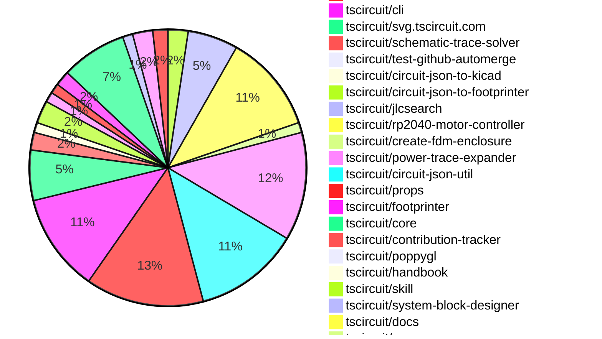

# contribution tracker

[contributions.tscircuit.com](https://contributions.tscircuit.com) ・ [tscircuit.com](https://tscircuit.com) ・ [Contribution Overviews](./contribution-overviews/) ・ [Changelogs](./changelogs/)

Generates weekly contribution overviews for tscircuit contributors. Check out all
the [contribution overviews here](./contribution-overviews/)
You can find AI-generated monthly changelogs in the [changelogs directory](./changelogs/)

- All PRs in the tscircuit org are scanned/summarized via an LLM
- The LLM classifies each Diff/PR as into a set of attributes for scoring
- All the PRs, summaries, and classifications are organized into charts and tables for [the website](https://contributions.tscircuit.com)

> Want to run locally? See the [Development Section](#development)

## Current Week

<!-- START_CURRENT_WEEK -->

# Contribution Overview 2026-07-21

The current week is shown below. There are 3 major sections:

- [Contributor Overview](#contributor-overview)
- [PRs by Repository](#prs-by-repository)
- [PRs by Contributor](#changes-by-contributor)
- [Scoring & Sponsorship Details](/docs/sponsorship-calculation-explanation.md)

## PRs by Repository


```mermaid
pie
    "tscircuit/rfc" : 1
    "tscircuit/high-density-repair03" : 2
    "tscircuit/datasheet-to-tscircuit" : 8
    "tscircuit/tscircuit-autorouter" : 20
    "tscircuit/tscircuit" : 39
    "tscircuit/circuit-json" : 4
    "tscircuit/tscircuit.com" : 43
    "tscircuit/eval" : 42
    "tscircuit/runframe" : 47
    "tscircuit/cli" : 39
    "tscircuit/svg.tscircuit.com" : 20
    "tscircuit/schematic-trace-solver" : 7
    "tscircuit/test-github-automerge" : 1
    "tscircuit/circuit-json-to-kicad" : 4
    "tscircuit/circuit-json-to-footprinter" : 9
    "tscircuit/jlcsearch" : 3
    "tscircuit/rp2040-motor-controller" : 2
    "tscircuit/create-fdm-enclosure" : 3
    "tscircuit/power-trace-expander" : 4
    "tscircuit/circuit-json-util" : 1
    "tscircuit/props" : 4
    "tscircuit/footprinter" : 6
    "tscircuit/core" : 26
    "tscircuit/contribution-tracker" : 1
    "tscircuit/poppygl" : 1
    "tscircuit/handbook" : 1
    "tscircuit/skill" : 1
    "tscircuit/system-block-designer" : 4
    "tscircuit/docs" : 2
    "tscircuit/common" : 1
    "tscircuit/ti" : 8
    "tscircuit/easyeda-converter" : 1
    "tscircuit/matchpack" : 6
    "tscircuit/fast-footprint-compare" : 3
    "tscircuit/schematic-symbols" : 1
    "tscircuit/length-matching-post-process" : 2
    "tscircuit/tsci-agent" : 1
    "tscircuit/sparkfun-boards" : 1
```

## Contributor Overview

| Contributor | 🐳 Major | 🐙 Minor | 🐌 Tiny | Score | ⭐ |
|-------------|---------|---------|---------|-------|-----|
| [seveibar](#seveibar) | 13 | 11 | 13 | 87 | 👑 |
| [imrishabh18](#imrishabh18) | 4 | 9 | 15 | 47 | ⭐⭐ |
| [ShiboSoftwareDev](#ShiboSoftwareDev) | 7 | 0 | 2 | 34 | ⭐⭐ |
| [AnasSarkiz](#AnasSarkiz) | 5 | 0 | 1 | 27.5 | ⭐⭐ |
| [techmannih](#techmannih) | 4 | 1 | 8 | 27 | ⭐⭐ |
| [0hmX](#0hmX) | 5 | 0 | 4 | 25 | ⭐⭐ |
| [mohan-bee](#mohan-bee) | 2 | 1 | 4 | 20 | ⭐⭐ |
| [MustafaMulla29](#MustafaMulla29) | 2 | 1 | 3 | 14 | ⭐⭐ |
| [tscircuitbot](#tscircuitbot) | 0 | 0 | 240 | 13 | ⭐⭐ |
| [Hero988](#Hero988) | 2 | 0 | 1 | 9 | ⭐ |
| [itisrohit](#itisrohit) | 0 | 4 | 1 | 9 | ⭐ |
| [rushabhcodes](#rushabhcodes) | 0 | 0 | 2 | 3 |  |
| [anil08607](#anil08607) | 0 | 0 | 2 | 2 |  |
| [Lathikaa-S](#Lathikaa-S) | 0 | 0 | 1 | 1 |  |
| [Abse2001](#Abse2001) | 0 | 0 | 1 | 1 |  |

## Staff Pass Ratio (SPR)

| Contributor | Reviewed PRs | Rejections | Approvals | SPR |
|-------------|--------------|------------|-----------|-----|
| [imrishabh18](#imrishabh18) | 7 | 0 | 7 | 100.0% |
| [itisrohit](#itisrohit) | 4 | 2 | 2 | 50.0% |
| [mohan-bee](#mohan-bee) | 4 | 1 | 4 | 75.0% |
| [MustafaMulla29](#MustafaMulla29) | 4 | 0 | 4 | 100.0% |
| [Hero988](#Hero988) | 3 | 1 | 2 | 66.7% |
| [ShiboSoftwareDev](#ShiboSoftwareDev) | 3 | 0 | 4 | 100.0% |
| [0hmX](#0hmX) | 2 | 0 | 2 | 100.0% |
| [AnasSarkiz](#AnasSarkiz) | 2 | 1 | 2 | 50.0% |
| [techmannih](#techmannih) | 1 | 0 | 1 | 100.0% |

<details>
<summary>imrishabh18 SPR PRs (7)</summary>

- [#747](https://github.com/tscircuit/props/pull/747) Add schSheetName to schematic box props
- [#746](https://github.com/tscircuit/props/pull/746) Add disabled flags to project config
- [#745](https://github.com/tscircuit/props/pull/745) Add schematic box chip reference props
- [#2763](https://github.com/tscircuit/core/pull/2763) Infer schematic sheets from schematic box connections
- [#2751](https://github.com/tscircuit/core/pull/2751) feat: Support multi schematic sheet representation of a single chip component
- [#2750](https://github.com/tscircuit/core/pull/2750) Example test for multiple schematic sheet representation of a chip
- [#61](https://github.com/tscircuit/system-block-designer/pull/61) Support TI GPIO and SPI interface traces

</details>

<details>
<summary>itisrohit SPR PRs (4)</summary>

- [#718](https://github.com/tscircuit/footprinter/pull/718) repro(dip): add fabrication note pin label rendering repro
- [#2776](https://github.com/tscircuit/core/pull/2776) repro: mosfet doesn't propagate manufacturerPartNumber and supplierPartNumbers
- [#2749](https://github.com/tscircuit/core/pull/2749) repro(pcb): add DIP-8 fabrication note pin label rendering repro
- [#396](https://github.com/tscircuit/circuit-json-to-kicad/pull/396) fix(pcb): export pcb_keepout elements as KiCad rule-area zones

</details>

<details>
<summary>mohan-bee SPR PRs (4)</summary>

- [#439](https://github.com/tscircuit/schematic-symbols/pull/439) scale down polarised capacitor
- [#168](https://github.com/tscircuit/matchpack/pull/168) add isCrystal in InputProblem
- [#165](https://github.com/tscircuit/matchpack/pull/165) Align capacitor partition on VCC/GND pins side
- [#164](https://github.com/tscircuit/matchpack/pull/164) Fix rail-only decoupling capacitor grouping

</details>

<details>
<summary>MustafaMulla29 SPR PRs (4)</summary>

- [#2794](https://github.com/tscircuit/core/pull/2794) Revert internal circuit implementation
- [#2761](https://github.com/tscircuit/core/pull/2761) Render canonical USB-C ports when Parts Engine resolution fails
- [#2745](https://github.com/tscircuit/core/pull/2745) Render chip ports on internal circuit symbols
- [#694](https://github.com/tscircuit/schematic-trace-solver/pull/694) Untangle merged-label trace crossings

</details>

<details>
<summary>Hero988 SPR PRs (3)</summary>

- [#2739](https://github.com/tscircuit/core/pull/2739) fix: defaultTraceWidth/nominalTraceWidth board props now control autorouted trace width
- [#2765](https://github.com/tscircuit/core/pull/2765) fix: <switch /> drops supplierPartNumbers/manufacturerPartNumber, part missing from BOM
- [#690](https://github.com/tscircuit/schematic-trace-solver/pull/690) fix: resolve stuck net-label collisions with a least-overlap fallback

</details>

<details>
<summary>ShiboSoftwareDev SPR PRs (3)</summary>

- [#9](https://github.com/tscircuit/rfc/pull/9) Add analog simulation analyses and parameter sweep RFC
- [#22](https://github.com/tscircuit/datasheet-to-tscircuit/pull/22) multi typical applications & mse
- [#21](https://github.com/tscircuit/datasheet-to-tscircuit/pull/21) doesn't match ref warning

</details>

<details>
<summary>0hmX SPR PRs (2)</summary>

- [#1743](https://github.com/tscircuit/tscircuit-autorouter/pull/1743) Add benchmark history dashboard
- [#1728](https://github.com/tscircuit/tscircuit-autorouter/pull/1728) Fix physical net in hypergraph pathing

</details>

<details>
<summary>AnasSarkiz SPR PRs (2)</summary>

- [#15](https://github.com/tscircuit/tsci-agent/pull/15) Add OpenAI login support
- [#23](https://github.com/tscircuit/datasheet-to-tscircuit/pull/23) Add authenticated OpenAI execution across agent workflows

</details>

<details>
<summary>techmannih SPR PRs (1)</summary>

- [#18](https://github.com/tscircuit/circuit-json-to-footprinter/pull/18) Move footprint geometry and comparison into circuit-json-to-footprinter

</details>

> Note: AI evaluates PRs and assigns 1-3 star ratings automatically. 4 and 5 star ratings require manual staff review.

## Review Table

[reviews-received-hover]: ## "Number of reviews received for PRs for this contributor"
[approvals-received-hover]: ## "Number of approvals received for PRs this contributor authored"
[rejections-received-hover]: ## "Number of rejections received for PRs this contributor authored"
[prs-opened-hover]: ## "Number of PRs opened by this contributor"
[issues-created-hover]: ## "Number of issues created by this contributor"

| Contributor | Reviews Received | Approvals Received | Rejections Received | Approvals | Rejections Given | PRs Opened | PRs Merged | Issues Created |
|---|---|---|---|---|---|---|---|---|
| [0hmX](#0hmX) | 6 | 3 | 0 | 3 | 0 | 14 | 10 | 0 |
| [Abse2001](#Abse2001) | 0 | 0 | 0 | 0 | 0 | 2 | 1 | 0 |
| [AnasSarkiz](#AnasSarkiz) | 10 | 10 | 0 | 7 | 0 | 6 | 6 | 0 |
| [anil08607](#anil08607) | 4 | 3 | 0 | 0 | 0 | 2 | 2 | 0 |
| [Hero988](#Hero988) | 8 | 3 | 3 | 0 | 0 | 9 | 3 | 0 |
| [Hivesmith-dev](#Hivesmith-dev) | 0 | 0 | 0 | 0 | 0 | 1 | 0 | 0 |
| [imrishabh18](#imrishabh18) | 13 | 9 | 0 | 14 | 3 | 33 | 29 | 0 |
| [itisrohit](#itisrohit) | 21 | 10 | 2 | 0 | 0 | 12 | 5 | 0 |
| [KrishnaX12](#KrishnaX12) | 4 | 0 | 1 | 0 | 0 | 2 | 0 | 0 |
| [Lathikaa-S](#Lathikaa-S) | 3 | 3 | 0 | 0 | 0 | 1 | 1 | 0 |
| [mohan-bee](#mohan-bee) | 21 | 12 | 0 | 6 | 0 | 11 | 7 | 0 |
| [MustafaMulla29](#MustafaMulla29) | 6 | 6 | 0 | 5 | 0 | 14 | 7 | 0 |
| [namdamdoi68-oss](#namdamdoi68-oss) | 0 | 0 | 0 | 0 | 0 | 1 | 0 | 0 |
| [rootdgy](#rootdgy) | 0 | 0 | 0 | 0 | 0 | 3 | 0 | 0 |
| [rushabhcodes](#rushabhcodes) | 5 | 3 | 0 | 1 | 0 | 3 | 2 | 0 |
| [seveibar](#seveibar) | 11 | 1 | 0 | 34 | 3 | 57 | 37 | 0 |
| [ShiboSoftwareDev](#ShiboSoftwareDev) | 10 | 10 | 0 | 4 | 0 | 29 | 9 | 0 |
| [techmannih](#techmannih) | 12 | 5 | 1 | 4 | 1 | 14 | 13 | 0 |
| [thairc-dev](#thairc-dev) | 0 | 0 | 0 | 0 | 0 | 5 | 0 | 0 |
| [tscircuitbot](#tscircuitbot) | 0 | 0 | 0 | 0 | 0 | 283 | 242 | 0 |

## Changes by Repository

### [tscircuit/rfc](https://github.com/tscircuit/rfc)

| PR # | Impact | Rating | Contributor | Description |
|------|--------|--------|-------------|-------------|
| [#9](https://github.com/tscircuit/rfc/pull/9) | 🐳 Major | ⭐⭐⭐ | ShiboSoftwareDev | Add dedicated analog.simulation elements for transient, DC operating point, direct DC sweep, and AC sweep usage, along with one-dimensional component sweeps through a nested analog.sweepparameter with parameter-specific target props, defining the Circuit JSON experiments, sweep relationships, and analysis-specific voltagecurrent result types produced by that TSX. |

### [tscircuit/high-density-repair03](https://github.com/tscircuit/high-density-repair03)

| PR # | Impact | Rating | Contributor | Description |
|------|--------|--------|-------------|-------------|
| [#26](https://github.com/tscircuit/high-density-repair03/pull/26) | 🐳 Major | ⭐⭐⭐ | ShiboSoftwareDev | Add opt-in via-in-pad topology candidates to GlobalDrcForceImproveSolver, allowing GlobalDrcBranchPortfolioSolver to run these candidates as its final internal phase, relocating terminal-side vias and moving fully single-layer terminal routes using pad-centered transitions, while validating that the drilled hole fits inside each connected single-layer terminal pad before proposing a candidate and scoring every valid topology candidate with the caller-provided full DRC evaluator. |
| [#30](https://github.com/tscircuit/high-density-repair03/pull/30) | 🐳 Major | ⭐⭐⭐ | AnasSarkiz | Restores the via-in-pad repair portfolio, repairs explicitly identified same-net via pairs, resolves exact trace pairs from canonical DRC identifiers, and implements targeted segment layer moves and bounded copper dogleg detours for low-error boards. |

### [tscircuit/datasheet-to-tscircuit](https://github.com/tscircuit/datasheet-to-tscircuit)

| PR # | Impact | Rating | Contributor | Description |
|------|--------|--------|-------------|-------------|
| [#24](https://github.com/tscircuit/datasheet-to-tscircuit/pull/24) | 🐳 Major | ⭐⭐⭐ | ShiboSoftwareDev | Allows the system to recover from inconsistent evidence extraction instead of aborting the conversion process, enhancing the robustness of evidence validation. |
| [#22](https://github.com/tscircuit/datasheet-to-tscircuit/pull/22) | 🐳 Major | ⭐⭐⭐ | ShiboSoftwareDev | Adds support for typical application titles in job restoration and evidence phases, enhancing the job management process. |
| [#19](https://github.com/tscircuit/datasheet-to-tscircuit/pull/19) | 🐳 Major | ⭐⭐⭐ | ShiboSoftwareDev | Preserve and validate every response and stimulus graph in multi-channel datasheet figures through simulation, scoring, and previews. Harden benchmark generation and retries, improve reference graph layoutdefault view, simplify artifact downloads, and expand regression coverage. |
| [#18](https://github.com/tscircuit/datasheet-to-tscircuit/pull/18) | 🐳 Major | ⭐⭐⭐ | ShiboSoftwareDev | Adds source-backed application modes, stronger component and visual validation, server-owned netlist checks, SPICE powerrange preflights, and monotonic checkpoint promotion. Prevents false evidence stops and regressed models from advancing. Adds regression coverage with 137 passing tests. |
| [#21](https://github.com/tscircuit/datasheet-to-tscircuit/pull/21) | 🐳 Major | ⭐⭐⭐ | ShiboSoftwareDev | Adds a warning in the model reference pane when the current graph is outside the benchmark tolerance. |
| [#23](https://github.com/tscircuit/datasheet-to-tscircuit/pull/23) | 🐳 Major | ⭐⭐⭐ | AnasSarkiz | Adds optional persistent OpenAI authentication while keeping the tscircuit AI Gateway as default. |

<details>
<summary>🐌 Tiny Contributions (2)</summary>

| PR # | Impact | Contributor | Description |
|------|--------|-------------|-------------|
| [#26](https://github.com/tscircuit/datasheet-to-tscircuit/pull/26) | 🐌 Tiny | ShiboSoftwareDev | This pull request introduces several enhancements to improve the resilience of the component, application, and SPICE pipelines against recoverable failures. Key changes include the addition of new utility functions for capturing agent process output, identifying transient transport failures, and summarizing agent process failures. Additionally, it updates existing validation and instruction files to ensure they align with the new error handling mechanisms. These changes aim to enhance the overall robustness of the system and improve error reporting and handling during the generation process. |
| [#20](https://github.com/tscircuit/datasheet-to-tscircuit/pull/20) | 🐌 Tiny | AnasSarkiz | Removes the logo image and its associated styles from the application. |

</details>

### [tscircuit/tscircuit-autorouter](https://github.com/tscircuit/tscircuit-autorouter)

| PR # | Impact | Rating | Contributor | Description |
|------|--------|--------|-------------|-------------|
| [#1743](https://github.com/tscircuit/tscircuit-autorouter/pull/1743) | 🐳 Major | ⭐⭐⭐ | 0hmX | Summary persist full successful main-branch benchmark reports and execution metadata on the dedicated benchmark-history branch generate and upload a self-contained dashboard for completion, DRC, solve-time, and via trends point regression notifications directly to benchmark artifacts  Why Benchmark results were available only as per-run artifacts, which made longitudinal performance investigation and raw sample comparison difficult. This adds durable history without making the benchmark workflow fail when history publishing has a problem.  Impact Successful main benchmark runs append their complete report and metadata to the existing history and produce an artifact containing the latest dashboard. The one-time historical import is separated into 1744.  Merge order Merge 1744 first so the backfilled benchmark-history branch is populated before this workflow starts appending new main runs.  Validation bun test testsbenchmark-history.test.ts --timeout 9999999 bun run build rendered the complete 480-run backfill locally git diff --check |
| [#1742](https://github.com/tscircuit/tscircuit-autorouter/pull/1742) | 🐳 Major | ⭐⭐⭐ | 0hmX | Labels each point-to-connect with its PCB port ID and each generated or pending connection line with its net name, ensuring unambiguous visualization of connections. |
| [#1728](https://github.com/tscircuit/tscircuit-autorouter/pull/1728) | 🐳 Major | ⭐⭐⭐ | 0hmX | Fixes routing failures caused by incorrect physical net IDs in hypergraph construction, ensuring consistent net identity during autorouting. |
| [#1733](https://github.com/tscircuit/tscircuit-autorouter/pull/1733) | 🐳 Major | ⭐⭐⭐ | 0hmX | Preserves SRJ root connection identities for accurate trace-width and connectivity lookups in hypergraph pathing. |
| [#1737](https://github.com/tscircuit/tscircuit-autorouter/pull/1737) | 🐳 Major | ⭐⭐⭐ | AnasSarkiz | Pins high-density-repair03 to an exact commit, refreshes route snapshots, and updates DRC fixture to eliminate trace errors, improving DRC error resolution for SRJ18 samples. |
| [#1756](https://github.com/tscircuit/tscircuit-autorouter/pull/1756) | 🐳 Major | ⭐⭐⭐ | AnasSarkiz | Fixes focused snapshot updates by allowing the use of a selectable CI runner for better snapshot parity and reliability in testing. |
| [#1726](https://github.com/tscircuit/tscircuit-autorouter/pull/1726) | 🐙 Minor | ⭐⭐ | imrishabh18 | Summary remove all 51 pre-routed pcb_trace entries from bugreport76-373c24s input traces array regenerate the focused SVG snapshot from the corrected trace-free problem  Why The downloaded bug report fixture included already-routed traces in simple_route_json.traces. That made the reproduction start from a partially routed board instead of the raw autorouting problem, so it did not accurately represent bugreport76.  Impact The bugreport76 regression test now gives the autorouter zero input traces while preserving its six requested connections and existing obstacles.  Validation bun test testsbugsbugreport76-373c24.test.ts --timeout 9999999 git diff --check |

<details>
<summary>🐌 Tiny Contributions (13)</summary>

| PR # | Impact | Contributor | Description |
|------|--------|-------------|-------------|
| [#1725](https://github.com/tscircuit/tscircuit-autorouter/pull/1725) | 🐌 Tiny | ShiboSoftwareDev | Updates the high-density-repair03 dependency to the latest main commit, ensuring the autorouter uses the merged version of the via-in-pad DRC repair. |
| [#1761](https://github.com/tscircuit/tscircuit-autorouter/pull/1761) | 🐌 Tiny | tscircuitbot | Automated package update |
| [#1760](https://github.com/tscircuit/tscircuit-autorouter/pull/1760) | 🐌 Tiny | tscircuitbot | Automated package update |
| [#1751](https://github.com/tscircuit/tscircuit-autorouter/pull/1751) | 🐌 Tiny | tscircuitbot | Automated package update |
| [#1750](https://github.com/tscircuit/tscircuit-autorouter/pull/1750) | 🐌 Tiny | tscircuitbot | Automated package update |
| [#1735](https://github.com/tscircuit/tscircuit-autorouter/pull/1735) | 🐌 Tiny | tscircuitbot | Automated package update |
| [#1730](https://github.com/tscircuit/tscircuit-autorouter/pull/1730) | 🐌 Tiny | tscircuitbot | Automated package update |
| [#1727](https://github.com/tscircuit/tscircuit-autorouter/pull/1727) | 🐌 Tiny | tscircuitbot | Automated package update |
| [#1732](https://github.com/tscircuit/tscircuit-autorouter/pull/1732) | 🐌 Tiny | tscircuitbot | Automated package update |
| [#1724](https://github.com/tscircuit/tscircuit-autorouter/pull/1724) | 🐌 Tiny | tscircuitbot | Automated package update |
| [#1740](https://github.com/tscircuit/tscircuit-autorouter/pull/1740) | 🐌 Tiny | tscircuitbot | Automated package update |
| [#1723](https://github.com/tscircuit/tscircuit-autorouter/pull/1723) | 🐌 Tiny | imrishabh18 | Summary add the downloaded board1169  autorouting report as bugreport76-373c24 add an AutoroutingPipelineDebugger fixture for local investigation add a focused solver snapshot test and its SVG baseline  Why This preserves a reproducible test case for autorouting bug report 373c2447-1a1f-4703-bf79-36855faeaf44(https:api.tscircuit.comautoroutingbug_reportsview?autorouting_bug_report_id373c2447-1a1f-4703-bf79-36855faeaf44). It is a repro-only change and does not modify solver behavior.  Validation bun test testsbugsbugreport76-373c24.test.ts --timeout 9999999 bun run build rendered and visually inspected the generated SVG snapshot |
| [#1739](https://github.com/tscircuit/tscircuit-autorouter/pull/1739) | 🐌 Tiny | 0hmX | Updates the version of the length-matching-solver dependency in the package.json file. |

</details>

### [tscircuit/tscircuit](https://github.com/tscircuit/tscircuit)


<details>
<summary>🐌 Tiny Contributions (39)</summary>

| PR # | Impact | Contributor | Description |
|------|--------|-------------|-------------|
| [#4070](https://github.com/tscircuit/tscircuit/pull/4070) | 🐌 Tiny | tscircuitbot | Updates the package version from 0.0.2138 to 0.0.2139 in package.json |
| [#4069](https://github.com/tscircuit/tscircuit/pull/4069) | 🐌 Tiny | tscircuitbot | Updates the tscircuitcli package from version 0.1.1725 to 0.1.1726 and the tscircuitrunframe package from version 0.0.2259 to 0.0.2260 in package.json |
| [#4068](https://github.com/tscircuit/tscircuit/pull/4068) | 🐌 Tiny | tscircuitbot | Updates the package version from 0.0.2137 to 0.0.2138 in package.json |
| [#4067](https://github.com/tscircuit/tscircuit/pull/4067) | 🐌 Tiny | tscircuitbot | Automated package update |
| [#4066](https://github.com/tscircuit/tscircuit/pull/4066) | 🐌 Tiny | tscircuitbot | Automated package update |
| [#4065](https://github.com/tscircuit/tscircuit/pull/4065) | 🐌 Tiny | tscircuitbot | Automated package update |
| [#4064](https://github.com/tscircuit/tscircuit/pull/4064) | 🐌 Tiny | tscircuitbot | Automated package update to version 0.0.2136 |
| [#4063](https://github.com/tscircuit/tscircuit/pull/4063) | 🐌 Tiny | tscircuitbot | Updates the tscircuitcli package from version 0.1.1722 to 0.1.1723 and the tscircuitrunframe package from version 0.0.2255 to 0.0.2256 in package.json |
| [#4062](https://github.com/tscircuit/tscircuit/pull/4062) | 🐌 Tiny | tscircuitbot | Automated package update to version 0.0.2135 |
| [#4061](https://github.com/tscircuit/tscircuit/pull/4061) | 🐌 Tiny | tscircuitbot | Automated package update |
| [#4060](https://github.com/tscircuit/tscircuit/pull/4060) | 🐌 Tiny | tscircuitbot | Automated package update |
| [#4059](https://github.com/tscircuit/tscircuit/pull/4059) | 🐌 Tiny | tscircuitbot | Automated package update |
| [#4058](https://github.com/tscircuit/tscircuit/pull/4058) | 🐌 Tiny | tscircuitbot | Automated package update |
| [#4057](https://github.com/tscircuit/tscircuit/pull/4057) | 🐌 Tiny | tscircuitbot | Automated package update |
| [#4054](https://github.com/tscircuit/tscircuit/pull/4054) | 🐌 Tiny | tscircuitbot | Automated package update |
| [#4053](https://github.com/tscircuit/tscircuit/pull/4053) | 🐌 Tiny | tscircuitbot | Updates the tscircuitcli package from version 0.1.1718 to 0.1.1719 and the tscircuitrunframe package from version 0.0.2250 to 0.0.2251 in package.json |
| [#4047](https://github.com/tscircuit/tscircuit/pull/4047) | 🐌 Tiny | tscircuitbot | Automated package update to version 0.0.2129 |
| [#4042](https://github.com/tscircuit/tscircuit/pull/4042) | 🐌 Tiny | tscircuitbot | Automated package update |
| [#4031](https://github.com/tscircuit/tscircuit/pull/4031) | 🐌 Tiny | tscircuitbot | Automated package update |
| [#4051](https://github.com/tscircuit/tscircuit/pull/4051) | 🐌 Tiny | tscircuitbot | Automated package update |
| [#4050](https://github.com/tscircuit/tscircuit/pull/4050) | 🐌 Tiny | tscircuitbot | Automated package update |
| [#4049](https://github.com/tscircuit/tscircuit/pull/4049) | 🐌 Tiny | tscircuitbot | Updates the tscircuitcli package from version 0.1.1716 to 0.1.1717 and the tscircuitrunframe package from version 0.0.2248 to 0.0.2249 in package.json |
| [#4046](https://github.com/tscircuit/tscircuit/pull/4046) | 🐌 Tiny | tscircuitbot | Automated package update |
| [#4045](https://github.com/tscircuit/tscircuit/pull/4045) | 🐌 Tiny | tscircuitbot | Updates the package version from 0.0.2127 to 0.0.2128 in package.json |
| [#4044](https://github.com/tscircuit/tscircuit/pull/4044) | 🐌 Tiny | tscircuitbot | Updates the version of several packages in the project, including tscircuitcli, tscircuitcore, tscircuiteval, tscircuitrunframe, and circuit-json. |
| [#4041](https://github.com/tscircuit/tscircuit/pull/4041) | 🐌 Tiny | tscircuitbot | Automated package update |
| [#4040](https://github.com/tscircuit/tscircuit/pull/4040) | 🐌 Tiny | tscircuitbot | Automated package update |
| [#4039](https://github.com/tscircuit/tscircuit/pull/4039) | 🐌 Tiny | tscircuitbot | Automated package update |
| [#4038](https://github.com/tscircuit/tscircuit/pull/4038) | 🐌 Tiny | tscircuitbot | Automated package update |
| [#4037](https://github.com/tscircuit/tscircuit/pull/4037) | 🐌 Tiny | tscircuitbot | Automated package update |
| [#4035](https://github.com/tscircuit/tscircuit/pull/4035) | 🐌 Tiny | tscircuitbot | Automated package update |
| [#4034](https://github.com/tscircuit/tscircuit/pull/4034) | 🐌 Tiny | tscircuitbot | Automated package update |
| [#4033](https://github.com/tscircuit/tscircuit/pull/4033) | 🐌 Tiny | tscircuitbot | Updates the package version from 0.0.2121 to 0.0.2122 in package.json |
| [#4032](https://github.com/tscircuit/tscircuit/pull/4032) | 🐌 Tiny | tscircuitbot | Automated package update |
| [#4030](https://github.com/tscircuit/tscircuit/pull/4030) | 🐌 Tiny | tscircuitbot | Automated package update |
| [#4029](https://github.com/tscircuit/tscircuit/pull/4029) | 🐌 Tiny | tscircuitbot | Automated package update |
| [#4028](https://github.com/tscircuit/tscircuit/pull/4028) | 🐌 Tiny | tscircuitbot | Automated package update |
| [#4043](https://github.com/tscircuit/tscircuit/pull/4043) | 🐌 Tiny | tscircuitbot | Updates the package version from 0.0.2126 to 0.0.2127 in package.json |
| [#4036](https://github.com/tscircuit/tscircuit/pull/4036) | 🐌 Tiny | seveibar | Adds the tscircuitcreate-fdm-enclosure dependency to the aggregate package, allowing the package updater to complete its dependency synchronization without failure. |

</details>

### [tscircuit/circuit-json](https://github.com/tscircuit/circuit-json)

| PR # | Impact | Rating | Contributor | Description |
|------|--------|--------|-------------|-------------|
| [#658](https://github.com/tscircuit/circuit-json/pull/658) | 🐙 Minor | ⭐⭐ | seveibar | Add a warning for schematic components, net labels, and traces that extend outside their schematic sheet, including identifiers for the owning sheet and offending elements. |
| [#655](https://github.com/tscircuit/circuit-json/pull/655) | 🐙 Minor | ⭐⭐ | seveibar | Add a schematic component overlap warning to identify overlapping schematic components and include it in AnyCircuitElement and generated reference docs. |

<details>
<summary>🐌 Tiny Contributions (2)</summary>

| PR # | Impact | Contributor | Description |
|------|--------|-------------|-------------|
| [#659](https://github.com/tscircuit/circuit-json/pull/659) | 🐌 Tiny | tscircuitbot | Automated package update |
| [#656](https://github.com/tscircuit/circuit-json/pull/656) | 🐌 Tiny | tscircuitbot | Automated package update |

</details>

### [tscircuit/tscircuit.com](https://github.com/tscircuit/tscircuit.com)

| PR # | Impact | Rating | Contributor | Description |
|------|--------|--------|-------------|-------------|
| [#4030](https://github.com/tscircuit/tscircuit.com/pull/4030) | 🐳 Major | ⭐⭐⭐ | imrishabh18 | Add a Download logs action to release and individual build log panels, allowing users to export completed or streamed logs as a plain-text file with preserved timestamps and message text. |

<details>
<summary>🐌 Tiny Contributions (42)</summary>

| PR # | Impact | Contributor | Description |
|------|--------|-------------|-------------|
| [#4034](https://github.com/tscircuit/tscircuit.com/pull/4034) | 🐌 Tiny | tscircuitbot | Updates the tscircuiteval package from version 0.0.1047 to 0.0.1048 |
| [#4033](https://github.com/tscircuit/tscircuit.com/pull/4033) | 🐌 Tiny | tscircuitbot | Updates the tscircuitrunframe package to version 0.0.2260 |
| [#4032](https://github.com/tscircuit/tscircuit.com/pull/4032) | 🐌 Tiny | tscircuitbot | Automated package update |
| [#4031](https://github.com/tscircuit/tscircuit.com/pull/4031) | 🐌 Tiny | tscircuitbot | Updates the tscircuiteval package from version 0.0.1046 to 0.0.1047 |
| [#4029](https://github.com/tscircuit/tscircuit.com/pull/4029) | 🐌 Tiny | tscircuitbot | Updates the tscircuiteval package from version 0.0.1045 to 0.0.1046 |
| [#4028](https://github.com/tscircuit/tscircuit.com/pull/4028) | 🐌 Tiny | tscircuitbot | Updates the tscircuitrunframe package from version 0.0.2256 to 0.0.2257 |
| [#4027](https://github.com/tscircuit/tscircuit.com/pull/4027) | 🐌 Tiny | tscircuitbot | Updates the tscircuiteval package from version 0.0.1044 to 0.0.1045 |
| [#4026](https://github.com/tscircuit/tscircuit.com/pull/4026) | 🐌 Tiny | tscircuitbot | Updates the tscircuitrunframe package from version 0.0.2255 to 0.0.2256 |
| [#4025](https://github.com/tscircuit/tscircuit.com/pull/4025) | 🐌 Tiny | tscircuitbot | Updates the tscircuiteval package from version 0.0.1043 to 0.0.1044 |
| [#4024](https://github.com/tscircuit/tscircuit.com/pull/4024) | 🐌 Tiny | tscircuitbot | Updates the tscircuitrunframe package from version 0.0.2254 to 0.0.2255 |
| [#4023](https://github.com/tscircuit/tscircuit.com/pull/4023) | 🐌 Tiny | tscircuitbot | Updates the tscircuiteval package to version 0.0.1043 |
| [#4022](https://github.com/tscircuit/tscircuit.com/pull/4022) | 🐌 Tiny | tscircuitbot | Updates the tscircuitrunframe package from version 0.0.2253 to 0.0.2254 |
| [#4021](https://github.com/tscircuit/tscircuit.com/pull/4021) | 🐌 Tiny | tscircuitbot | Automated package update |
| [#4020](https://github.com/tscircuit/tscircuit.com/pull/4020) | 🐌 Tiny | tscircuitbot | Updates the tscircuitrunframe package from version 0.0.2251 to 0.0.2253 |
| [#4019](https://github.com/tscircuit/tscircuit.com/pull/4019) | 🐌 Tiny | tscircuitbot | Updates the tscircuiteval package from version 0.0.1040 to 0.0.1041 in the package.json file. |
| [#4017](https://github.com/tscircuit/tscircuit.com/pull/4017) | 🐌 Tiny | tscircuitbot | Updates the tscircuiteval package from version 0.0.1039 to 0.0.1040 |
| [#4015](https://github.com/tscircuit/tscircuit.com/pull/4015) | 🐌 Tiny | tscircuitbot | Automated package update |
| [#3999](https://github.com/tscircuit/tscircuit.com/pull/3999) | 🐌 Tiny | tscircuitbot | Automated package update |
| [#3998](https://github.com/tscircuit/tscircuit.com/pull/3998) | 🐌 Tiny | tscircuitbot | Updates the tscircuiteval package from version 0.0.1031 to 0.0.1032 |
| [#3988](https://github.com/tscircuit/tscircuit.com/pull/3988) | 🐌 Tiny | tscircuitbot | Updates the tscircuiteval package from version 0.0.1027 to 0.0.1028 in the package.json file. |
| [#4013](https://github.com/tscircuit/tscircuit.com/pull/4013) | 🐌 Tiny | tscircuitbot | Updates the tscircuiteval package to version 0.0.1039 in the project dependencies. |
| [#4010](https://github.com/tscircuit/tscircuit.com/pull/4010) | 🐌 Tiny | tscircuitbot | Updates the tscircuiteval package from version 0.0.1037 to 0.0.1038 |
| [#4007](https://github.com/tscircuit/tscircuit.com/pull/4007) | 🐌 Tiny | tscircuitbot | Updates the tscircuitrunframe package from version 0.0.2244 to 0.0.2246 |
| [#4000](https://github.com/tscircuit/tscircuit.com/pull/4000) | 🐌 Tiny | tscircuitbot | Updates the tscircuiteval package to version 0.0.1033 in the package.json file. |
| [#3994](https://github.com/tscircuit/tscircuit.com/pull/3994) | 🐌 Tiny | tscircuitbot | Automated package update |
| [#4014](https://github.com/tscircuit/tscircuit.com/pull/4014) | 🐌 Tiny | tscircuitbot | Automated package update |
| [#4012](https://github.com/tscircuit/tscircuit.com/pull/4012) | 🐌 Tiny | tscircuitbot | Updates the tscircuitrunframe package to version 0.0.2249 |
| [#4011](https://github.com/tscircuit/tscircuit.com/pull/4011) | 🐌 Tiny | tscircuitbot | Automated package update |
| [#4009](https://github.com/tscircuit/tscircuit.com/pull/4009) | 🐌 Tiny | tscircuitbot | Automated package update |
| [#4008](https://github.com/tscircuit/tscircuit.com/pull/4008) | 🐌 Tiny | tscircuitbot | Updates the tscircuiteval package to version 0.0.1037 in the package.json file |
| [#4006](https://github.com/tscircuit/tscircuit.com/pull/4006) | 🐌 Tiny | tscircuitbot | Updates the tscircuiteval package from version 0.0.1035 to 0.0.1036 |
| [#4004](https://github.com/tscircuit/tscircuit.com/pull/4004) | 🐌 Tiny | tscircuitbot | Automated package update |
| [#4003](https://github.com/tscircuit/tscircuit.com/pull/4003) | 🐌 Tiny | tscircuitbot | Automated package update |
| [#4002](https://github.com/tscircuit/tscircuit.com/pull/4002) | 🐌 Tiny | tscircuitbot | Updates the tscircuiteval package to version 0.0.1034 |
| [#3996](https://github.com/tscircuit/tscircuit.com/pull/3996) | 🐌 Tiny | tscircuitbot | Updates the tscircuiteval package from version 0.0.1030 to 0.0.1031 |
| [#3993](https://github.com/tscircuit/tscircuit.com/pull/3993) | 🐌 Tiny | tscircuitbot | Updates the tscircuiteval package from version 0.0.1029 to 0.0.1030 in the package.json file. |
| [#3992](https://github.com/tscircuit/tscircuit.com/pull/3992) | 🐌 Tiny | tscircuitbot | Updates the tscircuitrunframe package from version 0.0.2238 to 0.0.2239 |
| [#3991](https://github.com/tscircuit/tscircuit.com/pull/3991) | 🐌 Tiny | tscircuitbot | Automated package update |
| [#3990](https://github.com/tscircuit/tscircuit.com/pull/3990) | 🐌 Tiny | tscircuitbot | Automated package update |
| [#3989](https://github.com/tscircuit/tscircuit.com/pull/3989) | 🐌 Tiny | tscircuitbot | Updates the tscircuitrunframe package from version 0.0.2236 to 0.0.2237 |
| [#3995](https://github.com/tscircuit/tscircuit.com/pull/3995) | 🐌 Tiny | imrishabh18 | Removes the AI Review tab and its associated controls from the package view, along with related polling and requests, while keeping the AI-generated package description behavior unchanged. |
| [#3986](https://github.com/tscircuit/tscircuit.com/pull/3986) | 🐌 Tiny | Lathikaa-S | Hides the Sign In link in the footer for users who are already authenticated. |

</details>

### [tscircuit/eval](https://github.com/tscircuit/eval)

| PR # | Impact | Rating | Contributor | Description |
|------|--------|--------|-------------|-------------|
| [#3329](https://github.com/tscircuit/eval/pull/3329) | 🐳 Major | ⭐⭐⭐ | seveibar | Fixes TSX transform errors by allowing block comments between component props and providing clearer error messages for syntax issues. |

<details>
<summary>🐌 Tiny Contributions (41)</summary>

| PR # | Impact | Contributor | Description |
|------|--------|-------------|-------------|
| [#3388](https://github.com/tscircuit/eval/pull/3388) | 🐌 Tiny | tscircuitbot | Automated package update |
| [#3387](https://github.com/tscircuit/eval/pull/3387) | 🐌 Tiny | tscircuitbot | Automated package update |
| [#3385](https://github.com/tscircuit/eval/pull/3385) | 🐌 Tiny | tscircuitbot | Automated package update |
| [#3384](https://github.com/tscircuit/eval/pull/3384) | 🐌 Tiny | tscircuitbot | Updates the version of the tscircuitcore package from 0.0.1491 to 0.0.1492 in package.json |
| [#3382](https://github.com/tscircuit/eval/pull/3382) | 🐌 Tiny | tscircuitbot | Automated package update |
| [#3381](https://github.com/tscircuit/eval/pull/3381) | 🐌 Tiny | tscircuitbot | Updates the version of several dependencies in the package.json file. |
| [#3379](https://github.com/tscircuit/eval/pull/3379) | 🐌 Tiny | tscircuitbot | Automated package update |
| [#3378](https://github.com/tscircuit/eval/pull/3378) | 🐌 Tiny | tscircuitbot | Updates the version of the tscircuitcore package from 0.0.1489 to 0.0.1490 in package.json |
| [#3376](https://github.com/tscircuit/eval/pull/3376) | 🐌 Tiny | tscircuitbot | Automated package update |
| [#3375](https://github.com/tscircuit/eval/pull/3375) | 🐌 Tiny | tscircuitbot | Automated package update |
| [#3373](https://github.com/tscircuit/eval/pull/3373) | 🐌 Tiny | tscircuitbot | Automated package update to version 0.0.1043 |
| [#3372](https://github.com/tscircuit/eval/pull/3372) | 🐌 Tiny | tscircuitbot | Updates the version of tscircuitcore from 0.0.1487 to 0.0.1488 and tscircuitschematic-trace-solver from 0.0.104 to 0.0.105 in package.json |
| [#3370](https://github.com/tscircuit/eval/pull/3370) | 🐌 Tiny | tscircuitbot | Automated package update |
| [#3369](https://github.com/tscircuit/eval/pull/3369) | 🐌 Tiny | tscircuitbot | Automated package update |
| [#3367](https://github.com/tscircuit/eval/pull/3367) | 🐌 Tiny | tscircuitbot | Automated package update |
| [#3366](https://github.com/tscircuit/eval/pull/3366) | 🐌 Tiny | tscircuitbot | Automated package update |
| [#3363](https://github.com/tscircuit/eval/pull/3363) | 🐌 Tiny | tscircuitbot | Automated package update |
| [#3361](https://github.com/tscircuit/eval/pull/3361) | 🐌 Tiny | tscircuitbot | Updates the version of the tscircuitcore package from 0.0.1483 to 0.0.1484 in package.json |
| [#3351](https://github.com/tscircuit/eval/pull/3351) | 🐌 Tiny | tscircuitbot | Automated package update |
| [#3354](https://github.com/tscircuit/eval/pull/3354) | 🐌 Tiny | tscircuitbot | Automated package update |
| [#3348](https://github.com/tscircuit/eval/pull/3348) | 🐌 Tiny | tscircuitbot | Automated package update |
| [#3345](https://github.com/tscircuit/eval/pull/3345) | 🐌 Tiny | tscircuitbot | Updates the version of tscircuitcore from 0.0.1477 to 0.0.1478 and poppygl from 0.0.25 to 0.0.26 in package.json |
| [#3332](https://github.com/tscircuit/eval/pull/3332) | 🐌 Tiny | tscircuitbot | Automated package update |
| [#3331](https://github.com/tscircuit/eval/pull/3331) | 🐌 Tiny | tscircuitbot | Updates the version of tscircuitcore from 0.0.1473 to 0.0.1474 and tscircuitprops from 0.0.586 to 0.0.587 in package.json |
| [#3359](https://github.com/tscircuit/eval/pull/3359) | 🐌 Tiny | tscircuitbot | Automated package update to version 0.0.1039 |
| [#3358](https://github.com/tscircuit/eval/pull/3358) | 🐌 Tiny | tscircuitbot | Automated package update |
| [#3357](https://github.com/tscircuit/eval/pull/3357) | 🐌 Tiny | tscircuitbot | Automated package update |
| [#3356](https://github.com/tscircuit/eval/pull/3356) | 🐌 Tiny | tscircuitbot | Updates package dependencies to their latest versions in package.json |
| [#3353](https://github.com/tscircuit/eval/pull/3353) | 🐌 Tiny | tscircuitbot | Automated package update |
| [#3350](https://github.com/tscircuit/eval/pull/3350) | 🐌 Tiny | tscircuitbot | Automated package update |
| [#3343](https://github.com/tscircuit/eval/pull/3343) | 🐌 Tiny | tscircuitbot | Automated package update |
| [#3342](https://github.com/tscircuit/eval/pull/3342) | 🐌 Tiny | tscircuitbot | Updates the version of the tscircuitcore package from 0.0.1476 to 0.0.1477 in package.json |
| [#3340](https://github.com/tscircuit/eval/pull/3340) | 🐌 Tiny | tscircuitbot | Automated package update |
| [#3339](https://github.com/tscircuit/eval/pull/3339) | 🐌 Tiny | tscircuitbot | Automated package update |
| [#3337](https://github.com/tscircuit/eval/pull/3337) | 🐌 Tiny | tscircuitbot | Automated package update |
| [#3336](https://github.com/tscircuit/eval/pull/3336) | 🐌 Tiny | tscircuitbot | Updates the version of the tscircuitcore package from 0.0.1474 to 0.0.1475 in package.json |
| [#3333](https://github.com/tscircuit/eval/pull/3333) | 🐌 Tiny | tscircuitbot | Automated package update |
| [#3328](https://github.com/tscircuit/eval/pull/3328) | 🐌 Tiny | tscircuitbot | Automated package update |
| [#3327](https://github.com/tscircuit/eval/pull/3327) | 🐌 Tiny | tscircuitbot | Automated package update |
| [#3347](https://github.com/tscircuit/eval/pull/3347) | 🐌 Tiny | tscircuitbot | Updates the version of tscircuitcore from 0.0.1478 to 0.0.1479 and tscircuitcreate-fdm-enclosure from 0.0.2 to 0.0.3 in package.json |
| [#3346](https://github.com/tscircuit/eval/pull/3346) | 🐌 Tiny | tscircuitbot | Automated package update |

</details>

### [tscircuit/runframe](https://github.com/tscircuit/runframe)

| PR # | Impact | Rating | Contributor | Description |
|------|--------|--------|-------------|-------------|
| [#4088](https://github.com/tscircuit/runframe/pull/4088) | 🐳 Major | ⭐⭐⭐ | seveibar | Allows users to import parts directly from EasyEDA using exact LCSC part numbers, even if those parts are out of stock or not listed in JLCSearch. |

<details>
<summary>🐌 Tiny Contributions (46)</summary>

| PR # | Impact | Contributor | Description |
|------|--------|-------------|-------------|
| [#4110](https://github.com/tscircuit/runframe/pull/4110) | 🐌 Tiny | tscircuitbot | Updates the package version from v0.0.2260 to v0.0.2261 in package.json |
| [#4109](https://github.com/tscircuit/runframe/pull/4109) | 🐌 Tiny | tscircuitbot | Updates the tscircuiteval package from version 0.0.1047 to 0.0.1048 in the package.json file. |
| [#4108](https://github.com/tscircuit/runframe/pull/4108) | 🐌 Tiny | tscircuitbot | Automated package update |
| [#4106](https://github.com/tscircuit/runframe/pull/4106) | 🐌 Tiny | tscircuitbot | Automated package update |
| [#4105](https://github.com/tscircuit/runframe/pull/4105) | 🐌 Tiny | tscircuitbot | Updates the tscircuiteval package from version 0.0.1046 to 0.0.1047 in the package.json file. |
| [#4104](https://github.com/tscircuit/runframe/pull/4104) | 🐌 Tiny | tscircuitbot | Automated package update |
| [#4103](https://github.com/tscircuit/runframe/pull/4103) | 🐌 Tiny | tscircuitbot | Updates the tscircuiteval package from version 0.0.1045 to 0.0.1046 in the package.json file. |
| [#4102](https://github.com/tscircuit/runframe/pull/4102) | 🐌 Tiny | tscircuitbot | Automated package update |
| [#4101](https://github.com/tscircuit/runframe/pull/4101) | 🐌 Tiny | tscircuitbot | Updates the tscircuiteval package from version 0.0.1044 to 0.0.1045 in the package.json file. |
| [#4100](https://github.com/tscircuit/runframe/pull/4100) | 🐌 Tiny | tscircuitbot | Automated package update |
| [#4099](https://github.com/tscircuit/runframe/pull/4099) | 🐌 Tiny | tscircuitbot | Updates the tscircuiteval package from version 0.0.1043 to 0.0.1044 in the package.json file. |
| [#4098](https://github.com/tscircuit/runframe/pull/4098) | 🐌 Tiny | tscircuitbot | Automated package update |
| [#4097](https://github.com/tscircuit/runframe/pull/4097) | 🐌 Tiny | tscircuitbot | Updates the tscircuiteval package from version 0.0.1042 to 0.0.1043 in the package.json file. |
| [#4096](https://github.com/tscircuit/runframe/pull/4096) | 🐌 Tiny | tscircuitbot | Automated package update |
| [#4095](https://github.com/tscircuit/runframe/pull/4095) | 🐌 Tiny | tscircuitbot | Updates the tscircuiteval package from version 0.0.1041 to 0.0.1042 |
| [#4094](https://github.com/tscircuit/runframe/pull/4094) | 🐌 Tiny | tscircuitbot | Automated package update |
| [#4093](https://github.com/tscircuit/runframe/pull/4093) | 🐌 Tiny | tscircuitbot | Updates the tscircuiteval package from version 0.0.1040 to 0.0.1041 in the package.json file. |
| [#4091](https://github.com/tscircuit/runframe/pull/4091) | 🐌 Tiny | tscircuitbot | Updates the tscircuiteval package from version 0.0.1039 to 0.0.1040 in the package.json file. |
| [#4089](https://github.com/tscircuit/runframe/pull/4089) | 🐌 Tiny | tscircuitbot | Automated package update |
| [#4064](https://github.com/tscircuit/runframe/pull/4064) | 🐌 Tiny | tscircuitbot | Automated package update |
| [#4067](https://github.com/tscircuit/runframe/pull/4067) | 🐌 Tiny | tscircuitbot | Updates the tscircuiteval package to version 0.0.1031 in the package.json file. |
| [#4081](https://github.com/tscircuit/runframe/pull/4081) | 🐌 Tiny | tscircuitbot | Updates the tscircuiteval package from version 0.0.1037 to 0.0.1038 in the package.json file. |
| [#4079](https://github.com/tscircuit/runframe/pull/4079) | 🐌 Tiny | tscircuitbot | Updates the tscircuiteval package from version 0.0.1036 to 0.0.1037 in the package.json file. |
| [#4069](https://github.com/tscircuit/runframe/pull/4069) | 🐌 Tiny | tscircuitbot | Updates the tscircuiteval package from version 0.0.1031 to 0.0.1032 in the package.json file. |
| [#4063](https://github.com/tscircuit/runframe/pull/4063) | 🐌 Tiny | tscircuitbot | Updates the tscircuiteval package from version 0.0.1028 to 0.0.1029 in the package.json file. |
| [#4061](https://github.com/tscircuit/runframe/pull/4061) | 🐌 Tiny | tscircuitbot | Updates the circuit-json-to-kicad package from version 0.0.168 to 0.0.169 |
| [#4058](https://github.com/tscircuit/runframe/pull/4058) | 🐌 Tiny | tscircuitbot | Updates the tscircuiteval package from version 0.0.1027 to 0.0.1028 in the package.json file. |
| [#4087](https://github.com/tscircuit/runframe/pull/4087) | 🐌 Tiny | tscircuitbot | Automated package update |
| [#4086](https://github.com/tscircuit/runframe/pull/4086) | 🐌 Tiny | tscircuitbot | Updates the tscircuiteval package from version 0.0.1038 to 0.0.1039 in the package.json file. |
| [#4085](https://github.com/tscircuit/runframe/pull/4085) | 🐌 Tiny | tscircuitbot | Automated package update |
| [#4084](https://github.com/tscircuit/runframe/pull/4084) | 🐌 Tiny | tscircuitbot | Updates the circuit-json-to-kicad package version from 0.0.169 to 0.0.170 in package.json |
| [#4082](https://github.com/tscircuit/runframe/pull/4082) | 🐌 Tiny | tscircuitbot | Automated package update |
| [#4080](https://github.com/tscircuit/runframe/pull/4080) | 🐌 Tiny | tscircuitbot | Automated package update |
| [#4078](https://github.com/tscircuit/runframe/pull/4078) | 🐌 Tiny | tscircuitbot | Automated package update |
| [#4077](https://github.com/tscircuit/runframe/pull/4077) | 🐌 Tiny | tscircuitbot | Updates the tscircuiteval package to version 0.0.1036 in the package.json file. |
| [#4076](https://github.com/tscircuit/runframe/pull/4076) | 🐌 Tiny | tscircuitbot | Automated package update |
| [#4075](https://github.com/tscircuit/runframe/pull/4075) | 🐌 Tiny | tscircuitbot | Updates the tscircuiteval package from version 0.0.1034 to 0.0.1035 in the package.json file. |
| [#4074](https://github.com/tscircuit/runframe/pull/4074) | 🐌 Tiny | tscircuitbot | Automated package update |
| [#4073](https://github.com/tscircuit/runframe/pull/4073) | 🐌 Tiny | tscircuitbot | Updates the tscircuiteval package from version 0.0.1033 to 0.0.1034 in the package.json file. |
| [#4071](https://github.com/tscircuit/runframe/pull/4071) | 🐌 Tiny | tscircuitbot | Updates the tscircuiteval package to version 0.0.1033 in the package.json file. |
| [#4070](https://github.com/tscircuit/runframe/pull/4070) | 🐌 Tiny | tscircuitbot | Automated package update |
| [#4066](https://github.com/tscircuit/runframe/pull/4066) | 🐌 Tiny | tscircuitbot | Automated package update |
| [#4062](https://github.com/tscircuit/runframe/pull/4062) | 🐌 Tiny | tscircuitbot | Automated package update |
| [#4059](https://github.com/tscircuit/runframe/pull/4059) | 🐌 Tiny | tscircuitbot | Automated package update |
| [#4065](https://github.com/tscircuit/runframe/pull/4065) | 🐌 Tiny | tscircuitbot | Updates the tscircuiteval package from version 0.0.1029 to 0.0.1030 in the package.json file. |
| [#4107](https://github.com/tscircuit/runframe/pull/4107) | 🐌 Tiny | imrishabh18 | Fixes live schematic previews by including directional battery symbols in the standalone bundle, resolving the Symbol not found: battery_down error. |

</details>

### [tscircuit/cli](https://github.com/tscircuit/cli)


<details>
<summary>🐌 Tiny Contributions (39)</summary>

| PR # | Impact | Contributor | Description |
|------|--------|-------------|-------------|
| [#3813](https://github.com/tscircuit/cli/pull/3813) | 🐌 Tiny | tscircuitbot | Automated package update |
| [#3812](https://github.com/tscircuit/cli/pull/3812) | 🐌 Tiny | tscircuitbot | Updates the tscircuitrunframe package from version 0.0.2259 to 0.0.2260 |
| [#3811](https://github.com/tscircuit/cli/pull/3811) | 🐌 Tiny | tscircuitbot | Automated package update |
| [#3810](https://github.com/tscircuit/cli/pull/3810) | 🐌 Tiny | tscircuitbot | Updates the tscircuitrunframe package version from 0.0.2257 to 0.0.2259 in package.json |
| [#3807](https://github.com/tscircuit/cli/pull/3807) | 🐌 Tiny | tscircuitbot | Automated package update |
| [#3806](https://github.com/tscircuit/cli/pull/3806) | 🐌 Tiny | tscircuitbot | Updates the tscircuitrunframe package to version 0.0.2257 in the package.json file |
| [#3805](https://github.com/tscircuit/cli/pull/3805) | 🐌 Tiny | tscircuitbot | Automated package update |
| [#3804](https://github.com/tscircuit/cli/pull/3804) | 🐌 Tiny | tscircuitbot | Updates the tscircuitrunframe package from version 0.0.2255 to 0.0.2256 |
| [#3802](https://github.com/tscircuit/cli/pull/3802) | 🐌 Tiny | tscircuitbot | Updates the tscircuitrunframe package from version 0.0.2254 to 0.0.2255 |
| [#3801](https://github.com/tscircuit/cli/pull/3801) | 🐌 Tiny | tscircuitbot | Automated package update |
| [#3800](https://github.com/tscircuit/cli/pull/3800) | 🐌 Tiny | tscircuitbot | Updates the tscircuitrunframe package from version 0.0.2252 to 0.0.2254 |
| [#3799](https://github.com/tscircuit/cli/pull/3799) | 🐌 Tiny | tscircuitbot | Automated package update |
| [#3797](https://github.com/tscircuit/cli/pull/3797) | 🐌 Tiny | tscircuitbot | Updates the tscircuitrunframe package from version 0.0.2251 to 0.0.2252 |
| [#3794](https://github.com/tscircuit/cli/pull/3794) | 🐌 Tiny | tscircuitbot | Automated package update |
| [#3793](https://github.com/tscircuit/cli/pull/3793) | 🐌 Tiny | tscircuitbot | Updates the tscircuitrunframe package from version 0.0.2250 to 0.0.2251 |
| [#3791](https://github.com/tscircuit/cli/pull/3791) | 🐌 Tiny | tscircuitbot | Updates the tscircuitrunframe package from version 0.0.2249 to 0.0.2250 |
| [#3790](https://github.com/tscircuit/cli/pull/3790) | 🐌 Tiny | tscircuitbot | Automated package update |
| [#3787](https://github.com/tscircuit/cli/pull/3787) | 🐌 Tiny | tscircuitbot | Updates the tscircuitrunframe package from version 0.0.2247 to 0.0.2248 |
| [#3786](https://github.com/tscircuit/cli/pull/3786) | 🐌 Tiny | tscircuitbot | Updates the package version from 0.1.1714 to 0.1.1715 in package.json |
| [#3785](https://github.com/tscircuit/cli/pull/3785) | 🐌 Tiny | tscircuitbot | Updates the tscircuitrunframe package from version 0.0.2246 to 0.0.2247 |
| [#3784](https://github.com/tscircuit/cli/pull/3784) | 🐌 Tiny | tscircuitbot | Automated package update |
| [#3783](https://github.com/tscircuit/cli/pull/3783) | 🐌 Tiny | tscircuitbot | Updates the tscircuitrunframe package from version 0.0.2245 to 0.0.2246 |
| [#3782](https://github.com/tscircuit/cli/pull/3782) | 🐌 Tiny | tscircuitbot | Automated package update |
| [#3781](https://github.com/tscircuit/cli/pull/3781) | 🐌 Tiny | tscircuitbot | Updates the tscircuitrunframe package to version 0.0.2245 in package.json |
| [#3780](https://github.com/tscircuit/cli/pull/3780) | 🐌 Tiny | tscircuitbot | Automated package update |
| [#3779](https://github.com/tscircuit/cli/pull/3779) | 🐌 Tiny | tscircuitbot | Updates the tscircuitrunframe package from version 0.0.2242 to 0.0.2244 |
| [#3777](https://github.com/tscircuit/cli/pull/3777) | 🐌 Tiny | tscircuitbot | Automated package update |
| [#3776](https://github.com/tscircuit/cli/pull/3776) | 🐌 Tiny | tscircuitbot | Automated package update |
| [#3774](https://github.com/tscircuit/cli/pull/3774) | 🐌 Tiny | tscircuitbot | Automated package update |
| [#3773](https://github.com/tscircuit/cli/pull/3773) | 🐌 Tiny | tscircuitbot | Updates the tscircuitrunframe package from version 0.0.2239 to 0.0.2240 |
| [#3772](https://github.com/tscircuit/cli/pull/3772) | 🐌 Tiny | tscircuitbot | Automated package update |
| [#3771](https://github.com/tscircuit/cli/pull/3771) | 🐌 Tiny | tscircuitbot | Updates the tscircuitrunframe package version from 0.0.2238 to 0.0.2239 in package.json |
| [#3770](https://github.com/tscircuit/cli/pull/3770) | 🐌 Tiny | tscircuitbot | Automated package update |
| [#3769](https://github.com/tscircuit/cli/pull/3769) | 🐌 Tiny | tscircuitbot | Updates the tscircuitrunframe package from version 0.0.2237 to 0.0.2238 |
| [#3768](https://github.com/tscircuit/cli/pull/3768) | 🐌 Tiny | tscircuitbot | Automated package update |
| [#3767](https://github.com/tscircuit/cli/pull/3767) | 🐌 Tiny | tscircuitbot | Updates the tscircuitrunframe package from version 0.0.2236 to 0.0.2237 |
| [#3792](https://github.com/tscircuit/cli/pull/3792) | 🐌 Tiny | tscircuitbot | Automated package update |
| [#3789](https://github.com/tscircuit/cli/pull/3789) | 🐌 Tiny | tscircuitbot | Updates the tscircuitrunframe package from version 0.0.2248 to 0.0.2249 |
| [#3788](https://github.com/tscircuit/cli/pull/3788) | 🐌 Tiny | tscircuitbot | Automated package update |

</details>

### [tscircuit/svg.tscircuit.com](https://github.com/tscircuit/svg.tscircuit.com)

| PR # | Impact | Rating | Contributor | Description |
|------|--------|--------|-------------|-------------|
| [#1867](https://github.com/tscircuit/svg.tscircuit.com/pull/1867) | 🐳 Major | ⭐⭐⭐ | imrishabh18 | Changes the rendering of multi-sheet schematics to output as stacked SVGs, while retaining single-sheet behavior for circuits with zero or one sheet. |

<details>
<summary>🐌 Tiny Contributions (19)</summary>

| PR # | Impact | Contributor | Description |
|------|--------|-------------|-------------|
| [#1875](https://github.com/tscircuit/svg.tscircuit.com/pull/1875) | 🐌 Tiny | tscircuitbot | Updates the tscircuit package version from 0.0.2138 to 0.0.2139 in package.json |
| [#1874](https://github.com/tscircuit/svg.tscircuit.com/pull/1874) | 🐌 Tiny | tscircuitbot | Updates the tscircuit package version from 0.0.2137 to 0.0.2138 in package.json |
| [#1873](https://github.com/tscircuit/svg.tscircuit.com/pull/1873) | 🐌 Tiny | tscircuitbot | Updates the tscircuit package version from 0.0.2136 to 0.0.2137 in package.json |
| [#1872](https://github.com/tscircuit/svg.tscircuit.com/pull/1872) | 🐌 Tiny | tscircuitbot | Updates the tscircuit package version from 0.0.2135 to 0.0.2136 in package.json |
| [#1871](https://github.com/tscircuit/svg.tscircuit.com/pull/1871) | 🐌 Tiny | tscircuitbot | Updates the tscircuit package version from 0.0.2134 to 0.0.2135 in package.json |
| [#1870](https://github.com/tscircuit/svg.tscircuit.com/pull/1870) | 🐌 Tiny | tscircuitbot | Updates the tscircuit package version from 0.0.2133 to 0.0.2134 in package.json |
| [#1869](https://github.com/tscircuit/svg.tscircuit.com/pull/1869) | 🐌 Tiny | tscircuitbot | Updates the tscircuit package version from 0.0.2132 to 0.0.2133 in package.json |
| [#1868](https://github.com/tscircuit/svg.tscircuit.com/pull/1868) | 🐌 Tiny | tscircuitbot | Updates the tscircuit package version from 0.0.2130 to 0.0.2132 in package.json |
| [#1866](https://github.com/tscircuit/svg.tscircuit.com/pull/1866) | 🐌 Tiny | tscircuitbot | Updates the tscircuit package version from 0.0.2129 to 0.0.2130 in package.json |
| [#1865](https://github.com/tscircuit/svg.tscircuit.com/pull/1865) | 🐌 Tiny | tscircuitbot | Automated package update |
| [#1864](https://github.com/tscircuit/svg.tscircuit.com/pull/1864) | 🐌 Tiny | tscircuitbot | Updates the tscircuit package version from 0.0.2127 to 0.0.2128 in package.json |
| [#1863](https://github.com/tscircuit/svg.tscircuit.com/pull/1863) | 🐌 Tiny | tscircuitbot | Updates the tscircuit package version from 0.0.2126 to 0.0.2127 in package.json |
| [#1862](https://github.com/tscircuit/svg.tscircuit.com/pull/1862) | 🐌 Tiny | tscircuitbot | Updates the tscircuit package version from 0.0.2125 to 0.0.2126 in package.json |
| [#1861](https://github.com/tscircuit/svg.tscircuit.com/pull/1861) | 🐌 Tiny | tscircuitbot | Updates the tscircuit package version from 0.0.2124 to 0.0.2125 in package.json |
| [#1860](https://github.com/tscircuit/svg.tscircuit.com/pull/1860) | 🐌 Tiny | tscircuitbot | Updates the tscircuit package version from 0.0.2123 to 0.0.2124 in package.json |
| [#1859](https://github.com/tscircuit/svg.tscircuit.com/pull/1859) | 🐌 Tiny | tscircuitbot | Updates the tscircuit package version from 0.0.2122 to 0.0.2123 in package.json |
| [#1858](https://github.com/tscircuit/svg.tscircuit.com/pull/1858) | 🐌 Tiny | tscircuitbot | Updates the tscircuit package version from 0.0.2121 to 0.0.2122 in package.json |
| [#1857](https://github.com/tscircuit/svg.tscircuit.com/pull/1857) | 🐌 Tiny | tscircuitbot | Updates the tscircuit package version from 0.0.2120 to 0.0.2121 in package.json |
| [#1856](https://github.com/tscircuit/svg.tscircuit.com/pull/1856) | 🐌 Tiny | tscircuitbot | Updates the tscircuit package version from 0.0.2119 to 0.0.2120 in package.json |

</details>

### [tscircuit/schematic-trace-solver](https://github.com/tscircuit/schematic-trace-solver)

| PR # | Impact | Rating | Contributor | Description |
|------|--------|--------|-------------|-------------|
| [#693](https://github.com/tscircuit/schematic-trace-solver/pull/693) | 🐳 Major | ⭐⭐⭐ | seveibar | Preserves same-net trace branches as visual alignment constraints during turn minimization, ensuring better alignment and fewer turns in routing. |
| [#692](https://github.com/tscircuit/schematic-trace-solver/pull/692) | 🐳 Major | ⭐⭐⭐ | seveibar | Fixes routing issues where VCC traces on the same net were incorrectly treated as obstacles, leading to unnecessary detours in the trace path. |
| [#696](https://github.com/tscircuit/schematic-trace-solver/pull/696) | 🐳 Major | ⭐⭐⭐ | techmannih | Prevents schematic traces from crossing the raw bounds of component text, ensuring traces detour around text while preserving existing traces and adding regression tests. |
| [#694](https://github.com/tscircuit/schematic-trace-solver/pull/694) | 🐳 Major | ⭐⭐⭐ | MustafaMulla29 | Detects strict internal perpendicular crossings in merged-label trace bundles that connect the same component pair and generates clearance-aware detour candidates inside the existing untangling solver. |

<details>
<summary>🐌 Tiny Contributions (3)</summary>

| PR # | Impact | Contributor | Description |
|------|--------|-------------|-------------|
| [#688](https://github.com/tscircuit/schematic-trace-solver/pull/688) | 🐌 Tiny | tscircuitbot | Adds a snapshot-only regression test and debugger page for the attached JSON solver input. |
| [#695](https://github.com/tscircuit/schematic-trace-solver/pull/695) | 🐌 Tiny | techmannih | Adds a test case for reproducing the schematic trace intersection issue related to the TPS61222 component. |
| [#697](https://github.com/tscircuit/schematic-trace-solver/pull/697) | 🐌 Tiny | MustafaMulla29 | Updates the repository snapshot files, including SVG and lock files, to reflect the latest changes in the project. |

</details>

### [tscircuit/test-github-automerge](https://github.com/tscircuit/test-github-automerge)


<details>
<summary>🐌 Tiny Contributions (1)</summary>

| PR # | Impact | Contributor | Description |
|------|--------|-------------|-------------|
| [#52](https://github.com/tscircuit/test-github-automerge/pull/52) | 🐌 Tiny | tscircuitbot | Updates the tscircuitcircuit-json-util package from version 0.0.99 to 0.0.100 in the development dependencies. |

</details>

### [tscircuit/circuit-json-to-kicad](https://github.com/tscircuit/circuit-json-to-kicad)

| PR # | Impact | Rating | Contributor | Description |
|------|--------|--------|-------------|-------------|
| [#396](https://github.com/tscircuit/circuit-json-to-kicad/pull/396) | 🐙 Minor | ⭐⭐ | itisrohit | Fixes the issue where pcb_keepout elements are not exported in KiCad output, ensuring they are represented as rule-area zones with appropriate constraints. |

<details>
<summary>🐌 Tiny Contributions (3)</summary>

| PR # | Impact | Contributor | Description |
|------|--------|-------------|-------------|
| [#397](https://github.com/tscircuit/circuit-json-to-kicad/pull/397) | 🐌 Tiny | tscircuitbot | Automated package update |
| [#395](https://github.com/tscircuit/circuit-json-to-kicad/pull/395) | 🐌 Tiny | tscircuitbot | Automated package update |
| [#391](https://github.com/tscircuit/circuit-json-to-kicad/pull/391) | 🐌 Tiny | itisrohit | Adds a failing regression test for Issue 371, reproducing the current behavior where pcb_keepout elements are dropped during KiCad PCB export. |

</details>

### [tscircuit/circuit-json-to-footprinter](https://github.com/tscircuit/circuit-json-to-footprinter)

| PR # | Impact | Rating | Contributor | Description |
|------|--------|--------|-------------|-------------|
| [#28](https://github.com/tscircuit/circuit-json-to-footprinter/pull/28) | 🐳 Major | ⭐⭐⭐ | seveibar | Adds support for unequal-side LGA footprints by discovering perimeter LGA footprints with unequal pad counts, inferring pad dimensions, and generating explicit LGA grid candidates, while updating the JLC audit threshold from 98 to 95 IoU. |
| [#23](https://github.com/tscircuit/circuit-json-to-footprinter/pull/23) | 🐳 Major | ⭐⭐⭐ | seveibar | Prioritizes one exact pad-shape seed per footprint family when the target contains pill pads, while keeping ordinary rectangular targets on the existing seed-selection path, and updates the footprinter for DFN pill-pad generation. |
| [#18](https://github.com/tscircuit/circuit-json-to-footprinter/pull/18) | 🐳 Major | ⭐⭐⭐ | techmannih | Centralizes footprint preview generation and comparison logic into circuit-json-to-footprinter, making it the single source of truth for footprint geometry, copper comparison, and hole comparison. |

<details>
<summary>🐌 Tiny Contributions (6)</summary>

| PR # | Impact | Contributor | Description |
|------|--------|-------------|-------------|
| [#27](https://github.com/tscircuit/circuit-json-to-footprinter/pull/27) | 🐌 Tiny | tscircuitbot | Automated package update |
| [#21](https://github.com/tscircuit/circuit-json-to-footprinter/pull/21) | 🐌 Tiny | tscircuitbot | Automated package update |
| [#26](https://github.com/tscircuit/circuit-json-to-footprinter/pull/26) | 🐌 Tiny | seveibar | Classifies package topology from perimeter leads after removing an exposed center pad and generates thermal-pad seeds for various package families, improving benchmark performance significantly. |
| [#20](https://github.com/tscircuit/circuit-json-to-footprinter/pull/20) | 🐌 Tiny | seveibar | Require tscircuitfootprinter 0.0.381 to support quad-derived footprints and add regression tests for QFN pads. |
| [#22](https://github.com/tscircuit/circuit-json-to-footprinter/pull/22) | 🐌 Tiny | seveibar | Swaps width and height heuristics for seeds rotated by 90 or 270, using oriented dimensions for parameter detection and optimization, and adds regression tests for accurate recovery of rotated footprints. |
| [#25](https://github.com/tscircuit/circuit-json-to-footprinter/pull/25) | 🐌 Tiny | techmannih | Add support for polygon-shaped SMT pads, allowing footprints with irregular copper pads to be parsed and matched accurately without approximating them as rectangles. |

</details>

### [tscircuit/jlcsearch](https://github.com/tscircuit/jlcsearch)

| PR # | Impact | Rating | Contributor | Description |
|------|--------|--------|-------------|-------------|
| [#415](https://github.com/tscircuit/jlcsearch/pull/415) | 🐳 Major | ⭐⭐⭐ | seveibar | Add dedicated ble_moduleslist and ble_chipslist pages and JSON endpoints, allowing users to compare BLE modules and BLE chips separately, filter by common electrical and interface properties, and consume the same results through the JSON API. |
| [#413](https://github.com/tscircuit/jlcsearch/pull/413) | 🐳 Major | ⭐⭐⭐ | seveibar | Fixes the LCD display derived table population and adds a new page for listing LCD drivers with filtering options. |
| [#414](https://github.com/tscircuit/jlcsearch/pull/414) | 🐙 Minor | ⭐⭐ | seveibar | Add a new tft_display_driverslist page and JSON endpoint to classify in-stock TFT support ICs as display controllers, biaspower ICs, gamma buffers, or backlight drivers, with filtering options. |

### [tscircuit/rp2040-motor-controller](https://github.com/tscircuit/rp2040-motor-controller)

| PR # | Impact | Rating | Contributor | Description |
|------|--------|--------|-------------|-------------|
| [#2](https://github.com/tscircuit/rp2040-motor-controller/pull/2) | 🐳 Major | ⭐⭐⭐ | seveibar | Add a whole-board autorouting phase that utilizes a custom algorithm to improve power trace routing and clearance on the PCB. |

<details>
<summary>🐌 Tiny Contributions (1)</summary>

| PR # | Impact | Contributor | Description |
|------|--------|-------------|-------------|
| [#1](https://github.com/tscircuit/rp2040-motor-controller/pull/1) | 🐌 Tiny | seveibar | Add a dedicated USB-C motor-power input using a CH224K PD sink requesting a 9 V contract, replacing the existing motor-power screw terminal while retaining screw terminals for both motor outputs. |

</details>

### [tscircuit/create-fdm-enclosure](https://github.com/tscircuit/create-fdm-enclosure)

| PR # | Impact | Rating | Contributor | Description |
|------|--------|--------|-------------|-------------|
| [#1](https://github.com/tscircuit/create-fdm-enclosure/pull/1) | 🐳 Major | ⭐⭐⭐ | seveibar | Summary bootstrap tscircuitcreate-fdm-enclosure as a typed solver-pattern library expose a small millimetre-based input for board dimensions, optional enclosure overrides, and rectpillcircle wall apertures implement a four-stage BasePipelineSolver: resolve dimensions, create the open-top shell, create aperture cutouts, and compose the final JSCAD plan keep shape, margin, wall orientation, and placement logic in libaperturescreate-aperture-cutout-plan.ts add validation for board fit, floor intersections, wall bounds, and explicit dimensions add Cosmos fixtures for a USB-C pill aperture, multiple apertures on all four walls, and explicit dimensions combine the standard solver debuggers stepanimate controls with an interactive, downloadable GLB preview add SVG solver snapshots and white-background, grid-free GLB render snapshots  Input model All values are millimetres. The enclosure is centred on XY with its outside floor at Z  0. Apertures select a wall and provide a signed offset along that wall plus centerZ above the floor. Width, height, and depth are inferred from the board and configured clearances when omitted.  Scope This PR owns enclosure planning and cutout generation only. The follow-up core integration will translate enclosure.fdm.Box  and nested enclosure.cutoutaperture  metadata into this solver input and emit the returned JSCAD plan.  Visual snapshots USB-C pill enclosure(https:github.comtscircuitcreate-fdm-enclosureblobagentinitial-enclosure-solvertests__snapshots__inferred-usb-c-pill.snap.png) Multiple wall apertures(https:github.comtscircuitcreate-fdm-enclosureblobagentinitial-enclosure-solvertests__snapshots__multiple-apertures.snap.png)  Validation bunx biome check . bun run format:check bun test bunx tsc --noEmit bun run build bun run build:site git diff --check |

<details>
<summary>🐌 Tiny Contributions (2)</summary>

| PR # | Impact | Contributor | Description |
|------|--------|-------------|-------------|
| [#2](https://github.com/tscircuit/create-fdm-enclosure/pull/2) | 🐌 Tiny | seveibar | Configures the npm package as public for publication and sets up Vercel deployment with build configurations. |
| [#3](https://github.com/tscircuit/create-fdm-enclosure/pull/3) | 🐌 Tiny | imrishabh18 | Changes the package exports to publish compiled JavaScript and declarations from dist instead of raw TypeScript from lib, enabling plain Node consumers to import the package without a TypeScript runtime loader. |

</details>

### [tscircuit/power-trace-expander](https://github.com/tscircuit/power-trace-expander)

| PR # | Impact | Rating | Contributor | Description |
|------|--------|--------|-------------|-------------|
| [#4](https://github.com/tscircuit/power-trace-expander/pull/4) | 🐳 Major | ⭐⭐⭐ | seveibar | Add bounded multilayer A rerouting for severe under-width intervals, including onetwo-via routes, endpoint necking, and transactional lower-priority trace shoves, along with debuggable post-route stages for redundant via-pair removal, power-to-pad clearance, and final path simplification. |
| [#3](https://github.com/tscircuit/power-trace-expander/pull/3) | 🐳 Major | ⭐⭐⭐ | seveibar | Merged follow-up: half-width pad-clearance postprocessing continues in 4.  Summary add bounded multilayer A rerouting for severe under-width intervals, including onetwo-via routes, endpoint necking, and transactional lower-priority trace shoves add a debuggable post-route cleanup phase that removes redundant same-layer via pairs and simplifies power paths toward 04590-degree geometry keep prospective and existing routed vias out of connected pads, enforce drill spacing even on the same net, and relocate invalid vias without touching intentional footprint thermal vias add a configurable preferred power-trace-to-pad clearance (0.15 mm by default), with local octilineargrid rerouting and clearance-preserving simplification retain the 10 mm local reroute bound and Flatbush-backed exact collision checks add onlyConnectionNames targeting through the solver and autorouter factory  Debugger and integration deployed step-through debugger: https:power-trace-expander.vercel.app motor-controller integration: https:github.comtscircuitrp2040-motor-controllerpull2 The debugger catalog has 12 simple and three complex fixtures. Focused cases cover routed-via-in-pad repair, clustered same-net via separation, preferred power-to-pad clearance, direct via-pair elimination, obstacle-aware via-pair detouring, and clearance-shove simplification.  Measured result For the captured boards 1 mm routes, Circuit JSON first-route-point width semantics improve from:  Metric  Before  After   ---  ---:  ---:   full-width coverage  1.27  87.40   coverage at or above 0.5 mm  18.13  93.37   average width  0.232 mm  0.938 mm   5th percentile  0.150 mm  0.375 mm   10th percentile  0.150 mm  0.750 mm   normalized width deficit  76.76  6.16  The stricter endpoint-minimum measurement reaches 86.20 full-width coverage, a 0.934 mm average, and a 6.61 normalized deficit. Cleanup removes seven redundant via pairs (14 vias), normalizes 71 arbitrary-angle segments, and commits five extra-clearance shoves. The via repair pass relocates five routed vias and leaves zero unresolved via violations. The preferred 0.15 mm power-to-pad scan reduces below-target segments from 25 to 19; the remainder are dense package escapes that still satisfy the boards hard 0.1 mm DRC rule. Logic-route full-width coverage reaches 99.48. A representative run completes in about 12 seconds with 1.12M solver steps, 8,351 planar-grid attempts, and 51 layer-grid attempts.  Validation bun test  32 tests, 390 assertions bun run typecheck bun run build bun run benchmark:rp2040 git diff --check broad solver SVG snapshot refresh, including the full RP2040 Dual Motor fixture full rp2040-motor-controller render with tscircuitchecks: no routing errors, no allowlist, and no routed-viapad overlaps |
| [#2](https://github.com/tscircuit/power-trace-expander/pull/2) | 🐳 Major | ⭐⭐⭐ | seveibar | Summary add length-weighted trace-width measurement, a repeatable RP2040 benchmark, and residual bottleneck analysis widen clear geometry to the best safe intermediate width instead of only a few coarse candidates add a granular elastic solver that gently pushes lower-width blocking traces before falling back to obstacle-aware A canonicalize connection aliases across source-trace names, merged names, PCB ports, traces, pads, and vias so same-net copper is not treated as an obstacle add exact capsule, polygon, and circle narrow-phase checks behind the Flatbush broad phase repeat productive board passes until copper-area gain falls below 0.1, with a four-pass safety cap remove hot-path full-grid scans, reuse immutable spatial indices, and early-exit collision queries add an intermediate-width debugger fixture plus same-net, clearance, geometry, plateau, bottleneck, and performance regressions  RP2040 Dual Motor result Metrics use Circuit JSONs first-route-point segment-width semantics and are length weighted.  1 mm route metric  Input  Expanded   ---  ---:  ---:   full-width coverage  1.27  80.02   coverage at or above 0.5 mm  18.13  92.07   average width  0.232 mm  0.906 mm   5th percentile  0.150 mm  0.350 mm   10th percentile  0.150 mm  0.500 mm   normalized width deficit  76.76  9.41  The stricter endpoint-minimum lower bound reaches 78.06 full-width coverage and a 0.897 mm average. The 0.25 mm routes reach 99.47 full-width coverage. The 1 mm route length increases 5.73. The production fixture stops after three passes; the last adds only 0.013 of nominal copper area. A representative local run takes about 9.510.2 seconds versus about 23.8 seconds before these changes. The regression caps wall time, solver iterations, and attempted grids.  DRC behavior The motor-controller integration reruns tscircuitchecks on the fully rendered board and reports no new routing DRCs beyond the same three pre-existing, explicitly allowlisted same-net ground-via spacing reports at the imported RP2040 boundary. I also evaluated a more aggressive variant that let under-width power traces push peer power traces. It reached 82.77 full-width coverage, but the full-board DRC exposed different-net contacts, so that strategy is intentionally not included. Route-point transition checks remain conservative enough to match the integrated board DRC.  Validation bun test  22 tests, 120 assertions bun run typecheck bun run build bun run format:check bun run solver:debug:build bun run benchmark:rp2040 bun run analyze:rp2040 git diff --check RP2040 solver and simplified SVG snapshots refreshed and visually inspected complete rp2040-motor-controller render with tscircuitchecks routing validation passes using the local package |

<details>
<summary>🐌 Tiny Contributions (1)</summary>

| PR # | Impact | Contributor | Description |
|------|--------|-------------|-------------|
| [#1](https://github.com/tscircuit/power-trace-expander/pull/1) | 🐌 Tiny | seveibar | Fixes React Cosmos fixture discovery by changing the fixture file suffix and adds multiple selectable fixtures for debugging, enhancing the production debuggers usability. |

</details>

### [tscircuit/circuit-json-util](https://github.com/tscircuit/circuit-json-util)

| PR # | Impact | Rating | Contributor | Description |
|------|--------|--------|-------------|-------------|
| [#107](https://github.com/tscircuit/circuit-json-util/pull/107) | 🐙 Minor | ⭐⭐ | seveibar | Exports a typed getSchematicElementBounds helper for schematic components, net labels, and traces, returning minmax extents along with width, height, and center, while accounting for net-label anchor orientation and rendered trace width. |

### [tscircuit/props](https://github.com/tscircuit/props)

| PR # | Impact | Rating | Contributor | Description |
|------|--------|--------|-------------|-------------|
| [#750](https://github.com/tscircuit/props/pull/750) | 🐙 Minor | ⭐⭐ | seveibar | Adds optional schSectionName support to schematicBoxProps, allowing TSX authors to target a named section within a schematic sheet. |
| [#747](https://github.com/tscircuit/props/pull/747) | 🐙 Minor | ⭐⭐ | imrishabh18 | Adds schSheetName to the schematicBoxProps validator, exposes schSheetName on SchematicBoxProps, and covers parsing the prop in the schematic box test, enabling flat multi-sheet layouts without requiring a wrapper group. |
| [#746](https://github.com/tscircuit/props/pull/746) | 🐙 Minor | ⭐⭐ | imrishabh18 | Add pcbDisabled and schematicDisabled flags to the exported ProjectConfig type, allowing consumers to avoid redeclaring these fields and providing a shared source of truth for JSON project configuration. |
| [#745](https://github.com/tscircuit/props/pull/745) | 🐙 Minor | ⭐⭐ | imrishabh18 | Add name, chipRef, pinLabels, and schPinArrangement to schematicBoxProps and SchematicBoxProps, enabling better representation of chips across schematic sheets. |

### [tscircuit/footprinter](https://github.com/tscircuit/footprinter)

| PR # | Impact | Rating | Contributor | Description |
|------|--------|--------|-------------|-------------|
| [#722](https://github.com/tscircuit/footprinter/pull/722) | 🐙 Minor | ⭐⭐ | seveibar | Adds a parameterized LGA footprint family with configurable grid dimensions, pitch, copper envelope, pad dimensions, and optional pill pads, supporting unequal pad counts and two-sided LGA packages. |
| [#721](https://github.com/tscircuit/footprinter/pull/721) | 🐙 Minor | ⭐⭐ | seveibar | Add explicit thermal pad support to SOIC, DFN, TSSOP, SSOP, MSOP, and VSSOP footprints, enabling the representation of exposed-pad dual-row packages with a centered rectangular SMT pad and enhancing the typed builder API with this parameter. |

<details>
<summary>🐌 Tiny Contributions (4)</summary>

| PR # | Impact | Contributor | Description |
|------|--------|-------------|-------------|
| [#716](https://github.com/tscircuit/footprinter/pull/716) | 🐌 Tiny | seveibar | Adds a _pillpads option to the quad generator, allowing for pill-shaped perimeter pads while maintaining rectangular thermal pads, improving the representation of imported EasyEDAJLC quad footprints. |
| [#717](https://github.com/tscircuit/footprinter/pull/717) | 🐌 Tiny | seveibar | Adds support for stadium-shaped copper pads in DFN footprints by modifying the DFN generator to honor the inherited pillpads parameter and exposing it in the typed DFN builder. |
| [#701](https://github.com/tscircuit/footprinter/pull/701) | 🐌 Tiny | anil08607 | Adds rounded corners to all pad footprints in the circuit design, enhancing the aesthetic and potentially improving soldering performance. |
| [#720](https://github.com/tscircuit/footprinter/pull/720) | 🐌 Tiny | anil08607 | Positions fabrication note pin labels outside their corresponding pin rows in DIP designs, ensuring better visibility and alignment. |

</details>

### [tscircuit/core](https://github.com/tscircuit/core)

| PR # | Impact | Rating | Contributor | Description |
|------|--------|--------|-------------|-------------|
| [#2752](https://github.com/tscircuit/core/pull/2752) | 🐳 Major | ⭐⭐⭐ | imrishabh18 | Moves the SchematicBox primitive into its own directory and updates its public export, derives local ID aliases from canonical Circuit JSON interfaces, renames mappings for clarity, and prepares layout trees for multiple schematic representations without changing existing runtime behavior. |
| [#2751](https://github.com/tscircuit/core/pull/2751) | 🐳 Major | ⭐⭐⭐ | imrishabh18 | Adds support for multiple schematic sheets to represent a single chip component, allowing for independent rendering of traces on different sheets. |
| [#2739](https://github.com/tscircuit/core/pull/2739) | 🐳 Major | ⭐⭐⭐ | Hero988 | Fixes autorouting to respect defaultTraceWidth and nominalTraceWidth properties for trace width control. |
| [#2765](https://github.com/tscircuit/core/pull/2765) | 🐳 Major | ⭐⭐⭐ | Hero988 | Fixes issue where switch  component fails to propagate supplierPartNumbers and manufacturerPartNumber to the BOM, causing parts to be omitted without warning. |
| [#2745](https://github.com/tscircuit/core/pull/2745) | 🐳 Major | ⭐⭐⭐ | MustafaMulla29 | Allows chip schematic ports to be rendered on explicitly mapped internal circuit terminals, ensuring proper schematic representation without altering chip naming or geometry. |
| [#2770](https://github.com/tscircuit/core/pull/2770) | 🐙 Minor | ⭐⭐ | seveibar | Emit warnings for components, net labels, and traces that extend outside the inner drawing frame of a schematic sheet, ensuring proper layout and visibility. |
| [#2747](https://github.com/tscircuit/core/pull/2747) | 🐙 Minor | ⭐⭐ | seveibar | Adds namespaced TSX elements for FDM enclosures, including the construction of a solver for generating enclosures based on PCB components and their apertures, along with 3D rendering capabilities. |
| [#2763](https://github.com/tscircuit/core/pull/2763) | 🐙 Minor | ⭐⭐ | imrishabh18 | Adds support for assigning a board-level schematicbox  to a schematicsheet  with schSheetName, and automatically places components connected to the boxs represented chip pins on the same sheet. |
| [#2750](https://github.com/tscircuit/core/pull/2750) | 🐙 Minor | ⭐⭐ | imrishabh18 | Adds a test for rendering multiple schematic sheets representing the same chip component in the circuit. |
| [#2789](https://github.com/tscircuit/core/pull/2789) | 🐙 Minor | ⭐⭐ | itisrohit | Fixes omission of manufacturerPartNumber propagation in resonator and 10 other components, ensuring accurate data representation in source_component. |
| [#2778](https://github.com/tscircuit/core/pull/2778) | 🐙 Minor | ⭐⭐ | itisrohit | Fixes the issue where mosfet  did not propagate manufacturerPartNumber and supplierPartNumbers to the generated source_component. |
| [#2776](https://github.com/tscircuit/core/pull/2776) | 🐙 Minor | ⭐⭐ | itisrohit | Fixes the issue where manufacturerPartNumber and supplierPartNumbers are not propagated to the generated source_component for the mosfet  component. |
| [#2756](https://github.com/tscircuit/core/pull/2756) | 🐙 Minor | ⭐⭐ | techmannih | Adds a test for battery schematic rotation at cardinal angles (0, 90, 180, 270 degrees) in the circuit rendering. |
| [#2761](https://github.com/tscircuit/core/pull/2761) | 🐙 Minor | ⭐⭐ | MustafaMulla29 | Renders the canonical 16 USB-C source and schematic ports when standard connector part resolution fails, maintaining existing failure warnings and not synthesizing physical footprint geometry. |

<details>
<summary>🐌 Tiny Contributions (12)</summary>

| PR # | Impact | Contributor | Description |
|------|--------|-------------|-------------|
| [#2779](https://github.com/tscircuit/core/pull/2779) | 🐌 Tiny | seveibar | Bumps the tscircuitschematic-trace-solver dependency from version 0.0.105 to 0.0.106, refreshing affected schematic snapshots and preserving specific routing examples while improving tie-breaking logic. |
| [#2774](https://github.com/tscircuit/core/pull/2774) | 🐌 Tiny | seveibar | Bumps the tscircuitschematic-trace-solver dependency from version 0.0.104 to 0.0.105, fixing a cleanup bug that affected trace routing on the same global net, resulting in cleaner schematic routes without altering connectivity. |
| [#2753](https://github.com/tscircuit/core/pull/2753) | 🐌 Tiny | seveibar | Updates the enclosure snapshots to use PoppyGL 0.0.26, ensuring that the rendered images display fully opaque pixels instead of translucent ones. |
| [#2755](https://github.com/tscircuit/core/pull/2755) | 🐌 Tiny | imrishabh18 | Updates the tscircuitcreate-fdm-enclosure package from version 0.0.2 to 0.0.3 to resolve import issues in Node environments by providing compiled JavaScript and declarations instead of raw TypeScript files. |
| [#2746](https://github.com/tscircuit/core/pull/2746) | 🐌 Tiny | imrishabh18 | Updates the footprinter dependency version from 0.0.371 to 0.0.380 and modifies tests to reflect changes in error reporting for invalid footprint properties. |
| [#2792](https://github.com/tscircuit/core/pull/2792) | 🐌 Tiny | mohan-bee | Adds a test to verify that explicit netlabels correctly draw schematic traces without generating extra traces. |
| [#2773](https://github.com/tscircuit/core/pull/2773) | 🐌 Tiny | mohan-bee | Updates the tscircuitmatchpack dependency from version 0.0.38 to 0.0.43 in package.json |
| [#2785](https://github.com/tscircuit/core/pull/2785) | 🐌 Tiny | techmannih | Adds a test to reproduce the trace intersection issue for the TPS61222 schematic. |
| [#2757](https://github.com/tscircuit/core/pull/2757) | 🐌 Tiny | techmannih | Updates the schematic-symbol dependency version from 0.0.232 to 0.0.233 in package.json |
| [#2760](https://github.com/tscircuit/core/pull/2760) | 🐌 Tiny | MustafaMulla29 | Replaces generated slash-joined schematic net labels with readable component-pin labels, improving schematic readability and maintaining explicit trace labels. |
| [#2759](https://github.com/tscircuit/core/pull/2759) | 🐌 Tiny | MustafaMulla29 | Adds a reproduction test for a USB-C connector that fails to fetch circuit JSON from the Parts Engine, resulting in an empty schematic box. |
| [#2758](https://github.com/tscircuit/core/pull/2758) | 🐌 Tiny | 0hmX | Updates tscircuitcapacity-autorouter from 0.0.696 to 0.0.710 so core uses the latest autorouting fixes and behavior. |

</details>

### [tscircuit/contribution-tracker](https://github.com/tscircuit/contribution-tracker)

| PR # | Impact | Rating | Contributor | Description |
|------|--------|--------|-------------|-------------|
| [#348](https://github.com/tscircuit/contribution-tracker/pull/348) | 🐙 Minor | ⭐⭐ | seveibar | Removes GitHub Discussions fetching and AI classification, eliminates discussion metrics from contributor stats, and updates related documentation and tests. |

### [tscircuit/poppygl](https://github.com/tscircuit/poppygl)

| PR # | Impact | Rating | Contributor | Description |
|------|--------|--------|-------------|-------------|
| [#33](https://github.com/tscircuit/poppygl/pull/33) | 🐙 Minor | ⭐⭐ | seveibar | Fixes rendering of opaque glTF materials by ensuring OPAQUE fragments write a fully opaque alpha value, while MASK fragments become opaque after passing the cutoff, and BLEND materials retain their fractional alpha behavior. |

### [tscircuit/handbook](https://github.com/tscircuit/handbook)


<details>
<summary>🐌 Tiny Contributions (1)</summary>

| PR # | Impact | Contributor | Description |
|------|--------|-------------|-------------|
| [#10](https://github.com/tscircuit/handbook/pull/10) | 🐌 Tiny | seveibar | Add a shared code guideline that bans Mapstring, ... and requires named or branded key types such as MapSchematicPortId, ... to enhance code clarity and prevent misuse. |

</details>

### [tscircuit/skill](https://github.com/tscircuit/skill)

| PR # | Impact | Rating | Contributor | Description |
|------|--------|--------|-------------|-------------|
| [#35](https://github.com/tscircuit/skill/pull/35) | 🐙 Minor | ⭐⭐ | imrishabh18 | Adds documentation and examples for splitting a large chip across multiple schematic sheets using the schematicbox  component, including usage of chipRef and local pin labels. |

### [tscircuit/system-block-designer](https://github.com/tscircuit/system-block-designer)

| PR # | Impact | Rating | Contributor | Description |
|------|--------|--------|-------------|-------------|
| [#61](https://github.com/tscircuit/system-block-designer/pull/61) | 🐙 Minor | ⭐⭐ | imrishabh18 | Adds support for TI GPIO and SPI interface traces by updating the TI library, mapping protocol-prefixed pin labels into TI block metadata, and resolving GPIO endpoint keys for accurate trace generation. |
| [#60](https://github.com/tscircuit/system-block-designer/pull/60) | 🐙 Minor | ⭐⭐ | imrishabh18 | Update the Smart Lock example to use TI library blocks with port directions and connections matching the reference design, refresh the Smart Lock schematic and PDF snapshots, and show chip totals beside Design Library category headings. |

<details>
<summary>🐌 Tiny Contributions (2)</summary>

| PR # | Impact | Contributor | Description |
|------|--------|-------------|-------------|
| [#59](https://github.com/tscircuit/system-block-designer/pull/59) | 🐌 Tiny | imrishabh18 | Vertically centers each design-library cards icon and label while keeping the count badge independently positioned in the card corner. |
| [#58](https://github.com/tscircuit/system-block-designer/pull/58) | 🐌 Tiny | imrishabh18 | Updates the TI design library by synchronizing subcircuits with the latest package version, adding new components, and ensuring proper metadata alignment for future updates. |

</details>

### [tscircuit/docs](https://github.com/tscircuit/docs)


<details>
<summary>🐌 Tiny Contributions (2)</summary>

| PR # | Impact | Contributor | Description |
|------|--------|-------------|-------------|
| [#810](https://github.com/tscircuit/docs/pull/810) | 🐌 Tiny | imrishabh18 | Adds documentation for the schematicbox  element, detailing its usage, sizing modes, and properties. |
| [#811](https://github.com/tscircuit/docs/pull/811) | 🐌 Tiny | imrishabh18 | Add a task-oriented guide for splitting one chip across multiple schematic sheets, documenting the source chip to sheet-local schematic box flow and local pin positions. |

</details>

### [tscircuit/common](https://github.com/tscircuit/common)


<details>
<summary>🐌 Tiny Contributions (1)</summary>

| PR # | Impact | Contributor | Description |
|------|--------|-------------|-------------|
| [#81](https://github.com/tscircuit/common/pull/81) | 🐌 Tiny | imrishabh18 | Adds a new flash memory chip (W25Q128JVSIQ) and its corresponding subcircuit to the library. |

</details>

### [tscircuit/ti](https://github.com/tscircuit/ti)

| PR # | Impact | Rating | Contributor | Description |
|------|--------|--------|-------------|-------------|
| [#78](https://github.com/tscircuit/ti/pull/78) | 🐳 Major | ⭐⭐⭐ | techmannih | Converts existing simulation boards into reusable subcircuit components for better modularity and reusability in circuit design. |

<details>
<summary>🐌 Tiny Contributions (7)</summary>

| PR # | Impact | Contributor | Description |
|------|--------|-------------|-------------|
| [#84](https://github.com/tscircuit/ti/pull/84) | 🐌 Tiny | imrishabh18 | Updates the tscircuit dependency version from 0.0.2137 to 0.0.2139 in package.json |
| [#82](https://github.com/tscircuit/ti/pull/82) | 🐌 Tiny | imrishabh18 | Adds function-prefixed primary labels for various chip pin interfaces, improving clarity in generated schematics while retaining existing labels as aliases. |
| [#80](https://github.com/tscircuit/ti/pull/80) | 🐌 Tiny | imrishabh18 | Adds a reusable W25Q128JVSIQ flash subcircuit with its exact footprint and CAD model references, including supply decoupling and net connections. |
| [#79](https://github.com/tscircuit/ti/pull/79) | 🐌 Tiny | imrishabh18 | Renames nonconforming TI subcircuits to the Usage_chipPartNumber convention, aligning exports and documentation accordingly. |
| [#77](https://github.com/tscircuit/ti/pull/77) | 🐌 Tiny | techmannih | Fixes battery schematic connections and updates trace orientations in multiple subcircuits. |
| [#76](https://github.com/tscircuit/ti/pull/76) | 🐌 Tiny | techmannih | Adds new schematics for the TRF7960TB RFID module and TMP1827 multi-drop bus configuration. |
| [#83](https://github.com/tscircuit/ti/pull/83) | 🐌 Tiny | 0hmX | Updates the tscircuit development dependency to resolve routing issues in subcircuits by installing the latest version of capacity-autorouter. |

</details>

### [tscircuit/easyeda-converter](https://github.com/tscircuit/easyeda-converter)


<details>
<summary>🐌 Tiny Contributions (1)</summary>

| PR # | Impact | Contributor | Description |
|------|--------|-------------|-------------|
| [#412](https://github.com/tscircuit/easyeda-converter/pull/412) | 🐌 Tiny | Hero988 | Fixes the error message for EasyEDA API rate limiting to clearly indicate a 403 status instead of a generic lookup failure, providing users with specific guidance on the rate limit and cooldown period. |

</details>

### [tscircuit/matchpack](https://github.com/tscircuit/matchpack)

| PR # | Impact | Rating | Contributor | Description |
|------|--------|--------|-------------|-------------|
| [#165](https://github.com/tscircuit/matchpack/pull/165) | 🐳 Major | ⭐⭐⭐ | mohan-bee | Aligns capacitor groups to the closest pin of the main chip for shared power rails, ensuring proper placement and reliable logic in the layout. |
| [#164](https://github.com/tscircuit/matchpack/pull/164) | 🐳 Major | ⭐⭐⭐ | mohan-bee | Fixes incorrect grouping of decoupling capacitors connected only through shared power and ground rails, ensuring they are aligned with the main chip when rotated 270. |
| [#168](https://github.com/tscircuit/matchpack/pull/168) | 🐙 Minor | ⭐⭐ | mohan-bee | Adds an isCrystal flag to the InputProblem type to indicate if a chip is a crystal based on its ftype. |

<details>
<summary>🐌 Tiny Contributions (3)</summary>

| PR # | Impact | Contributor | Description |
|------|--------|-------------|-------------|
| [#166](https://github.com/tscircuit/matchpack/pull/166) | 🐌 Tiny | mohan-bee | Adds a test and input JSON for a 32.768 kHz crystal with two grounded load capacitors to validate layout solver functionality. |
| [#163](https://github.com/tscircuit/matchpack/pull/163) | 🐌 Tiny | mohan-bee | Adds a new page and component for the ADXL345 schematic auto-layout reproduction, including input data and a test for the layout solver. |
| [#162](https://github.com/tscircuit/matchpack/pull/162) | 🐌 Tiny | rushabhcodes | Updates the dependencies for packing and schematic rendering to ensure compatibility and fix failing tests. |

</details>

### [tscircuit/fast-footprint-compare](https://github.com/tscircuit/fast-footprint-compare)

| PR # | Impact | Rating | Contributor | Description |
|------|--------|--------|-------------|-------------|
| [#9](https://github.com/tscircuit/fast-footprint-compare/pull/9) | 🐳 Major | ⭐⭐⭐ | techmannih | Removes duplicated footprint geometry and comparison logic from fast-footprint-compare and reuses the shared implementation from circuit-json-to-footprinter, ensuring consistent footprint comparison and reducing frontend bundle size. |

<details>
<summary>🐌 Tiny Contributions (2)</summary>

| PR # | Impact | Contributor | Description |
|------|--------|-------------|-------------|
| [#11](https://github.com/tscircuit/fast-footprint-compare/pull/11) | 🐌 Tiny | techmannih | Fixes overflow and alignment issues in the preview cards of the application, ensuring proper display of titles and subtitles without overflow. |
| [#10](https://github.com/tscircuit/fast-footprint-compare/pull/10) | 🐌 Tiny | Abse2001 | Updates the versions of dependencies related to footprint recovery in the project. |

</details>

### [tscircuit/schematic-symbols](https://github.com/tscircuit/schematic-symbols)


<details>
<summary>🐌 Tiny Contributions (1)</summary>

| PR # | Impact | Contributor | Description |
|------|--------|-------------|-------------|
| [#438](https://github.com/tscircuit/schematic-symbols/pull/438) | 🐌 Tiny | techmannih | Adds new orientation variants for battery symbols including down, left, right, and up. |

</details>

### [tscircuit/length-matching-post-process](https://github.com/tscircuit/length-matching-post-process)

| PR # | Impact | Rating | Contributor | Description |
|------|--------|--------|-------------|-------------|
| [#9](https://github.com/tscircuit/length-matching-post-process/pull/9) | 🐳 Major | ⭐⭐⭐ | 0hmX | Add the initial tscircuitlength-matching-solver package contract and ESM build, validate complete routed Simple Route JSON and explicit differential-pair constraints, preserve constructor inputs and return structurally independent no-op outputs, document compatibility behavior for deprecated embedded constraints, and add unit coverage and a labeled Cosmos fixture. |

<details>
<summary>🐌 Tiny Contributions (1)</summary>

| PR # | Impact | Contributor | Description |
|------|--------|-------------|-------------|
| [#10](https://github.com/tscircuit/length-matching-post-process/pull/10) | 🐌 Tiny | 0hmX | Changes package entry points to support Bun Git package imports by pointing to the tracked libindex.ts source, allowing consumers to install directly from GitHub without a prebuilt dist directory. |

</details>

### [tscircuit/tsci-agent](https://github.com/tscircuit/tsci-agent)

| PR # | Impact | Rating | Contributor | Description |
|------|--------|--------|-------------|-------------|
| [#15](https://github.com/tscircuit/tsci-agent/pull/15) | 🐳 Major | ⭐⭐⭐ | AnasSarkiz | Add OpenAI login support allowing users to authenticate directly with a ChatGPT account, manage credentials, and run OpenAI-backed tasks from the command line. |

### [tscircuit/sparkfun-boards](https://github.com/tscircuit/sparkfun-boards)


<details>
<summary>🐌 Tiny Contributions (1)</summary>

| PR # | Impact | Contributor | Description |
|------|--------|-------------|-------------|
| [#309](https://github.com/tscircuit/sparkfun-boards/pull/309) | 🐌 Tiny | rushabhcodes | Flatten the MPL3115A2 board definition by removing layout groups and manual edits, restoring PCB component positions from the original SparkFun Eagle design, and simplifying connectivity to three shared-rail net labels. |

</details>

## Changes by Contributor

### [ShiboSoftwareDev](https://github.com/ShiboSoftwareDev)

| PRs # | Impact | Rating | Description |
|------|--------|--------|-------------|
| [#9](https://github.com/tscircuit/rfc/pull/9) | 🐳 Major | ⭐⭐⭐ | Add dedicated analog.simulation elements for transient, DC operating point, direct DC sweep, and AC sweep usage, along with one-dimensional component sweeps through a nested analog.sweepparameter with parameter-specific target props, defining the Circuit JSON experiments, sweep relationships, and analysis-specific voltagecurrent result types produced by that TSX. |
| [#26](https://github.com/tscircuit/high-density-repair03/pull/26) | 🐳 Major | ⭐⭐⭐ | Add opt-in via-in-pad topology candidates to GlobalDrcForceImproveSolver, allowing GlobalDrcBranchPortfolioSolver to run these candidates as its final internal phase, relocating terminal-side vias and moving fully single-layer terminal routes using pad-centered transitions, while validating that the drilled hole fits inside each connected single-layer terminal pad before proposing a candidate and scoring every valid topology candidate with the caller-provided full DRC evaluator. |
| [#24](https://github.com/tscircuit/datasheet-to-tscircuit/pull/24) | 🐳 Major | ⭐⭐⭐ | Allows the system to recover from inconsistent evidence extraction instead of aborting the conversion process, enhancing the robustness of evidence validation. |
| [#22](https://github.com/tscircuit/datasheet-to-tscircuit/pull/22) | 🐳 Major | ⭐⭐⭐ | Adds support for typical application titles in job restoration and evidence phases, enhancing the job management process. |
| [#19](https://github.com/tscircuit/datasheet-to-tscircuit/pull/19) | 🐳 Major | ⭐⭐⭐ | Preserve and validate every response and stimulus graph in multi-channel datasheet figures through simulation, scoring, and previews. Harden benchmark generation and retries, improve reference graph layoutdefault view, simplify artifact downloads, and expand regression coverage. |
| [#18](https://github.com/tscircuit/datasheet-to-tscircuit/pull/18) | 🐳 Major | ⭐⭐⭐ | Adds source-backed application modes, stronger component and visual validation, server-owned netlist checks, SPICE powerrange preflights, and monotonic checkpoint promotion. Prevents false evidence stops and regressed models from advancing. Adds regression coverage with 137 passing tests. |
| [#21](https://github.com/tscircuit/datasheet-to-tscircuit/pull/21) | 🐳 Major | ⭐⭐⭐ | Adds a warning in the model reference pane when the current graph is outside the benchmark tolerance. |

<details>
<summary>🐌 Tiny Contributions (2)</summary>

| PR # | Impact | Description |
|------|--------|-------------|
| [#1725](https://github.com/tscircuit/tscircuit-autorouter/pull/1725) | 🐌 Tiny | Updates the high-density-repair03 dependency to the latest main commit, ensuring the autorouter uses the merged version of the via-in-pad DRC repair. |
| [#26](https://github.com/tscircuit/datasheet-to-tscircuit/pull/26) | 🐌 Tiny | This pull request introduces several enhancements to improve the resilience of the component, application, and SPICE pipelines against recoverable failures. Key changes include the addition of new utility functions for capturing agent process output, identifying transient transport failures, and summarizing agent process failures. Additionally, it updates existing validation and instruction files to ensure they align with the new error handling mechanisms. These changes aim to enhance the overall robustness of the system and improve error reporting and handling during the generation process. |

</details>

### [tscircuitbot](https://github.com/tscircuitbot)


<details>
<summary>🐌 Tiny Contributions (240)</summary>

| PR # | Impact | Description |
|------|--------|-------------|
| [#4070](https://github.com/tscircuit/tscircuit/pull/4070) | 🐌 Tiny | Updates the package version from 0.0.2138 to 0.0.2139 in package.json |
| [#4069](https://github.com/tscircuit/tscircuit/pull/4069) | 🐌 Tiny | Updates the tscircuitcli package from version 0.1.1725 to 0.1.1726 and the tscircuitrunframe package from version 0.0.2259 to 0.0.2260 in package.json |
| [#4068](https://github.com/tscircuit/tscircuit/pull/4068) | 🐌 Tiny | Updates the package version from 0.0.2137 to 0.0.2138 in package.json |
| [#4067](https://github.com/tscircuit/tscircuit/pull/4067) | 🐌 Tiny | Automated package update |
| [#4066](https://github.com/tscircuit/tscircuit/pull/4066) | 🐌 Tiny | Automated package update |
| [#4065](https://github.com/tscircuit/tscircuit/pull/4065) | 🐌 Tiny | Automated package update |
| [#4064](https://github.com/tscircuit/tscircuit/pull/4064) | 🐌 Tiny | Automated package update to version 0.0.2136 |
| [#4063](https://github.com/tscircuit/tscircuit/pull/4063) | 🐌 Tiny | Updates the tscircuitcli package from version 0.1.1722 to 0.1.1723 and the tscircuitrunframe package from version 0.0.2255 to 0.0.2256 in package.json |
| [#4062](https://github.com/tscircuit/tscircuit/pull/4062) | 🐌 Tiny | Automated package update to version 0.0.2135 |
| [#4061](https://github.com/tscircuit/tscircuit/pull/4061) | 🐌 Tiny | Automated package update |
| [#4060](https://github.com/tscircuit/tscircuit/pull/4060) | 🐌 Tiny | Automated package update |
| [#4059](https://github.com/tscircuit/tscircuit/pull/4059) | 🐌 Tiny | Automated package update |
| [#4058](https://github.com/tscircuit/tscircuit/pull/4058) | 🐌 Tiny | Automated package update |
| [#4057](https://github.com/tscircuit/tscircuit/pull/4057) | 🐌 Tiny | Automated package update |
| [#4054](https://github.com/tscircuit/tscircuit/pull/4054) | 🐌 Tiny | Automated package update |
| [#4053](https://github.com/tscircuit/tscircuit/pull/4053) | 🐌 Tiny | Updates the tscircuitcli package from version 0.1.1718 to 0.1.1719 and the tscircuitrunframe package from version 0.0.2250 to 0.0.2251 in package.json |
| [#4047](https://github.com/tscircuit/tscircuit/pull/4047) | 🐌 Tiny | Automated package update to version 0.0.2129 |
| [#4042](https://github.com/tscircuit/tscircuit/pull/4042) | 🐌 Tiny | Automated package update |
| [#4031](https://github.com/tscircuit/tscircuit/pull/4031) | 🐌 Tiny | Automated package update |
| [#4051](https://github.com/tscircuit/tscircuit/pull/4051) | 🐌 Tiny | Automated package update |
| [#4050](https://github.com/tscircuit/tscircuit/pull/4050) | 🐌 Tiny | Automated package update |
| [#4049](https://github.com/tscircuit/tscircuit/pull/4049) | 🐌 Tiny | Updates the tscircuitcli package from version 0.1.1716 to 0.1.1717 and the tscircuitrunframe package from version 0.0.2248 to 0.0.2249 in package.json |
| [#4046](https://github.com/tscircuit/tscircuit/pull/4046) | 🐌 Tiny | Automated package update |
| [#4045](https://github.com/tscircuit/tscircuit/pull/4045) | 🐌 Tiny | Updates the package version from 0.0.2127 to 0.0.2128 in package.json |
| [#4044](https://github.com/tscircuit/tscircuit/pull/4044) | 🐌 Tiny | Updates the version of several packages in the project, including tscircuitcli, tscircuitcore, tscircuiteval, tscircuitrunframe, and circuit-json. |
| [#4041](https://github.com/tscircuit/tscircuit/pull/4041) | 🐌 Tiny | Automated package update |
| [#4040](https://github.com/tscircuit/tscircuit/pull/4040) | 🐌 Tiny | Automated package update |
| [#4039](https://github.com/tscircuit/tscircuit/pull/4039) | 🐌 Tiny | Automated package update |
| [#4038](https://github.com/tscircuit/tscircuit/pull/4038) | 🐌 Tiny | Automated package update |
| [#4037](https://github.com/tscircuit/tscircuit/pull/4037) | 🐌 Tiny | Automated package update |
| [#4035](https://github.com/tscircuit/tscircuit/pull/4035) | 🐌 Tiny | Automated package update |
| [#4034](https://github.com/tscircuit/tscircuit/pull/4034) | 🐌 Tiny | Automated package update |
| [#4033](https://github.com/tscircuit/tscircuit/pull/4033) | 🐌 Tiny | Updates the package version from 0.0.2121 to 0.0.2122 in package.json |
| [#4032](https://github.com/tscircuit/tscircuit/pull/4032) | 🐌 Tiny | Automated package update |
| [#4030](https://github.com/tscircuit/tscircuit/pull/4030) | 🐌 Tiny | Automated package update |
| [#4029](https://github.com/tscircuit/tscircuit/pull/4029) | 🐌 Tiny | Automated package update |
| [#4028](https://github.com/tscircuit/tscircuit/pull/4028) | 🐌 Tiny | Automated package update |
| [#4043](https://github.com/tscircuit/tscircuit/pull/4043) | 🐌 Tiny | Updates the package version from 0.0.2126 to 0.0.2127 in package.json |
| [#659](https://github.com/tscircuit/circuit-json/pull/659) | 🐌 Tiny | Automated package update |
| [#656](https://github.com/tscircuit/circuit-json/pull/656) | 🐌 Tiny | Automated package update |
| [#4034](https://github.com/tscircuit/tscircuit.com/pull/4034) | 🐌 Tiny | Updates the tscircuiteval package from version 0.0.1047 to 0.0.1048 |
| [#4033](https://github.com/tscircuit/tscircuit.com/pull/4033) | 🐌 Tiny | Updates the tscircuitrunframe package to version 0.0.2260 |
| [#4032](https://github.com/tscircuit/tscircuit.com/pull/4032) | 🐌 Tiny | Automated package update |
| [#4031](https://github.com/tscircuit/tscircuit.com/pull/4031) | 🐌 Tiny | Updates the tscircuiteval package from version 0.0.1046 to 0.0.1047 |
| [#4029](https://github.com/tscircuit/tscircuit.com/pull/4029) | 🐌 Tiny | Updates the tscircuiteval package from version 0.0.1045 to 0.0.1046 |
| [#4028](https://github.com/tscircuit/tscircuit.com/pull/4028) | 🐌 Tiny | Updates the tscircuitrunframe package from version 0.0.2256 to 0.0.2257 |
| [#4027](https://github.com/tscircuit/tscircuit.com/pull/4027) | 🐌 Tiny | Updates the tscircuiteval package from version 0.0.1044 to 0.0.1045 |
| [#4026](https://github.com/tscircuit/tscircuit.com/pull/4026) | 🐌 Tiny | Updates the tscircuitrunframe package from version 0.0.2255 to 0.0.2256 |
| [#4025](https://github.com/tscircuit/tscircuit.com/pull/4025) | 🐌 Tiny | Updates the tscircuiteval package from version 0.0.1043 to 0.0.1044 |
| [#4024](https://github.com/tscircuit/tscircuit.com/pull/4024) | 🐌 Tiny | Updates the tscircuitrunframe package from version 0.0.2254 to 0.0.2255 |
| [#4023](https://github.com/tscircuit/tscircuit.com/pull/4023) | 🐌 Tiny | Updates the tscircuiteval package to version 0.0.1043 |
| [#4022](https://github.com/tscircuit/tscircuit.com/pull/4022) | 🐌 Tiny | Updates the tscircuitrunframe package from version 0.0.2253 to 0.0.2254 |
| [#4021](https://github.com/tscircuit/tscircuit.com/pull/4021) | 🐌 Tiny | Automated package update |
| [#4020](https://github.com/tscircuit/tscircuit.com/pull/4020) | 🐌 Tiny | Updates the tscircuitrunframe package from version 0.0.2251 to 0.0.2253 |
| [#4019](https://github.com/tscircuit/tscircuit.com/pull/4019) | 🐌 Tiny | Updates the tscircuiteval package from version 0.0.1040 to 0.0.1041 in the package.json file. |
| [#4017](https://github.com/tscircuit/tscircuit.com/pull/4017) | 🐌 Tiny | Updates the tscircuiteval package from version 0.0.1039 to 0.0.1040 |
| [#4015](https://github.com/tscircuit/tscircuit.com/pull/4015) | 🐌 Tiny | Automated package update |
| [#3999](https://github.com/tscircuit/tscircuit.com/pull/3999) | 🐌 Tiny | Automated package update |
| [#3998](https://github.com/tscircuit/tscircuit.com/pull/3998) | 🐌 Tiny | Updates the tscircuiteval package from version 0.0.1031 to 0.0.1032 |
| [#3988](https://github.com/tscircuit/tscircuit.com/pull/3988) | 🐌 Tiny | Updates the tscircuiteval package from version 0.0.1027 to 0.0.1028 in the package.json file. |
| [#4013](https://github.com/tscircuit/tscircuit.com/pull/4013) | 🐌 Tiny | Updates the tscircuiteval package to version 0.0.1039 in the project dependencies. |
| [#4010](https://github.com/tscircuit/tscircuit.com/pull/4010) | 🐌 Tiny | Updates the tscircuiteval package from version 0.0.1037 to 0.0.1038 |
| [#4007](https://github.com/tscircuit/tscircuit.com/pull/4007) | 🐌 Tiny | Updates the tscircuitrunframe package from version 0.0.2244 to 0.0.2246 |
| [#4000](https://github.com/tscircuit/tscircuit.com/pull/4000) | 🐌 Tiny | Updates the tscircuiteval package to version 0.0.1033 in the package.json file. |
| [#3994](https://github.com/tscircuit/tscircuit.com/pull/3994) | 🐌 Tiny | Automated package update |
| [#4014](https://github.com/tscircuit/tscircuit.com/pull/4014) | 🐌 Tiny | Automated package update |
| [#4012](https://github.com/tscircuit/tscircuit.com/pull/4012) | 🐌 Tiny | Updates the tscircuitrunframe package to version 0.0.2249 |
| [#4011](https://github.com/tscircuit/tscircuit.com/pull/4011) | 🐌 Tiny | Automated package update |
| [#4009](https://github.com/tscircuit/tscircuit.com/pull/4009) | 🐌 Tiny | Automated package update |
| [#4008](https://github.com/tscircuit/tscircuit.com/pull/4008) | 🐌 Tiny | Updates the tscircuiteval package to version 0.0.1037 in the package.json file |
| [#4006](https://github.com/tscircuit/tscircuit.com/pull/4006) | 🐌 Tiny | Updates the tscircuiteval package from version 0.0.1035 to 0.0.1036 |
| [#4004](https://github.com/tscircuit/tscircuit.com/pull/4004) | 🐌 Tiny | Automated package update |
| [#4003](https://github.com/tscircuit/tscircuit.com/pull/4003) | 🐌 Tiny | Automated package update |
| [#4002](https://github.com/tscircuit/tscircuit.com/pull/4002) | 🐌 Tiny | Updates the tscircuiteval package to version 0.0.1034 |
| [#3996](https://github.com/tscircuit/tscircuit.com/pull/3996) | 🐌 Tiny | Updates the tscircuiteval package from version 0.0.1030 to 0.0.1031 |
| [#3993](https://github.com/tscircuit/tscircuit.com/pull/3993) | 🐌 Tiny | Updates the tscircuiteval package from version 0.0.1029 to 0.0.1030 in the package.json file. |
| [#3992](https://github.com/tscircuit/tscircuit.com/pull/3992) | 🐌 Tiny | Updates the tscircuitrunframe package from version 0.0.2238 to 0.0.2239 |
| [#3991](https://github.com/tscircuit/tscircuit.com/pull/3991) | 🐌 Tiny | Automated package update |
| [#3990](https://github.com/tscircuit/tscircuit.com/pull/3990) | 🐌 Tiny | Automated package update |
| [#3989](https://github.com/tscircuit/tscircuit.com/pull/3989) | 🐌 Tiny | Updates the tscircuitrunframe package from version 0.0.2236 to 0.0.2237 |
| [#3388](https://github.com/tscircuit/eval/pull/3388) | 🐌 Tiny | Automated package update |
| [#3387](https://github.com/tscircuit/eval/pull/3387) | 🐌 Tiny | Automated package update |
| [#3385](https://github.com/tscircuit/eval/pull/3385) | 🐌 Tiny | Automated package update |
| [#3384](https://github.com/tscircuit/eval/pull/3384) | 🐌 Tiny | Updates the version of the tscircuitcore package from 0.0.1491 to 0.0.1492 in package.json |
| [#3382](https://github.com/tscircuit/eval/pull/3382) | 🐌 Tiny | Automated package update |
| [#3381](https://github.com/tscircuit/eval/pull/3381) | 🐌 Tiny | Updates the version of several dependencies in the package.json file. |
| [#3379](https://github.com/tscircuit/eval/pull/3379) | 🐌 Tiny | Automated package update |
| [#3378](https://github.com/tscircuit/eval/pull/3378) | 🐌 Tiny | Updates the version of the tscircuitcore package from 0.0.1489 to 0.0.1490 in package.json |
| [#3376](https://github.com/tscircuit/eval/pull/3376) | 🐌 Tiny | Automated package update |
| [#3375](https://github.com/tscircuit/eval/pull/3375) | 🐌 Tiny | Automated package update |
| [#3373](https://github.com/tscircuit/eval/pull/3373) | 🐌 Tiny | Automated package update to version 0.0.1043 |
| [#3372](https://github.com/tscircuit/eval/pull/3372) | 🐌 Tiny | Updates the version of tscircuitcore from 0.0.1487 to 0.0.1488 and tscircuitschematic-trace-solver from 0.0.104 to 0.0.105 in package.json |
| [#3370](https://github.com/tscircuit/eval/pull/3370) | 🐌 Tiny | Automated package update |
| [#3369](https://github.com/tscircuit/eval/pull/3369) | 🐌 Tiny | Automated package update |
| [#3367](https://github.com/tscircuit/eval/pull/3367) | 🐌 Tiny | Automated package update |
| [#3366](https://github.com/tscircuit/eval/pull/3366) | 🐌 Tiny | Automated package update |
| [#3363](https://github.com/tscircuit/eval/pull/3363) | 🐌 Tiny | Automated package update |
| [#3361](https://github.com/tscircuit/eval/pull/3361) | 🐌 Tiny | Updates the version of the tscircuitcore package from 0.0.1483 to 0.0.1484 in package.json |
| [#3351](https://github.com/tscircuit/eval/pull/3351) | 🐌 Tiny | Automated package update |
| [#3354](https://github.com/tscircuit/eval/pull/3354) | 🐌 Tiny | Automated package update |
| [#3348](https://github.com/tscircuit/eval/pull/3348) | 🐌 Tiny | Automated package update |
| [#3345](https://github.com/tscircuit/eval/pull/3345) | 🐌 Tiny | Updates the version of tscircuitcore from 0.0.1477 to 0.0.1478 and poppygl from 0.0.25 to 0.0.26 in package.json |
| [#3332](https://github.com/tscircuit/eval/pull/3332) | 🐌 Tiny | Automated package update |
| [#3331](https://github.com/tscircuit/eval/pull/3331) | 🐌 Tiny | Updates the version of tscircuitcore from 0.0.1473 to 0.0.1474 and tscircuitprops from 0.0.586 to 0.0.587 in package.json |
| [#3359](https://github.com/tscircuit/eval/pull/3359) | 🐌 Tiny | Automated package update to version 0.0.1039 |
| [#3358](https://github.com/tscircuit/eval/pull/3358) | 🐌 Tiny | Automated package update |
| [#3357](https://github.com/tscircuit/eval/pull/3357) | 🐌 Tiny | Automated package update |
| [#3356](https://github.com/tscircuit/eval/pull/3356) | 🐌 Tiny | Updates package dependencies to their latest versions in package.json |
| [#3353](https://github.com/tscircuit/eval/pull/3353) | 🐌 Tiny | Automated package update |
| [#3350](https://github.com/tscircuit/eval/pull/3350) | 🐌 Tiny | Automated package update |
| [#3343](https://github.com/tscircuit/eval/pull/3343) | 🐌 Tiny | Automated package update |
| [#3342](https://github.com/tscircuit/eval/pull/3342) | 🐌 Tiny | Updates the version of the tscircuitcore package from 0.0.1476 to 0.0.1477 in package.json |
| [#3340](https://github.com/tscircuit/eval/pull/3340) | 🐌 Tiny | Automated package update |
| [#3339](https://github.com/tscircuit/eval/pull/3339) | 🐌 Tiny | Automated package update |
| [#3337](https://github.com/tscircuit/eval/pull/3337) | 🐌 Tiny | Automated package update |
| [#3336](https://github.com/tscircuit/eval/pull/3336) | 🐌 Tiny | Updates the version of the tscircuitcore package from 0.0.1474 to 0.0.1475 in package.json |
| [#3333](https://github.com/tscircuit/eval/pull/3333) | 🐌 Tiny | Automated package update |
| [#3328](https://github.com/tscircuit/eval/pull/3328) | 🐌 Tiny | Automated package update |
| [#3327](https://github.com/tscircuit/eval/pull/3327) | 🐌 Tiny | Automated package update |
| [#3347](https://github.com/tscircuit/eval/pull/3347) | 🐌 Tiny | Updates the version of tscircuitcore from 0.0.1478 to 0.0.1479 and tscircuitcreate-fdm-enclosure from 0.0.2 to 0.0.3 in package.json |
| [#3346](https://github.com/tscircuit/eval/pull/3346) | 🐌 Tiny | Automated package update |
| [#4110](https://github.com/tscircuit/runframe/pull/4110) | 🐌 Tiny | Updates the package version from v0.0.2260 to v0.0.2261 in package.json |
| [#4109](https://github.com/tscircuit/runframe/pull/4109) | 🐌 Tiny | Updates the tscircuiteval package from version 0.0.1047 to 0.0.1048 in the package.json file. |
| [#4108](https://github.com/tscircuit/runframe/pull/4108) | 🐌 Tiny | Automated package update |
| [#4106](https://github.com/tscircuit/runframe/pull/4106) | 🐌 Tiny | Automated package update |
| [#4105](https://github.com/tscircuit/runframe/pull/4105) | 🐌 Tiny | Updates the tscircuiteval package from version 0.0.1046 to 0.0.1047 in the package.json file. |
| [#4104](https://github.com/tscircuit/runframe/pull/4104) | 🐌 Tiny | Automated package update |
| [#4103](https://github.com/tscircuit/runframe/pull/4103) | 🐌 Tiny | Updates the tscircuiteval package from version 0.0.1045 to 0.0.1046 in the package.json file. |
| [#4102](https://github.com/tscircuit/runframe/pull/4102) | 🐌 Tiny | Automated package update |
| [#4101](https://github.com/tscircuit/runframe/pull/4101) | 🐌 Tiny | Updates the tscircuiteval package from version 0.0.1044 to 0.0.1045 in the package.json file. |
| [#4100](https://github.com/tscircuit/runframe/pull/4100) | 🐌 Tiny | Automated package update |
| [#4099](https://github.com/tscircuit/runframe/pull/4099) | 🐌 Tiny | Updates the tscircuiteval package from version 0.0.1043 to 0.0.1044 in the package.json file. |
| [#4098](https://github.com/tscircuit/runframe/pull/4098) | 🐌 Tiny | Automated package update |
| [#4097](https://github.com/tscircuit/runframe/pull/4097) | 🐌 Tiny | Updates the tscircuiteval package from version 0.0.1042 to 0.0.1043 in the package.json file. |
| [#4096](https://github.com/tscircuit/runframe/pull/4096) | 🐌 Tiny | Automated package update |
| [#4095](https://github.com/tscircuit/runframe/pull/4095) | 🐌 Tiny | Updates the tscircuiteval package from version 0.0.1041 to 0.0.1042 |
| [#4094](https://github.com/tscircuit/runframe/pull/4094) | 🐌 Tiny | Automated package update |
| [#4093](https://github.com/tscircuit/runframe/pull/4093) | 🐌 Tiny | Updates the tscircuiteval package from version 0.0.1040 to 0.0.1041 in the package.json file. |
| [#4091](https://github.com/tscircuit/runframe/pull/4091) | 🐌 Tiny | Updates the tscircuiteval package from version 0.0.1039 to 0.0.1040 in the package.json file. |
| [#4089](https://github.com/tscircuit/runframe/pull/4089) | 🐌 Tiny | Automated package update |
| [#4064](https://github.com/tscircuit/runframe/pull/4064) | 🐌 Tiny | Automated package update |
| [#4067](https://github.com/tscircuit/runframe/pull/4067) | 🐌 Tiny | Updates the tscircuiteval package to version 0.0.1031 in the package.json file. |
| [#4081](https://github.com/tscircuit/runframe/pull/4081) | 🐌 Tiny | Updates the tscircuiteval package from version 0.0.1037 to 0.0.1038 in the package.json file. |
| [#4079](https://github.com/tscircuit/runframe/pull/4079) | 🐌 Tiny | Updates the tscircuiteval package from version 0.0.1036 to 0.0.1037 in the package.json file. |
| [#4069](https://github.com/tscircuit/runframe/pull/4069) | 🐌 Tiny | Updates the tscircuiteval package from version 0.0.1031 to 0.0.1032 in the package.json file. |
| [#4063](https://github.com/tscircuit/runframe/pull/4063) | 🐌 Tiny | Updates the tscircuiteval package from version 0.0.1028 to 0.0.1029 in the package.json file. |
| [#4061](https://github.com/tscircuit/runframe/pull/4061) | 🐌 Tiny | Updates the circuit-json-to-kicad package from version 0.0.168 to 0.0.169 |
| [#4058](https://github.com/tscircuit/runframe/pull/4058) | 🐌 Tiny | Updates the tscircuiteval package from version 0.0.1027 to 0.0.1028 in the package.json file. |
| [#4087](https://github.com/tscircuit/runframe/pull/4087) | 🐌 Tiny | Automated package update |
| [#4086](https://github.com/tscircuit/runframe/pull/4086) | 🐌 Tiny | Updates the tscircuiteval package from version 0.0.1038 to 0.0.1039 in the package.json file. |
| [#4085](https://github.com/tscircuit/runframe/pull/4085) | 🐌 Tiny | Automated package update |
| [#4084](https://github.com/tscircuit/runframe/pull/4084) | 🐌 Tiny | Updates the circuit-json-to-kicad package version from 0.0.169 to 0.0.170 in package.json |
| [#4082](https://github.com/tscircuit/runframe/pull/4082) | 🐌 Tiny | Automated package update |
| [#4080](https://github.com/tscircuit/runframe/pull/4080) | 🐌 Tiny | Automated package update |
| [#4078](https://github.com/tscircuit/runframe/pull/4078) | 🐌 Tiny | Automated package update |
| [#4077](https://github.com/tscircuit/runframe/pull/4077) | 🐌 Tiny | Updates the tscircuiteval package to version 0.0.1036 in the package.json file. |
| [#4076](https://github.com/tscircuit/runframe/pull/4076) | 🐌 Tiny | Automated package update |
| [#4075](https://github.com/tscircuit/runframe/pull/4075) | 🐌 Tiny | Updates the tscircuiteval package from version 0.0.1034 to 0.0.1035 in the package.json file. |
| [#4074](https://github.com/tscircuit/runframe/pull/4074) | 🐌 Tiny | Automated package update |
| [#4073](https://github.com/tscircuit/runframe/pull/4073) | 🐌 Tiny | Updates the tscircuiteval package from version 0.0.1033 to 0.0.1034 in the package.json file. |
| [#4071](https://github.com/tscircuit/runframe/pull/4071) | 🐌 Tiny | Updates the tscircuiteval package to version 0.0.1033 in the package.json file. |
| [#4070](https://github.com/tscircuit/runframe/pull/4070) | 🐌 Tiny | Automated package update |
| [#4066](https://github.com/tscircuit/runframe/pull/4066) | 🐌 Tiny | Automated package update |
| [#4062](https://github.com/tscircuit/runframe/pull/4062) | 🐌 Tiny | Automated package update |
| [#4059](https://github.com/tscircuit/runframe/pull/4059) | 🐌 Tiny | Automated package update |
| [#4065](https://github.com/tscircuit/runframe/pull/4065) | 🐌 Tiny | Updates the tscircuiteval package from version 0.0.1029 to 0.0.1030 in the package.json file. |
| [#3813](https://github.com/tscircuit/cli/pull/3813) | 🐌 Tiny | Automated package update |
| [#3812](https://github.com/tscircuit/cli/pull/3812) | 🐌 Tiny | Updates the tscircuitrunframe package from version 0.0.2259 to 0.0.2260 |
| [#3811](https://github.com/tscircuit/cli/pull/3811) | 🐌 Tiny | Automated package update |
| [#3810](https://github.com/tscircuit/cli/pull/3810) | 🐌 Tiny | Updates the tscircuitrunframe package version from 0.0.2257 to 0.0.2259 in package.json |
| [#3807](https://github.com/tscircuit/cli/pull/3807) | 🐌 Tiny | Automated package update |
| [#3806](https://github.com/tscircuit/cli/pull/3806) | 🐌 Tiny | Updates the tscircuitrunframe package to version 0.0.2257 in the package.json file |
| [#3805](https://github.com/tscircuit/cli/pull/3805) | 🐌 Tiny | Automated package update |
| [#3804](https://github.com/tscircuit/cli/pull/3804) | 🐌 Tiny | Updates the tscircuitrunframe package from version 0.0.2255 to 0.0.2256 |
| [#3802](https://github.com/tscircuit/cli/pull/3802) | 🐌 Tiny | Updates the tscircuitrunframe package from version 0.0.2254 to 0.0.2255 |
| [#3801](https://github.com/tscircuit/cli/pull/3801) | 🐌 Tiny | Automated package update |
| [#3800](https://github.com/tscircuit/cli/pull/3800) | 🐌 Tiny | Updates the tscircuitrunframe package from version 0.0.2252 to 0.0.2254 |
| [#3799](https://github.com/tscircuit/cli/pull/3799) | 🐌 Tiny | Automated package update |
| [#3797](https://github.com/tscircuit/cli/pull/3797) | 🐌 Tiny | Updates the tscircuitrunframe package from version 0.0.2251 to 0.0.2252 |
| [#3794](https://github.com/tscircuit/cli/pull/3794) | 🐌 Tiny | Automated package update |
| [#3793](https://github.com/tscircuit/cli/pull/3793) | 🐌 Tiny | Updates the tscircuitrunframe package from version 0.0.2250 to 0.0.2251 |
| [#3791](https://github.com/tscircuit/cli/pull/3791) | 🐌 Tiny | Updates the tscircuitrunframe package from version 0.0.2249 to 0.0.2250 |
| [#3790](https://github.com/tscircuit/cli/pull/3790) | 🐌 Tiny | Automated package update |
| [#3787](https://github.com/tscircuit/cli/pull/3787) | 🐌 Tiny | Updates the tscircuitrunframe package from version 0.0.2247 to 0.0.2248 |
| [#3786](https://github.com/tscircuit/cli/pull/3786) | 🐌 Tiny | Updates the package version from 0.1.1714 to 0.1.1715 in package.json |
| [#3785](https://github.com/tscircuit/cli/pull/3785) | 🐌 Tiny | Updates the tscircuitrunframe package from version 0.0.2246 to 0.0.2247 |
| [#3784](https://github.com/tscircuit/cli/pull/3784) | 🐌 Tiny | Automated package update |
| [#3783](https://github.com/tscircuit/cli/pull/3783) | 🐌 Tiny | Updates the tscircuitrunframe package from version 0.0.2245 to 0.0.2246 |
| [#3782](https://github.com/tscircuit/cli/pull/3782) | 🐌 Tiny | Automated package update |
| [#3781](https://github.com/tscircuit/cli/pull/3781) | 🐌 Tiny | Updates the tscircuitrunframe package to version 0.0.2245 in package.json |
| [#3780](https://github.com/tscircuit/cli/pull/3780) | 🐌 Tiny | Automated package update |
| [#3779](https://github.com/tscircuit/cli/pull/3779) | 🐌 Tiny | Updates the tscircuitrunframe package from version 0.0.2242 to 0.0.2244 |
| [#3777](https://github.com/tscircuit/cli/pull/3777) | 🐌 Tiny | Automated package update |
| [#3776](https://github.com/tscircuit/cli/pull/3776) | 🐌 Tiny | Automated package update |
| [#3774](https://github.com/tscircuit/cli/pull/3774) | 🐌 Tiny | Automated package update |
| [#3773](https://github.com/tscircuit/cli/pull/3773) | 🐌 Tiny | Updates the tscircuitrunframe package from version 0.0.2239 to 0.0.2240 |
| [#3772](https://github.com/tscircuit/cli/pull/3772) | 🐌 Tiny | Automated package update |
| [#3771](https://github.com/tscircuit/cli/pull/3771) | 🐌 Tiny | Updates the tscircuitrunframe package version from 0.0.2238 to 0.0.2239 in package.json |
| [#3770](https://github.com/tscircuit/cli/pull/3770) | 🐌 Tiny | Automated package update |
| [#3769](https://github.com/tscircuit/cli/pull/3769) | 🐌 Tiny | Updates the tscircuitrunframe package from version 0.0.2237 to 0.0.2238 |
| [#3768](https://github.com/tscircuit/cli/pull/3768) | 🐌 Tiny | Automated package update |
| [#3767](https://github.com/tscircuit/cli/pull/3767) | 🐌 Tiny | Updates the tscircuitrunframe package from version 0.0.2236 to 0.0.2237 |
| [#3792](https://github.com/tscircuit/cli/pull/3792) | 🐌 Tiny | Automated package update |
| [#3789](https://github.com/tscircuit/cli/pull/3789) | 🐌 Tiny | Updates the tscircuitrunframe package from version 0.0.2248 to 0.0.2249 |
| [#3788](https://github.com/tscircuit/cli/pull/3788) | 🐌 Tiny | Automated package update |
| [#1875](https://github.com/tscircuit/svg.tscircuit.com/pull/1875) | 🐌 Tiny | Updates the tscircuit package version from 0.0.2138 to 0.0.2139 in package.json |
| [#1874](https://github.com/tscircuit/svg.tscircuit.com/pull/1874) | 🐌 Tiny | Updates the tscircuit package version from 0.0.2137 to 0.0.2138 in package.json |
| [#1873](https://github.com/tscircuit/svg.tscircuit.com/pull/1873) | 🐌 Tiny | Updates the tscircuit package version from 0.0.2136 to 0.0.2137 in package.json |
| [#1872](https://github.com/tscircuit/svg.tscircuit.com/pull/1872) | 🐌 Tiny | Updates the tscircuit package version from 0.0.2135 to 0.0.2136 in package.json |
| [#1871](https://github.com/tscircuit/svg.tscircuit.com/pull/1871) | 🐌 Tiny | Updates the tscircuit package version from 0.0.2134 to 0.0.2135 in package.json |
| [#1870](https://github.com/tscircuit/svg.tscircuit.com/pull/1870) | 🐌 Tiny | Updates the tscircuit package version from 0.0.2133 to 0.0.2134 in package.json |
| [#1869](https://github.com/tscircuit/svg.tscircuit.com/pull/1869) | 🐌 Tiny | Updates the tscircuit package version from 0.0.2132 to 0.0.2133 in package.json |
| [#1868](https://github.com/tscircuit/svg.tscircuit.com/pull/1868) | 🐌 Tiny | Updates the tscircuit package version from 0.0.2130 to 0.0.2132 in package.json |
| [#1866](https://github.com/tscircuit/svg.tscircuit.com/pull/1866) | 🐌 Tiny | Updates the tscircuit package version from 0.0.2129 to 0.0.2130 in package.json |
| [#1865](https://github.com/tscircuit/svg.tscircuit.com/pull/1865) | 🐌 Tiny | Automated package update |
| [#1864](https://github.com/tscircuit/svg.tscircuit.com/pull/1864) | 🐌 Tiny | Updates the tscircuit package version from 0.0.2127 to 0.0.2128 in package.json |
| [#1863](https://github.com/tscircuit/svg.tscircuit.com/pull/1863) | 🐌 Tiny | Updates the tscircuit package version from 0.0.2126 to 0.0.2127 in package.json |
| [#1862](https://github.com/tscircuit/svg.tscircuit.com/pull/1862) | 🐌 Tiny | Updates the tscircuit package version from 0.0.2125 to 0.0.2126 in package.json |
| [#1861](https://github.com/tscircuit/svg.tscircuit.com/pull/1861) | 🐌 Tiny | Updates the tscircuit package version from 0.0.2124 to 0.0.2125 in package.json |
| [#1860](https://github.com/tscircuit/svg.tscircuit.com/pull/1860) | 🐌 Tiny | Updates the tscircuit package version from 0.0.2123 to 0.0.2124 in package.json |
| [#1859](https://github.com/tscircuit/svg.tscircuit.com/pull/1859) | 🐌 Tiny | Updates the tscircuit package version from 0.0.2122 to 0.0.2123 in package.json |
| [#1858](https://github.com/tscircuit/svg.tscircuit.com/pull/1858) | 🐌 Tiny | Updates the tscircuit package version from 0.0.2121 to 0.0.2122 in package.json |
| [#1857](https://github.com/tscircuit/svg.tscircuit.com/pull/1857) | 🐌 Tiny | Updates the tscircuit package version from 0.0.2120 to 0.0.2121 in package.json |
| [#1856](https://github.com/tscircuit/svg.tscircuit.com/pull/1856) | 🐌 Tiny | Updates the tscircuit package version from 0.0.2119 to 0.0.2120 in package.json |
| [#1761](https://github.com/tscircuit/tscircuit-autorouter/pull/1761) | 🐌 Tiny | Automated package update |
| [#1760](https://github.com/tscircuit/tscircuit-autorouter/pull/1760) | 🐌 Tiny | Automated package update |
| [#1751](https://github.com/tscircuit/tscircuit-autorouter/pull/1751) | 🐌 Tiny | Automated package update |
| [#1750](https://github.com/tscircuit/tscircuit-autorouter/pull/1750) | 🐌 Tiny | Automated package update |
| [#1735](https://github.com/tscircuit/tscircuit-autorouter/pull/1735) | 🐌 Tiny | Automated package update |
| [#1730](https://github.com/tscircuit/tscircuit-autorouter/pull/1730) | 🐌 Tiny | Automated package update |
| [#1727](https://github.com/tscircuit/tscircuit-autorouter/pull/1727) | 🐌 Tiny | Automated package update |
| [#1732](https://github.com/tscircuit/tscircuit-autorouter/pull/1732) | 🐌 Tiny | Automated package update |
| [#1724](https://github.com/tscircuit/tscircuit-autorouter/pull/1724) | 🐌 Tiny | Automated package update |
| [#1740](https://github.com/tscircuit/tscircuit-autorouter/pull/1740) | 🐌 Tiny | Automated package update |
| [#688](https://github.com/tscircuit/schematic-trace-solver/pull/688) | 🐌 Tiny | Adds a snapshot-only regression test and debugger page for the attached JSON solver input. |
| [#52](https://github.com/tscircuit/test-github-automerge/pull/52) | 🐌 Tiny | Updates the tscircuitcircuit-json-util package from version 0.0.99 to 0.0.100 in the development dependencies. |
| [#397](https://github.com/tscircuit/circuit-json-to-kicad/pull/397) | 🐌 Tiny | Automated package update |
| [#395](https://github.com/tscircuit/circuit-json-to-kicad/pull/395) | 🐌 Tiny | Automated package update |
| [#27](https://github.com/tscircuit/circuit-json-to-footprinter/pull/27) | 🐌 Tiny | Automated package update |
| [#21](https://github.com/tscircuit/circuit-json-to-footprinter/pull/21) | 🐌 Tiny | Automated package update |

</details>

### [seveibar](https://github.com/seveibar)

| PRs # | Impact | Rating | Description |
|------|--------|--------|-------------|
| [#415](https://github.com/tscircuit/jlcsearch/pull/415) | 🐳 Major | ⭐⭐⭐ | Add dedicated ble_moduleslist and ble_chipslist pages and JSON endpoints, allowing users to compare BLE modules and BLE chips separately, filter by common electrical and interface properties, and consume the same results through the JSON API. |
| [#413](https://github.com/tscircuit/jlcsearch/pull/413) | 🐳 Major | ⭐⭐⭐ | Fixes the LCD display derived table population and adds a new page for listing LCD drivers with filtering options. |
| [#3329](https://github.com/tscircuit/eval/pull/3329) | 🐳 Major | ⭐⭐⭐ | Fixes TSX transform errors by allowing block comments between component props and providing clearer error messages for syntax issues. |
| [#4088](https://github.com/tscircuit/runframe/pull/4088) | 🐳 Major | ⭐⭐⭐ | Allows users to import parts directly from EasyEDA using exact LCSC part numbers, even if those parts are out of stock or not listed in JLCSearch. |
| [#693](https://github.com/tscircuit/schematic-trace-solver/pull/693) | 🐳 Major | ⭐⭐⭐ | Preserves same-net trace branches as visual alignment constraints during turn minimization, ensuring better alignment and fewer turns in routing. |
| [#692](https://github.com/tscircuit/schematic-trace-solver/pull/692) | 🐳 Major | ⭐⭐⭐ | Fixes routing issues where VCC traces on the same net were incorrectly treated as obstacles, leading to unnecessary detours in the trace path. |
| [#28](https://github.com/tscircuit/circuit-json-to-footprinter/pull/28) | 🐳 Major | ⭐⭐⭐ | Adds support for unequal-side LGA footprints by discovering perimeter LGA footprints with unequal pad counts, inferring pad dimensions, and generating explicit LGA grid candidates, while updating the JLC audit threshold from 98 to 95 IoU. |
| [#23](https://github.com/tscircuit/circuit-json-to-footprinter/pull/23) | 🐳 Major | ⭐⭐⭐ | Prioritizes one exact pad-shape seed per footprint family when the target contains pill pads, while keeping ordinary rectangular targets on the existing seed-selection path, and updates the footprinter for DFN pill-pad generation. |
| [#2](https://github.com/tscircuit/rp2040-motor-controller/pull/2) | 🐳 Major | ⭐⭐⭐ | Add a whole-board autorouting phase that utilizes a custom algorithm to improve power trace routing and clearance on the PCB. |
| [#1](https://github.com/tscircuit/create-fdm-enclosure/pull/1) | 🐳 Major | ⭐⭐⭐ | Summary bootstrap tscircuitcreate-fdm-enclosure as a typed solver-pattern library expose a small millimetre-based input for board dimensions, optional enclosure overrides, and rectpillcircle wall apertures implement a four-stage BasePipelineSolver: resolve dimensions, create the open-top shell, create aperture cutouts, and compose the final JSCAD plan keep shape, margin, wall orientation, and placement logic in libaperturescreate-aperture-cutout-plan.ts add validation for board fit, floor intersections, wall bounds, and explicit dimensions add Cosmos fixtures for a USB-C pill aperture, multiple apertures on all four walls, and explicit dimensions combine the standard solver debuggers stepanimate controls with an interactive, downloadable GLB preview add SVG solver snapshots and white-background, grid-free GLB render snapshots  Input model All values are millimetres. The enclosure is centred on XY with its outside floor at Z  0. Apertures select a wall and provide a signed offset along that wall plus centerZ above the floor. Width, height, and depth are inferred from the board and configured clearances when omitted.  Scope This PR owns enclosure planning and cutout generation only. The follow-up core integration will translate enclosure.fdm.Box  and nested enclosure.cutoutaperture  metadata into this solver input and emit the returned JSCAD plan.  Visual snapshots USB-C pill enclosure(https:github.comtscircuitcreate-fdm-enclosureblobagentinitial-enclosure-solvertests__snapshots__inferred-usb-c-pill.snap.png) Multiple wall apertures(https:github.comtscircuitcreate-fdm-enclosureblobagentinitial-enclosure-solvertests__snapshots__multiple-apertures.snap.png)  Validation bunx biome check . bun run format:check bun test bunx tsc --noEmit bun run build bun run build:site git diff --check |
| [#4](https://github.com/tscircuit/power-trace-expander/pull/4) | 🐳 Major | ⭐⭐⭐ | Add bounded multilayer A rerouting for severe under-width intervals, including onetwo-via routes, endpoint necking, and transactional lower-priority trace shoves, along with debuggable post-route stages for redundant via-pair removal, power-to-pad clearance, and final path simplification. |
| [#3](https://github.com/tscircuit/power-trace-expander/pull/3) | 🐳 Major | ⭐⭐⭐ | Merged follow-up: half-width pad-clearance postprocessing continues in 4.  Summary add bounded multilayer A rerouting for severe under-width intervals, including onetwo-via routes, endpoint necking, and transactional lower-priority trace shoves add a debuggable post-route cleanup phase that removes redundant same-layer via pairs and simplifies power paths toward 04590-degree geometry keep prospective and existing routed vias out of connected pads, enforce drill spacing even on the same net, and relocate invalid vias without touching intentional footprint thermal vias add a configurable preferred power-trace-to-pad clearance (0.15 mm by default), with local octilineargrid rerouting and clearance-preserving simplification retain the 10 mm local reroute bound and Flatbush-backed exact collision checks add onlyConnectionNames targeting through the solver and autorouter factory  Debugger and integration deployed step-through debugger: https:power-trace-expander.vercel.app motor-controller integration: https:github.comtscircuitrp2040-motor-controllerpull2 The debugger catalog has 12 simple and three complex fixtures. Focused cases cover routed-via-in-pad repair, clustered same-net via separation, preferred power-to-pad clearance, direct via-pair elimination, obstacle-aware via-pair detouring, and clearance-shove simplification.  Measured result For the captured boards 1 mm routes, Circuit JSON first-route-point width semantics improve from:  Metric  Before  After   ---  ---:  ---:   full-width coverage  1.27  87.40   coverage at or above 0.5 mm  18.13  93.37   average width  0.232 mm  0.938 mm   5th percentile  0.150 mm  0.375 mm   10th percentile  0.150 mm  0.750 mm   normalized width deficit  76.76  6.16  The stricter endpoint-minimum measurement reaches 86.20 full-width coverage, a 0.934 mm average, and a 6.61 normalized deficit. Cleanup removes seven redundant via pairs (14 vias), normalizes 71 arbitrary-angle segments, and commits five extra-clearance shoves. The via repair pass relocates five routed vias and leaves zero unresolved via violations. The preferred 0.15 mm power-to-pad scan reduces below-target segments from 25 to 19; the remainder are dense package escapes that still satisfy the boards hard 0.1 mm DRC rule. Logic-route full-width coverage reaches 99.48. A representative run completes in about 12 seconds with 1.12M solver steps, 8,351 planar-grid attempts, and 51 layer-grid attempts.  Validation bun test  32 tests, 390 assertions bun run typecheck bun run build bun run benchmark:rp2040 git diff --check broad solver SVG snapshot refresh, including the full RP2040 Dual Motor fixture full rp2040-motor-controller render with tscircuitchecks: no routing errors, no allowlist, and no routed-viapad overlaps |
| [#2](https://github.com/tscircuit/power-trace-expander/pull/2) | 🐳 Major | ⭐⭐⭐ | Summary add length-weighted trace-width measurement, a repeatable RP2040 benchmark, and residual bottleneck analysis widen clear geometry to the best safe intermediate width instead of only a few coarse candidates add a granular elastic solver that gently pushes lower-width blocking traces before falling back to obstacle-aware A canonicalize connection aliases across source-trace names, merged names, PCB ports, traces, pads, and vias so same-net copper is not treated as an obstacle add exact capsule, polygon, and circle narrow-phase checks behind the Flatbush broad phase repeat productive board passes until copper-area gain falls below 0.1, with a four-pass safety cap remove hot-path full-grid scans, reuse immutable spatial indices, and early-exit collision queries add an intermediate-width debugger fixture plus same-net, clearance, geometry, plateau, bottleneck, and performance regressions  RP2040 Dual Motor result Metrics use Circuit JSONs first-route-point segment-width semantics and are length weighted.  1 mm route metric  Input  Expanded   ---  ---:  ---:   full-width coverage  1.27  80.02   coverage at or above 0.5 mm  18.13  92.07   average width  0.232 mm  0.906 mm   5th percentile  0.150 mm  0.350 mm   10th percentile  0.150 mm  0.500 mm   normalized width deficit  76.76  9.41  The stricter endpoint-minimum lower bound reaches 78.06 full-width coverage and a 0.897 mm average. The 0.25 mm routes reach 99.47 full-width coverage. The 1 mm route length increases 5.73. The production fixture stops after three passes; the last adds only 0.013 of nominal copper area. A representative local run takes about 9.510.2 seconds versus about 23.8 seconds before these changes. The regression caps wall time, solver iterations, and attempted grids.  DRC behavior The motor-controller integration reruns tscircuitchecks on the fully rendered board and reports no new routing DRCs beyond the same three pre-existing, explicitly allowlisted same-net ground-via spacing reports at the imported RP2040 boundary. I also evaluated a more aggressive variant that let under-width power traces push peer power traces. It reached 82.77 full-width coverage, but the full-board DRC exposed different-net contacts, so that strategy is intentionally not included. Route-point transition checks remain conservative enough to match the integrated board DRC.  Validation bun test  22 tests, 120 assertions bun run typecheck bun run build bun run format:check bun run solver:debug:build bun run benchmark:rp2040 bun run analyze:rp2040 git diff --check RP2040 solver and simplified SVG snapshots refreshed and visually inspected complete rp2040-motor-controller render with tscircuitchecks routing validation passes using the local package |
| [#658](https://github.com/tscircuit/circuit-json/pull/658) | 🐙 Minor | ⭐⭐ | Add a warning for schematic components, net labels, and traces that extend outside their schematic sheet, including identifiers for the owning sheet and offending elements. |
| [#655](https://github.com/tscircuit/circuit-json/pull/655) | 🐙 Minor | ⭐⭐ | Add a schematic component overlap warning to identify overlapping schematic components and include it in AnyCircuitElement and generated reference docs. |
| [#107](https://github.com/tscircuit/circuit-json-util/pull/107) | 🐙 Minor | ⭐⭐ | Exports a typed getSchematicElementBounds helper for schematic components, net labels, and traces, returning minmax extents along with width, height, and center, while accounting for net-label anchor orientation and rendered trace width. |
| [#750](https://github.com/tscircuit/props/pull/750) | 🐙 Minor | ⭐⭐ | Adds optional schSectionName support to schematicBoxProps, allowing TSX authors to target a named section within a schematic sheet. |
| [#722](https://github.com/tscircuit/footprinter/pull/722) | 🐙 Minor | ⭐⭐ | Adds a parameterized LGA footprint family with configurable grid dimensions, pitch, copper envelope, pad dimensions, and optional pill pads, supporting unequal pad counts and two-sided LGA packages. |
| [#721](https://github.com/tscircuit/footprinter/pull/721) | 🐙 Minor | ⭐⭐ | Add explicit thermal pad support to SOIC, DFN, TSSOP, SSOP, MSOP, and VSSOP footprints, enabling the representation of exposed-pad dual-row packages with a centered rectangular SMT pad and enhancing the typed builder API with this parameter. |
| [#2770](https://github.com/tscircuit/core/pull/2770) | 🐙 Minor | ⭐⭐ | Emit warnings for components, net labels, and traces that extend outside the inner drawing frame of a schematic sheet, ensuring proper layout and visibility. |
| [#2747](https://github.com/tscircuit/core/pull/2747) | 🐙 Minor | ⭐⭐ | Adds namespaced TSX elements for FDM enclosures, including the construction of a solver for generating enclosures based on PCB components and their apertures, along with 3D rendering capabilities. |
| [#348](https://github.com/tscircuit/contribution-tracker/pull/348) | 🐙 Minor | ⭐⭐ | Removes GitHub Discussions fetching and AI classification, eliminates discussion metrics from contributor stats, and updates related documentation and tests. |
| [#414](https://github.com/tscircuit/jlcsearch/pull/414) | 🐙 Minor | ⭐⭐ | Add a new tft_display_driverslist page and JSON endpoint to classify in-stock TFT support ICs as display controllers, biaspower ICs, gamma buffers, or backlight drivers, with filtering options. |
| [#33](https://github.com/tscircuit/poppygl/pull/33) | 🐙 Minor | ⭐⭐ | Fixes rendering of opaque glTF materials by ensuring OPAQUE fragments write a fully opaque alpha value, while MASK fragments become opaque after passing the cutoff, and BLEND materials retain their fractional alpha behavior. |

<details>
<summary>🐌 Tiny Contributions (13)</summary>

| PR # | Impact | Description |
|------|--------|-------------|
| [#4036](https://github.com/tscircuit/tscircuit/pull/4036) | 🐌 Tiny | Adds the tscircuitcreate-fdm-enclosure dependency to the aggregate package, allowing the package updater to complete its dependency synchronization without failure. |
| [#716](https://github.com/tscircuit/footprinter/pull/716) | 🐌 Tiny | Adds a _pillpads option to the quad generator, allowing for pill-shaped perimeter pads while maintaining rectangular thermal pads, improving the representation of imported EasyEDAJLC quad footprints. |
| [#717](https://github.com/tscircuit/footprinter/pull/717) | 🐌 Tiny | Adds support for stadium-shaped copper pads in DFN footprints by modifying the DFN generator to honor the inherited pillpads parameter and exposing it in the typed DFN builder. |
| [#2779](https://github.com/tscircuit/core/pull/2779) | 🐌 Tiny | Bumps the tscircuitschematic-trace-solver dependency from version 0.0.105 to 0.0.106, refreshing affected schematic snapshots and preserving specific routing examples while improving tie-breaking logic. |
| [#2774](https://github.com/tscircuit/core/pull/2774) | 🐌 Tiny | Bumps the tscircuitschematic-trace-solver dependency from version 0.0.104 to 0.0.105, fixing a cleanup bug that affected trace routing on the same global net, resulting in cleaner schematic routes without altering connectivity. |
| [#2753](https://github.com/tscircuit/core/pull/2753) | 🐌 Tiny | Updates the enclosure snapshots to use PoppyGL 0.0.26, ensuring that the rendered images display fully opaque pixels instead of translucent ones. |
| [#10](https://github.com/tscircuit/handbook/pull/10) | 🐌 Tiny | Add a shared code guideline that bans Mapstring, ... and requires named or branded key types such as MapSchematicPortId, ... to enhance code clarity and prevent misuse. |
| [#26](https://github.com/tscircuit/circuit-json-to-footprinter/pull/26) | 🐌 Tiny | Classifies package topology from perimeter leads after removing an exposed center pad and generates thermal-pad seeds for various package families, improving benchmark performance significantly. |
| [#20](https://github.com/tscircuit/circuit-json-to-footprinter/pull/20) | 🐌 Tiny | Require tscircuitfootprinter 0.0.381 to support quad-derived footprints and add regression tests for QFN pads. |
| [#22](https://github.com/tscircuit/circuit-json-to-footprinter/pull/22) | 🐌 Tiny | Swaps width and height heuristics for seeds rotated by 90 or 270, using oriented dimensions for parameter detection and optimization, and adds regression tests for accurate recovery of rotated footprints. |
| [#1](https://github.com/tscircuit/rp2040-motor-controller/pull/1) | 🐌 Tiny | Add a dedicated USB-C motor-power input using a CH224K PD sink requesting a 9 V contract, replacing the existing motor-power screw terminal while retaining screw terminals for both motor outputs. |
| [#2](https://github.com/tscircuit/create-fdm-enclosure/pull/2) | 🐌 Tiny | Configures the npm package as public for publication and sets up Vercel deployment with build configurations. |
| [#1](https://github.com/tscircuit/power-trace-expander/pull/1) | 🐌 Tiny | Fixes React Cosmos fixture discovery by changing the fixture file suffix and adds multiple selectable fixtures for debugging, enhancing the production debuggers usability. |

</details>

### [imrishabh18](https://github.com/imrishabh18)

| PRs # | Impact | Rating | Description |
|------|--------|--------|-------------|
| [#2752](https://github.com/tscircuit/core/pull/2752) | 🐳 Major | ⭐⭐⭐ | Moves the SchematicBox primitive into its own directory and updates its public export, derives local ID aliases from canonical Circuit JSON interfaces, renames mappings for clarity, and prepares layout trees for multiple schematic representations without changing existing runtime behavior. |
| [#2751](https://github.com/tscircuit/core/pull/2751) | 🐳 Major | ⭐⭐⭐ | Adds support for multiple schematic sheets to represent a single chip component, allowing for independent rendering of traces on different sheets. |
| [#4030](https://github.com/tscircuit/tscircuit.com/pull/4030) | 🐳 Major | ⭐⭐⭐ | Add a Download logs action to release and individual build log panels, allowing users to export completed or streamed logs as a plain-text file with preserved timestamps and message text. |
| [#1867](https://github.com/tscircuit/svg.tscircuit.com/pull/1867) | 🐳 Major | ⭐⭐⭐ | Changes the rendering of multi-sheet schematics to output as stacked SVGs, while retaining single-sheet behavior for circuits with zero or one sheet. |
| [#747](https://github.com/tscircuit/props/pull/747) | 🐙 Minor | ⭐⭐ | Adds schSheetName to the schematicBoxProps validator, exposes schSheetName on SchematicBoxProps, and covers parsing the prop in the schematic box test, enabling flat multi-sheet layouts without requiring a wrapper group. |
| [#746](https://github.com/tscircuit/props/pull/746) | 🐙 Minor | ⭐⭐ | Add pcbDisabled and schematicDisabled flags to the exported ProjectConfig type, allowing consumers to avoid redeclaring these fields and providing a shared source of truth for JSON project configuration. |
| [#745](https://github.com/tscircuit/props/pull/745) | 🐙 Minor | ⭐⭐ | Add name, chipRef, pinLabels, and schPinArrangement to schematicBoxProps and SchematicBoxProps, enabling better representation of chips across schematic sheets. |
| [#2763](https://github.com/tscircuit/core/pull/2763) | 🐙 Minor | ⭐⭐ | Adds support for assigning a board-level schematicbox  to a schematicsheet  with schSheetName, and automatically places components connected to the boxs represented chip pins on the same sheet. |
| [#2750](https://github.com/tscircuit/core/pull/2750) | 🐙 Minor | ⭐⭐ | Adds a test for rendering multiple schematic sheets representing the same chip component in the circuit. |
| [#1726](https://github.com/tscircuit/tscircuit-autorouter/pull/1726) | 🐙 Minor | ⭐⭐ | Summary remove all 51 pre-routed pcb_trace entries from bugreport76-373c24s input traces array regenerate the focused SVG snapshot from the corrected trace-free problem  Why The downloaded bug report fixture included already-routed traces in simple_route_json.traces. That made the reproduction start from a partially routed board instead of the raw autorouting problem, so it did not accurately represent bugreport76.  Impact The bugreport76 regression test now gives the autorouter zero input traces while preserving its six requested connections and existing obstacles.  Validation bun test testsbugsbugreport76-373c24.test.ts --timeout 9999999 git diff --check |
| [#35](https://github.com/tscircuit/skill/pull/35) | 🐙 Minor | ⭐⭐ | Adds documentation and examples for splitting a large chip across multiple schematic sheets using the schematicbox  component, including usage of chipRef and local pin labels. |
| [#61](https://github.com/tscircuit/system-block-designer/pull/61) | 🐙 Minor | ⭐⭐ | Adds support for TI GPIO and SPI interface traces by updating the TI library, mapping protocol-prefixed pin labels into TI block metadata, and resolving GPIO endpoint keys for accurate trace generation. |
| [#60](https://github.com/tscircuit/system-block-designer/pull/60) | 🐙 Minor | ⭐⭐ | Update the Smart Lock example to use TI library blocks with port directions and connections matching the reference design, refresh the Smart Lock schematic and PDF snapshots, and show chip totals beside Design Library category headings. |

<details>
<summary>🐌 Tiny Contributions (15)</summary>

| PR # | Impact | Description |
|------|--------|-------------|
| [#2755](https://github.com/tscircuit/core/pull/2755) | 🐌 Tiny | Updates the tscircuitcreate-fdm-enclosure package from version 0.0.2 to 0.0.3 to resolve import issues in Node environments by providing compiled JavaScript and declarations instead of raw TypeScript files. |
| [#2746](https://github.com/tscircuit/core/pull/2746) | 🐌 Tiny | Updates the footprinter dependency version from 0.0.371 to 0.0.380 and modifies tests to reflect changes in error reporting for invalid footprint properties. |
| [#3995](https://github.com/tscircuit/tscircuit.com/pull/3995) | 🐌 Tiny | Removes the AI Review tab and its associated controls from the package view, along with related polling and requests, while keeping the AI-generated package description behavior unchanged. |
| [#4107](https://github.com/tscircuit/runframe/pull/4107) | 🐌 Tiny | Fixes live schematic previews by including directional battery symbols in the standalone bundle, resolving the Symbol not found: battery_down error. |
| [#810](https://github.com/tscircuit/docs/pull/810) | 🐌 Tiny | Adds documentation for the schematicbox  element, detailing its usage, sizing modes, and properties. |
| [#811](https://github.com/tscircuit/docs/pull/811) | 🐌 Tiny | Add a task-oriented guide for splitting one chip across multiple schematic sheets, documenting the source chip to sheet-local schematic box flow and local pin positions. |
| [#1723](https://github.com/tscircuit/tscircuit-autorouter/pull/1723) | 🐌 Tiny | Summary add the downloaded board1169  autorouting report as bugreport76-373c24 add an AutoroutingPipelineDebugger fixture for local investigation add a focused solver snapshot test and its SVG baseline  Why This preserves a reproducible test case for autorouting bug report 373c2447-1a1f-4703-bf79-36855faeaf44(https:api.tscircuit.comautoroutingbug_reportsview?autorouting_bug_report_id373c2447-1a1f-4703-bf79-36855faeaf44). It is a repro-only change and does not modify solver behavior.  Validation bun test testsbugsbugreport76-373c24.test.ts --timeout 9999999 bun run build rendered and visually inspected the generated SVG snapshot |
| [#81](https://github.com/tscircuit/common/pull/81) | 🐌 Tiny | Adds a new flash memory chip (W25Q128JVSIQ) and its corresponding subcircuit to the library. |
| [#84](https://github.com/tscircuit/ti/pull/84) | 🐌 Tiny | Updates the tscircuit dependency version from 0.0.2137 to 0.0.2139 in package.json |
| [#82](https://github.com/tscircuit/ti/pull/82) | 🐌 Tiny | Adds function-prefixed primary labels for various chip pin interfaces, improving clarity in generated schematics while retaining existing labels as aliases. |
| [#80](https://github.com/tscircuit/ti/pull/80) | 🐌 Tiny | Adds a reusable W25Q128JVSIQ flash subcircuit with its exact footprint and CAD model references, including supply decoupling and net connections. |
| [#79](https://github.com/tscircuit/ti/pull/79) | 🐌 Tiny | Renames nonconforming TI subcircuits to the Usage_chipPartNumber convention, aligning exports and documentation accordingly. |
| [#59](https://github.com/tscircuit/system-block-designer/pull/59) | 🐌 Tiny | Vertically centers each design-library cards icon and label while keeping the count badge independently positioned in the card corner. |
| [#58](https://github.com/tscircuit/system-block-designer/pull/58) | 🐌 Tiny | Updates the TI design library by synchronizing subcircuits with the latest package version, adding new components, and ensuring proper metadata alignment for future updates. |
| [#3](https://github.com/tscircuit/create-fdm-enclosure/pull/3) | 🐌 Tiny | Changes the package exports to publish compiled JavaScript and declarations from dist instead of raw TypeScript from lib, enabling plain Node consumers to import the package without a TypeScript runtime loader. |

</details>

### [anil08607](https://github.com/anil08607)


<details>
<summary>🐌 Tiny Contributions (2)</summary>

| PR # | Impact | Description |
|------|--------|-------------|
| [#701](https://github.com/tscircuit/footprinter/pull/701) | 🐌 Tiny | Adds rounded corners to all pad footprints in the circuit design, enhancing the aesthetic and potentially improving soldering performance. |
| [#720](https://github.com/tscircuit/footprinter/pull/720) | 🐌 Tiny | Positions fabrication note pin labels outside their corresponding pin rows in DIP designs, ensuring better visibility and alignment. |

</details>

### [Hero988](https://github.com/Hero988)

| PRs # | Impact | Rating | Description |
|------|--------|--------|-------------|
| [#2739](https://github.com/tscircuit/core/pull/2739) | 🐳 Major | ⭐⭐⭐ | Fixes autorouting to respect defaultTraceWidth and nominalTraceWidth properties for trace width control. |
| [#2765](https://github.com/tscircuit/core/pull/2765) | 🐳 Major | ⭐⭐⭐ | Fixes issue where switch  component fails to propagate supplierPartNumbers and manufacturerPartNumber to the BOM, causing parts to be omitted without warning. |

<details>
<summary>🐌 Tiny Contributions (1)</summary>

| PR # | Impact | Description |
|------|--------|-------------|
| [#412](https://github.com/tscircuit/easyeda-converter/pull/412) | 🐌 Tiny | Fixes the error message for EasyEDA API rate limiting to clearly indicate a 403 status instead of a generic lookup failure, providing users with specific guidance on the rate limit and cooldown period. |

</details>

### [mohan-bee](https://github.com/mohan-bee)

| PRs # | Impact | Rating | Description |
|------|--------|--------|-------------|
| [#165](https://github.com/tscircuit/matchpack/pull/165) | 🐳 Major | ⭐⭐⭐ | Aligns capacitor groups to the closest pin of the main chip for shared power rails, ensuring proper placement and reliable logic in the layout. |
| [#164](https://github.com/tscircuit/matchpack/pull/164) | 🐳 Major | ⭐⭐⭐ | Fixes incorrect grouping of decoupling capacitors connected only through shared power and ground rails, ensuring they are aligned with the main chip when rotated 270. |
| [#168](https://github.com/tscircuit/matchpack/pull/168) | 🐙 Minor | ⭐⭐ | Adds an isCrystal flag to the InputProblem type to indicate if a chip is a crystal based on its ftype. |

<details>
<summary>🐌 Tiny Contributions (4)</summary>

| PR # | Impact | Description |
|------|--------|-------------|
| [#2792](https://github.com/tscircuit/core/pull/2792) | 🐌 Tiny | Adds a test to verify that explicit netlabels correctly draw schematic traces without generating extra traces. |
| [#2773](https://github.com/tscircuit/core/pull/2773) | 🐌 Tiny | Updates the tscircuitmatchpack dependency from version 0.0.38 to 0.0.43 in package.json |
| [#166](https://github.com/tscircuit/matchpack/pull/166) | 🐌 Tiny | Adds a test and input JSON for a 32.768 kHz crystal with two grounded load capacitors to validate layout solver functionality. |
| [#163](https://github.com/tscircuit/matchpack/pull/163) | 🐌 Tiny | Adds a new page and component for the ADXL345 schematic auto-layout reproduction, including input data and a test for the layout solver. |

</details>

### [itisrohit](https://github.com/itisrohit)

| PRs # | Impact | Rating | Description |
|------|--------|--------|-------------|
| [#2789](https://github.com/tscircuit/core/pull/2789) | 🐙 Minor | ⭐⭐ | Fixes omission of manufacturerPartNumber propagation in resonator and 10 other components, ensuring accurate data representation in source_component. |
| [#2778](https://github.com/tscircuit/core/pull/2778) | 🐙 Minor | ⭐⭐ | Fixes the issue where mosfet  did not propagate manufacturerPartNumber and supplierPartNumbers to the generated source_component. |
| [#2776](https://github.com/tscircuit/core/pull/2776) | 🐙 Minor | ⭐⭐ | Fixes the issue where manufacturerPartNumber and supplierPartNumbers are not propagated to the generated source_component for the mosfet  component. |
| [#396](https://github.com/tscircuit/circuit-json-to-kicad/pull/396) | 🐙 Minor | ⭐⭐ | Fixes the issue where pcb_keepout elements are not exported in KiCad output, ensuring they are represented as rule-area zones with appropriate constraints. |

<details>
<summary>🐌 Tiny Contributions (1)</summary>

| PR # | Impact | Description |
|------|--------|-------------|
| [#391](https://github.com/tscircuit/circuit-json-to-kicad/pull/391) | 🐌 Tiny | Adds a failing regression test for Issue 371, reproducing the current behavior where pcb_keepout elements are dropped during KiCad PCB export. |

</details>

### [techmannih](https://github.com/techmannih)

| PRs # | Impact | Rating | Description |
|------|--------|--------|-------------|
| [#696](https://github.com/tscircuit/schematic-trace-solver/pull/696) | 🐳 Major | ⭐⭐⭐ | Prevents schematic traces from crossing the raw bounds of component text, ensuring traces detour around text while preserving existing traces and adding regression tests. |
| [#78](https://github.com/tscircuit/ti/pull/78) | 🐳 Major | ⭐⭐⭐ | Converts existing simulation boards into reusable subcircuit components for better modularity and reusability in circuit design. |
| [#9](https://github.com/tscircuit/fast-footprint-compare/pull/9) | 🐳 Major | ⭐⭐⭐ | Removes duplicated footprint geometry and comparison logic from fast-footprint-compare and reuses the shared implementation from circuit-json-to-footprinter, ensuring consistent footprint comparison and reducing frontend bundle size. |
| [#18](https://github.com/tscircuit/circuit-json-to-footprinter/pull/18) | 🐳 Major | ⭐⭐⭐ | Centralizes footprint preview generation and comparison logic into circuit-json-to-footprinter, making it the single source of truth for footprint geometry, copper comparison, and hole comparison. |
| [#2756](https://github.com/tscircuit/core/pull/2756) | 🐙 Minor | ⭐⭐ | Adds a test for battery schematic rotation at cardinal angles (0, 90, 180, 270 degrees) in the circuit rendering. |

<details>
<summary>🐌 Tiny Contributions (8)</summary>

| PR # | Impact | Description |
|------|--------|-------------|
| [#2785](https://github.com/tscircuit/core/pull/2785) | 🐌 Tiny | Adds a test to reproduce the trace intersection issue for the TPS61222 schematic. |
| [#2757](https://github.com/tscircuit/core/pull/2757) | 🐌 Tiny | Updates the schematic-symbol dependency version from 0.0.232 to 0.0.233 in package.json |
| [#438](https://github.com/tscircuit/schematic-symbols/pull/438) | 🐌 Tiny | Adds new orientation variants for battery symbols including down, left, right, and up. |
| [#695](https://github.com/tscircuit/schematic-trace-solver/pull/695) | 🐌 Tiny | Adds a test case for reproducing the schematic trace intersection issue related to the TPS61222 component. |
| [#77](https://github.com/tscircuit/ti/pull/77) | 🐌 Tiny | Fixes battery schematic connections and updates trace orientations in multiple subcircuits. |
| [#76](https://github.com/tscircuit/ti/pull/76) | 🐌 Tiny | Adds new schematics for the TRF7960TB RFID module and TMP1827 multi-drop bus configuration. |
| [#11](https://github.com/tscircuit/fast-footprint-compare/pull/11) | 🐌 Tiny | Fixes overflow and alignment issues in the preview cards of the application, ensuring proper display of titles and subtitles without overflow. |
| [#25](https://github.com/tscircuit/circuit-json-to-footprinter/pull/25) | 🐌 Tiny | Add support for polygon-shaped SMT pads, allowing footprints with irregular copper pads to be parsed and matched accurately without approximating them as rectangles. |

</details>

### [MustafaMulla29](https://github.com/MustafaMulla29)

| PRs # | Impact | Rating | Description |
|------|--------|--------|-------------|
| [#2745](https://github.com/tscircuit/core/pull/2745) | 🐳 Major | ⭐⭐⭐ | Allows chip schematic ports to be rendered on explicitly mapped internal circuit terminals, ensuring proper schematic representation without altering chip naming or geometry. |
| [#694](https://github.com/tscircuit/schematic-trace-solver/pull/694) | 🐳 Major | ⭐⭐⭐ | Detects strict internal perpendicular crossings in merged-label trace bundles that connect the same component pair and generates clearance-aware detour candidates inside the existing untangling solver. |
| [#2761](https://github.com/tscircuit/core/pull/2761) | 🐙 Minor | ⭐⭐ | Renders the canonical 16 USB-C source and schematic ports when standard connector part resolution fails, maintaining existing failure warnings and not synthesizing physical footprint geometry. |

<details>
<summary>🐌 Tiny Contributions (3)</summary>

| PR # | Impact | Description |
|------|--------|-------------|
| [#2760](https://github.com/tscircuit/core/pull/2760) | 🐌 Tiny | Replaces generated slash-joined schematic net labels with readable component-pin labels, improving schematic readability and maintaining explicit trace labels. |
| [#2759](https://github.com/tscircuit/core/pull/2759) | 🐌 Tiny | Adds a reproduction test for a USB-C connector that fails to fetch circuit JSON from the Parts Engine, resulting in an empty schematic box. |
| [#697](https://github.com/tscircuit/schematic-trace-solver/pull/697) | 🐌 Tiny | Updates the repository snapshot files, including SVG and lock files, to reflect the latest changes in the project. |

</details>

### [0hmX](https://github.com/0hmX)

| PRs # | Impact | Rating | Description |
|------|--------|--------|-------------|
| [#1743](https://github.com/tscircuit/tscircuit-autorouter/pull/1743) | 🐳 Major | ⭐⭐⭐ | Summary persist full successful main-branch benchmark reports and execution metadata on the dedicated benchmark-history branch generate and upload a self-contained dashboard for completion, DRC, solve-time, and via trends point regression notifications directly to benchmark artifacts  Why Benchmark results were available only as per-run artifacts, which made longitudinal performance investigation and raw sample comparison difficult. This adds durable history without making the benchmark workflow fail when history publishing has a problem.  Impact Successful main benchmark runs append their complete report and metadata to the existing history and produce an artifact containing the latest dashboard. The one-time historical import is separated into 1744.  Merge order Merge 1744 first so the backfilled benchmark-history branch is populated before this workflow starts appending new main runs.  Validation bun test testsbenchmark-history.test.ts --timeout 9999999 bun run build rendered the complete 480-run backfill locally git diff --check |
| [#1742](https://github.com/tscircuit/tscircuit-autorouter/pull/1742) | 🐳 Major | ⭐⭐⭐ | Labels each point-to-connect with its PCB port ID and each generated or pending connection line with its net name, ensuring unambiguous visualization of connections. |
| [#1728](https://github.com/tscircuit/tscircuit-autorouter/pull/1728) | 🐳 Major | ⭐⭐⭐ | Fixes routing failures caused by incorrect physical net IDs in hypergraph construction, ensuring consistent net identity during autorouting. |
| [#1733](https://github.com/tscircuit/tscircuit-autorouter/pull/1733) | 🐳 Major | ⭐⭐⭐ | Preserves SRJ root connection identities for accurate trace-width and connectivity lookups in hypergraph pathing. |
| [#9](https://github.com/tscircuit/length-matching-post-process/pull/9) | 🐳 Major | ⭐⭐⭐ | Add the initial tscircuitlength-matching-solver package contract and ESM build, validate complete routed Simple Route JSON and explicit differential-pair constraints, preserve constructor inputs and return structurally independent no-op outputs, document compatibility behavior for deprecated embedded constraints, and add unit coverage and a labeled Cosmos fixture. |

<details>
<summary>🐌 Tiny Contributions (4)</summary>

| PR # | Impact | Description |
|------|--------|-------------|
| [#2758](https://github.com/tscircuit/core/pull/2758) | 🐌 Tiny | Updates tscircuitcapacity-autorouter from 0.0.696 to 0.0.710 so core uses the latest autorouting fixes and behavior. |
| [#1739](https://github.com/tscircuit/tscircuit-autorouter/pull/1739) | 🐌 Tiny | Updates the version of the length-matching-solver dependency in the package.json file. |
| [#83](https://github.com/tscircuit/ti/pull/83) | 🐌 Tiny | Updates the tscircuit development dependency to resolve routing issues in subcircuits by installing the latest version of capacity-autorouter. |
| [#10](https://github.com/tscircuit/length-matching-post-process/pull/10) | 🐌 Tiny | Changes package entry points to support Bun Git package imports by pointing to the tracked libindex.ts source, allowing consumers to install directly from GitHub without a prebuilt dist directory. |

</details>

### [Lathikaa-S](https://github.com/Lathikaa-S)


<details>
<summary>🐌 Tiny Contributions (1)</summary>

| PR # | Impact | Description |
|------|--------|-------------|
| [#3986](https://github.com/tscircuit/tscircuit.com/pull/3986) | 🐌 Tiny | Hides the Sign In link in the footer for users who are already authenticated. |

</details>

### [AnasSarkiz](https://github.com/AnasSarkiz)

| PRs # | Impact | Rating | Description |
|------|--------|--------|-------------|
| [#1737](https://github.com/tscircuit/tscircuit-autorouter/pull/1737) | 🐳 Major | ⭐⭐⭐ | Pins high-density-repair03 to an exact commit, refreshes route snapshots, and updates DRC fixture to eliminate trace errors, improving DRC error resolution for SRJ18 samples. |
| [#1756](https://github.com/tscircuit/tscircuit-autorouter/pull/1756) | 🐳 Major | ⭐⭐⭐ | Fixes focused snapshot updates by allowing the use of a selectable CI runner for better snapshot parity and reliability in testing. |
| [#30](https://github.com/tscircuit/high-density-repair03/pull/30) | 🐳 Major | ⭐⭐⭐ | Restores the via-in-pad repair portfolio, repairs explicitly identified same-net via pairs, resolves exact trace pairs from canonical DRC identifiers, and implements targeted segment layer moves and bounded copper dogleg detours for low-error boards. |
| [#15](https://github.com/tscircuit/tsci-agent/pull/15) | 🐳 Major | ⭐⭐⭐ | Add OpenAI login support allowing users to authenticate directly with a ChatGPT account, manage credentials, and run OpenAI-backed tasks from the command line. |
| [#23](https://github.com/tscircuit/datasheet-to-tscircuit/pull/23) | 🐳 Major | ⭐⭐⭐ | Adds optional persistent OpenAI authentication while keeping the tscircuit AI Gateway as default. |

<details>
<summary>🐌 Tiny Contributions (1)</summary>

| PR # | Impact | Description |
|------|--------|-------------|
| [#20](https://github.com/tscircuit/datasheet-to-tscircuit/pull/20) | 🐌 Tiny | Removes the logo image and its associated styles from the application. |

</details>

### [rushabhcodes](https://github.com/rushabhcodes)


<details>
<summary>🐌 Tiny Contributions (2)</summary>

| PR # | Impact | Description |
|------|--------|-------------|
| [#309](https://github.com/tscircuit/sparkfun-boards/pull/309) | 🐌 Tiny | Flatten the MPL3115A2 board definition by removing layout groups and manual edits, restoring PCB component positions from the original SparkFun Eagle design, and simplifying connectivity to three shared-rail net labels. |
| [#162](https://github.com/tscircuit/matchpack/pull/162) | 🐌 Tiny | Updates the dependencies for packing and schematic rendering to ensure compatibility and fix failing tests. |

</details>

### [Abse2001](https://github.com/Abse2001)


<details>
<summary>🐌 Tiny Contributions (1)</summary>

| PR # | Impact | Description |
|------|--------|-------------|
| [#10](https://github.com/tscircuit/fast-footprint-compare/pull/10) | 🐌 Tiny | Updates the versions of dependencies related to footprint recovery in the project. |

</details>

## Repository Owners

| Repository | Codeowners |
|------------|------------|
| [builder](https://github.com/tscircuit/builder/blob/main/.github/CODEOWNERS) | [seveibar](https://github.com/seveibar)
| [pcb-viewer](https://github.com/tscircuit/pcb-viewer/blob/main/.github/CODEOWNERS) | [seveibar](https://github.com/seveibar), [ShiboSoftwareDev](https://github.com/ShiboSoftwareDev), [Abse2001](https://github.com/Abse2001)
| [footprints-old](https://github.com/tscircuit/footprints-old/blob/main/.github/CODEOWNERS) | [seveibar](https://github.com/seveibar)
| [footprinter](https://github.com/tscircuit/footprinter/blob/main/.github/CODEOWNERS) | [seveibar](https://github.com/seveibar), [techmannih](https://github.com/techmannih)
| [3d-viewer](https://github.com/tscircuit/3d-viewer/blob/main/.github/CODEOWNERS) | [ShiboSoftwareDev](https://github.com/ShiboSoftwareDev), [Abse2001](https://github.com/Abse2001)
| [winterspec](https://github.com/tscircuit/winterspec/blob/main/.github/CODEOWNERS) | [seveibar](https://github.com/seveibar), [ShiboSoftwareDev](https://github.com/ShiboSoftwareDev)
| [jscad-electronics](https://github.com/tscircuit/jscad-electronics/blob/main/.github/CODEOWNERS) | [seveibar](https://github.com/seveibar), [techmannih](https://github.com/techmannih), [ShiboSoftwareDev](https://github.com/ShiboSoftwareDev), [anas-sarkez](https://github.com/anas-sarkez)
| [circuit-to-svg](https://github.com/tscircuit/circuit-to-svg/blob/main/.github/CODEOWNERS) | [imrishabh18](https://github.com/imrishabh18)
| [schematic-symbols](https://github.com/tscircuit/schematic-symbols/blob/main/.github/CODEOWNERS) | [seveibar](https://github.com/seveibar), [imrishabh18](https://github.com/imrishabh18), [techmannih](https://github.com/techmannih)
| [circuit-json-to-gerber](https://github.com/tscircuit/circuit-json-to-gerber/blob/main/.github/CODEOWNERS) | [seveibar](https://github.com/seveibar), [ShiboSoftwareDev](https://github.com/ShiboSoftwareDev)
| [tscircuit.com](https://github.com/tscircuit/tscircuit.com/blob/main/.github/CODEOWNERS) | [seveibar](https://github.com/seveibar), [imrishabh18](https://github.com/imrishabh18)
| [issue-roulette](https://github.com/tscircuit/issue-roulette/blob/main/.github/CODEOWNERS) | [Anshgrover23](https://github.com/Anshgrover23)
| [sparkfun-boards](https://github.com/tscircuit/sparkfun-boards/blob/main/.github/CODEOWNERS) | [ShiboSoftwareDev](https://github.com/ShiboSoftwareDev), [Abse2001](https://github.com/Abse2001), [MustafaMulla29](https://github.com/MustafaMulla29), [Anshgrover23](https://github.com/Anshgrover23), [techmannih](https://github.com/techmannih)
| [schematic-corpus](https://github.com/tscircuit/schematic-corpus/blob/main/.github/CODEOWNERS) | [Abse2001](https://github.com/Abse2001)
| [copper-pour-solver](https://github.com/tscircuit/copper-pour-solver/blob/main/.github/CODEOWNERS) | [seveibar](https://github.com/seveibar), [ShiboSoftwareDev](https://github.com/ShiboSoftwareDev)
| [common](https://github.com/tscircuit/common/blob/main/.github/CODEOWNERS) | [seveibar](https://github.com/seveibar), [Abse2001](https://github.com/Abse2001)
| [circuit-to-canvas](https://github.com/tscircuit/circuit-to-canvas/blob/main/.github/CODEOWNERS) | [ShiboSoftwareDev](https://github.com/ShiboSoftwareDev), [Abse2001](https://github.com/Abse2001), [techmannih](https://github.com/techmannih)
| [circuit-json-to-lbrn](https://github.com/tscircuit/circuit-json-to-lbrn/blob/main/.github/CODEOWNERS) | [AnasSarkiz](https://github.com/AnasSarkiz)
| [pcbburn.com](https://github.com/tscircuit/pcbburn.com/blob/main/.github/CODEOWNERS) | [AnasSarkiz](https://github.com/AnasSarkiz)
| [high-density-repair03](https://github.com/tscircuit/high-density-repair03/blob/main/.github/CODEOWNERS) | [Abse2001](https://github.com/Abse2001)
| [fabrication-operator-ui](https://github.com/tscircuit/fabrication-operator-ui/blob/main/.github/CODEOWNERS) | [AnasSarkiz](https://github.com/AnasSarkiz)
| [layerweaver](https://github.com/tscircuit/layerweaver/blob/main/.github/CODEOWNERS) | [0hmx](https://github.com/0hmx)

## Repositories by Owner

| User | Repo |
|------|------|
| [seveibar](https://github.com/seveibar) | [builder](https://github.com/tscircuit/builder/blob/main/.github/CODEOWNERS) |
|  | [pcb-viewer](https://github.com/tscircuit/pcb-viewer/blob/main/.github/CODEOWNERS) |
|  | [footprints-old](https://github.com/tscircuit/footprints-old/blob/main/.github/CODEOWNERS) |
|  | [footprinter](https://github.com/tscircuit/footprinter/blob/main/.github/CODEOWNERS) |
|  | [winterspec](https://github.com/tscircuit/winterspec/blob/main/.github/CODEOWNERS) |
|  | [jscad-electronics](https://github.com/tscircuit/jscad-electronics/blob/main/.github/CODEOWNERS) |
|  | [schematic-symbols](https://github.com/tscircuit/schematic-symbols/blob/main/.github/CODEOWNERS) |
|  | [circuit-json-to-gerber](https://github.com/tscircuit/circuit-json-to-gerber/blob/main/.github/CODEOWNERS) |
|  | [tscircuit.com](https://github.com/tscircuit/tscircuit.com/blob/main/.github/CODEOWNERS) |
|  | [copper-pour-solver](https://github.com/tscircuit/copper-pour-solver/blob/main/.github/CODEOWNERS) |
|  | [common](https://github.com/tscircuit/common/blob/main/.github/CODEOWNERS) |
| [ShiboSoftwareDev](https://github.com/ShiboSoftwareDev) | [pcb-viewer](https://github.com/tscircuit/pcb-viewer/blob/main/.github/CODEOWNERS) |
|  | [3d-viewer](https://github.com/tscircuit/3d-viewer/blob/main/.github/CODEOWNERS) |
|  | [winterspec](https://github.com/tscircuit/winterspec/blob/main/.github/CODEOWNERS) |
|  | [jscad-electronics](https://github.com/tscircuit/jscad-electronics/blob/main/.github/CODEOWNERS) |
|  | [circuit-json-to-gerber](https://github.com/tscircuit/circuit-json-to-gerber/blob/main/.github/CODEOWNERS) |
|  | [sparkfun-boards](https://github.com/tscircuit/sparkfun-boards/blob/main/.github/CODEOWNERS) |
|  | [copper-pour-solver](https://github.com/tscircuit/copper-pour-solver/blob/main/.github/CODEOWNERS) |
|  | [circuit-to-canvas](https://github.com/tscircuit/circuit-to-canvas/blob/main/.github/CODEOWNERS) |
| [Abse2001](https://github.com/Abse2001) | [pcb-viewer](https://github.com/tscircuit/pcb-viewer/blob/main/.github/CODEOWNERS) |
|  | [3d-viewer](https://github.com/tscircuit/3d-viewer/blob/main/.github/CODEOWNERS) |
|  | [sparkfun-boards](https://github.com/tscircuit/sparkfun-boards/blob/main/.github/CODEOWNERS) |
|  | [schematic-corpus](https://github.com/tscircuit/schematic-corpus/blob/main/.github/CODEOWNERS) |
|  | [common](https://github.com/tscircuit/common/blob/main/.github/CODEOWNERS) |
|  | [circuit-to-canvas](https://github.com/tscircuit/circuit-to-canvas/blob/main/.github/CODEOWNERS) |
|  | [high-density-repair03](https://github.com/tscircuit/high-density-repair03/blob/main/.github/CODEOWNERS) |
| [techmannih](https://github.com/techmannih) | [footprinter](https://github.com/tscircuit/footprinter/blob/main/.github/CODEOWNERS) |
|  | [jscad-electronics](https://github.com/tscircuit/jscad-electronics/blob/main/.github/CODEOWNERS) |
|  | [schematic-symbols](https://github.com/tscircuit/schematic-symbols/blob/main/.github/CODEOWNERS) |
|  | [sparkfun-boards](https://github.com/tscircuit/sparkfun-boards/blob/main/.github/CODEOWNERS) |
|  | [circuit-to-canvas](https://github.com/tscircuit/circuit-to-canvas/blob/main/.github/CODEOWNERS) |
| [anas-sarkez](https://github.com/anas-sarkez) | [jscad-electronics](https://github.com/tscircuit/jscad-electronics/blob/main/.github/CODEOWNERS) |
| [imrishabh18](https://github.com/imrishabh18) | [circuit-to-svg](https://github.com/tscircuit/circuit-to-svg/blob/main/.github/CODEOWNERS) |
|  | [schematic-symbols](https://github.com/tscircuit/schematic-symbols/blob/main/.github/CODEOWNERS) |
|  | [tscircuit.com](https://github.com/tscircuit/tscircuit.com/blob/main/.github/CODEOWNERS) |
| [Anshgrover23](https://github.com/Anshgrover23) | [issue-roulette](https://github.com/tscircuit/issue-roulette/blob/main/.github/CODEOWNERS) |
|  | [sparkfun-boards](https://github.com/tscircuit/sparkfun-boards/blob/main/.github/CODEOWNERS) |
| [MustafaMulla29](https://github.com/MustafaMulla29) | [sparkfun-boards](https://github.com/tscircuit/sparkfun-boards/blob/main/.github/CODEOWNERS) |
| [AnasSarkiz](https://github.com/AnasSarkiz) | [circuit-json-to-lbrn](https://github.com/tscircuit/circuit-json-to-lbrn/blob/main/.github/CODEOWNERS) |
|  | [pcbburn.com](https://github.com/tscircuit/pcbburn.com/blob/main/.github/CODEOWNERS) |
|  | [fabrication-operator-ui](https://github.com/tscircuit/fabrication-operator-ui/blob/main/.github/CODEOWNERS) |
| [0hmx](https://github.com/0hmx) | [layerweaver](https://github.com/tscircuit/layerweaver/blob/main/.github/CODEOWNERS) |


<!-- END_CURRENT_WEEK -->


## Development

### Prerequisites

- [Bun](https://bun.sh/) runtime
- `.env` file with required API keys:
  ```
  GITHUB_TOKEN=your_github_token
  OPENAI_API_KEY=your_openai_api_key
  DISCORD_TOKEN=your_discord_token (optional, for Discord integration)
  SLACK_BOT_TOKEN=your_slack_token (optional, for Slack integration)
  ```

### Available Scripts

#### Core Generation Scripts

- `bun run generate:weekly` - Generate current week's contribution overview
- `bun run generate:monthly` - Generate current month's contribution overview
- `bun run generate:changelog` - Generate monthly changelog from PRs

#### Analysis & Testing

- `bun run analyze-pr` - Analyze a single PR (interactive prompt)
- `bun run test:github` - Test GitHub API integration

#### Notifications & Sync

- `bun run notifications:issues` - Send notifications for new issues
- `bun run notifications:pr` - Send notifications for new PRs
- `bun run sync:discord` - Sync contributor roles with Discord

#### Data Export

- `bun run export:sponsorship` - Generate sponsorship data CSV

#### Development

- `bun run dev` - Start development server for web UI
- `bun run build` - Build for production
- `bun run format` - Format code with Biome

### Usage Examples

```bash
# Generate this week's contribution overview
bun run generate:weekly

# Generate current month's overview
bun run generate:monthly

# Analyze a specific PR
bun run analyze-pr

# Test your GitHub token setup
bun run test:github
```
