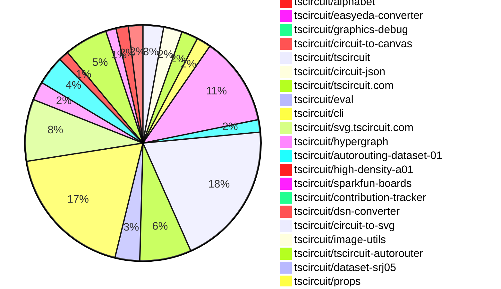

# contribution tracker

[contributions.tscircuit.com](https://contributions.tscircuit.com) ・ [tscircuit.com](https://tscircuit.com) ・ [Contribution Overviews](./contribution-overviews/) ・ [Changelogs](./changelogs/)

Generates weekly contribution overviews for tscircuit contributors. Check out all
the [contribution overviews here](./contribution-overviews/)
You can find AI-generated monthly changelogs in the [changelogs directory](./changelogs/)

- All PRs in the tscircuit org are scanned/summarized via an LLM
- The LLM classifies each Diff/PR as into a set of attributes for scoring
- All the PRs, summaries, and classifications are organized into charts and tables for [the website](https://contributions.tscircuit.com)

> Want to run locally? See the [Development Section](#development)

## Current Week

<!-- START_CURRENT_WEEK -->

# Contribution Overview 2026-03-17

The current week is shown below. There are 3 major sections:

- [Contributor Overview](#contributor-overview)
- [PRs by Repository](#prs-by-repository)
- [PRs by Contributor](#changes-by-contributor)
- [Scoring & Sponsorship Details](/docs/sponsorship-calculation-explanation.md)

## PRs by Repository


```mermaid
pie
    "tscircuit/pcb-viewer" : 10
    "tscircuit/core" : 9
    "tscircuit/circuit-json-to-kicad" : 8
    "tscircuit/schematic-viewer" : 1
    "tscircuit/footprinter" : 7
    "tscircuit/3d-viewer" : 3
    "tscircuit/runframe" : 43
    "tscircuit/docs" : 6
    "tscircuit/alphabet" : 1
    "tscircuit/easyeda-converter" : 3
    "tscircuit/graphics-debug" : 2
    "tscircuit/circuit-to-canvas" : 2
    "tscircuit/tscircuit" : 70
    "tscircuit/circuit-json" : 3
    "tscircuit/tscircuit.com" : 25
    "tscircuit/eval" : 12
    "tscircuit/cli" : 66
    "tscircuit/svg.tscircuit.com" : 30
    "tscircuit/hypergraph" : 9
    "tscircuit/autorouting-dataset-01" : 14
    "tscircuit/high-density-a01" : 5
    "tscircuit/sparkfun-boards" : 1
    "tscircuit/contribution-tracker" : 1
    "tscircuit/dsn-converter" : 1
    "tscircuit/circuit-to-svg" : 1
    "tscircuit/image-utils" : 3
    "tscircuit/tscircuit-autorouter" : 21
    "tscircuit/dataset-srj05" : 1
    "tscircuit/props" : 2
    "tscircuit/solver-utils" : 3
    "tscircuit/tiny-hypergraph" : 5
    "tscircuit/skill" : 1
    "tscircuit/high-density-repair02" : 6
    "tscircuit/checks" : 1
    "tscircuit/high-density-dataset-z04" : 2
    "tscircuit/fixed-via-hypergraph-solver" : 7
    "tscircuit/pcbburn.com" : 1
```

## Contributor Overview

| Contributor | 🐳 Major | 🐙 Minor | 🐌 Tiny | Score | ⭐ | Discussion Contributions |
|-------------|---------|---------|---------|-------|-----|--------------------------|
| [seveibar](#seveibar) | 18 | 7 | 5 | 68 | ⭐⭐⭐ | 0🔹 0🔶 0💎 |
| [ShiboSoftwareDev](#ShiboSoftwareDev) | 4 | 4 | 6 | 32 | ⭐⭐ | 0🔹 0🔶 0💎 |
| [AnasSarkiz](#AnasSarkiz) | 6 | 1 | 6 | 32 | ⭐⭐ | 0🔹 0🔶 0💎 |
| [0hmX](#0hmX) | 6 | 0 | 8 | 31.5 | ⭐⭐ | 0🔹 0🔶 0💎 |
| [MustafaMulla29](#MustafaMulla29) | 2 | 7 | 7 | 30 | ⭐⭐ | 0🔹 0🔶 0💎 |
| [imrishabh18](#imrishabh18) | 1 | 8 | 7 | 28 | ⭐⭐ | 0🔹 0🔶 0💎 |
| [rushabhcodes](#rushabhcodes) | 4 | 4 | 2 | 27 | ⭐⭐ | 0🔹 0🔶 0💎 |
| [Abse2001](#Abse2001) | 2 | 5 | 0 | 21 | ⭐⭐ | 0🔹 0🔶 0💎 |
| [tscircuitbot](#tscircuitbot) | 0 | 0 | 249 | 14.5 | ⭐⭐ | 0🔹 0🔶 0💎 |
| [techmannih](#techmannih) | 0 | 3 | 7 | 13 | ⭐⭐ | 0🔹 0🔶 0💎 |
| [dwiel](#dwiel) | 1 | 1 | 0 | 6 | ⭐ | 0🔹 0🔶 0💎 |
| [victorjzq](#victorjzq) | 0 | 2 | 2 | 6 | ⭐ | 0🔹 0🔶 0💎 |
| [mohan-bee](#mohan-bee) | 0 | 0 | 1 | 1 |  | 0🔹 0🔶 0💎 |

## Staff Pass Ratio (SPR)

| Contributor | Reviewed PRs | Rejections | Approvals | SPR |
|-------------|--------------|------------|-----------|-----|
| [rushabhcodes](#rushabhcodes) | 7 | 0 | 7 | 100.0% |
| [Abse2001](#Abse2001) | 6 | 0 | 6 | 100.0% |
| [techmannih](#techmannih) | 5 | 4 | 3 | 20.0% |
| [MustafaMulla29](#MustafaMulla29) | 5 | 2 | 5 | 60.0% |
| [ShiboSoftwareDev](#ShiboSoftwareDev) | 4 | 0 | 4 | 100.0% |
| [AnasSarkiz](#AnasSarkiz) | 4 | 0 | 5 | 100.0% |
| [victorjzq](#victorjzq) | 3 | 1 | 2 | 66.7% |
| [dwiel](#dwiel) | 2 | 0 | 2 | 100.0% |
| [imrishabh18](#imrishabh18) | 1 | 1 | 1 | 0.0% |
| [Devesh36](#Devesh36) | 1 | 2 | 0 | -100.0% |
| [iprevail-io](#iprevail-io) | 1 | 1 | 0 | 0.0% |

<details>
<summary>rushabhcodes SPR PRs (7)</summary>

- [#712](https://github.com/tscircuit/pcb-viewer/pull/712) feat: add toggle for showing/hiding silkscreen in the viewer
- [#2064](https://github.com/tscircuit/core/pull/2064) Fix packed-component CAD rotation in core so 3D models match post-pack footprint orientation
- [#3030](https://github.com/tscircuit/tscircuit.com/pull/3030) Prevent RunFrame keydown blur from breaking Circuit JSON search in the editor preview
- [#2446](https://github.com/tscircuit/cli/pull/2446) feat: add support for exporting kicad_pro format in exportSnippet and tests
- [#487](https://github.com/tscircuit/docs/pull/487) feat: add and enhance documentation for various `tsci` command-line tools.
- [#516](https://github.com/tscircuit/docs/pull/516) Updated the CLI documentation for `tsci` in the `docs/intro/installation.md`
- [#274](https://github.com/tscircuit/sparkfun-boards/pull/274) Spark fun mini spectral uv sensor as7331 qwiic

</details>

<details>
<summary>Abse2001 SPR PRs (6)</summary>

- [#723](https://github.com/tscircuit/pcb-viewer/pull/723) Refactor Copper Text Rendering to Use circuit-to-canvas Drawer
- [#363](https://github.com/tscircuit/easyeda-converter/pull/363) Make websafe bundle avoid core dependency
- [#744](https://github.com/tscircuit/3d-viewer/pull/744) Refactor CAD Model Rendering to Unified Transform Graph with Loader + Fit Support
- [#43](https://github.com/tscircuit/alphabet/pull/43) Precompute Glyph Outline Polygons Export for Fill and Knockout Rendering
- [#104](https://github.com/tscircuit/graphics-debug/pull/104) Add zIndex Support for Line Rendering Across Canvas and SVG
- [#217](https://github.com/tscircuit/circuit-to-canvas/pull/217) Refactor Text Rendering to Use Glyph Outlines for Accurate Knockout via Even-Odd Fill

</details>

<details>
<summary>techmannih SPR PRs (5)</summary>

- [#704](https://github.com/tscircuit/pcb-viewer/pull/704) fix: prevent duplicate hover boxes for plated holes and multi-layer elements
- [#366](https://github.com/tscircuit/easyeda-converter/pull/366) feat: support {props.name} in silkscreen text for component name
- [#2061](https://github.com/tscircuit/core/pull/2061) feat: implement dynamic text resolution for SilkscreenText componentsin footprints and add a corresponding test
- [#2471](https://github.com/tscircuit/cli/pull/2471) feat: add support --download flag to downloading and localizing 3D models from JLCPCB
- [#168](https://github.com/tscircuit/circuit-json-to-kicad/pull/168) feat: Add repro and KiCad PCB asset for non-plated holes

</details>

<details>
<summary>MustafaMulla29 SPR PRs (5)</summary>

- [#620](https://github.com/tscircuit/props/pull/620) add stepUrl to CadModelBase 
- [#2517](https://github.com/tscircuit/cli/pull/2517) Fix: import step and obj as static imports for jlcpcb component when using --download
- [#2509](https://github.com/tscircuit/cli/pull/2509) Feat: download flag for downloading and localizing 3d models from JLCPCB
- [#2456](https://github.com/tscircuit/cli/pull/2456) feat: include builtin and user specified 3D models in kicad_zip export
- [#161](https://github.com/tscircuit/circuit-json-to-kicad/pull/161) feat: embed builtin and user specified 3D model refs in kicad_pcb and expose model source paths for zip export

</details>

<details>
<summary>ShiboSoftwareDev SPR PRs (4)</summary>

- [#126](https://github.com/tscircuit/checks/pull/126) Add minSpacing option to checkEachPcbTraceNonOverlapping
- [#102](https://github.com/tscircuit/graphics-debug/pull/102) Render Points Above All Other Graphics Elements
- [#687](https://github.com/tscircuit/tscircuit-autorouter/pull/687) Add Relaxed DRC action to debugger and share preset with benchmark
- [#686](https://github.com/tscircuit/tscircuit-autorouter/pull/686) Replaces manual benchmark relaxedDrcPassed evaluation with the same DRC implementation used by Debug → Run DRC Checks

</details>

<details>
<summary>AnasSarkiz SPR PRs (4)</summary>

- [#703](https://github.com/tscircuit/tscircuit-autorouter/pull/703) Block Fixed-Topology Routing on Non-Top-Layer Inputs (z!=0)
- [#694](https://github.com/tscircuit/tscircuit-autorouter/pull/694) Introduce `zdwiel` benchmark dataset support and allow dataset selection across the benchmarking workflow
- [#688](https://github.com/tscircuit/tscircuit-autorouter/pull/688) Eliminate false DRC via-collision errors by carrying true routed via diameters through SRJ→circuit-json conversion
- [#5](https://github.com/tscircuit/high-density-dataset-z04/pull/5) Add generated z04-large export for 5x5+ nodes

</details>

<details>
<summary>victorjzq SPR PRs (3)</summary>

- [#548](https://github.com/tscircuit/footprinter/pull/548) fix: remove non-existent pcb_thtpad type from apply-origin filter
- [#551](https://github.com/tscircuit/footprinter/pull/551) fix: add KiCad parity test for SOIC-8 with correct IPC-7351B dimensions
- [#552](https://github.com/tscircuit/footprinter/pull/552) fix: correct SOD-523 pad dimensions to match KiCad IPC-7351B standard

</details>

<details>
<summary>dwiel SPR PRs (2)</summary>

- [#521](https://github.com/tscircuit/circuit-json/pull/521) fix: use LayerRef for via route point from_layer/to_layer
- [#125](https://github.com/tscircuit/dsn-converter/pull/125) fix: propagate num_layers to via padstacks, through-hole pads, and wire layers

</details>

<details>
<summary>imrishabh18 SPR PRs (1)</summary>

- [#364](https://github.com/tscircuit/easyeda-converter/pull/364) Add support for the `stepUrl` for `cadModel`

</details>

<details>
<summary>Devesh36 SPR PRs (1)</summary>

- [#284](https://github.com/tscircuit/jscad-electronics/pull/284) Implemented Jsxh2.5mm

</details>

<details>
<summary>iprevail-io SPR PRs (1)</summary>

- [#561](https://github.com/tscircuit/footprinter/pull/561) feat: add PDIP and SPDIP as separate footprint functions

</details>

> Note: AI evaluates PRs and assigns 1-3 star ratings automatically. 4 and 5 star ratings require manual staff review.

### Discussion Contribution Legend

- 🔹 Normal Comments: Basic participation with minimal effort
- 🔶 Great Informative Comments: Thoughtful participation that adds value
- 💎 Incredible Comments: Exceptional participation with high-quality content

## Review Table

[reviews-received-hover]: ## "Number of reviews received for PRs for this contributor"
[approvals-received-hover]: ## "Number of approvals received for PRs this contributor authored"
[rejections-received-hover]: ## "Number of rejections received for PRs this contributor authored"
[prs-opened-hover]: ## "Number of PRs opened by this contributor"
[issues-created-hover]: ## "Number of issues created by this contributor"

| Contributor | Reviews Received | Approvals Received | Rejections Received | Approvals | Rejections Given | PRs Opened | PRs Merged | Issues Created |
|---|---|---|---|---|---|---|---|---|
| [techmannih](#techmannih) | 35 | 13 | 4 | 0 | 0 | 16 | 10 | 0 |
| [seveibar](#seveibar) | 3 | 0 | 0 | 52 | 7 | 43 | 31 | 0 |
| [blessuselessk](#blessuselessk) | 5 | 0 | 1 | 0 | 0 | 12 | 0 | 0 |
| [Abse2001](#Abse2001) | 8 | 8 | 0 | 3 | 0 | 9 | 7 | 0 |
| [ShiboSoftwareDev](#ShiboSoftwareDev) | 12 | 7 | 0 | 2 | 0 | 15 | 14 | 0 |
| [tscircuitbot](#tscircuitbot) | 2 | 0 | 0 | 0 | 0 | 280 | 249 | 0 |
| [mendarb](#mendarb) | 9 | 0 | 0 | 0 | 0 | 19 | 0 | 0 |
| [victorjzq](#victorjzq) | 19 | 6 | 4 | 0 | 0 | 34 | 4 | 0 |
| [rushabhcodes](#rushabhcodes) | 31 | 14 | 0 | 5 | 3 | 12 | 10 | 0 |
| [mohan-bee](#mohan-bee) | 10 | 3 | 2 | 0 | 0 | 5 | 1 | 0 |
| [MustafaMulla29](#MustafaMulla29) | 20 | 11 | 0 | 8 | 1 | 17 | 16 | 0 |
| [dwiel](#dwiel) | 3 | 3 | 0 | 0 | 0 | 2 | 2 | 0 |
| [imrishabh18](#imrishabh18) | 6 | 4 | 0 | 5 | 4 | 19 | 16 | 0 |
| [Devesh36](#Devesh36) | 12 | 0 | 3 | 0 | 0 | 3 | 0 | 0 |
| [iprevail-io](#iprevail-io) | 2 | 0 | 1 | 0 | 0 | 1 | 0 | 0 |
| [FraktalDeFiDAO](#FraktalDeFiDAO) | 2 | 0 | 0 | 0 | 0 | 1 | 0 | 0 |
| [Nithinfgs](#Nithinfgs) | 0 | 0 | 0 | 0 | 0 | 4 | 0 | 0 |
| [zamadye](#zamadye) | 0 | 0 | 0 | 0 | 0 | 3 | 0 | 0 |
| [DrGalio](#DrGalio) | 0 | 0 | 0 | 0 | 0 | 1 | 0 | 0 |
| [Amsamms](#Amsamms) | 0 | 0 | 0 | 0 | 0 | 1 | 0 | 0 |
| [brutusworker-arch](#brutusworker-arch) | 0 | 0 | 0 | 0 | 0 | 2 | 0 | 0 |
| [1028bc](#1028bc) | 0 | 0 | 0 | 0 | 0 | 1 | 0 | 0 |
| [AnasSarkiz](#AnasSarkiz) | 7 | 5 | 0 | 0 | 0 | 13 | 13 | 0 |
| [0hmX](#0hmX) | 4 | 1 | 0 | 0 | 0 | 17 | 14 | 0 |
| [themachinehf](#themachinehf) | 0 | 0 | 0 | 0 | 0 | 1 | 0 | 0 |
| [SolariResearch](#SolariResearch) | 0 | 0 | 0 | 0 | 0 | 1 | 0 | 0 |
| [Emanuelgm1998](#Emanuelgm1998) | 0 | 0 | 0 | 0 | 0 | 1 | 0 | 0 |
| [yutubeboss575-create](#yutubeboss575-create) | 0 | 0 | 0 | 0 | 0 | 1 | 0 | 0 |
| [acercreed305](#acercreed305) | 0 | 0 | 0 | 0 | 0 | 1 | 0 | 0 |
| [AXGZ21](#AXGZ21) | 0 | 0 | 0 | 0 | 0 | 2 | 0 | 0 |
| [ayushopchauhan](#ayushopchauhan) | 0 | 0 | 0 | 0 | 0 | 2 | 0 | 0 |
| [misteromb](#misteromb) | 0 | 0 | 0 | 0 | 0 | 2 | 0 | 0 |
| [IrGlooM](#IrGlooM) | 0 | 0 | 0 | 0 | 0 | 1 | 0 | 0 |
| [HarshadaGawas05](#HarshadaGawas05) | 0 | 0 | 0 | 0 | 0 | 1 | 0 | 0 |

## Changes by Repository

### [tscircuit/pcb-viewer](https://github.com/tscircuit/pcb-viewer)

| PR # | Impact | Rating | Contributor | Description |
|------|--------|--------|-------------|-------------|
| [#712](https://github.com/tscircuit/pcb-viewer/pull/712) | 🐳 Major | ⭐⭐⭐ | rushabhcodes | Adds support for toggling the visibility of silkscreen layers in the PCB viewer, allowing users to show or hide silkscreen layers using a new checkbox in the view settings menu. |
| [#704](https://github.com/tscircuit/pcb-viewer/pull/704) | 🐙 Minor | ⭐⭐ | techmannih | Fixes an issue where hovering over a pcb_plated_hole would result in two red bounding boxes and duplicate pin indicator text. |
| [#723](https://github.com/tscircuit/pcb-viewer/pull/723) | 🐙 Minor | ⭐⭐ | Abse2001 | Refactors the rendering of copper text elements in the PCB viewer to utilize the circuit-to-canvas drawer for improved rendering performance and maintainability. |
| [#721](https://github.com/tscircuit/pcb-viewer/pull/721) | 🐙 Minor | ⭐⭐ | Abse2001 | Fixes rendering issues with silkscreen text knockouts and updates dependencies for the canvas pipeline. |

<details>
<summary>🐌 Tiny Contributions (6)</summary>

| PR # | Impact | Contributor | Description |
|------|--------|-------------|-------------|
| [#714](https://github.com/tscircuit/pcb-viewer/pull/714) | 🐌 Tiny | techmannih | Adds a new fixture for a custom plated hole footprint and updates the tscircuit dependency version. |
| [#724](https://github.com/tscircuit/pcb-viewer/pull/724) | 🐌 Tiny | tscircuitbot | Automated package update |
| [#722](https://github.com/tscircuit/pcb-viewer/pull/722) | 🐌 Tiny | tscircuitbot | Automated package update |
| [#720](https://github.com/tscircuit/pcb-viewer/pull/720) | 🐌 Tiny | tscircuitbot | Automated package update |
| [#713](https://github.com/tscircuit/pcb-viewer/pull/713) | 🐌 Tiny | tscircuitbot | Automated package update |
| [#715](https://github.com/tscircuit/pcb-viewer/pull/715) | 🐌 Tiny | tscircuitbot | Automated package update |

</details>

### [tscircuit/core](https://github.com/tscircuit/core)

| PR # | Impact | Rating | Contributor | Description |
|------|--------|--------|-------------|-------------|
| [#2071](https://github.com/tscircuit/core/pull/2071) | 🐳 Major | ⭐⭐⭐ | seveibar | Sets the default autorouter to version 4 (Pipeline4) after achieving a benchmark of 93 on dataset01, and updates the autorouter dependency version. |
| [#2061](https://github.com/tscircuit/core/pull/2061) | 🐙 Minor | ⭐⭐ | techmannih | Implements dynamic text resolution for SilkscreenText components in footprints and adds a corresponding test to validate the functionality. |
| [#2064](https://github.com/tscircuit/core/pull/2064) | 🐙 Minor | ⭐⭐ | rushabhcodes | Fixes CAD model rotation for packed components to align with post-pack footprint orientation in 3D views. |
| [#2062](https://github.com/tscircuit/core/pull/2062) | 🐙 Minor | ⭐⭐ | rushabhcodes | Adds a fixture to test the correct orientation of components in the circuit model, specifically addressing the issue where component R9 is not rotated properly. |
| [#2070](https://github.com/tscircuit/core/pull/2070) | 🐙 Minor | ⭐⭐ | imrishabh18 | Adds the show_as_schematic_box property to the circuit_json of schematic_group, allowing groups to be rendered as schematic boxes in the circuit. |
| [#2065](https://github.com/tscircuit/core/pull/2065) | 🐙 Minor | ⭐⭐ | imrishabh18 | Adds tests to validate the functionality of the anchorAlignment property in silkscreen text components. |
| [#2068](https://github.com/tscircuit/core/pull/2068) | 🐙 Minor | ⭐⭐ | seveibar | Adds support for autorouter version 4 by integrating AutoroutingPipelineSolver4 into the autorouting system. |

<details>
<summary>🐌 Tiny Contributions (2)</summary>

| PR # | Impact | Contributor | Description |
|------|--------|-------------|-------------|
| [#2073](https://github.com/tscircuit/core/pull/2073) | 🐌 Tiny | MustafaMulla29 | Updates the tscircuitprops dependency version from 0.0.498 to 0.0.499 in package.json |
| [#2069](https://github.com/tscircuit/core/pull/2069) | 🐌 Tiny | MustafaMulla29 | Updates the footprinter dependency version from 0.0.321 to 0.0.333 in package.json and modifies a test to expect one error instead of zero. |

</details>

### [tscircuit/circuit-json-to-kicad](https://github.com/tscircuit/circuit-json-to-kicad)

| PR # | Impact | Rating | Contributor | Description |
|------|--------|--------|-------------|-------------|
| [#168](https://github.com/tscircuit/circuit-json-to-kicad/pull/168) | 🐙 Minor | ⭐⭐ | techmannih | Add KiCad PCB asset for non-plated holes and corresponding test to ensure correct rendering of the PCB. |
| [#166](https://github.com/tscircuit/circuit-json-to-kicad/pull/166) | 🐙 Minor | ⭐⭐ | MustafaMulla29 | Fixes incorrect 3D model z-offset in KiCad by adjusting for PCB board thickness, ensuring accurate component placement in the 3D viewer. |
| [#164](https://github.com/tscircuit/circuit-json-to-kicad/pull/164) | 🐙 Minor | ⭐⭐ | MustafaMulla29 | Preserves the tscircuit_builtin.3dshapes path for remote stepUrl models in KiCad project and library outputs, ensuring correct referencing of 3D models. |
| [#161](https://github.com/tscircuit/circuit-json-to-kicad/pull/161) | 🐙 Minor | ⭐⭐ | MustafaMulla29 | Adds functionality to embed builtin and user-specified 3D model references in KiCad PCB files and exposes model source paths for zip export. |

<details>
<summary>🐌 Tiny Contributions (4)</summary>

| PR # | Impact | Contributor | Description |
|------|--------|-------------|-------------|
| [#169](https://github.com/tscircuit/circuit-json-to-kicad/pull/169) | 🐌 Tiny | tscircuitbot | Automated package update |
| [#167](https://github.com/tscircuit/circuit-json-to-kicad/pull/167) | 🐌 Tiny | tscircuitbot | Automated package update |
| [#165](https://github.com/tscircuit/circuit-json-to-kicad/pull/165) | 🐌 Tiny | tscircuitbot | Automated package update |
| [#162](https://github.com/tscircuit/circuit-json-to-kicad/pull/162) | 🐌 Tiny | tscircuitbot | Automated package update |

</details>

### [tscircuit/schematic-viewer](https://github.com/tscircuit/schematic-viewer)


<details>
<summary>🐌 Tiny Contributions (1)</summary>

| PR # | Impact | Contributor | Description |
|------|--------|-------------|-------------|
| [#170](https://github.com/tscircuit/schematic-viewer/pull/170) | 🐌 Tiny | techmannih | Adds a new example for a custom op-amp symbol in the schematic viewer and updates the tscircuit dependency version. |

</details>

### [tscircuit/footprinter](https://github.com/tscircuit/footprinter)

| PR # | Impact | Rating | Contributor | Description |
|------|--------|--------|-------------|-------------|
| [#544](https://github.com/tscircuit/footprinter/pull/544) | 🐙 Minor | ⭐⭐ | victorjzq | Fixes the default value for the SOD-323F footprint body width from 3,05mm to 3.05mm to ensure correct rendering in circuit-json. |
| [#548](https://github.com/tscircuit/footprinter/pull/548) | 🐙 Minor | ⭐⭐ | victorjzq | Removes invalid pcb_thtpad type from apply-origin filter to eliminate TypeScript error and ensure correct handling of THT pad bounds with pcb_plated_hole type. |

<details>
<summary>🐌 Tiny Contributions (5)</summary>

| PR # | Impact | Contributor | Description |
|------|--------|-------------|-------------|
| [#556](https://github.com/tscircuit/footprinter/pull/556) | 🐌 Tiny | techmannih | Adds a pre-transform rule for JST connector naming and updates related tests and snapshots. |
| [#557](https://github.com/tscircuit/footprinter/pull/557) | 🐌 Tiny | MustafaMulla29 | This pull request introduces courtyard rectangles for various component footprints in the footprinter project. It modifies multiple component definitions to include a new courtyard element, enhancing the design and layout capabilities of the PCB design tool. |
| [#540](https://github.com/tscircuit/footprinter/pull/540) | 🐌 Tiny | MustafaMulla29 | Adds courtyard rectangles to various component footprints to enhance PCB layout and design. |
| [#553](https://github.com/tscircuit/footprinter/pull/553) | 🐌 Tiny | victorjzq | Fixes incorrect pad dimensions for the SMC (DO-214AB) footprint where pl and pw were swapped, correcting the pad length and width to match KiCad specifications. |
| [#554](https://github.com/tscircuit/footprinter/pull/554) | 🐌 Tiny | victorjzq | Fixes slightly incorrect pad dimensions for the SMA (DO-214AC) footprint by updating pad spacing and length to match the KiCad D_SMA reference footprint. |

</details>

### [tscircuit/3d-viewer](https://github.com/tscircuit/3d-viewer)

| PR # | Impact | Rating | Contributor | Description |
|------|--------|--------|-------------|-------------|
| [#744](https://github.com/tscircuit/3d-viewer/pull/744) | 🐳 Major | ⭐⭐⭐ | Abse2001 | This pull request introduces a significant refactor of the CAD model rendering process by implementing a unified transform graph. This change aims to streamline the rendering of CAD models, improve performance, and enhance the overall user experience. The refactor includes the addition of loader support and fit functionality, allowing for better handling of different model types and their transformations. The changes are expected to improve the rendering accuracy and efficiency of the CAD models in the 3D viewer. |
| [#743](https://github.com/tscircuit/3d-viewer/pull/743) | 🐙 Minor | ⭐⭐ | seveibar | Fixes the origin point of the 3D model for accurate rendering. |

<details>
<summary>🐌 Tiny Contributions (1)</summary>

| PR # | Impact | Contributor | Description |
|------|--------|-------------|-------------|
| [#741](https://github.com/tscircuit/3d-viewer/pull/741) | 🐌 Tiny | techmannih | Adds a fixture for reference designators in footprints and updates the tscircuit dependency version to 0.0.1532. |

</details>

### [tscircuit/runframe](https://github.com/tscircuit/runframe)

| PR # | Impact | Rating | Contributor | Description |
|------|--------|--------|-------------|-------------|
| [#2961](https://github.com/tscircuit/runframe/pull/2961) | 🐙 Minor | ⭐⭐ | imrishabh18 | Changes the import functionality to ensure that the component is wrapped in an object with a rawEasy property when converting to TSX. |

<details>
<summary>🐌 Tiny Contributions (42)</summary>

| PR # | Impact | Contributor | Description |
|------|--------|-------------|-------------|
| [#2934](https://github.com/tscircuit/runframe/pull/2934) | 🐌 Tiny | techmannih | Updates the tscircuiteval dependency to version 0.0.718 in package.json |
| [#2979](https://github.com/tscircuit/runframe/pull/2979) | 🐌 Tiny | tscircuitbot | Automated package update |
| [#2978](https://github.com/tscircuit/runframe/pull/2978) | 🐌 Tiny | tscircuitbot | Updates the tscircuiteval package to version 0.0.724 in the package.json file. |
| [#2977](https://github.com/tscircuit/runframe/pull/2977) | 🐌 Tiny | tscircuitbot | Automated package update |
| [#2976](https://github.com/tscircuit/runframe/pull/2976) | 🐌 Tiny | tscircuitbot | Updates the circuit-json-to-kicad package from version 0.0.87 to 0.0.88 |
| [#2971](https://github.com/tscircuit/runframe/pull/2971) | 🐌 Tiny | tscircuitbot | Updates the tscircuiteval package from version 0.0.721 to 0.0.722 in the package.json file. |
| [#2973](https://github.com/tscircuit/runframe/pull/2973) | 🐌 Tiny | tscircuitbot | Updates the tscircuiteval package from version 0.0.722 to 0.0.723 |
| [#2974](https://github.com/tscircuit/runframe/pull/2974) | 🐌 Tiny | tscircuitbot | Automated package update |
| [#2972](https://github.com/tscircuit/runframe/pull/2972) | 🐌 Tiny | tscircuitbot | Automated package update |
| [#2970](https://github.com/tscircuit/runframe/pull/2970) | 🐌 Tiny | tscircuitbot | Automated package update |
| [#2969](https://github.com/tscircuit/runframe/pull/2969) | 🐌 Tiny | tscircuitbot | Updates the tscircuiteval package to version 0.0.721 in the package.json file. |
| [#2968](https://github.com/tscircuit/runframe/pull/2968) | 🐌 Tiny | tscircuitbot | Automated package update |
| [#2967](https://github.com/tscircuit/runframe/pull/2967) | 🐌 Tiny | tscircuitbot | Updates the tscircuitpcb-viewer package to version 1.11.358 |
| [#2965](https://github.com/tscircuit/runframe/pull/2965) | 🐌 Tiny | tscircuitbot | Automated package update for tscircuit3d-viewer from version 0.0.544 to 0.0.545 |
| [#2962](https://github.com/tscircuit/runframe/pull/2962) | 🐌 Tiny | tscircuitbot | Automated package update |
| [#2960](https://github.com/tscircuit/runframe/pull/2960) | 🐌 Tiny | tscircuitbot | Automated package update |
| [#2958](https://github.com/tscircuit/runframe/pull/2958) | 🐌 Tiny | tscircuitbot | Automated package update |
| [#2966](https://github.com/tscircuit/runframe/pull/2966) | 🐌 Tiny | tscircuitbot | Automated package update |
| [#2963](https://github.com/tscircuit/runframe/pull/2963) | 🐌 Tiny | tscircuitbot | Updates the tscircuitpcb-viewer package to version 1.11.357 |
| [#2959](https://github.com/tscircuit/runframe/pull/2959) | 🐌 Tiny | tscircuitbot | Updates the tscircuitpcb-viewer package from version 1.11.355 to 1.11.356 |
| [#2957](https://github.com/tscircuit/runframe/pull/2957) | 🐌 Tiny | tscircuitbot | Updates the tscircuit3d-viewer package to version 0.0.544 in package.json |
| [#2955](https://github.com/tscircuit/runframe/pull/2955) | 🐌 Tiny | tscircuitbot | Updates the circuit-json-to-kicad package version from 0.0.86 to 0.0.87 in package.json |
| [#2956](https://github.com/tscircuit/runframe/pull/2956) | 🐌 Tiny | tscircuitbot | Automated package update |
| [#2953](https://github.com/tscircuit/runframe/pull/2953) | 🐌 Tiny | tscircuitbot | Automated package update |
| [#2952](https://github.com/tscircuit/runframe/pull/2952) | 🐌 Tiny | tscircuitbot | Updates the tscircuiteval package from version 0.0.719 to 0.0.720 in the package.json file. |
| [#2948](https://github.com/tscircuit/runframe/pull/2948) | 🐌 Tiny | tscircuitbot | Automated package update |
| [#2951](https://github.com/tscircuit/runframe/pull/2951) | 🐌 Tiny | tscircuitbot | Automated package update |
| [#2950](https://github.com/tscircuit/runframe/pull/2950) | 🐌 Tiny | tscircuitbot | Updates the circuit-json-to-kicad package from version 0.0.85 to 0.0.86 |
| [#2947](https://github.com/tscircuit/runframe/pull/2947) | 🐌 Tiny | tscircuitbot | Automated package update |
| [#2946](https://github.com/tscircuit/runframe/pull/2946) | 🐌 Tiny | tscircuitbot | Updates the circuit-json-to-kicad package from version 0.0.84 to 0.0.85 in package.json |
| [#2944](https://github.com/tscircuit/runframe/pull/2944) | 🐌 Tiny | tscircuitbot | Automated package update |
| [#2941](https://github.com/tscircuit/runframe/pull/2941) | 🐌 Tiny | tscircuitbot | Updates the tscircuitpcb-viewer package from version 1.11.354 to 1.11.355 |
| [#2939](https://github.com/tscircuit/runframe/pull/2939) | 🐌 Tiny | tscircuitbot | Updates the tscircuiteval package to version 0.0.719 in the package.json file. |
| [#2932](https://github.com/tscircuit/runframe/pull/2932) | 🐌 Tiny | tscircuitbot | Updates the tscircuitpcb-viewer package from version 1.11.353 to 1.11.354 |
| [#2942](https://github.com/tscircuit/runframe/pull/2942) | 🐌 Tiny | tscircuitbot | Automated package update |
| [#2940](https://github.com/tscircuit/runframe/pull/2940) | 🐌 Tiny | tscircuitbot | Automated package update |
| [#2938](https://github.com/tscircuit/runframe/pull/2938) | 🐌 Tiny | tscircuitbot | Automated package update |
| [#2937](https://github.com/tscircuit/runframe/pull/2937) | 🐌 Tiny | tscircuitbot | Updates the tscircuitschematic-viewer package to version 2.0.59 |
| [#2935](https://github.com/tscircuit/runframe/pull/2935) | 🐌 Tiny | tscircuitbot | Automated package update |
| [#2933](https://github.com/tscircuit/runframe/pull/2933) | 🐌 Tiny | tscircuitbot | Automated package update |
| [#2943](https://github.com/tscircuit/runframe/pull/2943) | 🐌 Tiny | tscircuitbot | Updates the tscircuit3d-viewer package to version 0.0.543 in package.json |
| [#2880](https://github.com/tscircuit/runframe/pull/2880) | 🐌 Tiny | rushabhcodes | This pull request enhances the user experience for the API status indicator in the RunFrameWithApi component by adding a tooltip for accessibility and clarity. UIUX Improvements: Added a tooltip to the API status indicator using the Tooltip, TooltipTrigger, TooltipContent, and TooltipProvider components from libcomponentsuitooltip, improving accessibility and providing a clearer status message on hover or focus. Replaced the direct use of title and aria-label on the status indicator with a button wrapped in a tooltip, and adjusted the indicators opacity for the connected state for better visual feedback. |

</details>

### [tscircuit/docs](https://github.com/tscircuit/docs)

| PR # | Impact | Rating | Contributor | Description |
|------|--------|--------|-------------|-------------|
| [#487](https://github.com/tscircuit/docs/pull/487) | 🐳 Major | ⭐⭐⭐ | rushabhcodes | This pull request significantly expands and standardizes the tscircuit CLI documentation. It adds full documentation for many previously undocumented commands, improves and clarifies options for existing commands, and enhances authentication and configuration docs. The update also documents new export and simulation formats and unifies formatting (usage, options, examples) across all CLI command pages for better clarity and consistency. |
| [#516](https://github.com/tscircuit/docs/pull/516) | 🐳 Major | ⭐⭐⭐ | rushabhcodes | Updates the CLI documentation for tsci to reflect a shift in terminology from snippets to packages and adds several new commands for improved user reference. |

<details>
<summary>🐌 Tiny Contributions (4)</summary>

| PR # | Impact | Contributor | Description |
|------|--------|-------------|-------------|
| [#515](https://github.com/tscircuit/docs/pull/515) | 🐌 Tiny | techmannih | Adds the ability to use reference designators in the text property of the silkscreentext  element within a footprint, allowing automatic labeling of components on the silkscreen layer. |
| [#513](https://github.com/tscircuit/docs/pull/513) | 🐌 Tiny | techmannih | Add support for NAME, REF, and REFERENCE substitutions in the text property of schematictext  elements within symbol  components. |
| [#520](https://github.com/tscircuit/docs/pull/520) | 🐌 Tiny | MustafaMulla29 | Adds documentation for the --download flag to download JLCPCB 3D model assets (.obj and .step files) and reference them locally in the component. |
| [#514](https://github.com/tscircuit/docs/pull/514) | 🐌 Tiny | ShiboSoftwareDev | Adds documentation for new command line interface flags to ignore various DRC errors and warnings during the build process. |

</details>

### [tscircuit/alphabet](https://github.com/tscircuit/alphabet)

| PR # | Impact | Rating | Contributor | Description |
|------|--------|--------|-------------|-------------|
| [#43](https://github.com/tscircuit/alphabet/pull/43) | 🐳 Major | ⭐⭐⭐ | Abse2001 | This pull request introduces a new feature that precomputes closed outline polygons for glyphs, which can be used for fill and knockout rendering operations. It adds a new module to the library that exports these outline polygons, enhancing the librarys capabilities for rendering text with complex fill patterns and boolean operations. |

### [tscircuit/easyeda-converter](https://github.com/tscircuit/easyeda-converter)

| PR # | Impact | Rating | Contributor | Description |
|------|--------|--------|-------------|-------------|
| [#363](https://github.com/tscircuit/easyeda-converter/pull/363) | 🐙 Minor | ⭐⭐ | Abse2001 | Refactors the websafe bundle to eliminate reliance on the core dependency by implementing a local normalization function for pin labels. |
| [#364](https://github.com/tscircuit/easyeda-converter/pull/364) | 🐙 Minor | ⭐⭐ | imrishabh18 | Adds support for the stepUrl in the cadModel to allow for STEP file integration alongside OBJ files. |
| [#367](https://github.com/tscircuit/easyeda-converter/pull/367) | 🐙 Minor | ⭐⭐ | imrishabh18 | Adds support for displaying both the stepUrl and objUrl for EasyEDA models in the TypeScript component conversion process. |

### [tscircuit/graphics-debug](https://github.com/tscircuit/graphics-debug)

| PR # | Impact | Rating | Contributor | Description |
|------|--------|--------|-------------|-------------|
| [#104](https://github.com/tscircuit/graphics-debug/pull/104) | 🐙 Minor | ⭐⭐ | Abse2001 | Adds zIndex support for line rendering, allowing lines to be drawn in a specified order based on their zIndex property. |
| [#102](https://github.com/tscircuit/graphics-debug/pull/102) | 🐙 Minor | ⭐⭐ | ShiboSoftwareDev | Renders points on the canvas above all other graphic elements, ensuring they are visible and correctly labeled. |

### [tscircuit/circuit-to-canvas](https://github.com/tscircuit/circuit-to-canvas)

| PR # | Impact | Rating | Contributor | Description |
|------|--------|--------|-------------|-------------|
| [#217](https://github.com/tscircuit/circuit-to-canvas/pull/217) | 🐙 Minor | ⭐⭐ | Abse2001 | Refactors text rendering to utilize glyph outlines for precise knockout effects using even-odd fill rules, enhancing rendering accuracy. |

<details>
<summary>🐌 Tiny Contributions (1)</summary>

| PR # | Impact | Contributor | Description |
|------|--------|-------------|-------------|
| [#218](https://github.com/tscircuit/circuit-to-canvas/pull/218) | 🐌 Tiny | tscircuitbot | Automated package update |

</details>

### [tscircuit/tscircuit](https://github.com/tscircuit/tscircuit)


<details>
<summary>🐌 Tiny Contributions (70)</summary>

| PR # | Impact | Contributor | Description |
|------|--------|-------------|-------------|
| [#2747](https://github.com/tscircuit/tscircuit/pull/2747) | 🐌 Tiny | tscircuitbot | Automated package update |
| [#2746](https://github.com/tscircuit/tscircuit/pull/2746) | 🐌 Tiny | tscircuitbot | Updates the tscircuitcli package to version 0.1.1160 |
| [#2745](https://github.com/tscircuit/tscircuit/pull/2745) | 🐌 Tiny | tscircuitbot | Automated package update |
| [#2743](https://github.com/tscircuit/tscircuit/pull/2743) | 🐌 Tiny | tscircuitbot | Updates the tscircuitcli package to version 0.1.1159 in the package.json file |
| [#2744](https://github.com/tscircuit/tscircuit/pull/2744) | 🐌 Tiny | tscircuitbot | Automated package update |
| [#2742](https://github.com/tscircuit/tscircuit/pull/2742) | 🐌 Tiny | tscircuitbot | Updates the tscircuitcli package to version 0.1.1159 in the package.json file |
| [#2741](https://github.com/tscircuit/tscircuit/pull/2741) | 🐌 Tiny | tscircuitbot | Automated package update to version 0.0.1558 |
| [#2740](https://github.com/tscircuit/tscircuit/pull/2740) | 🐌 Tiny | tscircuitbot | Automated package update |
| [#2739](https://github.com/tscircuit/tscircuit/pull/2739) | 🐌 Tiny | tscircuitbot | Automated package update |
| [#2738](https://github.com/tscircuit/tscircuit/pull/2738) | 🐌 Tiny | tscircuitbot | Automated package update |
| [#2737](https://github.com/tscircuit/tscircuit/pull/2737) | 🐌 Tiny | tscircuitbot | Automated package update to version 0.0.1556 |
| [#2736](https://github.com/tscircuit/tscircuit/pull/2736) | 🐌 Tiny | tscircuitbot | Updates the tscircuitcli package to version 0.1.1156 in package.json |
| [#2726](https://github.com/tscircuit/tscircuit/pull/2726) | 🐌 Tiny | tscircuitbot | Updates the tscircuitcli package version from 0.1.1150 to 0.1.1151 in package.json |
| [#2730](https://github.com/tscircuit/tscircuit/pull/2730) | 🐌 Tiny | tscircuitbot | Updates the tscircuitcli package to version 0.1.1153 in the package.json file. |
| [#2733](https://github.com/tscircuit/tscircuit/pull/2733) | 🐌 Tiny | tscircuitbot | Updates the package version from 0.0.1553 to 0.0.1554 in package.json |
| [#2727](https://github.com/tscircuit/tscircuit/pull/2727) | 🐌 Tiny | tscircuitbot | Automated package update to version 0.0.1551 |
| [#2728](https://github.com/tscircuit/tscircuit/pull/2728) | 🐌 Tiny | tscircuitbot | Automated package update |
| [#2735](https://github.com/tscircuit/tscircuit/pull/2735) | 🐌 Tiny | tscircuitbot | Automated package update |
| [#2732](https://github.com/tscircuit/tscircuit/pull/2732) | 🐌 Tiny | tscircuitbot | Automated package update |
| [#2731](https://github.com/tscircuit/tscircuit/pull/2731) | 🐌 Tiny | tscircuitbot | Automated package update |
| [#2729](https://github.com/tscircuit/tscircuit/pull/2729) | 🐌 Tiny | tscircuitbot | Automated package update |
| [#2734](https://github.com/tscircuit/tscircuit/pull/2734) | 🐌 Tiny | tscircuitbot | Automated package update |
| [#2724](https://github.com/tscircuit/tscircuit/pull/2724) | 🐌 Tiny | tscircuitbot | Updates the tscircuitcli package from version 0.1.1149 to 0.1.1150 and the tscircuitrunframe package from version 0.0.1755 to 0.0.1756. |
| [#2725](https://github.com/tscircuit/tscircuit/pull/2725) | 🐌 Tiny | tscircuitbot | Automated package update |
| [#2718](https://github.com/tscircuit/tscircuit/pull/2718) | 🐌 Tiny | tscircuitbot | Updates the tscircuitcli package from version 0.1.1146 to 0.1.1147 and the tscircuitrunframe package from version 0.0.1751 to 0.0.1752 in package.json |
| [#2720](https://github.com/tscircuit/tscircuit/pull/2720) | 🐌 Tiny | tscircuitbot | Updates the tscircuitcli package from version 0.1.1147 to 0.1.1148 and the tscircuitrunframe package from version 0.0.1752 to 0.0.1753 in package.json |
| [#2722](https://github.com/tscircuit/tscircuit/pull/2722) | 🐌 Tiny | tscircuitbot | Updates the tscircuitcli package from version 0.1.1148 to 0.1.1149 and the tscircuitrunframe package from version 0.0.1753 to 0.0.1755 in package.json |
| [#2716](https://github.com/tscircuit/tscircuit/pull/2716) | 🐌 Tiny | tscircuitbot | Automated package update |
| [#2717](https://github.com/tscircuit/tscircuit/pull/2717) | 🐌 Tiny | tscircuitbot | Automated package update to version 0.0.1546 |
| [#2719](https://github.com/tscircuit/tscircuit/pull/2719) | 🐌 Tiny | tscircuitbot | Automated package update |
| [#2721](https://github.com/tscircuit/tscircuit/pull/2721) | 🐌 Tiny | tscircuitbot | Automated package update |
| [#2723](https://github.com/tscircuit/tscircuit/pull/2723) | 🐌 Tiny | tscircuitbot | Automated package update |
| [#2712](https://github.com/tscircuit/tscircuit/pull/2712) | 🐌 Tiny | tscircuitbot | Updates the tscircuitcli package to version 0.1.1144 in the package.json file |
| [#2715](https://github.com/tscircuit/tscircuit/pull/2715) | 🐌 Tiny | tscircuitbot | Automated package version bump from 0.0.1544 to 0.0.1545 |
| [#2713](https://github.com/tscircuit/tscircuit/pull/2713) | 🐌 Tiny | tscircuitbot | Automated package update |
| [#2714](https://github.com/tscircuit/tscircuit/pull/2714) | 🐌 Tiny | tscircuitbot | Automated package update |
| [#2711](https://github.com/tscircuit/tscircuit/pull/2711) | 🐌 Tiny | tscircuitbot | Automated package update to version 0.0.1543 |
| [#2710](https://github.com/tscircuit/tscircuit/pull/2710) | 🐌 Tiny | tscircuitbot | Updates the tscircuitcli package to version 0.1.1143 in package.json |
| [#2699](https://github.com/tscircuit/tscircuit/pull/2699) | 🐌 Tiny | tscircuitbot | Updates the tscircuitcli package from version 0.1.1137 to 0.1.1138 and the tscircuitrunframe package from version 0.0.1746 to 0.0.1747 in package.json |
| [#2706](https://github.com/tscircuit/tscircuit/pull/2706) | 🐌 Tiny | tscircuitbot | Updates the tscircuitcli package from version 0.1.1140 to 0.1.1141 and the tscircuitrunframe package from version 0.0.1747 to 0.0.1748 in package.json |
| [#2708](https://github.com/tscircuit/tscircuit/pull/2708) | 🐌 Tiny | tscircuitbot | Updates the tscircuitcli package to version 0.1.1142 in package.json |
| [#2704](https://github.com/tscircuit/tscircuit/pull/2704) | 🐌 Tiny | tscircuitbot | Automated package update |
| [#2700](https://github.com/tscircuit/tscircuit/pull/2700) | 🐌 Tiny | tscircuitbot | Automated package update |
| [#2703](https://github.com/tscircuit/tscircuit/pull/2703) | 🐌 Tiny | tscircuitbot | Updates the tscircuitcli package to version 0.1.1140 in the package.json file. |
| [#2702](https://github.com/tscircuit/tscircuit/pull/2702) | 🐌 Tiny | tscircuitbot | Automated package update |
| [#2698](https://github.com/tscircuit/tscircuit/pull/2698) | 🐌 Tiny | tscircuitbot | Automated package update |
| [#2709](https://github.com/tscircuit/tscircuit/pull/2709) | 🐌 Tiny | tscircuitbot | Automated package update |
| [#2707](https://github.com/tscircuit/tscircuit/pull/2707) | 🐌 Tiny | tscircuitbot | Automated package update |
| [#2697](https://github.com/tscircuit/tscircuit/pull/2697) | 🐌 Tiny | tscircuitbot | Updates the tscircuitcli package to version 0.1.1137 in package.json |
| [#2701](https://github.com/tscircuit/tscircuit/pull/2701) | 🐌 Tiny | tscircuitbot | Updates the tscircuitcli package to version 0.1.1139 |
| [#2686](https://github.com/tscircuit/tscircuit/pull/2686) | 🐌 Tiny | tscircuitbot | Automated package update |
| [#2690](https://github.com/tscircuit/tscircuit/pull/2690) | 🐌 Tiny | tscircuitbot | Automated package update |
| [#2688](https://github.com/tscircuit/tscircuit/pull/2688) | 🐌 Tiny | tscircuitbot | Automated package update |
| [#2685](https://github.com/tscircuit/tscircuit/pull/2685) | 🐌 Tiny | tscircuitbot | Updates the tscircuitcli package from version 0.1.1130 to 0.1.1131 and the tscircuitrunframe package from version 0.0.1743 to 0.0.1744 in package.json |
| [#2681](https://github.com/tscircuit/tscircuit/pull/2681) | 🐌 Tiny | tscircuitbot | Updates the tscircuitcli package from version 0.1.1128 to 0.1.1129 and the tscircuitrunframe package from version 0.0.1741 to 0.0.1742 in package.json |
| [#2684](https://github.com/tscircuit/tscircuit/pull/2684) | 🐌 Tiny | tscircuitbot | Automated package update to version 0.0.1530 |
| [#2689](https://github.com/tscircuit/tscircuit/pull/2689) | 🐌 Tiny | tscircuitbot | Updates the tscircuitcli package to version 0.1.1133 in the package.json file. |
| [#2677](https://github.com/tscircuit/tscircuit/pull/2677) | 🐌 Tiny | tscircuitbot | Updates the tscircuitcli package from version 0.1.1126 to 0.1.1127 and the tscircuitrunframe package from version 0.0.1739 to 0.0.1740 in package.json |
| [#2693](https://github.com/tscircuit/tscircuit/pull/2693) | 🐌 Tiny | tscircuitbot | Updates the tscircuitcli package from version 0.1.1134 to 0.1.1135 and the tscircuitrunframe package from version 0.0.1745 to 0.0.1746 in package.json |
| [#2695](https://github.com/tscircuit/tscircuit/pull/2695) | 🐌 Tiny | tscircuitbot | Updates the tscircuitcli package to version 0.1.1136 in the package.json file. |
| [#2683](https://github.com/tscircuit/tscircuit/pull/2683) | 🐌 Tiny | tscircuitbot | Automated package update |
| [#2682](https://github.com/tscircuit/tscircuit/pull/2682) | 🐌 Tiny | tscircuitbot | Updates the package version from 0.0.1528 to 0.0.1529 in package.json |
| [#2678](https://github.com/tscircuit/tscircuit/pull/2678) | 🐌 Tiny | tscircuitbot | Automated package update |
| [#2691](https://github.com/tscircuit/tscircuit/pull/2691) | 🐌 Tiny | tscircuitbot | Automated package update |
| [#2692](https://github.com/tscircuit/tscircuit/pull/2692) | 🐌 Tiny | tscircuitbot | Automated package update |
| [#2696](https://github.com/tscircuit/tscircuit/pull/2696) | 🐌 Tiny | tscircuitbot | Updates the package version from 0.0.1535 to 0.0.1536 in package.json |
| [#2687](https://github.com/tscircuit/tscircuit/pull/2687) | 🐌 Tiny | tscircuitbot | Updates the tscircuitcli package to version 0.1.1132 in package.json |
| [#2680](https://github.com/tscircuit/tscircuit/pull/2680) | 🐌 Tiny | tscircuitbot | Updates the package version from 0.0.1527 to 0.0.1528 in package.json |
| [#2679](https://github.com/tscircuit/tscircuit/pull/2679) | 🐌 Tiny | tscircuitbot | Automated package update |
| [#2694](https://github.com/tscircuit/tscircuit/pull/2694) | 🐌 Tiny | tscircuitbot | Automated package update |

</details>

### [tscircuit/circuit-json](https://github.com/tscircuit/circuit-json)

| PR # | Impact | Rating | Contributor | Description |
|------|--------|--------|-------------|-------------|
| [#521](https://github.com/tscircuit/circuit-json/pull/521) | 🐳 Major | ⭐⭐⭐ | dwiel | Changes the from_layer and to_layer fields in the PcbTraceRoutePointVia interface from string to LayerRef, ensuring consistency with the wire route point variant and eliminating type assertions in downstream consumers. |
| [#519](https://github.com/tscircuit/circuit-json/pull/519) | 🐙 Minor | ⭐⭐ | imrishabh18 | Adds an optional is_filled property to the pcb_silkscreen_circle Zod schema and TypeScript interface to indicate filled circles in PCB silkscreen data. |

<details>
<summary>🐌 Tiny Contributions (1)</summary>

| PR # | Impact | Contributor | Description |
|------|--------|-------------|-------------|
| [#520](https://github.com/tscircuit/circuit-json/pull/520) | 🐌 Tiny | tscircuitbot | Automated package update |

</details>

### [tscircuit/tscircuit.com](https://github.com/tscircuit/tscircuit.com)

| PR # | Impact | Rating | Contributor | Description |
|------|--------|--------|-------------|-------------|
| [#3053](https://github.com/tscircuit/tscircuit.com/pull/3053) | 🐙 Minor | ⭐⭐ | seveibar | Fixes the issue where non-canonical view identifiers caused the package page to default to the files tab instead of the correct view. |
| [#3036](https://github.com/tscircuit/tscircuit.com/pull/3036) | 🐙 Minor | ⭐⭐ | seveibar | Enables downloading of STEP (.step.stp) files from the editor UI instead of opening them as editable text, centralizing the handling of non-editable CAD assets. |

<details>
<summary>🐌 Tiny Contributions (23)</summary>

| PR # | Impact | Contributor | Description |
|------|--------|-------------|-------------|
| [#3055](https://github.com/tscircuit/tscircuit.com/pull/3055) | 🐌 Tiny | tscircuitbot | Updates the tscircuitrunframe package version from 0.0.1759 to 0.0.1761 in package.json |
| [#3054](https://github.com/tscircuit/tscircuit.com/pull/3054) | 🐌 Tiny | tscircuitbot | Updates the tscircuiteval package to version 0.0.724 in the package.json file. |
| [#3044](https://github.com/tscircuit/tscircuit.com/pull/3044) | 🐌 Tiny | tscircuitbot | Automated package update |
| [#3046](https://github.com/tscircuit/tscircuit.com/pull/3046) | 🐌 Tiny | tscircuitbot | Updates the tscircuiteval package from version 0.0.720 to 0.0.723 |
| [#3042](https://github.com/tscircuit/tscircuit.com/pull/3042) | 🐌 Tiny | tscircuitbot | Updates the tscircuitrunframe package from version 0.0.1756 to 0.0.1757 |
| [#3047](https://github.com/tscircuit/tscircuit.com/pull/3047) | 🐌 Tiny | tscircuitbot | Updates the tscircuitrunframe package from version 0.0.1758 to 0.0.1759 |
| [#3040](https://github.com/tscircuit/tscircuit.com/pull/3040) | 🐌 Tiny | tscircuitbot | Automated package update |
| [#3037](https://github.com/tscircuit/tscircuit.com/pull/3037) | 🐌 Tiny | tscircuitbot | Automated package update |
| [#3038](https://github.com/tscircuit/tscircuit.com/pull/3038) | 🐌 Tiny | tscircuitbot | Automated package update |
| [#3034](https://github.com/tscircuit/tscircuit.com/pull/3034) | 🐌 Tiny | tscircuitbot | Automated package update |
| [#3039](https://github.com/tscircuit/tscircuit.com/pull/3039) | 🐌 Tiny | tscircuitbot | Automated package update |
| [#3032](https://github.com/tscircuit/tscircuit.com/pull/3032) | 🐌 Tiny | tscircuitbot | Updates the tscircuitrunframe package from version 0.0.1748 to 0.0.1749 |
| [#3031](https://github.com/tscircuit/tscircuit.com/pull/3031) | 🐌 Tiny | tscircuitbot | Updates the tscircuiteval package from version 0.0.718 to 0.0.720 |
| [#3033](https://github.com/tscircuit/tscircuit.com/pull/3033) | 🐌 Tiny | tscircuitbot | Automated package update |
| [#3027](https://github.com/tscircuit/tscircuit.com/pull/3027) | 🐌 Tiny | tscircuitbot | Updates the tscircuitrunframe package from version 0.0.1746 to 0.0.1747 |
| [#3028](https://github.com/tscircuit/tscircuit.com/pull/3028) | 🐌 Tiny | tscircuitbot | Updates the tscircuitrunframe package from version 0.0.1747 to 0.0.1748 |
| [#3025](https://github.com/tscircuit/tscircuit.com/pull/3025) | 🐌 Tiny | tscircuitbot | Updates the tscircuitrunframe package from version 0.0.1745 to 0.0.1746 |
| [#3024](https://github.com/tscircuit/tscircuit.com/pull/3024) | 🐌 Tiny | tscircuitbot | Updates the tscircuitrunframe package from version 0.0.1744 to 0.0.1745 |
| [#3017](https://github.com/tscircuit/tscircuit.com/pull/3017) | 🐌 Tiny | tscircuitbot | Automated package update |
| [#3022](https://github.com/tscircuit/tscircuit.com/pull/3022) | 🐌 Tiny | tscircuitbot | Automated package update |
| [#3019](https://github.com/tscircuit/tscircuit.com/pull/3019) | 🐌 Tiny | tscircuitbot | Automated package update |
| [#3050](https://github.com/tscircuit/tscircuit.com/pull/3050) | 🐌 Tiny | imrishabh18 | Adds an image for the section share and display in browser on the landing page. |
| [#3052](https://github.com/tscircuit/tscircuit.com/pull/3052) | 🐌 Tiny | mohan-bee | Fixes a Safari-specific bug where the PCB viewport does not scroll correctly due to height logic issues in the component rendering. |

</details>

### [tscircuit/eval](https://github.com/tscircuit/eval)


<details>
<summary>🐌 Tiny Contributions (12)</summary>

| PR # | Impact | Contributor | Description |
|------|--------|-------------|-------------|
| [#2304](https://github.com/tscircuit/eval/pull/2304) | 🐌 Tiny | tscircuitbot | Automated package update |
| [#2303](https://github.com/tscircuit/eval/pull/2303) | 🐌 Tiny | tscircuitbot | Automated package update |
| [#2299](https://github.com/tscircuit/eval/pull/2299) | 🐌 Tiny | tscircuitbot | Automated package update |
| [#2296](https://github.com/tscircuit/eval/pull/2296) | 🐌 Tiny | tscircuitbot | Automated package update |
| [#2295](https://github.com/tscircuit/eval/pull/2295) | 🐌 Tiny | tscircuitbot | Automated package update |
| [#2292](https://github.com/tscircuit/eval/pull/2292) | 🐌 Tiny | tscircuitbot | Automated package update |
| [#2298](https://github.com/tscircuit/eval/pull/2298) | 🐌 Tiny | tscircuitbot | Updates the version of the tscircuitcore package from 0.0.1120 to 0.0.1121 in package.json |
| [#2293](https://github.com/tscircuit/eval/pull/2293) | 🐌 Tiny | tscircuitbot | Automated package update |
| [#2289](https://github.com/tscircuit/eval/pull/2289) | 🐌 Tiny | tscircuitbot | Updates the version of the tscircuitcore package from 0.0.1117 to 0.0.1118 in package.json |
| [#2290](https://github.com/tscircuit/eval/pull/2290) | 🐌 Tiny | tscircuitbot | Automated package update |
| [#2286](https://github.com/tscircuit/eval/pull/2286) | 🐌 Tiny | tscircuitbot | Automated package update |
| [#2287](https://github.com/tscircuit/eval/pull/2287) | 🐌 Tiny | tscircuitbot | Automated package update |

</details>

### [tscircuit/cli](https://github.com/tscircuit/cli)

| PR # | Impact | Rating | Contributor | Description |
|------|--------|--------|-------------|-------------|
| [#2489](https://github.com/tscircuit/cli/pull/2489) | 🐳 Major | ⭐⭐⭐ | imrishabh18 | Adds support for both stepUrl and objUrl when importing JLCPCB parts, enhancing the import functionality for users. |
| [#2509](https://github.com/tscircuit/cli/pull/2509) | 🐳 Major | ⭐⭐⭐ | MustafaMulla29 | Adds a download flag to the import command for downloading and localizing 3D model assets (.step, .obj) from JLCPCB. |
| [#2456](https://github.com/tscircuit/cli/pull/2456) | 🐳 Major | ⭐⭐⭐ | MustafaMulla29 | Includes builtin and user-specified 3D models in the KiCad zip export functionality, allowing for enhanced 3D model integration in exported files. |
| [#2468](https://github.com/tscircuit/cli/pull/2468) | 🐳 Major | ⭐⭐⭐ | seveibar | Adds a new command to analyze routing difficulty in circuit designs. |
| [#2446](https://github.com/tscircuit/cli/pull/2446) | 🐙 Minor | ⭐⭐ | rushabhcodes | Adds support for exporting KiCad project files (.kicad_pro) alongside schematic (.kicad_sch) and PCB (.kicad_pcb) files when exporting a circuit as a KiCad zip archive, ensuring the generated zip includes all three file types and updates the test suite accordingly. |
| [#2517](https://github.com/tscircuit/cli/pull/2517) | 🐙 Minor | ⭐⭐ | MustafaMulla29 | Changes the import method for step and obj files to static imports in the jlcpcb component when using the --download option. |
| [#2513](https://github.com/tscircuit/cli/pull/2513) | 🐙 Minor | ⭐⭐ | MustafaMulla29 | Adds a new build flag to generate a zipped KiCad project for each successful build output without creating a separate directory for the KiCad project. |
| [#2472](https://github.com/tscircuit/cli/pull/2472) | 🐙 Minor | ⭐⭐ | MustafaMulla29 | Embeds 3D model files in the KiCad project build output, ensuring paths are consistent with KIPRJMOD for both built-in and custom models. |

<details>
<summary>🐌 Tiny Contributions (58)</summary>

| PR # | Impact | Contributor | Description |
|------|--------|-------------|-------------|
| [#2518](https://github.com/tscircuit/cli/pull/2518) | 🐌 Tiny | tscircuitbot | Automated package update |
| [#2515](https://github.com/tscircuit/cli/pull/2515) | 🐌 Tiny | tscircuitbot | Automated package update |
| [#2514](https://github.com/tscircuit/cli/pull/2514) | 🐌 Tiny | tscircuitbot | Updates the tscircuitrunframe package from version 0.0.1760 to 0.0.1761 |
| [#2512](https://github.com/tscircuit/cli/pull/2512) | 🐌 Tiny | tscircuitbot | Automated package update |
| [#2511](https://github.com/tscircuit/cli/pull/2511) | 🐌 Tiny | tscircuitbot | Updates the tscircuitrunframe package to version 0.0.1760 |
| [#2510](https://github.com/tscircuit/cli/pull/2510) | 🐌 Tiny | tscircuitbot | Automated package update |
| [#2500](https://github.com/tscircuit/cli/pull/2500) | 🐌 Tiny | tscircuitbot | Updates the tscircuitrunframe package to version 0.0.1757 in the package.json file. |
| [#2505](https://github.com/tscircuit/cli/pull/2505) | 🐌 Tiny | tscircuitbot | Automated package update |
| [#2506](https://github.com/tscircuit/cli/pull/2506) | 🐌 Tiny | tscircuitbot | Updates the tscircuitrunframe package from version 0.0.1758 to 0.0.1759 |
| [#2501](https://github.com/tscircuit/cli/pull/2501) | 🐌 Tiny | tscircuitbot | Automated package update |
| [#2503](https://github.com/tscircuit/cli/pull/2503) | 🐌 Tiny | tscircuitbot | Automated package update |
| [#2504](https://github.com/tscircuit/cli/pull/2504) | 🐌 Tiny | tscircuitbot | Updates the tscircuitrunframe package from version 0.0.1757 to 0.0.1758 |
| [#2507](https://github.com/tscircuit/cli/pull/2507) | 🐌 Tiny | tscircuitbot | Automated package update |
| [#2499](https://github.com/tscircuit/cli/pull/2499) | 🐌 Tiny | tscircuitbot | Automated package update |
| [#2496](https://github.com/tscircuit/cli/pull/2496) | 🐌 Tiny | tscircuitbot | Automated package update for tscircuitrunframe from version 0.0.1755 to 0.0.1756 |
| [#2497](https://github.com/tscircuit/cli/pull/2497) | 🐌 Tiny | tscircuitbot | Automated package update |
| [#2491](https://github.com/tscircuit/cli/pull/2491) | 🐌 Tiny | tscircuitbot | Updates the tscircuitrunframe package from version 0.0.1751 to 0.0.1753 |
| [#2495](https://github.com/tscircuit/cli/pull/2495) | 🐌 Tiny | tscircuitbot | Automated package update |
| [#2490](https://github.com/tscircuit/cli/pull/2490) | 🐌 Tiny | tscircuitbot | Automated package update |
| [#2488](https://github.com/tscircuit/cli/pull/2488) | 🐌 Tiny | tscircuitbot | Automated package update |
| [#2487](https://github.com/tscircuit/cli/pull/2487) | 🐌 Tiny | tscircuitbot | Updates the tscircuitrunframe package from version 0.0.1750 to 0.0.1751 |
| [#2492](https://github.com/tscircuit/cli/pull/2492) | 🐌 Tiny | tscircuitbot | Automated package update |
| [#2494](https://github.com/tscircuit/cli/pull/2494) | 🐌 Tiny | tscircuitbot | Updates the tscircuitrunframe package from version 0.0.1753 to 0.0.1755 |
| [#2485](https://github.com/tscircuit/cli/pull/2485) | 🐌 Tiny | tscircuitbot | Automated package update |
| [#2480](https://github.com/tscircuit/cli/pull/2480) | 🐌 Tiny | tscircuitbot | Automated package update |
| [#2486](https://github.com/tscircuit/cli/pull/2486) | 🐌 Tiny | tscircuitbot | Automated package update |
| [#2481](https://github.com/tscircuit/cli/pull/2481) | 🐌 Tiny | tscircuitbot | Automated package update |
| [#2475](https://github.com/tscircuit/cli/pull/2475) | 🐌 Tiny | tscircuitbot | Automated package update |
| [#2470](https://github.com/tscircuit/cli/pull/2470) | 🐌 Tiny | tscircuitbot | Automated package update |
| [#2473](https://github.com/tscircuit/cli/pull/2473) | 🐌 Tiny | tscircuitbot | Automated package update |
| [#2467](https://github.com/tscircuit/cli/pull/2467) | 🐌 Tiny | tscircuitbot | Updates the tscircuitrunframe package from version 0.0.1746 to 0.0.1747 |
| [#2469](https://github.com/tscircuit/cli/pull/2469) | 🐌 Tiny | tscircuitbot | Automated package update |
| [#2478](https://github.com/tscircuit/cli/pull/2478) | 🐌 Tiny | tscircuitbot | Automated package update |
| [#2466](https://github.com/tscircuit/cli/pull/2466) | 🐌 Tiny | tscircuitbot | Automated package update |
| [#2474](https://github.com/tscircuit/cli/pull/2474) | 🐌 Tiny | tscircuitbot | Updates the tscircuitrunframe package from version 0.0.1747 to 0.0.1748 |
| [#2445](https://github.com/tscircuit/cli/pull/2445) | 🐌 Tiny | tscircuitbot | Automated package update |
| [#2458](https://github.com/tscircuit/cli/pull/2458) | 🐌 Tiny | tscircuitbot | Automated package update |
| [#2460](https://github.com/tscircuit/cli/pull/2460) | 🐌 Tiny | tscircuitbot | Automated package update |
| [#2453](https://github.com/tscircuit/cli/pull/2453) | 🐌 Tiny | tscircuitbot | Updates the tscircuitrunframe package from version 0.0.1743 to 0.0.1744 |
| [#2444](https://github.com/tscircuit/cli/pull/2444) | 🐌 Tiny | tscircuitbot | Automated package update |
| [#2452](https://github.com/tscircuit/cli/pull/2452) | 🐌 Tiny | tscircuitbot | Automated package update |
| [#2449](https://github.com/tscircuit/cli/pull/2449) | 🐌 Tiny | tscircuitbot | Updates the tscircuitrunframe package from version 0.0.1741 to 0.0.1742 |
| [#2455](https://github.com/tscircuit/cli/pull/2455) | 🐌 Tiny | tscircuitbot | Automated package update |
| [#2447](https://github.com/tscircuit/cli/pull/2447) | 🐌 Tiny | tscircuitbot | Updates the tscircuitrunframe package to version 0.0.1741 |
| [#2459](https://github.com/tscircuit/cli/pull/2459) | 🐌 Tiny | tscircuitbot | Updates the tscircuitrunframe package to version 0.0.1745 |
| [#2454](https://github.com/tscircuit/cli/pull/2454) | 🐌 Tiny | tscircuitbot | Automated package update |
| [#2461](https://github.com/tscircuit/cli/pull/2461) | 🐌 Tiny | tscircuitbot | Automated package update |
| [#2448](https://github.com/tscircuit/cli/pull/2448) | 🐌 Tiny | tscircuitbot | Automated package update |
| [#2450](https://github.com/tscircuit/cli/pull/2450) | 🐌 Tiny | tscircuitbot | Automated package update |
| [#2462](https://github.com/tscircuit/cli/pull/2462) | 🐌 Tiny | tscircuitbot | Automated package update |
| [#2451](https://github.com/tscircuit/cli/pull/2451) | 🐌 Tiny | tscircuitbot | Updates the tscircuitrunframe package from version 0.0.1742 to 0.0.1743 |
| [#2498](https://github.com/tscircuit/cli/pull/2498) | 🐌 Tiny | rushabhcodes | Updates the dsn-converter dependency from version 0.0.63 to 0.0.86 in package.json |
| [#2479](https://github.com/tscircuit/cli/pull/2479) | 🐌 Tiny | imrishabh18 | Updates snapshot tests to assert the generated diff images for PCB and schematic using SVG snapshot matching. |
| [#2476](https://github.com/tscircuit/cli/pull/2476) | 🐌 Tiny | imrishabh18 | Replaces the dependency on sharp and looks-same with tscircuitimage-utils for image comparison functionality. |
| [#2502](https://github.com/tscircuit/cli/pull/2502) | 🐌 Tiny | MustafaMulla29 | Updates the version of circuit-json-to-kicad from 0.0.86 to 0.0.87 in package.json |
| [#2477](https://github.com/tscircuit/cli/pull/2477) | 🐌 Tiny | MustafaMulla29 | Updates the circuit-json-to-kicad dependency to version 0.0.86 in package.json |
| [#2465](https://github.com/tscircuit/cli/pull/2465) | 🐌 Tiny | seveibar | Adds pcbSnapshotSettings to the snapshot processing options, allowing for customizable PCB snapshot rendering settings. |
| [#2457](https://github.com/tscircuit/cli/pull/2457) | 🐌 Tiny | ShiboSoftwareDev | Changes the snapshot processing to skip visual diff checks unless the --ci or --test flags are used, improving performance during local development. |

</details>

### [tscircuit/svg.tscircuit.com](https://github.com/tscircuit/svg.tscircuit.com)


<details>
<summary>🐌 Tiny Contributions (30)</summary>

| PR # | Impact | Contributor | Description |
|------|--------|-------------|-------------|
| [#1245](https://github.com/tscircuit/svg.tscircuit.com/pull/1245) | 🐌 Tiny | tscircuitbot | Updates the tscircuit package version from 0.0.1556 to 0.0.1557 in package.json |
| [#1244](https://github.com/tscircuit/svg.tscircuit.com/pull/1244) | 🐌 Tiny | tscircuitbot | Updates the tscircuit package version from 0.0.1555 to 0.0.1556 in package.json |
| [#1242](https://github.com/tscircuit/svg.tscircuit.com/pull/1242) | 🐌 Tiny | tscircuitbot | Updates the tscircuit package version from 0.0.1553 to 0.0.1554 in package.json |
| [#1243](https://github.com/tscircuit/svg.tscircuit.com/pull/1243) | 🐌 Tiny | tscircuitbot | Updates the tscircuit package version from 0.0.1554 to 0.0.1555 in package.json |
| [#1239](https://github.com/tscircuit/svg.tscircuit.com/pull/1239) | 🐌 Tiny | tscircuitbot | Updates the tscircuit package version from 0.0.1550 to 0.0.1551 in package.json |
| [#1240](https://github.com/tscircuit/svg.tscircuit.com/pull/1240) | 🐌 Tiny | tscircuitbot | Updates the tscircuit package version from 0.0.1551 to 0.0.1552 in package.json |
| [#1241](https://github.com/tscircuit/svg.tscircuit.com/pull/1241) | 🐌 Tiny | tscircuitbot | Updates the tscircuit package version from 0.0.1552 to 0.0.1553 in package.json |
| [#1238](https://github.com/tscircuit/svg.tscircuit.com/pull/1238) | 🐌 Tiny | tscircuitbot | Updates the tscircuit package version from 0.0.1549 to 0.0.1550 in package.json |
| [#1236](https://github.com/tscircuit/svg.tscircuit.com/pull/1236) | 🐌 Tiny | tscircuitbot | Updates the tscircuit package version from 0.0.1547 to 0.0.1548 in package.json |
| [#1234](https://github.com/tscircuit/svg.tscircuit.com/pull/1234) | 🐌 Tiny | tscircuitbot | Updates the tscircuit package version from 0.0.1545 to 0.0.1546 in package.json |
| [#1235](https://github.com/tscircuit/svg.tscircuit.com/pull/1235) | 🐌 Tiny | tscircuitbot | Updates the tscircuit package version from 0.0.1546 to 0.0.1547 in package.json |
| [#1237](https://github.com/tscircuit/svg.tscircuit.com/pull/1237) | 🐌 Tiny | tscircuitbot | Updates the tscircuit package version from 0.0.1548 to 0.0.1549 in package.json |
| [#1233](https://github.com/tscircuit/svg.tscircuit.com/pull/1233) | 🐌 Tiny | tscircuitbot | Updates the tscircuit package version from 0.0.1544 to 0.0.1545 in package.json |
| [#1232](https://github.com/tscircuit/svg.tscircuit.com/pull/1232) | 🐌 Tiny | tscircuitbot | Updates the tscircuit package version from 0.0.1543 to 0.0.1544 in package.json |
| [#1231](https://github.com/tscircuit/svg.tscircuit.com/pull/1231) | 🐌 Tiny | tscircuitbot | Updates the tscircuit package version from 0.0.1542 to 0.0.1543 in package.json |
| [#1226](https://github.com/tscircuit/svg.tscircuit.com/pull/1226) | 🐌 Tiny | tscircuitbot | Updates the tscircuit package version from 0.0.1537 to 0.0.1538 in package.json |
| [#1230](https://github.com/tscircuit/svg.tscircuit.com/pull/1230) | 🐌 Tiny | tscircuitbot | Updates the tscircuit package version from 0.0.1541 to 0.0.1542 in package.json |
| [#1228](https://github.com/tscircuit/svg.tscircuit.com/pull/1228) | 🐌 Tiny | tscircuitbot | Updates the tscircuit package version from 0.0.1539 to 0.0.1540 in package.json |
| [#1225](https://github.com/tscircuit/svg.tscircuit.com/pull/1225) | 🐌 Tiny | tscircuitbot | Updates the tscircuit package version from 0.0.1536 to 0.0.1537 in package.json |
| [#1227](https://github.com/tscircuit/svg.tscircuit.com/pull/1227) | 🐌 Tiny | tscircuitbot | Updates the tscircuit package version from 0.0.1538 to 0.0.1539 in package.json |
| [#1229](https://github.com/tscircuit/svg.tscircuit.com/pull/1229) | 🐌 Tiny | tscircuitbot | Updates the tscircuit package version from 0.0.1540 to 0.0.1541 in package.json |
| [#1217](https://github.com/tscircuit/svg.tscircuit.com/pull/1217) | 🐌 Tiny | tscircuitbot | Updates the tscircuit package version from 0.0.1528 to 0.0.1529 in package.json |
| [#1224](https://github.com/tscircuit/svg.tscircuit.com/pull/1224) | 🐌 Tiny | tscircuitbot | Updates the tscircuit package version from 0.0.1535 to 0.0.1536 in package.json |
| [#1215](https://github.com/tscircuit/svg.tscircuit.com/pull/1215) | 🐌 Tiny | tscircuitbot | Updates the tscircuit package version from 0.0.1526 to 0.0.1527 in package.json |
| [#1222](https://github.com/tscircuit/svg.tscircuit.com/pull/1222) | 🐌 Tiny | tscircuitbot | Updates the tscircuit package version from 0.0.1533 to 0.0.1534 in package.json |
| [#1223](https://github.com/tscircuit/svg.tscircuit.com/pull/1223) | 🐌 Tiny | tscircuitbot | Updates the tscircuit package version from 0.0.1534 to 0.0.1535 in package.json |
| [#1218](https://github.com/tscircuit/svg.tscircuit.com/pull/1218) | 🐌 Tiny | tscircuitbot | Updates the tscircuit package version from 0.0.1529 to 0.0.1530 in package.json |
| [#1220](https://github.com/tscircuit/svg.tscircuit.com/pull/1220) | 🐌 Tiny | tscircuitbot | Updates the tscircuit package version from 0.0.1530 to 0.0.1532 in package.json |
| [#1221](https://github.com/tscircuit/svg.tscircuit.com/pull/1221) | 🐌 Tiny | tscircuitbot | Updates the tscircuit package version from 0.0.1532 to 0.0.1533 in package.json |
| [#1216](https://github.com/tscircuit/svg.tscircuit.com/pull/1216) | 🐌 Tiny | tscircuitbot | Updates the tscircuit package version from 0.0.1527 to 0.0.1528 in package.json |

</details>

### [tscircuit/hypergraph](https://github.com/tscircuit/hypergraph)

| PR # | Impact | Rating | Contributor | Description |
|------|--------|--------|-------------|-------------|
| [#158](https://github.com/tscircuit/hypergraph/pull/158) | 🐳 Major | ⭐⭐⭐ | seveibar | Adds linear interpolation for acceptable central region cost in the HyperGraphSectionOptimizer2, allowing for dynamic cost adjustments based on section attempts. |
| [#156](https://github.com/tscircuit/hypergraph/pull/156) | 🐳 Major | ⭐⭐⭐ | seveibar | Adds a new HyperGraph optimizer with enhanced functionality for solving complex routing problems in circuit design. |
| [#152](https://github.com/tscircuit/hypergraph/pull/152) | 🐳 Major | ⭐⭐⭐ | seveibar | Add createBlankHyperGraphFromHyperGraphWithSolvedRoutes to deserialize solved routes, strip synthetic boundary regions, and rebuild a blank serialized graph with new connection endpoints derived from port geometry; expand section-solver fixturestests to cover both section extraction and the blank-hypergraph conversion, plus add the corresponding fixture snapshot; refresh documentation and CI workflows to align with the new utilities and test suite. |
| [#150](https://github.com/tscircuit/hypergraph/pull/150) | 🐳 Major | ⭐⭐⭐ | seveibar | Add serialization helpers for solved routes, expose extractSectionOfHyperGraph, and update pipeline naming to use deserializing terminology, including mutual network IDs during connection (de)serialization and wire solved-route reconstruction to round-trip section extraction, covered with a stacked SVG snapshot using the stack-svgs module. |

<details>
<summary>🐌 Tiny Contributions (5)</summary>

| PR # | Impact | Contributor | Description |
|------|--------|-------------|-------------|
| [#159](https://github.com/tscircuit/hypergraph/pull/159) | 🐌 Tiny | tscircuitbot | Automated package update |
| [#151](https://github.com/tscircuit/hypergraph/pull/151) | 🐌 Tiny | tscircuitbot | Automated package update |
| [#155](https://github.com/tscircuit/hypergraph/pull/155) | 🐌 Tiny | tscircuitbot | Automated package update |
| [#157](https://github.com/tscircuit/hypergraph/pull/157) | 🐌 Tiny | tscircuitbot | Automated package update |
| [#153](https://github.com/tscircuit/hypergraph/pull/153) | 🐌 Tiny | 0hmX | Sets the values of g, h, and f to zero for each candidate in the path during route slicing. |

</details>

### [tscircuit/autorouting-dataset-01](https://github.com/tscircuit/autorouting-dataset-01)

| PR # | Impact | Rating | Contributor | Description |
|------|--------|--------|-------------|-------------|
| [#85](https://github.com/tscircuit/autorouting-dataset-01/pull/85) | 🐳 Major | ⭐⭐⭐ | 0hmX | Isolates dataset generation into per-circuit workers and resolves issues with empty-board hangs, preventing leaked state and non-emitting autorouter runs from stalling or bloating long dataset builds. |
| [#83](https://github.com/tscircuit/autorouting-dataset-01/pull/83) | 🐳 Major | ⭐⭐⭐ | 0hmX | Adds validation to ensure all pointToConnect values lie within obstacle boundaries during autorouting processes |
| [#87](https://github.com/tscircuit/autorouting-dataset-01/pull/87) | 🐳 Major | ⭐⭐⭐ | 0hmX | Adds off-board connection capabilities and assignability to circuit components in the dataset. |

<details>
<summary>🐌 Tiny Contributions (11)</summary>

| PR # | Impact | Contributor | Description |
|------|--------|-------------|-------------|
| [#92](https://github.com/tscircuit/autorouting-dataset-01/pull/92) | 🐌 Tiny | tscircuitbot | Automated package update |
| [#90](https://github.com/tscircuit/autorouting-dataset-01/pull/90) | 🐌 Tiny | tscircuitbot | Automated package update |
| [#88](https://github.com/tscircuit/autorouting-dataset-01/pull/88) | 🐌 Tiny | tscircuitbot | Automated package update |
| [#86](https://github.com/tscircuit/autorouting-dataset-01/pull/86) | 🐌 Tiny | tscircuitbot | Automated package update |
| [#84](https://github.com/tscircuit/autorouting-dataset-01/pull/84) | 🐌 Tiny | tscircuitbot | Automated package update |
| [#82](https://github.com/tscircuit/autorouting-dataset-01/pull/82) | 🐌 Tiny | tscircuitbot | Automated package update |
| [#80](https://github.com/tscircuit/autorouting-dataset-01/pull/80) | 🐌 Tiny | tscircuitbot | Automated package update |
| [#91](https://github.com/tscircuit/autorouting-dataset-01/pull/91) | 🐌 Tiny | 0hmX | Fixes the circuit board layout and connections for circuit 018, correcting component placements and connections in the schematic and routing files. |
| [#79](https://github.com/tscircuit/autorouting-dataset-01/pull/79) | 🐌 Tiny | 0hmX | Updates various dependencies in the project, including core libraries and utilities, to their latest versions. |
| [#89](https://github.com/tscircuit/autorouting-dataset-01/pull/89) | 🐌 Tiny | 0hmX | Add a preview feature for the dataset using update scripts and core modules to generate the circuit. |
| [#81](https://github.com/tscircuit/autorouting-dataset-01/pull/81) | 🐌 Tiny | 0hmX | Updates the biome JSON schema version from 2.3.13 to 2.4.8 and reorganizes import statements in TypeScript files. |

</details>

### [tscircuit/high-density-a01](https://github.com/tscircuit/high-density-a01)

| PR # | Impact | Rating | Contributor | Description |
|------|--------|--------|-------------|-------------|
| [#45](https://github.com/tscircuit/high-density-a01/pull/45) | 🐳 Major | ⭐⭐⭐ | seveibar | Fixes a bug in route finalization where a footprint incorrectly claims a nets fixed port cell, preventing proper autorouting behavior. |
| [#43](https://github.com/tscircuit/high-density-a01/pull/43) | 🐙 Minor | ⭐⭐ | seveibar | Adds a MAX_RIPS limit to prevent excessive rip events in the HighDensitySolver and includes a reproduction test for this functionality. |

<details>
<summary>🐌 Tiny Contributions (3)</summary>

| PR # | Impact | Contributor | Description |
|------|--------|-------------|-------------|
| [#46](https://github.com/tscircuit/high-density-a01/pull/46) | 🐌 Tiny | tscircuitbot | Automated package update |
| [#44](https://github.com/tscircuit/high-density-a01/pull/44) | 🐌 Tiny | tscircuitbot | Automated package update |
| [#42](https://github.com/tscircuit/high-density-a01/pull/42) | 🐌 Tiny | tscircuitbot | Automated package update |

</details>

### [tscircuit/sparkfun-boards](https://github.com/tscircuit/sparkfun-boards)

| PR # | Impact | Rating | Contributor | Description |
|------|--------|--------|-------------|-------------|
| [#274](https://github.com/tscircuit/sparkfun-boards/pull/274) | 🐳 Major | ⭐⭐⭐ | rushabhcodes | Adds support for the SparkFun Mini Spectral UV Sensor AS7331 (Qwiic) board by introducing new component definitions and documentation, including TypeScript component files and a README file with board information. |

### [tscircuit/contribution-tracker](https://github.com/tscircuit/contribution-tracker)

| PR # | Impact | Rating | Contributor | Description |
|------|--------|--------|-------------|-------------|
| [#322](https://github.com/tscircuit/contribution-tracker/pull/322) | 🐙 Minor | ⭐⭐ | rushabhcodes | Fixes website crash in MaintainersList due to missing maintainer5 role configuration, restoring stability to the UI. |

### [tscircuit/dsn-converter](https://github.com/tscircuit/dsn-converter)

| PR # | Impact | Rating | Contributor | Description |
|------|--------|--------|-------------|-------------|
| [#125](https://github.com/tscircuit/dsn-converter/pull/125) | 🐙 Minor | ⭐⭐ | dwiel | Summary PR 114 added generateLayers() to correctly emit structure.layers for multi-layer boards, but the rest of the DSN export still hardcoded F.CuB.Cu: Via padstack names always used Via0-1 regardless of layer count Via and through-hole padstack shapes only included F.Cu and B.Cu Wire layer mapping was binary (topbottom only, no inner layers) Session trace conversion didnt pass layer count through This meant Freerouting only saw 2 copper layers in the DSN even for 4 layer boards, making multi-layer routing impossible.  Changes Via name uses Via0-N where N  numLayers - 1 Default and dynamic via padstacks include shapes on all copper layers Through-hole padstacks (circular, oval, rect) include all copper layers Wire layer mapping handles inner layer refs (inner1 - In1.Cu, etc.) Thread numLayers through processPcbTraces and processPlatedHoles Pass layer count from DsnPcb to session trace conversion Add generateLayerNames() and getViaPadstackName() utilities  Tests Add tests for via padstack layer counts on 2-layer and 4-layer boards Add regression test for session conversion with 4-layer via (confirmed failing without fix) Update existing plated-hole tests (fixtures already specified num_layers: 4, old tests asserted the wrong shape count) All 46 tests pass, biome clean  Test plan x Existing test suite passes (46 pass, 0 fail) x New 4-layer via padstack test passes x New session 4-layer regression test fails without fix, passes with fix x Biome format check clean on all changed files x 2-layer boards produce identical output (backward compatible) |

### [tscircuit/circuit-to-svg](https://github.com/tscircuit/circuit-to-svg)

| PR # | Impact | Rating | Contributor | Description |
|------|--------|--------|-------------|-------------|
| [#529](https://github.com/tscircuit/circuit-to-svg/pull/529) | 🐙 Minor | ⭐⭐ | imrishabh18 | Enables rendering of filled silkscreen circles when the PCB data includes an is_filled flag, allowing circles to be filled with the layer color instead of being only stroked. |

### [tscircuit/image-utils](https://github.com/tscircuit/image-utils)

| PR # | Impact | Rating | Contributor | Description |
|------|--------|--------|-------------|-------------|
| [#3](https://github.com/tscircuit/image-utils/pull/3) | 🐙 Minor | ⭐⭐ | imrishabh18 | Adds functionality to return the number of different pixels and total pixels in image comparison, enabling percentage change calculations. |

<details>
<summary>🐌 Tiny Contributions (2)</summary>

| PR # | Impact | Contributor | Description |
|------|--------|-------------|-------------|
| [#5](https://github.com/tscircuit/image-utils/pull/5) | 🐌 Tiny | imrishabh18 | Updates the tscircuit dependency version from 0.0.1481 to 0.0.1541 in package.json |
| [#4](https://github.com/tscircuit/image-utils/pull/4) | 🐌 Tiny | imrishabh18 | Updates the version number in package.json from 0.0.0 to 0.0.1 |

</details>

### [tscircuit/tscircuit-autorouter](https://github.com/tscircuit/tscircuit-autorouter)

| PR # | Impact | Rating | Contributor | Description |
|------|--------|--------|-------------|-------------|
| [#706](https://github.com/tscircuit/tscircuit-autorouter/pull/706) | 🐳 Major | ⭐⭐⭐ | seveibar | Adds a new section solver pipeline to the Tiny Hyper Graph, enhancing the pathfinding capabilities of the autorouter. |
| [#705](https://github.com/tscircuit/tscircuit-autorouter/pull/705) | 🐳 Major | ⭐⭐⭐ | seveibar | Fixes the JSON output of the debugger button for high density node downloads by ensuring it retrieves data from multiple pipeline solver shapes, addressing the issue of many null fields in the output. |
| [#701](https://github.com/tscircuit/tscircuit-autorouter/pull/701) | 🐳 Major | ⭐⭐⭐ | seveibar | Increases the ramp attempts and maximum iterations for the TinyHypergraphPortPointPathingSolver to enhance its performance during autorouting processes. |
| [#699](https://github.com/tscircuit/tscircuit-autorouter/pull/699) | 🐳 Major | ⭐⭐⭐ | seveibar | add tiny-hypergraph update tiny-hypergraph checkpoint pipeline4 |
| [#679](https://github.com/tscircuit/tscircuit-autorouter/pull/679) | 🐳 Major | ⭐⭐⭐ | seveibar | Add a right-aligned toggle next to Pipeline Steps in the debugger and wire the generic tscircuitsolver-utils pipeline stage table into AutoroutingPipelineDebugger, adapting existing pipeline solver bookkeeping fields to the generic table API and bumping tscircuitsolver-utils version. |
| [#681](https://github.com/tscircuit/tscircuit-autorouter/pull/681) | 🐳 Major | ⭐⭐⭐ | seveibar | Displays the root connection name alongside the connection name and point layers when hovering over connection points in the autorouter. |
| [#686](https://github.com/tscircuit/tscircuit-autorouter/pull/686) | 🐳 Major | ⭐⭐⭐ | ShiboSoftwareDev | Replaces the manual evaluation of relaxedDrcPassed with a standardized DRC check implementation, improving consistency in DRC error handling during benchmarks. |
| [#703](https://github.com/tscircuit/tscircuit-autorouter/pull/703) | 🐳 Major | ⭐⭐⭐ | AnasSarkiz | Fails fast in FixedTopologyHighDensityIntraNodeSolver when any input port point is not on top layer (z ! 0) |
| [#694](https://github.com/tscircuit/tscircuit-autorouter/pull/694) | 🐳 Major | ⭐⭐⭐ | AnasSarkiz | Adds support for the zdwiel benchmark dataset and allows users to select datasets dynamically during benchmarking. |
| [#688](https://github.com/tscircuit/tscircuit-autorouter/pull/688) | 🐳 Major | ⭐⭐⭐ | AnasSarkiz | Fixes a high-impact DRC correctness issue where converted vias could be oversized, producing false touchingoverlap violations |
| [#680](https://github.com/tscircuit/tscircuit-autorouter/pull/680) | 🐳 Major | ⭐⭐⭐ | 0hmX | Adds a hypergraph section optimizer to the autorouting pipeline, enhancing the routing capabilities by optimizing connections in a hypergraph structure. |
| [#682](https://github.com/tscircuit/tscircuit-autorouter/pull/682) | 🐳 Major | ⭐⭐⭐ | 0hmX | Adds defensive handling around capacity calculations to avoid 00 and non-finite values in calculateNodeProbabilityOfFailure, while keeping the final NaN throw intact. |
| [#684](https://github.com/tscircuit/tscircuit-autorouter/pull/684) | 🐳 Major | ⭐⭐⭐ | 0hmX | Adds a new visualization overlay for pf values and crossing information on hover in the HgPortPointPathingSolver. |
| [#687](https://github.com/tscircuit/tscircuit-autorouter/pull/687) | 🐙 Minor | ⭐⭐ | ShiboSoftwareDev | Adds a relaxed Design Rule Check (DRC) action to the autorouting debugger and allows sharing of DRC presets with benchmarks. |
| [#685](https://github.com/tscircuit/tscircuit-autorouter/pull/685) | 🐙 Minor | ⭐⭐ | ShiboSoftwareDev | Visualizes the results of the high-density solver by adding center and boundary markers for each node, indicating their solve status and related metadata. |

<details>
<summary>🐌 Tiny Contributions (6)</summary>

| PR # | Impact | Contributor | Description |
|------|--------|-------------|-------------|
| [#698](https://github.com/tscircuit/tscircuit-autorouter/pull/698) | 🐌 Tiny | imrishabh18 | Integrates the tscircuitdataset-srj05 dataset into the benchmarking workflow, allowing users to benchmark using this new dataset. |
| [#704](https://github.com/tscircuit/tscircuit-autorouter/pull/704) | 🐌 Tiny | seveibar | Adds a single-layer routing choice to the pipeline debugger by updating the LAYER_OVERRIDE_OPTIONS to include a 1 option for layerCount: 1 test fixtures and debugging workflows. |
| [#707](https://github.com/tscircuit/tscircuit-autorouter/pull/707) | 🐌 Tiny | ShiboSoftwareDev | Updates the graphics-debug dependency version from 0.0.86 to 0.0.88 in package.json |
| [#695](https://github.com/tscircuit/tscircuit-autorouter/pull/695) | 🐌 Tiny | AnasSarkiz | Adds dataset-aware benchmark commands in GitHub PR commentsworkflow with validation for dataset01 and zdwiel, aligning workflow command behavior with local .benchmark.sh, and updates zdwiel-dataset to commit be36518 for routing-skip fix. |
| [#675](https://github.com/tscircuit/tscircuit-autorouter/pull/675) | 🐌 Tiny | 0hmX | Reproduces a bug related to overlapping traces in autorouting by adding a comprehensive test case and a sample circuit. |
| [#683](https://github.com/tscircuit/tscircuit-autorouter/pull/683) | 🐌 Tiny | 0hmX | Updates the tscircuithypergraph dependency to version 0.0.68 in the package.json file. |

</details>

### [tscircuit/dataset-srj05](https://github.com/tscircuit/dataset-srj05)


<details>
<summary>🐌 Tiny Contributions (1)</summary>

| PR # | Impact | Contributor | Description |
|------|--------|-------------|-------------|
| [#3](https://github.com/tscircuit/dataset-srj05/pull/3) | 🐌 Tiny | imrishabh18 | Renames index.ts to index.js and updates the main entry point in package.json accordingly |

</details>

### [tscircuit/props](https://github.com/tscircuit/props)

| PR # | Impact | Rating | Contributor | Description |
|------|--------|--------|-------------|-------------|
| [#620](https://github.com/tscircuit/props/pull/620) | 🐙 Minor | ⭐⭐ | MustafaMulla29 | Adds a stepUrl property to the CadModelBase interface for referencing STEP files. |
| [#619](https://github.com/tscircuit/props/pull/619) | 🐙 Minor | ⭐⭐ | seveibar | Adds support for a new autorouter version v4 in subcircuit group properties, including type definitions, validation, and tests. |

### [tscircuit/solver-utils](https://github.com/tscircuit/solver-utils)

| PR # | Impact | Rating | Contributor | Description |
|------|--------|--------|-------------|-------------|
| [#20](https://github.com/tscircuit/solver-utils/pull/20) | 🐳 Major | ⭐⭐⭐ | seveibar | Adds a new component to render solver runtime stats in a compact, right-aligned format with hoverable JSON details, improving the layout stability of the debugger header. |
| [#22](https://github.com/tscircuit/solver-utils/pull/22) | 🐙 Minor | ⭐⭐ | seveibar | Allows inspection of a solvers active subsolver tree in the Pipeline Stages table when the top-level solver is not a pipeline. |

<details>
<summary>🐌 Tiny Contributions (1)</summary>

| PR # | Impact | Contributor | Description |
|------|--------|-------------|-------------|
| [#23](https://github.com/tscircuit/solver-utils/pull/23) | 🐌 Tiny | seveibar | Aligns nested pipeline stage columns by applying a shared column width definition to ensure consistent sizing across parent and nested tables. |

</details>

### [tscircuit/tiny-hypergraph](https://github.com/tscircuit/tiny-hypergraph)

| PR # | Impact | Rating | Contributor | Description |
|------|--------|--------|-------------|-------------|
| [#2](https://github.com/tscircuit/tiny-hypergraph/pull/2) | 🐳 Major | ⭐⭐⭐ | seveibar | Assigns net IDs to regions in the hypergraph and removes full-obstacle regions and their associated ports from the serialized hypergraph. |
| [#3](https://github.com/tscircuit/tiny-hypergraph/pull/3) | 🐳 Major | ⭐⭐⭐ | seveibar | Fixes issues with loading serialized hypergraphs that contain full-obstacle regions, ensuring they are properly filtered out during the loading process. |
| [#4](https://github.com/tscircuit/tiny-hypergraph/pull/4) | 🐳 Major | ⭐⭐⭐ | seveibar | Adjusts the cost function in the Tiny Hypergraph Solver to penalize high trace counts and adds a display for region statistics. |
| [#1](https://github.com/tscircuit/tiny-hypergraph/pull/1) | 🐳 Major | ⭐⭐⭐ | seveibar | Replaces the SegmentId system with a HopId system for improved routing calculations in the Tiny Hypergraph solver. |

<details>
<summary>🐌 Tiny Contributions (1)</summary>

| PR # | Impact | Contributor | Description |
|------|--------|-------------|-------------|
| [#5](https://github.com/tscircuit/tiny-hypergraph/pull/5) | 🐌 Tiny | seveibar | Adds type checking workflows and fixes type definitions in the codebase |

</details>

### [tscircuit/skill](https://github.com/tscircuit/skill)


<details>
<summary>🐌 Tiny Contributions (1)</summary>

| PR # | Impact | Contributor | Description |
|------|--------|-------------|-------------|
| [#14](https://github.com/tscircuit/skill/pull/14) | 🐌 Tiny | seveibar | Adds guidance to check for potential routing congestion immediately after placement to focus routing efforts on problematic areas before running the autorouter or manual routing. |

</details>

### [tscircuit/high-density-repair02](https://github.com/tscircuit/high-density-repair02)

| PR # | Impact | Rating | Contributor | Description |
|------|--------|--------|-------------|-------------|
| [#5](https://github.com/tscircuit/high-density-repair02/pull/5) | 🐳 Major | ⭐⭐⭐ | ShiboSoftwareDev | Implements a grid redraw solver for high-density routing, enhancing the ability to manage route adjustments in the presence of obstacles. |
| [#4](https://github.com/tscircuit/high-density-repair02/pull/4) | 🐳 Major | ⭐⭐⭐ | ShiboSoftwareDev | Adds dynamic loading of dataset samples to improve data handling in the AllDatasetProblemsFixture component. |
| [#1](https://github.com/tscircuit/high-density-repair02/pull/1) | 🐳 Major | ⭐⭐⭐ | ShiboSoftwareDev | Adds initial implementation of the HighDensityRepairSolver class along with necessary configuration files and testing setup. |

<details>
<summary>🐌 Tiny Contributions (3)</summary>

| PR # | Impact | Contributor | Description |
|------|--------|-------------|-------------|
| [#6](https://github.com/tscircuit/high-density-repair02/pull/6) | 🐌 Tiny | ShiboSoftwareDev | This pull request refactors the solver code by breaking down large functions into smaller, more manageable ones, improving readability and maintainability. It also introduces new utility functions and organizes the code structure for better clarity. |
| [#3](https://github.com/tscircuit/high-density-repair02/pull/3) | 🐌 Tiny | ShiboSoftwareDev | Changes the way dataset samples are imported by using dynamic imports, allowing for asynchronous loading of sample data in tests. |
| [#2](https://github.com/tscircuit/high-density-repair02/pull/2) | 🐌 Tiny | ShiboSoftwareDev | Fixes the visualization of bottom traces in the circuit rendering and adds additional tests for visual snapshots. |

</details>

### [tscircuit/checks](https://github.com/tscircuit/checks)

| PR # | Impact | Rating | Contributor | Description |
|------|--------|--------|-------------|-------------|
| [#126](https://github.com/tscircuit/checks/pull/126) | 🐙 Minor | ⭐⭐ | ShiboSoftwareDev | Adds a minSpacing option to the checkEachPcbTraceNonOverlapping function to allow users to specify minimum spacing between PCB traces. |

### [tscircuit/high-density-dataset-z04](https://github.com/tscircuit/high-density-dataset-z04)

| PR # | Impact | Rating | Contributor | Description |
|------|--------|--------|-------------|-------------|
| [#5](https://github.com/tscircuit/high-density-dataset-z04/pull/5) | 🐳 Major | ⭐⭐⭐ | AnasSarkiz | adds .z04-large package export in package.json adds dedicated generator scriptgenerate-z04-large-index.ts (width  5  height  5) includes generated z04-largeindex.ts (589 nodes) and README usagedocs updates |

<details>
<summary>🐌 Tiny Contributions (1)</summary>

| PR # | Impact | Contributor | Description |
|------|--------|-------------|-------------|
| [#7](https://github.com/tscircuit/high-density-dataset-z04/pull/7) | 🐌 Tiny | 0hmX | Add a preview component for interactive graphics visualization in the application. |

</details>

### [tscircuit/fixed-via-hypergraph-solver](https://github.com/tscircuit/fixed-via-hypergraph-solver)

| PR # | Impact | Rating | Contributor | Description |
|------|--------|--------|-------------|-------------|
| [#3](https://github.com/tscircuit/fixed-via-hypergraph-solver/pull/3) | 🐳 Major | ⭐⭐⭐ | AnasSarkiz | Renames the primary API from ViaGraphSolver to FixedViaHypergraphSolver for consistent package identity. Centralizes shared contracts in libtype.ts to create a single, stable type surface. Updates exports and baseline tests to validate the renamed API and via-graph behavior. |
| [#5](https://github.com/tscircuit/fixed-via-hypergraph-solver/pull/5) | 🐳 Major | ⭐⭐⭐ | AnasSarkiz | Adds default via-tile and recommendation entrypoints (defaultTopology, createConvexViaGraphFromXYConnections, recommendViaTileFromGraphInput) |
| [#7](https://github.com/tscircuit/fixed-via-hypergraph-solver/pull/7) | 🐙 Minor | ⭐⭐ | AnasSarkiz | This pull request introduces a new dataset file (dataset02.json) containing configuration and connection data for a hypergraph solver. The dataset includes various connection regions and ports, with detailed specifications for each connection, including bounds and center points. |

<details>
<summary>🐌 Tiny Contributions (4)</summary>

| PR # | Impact | Contributor | Description |
|------|--------|-------------|-------------|
| [#4](https://github.com/tscircuit/fixed-via-hypergraph-solver/pull/4) | 🐌 Tiny | AnasSarkiz | Adds a script-driven pipeline to generate via-tile assets from source .kicad_pcb files. Introduces a single entrypoint command (generate:via-assets) that orchestrates JSON parsing, topologytraces SVG generation, and baked artifact generation. Commits generated via-tile- JSONSVG outputs for deterministic builds and reviewable diffs. Replaces manualcopy-based asset updates with a repeatable, source-of-truth workflow. |
| [#6](https://github.com/tscircuit/fixed-via-hypergraph-solver/pull/6) | 🐌 Tiny | AnasSarkiz | Renames all instances of ViaGraphSolver to FixedViaHypergraphSolver in the codebase, including assets, tests, and documentation, ensuring consistency in naming across the project. |
| [#2](https://github.com/tscircuit/fixed-via-hypergraph-solver/pull/2) | 🐌 Tiny | AnasSarkiz | Removes npm publish automation from the CI workflow and simplifies the bun test workflow while adding a basic smoke test. |
| [#1](https://github.com/tscircuit/fixed-via-hypergraph-solver/pull/1) | 🐌 Tiny | AnasSarkiz | Adds GitHub workflows for building, testing, formatting, and publishing the fixed-via-hypergraph-solver project. |

</details>

### [tscircuit/pcbburn.com](https://github.com/tscircuit/pcbburn.com)


<details>
<summary>🐌 Tiny Contributions (1)</summary>

| PR # | Impact | Contributor | Description |
|------|--------|-------------|-------------|
| [#84](https://github.com/tscircuit/pcbburn.com/pull/84) | 🐌 Tiny | AnasSarkiz | Updates the circuit-to-svg dependency version from 0.0.337 to 0.0.338 in package.json |

</details>

## Changes by Contributor

### [techmannih](https://github.com/techmannih)

| PRs # | Impact | Rating | Description |
|------|--------|--------|-------------|
| [#704](https://github.com/tscircuit/pcb-viewer/pull/704) | 🐙 Minor | ⭐⭐ | Fixes an issue where hovering over a pcb_plated_hole would result in two red bounding boxes and duplicate pin indicator text. |
| [#2061](https://github.com/tscircuit/core/pull/2061) | 🐙 Minor | ⭐⭐ | Implements dynamic text resolution for SilkscreenText components in footprints and adds a corresponding test to validate the functionality. |
| [#168](https://github.com/tscircuit/circuit-json-to-kicad/pull/168) | 🐙 Minor | ⭐⭐ | Add KiCad PCB asset for non-plated holes and corresponding test to ensure correct rendering of the PCB. |

<details>
<summary>🐌 Tiny Contributions (7)</summary>

| PR # | Impact | Description |
|------|--------|-------------|
| [#170](https://github.com/tscircuit/schematic-viewer/pull/170) | 🐌 Tiny | Adds a new example for a custom op-amp symbol in the schematic viewer and updates the tscircuit dependency version. |
| [#714](https://github.com/tscircuit/pcb-viewer/pull/714) | 🐌 Tiny | Adds a new fixture for a custom plated hole footprint and updates the tscircuit dependency version. |
| [#556](https://github.com/tscircuit/footprinter/pull/556) | 🐌 Tiny | Adds a pre-transform rule for JST connector naming and updates related tests and snapshots. |
| [#741](https://github.com/tscircuit/3d-viewer/pull/741) | 🐌 Tiny | Adds a fixture for reference designators in footprints and updates the tscircuit dependency version to 0.0.1532. |
| [#2934](https://github.com/tscircuit/runframe/pull/2934) | 🐌 Tiny | Updates the tscircuiteval dependency to version 0.0.718 in package.json |
| [#515](https://github.com/tscircuit/docs/pull/515) | 🐌 Tiny | Adds the ability to use reference designators in the text property of the silkscreentext  element within a footprint, allowing automatic labeling of components on the silkscreen layer. |
| [#513](https://github.com/tscircuit/docs/pull/513) | 🐌 Tiny | Add support for NAME, REF, and REFERENCE substitutions in the text property of schematictext  elements within symbol  components. |

</details>

### [Abse2001](https://github.com/Abse2001)

| PRs # | Impact | Rating | Description |
|------|--------|--------|-------------|
| [#744](https://github.com/tscircuit/3d-viewer/pull/744) | 🐳 Major | ⭐⭐⭐ | This pull request introduces a significant refactor of the CAD model rendering process by implementing a unified transform graph. This change aims to streamline the rendering of CAD models, improve performance, and enhance the overall user experience. The refactor includes the addition of loader support and fit functionality, allowing for better handling of different model types and their transformations. The changes are expected to improve the rendering accuracy and efficiency of the CAD models in the 3D viewer. |
| [#43](https://github.com/tscircuit/alphabet/pull/43) | 🐳 Major | ⭐⭐⭐ | This pull request introduces a new feature that precomputes closed outline polygons for glyphs, which can be used for fill and knockout rendering operations. It adds a new module to the library that exports these outline polygons, enhancing the librarys capabilities for rendering text with complex fill patterns and boolean operations. |
| [#723](https://github.com/tscircuit/pcb-viewer/pull/723) | 🐙 Minor | ⭐⭐ | Refactors the rendering of copper text elements in the PCB viewer to utilize the circuit-to-canvas drawer for improved rendering performance and maintainability. |
| [#721](https://github.com/tscircuit/pcb-viewer/pull/721) | 🐙 Minor | ⭐⭐ | Fixes rendering issues with silkscreen text knockouts and updates dependencies for the canvas pipeline. |
| [#363](https://github.com/tscircuit/easyeda-converter/pull/363) | 🐙 Minor | ⭐⭐ | Refactors the websafe bundle to eliminate reliance on the core dependency by implementing a local normalization function for pin labels. |
| [#104](https://github.com/tscircuit/graphics-debug/pull/104) | 🐙 Minor | ⭐⭐ | Adds zIndex support for line rendering, allowing lines to be drawn in a specified order based on their zIndex property. |
| [#217](https://github.com/tscircuit/circuit-to-canvas/pull/217) | 🐙 Minor | ⭐⭐ | Refactors text rendering to utilize glyph outlines for precise knockout effects using even-odd fill rules, enhancing rendering accuracy. |

### [tscircuitbot](https://github.com/tscircuitbot)


<details>
<summary>🐌 Tiny Contributions (249)</summary>

| PR # | Impact | Description |
|------|--------|-------------|
| [#724](https://github.com/tscircuit/pcb-viewer/pull/724) | 🐌 Tiny | Automated package update |
| [#722](https://github.com/tscircuit/pcb-viewer/pull/722) | 🐌 Tiny | Automated package update |
| [#720](https://github.com/tscircuit/pcb-viewer/pull/720) | 🐌 Tiny | Automated package update |
| [#713](https://github.com/tscircuit/pcb-viewer/pull/713) | 🐌 Tiny | Automated package update |
| [#715](https://github.com/tscircuit/pcb-viewer/pull/715) | 🐌 Tiny | Automated package update |
| [#2747](https://github.com/tscircuit/tscircuit/pull/2747) | 🐌 Tiny | Automated package update |
| [#2746](https://github.com/tscircuit/tscircuit/pull/2746) | 🐌 Tiny | Updates the tscircuitcli package to version 0.1.1160 |
| [#2745](https://github.com/tscircuit/tscircuit/pull/2745) | 🐌 Tiny | Automated package update |
| [#2743](https://github.com/tscircuit/tscircuit/pull/2743) | 🐌 Tiny | Updates the tscircuitcli package to version 0.1.1159 in the package.json file |
| [#2744](https://github.com/tscircuit/tscircuit/pull/2744) | 🐌 Tiny | Automated package update |
| [#2742](https://github.com/tscircuit/tscircuit/pull/2742) | 🐌 Tiny | Updates the tscircuitcli package to version 0.1.1159 in the package.json file |
| [#2741](https://github.com/tscircuit/tscircuit/pull/2741) | 🐌 Tiny | Automated package update to version 0.0.1558 |
| [#2740](https://github.com/tscircuit/tscircuit/pull/2740) | 🐌 Tiny | Automated package update |
| [#2739](https://github.com/tscircuit/tscircuit/pull/2739) | 🐌 Tiny | Automated package update |
| [#2738](https://github.com/tscircuit/tscircuit/pull/2738) | 🐌 Tiny | Automated package update |
| [#2737](https://github.com/tscircuit/tscircuit/pull/2737) | 🐌 Tiny | Automated package update to version 0.0.1556 |
| [#2736](https://github.com/tscircuit/tscircuit/pull/2736) | 🐌 Tiny | Updates the tscircuitcli package to version 0.1.1156 in package.json |
| [#2726](https://github.com/tscircuit/tscircuit/pull/2726) | 🐌 Tiny | Updates the tscircuitcli package version from 0.1.1150 to 0.1.1151 in package.json |
| [#2730](https://github.com/tscircuit/tscircuit/pull/2730) | 🐌 Tiny | Updates the tscircuitcli package to version 0.1.1153 in the package.json file. |
| [#2733](https://github.com/tscircuit/tscircuit/pull/2733) | 🐌 Tiny | Updates the package version from 0.0.1553 to 0.0.1554 in package.json |
| [#2727](https://github.com/tscircuit/tscircuit/pull/2727) | 🐌 Tiny | Automated package update to version 0.0.1551 |
| [#2728](https://github.com/tscircuit/tscircuit/pull/2728) | 🐌 Tiny | Automated package update |
| [#2735](https://github.com/tscircuit/tscircuit/pull/2735) | 🐌 Tiny | Automated package update |
| [#2732](https://github.com/tscircuit/tscircuit/pull/2732) | 🐌 Tiny | Automated package update |
| [#2731](https://github.com/tscircuit/tscircuit/pull/2731) | 🐌 Tiny | Automated package update |
| [#2729](https://github.com/tscircuit/tscircuit/pull/2729) | 🐌 Tiny | Automated package update |
| [#2734](https://github.com/tscircuit/tscircuit/pull/2734) | 🐌 Tiny | Automated package update |
| [#2724](https://github.com/tscircuit/tscircuit/pull/2724) | 🐌 Tiny | Updates the tscircuitcli package from version 0.1.1149 to 0.1.1150 and the tscircuitrunframe package from version 0.0.1755 to 0.0.1756. |
| [#2725](https://github.com/tscircuit/tscircuit/pull/2725) | 🐌 Tiny | Automated package update |
| [#2718](https://github.com/tscircuit/tscircuit/pull/2718) | 🐌 Tiny | Updates the tscircuitcli package from version 0.1.1146 to 0.1.1147 and the tscircuitrunframe package from version 0.0.1751 to 0.0.1752 in package.json |
| [#2720](https://github.com/tscircuit/tscircuit/pull/2720) | 🐌 Tiny | Updates the tscircuitcli package from version 0.1.1147 to 0.1.1148 and the tscircuitrunframe package from version 0.0.1752 to 0.0.1753 in package.json |
| [#2722](https://github.com/tscircuit/tscircuit/pull/2722) | 🐌 Tiny | Updates the tscircuitcli package from version 0.1.1148 to 0.1.1149 and the tscircuitrunframe package from version 0.0.1753 to 0.0.1755 in package.json |
| [#2716](https://github.com/tscircuit/tscircuit/pull/2716) | 🐌 Tiny | Automated package update |
| [#2717](https://github.com/tscircuit/tscircuit/pull/2717) | 🐌 Tiny | Automated package update to version 0.0.1546 |
| [#2719](https://github.com/tscircuit/tscircuit/pull/2719) | 🐌 Tiny | Automated package update |
| [#2721](https://github.com/tscircuit/tscircuit/pull/2721) | 🐌 Tiny | Automated package update |
| [#2723](https://github.com/tscircuit/tscircuit/pull/2723) | 🐌 Tiny | Automated package update |
| [#2712](https://github.com/tscircuit/tscircuit/pull/2712) | 🐌 Tiny | Updates the tscircuitcli package to version 0.1.1144 in the package.json file |
| [#2715](https://github.com/tscircuit/tscircuit/pull/2715) | 🐌 Tiny | Automated package version bump from 0.0.1544 to 0.0.1545 |
| [#2713](https://github.com/tscircuit/tscircuit/pull/2713) | 🐌 Tiny | Automated package update |
| [#2714](https://github.com/tscircuit/tscircuit/pull/2714) | 🐌 Tiny | Automated package update |
| [#2711](https://github.com/tscircuit/tscircuit/pull/2711) | 🐌 Tiny | Automated package update to version 0.0.1543 |
| [#2710](https://github.com/tscircuit/tscircuit/pull/2710) | 🐌 Tiny | Updates the tscircuitcli package to version 0.1.1143 in package.json |
| [#2699](https://github.com/tscircuit/tscircuit/pull/2699) | 🐌 Tiny | Updates the tscircuitcli package from version 0.1.1137 to 0.1.1138 and the tscircuitrunframe package from version 0.0.1746 to 0.0.1747 in package.json |
| [#2706](https://github.com/tscircuit/tscircuit/pull/2706) | 🐌 Tiny | Updates the tscircuitcli package from version 0.1.1140 to 0.1.1141 and the tscircuitrunframe package from version 0.0.1747 to 0.0.1748 in package.json |
| [#2708](https://github.com/tscircuit/tscircuit/pull/2708) | 🐌 Tiny | Updates the tscircuitcli package to version 0.1.1142 in package.json |
| [#2704](https://github.com/tscircuit/tscircuit/pull/2704) | 🐌 Tiny | Automated package update |
| [#2700](https://github.com/tscircuit/tscircuit/pull/2700) | 🐌 Tiny | Automated package update |
| [#2703](https://github.com/tscircuit/tscircuit/pull/2703) | 🐌 Tiny | Updates the tscircuitcli package to version 0.1.1140 in the package.json file. |
| [#2702](https://github.com/tscircuit/tscircuit/pull/2702) | 🐌 Tiny | Automated package update |
| [#2698](https://github.com/tscircuit/tscircuit/pull/2698) | 🐌 Tiny | Automated package update |
| [#2709](https://github.com/tscircuit/tscircuit/pull/2709) | 🐌 Tiny | Automated package update |
| [#2707](https://github.com/tscircuit/tscircuit/pull/2707) | 🐌 Tiny | Automated package update |
| [#2697](https://github.com/tscircuit/tscircuit/pull/2697) | 🐌 Tiny | Updates the tscircuitcli package to version 0.1.1137 in package.json |
| [#2701](https://github.com/tscircuit/tscircuit/pull/2701) | 🐌 Tiny | Updates the tscircuitcli package to version 0.1.1139 |
| [#2686](https://github.com/tscircuit/tscircuit/pull/2686) | 🐌 Tiny | Automated package update |
| [#2690](https://github.com/tscircuit/tscircuit/pull/2690) | 🐌 Tiny | Automated package update |
| [#2688](https://github.com/tscircuit/tscircuit/pull/2688) | 🐌 Tiny | Automated package update |
| [#2685](https://github.com/tscircuit/tscircuit/pull/2685) | 🐌 Tiny | Updates the tscircuitcli package from version 0.1.1130 to 0.1.1131 and the tscircuitrunframe package from version 0.0.1743 to 0.0.1744 in package.json |
| [#2681](https://github.com/tscircuit/tscircuit/pull/2681) | 🐌 Tiny | Updates the tscircuitcli package from version 0.1.1128 to 0.1.1129 and the tscircuitrunframe package from version 0.0.1741 to 0.0.1742 in package.json |
| [#2684](https://github.com/tscircuit/tscircuit/pull/2684) | 🐌 Tiny | Automated package update to version 0.0.1530 |
| [#2689](https://github.com/tscircuit/tscircuit/pull/2689) | 🐌 Tiny | Updates the tscircuitcli package to version 0.1.1133 in the package.json file. |
| [#2677](https://github.com/tscircuit/tscircuit/pull/2677) | 🐌 Tiny | Updates the tscircuitcli package from version 0.1.1126 to 0.1.1127 and the tscircuitrunframe package from version 0.0.1739 to 0.0.1740 in package.json |
| [#2693](https://github.com/tscircuit/tscircuit/pull/2693) | 🐌 Tiny | Updates the tscircuitcli package from version 0.1.1134 to 0.1.1135 and the tscircuitrunframe package from version 0.0.1745 to 0.0.1746 in package.json |
| [#2695](https://github.com/tscircuit/tscircuit/pull/2695) | 🐌 Tiny | Updates the tscircuitcli package to version 0.1.1136 in the package.json file. |
| [#2683](https://github.com/tscircuit/tscircuit/pull/2683) | 🐌 Tiny | Automated package update |
| [#2682](https://github.com/tscircuit/tscircuit/pull/2682) | 🐌 Tiny | Updates the package version from 0.0.1528 to 0.0.1529 in package.json |
| [#2678](https://github.com/tscircuit/tscircuit/pull/2678) | 🐌 Tiny | Automated package update |
| [#2691](https://github.com/tscircuit/tscircuit/pull/2691) | 🐌 Tiny | Automated package update |
| [#2692](https://github.com/tscircuit/tscircuit/pull/2692) | 🐌 Tiny | Automated package update |
| [#2696](https://github.com/tscircuit/tscircuit/pull/2696) | 🐌 Tiny | Updates the package version from 0.0.1535 to 0.0.1536 in package.json |
| [#2687](https://github.com/tscircuit/tscircuit/pull/2687) | 🐌 Tiny | Updates the tscircuitcli package to version 0.1.1132 in package.json |
| [#2680](https://github.com/tscircuit/tscircuit/pull/2680) | 🐌 Tiny | Updates the package version from 0.0.1527 to 0.0.1528 in package.json |
| [#2679](https://github.com/tscircuit/tscircuit/pull/2679) | 🐌 Tiny | Automated package update |
| [#2694](https://github.com/tscircuit/tscircuit/pull/2694) | 🐌 Tiny | Automated package update |
| [#520](https://github.com/tscircuit/circuit-json/pull/520) | 🐌 Tiny | Automated package update |
| [#3055](https://github.com/tscircuit/tscircuit.com/pull/3055) | 🐌 Tiny | Updates the tscircuitrunframe package version from 0.0.1759 to 0.0.1761 in package.json |
| [#3054](https://github.com/tscircuit/tscircuit.com/pull/3054) | 🐌 Tiny | Updates the tscircuiteval package to version 0.0.724 in the package.json file. |
| [#3044](https://github.com/tscircuit/tscircuit.com/pull/3044) | 🐌 Tiny | Automated package update |
| [#3046](https://github.com/tscircuit/tscircuit.com/pull/3046) | 🐌 Tiny | Updates the tscircuiteval package from version 0.0.720 to 0.0.723 |
| [#3042](https://github.com/tscircuit/tscircuit.com/pull/3042) | 🐌 Tiny | Updates the tscircuitrunframe package from version 0.0.1756 to 0.0.1757 |
| [#3047](https://github.com/tscircuit/tscircuit.com/pull/3047) | 🐌 Tiny | Updates the tscircuitrunframe package from version 0.0.1758 to 0.0.1759 |
| [#3040](https://github.com/tscircuit/tscircuit.com/pull/3040) | 🐌 Tiny | Automated package update |
| [#3037](https://github.com/tscircuit/tscircuit.com/pull/3037) | 🐌 Tiny | Automated package update |
| [#3038](https://github.com/tscircuit/tscircuit.com/pull/3038) | 🐌 Tiny | Automated package update |
| [#3034](https://github.com/tscircuit/tscircuit.com/pull/3034) | 🐌 Tiny | Automated package update |
| [#3039](https://github.com/tscircuit/tscircuit.com/pull/3039) | 🐌 Tiny | Automated package update |
| [#3032](https://github.com/tscircuit/tscircuit.com/pull/3032) | 🐌 Tiny | Updates the tscircuitrunframe package from version 0.0.1748 to 0.0.1749 |
| [#3031](https://github.com/tscircuit/tscircuit.com/pull/3031) | 🐌 Tiny | Updates the tscircuiteval package from version 0.0.718 to 0.0.720 |
| [#3033](https://github.com/tscircuit/tscircuit.com/pull/3033) | 🐌 Tiny | Automated package update |
| [#3027](https://github.com/tscircuit/tscircuit.com/pull/3027) | 🐌 Tiny | Updates the tscircuitrunframe package from version 0.0.1746 to 0.0.1747 |
| [#3028](https://github.com/tscircuit/tscircuit.com/pull/3028) | 🐌 Tiny | Updates the tscircuitrunframe package from version 0.0.1747 to 0.0.1748 |
| [#3025](https://github.com/tscircuit/tscircuit.com/pull/3025) | 🐌 Tiny | Updates the tscircuitrunframe package from version 0.0.1745 to 0.0.1746 |
| [#3024](https://github.com/tscircuit/tscircuit.com/pull/3024) | 🐌 Tiny | Updates the tscircuitrunframe package from version 0.0.1744 to 0.0.1745 |
| [#3017](https://github.com/tscircuit/tscircuit.com/pull/3017) | 🐌 Tiny | Automated package update |
| [#3022](https://github.com/tscircuit/tscircuit.com/pull/3022) | 🐌 Tiny | Automated package update |
| [#3019](https://github.com/tscircuit/tscircuit.com/pull/3019) | 🐌 Tiny | Automated package update |
| [#2304](https://github.com/tscircuit/eval/pull/2304) | 🐌 Tiny | Automated package update |
| [#2303](https://github.com/tscircuit/eval/pull/2303) | 🐌 Tiny | Automated package update |
| [#2299](https://github.com/tscircuit/eval/pull/2299) | 🐌 Tiny | Automated package update |
| [#2296](https://github.com/tscircuit/eval/pull/2296) | 🐌 Tiny | Automated package update |
| [#2295](https://github.com/tscircuit/eval/pull/2295) | 🐌 Tiny | Automated package update |
| [#2292](https://github.com/tscircuit/eval/pull/2292) | 🐌 Tiny | Automated package update |
| [#2298](https://github.com/tscircuit/eval/pull/2298) | 🐌 Tiny | Updates the version of the tscircuitcore package from 0.0.1120 to 0.0.1121 in package.json |
| [#2293](https://github.com/tscircuit/eval/pull/2293) | 🐌 Tiny | Automated package update |
| [#2289](https://github.com/tscircuit/eval/pull/2289) | 🐌 Tiny | Updates the version of the tscircuitcore package from 0.0.1117 to 0.0.1118 in package.json |
| [#2290](https://github.com/tscircuit/eval/pull/2290) | 🐌 Tiny | Automated package update |
| [#2286](https://github.com/tscircuit/eval/pull/2286) | 🐌 Tiny | Automated package update |
| [#2287](https://github.com/tscircuit/eval/pull/2287) | 🐌 Tiny | Automated package update |
| [#2979](https://github.com/tscircuit/runframe/pull/2979) | 🐌 Tiny | Automated package update |
| [#2978](https://github.com/tscircuit/runframe/pull/2978) | 🐌 Tiny | Updates the tscircuiteval package to version 0.0.724 in the package.json file. |
| [#2977](https://github.com/tscircuit/runframe/pull/2977) | 🐌 Tiny | Automated package update |
| [#2976](https://github.com/tscircuit/runframe/pull/2976) | 🐌 Tiny | Updates the circuit-json-to-kicad package from version 0.0.87 to 0.0.88 |
| [#2971](https://github.com/tscircuit/runframe/pull/2971) | 🐌 Tiny | Updates the tscircuiteval package from version 0.0.721 to 0.0.722 in the package.json file. |
| [#2973](https://github.com/tscircuit/runframe/pull/2973) | 🐌 Tiny | Updates the tscircuiteval package from version 0.0.722 to 0.0.723 |
| [#2974](https://github.com/tscircuit/runframe/pull/2974) | 🐌 Tiny | Automated package update |
| [#2972](https://github.com/tscircuit/runframe/pull/2972) | 🐌 Tiny | Automated package update |
| [#2970](https://github.com/tscircuit/runframe/pull/2970) | 🐌 Tiny | Automated package update |
| [#2969](https://github.com/tscircuit/runframe/pull/2969) | 🐌 Tiny | Updates the tscircuiteval package to version 0.0.721 in the package.json file. |
| [#2968](https://github.com/tscircuit/runframe/pull/2968) | 🐌 Tiny | Automated package update |
| [#2967](https://github.com/tscircuit/runframe/pull/2967) | 🐌 Tiny | Updates the tscircuitpcb-viewer package to version 1.11.358 |
| [#2965](https://github.com/tscircuit/runframe/pull/2965) | 🐌 Tiny | Automated package update for tscircuit3d-viewer from version 0.0.544 to 0.0.545 |
| [#2962](https://github.com/tscircuit/runframe/pull/2962) | 🐌 Tiny | Automated package update |
| [#2960](https://github.com/tscircuit/runframe/pull/2960) | 🐌 Tiny | Automated package update |
| [#2958](https://github.com/tscircuit/runframe/pull/2958) | 🐌 Tiny | Automated package update |
| [#2966](https://github.com/tscircuit/runframe/pull/2966) | 🐌 Tiny | Automated package update |
| [#2963](https://github.com/tscircuit/runframe/pull/2963) | 🐌 Tiny | Updates the tscircuitpcb-viewer package to version 1.11.357 |
| [#2959](https://github.com/tscircuit/runframe/pull/2959) | 🐌 Tiny | Updates the tscircuitpcb-viewer package from version 1.11.355 to 1.11.356 |
| [#2957](https://github.com/tscircuit/runframe/pull/2957) | 🐌 Tiny | Updates the tscircuit3d-viewer package to version 0.0.544 in package.json |
| [#2955](https://github.com/tscircuit/runframe/pull/2955) | 🐌 Tiny | Updates the circuit-json-to-kicad package version from 0.0.86 to 0.0.87 in package.json |
| [#2956](https://github.com/tscircuit/runframe/pull/2956) | 🐌 Tiny | Automated package update |
| [#2953](https://github.com/tscircuit/runframe/pull/2953) | 🐌 Tiny | Automated package update |
| [#2952](https://github.com/tscircuit/runframe/pull/2952) | 🐌 Tiny | Updates the tscircuiteval package from version 0.0.719 to 0.0.720 in the package.json file. |
| [#2948](https://github.com/tscircuit/runframe/pull/2948) | 🐌 Tiny | Automated package update |
| [#2951](https://github.com/tscircuit/runframe/pull/2951) | 🐌 Tiny | Automated package update |
| [#2950](https://github.com/tscircuit/runframe/pull/2950) | 🐌 Tiny | Updates the circuit-json-to-kicad package from version 0.0.85 to 0.0.86 |
| [#2947](https://github.com/tscircuit/runframe/pull/2947) | 🐌 Tiny | Automated package update |
| [#2946](https://github.com/tscircuit/runframe/pull/2946) | 🐌 Tiny | Updates the circuit-json-to-kicad package from version 0.0.84 to 0.0.85 in package.json |
| [#2944](https://github.com/tscircuit/runframe/pull/2944) | 🐌 Tiny | Automated package update |
| [#2941](https://github.com/tscircuit/runframe/pull/2941) | 🐌 Tiny | Updates the tscircuitpcb-viewer package from version 1.11.354 to 1.11.355 |
| [#2939](https://github.com/tscircuit/runframe/pull/2939) | 🐌 Tiny | Updates the tscircuiteval package to version 0.0.719 in the package.json file. |
| [#2932](https://github.com/tscircuit/runframe/pull/2932) | 🐌 Tiny | Updates the tscircuitpcb-viewer package from version 1.11.353 to 1.11.354 |
| [#2942](https://github.com/tscircuit/runframe/pull/2942) | 🐌 Tiny | Automated package update |
| [#2940](https://github.com/tscircuit/runframe/pull/2940) | 🐌 Tiny | Automated package update |
| [#2938](https://github.com/tscircuit/runframe/pull/2938) | 🐌 Tiny | Automated package update |
| [#2937](https://github.com/tscircuit/runframe/pull/2937) | 🐌 Tiny | Updates the tscircuitschematic-viewer package to version 2.0.59 |
| [#2935](https://github.com/tscircuit/runframe/pull/2935) | 🐌 Tiny | Automated package update |
| [#2933](https://github.com/tscircuit/runframe/pull/2933) | 🐌 Tiny | Automated package update |
| [#2943](https://github.com/tscircuit/runframe/pull/2943) | 🐌 Tiny | Updates the tscircuit3d-viewer package to version 0.0.543 in package.json |
| [#2518](https://github.com/tscircuit/cli/pull/2518) | 🐌 Tiny | Automated package update |
| [#2515](https://github.com/tscircuit/cli/pull/2515) | 🐌 Tiny | Automated package update |
| [#2514](https://github.com/tscircuit/cli/pull/2514) | 🐌 Tiny | Updates the tscircuitrunframe package from version 0.0.1760 to 0.0.1761 |
| [#2512](https://github.com/tscircuit/cli/pull/2512) | 🐌 Tiny | Automated package update |
| [#2511](https://github.com/tscircuit/cli/pull/2511) | 🐌 Tiny | Updates the tscircuitrunframe package to version 0.0.1760 |
| [#2510](https://github.com/tscircuit/cli/pull/2510) | 🐌 Tiny | Automated package update |
| [#2500](https://github.com/tscircuit/cli/pull/2500) | 🐌 Tiny | Updates the tscircuitrunframe package to version 0.0.1757 in the package.json file. |
| [#2505](https://github.com/tscircuit/cli/pull/2505) | 🐌 Tiny | Automated package update |
| [#2506](https://github.com/tscircuit/cli/pull/2506) | 🐌 Tiny | Updates the tscircuitrunframe package from version 0.0.1758 to 0.0.1759 |
| [#2501](https://github.com/tscircuit/cli/pull/2501) | 🐌 Tiny | Automated package update |
| [#2503](https://github.com/tscircuit/cli/pull/2503) | 🐌 Tiny | Automated package update |
| [#2504](https://github.com/tscircuit/cli/pull/2504) | 🐌 Tiny | Updates the tscircuitrunframe package from version 0.0.1757 to 0.0.1758 |
| [#2507](https://github.com/tscircuit/cli/pull/2507) | 🐌 Tiny | Automated package update |
| [#2499](https://github.com/tscircuit/cli/pull/2499) | 🐌 Tiny | Automated package update |
| [#2496](https://github.com/tscircuit/cli/pull/2496) | 🐌 Tiny | Automated package update for tscircuitrunframe from version 0.0.1755 to 0.0.1756 |
| [#2497](https://github.com/tscircuit/cli/pull/2497) | 🐌 Tiny | Automated package update |
| [#2491](https://github.com/tscircuit/cli/pull/2491) | 🐌 Tiny | Updates the tscircuitrunframe package from version 0.0.1751 to 0.0.1753 |
| [#2495](https://github.com/tscircuit/cli/pull/2495) | 🐌 Tiny | Automated package update |
| [#2490](https://github.com/tscircuit/cli/pull/2490) | 🐌 Tiny | Automated package update |
| [#2488](https://github.com/tscircuit/cli/pull/2488) | 🐌 Tiny | Automated package update |
| [#2487](https://github.com/tscircuit/cli/pull/2487) | 🐌 Tiny | Updates the tscircuitrunframe package from version 0.0.1750 to 0.0.1751 |
| [#2492](https://github.com/tscircuit/cli/pull/2492) | 🐌 Tiny | Automated package update |
| [#2494](https://github.com/tscircuit/cli/pull/2494) | 🐌 Tiny | Updates the tscircuitrunframe package from version 0.0.1753 to 0.0.1755 |
| [#2485](https://github.com/tscircuit/cli/pull/2485) | 🐌 Tiny | Automated package update |
| [#2480](https://github.com/tscircuit/cli/pull/2480) | 🐌 Tiny | Automated package update |
| [#2486](https://github.com/tscircuit/cli/pull/2486) | 🐌 Tiny | Automated package update |
| [#2481](https://github.com/tscircuit/cli/pull/2481) | 🐌 Tiny | Automated package update |
| [#2475](https://github.com/tscircuit/cli/pull/2475) | 🐌 Tiny | Automated package update |
| [#2470](https://github.com/tscircuit/cli/pull/2470) | 🐌 Tiny | Automated package update |
| [#2473](https://github.com/tscircuit/cli/pull/2473) | 🐌 Tiny | Automated package update |
| [#2467](https://github.com/tscircuit/cli/pull/2467) | 🐌 Tiny | Updates the tscircuitrunframe package from version 0.0.1746 to 0.0.1747 |
| [#2469](https://github.com/tscircuit/cli/pull/2469) | 🐌 Tiny | Automated package update |
| [#2478](https://github.com/tscircuit/cli/pull/2478) | 🐌 Tiny | Automated package update |
| [#2466](https://github.com/tscircuit/cli/pull/2466) | 🐌 Tiny | Automated package update |
| [#2474](https://github.com/tscircuit/cli/pull/2474) | 🐌 Tiny | Updates the tscircuitrunframe package from version 0.0.1747 to 0.0.1748 |
| [#2445](https://github.com/tscircuit/cli/pull/2445) | 🐌 Tiny | Automated package update |
| [#2458](https://github.com/tscircuit/cli/pull/2458) | 🐌 Tiny | Automated package update |
| [#2460](https://github.com/tscircuit/cli/pull/2460) | 🐌 Tiny | Automated package update |
| [#2453](https://github.com/tscircuit/cli/pull/2453) | 🐌 Tiny | Updates the tscircuitrunframe package from version 0.0.1743 to 0.0.1744 |
| [#2444](https://github.com/tscircuit/cli/pull/2444) | 🐌 Tiny | Automated package update |
| [#2452](https://github.com/tscircuit/cli/pull/2452) | 🐌 Tiny | Automated package update |
| [#2449](https://github.com/tscircuit/cli/pull/2449) | 🐌 Tiny | Updates the tscircuitrunframe package from version 0.0.1741 to 0.0.1742 |
| [#2455](https://github.com/tscircuit/cli/pull/2455) | 🐌 Tiny | Automated package update |
| [#2447](https://github.com/tscircuit/cli/pull/2447) | 🐌 Tiny | Updates the tscircuitrunframe package to version 0.0.1741 |
| [#2459](https://github.com/tscircuit/cli/pull/2459) | 🐌 Tiny | Updates the tscircuitrunframe package to version 0.0.1745 |
| [#2454](https://github.com/tscircuit/cli/pull/2454) | 🐌 Tiny | Automated package update |
| [#2461](https://github.com/tscircuit/cli/pull/2461) | 🐌 Tiny | Automated package update |
| [#2448](https://github.com/tscircuit/cli/pull/2448) | 🐌 Tiny | Automated package update |
| [#2450](https://github.com/tscircuit/cli/pull/2450) | 🐌 Tiny | Automated package update |
| [#2462](https://github.com/tscircuit/cli/pull/2462) | 🐌 Tiny | Automated package update |
| [#2451](https://github.com/tscircuit/cli/pull/2451) | 🐌 Tiny | Updates the tscircuitrunframe package from version 0.0.1742 to 0.0.1743 |
| [#1245](https://github.com/tscircuit/svg.tscircuit.com/pull/1245) | 🐌 Tiny | Updates the tscircuit package version from 0.0.1556 to 0.0.1557 in package.json |
| [#1244](https://github.com/tscircuit/svg.tscircuit.com/pull/1244) | 🐌 Tiny | Updates the tscircuit package version from 0.0.1555 to 0.0.1556 in package.json |
| [#1242](https://github.com/tscircuit/svg.tscircuit.com/pull/1242) | 🐌 Tiny | Updates the tscircuit package version from 0.0.1553 to 0.0.1554 in package.json |
| [#1243](https://github.com/tscircuit/svg.tscircuit.com/pull/1243) | 🐌 Tiny | Updates the tscircuit package version from 0.0.1554 to 0.0.1555 in package.json |
| [#1239](https://github.com/tscircuit/svg.tscircuit.com/pull/1239) | 🐌 Tiny | Updates the tscircuit package version from 0.0.1550 to 0.0.1551 in package.json |
| [#1240](https://github.com/tscircuit/svg.tscircuit.com/pull/1240) | 🐌 Tiny | Updates the tscircuit package version from 0.0.1551 to 0.0.1552 in package.json |
| [#1241](https://github.com/tscircuit/svg.tscircuit.com/pull/1241) | 🐌 Tiny | Updates the tscircuit package version from 0.0.1552 to 0.0.1553 in package.json |
| [#1238](https://github.com/tscircuit/svg.tscircuit.com/pull/1238) | 🐌 Tiny | Updates the tscircuit package version from 0.0.1549 to 0.0.1550 in package.json |
| [#1236](https://github.com/tscircuit/svg.tscircuit.com/pull/1236) | 🐌 Tiny | Updates the tscircuit package version from 0.0.1547 to 0.0.1548 in package.json |
| [#1234](https://github.com/tscircuit/svg.tscircuit.com/pull/1234) | 🐌 Tiny | Updates the tscircuit package version from 0.0.1545 to 0.0.1546 in package.json |
| [#1235](https://github.com/tscircuit/svg.tscircuit.com/pull/1235) | 🐌 Tiny | Updates the tscircuit package version from 0.0.1546 to 0.0.1547 in package.json |
| [#1237](https://github.com/tscircuit/svg.tscircuit.com/pull/1237) | 🐌 Tiny | Updates the tscircuit package version from 0.0.1548 to 0.0.1549 in package.json |
| [#1233](https://github.com/tscircuit/svg.tscircuit.com/pull/1233) | 🐌 Tiny | Updates the tscircuit package version from 0.0.1544 to 0.0.1545 in package.json |
| [#1232](https://github.com/tscircuit/svg.tscircuit.com/pull/1232) | 🐌 Tiny | Updates the tscircuit package version from 0.0.1543 to 0.0.1544 in package.json |
| [#1231](https://github.com/tscircuit/svg.tscircuit.com/pull/1231) | 🐌 Tiny | Updates the tscircuit package version from 0.0.1542 to 0.0.1543 in package.json |
| [#1226](https://github.com/tscircuit/svg.tscircuit.com/pull/1226) | 🐌 Tiny | Updates the tscircuit package version from 0.0.1537 to 0.0.1538 in package.json |
| [#1230](https://github.com/tscircuit/svg.tscircuit.com/pull/1230) | 🐌 Tiny | Updates the tscircuit package version from 0.0.1541 to 0.0.1542 in package.json |
| [#1228](https://github.com/tscircuit/svg.tscircuit.com/pull/1228) | 🐌 Tiny | Updates the tscircuit package version from 0.0.1539 to 0.0.1540 in package.json |
| [#1225](https://github.com/tscircuit/svg.tscircuit.com/pull/1225) | 🐌 Tiny | Updates the tscircuit package version from 0.0.1536 to 0.0.1537 in package.json |
| [#1227](https://github.com/tscircuit/svg.tscircuit.com/pull/1227) | 🐌 Tiny | Updates the tscircuit package version from 0.0.1538 to 0.0.1539 in package.json |
| [#1229](https://github.com/tscircuit/svg.tscircuit.com/pull/1229) | 🐌 Tiny | Updates the tscircuit package version from 0.0.1540 to 0.0.1541 in package.json |
| [#1217](https://github.com/tscircuit/svg.tscircuit.com/pull/1217) | 🐌 Tiny | Updates the tscircuit package version from 0.0.1528 to 0.0.1529 in package.json |
| [#1224](https://github.com/tscircuit/svg.tscircuit.com/pull/1224) | 🐌 Tiny | Updates the tscircuit package version from 0.0.1535 to 0.0.1536 in package.json |
| [#1215](https://github.com/tscircuit/svg.tscircuit.com/pull/1215) | 🐌 Tiny | Updates the tscircuit package version from 0.0.1526 to 0.0.1527 in package.json |
| [#1222](https://github.com/tscircuit/svg.tscircuit.com/pull/1222) | 🐌 Tiny | Updates the tscircuit package version from 0.0.1533 to 0.0.1534 in package.json |
| [#1223](https://github.com/tscircuit/svg.tscircuit.com/pull/1223) | 🐌 Tiny | Updates the tscircuit package version from 0.0.1534 to 0.0.1535 in package.json |
| [#1218](https://github.com/tscircuit/svg.tscircuit.com/pull/1218) | 🐌 Tiny | Updates the tscircuit package version from 0.0.1529 to 0.0.1530 in package.json |
| [#1220](https://github.com/tscircuit/svg.tscircuit.com/pull/1220) | 🐌 Tiny | Updates the tscircuit package version from 0.0.1530 to 0.0.1532 in package.json |
| [#1221](https://github.com/tscircuit/svg.tscircuit.com/pull/1221) | 🐌 Tiny | Updates the tscircuit package version from 0.0.1532 to 0.0.1533 in package.json |
| [#1216](https://github.com/tscircuit/svg.tscircuit.com/pull/1216) | 🐌 Tiny | Updates the tscircuit package version from 0.0.1527 to 0.0.1528 in package.json |
| [#169](https://github.com/tscircuit/circuit-json-to-kicad/pull/169) | 🐌 Tiny | Automated package update |
| [#167](https://github.com/tscircuit/circuit-json-to-kicad/pull/167) | 🐌 Tiny | Automated package update |
| [#165](https://github.com/tscircuit/circuit-json-to-kicad/pull/165) | 🐌 Tiny | Automated package update |
| [#162](https://github.com/tscircuit/circuit-json-to-kicad/pull/162) | 🐌 Tiny | Automated package update |
| [#218](https://github.com/tscircuit/circuit-to-canvas/pull/218) | 🐌 Tiny | Automated package update |
| [#159](https://github.com/tscircuit/hypergraph/pull/159) | 🐌 Tiny | Automated package update |
| [#151](https://github.com/tscircuit/hypergraph/pull/151) | 🐌 Tiny | Automated package update |
| [#155](https://github.com/tscircuit/hypergraph/pull/155) | 🐌 Tiny | Automated package update |
| [#157](https://github.com/tscircuit/hypergraph/pull/157) | 🐌 Tiny | Automated package update |
| [#92](https://github.com/tscircuit/autorouting-dataset-01/pull/92) | 🐌 Tiny | Automated package update |
| [#90](https://github.com/tscircuit/autorouting-dataset-01/pull/90) | 🐌 Tiny | Automated package update |
| [#88](https://github.com/tscircuit/autorouting-dataset-01/pull/88) | 🐌 Tiny | Automated package update |
| [#86](https://github.com/tscircuit/autorouting-dataset-01/pull/86) | 🐌 Tiny | Automated package update |
| [#84](https://github.com/tscircuit/autorouting-dataset-01/pull/84) | 🐌 Tiny | Automated package update |
| [#82](https://github.com/tscircuit/autorouting-dataset-01/pull/82) | 🐌 Tiny | Automated package update |
| [#80](https://github.com/tscircuit/autorouting-dataset-01/pull/80) | 🐌 Tiny | Automated package update |
| [#46](https://github.com/tscircuit/high-density-a01/pull/46) | 🐌 Tiny | Automated package update |
| [#44](https://github.com/tscircuit/high-density-a01/pull/44) | 🐌 Tiny | Automated package update |
| [#42](https://github.com/tscircuit/high-density-a01/pull/42) | 🐌 Tiny | Automated package update |

</details>

### [rushabhcodes](https://github.com/rushabhcodes)

| PRs # | Impact | Rating | Description |
|------|--------|--------|-------------|
| [#712](https://github.com/tscircuit/pcb-viewer/pull/712) | 🐳 Major | ⭐⭐⭐ | Adds support for toggling the visibility of silkscreen layers in the PCB viewer, allowing users to show or hide silkscreen layers using a new checkbox in the view settings menu. |
| [#487](https://github.com/tscircuit/docs/pull/487) | 🐳 Major | ⭐⭐⭐ | This pull request significantly expands and standardizes the tscircuit CLI documentation. It adds full documentation for many previously undocumented commands, improves and clarifies options for existing commands, and enhances authentication and configuration docs. The update also documents new export and simulation formats and unifies formatting (usage, options, examples) across all CLI command pages for better clarity and consistency. |
| [#516](https://github.com/tscircuit/docs/pull/516) | 🐳 Major | ⭐⭐⭐ | Updates the CLI documentation for tsci to reflect a shift in terminology from snippets to packages and adds several new commands for improved user reference. |
| [#274](https://github.com/tscircuit/sparkfun-boards/pull/274) | 🐳 Major | ⭐⭐⭐ | Adds support for the SparkFun Mini Spectral UV Sensor AS7331 (Qwiic) board by introducing new component definitions and documentation, including TypeScript component files and a README file with board information. |
| [#2064](https://github.com/tscircuit/core/pull/2064) | 🐙 Minor | ⭐⭐ | Fixes CAD model rotation for packed components to align with post-pack footprint orientation in 3D views. |
| [#2062](https://github.com/tscircuit/core/pull/2062) | 🐙 Minor | ⭐⭐ | Adds a fixture to test the correct orientation of components in the circuit model, specifically addressing the issue where component R9 is not rotated properly. |
| [#322](https://github.com/tscircuit/contribution-tracker/pull/322) | 🐙 Minor | ⭐⭐ | Fixes website crash in MaintainersList due to missing maintainer5 role configuration, restoring stability to the UI. |
| [#2446](https://github.com/tscircuit/cli/pull/2446) | 🐙 Minor | ⭐⭐ | Adds support for exporting KiCad project files (.kicad_pro) alongside schematic (.kicad_sch) and PCB (.kicad_pcb) files when exporting a circuit as a KiCad zip archive, ensuring the generated zip includes all three file types and updates the test suite accordingly. |

<details>
<summary>🐌 Tiny Contributions (2)</summary>

| PR # | Impact | Description |
|------|--------|-------------|
| [#2880](https://github.com/tscircuit/runframe/pull/2880) | 🐌 Tiny | This pull request enhances the user experience for the API status indicator in the RunFrameWithApi component by adding a tooltip for accessibility and clarity. UIUX Improvements: Added a tooltip to the API status indicator using the Tooltip, TooltipTrigger, TooltipContent, and TooltipProvider components from libcomponentsuitooltip, improving accessibility and providing a clearer status message on hover or focus. Replaced the direct use of title and aria-label on the status indicator with a button wrapped in a tooltip, and adjusted the indicators opacity for the connected state for better visual feedback. |
| [#2498](https://github.com/tscircuit/cli/pull/2498) | 🐌 Tiny | Updates the dsn-converter dependency from version 0.0.63 to 0.0.86 in package.json |

</details>

### [dwiel](https://github.com/dwiel)

| PRs # | Impact | Rating | Description |
|------|--------|--------|-------------|
| [#521](https://github.com/tscircuit/circuit-json/pull/521) | 🐳 Major | ⭐⭐⭐ | Changes the from_layer and to_layer fields in the PcbTraceRoutePointVia interface from string to LayerRef, ensuring consistency with the wire route point variant and eliminating type assertions in downstream consumers. |
| [#125](https://github.com/tscircuit/dsn-converter/pull/125) | 🐙 Minor | ⭐⭐ | Summary PR 114 added generateLayers() to correctly emit structure.layers for multi-layer boards, but the rest of the DSN export still hardcoded F.CuB.Cu: Via padstack names always used Via0-1 regardless of layer count Via and through-hole padstack shapes only included F.Cu and B.Cu Wire layer mapping was binary (topbottom only, no inner layers) Session trace conversion didnt pass layer count through This meant Freerouting only saw 2 copper layers in the DSN even for 4 layer boards, making multi-layer routing impossible.  Changes Via name uses Via0-N where N  numLayers - 1 Default and dynamic via padstacks include shapes on all copper layers Through-hole padstacks (circular, oval, rect) include all copper layers Wire layer mapping handles inner layer refs (inner1 - In1.Cu, etc.) Thread numLayers through processPcbTraces and processPlatedHoles Pass layer count from DsnPcb to session trace conversion Add generateLayerNames() and getViaPadstackName() utilities  Tests Add tests for via padstack layer counts on 2-layer and 4-layer boards Add regression test for session conversion with 4-layer via (confirmed failing without fix) Update existing plated-hole tests (fixtures already specified num_layers: 4, old tests asserted the wrong shape count) All 46 tests pass, biome clean  Test plan x Existing test suite passes (46 pass, 0 fail) x New 4-layer via padstack test passes x New session 4-layer regression test fails without fix, passes with fix x Biome format check clean on all changed files x 2-layer boards produce identical output (backward compatible) |

### [imrishabh18](https://github.com/imrishabh18)

| PRs # | Impact | Rating | Description |
|------|--------|--------|-------------|
| [#2489](https://github.com/tscircuit/cli/pull/2489) | 🐳 Major | ⭐⭐⭐ | Adds support for both stepUrl and objUrl when importing JLCPCB parts, enhancing the import functionality for users. |
| [#519](https://github.com/tscircuit/circuit-json/pull/519) | 🐙 Minor | ⭐⭐ | Adds an optional is_filled property to the pcb_silkscreen_circle Zod schema and TypeScript interface to indicate filled circles in PCB silkscreen data. |
| [#364](https://github.com/tscircuit/easyeda-converter/pull/364) | 🐙 Minor | ⭐⭐ | Adds support for the stepUrl in the cadModel to allow for STEP file integration alongside OBJ files. |
| [#367](https://github.com/tscircuit/easyeda-converter/pull/367) | 🐙 Minor | ⭐⭐ | Adds support for displaying both the stepUrl and objUrl for EasyEDA models in the TypeScript component conversion process. |
| [#2070](https://github.com/tscircuit/core/pull/2070) | 🐙 Minor | ⭐⭐ | Adds the show_as_schematic_box property to the circuit_json of schematic_group, allowing groups to be rendered as schematic boxes in the circuit. |
| [#2065](https://github.com/tscircuit/core/pull/2065) | 🐙 Minor | ⭐⭐ | Adds tests to validate the functionality of the anchorAlignment property in silkscreen text components. |
| [#529](https://github.com/tscircuit/circuit-to-svg/pull/529) | 🐙 Minor | ⭐⭐ | Enables rendering of filled silkscreen circles when the PCB data includes an is_filled flag, allowing circles to be filled with the layer color instead of being only stroked. |
| [#2961](https://github.com/tscircuit/runframe/pull/2961) | 🐙 Minor | ⭐⭐ | Changes the import functionality to ensure that the component is wrapped in an object with a rawEasy property when converting to TSX. |
| [#3](https://github.com/tscircuit/image-utils/pull/3) | 🐙 Minor | ⭐⭐ | Adds functionality to return the number of different pixels and total pixels in image comparison, enabling percentage change calculations. |

<details>
<summary>🐌 Tiny Contributions (7)</summary>

| PR # | Impact | Description |
|------|--------|-------------|
| [#3050](https://github.com/tscircuit/tscircuit.com/pull/3050) | 🐌 Tiny | Adds an image for the section share and display in browser on the landing page. |
| [#2479](https://github.com/tscircuit/cli/pull/2479) | 🐌 Tiny | Updates snapshot tests to assert the generated diff images for PCB and schematic using SVG snapshot matching. |
| [#2476](https://github.com/tscircuit/cli/pull/2476) | 🐌 Tiny | Replaces the dependency on sharp and looks-same with tscircuitimage-utils for image comparison functionality. |
| [#698](https://github.com/tscircuit/tscircuit-autorouter/pull/698) | 🐌 Tiny | Integrates the tscircuitdataset-srj05 dataset into the benchmarking workflow, allowing users to benchmark using this new dataset. |
| [#5](https://github.com/tscircuit/image-utils/pull/5) | 🐌 Tiny | Updates the tscircuit dependency version from 0.0.1481 to 0.0.1541 in package.json |
| [#4](https://github.com/tscircuit/image-utils/pull/4) | 🐌 Tiny | Updates the version number in package.json from 0.0.0 to 0.0.1 |
| [#3](https://github.com/tscircuit/dataset-srj05/pull/3) | 🐌 Tiny | Renames index.ts to index.js and updates the main entry point in package.json accordingly |

</details>

### [MustafaMulla29](https://github.com/MustafaMulla29)

| PRs # | Impact | Rating | Description |
|------|--------|--------|-------------|
| [#2509](https://github.com/tscircuit/cli/pull/2509) | 🐳 Major | ⭐⭐⭐ | Adds a download flag to the import command for downloading and localizing 3D model assets (.step, .obj) from JLCPCB. |
| [#2456](https://github.com/tscircuit/cli/pull/2456) | 🐳 Major | ⭐⭐⭐ | Includes builtin and user-specified 3D models in the KiCad zip export functionality, allowing for enhanced 3D model integration in exported files. |
| [#620](https://github.com/tscircuit/props/pull/620) | 🐙 Minor | ⭐⭐ | Adds a stepUrl property to the CadModelBase interface for referencing STEP files. |
| [#2517](https://github.com/tscircuit/cli/pull/2517) | 🐙 Minor | ⭐⭐ | Changes the import method for step and obj files to static imports in the jlcpcb component when using the --download option. |
| [#2513](https://github.com/tscircuit/cli/pull/2513) | 🐙 Minor | ⭐⭐ | Adds a new build flag to generate a zipped KiCad project for each successful build output without creating a separate directory for the KiCad project. |
| [#2472](https://github.com/tscircuit/cli/pull/2472) | 🐙 Minor | ⭐⭐ | Embeds 3D model files in the KiCad project build output, ensuring paths are consistent with KIPRJMOD for both built-in and custom models. |
| [#166](https://github.com/tscircuit/circuit-json-to-kicad/pull/166) | 🐙 Minor | ⭐⭐ | Fixes incorrect 3D model z-offset in KiCad by adjusting for PCB board thickness, ensuring accurate component placement in the 3D viewer. |
| [#164](https://github.com/tscircuit/circuit-json-to-kicad/pull/164) | 🐙 Minor | ⭐⭐ | Preserves the tscircuit_builtin.3dshapes path for remote stepUrl models in KiCad project and library outputs, ensuring correct referencing of 3D models. |
| [#161](https://github.com/tscircuit/circuit-json-to-kicad/pull/161) | 🐙 Minor | ⭐⭐ | Adds functionality to embed builtin and user-specified 3D model references in KiCad PCB files and exposes model source paths for zip export. |

<details>
<summary>🐌 Tiny Contributions (7)</summary>

| PR # | Impact | Description |
|------|--------|-------------|
| [#557](https://github.com/tscircuit/footprinter/pull/557) | 🐌 Tiny | This pull request introduces courtyard rectangles for various component footprints in the footprinter project. It modifies multiple component definitions to include a new courtyard element, enhancing the design and layout capabilities of the PCB design tool. |
| [#540](https://github.com/tscircuit/footprinter/pull/540) | 🐌 Tiny | Adds courtyard rectangles to various component footprints to enhance PCB layout and design. |
| [#2073](https://github.com/tscircuit/core/pull/2073) | 🐌 Tiny | Updates the tscircuitprops dependency version from 0.0.498 to 0.0.499 in package.json |
| [#2069](https://github.com/tscircuit/core/pull/2069) | 🐌 Tiny | Updates the footprinter dependency version from 0.0.321 to 0.0.333 in package.json and modifies a test to expect one error instead of zero. |
| [#2502](https://github.com/tscircuit/cli/pull/2502) | 🐌 Tiny | Updates the version of circuit-json-to-kicad from 0.0.86 to 0.0.87 in package.json |
| [#2477](https://github.com/tscircuit/cli/pull/2477) | 🐌 Tiny | Updates the circuit-json-to-kicad dependency to version 0.0.86 in package.json |
| [#520](https://github.com/tscircuit/docs/pull/520) | 🐌 Tiny | Adds documentation for the --download flag to download JLCPCB 3D model assets (.obj and .step files) and reference them locally in the component. |

</details>

### [seveibar](https://github.com/seveibar)

| PRs # | Impact | Rating | Description |
|------|--------|--------|-------------|
| [#2071](https://github.com/tscircuit/core/pull/2071) | 🐳 Major | ⭐⭐⭐ | Sets the default autorouter to version 4 (Pipeline4) after achieving a benchmark of 93 on dataset01, and updates the autorouter dependency version. |
| [#2468](https://github.com/tscircuit/cli/pull/2468) | 🐳 Major | ⭐⭐⭐ | Adds a new command to analyze routing difficulty in circuit designs. |
| [#706](https://github.com/tscircuit/tscircuit-autorouter/pull/706) | 🐳 Major | ⭐⭐⭐ | Adds a new section solver pipeline to the Tiny Hyper Graph, enhancing the pathfinding capabilities of the autorouter. |
| [#705](https://github.com/tscircuit/tscircuit-autorouter/pull/705) | 🐳 Major | ⭐⭐⭐ | Fixes the JSON output of the debugger button for high density node downloads by ensuring it retrieves data from multiple pipeline solver shapes, addressing the issue of many null fields in the output. |
| [#701](https://github.com/tscircuit/tscircuit-autorouter/pull/701) | 🐳 Major | ⭐⭐⭐ | Increases the ramp attempts and maximum iterations for the TinyHypergraphPortPointPathingSolver to enhance its performance during autorouting processes. |
| [#699](https://github.com/tscircuit/tscircuit-autorouter/pull/699) | 🐳 Major | ⭐⭐⭐ | add tiny-hypergraph update tiny-hypergraph checkpoint pipeline4 |
| [#679](https://github.com/tscircuit/tscircuit-autorouter/pull/679) | 🐳 Major | ⭐⭐⭐ | Add a right-aligned toggle next to Pipeline Steps in the debugger and wire the generic tscircuitsolver-utils pipeline stage table into AutoroutingPipelineDebugger, adapting existing pipeline solver bookkeeping fields to the generic table API and bumping tscircuitsolver-utils version. |
| [#681](https://github.com/tscircuit/tscircuit-autorouter/pull/681) | 🐳 Major | ⭐⭐⭐ | Displays the root connection name alongside the connection name and point layers when hovering over connection points in the autorouter. |
| [#20](https://github.com/tscircuit/solver-utils/pull/20) | 🐳 Major | ⭐⭐⭐ | Adds a new component to render solver runtime stats in a compact, right-aligned format with hoverable JSON details, improving the layout stability of the debugger header. |
| [#158](https://github.com/tscircuit/hypergraph/pull/158) | 🐳 Major | ⭐⭐⭐ | Adds linear interpolation for acceptable central region cost in the HyperGraphSectionOptimizer2, allowing for dynamic cost adjustments based on section attempts. |
| [#156](https://github.com/tscircuit/hypergraph/pull/156) | 🐳 Major | ⭐⭐⭐ | Adds a new HyperGraph optimizer with enhanced functionality for solving complex routing problems in circuit design. |
| [#152](https://github.com/tscircuit/hypergraph/pull/152) | 🐳 Major | ⭐⭐⭐ | Add createBlankHyperGraphFromHyperGraphWithSolvedRoutes to deserialize solved routes, strip synthetic boundary regions, and rebuild a blank serialized graph with new connection endpoints derived from port geometry; expand section-solver fixturestests to cover both section extraction and the blank-hypergraph conversion, plus add the corresponding fixture snapshot; refresh documentation and CI workflows to align with the new utilities and test suite. |
| [#150](https://github.com/tscircuit/hypergraph/pull/150) | 🐳 Major | ⭐⭐⭐ | Add serialization helpers for solved routes, expose extractSectionOfHyperGraph, and update pipeline naming to use deserializing terminology, including mutual network IDs during connection (de)serialization and wire solved-route reconstruction to round-trip section extraction, covered with a stacked SVG snapshot using the stack-svgs module. |
| [#45](https://github.com/tscircuit/high-density-a01/pull/45) | 🐳 Major | ⭐⭐⭐ | Fixes a bug in route finalization where a footprint incorrectly claims a nets fixed port cell, preventing proper autorouting behavior. |
| [#2](https://github.com/tscircuit/tiny-hypergraph/pull/2) | 🐳 Major | ⭐⭐⭐ | Assigns net IDs to regions in the hypergraph and removes full-obstacle regions and their associated ports from the serialized hypergraph. |
| [#3](https://github.com/tscircuit/tiny-hypergraph/pull/3) | 🐳 Major | ⭐⭐⭐ | Fixes issues with loading serialized hypergraphs that contain full-obstacle regions, ensuring they are properly filtered out during the loading process. |
| [#4](https://github.com/tscircuit/tiny-hypergraph/pull/4) | 🐳 Major | ⭐⭐⭐ | Adjusts the cost function in the Tiny Hypergraph Solver to penalize high trace counts and adds a display for region statistics. |
| [#1](https://github.com/tscircuit/tiny-hypergraph/pull/1) | 🐳 Major | ⭐⭐⭐ | Replaces the SegmentId system with a HopId system for improved routing calculations in the Tiny Hypergraph solver. |
| [#619](https://github.com/tscircuit/props/pull/619) | 🐙 Minor | ⭐⭐ | Adds support for a new autorouter version v4 in subcircuit group properties, including type definitions, validation, and tests. |
| [#743](https://github.com/tscircuit/3d-viewer/pull/743) | 🐙 Minor | ⭐⭐ | Fixes the origin point of the 3D model for accurate rendering. |
| [#2068](https://github.com/tscircuit/core/pull/2068) | 🐙 Minor | ⭐⭐ | Adds support for autorouter version 4 by integrating AutoroutingPipelineSolver4 into the autorouting system. |
| [#3053](https://github.com/tscircuit/tscircuit.com/pull/3053) | 🐙 Minor | ⭐⭐ | Fixes the issue where non-canonical view identifiers caused the package page to default to the files tab instead of the correct view. |
| [#3036](https://github.com/tscircuit/tscircuit.com/pull/3036) | 🐙 Minor | ⭐⭐ | Enables downloading of STEP (.step.stp) files from the editor UI instead of opening them as editable text, centralizing the handling of non-editable CAD assets. |
| [#22](https://github.com/tscircuit/solver-utils/pull/22) | 🐙 Minor | ⭐⭐ | Allows inspection of a solvers active subsolver tree in the Pipeline Stages table when the top-level solver is not a pipeline. |
| [#43](https://github.com/tscircuit/high-density-a01/pull/43) | 🐙 Minor | ⭐⭐ | Adds a MAX_RIPS limit to prevent excessive rip events in the HighDensitySolver and includes a reproduction test for this functionality. |

<details>
<summary>🐌 Tiny Contributions (5)</summary>

| PR # | Impact | Description |
|------|--------|-------------|
| [#2465](https://github.com/tscircuit/cli/pull/2465) | 🐌 Tiny | Adds pcbSnapshotSettings to the snapshot processing options, allowing for customizable PCB snapshot rendering settings. |
| [#704](https://github.com/tscircuit/tscircuit-autorouter/pull/704) | 🐌 Tiny | Adds a single-layer routing choice to the pipeline debugger by updating the LAYER_OVERRIDE_OPTIONS to include a 1 option for layerCount: 1 test fixtures and debugging workflows. |
| [#23](https://github.com/tscircuit/solver-utils/pull/23) | 🐌 Tiny | Aligns nested pipeline stage columns by applying a shared column width definition to ensure consistent sizing across parent and nested tables. |
| [#14](https://github.com/tscircuit/skill/pull/14) | 🐌 Tiny | Adds guidance to check for potential routing congestion immediately after placement to focus routing efforts on problematic areas before running the autorouter or manual routing. |
| [#5](https://github.com/tscircuit/tiny-hypergraph/pull/5) | 🐌 Tiny | Adds type checking workflows and fixes type definitions in the codebase |

</details>

### [victorjzq](https://github.com/victorjzq)

| PRs # | Impact | Rating | Description |
|------|--------|--------|-------------|
| [#544](https://github.com/tscircuit/footprinter/pull/544) | 🐙 Minor | ⭐⭐ | Fixes the default value for the SOD-323F footprint body width from 3,05mm to 3.05mm to ensure correct rendering in circuit-json. |
| [#548](https://github.com/tscircuit/footprinter/pull/548) | 🐙 Minor | ⭐⭐ | Removes invalid pcb_thtpad type from apply-origin filter to eliminate TypeScript error and ensure correct handling of THT pad bounds with pcb_plated_hole type. |

<details>
<summary>🐌 Tiny Contributions (2)</summary>

| PR # | Impact | Description |
|------|--------|-------------|
| [#553](https://github.com/tscircuit/footprinter/pull/553) | 🐌 Tiny | Fixes incorrect pad dimensions for the SMC (DO-214AB) footprint where pl and pw were swapped, correcting the pad length and width to match KiCad specifications. |
| [#554](https://github.com/tscircuit/footprinter/pull/554) | 🐌 Tiny | Fixes slightly incorrect pad dimensions for the SMA (DO-214AC) footprint by updating pad spacing and length to match the KiCad D_SMA reference footprint. |

</details>

### [ShiboSoftwareDev](https://github.com/ShiboSoftwareDev)

| PRs # | Impact | Rating | Description |
|------|--------|--------|-------------|
| [#686](https://github.com/tscircuit/tscircuit-autorouter/pull/686) | 🐳 Major | ⭐⭐⭐ | Replaces the manual evaluation of relaxedDrcPassed with a standardized DRC check implementation, improving consistency in DRC error handling during benchmarks. |
| [#5](https://github.com/tscircuit/high-density-repair02/pull/5) | 🐳 Major | ⭐⭐⭐ | Implements a grid redraw solver for high-density routing, enhancing the ability to manage route adjustments in the presence of obstacles. |
| [#4](https://github.com/tscircuit/high-density-repair02/pull/4) | 🐳 Major | ⭐⭐⭐ | Adds dynamic loading of dataset samples to improve data handling in the AllDatasetProblemsFixture component. |
| [#1](https://github.com/tscircuit/high-density-repair02/pull/1) | 🐳 Major | ⭐⭐⭐ | Adds initial implementation of the HighDensityRepairSolver class along with necessary configuration files and testing setup. |
| [#126](https://github.com/tscircuit/checks/pull/126) | 🐙 Minor | ⭐⭐ | Adds a minSpacing option to the checkEachPcbTraceNonOverlapping function to allow users to specify minimum spacing between PCB traces. |
| [#102](https://github.com/tscircuit/graphics-debug/pull/102) | 🐙 Minor | ⭐⭐ | Renders points on the canvas above all other graphic elements, ensuring they are visible and correctly labeled. |
| [#687](https://github.com/tscircuit/tscircuit-autorouter/pull/687) | 🐙 Minor | ⭐⭐ | Adds a relaxed Design Rule Check (DRC) action to the autorouting debugger and allows sharing of DRC presets with benchmarks. |
| [#685](https://github.com/tscircuit/tscircuit-autorouter/pull/685) | 🐙 Minor | ⭐⭐ | Visualizes the results of the high-density solver by adding center and boundary markers for each node, indicating their solve status and related metadata. |

<details>
<summary>🐌 Tiny Contributions (6)</summary>

| PR # | Impact | Description |
|------|--------|-------------|
| [#2457](https://github.com/tscircuit/cli/pull/2457) | 🐌 Tiny | Changes the snapshot processing to skip visual diff checks unless the --ci or --test flags are used, improving performance during local development. |
| [#514](https://github.com/tscircuit/docs/pull/514) | 🐌 Tiny | Adds documentation for new command line interface flags to ignore various DRC errors and warnings during the build process. |
| [#707](https://github.com/tscircuit/tscircuit-autorouter/pull/707) | 🐌 Tiny | Updates the graphics-debug dependency version from 0.0.86 to 0.0.88 in package.json |
| [#6](https://github.com/tscircuit/high-density-repair02/pull/6) | 🐌 Tiny | This pull request refactors the solver code by breaking down large functions into smaller, more manageable ones, improving readability and maintainability. It also introduces new utility functions and organizes the code structure for better clarity. |
| [#3](https://github.com/tscircuit/high-density-repair02/pull/3) | 🐌 Tiny | Changes the way dataset samples are imported by using dynamic imports, allowing for asynchronous loading of sample data in tests. |
| [#2](https://github.com/tscircuit/high-density-repair02/pull/2) | 🐌 Tiny | Fixes the visualization of bottom traces in the circuit rendering and adds additional tests for visual snapshots. |

</details>

### [mohan-bee](https://github.com/mohan-bee)


<details>
<summary>🐌 Tiny Contributions (1)</summary>

| PR # | Impact | Description |
|------|--------|-------------|
| [#3052](https://github.com/tscircuit/tscircuit.com/pull/3052) | 🐌 Tiny | Fixes a Safari-specific bug where the PCB viewport does not scroll correctly due to height logic issues in the component rendering. |

</details>

### [AnasSarkiz](https://github.com/AnasSarkiz)

| PRs # | Impact | Rating | Description |
|------|--------|--------|-------------|
| [#703](https://github.com/tscircuit/tscircuit-autorouter/pull/703) | 🐳 Major | ⭐⭐⭐ | Fails fast in FixedTopologyHighDensityIntraNodeSolver when any input port point is not on top layer (z ! 0) |
| [#694](https://github.com/tscircuit/tscircuit-autorouter/pull/694) | 🐳 Major | ⭐⭐⭐ | Adds support for the zdwiel benchmark dataset and allows users to select datasets dynamically during benchmarking. |
| [#688](https://github.com/tscircuit/tscircuit-autorouter/pull/688) | 🐳 Major | ⭐⭐⭐ | Fixes a high-impact DRC correctness issue where converted vias could be oversized, producing false touchingoverlap violations |
| [#5](https://github.com/tscircuit/high-density-dataset-z04/pull/5) | 🐳 Major | ⭐⭐⭐ | adds .z04-large package export in package.json adds dedicated generator scriptgenerate-z04-large-index.ts (width  5  height  5) includes generated z04-largeindex.ts (589 nodes) and README usagedocs updates |
| [#3](https://github.com/tscircuit/fixed-via-hypergraph-solver/pull/3) | 🐳 Major | ⭐⭐⭐ | Renames the primary API from ViaGraphSolver to FixedViaHypergraphSolver for consistent package identity. Centralizes shared contracts in libtype.ts to create a single, stable type surface. Updates exports and baseline tests to validate the renamed API and via-graph behavior. |
| [#5](https://github.com/tscircuit/fixed-via-hypergraph-solver/pull/5) | 🐳 Major | ⭐⭐⭐ | Adds default via-tile and recommendation entrypoints (defaultTopology, createConvexViaGraphFromXYConnections, recommendViaTileFromGraphInput) |
| [#7](https://github.com/tscircuit/fixed-via-hypergraph-solver/pull/7) | 🐙 Minor | ⭐⭐ | This pull request introduces a new dataset file (dataset02.json) containing configuration and connection data for a hypergraph solver. The dataset includes various connection regions and ports, with detailed specifications for each connection, including bounds and center points. |

<details>
<summary>🐌 Tiny Contributions (6)</summary>

| PR # | Impact | Description |
|------|--------|-------------|
| [#695](https://github.com/tscircuit/tscircuit-autorouter/pull/695) | 🐌 Tiny | Adds dataset-aware benchmark commands in GitHub PR commentsworkflow with validation for dataset01 and zdwiel, aligning workflow command behavior with local .benchmark.sh, and updates zdwiel-dataset to commit be36518 for routing-skip fix. |
| [#84](https://github.com/tscircuit/pcbburn.com/pull/84) | 🐌 Tiny | Updates the circuit-to-svg dependency version from 0.0.337 to 0.0.338 in package.json |
| [#4](https://github.com/tscircuit/fixed-via-hypergraph-solver/pull/4) | 🐌 Tiny | Adds a script-driven pipeline to generate via-tile assets from source .kicad_pcb files. Introduces a single entrypoint command (generate:via-assets) that orchestrates JSON parsing, topologytraces SVG generation, and baked artifact generation. Commits generated via-tile- JSONSVG outputs for deterministic builds and reviewable diffs. Replaces manualcopy-based asset updates with a repeatable, source-of-truth workflow. |
| [#6](https://github.com/tscircuit/fixed-via-hypergraph-solver/pull/6) | 🐌 Tiny | Renames all instances of ViaGraphSolver to FixedViaHypergraphSolver in the codebase, including assets, tests, and documentation, ensuring consistency in naming across the project. |
| [#2](https://github.com/tscircuit/fixed-via-hypergraph-solver/pull/2) | 🐌 Tiny | Removes npm publish automation from the CI workflow and simplifies the bun test workflow while adding a basic smoke test. |
| [#1](https://github.com/tscircuit/fixed-via-hypergraph-solver/pull/1) | 🐌 Tiny | Adds GitHub workflows for building, testing, formatting, and publishing the fixed-via-hypergraph-solver project. |

</details>

### [0hmX](https://github.com/0hmX)

| PRs # | Impact | Rating | Description |
|------|--------|--------|-------------|
| [#680](https://github.com/tscircuit/tscircuit-autorouter/pull/680) | 🐳 Major | ⭐⭐⭐ | Adds a hypergraph section optimizer to the autorouting pipeline, enhancing the routing capabilities by optimizing connections in a hypergraph structure. |
| [#682](https://github.com/tscircuit/tscircuit-autorouter/pull/682) | 🐳 Major | ⭐⭐⭐ | Adds defensive handling around capacity calculations to avoid 00 and non-finite values in calculateNodeProbabilityOfFailure, while keeping the final NaN throw intact. |
| [#684](https://github.com/tscircuit/tscircuit-autorouter/pull/684) | 🐳 Major | ⭐⭐⭐ | Adds a new visualization overlay for pf values and crossing information on hover in the HgPortPointPathingSolver. |
| [#85](https://github.com/tscircuit/autorouting-dataset-01/pull/85) | 🐳 Major | ⭐⭐⭐ | Isolates dataset generation into per-circuit workers and resolves issues with empty-board hangs, preventing leaked state and non-emitting autorouter runs from stalling or bloating long dataset builds. |
| [#83](https://github.com/tscircuit/autorouting-dataset-01/pull/83) | 🐳 Major | ⭐⭐⭐ | Adds validation to ensure all pointToConnect values lie within obstacle boundaries during autorouting processes |
| [#87](https://github.com/tscircuit/autorouting-dataset-01/pull/87) | 🐳 Major | ⭐⭐⭐ | Adds off-board connection capabilities and assignability to circuit components in the dataset. |

<details>
<summary>🐌 Tiny Contributions (8)</summary>

| PR # | Impact | Description |
|------|--------|-------------|
| [#675](https://github.com/tscircuit/tscircuit-autorouter/pull/675) | 🐌 Tiny | Reproduces a bug related to overlapping traces in autorouting by adding a comprehensive test case and a sample circuit. |
| [#683](https://github.com/tscircuit/tscircuit-autorouter/pull/683) | 🐌 Tiny | Updates the tscircuithypergraph dependency to version 0.0.68 in the package.json file. |
| [#153](https://github.com/tscircuit/hypergraph/pull/153) | 🐌 Tiny | Sets the values of g, h, and f to zero for each candidate in the path during route slicing. |
| [#91](https://github.com/tscircuit/autorouting-dataset-01/pull/91) | 🐌 Tiny | Fixes the circuit board layout and connections for circuit 018, correcting component placements and connections in the schematic and routing files. |
| [#79](https://github.com/tscircuit/autorouting-dataset-01/pull/79) | 🐌 Tiny | Updates various dependencies in the project, including core libraries and utilities, to their latest versions. |
| [#89](https://github.com/tscircuit/autorouting-dataset-01/pull/89) | 🐌 Tiny | Add a preview feature for the dataset using update scripts and core modules to generate the circuit. |
| [#81](https://github.com/tscircuit/autorouting-dataset-01/pull/81) | 🐌 Tiny | Updates the biome JSON schema version from 2.3.13 to 2.4.8 and reorganizes import statements in TypeScript files. |
| [#7](https://github.com/tscircuit/high-density-dataset-z04/pull/7) | 🐌 Tiny | Add a preview component for interactive graphics visualization in the application. |

</details>

## Repository Owners

| Repository | Codeowners |
|------------|------------|
| [builder](https://github.com/tscircuit/builder/blob/main/.github/CODEOWNERS) | [seveibar](https://github.com/seveibar)
| [pcb-viewer](https://github.com/tscircuit/pcb-viewer/blob/main/.github/CODEOWNERS) | [seveibar](https://github.com/seveibar), [ShiboSoftwareDev](https://github.com/ShiboSoftwareDev), [Abse2001](https://github.com/Abse2001)
| [footprints-old](https://github.com/tscircuit/footprints-old/blob/main/.github/CODEOWNERS) | [seveibar](https://github.com/seveibar)
| [footprinter](https://github.com/tscircuit/footprinter/blob/main/.github/CODEOWNERS) | [seveibar](https://github.com/seveibar), [techmannih](https://github.com/techmannih)
| [3d-viewer](https://github.com/tscircuit/3d-viewer/blob/main/.github/CODEOWNERS) | [ShiboSoftwareDev](https://github.com/ShiboSoftwareDev), [Abse2001](https://github.com/Abse2001)
| [winterspec](https://github.com/tscircuit/winterspec/blob/main/.github/CODEOWNERS) | [seveibar](https://github.com/seveibar), [ShiboSoftwareDev](https://github.com/ShiboSoftwareDev)
| [jscad-electronics](https://github.com/tscircuit/jscad-electronics/blob/main/.github/CODEOWNERS) | [seveibar](https://github.com/seveibar), [techmannih](https://github.com/techmannih), [ShiboSoftwareDev](https://github.com/ShiboSoftwareDev), [anas-sarkez](https://github.com/anas-sarkez)
| [circuit-to-svg](https://github.com/tscircuit/circuit-to-svg/blob/main/.github/CODEOWNERS) | [imrishabh18](https://github.com/imrishabh18)
| [schematic-symbols](https://github.com/tscircuit/schematic-symbols/blob/main/.github/CODEOWNERS) | [seveibar](https://github.com/seveibar), [imrishabh18](https://github.com/imrishabh18), [techmannih](https://github.com/techmannih)
| [circuit-json-to-gerber](https://github.com/tscircuit/circuit-json-to-gerber/blob/main/.github/CODEOWNERS) | [seveibar](https://github.com/seveibar), [ShiboSoftwareDev](https://github.com/ShiboSoftwareDev)
| [tscircuit.com](https://github.com/tscircuit/tscircuit.com/blob/main/.github/CODEOWNERS) | [seveibar](https://github.com/seveibar), [imrishabh18](https://github.com/imrishabh18)
| [issue-roulette](https://github.com/tscircuit/issue-roulette/blob/main/.github/CODEOWNERS) | [Anshgrover23](https://github.com/Anshgrover23)
| [sparkfun-boards](https://github.com/tscircuit/sparkfun-boards/blob/main/.github/CODEOWNERS) | [ShiboSoftwareDev](https://github.com/ShiboSoftwareDev), [Abse2001](https://github.com/Abse2001), [MustafaMulla29](https://github.com/MustafaMulla29), [Anshgrover23](https://github.com/Anshgrover23), [techmannih](https://github.com/techmannih)
| [schematic-corpus](https://github.com/tscircuit/schematic-corpus/blob/main/.github/CODEOWNERS) | [Abse2001](https://github.com/Abse2001)
| [copper-pour-solver](https://github.com/tscircuit/copper-pour-solver/blob/main/.github/CODEOWNERS) | [seveibar](https://github.com/seveibar), [ShiboSoftwareDev](https://github.com/ShiboSoftwareDev)
| [common](https://github.com/tscircuit/common/blob/main/.github/CODEOWNERS) | [seveibar](https://github.com/seveibar), [Abse2001](https://github.com/Abse2001)
| [circuit-to-canvas](https://github.com/tscircuit/circuit-to-canvas/blob/main/.github/CODEOWNERS) | [ShiboSoftwareDev](https://github.com/ShiboSoftwareDev), [Abse2001](https://github.com/Abse2001), [techmannih](https://github.com/techmannih)
| [circuit-json-to-lbrn](https://github.com/tscircuit/circuit-json-to-lbrn/blob/main/.github/CODEOWNERS) | [AnasSarkiz](https://github.com/AnasSarkiz)
| [pcbburn.com](https://github.com/tscircuit/pcbburn.com/blob/main/.github/CODEOWNERS) | [AnasSarkiz](https://github.com/AnasSarkiz)

## Repositories by Owner

| User | Repo |
|------|------|
| [seveibar](https://github.com/seveibar) | [builder](https://github.com/tscircuit/builder/blob/main/.github/CODEOWNERS) |
|  | [pcb-viewer](https://github.com/tscircuit/pcb-viewer/blob/main/.github/CODEOWNERS) |
|  | [footprints-old](https://github.com/tscircuit/footprints-old/blob/main/.github/CODEOWNERS) |
|  | [footprinter](https://github.com/tscircuit/footprinter/blob/main/.github/CODEOWNERS) |
|  | [winterspec](https://github.com/tscircuit/winterspec/blob/main/.github/CODEOWNERS) |
|  | [jscad-electronics](https://github.com/tscircuit/jscad-electronics/blob/main/.github/CODEOWNERS) |
|  | [schematic-symbols](https://github.com/tscircuit/schematic-symbols/blob/main/.github/CODEOWNERS) |
|  | [circuit-json-to-gerber](https://github.com/tscircuit/circuit-json-to-gerber/blob/main/.github/CODEOWNERS) |
|  | [tscircuit.com](https://github.com/tscircuit/tscircuit.com/blob/main/.github/CODEOWNERS) |
|  | [copper-pour-solver](https://github.com/tscircuit/copper-pour-solver/blob/main/.github/CODEOWNERS) |
|  | [common](https://github.com/tscircuit/common/blob/main/.github/CODEOWNERS) |
| [ShiboSoftwareDev](https://github.com/ShiboSoftwareDev) | [pcb-viewer](https://github.com/tscircuit/pcb-viewer/blob/main/.github/CODEOWNERS) |
|  | [3d-viewer](https://github.com/tscircuit/3d-viewer/blob/main/.github/CODEOWNERS) |
|  | [winterspec](https://github.com/tscircuit/winterspec/blob/main/.github/CODEOWNERS) |
|  | [jscad-electronics](https://github.com/tscircuit/jscad-electronics/blob/main/.github/CODEOWNERS) |
|  | [circuit-json-to-gerber](https://github.com/tscircuit/circuit-json-to-gerber/blob/main/.github/CODEOWNERS) |
|  | [sparkfun-boards](https://github.com/tscircuit/sparkfun-boards/blob/main/.github/CODEOWNERS) |
|  | [copper-pour-solver](https://github.com/tscircuit/copper-pour-solver/blob/main/.github/CODEOWNERS) |
|  | [circuit-to-canvas](https://github.com/tscircuit/circuit-to-canvas/blob/main/.github/CODEOWNERS) |
| [Abse2001](https://github.com/Abse2001) | [pcb-viewer](https://github.com/tscircuit/pcb-viewer/blob/main/.github/CODEOWNERS) |
|  | [3d-viewer](https://github.com/tscircuit/3d-viewer/blob/main/.github/CODEOWNERS) |
|  | [sparkfun-boards](https://github.com/tscircuit/sparkfun-boards/blob/main/.github/CODEOWNERS) |
|  | [schematic-corpus](https://github.com/tscircuit/schematic-corpus/blob/main/.github/CODEOWNERS) |
|  | [common](https://github.com/tscircuit/common/blob/main/.github/CODEOWNERS) |
|  | [circuit-to-canvas](https://github.com/tscircuit/circuit-to-canvas/blob/main/.github/CODEOWNERS) |
| [techmannih](https://github.com/techmannih) | [footprinter](https://github.com/tscircuit/footprinter/blob/main/.github/CODEOWNERS) |
|  | [jscad-electronics](https://github.com/tscircuit/jscad-electronics/blob/main/.github/CODEOWNERS) |
|  | [schematic-symbols](https://github.com/tscircuit/schematic-symbols/blob/main/.github/CODEOWNERS) |
|  | [sparkfun-boards](https://github.com/tscircuit/sparkfun-boards/blob/main/.github/CODEOWNERS) |
|  | [circuit-to-canvas](https://github.com/tscircuit/circuit-to-canvas/blob/main/.github/CODEOWNERS) |
| [anas-sarkez](https://github.com/anas-sarkez) | [jscad-electronics](https://github.com/tscircuit/jscad-electronics/blob/main/.github/CODEOWNERS) |
| [imrishabh18](https://github.com/imrishabh18) | [circuit-to-svg](https://github.com/tscircuit/circuit-to-svg/blob/main/.github/CODEOWNERS) |
|  | [schematic-symbols](https://github.com/tscircuit/schematic-symbols/blob/main/.github/CODEOWNERS) |
|  | [tscircuit.com](https://github.com/tscircuit/tscircuit.com/blob/main/.github/CODEOWNERS) |
| [Anshgrover23](https://github.com/Anshgrover23) | [issue-roulette](https://github.com/tscircuit/issue-roulette/blob/main/.github/CODEOWNERS) |
|  | [sparkfun-boards](https://github.com/tscircuit/sparkfun-boards/blob/main/.github/CODEOWNERS) |
| [MustafaMulla29](https://github.com/MustafaMulla29) | [sparkfun-boards](https://github.com/tscircuit/sparkfun-boards/blob/main/.github/CODEOWNERS) |
| [AnasSarkiz](https://github.com/AnasSarkiz) | [circuit-json-to-lbrn](https://github.com/tscircuit/circuit-json-to-lbrn/blob/main/.github/CODEOWNERS) |
|  | [pcbburn.com](https://github.com/tscircuit/pcbburn.com/blob/main/.github/CODEOWNERS) |


<!-- END_CURRENT_WEEK -->


## Development

### Prerequisites

- [Bun](https://bun.sh/) runtime
- `.env` file with required API keys:
  ```
  GITHUB_TOKEN=your_github_token
  OPENAI_API_KEY=your_openai_api_key
  DISCORD_TOKEN=your_discord_token (optional, for Discord integration)
  SLACK_BOT_TOKEN=your_slack_token (optional, for Slack integration)
  ```

### Available Scripts

#### Core Generation Scripts

- `bun run generate:weekly` - Generate current week's contribution overview
- `bun run generate:monthly` - Generate current month's contribution overview
- `bun run generate:changelog` - Generate monthly changelog from PRs

#### Analysis & Testing

- `bun run analyze-pr` - Analyze a single PR (interactive prompt)
- `bun run test:github` - Test GitHub API integration

#### Notifications & Sync

- `bun run notifications:issues` - Send notifications for new issues
- `bun run notifications:pr` - Send notifications for new PRs
- `bun run sync:discord` - Sync contributor roles with Discord

#### Data Export

- `bun run export:sponsorship` - Generate sponsorship data CSV

#### Development

- `bun run dev` - Start development server for web UI
- `bun run build` - Build for production
- `bun run format` - Format code with Biome

### Usage Examples

```bash
# Generate this week's contribution overview
bun run generate:weekly

# Generate current month's overview
bun run generate:monthly

# Analyze a specific PR
bun run analyze-pr

# Test your GitHub token setup
bun run test:github
```
