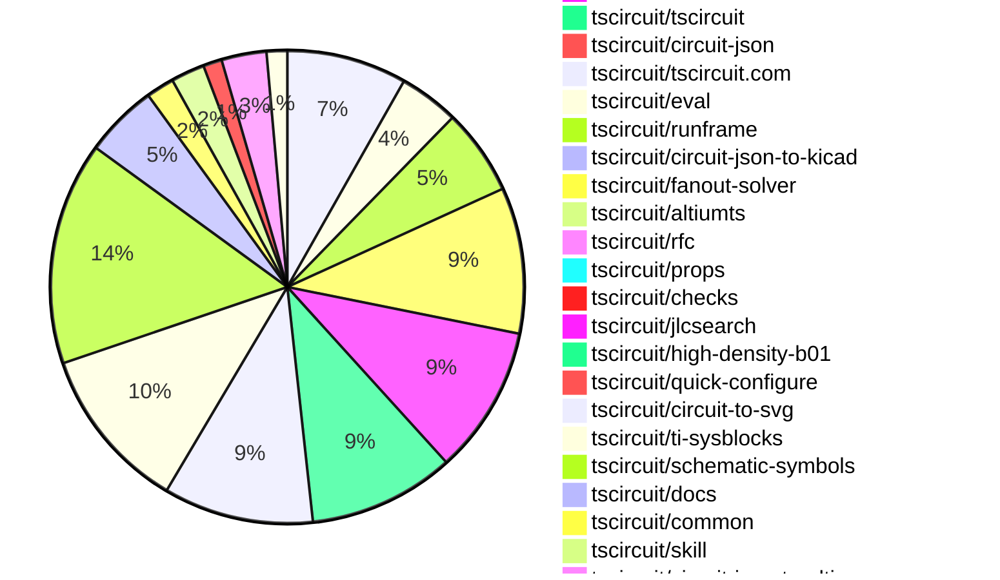

# contribution tracker

[contributions.tscircuit.com](https://contributions.tscircuit.com) ・ [tscircuit.com](https://tscircuit.com) ・ [Contribution Overviews](./contribution-overviews/) ・ [Changelogs](./changelogs/)

Generates weekly contribution overviews for tscircuit contributors. Check out all
the [contribution overviews here](./contribution-overviews/)
You can find AI-generated monthly changelogs in the [changelogs directory](./changelogs/)

- All PRs in the tscircuit org are scanned/summarized via an LLM
- The LLM classifies each Diff/PR as into a set of attributes for scoring
- All the PRs, summaries, and classifications are organized into charts and tables for [the website](https://contributions.tscircuit.com)

> Want to run locally? See the [Development Section](#development)

## Current Week

<!-- START_CURRENT_WEEK -->

# Contribution Overview 2026-08-25

The current week is shown below. There are 3 major sections:

- [Contributor Overview](#contributor-overview)
- [PRs by Repository](#prs-by-repository)
- [PRs by Contributor](#changes-by-contributor)
- [Scoring & Sponsorship Details](/docs/sponsorship-calculation-explanation.md)

## PRs by Repository


```mermaid
pie
    "tscircuit/core" : 64
    "tscircuit/tscircuit-autorouter" : 32
    "tscircuit/schematic-trace-solver" : 46
    "tscircuit/high-density-repair03" : 2
    "tscircuit/ti" : 78
    "tscircuit/implicit-copper-pour-solver" : 1
    "tscircuit/schematic-viewer" : 1
    "tscircuit/pcb-viewer" : 2
    "tscircuit/copper-pour-solver" : 1
    "tscircuit/cli" : 79
    "tscircuit/tscircuit" : 78
    "tscircuit/circuit-json" : 8
    "tscircuit/tscircuit.com" : 80
    "tscircuit/eval" : 88
    "tscircuit/runframe" : 119
    "tscircuit/circuit-json-to-kicad" : 39
    "tscircuit/fanout-solver" : 15
    "tscircuit/altiumts" : 18
    "tscircuit/rfc" : 1
    "tscircuit/props" : 8
    "tscircuit/checks" : 10
    "tscircuit/jlcsearch" : 1
    "tscircuit/high-density-b01" : 1
    "tscircuit/quick-configure" : 6
    "tscircuit/circuit-to-svg" : 4
    "tscircuit/ti-sysblocks" : 3
    "tscircuit/schematic-symbols" : 2
    "tscircuit/docs" : 7
    "tscircuit/common" : 1
    "tscircuit/skill" : 1
    "tscircuit/circuit-json-to-altium" : 24
    "tscircuit/esp32-bluetooth-speaker" : 1
    "tscircuit/circuit-json-to-gerber" : 3
    "tscircuit/kicadts" : 2
    "tscircuit/altium-to-circuit-json" : 6
    "tscircuit/biscuit-boards" : 2
    "tscircuit/matchpack" : 4
    "tscircuit/easyeda-converter" : 11
    "tscircuit/bga-fanout-solver" : 4
    "tscircuit/jscad-electronics" : 1
```

## Contributor Overview

| Contributor | 🐳 Major | 🐙 Minor | 🐌 Tiny | Score | ⭐ |
|-------------|---------|---------|---------|-------|-----|
| [seveibar](#seveibar) | 35 | 36 | 41 | 225 | 👑👑👑 |
| [ShiboSoftwareDev](#ShiboSoftwareDev) | 9 | 20 | 51 | 103.5 | 👑 |
| [mohan-bee](#mohan-bee) | 8 | 4 | 18 | 59 | ⭐⭐⭐ |
| [Sang-it](#Sang-it) | 5 | 12 | 16 | 56.5 | ⭐⭐⭐ |
| [imrishabh18](#imrishabh18) | 7 | 4 | 15 | 49 | ⭐⭐ |
| [MustafaMulla29](#MustafaMulla29) | 4 | 3 | 9 | 32 | ⭐⭐ |
| [0hmX](#0hmX) | 6 | 1 | 2 | 28 | ⭐⭐ |
| [rushabhcodes](#rushabhcodes) | 1 | 4 | 5 | 22 | ⭐⭐ |
| [tscircuitbot](#tscircuitbot) | 1 | 0 | 486 | 19 | ⭐⭐ |
| [GokulPandi-M](#GokulPandi-M) | 1 | 2 | 4 | 12 | ⭐⭐ |
| [hrithik18k](#hrithik18k) | 0 | 0 | 11 | 11 | ⭐⭐ |
| [techmannih](#techmannih) | 1 | 0 | 6 | 11 | ⭐⭐ |
| [anil08607](#anil08607) | 0 | 4 | 2 | 11 | ⭐⭐ |
| [AnasSarkiz](#AnasSarkiz) | 1 | 0 | 5 | 9 | ⭐ |
| [Abse2001](#Abse2001) | 0 | 1 | 5 | 7 | ⭐ |
| [KrishnaX12](#KrishnaX12) | 0 | 0 | 6 | 6 | ⭐ |
| [addibble](#addibble) | 1 | 0 | 0 | 4 | ⭐ |
| [mattkanwisher](#mattkanwisher) | 1 | 0 | 0 | 4 | ⭐ |

## Staff Pass Ratio (SPR)

| Contributor | Reviewed PRs | Rejections | Approvals | SPR |
|-------------|--------------|------------|-----------|-----|
| [ShiboSoftwareDev](#ShiboSoftwareDev) | 23 | 8 | 20 | 65.2% |
| [mohan-bee](#mohan-bee) | 11 | 3 | 8 | 72.7% |
| [Sang-it](#Sang-it) | 8 | 1 | 8 | 87.5% |
| [MustafaMulla29](#MustafaMulla29) | 5 | 0 | 5 | 100.0% |
| [rushabhcodes](#rushabhcodes) | 5 | 2 | 3 | 60.0% |
| [GokulPandi-M](#GokulPandi-M) | 4 | 2 | 3 | 50.0% |
| [Abse2001](#Abse2001) | 3 | 1 | 2 | 66.7% |
| [0hmX](#0hmX) | 2 | 0 | 2 | 100.0% |
| [AnasSarkiz](#AnasSarkiz) | 2 | 0 | 2 | 100.0% |
| [techmannih](#techmannih) | 2 | 1 | 1 | 50.0% |
| [addibble](#addibble) | 1 | 0 | 1 | 100.0% |
| [birdup000](#birdup000) | 1 | 1 | 0 | 0.0% |
| [hrithik18k](#hrithik18k) | 1 | 1 | 0 | 0.0% |
| [imrishabh18](#imrishabh18) | 1 | 0 | 1 | 100.0% |
| [KrishnaX12](#KrishnaX12) | 1 | 0 | 1 | 100.0% |
| [mattkanwisher](#mattkanwisher) | 1 | 0 | 1 | 100.0% |

<details>
<summary>ShiboSoftwareDev SPR PRs (23)</summary>

- [#736](https://github.com/tscircuit/circuit-json/pull/736) Add PCB keepout outlines
- [#3515](https://github.com/tscircuit/core/pull/3515) fix: inline AM62L fixture pads
- [#3510](https://github.com/tscircuit/core/pull/3510) Keep bus constraints on declared traces
- [#3446](https://github.com/tscircuit/core/pull/3446) fix: synchronize fanout exits across named nets
- [#152](https://github.com/tscircuit/circuit-json-to-gerber/pull/152) fix: preserve rotated plated-hole pad geometry
- [#2248](https://github.com/tscircuit/tscircuit-autorouter/pull/2248) Honor Pipeline9 bus allowed layers per connection
- [#2249](https://github.com/tscircuit/tscircuit-autorouter/pull/2249) Fix Pipeline 9 multipoint bus length matching
- [#2251](https://github.com/tscircuit/tscircuit-autorouter/pull/2251) Connect preloaded copper at route endpoints
- [#2247](https://github.com/tscircuit/tscircuit-autorouter/pull/2247) Honor multipoint bus trace widths in Pipeline9
- [#888](https://github.com/tscircuit/schematic-trace-solver/pull/888) Deduplicate schematic routing pairs
- [#65](https://github.com/tscircuit/kicadts/pull/65) Add typed symbol fill color accessors
- [#453](https://github.com/tscircuit/circuit-json-to-kicad/pull/453) Keep schematic content clear of KiCad title blocks
- [#467](https://github.com/tscircuit/circuit-json-to-kicad/pull/467) Focus schematic comparison snapshots on circuit content
- [#173](https://github.com/tscircuit/ti/pull/173) Extract consumer wireless chips into reusable components
- [#142](https://github.com/tscircuit/ti/pull/142) Add TIDA-01141 current and voltage sense reference
- [#82](https://github.com/tscircuit/altiumts/pull/82) Preserve PCB track keepout flags
- [#63](https://github.com/tscircuit/altiumts/pull/63) Serialize PCB component body contours
- [#71](https://github.com/tscircuit/altiumts/pull/71) Render schematic special-string values
- [#32](https://github.com/tscircuit/altium-to-circuit-json/pull/32) Use routed keepout contours for stale PCB outlines
- [#50](https://github.com/tscircuit/circuit-json-to-altium/pull/50) Preserve PCB keepout outlines
- [#63](https://github.com/tscircuit/circuit-json-to-altium/pull/63) Compact metadata-only hierarchy layouts
- [#58](https://github.com/tscircuit/circuit-json-to-altium/pull/58) Omit graphic-only schematic sheets
- [#13](https://github.com/tscircuit/circuit-json-to-altium/pull/13) Preserve PCB component body contours

</details>

<details>
<summary>mohan-bee SPR PRs (11)</summary>

- [#3529](https://github.com/tscircuit/core/pull/3529) Set default footprint silkscreen text size to 0.6mm
- [#3358](https://github.com/tscircuit/core/pull/3358) reuse schematic box dimensions during port rendering
- [#701](https://github.com/tscircuit/circuit-to-svg/pull/701) match pcb view font in snspshot
- [#479](https://github.com/tscircuit/jlcsearch/pull/479) expose datasheet urls in component search
- [#224](https://github.com/tscircuit/matchpack/pull/224) place regulator capacitors with downward rail-pin clearance
- [#970](https://github.com/tscircuit/schematic-trace-solver/pull/970) cache net label during overlap search
- [#917](https://github.com/tscircuit/schematic-trace-solver/pull/917) Anchor vertical ground labels to clear component-side rails
- [#927](https://github.com/tscircuit/schematic-trace-solver/pull/927) Collapse redundant same-net cycles
- [#942](https://github.com/tscircuit/schematic-trace-solver/pull/942) render typed ground nets as symbols in solver snapshots
- [#919](https://github.com/tscircuit/schematic-trace-solver/pull/919) Prevent grouped ground rails from crossing component rows
- [#875](https://github.com/tscircuit/schematic-trace-solver/pull/875) prefer shorter endpoint detours for isolated direct traces

</details>

<details>
<summary>Sang-it SPR PRs (8)</summary>

- [#731](https://github.com/tscircuit/circuit-json/pull/731) Add schematic sheet sizes
- [#819](https://github.com/tscircuit/props/pull/819) Add schematic sheet sizes
- [#3460](https://github.com/tscircuit/core/pull/3460) Add configurable schematic sheet dimensions
- [#697](https://github.com/tscircuit/circuit-to-svg/pull/697) Render configurable schematic sheet dimensions
- [#958](https://github.com/tscircuit/schematic-trace-solver/pull/958) Recover routed direct connections from net labels
- [#956](https://github.com/tscircuit/schematic-trace-solver/pull/956) Fix net-label recovery across trace crossings
- [#939](https://github.com/tscircuit/schematic-trace-solver/pull/939) Recover aligned multi-pin net traces
- [#150](https://github.com/tscircuit/ti/pull/150) Add composed power bank example

</details>

<details>
<summary>MustafaMulla29 SPR PRs (5)</summary>

- [#3504](https://github.com/tscircuit/core/pull/3504) Render inline labels across sections on the same sheet
- [#3450](https://github.com/tscircuit/core/pull/3450) Support inline labels on multi-pin signal nets
- [#910](https://github.com/tscircuit/schematic-trace-solver/pull/910) Place opted-in inline labels on multi-pin net connections
- [#879](https://github.com/tscircuit/schematic-trace-solver/pull/879) Align same-net rails without moving labels
- [#168](https://github.com/tscircuit/ti/pull/168) Add Seat Position Module reference subcircuits and an example

</details>

<details>
<summary>rushabhcodes SPR PRs (5)</summary>

- [#3518](https://github.com/tscircuit/core/pull/3518) fix: render polarity pin label suffixes as symbols
- [#3511](https://github.com/tscircuit/core/pull/3511) Fix FabricationNoteText layer handling
- [#3508](https://github.com/tscircuit/core/pull/3508) Fix fabrication note path layers on bottom components
- [#983](https://github.com/tscircuit/schematic-trace-solver/pull/983) Add SparkFun Qwiic Shim repro for over-distance GND trace
- [#30](https://github.com/tscircuit/altium-to-circuit-json/pull/30) refactor: split schematic rendering into modules

</details>

<details>
<summary>GokulPandi-M SPR PRs (4)</summary>

- [#723](https://github.com/tscircuit/circuit-json/pull/723) Add optional schematic pin-label font size
- [#3430](https://github.com/tscircuit/core/pull/3430) Forward schematic pin-label font size to Circuit JSON
- [#230](https://github.com/tscircuit/matchpack/pull/230) fix: remove a horizontal series-resistor elbow locally
- [#232](https://github.com/tscircuit/matchpack/pull/232) Fix facing resistor alignment after partition packing

</details>

<details>
<summary>Abse2001 SPR PRs (3)</summary>

- [#132](https://github.com/tscircuit/ti/pull/132) feat: add automotive window module power supply
- [#134](https://github.com/tscircuit/ti/pull/134) Add INA240/TLV2316/LMV7275 pinch-detection subsystem
- [#5](https://github.com/tscircuit/ti-sysblocks/pull/5) feat: add automotive window module sysblock

</details>

<details>
<summary>0hmX SPR PRs (2)</summary>

- [#3483](https://github.com/tscircuit/core/pull/3483) BGA fanout vs default fanout example
- [#243](https://github.com/tscircuit/checks/pull/243) fix: detect via copper overlapping pad corners

</details>

<details>
<summary>AnasSarkiz SPR PRs (2)</summary>

- [#165](https://github.com/tscircuit/ti/pull/165) Add TIDEP-01024 radar front-end modules
- [#149](https://github.com/tscircuit/ti/pull/149) Add automotive battery front-end reference schematic

</details>

<details>
<summary>techmannih SPR PRs (2)</summary>

- [#189](https://github.com/tscircuit/ti/pull/189) feat(block-ui): add Rearview Mirror Module
- [#151](https://github.com/tscircuit/ti/pull/151) feat: add rearview mirror MSP430 MCU

</details>

<details>
<summary>addibble SPR PRs (1)</summary>

- [#20](https://github.com/tscircuit/rfc/pull/20) Enclosure mounting hardware: assembly.screw, and how hardware is rendered

</details>

<details>
<summary>birdup000 SPR PRs (1)</summary>

- [#465](https://github.com/tscircuit/schematic-symbols/pull/465) Add op-amp variants with inverting input on top

</details>

<details>
<summary>hrithik18k SPR PRs (1)</summary>

- [#943](https://github.com/tscircuit/schematic-trace-solver/pull/943) Fix net label branches starting from interior junctions

</details>

<details>
<summary>imrishabh18 SPR PRs (1)</summary>

- [#3362](https://github.com/tscircuit/core/pull/3362) feat: add automatic implicit copper pours

</details>

<details>
<summary>KrishnaX12 SPR PRs (1)</summary>

- [#30](https://github.com/tscircuit/circuit-json-to-altium/pull/30) fix: preserve schematic clock and inverted pin flags

</details>

<details>
<summary>mattkanwisher SPR PRs (1)</summary>

- [#64](https://github.com/tscircuit/kicadts/pull/64) Add KiCad 10.99 PCB syntax support

</details>

> Note: AI evaluates PRs and assigns 1-3 star ratings automatically. 4 and 5 star ratings require manual staff review.

## Review Table

[reviews-received-hover]: ## "Number of reviews received for PRs for this contributor"
[approvals-received-hover]: ## "Number of approvals received for PRs this contributor authored"
[rejections-received-hover]: ## "Number of rejections received for PRs this contributor authored"
[prs-opened-hover]: ## "Number of PRs opened by this contributor"
[issues-created-hover]: ## "Number of issues created by this contributor"

| Contributor | Reviews Received | Approvals Received | Rejections Received | Approvals | Rejections Given | PRs Opened | PRs Merged | Issues Created |
|---|---|---|---|---|---|---|---|---|
| [0hmX](#0hmX) | 9 | 2 | 1 | 0 | 0 | 10 | 9 | 0 |
| [AbhayPratap01](#AbhayPratap01) | 0 | 0 | 0 | 0 | 0 | 1 | 0 | 0 |
| [Abse2001](#Abse2001) | 23 | 8 | 1 | 0 | 0 | 17 | 6 | 0 |
| [addibble](#addibble) | 1 | 1 | 0 | 0 | 0 | 1 | 1 | 0 |
| [AnasSarkiz](#AnasSarkiz) | 5 | 5 | 0 | 0 | 0 | 11 | 6 | 0 |
| [anil08607](#anil08607) | 9 | 9 | 0 | 1 | 0 | 8 | 6 | 0 |
| [birdup000](#birdup000) | 1 | 0 | 1 | 0 | 0 | 19 | 0 | 0 |
| [ethanhawkes-gif](#ethanhawkes-gif) | 0 | 0 | 0 | 0 | 0 | 1 | 0 | 0 |
| [gcoinstash-cmd](#gcoinstash-cmd) | 0 | 0 | 0 | 0 | 0 | 6 | 0 | 0 |
| [GokulPandi-M](#GokulPandi-M) | 15 | 8 | 3 | 0 | 0 | 14 | 7 | 0 |
| [hrithik18k](#hrithik18k) | 24 | 15 | 2 | 0 | 0 | 18 | 11 | 0 |
| [imrishabh18](#imrishabh18) | 3 | 3 | 0 | 24 | 5 | 35 | 26 | 0 |
| [infinityscroll](#infinityscroll) | 0 | 0 | 0 | 0 | 0 | 3 | 0 | 0 |
| [KrishnaX12](#KrishnaX12) | 17 | 10 | 3 | 0 | 0 | 15 | 6 | 0 |
| [marcos452652258-gif](#marcos452652258-gif) | 0 | 0 | 0 | 0 | 0 | 8 | 0 | 0 |
| [mattkanwisher](#mattkanwisher) | 2 | 1 | 0 | 0 | 0 | 1 | 1 | 0 |
| [mohan-bee](#mohan-bee) | 28 | 17 | 3 | 8 | 0 | 76 | 30 | 0 |
| [MustafaMulla29](#MustafaMulla29) | 9 | 7 | 0 | 6 | 1 | 19 | 17 | 0 |
| [Nitish7016](#Nitish7016) | 0 | 0 | 0 | 0 | 0 | 7 | 0 | 0 |
| [Rodrigoue9](#Rodrigoue9) | 0 | 0 | 0 | 0 | 0 | 28 | 0 | 0 |
| [rushabhcodes](#rushabhcodes) | 36 | 12 | 3 | 5 | 0 | 18 | 10 | 0 |
| [Sang-it](#Sang-it) | 13 | 10 | 0 | 0 | 0 | 44 | 33 | 0 |
| [seveibar](#seveibar) | 33 | 0 | 0 | 107 | 15 | 161 | 116 | 0 |
| [ShayanMuhammad-CS](#ShayanMuhammad-CS) | 0 | 0 | 0 | 0 | 0 | 1 | 0 | 0 |
| [ShiboSoftwareDev](#ShiboSoftwareDev) | 81 | 59 | 6 | 19 | 0 | 148 | 80 | 0 |
| [techmannih](#techmannih) | 8 | 5 | 1 | 2 | 3 | 16 | 7 | 0 |
| [tscircuitbot](#tscircuitbot) | 0 | 0 | 0 | 0 | 0 | 666 | 487 | 0 |

## Changes by Repository

### [tscircuit/core](https://github.com/tscircuit/core)

| PR # | Impact | Rating | Contributor | Description |
|------|--------|--------|-------------|-------------|
| [#3362](https://github.com/tscircuit/core/pull/3362) | 🐳 Major | ⭐⭐⭐ | imrishabh18 | Add a PcbImplicitCopperPourRender phase after routing and before explicit copper-pour rendering, enabling automatic copper pours per board and converting coarse implicit power-net regions into CopperPour components. |
| [#3455](https://github.com/tscircuit/core/pull/3455) | 🐳 Major | ⭐⭐⭐ | seveibar | Adds a new BGA fanout solver and compares its performance against the existing fanout solver for routing two DDR byte buses between AM62L and LPDDR4. |
| [#3510](https://github.com/tscircuit/core/pull/3510) | 🐳 Major | ⭐⭐⭐ | ShiboSoftwareDev | Resolves each bus entry to its declared source trace instead of every trace on the same electrical net, ensuring that the SII9022 HDMI snapshot changes from unrouted to all 24 traces routed. |
| [#3446](https://github.com/tscircuit/core/pull/3446) | 🐳 Major | ⭐⭐⭐ | ShiboSoftwareDev | Fixes synchronization of fanout exits across named nets to ensure proper routing connections and continuity assertions in PCB designs. |
| [#3523](https://github.com/tscircuit/core/pull/3523) | 🐳 Major | ⭐⭐⭐ | 0hmX | Updates the tscircuitbga-fanout-solver to include merged symmetric residual ViaLine work and a conflict-reroute fix that preserves outward hinted via bends in the AM62LLPDDR4 BGA path. |
| [#3483](https://github.com/tscircuit/core/pull/3483) | 🐳 Major | ⭐⭐⭐ | 0hmX | Follow-up to merged 3455. The linked timeline event was the merge event, and the original PR checks were green. The existing two-bus comparison remains intact and now exercises the intended eight-layer power-plane input. This PR also adds a separate source-routed regression for the validated full AM62L-to-LPDDR4 board instead of replacing or weakening either existing test. Changes: preserve both existing two-bus tests and snapshots keep the existing BGA comparison aligned with the eight-layer GND and LPDDR4 power-pour input add a dedicated 60 x 30 mm full-board TSX fixture at the validated U1U2 positions and 30.675 mm center separation route all three 11-net DDR buses through two FixedTargetBgaFanoutSolver breakouts plus the capacity channel autorouter pin tscircuitbga-fanout-solver to merged PR 9 commit e67a81f0 and use only public package dependencies assert 3333 connections, four GND layers, 243 PCB traces, 138 TOP-to-BOTTOM vias, 144 explicit GND pad connections, 72 GND via drops, 0.086788 mm minimum via-to-pad clearance, and no routingclearance errors add a dedicated full-board PCB snapshot generated from TSX; no precomputed Circuit JSON is imported The original 42 x 26 mm comparison board and 19.116917 mm U1U2 spacing remain unchanged. Its regular and BGA snapshots are byte-identical to their pre-full-board hashes. Verification: bun test testsreprosrepro-am62l-lpddr4-full-bga-fanout.test.tsx bun test testsreprosrepro-am62l-lpddr4-two-bus-fanout.test.tsx testsreprosrepro-am62l-lpddr4-two-bus-bga-fanout.test.tsx bun test testsutilsautoroutingsimple-route-json-unbroken-copper-pour-obstacles.test.tsx testsexamplesexample39-unbroken-copper-pour-escape-vias.test.tsx testsfeaturesautorouter-fanout-plane-termination.test.tsx bunx tsc --noEmit bun run format bunx biome format . |
| [#3541](https://github.com/tscircuit/core/pull/3541) | 🐙 Minor | ⭐⭐ | seveibar | Add DDR_DMI1 from AM62L W2 to LPDDR4 C10 on inner5 as the ninth canonical DDR fanout bus, verifying all signal connections and updating the full-board visual snapshot. |
| [#3531](https://github.com/tscircuit/core/pull/3531) | 🐙 Minor | ⭐⭐ | seveibar | Add the DQS1 differential bus to the AM62L-to-LPDDR4 fanout regression, verifying bus widths, differential pairs, and skew, while updating the existing PCB SVG snapshot. |
| [#3514](https://github.com/tscircuit/core/pull/3514) | 🐙 Minor | ⭐⭐ | seveibar | Add LPDDR4 DQS0_t and DQS0_c as a sixth DDR fanout bus and differential pair, routing DQS0 on inner5 with specified phase skew and regression bounds, validating multiple signals and bus widths, and replacing the five-bus visual regression with a complete six-bus PCB snapshot. |
| [#3506](https://github.com/tscircuit/core/pull/3506) | 🐙 Minor | ⭐⭐ | seveibar | Routes LPDDR4 RESET_n from AM62L J2 to DRAM T11 as a fifth singleton fanout bus on inner6, validating SoC and DRAM fanout phases, and updating dependencies for singleton bus support. |
| [#3492](https://github.com/tscircuit/core/pull/3492) | 🐙 Minor | ⭐⭐ | seveibar | Add a fourth DDR_CLOCK fanout bus for the AM62L P1P2 to LPDDR4 J8J9 clock pair, enforcing phase-local clock skew and preserving differential-pair metadata across SOC and DRAM fanout cohorts. |
| [#3493](https://github.com/tscircuit/core/pull/3493) | 🐙 Minor | ⭐⭐ | seveibar | Respects the analogSimulationDisabled property by skipping SPICE model validation, Circuit JSON generation, and analog simulator engine execution when disabled, while adding regression coverage to ensure invalid models do not emit errors or invoke an engine. |
| [#3490](https://github.com/tscircuit/core/pull/3490) | 🐙 Minor | ⭐⭐ | seveibar | Adds a new antenna  component with a pin1feed port, footprint support, and PCB placement properties, including rendering PCB paths through an anchored trace. |
| [#3454](https://github.com/tscircuit/core/pull/3454) | 🐙 Minor | ⭐⭐ | seveibar | Summary model the documented physical package balls for all 16 AM62L-to-LPDDR4 DQ connections connect all 97 AM62L VSS balls and all 58 LPDDR4 VSS balls to the inner1 GND pour connect all 5 AM62L VDDS_DDR balls plus all 20 LPDDR4 VDDQ and 24 VDD2 balls to the shared 1.1 V VDD_LPDDR4 pour on inner2 connect all 8 LPDDR4 VDD1 balls to their separate 1.8 V SOC_DVDD1V8 pour on inner3 route all 212 plane drops and 32 DQ escapes through legal offset dogbones; via-in-pad remains disabled keep logical route transitions on their destination layers while inflating all 244 physical via barrels across the complete eight-layer stack enforce phase-local length matching on both DDR byte buses while preserving a straight, noncrossing global handoff propagate blindburied-via policy through Board, imported Circuit JSON, nested board routing, SRJ, fanout planning, and autorouted pcb_via inflation consume the SRJ physical-span hint during via inflation without leaking it into persisted pcb_trace.route preserve the signal-only BGA solver comparison through the shared AM62L fixture  Dependencies tscircuitfanout-solver97(https:github.comtscircuitfanout-solverpull97), released as tscircuitfanout-solver0.0.39 Use the live copper-pour-solver85(https:github.comtscircuitcopper-pour-solverpull85) preview (85) because the commit-addressed pkg.pr.new URL on current main does not resolve. A fresh install, TypeScript, and the focused repro pass with the live preview.  Validation AM62L repro: 4,867 assertions, zero routing or clearance errors; snapshot-update run in 28.5s and stable rerun in 27.7s on the local M3 Pro phase-local length skew: BYTE0 7.532058 mm  7.999999 mm; BYTE1 14.499999 mm  14.499999 mm BYTE1 adds real tuning on both packages: one SOC trace and three DRAM traces; BYTE0 retains four DRAM-side tuned traces all 244 via renderings and all pad geometry remain unchanged; the global straight-line handoff remains unchanged and crossing-free BGA comparison: 329 assertions passed in signal-only mode focused via-policy and board-propagation suite: 8 tests passed seven affected fanout, copper-pour, winding, and SRJ snapshot tests passed after focused updates SRJ metadata persistence cleanup: 2 focused tests, 9 assertions exact solver captures: SOC 118 of 118 and RAM 126 of 126, each in one attempt with zero validation issues fresh install with the live copper-pour preview and tscircuitfanout-solver0.0.39 bunx tsc --noEmit --pretty false Core CI at 4cf81484: all 10 Bun shards, Type Check, Format PR, Dependency Check, Smoke Test Dist, and Vercel passed  Snapshot Updated to show offset dogbone vias across both packages, three internal power planes, visible length matching on both DDR byte buses, and the straight global handoff. Every autorouted via is asserted outside its source-pad clearance and physically spans all eight layers. |
| [#3478](https://github.com/tscircuit/core/pull/3478) | 🐙 Minor | ⭐⭐ | seveibar | Add the AM62LLPDDR4 address-control fanout bus alongside both byte buses, routing CA0CA5, CS, and CKE using verified package balls on a dedicated inner6 signal layer, while preserving all GNDDDR-power plane dogbones and through-all via checks. |
| [#3458](https://github.com/tscircuit/core/pull/3458) | 🐙 Minor | ⭐⭐ | seveibar | Add the schematicgraphic  intrinsic component and emit canonical schematic_graphic Asset records, supporting svgContent, imageUrl, or both, while enforcing SVG standards and improving schematic rendering. |
| [#3465](https://github.com/tscircuit/core/pull/3465) | 🐙 Minor | ⭐⭐ | seveibar | Run categorized schematic checks during the board DRC process and add regression tests for schematic warnings related to undersized chip heights. |
| [#3456](https://github.com/tscircuit/core/pull/3456) | 🐙 Minor | ⭐⭐ | seveibar | Fixes incorrect no-connect propagation for custom symbol ports by ensuring pin attributes are resolved from the owning normal component, preventing false missing-trace warnings. |
| [#3439](https://github.com/tscircuit/core/pull/3439) | 🐙 Minor | ⭐⭐ | seveibar | Adds support for castellated holes in board outlines, rendering them as circular plated holes and exposing them as board pinout ports while preserving alignment and updating the board outline point schema. |
| [#3438](https://github.com/tscircuit/core/pull/3438) | 🐙 Minor | ⭐⭐ | seveibar | Maps schSize variants sm and xs to compact passive symbols for resistors and capacitors, preserving existing styles and behaviors. |
| [#3440](https://github.com/tscircuit/core/pull/3440) | 🐙 Minor | ⭐⭐ | seveibar | Add an 8 mm phase-local maxLengthSkew constraint to AM62L DDR BYTE0 and verify the constraint in fanout phases while maintaining clean routing DRC. |
| [#3515](https://github.com/tscircuit/core/pull/3515) | 🐙 Minor | ⭐⭐ | ShiboSoftwareDev | Fixes the AM62L fixture pads by copying the pad population and required labels into the local regression fixture, replacing imports with a local component, and removing a test-only dependency. |
| [#3460](https://github.com/tscircuit/core/pull/3460) | 🐙 Minor | ⭐⭐ | Sang-it | Adds support for configurable schematic sheet dimensions, including A4 as the default size and ANSI B, with explicit width and height values for schematic sheets. |
| [#3430](https://github.com/tscircuit/core/pull/3430) | 🐙 Minor | ⭐⭐ | GokulPandi-M | Carries the optional per-port schPinLabelFontSize prop into schematic_port.display_pin_label_font_size as a precise numeric Circuit JSON value. |
| [#3511](https://github.com/tscircuit/core/pull/3511) | 🐙 Minor | ⭐⭐ | rushabhcodes | Fixes incorrect handling of FabricationNoteText layer, ensuring notes are placed on the correct side of the PCB based on their specified layer and component placement. |
| [#3508](https://github.com/tscircuit/core/pull/3508) | 🐙 Minor | ⭐⭐ | rushabhcodes | Fixes the layer assignment for FabricationNotePath to correctly reflect the components layer, preventing incorrect rendering and export of paths on the wrong side of the PCB. |
| [#3504](https://github.com/tscircuit/core/pull/3504) | 🐙 Minor | ⭐⭐ | MustafaMulla29 | Render canonical inline net labels when connected endpoints span schematic sections on the same schematic sheet, aggregating aliases for one electrical net into a single solver connection so every disconnected endpoint gets the canonical label text. |
| [#3450](https://github.com/tscircuit/core/pull/3450) | 🐙 Minor | ⭐⭐ | MustafaMulla29 | Allows explicitly named, non-power port-to-net signals spanning multiple components to request inline labels while preserving existing label semantics and updating relevant tests. |
| [#3448](https://github.com/tscircuit/core/pull/3448) | 🐙 Minor | ⭐⭐ | mohan-bee | Adds ground metadata to the schematic trace solver input problem to identify ground nets in circuit schematics. |
| [#3358](https://github.com/tscircuit/core/pull/3358) | 🐙 Minor | ⭐⭐ | mohan-bee | Reduces rendering time by caching schematic box dimensions for large-pin-count components, improving performance in SchematicPortRender. |

<details>
<summary>🐌 Tiny Contributions (34)</summary>

| PR # | Impact | Contributor | Description |
|------|--------|-------------|-------------|
| [#3452](https://github.com/tscircuit/core/pull/3452) | 🐌 Tiny | imrishabh18 | Updates the tscircuitschematic-trace-solver package from version 0.0.158 to 0.0.159, ensuring compatibility with existing configurations and preserving the no-lockfile policy. |
| [#3451](https://github.com/tscircuit/core/pull/3451) | 🐌 Tiny | imrishabh18 | Bump tscircuitschematic-trace-solver from 0.0.156 to 0.0.158, the latest published npm release verified on 2026-08-26. |
| [#3540](https://github.com/tscircuit/core/pull/3540) | 🐌 Tiny | tscircuitbot | Updates the tscircuitfanout-solver package from version 0.0.45 to 0.0.46 |
| [#3533](https://github.com/tscircuit/core/pull/3533) | 🐌 Tiny | tscircuitbot | Updates the tscircuitfanout-solver package from version 0.0.43 to 0.0.45 |
| [#3527](https://github.com/tscircuit/core/pull/3527) | 🐌 Tiny | tscircuitbot | Updates the tscircuitfanout-solver package from version 0.0.42 to 0.0.43 |
| [#3482](https://github.com/tscircuit/core/pull/3482) | 🐌 Tiny | tscircuitbot | Updates the tscircuitchecks package from version 0.0.177 to 0.0.178 in the package.json file. |
| [#3481](https://github.com/tscircuit/core/pull/3481) | 🐌 Tiny | tscircuitbot | Updates the version of the tscircuitchecks package from 0.0.177 to 0.0.178 in package.json |
| [#3479](https://github.com/tscircuit/core/pull/3479) | 🐌 Tiny | tscircuitbot | Updates the version of the tscircuitchecks package from 0.0.175 to 0.0.177 in package.json |
| [#3469](https://github.com/tscircuit/core/pull/3469) | 🐌 Tiny | tscircuitbot | Updates the version of the tscircuitchecks package from 0.0.174 to 0.0.175 in package.json |
| [#3467](https://github.com/tscircuit/core/pull/3467) | 🐌 Tiny | tscircuitbot | Updates the tscircuitchecks package from version 0.0.171 to 0.0.174 in the package.json file. |
| [#3488](https://github.com/tscircuit/core/pull/3488) | 🐌 Tiny | tscircuitbot | Updates the tscircuitfanout-solver package from version 0.0.39 to 0.0.40 |
| [#3425](https://github.com/tscircuit/core/pull/3425) | 🐌 Tiny | tscircuitbot | Updates the tscircuitchecks package from version 0.0.170 to 0.0.171 in the package.json file. |
| [#3528](https://github.com/tscircuit/core/pull/3528) | 🐌 Tiny | seveibar | Renames the AM62L LPDDR4 fanout test and its SVG snapshot to a stable, bus-count-independent name, preventing GitHub from treating visual updates as deleteadd. |
| [#3491](https://github.com/tscircuit/core/pull/3491) | 🐌 Tiny | seveibar | Updates the tscircuitschematic-trace-solver dependency from version 0.0.168 to 0.0.170 without changing any existing schematic snapshots. |
| [#3475](https://github.com/tscircuit/core/pull/3475) | 🐌 Tiny | seveibar | Replaces the copper-pour-solver PR preview with the published version tscircuitcopper-pour-solver0.0.51 and rejects committed pkg.pr.new dependency specs in the existing Dependency Check workflow. |
| [#3437](https://github.com/tscircuit/core/pull/3437) | 🐌 Tiny | seveibar | Updates the tscircuitcapacity-autorouter package from version 0.0.844 to 0.0.845, addressing GNDVBAT accidental contact and via-to-X1-pad clearance issues in the nRF52810 repro. |
| [#3434](https://github.com/tscircuit/core/pull/3434) | 🐌 Tiny | seveibar | Updates routing dependencies to incorporate fixes and improvements from related repositories, ensuring Core consumes the latest enhancements for autorouting and copper pour functionalities. |
| [#3513](https://github.com/tscircuit/core/pull/3513) | 🐌 Tiny | ShiboSoftwareDev | Removes unused keys from mapped tscircuit elements and suppresses the corresponding lint warnings so the fixture passes TypeScript validation. |
| [#3509](https://github.com/tscircuit/core/pull/3509) | 🐌 Tiny | ShiboSoftwareDev | Reproduces the real SII9022ACNU  TPD12S016PWR  HDMI-001S TMDS fanout handoff, providing a test fixture for autorouting errors. |
| [#3495](https://github.com/tscircuit/core/pull/3495) | 🐌 Tiny | ShiboSoftwareDev | Updates the tscircuitcapacity-autorouter dependency from version 0.0.845 to 0.0.851 without changing existing snapshots after routing-focused verification. |
| [#3445](https://github.com/tscircuit/core/pull/3445) | 🐌 Tiny | ShiboSoftwareDev | Reproduces a bug where disconnected fanout net handoff occurs during autorouting, with a test case to demonstrate the issue. |
| [#3466](https://github.com/tscircuit/core/pull/3466) | 🐌 Tiny | Sang-it | Updates the copper-pour solver dependency to a specific commit for improved functionality and stability. |
| [#3530](https://github.com/tscircuit/core/pull/3530) | 🐌 Tiny | GokulPandi-M | Updates the Core development dependency from tscircuitmatchpack0.0.84 to 0.0.88 and brings the resistorfacing-two-pin-component alignment fix from matchpack232 downstream into Core. |
| [#3503](https://github.com/tscircuit/core/pull/3503) | 🐌 Tiny | MustafaMulla29 | Disables fail-fast behavior in the Bun test workflow to allow all test shards to complete, even if one fails, while preserving failure reporting for each shard. |
| [#3487](https://github.com/tscircuit/core/pull/3487) | 🐌 Tiny | MustafaMulla29 | Updates the version of the schematic-trace-solver dependency from 0.0.166 to 0.0.168 in package.json |
| [#3444](https://github.com/tscircuit/core/pull/3444) | 🐌 Tiny | MustafaMulla29 | Add the complete TIDA-01330 DRV8305 motor-driver schematic as one self-contained test file and reproduce remote signal nets rendering as anchored tags instead of inline trace labels. |
| [#3516](https://github.com/tscircuit/core/pull/3516) | 🐌 Tiny | mohan-bee | Motivation The supplied RC car circuit renders two schematic section titles at the same position.  Before Core had no rendered RC car regression test for the overlapping display names.  After The exact RC car fixture renders through Core and asserts the shared title coordinates. The repro snapshot preserves the original two dashed section boundaries. |
| [#3517](https://github.com/tscircuit/core/pull/3517) | 🐌 Tiny | mohan-bee | Fixes overlapping schematic section titles in the RC car circuit by adjusting their horizontal starting positions to prevent intersection. |
| [#3507](https://github.com/tscircuit/core/pull/3507) | 🐌 Tiny | mohan-bee | Updates the version of the schematic-trace-solver dependency from 0.0.171 to 0.0.173 in the package.json file. |
| [#3496](https://github.com/tscircuit/core/pull/3496) | 🐌 Tiny | mohan-bee | Updates the version of the schematic-trace-solver dependency from 0.0.170 to 0.0.171 in the package.json file. |
| [#3462](https://github.com/tscircuit/core/pull/3462) | 🐌 Tiny | mohan-bee | Updates the version of the schematic-trace-solver dependency from 0.0.164 to 0.0.166 in package.json |
| [#3457](https://github.com/tscircuit/core/pull/3457) | 🐌 Tiny | mohan-bee | Updates the tscircuitschematic-trace-solver dependency to version 0.0.164 in the package.json file. |
| [#3432](https://github.com/tscircuit/core/pull/3432) | 🐌 Tiny | mohan-bee | Updates the version of the schematic-trace-solver dependency from 0.0.153 to 0.0.156 in the package.json file. |
| [#3443](https://github.com/tscircuit/core/pull/3443) | 🐌 Tiny | mohan-bee | Updates the version of the schematic-symbols dependency from 0.0.242 to 0.0.243 in package.json |

</details>

### [tscircuit/tscircuit-autorouter](https://github.com/tscircuit/tscircuit-autorouter)

| PR # | Impact | Rating | Contributor | Description |
|------|--------|--------|-------------|-------------|
| [#2258](https://github.com/tscircuit/tscircuit-autorouter/pull/2258) | 🐳 Major | ⭐⭐⭐ | imrishabh18 | Reduces DRC errors for Bug94 from 8 to 6 by repairing shared trace corridors without introducing new DRC identities. |
| [#2298](https://github.com/tscircuit/tscircuit-autorouter/pull/2298) | 🐳 Major | ⭐⭐⭐ | seveibar | Adds an automatic adapter for the HighDensitySolverB02, enabling it to be selected as the preferred candidate for four-layer nodes while preserving existing functionality for other node types. |
| [#2297](https://github.com/tscircuit/tscircuit-autorouter/pull/2297) | 🐳 Major | ⭐⭐⭐ | seveibar | Add TwoChordLaneIntraNodeSolver for one top-bottom chord crossing one left-right chord, automatically selecting it when applicable at the original node scale. |
| [#2285](https://github.com/tscircuit/tscircuit-autorouter/pull/2285) | 🐳 Major | ⭐⭐⭐ | seveibar | Summary make Pipeline9_Networked remote solves terminal: ordinary routing followed by the no-fixed-copper regional fallback preserve parallel speculative requests while re-proving all-layer fixed-copper independence at consumption time add a compact, semantics-preserving regional obstacleconnectivity projection and explicit cache policystage metadata keep malformed one-point geometry and transportprotocol failures on the existing local fail-open path  Validation 29 Pipeline9 networked tests, 282 assertions TypeScript typecheck package build real SRJ18 sample6: 3535 projected regional solves byte-identical to full-board direct solves; 1,7521,754 outputs accepted, with only two unsafe one-point outputs intentionally rejected sample6 payload: 18 batches, max 1,617,470 bytes, no singleton or body-cap overflow |
| [#2272](https://github.com/tscircuit/tscircuit-autorouter/pull/2272) | 🐳 Major | ⭐⭐⭐ | seveibar | Summary batch speculative Pipeline9 high-density cache lookups into streaming NDJSON requests pack at most 100 items and 1.75 MiB per batch, with exact UTF-8 accounting resolve items independently and out of order while preserving Pipeline9s sequential consumption semantics fan explicit cache misses out through parallel legacy solve requests retain per-node logical timeouts, longer background transport timeouts, and fail-open local solving expose batch, item, byte, cache-miss, hit, solver, and fallback-reason counters to benchmarks fix two pre-existing outputs that prevented exact cache reuse: jumpers: undefined and the closed-form solvers incorrect trace thickness The Networked pipeline remains available only at effort: 1, and every cache identity remains scoped to the exact autorouter package version.  Protocol POST solve-batch accepts  autorouterVersion, items:  requestId, input   and streams one NDJSON line per item. Cache hits are consumed immediately. A CACHE_MISS line launches that item through solve without blocking the rest of the batch. The backward-compatible service side is in hd-cache2 PR 2(https:github.comtscircuithd-cache2.tscircuit.compull2) and is deployed.  Validation 1818 Pipeline9 Networked tests, 205 assertions focused output regressions: 22 TypeScript check and build pass direct isolated SRJ18 samples 1, 2, 7, 11: end-to-end total 614.6s to 577.0s (6.1 faster); high-density total 225.1s to 192.7s (14.4 faster) exact completion, via-count, and relaxed-DRC parity in the paired benchmark The current deployed 0.0.852 cache still containsencounters the two pre-existing output defects, including a sample-11 regression. This PR fixes those causes; the next exact version receives a fresh versioned cache-key prefix. |
| [#2269](https://github.com/tscircuit/tscircuit-autorouter/pull/2269) | 🐳 Major | ⭐⭐⭐ | seveibar | Summary add an effort-1-only AutoroutingPipelineSolver9_Networked launch exact high-density node cache requests in parallel while preserving Pipeline9s sequential fixed-copper fallback semantics fail open to the local ordinary solver on network, timeout, version, or protocol errors export an exact-version server helper and cache requestresponse contracts project board-wide obstacleconnectivity inputs to the conservative 8x growshrink envelope for compact, behavior-matched local and remote solves keep cold remote solves alive in the background after the 30s logical fallback, with a 310s transport cap  Cache contract client sends the exact AUTOROUTER_VERSION remote solving is available only at effort: 1 cached solved and deterministic failed results follow the same ordinary-node fallback behavior as local Pipeline9 fixed-copperB01 nodes still use Pipeline9s existing sequential behavior; their speculative request can warm the cache but is not consumed  Validation 10 focused network tests (131 assertions) direct Pipeline9 high-density regressions, including regional fallback, splice, through-obstacle reconstruction, and Pipeline10 terminal ownership bunx tsc --noEmit bun run build npm pack --dry-run and built dist exportversion checks git diff --check The companion KV Worker is prepared separately in the private tscircuithd-cache2.tscircuit.com repository and will pin the exact package version published from this PR. |
| [#2279](https://github.com/tscircuit/tscircuit-autorouter/pull/2279) | 🐳 Major | ⭐⭐⭐ | seveibar | Fixes serialization issues in networked routes by omitting absent jumper arrays and ensuring fixed-width responses for multi-head routes, maintaining route trust boundaries. |
| [#2237](https://github.com/tscircuit/tscircuit-autorouter/pull/2237) | 🐳 Major | ⭐⭐⭐ | seveibar | Fixes via removal issue when moving single-layer terminals onto overlapping same-net pads on another layer, ensuring connectivity is preserved during autorouting. |
| [#2239](https://github.com/tscircuit/tscircuit-autorouter/pull/2239) | 🐳 Major | ⭐⭐⭐ | seveibar | Fixes a regression in Pipeline9 that allowed preloaded routes to be rerouted too close to foreign board copper, leading to potential design rule violations. |
| [#2230](https://github.com/tscircuit/tscircuit-autorouter/pull/2230) | 🐳 Major | ⭐⭐⭐ | seveibar | Summary pin high-density-repair03 PR 82 so the connectivity map is authoritative when exact DRC resolves electrical nets add the complete nRF52810 Pipeline7 fixture plus the historical bad exact-geometry candidate assert that the fixed exact stage keeps the two real inherited issues, introduces neither the GNDVBAT contact nor the X1 via-pad violation, and emits no new post-power DRC identities add a three-panel reviewer-visible SVG: safe exact input, historical bad candidate, fixed exact output refresh only three existing route snapshots whose output actually changes under the fix  Root cause Pipeline7 exact DRC resolved a routed trace to a generated connectivity-net id but could resolve a connected raw PCB port to a point-pair alias. The same electrical net then compared unequal, inflating the exact DRC inventory and steering repair toward a lower-count candidate that introduced two real violations. The newer connectivity-monotone power expander stopped incidentally repairing that unsafe candidate, which exposed the defect in the nRF52810 snapshot. This does not add an output-blocking gate. The fix corrects the DRC input classification before candidate selection.  Snapshot review bugreport99: focused visual explicitly marks the historical GNDVBAT contact and X1 via-pad hotspot between safe input and fixed output bugreport44: one via is placed on the shorter valid candidate; the same single pre-existing via-pad error remains bugreport89 and bugreport92: identical SRJs remain reference-DRC-clean, with 37 traces and 18 vias; routed length changes by only 0.12 percent six other local Darwin snapshot mismatches were byte-identical between the old and fixed dependency and were intentionally left out of this PR  Validation focused nRF and neighboring Pipeline7 DRC suite: 7 pass, 46 assertions reviewed snapshot set: 4 pass, 15 assertions bunx tsc --noEmit bun run build bun run format:check git diff --check high-density-repair03: 83 pass, 0 fail capacity full run before selective snapshot refresh: 569 pass, 60 skip; nine visual mismatches, with three attributable and refreshed here and six proven unrelated by oldfixed byte comparison Depends on https:github.comtscircuithigh-density-repair03pull82 |
| [#2249](https://github.com/tscircuit/tscircuit-autorouter/pull/2249) | 🐳 Major | ⭐⭐⭐ | ShiboSoftwareDev | Fixes length matching for multipoint buses in Pipeline 9 by grouping MST child routes under their root connection and utilizing a shared length-matching postprocessor, ensuring compliance with specified length skew limits. |
| [#2247](https://github.com/tscircuit/tscircuit-autorouter/pull/2247) | 🐳 Major | ⭐⭐⭐ | ShiboSoftwareDev | Fixes autorouting to correctly honor multipoint bus trace widths, changing the output from 0.10 mm to the requested 0.40 mm. |
| [#2286](https://github.com/tscircuit/tscircuit-autorouter/pull/2286) | 🐙 Minor | ⭐⭐ | seveibar | Expose Pipeline 9 growshrink attempts through high-density stage stats, retain routing metrics in timeout and crash results, and add per-sample highDensityGrowthCount metrics and an aggregate HD Growths benchmark column. |

<details>
<summary>🐌 Tiny Contributions (19)</summary>

| PR # | Impact | Contributor | Description |
|------|--------|-------------|-------------|
| [#2305](https://github.com/tscircuit/tscircuit-autorouter/pull/2305) | 🐌 Tiny | tscircuitbot | Automated package update |
| [#2294](https://github.com/tscircuit/tscircuit-autorouter/pull/2294) | 🐌 Tiny | tscircuitbot | Automated package update |
| [#2291](https://github.com/tscircuit/tscircuit-autorouter/pull/2291) | 🐌 Tiny | tscircuitbot | Automated package update |
| [#2287](https://github.com/tscircuit/tscircuit-autorouter/pull/2287) | 🐌 Tiny | tscircuitbot | Automated package update |
| [#2280](https://github.com/tscircuit/tscircuit-autorouter/pull/2280) | 🐌 Tiny | tscircuitbot | Automated package update |
| [#2276](https://github.com/tscircuit/tscircuit-autorouter/pull/2276) | 🐌 Tiny | tscircuitbot | Automated package update |
| [#2270](https://github.com/tscircuit/tscircuit-autorouter/pull/2270) | 🐌 Tiny | tscircuitbot | Automated package update |
| [#2268](https://github.com/tscircuit/tscircuit-autorouter/pull/2268) | 🐌 Tiny | tscircuitbot | Automated package update |
| [#2267](https://github.com/tscircuit/tscircuit-autorouter/pull/2267) | 🐌 Tiny | tscircuitbot | Automated package update |
| [#2265](https://github.com/tscircuit/tscircuit-autorouter/pull/2265) | 🐌 Tiny | tscircuitbot | Automated package update |
| [#2263](https://github.com/tscircuit/tscircuit-autorouter/pull/2263) | 🐌 Tiny | tscircuitbot | Automated package update |
| [#2274](https://github.com/tscircuit/tscircuit-autorouter/pull/2274) | 🐌 Tiny | tscircuitbot | Automated package update |
| [#2241](https://github.com/tscircuit/tscircuit-autorouter/pull/2241) | 🐌 Tiny | tscircuitbot | Automated package update |
| [#2259](https://github.com/tscircuit/tscircuit-autorouter/pull/2259) | 🐌 Tiny | tscircuitbot | Automated package update |
| [#2231](https://github.com/tscircuit/tscircuit-autorouter/pull/2231) | 🐌 Tiny | tscircuitbot | Automated package update |
| [#2304](https://github.com/tscircuit/tscircuit-autorouter/pull/2304) | 🐌 Tiny | seveibar | Summary rename focused Pipeline 9 modules to exactly match their primary function or class export use descriptive camelCase names for grouped utility and type modules update internal, public, and test imports and document the naming convention in AGENTS.md  Testing bun run build bunx tsc --noEmit bun test testsfeaturespipeline9-networked-node-input-projection.test.ts testsfeaturespipeline9-networked-pipeline-contract.test.ts testsfeaturespipeline9-drc-baseline-filter.test.ts testsfeaturespipeline9-mutated-section-simplification-keeps-traces-separate.test.ts testsfeaturespreloaded-trace-graph-solver.test.ts --timeout 9999999 |
| [#2240](https://github.com/tscircuit/tscircuit-autorouter/pull/2240) | 🐌 Tiny | seveibar | Summary capture the exact four-layer CM5 maker-carrier SimpleRouteJson produced by tscircuit at 1x effort, including its routed output add an interactive Pipeline7 debugger fixture that reroutes from the same 30 connections and 318 obstacles with no cache, no preloaded copper, and allowViaInPadfalse record the deterministic reference-DRC baseline for both the captured output and a fresh solve separate three Circuit JSON conversion alias artifacts from the twelve legitimate reference violations record the three additional real via-in-pad violations at CC1, SD_CLK, and SD_DAT0  Current behavior The full tscircuit build reports 41 records because several physical sites are represented by both generic and typed errors. In the autorouter repository reference checker, the captured and freshly routed outputs each produce 15 records: 11 trace, 3 via-trace, and 1 pad-trace. Three trace records are known same-net alias artifacts in the test conversion, leaving 12 legitimate reference violations. The route also places three terminal vias inside real CM5 pads even though via-in-pad is disabled. The fixture deliberately retains the captured 141 traces and 132 vias for inspection; the debugger and solver test strip those traces before rerouting, so this is a true input reproduction rather than a pre-routed workaround.  Stack This is the reproduction base. stacked router fix: 2252 SRJ producer prerequisite: tscircuitcore3485  Validation bun test testsbugscm5-maker-carrier-drc.test.ts --timeout 9999999 bunx tsc --noEmit --pretty false bun run build git diff --check |
| [#2244](https://github.com/tscircuit/tscircuit-autorouter/pull/2244) | 🐌 Tiny | ShiboSoftwareDev | Adds a real AM62L HDMI clock-pair repro showing that Pipeline 9 produces 4.10 mm of skew despite a 0.50 mm maximum. This PR contains only the fixture, assertion, and SVG snapshot. |
| [#2242](https://github.com/tscircuit/tscircuit-autorouter/pull/2242) | 🐌 Tiny | ShiboSoftwareDev | Reproduces a bug where the Pipeline9 autorouter fails to respect the specified multipoint bus trace width of 0.40 mm, instead routing it at 0.10 mm, and provides a comprehensive test to facilitate fixing the issue. |

</details>

### [tscircuit/schematic-trace-solver](https://github.com/tscircuit/schematic-trace-solver)

| PR # | Impact | Rating | Contributor | Description |
|------|--------|--------|-------------|-------------|
| [#932](https://github.com/tscircuit/schematic-trace-solver/pull/932) | 🐳 Major | ⭐⭐⭐ | imrishabh18 | Fixes the issue of redundant ground branches in the PGA300 circuit by preserving explicit ground connections and preventing unnecessary routing. |
| [#935](https://github.com/tscircuit/schematic-trace-solver/pull/935) | 🐳 Major | ⭐⭐⭐ | imrishabh18 | Fixes the routing of local GND labels for independent capacitor branches to prevent unintended connections between them, ensuring proper electrical isolation and labeling in the schematic. |
| [#909](https://github.com/tscircuit/schematic-trace-solver/pull/909) | 🐳 Major | ⭐⭐⭐ | tscircuitbot | Generated from 908. Adds a snapshot-only regression test and debugger page for the attached JSON solver input. Workflow run: https:github.comtscircuitschematic-trace-solveractionsruns32943054092 |
| [#957](https://github.com/tscircuit/schematic-trace-solver/pull/957) | 🐳 Major | ⭐⭐⭐ | seveibar | Reduces the number of cross-net intersections in recovered traces by scoring endpoint-aligned alternatives and preserving terminal segments while rejecting self-intersecting or colliding alternatives. |
| [#900](https://github.com/tscircuit/schematic-trace-solver/pull/900) | 🐳 Major | ⭐⭐⭐ | ShiboSoftwareDev | Fixes routing issue where terminal trace segments incorrectly intersected with opposite endpoint component text, ensuring proper clearance and routing below components instead. |
| [#888](https://github.com/tscircuit/schematic-trace-solver/pull/888) | 🐳 Major | ⭐⭐⭐ | ShiboSoftwareDev | Deduplicates MSP work by pair ID before adding it to the routing queue, reducing the number of queued entries for the consolidated PMP11282 reproduction from 583 to 203 unique pin pairs, while maintaining existing net metadata and routing order. |
| [#958](https://github.com/tscircuit/schematic-trace-solver/pull/958) | 🐳 Major | ⭐⭐⭐ | Sang-it | Recovers explicit direct connections when their endpoints sit in separate routed components, reusing existing alignment and collision checks, while preserving routed multi-pin junction labels and skipping same-chip endpoint pairs that intentionally remain labels. |
| [#956](https://github.com/tscircuit/schematic-trace-solver/pull/956) | 🐳 Major | ⭐⭐⭐ | Sang-it | Fixes net-label recovery to allow strict interior perpendicular schematic crossings while rejecting T-junctions, endpoint contacts, shared runs, and label collisions. |
| [#939](https://github.com/tscircuit/schematic-trace-solver/pull/939) | 🐳 Major | ⭐⭐⭐ | Sang-it | Recovers fallback labels on aligned multi-pin named nets and bridges already-routed same-net components when their anchors and endpoints form one rail, using authoritative metadata and preserving existing labels. |
| [#951](https://github.com/tscircuit/schematic-trace-solver/pull/951) | 🐳 Major | ⭐⭐⭐ | MustafaMulla29 | Measures anchored net labels using their rendered envelope during inline-label post-processing, preventing false overlap fallbacks caused by x-facing rail labels with vertically encoded dimensions, and sharing the same bounds calculation across fallback detection and both label-pushing passes. |
| [#910](https://github.com/tscircuit/schematic-trace-solver/pull/910) | 🐳 Major | ⭐⭐⭐ | MustafaMulla29 | Summary try both sides of routed traces and terminal stubs before falling back to anchored labels derive inline placements for opted-in multi-pin nets from solved trace-connected components atomically replace short routed components only when every pin in the component remains represented treat available-net-orientation- traces as generated anchored-label connectors, not routed circuitry, so converted endpoints receive real inline terminal stubs preserve inline terminal rows by moving the row outward when a retained anchored label cannot safely move, with collision checks for labels, traces, components, and text roll back an inline conversion for the whole net only when neither representation can be moved safely exercise the merged DRV8305 motor-driver repro with rats-net rendering hidden  Verification bun run format bun run build 20 focused InlineNetLabelSolver, motor-driver bug-report, and USB regression tests passed the RP2040 Board Headers input produces inline D10SCLKMISOMOSI labels at both endpoints with zero matching anchored labels linked core snapshots confirm the capacitor, section-autolayout, RP2040, repro125, and repro169 duplicate-label cases no longer render both styles  Blast radius The existing USB power repro snapshot is unchanged from main; its high-speed pair remains consistently anchored because a partial inline conversion would overlap the retained peer label. The only existing solver snapshot changed from main is the targeted DRV8305 motor-driver bug report. Production logic contains no circuit-specific net names, component names, pin IDs, or schematic-port IDs. Decisions use generated-trace provenance, connectivity, component-side grouping, and geometric collision checks. |
| [#879](https://github.com/tscircuit/schematic-trace-solver/pull/879) | 🐳 Major | ⭐⭐⭐ | MustafaMulla29 | Aligns same-net rail chains while preserving fixed outward net-label anchors, ensuring that the alignment does not affect the readability or positioning of labels. |
| [#970](https://github.com/tscircuit/schematic-trace-solver/pull/970) | 🐳 Major | ⭐⭐⭐ | mohan-bee | Reduces the time taken for overlap search in schematic tracing from 86.875 seconds to 11.300 seconds by caching label eligibility during the search process. |
| [#917](https://github.com/tscircuit/schematic-trace-solver/pull/917) | 🐳 Major | ⭐⭐⭐ | mohan-bee | Aligns vertical ground labels with their corresponding component-side rails to ensure proper placement and visibility in schematics. |
| [#927](https://github.com/tscircuit/schematic-trace-solver/pull/927) | 🐳 Major | ⭐⭐⭐ | mohan-bee | Collapses redundant same-net junctions to optimize trace routing without lengthening existing paths. |
| [#940](https://github.com/tscircuit/schematic-trace-solver/pull/940) | 🐳 Major | ⭐⭐⭐ | mohan-bee | Adds a new phase connected-rail-shift to the AvailableNetOrientationSolver to ensure vertical rail labels are placed correctly at the outer pin without overlapping connected pins. |
| [#919](https://github.com/tscircuit/schematic-trace-solver/pull/919) | 🐳 Major | ⭐⭐⭐ | mohan-bee | Prevents grouped ground rails from crossing component rows by enforcing separation based on ground metadata, ensuring no cross-row traces are created in the schematic. |
| [#875](https://github.com/tscircuit/schematic-trace-solver/pull/875) | 🐳 Major | ⭐⭐⭐ | mohan-bee | Prefer shorter endpoint detours for isolated direct traces without crossing nearby traces. |
| [#934](https://github.com/tscircuit/schematic-trace-solver/pull/934) | 🐙 Minor | ⭐⭐ | imrishabh18 | Fixes routing symmetry for parallel capacitor rails by aligning downward-facing and upward-facing rails, reusing the outer capacitor column for return branches, and ensuring no additional cross-net intersections are introduced. |
| [#955](https://github.com/tscircuit/schematic-trace-solver/pull/955) | 🐙 Minor | ⭐⭐ | Sang-it | Captures the exact schematic trace solver input for the 3 V System Power sheet in the PowerBank example from tscitscircuit.ti and adds a focused solver regression test and SVG snapshot. |
| [#896](https://github.com/tscircuit/schematic-trace-solver/pull/896) | 🐙 Minor | ⭐⭐ | Sang-it | Adds a regression test for isolated routing of a DC power regulator schematic trace and captures the solver output as an SVG snapshot. |
| [#892](https://github.com/tscircuit/schematic-trace-solver/pull/892) | 🐙 Minor | ⭐⭐ | Sang-it | Allows PipelineDebugger pages to opt into hiding the input rats nest, enabling this option for example51. |
| [#953](https://github.com/tscircuit/schematic-trace-solver/pull/953) | 🐙 Minor | ⭐⭐ | mohan-bee | Adds a test for the trace-routing behavior of a BC107A common-emitter amplifier with a maximum trace distance of 10 mm, addressing a gap in the solver suites coverage. |
| [#942](https://github.com/tscircuit/schematic-trace-solver/pull/942) | 🐙 Minor | ⭐⭐ | mohan-bee | Renders typed ground nets as symbols in solver snapshots, specifically using rail_down for ground nets positioned at the top. |

<details>
<summary>🐌 Tiny Contributions (22)</summary>

| PR # | Impact | Contributor | Description |
|------|--------|-------------|-------------|
| [#933](https://github.com/tscircuit/schematic-trace-solver/pull/933) | 🐌 Tiny | imrishabh18 | Reproduces the MSPM0L1306 reference circuit with normalized IDs and display metadata for a standalone solver fixture, capturing the capacitor rail configuration and ensuring proper alignment for VDDVSS junctions. |
| [#930](https://github.com/tscircuit/schematic-trace-solver/pull/930) | 🐌 Tiny | imrishabh18 | Reproduces a bug where the global GND spanning tree creates redundant ground branches instead of the explicit connection in the PGA300 circuit. |
| [#874](https://github.com/tscircuit/schematic-trace-solver/pull/874) | 🐌 Tiny | tscircuitbot | Adds a new bug report for long-distance schematic trace issues, including a test for the SchematicTracePipelineSolver. |
| [#898](https://github.com/tscircuit/schematic-trace-solver/pull/898) | 🐌 Tiny | seveibar | Stacks the graphics-debug view above the circuit-to-svg schematic and updates the combined SVG accessibility label for the topbottom layout. |
| [#899](https://github.com/tscircuit/schematic-trace-solver/pull/899) | 🐌 Tiny | ShiboSoftwareDev | Reproduces a bug where the terminal route crosses the PC817X4NSZ0F component text in the PMP11282 schematic, providing a focused test case without production solver changes. |
| [#887](https://github.com/tscircuit/schematic-trace-solver/pull/887) | 🐌 Tiny | ShiboSoftwareDev | img width581 height261 altScreenshot 2026-08-25 at 11 28 18 PM srchttps:github.comuser-attachmentsassets6c168c7f-b3af-4368-b1d6-dc58147ecb90   Summary add one source-derived PMP11282 isolated DCDC solver input exercise duplicate pair generation, trace routing, and downstream endpoint labels in one test reproduce 583 routing pairs for only 203 unique pin pairs reproduce the default trace budget stopping with 400 pairs still queued use a test-instance-only diagnostic budget to reach and capture the downstream output: 107 labels, including 81 endpoint-pair labels across 63 generated net IDs check in one repository-standard semantic SVG snapshot of the complete case This is the single reproduction-only PR for the PMP11282 solver case. It does not modify production solver behavior or contain a hand-authored SVG. |
| [#975](https://github.com/tscircuit/schematic-trace-solver/pull/975) | 🐌 Tiny | Sang-it | Isolates the bottom-left current-sense section from the TI BQ40Z60 battery-management subcircuit and adds a focused solver regression snapshot with the rats nest hidden. |
| [#894](https://github.com/tscircuit/schematic-trace-solver/pull/894) | 🐌 Tiny | Sang-it | Reproduces a bug where J4 taps could be connected but are not, by isolating the TIDA-00553 R26-R29 VFB divider and J4 cell-count selector, capturing erroneous fallback labels, and consolidating tests. |
| [#937](https://github.com/tscircuit/schematic-trace-solver/pull/937) | 🐌 Tiny | hrithik18k | Reproduces the bug where the V3V3 net-label branch incorrectly grows from an interior junction instead of directly from R8s edge. |
| [#938](https://github.com/tscircuit/schematic-trace-solver/pull/938) | 🐌 Tiny | MustafaMulla29 | Reproduces the behavior of inline signal labels falling back to anchored labels when near shared rail labels, without changing solver behavior. |
| [#964](https://github.com/tscircuit/schematic-trace-solver/pull/964) | 🐌 Tiny | mohan-bee | Reproduces a bug where the bq24073 ground label crosses the battery trace, creating a false-looking junction between unrelated nets. |
| [#962](https://github.com/tscircuit/schematic-trace-solver/pull/962) | 🐌 Tiny | mohan-bee | Moves the ground label to the bottom of the existing rail to improve schematic clarity and prevent overlap with other elements. |
| [#961](https://github.com/tscircuit/schematic-trace-solver/pull/961) | 🐌 Tiny | mohan-bee | Reproduces a bug related to ground rail label overlap in the TMP1075 schematic. |
| [#960](https://github.com/tscircuit/schematic-trace-solver/pull/960) | 🐌 Tiny | mohan-bee | Aligns the labels of split three-pin rails with their connected rails to ensure proper labeling in schematic representations. |
| [#959](https://github.com/tscircuit/schematic-trace-solver/pull/959) | 🐌 Tiny | mohan-bee | Adds a test case for the alignment of the shared ground rail label in the HDC3020 schematic. |
| [#926](https://github.com/tscircuit/schematic-trace-solver/pull/926) | 🐌 Tiny | mohan-bee | Reproduces the isolated RS-485 ISOW7841 schematic routing with updated snapshots and verifies 50 solved trace paths with zero failed pairs using the typed fixture pattern. |
| [#907](https://github.com/tscircuit/schematic-trace-solver/pull/907) | 🐌 Tiny | mohan-bee | Reproduces the ground-label routing for the HDC2080 component with a normalized snapshot renderer, ensuring proper alignment in the layout. |
| [#905](https://github.com/tscircuit/schematic-trace-solver/pull/905) | 🐌 Tiny | mohan-bee | Preserves a focused reproduction of the Bluetooth controller ground-decoupling layout by recording the grouped ground routing with the current normalized snapshot renderer. |
| [#886](https://github.com/tscircuit/schematic-trace-solver/pull/886) | 🐌 Tiny | mohan-bee | Refreshes the U1 switch detour snapshot in the schematic trace solver. |
| [#986](https://github.com/tscircuit/schematic-trace-solver/pull/986) | 🐌 Tiny | Abse2001 | Reduces the TIDA-01389 H-bridge repro from 18 components to 6 components involved in the failure, retaining only the necessary boundary components and connections while removing unrelated elements. |
| [#971](https://github.com/tscircuit/schematic-trace-solver/pull/971) | 🐌 Tiny | Abse2001 | Add a JSON reproduction fixture for the TIDA-01389 H-bridge solver input, preserving connections and component positions while normalizing display metadata for better visualization. |
| [#936](https://github.com/tscircuit/schematic-trace-solver/pull/936) | 🐌 Tiny | techmannih | Removes component names, port labels, and pin numbers from the semantic schematic view in solver snapshots to reduce visual clutter. |

</details>

### [tscircuit/high-density-repair03](https://github.com/tscircuit/high-density-repair03)

| PR # | Impact | Rating | Contributor | Description |
|------|--------|--------|-------------|-------------|
| [#84](https://github.com/tscircuit/high-density-repair03/pull/84) | 🐳 Major | ⭐⭐⭐ | imrishabh18 | Adds a bounded alternate-layer corridor candidate for short same-layer traces involved in exact trace-pair DRC errors, reducing DRC count from 8 to 6 without introducing replacement error identities. |
| [#82](https://github.com/tscircuit/high-density-repair03/pull/82) | 🐳 Major | ⭐⭐⭐ | seveibar | Fixes DRC net canonicalization issues by treating injected connectivity map net IDs as authoritative, preventing misclassification of connected trace and pad copper as different nets. |

### [tscircuit/ti](https://github.com/tscircuit/ti)

| PR # | Impact | Rating | Contributor | Description |
|------|--------|--------|-------------|-------------|
| [#195](https://github.com/tscircuit/ti/pull/195) | 🐳 Major | ⭐⭐⭐ | imrishabh18 | Summary add the complete TI TIDA-010266 blood-pressure and heart-rate monitor schematic implementation add seven chip modules and five new reusable subcircuits centered on imported TI chips reuse the existing INA350 library subcircuit as another TI block in the monitor composition keep ADC filters, connectors, jumpers, test points, programming circuitry, the internal-MCU amplifier network, and the Omron sensor stage as example-local non-subcircuit groups add both the reference-layout example and the Personal Electronics Power Bank-style multi-sheet example add PCB and schematic snapshots for every new chip and reusable TI subcircuit  Verification bun run typecheck all 14 chip snapshots and all 10 new TI-subcircuit snapshots reproduce exactly both complete-example schematic snapshots reproduce exactly both complete examples build successfully This PR is standalone and targets main directly. |
| [#176](https://github.com/tscircuit/ti/pull/176) | 🐳 Major | ⭐⭐⭐ | seveibar | Summary add Circuit JSON and tscircuit TSX ZIP to the schematic download menu preserve the complete evaluated Circuit JSON, including the System Diagram schematic graphic package the generated main TSX and required system-diagram module into one deterministic ZIP reuse the TSX ZIP from the Code tab and remove the old browser multi-download source action keep async downloads guarded against graph changes  Output files GeneratedSystem.circuit.json GeneratedSystem.tscircuit-tsx.zip containing exactly: GeneratedSystem.circuit.tsx GeneratedSystem.system-diagram.ts  Validation bun install --frozen-lockfile bun test (42 tests, 196 assertions) nested and root bun run typecheck bun run build bun run build:standalone root bun run format:check browser smoke of menu and Code-tab downloads, archive contents, JSON parsing, and console |
| [#212](https://github.com/tscircuit/ti/pull/212) | 🐳 Major | ⭐⭐⭐ | seveibar | Allows users to build the project on demand before rendered exports and shows build progress for both the Build button and download-triggered builds. |
| [#180](https://github.com/tscircuit/ti/pull/180) | 🐳 Major | ⭐⭐⭐ | seveibar | Add a top-left Load Example selector to the system block canvas, register editable Consumer Wireless Module and Bluetooth Speaker graphs backed by circuits in examples, reset to the most recently loaded example and keep the graph controls responsive on narrow canvases, document and test the example registry and semantic connection resolution. |
| [#174](https://github.com/tscircuit/ti/pull/174) | 🐳 Major | ⭐⭐⭐ | seveibar | Replace the schematic PDF action with an accessible Download menu for PDF, KiCad ZIP, and Altium ZIP, convert evaluated Circuit JSON into native KiCad and Altium project archives, and guard async exports against graph changes. |
| [#152](https://github.com/tscircuit/ti/pull/152) | 🐳 Major | ⭐⭐⭐ | seveibar | Summary add an isolated React 19  React Flow system block builder that discovers all 53 TI subcircuits present compact interface-aware blocks with readable horizontal PowerData labels and a viewport-aware dot grid resolve reviewed PowerData interfaces into exact trace bundles and deterministic example-style TSX evaluate generated designs in a worker with PCB, routing, and parts-engine work disabled preview schematic SVGs, export real schematic PDFs, and build a directly openable single-file HTML artifact  Resolution safety requires a providers complete voltage range to fit within the consumer rating rejects ambiguous links and occupied single-use ports while trying other compatible free interfaces reports generated Circuit JSON errors instead of presenting an invalid render as successful leaves generic catalog entries placement-only until their semantic adapters have been reviewed  Testing bun install --frozen-lockfile (system-block-ui) bun run typecheck (root and system-block-ui) bun test (system-block-ui: 10 passing) bun run build and bun run build:standalone (system-block-ui) bun run format:check and git diff --check browser smoke: 53-block palette, 5-node9-edge starter, horizontal semantic labels, movingscaling grid, generated TSX, schematic rendering, and PDF export standalone smoke: one 17 MB HTML file with no external entry scripts or stylesheets |
| [#155](https://github.com/tscircuit/ti/pull/155) | 🐳 Major | ⭐⭐⭐ | seveibar | Summary generate a deterministic system-level SVG from the block graph and resolved semantic connections emit it as native schematicgraphic svgContent...  on schematic sheet 0 keep existing component schematics as sheets 1..N and include the overview in previewPDF output evaluate the same canonical exported TSX directly with tscircuiteval0.0.1294 harden stale render coordination, deterministic ordering, sheet-name collisions, and generated comment escaping  Verification bun run format:check (root and system-block-ui) bun run typecheck (root and system-block-ui) bun test (31 tests, including the real eval blob-worker path) bun run build and standalone build clean frozen install  typecheck  tests  build browser: starter renders 6 ordered sheets with System Diagram first PDF: 6 A4 landscape pages; page 1 visually verified without clipping  Compatibility The nested UI pins tscircuitcore0.0.1785 and tscircuiteval0.0.1294. The published eval blob worker now supports native schematicgraphic, so preview, copy, and download all use the same canonical TSX without a host-side Circuit JSON compatibility bridge. |
| [#177](https://github.com/tscircuit/ti/pull/177) | 🐳 Major | ⭐⭐⭐ | Sang-it | Adds curated power and data adapter metadata for five powerbank subcircuits, encodes power rails, I2CSMBus, and GPIO control ports, and updates the catalog test for instantiability of the curated MSP430 adapter. |
| [#121](https://github.com/tscircuit/ti/pull/121) | 🐳 Major | ⭐⭐⭐ | Sang-it | Summary add battery charging, DC boost, MCU, and USB-C reference subcircuits expose the subcircuits from the flat libsubcircuits namespace extract BQ25731RSN, TPS61236RWLR, TPS78230DRVR, MSP430G2332IPW20, TPS61288RQQR, and TLV9152IDR into libchips express every subcircuit with explicit TSX components and traces add regenerated schematic snapshots for all four subcircuits and all six extracted chips exclude the battery-pack circuit  Verification bun run typecheck bunx biome format . all four subcircuit snapshot comparisons pass subcircuit snapshot SHA-256 hashes are unchanged after the explicit-TSX refactor chip snapshots generated with the parts engine disabled  Reference comparisons  Battery charging Reference: !Battery charging reference(https:github.comuser-attachmentsassets3f4abee8-323f-4ef3-9b7a-0ca3db8ab093) tscircuit: !Battery charging tscircuit(https:github.comuser-attachmentsassets689da937-2768-4890-b74c-594d02d07a71)  DC power Reference: !DC power reference(https:github.comuser-attachmentsassets8e94070e-db03-4209-9b18-331b2ab56d80) tscircuit: !DC power tscircuit(https:github.comuser-attachmentsassets64ac2e40-0a90-40bb-8df5-6ffccce698c5)  MCU Reference: !MCU reference(https:github.comuser-attachmentsassets1a619649-64ff-4d28-b357-456594fc662b) tscircuit: !MCU tscircuit(https:github.comuser-attachmentsassetsac643c96-af91-4f1e-b4a6-daa3fbe13fa7)  USB-C Reference: !USB-C reference(https:github.comuser-attachmentsassets7dc368ec-80e9-4c10-b430-840b19d2122e) tscircuit: !USB-C tscircuit(https:github.comuser-attachmentsassets501215ea-d54d-4022-b882-c15a53e22658) |
| [#165](https://github.com/tscircuit/ti/pull/165) | 🐳 Major | ⭐⭐⭐ | AnasSarkiz | Summary add native tscircuit modules for the Radar front end  processing subsystem (TI obstacle-detection sensor subsystem 21581) model the exact TIDEP-01024 devices used by the extracted reference: AWR1843ARBGALPQ1, FW4000044Q, MX25V1635FZNQ, and CHS-01TA reproduce the AWR1843AoP IO, AOP power, 40 MHz crystal, QSPI flash, and SOP-option sections as native TSX export the reusable composite as RadarFrontEndProcessing and keep examplesObstacleDetectionSensor.circuit.tsx intentionally minimal keep the TI reference ID in provenance comments, documentation, tests, and this PR description rather than production component or filename identifiers preserve native symbols, real ports, real trace from... to... connectivity, and native schematic autorouting This implementation does not use numeric schSize, manual trace paths, route hints, embedded source files, screenshots, SVG overlays, or decorativefake traces.  Production naming  Kind  Production name  ------  Chip components  AWR1843ARBGALPQ1, FW4000044Q, MX25V1635FZNQ, and CHS01TA (verified manufacturer MPN CHS-01TA)   Child subcircuits  RadarSoc_AWR1843ARBGALPQ1, RadarClock_FW4000044Q, and RadarQspiFlash_MX25V1635FZNQ   Composite subcircuit  RadarFrontEndProcessing   Application example  ObstacleDetectionSensor  The TI reference ID is intentionally absent from production component names, package exports, and production filenames. TIDEP-01024 remains only in source provenance comments, source links, documentation, test context where useful, and this PR description.  System block and authoritative sources TI obstacle-detection sensor system block  variant 35081, subsystem 21581(https:www.ti.comsolutionobstacle-detection-sensor?variantid35081subsystemid21581block-diagram) TIDEP-01024 reference-design page(https:www.ti.comtoolTIDEP-01024) TIDEP-01024 design guide  TIDUEZ2(https:www.ti.comlitpdftiduez2) Editable Altium CAD archive  TIDM846(https:www.ti.comlitziptidm846) Schematic, assembly, and BOM archive  SPRR429(https:www.ti.comlitzipsprr429) AWR1843AoP datasheet(https:www.ti.comlitdssymlinkawr1843aop.pdf) Related conventionsexample PR 129  currently open(https:github.comtscircuittipull129) The implementation is Altium-backed. The downloaded tidm846.zip archive was inspected before use and contains the editable TIDEP-01024 database. The sprr429.zip archive was also inspected and contains the released schematic PDF, assembly drawings, and BOM.  Extracted source files and functional sections Primary editable schematic sources: TIDEP-01024_DatabasePROC106A1_AOP_IO.SchDoc 40 MHz crystal AWR1843AoP IO units GPADC test points IO pull resistors and reset test point SOP0SOP1SOP2 option networks TIDEP-01024_DatabasePROC106A1_AOP_PWR.SchDoc AWR1843AoP supply units exact decoupling-capacitor groups and supply labels TIDEP-01024_DatabasePROC106A1_FLASH_USB_TO_UART.SchDoc QSPI flash section Cross-check sources: AWR1843AOPEVM Schematic, Assembly, and BOMRevA1PROC106A1(001)_Sch.PDF AWR1843AOPEVM Schematic, Assembly, and BOMRevA1PROC106A1(001)_BOM.xls AWR1843AOPEVM Schematic, Assembly, and BOMRevA1PROC106A1(001)_Assy.PDF  Coordinate transformations The source placement is preserved through documented transforms: AWR1843AoP sheets: schX  (AltiumX - 850)  0.01778 schY  (AltiumY - 550)  0.0254 on AOP IO schY  (AltiumY - 550)  0.01778 on AOP power 40 MHz crystal section: schX  (sourceX - 275)  0.0254 schY  (sourceY - 870)  0.0254 QSPI flash section: schX  (sourceX - 500)  0.06096 schY  (sourceY - 290)  0.06096 The differing uniform scales fit the wider ANSI-B source sheets into native A4 schematic sheets while retaining source-relative component placement. The AOP IO pull-resistor bank uses the documented local vertical spacing adjustment required by native symbol label bounds; its source X coordinates and ordering remain unchanged.  Main files libchipsAWR1843ARBGALPQ1.circuit.tsx libchipsFW4000044Q.circuit.tsx libchipsMX25V1635FZNQ.circuit.tsx libchipsCHS01TA.circuit.tsx libsubcircuitsRadarSoc_AWR1843ARBGALPQ1.circuit.tsx libsubcircuitsRadarClock_FW4000044Q.circuit.tsx libsubcircuitsRadarQspiFlash_MX25V1635FZNQ.circuit.tsx libsubcircuitsRadarFrontEndProcessing.circuit.tsx examplesObstacleDetectionSensor.circuit.tsx testsRadarFrontEndProcessing.test.tsx schematic snapshots for the standalone modules, composite, and example Generated native snapshots can be inspected directly on the branch: AWR1843AoP IO and power sheets(https:github.comAnasSarkiztiblobfeatobstacle-radar-21581libsubcircuits__snapshots__RadarSoc_AWR1843ARBGALPQ1.circuit-schematic.snap.svg) 40 MHz crystal(https:github.comAnasSarkiztiblobfeatobstacle-radar-21581libsubcircuits__snapshots__RadarClock_FW4000044Q.circuit-schematic.snap.svg) QSPI flash(https:github.comAnasSarkiztiblobfeatobstacle-radar-21581libsubcircuits__snapshots__RadarQspiFlash_MX25V1635FZNQ.circuit-schematic.snap.svg) composite radar front end(https:github.comAnasSarkiztiblobfeatobstacle-radar-21581libsubcircuits__snapshots__RadarFrontEndProcessing.circuit-schematic.snap.svg)  Side-by-side reference comparisons These PNGs were regenerated from commit 22e6c47568fa5a48ec4078ddc1e789aa784028d0 after the QSPI sheet-boundary correction and the AOP IO on-trace-label update.  40 MHz crystal !TI reference and native tscircuit 40 MHz crystal(https:raw.githubusercontent.comAnasSarkizti22e6c47568fa5a48ec4078ddc1e789aa784028d0docsreference-comparisonsTIDEP01024radar-clock-reference-vs-tscircuit.png)  QSPI flash !TI reference and native tscircuit QSPI flash(https:raw.githubusercontent.comAnasSarkizti22e6c47568fa5a48ec4078ddc1e789aa784028d0docsreference-comparisonsTIDEP01024radar-qspi-reference-vs-tscircuit.png)  AWR1843 AOP IO !TI reference and native tscircuit AWR1843 AOP IO(https:raw.githubusercontent.comAnasSarkizti22e6c47568fa5a48ec4078ddc1e789aa784028d0docsreference-comparisonsTIDEP01024radar-aop-io-reference-vs-tscircuit.png)  Connectivity and visual validation validates all 180 unique AWR1843AoP balls, including multi-unit package rendering validates the crystal load capacitors and case-ground connections validates the QSPI series paths, pull resistors, decoupling, ground, and supply islands validates the composite public interfaces and its SoCQSPI connectivity verifies the CHS-01TA standalone export and default reference designator compared the TI source and native tscircuit snapshots side by side at full-sheet and focused-section zoom levels checked the SOP networks against the extracted Altium centers and pin directions: 13 components, zero center error, zero pin-direction mismatches confirmed the radar implementation contains no numeric schSize, route hints, manual paths, or custom trace routing  Commands run bun install bun run format:check  passed bun run typecheck  passed bun test testsRadarFrontEndProcessing.test.tsx  5 passed, 0 failed bun test tests  40 passed, 0 failed bunx tsci snapshot libsubcircuitsRadarFrontEndProcessing.circuit.tsx --schematic-only --disable-parts-engine  matched bunx tsci snapshot examplesObstacleDetectionSensor.circuit.tsx --schematic-only --disable-parts-engine  matched bun run build  206 circuits passed, exit code 0 before the final upstream sync The repository-wide build still reports existing library-wide footprintnetworkPCB diagnostics. The radar deliverable is schematic-focused, and its focused tests render with PCB and routing disabled and assert that no Circuit JSON errors are produced. The native full-sheet schematic autorouter completed the radar composite with 237 routed traces, zero jumpers, and zero schematic routing errors.  Known native-renderer limitations the exact source-positioned left-edge GND symbol produces a sheet-bound warning in the CLI because its native label bounds extend slightly beyond the A4 drawing boundary; moving it would reduce source-placement fidelity full composite native autorouting is slow because the AWR1843AoP sheet has a large multi-unit symbol and many real connections no local rendering hacks were added for these limitations. |
| [#168](https://github.com/tscircuit/ti/pull/168) | 🐳 Major | ⭐⭐⭐ | MustafaMulla29 | Summary add 10 reusable chip definitions needed by the Seat Position Module references add power-supply, light-driver, MCU, position-feedback, and motor-driver subcircuits reuse the existing CommunicationInterface_TCAN1042_TIDA01428 implementation unchanged preserve reference schematic placement, pin layout, labels, connectivity, and the Altium PCB component coordinatesrotations available for each extraction add examplesSeatPositionModule.circuit.tsx, which electrically connects the six reusable blocks and runs the real PCB autorouter export the new chipssubcircuits and add targeted schematicPCB snapshots  Reference designs TIDA-00992: LM5050-Q1 reverse-polarity power supply TIDA-01428: existing TCAN1042-Q1 CAN interface TIDA-01330: DRV8305-Q1 motor driver and discrete light driver TIDA-01389: dual DRV5013-Q1 position feedback TIDA-020065: MSPM0L1306-Q1 MCU support circuit Each new subcircuit contains only the circuitry relevant to its Seat Position Module functional block. The application example uses six schematic sheets and real electrical interconnects for the shared power, ground, CAN, position-feedback, light-control, and motor-control signals. It does not use routingDisabled, placement-DRC suppression, or schematic route hints.  Validation bun run typecheck targeted Biome checks for the example and five new subcircuits tsci check source examplesSeatPositionModule.circuit.tsx  0 errors, 0 warnings tsci check netlist examplesSeatPositionModule.circuit.tsx  0 errors, 0 warnings targeted tsci snapshot --update for the five new subcircuits and combined example verified the existing Communication Interface source and snapshots have no diff from main The combined application autorouter completes all 191 PCB traces without solver errors. Exact PCB routing is not claimed; the source extracts the Altium component positions and rotations while allowing tscircuit to route the composed board. |
| [#189](https://github.com/tscircuit/ti/pull/189) | 🐳 Major | ⭐⭐⭐ | techmannih | Add Rearview Mirror Module as an editable System Block UI example, including semantic adapters for application blocks, resolving internal power and data links, and fixing selector generation for nested components. |
| [#185](https://github.com/tscircuit/ti/pull/185) | 🐙 Minor | ⭐⭐ | seveibar | Replaces the temporary spiceDisabled platform flag with the canonical analogSimulationDisabled option and updates dependencies to tscircuitcore0.0.1798 and tscircuitprops0.0.643 while keeping analog simulation disabled for schematic-only system-block rendering. |
| [#183](https://github.com/tscircuit/ti/pull/183) | 🐙 Minor | ⭐⭐ | seveibar | Fixes rendering issues in Bluetooth speaker system-blocks by disabling SPICE model imports for schematic-only evaluations. |
| [#181](https://github.com/tscircuit/ti/pull/181) | 🐙 Minor | ⭐⭐ | seveibar | Adds overlay of sheet names and page numbers to each schematic PDF page, ensuring titles are formatted correctly and do not collide with page counts. |
| [#114](https://github.com/tscircuit/ti/pull/114) | 🐙 Minor | ⭐⭐ | seveibar | Summary add ClockBuffer_LMK1C1104, filling the Clocks  timing  Clock buffers category represented in ti-sysblocks add and export the LMK1C1104 TSSOP-8 chip model reproduce the functional drawing area of TIs LMK1C1104EVM Altium schematic with all 64 components, 160 ports, the inputpoweroutput topology, Y0Y7 validation fixtures, and the sources DNP population state expose CLKIN, OE, VDD, GND, and the four driven outputs Y0Y3 through exposedNets; use connected native netlabel elements for the public signal endpoints retain Y4Y7 only as internal DNP validation-fixture nets because the four-output LMK1C1104 does not drive them preserve all 36 circuit-body engineering-note lines with schematictext while omitting their background frames; the Altium sheet border, TI title blocklogo, parameter fields, and legalfooter boilerplate are intentionally omitted update generated schematic and routed PCB snapshots OE is the public API alias for TIs 1G pinnet label because tscircuit net selectors cannot begin with a digit. The chip symbol still identifies the physical pin as 1G. Consumers can instantiate the subcircuit and connect through the exposed parent nets, for example net.CLKIN, net.OE, and net.Y0net.Y3.  Reference and conversion ti-sysblocks lists LMK1C1104 under Clocks  timing  Clock buffers(https:github.comtscircuitti-sysblocksblob4812e9499380354f5864516b50be8b7445f8622dlibgeneratedmachine-vision-camera.jsonL2092-L2126) TI reference design: LMK1C1104EVM(https:www.ti.comtoolLMK1C1104EVM) native Altium source: SNAR039.ZIP(https:www.ti.comlitzipSNAR039) supporting schematicBOM: SNAU249(https:www.ti.comlitpdfSNAU249) HSDC078A_Validation_Board_Schematic.SchDoc was converted with altium-to-circuit-json v0.0.13 (97e5b2e4bb9acba337af0de07d74287e5e089f2a) using: sh bun run scriptsconvert-single-reference.ts HSDC078A_Validation_Board_Schematic.SchDoc schematic.circuit.json  The normalized conversion contains 917 Circuit JSON elements and validates cleanly. Altium stored 49 passive MPNs in Comment while hiding their electrical values in Value; normalization restored those resistorcapacitor values before validation. Provenance hashes: SNAR039.ZIP: 2fd36888e5713ba79fe4f79e41332dc87eed296656d6cd5785cbf95bcabc4781 main .SchDoc: 787e4a3067ffd033d45af0b09c6bccdf704f1e3801d38eaa9f99ae3af644d761 normalized Circuit JSON: 4ed3e68e6e4558bf9fbf0a42ccd8b46ad63c5e0bc9d1ef2857f924933399a55c The Altium PCB document is an unsynchronized 16-pin LMK1C1108 validation layout. The schematic and BOM identify the actual LMK1C1104 as PW0008A TSSOP-8, so this implementation uses the correct 8-pin footprint and a newly routed PCB snapshot rather than claiming literal PCB reproduction.  Validation bun run typecheck bun run format:check bunx tsci build libsubcircuitsClockBuffer_LMK1C1104.circuit.tsx bunx tsci snapshot libsubcircuitsClockBuffer_LMK1C1104.circuit.tsx --test --concurrency 1 git diff --check nested-consumer audit of every exposed-net bridge root exportmap smoke check Circuit JSON audit: 64 sourceschematicPCB components, 160 sourceschematicPCB ports, 114 source traces, 91 schematic traces, 106 PCB traces, 36 vias, 12 explicit nets, correct groundpower flags, and zero _error records The nested-consumer audit verifies parent connectivity for exactly CLKIN, OE, VDD, GND, and Y0Y3, while Y4Y7 remain scoped to their DNP fixtures. The build succeeds. Its remaining placement warnings come from retaining TIs tightly packed validation-fixture geometry; supplier-footprint IoU and unnamed-trace messages are non-fatal.  Related work Open PR 112 contains a datasheet-derived LMK1C1104 example and a different package variant, but it does not add a reusable component under libsubcircuits. This PR uses the TSSOP-8 package from the Altium EVM schematicBOM. |
| [#173](https://github.com/tscircuit/ti/pull/173) | 🐙 Minor | ⭐⭐ | ShiboSoftwareDev | Add schematic-only reusable chip components for SN65LVDS31D, SN74LVC1G34DBVR, TMP103AYFF, TPD2E009DRTR, TPS25910RSA, TPS62086RLTR, and W3006, refactor seven Consumer wireless reference subcircuits to consume exact-MPN chip exports, and documentexport the new components. |
| [#209](https://github.com/tscircuit/ti/pull/209) | 🐙 Minor | ⭐⭐ | Sang-it | Adds the existing Power Bank circuit to the Load Example dropdown and reproduces the five-block power, I2C, and GPIO topology from the reference layout. |
| [#182](https://github.com/tscircuit/ti/pull/182) | 🐙 Minor | ⭐⭐ | Sang-it | Renames BQ25731 pin 5 from OTGVAP to the valid OTG_VAP identifier to comply with pin-label grammar and prevent omission in core processing. |
| [#150](https://github.com/tscircuit/ti/pull/150) | 🐙 Minor | ⭐⭐ | Sang-it | Add a five-sheet power-bank example composed from the battery management, battery charging, 3 V boost, MSP430, and USB-C PPS subcircuits, connecting the protected battery and system power rails, common ground, SMBus, and VCURVCOM control signals, and allowing the MSP430 subcircuit to accept standard subcircuit props for naming and schematic-sheet assignment. |
| [#193](https://github.com/tscircuit/ti/pull/193) | 🐙 Minor | ⭐⭐ | MustafaMulla29 | Adds Seat Position Module to the TI Block Builder example dropdown using the six merged reusable subcircuits, defining semantic power and control interfaces for automatic graph connections and reusing the existing TCAN1042 adapter. |

<details>
<summary>🐌 Tiny Contributions (57)</summary>

| PR # | Impact | Contributor | Description |
|------|--------|-------------|-------------|
| [#202](https://github.com/tscircuit/ti/pull/202) | 🐌 Tiny | imrishabh18 | Fixes the layout of the INA filter sheet by adjusting the X offset of the filter-specific schematic and moving the LMV324A filter chain 2 mm left, ensuring proper spacing for J10 pins and refreshing schematic snapshots. |
| [#200](https://github.com/tscircuit/ti/pull/200) | 🐌 Tiny | imrishabh18 | Combines connectors, jumpers, and test points into a single Interfaces schematic sheet with a compact layout and updated connectivity. |
| [#199](https://github.com/tscircuit/ti/pull/199) | 🐌 Tiny | imrishabh18 | Fixes the programming switch and schematic routing for TIDA-010266 by declaring internal pin pairs, modeling schematic islands, and refreshing schematic snapshots to ensure proper connectivity without cross-block programming traces. |
| [#198](https://github.com/tscircuit/ti/pull/198) | 🐌 Tiny | imrishabh18 | Renames the AnalogFrontEnd_LMV324A_TIDA010266 to AnalogSignalConditioning_LMV324A_TIDA010266, connects LMV324A filter-stage ports, adjusts component spacing, replaces overlapping ground routes with local labels, and regenerates schematic snapshots. |
| [#203](https://github.com/tscircuit/ti/pull/203) | 🐌 Tiny | imrishabh18 | Combines the multi-sheet Pressure Sensor and ADC Filter sections into one Pressure Sensor  ADC Filter sheet, organizing the layout and removing the standalone ADC Filter sheet. |
| [#192](https://github.com/tscircuit/ti/pull/192) | 🐌 Tiny | imrishabh18 | Removes the INA350 module wrapper from examples as it is a reusable subcircuit, retains the canonical implementation under libsubcircuits, and updates the README accordingly. |
| [#147](https://github.com/tscircuit/ti/pull/147) | 🐌 Tiny | imrishabh18 | Add INA350  INA350CDSIDSGR with the DSG0008A WSON-8 footprint and exposed pad, along with a reusable InstrumentationAmplifier_INA350 module containing only the CDS IC and its 100 nF bypass capacitor, correcting previous grounding issues for the TIDA-010266 use case. |
| [#117](https://github.com/tscircuit/ti/pull/117) | 🐌 Tiny | imrishabh18 | Adds the PGA300 pressure transmitter subcircuit, including its footprint and CAD model, based on the TI TIDA-00788 reference schematic. |
| [#119](https://github.com/tscircuit/ti/pull/119) | 🐌 Tiny | imrishabh18 | Add MSPM0L1306 chip with its footprint, pin aliases, and a reference subcircuit including necessary components and connections for proper functionality. |
| [#140](https://github.com/tscircuit/ti/pull/140) | 🐌 Tiny | imrishabh18 | Add DRV8210DSGR chip with PWM motor-driver subcircuit, including footprint, pin mapping, and usage documentation. |
| [#219](https://github.com/tscircuit/ti/pull/219) | 🐌 Tiny | seveibar | Add reusable TMP116 and OPT3004 chip definitions, expose power management nets, and create an IndustrialAutomation_FlatPanel example connecting various components for industrial applications. |
| [#179](https://github.com/tscircuit/ti/pull/179) | 🐌 Tiny | seveibar | Preserves PCB component and pad generation during system evaluation, embeds JLCPCB-imported copper geometry and supplier IDs, and corrects pin mappings for specific components in KiCad exports. |
| [#167](https://github.com/tscircuit/ti/pull/167) | 🐌 Tiny | seveibar | Summary add dependency-free TSX syntax highlighting to generated output move the large system-diagram SVG into an imported GeneratedSystem.system-diagram.ts companion module export both required source files and supply the companion through the eval virtual filesystem restore every resolved Power connection in the editor and System Diagram simplify the subcircuit palette to wrapping title-only cards rename the demo and use a dedicated schematic icon  Validation bun test: 31 passed bun run typecheck root bun run format:check bun run build bun run build:standalone browser QA: compact TSX contains one SVG import and no inline SVG; all 6 schematic sheets render; no console warnings |
| [#187](https://github.com/tscircuit/ti/pull/187) | 🐌 Tiny | seveibar | Fixes missing custom-symbol stems in schematic PDFs by normalizing three-channel rgba paint values before svg2pdf conversion and ensuring visibility of line elements in exported PDFs. |
| [#171](https://github.com/tscircuit/ti/pull/171) | 🐌 Tiny | seveibar | Removes visible sheet title, page number, and divider from schematic PDFs, eliminates outer margins, and adjusts SVG rendering to fill the entire PDF page. |
| [#215](https://github.com/tscircuit/ti/pull/215) | 🐌 Tiny | seveibar | Removes the unfinished antenna block from the Consumer Wireless Module starter graph while keeping the reusable antenna subcircuit and updating regression coverage and documentation for the six-block graph. |
| [#188](https://github.com/tscircuit/ti/pull/188) | 🐌 Tiny | seveibar | Renames the top action from Render to Build, updates its active state from Rendering to Building, and replaces the spark icon with a hammer icon. |
| [#170](https://github.com/tscircuit/ti/pull/170) | 🐌 Tiny | seveibar | Removes acronym badges from React Flow block cards, removes acronym tiles from generated System Diagram cards, makes the generated System Diagram SVG canvas transparent while retaining card and connection-label fills, and adds regression coverage for SVG transparency and badge removal. |
| [#172](https://github.com/tscircuit/ti/pull/172) | 🐌 Tiny | seveibar | Preserves text and Unicode rendering in schematic PDFs by embedding Liberation Sans font, ensuring selectable text and proper scaling without distortion. |
| [#148](https://github.com/tscircuit/ti/pull/148) | 🐌 Tiny | seveibar | Add LP5892-Q1 LED matrix output interface with 48 RGB outputs and 16 scan lines, including a new component and associated documentation. |
| [#139](https://github.com/tscircuit/ti/pull/139) | 🐌 Tiny | seveibar | Fixes KiCad library typos for component footprints and updates to current identifiers for better compatibility. |
| [#218](https://github.com/tscircuit/ti/pull/218) | 🐌 Tiny | ShiboSoftwareDev | Restores the Consumer Wireless Module wireless-connectivity block as an active 3.3 V CC2540 BLE radio instead of the removed passive W3006 antenna, extracts the RF-PART subcircuit from TI TIDC-CC2540-BLE-USB, connects the radio to the system 3.3 V rail, exposes its USB device interface, and adds generated schematic snapshots and a TI-reference side-by-side comparison. |
| [#196](https://github.com/tscircuit/ti/pull/196) | 🐌 Tiny | ShiboSoftwareDev | Stop mounting the generated block overview as a schematic graphic inside the electrical TSX, emit only real block-detail sheets, and keep the overview as a separate documentation artifact in the source ZIP. |
| [#191](https://github.com/tscircuit/ti/pull/191) | 🐌 Tiny | ShiboSoftwareDev | Add verified PCB footprints for the CSD17313Q2 and U.FL-R-SMT-1(10) components, including explicit placement and routing for all Consumer Wireless Module subcircuits on an 84 mm x 38 mm board, preserving all existing footprints and pads. |
| [#190](https://github.com/tscircuit/ti/pull/190) | 🐌 Tiny | ShiboSoftwareDev | Rearranges the layout of the Consumer Wireless Module example for clearer flow and visibility, adjusting component positions and zoom settings while preserving semantic connections. |
| [#164](https://github.com/tscircuit/ti/pull/164) | 🐌 Tiny | ShiboSoftwareDev | Adds the WirelessAntenna_W3006_TIDCWL1837MODCOM8I subcircuit, including components and connections as per TIs design specifications. |
| [#163](https://github.com/tscircuit/ti/pull/163) | 🐌 Tiny | ShiboSoftwareDev | Adds a new logic buffer subcircuit for the SN74LVC1G34, including its schematic representation and connections for MCU input and output. |
| [#162](https://github.com/tscircuit/ti/pull/162) | 🐌 Tiny | ShiboSoftwareDev | Adds a new IO protection subcircuit based on the TPD2E009 differential-pair ESD circuit from TIDA-00399, exposing protected SATA lines and ground with a minimal design. |
| [#160](https://github.com/tscircuit/ti/pull/160) | 🐌 Tiny | ShiboSoftwareDev | Adds a new input power protection subcircuit based on the TPS25910 eFuse, including various components and configurations as per TIs reference design. |
| [#205](https://github.com/tscircuit/ti/pull/205) | 🐌 Tiny | ShiboSoftwareDev | Fixes loading of the Bluetooth speaker RF filter footprint by using the exact EasyEDA copper geometry for JLCPCB C2650941 and adding a regression test to ensure proper rendering without external lookup. |
| [#175](https://github.com/tscircuit/ti/pull/175) | 🐌 Tiny | ShiboSoftwareDev | Assembles seven reviewed Consumer wireless module subcircuits into a connected, schematic-only example with curated metadata and a clean starter graph for the TI System Block Builder. |
| [#158](https://github.com/tscircuit/ti/pull/158) | 🐌 Tiny | ShiboSoftwareDev | Adds the four-channel SN65LVDS31 driver subcircuit from TI TIDA-060017 as an inputoutput connection subcircuit, preserving specific resistors and capacitors while omitting evaluation headers. |
| [#161](https://github.com/tscircuit/ti/pull/161) | 🐌 Tiny | ShiboSoftwareDev | Adds a new subcircuit for the TPS62086 buck converter, extracted from TIDA-00399, including specific components and connections as per the reference design. |
| [#159](https://github.com/tscircuit/ti/pull/159) | 🐌 Tiny | ShiboSoftwareDev | Add the TMP103AYFF temperature-sensor circuit from TIDA-00399, preserving the exact pin arrangement and optional I2C pull-ups, and exporting the subcircuit with a generated schematic SVG snapshot. |
| [#210](https://github.com/tscircuit/ti/pull/210) | 🐌 Tiny | Sang-it | Summary add deterministic local footprints to every component in the five Power Bank subcircuits define package footprints for the supporting TI chip components and size high-current passives separately add PCB snapshots for all five Power Bank subcircuits  Testing bun run format:check bun run typecheck bun test targeted tsci snapshot checks for all five Power Bank subcircuits |
| [#184](https://github.com/tscircuit/ti/pull/184) | 🐌 Tiny | Sang-it | Removes manual placement values from the power-bank example and moves schematic offsets into subcircuits for better organization. |
| [#135](https://github.com/tscircuit/ti/pull/135) | 🐌 Tiny | Sang-it | Adds a new battery management subcircuit for the BQ40Z60 battery pack, including new components and connections in the schematic. |
| [#127](https://github.com/tscircuit/ti/pull/127) | 🐌 Tiny | Sang-it | Replaces manual netlabel elements in the boost converter schematic with component connections for improved schematic clarity and automatic label placement. |
| [#125](https://github.com/tscircuit/ti/pull/125) | 🐌 Tiny | Sang-it | Removes the schAutoLayoutEnabledfalse property from the USB-C subcircuit, allowing for automatic layout of the USB-C schematic while retaining existing rendering. |
| [#124](https://github.com/tscircuit/ti/pull/124) | 🐌 Tiny | Sang-it | Removes the as any cast from J6s schPinArrangement while preserving the existing J6 pin order and schematic rendering. |
| [#122](https://github.com/tscircuit/ti/pull/122) | 🐌 Tiny | Sang-it | Renames subcircuit components for better clarity and consistency in naming conventions. |
| [#137](https://github.com/tscircuit/ti/pull/137) | 🐌 Tiny | Sang-it | Adds a connection from the collector terminal of Q5 to the VINT power net in the MSP430G2332 MCU subcircuit. |
| [#128](https://github.com/tscircuit/ti/pull/128) | 🐌 Tiny | Sang-it | Refactors the BQ25731 charger schematic by renaming nets and adjusting component placements for better layout. |
| [#126](https://github.com/tscircuit/ti/pull/126) | 🐌 Tiny | Sang-it | Fixes illegal net name in boost converter from 3V to V3_0 and removes as any type assertion from RT1s schPinArrangement. |
| [#123](https://github.com/tscircuit/ti/pull/123) | 🐌 Tiny | Sang-it | Removes MCU manual-edit support by eliminating McuCircuitProps, manualEdits, and useManualPlacement from the MCU subcircuit, while maintaining the generated MCU schematic snapshot unchanged. |
| [#216](https://github.com/tscircuit/ti/pull/216) | 🐌 Tiny | MustafaMulla29 | Rearranges the layout of the Seat Position Module blocks by signal flow without modifying routing behavior or UI logic. |
| [#204](https://github.com/tscircuit/ti/pull/204) | 🐌 Tiny | MustafaMulla29 | Fixes the TIDA-01330 motor-driver schematic layout to fit within an A4 sheet by adjusting component placements and ensuring proper label visibility. |
| [#194](https://github.com/tscircuit/ti/pull/194) | 🐌 Tiny | MustafaMulla29 | Bumps circuit-json-to-kicad from version 0.0.178 to 0.0.181, includes generic simple connector symbol embedding, and fixes the Seat Position Module J5 connector symbol in downloaded KiCad projects. |
| [#120](https://github.com/tscircuit/ti/pull/120) | 🐌 Tiny | 0hmX | Summary replace all 373 AM62L32BOGHAANBR pads generic 0.30 mm land geometry with TIs AM62L-specific 10 mil (0.254 mm) NSMD land add the corresponding 1 mil (0.0254 mm) solder-mask margin, producing TIs 12 mil mask opening centralize the geometry in a shared constant and add a focused Circuit JSON regression test for pad count, geometry, identities, and endpoint positions  Rationale TIs generic MPBGB03 package drawing shows a 0.30 mm PCB land example and 0.250.35 mm component balls. For AM62L escape routing, however, SPRADI2 Table 3-1(https:www.ti.comlitpdfspradi2) gives a device-specific 10 mil land and 12 mil solder-mask opening. This change uses that exact recommendation: a 0.127 mm pad radius and 0.0254 mm solder-mask margin. The downstream reproduction previously monkey-patched the package footprint to a 0.25616 mm diameter. That value was derived from the routing equation 0.5 mm pitch - 3  0.08128 mm, not specified by TI, so it is intentionally not upstreamed. TIs documented 0.254 mm land is used instead. See also the MPBGB03 package drawing(https:www.ti.comlitpdfmpbgb03).  Validation bun run format:check bun run typecheck bun test  1 focused test, 373 pads, all at radius 0.127 mm and solder-mask margin 0.0254 mm; pin identities and endpoint positions preserved bunx tsci build libchipsAM62L32BOGHAANBR.circuit.tsx  passed; generated Circuit JSON contains exactly 373 pads with the expected geometry bun run build  all 117 package circuits built successfully (exit 0) linked downstream ddr-byte1-only build  all six autorouter phases completed without autorouter errors; U1 has the new 373-pad geometry and U2 is unchanged downstream netlist check, layer verification, and shorts check all passed; 11 source nets produced 33 PCB traces and 28 vias The downstream DRC still reports the same two pre-existing via-to-trace clearance locations near DQ9 and DQ15 (0.006 mm and 0.021 mm versus a 0.05 mm minimum). Those diagnostics were already present with the old monkey patch; they are not shorts, and routing otherwise completes. After this package is released, consumers can remove the React footprint monkey patch and use the component normally. |
| [#131](https://github.com/tscircuit/ti/pull/131) | 🐌 Tiny | Abse2001 | Add TIDA-01389 Hall position-feedback subsystem, reusing the DRV5013ADQDBZRQ1 chip definition and implementing the Hall channels with associated circuitry for position feedback in automotive applications. |
| [#129](https://github.com/tscircuit/ti/pull/129) | 🐌 Tiny | Abse2001 | Add native TLIN10283DDARQ1 and TLIN1028 chip components with the TI DDA PowerPAD pin map and a new LIN communication interface extracted from the TIDA-020027 reference design. |
| [#130](https://github.com/tscircuit/ti/pull/130) | 🐌 Tiny | Abse2001 | Add a datasheet-derived implementation of the TMP390-Q1 motor thermal protection circuit, including new chip exports, schematic design, and validation tests. |
| [#214](https://github.com/tscircuit/ti/pull/214) | 🐌 Tiny | techmannih | Pins the circuit-json-to-altium dependency to a specific upstream commit to ensure the latest Altium schematic fidelity and hierarchy-layout fixes are included in system-block exports. |
| [#207](https://github.com/tscircuit/ti/pull/207) | 🐌 Tiny | techmannih | Fixes schematic overlaps in the ConsumerWirelessModule by repositioning components in the TPS62086 buck-converter schematic and adjusting the Buffer Function title placement. |
| [#157](https://github.com/tscircuit/ti/pull/157) | 🐌 Tiny | techmannih | Add a connected rearview mirror module example that integrates power, CAN, MCU, electrochromic mirror, light sensor, lamp driver, and temperature sensor subcircuits, organized across seven schematic sheets with routed PCB snapshots. |
| [#138](https://github.com/tscircuit/ti/pull/138) | 🐌 Tiny | techmannih | Adds multiple subcircuits for the rearview mirror module, including power supply, communication interface, electrochromic mirror driver, light sensors, and lamp driver, along with their respective components and wiring. |
| [#154](https://github.com/tscircuit/ti/pull/154) | 🐌 Tiny | techmannih | Enables PCB routing for the Rearview Mirror application and its six subcircuits, ensuring proper connections and preventing pad overlap. |

</details>

### [tscircuit/implicit-copper-pour-solver](https://github.com/tscircuit/implicit-copper-pour-solver)

| PR # | Impact | Rating | Contributor | Description |
|------|--------|--------|-------------|-------------|
| [#8](https://github.com/tscircuit/implicit-copper-pour-solver/pull/8) | 🐳 Major | ⭐⭐⭐ | imrishabh18 | Assigns every in-board grid cell to the nearest eligible power-net primitive instead of treating signal copper as an obstacle, emits coarse, non-overlapping implicit regions for the downstream copper-pour solver, and preserves shared topology during edge smoothing. |

### [tscircuit/schematic-viewer](https://github.com/tscircuit/schematic-viewer)

| PR # | Impact | Rating | Contributor | Description |
|------|--------|--------|-------------|-------------|
| [#266](https://github.com/tscircuit/schematic-viewer/pull/266) | 🐙 Minor | ⭐⭐ | imrishabh18 | Adds support for configurable schematic sheet dimensions, including new sheet sizes and regression tests for rendering dimensions and aspect ratios. |

### [tscircuit/pcb-viewer](https://github.com/tscircuit/pcb-viewer)

| PR # | Impact | Rating | Contributor | Description |
|------|--------|--------|-------------|-------------|
| [#973](https://github.com/tscircuit/pcb-viewer/pull/973) | 🐙 Minor | ⭐⭐ | imrishabh18 | Fixes rendering issue where overlapping SMT pads obscure plated-hole drills in the PCB viewer. |

<details>
<summary>🐌 Tiny Contributions (1)</summary>

| PR # | Impact | Contributor | Description |
|------|--------|-------------|-------------|
| [#974](https://github.com/tscircuit/pcb-viewer/pull/974) | 🐌 Tiny | tscircuitbot | Automated package update |

</details>

### [tscircuit/copper-pour-solver](https://github.com/tscircuit/copper-pour-solver)

| PR # | Impact | Rating | Contributor | Description |
|------|--------|--------|-------------|-------------|
| [#85](https://github.com/tscircuit/copper-pour-solver/pull/85) | 🐙 Minor | ⭐⭐ | imrishabh18 | Fixes the issue of visible gaps between adjacent same-net copper pour regions by ensuring they touch at zero clearance and introducing an optional physical board edge outline for margin adjustments. |

### [tscircuit/cli](https://github.com/tscircuit/cli)

| PR # | Impact | Rating | Contributor | Description |
|------|--------|--------|-------------|-------------|
| [#4559](https://github.com/tscircuit/cli/pull/4559) | 🐙 Minor | ⭐⭐ | seveibar | Add a CLI command to upload Simple Route JSON inputs for autorouter bug reports, including authentication and confirmation for public reports. |
| [#4484](https://github.com/tscircuit/cli/pull/4484) | 🐙 Minor | ⭐⭐ | seveibar | Fixes the issue where custom project configurations could erase built-in footprint resolvers and other default settings, ensuring that defaults are preserved unless explicitly overridden by the project. |
| [#4480](https://github.com/tscircuit/cli/pull/4480) | 🐙 Minor | ⭐⭐ | seveibar | Preserves explicit .ts.tsx imports during library transpilation by enabling TypeScript 5.7 relative-extension rewriting and retaining fallback for older TypeScript versions. |

<details>
<summary>🐌 Tiny Contributions (76)</summary>

| PR # | Impact | Contributor | Description |
|------|--------|-------------|-------------|
| [#4474](https://github.com/tscircuit/cli/pull/4474) | 🐌 Tiny | imrishabh18 | Increases the default build worker timeout from 5 minutes to 10 minutes while preserving project configuration and overrides for TSCIRCUIT_BUILD_WORKER_TIMEOUT_MS. |
| [#4561](https://github.com/tscircuit/cli/pull/4561) | 🐌 Tiny | tscircuitbot | Updates the tscircuitrunframe package to version 0.0.2616 in the package.json file. |
| [#4560](https://github.com/tscircuit/cli/pull/4560) | 🐌 Tiny | tscircuitbot | Updates the tscircuitrunframe package from version 0.0.2614 to 0.0.2615 |
| [#4558](https://github.com/tscircuit/cli/pull/4558) | 🐌 Tiny | tscircuitbot | Updates the tscircuitrunframe package from version 0.0.2613 to 0.0.2614 |
| [#4557](https://github.com/tscircuit/cli/pull/4557) | 🐌 Tiny | tscircuitbot | Updates the tscircuitrunframe package from version 0.0.2612 to 0.0.2613 |
| [#4556](https://github.com/tscircuit/cli/pull/4556) | 🐌 Tiny | tscircuitbot | Updates the tscircuitrunframe package from version 0.0.2611 to 0.0.2612 |
| [#4555](https://github.com/tscircuit/cli/pull/4555) | 🐌 Tiny | tscircuitbot | Updates the tscircuitrunframe package to version 0.0.2611 |
| [#4554](https://github.com/tscircuit/cli/pull/4554) | 🐌 Tiny | tscircuitbot | Updates the tscircuitrunframe package to version 0.0.2610 in package.json |
| [#4553](https://github.com/tscircuit/cli/pull/4553) | 🐌 Tiny | tscircuitbot | Updates the tscircuitrunframe package from version 0.0.2608 to 0.0.2609 |
| [#4550](https://github.com/tscircuit/cli/pull/4550) | 🐌 Tiny | tscircuitbot | Updates the tscircuitrunframe package to version 0.0.2606 in the package.json file. |
| [#4552](https://github.com/tscircuit/cli/pull/4552) | 🐌 Tiny | tscircuitbot | Updates the tscircuitrunframe package from version 0.0.2607 to 0.0.2608 |
| [#4551](https://github.com/tscircuit/cli/pull/4551) | 🐌 Tiny | tscircuitbot | Updates the tscircuitrunframe package to version 0.0.2607 in package.json |
| [#4549](https://github.com/tscircuit/cli/pull/4549) | 🐌 Tiny | tscircuitbot | Updates the tscircuitrunframe package to version 0.0.2605 |
| [#4548](https://github.com/tscircuit/cli/pull/4548) | 🐌 Tiny | tscircuitbot | Updates the tscircuitrunframe package from version 0.0.2603 to 0.0.2604 |
| [#4547](https://github.com/tscircuit/cli/pull/4547) | 🐌 Tiny | tscircuitbot | Updates the tscircuitrunframe package to version 0.0.2603 |
| [#4546](https://github.com/tscircuit/cli/pull/4546) | 🐌 Tiny | tscircuitbot | Automated README update with latest CLI usage output. |
| [#4544](https://github.com/tscircuit/cli/pull/4544) | 🐌 Tiny | tscircuitbot | Updates the tscircuitrunframe package from version 0.0.2600 to 0.0.2601 |
| [#4542](https://github.com/tscircuit/cli/pull/4542) | 🐌 Tiny | tscircuitbot | Updates the tscircuitrunframe package to version 0.0.2600 in the package.json file |
| [#4545](https://github.com/tscircuit/cli/pull/4545) | 🐌 Tiny | tscircuitbot | Updates the tscircuitrunframe package from version 0.0.2601 to 0.0.2602 |
| [#4541](https://github.com/tscircuit/cli/pull/4541) | 🐌 Tiny | tscircuitbot | Updates the tscircuitrunframe package version from 0.0.2597 to 0.0.2599 in package.json |
| [#4539](https://github.com/tscircuit/cli/pull/4539) | 🐌 Tiny | tscircuitbot | Updates the tscircuitrunframe package from version 0.0.2596 to 0.0.2597 |
| [#4538](https://github.com/tscircuit/cli/pull/4538) | 🐌 Tiny | tscircuitbot | Updates the tscircuitrunframe package from version 0.0.2595 to 0.0.2596 |
| [#4537](https://github.com/tscircuit/cli/pull/4537) | 🐌 Tiny | tscircuitbot | Updates the tscircuitrunframe package version from 0.0.2593 to 0.0.2595 in package.json |
| [#4534](https://github.com/tscircuit/cli/pull/4534) | 🐌 Tiny | tscircuitbot | Updates the tscircuitrunframe package from version 0.0.2592 to 0.0.2593 |
| [#4533](https://github.com/tscircuit/cli/pull/4533) | 🐌 Tiny | tscircuitbot | Updates the tscircuitrunframe package from version 0.0.2591 to 0.0.2592 |
| [#4532](https://github.com/tscircuit/cli/pull/4532) | 🐌 Tiny | tscircuitbot | Updates the tscircuitrunframe package version from 0.0.2590 to 0.0.2591 in package.json |
| [#4531](https://github.com/tscircuit/cli/pull/4531) | 🐌 Tiny | tscircuitbot | Updates the tscircuitrunframe package to version 0.0.2590 |
| [#4530](https://github.com/tscircuit/cli/pull/4530) | 🐌 Tiny | tscircuitbot | Updates the tscircuitrunframe package from version 0.0.2588 to 0.0.2589 |
| [#4528](https://github.com/tscircuit/cli/pull/4528) | 🐌 Tiny | tscircuitbot | Updates the tscircuitrunframe package version from 0.0.2586 to 0.0.2587 |
| [#4526](https://github.com/tscircuit/cli/pull/4526) | 🐌 Tiny | tscircuitbot | Updates the tscircuitrunframe package version from 0.0.2584 to 0.0.2585 |
| [#4529](https://github.com/tscircuit/cli/pull/4529) | 🐌 Tiny | tscircuitbot | Updates the tscircuitrunframe package from version 0.0.2587 to 0.0.2588 |
| [#4527](https://github.com/tscircuit/cli/pull/4527) | 🐌 Tiny | tscircuitbot | Automated package update |
| [#4509](https://github.com/tscircuit/cli/pull/4509) | 🐌 Tiny | tscircuitbot | Updates the tscircuitrunframe package to version 0.0.2572 |
| [#4525](https://github.com/tscircuit/cli/pull/4525) | 🐌 Tiny | tscircuitbot | Updates the tscircuitrunframe package version from 0.0.2583 to 0.0.2584 in package.json |
| [#4524](https://github.com/tscircuit/cli/pull/4524) | 🐌 Tiny | tscircuitbot | Updates the tscircuitrunframe package from version 0.0.2582 to 0.0.2583 |
| [#4522](https://github.com/tscircuit/cli/pull/4522) | 🐌 Tiny | tscircuitbot | Updates the tscircuitrunframe package from version 0.0.2581 to 0.0.2582 |
| [#4521](https://github.com/tscircuit/cli/pull/4521) | 🐌 Tiny | tscircuitbot | Automated package update |
| [#4513](https://github.com/tscircuit/cli/pull/4513) | 🐌 Tiny | tscircuitbot | Updates the tscircuitrunframe package from version 0.0.2573 to 0.0.2574 |
| [#4511](https://github.com/tscircuit/cli/pull/4511) | 🐌 Tiny | tscircuitbot | Updates the tscircuitrunframe package from version 0.0.2572 to 0.0.2573 |
| [#4510](https://github.com/tscircuit/cli/pull/4510) | 🐌 Tiny | tscircuitbot | Automated package update |
| [#4508](https://github.com/tscircuit/cli/pull/4508) | 🐌 Tiny | tscircuitbot | Automated package update |
| [#4507](https://github.com/tscircuit/cli/pull/4507) | 🐌 Tiny | tscircuitbot | Updates the tscircuitrunframe package version from 0.0.2570 to 0.0.2571 in package.json |
| [#4506](https://github.com/tscircuit/cli/pull/4506) | 🐌 Tiny | tscircuitbot | Automated package update |
| [#4504](https://github.com/tscircuit/cli/pull/4504) | 🐌 Tiny | tscircuitbot | Automated package update |
| [#4503](https://github.com/tscircuit/cli/pull/4503) | 🐌 Tiny | tscircuitbot | Updates the tscircuitrunframe package version from 0.0.2568 to 0.0.2569 |
| [#4501](https://github.com/tscircuit/cli/pull/4501) | 🐌 Tiny | tscircuitbot | Updates the tscircuitrunframe package from version 0.0.2566 to 0.0.2568 |
| [#4505](https://github.com/tscircuit/cli/pull/4505) | 🐌 Tiny | tscircuitbot | Automated package update |
| [#4502](https://github.com/tscircuit/cli/pull/4502) | 🐌 Tiny | tscircuitbot | Automated package update |
| [#4495](https://github.com/tscircuit/cli/pull/4495) | 🐌 Tiny | tscircuitbot | Automated package update |
| [#4497](https://github.com/tscircuit/cli/pull/4497) | 🐌 Tiny | tscircuitbot | Automated package update |
| [#4496](https://github.com/tscircuit/cli/pull/4496) | 🐌 Tiny | tscircuitbot | Updates the tscircuitrunframe package from version 0.0.2564 to 0.0.2565 |
| [#4494](https://github.com/tscircuit/cli/pull/4494) | 🐌 Tiny | tscircuitbot | Updates the tscircuitrunframe package from version 0.0.2563 to 0.0.2564 |
| [#4492](https://github.com/tscircuit/cli/pull/4492) | 🐌 Tiny | tscircuitbot | Updates the tscircuitrunframe package from version 0.0.2562 to 0.0.2563 |
| [#4491](https://github.com/tscircuit/cli/pull/4491) | 🐌 Tiny | tscircuitbot | Automated package update |
| [#4490](https://github.com/tscircuit/cli/pull/4490) | 🐌 Tiny | tscircuitbot | Updates the tscircuitrunframe package from version 0.0.2561 to 0.0.2562 |
| [#4489](https://github.com/tscircuit/cli/pull/4489) | 🐌 Tiny | tscircuitbot | Automated package update |
| [#4488](https://github.com/tscircuit/cli/pull/4488) | 🐌 Tiny | tscircuitbot | Updates the tscircuitrunframe package from version 0.0.2560 to 0.0.2561 |
| [#4486](https://github.com/tscircuit/cli/pull/4486) | 🐌 Tiny | tscircuitbot | Updates the tscircuitrunframe package to version 0.0.2560 in the package.json file |
| [#4482](https://github.com/tscircuit/cli/pull/4482) | 🐌 Tiny | tscircuitbot | Updates the tscircuitrunframe package version from 0.0.2558 to 0.0.2559 in package.json |
| [#4476](https://github.com/tscircuit/cli/pull/4476) | 🐌 Tiny | tscircuitbot | Updates the tscircuitrunframe package version from 0.0.2557 to 0.0.2558 in package.json |
| [#4472](https://github.com/tscircuit/cli/pull/4472) | 🐌 Tiny | tscircuitbot | Automated package update |
| [#4470](https://github.com/tscircuit/cli/pull/4470) | 🐌 Tiny | tscircuitbot | Updates the tscircuitrunframe package to version 0.0.2556 |
| [#4499](https://github.com/tscircuit/cli/pull/4499) | 🐌 Tiny | tscircuitbot | Automated package update |
| [#4493](https://github.com/tscircuit/cli/pull/4493) | 🐌 Tiny | tscircuitbot | Automated package update |
| [#4487](https://github.com/tscircuit/cli/pull/4487) | 🐌 Tiny | tscircuitbot | Automated package update |
| [#4477](https://github.com/tscircuit/cli/pull/4477) | 🐌 Tiny | tscircuitbot | Automated package update |
| [#4475](https://github.com/tscircuit/cli/pull/4475) | 🐌 Tiny | tscircuitbot | Automated package update |
| [#4473](https://github.com/tscircuit/cli/pull/4473) | 🐌 Tiny | tscircuitbot | Automated package update |
| [#4498](https://github.com/tscircuit/cli/pull/4498) | 🐌 Tiny | tscircuitbot | Updates the tscircuitrunframe package from version 0.0.2565 to 0.0.2566 |
| [#4485](https://github.com/tscircuit/cli/pull/4485) | 🐌 Tiny | tscircuitbot | Automated package update |
| [#4481](https://github.com/tscircuit/cli/pull/4481) | 🐌 Tiny | tscircuitbot | Automated package update |
| [#4471](https://github.com/tscircuit/cli/pull/4471) | 🐌 Tiny | tscircuitbot | Automated package update |
| [#4523](https://github.com/tscircuit/cli/pull/4523) | 🐌 Tiny | seveibar | Suggests users adjust autorouter timeouts with a new flag and provides an example in the timeout error message. |
| [#4543](https://github.com/tscircuit/cli/pull/4543) | 🐌 Tiny | rushabhcodes | Updates the easyeda dependency from version 0.0.337 to 0.0.343 and refreshes the Bun lockfile. |
| [#4478](https://github.com/tscircuit/cli/pull/4478) | 🐌 Tiny | AnasSarkiz | Updates the easyeda dependency from version 0.0.331 to 0.0.337, including native schematic symbols for two-pin resistors and capacitors while retaining custom symbols for multi-pin capacitor arrays. |
| [#4536](https://github.com/tscircuit/cli/pull/4536) | 🐌 Tiny | MustafaMulla29 | Updates the circuit-json-to-kicad dependency from version 0.0.157 to 0.0.181 and includes generic simple connector symbol embedding in CLI KiCad exports. |

</details>

### [tscircuit/tscircuit](https://github.com/tscircuit/tscircuit)


<details>
<summary>🐌 Tiny Contributions (78)</summary>

| PR # | Impact | Contributor | Description |
|------|--------|-------------|-------------|
| [#4759](https://github.com/tscircuit/tscircuit/pull/4759) | 🐌 Tiny | tscircuitbot | Automated package update |
| [#4758](https://github.com/tscircuit/tscircuit/pull/4758) | 🐌 Tiny | tscircuitbot | Automated package update |
| [#4748](https://github.com/tscircuit/tscircuit/pull/4748) | 🐌 Tiny | tscircuitbot | Updates the tscircuitcli package from version 0.1.2020 to 0.1.2021 and the tscircuitrunframe package from version 0.0.2573 to 0.0.2574 in package.json |
| [#4735](https://github.com/tscircuit/tscircuit/pull/4735) | 🐌 Tiny | tscircuitbot | Automated package update |
| [#4756](https://github.com/tscircuit/tscircuit/pull/4756) | 🐌 Tiny | tscircuitbot | Automated package update |
| [#4755](https://github.com/tscircuit/tscircuit/pull/4755) | 🐌 Tiny | tscircuitbot | Automated package update |
| [#4753](https://github.com/tscircuit/tscircuit/pull/4753) | 🐌 Tiny | tscircuitbot | Automated package update |
| [#4751](https://github.com/tscircuit/tscircuit/pull/4751) | 🐌 Tiny | tscircuitbot | Automated package update to version 0.0.2457 |
| [#4747](https://github.com/tscircuit/tscircuit/pull/4747) | 🐌 Tiny | tscircuitbot | Updates the package version from 0.0.2454 to 0.0.2455 in package.json |
| [#4746](https://github.com/tscircuit/tscircuit/pull/4746) | 🐌 Tiny | tscircuitbot | Automated package update |
| [#4744](https://github.com/tscircuit/tscircuit/pull/4744) | 🐌 Tiny | tscircuitbot | Automated package update |
| [#4743](https://github.com/tscircuit/tscircuit/pull/4743) | 🐌 Tiny | tscircuitbot | Automated package update |
| [#4742](https://github.com/tscircuit/tscircuit/pull/4742) | 🐌 Tiny | tscircuitbot | Automated package update |
| [#4741](https://github.com/tscircuit/tscircuit/pull/4741) | 🐌 Tiny | tscircuitbot | Updates the package version from 0.0.2451 to 0.0.2452 in package.json |
| [#4739](https://github.com/tscircuit/tscircuit/pull/4739) | 🐌 Tiny | tscircuitbot | Automated package update |
| [#4738](https://github.com/tscircuit/tscircuit/pull/4738) | 🐌 Tiny | tscircuitbot | Automated package update |
| [#4736](https://github.com/tscircuit/tscircuit/pull/4736) | 🐌 Tiny | tscircuitbot | Automated package update |
| [#4757](https://github.com/tscircuit/tscircuit/pull/4757) | 🐌 Tiny | tscircuitbot | Automated package update |
| [#4745](https://github.com/tscircuit/tscircuit/pull/4745) | 🐌 Tiny | tscircuitbot | Automated package update |
| [#4737](https://github.com/tscircuit/tscircuit/pull/4737) | 🐌 Tiny | tscircuitbot | Automated package update |
| [#4749](https://github.com/tscircuit/tscircuit/pull/4749) | 🐌 Tiny | tscircuitbot | Updates the package version from 0.0.2455 to 0.0.2456 in package.json |
| [#4740](https://github.com/tscircuit/tscircuit/pull/4740) | 🐌 Tiny | tscircuitbot | Automated package update |
| [#4733](https://github.com/tscircuit/tscircuit/pull/4733) | 🐌 Tiny | tscircuitbot | Automated package update |
| [#4728](https://github.com/tscircuit/tscircuit/pull/4728) | 🐌 Tiny | tscircuitbot | Automated package update |
| [#4727](https://github.com/tscircuit/tscircuit/pull/4727) | 🐌 Tiny | tscircuitbot | Automated package update |
| [#4724](https://github.com/tscircuit/tscircuit/pull/4724) | 🐌 Tiny | tscircuitbot | Automated package update |
| [#4721](https://github.com/tscircuit/tscircuit/pull/4721) | 🐌 Tiny | tscircuitbot | Automated package update |
| [#4720](https://github.com/tscircuit/tscircuit/pull/4720) | 🐌 Tiny | tscircuitbot | Automated package update |
| [#4719](https://github.com/tscircuit/tscircuit/pull/4719) | 🐌 Tiny | tscircuitbot | Automated package update |
| [#4717](https://github.com/tscircuit/tscircuit/pull/4717) | 🐌 Tiny | tscircuitbot | Updates the package version from 0.0.2439 to 0.0.2440 in package.json |
| [#4715](https://github.com/tscircuit/tscircuit/pull/4715) | 🐌 Tiny | tscircuitbot | Automated package update to version 0.0.2439 |
| [#4712](https://github.com/tscircuit/tscircuit/pull/4712) | 🐌 Tiny | tscircuitbot | Automated package update |
| [#4711](https://github.com/tscircuit/tscircuit/pull/4711) | 🐌 Tiny | tscircuitbot | Automated package update |
| [#4710](https://github.com/tscircuit/tscircuit/pull/4710) | 🐌 Tiny | tscircuitbot | Automated package update |
| [#4709](https://github.com/tscircuit/tscircuit/pull/4709) | 🐌 Tiny | tscircuitbot | Automated package update to version 0.0.2436 |
| [#4708](https://github.com/tscircuit/tscircuit/pull/4708) | 🐌 Tiny | tscircuitbot | Updates the version of tscircuitcore from 0.0.1765 to 0.0.1766 and circuit-json from 0.0.475 to 0.0.476 in package.json |
| [#4707](https://github.com/tscircuit/tscircuit/pull/4707) | 🐌 Tiny | tscircuitbot | Automated package update |
| [#4706](https://github.com/tscircuit/tscircuit/pull/4706) | 🐌 Tiny | tscircuitbot | Updates the tscircuitcli package from version 0.1.2007 to 0.1.2008 and the tscircuitrunframe package from version 0.0.2559 to 0.0.2560 in package.json |
| [#4704](https://github.com/tscircuit/tscircuit/pull/4704) | 🐌 Tiny | tscircuitbot | Updates the tscircuiteval package version from 0.0.1276 to 0.0.1277 in package.json |
| [#4702](https://github.com/tscircuit/tscircuit/pull/4702) | 🐌 Tiny | tscircuitbot | Automated package update |
| [#4700](https://github.com/tscircuit/tscircuit/pull/4700) | 🐌 Tiny | tscircuitbot | Automated package update |
| [#4699](https://github.com/tscircuit/tscircuit/pull/4699) | 🐌 Tiny | tscircuitbot | Updates the package version from 0.0.2430 to 0.0.2431 in package.json |
| [#4698](https://github.com/tscircuit/tscircuit/pull/4698) | 🐌 Tiny | tscircuitbot | Automated package update |
| [#4696](https://github.com/tscircuit/tscircuit/pull/4696) | 🐌 Tiny | tscircuitbot | Updates the tscircuitcli package from version 0.1.2003 to 0.1.2005 |
| [#4695](https://github.com/tscircuit/tscircuit/pull/4695) | 🐌 Tiny | tscircuitbot | Automated package update |
| [#4692](https://github.com/tscircuit/tscircuit/pull/4692) | 🐌 Tiny | tscircuitbot | Automated package update |
| [#4688](https://github.com/tscircuit/tscircuit/pull/4688) | 🐌 Tiny | tscircuitbot | Automated package update to version 0.0.2426 |
| [#4687](https://github.com/tscircuit/tscircuit/pull/4687) | 🐌 Tiny | tscircuitbot | Automated package update |
| [#4686](https://github.com/tscircuit/tscircuit/pull/4686) | 🐌 Tiny | tscircuitbot | Automated package update to version 0.0.2425 |
| [#4685](https://github.com/tscircuit/tscircuit/pull/4685) | 🐌 Tiny | tscircuitbot | Automated package update |
| [#4682](https://github.com/tscircuit/tscircuit/pull/4682) | 🐌 Tiny | tscircuitbot | Automated package update |
| [#4732](https://github.com/tscircuit/tscircuit/pull/4732) | 🐌 Tiny | tscircuitbot | Automated package update |
| [#4731](https://github.com/tscircuit/tscircuit/pull/4731) | 🐌 Tiny | tscircuitbot | Automated package update |
| [#4726](https://github.com/tscircuit/tscircuit/pull/4726) | 🐌 Tiny | tscircuitbot | Automated package update |
| [#4725](https://github.com/tscircuit/tscircuit/pull/4725) | 🐌 Tiny | tscircuitbot | Automated package update |
| [#4723](https://github.com/tscircuit/tscircuit/pull/4723) | 🐌 Tiny | tscircuitbot | Automated package update |
| [#4722](https://github.com/tscircuit/tscircuit/pull/4722) | 🐌 Tiny | tscircuitbot | Automated package update |
| [#4718](https://github.com/tscircuit/tscircuit/pull/4718) | 🐌 Tiny | tscircuitbot | Automated package update |
| [#4716](https://github.com/tscircuit/tscircuit/pull/4716) | 🐌 Tiny | tscircuitbot | Automated package update |
| [#4714](https://github.com/tscircuit/tscircuit/pull/4714) | 🐌 Tiny | tscircuitbot | Automated package update |
| [#4713](https://github.com/tscircuit/tscircuit/pull/4713) | 🐌 Tiny | tscircuitbot | Automated package update |
| [#4701](https://github.com/tscircuit/tscircuit/pull/4701) | 🐌 Tiny | tscircuitbot | Automated package update to version 0.0.2432 |
| [#4697](https://github.com/tscircuit/tscircuit/pull/4697) | 🐌 Tiny | tscircuitbot | Automated package update |
| [#4694](https://github.com/tscircuit/tscircuit/pull/4694) | 🐌 Tiny | tscircuitbot | Automated package update |
| [#4691](https://github.com/tscircuit/tscircuit/pull/4691) | 🐌 Tiny | tscircuitbot | Automated package update |
| [#4690](https://github.com/tscircuit/tscircuit/pull/4690) | 🐌 Tiny | tscircuitbot | Automated package update |
| [#4684](https://github.com/tscircuit/tscircuit/pull/4684) | 🐌 Tiny | tscircuitbot | Automated package update |
| [#4681](https://github.com/tscircuit/tscircuit/pull/4681) | 🐌 Tiny | tscircuitbot | Automated package update |
| [#4730](https://github.com/tscircuit/tscircuit/pull/4730) | 🐌 Tiny | tscircuitbot | Automated package update |
| [#4729](https://github.com/tscircuit/tscircuit/pull/4729) | 🐌 Tiny | tscircuitbot | Automated package update |
| [#4705](https://github.com/tscircuit/tscircuit/pull/4705) | 🐌 Tiny | tscircuitbot | Automated package update |
| [#4703](https://github.com/tscircuit/tscircuit/pull/4703) | 🐌 Tiny | tscircuitbot | Automated package update |
| [#4689](https://github.com/tscircuit/tscircuit/pull/4689) | 🐌 Tiny | tscircuitbot | Updates the tscircuitcli package to version 0.1.2002 in the package.json file |
| [#4683](https://github.com/tscircuit/tscircuit/pull/4683) | 🐌 Tiny | tscircuitbot | Automated package update |
| [#4754](https://github.com/tscircuit/tscircuit/pull/4754) | 🐌 Tiny | seveibar | Rejects forbidden pkg.pr.new entries in bun.lock to prevent stale transitive or peer-resolution snapshots from surviving a manifest-only check. |
| [#4752](https://github.com/tscircuit/tscircuit/pull/4752) | 🐌 Tiny | seveibar | Removes stale preview dependency from the lockfile and updates Buns peer-resolution snapshot without changing package.json. |
| [#4750](https://github.com/tscircuit/tscircuit/pull/4750) | 🐌 Tiny | seveibar | Replaces the temporary copper-pour-solver PR preview dependency with the stable npm range 0.0.51 and rejects future pkg.pr.new dependency specs in the existing dependency-source workflow. |
| [#4734](https://github.com/tscircuit/tscircuit/pull/4734) | 🐌 Tiny | ShiboSoftwareDev | Ignores core-only solver dependencies to unblock the automated package-update workflow after core added these dev dependencies. |

</details>

### [tscircuit/circuit-json](https://github.com/tscircuit/circuit-json)

| PR # | Impact | Rating | Contributor | Description |
|------|--------|--------|-------------|-------------|
| [#730](https://github.com/tscircuit/circuit-json/pull/730) | 🐙 Minor | ⭐⭐ | seveibar | Add a schematic graphic element to Circuit JSON, allowing for user-provided system block diagrams on schematic sheets with optional asset and SVG content. |
| [#736](https://github.com/tscircuit/circuit-json/pull/736) | 🐙 Minor | ⭐⭐ | ShiboSoftwareDev | Extends the existing pcb_keepout element to support outline shapes, allowing for the preservation of stroked Track or Arc boundaries in PCB designs. |
| [#731](https://github.com/tscircuit/circuit-json/pull/731) | 🐙 Minor | ⭐⭐ | Sang-it | Add optional sheet_size metadata to schematic sheets, supporting a4 and ansi_b while retaining compatibility with circuit JSON that omits the field. |
| [#733](https://github.com/tscircuit/circuit-json/pull/733) | 🐙 Minor | ⭐⭐ | Sang-it | Add optional sheet_width and sheet_height fields to schematic_sheet, store explicit dimensions as positive millimetre values, document and test the new fields |
| [#723](https://github.com/tscircuit/circuit-json/pull/723) | 🐙 Minor | ⭐⭐ | GokulPandi-M | Adds an optional display_pin_label_font_size field to schematic_port, allowing for per-port font size adjustments for pin labels without affecting the entire symbol. |

<details>
<summary>🐌 Tiny Contributions (3)</summary>

| PR # | Impact | Contributor | Description |
|------|--------|-------------|-------------|
| [#735](https://github.com/tscircuit/circuit-json/pull/735) | 🐌 Tiny | tscircuitbot | Automated package update |
| [#732](https://github.com/tscircuit/circuit-json/pull/732) | 🐌 Tiny | tscircuitbot | Automated package update |
| [#729](https://github.com/tscircuit/circuit-json/pull/729) | 🐌 Tiny | tscircuitbot | Automated package update |

</details>

### [tscircuit/tscircuit.com](https://github.com/tscircuit/tscircuit.com)


<details>
<summary>🐌 Tiny Contributions (80)</summary>

| PR # | Impact | Contributor | Description |
|------|--------|-------------|-------------|
| [#4697](https://github.com/tscircuit/tscircuit.com/pull/4697) | 🐌 Tiny | tscircuitbot | Updates the tscircuitrunframe package from version 0.0.2615 to 0.0.2616 |
| [#4695](https://github.com/tscircuit/tscircuit.com/pull/4695) | 🐌 Tiny | tscircuitbot | Updates the tscircuitrunframe package from version 0.0.2614 to 0.0.2615 |
| [#4694](https://github.com/tscircuit/tscircuit.com/pull/4694) | 🐌 Tiny | tscircuitbot | Updates the tscircuiteval package from version 0.0.1314 to 0.0.1315 in the package.json file. |
| [#4693](https://github.com/tscircuit/tscircuit.com/pull/4693) | 🐌 Tiny | tscircuitbot | Updates the tscircuitrunframe package from version 0.0.2613 to 0.0.2614 |
| [#4692](https://github.com/tscircuit/tscircuit.com/pull/4692) | 🐌 Tiny | tscircuitbot | Updates the tscircuiteval package from version 0.0.1311 to 0.0.1314 in the package.json file. |
| [#4691](https://github.com/tscircuit/tscircuit.com/pull/4691) | 🐌 Tiny | tscircuitbot | Updates the tscircuitrunframe package from version 0.0.2612 to 0.0.2613 |
| [#4689](https://github.com/tscircuit/tscircuit.com/pull/4689) | 🐌 Tiny | tscircuitbot | Updates the tscircuitrunframe package from version 0.0.2611 to 0.0.2612 |
| [#4688](https://github.com/tscircuit/tscircuit.com/pull/4688) | 🐌 Tiny | tscircuitbot | Automated package update |
| [#4686](https://github.com/tscircuit/tscircuit.com/pull/4686) | 🐌 Tiny | tscircuitbot | Updates the tscircuitrunframe package from version 0.0.2609 to 0.0.2610 |
| [#4685](https://github.com/tscircuit/tscircuit.com/pull/4685) | 🐌 Tiny | tscircuitbot | Updates the tscircuiteval package from version 0.0.1308 to 0.0.1311 in the package.json file. |
| [#4684](https://github.com/tscircuit/tscircuit.com/pull/4684) | 🐌 Tiny | tscircuitbot | Updates the tscircuitrunframe package to version 0.0.2609 in the package.json file. |
| [#4675](https://github.com/tscircuit/tscircuit.com/pull/4675) | 🐌 Tiny | tscircuitbot | Updates the tscircuiteval package from version 0.0.1306 to 0.0.1307 |
| [#4683](https://github.com/tscircuit/tscircuit.com/pull/4683) | 🐌 Tiny | tscircuitbot | Automated package update |
| [#4682](https://github.com/tscircuit/tscircuit.com/pull/4682) | 🐌 Tiny | tscircuitbot | Updates the tscircuitrunframe package to version 0.0.2607 in package.json |
| [#4680](https://github.com/tscircuit/tscircuit.com/pull/4680) | 🐌 Tiny | tscircuitbot | Automated package update |
| [#4678](https://github.com/tscircuit/tscircuit.com/pull/4678) | 🐌 Tiny | tscircuitbot | Updates the tscircuitrunframe package from version 0.0.2604 to 0.0.2605 |
| [#4677](https://github.com/tscircuit/tscircuit.com/pull/4677) | 🐌 Tiny | tscircuitbot | Updates the tscircuiteval package from version 0.0.1307 to 0.0.1308 |
| [#4676](https://github.com/tscircuit/tscircuit.com/pull/4676) | 🐌 Tiny | tscircuitbot | Updates the tscircuitrunframe package from version 0.0.2603 to 0.0.2604 |
| [#4674](https://github.com/tscircuit/tscircuit.com/pull/4674) | 🐌 Tiny | tscircuitbot | Updates the tscircuitrunframe package to version 0.0.2603 |
| [#4673](https://github.com/tscircuit/tscircuit.com/pull/4673) | 🐌 Tiny | tscircuitbot | Automated package update |
| [#4672](https://github.com/tscircuit/tscircuit.com/pull/4672) | 🐌 Tiny | tscircuitbot | Automated package update |
| [#4671](https://github.com/tscircuit/tscircuit.com/pull/4671) | 🐌 Tiny | tscircuitbot | Updates the tscircuitrunframe package from version 0.0.2600 to 0.0.2601 |
| [#4670](https://github.com/tscircuit/tscircuit.com/pull/4670) | 🐌 Tiny | tscircuitbot | Updates the tscircuiteval package from version 0.0.1303 to 0.0.1305 in the package.json file. |
| [#4669](https://github.com/tscircuit/tscircuit.com/pull/4669) | 🐌 Tiny | tscircuitbot | Automated package update |
| [#4660](https://github.com/tscircuit/tscircuit.com/pull/4660) | 🐌 Tiny | tscircuitbot | Automated package update |
| [#4658](https://github.com/tscircuit/tscircuit.com/pull/4658) | 🐌 Tiny | tscircuitbot | Updates the tscircuitrunframe package to version 0.0.2590 |
| [#4657](https://github.com/tscircuit/tscircuit.com/pull/4657) | 🐌 Tiny | tscircuitbot | Updates the tscircuiteval package from version 0.0.1302 to 0.0.1303 |
| [#4656](https://github.com/tscircuit/tscircuit.com/pull/4656) | 🐌 Tiny | tscircuitbot | Updates the tscircuitrunframe package from version 0.0.2588 to 0.0.2589 |
| [#4655](https://github.com/tscircuit/tscircuit.com/pull/4655) | 🐌 Tiny | tscircuitbot | Updates the tscircuiteval package from version 0.0.1300 to 0.0.1302 in the package.json file. |
| [#4654](https://github.com/tscircuit/tscircuit.com/pull/4654) | 🐌 Tiny | tscircuitbot | Automated package update for tscircuitrunframe from version 0.0.2586 to 0.0.2588 |
| [#4651](https://github.com/tscircuit/tscircuit.com/pull/4651) | 🐌 Tiny | tscircuitbot | Updates the tscircuiteval package version from 0.0.1298 to 0.0.1300 in package.json |
| [#4668](https://github.com/tscircuit/tscircuit.com/pull/4668) | 🐌 Tiny | tscircuitbot | Automated package update |
| [#4666](https://github.com/tscircuit/tscircuit.com/pull/4666) | 🐌 Tiny | tscircuitbot | Automated package update |
| [#4665](https://github.com/tscircuit/tscircuit.com/pull/4665) | 🐌 Tiny | tscircuitbot | Automated package update |
| [#4664](https://github.com/tscircuit/tscircuit.com/pull/4664) | 🐌 Tiny | tscircuitbot | Updates the tscircuitrunframe package from version 0.0.2594 to 0.0.2595 |
| [#4663](https://github.com/tscircuit/tscircuit.com/pull/4663) | 🐌 Tiny | tscircuitbot | Updates the tscircuitrunframe package from version 0.0.2593 to 0.0.2594 |
| [#4662](https://github.com/tscircuit/tscircuit.com/pull/4662) | 🐌 Tiny | tscircuitbot | Updates the tscircuitrunframe package from version 0.0.2592 to 0.0.2593 |
| [#4659](https://github.com/tscircuit/tscircuit.com/pull/4659) | 🐌 Tiny | tscircuitbot | Automated package update for tscircuitrunframe from version 0.0.2590 to 0.0.2591 |
| [#4650](https://github.com/tscircuit/tscircuit.com/pull/4650) | 🐌 Tiny | tscircuitbot | Updates the tscircuitrunframe package from version 0.0.2585 to 0.0.2586 |
| [#4647](https://github.com/tscircuit/tscircuit.com/pull/4647) | 🐌 Tiny | tscircuitbot | Updates the tscircuiteval package from version 0.0.1296 to 0.0.1298 |
| [#4648](https://github.com/tscircuit/tscircuit.com/pull/4648) | 🐌 Tiny | tscircuitbot | Automated package update |
| [#4637](https://github.com/tscircuit/tscircuit.com/pull/4637) | 🐌 Tiny | tscircuitbot | Updates the tscircuitrunframe package from version 0.0.2577 to 0.0.2578 |
| [#4624](https://github.com/tscircuit/tscircuit.com/pull/4624) | 🐌 Tiny | tscircuitbot | Updates the tscircuiteval package from version 0.0.1287 to 0.0.1289 in the package.json file. |
| [#4622](https://github.com/tscircuit/tscircuit.com/pull/4622) | 🐌 Tiny | tscircuitbot | Updates the tscircuiteval package from version 0.0.1286 to 0.0.1287 |
| [#4621](https://github.com/tscircuit/tscircuit.com/pull/4621) | 🐌 Tiny | tscircuitbot | Updates the tscircuitrunframe package from version 0.0.2568 to 0.0.2569 |
| [#4620](https://github.com/tscircuit/tscircuit.com/pull/4620) | 🐌 Tiny | tscircuitbot | Updates the tscircuiteval package from version 0.0.1284 to 0.0.1286 in the package.json file. |
| [#4619](https://github.com/tscircuit/tscircuit.com/pull/4619) | 🐌 Tiny | tscircuitbot | Updates the tscircuitrunframe package from version 0.0.2566 to 0.0.2568 |
| [#4616](https://github.com/tscircuit/tscircuit.com/pull/4616) | 🐌 Tiny | tscircuitbot | Updates the tscircuiteval package from version 0.0.1283 to 0.0.1284 |
| [#4645](https://github.com/tscircuit/tscircuit.com/pull/4645) | 🐌 Tiny | tscircuitbot | Automated package update |
| [#4644](https://github.com/tscircuit/tscircuit.com/pull/4644) | 🐌 Tiny | tscircuitbot | Automated package update |
| [#4642](https://github.com/tscircuit/tscircuit.com/pull/4642) | 🐌 Tiny | tscircuitbot | Automated package update |
| [#4641](https://github.com/tscircuit/tscircuit.com/pull/4641) | 🐌 Tiny | tscircuitbot | Automated package update |
| [#4640](https://github.com/tscircuit/tscircuit.com/pull/4640) | 🐌 Tiny | tscircuitbot | Updates the tscircuitrunframe package to version 0.0.2580 |
| [#4635](https://github.com/tscircuit/tscircuit.com/pull/4635) | 🐌 Tiny | tscircuitbot | Automated package update |
| [#4631](https://github.com/tscircuit/tscircuit.com/pull/4631) | 🐌 Tiny | tscircuitbot | Updates the tscircuitrunframe package version from 0.0.2572 to 0.0.2574 in package.json |
| [#4628](https://github.com/tscircuit/tscircuit.com/pull/4628) | 🐌 Tiny | tscircuitbot | Automated package update |
| [#4627](https://github.com/tscircuit/tscircuit.com/pull/4627) | 🐌 Tiny | tscircuitbot | Updates the tscircuitrunframe package from version 0.0.2571 to 0.0.2572 |
| [#4625](https://github.com/tscircuit/tscircuit.com/pull/4625) | 🐌 Tiny | tscircuitbot | Updates the tscircuitrunframe package version from 0.0.2569 to 0.0.2571 in package.json |
| [#4639](https://github.com/tscircuit/tscircuit.com/pull/4639) | 🐌 Tiny | tscircuitbot | Automated package update for tscircuitrunframe from version 0.0.2578 to 0.0.2579 |
| [#4633](https://github.com/tscircuit/tscircuit.com/pull/4633) | 🐌 Tiny | tscircuitbot | Updates the tscircuitrunframe package from version 0.0.2574 to 0.0.2576 |
| [#4615](https://github.com/tscircuit/tscircuit.com/pull/4615) | 🐌 Tiny | tscircuitbot | Updates the tscircuitrunframe package from version 0.0.2563 to 0.0.2566 |
| [#4614](https://github.com/tscircuit/tscircuit.com/pull/4614) | 🐌 Tiny | tscircuitbot | Updates the tscircuiteval package from version 0.0.1282 to 0.0.1283 in the package.json file. |
| [#4612](https://github.com/tscircuit/tscircuit.com/pull/4612) | 🐌 Tiny | tscircuitbot | Updates the tscircuiteval package from version 0.0.1281 to 0.0.1282 |
| [#4610](https://github.com/tscircuit/tscircuit.com/pull/4610) | 🐌 Tiny | tscircuitbot | Updates the tscircuiteval package from version 0.0.1280 to 0.0.1281 |
| [#4608](https://github.com/tscircuit/tscircuit.com/pull/4608) | 🐌 Tiny | tscircuitbot | Updates the tscircuitrunframe package from version 0.0.2562 to 0.0.2563 |
| [#4607](https://github.com/tscircuit/tscircuit.com/pull/4607) | 🐌 Tiny | tscircuitbot | Updates the tscircuiteval package from version 0.0.1279 to 0.0.1280 |
| [#4606](https://github.com/tscircuit/tscircuit.com/pull/4606) | 🐌 Tiny | tscircuitbot | Automated package update |
| [#4605](https://github.com/tscircuit/tscircuit.com/pull/4605) | 🐌 Tiny | tscircuitbot | Updates the tscircuiteval package from version 0.0.1278 to 0.0.1279 |
| [#4604](https://github.com/tscircuit/tscircuit.com/pull/4604) | 🐌 Tiny | tscircuitbot | Updates the tscircuitrunframe package from version 0.0.2560 to 0.0.2561 |
| [#4603](https://github.com/tscircuit/tscircuit.com/pull/4603) | 🐌 Tiny | tscircuitbot | Updates the tscircuiteval package from version 0.0.1277 to 0.0.1278 |
| [#4602](https://github.com/tscircuit/tscircuit.com/pull/4602) | 🐌 Tiny | tscircuitbot | Automated package update |
| [#4601](https://github.com/tscircuit/tscircuit.com/pull/4601) | 🐌 Tiny | tscircuitbot | Updates the tscircuiteval package from version 0.0.1276 to 0.0.1277 |
| [#4600](https://github.com/tscircuit/tscircuit.com/pull/4600) | 🐌 Tiny | tscircuitbot | Automated package update for tscircuitrunframe from version 0.0.2558 to 0.0.2559 |
| [#4599](https://github.com/tscircuit/tscircuit.com/pull/4599) | 🐌 Tiny | tscircuitbot | Updates the version of the tscircuiteval package from 0.0.1275 to 0.0.1276 |
| [#4598](https://github.com/tscircuit/tscircuit.com/pull/4598) | 🐌 Tiny | tscircuitbot | Automated package update |
| [#4597](https://github.com/tscircuit/tscircuit.com/pull/4597) | 🐌 Tiny | tscircuitbot | Updates the tscircuiteval package from version 0.0.1274 to 0.0.1275 |
| [#4596](https://github.com/tscircuit/tscircuit.com/pull/4596) | 🐌 Tiny | tscircuitbot | Updates the tscircuitrunframe package from version 0.0.2556 to 0.0.2557 |
| [#4595](https://github.com/tscircuit/tscircuit.com/pull/4595) | 🐌 Tiny | tscircuitbot | Updates the tscircuiteval package from version 0.0.1273 to 0.0.1274 |
| [#4594](https://github.com/tscircuit/tscircuit.com/pull/4594) | 🐌 Tiny | tscircuitbot | Automated package update |
| [#4593](https://github.com/tscircuit/tscircuit.com/pull/4593) | 🐌 Tiny | tscircuitbot | Updates the tscircuiteval package from version 0.0.1272 to 0.0.1273 in the package.json file. |

</details>

### [tscircuit/eval](https://github.com/tscircuit/eval)


<details>
<summary>🐌 Tiny Contributions (88)</summary>

| PR # | Impact | Contributor | Description |
|------|--------|-------------|-------------|
| [#4274](https://github.com/tscircuit/eval/pull/4274) | 🐌 Tiny | tscircuitbot | Automated package update |
| [#4273](https://github.com/tscircuit/eval/pull/4273) | 🐌 Tiny | tscircuitbot | Automated package update |
| [#4271](https://github.com/tscircuit/eval/pull/4271) | 🐌 Tiny | tscircuitbot | Automated package update |
| [#4270](https://github.com/tscircuit/eval/pull/4270) | 🐌 Tiny | tscircuitbot | Updates the version of tscircuitcore from 0.0.1806 to 0.0.1807 and tscircuitmatchpack from 0.0.84 to 0.0.88 in package.json |
| [#4268](https://github.com/tscircuit/eval/pull/4268) | 🐌 Tiny | tscircuitbot | Automated package update |
| [#4267](https://github.com/tscircuit/eval/pull/4267) | 🐌 Tiny | tscircuitbot | Updates the version of tscircuitcore from 0.0.1805 to 0.0.1806 and tscircuitfanout-solver from 0.0.45 to 0.0.46 in package.json |
| [#4265](https://github.com/tscircuit/eval/pull/4265) | 🐌 Tiny | tscircuitbot | Automated package update |
| [#4264](https://github.com/tscircuit/eval/pull/4264) | 🐌 Tiny | tscircuitbot | Updates the version of several dependencies in the package.json file, including tscircuitcore and tscircuitbga-fanout-solver. |
| [#4262](https://github.com/tscircuit/eval/pull/4262) | 🐌 Tiny | tscircuitbot | Automated package update |
| [#4261](https://github.com/tscircuit/eval/pull/4261) | 🐌 Tiny | tscircuitbot | Updates the package versions in package.json to their latest compatible versions. |
| [#4259](https://github.com/tscircuit/eval/pull/4259) | 🐌 Tiny | tscircuitbot | Automated package update |
| [#4258](https://github.com/tscircuit/eval/pull/4258) | 🐌 Tiny | tscircuitbot | Automated package update |
| [#4255](https://github.com/tscircuit/eval/pull/4255) | 🐌 Tiny | tscircuitbot | Automated package update |
| [#4249](https://github.com/tscircuit/eval/pull/4249) | 🐌 Tiny | tscircuitbot | Updates the version of the tscircuitcore package from 0.0.1799 to 0.0.1800 in package.json |
| [#4247](https://github.com/tscircuit/eval/pull/4247) | 🐌 Tiny | tscircuitbot | Automated package update |
| [#4241](https://github.com/tscircuit/eval/pull/4241) | 🐌 Tiny | tscircuitbot | Automated package update |
| [#4253](https://github.com/tscircuit/eval/pull/4253) | 🐌 Tiny | tscircuitbot | Automated package update |
| [#4252](https://github.com/tscircuit/eval/pull/4252) | 🐌 Tiny | tscircuitbot | Updates the version of the tscircuitcore package from 0.0.1800 to 0.0.1801 in package.json |
| [#4250](https://github.com/tscircuit/eval/pull/4250) | 🐌 Tiny | tscircuitbot | Automated package update |
| [#4244](https://github.com/tscircuit/eval/pull/4244) | 🐌 Tiny | tscircuitbot | Automated package update |
| [#4243](https://github.com/tscircuit/eval/pull/4243) | 🐌 Tiny | tscircuitbot | Updates various package dependencies to their latest versions in package.json |
| [#4240](https://github.com/tscircuit/eval/pull/4240) | 🐌 Tiny | tscircuitbot | Updates the version of several dependencies in the package.json file. |
| [#4256](https://github.com/tscircuit/eval/pull/4256) | 🐌 Tiny | tscircuitbot | Updates the package version from 0.0.1309 to 0.0.1310 in package.json |
| [#4246](https://github.com/tscircuit/eval/pull/4246) | 🐌 Tiny | tscircuitbot | Updates the version of the tscircuitcore package from 0.0.1798 to 0.0.1799 in package.json |
| [#4238](https://github.com/tscircuit/eval/pull/4238) | 🐌 Tiny | tscircuitbot | Automated package update |
| [#4237](https://github.com/tscircuit/eval/pull/4237) | 🐌 Tiny | tscircuitbot | Automated package update |
| [#4235](https://github.com/tscircuit/eval/pull/4235) | 🐌 Tiny | tscircuitbot | Automated package update |
| [#4234](https://github.com/tscircuit/eval/pull/4234) | 🐌 Tiny | tscircuitbot | Updates the version of the tscircuitcore and tscircuitschematic-trace-solver packages in package.json |
| [#4232](https://github.com/tscircuit/eval/pull/4232) | 🐌 Tiny | tscircuitbot | Automated package update |
| [#4231](https://github.com/tscircuit/eval/pull/4231) | 🐌 Tiny | tscircuitbot | Automated package update |
| [#4229](https://github.com/tscircuit/eval/pull/4229) | 🐌 Tiny | tscircuitbot | Automated package update |
| [#4228](https://github.com/tscircuit/eval/pull/4228) | 🐌 Tiny | tscircuitbot | Updates the version of tscircuitcore from 0.0.1792 to 0.0.1793 and tscircuitprops from 0.0.641 to 0.0.642 in package.json |
| [#4227](https://github.com/tscircuit/eval/pull/4227) | 🐌 Tiny | tscircuitbot | Automated package update |
| [#4226](https://github.com/tscircuit/eval/pull/4226) | 🐌 Tiny | tscircuitbot | Updates package dependencies to their latest versions as part of routine maintenance. |
| [#4224](https://github.com/tscircuit/eval/pull/4224) | 🐌 Tiny | tscircuitbot | Automated package update |
| [#4223](https://github.com/tscircuit/eval/pull/4223) | 🐌 Tiny | tscircuitbot | Automated package update |
| [#4221](https://github.com/tscircuit/eval/pull/4221) | 🐌 Tiny | tscircuitbot | Automated package update |
| [#4220](https://github.com/tscircuit/eval/pull/4220) | 🐌 Tiny | tscircuitbot | Automated package update |
| [#4212](https://github.com/tscircuit/eval/pull/4212) | 🐌 Tiny | tscircuitbot | Automated package update |
| [#4197](https://github.com/tscircuit/eval/pull/4197) | 🐌 Tiny | tscircuitbot | Updates package dependencies to their latest versions as part of routine maintenance. |
| [#4179](https://github.com/tscircuit/eval/pull/4179) | 🐌 Tiny | tscircuitbot | Automated package update |
| [#4178](https://github.com/tscircuit/eval/pull/4178) | 🐌 Tiny | tscircuitbot | Automated package update |
| [#4176](https://github.com/tscircuit/eval/pull/4176) | 🐌 Tiny | tscircuitbot | Automated package update |
| [#4172](https://github.com/tscircuit/eval/pull/4172) | 🐌 Tiny | tscircuitbot | Updates the version of tscircuitcore from 0.0.1771 to 0.0.1772 and tscircuitprops from 0.0.635 to 0.0.636 in package.json |
| [#4218](https://github.com/tscircuit/eval/pull/4218) | 🐌 Tiny | tscircuitbot | Automated package update |
| [#4217](https://github.com/tscircuit/eval/pull/4217) | 🐌 Tiny | tscircuitbot | Updates the versions of several dependencies in the package.json file. |
| [#4215](https://github.com/tscircuit/eval/pull/4215) | 🐌 Tiny | tscircuitbot | Automated package update |
| [#4214](https://github.com/tscircuit/eval/pull/4214) | 🐌 Tiny | tscircuitbot | Automated package update |
| [#4211](https://github.com/tscircuit/eval/pull/4211) | 🐌 Tiny | tscircuitbot | Updates package dependencies to their latest versions as part of routine maintenance. |
| [#4207](https://github.com/tscircuit/eval/pull/4207) | 🐌 Tiny | tscircuitbot | Automated package update |
| [#4206](https://github.com/tscircuit/eval/pull/4206) | 🐌 Tiny | tscircuitbot | Automated package update |
| [#4204](https://github.com/tscircuit/eval/pull/4204) | 🐌 Tiny | tscircuitbot | Automated package update |
| [#4203](https://github.com/tscircuit/eval/pull/4203) | 🐌 Tiny | tscircuitbot | Automated package update |
| [#4201](https://github.com/tscircuit/eval/pull/4201) | 🐌 Tiny | tscircuitbot | Automated package update |
| [#4200](https://github.com/tscircuit/eval/pull/4200) | 🐌 Tiny | tscircuitbot | Automated package update |
| [#4198](https://github.com/tscircuit/eval/pull/4198) | 🐌 Tiny | tscircuitbot | Updates the package version from 0.0.1290 to 0.0.1291 in package.json |
| [#4193](https://github.com/tscircuit/eval/pull/4193) | 🐌 Tiny | tscircuitbot | Automated package update |
| [#4192](https://github.com/tscircuit/eval/pull/4192) | 🐌 Tiny | tscircuitbot | Automated package update |
| [#4187](https://github.com/tscircuit/eval/pull/4187) | 🐌 Tiny | tscircuitbot | Automated package update |
| [#4186](https://github.com/tscircuit/eval/pull/4186) | 🐌 Tiny | tscircuitbot | Automated package update |
| [#4184](https://github.com/tscircuit/eval/pull/4184) | 🐌 Tiny | tscircuitbot | Automated package update |
| [#4182](https://github.com/tscircuit/eval/pull/4182) | 🐌 Tiny | tscircuitbot | Automated package update |
| [#4181](https://github.com/tscircuit/eval/pull/4181) | 🐌 Tiny | tscircuitbot | Updates the version of the tscircuitcore package from 0.0.1774 to 0.0.1775 in package.json |
| [#4175](https://github.com/tscircuit/eval/pull/4175) | 🐌 Tiny | tscircuitbot | Updates the package versions in package.json for various dependencies. |
| [#4173](https://github.com/tscircuit/eval/pull/4173) | 🐌 Tiny | tscircuitbot | Automated package update |
| [#4183](https://github.com/tscircuit/eval/pull/4183) | 🐌 Tiny | tscircuitbot | Automated package update |
| [#4152](https://github.com/tscircuit/eval/pull/4152) | 🐌 Tiny | tscircuitbot | Automated package update |
| [#4157](https://github.com/tscircuit/eval/pull/4157) | 🐌 Tiny | tscircuitbot | Automated package update |
| [#4143](https://github.com/tscircuit/eval/pull/4143) | 🐌 Tiny | tscircuitbot | Automated package update |
| [#4140](https://github.com/tscircuit/eval/pull/4140) | 🐌 Tiny | tscircuitbot | Automated package update to version 0.0.1275 |
| [#4139](https://github.com/tscircuit/eval/pull/4139) | 🐌 Tiny | tscircuitbot | Automated package update |
| [#4132](https://github.com/tscircuit/eval/pull/4132) | 🐌 Tiny | tscircuitbot | Automated package update |
| [#4170](https://github.com/tscircuit/eval/pull/4170) | 🐌 Tiny | tscircuitbot | Automated package update |
| [#4169](https://github.com/tscircuit/eval/pull/4169) | 🐌 Tiny | tscircuitbot | Automated package update |
| [#4167](https://github.com/tscircuit/eval/pull/4167) | 🐌 Tiny | tscircuitbot | Automated package update |
| [#4164](https://github.com/tscircuit/eval/pull/4164) | 🐌 Tiny | tscircuitbot | Automated package update |
| [#4160](https://github.com/tscircuit/eval/pull/4160) | 🐌 Tiny | tscircuitbot | Automated package update |
| [#4155](https://github.com/tscircuit/eval/pull/4155) | 🐌 Tiny | tscircuitbot | Automated package update |
| [#4154](https://github.com/tscircuit/eval/pull/4154) | 🐌 Tiny | tscircuitbot | Automated package update |
| [#4151](https://github.com/tscircuit/eval/pull/4151) | 🐌 Tiny | tscircuitbot | Automated package update |
| [#4135](https://github.com/tscircuit/eval/pull/4135) | 🐌 Tiny | tscircuitbot | Updates the versions of several dependencies in the package.json file. |
| [#4133](https://github.com/tscircuit/eval/pull/4133) | 🐌 Tiny | tscircuitbot | Automated package update |
| [#4166](https://github.com/tscircuit/eval/pull/4166) | 🐌 Tiny | tscircuitbot | Automated package update |
| [#4136](https://github.com/tscircuit/eval/pull/4136) | 🐌 Tiny | tscircuitbot | Automated package update |
| [#4163](https://github.com/tscircuit/eval/pull/4163) | 🐌 Tiny | tscircuitbot | Automated package update |
| [#4161](https://github.com/tscircuit/eval/pull/4161) | 🐌 Tiny | tscircuitbot | Automated package update |
| [#4158](https://github.com/tscircuit/eval/pull/4158) | 🐌 Tiny | tscircuitbot | Automated package update |
| [#4144](https://github.com/tscircuit/eval/pull/4144) | 🐌 Tiny | tscircuitbot | Automated package update |

</details>

### [tscircuit/runframe](https://github.com/tscircuit/runframe)


<details>
<summary>🐌 Tiny Contributions (119)</summary>

| PR # | Impact | Contributor | Description |
|------|--------|-------------|-------------|
| [#4886](https://github.com/tscircuit/runframe/pull/4886) | 🐌 Tiny | tscircuitbot | Automated package update |
| [#4885](https://github.com/tscircuit/runframe/pull/4885) | 🐌 Tiny | tscircuitbot | Automated package update |
| [#4884](https://github.com/tscircuit/runframe/pull/4884) | 🐌 Tiny | tscircuitbot | Automated package update |
| [#4883](https://github.com/tscircuit/runframe/pull/4883) | 🐌 Tiny | tscircuitbot | Updates the tscircuiteval package from version 0.0.1314 to 0.0.1315 in the package.json file. |
| [#4882](https://github.com/tscircuit/runframe/pull/4882) | 🐌 Tiny | tscircuitbot | Automated package update |
| [#4881](https://github.com/tscircuit/runframe/pull/4881) | 🐌 Tiny | tscircuitbot | Updates the tscircuiteval package to version 0.0.1314 in the package.json file. |
| [#4880](https://github.com/tscircuit/runframe/pull/4880) | 🐌 Tiny | tscircuitbot | Automated package update |
| [#4879](https://github.com/tscircuit/runframe/pull/4879) | 🐌 Tiny | tscircuitbot | Updates the tscircuiteval package from version 0.0.1312 to 0.0.1313 in the package.json file. |
| [#4878](https://github.com/tscircuit/runframe/pull/4878) | 🐌 Tiny | tscircuitbot | Automated package update |
| [#4877](https://github.com/tscircuit/runframe/pull/4877) | 🐌 Tiny | tscircuitbot | Updates the circuit-json-to-kicad package version from 0.0.194 to 0.0.196 in package.json |
| [#4875](https://github.com/tscircuit/runframe/pull/4875) | 🐌 Tiny | tscircuitbot | Automated package update |
| [#4874](https://github.com/tscircuit/runframe/pull/4874) | 🐌 Tiny | tscircuitbot | Updates the tscircuiteval package from version 0.0.1311 to 0.0.1312 in the package.json file. |
| [#4873](https://github.com/tscircuit/runframe/pull/4873) | 🐌 Tiny | tscircuitbot | Automated package update |
| [#4872](https://github.com/tscircuit/runframe/pull/4872) | 🐌 Tiny | tscircuitbot | Updates the tscircuiteval package to version 0.0.1311 in the package.json file. |
| [#4869](https://github.com/tscircuit/runframe/pull/4869) | 🐌 Tiny | tscircuitbot | Automated package update |
| [#4868](https://github.com/tscircuit/runframe/pull/4868) | 🐌 Tiny | tscircuitbot | Updates the circuit-json-to-kicad package version from 0.0.190 to 0.0.194 in package.json |
| [#4866](https://github.com/tscircuit/runframe/pull/4866) | 🐌 Tiny | tscircuitbot | Automated package update |
| [#4865](https://github.com/tscircuit/runframe/pull/4865) | 🐌 Tiny | tscircuitbot | Updates the tscircuitpcb-viewer package to version 1.11.393 |
| [#4863](https://github.com/tscircuit/runframe/pull/4863) | 🐌 Tiny | tscircuitbot | Updates the tscircuiteval package to version 0.0.1310 in the package.json file. |
| [#4861](https://github.com/tscircuit/runframe/pull/4861) | 🐌 Tiny | tscircuitbot | Updates the tscircuiteval package to version 0.0.1309 in package.json |
| [#4860](https://github.com/tscircuit/runframe/pull/4860) | 🐌 Tiny | tscircuitbot | Automated package update |
| [#4859](https://github.com/tscircuit/runframe/pull/4859) | 🐌 Tiny | tscircuitbot | Updates the tscircuiteval package to version 0.0.1308 in the package.json file. |
| [#4858](https://github.com/tscircuit/runframe/pull/4858) | 🐌 Tiny | tscircuitbot | Automated package update |
| [#4857](https://github.com/tscircuit/runframe/pull/4857) | 🐌 Tiny | tscircuitbot | Updates the tscircuiteval package from version 0.0.1306 to 0.0.1307 in the package.json file. |
| [#4855](https://github.com/tscircuit/runframe/pull/4855) | 🐌 Tiny | tscircuitbot | Updates the tscircuiteval package to version 0.0.1306 in the package.json file. |
| [#4854](https://github.com/tscircuit/runframe/pull/4854) | 🐌 Tiny | tscircuitbot | Automated package update |
| [#4853](https://github.com/tscircuit/runframe/pull/4853) | 🐌 Tiny | tscircuitbot | Updates the circuit-json-to-kicad package version from 0.0.188 to 0.0.190 in package.json |
| [#4851](https://github.com/tscircuit/runframe/pull/4851) | 🐌 Tiny | tscircuitbot | Automated package update |
| [#4850](https://github.com/tscircuit/runframe/pull/4850) | 🐌 Tiny | tscircuitbot | Automated package update |
| [#4848](https://github.com/tscircuit/runframe/pull/4848) | 🐌 Tiny | tscircuitbot | Updates the version of the circuit-json-to-kicad package from 0.0.186 to 0.0.188 in package.json |
| [#4856](https://github.com/tscircuit/runframe/pull/4856) | 🐌 Tiny | tscircuitbot | Automated package update |
| [#4849](https://github.com/tscircuit/runframe/pull/4849) | 🐌 Tiny | tscircuitbot | Automated package update |
| [#4864](https://github.com/tscircuit/runframe/pull/4864) | 🐌 Tiny | tscircuitbot | Automated package update |
| [#4862](https://github.com/tscircuit/runframe/pull/4862) | 🐌 Tiny | tscircuitbot | Automated package update |
| [#4827](https://github.com/tscircuit/runframe/pull/4827) | 🐌 Tiny | tscircuitbot | Automated package update |
| [#4837](https://github.com/tscircuit/runframe/pull/4837) | 🐌 Tiny | tscircuitbot | Updates the circuit-json-to-kicad package version from 0.0.182 to 0.0.183 in package.json |
| [#4834](https://github.com/tscircuit/runframe/pull/4834) | 🐌 Tiny | tscircuitbot | Updates the circuit-json-to-kicad package version from 0.0.181 to 0.0.182 in package.json |
| [#4828](https://github.com/tscircuit/runframe/pull/4828) | 🐌 Tiny | tscircuitbot | Updates the tscircuiteval package from version 0.0.1303 to 0.0.1304 in the package.json file. |
| [#4826](https://github.com/tscircuit/runframe/pull/4826) | 🐌 Tiny | tscircuitbot | Updates the tscircuitschematic-viewer package to version 2.0.89 in the package.json file. |
| [#4824](https://github.com/tscircuit/runframe/pull/4824) | 🐌 Tiny | tscircuitbot | Updates the circuit-json-to-kicad package version from 0.0.178 to 0.0.180 in package.json |
| [#4819](https://github.com/tscircuit/runframe/pull/4819) | 🐌 Tiny | tscircuitbot | Updates the tscircuiteval package to version 0.0.1302 in the package.json file. |
| [#4817](https://github.com/tscircuit/runframe/pull/4817) | 🐌 Tiny | tscircuitbot | Updates the tscircuiteval package to version 0.0.1301 in the package.json file. |
| [#4815](https://github.com/tscircuit/runframe/pull/4815) | 🐌 Tiny | tscircuitbot | Updates the tscircuiteval package to version 0.0.1300 in the package.json file. |
| [#4813](https://github.com/tscircuit/runframe/pull/4813) | 🐌 Tiny | tscircuitbot | Updates the tscircuiteval package from version 0.0.1298 to 0.0.1299 in the package.json file. |
| [#4811](https://github.com/tscircuit/runframe/pull/4811) | 🐌 Tiny | tscircuitbot | Updates the tscircuiteval package from version 0.0.1297 to 0.0.1298 in the package.json file. |
| [#4845](https://github.com/tscircuit/runframe/pull/4845) | 🐌 Tiny | tscircuitbot | Automated package update |
| [#4842](https://github.com/tscircuit/runframe/pull/4842) | 🐌 Tiny | tscircuitbot | Automated package update |
| [#4841](https://github.com/tscircuit/runframe/pull/4841) | 🐌 Tiny | tscircuitbot | Updates the circuit-json-to-kicad package version from 0.0.183 to 0.0.184 in package.json |
| [#4835](https://github.com/tscircuit/runframe/pull/4835) | 🐌 Tiny | tscircuitbot | Automated package update |
| [#4829](https://github.com/tscircuit/runframe/pull/4829) | 🐌 Tiny | tscircuitbot | Automated package update |
| [#4822](https://github.com/tscircuit/runframe/pull/4822) | 🐌 Tiny | tscircuitbot | Automated package update |
| [#4821](https://github.com/tscircuit/runframe/pull/4821) | 🐌 Tiny | tscircuitbot | Updates the tscircuiteval package to version 0.0.1303 in the package.json file. |
| [#4820](https://github.com/tscircuit/runframe/pull/4820) | 🐌 Tiny | tscircuitbot | Automated package update |
| [#4818](https://github.com/tscircuit/runframe/pull/4818) | 🐌 Tiny | tscircuitbot | Automated package update |
| [#4816](https://github.com/tscircuit/runframe/pull/4816) | 🐌 Tiny | tscircuitbot | Automated package update |
| [#4814](https://github.com/tscircuit/runframe/pull/4814) | 🐌 Tiny | tscircuitbot | Automated package update |
| [#4812](https://github.com/tscircuit/runframe/pull/4812) | 🐌 Tiny | tscircuitbot | Automated package update |
| [#4844](https://github.com/tscircuit/runframe/pull/4844) | 🐌 Tiny | tscircuitbot | Updates the circuit-json-to-kicad package version from 0.0.184 to 0.0.186 in package.json |
| [#4838](https://github.com/tscircuit/runframe/pull/4838) | 🐌 Tiny | tscircuitbot | Automated package update |
| [#4831](https://github.com/tscircuit/runframe/pull/4831) | 🐌 Tiny | tscircuitbot | Updates the circuit-json-to-kicad package version from 0.0.180 to 0.0.181 in package.json |
| [#4825](https://github.com/tscircuit/runframe/pull/4825) | 🐌 Tiny | tscircuitbot | Automated package update |
| [#4772](https://github.com/tscircuit/runframe/pull/4772) | 🐌 Tiny | tscircuitbot | Updates the tscircuiteval package from version 0.0.1283 to 0.0.1284 in the package.json file. |
| [#4797](https://github.com/tscircuit/runframe/pull/4797) | 🐌 Tiny | tscircuitbot | Automated package update |
| [#4788](https://github.com/tscircuit/runframe/pull/4788) | 🐌 Tiny | tscircuitbot | Updates the circuit-json-to-gerber package from version 0.0.98 to 0.0.99 |
| [#4806](https://github.com/tscircuit/runframe/pull/4806) | 🐌 Tiny | tscircuitbot | Updates the tscircuiteval package from version 0.0.1296 to 0.0.1297 |
| [#4802](https://github.com/tscircuit/runframe/pull/4802) | 🐌 Tiny | tscircuitbot | Updates the version of the circuit-json-to-kicad package from 0.0.175 to 0.0.176 in package.json |
| [#4791](https://github.com/tscircuit/runframe/pull/4791) | 🐌 Tiny | tscircuitbot | Automated package update |
| [#4810](https://github.com/tscircuit/runframe/pull/4810) | 🐌 Tiny | tscircuitbot | Automated package update |
| [#4809](https://github.com/tscircuit/runframe/pull/4809) | 🐌 Tiny | tscircuitbot | Updates the circuit-json-to-kicad package version from 0.0.176 to 0.0.178 in package.json |
| [#4807](https://github.com/tscircuit/runframe/pull/4807) | 🐌 Tiny | tscircuitbot | Automated package update |
| [#4805](https://github.com/tscircuit/runframe/pull/4805) | 🐌 Tiny | tscircuitbot | Automated package update |
| [#4804](https://github.com/tscircuit/runframe/pull/4804) | 🐌 Tiny | tscircuitbot | Updates the tscircuiteval package to version 0.0.1296 in the package.json file. |
| [#4803](https://github.com/tscircuit/runframe/pull/4803) | 🐌 Tiny | tscircuitbot | Automated package update |
| [#4799](https://github.com/tscircuit/runframe/pull/4799) | 🐌 Tiny | tscircuitbot | Updates the circuit-json-to-kicad package version from 0.0.174 to 0.0.175 in package.json |
| [#4796](https://github.com/tscircuit/runframe/pull/4796) | 🐌 Tiny | tscircuitbot | Updates the tscircuiteval package from version 0.0.1294 to 0.0.1295 |
| [#4795](https://github.com/tscircuit/runframe/pull/4795) | 🐌 Tiny | tscircuitbot | Automated package update |
| [#4794](https://github.com/tscircuit/runframe/pull/4794) | 🐌 Tiny | tscircuitbot | Updates the tscircuiteval package from version 0.0.1293 to 0.0.1294 in the package.json file. |
| [#4793](https://github.com/tscircuit/runframe/pull/4793) | 🐌 Tiny | tscircuitbot | Automated package update |
| [#4792](https://github.com/tscircuit/runframe/pull/4792) | 🐌 Tiny | tscircuitbot | Updates the tscircuiteval package from version 0.0.1292 to 0.0.1293 in the package.json file. |
| [#4787](https://github.com/tscircuit/runframe/pull/4787) | 🐌 Tiny | tscircuitbot | Automated package update |
| [#4786](https://github.com/tscircuit/runframe/pull/4786) | 🐌 Tiny | tscircuitbot | Updates the tscircuiteval package from version 0.0.1291 to 0.0.1292 in the package.json file. |
| [#4785](https://github.com/tscircuit/runframe/pull/4785) | 🐌 Tiny | tscircuitbot | Automated package update |
| [#4784](https://github.com/tscircuit/runframe/pull/4784) | 🐌 Tiny | tscircuitbot | Updates the tscircuiteval package to version 0.0.1291 in the package.json file. |
| [#4783](https://github.com/tscircuit/runframe/pull/4783) | 🐌 Tiny | tscircuitbot | Automated package update |
| [#4782](https://github.com/tscircuit/runframe/pull/4782) | 🐌 Tiny | tscircuitbot | Automated package update |
| [#4778](https://github.com/tscircuit/runframe/pull/4778) | 🐌 Tiny | tscircuitbot | Updates the tscircuiteval package to version 0.0.1287 in the package.json file. |
| [#4777](https://github.com/tscircuit/runframe/pull/4777) | 🐌 Tiny | tscircuitbot | Automated package update |
| [#4776](https://github.com/tscircuit/runframe/pull/4776) | 🐌 Tiny | tscircuitbot | Updates the tscircuiteval package from version 0.0.1285 to 0.0.1286 in the package.json file. |
| [#4775](https://github.com/tscircuit/runframe/pull/4775) | 🐌 Tiny | tscircuitbot | Automated package update |
| [#4774](https://github.com/tscircuit/runframe/pull/4774) | 🐌 Tiny | tscircuitbot | Updates the tscircuiteval package from version 0.0.1284 to 0.0.1285 in the package.json file. |
| [#4773](https://github.com/tscircuit/runframe/pull/4773) | 🐌 Tiny | tscircuitbot | Automated package update |
| [#4800](https://github.com/tscircuit/runframe/pull/4800) | 🐌 Tiny | tscircuitbot | Automated package update |
| [#4780](https://github.com/tscircuit/runframe/pull/4780) | 🐌 Tiny | tscircuitbot | Automated package update |
| [#4779](https://github.com/tscircuit/runframe/pull/4779) | 🐌 Tiny | tscircuitbot | Automated package update |
| [#4790](https://github.com/tscircuit/runframe/pull/4790) | 🐌 Tiny | tscircuitbot | Updates the circuit-json-to-gerber package from version 0.0.99 to 0.0.100 |
| [#4781](https://github.com/tscircuit/runframe/pull/4781) | 🐌 Tiny | tscircuitbot | Automated package update |
| [#4764](https://github.com/tscircuit/runframe/pull/4764) | 🐌 Tiny | tscircuitbot | Updates the tscircuiteval package to version 0.0.1280 in the package.json file. |
| [#4771](https://github.com/tscircuit/runframe/pull/4771) | 🐌 Tiny | tscircuitbot | Automated package update |
| [#4765](https://github.com/tscircuit/runframe/pull/4765) | 🐌 Tiny | tscircuitbot | Automated package update |
| [#4758](https://github.com/tscircuit/runframe/pull/4758) | 🐌 Tiny | tscircuitbot | Updates the tscircuiteval package from version 0.0.1276 to 0.0.1277 in the package.json file. |
| [#4753](https://github.com/tscircuit/runframe/pull/4753) | 🐌 Tiny | tscircuitbot | Automated package update |
| [#4766](https://github.com/tscircuit/runframe/pull/4766) | 🐌 Tiny | tscircuitbot | Updates the tscircuiteval package to version 0.0.1281 in the package.json file. |
| [#4762](https://github.com/tscircuit/runframe/pull/4762) | 🐌 Tiny | tscircuitbot | Updates the tscircuiteval package from version 0.0.1278 to 0.0.1279 in the package.json file. |
| [#4754](https://github.com/tscircuit/runframe/pull/4754) | 🐌 Tiny | tscircuitbot | Updates the tscircuiteval package from version 0.0.1274 to 0.0.1275 in the package.json file. |
| [#4752](https://github.com/tscircuit/runframe/pull/4752) | 🐌 Tiny | tscircuitbot | Updates the tscircuiteval package from version 0.0.1273 to 0.0.1274 in the package.json file. |
| [#4770](https://github.com/tscircuit/runframe/pull/4770) | 🐌 Tiny | tscircuitbot | Updates the tscircuiteval package to version 0.0.1283 in the package.json file. |
| [#4769](https://github.com/tscircuit/runframe/pull/4769) | 🐌 Tiny | tscircuitbot | Automated package update |
| [#4761](https://github.com/tscircuit/runframe/pull/4761) | 🐌 Tiny | tscircuitbot | Automated package update |
| [#4757](https://github.com/tscircuit/runframe/pull/4757) | 🐌 Tiny | tscircuitbot | Automated package update |
| [#4755](https://github.com/tscircuit/runframe/pull/4755) | 🐌 Tiny | tscircuitbot | Automated package update |
| [#4751](https://github.com/tscircuit/runframe/pull/4751) | 🐌 Tiny | tscircuitbot | Automated package update |
| [#4750](https://github.com/tscircuit/runframe/pull/4750) | 🐌 Tiny | tscircuitbot | Automated package update |
| [#4768](https://github.com/tscircuit/runframe/pull/4768) | 🐌 Tiny | tscircuitbot | Updates the tscircuiteval package from version 0.0.1281 to 0.0.1282 in the package.json file. |
| [#4767](https://github.com/tscircuit/runframe/pull/4767) | 🐌 Tiny | tscircuitbot | Automated package update |
| [#4763](https://github.com/tscircuit/runframe/pull/4763) | 🐌 Tiny | tscircuitbot | Automated package update |
| [#4760](https://github.com/tscircuit/runframe/pull/4760) | 🐌 Tiny | tscircuitbot | Updates the tscircuiteval package from version 0.0.1277 to 0.0.1278 in the package.json file. |
| [#4759](https://github.com/tscircuit/runframe/pull/4759) | 🐌 Tiny | tscircuitbot | Automated package update |
| [#4756](https://github.com/tscircuit/runframe/pull/4756) | 🐌 Tiny | tscircuitbot | Automated package update |
| [#4839](https://github.com/tscircuit/runframe/pull/4839) | 🐌 Tiny | rushabhcodes | Updates the easyeda dependency from version 0.0.316 to 0.0.342 and refreshes the Bun lockfile entry. |

</details>

### [tscircuit/circuit-json-to-kicad](https://github.com/tscircuit/circuit-json-to-kicad)

| PR # | Impact | Rating | Contributor | Description |
|------|--------|--------|-------------|-------------|
| [#449](https://github.com/tscircuit/circuit-json-to-kicad/pull/449) | 🐳 Major | ⭐⭐⭐ | ShiboSoftwareDev | Summary add automotive mirror, light and motor control, and Bluetooth audio GeneratedSystem Circuit JSON fixtures as repros 21 through 23 validate each multi-sheet hierarchy and generated KiCad schematic filename add 21 native KiCad sheet SVG snapshots and three stacked Circuit JSON versus KiCad PNG comparisons share the hierarchy rendering checks through a focused generated-system repro helper  Verification bun run typecheck bun test testsschreprosrepro21-generated-system-automotive-mirror.test.ts testsschreprosrepro22-generated-system-light-motor-control.test.ts testsschreprosrepro23-generated-system-bluetooth-audio.test.ts (3 pass, 0 fail; KiCad CLI 10.0.4) |
| [#433](https://github.com/tscircuit/circuit-json-to-kicad/pull/433) | 🐳 Major | ⭐⭐⭐ | ShiboSoftwareDev | Summary add the supplied multi-sheet Consumer Wireless Module Circuit JSON as repro19 verify conversion to the root schematic and all eight child schematics add nine reviewable KiCad schematic SVG snapshots plus the standard stacked visual comparison PNG keep visual regression portable across KiCad patch releases by using the repositorys PNG matcher while asserting every expected SVG sheet and committed snapshot exists  Verification bun test testsschreprosrepro19-consumer-wireless-generated-system.test.ts bun run typecheck bun run build scoped Biome format check for all changed source and fixture files git diff --check |
| [#453](https://github.com/tscircuit/circuit-json-to-kicad/pull/453) | 🐙 Minor | ⭐⭐ | ShiboSoftwareDev | Reserves the 44 mm title-block band when selecting schematic paper sizes, shifts tall content upward only when centered placement would enter the title block, promotes sheets that cannot fit safely on their current paper size, and refreshes the six affected generated-system sheet snapshots and all three stacked comparisons. |
| [#466](https://github.com/tscircuit/circuit-json-to-kicad/pull/466) | 🐙 Minor | ⭐⭐ | ShiboSoftwareDev | Renders each Circuit JSON child sheet beside its matching KiCad child sheet for better visual comparison and refreshes the generated PNG snapshots using KiCad 10.0.1 SVG baselines. |
| [#465](https://github.com/tscircuit/circuit-json-to-kicad/pull/465) | 🐙 Minor | ⭐⭐ | ShiboSoftwareDev | Export standalone Circuit JSON schematic arcs as native KiCad arcs, preserving clockwisecounterclockwise sweeps, including major arcs, and including arcs embedded in custom symbols while accounting for arcs in schematic bounds. |

<details>
<summary>🐌 Tiny Contributions (34)</summary>

| PR # | Impact | Contributor | Description |
|------|--------|-------------|-------------|
| [#479](https://github.com/tscircuit/circuit-json-to-kicad/pull/479) | 🐌 Tiny | tscircuitbot | Automated package update |
| [#477](https://github.com/tscircuit/circuit-json-to-kicad/pull/477) | 🐌 Tiny | tscircuitbot | Automated package update |
| [#476](https://github.com/tscircuit/circuit-json-to-kicad/pull/476) | 🐌 Tiny | tscircuitbot | Automated package update |
| [#457](https://github.com/tscircuit/circuit-json-to-kicad/pull/457) | 🐌 Tiny | tscircuitbot | Automated package update |
| [#456](https://github.com/tscircuit/circuit-json-to-kicad/pull/456) | 🐌 Tiny | tscircuitbot | Automated package update |
| [#452](https://github.com/tscircuit/circuit-json-to-kicad/pull/452) | 🐌 Tiny | tscircuitbot | Automated package update |
| [#441](https://github.com/tscircuit/circuit-json-to-kicad/pull/441) | 🐌 Tiny | tscircuitbot | Automated package update |
| [#450](https://github.com/tscircuit/circuit-json-to-kicad/pull/450) | 🐌 Tiny | tscircuitbot | Automated package update |
| [#439](https://github.com/tscircuit/circuit-json-to-kicad/pull/439) | 🐌 Tiny | tscircuitbot | Automated package update |
| [#438](https://github.com/tscircuit/circuit-json-to-kicad/pull/438) | 🐌 Tiny | tscircuitbot | Automated package update |
| [#436](https://github.com/tscircuit/circuit-json-to-kicad/pull/436) | 🐌 Tiny | tscircuitbot | Automated package update |
| [#423](https://github.com/tscircuit/circuit-json-to-kicad/pull/423) | 🐌 Tiny | tscircuitbot | Automated package update |
| [#428](https://github.com/tscircuit/circuit-json-to-kicad/pull/428) | 🐌 Tiny | tscircuitbot | Automated package update |
| [#425](https://github.com/tscircuit/circuit-json-to-kicad/pull/425) | 🐌 Tiny | tscircuitbot | Automated package update |
| [#430](https://github.com/tscircuit/circuit-json-to-kicad/pull/430) | 🐌 Tiny | seveibar | Fixes the placement of schematic text to preserve exact positions and anchors from Circuit JSON, ensuring proper alignment of testpoint references and inline labels. |
| [#472](https://github.com/tscircuit/circuit-json-to-kicad/pull/472) | 🐌 Tiny | ShiboSoftwareDev | Preserves custom symbol stroke widths during conversion of arcs, circles, lines, and paths, ensuring that authored widths are retained and correctly scaled in the output. |
| [#471](https://github.com/tscircuit/circuit-json-to-kicad/pull/471) | 🐌 Tiny | ShiboSoftwareDev | Preserves explicit fill colors for custom symbols in KiCad exports, ensuring accurate color representation instead of default background fills. |
| [#459](https://github.com/tscircuit/circuit-json-to-kicad/pull/459) | 🐌 Tiny | ShiboSoftwareDev | Refreshes the Bluetooth audio, automotive mirror, and lightmotor-control schematic snapshots after the instance-specific pin-header fix, replacing stale connector, symbol, and text-overlap renders with the current converter output, and writing a .received.svg artifact for each mismatch for CI inspection. |
| [#455](https://github.com/tscircuit/circuit-json-to-kicad/pull/455) | 🐌 Tiny | ShiboSoftwareDev | Gives generated simple pin headers instance-specific embedded KiCad library IDs and prevents equal-pin-count headers from sharing pin names or geometry. |
| [#447](https://github.com/tscircuit/circuit-json-to-kicad/pull/447) | 🐌 Tiny | ShiboSoftwareDev | Fixes the visibility of the diode value in KiCad by storing the manufacturer part number instead of a placeholder, ensuring the correct value is displayed when applicable. |
| [#443](https://github.com/tscircuit/circuit-json-to-kicad/pull/443) | 🐌 Tiny | ShiboSoftwareDev | Fixes the issue of duplicate text rendering in KiCad by excluding schematic_text primitives owned by a schematic_symbol from page-level graphics, ensuring clarity in the logic sheet. |
| [#464](https://github.com/tscircuit/circuit-json-to-kicad/pull/464) | 🐌 Tiny | ShiboSoftwareDev | Gives anonymous custom schematic symbols stable, definition-specific library names and ensures distinct custom bodies retain distinct library and instance IDs. |
| [#446](https://github.com/tscircuit/circuit-json-to-kicad/pull/446) | 🐌 Tiny | ShiboSoftwareDev | Hides generated Reference and Value properties by default for explicit custom symbols to prevent overlap with other annotations in KiCad. |
| [#444](https://github.com/tscircuit/circuit-json-to-kicad/pull/444) | 🐌 Tiny | ShiboSoftwareDev | Fixes the export of oriented MOSFET symbol names to match legacy schematic-symbols geometry, ensuring correct representation in KiCad. |
| [#445](https://github.com/tscircuit/circuit-json-to-kicad/pull/445) | 🐌 Tiny | ShiboSoftwareDev | Sanitizes KiCad component library identifiers by replacing non-alphanumeric characters with underscores, ensuring compatibility and preventing silent omissions in schematic rendering. |
| [#478](https://github.com/tscircuit/circuit-json-to-kicad/pull/478) | 🐌 Tiny | hrithik18k | Preserves schematic_rect elements when custom Circuit JSON symbols are exported to KiCad, ensuring correct representation of rectangles in the export process. |
| [#474](https://github.com/tscircuit/circuit-json-to-kicad/pull/474) | 🐌 Tiny | hrithik18k | Fixes the omission of the schematic rectangle during KiCad export, ensuring that imported component outlines remain visible. |
| [#440](https://github.com/tscircuit/circuit-json-to-kicad/pull/440) | 🐌 Tiny | hrithik18k | Fixes long-reference overlap in schematic exports by preserving symbol field anchors, ensuring reference designators remain readable without covering symbols or connections. |
| [#434](https://github.com/tscircuit/circuit-json-to-kicad/pull/434) | 🐌 Tiny | hrithik18k | Reproduces an issue where long reference designators overlap vertically placed resistors and capacitors in KiCad, demonstrating the problem without providing a fix. |
| [#426](https://github.com/tscircuit/circuit-json-to-kicad/pull/426) | 🐌 Tiny | hrithik18k | Fixes the issue where KiCad rearranges component fields and net labels, ensuring that their positions are preserved as specified in Circuit JSON. |
| [#424](https://github.com/tscircuit/circuit-json-to-kicad/pull/424) | 🐌 Tiny | hrithik18k | Adds a visual regression test demonstrating that schematic text placement is not preserved when Circuit JSON is converted to KiCad, highlighting misalignment of component fields and net labels in the generated schematic. |
| [#437](https://github.com/tscircuit/circuit-json-to-kicad/pull/437) | 🐌 Tiny | MustafaMulla29 | Fixes KiCad symbol export for generic connectors by embedding symbols for simple connectors without explicit names and addressing a regression issue with the Seat Position Module. |
| [#421](https://github.com/tscircuit/circuit-json-to-kicad/pull/421) | 🐌 Tiny | KrishnaX12 | Fixes the issue where the crystal frequency is not displayed in the KiCad schematic value property, instead defaulting to Y1. |
| [#422](https://github.com/tscircuit/circuit-json-to-kicad/pull/422) | 🐌 Tiny | KrishnaX12 | Fixes KiCad export to preserve crystal frequency and load capacitance values in the generated symbol instances. |

</details>

### [tscircuit/fanout-solver](https://github.com/tscircuit/fanout-solver)

| PR # | Impact | Rating | Contributor | Description |
|------|--------|--------|-------------|-------------|
| [#112](https://github.com/tscircuit/fanout-solver/pull/112) | 🐳 Major | ⭐⭐⭐ | seveibar | Summary extend dense through-all fanout coordination from seven to eight boundary buses use geometry-aware singleton reservation and deterministic pair priority for the two-singleton layout seed forced dogbone via-site candidates so dense fixed-site matching stays bounded update the existing AM62LLPDDR4 SoC and DRAM fixtures and visual snapshots in place for DDR_DMI0  Validation bun test  124 passed, 0 failed bun run typecheck bunx biome check on changed TypeScript files existing seven-bus SoC and DRAM fixtures also solve and validate with the new solver The snapshot and fixture filenames intentionally remain unchanged so the visual diff stays reviewable. |
| [#106](https://github.com/tscircuit/fanout-solver/pull/106) | 🐳 Major | ⭐⭐⭐ | seveibar | Summary extend the bounded dense through-all reservation path from five to six signal buses retain singleton deferral for five- and six-bus groups add deterministic six-bus corner ordering across components retry route topology only for severe skew on multi-line six-bus groups add exact AM62L SoC and LPDDR4 DRAM regressions for BYTE0, BYTE1, ADDR_CTRL, CLOCK, DQS0, and RESET  Visual snapshots SoC: testsam62l-lpddr4-six-bus-through-all-soc-repro.test.ts  tests__snapshots__am62l-lpddr4-six-bus-through-all-soc-repro.snap.svg DRAM: testsam62l-lpddr4-six-bus-through-all-dram-repro.test.ts  tests__snapshots__am62l-lpddr4-six-bus-through-all-dram-repro.snap.svg Both tests assert their SVGs with toMatchSvgSnapshot after validating bus membership, atomic layers and exits, differential-pair polarity and skew, unique full-stack vias, solver validation, and routed-copper DRC.  Validation bun --smol test testsam62l-lpddr4-six-bus-through-all-soc-repro.test.ts testsam62l-lpddr4-six-bus-through-all-dram-repro.test.ts bun test testsdense-through-all-boundary-policy.test.ts bun test testsam62l-lpddr4-five-bus-singleton-through-all-dram-repro.test.ts bun run typecheck Biome on changed files git diff --check  Release note Merge 104 first so main records the already-published v0.0.42 before the next version bump. |
| [#101](https://github.com/tscircuit/fanout-solver/pull/101) | 🐳 Major | ⭐⭐⭐ | seveibar | Summary reserve all dogbone via barrels before routing heterogeneous four-bus dense fanouts route wider buses before a narrow controlclock bus in this bounded path add an exact AM62L-to-LPDDR4 DRAM-phase repro with 110 plane drops and four signal buses  Why Incremental dogbone allocation let earlier wide-bus copper consume the final legal via sites for the two-line clock bus. The generic fallback then became prohibitively expensive. The joint assignment is limited to exactly four unequal-width boundary buses and retains existing behavior elsewhere.  Validation bun test testsam62l-lpddr4-four-bus-through-all-dram-repro.test.ts  1 pass, 1,507 assertions, 22s bun test testsam62l-lpddr4-three-bus-through-all-repro.test.ts  1 pass, 981 assertions, 24s bun run typecheck Biome and git diff --check The repro routes 136136 connections with one full-stack off-pad dogbone via per new trace and meets BYTE0BYTE1ADDR_CTRLCLOCK skew limits. |
| [#99](https://github.com/tscircuit/fanout-solver/pull/99) | 🐳 Major | ⭐⭐⭐ | seveibar | Summary coordinate fixed interstitial dogbone sites across multiple signal buses and dense singleton plane drops preserve per-layer winding constraints while trying bounded cross-layer interleavings length-match dense fanout prefixes only when the remaining plane dogbones still have a complete legal assignment bound route diversity and multi-span meander search to avoid combinatorial growth add a captured AM62L SoC phase repro with a focused functionalDRCSVG regression and an interactive debugger page This is the solver support needed by the AM62LLPDDR4 Core regression with two byte buses, an 8-signal addresscontrol bus, 212 plane drops, dogbones, and through-all vias.  Repro testsam62l-lpddr4-three-bus-through-all-repro.test.ts exercises the self-contained SoC fanout phase: 126 connections and 373 active AM62L BGA pads 102 singleton power-plane drops plus three 8-signal boundary buses 8 layers, via-in-pad disabled, blindburied vias disabled one full-stack dogbone via per connection BYTE0BYTE1ADDR_CTRL skew limits of 814.515 mm The predecessor did not complete this fixture within a 45-second cutoff. This branch completes it in about 18 seconds locally, validates all 126 traces, and passes independent routed-copper DRC. The same fixture is available interactively at reprosrepro03-am62l-three-bus-through-all.page.tsx; it does not auto-run.  Validation bun run typecheck focused AM62L repro: 1 test, 981 assertions, stable SVG snapshot (17.518.5 s across repeated runs) focused solver set: 10 tests, 422 assertions (9 initially passed; the only delta was the expected layered-winding SVG, refreshed and rerun green) Core AM62LLPDDR4 three-bus integration: 5,045 assertions, 51.2 s test body  52.0 s wall isolated phase solves: SoC: 126126 connections, 18.2 s RAM: 134134 connections, 26.4 s measured local skews: SoC BYTE0 7.175 mm, BYTE1 14.191 mm, ADDR_CTRL 13.613 mm RAM BYTE0 8.000 mm, BYTE1 14.500 mm, ADDR_CTRL 15.000 mm The broad suite is left to hosted CI to avoid overloading the development machine after an earlier crash. |
| [#97](https://github.com/tscircuit/fanout-solver/pull/97) | 🐳 Major | ⭐⭐⭐ | seveibar | Summary assign component-wide legal dogbone via sites before routing dense mixed signal and plane fanouts keep route transitions logical while modeling through-all physical barrels when blind and buried vias are disabled require explicit SimpleRouteJson allowViaInPad true before using via-in-pad preserve one-via winding and bus length matching outside the dense pad boundary bound winding-order search and spatially index via and obstacle clearance checks  Why The AM62L and LPDDR4 packages contain hundreds of power-plane drops alongside two ordered byte buses. Source-centered vias violated the board policy, while greedy dogbones could strand either the byte buses or nearby plane pads. The component-wide assignment reserves legal interstitial dogbones for the complete package and routes the buses around those fixed through-all barrels.  Validation full CI: 110 passed, 4 skipped, 0 failed; 111,705 assertions TypeScript compilation, format check, and Vercel checks 15 focused tests, 422 assertions bounded layered-winding and SRJ29 snapshot refresh exact SOC capture: 118 of 118 routed, one attempt, zero validation issues exact RAM capture: 126 of 126 routed, one attempt, zero validation issues linked Core AM62L regression: 4,861 assertions, zero DRC errors Biome and git diff check |
| [#95](https://github.com/tscircuit/fanout-solver/pull/95) | 🐳 Major | ⭐⭐⭐ | seveibar | Summary honor bus maxLengthSkew as a hard fanout constraint add straight45-degree meanders after the dense pad escape without changing endpoints or vias apply matching atomically to complete normal and grouped-beam route candidates reject impossible constraints instead of emitting a skew violation validate declared plan lengths, final bus skew, unsupported plane termination, and invalid inputs add synthetic and captured AM62L visual regressions  Why Core already forwards maxLengthSkew into fanout phases, but the solver previously dropped it. This adds a native fanout-aware matcher so the existing one-via escape topology and exact DRC checks remain authoritative. I evaluated tscircuitlength-matching-solver, but did not add it as a dependency: its current package is unpublished and its public API is differential-pairHD-route oriented rather than an atomic multi-member fanout-bus API.  Snapshots Captured AM62L SOC BYTE1 fanout, matched from 9.611899 mm to 8.499999 mm phase-local skew: !AM62L SOC length matching(https:github.comtscircuitfanout-solverblobfeatfanout-length-matchingtests__snapshots__am62l-soc-length-matching.snap.svg?raw1) Compact synthetic regression, matched from 1.112 mm to at most 0.25 mm: !Length-matched fanout(https:github.comtscircuitfanout-solverblobfeatfanout-length-matchingtests__snapshots__bus-length-matching.snap.svg?raw1)  Validation bun run typecheck Biome checks on all changed source, test, fixture, and documentation files focused AM62L, length-matching, winding, repair, and no-right-angle tests full suite: 104 pass; the sole failure is the pre-existing Dataset07 boundary-core SVG snapshot mismatch The captured AM62L regression uses the exact Core phase input, tunes two BYTE1 traces, preserves exactly one via on all 16 routed DQ traces, and passes both solver validation and an independent emitted-copper DRC audit. Loose constraints remain geometry no-ops, and an impossible corridor fails atomically.  Scope This matches planar copper length inside one fanout phase. End-to-end matching across multiple fanoutsglobal routing still needs accumulated prefix-length metadata and coordinated tuning-corridor reservation. |
| [#114](https://github.com/tscircuit/fanout-solver/pull/114) | 🐙 Minor | ⭐⭐ | seveibar | Summary extend dense through-all fanout coordination from eight to nine boundary buses coordinate the third singleton DDR bus while preserving the established BYTE1 lane grid clamp explicit paired target guidance to the declared shared boundary update the existing AM62LLPDDR4 SoC and DRAM fixtures and visual snapshots in place for DDR_DMI1  Validation bun test  127 passed, 0 failed bun run typecheck bunx biome check on changed TypeScript files focused dense policy and boundary-target tests  10 passed, 0 failed SoC and DRAM visual snapshots rendered and inspected The snapshot and fixture filenames intentionally remain unchanged so the visual diff stays reviewable. |
| [#110](https://github.com/tscircuit/fanout-solver/pull/110) | 🐙 Minor | ⭐⭐ | seveibar | Summary extend coordinated dense-boundary routing from six through seven buses use one globally guarded, deterministic distance ordering for the three two-line buses add DQS1 to the stable AM62L SoC and DRAM visual regressions update both existing progressive SVG snapshots in place  Validation 5 focused policy tests, 66 assertions TypeScript and Biome SoC visual regression: 1,326 assertions, validation and DRC clean DRAM visual regression: 1,952 assertions, validation and DRC clean deterministic no-update replay of both visual snapshots  Snapshot policy The progressive test and SVG paths are unchanged. This PR modifies the existing snapshots instead of introducing bus-count-specific names. |
| [#103](https://github.com/tscircuit/fanout-solver/pull/103) | 🐙 Minor | ⭐⭐ | seveibar | Summary: extend the dense through-all mixed-termination path from four to five boundary buses jointly reserve multi-line bus dogbones while deferring one flexible singleton dogbone until wide-bus copper is established keep the five-bus path bounded by length-matching its first valid topology instead of eagerly demanding three alternatives evolve the AM62L LPDDR4 DRAM regression to five buses: 27 signals plus 110 plane drops, all through-all vias The new DDR_RESET bus remains a separate routing group with no artificial timing match. The exact regression validates 137137 routed connections, 137 unique eight-layer vias, all skew limits, plane terminations, copper DRC, and the SVG snapshot. Tests: bun test testsdense-through-all-boundary-policy.test.ts bun test testsam62l-lpddr4-five-bus-singleton-through-all-dram-repro.test.ts bun run typecheck bun run format:check Release note: merge 102 first so main records the already-published v0.0.41 before the next version bump. |

<details>
<summary>🐌 Tiny Contributions (6)</summary>

| PR # | Impact | Contributor | Description |
|------|--------|-------------|-------------|
| [#113](https://github.com/tscircuit/fanout-solver/pull/113) | 🐌 Tiny | tscircuitbot | Automated package update |
| [#111](https://github.com/tscircuit/fanout-solver/pull/111) | 🐌 Tiny | tscircuitbot | Automated package update |
| [#107](https://github.com/tscircuit/fanout-solver/pull/107) | 🐌 Tiny | tscircuitbot | Automated package update |
| [#102](https://github.com/tscircuit/fanout-solver/pull/102) | 🐌 Tiny | tscircuitbot | Automated package update |
| [#100](https://github.com/tscircuit/fanout-solver/pull/100) | 🐌 Tiny | tscircuitbot | Automated package update |
| [#108](https://github.com/tscircuit/fanout-solver/pull/108) | 🐌 Tiny | seveibar | Renames AM62L SoC and LPDDR4 DRAM fanout test files to bus-count-independent progressive names, ensuring stable paths for future bus increments. |

</details>

### [tscircuit/altiumts](https://github.com/tscircuit/altiumts)

| PR # | Impact | Rating | Contributor | Description |
|------|--------|--------|-------------|-------------|
| [#90](https://github.com/tscircuit/altiumts/pull/90) | 🐙 Minor | ⭐⭐ | ShiboSoftwareDev | Add an explicit schematic-coordinate viewBox option to the SVG renderer, allowing for clipping of records to a specified region while retaining default paper clipping, and validating input dimensions. |
| [#82](https://github.com/tscircuit/altiumts/pull/82) | 🐙 Minor | ⭐⭐ | ShiboSoftwareDev | Allows preservation of track keepout flags in binary Track serialization for Altium, enabling converters to maintain keepout paths. |
| [#63](https://github.com/tscircuit/altiumts/pull/63) | 🐙 Minor | ⭐⭐ | ShiboSoftwareDev | Serializes PCB component body contours into Altiums native ShapeBasedComponentBodies6 section, restoring mechanical body outlines in converted boards. |
| [#75](https://github.com/tscircuit/altiumts/pull/75) | 🐙 Minor | ⭐⭐ | ShiboSoftwareDev | Render PCB records using Altium Designers default Layer Drawing Order categories, allowing for accurate representation of PCB layers in SVG format. |
| [#71](https://github.com/tscircuit/altiumts/pull/71) | 🐙 Minor | ⭐⭐ | ShiboSoftwareDev | Resolves Altium schematic special strings to their actual values during rendering, ensuring that valid strings like DocumentName and ProjectRevision display their corresponding values instead of the literal strings. |
| [#96](https://github.com/tscircuit/altiumts/pull/96) | 🐙 Minor | ⭐⭐ | anil08607 | Fixes SVG rendering of chained schematic Bezier curves by registering a new Bezier record and implementing rendering logic for it. |

<details>
<summary>🐌 Tiny Contributions (12)</summary>

| PR # | Impact | Contributor | Description |
|------|--------|-------------|-------------|
| [#97](https://github.com/tscircuit/altiumts/pull/97) | 🐌 Tiny | tscircuitbot | Automated package update |
| [#91](https://github.com/tscircuit/altiumts/pull/91) | 🐌 Tiny | tscircuitbot | Automated package update |
| [#86](https://github.com/tscircuit/altiumts/pull/86) | 🐌 Tiny | tscircuitbot | Automated package update |
| [#80](https://github.com/tscircuit/altiumts/pull/80) | 🐌 Tiny | tscircuitbot | Automated package update |
| [#81](https://github.com/tscircuit/altiumts/pull/81) | 🐌 Tiny | tscircuitbot | Automated package update |
| [#74](https://github.com/tscircuit/altiumts/pull/74) | 🐌 Tiny | tscircuitbot | Automated package update |
| [#88](https://github.com/tscircuit/altiumts/pull/88) | 🐌 Tiny | ShiboSoftwareDev | Vertically centers schematic pin names rendered inside component bodies while preserving the existing text-after-edge baseline for exterior pin designators, adds separate regression assertions for the interior name and exterior designator, and refreshes every affected schematic SVG snapshot. |
| [#68](https://github.com/tscircuit/altiumts/pull/68) | 🐌 Tiny | ShiboSoftwareDev | Renders the native records that make up Altium schematic hierarchy blocks, ensuring they are visible in native source previews and converted previews. |
| [#73](https://github.com/tscircuit/altiumts/pull/73) | 🐌 Tiny | ShiboSoftwareDev | Renders schematic clock and inversion pin symbols in Altium, addressing previously ignored SVG fields for accurate representation. |
| [#78](https://github.com/tscircuit/altiumts/pull/78) | 🐌 Tiny | KrishnaX12 | Fixes rendering issue where component-owned parameter references are displayed as literal text instead of their resolved values in schematic SVGs. |
| [#79](https://github.com/tscircuit/altiumts/pull/79) | 🐌 Tiny | KrishnaX12 | Fixes the rendering of component-owned parameter references in the schematic SVG renderer, ensuring that values like Value are evaluated and displayed correctly instead of rendered literally. |
| [#94](https://github.com/tscircuit/altiumts/pull/94) | 🐌 Tiny | anil08607 | Adds a schematic fixture containing a chained Bezier curve used as a fuse body and verifies the Bezier record is parsed with all seven control points, capturing the current SVG rendering where the RECORD5 curve is missing. |

</details>

### [tscircuit/rfc](https://github.com/tscircuit/rfc)

| PR # | Impact | Rating | Contributor | Description |
|------|--------|--------|-------------|-------------|
| [#20](https://github.com/tscircuit/rfc/pull/20) | 🐳 Major | ⭐⭐⭐ | addibble | Changes the way mounting hardware is specified and rendered in the enclosure assembly, introducing new elements for screws and bolts, and generating geometry from specifications instead of relying on CAD files. |

### [tscircuit/props](https://github.com/tscircuit/props)

| PR # | Impact | Rating | Contributor | Description |
|------|--------|--------|-------------|-------------|
| [#824](https://github.com/tscircuit/props/pull/824) | 🐳 Major | ⭐⭐⭐ | seveibar | Allows bus declarations with one connection while still rejecting empty buses, and documents singleton routing-bus support in generated component references. |
| [#816](https://github.com/tscircuit/props/pull/816) | 🐳 Major | ⭐⭐⭐ | seveibar | Proposes an additive way to describe castellated holes directly in a board  outline. |
| [#823](https://github.com/tscircuit/props/pull/823) | 🐙 Minor | ⭐⭐ | seveibar | Adds the analogSimulationDisabled option to PlatformConfig, allowing users to disable analog simulation model processing and simulator execution. |
| [#822](https://github.com/tscircuit/props/pull/822) | 🐙 Minor | ⭐⭐ | seveibar | Add AntennaProps and antennaProps for antenna , modeling antennas as components with required fields and an optional pcbPath. |
| [#817](https://github.com/tscircuit/props/pull/817) | 🐙 Minor | ⭐⭐ | seveibar | Adds the automaticPoursEnabled boolean to BoardProps, allowing implicit copper pours to be generated automatically, defaulting to false. |
| [#820](https://github.com/tscircuit/props/pull/820) | 🐙 Minor | ⭐⭐ | Sang-it | Adds optional sheetWidth and sheetHeight properties to allow explicit dimensions for schematic sheets, normalizing these dimensions to millimeters and rejecting non-positive values. |
| [#819](https://github.com/tscircuit/props/pull/819) | 🐙 Minor | ⭐⭐ | Sang-it | Adds a new schematic-sheet property for sheet sizes, defaulting to A4 and supporting ANSI_B, along with documentation and tests for both sizes. |

<details>
<summary>🐌 Tiny Contributions (1)</summary>

| PR # | Impact | Contributor | Description |
|------|--------|-------------|-------------|
| [#818](https://github.com/tscircuit/props/pull/818) | 🐌 Tiny | seveibar | Add SchematicGraphicProps and schematicGraphicProps for schematicgraphic  to support inline SVG content and image URLs, with validation for dimensions and source requirements. |

</details>

### [tscircuit/checks](https://github.com/tscircuit/checks)

| PR # | Impact | Rating | Contributor | Description |
|------|--------|--------|-------------|-------------|
| [#251](https://github.com/tscircuit/checks/pull/251) | 🐳 Major | ⭐⭐⭐ | seveibar | Restricts trace length checks to only consider traces that explicitly reference both mapped PCB endpoints, ignoring unrelated branches, while preserving existing behavior for other cases. |
| [#248](https://github.com/tscircuit/checks/pull/248) | 🐳 Major | ⭐⭐⭐ | seveibar | Fixes false disconnected endpoint findings by allowing same-net copper connections at trace endpoints, improving trace continuity checks. |
| [#253](https://github.com/tscircuit/checks/pull/253) | 🐙 Minor | ⭐⭐ | seveibar | Emit a schematic styling warning when a schematic component lacks reference designator text and make the warning actionable with a fix. |
| [#250](https://github.com/tscircuit/checks/pull/250) | 🐙 Minor | ⭐⭐ | seveibar | Exempts simple-chip packages with fewer than two connectable ports from power and ground pin presence checks, treating explicit do-not-connect package pads as non-connectable while keeping existing checks for multi-port chips. |
| [#249](https://github.com/tscircuit/checks/pull/249) | 🐙 Minor | ⭐⭐ | seveibar | Fixes the issue where same-net, same-layer copper traces at net-level endpoints were not being accepted, ensuring proper connectivity checks for PCB traces. |
| [#243](https://github.com/tscircuit/checks/pull/243) | 🐙 Minor | ⭐⭐ | 0hmX | Fixes detection of via copper overlapping pad corners to ensure accurate placement error reporting. |

<details>
<summary>🐌 Tiny Contributions (4)</summary>

| PR # | Impact | Contributor | Description |
|------|--------|-------------|-------------|
| [#247](https://github.com/tscircuit/checks/pull/247) | 🐌 Tiny | seveibar | Detects when schematic pins are positioned outside the vertical or horizontal body span of a component and emits a warning with actionable suggestions for minimum schematic height or width. |
| [#246](https://github.com/tscircuit/checks/pull/246) | 🐌 Tiny | seveibar | Reproduces false positives in net-level trace connectivity checks for regional reroute joins in PCB designs. |
| [#242](https://github.com/tscircuit/checks/pull/242) | 🐌 Tiny | 0hmX | Reproduces a geometry overlap issue between a GND via and a SIG pad corner without applying a fix, serving as a basis for a subsequent fix PR. |
| [#235](https://github.com/tscircuit/checks/pull/235) | 🐌 Tiny | KrishnaX12 | Fixes copper-to-board-edge clearance checks for off-board components by exempting specific elements from clearance checks. |

</details>

### [tscircuit/jlcsearch](https://github.com/tscircuit/jlcsearch)

| PR # | Impact | Rating | Contributor | Description |
|------|--------|--------|-------------|-------------|
| [#485](https://github.com/tscircuit/jlcsearch/pull/485) | 🐳 Major | ⭐⭐⭐ | seveibar | Add a new endpoint for listing NPU-bearing JLCPCB chips with various filters and metadata, including a new database table and associated functionality. |

### [tscircuit/high-density-b01](https://github.com/tscircuit/high-density-b01)

| PR # | Impact | Rating | Contributor | Description |
|------|--------|--------|-------------|-------------|
| [#9](https://github.com/tscircuit/high-density-b01/pull/9) | 🐳 Major | ⭐⭐⭐ | seveibar | Summary add the new numbered HighDensitySolverB02 compose B01 as a bounded partial-route seed plus conflict-directed repair support planar and cross-layer repair while preserving exact pair, endpoint, root, region, transition, and via identity publish output only after strict tracevia clearance validation export defaultB02Params, add B02 to the Cosmos debugger, and document the API fail loudly for unsupported obstacles and invalid child-solver setup  Why Bugreport 101 exposed individual high-density nodes that dominate the CM5 route time. The dominant 11-pair node previously consumed about 51.6 seconds in the portfolio. B02 solves the exact captured node in roughly 0.280.31 seconds in focused local runs, while returning all 11 routes with zero geometry violations at 0.15 mm trace width plus 0.10 mm clearance. The initial B01 pass is deliberately bounded: B02 keeps its clean partial result, identifies missingconflicting routes, and reroutes only the bounded blocker set. This is an explicit algorithm phase, not a silent fallback.  Routed visual !HighDensitySolverB02 routed Bugreport 101 node(https:raw.githubusercontent.comtscircuithigh-density-b01feathigh-density-solver-b02testsb02__snapshots__bugreport101-dominant-b02.snap.svg)  Safety and coverage deterministic dominant-node output and work bounds cross-layer cmn_133 regression with exact vias and bounds clearance checked by inflating tracevia geometry by the requested margin terminal-spacing feasibility rejection unsupported preloaded obstacles rejected explicitly invalid B01 grid configuration propagated without throwing  Validation bun test: 72 pass, 2 intentional skips, 0 fail bun run build bun run format:check bun run build:site git diff --check Related: tscircuittscircuit-autorouter2271 |

### [tscircuit/quick-configure](https://github.com/tscircuit/quick-configure)

| PR # | Impact | Rating | Contributor | Description |
|------|--------|--------|-------------|-------------|
| [#7](https://github.com/tscircuit/quick-configure/pull/7) | 🐳 Major | ⭐⭐⭐ | seveibar | Summary add MSPM33C321A as a photodiode target for USB-C, USB Micro-B, and JST-SH implement the RGZ pin map, ADCUARTSWD routing, recommended power, VREF, reset, and BSL support, close-in decoupling, and exposed-pad ground stitching update the selector and catalog counts, and include generated 3D, PCB, schematic, Gerber, KiCad, Altium, and PDF assets add MSPM33 regression and generated-artifact coverage  Validation npm test: 25 passed npm run typecheck all three MSPM33 target builds route with zero errors generated archives pass integrity checks  Note The selected MSPM33C321ASRGZR remains a TI product-preview part, so the README documents the availability and under-pad via process caveats. |
| [#8](https://github.com/tscircuit/quick-configure/pull/8) | 🐳 Major | ⭐⭐⭐ | seveibar | Summary adds ten IC sensor configurations: BNO085, MCP9808, BNO055, SHT45, SHT41, LIS3DH, LSM6DSOX, AHT20, VL53L4CD, and VEML7700 fixes each configuration to USB-C and TI MSPM0G3507SPMR, listed for JLCPCB assembly as C22389960 keeps the new sensor boards on the existing red solder-mask color adds sensor footprints and models, sensor-specific support, CH340N USB-UART, USB ESD protection, SWD, regulation, and IC expands the selector and deployment from 25 to 35 boards, including GLB, PCB, schematic, Gerber, KiCad, and Altium downloads adds a semantic schematic-placement gate for every circuit entry  Build reliability The artifact build checks schematic placement first, batches the 25 existing boards, retries dirty or missing legacy results in isolation, builds each MSPM0 sensor board in its own process, and fails on missing, invalid, or error-bearing circuit JSON. The placement gate also fails if tsci emits an issue block even when its process exits successfully.  Validation npm test  34 passing tests npm run typecheck npm run check:schematic-placement  all 35 circuits pass with no placement issue block npm run build  35 clean circuit JSON artifacts, all resources, and an exact 35-board deployment all GLBs, PDFs, and ZIP resource bundles pass format and archive-integrity checks selector, manifest, and static-deployment tests cover neutral IDs, fixed USB-CMSPM0 mapping, and GLB downloads |
| [#5](https://github.com/tscircuit/quick-configure/pull/5) | 🐳 Major | ⭐⭐⭐ | seveibar | Adds a 3D Model (.glb) entry to the Resources list, updates its URL and descriptive filename whenever the selected board changes, and keeps the generated public site in sync with regression coverage. |
| [#3](https://github.com/tscircuit/quick-configure/pull/3) | 🐳 Major | ⭐⭐⭐ | seveibar | Summary add fixed USB-C  MSP430F5529 reference boards for BME280, MPU-6050, and MLX90640 use exact imported footprints and local 3D models for all three sensors add the sensors to the quick-configure catalog, selector, documentation, tests, and generated public assets  Sensor catalog  Sensor  Capability  Part  address  JLCPCB   ---  ---  ---  ---   BME280  humidity, temperature, barometric pressure  BME280  0x76  C92489   MPU-6050  3-axis accelerometer  3-axis gyroscope  MPU-6050  0x68  C24112   MLX90640  3224 far-infrared thermal camera, 11075 BAA field of view  MLX90640ESF-BAA-000-TU  0x33  C17380659   Implementation share a routed two-layer USB-CMSP430F5529 platform with 3.3 V regulation, USB protection, debug header, IC test points, and bottom ground pour include datasheet support networks: BME280 addressmode straps and dual decoupling, MPU-6050 VLOGICREGOUTCPOUT support plus interrupt routing, and MLX90640 bulklocal decoupling with 1 k IC pull-ups treat sensor and display choices as fixed generated configurations while preserving connectorcontroller selections when returning to the photodiode matrix increase the published catalog from 21 to 24 designs and include GLB, PNG, PCBschematic SVG, Gerbers, PDF, KiCad, and Altium outputs for each new sensor  Verification npm test  17 passing tests, 100 expectations npm run typecheck full 24-configuration build and final scan of every circuit.json  0 generated _error records validated all new GLBPNGSVGPDF file signatures and all nine generated ZIP archives exercised BME280, MPU-6050, MLX90640, display, and photodiode selector states in the local built site with no browser console warnings or errors These are reference designs. Sensor revisionorientation, USB compliance, EMC, thermal behavior, signal integrity, and manufacturability should be reviewed before fabrication. |
| [#2](https://github.com/tscircuit/quick-configure/pull/2) | 🐳 Major | ⭐⭐⭐ | seveibar | Summary add three pre-generated BuyDisplay screen configurations alongside the existing 18 photodiode boards hard-code each panels complete FPC pinout and exact mating connector, including the bottom-contact ER-CON14HB-1 used by ER-TFT020-3 add a shared USB-C  MSP430F5529 screen controller with panel-specific SSD1306, ST7789, and ILI9341 support circuitry generate reproducible combined flexscreen_  FPC connector GLBs so each 3D preview shows the display flex inserted into its board connector update the selector, configuration manifest, resource generation, documentation, and deployable public output for 21 total designs restrict explicit screen-board placements to 090180270-degree rotations and enforce that policy with a regression test preflight and stage site assembly so incomplete builds cannot replace the existing public output  Screen catalog  Panel  Controller  Exact mating connector   ---  ---  ---   ER-OLED0.96-1.3W  SSD1306, 12864 OLED  ER-CON30HT-1, 30-pin 0.5 mm top-contact   ER-TFT020-3  ST7789, 240320 IPS  ER-CON14HB-1, 14-pin 0.5 mm bottom-contact   ER-TFT028A2-4  ILI9341, 240320 IPS  ER-CON50HT-1, 50-pin 0.5 mm top-contact   Verification npm test  10 tests passed npm run typecheck npm run build  all 21 circuits built and the public site assembled scanned all 21 circuit JSON files: zero _error records verified no non-orthogonal PCB or CAD component rotations in the three screen builds validated all generated GLBPDF headers, non-empty public artifacts, and downloadable ZIP archives These boards are reference designs; connector orientation, panel revision, backlight current, USBEMC behavior, and manufacturability should still be validated before fabrication. |

<details>
<summary>🐌 Tiny Contributions (1)</summary>

| PR # | Impact | Contributor | Description |
|------|--------|-------------|-------------|
| [#4](https://github.com/tscircuit/quick-configure/pull/4) | 🐌 Tiny | seveibar | Add support for the BuyDisplay ER-EPD0213-2B e-paper panel, including its configuration, routing, and necessary components for operation. |

</details>

### [tscircuit/circuit-to-svg](https://github.com/tscircuit/circuit-to-svg)

| PR # | Impact | Rating | Contributor | Description |
|------|--------|--------|-------------|-------------|
| [#703](https://github.com/tscircuit/circuit-to-svg/pull/703) | 🐙 Minor | ⭐⭐ | seveibar | Add an opt-in shouldDrawWarnings schematic SVG option to render compact amber message-only callouts with target outlines, leader lines, wrapped text, and accessible warning metadata, anchoring warnings to schematic components, ports, net labels, and traces while avoiding overlap between callouts. |
| [#695](https://github.com/tscircuit/circuit-to-svg/pull/695) | 🐙 Minor | ⭐⭐ | seveibar | Render each schematic graphic as an outer g containing an SVG image hrefdata:imagesvgxml,...; circuit-to-svg no longer parses, injects, sanitizes, or rewrites the source SVG DOM. |
| [#697](https://github.com/tscircuit/circuit-to-svg/pull/697) | 🐙 Minor | ⭐⭐ | Sang-it | Adds support for configurable schematic sheet dimensions, allowing users to specify sheet width and height, and introduces ANSI B schematic sheet frames. |

<details>
<summary>🐌 Tiny Contributions (1)</summary>

| PR # | Impact | Contributor | Description |
|------|--------|-------------|-------------|
| [#686](https://github.com/tscircuit/circuit-to-svg/pull/686) | 🐌 Tiny | GokulPandi-M | Uses the optional numeric schematic_port.display_pin_label_font_size value when rendering schematic pin labels, allowing for precise font size adjustments for crowded imported symbols without altering the symbol or adding collision heuristics. |

</details>

### [tscircuit/ti-sysblocks](https://github.com/tscircuit/ti-sysblocks)

| PR # | Impact | Rating | Contributor | Description |
|------|--------|--------|-------------|-------------|
| [#10](https://github.com/tscircuit/ti-sysblocks/pull/10) | 🐙 Minor | ⭐⭐ | seveibar | Add TI Flat panel to the generated solution catalog, including 12 selectable subsystems, 72 product placements, and 12 reference designs, along with updates to the README and Cosmos page counts. |
| [#5](https://github.com/tscircuit/ti-sysblocks/pull/5) | 🐙 Minor | ⭐⭐ | Abse2001 | Add the TI Window module diagram for variant 34360 and default Motor driver subsystem 24690, register the generated SVG, productreference metadata, and Cosmos catalog page 16, and update the catalog documentation to twelve TI solutions and eighteen diagram pages. |

<details>
<summary>🐌 Tiny Contributions (1)</summary>

| PR # | Impact | Contributor | Description |
|------|--------|-------------|-------------|
| [#11](https://github.com/tscircuit/ti-sysblocks/pull/11) | 🐌 Tiny | ShiboSoftwareDev | Add TIs Consumer wireless module diagram to the generated catalog, include seven interactive subsystem panels with current products and reference designs, add the twentieth Cosmos page and refresh generated TI recommendation data. |

</details>

### [tscircuit/schematic-symbols](https://github.com/tscircuit/schematic-symbols)


<details>
<summary>🐌 Tiny Contributions (2)</summary>

| PR # | Impact | Contributor | Description |
|------|--------|-------------|-------------|
| [#459](https://github.com/tscircuit/schematic-symbols/pull/459) | 🐌 Tiny | seveibar | Add compact passive symbol variants including small and extra-small box resistors, US resistors, and capacitors with various orientations and dimensions. |
| [#450](https://github.com/tscircuit/schematic-symbols/pull/450) | 🐌 Tiny | mohan-bee | Aligns the placement of the n-channel depletion MOSFET to its gate to ensure components sharing the same schematic Y position connect without an artificial trace bend. |

</details>

### [tscircuit/docs](https://github.com/tscircuit/docs)


<details>
<summary>🐌 Tiny Contributions (7)</summary>

| PR # | Impact | Contributor | Description |
|------|--------|-------------|-------------|
| [#858](https://github.com/tscircuit/docs/pull/858) | 🐌 Tiny | seveibar | Adds detailed instructions for reporting autorouter bugs via the command line interface, including the necessary commands and warnings about public bug reports. |
| [#852](https://github.com/tscircuit/docs/pull/852) | 🐌 Tiny | seveibar | Documents the custom implicit breakout-point solver and its usage in PCB layout, including constraints and examples. |
| [#851](https://github.com/tscircuit/docs/pull/851) | 🐌 Tiny | seveibar | Documents schematic-box pin-style inheritance for the schematicbox  component, detailing chip-level inheritance and field-by-field box overrides. |
| [#855](https://github.com/tscircuit/docs/pull/855) | 🐌 Tiny | seveibar | Documents schematic graphics and sheet sizing, including a complete schematicgraphic  element reference with inline SVG, asset loading, sizing, format requirements, and fallback behavior. |
| [#850](https://github.com/tscircuit/docs/pull/850) | 🐌 Tiny | seveibar | Documents the recent board APIs and resolves the documentation gap reported in tscircuitcore3104. |
| [#853](https://github.com/tscircuit/docs/pull/853) | 🐌 Tiny | seveibar | Documents the analogSimulationDisabled option, which skips SPICE-model processing, validation, and simulator execution at the project and platform level. |
| [#848](https://github.com/tscircuit/docs/pull/848) | 🐌 Tiny | seveibar | Add a built-in antenna  element reference covering its pin1feed port, footprint, placement props, and pcbPath entries, and rewrite the WiFi antenna guide to use antenna  instead of the one-ended trace  workaround. |

</details>

### [tscircuit/common](https://github.com/tscircuit/common)


<details>
<summary>🐌 Tiny Contributions (1)</summary>

| PR # | Impact | Contributor | Description |
|------|--------|-------------|-------------|
| [#105](https://github.com/tscircuit/common/pull/105) | 🐌 Tiny | seveibar | Exports the existing CM5Receiver through the package entrypoint, preserving the receiver name on its parent group and adding a render test for both 100-pin connectors and all 200 SMT pads. |

</details>

### [tscircuit/skill](https://github.com/tscircuit/skill)


<details>
<summary>🐌 Tiny Contributions (1)</summary>

| PR # | Impact | Contributor | Description |
|------|--------|-------------|-------------|
| [#40](https://github.com/tscircuit/skill/pull/40) | 🐌 Tiny | seveibar | Adds documentation for the antenna  element, including usage guidance, example code, and behavior details for PCB design. |

</details>

### [tscircuit/circuit-json-to-altium](https://github.com/tscircuit/circuit-json-to-altium)

| PR # | Impact | Rating | Contributor | Description |
|------|--------|--------|-------------|-------------|
| [#13](https://github.com/tscircuit/circuit-json-to-altium/pull/13) | 🐳 Major | ⭐⭐⭐ | ShiboSoftwareDev | Preserves mechanical body outlines for PCB components in the conversion process, ensuring accurate representation of component geometries in the output. |
| [#67](https://github.com/tscircuit/circuit-json-to-altium/pull/67) | 🐙 Minor | ⭐⭐ | ShiboSoftwareDev | Fixes the SVG cropping issue by replacing the stale string-based SVG crop with a reusable viewBox crop helper, ensuring an opaque background is preserved when cropping percentage-backed SVGs. |
| [#50](https://github.com/tscircuit/circuit-json-to-altium/pull/50) | 🐙 Minor | ⭐⭐ | ShiboSoftwareDev | Preserves PCB keepout outlines by reading Track and Arc keepouts as outlines, parsing them through the official Circuit JSON schema, and writing them as native Altium Track records without altering existing filled keepouts. |
| [#63](https://github.com/tscircuit/circuit-json-to-altium/pull/63) | 🐙 Minor | ⭐⭐ | ShiboSoftwareDev | Modifies the layout logic to ignore non-rendered schematic metadata when determining the start of automatic hierarchy blocks, ensuring hierarchy blocks are positioned near the left margin when no root-sheet circuit content exists, and includes a regression test for this behavior. |
| [#59](https://github.com/tscircuit/circuit-json-to-altium/pull/59) | 🐙 Minor | ⭐⭐ | ShiboSoftwareDev | Maps Circuit JSON anchor_side values to native Altium text justification, ensuring schematic labels extend away from connected pins instead of overlapping them, with added regression tests for all anchor sides. |
| [#42](https://github.com/tscircuit/circuit-json-to-altium/pull/42) | 🐙 Minor | ⭐⭐ | ShiboSoftwareDev | Changes the PCB layer rendering to follow Altiums default layer order, ensuring consistent rendering behavior between source and round-tripped boards. |
| [#49](https://github.com/tscircuit/circuit-json-to-altium/pull/49) | 🐙 Minor | ⭐⭐ | anil08607 | Add support for exporting rectangular, circular, polygonal, and path cutouts as native Altium board regions, including support for rounded rectangles and various path styles, while preserving the ISBOARDCUTOUT flag in binary PcbDoc output and updating related tests. |
| [#41](https://github.com/tscircuit/circuit-json-to-altium/pull/41) | 🐙 Minor | ⭐⭐ | anil08607 | Fixes the rendering order of courtyard layers in Altium SVGs to ensure the bottom courtyard is rendered below the top courtyard, preserving the existing layer mapping and adding a regression test for verification. |
| [#37](https://github.com/tscircuit/circuit-json-to-altium/pull/37) | 🐙 Minor | ⭐⭐ | anil08607 | Enables courtyard rendering in the existing Circuit JSON annotations snapshot and captures the current topbottom courtyard overlap mismatch in the side-by-side SVG. |

<details>
<summary>🐌 Tiny Contributions (15)</summary>

| PR # | Impact | Contributor | Description |
|------|--------|-------------|-------------|
| [#54](https://github.com/tscircuit/circuit-json-to-altium/pull/54) | 🐌 Tiny | seveibar | Aligns native pin records with built-in symbol geometry, removes protruding pin stubs, and adjusts power port colors while preserving existing sheet sizes and records. |
| [#68](https://github.com/tscircuit/circuit-json-to-altium/pull/68) | 🐌 Tiny | ShiboSoftwareDev | Crops passive-chain and boxed-symbol output around the actual generated geometry for clearer detail comparisons in Altium schematic snapshots. |
| [#66](https://github.com/tscircuit/circuit-json-to-altium/pull/66) | 🐌 Tiny | ShiboSoftwareDev | Vertically centers component-interior pin names in Altium schematics while retaining exterior pin designators above their ports, and updates the dependency to a finalized renderer commit. |
| [#65](https://github.com/tscircuit/circuit-json-to-altium/pull/65) | 🐌 Tiny | ShiboSoftwareDev | Summary add automotive mirror, light and motor control, and Bluetooth audio GeneratedSystem Circuit JSON fixtures validate each multi-sheet hierarchy, display name, and generated Altium filename add 21 Circuit JSON versus Altium SVG snapshots covering all hierarchy and child sheets  Verification bun run typecheck bun test testsvisual09-generated-system-repros.test.ts (3 pass, 0 fail) |
| [#55](https://github.com/tscircuit/circuit-json-to-altium/pull/55) | 🐌 Tiny | ShiboSoftwareDev | Summary add the supplied multi-sheet Consumer Wireless Module Circuit JSON as a converter repro verify generation of one native Altium root hierarchy and eight child .SchDoc files validate every generated schematic and assert the root sheet links preserve source-sheet order and names add nine schematic SVG snapshots: the root hierarchy and eight Circuit JSONAltium side-by-side comparisons  Validation bun run check 54 tests passed 597 assertions copied fixture is semantically identical to the supplied GeneratedSystem.circuit.json |
| [#61](https://github.com/tscircuit/circuit-json-to-altium/pull/61) | 🐌 Tiny | ShiboSoftwareDev | Changes fallback component boxes to render as filled native Altium rectangles with a specific color, ensuring visual consistency in schematic representations. |
| [#60](https://github.com/tscircuit/circuit-json-to-altium/pull/60) | 🐌 Tiny | ShiboSoftwareDev | Centers compact schematic content on minimum-sized sheets, ensuring proper alignment and margins without altering connectivity or relative placement. |
| [#57](https://github.com/tscircuit/circuit-json-to-altium/pull/57) | 🐌 Tiny | ShiboSoftwareDev | Prefers schematic_sheet.display_name for native Altium hierarchy block titles, keeping schematic_sheet.name and numbered labels as fallbacks, while leaving filenames, sheet order, and electrical content unchanged. |
| [#56](https://github.com/tscircuit/circuit-json-to-altium/pull/56) | 🐌 Tiny | ShiboSoftwareDev | Fixes rendering issues with custom schematic symbols by treating schematic text as a first-class primitive, ensuring proper color parsing and font usage, and preventing duplicate outputs. |
| [#64](https://github.com/tscircuit/circuit-json-to-altium/pull/64) | 🐌 Tiny | ShiboSoftwareDev | Sets the default color of schematic pins to Altium schematic red when no color is specified in Circuit JSON, while preserving any explicitly defined colors. |
| [#48](https://github.com/tscircuit/circuit-json-to-altium/pull/48) | 🐌 Tiny | ShiboSoftwareDev | Preserves native Altium No ERC markers through conversion and makes hierarchy blocks visible in the existing sourceconverted SVG comparisons. |
| [#35](https://github.com/tscircuit/circuit-json-to-altium/pull/35) | 🐌 Tiny | ShiboSoftwareDev | Adds a side-by-side SVG snapshot to illustrate the mismatch of clock triangles and inversion bubbles on schematic ports in the Altium output, which currently drops these marks. |
| [#33](https://github.com/tscircuit/circuit-json-to-altium/pull/33) | 🐌 Tiny | ShiboSoftwareDev | Maps existing clock and inversion properties to Altiums native fields for schematic pins, ensuring accurate representation in generated schematics. |
| [#31](https://github.com/tscircuit/circuit-json-to-altium/pull/31) | 🐌 Tiny | ShiboSoftwareDev | Fixes the issue of raw Altium strings being displayed in HERON schematic snapshots by resolving them with the correct project context during conversion. |
| [#47](https://github.com/tscircuit/circuit-json-to-altium/pull/47) | 🐌 Tiny | anil08607 | Adds a visual repro for missing PCB board cutouts in the generated Altium output. |

</details>

### [tscircuit/esp32-bluetooth-speaker](https://github.com/tscircuit/esp32-bluetooth-speaker)


<details>
<summary>🐌 Tiny Contributions (1)</summary>

| PR # | Impact | Contributor | Description |
|------|--------|-------------|-------------|
| [#1](https://github.com/tscircuit/esp32-bluetooth-speaker/pull/1) | 🐌 Tiny | seveibar | Updates the tscircuit devDependency from 0.0.2452 to 0.0.2457 and regenerates bun.lock against the stable tscircuitcopper-pour-solver 0.0.51 release, removing all pkg.pr.new references from the dependency graph. |

</details>

### [tscircuit/circuit-json-to-gerber](https://github.com/tscircuit/circuit-json-to-gerber)

| PR # | Impact | Rating | Contributor | Description |
|------|--------|--------|-------------|-------------|
| [#153](https://github.com/tscircuit/circuit-json-to-gerber/pull/153) | 🐙 Minor | ⭐⭐ | ShiboSoftwareDev | Fixes the rendering of rotated rectangular plated-hole pads by explicitly defining them as Gerber regions instead of relying on LR commands, ensuring correct orientation and geometry preservation for USB-C shell slots. |
| [#152](https://github.com/tscircuit/circuit-json-to-gerber/pull/152) | 🐙 Minor | ⭐⭐ | ShiboSoftwareDev | Fixes the rendering of rotated plated-hole pads by ensuring they are treated as explicit Gerber regions, thus preserving their geometry across different Gerber renderers. |

<details>
<summary>🐌 Tiny Contributions (1)</summary>

| PR # | Impact | Contributor | Description |
|------|--------|-------------|-------------|
| [#151](https://github.com/tscircuit/circuit-json-to-gerber/pull/151) | 🐌 Tiny | ShiboSoftwareDev | Adds a test to reproduce the USB-C plated slot rotation issue by capturing a visual diff between Circuit JSON PCB view and generated Gerber and Excellon output. |

</details>

### [tscircuit/kicadts](https://github.com/tscircuit/kicadts)

| PR # | Impact | Rating | Contributor | Description |
|------|--------|--------|-------------|-------------|
| [#64](https://github.com/tscircuit/kicadts/pull/64) | 🐳 Major | ⭐⭐⭐ | mattkanwisher | Add parser and round-trip support for PCB syntax emitted by KiCad 10.99, including support for stackup specifications, plot settings, footprint transformations, and compatibility tests. |
| [#65](https://github.com/tscircuit/kicadts/pull/65) | 🐙 Minor | ⭐⭐ | ShiboSoftwareDev | Expose typed accessors for RGBA colors on KiCad symbol fills, allowing for setting and clearing explicit fill colors and ensuring serialization through focused tests. |

### [tscircuit/altium-to-circuit-json](https://github.com/tscircuit/altium-to-circuit-json)

| PR # | Impact | Rating | Contributor | Description |
|------|--------|--------|-------------|-------------|
| [#30](https://github.com/tscircuit/altium-to-circuit-json/pull/30) | 🐳 Major | ⭐⭐⭐ | rushabhcodes | Summary reduce the public schematic converter to orchestration extract record dispatch, primitive rendering, text rendering, symbol rendering, coordinates, and sheet layout remove stale duplicate power-port implementation and unused imports  Validation bun run typecheck bun run format 7 schematic regression tests pass The repository-wide lint command still reports existing sitedist-site warnings outside this refactor. |
| [#32](https://github.com/tscircuit/altium-to-circuit-json/pull/32) | 🐙 Minor | ⭐⭐ | ShiboSoftwareDev | Replaces oversized default PCB outlines with routed keepout contours for accurate board dimensions in Circuit JSON. |
| [#19](https://github.com/tscircuit/altium-to-circuit-json/pull/19) | 🐙 Minor | ⭐⭐ | rushabhcodes | Fixes display of component values by preferring Altiums named Value parameter over manufacturer part numbers, while retaining fallbacks for older schematic files and adding regression tests for capacitor and resistor values. |

<details>
<summary>🐌 Tiny Contributions (3)</summary>

| PR # | Impact | Contributor | Description |
|------|--------|-------------|-------------|
| [#31](https://github.com/tscircuit/altium-to-circuit-json/pull/31) | 🐌 Tiny | ShiboSoftwareDev | Adds real open-source Altium corpus for PCB and schematic regression tests, including fixes for component value parsing and improved validation checks. |
| [#27](https://github.com/tscircuit/altium-to-circuit-json/pull/27) | 🐌 Tiny | rushabhcodes | Refactors multi-argument conversion helpers to use named parameter objects for improved readability and maintainability. |
| [#20](https://github.com/tscircuit/altium-to-circuit-json/pull/20) | 🐌 Tiny | rushabhcodes | Refactors the schematic conversion helpers by extracting geometry, ID, net-name, and component classification functionalities into separate files while maintaining the existing API and behavior. |

</details>

### [tscircuit/biscuit-boards](https://github.com/tscircuit/biscuit-boards)


<details>
<summary>🐌 Tiny Contributions (2)</summary>

| PR # | Impact | Contributor | Description |
|------|--------|-------------|-------------|
| [#101](https://github.com/tscircuit/biscuit-boards/pull/101) | 🐌 Tiny | Sang-it | Enforces a minimum trace width of 0.15 mm across the STM32 stepper PCB and modifies routing to ensure safe connections and eliminate hairpin turns. |
| [#99](https://github.com/tscircuit/biscuit-boards/pull/99) | 🐌 Tiny | Sang-it | Reduces the STM32 stepper controller C_VM_BULK footprint from 1210 to 0805 and increases J_PWR vertical pad spacing by 1.5 mm while preserving horizontal spacing. |

</details>

### [tscircuit/matchpack](https://github.com/tscircuit/matchpack)

| PR # | Impact | Rating | Contributor | Description |
|------|--------|--------|-------------|-------------|
| [#232](https://github.com/tscircuit/matchpack/pull/232) | 🐳 Major | ⭐⭐⭐ | GokulPandi-M | Fixes alignment of non-fixed two-pin resistors to ensure they align correctly with connected components when their pins face each other, preserving layout integrity during partition packing. |
| [#223](https://github.com/tscircuit/matchpack/pull/223) | 🐳 Major | ⭐⭐⭐ | mohan-bee | Adds a focused snapshot test for the xiao STM32 USB board, ensuring proper alignment of capacitors below the regulator in the schematic layout. |
| [#224](https://github.com/tscircuit/matchpack/pull/224) | 🐳 Major | ⭐⭐⭐ | mohan-bee | Aligns regulator capacitors to improve readability of three-pin regulator power sections without reducing partition clearance. |

<details>
<summary>🐌 Tiny Contributions (1)</summary>

| PR # | Impact | Contributor | Description |
|------|--------|-------------|-------------|
| [#229](https://github.com/tscircuit/matchpack/pull/229) | 🐌 Tiny | GokulPandi-M | Reproduces a layout issue where a rectifier diode and its series resistor are misaligned, causing an unnecessary elbow in the connection. |

</details>

### [tscircuit/easyeda-converter](https://github.com/tscircuit/easyeda-converter)

| PR # | Impact | Rating | Contributor | Description |
|------|--------|--------|-------------|-------------|
| [#528](https://github.com/tscircuit/easyeda-converter/pull/528) | 🐙 Minor | ⭐⭐ | rushabhcodes | Fixes the handling of silkscreen arc directions in EasyEDA by honoring large-arc flags, distinguishing inward notches from outward end caps, and adding regression coverage for specific cases. |

<details>
<summary>🐌 Tiny Contributions (10)</summary>

| PR # | Impact | Contributor | Description |
|------|--------|-------------|-------------|
| [#523](https://github.com/tscircuit/easyeda-converter/pull/523) | 🐌 Tiny | GokulPandi-M | Updates the dependencies for schematic rendering, including tscircuitprops, tscircuit, and circuit-to-svg, to their latest compatible versions, ensuring the rendering stack supports optional schematic pin-label font-size values. |
| [#525](https://github.com/tscircuit/easyeda-converter/pull/525) | 🐌 Tiny | rushabhcodes | Add the C488251 EasyEDA fixture and a focused PCB SVG repro test with a snapshot. |
| [#524](https://github.com/tscircuit/easyeda-converter/pull/524) | 🐌 Tiny | hrithik18k | Preserves rectangular copper pads when importing through-hole components by maintaining their source dimensions, rotation, and circular drill diameter. |
| [#514](https://github.com/tscircuit/easyeda-converter/pull/514) | 🐌 Tiny | hrithik18k | Adds a test to reproduce the incorrect rendering of pin 1 A (Anode) pad shape for the C19943592 component after JLCPCB import. |
| [#520](https://github.com/tscircuit/easyeda-converter/pull/520) | 🐌 Tiny | hrithik18k | Fixes the import of JLCPCB Standard DIP Switches by preserving the symbol stroke widths and ensuring correct rendering of multi-pole EasyEDA symbols as composite chips. |
| [#512](https://github.com/tscircuit/easyeda-converter/pull/512) | 🐌 Tiny | hrithik18k | Adds a reproducible test for incorrect schematic handling of JLCPCB Standard DIP Switches, ensuring each independent switch position is rendered correctly instead of as a single switch. |
| [#519](https://github.com/tscircuit/easyeda-converter/pull/519) | 🐌 Tiny | AnasSarkiz | Uses native schematic symbols for imported capacitors with two logical ports, preserving polarity and pin labels while maintaining multi-pin capacitor arrays. |
| [#518](https://github.com/tscircuit/easyeda-converter/pull/518) | 🐌 Tiny | AnasSarkiz | Adds characterization coverage for imported two-pin capacitors and captures the current EasyEDA-derived schematic symbol as a before snapshot. |
| [#517](https://github.com/tscircuit/easyeda-converter/pull/517) | 🐌 Tiny | AnasSarkiz | Fixes the use of native schematic symbols for imported resistors, ensuring correct rendering and port mapping while preserving existing capacitor behavior and metadata. |
| [#516](https://github.com/tscircuit/easyeda-converter/pull/516) | 🐌 Tiny | AnasSarkiz | Adds characterization coverage for imported two-pin resistors, ensuring the generated component retains a simple_resistor source while capturing the current schematic symbol as a snapshot. |

</details>

### [tscircuit/bga-fanout-solver](https://github.com/tscircuit/bga-fanout-solver)

| PR # | Impact | Rating | Contributor | Description |
|------|--------|--------|-------------|-------------|
| [#12](https://github.com/tscircuit/bga-fanout-solver/pull/12) | 🐳 Major | ⭐⭐⭐ | 0hmX | Applies CompleteTopLayerRoutesSolvers midpoint-based outward ViaLine policy during bounded powersignal conflict reroutes as well as the main routing pass. |
| [#11](https://github.com/tscircuit/bga-fanout-solver/pull/11) | 🐳 Major | ⭐⭐⭐ | 0hmX | Arranges residual ViaLine groups in a compact symmetric V instead of a monotonic staircase, improving routing efficiency and reducing solve time for specific layouts. |
| [#10](https://github.com/tscircuit/bga-fanout-solver/pull/10) | 🐳 Major | ⭐⭐⭐ | 0hmX | Utilizes BGA free-space cells for power-plane planning, increasing LPDDR4 coverage from 28 to 30 drops and 44 to 48 covered pads while preserving signal-routing behavior. |
| [#9](https://github.com/tscircuit/bga-fanout-solver/pull/9) | 🐳 Major | ⭐⭐⭐ | 0hmX | Summary Adds deterministic, bounded all-direction powerGND via-line generation with continuous top-path and all-layer through-via clearance checks. Adds minimum-conflict signal ViaLine relocation and local tail repair for expanded real breakout-point spacing while preserving unaffected escapes. Applies octilinear miter normalization, exact endpoint validation, through-via enforcement, and no-via-in-pad clearance checks to repaired routes. Retains the best physically valid 33-signal solution when bounded co-routing retries time out, fail, or regress power coverage, with structured unresolved-cluster diagnostics. Adds captured 1.25x SoCRAM fixtures and a bounded Cosmos page with clean PCB visualization.  Validation bun run typecheck Best-valid fallback regression General via-line rotation and non-nearest legal-event regression Common source-net normalization detecting all 58 RAM VSS pads Exact 1.25x RAM miter and endpoint regression Expanded SoCRAM minimal-tail repair regression Captured SoCRAM outward-edge power regression Fixed RAM 33-route regression Pipeline lifecycle and granular visualization regressions  Full-board consumer result The isolated 1.25x consumer routes all 33 DDR mappings end-to-end and passes endpoint coincidence, via-in-pad, top-to-bottom through-via, minimum-clearance, and all-layer Gerber shorts checks. It connects 151155 GND pads, versus 152155 for the preserved baseline, so the baseline remains selected and the expanded-spacing consumer remains a diagnostic candidate rather than replacing the best board. |

### [tscircuit/jscad-electronics](https://github.com/tscircuit/jscad-electronics)


<details>
<summary>🐌 Tiny Contributions (1)</summary>

| PR # | Impact | Contributor | Description |
|------|--------|-------------|-------------|
| [#337](https://github.com/tscircuit/jscad-electronics/pull/337) | 🐌 Tiny | KrishnaX12 | Adds the JST XH 2.50mm top-entry connector 3D model and footprint to jscad-electronics. |

</details>

## Changes by Contributor

### [imrishabh18](https://github.com/imrishabh18)

| PRs # | Impact | Rating | Description |
|------|--------|--------|-------------|
| [#3362](https://github.com/tscircuit/core/pull/3362) | 🐳 Major | ⭐⭐⭐ | Add a PcbImplicitCopperPourRender phase after routing and before explicit copper-pour rendering, enabling automatic copper pours per board and converting coarse implicit power-net regions into CopperPour components. |
| [#2258](https://github.com/tscircuit/tscircuit-autorouter/pull/2258) | 🐳 Major | ⭐⭐⭐ | Reduces DRC errors for Bug94 from 8 to 6 by repairing shared trace corridors without introducing new DRC identities. |
| [#932](https://github.com/tscircuit/schematic-trace-solver/pull/932) | 🐳 Major | ⭐⭐⭐ | Fixes the issue of redundant ground branches in the PGA300 circuit by preserving explicit ground connections and preventing unnecessary routing. |
| [#935](https://github.com/tscircuit/schematic-trace-solver/pull/935) | 🐳 Major | ⭐⭐⭐ | Fixes the routing of local GND labels for independent capacitor branches to prevent unintended connections between them, ensuring proper electrical isolation and labeling in the schematic. |
| [#84](https://github.com/tscircuit/high-density-repair03/pull/84) | 🐳 Major | ⭐⭐⭐ | Adds a bounded alternate-layer corridor candidate for short same-layer traces involved in exact trace-pair DRC errors, reducing DRC count from 8 to 6 without introducing replacement error identities. |
| [#195](https://github.com/tscircuit/ti/pull/195) | 🐳 Major | ⭐⭐⭐ | Summary add the complete TI TIDA-010266 blood-pressure and heart-rate monitor schematic implementation add seven chip modules and five new reusable subcircuits centered on imported TI chips reuse the existing INA350 library subcircuit as another TI block in the monitor composition keep ADC filters, connectors, jumpers, test points, programming circuitry, the internal-MCU amplifier network, and the Omron sensor stage as example-local non-subcircuit groups add both the reference-layout example and the Personal Electronics Power Bank-style multi-sheet example add PCB and schematic snapshots for every new chip and reusable TI subcircuit  Verification bun run typecheck all 14 chip snapshots and all 10 new TI-subcircuit snapshots reproduce exactly both complete-example schematic snapshots reproduce exactly both complete examples build successfully This PR is standalone and targets main directly. |
| [#8](https://github.com/tscircuit/implicit-copper-pour-solver/pull/8) | 🐳 Major | ⭐⭐⭐ | Assigns every in-board grid cell to the nearest eligible power-net primitive instead of treating signal copper as an obstacle, emits coarse, non-overlapping implicit regions for the downstream copper-pour solver, and preserves shared topology during edge smoothing. |
| [#266](https://github.com/tscircuit/schematic-viewer/pull/266) | 🐙 Minor | ⭐⭐ | Adds support for configurable schematic sheet dimensions, including new sheet sizes and regression tests for rendering dimensions and aspect ratios. |
| [#973](https://github.com/tscircuit/pcb-viewer/pull/973) | 🐙 Minor | ⭐⭐ | Fixes rendering issue where overlapping SMT pads obscure plated-hole drills in the PCB viewer. |
| [#934](https://github.com/tscircuit/schematic-trace-solver/pull/934) | 🐙 Minor | ⭐⭐ | Fixes routing symmetry for parallel capacitor rails by aligning downward-facing and upward-facing rails, reusing the outer capacitor column for return branches, and ensuring no additional cross-net intersections are introduced. |
| [#85](https://github.com/tscircuit/copper-pour-solver/pull/85) | 🐙 Minor | ⭐⭐ | Fixes the issue of visible gaps between adjacent same-net copper pour regions by ensuring they touch at zero clearance and introducing an optional physical board edge outline for margin adjustments. |

<details>
<summary>🐌 Tiny Contributions (15)</summary>

| PR # | Impact | Description |
|------|--------|-------------|
| [#3452](https://github.com/tscircuit/core/pull/3452) | 🐌 Tiny | Updates the tscircuitschematic-trace-solver package from version 0.0.158 to 0.0.159, ensuring compatibility with existing configurations and preserving the no-lockfile policy. |
| [#3451](https://github.com/tscircuit/core/pull/3451) | 🐌 Tiny | Bump tscircuitschematic-trace-solver from 0.0.156 to 0.0.158, the latest published npm release verified on 2026-08-26. |
| [#4474](https://github.com/tscircuit/cli/pull/4474) | 🐌 Tiny | Increases the default build worker timeout from 5 minutes to 10 minutes while preserving project configuration and overrides for TSCIRCUIT_BUILD_WORKER_TIMEOUT_MS. |
| [#933](https://github.com/tscircuit/schematic-trace-solver/pull/933) | 🐌 Tiny | Reproduces the MSPM0L1306 reference circuit with normalized IDs and display metadata for a standalone solver fixture, capturing the capacitor rail configuration and ensuring proper alignment for VDDVSS junctions. |
| [#930](https://github.com/tscircuit/schematic-trace-solver/pull/930) | 🐌 Tiny | Reproduces a bug where the global GND spanning tree creates redundant ground branches instead of the explicit connection in the PGA300 circuit. |
| [#202](https://github.com/tscircuit/ti/pull/202) | 🐌 Tiny | Fixes the layout of the INA filter sheet by adjusting the X offset of the filter-specific schematic and moving the LMV324A filter chain 2 mm left, ensuring proper spacing for J10 pins and refreshing schematic snapshots. |
| [#200](https://github.com/tscircuit/ti/pull/200) | 🐌 Tiny | Combines connectors, jumpers, and test points into a single Interfaces schematic sheet with a compact layout and updated connectivity. |
| [#199](https://github.com/tscircuit/ti/pull/199) | 🐌 Tiny | Fixes the programming switch and schematic routing for TIDA-010266 by declaring internal pin pairs, modeling schematic islands, and refreshing schematic snapshots to ensure proper connectivity without cross-block programming traces. |
| [#198](https://github.com/tscircuit/ti/pull/198) | 🐌 Tiny | Renames the AnalogFrontEnd_LMV324A_TIDA010266 to AnalogSignalConditioning_LMV324A_TIDA010266, connects LMV324A filter-stage ports, adjusts component spacing, replaces overlapping ground routes with local labels, and regenerates schematic snapshots. |
| [#203](https://github.com/tscircuit/ti/pull/203) | 🐌 Tiny | Combines the multi-sheet Pressure Sensor and ADC Filter sections into one Pressure Sensor  ADC Filter sheet, organizing the layout and removing the standalone ADC Filter sheet. |
| [#192](https://github.com/tscircuit/ti/pull/192) | 🐌 Tiny | Removes the INA350 module wrapper from examples as it is a reusable subcircuit, retains the canonical implementation under libsubcircuits, and updates the README accordingly. |
| [#147](https://github.com/tscircuit/ti/pull/147) | 🐌 Tiny | Add INA350  INA350CDSIDSGR with the DSG0008A WSON-8 footprint and exposed pad, along with a reusable InstrumentationAmplifier_INA350 module containing only the CDS IC and its 100 nF bypass capacitor, correcting previous grounding issues for the TIDA-010266 use case. |
| [#117](https://github.com/tscircuit/ti/pull/117) | 🐌 Tiny | Adds the PGA300 pressure transmitter subcircuit, including its footprint and CAD model, based on the TI TIDA-00788 reference schematic. |
| [#119](https://github.com/tscircuit/ti/pull/119) | 🐌 Tiny | Add MSPM0L1306 chip with its footprint, pin aliases, and a reference subcircuit including necessary components and connections for proper functionality. |
| [#140](https://github.com/tscircuit/ti/pull/140) | 🐌 Tiny | Add DRV8210DSGR chip with PWM motor-driver subcircuit, including footprint, pin mapping, and usage documentation. |

</details>

### [tscircuitbot](https://github.com/tscircuitbot)

| PRs # | Impact | Rating | Description |
|------|--------|--------|-------------|
| [#909](https://github.com/tscircuit/schematic-trace-solver/pull/909) | 🐳 Major | ⭐⭐⭐ | Generated from 908. Adds a snapshot-only regression test and debugger page for the attached JSON solver input. Workflow run: https:github.comtscircuitschematic-trace-solveractionsruns32943054092 |

<details>
<summary>🐌 Tiny Contributions (486)</summary>

| PR # | Impact | Description |
|------|--------|-------------|
| [#974](https://github.com/tscircuit/pcb-viewer/pull/974) | 🐌 Tiny | Automated package update |
| [#4759](https://github.com/tscircuit/tscircuit/pull/4759) | 🐌 Tiny | Automated package update |
| [#4758](https://github.com/tscircuit/tscircuit/pull/4758) | 🐌 Tiny | Automated package update |
| [#4748](https://github.com/tscircuit/tscircuit/pull/4748) | 🐌 Tiny | Updates the tscircuitcli package from version 0.1.2020 to 0.1.2021 and the tscircuitrunframe package from version 0.0.2573 to 0.0.2574 in package.json |
| [#4735](https://github.com/tscircuit/tscircuit/pull/4735) | 🐌 Tiny | Automated package update |
| [#4756](https://github.com/tscircuit/tscircuit/pull/4756) | 🐌 Tiny | Automated package update |
| [#4755](https://github.com/tscircuit/tscircuit/pull/4755) | 🐌 Tiny | Automated package update |
| [#4753](https://github.com/tscircuit/tscircuit/pull/4753) | 🐌 Tiny | Automated package update |
| [#4751](https://github.com/tscircuit/tscircuit/pull/4751) | 🐌 Tiny | Automated package update to version 0.0.2457 |
| [#4747](https://github.com/tscircuit/tscircuit/pull/4747) | 🐌 Tiny | Updates the package version from 0.0.2454 to 0.0.2455 in package.json |
| [#4746](https://github.com/tscircuit/tscircuit/pull/4746) | 🐌 Tiny | Automated package update |
| [#4744](https://github.com/tscircuit/tscircuit/pull/4744) | 🐌 Tiny | Automated package update |
| [#4743](https://github.com/tscircuit/tscircuit/pull/4743) | 🐌 Tiny | Automated package update |
| [#4742](https://github.com/tscircuit/tscircuit/pull/4742) | 🐌 Tiny | Automated package update |
| [#4741](https://github.com/tscircuit/tscircuit/pull/4741) | 🐌 Tiny | Updates the package version from 0.0.2451 to 0.0.2452 in package.json |
| [#4739](https://github.com/tscircuit/tscircuit/pull/4739) | 🐌 Tiny | Automated package update |
| [#4738](https://github.com/tscircuit/tscircuit/pull/4738) | 🐌 Tiny | Automated package update |
| [#4736](https://github.com/tscircuit/tscircuit/pull/4736) | 🐌 Tiny | Automated package update |
| [#4757](https://github.com/tscircuit/tscircuit/pull/4757) | 🐌 Tiny | Automated package update |
| [#4745](https://github.com/tscircuit/tscircuit/pull/4745) | 🐌 Tiny | Automated package update |
| [#4737](https://github.com/tscircuit/tscircuit/pull/4737) | 🐌 Tiny | Automated package update |
| [#4749](https://github.com/tscircuit/tscircuit/pull/4749) | 🐌 Tiny | Updates the package version from 0.0.2455 to 0.0.2456 in package.json |
| [#4740](https://github.com/tscircuit/tscircuit/pull/4740) | 🐌 Tiny | Automated package update |
| [#4733](https://github.com/tscircuit/tscircuit/pull/4733) | 🐌 Tiny | Automated package update |
| [#4728](https://github.com/tscircuit/tscircuit/pull/4728) | 🐌 Tiny | Automated package update |
| [#4727](https://github.com/tscircuit/tscircuit/pull/4727) | 🐌 Tiny | Automated package update |
| [#4724](https://github.com/tscircuit/tscircuit/pull/4724) | 🐌 Tiny | Automated package update |
| [#4721](https://github.com/tscircuit/tscircuit/pull/4721) | 🐌 Tiny | Automated package update |
| [#4720](https://github.com/tscircuit/tscircuit/pull/4720) | 🐌 Tiny | Automated package update |
| [#4719](https://github.com/tscircuit/tscircuit/pull/4719) | 🐌 Tiny | Automated package update |
| [#4717](https://github.com/tscircuit/tscircuit/pull/4717) | 🐌 Tiny | Updates the package version from 0.0.2439 to 0.0.2440 in package.json |
| [#4715](https://github.com/tscircuit/tscircuit/pull/4715) | 🐌 Tiny | Automated package update to version 0.0.2439 |
| [#4712](https://github.com/tscircuit/tscircuit/pull/4712) | 🐌 Tiny | Automated package update |
| [#4711](https://github.com/tscircuit/tscircuit/pull/4711) | 🐌 Tiny | Automated package update |
| [#4710](https://github.com/tscircuit/tscircuit/pull/4710) | 🐌 Tiny | Automated package update |
| [#4709](https://github.com/tscircuit/tscircuit/pull/4709) | 🐌 Tiny | Automated package update to version 0.0.2436 |
| [#4708](https://github.com/tscircuit/tscircuit/pull/4708) | 🐌 Tiny | Updates the version of tscircuitcore from 0.0.1765 to 0.0.1766 and circuit-json from 0.0.475 to 0.0.476 in package.json |
| [#4707](https://github.com/tscircuit/tscircuit/pull/4707) | 🐌 Tiny | Automated package update |
| [#4706](https://github.com/tscircuit/tscircuit/pull/4706) | 🐌 Tiny | Updates the tscircuitcli package from version 0.1.2007 to 0.1.2008 and the tscircuitrunframe package from version 0.0.2559 to 0.0.2560 in package.json |
| [#4704](https://github.com/tscircuit/tscircuit/pull/4704) | 🐌 Tiny | Updates the tscircuiteval package version from 0.0.1276 to 0.0.1277 in package.json |
| [#4702](https://github.com/tscircuit/tscircuit/pull/4702) | 🐌 Tiny | Automated package update |
| [#4700](https://github.com/tscircuit/tscircuit/pull/4700) | 🐌 Tiny | Automated package update |
| [#4699](https://github.com/tscircuit/tscircuit/pull/4699) | 🐌 Tiny | Updates the package version from 0.0.2430 to 0.0.2431 in package.json |
| [#4698](https://github.com/tscircuit/tscircuit/pull/4698) | 🐌 Tiny | Automated package update |
| [#4696](https://github.com/tscircuit/tscircuit/pull/4696) | 🐌 Tiny | Updates the tscircuitcli package from version 0.1.2003 to 0.1.2005 |
| [#4695](https://github.com/tscircuit/tscircuit/pull/4695) | 🐌 Tiny | Automated package update |
| [#4692](https://github.com/tscircuit/tscircuit/pull/4692) | 🐌 Tiny | Automated package update |
| [#4688](https://github.com/tscircuit/tscircuit/pull/4688) | 🐌 Tiny | Automated package update to version 0.0.2426 |
| [#4687](https://github.com/tscircuit/tscircuit/pull/4687) | 🐌 Tiny | Automated package update |
| [#4686](https://github.com/tscircuit/tscircuit/pull/4686) | 🐌 Tiny | Automated package update to version 0.0.2425 |
| [#4685](https://github.com/tscircuit/tscircuit/pull/4685) | 🐌 Tiny | Automated package update |
| [#4682](https://github.com/tscircuit/tscircuit/pull/4682) | 🐌 Tiny | Automated package update |
| [#4732](https://github.com/tscircuit/tscircuit/pull/4732) | 🐌 Tiny | Automated package update |
| [#4731](https://github.com/tscircuit/tscircuit/pull/4731) | 🐌 Tiny | Automated package update |
| [#4726](https://github.com/tscircuit/tscircuit/pull/4726) | 🐌 Tiny | Automated package update |
| [#4725](https://github.com/tscircuit/tscircuit/pull/4725) | 🐌 Tiny | Automated package update |
| [#4723](https://github.com/tscircuit/tscircuit/pull/4723) | 🐌 Tiny | Automated package update |
| [#4722](https://github.com/tscircuit/tscircuit/pull/4722) | 🐌 Tiny | Automated package update |
| [#4718](https://github.com/tscircuit/tscircuit/pull/4718) | 🐌 Tiny | Automated package update |
| [#4716](https://github.com/tscircuit/tscircuit/pull/4716) | 🐌 Tiny | Automated package update |
| [#4714](https://github.com/tscircuit/tscircuit/pull/4714) | 🐌 Tiny | Automated package update |
| [#4713](https://github.com/tscircuit/tscircuit/pull/4713) | 🐌 Tiny | Automated package update |
| [#4701](https://github.com/tscircuit/tscircuit/pull/4701) | 🐌 Tiny | Automated package update to version 0.0.2432 |
| [#4697](https://github.com/tscircuit/tscircuit/pull/4697) | 🐌 Tiny | Automated package update |
| [#4694](https://github.com/tscircuit/tscircuit/pull/4694) | 🐌 Tiny | Automated package update |
| [#4691](https://github.com/tscircuit/tscircuit/pull/4691) | 🐌 Tiny | Automated package update |
| [#4690](https://github.com/tscircuit/tscircuit/pull/4690) | 🐌 Tiny | Automated package update |
| [#4684](https://github.com/tscircuit/tscircuit/pull/4684) | 🐌 Tiny | Automated package update |
| [#4681](https://github.com/tscircuit/tscircuit/pull/4681) | 🐌 Tiny | Automated package update |
| [#4730](https://github.com/tscircuit/tscircuit/pull/4730) | 🐌 Tiny | Automated package update |
| [#4729](https://github.com/tscircuit/tscircuit/pull/4729) | 🐌 Tiny | Automated package update |
| [#4705](https://github.com/tscircuit/tscircuit/pull/4705) | 🐌 Tiny | Automated package update |
| [#4703](https://github.com/tscircuit/tscircuit/pull/4703) | 🐌 Tiny | Automated package update |
| [#4689](https://github.com/tscircuit/tscircuit/pull/4689) | 🐌 Tiny | Updates the tscircuitcli package to version 0.1.2002 in the package.json file |
| [#4683](https://github.com/tscircuit/tscircuit/pull/4683) | 🐌 Tiny | Automated package update |
| [#735](https://github.com/tscircuit/circuit-json/pull/735) | 🐌 Tiny | Automated package update |
| [#732](https://github.com/tscircuit/circuit-json/pull/732) | 🐌 Tiny | Automated package update |
| [#729](https://github.com/tscircuit/circuit-json/pull/729) | 🐌 Tiny | Automated package update |
| [#3540](https://github.com/tscircuit/core/pull/3540) | 🐌 Tiny | Updates the tscircuitfanout-solver package from version 0.0.45 to 0.0.46 |
| [#3533](https://github.com/tscircuit/core/pull/3533) | 🐌 Tiny | Updates the tscircuitfanout-solver package from version 0.0.43 to 0.0.45 |
| [#3527](https://github.com/tscircuit/core/pull/3527) | 🐌 Tiny | Updates the tscircuitfanout-solver package from version 0.0.42 to 0.0.43 |
| [#3482](https://github.com/tscircuit/core/pull/3482) | 🐌 Tiny | Updates the tscircuitchecks package from version 0.0.177 to 0.0.178 in the package.json file. |
| [#3481](https://github.com/tscircuit/core/pull/3481) | 🐌 Tiny | Updates the version of the tscircuitchecks package from 0.0.177 to 0.0.178 in package.json |
| [#3479](https://github.com/tscircuit/core/pull/3479) | 🐌 Tiny | Updates the version of the tscircuitchecks package from 0.0.175 to 0.0.177 in package.json |
| [#3469](https://github.com/tscircuit/core/pull/3469) | 🐌 Tiny | Updates the version of the tscircuitchecks package from 0.0.174 to 0.0.175 in package.json |
| [#3467](https://github.com/tscircuit/core/pull/3467) | 🐌 Tiny | Updates the tscircuitchecks package from version 0.0.171 to 0.0.174 in the package.json file. |
| [#3488](https://github.com/tscircuit/core/pull/3488) | 🐌 Tiny | Updates the tscircuitfanout-solver package from version 0.0.39 to 0.0.40 |
| [#3425](https://github.com/tscircuit/core/pull/3425) | 🐌 Tiny | Updates the tscircuitchecks package from version 0.0.170 to 0.0.171 in the package.json file. |
| [#4697](https://github.com/tscircuit/tscircuit.com/pull/4697) | 🐌 Tiny | Updates the tscircuitrunframe package from version 0.0.2615 to 0.0.2616 |
| [#4695](https://github.com/tscircuit/tscircuit.com/pull/4695) | 🐌 Tiny | Updates the tscircuitrunframe package from version 0.0.2614 to 0.0.2615 |
| [#4694](https://github.com/tscircuit/tscircuit.com/pull/4694) | 🐌 Tiny | Updates the tscircuiteval package from version 0.0.1314 to 0.0.1315 in the package.json file. |
| [#4693](https://github.com/tscircuit/tscircuit.com/pull/4693) | 🐌 Tiny | Updates the tscircuitrunframe package from version 0.0.2613 to 0.0.2614 |
| [#4692](https://github.com/tscircuit/tscircuit.com/pull/4692) | 🐌 Tiny | Updates the tscircuiteval package from version 0.0.1311 to 0.0.1314 in the package.json file. |
| [#4691](https://github.com/tscircuit/tscircuit.com/pull/4691) | 🐌 Tiny | Updates the tscircuitrunframe package from version 0.0.2612 to 0.0.2613 |
| [#4689](https://github.com/tscircuit/tscircuit.com/pull/4689) | 🐌 Tiny | Updates the tscircuitrunframe package from version 0.0.2611 to 0.0.2612 |
| [#4688](https://github.com/tscircuit/tscircuit.com/pull/4688) | 🐌 Tiny | Automated package update |
| [#4686](https://github.com/tscircuit/tscircuit.com/pull/4686) | 🐌 Tiny | Updates the tscircuitrunframe package from version 0.0.2609 to 0.0.2610 |
| [#4685](https://github.com/tscircuit/tscircuit.com/pull/4685) | 🐌 Tiny | Updates the tscircuiteval package from version 0.0.1308 to 0.0.1311 in the package.json file. |
| [#4684](https://github.com/tscircuit/tscircuit.com/pull/4684) | 🐌 Tiny | Updates the tscircuitrunframe package to version 0.0.2609 in the package.json file. |
| [#4675](https://github.com/tscircuit/tscircuit.com/pull/4675) | 🐌 Tiny | Updates the tscircuiteval package from version 0.0.1306 to 0.0.1307 |
| [#4683](https://github.com/tscircuit/tscircuit.com/pull/4683) | 🐌 Tiny | Automated package update |
| [#4682](https://github.com/tscircuit/tscircuit.com/pull/4682) | 🐌 Tiny | Updates the tscircuitrunframe package to version 0.0.2607 in package.json |
| [#4680](https://github.com/tscircuit/tscircuit.com/pull/4680) | 🐌 Tiny | Automated package update |
| [#4678](https://github.com/tscircuit/tscircuit.com/pull/4678) | 🐌 Tiny | Updates the tscircuitrunframe package from version 0.0.2604 to 0.0.2605 |
| [#4677](https://github.com/tscircuit/tscircuit.com/pull/4677) | 🐌 Tiny | Updates the tscircuiteval package from version 0.0.1307 to 0.0.1308 |
| [#4676](https://github.com/tscircuit/tscircuit.com/pull/4676) | 🐌 Tiny | Updates the tscircuitrunframe package from version 0.0.2603 to 0.0.2604 |
| [#4674](https://github.com/tscircuit/tscircuit.com/pull/4674) | 🐌 Tiny | Updates the tscircuitrunframe package to version 0.0.2603 |
| [#4673](https://github.com/tscircuit/tscircuit.com/pull/4673) | 🐌 Tiny | Automated package update |
| [#4672](https://github.com/tscircuit/tscircuit.com/pull/4672) | 🐌 Tiny | Automated package update |
| [#4671](https://github.com/tscircuit/tscircuit.com/pull/4671) | 🐌 Tiny | Updates the tscircuitrunframe package from version 0.0.2600 to 0.0.2601 |
| [#4670](https://github.com/tscircuit/tscircuit.com/pull/4670) | 🐌 Tiny | Updates the tscircuiteval package from version 0.0.1303 to 0.0.1305 in the package.json file. |
| [#4669](https://github.com/tscircuit/tscircuit.com/pull/4669) | 🐌 Tiny | Automated package update |
| [#4660](https://github.com/tscircuit/tscircuit.com/pull/4660) | 🐌 Tiny | Automated package update |
| [#4658](https://github.com/tscircuit/tscircuit.com/pull/4658) | 🐌 Tiny | Updates the tscircuitrunframe package to version 0.0.2590 |
| [#4657](https://github.com/tscircuit/tscircuit.com/pull/4657) | 🐌 Tiny | Updates the tscircuiteval package from version 0.0.1302 to 0.0.1303 |
| [#4656](https://github.com/tscircuit/tscircuit.com/pull/4656) | 🐌 Tiny | Updates the tscircuitrunframe package from version 0.0.2588 to 0.0.2589 |
| [#4655](https://github.com/tscircuit/tscircuit.com/pull/4655) | 🐌 Tiny | Updates the tscircuiteval package from version 0.0.1300 to 0.0.1302 in the package.json file. |
| [#4654](https://github.com/tscircuit/tscircuit.com/pull/4654) | 🐌 Tiny | Automated package update for tscircuitrunframe from version 0.0.2586 to 0.0.2588 |
| [#4651](https://github.com/tscircuit/tscircuit.com/pull/4651) | 🐌 Tiny | Updates the tscircuiteval package version from 0.0.1298 to 0.0.1300 in package.json |
| [#4668](https://github.com/tscircuit/tscircuit.com/pull/4668) | 🐌 Tiny | Automated package update |
| [#4666](https://github.com/tscircuit/tscircuit.com/pull/4666) | 🐌 Tiny | Automated package update |
| [#4665](https://github.com/tscircuit/tscircuit.com/pull/4665) | 🐌 Tiny | Automated package update |
| [#4664](https://github.com/tscircuit/tscircuit.com/pull/4664) | 🐌 Tiny | Updates the tscircuitrunframe package from version 0.0.2594 to 0.0.2595 |
| [#4663](https://github.com/tscircuit/tscircuit.com/pull/4663) | 🐌 Tiny | Updates the tscircuitrunframe package from version 0.0.2593 to 0.0.2594 |
| [#4662](https://github.com/tscircuit/tscircuit.com/pull/4662) | 🐌 Tiny | Updates the tscircuitrunframe package from version 0.0.2592 to 0.0.2593 |
| [#4659](https://github.com/tscircuit/tscircuit.com/pull/4659) | 🐌 Tiny | Automated package update for tscircuitrunframe from version 0.0.2590 to 0.0.2591 |
| [#4650](https://github.com/tscircuit/tscircuit.com/pull/4650) | 🐌 Tiny | Updates the tscircuitrunframe package from version 0.0.2585 to 0.0.2586 |
| [#4647](https://github.com/tscircuit/tscircuit.com/pull/4647) | 🐌 Tiny | Updates the tscircuiteval package from version 0.0.1296 to 0.0.1298 |
| [#4648](https://github.com/tscircuit/tscircuit.com/pull/4648) | 🐌 Tiny | Automated package update |
| [#4637](https://github.com/tscircuit/tscircuit.com/pull/4637) | 🐌 Tiny | Updates the tscircuitrunframe package from version 0.0.2577 to 0.0.2578 |
| [#4624](https://github.com/tscircuit/tscircuit.com/pull/4624) | 🐌 Tiny | Updates the tscircuiteval package from version 0.0.1287 to 0.0.1289 in the package.json file. |
| [#4622](https://github.com/tscircuit/tscircuit.com/pull/4622) | 🐌 Tiny | Updates the tscircuiteval package from version 0.0.1286 to 0.0.1287 |
| [#4621](https://github.com/tscircuit/tscircuit.com/pull/4621) | 🐌 Tiny | Updates the tscircuitrunframe package from version 0.0.2568 to 0.0.2569 |
| [#4620](https://github.com/tscircuit/tscircuit.com/pull/4620) | 🐌 Tiny | Updates the tscircuiteval package from version 0.0.1284 to 0.0.1286 in the package.json file. |
| [#4619](https://github.com/tscircuit/tscircuit.com/pull/4619) | 🐌 Tiny | Updates the tscircuitrunframe package from version 0.0.2566 to 0.0.2568 |
| [#4616](https://github.com/tscircuit/tscircuit.com/pull/4616) | 🐌 Tiny | Updates the tscircuiteval package from version 0.0.1283 to 0.0.1284 |
| [#4645](https://github.com/tscircuit/tscircuit.com/pull/4645) | 🐌 Tiny | Automated package update |
| [#4644](https://github.com/tscircuit/tscircuit.com/pull/4644) | 🐌 Tiny | Automated package update |
| [#4642](https://github.com/tscircuit/tscircuit.com/pull/4642) | 🐌 Tiny | Automated package update |
| [#4641](https://github.com/tscircuit/tscircuit.com/pull/4641) | 🐌 Tiny | Automated package update |
| [#4640](https://github.com/tscircuit/tscircuit.com/pull/4640) | 🐌 Tiny | Updates the tscircuitrunframe package to version 0.0.2580 |
| [#4635](https://github.com/tscircuit/tscircuit.com/pull/4635) | 🐌 Tiny | Automated package update |
| [#4631](https://github.com/tscircuit/tscircuit.com/pull/4631) | 🐌 Tiny | Updates the tscircuitrunframe package version from 0.0.2572 to 0.0.2574 in package.json |
| [#4628](https://github.com/tscircuit/tscircuit.com/pull/4628) | 🐌 Tiny | Automated package update |
| [#4627](https://github.com/tscircuit/tscircuit.com/pull/4627) | 🐌 Tiny | Updates the tscircuitrunframe package from version 0.0.2571 to 0.0.2572 |
| [#4625](https://github.com/tscircuit/tscircuit.com/pull/4625) | 🐌 Tiny | Updates the tscircuitrunframe package version from 0.0.2569 to 0.0.2571 in package.json |
| [#4639](https://github.com/tscircuit/tscircuit.com/pull/4639) | 🐌 Tiny | Automated package update for tscircuitrunframe from version 0.0.2578 to 0.0.2579 |
| [#4633](https://github.com/tscircuit/tscircuit.com/pull/4633) | 🐌 Tiny | Updates the tscircuitrunframe package from version 0.0.2574 to 0.0.2576 |
| [#4615](https://github.com/tscircuit/tscircuit.com/pull/4615) | 🐌 Tiny | Updates the tscircuitrunframe package from version 0.0.2563 to 0.0.2566 |
| [#4614](https://github.com/tscircuit/tscircuit.com/pull/4614) | 🐌 Tiny | Updates the tscircuiteval package from version 0.0.1282 to 0.0.1283 in the package.json file. |
| [#4612](https://github.com/tscircuit/tscircuit.com/pull/4612) | 🐌 Tiny | Updates the tscircuiteval package from version 0.0.1281 to 0.0.1282 |
| [#4610](https://github.com/tscircuit/tscircuit.com/pull/4610) | 🐌 Tiny | Updates the tscircuiteval package from version 0.0.1280 to 0.0.1281 |
| [#4608](https://github.com/tscircuit/tscircuit.com/pull/4608) | 🐌 Tiny | Updates the tscircuitrunframe package from version 0.0.2562 to 0.0.2563 |
| [#4607](https://github.com/tscircuit/tscircuit.com/pull/4607) | 🐌 Tiny | Updates the tscircuiteval package from version 0.0.1279 to 0.0.1280 |
| [#4606](https://github.com/tscircuit/tscircuit.com/pull/4606) | 🐌 Tiny | Automated package update |
| [#4605](https://github.com/tscircuit/tscircuit.com/pull/4605) | 🐌 Tiny | Updates the tscircuiteval package from version 0.0.1278 to 0.0.1279 |
| [#4604](https://github.com/tscircuit/tscircuit.com/pull/4604) | 🐌 Tiny | Updates the tscircuitrunframe package from version 0.0.2560 to 0.0.2561 |
| [#4603](https://github.com/tscircuit/tscircuit.com/pull/4603) | 🐌 Tiny | Updates the tscircuiteval package from version 0.0.1277 to 0.0.1278 |
| [#4602](https://github.com/tscircuit/tscircuit.com/pull/4602) | 🐌 Tiny | Automated package update |
| [#4601](https://github.com/tscircuit/tscircuit.com/pull/4601) | 🐌 Tiny | Updates the tscircuiteval package from version 0.0.1276 to 0.0.1277 |
| [#4600](https://github.com/tscircuit/tscircuit.com/pull/4600) | 🐌 Tiny | Automated package update for tscircuitrunframe from version 0.0.2558 to 0.0.2559 |
| [#4599](https://github.com/tscircuit/tscircuit.com/pull/4599) | 🐌 Tiny | Updates the version of the tscircuiteval package from 0.0.1275 to 0.0.1276 |
| [#4598](https://github.com/tscircuit/tscircuit.com/pull/4598) | 🐌 Tiny | Automated package update |
| [#4597](https://github.com/tscircuit/tscircuit.com/pull/4597) | 🐌 Tiny | Updates the tscircuiteval package from version 0.0.1274 to 0.0.1275 |
| [#4596](https://github.com/tscircuit/tscircuit.com/pull/4596) | 🐌 Tiny | Updates the tscircuitrunframe package from version 0.0.2556 to 0.0.2557 |
| [#4595](https://github.com/tscircuit/tscircuit.com/pull/4595) | 🐌 Tiny | Updates the tscircuiteval package from version 0.0.1273 to 0.0.1274 |
| [#4594](https://github.com/tscircuit/tscircuit.com/pull/4594) | 🐌 Tiny | Automated package update |
| [#4593](https://github.com/tscircuit/tscircuit.com/pull/4593) | 🐌 Tiny | Updates the tscircuiteval package from version 0.0.1272 to 0.0.1273 in the package.json file. |
| [#4274](https://github.com/tscircuit/eval/pull/4274) | 🐌 Tiny | Automated package update |
| [#4273](https://github.com/tscircuit/eval/pull/4273) | 🐌 Tiny | Automated package update |
| [#4271](https://github.com/tscircuit/eval/pull/4271) | 🐌 Tiny | Automated package update |
| [#4270](https://github.com/tscircuit/eval/pull/4270) | 🐌 Tiny | Updates the version of tscircuitcore from 0.0.1806 to 0.0.1807 and tscircuitmatchpack from 0.0.84 to 0.0.88 in package.json |
| [#4268](https://github.com/tscircuit/eval/pull/4268) | 🐌 Tiny | Automated package update |
| [#4267](https://github.com/tscircuit/eval/pull/4267) | 🐌 Tiny | Updates the version of tscircuitcore from 0.0.1805 to 0.0.1806 and tscircuitfanout-solver from 0.0.45 to 0.0.46 in package.json |
| [#4265](https://github.com/tscircuit/eval/pull/4265) | 🐌 Tiny | Automated package update |
| [#4264](https://github.com/tscircuit/eval/pull/4264) | 🐌 Tiny | Updates the version of several dependencies in the package.json file, including tscircuitcore and tscircuitbga-fanout-solver. |
| [#4262](https://github.com/tscircuit/eval/pull/4262) | 🐌 Tiny | Automated package update |
| [#4261](https://github.com/tscircuit/eval/pull/4261) | 🐌 Tiny | Updates the package versions in package.json to their latest compatible versions. |
| [#4259](https://github.com/tscircuit/eval/pull/4259) | 🐌 Tiny | Automated package update |
| [#4258](https://github.com/tscircuit/eval/pull/4258) | 🐌 Tiny | Automated package update |
| [#4255](https://github.com/tscircuit/eval/pull/4255) | 🐌 Tiny | Automated package update |
| [#4249](https://github.com/tscircuit/eval/pull/4249) | 🐌 Tiny | Updates the version of the tscircuitcore package from 0.0.1799 to 0.0.1800 in package.json |
| [#4247](https://github.com/tscircuit/eval/pull/4247) | 🐌 Tiny | Automated package update |
| [#4241](https://github.com/tscircuit/eval/pull/4241) | 🐌 Tiny | Automated package update |
| [#4253](https://github.com/tscircuit/eval/pull/4253) | 🐌 Tiny | Automated package update |
| [#4252](https://github.com/tscircuit/eval/pull/4252) | 🐌 Tiny | Updates the version of the tscircuitcore package from 0.0.1800 to 0.0.1801 in package.json |
| [#4250](https://github.com/tscircuit/eval/pull/4250) | 🐌 Tiny | Automated package update |
| [#4244](https://github.com/tscircuit/eval/pull/4244) | 🐌 Tiny | Automated package update |
| [#4243](https://github.com/tscircuit/eval/pull/4243) | 🐌 Tiny | Updates various package dependencies to their latest versions in package.json |
| [#4240](https://github.com/tscircuit/eval/pull/4240) | 🐌 Tiny | Updates the version of several dependencies in the package.json file. |
| [#4256](https://github.com/tscircuit/eval/pull/4256) | 🐌 Tiny | Updates the package version from 0.0.1309 to 0.0.1310 in package.json |
| [#4246](https://github.com/tscircuit/eval/pull/4246) | 🐌 Tiny | Updates the version of the tscircuitcore package from 0.0.1798 to 0.0.1799 in package.json |
| [#4238](https://github.com/tscircuit/eval/pull/4238) | 🐌 Tiny | Automated package update |
| [#4237](https://github.com/tscircuit/eval/pull/4237) | 🐌 Tiny | Automated package update |
| [#4235](https://github.com/tscircuit/eval/pull/4235) | 🐌 Tiny | Automated package update |
| [#4234](https://github.com/tscircuit/eval/pull/4234) | 🐌 Tiny | Updates the version of the tscircuitcore and tscircuitschematic-trace-solver packages in package.json |
| [#4232](https://github.com/tscircuit/eval/pull/4232) | 🐌 Tiny | Automated package update |
| [#4231](https://github.com/tscircuit/eval/pull/4231) | 🐌 Tiny | Automated package update |
| [#4229](https://github.com/tscircuit/eval/pull/4229) | 🐌 Tiny | Automated package update |
| [#4228](https://github.com/tscircuit/eval/pull/4228) | 🐌 Tiny | Updates the version of tscircuitcore from 0.0.1792 to 0.0.1793 and tscircuitprops from 0.0.641 to 0.0.642 in package.json |
| [#4227](https://github.com/tscircuit/eval/pull/4227) | 🐌 Tiny | Automated package update |
| [#4226](https://github.com/tscircuit/eval/pull/4226) | 🐌 Tiny | Updates package dependencies to their latest versions as part of routine maintenance. |
| [#4224](https://github.com/tscircuit/eval/pull/4224) | 🐌 Tiny | Automated package update |
| [#4223](https://github.com/tscircuit/eval/pull/4223) | 🐌 Tiny | Automated package update |
| [#4221](https://github.com/tscircuit/eval/pull/4221) | 🐌 Tiny | Automated package update |
| [#4220](https://github.com/tscircuit/eval/pull/4220) | 🐌 Tiny | Automated package update |
| [#4212](https://github.com/tscircuit/eval/pull/4212) | 🐌 Tiny | Automated package update |
| [#4197](https://github.com/tscircuit/eval/pull/4197) | 🐌 Tiny | Updates package dependencies to their latest versions as part of routine maintenance. |
| [#4179](https://github.com/tscircuit/eval/pull/4179) | 🐌 Tiny | Automated package update |
| [#4178](https://github.com/tscircuit/eval/pull/4178) | 🐌 Tiny | Automated package update |
| [#4176](https://github.com/tscircuit/eval/pull/4176) | 🐌 Tiny | Automated package update |
| [#4172](https://github.com/tscircuit/eval/pull/4172) | 🐌 Tiny | Updates the version of tscircuitcore from 0.0.1771 to 0.0.1772 and tscircuitprops from 0.0.635 to 0.0.636 in package.json |
| [#4218](https://github.com/tscircuit/eval/pull/4218) | 🐌 Tiny | Automated package update |
| [#4217](https://github.com/tscircuit/eval/pull/4217) | 🐌 Tiny | Updates the versions of several dependencies in the package.json file. |
| [#4215](https://github.com/tscircuit/eval/pull/4215) | 🐌 Tiny | Automated package update |
| [#4214](https://github.com/tscircuit/eval/pull/4214) | 🐌 Tiny | Automated package update |
| [#4211](https://github.com/tscircuit/eval/pull/4211) | 🐌 Tiny | Updates package dependencies to their latest versions as part of routine maintenance. |
| [#4207](https://github.com/tscircuit/eval/pull/4207) | 🐌 Tiny | Automated package update |
| [#4206](https://github.com/tscircuit/eval/pull/4206) | 🐌 Tiny | Automated package update |
| [#4204](https://github.com/tscircuit/eval/pull/4204) | 🐌 Tiny | Automated package update |
| [#4203](https://github.com/tscircuit/eval/pull/4203) | 🐌 Tiny | Automated package update |
| [#4201](https://github.com/tscircuit/eval/pull/4201) | 🐌 Tiny | Automated package update |
| [#4200](https://github.com/tscircuit/eval/pull/4200) | 🐌 Tiny | Automated package update |
| [#4198](https://github.com/tscircuit/eval/pull/4198) | 🐌 Tiny | Updates the package version from 0.0.1290 to 0.0.1291 in package.json |
| [#4193](https://github.com/tscircuit/eval/pull/4193) | 🐌 Tiny | Automated package update |
| [#4192](https://github.com/tscircuit/eval/pull/4192) | 🐌 Tiny | Automated package update |
| [#4187](https://github.com/tscircuit/eval/pull/4187) | 🐌 Tiny | Automated package update |
| [#4186](https://github.com/tscircuit/eval/pull/4186) | 🐌 Tiny | Automated package update |
| [#4184](https://github.com/tscircuit/eval/pull/4184) | 🐌 Tiny | Automated package update |
| [#4182](https://github.com/tscircuit/eval/pull/4182) | 🐌 Tiny | Automated package update |
| [#4181](https://github.com/tscircuit/eval/pull/4181) | 🐌 Tiny | Updates the version of the tscircuitcore package from 0.0.1774 to 0.0.1775 in package.json |
| [#4175](https://github.com/tscircuit/eval/pull/4175) | 🐌 Tiny | Updates the package versions in package.json for various dependencies. |
| [#4173](https://github.com/tscircuit/eval/pull/4173) | 🐌 Tiny | Automated package update |
| [#4183](https://github.com/tscircuit/eval/pull/4183) | 🐌 Tiny | Automated package update |
| [#4152](https://github.com/tscircuit/eval/pull/4152) | 🐌 Tiny | Automated package update |
| [#4157](https://github.com/tscircuit/eval/pull/4157) | 🐌 Tiny | Automated package update |
| [#4143](https://github.com/tscircuit/eval/pull/4143) | 🐌 Tiny | Automated package update |
| [#4140](https://github.com/tscircuit/eval/pull/4140) | 🐌 Tiny | Automated package update to version 0.0.1275 |
| [#4139](https://github.com/tscircuit/eval/pull/4139) | 🐌 Tiny | Automated package update |
| [#4132](https://github.com/tscircuit/eval/pull/4132) | 🐌 Tiny | Automated package update |
| [#4170](https://github.com/tscircuit/eval/pull/4170) | 🐌 Tiny | Automated package update |
| [#4169](https://github.com/tscircuit/eval/pull/4169) | 🐌 Tiny | Automated package update |
| [#4167](https://github.com/tscircuit/eval/pull/4167) | 🐌 Tiny | Automated package update |
| [#4164](https://github.com/tscircuit/eval/pull/4164) | 🐌 Tiny | Automated package update |
| [#4160](https://github.com/tscircuit/eval/pull/4160) | 🐌 Tiny | Automated package update |
| [#4155](https://github.com/tscircuit/eval/pull/4155) | 🐌 Tiny | Automated package update |
| [#4154](https://github.com/tscircuit/eval/pull/4154) | 🐌 Tiny | Automated package update |
| [#4151](https://github.com/tscircuit/eval/pull/4151) | 🐌 Tiny | Automated package update |
| [#4135](https://github.com/tscircuit/eval/pull/4135) | 🐌 Tiny | Updates the versions of several dependencies in the package.json file. |
| [#4133](https://github.com/tscircuit/eval/pull/4133) | 🐌 Tiny | Automated package update |
| [#4166](https://github.com/tscircuit/eval/pull/4166) | 🐌 Tiny | Automated package update |
| [#4136](https://github.com/tscircuit/eval/pull/4136) | 🐌 Tiny | Automated package update |
| [#4163](https://github.com/tscircuit/eval/pull/4163) | 🐌 Tiny | Automated package update |
| [#4161](https://github.com/tscircuit/eval/pull/4161) | 🐌 Tiny | Automated package update |
| [#4158](https://github.com/tscircuit/eval/pull/4158) | 🐌 Tiny | Automated package update |
| [#4144](https://github.com/tscircuit/eval/pull/4144) | 🐌 Tiny | Automated package update |
| [#4886](https://github.com/tscircuit/runframe/pull/4886) | 🐌 Tiny | Automated package update |
| [#4885](https://github.com/tscircuit/runframe/pull/4885) | 🐌 Tiny | Automated package update |
| [#4884](https://github.com/tscircuit/runframe/pull/4884) | 🐌 Tiny | Automated package update |
| [#4883](https://github.com/tscircuit/runframe/pull/4883) | 🐌 Tiny | Updates the tscircuiteval package from version 0.0.1314 to 0.0.1315 in the package.json file. |
| [#4882](https://github.com/tscircuit/runframe/pull/4882) | 🐌 Tiny | Automated package update |
| [#4881](https://github.com/tscircuit/runframe/pull/4881) | 🐌 Tiny | Updates the tscircuiteval package to version 0.0.1314 in the package.json file. |
| [#4880](https://github.com/tscircuit/runframe/pull/4880) | 🐌 Tiny | Automated package update |
| [#4879](https://github.com/tscircuit/runframe/pull/4879) | 🐌 Tiny | Updates the tscircuiteval package from version 0.0.1312 to 0.0.1313 in the package.json file. |
| [#4878](https://github.com/tscircuit/runframe/pull/4878) | 🐌 Tiny | Automated package update |
| [#4877](https://github.com/tscircuit/runframe/pull/4877) | 🐌 Tiny | Updates the circuit-json-to-kicad package version from 0.0.194 to 0.0.196 in package.json |
| [#4875](https://github.com/tscircuit/runframe/pull/4875) | 🐌 Tiny | Automated package update |
| [#4874](https://github.com/tscircuit/runframe/pull/4874) | 🐌 Tiny | Updates the tscircuiteval package from version 0.0.1311 to 0.0.1312 in the package.json file. |
| [#4873](https://github.com/tscircuit/runframe/pull/4873) | 🐌 Tiny | Automated package update |
| [#4872](https://github.com/tscircuit/runframe/pull/4872) | 🐌 Tiny | Updates the tscircuiteval package to version 0.0.1311 in the package.json file. |
| [#4869](https://github.com/tscircuit/runframe/pull/4869) | 🐌 Tiny | Automated package update |
| [#4868](https://github.com/tscircuit/runframe/pull/4868) | 🐌 Tiny | Updates the circuit-json-to-kicad package version from 0.0.190 to 0.0.194 in package.json |
| [#4866](https://github.com/tscircuit/runframe/pull/4866) | 🐌 Tiny | Automated package update |
| [#4865](https://github.com/tscircuit/runframe/pull/4865) | 🐌 Tiny | Updates the tscircuitpcb-viewer package to version 1.11.393 |
| [#4863](https://github.com/tscircuit/runframe/pull/4863) | 🐌 Tiny | Updates the tscircuiteval package to version 0.0.1310 in the package.json file. |
| [#4861](https://github.com/tscircuit/runframe/pull/4861) | 🐌 Tiny | Updates the tscircuiteval package to version 0.0.1309 in package.json |
| [#4860](https://github.com/tscircuit/runframe/pull/4860) | 🐌 Tiny | Automated package update |
| [#4859](https://github.com/tscircuit/runframe/pull/4859) | 🐌 Tiny | Updates the tscircuiteval package to version 0.0.1308 in the package.json file. |
| [#4858](https://github.com/tscircuit/runframe/pull/4858) | 🐌 Tiny | Automated package update |
| [#4857](https://github.com/tscircuit/runframe/pull/4857) | 🐌 Tiny | Updates the tscircuiteval package from version 0.0.1306 to 0.0.1307 in the package.json file. |
| [#4855](https://github.com/tscircuit/runframe/pull/4855) | 🐌 Tiny | Updates the tscircuiteval package to version 0.0.1306 in the package.json file. |
| [#4854](https://github.com/tscircuit/runframe/pull/4854) | 🐌 Tiny | Automated package update |
| [#4853](https://github.com/tscircuit/runframe/pull/4853) | 🐌 Tiny | Updates the circuit-json-to-kicad package version from 0.0.188 to 0.0.190 in package.json |
| [#4851](https://github.com/tscircuit/runframe/pull/4851) | 🐌 Tiny | Automated package update |
| [#4850](https://github.com/tscircuit/runframe/pull/4850) | 🐌 Tiny | Automated package update |
| [#4848](https://github.com/tscircuit/runframe/pull/4848) | 🐌 Tiny | Updates the version of the circuit-json-to-kicad package from 0.0.186 to 0.0.188 in package.json |
| [#4856](https://github.com/tscircuit/runframe/pull/4856) | 🐌 Tiny | Automated package update |
| [#4849](https://github.com/tscircuit/runframe/pull/4849) | 🐌 Tiny | Automated package update |
| [#4864](https://github.com/tscircuit/runframe/pull/4864) | 🐌 Tiny | Automated package update |
| [#4862](https://github.com/tscircuit/runframe/pull/4862) | 🐌 Tiny | Automated package update |
| [#4827](https://github.com/tscircuit/runframe/pull/4827) | 🐌 Tiny | Automated package update |
| [#4837](https://github.com/tscircuit/runframe/pull/4837) | 🐌 Tiny | Updates the circuit-json-to-kicad package version from 0.0.182 to 0.0.183 in package.json |
| [#4834](https://github.com/tscircuit/runframe/pull/4834) | 🐌 Tiny | Updates the circuit-json-to-kicad package version from 0.0.181 to 0.0.182 in package.json |
| [#4828](https://github.com/tscircuit/runframe/pull/4828) | 🐌 Tiny | Updates the tscircuiteval package from version 0.0.1303 to 0.0.1304 in the package.json file. |
| [#4826](https://github.com/tscircuit/runframe/pull/4826) | 🐌 Tiny | Updates the tscircuitschematic-viewer package to version 2.0.89 in the package.json file. |
| [#4824](https://github.com/tscircuit/runframe/pull/4824) | 🐌 Tiny | Updates the circuit-json-to-kicad package version from 0.0.178 to 0.0.180 in package.json |
| [#4819](https://github.com/tscircuit/runframe/pull/4819) | 🐌 Tiny | Updates the tscircuiteval package to version 0.0.1302 in the package.json file. |
| [#4817](https://github.com/tscircuit/runframe/pull/4817) | 🐌 Tiny | Updates the tscircuiteval package to version 0.0.1301 in the package.json file. |
| [#4815](https://github.com/tscircuit/runframe/pull/4815) | 🐌 Tiny | Updates the tscircuiteval package to version 0.0.1300 in the package.json file. |
| [#4813](https://github.com/tscircuit/runframe/pull/4813) | 🐌 Tiny | Updates the tscircuiteval package from version 0.0.1298 to 0.0.1299 in the package.json file. |
| [#4811](https://github.com/tscircuit/runframe/pull/4811) | 🐌 Tiny | Updates the tscircuiteval package from version 0.0.1297 to 0.0.1298 in the package.json file. |
| [#4845](https://github.com/tscircuit/runframe/pull/4845) | 🐌 Tiny | Automated package update |
| [#4842](https://github.com/tscircuit/runframe/pull/4842) | 🐌 Tiny | Automated package update |
| [#4841](https://github.com/tscircuit/runframe/pull/4841) | 🐌 Tiny | Updates the circuit-json-to-kicad package version from 0.0.183 to 0.0.184 in package.json |
| [#4835](https://github.com/tscircuit/runframe/pull/4835) | 🐌 Tiny | Automated package update |
| [#4829](https://github.com/tscircuit/runframe/pull/4829) | 🐌 Tiny | Automated package update |
| [#4822](https://github.com/tscircuit/runframe/pull/4822) | 🐌 Tiny | Automated package update |
| [#4821](https://github.com/tscircuit/runframe/pull/4821) | 🐌 Tiny | Updates the tscircuiteval package to version 0.0.1303 in the package.json file. |
| [#4820](https://github.com/tscircuit/runframe/pull/4820) | 🐌 Tiny | Automated package update |
| [#4818](https://github.com/tscircuit/runframe/pull/4818) | 🐌 Tiny | Automated package update |
| [#4816](https://github.com/tscircuit/runframe/pull/4816) | 🐌 Tiny | Automated package update |
| [#4814](https://github.com/tscircuit/runframe/pull/4814) | 🐌 Tiny | Automated package update |
| [#4812](https://github.com/tscircuit/runframe/pull/4812) | 🐌 Tiny | Automated package update |
| [#4844](https://github.com/tscircuit/runframe/pull/4844) | 🐌 Tiny | Updates the circuit-json-to-kicad package version from 0.0.184 to 0.0.186 in package.json |
| [#4838](https://github.com/tscircuit/runframe/pull/4838) | 🐌 Tiny | Automated package update |
| [#4831](https://github.com/tscircuit/runframe/pull/4831) | 🐌 Tiny | Updates the circuit-json-to-kicad package version from 0.0.180 to 0.0.181 in package.json |
| [#4825](https://github.com/tscircuit/runframe/pull/4825) | 🐌 Tiny | Automated package update |
| [#4772](https://github.com/tscircuit/runframe/pull/4772) | 🐌 Tiny | Updates the tscircuiteval package from version 0.0.1283 to 0.0.1284 in the package.json file. |
| [#4797](https://github.com/tscircuit/runframe/pull/4797) | 🐌 Tiny | Automated package update |
| [#4788](https://github.com/tscircuit/runframe/pull/4788) | 🐌 Tiny | Updates the circuit-json-to-gerber package from version 0.0.98 to 0.0.99 |
| [#4806](https://github.com/tscircuit/runframe/pull/4806) | 🐌 Tiny | Updates the tscircuiteval package from version 0.0.1296 to 0.0.1297 |
| [#4802](https://github.com/tscircuit/runframe/pull/4802) | 🐌 Tiny | Updates the version of the circuit-json-to-kicad package from 0.0.175 to 0.0.176 in package.json |
| [#4791](https://github.com/tscircuit/runframe/pull/4791) | 🐌 Tiny | Automated package update |
| [#4810](https://github.com/tscircuit/runframe/pull/4810) | 🐌 Tiny | Automated package update |
| [#4809](https://github.com/tscircuit/runframe/pull/4809) | 🐌 Tiny | Updates the circuit-json-to-kicad package version from 0.0.176 to 0.0.178 in package.json |
| [#4807](https://github.com/tscircuit/runframe/pull/4807) | 🐌 Tiny | Automated package update |
| [#4805](https://github.com/tscircuit/runframe/pull/4805) | 🐌 Tiny | Automated package update |
| [#4804](https://github.com/tscircuit/runframe/pull/4804) | 🐌 Tiny | Updates the tscircuiteval package to version 0.0.1296 in the package.json file. |
| [#4803](https://github.com/tscircuit/runframe/pull/4803) | 🐌 Tiny | Automated package update |
| [#4799](https://github.com/tscircuit/runframe/pull/4799) | 🐌 Tiny | Updates the circuit-json-to-kicad package version from 0.0.174 to 0.0.175 in package.json |
| [#4796](https://github.com/tscircuit/runframe/pull/4796) | 🐌 Tiny | Updates the tscircuiteval package from version 0.0.1294 to 0.0.1295 |
| [#4795](https://github.com/tscircuit/runframe/pull/4795) | 🐌 Tiny | Automated package update |
| [#4794](https://github.com/tscircuit/runframe/pull/4794) | 🐌 Tiny | Updates the tscircuiteval package from version 0.0.1293 to 0.0.1294 in the package.json file. |
| [#4793](https://github.com/tscircuit/runframe/pull/4793) | 🐌 Tiny | Automated package update |
| [#4792](https://github.com/tscircuit/runframe/pull/4792) | 🐌 Tiny | Updates the tscircuiteval package from version 0.0.1292 to 0.0.1293 in the package.json file. |
| [#4787](https://github.com/tscircuit/runframe/pull/4787) | 🐌 Tiny | Automated package update |
| [#4786](https://github.com/tscircuit/runframe/pull/4786) | 🐌 Tiny | Updates the tscircuiteval package from version 0.0.1291 to 0.0.1292 in the package.json file. |
| [#4785](https://github.com/tscircuit/runframe/pull/4785) | 🐌 Tiny | Automated package update |
| [#4784](https://github.com/tscircuit/runframe/pull/4784) | 🐌 Tiny | Updates the tscircuiteval package to version 0.0.1291 in the package.json file. |
| [#4783](https://github.com/tscircuit/runframe/pull/4783) | 🐌 Tiny | Automated package update |
| [#4782](https://github.com/tscircuit/runframe/pull/4782) | 🐌 Tiny | Automated package update |
| [#4778](https://github.com/tscircuit/runframe/pull/4778) | 🐌 Tiny | Updates the tscircuiteval package to version 0.0.1287 in the package.json file. |
| [#4777](https://github.com/tscircuit/runframe/pull/4777) | 🐌 Tiny | Automated package update |
| [#4776](https://github.com/tscircuit/runframe/pull/4776) | 🐌 Tiny | Updates the tscircuiteval package from version 0.0.1285 to 0.0.1286 in the package.json file. |
| [#4775](https://github.com/tscircuit/runframe/pull/4775) | 🐌 Tiny | Automated package update |
| [#4774](https://github.com/tscircuit/runframe/pull/4774) | 🐌 Tiny | Updates the tscircuiteval package from version 0.0.1284 to 0.0.1285 in the package.json file. |
| [#4773](https://github.com/tscircuit/runframe/pull/4773) | 🐌 Tiny | Automated package update |
| [#4800](https://github.com/tscircuit/runframe/pull/4800) | 🐌 Tiny | Automated package update |
| [#4780](https://github.com/tscircuit/runframe/pull/4780) | 🐌 Tiny | Automated package update |
| [#4779](https://github.com/tscircuit/runframe/pull/4779) | 🐌 Tiny | Automated package update |
| [#4790](https://github.com/tscircuit/runframe/pull/4790) | 🐌 Tiny | Updates the circuit-json-to-gerber package from version 0.0.99 to 0.0.100 |
| [#4781](https://github.com/tscircuit/runframe/pull/4781) | 🐌 Tiny | Automated package update |
| [#4764](https://github.com/tscircuit/runframe/pull/4764) | 🐌 Tiny | Updates the tscircuiteval package to version 0.0.1280 in the package.json file. |
| [#4771](https://github.com/tscircuit/runframe/pull/4771) | 🐌 Tiny | Automated package update |
| [#4765](https://github.com/tscircuit/runframe/pull/4765) | 🐌 Tiny | Automated package update |
| [#4758](https://github.com/tscircuit/runframe/pull/4758) | 🐌 Tiny | Updates the tscircuiteval package from version 0.0.1276 to 0.0.1277 in the package.json file. |
| [#4753](https://github.com/tscircuit/runframe/pull/4753) | 🐌 Tiny | Automated package update |
| [#4766](https://github.com/tscircuit/runframe/pull/4766) | 🐌 Tiny | Updates the tscircuiteval package to version 0.0.1281 in the package.json file. |
| [#4762](https://github.com/tscircuit/runframe/pull/4762) | 🐌 Tiny | Updates the tscircuiteval package from version 0.0.1278 to 0.0.1279 in the package.json file. |
| [#4754](https://github.com/tscircuit/runframe/pull/4754) | 🐌 Tiny | Updates the tscircuiteval package from version 0.0.1274 to 0.0.1275 in the package.json file. |
| [#4752](https://github.com/tscircuit/runframe/pull/4752) | 🐌 Tiny | Updates the tscircuiteval package from version 0.0.1273 to 0.0.1274 in the package.json file. |
| [#4770](https://github.com/tscircuit/runframe/pull/4770) | 🐌 Tiny | Updates the tscircuiteval package to version 0.0.1283 in the package.json file. |
| [#4769](https://github.com/tscircuit/runframe/pull/4769) | 🐌 Tiny | Automated package update |
| [#4761](https://github.com/tscircuit/runframe/pull/4761) | 🐌 Tiny | Automated package update |
| [#4757](https://github.com/tscircuit/runframe/pull/4757) | 🐌 Tiny | Automated package update |
| [#4755](https://github.com/tscircuit/runframe/pull/4755) | 🐌 Tiny | Automated package update |
| [#4751](https://github.com/tscircuit/runframe/pull/4751) | 🐌 Tiny | Automated package update |
| [#4750](https://github.com/tscircuit/runframe/pull/4750) | 🐌 Tiny | Automated package update |
| [#4768](https://github.com/tscircuit/runframe/pull/4768) | 🐌 Tiny | Updates the tscircuiteval package from version 0.0.1281 to 0.0.1282 in the package.json file. |
| [#4767](https://github.com/tscircuit/runframe/pull/4767) | 🐌 Tiny | Automated package update |
| [#4763](https://github.com/tscircuit/runframe/pull/4763) | 🐌 Tiny | Automated package update |
| [#4760](https://github.com/tscircuit/runframe/pull/4760) | 🐌 Tiny | Updates the tscircuiteval package from version 0.0.1277 to 0.0.1278 in the package.json file. |
| [#4759](https://github.com/tscircuit/runframe/pull/4759) | 🐌 Tiny | Automated package update |
| [#4756](https://github.com/tscircuit/runframe/pull/4756) | 🐌 Tiny | Automated package update |
| [#4561](https://github.com/tscircuit/cli/pull/4561) | 🐌 Tiny | Updates the tscircuitrunframe package to version 0.0.2616 in the package.json file. |
| [#4560](https://github.com/tscircuit/cli/pull/4560) | 🐌 Tiny | Updates the tscircuitrunframe package from version 0.0.2614 to 0.0.2615 |
| [#4558](https://github.com/tscircuit/cli/pull/4558) | 🐌 Tiny | Updates the tscircuitrunframe package from version 0.0.2613 to 0.0.2614 |
| [#4557](https://github.com/tscircuit/cli/pull/4557) | 🐌 Tiny | Updates the tscircuitrunframe package from version 0.0.2612 to 0.0.2613 |
| [#4556](https://github.com/tscircuit/cli/pull/4556) | 🐌 Tiny | Updates the tscircuitrunframe package from version 0.0.2611 to 0.0.2612 |
| [#4555](https://github.com/tscircuit/cli/pull/4555) | 🐌 Tiny | Updates the tscircuitrunframe package to version 0.0.2611 |
| [#4554](https://github.com/tscircuit/cli/pull/4554) | 🐌 Tiny | Updates the tscircuitrunframe package to version 0.0.2610 in package.json |
| [#4553](https://github.com/tscircuit/cli/pull/4553) | 🐌 Tiny | Updates the tscircuitrunframe package from version 0.0.2608 to 0.0.2609 |
| [#4550](https://github.com/tscircuit/cli/pull/4550) | 🐌 Tiny | Updates the tscircuitrunframe package to version 0.0.2606 in the package.json file. |
| [#4552](https://github.com/tscircuit/cli/pull/4552) | 🐌 Tiny | Updates the tscircuitrunframe package from version 0.0.2607 to 0.0.2608 |
| [#4551](https://github.com/tscircuit/cli/pull/4551) | 🐌 Tiny | Updates the tscircuitrunframe package to version 0.0.2607 in package.json |
| [#4549](https://github.com/tscircuit/cli/pull/4549) | 🐌 Tiny | Updates the tscircuitrunframe package to version 0.0.2605 |
| [#4548](https://github.com/tscircuit/cli/pull/4548) | 🐌 Tiny | Updates the tscircuitrunframe package from version 0.0.2603 to 0.0.2604 |
| [#4547](https://github.com/tscircuit/cli/pull/4547) | 🐌 Tiny | Updates the tscircuitrunframe package to version 0.0.2603 |
| [#4546](https://github.com/tscircuit/cli/pull/4546) | 🐌 Tiny | Automated README update with latest CLI usage output. |
| [#4544](https://github.com/tscircuit/cli/pull/4544) | 🐌 Tiny | Updates the tscircuitrunframe package from version 0.0.2600 to 0.0.2601 |
| [#4542](https://github.com/tscircuit/cli/pull/4542) | 🐌 Tiny | Updates the tscircuitrunframe package to version 0.0.2600 in the package.json file |
| [#4545](https://github.com/tscircuit/cli/pull/4545) | 🐌 Tiny | Updates the tscircuitrunframe package from version 0.0.2601 to 0.0.2602 |
| [#4541](https://github.com/tscircuit/cli/pull/4541) | 🐌 Tiny | Updates the tscircuitrunframe package version from 0.0.2597 to 0.0.2599 in package.json |
| [#4539](https://github.com/tscircuit/cli/pull/4539) | 🐌 Tiny | Updates the tscircuitrunframe package from version 0.0.2596 to 0.0.2597 |
| [#4538](https://github.com/tscircuit/cli/pull/4538) | 🐌 Tiny | Updates the tscircuitrunframe package from version 0.0.2595 to 0.0.2596 |
| [#4537](https://github.com/tscircuit/cli/pull/4537) | 🐌 Tiny | Updates the tscircuitrunframe package version from 0.0.2593 to 0.0.2595 in package.json |
| [#4534](https://github.com/tscircuit/cli/pull/4534) | 🐌 Tiny | Updates the tscircuitrunframe package from version 0.0.2592 to 0.0.2593 |
| [#4533](https://github.com/tscircuit/cli/pull/4533) | 🐌 Tiny | Updates the tscircuitrunframe package from version 0.0.2591 to 0.0.2592 |
| [#4532](https://github.com/tscircuit/cli/pull/4532) | 🐌 Tiny | Updates the tscircuitrunframe package version from 0.0.2590 to 0.0.2591 in package.json |
| [#4531](https://github.com/tscircuit/cli/pull/4531) | 🐌 Tiny | Updates the tscircuitrunframe package to version 0.0.2590 |
| [#4530](https://github.com/tscircuit/cli/pull/4530) | 🐌 Tiny | Updates the tscircuitrunframe package from version 0.0.2588 to 0.0.2589 |
| [#4528](https://github.com/tscircuit/cli/pull/4528) | 🐌 Tiny | Updates the tscircuitrunframe package version from 0.0.2586 to 0.0.2587 |
| [#4526](https://github.com/tscircuit/cli/pull/4526) | 🐌 Tiny | Updates the tscircuitrunframe package version from 0.0.2584 to 0.0.2585 |
| [#4529](https://github.com/tscircuit/cli/pull/4529) | 🐌 Tiny | Updates the tscircuitrunframe package from version 0.0.2587 to 0.0.2588 |
| [#4527](https://github.com/tscircuit/cli/pull/4527) | 🐌 Tiny | Automated package update |
| [#4509](https://github.com/tscircuit/cli/pull/4509) | 🐌 Tiny | Updates the tscircuitrunframe package to version 0.0.2572 |
| [#4525](https://github.com/tscircuit/cli/pull/4525) | 🐌 Tiny | Updates the tscircuitrunframe package version from 0.0.2583 to 0.0.2584 in package.json |
| [#4524](https://github.com/tscircuit/cli/pull/4524) | 🐌 Tiny | Updates the tscircuitrunframe package from version 0.0.2582 to 0.0.2583 |
| [#4522](https://github.com/tscircuit/cli/pull/4522) | 🐌 Tiny | Updates the tscircuitrunframe package from version 0.0.2581 to 0.0.2582 |
| [#4521](https://github.com/tscircuit/cli/pull/4521) | 🐌 Tiny | Automated package update |
| [#4513](https://github.com/tscircuit/cli/pull/4513) | 🐌 Tiny | Updates the tscircuitrunframe package from version 0.0.2573 to 0.0.2574 |
| [#4511](https://github.com/tscircuit/cli/pull/4511) | 🐌 Tiny | Updates the tscircuitrunframe package from version 0.0.2572 to 0.0.2573 |
| [#4510](https://github.com/tscircuit/cli/pull/4510) | 🐌 Tiny | Automated package update |
| [#4508](https://github.com/tscircuit/cli/pull/4508) | 🐌 Tiny | Automated package update |
| [#4507](https://github.com/tscircuit/cli/pull/4507) | 🐌 Tiny | Updates the tscircuitrunframe package version from 0.0.2570 to 0.0.2571 in package.json |
| [#4506](https://github.com/tscircuit/cli/pull/4506) | 🐌 Tiny | Automated package update |
| [#4504](https://github.com/tscircuit/cli/pull/4504) | 🐌 Tiny | Automated package update |
| [#4503](https://github.com/tscircuit/cli/pull/4503) | 🐌 Tiny | Updates the tscircuitrunframe package version from 0.0.2568 to 0.0.2569 |
| [#4501](https://github.com/tscircuit/cli/pull/4501) | 🐌 Tiny | Updates the tscircuitrunframe package from version 0.0.2566 to 0.0.2568 |
| [#4505](https://github.com/tscircuit/cli/pull/4505) | 🐌 Tiny | Automated package update |
| [#4502](https://github.com/tscircuit/cli/pull/4502) | 🐌 Tiny | Automated package update |
| [#4495](https://github.com/tscircuit/cli/pull/4495) | 🐌 Tiny | Automated package update |
| [#4497](https://github.com/tscircuit/cli/pull/4497) | 🐌 Tiny | Automated package update |
| [#4496](https://github.com/tscircuit/cli/pull/4496) | 🐌 Tiny | Updates the tscircuitrunframe package from version 0.0.2564 to 0.0.2565 |
| [#4494](https://github.com/tscircuit/cli/pull/4494) | 🐌 Tiny | Updates the tscircuitrunframe package from version 0.0.2563 to 0.0.2564 |
| [#4492](https://github.com/tscircuit/cli/pull/4492) | 🐌 Tiny | Updates the tscircuitrunframe package from version 0.0.2562 to 0.0.2563 |
| [#4491](https://github.com/tscircuit/cli/pull/4491) | 🐌 Tiny | Automated package update |
| [#4490](https://github.com/tscircuit/cli/pull/4490) | 🐌 Tiny | Updates the tscircuitrunframe package from version 0.0.2561 to 0.0.2562 |
| [#4489](https://github.com/tscircuit/cli/pull/4489) | 🐌 Tiny | Automated package update |
| [#4488](https://github.com/tscircuit/cli/pull/4488) | 🐌 Tiny | Updates the tscircuitrunframe package from version 0.0.2560 to 0.0.2561 |
| [#4486](https://github.com/tscircuit/cli/pull/4486) | 🐌 Tiny | Updates the tscircuitrunframe package to version 0.0.2560 in the package.json file |
| [#4482](https://github.com/tscircuit/cli/pull/4482) | 🐌 Tiny | Updates the tscircuitrunframe package version from 0.0.2558 to 0.0.2559 in package.json |
| [#4476](https://github.com/tscircuit/cli/pull/4476) | 🐌 Tiny | Updates the tscircuitrunframe package version from 0.0.2557 to 0.0.2558 in package.json |
| [#4472](https://github.com/tscircuit/cli/pull/4472) | 🐌 Tiny | Automated package update |
| [#4470](https://github.com/tscircuit/cli/pull/4470) | 🐌 Tiny | Updates the tscircuitrunframe package to version 0.0.2556 |
| [#4499](https://github.com/tscircuit/cli/pull/4499) | 🐌 Tiny | Automated package update |
| [#4493](https://github.com/tscircuit/cli/pull/4493) | 🐌 Tiny | Automated package update |
| [#4487](https://github.com/tscircuit/cli/pull/4487) | 🐌 Tiny | Automated package update |
| [#4477](https://github.com/tscircuit/cli/pull/4477) | 🐌 Tiny | Automated package update |
| [#4475](https://github.com/tscircuit/cli/pull/4475) | 🐌 Tiny | Automated package update |
| [#4473](https://github.com/tscircuit/cli/pull/4473) | 🐌 Tiny | Automated package update |
| [#4498](https://github.com/tscircuit/cli/pull/4498) | 🐌 Tiny | Updates the tscircuitrunframe package from version 0.0.2565 to 0.0.2566 |
| [#4485](https://github.com/tscircuit/cli/pull/4485) | 🐌 Tiny | Automated package update |
| [#4481](https://github.com/tscircuit/cli/pull/4481) | 🐌 Tiny | Automated package update |
| [#4471](https://github.com/tscircuit/cli/pull/4471) | 🐌 Tiny | Automated package update |
| [#2305](https://github.com/tscircuit/tscircuit-autorouter/pull/2305) | 🐌 Tiny | Automated package update |
| [#2294](https://github.com/tscircuit/tscircuit-autorouter/pull/2294) | 🐌 Tiny | Automated package update |
| [#2291](https://github.com/tscircuit/tscircuit-autorouter/pull/2291) | 🐌 Tiny | Automated package update |
| [#2287](https://github.com/tscircuit/tscircuit-autorouter/pull/2287) | 🐌 Tiny | Automated package update |
| [#2280](https://github.com/tscircuit/tscircuit-autorouter/pull/2280) | 🐌 Tiny | Automated package update |
| [#2276](https://github.com/tscircuit/tscircuit-autorouter/pull/2276) | 🐌 Tiny | Automated package update |
| [#2270](https://github.com/tscircuit/tscircuit-autorouter/pull/2270) | 🐌 Tiny | Automated package update |
| [#2268](https://github.com/tscircuit/tscircuit-autorouter/pull/2268) | 🐌 Tiny | Automated package update |
| [#2267](https://github.com/tscircuit/tscircuit-autorouter/pull/2267) | 🐌 Tiny | Automated package update |
| [#2265](https://github.com/tscircuit/tscircuit-autorouter/pull/2265) | 🐌 Tiny | Automated package update |
| [#2263](https://github.com/tscircuit/tscircuit-autorouter/pull/2263) | 🐌 Tiny | Automated package update |
| [#2274](https://github.com/tscircuit/tscircuit-autorouter/pull/2274) | 🐌 Tiny | Automated package update |
| [#2241](https://github.com/tscircuit/tscircuit-autorouter/pull/2241) | 🐌 Tiny | Automated package update |
| [#2259](https://github.com/tscircuit/tscircuit-autorouter/pull/2259) | 🐌 Tiny | Automated package update |
| [#2231](https://github.com/tscircuit/tscircuit-autorouter/pull/2231) | 🐌 Tiny | Automated package update |
| [#874](https://github.com/tscircuit/schematic-trace-solver/pull/874) | 🐌 Tiny | Adds a new bug report for long-distance schematic trace issues, including a test for the SchematicTracePipelineSolver. |
| [#479](https://github.com/tscircuit/circuit-json-to-kicad/pull/479) | 🐌 Tiny | Automated package update |
| [#477](https://github.com/tscircuit/circuit-json-to-kicad/pull/477) | 🐌 Tiny | Automated package update |
| [#476](https://github.com/tscircuit/circuit-json-to-kicad/pull/476) | 🐌 Tiny | Automated package update |
| [#457](https://github.com/tscircuit/circuit-json-to-kicad/pull/457) | 🐌 Tiny | Automated package update |
| [#456](https://github.com/tscircuit/circuit-json-to-kicad/pull/456) | 🐌 Tiny | Automated package update |
| [#452](https://github.com/tscircuit/circuit-json-to-kicad/pull/452) | 🐌 Tiny | Automated package update |
| [#441](https://github.com/tscircuit/circuit-json-to-kicad/pull/441) | 🐌 Tiny | Automated package update |
| [#450](https://github.com/tscircuit/circuit-json-to-kicad/pull/450) | 🐌 Tiny | Automated package update |
| [#439](https://github.com/tscircuit/circuit-json-to-kicad/pull/439) | 🐌 Tiny | Automated package update |
| [#438](https://github.com/tscircuit/circuit-json-to-kicad/pull/438) | 🐌 Tiny | Automated package update |
| [#436](https://github.com/tscircuit/circuit-json-to-kicad/pull/436) | 🐌 Tiny | Automated package update |
| [#423](https://github.com/tscircuit/circuit-json-to-kicad/pull/423) | 🐌 Tiny | Automated package update |
| [#428](https://github.com/tscircuit/circuit-json-to-kicad/pull/428) | 🐌 Tiny | Automated package update |
| [#425](https://github.com/tscircuit/circuit-json-to-kicad/pull/425) | 🐌 Tiny | Automated package update |
| [#113](https://github.com/tscircuit/fanout-solver/pull/113) | 🐌 Tiny | Automated package update |
| [#111](https://github.com/tscircuit/fanout-solver/pull/111) | 🐌 Tiny | Automated package update |
| [#107](https://github.com/tscircuit/fanout-solver/pull/107) | 🐌 Tiny | Automated package update |
| [#102](https://github.com/tscircuit/fanout-solver/pull/102) | 🐌 Tiny | Automated package update |
| [#100](https://github.com/tscircuit/fanout-solver/pull/100) | 🐌 Tiny | Automated package update |
| [#97](https://github.com/tscircuit/altiumts/pull/97) | 🐌 Tiny | Automated package update |
| [#91](https://github.com/tscircuit/altiumts/pull/91) | 🐌 Tiny | Automated package update |
| [#86](https://github.com/tscircuit/altiumts/pull/86) | 🐌 Tiny | Automated package update |
| [#80](https://github.com/tscircuit/altiumts/pull/80) | 🐌 Tiny | Automated package update |
| [#81](https://github.com/tscircuit/altiumts/pull/81) | 🐌 Tiny | Automated package update |
| [#74](https://github.com/tscircuit/altiumts/pull/74) | 🐌 Tiny | Automated package update |

</details>

### [addibble](https://github.com/addibble)

| PRs # | Impact | Rating | Description |
|------|--------|--------|-------------|
| [#20](https://github.com/tscircuit/rfc/pull/20) | 🐳 Major | ⭐⭐⭐ | Changes the way mounting hardware is specified and rendered in the enclosure assembly, introducing new elements for screws and bolts, and generating geometry from specifications instead of relying on CAD files. |

### [seveibar](https://github.com/seveibar)

| PRs # | Impact | Rating | Description |
|------|--------|--------|-------------|
| [#824](https://github.com/tscircuit/props/pull/824) | 🐳 Major | ⭐⭐⭐ | Allows bus declarations with one connection while still rejecting empty buses, and documents singleton routing-bus support in generated component references. |
| [#816](https://github.com/tscircuit/props/pull/816) | 🐳 Major | ⭐⭐⭐ | Proposes an additive way to describe castellated holes directly in a board  outline. |
| [#3455](https://github.com/tscircuit/core/pull/3455) | 🐳 Major | ⭐⭐⭐ | Adds a new BGA fanout solver and compares its performance against the existing fanout solver for routing two DDR byte buses between AM62L and LPDDR4. |
| [#251](https://github.com/tscircuit/checks/pull/251) | 🐳 Major | ⭐⭐⭐ | Restricts trace length checks to only consider traces that explicitly reference both mapped PCB endpoints, ignoring unrelated branches, while preserving existing behavior for other cases. |
| [#248](https://github.com/tscircuit/checks/pull/248) | 🐳 Major | ⭐⭐⭐ | Fixes false disconnected endpoint findings by allowing same-net copper connections at trace endpoints, improving trace continuity checks. |
| [#485](https://github.com/tscircuit/jlcsearch/pull/485) | 🐳 Major | ⭐⭐⭐ | Add a new endpoint for listing NPU-bearing JLCPCB chips with various filters and metadata, including a new database table and associated functionality. |
| [#2298](https://github.com/tscircuit/tscircuit-autorouter/pull/2298) | 🐳 Major | ⭐⭐⭐ | Adds an automatic adapter for the HighDensitySolverB02, enabling it to be selected as the preferred candidate for four-layer nodes while preserving existing functionality for other node types. |
| [#2297](https://github.com/tscircuit/tscircuit-autorouter/pull/2297) | 🐳 Major | ⭐⭐⭐ | Add TwoChordLaneIntraNodeSolver for one top-bottom chord crossing one left-right chord, automatically selecting it when applicable at the original node scale. |
| [#2285](https://github.com/tscircuit/tscircuit-autorouter/pull/2285) | 🐳 Major | ⭐⭐⭐ | Summary make Pipeline9_Networked remote solves terminal: ordinary routing followed by the no-fixed-copper regional fallback preserve parallel speculative requests while re-proving all-layer fixed-copper independence at consumption time add a compact, semantics-preserving regional obstacleconnectivity projection and explicit cache policystage metadata keep malformed one-point geometry and transportprotocol failures on the existing local fail-open path  Validation 29 Pipeline9 networked tests, 282 assertions TypeScript typecheck package build real SRJ18 sample6: 3535 projected regional solves byte-identical to full-board direct solves; 1,7521,754 outputs accepted, with only two unsafe one-point outputs intentionally rejected sample6 payload: 18 batches, max 1,617,470 bytes, no singleton or body-cap overflow |
| [#2272](https://github.com/tscircuit/tscircuit-autorouter/pull/2272) | 🐳 Major | ⭐⭐⭐ | Summary batch speculative Pipeline9 high-density cache lookups into streaming NDJSON requests pack at most 100 items and 1.75 MiB per batch, with exact UTF-8 accounting resolve items independently and out of order while preserving Pipeline9s sequential consumption semantics fan explicit cache misses out through parallel legacy solve requests retain per-node logical timeouts, longer background transport timeouts, and fail-open local solving expose batch, item, byte, cache-miss, hit, solver, and fallback-reason counters to benchmarks fix two pre-existing outputs that prevented exact cache reuse: jumpers: undefined and the closed-form solvers incorrect trace thickness The Networked pipeline remains available only at effort: 1, and every cache identity remains scoped to the exact autorouter package version.  Protocol POST solve-batch accepts  autorouterVersion, items:  requestId, input   and streams one NDJSON line per item. Cache hits are consumed immediately. A CACHE_MISS line launches that item through solve without blocking the rest of the batch. The backward-compatible service side is in hd-cache2 PR 2(https:github.comtscircuithd-cache2.tscircuit.compull2) and is deployed.  Validation 1818 Pipeline9 Networked tests, 205 assertions focused output regressions: 22 TypeScript check and build pass direct isolated SRJ18 samples 1, 2, 7, 11: end-to-end total 614.6s to 577.0s (6.1 faster); high-density total 225.1s to 192.7s (14.4 faster) exact completion, via-count, and relaxed-DRC parity in the paired benchmark The current deployed 0.0.852 cache still containsencounters the two pre-existing output defects, including a sample-11 regression. This PR fixes those causes; the next exact version receives a fresh versioned cache-key prefix. |
| [#2269](https://github.com/tscircuit/tscircuit-autorouter/pull/2269) | 🐳 Major | ⭐⭐⭐ | Summary add an effort-1-only AutoroutingPipelineSolver9_Networked launch exact high-density node cache requests in parallel while preserving Pipeline9s sequential fixed-copper fallback semantics fail open to the local ordinary solver on network, timeout, version, or protocol errors export an exact-version server helper and cache requestresponse contracts project board-wide obstacleconnectivity inputs to the conservative 8x growshrink envelope for compact, behavior-matched local and remote solves keep cold remote solves alive in the background after the 30s logical fallback, with a 310s transport cap  Cache contract client sends the exact AUTOROUTER_VERSION remote solving is available only at effort: 1 cached solved and deterministic failed results follow the same ordinary-node fallback behavior as local Pipeline9 fixed-copperB01 nodes still use Pipeline9s existing sequential behavior; their speculative request can warm the cache but is not consumed  Validation 10 focused network tests (131 assertions) direct Pipeline9 high-density regressions, including regional fallback, splice, through-obstacle reconstruction, and Pipeline10 terminal ownership bunx tsc --noEmit bun run build npm pack --dry-run and built dist exportversion checks git diff --check The companion KV Worker is prepared separately in the private tscircuithd-cache2.tscircuit.com repository and will pin the exact package version published from this PR. |
| [#2279](https://github.com/tscircuit/tscircuit-autorouter/pull/2279) | 🐳 Major | ⭐⭐⭐ | Fixes serialization issues in networked routes by omitting absent jumper arrays and ensuring fixed-width responses for multi-head routes, maintaining route trust boundaries. |
| [#2237](https://github.com/tscircuit/tscircuit-autorouter/pull/2237) | 🐳 Major | ⭐⭐⭐ | Fixes via removal issue when moving single-layer terminals onto overlapping same-net pads on another layer, ensuring connectivity is preserved during autorouting. |
| [#2239](https://github.com/tscircuit/tscircuit-autorouter/pull/2239) | 🐳 Major | ⭐⭐⭐ | Fixes a regression in Pipeline9 that allowed preloaded routes to be rerouted too close to foreign board copper, leading to potential design rule violations. |
| [#2230](https://github.com/tscircuit/tscircuit-autorouter/pull/2230) | 🐳 Major | ⭐⭐⭐ | Summary pin high-density-repair03 PR 82 so the connectivity map is authoritative when exact DRC resolves electrical nets add the complete nRF52810 Pipeline7 fixture plus the historical bad exact-geometry candidate assert that the fixed exact stage keeps the two real inherited issues, introduces neither the GNDVBAT contact nor the X1 via-pad violation, and emits no new post-power DRC identities add a three-panel reviewer-visible SVG: safe exact input, historical bad candidate, fixed exact output refresh only three existing route snapshots whose output actually changes under the fix  Root cause Pipeline7 exact DRC resolved a routed trace to a generated connectivity-net id but could resolve a connected raw PCB port to a point-pair alias. The same electrical net then compared unequal, inflating the exact DRC inventory and steering repair toward a lower-count candidate that introduced two real violations. The newer connectivity-monotone power expander stopped incidentally repairing that unsafe candidate, which exposed the defect in the nRF52810 snapshot. This does not add an output-blocking gate. The fix corrects the DRC input classification before candidate selection.  Snapshot review bugreport99: focused visual explicitly marks the historical GNDVBAT contact and X1 via-pad hotspot between safe input and fixed output bugreport44: one via is placed on the shorter valid candidate; the same single pre-existing via-pad error remains bugreport89 and bugreport92: identical SRJs remain reference-DRC-clean, with 37 traces and 18 vias; routed length changes by only 0.12 percent six other local Darwin snapshot mismatches were byte-identical between the old and fixed dependency and were intentionally left out of this PR  Validation focused nRF and neighboring Pipeline7 DRC suite: 7 pass, 46 assertions reviewed snapshot set: 4 pass, 15 assertions bunx tsc --noEmit bun run build bun run format:check git diff --check high-density-repair03: 83 pass, 0 fail capacity full run before selective snapshot refresh: 569 pass, 60 skip; nine visual mismatches, with three attributable and refreshed here and six proven unrelated by oldfixed byte comparison Depends on https:github.comtscircuithigh-density-repair03pull82 |
| [#957](https://github.com/tscircuit/schematic-trace-solver/pull/957) | 🐳 Major | ⭐⭐⭐ | Reduces the number of cross-net intersections in recovered traces by scoring endpoint-aligned alternatives and preserving terminal segments while rejecting self-intersecting or colliding alternatives. |
| [#82](https://github.com/tscircuit/high-density-repair03/pull/82) | 🐳 Major | ⭐⭐⭐ | Fixes DRC net canonicalization issues by treating injected connectivity map net IDs as authoritative, preventing misclassification of connected trace and pad copper as different nets. |
| [#176](https://github.com/tscircuit/ti/pull/176) | 🐳 Major | ⭐⭐⭐ | Summary add Circuit JSON and tscircuit TSX ZIP to the schematic download menu preserve the complete evaluated Circuit JSON, including the System Diagram schematic graphic package the generated main TSX and required system-diagram module into one deterministic ZIP reuse the TSX ZIP from the Code tab and remove the old browser multi-download source action keep async downloads guarded against graph changes  Output files GeneratedSystem.circuit.json GeneratedSystem.tscircuit-tsx.zip containing exactly: GeneratedSystem.circuit.tsx GeneratedSystem.system-diagram.ts  Validation bun install --frozen-lockfile bun test (42 tests, 196 assertions) nested and root bun run typecheck bun run build bun run build:standalone root bun run format:check browser smoke of menu and Code-tab downloads, archive contents, JSON parsing, and console |
| [#212](https://github.com/tscircuit/ti/pull/212) | 🐳 Major | ⭐⭐⭐ | Allows users to build the project on demand before rendered exports and shows build progress for both the Build button and download-triggered builds. |
| [#180](https://github.com/tscircuit/ti/pull/180) | 🐳 Major | ⭐⭐⭐ | Add a top-left Load Example selector to the system block canvas, register editable Consumer Wireless Module and Bluetooth Speaker graphs backed by circuits in examples, reset to the most recently loaded example and keep the graph controls responsive on narrow canvases, document and test the example registry and semantic connection resolution. |
| [#174](https://github.com/tscircuit/ti/pull/174) | 🐳 Major | ⭐⭐⭐ | Replace the schematic PDF action with an accessible Download menu for PDF, KiCad ZIP, and Altium ZIP, convert evaluated Circuit JSON into native KiCad and Altium project archives, and guard async exports against graph changes. |
| [#152](https://github.com/tscircuit/ti/pull/152) | 🐳 Major | ⭐⭐⭐ | Summary add an isolated React 19  React Flow system block builder that discovers all 53 TI subcircuits present compact interface-aware blocks with readable horizontal PowerData labels and a viewport-aware dot grid resolve reviewed PowerData interfaces into exact trace bundles and deterministic example-style TSX evaluate generated designs in a worker with PCB, routing, and parts-engine work disabled preview schematic SVGs, export real schematic PDFs, and build a directly openable single-file HTML artifact  Resolution safety requires a providers complete voltage range to fit within the consumer rating rejects ambiguous links and occupied single-use ports while trying other compatible free interfaces reports generated Circuit JSON errors instead of presenting an invalid render as successful leaves generic catalog entries placement-only until their semantic adapters have been reviewed  Testing bun install --frozen-lockfile (system-block-ui) bun run typecheck (root and system-block-ui) bun test (system-block-ui: 10 passing) bun run build and bun run build:standalone (system-block-ui) bun run format:check and git diff --check browser smoke: 53-block palette, 5-node9-edge starter, horizontal semantic labels, movingscaling grid, generated TSX, schematic rendering, and PDF export standalone smoke: one 17 MB HTML file with no external entry scripts or stylesheets |
| [#155](https://github.com/tscircuit/ti/pull/155) | 🐳 Major | ⭐⭐⭐ | Summary generate a deterministic system-level SVG from the block graph and resolved semantic connections emit it as native schematicgraphic svgContent...  on schematic sheet 0 keep existing component schematics as sheets 1..N and include the overview in previewPDF output evaluate the same canonical exported TSX directly with tscircuiteval0.0.1294 harden stale render coordination, deterministic ordering, sheet-name collisions, and generated comment escaping  Verification bun run format:check (root and system-block-ui) bun run typecheck (root and system-block-ui) bun test (31 tests, including the real eval blob-worker path) bun run build and standalone build clean frozen install  typecheck  tests  build browser: starter renders 6 ordered sheets with System Diagram first PDF: 6 A4 landscape pages; page 1 visually verified without clipping  Compatibility The nested UI pins tscircuitcore0.0.1785 and tscircuiteval0.0.1294. The published eval blob worker now supports native schematicgraphic, so preview, copy, and download all use the same canonical TSX without a host-side Circuit JSON compatibility bridge. |
| [#9](https://github.com/tscircuit/high-density-b01/pull/9) | 🐳 Major | ⭐⭐⭐ | Summary add the new numbered HighDensitySolverB02 compose B01 as a bounded partial-route seed plus conflict-directed repair support planar and cross-layer repair while preserving exact pair, endpoint, root, region, transition, and via identity publish output only after strict tracevia clearance validation export defaultB02Params, add B02 to the Cosmos debugger, and document the API fail loudly for unsupported obstacles and invalid child-solver setup  Why Bugreport 101 exposed individual high-density nodes that dominate the CM5 route time. The dominant 11-pair node previously consumed about 51.6 seconds in the portfolio. B02 solves the exact captured node in roughly 0.280.31 seconds in focused local runs, while returning all 11 routes with zero geometry violations at 0.15 mm trace width plus 0.10 mm clearance. The initial B01 pass is deliberately bounded: B02 keeps its clean partial result, identifies missingconflicting routes, and reroutes only the bounded blocker set. This is an explicit algorithm phase, not a silent fallback.  Routed visual !HighDensitySolverB02 routed Bugreport 101 node(https:raw.githubusercontent.comtscircuithigh-density-b01feathigh-density-solver-b02testsb02__snapshots__bugreport101-dominant-b02.snap.svg)  Safety and coverage deterministic dominant-node output and work bounds cross-layer cmn_133 regression with exact vias and bounds clearance checked by inflating tracevia geometry by the requested margin terminal-spacing feasibility rejection unsupported preloaded obstacles rejected explicitly invalid B01 grid configuration propagated without throwing  Validation bun test: 72 pass, 2 intentional skips, 0 fail bun run build bun run format:check bun run build:site git diff --check Related: tscircuittscircuit-autorouter2271 |
| [#112](https://github.com/tscircuit/fanout-solver/pull/112) | 🐳 Major | ⭐⭐⭐ | Summary extend dense through-all fanout coordination from seven to eight boundary buses use geometry-aware singleton reservation and deterministic pair priority for the two-singleton layout seed forced dogbone via-site candidates so dense fixed-site matching stays bounded update the existing AM62LLPDDR4 SoC and DRAM fixtures and visual snapshots in place for DDR_DMI0  Validation bun test  124 passed, 0 failed bun run typecheck bunx biome check on changed TypeScript files existing seven-bus SoC and DRAM fixtures also solve and validate with the new solver The snapshot and fixture filenames intentionally remain unchanged so the visual diff stays reviewable. |
| [#106](https://github.com/tscircuit/fanout-solver/pull/106) | 🐳 Major | ⭐⭐⭐ | Summary extend the bounded dense through-all reservation path from five to six signal buses retain singleton deferral for five- and six-bus groups add deterministic six-bus corner ordering across components retry route topology only for severe skew on multi-line six-bus groups add exact AM62L SoC and LPDDR4 DRAM regressions for BYTE0, BYTE1, ADDR_CTRL, CLOCK, DQS0, and RESET  Visual snapshots SoC: testsam62l-lpddr4-six-bus-through-all-soc-repro.test.ts  tests__snapshots__am62l-lpddr4-six-bus-through-all-soc-repro.snap.svg DRAM: testsam62l-lpddr4-six-bus-through-all-dram-repro.test.ts  tests__snapshots__am62l-lpddr4-six-bus-through-all-dram-repro.snap.svg Both tests assert their SVGs with toMatchSvgSnapshot after validating bus membership, atomic layers and exits, differential-pair polarity and skew, unique full-stack vias, solver validation, and routed-copper DRC.  Validation bun --smol test testsam62l-lpddr4-six-bus-through-all-soc-repro.test.ts testsam62l-lpddr4-six-bus-through-all-dram-repro.test.ts bun test testsdense-through-all-boundary-policy.test.ts bun test testsam62l-lpddr4-five-bus-singleton-through-all-dram-repro.test.ts bun run typecheck Biome on changed files git diff --check  Release note Merge 104 first so main records the already-published v0.0.42 before the next version bump. |
| [#101](https://github.com/tscircuit/fanout-solver/pull/101) | 🐳 Major | ⭐⭐⭐ | Summary reserve all dogbone via barrels before routing heterogeneous four-bus dense fanouts route wider buses before a narrow controlclock bus in this bounded path add an exact AM62L-to-LPDDR4 DRAM-phase repro with 110 plane drops and four signal buses  Why Incremental dogbone allocation let earlier wide-bus copper consume the final legal via sites for the two-line clock bus. The generic fallback then became prohibitively expensive. The joint assignment is limited to exactly four unequal-width boundary buses and retains existing behavior elsewhere.  Validation bun test testsam62l-lpddr4-four-bus-through-all-dram-repro.test.ts  1 pass, 1,507 assertions, 22s bun test testsam62l-lpddr4-three-bus-through-all-repro.test.ts  1 pass, 981 assertions, 24s bun run typecheck Biome and git diff --check The repro routes 136136 connections with one full-stack off-pad dogbone via per new trace and meets BYTE0BYTE1ADDR_CTRLCLOCK skew limits. |
| [#99](https://github.com/tscircuit/fanout-solver/pull/99) | 🐳 Major | ⭐⭐⭐ | Summary coordinate fixed interstitial dogbone sites across multiple signal buses and dense singleton plane drops preserve per-layer winding constraints while trying bounded cross-layer interleavings length-match dense fanout prefixes only when the remaining plane dogbones still have a complete legal assignment bound route diversity and multi-span meander search to avoid combinatorial growth add a captured AM62L SoC phase repro with a focused functionalDRCSVG regression and an interactive debugger page This is the solver support needed by the AM62LLPDDR4 Core regression with two byte buses, an 8-signal addresscontrol bus, 212 plane drops, dogbones, and through-all vias.  Repro testsam62l-lpddr4-three-bus-through-all-repro.test.ts exercises the self-contained SoC fanout phase: 126 connections and 373 active AM62L BGA pads 102 singleton power-plane drops plus three 8-signal boundary buses 8 layers, via-in-pad disabled, blindburied vias disabled one full-stack dogbone via per connection BYTE0BYTE1ADDR_CTRL skew limits of 814.515 mm The predecessor did not complete this fixture within a 45-second cutoff. This branch completes it in about 18 seconds locally, validates all 126 traces, and passes independent routed-copper DRC. The same fixture is available interactively at reprosrepro03-am62l-three-bus-through-all.page.tsx; it does not auto-run.  Validation bun run typecheck focused AM62L repro: 1 test, 981 assertions, stable SVG snapshot (17.518.5 s across repeated runs) focused solver set: 10 tests, 422 assertions (9 initially passed; the only delta was the expected layered-winding SVG, refreshed and rerun green) Core AM62LLPDDR4 three-bus integration: 5,045 assertions, 51.2 s test body  52.0 s wall isolated phase solves: SoC: 126126 connections, 18.2 s RAM: 134134 connections, 26.4 s measured local skews: SoC BYTE0 7.175 mm, BYTE1 14.191 mm, ADDR_CTRL 13.613 mm RAM BYTE0 8.000 mm, BYTE1 14.500 mm, ADDR_CTRL 15.000 mm The broad suite is left to hosted CI to avoid overloading the development machine after an earlier crash. |
| [#97](https://github.com/tscircuit/fanout-solver/pull/97) | 🐳 Major | ⭐⭐⭐ | Summary assign component-wide legal dogbone via sites before routing dense mixed signal and plane fanouts keep route transitions logical while modeling through-all physical barrels when blind and buried vias are disabled require explicit SimpleRouteJson allowViaInPad true before using via-in-pad preserve one-via winding and bus length matching outside the dense pad boundary bound winding-order search and spatially index via and obstacle clearance checks  Why The AM62L and LPDDR4 packages contain hundreds of power-plane drops alongside two ordered byte buses. Source-centered vias violated the board policy, while greedy dogbones could strand either the byte buses or nearby plane pads. The component-wide assignment reserves legal interstitial dogbones for the complete package and routes the buses around those fixed through-all barrels.  Validation full CI: 110 passed, 4 skipped, 0 failed; 111,705 assertions TypeScript compilation, format check, and Vercel checks 15 focused tests, 422 assertions bounded layered-winding and SRJ29 snapshot refresh exact SOC capture: 118 of 118 routed, one attempt, zero validation issues exact RAM capture: 126 of 126 routed, one attempt, zero validation issues linked Core AM62L regression: 4,861 assertions, zero DRC errors Biome and git diff check |
| [#95](https://github.com/tscircuit/fanout-solver/pull/95) | 🐳 Major | ⭐⭐⭐ | Summary honor bus maxLengthSkew as a hard fanout constraint add straight45-degree meanders after the dense pad escape without changing endpoints or vias apply matching atomically to complete normal and grouped-beam route candidates reject impossible constraints instead of emitting a skew violation validate declared plan lengths, final bus skew, unsupported plane termination, and invalid inputs add synthetic and captured AM62L visual regressions  Why Core already forwards maxLengthSkew into fanout phases, but the solver previously dropped it. This adds a native fanout-aware matcher so the existing one-via escape topology and exact DRC checks remain authoritative. I evaluated tscircuitlength-matching-solver, but did not add it as a dependency: its current package is unpublished and its public API is differential-pairHD-route oriented rather than an atomic multi-member fanout-bus API.  Snapshots Captured AM62L SOC BYTE1 fanout, matched from 9.611899 mm to 8.499999 mm phase-local skew: !AM62L SOC length matching(https:github.comtscircuitfanout-solverblobfeatfanout-length-matchingtests__snapshots__am62l-soc-length-matching.snap.svg?raw1) Compact synthetic regression, matched from 1.112 mm to at most 0.25 mm: !Length-matched fanout(https:github.comtscircuitfanout-solverblobfeatfanout-length-matchingtests__snapshots__bus-length-matching.snap.svg?raw1)  Validation bun run typecheck Biome checks on all changed source, test, fixture, and documentation files focused AM62L, length-matching, winding, repair, and no-right-angle tests full suite: 104 pass; the sole failure is the pre-existing Dataset07 boundary-core SVG snapshot mismatch The captured AM62L regression uses the exact Core phase input, tunes two BYTE1 traces, preserves exactly one via on all 16 routed DQ traces, and passes both solver validation and an independent emitted-copper DRC audit. Loose constraints remain geometry no-ops, and an impossible corridor fails atomically.  Scope This matches planar copper length inside one fanout phase. End-to-end matching across multiple fanoutsglobal routing still needs accumulated prefix-length metadata and coordinated tuning-corridor reservation. |
| [#7](https://github.com/tscircuit/quick-configure/pull/7) | 🐳 Major | ⭐⭐⭐ | Summary add MSPM33C321A as a photodiode target for USB-C, USB Micro-B, and JST-SH implement the RGZ pin map, ADCUARTSWD routing, recommended power, VREF, reset, and BSL support, close-in decoupling, and exposed-pad ground stitching update the selector and catalog counts, and include generated 3D, PCB, schematic, Gerber, KiCad, Altium, and PDF assets add MSPM33 regression and generated-artifact coverage  Validation npm test: 25 passed npm run typecheck all three MSPM33 target builds route with zero errors generated archives pass integrity checks  Note The selected MSPM33C321ASRGZR remains a TI product-preview part, so the README documents the availability and under-pad via process caveats. |
| [#8](https://github.com/tscircuit/quick-configure/pull/8) | 🐳 Major | ⭐⭐⭐ | Summary adds ten IC sensor configurations: BNO085, MCP9808, BNO055, SHT45, SHT41, LIS3DH, LSM6DSOX, AHT20, VL53L4CD, and VEML7700 fixes each configuration to USB-C and TI MSPM0G3507SPMR, listed for JLCPCB assembly as C22389960 keeps the new sensor boards on the existing red solder-mask color adds sensor footprints and models, sensor-specific support, CH340N USB-UART, USB ESD protection, SWD, regulation, and IC expands the selector and deployment from 25 to 35 boards, including GLB, PCB, schematic, Gerber, KiCad, and Altium downloads adds a semantic schematic-placement gate for every circuit entry  Build reliability The artifact build checks schematic placement first, batches the 25 existing boards, retries dirty or missing legacy results in isolation, builds each MSPM0 sensor board in its own process, and fails on missing, invalid, or error-bearing circuit JSON. The placement gate also fails if tsci emits an issue block even when its process exits successfully.  Validation npm test  34 passing tests npm run typecheck npm run check:schematic-placement  all 35 circuits pass with no placement issue block npm run build  35 clean circuit JSON artifacts, all resources, and an exact 35-board deployment all GLBs, PDFs, and ZIP resource bundles pass format and archive-integrity checks selector, manifest, and static-deployment tests cover neutral IDs, fixed USB-CMSPM0 mapping, and GLB downloads |
| [#5](https://github.com/tscircuit/quick-configure/pull/5) | 🐳 Major | ⭐⭐⭐ | Adds a 3D Model (.glb) entry to the Resources list, updates its URL and descriptive filename whenever the selected board changes, and keeps the generated public site in sync with regression coverage. |
| [#3](https://github.com/tscircuit/quick-configure/pull/3) | 🐳 Major | ⭐⭐⭐ | Summary add fixed USB-C  MSP430F5529 reference boards for BME280, MPU-6050, and MLX90640 use exact imported footprints and local 3D models for all three sensors add the sensors to the quick-configure catalog, selector, documentation, tests, and generated public assets  Sensor catalog  Sensor  Capability  Part  address  JLCPCB   ---  ---  ---  ---   BME280  humidity, temperature, barometric pressure  BME280  0x76  C92489   MPU-6050  3-axis accelerometer  3-axis gyroscope  MPU-6050  0x68  C24112   MLX90640  3224 far-infrared thermal camera, 11075 BAA field of view  MLX90640ESF-BAA-000-TU  0x33  C17380659   Implementation share a routed two-layer USB-CMSP430F5529 platform with 3.3 V regulation, USB protection, debug header, IC test points, and bottom ground pour include datasheet support networks: BME280 addressmode straps and dual decoupling, MPU-6050 VLOGICREGOUTCPOUT support plus interrupt routing, and MLX90640 bulklocal decoupling with 1 k IC pull-ups treat sensor and display choices as fixed generated configurations while preserving connectorcontroller selections when returning to the photodiode matrix increase the published catalog from 21 to 24 designs and include GLB, PNG, PCBschematic SVG, Gerbers, PDF, KiCad, and Altium outputs for each new sensor  Verification npm test  17 passing tests, 100 expectations npm run typecheck full 24-configuration build and final scan of every circuit.json  0 generated _error records validated all new GLBPNGSVGPDF file signatures and all nine generated ZIP archives exercised BME280, MPU-6050, MLX90640, display, and photodiode selector states in the local built site with no browser console warnings or errors These are reference designs. Sensor revisionorientation, USB compliance, EMC, thermal behavior, signal integrity, and manufacturability should be reviewed before fabrication. |
| [#2](https://github.com/tscircuit/quick-configure/pull/2) | 🐳 Major | ⭐⭐⭐ | Summary add three pre-generated BuyDisplay screen configurations alongside the existing 18 photodiode boards hard-code each panels complete FPC pinout and exact mating connector, including the bottom-contact ER-CON14HB-1 used by ER-TFT020-3 add a shared USB-C  MSP430F5529 screen controller with panel-specific SSD1306, ST7789, and ILI9341 support circuitry generate reproducible combined flexscreen_  FPC connector GLBs so each 3D preview shows the display flex inserted into its board connector update the selector, configuration manifest, resource generation, documentation, and deployable public output for 21 total designs restrict explicit screen-board placements to 090180270-degree rotations and enforce that policy with a regression test preflight and stage site assembly so incomplete builds cannot replace the existing public output  Screen catalog  Panel  Controller  Exact mating connector   ---  ---  ---   ER-OLED0.96-1.3W  SSD1306, 12864 OLED  ER-CON30HT-1, 30-pin 0.5 mm top-contact   ER-TFT020-3  ST7789, 240320 IPS  ER-CON14HB-1, 14-pin 0.5 mm bottom-contact   ER-TFT028A2-4  ILI9341, 240320 IPS  ER-CON50HT-1, 50-pin 0.5 mm top-contact   Verification npm test  10 tests passed npm run typecheck npm run build  all 21 circuits built and the public site assembled scanned all 21 circuit JSON files: zero _error records verified no non-orthogonal PCB or CAD component rotations in the three screen builds validated all generated GLBPDF headers, non-empty public artifacts, and downloadable ZIP archives These boards are reference designs; connector orientation, panel revision, backlight current, USBEMC behavior, and manufacturability should still be validated before fabrication. |
| [#730](https://github.com/tscircuit/circuit-json/pull/730) | 🐙 Minor | ⭐⭐ | Add a schematic graphic element to Circuit JSON, allowing for user-provided system block diagrams on schematic sheets with optional asset and SVG content. |
| [#823](https://github.com/tscircuit/props/pull/823) | 🐙 Minor | ⭐⭐ | Adds the analogSimulationDisabled option to PlatformConfig, allowing users to disable analog simulation model processing and simulator execution. |
| [#822](https://github.com/tscircuit/props/pull/822) | 🐙 Minor | ⭐⭐ | Add AntennaProps and antennaProps for antenna , modeling antennas as components with required fields and an optional pcbPath. |
| [#817](https://github.com/tscircuit/props/pull/817) | 🐙 Minor | ⭐⭐ | Adds the automaticPoursEnabled boolean to BoardProps, allowing implicit copper pours to be generated automatically, defaulting to false. |
| [#3541](https://github.com/tscircuit/core/pull/3541) | 🐙 Minor | ⭐⭐ | Add DDR_DMI1 from AM62L W2 to LPDDR4 C10 on inner5 as the ninth canonical DDR fanout bus, verifying all signal connections and updating the full-board visual snapshot. |
| [#3531](https://github.com/tscircuit/core/pull/3531) | 🐙 Minor | ⭐⭐ | Add the DQS1 differential bus to the AM62L-to-LPDDR4 fanout regression, verifying bus widths, differential pairs, and skew, while updating the existing PCB SVG snapshot. |
| [#3514](https://github.com/tscircuit/core/pull/3514) | 🐙 Minor | ⭐⭐ | Add LPDDR4 DQS0_t and DQS0_c as a sixth DDR fanout bus and differential pair, routing DQS0 on inner5 with specified phase skew and regression bounds, validating multiple signals and bus widths, and replacing the five-bus visual regression with a complete six-bus PCB snapshot. |
| [#3506](https://github.com/tscircuit/core/pull/3506) | 🐙 Minor | ⭐⭐ | Routes LPDDR4 RESET_n from AM62L J2 to DRAM T11 as a fifth singleton fanout bus on inner6, validating SoC and DRAM fanout phases, and updating dependencies for singleton bus support. |
| [#3492](https://github.com/tscircuit/core/pull/3492) | 🐙 Minor | ⭐⭐ | Add a fourth DDR_CLOCK fanout bus for the AM62L P1P2 to LPDDR4 J8J9 clock pair, enforcing phase-local clock skew and preserving differential-pair metadata across SOC and DRAM fanout cohorts. |
| [#3493](https://github.com/tscircuit/core/pull/3493) | 🐙 Minor | ⭐⭐ | Respects the analogSimulationDisabled property by skipping SPICE model validation, Circuit JSON generation, and analog simulator engine execution when disabled, while adding regression coverage to ensure invalid models do not emit errors or invoke an engine. |
| [#3490](https://github.com/tscircuit/core/pull/3490) | 🐙 Minor | ⭐⭐ | Adds a new antenna  component with a pin1feed port, footprint support, and PCB placement properties, including rendering PCB paths through an anchored trace. |
| [#3454](https://github.com/tscircuit/core/pull/3454) | 🐙 Minor | ⭐⭐ | Summary model the documented physical package balls for all 16 AM62L-to-LPDDR4 DQ connections connect all 97 AM62L VSS balls and all 58 LPDDR4 VSS balls to the inner1 GND pour connect all 5 AM62L VDDS_DDR balls plus all 20 LPDDR4 VDDQ and 24 VDD2 balls to the shared 1.1 V VDD_LPDDR4 pour on inner2 connect all 8 LPDDR4 VDD1 balls to their separate 1.8 V SOC_DVDD1V8 pour on inner3 route all 212 plane drops and 32 DQ escapes through legal offset dogbones; via-in-pad remains disabled keep logical route transitions on their destination layers while inflating all 244 physical via barrels across the complete eight-layer stack enforce phase-local length matching on both DDR byte buses while preserving a straight, noncrossing global handoff propagate blindburied-via policy through Board, imported Circuit JSON, nested board routing, SRJ, fanout planning, and autorouted pcb_via inflation consume the SRJ physical-span hint during via inflation without leaking it into persisted pcb_trace.route preserve the signal-only BGA solver comparison through the shared AM62L fixture  Dependencies tscircuitfanout-solver97(https:github.comtscircuitfanout-solverpull97), released as tscircuitfanout-solver0.0.39 Use the live copper-pour-solver85(https:github.comtscircuitcopper-pour-solverpull85) preview (85) because the commit-addressed pkg.pr.new URL on current main does not resolve. A fresh install, TypeScript, and the focused repro pass with the live preview.  Validation AM62L repro: 4,867 assertions, zero routing or clearance errors; snapshot-update run in 28.5s and stable rerun in 27.7s on the local M3 Pro phase-local length skew: BYTE0 7.532058 mm  7.999999 mm; BYTE1 14.499999 mm  14.499999 mm BYTE1 adds real tuning on both packages: one SOC trace and three DRAM traces; BYTE0 retains four DRAM-side tuned traces all 244 via renderings and all pad geometry remain unchanged; the global straight-line handoff remains unchanged and crossing-free BGA comparison: 329 assertions passed in signal-only mode focused via-policy and board-propagation suite: 8 tests passed seven affected fanout, copper-pour, winding, and SRJ snapshot tests passed after focused updates SRJ metadata persistence cleanup: 2 focused tests, 9 assertions exact solver captures: SOC 118 of 118 and RAM 126 of 126, each in one attempt with zero validation issues fresh install with the live copper-pour preview and tscircuitfanout-solver0.0.39 bunx tsc --noEmit --pretty false Core CI at 4cf81484: all 10 Bun shards, Type Check, Format PR, Dependency Check, Smoke Test Dist, and Vercel passed  Snapshot Updated to show offset dogbone vias across both packages, three internal power planes, visible length matching on both DDR byte buses, and the straight global handoff. Every autorouted via is asserted outside its source-pad clearance and physically spans all eight layers. |
| [#3478](https://github.com/tscircuit/core/pull/3478) | 🐙 Minor | ⭐⭐ | Add the AM62LLPDDR4 address-control fanout bus alongside both byte buses, routing CA0CA5, CS, and CKE using verified package balls on a dedicated inner6 signal layer, while preserving all GNDDDR-power plane dogbones and through-all via checks. |
| [#3458](https://github.com/tscircuit/core/pull/3458) | 🐙 Minor | ⭐⭐ | Add the schematicgraphic  intrinsic component and emit canonical schematic_graphic Asset records, supporting svgContent, imageUrl, or both, while enforcing SVG standards and improving schematic rendering. |
| [#3465](https://github.com/tscircuit/core/pull/3465) | 🐙 Minor | ⭐⭐ | Run categorized schematic checks during the board DRC process and add regression tests for schematic warnings related to undersized chip heights. |
| [#3456](https://github.com/tscircuit/core/pull/3456) | 🐙 Minor | ⭐⭐ | Fixes incorrect no-connect propagation for custom symbol ports by ensuring pin attributes are resolved from the owning normal component, preventing false missing-trace warnings. |
| [#3439](https://github.com/tscircuit/core/pull/3439) | 🐙 Minor | ⭐⭐ | Adds support for castellated holes in board outlines, rendering them as circular plated holes and exposing them as board pinout ports while preserving alignment and updating the board outline point schema. |
| [#3438](https://github.com/tscircuit/core/pull/3438) | 🐙 Minor | ⭐⭐ | Maps schSize variants sm and xs to compact passive symbols for resistors and capacitors, preserving existing styles and behaviors. |
| [#3440](https://github.com/tscircuit/core/pull/3440) | 🐙 Minor | ⭐⭐ | Add an 8 mm phase-local maxLengthSkew constraint to AM62L DDR BYTE0 and verify the constraint in fanout phases while maintaining clean routing DRC. |
| [#703](https://github.com/tscircuit/circuit-to-svg/pull/703) | 🐙 Minor | ⭐⭐ | Add an opt-in shouldDrawWarnings schematic SVG option to render compact amber message-only callouts with target outlines, leader lines, wrapped text, and accessible warning metadata, anchoring warnings to schematic components, ports, net labels, and traces while avoiding overlap between callouts. |
| [#695](https://github.com/tscircuit/circuit-to-svg/pull/695) | 🐙 Minor | ⭐⭐ | Render each schematic graphic as an outer g containing an SVG image hrefdata:imagesvgxml,...; circuit-to-svg no longer parses, injects, sanitizes, or rewrites the source SVG DOM. |
| [#253](https://github.com/tscircuit/checks/pull/253) | 🐙 Minor | ⭐⭐ | Emit a schematic styling warning when a schematic component lacks reference designator text and make the warning actionable with a fix. |
| [#250](https://github.com/tscircuit/checks/pull/250) | 🐙 Minor | ⭐⭐ | Exempts simple-chip packages with fewer than two connectable ports from power and ground pin presence checks, treating explicit do-not-connect package pads as non-connectable while keeping existing checks for multi-port chips. |
| [#249](https://github.com/tscircuit/checks/pull/249) | 🐙 Minor | ⭐⭐ | Fixes the issue where same-net, same-layer copper traces at net-level endpoints were not being accepted, ensuring proper connectivity checks for PCB traces. |
| [#4559](https://github.com/tscircuit/cli/pull/4559) | 🐙 Minor | ⭐⭐ | Add a CLI command to upload Simple Route JSON inputs for autorouter bug reports, including authentication and confirmation for public reports. |
| [#4484](https://github.com/tscircuit/cli/pull/4484) | 🐙 Minor | ⭐⭐ | Fixes the issue where custom project configurations could erase built-in footprint resolvers and other default settings, ensuring that defaults are preserved unless explicitly overridden by the project. |
| [#4480](https://github.com/tscircuit/cli/pull/4480) | 🐙 Minor | ⭐⭐ | Preserves explicit .ts.tsx imports during library transpilation by enabling TypeScript 5.7 relative-extension rewriting and retaining fallback for older TypeScript versions. |
| [#2286](https://github.com/tscircuit/tscircuit-autorouter/pull/2286) | 🐙 Minor | ⭐⭐ | Expose Pipeline 9 growshrink attempts through high-density stage stats, retain routing metrics in timeout and crash results, and add per-sample highDensityGrowthCount metrics and an aggregate HD Growths benchmark column. |
| [#185](https://github.com/tscircuit/ti/pull/185) | 🐙 Minor | ⭐⭐ | Replaces the temporary spiceDisabled platform flag with the canonical analogSimulationDisabled option and updates dependencies to tscircuitcore0.0.1798 and tscircuitprops0.0.643 while keeping analog simulation disabled for schematic-only system-block rendering. |
| [#183](https://github.com/tscircuit/ti/pull/183) | 🐙 Minor | ⭐⭐ | Fixes rendering issues in Bluetooth speaker system-blocks by disabling SPICE model imports for schematic-only evaluations. |
| [#181](https://github.com/tscircuit/ti/pull/181) | 🐙 Minor | ⭐⭐ | Adds overlay of sheet names and page numbers to each schematic PDF page, ensuring titles are formatted correctly and do not collide with page counts. |
| [#114](https://github.com/tscircuit/ti/pull/114) | 🐙 Minor | ⭐⭐ | Summary add ClockBuffer_LMK1C1104, filling the Clocks  timing  Clock buffers category represented in ti-sysblocks add and export the LMK1C1104 TSSOP-8 chip model reproduce the functional drawing area of TIs LMK1C1104EVM Altium schematic with all 64 components, 160 ports, the inputpoweroutput topology, Y0Y7 validation fixtures, and the sources DNP population state expose CLKIN, OE, VDD, GND, and the four driven outputs Y0Y3 through exposedNets; use connected native netlabel elements for the public signal endpoints retain Y4Y7 only as internal DNP validation-fixture nets because the four-output LMK1C1104 does not drive them preserve all 36 circuit-body engineering-note lines with schematictext while omitting their background frames; the Altium sheet border, TI title blocklogo, parameter fields, and legalfooter boilerplate are intentionally omitted update generated schematic and routed PCB snapshots OE is the public API alias for TIs 1G pinnet label because tscircuit net selectors cannot begin with a digit. The chip symbol still identifies the physical pin as 1G. Consumers can instantiate the subcircuit and connect through the exposed parent nets, for example net.CLKIN, net.OE, and net.Y0net.Y3.  Reference and conversion ti-sysblocks lists LMK1C1104 under Clocks  timing  Clock buffers(https:github.comtscircuitti-sysblocksblob4812e9499380354f5864516b50be8b7445f8622dlibgeneratedmachine-vision-camera.jsonL2092-L2126) TI reference design: LMK1C1104EVM(https:www.ti.comtoolLMK1C1104EVM) native Altium source: SNAR039.ZIP(https:www.ti.comlitzipSNAR039) supporting schematicBOM: SNAU249(https:www.ti.comlitpdfSNAU249) HSDC078A_Validation_Board_Schematic.SchDoc was converted with altium-to-circuit-json v0.0.13 (97e5b2e4bb9acba337af0de07d74287e5e089f2a) using: sh bun run scriptsconvert-single-reference.ts HSDC078A_Validation_Board_Schematic.SchDoc schematic.circuit.json  The normalized conversion contains 917 Circuit JSON elements and validates cleanly. Altium stored 49 passive MPNs in Comment while hiding their electrical values in Value; normalization restored those resistorcapacitor values before validation. Provenance hashes: SNAR039.ZIP: 2fd36888e5713ba79fe4f79e41332dc87eed296656d6cd5785cbf95bcabc4781 main .SchDoc: 787e4a3067ffd033d45af0b09c6bccdf704f1e3801d38eaa9f99ae3af644d761 normalized Circuit JSON: 4ed3e68e6e4558bf9fbf0a42ccd8b46ad63c5e0bc9d1ef2857f924933399a55c The Altium PCB document is an unsynchronized 16-pin LMK1C1108 validation layout. The schematic and BOM identify the actual LMK1C1104 as PW0008A TSSOP-8, so this implementation uses the correct 8-pin footprint and a newly routed PCB snapshot rather than claiming literal PCB reproduction.  Validation bun run typecheck bun run format:check bunx tsci build libsubcircuitsClockBuffer_LMK1C1104.circuit.tsx bunx tsci snapshot libsubcircuitsClockBuffer_LMK1C1104.circuit.tsx --test --concurrency 1 git diff --check nested-consumer audit of every exposed-net bridge root exportmap smoke check Circuit JSON audit: 64 sourceschematicPCB components, 160 sourceschematicPCB ports, 114 source traces, 91 schematic traces, 106 PCB traces, 36 vias, 12 explicit nets, correct groundpower flags, and zero _error records The nested-consumer audit verifies parent connectivity for exactly CLKIN, OE, VDD, GND, and Y0Y3, while Y4Y7 remain scoped to their DNP fixtures. The build succeeds. Its remaining placement warnings come from retaining TIs tightly packed validation-fixture geometry; supplier-footprint IoU and unnamed-trace messages are non-fatal.  Related work Open PR 112 contains a datasheet-derived LMK1C1104 example and a different package variant, but it does not add a reusable component under libsubcircuits. This PR uses the TSSOP-8 package from the Altium EVM schematicBOM. |
| [#114](https://github.com/tscircuit/fanout-solver/pull/114) | 🐙 Minor | ⭐⭐ | Summary extend dense through-all fanout coordination from eight to nine boundary buses coordinate the third singleton DDR bus while preserving the established BYTE1 lane grid clamp explicit paired target guidance to the declared shared boundary update the existing AM62LLPDDR4 SoC and DRAM fixtures and visual snapshots in place for DDR_DMI1  Validation bun test  127 passed, 0 failed bun run typecheck bunx biome check on changed TypeScript files focused dense policy and boundary-target tests  10 passed, 0 failed SoC and DRAM visual snapshots rendered and inspected The snapshot and fixture filenames intentionally remain unchanged so the visual diff stays reviewable. |
| [#110](https://github.com/tscircuit/fanout-solver/pull/110) | 🐙 Minor | ⭐⭐ | Summary extend coordinated dense-boundary routing from six through seven buses use one globally guarded, deterministic distance ordering for the three two-line buses add DQS1 to the stable AM62L SoC and DRAM visual regressions update both existing progressive SVG snapshots in place  Validation 5 focused policy tests, 66 assertions TypeScript and Biome SoC visual regression: 1,326 assertions, validation and DRC clean DRAM visual regression: 1,952 assertions, validation and DRC clean deterministic no-update replay of both visual snapshots  Snapshot policy The progressive test and SVG paths are unchanged. This PR modifies the existing snapshots instead of introducing bus-count-specific names. |
| [#103](https://github.com/tscircuit/fanout-solver/pull/103) | 🐙 Minor | ⭐⭐ | Summary: extend the dense through-all mixed-termination path from four to five boundary buses jointly reserve multi-line bus dogbones while deferring one flexible singleton dogbone until wide-bus copper is established keep the five-bus path bounded by length-matching its first valid topology instead of eagerly demanding three alternatives evolve the AM62L LPDDR4 DRAM regression to five buses: 27 signals plus 110 plane drops, all through-all vias The new DDR_RESET bus remains a separate routing group with no artificial timing match. The exact regression validates 137137 routed connections, 137 unique eight-layer vias, all skew limits, plane terminations, copper DRC, and the SVG snapshot. Tests: bun test testsdense-through-all-boundary-policy.test.ts bun test testsam62l-lpddr4-five-bus-singleton-through-all-dram-repro.test.ts bun run typecheck bun run format:check Release note: merge 102 first so main records the already-published v0.0.41 before the next version bump. |
| [#10](https://github.com/tscircuit/ti-sysblocks/pull/10) | 🐙 Minor | ⭐⭐ | Add TI Flat panel to the generated solution catalog, including 12 selectable subsystems, 72 product placements, and 12 reference designs, along with updates to the README and Cosmos page counts. |

<details>
<summary>🐌 Tiny Contributions (41)</summary>

| PR # | Impact | Description |
|------|--------|-------------|
| [#4754](https://github.com/tscircuit/tscircuit/pull/4754) | 🐌 Tiny | Rejects forbidden pkg.pr.new entries in bun.lock to prevent stale transitive or peer-resolution snapshots from surviving a manifest-only check. |
| [#4752](https://github.com/tscircuit/tscircuit/pull/4752) | 🐌 Tiny | Removes stale preview dependency from the lockfile and updates Buns peer-resolution snapshot without changing package.json. |
| [#4750](https://github.com/tscircuit/tscircuit/pull/4750) | 🐌 Tiny | Replaces the temporary copper-pour-solver PR preview dependency with the stable npm range 0.0.51 and rejects future pkg.pr.new dependency specs in the existing dependency-source workflow. |
| [#818](https://github.com/tscircuit/props/pull/818) | 🐌 Tiny | Add SchematicGraphicProps and schematicGraphicProps for schematicgraphic  to support inline SVG content and image URLs, with validation for dimensions and source requirements. |
| [#3528](https://github.com/tscircuit/core/pull/3528) | 🐌 Tiny | Renames the AM62L LPDDR4 fanout test and its SVG snapshot to a stable, bus-count-independent name, preventing GitHub from treating visual updates as deleteadd. |
| [#3491](https://github.com/tscircuit/core/pull/3491) | 🐌 Tiny | Updates the tscircuitschematic-trace-solver dependency from version 0.0.168 to 0.0.170 without changing any existing schematic snapshots. |
| [#3475](https://github.com/tscircuit/core/pull/3475) | 🐌 Tiny | Replaces the copper-pour-solver PR preview with the published version tscircuitcopper-pour-solver0.0.51 and rejects committed pkg.pr.new dependency specs in the existing Dependency Check workflow. |
| [#3437](https://github.com/tscircuit/core/pull/3437) | 🐌 Tiny | Updates the tscircuitcapacity-autorouter package from version 0.0.844 to 0.0.845, addressing GNDVBAT accidental contact and via-to-X1-pad clearance issues in the nRF52810 repro. |
| [#3434](https://github.com/tscircuit/core/pull/3434) | 🐌 Tiny | Updates routing dependencies to incorporate fixes and improvements from related repositories, ensuring Core consumes the latest enhancements for autorouting and copper pour functionalities. |
| [#247](https://github.com/tscircuit/checks/pull/247) | 🐌 Tiny | Detects when schematic pins are positioned outside the vertical or horizontal body span of a component and emits a warning with actionable suggestions for minimum schematic height or width. |
| [#246](https://github.com/tscircuit/checks/pull/246) | 🐌 Tiny | Reproduces false positives in net-level trace connectivity checks for regional reroute joins in PCB designs. |
| [#459](https://github.com/tscircuit/schematic-symbols/pull/459) | 🐌 Tiny | Add compact passive symbol variants including small and extra-small box resistors, US resistors, and capacitors with various orientations and dimensions. |
| [#4523](https://github.com/tscircuit/cli/pull/4523) | 🐌 Tiny | Suggests users adjust autorouter timeouts with a new flag and provides an example in the timeout error message. |
| [#858](https://github.com/tscircuit/docs/pull/858) | 🐌 Tiny | Adds detailed instructions for reporting autorouter bugs via the command line interface, including the necessary commands and warnings about public bug reports. |
| [#852](https://github.com/tscircuit/docs/pull/852) | 🐌 Tiny | Documents the custom implicit breakout-point solver and its usage in PCB layout, including constraints and examples. |
| [#851](https://github.com/tscircuit/docs/pull/851) | 🐌 Tiny | Documents schematic-box pin-style inheritance for the schematicbox  component, detailing chip-level inheritance and field-by-field box overrides. |
| [#855](https://github.com/tscircuit/docs/pull/855) | 🐌 Tiny | Documents schematic graphics and sheet sizing, including a complete schematicgraphic  element reference with inline SVG, asset loading, sizing, format requirements, and fallback behavior. |
| [#850](https://github.com/tscircuit/docs/pull/850) | 🐌 Tiny | Documents the recent board APIs and resolves the documentation gap reported in tscircuitcore3104. |
| [#853](https://github.com/tscircuit/docs/pull/853) | 🐌 Tiny | Documents the analogSimulationDisabled option, which skips SPICE-model processing, validation, and simulator execution at the project and platform level. |
| [#848](https://github.com/tscircuit/docs/pull/848) | 🐌 Tiny | Add a built-in antenna  element reference covering its pin1feed port, footprint, placement props, and pcbPath entries, and rewrite the WiFi antenna guide to use antenna  instead of the one-ended trace  workaround. |
| [#2304](https://github.com/tscircuit/tscircuit-autorouter/pull/2304) | 🐌 Tiny | Summary rename focused Pipeline 9 modules to exactly match their primary function or class export use descriptive camelCase names for grouped utility and type modules update internal, public, and test imports and document the naming convention in AGENTS.md  Testing bun run build bunx tsc --noEmit bun test testsfeaturespipeline9-networked-node-input-projection.test.ts testsfeaturespipeline9-networked-pipeline-contract.test.ts testsfeaturespipeline9-drc-baseline-filter.test.ts testsfeaturespipeline9-mutated-section-simplification-keeps-traces-separate.test.ts testsfeaturespreloaded-trace-graph-solver.test.ts --timeout 9999999 |
| [#2240](https://github.com/tscircuit/tscircuit-autorouter/pull/2240) | 🐌 Tiny | Summary capture the exact four-layer CM5 maker-carrier SimpleRouteJson produced by tscircuit at 1x effort, including its routed output add an interactive Pipeline7 debugger fixture that reroutes from the same 30 connections and 318 obstacles with no cache, no preloaded copper, and allowViaInPadfalse record the deterministic reference-DRC baseline for both the captured output and a fresh solve separate three Circuit JSON conversion alias artifacts from the twelve legitimate reference violations record the three additional real via-in-pad violations at CC1, SD_CLK, and SD_DAT0  Current behavior The full tscircuit build reports 41 records because several physical sites are represented by both generic and typed errors. In the autorouter repository reference checker, the captured and freshly routed outputs each produce 15 records: 11 trace, 3 via-trace, and 1 pad-trace. Three trace records are known same-net alias artifacts in the test conversion, leaving 12 legitimate reference violations. The route also places three terminal vias inside real CM5 pads even though via-in-pad is disabled. The fixture deliberately retains the captured 141 traces and 132 vias for inspection; the debugger and solver test strip those traces before rerouting, so this is a true input reproduction rather than a pre-routed workaround.  Stack This is the reproduction base. stacked router fix: 2252 SRJ producer prerequisite: tscircuitcore3485  Validation bun test testsbugscm5-maker-carrier-drc.test.ts --timeout 9999999 bunx tsc --noEmit --pretty false bun run build git diff --check |
| [#898](https://github.com/tscircuit/schematic-trace-solver/pull/898) | 🐌 Tiny | Stacks the graphics-debug view above the circuit-to-svg schematic and updates the combined SVG accessibility label for the topbottom layout. |
| [#105](https://github.com/tscircuit/common/pull/105) | 🐌 Tiny | Exports the existing CM5Receiver through the package entrypoint, preserving the receiver name on its parent group and adding a render test for both 100-pin connectors and all 200 SMT pads. |
| [#430](https://github.com/tscircuit/circuit-json-to-kicad/pull/430) | 🐌 Tiny | Fixes the placement of schematic text to preserve exact positions and anchors from Circuit JSON, ensuring proper alignment of testpoint references and inline labels. |
| [#40](https://github.com/tscircuit/skill/pull/40) | 🐌 Tiny | Adds documentation for the antenna  element, including usage guidance, example code, and behavior details for PCB design. |
| [#219](https://github.com/tscircuit/ti/pull/219) | 🐌 Tiny | Add reusable TMP116 and OPT3004 chip definitions, expose power management nets, and create an IndustrialAutomation_FlatPanel example connecting various components for industrial applications. |
| [#179](https://github.com/tscircuit/ti/pull/179) | 🐌 Tiny | Preserves PCB component and pad generation during system evaluation, embeds JLCPCB-imported copper geometry and supplier IDs, and corrects pin mappings for specific components in KiCad exports. |
| [#167](https://github.com/tscircuit/ti/pull/167) | 🐌 Tiny | Summary add dependency-free TSX syntax highlighting to generated output move the large system-diagram SVG into an imported GeneratedSystem.system-diagram.ts companion module export both required source files and supply the companion through the eval virtual filesystem restore every resolved Power connection in the editor and System Diagram simplify the subcircuit palette to wrapping title-only cards rename the demo and use a dedicated schematic icon  Validation bun test: 31 passed bun run typecheck root bun run format:check bun run build bun run build:standalone browser QA: compact TSX contains one SVG import and no inline SVG; all 6 schematic sheets render; no console warnings |
| [#187](https://github.com/tscircuit/ti/pull/187) | 🐌 Tiny | Fixes missing custom-symbol stems in schematic PDFs by normalizing three-channel rgba paint values before svg2pdf conversion and ensuring visibility of line elements in exported PDFs. |
| [#171](https://github.com/tscircuit/ti/pull/171) | 🐌 Tiny | Removes visible sheet title, page number, and divider from schematic PDFs, eliminates outer margins, and adjusts SVG rendering to fill the entire PDF page. |
| [#215](https://github.com/tscircuit/ti/pull/215) | 🐌 Tiny | Removes the unfinished antenna block from the Consumer Wireless Module starter graph while keeping the reusable antenna subcircuit and updating regression coverage and documentation for the six-block graph. |
| [#188](https://github.com/tscircuit/ti/pull/188) | 🐌 Tiny | Renames the top action from Render to Build, updates its active state from Rendering to Building, and replaces the spark icon with a hammer icon. |
| [#170](https://github.com/tscircuit/ti/pull/170) | 🐌 Tiny | Removes acronym badges from React Flow block cards, removes acronym tiles from generated System Diagram cards, makes the generated System Diagram SVG canvas transparent while retaining card and connection-label fills, and adds regression coverage for SVG transparency and badge removal. |
| [#172](https://github.com/tscircuit/ti/pull/172) | 🐌 Tiny | Preserves text and Unicode rendering in schematic PDFs by embedding Liberation Sans font, ensuring selectable text and proper scaling without distortion. |
| [#148](https://github.com/tscircuit/ti/pull/148) | 🐌 Tiny | Add LP5892-Q1 LED matrix output interface with 48 RGB outputs and 16 scan lines, including a new component and associated documentation. |
| [#139](https://github.com/tscircuit/ti/pull/139) | 🐌 Tiny | Fixes KiCad library typos for component footprints and updates to current identifiers for better compatibility. |
| [#108](https://github.com/tscircuit/fanout-solver/pull/108) | 🐌 Tiny | Renames AM62L SoC and LPDDR4 DRAM fanout test files to bus-count-independent progressive names, ensuring stable paths for future bus increments. |
| [#54](https://github.com/tscircuit/circuit-json-to-altium/pull/54) | 🐌 Tiny | Aligns native pin records with built-in symbol geometry, removes protruding pin stubs, and adjusts power port colors while preserving existing sheet sizes and records. |
| [#1](https://github.com/tscircuit/esp32-bluetooth-speaker/pull/1) | 🐌 Tiny | Updates the tscircuit devDependency from 0.0.2452 to 0.0.2457 and regenerates bun.lock against the stable tscircuitcopper-pour-solver 0.0.51 release, removing all pkg.pr.new references from the dependency graph. |
| [#4](https://github.com/tscircuit/quick-configure/pull/4) | 🐌 Tiny | Add support for the BuyDisplay ER-EPD0213-2B e-paper panel, including its configuration, routing, and necessary components for operation. |

</details>

### [ShiboSoftwareDev](https://github.com/ShiboSoftwareDev)

| PRs # | Impact | Rating | Description |
|------|--------|--------|-------------|
| [#3510](https://github.com/tscircuit/core/pull/3510) | 🐳 Major | ⭐⭐⭐ | Resolves each bus entry to its declared source trace instead of every trace on the same electrical net, ensuring that the SII9022 HDMI snapshot changes from unrouted to all 24 traces routed. |
| [#3446](https://github.com/tscircuit/core/pull/3446) | 🐳 Major | ⭐⭐⭐ | Fixes synchronization of fanout exits across named nets to ensure proper routing connections and continuity assertions in PCB designs. |
| [#2249](https://github.com/tscircuit/tscircuit-autorouter/pull/2249) | 🐳 Major | ⭐⭐⭐ | Fixes length matching for multipoint buses in Pipeline 9 by grouping MST child routes under their root connection and utilizing a shared length-matching postprocessor, ensuring compliance with specified length skew limits. |
| [#2247](https://github.com/tscircuit/tscircuit-autorouter/pull/2247) | 🐳 Major | ⭐⭐⭐ | Fixes autorouting to correctly honor multipoint bus trace widths, changing the output from 0.10 mm to the requested 0.40 mm. |
| [#900](https://github.com/tscircuit/schematic-trace-solver/pull/900) | 🐳 Major | ⭐⭐⭐ | Fixes routing issue where terminal trace segments incorrectly intersected with opposite endpoint component text, ensuring proper clearance and routing below components instead. |
| [#888](https://github.com/tscircuit/schematic-trace-solver/pull/888) | 🐳 Major | ⭐⭐⭐ | Deduplicates MSP work by pair ID before adding it to the routing queue, reducing the number of queued entries for the consolidated PMP11282 reproduction from 583 to 203 unique pin pairs, while maintaining existing net metadata and routing order. |
| [#449](https://github.com/tscircuit/circuit-json-to-kicad/pull/449) | 🐳 Major | ⭐⭐⭐ | Summary add automotive mirror, light and motor control, and Bluetooth audio GeneratedSystem Circuit JSON fixtures as repros 21 through 23 validate each multi-sheet hierarchy and generated KiCad schematic filename add 21 native KiCad sheet SVG snapshots and three stacked Circuit JSON versus KiCad PNG comparisons share the hierarchy rendering checks through a focused generated-system repro helper  Verification bun run typecheck bun test testsschreprosrepro21-generated-system-automotive-mirror.test.ts testsschreprosrepro22-generated-system-light-motor-control.test.ts testsschreprosrepro23-generated-system-bluetooth-audio.test.ts (3 pass, 0 fail; KiCad CLI 10.0.4) |
| [#433](https://github.com/tscircuit/circuit-json-to-kicad/pull/433) | 🐳 Major | ⭐⭐⭐ | Summary add the supplied multi-sheet Consumer Wireless Module Circuit JSON as repro19 verify conversion to the root schematic and all eight child schematics add nine reviewable KiCad schematic SVG snapshots plus the standard stacked visual comparison PNG keep visual regression portable across KiCad patch releases by using the repositorys PNG matcher while asserting every expected SVG sheet and committed snapshot exists  Verification bun test testsschreprosrepro19-consumer-wireless-generated-system.test.ts bun run typecheck bun run build scoped Biome format check for all changed source and fixture files git diff --check |
| [#13](https://github.com/tscircuit/circuit-json-to-altium/pull/13) | 🐳 Major | ⭐⭐⭐ | Preserves mechanical body outlines for PCB components in the conversion process, ensuring accurate representation of component geometries in the output. |
| [#736](https://github.com/tscircuit/circuit-json/pull/736) | 🐙 Minor | ⭐⭐ | Extends the existing pcb_keepout element to support outline shapes, allowing for the preservation of stroked Track or Arc boundaries in PCB designs. |
| [#3515](https://github.com/tscircuit/core/pull/3515) | 🐙 Minor | ⭐⭐ | Fixes the AM62L fixture pads by copying the pad population and required labels into the local regression fixture, replacing imports with a local component, and removing a test-only dependency. |
| [#153](https://github.com/tscircuit/circuit-json-to-gerber/pull/153) | 🐙 Minor | ⭐⭐ | Fixes the rendering of rotated rectangular plated-hole pads by explicitly defining them as Gerber regions instead of relying on LR commands, ensuring correct orientation and geometry preservation for USB-C shell slots. |
| [#152](https://github.com/tscircuit/circuit-json-to-gerber/pull/152) | 🐙 Minor | ⭐⭐ | Fixes the rendering of rotated plated-hole pads by ensuring they are treated as explicit Gerber regions, thus preserving their geometry across different Gerber renderers. |
| [#65](https://github.com/tscircuit/kicadts/pull/65) | 🐙 Minor | ⭐⭐ | Expose typed accessors for RGBA colors on KiCad symbol fills, allowing for setting and clearing explicit fill colors and ensuring serialization through focused tests. |
| [#453](https://github.com/tscircuit/circuit-json-to-kicad/pull/453) | 🐙 Minor | ⭐⭐ | Reserves the 44 mm title-block band when selecting schematic paper sizes, shifts tall content upward only when centered placement would enter the title block, promotes sheets that cannot fit safely on their current paper size, and refreshes the six affected generated-system sheet snapshots and all three stacked comparisons. |
| [#466](https://github.com/tscircuit/circuit-json-to-kicad/pull/466) | 🐙 Minor | ⭐⭐ | Renders each Circuit JSON child sheet beside its matching KiCad child sheet for better visual comparison and refreshes the generated PNG snapshots using KiCad 10.0.1 SVG baselines. |
| [#465](https://github.com/tscircuit/circuit-json-to-kicad/pull/465) | 🐙 Minor | ⭐⭐ | Export standalone Circuit JSON schematic arcs as native KiCad arcs, preserving clockwisecounterclockwise sweeps, including major arcs, and including arcs embedded in custom symbols while accounting for arcs in schematic bounds. |
| [#173](https://github.com/tscircuit/ti/pull/173) | 🐙 Minor | ⭐⭐ | Add schematic-only reusable chip components for SN65LVDS31D, SN74LVC1G34DBVR, TMP103AYFF, TPD2E009DRTR, TPS25910RSA, TPS62086RLTR, and W3006, refactor seven Consumer wireless reference subcircuits to consume exact-MPN chip exports, and documentexport the new components. |
| [#90](https://github.com/tscircuit/altiumts/pull/90) | 🐙 Minor | ⭐⭐ | Add an explicit schematic-coordinate viewBox option to the SVG renderer, allowing for clipping of records to a specified region while retaining default paper clipping, and validating input dimensions. |
| [#82](https://github.com/tscircuit/altiumts/pull/82) | 🐙 Minor | ⭐⭐ | Allows preservation of track keepout flags in binary Track serialization for Altium, enabling converters to maintain keepout paths. |
| [#63](https://github.com/tscircuit/altiumts/pull/63) | 🐙 Minor | ⭐⭐ | Serializes PCB component body contours into Altiums native ShapeBasedComponentBodies6 section, restoring mechanical body outlines in converted boards. |
| [#75](https://github.com/tscircuit/altiumts/pull/75) | 🐙 Minor | ⭐⭐ | Render PCB records using Altium Designers default Layer Drawing Order categories, allowing for accurate representation of PCB layers in SVG format. |
| [#71](https://github.com/tscircuit/altiumts/pull/71) | 🐙 Minor | ⭐⭐ | Resolves Altium schematic special strings to their actual values during rendering, ensuring that valid strings like DocumentName and ProjectRevision display their corresponding values instead of the literal strings. |
| [#32](https://github.com/tscircuit/altium-to-circuit-json/pull/32) | 🐙 Minor | ⭐⭐ | Replaces oversized default PCB outlines with routed keepout contours for accurate board dimensions in Circuit JSON. |
| [#67](https://github.com/tscircuit/circuit-json-to-altium/pull/67) | 🐙 Minor | ⭐⭐ | Fixes the SVG cropping issue by replacing the stale string-based SVG crop with a reusable viewBox crop helper, ensuring an opaque background is preserved when cropping percentage-backed SVGs. |
| [#50](https://github.com/tscircuit/circuit-json-to-altium/pull/50) | 🐙 Minor | ⭐⭐ | Preserves PCB keepout outlines by reading Track and Arc keepouts as outlines, parsing them through the official Circuit JSON schema, and writing them as native Altium Track records without altering existing filled keepouts. |
| [#63](https://github.com/tscircuit/circuit-json-to-altium/pull/63) | 🐙 Minor | ⭐⭐ | Modifies the layout logic to ignore non-rendered schematic metadata when determining the start of automatic hierarchy blocks, ensuring hierarchy blocks are positioned near the left margin when no root-sheet circuit content exists, and includes a regression test for this behavior. |
| [#59](https://github.com/tscircuit/circuit-json-to-altium/pull/59) | 🐙 Minor | ⭐⭐ | Maps Circuit JSON anchor_side values to native Altium text justification, ensuring schematic labels extend away from connected pins instead of overlapping them, with added regression tests for all anchor sides. |
| [#42](https://github.com/tscircuit/circuit-json-to-altium/pull/42) | 🐙 Minor | ⭐⭐ | Changes the PCB layer rendering to follow Altiums default layer order, ensuring consistent rendering behavior between source and round-tripped boards. |

<details>
<summary>🐌 Tiny Contributions (51)</summary>

| PR # | Impact | Description |
|------|--------|-------------|
| [#4734](https://github.com/tscircuit/tscircuit/pull/4734) | 🐌 Tiny | Ignores core-only solver dependencies to unblock the automated package-update workflow after core added these dev dependencies. |
| [#3513](https://github.com/tscircuit/core/pull/3513) | 🐌 Tiny | Removes unused keys from mapped tscircuit elements and suppresses the corresponding lint warnings so the fixture passes TypeScript validation. |
| [#3509](https://github.com/tscircuit/core/pull/3509) | 🐌 Tiny | Reproduces the real SII9022ACNU  TPD12S016PWR  HDMI-001S TMDS fanout handoff, providing a test fixture for autorouting errors. |
| [#3495](https://github.com/tscircuit/core/pull/3495) | 🐌 Tiny | Updates the tscircuitcapacity-autorouter dependency from version 0.0.845 to 0.0.851 without changing existing snapshots after routing-focused verification. |
| [#3445](https://github.com/tscircuit/core/pull/3445) | 🐌 Tiny | Reproduces a bug where disconnected fanout net handoff occurs during autorouting, with a test case to demonstrate the issue. |
| [#151](https://github.com/tscircuit/circuit-json-to-gerber/pull/151) | 🐌 Tiny | Adds a test to reproduce the USB-C plated slot rotation issue by capturing a visual diff between Circuit JSON PCB view and generated Gerber and Excellon output. |
| [#2244](https://github.com/tscircuit/tscircuit-autorouter/pull/2244) | 🐌 Tiny | Adds a real AM62L HDMI clock-pair repro showing that Pipeline 9 produces 4.10 mm of skew despite a 0.50 mm maximum. This PR contains only the fixture, assertion, and SVG snapshot. |
| [#2242](https://github.com/tscircuit/tscircuit-autorouter/pull/2242) | 🐌 Tiny | Reproduces a bug where the Pipeline9 autorouter fails to respect the specified multipoint bus trace width of 0.40 mm, instead routing it at 0.10 mm, and provides a comprehensive test to facilitate fixing the issue. |
| [#899](https://github.com/tscircuit/schematic-trace-solver/pull/899) | 🐌 Tiny | Reproduces a bug where the terminal route crosses the PC817X4NSZ0F component text in the PMP11282 schematic, providing a focused test case without production solver changes. |
| [#887](https://github.com/tscircuit/schematic-trace-solver/pull/887) | 🐌 Tiny | img width581 height261 altScreenshot 2026-08-25 at 11 28 18 PM srchttps:github.comuser-attachmentsassets6c168c7f-b3af-4368-b1d6-dc58147ecb90   Summary add one source-derived PMP11282 isolated DCDC solver input exercise duplicate pair generation, trace routing, and downstream endpoint labels in one test reproduce 583 routing pairs for only 203 unique pin pairs reproduce the default trace budget stopping with 400 pairs still queued use a test-instance-only diagnostic budget to reach and capture the downstream output: 107 labels, including 81 endpoint-pair labels across 63 generated net IDs check in one repository-standard semantic SVG snapshot of the complete case This is the single reproduction-only PR for the PMP11282 solver case. It does not modify production solver behavior or contain a hand-authored SVG. |
| [#472](https://github.com/tscircuit/circuit-json-to-kicad/pull/472) | 🐌 Tiny | Preserves custom symbol stroke widths during conversion of arcs, circles, lines, and paths, ensuring that authored widths are retained and correctly scaled in the output. |
| [#471](https://github.com/tscircuit/circuit-json-to-kicad/pull/471) | 🐌 Tiny | Preserves explicit fill colors for custom symbols in KiCad exports, ensuring accurate color representation instead of default background fills. |
| [#459](https://github.com/tscircuit/circuit-json-to-kicad/pull/459) | 🐌 Tiny | Refreshes the Bluetooth audio, automotive mirror, and lightmotor-control schematic snapshots after the instance-specific pin-header fix, replacing stale connector, symbol, and text-overlap renders with the current converter output, and writing a .received.svg artifact for each mismatch for CI inspection. |
| [#455](https://github.com/tscircuit/circuit-json-to-kicad/pull/455) | 🐌 Tiny | Gives generated simple pin headers instance-specific embedded KiCad library IDs and prevents equal-pin-count headers from sharing pin names or geometry. |
| [#447](https://github.com/tscircuit/circuit-json-to-kicad/pull/447) | 🐌 Tiny | Fixes the visibility of the diode value in KiCad by storing the manufacturer part number instead of a placeholder, ensuring the correct value is displayed when applicable. |
| [#443](https://github.com/tscircuit/circuit-json-to-kicad/pull/443) | 🐌 Tiny | Fixes the issue of duplicate text rendering in KiCad by excluding schematic_text primitives owned by a schematic_symbol from page-level graphics, ensuring clarity in the logic sheet. |
| [#464](https://github.com/tscircuit/circuit-json-to-kicad/pull/464) | 🐌 Tiny | Gives anonymous custom schematic symbols stable, definition-specific library names and ensures distinct custom bodies retain distinct library and instance IDs. |
| [#446](https://github.com/tscircuit/circuit-json-to-kicad/pull/446) | 🐌 Tiny | Hides generated Reference and Value properties by default for explicit custom symbols to prevent overlap with other annotations in KiCad. |
| [#444](https://github.com/tscircuit/circuit-json-to-kicad/pull/444) | 🐌 Tiny | Fixes the export of oriented MOSFET symbol names to match legacy schematic-symbols geometry, ensuring correct representation in KiCad. |
| [#445](https://github.com/tscircuit/circuit-json-to-kicad/pull/445) | 🐌 Tiny | Sanitizes KiCad component library identifiers by replacing non-alphanumeric characters with underscores, ensuring compatibility and preventing silent omissions in schematic rendering. |
| [#218](https://github.com/tscircuit/ti/pull/218) | 🐌 Tiny | Restores the Consumer Wireless Module wireless-connectivity block as an active 3.3 V CC2540 BLE radio instead of the removed passive W3006 antenna, extracts the RF-PART subcircuit from TI TIDC-CC2540-BLE-USB, connects the radio to the system 3.3 V rail, exposes its USB device interface, and adds generated schematic snapshots and a TI-reference side-by-side comparison. |
| [#196](https://github.com/tscircuit/ti/pull/196) | 🐌 Tiny | Stop mounting the generated block overview as a schematic graphic inside the electrical TSX, emit only real block-detail sheets, and keep the overview as a separate documentation artifact in the source ZIP. |
| [#191](https://github.com/tscircuit/ti/pull/191) | 🐌 Tiny | Add verified PCB footprints for the CSD17313Q2 and U.FL-R-SMT-1(10) components, including explicit placement and routing for all Consumer Wireless Module subcircuits on an 84 mm x 38 mm board, preserving all existing footprints and pads. |
| [#190](https://github.com/tscircuit/ti/pull/190) | 🐌 Tiny | Rearranges the layout of the Consumer Wireless Module example for clearer flow and visibility, adjusting component positions and zoom settings while preserving semantic connections. |
| [#164](https://github.com/tscircuit/ti/pull/164) | 🐌 Tiny | Adds the WirelessAntenna_W3006_TIDCWL1837MODCOM8I subcircuit, including components and connections as per TIs design specifications. |
| [#163](https://github.com/tscircuit/ti/pull/163) | 🐌 Tiny | Adds a new logic buffer subcircuit for the SN74LVC1G34, including its schematic representation and connections for MCU input and output. |
| [#162](https://github.com/tscircuit/ti/pull/162) | 🐌 Tiny | Adds a new IO protection subcircuit based on the TPD2E009 differential-pair ESD circuit from TIDA-00399, exposing protected SATA lines and ground with a minimal design. |
| [#160](https://github.com/tscircuit/ti/pull/160) | 🐌 Tiny | Adds a new input power protection subcircuit based on the TPS25910 eFuse, including various components and configurations as per TIs reference design. |
| [#205](https://github.com/tscircuit/ti/pull/205) | 🐌 Tiny | Fixes loading of the Bluetooth speaker RF filter footprint by using the exact EasyEDA copper geometry for JLCPCB C2650941 and adding a regression test to ensure proper rendering without external lookup. |
| [#175](https://github.com/tscircuit/ti/pull/175) | 🐌 Tiny | Assembles seven reviewed Consumer wireless module subcircuits into a connected, schematic-only example with curated metadata and a clean starter graph for the TI System Block Builder. |
| [#158](https://github.com/tscircuit/ti/pull/158) | 🐌 Tiny | Adds the four-channel SN65LVDS31 driver subcircuit from TI TIDA-060017 as an inputoutput connection subcircuit, preserving specific resistors and capacitors while omitting evaluation headers. |
| [#161](https://github.com/tscircuit/ti/pull/161) | 🐌 Tiny | Adds a new subcircuit for the TPS62086 buck converter, extracted from TIDA-00399, including specific components and connections as per the reference design. |
| [#159](https://github.com/tscircuit/ti/pull/159) | 🐌 Tiny | Add the TMP103AYFF temperature-sensor circuit from TIDA-00399, preserving the exact pin arrangement and optional I2C pull-ups, and exporting the subcircuit with a generated schematic SVG snapshot. |
| [#88](https://github.com/tscircuit/altiumts/pull/88) | 🐌 Tiny | Vertically centers schematic pin names rendered inside component bodies while preserving the existing text-after-edge baseline for exterior pin designators, adds separate regression assertions for the interior name and exterior designator, and refreshes every affected schematic SVG snapshot. |
| [#68](https://github.com/tscircuit/altiumts/pull/68) | 🐌 Tiny | Renders the native records that make up Altium schematic hierarchy blocks, ensuring they are visible in native source previews and converted previews. |
| [#73](https://github.com/tscircuit/altiumts/pull/73) | 🐌 Tiny | Renders schematic clock and inversion pin symbols in Altium, addressing previously ignored SVG fields for accurate representation. |
| [#31](https://github.com/tscircuit/altium-to-circuit-json/pull/31) | 🐌 Tiny | Adds real open-source Altium corpus for PCB and schematic regression tests, including fixes for component value parsing and improved validation checks. |
| [#68](https://github.com/tscircuit/circuit-json-to-altium/pull/68) | 🐌 Tiny | Crops passive-chain and boxed-symbol output around the actual generated geometry for clearer detail comparisons in Altium schematic snapshots. |
| [#66](https://github.com/tscircuit/circuit-json-to-altium/pull/66) | 🐌 Tiny | Vertically centers component-interior pin names in Altium schematics while retaining exterior pin designators above their ports, and updates the dependency to a finalized renderer commit. |
| [#65](https://github.com/tscircuit/circuit-json-to-altium/pull/65) | 🐌 Tiny | Summary add automotive mirror, light and motor control, and Bluetooth audio GeneratedSystem Circuit JSON fixtures validate each multi-sheet hierarchy, display name, and generated Altium filename add 21 Circuit JSON versus Altium SVG snapshots covering all hierarchy and child sheets  Verification bun run typecheck bun test testsvisual09-generated-system-repros.test.ts (3 pass, 0 fail) |
| [#55](https://github.com/tscircuit/circuit-json-to-altium/pull/55) | 🐌 Tiny | Summary add the supplied multi-sheet Consumer Wireless Module Circuit JSON as a converter repro verify generation of one native Altium root hierarchy and eight child .SchDoc files validate every generated schematic and assert the root sheet links preserve source-sheet order and names add nine schematic SVG snapshots: the root hierarchy and eight Circuit JSONAltium side-by-side comparisons  Validation bun run check 54 tests passed 597 assertions copied fixture is semantically identical to the supplied GeneratedSystem.circuit.json |
| [#61](https://github.com/tscircuit/circuit-json-to-altium/pull/61) | 🐌 Tiny | Changes fallback component boxes to render as filled native Altium rectangles with a specific color, ensuring visual consistency in schematic representations. |
| [#60](https://github.com/tscircuit/circuit-json-to-altium/pull/60) | 🐌 Tiny | Centers compact schematic content on minimum-sized sheets, ensuring proper alignment and margins without altering connectivity or relative placement. |
| [#57](https://github.com/tscircuit/circuit-json-to-altium/pull/57) | 🐌 Tiny | Prefers schematic_sheet.display_name for native Altium hierarchy block titles, keeping schematic_sheet.name and numbered labels as fallbacks, while leaving filenames, sheet order, and electrical content unchanged. |
| [#56](https://github.com/tscircuit/circuit-json-to-altium/pull/56) | 🐌 Tiny | Fixes rendering issues with custom schematic symbols by treating schematic text as a first-class primitive, ensuring proper color parsing and font usage, and preventing duplicate outputs. |
| [#64](https://github.com/tscircuit/circuit-json-to-altium/pull/64) | 🐌 Tiny | Sets the default color of schematic pins to Altium schematic red when no color is specified in Circuit JSON, while preserving any explicitly defined colors. |
| [#48](https://github.com/tscircuit/circuit-json-to-altium/pull/48) | 🐌 Tiny | Preserves native Altium No ERC markers through conversion and makes hierarchy blocks visible in the existing sourceconverted SVG comparisons. |
| [#35](https://github.com/tscircuit/circuit-json-to-altium/pull/35) | 🐌 Tiny | Adds a side-by-side SVG snapshot to illustrate the mismatch of clock triangles and inversion bubbles on schematic ports in the Altium output, which currently drops these marks. |
| [#33](https://github.com/tscircuit/circuit-json-to-altium/pull/33) | 🐌 Tiny | Maps existing clock and inversion properties to Altiums native fields for schematic pins, ensuring accurate representation in generated schematics. |
| [#31](https://github.com/tscircuit/circuit-json-to-altium/pull/31) | 🐌 Tiny | Fixes the issue of raw Altium strings being displayed in HERON schematic snapshots by resolving them with the correct project context during conversion. |
| [#11](https://github.com/tscircuit/ti-sysblocks/pull/11) | 🐌 Tiny | Add TIs Consumer wireless module diagram to the generated catalog, include seven interactive subsystem panels with current products and reference designs, add the twentieth Cosmos page and refresh generated TI recommendation data. |

</details>

### [Sang-it](https://github.com/Sang-it)

| PRs # | Impact | Rating | Description |
|------|--------|--------|-------------|
| [#958](https://github.com/tscircuit/schematic-trace-solver/pull/958) | 🐳 Major | ⭐⭐⭐ | Recovers explicit direct connections when their endpoints sit in separate routed components, reusing existing alignment and collision checks, while preserving routed multi-pin junction labels and skipping same-chip endpoint pairs that intentionally remain labels. |
| [#956](https://github.com/tscircuit/schematic-trace-solver/pull/956) | 🐳 Major | ⭐⭐⭐ | Fixes net-label recovery to allow strict interior perpendicular schematic crossings while rejecting T-junctions, endpoint contacts, shared runs, and label collisions. |
| [#939](https://github.com/tscircuit/schematic-trace-solver/pull/939) | 🐳 Major | ⭐⭐⭐ | Recovers fallback labels on aligned multi-pin named nets and bridges already-routed same-net components when their anchors and endpoints form one rail, using authoritative metadata and preserving existing labels. |
| [#177](https://github.com/tscircuit/ti/pull/177) | 🐳 Major | ⭐⭐⭐ | Adds curated power and data adapter metadata for five powerbank subcircuits, encodes power rails, I2CSMBus, and GPIO control ports, and updates the catalog test for instantiability of the curated MSP430 adapter. |
| [#121](https://github.com/tscircuit/ti/pull/121) | 🐳 Major | ⭐⭐⭐ | Summary add battery charging, DC boost, MCU, and USB-C reference subcircuits expose the subcircuits from the flat libsubcircuits namespace extract BQ25731RSN, TPS61236RWLR, TPS78230DRVR, MSP430G2332IPW20, TPS61288RQQR, and TLV9152IDR into libchips express every subcircuit with explicit TSX components and traces add regenerated schematic snapshots for all four subcircuits and all six extracted chips exclude the battery-pack circuit  Verification bun run typecheck bunx biome format . all four subcircuit snapshot comparisons pass subcircuit snapshot SHA-256 hashes are unchanged after the explicit-TSX refactor chip snapshots generated with the parts engine disabled  Reference comparisons  Battery charging Reference: !Battery charging reference(https:github.comuser-attachmentsassets3f4abee8-323f-4ef3-9b7a-0ca3db8ab093) tscircuit: !Battery charging tscircuit(https:github.comuser-attachmentsassets689da937-2768-4890-b74c-594d02d07a71)  DC power Reference: !DC power reference(https:github.comuser-attachmentsassets8e94070e-db03-4209-9b18-331b2ab56d80) tscircuit: !DC power tscircuit(https:github.comuser-attachmentsassets64ac2e40-0a90-40bb-8df5-6ffccce698c5)  MCU Reference: !MCU reference(https:github.comuser-attachmentsassets1a619649-64ff-4d28-b357-456594fc662b) tscircuit: !MCU tscircuit(https:github.comuser-attachmentsassetsac643c96-af91-4f1e-b4a6-daa3fbe13fa7)  USB-C Reference: !USB-C reference(https:github.comuser-attachmentsassets7dc368ec-80e9-4c10-b430-840b19d2122e) tscircuit: !USB-C tscircuit(https:github.comuser-attachmentsassets501215ea-d54d-4022-b882-c15a53e22658) |
| [#731](https://github.com/tscircuit/circuit-json/pull/731) | 🐙 Minor | ⭐⭐ | Add optional sheet_size metadata to schematic sheets, supporting a4 and ansi_b while retaining compatibility with circuit JSON that omits the field. |
| [#733](https://github.com/tscircuit/circuit-json/pull/733) | 🐙 Minor | ⭐⭐ | Add optional sheet_width and sheet_height fields to schematic_sheet, store explicit dimensions as positive millimetre values, document and test the new fields |
| [#820](https://github.com/tscircuit/props/pull/820) | 🐙 Minor | ⭐⭐ | Adds optional sheetWidth and sheetHeight properties to allow explicit dimensions for schematic sheets, normalizing these dimensions to millimeters and rejecting non-positive values. |
| [#819](https://github.com/tscircuit/props/pull/819) | 🐙 Minor | ⭐⭐ | Adds a new schematic-sheet property for sheet sizes, defaulting to A4 and supporting ANSI_B, along with documentation and tests for both sizes. |
| [#3460](https://github.com/tscircuit/core/pull/3460) | 🐙 Minor | ⭐⭐ | Adds support for configurable schematic sheet dimensions, including A4 as the default size and ANSI B, with explicit width and height values for schematic sheets. |
| [#697](https://github.com/tscircuit/circuit-to-svg/pull/697) | 🐙 Minor | ⭐⭐ | Adds support for configurable schematic sheet dimensions, allowing users to specify sheet width and height, and introduces ANSI B schematic sheet frames. |
| [#955](https://github.com/tscircuit/schematic-trace-solver/pull/955) | 🐙 Minor | ⭐⭐ | Captures the exact schematic trace solver input for the 3 V System Power sheet in the PowerBank example from tscitscircuit.ti and adds a focused solver regression test and SVG snapshot. |
| [#896](https://github.com/tscircuit/schematic-trace-solver/pull/896) | 🐙 Minor | ⭐⭐ | Adds a regression test for isolated routing of a DC power regulator schematic trace and captures the solver output as an SVG snapshot. |
| [#892](https://github.com/tscircuit/schematic-trace-solver/pull/892) | 🐙 Minor | ⭐⭐ | Allows PipelineDebugger pages to opt into hiding the input rats nest, enabling this option for example51. |
| [#209](https://github.com/tscircuit/ti/pull/209) | 🐙 Minor | ⭐⭐ | Adds the existing Power Bank circuit to the Load Example dropdown and reproduces the five-block power, I2C, and GPIO topology from the reference layout. |
| [#182](https://github.com/tscircuit/ti/pull/182) | 🐙 Minor | ⭐⭐ | Renames BQ25731 pin 5 from OTGVAP to the valid OTG_VAP identifier to comply with pin-label grammar and prevent omission in core processing. |
| [#150](https://github.com/tscircuit/ti/pull/150) | 🐙 Minor | ⭐⭐ | Add a five-sheet power-bank example composed from the battery management, battery charging, 3 V boost, MSP430, and USB-C PPS subcircuits, connecting the protected battery and system power rails, common ground, SMBus, and VCURVCOM control signals, and allowing the MSP430 subcircuit to accept standard subcircuit props for naming and schematic-sheet assignment. |

<details>
<summary>🐌 Tiny Contributions (16)</summary>

| PR # | Impact | Description |
|------|--------|-------------|
| [#3466](https://github.com/tscircuit/core/pull/3466) | 🐌 Tiny | Updates the copper-pour solver dependency to a specific commit for improved functionality and stability. |
| [#975](https://github.com/tscircuit/schematic-trace-solver/pull/975) | 🐌 Tiny | Isolates the bottom-left current-sense section from the TI BQ40Z60 battery-management subcircuit and adds a focused solver regression snapshot with the rats nest hidden. |
| [#894](https://github.com/tscircuit/schematic-trace-solver/pull/894) | 🐌 Tiny | Reproduces a bug where J4 taps could be connected but are not, by isolating the TIDA-00553 R26-R29 VFB divider and J4 cell-count selector, capturing erroneous fallback labels, and consolidating tests. |
| [#101](https://github.com/tscircuit/biscuit-boards/pull/101) | 🐌 Tiny | Enforces a minimum trace width of 0.15 mm across the STM32 stepper PCB and modifies routing to ensure safe connections and eliminate hairpin turns. |
| [#99](https://github.com/tscircuit/biscuit-boards/pull/99) | 🐌 Tiny | Reduces the STM32 stepper controller C_VM_BULK footprint from 1210 to 0805 and increases J_PWR vertical pad spacing by 1.5 mm while preserving horizontal spacing. |
| [#210](https://github.com/tscircuit/ti/pull/210) | 🐌 Tiny | Summary add deterministic local footprints to every component in the five Power Bank subcircuits define package footprints for the supporting TI chip components and size high-current passives separately add PCB snapshots for all five Power Bank subcircuits  Testing bun run format:check bun run typecheck bun test targeted tsci snapshot checks for all five Power Bank subcircuits |
| [#184](https://github.com/tscircuit/ti/pull/184) | 🐌 Tiny | Removes manual placement values from the power-bank example and moves schematic offsets into subcircuits for better organization. |
| [#135](https://github.com/tscircuit/ti/pull/135) | 🐌 Tiny | Adds a new battery management subcircuit for the BQ40Z60 battery pack, including new components and connections in the schematic. |
| [#127](https://github.com/tscircuit/ti/pull/127) | 🐌 Tiny | Replaces manual netlabel elements in the boost converter schematic with component connections for improved schematic clarity and automatic label placement. |
| [#125](https://github.com/tscircuit/ti/pull/125) | 🐌 Tiny | Removes the schAutoLayoutEnabledfalse property from the USB-C subcircuit, allowing for automatic layout of the USB-C schematic while retaining existing rendering. |
| [#124](https://github.com/tscircuit/ti/pull/124) | 🐌 Tiny | Removes the as any cast from J6s schPinArrangement while preserving the existing J6 pin order and schematic rendering. |
| [#122](https://github.com/tscircuit/ti/pull/122) | 🐌 Tiny | Renames subcircuit components for better clarity and consistency in naming conventions. |
| [#137](https://github.com/tscircuit/ti/pull/137) | 🐌 Tiny | Adds a connection from the collector terminal of Q5 to the VINT power net in the MSP430G2332 MCU subcircuit. |
| [#128](https://github.com/tscircuit/ti/pull/128) | 🐌 Tiny | Refactors the BQ25731 charger schematic by renaming nets and adjusting component placements for better layout. |
| [#126](https://github.com/tscircuit/ti/pull/126) | 🐌 Tiny | Fixes illegal net name in boost converter from 3V to V3_0 and removes as any type assertion from RT1s schPinArrangement. |
| [#123](https://github.com/tscircuit/ti/pull/123) | 🐌 Tiny | Removes MCU manual-edit support by eliminating McuCircuitProps, manualEdits, and useManualPlacement from the MCU subcircuit, while maintaining the generated MCU schematic snapshot unchanged. |

</details>

### [GokulPandi-M](https://github.com/GokulPandi-M)

| PRs # | Impact | Rating | Description |
|------|--------|--------|-------------|
| [#232](https://github.com/tscircuit/matchpack/pull/232) | 🐳 Major | ⭐⭐⭐ | Fixes alignment of non-fixed two-pin resistors to ensure they align correctly with connected components when their pins face each other, preserving layout integrity during partition packing. |
| [#723](https://github.com/tscircuit/circuit-json/pull/723) | 🐙 Minor | ⭐⭐ | Adds an optional display_pin_label_font_size field to schematic_port, allowing for per-port font size adjustments for pin labels without affecting the entire symbol. |
| [#3430](https://github.com/tscircuit/core/pull/3430) | 🐙 Minor | ⭐⭐ | Carries the optional per-port schPinLabelFontSize prop into schematic_port.display_pin_label_font_size as a precise numeric Circuit JSON value. |

<details>
<summary>🐌 Tiny Contributions (4)</summary>

| PR # | Impact | Description |
|------|--------|-------------|
| [#523](https://github.com/tscircuit/easyeda-converter/pull/523) | 🐌 Tiny | Updates the dependencies for schematic rendering, including tscircuitprops, tscircuit, and circuit-to-svg, to their latest compatible versions, ensuring the rendering stack supports optional schematic pin-label font-size values. |
| [#3530](https://github.com/tscircuit/core/pull/3530) | 🐌 Tiny | Updates the Core development dependency from tscircuitmatchpack0.0.84 to 0.0.88 and brings the resistorfacing-two-pin-component alignment fix from matchpack232 downstream into Core. |
| [#686](https://github.com/tscircuit/circuit-to-svg/pull/686) | 🐌 Tiny | Uses the optional numeric schematic_port.display_pin_label_font_size value when rendering schematic pin labels, allowing for precise font size adjustments for crowded imported symbols without altering the symbol or adding collision heuristics. |
| [#229](https://github.com/tscircuit/matchpack/pull/229) | 🐌 Tiny | Reproduces a layout issue where a rectifier diode and its series resistor are misaligned, causing an unnecessary elbow in the connection. |

</details>

### [rushabhcodes](https://github.com/rushabhcodes)

| PRs # | Impact | Rating | Description |
|------|--------|--------|-------------|
| [#30](https://github.com/tscircuit/altium-to-circuit-json/pull/30) | 🐳 Major | ⭐⭐⭐ | Summary reduce the public schematic converter to orchestration extract record dispatch, primitive rendering, text rendering, symbol rendering, coordinates, and sheet layout remove stale duplicate power-port implementation and unused imports  Validation bun run typecheck bun run format 7 schematic regression tests pass The repository-wide lint command still reports existing sitedist-site warnings outside this refactor. |
| [#528](https://github.com/tscircuit/easyeda-converter/pull/528) | 🐙 Minor | ⭐⭐ | Fixes the handling of silkscreen arc directions in EasyEDA by honoring large-arc flags, distinguishing inward notches from outward end caps, and adding regression coverage for specific cases. |
| [#3511](https://github.com/tscircuit/core/pull/3511) | 🐙 Minor | ⭐⭐ | Fixes incorrect handling of FabricationNoteText layer, ensuring notes are placed on the correct side of the PCB based on their specified layer and component placement. |
| [#3508](https://github.com/tscircuit/core/pull/3508) | 🐙 Minor | ⭐⭐ | Fixes the layer assignment for FabricationNotePath to correctly reflect the components layer, preventing incorrect rendering and export of paths on the wrong side of the PCB. |
| [#19](https://github.com/tscircuit/altium-to-circuit-json/pull/19) | 🐙 Minor | ⭐⭐ | Fixes display of component values by preferring Altiums named Value parameter over manufacturer part numbers, while retaining fallbacks for older schematic files and adding regression tests for capacitor and resistor values. |

<details>
<summary>🐌 Tiny Contributions (5)</summary>

| PR # | Impact | Description |
|------|--------|-------------|
| [#525](https://github.com/tscircuit/easyeda-converter/pull/525) | 🐌 Tiny | Add the C488251 EasyEDA fixture and a focused PCB SVG repro test with a snapshot. |
| [#4839](https://github.com/tscircuit/runframe/pull/4839) | 🐌 Tiny | Updates the easyeda dependency from version 0.0.316 to 0.0.342 and refreshes the Bun lockfile entry. |
| [#4543](https://github.com/tscircuit/cli/pull/4543) | 🐌 Tiny | Updates the easyeda dependency from version 0.0.337 to 0.0.343 and refreshes the Bun lockfile. |
| [#27](https://github.com/tscircuit/altium-to-circuit-json/pull/27) | 🐌 Tiny | Refactors multi-argument conversion helpers to use named parameter objects for improved readability and maintainability. |
| [#20](https://github.com/tscircuit/altium-to-circuit-json/pull/20) | 🐌 Tiny | Refactors the schematic conversion helpers by extracting geometry, ID, net-name, and component classification functionalities into separate files while maintaining the existing API and behavior. |

</details>

### [hrithik18k](https://github.com/hrithik18k)


<details>
<summary>🐌 Tiny Contributions (11)</summary>

| PR # | Impact | Description |
|------|--------|-------------|
| [#524](https://github.com/tscircuit/easyeda-converter/pull/524) | 🐌 Tiny | Preserves rectangular copper pads when importing through-hole components by maintaining their source dimensions, rotation, and circular drill diameter. |
| [#514](https://github.com/tscircuit/easyeda-converter/pull/514) | 🐌 Tiny | Adds a test to reproduce the incorrect rendering of pin 1 A (Anode) pad shape for the C19943592 component after JLCPCB import. |
| [#520](https://github.com/tscircuit/easyeda-converter/pull/520) | 🐌 Tiny | Fixes the import of JLCPCB Standard DIP Switches by preserving the symbol stroke widths and ensuring correct rendering of multi-pole EasyEDA symbols as composite chips. |
| [#512](https://github.com/tscircuit/easyeda-converter/pull/512) | 🐌 Tiny | Adds a reproducible test for incorrect schematic handling of JLCPCB Standard DIP Switches, ensuring each independent switch position is rendered correctly instead of as a single switch. |
| [#937](https://github.com/tscircuit/schematic-trace-solver/pull/937) | 🐌 Tiny | Reproduces the bug where the V3V3 net-label branch incorrectly grows from an interior junction instead of directly from R8s edge. |
| [#478](https://github.com/tscircuit/circuit-json-to-kicad/pull/478) | 🐌 Tiny | Preserves schematic_rect elements when custom Circuit JSON symbols are exported to KiCad, ensuring correct representation of rectangles in the export process. |
| [#474](https://github.com/tscircuit/circuit-json-to-kicad/pull/474) | 🐌 Tiny | Fixes the omission of the schematic rectangle during KiCad export, ensuring that imported component outlines remain visible. |
| [#440](https://github.com/tscircuit/circuit-json-to-kicad/pull/440) | 🐌 Tiny | Fixes long-reference overlap in schematic exports by preserving symbol field anchors, ensuring reference designators remain readable without covering symbols or connections. |
| [#434](https://github.com/tscircuit/circuit-json-to-kicad/pull/434) | 🐌 Tiny | Reproduces an issue where long reference designators overlap vertically placed resistors and capacitors in KiCad, demonstrating the problem without providing a fix. |
| [#426](https://github.com/tscircuit/circuit-json-to-kicad/pull/426) | 🐌 Tiny | Fixes the issue where KiCad rearranges component fields and net labels, ensuring that their positions are preserved as specified in Circuit JSON. |
| [#424](https://github.com/tscircuit/circuit-json-to-kicad/pull/424) | 🐌 Tiny | Adds a visual regression test demonstrating that schematic text placement is not preserved when Circuit JSON is converted to KiCad, highlighting misalignment of component fields and net labels in the generated schematic. |

</details>

### [AnasSarkiz](https://github.com/AnasSarkiz)

| PRs # | Impact | Rating | Description |
|------|--------|--------|-------------|
| [#165](https://github.com/tscircuit/ti/pull/165) | 🐳 Major | ⭐⭐⭐ | Summary add native tscircuit modules for the Radar front end  processing subsystem (TI obstacle-detection sensor subsystem 21581) model the exact TIDEP-01024 devices used by the extracted reference: AWR1843ARBGALPQ1, FW4000044Q, MX25V1635FZNQ, and CHS-01TA reproduce the AWR1843AoP IO, AOP power, 40 MHz crystal, QSPI flash, and SOP-option sections as native TSX export the reusable composite as RadarFrontEndProcessing and keep examplesObstacleDetectionSensor.circuit.tsx intentionally minimal keep the TI reference ID in provenance comments, documentation, tests, and this PR description rather than production component or filename identifiers preserve native symbols, real ports, real trace from... to... connectivity, and native schematic autorouting This implementation does not use numeric schSize, manual trace paths, route hints, embedded source files, screenshots, SVG overlays, or decorativefake traces.  Production naming  Kind  Production name  ------  Chip components  AWR1843ARBGALPQ1, FW4000044Q, MX25V1635FZNQ, and CHS01TA (verified manufacturer MPN CHS-01TA)   Child subcircuits  RadarSoc_AWR1843ARBGALPQ1, RadarClock_FW4000044Q, and RadarQspiFlash_MX25V1635FZNQ   Composite subcircuit  RadarFrontEndProcessing   Application example  ObstacleDetectionSensor  The TI reference ID is intentionally absent from production component names, package exports, and production filenames. TIDEP-01024 remains only in source provenance comments, source links, documentation, test context where useful, and this PR description.  System block and authoritative sources TI obstacle-detection sensor system block  variant 35081, subsystem 21581(https:www.ti.comsolutionobstacle-detection-sensor?variantid35081subsystemid21581block-diagram) TIDEP-01024 reference-design page(https:www.ti.comtoolTIDEP-01024) TIDEP-01024 design guide  TIDUEZ2(https:www.ti.comlitpdftiduez2) Editable Altium CAD archive  TIDM846(https:www.ti.comlitziptidm846) Schematic, assembly, and BOM archive  SPRR429(https:www.ti.comlitzipsprr429) AWR1843AoP datasheet(https:www.ti.comlitdssymlinkawr1843aop.pdf) Related conventionsexample PR 129  currently open(https:github.comtscircuittipull129) The implementation is Altium-backed. The downloaded tidm846.zip archive was inspected before use and contains the editable TIDEP-01024 database. The sprr429.zip archive was also inspected and contains the released schematic PDF, assembly drawings, and BOM.  Extracted source files and functional sections Primary editable schematic sources: TIDEP-01024_DatabasePROC106A1_AOP_IO.SchDoc 40 MHz crystal AWR1843AoP IO units GPADC test points IO pull resistors and reset test point SOP0SOP1SOP2 option networks TIDEP-01024_DatabasePROC106A1_AOP_PWR.SchDoc AWR1843AoP supply units exact decoupling-capacitor groups and supply labels TIDEP-01024_DatabasePROC106A1_FLASH_USB_TO_UART.SchDoc QSPI flash section Cross-check sources: AWR1843AOPEVM Schematic, Assembly, and BOMRevA1PROC106A1(001)_Sch.PDF AWR1843AOPEVM Schematic, Assembly, and BOMRevA1PROC106A1(001)_BOM.xls AWR1843AOPEVM Schematic, Assembly, and BOMRevA1PROC106A1(001)_Assy.PDF  Coordinate transformations The source placement is preserved through documented transforms: AWR1843AoP sheets: schX  (AltiumX - 850)  0.01778 schY  (AltiumY - 550)  0.0254 on AOP IO schY  (AltiumY - 550)  0.01778 on AOP power 40 MHz crystal section: schX  (sourceX - 275)  0.0254 schY  (sourceY - 870)  0.0254 QSPI flash section: schX  (sourceX - 500)  0.06096 schY  (sourceY - 290)  0.06096 The differing uniform scales fit the wider ANSI-B source sheets into native A4 schematic sheets while retaining source-relative component placement. The AOP IO pull-resistor bank uses the documented local vertical spacing adjustment required by native symbol label bounds; its source X coordinates and ordering remain unchanged.  Main files libchipsAWR1843ARBGALPQ1.circuit.tsx libchipsFW4000044Q.circuit.tsx libchipsMX25V1635FZNQ.circuit.tsx libchipsCHS01TA.circuit.tsx libsubcircuitsRadarSoc_AWR1843ARBGALPQ1.circuit.tsx libsubcircuitsRadarClock_FW4000044Q.circuit.tsx libsubcircuitsRadarQspiFlash_MX25V1635FZNQ.circuit.tsx libsubcircuitsRadarFrontEndProcessing.circuit.tsx examplesObstacleDetectionSensor.circuit.tsx testsRadarFrontEndProcessing.test.tsx schematic snapshots for the standalone modules, composite, and example Generated native snapshots can be inspected directly on the branch: AWR1843AoP IO and power sheets(https:github.comAnasSarkiztiblobfeatobstacle-radar-21581libsubcircuits__snapshots__RadarSoc_AWR1843ARBGALPQ1.circuit-schematic.snap.svg) 40 MHz crystal(https:github.comAnasSarkiztiblobfeatobstacle-radar-21581libsubcircuits__snapshots__RadarClock_FW4000044Q.circuit-schematic.snap.svg) QSPI flash(https:github.comAnasSarkiztiblobfeatobstacle-radar-21581libsubcircuits__snapshots__RadarQspiFlash_MX25V1635FZNQ.circuit-schematic.snap.svg) composite radar front end(https:github.comAnasSarkiztiblobfeatobstacle-radar-21581libsubcircuits__snapshots__RadarFrontEndProcessing.circuit-schematic.snap.svg)  Side-by-side reference comparisons These PNGs were regenerated from commit 22e6c47568fa5a48ec4078ddc1e789aa784028d0 after the QSPI sheet-boundary correction and the AOP IO on-trace-label update.  40 MHz crystal !TI reference and native tscircuit 40 MHz crystal(https:raw.githubusercontent.comAnasSarkizti22e6c47568fa5a48ec4078ddc1e789aa784028d0docsreference-comparisonsTIDEP01024radar-clock-reference-vs-tscircuit.png)  QSPI flash !TI reference and native tscircuit QSPI flash(https:raw.githubusercontent.comAnasSarkizti22e6c47568fa5a48ec4078ddc1e789aa784028d0docsreference-comparisonsTIDEP01024radar-qspi-reference-vs-tscircuit.png)  AWR1843 AOP IO !TI reference and native tscircuit AWR1843 AOP IO(https:raw.githubusercontent.comAnasSarkizti22e6c47568fa5a48ec4078ddc1e789aa784028d0docsreference-comparisonsTIDEP01024radar-aop-io-reference-vs-tscircuit.png)  Connectivity and visual validation validates all 180 unique AWR1843AoP balls, including multi-unit package rendering validates the crystal load capacitors and case-ground connections validates the QSPI series paths, pull resistors, decoupling, ground, and supply islands validates the composite public interfaces and its SoCQSPI connectivity verifies the CHS-01TA standalone export and default reference designator compared the TI source and native tscircuit snapshots side by side at full-sheet and focused-section zoom levels checked the SOP networks against the extracted Altium centers and pin directions: 13 components, zero center error, zero pin-direction mismatches confirmed the radar implementation contains no numeric schSize, route hints, manual paths, or custom trace routing  Commands run bun install bun run format:check  passed bun run typecheck  passed bun test testsRadarFrontEndProcessing.test.tsx  5 passed, 0 failed bun test tests  40 passed, 0 failed bunx tsci snapshot libsubcircuitsRadarFrontEndProcessing.circuit.tsx --schematic-only --disable-parts-engine  matched bunx tsci snapshot examplesObstacleDetectionSensor.circuit.tsx --schematic-only --disable-parts-engine  matched bun run build  206 circuits passed, exit code 0 before the final upstream sync The repository-wide build still reports existing library-wide footprintnetworkPCB diagnostics. The radar deliverable is schematic-focused, and its focused tests render with PCB and routing disabled and assert that no Circuit JSON errors are produced. The native full-sheet schematic autorouter completed the radar composite with 237 routed traces, zero jumpers, and zero schematic routing errors.  Known native-renderer limitations the exact source-positioned left-edge GND symbol produces a sheet-bound warning in the CLI because its native label bounds extend slightly beyond the A4 drawing boundary; moving it would reduce source-placement fidelity full composite native autorouting is slow because the AWR1843AoP sheet has a large multi-unit symbol and many real connections no local rendering hacks were added for these limitations. |

<details>
<summary>🐌 Tiny Contributions (5)</summary>

| PR # | Impact | Description |
|------|--------|-------------|
| [#519](https://github.com/tscircuit/easyeda-converter/pull/519) | 🐌 Tiny | Uses native schematic symbols for imported capacitors with two logical ports, preserving polarity and pin labels while maintaining multi-pin capacitor arrays. |
| [#518](https://github.com/tscircuit/easyeda-converter/pull/518) | 🐌 Tiny | Adds characterization coverage for imported two-pin capacitors and captures the current EasyEDA-derived schematic symbol as a before snapshot. |
| [#517](https://github.com/tscircuit/easyeda-converter/pull/517) | 🐌 Tiny | Fixes the use of native schematic symbols for imported resistors, ensuring correct rendering and port mapping while preserving existing capacitor behavior and metadata. |
| [#516](https://github.com/tscircuit/easyeda-converter/pull/516) | 🐌 Tiny | Adds characterization coverage for imported two-pin resistors, ensuring the generated component retains a simple_resistor source while capturing the current schematic symbol as a snapshot. |
| [#4478](https://github.com/tscircuit/cli/pull/4478) | 🐌 Tiny | Updates the easyeda dependency from version 0.0.331 to 0.0.337, including native schematic symbols for two-pin resistors and capacitors while retaining custom symbols for multi-pin capacitor arrays. |

</details>

### [MustafaMulla29](https://github.com/MustafaMulla29)

| PRs # | Impact | Rating | Description |
|------|--------|--------|-------------|
| [#951](https://github.com/tscircuit/schematic-trace-solver/pull/951) | 🐳 Major | ⭐⭐⭐ | Measures anchored net labels using their rendered envelope during inline-label post-processing, preventing false overlap fallbacks caused by x-facing rail labels with vertically encoded dimensions, and sharing the same bounds calculation across fallback detection and both label-pushing passes. |
| [#910](https://github.com/tscircuit/schematic-trace-solver/pull/910) | 🐳 Major | ⭐⭐⭐ | Summary try both sides of routed traces and terminal stubs before falling back to anchored labels derive inline placements for opted-in multi-pin nets from solved trace-connected components atomically replace short routed components only when every pin in the component remains represented treat available-net-orientation- traces as generated anchored-label connectors, not routed circuitry, so converted endpoints receive real inline terminal stubs preserve inline terminal rows by moving the row outward when a retained anchored label cannot safely move, with collision checks for labels, traces, components, and text roll back an inline conversion for the whole net only when neither representation can be moved safely exercise the merged DRV8305 motor-driver repro with rats-net rendering hidden  Verification bun run format bun run build 20 focused InlineNetLabelSolver, motor-driver bug-report, and USB regression tests passed the RP2040 Board Headers input produces inline D10SCLKMISOMOSI labels at both endpoints with zero matching anchored labels linked core snapshots confirm the capacitor, section-autolayout, RP2040, repro125, and repro169 duplicate-label cases no longer render both styles  Blast radius The existing USB power repro snapshot is unchanged from main; its high-speed pair remains consistently anchored because a partial inline conversion would overlap the retained peer label. The only existing solver snapshot changed from main is the targeted DRV8305 motor-driver bug report. Production logic contains no circuit-specific net names, component names, pin IDs, or schematic-port IDs. Decisions use generated-trace provenance, connectivity, component-side grouping, and geometric collision checks. |
| [#879](https://github.com/tscircuit/schematic-trace-solver/pull/879) | 🐳 Major | ⭐⭐⭐ | Aligns same-net rail chains while preserving fixed outward net-label anchors, ensuring that the alignment does not affect the readability or positioning of labels. |
| [#168](https://github.com/tscircuit/ti/pull/168) | 🐳 Major | ⭐⭐⭐ | Summary add 10 reusable chip definitions needed by the Seat Position Module references add power-supply, light-driver, MCU, position-feedback, and motor-driver subcircuits reuse the existing CommunicationInterface_TCAN1042_TIDA01428 implementation unchanged preserve reference schematic placement, pin layout, labels, connectivity, and the Altium PCB component coordinatesrotations available for each extraction add examplesSeatPositionModule.circuit.tsx, which electrically connects the six reusable blocks and runs the real PCB autorouter export the new chipssubcircuits and add targeted schematicPCB snapshots  Reference designs TIDA-00992: LM5050-Q1 reverse-polarity power supply TIDA-01428: existing TCAN1042-Q1 CAN interface TIDA-01330: DRV8305-Q1 motor driver and discrete light driver TIDA-01389: dual DRV5013-Q1 position feedback TIDA-020065: MSPM0L1306-Q1 MCU support circuit Each new subcircuit contains only the circuitry relevant to its Seat Position Module functional block. The application example uses six schematic sheets and real electrical interconnects for the shared power, ground, CAN, position-feedback, light-control, and motor-control signals. It does not use routingDisabled, placement-DRC suppression, or schematic route hints.  Validation bun run typecheck targeted Biome checks for the example and five new subcircuits tsci check source examplesSeatPositionModule.circuit.tsx  0 errors, 0 warnings tsci check netlist examplesSeatPositionModule.circuit.tsx  0 errors, 0 warnings targeted tsci snapshot --update for the five new subcircuits and combined example verified the existing Communication Interface source and snapshots have no diff from main The combined application autorouter completes all 191 PCB traces without solver errors. Exact PCB routing is not claimed; the source extracts the Altium component positions and rotations while allowing tscircuit to route the composed board. |
| [#3504](https://github.com/tscircuit/core/pull/3504) | 🐙 Minor | ⭐⭐ | Render canonical inline net labels when connected endpoints span schematic sections on the same schematic sheet, aggregating aliases for one electrical net into a single solver connection so every disconnected endpoint gets the canonical label text. |
| [#3450](https://github.com/tscircuit/core/pull/3450) | 🐙 Minor | ⭐⭐ | Allows explicitly named, non-power port-to-net signals spanning multiple components to request inline labels while preserving existing label semantics and updating relevant tests. |
| [#193](https://github.com/tscircuit/ti/pull/193) | 🐙 Minor | ⭐⭐ | Adds Seat Position Module to the TI Block Builder example dropdown using the six merged reusable subcircuits, defining semantic power and control interfaces for automatic graph connections and reusing the existing TCAN1042 adapter. |

<details>
<summary>🐌 Tiny Contributions (9)</summary>

| PR # | Impact | Description |
|------|--------|-------------|
| [#3503](https://github.com/tscircuit/core/pull/3503) | 🐌 Tiny | Disables fail-fast behavior in the Bun test workflow to allow all test shards to complete, even if one fails, while preserving failure reporting for each shard. |
| [#3487](https://github.com/tscircuit/core/pull/3487) | 🐌 Tiny | Updates the version of the schematic-trace-solver dependency from 0.0.166 to 0.0.168 in package.json |
| [#3444](https://github.com/tscircuit/core/pull/3444) | 🐌 Tiny | Add the complete TIDA-01330 DRV8305 motor-driver schematic as one self-contained test file and reproduce remote signal nets rendering as anchored tags instead of inline trace labels. |
| [#4536](https://github.com/tscircuit/cli/pull/4536) | 🐌 Tiny | Updates the circuit-json-to-kicad dependency from version 0.0.157 to 0.0.181 and includes generic simple connector symbol embedding in CLI KiCad exports. |
| [#938](https://github.com/tscircuit/schematic-trace-solver/pull/938) | 🐌 Tiny | Reproduces the behavior of inline signal labels falling back to anchored labels when near shared rail labels, without changing solver behavior. |
| [#437](https://github.com/tscircuit/circuit-json-to-kicad/pull/437) | 🐌 Tiny | Fixes KiCad symbol export for generic connectors by embedding symbols for simple connectors without explicit names and addressing a regression issue with the Seat Position Module. |
| [#216](https://github.com/tscircuit/ti/pull/216) | 🐌 Tiny | Rearranges the layout of the Seat Position Module blocks by signal flow without modifying routing behavior or UI logic. |
| [#204](https://github.com/tscircuit/ti/pull/204) | 🐌 Tiny | Fixes the TIDA-01330 motor-driver schematic layout to fit within an A4 sheet by adjusting component placements and ensuring proper label visibility. |
| [#194](https://github.com/tscircuit/ti/pull/194) | 🐌 Tiny | Bumps circuit-json-to-kicad from version 0.0.178 to 0.0.181, includes generic simple connector symbol embedding, and fixes the Seat Position Module J5 connector symbol in downloaded KiCad projects. |

</details>

### [mohan-bee](https://github.com/mohan-bee)

| PRs # | Impact | Rating | Description |
|------|--------|--------|-------------|
| [#223](https://github.com/tscircuit/matchpack/pull/223) | 🐳 Major | ⭐⭐⭐ | Adds a focused snapshot test for the xiao STM32 USB board, ensuring proper alignment of capacitors below the regulator in the schematic layout. |
| [#224](https://github.com/tscircuit/matchpack/pull/224) | 🐳 Major | ⭐⭐⭐ | Aligns regulator capacitors to improve readability of three-pin regulator power sections without reducing partition clearance. |
| [#970](https://github.com/tscircuit/schematic-trace-solver/pull/970) | 🐳 Major | ⭐⭐⭐ | Reduces the time taken for overlap search in schematic tracing from 86.875 seconds to 11.300 seconds by caching label eligibility during the search process. |
| [#917](https://github.com/tscircuit/schematic-trace-solver/pull/917) | 🐳 Major | ⭐⭐⭐ | Aligns vertical ground labels with their corresponding component-side rails to ensure proper placement and visibility in schematics. |
| [#927](https://github.com/tscircuit/schematic-trace-solver/pull/927) | 🐳 Major | ⭐⭐⭐ | Collapses redundant same-net junctions to optimize trace routing without lengthening existing paths. |
| [#940](https://github.com/tscircuit/schematic-trace-solver/pull/940) | 🐳 Major | ⭐⭐⭐ | Adds a new phase connected-rail-shift to the AvailableNetOrientationSolver to ensure vertical rail labels are placed correctly at the outer pin without overlapping connected pins. |
| [#919](https://github.com/tscircuit/schematic-trace-solver/pull/919) | 🐳 Major | ⭐⭐⭐ | Prevents grouped ground rails from crossing component rows by enforcing separation based on ground metadata, ensuring no cross-row traces are created in the schematic. |
| [#875](https://github.com/tscircuit/schematic-trace-solver/pull/875) | 🐳 Major | ⭐⭐⭐ | Prefer shorter endpoint detours for isolated direct traces without crossing nearby traces. |
| [#3448](https://github.com/tscircuit/core/pull/3448) | 🐙 Minor | ⭐⭐ | Adds ground metadata to the schematic trace solver input problem to identify ground nets in circuit schematics. |
| [#3358](https://github.com/tscircuit/core/pull/3358) | 🐙 Minor | ⭐⭐ | Reduces rendering time by caching schematic box dimensions for large-pin-count components, improving performance in SchematicPortRender. |
| [#953](https://github.com/tscircuit/schematic-trace-solver/pull/953) | 🐙 Minor | ⭐⭐ | Adds a test for the trace-routing behavior of a BC107A common-emitter amplifier with a maximum trace distance of 10 mm, addressing a gap in the solver suites coverage. |
| [#942](https://github.com/tscircuit/schematic-trace-solver/pull/942) | 🐙 Minor | ⭐⭐ | Renders typed ground nets as symbols in solver snapshots, specifically using rail_down for ground nets positioned at the top. |

<details>
<summary>🐌 Tiny Contributions (18)</summary>

| PR # | Impact | Description |
|------|--------|-------------|
| [#3516](https://github.com/tscircuit/core/pull/3516) | 🐌 Tiny | Motivation The supplied RC car circuit renders two schematic section titles at the same position.  Before Core had no rendered RC car regression test for the overlapping display names.  After The exact RC car fixture renders through Core and asserts the shared title coordinates. The repro snapshot preserves the original two dashed section boundaries. |
| [#3517](https://github.com/tscircuit/core/pull/3517) | 🐌 Tiny | Fixes overlapping schematic section titles in the RC car circuit by adjusting their horizontal starting positions to prevent intersection. |
| [#3507](https://github.com/tscircuit/core/pull/3507) | 🐌 Tiny | Updates the version of the schematic-trace-solver dependency from 0.0.171 to 0.0.173 in the package.json file. |
| [#3496](https://github.com/tscircuit/core/pull/3496) | 🐌 Tiny | Updates the version of the schematic-trace-solver dependency from 0.0.170 to 0.0.171 in the package.json file. |
| [#3462](https://github.com/tscircuit/core/pull/3462) | 🐌 Tiny | Updates the version of the schematic-trace-solver dependency from 0.0.164 to 0.0.166 in package.json |
| [#3457](https://github.com/tscircuit/core/pull/3457) | 🐌 Tiny | Updates the tscircuitschematic-trace-solver dependency to version 0.0.164 in the package.json file. |
| [#3432](https://github.com/tscircuit/core/pull/3432) | 🐌 Tiny | Updates the version of the schematic-trace-solver dependency from 0.0.153 to 0.0.156 in the package.json file. |
| [#3443](https://github.com/tscircuit/core/pull/3443) | 🐌 Tiny | Updates the version of the schematic-symbols dependency from 0.0.242 to 0.0.243 in package.json |
| [#450](https://github.com/tscircuit/schematic-symbols/pull/450) | 🐌 Tiny | Aligns the placement of the n-channel depletion MOSFET to its gate to ensure components sharing the same schematic Y position connect without an artificial trace bend. |
| [#964](https://github.com/tscircuit/schematic-trace-solver/pull/964) | 🐌 Tiny | Reproduces a bug where the bq24073 ground label crosses the battery trace, creating a false-looking junction between unrelated nets. |
| [#962](https://github.com/tscircuit/schematic-trace-solver/pull/962) | 🐌 Tiny | Moves the ground label to the bottom of the existing rail to improve schematic clarity and prevent overlap with other elements. |
| [#961](https://github.com/tscircuit/schematic-trace-solver/pull/961) | 🐌 Tiny | Reproduces a bug related to ground rail label overlap in the TMP1075 schematic. |
| [#960](https://github.com/tscircuit/schematic-trace-solver/pull/960) | 🐌 Tiny | Aligns the labels of split three-pin rails with their connected rails to ensure proper labeling in schematic representations. |
| [#959](https://github.com/tscircuit/schematic-trace-solver/pull/959) | 🐌 Tiny | Adds a test case for the alignment of the shared ground rail label in the HDC3020 schematic. |
| [#926](https://github.com/tscircuit/schematic-trace-solver/pull/926) | 🐌 Tiny | Reproduces the isolated RS-485 ISOW7841 schematic routing with updated snapshots and verifies 50 solved trace paths with zero failed pairs using the typed fixture pattern. |
| [#907](https://github.com/tscircuit/schematic-trace-solver/pull/907) | 🐌 Tiny | Reproduces the ground-label routing for the HDC2080 component with a normalized snapshot renderer, ensuring proper alignment in the layout. |
| [#905](https://github.com/tscircuit/schematic-trace-solver/pull/905) | 🐌 Tiny | Preserves a focused reproduction of the Bluetooth controller ground-decoupling layout by recording the grouped ground routing with the current normalized snapshot renderer. |
| [#886](https://github.com/tscircuit/schematic-trace-solver/pull/886) | 🐌 Tiny | Refreshes the U1 switch detour snapshot in the schematic trace solver. |

</details>

### [0hmX](https://github.com/0hmX)

| PRs # | Impact | Rating | Description |
|------|--------|--------|-------------|
| [#3523](https://github.com/tscircuit/core/pull/3523) | 🐳 Major | ⭐⭐⭐ | Updates the tscircuitbga-fanout-solver to include merged symmetric residual ViaLine work and a conflict-reroute fix that preserves outward hinted via bends in the AM62LLPDDR4 BGA path. |
| [#3483](https://github.com/tscircuit/core/pull/3483) | 🐳 Major | ⭐⭐⭐ | Follow-up to merged 3455. The linked timeline event was the merge event, and the original PR checks were green. The existing two-bus comparison remains intact and now exercises the intended eight-layer power-plane input. This PR also adds a separate source-routed regression for the validated full AM62L-to-LPDDR4 board instead of replacing or weakening either existing test. Changes: preserve both existing two-bus tests and snapshots keep the existing BGA comparison aligned with the eight-layer GND and LPDDR4 power-pour input add a dedicated 60 x 30 mm full-board TSX fixture at the validated U1U2 positions and 30.675 mm center separation route all three 11-net DDR buses through two FixedTargetBgaFanoutSolver breakouts plus the capacity channel autorouter pin tscircuitbga-fanout-solver to merged PR 9 commit e67a81f0 and use only public package dependencies assert 3333 connections, four GND layers, 243 PCB traces, 138 TOP-to-BOTTOM vias, 144 explicit GND pad connections, 72 GND via drops, 0.086788 mm minimum via-to-pad clearance, and no routingclearance errors add a dedicated full-board PCB snapshot generated from TSX; no precomputed Circuit JSON is imported The original 42 x 26 mm comparison board and 19.116917 mm U1U2 spacing remain unchanged. Its regular and BGA snapshots are byte-identical to their pre-full-board hashes. Verification: bun test testsreprosrepro-am62l-lpddr4-full-bga-fanout.test.tsx bun test testsreprosrepro-am62l-lpddr4-two-bus-fanout.test.tsx testsreprosrepro-am62l-lpddr4-two-bus-bga-fanout.test.tsx bun test testsutilsautoroutingsimple-route-json-unbroken-copper-pour-obstacles.test.tsx testsexamplesexample39-unbroken-copper-pour-escape-vias.test.tsx testsfeaturesautorouter-fanout-plane-termination.test.tsx bunx tsc --noEmit bun run format bunx biome format . |
| [#12](https://github.com/tscircuit/bga-fanout-solver/pull/12) | 🐳 Major | ⭐⭐⭐ | Applies CompleteTopLayerRoutesSolvers midpoint-based outward ViaLine policy during bounded powersignal conflict reroutes as well as the main routing pass. |
| [#11](https://github.com/tscircuit/bga-fanout-solver/pull/11) | 🐳 Major | ⭐⭐⭐ | Arranges residual ViaLine groups in a compact symmetric V instead of a monotonic staircase, improving routing efficiency and reducing solve time for specific layouts. |
| [#10](https://github.com/tscircuit/bga-fanout-solver/pull/10) | 🐳 Major | ⭐⭐⭐ | Utilizes BGA free-space cells for power-plane planning, increasing LPDDR4 coverage from 28 to 30 drops and 44 to 48 covered pads while preserving signal-routing behavior. |
| [#9](https://github.com/tscircuit/bga-fanout-solver/pull/9) | 🐳 Major | ⭐⭐⭐ | Summary Adds deterministic, bounded all-direction powerGND via-line generation with continuous top-path and all-layer through-via clearance checks. Adds minimum-conflict signal ViaLine relocation and local tail repair for expanded real breakout-point spacing while preserving unaffected escapes. Applies octilinear miter normalization, exact endpoint validation, through-via enforcement, and no-via-in-pad clearance checks to repaired routes. Retains the best physically valid 33-signal solution when bounded co-routing retries time out, fail, or regress power coverage, with structured unresolved-cluster diagnostics. Adds captured 1.25x SoCRAM fixtures and a bounded Cosmos page with clean PCB visualization.  Validation bun run typecheck Best-valid fallback regression General via-line rotation and non-nearest legal-event regression Common source-net normalization detecting all 58 RAM VSS pads Exact 1.25x RAM miter and endpoint regression Expanded SoCRAM minimal-tail repair regression Captured SoCRAM outward-edge power regression Fixed RAM 33-route regression Pipeline lifecycle and granular visualization regressions  Full-board consumer result The isolated 1.25x consumer routes all 33 DDR mappings end-to-end and passes endpoint coincidence, via-in-pad, top-to-bottom through-via, minimum-clearance, and all-layer Gerber shorts checks. It connects 151155 GND pads, versus 152155 for the preserved baseline, so the baseline remains selected and the expanded-spacing consumer remains a diagnostic candidate rather than replacing the best board. |
| [#243](https://github.com/tscircuit/checks/pull/243) | 🐙 Minor | ⭐⭐ | Fixes detection of via copper overlapping pad corners to ensure accurate placement error reporting. |

<details>
<summary>🐌 Tiny Contributions (2)</summary>

| PR # | Impact | Description |
|------|--------|-------------|
| [#242](https://github.com/tscircuit/checks/pull/242) | 🐌 Tiny | Reproduces a geometry overlap issue between a GND via and a SIG pad corner without applying a fix, serving as a basis for a subsequent fix PR. |
| [#120](https://github.com/tscircuit/ti/pull/120) | 🐌 Tiny | Summary replace all 373 AM62L32BOGHAANBR pads generic 0.30 mm land geometry with TIs AM62L-specific 10 mil (0.254 mm) NSMD land add the corresponding 1 mil (0.0254 mm) solder-mask margin, producing TIs 12 mil mask opening centralize the geometry in a shared constant and add a focused Circuit JSON regression test for pad count, geometry, identities, and endpoint positions  Rationale TIs generic MPBGB03 package drawing shows a 0.30 mm PCB land example and 0.250.35 mm component balls. For AM62L escape routing, however, SPRADI2 Table 3-1(https:www.ti.comlitpdfspradi2) gives a device-specific 10 mil land and 12 mil solder-mask opening. This change uses that exact recommendation: a 0.127 mm pad radius and 0.0254 mm solder-mask margin. The downstream reproduction previously monkey-patched the package footprint to a 0.25616 mm diameter. That value was derived from the routing equation 0.5 mm pitch - 3  0.08128 mm, not specified by TI, so it is intentionally not upstreamed. TIs documented 0.254 mm land is used instead. See also the MPBGB03 package drawing(https:www.ti.comlitpdfmpbgb03).  Validation bun run format:check bun run typecheck bun test  1 focused test, 373 pads, all at radius 0.127 mm and solder-mask margin 0.0254 mm; pin identities and endpoint positions preserved bunx tsci build libchipsAM62L32BOGHAANBR.circuit.tsx  passed; generated Circuit JSON contains exactly 373 pads with the expected geometry bun run build  all 117 package circuits built successfully (exit 0) linked downstream ddr-byte1-only build  all six autorouter phases completed without autorouter errors; U1 has the new 373-pad geometry and U2 is unchanged downstream netlist check, layer verification, and shorts check all passed; 11 source nets produced 33 PCB traces and 28 vias The downstream DRC still reports the same two pre-existing via-to-trace clearance locations near DQ9 and DQ15 (0.006 mm and 0.021 mm versus a 0.05 mm minimum). Those diagnostics were already present with the old monkey patch; they are not shorts, and routing otherwise completes. After this package is released, consumers can remove the React footprint monkey patch and use the component normally. |

</details>

### [KrishnaX12](https://github.com/KrishnaX12)


<details>
<summary>🐌 Tiny Contributions (6)</summary>

| PR # | Impact | Description |
|------|--------|-------------|
| [#337](https://github.com/tscircuit/jscad-electronics/pull/337) | 🐌 Tiny | Adds the JST XH 2.50mm top-entry connector 3D model and footprint to jscad-electronics. |
| [#235](https://github.com/tscircuit/checks/pull/235) | 🐌 Tiny | Fixes copper-to-board-edge clearance checks for off-board components by exempting specific elements from clearance checks. |
| [#421](https://github.com/tscircuit/circuit-json-to-kicad/pull/421) | 🐌 Tiny | Fixes the issue where the crystal frequency is not displayed in the KiCad schematic value property, instead defaulting to Y1. |
| [#422](https://github.com/tscircuit/circuit-json-to-kicad/pull/422) | 🐌 Tiny | Fixes KiCad export to preserve crystal frequency and load capacitance values in the generated symbol instances. |
| [#78](https://github.com/tscircuit/altiumts/pull/78) | 🐌 Tiny | Fixes rendering issue where component-owned parameter references are displayed as literal text instead of their resolved values in schematic SVGs. |
| [#79](https://github.com/tscircuit/altiumts/pull/79) | 🐌 Tiny | Fixes the rendering of component-owned parameter references in the schematic SVG renderer, ensuring that values like Value are evaluated and displayed correctly instead of rendered literally. |

</details>

### [Abse2001](https://github.com/Abse2001)

| PRs # | Impact | Rating | Description |
|------|--------|--------|-------------|
| [#5](https://github.com/tscircuit/ti-sysblocks/pull/5) | 🐙 Minor | ⭐⭐ | Add the TI Window module diagram for variant 34360 and default Motor driver subsystem 24690, register the generated SVG, productreference metadata, and Cosmos catalog page 16, and update the catalog documentation to twelve TI solutions and eighteen diagram pages. |

<details>
<summary>🐌 Tiny Contributions (5)</summary>

| PR # | Impact | Description |
|------|--------|-------------|
| [#986](https://github.com/tscircuit/schematic-trace-solver/pull/986) | 🐌 Tiny | Reduces the TIDA-01389 H-bridge repro from 18 components to 6 components involved in the failure, retaining only the necessary boundary components and connections while removing unrelated elements. |
| [#971](https://github.com/tscircuit/schematic-trace-solver/pull/971) | 🐌 Tiny | Add a JSON reproduction fixture for the TIDA-01389 H-bridge solver input, preserving connections and component positions while normalizing display metadata for better visualization. |
| [#131](https://github.com/tscircuit/ti/pull/131) | 🐌 Tiny | Add TIDA-01389 Hall position-feedback subsystem, reusing the DRV5013ADQDBZRQ1 chip definition and implementing the Hall channels with associated circuitry for position feedback in automotive applications. |
| [#129](https://github.com/tscircuit/ti/pull/129) | 🐌 Tiny | Add native TLIN10283DDARQ1 and TLIN1028 chip components with the TI DDA PowerPAD pin map and a new LIN communication interface extracted from the TIDA-020027 reference design. |
| [#130](https://github.com/tscircuit/ti/pull/130) | 🐌 Tiny | Add a datasheet-derived implementation of the TMP390-Q1 motor thermal protection circuit, including new chip exports, schematic design, and validation tests. |

</details>

### [techmannih](https://github.com/techmannih)

| PRs # | Impact | Rating | Description |
|------|--------|--------|-------------|
| [#189](https://github.com/tscircuit/ti/pull/189) | 🐳 Major | ⭐⭐⭐ | Add Rearview Mirror Module as an editable System Block UI example, including semantic adapters for application blocks, resolving internal power and data links, and fixing selector generation for nested components. |

<details>
<summary>🐌 Tiny Contributions (6)</summary>

| PR # | Impact | Description |
|------|--------|-------------|
| [#936](https://github.com/tscircuit/schematic-trace-solver/pull/936) | 🐌 Tiny | Removes component names, port labels, and pin numbers from the semantic schematic view in solver snapshots to reduce visual clutter. |
| [#214](https://github.com/tscircuit/ti/pull/214) | 🐌 Tiny | Pins the circuit-json-to-altium dependency to a specific upstream commit to ensure the latest Altium schematic fidelity and hierarchy-layout fixes are included in system-block exports. |
| [#207](https://github.com/tscircuit/ti/pull/207) | 🐌 Tiny | Fixes schematic overlaps in the ConsumerWirelessModule by repositioning components in the TPS62086 buck-converter schematic and adjusting the Buffer Function title placement. |
| [#157](https://github.com/tscircuit/ti/pull/157) | 🐌 Tiny | Add a connected rearview mirror module example that integrates power, CAN, MCU, electrochromic mirror, light sensor, lamp driver, and temperature sensor subcircuits, organized across seven schematic sheets with routed PCB snapshots. |
| [#138](https://github.com/tscircuit/ti/pull/138) | 🐌 Tiny | Adds multiple subcircuits for the rearview mirror module, including power supply, communication interface, electrochromic mirror driver, light sensors, and lamp driver, along with their respective components and wiring. |
| [#154](https://github.com/tscircuit/ti/pull/154) | 🐌 Tiny | Enables PCB routing for the Rearview Mirror application and its six subcircuits, ensuring proper connections and preventing pad overlap. |

</details>

### [mattkanwisher](https://github.com/mattkanwisher)

| PRs # | Impact | Rating | Description |
|------|--------|--------|-------------|
| [#64](https://github.com/tscircuit/kicadts/pull/64) | 🐳 Major | ⭐⭐⭐ | Add parser and round-trip support for PCB syntax emitted by KiCad 10.99, including support for stackup specifications, plot settings, footprint transformations, and compatibility tests. |

### [anil08607](https://github.com/anil08607)

| PRs # | Impact | Rating | Description |
|------|--------|--------|-------------|
| [#96](https://github.com/tscircuit/altiumts/pull/96) | 🐙 Minor | ⭐⭐ | Fixes SVG rendering of chained schematic Bezier curves by registering a new Bezier record and implementing rendering logic for it. |
| [#49](https://github.com/tscircuit/circuit-json-to-altium/pull/49) | 🐙 Minor | ⭐⭐ | Add support for exporting rectangular, circular, polygonal, and path cutouts as native Altium board regions, including support for rounded rectangles and various path styles, while preserving the ISBOARDCUTOUT flag in binary PcbDoc output and updating related tests. |
| [#41](https://github.com/tscircuit/circuit-json-to-altium/pull/41) | 🐙 Minor | ⭐⭐ | Fixes the rendering order of courtyard layers in Altium SVGs to ensure the bottom courtyard is rendered below the top courtyard, preserving the existing layer mapping and adding a regression test for verification. |
| [#37](https://github.com/tscircuit/circuit-json-to-altium/pull/37) | 🐙 Minor | ⭐⭐ | Enables courtyard rendering in the existing Circuit JSON annotations snapshot and captures the current topbottom courtyard overlap mismatch in the side-by-side SVG. |

<details>
<summary>🐌 Tiny Contributions (2)</summary>

| PR # | Impact | Description |
|------|--------|-------------|
| [#94](https://github.com/tscircuit/altiumts/pull/94) | 🐌 Tiny | Adds a schematic fixture containing a chained Bezier curve used as a fuse body and verifies the Bezier record is parsed with all seven control points, capturing the current SVG rendering where the RECORD5 curve is missing. |
| [#47](https://github.com/tscircuit/circuit-json-to-altium/pull/47) | 🐌 Tiny | Adds a visual repro for missing PCB board cutouts in the generated Altium output. |

</details>

## Repository Owners

| Repository | Codeowners |
|------------|------------|
| [builder](https://github.com/tscircuit/builder/blob/main/.github/CODEOWNERS) | [seveibar](https://github.com/seveibar)
| [pcb-viewer](https://github.com/tscircuit/pcb-viewer/blob/main/.github/CODEOWNERS) | [seveibar](https://github.com/seveibar), [ShiboSoftwareDev](https://github.com/ShiboSoftwareDev), [Abse2001](https://github.com/Abse2001)
| [footprints-old](https://github.com/tscircuit/footprints-old/blob/main/.github/CODEOWNERS) | [seveibar](https://github.com/seveibar)
| [footprinter](https://github.com/tscircuit/footprinter/blob/main/.github/CODEOWNERS) | [seveibar](https://github.com/seveibar), [techmannih](https://github.com/techmannih)
| [3d-viewer](https://github.com/tscircuit/3d-viewer/blob/main/.github/CODEOWNERS) | [ShiboSoftwareDev](https://github.com/ShiboSoftwareDev), [Abse2001](https://github.com/Abse2001)
| [winterspec](https://github.com/tscircuit/winterspec/blob/main/.github/CODEOWNERS) | [seveibar](https://github.com/seveibar), [ShiboSoftwareDev](https://github.com/ShiboSoftwareDev)
| [jscad-electronics](https://github.com/tscircuit/jscad-electronics/blob/main/.github/CODEOWNERS) | [seveibar](https://github.com/seveibar), [techmannih](https://github.com/techmannih), [ShiboSoftwareDev](https://github.com/ShiboSoftwareDev), [anas-sarkez](https://github.com/anas-sarkez)
| [circuit-to-svg](https://github.com/tscircuit/circuit-to-svg/blob/main/.github/CODEOWNERS) | [imrishabh18](https://github.com/imrishabh18)
| [schematic-symbols](https://github.com/tscircuit/schematic-symbols/blob/main/.github/CODEOWNERS) | [seveibar](https://github.com/seveibar), [imrishabh18](https://github.com/imrishabh18), [techmannih](https://github.com/techmannih)
| [circuit-json-to-gerber](https://github.com/tscircuit/circuit-json-to-gerber/blob/main/.github/CODEOWNERS) | [seveibar](https://github.com/seveibar), [ShiboSoftwareDev](https://github.com/ShiboSoftwareDev)
| [tscircuit.com](https://github.com/tscircuit/tscircuit.com/blob/main/.github/CODEOWNERS) | [seveibar](https://github.com/seveibar), [imrishabh18](https://github.com/imrishabh18)
| [issue-roulette](https://github.com/tscircuit/issue-roulette/blob/main/.github/CODEOWNERS) | [Anshgrover23](https://github.com/Anshgrover23)
| [schematic-corpus](https://github.com/tscircuit/schematic-corpus/blob/main/.github/CODEOWNERS) | [Abse2001](https://github.com/Abse2001)
| [copper-pour-solver](https://github.com/tscircuit/copper-pour-solver/blob/main/.github/CODEOWNERS) | [seveibar](https://github.com/seveibar), [ShiboSoftwareDev](https://github.com/ShiboSoftwareDev)
| [common](https://github.com/tscircuit/common/blob/main/.github/CODEOWNERS) | [seveibar](https://github.com/seveibar), [Abse2001](https://github.com/Abse2001)
| [circuit-to-canvas](https://github.com/tscircuit/circuit-to-canvas/blob/main/.github/CODEOWNERS) | [ShiboSoftwareDev](https://github.com/ShiboSoftwareDev), [Abse2001](https://github.com/Abse2001), [techmannih](https://github.com/techmannih)
| [circuit-json-to-lbrn](https://github.com/tscircuit/circuit-json-to-lbrn/blob/main/.github/CODEOWNERS) | [AnasSarkiz](https://github.com/AnasSarkiz)
| [pcbburn.com](https://github.com/tscircuit/pcbburn.com/blob/main/.github/CODEOWNERS) | [AnasSarkiz](https://github.com/AnasSarkiz)
| [high-density-repair03](https://github.com/tscircuit/high-density-repair03/blob/main/.github/CODEOWNERS) | [Abse2001](https://github.com/Abse2001)
| [fabrication-operator-ui](https://github.com/tscircuit/fabrication-operator-ui/blob/main/.github/CODEOWNERS) | [AnasSarkiz](https://github.com/AnasSarkiz)
| [layerweaver](https://github.com/tscircuit/layerweaver/blob/main/.github/CODEOWNERS) | [0hmx](https://github.com/0hmx)

## Repositories by Owner

| User | Repo |
|------|------|
| [seveibar](https://github.com/seveibar) | [builder](https://github.com/tscircuit/builder/blob/main/.github/CODEOWNERS) |
|  | [pcb-viewer](https://github.com/tscircuit/pcb-viewer/blob/main/.github/CODEOWNERS) |
|  | [footprints-old](https://github.com/tscircuit/footprints-old/blob/main/.github/CODEOWNERS) |
|  | [footprinter](https://github.com/tscircuit/footprinter/blob/main/.github/CODEOWNERS) |
|  | [winterspec](https://github.com/tscircuit/winterspec/blob/main/.github/CODEOWNERS) |
|  | [jscad-electronics](https://github.com/tscircuit/jscad-electronics/blob/main/.github/CODEOWNERS) |
|  | [schematic-symbols](https://github.com/tscircuit/schematic-symbols/blob/main/.github/CODEOWNERS) |
|  | [circuit-json-to-gerber](https://github.com/tscircuit/circuit-json-to-gerber/blob/main/.github/CODEOWNERS) |
|  | [tscircuit.com](https://github.com/tscircuit/tscircuit.com/blob/main/.github/CODEOWNERS) |
|  | [copper-pour-solver](https://github.com/tscircuit/copper-pour-solver/blob/main/.github/CODEOWNERS) |
|  | [common](https://github.com/tscircuit/common/blob/main/.github/CODEOWNERS) |
| [ShiboSoftwareDev](https://github.com/ShiboSoftwareDev) | [pcb-viewer](https://github.com/tscircuit/pcb-viewer/blob/main/.github/CODEOWNERS) |
|  | [3d-viewer](https://github.com/tscircuit/3d-viewer/blob/main/.github/CODEOWNERS) |
|  | [winterspec](https://github.com/tscircuit/winterspec/blob/main/.github/CODEOWNERS) |
|  | [jscad-electronics](https://github.com/tscircuit/jscad-electronics/blob/main/.github/CODEOWNERS) |
|  | [circuit-json-to-gerber](https://github.com/tscircuit/circuit-json-to-gerber/blob/main/.github/CODEOWNERS) |
|  | [copper-pour-solver](https://github.com/tscircuit/copper-pour-solver/blob/main/.github/CODEOWNERS) |
|  | [circuit-to-canvas](https://github.com/tscircuit/circuit-to-canvas/blob/main/.github/CODEOWNERS) |
| [Abse2001](https://github.com/Abse2001) | [pcb-viewer](https://github.com/tscircuit/pcb-viewer/blob/main/.github/CODEOWNERS) |
|  | [3d-viewer](https://github.com/tscircuit/3d-viewer/blob/main/.github/CODEOWNERS) |
|  | [schematic-corpus](https://github.com/tscircuit/schematic-corpus/blob/main/.github/CODEOWNERS) |
|  | [common](https://github.com/tscircuit/common/blob/main/.github/CODEOWNERS) |
|  | [circuit-to-canvas](https://github.com/tscircuit/circuit-to-canvas/blob/main/.github/CODEOWNERS) |
|  | [high-density-repair03](https://github.com/tscircuit/high-density-repair03/blob/main/.github/CODEOWNERS) |
| [techmannih](https://github.com/techmannih) | [footprinter](https://github.com/tscircuit/footprinter/blob/main/.github/CODEOWNERS) |
|  | [jscad-electronics](https://github.com/tscircuit/jscad-electronics/blob/main/.github/CODEOWNERS) |
|  | [schematic-symbols](https://github.com/tscircuit/schematic-symbols/blob/main/.github/CODEOWNERS) |
|  | [circuit-to-canvas](https://github.com/tscircuit/circuit-to-canvas/blob/main/.github/CODEOWNERS) |
| [anas-sarkez](https://github.com/anas-sarkez) | [jscad-electronics](https://github.com/tscircuit/jscad-electronics/blob/main/.github/CODEOWNERS) |
| [imrishabh18](https://github.com/imrishabh18) | [circuit-to-svg](https://github.com/tscircuit/circuit-to-svg/blob/main/.github/CODEOWNERS) |
|  | [schematic-symbols](https://github.com/tscircuit/schematic-symbols/blob/main/.github/CODEOWNERS) |
|  | [tscircuit.com](https://github.com/tscircuit/tscircuit.com/blob/main/.github/CODEOWNERS) |
| [Anshgrover23](https://github.com/Anshgrover23) | [issue-roulette](https://github.com/tscircuit/issue-roulette/blob/main/.github/CODEOWNERS) |
| [AnasSarkiz](https://github.com/AnasSarkiz) | [circuit-json-to-lbrn](https://github.com/tscircuit/circuit-json-to-lbrn/blob/main/.github/CODEOWNERS) |
|  | [pcbburn.com](https://github.com/tscircuit/pcbburn.com/blob/main/.github/CODEOWNERS) |
|  | [fabrication-operator-ui](https://github.com/tscircuit/fabrication-operator-ui/blob/main/.github/CODEOWNERS) |
| [0hmx](https://github.com/0hmx) | [layerweaver](https://github.com/tscircuit/layerweaver/blob/main/.github/CODEOWNERS) |


<!-- END_CURRENT_WEEK -->


## Development

### Prerequisites

- [Bun](https://bun.sh/) runtime
- `.env` file with required API keys:
  ```
  GITHUB_TOKEN=your_github_token
  OPENAI_API_KEY=your_openai_api_key
  DISCORD_TOKEN=your_discord_token (optional, for Discord integration)
  SLACK_BOT_TOKEN=your_slack_token (optional, for Slack integration)
  ```

### Available Scripts

#### Core Generation Scripts

- `bun run generate:weekly` - Generate current week's contribution overview
- `bun run generate:monthly` - Generate current month's contribution overview
- `bun run generate:changelog` - Generate monthly changelog from PRs

#### Analysis & Testing

- `bun run analyze-pr` - Analyze a single PR (interactive prompt)
- `bun run test:github` - Test GitHub API integration

#### Notifications & Sync

- `bun run notifications:issues` - Send notifications for new issues
- `bun run notifications:pr` - Send notifications for new PRs
- `bun run sync:discord` - Sync contributor roles with Discord

#### Data Export

- `bun run export:sponsorship` - Generate sponsorship data CSV

#### Development

- `bun run dev` - Start development server for web UI
- `bun run build` - Build for production
- `bun run format` - Format code with Biome

### Usage Examples

```bash
# Generate this week's contribution overview
bun run generate:weekly

# Generate current month's overview
bun run generate:monthly

# Analyze a specific PR
bun run analyze-pr

# Test your GitHub token setup
bun run test:github
```
