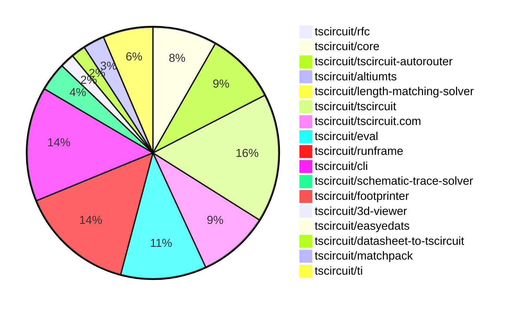

# contribution tracker

[contributions.tscircuit.com](https://contributions.tscircuit.com) ・ [tscircuit.com](https://tscircuit.com) ・ [Contribution Overviews](./contribution-overviews/) ・ [Changelogs](./changelogs/)

Generates weekly contribution overviews for tscircuit contributors. Check out all
the [contribution overviews here](./contribution-overviews/)
You can find AI-generated monthly changelogs in the [changelogs directory](./changelogs/)

- All PRs in the tscircuit org are scanned/summarized via an LLM
- The LLM classifies each Diff/PR as into a set of attributes for scoring
- All the PRs, summaries, and classifications are organized into charts and tables for [the website](https://contributions.tscircuit.com)

> Want to run locally? See the [Development Section](#development)

## Current Week

<!-- START_CURRENT_WEEK -->

# Contribution Overview 2026-08-04

The current week is shown below. There are 3 major sections:

- [Contributor Overview](#contributor-overview)
- [PRs by Repository](#prs-by-repository)
- [PRs by Contributor](#changes-by-contributor)
- [Scoring & Sponsorship Details](/docs/sponsorship-calculation-explanation.md)

## PRs by Repository


```mermaid
pie
    "tscircuit/rfc" : 1
    "tscircuit/core" : 9
    "tscircuit/tscircuit-autorouter" : 10
    "tscircuit/altiumts" : 1
    "tscircuit/length-matching-solver" : 1
    "tscircuit/tscircuit" : 18
    "tscircuit/tscircuit.com" : 10
    "tscircuit/eval" : 12
    "tscircuit/runframe" : 16
    "tscircuit/cli" : 16
    "tscircuit/schematic-trace-solver" : 4
    "tscircuit/footprinter" : 1
    "tscircuit/3d-viewer" : 2
    "tscircuit/easyedats" : 1
    "tscircuit/datasheet-to-tscircuit" : 2
    "tscircuit/matchpack" : 3
    "tscircuit/ti" : 7
```

## Contributor Overview

| Contributor | 🐳 Major | 🐙 Minor | 🐌 Tiny | Score | ⭐ |
|-------------|---------|---------|---------|-------|-----|
| [0hmX](#0hmX) | 5 | 3 | 1 | 27 | ⭐⭐ |
| [ShiboSoftwareDev](#ShiboSoftwareDev) | 3 | 0 | 3 | 16 | ⭐⭐ |
| [mohan-bee](#mohan-bee) | 2 | 2 | 1 | 13 | ⭐⭐ |
| [tscircuitbot](#tscircuitbot) | 0 | 0 | 78 | 12.5 | ⭐⭐ |
| [MustafaMulla29](#MustafaMulla29) | 2 | 0 | 1 | 9 | ⭐ |
| [techmannih](#techmannih) | 0 | 0 | 7 | 8 | ⭐ |
| [AnasSarkiz](#AnasSarkiz) | 1 | 0 | 0 | 6 | ⭐ |
| [seveibar](#seveibar) | 1 | 0 | 1 | 5.5 | ⭐ |
| [addibble](#addibble) | 0 | 1 | 0 | 2 |  |
| [imrishabh18](#imrishabh18) | 0 | 1 | 0 | 2 |  |
| [anil08607](#anil08607) | 0 | 0 | 1 | 1 |  |

## Staff Pass Ratio (SPR)

| Contributor | Reviewed PRs | Rejections | Approvals | SPR |
|-------------|--------------|------------|-----------|-----|
| [0hmX](#0hmX) | 6 | 2 | 4 | 66.7% |
| [mohan-bee](#mohan-bee) | 2 | 0 | 2 | 100.0% |
| [MustafaMulla29](#MustafaMulla29) | 2 | 1 | 2 | 50.0% |
| [ShiboSoftwareDev](#ShiboSoftwareDev) | 2 | 0 | 2 | 100.0% |
| [addibble](#addibble) | 1 | 0 | 1 | 100.0% |
| [imrishabh18](#imrishabh18) | 1 | 0 | 1 | 100.0% |

<details>
<summary>0hmX SPR PRs (6)</summary>

- [#13](https://github.com/tscircuit/rfc/pull/13) checks: require point-to-point differential pair traces
- [#686](https://github.com/tscircuit/circuit-json/pull/686) Add differential pair point-to-point error
- [#3011](https://github.com/tscircuit/core/pull/3011) Warn when differential pairs are not point to point
- [#3009](https://github.com/tscircuit/core/pull/3009) Update autorouter to v0.0.748
- [#4042](https://github.com/tscircuit/cli/pull/4042) Show differential-pair connection warnings in netlist checks
- [#37](https://github.com/tscircuit/altiumts/pull/37) Render native Altium schematic images as SVG

</details>

<details>
<summary>mohan-bee SPR PRs (2)</summary>

- [#772](https://github.com/tscircuit/schematic-trace-solver/pull/772) Avoid shared-pin trace spikes
- [#774](https://github.com/tscircuit/schematic-trace-solver/pull/774) Align chained same-net rails across anchored labels

</details>

<details>
<summary>MustafaMulla29 SPR PRs (2)</summary>

- [#3014](https://github.com/tscircuit/core/pull/3014) Fix four-pin crystal trace length propagation
- [#3016](https://github.com/tscircuit/core/pull/3016) Use canonical net label text for schematic solver bounds

</details>

<details>
<summary>ShiboSoftwareDev SPR PRs (2)</summary>

- [#1927](https://github.com/tscircuit/tscircuit-autorouter/pull/1927) Track generated stitches in clearance-aware routing
- [#1902](https://github.com/tscircuit/tscircuit-autorouter/pull/1902) fix: complete sample 11 safe trace repair

</details>

<details>
<summary>addibble SPR PRs (1)</summary>

- [#961](https://github.com/tscircuit/3d-viewer/pull/961) fix: stop shrinking CAD models rotated off-axis

</details>

<details>
<summary>imrishabh18 SPR PRs (1)</summary>

- [#2924](https://github.com/tscircuit/core/pull/2924) Fix missing net labels across subcircuits

</details>

> Note: AI evaluates PRs and assigns 1-3 star ratings automatically. 4 and 5 star ratings require manual staff review.

## Review Table

[reviews-received-hover]: ## "Number of reviews received for PRs for this contributor"
[approvals-received-hover]: ## "Number of approvals received for PRs this contributor authored"
[rejections-received-hover]: ## "Number of rejections received for PRs this contributor authored"
[prs-opened-hover]: ## "Number of PRs opened by this contributor"
[issues-created-hover]: ## "Number of issues created by this contributor"

| Contributor | Reviews Received | Approvals Received | Rejections Received | Approvals | Rejections Given | PRs Opened | PRs Merged | Issues Created |
|---|---|---|---|---|---|---|---|---|
| [0hmX](#0hmX) | 12 | 4 | 2 | 0 | 0 | 12 | 9 | 0 |
| [Abse2001](#Abse2001) | 0 | 0 | 0 | 0 | 0 | 3 | 0 | 0 |
| [addibble](#addibble) | 1 | 1 | 0 | 0 | 0 | 1 | 1 | 0 |
| [AnasSarkiz](#AnasSarkiz) | 1 | 1 | 0 | 2 | 0 | 3 | 1 | 0 |
| [anil08607](#anil08607) | 3 | 2 | 0 | 0 | 0 | 1 | 1 | 0 |
| [hanuman-bishnoi](#hanuman-bishnoi) | 1 | 0 | 1 | 0 | 0 | 1 | 0 | 0 |
| [imrishabh18](#imrishabh18) | 1 | 1 | 0 | 0 | 1 | 4 | 1 | 0 |
| [mohan-bee](#mohan-bee) | 2 | 2 | 0 | 0 | 0 | 8 | 6 | 0 |
| [MustafaMulla29](#MustafaMulla29) | 4 | 2 | 0 | 0 | 0 | 3 | 3 | 0 |
| [rushabhcodes](#rushabhcodes) | 1 | 0 | 0 | 0 | 0 | 1 | 0 | 0 |
| [seveibar](#seveibar) | 0 | 0 | 0 | 13 | 2 | 2 | 2 | 0 |
| [ShiboSoftwareDev](#ShiboSoftwareDev) | 4 | 4 | 0 | 1 | 0 | 9 | 6 | 0 |
| [techmannih](#techmannih) | 8 | 0 | 0 | 1 | 0 | 8 | 7 | 0 |
| [tscircuitbot](#tscircuitbot) | 0 | 0 | 0 | 0 | 0 | 101 | 78 | 0 |

## Changes by Repository

### [tscircuit/rfc](https://github.com/tscircuit/rfc)

| PR # | Impact | Rating | Contributor | Description |
|------|--------|--------|-------------|-------------|
| [#13](https://github.com/tscircuit/rfc/pull/13) | 🐳 Major | ⭐⭐⭐ | 0hmX | Defines differential-pair conductors as strictly point-to-point, providing clear diagnostics for ambiguous connections. |

### [tscircuit/core](https://github.com/tscircuit/core)

| PR # | Impact | Rating | Contributor | Description |
|------|--------|--------|-------------|-------------|
| [#3009](https://github.com/tscircuit/core/pull/3009) | 🐳 Major | ⭐⭐⭐ | 0hmX | Bumps tscircuitcapacity-autorouter from 0.0.744 to 0.0.748, refreshing affected deterministic autorouting snapshots to incorporate fixes for dual-meander routing and safe trace repair. |
| [#3014](https://github.com/tscircuit/core/pull/3014) | 🐳 Major | ⭐⭐⭐ | MustafaMulla29 | Fixes trace length propagation for four-pin crystals to ensure that only signal pins are constrained by maximum trace length, preventing autorouting errors related to ground connections. |
| [#3016](https://github.com/tscircuit/core/pull/3016) | 🐳 Major | ⭐⭐⭐ | MustafaMulla29 | Fixes discrepancies between schematic trace solver input and rendered net label dimensions, ensuring accurate routing decisions based on correct label sizes. |
| [#3017](https://github.com/tscircuit/core/pull/3017) | 🐙 Minor | ⭐⭐ | 0hmX | Clarifies warnings for differential pairs with ambiguous trace names by providing specific diagnostics without prescriptive advice. |
| [#3011](https://github.com/tscircuit/core/pull/3011) | 🐙 Minor | ⭐⭐ | 0hmX | Adds a warning mechanism for differential pairs that do not connect point-to-point, enhancing design rule checks in the circuit. |
| [#2924](https://github.com/tscircuit/core/pull/2924) | 🐙 Minor | ⭐⭐ | imrishabh18 | Fixes missing net labels for unnamed direct connections across subcircuits, ensuring both endpoints retain their labels when needed. |

<details>
<summary>🐌 Tiny Contributions (3)</summary>

| PR # | Impact | Contributor | Description |
|------|--------|-------------|-------------|
| [#3010](https://github.com/tscircuit/core/pull/3010) | 🐌 Tiny | 0hmX | Bump tscircuitcapacity-autorouter from 0.0.748 to 0.0.750, enabling the autorouter to preserve non-ideal fallback output when post-processing cannot produce the ideal route. |
| [#3012](https://github.com/tscircuit/core/pull/3012) | 🐌 Tiny | seveibar | Changes section divider lines in schematics to be rendered as dashed lines, distinguishing them from electrical connections. |
| [#3013](https://github.com/tscircuit/core/pull/3013) | 🐌 Tiny | MustafaMulla29 | Add a focused schematic regression test for the RP2040 U1, including a complete set of U1-connected traces and a generated schematic SVG snapshot. |

</details>

### [tscircuit/tscircuit-autorouter](https://github.com/tscircuit/tscircuit-autorouter)

| PR # | Impact | Rating | Contributor | Description |
|------|--------|--------|-------------|-------------|
| [#1925](https://github.com/tscircuit/tscircuit-autorouter/pull/1925) | 🐳 Major | ⭐⭐⭐ | 0hmX | Pins the post-processing solver revision to return input HD routes when post-processing fails, updates regression tests to expect successful completion instead of an exception, and modifies the visualization snapshot accordingly. |
| [#1923](https://github.com/tscircuit/tscircuit-autorouter/pull/1923) | 🐳 Major | ⭐⭐⭐ | 0hmX | What changed add bugreport82-0e99ec using the full, unminimized F1C200s board Simple Route JSON add an AutoroutingPipelineDebugger fixture add a focused characterization test for the PostProcessingSolver layer-transition exception add the last-step SVG snapshot captured at the failure state  Why The default autorouter creates an HD route named source_net_8_mst3 whose layer transition does not resolve to exactly one via. PostProcessingSolver rejects that route and aborts the board route. The fixture retains all 218 obstacles and 26 connections. Its canonical SRJ SHA-256 matches the original tsci build --autorouter-dump-srj failed output: 5023393d62bf7b3845dd3da50fe5cc112a5ddd3ef06bc2b87a3e8ab5fd1c1475.  Validation bun run build bun test --timeout 9999999 testsbugsbugreport82-0e99ec.test.ts The focused test reproduces the exact exception, asserts the failed solver state, and verifies the SVG snapshot while remaining green for CI.  Follow-up 1925 implements non-ideal fallback output for this reproduction. tscircuitlength-matching-solver39 implements the core solver behavior. |
| [#1927](https://github.com/tscircuit/tscircuit-autorouter/pull/1927) | 🐳 Major | ⭐⭐⭐ | ShiboSoftwareDev | Fixes clearance-aware stitch selection to ensure generated bridge segments are considered, preventing selection of stitches that cross newly created copper. |
| [#1902](https://github.com/tscircuit/tscircuit-autorouter/pull/1902) | 🐳 Major | ⭐⭐⭐ | ShiboSoftwareDev | Fixes the issue where Dataset 18 sample 11 fails to complete exact DRC repair due to a bounded trace detour not finishing the repair process after canonicalizing a via. |

<details>
<summary>🐌 Tiny Contributions (6)</summary>

| PR # | Impact | Contributor | Description |
|------|--------|-------------|-------------|
| [#1930](https://github.com/tscircuit/tscircuit-autorouter/pull/1930) | 🐌 Tiny | tscircuitbot | Automated package update |
| [#1926](https://github.com/tscircuit/tscircuit-autorouter/pull/1926) | 🐌 Tiny | tscircuitbot | Automated package update |
| [#1924](https://github.com/tscircuit/tscircuit-autorouter/pull/1924) | 🐌 Tiny | tscircuitbot | Automated package update |
| [#1919](https://github.com/tscircuit/tscircuit-autorouter/pull/1919) | 🐌 Tiny | tscircuitbot | Automated package update |
| [#1920](https://github.com/tscircuit/tscircuit-autorouter/pull/1920) | 🐌 Tiny | ShiboSoftwareDev | Adds a test to visualize and reproduce the remaining exact DRC errors after geometry repair for dataset 18 sample 10, without changing solver behavior. |
| [#1900](https://github.com/tscircuit/tscircuit-autorouter/pull/1900) | 🐌 Tiny | ShiboSoftwareDev | Reproduces the DRC failure for dataset 18 sample 11, demonstrating the exact errors encountered during the production pipelines exact-DRC stage. |

</details>

### [tscircuit/altiumts](https://github.com/tscircuit/altiumts)

| PR # | Impact | Rating | Contributor | Description |
|------|--------|--------|-------------|-------------|
| [#37](https://github.com/tscircuit/altiumts/pull/37) | 🐳 Major | ⭐⭐⭐ | 0hmX | Summary extract the native TMetafile and TdxPNGImage payloads stored after Altiums embedded bitmap preview add a bounded EMF-to-SVG renderer for the GDI record subset used by the TI TMDS62LEVM design preserve vector paths, Unicode text, fonts, rotation, alignment, and anisotropic coordinate mapping compose TIs adjacent SRCPAINT 1-bit masks and SRCAND 24-bit bitmap records into transparent native-resolution images prefer native SVGPNG content in schematic serialization while retaining the existing bitmap fallback for malformed or unsupported payloads add focused extraction, rendering, malformed-input, and format-selection coverage  Root cause Altium image streams contain a bitmap preview followed by the original native image payload. The existing parser stopped after the bitmap, so the browser viewer embedded a low-resolution PNG preview. Zooming therefore enlarged fixed pixels even when the source document contained an EMF vector drawing or a higher-resolution PNG.  Impact The affected TI sheets now use their original artwork: sheet 05 renders 5,870 vector paths and 491 text elements as SVG sheets 0508 and 11 retain their vector content sheet 09 uses its two native high-resolution PNGs sheet 10 renders its native transparent bitmap tiles instead of the small preview Unknown EMF operations and invalid native payloads continue to fall back safely to the existing preview behavior.  Validation biome check on all changed source and test files library and site TypeScript checks focused embedded-image tests: 2 passed, 25 assertions Vite production site build ESM, declaration, CLI, and package verification build browser verification using the exact TI ZIP from Downloads: sheet 05 remained crisp and readable after 3 zoom, with no browser console errors |

### [tscircuit/length-matching-solver](https://github.com/tscircuit/length-matching-solver)

| PR # | Impact | Rating | Contributor | Description |
|------|--------|--------|-------------|-------------|
| [#39](https://github.com/tscircuit/length-matching-solver/pull/39) | 🐙 Minor | ⭐⭐ | 0hmX | Returns structured post-processing errors by default, providing original input HD routes when validation fails and including a structured postProcessingErrors array in the output. |

### [tscircuit/tscircuit](https://github.com/tscircuit/tscircuit)


<details>
<summary>🐌 Tiny Contributions (18)</summary>

| PR # | Impact | Contributor | Description |
|------|--------|-------------|-------------|
| [#4293](https://github.com/tscircuit/tscircuit/pull/4293) | 🐌 Tiny | tscircuitbot | Automated package update |
| [#4292](https://github.com/tscircuit/tscircuit/pull/4292) | 🐌 Tiny | tscircuitbot | Automated package update |
| [#4291](https://github.com/tscircuit/tscircuit/pull/4291) | 🐌 Tiny | tscircuitbot | Automated package update |
| [#4290](https://github.com/tscircuit/tscircuit/pull/4290) | 🐌 Tiny | tscircuitbot | Automated package update |
| [#4289](https://github.com/tscircuit/tscircuit/pull/4289) | 🐌 Tiny | tscircuitbot | Automated package update |
| [#4288](https://github.com/tscircuit/tscircuit/pull/4288) | 🐌 Tiny | tscircuitbot | Automated package update |
| [#4287](https://github.com/tscircuit/tscircuit/pull/4287) | 🐌 Tiny | tscircuitbot | Automated package update |
| [#4286](https://github.com/tscircuit/tscircuit/pull/4286) | 🐌 Tiny | tscircuitbot | Automated package update |
| [#4285](https://github.com/tscircuit/tscircuit/pull/4285) | 🐌 Tiny | tscircuitbot | Automated package update |
| [#4284](https://github.com/tscircuit/tscircuit/pull/4284) | 🐌 Tiny | tscircuitbot | Updates the versions of several dependencies in the package.json file. |
| [#4283](https://github.com/tscircuit/tscircuit/pull/4283) | 🐌 Tiny | tscircuitbot | Automated package update |
| [#4282](https://github.com/tscircuit/tscircuit/pull/4282) | 🐌 Tiny | tscircuitbot | Automated package update |
| [#4281](https://github.com/tscircuit/tscircuit/pull/4281) | 🐌 Tiny | tscircuitbot | Automated package update |
| [#4280](https://github.com/tscircuit/tscircuit/pull/4280) | 🐌 Tiny | tscircuitbot | Updates the tscircuitcli package from version 0.1.1828 to 0.1.1829 and the tscircuitrunframe package from version 0.0.2363 to 0.0.2364. |
| [#4278](https://github.com/tscircuit/tscircuit/pull/4278) | 🐌 Tiny | tscircuitbot | Automated package update |
| [#4277](https://github.com/tscircuit/tscircuit/pull/4277) | 🐌 Tiny | tscircuitbot | Automated package update |
| [#4276](https://github.com/tscircuit/tscircuit/pull/4276) | 🐌 Tiny | tscircuitbot | Automated package update |
| [#4275](https://github.com/tscircuit/tscircuit/pull/4275) | 🐌 Tiny | tscircuitbot | Automated package update |

</details>

### [tscircuit/tscircuit.com](https://github.com/tscircuit/tscircuit.com)


<details>
<summary>🐌 Tiny Contributions (10)</summary>

| PR # | Impact | Contributor | Description |
|------|--------|-------------|-------------|
| [#4253](https://github.com/tscircuit/tscircuit.com/pull/4253) | 🐌 Tiny | tscircuitbot | Automated package update |
| [#4252](https://github.com/tscircuit/tscircuit.com/pull/4252) | 🐌 Tiny | tscircuitbot | Updates the tscircuitrunframe package from version 0.0.2366 to 0.0.2368 |
| [#4249](https://github.com/tscircuit/tscircuit.com/pull/4249) | 🐌 Tiny | tscircuitbot | Updates the tscircuiteval package from version 0.0.1133 to 0.0.1134 |
| [#4248](https://github.com/tscircuit/tscircuit.com/pull/4248) | 🐌 Tiny | tscircuitbot | Automated package update |
| [#4247](https://github.com/tscircuit/tscircuit.com/pull/4247) | 🐌 Tiny | tscircuitbot | Updates the tscircuiteval package from version 0.0.1131 to 0.0.1133 |
| [#4246](https://github.com/tscircuit/tscircuit.com/pull/4246) | 🐌 Tiny | tscircuitbot | Updates the tscircuitrunframe package from version 0.0.2364 to 0.0.2365 |
| [#4244](https://github.com/tscircuit/tscircuit.com/pull/4244) | 🐌 Tiny | tscircuitbot | Automated package update |
| [#4243](https://github.com/tscircuit/tscircuit.com/pull/4243) | 🐌 Tiny | tscircuitbot | Automated package update |
| [#4242](https://github.com/tscircuit/tscircuit.com/pull/4242) | 🐌 Tiny | tscircuitbot | Automated package update |
| [#4241](https://github.com/tscircuit/tscircuit.com/pull/4241) | 🐌 Tiny | tscircuitbot | Updates the tscircuiteval package from version 0.0.1130 to 0.0.1131 |

</details>

### [tscircuit/eval](https://github.com/tscircuit/eval)


<details>
<summary>🐌 Tiny Contributions (12)</summary>

| PR # | Impact | Contributor | Description |
|------|--------|-------------|-------------|
| [#3697](https://github.com/tscircuit/eval/pull/3697) | 🐌 Tiny | tscircuitbot | Automated package update |
| [#3696](https://github.com/tscircuit/eval/pull/3696) | 🐌 Tiny | tscircuitbot | Updates the version of the tscircuitcore package from 0.0.1604 to 0.0.1605 in package.json |
| [#3695](https://github.com/tscircuit/eval/pull/3695) | 🐌 Tiny | tscircuitbot | Automated package update |
| [#3694](https://github.com/tscircuit/eval/pull/3694) | 🐌 Tiny | tscircuitbot | Updates the version of the tscircuitcore package from 0.0.1603 to 0.0.1604 in package.json |
| [#3693](https://github.com/tscircuit/eval/pull/3693) | 🐌 Tiny | tscircuitbot | Automated package update |
| [#3692](https://github.com/tscircuit/eval/pull/3692) | 🐌 Tiny | tscircuitbot | Updates the version of the tscircuitcore package from 0.0.1602 to 0.0.1603 in package.json |
| [#3690](https://github.com/tscircuit/eval/pull/3690) | 🐌 Tiny | tscircuitbot | Updates the package version from 0.0.1132 to 0.0.1133 in package.json |
| [#3689](https://github.com/tscircuit/eval/pull/3689) | 🐌 Tiny | tscircuitbot | Automated package update |
| [#3687](https://github.com/tscircuit/eval/pull/3687) | 🐌 Tiny | tscircuitbot | Automated package update |
| [#3686](https://github.com/tscircuit/eval/pull/3686) | 🐌 Tiny | tscircuitbot | Automated package update |
| [#3680](https://github.com/tscircuit/eval/pull/3680) | 🐌 Tiny | tscircuitbot | Automated package update |
| [#3679](https://github.com/tscircuit/eval/pull/3679) | 🐌 Tiny | tscircuitbot | Updates the versions of several dependencies in the package.json file. |

</details>

### [tscircuit/runframe](https://github.com/tscircuit/runframe)


<details>
<summary>🐌 Tiny Contributions (16)</summary>

| PR # | Impact | Contributor | Description |
|------|--------|-------------|-------------|
| [#4339](https://github.com/tscircuit/runframe/pull/4339) | 🐌 Tiny | tscircuitbot | Automated package update |
| [#4338](https://github.com/tscircuit/runframe/pull/4338) | 🐌 Tiny | tscircuitbot | Updates the tscircuiteval package from version 0.0.1135 to 0.0.1136 in the package.json file. |
| [#4337](https://github.com/tscircuit/runframe/pull/4337) | 🐌 Tiny | tscircuitbot | Automated package update |
| [#4336](https://github.com/tscircuit/runframe/pull/4336) | 🐌 Tiny | tscircuitbot | Updates the tscircuiteval package from version 0.0.1134 to 0.0.1135 in the package.json file. |
| [#4335](https://github.com/tscircuit/runframe/pull/4335) | 🐌 Tiny | tscircuitbot | Automated package update |
| [#4334](https://github.com/tscircuit/runframe/pull/4334) | 🐌 Tiny | tscircuitbot | Updates the tscircuiteval package to version 0.0.1134 in the package.json file. |
| [#4333](https://github.com/tscircuit/runframe/pull/4333) | 🐌 Tiny | tscircuitbot | Automated package update |
| [#4332](https://github.com/tscircuit/runframe/pull/4332) | 🐌 Tiny | tscircuitbot | Updates the tscircuiteval package from version 0.0.1132 to 0.0.1133 in the project dependencies. |
| [#4331](https://github.com/tscircuit/runframe/pull/4331) | 🐌 Tiny | tscircuitbot | Automated package update |
| [#4330](https://github.com/tscircuit/runframe/pull/4330) | 🐌 Tiny | tscircuitbot | Updates the tscircuiteval package from version 0.0.1131 to 0.0.1132 in the package.json file. |
| [#4329](https://github.com/tscircuit/runframe/pull/4329) | 🐌 Tiny | tscircuitbot | Automated package update |
| [#4328](https://github.com/tscircuit/runframe/pull/4328) | 🐌 Tiny | tscircuitbot | Automated package update |
| [#4327](https://github.com/tscircuit/runframe/pull/4327) | 🐌 Tiny | tscircuitbot | Automated package update |
| [#4326](https://github.com/tscircuit/runframe/pull/4326) | 🐌 Tiny | tscircuitbot | Automated package update |
| [#4325](https://github.com/tscircuit/runframe/pull/4325) | 🐌 Tiny | tscircuitbot | Updates the package version from 0.0.2361 to 0.0.2362 in package.json |
| [#4324](https://github.com/tscircuit/runframe/pull/4324) | 🐌 Tiny | tscircuitbot | Updates the tscircuiteval package from version 0.0.1130 to 0.0.1131 in the package.json file. |

</details>

### [tscircuit/cli](https://github.com/tscircuit/cli)


<details>
<summary>🐌 Tiny Contributions (16)</summary>

| PR # | Impact | Contributor | Description |
|------|--------|-------------|-------------|
| [#4051](https://github.com/tscircuit/cli/pull/4051) | 🐌 Tiny | tscircuitbot | Automated package update |
| [#4050](https://github.com/tscircuit/cli/pull/4050) | 🐌 Tiny | tscircuitbot | Updates the tscircuitrunframe package from version 0.0.2368 to 0.0.2369 |
| [#4049](https://github.com/tscircuit/cli/pull/4049) | 🐌 Tiny | tscircuitbot | Automated package update |
| [#4048](https://github.com/tscircuit/cli/pull/4048) | 🐌 Tiny | tscircuitbot | Updates the tscircuitrunframe package from version 0.0.2367 to 0.0.2368 |
| [#4047](https://github.com/tscircuit/cli/pull/4047) | 🐌 Tiny | tscircuitbot | Automated package update |
| [#4046](https://github.com/tscircuit/cli/pull/4046) | 🐌 Tiny | tscircuitbot | Updates the tscircuitrunframe package from version 0.0.2366 to 0.0.2367 |
| [#4045](https://github.com/tscircuit/cli/pull/4045) | 🐌 Tiny | tscircuitbot | Automated package update |
| [#4044](https://github.com/tscircuit/cli/pull/4044) | 🐌 Tiny | tscircuitbot | Updates the tscircuitrunframe package from version 0.0.2365 to 0.0.2366 |
| [#4043](https://github.com/tscircuit/cli/pull/4043) | 🐌 Tiny | tscircuitbot | Automated package update |
| [#4041](https://github.com/tscircuit/cli/pull/4041) | 🐌 Tiny | tscircuitbot | Updates the tscircuitrunframe package from version 0.0.2364 to 0.0.2365 |
| [#4040](https://github.com/tscircuit/cli/pull/4040) | 🐌 Tiny | tscircuitbot | Automated package update |
| [#4039](https://github.com/tscircuit/cli/pull/4039) | 🐌 Tiny | tscircuitbot | Updates the tscircuitrunframe package from version 0.0.2363 to 0.0.2364 |
| [#4038](https://github.com/tscircuit/cli/pull/4038) | 🐌 Tiny | tscircuitbot | Automated package update |
| [#4037](https://github.com/tscircuit/cli/pull/4037) | 🐌 Tiny | tscircuitbot | Updates the tscircuitrunframe package from version 0.0.2362 to 0.0.2363 |
| [#4036](https://github.com/tscircuit/cli/pull/4036) | 🐌 Tiny | tscircuitbot | Automated package update |
| [#4035](https://github.com/tscircuit/cli/pull/4035) | 🐌 Tiny | tscircuitbot | Updates the tscircuitrunframe package from version 0.0.2361 to 0.0.2362 |

</details>

### [tscircuit/schematic-trace-solver](https://github.com/tscircuit/schematic-trace-solver)

| PR # | Impact | Rating | Contributor | Description |
|------|--------|--------|-------------|-------------|
| [#774](https://github.com/tscircuit/schematic-trace-solver/pull/774) | 🐙 Minor | ⭐⭐ | mohan-bee | Aligns the positioning of same-net rails to ensure they are properly aligned across anchored labels, preventing intersection with label bodies. |

<details>
<summary>🐌 Tiny Contributions (3)</summary>

| PR # | Impact | Contributor | Description |
|------|--------|-------------|-------------|
| [#776](https://github.com/tscircuit/schematic-trace-solver/pull/776) | 🐌 Tiny | tscircuitbot | Adds a snapshot-only regression test and debugger page for the attached JSON solver input. |
| [#771](https://github.com/tscircuit/schematic-trace-solver/pull/771) | 🐌 Tiny | tscircuitbot | Adds a snapshot-only regression test and debugger page for the attached JSON solver input. |
| [#773](https://github.com/tscircuit/schematic-trace-solver/pull/773) | 🐌 Tiny | mohan-bee | Adds a reproduction test for the V3V3 trace step in the power section autolayout. |

</details>

### [tscircuit/footprinter](https://github.com/tscircuit/footprinter)


<details>
<summary>🐌 Tiny Contributions (1)</summary>

| PR # | Impact | Contributor | Description |
|------|--------|-------------|-------------|
| [#760](https://github.com/tscircuit/footprinter/pull/760) | 🐌 Tiny | anil08607 | Sets circular pads as the default option for BGA footprints to ensure compatibility with KiCad. |

</details>

### [tscircuit/3d-viewer](https://github.com/tscircuit/3d-viewer)

| PR # | Impact | Rating | Contributor | Description |
|------|--------|--------|-------------|-------------|
| [#960](https://github.com/tscircuit/3d-viewer/pull/960) | 🐳 Major | ⭐⭐⭐ | AnasSarkiz | Flux-grade PCB rendering, now the default PCB renders now use the Flux-style product presentation in every viewer path: controlled studio lighting, a satin solder-mask response, physical coppertrace relief, and no engineering grid or rendering-mode fallback. Uses geometry-derived masked-copper maps, so an empty board cannot generate false texture artifacts. Keeps the existing solder-mask color map intact while applying material detail only where copper geometry exists. Keeps Appearance state focused: Lighting and an opt-in Dark Background. Transparency is the default for every new viewer session. Removes the unused engineering grid and shadow-receiver path. Sets Storybook stories to fullscreen so the visual review is edge-to-edge.  Interactive review Open the Keypad preview(https:3d-viewer-ohwimtp1u-tscircuit.vercel.app?pathstorykeypad--default)  Keypad visual comparison  Transparent canvas (default) !Keypad render on a transparent canvas(https:raw.githubusercontent.comAnasSarkiz3d-viewer8fb7cc318d0ef88435230e19762e77513ae2e831.githubpr-assetskeypad-transparent-background.png)  Dark studio background (optional) !Keypad render with the Flux-style dark studio background(https:raw.githubusercontent.comAnasSarkiz3d-viewer8fb7cc318d0ef88435230e19762e77513ae2e831.githubpr-assetskeypad-dark-studio.png)  Validation bun test testsboard-relief-textures.test.ts testsmanifold-board-textures-strict-mode.test.tsx bunx tsc --noEmit --pretty false (blocked only by existing canvas color typing errors outside this change) Biome checks on the changed files |
| [#961](https://github.com/tscircuit/3d-viewer/pull/961) | 🐙 Minor | ⭐⭐ | addibble | Fixes CAD model scaling issue where models with declared sizes shrink when rotated at angles that are not multiples of 90 due to incorrect bounding box calculations. |

### [tscircuit/easyedats](https://github.com/tscircuit/easyedats)

| PR # | Impact | Rating | Contributor | Description |
|------|--------|--------|-------------|-------------|
| [#4](https://github.com/tscircuit/easyedats/pull/4) | 🐳 Major | ⭐⭐⭐ | seveibar | Summary add structured EasyEDA parse errors with document paths, record tokens, field positions, and configurable safety limits render raster data images safely, add an explicit remote-image policy, and expose SVG diagnostics for blocked, unsupported, or partially rendered content add opt-in PCB net highlighting and shape-selection metadata add focused mutation coverage for every documented Standard token plus deterministic property and fuzz suites provide inspect, validate, normalize, round-trip, and SVG CLI commands verify the public API in Bun, bundled Node.js ESM, and a browser-targeted bundle mark the corresponding ten existing support-checklist items complete  Why These capabilities make malformed and unsupported EasyEDA input observable without weakening lossless round trips, make SVG image handling safe by default, and give contributors executable tooling for reviewing parser and serializer behavior across runtimes.  Developer impact parser callers can catch EasyEdaParseError and inspect stable structured fields SVG callers can use renderEasyEdaSvgWithDiagnostics and opt into remote images, net highlights, or selected-shape metadata contributors can exercise the format from the new CLI and rely on deterministic robustness suites  Validation bun test  53 passing tests, 2,923 assertions bun run typecheck bun run lint bun run format:check git diff --check visually reviewed the new embedded-image SVG snapshot |

### [tscircuit/datasheet-to-tscircuit](https://github.com/tscircuit/datasheet-to-tscircuit)

| PR # | Impact | Rating | Contributor | Description |
|------|--------|--------|-------------|-------------|
| [#34](https://github.com/tscircuit/datasheet-to-tscircuit/pull/34) | 🐳 Major | ⭐⭐⭐ | ShiboSoftwareDev | Allows restarting of SPICE model runs that have completed, failed, or timed out, enhancing the model run management process. |

<details>
<summary>🐌 Tiny Contributions (1)</summary>

| PR # | Impact | Contributor | Description |
|------|--------|-------------|-------------|
| [#35](https://github.com/tscircuit/datasheet-to-tscircuit/pull/35) | 🐌 Tiny | ShiboSoftwareDev | Summary split datasheet processing into three authoritative, typed pipelines for component generation, typical applications, and SPICE generation make every pipeline stage consume only its declared dependency output and persist exact debug inputoutput bundles reshape SPICE generation into explicit reference discovery, comparison graph, model inference, TSX generation, simulation, comparison, repair, and publication stages add server endpoints and UI controls to run a whole pipeline, one isolated step, or a selected step and everything after it add a machine-readable local CLI for task inspection, standalone task execution, full pipeline execution, and replaying old jobs at one task, from a task, or end to end persist a versioned pipeline_task_input envelope containing task identity, complete JSON execution context, and dependency outputs run local replays in fresh cloned workspaces with rewritten job-local paths, immutable summaries, event streams, and artifacts while leaving historical jobs untouched preserve retained inputs for untouched stages across repeated debug runs and restore the new pipeline snapshots across server restarts update architecture documentation and regression coverage for pipeline registries, isolated execution, and non-destructive replay  Why The previous workflow mixed component and typical-application work and did not expose a reproducible way to rerun an individual stage. The UI debugger also was not sufficient for a local coding agent: the agent needed a deterministic CLI contract to discover, inspect, and execute the same work from retained inputs. The new pipelinetask contract gives each stage an explicit input boundary and creates fresh, inspectable invocation artifacts for debugging. Pipelines are now composition only: they pass one task output to the next, while the same task can be invoked directly from its retained input.  User and developer impact Completed tasks expose separate Component, Typical application, and SPICE debugger controls. Developers and coding agents can use bun run debug -- to: discover all pipelines and tasks list retained jobs and traces inspect a task input and its referenced paths run one task from its input run a complete pipeline from an input envelope replay an old jobs task, suffix, or full pipeline Replay clones the source job into .runtimereplays by default and never mutates the retained historical job.  Validation bun test --timeout 30000  625 passed, 10 skipped, 0 failed bun run typecheck bun run format:check bun run build:web CLI smoke checks for catalog and help output end-to-end replay regression proving standalone and old-job task commands leave the source job checkpoint unchanged local browser verification of all three debugger entry points and the SPICE stage modal, with no console errors |

</details>

### [tscircuit/matchpack](https://github.com/tscircuit/matchpack)

| PR # | Impact | Rating | Contributor | Description |
|------|--------|--------|-------------|-------------|
| [#195](https://github.com/tscircuit/matchpack/pull/195) | 🐳 Major | ⭐⭐⭐ | mohan-bee | Preserves passive component alignment during horizontal trace clearance adjustments to prevent misalignment of passive components. |
| [#192](https://github.com/tscircuit/matchpack/pull/192) | 🐳 Major | ⭐⭐⭐ | mohan-bee | Aligns rail-load pins with decoupling capacitor rows to ensure proper connection and layout in circuit design. |
| [#194](https://github.com/tscircuit/matchpack/pull/194) | 🐙 Minor | ⭐⭐ | mohan-bee | Adds a regression test for the auto-layout of polarized capacitors to ensure correct placement when sharing chip and ground connections. |

### [tscircuit/ti](https://github.com/tscircuit/ti)


<details>
<summary>🐌 Tiny Contributions (7)</summary>

| PR # | Impact | Contributor | Description |
|------|--------|-------------|-------------|
| [#100](https://github.com/tscircuit/ti/pull/100) | 🐌 Tiny | techmannih | Add the MSP430F5229 chip components and BluetoothAudioHost_MSP430F5229 reference subcircuit with documentation and PCBschematic snapshots. |
| [#96](https://github.com/tscircuit/ti/pull/96) | 🐌 Tiny | techmannih | Add TPS7A20 power management subcircuit with chip definition and reusable component for 3.3 V LDO. |
| [#98](https://github.com/tscircuit/ti/pull/98) | 🐌 Tiny | techmannih | Add the MSP430G2230ID chip definition and reusable TargetSocket_MSPTS430D8 target-socket subcircuit, along with documentation and schematic snapshot. |
| [#95](https://github.com/tscircuit/ti/pull/95) | 🐌 Tiny | techmannih | Add TLV75533PDBVR chip definition and TLV755P short-name wrapper, along with a reusable PowerManagement_TLV755P 3.3 V LDO reference subcircuit, enabling consumers to import these components directly from the package. |
| [#97](https://github.com/tscircuit/ti/pull/97) | 🐌 Tiny | techmannih | Adds the CC2564C Bluetooth controller chip definition and a reusable BluetoothController_CC2564C reference subcircuit, along with documentation and schematic snapshot, while omitting the PCB snapshot. |
| [#93](https://github.com/tscircuit/ti/pull/93) | 🐌 Tiny | techmannih | Add a TAS2505 chip definition with its QFN footprint, pin labels, supplier part number, and schematic layout, along with a reusable TAS2505 audio-amplifier application subcircuit. |
| [#94](https://github.com/tscircuit/ti/pull/94) | 🐌 Tiny | techmannih | Add BQ24072RGTR and BQ24073RGTR chip definitions with short-name wrappers and reusable BatteryManagement_BQ24072 and BatteryManagement_BQ24073 reference subcircuits. |

</details>

## Changes by Contributor

### [0hmX](https://github.com/0hmX)

| PRs # | Impact | Rating | Description |
|------|--------|--------|-------------|
| [#13](https://github.com/tscircuit/rfc/pull/13) | 🐳 Major | ⭐⭐⭐ | Defines differential-pair conductors as strictly point-to-point, providing clear diagnostics for ambiguous connections. |
| [#3009](https://github.com/tscircuit/core/pull/3009) | 🐳 Major | ⭐⭐⭐ | Bumps tscircuitcapacity-autorouter from 0.0.744 to 0.0.748, refreshing affected deterministic autorouting snapshots to incorporate fixes for dual-meander routing and safe trace repair. |
| [#1925](https://github.com/tscircuit/tscircuit-autorouter/pull/1925) | 🐳 Major | ⭐⭐⭐ | Pins the post-processing solver revision to return input HD routes when post-processing fails, updates regression tests to expect successful completion instead of an exception, and modifies the visualization snapshot accordingly. |
| [#1923](https://github.com/tscircuit/tscircuit-autorouter/pull/1923) | 🐳 Major | ⭐⭐⭐ | What changed add bugreport82-0e99ec using the full, unminimized F1C200s board Simple Route JSON add an AutoroutingPipelineDebugger fixture add a focused characterization test for the PostProcessingSolver layer-transition exception add the last-step SVG snapshot captured at the failure state  Why The default autorouter creates an HD route named source_net_8_mst3 whose layer transition does not resolve to exactly one via. PostProcessingSolver rejects that route and aborts the board route. The fixture retains all 218 obstacles and 26 connections. Its canonical SRJ SHA-256 matches the original tsci build --autorouter-dump-srj failed output: 5023393d62bf7b3845dd3da50fe5cc112a5ddd3ef06bc2b87a3e8ab5fd1c1475.  Validation bun run build bun test --timeout 9999999 testsbugsbugreport82-0e99ec.test.ts The focused test reproduces the exact exception, asserts the failed solver state, and verifies the SVG snapshot while remaining green for CI.  Follow-up 1925 implements non-ideal fallback output for this reproduction. tscircuitlength-matching-solver39 implements the core solver behavior. |
| [#37](https://github.com/tscircuit/altiumts/pull/37) | 🐳 Major | ⭐⭐⭐ | Summary extract the native TMetafile and TdxPNGImage payloads stored after Altiums embedded bitmap preview add a bounded EMF-to-SVG renderer for the GDI record subset used by the TI TMDS62LEVM design preserve vector paths, Unicode text, fonts, rotation, alignment, and anisotropic coordinate mapping compose TIs adjacent SRCPAINT 1-bit masks and SRCAND 24-bit bitmap records into transparent native-resolution images prefer native SVGPNG content in schematic serialization while retaining the existing bitmap fallback for malformed or unsupported payloads add focused extraction, rendering, malformed-input, and format-selection coverage  Root cause Altium image streams contain a bitmap preview followed by the original native image payload. The existing parser stopped after the bitmap, so the browser viewer embedded a low-resolution PNG preview. Zooming therefore enlarged fixed pixels even when the source document contained an EMF vector drawing or a higher-resolution PNG.  Impact The affected TI sheets now use their original artwork: sheet 05 renders 5,870 vector paths and 491 text elements as SVG sheets 0508 and 11 retain their vector content sheet 09 uses its two native high-resolution PNGs sheet 10 renders its native transparent bitmap tiles instead of the small preview Unknown EMF operations and invalid native payloads continue to fall back safely to the existing preview behavior.  Validation biome check on all changed source and test files library and site TypeScript checks focused embedded-image tests: 2 passed, 25 assertions Vite production site build ESM, declaration, CLI, and package verification build browser verification using the exact TI ZIP from Downloads: sheet 05 remained crisp and readable after 3 zoom, with no browser console errors |
| [#3017](https://github.com/tscircuit/core/pull/3017) | 🐙 Minor | ⭐⭐ | Clarifies warnings for differential pairs with ambiguous trace names by providing specific diagnostics without prescriptive advice. |
| [#3011](https://github.com/tscircuit/core/pull/3011) | 🐙 Minor | ⭐⭐ | Adds a warning mechanism for differential pairs that do not connect point-to-point, enhancing design rule checks in the circuit. |
| [#39](https://github.com/tscircuit/length-matching-solver/pull/39) | 🐙 Minor | ⭐⭐ | Returns structured post-processing errors by default, providing original input HD routes when validation fails and including a structured postProcessingErrors array in the output. |

<details>
<summary>🐌 Tiny Contributions (1)</summary>

| PR # | Impact | Description |
|------|--------|-------------|
| [#3010](https://github.com/tscircuit/core/pull/3010) | 🐌 Tiny | Bump tscircuitcapacity-autorouter from 0.0.748 to 0.0.750, enabling the autorouter to preserve non-ideal fallback output when post-processing cannot produce the ideal route. |

</details>

### [tscircuitbot](https://github.com/tscircuitbot)


<details>
<summary>🐌 Tiny Contributions (78)</summary>

| PR # | Impact | Description |
|------|--------|-------------|
| [#4293](https://github.com/tscircuit/tscircuit/pull/4293) | 🐌 Tiny | Automated package update |
| [#4292](https://github.com/tscircuit/tscircuit/pull/4292) | 🐌 Tiny | Automated package update |
| [#4291](https://github.com/tscircuit/tscircuit/pull/4291) | 🐌 Tiny | Automated package update |
| [#4290](https://github.com/tscircuit/tscircuit/pull/4290) | 🐌 Tiny | Automated package update |
| [#4289](https://github.com/tscircuit/tscircuit/pull/4289) | 🐌 Tiny | Automated package update |
| [#4288](https://github.com/tscircuit/tscircuit/pull/4288) | 🐌 Tiny | Automated package update |
| [#4287](https://github.com/tscircuit/tscircuit/pull/4287) | 🐌 Tiny | Automated package update |
| [#4286](https://github.com/tscircuit/tscircuit/pull/4286) | 🐌 Tiny | Automated package update |
| [#4285](https://github.com/tscircuit/tscircuit/pull/4285) | 🐌 Tiny | Automated package update |
| [#4284](https://github.com/tscircuit/tscircuit/pull/4284) | 🐌 Tiny | Updates the versions of several dependencies in the package.json file. |
| [#4283](https://github.com/tscircuit/tscircuit/pull/4283) | 🐌 Tiny | Automated package update |
| [#4282](https://github.com/tscircuit/tscircuit/pull/4282) | 🐌 Tiny | Automated package update |
| [#4281](https://github.com/tscircuit/tscircuit/pull/4281) | 🐌 Tiny | Automated package update |
| [#4280](https://github.com/tscircuit/tscircuit/pull/4280) | 🐌 Tiny | Updates the tscircuitcli package from version 0.1.1828 to 0.1.1829 and the tscircuitrunframe package from version 0.0.2363 to 0.0.2364. |
| [#4278](https://github.com/tscircuit/tscircuit/pull/4278) | 🐌 Tiny | Automated package update |
| [#4277](https://github.com/tscircuit/tscircuit/pull/4277) | 🐌 Tiny | Automated package update |
| [#4276](https://github.com/tscircuit/tscircuit/pull/4276) | 🐌 Tiny | Automated package update |
| [#4275](https://github.com/tscircuit/tscircuit/pull/4275) | 🐌 Tiny | Automated package update |
| [#4253](https://github.com/tscircuit/tscircuit.com/pull/4253) | 🐌 Tiny | Automated package update |
| [#4252](https://github.com/tscircuit/tscircuit.com/pull/4252) | 🐌 Tiny | Updates the tscircuitrunframe package from version 0.0.2366 to 0.0.2368 |
| [#4249](https://github.com/tscircuit/tscircuit.com/pull/4249) | 🐌 Tiny | Updates the tscircuiteval package from version 0.0.1133 to 0.0.1134 |
| [#4248](https://github.com/tscircuit/tscircuit.com/pull/4248) | 🐌 Tiny | Automated package update |
| [#4247](https://github.com/tscircuit/tscircuit.com/pull/4247) | 🐌 Tiny | Updates the tscircuiteval package from version 0.0.1131 to 0.0.1133 |
| [#4246](https://github.com/tscircuit/tscircuit.com/pull/4246) | 🐌 Tiny | Updates the tscircuitrunframe package from version 0.0.2364 to 0.0.2365 |
| [#4244](https://github.com/tscircuit/tscircuit.com/pull/4244) | 🐌 Tiny | Automated package update |
| [#4243](https://github.com/tscircuit/tscircuit.com/pull/4243) | 🐌 Tiny | Automated package update |
| [#4242](https://github.com/tscircuit/tscircuit.com/pull/4242) | 🐌 Tiny | Automated package update |
| [#4241](https://github.com/tscircuit/tscircuit.com/pull/4241) | 🐌 Tiny | Updates the tscircuiteval package from version 0.0.1130 to 0.0.1131 |
| [#3697](https://github.com/tscircuit/eval/pull/3697) | 🐌 Tiny | Automated package update |
| [#3696](https://github.com/tscircuit/eval/pull/3696) | 🐌 Tiny | Updates the version of the tscircuitcore package from 0.0.1604 to 0.0.1605 in package.json |
| [#3695](https://github.com/tscircuit/eval/pull/3695) | 🐌 Tiny | Automated package update |
| [#3694](https://github.com/tscircuit/eval/pull/3694) | 🐌 Tiny | Updates the version of the tscircuitcore package from 0.0.1603 to 0.0.1604 in package.json |
| [#3693](https://github.com/tscircuit/eval/pull/3693) | 🐌 Tiny | Automated package update |
| [#3692](https://github.com/tscircuit/eval/pull/3692) | 🐌 Tiny | Updates the version of the tscircuitcore package from 0.0.1602 to 0.0.1603 in package.json |
| [#3690](https://github.com/tscircuit/eval/pull/3690) | 🐌 Tiny | Updates the package version from 0.0.1132 to 0.0.1133 in package.json |
| [#3689](https://github.com/tscircuit/eval/pull/3689) | 🐌 Tiny | Automated package update |
| [#3687](https://github.com/tscircuit/eval/pull/3687) | 🐌 Tiny | Automated package update |
| [#3686](https://github.com/tscircuit/eval/pull/3686) | 🐌 Tiny | Automated package update |
| [#3680](https://github.com/tscircuit/eval/pull/3680) | 🐌 Tiny | Automated package update |
| [#3679](https://github.com/tscircuit/eval/pull/3679) | 🐌 Tiny | Updates the versions of several dependencies in the package.json file. |
| [#4339](https://github.com/tscircuit/runframe/pull/4339) | 🐌 Tiny | Automated package update |
| [#4338](https://github.com/tscircuit/runframe/pull/4338) | 🐌 Tiny | Updates the tscircuiteval package from version 0.0.1135 to 0.0.1136 in the package.json file. |
| [#4337](https://github.com/tscircuit/runframe/pull/4337) | 🐌 Tiny | Automated package update |
| [#4336](https://github.com/tscircuit/runframe/pull/4336) | 🐌 Tiny | Updates the tscircuiteval package from version 0.0.1134 to 0.0.1135 in the package.json file. |
| [#4335](https://github.com/tscircuit/runframe/pull/4335) | 🐌 Tiny | Automated package update |
| [#4334](https://github.com/tscircuit/runframe/pull/4334) | 🐌 Tiny | Updates the tscircuiteval package to version 0.0.1134 in the package.json file. |
| [#4333](https://github.com/tscircuit/runframe/pull/4333) | 🐌 Tiny | Automated package update |
| [#4332](https://github.com/tscircuit/runframe/pull/4332) | 🐌 Tiny | Updates the tscircuiteval package from version 0.0.1132 to 0.0.1133 in the project dependencies. |
| [#4331](https://github.com/tscircuit/runframe/pull/4331) | 🐌 Tiny | Automated package update |
| [#4330](https://github.com/tscircuit/runframe/pull/4330) | 🐌 Tiny | Updates the tscircuiteval package from version 0.0.1131 to 0.0.1132 in the package.json file. |
| [#4329](https://github.com/tscircuit/runframe/pull/4329) | 🐌 Tiny | Automated package update |
| [#4328](https://github.com/tscircuit/runframe/pull/4328) | 🐌 Tiny | Automated package update |
| [#4327](https://github.com/tscircuit/runframe/pull/4327) | 🐌 Tiny | Automated package update |
| [#4326](https://github.com/tscircuit/runframe/pull/4326) | 🐌 Tiny | Automated package update |
| [#4325](https://github.com/tscircuit/runframe/pull/4325) | 🐌 Tiny | Updates the package version from 0.0.2361 to 0.0.2362 in package.json |
| [#4324](https://github.com/tscircuit/runframe/pull/4324) | 🐌 Tiny | Updates the tscircuiteval package from version 0.0.1130 to 0.0.1131 in the package.json file. |
| [#4051](https://github.com/tscircuit/cli/pull/4051) | 🐌 Tiny | Automated package update |
| [#4050](https://github.com/tscircuit/cli/pull/4050) | 🐌 Tiny | Updates the tscircuitrunframe package from version 0.0.2368 to 0.0.2369 |
| [#4049](https://github.com/tscircuit/cli/pull/4049) | 🐌 Tiny | Automated package update |
| [#4048](https://github.com/tscircuit/cli/pull/4048) | 🐌 Tiny | Updates the tscircuitrunframe package from version 0.0.2367 to 0.0.2368 |
| [#4047](https://github.com/tscircuit/cli/pull/4047) | 🐌 Tiny | Automated package update |
| [#4046](https://github.com/tscircuit/cli/pull/4046) | 🐌 Tiny | Updates the tscircuitrunframe package from version 0.0.2366 to 0.0.2367 |
| [#4045](https://github.com/tscircuit/cli/pull/4045) | 🐌 Tiny | Automated package update |
| [#4044](https://github.com/tscircuit/cli/pull/4044) | 🐌 Tiny | Updates the tscircuitrunframe package from version 0.0.2365 to 0.0.2366 |
| [#4043](https://github.com/tscircuit/cli/pull/4043) | 🐌 Tiny | Automated package update |
| [#4041](https://github.com/tscircuit/cli/pull/4041) | 🐌 Tiny | Updates the tscircuitrunframe package from version 0.0.2364 to 0.0.2365 |
| [#4040](https://github.com/tscircuit/cli/pull/4040) | 🐌 Tiny | Automated package update |
| [#4039](https://github.com/tscircuit/cli/pull/4039) | 🐌 Tiny | Updates the tscircuitrunframe package from version 0.0.2363 to 0.0.2364 |
| [#4038](https://github.com/tscircuit/cli/pull/4038) | 🐌 Tiny | Automated package update |
| [#4037](https://github.com/tscircuit/cli/pull/4037) | 🐌 Tiny | Updates the tscircuitrunframe package from version 0.0.2362 to 0.0.2363 |
| [#4036](https://github.com/tscircuit/cli/pull/4036) | 🐌 Tiny | Automated package update |
| [#4035](https://github.com/tscircuit/cli/pull/4035) | 🐌 Tiny | Updates the tscircuitrunframe package from version 0.0.2361 to 0.0.2362 |
| [#1930](https://github.com/tscircuit/tscircuit-autorouter/pull/1930) | 🐌 Tiny | Automated package update |
| [#1926](https://github.com/tscircuit/tscircuit-autorouter/pull/1926) | 🐌 Tiny | Automated package update |
| [#1924](https://github.com/tscircuit/tscircuit-autorouter/pull/1924) | 🐌 Tiny | Automated package update |
| [#1919](https://github.com/tscircuit/tscircuit-autorouter/pull/1919) | 🐌 Tiny | Automated package update |
| [#776](https://github.com/tscircuit/schematic-trace-solver/pull/776) | 🐌 Tiny | Adds a snapshot-only regression test and debugger page for the attached JSON solver input. |
| [#771](https://github.com/tscircuit/schematic-trace-solver/pull/771) | 🐌 Tiny | Adds a snapshot-only regression test and debugger page for the attached JSON solver input. |

</details>

### [anil08607](https://github.com/anil08607)


<details>
<summary>🐌 Tiny Contributions (1)</summary>

| PR # | Impact | Description |
|------|--------|-------------|
| [#760](https://github.com/tscircuit/footprinter/pull/760) | 🐌 Tiny | Sets circular pads as the default option for BGA footprints to ensure compatibility with KiCad. |

</details>

### [AnasSarkiz](https://github.com/AnasSarkiz)

| PRs # | Impact | Rating | Description |
|------|--------|--------|-------------|
| [#960](https://github.com/tscircuit/3d-viewer/pull/960) | 🐳 Major | ⭐⭐⭐ | Flux-grade PCB rendering, now the default PCB renders now use the Flux-style product presentation in every viewer path: controlled studio lighting, a satin solder-mask response, physical coppertrace relief, and no engineering grid or rendering-mode fallback. Uses geometry-derived masked-copper maps, so an empty board cannot generate false texture artifacts. Keeps the existing solder-mask color map intact while applying material detail only where copper geometry exists. Keeps Appearance state focused: Lighting and an opt-in Dark Background. Transparency is the default for every new viewer session. Removes the unused engineering grid and shadow-receiver path. Sets Storybook stories to fullscreen so the visual review is edge-to-edge.  Interactive review Open the Keypad preview(https:3d-viewer-ohwimtp1u-tscircuit.vercel.app?pathstorykeypad--default)  Keypad visual comparison  Transparent canvas (default) !Keypad render on a transparent canvas(https:raw.githubusercontent.comAnasSarkiz3d-viewer8fb7cc318d0ef88435230e19762e77513ae2e831.githubpr-assetskeypad-transparent-background.png)  Dark studio background (optional) !Keypad render with the Flux-style dark studio background(https:raw.githubusercontent.comAnasSarkiz3d-viewer8fb7cc318d0ef88435230e19762e77513ae2e831.githubpr-assetskeypad-dark-studio.png)  Validation bun test testsboard-relief-textures.test.ts testsmanifold-board-textures-strict-mode.test.tsx bunx tsc --noEmit --pretty false (blocked only by existing canvas color typing errors outside this change) Biome checks on the changed files |

### [addibble](https://github.com/addibble)

| PRs # | Impact | Rating | Description |
|------|--------|--------|-------------|
| [#961](https://github.com/tscircuit/3d-viewer/pull/961) | 🐙 Minor | ⭐⭐ | Fixes CAD model scaling issue where models with declared sizes shrink when rotated at angles that are not multiples of 90 due to incorrect bounding box calculations. |

### [seveibar](https://github.com/seveibar)

| PRs # | Impact | Rating | Description |
|------|--------|--------|-------------|
| [#4](https://github.com/tscircuit/easyedats/pull/4) | 🐳 Major | ⭐⭐⭐ | Summary add structured EasyEDA parse errors with document paths, record tokens, field positions, and configurable safety limits render raster data images safely, add an explicit remote-image policy, and expose SVG diagnostics for blocked, unsupported, or partially rendered content add opt-in PCB net highlighting and shape-selection metadata add focused mutation coverage for every documented Standard token plus deterministic property and fuzz suites provide inspect, validate, normalize, round-trip, and SVG CLI commands verify the public API in Bun, bundled Node.js ESM, and a browser-targeted bundle mark the corresponding ten existing support-checklist items complete  Why These capabilities make malformed and unsupported EasyEDA input observable without weakening lossless round trips, make SVG image handling safe by default, and give contributors executable tooling for reviewing parser and serializer behavior across runtimes.  Developer impact parser callers can catch EasyEdaParseError and inspect stable structured fields SVG callers can use renderEasyEdaSvgWithDiagnostics and opt into remote images, net highlights, or selected-shape metadata contributors can exercise the format from the new CLI and rely on deterministic robustness suites  Validation bun test  53 passing tests, 2,923 assertions bun run typecheck bun run lint bun run format:check git diff --check visually reviewed the new embedded-image SVG snapshot |

<details>
<summary>🐌 Tiny Contributions (1)</summary>

| PR # | Impact | Description |
|------|--------|-------------|
| [#3012](https://github.com/tscircuit/core/pull/3012) | 🐌 Tiny | Changes section divider lines in schematics to be rendered as dashed lines, distinguishing them from electrical connections. |

</details>

### [MustafaMulla29](https://github.com/MustafaMulla29)

| PRs # | Impact | Rating | Description |
|------|--------|--------|-------------|
| [#3014](https://github.com/tscircuit/core/pull/3014) | 🐳 Major | ⭐⭐⭐ | Fixes trace length propagation for four-pin crystals to ensure that only signal pins are constrained by maximum trace length, preventing autorouting errors related to ground connections. |
| [#3016](https://github.com/tscircuit/core/pull/3016) | 🐳 Major | ⭐⭐⭐ | Fixes discrepancies between schematic trace solver input and rendered net label dimensions, ensuring accurate routing decisions based on correct label sizes. |

<details>
<summary>🐌 Tiny Contributions (1)</summary>

| PR # | Impact | Description |
|------|--------|-------------|
| [#3013](https://github.com/tscircuit/core/pull/3013) | 🐌 Tiny | Add a focused schematic regression test for the RP2040 U1, including a complete set of U1-connected traces and a generated schematic SVG snapshot. |

</details>

### [imrishabh18](https://github.com/imrishabh18)

| PRs # | Impact | Rating | Description |
|------|--------|--------|-------------|
| [#2924](https://github.com/tscircuit/core/pull/2924) | 🐙 Minor | ⭐⭐ | Fixes missing net labels for unnamed direct connections across subcircuits, ensuring both endpoints retain their labels when needed. |

### [ShiboSoftwareDev](https://github.com/ShiboSoftwareDev)

| PRs # | Impact | Rating | Description |
|------|--------|--------|-------------|
| [#1927](https://github.com/tscircuit/tscircuit-autorouter/pull/1927) | 🐳 Major | ⭐⭐⭐ | Fixes clearance-aware stitch selection to ensure generated bridge segments are considered, preventing selection of stitches that cross newly created copper. |
| [#1902](https://github.com/tscircuit/tscircuit-autorouter/pull/1902) | 🐳 Major | ⭐⭐⭐ | Fixes the issue where Dataset 18 sample 11 fails to complete exact DRC repair due to a bounded trace detour not finishing the repair process after canonicalizing a via. |
| [#34](https://github.com/tscircuit/datasheet-to-tscircuit/pull/34) | 🐳 Major | ⭐⭐⭐ | Allows restarting of SPICE model runs that have completed, failed, or timed out, enhancing the model run management process. |

<details>
<summary>🐌 Tiny Contributions (3)</summary>

| PR # | Impact | Description |
|------|--------|-------------|
| [#1920](https://github.com/tscircuit/tscircuit-autorouter/pull/1920) | 🐌 Tiny | Adds a test to visualize and reproduce the remaining exact DRC errors after geometry repair for dataset 18 sample 10, without changing solver behavior. |
| [#1900](https://github.com/tscircuit/tscircuit-autorouter/pull/1900) | 🐌 Tiny | Reproduces the DRC failure for dataset 18 sample 11, demonstrating the exact errors encountered during the production pipelines exact-DRC stage. |
| [#35](https://github.com/tscircuit/datasheet-to-tscircuit/pull/35) | 🐌 Tiny | Summary split datasheet processing into three authoritative, typed pipelines for component generation, typical applications, and SPICE generation make every pipeline stage consume only its declared dependency output and persist exact debug inputoutput bundles reshape SPICE generation into explicit reference discovery, comparison graph, model inference, TSX generation, simulation, comparison, repair, and publication stages add server endpoints and UI controls to run a whole pipeline, one isolated step, or a selected step and everything after it add a machine-readable local CLI for task inspection, standalone task execution, full pipeline execution, and replaying old jobs at one task, from a task, or end to end persist a versioned pipeline_task_input envelope containing task identity, complete JSON execution context, and dependency outputs run local replays in fresh cloned workspaces with rewritten job-local paths, immutable summaries, event streams, and artifacts while leaving historical jobs untouched preserve retained inputs for untouched stages across repeated debug runs and restore the new pipeline snapshots across server restarts update architecture documentation and regression coverage for pipeline registries, isolated execution, and non-destructive replay  Why The previous workflow mixed component and typical-application work and did not expose a reproducible way to rerun an individual stage. The UI debugger also was not sufficient for a local coding agent: the agent needed a deterministic CLI contract to discover, inspect, and execute the same work from retained inputs. The new pipelinetask contract gives each stage an explicit input boundary and creates fresh, inspectable invocation artifacts for debugging. Pipelines are now composition only: they pass one task output to the next, while the same task can be invoked directly from its retained input.  User and developer impact Completed tasks expose separate Component, Typical application, and SPICE debugger controls. Developers and coding agents can use bun run debug -- to: discover all pipelines and tasks list retained jobs and traces inspect a task input and its referenced paths run one task from its input run a complete pipeline from an input envelope replay an old jobs task, suffix, or full pipeline Replay clones the source job into .runtimereplays by default and never mutates the retained historical job.  Validation bun test --timeout 30000  625 passed, 10 skipped, 0 failed bun run typecheck bun run format:check bun run build:web CLI smoke checks for catalog and help output end-to-end replay regression proving standalone and old-job task commands leave the source job checkpoint unchanged local browser verification of all three debugger entry points and the SPICE stage modal, with no console errors |

</details>

### [mohan-bee](https://github.com/mohan-bee)

| PRs # | Impact | Rating | Description |
|------|--------|--------|-------------|
| [#195](https://github.com/tscircuit/matchpack/pull/195) | 🐳 Major | ⭐⭐⭐ | Preserves passive component alignment during horizontal trace clearance adjustments to prevent misalignment of passive components. |
| [#192](https://github.com/tscircuit/matchpack/pull/192) | 🐳 Major | ⭐⭐⭐ | Aligns rail-load pins with decoupling capacitor rows to ensure proper connection and layout in circuit design. |
| [#194](https://github.com/tscircuit/matchpack/pull/194) | 🐙 Minor | ⭐⭐ | Adds a regression test for the auto-layout of polarized capacitors to ensure correct placement when sharing chip and ground connections. |
| [#774](https://github.com/tscircuit/schematic-trace-solver/pull/774) | 🐙 Minor | ⭐⭐ | Aligns the positioning of same-net rails to ensure they are properly aligned across anchored labels, preventing intersection with label bodies. |

<details>
<summary>🐌 Tiny Contributions (1)</summary>

| PR # | Impact | Description |
|------|--------|-------------|
| [#773](https://github.com/tscircuit/schematic-trace-solver/pull/773) | 🐌 Tiny | Adds a reproduction test for the V3V3 trace step in the power section autolayout. |

</details>

### [techmannih](https://github.com/techmannih)


<details>
<summary>🐌 Tiny Contributions (7)</summary>

| PR # | Impact | Description |
|------|--------|-------------|
| [#100](https://github.com/tscircuit/ti/pull/100) | 🐌 Tiny | Add the MSP430F5229 chip components and BluetoothAudioHost_MSP430F5229 reference subcircuit with documentation and PCBschematic snapshots. |
| [#96](https://github.com/tscircuit/ti/pull/96) | 🐌 Tiny | Add TPS7A20 power management subcircuit with chip definition and reusable component for 3.3 V LDO. |
| [#98](https://github.com/tscircuit/ti/pull/98) | 🐌 Tiny | Add the MSP430G2230ID chip definition and reusable TargetSocket_MSPTS430D8 target-socket subcircuit, along with documentation and schematic snapshot. |
| [#95](https://github.com/tscircuit/ti/pull/95) | 🐌 Tiny | Add TLV75533PDBVR chip definition and TLV755P short-name wrapper, along with a reusable PowerManagement_TLV755P 3.3 V LDO reference subcircuit, enabling consumers to import these components directly from the package. |
| [#97](https://github.com/tscircuit/ti/pull/97) | 🐌 Tiny | Adds the CC2564C Bluetooth controller chip definition and a reusable BluetoothController_CC2564C reference subcircuit, along with documentation and schematic snapshot, while omitting the PCB snapshot. |
| [#93](https://github.com/tscircuit/ti/pull/93) | 🐌 Tiny | Add a TAS2505 chip definition with its QFN footprint, pin labels, supplier part number, and schematic layout, along with a reusable TAS2505 audio-amplifier application subcircuit. |
| [#94](https://github.com/tscircuit/ti/pull/94) | 🐌 Tiny | Add BQ24072RGTR and BQ24073RGTR chip definitions with short-name wrappers and reusable BatteryManagement_BQ24072 and BatteryManagement_BQ24073 reference subcircuits. |

</details>

## Repository Owners

| Repository | Codeowners |
|------------|------------|
| [builder](https://github.com/tscircuit/builder/blob/main/.github/CODEOWNERS) | [seveibar](https://github.com/seveibar)
| [pcb-viewer](https://github.com/tscircuit/pcb-viewer/blob/main/.github/CODEOWNERS) | [seveibar](https://github.com/seveibar), [ShiboSoftwareDev](https://github.com/ShiboSoftwareDev), [Abse2001](https://github.com/Abse2001)
| [footprints-old](https://github.com/tscircuit/footprints-old/blob/main/.github/CODEOWNERS) | [seveibar](https://github.com/seveibar)
| [footprinter](https://github.com/tscircuit/footprinter/blob/main/.github/CODEOWNERS) | [seveibar](https://github.com/seveibar), [techmannih](https://github.com/techmannih)
| [3d-viewer](https://github.com/tscircuit/3d-viewer/blob/main/.github/CODEOWNERS) | [ShiboSoftwareDev](https://github.com/ShiboSoftwareDev), [Abse2001](https://github.com/Abse2001)
| [winterspec](https://github.com/tscircuit/winterspec/blob/main/.github/CODEOWNERS) | [seveibar](https://github.com/seveibar), [ShiboSoftwareDev](https://github.com/ShiboSoftwareDev)
| [jscad-electronics](https://github.com/tscircuit/jscad-electronics/blob/main/.github/CODEOWNERS) | [seveibar](https://github.com/seveibar), [techmannih](https://github.com/techmannih), [ShiboSoftwareDev](https://github.com/ShiboSoftwareDev), [anas-sarkez](https://github.com/anas-sarkez)
| [circuit-to-svg](https://github.com/tscircuit/circuit-to-svg/blob/main/.github/CODEOWNERS) | [imrishabh18](https://github.com/imrishabh18)
| [schematic-symbols](https://github.com/tscircuit/schematic-symbols/blob/main/.github/CODEOWNERS) | [seveibar](https://github.com/seveibar), [imrishabh18](https://github.com/imrishabh18), [techmannih](https://github.com/techmannih)
| [circuit-json-to-gerber](https://github.com/tscircuit/circuit-json-to-gerber/blob/main/.github/CODEOWNERS) | [seveibar](https://github.com/seveibar), [ShiboSoftwareDev](https://github.com/ShiboSoftwareDev)
| [tscircuit.com](https://github.com/tscircuit/tscircuit.com/blob/main/.github/CODEOWNERS) | [seveibar](https://github.com/seveibar), [imrishabh18](https://github.com/imrishabh18)
| [issue-roulette](https://github.com/tscircuit/issue-roulette/blob/main/.github/CODEOWNERS) | [Anshgrover23](https://github.com/Anshgrover23)
| [sparkfun-boards](https://github.com/tscircuit/sparkfun-boards/blob/main/.github/CODEOWNERS) | [ShiboSoftwareDev](https://github.com/ShiboSoftwareDev), [Abse2001](https://github.com/Abse2001), [MustafaMulla29](https://github.com/MustafaMulla29), [Anshgrover23](https://github.com/Anshgrover23), [techmannih](https://github.com/techmannih)
| [schematic-corpus](https://github.com/tscircuit/schematic-corpus/blob/main/.github/CODEOWNERS) | [Abse2001](https://github.com/Abse2001)
| [copper-pour-solver](https://github.com/tscircuit/copper-pour-solver/blob/main/.github/CODEOWNERS) | [seveibar](https://github.com/seveibar), [ShiboSoftwareDev](https://github.com/ShiboSoftwareDev)
| [common](https://github.com/tscircuit/common/blob/main/.github/CODEOWNERS) | [seveibar](https://github.com/seveibar), [Abse2001](https://github.com/Abse2001)
| [circuit-to-canvas](https://github.com/tscircuit/circuit-to-canvas/blob/main/.github/CODEOWNERS) | [ShiboSoftwareDev](https://github.com/ShiboSoftwareDev), [Abse2001](https://github.com/Abse2001), [techmannih](https://github.com/techmannih)
| [circuit-json-to-lbrn](https://github.com/tscircuit/circuit-json-to-lbrn/blob/main/.github/CODEOWNERS) | [AnasSarkiz](https://github.com/AnasSarkiz)
| [pcbburn.com](https://github.com/tscircuit/pcbburn.com/blob/main/.github/CODEOWNERS) | [AnasSarkiz](https://github.com/AnasSarkiz)
| [high-density-repair03](https://github.com/tscircuit/high-density-repair03/blob/main/.github/CODEOWNERS) | [Abse2001](https://github.com/Abse2001)
| [fabrication-operator-ui](https://github.com/tscircuit/fabrication-operator-ui/blob/main/.github/CODEOWNERS) | [AnasSarkiz](https://github.com/AnasSarkiz)
| [layerweaver](https://github.com/tscircuit/layerweaver/blob/main/.github/CODEOWNERS) | [0hmx](https://github.com/0hmx)

## Repositories by Owner

| User | Repo |
|------|------|
| [seveibar](https://github.com/seveibar) | [builder](https://github.com/tscircuit/builder/blob/main/.github/CODEOWNERS) |
|  | [pcb-viewer](https://github.com/tscircuit/pcb-viewer/blob/main/.github/CODEOWNERS) |
|  | [footprints-old](https://github.com/tscircuit/footprints-old/blob/main/.github/CODEOWNERS) |
|  | [footprinter](https://github.com/tscircuit/footprinter/blob/main/.github/CODEOWNERS) |
|  | [winterspec](https://github.com/tscircuit/winterspec/blob/main/.github/CODEOWNERS) |
|  | [jscad-electronics](https://github.com/tscircuit/jscad-electronics/blob/main/.github/CODEOWNERS) |
|  | [schematic-symbols](https://github.com/tscircuit/schematic-symbols/blob/main/.github/CODEOWNERS) |
|  | [circuit-json-to-gerber](https://github.com/tscircuit/circuit-json-to-gerber/blob/main/.github/CODEOWNERS) |
|  | [tscircuit.com](https://github.com/tscircuit/tscircuit.com/blob/main/.github/CODEOWNERS) |
|  | [copper-pour-solver](https://github.com/tscircuit/copper-pour-solver/blob/main/.github/CODEOWNERS) |
|  | [common](https://github.com/tscircuit/common/blob/main/.github/CODEOWNERS) |
| [ShiboSoftwareDev](https://github.com/ShiboSoftwareDev) | [pcb-viewer](https://github.com/tscircuit/pcb-viewer/blob/main/.github/CODEOWNERS) |
|  | [3d-viewer](https://github.com/tscircuit/3d-viewer/blob/main/.github/CODEOWNERS) |
|  | [winterspec](https://github.com/tscircuit/winterspec/blob/main/.github/CODEOWNERS) |
|  | [jscad-electronics](https://github.com/tscircuit/jscad-electronics/blob/main/.github/CODEOWNERS) |
|  | [circuit-json-to-gerber](https://github.com/tscircuit/circuit-json-to-gerber/blob/main/.github/CODEOWNERS) |
|  | [sparkfun-boards](https://github.com/tscircuit/sparkfun-boards/blob/main/.github/CODEOWNERS) |
|  | [copper-pour-solver](https://github.com/tscircuit/copper-pour-solver/blob/main/.github/CODEOWNERS) |
|  | [circuit-to-canvas](https://github.com/tscircuit/circuit-to-canvas/blob/main/.github/CODEOWNERS) |
| [Abse2001](https://github.com/Abse2001) | [pcb-viewer](https://github.com/tscircuit/pcb-viewer/blob/main/.github/CODEOWNERS) |
|  | [3d-viewer](https://github.com/tscircuit/3d-viewer/blob/main/.github/CODEOWNERS) |
|  | [sparkfun-boards](https://github.com/tscircuit/sparkfun-boards/blob/main/.github/CODEOWNERS) |
|  | [schematic-corpus](https://github.com/tscircuit/schematic-corpus/blob/main/.github/CODEOWNERS) |
|  | [common](https://github.com/tscircuit/common/blob/main/.github/CODEOWNERS) |
|  | [circuit-to-canvas](https://github.com/tscircuit/circuit-to-canvas/blob/main/.github/CODEOWNERS) |
|  | [high-density-repair03](https://github.com/tscircuit/high-density-repair03/blob/main/.github/CODEOWNERS) |
| [techmannih](https://github.com/techmannih) | [footprinter](https://github.com/tscircuit/footprinter/blob/main/.github/CODEOWNERS) |
|  | [jscad-electronics](https://github.com/tscircuit/jscad-electronics/blob/main/.github/CODEOWNERS) |
|  | [schematic-symbols](https://github.com/tscircuit/schematic-symbols/blob/main/.github/CODEOWNERS) |
|  | [sparkfun-boards](https://github.com/tscircuit/sparkfun-boards/blob/main/.github/CODEOWNERS) |
|  | [circuit-to-canvas](https://github.com/tscircuit/circuit-to-canvas/blob/main/.github/CODEOWNERS) |
| [anas-sarkez](https://github.com/anas-sarkez) | [jscad-electronics](https://github.com/tscircuit/jscad-electronics/blob/main/.github/CODEOWNERS) |
| [imrishabh18](https://github.com/imrishabh18) | [circuit-to-svg](https://github.com/tscircuit/circuit-to-svg/blob/main/.github/CODEOWNERS) |
|  | [schematic-symbols](https://github.com/tscircuit/schematic-symbols/blob/main/.github/CODEOWNERS) |
|  | [tscircuit.com](https://github.com/tscircuit/tscircuit.com/blob/main/.github/CODEOWNERS) |
| [Anshgrover23](https://github.com/Anshgrover23) | [issue-roulette](https://github.com/tscircuit/issue-roulette/blob/main/.github/CODEOWNERS) |
|  | [sparkfun-boards](https://github.com/tscircuit/sparkfun-boards/blob/main/.github/CODEOWNERS) |
| [MustafaMulla29](https://github.com/MustafaMulla29) | [sparkfun-boards](https://github.com/tscircuit/sparkfun-boards/blob/main/.github/CODEOWNERS) |
| [AnasSarkiz](https://github.com/AnasSarkiz) | [circuit-json-to-lbrn](https://github.com/tscircuit/circuit-json-to-lbrn/blob/main/.github/CODEOWNERS) |
|  | [pcbburn.com](https://github.com/tscircuit/pcbburn.com/blob/main/.github/CODEOWNERS) |
|  | [fabrication-operator-ui](https://github.com/tscircuit/fabrication-operator-ui/blob/main/.github/CODEOWNERS) |
| [0hmx](https://github.com/0hmx) | [layerweaver](https://github.com/tscircuit/layerweaver/blob/main/.github/CODEOWNERS) |


<!-- END_CURRENT_WEEK -->


## Development

### Prerequisites

- [Bun](https://bun.sh/) runtime
- `.env` file with required API keys:
  ```
  GITHUB_TOKEN=your_github_token
  OPENAI_API_KEY=your_openai_api_key
  DISCORD_TOKEN=your_discord_token (optional, for Discord integration)
  SLACK_BOT_TOKEN=your_slack_token (optional, for Slack integration)
  ```

### Available Scripts

#### Core Generation Scripts

- `bun run generate:weekly` - Generate current week's contribution overview
- `bun run generate:monthly` - Generate current month's contribution overview
- `bun run generate:changelog` - Generate monthly changelog from PRs

#### Analysis & Testing

- `bun run analyze-pr` - Analyze a single PR (interactive prompt)
- `bun run test:github` - Test GitHub API integration

#### Notifications & Sync

- `bun run notifications:issues` - Send notifications for new issues
- `bun run notifications:pr` - Send notifications for new PRs
- `bun run sync:discord` - Sync contributor roles with Discord

#### Data Export

- `bun run export:sponsorship` - Generate sponsorship data CSV

#### Development

- `bun run dev` - Start development server for web UI
- `bun run build` - Build for production
- `bun run format` - Format code with Biome

### Usage Examples

```bash
# Generate this week's contribution overview
bun run generate:weekly

# Generate current month's overview
bun run generate:monthly

# Analyze a specific PR
bun run analyze-pr

# Test your GitHub token setup
bun run test:github
```
