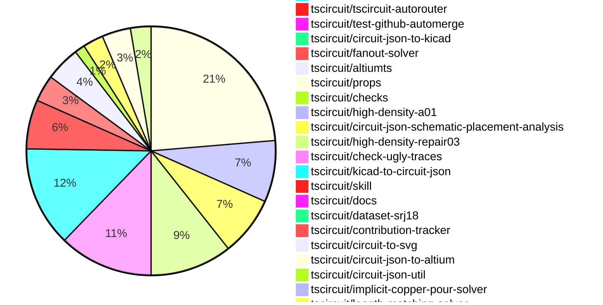

# contribution tracker

[contributions.tscircuit.com](https://contributions.tscircuit.com) ・ [tscircuit.com](https://tscircuit.com) ・ [Contribution Overviews](./contribution-overviews/) ・ [Changelogs](./changelogs/)

Generates weekly contribution overviews for tscircuit contributors. Check out all
the [contribution overviews here](./contribution-overviews/)
You can find AI-generated monthly changelogs in the [changelogs directory](./changelogs/)

- All PRs in the tscircuit org are scanned/summarized via an LLM
- The LLM classifies each Diff/PR as into a set of attributes for scoring
- All the PRs, summaries, and classifications are organized into charts and tables for [the website](https://contributions.tscircuit.com)

> Want to run locally? See the [Development Section](#development)

## Current Week

<!-- START_CURRENT_WEEK -->

# Contribution Overview 2026-09-08

The current week is shown below. There are 3 major sections:

- [Contributor Overview](#contributor-overview)
- [PRs by Repository](#prs-by-repository)
- [PRs by Contributor](#changes-by-contributor)
- [Scoring & Sponsorship Details](/docs/sponsorship-calculation-explanation.md)

## PRs by Repository


```mermaid
pie
    "tscircuit/pcb-viewer" : 2
    "tscircuit/tscircuit" : 89
    "tscircuit/circuit-json" : 2
    "tscircuit/core" : 30
    "tscircuit/tscircuit.com" : 29
    "tscircuit/eval" : 40
    "tscircuit/runframe" : 46
    "tscircuit/cli" : 49
    "tscircuit/tscircuit-autorouter" : 24
    "tscircuit/test-github-automerge" : 2
    "tscircuit/circuit-json-to-kicad" : 3
    "tscircuit/fanout-solver" : 13
    "tscircuit/altiumts" : 17
    "tscircuit/props" : 4
    "tscircuit/checks" : 5
    "tscircuit/high-density-a01" : 4
    "tscircuit/circuit-json-schematic-placement-analysis" : 10
    "tscircuit/high-density-repair03" : 4
    "tscircuit/check-ugly-traces" : 1
    "tscircuit/kicad-to-circuit-json" : 4
    "tscircuit/skill" : 1
    "tscircuit/docs" : 2
    "tscircuit/dataset-srj18" : 1
    "tscircuit/contribution-tracker" : 4
    "tscircuit/circuit-to-svg" : 2
    "tscircuit/circuit-json-to-altium" : 14
    "tscircuit/circuit-json-util" : 3
    "tscircuit/implicit-copper-pour-solver" : 1
    "tscircuit/length-matching-solver" : 2
    "tscircuit/schematic-trace-solver" : 10
    "tscircuit/easyeda-converter" : 2
    "tscircuit/ti" : 1
    "tscircuit/jscad-planner" : 1
    "tscircuit/kicadts" : 1
    "tscircuit/altium-to-circuit-json" : 1
    "tscircuit/dataset-fanout31-am62l" : 1
```

## Contributor Overview

| Contributor | 🐳 Major | 🐙 Minor | 🐌 Tiny | Score | ⭐ |
|-------------|---------|---------|---------|-------|-----|
| [seveibar](#seveibar) | 18 | 13 | 10 | 109 | 👑 |
| [ShiboSoftwareDev](#ShiboSoftwareDev) | 6 | 7 | 9 | 62 | ⭐⭐⭐ |
| [mohan-bee](#mohan-bee) | 4 | 3 | 8 | 37 | ⭐⭐ |
| [imrishabh18](#imrishabh18) | 4 | 7 | 5 | 36 | ⭐⭐ |
| [techmannih](#techmannih) | 1 | 1 | 15 | 19 | ⭐⭐ |
| [GokulPandi-M](#GokulPandi-M) | 2 | 2 | 5 | 17 | ⭐⭐ |
| [AnasSarkiz](#AnasSarkiz) | 2 | 0 | 1 | 15 | ⭐⭐ |
| [hrithik18k](#hrithik18k) | 0 | 3 | 8 | 14 | ⭐⭐ |
| [tscircuitbot](#tscircuitbot) | 0 | 0 | 268 | 13.5 | ⭐⭐ |
| [rushabhcodes](#rushabhcodes) | 1 | 3 | 2 | 12 | ⭐⭐ |
| [MustafaMulla29](#MustafaMulla29) | 1 | 2 | 3 | 12 | ⭐⭐ |
| [KrishnaX12](#KrishnaX12) | 0 | 1 | 4 | 6 | ⭐ |
| [Abse2001](#Abse2001) | 0 | 0 | 1 | 5 | ⭐ |
| [addibble](#addibble) | 0 | 1 | 1 | 3 |  |
| [anil08607](#anil08607) | 0 | 1 | 1 | 3 |  |
| [0hmX](#0hmX) | 0 | 0 | 1 | 2 |  |

## Staff Pass Ratio (SPR)

| Contributor | Reviewed PRs | Rejections | Approvals | SPR |
|-------------|--------------|------------|-----------|-----|
| [ShiboSoftwareDev](#ShiboSoftwareDev) | 5 | 0 | 5 | 100.0% |
| [GokulPandi-M](#GokulPandi-M) | 3 | 1 | 3 | 66.7% |
| [mohan-bee](#mohan-bee) | 3 | 1 | 2 | 66.7% |
| [AnasSarkiz](#AnasSarkiz) | 2 | 0 | 2 | 100.0% |
| [imrishabh18](#imrishabh18) | 2 | 0 | 2 | 100.0% |
| [MustafaMulla29](#MustafaMulla29) | 2 | 1 | 3 | 50.0% |
| [techmannih](#techmannih) | 2 | 0 | 2 | 100.0% |
| [addibble](#addibble) | 1 | 0 | 1 | 100.0% |
| [hrithik18k](#hrithik18k) | 1 | 0 | 1 | 100.0% |

<details>
<summary>ShiboSoftwareDev SPR PRs (5)</summary>

- [#194](https://github.com/tscircuit/fanout-solver/pull/194) Add DDR4 memory fanout repro
- [#202](https://github.com/tscircuit/fanout-solver/pull/202) Route dense plane fanouts around real copper
- [#192](https://github.com/tscircuit/fanout-solver/pull/192) Route AM62L fanout around decoupling vias
- [#199](https://github.com/tscircuit/fanout-solver/pull/199) fix: allow centered outward escapes for plane fanout
- [#7](https://github.com/tscircuit/dataset-fanout31-am62l/pull/7) Add isolated AM62L DDR4 fanout cases

</details>

<details>
<summary>GokulPandi-M SPR PRs (3)</summary>

- [#3800](https://github.com/tscircuit/core/pull/3800) Update @tscircuit/checks to 0.0.187
- [#275](https://github.com/tscircuit/checks/pull/275) Fix plated-hole overlap checks against component courtyards
- [#1123](https://github.com/tscircuit/schematic-trace-solver/pull/1123) fix: move same-net junctions off component ports

</details>

<details>
<summary>mohan-bee SPR PRs (3)</summary>

- [#153](https://github.com/tscircuit/circuit-json-util/pull/153) include missing-pin errors in netlist diagnostics
- [#3724](https://github.com/tscircuit/core/pull/3724) deduplicate pcb obstacle connectivity ids
- [#362](https://github.com/tscircuit/contribution-tracker/pull/362) add missing sponsorships csv

</details>

<details>
<summary>AnasSarkiz SPR PRs (2)</summary>

- [#2494](https://github.com/tscircuit/tscircuit-autorouter/pull/2494) Keep crossing-point allocation enabled for large hypergraphs
- [#2473](https://github.com/tscircuit/tscircuit-autorouter/pull/2473) Reuse port-point output for Pipeline9 node Pf calculations

</details>

<details>
<summary>imrishabh18 SPR PRs (2)</summary>

- [#3802](https://github.com/tscircuit/core/pull/3802) Adopt two-pad LED orientation analysis and invalidate cached unknown frames (jlcpcb fabricating polatiry issue)
- [#3699](https://github.com/tscircuit/core/pull/3699) Remove electrically isolated copper pours after via stitching

</details>

<details>
<summary>MustafaMulla29 SPR PRs (2)</summary>

- [#57](https://github.com/tscircuit/circuit-json-schematic-placement-analysis/pull/57) Add connector placement analyzer
- [#52](https://github.com/tscircuit/circuit-json-schematic-placement-analysis/pull/52) Prefer vertical orientation for rail-connected two-pin components

</details>

<details>
<summary>techmannih SPR PRs (2)</summary>

- [#1083](https://github.com/tscircuit/schematic-trace-solver/pull/1083) fix: use shared rails for aligned decoupling capacitor banks
- [#56](https://github.com/tscircuit/circuit-json-schematic-placement-analysis/pull/56) feat: detect scattered same-rail decoupling capacitors

</details>

<details>
<summary>addibble SPR PRs (1)</summary>

- [#14](https://github.com/tscircuit/jscad-planner/pull/14) Add serializable mat4 transform operations

</details>

<details>
<summary>hrithik18k SPR PRs (1)</summary>

- [#769](https://github.com/tscircuit/circuit-json/pull/769) feat: add styled parts to schematic text

</details>

> Note: AI evaluates PRs and assigns 1-3 star ratings automatically. 4 and 5 star ratings require manual staff review.

## Review Table

[reviews-received-hover]: ## "Number of reviews received for PRs for this contributor"
[approvals-received-hover]: ## "Number of approvals received for PRs this contributor authored"
[rejections-received-hover]: ## "Number of rejections received for PRs this contributor authored"
[prs-opened-hover]: ## "Number of PRs opened by this contributor"
[issues-created-hover]: ## "Number of issues created by this contributor"

| Contributor | Reviews Received | Approvals Received | Rejections Received | Approvals | Rejections Given | PRs Opened | PRs Merged | Issues Created |
|---|---|---|---|---|---|---|---|---|
| [0hmX](#0hmX) | 4 | 1 | 0 | 3 | 0 | 4 | 1 | 0 |
| [5p00kyy](#5p00kyy) | 0 | 0 | 0 | 0 | 0 | 1 | 0 | 0 |
| [Abse2001](#Abse2001) | 0 | 0 | 0 | 4 | 0 | 4 | 1 | 0 |
| [addibble](#addibble) | 2 | 2 | 0 | 0 | 0 | 2 | 2 | 0 |
| [AnasSarkiz](#AnasSarkiz) | 3 | 3 | 0 | 6 | 0 | 9 | 3 | 0 |
| [anil08607](#anil08607) | 1 | 1 | 0 | 1 | 0 | 3 | 2 | 0 |
| [Ansukaa](#Ansukaa) | 0 | 0 | 0 | 0 | 0 | 1 | 0 | 0 |
| [antonioscafaro](#antonioscafaro) | 0 | 0 | 0 | 0 | 0 | 2 | 0 | 0 |
| [armorbreak001](#armorbreak001) | 0 | 0 | 0 | 0 | 0 | 1 | 0 | 0 |
| [benthepythondev00](#benthepythondev00) | 0 | 0 | 0 | 0 | 0 | 6 | 0 | 0 |
| [Bhavyansh-Sabharwal](#Bhavyansh-Sabharwal) | 0 | 0 | 0 | 0 | 0 | 1 | 0 | 0 |
| [billythompsons](#billythompsons) | 0 | 0 | 0 | 0 | 0 | 2 | 0 | 0 |
| [dwdcth](#dwdcth) | 0 | 0 | 0 | 0 | 0 | 2 | 0 | 0 |
| [Flame119052](#Flame119052) | 0 | 0 | 0 | 0 | 0 | 56 | 0 | 0 |
| [freeneyjared17](#freeneyjared17) | 0 | 0 | 0 | 0 | 0 | 2 | 0 | 0 |
| [FU-max-boop](#FU-max-boop) | 0 | 0 | 0 | 0 | 0 | 1 | 0 | 0 |
| [Furox-Art](#Furox-Art) | 0 | 0 | 0 | 0 | 0 | 2 | 0 | 0 |
| [gcoinstash-cmd](#gcoinstash-cmd) | 0 | 0 | 0 | 0 | 0 | 146 | 0 | 0 |
| [GokulPandi-M](#GokulPandi-M) | 19 | 16 | 0 | 0 | 0 | 11 | 9 | 0 |
| [Hello2021Year](#Hello2021Year) | 0 | 0 | 0 | 0 | 0 | 1 | 0 | 0 |
| [hrithik18k](#hrithik18k) | 19 | 16 | 0 | 0 | 0 | 13 | 11 | 0 |
| [ikoomm](#ikoomm) | 0 | 0 | 0 | 0 | 0 | 4 | 0 | 0 |
| [imrishabh18](#imrishabh18) | 4 | 2 | 0 | 16 | 1 | 23 | 16 | 0 |
| [KrishnaX12](#KrishnaX12) | 9 | 4 | 1 | 0 | 0 | 7 | 5 | 0 |
| [krrishray](#krrishray) | 0 | 0 | 0 | 0 | 0 | 1 | 0 | 0 |
| [ksushant6566](#ksushant6566) | 0 | 0 | 0 | 0 | 0 | 1 | 0 | 0 |
| [Lathikaa-S](#Lathikaa-S) | 0 | 0 | 0 | 0 | 0 | 0 | 0 | 0 |
| [matiascamaran](#matiascamaran) | 0 | 0 | 0 | 0 | 0 | 1 | 0 | 0 |
| [mini0n-ai](#mini0n-ai) | 0 | 0 | 0 | 0 | 0 | 2 | 0 | 0 |
| [mohan-bee](#mohan-bee) | 14 | 9 | 1 | 7 | 0 | 52 | 15 | 0 |
| [MushinNakamoto](#MushinNakamoto) | 0 | 0 | 0 | 0 | 0 | 1 | 0 | 0 |
| [MustafaMulla29](#MustafaMulla29) | 8 | 3 | 0 | 12 | 0 | 10 | 6 | 0 |
| [nardeenal](#nardeenal) | 0 | 0 | 0 | 0 | 0 | 1 | 0 | 0 |
| [palthisailohith](#palthisailohith) | 0 | 0 | 0 | 0 | 0 | 1 | 0 | 0 |
| [Prabin-Wagle](#Prabin-Wagle) | 0 | 0 | 0 | 0 | 0 | 1 | 0 | 0 |
| [ranadheer-designs](#ranadheer-designs) | 0 | 0 | 0 | 0 | 0 | 3 | 0 | 0 |
| [rushabhcodes](#rushabhcodes) | 16 | 7 | 0 | 0 | 0 | 8 | 6 | 0 |
| [sen-ye](#sen-ye) | 0 | 0 | 0 | 0 | 0 | 1 | 0 | 0 |
| [seveibar](#seveibar) | 6 | 0 | 0 | 25 | 1 | 72 | 42 | 0 |
| [ShiboSoftwareDev](#ShiboSoftwareDev) | 18 | 18 | 0 | 18 | 0 | 39 | 22 | 0 |
| [singhharsh1708](#singhharsh1708) | 0 | 0 | 0 | 0 | 0 | 1 | 0 | 0 |
| [tbontb-iaq](#tbontb-iaq) | 0 | 0 | 0 | 0 | 0 | 2 | 0 | 0 |
| [techmannih](#techmannih) | 24 | 13 | 0 | 3 | 0 | 24 | 17 | 0 |
| [tscircuitbot](#tscircuitbot) | 0 | 0 | 0 | 0 | 0 | 379 | 268 | 0 |
| [ugin-man](#ugin-man) | 0 | 0 | 0 | 0 | 0 | 18 | 0 | 0 |
| [WhiteEagle-12](#WhiteEagle-12) | 0 | 0 | 0 | 0 | 0 | 5 | 0 | 0 |

## Changes by Repository

### [tscircuit/pcb-viewer](https://github.com/tscircuit/pcb-viewer)

| PR # | Impact | Rating | Contributor | Description |
|------|--------|--------|-------------|-------------|
| [#992](https://github.com/tscircuit/pcb-viewer/pull/992) | 🐳 Major | ⭐⭐⭐ | rushabhcodes | Fixes the issue where only the last boards border is displayed in a panel with multiple boards and soldermask enabled, ensuring all board outlines are rendered correctly. |

<details>
<summary>🐌 Tiny Contributions (1)</summary>

| PR # | Impact | Contributor | Description |
|------|--------|-------------|-------------|
| [#993](https://github.com/tscircuit/pcb-viewer/pull/993) | 🐌 Tiny | tscircuitbot | Automated package update |

</details>

### [tscircuit/tscircuit](https://github.com/tscircuit/tscircuit)


<details>
<summary>🐌 Tiny Contributions (89)</summary>

| PR # | Impact | Contributor | Description |
|------|--------|-------------|-------------|
| [#4870](https://github.com/tscircuit/tscircuit/pull/4870) | 🐌 Tiny | tscircuitbot | Automated package update to version 0.0.2512 |
| [#4869](https://github.com/tscircuit/tscircuit/pull/4869) | 🐌 Tiny | tscircuitbot | Automated package update |
| [#4868](https://github.com/tscircuit/tscircuit/pull/4868) | 🐌 Tiny | tscircuitbot | Automated package update |
| [#4867](https://github.com/tscircuit/tscircuit/pull/4867) | 🐌 Tiny | tscircuitbot | Automated package update |
| [#4866](https://github.com/tscircuit/tscircuit/pull/4866) | 🐌 Tiny | tscircuitbot | Automated package update |
| [#4865](https://github.com/tscircuit/tscircuit/pull/4865) | 🐌 Tiny | tscircuitbot | Automated package update |
| [#4864](https://github.com/tscircuit/tscircuit/pull/4864) | 🐌 Tiny | tscircuitbot | Automated package update |
| [#4863](https://github.com/tscircuit/tscircuit/pull/4863) | 🐌 Tiny | tscircuitbot | Updates the tscircuitcli package version from 0.1.2053 to 0.1.2054 in package.json |
| [#4862](https://github.com/tscircuit/tscircuit/pull/4862) | 🐌 Tiny | tscircuitbot | Automated package update |
| [#4861](https://github.com/tscircuit/tscircuit/pull/4861) | 🐌 Tiny | tscircuitbot | Updates the tscircuitcli package version from 0.1.2052 to 0.1.2053 in package.json |
| [#4860](https://github.com/tscircuit/tscircuit/pull/4860) | 🐌 Tiny | tscircuitbot | Automated package update |
| [#4859](https://github.com/tscircuit/tscircuit/pull/4859) | 🐌 Tiny | tscircuitbot | Automated package update |
| [#4858](https://github.com/tscircuit/tscircuit/pull/4858) | 🐌 Tiny | tscircuitbot | Automated package update |
| [#4857](https://github.com/tscircuit/tscircuit/pull/4857) | 🐌 Tiny | tscircuitbot | Automated package update |
| [#4856](https://github.com/tscircuit/tscircuit/pull/4856) | 🐌 Tiny | tscircuitbot | Updates the package version from 0.0.2504 to 0.0.2505 in package.json |
| [#4855](https://github.com/tscircuit/tscircuit/pull/4855) | 🐌 Tiny | tscircuitbot | Automated package update |
| [#4854](https://github.com/tscircuit/tscircuit/pull/4854) | 🐌 Tiny | tscircuitbot | Automated package update |
| [#4853](https://github.com/tscircuit/tscircuit/pull/4853) | 🐌 Tiny | tscircuitbot | Updates the tscircuitcli package to version 0.1.2051 in the package.json file. |
| [#4851](https://github.com/tscircuit/tscircuit/pull/4851) | 🐌 Tiny | tscircuitbot | Automated package update |
| [#4850](https://github.com/tscircuit/tscircuit/pull/4850) | 🐌 Tiny | tscircuitbot | Updates the package version from 0.0.2501 to 0.0.2502 in package.json |
| [#4849](https://github.com/tscircuit/tscircuit/pull/4849) | 🐌 Tiny | tscircuitbot | Updates the tscircuitcli package to version 0.1.2050 in the package.json file |
| [#4848](https://github.com/tscircuit/tscircuit/pull/4848) | 🐌 Tiny | tscircuitbot | Automated package update |
| [#4847](https://github.com/tscircuit/tscircuit/pull/4847) | 🐌 Tiny | tscircuitbot | Automated package update |
| [#4846](https://github.com/tscircuit/tscircuit/pull/4846) | 🐌 Tiny | tscircuitbot | Automated package update |
| [#4845](https://github.com/tscircuit/tscircuit/pull/4845) | 🐌 Tiny | tscircuitbot | Automated package update |
| [#4844](https://github.com/tscircuit/tscircuit/pull/4844) | 🐌 Tiny | tscircuitbot | Updates the package version from 0.0.2498 to 0.0.2499 in package.json |
| [#4843](https://github.com/tscircuit/tscircuit/pull/4843) | 🐌 Tiny | tscircuitbot | Automated package update |
| [#4842](https://github.com/tscircuit/tscircuit/pull/4842) | 🐌 Tiny | tscircuitbot | Automated package update to version 0.0.2498 |
| [#4841](https://github.com/tscircuit/tscircuit/pull/4841) | 🐌 Tiny | tscircuitbot | Automated package update |
| [#4840](https://github.com/tscircuit/tscircuit/pull/4840) | 🐌 Tiny | tscircuitbot | Automated package update |
| [#4839](https://github.com/tscircuit/tscircuit/pull/4839) | 🐌 Tiny | tscircuitbot | Automated package update |
| [#4838](https://github.com/tscircuit/tscircuit/pull/4838) | 🐌 Tiny | tscircuitbot | Automated package update |
| [#4836](https://github.com/tscircuit/tscircuit/pull/4836) | 🐌 Tiny | tscircuitbot | Automated package update |
| [#4835](https://github.com/tscircuit/tscircuit/pull/4835) | 🐌 Tiny | tscircuitbot | Automated package update |
| [#4834](https://github.com/tscircuit/tscircuit/pull/4834) | 🐌 Tiny | tscircuitbot | Automated package update |
| [#4833](https://github.com/tscircuit/tscircuit/pull/4833) | 🐌 Tiny | tscircuitbot | Updates the tscircuitcli package from version 0.1.2045 to 0.1.2046 and the tscircuitrunframe package from version 0.0.2698 to 0.0.2699 in package.json |
| [#4832](https://github.com/tscircuit/tscircuit/pull/4832) | 🐌 Tiny | tscircuitbot | Updates the package version from 0.0.2492 to 0.0.2493 in package.json |
| [#4831](https://github.com/tscircuit/tscircuit/pull/4831) | 🐌 Tiny | tscircuitbot | Automated package update |
| [#4830](https://github.com/tscircuit/tscircuit/pull/4830) | 🐌 Tiny | tscircuitbot | Automated package update |
| [#4829](https://github.com/tscircuit/tscircuit/pull/4829) | 🐌 Tiny | tscircuitbot | Updates the tscircuitcli package from version 0.1.2044 to 0.1.2045 and the tscircuitrunframe package from version 0.0.2697 to 0.0.2698 in package.json |
| [#4828](https://github.com/tscircuit/tscircuit/pull/4828) | 🐌 Tiny | tscircuitbot | Updates the package version from 0.0.2490 to 0.0.2491 in package.json |
| [#4827](https://github.com/tscircuit/tscircuit/pull/4827) | 🐌 Tiny | tscircuitbot | Updates the version of the tscircuiteval package from 0.0.1383 to 0.0.1384 in package.json |
| [#4826](https://github.com/tscircuit/tscircuit/pull/4826) | 🐌 Tiny | tscircuitbot | Updates the package version from 0.0.2489 to 0.0.2490 in package.json |
| [#4825](https://github.com/tscircuit/tscircuit/pull/4825) | 🐌 Tiny | tscircuitbot | Updates the version of several dependencies in the package.json file, including tscircuitcli, tscircuitcore, tscircuiteval, and tscircuitfanout-solver. |
| [#4824](https://github.com/tscircuit/tscircuit/pull/4824) | 🐌 Tiny | tscircuitbot | Automated package update |
| [#4823](https://github.com/tscircuit/tscircuit/pull/4823) | 🐌 Tiny | tscircuitbot | Updates the tscircuitcli package to version 0.1.2043 in the package.json file. |
| [#4821](https://github.com/tscircuit/tscircuit/pull/4821) | 🐌 Tiny | tscircuitbot | Automated package update |
| [#4820](https://github.com/tscircuit/tscircuit/pull/4820) | 🐌 Tiny | tscircuitbot | Automated package update |
| [#4819](https://github.com/tscircuit/tscircuit/pull/4819) | 🐌 Tiny | tscircuitbot | Updates the package version from 0.0.2486 to 0.0.2487 in package.json |
| [#4818](https://github.com/tscircuit/tscircuit/pull/4818) | 🐌 Tiny | tscircuitbot | Automated package update |
| [#4817](https://github.com/tscircuit/tscircuit/pull/4817) | 🐌 Tiny | tscircuitbot | Automated package update |
| [#4816](https://github.com/tscircuit/tscircuit/pull/4816) | 🐌 Tiny | tscircuitbot | Updates the version of tscircuitcircuit-json-util from 0.0.106 to 0.0.113 and tscircuitcore from 0.0.1878 to 0.0.1879 in package.json |
| [#4815](https://github.com/tscircuit/tscircuit/pull/4815) | 🐌 Tiny | tscircuitbot | Automated package update |
| [#4814](https://github.com/tscircuit/tscircuit/pull/4814) | 🐌 Tiny | tscircuitbot | Updates the tscircuitcli package from version 0.1.2039 to 0.1.2040 and the tscircuitrunframe package from version 0.0.2692 to 0.0.2693 in package.json |
| [#4813](https://github.com/tscircuit/tscircuit/pull/4813) | 🐌 Tiny | tscircuitbot | Automated package update |
| [#4812](https://github.com/tscircuit/tscircuit/pull/4812) | 🐌 Tiny | tscircuitbot | Automated package update |
| [#4811](https://github.com/tscircuit/tscircuit/pull/4811) | 🐌 Tiny | tscircuitbot | Automated package update |
| [#4810](https://github.com/tscircuit/tscircuit/pull/4810) | 🐌 Tiny | tscircuitbot | Updates the tscircuitcli package to version 0.1.2039 |
| [#4808](https://github.com/tscircuit/tscircuit/pull/4808) | 🐌 Tiny | tscircuitbot | Automated package update |
| [#4807](https://github.com/tscircuit/tscircuit/pull/4807) | 🐌 Tiny | tscircuitbot | Automated package update |
| [#4806](https://github.com/tscircuit/tscircuit/pull/4806) | 🐌 Tiny | tscircuitbot | Automated package update |
| [#4805](https://github.com/tscircuit/tscircuit/pull/4805) | 🐌 Tiny | tscircuitbot | Automated package update |
| [#4803](https://github.com/tscircuit/tscircuit/pull/4803) | 🐌 Tiny | tscircuitbot | Automated package update |
| [#4800](https://github.com/tscircuit/tscircuit/pull/4800) | 🐌 Tiny | tscircuitbot | Automated package update |
| [#4799](https://github.com/tscircuit/tscircuit/pull/4799) | 🐌 Tiny | tscircuitbot | Updates the package version from 0.0.2477 to 0.0.2478 in package.json |
| [#4796](https://github.com/tscircuit/tscircuit/pull/4796) | 🐌 Tiny | tscircuitbot | Updates the tscircuitcli package version from 0.1.2034 to 0.1.2035 and the tscircuitrunframe package version from 0.0.2689 to 0.0.2690 in package.json |
| [#4793](https://github.com/tscircuit/tscircuit/pull/4793) | 🐌 Tiny | tscircuitbot | Automated package update |
| [#4791](https://github.com/tscircuit/tscircuit/pull/4791) | 🐌 Tiny | tscircuitbot | Automated package update |
| [#4788](https://github.com/tscircuit/tscircuit/pull/4788) | 🐌 Tiny | tscircuitbot | Automated package update |
| [#4787](https://github.com/tscircuit/tscircuit/pull/4787) | 🐌 Tiny | tscircuitbot | Updates the package version from 0.0.2471 to 0.0.2472 in package.json |
| [#4786](https://github.com/tscircuit/tscircuit/pull/4786) | 🐌 Tiny | tscircuitbot | Automated package update |
| [#4785](https://github.com/tscircuit/tscircuit/pull/4785) | 🐌 Tiny | tscircuitbot | Automated package update |
| [#4782](https://github.com/tscircuit/tscircuit/pull/4782) | 🐌 Tiny | tscircuitbot | Automated package update |
| [#4780](https://github.com/tscircuit/tscircuit/pull/4780) | 🐌 Tiny | tscircuitbot | Automated package update |
| [#4778](https://github.com/tscircuit/tscircuit/pull/4778) | 🐌 Tiny | tscircuitbot | Automated package update |
| [#4798](https://github.com/tscircuit/tscircuit/pull/4798) | 🐌 Tiny | tscircuitbot | Automated package update |
| [#4797](https://github.com/tscircuit/tscircuit/pull/4797) | 🐌 Tiny | tscircuitbot | Automated package update |
| [#4795](https://github.com/tscircuit/tscircuit/pull/4795) | 🐌 Tiny | tscircuitbot | Automated package update |
| [#4794](https://github.com/tscircuit/tscircuit/pull/4794) | 🐌 Tiny | tscircuitbot | Automated package update |
| [#4792](https://github.com/tscircuit/tscircuit/pull/4792) | 🐌 Tiny | tscircuitbot | Automated package update |
| [#4790](https://github.com/tscircuit/tscircuit/pull/4790) | 🐌 Tiny | tscircuitbot | Automated package update |
| [#4789](https://github.com/tscircuit/tscircuit/pull/4789) | 🐌 Tiny | tscircuitbot | Automated package update |
| [#4784](https://github.com/tscircuit/tscircuit/pull/4784) | 🐌 Tiny | tscircuitbot | Updates the tscircuitcli package and other dependencies to their latest versions. |
| [#4781](https://github.com/tscircuit/tscircuit/pull/4781) | 🐌 Tiny | tscircuitbot | Automated package update |
| [#4802](https://github.com/tscircuit/tscircuit/pull/4802) | 🐌 Tiny | tscircuitbot | Automated package update |
| [#4801](https://github.com/tscircuit/tscircuit/pull/4801) | 🐌 Tiny | tscircuitbot | Automated package update |
| [#4783](https://github.com/tscircuit/tscircuit/pull/4783) | 🐌 Tiny | tscircuitbot | Automated package update to version 0.0.2470 |
| [#4779](https://github.com/tscircuit/tscircuit/pull/4779) | 🐌 Tiny | tscircuitbot | Updates the package version from 0.0.2467 to 0.0.2468 in package.json |
| [#4837](https://github.com/tscircuit/tscircuit/pull/4837) | 🐌 Tiny | seveibar | Re-exports Reacts Fragment from the package entry point, allowing users to import it directly from tscircuit without needing to import it separately from React. |

</details>

### [tscircuit/circuit-json](https://github.com/tscircuit/circuit-json)

| PR # | Impact | Rating | Contributor | Description |
|------|--------|--------|-------------|-------------|
| [#769](https://github.com/tscircuit/circuit-json/pull/769) | 🐙 Minor | ⭐⭐ | hrithik18k | Adds support for styled text parts in schematic text, allowing for partial active-low overlines while retaining a plain-text fallback. |

<details>
<summary>🐌 Tiny Contributions (1)</summary>

| PR # | Impact | Contributor | Description |
|------|--------|-------------|-------------|
| [#770](https://github.com/tscircuit/circuit-json/pull/770) | 🐌 Tiny | tscircuitbot | Automated package update |

</details>

### [tscircuit/core](https://github.com/tscircuit/core)

| PR # | Impact | Rating | Contributor | Description |
|------|--------|--------|-------------|-------------|
| [#3809](https://github.com/tscircuit/core/pull/3809) | 🐳 Major | ⭐⭐⭐ | seveibar | Allows pre-generated fanout copper to be stored as port-selector-keyed JSON and supplied through fanout pcbTracePathssavedPaths (also supported on breakout). Core creates the exits, places the saved wirevia geometry, and routes the remaining board connections from those exits. Saved copper stays fixed during subsequent routing. |
| [#3724](https://github.com/tscircuit/core/pull/3724) | 🐳 Major | ⭐⭐⭐ | mohan-bee | Fixes timeout issues in the ground routing phase by deduplicating obstacle connectivity IDs, reducing processing time significantly. |
| [#3815](https://github.com/tscircuit/core/pull/3815) | 🐙 Minor | ⭐⭐ | seveibar | Consolidates multiple diagnostics for U1U2 placement conflicts into a single summary, improving clarity and efficiency in overlap diagnostics. |
| [#3810](https://github.com/tscircuit/core/pull/3810) | 🐙 Minor | ⭐⭐ | seveibar | Fixes the plated-hole overlap regression that failed on core 3804 by scoping overlap counts and visualizations to overlaps containing two plated-hole IDs. |
| [#3804](https://github.com/tscircuit/core/pull/3804) | 🐙 Minor | ⭐⭐ | seveibar | Enables the use of the networked autorouter for Pipeline9 boards when the platform flag useCloudAutorouter is true, while preserving local routing options and configurations. |
| [#3773](https://github.com/tscircuit/core/pull/3773) | 🐙 Minor | ⭐⭐ | seveibar | Skip the AM62L-to-LPDDR4 progressive fanout test due to PCB tracevia overlap errors and restore the Arduino Uno center reroute PCB snapshot to match the baseline before a previous PR, addressing CI mismatches. |
| [#3765](https://github.com/tscircuit/core/pull/3765) | 🐙 Minor | ⭐⭐ | seveibar | Normalizes shared schematic terminals for internally connected pushbutton pads to prevent zero-length wires and improve label handling. |
| [#3803](https://github.com/tscircuit/core/pull/3803) | 🐙 Minor | ⭐⭐ | imrishabh18 | Adds a diode symbol to indicate LED polarity on fabrication layers, resolving ambiguity in assembly previews without adding automatic text. |
| [#3805](https://github.com/tscircuit/core/pull/3805) | 🐙 Minor | ⭐⭐ | imrishabh18 | Adds compact  and - fabrication paths for polarized capacitors, indicating assembly polarity between positive and negative pads. |
| [#3802](https://github.com/tscircuit/core/pull/3802) | 🐙 Minor | ⭐⭐ | imrishabh18 | Adopts the published tscircuitcircuit-json-util0.0.113 fix to enable part-orientation analysis for two-pad LEDs, invalidating cached unknown frames and ensuring accurate polarity analysis. |
| [#3699](https://github.com/tscircuit/core/pull/3699) | 🐙 Minor | ⭐⭐ | imrishabh18 | Removes disconnected copper pour fragments that survive the solvers area filter by adding a cleanup phase after via stitching to ensure only connected pours remain. |
| [#3723](https://github.com/tscircuit/core/pull/3723) | 🐙 Minor | ⭐⭐ | mohan-bee | Reproduces duplicate connectivity IDs that inflate PCB autorouter input by adding a test for duplicate counts in a four-layer TSX circuit. |

<details>
<summary>🐌 Tiny Contributions (18)</summary>

| PR # | Impact | Contributor | Description |
|------|--------|-------------|-------------|
| [#3864](https://github.com/tscircuit/core/pull/3864) | 🐌 Tiny | tscircuitbot | Updates the tscircuitfanout-solver package from version 0.0.71 to 0.0.72 |
| [#3816](https://github.com/tscircuit/core/pull/3816) | 🐌 Tiny | tscircuitbot | Updates the version of the tscircuitchecks package from 0.0.187 to 0.0.188 in package.json |
| [#3812](https://github.com/tscircuit/core/pull/3812) | 🐌 Tiny | tscircuitbot | Updates the tscircuitfanout-solver package from version 0.0.68 to 0.0.71 |
| [#3807](https://github.com/tscircuit/core/pull/3807) | 🐌 Tiny | tscircuitbot | Updates the version of the tscircuitchecks package from 0.0.186 to 0.0.187 in package.json |
| [#3806](https://github.com/tscircuit/core/pull/3806) | 🐌 Tiny | tscircuitbot | Updates the version of the tscircuitchecks package from 0.0.186 to 0.0.187 in package.json |
| [#3799](https://github.com/tscircuit/core/pull/3799) | 🐌 Tiny | tscircuitbot | Updates the version of the tscircuitchecks package from 0.0.185 to 0.0.186 in package.json |
| [#3795](https://github.com/tscircuit/core/pull/3795) | 🐌 Tiny | tscircuitbot | Updates the tscircuitfanout-solver package from version 0.0.66 to 0.0.68 |
| [#3784](https://github.com/tscircuit/core/pull/3784) | 🐌 Tiny | tscircuitbot | Updates the version of the tscircuitchecks package from 0.0.184 to 0.0.185 in package.json |
| [#3793](https://github.com/tscircuit/core/pull/3793) | 🐌 Tiny | rushabhcodes | Reproduces a bug where duplicate vias are emitted for same-net routes crossing PCB layers at the same position, establishing expected behavior for a future fix. |
| [#3813](https://github.com/tscircuit/core/pull/3813) | 🐌 Tiny | seveibar | Updates tscircuitcapacity-autorouter from 0.0.892 to the latest published version, 0.0.899, and refreshes the fanout-to-net handoff PCB snapshot for the updated routing geometry and trace widths; the regressions connectivity assertions remain unchanged and pass. |
| [#3814](https://github.com/tscircuit/core/pull/3814) | 🐌 Tiny | seveibar | Fixes overlapping schematic section titles and chip reference designators by adjusting section bounds to include component-owned referencevalue text, ensuring titles are positioned correctly above section contents. |
| [#3785](https://github.com/tscircuit/core/pull/3785) | 🐌 Tiny | seveibar | Updates tscircuitcapacity-autorouter from 0.0.890 to 0.0.892 and refreshes the SOIC-8 sensor to IC header autorouting snapshot, capturing small route-coordinate changes including a 0.001 mm via shift. |
| [#3779](https://github.com/tscircuit/core/pull/3779) | 🐌 Tiny | mohan-bee | Updates the tscircuitschematic-trace-solver package to version 0.0.189 in the package.json file. |
| [#3794](https://github.com/tscircuit/core/pull/3794) | 🐌 Tiny | techmannih | Updates the tscircuitschematic-trace-solver dependency to version 0.0.191 and modifies a test to reflect changes in expected output. |
| [#3782](https://github.com/tscircuit/core/pull/3782) | 🐌 Tiny | techmannih | Adds a reduced reproduction of the analog routing in allwinner board, where VRA1 crosses the GND label stem and the shared LDOA1V8 rail. |
| [#3781](https://github.com/tscircuit/core/pull/3781) | 🐌 Tiny | techmannih | Reproduces a bug where two parallel V3V3 traces are incorrectly routed beside IOVDD2 and VREG_IN, only 0.04 mm apart, and adds a test to validate the issue. |
| [#3865](https://github.com/tscircuit/core/pull/3865) | 🐌 Tiny | Abse2001 | Updates tscircuitcapacity-autorouter from 0.0.899 to 0.0.900, which contains tscircuittscircuit-autorouter2506. |
| [#3778](https://github.com/tscircuit/core/pull/3778) | 🐌 Tiny | ShiboSoftwareDev | Updates the tscircuitcapacity-autorouter package from version 0.0.887 to 0.0.890, incorporating the Pipeline 9 explicit-via-endpoint fix and its follow-up formatting release, while superseding the previous pull request targeting version 0.0.888. |

</details>

### [tscircuit/tscircuit.com](https://github.com/tscircuit/tscircuit.com)

| PR # | Impact | Rating | Contributor | Description |
|------|--------|--------|-------------|-------------|
| [#4833](https://github.com/tscircuit/tscircuit.com/pull/4833) | 🐙 Minor | ⭐⭐ | rushabhcodes | Fixes the issue where packages with AI-generated descriptions but no manually written descriptions appear without any description in the header search dropdown, ensuring that AI descriptions are displayed when available. |
| [#4820](https://github.com/tscircuit/tscircuit.com/pull/4820) | 🐙 Minor | ⭐⭐ | rushabhcodes | Fixes rendering of related package descriptions by falling back to AI-generated descriptions when manual descriptions are absent, ensuring consistent display across server-rendered and client-hydrated content. |
| [#4819](https://github.com/tscircuit/tscircuit.com/pull/4819) | 🐙 Minor | ⭐⭐ | rushabhcodes | Fixes inconsistency in package card descriptions by falling back to AI-generated descriptions when manually authored descriptions are not available. |
| [#4837](https://github.com/tscircuit/tscircuit.com/pull/4837) | 🐙 Minor | ⭐⭐ | seveibar | Fixes home navigation to ensure that clicking the tscircuit logo directs users to the canonical landing page instead of the old page, and replaces the old landing page with a redirect to the new URL while preserving query strings and hashes. |
| [#4842](https://github.com/tscircuit/tscircuit.com/pull/4842) | 🐙 Minor | ⭐⭐ | imrishabh18 | Adds Download  Altium Project alongside KiCad, allowing users to download circuit projects in Altium format with native files and error reporting. |

<details>
<summary>🐌 Tiny Contributions (24)</summary>

| PR # | Impact | Contributor | Description |
|------|--------|-------------|-------------|
| [#4872](https://github.com/tscircuit/tscircuit.com/pull/4872) | 🐌 Tiny | tscircuitbot | Updates the tscircuiteval package from version 0.0.1389 to 0.0.1391 |
| [#4871](https://github.com/tscircuit/tscircuit.com/pull/4871) | 🐌 Tiny | tscircuitbot | Automated package update |
| [#4869](https://github.com/tscircuit/tscircuit.com/pull/4869) | 🐌 Tiny | tscircuitbot | Updates the tscircuitrunframe package from version 0.0.2703 to 0.0.2704 |
| [#4867](https://github.com/tscircuit/tscircuit.com/pull/4867) | 🐌 Tiny | tscircuitbot | Updates the tscircuitrunframe package version from 0.0.2701 to 0.0.2703 and the tscircuitpcb-viewer package version from 1.11.393 to 1.11.394 in package.json |
| [#4866](https://github.com/tscircuit/tscircuit.com/pull/4866) | 🐌 Tiny | tscircuitbot | Updates the tscircuiteval package from version 0.0.1386 to 0.0.1389 |
| [#4865](https://github.com/tscircuit/tscircuit.com/pull/4865) | 🐌 Tiny | tscircuitbot | Updates the tscircuitrunframe package from version 0.0.2700 to 0.0.2701. |
| [#4862](https://github.com/tscircuit/tscircuit.com/pull/4862) | 🐌 Tiny | tscircuitbot | Updates the tscircuitrunframe package to version 0.0.2700 |
| [#4861](https://github.com/tscircuit/tscircuit.com/pull/4861) | 🐌 Tiny | tscircuitbot | Updates the tscircuiteval package from version 0.0.1384 to 0.0.1386 |
| [#4860](https://github.com/tscircuit/tscircuit.com/pull/4860) | 🐌 Tiny | tscircuitbot | Automated package update |
| [#4858](https://github.com/tscircuit/tscircuit.com/pull/4858) | 🐌 Tiny | tscircuitbot | Automated package update |
| [#4857](https://github.com/tscircuit/tscircuit.com/pull/4857) | 🐌 Tiny | tscircuitbot | Updates the tscircuiteval package to version 0.0.1384 |
| [#4856](https://github.com/tscircuit/tscircuit.com/pull/4856) | 🐌 Tiny | tscircuitbot | Updates the tscircuitrunframe package to version 0.0.2697 |
| [#4854](https://github.com/tscircuit/tscircuit.com/pull/4854) | 🐌 Tiny | tscircuitbot | Updates the tscircuitrunframe package from version 0.0.2694 to 0.0.2696 |
| [#4850](https://github.com/tscircuit/tscircuit.com/pull/4850) | 🐌 Tiny | tscircuitbot | Automated package update for tscircuitrunframe from version 0.0.2693 to 0.0.2694 |
| [#4848](https://github.com/tscircuit/tscircuit.com/pull/4848) | 🐌 Tiny | tscircuitbot | Automated package update |
| [#4847](https://github.com/tscircuit/tscircuit.com/pull/4847) | 🐌 Tiny | tscircuitbot | Updates the tscircuitrunframe package from version 0.0.2691 to 0.0.2692 |
| [#4836](https://github.com/tscircuit/tscircuit.com/pull/4836) | 🐌 Tiny | tscircuitbot | Updates the tscircuiteval package from version 0.0.1370 to 0.0.1375 in the package.json file. |
| [#4843](https://github.com/tscircuit/tscircuit.com/pull/4843) | 🐌 Tiny | tscircuitbot | Automated package update |
| [#4841](https://github.com/tscircuit/tscircuit.com/pull/4841) | 🐌 Tiny | tscircuitbot | Updates the tscircuitrunframe package from version 0.0.2683 to 0.0.2689 |
| [#4845](https://github.com/tscircuit/tscircuit.com/pull/4845) | 🐌 Tiny | tscircuitbot | Updates the tscircuitrunframe package from version 0.0.2690 to 0.0.2691 |
| [#4840](https://github.com/tscircuit/tscircuit.com/pull/4840) | 🐌 Tiny | tscircuitbot | Automated package update |
| [#4838](https://github.com/tscircuit/tscircuit.com/pull/4838) | 🐌 Tiny | tscircuitbot | Updates the tscircuiteval package from version 0.0.1375 to 0.0.1376 |
| [#4828](https://github.com/tscircuit/tscircuit.com/pull/4828) | 🐌 Tiny | seveibar | Updates the runframe dependency to include the Autorouting phase explorer and aligns runtime dependencies to prevent Vite production build failures. |
| [#4868](https://github.com/tscircuit/tscircuit.com/pull/4868) | 🐌 Tiny | imrishabh18 | Updates the circuit-json-to-altium dependency to prevent component-exempt keepouts from aborting Altium downloads and regenerates the lockfile. |

</details>

### [tscircuit/eval](https://github.com/tscircuit/eval)


<details>
<summary>🐌 Tiny Contributions (40)</summary>

| PR # | Impact | Contributor | Description |
|------|--------|-------------|-------------|
| [#4503](https://github.com/tscircuit/eval/pull/4503) | 🐌 Tiny | tscircuitbot | Automated package update |
| [#4502](https://github.com/tscircuit/eval/pull/4502) | 🐌 Tiny | tscircuitbot | Automated package update |
| [#4500](https://github.com/tscircuit/eval/pull/4500) | 🐌 Tiny | tscircuitbot | Automated package update |
| [#4499](https://github.com/tscircuit/eval/pull/4499) | 🐌 Tiny | tscircuitbot | Updates the version of tscircuitcore from 0.0.1890 to 0.0.1891 and tscircuitfanout-solver from 0.0.71 to 0.0.72 in package.json |
| [#4496](https://github.com/tscircuit/eval/pull/4496) | 🐌 Tiny | tscircuitbot | Automated package update to version 0.0.1389 |
| [#4495](https://github.com/tscircuit/eval/pull/4495) | 🐌 Tiny | tscircuitbot | Updates the version of the tscircuitcore package from 0.0.1889 to 0.0.1890 in package.json |
| [#4493](https://github.com/tscircuit/eval/pull/4493) | 🐌 Tiny | tscircuitbot | Automated package update to version 0.0.1388 |
| [#4492](https://github.com/tscircuit/eval/pull/4492) | 🐌 Tiny | tscircuitbot | Automated package update |
| [#4490](https://github.com/tscircuit/eval/pull/4490) | 🐌 Tiny | tscircuitbot | Automated package update |
| [#4489](https://github.com/tscircuit/eval/pull/4489) | 🐌 Tiny | tscircuitbot | Updates package dependencies to their latest versions as part of routine maintenance. |
| [#4488](https://github.com/tscircuit/eval/pull/4488) | 🐌 Tiny | tscircuitbot | Automated package update |
| [#4487](https://github.com/tscircuit/eval/pull/4487) | 🐌 Tiny | tscircuitbot | Updates the versions of several dependencies in the package.json file. |
| [#4485](https://github.com/tscircuit/eval/pull/4485) | 🐌 Tiny | tscircuitbot | Automated package update |
| [#4484](https://github.com/tscircuit/eval/pull/4484) | 🐌 Tiny | tscircuitbot | Automated package update |
| [#4482](https://github.com/tscircuit/eval/pull/4482) | 🐌 Tiny | tscircuitbot | Automated package update |
| [#4481](https://github.com/tscircuit/eval/pull/4481) | 🐌 Tiny | tscircuitbot | Updates package dependencies to their latest versions as part of routine maintenance. |
| [#4479](https://github.com/tscircuit/eval/pull/4479) | 🐌 Tiny | tscircuitbot | Automated package update |
| [#4478](https://github.com/tscircuit/eval/pull/4478) | 🐌 Tiny | tscircuitbot | Automated package update |
| [#4476](https://github.com/tscircuit/eval/pull/4476) | 🐌 Tiny | tscircuitbot | Automated package update |
| [#4475](https://github.com/tscircuit/eval/pull/4475) | 🐌 Tiny | tscircuitbot | Automated package update |
| [#4473](https://github.com/tscircuit/eval/pull/4473) | 🐌 Tiny | tscircuitbot | Automated package update |
| [#4472](https://github.com/tscircuit/eval/pull/4472) | 🐌 Tiny | tscircuitbot | Automated package update |
| [#4470](https://github.com/tscircuit/eval/pull/4470) | 🐌 Tiny | tscircuitbot | Automated package update |
| [#4469](https://github.com/tscircuit/eval/pull/4469) | 🐌 Tiny | tscircuitbot | Automated package update |
| [#4466](https://github.com/tscircuit/eval/pull/4466) | 🐌 Tiny | tscircuitbot | Automated package update to version 0.0.1379 |
| [#4465](https://github.com/tscircuit/eval/pull/4465) | 🐌 Tiny | tscircuitbot | Updates various package dependencies to their latest versions in package.json |
| [#4460](https://github.com/tscircuit/eval/pull/4460) | 🐌 Tiny | tscircuitbot | Automated package update |
| [#4461](https://github.com/tscircuit/eval/pull/4461) | 🐌 Tiny | tscircuitbot | Updates the package version from 0.0.1377 to 0.0.1378 in package.json |
| [#4457](https://github.com/tscircuit/eval/pull/4457) | 🐌 Tiny | tscircuitbot | Updates the version of the tscircuitcore package from 0.0.1874 to 0.0.1875 in package.json |
| [#4455](https://github.com/tscircuit/eval/pull/4455) | 🐌 Tiny | tscircuitbot | Automated package update |
| [#4448](https://github.com/tscircuit/eval/pull/4448) | 🐌 Tiny | tscircuitbot | Updates the version of the tscircuitcore package from 0.0.1871 to 0.0.1872 in package.json |
| [#4444](https://github.com/tscircuit/eval/pull/4444) | 🐌 Tiny | tscircuitbot | Automated package update |
| [#4441](https://github.com/tscircuit/eval/pull/4441) | 🐌 Tiny | tscircuitbot | Updates the version of the tscircuitcore package from 0.0.1868 to 0.0.1870 in package.json |
| [#4458](https://github.com/tscircuit/eval/pull/4458) | 🐌 Tiny | tscircuitbot | Automated package update |
| [#4454](https://github.com/tscircuit/eval/pull/4454) | 🐌 Tiny | tscircuitbot | Automated package update |
| [#4452](https://github.com/tscircuit/eval/pull/4452) | 🐌 Tiny | tscircuitbot | Automated package update |
| [#4449](https://github.com/tscircuit/eval/pull/4449) | 🐌 Tiny | tscircuitbot | Automated package update |
| [#4442](https://github.com/tscircuit/eval/pull/4442) | 🐌 Tiny | tscircuitbot | Automated package update |
| [#4451](https://github.com/tscircuit/eval/pull/4451) | 🐌 Tiny | tscircuitbot | Updates the version of tscircuitcore and tscircuitschematic-trace-solver in package.json |
| [#4445](https://github.com/tscircuit/eval/pull/4445) | 🐌 Tiny | tscircuitbot | Automated package update |

</details>

### [tscircuit/runframe](https://github.com/tscircuit/runframe)

| PR # | Impact | Rating | Contributor | Description |
|------|--------|--------|-------------|-------------|
| [#5041](https://github.com/tscircuit/runframe/pull/5041) | 🐳 Major | ⭐⭐⭐ | imrishabh18 | Adds Altium Project to runframes export menu, allowing users to export circuit designs as Altium-compatible project files in a ZIP format. |

<details>
<summary>🐌 Tiny Contributions (45)</summary>

| PR # | Impact | Contributor | Description |
|------|--------|-------------|-------------|
| [#5077](https://github.com/tscircuit/runframe/pull/5077) | 🐌 Tiny | tscircuitbot | Automated package update |
| [#5076](https://github.com/tscircuit/runframe/pull/5076) | 🐌 Tiny | tscircuitbot | Updates the tscircuiteval package to version 0.0.1391 in the package.json file. |
| [#5075](https://github.com/tscircuit/runframe/pull/5075) | 🐌 Tiny | tscircuitbot | Automated package update |
| [#5074](https://github.com/tscircuit/runframe/pull/5074) | 🐌 Tiny | tscircuitbot | Automated package update |
| [#5073](https://github.com/tscircuit/runframe/pull/5073) | 🐌 Tiny | tscircuitbot | Automated package update |
| [#5071](https://github.com/tscircuit/runframe/pull/5071) | 🐌 Tiny | tscircuitbot | Automated package update |
| [#5070](https://github.com/tscircuit/runframe/pull/5070) | 🐌 Tiny | tscircuitbot | Updates the tscircuitpcb-viewer package to version 1.11.394 |
| [#5069](https://github.com/tscircuit/runframe/pull/5069) | 🐌 Tiny | tscircuitbot | Automated package update |
| [#5068](https://github.com/tscircuit/runframe/pull/5068) | 🐌 Tiny | tscircuitbot | Updates the tscircuiteval package to version 0.0.1389 in the package.json file. |
| [#5067](https://github.com/tscircuit/runframe/pull/5067) | 🐌 Tiny | tscircuitbot | Automated package update |
| [#5066](https://github.com/tscircuit/runframe/pull/5066) | 🐌 Tiny | tscircuitbot | Updates the tscircuiteval package version from 0.0.1386 to 0.0.1388 in package.json |
| [#5064](https://github.com/tscircuit/runframe/pull/5064) | 🐌 Tiny | tscircuitbot | Automated package update |
| [#5063](https://github.com/tscircuit/runframe/pull/5063) | 🐌 Tiny | tscircuitbot | Updates the tscircuiteval package to version 0.0.1386 in the package.json file. |
| [#5062](https://github.com/tscircuit/runframe/pull/5062) | 🐌 Tiny | tscircuitbot | Automated package update |
| [#5061](https://github.com/tscircuit/runframe/pull/5061) | 🐌 Tiny | tscircuitbot | Updates the tscircuiteval package to version 0.0.1385 in the package.json file. |
| [#5060](https://github.com/tscircuit/runframe/pull/5060) | 🐌 Tiny | tscircuitbot | Automated package update |
| [#5059](https://github.com/tscircuit/runframe/pull/5059) | 🐌 Tiny | tscircuitbot | Updates the tscircuiteval package to version 0.0.1384 in the package.json file. |
| [#5058](https://github.com/tscircuit/runframe/pull/5058) | 🐌 Tiny | tscircuitbot | Automated package update |
| [#5057](https://github.com/tscircuit/runframe/pull/5057) | 🐌 Tiny | tscircuitbot | Updates the tscircuiteval package to version 0.0.1383 in the package.json file. |
| [#5056](https://github.com/tscircuit/runframe/pull/5056) | 🐌 Tiny | tscircuitbot | Automated package update |
| [#5055](https://github.com/tscircuit/runframe/pull/5055) | 🐌 Tiny | tscircuitbot | Updates the tscircuiteval package to version 0.0.1382 in the package.json file. |
| [#5054](https://github.com/tscircuit/runframe/pull/5054) | 🐌 Tiny | tscircuitbot | Automated package update |
| [#5053](https://github.com/tscircuit/runframe/pull/5053) | 🐌 Tiny | tscircuitbot | Updates the tscircuiteval package to version 0.0.1381 in the package.json file. |
| [#5052](https://github.com/tscircuit/runframe/pull/5052) | 🐌 Tiny | tscircuitbot | Automated package update |
| [#5051](https://github.com/tscircuit/runframe/pull/5051) | 🐌 Tiny | tscircuitbot | Updates the tscircuiteval package to version 0.0.1380 in the package.json file. |
| [#5050](https://github.com/tscircuit/runframe/pull/5050) | 🐌 Tiny | tscircuitbot | Automated package update |
| [#5049](https://github.com/tscircuit/runframe/pull/5049) | 🐌 Tiny | tscircuitbot | Updates the circuit-json-to-kicad package version from 0.0.206 to 0.0.209 in package.json |
| [#5046](https://github.com/tscircuit/runframe/pull/5046) | 🐌 Tiny | tscircuitbot | Automated package update |
| [#5045](https://github.com/tscircuit/runframe/pull/5045) | 🐌 Tiny | tscircuitbot | Updates the tscircuiteval package from version 0.0.1378 to 0.0.1379 in the package.json file. |
| [#5038](https://github.com/tscircuit/runframe/pull/5038) | 🐌 Tiny | tscircuitbot | Automated package update |
| [#5043](https://github.com/tscircuit/runframe/pull/5043) | 🐌 Tiny | tscircuitbot | Updates the tscircuiteval package to version 0.0.1378 in the package.json file. |
| [#5042](https://github.com/tscircuit/runframe/pull/5042) | 🐌 Tiny | tscircuitbot | Automated package update |
| [#5040](https://github.com/tscircuit/runframe/pull/5040) | 🐌 Tiny | tscircuitbot | Automated package update |
| [#5036](https://github.com/tscircuit/runframe/pull/5036) | 🐌 Tiny | tscircuitbot | Automated package update |
| [#5035](https://github.com/tscircuit/runframe/pull/5035) | 🐌 Tiny | tscircuitbot | Updates the tscircuiteval package to version 0.0.1375 in the package.json file. |
| [#5033](https://github.com/tscircuit/runframe/pull/5033) | 🐌 Tiny | tscircuitbot | Updates the tscircuiteval package from version 0.0.1373 to 0.0.1374 in the package.json file. |
| [#5032](https://github.com/tscircuit/runframe/pull/5032) | 🐌 Tiny | tscircuitbot | Automated package update |
| [#5039](https://github.com/tscircuit/runframe/pull/5039) | 🐌 Tiny | tscircuitbot | Updates the tscircuiteval package to version 0.0.1377 in the package.json file. |
| [#5034](https://github.com/tscircuit/runframe/pull/5034) | 🐌 Tiny | tscircuitbot | Automated package update |
| [#5029](https://github.com/tscircuit/runframe/pull/5029) | 🐌 Tiny | tscircuitbot | Updates the tscircuiteval package to version 0.0.1372 in the package.json file. |
| [#5044](https://github.com/tscircuit/runframe/pull/5044) | 🐌 Tiny | tscircuitbot | Automated package update |
| [#5037](https://github.com/tscircuit/runframe/pull/5037) | 🐌 Tiny | tscircuitbot | Updates the tscircuiteval package to version 0.0.1376 in the package.json file. |
| [#5031](https://github.com/tscircuit/runframe/pull/5031) | 🐌 Tiny | tscircuitbot | Updates the tscircuiteval package to version 0.0.1373 in the package.json file. |
| [#5030](https://github.com/tscircuit/runframe/pull/5030) | 🐌 Tiny | tscircuitbot | Automated package update |
| [#5072](https://github.com/tscircuit/runframe/pull/5072) | 🐌 Tiny | imrishabh18 | Updates the Altium exporter to support keepouts that exclude specific PCB component IDs, ensuring compatibility with the U2 keepout in fitness_watch. |

</details>

### [tscircuit/cli](https://github.com/tscircuit/cli)

| PR # | Impact | Rating | Contributor | Description |
|------|--------|--------|-------------|-------------|
| [#4694](https://github.com/tscircuit/cli/pull/4694) | 🐙 Minor | ⭐⭐ | imrishabh18 | Updates the Altium exporter to handle component-exempt keepouts, allowing for proper export of PCB designs with specific clearance rules. |
| [#4657](https://github.com/tscircuit/cli/pull/4657) | 🐙 Minor | ⭐⭐ | imrishabh18 | Adds tsci export board.tsx --format altium and the same export for Circuit JSON inputs, generating an Altium project ZIP with necessary files. |

<details>
<summary>🐌 Tiny Contributions (47)</summary>

| PR # | Impact | Contributor | Description |
|------|--------|-------------|-------------|
| [#4701](https://github.com/tscircuit/cli/pull/4701) | 🐌 Tiny | tscircuitbot | Automated package update |
| [#4700](https://github.com/tscircuit/cli/pull/4700) | 🐌 Tiny | tscircuitbot | Updates the tscircuitrunframe package version from 0.0.2704 to 0.0.2706 in package.json |
| [#4698](https://github.com/tscircuit/cli/pull/4698) | 🐌 Tiny | tscircuitbot | Automated package update |
| [#4697](https://github.com/tscircuit/cli/pull/4697) | 🐌 Tiny | tscircuitbot | Updates the tscircuitrunframe package from version 0.0.2703 to 0.0.2704 |
| [#4693](https://github.com/tscircuit/cli/pull/4693) | 🐌 Tiny | tscircuitbot | Automated package update |
| [#4692](https://github.com/tscircuit/cli/pull/4692) | 🐌 Tiny | tscircuitbot | Updates the tscircuitrunframe package from version 0.0.2701 to 0.0.2703 |
| [#4691](https://github.com/tscircuit/cli/pull/4691) | 🐌 Tiny | tscircuitbot | Automated package update |
| [#4688](https://github.com/tscircuit/cli/pull/4688) | 🐌 Tiny | tscircuitbot | Automated package update |
| [#4687](https://github.com/tscircuit/cli/pull/4687) | 🐌 Tiny | tscircuitbot | Updates the tscircuitrunframe package from version 0.0.2700 to 0.0.2701 |
| [#4686](https://github.com/tscircuit/cli/pull/4686) | 🐌 Tiny | tscircuitbot | Automated package update |
| [#4684](https://github.com/tscircuit/cli/pull/4684) | 🐌 Tiny | tscircuitbot | Automated package update |
| [#4683](https://github.com/tscircuit/cli/pull/4683) | 🐌 Tiny | tscircuitbot | Updates the tscircuitrunframe package to version 0.0.2700 in package.json |
| [#4682](https://github.com/tscircuit/cli/pull/4682) | 🐌 Tiny | tscircuitbot | Automated package update |
| [#4681](https://github.com/tscircuit/cli/pull/4681) | 🐌 Tiny | tscircuitbot | Updates the tscircuitrunframe package from version 0.0.2698 to 0.0.2699 |
| [#4680](https://github.com/tscircuit/cli/pull/4680) | 🐌 Tiny | tscircuitbot | Automated package update |
| [#4679](https://github.com/tscircuit/cli/pull/4679) | 🐌 Tiny | tscircuitbot | Updates the tscircuitrunframe package from version 0.0.2697 to 0.0.2698 |
| [#4678](https://github.com/tscircuit/cli/pull/4678) | 🐌 Tiny | tscircuitbot | Automated package update |
| [#4677](https://github.com/tscircuit/cli/pull/4677) | 🐌 Tiny | tscircuitbot | Updates the tscircuitrunframe package from version 0.0.2696 to 0.0.2697 |
| [#4676](https://github.com/tscircuit/cli/pull/4676) | 🐌 Tiny | tscircuitbot | Automated package update |
| [#4675](https://github.com/tscircuit/cli/pull/4675) | 🐌 Tiny | tscircuitbot | Updates the tscircuitrunframe package from version 0.0.2695 to 0.0.2696 |
| [#4673](https://github.com/tscircuit/cli/pull/4673) | 🐌 Tiny | tscircuitbot | Updates the tscircuitrunframe package to version 0.0.2695 |
| [#4671](https://github.com/tscircuit/cli/pull/4671) | 🐌 Tiny | tscircuitbot | Updates the tscircuitrunframe package from version 0.0.2693 to 0.0.2694 |
| [#4670](https://github.com/tscircuit/cli/pull/4670) | 🐌 Tiny | tscircuitbot | Automated package update |
| [#4669](https://github.com/tscircuit/cli/pull/4669) | 🐌 Tiny | tscircuitbot | Updates the tscircuitrunframe package from version 0.0.2692 to 0.0.2693 |
| [#4668](https://github.com/tscircuit/cli/pull/4668) | 🐌 Tiny | tscircuitbot | Automated package update |
| [#4664](https://github.com/tscircuit/cli/pull/4664) | 🐌 Tiny | tscircuitbot | Automated package update |
| [#4663](https://github.com/tscircuit/cli/pull/4663) | 🐌 Tiny | tscircuitbot | Updates the tscircuitrunframe package from version 0.0.2691 to 0.0.2692 |
| [#4661](https://github.com/tscircuit/cli/pull/4661) | 🐌 Tiny | tscircuitbot | Automated package update |
| [#4660](https://github.com/tscircuit/cli/pull/4660) | 🐌 Tiny | tscircuitbot | Updates the tscircuitrunframe package to version 0.0.2691 |
| [#4659](https://github.com/tscircuit/cli/pull/4659) | 🐌 Tiny | tscircuitbot | Automated package update |
| [#4656](https://github.com/tscircuit/cli/pull/4656) | 🐌 Tiny | tscircuitbot | Automated package update |
| [#4653](https://github.com/tscircuit/cli/pull/4653) | 🐌 Tiny | tscircuitbot | Automated package update |
| [#4652](https://github.com/tscircuit/cli/pull/4652) | 🐌 Tiny | tscircuitbot | Updates the tscircuitrunframe package from version 0.0.2687 to 0.0.2688 |
| [#4651](https://github.com/tscircuit/cli/pull/4651) | 🐌 Tiny | tscircuitbot | Automated package update |
| [#4650](https://github.com/tscircuit/cli/pull/4650) | 🐌 Tiny | tscircuitbot | Updates the tscircuitrunframe package to version 0.0.2687 |
| [#4648](https://github.com/tscircuit/cli/pull/4648) | 🐌 Tiny | tscircuitbot | Automated package update |
| [#4647](https://github.com/tscircuit/cli/pull/4647) | 🐌 Tiny | tscircuitbot | Updates the tscircuitrunframe package to version 0.0.2686 |
| [#4644](https://github.com/tscircuit/cli/pull/4644) | 🐌 Tiny | tscircuitbot | Updates the tscircuitrunframe package from version 0.0.2684 to 0.0.2685 |
| [#4643](https://github.com/tscircuit/cli/pull/4643) | 🐌 Tiny | tscircuitbot | Updates the tscircuitrunframe package from version 0.0.2683 to 0.0.2684 |
| [#4655](https://github.com/tscircuit/cli/pull/4655) | 🐌 Tiny | tscircuitbot | Updates the tscircuitrunframe package from version 0.0.2688 to 0.0.2689 |
| [#4662](https://github.com/tscircuit/cli/pull/4662) | 🐌 Tiny | rushabhcodes | Fixes duplicate via drill operations in Gerber exports by updating the exporter dependency to deduplicate via records based on position, drill diameter, and physical layer span. |
| [#4667](https://github.com/tscircuit/cli/pull/4667) | 🐌 Tiny | imrishabh18 | Updates the tscircuitcircuit-json-util dependency from version 0.0.112 to 0.0.113, enabling consistent pin-1 frames for two-pad LEDs and diodes in fabrication exports. |
| [#4645](https://github.com/tscircuit/cli/pull/4645) | 🐌 Tiny | mohan-bee | Fixes npm publishing issues caused by conflicting circuit-json specifications and outdated version tags, aligning the override range and updating the version to 0.1.2030. |
| [#4642](https://github.com/tscircuit/cli/pull/4642) | 🐌 Tiny | mohan-bee | Updates the tscircuitcircuit-json-util package from version 0.0.105 to 0.0.112 in the package.json file. |
| [#4690](https://github.com/tscircuit/cli/pull/4690) | 🐌 Tiny | MustafaMulla29 | Updates tscircuitcircuit-json-schematic-placement-analysis from cb6059c to 41260fc, bringing the merged connector placement analyzer into CLI schematic checks. |
| [#4685](https://github.com/tscircuit/cli/pull/4685) | 🐌 Tiny | techmannih | Updates the dependency version of tscircuitcircuit-json-schematic-placement-analysis in package.json |
| [#4626](https://github.com/tscircuit/cli/pull/4626) | 🐌 Tiny | 0hmX | Update tscircuitcircuit-json-placement-analysis from 0.0.9 to the latest published version, 0.0.15, so tsci check placement uses the current analysis. Refresh the Bun lockfile to resolve version 0.0.15. |

</details>

### [tscircuit/tscircuit-autorouter](https://github.com/tscircuit/tscircuit-autorouter)

| PR # | Impact | Rating | Contributor | Description |
|------|--------|--------|-------------|-------------|
| [#2514](https://github.com/tscircuit/tscircuit-autorouter/pull/2514) | 🐳 Major | ⭐⭐⭐ | seveibar | A13 was starting only after the legacy portfolio exhausted its candidates, stepping the optimized search one expansion at a time, and repeatedly validating tiny node routes against the entire boards copper. This PR starts A13 alongside the initial portfolio, batches its search work, and limits copper validation to a conservative envelope around the candidates actual routes. This is a standalone replacement for 2513, targeting main. It includes the latest high-density-a01 A13 optimizations at c6812cebd44b09f29f2fee929837b313b822f2ae through the tscircuithigh-density-a13 alias while retaining the existing A01A03 revision. Schedule A13 using actual search expansions so batching does not give provisional routes artificially cheap fitness. Reserve trace clearance inside node boundaries, restore exact terminals, and validate candidates against nearby fixed copper and the physical board. The conservative obstacle envelope includes rotated rectangles. Center bounded repair regions around nearby errors together so the affected pads remain inside the mutable region. Keep the existing limits of 4 regions, 1,024 candidate attempts, and 480,000 search nodes. Materialize exact layer transitions before clearance projection, preserving original endpoints and via identity. Validate joint repairs against the board outline and its declared edge margin. An unspecified edge margin retains the repair solvers existing zero-margin constraint. Refresh routing snapshots only after functional checks and visual review. Validation: The captured 26-connection hard node solves at 1 beside its keepout in under one second locally, with zero independent geometry violations. Local SRJ18 samples 2, 4, 12, and 13 complete with zero relaxed DRC errors; sample 4 and 13 retain their original repair-work limits. The full nonrectangular bugreport94 board passes with zero DRC errors. Focused tests cover foreignowned pads, distant-copper exclusion, node boundary clearance, board-outline validation, exact via transitions, clustered repair placement, and networked pipeline compatibility. Final CI is green: all nine test shards, type checking, build, formatting, code policy, and Vercel checks pass on 1d3a97b1. The completed same-machine SRJ18 benchmark(https:github.comtscircuittscircuit-autorouterpull2514issuecomment-5614874723) compares main 2258783 with routing revision e0e84aa. The subsequent commit changes only a snapshot and test formatting. |
| [#2508](https://github.com/tscircuit/tscircuit-autorouter/pull/2508) | 🐳 Major | ⭐⭐⭐ | seveibar | Fixes DRC errors related to SRJ18 sample16 by correcting pad repulsion and input geometry without relaxing DRC rules. |
| [#2509](https://github.com/tscircuit/tscircuit-autorouter/pull/2509) | 🐳 Major | ⭐⭐⭐ | seveibar | When bounded repair clears routing defects but an unrelated fixed-pad overlap remains, it currently discards the improved routes. In the SRJ18 sample 16 video, this discarded the viatrace and U2 pad-clearance fixes: the private candidate had two errors, but the published output still had four. Publish a partial improvement only when the reference error count decreases and every remaining error is an existing, identified fixed-pad overlap or pad-clearance violation. The existing physical obstacle and new-via guards remain in force; measured remaining pad gaps cannot worsen. Unknown, connectivity, moving-copper, and newly introduced errors keep the candidate private. Partial results retain repaired: false, and a separate published DRC count distinguishes returned geometry from private candidates. The regression contains five unchanged routes and their padnet context captured from the videos sample 16 run on d1e664f. On main it returns four reference errors; with this change it returns two, both the original C43TP5 input overlaps. Terminal geometry and trace widths are preserved. This fixes repair publication independently of the dataset conversion correction in 2505; it does not label the old malformed input DRC-clean. Validation: New captured-board regression fails on unmodified main (4 errors instead of 2) and passes with the fix. Nine focused repair, publication-policy, preloaded-copper, and work-budget tests pass (194 assertions). bun run build passes. Existing Pipeline 9 SRJ18 sample 4 and sample 13 regressions pass with zero relaxed DRC errors and their existing work-budget assertions. |
| [#2506](https://github.com/tscircuit/tscircuit-autorouter/pull/2506) | 🐳 Major | ⭐⭐⭐ | seveibar | Fixes trace widening that turns valid clearances into DRC violations, ensuring downstream pipeline finishes with zero DRCs. |
| [#2479](https://github.com/tscircuit/tscircuit-autorouter/pull/2479) | 🐳 Major | ⭐⭐⭐ | seveibar | Fixes coupled clearance violations in autorouting, improving DRC pass rate from 62.5 to 75.0 with reduced median runtime. |
| [#2475](https://github.com/tscircuit/tscircuit-autorouter/pull/2475) | 🐳 Major | ⭐⭐⭐ | seveibar | Calculates each high-density nodes failure probability by reusing the complete pathing output for every input node, improving performance without altering existing probability formulas or pipeline stages. |
| [#2456](https://github.com/tscircuit/tscircuit-autorouter/pull/2456) | 🐳 Major | ⭐⭐⭐ | mohan-bee | Passes maxUncoupledLength to length matching, ensuring the autorouter respects the boards requested limit during post-processing. |
| [#2494](https://github.com/tscircuit/tscircuit-autorouter/pull/2494) | 🐳 Major | ⭐⭐⭐ | AnasSarkiz | Removes the 180-connection cutoff for congested-port allocation, allowing bugreports 77 and 103 to pass the Pipeline9 port-point pathing stage. |
| [#2496](https://github.com/tscircuit/tscircuit-autorouter/pull/2496) | 🐙 Minor | ⭐⭐ | seveibar | Benchmark result comments now include collapsible pipeline stage timing tables for Main and PR, including same-machine comparisons and networked coldhot runs. Each table shows total seconds per stage, its percentage of the solvers summed recorded stage time, and the overall total. |

<details>
<summary>🐌 Tiny Contributions (15)</summary>

| PR # | Impact | Contributor | Description |
|------|--------|-------------|-------------|
| [#2537](https://github.com/tscircuit/tscircuit-autorouter/pull/2537) | 🐌 Tiny | tscircuitbot | Automated package update |
| [#2533](https://github.com/tscircuit/tscircuit-autorouter/pull/2533) | 🐌 Tiny | tscircuitbot | Automated package update |
| [#2512](https://github.com/tscircuit/tscircuit-autorouter/pull/2512) | 🐌 Tiny | tscircuitbot | Automated package update |
| [#2511](https://github.com/tscircuit/tscircuit-autorouter/pull/2511) | 🐌 Tiny | tscircuitbot | Automated package update |
| [#2510](https://github.com/tscircuit/tscircuit-autorouter/pull/2510) | 🐌 Tiny | tscircuitbot | Automated package update |
| [#2507](https://github.com/tscircuit/tscircuit-autorouter/pull/2507) | 🐌 Tiny | tscircuitbot | Automated package update |
| [#2504](https://github.com/tscircuit/tscircuit-autorouter/pull/2504) | 🐌 Tiny | tscircuitbot | Automated package update |
| [#2502](https://github.com/tscircuit/tscircuit-autorouter/pull/2502) | 🐌 Tiny | tscircuitbot | Automated package update |
| [#2476](https://github.com/tscircuit/tscircuit-autorouter/pull/2476) | 🐌 Tiny | tscircuitbot | Automated package update |
| [#2498](https://github.com/tscircuit/tscircuit-autorouter/pull/2498) | 🐌 Tiny | tscircuitbot | Automated package update |
| [#2493](https://github.com/tscircuit/tscircuit-autorouter/pull/2493) | 🐌 Tiny | tscircuitbot | Automated package update |
| [#2485](https://github.com/tscircuit/tscircuit-autorouter/pull/2485) | 🐌 Tiny | tscircuitbot | Automated package update |
| [#2503](https://github.com/tscircuit/tscircuit-autorouter/pull/2503) | 🐌 Tiny | seveibar | Fixes the npm release ordering to ensure the correct version of the package is published, preventing mismatches between the built autorouter version and the package version in package.json. |
| [#2501](https://github.com/tscircuit/tscircuit-autorouter/pull/2501) | 🐌 Tiny | seveibar | benchmark comments now compare main and the PR head sequentially on the same Blacksmith runner by default, equivalent to explicitly adding --same-machine. The PR usage instructions and existing parser expectations reflect the new default. |
| [#2490](https://github.com/tscircuit/tscircuit-autorouter/pull/2490) | 🐌 Tiny | AnasSarkiz | Avoids duplicate net lookups during DRC repair by pinning high-density-repair03 to a specific commit, ensuring existing repair behavior is preserved without changes to routing policies or DRC rules. |

</details>

### [tscircuit/test-github-automerge](https://github.com/tscircuit/test-github-automerge)


<details>
<summary>🐌 Tiny Contributions (2)</summary>

| PR # | Impact | Contributor | Description |
|------|--------|-------------|-------------|
| [#75](https://github.com/tscircuit/test-github-automerge/pull/75) | 🐌 Tiny | tscircuitbot | Updates the tscircuitcircuit-json-util package to version 0.0.113 in the project dependencies. |
| [#73](https://github.com/tscircuit/test-github-automerge/pull/73) | 🐌 Tiny | tscircuitbot | Updates the tscircuitcircuit-json-util package from version 0.0.110 to 0.0.112 in the development dependencies. |

</details>

### [tscircuit/circuit-json-to-kicad](https://github.com/tscircuit/circuit-json-to-kicad)

| PR # | Impact | Rating | Contributor | Description |
|------|--------|--------|-------------|-------------|
| [#522](https://github.com/tscircuit/circuit-json-to-kicad/pull/522) | 🐙 Minor | ⭐⭐ | ShiboSoftwareDev | Converts multi-file source schematics into a namespaced hierarchy for comparison, preserving page ordering and asserting matching child page labels. |

<details>
<summary>🐌 Tiny Contributions (2)</summary>

| PR # | Impact | Contributor | Description |
|------|--------|-------------|-------------|
| [#542](https://github.com/tscircuit/circuit-json-to-kicad/pull/542) | 🐌 Tiny | tscircuitbot | Automated package update |
| [#521](https://github.com/tscircuit/circuit-json-to-kicad/pull/521) | 🐌 Tiny | ShiboSoftwareDev | Fixes silkscreen text sizing and preserves component rotation for KiCad footprints in the PiSwitcher design. |

</details>

### [tscircuit/fanout-solver](https://github.com/tscircuit/fanout-solver)

| PR # | Impact | Rating | Contributor | Description |
|------|--------|--------|-------------|-------------|
| [#194](https://github.com/tscircuit/fanout-solver/pull/194) | 🐳 Major | ⭐⭐⭐ | ShiboSoftwareDev | Adds the second isolated step of the AM62L  DDR4 routing workflow as a focused visual snapshot repro, stacked on processor PR 195. The fixture is generated from Dataset 31 sample 74 at commit 8eabec2516c5066d43ec7672511a1134430c5d45. This PR adds exactly one real chip: the 96-ball MT40A512M16LY-075:E x16 DDR4 package. A neutral 49-pad terminal bank represents the future board-side destinations; there is no AM62L processor package in this fixture. The regular TSX source uses the default board autorouter and passes the fanout preset through breakout props. The captured input has 49 DDR4 connections, 23 atomic buses, 145 obstacles, ten layers, 0.08 mm traceclearance, zero prior traces, no via-in-pad, and through-vias only. The committed SVG records the input before a solver fix so later routing work has a clean visual diff. Validation: bun test testsam62l-ddr4-processor-fanout-repro.test.ts testsam62l-ddr4-memory-fanout-repro.test.ts NODE_OPTIONS--max-old-space-size4096 bun run typecheck git diff --check Dataset source: https:github.comtscircuitdataset-fanout31-am62lpull7 |
| [#202](https://github.com/tscircuit/fanout-solver/pull/202) | 🐳 Major | ⭐⭐⭐ | ShiboSoftwareDev | Fixes routing failure for dense plane fanouts around existing copper connections in the AM62L SoC area, ensuring all connections are routed correctly and validated without altering component positions or connections. |
| [#192](https://github.com/tscircuit/fanout-solver/pull/192) | 🐳 Major | ⭐⭐⭐ | ShiboSoftwareDev | Routes AM62L fanout around decoupling vias by addressing foreign all-layer obstacles and ensuring DRC validation for connections. |
| [#199](https://github.com/tscircuit/fanout-solver/pull/199) | 🐳 Major | ⭐⭐⭐ | ShiboSoftwareDev | Fixes routing failure by allowing centered outward escapes for plane fanout when pad-pair spacing cannot fit a via. |

<details>
<summary>🐌 Tiny Contributions (9)</summary>

| PR # | Impact | Contributor | Description |
|------|--------|-------------|-------------|
| [#212](https://github.com/tscircuit/fanout-solver/pull/212) | 🐌 Tiny | tscircuitbot | Automated package update |
| [#208](https://github.com/tscircuit/fanout-solver/pull/208) | 🐌 Tiny | tscircuitbot | Automated package update |
| [#205](https://github.com/tscircuit/fanout-solver/pull/205) | 🐌 Tiny | tscircuitbot | Automated package update |
| [#206](https://github.com/tscircuit/fanout-solver/pull/206) | 🐌 Tiny | tscircuitbot | Automated package update |
| [#203](https://github.com/tscircuit/fanout-solver/pull/203) | 🐌 Tiny | addibble | Fixes TypeScript errors related to strict indexed access for consumers using the library, ensuring compatibility with stricter type-checking configurations. |
| [#195](https://github.com/tscircuit/fanout-solver/pull/195) | 🐌 Tiny | ShiboSoftwareDev | Adds the first isolated AM62L  DDR4 routing step as a focused visual snapshot repro. The fixture is generated from Dataset 31 sample 73 at commit 8eabec2516c5066d43ec7672511a1134430c5d45. It contains exactly one real chip: the 373-ball AM62L processor. A neutral 49-pad terminal bank represents the future board-side destinations; there is no DDR4 package in this fixture. The regular TSX source uses the default board autorouter and passes the fanout preset through breakout props. The captured input has 49 DDR4 connections, 23 atomic buses, 422 obstacles, ten layers, 0.08 mm traceclearance, zero prior traces, no via-in-pad, and through-vias only. The committed SVG records the input before a solver fix so later routing work has a clean visual diff. Validation: bun test testsam62l-ddr4-processor-fanout-repro.test.ts NODE_OPTIONS--max-old-space-size4096 bun run typecheck git diff --check Also aligns the root dev-only circuit-json schema packages with the existing repro-generator workspace. The fanout solver and capacity autorouter versions are unchanged. Dataset source: https:github.comtscircuitdataset-fanout31-am62lpull7 |
| [#201](https://github.com/tscircuit/fanout-solver/pull/201) | 🐌 Tiny | ShiboSoftwareDev | Add a real TSX circuit with the AM62L32 and MT53E1G16D1ZW components, all 33 DDR connections, and 102 real plane drops, including the actual 60-capacitor bottom-side decoupling network with 120 authored through-vias and cap-to-via traces, capturing the exact Core solver input and adding a visual regression showing the current solver failure. |
| [#198](https://github.com/tscircuit/fanout-solver/pull/198) | 🐌 Tiny | ShiboSoftwareDev | Reproduces the outward plane escape failure with a native RC filter using a specific circuit configuration and provides a visual snapshot of the PCB layout. |
| [#191](https://github.com/tscircuit/fanout-solver/pull/191) | 🐌 Tiny | ShiboSoftwareDev | Adds a test to reproduce the AM62L fanout failure with future decoupling vias as obstacles, without changing the solver functionality. |

</details>

### [tscircuit/altiumts](https://github.com/tscircuit/altiumts)

| PR # | Impact | Rating | Contributor | Description |
|------|--------|--------|-------------|-------------|
| [#163](https://github.com/tscircuit/altiumts/pull/163) | 🐙 Minor | ⭐⭐ | hrithik18k | Fixes rendering of PCB arcs to correctly display wrapped angles as full sweeps instead of short reverse sweeps, ensuring accurate visual representation in PCB designs. |
| [#159](https://github.com/tscircuit/altiumts/pull/159) | 🐙 Minor | ⭐⭐ | hrithik18k | Fixes rendering issue where PCB overlay arcs with start angles greater than end angles are incorrectly displayed as short negative sweeps instead of wrapping counterclockwise through zero, ensuring accurate representation of circular component outlines. |
| [#149](https://github.com/tscircuit/altiumts/pull/149) | 🐙 Minor | ⭐⭐ | ShiboSoftwareDev | Add explicit current date and time inputs to schematic SVG rendering and resolve Altium CurrentDate and CurrentTime special strings deterministically. |
| [#152](https://github.com/tscircuit/altiumts/pull/152) | 🐙 Minor | ⭐⭐ | KrishnaX12 | Fixes SVG rendering issue by including off-board PCB graphics in bounds calculations, ensuring accurate viewport representation without clipping. |
| [#171](https://github.com/tscircuit/altiumts/pull/171) | 🐙 Minor | ⭐⭐ | anil08607 | Implements a dedicated AltiumSchParameterSetRecord for schematic RECORD43, registers it to eliminate fallback to AltiumUnknownRecord, adds convenience getters, and enables native SVG rendering for parameter set directives. |

<details>
<summary>🐌 Tiny Contributions (12)</summary>

| PR # | Impact | Contributor | Description |
|------|--------|-------------|-------------|
| [#175](https://github.com/tscircuit/altiumts/pull/175) | 🐌 Tiny | tscircuitbot | Automated package update |
| [#174](https://github.com/tscircuit/altiumts/pull/174) | 🐌 Tiny | tscircuitbot | Automated package update |
| [#168](https://github.com/tscircuit/altiumts/pull/168) | 🐌 Tiny | tscircuitbot | Automated package update |
| [#162](https://github.com/tscircuit/altiumts/pull/162) | 🐌 Tiny | tscircuitbot | Automated package update |
| [#160](https://github.com/tscircuit/altiumts/pull/160) | 🐌 Tiny | tscircuitbot | Automated package update |
| [#173](https://github.com/tscircuit/altiumts/pull/173) | 🐌 Tiny | hrithik18k | Reproduces a bug where 8-bit embedded schematic bitmaps fail to render during SVG serialization, preserving a real regression case for future fixes. |
| [#150](https://github.com/tscircuit/altiumts/pull/150) | 🐌 Tiny | hrithik18k | Fixes rendering of multiline schematic notes to prevent compression and misalignment, ensuring proper display in SVG format. |
| [#156](https://github.com/tscircuit/altiumts/pull/156) | 🐌 Tiny | hrithik18k | Reproduces a bug where multiline note text in schematics is rendered incorrectly due to newline markers being treated literally, causing misalignment. |
| [#153](https://github.com/tscircuit/altiumts/pull/153) | 🐌 Tiny | techmannih | Fixes rendering issues in exported schematics by correctly interpreting native coordinate and text settings, ensuring accurate representation of electrical indicators and font settings. |
| [#161](https://github.com/tscircuit/altiumts/pull/161) | 🐌 Tiny | KrishnaX12 | Fixes font handling for legacy schematic pins and power ports to prevent oversized labels by using appropriate font settings when none are specified. |
| [#165](https://github.com/tscircuit/altiumts/pull/165) | 🐌 Tiny | KrishnaX12 | Captures a baseline SVG snapshot of the STM32 ST-Link V2.1 board with unresolved designators on the Mechanical 7 layer for visual comparison in future updates. |
| [#151](https://github.com/tscircuit/altiumts/pull/151) | 🐌 Tiny | KrishnaX12 | Adds the open-source STM32 ST-Link V2 PCB as a pinned binary reference fixture and establishes a reproduction baseline capturing rendering differences against Altium 365 for follow-up fixes. |

</details>

### [tscircuit/props](https://github.com/tscircuit/props)

| PR # | Impact | Rating | Contributor | Description |
|------|--------|--------|-------------|-------------|
| [#839](https://github.com/tscircuit/props/pull/839) | 🐳 Major | ⭐⭐⭐ | seveibar | Extend pinAttributes with missing electrical roles using the existing optional boolean pattern. |
| [#837](https://github.com/tscircuit/props/pull/837) | 🐳 Major | ⭐⭐⭐ | seveibar | Adds pcbTracePaths to BreakoutProps to store pre-generated port-to-exit routes as JSON, allowing for reuse without generating Circuit JSON IDs, while preserving existing automatic fanout defaults. |
| [#838](https://github.com/tscircuit/props/pull/838) | 🐙 Minor | ⭐⭐ | seveibar | Allows saved fanout trace paths to start or end with a via, including routes with vias at both endpoints, ensuring valid route shapes when circuit permits placement. |
| [#836](https://github.com/tscircuit/props/pull/836) | 🐙 Minor | ⭐⭐ | seveibar | Adds the optional useCloudAutorouter boolean to PlatformConfig, allowing users to opt for cloud-based routing with Pipeline9. |

### [tscircuit/checks](https://github.com/tscircuit/checks)

| PR # | Impact | Rating | Contributor | Description |
|------|--------|--------|-------------|-------------|
| [#276](https://github.com/tscircuit/checks/pull/276) | 🐳 Major | ⭐⭐⭐ | seveibar | The supplied Game Boy Advance export has 11 clearance markers placed at full-trace or object midpoints instead of the offending copper gap. This PR reproduces every clearance error and its exact coordinates without changing check behavior. It also reproduces the twelfth, via-in-pad placement error, which has no location field in the current circuit-json schema. Adds the PCBconnectivity fixture, exact position assertions, renderer and numbered-coordinate SVG snapshots, and a coordinate table in docsgameboy-clearance-locations.md. Stored errors are removed before rerunning the checks; all generated fields except core-reassigned IDs match the export. Validation: all 293 tests pass; TypeScript, build, formatting and all GitHub CI checks pass. The follow-up fix is 277, stacked on this PR. |
| [#277](https://github.com/tscircuit/checks/pull/277) | 🐳 Major | ⭐⭐⭐ | seveibar | Corrects the 11 misplaced clearance markers reproduced in 276, ensuring that padtrace and viatrace errors now use the closest copper-edge geometry from the segment with minimum clearance, and updates the exact-coordinate regression and documentation accordingly. |
| [#278](https://github.com/tscircuit/checks/pull/278) | 🐙 Minor | ⭐⭐ | seveibar | Consolidates placement diagnostics for overlapping footprints into a single summary per component pair, preserving detailed error context and allowing for raw results when needed. |
| [#275](https://github.com/tscircuit/checks/pull/275) | 🐙 Minor | ⭐⭐ | GokulPandi-M | Fixes the issue where plated holes were not checked against component courtyards on the same physical layer, ensuring that collisions are reported correctly to the designer. |

<details>
<summary>🐌 Tiny Contributions (1)</summary>

| PR # | Impact | Contributor | Description |
|------|--------|-------------|-------------|
| [#274](https://github.com/tscircuit/checks/pull/274) | 🐌 Tiny | GokulPandi-M | Adds a test to reproduce the issue where through-hole display pins overlap with the courtyard of a battery holder on the opposite side of the PCB without reporting a placement issue. |

</details>

### [tscircuit/high-density-a01](https://github.com/tscircuit/high-density-a01)

| PR # | Impact | Rating | Contributor | Description |
|------|--------|--------|-------------|-------------|
| [#116](https://github.com/tscircuit/high-density-a01/pull/116) | 🐳 Major | ⭐⭐⭐ | seveibar | A13 still spends most of its runtime in A queue operations after 115. Move that hot loop into a synchronous WebAssembly kernel and reuse unchanged route-pair checks and goal heuristics. Routing policy, the 1.1 greedy multiplier, heap tie ordering, and physical clearances stay unchanged. On the unchanged SRJ18 hard node at 1, three warmed, alternating trials for each of five seeds show 2.10 aggregate speedup relative to merged 115 (cdfd68a). Seed 0 improves from 1.071 s to 0.527 s; per-seed speedups range from 1.95 to 2.25. All 15 paired runs have identical geometry SHA-256, rounds, and expansion counts. Raw timings and reproduction commands are committed in docsa13-performance-v2.json and docsa13-negotiated-congestion.md. The kernel keeps 64-bit cost arithmetic and uses 16-byte heap entries with per-state versions for stale-entry detection. Each solver has independent memory. searchBackend: auto falls back to JS when WebAssemblySIMD is unavailable or blocked; javascript and wasm can be selected explicitly. The generated module is embedded, so normal builds need no compiler, fetch, worker, or new dependency. Readable C source and an LLVM rebuild script are included. Heuristic caching is capped at 8 MiB per solver; the WASM buffers trade additional memory for speed. |
| [#117](https://github.com/tscircuit/high-density-a01/pull/117) | 🐳 Major | ⭐⭐⭐ | seveibar | Translates the A13 C search kernel into JavaScript to evaluate performance without WASM execution, while maintaining the original functionality and structure. |
| [#115](https://github.com/tscircuit/high-density-a01/pull/115) | 🐳 Major | ⭐⭐⭐ | seveibar | A13 routing performance is optimized to achieve over 2x speedup while maintaining output consistency and correctness. |
| [#114](https://github.com/tscircuit/high-density-a01/pull/114) | 🐳 Major | ⭐⭐⭐ | seveibar | Adds HighDensitySolverA13, a fixed-size grid solver that retains provisional routes and resolves congestion through individual rerouting and accumulated conflict costs. When progress stalls, neighboring routes also renegotiate to release escape corridors. Success requires every connection plus an independent geometry check with the configured clearance. The included SRJ18 sample 2 fixture (cmn_4__sub_2_0) completes all 26 connections at 1 for ordering seeds 04, with zero node geometryclearance violations at 0.1 mm clearance. Sequential local runs took 1.46.9 seconds. Includes a GenericSolverDebugger fixture, reproducible runner, and regression coverage for exact terminals, via continuity, layer mapping, another existing node, and rejection of unresolved crossings. Validation: Eight focused tests pass, including the five-seed hard-node regression. bun x tsc --noEmit and bun run build pass. Formatting passes for changed TypeScriptJSON files. Browser fixture independently completes seed 0 in 2.645 seconds. These are isolated-node results; production autorouter integration and full-board DRCbenchmark comparison are outside this PR. |

### [tscircuit/circuit-json-schematic-placement-analysis](https://github.com/tscircuit/circuit-json-schematic-placement-analysis)

| PR # | Impact | Rating | Contributor | Description |
|------|--------|--------|-------------|-------------|
| [#51](https://github.com/tscircuit/circuit-json-schematic-placement-analysis/pull/51) | 🐳 Major | ⭐⭐⭐ | seveibar | Live Vercel preview(https:circuit-json-schematic-placement-analysis-439p6xmci-tscircuit.vercel.app?fixture7B22path223A22tests2Frepros2Freal-schematics.page.tsx227D)  automatically deployed from this PR. The repo is now connected to the tscircuit Vercel team; vercel.json builds and serves the Cosmos gallery for future PR previews. Placement reports on complete schematics currently require matching analyzer text to components by hand. This adds a real-schematics Cosmos fixture that renders numbered issue overlays directly on the schematic, with counts for every issue type and filters for sheet, type, and individual issue. The explorer reuses the existing, unchanged wireless-mouse controller and sensor sheet imports and accepts local Circuit JSON exports. It includes zoom, an overlay toggle, raw issue details, and SVGJSON downloads. Overlays use the SVG renderers real-to-screen transform and retain the selected sheets original layout. Thin non-scaling strokes mark the issues, and the SVG viewBox frames the selected issue geometry with approximately half a bounds-widthheight of padding on each side. Toggling overlays preserves that framing. Net-label collision reports now retain their actual intersection bounds; detection rules and textual output remain unchanged.  Real repro  Reported type  Count   ---  ---  ---:   Wireless mouse controller  CrystalNotCenteredOverLoadCapacitors  1   Wireless mouse sensor  TraceCanBeSimplifiedByMovingComponent  3   Wireless mouse sensor  TwoPinComponentCouldBeFlipped  2  Every other type is zero in both examples. These are regression baselines, not assertions that the suggestions are correct. The sensor repro makes a useful review case: its three trace reports suggest different vertical moves for the same U_SENSOR_LDO, and each trace can now be isolated visually. Counts measure emitted issue objects; grouped net-label reports separately expose their collision regions. Run bun start and select real-schematics to inspect or import a repro. The library also exposes getIssues( issueTypes, schematicSheetId ) and getIssueCounts( schematicSheetId ). createSchematicPlacementIssueArtifacts(circuitJson, options?) is exported for CLI artifact generation. It returns one SVG per issue with a stable filename, unpadded schematic bounds, the issue data, and its XML description. Each SVG contains only that issues overlay and XML footer, with no other issue descriptions or count summaries. It accepts the existing analysis plus sheettype filters and performs no filesystem writes. Rendering helpers now live in lib, and circuit-to-svgstack-svgs are runtime dependencies. The README shows how tsci check schematic-placement can write the returned files; CLI command wiring is outside this library PR. Validation: All 59 tests pass, including three new stacked schematicanalysis SVG snapshots for real controller and sensor reports and multi-sheet collision isolation. Typecheck, format check, and Cosmos production build pass. Browser-verified the built explorer: real JSON import, zero-count filtering, repro switching, and individual issue isolation. The local development watcher hit an OS file-watch limit, so browser verification used the production export. Visual snapshots: controller overlay(https:github.comtscircuitcircuit-json-schematic-placement-analysisblob55d88c0499c61c78ee8131553d4d7848421a6598testscases__snapshots__real-controller-issue-overlay.snap.svg), isolated sensor trace(https:github.comtscircuitcircuit-json-schematic-placement-analysisblob55d88c0499c61c78ee8131553d4d7848421a6598testscases__snapshots__real-sensor-issue-overlay.snap.svg), sheet-isolated collision region(https:github.comtscircuitcircuit-json-schematic-placement-analysisblob55d88c0499c61c78ee8131553d4d7848421a6598testscases__snapshots__multi-sheet-issue-overlay.snap.svg). Per-issue artifact snapshot(https:github.comtscircuitcircuit-json-schematic-placement-analysisblob55d88c0499c61c78ee8131553d4d7848421a6598testscases__snapshots__schematic-placement-issue-artifacts.snap.svg). |
| [#57](https://github.com/tscircuit/circuit-json-schematic-placement-analysis/pull/57) | 🐳 Major | ⭐⭐⭐ | MustafaMulla29 | Adds ConnectorPlacementSolver to detect one-sided connectors whose placement makes multiple signal traces double back, suggesting optimal connector positions while preserving connections and component clearance. |
| [#52](https://github.com/tscircuit/circuit-json-schematic-placement-analysis/pull/52) | 🐙 Minor | ⭐⭐ | MustafaMulla29 | Adds a solver to report horizontal two-pin components connected to power or ground, suggesting a vertical orientation to avoid obscuring rail branches. |
| [#53](https://github.com/tscircuit/circuit-json-schematic-placement-analysis/pull/53) | 🐙 Minor | ⭐⭐ | MustafaMulla29 | Adds optional highlights to existing schematic snapshots, allowing users to visualize issues with component placements by highlighting them in the generated SVG output. |
| [#56](https://github.com/tscircuit/circuit-json-schematic-placement-analysis/pull/56) | 🐙 Minor | ⭐⭐ | techmannih | Adds DecouplingCapacitorGroupingSolver to detect and report scattered same-rail decoupling capacitors in schematic analysis, improving schematic readability and organization. |
| [#50](https://github.com/tscircuit/circuit-json-schematic-placement-analysis/pull/50) | 🐙 Minor | ⭐⭐ | GokulPandi-M | Fixes XML attribute serialization by ensuring that string values are properly escaped to prevent malformed attributes in emitted XML fragments. |

<details>
<summary>🐌 Tiny Contributions (4)</summary>

| PR # | Impact | Contributor | Description |
|------|--------|-------------|-------------|
| [#55](https://github.com/tscircuit/circuit-json-schematic-placement-analysis/pull/55) | 🐌 Tiny | MustafaMulla29 | Adds five complete RP2040 BLDC controller sheets rebuilt from unchanged sources with tscircuit 0.0.2474 (core 0.0.1874), the latest published version checked on September 9. Circuit JSON comes from that fresh build; snapshots use this repositorys existing renderer and symbol dependencies. Snapshots show all 79 reported issues, with numbered highlights and full descriptions. Overlapping markers are separated, and repeated highlights keep component bodies readable. The sheets are also available in the existing repro explorer.  Full-sheet snapshot  Issues  Review focus   ---  ---:  ---   Controller(https:github.comtscircuitcircuit-json-schematic-placement-analysisblob8c917087ae97f79e9f2452e31fa1967372191876testscases__snapshots__rp2040-full-controller-sheet.snap.svg)  5  Current suggestions miss the USB section; compare RP2040 Figure 9(https:datasheets.raspberrypi.comrp2040hardware-design-with-rp2040.pdfpage12).   Hall(https:github.comtscircuitcircuit-json-schematic-placement-analysisblob8c917087ae97f79e9f2452e31fa1967372191876testscases__snapshots__rp2040-full-hall-sheet.snap.svg)  1  Connector width is flagged; connector detours remain unreported. Compare TI Figure 21(https:www.ti.comlitugslvuaq4aslvuaq4a.pdfpage15).   Encoder(https:github.comtscircuitcircuit-json-schematic-placement-analysisblob8c917087ae97f79e9f2452e31fa1967372191876testscases__snapshots__rp2040-full-encoder-sheet.snap.svg)  1  Same connector-detour gap as Hall.   Power input(https:github.comtscircuitcircuit-json-schematic-placement-analysisblob8c917087ae97f79e9f2452e31fa1967372191876testscases__snapshots__rp2040-full-power-input-sheet.snap.svg)  48  Local ORing suggestions versus the power path in TI Figure 10-1(https:www.ti.comlitdssymlinklm74700-q1.pdfpage16).   Power(https:github.comtscircuitcircuit-json-schematic-placement-analysisblob8c917087ae97f79e9f2452e31fa1967372191876testscases__snapshots__rp2040-full-power-sheet.snap.svg)  24  Buck grouping remains unreported; review the suggested vertical L_BUCK against TI Figure 22(https:www.ti.comlitdssymlinklmr16020.pdfpage19).  These tests record current analyzer output, including missed cases and questionable suggestions. Validation: 66 tests, typecheck, formatting, and explorer build pass.  Reference comparisons Published references are on the left; unchanged repro renders without analyzer highlights are on the right. Relevant sections are enlarged for readability, with complete clean sheets linked below.  1. Controller - USB interface !Controller - USB interface: published reference on the left, unhighlighted tscircuit repro on the right(https:github.comuser-attachmentsassets0a2df7a5-87d5-4423-8f84-11681a7b869f) Reference: Raspberry Pi, Figure 9(https:datasheets.raspberrypi.comrp2040hardware-design-with-rp2040.pdfpage12)  Complete unhighlighted controller sheet(https:github.comuser-attachmentsassetscb2b61d5-6ee0-4f4e-b296-16744b963c2a)  2. Hall sensor inputs !Hall sensor inputs: published reference on the left, unhighlighted tscircuit repro on the right(https:github.comuser-attachmentsassetsc54a2751-0a68-4d0a-adcc-f28a6dcd7625) Reference: TI DRV8305-Q1EVM, Figure 21(https:www.ti.comlitugslvuaq4aslvuaq4a.pdfpage15)  Complete unhighlighted hall sheet(https:github.comuser-attachmentsassets7f784ec8-5098-4c39-9fec-b92192f7379d)  3. Encoder inputs !Encoder inputs: published reference on the left, unhighlighted tscircuit repro on the right(https:github.comuser-attachmentsassets0d0ee24a-3669-465b-948d-b5aaa57a7305) Reference: TI LAUNCHXL-F28069M, Figure 8(https:www.ti.comlitugsprui11bsprui11b.pdfpage15)  Complete unhighlighted encoder sheet(https:github.comuser-attachmentsassets3fe28316-e8ac-4236-b64c-3d4eed9cab76)  4. Power input - reverse-blocking branches !Power input - reverse-blocking branches: published reference on the left, unhighlighted tscircuit repro on the right(https:github.comuser-attachmentsassetse33f0598-0a89-4bc9-a537-440a82dedc7e) Reference: TI LM74700-Q1, Figure 10-1(https:www.ti.comlitdssymlinklm74700-q1.pdfpage16)  Complete unhighlighted power-input sheet(https:github.comuser-attachmentsassets2f63ab10-ce3b-4421-89ce-b1a90fbc043e)  5. Power - 5 V buck regulator !Power - 5 V buck regulator: published reference on the left, unhighlighted tscircuit repro on the right(https:github.comuser-attachmentsassets03d32753-f6fd-472f-9c3a-6b7e14f9e376) Reference: TI LMR16020, Figure 22(https:www.ti.comlitdssymlinklmr16020.pdfpage19)  Complete unhighlighted power sheet(https:github.comuser-attachmentsassets6f06fe89-69db-4989-8ffc-c4e945ace6f3) |
| [#54](https://github.com/tscircuit/circuit-json-schematic-placement-analysis/pull/54) | 🐌 Tiny | techmannih | The reviewed Trellis Core schematic spreads same-rail decoupling capacitors across the CPU sheet and places power LED D1 6.38 schematic units from its paired resistor R4. Add the published techmannihtrellis-core0.2.9 circuit to the real-schematic gallery so these cases can be reproduced before implementing analyzer fixes. The pinned fixture preserves all source and schematic records across five sheets and 92 components. CPU Core and Power tests verify original connectivity and positions, record current analyzer behavior, and provide stacked schematicanalysis SVG snapshots. Fixture provenance and extraction instructions are included. The snapshots retain the existing capacitor symbol-to-trace gaps. The renderers scaling issue is documented in the fixture notes; its fix is deferred to circuit-to-svg. Analyzer behavior and dependencies are unchanged. To inspect: run bun start, open real-schematics, select Trellis Core  all five sheets (v0.2.9), and choose cpu-core or power. Validation: bun test (68 passing), bun run typecheck, bun run format:check, and bun run build:site. |
| [#60](https://github.com/tscircuit/circuit-json-schematic-placement-analysis/pull/60) | 🐌 Tiny | GokulPandi-M | Fixes capacitor orientation warnings for capacitors placed inline with horizontal traces, allowing for better readability of signal flow in schematics. |
| [#58](https://github.com/tscircuit/circuit-json-schematic-placement-analysis/pull/58) | 🐌 Tiny | GokulPandi-M | Adds a test to verify that a horizontal capacitor in a left-to-right signal path is accepted by the analyzer, without changing the analyzers behavior. |

</details>

### [tscircuit/high-density-repair03](https://github.com/tscircuit/high-density-repair03)

| PR # | Impact | Rating | Contributor | Description |
|------|--------|--------|-------------|-------------|
| [#121](https://github.com/tscircuit/high-density-repair03/pull/121) | 🐳 Major | ⭐⭐⭐ | seveibar | Fixes DRC violations by using the actual trace width for copper repulsion from pads, reducing pad-to-trace errors from 6 to 0. |
| [#118](https://github.com/tscircuit/high-density-repair03/pull/118) | 🐳 Major | ⭐⭐⭐ | ShiboSoftwareDev | Fixes terminal via escape calculations to respect declared pad clearance, ensuring proper clearance in PCB designs. |
| [#119](https://github.com/tscircuit/high-density-repair03/pull/119) | 🐳 Major | ⭐⭐⭐ | AnasSarkiz | Reduces redundant net lookups in the sharesNet function, improving performance during net connectivity checks without altering existing behavior. |

<details>
<summary>🐌 Tiny Contributions (1)</summary>

| PR # | Impact | Contributor | Description |
|------|--------|-------------|-------------|
| [#117](https://github.com/tscircuit/high-density-repair03/pull/117) | 🐌 Tiny | ShiboSoftwareDev | Reproduces terminal-via clearance issue on a routed USB-C power circuit, asserting a defect in via placement and clearance. |

</details>

### [tscircuit/check-ugly-traces](https://github.com/tscircuit/check-ugly-traces)

| PR # | Impact | Rating | Contributor | Description |
|------|--------|--------|-------------|-------------|
| [#1](https://github.com/tscircuit/check-ugly-traces/pull/1) | 🐳 Major | ⭐⭐⭐ | seveibar | Treat any segment direction outside a multiple of 45 as ugly, including single-segment traces, short segments, and deviations previously hidden by the 3 tolerance. Angle findings now allow clear replacements that add a bend or length; existing congestion, layer, endpoint, and clearance checks remain in place. Horizontal and vertical traces remain valid. |

### [tscircuit/kicad-to-circuit-json](https://github.com/tscircuit/kicad-to-circuit-json)

| PR # | Impact | Rating | Contributor | Description |
|------|--------|--------|-------------|-------------|
| [#185](https://github.com/tscircuit/kicad-to-circuit-json/pull/185) | 🐳 Major | ⭐⭐⭐ | ShiboSoftwareDev | Summary convert footprint silkscreen circles to native Circuit JSON circle primitives keep fabrication-note circles on the existing path fallback assert native circle center, radius, stroke, fill, and layer refresh every affected footprint and real-board snapshot  Testing bun test testskicad-footprint-converter.test.ts testsreprosbq25180ybgrbq25180ybgr-footprint.test.ts testsreprosdebug-toolkitrepro-debug-toolkit-pcb.test.ts testsreprosarduino-microarduino-micro-pcb.test.ts testsreprosov9281-dual-camera-boardov9281-dual-camera-board-pcb.test.ts testsreprosarduino-leonardoarduino-leonardo-pcb.test.ts bunx tsc --noEmit bun run format:check bun run build |
| [#188](https://github.com/tscircuit/kicad-to-circuit-json/pull/188) | 🐙 Minor | ⭐⭐ | seveibar | Adds a visual reproduction of the SRJ18 sample016 C43TP5 import error, with KiCad source on the left and circuit-to-svg output on the right at the same scale, preserving original dimensions and rotations for validation against the existing incorrect conversion. |
| [#184](https://github.com/tscircuit/kicad-to-circuit-json/pull/184) | 🐙 Minor | ⭐⭐ | seveibar | Fixes the rotation of KiCad trapezoid SMD pads and updates the visual snapshot for SRJ18, ensuring correct dimensions and clearance between pads. |

<details>
<summary>🐌 Tiny Contributions (1)</summary>

| PR # | Impact | Contributor | Description |
|------|--------|-------------|-------------|
| [#187](https://github.com/tscircuit/kicad-to-circuit-json/pull/187) | 🐌 Tiny | hrithik18k | Description Reproduces the Easyduino active-low label bug with the original complete Easyduino_ESP32.kicad_sch file. The test converts the unmodified schematic through KicadToCircuitJsonConverter, commits the generated Circuit JSON for inspection, renders that output without overriding labels or styles, and creates one stacked KiCad-versus-Circuit-JSON PNG snapshot. The comparison shows KiCad rendering continuous overlines while the Circuit JSON rendering exposes literal markup such as RST, SUSPEND, and RICLK. This PR contains only the real fixture and reproduction artifacts; the implementation fixes remain in 183 and tscircuitcircuit-to-svg708.  Motive Provide a real, repeatable conversion snapshot that clearly isolates the active-low label rendering issue before applying the fix.  Snapshot !KiCad and Circuit JSON stacked comparison(https:raw.githubusercontent.comhrithik18kkicad-to-circuit-json4e12ec4testsreproseasyduino-overline__snapshots__easyduino-overline.snap.png) Rendered output: easyduino-overline-circuit-json.svg(https:github.comhrithik18kkicad-to-circuit-jsonblob4e12ec4testsreproseasyduino-overline__snapshots__easyduino-overline-circuit-json.svg) Generated output: easyduino-overline-circuit-json.json(https:github.comhrithik18kkicad-to-circuit-jsonblob4e12ec4testsreproseasyduino-overline__snapshots__easyduino-overline-circuit-json.json)  Validation bun test testsreproseasyduino-overlineeasyduino-overline.test.ts bunx tsc --noEmit bunx biome format testsreproseasyduino-overlineeasyduino-overline.test.ts |

</details>

### [tscircuit/skill](https://github.com/tscircuit/skill)

| PR # | Impact | Rating | Contributor | Description |
|------|--------|--------|-------------|-------------|
| [#42](https://github.com/tscircuit/skill/pull/42) | 🐙 Minor | ⭐⭐ | seveibar | Teach agents how to reuse pre-generated fanout routes through pcbTracePaths. Add a focused reference linked from SKILL.md and the breakout element reference, covering JSON imports, local coordinates, complete coverage, and endpoint vias with allowViaInPad. |

### [tscircuit/docs](https://github.com/tscircuit/docs)


<details>
<summary>🐌 Tiny Contributions (2)</summary>

| PR # | Impact | Contributor | Description |
|------|--------|-------------|-------------|
| [#877](https://github.com/tscircuit/docs/pull/877) | 🐌 Tiny | seveibar | Add a dedicated fanout  element page covering automatic escape routing, shared behavior with breakout , explicit exits, saved pcbTracePaths, and routing properties. |
| [#876](https://github.com/tscircuit/docs/pull/876) | 🐌 Tiny | seveibar | Document pcbTracePaths on fanoutbreakout, including JSON storage, local coordinates, complete connection coverage, and routes that start or end with vias. |

</details>

### [tscircuit/dataset-srj18](https://github.com/tscircuit/dataset-srj18)


<details>
<summary>🐌 Tiny Contributions (1)</summary>

| PR # | Impact | Contributor | Description |
|------|--------|-------------|-------------|
| [#18](https://github.com/tscircuit/dataset-srj18/pull/18) | 🐌 Tiny | seveibar | Regenerate SRJ18 from its checked-in KiCad files using released kicad-to-circuit-json 0.0.126, which contains tscircuitkicad-to-circuit-json184. Pin the converter and its parser (kicadts 0.0.58), keeping the other locked dependencies unchanged. Sample016s four zero-taper trapezoid pads now have the correct 5.3  2.5 mm dimensions in both Circuit JSON and Simple Route JSON. C43 no longer covers TP5; their copper clearance is 0.65 mm. Add a validation check for these dimensions, clearance, and the matching routing obstacle. The generator gains --local so dependency updates can regenerate the exact checked-in source boards without downloading newer versions. All 16 Circuit JSON files are regenerated. Fourteen SRJ sample files are byte-identical; samples012 and016 also incorporate the converters corrected custom-pad polygons. The Circuit JSON changes include accumulated silkscreen and trace conversion updates since 0.0.113. All SRJ connections, board bounds, and KiCad source files are unchanged. Validation: bun install --frozen-lockfile succeeds. bun run generate --local completes for all 16 samples. A second generation produces byte-identical results across all 35 generated outputs. bun run test validates all 16 samples and the C43TP5 regression. The new regression fails against the old checked-in data. bun run build succeeds; git diff --check passes. Related: 17. This update regenerates the data using the released importer rather than manually editing pad dimensions. The autorouters SRJ18 commit pin can be updated after this dataset PR is merged. |

</details>

### [tscircuit/contribution-tracker](https://github.com/tscircuit/contribution-tracker)


<details>
<summary>🐌 Tiny Contributions (4)</summary>

| PR # | Impact | Contributor | Description |
|------|--------|-------------|-------------|
| [#364](https://github.com/tscircuit/contribution-tracker/pull/364) | 🐌 Tiny | hrithik18k | Adds a new sponsorship entry for Hrithik in the August sponsorships CSV file. |
| [#366](https://github.com/tscircuit/contribution-tracker/pull/366) | 🐌 Tiny | GokulPandi-M | Adds missing sponsorship entry for GokulPandi-M in the sponsorships CSV file for July 2026. |
| [#365](https://github.com/tscircuit/contribution-tracker/pull/365) | 🐌 Tiny | KrishnaX12 | Adds a new sponsorship entry for the user KrishnaX12 with an amount of 30 USD. |
| [#363](https://github.com/tscircuit/contribution-tracker/pull/363) | 🐌 Tiny | anil08607 | Adds Anils sponsorship entry for July and August with a total amount of 500 USD to the sponsorships CSV file. |

</details>

### [tscircuit/circuit-to-svg](https://github.com/tscircuit/circuit-to-svg)


<details>
<summary>🐌 Tiny Contributions (2)</summary>

| PR # | Impact | Contributor | Description |
|------|--------|-------------|-------------|
| [#708](https://github.com/tscircuit/circuit-to-svg/pull/708) | 🐌 Tiny | hrithik18k | Fixes rendering of overlined pin labels and schematic text in SVG output for KiCad active-low formatting. |
| [#721](https://github.com/tscircuit/circuit-to-svg/pull/721) | 🐌 Tiny | hrithik18k | The current renderer ignores structured overline parts on schematic_text, so active-low pin names and local wire labels from the Easyduino schematic are displayed as plain text. This reproduction renders the complete Circuit JSON generated from Easyduino_ESP32.kicad_sch without changing the JSON inside the test. |

</details>

### [tscircuit/circuit-json-to-altium](https://github.com/tscircuit/circuit-json-to-altium)

| PR # | Impact | Rating | Contributor | Description |
|------|--------|--------|-------------|-------------|
| [#146](https://github.com/tscircuit/circuit-json-to-altium/pull/146) | 🐳 Major | ⭐⭐⭐ | imrishabh18 | Adds native scoped clearance rules for keepouts with excluded PCB component IDs, improving the handling of clearance violations in Altium Designer. |
| [#124](https://github.com/tscircuit/circuit-json-to-altium/pull/124) | 🐙 Minor | ⭐⭐ | ShiboSoftwareDev | Retains root-level Altium image records alongside schematic templates and carries their embedded image storage through conversion, verifying all four PiDP image records and refreshing the side-by-side snapshot. |
| [#126](https://github.com/tscircuit/circuit-json-to-altium/pull/126) | 🐙 Minor | ⭐⭐ | ShiboSoftwareDev | Excludes unowned documentation paths that duplicate parsed board cutouts and retains component-owned and independent documentation geometry, removing duplicate magenta corner rings from the Cobra comparison. |

<details>
<summary>🐌 Tiny Contributions (11)</summary>

| PR # | Impact | Contributor | Description |
|------|--------|-------------|-------------|
| [#141](https://github.com/tscircuit/circuit-json-to-altium/pull/141) | 🐌 Tiny | hrithik18k | Updates the altiumts dependency to fix incorrect circular silkscreen geometry in PCB previews caused by older revisions rendering arcs incorrectly. |
| [#148](https://github.com/tscircuit/circuit-json-to-altium/pull/148) | 🐌 Tiny | imrishabh18 | Fixes resistor terminals to export as passive pins instead of input pins, correcting their electrical type in Altium. |
| [#147](https://github.com/tscircuit/circuit-json-to-altium/pull/147) | 🐌 Tiny | imrishabh18 | Fixes capacitor terminals to export with correct electrical type, preventing Altium from treating them as Input pins and rendering direction arrows. |
| [#140](https://github.com/tscircuit/circuit-json-to-altium/pull/140) | 🐌 Tiny | techmannih | Fixes pin name and number font sizes for native Altium export, ensuring correct font rendering and positioning for schematic components. |
| [#137](https://github.com/tscircuit/circuit-json-to-altium/pull/137) | 🐌 Tiny | techmannih | Fixes the export of compact pointed net labels by correcting coordinate representation and ensuring proper visibility and connection to original wire anchors. |
| [#136](https://github.com/tscircuit/circuit-json-to-altium/pull/136) | 🐌 Tiny | techmannih | Fixes the export of ordinary net labels to use native integer sizes, changing them from fractional sizes to Arial 4 pt in the native SchDoc format. |
| [#134](https://github.com/tscircuit/circuit-json-to-altium/pull/134) | 🐌 Tiny | techmannih | Fixes font size issues for component references and MPN in Altium exports by ensuring integer point sizes are used instead of fractional sizes. |
| [#129](https://github.com/tscircuit/circuit-json-to-altium/pull/129) | 🐌 Tiny | techmannih | Records exporter failures in Altium 365 by exposing existing export problems in generated schematics, while the converter implementation remains unchanged. |
| [#135](https://github.com/tscircuit/circuit-json-to-altium/pull/135) | 🐌 Tiny | techmannih | Fixes inline trace labels such as SWDIO, SWCLK, NRST and PA0 to export with native integer sizes instead of fractional sizes, ensuring they are rendered as Arial 3 pt in schematics. |
| [#127](https://github.com/tscircuit/circuit-json-to-altium/pull/127) | 🐌 Tiny | ShiboSoftwareDev | Fixes the title block fields in the PiDP schematic to render the correct project title, current date, and current time in the generated SVG output. |
| [#125](https://github.com/tscircuit/circuit-json-to-altium/pull/125) | 🐌 Tiny | ShiboSoftwareDev | Maps vertical source port styles to Circuit JSON facing directions and writes vertical off-sheet ports back with Altium STYLE4, while refreshing schematic snapshots to prevent overlapping port tags. |

</details>

### [tscircuit/circuit-json-util](https://github.com/tscircuit/circuit-json-util)

| PR # | Impact | Rating | Contributor | Description |
|------|--------|--------|-------------|-------------|
| [#164](https://github.com/tscircuit/circuit-json-util/pull/164) | 🐳 Major | ⭐⭐⭐ | imrishabh18 | Fixes the orientation analysis for two-pad LEDs and diodes by implementing a canonical rotation family for axis-aligned pads, ensuring accurate pin 1 location inference. |
| [#153](https://github.com/tscircuit/circuit-json-util/pull/153) | 🐙 Minor | ⭐⭐ | mohan-bee | Includes missing-pin errors in netlist diagnostics to ensure that invalid traces are correctly categorized and reported in the CLIs category filter. |

<details>
<summary>🐌 Tiny Contributions (1)</summary>

| PR # | Impact | Contributor | Description |
|------|--------|-------------|-------------|
| [#152](https://github.com/tscircuit/circuit-json-util/pull/152) | 🐌 Tiny | mohan-bee | Reproduces a missing-pin error that is omitted when the CLI filters diagnostics by the netlist category. |

</details>

### [tscircuit/implicit-copper-pour-solver](https://github.com/tscircuit/implicit-copper-pour-solver)

| PR # | Impact | Rating | Contributor | Description |
|------|--------|--------|-------------|-------------|
| [#13](https://github.com/tscircuit/implicit-copper-pour-solver/pull/13) | 🐳 Major | ⭐⭐⭐ | imrishabh18 | Adds four distinct nRF52810-based solver examples authored in TSX and rendered with tscircuitcore and its local autorouter.  Example  Board size  Layout   ---  ---  ---   Compact beacon  28  28 mm  Centered MCU, LED, reset pull-uptest pad, power and SWD headers   LED controller  48  24 mm  MCU at left rotated 90, six LEDresistor channels across the right   Sensor breakout  30  46 mm  MCU at bottom rotated 180, two IC headers at top, pull-ups and decoupling   Analog input  44  34 mm  MCU at right rotated 270, four input headersRC filters at left, bottom-side capacitors  bun run generate:examples generates the committed Circuit JSON from examples.tsx, rejects PCB errors, and formats the output. Automatic pours are disabled during generation. Each circuit has a Cosmos debugger page and three solved SVG snapshots: top, bottom, and both layers together (12 total). Tests consume the committed JSON and verify dimensions, routed copper, absence of PCB errors and pre-existing pours, and power regions on both layers. Core and its required runtime dependencies are development dependencies; the library runtime is unchanged. The shared footprint comes from the original core tracker fixture. These are simplified copper-region solver exercises, with RF matching and external clocks omitted. Validation: all four TSX circuits generated without PCB errors (28383440 routed traces); bun test (25 passing), bun run typecheck, bun run format:check, and bun run build:site pass. Visually inspected the four combined-layer snapshots. |

### [tscircuit/length-matching-solver](https://github.com/tscircuit/length-matching-solver)

| PR # | Impact | Rating | Contributor | Description |
|------|--------|--------|-------------|-------------|
| [#66](https://github.com/tscircuit/length-matching-solver/pull/66) | 🐳 Major | ⭐⭐⭐ | mohan-bee | Fixes length matching for USB traces to ensure they meet the required length tolerance by preserving valid terminal fanout during differential-pair length matching. |
| [#65](https://github.com/tscircuit/length-matching-solver/pull/65) | 🐳 Major | ⭐⭐⭐ | mohan-bee | Motivation Reproduce the USB length-matching rejection near the MCU pads. Start with the runnable TSX board reproduction in core 3728(https:github.comtscircuitcoreblobc4ebf9fe5edb596dd496a795fc16dc5e5b9c6187testsreprosusb-mcu-differential-pair-skew.test.tsx): it contains the full board, the 0.5 mm skew assertion, and a PCB snapshot.  Before Matching adds a meander, but final validation rejects unchanged fanout and returns routes with 1.319 mm skew, above the 0.5 mm limit.  After This solver regression uses the captured input from that TSX board and records invalid-final-copper. One snapshot shows the original board and returned routes; 66 contains the fix. !USB board with rejected length matching(https:raw.githubusercontent.comtscircuitlength-matching-solverc4e238ftestspost-processing__snapshots__usb-mcu-existing-terminal-clearance.snap.svg) |

### [tscircuit/schematic-trace-solver](https://github.com/tscircuit/schematic-trace-solver)

| PR # | Impact | Rating | Contributor | Description |
|------|--------|--------|-------------|-------------|
| [#1083](https://github.com/tscircuit/schematic-trace-solver/pull/1083) | 🐳 Major | ⭐⭐⭐ | techmannih | Fixes the issue of distant decoupling branches acquiring alternating supplyGND wires during trace recovery by allowing aligned capacitor banks to use shared rails while preserving local net labels for standalone parallel branches. |
| [#1123](https://github.com/tscircuit/schematic-trace-solver/pull/1123) | 🐳 Major | ⭐⭐⭐ | GokulPandi-M | Fixes junction placement for same-net traces at component ports to prevent redundant stubs and ensure proper trace routing. |
| [#1122](https://github.com/tscircuit/schematic-trace-solver/pull/1122) | 🐳 Major | ⭐⭐⭐ | GokulPandi-M | Collapses redundant same-net cycles before shared endpoint stubs are trimmed, handling cycles formed by two same-net traces and enclosed loops within one routed trace while preserving existing checks. |
| [#1089](https://github.com/tscircuit/schematic-trace-solver/pull/1089) | 🐙 Minor | ⭐⭐ | mohan-bee | Fixes the issue of disconnected ground labels during same-net junction alignment, ensuring labels remain attached to their respective traces after alignment adjustments. |

<details>
<summary>🐌 Tiny Contributions (6)</summary>

| PR # | Impact | Contributor | Description |
|------|--------|-------------|-------------|
| [#1105](https://github.com/tscircuit/schematic-trace-solver/pull/1105) | 🐌 Tiny | mohan-bee | Fixes the issue of unlabeled connector ends by ensuring that connector labels remain attached and correctly oriented, preventing label collisions and misplacements. |
| [#1093](https://github.com/tscircuit/schematic-trace-solver/pull/1093) | 🐌 Tiny | mohan-bee | Fixes disconnected trace endpoints and missing connector labels in the robot-controller repro from 1091. |
| [#1088](https://github.com/tscircuit/schematic-trace-solver/pull/1088) | 🐌 Tiny | mohan-bee | Reproduces a bug where the ground label disconnects during alignment in the RP2040 robot controller schematic. |
| [#1091](https://github.com/tscircuit/schematic-trace-solver/pull/1091) | 🐌 Tiny | mohan-bee | Adds a new page and test for reproducing the routing of IMU and ToF components in the robot controller schematic. |
| [#1138](https://github.com/tscircuit/schematic-trace-solver/pull/1138) | 🐌 Tiny | techmannih | Reproduces the C1-to-R2 ground trace crossing the GND label below R1 with a comprehensive test and validation. |
| [#1101](https://github.com/tscircuit/schematic-trace-solver/pull/1101) | 🐌 Tiny | GokulPandi-M | Adds a focused solver reproduction reduced from the DS1 area of the merged Core clock schematic, capturing repeated junctions around adjacent power rails without changing solver behavior. |

</details>

### [tscircuit/easyeda-converter](https://github.com/tscircuit/easyeda-converter)


<details>
<summary>🐌 Tiny Contributions (2)</summary>

| PR # | Impact | Contributor | Description |
|------|--------|-------------|-------------|
| [#558](https://github.com/tscircuit/easyeda-converter/pull/558) | 🐌 Tiny | MustafaMulla29 | Adds a MOSFET symbol for the STL130N6F7 component and fixes its representation in the schematic. |
| [#555](https://github.com/tscircuit/easyeda-converter/pull/555) | 🐌 Tiny | techmannih | Adds a conversion repro for C20526 (MMBT3904) including schematic snapshot and inline TSX snapshot for pin mapping, footprint, and CAD placement. |

</details>

### [tscircuit/ti](https://github.com/tscircuit/ti)


<details>
<summary>🐌 Tiny Contributions (1)</summary>

| PR # | Impact | Contributor | Description |
|------|--------|-------------|-------------|
| [#236](https://github.com/tscircuit/ti/pull/236) | 🐌 Tiny | techmannih | Updates the circuit-json-to-altium dependency to a newer commit and updates the altiumts dependency version in package.json |

</details>

### [tscircuit/jscad-planner](https://github.com/tscircuit/jscad-planner)

| PR # | Impact | Rating | Contributor | Description |
|------|--------|--------|-------------|-------------|
| [#14](https://github.com/tscircuit/jscad-planner/pull/14) | 🐙 Minor | ⭐⭐ | addibble | Expose JSCADs transforms.transform(matrix, shape) as a serializable operation, allowing callers to preserve an already-calculated placement without decomposing it into Euler angles or reconstructing a nested operation sequence. |

### [tscircuit/kicadts](https://github.com/tscircuit/kicadts)

| PR # | Impact | Rating | Contributor | Description |
|------|--------|--------|-------------|-------------|
| [#69](https://github.com/tscircuit/kicadts/pull/69) | 🐙 Minor | ⭐⭐ | ShiboSoftwareDev | Parses the inline hide flag used by KiCad pin_names nodes, serializes the flag back in its original inline form, and prevents hidden connector pin names from becoming visible generated labels. |

### [tscircuit/altium-to-circuit-json](https://github.com/tscircuit/altium-to-circuit-json)

| PR # | Impact | Rating | Contributor | Description |
|------|--------|--------|-------------|-------------|
| [#33](https://github.com/tscircuit/altium-to-circuit-json/pull/33) | 🐙 Minor | ⭐⭐ | ShiboSoftwareDev | Converts Altium PCB filled copper primitives (Polygon, Region, Fill) to existing pcb_copper_pour shapes, ensuring round-tripped boards retain copper planes and filled areas. |

### [tscircuit/dataset-fanout31-am62l](https://github.com/tscircuit/dataset-fanout31-am62l)

| PR # | Impact | Rating | Contributor | Description |
|------|--------|--------|-------------|-------------|
| [#7](https://github.com/tscircuit/dataset-fanout31-am62l/pull/7) | 🐙 Minor | ⭐⭐ | ShiboSoftwareDev | Adds two isolated AM62L DDR4 fanout cases for the processor and memory, including detailed configurations and validation tests. |

## Changes by Contributor

### [tscircuitbot](https://github.com/tscircuitbot)


<details>
<summary>🐌 Tiny Contributions (268)</summary>

| PR # | Impact | Description |
|------|--------|-------------|
| [#993](https://github.com/tscircuit/pcb-viewer/pull/993) | 🐌 Tiny | Automated package update |
| [#4870](https://github.com/tscircuit/tscircuit/pull/4870) | 🐌 Tiny | Automated package update to version 0.0.2512 |
| [#4869](https://github.com/tscircuit/tscircuit/pull/4869) | 🐌 Tiny | Automated package update |
| [#4868](https://github.com/tscircuit/tscircuit/pull/4868) | 🐌 Tiny | Automated package update |
| [#4867](https://github.com/tscircuit/tscircuit/pull/4867) | 🐌 Tiny | Automated package update |
| [#4866](https://github.com/tscircuit/tscircuit/pull/4866) | 🐌 Tiny | Automated package update |
| [#4865](https://github.com/tscircuit/tscircuit/pull/4865) | 🐌 Tiny | Automated package update |
| [#4864](https://github.com/tscircuit/tscircuit/pull/4864) | 🐌 Tiny | Automated package update |
| [#4863](https://github.com/tscircuit/tscircuit/pull/4863) | 🐌 Tiny | Updates the tscircuitcli package version from 0.1.2053 to 0.1.2054 in package.json |
| [#4862](https://github.com/tscircuit/tscircuit/pull/4862) | 🐌 Tiny | Automated package update |
| [#4861](https://github.com/tscircuit/tscircuit/pull/4861) | 🐌 Tiny | Updates the tscircuitcli package version from 0.1.2052 to 0.1.2053 in package.json |
| [#4860](https://github.com/tscircuit/tscircuit/pull/4860) | 🐌 Tiny | Automated package update |
| [#4859](https://github.com/tscircuit/tscircuit/pull/4859) | 🐌 Tiny | Automated package update |
| [#4858](https://github.com/tscircuit/tscircuit/pull/4858) | 🐌 Tiny | Automated package update |
| [#4857](https://github.com/tscircuit/tscircuit/pull/4857) | 🐌 Tiny | Automated package update |
| [#4856](https://github.com/tscircuit/tscircuit/pull/4856) | 🐌 Tiny | Updates the package version from 0.0.2504 to 0.0.2505 in package.json |
| [#4855](https://github.com/tscircuit/tscircuit/pull/4855) | 🐌 Tiny | Automated package update |
| [#4854](https://github.com/tscircuit/tscircuit/pull/4854) | 🐌 Tiny | Automated package update |
| [#4853](https://github.com/tscircuit/tscircuit/pull/4853) | 🐌 Tiny | Updates the tscircuitcli package to version 0.1.2051 in the package.json file. |
| [#4851](https://github.com/tscircuit/tscircuit/pull/4851) | 🐌 Tiny | Automated package update |
| [#4850](https://github.com/tscircuit/tscircuit/pull/4850) | 🐌 Tiny | Updates the package version from 0.0.2501 to 0.0.2502 in package.json |
| [#4849](https://github.com/tscircuit/tscircuit/pull/4849) | 🐌 Tiny | Updates the tscircuitcli package to version 0.1.2050 in the package.json file |
| [#4848](https://github.com/tscircuit/tscircuit/pull/4848) | 🐌 Tiny | Automated package update |
| [#4847](https://github.com/tscircuit/tscircuit/pull/4847) | 🐌 Tiny | Automated package update |
| [#4846](https://github.com/tscircuit/tscircuit/pull/4846) | 🐌 Tiny | Automated package update |
| [#4845](https://github.com/tscircuit/tscircuit/pull/4845) | 🐌 Tiny | Automated package update |
| [#4844](https://github.com/tscircuit/tscircuit/pull/4844) | 🐌 Tiny | Updates the package version from 0.0.2498 to 0.0.2499 in package.json |
| [#4843](https://github.com/tscircuit/tscircuit/pull/4843) | 🐌 Tiny | Automated package update |
| [#4842](https://github.com/tscircuit/tscircuit/pull/4842) | 🐌 Tiny | Automated package update to version 0.0.2498 |
| [#4841](https://github.com/tscircuit/tscircuit/pull/4841) | 🐌 Tiny | Automated package update |
| [#4840](https://github.com/tscircuit/tscircuit/pull/4840) | 🐌 Tiny | Automated package update |
| [#4839](https://github.com/tscircuit/tscircuit/pull/4839) | 🐌 Tiny | Automated package update |
| [#4838](https://github.com/tscircuit/tscircuit/pull/4838) | 🐌 Tiny | Automated package update |
| [#4836](https://github.com/tscircuit/tscircuit/pull/4836) | 🐌 Tiny | Automated package update |
| [#4835](https://github.com/tscircuit/tscircuit/pull/4835) | 🐌 Tiny | Automated package update |
| [#4834](https://github.com/tscircuit/tscircuit/pull/4834) | 🐌 Tiny | Automated package update |
| [#4833](https://github.com/tscircuit/tscircuit/pull/4833) | 🐌 Tiny | Updates the tscircuitcli package from version 0.1.2045 to 0.1.2046 and the tscircuitrunframe package from version 0.0.2698 to 0.0.2699 in package.json |
| [#4832](https://github.com/tscircuit/tscircuit/pull/4832) | 🐌 Tiny | Updates the package version from 0.0.2492 to 0.0.2493 in package.json |
| [#4831](https://github.com/tscircuit/tscircuit/pull/4831) | 🐌 Tiny | Automated package update |
| [#4830](https://github.com/tscircuit/tscircuit/pull/4830) | 🐌 Tiny | Automated package update |
| [#4829](https://github.com/tscircuit/tscircuit/pull/4829) | 🐌 Tiny | Updates the tscircuitcli package from version 0.1.2044 to 0.1.2045 and the tscircuitrunframe package from version 0.0.2697 to 0.0.2698 in package.json |
| [#4828](https://github.com/tscircuit/tscircuit/pull/4828) | 🐌 Tiny | Updates the package version from 0.0.2490 to 0.0.2491 in package.json |
| [#4827](https://github.com/tscircuit/tscircuit/pull/4827) | 🐌 Tiny | Updates the version of the tscircuiteval package from 0.0.1383 to 0.0.1384 in package.json |
| [#4826](https://github.com/tscircuit/tscircuit/pull/4826) | 🐌 Tiny | Updates the package version from 0.0.2489 to 0.0.2490 in package.json |
| [#4825](https://github.com/tscircuit/tscircuit/pull/4825) | 🐌 Tiny | Updates the version of several dependencies in the package.json file, including tscircuitcli, tscircuitcore, tscircuiteval, and tscircuitfanout-solver. |
| [#4824](https://github.com/tscircuit/tscircuit/pull/4824) | 🐌 Tiny | Automated package update |
| [#4823](https://github.com/tscircuit/tscircuit/pull/4823) | 🐌 Tiny | Updates the tscircuitcli package to version 0.1.2043 in the package.json file. |
| [#4821](https://github.com/tscircuit/tscircuit/pull/4821) | 🐌 Tiny | Automated package update |
| [#4820](https://github.com/tscircuit/tscircuit/pull/4820) | 🐌 Tiny | Automated package update |
| [#4819](https://github.com/tscircuit/tscircuit/pull/4819) | 🐌 Tiny | Updates the package version from 0.0.2486 to 0.0.2487 in package.json |
| [#4818](https://github.com/tscircuit/tscircuit/pull/4818) | 🐌 Tiny | Automated package update |
| [#4817](https://github.com/tscircuit/tscircuit/pull/4817) | 🐌 Tiny | Automated package update |
| [#4816](https://github.com/tscircuit/tscircuit/pull/4816) | 🐌 Tiny | Updates the version of tscircuitcircuit-json-util from 0.0.106 to 0.0.113 and tscircuitcore from 0.0.1878 to 0.0.1879 in package.json |
| [#4815](https://github.com/tscircuit/tscircuit/pull/4815) | 🐌 Tiny | Automated package update |
| [#4814](https://github.com/tscircuit/tscircuit/pull/4814) | 🐌 Tiny | Updates the tscircuitcli package from version 0.1.2039 to 0.1.2040 and the tscircuitrunframe package from version 0.0.2692 to 0.0.2693 in package.json |
| [#4813](https://github.com/tscircuit/tscircuit/pull/4813) | 🐌 Tiny | Automated package update |
| [#4812](https://github.com/tscircuit/tscircuit/pull/4812) | 🐌 Tiny | Automated package update |
| [#4811](https://github.com/tscircuit/tscircuit/pull/4811) | 🐌 Tiny | Automated package update |
| [#4810](https://github.com/tscircuit/tscircuit/pull/4810) | 🐌 Tiny | Updates the tscircuitcli package to version 0.1.2039 |
| [#4808](https://github.com/tscircuit/tscircuit/pull/4808) | 🐌 Tiny | Automated package update |
| [#4807](https://github.com/tscircuit/tscircuit/pull/4807) | 🐌 Tiny | Automated package update |
| [#4806](https://github.com/tscircuit/tscircuit/pull/4806) | 🐌 Tiny | Automated package update |
| [#4805](https://github.com/tscircuit/tscircuit/pull/4805) | 🐌 Tiny | Automated package update |
| [#4803](https://github.com/tscircuit/tscircuit/pull/4803) | 🐌 Tiny | Automated package update |
| [#4800](https://github.com/tscircuit/tscircuit/pull/4800) | 🐌 Tiny | Automated package update |
| [#4799](https://github.com/tscircuit/tscircuit/pull/4799) | 🐌 Tiny | Updates the package version from 0.0.2477 to 0.0.2478 in package.json |
| [#4796](https://github.com/tscircuit/tscircuit/pull/4796) | 🐌 Tiny | Updates the tscircuitcli package version from 0.1.2034 to 0.1.2035 and the tscircuitrunframe package version from 0.0.2689 to 0.0.2690 in package.json |
| [#4793](https://github.com/tscircuit/tscircuit/pull/4793) | 🐌 Tiny | Automated package update |
| [#4791](https://github.com/tscircuit/tscircuit/pull/4791) | 🐌 Tiny | Automated package update |
| [#4788](https://github.com/tscircuit/tscircuit/pull/4788) | 🐌 Tiny | Automated package update |
| [#4787](https://github.com/tscircuit/tscircuit/pull/4787) | 🐌 Tiny | Updates the package version from 0.0.2471 to 0.0.2472 in package.json |
| [#4786](https://github.com/tscircuit/tscircuit/pull/4786) | 🐌 Tiny | Automated package update |
| [#4785](https://github.com/tscircuit/tscircuit/pull/4785) | 🐌 Tiny | Automated package update |
| [#4782](https://github.com/tscircuit/tscircuit/pull/4782) | 🐌 Tiny | Automated package update |
| [#4780](https://github.com/tscircuit/tscircuit/pull/4780) | 🐌 Tiny | Automated package update |
| [#4778](https://github.com/tscircuit/tscircuit/pull/4778) | 🐌 Tiny | Automated package update |
| [#4798](https://github.com/tscircuit/tscircuit/pull/4798) | 🐌 Tiny | Automated package update |
| [#4797](https://github.com/tscircuit/tscircuit/pull/4797) | 🐌 Tiny | Automated package update |
| [#4795](https://github.com/tscircuit/tscircuit/pull/4795) | 🐌 Tiny | Automated package update |
| [#4794](https://github.com/tscircuit/tscircuit/pull/4794) | 🐌 Tiny | Automated package update |
| [#4792](https://github.com/tscircuit/tscircuit/pull/4792) | 🐌 Tiny | Automated package update |
| [#4790](https://github.com/tscircuit/tscircuit/pull/4790) | 🐌 Tiny | Automated package update |
| [#4789](https://github.com/tscircuit/tscircuit/pull/4789) | 🐌 Tiny | Automated package update |
| [#4784](https://github.com/tscircuit/tscircuit/pull/4784) | 🐌 Tiny | Updates the tscircuitcli package and other dependencies to their latest versions. |
| [#4781](https://github.com/tscircuit/tscircuit/pull/4781) | 🐌 Tiny | Automated package update |
| [#4802](https://github.com/tscircuit/tscircuit/pull/4802) | 🐌 Tiny | Automated package update |
| [#4801](https://github.com/tscircuit/tscircuit/pull/4801) | 🐌 Tiny | Automated package update |
| [#4783](https://github.com/tscircuit/tscircuit/pull/4783) | 🐌 Tiny | Automated package update to version 0.0.2470 |
| [#4779](https://github.com/tscircuit/tscircuit/pull/4779) | 🐌 Tiny | Updates the package version from 0.0.2467 to 0.0.2468 in package.json |
| [#770](https://github.com/tscircuit/circuit-json/pull/770) | 🐌 Tiny | Automated package update |
| [#3864](https://github.com/tscircuit/core/pull/3864) | 🐌 Tiny | Updates the tscircuitfanout-solver package from version 0.0.71 to 0.0.72 |
| [#3816](https://github.com/tscircuit/core/pull/3816) | 🐌 Tiny | Updates the version of the tscircuitchecks package from 0.0.187 to 0.0.188 in package.json |
| [#3812](https://github.com/tscircuit/core/pull/3812) | 🐌 Tiny | Updates the tscircuitfanout-solver package from version 0.0.68 to 0.0.71 |
| [#3807](https://github.com/tscircuit/core/pull/3807) | 🐌 Tiny | Updates the version of the tscircuitchecks package from 0.0.186 to 0.0.187 in package.json |
| [#3806](https://github.com/tscircuit/core/pull/3806) | 🐌 Tiny | Updates the version of the tscircuitchecks package from 0.0.186 to 0.0.187 in package.json |
| [#3799](https://github.com/tscircuit/core/pull/3799) | 🐌 Tiny | Updates the version of the tscircuitchecks package from 0.0.185 to 0.0.186 in package.json |
| [#3795](https://github.com/tscircuit/core/pull/3795) | 🐌 Tiny | Updates the tscircuitfanout-solver package from version 0.0.66 to 0.0.68 |
| [#3784](https://github.com/tscircuit/core/pull/3784) | 🐌 Tiny | Updates the version of the tscircuitchecks package from 0.0.184 to 0.0.185 in package.json |
| [#4872](https://github.com/tscircuit/tscircuit.com/pull/4872) | 🐌 Tiny | Updates the tscircuiteval package from version 0.0.1389 to 0.0.1391 |
| [#4871](https://github.com/tscircuit/tscircuit.com/pull/4871) | 🐌 Tiny | Automated package update |
| [#4869](https://github.com/tscircuit/tscircuit.com/pull/4869) | 🐌 Tiny | Updates the tscircuitrunframe package from version 0.0.2703 to 0.0.2704 |
| [#4867](https://github.com/tscircuit/tscircuit.com/pull/4867) | 🐌 Tiny | Updates the tscircuitrunframe package version from 0.0.2701 to 0.0.2703 and the tscircuitpcb-viewer package version from 1.11.393 to 1.11.394 in package.json |
| [#4866](https://github.com/tscircuit/tscircuit.com/pull/4866) | 🐌 Tiny | Updates the tscircuiteval package from version 0.0.1386 to 0.0.1389 |
| [#4865](https://github.com/tscircuit/tscircuit.com/pull/4865) | 🐌 Tiny | Updates the tscircuitrunframe package from version 0.0.2700 to 0.0.2701. |
| [#4862](https://github.com/tscircuit/tscircuit.com/pull/4862) | 🐌 Tiny | Updates the tscircuitrunframe package to version 0.0.2700 |
| [#4861](https://github.com/tscircuit/tscircuit.com/pull/4861) | 🐌 Tiny | Updates the tscircuiteval package from version 0.0.1384 to 0.0.1386 |
| [#4860](https://github.com/tscircuit/tscircuit.com/pull/4860) | 🐌 Tiny | Automated package update |
| [#4858](https://github.com/tscircuit/tscircuit.com/pull/4858) | 🐌 Tiny | Automated package update |
| [#4857](https://github.com/tscircuit/tscircuit.com/pull/4857) | 🐌 Tiny | Updates the tscircuiteval package to version 0.0.1384 |
| [#4856](https://github.com/tscircuit/tscircuit.com/pull/4856) | 🐌 Tiny | Updates the tscircuitrunframe package to version 0.0.2697 |
| [#4854](https://github.com/tscircuit/tscircuit.com/pull/4854) | 🐌 Tiny | Updates the tscircuitrunframe package from version 0.0.2694 to 0.0.2696 |
| [#4850](https://github.com/tscircuit/tscircuit.com/pull/4850) | 🐌 Tiny | Automated package update for tscircuitrunframe from version 0.0.2693 to 0.0.2694 |
| [#4848](https://github.com/tscircuit/tscircuit.com/pull/4848) | 🐌 Tiny | Automated package update |
| [#4847](https://github.com/tscircuit/tscircuit.com/pull/4847) | 🐌 Tiny | Updates the tscircuitrunframe package from version 0.0.2691 to 0.0.2692 |
| [#4836](https://github.com/tscircuit/tscircuit.com/pull/4836) | 🐌 Tiny | Updates the tscircuiteval package from version 0.0.1370 to 0.0.1375 in the package.json file. |
| [#4843](https://github.com/tscircuit/tscircuit.com/pull/4843) | 🐌 Tiny | Automated package update |
| [#4841](https://github.com/tscircuit/tscircuit.com/pull/4841) | 🐌 Tiny | Updates the tscircuitrunframe package from version 0.0.2683 to 0.0.2689 |
| [#4845](https://github.com/tscircuit/tscircuit.com/pull/4845) | 🐌 Tiny | Updates the tscircuitrunframe package from version 0.0.2690 to 0.0.2691 |
| [#4840](https://github.com/tscircuit/tscircuit.com/pull/4840) | 🐌 Tiny | Automated package update |
| [#4838](https://github.com/tscircuit/tscircuit.com/pull/4838) | 🐌 Tiny | Updates the tscircuiteval package from version 0.0.1375 to 0.0.1376 |
| [#4503](https://github.com/tscircuit/eval/pull/4503) | 🐌 Tiny | Automated package update |
| [#4502](https://github.com/tscircuit/eval/pull/4502) | 🐌 Tiny | Automated package update |
| [#4500](https://github.com/tscircuit/eval/pull/4500) | 🐌 Tiny | Automated package update |
| [#4499](https://github.com/tscircuit/eval/pull/4499) | 🐌 Tiny | Updates the version of tscircuitcore from 0.0.1890 to 0.0.1891 and tscircuitfanout-solver from 0.0.71 to 0.0.72 in package.json |
| [#4496](https://github.com/tscircuit/eval/pull/4496) | 🐌 Tiny | Automated package update to version 0.0.1389 |
| [#4495](https://github.com/tscircuit/eval/pull/4495) | 🐌 Tiny | Updates the version of the tscircuitcore package from 0.0.1889 to 0.0.1890 in package.json |
| [#4493](https://github.com/tscircuit/eval/pull/4493) | 🐌 Tiny | Automated package update to version 0.0.1388 |
| [#4492](https://github.com/tscircuit/eval/pull/4492) | 🐌 Tiny | Automated package update |
| [#4490](https://github.com/tscircuit/eval/pull/4490) | 🐌 Tiny | Automated package update |
| [#4489](https://github.com/tscircuit/eval/pull/4489) | 🐌 Tiny | Updates package dependencies to their latest versions as part of routine maintenance. |
| [#4488](https://github.com/tscircuit/eval/pull/4488) | 🐌 Tiny | Automated package update |
| [#4487](https://github.com/tscircuit/eval/pull/4487) | 🐌 Tiny | Updates the versions of several dependencies in the package.json file. |
| [#4485](https://github.com/tscircuit/eval/pull/4485) | 🐌 Tiny | Automated package update |
| [#4484](https://github.com/tscircuit/eval/pull/4484) | 🐌 Tiny | Automated package update |
| [#4482](https://github.com/tscircuit/eval/pull/4482) | 🐌 Tiny | Automated package update |
| [#4481](https://github.com/tscircuit/eval/pull/4481) | 🐌 Tiny | Updates package dependencies to their latest versions as part of routine maintenance. |
| [#4479](https://github.com/tscircuit/eval/pull/4479) | 🐌 Tiny | Automated package update |
| [#4478](https://github.com/tscircuit/eval/pull/4478) | 🐌 Tiny | Automated package update |
| [#4476](https://github.com/tscircuit/eval/pull/4476) | 🐌 Tiny | Automated package update |
| [#4475](https://github.com/tscircuit/eval/pull/4475) | 🐌 Tiny | Automated package update |
| [#4473](https://github.com/tscircuit/eval/pull/4473) | 🐌 Tiny | Automated package update |
| [#4472](https://github.com/tscircuit/eval/pull/4472) | 🐌 Tiny | Automated package update |
| [#4470](https://github.com/tscircuit/eval/pull/4470) | 🐌 Tiny | Automated package update |
| [#4469](https://github.com/tscircuit/eval/pull/4469) | 🐌 Tiny | Automated package update |
| [#4466](https://github.com/tscircuit/eval/pull/4466) | 🐌 Tiny | Automated package update to version 0.0.1379 |
| [#4465](https://github.com/tscircuit/eval/pull/4465) | 🐌 Tiny | Updates various package dependencies to their latest versions in package.json |
| [#4460](https://github.com/tscircuit/eval/pull/4460) | 🐌 Tiny | Automated package update |
| [#4461](https://github.com/tscircuit/eval/pull/4461) | 🐌 Tiny | Updates the package version from 0.0.1377 to 0.0.1378 in package.json |
| [#4457](https://github.com/tscircuit/eval/pull/4457) | 🐌 Tiny | Updates the version of the tscircuitcore package from 0.0.1874 to 0.0.1875 in package.json |
| [#4455](https://github.com/tscircuit/eval/pull/4455) | 🐌 Tiny | Automated package update |
| [#4448](https://github.com/tscircuit/eval/pull/4448) | 🐌 Tiny | Updates the version of the tscircuitcore package from 0.0.1871 to 0.0.1872 in package.json |
| [#4444](https://github.com/tscircuit/eval/pull/4444) | 🐌 Tiny | Automated package update |
| [#4441](https://github.com/tscircuit/eval/pull/4441) | 🐌 Tiny | Updates the version of the tscircuitcore package from 0.0.1868 to 0.0.1870 in package.json |
| [#4458](https://github.com/tscircuit/eval/pull/4458) | 🐌 Tiny | Automated package update |
| [#4454](https://github.com/tscircuit/eval/pull/4454) | 🐌 Tiny | Automated package update |
| [#4452](https://github.com/tscircuit/eval/pull/4452) | 🐌 Tiny | Automated package update |
| [#4449](https://github.com/tscircuit/eval/pull/4449) | 🐌 Tiny | Automated package update |
| [#4442](https://github.com/tscircuit/eval/pull/4442) | 🐌 Tiny | Automated package update |
| [#4451](https://github.com/tscircuit/eval/pull/4451) | 🐌 Tiny | Updates the version of tscircuitcore and tscircuitschematic-trace-solver in package.json |
| [#4445](https://github.com/tscircuit/eval/pull/4445) | 🐌 Tiny | Automated package update |
| [#5077](https://github.com/tscircuit/runframe/pull/5077) | 🐌 Tiny | Automated package update |
| [#5076](https://github.com/tscircuit/runframe/pull/5076) | 🐌 Tiny | Updates the tscircuiteval package to version 0.0.1391 in the package.json file. |
| [#5075](https://github.com/tscircuit/runframe/pull/5075) | 🐌 Tiny | Automated package update |
| [#5074](https://github.com/tscircuit/runframe/pull/5074) | 🐌 Tiny | Automated package update |
| [#5073](https://github.com/tscircuit/runframe/pull/5073) | 🐌 Tiny | Automated package update |
| [#5071](https://github.com/tscircuit/runframe/pull/5071) | 🐌 Tiny | Automated package update |
| [#5070](https://github.com/tscircuit/runframe/pull/5070) | 🐌 Tiny | Updates the tscircuitpcb-viewer package to version 1.11.394 |
| [#5069](https://github.com/tscircuit/runframe/pull/5069) | 🐌 Tiny | Automated package update |
| [#5068](https://github.com/tscircuit/runframe/pull/5068) | 🐌 Tiny | Updates the tscircuiteval package to version 0.0.1389 in the package.json file. |
| [#5067](https://github.com/tscircuit/runframe/pull/5067) | 🐌 Tiny | Automated package update |
| [#5066](https://github.com/tscircuit/runframe/pull/5066) | 🐌 Tiny | Updates the tscircuiteval package version from 0.0.1386 to 0.0.1388 in package.json |
| [#5064](https://github.com/tscircuit/runframe/pull/5064) | 🐌 Tiny | Automated package update |
| [#5063](https://github.com/tscircuit/runframe/pull/5063) | 🐌 Tiny | Updates the tscircuiteval package to version 0.0.1386 in the package.json file. |
| [#5062](https://github.com/tscircuit/runframe/pull/5062) | 🐌 Tiny | Automated package update |
| [#5061](https://github.com/tscircuit/runframe/pull/5061) | 🐌 Tiny | Updates the tscircuiteval package to version 0.0.1385 in the package.json file. |
| [#5060](https://github.com/tscircuit/runframe/pull/5060) | 🐌 Tiny | Automated package update |
| [#5059](https://github.com/tscircuit/runframe/pull/5059) | 🐌 Tiny | Updates the tscircuiteval package to version 0.0.1384 in the package.json file. |
| [#5058](https://github.com/tscircuit/runframe/pull/5058) | 🐌 Tiny | Automated package update |
| [#5057](https://github.com/tscircuit/runframe/pull/5057) | 🐌 Tiny | Updates the tscircuiteval package to version 0.0.1383 in the package.json file. |
| [#5056](https://github.com/tscircuit/runframe/pull/5056) | 🐌 Tiny | Automated package update |
| [#5055](https://github.com/tscircuit/runframe/pull/5055) | 🐌 Tiny | Updates the tscircuiteval package to version 0.0.1382 in the package.json file. |
| [#5054](https://github.com/tscircuit/runframe/pull/5054) | 🐌 Tiny | Automated package update |
| [#5053](https://github.com/tscircuit/runframe/pull/5053) | 🐌 Tiny | Updates the tscircuiteval package to version 0.0.1381 in the package.json file. |
| [#5052](https://github.com/tscircuit/runframe/pull/5052) | 🐌 Tiny | Automated package update |
| [#5051](https://github.com/tscircuit/runframe/pull/5051) | 🐌 Tiny | Updates the tscircuiteval package to version 0.0.1380 in the package.json file. |
| [#5050](https://github.com/tscircuit/runframe/pull/5050) | 🐌 Tiny | Automated package update |
| [#5049](https://github.com/tscircuit/runframe/pull/5049) | 🐌 Tiny | Updates the circuit-json-to-kicad package version from 0.0.206 to 0.0.209 in package.json |
| [#5046](https://github.com/tscircuit/runframe/pull/5046) | 🐌 Tiny | Automated package update |
| [#5045](https://github.com/tscircuit/runframe/pull/5045) | 🐌 Tiny | Updates the tscircuiteval package from version 0.0.1378 to 0.0.1379 in the package.json file. |
| [#5038](https://github.com/tscircuit/runframe/pull/5038) | 🐌 Tiny | Automated package update |
| [#5043](https://github.com/tscircuit/runframe/pull/5043) | 🐌 Tiny | Updates the tscircuiteval package to version 0.0.1378 in the package.json file. |
| [#5042](https://github.com/tscircuit/runframe/pull/5042) | 🐌 Tiny | Automated package update |
| [#5040](https://github.com/tscircuit/runframe/pull/5040) | 🐌 Tiny | Automated package update |
| [#5036](https://github.com/tscircuit/runframe/pull/5036) | 🐌 Tiny | Automated package update |
| [#5035](https://github.com/tscircuit/runframe/pull/5035) | 🐌 Tiny | Updates the tscircuiteval package to version 0.0.1375 in the package.json file. |
| [#5033](https://github.com/tscircuit/runframe/pull/5033) | 🐌 Tiny | Updates the tscircuiteval package from version 0.0.1373 to 0.0.1374 in the package.json file. |
| [#5032](https://github.com/tscircuit/runframe/pull/5032) | 🐌 Tiny | Automated package update |
| [#5039](https://github.com/tscircuit/runframe/pull/5039) | 🐌 Tiny | Updates the tscircuiteval package to version 0.0.1377 in the package.json file. |
| [#5034](https://github.com/tscircuit/runframe/pull/5034) | 🐌 Tiny | Automated package update |
| [#5029](https://github.com/tscircuit/runframe/pull/5029) | 🐌 Tiny | Updates the tscircuiteval package to version 0.0.1372 in the package.json file. |
| [#5044](https://github.com/tscircuit/runframe/pull/5044) | 🐌 Tiny | Automated package update |
| [#5037](https://github.com/tscircuit/runframe/pull/5037) | 🐌 Tiny | Updates the tscircuiteval package to version 0.0.1376 in the package.json file. |
| [#5031](https://github.com/tscircuit/runframe/pull/5031) | 🐌 Tiny | Updates the tscircuiteval package to version 0.0.1373 in the package.json file. |
| [#5030](https://github.com/tscircuit/runframe/pull/5030) | 🐌 Tiny | Automated package update |
| [#4701](https://github.com/tscircuit/cli/pull/4701) | 🐌 Tiny | Automated package update |
| [#4700](https://github.com/tscircuit/cli/pull/4700) | 🐌 Tiny | Updates the tscircuitrunframe package version from 0.0.2704 to 0.0.2706 in package.json |
| [#4698](https://github.com/tscircuit/cli/pull/4698) | 🐌 Tiny | Automated package update |
| [#4697](https://github.com/tscircuit/cli/pull/4697) | 🐌 Tiny | Updates the tscircuitrunframe package from version 0.0.2703 to 0.0.2704 |
| [#4693](https://github.com/tscircuit/cli/pull/4693) | 🐌 Tiny | Automated package update |
| [#4692](https://github.com/tscircuit/cli/pull/4692) | 🐌 Tiny | Updates the tscircuitrunframe package from version 0.0.2701 to 0.0.2703 |
| [#4691](https://github.com/tscircuit/cli/pull/4691) | 🐌 Tiny | Automated package update |
| [#4688](https://github.com/tscircuit/cli/pull/4688) | 🐌 Tiny | Automated package update |
| [#4687](https://github.com/tscircuit/cli/pull/4687) | 🐌 Tiny | Updates the tscircuitrunframe package from version 0.0.2700 to 0.0.2701 |
| [#4686](https://github.com/tscircuit/cli/pull/4686) | 🐌 Tiny | Automated package update |
| [#4684](https://github.com/tscircuit/cli/pull/4684) | 🐌 Tiny | Automated package update |
| [#4683](https://github.com/tscircuit/cli/pull/4683) | 🐌 Tiny | Updates the tscircuitrunframe package to version 0.0.2700 in package.json |
| [#4682](https://github.com/tscircuit/cli/pull/4682) | 🐌 Tiny | Automated package update |
| [#4681](https://github.com/tscircuit/cli/pull/4681) | 🐌 Tiny | Updates the tscircuitrunframe package from version 0.0.2698 to 0.0.2699 |
| [#4680](https://github.com/tscircuit/cli/pull/4680) | 🐌 Tiny | Automated package update |
| [#4679](https://github.com/tscircuit/cli/pull/4679) | 🐌 Tiny | Updates the tscircuitrunframe package from version 0.0.2697 to 0.0.2698 |
| [#4678](https://github.com/tscircuit/cli/pull/4678) | 🐌 Tiny | Automated package update |
| [#4677](https://github.com/tscircuit/cli/pull/4677) | 🐌 Tiny | Updates the tscircuitrunframe package from version 0.0.2696 to 0.0.2697 |
| [#4676](https://github.com/tscircuit/cli/pull/4676) | 🐌 Tiny | Automated package update |
| [#4675](https://github.com/tscircuit/cli/pull/4675) | 🐌 Tiny | Updates the tscircuitrunframe package from version 0.0.2695 to 0.0.2696 |
| [#4673](https://github.com/tscircuit/cli/pull/4673) | 🐌 Tiny | Updates the tscircuitrunframe package to version 0.0.2695 |
| [#4671](https://github.com/tscircuit/cli/pull/4671) | 🐌 Tiny | Updates the tscircuitrunframe package from version 0.0.2693 to 0.0.2694 |
| [#4670](https://github.com/tscircuit/cli/pull/4670) | 🐌 Tiny | Automated package update |
| [#4669](https://github.com/tscircuit/cli/pull/4669) | 🐌 Tiny | Updates the tscircuitrunframe package from version 0.0.2692 to 0.0.2693 |
| [#4668](https://github.com/tscircuit/cli/pull/4668) | 🐌 Tiny | Automated package update |
| [#4664](https://github.com/tscircuit/cli/pull/4664) | 🐌 Tiny | Automated package update |
| [#4663](https://github.com/tscircuit/cli/pull/4663) | 🐌 Tiny | Updates the tscircuitrunframe package from version 0.0.2691 to 0.0.2692 |
| [#4661](https://github.com/tscircuit/cli/pull/4661) | 🐌 Tiny | Automated package update |
| [#4660](https://github.com/tscircuit/cli/pull/4660) | 🐌 Tiny | Updates the tscircuitrunframe package to version 0.0.2691 |
| [#4659](https://github.com/tscircuit/cli/pull/4659) | 🐌 Tiny | Automated package update |
| [#4656](https://github.com/tscircuit/cli/pull/4656) | 🐌 Tiny | Automated package update |
| [#4653](https://github.com/tscircuit/cli/pull/4653) | 🐌 Tiny | Automated package update |
| [#4652](https://github.com/tscircuit/cli/pull/4652) | 🐌 Tiny | Updates the tscircuitrunframe package from version 0.0.2687 to 0.0.2688 |
| [#4651](https://github.com/tscircuit/cli/pull/4651) | 🐌 Tiny | Automated package update |
| [#4650](https://github.com/tscircuit/cli/pull/4650) | 🐌 Tiny | Updates the tscircuitrunframe package to version 0.0.2687 |
| [#4648](https://github.com/tscircuit/cli/pull/4648) | 🐌 Tiny | Automated package update |
| [#4647](https://github.com/tscircuit/cli/pull/4647) | 🐌 Tiny | Updates the tscircuitrunframe package to version 0.0.2686 |
| [#4644](https://github.com/tscircuit/cli/pull/4644) | 🐌 Tiny | Updates the tscircuitrunframe package from version 0.0.2684 to 0.0.2685 |
| [#4643](https://github.com/tscircuit/cli/pull/4643) | 🐌 Tiny | Updates the tscircuitrunframe package from version 0.0.2683 to 0.0.2684 |
| [#4655](https://github.com/tscircuit/cli/pull/4655) | 🐌 Tiny | Updates the tscircuitrunframe package from version 0.0.2688 to 0.0.2689 |
| [#2537](https://github.com/tscircuit/tscircuit-autorouter/pull/2537) | 🐌 Tiny | Automated package update |
| [#2533](https://github.com/tscircuit/tscircuit-autorouter/pull/2533) | 🐌 Tiny | Automated package update |
| [#2512](https://github.com/tscircuit/tscircuit-autorouter/pull/2512) | 🐌 Tiny | Automated package update |
| [#2511](https://github.com/tscircuit/tscircuit-autorouter/pull/2511) | 🐌 Tiny | Automated package update |
| [#2510](https://github.com/tscircuit/tscircuit-autorouter/pull/2510) | 🐌 Tiny | Automated package update |
| [#2507](https://github.com/tscircuit/tscircuit-autorouter/pull/2507) | 🐌 Tiny | Automated package update |
| [#2504](https://github.com/tscircuit/tscircuit-autorouter/pull/2504) | 🐌 Tiny | Automated package update |
| [#2502](https://github.com/tscircuit/tscircuit-autorouter/pull/2502) | 🐌 Tiny | Automated package update |
| [#2476](https://github.com/tscircuit/tscircuit-autorouter/pull/2476) | 🐌 Tiny | Automated package update |
| [#2498](https://github.com/tscircuit/tscircuit-autorouter/pull/2498) | 🐌 Tiny | Automated package update |
| [#2493](https://github.com/tscircuit/tscircuit-autorouter/pull/2493) | 🐌 Tiny | Automated package update |
| [#2485](https://github.com/tscircuit/tscircuit-autorouter/pull/2485) | 🐌 Tiny | Automated package update |
| [#75](https://github.com/tscircuit/test-github-automerge/pull/75) | 🐌 Tiny | Updates the tscircuitcircuit-json-util package to version 0.0.113 in the project dependencies. |
| [#73](https://github.com/tscircuit/test-github-automerge/pull/73) | 🐌 Tiny | Updates the tscircuitcircuit-json-util package from version 0.0.110 to 0.0.112 in the development dependencies. |
| [#542](https://github.com/tscircuit/circuit-json-to-kicad/pull/542) | 🐌 Tiny | Automated package update |
| [#212](https://github.com/tscircuit/fanout-solver/pull/212) | 🐌 Tiny | Automated package update |
| [#208](https://github.com/tscircuit/fanout-solver/pull/208) | 🐌 Tiny | Automated package update |
| [#205](https://github.com/tscircuit/fanout-solver/pull/205) | 🐌 Tiny | Automated package update |
| [#206](https://github.com/tscircuit/fanout-solver/pull/206) | 🐌 Tiny | Automated package update |
| [#175](https://github.com/tscircuit/altiumts/pull/175) | 🐌 Tiny | Automated package update |
| [#174](https://github.com/tscircuit/altiumts/pull/174) | 🐌 Tiny | Automated package update |
| [#168](https://github.com/tscircuit/altiumts/pull/168) | 🐌 Tiny | Automated package update |
| [#162](https://github.com/tscircuit/altiumts/pull/162) | 🐌 Tiny | Automated package update |
| [#160](https://github.com/tscircuit/altiumts/pull/160) | 🐌 Tiny | Automated package update |

</details>

### [rushabhcodes](https://github.com/rushabhcodes)

| PRs # | Impact | Rating | Description |
|------|--------|--------|-------------|
| [#992](https://github.com/tscircuit/pcb-viewer/pull/992) | 🐳 Major | ⭐⭐⭐ | Fixes the issue where only the last boards border is displayed in a panel with multiple boards and soldermask enabled, ensuring all board outlines are rendered correctly. |
| [#4833](https://github.com/tscircuit/tscircuit.com/pull/4833) | 🐙 Minor | ⭐⭐ | Fixes the issue where packages with AI-generated descriptions but no manually written descriptions appear without any description in the header search dropdown, ensuring that AI descriptions are displayed when available. |
| [#4820](https://github.com/tscircuit/tscircuit.com/pull/4820) | 🐙 Minor | ⭐⭐ | Fixes rendering of related package descriptions by falling back to AI-generated descriptions when manual descriptions are absent, ensuring consistent display across server-rendered and client-hydrated content. |
| [#4819](https://github.com/tscircuit/tscircuit.com/pull/4819) | 🐙 Minor | ⭐⭐ | Fixes inconsistency in package card descriptions by falling back to AI-generated descriptions when manually authored descriptions are not available. |

<details>
<summary>🐌 Tiny Contributions (2)</summary>

| PR # | Impact | Description |
|------|--------|-------------|
| [#3793](https://github.com/tscircuit/core/pull/3793) | 🐌 Tiny | Reproduces a bug where duplicate vias are emitted for same-net routes crossing PCB layers at the same position, establishing expected behavior for a future fix. |
| [#4662](https://github.com/tscircuit/cli/pull/4662) | 🐌 Tiny | Fixes duplicate via drill operations in Gerber exports by updating the exporter dependency to deduplicate via records based on position, drill diameter, and physical layer span. |

</details>

### [seveibar](https://github.com/seveibar)

| PRs # | Impact | Rating | Description |
|------|--------|--------|-------------|
| [#839](https://github.com/tscircuit/props/pull/839) | 🐳 Major | ⭐⭐⭐ | Extend pinAttributes with missing electrical roles using the existing optional boolean pattern. |
| [#837](https://github.com/tscircuit/props/pull/837) | 🐳 Major | ⭐⭐⭐ | Adds pcbTracePaths to BreakoutProps to store pre-generated port-to-exit routes as JSON, allowing for reuse without generating Circuit JSON IDs, while preserving existing automatic fanout defaults. |
| [#3809](https://github.com/tscircuit/core/pull/3809) | 🐳 Major | ⭐⭐⭐ | Allows pre-generated fanout copper to be stored as port-selector-keyed JSON and supplied through fanout pcbTracePathssavedPaths (also supported on breakout). Core creates the exits, places the saved wirevia geometry, and routes the remaining board connections from those exits. Saved copper stays fixed during subsequent routing. |
| [#276](https://github.com/tscircuit/checks/pull/276) | 🐳 Major | ⭐⭐⭐ | The supplied Game Boy Advance export has 11 clearance markers placed at full-trace or object midpoints instead of the offending copper gap. This PR reproduces every clearance error and its exact coordinates without changing check behavior. It also reproduces the twelfth, via-in-pad placement error, which has no location field in the current circuit-json schema. Adds the PCBconnectivity fixture, exact position assertions, renderer and numbered-coordinate SVG snapshots, and a coordinate table in docsgameboy-clearance-locations.md. Stored errors are removed before rerunning the checks; all generated fields except core-reassigned IDs match the export. Validation: all 293 tests pass; TypeScript, build, formatting and all GitHub CI checks pass. The follow-up fix is 277, stacked on this PR. |
| [#277](https://github.com/tscircuit/checks/pull/277) | 🐳 Major | ⭐⭐⭐ | Corrects the 11 misplaced clearance markers reproduced in 276, ensuring that padtrace and viatrace errors now use the closest copper-edge geometry from the segment with minimum clearance, and updates the exact-coordinate regression and documentation accordingly. |
| [#2514](https://github.com/tscircuit/tscircuit-autorouter/pull/2514) | 🐳 Major | ⭐⭐⭐ | A13 was starting only after the legacy portfolio exhausted its candidates, stepping the optimized search one expansion at a time, and repeatedly validating tiny node routes against the entire boards copper. This PR starts A13 alongside the initial portfolio, batches its search work, and limits copper validation to a conservative envelope around the candidates actual routes. This is a standalone replacement for 2513, targeting main. It includes the latest high-density-a01 A13 optimizations at c6812cebd44b09f29f2fee929837b313b822f2ae through the tscircuithigh-density-a13 alias while retaining the existing A01A03 revision. Schedule A13 using actual search expansions so batching does not give provisional routes artificially cheap fitness. Reserve trace clearance inside node boundaries, restore exact terminals, and validate candidates against nearby fixed copper and the physical board. The conservative obstacle envelope includes rotated rectangles. Center bounded repair regions around nearby errors together so the affected pads remain inside the mutable region. Keep the existing limits of 4 regions, 1,024 candidate attempts, and 480,000 search nodes. Materialize exact layer transitions before clearance projection, preserving original endpoints and via identity. Validate joint repairs against the board outline and its declared edge margin. An unspecified edge margin retains the repair solvers existing zero-margin constraint. Refresh routing snapshots only after functional checks and visual review. Validation: The captured 26-connection hard node solves at 1 beside its keepout in under one second locally, with zero independent geometry violations. Local SRJ18 samples 2, 4, 12, and 13 complete with zero relaxed DRC errors; sample 4 and 13 retain their original repair-work limits. The full nonrectangular bugreport94 board passes with zero DRC errors. Focused tests cover foreignowned pads, distant-copper exclusion, node boundary clearance, board-outline validation, exact via transitions, clustered repair placement, and networked pipeline compatibility. Final CI is green: all nine test shards, type checking, build, formatting, code policy, and Vercel checks pass on 1d3a97b1. The completed same-machine SRJ18 benchmark(https:github.comtscircuittscircuit-autorouterpull2514issuecomment-5614874723) compares main 2258783 with routing revision e0e84aa. The subsequent commit changes only a snapshot and test formatting. |
| [#2508](https://github.com/tscircuit/tscircuit-autorouter/pull/2508) | 🐳 Major | ⭐⭐⭐ | Fixes DRC errors related to SRJ18 sample16 by correcting pad repulsion and input geometry without relaxing DRC rules. |
| [#2509](https://github.com/tscircuit/tscircuit-autorouter/pull/2509) | 🐳 Major | ⭐⭐⭐ | When bounded repair clears routing defects but an unrelated fixed-pad overlap remains, it currently discards the improved routes. In the SRJ18 sample 16 video, this discarded the viatrace and U2 pad-clearance fixes: the private candidate had two errors, but the published output still had four. Publish a partial improvement only when the reference error count decreases and every remaining error is an existing, identified fixed-pad overlap or pad-clearance violation. The existing physical obstacle and new-via guards remain in force; measured remaining pad gaps cannot worsen. Unknown, connectivity, moving-copper, and newly introduced errors keep the candidate private. Partial results retain repaired: false, and a separate published DRC count distinguishes returned geometry from private candidates. The regression contains five unchanged routes and their padnet context captured from the videos sample 16 run on d1e664f. On main it returns four reference errors; with this change it returns two, both the original C43TP5 input overlaps. Terminal geometry and trace widths are preserved. This fixes repair publication independently of the dataset conversion correction in 2505; it does not label the old malformed input DRC-clean. Validation: New captured-board regression fails on unmodified main (4 errors instead of 2) and passes with the fix. Nine focused repair, publication-policy, preloaded-copper, and work-budget tests pass (194 assertions). bun run build passes. Existing Pipeline 9 SRJ18 sample 4 and sample 13 regressions pass with zero relaxed DRC errors and their existing work-budget assertions. |
| [#2506](https://github.com/tscircuit/tscircuit-autorouter/pull/2506) | 🐳 Major | ⭐⭐⭐ | Fixes trace widening that turns valid clearances into DRC violations, ensuring downstream pipeline finishes with zero DRCs. |
| [#2479](https://github.com/tscircuit/tscircuit-autorouter/pull/2479) | 🐳 Major | ⭐⭐⭐ | Fixes coupled clearance violations in autorouting, improving DRC pass rate from 62.5 to 75.0 with reduced median runtime. |
| [#2475](https://github.com/tscircuit/tscircuit-autorouter/pull/2475) | 🐳 Major | ⭐⭐⭐ | Calculates each high-density nodes failure probability by reusing the complete pathing output for every input node, improving performance without altering existing probability formulas or pipeline stages. |
| [#116](https://github.com/tscircuit/high-density-a01/pull/116) | 🐳 Major | ⭐⭐⭐ | A13 still spends most of its runtime in A queue operations after 115. Move that hot loop into a synchronous WebAssembly kernel and reuse unchanged route-pair checks and goal heuristics. Routing policy, the 1.1 greedy multiplier, heap tie ordering, and physical clearances stay unchanged. On the unchanged SRJ18 hard node at 1, three warmed, alternating trials for each of five seeds show 2.10 aggregate speedup relative to merged 115 (cdfd68a). Seed 0 improves from 1.071 s to 0.527 s; per-seed speedups range from 1.95 to 2.25. All 15 paired runs have identical geometry SHA-256, rounds, and expansion counts. Raw timings and reproduction commands are committed in docsa13-performance-v2.json and docsa13-negotiated-congestion.md. The kernel keeps 64-bit cost arithmetic and uses 16-byte heap entries with per-state versions for stale-entry detection. Each solver has independent memory. searchBackend: auto falls back to JS when WebAssemblySIMD is unavailable or blocked; javascript and wasm can be selected explicitly. The generated module is embedded, so normal builds need no compiler, fetch, worker, or new dependency. Readable C source and an LLVM rebuild script are included. Heuristic caching is capped at 8 MiB per solver; the WASM buffers trade additional memory for speed. |
| [#117](https://github.com/tscircuit/high-density-a01/pull/117) | 🐳 Major | ⭐⭐⭐ | Translates the A13 C search kernel into JavaScript to evaluate performance without WASM execution, while maintaining the original functionality and structure. |
| [#115](https://github.com/tscircuit/high-density-a01/pull/115) | 🐳 Major | ⭐⭐⭐ | A13 routing performance is optimized to achieve over 2x speedup while maintaining output consistency and correctness. |
| [#114](https://github.com/tscircuit/high-density-a01/pull/114) | 🐳 Major | ⭐⭐⭐ | Adds HighDensitySolverA13, a fixed-size grid solver that retains provisional routes and resolves congestion through individual rerouting and accumulated conflict costs. When progress stalls, neighboring routes also renegotiate to release escape corridors. Success requires every connection plus an independent geometry check with the configured clearance. The included SRJ18 sample 2 fixture (cmn_4__sub_2_0) completes all 26 connections at 1 for ordering seeds 04, with zero node geometryclearance violations at 0.1 mm clearance. Sequential local runs took 1.46.9 seconds. Includes a GenericSolverDebugger fixture, reproducible runner, and regression coverage for exact terminals, via continuity, layer mapping, another existing node, and rejection of unresolved crossings. Validation: Eight focused tests pass, including the five-seed hard-node regression. bun x tsc --noEmit and bun run build pass. Formatting passes for changed TypeScriptJSON files. Browser fixture independently completes seed 0 in 2.645 seconds. These are isolated-node results; production autorouter integration and full-board DRCbenchmark comparison are outside this PR. |
| [#51](https://github.com/tscircuit/circuit-json-schematic-placement-analysis/pull/51) | 🐳 Major | ⭐⭐⭐ | Live Vercel preview(https:circuit-json-schematic-placement-analysis-439p6xmci-tscircuit.vercel.app?fixture7B22path223A22tests2Frepros2Freal-schematics.page.tsx227D)  automatically deployed from this PR. The repo is now connected to the tscircuit Vercel team; vercel.json builds and serves the Cosmos gallery for future PR previews. Placement reports on complete schematics currently require matching analyzer text to components by hand. This adds a real-schematics Cosmos fixture that renders numbered issue overlays directly on the schematic, with counts for every issue type and filters for sheet, type, and individual issue. The explorer reuses the existing, unchanged wireless-mouse controller and sensor sheet imports and accepts local Circuit JSON exports. It includes zoom, an overlay toggle, raw issue details, and SVGJSON downloads. Overlays use the SVG renderers real-to-screen transform and retain the selected sheets original layout. Thin non-scaling strokes mark the issues, and the SVG viewBox frames the selected issue geometry with approximately half a bounds-widthheight of padding on each side. Toggling overlays preserves that framing. Net-label collision reports now retain their actual intersection bounds; detection rules and textual output remain unchanged.  Real repro  Reported type  Count   ---  ---  ---:   Wireless mouse controller  CrystalNotCenteredOverLoadCapacitors  1   Wireless mouse sensor  TraceCanBeSimplifiedByMovingComponent  3   Wireless mouse sensor  TwoPinComponentCouldBeFlipped  2  Every other type is zero in both examples. These are regression baselines, not assertions that the suggestions are correct. The sensor repro makes a useful review case: its three trace reports suggest different vertical moves for the same U_SENSOR_LDO, and each trace can now be isolated visually. Counts measure emitted issue objects; grouped net-label reports separately expose their collision regions. Run bun start and select real-schematics to inspect or import a repro. The library also exposes getIssues( issueTypes, schematicSheetId ) and getIssueCounts( schematicSheetId ). createSchematicPlacementIssueArtifacts(circuitJson, options?) is exported for CLI artifact generation. It returns one SVG per issue with a stable filename, unpadded schematic bounds, the issue data, and its XML description. Each SVG contains only that issues overlay and XML footer, with no other issue descriptions or count summaries. It accepts the existing analysis plus sheettype filters and performs no filesystem writes. Rendering helpers now live in lib, and circuit-to-svgstack-svgs are runtime dependencies. The README shows how tsci check schematic-placement can write the returned files; CLI command wiring is outside this library PR. Validation: All 59 tests pass, including three new stacked schematicanalysis SVG snapshots for real controller and sensor reports and multi-sheet collision isolation. Typecheck, format check, and Cosmos production build pass. Browser-verified the built explorer: real JSON import, zero-count filtering, repro switching, and individual issue isolation. The local development watcher hit an OS file-watch limit, so browser verification used the production export. Visual snapshots: controller overlay(https:github.comtscircuitcircuit-json-schematic-placement-analysisblob55d88c0499c61c78ee8131553d4d7848421a6598testscases__snapshots__real-controller-issue-overlay.snap.svg), isolated sensor trace(https:github.comtscircuitcircuit-json-schematic-placement-analysisblob55d88c0499c61c78ee8131553d4d7848421a6598testscases__snapshots__real-sensor-issue-overlay.snap.svg), sheet-isolated collision region(https:github.comtscircuitcircuit-json-schematic-placement-analysisblob55d88c0499c61c78ee8131553d4d7848421a6598testscases__snapshots__multi-sheet-issue-overlay.snap.svg). Per-issue artifact snapshot(https:github.comtscircuitcircuit-json-schematic-placement-analysisblob55d88c0499c61c78ee8131553d4d7848421a6598testscases__snapshots__schematic-placement-issue-artifacts.snap.svg). |
| [#121](https://github.com/tscircuit/high-density-repair03/pull/121) | 🐳 Major | ⭐⭐⭐ | Fixes DRC violations by using the actual trace width for copper repulsion from pads, reducing pad-to-trace errors from 6 to 0. |
| [#1](https://github.com/tscircuit/check-ugly-traces/pull/1) | 🐳 Major | ⭐⭐⭐ | Treat any segment direction outside a multiple of 45 as ugly, including single-segment traces, short segments, and deviations previously hidden by the 3 tolerance. Angle findings now allow clear replacements that add a bend or length; existing congestion, layer, endpoint, and clearance checks remain in place. Horizontal and vertical traces remain valid. |
| [#838](https://github.com/tscircuit/props/pull/838) | 🐙 Minor | ⭐⭐ | Allows saved fanout trace paths to start or end with a via, including routes with vias at both endpoints, ensuring valid route shapes when circuit permits placement. |
| [#836](https://github.com/tscircuit/props/pull/836) | 🐙 Minor | ⭐⭐ | Adds the optional useCloudAutorouter boolean to PlatformConfig, allowing users to opt for cloud-based routing with Pipeline9. |
| [#3815](https://github.com/tscircuit/core/pull/3815) | 🐙 Minor | ⭐⭐ | Consolidates multiple diagnostics for U1U2 placement conflicts into a single summary, improving clarity and efficiency in overlap diagnostics. |
| [#3810](https://github.com/tscircuit/core/pull/3810) | 🐙 Minor | ⭐⭐ | Fixes the plated-hole overlap regression that failed on core 3804 by scoping overlap counts and visualizations to overlaps containing two plated-hole IDs. |
| [#3804](https://github.com/tscircuit/core/pull/3804) | 🐙 Minor | ⭐⭐ | Enables the use of the networked autorouter for Pipeline9 boards when the platform flag useCloudAutorouter is true, while preserving local routing options and configurations. |
| [#3773](https://github.com/tscircuit/core/pull/3773) | 🐙 Minor | ⭐⭐ | Skip the AM62L-to-LPDDR4 progressive fanout test due to PCB tracevia overlap errors and restore the Arduino Uno center reroute PCB snapshot to match the baseline before a previous PR, addressing CI mismatches. |
| [#3765](https://github.com/tscircuit/core/pull/3765) | 🐙 Minor | ⭐⭐ | Normalizes shared schematic terminals for internally connected pushbutton pads to prevent zero-length wires and improve label handling. |
| [#278](https://github.com/tscircuit/checks/pull/278) | 🐙 Minor | ⭐⭐ | Consolidates placement diagnostics for overlapping footprints into a single summary per component pair, preserving detailed error context and allowing for raw results when needed. |
| [#4837](https://github.com/tscircuit/tscircuit.com/pull/4837) | 🐙 Minor | ⭐⭐ | Fixes home navigation to ensure that clicking the tscircuit logo directs users to the canonical landing page instead of the old page, and replaces the old landing page with a redirect to the new URL while preserving query strings and hashes. |
| [#2496](https://github.com/tscircuit/tscircuit-autorouter/pull/2496) | 🐙 Minor | ⭐⭐ | Benchmark result comments now include collapsible pipeline stage timing tables for Main and PR, including same-machine comparisons and networked coldhot runs. Each table shows total seconds per stage, its percentage of the solvers summed recorded stage time, and the overall total. |
| [#188](https://github.com/tscircuit/kicad-to-circuit-json/pull/188) | 🐙 Minor | ⭐⭐ | Adds a visual reproduction of the SRJ18 sample016 C43TP5 import error, with KiCad source on the left and circuit-to-svg output on the right at the same scale, preserving original dimensions and rotations for validation against the existing incorrect conversion. |
| [#184](https://github.com/tscircuit/kicad-to-circuit-json/pull/184) | 🐙 Minor | ⭐⭐ | Fixes the rotation of KiCad trapezoid SMD pads and updates the visual snapshot for SRJ18, ensuring correct dimensions and clearance between pads. |
| [#42](https://github.com/tscircuit/skill/pull/42) | 🐙 Minor | ⭐⭐ | Teach agents how to reuse pre-generated fanout routes through pcbTracePaths. Add a focused reference linked from SKILL.md and the breakout element reference, covering JSON imports, local coordinates, complete coverage, and endpoint vias with allowViaInPad. |

<details>
<summary>🐌 Tiny Contributions (10)</summary>

| PR # | Impact | Description |
|------|--------|-------------|
| [#4837](https://github.com/tscircuit/tscircuit/pull/4837) | 🐌 Tiny | Re-exports Reacts Fragment from the package entry point, allowing users to import it directly from tscircuit without needing to import it separately from React. |
| [#3813](https://github.com/tscircuit/core/pull/3813) | 🐌 Tiny | Updates tscircuitcapacity-autorouter from 0.0.892 to the latest published version, 0.0.899, and refreshes the fanout-to-net handoff PCB snapshot for the updated routing geometry and trace widths; the regressions connectivity assertions remain unchanged and pass. |
| [#3814](https://github.com/tscircuit/core/pull/3814) | 🐌 Tiny | Fixes overlapping schematic section titles and chip reference designators by adjusting section bounds to include component-owned referencevalue text, ensuring titles are positioned correctly above section contents. |
| [#3785](https://github.com/tscircuit/core/pull/3785) | 🐌 Tiny | Updates tscircuitcapacity-autorouter from 0.0.890 to 0.0.892 and refreshes the SOIC-8 sensor to IC header autorouting snapshot, capturing small route-coordinate changes including a 0.001 mm via shift. |
| [#4828](https://github.com/tscircuit/tscircuit.com/pull/4828) | 🐌 Tiny | Updates the runframe dependency to include the Autorouting phase explorer and aligns runtime dependencies to prevent Vite production build failures. |
| [#877](https://github.com/tscircuit/docs/pull/877) | 🐌 Tiny | Add a dedicated fanout  element page covering automatic escape routing, shared behavior with breakout , explicit exits, saved pcbTracePaths, and routing properties. |
| [#876](https://github.com/tscircuit/docs/pull/876) | 🐌 Tiny | Document pcbTracePaths on fanoutbreakout, including JSON storage, local coordinates, complete connection coverage, and routes that start or end with vias. |
| [#2503](https://github.com/tscircuit/tscircuit-autorouter/pull/2503) | 🐌 Tiny | Fixes the npm release ordering to ensure the correct version of the package is published, preventing mismatches between the built autorouter version and the package version in package.json. |
| [#2501](https://github.com/tscircuit/tscircuit-autorouter/pull/2501) | 🐌 Tiny | benchmark comments now compare main and the PR head sequentially on the same Blacksmith runner by default, equivalent to explicitly adding --same-machine. The PR usage instructions and existing parser expectations reflect the new default. |
| [#18](https://github.com/tscircuit/dataset-srj18/pull/18) | 🐌 Tiny | Regenerate SRJ18 from its checked-in KiCad files using released kicad-to-circuit-json 0.0.126, which contains tscircuitkicad-to-circuit-json184. Pin the converter and its parser (kicadts 0.0.58), keeping the other locked dependencies unchanged. Sample016s four zero-taper trapezoid pads now have the correct 5.3  2.5 mm dimensions in both Circuit JSON and Simple Route JSON. C43 no longer covers TP5; their copper clearance is 0.65 mm. Add a validation check for these dimensions, clearance, and the matching routing obstacle. The generator gains --local so dependency updates can regenerate the exact checked-in source boards without downloading newer versions. All 16 Circuit JSON files are regenerated. Fourteen SRJ sample files are byte-identical; samples012 and016 also incorporate the converters corrected custom-pad polygons. The Circuit JSON changes include accumulated silkscreen and trace conversion updates since 0.0.113. All SRJ connections, board bounds, and KiCad source files are unchanged. Validation: bun install --frozen-lockfile succeeds. bun run generate --local completes for all 16 samples. A second generation produces byte-identical results across all 35 generated outputs. bun run test validates all 16 samples and the C43TP5 regression. The new regression fails against the old checked-in data. bun run build succeeds; git diff --check passes. Related: 17. This update regenerates the data using the released importer rather than manually editing pad dimensions. The autorouters SRJ18 commit pin can be updated after this dataset PR is merged. |

</details>

### [hrithik18k](https://github.com/hrithik18k)

| PRs # | Impact | Rating | Description |
|------|--------|--------|-------------|
| [#769](https://github.com/tscircuit/circuit-json/pull/769) | 🐙 Minor | ⭐⭐ | Adds support for styled text parts in schematic text, allowing for partial active-low overlines while retaining a plain-text fallback. |
| [#163](https://github.com/tscircuit/altiumts/pull/163) | 🐙 Minor | ⭐⭐ | Fixes rendering of PCB arcs to correctly display wrapped angles as full sweeps instead of short reverse sweeps, ensuring accurate visual representation in PCB designs. |
| [#159](https://github.com/tscircuit/altiumts/pull/159) | 🐙 Minor | ⭐⭐ | Fixes rendering issue where PCB overlay arcs with start angles greater than end angles are incorrectly displayed as short negative sweeps instead of wrapping counterclockwise through zero, ensuring accurate representation of circular component outlines. |

<details>
<summary>🐌 Tiny Contributions (8)</summary>

| PR # | Impact | Description |
|------|--------|-------------|
| [#364](https://github.com/tscircuit/contribution-tracker/pull/364) | 🐌 Tiny | Adds a new sponsorship entry for Hrithik in the August sponsorships CSV file. |
| [#708](https://github.com/tscircuit/circuit-to-svg/pull/708) | 🐌 Tiny | Fixes rendering of overlined pin labels and schematic text in SVG output for KiCad active-low formatting. |
| [#721](https://github.com/tscircuit/circuit-to-svg/pull/721) | 🐌 Tiny | The current renderer ignores structured overline parts on schematic_text, so active-low pin names and local wire labels from the Easyduino schematic are displayed as plain text. This reproduction renders the complete Circuit JSON generated from Easyduino_ESP32.kicad_sch without changing the JSON inside the test. |
| [#187](https://github.com/tscircuit/kicad-to-circuit-json/pull/187) | 🐌 Tiny | Description Reproduces the Easyduino active-low label bug with the original complete Easyduino_ESP32.kicad_sch file. The test converts the unmodified schematic through KicadToCircuitJsonConverter, commits the generated Circuit JSON for inspection, renders that output without overriding labels or styles, and creates one stacked KiCad-versus-Circuit-JSON PNG snapshot. The comparison shows KiCad rendering continuous overlines while the Circuit JSON rendering exposes literal markup such as RST, SUSPEND, and RICLK. This PR contains only the real fixture and reproduction artifacts; the implementation fixes remain in 183 and tscircuitcircuit-to-svg708.  Motive Provide a real, repeatable conversion snapshot that clearly isolates the active-low label rendering issue before applying the fix.  Snapshot !KiCad and Circuit JSON stacked comparison(https:raw.githubusercontent.comhrithik18kkicad-to-circuit-json4e12ec4testsreproseasyduino-overline__snapshots__easyduino-overline.snap.png) Rendered output: easyduino-overline-circuit-json.svg(https:github.comhrithik18kkicad-to-circuit-jsonblob4e12ec4testsreproseasyduino-overline__snapshots__easyduino-overline-circuit-json.svg) Generated output: easyduino-overline-circuit-json.json(https:github.comhrithik18kkicad-to-circuit-jsonblob4e12ec4testsreproseasyduino-overline__snapshots__easyduino-overline-circuit-json.json)  Validation bun test testsreproseasyduino-overlineeasyduino-overline.test.ts bunx tsc --noEmit bunx biome format testsreproseasyduino-overlineeasyduino-overline.test.ts |
| [#173](https://github.com/tscircuit/altiumts/pull/173) | 🐌 Tiny | Reproduces a bug where 8-bit embedded schematic bitmaps fail to render during SVG serialization, preserving a real regression case for future fixes. |
| [#150](https://github.com/tscircuit/altiumts/pull/150) | 🐌 Tiny | Fixes rendering of multiline schematic notes to prevent compression and misalignment, ensuring proper display in SVG format. |
| [#156](https://github.com/tscircuit/altiumts/pull/156) | 🐌 Tiny | Reproduces a bug where multiline note text in schematics is rendered incorrectly due to newline markers being treated literally, causing misalignment. |
| [#141](https://github.com/tscircuit/circuit-json-to-altium/pull/141) | 🐌 Tiny | Updates the altiumts dependency to fix incorrect circular silkscreen geometry in PCB previews caused by older revisions rendering arcs incorrectly. |

</details>

### [imrishabh18](https://github.com/imrishabh18)

| PRs # | Impact | Rating | Description |
|------|--------|--------|-------------|
| [#164](https://github.com/tscircuit/circuit-json-util/pull/164) | 🐳 Major | ⭐⭐⭐ | Fixes the orientation analysis for two-pad LEDs and diodes by implementing a canonical rotation family for axis-aligned pads, ensuring accurate pin 1 location inference. |
| [#5041](https://github.com/tscircuit/runframe/pull/5041) | 🐳 Major | ⭐⭐⭐ | Adds Altium Project to runframes export menu, allowing users to export circuit designs as Altium-compatible project files in a ZIP format. |
| [#146](https://github.com/tscircuit/circuit-json-to-altium/pull/146) | 🐳 Major | ⭐⭐⭐ | Adds native scoped clearance rules for keepouts with excluded PCB component IDs, improving the handling of clearance violations in Altium Designer. |
| [#13](https://github.com/tscircuit/implicit-copper-pour-solver/pull/13) | 🐳 Major | ⭐⭐⭐ | Adds four distinct nRF52810-based solver examples authored in TSX and rendered with tscircuitcore and its local autorouter.  Example  Board size  Layout   ---  ---  ---   Compact beacon  28  28 mm  Centered MCU, LED, reset pull-uptest pad, power and SWD headers   LED controller  48  24 mm  MCU at left rotated 90, six LEDresistor channels across the right   Sensor breakout  30  46 mm  MCU at bottom rotated 180, two IC headers at top, pull-ups and decoupling   Analog input  44  34 mm  MCU at right rotated 270, four input headersRC filters at left, bottom-side capacitors  bun run generate:examples generates the committed Circuit JSON from examples.tsx, rejects PCB errors, and formats the output. Automatic pours are disabled during generation. Each circuit has a Cosmos debugger page and three solved SVG snapshots: top, bottom, and both layers together (12 total). Tests consume the committed JSON and verify dimensions, routed copper, absence of PCB errors and pre-existing pours, and power regions on both layers. Core and its required runtime dependencies are development dependencies; the library runtime is unchanged. The shared footprint comes from the original core tracker fixture. These are simplified copper-region solver exercises, with RF matching and external clocks omitted. Validation: all four TSX circuits generated without PCB errors (28383440 routed traces); bun test (25 passing), bun run typecheck, bun run format:check, and bun run build:site pass. Visually inspected the four combined-layer snapshots. |
| [#3803](https://github.com/tscircuit/core/pull/3803) | 🐙 Minor | ⭐⭐ | Adds a diode symbol to indicate LED polarity on fabrication layers, resolving ambiguity in assembly previews without adding automatic text. |
| [#3805](https://github.com/tscircuit/core/pull/3805) | 🐙 Minor | ⭐⭐ | Adds compact  and - fabrication paths for polarized capacitors, indicating assembly polarity between positive and negative pads. |
| [#3802](https://github.com/tscircuit/core/pull/3802) | 🐙 Minor | ⭐⭐ | Adopts the published tscircuitcircuit-json-util0.0.113 fix to enable part-orientation analysis for two-pad LEDs, invalidating cached unknown frames and ensuring accurate polarity analysis. |
| [#3699](https://github.com/tscircuit/core/pull/3699) | 🐙 Minor | ⭐⭐ | Removes disconnected copper pour fragments that survive the solvers area filter by adding a cleanup phase after via stitching to ensure only connected pours remain. |
| [#4842](https://github.com/tscircuit/tscircuit.com/pull/4842) | 🐙 Minor | ⭐⭐ | Adds Download  Altium Project alongside KiCad, allowing users to download circuit projects in Altium format with native files and error reporting. |
| [#4694](https://github.com/tscircuit/cli/pull/4694) | 🐙 Minor | ⭐⭐ | Updates the Altium exporter to handle component-exempt keepouts, allowing for proper export of PCB designs with specific clearance rules. |
| [#4657](https://github.com/tscircuit/cli/pull/4657) | 🐙 Minor | ⭐⭐ | Adds tsci export board.tsx --format altium and the same export for Circuit JSON inputs, generating an Altium project ZIP with necessary files. |

<details>
<summary>🐌 Tiny Contributions (5)</summary>

| PR # | Impact | Description |
|------|--------|-------------|
| [#4868](https://github.com/tscircuit/tscircuit.com/pull/4868) | 🐌 Tiny | Updates the circuit-json-to-altium dependency to prevent component-exempt keepouts from aborting Altium downloads and regenerates the lockfile. |
| [#5072](https://github.com/tscircuit/runframe/pull/5072) | 🐌 Tiny | Updates the Altium exporter to support keepouts that exclude specific PCB component IDs, ensuring compatibility with the U2 keepout in fitness_watch. |
| [#4667](https://github.com/tscircuit/cli/pull/4667) | 🐌 Tiny | Updates the tscircuitcircuit-json-util dependency from version 0.0.112 to 0.0.113, enabling consistent pin-1 frames for two-pad LEDs and diodes in fabrication exports. |
| [#148](https://github.com/tscircuit/circuit-json-to-altium/pull/148) | 🐌 Tiny | Fixes resistor terminals to export as passive pins instead of input pins, correcting their electrical type in Altium. |
| [#147](https://github.com/tscircuit/circuit-json-to-altium/pull/147) | 🐌 Tiny | Fixes capacitor terminals to export with correct electrical type, preventing Altium from treating them as Input pins and rendering direction arrows. |

</details>

### [mohan-bee](https://github.com/mohan-bee)

| PRs # | Impact | Rating | Description |
|------|--------|--------|-------------|
| [#3724](https://github.com/tscircuit/core/pull/3724) | 🐳 Major | ⭐⭐⭐ | Fixes timeout issues in the ground routing phase by deduplicating obstacle connectivity IDs, reducing processing time significantly. |
| [#2456](https://github.com/tscircuit/tscircuit-autorouter/pull/2456) | 🐳 Major | ⭐⭐⭐ | Passes maxUncoupledLength to length matching, ensuring the autorouter respects the boards requested limit during post-processing. |
| [#66](https://github.com/tscircuit/length-matching-solver/pull/66) | 🐳 Major | ⭐⭐⭐ | Fixes length matching for USB traces to ensure they meet the required length tolerance by preserving valid terminal fanout during differential-pair length matching. |
| [#65](https://github.com/tscircuit/length-matching-solver/pull/65) | 🐳 Major | ⭐⭐⭐ | Motivation Reproduce the USB length-matching rejection near the MCU pads. Start with the runnable TSX board reproduction in core 3728(https:github.comtscircuitcoreblobc4ebf9fe5edb596dd496a795fc16dc5e5b9c6187testsreprosusb-mcu-differential-pair-skew.test.tsx): it contains the full board, the 0.5 mm skew assertion, and a PCB snapshot.  Before Matching adds a meander, but final validation rejects unchanged fanout and returns routes with 1.319 mm skew, above the 0.5 mm limit.  After This solver regression uses the captured input from that TSX board and records invalid-final-copper. One snapshot shows the original board and returned routes; 66 contains the fix. !USB board with rejected length matching(https:raw.githubusercontent.comtscircuitlength-matching-solverc4e238ftestspost-processing__snapshots__usb-mcu-existing-terminal-clearance.snap.svg) |
| [#153](https://github.com/tscircuit/circuit-json-util/pull/153) | 🐙 Minor | ⭐⭐ | Includes missing-pin errors in netlist diagnostics to ensure that invalid traces are correctly categorized and reported in the CLIs category filter. |
| [#3723](https://github.com/tscircuit/core/pull/3723) | 🐙 Minor | ⭐⭐ | Reproduces duplicate connectivity IDs that inflate PCB autorouter input by adding a test for duplicate counts in a four-layer TSX circuit. |
| [#1089](https://github.com/tscircuit/schematic-trace-solver/pull/1089) | 🐙 Minor | ⭐⭐ | Fixes the issue of disconnected ground labels during same-net junction alignment, ensuring labels remain attached to their respective traces after alignment adjustments. |

<details>
<summary>🐌 Tiny Contributions (8)</summary>

| PR # | Impact | Description |
|------|--------|-------------|
| [#152](https://github.com/tscircuit/circuit-json-util/pull/152) | 🐌 Tiny | Reproduces a missing-pin error that is omitted when the CLI filters diagnostics by the netlist category. |
| [#3779](https://github.com/tscircuit/core/pull/3779) | 🐌 Tiny | Updates the tscircuitschematic-trace-solver package to version 0.0.189 in the package.json file. |
| [#4645](https://github.com/tscircuit/cli/pull/4645) | 🐌 Tiny | Fixes npm publishing issues caused by conflicting circuit-json specifications and outdated version tags, aligning the override range and updating the version to 0.1.2030. |
| [#4642](https://github.com/tscircuit/cli/pull/4642) | 🐌 Tiny | Updates the tscircuitcircuit-json-util package from version 0.0.105 to 0.0.112 in the package.json file. |
| [#1105](https://github.com/tscircuit/schematic-trace-solver/pull/1105) | 🐌 Tiny | Fixes the issue of unlabeled connector ends by ensuring that connector labels remain attached and correctly oriented, preventing label collisions and misplacements. |
| [#1093](https://github.com/tscircuit/schematic-trace-solver/pull/1093) | 🐌 Tiny | Fixes disconnected trace endpoints and missing connector labels in the robot-controller repro from 1091. |
| [#1088](https://github.com/tscircuit/schematic-trace-solver/pull/1088) | 🐌 Tiny | Reproduces a bug where the ground label disconnects during alignment in the RP2040 robot controller schematic. |
| [#1091](https://github.com/tscircuit/schematic-trace-solver/pull/1091) | 🐌 Tiny | Adds a new page and test for reproducing the routing of IMU and ToF components in the robot controller schematic. |

</details>

### [MustafaMulla29](https://github.com/MustafaMulla29)

| PRs # | Impact | Rating | Description |
|------|--------|--------|-------------|
| [#57](https://github.com/tscircuit/circuit-json-schematic-placement-analysis/pull/57) | 🐳 Major | ⭐⭐⭐ | Adds ConnectorPlacementSolver to detect one-sided connectors whose placement makes multiple signal traces double back, suggesting optimal connector positions while preserving connections and component clearance. |
| [#52](https://github.com/tscircuit/circuit-json-schematic-placement-analysis/pull/52) | 🐙 Minor | ⭐⭐ | Adds a solver to report horizontal two-pin components connected to power or ground, suggesting a vertical orientation to avoid obscuring rail branches. |
| [#53](https://github.com/tscircuit/circuit-json-schematic-placement-analysis/pull/53) | 🐙 Minor | ⭐⭐ | Adds optional highlights to existing schematic snapshots, allowing users to visualize issues with component placements by highlighting them in the generated SVG output. |

<details>
<summary>🐌 Tiny Contributions (3)</summary>

| PR # | Impact | Description |
|------|--------|-------------|
| [#558](https://github.com/tscircuit/easyeda-converter/pull/558) | 🐌 Tiny | Adds a MOSFET symbol for the STL130N6F7 component and fixes its representation in the schematic. |
| [#4690](https://github.com/tscircuit/cli/pull/4690) | 🐌 Tiny | Updates tscircuitcircuit-json-schematic-placement-analysis from cb6059c to 41260fc, bringing the merged connector placement analyzer into CLI schematic checks. |
| [#55](https://github.com/tscircuit/circuit-json-schematic-placement-analysis/pull/55) | 🐌 Tiny | Adds five complete RP2040 BLDC controller sheets rebuilt from unchanged sources with tscircuit 0.0.2474 (core 0.0.1874), the latest published version checked on September 9. Circuit JSON comes from that fresh build; snapshots use this repositorys existing renderer and symbol dependencies. Snapshots show all 79 reported issues, with numbered highlights and full descriptions. Overlapping markers are separated, and repeated highlights keep component bodies readable. The sheets are also available in the existing repro explorer.  Full-sheet snapshot  Issues  Review focus   ---  ---:  ---   Controller(https:github.comtscircuitcircuit-json-schematic-placement-analysisblob8c917087ae97f79e9f2452e31fa1967372191876testscases__snapshots__rp2040-full-controller-sheet.snap.svg)  5  Current suggestions miss the USB section; compare RP2040 Figure 9(https:datasheets.raspberrypi.comrp2040hardware-design-with-rp2040.pdfpage12).   Hall(https:github.comtscircuitcircuit-json-schematic-placement-analysisblob8c917087ae97f79e9f2452e31fa1967372191876testscases__snapshots__rp2040-full-hall-sheet.snap.svg)  1  Connector width is flagged; connector detours remain unreported. Compare TI Figure 21(https:www.ti.comlitugslvuaq4aslvuaq4a.pdfpage15).   Encoder(https:github.comtscircuitcircuit-json-schematic-placement-analysisblob8c917087ae97f79e9f2452e31fa1967372191876testscases__snapshots__rp2040-full-encoder-sheet.snap.svg)  1  Same connector-detour gap as Hall.   Power input(https:github.comtscircuitcircuit-json-schematic-placement-analysisblob8c917087ae97f79e9f2452e31fa1967372191876testscases__snapshots__rp2040-full-power-input-sheet.snap.svg)  48  Local ORing suggestions versus the power path in TI Figure 10-1(https:www.ti.comlitdssymlinklm74700-q1.pdfpage16).   Power(https:github.comtscircuitcircuit-json-schematic-placement-analysisblob8c917087ae97f79e9f2452e31fa1967372191876testscases__snapshots__rp2040-full-power-sheet.snap.svg)  24  Buck grouping remains unreported; review the suggested vertical L_BUCK against TI Figure 22(https:www.ti.comlitdssymlinklmr16020.pdfpage19).  These tests record current analyzer output, including missed cases and questionable suggestions. Validation: 66 tests, typecheck, formatting, and explorer build pass.  Reference comparisons Published references are on the left; unchanged repro renders without analyzer highlights are on the right. Relevant sections are enlarged for readability, with complete clean sheets linked below.  1. Controller - USB interface !Controller - USB interface: published reference on the left, unhighlighted tscircuit repro on the right(https:github.comuser-attachmentsassets0a2df7a5-87d5-4423-8f84-11681a7b869f) Reference: Raspberry Pi, Figure 9(https:datasheets.raspberrypi.comrp2040hardware-design-with-rp2040.pdfpage12)  Complete unhighlighted controller sheet(https:github.comuser-attachmentsassetscb2b61d5-6ee0-4f4e-b296-16744b963c2a)  2. Hall sensor inputs !Hall sensor inputs: published reference on the left, unhighlighted tscircuit repro on the right(https:github.comuser-attachmentsassetsc54a2751-0a68-4d0a-adcc-f28a6dcd7625) Reference: TI DRV8305-Q1EVM, Figure 21(https:www.ti.comlitugslvuaq4aslvuaq4a.pdfpage15)  Complete unhighlighted hall sheet(https:github.comuser-attachmentsassets7f784ec8-5098-4c39-9fec-b92192f7379d)  3. Encoder inputs !Encoder inputs: published reference on the left, unhighlighted tscircuit repro on the right(https:github.comuser-attachmentsassets0d0ee24a-3669-465b-948d-b5aaa57a7305) Reference: TI LAUNCHXL-F28069M, Figure 8(https:www.ti.comlitugsprui11bsprui11b.pdfpage15)  Complete unhighlighted encoder sheet(https:github.comuser-attachmentsassets3fe28316-e8ac-4236-b64c-3d4eed9cab76)  4. Power input - reverse-blocking branches !Power input - reverse-blocking branches: published reference on the left, unhighlighted tscircuit repro on the right(https:github.comuser-attachmentsassetse33f0598-0a89-4bc9-a537-440a82dedc7e) Reference: TI LM74700-Q1, Figure 10-1(https:www.ti.comlitdssymlinklm74700-q1.pdfpage16)  Complete unhighlighted power-input sheet(https:github.comuser-attachmentsassets2f63ab10-ce3b-4421-89ce-b1a90fbc043e)  5. Power - 5 V buck regulator !Power - 5 V buck regulator: published reference on the left, unhighlighted tscircuit repro on the right(https:github.comuser-attachmentsassets03d32753-f6fd-472f-9c3a-6b7e14f9e376) Reference: TI LMR16020, Figure 22(https:www.ti.comlitdssymlinklmr16020.pdfpage19)  Complete unhighlighted power sheet(https:github.comuser-attachmentsassets6f06fe89-69db-4989-8ffc-c4e945ace6f3) |

</details>

### [techmannih](https://github.com/techmannih)

| PRs # | Impact | Rating | Description |
|------|--------|--------|-------------|
| [#1083](https://github.com/tscircuit/schematic-trace-solver/pull/1083) | 🐳 Major | ⭐⭐⭐ | Fixes the issue of distant decoupling branches acquiring alternating supplyGND wires during trace recovery by allowing aligned capacitor banks to use shared rails while preserving local net labels for standalone parallel branches. |
| [#56](https://github.com/tscircuit/circuit-json-schematic-placement-analysis/pull/56) | 🐙 Minor | ⭐⭐ | Adds DecouplingCapacitorGroupingSolver to detect and report scattered same-rail decoupling capacitors in schematic analysis, improving schematic readability and organization. |

<details>
<summary>🐌 Tiny Contributions (15)</summary>

| PR # | Impact | Description |
|------|--------|-------------|
| [#555](https://github.com/tscircuit/easyeda-converter/pull/555) | 🐌 Tiny | Adds a conversion repro for C20526 (MMBT3904) including schematic snapshot and inline TSX snapshot for pin mapping, footprint, and CAD placement. |
| [#3794](https://github.com/tscircuit/core/pull/3794) | 🐌 Tiny | Updates the tscircuitschematic-trace-solver dependency to version 0.0.191 and modifies a test to reflect changes in expected output. |
| [#3782](https://github.com/tscircuit/core/pull/3782) | 🐌 Tiny | Adds a reduced reproduction of the analog routing in allwinner board, where VRA1 crosses the GND label stem and the shared LDOA1V8 rail. |
| [#3781](https://github.com/tscircuit/core/pull/3781) | 🐌 Tiny | Reproduces a bug where two parallel V3V3 traces are incorrectly routed beside IOVDD2 and VREG_IN, only 0.04 mm apart, and adds a test to validate the issue. |
| [#4685](https://github.com/tscircuit/cli/pull/4685) | 🐌 Tiny | Updates the dependency version of tscircuitcircuit-json-schematic-placement-analysis in package.json |
| [#1138](https://github.com/tscircuit/schematic-trace-solver/pull/1138) | 🐌 Tiny | Reproduces the C1-to-R2 ground trace crossing the GND label below R1 with a comprehensive test and validation. |
| [#54](https://github.com/tscircuit/circuit-json-schematic-placement-analysis/pull/54) | 🐌 Tiny | The reviewed Trellis Core schematic spreads same-rail decoupling capacitors across the CPU sheet and places power LED D1 6.38 schematic units from its paired resistor R4. Add the published techmannihtrellis-core0.2.9 circuit to the real-schematic gallery so these cases can be reproduced before implementing analyzer fixes. The pinned fixture preserves all source and schematic records across five sheets and 92 components. CPU Core and Power tests verify original connectivity and positions, record current analyzer behavior, and provide stacked schematicanalysis SVG snapshots. Fixture provenance and extraction instructions are included. The snapshots retain the existing capacitor symbol-to-trace gaps. The renderers scaling issue is documented in the fixture notes; its fix is deferred to circuit-to-svg. Analyzer behavior and dependencies are unchanged. To inspect: run bun start, open real-schematics, select Trellis Core  all five sheets (v0.2.9), and choose cpu-core or power. Validation: bun test (68 passing), bun run typecheck, bun run format:check, and bun run build:site. |
| [#236](https://github.com/tscircuit/ti/pull/236) | 🐌 Tiny | Updates the circuit-json-to-altium dependency to a newer commit and updates the altiumts dependency version in package.json |
| [#153](https://github.com/tscircuit/altiumts/pull/153) | 🐌 Tiny | Fixes rendering issues in exported schematics by correctly interpreting native coordinate and text settings, ensuring accurate representation of electrical indicators and font settings. |
| [#140](https://github.com/tscircuit/circuit-json-to-altium/pull/140) | 🐌 Tiny | Fixes pin name and number font sizes for native Altium export, ensuring correct font rendering and positioning for schematic components. |
| [#137](https://github.com/tscircuit/circuit-json-to-altium/pull/137) | 🐌 Tiny | Fixes the export of compact pointed net labels by correcting coordinate representation and ensuring proper visibility and connection to original wire anchors. |
| [#136](https://github.com/tscircuit/circuit-json-to-altium/pull/136) | 🐌 Tiny | Fixes the export of ordinary net labels to use native integer sizes, changing them from fractional sizes to Arial 4 pt in the native SchDoc format. |
| [#134](https://github.com/tscircuit/circuit-json-to-altium/pull/134) | 🐌 Tiny | Fixes font size issues for component references and MPN in Altium exports by ensuring integer point sizes are used instead of fractional sizes. |
| [#129](https://github.com/tscircuit/circuit-json-to-altium/pull/129) | 🐌 Tiny | Records exporter failures in Altium 365 by exposing existing export problems in generated schematics, while the converter implementation remains unchanged. |
| [#135](https://github.com/tscircuit/circuit-json-to-altium/pull/135) | 🐌 Tiny | Fixes inline trace labels such as SWDIO, SWCLK, NRST and PA0 to export with native integer sizes instead of fractional sizes, ensuring they are rendered as Arial 3 pt in schematics. |

</details>

### [addibble](https://github.com/addibble)

| PRs # | Impact | Rating | Description |
|------|--------|--------|-------------|
| [#14](https://github.com/tscircuit/jscad-planner/pull/14) | 🐙 Minor | ⭐⭐ | Expose JSCADs transforms.transform(matrix, shape) as a serializable operation, allowing callers to preserve an already-calculated placement without decomposing it into Euler angles or reconstructing a nested operation sequence. |

<details>
<summary>🐌 Tiny Contributions (1)</summary>

| PR # | Impact | Description |
|------|--------|-------------|
| [#203](https://github.com/tscircuit/fanout-solver/pull/203) | 🐌 Tiny | Fixes TypeScript errors related to strict indexed access for consumers using the library, ensuring compatibility with stricter type-checking configurations. |

</details>

### [Abse2001](https://github.com/Abse2001)


<details>
<summary>🐌 Tiny Contributions (1)</summary>

| PR # | Impact | Description |
|------|--------|-------------|
| [#3865](https://github.com/tscircuit/core/pull/3865) | 🐌 Tiny | Updates tscircuitcapacity-autorouter from 0.0.899 to 0.0.900, which contains tscircuittscircuit-autorouter2506. |

</details>

### [ShiboSoftwareDev](https://github.com/ShiboSoftwareDev)

| PRs # | Impact | Rating | Description |
|------|--------|--------|-------------|
| [#185](https://github.com/tscircuit/kicad-to-circuit-json/pull/185) | 🐳 Major | ⭐⭐⭐ | Summary convert footprint silkscreen circles to native Circuit JSON circle primitives keep fabrication-note circles on the existing path fallback assert native circle center, radius, stroke, fill, and layer refresh every affected footprint and real-board snapshot  Testing bun test testskicad-footprint-converter.test.ts testsreprosbq25180ybgrbq25180ybgr-footprint.test.ts testsreprosdebug-toolkitrepro-debug-toolkit-pcb.test.ts testsreprosarduino-microarduino-micro-pcb.test.ts testsreprosov9281-dual-camera-boardov9281-dual-camera-board-pcb.test.ts testsreprosarduino-leonardoarduino-leonardo-pcb.test.ts bunx tsc --noEmit bun run format:check bun run build |
| [#118](https://github.com/tscircuit/high-density-repair03/pull/118) | 🐳 Major | ⭐⭐⭐ | Fixes terminal via escape calculations to respect declared pad clearance, ensuring proper clearance in PCB designs. |
| [#194](https://github.com/tscircuit/fanout-solver/pull/194) | 🐳 Major | ⭐⭐⭐ | Adds the second isolated step of the AM62L  DDR4 routing workflow as a focused visual snapshot repro, stacked on processor PR 195. The fixture is generated from Dataset 31 sample 74 at commit 8eabec2516c5066d43ec7672511a1134430c5d45. This PR adds exactly one real chip: the 96-ball MT40A512M16LY-075:E x16 DDR4 package. A neutral 49-pad terminal bank represents the future board-side destinations; there is no AM62L processor package in this fixture. The regular TSX source uses the default board autorouter and passes the fanout preset through breakout props. The captured input has 49 DDR4 connections, 23 atomic buses, 145 obstacles, ten layers, 0.08 mm traceclearance, zero prior traces, no via-in-pad, and through-vias only. The committed SVG records the input before a solver fix so later routing work has a clean visual diff. Validation: bun test testsam62l-ddr4-processor-fanout-repro.test.ts testsam62l-ddr4-memory-fanout-repro.test.ts NODE_OPTIONS--max-old-space-size4096 bun run typecheck git diff --check Dataset source: https:github.comtscircuitdataset-fanout31-am62lpull7 |
| [#202](https://github.com/tscircuit/fanout-solver/pull/202) | 🐳 Major | ⭐⭐⭐ | Fixes routing failure for dense plane fanouts around existing copper connections in the AM62L SoC area, ensuring all connections are routed correctly and validated without altering component positions or connections. |
| [#192](https://github.com/tscircuit/fanout-solver/pull/192) | 🐳 Major | ⭐⭐⭐ | Routes AM62L fanout around decoupling vias by addressing foreign all-layer obstacles and ensuring DRC validation for connections. |
| [#199](https://github.com/tscircuit/fanout-solver/pull/199) | 🐳 Major | ⭐⭐⭐ | Fixes routing failure by allowing centered outward escapes for plane fanout when pad-pair spacing cannot fit a via. |
| [#69](https://github.com/tscircuit/kicadts/pull/69) | 🐙 Minor | ⭐⭐ | Parses the inline hide flag used by KiCad pin_names nodes, serializes the flag back in its original inline form, and prevents hidden connector pin names from becoming visible generated labels. |
| [#522](https://github.com/tscircuit/circuit-json-to-kicad/pull/522) | 🐙 Minor | ⭐⭐ | Converts multi-file source schematics into a namespaced hierarchy for comparison, preserving page ordering and asserting matching child page labels. |
| [#149](https://github.com/tscircuit/altiumts/pull/149) | 🐙 Minor | ⭐⭐ | Add explicit current date and time inputs to schematic SVG rendering and resolve Altium CurrentDate and CurrentTime special strings deterministically. |
| [#33](https://github.com/tscircuit/altium-to-circuit-json/pull/33) | 🐙 Minor | ⭐⭐ | Converts Altium PCB filled copper primitives (Polygon, Region, Fill) to existing pcb_copper_pour shapes, ensuring round-tripped boards retain copper planes and filled areas. |
| [#124](https://github.com/tscircuit/circuit-json-to-altium/pull/124) | 🐙 Minor | ⭐⭐ | Retains root-level Altium image records alongside schematic templates and carries their embedded image storage through conversion, verifying all four PiDP image records and refreshing the side-by-side snapshot. |
| [#126](https://github.com/tscircuit/circuit-json-to-altium/pull/126) | 🐙 Minor | ⭐⭐ | Excludes unowned documentation paths that duplicate parsed board cutouts and retains component-owned and independent documentation geometry, removing duplicate magenta corner rings from the Cobra comparison. |
| [#7](https://github.com/tscircuit/dataset-fanout31-am62l/pull/7) | 🐙 Minor | ⭐⭐ | Adds two isolated AM62L DDR4 fanout cases for the processor and memory, including detailed configurations and validation tests. |

<details>
<summary>🐌 Tiny Contributions (9)</summary>

| PR # | Impact | Description |
|------|--------|-------------|
| [#3778](https://github.com/tscircuit/core/pull/3778) | 🐌 Tiny | Updates the tscircuitcapacity-autorouter package from version 0.0.887 to 0.0.890, incorporating the Pipeline 9 explicit-via-endpoint fix and its follow-up formatting release, while superseding the previous pull request targeting version 0.0.888. |
| [#521](https://github.com/tscircuit/circuit-json-to-kicad/pull/521) | 🐌 Tiny | Fixes silkscreen text sizing and preserves component rotation for KiCad footprints in the PiSwitcher design. |
| [#117](https://github.com/tscircuit/high-density-repair03/pull/117) | 🐌 Tiny | Reproduces terminal-via clearance issue on a routed USB-C power circuit, asserting a defect in via placement and clearance. |
| [#195](https://github.com/tscircuit/fanout-solver/pull/195) | 🐌 Tiny | Adds the first isolated AM62L  DDR4 routing step as a focused visual snapshot repro. The fixture is generated from Dataset 31 sample 73 at commit 8eabec2516c5066d43ec7672511a1134430c5d45. It contains exactly one real chip: the 373-ball AM62L processor. A neutral 49-pad terminal bank represents the future board-side destinations; there is no DDR4 package in this fixture. The regular TSX source uses the default board autorouter and passes the fanout preset through breakout props. The captured input has 49 DDR4 connections, 23 atomic buses, 422 obstacles, ten layers, 0.08 mm traceclearance, zero prior traces, no via-in-pad, and through-vias only. The committed SVG records the input before a solver fix so later routing work has a clean visual diff. Validation: bun test testsam62l-ddr4-processor-fanout-repro.test.ts NODE_OPTIONS--max-old-space-size4096 bun run typecheck git diff --check Also aligns the root dev-only circuit-json schema packages with the existing repro-generator workspace. The fanout solver and capacity autorouter versions are unchanged. Dataset source: https:github.comtscircuitdataset-fanout31-am62lpull7 |
| [#201](https://github.com/tscircuit/fanout-solver/pull/201) | 🐌 Tiny | Add a real TSX circuit with the AM62L32 and MT53E1G16D1ZW components, all 33 DDR connections, and 102 real plane drops, including the actual 60-capacitor bottom-side decoupling network with 120 authored through-vias and cap-to-via traces, capturing the exact Core solver input and adding a visual regression showing the current solver failure. |
| [#198](https://github.com/tscircuit/fanout-solver/pull/198) | 🐌 Tiny | Reproduces the outward plane escape failure with a native RC filter using a specific circuit configuration and provides a visual snapshot of the PCB layout. |
| [#191](https://github.com/tscircuit/fanout-solver/pull/191) | 🐌 Tiny | Adds a test to reproduce the AM62L fanout failure with future decoupling vias as obstacles, without changing the solver functionality. |
| [#127](https://github.com/tscircuit/circuit-json-to-altium/pull/127) | 🐌 Tiny | Fixes the title block fields in the PiDP schematic to render the correct project title, current date, and current time in the generated SVG output. |
| [#125](https://github.com/tscircuit/circuit-json-to-altium/pull/125) | 🐌 Tiny | Maps vertical source port styles to Circuit JSON facing directions and writes vertical off-sheet ports back with Altium STYLE4, while refreshing schematic snapshots to prevent overlapping port tags. |

</details>

### [GokulPandi-M](https://github.com/GokulPandi-M)

| PRs # | Impact | Rating | Description |
|------|--------|--------|-------------|
| [#1123](https://github.com/tscircuit/schematic-trace-solver/pull/1123) | 🐳 Major | ⭐⭐⭐ | Fixes junction placement for same-net traces at component ports to prevent redundant stubs and ensure proper trace routing. |
| [#1122](https://github.com/tscircuit/schematic-trace-solver/pull/1122) | 🐳 Major | ⭐⭐⭐ | Collapses redundant same-net cycles before shared endpoint stubs are trimmed, handling cycles formed by two same-net traces and enclosed loops within one routed trace while preserving existing checks. |
| [#275](https://github.com/tscircuit/checks/pull/275) | 🐙 Minor | ⭐⭐ | Fixes the issue where plated holes were not checked against component courtyards on the same physical layer, ensuring that collisions are reported correctly to the designer. |
| [#50](https://github.com/tscircuit/circuit-json-schematic-placement-analysis/pull/50) | 🐙 Minor | ⭐⭐ | Fixes XML attribute serialization by ensuring that string values are properly escaped to prevent malformed attributes in emitted XML fragments. |

<details>
<summary>🐌 Tiny Contributions (5)</summary>

| PR # | Impact | Description |
|------|--------|-------------|
| [#366](https://github.com/tscircuit/contribution-tracker/pull/366) | 🐌 Tiny | Adds missing sponsorship entry for GokulPandi-M in the sponsorships CSV file for July 2026. |
| [#274](https://github.com/tscircuit/checks/pull/274) | 🐌 Tiny | Adds a test to reproduce the issue where through-hole display pins overlap with the courtyard of a battery holder on the opposite side of the PCB without reporting a placement issue. |
| [#1101](https://github.com/tscircuit/schematic-trace-solver/pull/1101) | 🐌 Tiny | Adds a focused solver reproduction reduced from the DS1 area of the merged Core clock schematic, capturing repeated junctions around adjacent power rails without changing solver behavior. |
| [#60](https://github.com/tscircuit/circuit-json-schematic-placement-analysis/pull/60) | 🐌 Tiny | Fixes capacitor orientation warnings for capacitors placed inline with horizontal traces, allowing for better readability of signal flow in schematics. |
| [#58](https://github.com/tscircuit/circuit-json-schematic-placement-analysis/pull/58) | 🐌 Tiny | Adds a test to verify that a horizontal capacitor in a left-to-right signal path is accepted by the analyzer, without changing the analyzers behavior. |

</details>

### [KrishnaX12](https://github.com/KrishnaX12)

| PRs # | Impact | Rating | Description |
|------|--------|--------|-------------|
| [#152](https://github.com/tscircuit/altiumts/pull/152) | 🐙 Minor | ⭐⭐ | Fixes SVG rendering issue by including off-board PCB graphics in bounds calculations, ensuring accurate viewport representation without clipping. |

<details>
<summary>🐌 Tiny Contributions (4)</summary>

| PR # | Impact | Description |
|------|--------|-------------|
| [#365](https://github.com/tscircuit/contribution-tracker/pull/365) | 🐌 Tiny | Adds a new sponsorship entry for the user KrishnaX12 with an amount of 30 USD. |
| [#161](https://github.com/tscircuit/altiumts/pull/161) | 🐌 Tiny | Fixes font handling for legacy schematic pins and power ports to prevent oversized labels by using appropriate font settings when none are specified. |
| [#165](https://github.com/tscircuit/altiumts/pull/165) | 🐌 Tiny | Captures a baseline SVG snapshot of the STM32 ST-Link V2.1 board with unresolved designators on the Mechanical 7 layer for visual comparison in future updates. |
| [#151](https://github.com/tscircuit/altiumts/pull/151) | 🐌 Tiny | Adds the open-source STM32 ST-Link V2 PCB as a pinned binary reference fixture and establishes a reproduction baseline capturing rendering differences against Altium 365 for follow-up fixes. |

</details>

### [anil08607](https://github.com/anil08607)

| PRs # | Impact | Rating | Description |
|------|--------|--------|-------------|
| [#171](https://github.com/tscircuit/altiumts/pull/171) | 🐙 Minor | ⭐⭐ | Implements a dedicated AltiumSchParameterSetRecord for schematic RECORD43, registers it to eliminate fallback to AltiumUnknownRecord, adds convenience getters, and enables native SVG rendering for parameter set directives. |

<details>
<summary>🐌 Tiny Contributions (1)</summary>

| PR # | Impact | Description |
|------|--------|-------------|
| [#363](https://github.com/tscircuit/contribution-tracker/pull/363) | 🐌 Tiny | Adds Anils sponsorship entry for July and August with a total amount of 500 USD to the sponsorships CSV file. |

</details>

### [0hmX](https://github.com/0hmX)


<details>
<summary>🐌 Tiny Contributions (1)</summary>

| PR # | Impact | Description |
|------|--------|-------------|
| [#4626](https://github.com/tscircuit/cli/pull/4626) | 🐌 Tiny | Update tscircuitcircuit-json-placement-analysis from 0.0.9 to the latest published version, 0.0.15, so tsci check placement uses the current analysis. Refresh the Bun lockfile to resolve version 0.0.15. |

</details>

### [AnasSarkiz](https://github.com/AnasSarkiz)

| PRs # | Impact | Rating | Description |
|------|--------|--------|-------------|
| [#2494](https://github.com/tscircuit/tscircuit-autorouter/pull/2494) | 🐳 Major | ⭐⭐⭐ | Removes the 180-connection cutoff for congested-port allocation, allowing bugreports 77 and 103 to pass the Pipeline9 port-point pathing stage. |
| [#119](https://github.com/tscircuit/high-density-repair03/pull/119) | 🐳 Major | ⭐⭐⭐ | Reduces redundant net lookups in the sharesNet function, improving performance during net connectivity checks without altering existing behavior. |

<details>
<summary>🐌 Tiny Contributions (1)</summary>

| PR # | Impact | Description |
|------|--------|-------------|
| [#2490](https://github.com/tscircuit/tscircuit-autorouter/pull/2490) | 🐌 Tiny | Avoids duplicate net lookups during DRC repair by pinning high-density-repair03 to a specific commit, ensuring existing repair behavior is preserved without changes to routing policies or DRC rules. |

</details>

## Repository Owners

| Repository | Codeowners |
|------------|------------|
| [builder](https://github.com/tscircuit/builder/blob/main/.github/CODEOWNERS) | [seveibar](https://github.com/seveibar)
| [pcb-viewer](https://github.com/tscircuit/pcb-viewer/blob/main/.github/CODEOWNERS) | [seveibar](https://github.com/seveibar), [ShiboSoftwareDev](https://github.com/ShiboSoftwareDev), [Abse2001](https://github.com/Abse2001)
| [footprints-old](https://github.com/tscircuit/footprints-old/blob/main/.github/CODEOWNERS) | [seveibar](https://github.com/seveibar)
| [footprinter](https://github.com/tscircuit/footprinter/blob/main/.github/CODEOWNERS) | [seveibar](https://github.com/seveibar), [techmannih](https://github.com/techmannih)
| [3d-viewer](https://github.com/tscircuit/3d-viewer/blob/main/.github/CODEOWNERS) | [ShiboSoftwareDev](https://github.com/ShiboSoftwareDev), [Abse2001](https://github.com/Abse2001)
| [winterspec](https://github.com/tscircuit/winterspec/blob/main/.github/CODEOWNERS) | [seveibar](https://github.com/seveibar), [ShiboSoftwareDev](https://github.com/ShiboSoftwareDev)
| [jscad-electronics](https://github.com/tscircuit/jscad-electronics/blob/main/.github/CODEOWNERS) | [seveibar](https://github.com/seveibar), [techmannih](https://github.com/techmannih), [ShiboSoftwareDev](https://github.com/ShiboSoftwareDev), [anas-sarkez](https://github.com/anas-sarkez)
| [circuit-to-svg](https://github.com/tscircuit/circuit-to-svg/blob/main/.github/CODEOWNERS) | [imrishabh18](https://github.com/imrishabh18)
| [schematic-symbols](https://github.com/tscircuit/schematic-symbols/blob/main/.github/CODEOWNERS) | [seveibar](https://github.com/seveibar), [imrishabh18](https://github.com/imrishabh18), [techmannih](https://github.com/techmannih)
| [circuit-json-to-gerber](https://github.com/tscircuit/circuit-json-to-gerber/blob/main/.github/CODEOWNERS) | [seveibar](https://github.com/seveibar), [ShiboSoftwareDev](https://github.com/ShiboSoftwareDev)
| [tscircuit.com](https://github.com/tscircuit/tscircuit.com/blob/main/.github/CODEOWNERS) | [seveibar](https://github.com/seveibar), [imrishabh18](https://github.com/imrishabh18)
| [issue-roulette](https://github.com/tscircuit/issue-roulette/blob/main/.github/CODEOWNERS) | [Anshgrover23](https://github.com/Anshgrover23)
| [schematic-corpus](https://github.com/tscircuit/schematic-corpus/blob/main/.github/CODEOWNERS) | [Abse2001](https://github.com/Abse2001)
| [copper-pour-solver](https://github.com/tscircuit/copper-pour-solver/blob/main/.github/CODEOWNERS) | [seveibar](https://github.com/seveibar), [ShiboSoftwareDev](https://github.com/ShiboSoftwareDev)
| [common](https://github.com/tscircuit/common/blob/main/.github/CODEOWNERS) | [seveibar](https://github.com/seveibar), [Abse2001](https://github.com/Abse2001)
| [circuit-to-canvas](https://github.com/tscircuit/circuit-to-canvas/blob/main/.github/CODEOWNERS) | [ShiboSoftwareDev](https://github.com/ShiboSoftwareDev), [Abse2001](https://github.com/Abse2001), [techmannih](https://github.com/techmannih)
| [circuit-json-to-lbrn](https://github.com/tscircuit/circuit-json-to-lbrn/blob/main/.github/CODEOWNERS) | [AnasSarkiz](https://github.com/AnasSarkiz)
| [pcbburn.com](https://github.com/tscircuit/pcbburn.com/blob/main/.github/CODEOWNERS) | [AnasSarkiz](https://github.com/AnasSarkiz)
| [high-density-repair03](https://github.com/tscircuit/high-density-repair03/blob/main/.github/CODEOWNERS) | [Abse2001](https://github.com/Abse2001)
| [fabrication-operator-ui](https://github.com/tscircuit/fabrication-operator-ui/blob/main/.github/CODEOWNERS) | [AnasSarkiz](https://github.com/AnasSarkiz)
| [layerweaver](https://github.com/tscircuit/layerweaver/blob/main/.github/CODEOWNERS) | [0hmx](https://github.com/0hmx)

## Repositories by Owner

| User | Repo |
|------|------|
| [seveibar](https://github.com/seveibar) | [builder](https://github.com/tscircuit/builder/blob/main/.github/CODEOWNERS) |
|  | [pcb-viewer](https://github.com/tscircuit/pcb-viewer/blob/main/.github/CODEOWNERS) |
|  | [footprints-old](https://github.com/tscircuit/footprints-old/blob/main/.github/CODEOWNERS) |
|  | [footprinter](https://github.com/tscircuit/footprinter/blob/main/.github/CODEOWNERS) |
|  | [winterspec](https://github.com/tscircuit/winterspec/blob/main/.github/CODEOWNERS) |
|  | [jscad-electronics](https://github.com/tscircuit/jscad-electronics/blob/main/.github/CODEOWNERS) |
|  | [schematic-symbols](https://github.com/tscircuit/schematic-symbols/blob/main/.github/CODEOWNERS) |
|  | [circuit-json-to-gerber](https://github.com/tscircuit/circuit-json-to-gerber/blob/main/.github/CODEOWNERS) |
|  | [tscircuit.com](https://github.com/tscircuit/tscircuit.com/blob/main/.github/CODEOWNERS) |
|  | [copper-pour-solver](https://github.com/tscircuit/copper-pour-solver/blob/main/.github/CODEOWNERS) |
|  | [common](https://github.com/tscircuit/common/blob/main/.github/CODEOWNERS) |
| [ShiboSoftwareDev](https://github.com/ShiboSoftwareDev) | [pcb-viewer](https://github.com/tscircuit/pcb-viewer/blob/main/.github/CODEOWNERS) |
|  | [3d-viewer](https://github.com/tscircuit/3d-viewer/blob/main/.github/CODEOWNERS) |
|  | [winterspec](https://github.com/tscircuit/winterspec/blob/main/.github/CODEOWNERS) |
|  | [jscad-electronics](https://github.com/tscircuit/jscad-electronics/blob/main/.github/CODEOWNERS) |
|  | [circuit-json-to-gerber](https://github.com/tscircuit/circuit-json-to-gerber/blob/main/.github/CODEOWNERS) |
|  | [copper-pour-solver](https://github.com/tscircuit/copper-pour-solver/blob/main/.github/CODEOWNERS) |
|  | [circuit-to-canvas](https://github.com/tscircuit/circuit-to-canvas/blob/main/.github/CODEOWNERS) |
| [Abse2001](https://github.com/Abse2001) | [pcb-viewer](https://github.com/tscircuit/pcb-viewer/blob/main/.github/CODEOWNERS) |
|  | [3d-viewer](https://github.com/tscircuit/3d-viewer/blob/main/.github/CODEOWNERS) |
|  | [schematic-corpus](https://github.com/tscircuit/schematic-corpus/blob/main/.github/CODEOWNERS) |
|  | [common](https://github.com/tscircuit/common/blob/main/.github/CODEOWNERS) |
|  | [circuit-to-canvas](https://github.com/tscircuit/circuit-to-canvas/blob/main/.github/CODEOWNERS) |
|  | [high-density-repair03](https://github.com/tscircuit/high-density-repair03/blob/main/.github/CODEOWNERS) |
| [techmannih](https://github.com/techmannih) | [footprinter](https://github.com/tscircuit/footprinter/blob/main/.github/CODEOWNERS) |
|  | [jscad-electronics](https://github.com/tscircuit/jscad-electronics/blob/main/.github/CODEOWNERS) |
|  | [schematic-symbols](https://github.com/tscircuit/schematic-symbols/blob/main/.github/CODEOWNERS) |
|  | [circuit-to-canvas](https://github.com/tscircuit/circuit-to-canvas/blob/main/.github/CODEOWNERS) |
| [anas-sarkez](https://github.com/anas-sarkez) | [jscad-electronics](https://github.com/tscircuit/jscad-electronics/blob/main/.github/CODEOWNERS) |
| [imrishabh18](https://github.com/imrishabh18) | [circuit-to-svg](https://github.com/tscircuit/circuit-to-svg/blob/main/.github/CODEOWNERS) |
|  | [schematic-symbols](https://github.com/tscircuit/schematic-symbols/blob/main/.github/CODEOWNERS) |
|  | [tscircuit.com](https://github.com/tscircuit/tscircuit.com/blob/main/.github/CODEOWNERS) |
| [Anshgrover23](https://github.com/Anshgrover23) | [issue-roulette](https://github.com/tscircuit/issue-roulette/blob/main/.github/CODEOWNERS) |
| [AnasSarkiz](https://github.com/AnasSarkiz) | [circuit-json-to-lbrn](https://github.com/tscircuit/circuit-json-to-lbrn/blob/main/.github/CODEOWNERS) |
|  | [pcbburn.com](https://github.com/tscircuit/pcbburn.com/blob/main/.github/CODEOWNERS) |
|  | [fabrication-operator-ui](https://github.com/tscircuit/fabrication-operator-ui/blob/main/.github/CODEOWNERS) |
| [0hmx](https://github.com/0hmx) | [layerweaver](https://github.com/tscircuit/layerweaver/blob/main/.github/CODEOWNERS) |


<!-- END_CURRENT_WEEK -->


## Development

### Prerequisites

- [Bun](https://bun.sh/) runtime
- `.env` file with required API keys:
  ```
  GITHUB_TOKEN=your_github_token
  OPENAI_API_KEY=your_openai_api_key
  DISCORD_TOKEN=your_discord_token (optional, for Discord integration)
  SLACK_BOT_TOKEN=your_slack_token (optional, for Slack integration)
  ```

### Available Scripts

#### Core Generation Scripts

- `bun run generate:weekly` - Generate current week's contribution overview
- `bun run generate:monthly` - Generate current month's contribution overview
- `bun run generate:changelog` - Generate monthly changelog from PRs

#### Analysis & Testing

- `bun run analyze-pr` - Analyze a single PR (interactive prompt)
- `bun run test:github` - Test GitHub API integration

#### Notifications & Sync

- `bun run notifications:issues` - Send notifications for new issues
- `bun run notifications:pr` - Send notifications for new PRs
- `bun run sync:discord` - Sync contributor roles with Discord

#### Data Export

- `bun run export:sponsorship` - Generate sponsorship data CSV

#### Development

- `bun run dev` - Start development server for web UI
- `bun run build` - Build for production
- `bun run format` - Format code with Biome

### Usage Examples

```bash
# Generate this week's contribution overview
bun run generate:weekly

# Generate current month's overview
bun run generate:monthly

# Analyze a specific PR
bun run analyze-pr

# Test your GitHub token setup
bun run test:github
```
