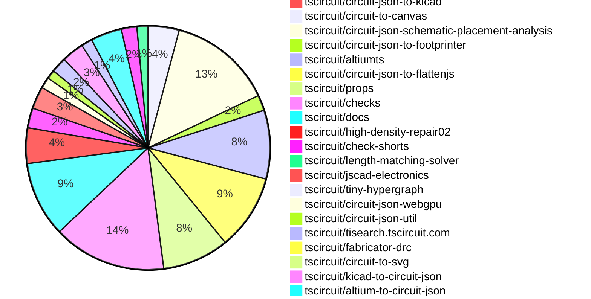

# contribution tracker

[contributions.tscircuit.com](https://contributions.tscircuit.com) ・ [tscircuit.com](https://tscircuit.com) ・ [Contribution Overviews](./contribution-overviews/) ・ [Changelogs](./changelogs/)

Generates weekly contribution overviews for tscircuit contributors. Check out all
the [contribution overviews here](./contribution-overviews/)
You can find AI-generated monthly changelogs in the [changelogs directory](./changelogs/)

- All PRs in the tscircuit org are scanned/summarized via an LLM
- The LLM classifies each Diff/PR as into a set of attributes for scoring
- All the PRs, summaries, and classifications are organized into charts and tables for [the website](https://contributions.tscircuit.com)

> Want to run locally? See the [Development Section](#development)

## Current Week

<!-- START_CURRENT_WEEK -->

# Contribution Overview 2026-09-15

The current week is shown below. There are 3 major sections:

- [Contributor Overview](#contributor-overview)
- [PRs by Repository](#prs-by-repository)
- [PRs by Contributor](#changes-by-contributor)
- [Scoring & Sponsorship Details](/docs/sponsorship-calculation-explanation.md)

## PRs by Repository


```mermaid
pie
    "tscircuit/pcb-viewer" : 14
    "tscircuit/tscircuit" : 47
    "tscircuit/circuit-json" : 7
    "tscircuit/core" : 31
    "tscircuit/tscircuit.com" : 34
    "tscircuit/eval" : 30
    "tscircuit/runframe" : 51
    "tscircuit/cli" : 34
    "tscircuit/tscircuit-autorouter" : 16
    "tscircuit/schematic-trace-solver" : 9
    "tscircuit/test-github-automerge" : 2
    "tscircuit/circuit-json-to-kicad" : 10
    "tscircuit/circuit-to-canvas" : 2
    "tscircuit/circuit-json-schematic-placement-analysis" : 5
    "tscircuit/circuit-json-to-footprinter" : 4
    "tscircuit/altiumts" : 7
    "tscircuit/circuit-json-to-flattenjs" : 1
    "tscircuit/props" : 2
    "tscircuit/checks" : 10
    "tscircuit/docs" : 3
    "tscircuit/high-density-repair02" : 1
    "tscircuit/check-shorts" : 1
    "tscircuit/length-matching-solver" : 2
    "tscircuit/jscad-electronics" : 2
    "tscircuit/tiny-hypergraph" : 1
    "tscircuit/circuit-json-webgpu" : 2
    "tscircuit/circuit-json-util" : 1
    "tscircuit/tisearch.tscircuit.com" : 5
    "tscircuit/fabricator-drc" : 1
    "tscircuit/circuit-to-svg" : 1
    "tscircuit/kicad-to-circuit-json" : 1
    "tscircuit/altium-to-circuit-json" : 14
    "tscircuit/ti" : 2
    "tscircuit/circuit-json-to-altium" : 7
    "tscircuit/easyeda-converter" : 5
    "tscircuit/footprinter" : 1
    "tscircuit/circuit-json-to-gerber" : 2
    "tscircuit/matchpack" : 2
    "tscircuit/3d-viewer" : 1
    "tscircuit/circuit-json-to-gltf" : 2
    "tscircuit/dataset-srj18" : 1
    "tscircuit/circuit-json-to-connectivity-map" : 1
    "tscircuit/high-density-a01" : 1
```

## Contributor Overview

| Contributor | 🐳 Major | 🐙 Minor | 🐌 Tiny | Score | ⭐ |
|-------------|---------|---------|---------|-------|-----|
| [seveibar](#seveibar) | 20 | 10 | 10 | 111 | 👑 |
| [ShiboSoftwareDev](#ShiboSoftwareDev) | 6 | 12 | 3 | 66 | ⭐⭐⭐ |
| [imrishabh18](#imrishabh18) | 11 | 4 | 4 | 57 | ⭐⭐⭐ |
| [techmannih](#techmannih) | 5 | 5 | 7 | 38 | ⭐⭐ |
| [mohan-bee](#mohan-bee) | 3 | 7 | 5 | 38 | ⭐⭐ |
| [hrithik18k](#hrithik18k) | 1 | 6 | 4 | 19.5 | ⭐⭐ |
| [rushabhcodes](#rushabhcodes) | 1 | 5 | 4 | 19 | ⭐⭐ |
| [AnasSarkiz](#AnasSarkiz) | 3 | 0 | 0 | 19 | ⭐⭐ |
| [tscircuitbot](#tscircuitbot) | 0 | 0 | 224 | 14 | ⭐⭐ |
| [Abse2001](#Abse2001) | 0 | 0 | 3 | 9 | ⭐ |
| [anil08607](#anil08607) | 1 | 1 | 1 | 7 | ⭐ |
| [GokulPandi-M](#GokulPandi-M) | 0 | 2 | 2 | 6 | ⭐ |
| [Devesh36](#Devesh36) | 0 | 1 | 2 | 5 | ⭐ |
| [KrishnaX12](#KrishnaX12) | 0 | 1 | 1 | 3 |  |
| [addibble](#addibble) | 0 | 1 | 0 | 2 |  |

## Staff Pass Ratio (SPR)

| Contributor | Reviewed PRs | Rejections | Approvals | SPR |
|-------------|--------------|------------|-----------|-----|
| [ShiboSoftwareDev](#ShiboSoftwareDev) | 6 | 0 | 6 | 100.0% |
| [techmannih](#techmannih) | 5 | 5 | 5 | 0.0% |
| [rushabhcodes](#rushabhcodes) | 3 | 1 | 2 | 66.7% |
| [Abse2001](#Abse2001) | 2 | 0 | 2 | 100.0% |
| [AnasSarkiz](#AnasSarkiz) | 2 | 1 | 2 | 50.0% |
| [hrithik18k](#hrithik18k) | 2 | 0 | 2 | 100.0% |
| [addibble](#addibble) | 1 | 0 | 1 | 100.0% |
| [imrishabh18](#imrishabh18) | 1 | 0 | 1 | 100.0% |
| [mohan-bee](#mohan-bee) | 1 | 0 | 1 | 100.0% |

<details>
<summary>ShiboSoftwareDev SPR PRs (6)</summary>

- [#3987](https://github.com/tscircuit/core/pull/3987) Update partial trace DRC expectations
- [#3967](https://github.com/tscircuit/core/pull/3967) Center routing directives on padded PCB content
- [#50](https://github.com/tscircuit/circuit-json-to-connectivity-map/pull/50) Connect partial PCB traces to available endpoints
- [#2604](https://github.com/tscircuit/tscircuit-autorouter/pull/2604) Ignore zero-length preloaded wire spans in Pipeline9
- [#2598](https://github.com/tscircuit/tscircuit-autorouter/pull/2598) Keep zero-length fixed spans in Pipeline9 regional sections
- [#2581](https://github.com/tscircuit/tscircuit-autorouter/pull/2581) Resolve canonical roots in Pipeline9 via validation

</details>

<details>
<summary>techmannih SPR PRs (5)</summary>

- [#1010](https://github.com/tscircuit/pcb-viewer/pull/1010) fix: respect board via tenting and preserve board context in PCB viewer
- [#3926](https://github.com/tscircuit/core/pull/3926) Support board default via tenting with per-via overrides
- [#3991](https://github.com/tscircuit/core/pull/3991) fix: preserve inner-layer via route net identities
- [#752](https://github.com/tscircuit/circuit-to-svg/pull/752) Resolve board defaults for via tenting
- [#288](https://github.com/tscircuit/circuit-to-canvas/pull/288) Render trace vias and resolve board tenting defaults

</details>

<details>
<summary>rushabhcodes SPR PRs (3)</summary>

- [#379](https://github.com/tscircuit/jscad-electronics/pull/379) Add RHB32 VQFN footprint model
- [#296](https://github.com/tscircuit/checks/pull/296) Fix do-not-place mixed courtyard overlaps
- [#70](https://github.com/tscircuit/altium-to-circuit-json/pull/70) Fix distorted SVG comparison snapshots

</details>

<details>
<summary>Abse2001 SPR PRs (2)</summary>

- [#2609](https://github.com/tscircuit/tscircuit-autorouter/pull/2609) Detect through-hole via collisions in reference DRC
- [#2630](https://github.com/tscircuit/tscircuit-autorouter/pull/2630) Improve trace widths after hypergraph pathing

</details>

<details>
<summary>AnasSarkiz SPR PRs (2)</summary>

- [#2631](https://github.com/tscircuit/tscircuit-autorouter/pull/2631) Accelerate high-density routing with cached via occupants
- [#121](https://github.com/tscircuit/high-density-a01/pull/121) Cache via occupants within each A01 and A03 connection search

</details>

<details>
<summary>hrithik18k SPR PRs (2)</summary>

- [#1209](https://github.com/tscircuit/schematic-trace-solver/pull/1209) Fix overlapping GND label for shared pin branch
- [#1195](https://github.com/tscircuit/schematic-trace-solver/pull/1195) Fix net-label branch origin at component edge

</details>

<details>
<summary>addibble SPR PRs (1)</summary>

- [#192](https://github.com/tscircuit/circuit-json-to-gltf/pull/192) test: cover fixed child CAD rotation and size in GLB snapshots

</details>

<details>
<summary>imrishabh18 SPR PRs (1)</summary>

- [#801](https://github.com/tscircuit/circuit-json/pull/801) Add optional pcb_port_ids to pcb_via

</details>

<details>
<summary>mohan-bee SPR PRs (1)</summary>

- [#4029](https://github.com/tscircuit/core/pull/4029) honor net nominal trace width during pcb routing

</details>

> Note: AI evaluates PRs and assigns 1-3 star ratings automatically. 4 and 5 star ratings require manual staff review.

## Review Table

[reviews-received-hover]: ## "Number of reviews received for PRs for this contributor"
[approvals-received-hover]: ## "Number of approvals received for PRs this contributor authored"
[rejections-received-hover]: ## "Number of rejections received for PRs this contributor authored"
[prs-opened-hover]: ## "Number of PRs opened by this contributor"
[issues-created-hover]: ## "Number of issues created by this contributor"

| Contributor | Reviews Received | Approvals Received | Rejections Received | Approvals | Rejections Given | PRs Opened | PRs Merged | Issues Created |
|---|---|---|---|---|---|---|---|---|
| [0hmX](#0hmX) | 0 | 0 | 0 | 4 | 0 | 4 | 0 | 0 |
| [0monish](#0monish) | 0 | 0 | 0 | 0 | 0 | 1 | 0 | 0 |
| [Abse2001](#Abse2001) | 12 | 5 | 0 | 6 | 0 | 11 | 3 | 0 |
| [addibble](#addibble) | 5 | 1 | 0 | 0 | 0 | 4 | 1 | 0 |
| [AnasSarkiz](#AnasSarkiz) | 4 | 3 | 0 | 7 | 0 | 15 | 3 | 0 |
| [anil08607](#anil08607) | 5 | 5 | 0 | 0 | 0 | 6 | 3 | 0 |
| [anupamme](#anupamme) | 0 | 0 | 0 | 0 | 0 | 1 | 0 | 0 |
| [ArtyormSatori](#ArtyormSatori) | 0 | 0 | 0 | 0 | 0 | 1 | 0 | 0 |
| [billythompsons](#billythompsons) | 0 | 0 | 0 | 0 | 0 | 2 | 0 | 0 |
| [Cid-oe](#Cid-oe) | 0 | 0 | 0 | 0 | 0 | 1 | 0 | 0 |
| [dball1126](#dball1126) | 0 | 0 | 0 | 0 | 0 | 1 | 0 | 0 |
| [devamkakoty](#devamkakoty) | 0 | 0 | 0 | 0 | 0 | 1 | 0 | 0 |
| [Devesh36](#Devesh36) | 3 | 3 | 0 | 2 | 0 | 3 | 3 | 0 |
| [diogo2806](#diogo2806) | 0 | 0 | 0 | 0 | 0 | 1 | 0 | 0 |
| [Furox-Art](#Furox-Art) | 0 | 0 | 0 | 0 | 0 | 8 | 0 | 0 |
| [GokulPandi-M](#GokulPandi-M) | 7 | 5 | 1 | 0 | 0 | 8 | 4 | 0 |
| [halc8312](#halc8312) | 8 | 0 | 0 | 0 | 0 | 8 | 0 | 0 |
| [hrithik18k](#hrithik18k) | 17 | 14 | 0 | 0 | 0 | 13 | 11 | 0 |
| [Ialyahya96](#Ialyahya96) | 0 | 0 | 0 | 0 | 0 | 6 | 0 | 0 |
| [imrishabh18](#imrishabh18) | 2 | 1 | 0 | 16 | 2 | 21 | 19 | 0 |
| [iprasen](#iprasen) | 0 | 0 | 0 | 0 | 0 | 11 | 0 | 0 |
| [Itachi3355](#Itachi3355) | 0 | 0 | 0 | 0 | 0 | 1 | 0 | 0 |
| [ivan-mihalic](#ivan-mihalic) | 0 | 0 | 0 | 0 | 0 | 1 | 0 | 0 |
| [jkorrr](#jkorrr) | 0 | 0 | 0 | 0 | 0 | 5 | 0 | 0 |
| [KrishnaX12](#KrishnaX12) | 8 | 3 | 0 | 0 | 0 | 14 | 2 | 0 |
| [maci0](#maci0) | 0 | 0 | 0 | 0 | 0 | 2 | 0 | 0 |
| [marcos452652258-gif](#marcos452652258-gif) | 0 | 0 | 0 | 0 | 0 | 8 | 0 | 0 |
| [meanusarcanus](#meanusarcanus) | 0 | 0 | 0 | 0 | 0 | 13 | 0 | 0 |
| [mohan-bee](#mohan-bee) | 10 | 9 | 0 | 7 | 0 | 25 | 15 | 0 |
| [Nexlu1](#Nexlu1) | 0 | 0 | 0 | 0 | 0 | 1 | 0 | 0 |
| [PINYOPATTANAWASANPORN](#PINYOPATTANAWASANPORN) | 0 | 0 | 0 | 0 | 0 | 2 | 0 | 0 |
| [rushabhcodes](#rushabhcodes) | 50 | 9 | 1 | 4 | 0 | 25 | 10 | 0 |
| [saiyer123](#saiyer123) | 0 | 0 | 0 | 0 | 0 | 3 | 0 | 0 |
| [seveibar](#seveibar) | 18 | 2 | 0 | 25 | 3 | 63 | 43 | 0 |
| [ShiboSoftwareDev](#ShiboSoftwareDev) | 25 | 22 | 0 | 20 | 0 | 68 | 21 | 0 |
| [techmannih](#techmannih) | 20 | 14 | 3 | 5 | 0 | 28 | 17 | 0 |
| [tscircuitbot](#tscircuitbot) | 0 | 0 | 0 | 0 | 0 | 308 | 226 | 0 |

## Changes by Repository

### [tscircuit/pcb-viewer](https://github.com/tscircuit/pcb-viewer)

| PR # | Impact | Rating | Contributor | Description |
|------|--------|--------|-------------|-------------|
| [#1019](https://github.com/tscircuit/pcb-viewer/pull/1019) | 🐳 Major | ⭐⭐⭐ | seveibar | Adds X-Ray Net inspection feature that allows users to view selected nets traces, pads, and vias at full opacity while dimming unrelated copper layers, enhancing PCB inspection capabilities. |
| [#1017](https://github.com/tscircuit/pcb-viewer/pull/1017) | 🐳 Major | ⭐⭐⭐ | seveibar | Sets the default hidden layer visibility to 20 and saves user preferences in localStorage, restoring them upon reopening the viewer or reloading the page. |
| [#1012](https://github.com/tscircuit/pcb-viewer/pull/1012) | 🐳 Major | ⭐⭐⭐ | seveibar | Large boards need responsive navigation without waiting for new raster images. This adds a worker-owned WebGPU renderer that compiles Circuit JSON once, retains GPU geometry, and redraws on camera changes throughout panzoom. Right-click the board and choose Rendering Engine  Canvas or WebGPU (experimental). Switching preserves camera and viewer state, releases the previous worker, and updates the selected radio item. Opening the context menu cancels active panning and disables navigation; the dismissal press cannot start a drag. The renderer prop sets the initial engine; subsequent prop changes update the selection. This candidate still defaults to WebGPU and automatically falls back to Canvas on unavailable WebGPUOffscreenCanvas, workerdevice failures, and diagnosed unsupported geometry. The standalone circuit-json-webgpu(https:github.comtscircuitcircuit-json-webgpu) renderer is installed as a devDependency from https:jscdn.tscircuit.comtscircuitcircuit-json-webgpu0.0.3.tgz and bundled into the inline worker. This version includes the merged gray-board-background and soldermask-state fixes. No renderer runtime import or vendored upstream sources are required. Layer visibility, opacity, pours, mask, annotations, and highlights update without rebuilding geometry; resize preserves the worker. Draft: full visual parity is not achieved. The renderers strict audit compares fresh circuit-to-svg on the left with rendered WebGPU on the right. The latest checked-in report passes 75597 comparisons (326 text-only); 19 Canvas-only passes are explicitly not comparable. Diagnostics and Canvas fallback do not detect every mismatch. The 597 committed comparison snapshots provide regression coverage, not proof of cross-renderer parity. Validation: TypeScript passes in a clean checkout without dist, the production build passes, and all 53 viewer tests pass. Browser tests typecheck against source and use a Vite alias to exercise the built bundle at runtime. Real Chromium checks of the built bundle pass: AM3352 zoom, resize, StrictModeunmount cleanup, context-menu switching both directions, camera preservation, context-menu navigation blockingdismissalresumption, and Canvas fallbacks. AM3352 compiles in approximately 699 ms in the worker locally, then retains one geometry upload during navigation; the measured animation-frame p95 was 14.4 ms. These are local measurements, not cross-device guarantees. Renderer 0.0.3 passed its publish workflows typecheck, 35 unit tests, and build. Its test-tooling compatibility fix is tracked in renderer PR 3(https:github.comtscircuitcircuit-json-webgpupull3). Merged current main and resolved the build-config conflict. Independent of the earlier bitmap-worker PR 1009. |
| [#1006](https://github.com/tscircuit/pcb-viewer/pull/1006) | 🐳 Major | ⭐⭐⭐ | seveibar | Reduces the rendering time of the measuring tool by caching SVG paths, significantly improving performance during dragging operations. |
| [#1010](https://github.com/tscircuit/pcb-viewer/pull/1010) | 🐳 Major | ⭐⭐⭐ | techmannih | Fixes PCB viewer to respect board via tenting and preserve board context when rendering filtered vias, ensuring proper visibility and functionality of vias and traces with hidden copper pours. |
| [#1013](https://github.com/tscircuit/pcb-viewer/pull/1013) | 🐙 Minor | ⭐⭐ | imrishabh18 | Fixes a production bundle issue where React DOM was incorrectly embedded, causing loading failures on the dashboard. |

<details>
<summary>🐌 Tiny Contributions (8)</summary>

| PR # | Impact | Contributor | Description |
|------|--------|-------------|-------------|
| [#1020](https://github.com/tscircuit/pcb-viewer/pull/1020) | 🐌 Tiny | tscircuitbot | Automated package update |
| [#1018](https://github.com/tscircuit/pcb-viewer/pull/1018) | 🐌 Tiny | tscircuitbot | Automated package update |
| [#1015](https://github.com/tscircuit/pcb-viewer/pull/1015) | 🐌 Tiny | tscircuitbot | Automated package update |
| [#1014](https://github.com/tscircuit/pcb-viewer/pull/1014) | 🐌 Tiny | tscircuitbot | Automated package update |
| [#1004](https://github.com/tscircuit/pcb-viewer/pull/1004) | 🐌 Tiny | tscircuitbot | Automated package update |
| [#1007](https://github.com/tscircuit/pcb-viewer/pull/1007) | 🐌 Tiny | tscircuitbot | Automated package update |
| [#1011](https://github.com/tscircuit/pcb-viewer/pull/1011) | 🐌 Tiny | tscircuitbot | Automated package update |
| [#1003](https://github.com/tscircuit/pcb-viewer/pull/1003) | 🐌 Tiny | seveibar | Summary Dense multilayer boards make the selected layer difficult to distinguish. Add a right-click menu with Visibility  Hidden Layer Visibility offering Hide, 10, 20, 40, 60, 80, and 100, with 40 as the default. Hide clears inactive-layer canvases and skips drawing their contents. The selected layer, its associated side details, and shared board geometry and drills remain visible. Changing the selected layer updates which layers are hidden. The menu supports keyboard navigation and dismissal, and adapts its placement near viewport edges. Add an AM3352 dev board fixture using the complete supplied circuit JSON: 10,979 elements and eight copper layers. The large JSON addition is the unchanged fixture input.  Validation bun test: 48 passed. bunx tsc --noEmit: passed. bun run build: passed, including declarations. Formatting and git diff --check: passed. Fixture verified byte-identical to the supplied JSON. Browser verification was blocked by a saved local browser permission. |

</details>

### [tscircuit/tscircuit](https://github.com/tscircuit/tscircuit)


<details>
<summary>🐌 Tiny Contributions (47)</summary>

| PR # | Impact | Contributor | Description |
|------|--------|-------------|-------------|
| [#5038](https://github.com/tscircuit/tscircuit/pull/5038) | 🐌 Tiny | tscircuitbot | Automated package update to version 0.0.2586 |
| [#5037](https://github.com/tscircuit/tscircuit/pull/5037) | 🐌 Tiny | tscircuitbot | Automated package update |
| [#5036](https://github.com/tscircuit/tscircuit/pull/5036) | 🐌 Tiny | tscircuitbot | Updates the tscircuitcli package to version 0.1.2104 in the package.json file. |
| [#5035](https://github.com/tscircuit/tscircuit/pull/5035) | 🐌 Tiny | tscircuitbot | Automated package update |
| [#5034](https://github.com/tscircuit/tscircuit/pull/5034) | 🐌 Tiny | tscircuitbot | Automated package update |
| [#5033](https://github.com/tscircuit/tscircuit/pull/5033) | 🐌 Tiny | tscircuitbot | Automated package update to version 0.0.2583 |
| [#5032](https://github.com/tscircuit/tscircuit/pull/5032) | 🐌 Tiny | tscircuitbot | Updates the tscircuitcli package to version 0.1.2103 |
| [#5031](https://github.com/tscircuit/tscircuit/pull/5031) | 🐌 Tiny | tscircuitbot | Automated package update |
| [#5030](https://github.com/tscircuit/tscircuit/pull/5030) | 🐌 Tiny | tscircuitbot | Automated package update |
| [#5029](https://github.com/tscircuit/tscircuit/pull/5029) | 🐌 Tiny | tscircuitbot | Automated package update |
| [#5028](https://github.com/tscircuit/tscircuit/pull/5028) | 🐌 Tiny | tscircuitbot | Updates the tscircuitcli package to version 0.1.2102 |
| [#5027](https://github.com/tscircuit/tscircuit/pull/5027) | 🐌 Tiny | tscircuitbot | Automated package update |
| [#5026](https://github.com/tscircuit/tscircuit/pull/5026) | 🐌 Tiny | tscircuitbot | Automated package update |
| [#5025](https://github.com/tscircuit/tscircuit/pull/5025) | 🐌 Tiny | tscircuitbot | Automated package update |
| [#5024](https://github.com/tscircuit/tscircuit/pull/5024) | 🐌 Tiny | tscircuitbot | Updates the version of the tscircuitrunframe package from 0.0.2757 to 0.0.2758 in package.json |
| [#5023](https://github.com/tscircuit/tscircuit/pull/5023) | 🐌 Tiny | tscircuitbot | Updates the package version from 0.0.2577 to 0.0.2578 in package.json |
| [#5022](https://github.com/tscircuit/tscircuit/pull/5022) | 🐌 Tiny | tscircuitbot | Updates the tscircuitcli package to version 0.1.2100 in the package.json file |
| [#5021](https://github.com/tscircuit/tscircuit/pull/5021) | 🐌 Tiny | tscircuitbot | Automated package update |
| [#5020](https://github.com/tscircuit/tscircuit/pull/5020) | 🐌 Tiny | tscircuitbot | Automated package update |
| [#5019](https://github.com/tscircuit/tscircuit/pull/5019) | 🐌 Tiny | tscircuitbot | Automated package update |
| [#5018](https://github.com/tscircuit/tscircuit/pull/5018) | 🐌 Tiny | tscircuitbot | Updates the tscircuitcli package to version 0.1.2099 in the package.json file |
| [#5017](https://github.com/tscircuit/tscircuit/pull/5017) | 🐌 Tiny | tscircuitbot | Automated package update |
| [#5016](https://github.com/tscircuit/tscircuit/pull/5016) | 🐌 Tiny | tscircuitbot | Automated package update |
| [#5015](https://github.com/tscircuit/tscircuit/pull/5015) | 🐌 Tiny | tscircuitbot | Automated package update |
| [#5014](https://github.com/tscircuit/tscircuit/pull/5014) | 🐌 Tiny | tscircuitbot | Updates the version of several packages in the project, including tscircuitcli, tscircuitcore, and tscircuiteval. |
| [#5013](https://github.com/tscircuit/tscircuit/pull/5013) | 🐌 Tiny | tscircuitbot | Automated package update |
| [#5012](https://github.com/tscircuit/tscircuit/pull/5012) | 🐌 Tiny | tscircuitbot | Automated package update |
| [#5011](https://github.com/tscircuit/tscircuit/pull/5011) | 🐌 Tiny | tscircuitbot | Automated package update |
| [#5010](https://github.com/tscircuit/tscircuit/pull/5010) | 🐌 Tiny | tscircuitbot | Automated package update |
| [#5006](https://github.com/tscircuit/tscircuit/pull/5006) | 🐌 Tiny | tscircuitbot | Updates the version of the tscircuitrunframe package from 0.0.2748 to 0.0.2749 in package.json |
| [#5005](https://github.com/tscircuit/tscircuit/pull/5005) | 🐌 Tiny | tscircuitbot | Automated package update to version 0.0.2569 |
| [#5004](https://github.com/tscircuit/tscircuit/pull/5004) | 🐌 Tiny | tscircuitbot | Automated package update |
| [#5002](https://github.com/tscircuit/tscircuit/pull/5002) | 🐌 Tiny | tscircuitbot | Automated package update |
| [#5007](https://github.com/tscircuit/tscircuit/pull/5007) | 🐌 Tiny | tscircuitbot | Updates the package version from 0.0.2569 to 0.0.2570 in package.json |
| [#5003](https://github.com/tscircuit/tscircuit/pull/5003) | 🐌 Tiny | tscircuitbot | Automated package update |
| [#5009](https://github.com/tscircuit/tscircuit/pull/5009) | 🐌 Tiny | tscircuitbot | Automated package update |
| [#5008](https://github.com/tscircuit/tscircuit/pull/5008) | 🐌 Tiny | tscircuitbot | Updates the tscircuitcli package to version 0.1.2095 in the package.json file. |
| [#5001](https://github.com/tscircuit/tscircuit/pull/5001) | 🐌 Tiny | tscircuitbot | Automated package update |
| [#5000](https://github.com/tscircuit/tscircuit/pull/5000) | 🐌 Tiny | tscircuitbot | Automated package update |
| [#4998](https://github.com/tscircuit/tscircuit/pull/4998) | 🐌 Tiny | tscircuitbot | Automated package update |
| [#4997](https://github.com/tscircuit/tscircuit/pull/4997) | 🐌 Tiny | tscircuitbot | Automated package update |
| [#4996](https://github.com/tscircuit/tscircuit/pull/4996) | 🐌 Tiny | tscircuitbot | Automated package update |
| [#4994](https://github.com/tscircuit/tscircuit/pull/4994) | 🐌 Tiny | tscircuitbot | Automated package update |
| [#4999](https://github.com/tscircuit/tscircuit/pull/4999) | 🐌 Tiny | tscircuitbot | Automated package update |
| [#4995](https://github.com/tscircuit/tscircuit/pull/4995) | 🐌 Tiny | tscircuitbot | Automated package update |
| [#4993](https://github.com/tscircuit/tscircuit/pull/4993) | 🐌 Tiny | tscircuitbot | Automated package update |
| [#4992](https://github.com/tscircuit/tscircuit/pull/4992) | 🐌 Tiny | imrishabh18 | Updates the CLI, core, and related tscircuit packages to their latest versions and syncs dependencies accordingly. |

</details>

### [tscircuit/circuit-json](https://github.com/tscircuit/circuit-json)

| PR # | Impact | Rating | Contributor | Description |
|------|--------|--------|-------------|-------------|
| [#803](https://github.com/tscircuit/circuit-json/pull/803) | 🐳 Major | ⭐⭐⭐ | seveibar | Proposes the Circuit JSON contract for advisory PCB keepouts, allowing routing and copper placement to cross certain keepout regions while reporting overlaps as warnings instead of errors. |
| [#798](https://github.com/tscircuit/circuit-json/pull/798) | 🐳 Major | ⭐⭐⭐ | seveibar | Add schemas for source bus length-matching requirements and routed length violations as dedicated errors in Circuit JSON. |
| [#801](https://github.com/tscircuit/circuit-json/pull/801) | 🐳 Major | ⭐⭐⭐ | imrishabh18 | Adds optional pcb_port_ids to the PcbVia interface and Zod schema, allowing for explicit reference to PCB ports associated with a via. |
| [#805](https://github.com/tscircuit/circuit-json/pull/805) | 🐙 Minor | ⭐⭐ | seveibar | Adds optional allow_traces and allow_placements booleans to all three keepout shapes, allowing for trace crossings and component placements without keepout diagnostics while preserving copper pour exclusions. |

<details>
<summary>🐌 Tiny Contributions (3)</summary>

| PR # | Impact | Contributor | Description |
|------|--------|-------------|-------------|
| [#804](https://github.com/tscircuit/circuit-json/pull/804) | 🐌 Tiny | tscircuitbot | Automated package update |
| [#802](https://github.com/tscircuit/circuit-json/pull/802) | 🐌 Tiny | tscircuitbot | Automated package update |
| [#799](https://github.com/tscircuit/circuit-json/pull/799) | 🐌 Tiny | tscircuitbot | Automated package update |

</details>

### [tscircuit/core](https://github.com/tscircuit/core)

| PR # | Impact | Rating | Contributor | Description |
|------|--------|--------|-------------|-------------|
| [#4015](https://github.com/tscircuit/core/pull/4015) | 🐳 Major | ⭐⭐⭐ | seveibar | Updates tscircuitcapacity-autorouter from 0.0.900 to 0.0.913 and refreshes 74 PCB and routing-phase snapshots for the changed routes, including breakout routing, imported boards, USBHDMI, and implicit-pour stitching. |
| [#4014](https://github.com/tscircuit/core/pull/4014) | 🐳 Major | ⭐⭐⭐ | seveibar | Implements keepout warningOnly  across cores PCB rendering, routing, import, and copper-pour generation, allowing advisory keepouts to emit warnings without blocking autorouting. |
| [#4013](https://github.com/tscircuit/core/pull/4013) | 🐳 Major | ⭐⭐⭐ | seveibar | Fixes autorouting failure for traces connected through named nets by resolving bus members connections accurately and supporting named nets without merging distinct branches. |
| [#3992](https://github.com/tscircuit/core/pull/3992) | 🐳 Major | ⭐⭐⭐ | seveibar | Emit source_bus records with resolved trace IDs, max_length_skew, name, and subcircuit ID to ensure downstream checks can enforce bus length-skew requirements in Circuit JSON. |
| [#4001](https://github.com/tscircuit/core/pull/4001) | 🐳 Major | ⭐⭐⭐ | imrishabh18 | Bumps tscircuitchecks to version 0.0.199 to enhance copper-pour connectivity checks by utilizing explicit pcb_via.pcb_port_ids, and adds regression tests for specific connectivity scenarios. |
| [#4000](https://github.com/tscircuit/core/pull/4000) | 🐳 Major | ⭐⭐⭐ | imrishabh18 | Manual vias now emit pcb_port_ids identifying their rendered layer ports, providing explicit association between a traces via endpoint and the physical barrel, without inferring port ownership from coordinates. |
| [#4005](https://github.com/tscircuit/core/pull/4005) | 🐳 Major | ⭐⭐⭐ | rushabhcodes | Preserves plated holes and vias as per-pad obstacles on every copper layer they span, ensuring proper PCB packing without affecting opposite-side SMT body stacking behavior. |
| [#4029](https://github.com/tscircuit/core/pull/4029) | 🐳 Major | ⭐⭐⭐ | mohan-bee | Honors net-level nominal trace width during PCB routing instead of defaulting to the board minimum, ensuring accurate routing widths based on specified net requirements. |
| [#3965](https://github.com/tscircuit/core/pull/3965) | 🐳 Major | ⭐⭐⭐ | ShiboSoftwareDev | The exact 96-component Allwinner T113-S3 Linux board places every fanout component correctly, but Core stores each auto-sized routing group at its authored pcbXpcbY anchor instead of the center of its padded content. The mismatch produces a false REG18USB overlap and gives later fanout solvers boxes that do not enclose their components. This reproduction keeps the original TSX, supplier Circuit JSON, four copper layers, and default Pipeline9 configuration. It contains no manual routes, vias, breakout points, or route hints. The test calls circuit.render() once so it captures the exact placement and group-bounds failure before downstream autorouting starts; it asserts the incorrect group centers and false placement error on current main. t113-linux-routing-group-bounds-pcb.snap.svg is rendered by circuit-to-svg from that live Circuit JSON with native PCB-group overlays enabled. The stacked winding reproduction and implementation fix update this same real board state, so the Files tab exposes the geometry change directly. Validation: bun test --timeout 60000 testsreprost113-linux-routing-group-bounds.test.tsx  pass in about 6 seconds, 8 assertions SVG contains all 96 real board components and the native PCB-group overlays Biome check on the test and exact TSX fixture git diff --check |
| [#4011](https://github.com/tscircuit/core/pull/4011) | 🐙 Minor | ⭐⭐ | seveibar | Integrates routed trace and bus length DRC checks by updating the checks library and implementing new error handling for trace lengths and bus skew violations. |
| [#3961](https://github.com/tscircuit/core/pull/3961) | 🐙 Minor | ⭐⭐ | imrishabh18 | Enables part orientation analysis by default, allowing for better handling of pin-1 orientation metadata in circuit JSON exports. |
| [#3983](https://github.com/tscircuit/core/pull/3983) | 🐙 Minor | ⭐⭐ | imrishabh18 | Fixes false disconnection reports for plated GND contacts joined by a bottom copper pour when no conventional PCB tracks are present. |
| [#3926](https://github.com/tscircuit/core/pull/3926) | 🐙 Minor | ⭐⭐ | techmannih | Adds support for board default via tenting with per-via overrides, allowing vias to inherit board settings unless explicitly overridden, and updates related tests and dependencies. |
| [#4003](https://github.com/tscircuit/core/pull/4003) | 🐙 Minor | ⭐⭐ | rushabhcodes | Reproduces the placement failure blocking SparkFun-Electret-Microphone-Breakout by demonstrating that opposite-layer component collapsing removes plated-hole copper from packing obstacles. |
| [#4028](https://github.com/tscircuit/core/pull/4028) | 🐙 Minor | ⭐⭐ | mohan-bee | Reproduces a bug where a net requesting a specific trace width is ignored during PCB routing, ensuring the request is preserved in the source net and routing input. |
| [#3975](https://github.com/tscircuit/core/pull/3975) | 🐙 Minor | ⭐⭐ | hrithik18k | Summary adds the complete hrithik18kair-mouse(https:tscircuit.comhrithik18kair-mousefiles) board source as a core repro fixture, including all component imports and all six schematic sections captures the full 1200600 schematic sheet, using the supplied air-mouse.svg as the layout reference preserves the currently published solver (0.0.198) output so the ICM-20948 pins 911 GND-routing bug is visible in the baseline repro  Verification sh bun test testsreprosrepro-icm20948-shared-ground-label.test.tsx  Result: 1 pass, 0 fail. The solver fix is tracked separately in tscircuitschematic-trace-solver1209. |
| [#3987](https://github.com/tscircuit/core/pull/3987) | 🐙 Minor | ⭐⭐ | ShiboSoftwareDev | Updates the partial-trace DRC expectations to reflect the corrected behavior after a previous fix, ensuring accurate reporting of trace errors in PCB designs. |
| [#3967](https://github.com/tscircuit/core/pull/3967) | 🐙 Minor | ⭐⭐ | ShiboSoftwareDev | Aligns routing directives with padded content bounds, ensuring consistent center positioning for auto-sized subcircuits and packed groups. |

<details>
<summary>🐌 Tiny Contributions (13)</summary>

| PR # | Impact | Contributor | Description |
|------|--------|-------------|-------------|
| [#4032](https://github.com/tscircuit/core/pull/4032) | 🐌 Tiny | tscircuitbot | Updates the tscircuitchecks package to version 0.0.202 in the package.json file. |
| [#3996](https://github.com/tscircuit/core/pull/3996) | 🐌 Tiny | tscircuitbot | Updates the tscircuitchecks package from version 0.0.196 to 0.0.197 |
| [#3995](https://github.com/tscircuit/core/pull/3995) | 🐌 Tiny | tscircuitbot | Updates the tscircuitchecks package from version 0.0.196 to 0.0.197 |
| [#3990](https://github.com/tscircuit/core/pull/3990) | 🐌 Tiny | tscircuitbot | Updates the tscircuitchecks package from version 0.0.195 to 0.0.196 in the package.json file. |
| [#3989](https://github.com/tscircuit/core/pull/3989) | 🐌 Tiny | tscircuitbot | Updates the tscircuitchecks package to version 0.0.196 in package.json |
| [#3994](https://github.com/tscircuit/core/pull/3994) | 🐌 Tiny | seveibar | Update tscircuitchecks to 0.0.198 to enable copper-pour short detection and Flatbush improvements without failing on empty schematic-only boards. |
| [#3981](https://github.com/tscircuit/core/pull/3981) | 🐌 Tiny | imrishabh18 | Reproduces a bug where plated GND contacts are incorrectly reported as disconnected when connected through a bottom copper pour. |
| [#3980](https://github.com/tscircuit/core/pull/3980) | 🐌 Tiny | rushabhcodes | Updates the tscircuitchecks package from version 0.0.193 to 0.0.194, incorporating the courtyard-overlap fix from tscircuitchecks291. |
| [#4020](https://github.com/tscircuit/core/pull/4020) | 🐌 Tiny | mohan-bee | Fixes redundant near-parallel VREF routes in the acoustic tuner schematic by updating the schematic trace recovery behavior. |
| [#3999](https://github.com/tscircuit/core/pull/3999) | 🐌 Tiny | hrithik18k | Updates the tscircuitschematic-trace-solver package from version 0.0.198 to 0.0.199, including a fix for shared-ground-label and refreshing the Air Mouse schematic regression snapshot. |
| [#3969](https://github.com/tscircuit/core/pull/3969) | 🐌 Tiny | hrithik18k | Update tscircuitschematic-trace-solver from 0.0.197 to 0.0.198, bringing in a net-label branch placement fix that maintains junctions while placing eligible net-label branches from the component-adjacent edge. |
| [#3966](https://github.com/tscircuit/core/pull/3966) | 🐌 Tiny | ShiboSoftwareDev | Reproduces a winding solver error for the T113 board by adding a test case with specific input data, without changing production code. |
| [#3932](https://github.com/tscircuit/core/pull/3932) | 🐌 Tiny | GokulPandi-M | Fixes redundant parallel routing of VREF branches in schematic, preventing potential electrical issues. |

</details>

### [tscircuit/tscircuit.com](https://github.com/tscircuit/tscircuit.com)

| PR # | Impact | Rating | Contributor | Description |
|------|--------|--------|-------------|-------------|
| [#4962](https://github.com/tscircuit/tscircuit.com/pull/4962) | 🐳 Major | ⭐⭐⭐ | seveibar | Excludes partial datasheets from the index, ensuring only fully populated records are listed and displayed to users. |
| [#4960](https://github.com/tscircuit/tscircuit.com/pull/4960) | 🐳 Major | ⭐⭐⭐ | seveibar | datasheets now lists every indexed chip in a compact alphabetical grid of links, with a result count and name search. It fetches all matching datasheets in a single request without a popularity filter. The fake API mirrors the complete list and substring search. |

<details>
<summary>🐌 Tiny Contributions (32)</summary>

| PR # | Impact | Contributor | Description |
|------|--------|-------------|-------------|
| [#4977](https://github.com/tscircuit/tscircuit.com/pull/4977) | 🐌 Tiny | tscircuitbot | Automated package update |
| [#4976](https://github.com/tscircuit/tscircuit.com/pull/4976) | 🐌 Tiny | tscircuitbot | Updates the tscircuiteval package from version 0.0.1422 to 0.0.1423 |
| [#4975](https://github.com/tscircuit/tscircuit.com/pull/4975) | 🐌 Tiny | tscircuitbot | Automated package update |
| [#4974](https://github.com/tscircuit/tscircuit.com/pull/4974) | 🐌 Tiny | tscircuitbot | Updates the tscircuiteval package from version 0.0.1421 to 0.0.1422 in the package.json file. |
| [#4973](https://github.com/tscircuit/tscircuit.com/pull/4973) | 🐌 Tiny | tscircuitbot | Updates the tscircuitrunframe package to version 0.0.2758 |
| [#4972](https://github.com/tscircuit/tscircuit.com/pull/4972) | 🐌 Tiny | tscircuitbot | Updates the tscircuiteval package from version 0.0.1420 to 0.0.1421 |
| [#4971](https://github.com/tscircuit/tscircuit.com/pull/4971) | 🐌 Tiny | tscircuitbot | Automated package update |
| [#4970](https://github.com/tscircuit/tscircuit.com/pull/4970) | 🐌 Tiny | tscircuitbot | Updates the tscircuitrunframe package from version 0.0.2754 to 0.0.2756 |
| [#4969](https://github.com/tscircuit/tscircuit.com/pull/4969) | 🐌 Tiny | tscircuitbot | Automated package update |
| [#4967](https://github.com/tscircuit/tscircuit.com/pull/4967) | 🐌 Tiny | tscircuitbot | Updates the tscircuiteval package from version 0.0.1418 to 0.0.1419 |
| [#4965](https://github.com/tscircuit/tscircuit.com/pull/4965) | 🐌 Tiny | tscircuitbot | Updates the tscircuitrunframe package from version 0.0.2752 to 0.0.2754 |
| [#4964](https://github.com/tscircuit/tscircuit.com/pull/4964) | 🐌 Tiny | tscircuitbot | Updates the tscircuiteval package from version 0.0.1417 to 0.0.1418 |
| [#4963](https://github.com/tscircuit/tscircuit.com/pull/4963) | 🐌 Tiny | tscircuitbot | Automated package update |
| [#4961](https://github.com/tscircuit/tscircuit.com/pull/4961) | 🐌 Tiny | tscircuitbot | Automated package update |
| [#4958](https://github.com/tscircuit/tscircuit.com/pull/4958) | 🐌 Tiny | tscircuitbot | Updates the tscircuiteval package from version 0.0.1416 to 0.0.1417 |
| [#4953](https://github.com/tscircuit/tscircuit.com/pull/4953) | 🐌 Tiny | tscircuitbot | Updates the tscircuitrunframe package from version 0.0.2747 to 0.0.2749 and the tscircuitpcb-viewer package from version 1.11.398 to 1.11.399 in package.json |
| [#4951](https://github.com/tscircuit/tscircuit.com/pull/4951) | 🐌 Tiny | tscircuitbot | Updates the tscircuiteval package from version 0.0.1411 to 0.0.1415 |
| [#4956](https://github.com/tscircuit/tscircuit.com/pull/4956) | 🐌 Tiny | tscircuitbot | Automated package update |
| [#4955](https://github.com/tscircuit/tscircuit.com/pull/4955) | 🐌 Tiny | tscircuitbot | Automated package update |
| [#4954](https://github.com/tscircuit/tscircuit.com/pull/4954) | 🐌 Tiny | tscircuitbot | Automated package update |
| [#4957](https://github.com/tscircuit/tscircuit.com/pull/4957) | 🐌 Tiny | tscircuitbot | Automated package update |
| [#4948](https://github.com/tscircuit/tscircuit.com/pull/4948) | 🐌 Tiny | tscircuitbot | Updates the tscircuitrunframe package from version 0.0.2745 to 0.0.2746 and the tscircuitpcb-viewer package from version 1.11.397 to 1.11.398. |
| [#4938](https://github.com/tscircuit/tscircuit.com/pull/4938) | 🐌 Tiny | tscircuitbot | Updates the tscircuitrunframe package from version 0.0.2738 to 0.0.2739 |
| [#4944](https://github.com/tscircuit/tscircuit.com/pull/4944) | 🐌 Tiny | tscircuitbot | Automated package update |
| [#4942](https://github.com/tscircuit/tscircuit.com/pull/4942) | 🐌 Tiny | tscircuitbot | Automated package update |
| [#4936](https://github.com/tscircuit/tscircuit.com/pull/4936) | 🐌 Tiny | tscircuitbot | Updates the tscircuitrunframe package from version 0.0.2737 to 0.0.2738 |
| [#4950](https://github.com/tscircuit/tscircuit.com/pull/4950) | 🐌 Tiny | tscircuitbot | Automated package update |
| [#4946](https://github.com/tscircuit/tscircuit.com/pull/4946) | 🐌 Tiny | tscircuitbot | Automated package update |
| [#4941](https://github.com/tscircuit/tscircuit.com/pull/4941) | 🐌 Tiny | tscircuitbot | Automated package update |
| [#4939](https://github.com/tscircuit/tscircuit.com/pull/4939) | 🐌 Tiny | tscircuitbot | Updates the tscircuiteval package from version 0.0.1410 to 0.0.1411 |
| [#4947](https://github.com/tscircuit/tscircuit.com/pull/4947) | 🐌 Tiny | tscircuitbot | Automated package update |
| [#4937](https://github.com/tscircuit/tscircuit.com/pull/4937) | 🐌 Tiny | tscircuitbot | Updates the tscircuiteval package from version 0.0.1409 to 0.0.1410. |

</details>

### [tscircuit/eval](https://github.com/tscircuit/eval)


<details>
<summary>🐌 Tiny Contributions (30)</summary>

| PR # | Impact | Contributor | Description |
|------|--------|-------------|-------------|
| [#4639](https://github.com/tscircuit/eval/pull/4639) | 🐌 Tiny | tscircuitbot | Updates the package version from 0.0.1424 to 0.0.1425 in package.json |
| [#4638](https://github.com/tscircuit/eval/pull/4638) | 🐌 Tiny | tscircuitbot | Updates the versions of several dependencies in the package.json file. |
| [#4636](https://github.com/tscircuit/eval/pull/4636) | 🐌 Tiny | tscircuitbot | Automated package update |
| [#4635](https://github.com/tscircuit/eval/pull/4635) | 🐌 Tiny | tscircuitbot | Updates the package versions in package.json to the latest compatible versions. |
| [#4633](https://github.com/tscircuit/eval/pull/4633) | 🐌 Tiny | tscircuitbot | Automated package update |
| [#4632](https://github.com/tscircuit/eval/pull/4632) | 🐌 Tiny | tscircuitbot | Updates package dependencies to their latest versions in package.json |
| [#4630](https://github.com/tscircuit/eval/pull/4630) | 🐌 Tiny | tscircuitbot | Automated package update |
| [#4629](https://github.com/tscircuit/eval/pull/4629) | 🐌 Tiny | tscircuitbot | Automated package update |
| [#4627](https://github.com/tscircuit/eval/pull/4627) | 🐌 Tiny | tscircuitbot | Automated package update |
| [#4626](https://github.com/tscircuit/eval/pull/4626) | 🐌 Tiny | tscircuitbot | Automated package update |
| [#4624](https://github.com/tscircuit/eval/pull/4624) | 🐌 Tiny | tscircuitbot | Automated package update |
| [#4623](https://github.com/tscircuit/eval/pull/4623) | 🐌 Tiny | tscircuitbot | Updates the version of the tscircuitcore package from 0.0.1935 to 0.0.1936 in package.json |
| [#4621](https://github.com/tscircuit/eval/pull/4621) | 🐌 Tiny | tscircuitbot | Automated package update |
| [#4620](https://github.com/tscircuit/eval/pull/4620) | 🐌 Tiny | tscircuitbot | Automated package update |
| [#4618](https://github.com/tscircuit/eval/pull/4618) | 🐌 Tiny | tscircuitbot | Automated package update |
| [#4617](https://github.com/tscircuit/eval/pull/4617) | 🐌 Tiny | tscircuitbot | Automated package update |
| [#4615](https://github.com/tscircuit/eval/pull/4615) | 🐌 Tiny | tscircuitbot | Automated package update |
| [#4614](https://github.com/tscircuit/eval/pull/4614) | 🐌 Tiny | tscircuitbot | Automated package update |
| [#4612](https://github.com/tscircuit/eval/pull/4612) | 🐌 Tiny | tscircuitbot | Automated package update |
| [#4611](https://github.com/tscircuit/eval/pull/4611) | 🐌 Tiny | tscircuitbot | Automated package update |
| [#4609](https://github.com/tscircuit/eval/pull/4609) | 🐌 Tiny | tscircuitbot | Automated package update |
| [#4608](https://github.com/tscircuit/eval/pull/4608) | 🐌 Tiny | tscircuitbot | Automated package update |
| [#4598](https://github.com/tscircuit/eval/pull/4598) | 🐌 Tiny | tscircuitbot | Automated package update |
| [#4597](https://github.com/tscircuit/eval/pull/4597) | 🐌 Tiny | tscircuitbot | Automated package update |
| [#4595](https://github.com/tscircuit/eval/pull/4595) | 🐌 Tiny | tscircuitbot | Automated package update |
| [#4594](https://github.com/tscircuit/eval/pull/4594) | 🐌 Tiny | tscircuitbot | Updates package dependencies to their latest versions as part of routine maintenance. |
| [#4592](https://github.com/tscircuit/eval/pull/4592) | 🐌 Tiny | tscircuitbot | Automated package update to version 0.0.1412 |
| [#4591](https://github.com/tscircuit/eval/pull/4591) | 🐌 Tiny | tscircuitbot | Updates the versions of several dependencies in the package.json file. |
| [#4589](https://github.com/tscircuit/eval/pull/4589) | 🐌 Tiny | tscircuitbot | Automated package update |
| [#4588](https://github.com/tscircuit/eval/pull/4588) | 🐌 Tiny | rushabhcodes | Updates package dependencies and regenerates the TL3342 simple 3D snapshot. |

</details>

### [tscircuit/runframe](https://github.com/tscircuit/runframe)


<details>
<summary>🐌 Tiny Contributions (51)</summary>

| PR # | Impact | Contributor | Description |
|------|--------|-------------|-------------|
| [#5210](https://github.com/tscircuit/runframe/pull/5210) | 🐌 Tiny | tscircuitbot | Updates the tscircuiteval package from version 0.0.1423 to 0.0.1424 in the package.json file. |
| [#5209](https://github.com/tscircuit/runframe/pull/5209) | 🐌 Tiny | tscircuitbot | Automated package update |
| [#5208](https://github.com/tscircuit/runframe/pull/5208) | 🐌 Tiny | tscircuitbot | Updates the tscircuitpcb-viewer package from version 1.11.399 to 1.11.400 |
| [#5207](https://github.com/tscircuit/runframe/pull/5207) | 🐌 Tiny | tscircuitbot | Automated package update |
| [#5206](https://github.com/tscircuit/runframe/pull/5206) | 🐌 Tiny | tscircuitbot | Updates the tscircuiteval package from version 0.0.1422 to 0.0.1423 |
| [#5205](https://github.com/tscircuit/runframe/pull/5205) | 🐌 Tiny | tscircuitbot | Automated package update |
| [#5204](https://github.com/tscircuit/runframe/pull/5204) | 🐌 Tiny | tscircuitbot | Updates the tscircuiteval package from version 0.0.1421 to 0.0.1422 in the package.json file. |
| [#5203](https://github.com/tscircuit/runframe/pull/5203) | 🐌 Tiny | tscircuitbot | Automated package update |
| [#5202](https://github.com/tscircuit/runframe/pull/5202) | 🐌 Tiny | tscircuitbot | Updates the tscircuiteval package from version 0.0.1420 to 0.0.1421 in the package.json file. |
| [#5201](https://github.com/tscircuit/runframe/pull/5201) | 🐌 Tiny | tscircuitbot | Automated package update |
| [#5200](https://github.com/tscircuit/runframe/pull/5200) | 🐌 Tiny | tscircuitbot | Automated package update |
| [#5199](https://github.com/tscircuit/runframe/pull/5199) | 🐌 Tiny | tscircuitbot | Automated package update |
| [#5198](https://github.com/tscircuit/runframe/pull/5198) | 🐌 Tiny | tscircuitbot | Automated package update |
| [#5197](https://github.com/tscircuit/runframe/pull/5197) | 🐌 Tiny | tscircuitbot | Automated package update |
| [#5196](https://github.com/tscircuit/runframe/pull/5196) | 🐌 Tiny | tscircuitbot | Updates the tscircuiteval package from version 0.0.1418 to 0.0.1419 |
| [#5195](https://github.com/tscircuit/runframe/pull/5195) | 🐌 Tiny | tscircuitbot | Automated package update |
| [#5194](https://github.com/tscircuit/runframe/pull/5194) | 🐌 Tiny | tscircuitbot | Updates the tscircuiteval package from version 0.0.1417 to 0.0.1418 |
| [#5193](https://github.com/tscircuit/runframe/pull/5193) | 🐌 Tiny | tscircuitbot | Automated package update |
| [#5192](https://github.com/tscircuit/runframe/pull/5192) | 🐌 Tiny | tscircuitbot | Updates the tscircuiteval package from version 0.0.1416 to 0.0.1417 |
| [#5180](https://github.com/tscircuit/runframe/pull/5180) | 🐌 Tiny | tscircuitbot | Updates the tscircuitpcb-viewer package to version 1.11.399 |
| [#5190](https://github.com/tscircuit/runframe/pull/5190) | 🐌 Tiny | tscircuitbot | Updates the circuit-json-to-kicad package version from 0.0.216 to 0.0.217 in package.json |
| [#5187](https://github.com/tscircuit/runframe/pull/5187) | 🐌 Tiny | tscircuitbot | Updates the tscircuiteval package from version 0.0.1415 to 0.0.1416 |
| [#5184](https://github.com/tscircuit/runframe/pull/5184) | 🐌 Tiny | tscircuitbot | Automated package update |
| [#5183](https://github.com/tscircuit/runframe/pull/5183) | 🐌 Tiny | tscircuitbot | Updates the circuit-json-to-kicad package version from 0.0.213 to 0.0.216 in package.json |
| [#5181](https://github.com/tscircuit/runframe/pull/5181) | 🐌 Tiny | tscircuitbot | Automated package update |
| [#5191](https://github.com/tscircuit/runframe/pull/5191) | 🐌 Tiny | tscircuitbot | Automated package update |
| [#5188](https://github.com/tscircuit/runframe/pull/5188) | 🐌 Tiny | tscircuitbot | Automated package update |
| [#5186](https://github.com/tscircuit/runframe/pull/5186) | 🐌 Tiny | tscircuitbot | Automated package update |
| [#5179](https://github.com/tscircuit/runframe/pull/5179) | 🐌 Tiny | tscircuitbot | Automated package update |
| [#5178](https://github.com/tscircuit/runframe/pull/5178) | 🐌 Tiny | tscircuitbot | Updates the tscircuiteval package from version 0.0.1414 to 0.0.1415 in the package.json file. |
| [#5174](https://github.com/tscircuit/runframe/pull/5174) | 🐌 Tiny | tscircuitbot | Updates the tscircuitpcb-viewer package from version 1.11.397 to 1.11.398 |
| [#5177](https://github.com/tscircuit/runframe/pull/5177) | 🐌 Tiny | tscircuitbot | Automated package update |
| [#5176](https://github.com/tscircuit/runframe/pull/5176) | 🐌 Tiny | tscircuitbot | Updates the tscircuiteval package from version 0.0.1413 to 0.0.1414 |
| [#5175](https://github.com/tscircuit/runframe/pull/5175) | 🐌 Tiny | tscircuitbot | Automated package update |
| [#5173](https://github.com/tscircuit/runframe/pull/5173) | 🐌 Tiny | tscircuitbot | Automated package update |
| [#5172](https://github.com/tscircuit/runframe/pull/5172) | 🐌 Tiny | tscircuitbot | Updates the tscircuitpcb-viewer package from version 1.11.396 to 1.11.397 |
| [#5171](https://github.com/tscircuit/runframe/pull/5171) | 🐌 Tiny | tscircuitbot | Automated package update |
| [#5170](https://github.com/tscircuit/runframe/pull/5170) | 🐌 Tiny | tscircuitbot | Updates the tscircuiteval package from version 0.0.1412 to 0.0.1413 in the package.json file. |
| [#5169](https://github.com/tscircuit/runframe/pull/5169) | 🐌 Tiny | tscircuitbot | Automated package update |
| [#5168](https://github.com/tscircuit/runframe/pull/5168) | 🐌 Tiny | tscircuitbot | Updates the tscircuiteval package from version 0.0.1411 to 0.0.1412 |
| [#5167](https://github.com/tscircuit/runframe/pull/5167) | 🐌 Tiny | tscircuitbot | Automated package update |
| [#5166](https://github.com/tscircuit/runframe/pull/5166) | 🐌 Tiny | tscircuitbot | Updates the tscircuitpcb-viewer package from version 1.11.395 to 1.11.396 |
| [#5165](https://github.com/tscircuit/runframe/pull/5165) | 🐌 Tiny | tscircuitbot | Automated package update |
| [#5164](https://github.com/tscircuit/runframe/pull/5164) | 🐌 Tiny | tscircuitbot | Updates the tscircuitpcb-viewer package to version 1.11.395 |
| [#5163](https://github.com/tscircuit/runframe/pull/5163) | 🐌 Tiny | tscircuitbot | Automated package update |
| [#5162](https://github.com/tscircuit/runframe/pull/5162) | 🐌 Tiny | tscircuitbot | Automated package update |
| [#5161](https://github.com/tscircuit/runframe/pull/5161) | 🐌 Tiny | tscircuitbot | Automated package update |
| [#5160](https://github.com/tscircuit/runframe/pull/5160) | 🐌 Tiny | tscircuitbot | Updates the tscircuiteval package from version 0.0.1409 to 0.0.1410 |
| [#5159](https://github.com/tscircuit/runframe/pull/5159) | 🐌 Tiny | tscircuitbot | Automated package update |
| [#5158](https://github.com/tscircuit/runframe/pull/5158) | 🐌 Tiny | tscircuitbot | Updates the circuit-json-to-kicad package version from 0.0.212 to 0.0.213 in package.json |
| [#5185](https://github.com/tscircuit/runframe/pull/5185) | 🐌 Tiny | mohan-bee | Updates the easyeda dependency from version 0.0.357 to 0.0.360 in package.json |

</details>

### [tscircuit/cli](https://github.com/tscircuit/cli)

| PR # | Impact | Rating | Contributor | Description |
|------|--------|--------|-------------|-------------|
| [#4785](https://github.com/tscircuit/cli/pull/4785) | 🐳 Major | ⭐⭐⭐ | imrishabh18 | Adds tsci search --digikey and tsci search --mouser, using the corresponding tscircuit search services without distributor API credentials. Both flags support combined searches with existing sources and --json. |
| [#4783](https://github.com/tscircuit/cli/pull/4783) | 🐳 Major | ⭐⭐⭐ | imrishabh18 | Add tsci search --ti query to discover Texas Instruments parts through tisearch.tscircuit.com, following the existing JLC search flow. TI-only searches do not query JLC; --ti can also be combined with other source flags. |
| [#4804](https://github.com/tscircuit/cli/pull/4804) | 🐙 Minor | ⭐⭐ | seveibar | Adds support for the useCloudAutorouting property in tscircuit.config.json, allowing users to enable cloud-based autorouting functionality and ensuring proper validation and handling of this configuration option. |

<details>
<summary>🐌 Tiny Contributions (31)</summary>

| PR # | Impact | Contributor | Description |
|------|--------|-------------|-------------|
| [#4833](https://github.com/tscircuit/cli/pull/4833) | 🐌 Tiny | tscircuitbot | Updates the tscircuitrunframe package from version 0.0.2760 to 0.0.2761 |
| [#4832](https://github.com/tscircuit/cli/pull/4832) | 🐌 Tiny | tscircuitbot | Automated package update |
| [#4831](https://github.com/tscircuit/cli/pull/4831) | 🐌 Tiny | tscircuitbot | Updates the tscircuitrunframe package to version 0.0.2760 |
| [#4829](https://github.com/tscircuit/cli/pull/4829) | 🐌 Tiny | tscircuitbot | Automated package update |
| [#4828](https://github.com/tscircuit/cli/pull/4828) | 🐌 Tiny | tscircuitbot | Updates the tscircuitrunframe package version from 0.0.2758 to 0.0.2759 in package.json |
| [#4826](https://github.com/tscircuit/cli/pull/4826) | 🐌 Tiny | tscircuitbot | Automated package update |
| [#4825](https://github.com/tscircuit/cli/pull/4825) | 🐌 Tiny | tscircuitbot | Updates the tscircuitrunframe package to version 0.0.2758 |
| [#4823](https://github.com/tscircuit/cli/pull/4823) | 🐌 Tiny | tscircuitbot | Updates the tscircuitrunframe package to version 0.0.2757 in package.json |
| [#4822](https://github.com/tscircuit/cli/pull/4822) | 🐌 Tiny | tscircuitbot | Automated package update |
| [#4821](https://github.com/tscircuit/cli/pull/4821) | 🐌 Tiny | tscircuitbot | Updates the tscircuitrunframe package to version 0.0.2756 in package.json |
| [#4820](https://github.com/tscircuit/cli/pull/4820) | 🐌 Tiny | tscircuitbot | Automated package update |
| [#4819](https://github.com/tscircuit/cli/pull/4819) | 🐌 Tiny | tscircuitbot | Updates the tscircuitrunframe package from version 0.0.2754 to 0.0.2755 |
| [#4817](https://github.com/tscircuit/cli/pull/4817) | 🐌 Tiny | tscircuitbot | Updates the tscircuitrunframe package to version 0.0.2754 |
| [#4814](https://github.com/tscircuit/cli/pull/4814) | 🐌 Tiny | tscircuitbot | Updates the tscircuitrunframe package version from 0.0.2752 to 0.0.2753 in package.json |
| [#4812](https://github.com/tscircuit/cli/pull/4812) | 🐌 Tiny | tscircuitbot | Updates the tscircuitrunframe package to version 0.0.2752 in the package.json file. |
| [#4806](https://github.com/tscircuit/cli/pull/4806) | 🐌 Tiny | tscircuitbot | Updates the tscircuitrunframe package from version 0.0.2747 to 0.0.2748 |
| [#4805](https://github.com/tscircuit/cli/pull/4805) | 🐌 Tiny | tscircuitbot | Automated package update |
| [#4807](https://github.com/tscircuit/cli/pull/4807) | 🐌 Tiny | tscircuitbot | Automated package update |
| [#4802](https://github.com/tscircuit/cli/pull/4802) | 🐌 Tiny | tscircuitbot | Updates the tscircuitrunframe package to version 0.0.2747 in the package.json file. |
| [#4801](https://github.com/tscircuit/cli/pull/4801) | 🐌 Tiny | tscircuitbot | Automated package update |
| [#4800](https://github.com/tscircuit/cli/pull/4800) | 🐌 Tiny | tscircuitbot | Updates the tscircuitrunframe package from version 0.0.2740 to 0.0.2746 |
| [#4793](https://github.com/tscircuit/cli/pull/4793) | 🐌 Tiny | tscircuitbot | Updates the tscircuitrunframe package to version 0.0.2740 in package.json |
| [#4789](https://github.com/tscircuit/cli/pull/4789) | 🐌 Tiny | tscircuitbot | Updates the tscircuitrunframe package from version 0.0.2737 to 0.0.2738 |
| [#4794](https://github.com/tscircuit/cli/pull/4794) | 🐌 Tiny | tscircuitbot | Automated package update |
| [#4792](https://github.com/tscircuit/cli/pull/4792) | 🐌 Tiny | tscircuitbot | Automated package update |
| [#4803](https://github.com/tscircuit/cli/pull/4803) | 🐌 Tiny | tscircuitbot | Automated package update |
| [#4791](https://github.com/tscircuit/cli/pull/4791) | 🐌 Tiny | tscircuitbot | Updates the tscircuitrunframe package from version 0.0.2738 to 0.0.2739 |
| [#4788](https://github.com/tscircuit/cli/pull/4788) | 🐌 Tiny | tscircuitbot | Updates the package version from 0.1.2087 to 0.1.2088 in package.json |
| [#4784](https://github.com/tscircuit/cli/pull/4784) | 🐌 Tiny | tscircuitbot | Automated package update |
| [#4786](https://github.com/tscircuit/cli/pull/4786) | 🐌 Tiny | tscircuitbot | Automated package update |
| [#4787](https://github.com/tscircuit/cli/pull/4787) | 🐌 Tiny | ShiboSoftwareDev | Updates the CLIs packagedoffline tscircuitcheck-shorts fallback from version 0.0.19 to 0.0.24, including new boundary contact detection and refreshed test snapshots. |

</details>

### [tscircuit/tscircuit-autorouter](https://github.com/tscircuit/tscircuit-autorouter)

| PR # | Impact | Rating | Contributor | Description |
|------|--------|--------|-------------|-------------|
| [#2642](https://github.com/tscircuit/tscircuit-autorouter/pull/2642) | 🐳 Major | ⭐⭐⭐ | seveibar | Repairs copper-clearance violations inside native high-density nodes before stitching, ensuring compliance with minimum trace width and connectivity requirements. |
| [#2601](https://github.com/tscircuit/tscircuit-autorouter/pull/2601) | 🐳 Major | ⭐⭐⭐ | seveibar | Updates the length matcher to preserve unchanged leads during DDR tuning by changing the dependency to a commit that includes a fix for retained-lead clearance. |
| [#2598](https://github.com/tscircuit/tscircuit-autorouter/pull/2598) | 🐳 Major | ⭐⭐⭐ | ShiboSoftwareDev | Fixes autorouting failure by retaining zero-length fixed spans during regional section assembly, allowing for proper reconstruction of routes in the Pipeline9 autorouter. |
| [#2592](https://github.com/tscircuit/tscircuit-autorouter/pull/2592) | 🐳 Major | ⭐⭐⭐ | ShiboSoftwareDev | Adds a visual baseline for the T113-S3 Linux boards autorouting failure at the source_trace_194 boundary, rendering the complete board and its preloaded traces. |
| [#2581](https://github.com/tscircuit/tscircuit-autorouter/pull/2581) | 🐳 Major | ⭐⭐⭐ | ShiboSoftwareDev | Fixes autorouting failure by resolving route and obstacle identities to canonical nets in Pipeline9 during regional via validation. |
| [#2640](https://github.com/tscircuit/tscircuit-autorouter/pull/2640) | 🐳 Major | ⭐⭐⭐ | AnasSarkiz | Stops preprocessing when an on-board connection point lies outside the routing bounds, setting the pipeline status to failed and preventing further stages from starting. |
| [#2631](https://github.com/tscircuit/tscircuit-autorouter/pull/2631) | 🐳 Major | ⭐⭐⭐ | AnasSarkiz | Caches via-occupancy results during connection searches to reduce repeated scans, improving routing efficiency in high-density scenarios. |
| [#2605](https://github.com/tscircuit/tscircuit-autorouter/pull/2605) | 🐙 Minor | ⭐⭐ | ShiboSoftwareDev | Fixes the missing plated-slot copper obstacle for J4 pin 1 in SRJ18 sample002, ensuring accurate routing visualization and output. |

<details>
<summary>🐌 Tiny Contributions (8)</summary>

| PR # | Impact | Contributor | Description |
|------|--------|-------------|-------------|
| [#2645](https://github.com/tscircuit/tscircuit-autorouter/pull/2645) | 🐌 Tiny | tscircuitbot | Automated package update |
| [#2641](https://github.com/tscircuit/tscircuit-autorouter/pull/2641) | 🐌 Tiny | tscircuitbot | Automated package update |
| [#2633](https://github.com/tscircuit/tscircuit-autorouter/pull/2633) | 🐌 Tiny | tscircuitbot | Automated package update |
| [#2612](https://github.com/tscircuit/tscircuit-autorouter/pull/2612) | 🐌 Tiny | tscircuitbot | Automated package update |
| [#2610](https://github.com/tscircuit/tscircuit-autorouter/pull/2610) | 🐌 Tiny | tscircuitbot | Automated package update |
| [#2602](https://github.com/tscircuit/tscircuit-autorouter/pull/2602) | 🐌 Tiny | tscircuitbot | Automated package update |
| [#2599](https://github.com/tscircuit/tscircuit-autorouter/pull/2599) | 🐌 Tiny | tscircuitbot | Automated package update |
| [#2606](https://github.com/tscircuit/tscircuit-autorouter/pull/2606) | 🐌 Tiny | Abse2001 | Reproduces a bug where Pipeline 9 narrows a requested 0.4 mm trace width to 0.2375 mm instead of finding a legal detour, highlighting a flaw in the autorouting logic. |

</details>

### [tscircuit/schematic-trace-solver](https://github.com/tscircuit/schematic-trace-solver)

| PR # | Impact | Rating | Contributor | Description |
|------|--------|--------|-------------|-------------|
| [#1219](https://github.com/tscircuit/schematic-trace-solver/pull/1219) | 🐳 Major | ⭐⭐⭐ | mohan-bee | Prevents junction alignment from causing different-net supply rails to visually overlap by rejecting new stroke contacts while allowing cleanup of existing touching nets, maintaining specified separation distances. |
| [#1215](https://github.com/tscircuit/schematic-trace-solver/pull/1215) | 🐳 Major | ⭐⭐⭐ | hrithik18k | Shortens same-side rails in schematics by routing through nearby net-label columns when a shorter path is available, improving schematic clarity and compactness. |
| [#1209](https://github.com/tscircuit/schematic-trace-solver/pull/1209) | 🐙 Minor | ⭐⭐ | hrithik18k | Fixes overlapping GND label for shared pin branch by allowing downward GND labels to search past colliding traces and placing the shared GND symbol below nearby signal traces without overlap. |
| [#1195](https://github.com/tscircuit/schematic-trace-solver/pull/1195) | 🐙 Minor | ⭐⭐ | hrithik18k | Fixes the net-label branch origin to prefer the nearest host-trace endpoint pin when placing a vertical label for a two-pin branch of a larger non-ground net, ensuring the V3V3 branch is rooted directly at R8 instead of the interior junction. |
| [#1213](https://github.com/tscircuit/schematic-trace-solver/pull/1213) | 🐙 Minor | ⭐⭐ | GokulPandi-M | Prevents recovery from adding redundant routes for already connected same-net pairs in the autorouting process. |

<details>
<summary>🐌 Tiny Contributions (4)</summary>

| PR # | Impact | Contributor | Description |
|------|--------|-------------|-------------|
| [#1208](https://github.com/tscircuit/schematic-trace-solver/pull/1208) | 🐌 Tiny | tscircuitbot | Adds a snapshot-only regression test and debugger page for the attached JSON solver input. |
| [#1187](https://github.com/tscircuit/schematic-trace-solver/pull/1187) | 🐌 Tiny | tscircuitbot | Adds a snapshot-only regression test and debugger page for the attached JSON solver input. |
| [#1205](https://github.com/tscircuit/schematic-trace-solver/pull/1205) | 🐌 Tiny | seveibar | Adds a reduced repro for the J_SD, J_SPI, J_I2C, and J_USB0 connector section on sheet 3 of the AM3352 dev board, providing a baseline for improving power and ground rail routing and label placement. |
| [#1211](https://github.com/tscircuit/schematic-trace-solver/pull/1211) | 🐌 Tiny | GokulPandi-M | Reproduces a bug where two long, near-parallel branches on the same VREF net are generated, leading to redundant traces in the schematic. |

</details>

### [tscircuit/test-github-automerge](https://github.com/tscircuit/test-github-automerge)


<details>
<summary>🐌 Tiny Contributions (2)</summary>

| PR # | Impact | Contributor | Description |
|------|--------|-------------|-------------|
| [#77](https://github.com/tscircuit/test-github-automerge/pull/77) | 🐌 Tiny | tscircuitbot | Updates the tscircuitcircuit-json-util package from version 0.0.113 to 0.0.114 in the devDependencies of the project. |
| [#76](https://github.com/tscircuit/test-github-automerge/pull/76) | 🐌 Tiny | tscircuitbot | Automated package update |

</details>

### [tscircuit/circuit-json-to-kicad](https://github.com/tscircuit/circuit-json-to-kicad)

| PR # | Impact | Rating | Contributor | Description |
|------|--------|--------|-------------|-------------|
| [#571](https://github.com/tscircuit/circuit-json-to-kicad/pull/571) | 🐳 Major | ⭐⭐⭐ | techmannih | Fixes the issue where imported pad nets are lost during KiCad round trips by preserving the correct net on all HSP USB LED pads, including repeated lands. |
| [#576](https://github.com/tscircuit/circuit-json-to-kicad/pull/576) | 🐙 Minor | ⭐⭐ | techmannih | Fixes the preservation of trace and via net ownership during KiCad round trips, ensuring correct net assignments for traces and vias. |
| [#575](https://github.com/tscircuit/circuit-json-to-kicad/pull/575) | 🐙 Minor | ⭐⭐ | techmannih | Fixes the issue where the HSP USB LED board preserves pad nets but loses trace and via ownership on export, ensuring all net definitions survive during the export process. |
| [#567](https://github.com/tscircuit/circuit-json-to-kicad/pull/567) | 🐙 Minor | ⭐⭐ | ShiboSoftwareDev | Derives standalone KiCad silkscreen thickness from Circuit JSON font size with practical bounds, restores soil sensor title stroke to visually matching thickness, and updates SVG snapshots. |
| [#568](https://github.com/tscircuit/circuit-json-to-kicad/pull/568) | 🐙 Minor | ⭐⭐ | ShiboSoftwareDev | Add a documented edgeCutsWidth converter option with the existing 0.1 mm default, carry the native source width through real-board round-trip coverage, and verify the soil sensor keeps its 1.0 mm outline with a side-by-side SVG snapshot. |
| [#564](https://github.com/tscircuit/circuit-json-to-kicad/pull/564) | 🐙 Minor | ⭐⭐ | ShiboSoftwareDev | Fixes the loss of knockout silkscreen text in KiCad exports by ensuring the knockout layer flag is preserved for both standalone and footprint-relative text. |

<details>
<summary>🐌 Tiny Contributions (4)</summary>

| PR # | Impact | Contributor | Description |
|------|--------|-------------|-------------|
| [#578](https://github.com/tscircuit/circuit-json-to-kicad/pull/578) | 🐌 Tiny | tscircuitbot | Automated package update |
| [#574](https://github.com/tscircuit/circuit-json-to-kicad/pull/574) | 🐌 Tiny | tscircuitbot | Automated package update |
| [#566](https://github.com/tscircuit/circuit-json-to-kicad/pull/566) | 🐌 Tiny | tscircuitbot | Automated package update |
| [#570](https://github.com/tscircuit/circuit-json-to-kicad/pull/570) | 🐌 Tiny | techmannih | Reproduces pad-net loss using the existing, unmodified HSP USB LED board, asserting that all input pads have nets but lose net assignments after importexport. |

</details>

### [tscircuit/circuit-to-canvas](https://github.com/tscircuit/circuit-to-canvas)

| PR # | Impact | Rating | Contributor | Description |
|------|--------|--------|-------------|-------------|
| [#288](https://github.com/tscircuit/circuit-to-canvas/pull/288) | 🐳 Major | ⭐⭐⭐ | techmannih | Resolve omitted tenting fields for standalone and trace-route vias from their owning board, ensuring proper rendering and deduplication of vias in PCB designs. |

<details>
<summary>🐌 Tiny Contributions (1)</summary>

| PR # | Impact | Contributor | Description |
|------|--------|-------------|-------------|
| [#289](https://github.com/tscircuit/circuit-to-canvas/pull/289) | 🐌 Tiny | tscircuitbot | Automated package update |

</details>

### [tscircuit/circuit-json-schematic-placement-analysis](https://github.com/tscircuit/circuit-json-schematic-placement-analysis)

| PR # | Impact | Rating | Contributor | Description |
|------|--------|--------|-------------|-------------|
| [#78](https://github.com/tscircuit/circuit-json-schematic-placement-analysis/pull/78) | 🐙 Minor | ⭐⭐ | mohan-bee | Fixes false alignment warnings between disconnected ports in schematic analysis by ensuring source-port connectivity is checked before emitting alignment advice. |
| [#74](https://github.com/tscircuit/circuit-json-schematic-placement-analysis/pull/74) | 🐙 Minor | ⭐⭐ | mohan-bee | Fixes misleading padding warnings for singleton schematic pins by skipping bank-end padding checks for sides with one pin. |

<details>
<summary>🐌 Tiny Contributions (3)</summary>

| PR # | Impact | Contributor | Description |
|------|--------|-------------|-------------|
| [#80](https://github.com/tscircuit/circuit-json-schematic-placement-analysis/pull/80) | 🐌 Tiny | tscircuitbot | Automated package update |
| [#77](https://github.com/tscircuit/circuit-json-schematic-placement-analysis/pull/77) | 🐌 Tiny | mohan-bee | Reproduces incorrect dioderesistor alignment advice when a generated net-label trace ends near a port on a different electrical net. |
| [#73](https://github.com/tscircuit/circuit-json-schematic-placement-analysis/pull/73) | 🐌 Tiny | mohan-bee | Records existing behavior of padding warnings for centered supply pins without changing it, ensuring all tests pass. |

</details>

### [tscircuit/circuit-json-to-footprinter](https://github.com/tscircuit/circuit-json-to-footprinter)


<details>
<summary>🐌 Tiny Contributions (4)</summary>

| PR # | Impact | Contributor | Description |
|------|--------|-------------|-------------|
| [#118](https://github.com/tscircuit/circuit-json-to-footprinter/pull/118) | 🐌 Tiny | tscircuitbot | Automated package update |
| [#117](https://github.com/tscircuit/circuit-json-to-footprinter/pull/117) | 🐌 Tiny | tscircuitbot | Automated package update |
| [#116](https://github.com/tscircuit/circuit-json-to-footprinter/pull/116) | 🐌 Tiny | seveibar | Fixes incorrect resolution of TSSOPHTSSOP packages to DFN by generating accurate TSSOP candidates based on metadata, ensuring proper matching and scoring for electronic component footprints. |
| [#115](https://github.com/tscircuit/circuit-json-to-footprinter/pull/115) | 🐌 Tiny | Abse2001 | Recognizes MiniMELF and SOD-80 package names and seeds their supported Footprinter definitions using the measured pitch and land dimensions, allowing for accurate footprint generation for the C68883 component. |

</details>

### [tscircuit/altiumts](https://github.com/tscircuit/altiumts)

| PR # | Impact | Rating | Contributor | Description |
|------|--------|--------|-------------|-------------|
| [#197](https://github.com/tscircuit/altiumts/pull/197) | 🐳 Major | ⭐⭐⭐ | anil08607 | Adds typed access to pin-to-pad mappings for schematic Record 47 while preserving raw fields and ensuring accurate roundtrips, along with updated regression tests for various parsing scenarios. |
| [#194](https://github.com/tscircuit/altiumts/pull/194) | 🐙 Minor | ⭐⭐ | ShiboSoftwareDev | Fixes a visual issue where off-board content was clipped in DSP5509 CIII diagnostic snapshots, by adding an opt-in SVG viewport mode to include all visible PCB records. |
| [#193](https://github.com/tscircuit/altiumts/pull/193) | 🐙 Minor | ⭐⭐ | ShiboSoftwareDev | Fixes binary PCB serialization issue where rounded SMD pads reopen as plain rectangles by preserving rounded pad stack metadata and validating new pad fields. |
| [#203](https://github.com/tscircuit/altiumts/pull/203) | 🐙 Minor | ⭐⭐ | KrishnaX12 | Add declared Top Solder and Bottom Solder mask layers to the project viewer dropdown and normalize layer names to prevent duplicates. |

<details>
<summary>🐌 Tiny Contributions (3)</summary>

| PR # | Impact | Contributor | Description |
|------|--------|-------------|-------------|
| [#204](https://github.com/tscircuit/altiumts/pull/204) | 🐌 Tiny | tscircuitbot | Automated package update |
| [#201](https://github.com/tscircuit/altiumts/pull/201) | 🐌 Tiny | tscircuitbot | Automated package update |
| [#200](https://github.com/tscircuit/altiumts/pull/200) | 🐌 Tiny | tscircuitbot | Automated package update |

</details>

### [tscircuit/circuit-json-to-flattenjs](https://github.com/tscircuit/circuit-json-to-flattenjs)


<details>
<summary>🐌 Tiny Contributions (1)</summary>

| PR # | Impact | Contributor | Description |
|------|--------|-------------|-------------|
| [#1](https://github.com/tscircuit/circuit-json-to-flattenjs/pull/1) | 🐌 Tiny | tscircuitbot | Automated package update |

</details>

### [tscircuit/props](https://github.com/tscircuit/props)

| PR # | Impact | Rating | Contributor | Description |
|------|--------|--------|-------------|-------------|
| [#855](https://github.com/tscircuit/props/pull/855) | 🐳 Major | ⭐⭐⭐ | seveibar | Proposes keepout allowTraces  and keepout allowPlacements  for rectangular and circular keepouts, allowing trace crossings and component placements while managing keepout diagnostics. |
| [#854](https://github.com/tscircuit/props/pull/854) | 🐙 Minor | ⭐⭐ | seveibar | Adds optional warningOnly boolean support to both circle and rectangle PCB keepout props, preserving existing inputs and requiring no migration. |

### [tscircuit/checks](https://github.com/tscircuit/checks)

| PR # | Impact | Rating | Contributor | Description |
|------|--------|--------|-------------|-------------|
| [#290](https://github.com/tscircuit/checks/pull/290) | 🐳 Major | ⭐⭐⭐ | seveibar | Copper pours were not checked for accidental contact with other copper. The supplied MSPM0G3507 USB-C board reproduces a GND pour touching both USB-C VBUS pads. Add checkCopperPourShorts to the public API and runAllRoutingChecks. It checks pours against traces, pads, plated holes, vias, and other pours, respecting connectivity, copper layers, trace width, drill voids, and BRep cutouts. Use tscircuitcircuit-json-to-flattenjs for both pour shorts and board-edge clearance, removing the local geometry implementation. Pin the published 0.0.2 jscdn tarball as a development dependency and bundle it with tsup; consumers need no separate converter dependency or GitHub Packages authentication. The converter repository includes 73 side-by-side visual snapshots. Use boundary intersections and containment for contact detection. FlattenJS distanceTo can incorrectly return zero between tiny BRep segments and distant arcs; regression coverage prevents these false positives. The supplied board reports exactly the two GND-to-VBUS pad contacts. Index individual copper shapes with Flatbush on each layer, and use one point per polygon face for containment once boundary intersections are ruled out. An alternating local Bun 1.3.2 benchmark on the supplied board improved median runtime from 2.07 s to 227 ms (about 9), including conversion. A standalone rerun measured 241 ms. Flatbush is a runtime dependency; flatqueue is supplied transitively. Neither is bundled. Run bun benchmarkscopper-pour-shorts.ts to reproduce and verify the expected shorts. Validation: bun test: 330 passed, 0 failed. TypeScript, build, changed-file formatting, and diff checks passed. Built-package smoke test detects both VBUS pad contacts. Built JavaScriptdeclarations contain no external converter import. Clean Bun installation from the public jscdn tarball succeeded. |
| [#303](https://github.com/tscircuit/checks/pull/303) | 🐳 Major | ⭐⭐⭐ | imrishabh18 | Fixes connectivity issues when traces terminate on manual via ports, ensuring that pour-only contacts on the same net are correctly reported as connected. |
| [#293](https://github.com/tscircuit/checks/pull/293) | 🐳 Major | ⭐⭐⭐ | imrishabh18 | Fixes disconnected-port errors for plated GND contacts joined by a bottom copper pour by adding a physical copper connectivity fallback to the port checker and the missing-PCB-trace checker. |
| [#305](https://github.com/tscircuit/checks/pull/305) | 🐙 Minor | ⭐⭐ | seveibar | Honors allow_traces and allow_placements on keepouts, allowing traces and padsplated holes to emit neither errors nor warnings while keeping vias checked and applying warning_only to prohibited overlaps. |
| [#304](https://github.com/tscircuit/checks/pull/304) | 🐙 Minor | ⭐⭐ | seveibar | A keepout with warning_only: true now produces pcb_keepout_overlap_warning diagnostics instead of placement or trace errors. |
| [#298](https://github.com/tscircuit/checks/pull/298) | 🐙 Minor | ⭐⭐ | seveibar | Enforces bus length-skew requirements and maximum-length violations as routing errors, enhancing the routing error reporting mechanism. |
| [#299](https://github.com/tscircuit/checks/pull/299) | 🐙 Minor | ⭐⭐ | seveibar | Prevents copper-to-board-edge checks from running on empty schematic-only boards, avoiding errors during conversion when no copper exists. |
| [#296](https://github.com/tscircuit/checks/pull/296) | 🐙 Minor | ⭐⭐ | rushabhcodes | Fixes courtyard overlap checks for do-not-place components to ensure proper collision detection without suppressing copper collisions. |
| [#291](https://github.com/tscircuit/checks/pull/291) | 🐙 Minor | ⭐⭐ | rushabhcodes | Excludes courtyards owned by do-not-place PCB components from overlap checks and adds regression coverage for overlapping same-layer courtyards. |

<details>
<summary>🐌 Tiny Contributions (1)</summary>

| PR # | Impact | Contributor | Description |
|------|--------|-------------|-------------|
| [#297](https://github.com/tscircuit/checks/pull/297) | 🐌 Tiny | seveibar | Clarifies the inferred connector direction when no explicit insertion direction is defined and provides guidance on setting the insertion direction in the footprint. |

</details>

### [tscircuit/docs](https://github.com/tscircuit/docs)

| PR # | Impact | Rating | Contributor | Description |
|------|--------|--------|-------------|-------------|
| [#890](https://github.com/tscircuit/docs/pull/890) | 🐳 Major | ⭐⭐⭐ | seveibar | Moves the AI callout to follow the first top-level prose paragraph in guides, ensuring readers see the subject introduction first. |

<details>
<summary>🐌 Tiny Contributions (2)</summary>

| PR # | Impact | Contributor | Description |
|------|--------|-------------|-------------|
| [#889](https://github.com/tscircuit/docs/pull/889) | 🐌 Tiny | seveibar | This PR changes the getting-started documentation to lead with AI usage for setup and replaces terminal screenshots with a server-rendered terminal component that displays commands and output as selectable text. |
| [#888](https://github.com/tscircuit/docs/pull/888) | 🐌 Tiny | seveibar | Add useCloudAutorouting to the configuration options table in the tscircuit.config.json reference, describing its use for CLI builds, exports, and snapshots. |

</details>

### [tscircuit/high-density-repair02](https://github.com/tscircuit/high-density-repair02)

| PR # | Impact | Rating | Contributor | Description |
|------|--------|--------|-------------|-------------|
| [#71](https://github.com/tscircuit/high-density-repair02/pull/71) | 🐳 Major | ⭐⭐⭐ | seveibar | Repair copper-clearance violations directly in native high-density nodes before stitching. The pass checks tracetrace, tracevia, individual viavia, and pad clearance against the nodes routes and immutable neighboring copper. It preserves ports, net identity, and layer transitions without reconstructing a bounded board region. The correction moves the free interior endpoint of a port-adjacent segment, budgets work by the number of conflicts, and tracks each via and trace layer separately so improving one contact cannot hide another. An optional repairBoundaryDiagonals: false keeps DRC-clean boundary geometry unchanged while still checking every node. Conflict-key and frame-stat caches avoid repeated geometry bookkeeping. Validation: 92 tests pass locally and in CI, including congested vias, immutable neighboring copper, unchanged clean boundary routes, and the masked-via-contact regression. Type checking and formatting pass. Integration and dataset18 benchmark results are tracked in https:github.comtscircuittscircuit-autorouterpull2642. |

### [tscircuit/check-shorts](https://github.com/tscircuit/check-shorts)

| PR # | Impact | Rating | Contributor | Description |
|------|--------|--------|-------------|-------------|
| [#58](https://github.com/tscircuit/check-shorts/pull/58) | 🐳 Major | ⭐⭐⭐ | seveibar | Fixes detection of edge contacts between pads and copper pours in bitmap shorts checks, ensuring accurate identification of potential shorts in PCB designs. |

### [tscircuit/length-matching-solver](https://github.com/tscircuit/length-matching-solver)

| PR # | Impact | Rating | Contributor | Description |
|------|--------|--------|-------------|-------------|
| [#70](https://github.com/tscircuit/length-matching-solver/pull/70) | 🐳 Major | ⭐⭐⭐ | seveibar | Fixes the issue where the DDR_D0 matcher rejected meanders due to unchanged lead clearances, allowing for successful matching while preserving existing terminal leads. |

<details>
<summary>🐌 Tiny Contributions (1)</summary>

| PR # | Impact | Contributor | Description |
|------|--------|-------------|-------------|
| [#69](https://github.com/tscircuit/length-matching-solver/pull/69) | 🐌 Tiny | seveibar | This PR reproduces a bug where the LengthMatchingSolver exhausts its meander search for DDR_D0, adding a test to confirm the failure without altering production solver functionality. |

</details>

### [tscircuit/jscad-electronics](https://github.com/tscircuit/jscad-electronics)

| PR # | Impact | Rating | Contributor | Description |
|------|--------|--------|-------------|-------------|
| [#388](https://github.com/tscircuit/jscad-electronics/pull/388) | 🐙 Minor | ⭐⭐ | seveibar | Fixes the floating issue of the JST housing by correctly applying rotation angles in the vanilla renderer, ensuring proper positioning of the housing and pins. |

<details>
<summary>🐌 Tiny Contributions (1)</summary>

| PR # | Impact | Contributor | Description |
|------|--------|-------------|-------------|
| [#363](https://github.com/tscircuit/jscad-electronics/pull/363) | 🐌 Tiny | Abse2001 | Adjusts the MiniMELF component design to ensure proper seating on pads and matches the cylindrical outline as per specifications, improving the fit and visual representation of the component. |

</details>

### [tscircuit/tiny-hypergraph](https://github.com/tscircuit/tiny-hypergraph)

| PR # | Impact | Rating | Contributor | Description |
|------|--------|--------|-------------|-------------|
| [#200](https://github.com/tscircuit/tiny-hypergraph/pull/200) | 🐙 Minor | ⭐⭐ | seveibar | Fixes benchmark fallback to installed dataset when legacy SRJ18 datasets lack a manifest.json, preventing ENOENT errors during benchmark execution. |

### [tscircuit/circuit-json-webgpu](https://github.com/tscircuit/circuit-json-webgpu)


<details>
<summary>🐌 Tiny Contributions (2)</summary>

| PR # | Impact | Contributor | Description |
|------|--------|-------------|-------------|
| [#5](https://github.com/tscircuit/circuit-json-webgpu/pull/5) | 🐌 Tiny | seveibar | X-Ray now shows the selected nets via and plated-hole drills at full opacity. Unrelated drills remain hidden, and normal drill visibility returns when X-Ray exits. Drill rendering shares the retained geometry and honors explicit layer filters. This follows merged PR 4. Adds a Vercel configuration for the existing WebGPU gallery, with separate site output so library distribution files stay intact. The Vercel project is connected to this repository for automatic branch previews. The gallery includes beforeafter X-Ray drill examples, linkable using ?fixturex-ray-drills. |
| [#4](https://github.com/tscircuit/circuit-json-webgpu/pull/4) | 🐌 Tiny | seveibar | Add native X-Ray net rendering through RenderOptions.xRayElementIds, allowing selected copper to render at full opacity across all layers while maintaining correct layer order during inspection. |

</details>

### [tscircuit/circuit-json-util](https://github.com/tscircuit/circuit-json-util)

| PR # | Impact | Rating | Contributor | Description |
|------|--------|--------|-------------|-------------|
| [#190](https://github.com/tscircuit/circuit-json-util/pull/190) | 🐳 Major | ⭐⭐⭐ | imrishabh18 | Extracts shared polygon helpers for copper geometry from core to circuit-json-util, allowing both core and checks to utilize the same functionality without dependency cycles. |

### [tscircuit/tisearch.tscircuit.com](https://github.com/tscircuit/tisearch.tscircuit.com)

| PR # | Impact | Rating | Contributor | Description |
|------|--------|--------|-------------|-------------|
| [#15](https://github.com/tscircuit/tisearch.tscircuit.com/pull/15) | 🐳 Major | ⭐⭐⭐ | imrishabh18 | Fills DAC channel counts from explicit TI descriptions to improve channel coverage in the DAC catalog. |
| [#14](https://github.com/tscircuit/tisearch.tscircuit.com/pull/14) | 🐳 Major | ⭐⭐⭐ | imrishabh18 | Fixes the Linux-capable Processors page by correctly querying TI processor families and mapping DACADC channel specifications, improving data accuracy and availability. |
| [#13](https://github.com/tscircuit/tisearch.tscircuit.com/pull/13) | 🐳 Major | ⭐⭐⭐ | imrishabh18 | Fixes incorrect classification of analog switches by using TIs configuration metadata to accurately filter and categorize switches and multiplexers. |
| [#12](https://github.com/tscircuit/tisearch.tscircuit.com/pull/12) | 🐙 Minor | ⭐⭐ | imrishabh18 | Removes the empty LCSC column from HTML tables and hides categories without TI family mappings from the homepage and HTML category directory, while retaining existing category routes and JSON schemas. |

<details>
<summary>🐌 Tiny Contributions (1)</summary>

| PR # | Impact | Contributor | Description |
|------|--------|-------------|-------------|
| [#16](https://github.com/tscircuit/tisearch.tscircuit.com/pull/16) | 🐌 Tiny | imrishabh18 | Removes the unsupported RISC-V family mapping from the navigation filter, ensuring that no unsupported RISC-V tiles are displayed to users. |

</details>

### [tscircuit/fabricator-drc](https://github.com/tscircuit/fabricator-drc)


<details>
<summary>🐌 Tiny Contributions (1)</summary>

| PR # | Impact | Contributor | Description |
|------|--------|-------------|-------------|
| [#2](https://github.com/tscircuit/fabricator-drc/pull/2) | 🐌 Tiny | imrishabh18 | Makes circuit-json a peer dependency to ensure a shared schema and upgrades to version 0.0.493 for development, while adding regression tests for source_bus records compatibility. |

</details>

### [tscircuit/circuit-to-svg](https://github.com/tscircuit/circuit-to-svg)

| PR # | Impact | Rating | Contributor | Description |
|------|--------|--------|-------------|-------------|
| [#752](https://github.com/tscircuit/circuit-to-svg/pull/752) | 🐳 Major | ⭐⭐⭐ | techmannih | Standalone and trace-route vias inherit omitted tenting fields from their owning board, preserving explicit per-side and legacy overrides. |

### [tscircuit/kicad-to-circuit-json](https://github.com/tscircuit/kicad-to-circuit-json)

| PR # | Impact | Rating | Contributor | Description |
|------|--------|--------|-------------|-------------|
| [#194](https://github.com/tscircuit/kicad-to-circuit-json/pull/194) | 🐳 Major | ⭐⭐⭐ | techmannih | Preserve each physical KiCad vias native net as pcb_via.source_net_id, including vias connected through copper pours rather than trace routes. Net 0 remains unassigned. |

### [tscircuit/altium-to-circuit-json](https://github.com/tscircuit/altium-to-circuit-json)

| PR # | Impact | Rating | Contributor | Description |
|------|--------|--------|-------------|-------------|
| [#75](https://github.com/tscircuit/altium-to-circuit-json/pull/75) | 🐙 Minor | ⭐⭐ | techmannih | Changes the PCB text justification mapper to use the shared NinePointAnchor type directly, reducing type friction with Circuit JSON text elements. |
| [#61](https://github.com/tscircuit/altium-to-circuit-json/pull/61) | 🐙 Minor | ⭐⭐ | techmannih | Adds support for parsing text records on copper layers in Altium PCB documents and converting them into pcb_copper_text elements in Circuit JSON. |
| [#70](https://github.com/tscircuit/altium-to-circuit-json/pull/70) | 🐙 Minor | ⭐⭐ | rushabhcodes | Fixes distortion in SVG comparison snapshots by preserving viewBox aspect ratios and preventing independent scaling when viewport dimensions differ. |
| [#66](https://github.com/tscircuit/altium-to-circuit-json/pull/66) | 🐙 Minor | ⭐⭐ | hrithik18k | Fixes the issue where Altium region records on TopOverlay and BottomOverlay were dropped, restoring filled logos, polarity marks, and component artwork in converted boards by converting those regions into pcb_silkscreen_graphic BRep elements. |
| [#57](https://github.com/tscircuit/altium-to-circuit-json/pull/57) | 🐙 Minor | ⭐⭐ | hrithik18k | Adds support for importing Altium full-circle arcs on the Keepout layer as circular pcb_keepout elements, preserving routing exclusions during conversion. |
| [#54](https://github.com/tscircuit/altium-to-circuit-json/pull/54) | 🐙 Minor | ⭐⭐ | hrithik18k | Fixes rendering of wrapped Altium silkscreen arcs to correctly display a 90 quarter-circle instead of a -270 three-quarter circle, adds regression tests, and updates affected SVG snapshots. |
| [#77](https://github.com/tscircuit/altium-to-circuit-json/pull/77) | 🐙 Minor | ⭐⭐ | Devesh36 | Detects anonymous EasyEDA dimension components exported as Mechanical 1516 vector strokes and converts those strokes to Circuit JSON fabrication-note paths without affecting real component courtyards. |
| [#47](https://github.com/tscircuit/altium-to-circuit-json/pull/47) | 🐙 Minor | ⭐⭐ | ShiboSoftwareDev | Converts Altium linear Dimension records into Circuit JSON fabrication-note dimensions, including units, precision, offsets, arrows, and text sizing. Adds a focused regression test and updated TI board visual snapshots. |
| [#55](https://github.com/tscircuit/altium-to-circuit-json/pull/55) | 🐙 Minor | ⭐⭐ | GokulPandi-M | Maps Altium numeric PCB text justification values 1 through 9 to the corresponding Circuit JSON anchors and preserves existing textual justification fallback while updating affected PCB visual snapshots. |
| [#60](https://github.com/tscircuit/altium-to-circuit-json/pull/60) | 🐙 Minor | ⭐⭐ | anil08607 | Adds support for AltiumArcRecord on copper layers, enabling curved traces in PCB conversion to circuit-json. |

<details>
<summary>🐌 Tiny Contributions (4)</summary>

| PR # | Impact | Contributor | Description |
|------|--------|-------------|-------------|
| [#73](https://github.com/tscircuit/altium-to-circuit-json/pull/73) | 🐌 Tiny | rushabhcodes | Normalizes dimension-only SVGs into viewBox-based inputs before stacking, preserves explicit background coverage after SVG roots are unwrapped, adds regression coverage for uniform panel scaling, and regenerates comparison snapshots so Circuit JSON panels use the available area. |
| [#46](https://github.com/tscircuit/altium-to-circuit-json/pull/46) | 🐌 Tiny | ShiboSoftwareDev | Adds six new PCB references from Texas Instruments, including focused side-by-side AltiumCircuit JSON SVG repros for various models, and enhances PCB validation requirements. |
| [#51](https://github.com/tscircuit/altium-to-circuit-json/pull/51) | 🐌 Tiny | KrishnaX12 | Fixes incorrect rendering of Altium pad and plated slot geometry by preserving layer-specific dimensions and shapes, ensuring accurate hole geometry for plated slots. |
| [#59](https://github.com/tscircuit/altium-to-circuit-json/pull/59) | 🐌 Tiny | anil08607 | Updates the altiumts dependency to v0.0.74 to ensure accurate rendering of complex pad shapes with rounded corners in SVGs. |

</details>

### [tscircuit/ti](https://github.com/tscircuit/ti)


<details>
<summary>🐌 Tiny Contributions (2)</summary>

| PR # | Impact | Contributor | Description |
|------|--------|-------------|-------------|
| [#240](https://github.com/tscircuit/ti/pull/240) | 🐌 Tiny | techmannih | Updates the Altium export dependencies to include the latest native pin-label positioning, marker sizing, and pin connection fixes. |
| [#239](https://github.com/tscircuit/ti/pull/239) | 🐌 Tiny | techmannih | Update the System Block UIs Altium export dependencies to use merged native custom-power support, preserving thin GNDVDD symbol strokes. |

</details>

### [tscircuit/circuit-json-to-altium](https://github.com/tscircuit/circuit-json-to-altium)

| PR # | Impact | Rating | Contributor | Description |
|------|--------|--------|-------------|-------------|
| [#167](https://github.com/tscircuit/circuit-json-to-altium/pull/167) | 🐳 Major | ⭐⭐⭐ | ShiboSoftwareDev | Preserves independent slot and pad rotations in Altium by using dedicated Circuit JSON rotated pill-hole shapes when they differ, and restores the CH582 plated-slot orientation in the SVG round-trip snapshot. |
| [#168](https://github.com/tscircuit/circuit-json-to-altium/pull/168) | 🐙 Minor | ⭐⭐ | ShiboSoftwareDev | Normalizes Altium wraparound arc sweeps to maintain near-full circles and preserves top and bottom solder-layer text as Circuit JSON annotations, restoring the Cobra board circle and title in the SVG round-trip snapshot. |
| [#160](https://github.com/tscircuit/circuit-json-to-altium/pull/160) | 🐙 Minor | ⭐⭐ | ShiboSoftwareDev | Fixes the export of pill and rounded-rectangle SMT pads to ensure they are correctly represented as ROUNDRECT shapes in Altium, preserving their corner radius and improving the accuracy of pad shapes in the Cobra board. |

<details>
<summary>🐌 Tiny Contributions (4)</summary>

| PR # | Impact | Contributor | Description |
|------|--------|-------------|-------------|
| [#165](https://github.com/tscircuit/circuit-json-to-altium/pull/165) | 🐌 Tiny | techmannih | Fixes the placement of native electrical terminals at the converted Circuit JSON schematic port center, ensuring accurate pin connection points in Altium. |
| [#164](https://github.com/tscircuit/circuit-json-to-altium/pull/164) | 🐌 Tiny | techmannih | Adjusts Altium pin markers to match sizes and fill styles defined in Circuit JSON, ensuring proper visual representation and electrical behavior in exported schematics. |
| [#163](https://github.com/tscircuit/circuit-json-to-altium/pull/163) | 🐌 Tiny | techmannih | Changes the font size of native schematic pin numbers to 3 pt to match the Circuit JSON rendering scale, ensuring consistency in the Altium preview. |
| [#162](https://github.com/tscircuit/circuit-json-to-altium/pull/162) | 🐌 Tiny | techmannih | Sets an explicit native pin-number margin of 3 schematic units for the TPS61288 conversion, ensuring pin numbers are positioned closer to the component body in all orientations, while preserving font sizes and colors. |

</details>

### [tscircuit/easyeda-converter](https://github.com/tscircuit/easyeda-converter)

| PR # | Impact | Rating | Contributor | Description |
|------|--------|--------|-------------|-------------|
| [#569](https://github.com/tscircuit/easyeda-converter/pull/569) | 🐙 Minor | ⭐⭐ | rushabhcodes | Summary derive generated courtyards from the EasyEDA 3D body outline and physical padhole extents use the broad package BBox only when no model outline exists recognize rectangular explicit courtyards so no fallback is added add FS3000-1015 and VCNL4040 regressions and update affected snapshots This fixes oversizedinaccurate courtyards produced by tsci add, including the FS3000-1015 import, without adding a circuit-json dependency or ignoring errors.  Validation bun run format:check bun run build bun test testsconvert-to-soup-tests (30 pass) affected TSXPCB snapshot tests (11 pass) |
| [#567](https://github.com/tscircuit/easyeda-converter/pull/567) | 🐙 Minor | ⭐⭐ | mohan-bee | Fixes the loss of pin names containing punctuation during import, ensuring that multiplexed EasyEDA pin names and connection aliases are preserved correctly. |

<details>
<summary>🐌 Tiny Contributions (3)</summary>

| PR # | Impact | Contributor | Description |
|------|--------|-------------|-------------|
| [#566](https://github.com/tscircuit/easyeda-converter/pull/566) | 🐌 Tiny | mohan-bee | Reproduces the missing multiplexed pin labels when importing c609652 (attiny1616-snr) by adding the real easyeda fixture and ensuring all source ports and pads remain present. |
| [#572](https://github.com/tscircuit/easyeda-converter/pull/572) | 🐌 Tiny | hrithik18k | Prefer schematic pin names over footprint pad aliases while preserving both as connection aliases, ensuring stable canonical pin mapping and adding regression coverage for USB-C connectors. |
| [#571](https://github.com/tscircuit/easyeda-converter/pull/571) | 🐌 Tiny | hrithik18k | Adds a reproduction for the incorrect pin naming of the USB-C schematic symbol C2765186, ensuring logical pin names are preserved during import from EasyEDA. |

</details>

### [tscircuit/footprinter](https://github.com/tscircuit/footprinter)


<details>
<summary>🐌 Tiny Contributions (1)</summary>

| PR # | Impact | Contributor | Description |
|------|--------|-------------|-------------|
| [#888](https://github.com/tscircuit/footprinter/pull/888) | 🐌 Tiny | rushabhcodes | Adds explicit identities for DO-219AD and SOD-323HE package footprints, including validated parameters and improved error handling for unsupported parameters. |

</details>

### [tscircuit/circuit-json-to-gerber](https://github.com/tscircuit/circuit-json-to-gerber)

| PR # | Impact | Rating | Contributor | Description |
|------|--------|--------|-------------|-------------|
| [#175](https://github.com/tscircuit/circuit-json-to-gerber/pull/175) | 🐳 Major | ⭐⭐⭐ | mohan-bee | motivation capture unwanted mask openings on covered smt pads with one tsx repro and a small layer-overlay snapshot and the routed touch piano full-board snapshot. before all six covered samples incorrectly emit mask openings, matching the six intentionally exposed controls. after add a passing reproduction with labeled shape columns and coveredexposed rows. assertions verify twelve pads and six coverage flags. the piano fixture preserves placement and routing, restoring its eight polygon-workaround keys to equivalent 11 x 27 mm rectangular pads. the focused tests and typecheck pass. snapshots render actual gerber output; schematic output is unaffected. |
| [#176](https://github.com/tscircuit/circuit-json-to-gerber/pull/176) | 🐙 Minor | ⭐⭐ | mohan-bee | Fixes incorrect soldermask coverage on SMT pads that explicitly request coverage, preventing exposed copper in the Gerber output. |

### [tscircuit/matchpack](https://github.com/tscircuit/matchpack)

| PR # | Impact | Rating | Contributor | Description |
|------|--------|--------|-------------|-------------|
| [#264](https://github.com/tscircuit/matchpack/pull/264) | 🐙 Minor | ⭐⭐ | mohan-bee | Adds a layout snapshot for the acoustic guitar tuner circuit, capturing its configuration for repeatable reviews and ensuring accurate representation in the exported JSON. |
| [#265](https://github.com/tscircuit/matchpack/pull/265) | 🐙 Minor | ⭐⭐ | mohan-bee | Fixes the reversed right-side resistorLED branches in the layout, ensuring correct ordering and eliminating overlap issues in the schematic. |

### [tscircuit/3d-viewer](https://github.com/tscircuit/3d-viewer)


<details>
<summary>🐌 Tiny Contributions (1)</summary>

| PR # | Impact | Contributor | Description |
|------|--------|-------------|-------------|
| [#995](https://github.com/tscircuit/3d-viewer/pull/995) | 🐌 Tiny | Devesh36 | Updates the jscad-electronics dependency to version 0.0.178 to include newer footprint geometry and rotation handling for the interactive 3D viewer. |

</details>

### [tscircuit/circuit-json-to-gltf](https://github.com/tscircuit/circuit-json-to-gltf)

| PR # | Impact | Rating | Contributor | Description |
|------|--------|--------|-------------|-------------|
| [#192](https://github.com/tscircuit/circuit-json-to-gltf/pull/192) | 🐙 Minor | ⭐⭐ | addibble | Covers fixed child CAD rotation and size in GLB snapshots, ensuring accurate geometry assertions and type-check fixes with updated dependencies. |

<details>
<summary>🐌 Tiny Contributions (1)</summary>

| PR # | Impact | Contributor | Description |
|------|--------|-------------|-------------|
| [#210](https://github.com/tscircuit/circuit-json-to-gltf/pull/210) | 🐌 Tiny | Devesh36 | Fixes incorrect orientation of JST PH housing in 3D exports by updating jscad-electronics to version 0.0.178, which includes a fix for the rendering issue. |

</details>

### [tscircuit/dataset-srj18](https://github.com/tscircuit/dataset-srj18)

| PR # | Impact | Rating | Contributor | Description |
|------|--------|--------|-------------|-------------|
| [#19](https://github.com/tscircuit/dataset-srj18/pull/19) | 🐳 Major | ⭐⭐⭐ | ShiboSoftwareDev | Problem SRJ18 sample002 contains the routing endpoint for J4 pin 1 (pcb_port_157), but its plated-slot copper pad is absent from the obstacle list. This lets autorouters produce output that appears cut off at an unrendered pad. The malformed input is reproduced in tscircuittscircuit-autorouter2603.  Change upgrade tscircuitcore to the first release containing tscircuitcore3704 and align its peer dependency graph regenerate sample002 from its checked-in Circuit JSON assert the plated-slot obstacles identity, layers, center, width, and height in dataset validation The regenerated obstacle is a 2 x 4.5 mm rectangle on both copper layers centered at (-39.2404, -18.2722), matching the source plated hole.  Validation bun scriptsvalidate.mjs git diff --check  Consumer The stacked autorouter fix is tscircuittscircuit-autorouter2605. |

### [tscircuit/circuit-json-to-connectivity-map](https://github.com/tscircuit/circuit-json-to-connectivity-map)

| PR # | Impact | Rating | Contributor | Description |
|------|--------|--------|-------------|-------------|
| [#50](https://github.com/tscircuit/circuit-json-to-connectivity-map/pull/50) | 🐙 Minor | ⭐⭐ | ShiboSoftwareDev | Connects PCB traces to available endpoints independently, addressing false DRC reports from unconnected ports. |

### [tscircuit/high-density-a01](https://github.com/tscircuit/high-density-a01)

| PR # | Impact | Rating | Contributor | Description |
|------|--------|--------|-------------|-------------|
| [#121](https://github.com/tscircuit/high-density-a01/pull/121) | 🐳 Major | ⭐⭐⭐ | AnasSarkiz | Caches via occupants by grid cell during connection searches in A01 and A03 to optimize routing performance. |

## Changes by Contributor

### [tscircuitbot](https://github.com/tscircuitbot)


<details>
<summary>🐌 Tiny Contributions (224)</summary>

| PR # | Impact | Description |
|------|--------|-------------|
| [#1020](https://github.com/tscircuit/pcb-viewer/pull/1020) | 🐌 Tiny | Automated package update |
| [#1018](https://github.com/tscircuit/pcb-viewer/pull/1018) | 🐌 Tiny | Automated package update |
| [#1015](https://github.com/tscircuit/pcb-viewer/pull/1015) | 🐌 Tiny | Automated package update |
| [#1014](https://github.com/tscircuit/pcb-viewer/pull/1014) | 🐌 Tiny | Automated package update |
| [#1004](https://github.com/tscircuit/pcb-viewer/pull/1004) | 🐌 Tiny | Automated package update |
| [#1007](https://github.com/tscircuit/pcb-viewer/pull/1007) | 🐌 Tiny | Automated package update |
| [#1011](https://github.com/tscircuit/pcb-viewer/pull/1011) | 🐌 Tiny | Automated package update |
| [#5038](https://github.com/tscircuit/tscircuit/pull/5038) | 🐌 Tiny | Automated package update to version 0.0.2586 |
| [#5037](https://github.com/tscircuit/tscircuit/pull/5037) | 🐌 Tiny | Automated package update |
| [#5036](https://github.com/tscircuit/tscircuit/pull/5036) | 🐌 Tiny | Updates the tscircuitcli package to version 0.1.2104 in the package.json file. |
| [#5035](https://github.com/tscircuit/tscircuit/pull/5035) | 🐌 Tiny | Automated package update |
| [#5034](https://github.com/tscircuit/tscircuit/pull/5034) | 🐌 Tiny | Automated package update |
| [#5033](https://github.com/tscircuit/tscircuit/pull/5033) | 🐌 Tiny | Automated package update to version 0.0.2583 |
| [#5032](https://github.com/tscircuit/tscircuit/pull/5032) | 🐌 Tiny | Updates the tscircuitcli package to version 0.1.2103 |
| [#5031](https://github.com/tscircuit/tscircuit/pull/5031) | 🐌 Tiny | Automated package update |
| [#5030](https://github.com/tscircuit/tscircuit/pull/5030) | 🐌 Tiny | Automated package update |
| [#5029](https://github.com/tscircuit/tscircuit/pull/5029) | 🐌 Tiny | Automated package update |
| [#5028](https://github.com/tscircuit/tscircuit/pull/5028) | 🐌 Tiny | Updates the tscircuitcli package to version 0.1.2102 |
| [#5027](https://github.com/tscircuit/tscircuit/pull/5027) | 🐌 Tiny | Automated package update |
| [#5026](https://github.com/tscircuit/tscircuit/pull/5026) | 🐌 Tiny | Automated package update |
| [#5025](https://github.com/tscircuit/tscircuit/pull/5025) | 🐌 Tiny | Automated package update |
| [#5024](https://github.com/tscircuit/tscircuit/pull/5024) | 🐌 Tiny | Updates the version of the tscircuitrunframe package from 0.0.2757 to 0.0.2758 in package.json |
| [#5023](https://github.com/tscircuit/tscircuit/pull/5023) | 🐌 Tiny | Updates the package version from 0.0.2577 to 0.0.2578 in package.json |
| [#5022](https://github.com/tscircuit/tscircuit/pull/5022) | 🐌 Tiny | Updates the tscircuitcli package to version 0.1.2100 in the package.json file |
| [#5021](https://github.com/tscircuit/tscircuit/pull/5021) | 🐌 Tiny | Automated package update |
| [#5020](https://github.com/tscircuit/tscircuit/pull/5020) | 🐌 Tiny | Automated package update |
| [#5019](https://github.com/tscircuit/tscircuit/pull/5019) | 🐌 Tiny | Automated package update |
| [#5018](https://github.com/tscircuit/tscircuit/pull/5018) | 🐌 Tiny | Updates the tscircuitcli package to version 0.1.2099 in the package.json file |
| [#5017](https://github.com/tscircuit/tscircuit/pull/5017) | 🐌 Tiny | Automated package update |
| [#5016](https://github.com/tscircuit/tscircuit/pull/5016) | 🐌 Tiny | Automated package update |
| [#5015](https://github.com/tscircuit/tscircuit/pull/5015) | 🐌 Tiny | Automated package update |
| [#5014](https://github.com/tscircuit/tscircuit/pull/5014) | 🐌 Tiny | Updates the version of several packages in the project, including tscircuitcli, tscircuitcore, and tscircuiteval. |
| [#5013](https://github.com/tscircuit/tscircuit/pull/5013) | 🐌 Tiny | Automated package update |
| [#5012](https://github.com/tscircuit/tscircuit/pull/5012) | 🐌 Tiny | Automated package update |
| [#5011](https://github.com/tscircuit/tscircuit/pull/5011) | 🐌 Tiny | Automated package update |
| [#5010](https://github.com/tscircuit/tscircuit/pull/5010) | 🐌 Tiny | Automated package update |
| [#5006](https://github.com/tscircuit/tscircuit/pull/5006) | 🐌 Tiny | Updates the version of the tscircuitrunframe package from 0.0.2748 to 0.0.2749 in package.json |
| [#5005](https://github.com/tscircuit/tscircuit/pull/5005) | 🐌 Tiny | Automated package update to version 0.0.2569 |
| [#5004](https://github.com/tscircuit/tscircuit/pull/5004) | 🐌 Tiny | Automated package update |
| [#5002](https://github.com/tscircuit/tscircuit/pull/5002) | 🐌 Tiny | Automated package update |
| [#5007](https://github.com/tscircuit/tscircuit/pull/5007) | 🐌 Tiny | Updates the package version from 0.0.2569 to 0.0.2570 in package.json |
| [#5003](https://github.com/tscircuit/tscircuit/pull/5003) | 🐌 Tiny | Automated package update |
| [#5009](https://github.com/tscircuit/tscircuit/pull/5009) | 🐌 Tiny | Automated package update |
| [#5008](https://github.com/tscircuit/tscircuit/pull/5008) | 🐌 Tiny | Updates the tscircuitcli package to version 0.1.2095 in the package.json file. |
| [#5001](https://github.com/tscircuit/tscircuit/pull/5001) | 🐌 Tiny | Automated package update |
| [#5000](https://github.com/tscircuit/tscircuit/pull/5000) | 🐌 Tiny | Automated package update |
| [#4998](https://github.com/tscircuit/tscircuit/pull/4998) | 🐌 Tiny | Automated package update |
| [#4997](https://github.com/tscircuit/tscircuit/pull/4997) | 🐌 Tiny | Automated package update |
| [#4996](https://github.com/tscircuit/tscircuit/pull/4996) | 🐌 Tiny | Automated package update |
| [#4994](https://github.com/tscircuit/tscircuit/pull/4994) | 🐌 Tiny | Automated package update |
| [#4999](https://github.com/tscircuit/tscircuit/pull/4999) | 🐌 Tiny | Automated package update |
| [#4995](https://github.com/tscircuit/tscircuit/pull/4995) | 🐌 Tiny | Automated package update |
| [#4993](https://github.com/tscircuit/tscircuit/pull/4993) | 🐌 Tiny | Automated package update |
| [#804](https://github.com/tscircuit/circuit-json/pull/804) | 🐌 Tiny | Automated package update |
| [#802](https://github.com/tscircuit/circuit-json/pull/802) | 🐌 Tiny | Automated package update |
| [#799](https://github.com/tscircuit/circuit-json/pull/799) | 🐌 Tiny | Automated package update |
| [#4032](https://github.com/tscircuit/core/pull/4032) | 🐌 Tiny | Updates the tscircuitchecks package to version 0.0.202 in the package.json file. |
| [#3996](https://github.com/tscircuit/core/pull/3996) | 🐌 Tiny | Updates the tscircuitchecks package from version 0.0.196 to 0.0.197 |
| [#3995](https://github.com/tscircuit/core/pull/3995) | 🐌 Tiny | Updates the tscircuitchecks package from version 0.0.196 to 0.0.197 |
| [#3990](https://github.com/tscircuit/core/pull/3990) | 🐌 Tiny | Updates the tscircuitchecks package from version 0.0.195 to 0.0.196 in the package.json file. |
| [#3989](https://github.com/tscircuit/core/pull/3989) | 🐌 Tiny | Updates the tscircuitchecks package to version 0.0.196 in package.json |
| [#4977](https://github.com/tscircuit/tscircuit.com/pull/4977) | 🐌 Tiny | Automated package update |
| [#4976](https://github.com/tscircuit/tscircuit.com/pull/4976) | 🐌 Tiny | Updates the tscircuiteval package from version 0.0.1422 to 0.0.1423 |
| [#4975](https://github.com/tscircuit/tscircuit.com/pull/4975) | 🐌 Tiny | Automated package update |
| [#4974](https://github.com/tscircuit/tscircuit.com/pull/4974) | 🐌 Tiny | Updates the tscircuiteval package from version 0.0.1421 to 0.0.1422 in the package.json file. |
| [#4973](https://github.com/tscircuit/tscircuit.com/pull/4973) | 🐌 Tiny | Updates the tscircuitrunframe package to version 0.0.2758 |
| [#4972](https://github.com/tscircuit/tscircuit.com/pull/4972) | 🐌 Tiny | Updates the tscircuiteval package from version 0.0.1420 to 0.0.1421 |
| [#4971](https://github.com/tscircuit/tscircuit.com/pull/4971) | 🐌 Tiny | Automated package update |
| [#4970](https://github.com/tscircuit/tscircuit.com/pull/4970) | 🐌 Tiny | Updates the tscircuitrunframe package from version 0.0.2754 to 0.0.2756 |
| [#4969](https://github.com/tscircuit/tscircuit.com/pull/4969) | 🐌 Tiny | Automated package update |
| [#4967](https://github.com/tscircuit/tscircuit.com/pull/4967) | 🐌 Tiny | Updates the tscircuiteval package from version 0.0.1418 to 0.0.1419 |
| [#4965](https://github.com/tscircuit/tscircuit.com/pull/4965) | 🐌 Tiny | Updates the tscircuitrunframe package from version 0.0.2752 to 0.0.2754 |
| [#4964](https://github.com/tscircuit/tscircuit.com/pull/4964) | 🐌 Tiny | Updates the tscircuiteval package from version 0.0.1417 to 0.0.1418 |
| [#4963](https://github.com/tscircuit/tscircuit.com/pull/4963) | 🐌 Tiny | Automated package update |
| [#4961](https://github.com/tscircuit/tscircuit.com/pull/4961) | 🐌 Tiny | Automated package update |
| [#4958](https://github.com/tscircuit/tscircuit.com/pull/4958) | 🐌 Tiny | Updates the tscircuiteval package from version 0.0.1416 to 0.0.1417 |
| [#4953](https://github.com/tscircuit/tscircuit.com/pull/4953) | 🐌 Tiny | Updates the tscircuitrunframe package from version 0.0.2747 to 0.0.2749 and the tscircuitpcb-viewer package from version 1.11.398 to 1.11.399 in package.json |
| [#4951](https://github.com/tscircuit/tscircuit.com/pull/4951) | 🐌 Tiny | Updates the tscircuiteval package from version 0.0.1411 to 0.0.1415 |
| [#4956](https://github.com/tscircuit/tscircuit.com/pull/4956) | 🐌 Tiny | Automated package update |
| [#4955](https://github.com/tscircuit/tscircuit.com/pull/4955) | 🐌 Tiny | Automated package update |
| [#4954](https://github.com/tscircuit/tscircuit.com/pull/4954) | 🐌 Tiny | Automated package update |
| [#4957](https://github.com/tscircuit/tscircuit.com/pull/4957) | 🐌 Tiny | Automated package update |
| [#4948](https://github.com/tscircuit/tscircuit.com/pull/4948) | 🐌 Tiny | Updates the tscircuitrunframe package from version 0.0.2745 to 0.0.2746 and the tscircuitpcb-viewer package from version 1.11.397 to 1.11.398. |
| [#4938](https://github.com/tscircuit/tscircuit.com/pull/4938) | 🐌 Tiny | Updates the tscircuitrunframe package from version 0.0.2738 to 0.0.2739 |
| [#4944](https://github.com/tscircuit/tscircuit.com/pull/4944) | 🐌 Tiny | Automated package update |
| [#4942](https://github.com/tscircuit/tscircuit.com/pull/4942) | 🐌 Tiny | Automated package update |
| [#4936](https://github.com/tscircuit/tscircuit.com/pull/4936) | 🐌 Tiny | Updates the tscircuitrunframe package from version 0.0.2737 to 0.0.2738 |
| [#4950](https://github.com/tscircuit/tscircuit.com/pull/4950) | 🐌 Tiny | Automated package update |
| [#4946](https://github.com/tscircuit/tscircuit.com/pull/4946) | 🐌 Tiny | Automated package update |
| [#4941](https://github.com/tscircuit/tscircuit.com/pull/4941) | 🐌 Tiny | Automated package update |
| [#4939](https://github.com/tscircuit/tscircuit.com/pull/4939) | 🐌 Tiny | Updates the tscircuiteval package from version 0.0.1410 to 0.0.1411 |
| [#4947](https://github.com/tscircuit/tscircuit.com/pull/4947) | 🐌 Tiny | Automated package update |
| [#4937](https://github.com/tscircuit/tscircuit.com/pull/4937) | 🐌 Tiny | Updates the tscircuiteval package from version 0.0.1409 to 0.0.1410. |
| [#4639](https://github.com/tscircuit/eval/pull/4639) | 🐌 Tiny | Updates the package version from 0.0.1424 to 0.0.1425 in package.json |
| [#4638](https://github.com/tscircuit/eval/pull/4638) | 🐌 Tiny | Updates the versions of several dependencies in the package.json file. |
| [#4636](https://github.com/tscircuit/eval/pull/4636) | 🐌 Tiny | Automated package update |
| [#4635](https://github.com/tscircuit/eval/pull/4635) | 🐌 Tiny | Updates the package versions in package.json to the latest compatible versions. |
| [#4633](https://github.com/tscircuit/eval/pull/4633) | 🐌 Tiny | Automated package update |
| [#4632](https://github.com/tscircuit/eval/pull/4632) | 🐌 Tiny | Updates package dependencies to their latest versions in package.json |
| [#4630](https://github.com/tscircuit/eval/pull/4630) | 🐌 Tiny | Automated package update |
| [#4629](https://github.com/tscircuit/eval/pull/4629) | 🐌 Tiny | Automated package update |
| [#4627](https://github.com/tscircuit/eval/pull/4627) | 🐌 Tiny | Automated package update |
| [#4626](https://github.com/tscircuit/eval/pull/4626) | 🐌 Tiny | Automated package update |
| [#4624](https://github.com/tscircuit/eval/pull/4624) | 🐌 Tiny | Automated package update |
| [#4623](https://github.com/tscircuit/eval/pull/4623) | 🐌 Tiny | Updates the version of the tscircuitcore package from 0.0.1935 to 0.0.1936 in package.json |
| [#4621](https://github.com/tscircuit/eval/pull/4621) | 🐌 Tiny | Automated package update |
| [#4620](https://github.com/tscircuit/eval/pull/4620) | 🐌 Tiny | Automated package update |
| [#4618](https://github.com/tscircuit/eval/pull/4618) | 🐌 Tiny | Automated package update |
| [#4617](https://github.com/tscircuit/eval/pull/4617) | 🐌 Tiny | Automated package update |
| [#4615](https://github.com/tscircuit/eval/pull/4615) | 🐌 Tiny | Automated package update |
| [#4614](https://github.com/tscircuit/eval/pull/4614) | 🐌 Tiny | Automated package update |
| [#4612](https://github.com/tscircuit/eval/pull/4612) | 🐌 Tiny | Automated package update |
| [#4611](https://github.com/tscircuit/eval/pull/4611) | 🐌 Tiny | Automated package update |
| [#4609](https://github.com/tscircuit/eval/pull/4609) | 🐌 Tiny | Automated package update |
| [#4608](https://github.com/tscircuit/eval/pull/4608) | 🐌 Tiny | Automated package update |
| [#4598](https://github.com/tscircuit/eval/pull/4598) | 🐌 Tiny | Automated package update |
| [#4597](https://github.com/tscircuit/eval/pull/4597) | 🐌 Tiny | Automated package update |
| [#4595](https://github.com/tscircuit/eval/pull/4595) | 🐌 Tiny | Automated package update |
| [#4594](https://github.com/tscircuit/eval/pull/4594) | 🐌 Tiny | Updates package dependencies to their latest versions as part of routine maintenance. |
| [#4592](https://github.com/tscircuit/eval/pull/4592) | 🐌 Tiny | Automated package update to version 0.0.1412 |
| [#4591](https://github.com/tscircuit/eval/pull/4591) | 🐌 Tiny | Updates the versions of several dependencies in the package.json file. |
| [#4589](https://github.com/tscircuit/eval/pull/4589) | 🐌 Tiny | Automated package update |
| [#5210](https://github.com/tscircuit/runframe/pull/5210) | 🐌 Tiny | Updates the tscircuiteval package from version 0.0.1423 to 0.0.1424 in the package.json file. |
| [#5209](https://github.com/tscircuit/runframe/pull/5209) | 🐌 Tiny | Automated package update |
| [#5208](https://github.com/tscircuit/runframe/pull/5208) | 🐌 Tiny | Updates the tscircuitpcb-viewer package from version 1.11.399 to 1.11.400 |
| [#5207](https://github.com/tscircuit/runframe/pull/5207) | 🐌 Tiny | Automated package update |
| [#5206](https://github.com/tscircuit/runframe/pull/5206) | 🐌 Tiny | Updates the tscircuiteval package from version 0.0.1422 to 0.0.1423 |
| [#5205](https://github.com/tscircuit/runframe/pull/5205) | 🐌 Tiny | Automated package update |
| [#5204](https://github.com/tscircuit/runframe/pull/5204) | 🐌 Tiny | Updates the tscircuiteval package from version 0.0.1421 to 0.0.1422 in the package.json file. |
| [#5203](https://github.com/tscircuit/runframe/pull/5203) | 🐌 Tiny | Automated package update |
| [#5202](https://github.com/tscircuit/runframe/pull/5202) | 🐌 Tiny | Updates the tscircuiteval package from version 0.0.1420 to 0.0.1421 in the package.json file. |
| [#5201](https://github.com/tscircuit/runframe/pull/5201) | 🐌 Tiny | Automated package update |
| [#5200](https://github.com/tscircuit/runframe/pull/5200) | 🐌 Tiny | Automated package update |
| [#5199](https://github.com/tscircuit/runframe/pull/5199) | 🐌 Tiny | Automated package update |
| [#5198](https://github.com/tscircuit/runframe/pull/5198) | 🐌 Tiny | Automated package update |
| [#5197](https://github.com/tscircuit/runframe/pull/5197) | 🐌 Tiny | Automated package update |
| [#5196](https://github.com/tscircuit/runframe/pull/5196) | 🐌 Tiny | Updates the tscircuiteval package from version 0.0.1418 to 0.0.1419 |
| [#5195](https://github.com/tscircuit/runframe/pull/5195) | 🐌 Tiny | Automated package update |
| [#5194](https://github.com/tscircuit/runframe/pull/5194) | 🐌 Tiny | Updates the tscircuiteval package from version 0.0.1417 to 0.0.1418 |
| [#5193](https://github.com/tscircuit/runframe/pull/5193) | 🐌 Tiny | Automated package update |
| [#5192](https://github.com/tscircuit/runframe/pull/5192) | 🐌 Tiny | Updates the tscircuiteval package from version 0.0.1416 to 0.0.1417 |
| [#5180](https://github.com/tscircuit/runframe/pull/5180) | 🐌 Tiny | Updates the tscircuitpcb-viewer package to version 1.11.399 |
| [#5190](https://github.com/tscircuit/runframe/pull/5190) | 🐌 Tiny | Updates the circuit-json-to-kicad package version from 0.0.216 to 0.0.217 in package.json |
| [#5187](https://github.com/tscircuit/runframe/pull/5187) | 🐌 Tiny | Updates the tscircuiteval package from version 0.0.1415 to 0.0.1416 |
| [#5184](https://github.com/tscircuit/runframe/pull/5184) | 🐌 Tiny | Automated package update |
| [#5183](https://github.com/tscircuit/runframe/pull/5183) | 🐌 Tiny | Updates the circuit-json-to-kicad package version from 0.0.213 to 0.0.216 in package.json |
| [#5181](https://github.com/tscircuit/runframe/pull/5181) | 🐌 Tiny | Automated package update |
| [#5191](https://github.com/tscircuit/runframe/pull/5191) | 🐌 Tiny | Automated package update |
| [#5188](https://github.com/tscircuit/runframe/pull/5188) | 🐌 Tiny | Automated package update |
| [#5186](https://github.com/tscircuit/runframe/pull/5186) | 🐌 Tiny | Automated package update |
| [#5179](https://github.com/tscircuit/runframe/pull/5179) | 🐌 Tiny | Automated package update |
| [#5178](https://github.com/tscircuit/runframe/pull/5178) | 🐌 Tiny | Updates the tscircuiteval package from version 0.0.1414 to 0.0.1415 in the package.json file. |
| [#5174](https://github.com/tscircuit/runframe/pull/5174) | 🐌 Tiny | Updates the tscircuitpcb-viewer package from version 1.11.397 to 1.11.398 |
| [#5177](https://github.com/tscircuit/runframe/pull/5177) | 🐌 Tiny | Automated package update |
| [#5176](https://github.com/tscircuit/runframe/pull/5176) | 🐌 Tiny | Updates the tscircuiteval package from version 0.0.1413 to 0.0.1414 |
| [#5175](https://github.com/tscircuit/runframe/pull/5175) | 🐌 Tiny | Automated package update |
| [#5173](https://github.com/tscircuit/runframe/pull/5173) | 🐌 Tiny | Automated package update |
| [#5172](https://github.com/tscircuit/runframe/pull/5172) | 🐌 Tiny | Updates the tscircuitpcb-viewer package from version 1.11.396 to 1.11.397 |
| [#5171](https://github.com/tscircuit/runframe/pull/5171) | 🐌 Tiny | Automated package update |
| [#5170](https://github.com/tscircuit/runframe/pull/5170) | 🐌 Tiny | Updates the tscircuiteval package from version 0.0.1412 to 0.0.1413 in the package.json file. |
| [#5169](https://github.com/tscircuit/runframe/pull/5169) | 🐌 Tiny | Automated package update |
| [#5168](https://github.com/tscircuit/runframe/pull/5168) | 🐌 Tiny | Updates the tscircuiteval package from version 0.0.1411 to 0.0.1412 |
| [#5167](https://github.com/tscircuit/runframe/pull/5167) | 🐌 Tiny | Automated package update |
| [#5166](https://github.com/tscircuit/runframe/pull/5166) | 🐌 Tiny | Updates the tscircuitpcb-viewer package from version 1.11.395 to 1.11.396 |
| [#5165](https://github.com/tscircuit/runframe/pull/5165) | 🐌 Tiny | Automated package update |
| [#5164](https://github.com/tscircuit/runframe/pull/5164) | 🐌 Tiny | Updates the tscircuitpcb-viewer package to version 1.11.395 |
| [#5163](https://github.com/tscircuit/runframe/pull/5163) | 🐌 Tiny | Automated package update |
| [#5162](https://github.com/tscircuit/runframe/pull/5162) | 🐌 Tiny | Automated package update |
| [#5161](https://github.com/tscircuit/runframe/pull/5161) | 🐌 Tiny | Automated package update |
| [#5160](https://github.com/tscircuit/runframe/pull/5160) | 🐌 Tiny | Updates the tscircuiteval package from version 0.0.1409 to 0.0.1410 |
| [#5159](https://github.com/tscircuit/runframe/pull/5159) | 🐌 Tiny | Automated package update |
| [#5158](https://github.com/tscircuit/runframe/pull/5158) | 🐌 Tiny | Updates the circuit-json-to-kicad package version from 0.0.212 to 0.0.213 in package.json |
| [#4833](https://github.com/tscircuit/cli/pull/4833) | 🐌 Tiny | Updates the tscircuitrunframe package from version 0.0.2760 to 0.0.2761 |
| [#4832](https://github.com/tscircuit/cli/pull/4832) | 🐌 Tiny | Automated package update |
| [#4831](https://github.com/tscircuit/cli/pull/4831) | 🐌 Tiny | Updates the tscircuitrunframe package to version 0.0.2760 |
| [#4829](https://github.com/tscircuit/cli/pull/4829) | 🐌 Tiny | Automated package update |
| [#4828](https://github.com/tscircuit/cli/pull/4828) | 🐌 Tiny | Updates the tscircuitrunframe package version from 0.0.2758 to 0.0.2759 in package.json |
| [#4826](https://github.com/tscircuit/cli/pull/4826) | 🐌 Tiny | Automated package update |
| [#4825](https://github.com/tscircuit/cli/pull/4825) | 🐌 Tiny | Updates the tscircuitrunframe package to version 0.0.2758 |
| [#4823](https://github.com/tscircuit/cli/pull/4823) | 🐌 Tiny | Updates the tscircuitrunframe package to version 0.0.2757 in package.json |
| [#4822](https://github.com/tscircuit/cli/pull/4822) | 🐌 Tiny | Automated package update |
| [#4821](https://github.com/tscircuit/cli/pull/4821) | 🐌 Tiny | Updates the tscircuitrunframe package to version 0.0.2756 in package.json |
| [#4820](https://github.com/tscircuit/cli/pull/4820) | 🐌 Tiny | Automated package update |
| [#4819](https://github.com/tscircuit/cli/pull/4819) | 🐌 Tiny | Updates the tscircuitrunframe package from version 0.0.2754 to 0.0.2755 |
| [#4817](https://github.com/tscircuit/cli/pull/4817) | 🐌 Tiny | Updates the tscircuitrunframe package to version 0.0.2754 |
| [#4814](https://github.com/tscircuit/cli/pull/4814) | 🐌 Tiny | Updates the tscircuitrunframe package version from 0.0.2752 to 0.0.2753 in package.json |
| [#4812](https://github.com/tscircuit/cli/pull/4812) | 🐌 Tiny | Updates the tscircuitrunframe package to version 0.0.2752 in the package.json file. |
| [#4806](https://github.com/tscircuit/cli/pull/4806) | 🐌 Tiny | Updates the tscircuitrunframe package from version 0.0.2747 to 0.0.2748 |
| [#4805](https://github.com/tscircuit/cli/pull/4805) | 🐌 Tiny | Automated package update |
| [#4807](https://github.com/tscircuit/cli/pull/4807) | 🐌 Tiny | Automated package update |
| [#4802](https://github.com/tscircuit/cli/pull/4802) | 🐌 Tiny | Updates the tscircuitrunframe package to version 0.0.2747 in the package.json file. |
| [#4801](https://github.com/tscircuit/cli/pull/4801) | 🐌 Tiny | Automated package update |
| [#4800](https://github.com/tscircuit/cli/pull/4800) | 🐌 Tiny | Updates the tscircuitrunframe package from version 0.0.2740 to 0.0.2746 |
| [#4793](https://github.com/tscircuit/cli/pull/4793) | 🐌 Tiny | Updates the tscircuitrunframe package to version 0.0.2740 in package.json |
| [#4789](https://github.com/tscircuit/cli/pull/4789) | 🐌 Tiny | Updates the tscircuitrunframe package from version 0.0.2737 to 0.0.2738 |
| [#4794](https://github.com/tscircuit/cli/pull/4794) | 🐌 Tiny | Automated package update |
| [#4792](https://github.com/tscircuit/cli/pull/4792) | 🐌 Tiny | Automated package update |
| [#4803](https://github.com/tscircuit/cli/pull/4803) | 🐌 Tiny | Automated package update |
| [#4791](https://github.com/tscircuit/cli/pull/4791) | 🐌 Tiny | Updates the tscircuitrunframe package from version 0.0.2738 to 0.0.2739 |
| [#4788](https://github.com/tscircuit/cli/pull/4788) | 🐌 Tiny | Updates the package version from 0.1.2087 to 0.1.2088 in package.json |
| [#4784](https://github.com/tscircuit/cli/pull/4784) | 🐌 Tiny | Automated package update |
| [#4786](https://github.com/tscircuit/cli/pull/4786) | 🐌 Tiny | Automated package update |
| [#2645](https://github.com/tscircuit/tscircuit-autorouter/pull/2645) | 🐌 Tiny | Automated package update |
| [#2641](https://github.com/tscircuit/tscircuit-autorouter/pull/2641) | 🐌 Tiny | Automated package update |
| [#2633](https://github.com/tscircuit/tscircuit-autorouter/pull/2633) | 🐌 Tiny | Automated package update |
| [#2612](https://github.com/tscircuit/tscircuit-autorouter/pull/2612) | 🐌 Tiny | Automated package update |
| [#2610](https://github.com/tscircuit/tscircuit-autorouter/pull/2610) | 🐌 Tiny | Automated package update |
| [#2602](https://github.com/tscircuit/tscircuit-autorouter/pull/2602) | 🐌 Tiny | Automated package update |
| [#2599](https://github.com/tscircuit/tscircuit-autorouter/pull/2599) | 🐌 Tiny | Automated package update |
| [#1208](https://github.com/tscircuit/schematic-trace-solver/pull/1208) | 🐌 Tiny | Adds a snapshot-only regression test and debugger page for the attached JSON solver input. |
| [#1187](https://github.com/tscircuit/schematic-trace-solver/pull/1187) | 🐌 Tiny | Adds a snapshot-only regression test and debugger page for the attached JSON solver input. |
| [#77](https://github.com/tscircuit/test-github-automerge/pull/77) | 🐌 Tiny | Updates the tscircuitcircuit-json-util package from version 0.0.113 to 0.0.114 in the devDependencies of the project. |
| [#76](https://github.com/tscircuit/test-github-automerge/pull/76) | 🐌 Tiny | Automated package update |
| [#578](https://github.com/tscircuit/circuit-json-to-kicad/pull/578) | 🐌 Tiny | Automated package update |
| [#574](https://github.com/tscircuit/circuit-json-to-kicad/pull/574) | 🐌 Tiny | Automated package update |
| [#566](https://github.com/tscircuit/circuit-json-to-kicad/pull/566) | 🐌 Tiny | Automated package update |
| [#289](https://github.com/tscircuit/circuit-to-canvas/pull/289) | 🐌 Tiny | Automated package update |
| [#80](https://github.com/tscircuit/circuit-json-schematic-placement-analysis/pull/80) | 🐌 Tiny | Automated package update |
| [#118](https://github.com/tscircuit/circuit-json-to-footprinter/pull/118) | 🐌 Tiny | Automated package update |
| [#117](https://github.com/tscircuit/circuit-json-to-footprinter/pull/117) | 🐌 Tiny | Automated package update |
| [#204](https://github.com/tscircuit/altiumts/pull/204) | 🐌 Tiny | Automated package update |
| [#201](https://github.com/tscircuit/altiumts/pull/201) | 🐌 Tiny | Automated package update |
| [#200](https://github.com/tscircuit/altiumts/pull/200) | 🐌 Tiny | Automated package update |
| [#1](https://github.com/tscircuit/circuit-json-to-flattenjs/pull/1) | 🐌 Tiny | Automated package update |

</details>

### [seveibar](https://github.com/seveibar)

| PRs # | Impact | Rating | Description |
|------|--------|--------|-------------|
| [#1019](https://github.com/tscircuit/pcb-viewer/pull/1019) | 🐳 Major | ⭐⭐⭐ | Adds X-Ray Net inspection feature that allows users to view selected nets traces, pads, and vias at full opacity while dimming unrelated copper layers, enhancing PCB inspection capabilities. |
| [#1017](https://github.com/tscircuit/pcb-viewer/pull/1017) | 🐳 Major | ⭐⭐⭐ | Sets the default hidden layer visibility to 20 and saves user preferences in localStorage, restoring them upon reopening the viewer or reloading the page. |
| [#1012](https://github.com/tscircuit/pcb-viewer/pull/1012) | 🐳 Major | ⭐⭐⭐ | Large boards need responsive navigation without waiting for new raster images. This adds a worker-owned WebGPU renderer that compiles Circuit JSON once, retains GPU geometry, and redraws on camera changes throughout panzoom. Right-click the board and choose Rendering Engine  Canvas or WebGPU (experimental). Switching preserves camera and viewer state, releases the previous worker, and updates the selected radio item. Opening the context menu cancels active panning and disables navigation; the dismissal press cannot start a drag. The renderer prop sets the initial engine; subsequent prop changes update the selection. This candidate still defaults to WebGPU and automatically falls back to Canvas on unavailable WebGPUOffscreenCanvas, workerdevice failures, and diagnosed unsupported geometry. The standalone circuit-json-webgpu(https:github.comtscircuitcircuit-json-webgpu) renderer is installed as a devDependency from https:jscdn.tscircuit.comtscircuitcircuit-json-webgpu0.0.3.tgz and bundled into the inline worker. This version includes the merged gray-board-background and soldermask-state fixes. No renderer runtime import or vendored upstream sources are required. Layer visibility, opacity, pours, mask, annotations, and highlights update without rebuilding geometry; resize preserves the worker. Draft: full visual parity is not achieved. The renderers strict audit compares fresh circuit-to-svg on the left with rendered WebGPU on the right. The latest checked-in report passes 75597 comparisons (326 text-only); 19 Canvas-only passes are explicitly not comparable. Diagnostics and Canvas fallback do not detect every mismatch. The 597 committed comparison snapshots provide regression coverage, not proof of cross-renderer parity. Validation: TypeScript passes in a clean checkout without dist, the production build passes, and all 53 viewer tests pass. Browser tests typecheck against source and use a Vite alias to exercise the built bundle at runtime. Real Chromium checks of the built bundle pass: AM3352 zoom, resize, StrictModeunmount cleanup, context-menu switching both directions, camera preservation, context-menu navigation blockingdismissalresumption, and Canvas fallbacks. AM3352 compiles in approximately 699 ms in the worker locally, then retains one geometry upload during navigation; the measured animation-frame p95 was 14.4 ms. These are local measurements, not cross-device guarantees. Renderer 0.0.3 passed its publish workflows typecheck, 35 unit tests, and build. Its test-tooling compatibility fix is tracked in renderer PR 3(https:github.comtscircuitcircuit-json-webgpupull3). Merged current main and resolved the build-config conflict. Independent of the earlier bitmap-worker PR 1009. |
| [#1006](https://github.com/tscircuit/pcb-viewer/pull/1006) | 🐳 Major | ⭐⭐⭐ | Reduces the rendering time of the measuring tool by caching SVG paths, significantly improving performance during dragging operations. |
| [#803](https://github.com/tscircuit/circuit-json/pull/803) | 🐳 Major | ⭐⭐⭐ | Proposes the Circuit JSON contract for advisory PCB keepouts, allowing routing and copper placement to cross certain keepout regions while reporting overlaps as warnings instead of errors. |
| [#798](https://github.com/tscircuit/circuit-json/pull/798) | 🐳 Major | ⭐⭐⭐ | Add schemas for source bus length-matching requirements and routed length violations as dedicated errors in Circuit JSON. |
| [#855](https://github.com/tscircuit/props/pull/855) | 🐳 Major | ⭐⭐⭐ | Proposes keepout allowTraces  and keepout allowPlacements  for rectangular and circular keepouts, allowing trace crossings and component placements while managing keepout diagnostics. |
| [#4015](https://github.com/tscircuit/core/pull/4015) | 🐳 Major | ⭐⭐⭐ | Updates tscircuitcapacity-autorouter from 0.0.900 to 0.0.913 and refreshes 74 PCB and routing-phase snapshots for the changed routes, including breakout routing, imported boards, USBHDMI, and implicit-pour stitching. |
| [#4014](https://github.com/tscircuit/core/pull/4014) | 🐳 Major | ⭐⭐⭐ | Implements keepout warningOnly  across cores PCB rendering, routing, import, and copper-pour generation, allowing advisory keepouts to emit warnings without blocking autorouting. |
| [#4013](https://github.com/tscircuit/core/pull/4013) | 🐳 Major | ⭐⭐⭐ | Fixes autorouting failure for traces connected through named nets by resolving bus members connections accurately and supporting named nets without merging distinct branches. |
| [#3992](https://github.com/tscircuit/core/pull/3992) | 🐳 Major | ⭐⭐⭐ | Emit source_bus records with resolved trace IDs, max_length_skew, name, and subcircuit ID to ensure downstream checks can enforce bus length-skew requirements in Circuit JSON. |
| [#290](https://github.com/tscircuit/checks/pull/290) | 🐳 Major | ⭐⭐⭐ | Copper pours were not checked for accidental contact with other copper. The supplied MSPM0G3507 USB-C board reproduces a GND pour touching both USB-C VBUS pads. Add checkCopperPourShorts to the public API and runAllRoutingChecks. It checks pours against traces, pads, plated holes, vias, and other pours, respecting connectivity, copper layers, trace width, drill voids, and BRep cutouts. Use tscircuitcircuit-json-to-flattenjs for both pour shorts and board-edge clearance, removing the local geometry implementation. Pin the published 0.0.2 jscdn tarball as a development dependency and bundle it with tsup; consumers need no separate converter dependency or GitHub Packages authentication. The converter repository includes 73 side-by-side visual snapshots. Use boundary intersections and containment for contact detection. FlattenJS distanceTo can incorrectly return zero between tiny BRep segments and distant arcs; regression coverage prevents these false positives. The supplied board reports exactly the two GND-to-VBUS pad contacts. Index individual copper shapes with Flatbush on each layer, and use one point per polygon face for containment once boundary intersections are ruled out. An alternating local Bun 1.3.2 benchmark on the supplied board improved median runtime from 2.07 s to 227 ms (about 9), including conversion. A standalone rerun measured 241 ms. Flatbush is a runtime dependency; flatqueue is supplied transitively. Neither is bundled. Run bun benchmarkscopper-pour-shorts.ts to reproduce and verify the expected shorts. Validation: bun test: 330 passed, 0 failed. TypeScript, build, changed-file formatting, and diff checks passed. Built-package smoke test detects both VBUS pad contacts. Built JavaScriptdeclarations contain no external converter import. Clean Bun installation from the public jscdn tarball succeeded. |
| [#4962](https://github.com/tscircuit/tscircuit.com/pull/4962) | 🐳 Major | ⭐⭐⭐ | Excludes partial datasheets from the index, ensuring only fully populated records are listed and displayed to users. |
| [#4960](https://github.com/tscircuit/tscircuit.com/pull/4960) | 🐳 Major | ⭐⭐⭐ | datasheets now lists every indexed chip in a compact alphabetical grid of links, with a result count and name search. It fetches all matching datasheets in a single request without a popularity filter. The fake API mirrors the complete list and substring search. |
| [#890](https://github.com/tscircuit/docs/pull/890) | 🐳 Major | ⭐⭐⭐ | Moves the AI callout to follow the first top-level prose paragraph in guides, ensuring readers see the subject introduction first. |
| [#2642](https://github.com/tscircuit/tscircuit-autorouter/pull/2642) | 🐳 Major | ⭐⭐⭐ | Repairs copper-clearance violations inside native high-density nodes before stitching, ensuring compliance with minimum trace width and connectivity requirements. |
| [#2601](https://github.com/tscircuit/tscircuit-autorouter/pull/2601) | 🐳 Major | ⭐⭐⭐ | Updates the length matcher to preserve unchanged leads during DDR tuning by changing the dependency to a commit that includes a fix for retained-lead clearance. |
| [#71](https://github.com/tscircuit/high-density-repair02/pull/71) | 🐳 Major | ⭐⭐⭐ | Repair copper-clearance violations directly in native high-density nodes before stitching. The pass checks tracetrace, tracevia, individual viavia, and pad clearance against the nodes routes and immutable neighboring copper. It preserves ports, net identity, and layer transitions without reconstructing a bounded board region. The correction moves the free interior endpoint of a port-adjacent segment, budgets work by the number of conflicts, and tracks each via and trace layer separately so improving one contact cannot hide another. An optional repairBoundaryDiagonals: false keeps DRC-clean boundary geometry unchanged while still checking every node. Conflict-key and frame-stat caches avoid repeated geometry bookkeeping. Validation: 92 tests pass locally and in CI, including congested vias, immutable neighboring copper, unchanged clean boundary routes, and the masked-via-contact regression. Type checking and formatting pass. Integration and dataset18 benchmark results are tracked in https:github.comtscircuittscircuit-autorouterpull2642. |
| [#58](https://github.com/tscircuit/check-shorts/pull/58) | 🐳 Major | ⭐⭐⭐ | Fixes detection of edge contacts between pads and copper pours in bitmap shorts checks, ensuring accurate identification of potential shorts in PCB designs. |
| [#70](https://github.com/tscircuit/length-matching-solver/pull/70) | 🐳 Major | ⭐⭐⭐ | Fixes the issue where the DDR_D0 matcher rejected meanders due to unchanged lead clearances, allowing for successful matching while preserving existing terminal leads. |
| [#805](https://github.com/tscircuit/circuit-json/pull/805) | 🐙 Minor | ⭐⭐ | Adds optional allow_traces and allow_placements booleans to all three keepout shapes, allowing for trace crossings and component placements without keepout diagnostics while preserving copper pour exclusions. |
| [#854](https://github.com/tscircuit/props/pull/854) | 🐙 Minor | ⭐⭐ | Adds optional warningOnly boolean support to both circle and rectangle PCB keepout props, preserving existing inputs and requiring no migration. |
| [#4011](https://github.com/tscircuit/core/pull/4011) | 🐙 Minor | ⭐⭐ | Integrates routed trace and bus length DRC checks by updating the checks library and implementing new error handling for trace lengths and bus skew violations. |
| [#388](https://github.com/tscircuit/jscad-electronics/pull/388) | 🐙 Minor | ⭐⭐ | Fixes the floating issue of the JST housing by correctly applying rotation angles in the vanilla renderer, ensuring proper positioning of the housing and pins. |
| [#305](https://github.com/tscircuit/checks/pull/305) | 🐙 Minor | ⭐⭐ | Honors allow_traces and allow_placements on keepouts, allowing traces and padsplated holes to emit neither errors nor warnings while keeping vias checked and applying warning_only to prohibited overlaps. |
| [#304](https://github.com/tscircuit/checks/pull/304) | 🐙 Minor | ⭐⭐ | A keepout with warning_only: true now produces pcb_keepout_overlap_warning diagnostics instead of placement or trace errors. |
| [#298](https://github.com/tscircuit/checks/pull/298) | 🐙 Minor | ⭐⭐ | Enforces bus length-skew requirements and maximum-length violations as routing errors, enhancing the routing error reporting mechanism. |
| [#299](https://github.com/tscircuit/checks/pull/299) | 🐙 Minor | ⭐⭐ | Prevents copper-to-board-edge checks from running on empty schematic-only boards, avoiding errors during conversion when no copper exists. |
| [#4804](https://github.com/tscircuit/cli/pull/4804) | 🐙 Minor | ⭐⭐ | Adds support for the useCloudAutorouting property in tscircuit.config.json, allowing users to enable cloud-based autorouting functionality and ensuring proper validation and handling of this configuration option. |
| [#200](https://github.com/tscircuit/tiny-hypergraph/pull/200) | 🐙 Minor | ⭐⭐ | Fixes benchmark fallback to installed dataset when legacy SRJ18 datasets lack a manifest.json, preventing ENOENT errors during benchmark execution. |

<details>
<summary>🐌 Tiny Contributions (10)</summary>

| PR # | Impact | Description |
|------|--------|-------------|
| [#1003](https://github.com/tscircuit/pcb-viewer/pull/1003) | 🐌 Tiny | Summary Dense multilayer boards make the selected layer difficult to distinguish. Add a right-click menu with Visibility  Hidden Layer Visibility offering Hide, 10, 20, 40, 60, 80, and 100, with 40 as the default. Hide clears inactive-layer canvases and skips drawing their contents. The selected layer, its associated side details, and shared board geometry and drills remain visible. Changing the selected layer updates which layers are hidden. The menu supports keyboard navigation and dismissal, and adapts its placement near viewport edges. Add an AM3352 dev board fixture using the complete supplied circuit JSON: 10,979 elements and eight copper layers. The large JSON addition is the unchanged fixture input.  Validation bun test: 48 passed. bunx tsc --noEmit: passed. bun run build: passed, including declarations. Formatting and git diff --check: passed. Fixture verified byte-identical to the supplied JSON. Browser verification was blocked by a saved local browser permission. |
| [#3994](https://github.com/tscircuit/core/pull/3994) | 🐌 Tiny | Update tscircuitchecks to 0.0.198 to enable copper-pour short detection and Flatbush improvements without failing on empty schematic-only boards. |
| [#297](https://github.com/tscircuit/checks/pull/297) | 🐌 Tiny | Clarifies the inferred connector direction when no explicit insertion direction is defined and provides guidance on setting the insertion direction in the footprint. |
| [#889](https://github.com/tscircuit/docs/pull/889) | 🐌 Tiny | This PR changes the getting-started documentation to lead with AI usage for setup and replaces terminal screenshots with a server-rendered terminal component that displays commands and output as selectable text. |
| [#888](https://github.com/tscircuit/docs/pull/888) | 🐌 Tiny | Add useCloudAutorouting to the configuration options table in the tscircuit.config.json reference, describing its use for CLI builds, exports, and snapshots. |
| [#1205](https://github.com/tscircuit/schematic-trace-solver/pull/1205) | 🐌 Tiny | Adds a reduced repro for the J_SD, J_SPI, J_I2C, and J_USB0 connector section on sheet 3 of the AM3352 dev board, providing a baseline for improving power and ground rail routing and label placement. |
| [#69](https://github.com/tscircuit/length-matching-solver/pull/69) | 🐌 Tiny | This PR reproduces a bug where the LengthMatchingSolver exhausts its meander search for DDR_D0, adding a test to confirm the failure without altering production solver functionality. |
| [#116](https://github.com/tscircuit/circuit-json-to-footprinter/pull/116) | 🐌 Tiny | Fixes incorrect resolution of TSSOPHTSSOP packages to DFN by generating accurate TSSOP candidates based on metadata, ensuring proper matching and scoring for electronic component footprints. |
| [#5](https://github.com/tscircuit/circuit-json-webgpu/pull/5) | 🐌 Tiny | X-Ray now shows the selected nets via and plated-hole drills at full opacity. Unrelated drills remain hidden, and normal drill visibility returns when X-Ray exits. Drill rendering shares the retained geometry and honors explicit layer filters. This follows merged PR 4. Adds a Vercel configuration for the existing WebGPU gallery, with separate site output so library distribution files stay intact. The Vercel project is connected to this repository for automatic branch previews. The gallery includes beforeafter X-Ray drill examples, linkable using ?fixturex-ray-drills. |
| [#4](https://github.com/tscircuit/circuit-json-webgpu/pull/4) | 🐌 Tiny | Add native X-Ray net rendering through RenderOptions.xRayElementIds, allowing selected copper to render at full opacity across all layers while maintaining correct layer order during inspection. |

</details>

### [imrishabh18](https://github.com/imrishabh18)

| PRs # | Impact | Rating | Description |
|------|--------|--------|-------------|
| [#801](https://github.com/tscircuit/circuit-json/pull/801) | 🐳 Major | ⭐⭐⭐ | Adds optional pcb_port_ids to the PcbVia interface and Zod schema, allowing for explicit reference to PCB ports associated with a via. |
| [#190](https://github.com/tscircuit/circuit-json-util/pull/190) | 🐳 Major | ⭐⭐⭐ | Extracts shared polygon helpers for copper geometry from core to circuit-json-util, allowing both core and checks to utilize the same functionality without dependency cycles. |
| [#4001](https://github.com/tscircuit/core/pull/4001) | 🐳 Major | ⭐⭐⭐ | Bumps tscircuitchecks to version 0.0.199 to enhance copper-pour connectivity checks by utilizing explicit pcb_via.pcb_port_ids, and adds regression tests for specific connectivity scenarios. |
| [#4000](https://github.com/tscircuit/core/pull/4000) | 🐳 Major | ⭐⭐⭐ | Manual vias now emit pcb_port_ids identifying their rendered layer ports, providing explicit association between a traces via endpoint and the physical barrel, without inferring port ownership from coordinates. |
| [#303](https://github.com/tscircuit/checks/pull/303) | 🐳 Major | ⭐⭐⭐ | Fixes connectivity issues when traces terminate on manual via ports, ensuring that pour-only contacts on the same net are correctly reported as connected. |
| [#293](https://github.com/tscircuit/checks/pull/293) | 🐳 Major | ⭐⭐⭐ | Fixes disconnected-port errors for plated GND contacts joined by a bottom copper pour by adding a physical copper connectivity fallback to the port checker and the missing-PCB-trace checker. |
| [#4785](https://github.com/tscircuit/cli/pull/4785) | 🐳 Major | ⭐⭐⭐ | Adds tsci search --digikey and tsci search --mouser, using the corresponding tscircuit search services without distributor API credentials. Both flags support combined searches with existing sources and --json. |
| [#4783](https://github.com/tscircuit/cli/pull/4783) | 🐳 Major | ⭐⭐⭐ | Add tsci search --ti query to discover Texas Instruments parts through tisearch.tscircuit.com, following the existing JLC search flow. TI-only searches do not query JLC; --ti can also be combined with other source flags. |
| [#15](https://github.com/tscircuit/tisearch.tscircuit.com/pull/15) | 🐳 Major | ⭐⭐⭐ | Fills DAC channel counts from explicit TI descriptions to improve channel coverage in the DAC catalog. |
| [#14](https://github.com/tscircuit/tisearch.tscircuit.com/pull/14) | 🐳 Major | ⭐⭐⭐ | Fixes the Linux-capable Processors page by correctly querying TI processor families and mapping DACADC channel specifications, improving data accuracy and availability. |
| [#13](https://github.com/tscircuit/tisearch.tscircuit.com/pull/13) | 🐳 Major | ⭐⭐⭐ | Fixes incorrect classification of analog switches by using TIs configuration metadata to accurately filter and categorize switches and multiplexers. |
| [#1013](https://github.com/tscircuit/pcb-viewer/pull/1013) | 🐙 Minor | ⭐⭐ | Fixes a production bundle issue where React DOM was incorrectly embedded, causing loading failures on the dashboard. |
| [#3961](https://github.com/tscircuit/core/pull/3961) | 🐙 Minor | ⭐⭐ | Enables part orientation analysis by default, allowing for better handling of pin-1 orientation metadata in circuit JSON exports. |
| [#3983](https://github.com/tscircuit/core/pull/3983) | 🐙 Minor | ⭐⭐ | Fixes false disconnection reports for plated GND contacts joined by a bottom copper pour when no conventional PCB tracks are present. |
| [#12](https://github.com/tscircuit/tisearch.tscircuit.com/pull/12) | 🐙 Minor | ⭐⭐ | Removes the empty LCSC column from HTML tables and hides categories without TI family mappings from the homepage and HTML category directory, while retaining existing category routes and JSON schemas. |

<details>
<summary>🐌 Tiny Contributions (4)</summary>

| PR # | Impact | Description |
|------|--------|-------------|
| [#4992](https://github.com/tscircuit/tscircuit/pull/4992) | 🐌 Tiny | Updates the CLI, core, and related tscircuit packages to their latest versions and syncs dependencies accordingly. |
| [#3981](https://github.com/tscircuit/core/pull/3981) | 🐌 Tiny | Reproduces a bug where plated GND contacts are incorrectly reported as disconnected when connected through a bottom copper pour. |
| [#16](https://github.com/tscircuit/tisearch.tscircuit.com/pull/16) | 🐌 Tiny | Removes the unsupported RISC-V family mapping from the navigation filter, ensuring that no unsupported RISC-V tiles are displayed to users. |
| [#2](https://github.com/tscircuit/fabricator-drc/pull/2) | 🐌 Tiny | Makes circuit-json a peer dependency to ensure a shared schema and upgrades to version 0.0.493 for development, while adding regression tests for source_bus records compatibility. |

</details>

### [techmannih](https://github.com/techmannih)

| PRs # | Impact | Rating | Description |
|------|--------|--------|-------------|
| [#1010](https://github.com/tscircuit/pcb-viewer/pull/1010) | 🐳 Major | ⭐⭐⭐ | Fixes PCB viewer to respect board via tenting and preserve board context when rendering filtered vias, ensuring proper visibility and functionality of vias and traces with hidden copper pours. |
| [#752](https://github.com/tscircuit/circuit-to-svg/pull/752) | 🐳 Major | ⭐⭐⭐ | Standalone and trace-route vias inherit omitted tenting fields from their owning board, preserving explicit per-side and legacy overrides. |
| [#571](https://github.com/tscircuit/circuit-json-to-kicad/pull/571) | 🐳 Major | ⭐⭐⭐ | Fixes the issue where imported pad nets are lost during KiCad round trips by preserving the correct net on all HSP USB LED pads, including repeated lands. |
| [#194](https://github.com/tscircuit/kicad-to-circuit-json/pull/194) | 🐳 Major | ⭐⭐⭐ | Preserve each physical KiCad vias native net as pcb_via.source_net_id, including vias connected through copper pours rather than trace routes. Net 0 remains unassigned. |
| [#288](https://github.com/tscircuit/circuit-to-canvas/pull/288) | 🐳 Major | ⭐⭐⭐ | Resolve omitted tenting fields for standalone and trace-route vias from their owning board, ensuring proper rendering and deduplication of vias in PCB designs. |
| [#3926](https://github.com/tscircuit/core/pull/3926) | 🐙 Minor | ⭐⭐ | Adds support for board default via tenting with per-via overrides, allowing vias to inherit board settings unless explicitly overridden, and updates related tests and dependencies. |
| [#576](https://github.com/tscircuit/circuit-json-to-kicad/pull/576) | 🐙 Minor | ⭐⭐ | Fixes the preservation of trace and via net ownership during KiCad round trips, ensuring correct net assignments for traces and vias. |
| [#575](https://github.com/tscircuit/circuit-json-to-kicad/pull/575) | 🐙 Minor | ⭐⭐ | Fixes the issue where the HSP USB LED board preserves pad nets but loses trace and via ownership on export, ensuring all net definitions survive during the export process. |
| [#75](https://github.com/tscircuit/altium-to-circuit-json/pull/75) | 🐙 Minor | ⭐⭐ | Changes the PCB text justification mapper to use the shared NinePointAnchor type directly, reducing type friction with Circuit JSON text elements. |
| [#61](https://github.com/tscircuit/altium-to-circuit-json/pull/61) | 🐙 Minor | ⭐⭐ | Adds support for parsing text records on copper layers in Altium PCB documents and converting them into pcb_copper_text elements in Circuit JSON. |

<details>
<summary>🐌 Tiny Contributions (7)</summary>

| PR # | Impact | Description |
|------|--------|-------------|
| [#570](https://github.com/tscircuit/circuit-json-to-kicad/pull/570) | 🐌 Tiny | Reproduces pad-net loss using the existing, unmodified HSP USB LED board, asserting that all input pads have nets but lose net assignments after importexport. |
| [#240](https://github.com/tscircuit/ti/pull/240) | 🐌 Tiny | Updates the Altium export dependencies to include the latest native pin-label positioning, marker sizing, and pin connection fixes. |
| [#239](https://github.com/tscircuit/ti/pull/239) | 🐌 Tiny | Update the System Block UIs Altium export dependencies to use merged native custom-power support, preserving thin GNDVDD symbol strokes. |
| [#165](https://github.com/tscircuit/circuit-json-to-altium/pull/165) | 🐌 Tiny | Fixes the placement of native electrical terminals at the converted Circuit JSON schematic port center, ensuring accurate pin connection points in Altium. |
| [#164](https://github.com/tscircuit/circuit-json-to-altium/pull/164) | 🐌 Tiny | Adjusts Altium pin markers to match sizes and fill styles defined in Circuit JSON, ensuring proper visual representation and electrical behavior in exported schematics. |
| [#163](https://github.com/tscircuit/circuit-json-to-altium/pull/163) | 🐌 Tiny | Changes the font size of native schematic pin numbers to 3 pt to match the Circuit JSON rendering scale, ensuring consistency in the Altium preview. |
| [#162](https://github.com/tscircuit/circuit-json-to-altium/pull/162) | 🐌 Tiny | Sets an explicit native pin-number margin of 3 schematic units for the TPS61288 conversion, ensuring pin numbers are positioned closer to the component body in all orientations, while preserving font sizes and colors. |

</details>

### [rushabhcodes](https://github.com/rushabhcodes)

| PRs # | Impact | Rating | Description |
|------|--------|--------|-------------|
| [#4005](https://github.com/tscircuit/core/pull/4005) | 🐳 Major | ⭐⭐⭐ | Preserves plated holes and vias as per-pad obstacles on every copper layer they span, ensuring proper PCB packing without affecting opposite-side SMT body stacking behavior. |
| [#569](https://github.com/tscircuit/easyeda-converter/pull/569) | 🐙 Minor | ⭐⭐ | Summary derive generated courtyards from the EasyEDA 3D body outline and physical padhole extents use the broad package BBox only when no model outline exists recognize rectangular explicit courtyards so no fallback is added add FS3000-1015 and VCNL4040 regressions and update affected snapshots This fixes oversizedinaccurate courtyards produced by tsci add, including the FS3000-1015 import, without adding a circuit-json dependency or ignoring errors.  Validation bun run format:check bun run build bun test testsconvert-to-soup-tests (30 pass) affected TSXPCB snapshot tests (11 pass) |
| [#4003](https://github.com/tscircuit/core/pull/4003) | 🐙 Minor | ⭐⭐ | Reproduces the placement failure blocking SparkFun-Electret-Microphone-Breakout by demonstrating that opposite-layer component collapsing removes plated-hole copper from packing obstacles. |
| [#296](https://github.com/tscircuit/checks/pull/296) | 🐙 Minor | ⭐⭐ | Fixes courtyard overlap checks for do-not-place components to ensure proper collision detection without suppressing copper collisions. |
| [#291](https://github.com/tscircuit/checks/pull/291) | 🐙 Minor | ⭐⭐ | Excludes courtyards owned by do-not-place PCB components from overlap checks and adds regression coverage for overlapping same-layer courtyards. |
| [#70](https://github.com/tscircuit/altium-to-circuit-json/pull/70) | 🐙 Minor | ⭐⭐ | Fixes distortion in SVG comparison snapshots by preserving viewBox aspect ratios and preventing independent scaling when viewport dimensions differ. |

<details>
<summary>🐌 Tiny Contributions (4)</summary>

| PR # | Impact | Description |
|------|--------|-------------|
| [#888](https://github.com/tscircuit/footprinter/pull/888) | 🐌 Tiny | Adds explicit identities for DO-219AD and SOD-323HE package footprints, including validated parameters and improved error handling for unsupported parameters. |
| [#3980](https://github.com/tscircuit/core/pull/3980) | 🐌 Tiny | Updates the tscircuitchecks package from version 0.0.193 to 0.0.194, incorporating the courtyard-overlap fix from tscircuitchecks291. |
| [#4588](https://github.com/tscircuit/eval/pull/4588) | 🐌 Tiny | Updates package dependencies and regenerates the TL3342 simple 3D snapshot. |
| [#73](https://github.com/tscircuit/altium-to-circuit-json/pull/73) | 🐌 Tiny | Normalizes dimension-only SVGs into viewBox-based inputs before stacking, preserves explicit background coverage after SVG roots are unwrapped, adds regression coverage for uniform panel scaling, and regenerates comparison snapshots so Circuit JSON panels use the available area. |

</details>

### [mohan-bee](https://github.com/mohan-bee)

| PRs # | Impact | Rating | Description |
|------|--------|--------|-------------|
| [#4029](https://github.com/tscircuit/core/pull/4029) | 🐳 Major | ⭐⭐⭐ | Honors net-level nominal trace width during PCB routing instead of defaulting to the board minimum, ensuring accurate routing widths based on specified net requirements. |
| [#175](https://github.com/tscircuit/circuit-json-to-gerber/pull/175) | 🐳 Major | ⭐⭐⭐ | motivation capture unwanted mask openings on covered smt pads with one tsx repro and a small layer-overlay snapshot and the routed touch piano full-board snapshot. before all six covered samples incorrectly emit mask openings, matching the six intentionally exposed controls. after add a passing reproduction with labeled shape columns and coveredexposed rows. assertions verify twelve pads and six coverage flags. the piano fixture preserves placement and routing, restoring its eight polygon-workaround keys to equivalent 11 x 27 mm rectangular pads. the focused tests and typecheck pass. snapshots render actual gerber output; schematic output is unaffected. |
| [#1219](https://github.com/tscircuit/schematic-trace-solver/pull/1219) | 🐳 Major | ⭐⭐⭐ | Prevents junction alignment from causing different-net supply rails to visually overlap by rejecting new stroke contacts while allowing cleanup of existing touching nets, maintaining specified separation distances. |
| [#567](https://github.com/tscircuit/easyeda-converter/pull/567) | 🐙 Minor | ⭐⭐ | Fixes the loss of pin names containing punctuation during import, ensuring that multiplexed EasyEDA pin names and connection aliases are preserved correctly. |
| [#4028](https://github.com/tscircuit/core/pull/4028) | 🐙 Minor | ⭐⭐ | Reproduces a bug where a net requesting a specific trace width is ignored during PCB routing, ensuring the request is preserved in the source net and routing input. |
| [#176](https://github.com/tscircuit/circuit-json-to-gerber/pull/176) | 🐙 Minor | ⭐⭐ | Fixes incorrect soldermask coverage on SMT pads that explicitly request coverage, preventing exposed copper in the Gerber output. |
| [#264](https://github.com/tscircuit/matchpack/pull/264) | 🐙 Minor | ⭐⭐ | Adds a layout snapshot for the acoustic guitar tuner circuit, capturing its configuration for repeatable reviews and ensuring accurate representation in the exported JSON. |
| [#265](https://github.com/tscircuit/matchpack/pull/265) | 🐙 Minor | ⭐⭐ | Fixes the reversed right-side resistorLED branches in the layout, ensuring correct ordering and eliminating overlap issues in the schematic. |
| [#78](https://github.com/tscircuit/circuit-json-schematic-placement-analysis/pull/78) | 🐙 Minor | ⭐⭐ | Fixes false alignment warnings between disconnected ports in schematic analysis by ensuring source-port connectivity is checked before emitting alignment advice. |
| [#74](https://github.com/tscircuit/circuit-json-schematic-placement-analysis/pull/74) | 🐙 Minor | ⭐⭐ | Fixes misleading padding warnings for singleton schematic pins by skipping bank-end padding checks for sides with one pin. |

<details>
<summary>🐌 Tiny Contributions (5)</summary>

| PR # | Impact | Description |
|------|--------|-------------|
| [#566](https://github.com/tscircuit/easyeda-converter/pull/566) | 🐌 Tiny | Reproduces the missing multiplexed pin labels when importing c609652 (attiny1616-snr) by adding the real easyeda fixture and ensuring all source ports and pads remain present. |
| [#4020](https://github.com/tscircuit/core/pull/4020) | 🐌 Tiny | Fixes redundant near-parallel VREF routes in the acoustic tuner schematic by updating the schematic trace recovery behavior. |
| [#5185](https://github.com/tscircuit/runframe/pull/5185) | 🐌 Tiny | Updates the easyeda dependency from version 0.0.357 to 0.0.360 in package.json |
| [#77](https://github.com/tscircuit/circuit-json-schematic-placement-analysis/pull/77) | 🐌 Tiny | Reproduces incorrect dioderesistor alignment advice when a generated net-label trace ends near a port on a different electrical net. |
| [#73](https://github.com/tscircuit/circuit-json-schematic-placement-analysis/pull/73) | 🐌 Tiny | Records existing behavior of padding warnings for centered supply pins without changing it, ensuring all tests pass. |

</details>

### [hrithik18k](https://github.com/hrithik18k)

| PRs # | Impact | Rating | Description |
|------|--------|--------|-------------|
| [#1215](https://github.com/tscircuit/schematic-trace-solver/pull/1215) | 🐳 Major | ⭐⭐⭐ | Shortens same-side rails in schematics by routing through nearby net-label columns when a shorter path is available, improving schematic clarity and compactness. |
| [#3975](https://github.com/tscircuit/core/pull/3975) | 🐙 Minor | ⭐⭐ | Summary adds the complete hrithik18kair-mouse(https:tscircuit.comhrithik18kair-mousefiles) board source as a core repro fixture, including all component imports and all six schematic sections captures the full 1200600 schematic sheet, using the supplied air-mouse.svg as the layout reference preserves the currently published solver (0.0.198) output so the ICM-20948 pins 911 GND-routing bug is visible in the baseline repro  Verification sh bun test testsreprosrepro-icm20948-shared-ground-label.test.tsx  Result: 1 pass, 0 fail. The solver fix is tracked separately in tscircuitschematic-trace-solver1209. |
| [#1209](https://github.com/tscircuit/schematic-trace-solver/pull/1209) | 🐙 Minor | ⭐⭐ | Fixes overlapping GND label for shared pin branch by allowing downward GND labels to search past colliding traces and placing the shared GND symbol below nearby signal traces without overlap. |
| [#1195](https://github.com/tscircuit/schematic-trace-solver/pull/1195) | 🐙 Minor | ⭐⭐ | Fixes the net-label branch origin to prefer the nearest host-trace endpoint pin when placing a vertical label for a two-pin branch of a larger non-ground net, ensuring the V3V3 branch is rooted directly at R8 instead of the interior junction. |
| [#66](https://github.com/tscircuit/altium-to-circuit-json/pull/66) | 🐙 Minor | ⭐⭐ | Fixes the issue where Altium region records on TopOverlay and BottomOverlay were dropped, restoring filled logos, polarity marks, and component artwork in converted boards by converting those regions into pcb_silkscreen_graphic BRep elements. |
| [#57](https://github.com/tscircuit/altium-to-circuit-json/pull/57) | 🐙 Minor | ⭐⭐ | Adds support for importing Altium full-circle arcs on the Keepout layer as circular pcb_keepout elements, preserving routing exclusions during conversion. |
| [#54](https://github.com/tscircuit/altium-to-circuit-json/pull/54) | 🐙 Minor | ⭐⭐ | Fixes rendering of wrapped Altium silkscreen arcs to correctly display a 90 quarter-circle instead of a -270 three-quarter circle, adds regression tests, and updates affected SVG snapshots. |

<details>
<summary>🐌 Tiny Contributions (4)</summary>

| PR # | Impact | Description |
|------|--------|-------------|
| [#572](https://github.com/tscircuit/easyeda-converter/pull/572) | 🐌 Tiny | Prefer schematic pin names over footprint pad aliases while preserving both as connection aliases, ensuring stable canonical pin mapping and adding regression coverage for USB-C connectors. |
| [#571](https://github.com/tscircuit/easyeda-converter/pull/571) | 🐌 Tiny | Adds a reproduction for the incorrect pin naming of the USB-C schematic symbol C2765186, ensuring logical pin names are preserved during import from EasyEDA. |
| [#3999](https://github.com/tscircuit/core/pull/3999) | 🐌 Tiny | Updates the tscircuitschematic-trace-solver package from version 0.0.198 to 0.0.199, including a fix for shared-ground-label and refreshing the Air Mouse schematic regression snapshot. |
| [#3969](https://github.com/tscircuit/core/pull/3969) | 🐌 Tiny | Update tscircuitschematic-trace-solver from 0.0.197 to 0.0.198, bringing in a net-label branch placement fix that maintains junctions while placing eligible net-label branches from the component-adjacent edge. |

</details>

### [Devesh36](https://github.com/Devesh36)

| PRs # | Impact | Rating | Description |
|------|--------|--------|-------------|
| [#77](https://github.com/tscircuit/altium-to-circuit-json/pull/77) | 🐙 Minor | ⭐⭐ | Detects anonymous EasyEDA dimension components exported as Mechanical 1516 vector strokes and converts those strokes to Circuit JSON fabrication-note paths without affecting real component courtyards. |

<details>
<summary>🐌 Tiny Contributions (2)</summary>

| PR # | Impact | Description |
|------|--------|-------------|
| [#995](https://github.com/tscircuit/3d-viewer/pull/995) | 🐌 Tiny | Updates the jscad-electronics dependency to version 0.0.178 to include newer footprint geometry and rotation handling for the interactive 3D viewer. |
| [#210](https://github.com/tscircuit/circuit-json-to-gltf/pull/210) | 🐌 Tiny | Fixes incorrect orientation of JST PH housing in 3D exports by updating jscad-electronics to version 0.0.178, which includes a fix for the rendering issue. |

</details>

### [ShiboSoftwareDev](https://github.com/ShiboSoftwareDev)

| PRs # | Impact | Rating | Description |
|------|--------|--------|-------------|
| [#3965](https://github.com/tscircuit/core/pull/3965) | 🐳 Major | ⭐⭐⭐ | The exact 96-component Allwinner T113-S3 Linux board places every fanout component correctly, but Core stores each auto-sized routing group at its authored pcbXpcbY anchor instead of the center of its padded content. The mismatch produces a false REG18USB overlap and gives later fanout solvers boxes that do not enclose their components. This reproduction keeps the original TSX, supplier Circuit JSON, four copper layers, and default Pipeline9 configuration. It contains no manual routes, vias, breakout points, or route hints. The test calls circuit.render() once so it captures the exact placement and group-bounds failure before downstream autorouting starts; it asserts the incorrect group centers and false placement error on current main. t113-linux-routing-group-bounds-pcb.snap.svg is rendered by circuit-to-svg from that live Circuit JSON with native PCB-group overlays enabled. The stacked winding reproduction and implementation fix update this same real board state, so the Files tab exposes the geometry change directly. Validation: bun test --timeout 60000 testsreprost113-linux-routing-group-bounds.test.tsx  pass in about 6 seconds, 8 assertions SVG contains all 96 real board components and the native PCB-group overlays Biome check on the test and exact TSX fixture git diff --check |
| [#2598](https://github.com/tscircuit/tscircuit-autorouter/pull/2598) | 🐳 Major | ⭐⭐⭐ | Fixes autorouting failure by retaining zero-length fixed spans during regional section assembly, allowing for proper reconstruction of routes in the Pipeline9 autorouter. |
| [#2592](https://github.com/tscircuit/tscircuit-autorouter/pull/2592) | 🐳 Major | ⭐⭐⭐ | Adds a visual baseline for the T113-S3 Linux boards autorouting failure at the source_trace_194 boundary, rendering the complete board and its preloaded traces. |
| [#2581](https://github.com/tscircuit/tscircuit-autorouter/pull/2581) | 🐳 Major | ⭐⭐⭐ | Fixes autorouting failure by resolving route and obstacle identities to canonical nets in Pipeline9 during regional via validation. |
| [#19](https://github.com/tscircuit/dataset-srj18/pull/19) | 🐳 Major | ⭐⭐⭐ | Problem SRJ18 sample002 contains the routing endpoint for J4 pin 1 (pcb_port_157), but its plated-slot copper pad is absent from the obstacle list. This lets autorouters produce output that appears cut off at an unrendered pad. The malformed input is reproduced in tscircuittscircuit-autorouter2603.  Change upgrade tscircuitcore to the first release containing tscircuitcore3704 and align its peer dependency graph regenerate sample002 from its checked-in Circuit JSON assert the plated-slot obstacles identity, layers, center, width, and height in dataset validation The regenerated obstacle is a 2 x 4.5 mm rectangle on both copper layers centered at (-39.2404, -18.2722), matching the source plated hole.  Validation bun scriptsvalidate.mjs git diff --check  Consumer The stacked autorouter fix is tscircuittscircuit-autorouter2605. |
| [#167](https://github.com/tscircuit/circuit-json-to-altium/pull/167) | 🐳 Major | ⭐⭐⭐ | Preserves independent slot and pad rotations in Altium by using dedicated Circuit JSON rotated pill-hole shapes when they differ, and restores the CH582 plated-slot orientation in the SVG round-trip snapshot. |
| [#3987](https://github.com/tscircuit/core/pull/3987) | 🐙 Minor | ⭐⭐ | Updates the partial-trace DRC expectations to reflect the corrected behavior after a previous fix, ensuring accurate reporting of trace errors in PCB designs. |
| [#3967](https://github.com/tscircuit/core/pull/3967) | 🐙 Minor | ⭐⭐ | Aligns routing directives with padded content bounds, ensuring consistent center positioning for auto-sized subcircuits and packed groups. |
| [#50](https://github.com/tscircuit/circuit-json-to-connectivity-map/pull/50) | 🐙 Minor | ⭐⭐ | Connects PCB traces to available endpoints independently, addressing false DRC reports from unconnected ports. |
| [#2605](https://github.com/tscircuit/tscircuit-autorouter/pull/2605) | 🐙 Minor | ⭐⭐ | Fixes the missing plated-slot copper obstacle for J4 pin 1 in SRJ18 sample002, ensuring accurate routing visualization and output. |
| [#567](https://github.com/tscircuit/circuit-json-to-kicad/pull/567) | 🐙 Minor | ⭐⭐ | Derives standalone KiCad silkscreen thickness from Circuit JSON font size with practical bounds, restores soil sensor title stroke to visually matching thickness, and updates SVG snapshots. |
| [#568](https://github.com/tscircuit/circuit-json-to-kicad/pull/568) | 🐙 Minor | ⭐⭐ | Add a documented edgeCutsWidth converter option with the existing 0.1 mm default, carry the native source width through real-board round-trip coverage, and verify the soil sensor keeps its 1.0 mm outline with a side-by-side SVG snapshot. |
| [#564](https://github.com/tscircuit/circuit-json-to-kicad/pull/564) | 🐙 Minor | ⭐⭐ | Fixes the loss of knockout silkscreen text in KiCad exports by ensuring the knockout layer flag is preserved for both standalone and footprint-relative text. |
| [#194](https://github.com/tscircuit/altiumts/pull/194) | 🐙 Minor | ⭐⭐ | Fixes a visual issue where off-board content was clipped in DSP5509 CIII diagnostic snapshots, by adding an opt-in SVG viewport mode to include all visible PCB records. |
| [#193](https://github.com/tscircuit/altiumts/pull/193) | 🐙 Minor | ⭐⭐ | Fixes binary PCB serialization issue where rounded SMD pads reopen as plain rectangles by preserving rounded pad stack metadata and validating new pad fields. |
| [#47](https://github.com/tscircuit/altium-to-circuit-json/pull/47) | 🐙 Minor | ⭐⭐ | Converts Altium linear Dimension records into Circuit JSON fabrication-note dimensions, including units, precision, offsets, arrows, and text sizing. Adds a focused regression test and updated TI board visual snapshots. |
| [#168](https://github.com/tscircuit/circuit-json-to-altium/pull/168) | 🐙 Minor | ⭐⭐ | Normalizes Altium wraparound arc sweeps to maintain near-full circles and preserves top and bottom solder-layer text as Circuit JSON annotations, restoring the Cobra board circle and title in the SVG round-trip snapshot. |
| [#160](https://github.com/tscircuit/circuit-json-to-altium/pull/160) | 🐙 Minor | ⭐⭐ | Fixes the export of pill and rounded-rectangle SMT pads to ensure they are correctly represented as ROUNDRECT shapes in Altium, preserving their corner radius and improving the accuracy of pad shapes in the Cobra board. |

<details>
<summary>🐌 Tiny Contributions (3)</summary>

| PR # | Impact | Description |
|------|--------|-------------|
| [#3966](https://github.com/tscircuit/core/pull/3966) | 🐌 Tiny | Reproduces a winding solver error for the T113 board by adding a test case with specific input data, without changing production code. |
| [#4787](https://github.com/tscircuit/cli/pull/4787) | 🐌 Tiny | Updates the CLIs packagedoffline tscircuitcheck-shorts fallback from version 0.0.19 to 0.0.24, including new boundary contact detection and refreshed test snapshots. |
| [#46](https://github.com/tscircuit/altium-to-circuit-json/pull/46) | 🐌 Tiny | Adds six new PCB references from Texas Instruments, including focused side-by-side AltiumCircuit JSON SVG repros for various models, and enhances PCB validation requirements. |

</details>

### [GokulPandi-M](https://github.com/GokulPandi-M)

| PRs # | Impact | Rating | Description |
|------|--------|--------|-------------|
| [#1213](https://github.com/tscircuit/schematic-trace-solver/pull/1213) | 🐙 Minor | ⭐⭐ | Prevents recovery from adding redundant routes for already connected same-net pairs in the autorouting process. |
| [#55](https://github.com/tscircuit/altium-to-circuit-json/pull/55) | 🐙 Minor | ⭐⭐ | Maps Altium numeric PCB text justification values 1 through 9 to the corresponding Circuit JSON anchors and preserves existing textual justification fallback while updating affected PCB visual snapshots. |

<details>
<summary>🐌 Tiny Contributions (2)</summary>

| PR # | Impact | Description |
|------|--------|-------------|
| [#3932](https://github.com/tscircuit/core/pull/3932) | 🐌 Tiny | Fixes redundant parallel routing of VREF branches in schematic, preventing potential electrical issues. |
| [#1211](https://github.com/tscircuit/schematic-trace-solver/pull/1211) | 🐌 Tiny | Reproduces a bug where two long, near-parallel branches on the same VREF net are generated, leading to redundant traces in the schematic. |

</details>

### [Abse2001](https://github.com/Abse2001)


<details>
<summary>🐌 Tiny Contributions (3)</summary>

| PR # | Impact | Description |
|------|--------|-------------|
| [#363](https://github.com/tscircuit/jscad-electronics/pull/363) | 🐌 Tiny | Adjusts the MiniMELF component design to ensure proper seating on pads and matches the cylindrical outline as per specifications, improving the fit and visual representation of the component. |
| [#2606](https://github.com/tscircuit/tscircuit-autorouter/pull/2606) | 🐌 Tiny | Reproduces a bug where Pipeline 9 narrows a requested 0.4 mm trace width to 0.2375 mm instead of finding a legal detour, highlighting a flaw in the autorouting logic. |
| [#115](https://github.com/tscircuit/circuit-json-to-footprinter/pull/115) | 🐌 Tiny | Recognizes MiniMELF and SOD-80 package names and seeds their supported Footprinter definitions using the measured pitch and land dimensions, allowing for accurate footprint generation for the C68883 component. |

</details>

### [AnasSarkiz](https://github.com/AnasSarkiz)

| PRs # | Impact | Rating | Description |
|------|--------|--------|-------------|
| [#2640](https://github.com/tscircuit/tscircuit-autorouter/pull/2640) | 🐳 Major | ⭐⭐⭐ | Stops preprocessing when an on-board connection point lies outside the routing bounds, setting the pipeline status to failed and preventing further stages from starting. |
| [#2631](https://github.com/tscircuit/tscircuit-autorouter/pull/2631) | 🐳 Major | ⭐⭐⭐ | Caches via-occupancy results during connection searches to reduce repeated scans, improving routing efficiency in high-density scenarios. |
| [#121](https://github.com/tscircuit/high-density-a01/pull/121) | 🐳 Major | ⭐⭐⭐ | Caches via occupants by grid cell during connection searches in A01 and A03 to optimize routing performance. |

### [addibble](https://github.com/addibble)

| PRs # | Impact | Rating | Description |
|------|--------|--------|-------------|
| [#192](https://github.com/tscircuit/circuit-json-to-gltf/pull/192) | 🐙 Minor | ⭐⭐ | Covers fixed child CAD rotation and size in GLB snapshots, ensuring accurate geometry assertions and type-check fixes with updated dependencies. |

### [KrishnaX12](https://github.com/KrishnaX12)

| PRs # | Impact | Rating | Description |
|------|--------|--------|-------------|
| [#203](https://github.com/tscircuit/altiumts/pull/203) | 🐙 Minor | ⭐⭐ | Add declared Top Solder and Bottom Solder mask layers to the project viewer dropdown and normalize layer names to prevent duplicates. |

<details>
<summary>🐌 Tiny Contributions (1)</summary>

| PR # | Impact | Description |
|------|--------|-------------|
| [#51](https://github.com/tscircuit/altium-to-circuit-json/pull/51) | 🐌 Tiny | Fixes incorrect rendering of Altium pad and plated slot geometry by preserving layer-specific dimensions and shapes, ensuring accurate hole geometry for plated slots. |

</details>

### [anil08607](https://github.com/anil08607)

| PRs # | Impact | Rating | Description |
|------|--------|--------|-------------|
| [#197](https://github.com/tscircuit/altiumts/pull/197) | 🐳 Major | ⭐⭐⭐ | Adds typed access to pin-to-pad mappings for schematic Record 47 while preserving raw fields and ensuring accurate roundtrips, along with updated regression tests for various parsing scenarios. |
| [#60](https://github.com/tscircuit/altium-to-circuit-json/pull/60) | 🐙 Minor | ⭐⭐ | Adds support for AltiumArcRecord on copper layers, enabling curved traces in PCB conversion to circuit-json. |

<details>
<summary>🐌 Tiny Contributions (1)</summary>

| PR # | Impact | Description |
|------|--------|-------------|
| [#59](https://github.com/tscircuit/altium-to-circuit-json/pull/59) | 🐌 Tiny | Updates the altiumts dependency to v0.0.74 to ensure accurate rendering of complex pad shapes with rounded corners in SVGs. |

</details>

## Repository Owners

| Repository | Codeowners |
|------------|------------|
| [builder](https://github.com/tscircuit/builder/blob/main/.github/CODEOWNERS) | [seveibar](https://github.com/seveibar)
| [pcb-viewer](https://github.com/tscircuit/pcb-viewer/blob/main/.github/CODEOWNERS) | [seveibar](https://github.com/seveibar), [ShiboSoftwareDev](https://github.com/ShiboSoftwareDev), [Abse2001](https://github.com/Abse2001)
| [footprints-old](https://github.com/tscircuit/footprints-old/blob/main/.github/CODEOWNERS) | [seveibar](https://github.com/seveibar)
| [footprinter](https://github.com/tscircuit/footprinter/blob/main/.github/CODEOWNERS) | [seveibar](https://github.com/seveibar), [techmannih](https://github.com/techmannih)
| [3d-viewer](https://github.com/tscircuit/3d-viewer/blob/main/.github/CODEOWNERS) | [ShiboSoftwareDev](https://github.com/ShiboSoftwareDev), [Abse2001](https://github.com/Abse2001)
| [winterspec](https://github.com/tscircuit/winterspec/blob/main/.github/CODEOWNERS) | [seveibar](https://github.com/seveibar), [ShiboSoftwareDev](https://github.com/ShiboSoftwareDev)
| [jscad-electronics](https://github.com/tscircuit/jscad-electronics/blob/main/.github/CODEOWNERS) | [seveibar](https://github.com/seveibar), [techmannih](https://github.com/techmannih), [ShiboSoftwareDev](https://github.com/ShiboSoftwareDev), [anas-sarkez](https://github.com/anas-sarkez)
| [circuit-to-svg](https://github.com/tscircuit/circuit-to-svg/blob/main/.github/CODEOWNERS) | [imrishabh18](https://github.com/imrishabh18)
| [schematic-symbols](https://github.com/tscircuit/schematic-symbols/blob/main/.github/CODEOWNERS) | [seveibar](https://github.com/seveibar), [imrishabh18](https://github.com/imrishabh18), [techmannih](https://github.com/techmannih)
| [circuit-json-to-gerber](https://github.com/tscircuit/circuit-json-to-gerber/blob/main/.github/CODEOWNERS) | [seveibar](https://github.com/seveibar), [ShiboSoftwareDev](https://github.com/ShiboSoftwareDev)
| [tscircuit.com](https://github.com/tscircuit/tscircuit.com/blob/main/.github/CODEOWNERS) | [seveibar](https://github.com/seveibar), [imrishabh18](https://github.com/imrishabh18)
| [issue-roulette](https://github.com/tscircuit/issue-roulette/blob/main/.github/CODEOWNERS) | [Anshgrover23](https://github.com/Anshgrover23)
| [schematic-corpus](https://github.com/tscircuit/schematic-corpus/blob/main/.github/CODEOWNERS) | [Abse2001](https://github.com/Abse2001)
| [copper-pour-solver](https://github.com/tscircuit/copper-pour-solver/blob/main/.github/CODEOWNERS) | [seveibar](https://github.com/seveibar), [ShiboSoftwareDev](https://github.com/ShiboSoftwareDev)
| [common](https://github.com/tscircuit/common/blob/main/.github/CODEOWNERS) | [seveibar](https://github.com/seveibar), [Abse2001](https://github.com/Abse2001)
| [circuit-to-canvas](https://github.com/tscircuit/circuit-to-canvas/blob/main/.github/CODEOWNERS) | [ShiboSoftwareDev](https://github.com/ShiboSoftwareDev), [Abse2001](https://github.com/Abse2001), [techmannih](https://github.com/techmannih)
| [circuit-json-to-lbrn](https://github.com/tscircuit/circuit-json-to-lbrn/blob/main/.github/CODEOWNERS) | [AnasSarkiz](https://github.com/AnasSarkiz)
| [pcbburn.com](https://github.com/tscircuit/pcbburn.com/blob/main/.github/CODEOWNERS) | [AnasSarkiz](https://github.com/AnasSarkiz)
| [high-density-repair03](https://github.com/tscircuit/high-density-repair03/blob/main/.github/CODEOWNERS) | [Abse2001](https://github.com/Abse2001)
| [fabrication-operator-ui](https://github.com/tscircuit/fabrication-operator-ui/blob/main/.github/CODEOWNERS) | [AnasSarkiz](https://github.com/AnasSarkiz)
| [layerweaver](https://github.com/tscircuit/layerweaver/blob/main/.github/CODEOWNERS) | [0hmx](https://github.com/0hmx)

## Repositories by Owner

| User | Repo |
|------|------|
| [seveibar](https://github.com/seveibar) | [builder](https://github.com/tscircuit/builder/blob/main/.github/CODEOWNERS) |
|  | [pcb-viewer](https://github.com/tscircuit/pcb-viewer/blob/main/.github/CODEOWNERS) |
|  | [footprints-old](https://github.com/tscircuit/footprints-old/blob/main/.github/CODEOWNERS) |
|  | [footprinter](https://github.com/tscircuit/footprinter/blob/main/.github/CODEOWNERS) |
|  | [winterspec](https://github.com/tscircuit/winterspec/blob/main/.github/CODEOWNERS) |
|  | [jscad-electronics](https://github.com/tscircuit/jscad-electronics/blob/main/.github/CODEOWNERS) |
|  | [schematic-symbols](https://github.com/tscircuit/schematic-symbols/blob/main/.github/CODEOWNERS) |
|  | [circuit-json-to-gerber](https://github.com/tscircuit/circuit-json-to-gerber/blob/main/.github/CODEOWNERS) |
|  | [tscircuit.com](https://github.com/tscircuit/tscircuit.com/blob/main/.github/CODEOWNERS) |
|  | [copper-pour-solver](https://github.com/tscircuit/copper-pour-solver/blob/main/.github/CODEOWNERS) |
|  | [common](https://github.com/tscircuit/common/blob/main/.github/CODEOWNERS) |
| [ShiboSoftwareDev](https://github.com/ShiboSoftwareDev) | [pcb-viewer](https://github.com/tscircuit/pcb-viewer/blob/main/.github/CODEOWNERS) |
|  | [3d-viewer](https://github.com/tscircuit/3d-viewer/blob/main/.github/CODEOWNERS) |
|  | [winterspec](https://github.com/tscircuit/winterspec/blob/main/.github/CODEOWNERS) |
|  | [jscad-electronics](https://github.com/tscircuit/jscad-electronics/blob/main/.github/CODEOWNERS) |
|  | [circuit-json-to-gerber](https://github.com/tscircuit/circuit-json-to-gerber/blob/main/.github/CODEOWNERS) |
|  | [copper-pour-solver](https://github.com/tscircuit/copper-pour-solver/blob/main/.github/CODEOWNERS) |
|  | [circuit-to-canvas](https://github.com/tscircuit/circuit-to-canvas/blob/main/.github/CODEOWNERS) |
| [Abse2001](https://github.com/Abse2001) | [pcb-viewer](https://github.com/tscircuit/pcb-viewer/blob/main/.github/CODEOWNERS) |
|  | [3d-viewer](https://github.com/tscircuit/3d-viewer/blob/main/.github/CODEOWNERS) |
|  | [schematic-corpus](https://github.com/tscircuit/schematic-corpus/blob/main/.github/CODEOWNERS) |
|  | [common](https://github.com/tscircuit/common/blob/main/.github/CODEOWNERS) |
|  | [circuit-to-canvas](https://github.com/tscircuit/circuit-to-canvas/blob/main/.github/CODEOWNERS) |
|  | [high-density-repair03](https://github.com/tscircuit/high-density-repair03/blob/main/.github/CODEOWNERS) |
| [techmannih](https://github.com/techmannih) | [footprinter](https://github.com/tscircuit/footprinter/blob/main/.github/CODEOWNERS) |
|  | [jscad-electronics](https://github.com/tscircuit/jscad-electronics/blob/main/.github/CODEOWNERS) |
|  | [schematic-symbols](https://github.com/tscircuit/schematic-symbols/blob/main/.github/CODEOWNERS) |
|  | [circuit-to-canvas](https://github.com/tscircuit/circuit-to-canvas/blob/main/.github/CODEOWNERS) |
| [anas-sarkez](https://github.com/anas-sarkez) | [jscad-electronics](https://github.com/tscircuit/jscad-electronics/blob/main/.github/CODEOWNERS) |
| [imrishabh18](https://github.com/imrishabh18) | [circuit-to-svg](https://github.com/tscircuit/circuit-to-svg/blob/main/.github/CODEOWNERS) |
|  | [schematic-symbols](https://github.com/tscircuit/schematic-symbols/blob/main/.github/CODEOWNERS) |
|  | [tscircuit.com](https://github.com/tscircuit/tscircuit.com/blob/main/.github/CODEOWNERS) |
| [Anshgrover23](https://github.com/Anshgrover23) | [issue-roulette](https://github.com/tscircuit/issue-roulette/blob/main/.github/CODEOWNERS) |
| [AnasSarkiz](https://github.com/AnasSarkiz) | [circuit-json-to-lbrn](https://github.com/tscircuit/circuit-json-to-lbrn/blob/main/.github/CODEOWNERS) |
|  | [pcbburn.com](https://github.com/tscircuit/pcbburn.com/blob/main/.github/CODEOWNERS) |
|  | [fabrication-operator-ui](https://github.com/tscircuit/fabrication-operator-ui/blob/main/.github/CODEOWNERS) |
| [0hmx](https://github.com/0hmx) | [layerweaver](https://github.com/tscircuit/layerweaver/blob/main/.github/CODEOWNERS) |


<!-- END_CURRENT_WEEK -->


## Development

### Prerequisites

- [Bun](https://bun.sh/) runtime
- `.env` file with required API keys:
  ```
  GITHUB_TOKEN=your_github_token
  OPENAI_API_KEY=your_openai_api_key
  DISCORD_TOKEN=your_discord_token (optional, for Discord integration)
  SLACK_BOT_TOKEN=your_slack_token (optional, for Slack integration)
  ```

### Available Scripts

#### Core Generation Scripts

- `bun run generate:weekly` - Generate current week's contribution overview
- `bun run generate:monthly` - Generate current month's contribution overview
- `bun run generate:changelog` - Generate monthly changelog from PRs

#### Analysis & Testing

- `bun run analyze-pr` - Analyze a single PR (interactive prompt)
- `bun run test:github` - Test GitHub API integration

#### Notifications & Sync

- `bun run notifications:issues` - Send notifications for new issues
- `bun run notifications:pr` - Send notifications for new PRs
- `bun run sync:discord` - Sync contributor roles with Discord

#### Data Export

- `bun run export:sponsorship` - Generate sponsorship data CSV

#### Development

- `bun run dev` - Start development server for web UI
- `bun run build` - Build for production
- `bun run format` - Format code with Biome

### Usage Examples

```bash
# Generate this week's contribution overview
bun run generate:weekly

# Generate current month's overview
bun run generate:monthly

# Analyze a specific PR
bun run analyze-pr

# Test your GitHub token setup
bun run test:github
```
