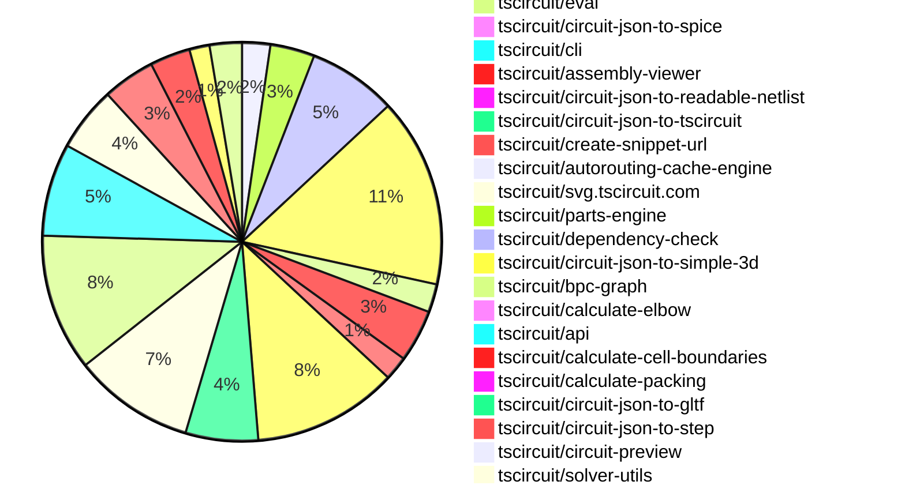

# contribution tracker

[contributions.tscircuit.com](https://contributions.tscircuit.com) ・ [tscircuit.com](https://tscircuit.com) ・ [Contribution Overviews](./contribution-overviews/) ・ [Changelogs](./changelogs/)

Generates weekly contribution overviews for tscircuit contributors. Check out all
the [contribution overviews here](./contribution-overviews/)
You can find AI-generated monthly changelogs in the [changelogs directory](./changelogs/)

- All PRs in the tscircuit org are scanned/summarized via an LLM
- The LLM classifies each Diff/PR as into a set of attributes for scoring
- All the PRs, summaries, and classifications are organized into charts and tables for [the website](https://contributions.tscircuit.com)

> Want to run locally? See the [Development Section](#development)

## Current Week

<!-- START_CURRENT_WEEK -->

# Contribution Overview 2026-08-18

The current week is shown below. There are 3 major sections:

- [Contributor Overview](#contributor-overview)
- [PRs by Repository](#prs-by-repository)
- [PRs by Contributor](#changes-by-contributor)
- [Scoring & Sponsorship Details](/docs/sponsorship-calculation-explanation.md)

## PRs by Repository


```mermaid
pie
    "tscircuit/schematic-viewer" : 7
    "tscircuit/matchpack" : 4
    "tscircuit/schematic-trace-solver" : 11
    "tscircuit/core" : 22
    "tscircuit/runframe" : 47
    "tscircuit/jscad-electronics" : 7
    "tscircuit/jlcsearch" : 3
    "tscircuit/docs" : 1
    "tscircuit/tscircuit-autorouter" : 13
    "tscircuit/copper-pour-solver" : 2
    "tscircuit/high-density-repair03" : 1
    "tscircuit/checks" : 6
    "tscircuit/circuit-json-to-bpc" : 2
    "tscircuit/dsn-to-circuit-json" : 2
    "tscircuit/digikeysearch.tscircuit.com" : 2
    "tscircuit/pcb-viewer" : 2
    "tscircuit/tscircuit" : 36
    "tscircuit/circuit-json" : 3
    "tscircuit/schematic-autolayout" : 1
    "tscircuit/circuit-json-util" : 1
    "tscircuit/props" : 2
    "tscircuit/footprinter" : 3
    "tscircuit/easyeda-converter" : 18
    "tscircuit/manual-edit-events" : 1
    "tscircuit/3d-viewer" : 1
    "tscircuit/plop" : 1
    "tscircuit/contribution-tracker" : 1
    "tscircuit/circuit-to-svg" : 2
    "tscircuit/circuit-to-png" : 1
    "tscircuit/schematic-symbols" : 1
    "tscircuit/circuit-json-to-gerber" : 2
    "tscircuit/bun-match-svg" : 1
    "tscircuit/circuit-json-to-connectivity-map" : 1
    "tscircuit/math-utils" : 1
    "tscircuit/dsn-converter" : 1
    "tscircuit/circuit-json-to-bom-csv" : 1
    "tscircuit/circuit-json-to-pnp-csv" : 1
    "tscircuit/tscircuit.com" : 30
    "tscircuit/alphabet" : 1
    "tscircuit/format-si-unit" : 1
    "tscircuit/graphics-debug" : 1
    "tscircuit/eval" : 34
    "tscircuit/circuit-json-to-spice" : 1
    "tscircuit/cli" : 23
    "tscircuit/assembly-viewer" : 1
    "tscircuit/circuit-json-to-readable-netlist" : 1
    "tscircuit/circuit-json-to-tscircuit" : 1
    "tscircuit/create-snippet-url" : 1
    "tscircuit/autorouting-cache-engine" : 1
    "tscircuit/svg.tscircuit.com" : 16
    "tscircuit/parts-engine" : 1
    "tscircuit/dependency-check" : 1
    "tscircuit/circuit-json-to-simple-3d" : 1
    "tscircuit/bpc-graph" : 2
    "tscircuit/calculate-elbow" : 1
    "tscircuit/api" : 2
    "tscircuit/calculate-cell-boundaries" : 1
    "tscircuit/calculate-packing" : 1
    "tscircuit/circuit-json-to-gltf" : 1
    "tscircuit/circuit-json-to-step" : 2
    "tscircuit/circuit-preview" : 2
    "tscircuit/solver-utils" : 1
    "tscircuit/common" : 1
    "tscircuit/kicadts" : 1
    "tscircuit/poppygl" : 1
    "tscircuit/jscad-to-gltf" : 1
    "tscircuit/circuit-json-to-kicad" : 2
    "tscircuit/kicad-to-circuit-json" : 1
    "tscircuit/dsnts" : 1
    "tscircuit/ngspice-spice-engine" : 1
    "tscircuit/circuit-to-canvas" : 2
    "tscircuit/biscuit-boards" : 13
    "tscircuit/rectdiff" : 4
    "tscircuit/lbrnts" : 2
    "tscircuit/circuit-json-to-lbrn" : 2
    "tscircuit/circuit-json-to-dsn" : 2
    "tscircuit/bun-test-plan" : 1
    "tscircuit/curvy-trace-solver" : 2
    "tscircuit/straight-line-solver" : 1
    "tscircuit/internal-dynamic-import" : 2
    "tscircuit/circuit-json-placement-analysis" : 2
    "tscircuit/infer-cable-insertion-point" : 2
    "tscircuit/image-utils" : 2
    "tscircuit/circuit-json-routing-analysis" : 1
    "tscircuit/krt-wasm" : 2
    "tscircuit/circuit-json-to-3d-png" : 2
    "tscircuit/spicets" : 1
    "tscircuit/tsci-agent" : 2
    "tscircuit/manifold-2d" : 2
    "tscircuit/circuit-json-to-footprinter" : 3
    "tscircuit/create-fdm-enclosure" : 1
    "tscircuit/fanout-solver" : 3
    "tscircuit/altiumts" : 10
    "tscircuit/altium-to-circuit-json" : 1
    "tscircuit/circuit-json-to-fdm-component-box" : 2
    "tscircuit/gltf-slice" : 1
    "tscircuit/test-github-automerge" : 1
    "tscircuit/ti" : 1
    "tscircuit/rp2040-motor-controller" : 1
    "tscircuit/implicit-copper-pour-solver" : 3
    "tscircuit/winding-breakout-point-solver" : 5
    "tscircuit/circuit-json-to-altium" : 8
    "tscircuit/biscuit-board-autorouter" : 1
```

## Contributor Overview

| Contributor | 🐳 Major | 🐙 Minor | 🐌 Tiny | Score | ⭐ |
|-------------|---------|---------|---------|-------|-----|
| [seveibar](#seveibar) | 9 | 13 | 100 | 75 | ⭐⭐⭐ |
| [mohan-bee](#mohan-bee) | 6 | 4 | 10 | 47 | ⭐⭐ |
| [ShiboSoftwareDev](#ShiboSoftwareDev) | 4 | 6 | 7 | 46.5 | ⭐⭐ |
| [imrishabh18](#imrishabh18) | 6 | 1 | 2 | 29 | ⭐⭐ |
| [rushabhcodes](#rushabhcodes) | 1 | 5 | 2 | 24 | ⭐⭐ |
| [0hmX](#0hmX) | 5 | 1 | 1 | 24 | ⭐⭐ |
| [tscircuitbot](#tscircuitbot) | 0 | 0 | 212 | 14 | ⭐⭐ |
| [AnasSarkiz](#AnasSarkiz) | 2 | 2 | 1 | 14 | ⭐⭐ |
| [techmannih](#techmannih) | 1 | 3 | 2 | 13 | ⭐⭐ |
| [MustafaMulla29](#MustafaMulla29) | 0 | 5 | 3 | 13 | ⭐⭐ |
| [addibble](#addibble) | 1 | 2 | 2 | 10 | ⭐ |
| [Sang-it](#Sang-it) | 1 | 0 | 6 | 10 | ⭐ |
| [GokulPandi-M](#GokulPandi-M) | 0 | 1 | 6 | 8 | ⭐ |
| [hrithik18k](#hrithik18k) | 0 | 0 | 2 | 2 |  |
| [KrishnaX12](#KrishnaX12) | 0 | 0 | 1 | 1 |  |
| [Abse2001](#Abse2001) | 0 | 0 | 1 | 1 |  |

## Staff Pass Ratio (SPR)

| Contributor | Reviewed PRs | Rejections | Approvals | SPR |
|-------------|--------------|------------|-----------|-----|
| [mohan-bee](#mohan-bee) | 7 | 2 | 6 | 71.4% |
| [ShiboSoftwareDev](#ShiboSoftwareDev) | 7 | 1 | 6 | 85.7% |
| [addibble](#addibble) | 3 | 0 | 5 | 100.0% |
| [MustafaMulla29](#MustafaMulla29) | 3 | 1 | 2 | 66.7% |
| [imrishabh18](#imrishabh18) | 2 | 1 | 1 | 50.0% |
| [rushabhcodes](#rushabhcodes) | 2 | 0 | 2 | 100.0% |
| [AnasSarkiz](#AnasSarkiz) | 1 | 0 | 1 | 100.0% |
| [ArnavK-09](#ArnavK-09) | 1 | 1 | 0 | 0.0% |
| [GokulPandi-M](#GokulPandi-M) | 1 | 0 | 1 | 100.0% |

<details>
<summary>mohan-bee SPR PRs (7)</summary>

- [#247](https://github.com/tscircuit/schematic-viewer/pull/247) Add scoped component and net search to schematic viewer
- [#676](https://github.com/tscircuit/circuit-to-svg/pull/676) render schematic sheet frames at their declared centers
- [#221](https://github.com/tscircuit/matchpack/pull/221) Place grounded capacitor groups without power metadata
- [#839](https://github.com/tscircuit/schematic-trace-solver/pull/839) prevent repeated trace overlap corrections
- [#832](https://github.com/tscircuit/schematic-trace-solver/pull/832) speed up available net orientation search
- [#828](https://github.com/tscircuit/schematic-trace-solver/pull/828) move net-label connectors with aligned rails
- [#822](https://github.com/tscircuit/schematic-trace-solver/pull/822) prevent merged-label overlap retries after child reroute failure

</details>

<details>
<summary>ShiboSoftwareDev SPR PRs (7)</summary>

- [#3280](https://github.com/tscircuit/core/pull/3280) Place winding-aware breakout points before routing
- [#2146](https://github.com/tscircuit/tscircuit-autorouter/pull/2146) Repair preloaded trace sections around through-obstacle connectivity
- [#51](https://github.com/tscircuit/altiumts/pull/51) Serialize copper primitives in binary PCB documents
- [#48](https://github.com/tscircuit/altiumts/pull/48) Fix empty PCB wide strings
- [#47](https://github.com/tscircuit/altiumts/pull/47) Serialize native-length via records
- [#2](https://github.com/tscircuit/circuit-json-to-altium/pull/2) Test real Altium boards with native SVG round trips
- [#3](https://github.com/tscircuit/circuit-json-to-altium/pull/3) Preserve copper pours in Altium output

</details>

<details>
<summary>addibble SPR PRs (3)</summary>

- [#805](https://github.com/tscircuit/props/pull/805) Add connectsFromAbove / connectsFromBelow to pinHeaderProps
- [#333](https://github.com/tscircuit/jscad-electronics/pull/333) Mount through-hole pin headers on top of the board, not under it
- [#331](https://github.com/tscircuit/jscad-electronics/pull/331) Add the missing 3D bodies: 32 of the 35 recorded gaps

</details>

<details>
<summary>MustafaMulla29 SPR PRs (3)</summary>

- [#3307](https://github.com/tscircuit/core/pull/3307) Fix internally connected custom-symbol ports
- [#3290](https://github.com/tscircuit/core/pull/3290) Add imported MOSFET repro for internally connected custom-symbol pins
- [#227](https://github.com/tscircuit/checks/pull/227) Fix shared-net trace contiguity false positives

</details>

<details>
<summary>imrishabh18 SPR PRs (2)</summary>

- [#2145](https://github.com/tscircuit/tscircuit-autorouter/pull/2145) Respect board edge clearance in RectDiff topology
- [#76](https://github.com/tscircuit/high-density-repair03/pull/76) Keep better safe-layer DRC candidates

</details>

<details>
<summary>rushabhcodes SPR PRs (2)</summary>

- [#706](https://github.com/tscircuit/circuit-json/pull/706) Add schema for PCB components missing courtyard geometry
- [#221](https://github.com/tscircuit/checks/pull/221) Warn when PCB components are missing courtyard geometry

</details>

<details>
<summary>AnasSarkiz SPR PRs (1)</summary>

- [#2162](https://github.com/tscircuit/tscircuit-autorouter/pull/2162) Eliminate Pipeline7 circuit018's false DRC failure

</details>

<details>
<summary>ArnavK-09 SPR PRs (1)</summary>

- [#35](https://github.com/tscircuit/poppygl/pull/35) feat: implement physical lighting mode

</details>

<details>
<summary>GokulPandi-M SPR PRs (1)</summary>

- [#459](https://github.com/tscircuit/easyeda-converter/pull/459) Fix document-layer tracks converted to silkscreen

</details>

> Note: AI evaluates PRs and assigns 1-3 star ratings automatically. 4 and 5 star ratings require manual staff review.

## Review Table

[reviews-received-hover]: ## "Number of reviews received for PRs for this contributor"
[approvals-received-hover]: ## "Number of approvals received for PRs this contributor authored"
[rejections-received-hover]: ## "Number of rejections received for PRs this contributor authored"
[prs-opened-hover]: ## "Number of PRs opened by this contributor"
[issues-created-hover]: ## "Number of issues created by this contributor"

| Contributor | Reviews Received | Approvals Received | Rejections Received | Approvals | Rejections Given | PRs Opened | PRs Merged | Issues Created |
|---|---|---|---|---|---|---|---|---|
| [0hmX](#0hmX) | 3 | 1 | 0 | 3 | 0 | 11 | 7 | 0 |
| [Abse2001](#Abse2001) | 1 | 1 | 0 | 0 | 0 | 6 | 1 | 0 |
| [addibble](#addibble) | 8 | 6 | 0 | 0 | 0 | 8 | 5 | 0 |
| [AnasSarkiz](#AnasSarkiz) | 9 | 5 | 1 | 1 | 0 | 15 | 5 | 0 |
| [ArnavK-09](#ArnavK-09) | 1 | 0 | 1 | 0 | 0 | 1 | 0 | 0 |
| [creationsunitassistant](#creationsunitassistant) | 0 | 0 | 0 | 0 | 0 | 1 | 0 | 0 |
| [gcoinstash-cmd](#gcoinstash-cmd) | 0 | 0 | 0 | 0 | 0 | 1 | 0 | 0 |
| [GokulPandi-M](#GokulPandi-M) | 12 | 12 | 0 | 0 | 0 | 8 | 7 | 0 |
| [hrithik18k](#hrithik18k) | 3 | 3 | 0 | 0 | 0 | 3 | 2 | 0 |
| [imrishabh18](#imrishabh18) | 4 | 2 | 1 | 9 | 2 | 15 | 10 | 0 |
| [itisrohit](#itisrohit) | 0 | 0 | 0 | 0 | 0 | 1 | 0 | 0 |
| [KrishnaX12](#KrishnaX12) | 4 | 2 | 0 | 0 | 0 | 4 | 1 | 0 |
| [mohan-bee](#mohan-bee) | 17 | 8 | 1 | 5 | 1 | 38 | 20 | 0 |
| [MustafaMulla29](#MustafaMulla29) | 9 | 6 | 2 | 0 | 0 | 10 | 8 | 0 |
| [obmakesomething](#obmakesomething) | 0 | 0 | 0 | 0 | 0 | 1 | 0 | 0 |
| [Ojas2095](#Ojas2095) | 0 | 0 | 0 | 0 | 0 | 2 | 0 | 0 |
| [Piotr1231](#Piotr1231) | 0 | 0 | 0 | 0 | 0 | 1 | 0 | 0 |
| [rushabhcodes](#rushabhcodes) | 21 | 7 | 1 | 9 | 0 | 12 | 8 | 0 |
| [Sang-it](#Sang-it) | 0 | 0 | 0 | 0 | 0 | 9 | 7 | 0 |
| [seveibar](#seveibar) | 12 | 1 | 0 | 31 | 5 | 156 | 122 | 0 |
| [ShiboSoftwareDev](#ShiboSoftwareDev) | 20 | 16 | 1 | 13 | 0 | 38 | 17 | 0 |
| [techmannih](#techmannih) | 5 | 3 | 0 | 2 | 0 | 7 | 6 | 0 |
| [tscircuitbot](#tscircuitbot) | 0 | 0 | 0 | 0 | 0 | 282 | 212 | 0 |

## Changes by Repository

### [tscircuit/schematic-viewer](https://github.com/tscircuit/schematic-viewer)

| PR # | Impact | Rating | Contributor | Description |
|------|--------|--------|-------------|-------------|
| [#260](https://github.com/tscircuit/schematic-viewer/pull/260) | 🐳 Major | ⭐⭐⭐ | mohan-bee | Enables component search to match user-facing display names in addition to reference designators, improving search functionality. |
| [#247](https://github.com/tscircuit/schematic-viewer/pull/247) | 🐳 Major | ⭐⭐⭐ | mohan-bee | Motivation Finding components and nets across schematic sheets should work reliably on realistic boards across desktop and mobile viewers. https:github.comuser-attachmentsassetsb0aca39b-d30c-4cb9-8173-f0e942275315 https:schematic-viewer-esz5ju9r6-tscircuit.vercel.app?fixtureId7B22path223A22examples2Fexample34-full-board-schematic-search.fixture.tsx227D |
| [#261](https://github.com/tscircuit/schematic-viewer/pull/261) | 🐙 Minor | ⭐⭐ | mohan-bee | Enables component search to find components by their manufacturer part numbers, including case-insensitive and partial matches. |
| [#257](https://github.com/tscircuit/schematic-viewer/pull/257) | 🐙 Minor | ⭐⭐ | seveibar | Hides the raw supplier part numbers object from component details and renders JLCPCB and LCSC part numbers as external supplier links, normalizing legacy numeric-only part IDs and deduplicating repeated values, while covering parsing and rendered link behavior in the component-details tests. |

<details>
<summary>🐌 Tiny Contributions (3)</summary>

| PR # | Impact | Contributor | Description |
|------|--------|-------------|-------------|
| [#263](https://github.com/tscircuit/schematic-viewer/pull/263) | 🐌 Tiny | mohan-bee | Motivation Search results should prioritize the user-facing display name while keeping useful component identity and context visible. The full-board search example should demonstrate this behavior with the Wi-Fi smart switch circuit.  Before Results did not present the display name, reference designator, type, and value in a clear hierarchy. Chips showed the generic Chip type even when a manufacturer part number was available.  After Results show the display name on top and the reference designator, type, and value below; without a display name, the reference designator remains on top. Chips show their manufacturer part number instead of the generic type when available, and the full-board example uses the Wi-Fi smart switch circuit. |
| [#259](https://github.com/tscircuit/schematic-viewer/pull/259) | 🐌 Tiny | seveibar | Migrates npm publishing to use GitHub Actions OIDC for authentication instead of a long-lived NPM_TOKEN, updates Node version to 24, and adds repository metadata in package.json. |
| [#258](https://github.com/tscircuit/schematic-viewer/pull/258) | 🐌 Tiny | rushabhcodes | Fixes rendering issues for imported components by ensuring PCB previews are displayed correctly and schematic ports are connected without stray net labels. |

</details>

### [tscircuit/matchpack](https://github.com/tscircuit/matchpack)

| PR # | Impact | Rating | Contributor | Description |
|------|--------|--------|-------------|-------------|
| [#221](https://github.com/tscircuit/matchpack/pull/221) | 🐳 Major | ⭐⭐⭐ | mohan-bee | Groups grounded capacitors sharing a net pair when the non-ground net lacks positive-voltage metadata. |
| [#222](https://github.com/tscircuit/matchpack/pull/222) | 🐙 Minor | ⭐⭐ | seveibar | Returns a stable name for the LayoutPipelineSolver to ensure consistent identification during class-name minification and adds a regression test for verification. |

<details>
<summary>🐌 Tiny Contributions (2)</summary>

| PR # | Impact | Contributor | Description |
|------|--------|-------------|-------------|
| [#220](https://github.com/tscircuit/matchpack/pull/220) | 🐌 Tiny | mohan-bee | Fixes the arrangement of decoupling capacitors on the board 196038 schematic layout |
| [#225](https://github.com/tscircuit/matchpack/pull/225) | 🐌 Tiny | seveibar | Migrates npm publishing to use GitHub Actions OIDC for authentication, updates Node.js version, and adds repository metadata in package.json. |

</details>

### [tscircuit/schematic-trace-solver](https://github.com/tscircuit/schematic-trace-solver)

| PR # | Impact | Rating | Contributor | Description |
|------|--------|--------|-------------|-------------|
| [#839](https://github.com/tscircuit/schematic-trace-solver/pull/839) | 🐳 Major | ⭐⭐⭐ | mohan-bee | Fixes an issue where the trace overlap stage continues indefinitely when corrections revert to the previous routing state. |
| [#838](https://github.com/tscircuit/schematic-trace-solver/pull/838) | 🐳 Major | ⭐⭐⭐ | mohan-bee | motivation: this input is taking forever or getting timeout for routing |
| [#832](https://github.com/tscircuit/schematic-trace-solver/pull/832) | 🐳 Major | ⭐⭐⭐ | mohan-bee | Reduces trace-solving time for large schematics by implementing Flatbush spatial indexing for net-label orientation candidates. |
| [#828](https://github.com/tscircuit/schematic-trace-solver/pull/828) | 🐙 Minor | ⭐⭐ | mohan-bee | Fixes the issue where net-label connectors are not moved with their host rails, causing them to appear disconnected when the rails are aligned. |
| [#822](https://github.com/tscircuit/schematic-trace-solver/pull/822) | 🐙 Minor | ⭐⭐ | mohan-bee | Stops trace-label overlap avoidance from redispatching a merged-label collision after its child-label reroute has already failed. |
| [#825](https://github.com/tscircuit/schematic-trace-solver/pull/825) | 🐙 Minor | ⭐⭐ | MustafaMulla29 | Fixes label alignment for same-net junctions to ensure labels remain attached to rerouted traces without introducing diagonal segments. |

<details>
<summary>🐌 Tiny Contributions (5)</summary>

| PR # | Impact | Contributor | Description |
|------|--------|-------------|-------------|
| [#831](https://github.com/tscircuit/schematic-trace-solver/pull/831) | 🐌 Tiny | mohan-bee | Fixes overlapping traces in the schematic representation of the ESP-12F power and boot section. |
| [#826](https://github.com/tscircuit/schematic-trace-solver/pull/826) | 🐌 Tiny | mohan-bee | Reproduces a bug related to disconnected netlabels in schematic designs with a comprehensive test case. |
| [#821](https://github.com/tscircuit/schematic-trace-solver/pull/821) | 🐌 Tiny | mohan-bee | Reproduces a USB trace-label iteration exhaustion failure with a focused test case, isolating the issue from the full solver input. |
| [#836](https://github.com/tscircuit/schematic-trace-solver/pull/836) | 🐌 Tiny | seveibar | Migrates npm publishing to use OIDC for authentication, removing the legacy npm token and updating the Node version to 24, while adding explicit repository metadata. |
| [#824](https://github.com/tscircuit/schematic-trace-solver/pull/824) | 🐌 Tiny | seveibar | Implements getSolverName() on SchematicTracePipelineSolver to return a stable name that survives class-name minification and adds a regression test for the public solver export. |

</details>

### [tscircuit/core](https://github.com/tscircuit/core)

| PR # | Impact | Rating | Contributor | Description |
|------|--------|--------|-------------|-------------|
| [#3276](https://github.com/tscircuit/core/pull/3276) | 🐳 Major | ⭐⭐⭐ | seveibar | Uses pcbStyle.viaHoleDiameter and pcbStyle.viaPadDiameter as autorouter via constraints when minVia props are not set, ensuring consistent via sizes for both authored and generated vias. |
| [#3210](https://github.com/tscircuit/core/pull/3210) | 🐙 Minor | ⭐⭐ | mohan-bee | Adds a test for the TB67S579FTG breakout schematic to verify inline net label spacing. |
| [#3300](https://github.com/tscircuit/core/pull/3300) | 🐙 Minor | ⭐⭐ | seveibar | Emit a warning when a root circuit has schematic content but no schematicsheet, and remove the warning if a schematic sheet is subsequently present. |
| [#3294](https://github.com/tscircuit/core/pull/3294) | 🐙 Minor | ⭐⭐ | seveibar | Suppresses unnamed trace warnings for net connections while preserving them for unnamed port-to-port traces and adds regression coverage for a trace connected to net.GND |
| [#3288](https://github.com/tscircuit/core/pull/3288) | 🐙 Minor | ⭐⭐ | seveibar | Adds support for thermal reliefs around various SMT pad shapes, enhancing thermal management in PCB designs. |
| [#3277](https://github.com/tscircuit/core/pull/3277) | 🐙 Minor | ⭐⭐ | seveibar | Emit events for the FanoutSolver to track its lifecycle and parameters during autorouting processes. |
| [#3309](https://github.com/tscircuit/core/pull/3309) | 🐙 Minor | ⭐⭐ | MustafaMulla29 | Fixes incorrect port directions and reconnects trace endpoints for custom symbols in React and Circuit JSON, ensuring accurate schematic representation and trace routing. |
| [#3307](https://github.com/tscircuit/core/pull/3307) | 🐙 Minor | ⭐⭐ | MustafaMulla29 | Fixes the inability to resolve internally connected pin groups from all ports owned by a component, including those nested inside a custom React symbol. |
| [#3290](https://github.com/tscircuit/core/pull/3290) | 🐙 Minor | ⭐⭐ | MustafaMulla29 | Adds a repro test for the DMT6007LFG_7 MOSFET component to validate internal connections of custom-symbol pins, addressing a bug in pin resolution. |

<details>
<summary>🐌 Tiny Contributions (13)</summary>

| PR # | Impact | Contributor | Description |
|------|--------|-------------|-------------|
| [#3306](https://github.com/tscircuit/core/pull/3306) | 🐌 Tiny | mohan-bee | Updates the version of the schematic-trace-solver dependency from 0.0.137 to 0.0.140 in the package.json file. |
| [#3284](https://github.com/tscircuit/core/pull/3284) | 🐌 Tiny | mohan-bee | Updates the tscircuitmatchpack dependency version from 0.0.81 to 0.0.84 in package.json |
| [#3211](https://github.com/tscircuit/core/pull/3211) | 🐌 Tiny | mohan-bee | Keeps dense inline net labels attached to their traces, ensuring they are rendered correctly against their respective traces without floating above them. |
| [#3282](https://github.com/tscircuit/core/pull/3282) | 🐌 Tiny | mohan-bee | Updates the tscircuitschematic-trace-solver dependency to version 0.0.136 in the package.json file. |
| [#3291](https://github.com/tscircuit/core/pull/3291) | 🐌 Tiny | seveibar | Migrates npm publishing to use GitHub Actions OIDC for trusted publishing instead of a long-lived NPM_TOKEN, updating the Node version and workflow permissions accordingly. |
| [#3278](https://github.com/tscircuit/core/pull/3278) | 🐌 Tiny | seveibar | Fixes orphan schematic ports by skipping rendering when the parent component has no schematic representation, and ensures that render phase events are emitted in the correct order, improving performance significantly. |
| [#3316](https://github.com/tscircuit/core/pull/3316) | 🐌 Tiny | tscircuitbot | Updates the version of the tscircuitchecks package from 0.0.165 to 0.0.166 in package.json |
| [#3302](https://github.com/tscircuit/core/pull/3302) | 🐌 Tiny | tscircuitbot | Updates the package version of tscircuitinfer-cable-insertion-point from 0.0.3 to 0.0.4 in package.json |
| [#3296](https://github.com/tscircuit/core/pull/3296) | 🐌 Tiny | tscircuitbot | Updates the tscircuitchecks package from version 0.0.164 to 0.0.165 |
| [#3293](https://github.com/tscircuit/core/pull/3293) | 🐌 Tiny | tscircuitbot | Updates the tscircuitchecks package from version 0.0.163 to 0.0.164 |
| [#3285](https://github.com/tscircuit/core/pull/3285) | 🐌 Tiny | tscircuitbot | Updates the tscircuitchecks package from version 0.0.162 to 0.0.163 |
| [#3286](https://github.com/tscircuit/core/pull/3286) | 🐌 Tiny | MustafaMulla29 | Updates the tscircuitschematic-trace-solver dependency to version 0.0.137, incorporating a fix for same-net trace alignment and updating the RP2040 schematic snapshot accordingly. |
| [#3287](https://github.com/tscircuit/core/pull/3287) | 🐌 Tiny | imrishabh18 | Updates the tscircuitcapacity-autorouter dependency from version 0.0.815 to 0.0.822, ensuring that consumers of tscircuitcore utilize the latest improvements and fixes from the capacity autorouter. |

</details>

### [tscircuit/runframe](https://github.com/tscircuit/runframe)

| PR # | Impact | Rating | Contributor | Description |
|------|--------|--------|-------------|-------------|
| [#4617](https://github.com/tscircuit/runframe/pull/4617) | 🐙 Minor | ⭐⭐ | seveibar | Adds support for FanoutSolver in the Solvers tab by updating solver event handling to use exact constructor arguments from newer core versions and retaining legacy support for older events. |

<details>
<summary>🐌 Tiny Contributions (46)</summary>

| PR # | Impact | Contributor | Description |
|------|--------|-------------|-------------|
| [#4655](https://github.com/tscircuit/runframe/pull/4655) | 🐌 Tiny | mohan-bee | Updates the tscircuitschematic-viewer package to version 2.0.85 in the package.json file. |
| [#4636](https://github.com/tscircuit/runframe/pull/4636) | 🐌 Tiny | seveibar | Migrates npm publishing to use GitHub Actions OIDC instead of a long-lived NPM_TOKEN, updates Node version to 24, and adds explicit GitHub repository URL in package metadata. |
| [#4672](https://github.com/tscircuit/runframe/pull/4672) | 🐌 Tiny | tscircuitbot | Automated package update |
| [#4671](https://github.com/tscircuit/runframe/pull/4671) | 🐌 Tiny | tscircuitbot | Updates the tscircuitschematic-viewer package to version 2.0.88 |
| [#4670](https://github.com/tscircuit/runframe/pull/4670) | 🐌 Tiny | tscircuitbot | Automated package update |
| [#4669](https://github.com/tscircuit/runframe/pull/4669) | 🐌 Tiny | tscircuitbot | Updates the tscircuiteval package to version 0.0.1238 in the package.json file. |
| [#4667](https://github.com/tscircuit/runframe/pull/4667) | 🐌 Tiny | tscircuitbot | Automated package update |
| [#4666](https://github.com/tscircuit/runframe/pull/4666) | 🐌 Tiny | tscircuitbot | Automated package update |
| [#4665](https://github.com/tscircuit/runframe/pull/4665) | 🐌 Tiny | tscircuitbot | Automated package update |
| [#4664](https://github.com/tscircuit/runframe/pull/4664) | 🐌 Tiny | tscircuitbot | Updates the tscircuitschematic-viewer package to version 2.0.87 |
| [#4661](https://github.com/tscircuit/runframe/pull/4661) | 🐌 Tiny | tscircuitbot | Automated package update |
| [#4660](https://github.com/tscircuit/runframe/pull/4660) | 🐌 Tiny | tscircuitbot | Updates the tscircuitschematic-viewer package from version 2.0.85 to 2.0.86 |
| [#4659](https://github.com/tscircuit/runframe/pull/4659) | 🐌 Tiny | tscircuitbot | Updates the tscircuiteval package to version 0.0.1236 in the package.json file. |
| [#4658](https://github.com/tscircuit/runframe/pull/4658) | 🐌 Tiny | tscircuitbot | Automated package update |
| [#4657](https://github.com/tscircuit/runframe/pull/4657) | 🐌 Tiny | tscircuitbot | Updates the tscircuiteval package to version 0.0.1235 in the package.json file. |
| [#4654](https://github.com/tscircuit/runframe/pull/4654) | 🐌 Tiny | tscircuitbot | Automated package update |
| [#4653](https://github.com/tscircuit/runframe/pull/4653) | 🐌 Tiny | tscircuitbot | Automated package update |
| [#4652](https://github.com/tscircuit/runframe/pull/4652) | 🐌 Tiny | tscircuitbot | Automated package update |
| [#4651](https://github.com/tscircuit/runframe/pull/4651) | 🐌 Tiny | tscircuitbot | Automated package update |
| [#4649](https://github.com/tscircuit/runframe/pull/4649) | 🐌 Tiny | tscircuitbot | Automated package update |
| [#4648](https://github.com/tscircuit/runframe/pull/4648) | 🐌 Tiny | tscircuitbot | Updates the tscircuiteval package to version 0.0.1232 in the package.json file. |
| [#4647](https://github.com/tscircuit/runframe/pull/4647) | 🐌 Tiny | tscircuitbot | Automated package update |
| [#4646](https://github.com/tscircuit/runframe/pull/4646) | 🐌 Tiny | tscircuitbot | Updates the tscircuiteval package to version 0.0.1231 in the package.json file. |
| [#4643](https://github.com/tscircuit/runframe/pull/4643) | 🐌 Tiny | tscircuitbot | Automated package update |
| [#4645](https://github.com/tscircuit/runframe/pull/4645) | 🐌 Tiny | tscircuitbot | Updates the version of the circuit-json-to-kicad package from 0.0.173 to 0.0.174 in package.json |
| [#4644](https://github.com/tscircuit/runframe/pull/4644) | 🐌 Tiny | tscircuitbot | Updates the tscircuiteval package from version 0.0.1229 to 0.0.1230 in the package.json file. |
| [#4631](https://github.com/tscircuit/runframe/pull/4631) | 🐌 Tiny | tscircuitbot | Automated package update |
| [#4615](https://github.com/tscircuit/runframe/pull/4615) | 🐌 Tiny | tscircuitbot | Updates the tscircuiteval package from version 0.0.1221 to 0.0.1222 in the package.json file. |
| [#4630](https://github.com/tscircuit/runframe/pull/4630) | 🐌 Tiny | tscircuitbot | Updates the circuit-json-to-gerber package from version 0.0.94 to 0.0.95 |
| [#4618](https://github.com/tscircuit/runframe/pull/4618) | 🐌 Tiny | tscircuitbot | Updates the tscircuiteval package from version 0.0.1222 to 0.0.1223 in the project dependencies. |
| [#4616](https://github.com/tscircuit/runframe/pull/4616) | 🐌 Tiny | tscircuitbot | Automated package update |
| [#4634](https://github.com/tscircuit/runframe/pull/4634) | 🐌 Tiny | tscircuitbot | Automated package update |
| [#4633](https://github.com/tscircuit/runframe/pull/4633) | 🐌 Tiny | tscircuitbot | Updates the package version from 0.0.2500 to 0.0.2501 in package.json |
| [#4632](https://github.com/tscircuit/runframe/pull/4632) | 🐌 Tiny | tscircuitbot | Updates the tscircuiteval package from version 0.0.1227 to 0.0.1228 in the package.json file. |
| [#4628](https://github.com/tscircuit/runframe/pull/4628) | 🐌 Tiny | tscircuitbot | Updates the tscircuiteval package from version 0.0.1226 to 0.0.1227 in the package.json file. |
| [#4626](https://github.com/tscircuit/runframe/pull/4626) | 🐌 Tiny | tscircuitbot | Updates the tscircuiteval package to version 0.0.1226 in the package.json file. |
| [#4625](https://github.com/tscircuit/runframe/pull/4625) | 🐌 Tiny | tscircuitbot | Automated package update |
| [#4619](https://github.com/tscircuit/runframe/pull/4619) | 🐌 Tiny | tscircuitbot | Automated package update |
| [#4629](https://github.com/tscircuit/runframe/pull/4629) | 🐌 Tiny | tscircuitbot | Automated package update |
| [#4627](https://github.com/tscircuit/runframe/pull/4627) | 🐌 Tiny | tscircuitbot | Automated package update |
| [#4623](https://github.com/tscircuit/runframe/pull/4623) | 🐌 Tiny | tscircuitbot | Automated package update |
| [#4622](https://github.com/tscircuit/runframe/pull/4622) | 🐌 Tiny | tscircuitbot | Updates the tscircuiteval package to version 0.0.1225 in the package.json file. |
| [#4621](https://github.com/tscircuit/runframe/pull/4621) | 🐌 Tiny | tscircuitbot | Automated package update |
| [#4620](https://github.com/tscircuit/runframe/pull/4620) | 🐌 Tiny | tscircuitbot | Updates the tscircuiteval package to version 0.0.1224 in the package.json file. |
| [#4635](https://github.com/tscircuit/runframe/pull/4635) | 🐌 Tiny | GokulPandi-M | Updates easyeda dependency to 0.0.316 to include active-low pin name normalization (RESET - N_RESET) and component conversion improvements. |
| [#4624](https://github.com/tscircuit/runframe/pull/4624) | 🐌 Tiny | 0hmX | Updates tscircuitschematic-viewer from 2.0.77 to 2.0.81 and removes obsolete props to maintain compatibility with the latest version. |

</details>

### [tscircuit/jscad-electronics](https://github.com/tscircuit/jscad-electronics)

| PR # | Impact | Rating | Contributor | Description |
|------|--------|--------|-------------|-------------|
| [#335](https://github.com/tscircuit/jscad-electronics/pull/335) | 🐳 Major | ⭐⭐⭐ | seveibar | Summary add a FlexScreen component with explicit sitsFlat placement plus 90-degree and true 180-degree fold presets route face-above and face-below folds through half-ellipse cable loops, with below-board folds beginning on top of the board and turning over its edge separate screen placement (distanceAboveBoard  distanceBelowBoard) from fold location and reach (foldDistanceFromConnector  foldOutset) support widthheight or diagonal-based sizing with configurable aspect ratios expose cable, conductor, stiffener, bend, clearance, color, and transform controls use tscircuitalphabet vector strokes for deterministic, readable snapshot annotations add 11 enlarged combined snapshot sheets containing 33 labeled views, including a foldsAboveBoard comparison at distanceAboveBoard20 with 3 mm, 6 mm, and 10 mm fold outsets add numeric orientationclearance tests, sizing tests, documentation, and a Cosmos example  Snapshot example !20 mm foldsAboveBoard fold-outset comparison(https:raw.githubusercontent.comtscircuitjscad-electronicscodexflex-screentestssnapshots__snapshots__folds-above-20mm-fold-outset.snap.png)  Verification bun run format:check bunx tsc --noEmit bun run build bun test (166 passing) |
| [#331](https://github.com/tscircuit/jscad-electronics/pull/331) | 🐳 Major | ⭐⭐⭐ | addibble | Fills in the gaps recorded by the base PR, and re-renders the same snapshots from the same cameras. Where they showed bare copper pads they now show the part; that diff is the review. The ledger goes from 35 entries to 3. Most of this is dispatch, not geometry. libFootprinter3d.tsx switches on footprinters fn and simply had no arm for these names, while a suitable body sat in lib unreferenced  SOT-563.tsx and BGA.tsx had never been reachable at all, SC-70-4 shares SC-70-6s body, SOP and SSOP are SOIC with a different lead span, SONWSONVSON are DFNs, MLP and QUAD are QFNs. Parameterised rather than aliased wherever the outline genuinely differs, since an alias reports a body that is not there: SOT-223 takes its dimensions, so SOT-89 can use it at a third of the volume TO-220 takes mouldedTab, because TO-220F encapsulates the tab LGAMLPQUAD read wh, not grid: for those grid is a pad COUNT per side (lga14 is 4x3 pads), so reading it as millimetres gave a 4 x 3 body for a part that is 2.4 x 2.9. Only vson states its outline as a grid. Four new bodies, for parts nothing in the repo resembled: DPAK (TO-252 and TO-263  a moulded body on an exposed tab, placed over the TAB pad because the footprint is asymmetric), ElectrolyticCapacitor (radial can; diameter from d or from the name, height derived and deliberately generous), Potentiometer, and SmdPushButton (whose actuator height is a separate prop, because that is what a lid has to clear). TO-92 is fixed separately in its own commit: it was translated 10.5mm up with 15mm leads, so a 4.5mm part measured 19.5mm end to end and floated above the board in every render. testsbody-coveragebody-envelope.test.ts is the assertion the pictures cannot make  the height above the board, per package, against the datasheet outline. It also records the two placements known to be wrong (to220 at 32.5mm, breakoutheaders headers hanging below the board) with the values they measure, so fixing either fails the test and prompts the note to be deleted. Still open, with reasons in the ledger: jst (only the ZH series has a body), m2host (footprinter reports no dimensions at all for it), usbcmidmount (USB-C.tsx draws with Ellipsoid and with rotation props on primitives; libvanilla implements neither and ignores the second SILENTLY rather than rejecting it, so reusing it would render the wrong shape). |
| [#336](https://github.com/tscircuit/jscad-electronics/pull/336) | 🐙 Minor | ⭐⭐ | rushabhcodes | Replaces unsupported named pinrow colors with hex value c0c0c0 to ensure correct rendering of pinrow leads as silver metal in snapshots. |
| [#333](https://github.com/tscircuit/jscad-electronics/pull/333) | 🐙 Minor | ⭐⭐ | addibble | Fixes the mounting orientation of through-hole pin headers to ensure they are rendered on top of the board instead of underneath, correcting a significant height misrepresentation that affected enclosure design. |

<details>
<summary>🐌 Tiny Contributions (3)</summary>

| PR # | Impact | Contributor | Description |
|------|--------|-------------|-------------|
| [#334](https://github.com/tscircuit/jscad-electronics/pull/334) | 🐌 Tiny | seveibar | Migrates npm publishing to use GitHub Actions OIDC for authentication, updates Node.js version, and removes the npm token from the release step. |
| [#330](https://github.com/tscircuit/jscad-electronics/pull/330) | 🐌 Tiny | addibble | getJscadModelForFootprint accepts every footprinter name, builds whatever libFootprinter3d.tsx has a case for, and returns cleanly with geometries:  for the rest. Nothing throws, so a missing body is invisible at the point of use. It stops being invisible as soon as something measures the result: cores measureFootprinterBody feeds create-fdm-enclosure, which cannot tell whether a screw boss runs through a part that has no height. It reports component_bounds_unknown rather than guessing  so the gap is safe, but the clearance check simply does not run. The names affected are not a random tail: the SOT and TO families, electrolytics, potentiometers, switches and connectors, which are the tall parts an enclosure exists to clear. This PR fixes none of them. It makes them reviewable: testsbody-coveragefootprint-probes.ts  the ledger. NO_BODY (copper features, where empty is the right answer), PROBE (names footprinter will not parse without a pin count), MISSING_BODIES (35 gaps, with a reason each). testsbody-coverageregistry-coverage.test.ts  walks footprinters own registry, so it cannot drift as footprints are added, and puts every name in exactly one bucket. It fails in both directions, including on a gap that has been closed but left in the ledger. one poppygl snapshot per gap, rendered through distvanilla.js (the entry consumers use, not the React path) from the same camera the existing snapshot tests use. Every one of them is bare copper pads on a grid. When the bodies land, the same cameras show the parts, and the diff of these PNGs is the evidence. Also here because nothing could be rendered without it: FootprintPad threw on polygon pads (SOT-89s tab), so that footprint could not be drawn with its pads at all, and the error named the shape rather than the footprint. Polygons now extrude through Polygon  ExtrudeLinear, both of which the vanilla renderer already implements. A probe footprinter rejects is reported separately from a body that is missing  8 names used to look like failures for that reason alone. |
| [#327](https://github.com/tscircuit/jscad-electronics/pull/327) | 🐌 Tiny | KrishnaX12 | Implements the parametric 3D model for JST PH (2.0mm pitch) through-hole headers, mirroring the existing JSTZH1_5mm implementation. |

</details>

### [tscircuit/jlcsearch](https://github.com/tscircuit/jlcsearch)

| PR # | Impact | Rating | Contributor | Description |
|------|--------|--------|-------------|-------------|
| [#470](https://github.com/tscircuit/jlcsearch/pull/470) | 🐳 Major | ⭐⭐⭐ | seveibar | Add a derived Barrel Jack table and the barrel_jackslist pageAPI route, exposing diameter, mounting, orientation, current, voltage, and pin-count filters, while excluding DC plugs and unrelated audio jacks, and migrating, populating, and smoke-testing the production D1 table on merge. |
| [#469](https://github.com/tscircuit/jlcsearch/pull/469) | 🐳 Major | ⭐⭐⭐ | seveibar | Add a derived Micro USB connector table and filtered pageAPI route, create and populate the production D1 schema during the merge sync, and add mapping, schema, rendering, and workflow smoke tests. |

<details>
<summary>🐌 Tiny Contributions (1)</summary>

| PR # | Impact | Contributor | Description |
|------|--------|-------------|-------------|
| [#468](https://github.com/tscircuit/jlcsearch/pull/468) | 🐌 Tiny | seveibar | Update easyeda from version 0.0.307 to 0.0.310 in both the root package and Cloudflare proxy package, along with refreshing the lock file to resolve the new release. |

</details>

### [tscircuit/docs](https://github.com/tscircuit/docs)

| PR # | Impact | Rating | Contributor | Description |
|------|--------|--------|-------------|-------------|
| [#844](https://github.com/tscircuit/docs/pull/844) | 🐳 Major | ⭐⭐⭐ | seveibar | Add a guide for using Biscuit Board templates, detailing each clad wrapper with dimensions, use cases, and import examples, along with live PCB previews for comparison. |

### [tscircuit/tscircuit-autorouter](https://github.com/tscircuit/tscircuit-autorouter)

| PR # | Impact | Rating | Contributor | Description |
|------|--------|--------|-------------|-------------|
| [#2154](https://github.com/tscircuit/tscircuit-autorouter/pull/2154) | 🐳 Major | ⭐⭐⭐ | seveibar | Fixes overlapping via issue in autorouting by ensuring targeted repair prioritizes different-net via clearance before trace-topology candidates consume the iteration budget. |
| [#2150](https://github.com/tscircuit/tscircuit-autorouter/pull/2150) | 🐳 Major | ⭐⭐⭐ | seveibar | Summary add bugreport93 from the overlapping autorouter vias reproduction(https:gist.github.comseveibar5033268f8e1b21e34216dc96bfed2adc), including its phase input, captured bad routing, and interactive debugger fixture add a regression test that measures the reported 0.600 mm via-center spacing against the required 0.700 mm spacing add a focused SVG snapshot with a red DRC marker around the bad via pair mark the reproduction with test.skip after generating the snapshot because the full solve takes about 74 seconds  Snapshot !Zoomed overlapping-via DRC(https:raw.githubusercontent.comtscircuittscircuit-autorouterbugreport93-overlapping-viastestsbugs__snapshots__bugreport93-overlapping-vias.snap.svg)  Validation temporarily enabled the regression and generated the SVG snapshot: pass (74.05s) bun test testsbugsbugreport93-overlapping-vias.test.ts --timeout 9999999: skipped as intended bunx tsc --noEmit bun run build git diff --cached --check |
| [#2162](https://github.com/tscircuit/tscircuit-autorouter/pull/2162) | 🐳 Major | ⭐⭐⭐ | AnasSarkiz | Eliminates Pipeline7s false dataset01 circuit018 DRC failure without changing routing geometry or solver behavior |
| [#2178](https://github.com/tscircuit/tscircuit-autorouter/pull/2178) | 🐳 Major | ⭐⭐⭐ | imrishabh18 | Reduces the number of DRC errors in Bug Report 94 from 14 to at most 9 by pinning a specific commit and updating the safe-layer routing improvements. |
| [#2145](https://github.com/tscircuit/tscircuit-autorouter/pull/2145) | 🐳 Major | ⭐⭐⭐ | imrishabh18 | Updates RectDiff to preserve the physical board outline while applying minBoardEdgeClearance to its board-void topology blockers, ensuring zero total DRC errors as per Bug Report 88. |
| [#2146](https://github.com/tscircuit/tscircuit-autorouter/pull/2146) | 🐳 Major | ⭐⭐⭐ | ShiboSoftwareDev | Stacked on 2144.  Root cause Pipeline 9 can materialize fanout traces containing a through_obstacle primitive. That primitive records connectivity supplied by a connected component obstacle; it is not a physical via or wire that exact DRC repair may relocate. Joint DRC repair previously required every selected preloaded trace to become one movable high-density route. It therefore rejected a selected trace containing through_obstacle and stopped samples such as dataset 29 samples 3 and 6. Keeping the complete trace fixed avoids that exception but is also incorrect ownership: it unnecessarily freezes the ordinary wire and via geometry on both sides. The dataset benchmark exposed that coarse behavior as a completion regression from 50 to 20, primarily through additional timeouts.  Fix Joint repair now splits a selected preloaded trace at each through_obstacle primitive: the connectivity primitive remains fixed; each ordinary copper section on either side becomes a separately anchored repair connection; DRC errors retain the identity of the section the portfolio can move; repaired sections are reassembled at their original route positions around the unchanged primitive. This directly represents repair ownership. It does not catch an error, discard connectivity, synthesize a via, or add a fallback. Missing identities, positions, routes, and overlapping repaired ranges remain explicit solver invariant errors.  PCB snapshot The snapshot is generated from the real dataset 29 sample 3 PCB with circuit-to-svg.  Repro: Pipeline 9 stops during joint repair  Fixed: ordinary sections route around preserved connectivity   ---  ---   !failing PCB(https:raw.githubusercontent.comtscircuittscircuit-autoroutere9bc32b0d51a71b63d595fe0eeb7a5c1cf261de8testsrepro__snapshots__pipeline9-through-obstacle-preloaded-trace.snap.svg)  !fixed PCB(https:raw.githubusercontent.comtscircuittscircuit-autorouter285bafefdf25e34cf8a9da15738be157b096751btestsrepro__snapshots__pipeline9-through-obstacle-preloaded-trace.snap.svg)  The test also asserts that movable ranges exclude every original through_obstacle position and that the final routed PCB still contains the preserved primitive.  Results The full 20-sample benchmark(https:github.comtscircuittscircuit-autorouterpull2146issuecomment-5329944670) uses the same Pipeline 10 command and 900-second sample limit as the repro benchmark:  Dataset 29 result  Repro PR  Coarse trace-level ownership  Section-level ownership   ---  ---:  ---:  ---:   Completion  50 (1020)  20 (420)  60 (1220)   Relaxed DRC pass  35 (720)  15 (320)  35 (720)   Timeouts  3  12  3  The section-level fix restores samples 2, 5, 10, 12, 16, 17, and 20 from timeout to solved, and additionally solves the sample 3 reproduction. Samples 8, 9, and 13 remain the same independent timeout cases. Sequential local checks use one worker:  Dataset 29 sample  Coarse trace-level result  Section-level result  Relaxed DRC   ---  ---  ---  ---   2  timeout at 900s  completes in 298.8s  pass   5  timeout at 900s  completes in 312.7s  fails; separate residual DRC work   6  completes in 882.3s  completes in 260.5s  fails; separate residual DRC work  The visual test replays the captured real sample 3 joint-repair input, asserts the section ownership invariant, and renders the exact PCB SVG deterministically in about 2.2 seconds locally. The full benchmark completes sample 3 in 555.6 seconds under 20-worker load.  Validation bun test testsrepropipeline9-through-obstacle-preloaded-trace.test.ts --timeout 9999999 bun test testsfeaturespipeline9-joint-drc-repair-metadata.test.ts testsfeaturespipeline9-drc-baseline-filter.test.ts --timeout 9999999 bunx tsc --noEmit bun run build bun run format:check .benchmark.sh --pipeline 10 --dataset 29 --sample 2 --concurrency 1 --sample-timeout 900s .benchmark.sh --pipeline 10 --dataset 29 --sample 5 --concurrency 1 --sample-timeout 900s .benchmark.sh --pipeline 10 --dataset 29 --sample 6 --concurrency 1 --sample-timeout 900s |
| [#2171](https://github.com/tscircuit/tscircuit-autorouter/pull/2171) | 🐙 Minor | ⭐⭐ | seveibar | Add total DRC issue counts to regular PR benchmark comparison comments and same-machine benchmark comments, displaying na when complete DRC count data is unavailable. |
| [#2176](https://github.com/tscircuit/tscircuit-autorouter/pull/2176) | 🐙 Minor | ⭐⭐ | imrishabh18 | Summary add the fixture and SVG snapshot for autorouting bug report 56fa2ec8-23e8-4f28-9953-9882e64393e3 add a regression test for the routed board assert the current 45 DRC errors after routing Bug report: https:api.tscircuit.comautoroutingbug_reportsview?autorouting_bug_report_id56fa2ec8-23e8-4f28-9953-9882e64393e3  Testing bun test testsbugsbugreport94-56fa2e.test.ts |

<details>
<summary>🐌 Tiny Contributions (5)</summary>

| PR # | Impact | Contributor | Description |
|------|--------|-------------|-------------|
| [#2151](https://github.com/tscircuit/tscircuit-autorouter/pull/2151) | 🐌 Tiny | seveibar | Add a profiling workflow for the SRJ18 dataset that compares the performance of Pipeline 7 solvers between the current main branch and the PR head, providing detailed stage-time percentages and results in a structured format. |
| [#2155](https://github.com/tscircuit/tscircuit-autorouter/pull/2155) | 🐌 Tiny | tscircuitbot | Automated package update |
| [#2165](https://github.com/tscircuit/tscircuit-autorouter/pull/2165) | 🐌 Tiny | tscircuitbot | Automated package update |
| [#2163](https://github.com/tscircuit/tscircuit-autorouter/pull/2163) | 🐌 Tiny | tscircuitbot | Automated package update |
| [#2144](https://github.com/tscircuit/tscircuit-autorouter/pull/2144) | 🐌 Tiny | ShiboSoftwareDev | Reproduces a failure in Pipeline 9 when attempting to repair a through-obstacle trace in the autorouting process. |

</details>

### [tscircuit/copper-pour-solver](https://github.com/tscircuit/copper-pour-solver)

| PR # | Impact | Rating | Contributor | Description |
|------|--------|--------|-------------|-------------|
| [#82](https://github.com/tscircuit/copper-pour-solver/pull/82) | 🐳 Major | ⭐⭐⭐ | seveibar | Adds support for thermal reliefs on all SMT pad shapes, including rectangles, circles, pills, and polygons, enhancing the thermal management capabilities of the PCB design. |

<details>
<summary>🐌 Tiny Contributions (1)</summary>

| PR # | Impact | Contributor | Description |
|------|--------|-------------|-------------|
| [#83](https://github.com/tscircuit/copper-pour-solver/pull/83) | 🐌 Tiny | seveibar | Replace the revoked npm token with GitHub Actions OIDC trusted publishing, update the release runner to Node 24  npm 11, add a guarded manual recovery path for the existing unpublished v0.0.48 tag, and declare the repository URL required for npm provenance. |

</details>

### [tscircuit/high-density-repair03](https://github.com/tscircuit/high-density-repair03)

| PR # | Impact | Rating | Contributor | Description |
|------|--------|--------|-------------|-------------|
| [#73](https://github.com/tscircuit/high-density-repair03/pull/73) | 🐳 Major | ⭐⭐⭐ | seveibar | Prioritizes different-net via clearance errors during targeted repair while maintaining same-net-first ordering, preventing starvation of repairable different-net via pairs. |

### [tscircuit/checks](https://github.com/tscircuit/checks)

| PR # | Impact | Rating | Contributor | Description |
|------|--------|--------|-------------|-------------|
| [#214](https://github.com/tscircuit/checks/pull/214) | 🐙 Minor | ⭐⭐ | seveibar | Extends the checkDifferentNetViaSpacing function to evaluate both drill-hole and copper-pad clearance for different-net vias, ensuring compliance with manufacturing constraints and improving error reporting. |
| [#221](https://github.com/tscircuit/checks/pull/221) | 🐙 Minor | ⭐⭐ | rushabhcodes | Detects PCB components without circle, outline, polygon, pill, or rectangular courtyard geometry and emits a warning with the component name, improving placement validation. |
| [#215](https://github.com/tscircuit/checks/pull/215) | 🐙 Minor | ⭐⭐ | AnasSarkiz | Fixes false missing-pad connection by allowing sub-nanometer floating-point residue at pad boundaries in circuit018 geometry calculations. |

<details>
<summary>🐌 Tiny Contributions (3)</summary>

| PR # | Impact | Contributor | Description |
|------|--------|-------------|-------------|
| [#220](https://github.com/tscircuit/checks/pull/220) | 🐌 Tiny | seveibar | Migrates npm publishing to use GitHub Actions OIDC for authentication instead of a long-lived NPM_TOKEN, updates Node version to 24, and adds explicit repository URL in package metadata. |
| [#217](https://github.com/tscircuit/checks/pull/217) | 🐌 Tiny | AnasSarkiz | Reproduces floating-point errors at pad boundaries for rectangular, rotated-pill, and circular plated-hole pads without fixing the underlying issue. |
| [#226](https://github.com/tscircuit/checks/pull/226) | 🐌 Tiny | MustafaMulla29 | Reproduces a false missing-connection error in autorouting for a circuit with shared ground connections, providing a test case without changing checker implementation. |

</details>

### [tscircuit/circuit-json-to-bpc](https://github.com/tscircuit/circuit-json-to-bpc)

| PR # | Impact | Rating | Contributor | Description |
|------|--------|--------|-------------|-------------|
| [#11](https://github.com/tscircuit/circuit-json-to-bpc/pull/11) | 🐙 Minor | ⭐⭐ | seveibar | Fixes the release build after circuit-json-util collection types became optional by reusing a database helper and asserting the collections that cju provides at runtime. |

<details>
<summary>🐌 Tiny Contributions (1)</summary>

| PR # | Impact | Contributor | Description |
|------|--------|-------------|-------------|
| [#10](https://github.com/tscircuit/circuit-json-to-bpc/pull/10) | 🐌 Tiny | seveibar | Migrates npm publishing to use GitHub OIDC for authentication, upgrades Node.js version, and removes long-lived npm publishing tokens. |

</details>

### [tscircuit/dsn-to-circuit-json](https://github.com/tscircuit/dsn-to-circuit-json)

| PR # | Impact | Rating | Contributor | Description |
|------|--------|--------|-------------|-------------|
| [#21](https://github.com/tscircuit/dsn-to-circuit-json/pull/21) | 🐙 Minor | ⭐⭐ | seveibar | Fixes the declaration build by forwarding the DSN source required by SesToCircuitJsonConverter, ensuring compatibility and clear error reporting when the DSN is omitted. |

<details>
<summary>🐌 Tiny Contributions (1)</summary>

| PR # | Impact | Contributor | Description |
|------|--------|-------------|-------------|
| [#20](https://github.com/tscircuit/dsn-to-circuit-json/pull/20) | 🐌 Tiny | seveibar | Migrates npm publishing to use GitHub OIDC for authentication, upgrades Node.js version, and removes long-lived npm publishing tokens. |

</details>

### [tscircuit/digikeysearch.tscircuit.com](https://github.com/tscircuit/digikeysearch.tscircuit.com)

| PR # | Impact | Rating | Contributor | Description |
|------|--------|--------|-------------|-------------|
| [#2](https://github.com/tscircuit/digikeysearch.tscircuit.com/pull/2) | 🐙 Minor | ⭐⭐ | seveibar | Add a new route for barrel jacks that includes filters for inner diameter, outer diameter, and mounting style, while ensuring that only jack parts with barrel dimensions are included in the search results. |
| [#1](https://github.com/tscircuit/digikeysearch.tscircuit.com/pull/1) | 🐙 Minor | ⭐⭐ | seveibar | Add a new route for Micro USB connectors, enforce a post-filter to exclude full-size USB-B parts, and expose additional filters for contact count and gender. |

### [tscircuit/pcb-viewer](https://github.com/tscircuit/pcb-viewer)


<details>
<summary>🐌 Tiny Contributions (2)</summary>

| PR # | Impact | Contributor | Description |
|------|--------|-------------|-------------|
| [#961](https://github.com/tscircuit/pcb-viewer/pull/961) | 🐌 Tiny | seveibar | Migrates npm publishing to use GitHub Actions OIDC for authentication instead of a long-lived NPM_TOKEN, updates Node version to 24, and specifies the GitHub repository URL in package metadata. |
| [#962](https://github.com/tscircuit/pcb-viewer/pull/962) | 🐌 Tiny | tscircuitbot | Automated package update |

</details>

### [tscircuit/tscircuit](https://github.com/tscircuit/tscircuit)


<details>
<summary>🐌 Tiny Contributions (36)</summary>

| PR # | Impact | Contributor | Description |
|------|--------|-------------|-------------|
| [#4559](https://github.com/tscircuit/tscircuit/pull/4559) | 🐌 Tiny | seveibar | Migrates npm publishing to use GitHub Actions OIDC for trusted publishing instead of a long-lived NPM_TOKEN, updating the workflow to support Node 24 and npm 11 while ensuring proper repository trust and permissions. |
| [#4580](https://github.com/tscircuit/tscircuit/pull/4580) | 🐌 Tiny | tscircuitbot | Automated package update to version 0.0.2375 |
| [#4579](https://github.com/tscircuit/tscircuit/pull/4579) | 🐌 Tiny | tscircuitbot | Automated package update |
| [#4578](https://github.com/tscircuit/tscircuit/pull/4578) | 🐌 Tiny | tscircuitbot | Automated package update to version 0.0.2374 |
| [#4577](https://github.com/tscircuit/tscircuit/pull/4577) | 🐌 Tiny | tscircuitbot | Automated package update |
| [#4576](https://github.com/tscircuit/tscircuit/pull/4576) | 🐌 Tiny | tscircuitbot | Automated package update |
| [#4575](https://github.com/tscircuit/tscircuit/pull/4575) | 🐌 Tiny | tscircuitbot | Automated package update |
| [#4574](https://github.com/tscircuit/tscircuit/pull/4574) | 🐌 Tiny | tscircuitbot | Automated package update |
| [#4573](https://github.com/tscircuit/tscircuit/pull/4573) | 🐌 Tiny | tscircuitbot | Automated package update |
| [#4572](https://github.com/tscircuit/tscircuit/pull/4572) | 🐌 Tiny | tscircuitbot | Automated package update |
| [#4571](https://github.com/tscircuit/tscircuit/pull/4571) | 🐌 Tiny | tscircuitbot | Updates the version of the tscircuitcli and tscircuiteval packages in package.json |
| [#4570](https://github.com/tscircuit/tscircuit/pull/4570) | 🐌 Tiny | tscircuitbot | Automated package update |
| [#4569](https://github.com/tscircuit/tscircuit/pull/4569) | 🐌 Tiny | tscircuitbot | Automated package update |
| [#4568](https://github.com/tscircuit/tscircuit/pull/4568) | 🐌 Tiny | tscircuitbot | Automated package update |
| [#4567](https://github.com/tscircuit/tscircuit/pull/4567) | 🐌 Tiny | tscircuitbot | Updates the package version from 0.0.2367 to 0.0.2368 in package.json |
| [#4566](https://github.com/tscircuit/tscircuit/pull/4566) | 🐌 Tiny | tscircuitbot | Automated package update |
| [#4565](https://github.com/tscircuit/tscircuit/pull/4565) | 🐌 Tiny | tscircuitbot | Automated package update |
| [#4564](https://github.com/tscircuit/tscircuit/pull/4564) | 🐌 Tiny | tscircuitbot | Automated package update |
| [#4563](https://github.com/tscircuit/tscircuit/pull/4563) | 🐌 Tiny | tscircuitbot | Automated package update |
| [#4562](https://github.com/tscircuit/tscircuit/pull/4562) | 🐌 Tiny | tscircuitbot | Automated package update |
| [#4561](https://github.com/tscircuit/tscircuit/pull/4561) | 🐌 Tiny | tscircuitbot | Automated package update |
| [#4560](https://github.com/tscircuit/tscircuit/pull/4560) | 🐌 Tiny | tscircuitbot | Automated package update |
| [#4556](https://github.com/tscircuit/tscircuit/pull/4556) | 🐌 Tiny | tscircuitbot | Automated package update |
| [#4555](https://github.com/tscircuit/tscircuit/pull/4555) | 🐌 Tiny | tscircuitbot | Updates the tscircuitcli package to version 0.1.1957 in the package.json file. |
| [#4552](https://github.com/tscircuit/tscircuit/pull/4552) | 🐌 Tiny | tscircuitbot | Updates the package version from 0.0.2359 to 0.0.2360 in package.json |
| [#4549](https://github.com/tscircuit/tscircuit/pull/4549) | 🐌 Tiny | tscircuitbot | Updates the tscircuitcli and tscircuiteval packages to their latest versions as part of an automated package update. |
| [#4558](https://github.com/tscircuit/tscircuit/pull/4558) | 🐌 Tiny | tscircuitbot | Automated package update |
| [#4557](https://github.com/tscircuit/tscircuit/pull/4557) | 🐌 Tiny | tscircuitbot | Updates the tscircuitcli package to version 0.1.1958 in the package.json file. |
| [#4554](https://github.com/tscircuit/tscircuit/pull/4554) | 🐌 Tiny | tscircuitbot | Automated package update |
| [#4553](https://github.com/tscircuit/tscircuit/pull/4553) | 🐌 Tiny | tscircuitbot | Automated package update |
| [#4550](https://github.com/tscircuit/tscircuit/pull/4550) | 🐌 Tiny | tscircuitbot | Automated package update |
| [#4548](https://github.com/tscircuit/tscircuit/pull/4548) | 🐌 Tiny | tscircuitbot | Automated package update |
| [#4546](https://github.com/tscircuit/tscircuit/pull/4546) | 🐌 Tiny | tscircuitbot | Automated package update |
| [#4545](https://github.com/tscircuit/tscircuit/pull/4545) | 🐌 Tiny | tscircuitbot | Updates the versions of tscircuitcore and tscircuiteval packages in package.json |
| [#4551](https://github.com/tscircuit/tscircuit/pull/4551) | 🐌 Tiny | tscircuitbot | Automated package update |
| [#4547](https://github.com/tscircuit/tscircuit/pull/4547) | 🐌 Tiny | tscircuitbot | Automated package update |

</details>

### [tscircuit/circuit-json](https://github.com/tscircuit/circuit-json)

| PR # | Impact | Rating | Contributor | Description |
|------|--------|--------|-------------|-------------|
| [#706](https://github.com/tscircuit/circuit-json/pull/706) | 🐙 Minor | ⭐⭐ | rushabhcodes | Add a schema for PCB components that lack courtyard geometry, enabling validation and warnings for such components in circuit-json. |

<details>
<summary>🐌 Tiny Contributions (2)</summary>

| PR # | Impact | Contributor | Description |
|------|--------|-------------|-------------|
| [#707](https://github.com/tscircuit/circuit-json/pull/707) | 🐌 Tiny | seveibar | Migrates npm publishing to use GitHub Actions OIDC for authentication, removes legacy npm token, updates Node.js version to 24, and adds missing repository metadata in package.json. |
| [#709](https://github.com/tscircuit/circuit-json/pull/709) | 🐌 Tiny | tscircuitbot | Automated package update |

</details>

### [tscircuit/schematic-autolayout](https://github.com/tscircuit/schematic-autolayout)


<details>
<summary>🐌 Tiny Contributions (1)</summary>

| PR # | Impact | Contributor | Description |
|------|--------|-------------|-------------|
| [#5](https://github.com/tscircuit/schematic-autolayout/pull/5) | 🐌 Tiny | seveibar | Migrates npm publishing to use OIDC for authentication, removes legacy npm token, updates Node version to 24, and adds missing repository metadata in package.json. |

</details>

### [tscircuit/circuit-json-util](https://github.com/tscircuit/circuit-json-util)


<details>
<summary>🐌 Tiny Contributions (1)</summary>

| PR # | Impact | Contributor | Description |
|------|--------|-------------|-------------|
| [#118](https://github.com/tscircuit/circuit-json-util/pull/118) | 🐌 Tiny | seveibar | Migrates npm publishing to use OIDC for authentication, removes legacy npm token, updates Node version to 24, and adds missing repository metadata in package.json. |

</details>

### [tscircuit/props](https://github.com/tscircuit/props)

| PR # | Impact | Rating | Contributor | Description |
|------|--------|--------|-------------|-------------|
| [#805](https://github.com/tscircuit/props/pull/805) | 🐙 Minor | ⭐⭐ | addibble | Adds aliases connectsFromAbove and connectsFromBelow to pinHeaderProps for clearer intent regarding the mounting side of pin headers, resolving to the layer property during parsing. |

<details>
<summary>🐌 Tiny Contributions (1)</summary>

| PR # | Impact | Contributor | Description |
|------|--------|-------------|-------------|
| [#806](https://github.com/tscircuit/props/pull/806) | 🐌 Tiny | seveibar | Migrates npm publishing to use OIDC for authentication, removing the legacy npm token and updating the Node version to 24. |

</details>

### [tscircuit/footprinter](https://github.com/tscircuit/footprinter)

| PR # | Impact | Rating | Contributor | Description |
|------|--------|--------|-------------|-------------|
| [#810](https://github.com/tscircuit/footprinter/pull/810) | 🐙 Minor | ⭐⭐ | techmannih | Adds configurable thermal vias to DFN footprints using the existing shared thermal-via implementation, supporting thermalvias, thermalviapitch, thermalviaid, and thermalviaod, while retaining existing validation for via dimensions and thermal-pad fit. |

<details>
<summary>🐌 Tiny Contributions (2)</summary>

| PR # | Impact | Contributor | Description |
|------|--------|-------------|-------------|
| [#814](https://github.com/tscircuit/footprinter/pull/814) | 🐌 Tiny | seveibar | Migrates npm publishing to use GitHub Actions OIDC for authentication, removes legacy npm token, updates Node.js version to 24, and adds missing repository metadata in package.json. |
| [#813](https://github.com/tscircuit/footprinter/pull/813) | 🐌 Tiny | addibble | Clarifies the meaning of invert and deprecates faceup, correcting misconceptions about their functionality in 3D model hints for footprints. |

</details>

### [tscircuit/easyeda-converter](https://github.com/tscircuit/easyeda-converter)

| PR # | Impact | Rating | Contributor | Description |
|------|--------|--------|-------------|-------------|
| [#485](https://github.com/tscircuit/easyeda-converter/pull/485) | 🐳 Major | ⭐⭐⭐ | rushabhcodes | Fixes JLCPCB mechanical keyboard switch imports that are incorrectly generated as generic chip components with malformed schematic symbols. |
| [#492](https://github.com/tscircuit/easyeda-converter/pull/492) | 🐙 Minor | ⭐⭐ | rushabhcodes | Fixes a data-preservation bug in EasyEDA footprint conversion where PCB silkscreen rectangles were parsed into Circuit JSON but dropped when generating the final TypeScript component. |
| [#486](https://github.com/tscircuit/easyeda-converter/pull/486) | 🐙 Minor | ⭐⭐ | rushabhcodes | Fixes CLI conversion to .ts and .tsx outputs by updating the CLI call site to pass the payload under a rawEasy property, resolving runtime errors in TypeScript component generation. |
| [#489](https://github.com/tscircuit/easyeda-converter/pull/489) | 🐙 Minor | ⭐⭐ | techmannih | Fixes the issue of multiple EasyEDA pin aliases being silently discarded during TypeScript component generation by preserving all aliases in the generated output. |
| [#459](https://github.com/tscircuit/easyeda-converter/pull/459) | 🐙 Minor | ⭐⭐ | GokulPandi-M | Fixes the conversion of EasyEDA document-layer tracks to ensure they are preserved as fabrication notes instead of being incorrectly converted to silkscreen. |
| [#483](https://github.com/tscircuit/easyeda-converter/pull/483) | 🐙 Minor | ⭐⭐ | AnasSarkiz | Fixes the issue of duplicate EasyEDA pad connectivity by ensuring that multiple geometries with the same pad number are treated as a single logical pin, eliminating synthetic ports and ambiguous connections. |
| [#484](https://github.com/tscircuit/easyeda-converter/pull/484) | 🐙 Minor | ⭐⭐ | MustafaMulla29 | Infers conservative pin attributes for imported chip power, ground, and no-connect pins, emitting the inferred attributes in generated tscircuit components while skipping ambiguous or unsupported aliases. |

<details>
<summary>🐌 Tiny Contributions (11)</summary>

| PR # | Impact | Contributor | Description |
|------|--------|-------------|-------------|
| [#487](https://github.com/tscircuit/easyeda-converter/pull/487) | 🐌 Tiny | seveibar | Migrates npm publishing to use GitHub OIDC, upgrades Node version, and removes long-lived npm publishing token for enhanced security. |
| [#480](https://github.com/tscircuit/easyeda-converter/pull/480) | 🐌 Tiny | rushabhcodes | Adds a captured EasyEDA fixture and focused regression test for JLCPCB part C49234237, addressing the issue where the part generates a generic chip instead of a pushbutton component. |
| [#493](https://github.com/tscircuit/easyeda-converter/pull/493) | 🐌 Tiny | techmannih | Adds regression coverage for EasyEDA pin labels containing characters unsupported by the current parser regex. |
| [#488](https://github.com/tscircuit/easyeda-converter/pull/488) | 🐌 Tiny | techmannih | Adds a focused reproduction for multiple EasyEDA pin aliases being silently discarded during TypeScript component generation. |
| [#491](https://github.com/tscircuit/easyeda-converter/pull/491) | 🐌 Tiny | hrithik18k | Fixes NN2-24S05C3N schematic pin labels by normalizing signed pin labels and preserving sparse pin placement for VIN_POS, GND, VO_NEG, and VO_POS. |
| [#490](https://github.com/tscircuit/easyeda-converter/pull/490) | 🐌 Tiny | hrithik18k | Adds a regression fixture and schematic snapshot for JLCPCB part C90683 (NN2-24S05C3N) to address missing schematic labels for VIN, -VO, and VO while ensuring correct pin rendering. |
| [#476](https://github.com/tscircuit/easyeda-converter/pull/476) | 🐌 Tiny | GokulPandi-M | Fixes the issue where active-low pin names with a trailing  were stripped, resulting in loss of signal semantics; now converts names like RESET to N_RESET, preserving their meaning in generated components and schematics. |
| [#475](https://github.com/tscircuit/easyeda-converter/pull/475) | 🐌 Tiny | GokulPandi-M | Fixes the issue where multi-pin inductors were incorrectly converted to two-terminal inductors, resulting in lost physical terminals in the schematic. |
| [#481](https://github.com/tscircuit/easyeda-converter/pull/481) | 🐌 Tiny | GokulPandi-M | Reproduces overlapping pin labels in the C113367 custom schematic symbol with a focused test and captures the current broken rendering in an SVG snapshot. |
| [#477](https://github.com/tscircuit/easyeda-converter/pull/477) | 🐌 Tiny | GokulPandi-M | Adds a regression test to reproduce the issue where active-low pin labels lose their polarity due to the removal of trailing hashes in the conversion process. |
| [#478](https://github.com/tscircuit/easyeda-converter/pull/478) | 🐌 Tiny | GokulPandi-M | Fixes missing slash-separated pin labels for C472489 in the schematic due to parser limitations. |

</details>

### [tscircuit/manual-edit-events](https://github.com/tscircuit/manual-edit-events)


<details>
<summary>🐌 Tiny Contributions (1)</summary>

| PR # | Impact | Contributor | Description |
|------|--------|-------------|-------------|
| [#2](https://github.com/tscircuit/manual-edit-events/pull/2) | 🐌 Tiny | seveibar | Migrates npm publishing to use OIDC for authentication, removing the legacy npm token and updating Node.js version to 24. |

</details>

### [tscircuit/3d-viewer](https://github.com/tscircuit/3d-viewer)


<details>
<summary>🐌 Tiny Contributions (1)</summary>

| PR # | Impact | Contributor | Description |
|------|--------|-------------|-------------|
| [#980](https://github.com/tscircuit/3d-viewer/pull/980) | 🐌 Tiny | seveibar | Migrates npm publishing to use GitHub Actions OIDC instead of a long-lived NPM_TOKEN, updates Node version to 24, and adds repository URL in package metadata. |

</details>

### [tscircuit/plop](https://github.com/tscircuit/plop)


<details>
<summary>🐌 Tiny Contributions (1)</summary>

| PR # | Impact | Contributor | Description |
|------|--------|-------------|-------------|
| [#31](https://github.com/tscircuit/plop/pull/31) | 🐌 Tiny | seveibar | Migrates npm publishing to use GitHub Actions OIDC for authentication, updates Node.js version, and adds repository metadata. |

</details>

### [tscircuit/contribution-tracker](https://github.com/tscircuit/contribution-tracker)


<details>
<summary>🐌 Tiny Contributions (1)</summary>

| PR # | Impact | Contributor | Description |
|------|--------|-------------|-------------|
| [#356](https://github.com/tscircuit/contribution-tracker/pull/356) | 🐌 Tiny | seveibar | Excludes the tscircuitsparkfun-boards repository from contribution scoring, removes the three-star board bonus, and adds a regression test for the exclusion. |

</details>

### [tscircuit/circuit-to-svg](https://github.com/tscircuit/circuit-to-svg)


<details>
<summary>🐌 Tiny Contributions (2)</summary>

| PR # | Impact | Contributor | Description |
|------|--------|-------------|-------------|
| [#675](https://github.com/tscircuit/circuit-to-svg/pull/675) | 🐌 Tiny | seveibar | Migrates npm publishing to use OIDC for authentication, removing the legacy npm token and updating the Node version to 24. |
| [#674](https://github.com/tscircuit/circuit-to-svg/pull/674) | 🐌 Tiny | seveibar | Summary add an opt-in shouldDrawWarnings PCB SVG option, defaulting to off render supported component warnings as yellow dashed highlights with their warning message support connector-orientation and manual-edit-conflict warnings add data attributes and overlay ordering so consumers can identify warning graphics derive a genuinely backwards USB-C placement from the real USB-C Flashlight Circuit JSON in tscircuitcore680 for the connector warning snapshot rotate the connector body, pads, holes, ports, CAD and silkscreen together while omitting its now-invalid routed traces assert that the receptacle cable insertion direction points into the board before snapshotting account for rotated component bounds when drawing warning highlights document the new option and cover its defaultopt-in behavior with a snapshot  Verification bun test (318 pass) bunx tsc --noEmit bun run build Biome formatting check on changed files git diff --check |

</details>

### [tscircuit/circuit-to-png](https://github.com/tscircuit/circuit-to-png)


<details>
<summary>🐌 Tiny Contributions (1)</summary>

| PR # | Impact | Contributor | Description |
|------|--------|-------------|-------------|
| [#14](https://github.com/tscircuit/circuit-to-png/pull/14) | 🐌 Tiny | seveibar | Migrates npm publishing to use GitHub OIDC, upgrades Node version, and removes long-lived npm publishing token for enhanced security. |

</details>

### [tscircuit/schematic-symbols](https://github.com/tscircuit/schematic-symbols)


<details>
<summary>🐌 Tiny Contributions (1)</summary>

| PR # | Impact | Contributor | Description |
|------|--------|-------------|-------------|
| [#446](https://github.com/tscircuit/schematic-symbols/pull/446) | 🐌 Tiny | seveibar | Migrates npm publishing to use GitHub Actions OIDC for authentication, removes legacy npm token, updates Node.js version to 24, and adds missing repository metadata in package.json. |

</details>

### [tscircuit/circuit-json-to-gerber](https://github.com/tscircuit/circuit-json-to-gerber)

| PR # | Impact | Rating | Contributor | Description |
|------|--------|--------|-------------|-------------|
| [#147](https://github.com/tscircuit/circuit-json-to-gerber/pull/147) | 🐙 Minor | ⭐⭐ | techmannih | Adds support for rendering rotated pill-shaped PCB holes in Gerber files, including handling soldermask margins and copper pours. |

<details>
<summary>🐌 Tiny Contributions (1)</summary>

| PR # | Impact | Contributor | Description |
|------|--------|-------------|-------------|
| [#148](https://github.com/tscircuit/circuit-json-to-gerber/pull/148) | 🐌 Tiny | seveibar | Migrates npm publishing to use GitHub Actions OIDC for authentication instead of a long-lived NPM_TOKEN, updates Node version to 24, and adds explicit repository URL in package metadata. |

</details>

### [tscircuit/bun-match-svg](https://github.com/tscircuit/bun-match-svg)


<details>
<summary>🐌 Tiny Contributions (1)</summary>

| PR # | Impact | Contributor | Description |
|------|--------|-------------|-------------|
| [#15](https://github.com/tscircuit/bun-match-svg/pull/15) | 🐌 Tiny | seveibar | Migrates npm publishing to use GitHub OIDC, upgrades Node version, and removes long-lived npm publishing token for improved security. |

</details>

### [tscircuit/circuit-json-to-connectivity-map](https://github.com/tscircuit/circuit-json-to-connectivity-map)


<details>
<summary>🐌 Tiny Contributions (1)</summary>

| PR # | Impact | Contributor | Description |
|------|--------|-------------|-------------|
| [#36](https://github.com/tscircuit/circuit-json-to-connectivity-map/pull/36) | 🐌 Tiny | seveibar | Migrates npm publishing to use OIDC for authentication, removes legacy npm token, updates Node version to 24, and adds missing repository metadata in package.json. |

</details>

### [tscircuit/math-utils](https://github.com/tscircuit/math-utils)


<details>
<summary>🐌 Tiny Contributions (1)</summary>

| PR # | Impact | Contributor | Description |
|------|--------|-------------|-------------|
| [#45](https://github.com/tscircuit/math-utils/pull/45) | 🐌 Tiny | seveibar | Migrates npm publishing to use OIDC for authentication, removing the legacy npm token and updating the Node version to 24. |

</details>

### [tscircuit/dsn-converter](https://github.com/tscircuit/dsn-converter)


<details>
<summary>🐌 Tiny Contributions (1)</summary>

| PR # | Impact | Contributor | Description |
|------|--------|-------------|-------------|
| [#544](https://github.com/tscircuit/dsn-converter/pull/544) | 🐌 Tiny | seveibar | Migrates npm publishing to use GitHub OIDC, upgrades Node version, and removes long-lived npm publishing token for improved security and provenance. |

</details>

### [tscircuit/circuit-json-to-bom-csv](https://github.com/tscircuit/circuit-json-to-bom-csv)


<details>
<summary>🐌 Tiny Contributions (1)</summary>

| PR # | Impact | Contributor | Description |
|------|--------|-------------|-------------|
| [#19](https://github.com/tscircuit/circuit-json-to-bom-csv/pull/19) | 🐌 Tiny | seveibar | Migrates npm publishing to use OIDC for authentication, removes legacy npm token, updates Node version to 24, and adds missing repository metadata in package.json. |

</details>

### [tscircuit/circuit-json-to-pnp-csv](https://github.com/tscircuit/circuit-json-to-pnp-csv)


<details>
<summary>🐌 Tiny Contributions (1)</summary>

| PR # | Impact | Contributor | Description |
|------|--------|-------------|-------------|
| [#10](https://github.com/tscircuit/circuit-json-to-pnp-csv/pull/10) | 🐌 Tiny | seveibar | Migrates npm publishing to use OIDC for authentication, removes legacy npm token, updates Node version to 24, and adds missing repository metadata in package.json. |

</details>

### [tscircuit/tscircuit.com](https://github.com/tscircuit/tscircuit.com)


<details>
<summary>🐌 Tiny Contributions (30)</summary>

| PR # | Impact | Contributor | Description |
|------|--------|-------------|-------------|
| [#4501](https://github.com/tscircuit/tscircuit.com/pull/4501) | 🐌 Tiny | seveibar | Migrates npm publishing to use GitHub Actions OIDC for authentication, updates Node.js version, and removes the npm token from the release step. |
| [#4520](https://github.com/tscircuit/tscircuit.com/pull/4520) | 🐌 Tiny | tscircuitbot | Automated package update |
| [#4518](https://github.com/tscircuit/tscircuit.com/pull/4518) | 🐌 Tiny | tscircuitbot | Updates the tscircuiteval package from version 0.0.1237 to 0.0.1238 |
| [#4517](https://github.com/tscircuit/tscircuit.com/pull/4517) | 🐌 Tiny | tscircuitbot | Updates the tscircuitrunframe package from version 0.0.2513 to 0.0.2514 |
| [#4516](https://github.com/tscircuit/tscircuit.com/pull/4516) | 🐌 Tiny | tscircuitbot | Automated package update |
| [#4515](https://github.com/tscircuit/tscircuit.com/pull/4515) | 🐌 Tiny | tscircuitbot | Automated package update |
| [#4514](https://github.com/tscircuit/tscircuit.com/pull/4514) | 🐌 Tiny | tscircuitbot | Automated package update |
| [#4512](https://github.com/tscircuit/tscircuit.com/pull/4512) | 🐌 Tiny | tscircuitbot | Automated package update |
| [#4511](https://github.com/tscircuit/tscircuit.com/pull/4511) | 🐌 Tiny | tscircuitbot | Automated package update |
| [#4509](https://github.com/tscircuit/tscircuit.com/pull/4509) | 🐌 Tiny | tscircuitbot | Automated package update |
| [#4507](https://github.com/tscircuit/tscircuit.com/pull/4507) | 🐌 Tiny | tscircuitbot | Automated package update for tscircuitrunframe from version 0.0.2506 to 0.0.2508 |
| [#4506](https://github.com/tscircuit/tscircuit.com/pull/4506) | 🐌 Tiny | tscircuitbot | Automated package update |
| [#4505](https://github.com/tscircuit/tscircuit.com/pull/4505) | 🐌 Tiny | tscircuitbot | Automated package update to version 0.0.219 |
| [#4503](https://github.com/tscircuit/tscircuit.com/pull/4503) | 🐌 Tiny | tscircuitbot | Updates the tscircuiteval package from version 0.0.1232 to 0.0.1233 |
| [#4500](https://github.com/tscircuit/tscircuit.com/pull/4500) | 🐌 Tiny | tscircuitbot | Automated package update |
| [#4499](https://github.com/tscircuit/tscircuit.com/pull/4499) | 🐌 Tiny | tscircuitbot | Updates the tscircuiteval package from version 0.0.1229 to 0.0.1232 |
| [#4498](https://github.com/tscircuit/tscircuit.com/pull/4498) | 🐌 Tiny | tscircuitbot | Updates the tscircuitrunframe package from version 0.0.2504 to 0.0.2505 |
| [#4496](https://github.com/tscircuit/tscircuit.com/pull/4496) | 🐌 Tiny | tscircuitbot | Updates the tscircuitrunframe package from version 0.0.2501 to 0.0.2504 |
| [#4494](https://github.com/tscircuit/tscircuit.com/pull/4494) | 🐌 Tiny | tscircuitbot | Updates the tscircuiteval package from version 0.0.1228 to 0.0.1229 in the package.json file. |
| [#4493](https://github.com/tscircuit/tscircuit.com/pull/4493) | 🐌 Tiny | tscircuitbot | Updates the tscircuitrunframe package from version 0.0.2500 to 0.0.2501 |
| [#4492](https://github.com/tscircuit/tscircuit.com/pull/4492) | 🐌 Tiny | tscircuitbot | Automated package update |
| [#4491](https://github.com/tscircuit/tscircuit.com/pull/4491) | 🐌 Tiny | tscircuitbot | Updates the tscircuitrunframe package from version 0.0.2499 to 0.0.2500 |
| [#4490](https://github.com/tscircuit/tscircuit.com/pull/4490) | 🐌 Tiny | tscircuitbot | Automated package update |
| [#4487](https://github.com/tscircuit/tscircuit.com/pull/4487) | 🐌 Tiny | tscircuitbot | Updates the tscircuiteval package from version 0.0.1225 to 0.0.1226 |
| [#4486](https://github.com/tscircuit/tscircuit.com/pull/4486) | 🐌 Tiny | tscircuitbot | Automated package update |
| [#4484](https://github.com/tscircuit/tscircuit.com/pull/4484) | 🐌 Tiny | tscircuitbot | Updates the tscircuiteval package from version 0.0.1223 to 0.0.1225 |
| [#4481](https://github.com/tscircuit/tscircuit.com/pull/4481) | 🐌 Tiny | tscircuitbot | Updates the tscircuitrunframe package from version 0.0.2492 to 0.0.2494 |
| [#4480](https://github.com/tscircuit/tscircuit.com/pull/4480) | 🐌 Tiny | tscircuitbot | Updates the tscircuiteval package from version 0.0.1222 to 0.0.1223 |
| [#4478](https://github.com/tscircuit/tscircuit.com/pull/4478) | 🐌 Tiny | tscircuitbot | Updates the tscircuiteval package version from 0.0.1220 to 0.0.1222 in package.json |
| [#4485](https://github.com/tscircuit/tscircuit.com/pull/4485) | 🐌 Tiny | tscircuitbot | Automated package update |

</details>

### [tscircuit/alphabet](https://github.com/tscircuit/alphabet)


<details>
<summary>🐌 Tiny Contributions (1)</summary>

| PR # | Impact | Contributor | Description |
|------|--------|-------------|-------------|
| [#49](https://github.com/tscircuit/alphabet/pull/49) | 🐌 Tiny | seveibar | Migrates npm publishing to use GitHub OIDC, upgrades Node version, and removes long-lived npm publishing token for enhanced security. |

</details>

### [tscircuit/format-si-unit](https://github.com/tscircuit/format-si-unit)


<details>
<summary>🐌 Tiny Contributions (1)</summary>

| PR # | Impact | Contributor | Description |
|------|--------|-------------|-------------|
| [#21](https://github.com/tscircuit/format-si-unit/pull/21) | 🐌 Tiny | seveibar | Migrates npm publishing to use OIDC for authentication, removing the legacy npm token and updating the Node version to 24. |

</details>

### [tscircuit/graphics-debug](https://github.com/tscircuit/graphics-debug)


<details>
<summary>🐌 Tiny Contributions (1)</summary>

| PR # | Impact | Contributor | Description |
|------|--------|-------------|-------------|
| [#231](https://github.com/tscircuit/graphics-debug/pull/231) | 🐌 Tiny | seveibar | Migrates npm publishing to use GitHub Actions OIDC for authentication, updates Node.js version, and adds repository metadata. |

</details>

### [tscircuit/eval](https://github.com/tscircuit/eval)


<details>
<summary>🐌 Tiny Contributions (34)</summary>

| PR # | Impact | Contributor | Description |
|------|--------|-------------|-------------|
| [#3998](https://github.com/tscircuit/eval/pull/3998) | 🐌 Tiny | seveibar | Migrates npm publishing to use GitHub Actions OIDC for trusted publishing instead of a long-lived NPM_TOKEN, updates Node version to 24, and adds explicit GitHub repository URL in package metadata. |
| [#4024](https://github.com/tscircuit/eval/pull/4024) | 🐌 Tiny | tscircuitbot | Automated package update |
| [#4023](https://github.com/tscircuit/eval/pull/4023) | 🐌 Tiny | tscircuitbot | Automated package update |
| [#4021](https://github.com/tscircuit/eval/pull/4021) | 🐌 Tiny | tscircuitbot | Automated package update |
| [#4020](https://github.com/tscircuit/eval/pull/4020) | 🐌 Tiny | tscircuitbot | Updates the version of the tscircuitcore package from 0.0.1721 to 0.0.1722 in package.json |
| [#4018](https://github.com/tscircuit/eval/pull/4018) | 🐌 Tiny | tscircuitbot | Automated package update |
| [#4017](https://github.com/tscircuit/eval/pull/4017) | 🐌 Tiny | tscircuitbot | Updates the version of the tscircuitcore package from 0.0.1720 to 0.0.1721 in package.json |
| [#4015](https://github.com/tscircuit/eval/pull/4015) | 🐌 Tiny | tscircuitbot | Automated package update |
| [#4014](https://github.com/tscircuit/eval/pull/4014) | 🐌 Tiny | tscircuitbot | Updates the version of several dependencies in the package.json file. |
| [#4012](https://github.com/tscircuit/eval/pull/4012) | 🐌 Tiny | tscircuitbot | Automated package update |
| [#4011](https://github.com/tscircuit/eval/pull/4011) | 🐌 Tiny | tscircuitbot | Updates package dependencies to their latest versions as part of routine maintenance. |
| [#4009](https://github.com/tscircuit/eval/pull/4009) | 🐌 Tiny | tscircuitbot | Automated package update |
| [#4008](https://github.com/tscircuit/eval/pull/4008) | 🐌 Tiny | tscircuitbot | Automated package update |
| [#4006](https://github.com/tscircuit/eval/pull/4006) | 🐌 Tiny | tscircuitbot | Automated package update |
| [#4005](https://github.com/tscircuit/eval/pull/4005) | 🐌 Tiny | tscircuitbot | Updates package dependencies to their latest versions as part of routine maintenance. |
| [#4002](https://github.com/tscircuit/eval/pull/4002) | 🐌 Tiny | tscircuitbot | Automated package update |
| [#4001](https://github.com/tscircuit/eval/pull/4001) | 🐌 Tiny | tscircuitbot | Updates package dependencies to their latest versions as part of routine maintenance. |
| [#3999](https://github.com/tscircuit/eval/pull/3999) | 🐌 Tiny | tscircuitbot | Automated package update |
| [#3988](https://github.com/tscircuit/eval/pull/3988) | 🐌 Tiny | tscircuitbot | Updates the version of tscircuitcore from 0.0.1708 to 0.0.1709 and tscircuitmatchpack from 0.0.81 to 0.0.84 in package.json |
| [#3985](https://github.com/tscircuit/eval/pull/3985) | 🐌 Tiny | tscircuitbot | Updates the version of tscircuitcore from 0.0.1707 to 0.0.1708 and tscircuitschematic-trace-solver from 0.0.134 to 0.0.136 in package.json |
| [#3997](https://github.com/tscircuit/eval/pull/3997) | 🐌 Tiny | tscircuitbot | Automated package update |
| [#3996](https://github.com/tscircuit/eval/pull/3996) | 🐌 Tiny | tscircuitbot | Automated package update |
| [#3992](https://github.com/tscircuit/eval/pull/3992) | 🐌 Tiny | tscircuitbot | Automated package update |
| [#3991](https://github.com/tscircuit/eval/pull/3991) | 🐌 Tiny | tscircuitbot | Updates package dependencies to their latest versions as part of routine maintenance. |
| [#3989](https://github.com/tscircuit/eval/pull/3989) | 🐌 Tiny | tscircuitbot | Automated package update |
| [#3986](https://github.com/tscircuit/eval/pull/3986) | 🐌 Tiny | tscircuitbot | Automated package update |
| [#3983](https://github.com/tscircuit/eval/pull/3983) | 🐌 Tiny | tscircuitbot | Automated package update |
| [#3982](https://github.com/tscircuit/eval/pull/3982) | 🐌 Tiny | tscircuitbot | Automated package update |
| [#3981](https://github.com/tscircuit/eval/pull/3981) | 🐌 Tiny | tscircuitbot | Automated package update |
| [#3978](https://github.com/tscircuit/eval/pull/3978) | 🐌 Tiny | tscircuitbot | Automated package update |
| [#3977](https://github.com/tscircuit/eval/pull/3977) | 🐌 Tiny | tscircuitbot | Updates the version of the tscircuitcore package from 0.0.1704 to 0.0.1705 in package.json |
| [#3975](https://github.com/tscircuit/eval/pull/3975) | 🐌 Tiny | tscircuitbot | Automated package update |
| [#3974](https://github.com/tscircuit/eval/pull/3974) | 🐌 Tiny | tscircuitbot | Automated package update |
| [#3979](https://github.com/tscircuit/eval/pull/3979) | 🐌 Tiny | tscircuitbot | Automated package update |

</details>

### [tscircuit/circuit-json-to-spice](https://github.com/tscircuit/circuit-json-to-spice)


<details>
<summary>🐌 Tiny Contributions (1)</summary>

| PR # | Impact | Contributor | Description |
|------|--------|-------------|-------------|
| [#52](https://github.com/tscircuit/circuit-json-to-spice/pull/52) | 🐌 Tiny | seveibar | Migrates npm publishing to use GitHub OIDC for authentication, upgrades Node.js version, and removes long-lived npm publishing token. |

</details>

### [tscircuit/cli](https://github.com/tscircuit/cli)

| PR # | Impact | Rating | Contributor | Description |
|------|--------|--------|-------------|-------------|
| [#4353](https://github.com/tscircuit/cli/pull/4353) | 🐳 Major | ⭐⭐⭐ | AnasSarkiz | Allows users to select inner copper layers individually in the shorts checker, improving layer validation and error messaging for unavailable layers. |

<details>
<summary>🐌 Tiny Contributions (22)</summary>

| PR # | Impact | Contributor | Description |
|------|--------|-------------|-------------|
| [#4360](https://github.com/tscircuit/cli/pull/4360) | 🐌 Tiny | seveibar | Migrates npm publishing to use GitHub Actions OIDC for trusted publishing instead of a long-lived NPM_TOKEN, updates Node version to 24, and adds explicit GitHub repository URL in package metadata. |
| [#4381](https://github.com/tscircuit/cli/pull/4381) | 🐌 Tiny | tscircuitbot | Automated package update |
| [#4380](https://github.com/tscircuit/cli/pull/4380) | 🐌 Tiny | tscircuitbot | Updates the tscircuitrunframe package from version 0.0.2513 to 0.0.2514 |
| [#4379](https://github.com/tscircuit/cli/pull/4379) | 🐌 Tiny | tscircuitbot | Automated package update |
| [#4378](https://github.com/tscircuit/cli/pull/4378) | 🐌 Tiny | tscircuitbot | Updates the tscircuitrunframe package from version 0.0.2512 to 0.0.2513 |
| [#4376](https://github.com/tscircuit/cli/pull/4376) | 🐌 Tiny | tscircuitbot | Automated package update |
| [#4375](https://github.com/tscircuit/cli/pull/4375) | 🐌 Tiny | tscircuitbot | Updates the tscircuitrunframe package from version 0.0.2510 to 0.0.2512 |
| [#4372](https://github.com/tscircuit/cli/pull/4372) | 🐌 Tiny | tscircuitbot | Updates the tscircuitrunframe package to version 0.0.2510 |
| [#4370](https://github.com/tscircuit/cli/pull/4370) | 🐌 Tiny | tscircuitbot | Updates the tscircuitrunframe package version from 0.0.2507 to 0.0.2509 in package.json |
| [#4367](https://github.com/tscircuit/cli/pull/4367) | 🐌 Tiny | tscircuitbot | Updates the tscircuitrunframe package to version 0.0.2507 in package.json |
| [#4365](https://github.com/tscircuit/cli/pull/4365) | 🐌 Tiny | tscircuitbot | Updates the tscircuitrunframe package from version 0.0.2504 to 0.0.2506 |
| [#4362](https://github.com/tscircuit/cli/pull/4362) | 🐌 Tiny | tscircuitbot | Updates the tscircuitrunframe package from version 0.0.2501 to 0.0.2504 |
| [#4357](https://github.com/tscircuit/cli/pull/4357) | 🐌 Tiny | tscircuitbot | Automated package update |
| [#4355](https://github.com/tscircuit/cli/pull/4355) | 🐌 Tiny | tscircuitbot | Updates the tscircuitrunframe package to version 0.0.2501 in the package.json file. |
| [#4359](https://github.com/tscircuit/cli/pull/4359) | 🐌 Tiny | tscircuitbot | Automated package update |
| [#4356](https://github.com/tscircuit/cli/pull/4356) | 🐌 Tiny | tscircuitbot | Automated package update |
| [#4350](https://github.com/tscircuit/cli/pull/4350) | 🐌 Tiny | tscircuitbot | Automated package update |
| [#4349](https://github.com/tscircuit/cli/pull/4349) | 🐌 Tiny | tscircuitbot | Updates the tscircuitrunframe package from version 0.0.2497 to 0.0.2498 |
| [#4348](https://github.com/tscircuit/cli/pull/4348) | 🐌 Tiny | tscircuitbot | Automated package update |
| [#4347](https://github.com/tscircuit/cli/pull/4347) | 🐌 Tiny | tscircuitbot | Updates the tscircuitrunframe package from version 0.0.2494 to 0.0.2497 |
| [#4342](https://github.com/tscircuit/cli/pull/4342) | 🐌 Tiny | tscircuitbot | Updates the tscircuitrunframe package from version 0.0.2492 to 0.0.2494 |
| [#4358](https://github.com/tscircuit/cli/pull/4358) | 🐌 Tiny | MustafaMulla29 | Updates the easyeda development dependency from version 0.0.307 to 0.0.315, ensuring the CLI builds include the latest converter implementation. |

</details>

### [tscircuit/assembly-viewer](https://github.com/tscircuit/assembly-viewer)


<details>
<summary>🐌 Tiny Contributions (1)</summary>

| PR # | Impact | Contributor | Description |
|------|--------|-------------|-------------|
| [#11](https://github.com/tscircuit/assembly-viewer/pull/11) | 🐌 Tiny | seveibar | Migrates npm publishing to use GitHub OIDC for authentication, upgrades Node.js version, and removes the long-lived npm publishing token. |

</details>

### [tscircuit/circuit-json-to-readable-netlist](https://github.com/tscircuit/circuit-json-to-readable-netlist)


<details>
<summary>🐌 Tiny Contributions (1)</summary>

| PR # | Impact | Contributor | Description |
|------|--------|-------------|-------------|
| [#692](https://github.com/tscircuit/circuit-json-to-readable-netlist/pull/692) | 🐌 Tiny | seveibar | Migrates npm publishing to use OIDC for authentication, removes legacy npm token, updates Node version to 24, and adds missing repository metadata in package.json. |

</details>

### [tscircuit/circuit-json-to-tscircuit](https://github.com/tscircuit/circuit-json-to-tscircuit)


<details>
<summary>🐌 Tiny Contributions (1)</summary>

| PR # | Impact | Contributor | Description |
|------|--------|-------------|-------------|
| [#75](https://github.com/tscircuit/circuit-json-to-tscircuit/pull/75) | 🐌 Tiny | seveibar | Migrates npm publishing to use GitHub OIDC, upgrades Node version, and removes long-lived npm publishing token for enhanced security. |

</details>

### [tscircuit/create-snippet-url](https://github.com/tscircuit/create-snippet-url)


<details>
<summary>🐌 Tiny Contributions (1)</summary>

| PR # | Impact | Contributor | Description |
|------|--------|-------------|-------------|
| [#12](https://github.com/tscircuit/create-snippet-url/pull/12) | 🐌 Tiny | seveibar | Migrates npm publishing to use GitHub OIDC for authentication, upgrades Node.js version, and removes the long-lived npm publishing token. |

</details>

### [tscircuit/autorouting-cache-engine](https://github.com/tscircuit/autorouting-cache-engine)


<details>
<summary>🐌 Tiny Contributions (1)</summary>

| PR # | Impact | Contributor | Description |
|------|--------|-------------|-------------|
| [#9](https://github.com/tscircuit/autorouting-cache-engine/pull/9) | 🐌 Tiny | seveibar | Migrates npm publishing to use GitHub OIDC for authentication, upgrades Node.js version, and removes the long-lived npm publishing token. |

</details>

### [tscircuit/svg.tscircuit.com](https://github.com/tscircuit/svg.tscircuit.com)


<details>
<summary>🐌 Tiny Contributions (16)</summary>

| PR # | Impact | Contributor | Description |
|------|--------|-------------|-------------|
| [#2080](https://github.com/tscircuit/svg.tscircuit.com/pull/2080) | 🐌 Tiny | seveibar | Updates the SVG preview service to the latest published biscuitboard package, making the latest Biscuit Board wrapper and autorouter fixes available to svg.tscircuit.com previews. |
| [#2097](https://github.com/tscircuit/svg.tscircuit.com/pull/2097) | 🐌 Tiny | tscircuitbot | Updates the tscircuit package version from 0.0.2374 to 0.0.2375 in package.json |
| [#2096](https://github.com/tscircuit/svg.tscircuit.com/pull/2096) | 🐌 Tiny | tscircuitbot | Updates the tscircuit package version from 0.0.2373 to 0.0.2374 in package.json |
| [#2095](https://github.com/tscircuit/svg.tscircuit.com/pull/2095) | 🐌 Tiny | tscircuitbot | Updates the tscircuit package version from 0.0.2372 to 0.0.2373 in package.json |
| [#2094](https://github.com/tscircuit/svg.tscircuit.com/pull/2094) | 🐌 Tiny | tscircuitbot | Updates the tscircuit package version from 0.0.2369 to 0.0.2372 in package.json |
| [#2093](https://github.com/tscircuit/svg.tscircuit.com/pull/2093) | 🐌 Tiny | tscircuitbot | Updates the tscircuit package version from 0.0.2367 to 0.0.2369 in package.json |
| [#2091](https://github.com/tscircuit/svg.tscircuit.com/pull/2091) | 🐌 Tiny | tscircuitbot | Updates the tscircuit package version from 0.0.2366 to 0.0.2367 in package.json |
| [#2090](https://github.com/tscircuit/svg.tscircuit.com/pull/2090) | 🐌 Tiny | tscircuitbot | Updates the tscircuit package version from 0.0.2365 to 0.0.2366 in package.json |
| [#2089](https://github.com/tscircuit/svg.tscircuit.com/pull/2089) | 🐌 Tiny | tscircuitbot | Updates the tscircuit package version from 0.0.2363 to 0.0.2365 in package.json |
| [#2087](https://github.com/tscircuit/svg.tscircuit.com/pull/2087) | 🐌 Tiny | tscircuitbot | Updates the tscircuit package version from 0.0.2362 to 0.0.2363 in package.json |
| [#2086](https://github.com/tscircuit/svg.tscircuit.com/pull/2086) | 🐌 Tiny | tscircuitbot | Updates the tscircuit package version from 0.0.2361 to 0.0.2362 in package.json |
| [#2085](https://github.com/tscircuit/svg.tscircuit.com/pull/2085) | 🐌 Tiny | tscircuitbot | Updates the tscircuit package version from 0.0.2360 to 0.0.2361 in package.json |
| [#2084](https://github.com/tscircuit/svg.tscircuit.com/pull/2084) | 🐌 Tiny | tscircuitbot | Updates the tscircuit package version from 0.0.2359 to 0.0.2360 in package.json |
| [#2083](https://github.com/tscircuit/svg.tscircuit.com/pull/2083) | 🐌 Tiny | tscircuitbot | Updates the tscircuit package version from 0.0.2358 to 0.0.2359 in package.json |
| [#2082](https://github.com/tscircuit/svg.tscircuit.com/pull/2082) | 🐌 Tiny | tscircuitbot | Updates the tscircuit package version from 0.0.2357 to 0.0.2358 in package.json |
| [#2081](https://github.com/tscircuit/svg.tscircuit.com/pull/2081) | 🐌 Tiny | tscircuitbot | Updates the tscircuit package version from 0.0.2356 to 0.0.2357 in package.json |

</details>

### [tscircuit/parts-engine](https://github.com/tscircuit/parts-engine)


<details>
<summary>🐌 Tiny Contributions (1)</summary>

| PR # | Impact | Contributor | Description |
|------|--------|-------------|-------------|
| [#50](https://github.com/tscircuit/parts-engine/pull/50) | 🐌 Tiny | seveibar | Migrates npm publishing to use GitHub Actions OIDC for authentication, removing the need for an npm token and adding repository metadata. |

</details>

### [tscircuit/dependency-check](https://github.com/tscircuit/dependency-check)


<details>
<summary>🐌 Tiny Contributions (1)</summary>

| PR # | Impact | Contributor | Description |
|------|--------|-------------|-------------|
| [#6](https://github.com/tscircuit/dependency-check/pull/6) | 🐌 Tiny | seveibar | Migrates npm publishing to use GitHub OIDC for authentication, upgrades Node.js version, and removes the long-lived npm publishing token. |

</details>

### [tscircuit/circuit-json-to-simple-3d](https://github.com/tscircuit/circuit-json-to-simple-3d)


<details>
<summary>🐌 Tiny Contributions (1)</summary>

| PR # | Impact | Contributor | Description |
|------|--------|-------------|-------------|
| [#13](https://github.com/tscircuit/circuit-json-to-simple-3d/pull/13) | 🐌 Tiny | seveibar | Migrates npm publishing to use GitHub OIDC for authentication, upgrades Node.js version, and removes long-lived npm publishing token. |

</details>

### [tscircuit/bpc-graph](https://github.com/tscircuit/bpc-graph)


<details>
<summary>🐌 Tiny Contributions (2)</summary>

| PR # | Impact | Contributor | Description |
|------|--------|-------------|-------------|
| [#72](https://github.com/tscircuit/bpc-graph/pull/72) | 🐌 Tiny | seveibar | Fixes release push authentication failure by using the workflow-scoped GitHub token instead of a bot token for version tagging in the release process. |
| [#71](https://github.com/tscircuit/bpc-graph/pull/71) | 🐌 Tiny | seveibar | Migrates npm publishing to use GitHub OIDC for authentication, upgrades Node.js version, and removes long-lived npm publishing token. |

</details>

### [tscircuit/calculate-elbow](https://github.com/tscircuit/calculate-elbow)


<details>
<summary>🐌 Tiny Contributions (1)</summary>

| PR # | Impact | Contributor | Description |
|------|--------|-------------|-------------|
| [#17](https://github.com/tscircuit/calculate-elbow/pull/17) | 🐌 Tiny | seveibar | Migrates npm publishing to use GitHub OIDC for authentication, upgrades Node.js version, and removes long-lived npm publishing token. |

</details>

### [tscircuit/api](https://github.com/tscircuit/api)


<details>
<summary>🐌 Tiny Contributions (2)</summary>

| PR # | Impact | Contributor | Description |
|------|--------|-------------|-------------|
| [#7](https://github.com/tscircuit/api/pull/7) | 🐌 Tiny | seveibar | Fixes release push authentication failure by using the workflow-scoped GitHub token instead of a bot token for version tagging in the release process. |
| [#6](https://github.com/tscircuit/api/pull/6) | 🐌 Tiny | seveibar | Migrates npm publishing to use GitHub OIDC for authentication, upgrades Node.js version, and removes the long-lived npm publishing token. |

</details>

### [tscircuit/calculate-cell-boundaries](https://github.com/tscircuit/calculate-cell-boundaries)


<details>
<summary>🐌 Tiny Contributions (1)</summary>

| PR # | Impact | Contributor | Description |
|------|--------|-------------|-------------|
| [#33](https://github.com/tscircuit/calculate-cell-boundaries/pull/33) | 🐌 Tiny | seveibar | Migrates npm publishing to use GitHub OIDC, upgrades Node.js version, and removes long-lived npm publishing token for enhanced security. |

</details>

### [tscircuit/calculate-packing](https://github.com/tscircuit/calculate-packing)


<details>
<summary>🐌 Tiny Contributions (1)</summary>

| PR # | Impact | Contributor | Description |
|------|--------|-------------|-------------|
| [#124](https://github.com/tscircuit/calculate-packing/pull/124) | 🐌 Tiny | seveibar | Migrates npm publishing to use OIDC for authentication, removing the legacy npm token and updating the Node version to 24. |

</details>

### [tscircuit/circuit-json-to-gltf](https://github.com/tscircuit/circuit-json-to-gltf)


<details>
<summary>🐌 Tiny Contributions (1)</summary>

| PR # | Impact | Contributor | Description |
|------|--------|-------------|-------------|
| [#185](https://github.com/tscircuit/circuit-json-to-gltf/pull/185) | 🐌 Tiny | seveibar | Migrates npm publishing to use GitHub OIDC for authentication, upgrades Node.js version, and removes long-lived npm publishing token. |

</details>

### [tscircuit/circuit-json-to-step](https://github.com/tscircuit/circuit-json-to-step)


<details>
<summary>🐌 Tiny Contributions (2)</summary>

| PR # | Impact | Contributor | Description |
|------|--------|-------------|-------------|
| [#128](https://github.com/tscircuit/circuit-json-to-step/pull/128) | 🐌 Tiny | seveibar | Migrates npm publishing to use GitHub OIDC for authentication, upgrades Node.js version, and removes the long-lived npm publishing token. |
| [#129](https://github.com/tscircuit/circuit-json-to-step/pull/129) | 🐌 Tiny | tscircuitbot | Automated package update |

</details>

### [tscircuit/circuit-preview](https://github.com/tscircuit/circuit-preview)


<details>
<summary>🐌 Tiny Contributions (2)</summary>

| PR # | Impact | Contributor | Description |
|------|--------|-------------|-------------|
| [#22](https://github.com/tscircuit/circuit-preview/pull/22) | 🐌 Tiny | seveibar | Updates the versions of format-si-unit and circuit-json-util in package.json to resolve missing-export failures in the release build. |
| [#21](https://github.com/tscircuit/circuit-preview/pull/21) | 🐌 Tiny | seveibar | Migrates npm publishing to use GitHub OIDC for authentication, upgrades Node.js version, and removes long-lived npm publishing token. |

</details>

### [tscircuit/solver-utils](https://github.com/tscircuit/solver-utils)


<details>
<summary>🐌 Tiny Contributions (1)</summary>

| PR # | Impact | Contributor | Description |
|------|--------|-------------|-------------|
| [#28](https://github.com/tscircuit/solver-utils/pull/28) | 🐌 Tiny | seveibar | Migrates npm publishing to use OIDC for authentication, removes legacy npm token, updates Node version to 24, and adds missing repository metadata in package.json. |

</details>

### [tscircuit/common](https://github.com/tscircuit/common)


<details>
<summary>🐌 Tiny Contributions (1)</summary>

| PR # | Impact | Contributor | Description |
|------|--------|-------------|-------------|
| [#100](https://github.com/tscircuit/common/pull/100) | 🐌 Tiny | seveibar | Migrates npm publishing to use OIDC for authentication, removes legacy npm token, updates Node version to 24, and adds missing repository metadata in package.json. |

</details>

### [tscircuit/kicadts](https://github.com/tscircuit/kicadts)


<details>
<summary>🐌 Tiny Contributions (1)</summary>

| PR # | Impact | Contributor | Description |
|------|--------|-------------|-------------|
| [#62](https://github.com/tscircuit/kicadts/pull/62) | 🐌 Tiny | seveibar | Migrates npm publishing to use GitHub Actions OIDC for authentication, updates Node.js version, and removes the npm token from the release step. |

</details>

### [tscircuit/poppygl](https://github.com/tscircuit/poppygl)


<details>
<summary>🐌 Tiny Contributions (1)</summary>

| PR # | Impact | Contributor | Description |
|------|--------|-------------|-------------|
| [#36](https://github.com/tscircuit/poppygl/pull/36) | 🐌 Tiny | seveibar | Migrates npm publishing to use GitHub Actions OIDC for authentication, updates Node.js version, and removes the npm token from the release step. |

</details>

### [tscircuit/jscad-to-gltf](https://github.com/tscircuit/jscad-to-gltf)


<details>
<summary>🐌 Tiny Contributions (1)</summary>

| PR # | Impact | Contributor | Description |
|------|--------|-------------|-------------|
| [#14](https://github.com/tscircuit/jscad-to-gltf/pull/14) | 🐌 Tiny | seveibar | Migrates npm publishing to use GitHub Actions OIDC for authentication, updates Node setup, and removes the npm token from the release step. |

</details>

### [tscircuit/circuit-json-to-kicad](https://github.com/tscircuit/circuit-json-to-kicad)


<details>
<summary>🐌 Tiny Contributions (2)</summary>

| PR # | Impact | Contributor | Description |
|------|--------|-------------|-------------|
| [#418](https://github.com/tscircuit/circuit-json-to-kicad/pull/418) | 🐌 Tiny | seveibar | Migrates npm publishing to use GitHub Actions OIDC for authentication instead of a long-lived NPM_TOKEN, updates Node version to 24, and adds explicit GitHub repository URL in package metadata. |
| [#419](https://github.com/tscircuit/circuit-json-to-kicad/pull/419) | 🐌 Tiny | tscircuitbot | Automated package update |

</details>

### [tscircuit/kicad-to-circuit-json](https://github.com/tscircuit/kicad-to-circuit-json)


<details>
<summary>🐌 Tiny Contributions (1)</summary>

| PR # | Impact | Contributor | Description |
|------|--------|-------------|-------------|
| [#174](https://github.com/tscircuit/kicad-to-circuit-json/pull/174) | 🐌 Tiny | seveibar | Migrates npm publishing to use GitHub Actions OIDC for authentication, updates Node.js version, and adds canonical repository metadata. |

</details>

### [tscircuit/dsnts](https://github.com/tscircuit/dsnts)


<details>
<summary>🐌 Tiny Contributions (1)</summary>

| PR # | Impact | Contributor | Description |
|------|--------|-------------|-------------|
| [#12](https://github.com/tscircuit/dsnts/pull/12) | 🐌 Tiny | seveibar | Migrates npm publishing to use GitHub OIDC for authentication, upgrades Node.js version, and removes the long-lived npm publishing token. |

</details>

### [tscircuit/ngspice-spice-engine](https://github.com/tscircuit/ngspice-spice-engine)


<details>
<summary>🐌 Tiny Contributions (1)</summary>

| PR # | Impact | Contributor | Description |
|------|--------|-------------|-------------|
| [#29](https://github.com/tscircuit/ngspice-spice-engine/pull/29) | 🐌 Tiny | seveibar | Migrates npm publishing to use GitHub Actions OIDC for authentication, removing the need for an npm token and adding repository metadata. |

</details>

### [tscircuit/circuit-to-canvas](https://github.com/tscircuit/circuit-to-canvas)


<details>
<summary>🐌 Tiny Contributions (2)</summary>

| PR # | Impact | Contributor | Description |
|------|--------|-------------|-------------|
| [#281](https://github.com/tscircuit/circuit-to-canvas/pull/281) | 🐌 Tiny | seveibar | Migrates npm publishing to use GitHub OIDC for authentication, upgrades Node.js version, and removes the long-lived npm publishing token. |
| [#282](https://github.com/tscircuit/circuit-to-canvas/pull/282) | 🐌 Tiny | tscircuitbot | Automated package update |

</details>

### [tscircuit/biscuit-boards](https://github.com/tscircuit/biscuit-boards)

| PR # | Impact | Rating | Contributor | Description |
|------|--------|--------|-------------|-------------|
| [#72](https://github.com/tscircuit/biscuit-boards/pull/72) | 🐳 Major | ⭐⭐⭐ | Sang-it | Regenerates the inverse-distance-weighted lens calibration for all 56 points and updates calibration documentation and expected point count. |

<details>
<summary>🐌 Tiny Contributions (12)</summary>

| PR # | Impact | Contributor | Description |
|------|--------|-------------|-------------|
| [#82](https://github.com/tscircuit/biscuit-boards/pull/82) | 🐌 Tiny | seveibar | Migrates npm publishing to use GitHub OIDC, upgrades Node version, and removes long-lived npm publishing token for enhanced security. |
| [#71](https://github.com/tscircuit/biscuit-boards/pull/71) | 🐌 Tiny | seveibar | Exports Clad32x32 and its public constantstypes from the npm entrypoint, ensuring consumers can access it correctly. |
| [#87](https://github.com/tscircuit/biscuit-boards/pull/87) | 🐌 Tiny | tscircuitbot | Automated package update |
| [#73](https://github.com/tscircuit/biscuit-boards/pull/73) | 🐌 Tiny | tscircuitbot | Automated package update |
| [#80](https://github.com/tscircuit/biscuit-boards/pull/80) | 🐌 Tiny | tscircuitbot | Automated package update |
| [#76](https://github.com/tscircuit/biscuit-boards/pull/76) | 🐌 Tiny | tscircuitbot | Automated package update |
| [#75](https://github.com/tscircuit/biscuit-boards/pull/75) | 🐌 Tiny | tscircuitbot | Automated package update |
| [#85](https://github.com/tscircuit/biscuit-boards/pull/85) | 🐌 Tiny | Sang-it | Replaces motor and power connectors with specific parts, organizes schematic sections, adds a power indicator LED, and verifies connector inventory and clearance in the board test. |
| [#86](https://github.com/tscircuit/biscuit-boards/pull/86) | 🐌 Tiny | Sang-it | Fixes routing issues on the RP2040 photodiode board by consolidating placement changes, adjusting pad shapes, and resolving USB data resistor placement for successful autorouting completion. |
| [#78](https://github.com/tscircuit/biscuit-boards/pull/78) | 🐌 Tiny | Sang-it | Add an RP2040 photodiode BiscuitBoard with a TO-18 photodiode and SOT-23-5 transimpedance amplifier, a USB-C flashable variant with a 12 MHz crystal, external QSPI flash, power LED, and GPIO25 user LED, and a programming-control variant with SMD BOOTSEL and RESET buttons. |
| [#79](https://github.com/tscircuit/biscuit-boards/pull/79) | 🐌 Tiny | Sang-it | Add a BiscuitBoard controller for one bipolar stepper using STM32C071FBP6 and TMC5130A-TA, including wiring for STEPDIR, SPI configuration, and power regulation. |
| [#74](https://github.com/tscircuit/biscuit-boards/pull/74) | 🐌 Tiny | Sang-it | Adds CI workflows for testing and TypeScript type checking using Bun, ensuring code quality and correctness. |

</details>

### [tscircuit/rectdiff](https://github.com/tscircuit/rectdiff)

| PR # | Impact | Rating | Contributor | Description |
|------|--------|--------|-------------|-------------|
| [#142](https://github.com/tscircuit/rectdiff/pull/142) | 🐳 Major | ⭐⭐⭐ | imrishabh18 | Carries minBoardEdgeClearance through RectDiffs SRJ contract and expands existing board-void blockers by that clearance while preserving the physical outline. |

<details>
<summary>🐌 Tiny Contributions (3)</summary>

| PR # | Impact | Contributor | Description |
|------|--------|-------------|-------------|
| [#144](https://github.com/tscircuit/rectdiff/pull/144) | 🐌 Tiny | seveibar | Migrates npm publishing to use GitHub Actions OIDC for authentication, updates Node.js version, and adds repository metadata. |
| [#145](https://github.com/tscircuit/rectdiff/pull/145) | 🐌 Tiny | tscircuitbot | Automated package update |
| [#143](https://github.com/tscircuit/rectdiff/pull/143) | 🐌 Tiny | tscircuitbot | Automated package update to version 0.0.50 |

</details>

### [tscircuit/lbrnts](https://github.com/tscircuit/lbrnts)


<details>
<summary>🐌 Tiny Contributions (2)</summary>

| PR # | Impact | Contributor | Description |
|------|--------|-------------|-------------|
| [#42](https://github.com/tscircuit/lbrnts/pull/42) | 🐌 Tiny | seveibar | Migrates npm publishing to use OIDC for authentication, updates Node.js version, and adds repository metadata. |
| [#43](https://github.com/tscircuit/lbrnts/pull/43) | 🐌 Tiny | tscircuitbot | Automated package update |

</details>

### [tscircuit/circuit-json-to-lbrn](https://github.com/tscircuit/circuit-json-to-lbrn)


<details>
<summary>🐌 Tiny Contributions (2)</summary>

| PR # | Impact | Contributor | Description |
|------|--------|-------------|-------------|
| [#203](https://github.com/tscircuit/circuit-json-to-lbrn/pull/203) | 🐌 Tiny | seveibar | Migrates npm publishing to use GitHub OIDC for authentication, upgrades Node.js version, and removes the long-lived npm publishing token for enhanced security. |
| [#204](https://github.com/tscircuit/circuit-json-to-lbrn/pull/204) | 🐌 Tiny | tscircuitbot | Automated package update |

</details>

### [tscircuit/circuit-json-to-dsn](https://github.com/tscircuit/circuit-json-to-dsn)


<details>
<summary>🐌 Tiny Contributions (2)</summary>

| PR # | Impact | Contributor | Description |
|------|--------|-------------|-------------|
| [#13](https://github.com/tscircuit/circuit-json-to-dsn/pull/13) | 🐌 Tiny | seveibar | Migrates npm publishing to use GitHub OIDC for authentication, upgrades Node.js version, and removes the long-lived npm publishing token. |
| [#14](https://github.com/tscircuit/circuit-json-to-dsn/pull/14) | 🐌 Tiny | tscircuitbot | Automated package update |

</details>

### [tscircuit/bun-test-plan](https://github.com/tscircuit/bun-test-plan)


<details>
<summary>🐌 Tiny Contributions (1)</summary>

| PR # | Impact | Contributor | Description |
|------|--------|-------------|-------------|
| [#7](https://github.com/tscircuit/bun-test-plan/pull/7) | 🐌 Tiny | seveibar | Migrates npm publishing to use GitHub OIDC, upgrades Node version, and removes long-lived npm publishing token for enhanced security. |

</details>

### [tscircuit/curvy-trace-solver](https://github.com/tscircuit/curvy-trace-solver)


<details>
<summary>🐌 Tiny Contributions (2)</summary>

| PR # | Impact | Contributor | Description |
|------|--------|-------------|-------------|
| [#13](https://github.com/tscircuit/curvy-trace-solver/pull/13) | 🐌 Tiny | seveibar | Migrates npm publishing to use GitHub OIDC for authentication, upgrades Node.js version, and removes long-lived npm publishing tokens. |
| [#14](https://github.com/tscircuit/curvy-trace-solver/pull/14) | 🐌 Tiny | tscircuitbot | Automated package update |

</details>

### [tscircuit/straight-line-solver](https://github.com/tscircuit/straight-line-solver)


<details>
<summary>🐌 Tiny Contributions (1)</summary>

| PR # | Impact | Contributor | Description |
|------|--------|-------------|-------------|
| [#1](https://github.com/tscircuit/straight-line-solver/pull/1) | 🐌 Tiny | seveibar | Migrates npm publishing to use OIDC for authentication, removes legacy npm token, updates Node version to 24, and fixes release workflow triggers. |

</details>

### [tscircuit/internal-dynamic-import](https://github.com/tscircuit/internal-dynamic-import)


<details>
<summary>🐌 Tiny Contributions (2)</summary>

| PR # | Impact | Contributor | Description |
|------|--------|-------------|-------------|
| [#33](https://github.com/tscircuit/internal-dynamic-import/pull/33) | 🐌 Tiny | seveibar | Migrates npm publishing to use GitHub Actions OIDC for authentication, updates Node.js version, and adds repository metadata. |
| [#34](https://github.com/tscircuit/internal-dynamic-import/pull/34) | 🐌 Tiny | tscircuitbot | Automated package update |

</details>

### [tscircuit/circuit-json-placement-analysis](https://github.com/tscircuit/circuit-json-placement-analysis)


<details>
<summary>🐌 Tiny Contributions (2)</summary>

| PR # | Impact | Contributor | Description |
|------|--------|-------------|-------------|
| [#24](https://github.com/tscircuit/circuit-json-placement-analysis/pull/24) | 🐌 Tiny | seveibar | Migrates npm publishing to use GitHub OIDC for authentication, upgrades Node.js version, and removes the long-lived npm publishing token. |
| [#25](https://github.com/tscircuit/circuit-json-placement-analysis/pull/25) | 🐌 Tiny | tscircuitbot | Automated package update |

</details>

### [tscircuit/infer-cable-insertion-point](https://github.com/tscircuit/infer-cable-insertion-point)


<details>
<summary>🐌 Tiny Contributions (2)</summary>

| PR # | Impact | Contributor | Description |
|------|--------|-------------|-------------|
| [#6](https://github.com/tscircuit/infer-cable-insertion-point/pull/6) | 🐌 Tiny | seveibar | Migrates npm publishing to use GitHub Actions OIDC for authentication, updates Node.js version, and adds repository metadata. |
| [#7](https://github.com/tscircuit/infer-cable-insertion-point/pull/7) | 🐌 Tiny | tscircuitbot | Automated package update |

</details>

### [tscircuit/image-utils](https://github.com/tscircuit/image-utils)


<details>
<summary>🐌 Tiny Contributions (2)</summary>

| PR # | Impact | Contributor | Description |
|------|--------|-------------|-------------|
| [#17](https://github.com/tscircuit/image-utils/pull/17) | 🐌 Tiny | seveibar | Migrates npm publishing to use GitHub Actions OIDC for authentication, updates Node.js version, and adds repository metadata. |
| [#18](https://github.com/tscircuit/image-utils/pull/18) | 🐌 Tiny | tscircuitbot | Automated package update |

</details>

### [tscircuit/circuit-json-routing-analysis](https://github.com/tscircuit/circuit-json-routing-analysis)


<details>
<summary>🐌 Tiny Contributions (1)</summary>

| PR # | Impact | Contributor | Description |
|------|--------|-------------|-------------|
| [#13](https://github.com/tscircuit/circuit-json-routing-analysis/pull/13) | 🐌 Tiny | seveibar | Migrates npm publishing to use GitHub OIDC for authentication, upgrades Node.js version, and removes the long-lived npm publishing token. |

</details>

### [tscircuit/krt-wasm](https://github.com/tscircuit/krt-wasm)


<details>
<summary>🐌 Tiny Contributions (2)</summary>

| PR # | Impact | Contributor | Description |
|------|--------|-------------|-------------|
| [#20](https://github.com/tscircuit/krt-wasm/pull/20) | 🐌 Tiny | seveibar | Migrates npm publishing to use GitHub Actions OIDC for authentication, updates Node.js version, and adds repository metadata. |
| [#21](https://github.com/tscircuit/krt-wasm/pull/21) | 🐌 Tiny | tscircuitbot | Updates the package version from 0.1.5 to 0.1.9 in package.json |

</details>

### [tscircuit/circuit-json-to-3d-png](https://github.com/tscircuit/circuit-json-to-3d-png)


<details>
<summary>🐌 Tiny Contributions (2)</summary>

| PR # | Impact | Contributor | Description |
|------|--------|-------------|-------------|
| [#19](https://github.com/tscircuit/circuit-json-to-3d-png/pull/19) | 🐌 Tiny | seveibar | Migrates npm publishing to use GitHub OIDC for authentication, upgrades Node.js version, and removes the long-lived npm publishing token. |
| [#20](https://github.com/tscircuit/circuit-json-to-3d-png/pull/20) | 🐌 Tiny | tscircuitbot | Automated package update |

</details>

### [tscircuit/spicets](https://github.com/tscircuit/spicets)


<details>
<summary>🐌 Tiny Contributions (1)</summary>

| PR # | Impact | Contributor | Description |
|------|--------|-------------|-------------|
| [#5](https://github.com/tscircuit/spicets/pull/5) | 🐌 Tiny | seveibar | Migrates npm publishing to use GitHub Actions OIDC for authentication, removing the need for an npm token and updating the Node.js version used in the workflow. |

</details>

### [tscircuit/tsci-agent](https://github.com/tscircuit/tsci-agent)


<details>
<summary>🐌 Tiny Contributions (2)</summary>

| PR # | Impact | Contributor | Description |
|------|--------|-------------|-------------|
| [#24](https://github.com/tscircuit/tsci-agent/pull/24) | 🐌 Tiny | seveibar | Migrates npm publishing to use GitHub Actions OIDC for authentication, updates Node.js version, and adds repository metadata. |
| [#25](https://github.com/tscircuit/tsci-agent/pull/25) | 🐌 Tiny | tscircuitbot | Automated package update |

</details>

### [tscircuit/manifold-2d](https://github.com/tscircuit/manifold-2d)


<details>
<summary>🐌 Tiny Contributions (2)</summary>

| PR # | Impact | Contributor | Description |
|------|--------|-------------|-------------|
| [#10](https://github.com/tscircuit/manifold-2d/pull/10) | 🐌 Tiny | seveibar | Migrates npm publishing to use GitHub Actions OIDC for authentication, updates Node.js version, and removes the npm token from the release step. |
| [#11](https://github.com/tscircuit/manifold-2d/pull/11) | 🐌 Tiny | tscircuitbot | Automated package update |

</details>

### [tscircuit/circuit-json-to-footprinter](https://github.com/tscircuit/circuit-json-to-footprinter)


<details>
<summary>🐌 Tiny Contributions (3)</summary>

| PR # | Impact | Contributor | Description |
|------|--------|-------------|-------------|
| [#103](https://github.com/tscircuit/circuit-json-to-footprinter/pull/103) | 🐌 Tiny | seveibar | Migrates npm publishing to use OIDC for authentication, removes legacy npm token, updates Node version to 24, and adds missing repository metadata. |
| [#104](https://github.com/tscircuit/circuit-json-to-footprinter/pull/104) | 🐌 Tiny | tscircuitbot | Automated package update |
| [#102](https://github.com/tscircuit/circuit-json-to-footprinter/pull/102) | 🐌 Tiny | Abse2001 | Excludes radial footprints from automatic discovery to prevent incorrect matching of two-pin barrier terminals with radial family footprints. |

</details>

### [tscircuit/create-fdm-enclosure](https://github.com/tscircuit/create-fdm-enclosure)


<details>
<summary>🐌 Tiny Contributions (1)</summary>

| PR # | Impact | Contributor | Description |
|------|--------|-------------|-------------|
| [#8](https://github.com/tscircuit/create-fdm-enclosure/pull/8) | 🐌 Tiny | seveibar | Migrates npm publishing to use GitHub OIDC, upgrades Node.js version, and removes long-lived npm publishing token for enhanced security. |

</details>

### [tscircuit/fanout-solver](https://github.com/tscircuit/fanout-solver)

| PR # | Impact | Rating | Contributor | Description |
|------|--------|--------|-------------|-------------|
| [#80](https://github.com/tscircuit/fanout-solver/pull/80) | 🐳 Major | ⭐⭐⭐ | 0hmX | Summary add the exact captured AM62L SOC fanout SimpleRouteJson and solver options add a minimal test.failing reproduction: JSON input  FanoutSolver  expected solve assertion add a React Cosmos debugger fixture with a numeric breakout-boundary padding input keep experimental solver changes and via-in-pad fallbacks out of this PR  Current behavior FanoutSolver.solve() currently leaves this captured input unsolved, so the assertion fails and Bun reports the test.failing case as passing. If the solver starts solving it, Bun will fail the test so the .failing marker can be removed. The numeric padding input moves the captured SRJ breakout endpoints, both bus connection-target maps, the SRJ bounds, and the shared boundary. Verified breakout endpoint x-coordinates: 1mm padding: x  -3.3501mm; failed, best attempt 033 2mm padding: x  -2.3501mm; failed, best attempt 033 3mm padding: x  -1.3501mm; failed, best attempt 033 Each setting evaluated eight layer assignments. Moving the breakout points farther away therefore does not solve the case.  Validation bun run format  passes bun test testsam62l-soc-winding-fanout-repro.test.ts  passes as an expected failure bun run typecheck  passes bun run build:site  Cosmos export passes TypeScript AST audit  zero new ConditionalExpression nodes git diff --check  passes |

<details>
<summary>🐌 Tiny Contributions (2)</summary>

| PR # | Impact | Contributor | Description |
|------|--------|-------------|-------------|
| [#76](https://github.com/tscircuit/fanout-solver/pull/76) | 🐌 Tiny | seveibar | Migrates npm publishing to use GitHub Actions OIDC for authentication, updates Node.js version, and removes the npm token from the release step. |
| [#77](https://github.com/tscircuit/fanout-solver/pull/77) | 🐌 Tiny | tscircuitbot | Automated package update |

</details>

### [tscircuit/altiumts](https://github.com/tscircuit/altiumts)

| PR # | Impact | Rating | Contributor | Description |
|------|--------|--------|-------------|-------------|
| [#54](https://github.com/tscircuit/altiumts/pull/54) | 🐙 Minor | ⭐⭐ | ShiboSoftwareDev | Preserves and renders native Altium PCB text using its 33 justification value, while maintaining leading whitespace, Unicode, and multiline text through binary WideStrings6. |
| [#51](https://github.com/tscircuit/altiumts/pull/51) | 🐙 Minor | ⭐⭐ | ShiboSoftwareDev | Serializes Altium Fill, Polygon, and Region records into native binary .PcbDoc sections, preserving outlines, holes, and other properties while rejecting unsupported configurations. |
| [#48](https://github.com/tscircuit/altiumts/pull/48) | 🐙 Minor | ⭐⭐ | ShiboSoftwareDev | Fixes serialization of empty WideStrings6 entries to prevent shifting of subsequent text in Altium PCB files. |
| [#47](https://github.com/tscircuit/altiumts/pull/47) | 🐙 Minor | ⭐⭐ | ShiboSoftwareDev | Serializes PCB vias to ensure they retain the native Altium 209-byte payload length, fixing issues with independent Altium tooling rejecting shortened records. |

<details>
<summary>🐌 Tiny Contributions (6)</summary>

| PR # | Impact | Contributor | Description |
|------|--------|-------------|-------------|
| [#58](https://github.com/tscircuit/altiumts/pull/58) | 🐌 Tiny | seveibar | Migrates npm publishing to use GitHub OIDC for authentication, upgrades Node.js version, and removes the long-lived npm publishing token. |
| [#60](https://github.com/tscircuit/altiumts/pull/60) | 🐌 Tiny | tscircuitbot | Automated package update |
| [#50](https://github.com/tscircuit/altiumts/pull/50) | 🐌 Tiny | tscircuitbot | Automated package update |
| [#55](https://github.com/tscircuit/altiumts/pull/55) | 🐌 Tiny | ShiboSoftwareDev | Adds a test for all nine native Altium PCB text justification values, capturing the bug where text labels are misaligned regardless of justification settings. |
| [#57](https://github.com/tscircuit/altiumts/pull/57) | 🐌 Tiny | ShiboSoftwareDev | Refreshes the 44 TI TMDS62LEVM schematic SVG snapshots to align with the document-declared font, ensuring visual consistency without altering source code or test logic. |
| [#53](https://github.com/tscircuit/altiumts/pull/53) | 🐌 Tiny | ShiboSoftwareDev | Changes the rendering of schematic pin text to utilize document-defined fonts instead of hard-coded Arial, addressing font rendering issues in generated Altium records. |

</details>

### [tscircuit/altium-to-circuit-json](https://github.com/tscircuit/altium-to-circuit-json)


<details>
<summary>🐌 Tiny Contributions (1)</summary>

| PR # | Impact | Contributor | Description |
|------|--------|-------------|-------------|
| [#10](https://github.com/tscircuit/altium-to-circuit-json/pull/10) | 🐌 Tiny | seveibar | Migrates npm publishing to use GitHub OIDC for authentication, upgrades Node.js version, and removes the long-lived npm publishing token. |

</details>

### [tscircuit/circuit-json-to-fdm-component-box](https://github.com/tscircuit/circuit-json-to-fdm-component-box)


<details>
<summary>🐌 Tiny Contributions (2)</summary>

| PR # | Impact | Contributor | Description |
|------|--------|-------------|-------------|
| [#7](https://github.com/tscircuit/circuit-json-to-fdm-component-box/pull/7) | 🐌 Tiny | seveibar | Migrates npm publishing to use GitHub OIDC for authentication, upgrades Node.js version, and removes the long-lived npm publishing token. |
| [#8](https://github.com/tscircuit/circuit-json-to-fdm-component-box/pull/8) | 🐌 Tiny | tscircuitbot | Automated package update |

</details>

### [tscircuit/gltf-slice](https://github.com/tscircuit/gltf-slice)


<details>
<summary>🐌 Tiny Contributions (1)</summary>

| PR # | Impact | Contributor | Description |
|------|--------|-------------|-------------|
| [#4](https://github.com/tscircuit/gltf-slice/pull/4) | 🐌 Tiny | seveibar | Migrates npm publishing to use GitHub Actions OIDC for authentication, removing the need for an npm token and updating the Node.js version used in the workflow. |

</details>

### [tscircuit/test-github-automerge](https://github.com/tscircuit/test-github-automerge)


<details>
<summary>🐌 Tiny Contributions (1)</summary>

| PR # | Impact | Contributor | Description |
|------|--------|-------------|-------------|
| [#70](https://github.com/tscircuit/test-github-automerge/pull/70) | 🐌 Tiny | tscircuitbot | Updates the tscircuitcircuit-json-util package from version 0.0.108 to 0.0.110 in the development dependencies. |

</details>

### [tscircuit/ti](https://github.com/tscircuit/ti)

| PR # | Impact | Rating | Contributor | Description |
|------|--------|--------|-------------|-------------|
| [#110](https://github.com/tscircuit/ti/pull/110) | 🐳 Major | ⭐⭐⭐ | techmannih | Summary Replaced manual JSX footprints for 27 chips with compact Footprinter strings. Applied only matches with greater than 95 copper IoU against JLCPCBEasyEDA footprints. Preserved component metadata, pin labels, supplier part numbers, schematic configuration, and CAD models. Removed approximately 5,300 lines of manually defined footprint geometry.  Validation All 27 Footprinter strings parse successfully with the installed tscircuitfootprinter. Each generated footprint contains the expected pads. Biome formatting passes. git diff --check passes. Repository typecheck remains blocked by pre-existing TS5097 .tsx import-extension errors unrelated to these changes. No automated tests were detected by bun test. |

### [tscircuit/rp2040-motor-controller](https://github.com/tscircuit/rp2040-motor-controller)

| PR # | Impact | Rating | Contributor | Description |
|------|--------|--------|-------------|-------------|
| [#6](https://github.com/tscircuit/rp2040-motor-controller/pull/6) | 🐳 Major | ⭐⭐⭐ | imrishabh18 | Refactors the routing algorithm to integrate power-trace expansion directly into the autorouting process, removing the need for a separate post-routing solver. |

### [tscircuit/implicit-copper-pour-solver](https://github.com/tscircuit/implicit-copper-pour-solver)

| PR # | Impact | Rating | Contributor | Description |
|------|--------|--------|-------------|-------------|
| [#3](https://github.com/tscircuit/implicit-copper-pour-solver/pull/3) | 🐳 Major | ⭐⭐⭐ | imrishabh18 | Summary add the supplied nRF52810 coin-cell tracker Circuit JSON as the full solver fixture load that fixture in the GenericSolverDebugger page resolve net ownership from Circuit JSON connectivity keys, source traces, sourcePCB ports, and explicit tracevia references emit polygons only for the fixtures power nets: VBAT and GND replace the earlier reconstructed Power Trace Expansion dataset  Validation bun test bun run typecheck bun run format:check npm run build:site semantic equality check against the supplied nrf52810.json |
| [#1](https://github.com/tscircuit/implicit-copper-pour-solver/pull/1) | 🐳 Major | ⭐⭐⭐ | imrishabh18 | Add a new solver that generates implicit power-net copper pour polygons from Circuit JSON, implementing a three-stage pipeline for processing circuit data and producing copper pour outputs. |

<details>
<summary>🐌 Tiny Contributions (1)</summary>

| PR # | Impact | Contributor | Description |
|------|--------|-------------|-------------|
| [#2](https://github.com/tscircuit/implicit-copper-pour-solver/pull/2) | 🐌 Tiny | imrishabh18 | Removes the generated root index.html that references a nonexistent srcmain.tsx, ignores the temporary renderer file when Cosmos creates it locally, and configures Vercel to run npm run build:site and deploy cosmos-export. |

</details>

### [tscircuit/winding-breakout-point-solver](https://github.com/tscircuit/winding-breakout-point-solver)

| PR # | Impact | Rating | Contributor | Description |
|------|--------|--------|-------------|-------------|
| [#5](https://github.com/tscircuit/winding-breakout-point-solver/pull/5) | 🐳 Major | ⭐⭐⭐ | 0hmX | Summary model buses directly in the solver input with connection membership and layer constraints treat preferredLayer as a permanent assignment and distribute flexible buses across preferredLayers keep buses contiguous, preserve differential-pair atomicity, and return layerByConnection update examples, validation, visualization, and documentation for the new contract  Testing bun run format:check bun run typecheck bun test --timeout 9999999 bun run build:site git diff --check  Consumer Follow-up changes are being pushed to tscircuitcore3304. |
| [#3](https://github.com/tscircuit/winding-breakout-point-solver/pull/3) | 🐳 Major | ⭐⭐⭐ | 0hmX | Summary support one or more regions through the shared reference-ordering and gate-placement algorithm preserve connection layers, geometric reference order, deterministic output, and differential-pair atomicity keep input validation in setup and validate the finalized result after gate placement expose reference-ordering and gate-placement microsteps in the solver visualization add interactive one-, two-, and three-region examples, including external destinations for the one-region view  Verification bun run format:check bun run typecheck bun test --timeout 9999999 (24 passed, 0 failed, 348 assertions) bun run build bun run build:site git diff --check |
| [#2](https://github.com/tscircuit/winding-breakout-point-solver/pull/2) | 🐳 Major | ⭐⭐⭐ | 0hmX | Summary make canonical connection records the single source of truth for endpoints, layers, and differential-pair membership replace bus-specific and layer-assignment input behavior with one global geometry-driven breakout solve derive region centers, reference winding order, and stagger spacing internally validate connection IDs, region references, endpoint coverage, bounds, and differential-pair structure migrate AM62LLPDDR4 examples, visualizations, exported types, documentation, and tests to the new API  Testing bun run format:check bun run typecheck bun test --timeout 9999999 bun run build bun run build:site git diff --check |
| [#1](https://github.com/tscircuit/winding-breakout-point-solver/pull/1) | 🐳 Major | ⭐⭐⭐ | 0hmX | Add a Circuit JSON adapter and WindingBreakoutSolver.fromCircuitJson(...) to streamline the input process for winding breakout solutions, enhancing performance and maintainability. |
| [#4](https://github.com/tscircuit/winding-breakout-point-solver/pull/4) | 🐙 Minor | ⭐⭐ | 0hmX | Reduces the output of the winding breakout solver to only include breakout coordinates and join keys, removing derived fields from the public result, which requires consumers to resolve breakout point layers from input connections. |

### [tscircuit/circuit-json-to-altium](https://github.com/tscircuit/circuit-json-to-altium)

| PR # | Impact | Rating | Contributor | Description |
|------|--------|--------|-------------|-------------|
| [#2](https://github.com/tscircuit/circuit-json-to-altium/pull/2) | 🐳 Major | ⭐⭐⭐ | ShiboSoftwareDev | Summary vendor five real open-source Altium .PcbDoc fixtures directly in the repository, pinned to immutable GitHub revisions with byte counts, SHA-256 digests, and local copies of their license notices use four MIT-licensed boards and one CERN-OHL-P board; remove the GPL-3.0-or-later and CC BY-SA fixtures entirely cover both native binary CFB and ASCII Altium PCB documents through the unified altiumts parser project the PCB subset supported by this converter into Circuit JSON with a narrow test fixture adapter, including components, nets, pads, holes, tracks, vias, copper arcs, and visible overlay primitives round-trip every board through native Altium  Circuit JSON  circuit-json-to-altium  native Altium render source and generated documents directly with altiumts, then embed both unchanged SVGs side by side in one .snap.svg file per test use the same single-snapshot comparison for the focused PCB and schematic visual tests assert exact component, port, pad, hole, trace, and via counts; zero component-rotation mismatches; and less than 0.03 mm relative-geometry drift fix the PCB coordinate transform and rotation conversion uncovered by the real-board tests pin current altiumtsmain at merged tscircuitaltiumts48(https:github.comtscircuitaltiumtspull48) commit e77a8b1f92309b1d7fbee86a6f11a6ffdedf5048  Vendored open-source boards  Board  Repository  Format  License   ---  ---  ---  ---   NodeMCU ESP-12  nodemcunodemcu-devkit(https:github.comnodemcunodemcu-devkittreeb0f19d6d1c49b6db4aef56ddba789a7f92f6ecce)  Binary CFB  MIT   EBAZ4205  xjtuechoEBAZ4205(https:github.comxjtuechoEBAZ4205tree05cdb45035a06fc5b4db16babf0ac6f4ee4497be)  Binary CFB  MIT   HERON Payload SSM  utat-ssHERON-pcbs(https:github.comutat-ssHERON-pcbstree7ce0d62ee6159ad9d74eb4ae941792dc0e2e4820)  Binary CFB  CERN-OHL-P   SimpleFOC Mini  simplefocSimpleFOCMini(https:github.comsimplefocSimpleFOCMinitree8e10d4ba398624bd0ef970e82c03d7a6bcc2220d)  ASCII  MIT   SimpleFOC Shield V3  simplefocArduino-SimpleFOCShield(https:github.comsimplefocArduino-SimpleFOCShieldtree2a83626b86debd5fc5f309ba06b3fb36e3b25533)  ASCII  MIT  The five native board files total 14,736,411 bytes and are committed under references. referencesREADME.md records each exact upstream path, immutable revision, byte size, checksum, and local license notice. CI verifies the committed bytes without network access before running tests.  Validation bun run check 20 tests in 20 files 255 assertions all seven visual comparisons use one side-by-side SVG snapshot per test compositor coverage verifies both embedded SVGs decode byte-for-byte to their inputs and retain their declared dimensions all five generated native .PcbDoc files reopen successfully with altiumts every round trip preserves exact measured primitive counts, rotations, and sub-0.03 mm relative geometry all new snapshots were rendered to PNG and visually reviewed |
| [#4](https://github.com/tscircuit/circuit-json-to-altium/pull/4) | 🐳 Major | ⭐⭐⭐ | ShiboSoftwareDev | Preserve every declared Circuit JSON source net, including nets without routed copper, keep declared net names and ordering stable while reindexing all generated Altium references, leave anonymous, connectionless copper unassigned instead of inventing synthetic Net- entries, retain named source traces as valid PCB nets |
| [#3](https://github.com/tscircuit/circuit-json-to-altium/pull/3) | 🐳 Major | ⭐⭐⭐ | ShiboSoftwareDev | Convert Circuit JSON rectangular, polygonal, and BRep copper pours into native Altium polygon and filled-region records, preserving pour nets, layers, holes, and openings, while ensuring consistent rendering and serialization. |
| [#9](https://github.com/tscircuit/circuit-json-to-altium/pull/9) | 🐙 Minor | ⭐⭐ | ShiboSoftwareDev | Maps Circuit JSON silkscreen text anchors to Altium justification values, preserving mirroring, whitespace, multiline text, Unicode, layer, position, and rotation, while adding round-trip metrics for five open-source boards. |
| [#10](https://github.com/tscircuit/circuit-json-to-altium/pull/10) | 🐙 Minor | ⭐⭐ | ShiboSoftwareDev | Fixes the issue where generated text in Altium is always emitted with justification 4, causing labels to move away from their source positions, by pinning the corrected altiumts renderer and adding tests for silkscreen text placement. |

<details>
<summary>🐌 Tiny Contributions (3)</summary>

| PR # | Impact | Contributor | Description |
|------|--------|-------------|-------------|
| [#7](https://github.com/tscircuit/circuit-json-to-altium/pull/7) | 🐌 Tiny | ShiboSoftwareDev | Add a boxed eight-pin schematic visual repro to capture the current output behavior for review and comparison. |
| [#6](https://github.com/tscircuit/circuit-json-to-altium/pull/6) | 🐌 Tiny | ShiboSoftwareDev | Fixes the positioning and rendering of boxed schematic pin labels to ensure they are correctly aligned with the component edge and maintain proper lead lengths, while also addressing font rendering issues in SVG output. |
| [#5](https://github.com/tscircuit/circuit-json-to-altium/pull/5) | 🐌 Tiny | ShiboSoftwareDev | Preserves built-in schematic symbol geometry by resolving known Circuit JSON symbol_name references and converting them into native Altium schematic records, ensuring proper visibility and placement of designators and comments. |

</details>

### [tscircuit/biscuit-board-autorouter](https://github.com/tscircuit/biscuit-board-autorouter)


<details>
<summary>🐌 Tiny Contributions (1)</summary>

| PR # | Impact | Contributor | Description |
|------|--------|-------------|-------------|
| [#24](https://github.com/tscircuit/biscuit-board-autorouter/pull/24) | 🐌 Tiny | Sang-it | Summary add an exact STM32 stepper BiscuitBoard autorouter input captured from tscircuitbiscuit-boards reproduce the successful route that leaves a dangling source_net_1 top-layer branch include an interactive debugger page and focused SVG regression snapshot  Reproduction The route ends at (-15.8, 18.5375) without a requested terminal or same-net junction. The regression test asserts that endpoint and preserves the visual crop from the report.  Validation bun run build bun run format:check bun test testsrepro08-stm32-stepper-stray-traces.test.ts |

</details>

## Changes by Contributor

### [mohan-bee](https://github.com/mohan-bee)

| PRs # | Impact | Rating | Description |
|------|--------|--------|-------------|
| [#260](https://github.com/tscircuit/schematic-viewer/pull/260) | 🐳 Major | ⭐⭐⭐ | Enables component search to match user-facing display names in addition to reference designators, improving search functionality. |
| [#247](https://github.com/tscircuit/schematic-viewer/pull/247) | 🐳 Major | ⭐⭐⭐ | Motivation Finding components and nets across schematic sheets should work reliably on realistic boards across desktop and mobile viewers. https:github.comuser-attachmentsassetsb0aca39b-d30c-4cb9-8173-f0e942275315 https:schematic-viewer-esz5ju9r6-tscircuit.vercel.app?fixtureId7B22path223A22examples2Fexample34-full-board-schematic-search.fixture.tsx227D |
| [#221](https://github.com/tscircuit/matchpack/pull/221) | 🐳 Major | ⭐⭐⭐ | Groups grounded capacitors sharing a net pair when the non-ground net lacks positive-voltage metadata. |
| [#839](https://github.com/tscircuit/schematic-trace-solver/pull/839) | 🐳 Major | ⭐⭐⭐ | Fixes an issue where the trace overlap stage continues indefinitely when corrections revert to the previous routing state. |
| [#838](https://github.com/tscircuit/schematic-trace-solver/pull/838) | 🐳 Major | ⭐⭐⭐ | motivation: this input is taking forever or getting timeout for routing |
| [#832](https://github.com/tscircuit/schematic-trace-solver/pull/832) | 🐳 Major | ⭐⭐⭐ | Reduces trace-solving time for large schematics by implementing Flatbush spatial indexing for net-label orientation candidates. |
| [#261](https://github.com/tscircuit/schematic-viewer/pull/261) | 🐙 Minor | ⭐⭐ | Enables component search to find components by their manufacturer part numbers, including case-insensitive and partial matches. |
| [#3210](https://github.com/tscircuit/core/pull/3210) | 🐙 Minor | ⭐⭐ | Adds a test for the TB67S579FTG breakout schematic to verify inline net label spacing. |
| [#828](https://github.com/tscircuit/schematic-trace-solver/pull/828) | 🐙 Minor | ⭐⭐ | Fixes the issue where net-label connectors are not moved with their host rails, causing them to appear disconnected when the rails are aligned. |
| [#822](https://github.com/tscircuit/schematic-trace-solver/pull/822) | 🐙 Minor | ⭐⭐ | Stops trace-label overlap avoidance from redispatching a merged-label collision after its child-label reroute has already failed. |

<details>
<summary>🐌 Tiny Contributions (10)</summary>

| PR # | Impact | Description |
|------|--------|-------------|
| [#263](https://github.com/tscircuit/schematic-viewer/pull/263) | 🐌 Tiny | Motivation Search results should prioritize the user-facing display name while keeping useful component identity and context visible. The full-board search example should demonstrate this behavior with the Wi-Fi smart switch circuit.  Before Results did not present the display name, reference designator, type, and value in a clear hierarchy. Chips showed the generic Chip type even when a manufacturer part number was available.  After Results show the display name on top and the reference designator, type, and value below; without a display name, the reference designator remains on top. Chips show their manufacturer part number instead of the generic type when available, and the full-board example uses the Wi-Fi smart switch circuit. |
| [#3306](https://github.com/tscircuit/core/pull/3306) | 🐌 Tiny | Updates the version of the schematic-trace-solver dependency from 0.0.137 to 0.0.140 in the package.json file. |
| [#3284](https://github.com/tscircuit/core/pull/3284) | 🐌 Tiny | Updates the tscircuitmatchpack dependency version from 0.0.81 to 0.0.84 in package.json |
| [#3211](https://github.com/tscircuit/core/pull/3211) | 🐌 Tiny | Keeps dense inline net labels attached to their traces, ensuring they are rendered correctly against their respective traces without floating above them. |
| [#3282](https://github.com/tscircuit/core/pull/3282) | 🐌 Tiny | Updates the tscircuitschematic-trace-solver dependency to version 0.0.136 in the package.json file. |
| [#4655](https://github.com/tscircuit/runframe/pull/4655) | 🐌 Tiny | Updates the tscircuitschematic-viewer package to version 2.0.85 in the package.json file. |
| [#220](https://github.com/tscircuit/matchpack/pull/220) | 🐌 Tiny | Fixes the arrangement of decoupling capacitors on the board 196038 schematic layout |
| [#831](https://github.com/tscircuit/schematic-trace-solver/pull/831) | 🐌 Tiny | Fixes overlapping traces in the schematic representation of the ESP-12F power and boot section. |
| [#826](https://github.com/tscircuit/schematic-trace-solver/pull/826) | 🐌 Tiny | Reproduces a bug related to disconnected netlabels in schematic designs with a comprehensive test case. |
| [#821](https://github.com/tscircuit/schematic-trace-solver/pull/821) | 🐌 Tiny | Reproduces a USB trace-label iteration exhaustion failure with a focused test case, isolating the issue from the full solver input. |

</details>

### [seveibar](https://github.com/seveibar)

| PRs # | Impact | Rating | Description |
|------|--------|--------|-------------|
| [#3276](https://github.com/tscircuit/core/pull/3276) | 🐳 Major | ⭐⭐⭐ | Uses pcbStyle.viaHoleDiameter and pcbStyle.viaPadDiameter as autorouter via constraints when minVia props are not set, ensuring consistent via sizes for both authored and generated vias. |
| [#335](https://github.com/tscircuit/jscad-electronics/pull/335) | 🐳 Major | ⭐⭐⭐ | Summary add a FlexScreen component with explicit sitsFlat placement plus 90-degree and true 180-degree fold presets route face-above and face-below folds through half-ellipse cable loops, with below-board folds beginning on top of the board and turning over its edge separate screen placement (distanceAboveBoard  distanceBelowBoard) from fold location and reach (foldDistanceFromConnector  foldOutset) support widthheight or diagonal-based sizing with configurable aspect ratios expose cable, conductor, stiffener, bend, clearance, color, and transform controls use tscircuitalphabet vector strokes for deterministic, readable snapshot annotations add 11 enlarged combined snapshot sheets containing 33 labeled views, including a foldsAboveBoard comparison at distanceAboveBoard20 with 3 mm, 6 mm, and 10 mm fold outsets add numeric orientationclearance tests, sizing tests, documentation, and a Cosmos example  Snapshot example !20 mm foldsAboveBoard fold-outset comparison(https:raw.githubusercontent.comtscircuitjscad-electronicscodexflex-screentestssnapshots__snapshots__folds-above-20mm-fold-outset.snap.png)  Verification bun run format:check bunx tsc --noEmit bun run build bun test (166 passing) |
| [#470](https://github.com/tscircuit/jlcsearch/pull/470) | 🐳 Major | ⭐⭐⭐ | Add a derived Barrel Jack table and the barrel_jackslist pageAPI route, exposing diameter, mounting, orientation, current, voltage, and pin-count filters, while excluding DC plugs and unrelated audio jacks, and migrating, populating, and smoke-testing the production D1 table on merge. |
| [#469](https://github.com/tscircuit/jlcsearch/pull/469) | 🐳 Major | ⭐⭐⭐ | Add a derived Micro USB connector table and filtered pageAPI route, create and populate the production D1 schema during the merge sync, and add mapping, schema, rendering, and workflow smoke tests. |
| [#844](https://github.com/tscircuit/docs/pull/844) | 🐳 Major | ⭐⭐⭐ | Add a guide for using Biscuit Board templates, detailing each clad wrapper with dimensions, use cases, and import examples, along with live PCB previews for comparison. |
| [#2154](https://github.com/tscircuit/tscircuit-autorouter/pull/2154) | 🐳 Major | ⭐⭐⭐ | Fixes overlapping via issue in autorouting by ensuring targeted repair prioritizes different-net via clearance before trace-topology candidates consume the iteration budget. |
| [#2150](https://github.com/tscircuit/tscircuit-autorouter/pull/2150) | 🐳 Major | ⭐⭐⭐ | Summary add bugreport93 from the overlapping autorouter vias reproduction(https:gist.github.comseveibar5033268f8e1b21e34216dc96bfed2adc), including its phase input, captured bad routing, and interactive debugger fixture add a regression test that measures the reported 0.600 mm via-center spacing against the required 0.700 mm spacing add a focused SVG snapshot with a red DRC marker around the bad via pair mark the reproduction with test.skip after generating the snapshot because the full solve takes about 74 seconds  Snapshot !Zoomed overlapping-via DRC(https:raw.githubusercontent.comtscircuittscircuit-autorouterbugreport93-overlapping-viastestsbugs__snapshots__bugreport93-overlapping-vias.snap.svg)  Validation temporarily enabled the regression and generated the SVG snapshot: pass (74.05s) bun test testsbugsbugreport93-overlapping-vias.test.ts --timeout 9999999: skipped as intended bunx tsc --noEmit bun run build git diff --cached --check |
| [#82](https://github.com/tscircuit/copper-pour-solver/pull/82) | 🐳 Major | ⭐⭐⭐ | Adds support for thermal reliefs on all SMT pad shapes, including rectangles, circles, pills, and polygons, enhancing the thermal management capabilities of the PCB design. |
| [#73](https://github.com/tscircuit/high-density-repair03/pull/73) | 🐳 Major | ⭐⭐⭐ | Prioritizes different-net via clearance errors during targeted repair while maintaining same-net-first ordering, preventing starvation of repairable different-net via pairs. |
| [#257](https://github.com/tscircuit/schematic-viewer/pull/257) | 🐙 Minor | ⭐⭐ | Hides the raw supplier part numbers object from component details and renders JLCPCB and LCSC part numbers as external supplier links, normalizing legacy numeric-only part IDs and deduplicating repeated values, while covering parsing and rendered link behavior in the component-details tests. |
| [#3300](https://github.com/tscircuit/core/pull/3300) | 🐙 Minor | ⭐⭐ | Emit a warning when a root circuit has schematic content but no schematicsheet, and remove the warning if a schematic sheet is subsequently present. |
| [#3294](https://github.com/tscircuit/core/pull/3294) | 🐙 Minor | ⭐⭐ | Suppresses unnamed trace warnings for net connections while preserving them for unnamed port-to-port traces and adds regression coverage for a trace connected to net.GND |
| [#3288](https://github.com/tscircuit/core/pull/3288) | 🐙 Minor | ⭐⭐ | Adds support for thermal reliefs around various SMT pad shapes, enhancing thermal management in PCB designs. |
| [#3277](https://github.com/tscircuit/core/pull/3277) | 🐙 Minor | ⭐⭐ | Emit events for the FanoutSolver to track its lifecycle and parameters during autorouting processes. |
| [#214](https://github.com/tscircuit/checks/pull/214) | 🐙 Minor | ⭐⭐ | Extends the checkDifferentNetViaSpacing function to evaluate both drill-hole and copper-pad clearance for different-net vias, ensuring compliance with manufacturing constraints and improving error reporting. |
| [#4617](https://github.com/tscircuit/runframe/pull/4617) | 🐙 Minor | ⭐⭐ | Adds support for FanoutSolver in the Solvers tab by updating solver event handling to use exact constructor arguments from newer core versions and retaining legacy support for older events. |
| [#2171](https://github.com/tscircuit/tscircuit-autorouter/pull/2171) | 🐙 Minor | ⭐⭐ | Add total DRC issue counts to regular PR benchmark comparison comments and same-machine benchmark comments, displaying na when complete DRC count data is unavailable. |
| [#11](https://github.com/tscircuit/circuit-json-to-bpc/pull/11) | 🐙 Minor | ⭐⭐ | Fixes the release build after circuit-json-util collection types became optional by reusing a database helper and asserting the collections that cju provides at runtime. |
| [#222](https://github.com/tscircuit/matchpack/pull/222) | 🐙 Minor | ⭐⭐ | Returns a stable name for the LayoutPipelineSolver to ensure consistent identification during class-name minification and adds a regression test for verification. |
| [#21](https://github.com/tscircuit/dsn-to-circuit-json/pull/21) | 🐙 Minor | ⭐⭐ | Fixes the declaration build by forwarding the DSN source required by SesToCircuitJsonConverter, ensuring compatibility and clear error reporting when the DSN is omitted. |
| [#2](https://github.com/tscircuit/digikeysearch.tscircuit.com/pull/2) | 🐙 Minor | ⭐⭐ | Add a new route for barrel jacks that includes filters for inner diameter, outer diameter, and mounting style, while ensuring that only jack parts with barrel dimensions are included in the search results. |
| [#1](https://github.com/tscircuit/digikeysearch.tscircuit.com/pull/1) | 🐙 Minor | ⭐⭐ | Add a new route for Micro USB connectors, enforce a post-filter to exclude full-size USB-B parts, and expose additional filters for contact count and gender. |

<details>
<summary>🐌 Tiny Contributions (100)</summary>

| PR # | Impact | Description |
|------|--------|-------------|
| [#259](https://github.com/tscircuit/schematic-viewer/pull/259) | 🐌 Tiny | Migrates npm publishing to use GitHub Actions OIDC for authentication instead of a long-lived NPM_TOKEN, updates Node version to 24, and adds repository metadata in package.json. |
| [#961](https://github.com/tscircuit/pcb-viewer/pull/961) | 🐌 Tiny | Migrates npm publishing to use GitHub Actions OIDC for authentication instead of a long-lived NPM_TOKEN, updates Node version to 24, and specifies the GitHub repository URL in package metadata. |
| [#4559](https://github.com/tscircuit/tscircuit/pull/4559) | 🐌 Tiny | Migrates npm publishing to use GitHub Actions OIDC for trusted publishing instead of a long-lived NPM_TOKEN, updating the workflow to support Node 24 and npm 11 while ensuring proper repository trust and permissions. |
| [#707](https://github.com/tscircuit/circuit-json/pull/707) | 🐌 Tiny | Migrates npm publishing to use GitHub Actions OIDC for authentication, removes legacy npm token, updates Node.js version to 24, and adds missing repository metadata in package.json. |
| [#5](https://github.com/tscircuit/schematic-autolayout/pull/5) | 🐌 Tiny | Migrates npm publishing to use OIDC for authentication, removes legacy npm token, updates Node version to 24, and adds missing repository metadata in package.json. |
| [#118](https://github.com/tscircuit/circuit-json-util/pull/118) | 🐌 Tiny | Migrates npm publishing to use OIDC for authentication, removes legacy npm token, updates Node version to 24, and adds missing repository metadata in package.json. |
| [#806](https://github.com/tscircuit/props/pull/806) | 🐌 Tiny | Migrates npm publishing to use OIDC for authentication, removing the legacy npm token and updating the Node version to 24. |
| [#814](https://github.com/tscircuit/footprinter/pull/814) | 🐌 Tiny | Migrates npm publishing to use GitHub Actions OIDC for authentication, removes legacy npm token, updates Node.js version to 24, and adds missing repository metadata in package.json. |
| [#487](https://github.com/tscircuit/easyeda-converter/pull/487) | 🐌 Tiny | Migrates npm publishing to use GitHub OIDC, upgrades Node version, and removes long-lived npm publishing token for enhanced security. |
| [#2](https://github.com/tscircuit/manual-edit-events/pull/2) | 🐌 Tiny | Migrates npm publishing to use OIDC for authentication, removing the legacy npm token and updating Node.js version to 24. |
| [#980](https://github.com/tscircuit/3d-viewer/pull/980) | 🐌 Tiny | Migrates npm publishing to use GitHub Actions OIDC instead of a long-lived NPM_TOKEN, updates Node version to 24, and adds repository URL in package metadata. |
| [#3291](https://github.com/tscircuit/core/pull/3291) | 🐌 Tiny | Migrates npm publishing to use GitHub Actions OIDC for trusted publishing instead of a long-lived NPM_TOKEN, updating the Node version and workflow permissions accordingly. |
| [#3278](https://github.com/tscircuit/core/pull/3278) | 🐌 Tiny | Fixes orphan schematic ports by skipping rendering when the parent component has no schematic representation, and ensures that render phase events are emitted in the correct order, improving performance significantly. |
| [#334](https://github.com/tscircuit/jscad-electronics/pull/334) | 🐌 Tiny | Migrates npm publishing to use GitHub Actions OIDC for authentication, updates Node.js version, and removes the npm token from the release step. |
| [#31](https://github.com/tscircuit/plop/pull/31) | 🐌 Tiny | Migrates npm publishing to use GitHub Actions OIDC for authentication, updates Node.js version, and adds repository metadata. |
| [#356](https://github.com/tscircuit/contribution-tracker/pull/356) | 🐌 Tiny | Excludes the tscircuitsparkfun-boards repository from contribution scoring, removes the three-star board bonus, and adds a regression test for the exclusion. |
| [#675](https://github.com/tscircuit/circuit-to-svg/pull/675) | 🐌 Tiny | Migrates npm publishing to use OIDC for authentication, removing the legacy npm token and updating the Node version to 24. |
| [#674](https://github.com/tscircuit/circuit-to-svg/pull/674) | 🐌 Tiny | Summary add an opt-in shouldDrawWarnings PCB SVG option, defaulting to off render supported component warnings as yellow dashed highlights with their warning message support connector-orientation and manual-edit-conflict warnings add data attributes and overlay ordering so consumers can identify warning graphics derive a genuinely backwards USB-C placement from the real USB-C Flashlight Circuit JSON in tscircuitcore680 for the connector warning snapshot rotate the connector body, pads, holes, ports, CAD and silkscreen together while omitting its now-invalid routed traces assert that the receptacle cable insertion direction points into the board before snapshotting account for rotated component bounds when drawing warning highlights document the new option and cover its defaultopt-in behavior with a snapshot  Verification bun test (318 pass) bunx tsc --noEmit bun run build Biome formatting check on changed files git diff --check |
| [#220](https://github.com/tscircuit/checks/pull/220) | 🐌 Tiny | Migrates npm publishing to use GitHub Actions OIDC for authentication instead of a long-lived NPM_TOKEN, updates Node version to 24, and adds explicit repository URL in package metadata. |
| [#14](https://github.com/tscircuit/circuit-to-png/pull/14) | 🐌 Tiny | Migrates npm publishing to use GitHub OIDC, upgrades Node version, and removes long-lived npm publishing token for enhanced security. |
| [#446](https://github.com/tscircuit/schematic-symbols/pull/446) | 🐌 Tiny | Migrates npm publishing to use GitHub Actions OIDC for authentication, removes legacy npm token, updates Node.js version to 24, and adds missing repository metadata in package.json. |
| [#148](https://github.com/tscircuit/circuit-json-to-gerber/pull/148) | 🐌 Tiny | Migrates npm publishing to use GitHub Actions OIDC for authentication instead of a long-lived NPM_TOKEN, updates Node version to 24, and adds explicit repository URL in package metadata. |
| [#15](https://github.com/tscircuit/bun-match-svg/pull/15) | 🐌 Tiny | Migrates npm publishing to use GitHub OIDC, upgrades Node version, and removes long-lived npm publishing token for improved security. |
| [#36](https://github.com/tscircuit/circuit-json-to-connectivity-map/pull/36) | 🐌 Tiny | Migrates npm publishing to use OIDC for authentication, removes legacy npm token, updates Node version to 24, and adds missing repository metadata in package.json. |
| [#45](https://github.com/tscircuit/math-utils/pull/45) | 🐌 Tiny | Migrates npm publishing to use OIDC for authentication, removing the legacy npm token and updating the Node version to 24. |
| [#544](https://github.com/tscircuit/dsn-converter/pull/544) | 🐌 Tiny | Migrates npm publishing to use GitHub OIDC, upgrades Node version, and removes long-lived npm publishing token for improved security and provenance. |
| [#19](https://github.com/tscircuit/circuit-json-to-bom-csv/pull/19) | 🐌 Tiny | Migrates npm publishing to use OIDC for authentication, removes legacy npm token, updates Node version to 24, and adds missing repository metadata in package.json. |
| [#10](https://github.com/tscircuit/circuit-json-to-pnp-csv/pull/10) | 🐌 Tiny | Migrates npm publishing to use OIDC for authentication, removes legacy npm token, updates Node version to 24, and adds missing repository metadata in package.json. |
| [#4501](https://github.com/tscircuit/tscircuit.com/pull/4501) | 🐌 Tiny | Migrates npm publishing to use GitHub Actions OIDC for authentication, updates Node.js version, and removes the npm token from the release step. |
| [#49](https://github.com/tscircuit/alphabet/pull/49) | 🐌 Tiny | Migrates npm publishing to use GitHub OIDC, upgrades Node version, and removes long-lived npm publishing token for enhanced security. |
| [#468](https://github.com/tscircuit/jlcsearch/pull/468) | 🐌 Tiny | Update easyeda from version 0.0.307 to 0.0.310 in both the root package and Cloudflare proxy package, along with refreshing the lock file to resolve the new release. |
| [#21](https://github.com/tscircuit/format-si-unit/pull/21) | 🐌 Tiny | Migrates npm publishing to use OIDC for authentication, removing the legacy npm token and updating the Node version to 24. |
| [#231](https://github.com/tscircuit/graphics-debug/pull/231) | 🐌 Tiny | Migrates npm publishing to use GitHub Actions OIDC for authentication, updates Node.js version, and adds repository metadata. |
| [#3998](https://github.com/tscircuit/eval/pull/3998) | 🐌 Tiny | Migrates npm publishing to use GitHub Actions OIDC for trusted publishing instead of a long-lived NPM_TOKEN, updates Node version to 24, and adds explicit GitHub repository URL in package metadata. |
| [#52](https://github.com/tscircuit/circuit-json-to-spice/pull/52) | 🐌 Tiny | Migrates npm publishing to use GitHub OIDC for authentication, upgrades Node.js version, and removes long-lived npm publishing token. |
| [#4636](https://github.com/tscircuit/runframe/pull/4636) | 🐌 Tiny | Migrates npm publishing to use GitHub Actions OIDC instead of a long-lived NPM_TOKEN, updates Node version to 24, and adds explicit GitHub repository URL in package metadata. |
| [#4360](https://github.com/tscircuit/cli/pull/4360) | 🐌 Tiny | Migrates npm publishing to use GitHub Actions OIDC for trusted publishing instead of a long-lived NPM_TOKEN, updates Node version to 24, and adds explicit GitHub repository URL in package metadata. |
| [#11](https://github.com/tscircuit/assembly-viewer/pull/11) | 🐌 Tiny | Migrates npm publishing to use GitHub OIDC for authentication, upgrades Node.js version, and removes the long-lived npm publishing token. |
| [#692](https://github.com/tscircuit/circuit-json-to-readable-netlist/pull/692) | 🐌 Tiny | Migrates npm publishing to use OIDC for authentication, removes legacy npm token, updates Node version to 24, and adds missing repository metadata in package.json. |
| [#75](https://github.com/tscircuit/circuit-json-to-tscircuit/pull/75) | 🐌 Tiny | Migrates npm publishing to use GitHub OIDC, upgrades Node version, and removes long-lived npm publishing token for enhanced security. |
| [#12](https://github.com/tscircuit/create-snippet-url/pull/12) | 🐌 Tiny | Migrates npm publishing to use GitHub OIDC for authentication, upgrades Node.js version, and removes the long-lived npm publishing token. |
| [#9](https://github.com/tscircuit/autorouting-cache-engine/pull/9) | 🐌 Tiny | Migrates npm publishing to use GitHub OIDC for authentication, upgrades Node.js version, and removes the long-lived npm publishing token. |
| [#2080](https://github.com/tscircuit/svg.tscircuit.com/pull/2080) | 🐌 Tiny | Updates the SVG preview service to the latest published biscuitboard package, making the latest Biscuit Board wrapper and autorouter fixes available to svg.tscircuit.com previews. |
| [#2151](https://github.com/tscircuit/tscircuit-autorouter/pull/2151) | 🐌 Tiny | Add a profiling workflow for the SRJ18 dataset that compares the performance of Pipeline 7 solvers between the current main branch and the PR head, providing detailed stage-time percentages and results in a structured format. |
| [#50](https://github.com/tscircuit/parts-engine/pull/50) | 🐌 Tiny | Migrates npm publishing to use GitHub Actions OIDC for authentication, removing the need for an npm token and adding repository metadata. |
| [#6](https://github.com/tscircuit/dependency-check/pull/6) | 🐌 Tiny | Migrates npm publishing to use GitHub OIDC for authentication, upgrades Node.js version, and removes the long-lived npm publishing token. |
| [#13](https://github.com/tscircuit/circuit-json-to-simple-3d/pull/13) | 🐌 Tiny | Migrates npm publishing to use GitHub OIDC for authentication, upgrades Node.js version, and removes long-lived npm publishing token. |
| [#72](https://github.com/tscircuit/bpc-graph/pull/72) | 🐌 Tiny | Fixes release push authentication failure by using the workflow-scoped GitHub token instead of a bot token for version tagging in the release process. |
| [#71](https://github.com/tscircuit/bpc-graph/pull/71) | 🐌 Tiny | Migrates npm publishing to use GitHub OIDC for authentication, upgrades Node.js version, and removes long-lived npm publishing token. |
| [#10](https://github.com/tscircuit/circuit-json-to-bpc/pull/10) | 🐌 Tiny | Migrates npm publishing to use GitHub OIDC for authentication, upgrades Node.js version, and removes long-lived npm publishing tokens. |
| [#17](https://github.com/tscircuit/calculate-elbow/pull/17) | 🐌 Tiny | Migrates npm publishing to use GitHub OIDC for authentication, upgrades Node.js version, and removes long-lived npm publishing token. |
| [#7](https://github.com/tscircuit/api/pull/7) | 🐌 Tiny | Fixes release push authentication failure by using the workflow-scoped GitHub token instead of a bot token for version tagging in the release process. |
| [#6](https://github.com/tscircuit/api/pull/6) | 🐌 Tiny | Migrates npm publishing to use GitHub OIDC for authentication, upgrades Node.js version, and removes the long-lived npm publishing token. |
| [#33](https://github.com/tscircuit/calculate-cell-boundaries/pull/33) | 🐌 Tiny | Migrates npm publishing to use GitHub OIDC, upgrades Node.js version, and removes long-lived npm publishing token for enhanced security. |
| [#124](https://github.com/tscircuit/calculate-packing/pull/124) | 🐌 Tiny | Migrates npm publishing to use OIDC for authentication, removing the legacy npm token and updating the Node version to 24. |
| [#225](https://github.com/tscircuit/matchpack/pull/225) | 🐌 Tiny | Migrates npm publishing to use GitHub Actions OIDC for authentication, updates Node.js version, and adds repository metadata in package.json. |
| [#185](https://github.com/tscircuit/circuit-json-to-gltf/pull/185) | 🐌 Tiny | Migrates npm publishing to use GitHub OIDC for authentication, upgrades Node.js version, and removes long-lived npm publishing token. |
| [#128](https://github.com/tscircuit/circuit-json-to-step/pull/128) | 🐌 Tiny | Migrates npm publishing to use GitHub OIDC for authentication, upgrades Node.js version, and removes the long-lived npm publishing token. |
| [#836](https://github.com/tscircuit/schematic-trace-solver/pull/836) | 🐌 Tiny | Migrates npm publishing to use OIDC for authentication, removing the legacy npm token and updating the Node version to 24, while adding explicit repository metadata. |
| [#824](https://github.com/tscircuit/schematic-trace-solver/pull/824) | 🐌 Tiny | Implements getSolverName() on SchematicTracePipelineSolver to return a stable name that survives class-name minification and adds a regression test for the public solver export. |
| [#22](https://github.com/tscircuit/circuit-preview/pull/22) | 🐌 Tiny | Updates the versions of format-si-unit and circuit-json-util in package.json to resolve missing-export failures in the release build. |
| [#21](https://github.com/tscircuit/circuit-preview/pull/21) | 🐌 Tiny | Migrates npm publishing to use GitHub OIDC for authentication, upgrades Node.js version, and removes long-lived npm publishing token. |
| [#83](https://github.com/tscircuit/copper-pour-solver/pull/83) | 🐌 Tiny | Replace the revoked npm token with GitHub Actions OIDC trusted publishing, update the release runner to Node 24  npm 11, add a guarded manual recovery path for the existing unpublished v0.0.48 tag, and declare the repository URL required for npm provenance. |
| [#28](https://github.com/tscircuit/solver-utils/pull/28) | 🐌 Tiny | Migrates npm publishing to use OIDC for authentication, removes legacy npm token, updates Node version to 24, and adds missing repository metadata in package.json. |
| [#100](https://github.com/tscircuit/common/pull/100) | 🐌 Tiny | Migrates npm publishing to use OIDC for authentication, removes legacy npm token, updates Node version to 24, and adds missing repository metadata in package.json. |
| [#62](https://github.com/tscircuit/kicadts/pull/62) | 🐌 Tiny | Migrates npm publishing to use GitHub Actions OIDC for authentication, updates Node.js version, and removes the npm token from the release step. |
| [#36](https://github.com/tscircuit/poppygl/pull/36) | 🐌 Tiny | Migrates npm publishing to use GitHub Actions OIDC for authentication, updates Node.js version, and removes the npm token from the release step. |
| [#14](https://github.com/tscircuit/jscad-to-gltf/pull/14) | 🐌 Tiny | Migrates npm publishing to use GitHub Actions OIDC for authentication, updates Node setup, and removes the npm token from the release step. |
| [#418](https://github.com/tscircuit/circuit-json-to-kicad/pull/418) | 🐌 Tiny | Migrates npm publishing to use GitHub Actions OIDC for authentication instead of a long-lived NPM_TOKEN, updates Node version to 24, and adds explicit GitHub repository URL in package metadata. |
| [#174](https://github.com/tscircuit/kicad-to-circuit-json/pull/174) | 🐌 Tiny | Migrates npm publishing to use GitHub Actions OIDC for authentication, updates Node.js version, and adds canonical repository metadata. |
| [#12](https://github.com/tscircuit/dsnts/pull/12) | 🐌 Tiny | Migrates npm publishing to use GitHub OIDC for authentication, upgrades Node.js version, and removes the long-lived npm publishing token. |
| [#29](https://github.com/tscircuit/ngspice-spice-engine/pull/29) | 🐌 Tiny | Migrates npm publishing to use GitHub Actions OIDC for authentication, removing the need for an npm token and adding repository metadata. |
| [#281](https://github.com/tscircuit/circuit-to-canvas/pull/281) | 🐌 Tiny | Migrates npm publishing to use GitHub OIDC for authentication, upgrades Node.js version, and removes the long-lived npm publishing token. |
| [#82](https://github.com/tscircuit/biscuit-boards/pull/82) | 🐌 Tiny | Migrates npm publishing to use GitHub OIDC, upgrades Node version, and removes long-lived npm publishing token for enhanced security. |
| [#71](https://github.com/tscircuit/biscuit-boards/pull/71) | 🐌 Tiny | Exports Clad32x32 and its public constantstypes from the npm entrypoint, ensuring consumers can access it correctly. |
| [#144](https://github.com/tscircuit/rectdiff/pull/144) | 🐌 Tiny | Migrates npm publishing to use GitHub Actions OIDC for authentication, updates Node.js version, and adds repository metadata. |
| [#42](https://github.com/tscircuit/lbrnts/pull/42) | 🐌 Tiny | Migrates npm publishing to use OIDC for authentication, updates Node.js version, and adds repository metadata. |
| [#203](https://github.com/tscircuit/circuit-json-to-lbrn/pull/203) | 🐌 Tiny | Migrates npm publishing to use GitHub OIDC for authentication, upgrades Node.js version, and removes the long-lived npm publishing token for enhanced security. |
| [#13](https://github.com/tscircuit/circuit-json-to-dsn/pull/13) | 🐌 Tiny | Migrates npm publishing to use GitHub OIDC for authentication, upgrades Node.js version, and removes the long-lived npm publishing token. |
| [#20](https://github.com/tscircuit/dsn-to-circuit-json/pull/20) | 🐌 Tiny | Migrates npm publishing to use GitHub OIDC for authentication, upgrades Node.js version, and removes long-lived npm publishing tokens. |
| [#7](https://github.com/tscircuit/bun-test-plan/pull/7) | 🐌 Tiny | Migrates npm publishing to use GitHub OIDC, upgrades Node version, and removes long-lived npm publishing token for enhanced security. |
| [#13](https://github.com/tscircuit/curvy-trace-solver/pull/13) | 🐌 Tiny | Migrates npm publishing to use GitHub OIDC for authentication, upgrades Node.js version, and removes long-lived npm publishing tokens. |
| [#1](https://github.com/tscircuit/straight-line-solver/pull/1) | 🐌 Tiny | Migrates npm publishing to use OIDC for authentication, removes legacy npm token, updates Node version to 24, and fixes release workflow triggers. |
| [#33](https://github.com/tscircuit/internal-dynamic-import/pull/33) | 🐌 Tiny | Migrates npm publishing to use GitHub Actions OIDC for authentication, updates Node.js version, and adds repository metadata. |
| [#24](https://github.com/tscircuit/circuit-json-placement-analysis/pull/24) | 🐌 Tiny | Migrates npm publishing to use GitHub OIDC for authentication, upgrades Node.js version, and removes the long-lived npm publishing token. |
| [#6](https://github.com/tscircuit/infer-cable-insertion-point/pull/6) | 🐌 Tiny | Migrates npm publishing to use GitHub Actions OIDC for authentication, updates Node.js version, and adds repository metadata. |
| [#17](https://github.com/tscircuit/image-utils/pull/17) | 🐌 Tiny | Migrates npm publishing to use GitHub Actions OIDC for authentication, updates Node.js version, and adds repository metadata. |
| [#13](https://github.com/tscircuit/circuit-json-routing-analysis/pull/13) | 🐌 Tiny | Migrates npm publishing to use GitHub OIDC for authentication, upgrades Node.js version, and removes the long-lived npm publishing token. |
| [#20](https://github.com/tscircuit/krt-wasm/pull/20) | 🐌 Tiny | Migrates npm publishing to use GitHub Actions OIDC for authentication, updates Node.js version, and adds repository metadata. |
| [#19](https://github.com/tscircuit/circuit-json-to-3d-png/pull/19) | 🐌 Tiny | Migrates npm publishing to use GitHub OIDC for authentication, upgrades Node.js version, and removes the long-lived npm publishing token. |
| [#5](https://github.com/tscircuit/spicets/pull/5) | 🐌 Tiny | Migrates npm publishing to use GitHub Actions OIDC for authentication, removing the need for an npm token and updating the Node.js version used in the workflow. |
| [#24](https://github.com/tscircuit/tsci-agent/pull/24) | 🐌 Tiny | Migrates npm publishing to use GitHub Actions OIDC for authentication, updates Node.js version, and adds repository metadata. |
| [#10](https://github.com/tscircuit/manifold-2d/pull/10) | 🐌 Tiny | Migrates npm publishing to use GitHub Actions OIDC for authentication, updates Node.js version, and removes the npm token from the release step. |
| [#103](https://github.com/tscircuit/circuit-json-to-footprinter/pull/103) | 🐌 Tiny | Migrates npm publishing to use OIDC for authentication, removes legacy npm token, updates Node version to 24, and adds missing repository metadata. |
| [#8](https://github.com/tscircuit/create-fdm-enclosure/pull/8) | 🐌 Tiny | Migrates npm publishing to use GitHub OIDC, upgrades Node.js version, and removes long-lived npm publishing token for enhanced security. |
| [#76](https://github.com/tscircuit/fanout-solver/pull/76) | 🐌 Tiny | Migrates npm publishing to use GitHub Actions OIDC for authentication, updates Node.js version, and removes the npm token from the release step. |
| [#58](https://github.com/tscircuit/altiumts/pull/58) | 🐌 Tiny | Migrates npm publishing to use GitHub OIDC for authentication, upgrades Node.js version, and removes the long-lived npm publishing token. |
| [#10](https://github.com/tscircuit/altium-to-circuit-json/pull/10) | 🐌 Tiny | Migrates npm publishing to use GitHub OIDC for authentication, upgrades Node.js version, and removes the long-lived npm publishing token. |
| [#7](https://github.com/tscircuit/circuit-json-to-fdm-component-box/pull/7) | 🐌 Tiny | Migrates npm publishing to use GitHub OIDC for authentication, upgrades Node.js version, and removes the long-lived npm publishing token. |
| [#4](https://github.com/tscircuit/gltf-slice/pull/4) | 🐌 Tiny | Migrates npm publishing to use GitHub Actions OIDC for authentication, removing the need for an npm token and updating the Node.js version used in the workflow. |

</details>

### [rushabhcodes](https://github.com/rushabhcodes)

| PRs # | Impact | Rating | Description |
|------|--------|--------|-------------|
| [#485](https://github.com/tscircuit/easyeda-converter/pull/485) | 🐳 Major | ⭐⭐⭐ | Fixes JLCPCB mechanical keyboard switch imports that are incorrectly generated as generic chip components with malformed schematic symbols. |
| [#706](https://github.com/tscircuit/circuit-json/pull/706) | 🐙 Minor | ⭐⭐ | Add a schema for PCB components that lack courtyard geometry, enabling validation and warnings for such components in circuit-json. |
| [#492](https://github.com/tscircuit/easyeda-converter/pull/492) | 🐙 Minor | ⭐⭐ | Fixes a data-preservation bug in EasyEDA footprint conversion where PCB silkscreen rectangles were parsed into Circuit JSON but dropped when generating the final TypeScript component. |
| [#486](https://github.com/tscircuit/easyeda-converter/pull/486) | 🐙 Minor | ⭐⭐ | Fixes CLI conversion to .ts and .tsx outputs by updating the CLI call site to pass the payload under a rawEasy property, resolving runtime errors in TypeScript component generation. |
| [#336](https://github.com/tscircuit/jscad-electronics/pull/336) | 🐙 Minor | ⭐⭐ | Replaces unsupported named pinrow colors with hex value c0c0c0 to ensure correct rendering of pinrow leads as silver metal in snapshots. |
| [#221](https://github.com/tscircuit/checks/pull/221) | 🐙 Minor | ⭐⭐ | Detects PCB components without circle, outline, polygon, pill, or rectangular courtyard geometry and emits a warning with the component name, improving placement validation. |

<details>
<summary>🐌 Tiny Contributions (2)</summary>

| PR # | Impact | Description |
|------|--------|-------------|
| [#258](https://github.com/tscircuit/schematic-viewer/pull/258) | 🐌 Tiny | Fixes rendering issues for imported components by ensuring PCB previews are displayed correctly and schematic ports are connected without stray net labels. |
| [#480](https://github.com/tscircuit/easyeda-converter/pull/480) | 🐌 Tiny | Adds a captured EasyEDA fixture and focused regression test for JLCPCB part C49234237, addressing the issue where the part generates a generic chip instead of a pushbutton component. |

</details>

### [tscircuitbot](https://github.com/tscircuitbot)


<details>
<summary>🐌 Tiny Contributions (212)</summary>

| PR # | Impact | Description |
|------|--------|-------------|
| [#962](https://github.com/tscircuit/pcb-viewer/pull/962) | 🐌 Tiny | Automated package update |
| [#4580](https://github.com/tscircuit/tscircuit/pull/4580) | 🐌 Tiny | Automated package update to version 0.0.2375 |
| [#4579](https://github.com/tscircuit/tscircuit/pull/4579) | 🐌 Tiny | Automated package update |
| [#4578](https://github.com/tscircuit/tscircuit/pull/4578) | 🐌 Tiny | Automated package update to version 0.0.2374 |
| [#4577](https://github.com/tscircuit/tscircuit/pull/4577) | 🐌 Tiny | Automated package update |
| [#4576](https://github.com/tscircuit/tscircuit/pull/4576) | 🐌 Tiny | Automated package update |
| [#4575](https://github.com/tscircuit/tscircuit/pull/4575) | 🐌 Tiny | Automated package update |
| [#4574](https://github.com/tscircuit/tscircuit/pull/4574) | 🐌 Tiny | Automated package update |
| [#4573](https://github.com/tscircuit/tscircuit/pull/4573) | 🐌 Tiny | Automated package update |
| [#4572](https://github.com/tscircuit/tscircuit/pull/4572) | 🐌 Tiny | Automated package update |
| [#4571](https://github.com/tscircuit/tscircuit/pull/4571) | 🐌 Tiny | Updates the version of the tscircuitcli and tscircuiteval packages in package.json |
| [#4570](https://github.com/tscircuit/tscircuit/pull/4570) | 🐌 Tiny | Automated package update |
| [#4569](https://github.com/tscircuit/tscircuit/pull/4569) | 🐌 Tiny | Automated package update |
| [#4568](https://github.com/tscircuit/tscircuit/pull/4568) | 🐌 Tiny | Automated package update |
| [#4567](https://github.com/tscircuit/tscircuit/pull/4567) | 🐌 Tiny | Updates the package version from 0.0.2367 to 0.0.2368 in package.json |
| [#4566](https://github.com/tscircuit/tscircuit/pull/4566) | 🐌 Tiny | Automated package update |
| [#4565](https://github.com/tscircuit/tscircuit/pull/4565) | 🐌 Tiny | Automated package update |
| [#4564](https://github.com/tscircuit/tscircuit/pull/4564) | 🐌 Tiny | Automated package update |
| [#4563](https://github.com/tscircuit/tscircuit/pull/4563) | 🐌 Tiny | Automated package update |
| [#4562](https://github.com/tscircuit/tscircuit/pull/4562) | 🐌 Tiny | Automated package update |
| [#4561](https://github.com/tscircuit/tscircuit/pull/4561) | 🐌 Tiny | Automated package update |
| [#4560](https://github.com/tscircuit/tscircuit/pull/4560) | 🐌 Tiny | Automated package update |
| [#4556](https://github.com/tscircuit/tscircuit/pull/4556) | 🐌 Tiny | Automated package update |
| [#4555](https://github.com/tscircuit/tscircuit/pull/4555) | 🐌 Tiny | Updates the tscircuitcli package to version 0.1.1957 in the package.json file. |
| [#4552](https://github.com/tscircuit/tscircuit/pull/4552) | 🐌 Tiny | Updates the package version from 0.0.2359 to 0.0.2360 in package.json |
| [#4549](https://github.com/tscircuit/tscircuit/pull/4549) | 🐌 Tiny | Updates the tscircuitcli and tscircuiteval packages to their latest versions as part of an automated package update. |
| [#4558](https://github.com/tscircuit/tscircuit/pull/4558) | 🐌 Tiny | Automated package update |
| [#4557](https://github.com/tscircuit/tscircuit/pull/4557) | 🐌 Tiny | Updates the tscircuitcli package to version 0.1.1958 in the package.json file. |
| [#4554](https://github.com/tscircuit/tscircuit/pull/4554) | 🐌 Tiny | Automated package update |
| [#4553](https://github.com/tscircuit/tscircuit/pull/4553) | 🐌 Tiny | Automated package update |
| [#4550](https://github.com/tscircuit/tscircuit/pull/4550) | 🐌 Tiny | Automated package update |
| [#4548](https://github.com/tscircuit/tscircuit/pull/4548) | 🐌 Tiny | Automated package update |
| [#4546](https://github.com/tscircuit/tscircuit/pull/4546) | 🐌 Tiny | Automated package update |
| [#4545](https://github.com/tscircuit/tscircuit/pull/4545) | 🐌 Tiny | Updates the versions of tscircuitcore and tscircuiteval packages in package.json |
| [#4551](https://github.com/tscircuit/tscircuit/pull/4551) | 🐌 Tiny | Automated package update |
| [#4547](https://github.com/tscircuit/tscircuit/pull/4547) | 🐌 Tiny | Automated package update |
| [#709](https://github.com/tscircuit/circuit-json/pull/709) | 🐌 Tiny | Automated package update |
| [#3316](https://github.com/tscircuit/core/pull/3316) | 🐌 Tiny | Updates the version of the tscircuitchecks package from 0.0.165 to 0.0.166 in package.json |
| [#3302](https://github.com/tscircuit/core/pull/3302) | 🐌 Tiny | Updates the package version of tscircuitinfer-cable-insertion-point from 0.0.3 to 0.0.4 in package.json |
| [#3296](https://github.com/tscircuit/core/pull/3296) | 🐌 Tiny | Updates the tscircuitchecks package from version 0.0.164 to 0.0.165 |
| [#3293](https://github.com/tscircuit/core/pull/3293) | 🐌 Tiny | Updates the tscircuitchecks package from version 0.0.163 to 0.0.164 |
| [#3285](https://github.com/tscircuit/core/pull/3285) | 🐌 Tiny | Updates the tscircuitchecks package from version 0.0.162 to 0.0.163 |
| [#4520](https://github.com/tscircuit/tscircuit.com/pull/4520) | 🐌 Tiny | Automated package update |
| [#4518](https://github.com/tscircuit/tscircuit.com/pull/4518) | 🐌 Tiny | Updates the tscircuiteval package from version 0.0.1237 to 0.0.1238 |
| [#4517](https://github.com/tscircuit/tscircuit.com/pull/4517) | 🐌 Tiny | Updates the tscircuitrunframe package from version 0.0.2513 to 0.0.2514 |
| [#4516](https://github.com/tscircuit/tscircuit.com/pull/4516) | 🐌 Tiny | Automated package update |
| [#4515](https://github.com/tscircuit/tscircuit.com/pull/4515) | 🐌 Tiny | Automated package update |
| [#4514](https://github.com/tscircuit/tscircuit.com/pull/4514) | 🐌 Tiny | Automated package update |
| [#4512](https://github.com/tscircuit/tscircuit.com/pull/4512) | 🐌 Tiny | Automated package update |
| [#4511](https://github.com/tscircuit/tscircuit.com/pull/4511) | 🐌 Tiny | Automated package update |
| [#4509](https://github.com/tscircuit/tscircuit.com/pull/4509) | 🐌 Tiny | Automated package update |
| [#4507](https://github.com/tscircuit/tscircuit.com/pull/4507) | 🐌 Tiny | Automated package update for tscircuitrunframe from version 0.0.2506 to 0.0.2508 |
| [#4506](https://github.com/tscircuit/tscircuit.com/pull/4506) | 🐌 Tiny | Automated package update |
| [#4505](https://github.com/tscircuit/tscircuit.com/pull/4505) | 🐌 Tiny | Automated package update to version 0.0.219 |
| [#4503](https://github.com/tscircuit/tscircuit.com/pull/4503) | 🐌 Tiny | Updates the tscircuiteval package from version 0.0.1232 to 0.0.1233 |
| [#4500](https://github.com/tscircuit/tscircuit.com/pull/4500) | 🐌 Tiny | Automated package update |
| [#4499](https://github.com/tscircuit/tscircuit.com/pull/4499) | 🐌 Tiny | Updates the tscircuiteval package from version 0.0.1229 to 0.0.1232 |
| [#4498](https://github.com/tscircuit/tscircuit.com/pull/4498) | 🐌 Tiny | Updates the tscircuitrunframe package from version 0.0.2504 to 0.0.2505 |
| [#4496](https://github.com/tscircuit/tscircuit.com/pull/4496) | 🐌 Tiny | Updates the tscircuitrunframe package from version 0.0.2501 to 0.0.2504 |
| [#4494](https://github.com/tscircuit/tscircuit.com/pull/4494) | 🐌 Tiny | Updates the tscircuiteval package from version 0.0.1228 to 0.0.1229 in the package.json file. |
| [#4493](https://github.com/tscircuit/tscircuit.com/pull/4493) | 🐌 Tiny | Updates the tscircuitrunframe package from version 0.0.2500 to 0.0.2501 |
| [#4492](https://github.com/tscircuit/tscircuit.com/pull/4492) | 🐌 Tiny | Automated package update |
| [#4491](https://github.com/tscircuit/tscircuit.com/pull/4491) | 🐌 Tiny | Updates the tscircuitrunframe package from version 0.0.2499 to 0.0.2500 |
| [#4490](https://github.com/tscircuit/tscircuit.com/pull/4490) | 🐌 Tiny | Automated package update |
| [#4487](https://github.com/tscircuit/tscircuit.com/pull/4487) | 🐌 Tiny | Updates the tscircuiteval package from version 0.0.1225 to 0.0.1226 |
| [#4486](https://github.com/tscircuit/tscircuit.com/pull/4486) | 🐌 Tiny | Automated package update |
| [#4484](https://github.com/tscircuit/tscircuit.com/pull/4484) | 🐌 Tiny | Updates the tscircuiteval package from version 0.0.1223 to 0.0.1225 |
| [#4481](https://github.com/tscircuit/tscircuit.com/pull/4481) | 🐌 Tiny | Updates the tscircuitrunframe package from version 0.0.2492 to 0.0.2494 |
| [#4480](https://github.com/tscircuit/tscircuit.com/pull/4480) | 🐌 Tiny | Updates the tscircuiteval package from version 0.0.1222 to 0.0.1223 |
| [#4478](https://github.com/tscircuit/tscircuit.com/pull/4478) | 🐌 Tiny | Updates the tscircuiteval package version from 0.0.1220 to 0.0.1222 in package.json |
| [#4485](https://github.com/tscircuit/tscircuit.com/pull/4485) | 🐌 Tiny | Automated package update |
| [#4024](https://github.com/tscircuit/eval/pull/4024) | 🐌 Tiny | Automated package update |
| [#4023](https://github.com/tscircuit/eval/pull/4023) | 🐌 Tiny | Automated package update |
| [#4021](https://github.com/tscircuit/eval/pull/4021) | 🐌 Tiny | Automated package update |
| [#4020](https://github.com/tscircuit/eval/pull/4020) | 🐌 Tiny | Updates the version of the tscircuitcore package from 0.0.1721 to 0.0.1722 in package.json |
| [#4018](https://github.com/tscircuit/eval/pull/4018) | 🐌 Tiny | Automated package update |
| [#4017](https://github.com/tscircuit/eval/pull/4017) | 🐌 Tiny | Updates the version of the tscircuitcore package from 0.0.1720 to 0.0.1721 in package.json |
| [#4015](https://github.com/tscircuit/eval/pull/4015) | 🐌 Tiny | Automated package update |
| [#4014](https://github.com/tscircuit/eval/pull/4014) | 🐌 Tiny | Updates the version of several dependencies in the package.json file. |
| [#4012](https://github.com/tscircuit/eval/pull/4012) | 🐌 Tiny | Automated package update |
| [#4011](https://github.com/tscircuit/eval/pull/4011) | 🐌 Tiny | Updates package dependencies to their latest versions as part of routine maintenance. |
| [#4009](https://github.com/tscircuit/eval/pull/4009) | 🐌 Tiny | Automated package update |
| [#4008](https://github.com/tscircuit/eval/pull/4008) | 🐌 Tiny | Automated package update |
| [#4006](https://github.com/tscircuit/eval/pull/4006) | 🐌 Tiny | Automated package update |
| [#4005](https://github.com/tscircuit/eval/pull/4005) | 🐌 Tiny | Updates package dependencies to their latest versions as part of routine maintenance. |
| [#4002](https://github.com/tscircuit/eval/pull/4002) | 🐌 Tiny | Automated package update |
| [#4001](https://github.com/tscircuit/eval/pull/4001) | 🐌 Tiny | Updates package dependencies to their latest versions as part of routine maintenance. |
| [#3999](https://github.com/tscircuit/eval/pull/3999) | 🐌 Tiny | Automated package update |
| [#3988](https://github.com/tscircuit/eval/pull/3988) | 🐌 Tiny | Updates the version of tscircuitcore from 0.0.1708 to 0.0.1709 and tscircuitmatchpack from 0.0.81 to 0.0.84 in package.json |
| [#3985](https://github.com/tscircuit/eval/pull/3985) | 🐌 Tiny | Updates the version of tscircuitcore from 0.0.1707 to 0.0.1708 and tscircuitschematic-trace-solver from 0.0.134 to 0.0.136 in package.json |
| [#3997](https://github.com/tscircuit/eval/pull/3997) | 🐌 Tiny | Automated package update |
| [#3996](https://github.com/tscircuit/eval/pull/3996) | 🐌 Tiny | Automated package update |
| [#3992](https://github.com/tscircuit/eval/pull/3992) | 🐌 Tiny | Automated package update |
| [#3991](https://github.com/tscircuit/eval/pull/3991) | 🐌 Tiny | Updates package dependencies to their latest versions as part of routine maintenance. |
| [#3989](https://github.com/tscircuit/eval/pull/3989) | 🐌 Tiny | Automated package update |
| [#3986](https://github.com/tscircuit/eval/pull/3986) | 🐌 Tiny | Automated package update |
| [#3983](https://github.com/tscircuit/eval/pull/3983) | 🐌 Tiny | Automated package update |
| [#3982](https://github.com/tscircuit/eval/pull/3982) | 🐌 Tiny | Automated package update |
| [#3981](https://github.com/tscircuit/eval/pull/3981) | 🐌 Tiny | Automated package update |
| [#3978](https://github.com/tscircuit/eval/pull/3978) | 🐌 Tiny | Automated package update |
| [#3977](https://github.com/tscircuit/eval/pull/3977) | 🐌 Tiny | Updates the version of the tscircuitcore package from 0.0.1704 to 0.0.1705 in package.json |
| [#3975](https://github.com/tscircuit/eval/pull/3975) | 🐌 Tiny | Automated package update |
| [#3974](https://github.com/tscircuit/eval/pull/3974) | 🐌 Tiny | Automated package update |
| [#3979](https://github.com/tscircuit/eval/pull/3979) | 🐌 Tiny | Automated package update |
| [#4672](https://github.com/tscircuit/runframe/pull/4672) | 🐌 Tiny | Automated package update |
| [#4671](https://github.com/tscircuit/runframe/pull/4671) | 🐌 Tiny | Updates the tscircuitschematic-viewer package to version 2.0.88 |
| [#4670](https://github.com/tscircuit/runframe/pull/4670) | 🐌 Tiny | Automated package update |
| [#4669](https://github.com/tscircuit/runframe/pull/4669) | 🐌 Tiny | Updates the tscircuiteval package to version 0.0.1238 in the package.json file. |
| [#4667](https://github.com/tscircuit/runframe/pull/4667) | 🐌 Tiny | Automated package update |
| [#4666](https://github.com/tscircuit/runframe/pull/4666) | 🐌 Tiny | Automated package update |
| [#4665](https://github.com/tscircuit/runframe/pull/4665) | 🐌 Tiny | Automated package update |
| [#4664](https://github.com/tscircuit/runframe/pull/4664) | 🐌 Tiny | Updates the tscircuitschematic-viewer package to version 2.0.87 |
| [#4661](https://github.com/tscircuit/runframe/pull/4661) | 🐌 Tiny | Automated package update |
| [#4660](https://github.com/tscircuit/runframe/pull/4660) | 🐌 Tiny | Updates the tscircuitschematic-viewer package from version 2.0.85 to 2.0.86 |
| [#4659](https://github.com/tscircuit/runframe/pull/4659) | 🐌 Tiny | Updates the tscircuiteval package to version 0.0.1236 in the package.json file. |
| [#4658](https://github.com/tscircuit/runframe/pull/4658) | 🐌 Tiny | Automated package update |
| [#4657](https://github.com/tscircuit/runframe/pull/4657) | 🐌 Tiny | Updates the tscircuiteval package to version 0.0.1235 in the package.json file. |
| [#4654](https://github.com/tscircuit/runframe/pull/4654) | 🐌 Tiny | Automated package update |
| [#4653](https://github.com/tscircuit/runframe/pull/4653) | 🐌 Tiny | Automated package update |
| [#4652](https://github.com/tscircuit/runframe/pull/4652) | 🐌 Tiny | Automated package update |
| [#4651](https://github.com/tscircuit/runframe/pull/4651) | 🐌 Tiny | Automated package update |
| [#4649](https://github.com/tscircuit/runframe/pull/4649) | 🐌 Tiny | Automated package update |
| [#4648](https://github.com/tscircuit/runframe/pull/4648) | 🐌 Tiny | Updates the tscircuiteval package to version 0.0.1232 in the package.json file. |
| [#4647](https://github.com/tscircuit/runframe/pull/4647) | 🐌 Tiny | Automated package update |
| [#4646](https://github.com/tscircuit/runframe/pull/4646) | 🐌 Tiny | Updates the tscircuiteval package to version 0.0.1231 in the package.json file. |
| [#4643](https://github.com/tscircuit/runframe/pull/4643) | 🐌 Tiny | Automated package update |
| [#4645](https://github.com/tscircuit/runframe/pull/4645) | 🐌 Tiny | Updates the version of the circuit-json-to-kicad package from 0.0.173 to 0.0.174 in package.json |
| [#4644](https://github.com/tscircuit/runframe/pull/4644) | 🐌 Tiny | Updates the tscircuiteval package from version 0.0.1229 to 0.0.1230 in the package.json file. |
| [#4631](https://github.com/tscircuit/runframe/pull/4631) | 🐌 Tiny | Automated package update |
| [#4615](https://github.com/tscircuit/runframe/pull/4615) | 🐌 Tiny | Updates the tscircuiteval package from version 0.0.1221 to 0.0.1222 in the package.json file. |
| [#4630](https://github.com/tscircuit/runframe/pull/4630) | 🐌 Tiny | Updates the circuit-json-to-gerber package from version 0.0.94 to 0.0.95 |
| [#4618](https://github.com/tscircuit/runframe/pull/4618) | 🐌 Tiny | Updates the tscircuiteval package from version 0.0.1222 to 0.0.1223 in the project dependencies. |
| [#4616](https://github.com/tscircuit/runframe/pull/4616) | 🐌 Tiny | Automated package update |
| [#4634](https://github.com/tscircuit/runframe/pull/4634) | 🐌 Tiny | Automated package update |
| [#4633](https://github.com/tscircuit/runframe/pull/4633) | 🐌 Tiny | Updates the package version from 0.0.2500 to 0.0.2501 in package.json |
| [#4632](https://github.com/tscircuit/runframe/pull/4632) | 🐌 Tiny | Updates the tscircuiteval package from version 0.0.1227 to 0.0.1228 in the package.json file. |
| [#4628](https://github.com/tscircuit/runframe/pull/4628) | 🐌 Tiny | Updates the tscircuiteval package from version 0.0.1226 to 0.0.1227 in the package.json file. |
| [#4626](https://github.com/tscircuit/runframe/pull/4626) | 🐌 Tiny | Updates the tscircuiteval package to version 0.0.1226 in the package.json file. |
| [#4625](https://github.com/tscircuit/runframe/pull/4625) | 🐌 Tiny | Automated package update |
| [#4619](https://github.com/tscircuit/runframe/pull/4619) | 🐌 Tiny | Automated package update |
| [#4629](https://github.com/tscircuit/runframe/pull/4629) | 🐌 Tiny | Automated package update |
| [#4627](https://github.com/tscircuit/runframe/pull/4627) | 🐌 Tiny | Automated package update |
| [#4623](https://github.com/tscircuit/runframe/pull/4623) | 🐌 Tiny | Automated package update |
| [#4622](https://github.com/tscircuit/runframe/pull/4622) | 🐌 Tiny | Updates the tscircuiteval package to version 0.0.1225 in the package.json file. |
| [#4621](https://github.com/tscircuit/runframe/pull/4621) | 🐌 Tiny | Automated package update |
| [#4620](https://github.com/tscircuit/runframe/pull/4620) | 🐌 Tiny | Updates the tscircuiteval package to version 0.0.1224 in the package.json file. |
| [#4381](https://github.com/tscircuit/cli/pull/4381) | 🐌 Tiny | Automated package update |
| [#4380](https://github.com/tscircuit/cli/pull/4380) | 🐌 Tiny | Updates the tscircuitrunframe package from version 0.0.2513 to 0.0.2514 |
| [#4379](https://github.com/tscircuit/cli/pull/4379) | 🐌 Tiny | Automated package update |
| [#4378](https://github.com/tscircuit/cli/pull/4378) | 🐌 Tiny | Updates the tscircuitrunframe package from version 0.0.2512 to 0.0.2513 |
| [#4376](https://github.com/tscircuit/cli/pull/4376) | 🐌 Tiny | Automated package update |
| [#4375](https://github.com/tscircuit/cli/pull/4375) | 🐌 Tiny | Updates the tscircuitrunframe package from version 0.0.2510 to 0.0.2512 |
| [#4372](https://github.com/tscircuit/cli/pull/4372) | 🐌 Tiny | Updates the tscircuitrunframe package to version 0.0.2510 |
| [#4370](https://github.com/tscircuit/cli/pull/4370) | 🐌 Tiny | Updates the tscircuitrunframe package version from 0.0.2507 to 0.0.2509 in package.json |
| [#4367](https://github.com/tscircuit/cli/pull/4367) | 🐌 Tiny | Updates the tscircuitrunframe package to version 0.0.2507 in package.json |
| [#4365](https://github.com/tscircuit/cli/pull/4365) | 🐌 Tiny | Updates the tscircuitrunframe package from version 0.0.2504 to 0.0.2506 |
| [#4362](https://github.com/tscircuit/cli/pull/4362) | 🐌 Tiny | Updates the tscircuitrunframe package from version 0.0.2501 to 0.0.2504 |
| [#4357](https://github.com/tscircuit/cli/pull/4357) | 🐌 Tiny | Automated package update |
| [#4355](https://github.com/tscircuit/cli/pull/4355) | 🐌 Tiny | Updates the tscircuitrunframe package to version 0.0.2501 in the package.json file. |
| [#4359](https://github.com/tscircuit/cli/pull/4359) | 🐌 Tiny | Automated package update |
| [#4356](https://github.com/tscircuit/cli/pull/4356) | 🐌 Tiny | Automated package update |
| [#4350](https://github.com/tscircuit/cli/pull/4350) | 🐌 Tiny | Automated package update |
| [#4349](https://github.com/tscircuit/cli/pull/4349) | 🐌 Tiny | Updates the tscircuitrunframe package from version 0.0.2497 to 0.0.2498 |
| [#4348](https://github.com/tscircuit/cli/pull/4348) | 🐌 Tiny | Automated package update |
| [#4347](https://github.com/tscircuit/cli/pull/4347) | 🐌 Tiny | Updates the tscircuitrunframe package from version 0.0.2494 to 0.0.2497 |
| [#4342](https://github.com/tscircuit/cli/pull/4342) | 🐌 Tiny | Updates the tscircuitrunframe package from version 0.0.2492 to 0.0.2494 |
| [#2097](https://github.com/tscircuit/svg.tscircuit.com/pull/2097) | 🐌 Tiny | Updates the tscircuit package version from 0.0.2374 to 0.0.2375 in package.json |
| [#2096](https://github.com/tscircuit/svg.tscircuit.com/pull/2096) | 🐌 Tiny | Updates the tscircuit package version from 0.0.2373 to 0.0.2374 in package.json |
| [#2095](https://github.com/tscircuit/svg.tscircuit.com/pull/2095) | 🐌 Tiny | Updates the tscircuit package version from 0.0.2372 to 0.0.2373 in package.json |
| [#2094](https://github.com/tscircuit/svg.tscircuit.com/pull/2094) | 🐌 Tiny | Updates the tscircuit package version from 0.0.2369 to 0.0.2372 in package.json |
| [#2093](https://github.com/tscircuit/svg.tscircuit.com/pull/2093) | 🐌 Tiny | Updates the tscircuit package version from 0.0.2367 to 0.0.2369 in package.json |
| [#2091](https://github.com/tscircuit/svg.tscircuit.com/pull/2091) | 🐌 Tiny | Updates the tscircuit package version from 0.0.2366 to 0.0.2367 in package.json |
| [#2090](https://github.com/tscircuit/svg.tscircuit.com/pull/2090) | 🐌 Tiny | Updates the tscircuit package version from 0.0.2365 to 0.0.2366 in package.json |
| [#2089](https://github.com/tscircuit/svg.tscircuit.com/pull/2089) | 🐌 Tiny | Updates the tscircuit package version from 0.0.2363 to 0.0.2365 in package.json |
| [#2087](https://github.com/tscircuit/svg.tscircuit.com/pull/2087) | 🐌 Tiny | Updates the tscircuit package version from 0.0.2362 to 0.0.2363 in package.json |
| [#2086](https://github.com/tscircuit/svg.tscircuit.com/pull/2086) | 🐌 Tiny | Updates the tscircuit package version from 0.0.2361 to 0.0.2362 in package.json |
| [#2085](https://github.com/tscircuit/svg.tscircuit.com/pull/2085) | 🐌 Tiny | Updates the tscircuit package version from 0.0.2360 to 0.0.2361 in package.json |
| [#2084](https://github.com/tscircuit/svg.tscircuit.com/pull/2084) | 🐌 Tiny | Updates the tscircuit package version from 0.0.2359 to 0.0.2360 in package.json |
| [#2083](https://github.com/tscircuit/svg.tscircuit.com/pull/2083) | 🐌 Tiny | Updates the tscircuit package version from 0.0.2358 to 0.0.2359 in package.json |
| [#2082](https://github.com/tscircuit/svg.tscircuit.com/pull/2082) | 🐌 Tiny | Updates the tscircuit package version from 0.0.2357 to 0.0.2358 in package.json |
| [#2081](https://github.com/tscircuit/svg.tscircuit.com/pull/2081) | 🐌 Tiny | Updates the tscircuit package version from 0.0.2356 to 0.0.2357 in package.json |
| [#2155](https://github.com/tscircuit/tscircuit-autorouter/pull/2155) | 🐌 Tiny | Automated package update |
| [#2165](https://github.com/tscircuit/tscircuit-autorouter/pull/2165) | 🐌 Tiny | Automated package update |
| [#2163](https://github.com/tscircuit/tscircuit-autorouter/pull/2163) | 🐌 Tiny | Automated package update |
| [#129](https://github.com/tscircuit/circuit-json-to-step/pull/129) | 🐌 Tiny | Automated package update |
| [#70](https://github.com/tscircuit/test-github-automerge/pull/70) | 🐌 Tiny | Updates the tscircuitcircuit-json-util package from version 0.0.108 to 0.0.110 in the development dependencies. |
| [#419](https://github.com/tscircuit/circuit-json-to-kicad/pull/419) | 🐌 Tiny | Automated package update |
| [#282](https://github.com/tscircuit/circuit-to-canvas/pull/282) | 🐌 Tiny | Automated package update |
| [#87](https://github.com/tscircuit/biscuit-boards/pull/87) | 🐌 Tiny | Automated package update |
| [#73](https://github.com/tscircuit/biscuit-boards/pull/73) | 🐌 Tiny | Automated package update |
| [#80](https://github.com/tscircuit/biscuit-boards/pull/80) | 🐌 Tiny | Automated package update |
| [#76](https://github.com/tscircuit/biscuit-boards/pull/76) | 🐌 Tiny | Automated package update |
| [#75](https://github.com/tscircuit/biscuit-boards/pull/75) | 🐌 Tiny | Automated package update |
| [#145](https://github.com/tscircuit/rectdiff/pull/145) | 🐌 Tiny | Automated package update |
| [#143](https://github.com/tscircuit/rectdiff/pull/143) | 🐌 Tiny | Automated package update to version 0.0.50 |
| [#43](https://github.com/tscircuit/lbrnts/pull/43) | 🐌 Tiny | Automated package update |
| [#204](https://github.com/tscircuit/circuit-json-to-lbrn/pull/204) | 🐌 Tiny | Automated package update |
| [#14](https://github.com/tscircuit/circuit-json-to-dsn/pull/14) | 🐌 Tiny | Automated package update |
| [#14](https://github.com/tscircuit/curvy-trace-solver/pull/14) | 🐌 Tiny | Automated package update |
| [#34](https://github.com/tscircuit/internal-dynamic-import/pull/34) | 🐌 Tiny | Automated package update |
| [#25](https://github.com/tscircuit/circuit-json-placement-analysis/pull/25) | 🐌 Tiny | Automated package update |
| [#7](https://github.com/tscircuit/infer-cable-insertion-point/pull/7) | 🐌 Tiny | Automated package update |
| [#18](https://github.com/tscircuit/image-utils/pull/18) | 🐌 Tiny | Automated package update |
| [#21](https://github.com/tscircuit/krt-wasm/pull/21) | 🐌 Tiny | Updates the package version from 0.1.5 to 0.1.9 in package.json |
| [#20](https://github.com/tscircuit/circuit-json-to-3d-png/pull/20) | 🐌 Tiny | Automated package update |
| [#25](https://github.com/tscircuit/tsci-agent/pull/25) | 🐌 Tiny | Automated package update |
| [#11](https://github.com/tscircuit/manifold-2d/pull/11) | 🐌 Tiny | Automated package update |
| [#104](https://github.com/tscircuit/circuit-json-to-footprinter/pull/104) | 🐌 Tiny | Automated package update |
| [#77](https://github.com/tscircuit/fanout-solver/pull/77) | 🐌 Tiny | Automated package update |
| [#60](https://github.com/tscircuit/altiumts/pull/60) | 🐌 Tiny | Automated package update |
| [#50](https://github.com/tscircuit/altiumts/pull/50) | 🐌 Tiny | Automated package update |
| [#8](https://github.com/tscircuit/circuit-json-to-fdm-component-box/pull/8) | 🐌 Tiny | Automated package update |

</details>

### [addibble](https://github.com/addibble)

| PRs # | Impact | Rating | Description |
|------|--------|--------|-------------|
| [#331](https://github.com/tscircuit/jscad-electronics/pull/331) | 🐳 Major | ⭐⭐⭐ | Fills in the gaps recorded by the base PR, and re-renders the same snapshots from the same cameras. Where they showed bare copper pads they now show the part; that diff is the review. The ledger goes from 35 entries to 3. Most of this is dispatch, not geometry. libFootprinter3d.tsx switches on footprinters fn and simply had no arm for these names, while a suitable body sat in lib unreferenced  SOT-563.tsx and BGA.tsx had never been reachable at all, SC-70-4 shares SC-70-6s body, SOP and SSOP are SOIC with a different lead span, SONWSONVSON are DFNs, MLP and QUAD are QFNs. Parameterised rather than aliased wherever the outline genuinely differs, since an alias reports a body that is not there: SOT-223 takes its dimensions, so SOT-89 can use it at a third of the volume TO-220 takes mouldedTab, because TO-220F encapsulates the tab LGAMLPQUAD read wh, not grid: for those grid is a pad COUNT per side (lga14 is 4x3 pads), so reading it as millimetres gave a 4 x 3 body for a part that is 2.4 x 2.9. Only vson states its outline as a grid. Four new bodies, for parts nothing in the repo resembled: DPAK (TO-252 and TO-263  a moulded body on an exposed tab, placed over the TAB pad because the footprint is asymmetric), ElectrolyticCapacitor (radial can; diameter from d or from the name, height derived and deliberately generous), Potentiometer, and SmdPushButton (whose actuator height is a separate prop, because that is what a lid has to clear). TO-92 is fixed separately in its own commit: it was translated 10.5mm up with 15mm leads, so a 4.5mm part measured 19.5mm end to end and floated above the board in every render. testsbody-coveragebody-envelope.test.ts is the assertion the pictures cannot make  the height above the board, per package, against the datasheet outline. It also records the two placements known to be wrong (to220 at 32.5mm, breakoutheaders headers hanging below the board) with the values they measure, so fixing either fails the test and prompts the note to be deleted. Still open, with reasons in the ledger: jst (only the ZH series has a body), m2host (footprinter reports no dimensions at all for it), usbcmidmount (USB-C.tsx draws with Ellipsoid and with rotation props on primitives; libvanilla implements neither and ignores the second SILENTLY rather than rejecting it, so reusing it would render the wrong shape). |
| [#805](https://github.com/tscircuit/props/pull/805) | 🐙 Minor | ⭐⭐ | Adds aliases connectsFromAbove and connectsFromBelow to pinHeaderProps for clearer intent regarding the mounting side of pin headers, resolving to the layer property during parsing. |
| [#333](https://github.com/tscircuit/jscad-electronics/pull/333) | 🐙 Minor | ⭐⭐ | Fixes the mounting orientation of through-hole pin headers to ensure they are rendered on top of the board instead of underneath, correcting a significant height misrepresentation that affected enclosure design. |

<details>
<summary>🐌 Tiny Contributions (2)</summary>

| PR # | Impact | Description |
|------|--------|-------------|
| [#813](https://github.com/tscircuit/footprinter/pull/813) | 🐌 Tiny | Clarifies the meaning of invert and deprecates faceup, correcting misconceptions about their functionality in 3D model hints for footprints. |
| [#330](https://github.com/tscircuit/jscad-electronics/pull/330) | 🐌 Tiny | getJscadModelForFootprint accepts every footprinter name, builds whatever libFootprinter3d.tsx has a case for, and returns cleanly with geometries:  for the rest. Nothing throws, so a missing body is invisible at the point of use. It stops being invisible as soon as something measures the result: cores measureFootprinterBody feeds create-fdm-enclosure, which cannot tell whether a screw boss runs through a part that has no height. It reports component_bounds_unknown rather than guessing  so the gap is safe, but the clearance check simply does not run. The names affected are not a random tail: the SOT and TO families, electrolytics, potentiometers, switches and connectors, which are the tall parts an enclosure exists to clear. This PR fixes none of them. It makes them reviewable: testsbody-coveragefootprint-probes.ts  the ledger. NO_BODY (copper features, where empty is the right answer), PROBE (names footprinter will not parse without a pin count), MISSING_BODIES (35 gaps, with a reason each). testsbody-coverageregistry-coverage.test.ts  walks footprinters own registry, so it cannot drift as footprints are added, and puts every name in exactly one bucket. It fails in both directions, including on a gap that has been closed but left in the ledger. one poppygl snapshot per gap, rendered through distvanilla.js (the entry consumers use, not the React path) from the same camera the existing snapshot tests use. Every one of them is bare copper pads on a grid. When the bodies land, the same cameras show the parts, and the diff of these PNGs is the evidence. Also here because nothing could be rendered without it: FootprintPad threw on polygon pads (SOT-89s tab), so that footprint could not be drawn with its pads at all, and the error named the shape rather than the footprint. Polygons now extrude through Polygon  ExtrudeLinear, both of which the vanilla renderer already implements. A probe footprinter rejects is reported separately from a body that is missing  8 names used to look like failures for that reason alone. |

</details>

### [techmannih](https://github.com/techmannih)

| PRs # | Impact | Rating | Description |
|------|--------|--------|-------------|
| [#110](https://github.com/tscircuit/ti/pull/110) | 🐳 Major | ⭐⭐⭐ | Summary Replaced manual JSX footprints for 27 chips with compact Footprinter strings. Applied only matches with greater than 95 copper IoU against JLCPCBEasyEDA footprints. Preserved component metadata, pin labels, supplier part numbers, schematic configuration, and CAD models. Removed approximately 5,300 lines of manually defined footprint geometry.  Validation All 27 Footprinter strings parse successfully with the installed tscircuitfootprinter. Each generated footprint contains the expected pads. Biome formatting passes. git diff --check passes. Repository typecheck remains blocked by pre-existing TS5097 .tsx import-extension errors unrelated to these changes. No automated tests were detected by bun test. |
| [#810](https://github.com/tscircuit/footprinter/pull/810) | 🐙 Minor | ⭐⭐ | Adds configurable thermal vias to DFN footprints using the existing shared thermal-via implementation, supporting thermalvias, thermalviapitch, thermalviaid, and thermalviaod, while retaining existing validation for via dimensions and thermal-pad fit. |
| [#489](https://github.com/tscircuit/easyeda-converter/pull/489) | 🐙 Minor | ⭐⭐ | Fixes the issue of multiple EasyEDA pin aliases being silently discarded during TypeScript component generation by preserving all aliases in the generated output. |
| [#147](https://github.com/tscircuit/circuit-json-to-gerber/pull/147) | 🐙 Minor | ⭐⭐ | Adds support for rendering rotated pill-shaped PCB holes in Gerber files, including handling soldermask margins and copper pours. |

<details>
<summary>🐌 Tiny Contributions (2)</summary>

| PR # | Impact | Description |
|------|--------|-------------|
| [#493](https://github.com/tscircuit/easyeda-converter/pull/493) | 🐌 Tiny | Adds regression coverage for EasyEDA pin labels containing characters unsupported by the current parser regex. |
| [#488](https://github.com/tscircuit/easyeda-converter/pull/488) | 🐌 Tiny | Adds a focused reproduction for multiple EasyEDA pin aliases being silently discarded during TypeScript component generation. |

</details>

### [hrithik18k](https://github.com/hrithik18k)


<details>
<summary>🐌 Tiny Contributions (2)</summary>

| PR # | Impact | Description |
|------|--------|-------------|
| [#491](https://github.com/tscircuit/easyeda-converter/pull/491) | 🐌 Tiny | Fixes NN2-24S05C3N schematic pin labels by normalizing signed pin labels and preserving sparse pin placement for VIN_POS, GND, VO_NEG, and VO_POS. |
| [#490](https://github.com/tscircuit/easyeda-converter/pull/490) | 🐌 Tiny | Adds a regression fixture and schematic snapshot for JLCPCB part C90683 (NN2-24S05C3N) to address missing schematic labels for VIN, -VO, and VO while ensuring correct pin rendering. |

</details>

### [GokulPandi-M](https://github.com/GokulPandi-M)

| PRs # | Impact | Rating | Description |
|------|--------|--------|-------------|
| [#459](https://github.com/tscircuit/easyeda-converter/pull/459) | 🐙 Minor | ⭐⭐ | Fixes the conversion of EasyEDA document-layer tracks to ensure they are preserved as fabrication notes instead of being incorrectly converted to silkscreen. |

<details>
<summary>🐌 Tiny Contributions (6)</summary>

| PR # | Impact | Description |
|------|--------|-------------|
| [#476](https://github.com/tscircuit/easyeda-converter/pull/476) | 🐌 Tiny | Fixes the issue where active-low pin names with a trailing  were stripped, resulting in loss of signal semantics; now converts names like RESET to N_RESET, preserving their meaning in generated components and schematics. |
| [#475](https://github.com/tscircuit/easyeda-converter/pull/475) | 🐌 Tiny | Fixes the issue where multi-pin inductors were incorrectly converted to two-terminal inductors, resulting in lost physical terminals in the schematic. |
| [#481](https://github.com/tscircuit/easyeda-converter/pull/481) | 🐌 Tiny | Reproduces overlapping pin labels in the C113367 custom schematic symbol with a focused test and captures the current broken rendering in an SVG snapshot. |
| [#477](https://github.com/tscircuit/easyeda-converter/pull/477) | 🐌 Tiny | Adds a regression test to reproduce the issue where active-low pin labels lose their polarity due to the removal of trailing hashes in the conversion process. |
| [#478](https://github.com/tscircuit/easyeda-converter/pull/478) | 🐌 Tiny | Fixes missing slash-separated pin labels for C472489 in the schematic due to parser limitations. |
| [#4635](https://github.com/tscircuit/runframe/pull/4635) | 🐌 Tiny | Updates easyeda dependency to 0.0.316 to include active-low pin name normalization (RESET - N_RESET) and component conversion improvements. |

</details>

### [AnasSarkiz](https://github.com/AnasSarkiz)

| PRs # | Impact | Rating | Description |
|------|--------|--------|-------------|
| [#4353](https://github.com/tscircuit/cli/pull/4353) | 🐳 Major | ⭐⭐⭐ | Allows users to select inner copper layers individually in the shorts checker, improving layer validation and error messaging for unavailable layers. |
| [#2162](https://github.com/tscircuit/tscircuit-autorouter/pull/2162) | 🐳 Major | ⭐⭐⭐ | Eliminates Pipeline7s false dataset01 circuit018 DRC failure without changing routing geometry or solver behavior |
| [#483](https://github.com/tscircuit/easyeda-converter/pull/483) | 🐙 Minor | ⭐⭐ | Fixes the issue of duplicate EasyEDA pad connectivity by ensuring that multiple geometries with the same pad number are treated as a single logical pin, eliminating synthetic ports and ambiguous connections. |
| [#215](https://github.com/tscircuit/checks/pull/215) | 🐙 Minor | ⭐⭐ | Fixes false missing-pad connection by allowing sub-nanometer floating-point residue at pad boundaries in circuit018 geometry calculations. |

<details>
<summary>🐌 Tiny Contributions (1)</summary>

| PR # | Impact | Description |
|------|--------|-------------|
| [#217](https://github.com/tscircuit/checks/pull/217) | 🐌 Tiny | Reproduces floating-point errors at pad boundaries for rectangular, rotated-pill, and circular plated-hole pads without fixing the underlying issue. |

</details>

### [MustafaMulla29](https://github.com/MustafaMulla29)

| PRs # | Impact | Rating | Description |
|------|--------|--------|-------------|
| [#484](https://github.com/tscircuit/easyeda-converter/pull/484) | 🐙 Minor | ⭐⭐ | Infers conservative pin attributes for imported chip power, ground, and no-connect pins, emitting the inferred attributes in generated tscircuit components while skipping ambiguous or unsupported aliases. |
| [#3309](https://github.com/tscircuit/core/pull/3309) | 🐙 Minor | ⭐⭐ | Fixes incorrect port directions and reconnects trace endpoints for custom symbols in React and Circuit JSON, ensuring accurate schematic representation and trace routing. |
| [#3307](https://github.com/tscircuit/core/pull/3307) | 🐙 Minor | ⭐⭐ | Fixes the inability to resolve internally connected pin groups from all ports owned by a component, including those nested inside a custom React symbol. |
| [#3290](https://github.com/tscircuit/core/pull/3290) | 🐙 Minor | ⭐⭐ | Adds a repro test for the DMT6007LFG_7 MOSFET component to validate internal connections of custom-symbol pins, addressing a bug in pin resolution. |
| [#825](https://github.com/tscircuit/schematic-trace-solver/pull/825) | 🐙 Minor | ⭐⭐ | Fixes label alignment for same-net junctions to ensure labels remain attached to rerouted traces without introducing diagonal segments. |

<details>
<summary>🐌 Tiny Contributions (3)</summary>

| PR # | Impact | Description |
|------|--------|-------------|
| [#3286](https://github.com/tscircuit/core/pull/3286) | 🐌 Tiny | Updates the tscircuitschematic-trace-solver dependency to version 0.0.137, incorporating a fix for same-net trace alignment and updating the RP2040 schematic snapshot accordingly. |
| [#226](https://github.com/tscircuit/checks/pull/226) | 🐌 Tiny | Reproduces a false missing-connection error in autorouting for a circuit with shared ground connections, providing a test case without changing checker implementation. |
| [#4358](https://github.com/tscircuit/cli/pull/4358) | 🐌 Tiny | Updates the easyeda development dependency from version 0.0.307 to 0.0.315, ensuring the CLI builds include the latest converter implementation. |

</details>

### [imrishabh18](https://github.com/imrishabh18)

| PRs # | Impact | Rating | Description |
|------|--------|--------|-------------|
| [#2178](https://github.com/tscircuit/tscircuit-autorouter/pull/2178) | 🐳 Major | ⭐⭐⭐ | Reduces the number of DRC errors in Bug Report 94 from 14 to at most 9 by pinning a specific commit and updating the safe-layer routing improvements. |
| [#2145](https://github.com/tscircuit/tscircuit-autorouter/pull/2145) | 🐳 Major | ⭐⭐⭐ | Updates RectDiff to preserve the physical board outline while applying minBoardEdgeClearance to its board-void topology blockers, ensuring zero total DRC errors as per Bug Report 88. |
| [#142](https://github.com/tscircuit/rectdiff/pull/142) | 🐳 Major | ⭐⭐⭐ | Carries minBoardEdgeClearance through RectDiffs SRJ contract and expands existing board-void blockers by that clearance while preserving the physical outline. |
| [#6](https://github.com/tscircuit/rp2040-motor-controller/pull/6) | 🐳 Major | ⭐⭐⭐ | Refactors the routing algorithm to integrate power-trace expansion directly into the autorouting process, removing the need for a separate post-routing solver. |
| [#3](https://github.com/tscircuit/implicit-copper-pour-solver/pull/3) | 🐳 Major | ⭐⭐⭐ | Summary add the supplied nRF52810 coin-cell tracker Circuit JSON as the full solver fixture load that fixture in the GenericSolverDebugger page resolve net ownership from Circuit JSON connectivity keys, source traces, sourcePCB ports, and explicit tracevia references emit polygons only for the fixtures power nets: VBAT and GND replace the earlier reconstructed Power Trace Expansion dataset  Validation bun test bun run typecheck bun run format:check npm run build:site semantic equality check against the supplied nrf52810.json |
| [#1](https://github.com/tscircuit/implicit-copper-pour-solver/pull/1) | 🐳 Major | ⭐⭐⭐ | Add a new solver that generates implicit power-net copper pour polygons from Circuit JSON, implementing a three-stage pipeline for processing circuit data and producing copper pour outputs. |
| [#2176](https://github.com/tscircuit/tscircuit-autorouter/pull/2176) | 🐙 Minor | ⭐⭐ | Summary add the fixture and SVG snapshot for autorouting bug report 56fa2ec8-23e8-4f28-9953-9882e64393e3 add a regression test for the routed board assert the current 45 DRC errors after routing Bug report: https:api.tscircuit.comautoroutingbug_reportsview?autorouting_bug_report_id56fa2ec8-23e8-4f28-9953-9882e64393e3  Testing bun test testsbugsbugreport94-56fa2e.test.ts |

<details>
<summary>🐌 Tiny Contributions (2)</summary>

| PR # | Impact | Description |
|------|--------|-------------|
| [#3287](https://github.com/tscircuit/core/pull/3287) | 🐌 Tiny | Updates the tscircuitcapacity-autorouter dependency from version 0.0.815 to 0.0.822, ensuring that consumers of tscircuitcore utilize the latest improvements and fixes from the capacity autorouter. |
| [#2](https://github.com/tscircuit/implicit-copper-pour-solver/pull/2) | 🐌 Tiny | Removes the generated root index.html that references a nonexistent srcmain.tsx, ignores the temporary renderer file when Cosmos creates it locally, and configures Vercel to run npm run build:site and deploy cosmos-export. |

</details>

### [KrishnaX12](https://github.com/KrishnaX12)


<details>
<summary>🐌 Tiny Contributions (1)</summary>

| PR # | Impact | Description |
|------|--------|-------------|
| [#327](https://github.com/tscircuit/jscad-electronics/pull/327) | 🐌 Tiny | Implements the parametric 3D model for JST PH (2.0mm pitch) through-hole headers, mirroring the existing JSTZH1_5mm implementation. |

</details>

### [0hmX](https://github.com/0hmX)

| PRs # | Impact | Rating | Description |
|------|--------|--------|-------------|
| [#80](https://github.com/tscircuit/fanout-solver/pull/80) | 🐳 Major | ⭐⭐⭐ | Summary add the exact captured AM62L SOC fanout SimpleRouteJson and solver options add a minimal test.failing reproduction: JSON input  FanoutSolver  expected solve assertion add a React Cosmos debugger fixture with a numeric breakout-boundary padding input keep experimental solver changes and via-in-pad fallbacks out of this PR  Current behavior FanoutSolver.solve() currently leaves this captured input unsolved, so the assertion fails and Bun reports the test.failing case as passing. If the solver starts solving it, Bun will fail the test so the .failing marker can be removed. The numeric padding input moves the captured SRJ breakout endpoints, both bus connection-target maps, the SRJ bounds, and the shared boundary. Verified breakout endpoint x-coordinates: 1mm padding: x  -3.3501mm; failed, best attempt 033 2mm padding: x  -2.3501mm; failed, best attempt 033 3mm padding: x  -1.3501mm; failed, best attempt 033 Each setting evaluated eight layer assignments. Moving the breakout points farther away therefore does not solve the case.  Validation bun run format  passes bun test testsam62l-soc-winding-fanout-repro.test.ts  passes as an expected failure bun run typecheck  passes bun run build:site  Cosmos export passes TypeScript AST audit  zero new ConditionalExpression nodes git diff --check  passes |
| [#5](https://github.com/tscircuit/winding-breakout-point-solver/pull/5) | 🐳 Major | ⭐⭐⭐ | Summary model buses directly in the solver input with connection membership and layer constraints treat preferredLayer as a permanent assignment and distribute flexible buses across preferredLayers keep buses contiguous, preserve differential-pair atomicity, and return layerByConnection update examples, validation, visualization, and documentation for the new contract  Testing bun run format:check bun run typecheck bun test --timeout 9999999 bun run build:site git diff --check  Consumer Follow-up changes are being pushed to tscircuitcore3304. |
| [#3](https://github.com/tscircuit/winding-breakout-point-solver/pull/3) | 🐳 Major | ⭐⭐⭐ | Summary support one or more regions through the shared reference-ordering and gate-placement algorithm preserve connection layers, geometric reference order, deterministic output, and differential-pair atomicity keep input validation in setup and validate the finalized result after gate placement expose reference-ordering and gate-placement microsteps in the solver visualization add interactive one-, two-, and three-region examples, including external destinations for the one-region view  Verification bun run format:check bun run typecheck bun test --timeout 9999999 (24 passed, 0 failed, 348 assertions) bun run build bun run build:site git diff --check |
| [#2](https://github.com/tscircuit/winding-breakout-point-solver/pull/2) | 🐳 Major | ⭐⭐⭐ | Summary make canonical connection records the single source of truth for endpoints, layers, and differential-pair membership replace bus-specific and layer-assignment input behavior with one global geometry-driven breakout solve derive region centers, reference winding order, and stagger spacing internally validate connection IDs, region references, endpoint coverage, bounds, and differential-pair structure migrate AM62LLPDDR4 examples, visualizations, exported types, documentation, and tests to the new API  Testing bun run format:check bun run typecheck bun test --timeout 9999999 bun run build bun run build:site git diff --check |
| [#1](https://github.com/tscircuit/winding-breakout-point-solver/pull/1) | 🐳 Major | ⭐⭐⭐ | Add a Circuit JSON adapter and WindingBreakoutSolver.fromCircuitJson(...) to streamline the input process for winding breakout solutions, enhancing performance and maintainability. |
| [#4](https://github.com/tscircuit/winding-breakout-point-solver/pull/4) | 🐙 Minor | ⭐⭐ | Reduces the output of the winding breakout solver to only include breakout coordinates and join keys, removing derived fields from the public result, which requires consumers to resolve breakout point layers from input connections. |

<details>
<summary>🐌 Tiny Contributions (1)</summary>

| PR # | Impact | Description |
|------|--------|-------------|
| [#4624](https://github.com/tscircuit/runframe/pull/4624) | 🐌 Tiny | Updates tscircuitschematic-viewer from 2.0.77 to 2.0.81 and removes obsolete props to maintain compatibility with the latest version. |

</details>

### [ShiboSoftwareDev](https://github.com/ShiboSoftwareDev)

| PRs # | Impact | Rating | Description |
|------|--------|--------|-------------|
| [#2146](https://github.com/tscircuit/tscircuit-autorouter/pull/2146) | 🐳 Major | ⭐⭐⭐ | Stacked on 2144.  Root cause Pipeline 9 can materialize fanout traces containing a through_obstacle primitive. That primitive records connectivity supplied by a connected component obstacle; it is not a physical via or wire that exact DRC repair may relocate. Joint DRC repair previously required every selected preloaded trace to become one movable high-density route. It therefore rejected a selected trace containing through_obstacle and stopped samples such as dataset 29 samples 3 and 6. Keeping the complete trace fixed avoids that exception but is also incorrect ownership: it unnecessarily freezes the ordinary wire and via geometry on both sides. The dataset benchmark exposed that coarse behavior as a completion regression from 50 to 20, primarily through additional timeouts.  Fix Joint repair now splits a selected preloaded trace at each through_obstacle primitive: the connectivity primitive remains fixed; each ordinary copper section on either side becomes a separately anchored repair connection; DRC errors retain the identity of the section the portfolio can move; repaired sections are reassembled at their original route positions around the unchanged primitive. This directly represents repair ownership. It does not catch an error, discard connectivity, synthesize a via, or add a fallback. Missing identities, positions, routes, and overlapping repaired ranges remain explicit solver invariant errors.  PCB snapshot The snapshot is generated from the real dataset 29 sample 3 PCB with circuit-to-svg.  Repro: Pipeline 9 stops during joint repair  Fixed: ordinary sections route around preserved connectivity   ---  ---   !failing PCB(https:raw.githubusercontent.comtscircuittscircuit-autoroutere9bc32b0d51a71b63d595fe0eeb7a5c1cf261de8testsrepro__snapshots__pipeline9-through-obstacle-preloaded-trace.snap.svg)  !fixed PCB(https:raw.githubusercontent.comtscircuittscircuit-autorouter285bafefdf25e34cf8a9da15738be157b096751btestsrepro__snapshots__pipeline9-through-obstacle-preloaded-trace.snap.svg)  The test also asserts that movable ranges exclude every original through_obstacle position and that the final routed PCB still contains the preserved primitive.  Results The full 20-sample benchmark(https:github.comtscircuittscircuit-autorouterpull2146issuecomment-5329944670) uses the same Pipeline 10 command and 900-second sample limit as the repro benchmark:  Dataset 29 result  Repro PR  Coarse trace-level ownership  Section-level ownership   ---  ---:  ---:  ---:   Completion  50 (1020)  20 (420)  60 (1220)   Relaxed DRC pass  35 (720)  15 (320)  35 (720)   Timeouts  3  12  3  The section-level fix restores samples 2, 5, 10, 12, 16, 17, and 20 from timeout to solved, and additionally solves the sample 3 reproduction. Samples 8, 9, and 13 remain the same independent timeout cases. Sequential local checks use one worker:  Dataset 29 sample  Coarse trace-level result  Section-level result  Relaxed DRC   ---  ---  ---  ---   2  timeout at 900s  completes in 298.8s  pass   5  timeout at 900s  completes in 312.7s  fails; separate residual DRC work   6  completes in 882.3s  completes in 260.5s  fails; separate residual DRC work  The visual test replays the captured real sample 3 joint-repair input, asserts the section ownership invariant, and renders the exact PCB SVG deterministically in about 2.2 seconds locally. The full benchmark completes sample 3 in 555.6 seconds under 20-worker load.  Validation bun test testsrepropipeline9-through-obstacle-preloaded-trace.test.ts --timeout 9999999 bun test testsfeaturespipeline9-joint-drc-repair-metadata.test.ts testsfeaturespipeline9-drc-baseline-filter.test.ts --timeout 9999999 bunx tsc --noEmit bun run build bun run format:check .benchmark.sh --pipeline 10 --dataset 29 --sample 2 --concurrency 1 --sample-timeout 900s .benchmark.sh --pipeline 10 --dataset 29 --sample 5 --concurrency 1 --sample-timeout 900s .benchmark.sh --pipeline 10 --dataset 29 --sample 6 --concurrency 1 --sample-timeout 900s |
| [#2](https://github.com/tscircuit/circuit-json-to-altium/pull/2) | 🐳 Major | ⭐⭐⭐ | Summary vendor five real open-source Altium .PcbDoc fixtures directly in the repository, pinned to immutable GitHub revisions with byte counts, SHA-256 digests, and local copies of their license notices use four MIT-licensed boards and one CERN-OHL-P board; remove the GPL-3.0-or-later and CC BY-SA fixtures entirely cover both native binary CFB and ASCII Altium PCB documents through the unified altiumts parser project the PCB subset supported by this converter into Circuit JSON with a narrow test fixture adapter, including components, nets, pads, holes, tracks, vias, copper arcs, and visible overlay primitives round-trip every board through native Altium  Circuit JSON  circuit-json-to-altium  native Altium render source and generated documents directly with altiumts, then embed both unchanged SVGs side by side in one .snap.svg file per test use the same single-snapshot comparison for the focused PCB and schematic visual tests assert exact component, port, pad, hole, trace, and via counts; zero component-rotation mismatches; and less than 0.03 mm relative-geometry drift fix the PCB coordinate transform and rotation conversion uncovered by the real-board tests pin current altiumtsmain at merged tscircuitaltiumts48(https:github.comtscircuitaltiumtspull48) commit e77a8b1f92309b1d7fbee86a6f11a6ffdedf5048  Vendored open-source boards  Board  Repository  Format  License   ---  ---  ---  ---   NodeMCU ESP-12  nodemcunodemcu-devkit(https:github.comnodemcunodemcu-devkittreeb0f19d6d1c49b6db4aef56ddba789a7f92f6ecce)  Binary CFB  MIT   EBAZ4205  xjtuechoEBAZ4205(https:github.comxjtuechoEBAZ4205tree05cdb45035a06fc5b4db16babf0ac6f4ee4497be)  Binary CFB  MIT   HERON Payload SSM  utat-ssHERON-pcbs(https:github.comutat-ssHERON-pcbstree7ce0d62ee6159ad9d74eb4ae941792dc0e2e4820)  Binary CFB  CERN-OHL-P   SimpleFOC Mini  simplefocSimpleFOCMini(https:github.comsimplefocSimpleFOCMinitree8e10d4ba398624bd0ef970e82c03d7a6bcc2220d)  ASCII  MIT   SimpleFOC Shield V3  simplefocArduino-SimpleFOCShield(https:github.comsimplefocArduino-SimpleFOCShieldtree2a83626b86debd5fc5f309ba06b3fb36e3b25533)  ASCII  MIT  The five native board files total 14,736,411 bytes and are committed under references. referencesREADME.md records each exact upstream path, immutable revision, byte size, checksum, and local license notice. CI verifies the committed bytes without network access before running tests.  Validation bun run check 20 tests in 20 files 255 assertions all seven visual comparisons use one side-by-side SVG snapshot per test compositor coverage verifies both embedded SVGs decode byte-for-byte to their inputs and retain their declared dimensions all five generated native .PcbDoc files reopen successfully with altiumts every round trip preserves exact measured primitive counts, rotations, and sub-0.03 mm relative geometry all new snapshots were rendered to PNG and visually reviewed |
| [#4](https://github.com/tscircuit/circuit-json-to-altium/pull/4) | 🐳 Major | ⭐⭐⭐ | Preserve every declared Circuit JSON source net, including nets without routed copper, keep declared net names and ordering stable while reindexing all generated Altium references, leave anonymous, connectionless copper unassigned instead of inventing synthetic Net- entries, retain named source traces as valid PCB nets |
| [#3](https://github.com/tscircuit/circuit-json-to-altium/pull/3) | 🐳 Major | ⭐⭐⭐ | Convert Circuit JSON rectangular, polygonal, and BRep copper pours into native Altium polygon and filled-region records, preserving pour nets, layers, holes, and openings, while ensuring consistent rendering and serialization. |
| [#54](https://github.com/tscircuit/altiumts/pull/54) | 🐙 Minor | ⭐⭐ | Preserves and renders native Altium PCB text using its 33 justification value, while maintaining leading whitespace, Unicode, and multiline text through binary WideStrings6. |
| [#51](https://github.com/tscircuit/altiumts/pull/51) | 🐙 Minor | ⭐⭐ | Serializes Altium Fill, Polygon, and Region records into native binary .PcbDoc sections, preserving outlines, holes, and other properties while rejecting unsupported configurations. |
| [#48](https://github.com/tscircuit/altiumts/pull/48) | 🐙 Minor | ⭐⭐ | Fixes serialization of empty WideStrings6 entries to prevent shifting of subsequent text in Altium PCB files. |
| [#47](https://github.com/tscircuit/altiumts/pull/47) | 🐙 Minor | ⭐⭐ | Serializes PCB vias to ensure they retain the native Altium 209-byte payload length, fixing issues with independent Altium tooling rejecting shortened records. |
| [#9](https://github.com/tscircuit/circuit-json-to-altium/pull/9) | 🐙 Minor | ⭐⭐ | Maps Circuit JSON silkscreen text anchors to Altium justification values, preserving mirroring, whitespace, multiline text, Unicode, layer, position, and rotation, while adding round-trip metrics for five open-source boards. |
| [#10](https://github.com/tscircuit/circuit-json-to-altium/pull/10) | 🐙 Minor | ⭐⭐ | Fixes the issue where generated text in Altium is always emitted with justification 4, causing labels to move away from their source positions, by pinning the corrected altiumts renderer and adding tests for silkscreen text placement. |

<details>
<summary>🐌 Tiny Contributions (7)</summary>

| PR # | Impact | Description |
|------|--------|-------------|
| [#2144](https://github.com/tscircuit/tscircuit-autorouter/pull/2144) | 🐌 Tiny | Reproduces a failure in Pipeline 9 when attempting to repair a through-obstacle trace in the autorouting process. |
| [#55](https://github.com/tscircuit/altiumts/pull/55) | 🐌 Tiny | Adds a test for all nine native Altium PCB text justification values, capturing the bug where text labels are misaligned regardless of justification settings. |
| [#57](https://github.com/tscircuit/altiumts/pull/57) | 🐌 Tiny | Refreshes the 44 TI TMDS62LEVM schematic SVG snapshots to align with the document-declared font, ensuring visual consistency without altering source code or test logic. |
| [#53](https://github.com/tscircuit/altiumts/pull/53) | 🐌 Tiny | Changes the rendering of schematic pin text to utilize document-defined fonts instead of hard-coded Arial, addressing font rendering issues in generated Altium records. |
| [#7](https://github.com/tscircuit/circuit-json-to-altium/pull/7) | 🐌 Tiny | Add a boxed eight-pin schematic visual repro to capture the current output behavior for review and comparison. |
| [#6](https://github.com/tscircuit/circuit-json-to-altium/pull/6) | 🐌 Tiny | Fixes the positioning and rendering of boxed schematic pin labels to ensure they are correctly aligned with the component edge and maintain proper lead lengths, while also addressing font rendering issues in SVG output. |
| [#5](https://github.com/tscircuit/circuit-json-to-altium/pull/5) | 🐌 Tiny | Preserves built-in schematic symbol geometry by resolving known Circuit JSON symbol_name references and converting them into native Altium schematic records, ensuring proper visibility and placement of designators and comments. |

</details>

### [Sang-it](https://github.com/Sang-it)

| PRs # | Impact | Rating | Description |
|------|--------|--------|-------------|
| [#72](https://github.com/tscircuit/biscuit-boards/pull/72) | 🐳 Major | ⭐⭐⭐ | Regenerates the inverse-distance-weighted lens calibration for all 56 points and updates calibration documentation and expected point count. |

<details>
<summary>🐌 Tiny Contributions (6)</summary>

| PR # | Impact | Description |
|------|--------|-------------|
| [#85](https://github.com/tscircuit/biscuit-boards/pull/85) | 🐌 Tiny | Replaces motor and power connectors with specific parts, organizes schematic sections, adds a power indicator LED, and verifies connector inventory and clearance in the board test. |
| [#86](https://github.com/tscircuit/biscuit-boards/pull/86) | 🐌 Tiny | Fixes routing issues on the RP2040 photodiode board by consolidating placement changes, adjusting pad shapes, and resolving USB data resistor placement for successful autorouting completion. |
| [#78](https://github.com/tscircuit/biscuit-boards/pull/78) | 🐌 Tiny | Add an RP2040 photodiode BiscuitBoard with a TO-18 photodiode and SOT-23-5 transimpedance amplifier, a USB-C flashable variant with a 12 MHz crystal, external QSPI flash, power LED, and GPIO25 user LED, and a programming-control variant with SMD BOOTSEL and RESET buttons. |
| [#79](https://github.com/tscircuit/biscuit-boards/pull/79) | 🐌 Tiny | Add a BiscuitBoard controller for one bipolar stepper using STM32C071FBP6 and TMC5130A-TA, including wiring for STEPDIR, SPI configuration, and power regulation. |
| [#74](https://github.com/tscircuit/biscuit-boards/pull/74) | 🐌 Tiny | Adds CI workflows for testing and TypeScript type checking using Bun, ensuring code quality and correctness. |
| [#24](https://github.com/tscircuit/biscuit-board-autorouter/pull/24) | 🐌 Tiny | Summary add an exact STM32 stepper BiscuitBoard autorouter input captured from tscircuitbiscuit-boards reproduce the successful route that leaves a dangling source_net_1 top-layer branch include an interactive debugger page and focused SVG regression snapshot  Reproduction The route ends at (-15.8, 18.5375) without a requested terminal or same-net junction. The regression test asserts that endpoint and preserves the visual crop from the report.  Validation bun run build bun run format:check bun test testsrepro08-stm32-stepper-stray-traces.test.ts |

</details>

### [Abse2001](https://github.com/Abse2001)


<details>
<summary>🐌 Tiny Contributions (1)</summary>

| PR # | Impact | Description |
|------|--------|-------------|
| [#102](https://github.com/tscircuit/circuit-json-to-footprinter/pull/102) | 🐌 Tiny | Excludes radial footprints from automatic discovery to prevent incorrect matching of two-pin barrier terminals with radial family footprints. |

</details>

## Repository Owners

| Repository | Codeowners |
|------------|------------|
| [builder](https://github.com/tscircuit/builder/blob/main/.github/CODEOWNERS) | [seveibar](https://github.com/seveibar)
| [pcb-viewer](https://github.com/tscircuit/pcb-viewer/blob/main/.github/CODEOWNERS) | [seveibar](https://github.com/seveibar), [ShiboSoftwareDev](https://github.com/ShiboSoftwareDev), [Abse2001](https://github.com/Abse2001)
| [footprints-old](https://github.com/tscircuit/footprints-old/blob/main/.github/CODEOWNERS) | [seveibar](https://github.com/seveibar)
| [footprinter](https://github.com/tscircuit/footprinter/blob/main/.github/CODEOWNERS) | [seveibar](https://github.com/seveibar), [techmannih](https://github.com/techmannih)
| [3d-viewer](https://github.com/tscircuit/3d-viewer/blob/main/.github/CODEOWNERS) | [ShiboSoftwareDev](https://github.com/ShiboSoftwareDev), [Abse2001](https://github.com/Abse2001)
| [winterspec](https://github.com/tscircuit/winterspec/blob/main/.github/CODEOWNERS) | [seveibar](https://github.com/seveibar), [ShiboSoftwareDev](https://github.com/ShiboSoftwareDev)
| [jscad-electronics](https://github.com/tscircuit/jscad-electronics/blob/main/.github/CODEOWNERS) | [seveibar](https://github.com/seveibar), [techmannih](https://github.com/techmannih), [ShiboSoftwareDev](https://github.com/ShiboSoftwareDev), [anas-sarkez](https://github.com/anas-sarkez)
| [circuit-to-svg](https://github.com/tscircuit/circuit-to-svg/blob/main/.github/CODEOWNERS) | [imrishabh18](https://github.com/imrishabh18)
| [schematic-symbols](https://github.com/tscircuit/schematic-symbols/blob/main/.github/CODEOWNERS) | [seveibar](https://github.com/seveibar), [imrishabh18](https://github.com/imrishabh18), [techmannih](https://github.com/techmannih)
| [circuit-json-to-gerber](https://github.com/tscircuit/circuit-json-to-gerber/blob/main/.github/CODEOWNERS) | [seveibar](https://github.com/seveibar), [ShiboSoftwareDev](https://github.com/ShiboSoftwareDev)
| [tscircuit.com](https://github.com/tscircuit/tscircuit.com/blob/main/.github/CODEOWNERS) | [seveibar](https://github.com/seveibar), [imrishabh18](https://github.com/imrishabh18)
| [issue-roulette](https://github.com/tscircuit/issue-roulette/blob/main/.github/CODEOWNERS) | [Anshgrover23](https://github.com/Anshgrover23)
| [schematic-corpus](https://github.com/tscircuit/schematic-corpus/blob/main/.github/CODEOWNERS) | [Abse2001](https://github.com/Abse2001)
| [copper-pour-solver](https://github.com/tscircuit/copper-pour-solver/blob/main/.github/CODEOWNERS) | [seveibar](https://github.com/seveibar), [ShiboSoftwareDev](https://github.com/ShiboSoftwareDev)
| [common](https://github.com/tscircuit/common/blob/main/.github/CODEOWNERS) | [seveibar](https://github.com/seveibar), [Abse2001](https://github.com/Abse2001)
| [circuit-to-canvas](https://github.com/tscircuit/circuit-to-canvas/blob/main/.github/CODEOWNERS) | [ShiboSoftwareDev](https://github.com/ShiboSoftwareDev), [Abse2001](https://github.com/Abse2001), [techmannih](https://github.com/techmannih)
| [circuit-json-to-lbrn](https://github.com/tscircuit/circuit-json-to-lbrn/blob/main/.github/CODEOWNERS) | [AnasSarkiz](https://github.com/AnasSarkiz)
| [pcbburn.com](https://github.com/tscircuit/pcbburn.com/blob/main/.github/CODEOWNERS) | [AnasSarkiz](https://github.com/AnasSarkiz)
| [high-density-repair03](https://github.com/tscircuit/high-density-repair03/blob/main/.github/CODEOWNERS) | [Abse2001](https://github.com/Abse2001)
| [fabrication-operator-ui](https://github.com/tscircuit/fabrication-operator-ui/blob/main/.github/CODEOWNERS) | [AnasSarkiz](https://github.com/AnasSarkiz)
| [layerweaver](https://github.com/tscircuit/layerweaver/blob/main/.github/CODEOWNERS) | [0hmx](https://github.com/0hmx)

## Repositories by Owner

| User | Repo |
|------|------|
| [seveibar](https://github.com/seveibar) | [builder](https://github.com/tscircuit/builder/blob/main/.github/CODEOWNERS) |
|  | [pcb-viewer](https://github.com/tscircuit/pcb-viewer/blob/main/.github/CODEOWNERS) |
|  | [footprints-old](https://github.com/tscircuit/footprints-old/blob/main/.github/CODEOWNERS) |
|  | [footprinter](https://github.com/tscircuit/footprinter/blob/main/.github/CODEOWNERS) |
|  | [winterspec](https://github.com/tscircuit/winterspec/blob/main/.github/CODEOWNERS) |
|  | [jscad-electronics](https://github.com/tscircuit/jscad-electronics/blob/main/.github/CODEOWNERS) |
|  | [schematic-symbols](https://github.com/tscircuit/schematic-symbols/blob/main/.github/CODEOWNERS) |
|  | [circuit-json-to-gerber](https://github.com/tscircuit/circuit-json-to-gerber/blob/main/.github/CODEOWNERS) |
|  | [tscircuit.com](https://github.com/tscircuit/tscircuit.com/blob/main/.github/CODEOWNERS) |
|  | [copper-pour-solver](https://github.com/tscircuit/copper-pour-solver/blob/main/.github/CODEOWNERS) |
|  | [common](https://github.com/tscircuit/common/blob/main/.github/CODEOWNERS) |
| [ShiboSoftwareDev](https://github.com/ShiboSoftwareDev) | [pcb-viewer](https://github.com/tscircuit/pcb-viewer/blob/main/.github/CODEOWNERS) |
|  | [3d-viewer](https://github.com/tscircuit/3d-viewer/blob/main/.github/CODEOWNERS) |
|  | [winterspec](https://github.com/tscircuit/winterspec/blob/main/.github/CODEOWNERS) |
|  | [jscad-electronics](https://github.com/tscircuit/jscad-electronics/blob/main/.github/CODEOWNERS) |
|  | [circuit-json-to-gerber](https://github.com/tscircuit/circuit-json-to-gerber/blob/main/.github/CODEOWNERS) |
|  | [copper-pour-solver](https://github.com/tscircuit/copper-pour-solver/blob/main/.github/CODEOWNERS) |
|  | [circuit-to-canvas](https://github.com/tscircuit/circuit-to-canvas/blob/main/.github/CODEOWNERS) |
| [Abse2001](https://github.com/Abse2001) | [pcb-viewer](https://github.com/tscircuit/pcb-viewer/blob/main/.github/CODEOWNERS) |
|  | [3d-viewer](https://github.com/tscircuit/3d-viewer/blob/main/.github/CODEOWNERS) |
|  | [schematic-corpus](https://github.com/tscircuit/schematic-corpus/blob/main/.github/CODEOWNERS) |
|  | [common](https://github.com/tscircuit/common/blob/main/.github/CODEOWNERS) |
|  | [circuit-to-canvas](https://github.com/tscircuit/circuit-to-canvas/blob/main/.github/CODEOWNERS) |
|  | [high-density-repair03](https://github.com/tscircuit/high-density-repair03/blob/main/.github/CODEOWNERS) |
| [techmannih](https://github.com/techmannih) | [footprinter](https://github.com/tscircuit/footprinter/blob/main/.github/CODEOWNERS) |
|  | [jscad-electronics](https://github.com/tscircuit/jscad-electronics/blob/main/.github/CODEOWNERS) |
|  | [schematic-symbols](https://github.com/tscircuit/schematic-symbols/blob/main/.github/CODEOWNERS) |
|  | [circuit-to-canvas](https://github.com/tscircuit/circuit-to-canvas/blob/main/.github/CODEOWNERS) |
| [anas-sarkez](https://github.com/anas-sarkez) | [jscad-electronics](https://github.com/tscircuit/jscad-electronics/blob/main/.github/CODEOWNERS) |
| [imrishabh18](https://github.com/imrishabh18) | [circuit-to-svg](https://github.com/tscircuit/circuit-to-svg/blob/main/.github/CODEOWNERS) |
|  | [schematic-symbols](https://github.com/tscircuit/schematic-symbols/blob/main/.github/CODEOWNERS) |
|  | [tscircuit.com](https://github.com/tscircuit/tscircuit.com/blob/main/.github/CODEOWNERS) |
| [Anshgrover23](https://github.com/Anshgrover23) | [issue-roulette](https://github.com/tscircuit/issue-roulette/blob/main/.github/CODEOWNERS) |
| [AnasSarkiz](https://github.com/AnasSarkiz) | [circuit-json-to-lbrn](https://github.com/tscircuit/circuit-json-to-lbrn/blob/main/.github/CODEOWNERS) |
|  | [pcbburn.com](https://github.com/tscircuit/pcbburn.com/blob/main/.github/CODEOWNERS) |
|  | [fabrication-operator-ui](https://github.com/tscircuit/fabrication-operator-ui/blob/main/.github/CODEOWNERS) |
| [0hmx](https://github.com/0hmx) | [layerweaver](https://github.com/tscircuit/layerweaver/blob/main/.github/CODEOWNERS) |


<!-- END_CURRENT_WEEK -->


## Development

### Prerequisites

- [Bun](https://bun.sh/) runtime
- `.env` file with required API keys:
  ```
  GITHUB_TOKEN=your_github_token
  OPENAI_API_KEY=your_openai_api_key
  DISCORD_TOKEN=your_discord_token (optional, for Discord integration)
  SLACK_BOT_TOKEN=your_slack_token (optional, for Slack integration)
  ```

### Available Scripts

#### Core Generation Scripts

- `bun run generate:weekly` - Generate current week's contribution overview
- `bun run generate:monthly` - Generate current month's contribution overview
- `bun run generate:changelog` - Generate monthly changelog from PRs

#### Analysis & Testing

- `bun run analyze-pr` - Analyze a single PR (interactive prompt)
- `bun run test:github` - Test GitHub API integration

#### Notifications & Sync

- `bun run notifications:issues` - Send notifications for new issues
- `bun run notifications:pr` - Send notifications for new PRs
- `bun run sync:discord` - Sync contributor roles with Discord

#### Data Export

- `bun run export:sponsorship` - Generate sponsorship data CSV

#### Development

- `bun run dev` - Start development server for web UI
- `bun run build` - Build for production
- `bun run format` - Format code with Biome

### Usage Examples

```bash
# Generate this week's contribution overview
bun run generate:weekly

# Generate current month's overview
bun run generate:monthly

# Analyze a specific PR
bun run analyze-pr

# Test your GitHub token setup
bun run test:github
```
