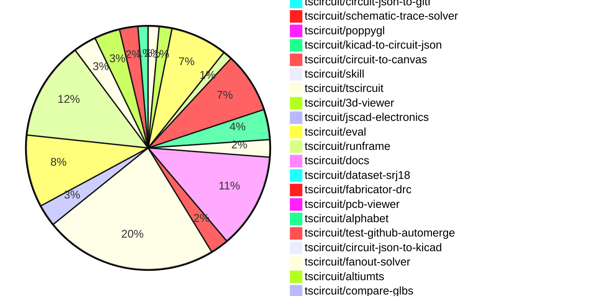

# contribution tracker

[contributions.tscircuit.com](https://contributions.tscircuit.com) ・ [tscircuit.com](https://tscircuit.com) ・ [Contribution Overviews](./contribution-overviews/) ・ [Changelogs](./changelogs/)

Generates weekly contribution overviews for tscircuit contributors. Check out all
the [contribution overviews here](./contribution-overviews/)
You can find AI-generated monthly changelogs in the [changelogs directory](./changelogs/)

- All PRs in the tscircuit org are scanned/summarized via an LLM
- The LLM classifies each Diff/PR as into a set of attributes for scoring
- All the PRs, summaries, and classifications are organized into charts and tables for [the website](https://contributions.tscircuit.com)

> Want to run locally? See the [Development Section](#development)

## Current Week

<!-- START_CURRENT_WEEK -->

# Contribution Overview 2026-09-08

The current week is shown below. There are 3 major sections:

- [Contributor Overview](#contributor-overview)
- [PRs by Repository](#prs-by-repository)
- [PRs by Contributor](#changes-by-contributor)
- [Scoring & Sponsorship Details](/docs/sponsorship-calculation-explanation.md)

## PRs by Repository


```mermaid
pie
    "tscircuit/schematic-viewer" : 6
    "tscircuit/circuit-json" : 12
    "tscircuit/props" : 14
    "tscircuit/footprinter" : 2
    "tscircuit/core" : 62
    "tscircuit/circuit-to-svg" : 10
    "tscircuit/checks" : 9
    "tscircuit/circuit-json-to-pnp-csv" : 3
    "tscircuit/tscircuit.com" : 66
    "tscircuit/jlcsearch" : 1
    "tscircuit/tscircuit-autorouter" : 33
    "tscircuit/high-density-a01" : 4
    "tscircuit/high-density-repair02" : 2
    "tscircuit/circuit-json-schematic-placement-analysis" : 19
    "tscircuit/high-density-repair03" : 6
    "tscircuit/check-ugly-traces" : 1
    "tscircuit/bus-lanes-solver" : 2
    "tscircuit/circuit-json-to-gerber" : 1
    "tscircuit/cli" : 104
    "tscircuit/circuit-json-to-gltf" : 5
    "tscircuit/schematic-trace-solver" : 20
    "tscircuit/poppygl" : 1
    "tscircuit/kicad-to-circuit-json" : 5
    "tscircuit/circuit-to-canvas" : 2
    "tscircuit/skill" : 4
    "tscircuit/tscircuit" : 189
    "tscircuit/3d-viewer" : 2
    "tscircuit/jscad-electronics" : 24
    "tscircuit/eval" : 79
    "tscircuit/runframe" : 108
    "tscircuit/docs" : 6
    "tscircuit/dataset-srj18" : 1
    "tscircuit/fabricator-drc" : 1
    "tscircuit/pcb-viewer" : 2
    "tscircuit/alphabet" : 2
    "tscircuit/test-github-automerge" : 2
    "tscircuit/circuit-json-to-kicad" : 8
    "tscircuit/fanout-solver" : 25
    "tscircuit/altiumts" : 28
    "tscircuit/compare-glbs" : 2
    "tscircuit/contribution-tracker" : 6
    "tscircuit/circuit-json-to-tscircuit" : 1
    "tscircuit/circuit-json-to-footprinter" : 1
    "tscircuit/circuit-json-util" : 3
    "tscircuit/circuit-json-to-altium" : 20
    "tscircuit/implicit-copper-pour-solver" : 1
    "tscircuit/tisearch.tscircuit.com" : 11
    "tscircuit/easyeda-converter" : 5
    "tscircuit/circuit-json-to-3d-png" : 1
    "tscircuit/via-stitch-solver" : 1
    "tscircuit/ti" : 1
    "tscircuit/length-matching-solver" : 2
    "tscircuit/jscad-planner" : 1
    "tscircuit/tiny-hypergraph" : 3
    "tscircuit/kicadts" : 1
    "tscircuit/altium-to-circuit-json" : 1
    "tscircuit/dataset-fanout31-am62l" : 1
    "tscircuit/schematic-symbols" : 1
    "tscircuit/power-trace-expander" : 1
```

## Contributor Overview

| Contributor | 🐳 Major | 🐙 Minor | 🐌 Tiny | Score | ⭐ |
|-------------|---------|---------|---------|-------|-----|
| [seveibar](#seveibar) | 40 | 43 | 59 | 260.5 | 👑👑👑 |
| [ShiboSoftwareDev](#ShiboSoftwareDev) | 13 | 13 | 13 | 105 | 👑 |
| [imrishabh18](#imrishabh18) | 14 | 16 | 19 | 101 | 👑 |
| [mohan-bee](#mohan-bee) | 7 | 4 | 12 | 61 | ⭐⭐⭐ |
| [techmannih](#techmannih) | 4 | 3 | 21 | 35 | ⭐⭐ |
| [GokulPandi-M](#GokulPandi-M) | 2 | 4 | 9 | 25 | ⭐⭐ |
| [AnasSarkiz](#AnasSarkiz) | 4 | 1 | 1 | 25 | ⭐⭐ |
| [rushabhcodes](#rushabhcodes) | 1 | 5 | 9 | 23.5 | ⭐⭐ |
| [Abse2001](#Abse2001) | 2 | 0 | 3 | 20 | ⭐⭐ |
| [hrithik18k](#hrithik18k) | 0 | 4 | 11 | 19 | ⭐⭐ |
| [MustafaMulla29](#MustafaMulla29) | 2 | 2 | 4 | 17 | ⭐⭐ |
| [tscircuitbot](#tscircuitbot) | 0 | 0 | 568 | 16.5 | ⭐⭐ |
| [anil08607](#anil08607) | 0 | 3 | 5 | 12 | ⭐⭐ |
| [KrishnaX12](#KrishnaX12) | 0 | 4 | 4 | 12 | ⭐⭐ |
| [0hmX](#0hmX) | 0 | 1 | 2 | 5 | ⭐ |
| [addibble](#addibble) | 0 | 1 | 1 | 3 |  |
| [santosh-kumar-git](#santosh-kumar-git) | 0 | 1 | 0 | 2 |  |

## Staff Pass Ratio (SPR)

| Contributor | Reviewed PRs | Rejections | Approvals | SPR |
|-------------|--------------|------------|-----------|-----|
| [ShiboSoftwareDev](#ShiboSoftwareDev) | 13 | 1 | 13 | 92.3% |
| [techmannih](#techmannih) | 6 | 1 | 5 | 83.3% |
| [AnasSarkiz](#AnasSarkiz) | 4 | 0 | 4 | 100.0% |
| [GokulPandi-M](#GokulPandi-M) | 4 | 1 | 4 | 75.0% |
| [mohan-bee](#mohan-bee) | 4 | 1 | 3 | 75.0% |
| [anil08607](#anil08607) | 3 | 4 | 1 | -33.3% |
| [MustafaMulla29](#MustafaMulla29) | 3 | 1 | 4 | 66.7% |
| [hrithik18k](#hrithik18k) | 2 | 0 | 2 | 100.0% |
| [imrishabh18](#imrishabh18) | 2 | 0 | 2 | 100.0% |
| [addibble](#addibble) | 1 | 0 | 1 | 100.0% |

<details>
<summary>ShiboSoftwareDev SPR PRs (13)</summary>

- [#3891](https://github.com/tscircuit/core/pull/3891) Fix AM62L phased fanout handoff
- [#2579](https://github.com/tscircuit/tscircuit-autorouter/pull/2579) Advance exact T113 routing past closed fanout routes
- [#188](https://github.com/tscircuit/tiny-hypergraph/pull/188) Serialize closed routes after consuming their segments
- [#240](https://github.com/tscircuit/fanout-solver/pull/240) Show live progress in fanout solver visualizations
- [#232](https://github.com/tscircuit/fanout-solver/pull/232) fix: route complete AM62L DDR4 fanout
- [#230](https://github.com/tscircuit/fanout-solver/pull/230) Allow benchmarks on merged pull requests
- [#227](https://github.com/tscircuit/fanout-solver/pull/227) Fix sub-tolerance trace plan validation
- [#192](https://github.com/tscircuit/fanout-solver/pull/192) Route AM62L fanout around decoupling vias
- [#194](https://github.com/tscircuit/fanout-solver/pull/194) Add DDR4 memory fanout repro
- [#199](https://github.com/tscircuit/fanout-solver/pull/199) fix: allow centered outward escapes for plane fanout
- [#202](https://github.com/tscircuit/fanout-solver/pull/202) Route dense plane fanouts around real copper
- [#211](https://github.com/tscircuit/fanout-solver/pull/211) Fix dense AM62L fanout finalization
- [#7](https://github.com/tscircuit/dataset-fanout31-am62l/pull/7) Add isolated AM62L DDR4 fanout cases

</details>

<details>
<summary>techmannih SPR PRs (6)</summary>

- [#796](https://github.com/tscircuit/circuit-json/pull/796) Add board via tenting defaults and trace-route overrides
- [#846](https://github.com/tscircuit/props/pull/846) Add defaultViaTenting and per-via tenting modes
- [#3926](https://github.com/tscircuit/core/pull/3926) Apply board defaultViaTenting and per-via tented overrides
- [#744](https://github.com/tscircuit/circuit-to-svg/pull/744) Render per-side via tenting in PCB soldermask views
- [#1083](https://github.com/tscircuit/schematic-trace-solver/pull/1083) fix: use shared rails for aligned decoupling capacitor banks
- [#56](https://github.com/tscircuit/circuit-json-schematic-placement-analysis/pull/56) feat: detect scattered same-rail decoupling capacitors

</details>

<details>
<summary>AnasSarkiz SPR PRs (4)</summary>

- [#2548](https://github.com/tscircuit/tscircuit-autorouter/pull/2548) Preserve pedometer layer transit and via continuity
- [#2494](https://github.com/tscircuit/tscircuit-autorouter/pull/2494) Keep crossing-point allocation enabled for large hypergraphs
- [#2473](https://github.com/tscircuit/tscircuit-autorouter/pull/2473) Reuse port-point output for Pipeline9 node Pf calculations
- [#29](https://github.com/tscircuit/power-trace-expander/pull/29) Resolve shared copper aliases once per spatial index

</details>

<details>
<summary>GokulPandi-M SPR PRs (4)</summary>

- [#3800](https://github.com/tscircuit/core/pull/3800) Update @tscircuit/checks to 0.0.187
- [#275](https://github.com/tscircuit/checks/pull/275) Fix plated-hole overlap checks against component courtyards
- [#1123](https://github.com/tscircuit/schematic-trace-solver/pull/1123) fix: move same-net junctions off component ports
- [#509](https://github.com/tscircuit/circuit-json-to-kicad/pull/509) Fix bottom-side 3D model rotation and offsets

</details>

<details>
<summary>mohan-bee SPR PRs (4)</summary>

- [#153](https://github.com/tscircuit/circuit-json-util/pull/153) include missing-pin errors in netlist diagnostics
- [#3724](https://github.com/tscircuit/core/pull/3724) deduplicate pcb obstacle connectivity ids
- [#1185](https://github.com/tscircuit/schematic-trace-solver/pull/1185) Shorten recovered trace detours around nearby obstacles
- [#148](https://github.com/tscircuit/rectdiff/pull/148) refine free-layer overlaps across copper pours

</details>

<details>
<summary>anil08607 SPR PRs (3)</summary>

- [#741](https://github.com/tscircuit/circuit-to-svg/pull/741) test: reproduce fabrication note visibility and layer leaks
- [#287](https://github.com/tscircuit/checks/pull/287) fix: skip missing courtyard warnings for manually placed vias
- [#285](https://github.com/tscircuit/checks/pull/285) test: add repro for false disconnected-port errors with plated pads + bottom pour

</details>

<details>
<summary>MustafaMulla29 SPR PRs (3)</summary>

- [#62](https://github.com/tscircuit/circuit-json-schematic-placement-analysis/pull/62) fix: preserve series inductors and detect inverted supply rails
- [#57](https://github.com/tscircuit/circuit-json-schematic-placement-analysis/pull/57) Add connector placement analyzer
- [#52](https://github.com/tscircuit/circuit-json-schematic-placement-analysis/pull/52) Prefer vertical orientation for rail-connected two-pin components

</details>

<details>
<summary>hrithik18k SPR PRs (2)</summary>

- [#769](https://github.com/tscircuit/circuit-json/pull/769) feat: add styled parts to schematic text
- [#1195](https://github.com/tscircuit/schematic-trace-solver/pull/1195) Fix net-label branch origin at component edge

</details>

<details>
<summary>imrishabh18 SPR PRs (2)</summary>

- [#3802](https://github.com/tscircuit/core/pull/3802) Adopt two-pad LED orientation analysis and invalidate cached unknown frames (jlcpcb fabricating polatiry issue)
- [#3699](https://github.com/tscircuit/core/pull/3699) Remove electrically isolated copper pours after via stitching

</details>

<details>
<summary>addibble SPR PRs (1)</summary>

- [#14](https://github.com/tscircuit/jscad-planner/pull/14) Add serializable mat4 transform operations

</details>

> Note: AI evaluates PRs and assigns 1-3 star ratings automatically. 4 and 5 star ratings require manual staff review.

## Review Table

[reviews-received-hover]: ## "Number of reviews received for PRs for this contributor"
[approvals-received-hover]: ## "Number of approvals received for PRs this contributor authored"
[rejections-received-hover]: ## "Number of rejections received for PRs this contributor authored"
[prs-opened-hover]: ## "Number of PRs opened by this contributor"
[issues-created-hover]: ## "Number of issues created by this contributor"

| Contributor | Reviews Received | Approvals Received | Rejections Received | Approvals | Rejections Given | PRs Opened | PRs Merged | Issues Created |
|---|---|---|---|---|---|---|---|---|
| [0hmX](#0hmX) | 5 | 2 | 0 | 4 | 0 | 9 | 3 | 0 |
| [5p00kyy](#5p00kyy) | 0 | 0 | 0 | 0 | 0 | 1 | 0 | 0 |
| [Abse2001](#Abse2001) | 2 | 2 | 0 | 9 | 0 | 30 | 5 | 0 |
| [addibble](#addibble) | 2 | 2 | 0 | 0 | 0 | 3 | 2 | 0 |
| [alexci04](#alexci04) | 0 | 0 | 0 | 0 | 0 | 1 | 0 | 0 |
| [AnasSarkiz](#AnasSarkiz) | 5 | 5 | 0 | 6 | 0 | 26 | 6 | 0 |
| [anil08607](#anil08607) | 15 | 7 | 6 | 1 | 0 | 16 | 8 | 0 |
| [Ansukaa](#Ansukaa) | 0 | 0 | 0 | 0 | 0 | 1 | 0 | 0 |
| [antonioscafaro](#antonioscafaro) | 0 | 0 | 0 | 0 | 0 | 2 | 0 | 0 |
| [armorbreak001](#armorbreak001) | 0 | 0 | 0 | 0 | 0 | 1 | 0 | 0 |
| [AyanZahid-Code](#AyanZahid-Code) | 0 | 0 | 0 | 0 | 0 | 2 | 0 | 0 |
| [benthepythondev00](#benthepythondev00) | 0 | 0 | 0 | 0 | 0 | 6 | 0 | 0 |
| [Bhavyansh-Sabharwal](#Bhavyansh-Sabharwal) | 0 | 0 | 0 | 0 | 0 | 1 | 0 | 0 |
| [billythompsons](#billythompsons) | 0 | 0 | 0 | 0 | 0 | 6 | 0 | 0 |
| [Danty-pig123](#Danty-pig123) | 0 | 0 | 0 | 0 | 0 | 25 | 0 | 0 |
| [Devesh36](#Devesh36) | 0 | 0 | 0 | 1 | 0 | 1 | 0 | 0 |
| [dwdcth](#dwdcth) | 0 | 0 | 0 | 0 | 0 | 2 | 0 | 0 |
| [ElvinGts](#ElvinGts) | 0 | 0 | 0 | 0 | 0 | 2 | 0 | 0 |
| [fabiosandernt](#fabiosandernt) | 0 | 0 | 0 | 0 | 0 | 3 | 0 | 0 |
| [FekyBaz](#FekyBaz) | 0 | 0 | 0 | 0 | 0 | 4 | 0 | 0 |
| [Flame119052](#Flame119052) | 0 | 0 | 0 | 0 | 0 | 56 | 0 | 0 |
| [freeneyjared17](#freeneyjared17) | 0 | 0 | 0 | 0 | 0 | 2 | 0 | 0 |
| [FU-max-boop](#FU-max-boop) | 0 | 0 | 0 | 0 | 0 | 1 | 0 | 0 |
| [Furox-Art](#Furox-Art) | 0 | 0 | 0 | 0 | 0 | 3 | 0 | 0 |
| [gcoinstash-cmd](#gcoinstash-cmd) | 0 | 0 | 0 | 0 | 0 | 260 | 0 | 0 |
| [ggh01083-glitch](#ggh01083-glitch) | 0 | 0 | 0 | 0 | 0 | 1 | 0 | 0 |
| [ghost](#ghost) | 0 | 0 | 0 | 0 | 0 | 1 | 0 | 0 |
| [GokulPandi-M](#GokulPandi-M) | 34 | 27 | 0 | 0 | 0 | 24 | 15 | 0 |
| [Hello2021Year](#Hello2021Year) | 0 | 0 | 0 | 0 | 0 | 1 | 0 | 0 |
| [hrithik18k](#hrithik18k) | 32 | 26 | 0 | 0 | 0 | 18 | 15 | 0 |
| [Ialyahya96](#Ialyahya96) | 0 | 0 | 0 | 0 | 0 | 5 | 0 | 0 |
| [ikoomm](#ikoomm) | 0 | 0 | 0 | 0 | 0 | 5 | 0 | 0 |
| [iliasabk](#iliasabk) | 0 | 0 | 0 | 0 | 0 | 1 | 0 | 0 |
| [imrishabh18](#imrishabh18) | 3 | 2 | 0 | 25 | 6 | 65 | 49 | 0 |
| [iprasen](#iprasen) | 0 | 0 | 0 | 0 | 0 | 1 | 0 | 0 |
| [Irvinwop](#Irvinwop) | 6 | 0 | 0 | 0 | 0 | 4 | 0 | 0 |
| [jmy126](#jmy126) | 0 | 0 | 0 | 0 | 0 | 1 | 0 | 0 |
| [kanfan](#kanfan) | 0 | 0 | 0 | 0 | 0 | 3 | 0 | 0 |
| [khaledsabae](#khaledsabae) | 0 | 0 | 0 | 0 | 0 | 1 | 0 | 0 |
| [KiritoYG](#KiritoYG) | 0 | 0 | 0 | 0 | 0 | 1 | 0 | 0 |
| [KrishnaX12](#KrishnaX12) | 11 | 7 | 1 | 0 | 0 | 11 | 8 | 0 |
| [krrishray](#krrishray) | 0 | 0 | 0 | 0 | 0 | 1 | 0 | 0 |
| [ksushant6566](#ksushant6566) | 0 | 0 | 0 | 0 | 0 | 1 | 0 | 0 |
| [Lathikaa-S](#Lathikaa-S) | 0 | 0 | 0 | 0 | 0 | 0 | 0 | 0 |
| [linuxguru22-droid](#linuxguru22-droid) | 0 | 0 | 0 | 0 | 0 | 2 | 0 | 0 |
| [maci0](#maci0) | 0 | 0 | 0 | 1 | 0 | 4 | 0 | 0 |
| [marcos452652258-gif](#marcos452652258-gif) | 0 | 0 | 0 | 0 | 0 | 1 | 0 | 0 |
| [matiascamaran](#matiascamaran) | 0 | 0 | 0 | 0 | 0 | 1 | 0 | 0 |
| [mini0n-ai](#mini0n-ai) | 0 | 0 | 0 | 0 | 0 | 2 | 0 | 0 |
| [mohan-bee](#mohan-bee) | 16 | 10 | 2 | 14 | 0 | 65 | 23 | 0 |
| [MushinNakamoto](#MushinNakamoto) | 0 | 0 | 0 | 0 | 0 | 1 | 0 | 0 |
| [MustafaMulla29](#MustafaMulla29) | 6 | 4 | 0 | 12 | 0 | 10 | 8 | 0 |
| [nardeenal](#nardeenal) | 0 | 0 | 0 | 0 | 0 | 1 | 0 | 0 |
| [OliverPerrin](#OliverPerrin) | 0 | 0 | 0 | 0 | 0 | 1 | 0 | 0 |
| [PapayaLaParupa](#PapayaLaParupa) | 0 | 0 | 0 | 0 | 0 | 2 | 0 | 0 |
| [pathakanshika144-afk](#pathakanshika144-afk) | 0 | 0 | 0 | 0 | 0 | 1 | 0 | 0 |
| [Prabin-Wagle](#Prabin-Wagle) | 0 | 0 | 0 | 0 | 0 | 1 | 0 | 0 |
| [ranadheer-designs](#ranadheer-designs) | 1 | 1 | 0 | 0 | 0 | 8 | 0 | 0 |
| [raykholo](#raykholo) | 0 | 0 | 0 | 0 | 0 | 1 | 0 | 0 |
| [RohithPariki](#RohithPariki) | 0 | 0 | 0 | 0 | 0 | 1 | 0 | 0 |
| [rronit786](#rronit786) | 0 | 0 | 0 | 0 | 0 | 1 | 0 | 0 |
| [rushabhcodes](#rushabhcodes) | 49 | 14 | 0 | 1 | 0 | 29 | 15 | 0 |
| [RW-wbd](#RW-wbd) | 0 | 0 | 0 | 0 | 0 | 1 | 0 | 0 |
| [saiyer123](#saiyer123) | 0 | 0 | 0 | 0 | 0 | 1 | 0 | 0 |
| [Samra761](#Samra761) | 0 | 0 | 0 | 0 | 0 | 1 | 0 | 0 |
| [santosh-kumar-git](#santosh-kumar-git) | 2 | 1 | 1 | 0 | 0 | 7 | 1 | 0 |
| [sen-ye](#sen-ye) | 0 | 0 | 0 | 0 | 0 | 1 | 0 | 0 |
| [Serdnad](#Serdnad) | 0 | 0 | 0 | 0 | 0 | 1 | 0 | 0 |
| [seveibar](#seveibar) | 43 | 2 | 0 | 50 | 6 | 205 | 145 | 0 |
| [ShiboSoftwareDev](#ShiboSoftwareDev) | 30 | 30 | 0 | 28 | 0 | 97 | 39 | 0 |
| [singhharsh1708](#singhharsh1708) | 0 | 0 | 0 | 0 | 0 | 1 | 0 | 0 |
| [StackedOndras](#StackedOndras) | 0 | 0 | 0 | 0 | 0 | 2 | 0 | 0 |
| [tbontb-iaq](#tbontb-iaq) | 0 | 0 | 0 | 0 | 0 | 2 | 0 | 0 |
| [tcsenpai](#tcsenpai) | 0 | 0 | 0 | 0 | 0 | 3 | 0 | 0 |
| [techmannih](#techmannih) | 40 | 19 | 2 | 9 | 0 | 47 | 28 | 0 |
| [th3o6a1d](#th3o6a1d) | 0 | 0 | 0 | 0 | 0 | 2 | 0 | 0 |
| [tscircuitbot](#tscircuitbot) | 0 | 0 | 0 | 0 | 0 | 822 | 568 | 0 |
| [ugin-man](#ugin-man) | 0 | 0 | 0 | 0 | 0 | 18 | 0 | 0 |
| [vandemoosdijkstanley-bot](#vandemoosdijkstanley-bot) | 0 | 0 | 0 | 0 | 0 | 2 | 0 | 0 |
| [WhiteEagle-12](#WhiteEagle-12) | 0 | 0 | 0 | 0 | 0 | 5 | 0 | 0 |
| [Wvdstoep](#Wvdstoep) | 0 | 0 | 0 | 0 | 0 | 1 | 0 | 0 |
| [YS-OH-CORE](#YS-OH-CORE) | 0 | 0 | 0 | 0 | 0 | 1 | 0 | 0 |
| [zaze-oO](#zaze-oO) | 0 | 0 | 0 | 0 | 0 | 1 | 0 | 0 |

## Changes by Repository

### [tscircuit/schematic-viewer](https://github.com/tscircuit/schematic-viewer)

| PR # | Impact | Rating | Contributor | Description |
|------|--------|--------|-------------|-------------|
| [#274](https://github.com/tscircuit/schematic-viewer/pull/274) | 🐳 Major | ⭐⭐⭐ | seveibar | Make each schematic warning independently collapsible, allowing users to toggle visibility and improve accessibility with keyboard support and assistive technology. |
| [#275](https://github.com/tscircuit/schematic-viewer/pull/275) | 🐳 Major | ⭐⭐⭐ | seveibar | Clicking a schematic component now shows a highlighted warnings section in its details popup when related Circuit JSON warnings exist, matching source, schematic, and PCB component references, and remains visible independently of the schematics Show warnings toggle. |
| [#276](https://github.com/tscircuit/schematic-viewer/pull/276) | 🐳 Major | ⭐⭐⭐ | seveibar | Adds a warning icon and schematic warning count immediately to the right of search, allowing users to toggle warning callouts and improving accessibility by synchronizing with the Show Warnings menu option. |
| [#273](https://github.com/tscircuit/schematic-viewer/pull/273) | 🐳 Major | ⭐⭐⭐ | seveibar | Adds Run Style Analysis to the schematic right-click menu, allowing users to analyze the current Circuit JSON and view annotated SVGs for placementstyle issues. |
| [#272](https://github.com/tscircuit/schematic-viewer/pull/272) | 🐳 Major | ⭐⭐⭐ | seveibar | Adds a Show Warnings checkbox to the schematic right-click menu, allowing users to toggle the visibility of warning outlines and text callouts in the schematic viewer. |

<details>
<summary>🐌 Tiny Contributions (1)</summary>

| PR # | Impact | Contributor | Description |
|------|--------|-------------|-------------|
| [#271](https://github.com/tscircuit/schematic-viewer/pull/271) | 🐌 Tiny | seveibar | Fixes the height of the sheet selection dropdown to align with the adjacent search button by setting its height to 32px and adjusting padding. |

</details>

### [tscircuit/circuit-json](https://github.com/tscircuit/circuit-json)

| PR # | Impact | Rating | Contributor | Description |
|------|--------|--------|-------------|-------------|
| [#794](https://github.com/tscircuit/circuit-json/pull/794) | 🐳 Major | ⭐⭐⭐ | seveibar | Add pcb_preflight_routing_error for checks that block a routing attempt before the autorouter runs, including error codes and diagnostic measurements. |
| [#796](https://github.com/tscircuit/circuit-json/pull/796) | 🐳 Major | ⭐⭐⭐ | techmannih | Adds optional board-level via tenting defaults and per-side tented_on_top  tented_on_bottom fields to trace-route vias, preserving settings during parsing and ensuring omitted values remain absent. |
| [#792](https://github.com/tscircuit/circuit-json/pull/792) | 🐙 Minor | ⭐⭐ | seveibar | Adds pcb_fabricator_extra_charge_warning to represent a design feature that incurs an extra charge under the selected fabricator preset. |
| [#790](https://github.com/tscircuit/circuit-json/pull/790) | 🐙 Minor | ⭐⭐ | seveibar | Adds a circuit-wide warning for schematics that lack a sheet, allowing it to be displayed as a banner without component references. |
| [#788](https://github.com/tscircuit/circuit-json/pull/788) | 🐙 Minor | ⭐⭐ | seveibar | Vias can now represent top and bottom tenting independently using optional tented_on_top and tented_on_bottom booleans. |
| [#769](https://github.com/tscircuit/circuit-json/pull/769) | 🐙 Minor | ⭐⭐ | hrithik18k | Adds support for styled text parts in schematic text, allowing for partial active-low overlines while retaining a plain-text fallback. |

<details>
<summary>🐌 Tiny Contributions (6)</summary>

| PR # | Impact | Contributor | Description |
|------|--------|-------------|-------------|
| [#797](https://github.com/tscircuit/circuit-json/pull/797) | 🐌 Tiny | tscircuitbot | Automated package update |
| [#795](https://github.com/tscircuit/circuit-json/pull/795) | 🐌 Tiny | tscircuitbot | Automated package update |
| [#791](https://github.com/tscircuit/circuit-json/pull/791) | 🐌 Tiny | tscircuitbot | Automated package update |
| [#793](https://github.com/tscircuit/circuit-json/pull/793) | 🐌 Tiny | tscircuitbot | Automated package update |
| [#789](https://github.com/tscircuit/circuit-json/pull/789) | 🐌 Tiny | tscircuitbot | Automated package update |
| [#770](https://github.com/tscircuit/circuit-json/pull/770) | 🐌 Tiny | tscircuitbot | Automated package update |

</details>

### [tscircuit/props](https://github.com/tscircuit/props)

| PR # | Impact | Rating | Contributor | Description |
|------|--------|--------|-------------|-------------|
| [#845](https://github.com/tscircuit/props/pull/845) | 🐳 Major | ⭐⭐⭐ | seveibar | Adds optional pcbTracePaths to autoroutingphase so saved PCB routes are accepted by both its TypeScript interface and runtime schema. |
| [#837](https://github.com/tscircuit/props/pull/837) | 🐳 Major | ⭐⭐⭐ | seveibar | Adds pcbTracePaths to BreakoutProps to store pre-generated port-to-exit routes as JSON, allowing for reuse without generating Circuit JSON IDs, while preserving existing automatic fanout defaults. |
| [#839](https://github.com/tscircuit/props/pull/839) | 🐳 Major | ⭐⭐⭐ | seveibar | Extend pinAttributes with missing electrical roles using the existing optional boolean pattern. |
| [#846](https://github.com/tscircuit/props/pull/846) | 🐳 Major | ⭐⭐⭐ | techmannih | Adds board.defaultViaTenting and via.tented to express board-wide via solder mask coverage and per-via overrides for tscircuitcore3903. |
| [#853](https://github.com/tscircuit/props/pull/853) | 🐙 Minor | ⭐⭐ | seveibar | Adds routeRemaining?: boolean to BoardProps and its Zod schema to express whether remaining unrouted connections should be routed after explicit routing phases, preserving explicit booleans and leaving the setting unset for consumers to apply their existing defaults. |
| [#851](https://github.com/tscircuit/props/pull/851) | 🐙 Minor | ⭐⭐ | seveibar | Adds bus_lanes to the autorouter preset types and validators, supporting autoroutingphase autorouterbus_lanes connections...  and the  preset: bus_lanes  configuration form. |
| [#850](https://github.com/tscircuit/props/pull/850) | 🐙 Minor | ⭐⭐ | seveibar | Add preflightRoutingCheckPolicy?: none  basic  conservative to autoroutingphase, board, and subcircuit. All three enum values are preserved unchanged. No default is applied: omitted props remain absent and explicit undefined remains unset. |
| [#849](https://github.com/tscircuit/props/pull/849) | 🐙 Minor | ⭐⭐ | seveibar | Fixes loss of noConnect pins during Zod parsing in the Switch component, ensuring proper handling of unconnected pins in circuit definitions. |
| [#848](https://github.com/tscircuit/props/pull/848) | 🐙 Minor | ⭐⭐ | seveibar | Adds optional platform.fabricatorEngine.runDrcChecks as an injectable provider for fabricator-specific design rule checks, following the existing engine configuration pattern. |
| [#847](https://github.com/tscircuit/props/pull/847) | 🐙 Minor | ⭐⭐ | seveibar | Adds optional fabricatorPreset to BoardProps and the board Zod schema, accepting specific preset values and ensuring validation of inputs without affecting existing board defaults. |
| [#838](https://github.com/tscircuit/props/pull/838) | 🐙 Minor | ⭐⭐ | seveibar | Allows saved fanout trace paths to start or end with a via, including routes with vias at both endpoints, ensuring valid route shapes when circuit permits placement. |
| [#836](https://github.com/tscircuit/props/pull/836) | 🐙 Minor | ⭐⭐ | seveibar | Adds the optional useCloudAutorouter boolean to PlatformConfig, allowing users to opt for cloud-based routing with Pipeline9. |
| [#843](https://github.com/tscircuit/props/pull/843) | 🐙 Minor | ⭐⭐ | imrishabh18 | Adds board-level configuration for enabling via stitching and customizing the spacing between stitching vias. |

<details>
<summary>🐌 Tiny Contributions (1)</summary>

| PR # | Impact | Contributor | Description |
|------|--------|-------------|-------------|
| [#844](https://github.com/tscircuit/props/pull/844) | 🐌 Tiny | imrishabh18 | Clarifies the deprecation of the sequential_trace and sequential-trace autorouter guidance, directing users to use the default autorouter instead and enabling temporary legacy support. |

</details>

### [tscircuit/footprinter](https://github.com/tscircuit/footprinter)

| PR # | Impact | Rating | Contributor | Description |
|------|--------|--------|-------------|-------------|
| [#886](https://github.com/tscircuit/footprinter/pull/886) | 🐳 Major | ⭐⭐⭐ | seveibar | Add optional body dimensions (bodywidth, bodyheight, bodythickness) to the SSOP schema for improved physical representation without altering existing copper or silkscreen layouts. |
| [#885](https://github.com/tscircuit/footprinter/pull/885) | 🐙 Minor | ⭐⭐ | seveibar | Adds optional body dimensions (width, height, thickness) to the LGA schema to improve 3D representation and clarity for downstream consumers. |

### [tscircuit/core](https://github.com/tscircuit/core)

| PR # | Impact | Rating | Contributor | Description |
|------|--------|--------|-------------|-------------|
| [#3953](https://github.com/tscircuit/core/pull/3953) | 🐳 Major | ⭐⭐⭐ | seveibar | Preserves hand-authored trace geometry during autorouting by treating them as fixed copper, preventing unwanted modifications by the autorouter. |
| [#3939](https://github.com/tscircuit/core/pull/3939) | 🐳 Major | ⭐⭐⭐ | seveibar | Adds autoroutingphase autorouterbus_lanes connections... , backed by the bus-lanes solver. Selected connections route between fixed-layer fanout exits; a required layer change produces an error without falling back to the global router. |
| [#3950](https://github.com/tscircuit/core/pull/3950) | 🐳 Major | ⭐⭐⭐ | seveibar | Limits implicit remaining routing to a maximum of 50 connections when preflight checks are set to basic or conservative, providing a diagnostic message for users to opt-in for routing. |
| [#3895](https://github.com/tscircuit/core/pull/3895) | 🐳 Major | ⭐⭐⭐ | seveibar | Adds core support for autoroutingphase pcbTracePathspaths, using the prop published in tscircuitprops 0.0.653. Complete saved routes bypass the phases solver. On fanout phases, saved escapes replace the corresponding input endpoints so follow-up routing starts at the saved exit and layer; complete connections need no follow-up. |
| [#3917](https://github.com/tscircuit/core/pull/3917) | 🐳 Major | ⭐⭐⭐ | seveibar | Enforces single-layer routing points and corrects saved fanout exits to ensure compatibility with the new routing model, rejecting mixed-layer configurations and improving validation checks. |
| [#3809](https://github.com/tscircuit/core/pull/3809) | 🐳 Major | ⭐⭐⭐ | seveibar | Allows pre-generated fanout copper to be stored as port-selector-keyed JSON and supplied through fanout pcbTracePathssavedPaths (also supported on breakout). Core creates the exits, places the saved wirevia geometry, and routes the remaining board connections from those exits. Saved copper stays fixed during subsequent routing. |
| [#3892](https://github.com/tscircuit/core/pull/3892) | 🐳 Major | ⭐⭐⭐ | imrishabh18 | Fixes autorouting failure by ensuring PCB ports are correctly associated with pads after loading asynchronous file footprints, preventing crashes due to null port IDs. |
| [#3724](https://github.com/tscircuit/core/pull/3724) | 🐳 Major | ⭐⭐⭐ | mohan-bee | Fixes timeout issues in the ground routing phase by deduplicating obstacle connectivity IDs, reducing processing time significantly. |
| [#3891](https://github.com/tscircuit/core/pull/3891) | 🐳 Major | ⭐⭐⭐ | ShiboSoftwareDev | Fixes the AM62L phased fanout handoff by replacing stale phase traces, materializing physical vias, and improving via comparison for routing accuracy. |
| [#3890](https://github.com/tscircuit/core/pull/3890) | 🐳 Major | ⭐⭐⭐ | ShiboSoftwareDev | Reproduces the issue of duplicate AM62L decoupling traces at the global handoff, capturing PCB trace and via-clearance DRC errors, and verifies the fanout process with a comprehensive test. |
| [#3951](https://github.com/tscircuit/core/pull/3951) | 🐙 Minor | ⭐⭐ | seveibar | Limits automatic fabrication notes for internal connections to components with fewer than six primary pins, ensuring that components with six or more pins retain their internal connectivity without these notes. |
| [#3947](https://github.com/tscircuit/core/pull/3947) | 🐙 Minor | ⭐⭐ | seveibar | Fixes false missing reference designator warnings for built-in symbols by updating tscircuitchecks to version 0.0.192 and adding regression tests for specific components. |
| [#3946](https://github.com/tscircuit/core/pull/3946) | 🐙 Minor | ⭐⭐ | seveibar | Adds support for the routeRemaining property in boards to control implicit routing behavior while maintaining explicit autorouting phases and DRC checks. |
| [#3937](https://github.com/tscircuit/core/pull/3937) | 🐙 Minor | ⭐⭐ | seveibar | Restores the SOIC8 sensor autorouting-phase SVG to its baseline from before a previous pull request, correcting a minor image mismatch in Linux CI. |
| [#3928](https://github.com/tscircuit/core/pull/3928) | 🐙 Minor | ⭐⭐ | seveibar | Runs an optional platform.fabricatorEngine.runDrcChecks during board DRC, after routing and via generation, allowing for additional diagnostics based on fabricator presets. |
| [#3922](https://github.com/tscircuit/core/pull/3922) | 🐙 Minor | ⭐⭐ | seveibar | Emit a circuit-wide warning when no schematicsheet is found, instead of attaching it to the first schematic component, while updating the circuit-json dependency to version 0.0.488. |
| [#3915](https://github.com/tscircuit/core/pull/3915) | 🐙 Minor | ⭐⭐ | seveibar | PCB via primitives and imported routed vias now emit tented_on_top and tented_on_bottom instead of is_tented, following a previous update in circuit-json. |
| [#3815](https://github.com/tscircuit/core/pull/3815) | 🐙 Minor | ⭐⭐ | seveibar | Consolidates multiple diagnostics for U1U2 placement conflicts into a single summary, improving clarity and efficiency in overlap diagnostics. |
| [#3810](https://github.com/tscircuit/core/pull/3810) | 🐙 Minor | ⭐⭐ | seveibar | Fixes the plated-hole overlap regression that failed on core 3804 by scoping overlap counts and visualizations to overlaps containing two plated-hole IDs. |
| [#3804](https://github.com/tscircuit/core/pull/3804) | 🐙 Minor | ⭐⭐ | seveibar | Enables the use of the networked autorouter for Pipeline9 boards when the platform flag useCloudAutorouter is true, while preserving local routing options and configurations. |
| [#3773](https://github.com/tscircuit/core/pull/3773) | 🐙 Minor | ⭐⭐ | seveibar | Skip the AM62L-to-LPDDR4 progressive fanout test due to PCB tracevia overlap errors and restore the Arduino Uno center reroute PCB snapshot to match the baseline before a previous PR, addressing CI mismatches. |
| [#3765](https://github.com/tscircuit/core/pull/3765) | 🐙 Minor | ⭐⭐ | seveibar | Normalizes shared schematic terminals for internally connected pushbutton pads to prevent zero-length wires and improve label handling. |
| [#3792](https://github.com/tscircuit/core/pull/3792) | 🐙 Minor | ⭐⭐ | imrishabh18 | Add board-level opt-in for copper-pour via stitching using tscircuitprops 0.0.651 |
| [#3805](https://github.com/tscircuit/core/pull/3805) | 🐙 Minor | ⭐⭐ | imrishabh18 | Adds compact  and - fabrication paths for polarized capacitors, indicating assembly polarity between positive and negative pads. |
| [#3803](https://github.com/tscircuit/core/pull/3803) | 🐙 Minor | ⭐⭐ | imrishabh18 | Adds a diode symbol to indicate LED polarity on fabrication layers, resolving ambiguity in assembly previews without adding automatic text. |
| [#3802](https://github.com/tscircuit/core/pull/3802) | 🐙 Minor | ⭐⭐ | imrishabh18 | Adopts the published tscircuitcircuit-json-util0.0.113 fix to enable part-orientation analysis for two-pad LEDs, invalidating cached unknown frames and ensuring accurate polarity analysis. |
| [#3699](https://github.com/tscircuit/core/pull/3699) | 🐙 Minor | ⭐⭐ | imrishabh18 | Removes disconnected copper pour fragments that survive the solvers area filter by adding a cleanup phase after via stitching to ensure only connected pours remain. |
| [#3723](https://github.com/tscircuit/core/pull/3723) | 🐙 Minor | ⭐⭐ | mohan-bee | Reproduces duplicate connectivity IDs that inflate PCB autorouter input by adding a test for duplicate counts in a four-layer TSX circuit. |

<details>
<summary>🐌 Tiny Contributions (34)</summary>

| PR # | Impact | Contributor | Description |
|------|--------|-------------|-------------|
| [#3962](https://github.com/tscircuit/core/pull/3962) | 🐌 Tiny | seveibar | Updates the tscircuitchecks package to version 0.0.193 to resolve missing reference designator warnings in schematic boxes and adds a regression test to verify the fix. |
| [#3938](https://github.com/tscircuit/core/pull/3938) | 🐌 Tiny | seveibar | Updates the circuit-json-to-gltf dependency to version 0.0.127 to apply a fix for subdued green soldermask colors in 3D renders, ensuring accurate representation of substrate and masked-copper colors. |
| [#3948](https://github.com/tscircuit/core/pull/3948) | 🐌 Tiny | seveibar | Bumps the schematic trace solver version to include a fix for retaining clear crossing routes for named two-pin connections. |
| [#3945](https://github.com/tscircuit/core/pull/3945) | 🐌 Tiny | seveibar | Updates the fanout-solver dependency from version 0.0.76 to 0.0.78 to resolve a TypeScript error related to readonly and mutable properties in RunFrame. |
| [#3921](https://github.com/tscircuit/core/pull/3921) | 🐌 Tiny | seveibar | Updates the circuit-json-to-gltf and PoppyGL dependencies to correct sRGB texture-decoding issues and refreshes 3D snapshots accordingly. |
| [#3934](https://github.com/tscircuit/core/pull/3934) | 🐌 Tiny | seveibar | Adds Circuit JSON regressions for an SPDT switch with noConnectpin3 to ensure it emits do_not_connect: true only on pin3, and a readonly named alias marks the corresponding pin without affecting an ordinary switch. |
| [#3814](https://github.com/tscircuit/core/pull/3814) | 🐌 Tiny | seveibar | Fixes overlapping schematic section titles and chip reference designators by adjusting section bounds to include component-owned referencevalue text, ensuring titles are positioned correctly above section contents. |
| [#3813](https://github.com/tscircuit/core/pull/3813) | 🐌 Tiny | seveibar | Updates tscircuitcapacity-autorouter from 0.0.892 to the latest published version, 0.0.899, and refreshes the fanout-to-net handoff PCB snapshot for the updated routing geometry and trace widths; the regressions connectivity assertions remain unchanged and pass. |
| [#3785](https://github.com/tscircuit/core/pull/3785) | 🐌 Tiny | seveibar | Updates tscircuitcapacity-autorouter from 0.0.890 to 0.0.892 and refreshes the SOIC-8 sensor to IC header autorouting snapshot, capturing small route-coordinate changes including a 0.001 mm via shift. |
| [#3914](https://github.com/tscircuit/core/pull/3914) | 🐌 Tiny | tscircuitbot | Updates the tscircuitfanout-solver package from version 0.0.75 to 0.0.76 |
| [#3913](https://github.com/tscircuit/core/pull/3913) | 🐌 Tiny | tscircuitbot | Updates the tscircuitfanout-solver package from version 0.0.75 to 0.0.76 |
| [#3907](https://github.com/tscircuit/core/pull/3907) | 🐌 Tiny | tscircuitbot | Updates the tscircuitfanout-solver package from version 0.0.74 to 0.0.75 |
| [#3900](https://github.com/tscircuit/core/pull/3900) | 🐌 Tiny | tscircuitbot | Updates the tscircuitfanout-solver package from version 0.0.73 to 0.0.74 |
| [#3864](https://github.com/tscircuit/core/pull/3864) | 🐌 Tiny | tscircuitbot | Updates the tscircuitfanout-solver package from version 0.0.71 to 0.0.72 |
| [#3816](https://github.com/tscircuit/core/pull/3816) | 🐌 Tiny | tscircuitbot | Updates the version of the tscircuitchecks package from 0.0.187 to 0.0.188 in package.json |
| [#3812](https://github.com/tscircuit/core/pull/3812) | 🐌 Tiny | tscircuitbot | Updates the tscircuitfanout-solver package from version 0.0.68 to 0.0.71 |
| [#3807](https://github.com/tscircuit/core/pull/3807) | 🐌 Tiny | tscircuitbot | Updates the version of the tscircuitchecks package from 0.0.186 to 0.0.187 in package.json |
| [#3806](https://github.com/tscircuit/core/pull/3806) | 🐌 Tiny | tscircuitbot | Updates the version of the tscircuitchecks package from 0.0.186 to 0.0.187 in package.json |
| [#3799](https://github.com/tscircuit/core/pull/3799) | 🐌 Tiny | tscircuitbot | Updates the version of the tscircuitchecks package from 0.0.185 to 0.0.186 in package.json |
| [#3795](https://github.com/tscircuit/core/pull/3795) | 🐌 Tiny | tscircuitbot | Updates the tscircuitfanout-solver package from version 0.0.66 to 0.0.68 |
| [#3784](https://github.com/tscircuit/core/pull/3784) | 🐌 Tiny | tscircuitbot | Updates the version of the tscircuitchecks package from 0.0.184 to 0.0.185 in package.json |
| [#3918](https://github.com/tscircuit/core/pull/3918) | 🐌 Tiny | rushabhcodes | Reproduces a bug where a trace from C2 extends into an adjacent schematic section, demonstrating the issue without fixing it. |
| [#3899](https://github.com/tscircuit/core/pull/3899) | 🐌 Tiny | rushabhcodes | Updates the circuit-to-svg dependency to version 0.0.416 to fix issues with rendering external schematic text and structured active-low overlines on pin labels. |
| [#3793](https://github.com/tscircuit/core/pull/3793) | 🐌 Tiny | rushabhcodes | Reproduces a bug where duplicate vias are emitted for same-net routes crossing PCB layers at the same position, establishing expected behavior for a future fix. |
| [#3893](https://github.com/tscircuit/core/pull/3893) | 🐌 Tiny | imrishabh18 | Updates the GLB exporter version to prevent version synchronization issues and refreshes 3D snapshots for pin headers above the PCB. |
| [#3794](https://github.com/tscircuit/core/pull/3794) | 🐌 Tiny | techmannih | Updates the tscircuitschematic-trace-solver dependency to version 0.0.191 and modifies a test to reflect changes in expected output. |
| [#3782](https://github.com/tscircuit/core/pull/3782) | 🐌 Tiny | techmannih | Adds a reduced reproduction of the analog routing in allwinner board, where VRA1 crosses the GND label stem and the shared LDOA1V8 rail. |
| [#3781](https://github.com/tscircuit/core/pull/3781) | 🐌 Tiny | techmannih | Reproduces a bug where two parallel V3V3 traces are incorrectly routed beside IOVDD2 and VREG_IN, only 0.04 mm apart, and adds a test to validate the issue. |
| [#3897](https://github.com/tscircuit/core/pull/3897) | 🐌 Tiny | mohan-bee | Updates the core dependency to schematic-trace-solver version 0.0.196, ensuring schematic snapshots reflect the latest solver output. |
| [#3779](https://github.com/tscircuit/core/pull/3779) | 🐌 Tiny | mohan-bee | Updates the tscircuitschematic-trace-solver package to version 0.0.189 in the package.json file. |
| [#3941](https://github.com/tscircuit/core/pull/3941) | 🐌 Tiny | anil08607 | Updates the tscircuitchecks package from version 0.0.189 to 0.0.191 in package.json |
| [#3898](https://github.com/tscircuit/core/pull/3898) | 🐌 Tiny | GokulPandi-M | Reproduces a bug where different-net traces overlap between adjacent vertical passive components in the schematic rendering. |
| [#3778](https://github.com/tscircuit/core/pull/3778) | 🐌 Tiny | ShiboSoftwareDev | Updates the tscircuitcapacity-autorouter package from version 0.0.887 to 0.0.890, incorporating the Pipeline 9 explicit-via-endpoint fix and its follow-up formatting release, while superseding the previous pull request targeting version 0.0.888. |
| [#3865](https://github.com/tscircuit/core/pull/3865) | 🐌 Tiny | Abse2001 | Updates tscircuitcapacity-autorouter from 0.0.899 to 0.0.900, which contains tscircuittscircuit-autorouter2506. |

</details>

### [tscircuit/circuit-to-svg](https://github.com/tscircuit/circuit-to-svg)

| PR # | Impact | Rating | Contributor | Description |
|------|--------|--------|-------------|-------------|
| [#742](https://github.com/tscircuit/circuit-to-svg/pull/742) | 🐳 Major | ⭐⭐⭐ | seveibar | Embed tscircuitalphabetbase64font as a data-URL font-face in every SVG export, deduplicating the font when SVGs are composed. Silkscreen labels, fabrication notes, and fabrication dimension labels use TscircuitAlphabet through font-family. |
| [#751](https://github.com/tscircuit/circuit-to-svg/pull/751) | 🐙 Minor | ⭐⭐ | seveibar | Add showFabricationNotes to convertCircuitJsonToPcbSvg. Setting it to false omits fabrication-note text, paths, rectangles, and dimensions from rendering and bounds calculations. It defaults to true to preserve existing output and operates independently of showPcbNotes. |
| [#740](https://github.com/tscircuit/circuit-to-svg/pull/740) | 🐙 Minor | ⭐⭐ | rushabhcodes | Fixes the issue where external schematic text associated with custom components disappears from the schematic SVG when is_box_with_pins is false. |
| [#744](https://github.com/tscircuit/circuit-to-svg/pull/744) | 🐙 Minor | ⭐⭐ | techmannih | PCB SVGs now render per-side via tenting when showSolderMask is enabled, allowing for better visibility of tented vias in the top and bottom views while maintaining the integrity of blind and buried vias. |

<details>
<summary>🐌 Tiny Contributions (6)</summary>

| PR # | Impact | Contributor | Description |
|------|--------|-------------|-------------|
| [#750](https://github.com/tscircuit/circuit-to-svg/pull/750) | 🐌 Tiny | seveibar | Reduces schematic warning callout borders, target outlines, and connector strokes to 1px, and shortens the target-outline dashes from 8,5 to 4,3, while removing the warning callout box border radius for square corners, making warnings less visually dominant. |
| [#749](https://github.com/tscircuit/circuit-to-svg/pull/749) | 🐌 Tiny | seveibar | Reduces the size of schematic warning callouts by adjusting font size, padding, and width range, while updating SVG snapshots accordingly. |
| [#746](https://github.com/tscircuit/circuit-to-svg/pull/746) | 🐌 Tiny | seveibar | Render a small red X on schematic ports marked as do-not-connect, improving visual distinction from ordinary unconnected pins. |
| [#753](https://github.com/tscircuit/circuit-to-svg/pull/753) | 🐌 Tiny | techmannih | Changes the color of bottom soldermask-covered copper from blue to green to match the existing top soldermask color, ensuring consistency in representation. |
| [#708](https://github.com/tscircuit/circuit-to-svg/pull/708) | 🐌 Tiny | hrithik18k | Fixes rendering of overlined pin labels and schematic text in SVG output for KiCad active-low formatting. |
| [#721](https://github.com/tscircuit/circuit-to-svg/pull/721) | 🐌 Tiny | hrithik18k | The current renderer ignores structured overline parts on schematic_text, so active-low pin names and local wire labels from the Easyduino schematic are displayed as plain text. This reproduction renders the complete Circuit JSON generated from Easyduino_ESP32.kicad_sch without changing the JSON inside the test. |

</details>

### [tscircuit/checks](https://github.com/tscircuit/checks)

| PR # | Impact | Rating | Contributor | Description |
|------|--------|--------|-------------|-------------|
| [#276](https://github.com/tscircuit/checks/pull/276) | 🐳 Major | ⭐⭐⭐ | seveibar | The supplied Game Boy Advance export has 11 clearance markers placed at full-trace or object midpoints instead of the offending copper gap. This PR reproduces every clearance error and its exact coordinates without changing check behavior. It also reproduces the twelfth, via-in-pad placement error, which has no location field in the current circuit-json schema. Adds the PCBconnectivity fixture, exact position assertions, renderer and numbered-coordinate SVG snapshots, and a coordinate table in docsgameboy-clearance-locations.md. Stored errors are removed before rerunning the checks; all generated fields except core-reassigned IDs match the export. Validation: all 293 tests pass; TypeScript, build, formatting and all GitHub CI checks pass. The follow-up fix is 277, stacked on this PR. |
| [#277](https://github.com/tscircuit/checks/pull/277) | 🐳 Major | ⭐⭐⭐ | seveibar | Corrects the 11 misplaced clearance markers reproduced in 276, ensuring that padtrace and viatrace errors now use the closest copper-edge geometry from the segment with minimum clearance, and updates the exact-coordinate regression and documentation accordingly. |
| [#289](https://github.com/tscircuit/checks/pull/289) | 🐙 Minor | ⭐⭐ | seveibar | Skip missing reference designator warnings for schematic boxes that provide their own reference designator, while still checking custom symbols. |
| [#288](https://github.com/tscircuit/checks/pull/288) | 🐙 Minor | ⭐⭐ | seveibar | Fixes false warnings for missing reference designators on built-in resistors by skipping checks for components with named symbols. |
| [#278](https://github.com/tscircuit/checks/pull/278) | 🐙 Minor | ⭐⭐ | seveibar | Consolidates placement diagnostics for overlapping footprints into a single summary per component pair, preserving detailed error context and allowing for raw results when needed. |
| [#287](https://github.com/tscircuit/checks/pull/287) | 🐙 Minor | ⭐⭐ | anil08607 | Fixes incorrect missing courtyard warnings for manually placed vias by excluding them from the warning checks while preserving warnings for actual components. |
| [#275](https://github.com/tscircuit/checks/pull/275) | 🐙 Minor | ⭐⭐ | GokulPandi-M | Fixes the issue where plated holes were not checked against component courtyards on the same physical layer, ensuring that collisions are reported correctly to the designer. |

<details>
<summary>🐌 Tiny Contributions (2)</summary>

| PR # | Impact | Contributor | Description |
|------|--------|-------------|-------------|
| [#286](https://github.com/tscircuit/checks/pull/286) | 🐌 Tiny | anil08607 | Adds a separate reproduction test showing that manually placed via pseudo-components incorrectly receive missing courtyard warnings. |
| [#274](https://github.com/tscircuit/checks/pull/274) | 🐌 Tiny | GokulPandi-M | Adds a test to reproduce the issue where through-hole display pins overlap with the courtyard of a battery holder on the opposite side of the PCB without reporting a placement issue. |

</details>

### [tscircuit/circuit-json-to-pnp-csv](https://github.com/tscircuit/circuit-json-to-pnp-csv)

| PR # | Impact | Rating | Contributor | Description |
|------|--------|--------|-------------|-------------|
| [#18](https://github.com/tscircuit/circuit-json-to-pnp-csv/pull/18) | 🐳 Major | ⭐⭐⭐ | seveibar | Replaces the JLCPCB-specific metadata helper with a generic function that populates missing pin-1 metadata for any supplier using the core parts-engine contract, enhancing flexibility and compatibility. |
| [#17](https://github.com/tscircuit/circuit-json-to-pnp-csv/pull/17) | 🐳 Major | ⭐⭐⭐ | seveibar | Prepares and exports JLCPCB orientation metadata for circuit JSON to ensure proper pin-1 orientation during PnP conversion. |
| [#16](https://github.com/tscircuit/circuit-json-to-pnp-csv/pull/16) | 🐙 Minor | ⭐⭐ | seveibar | Adds warnings for unresolved supplier rotations and enforces strict requirements for PnP export, ensuring that unresolved rotations are rejected and providing structured diagnostics. |

### [tscircuit/tscircuit.com](https://github.com/tscircuit/tscircuit.com)

| PR # | Impact | Rating | Contributor | Description |
|------|--------|--------|-------------|-------------|
| [#4926](https://github.com/tscircuit/tscircuit.com/pull/4926) | 🐳 Major | ⭐⭐⭐ | seveibar | Adds a Render images section to package settings, allowing package authors to request photorealistic renders and view their progress, including queued, processing, and completed states. |
| [#4877](https://github.com/tscircuit/tscircuit.com/pull/4877) | 🐳 Major | ⭐⭐⭐ | imrishabh18 | Fixes the fake packageslist endpoint to correctly filter starred packages by username and return accurate timestamps for starred_at, aligning with production behavior. |
| [#4837](https://github.com/tscircuit/tscircuit.com/pull/4837) | 🐙 Minor | ⭐⭐ | seveibar | Fixes home navigation to ensure that clicking the tscircuit logo directs users to the canonical landing page instead of the old page, and replaces the old landing page with a redirect to the new URL while preserving query strings and hashes. |
| [#4833](https://github.com/tscircuit/tscircuit.com/pull/4833) | 🐙 Minor | ⭐⭐ | rushabhcodes | Fixes the issue where packages with AI-generated descriptions but no manually written descriptions appear without any description in the header search dropdown, ensuring that AI descriptions are displayed when available. |
| [#4820](https://github.com/tscircuit/tscircuit.com/pull/4820) | 🐙 Minor | ⭐⭐ | rushabhcodes | Fixes rendering of related package descriptions by falling back to AI-generated descriptions when manual descriptions are absent, ensuring consistent display across server-rendered and client-hydrated content. |
| [#4819](https://github.com/tscircuit/tscircuit.com/pull/4819) | 🐙 Minor | ⭐⭐ | rushabhcodes | Fixes inconsistency in package card descriptions by falling back to AI-generated descriptions when manually authored descriptions are not available. |
| [#4932](https://github.com/tscircuit/tscircuit.com/pull/4932) | 🐙 Minor | ⭐⭐ | imrishabh18 | Fixes incorrect orientation in fabrication downloads by applying JLCPCB pin-1 orientation metadata to the exported pick and place CSV. |
| [#4842](https://github.com/tscircuit/tscircuit.com/pull/4842) | 🐙 Minor | ⭐⭐ | imrishabh18 | Adds Download  Altium Project alongside KiCad, allowing users to download circuit projects in Altium format with native files and error reporting. |
| [#4874](https://github.com/tscircuit/tscircuit.com/pull/4874) | 🐙 Minor | ⭐⭐ | KrishnaX12 | Fixes the synchronization issue of the star button state with the authenticated package query after SSR hydration and implements the starred_by package-list filter for profile pages. |

<details>
<summary>🐌 Tiny Contributions (57)</summary>

| PR # | Impact | Contributor | Description |
|------|--------|-------------|-------------|
| [#4828](https://github.com/tscircuit/tscircuit.com/pull/4828) | 🐌 Tiny | seveibar | Updates the runframe dependency to include the Autorouting phase explorer and aligns runtime dependencies to prevent Vite production build failures. |
| [#4934](https://github.com/tscircuit/tscircuit.com/pull/4934) | 🐌 Tiny | tscircuitbot | Automated package update |
| [#4930](https://github.com/tscircuit/tscircuit.com/pull/4930) | 🐌 Tiny | tscircuitbot | Automated package update |
| [#4929](https://github.com/tscircuit/tscircuit.com/pull/4929) | 🐌 Tiny | tscircuitbot | Updates the tscircuiteval package from version 0.0.1408 to 0.0.1409 |
| [#4928](https://github.com/tscircuit/tscircuit.com/pull/4928) | 🐌 Tiny | tscircuitbot | Automated package update |
| [#4925](https://github.com/tscircuit/tscircuit.com/pull/4925) | 🐌 Tiny | tscircuitbot | Updates the tscircuiteval package from version 0.0.1406 to 0.0.1408 |
| [#4919](https://github.com/tscircuit/tscircuit.com/pull/4919) | 🐌 Tiny | tscircuitbot | Updates the tscircuiteval package from version 0.0.1405 to 0.0.1406 |
| [#4917](https://github.com/tscircuit/tscircuit.com/pull/4917) | 🐌 Tiny | tscircuitbot | Updates the tscircuiteval package from version 0.0.1403 to 0.0.1405 in the package.json file. |
| [#4912](https://github.com/tscircuit/tscircuit.com/pull/4912) | 🐌 Tiny | tscircuitbot | Automated package update |
| [#4911](https://github.com/tscircuit/tscircuit.com/pull/4911) | 🐌 Tiny | tscircuitbot | Updates the tscircuitrunframe package from version 0.0.2724 to 0.0.2725 |
| [#4908](https://github.com/tscircuit/tscircuit.com/pull/4908) | 🐌 Tiny | tscircuitbot | Updates the tscircuiteval package from version 0.0.1402 to 0.0.1403 |
| [#4905](https://github.com/tscircuit/tscircuit.com/pull/4905) | 🐌 Tiny | tscircuitbot | Automated package update |
| [#4910](https://github.com/tscircuit/tscircuit.com/pull/4910) | 🐌 Tiny | tscircuitbot | Updates the tscircuitrunframe package from version 0.0.2723 to 0.0.2724 |
| [#4907](https://github.com/tscircuit/tscircuit.com/pull/4907) | 🐌 Tiny | tscircuitbot | Updates the tscircuiteval package from version 0.0.1401 to 0.0.1402 |
| [#4906](https://github.com/tscircuit/tscircuit.com/pull/4906) | 🐌 Tiny | tscircuitbot | Updates the tscircuiteval package from version 0.0.1400 to 0.0.1401 |
| [#4901](https://github.com/tscircuit/tscircuit.com/pull/4901) | 🐌 Tiny | tscircuitbot | Updates the tscircuiteval package version from 0.0.1397 to 0.0.1400 in package.json |
| [#4904](https://github.com/tscircuit/tscircuit.com/pull/4904) | 🐌 Tiny | tscircuitbot | Automated package update |
| [#4903](https://github.com/tscircuit/tscircuit.com/pull/4903) | 🐌 Tiny | tscircuitbot | Automated package update |
| [#4902](https://github.com/tscircuit/tscircuit.com/pull/4902) | 🐌 Tiny | tscircuitbot | Automated package update |
| [#4899](https://github.com/tscircuit/tscircuit.com/pull/4899) | 🐌 Tiny | tscircuitbot | Automated package update |
| [#4897](https://github.com/tscircuit/tscircuit.com/pull/4897) | 🐌 Tiny | tscircuitbot | Updates the tscircuitrunframe package from version 0.0.2716 to 0.0.2717 |
| [#4896](https://github.com/tscircuit/tscircuit.com/pull/4896) | 🐌 Tiny | tscircuitbot | Updates the tscircuitrunframe package from version 0.0.2715 to 0.0.2716 |
| [#4894](https://github.com/tscircuit/tscircuit.com/pull/4894) | 🐌 Tiny | tscircuitbot | Updates the tscircuitrunframe package from version 0.0.2714 to 0.0.2715 |
| [#4893](https://github.com/tscircuit/tscircuit.com/pull/4893) | 🐌 Tiny | tscircuitbot | Updates the tscircuiteval package version from 0.0.1395 to 0.0.1397 in package.json |
| [#4892](https://github.com/tscircuit/tscircuit.com/pull/4892) | 🐌 Tiny | tscircuitbot | Updates the tscircuitrunframe package from version 0.0.2713 to 0.0.2714 |
| [#4891](https://github.com/tscircuit/tscircuit.com/pull/4891) | 🐌 Tiny | tscircuitbot | Updates the tscircuitrunframe package from version 0.0.2712 to 0.0.2713 |
| [#4889](https://github.com/tscircuit/tscircuit.com/pull/4889) | 🐌 Tiny | tscircuitbot | Updates the tscircuitrunframe package from version 0.0.2710 to 0.0.2712 |
| [#4887](https://github.com/tscircuit/tscircuit.com/pull/4887) | 🐌 Tiny | tscircuitbot | Automated package update |
| [#4886](https://github.com/tscircuit/tscircuit.com/pull/4886) | 🐌 Tiny | tscircuitbot | Updates the tscircuitrunframe package from version 0.0.2709 to 0.0.2710 |
| [#4879](https://github.com/tscircuit/tscircuit.com/pull/4879) | 🐌 Tiny | tscircuitbot | Updates the tscircuitrunframe package from version 0.0.2705 to 0.0.2708 |
| [#4878](https://github.com/tscircuit/tscircuit.com/pull/4878) | 🐌 Tiny | tscircuitbot | Automated package update |
| [#4875](https://github.com/tscircuit/tscircuit.com/pull/4875) | 🐌 Tiny | tscircuitbot | Updates the tscircuiteval package from version 0.0.1391 to 0.0.1392 |
| [#4883](https://github.com/tscircuit/tscircuit.com/pull/4883) | 🐌 Tiny | tscircuitbot | Updates the tscircuitrunframe package from version 0.0.2708 to 0.0.2709 |
| [#4862](https://github.com/tscircuit/tscircuit.com/pull/4862) | 🐌 Tiny | tscircuitbot | Updates the tscircuitrunframe package to version 0.0.2700 |
| [#4872](https://github.com/tscircuit/tscircuit.com/pull/4872) | 🐌 Tiny | tscircuitbot | Updates the tscircuiteval package from version 0.0.1389 to 0.0.1391 |
| [#4856](https://github.com/tscircuit/tscircuit.com/pull/4856) | 🐌 Tiny | tscircuitbot | Updates the tscircuitrunframe package to version 0.0.2697 |
| [#4871](https://github.com/tscircuit/tscircuit.com/pull/4871) | 🐌 Tiny | tscircuitbot | Automated package update |
| [#4869](https://github.com/tscircuit/tscircuit.com/pull/4869) | 🐌 Tiny | tscircuitbot | Updates the tscircuitrunframe package from version 0.0.2703 to 0.0.2704 |
| [#4867](https://github.com/tscircuit/tscircuit.com/pull/4867) | 🐌 Tiny | tscircuitbot | Updates the tscircuitrunframe package version from 0.0.2701 to 0.0.2703 and the tscircuitpcb-viewer package version from 1.11.393 to 1.11.394 in package.json |
| [#4866](https://github.com/tscircuit/tscircuit.com/pull/4866) | 🐌 Tiny | tscircuitbot | Updates the tscircuiteval package from version 0.0.1386 to 0.0.1389 |
| [#4865](https://github.com/tscircuit/tscircuit.com/pull/4865) | 🐌 Tiny | tscircuitbot | Updates the tscircuitrunframe package from version 0.0.2700 to 0.0.2701. |
| [#4861](https://github.com/tscircuit/tscircuit.com/pull/4861) | 🐌 Tiny | tscircuitbot | Updates the tscircuiteval package from version 0.0.1384 to 0.0.1386 |
| [#4860](https://github.com/tscircuit/tscircuit.com/pull/4860) | 🐌 Tiny | tscircuitbot | Automated package update |
| [#4857](https://github.com/tscircuit/tscircuit.com/pull/4857) | 🐌 Tiny | tscircuitbot | Updates the tscircuiteval package to version 0.0.1384 |
| [#4854](https://github.com/tscircuit/tscircuit.com/pull/4854) | 🐌 Tiny | tscircuitbot | Updates the tscircuitrunframe package from version 0.0.2694 to 0.0.2696 |
| [#4850](https://github.com/tscircuit/tscircuit.com/pull/4850) | 🐌 Tiny | tscircuitbot | Automated package update for tscircuitrunframe from version 0.0.2693 to 0.0.2694 |
| [#4848](https://github.com/tscircuit/tscircuit.com/pull/4848) | 🐌 Tiny | tscircuitbot | Automated package update |
| [#4847](https://github.com/tscircuit/tscircuit.com/pull/4847) | 🐌 Tiny | tscircuitbot | Updates the tscircuitrunframe package from version 0.0.2691 to 0.0.2692 |
| [#4858](https://github.com/tscircuit/tscircuit.com/pull/4858) | 🐌 Tiny | tscircuitbot | Automated package update |
| [#4836](https://github.com/tscircuit/tscircuit.com/pull/4836) | 🐌 Tiny | tscircuitbot | Updates the tscircuiteval package from version 0.0.1370 to 0.0.1375 in the package.json file. |
| [#4843](https://github.com/tscircuit/tscircuit.com/pull/4843) | 🐌 Tiny | tscircuitbot | Automated package update |
| [#4841](https://github.com/tscircuit/tscircuit.com/pull/4841) | 🐌 Tiny | tscircuitbot | Updates the tscircuitrunframe package from version 0.0.2683 to 0.0.2689 |
| [#4845](https://github.com/tscircuit/tscircuit.com/pull/4845) | 🐌 Tiny | tscircuitbot | Updates the tscircuitrunframe package from version 0.0.2690 to 0.0.2691 |
| [#4840](https://github.com/tscircuit/tscircuit.com/pull/4840) | 🐌 Tiny | tscircuitbot | Automated package update |
| [#4838](https://github.com/tscircuit/tscircuit.com/pull/4838) | 🐌 Tiny | tscircuitbot | Updates the tscircuiteval package from version 0.0.1375 to 0.0.1376 |
| [#4933](https://github.com/tscircuit/tscircuit.com/pull/4933) | 🐌 Tiny | imrishabh18 | Updates the tscircuitrunframe and tscircuit3d-viewer dependencies to fix issues with exposed pad shading in the viewer. |
| [#4868](https://github.com/tscircuit/tscircuit.com/pull/4868) | 🐌 Tiny | imrishabh18 | Updates the circuit-json-to-altium dependency to prevent component-exempt keepouts from aborting Altium downloads and regenerates the lockfile. |

</details>

### [tscircuit/jlcsearch](https://github.com/tscircuit/jlcsearch)

| PR # | Impact | Rating | Contributor | Description |
|------|--------|--------|-------------|-------------|
| [#582](https://github.com/tscircuit/jlcsearch/pull/582) | 🐳 Major | ⭐⭐⭐ | seveibar | Adds a dedicated PSRAM search page at psramslist and JSON API at psramslist.json, with package, interface, memory capacity, minimum clock frequency, and basicpreferred assembly filters. |

### [tscircuit/tscircuit-autorouter](https://github.com/tscircuit/tscircuit-autorouter)

| PR # | Impact | Rating | Contributor | Description |
|------|--------|--------|-------------|-------------|
| [#2562](https://github.com/tscircuit/tscircuit-autorouter/pull/2562) | 🐳 Major | ⭐⭐⭐ | seveibar | Aligns SimpleRouteJson properties with core and enforces mutual exclusivity between single-layer and multilayer connection points, preventing mixed representations in JSON. |
| [#2514](https://github.com/tscircuit/tscircuit-autorouter/pull/2514) | 🐳 Major | ⭐⭐⭐ | seveibar | A13 was starting only after the legacy portfolio exhausted its candidates, stepping the optimized search one expansion at a time, and repeatedly validating tiny node routes against the entire boards copper. This PR starts A13 alongside the initial portfolio, batches its search work, and limits copper validation to a conservative envelope around the candidates actual routes. This is a standalone replacement for 2513, targeting main. It includes the latest high-density-a01 A13 optimizations at c6812cebd44b09f29f2fee929837b313b822f2ae through the tscircuithigh-density-a13 alias while retaining the existing A01A03 revision. Schedule A13 using actual search expansions so batching does not give provisional routes artificially cheap fitness. Reserve trace clearance inside node boundaries, restore exact terminals, and validate candidates against nearby fixed copper and the physical board. The conservative obstacle envelope includes rotated rectangles. Center bounded repair regions around nearby errors together so the affected pads remain inside the mutable region. Keep the existing limits of 4 regions, 1,024 candidate attempts, and 480,000 search nodes. Materialize exact layer transitions before clearance projection, preserving original endpoints and via identity. Validate joint repairs against the board outline and its declared edge margin. An unspecified edge margin retains the repair solvers existing zero-margin constraint. Refresh routing snapshots only after functional checks and visual review. Validation: The captured 26-connection hard node solves at 1 beside its keepout in under one second locally, with zero independent geometry violations. Local SRJ18 samples 2, 4, 12, and 13 complete with zero relaxed DRC errors; sample 4 and 13 retain their original repair-work limits. The full nonrectangular bugreport94 board passes with zero DRC errors. Focused tests cover foreignowned pads, distant-copper exclusion, node boundary clearance, board-outline validation, exact via transitions, clustered repair placement, and networked pipeline compatibility. Final CI is green: all nine test shards, type checking, build, formatting, code policy, and Vercel checks pass on 1d3a97b1. The completed same-machine SRJ18 benchmark(https:github.comtscircuittscircuit-autorouterpull2514issuecomment-5614874723) compares main 2258783 with routing revision e0e84aa. The subsequent commit changes only a snapshot and test formatting. |
| [#2509](https://github.com/tscircuit/tscircuit-autorouter/pull/2509) | 🐳 Major | ⭐⭐⭐ | seveibar | When bounded repair clears routing defects but an unrelated fixed-pad overlap remains, it currently discards the improved routes. In the SRJ18 sample 16 video, this discarded the viatrace and U2 pad-clearance fixes: the private candidate had two errors, but the published output still had four. Publish a partial improvement only when the reference error count decreases and every remaining error is an existing, identified fixed-pad overlap or pad-clearance violation. The existing physical obstacle and new-via guards remain in force; measured remaining pad gaps cannot worsen. Unknown, connectivity, moving-copper, and newly introduced errors keep the candidate private. Partial results retain repaired: false, and a separate published DRC count distinguishes returned geometry from private candidates. The regression contains five unchanged routes and their padnet context captured from the videos sample 16 run on d1e664f. On main it returns four reference errors; with this change it returns two, both the original C43TP5 input overlaps. Terminal geometry and trace widths are preserved. This fixes repair publication independently of the dataset conversion correction in 2505; it does not label the old malformed input DRC-clean. Validation: New captured-board regression fails on unmodified main (4 errors instead of 2) and passes with the fix. Nine focused repair, publication-policy, preloaded-copper, and work-budget tests pass (194 assertions). bun run build passes. Existing Pipeline 9 SRJ18 sample 4 and sample 13 regressions pass with zero relaxed DRC errors and their existing work-budget assertions. |
| [#2506](https://github.com/tscircuit/tscircuit-autorouter/pull/2506) | 🐳 Major | ⭐⭐⭐ | seveibar | Fixes trace widening that turns valid clearances into DRC violations, ensuring downstream pipeline finishes with zero DRCs. |
| [#2508](https://github.com/tscircuit/tscircuit-autorouter/pull/2508) | 🐳 Major | ⭐⭐⭐ | seveibar | Fixes DRC errors related to SRJ18 sample16 by correcting pad repulsion and input geometry without relaxing DRC rules. |
| [#2479](https://github.com/tscircuit/tscircuit-autorouter/pull/2479) | 🐳 Major | ⭐⭐⭐ | seveibar | Fixes coupled clearance violations in autorouting, improving DRC pass rate from 62.5 to 75.0 with reduced median runtime. |
| [#2475](https://github.com/tscircuit/tscircuit-autorouter/pull/2475) | 🐳 Major | ⭐⭐⭐ | seveibar | Calculates each high-density nodes failure probability by reusing the complete pathing output for every input node, improving performance without altering existing probability formulas or pipeline stages. |
| [#2456](https://github.com/tscircuit/tscircuit-autorouter/pull/2456) | 🐳 Major | ⭐⭐⭐ | mohan-bee | Passes maxUncoupledLength to length matching, ensuring the autorouter respects the boards requested limit during post-processing. |
| [#2576](https://github.com/tscircuit/tscircuit-autorouter/pull/2576) | 🐳 Major | ⭐⭐⭐ | ShiboSoftwareDev | Adds exact reproduction of the T113-S3 Pipeline9 PCB to address routing failure in the autorouter. |
| [#2548](https://github.com/tscircuit/tscircuit-autorouter/pull/2548) | 🐳 Major | ⭐⭐⭐ | AnasSarkiz | Fixes routing issues in high-density scenarios by preserving outer-layer transit across inner copper planes and ensuring via endpoints remain connected during boundary cleanup and export. |
| [#2494](https://github.com/tscircuit/tscircuit-autorouter/pull/2494) | 🐳 Major | ⭐⭐⭐ | AnasSarkiz | Removes the 180-connection cutoff for congested-port allocation, allowing bugreports 77 and 103 to pass the Pipeline9 port-point pathing stage. |
| [#2496](https://github.com/tscircuit/tscircuit-autorouter/pull/2496) | 🐙 Minor | ⭐⭐ | seveibar | Benchmark result comments now include collapsible pipeline stage timing tables for Main and PR, including same-machine comparisons and networked coldhot runs. Each table shows total seconds per stage, its percentage of the solvers summed recorded stage time, and the overall total. |
| [#2579](https://github.com/tscircuit/tscircuit-autorouter/pull/2579) | 🐙 Minor | ⭐⭐ | ShiboSoftwareDev | Advances the exact T113-S3 PCB routing past closed fanout Route 201, addressing serialization issues and updating regression tests without altering autorouter production code. |

<details>
<summary>🐌 Tiny Contributions (20)</summary>

| PR # | Impact | Contributor | Description |
|------|--------|-------------|-------------|
| [#2503](https://github.com/tscircuit/tscircuit-autorouter/pull/2503) | 🐌 Tiny | seveibar | Fixes the npm release ordering to ensure the correct version of the package is published, preventing mismatches between the built autorouter version and the package version in package.json. |
| [#2501](https://github.com/tscircuit/tscircuit-autorouter/pull/2501) | 🐌 Tiny | seveibar | benchmark comments now compare main and the PR head sequentially on the same Blacksmith runner by default, equivalent to explicitly adding --same-machine. The PR usage instructions and existing parser expectations reflect the new default. |
| [#2589](https://github.com/tscircuit/tscircuit-autorouter/pull/2589) | 🐌 Tiny | tscircuitbot | Automated package update |
| [#2570](https://github.com/tscircuit/tscircuit-autorouter/pull/2570) | 🐌 Tiny | tscircuitbot | Automated package update |
| [#2564](https://github.com/tscircuit/tscircuit-autorouter/pull/2564) | 🐌 Tiny | tscircuitbot | Automated package update |
| [#2559](https://github.com/tscircuit/tscircuit-autorouter/pull/2559) | 🐌 Tiny | tscircuitbot | Automated package update |
| [#2510](https://github.com/tscircuit/tscircuit-autorouter/pull/2510) | 🐌 Tiny | tscircuitbot | Automated package update |
| [#2537](https://github.com/tscircuit/tscircuit-autorouter/pull/2537) | 🐌 Tiny | tscircuitbot | Automated package update |
| [#2533](https://github.com/tscircuit/tscircuit-autorouter/pull/2533) | 🐌 Tiny | tscircuitbot | Automated package update |
| [#2512](https://github.com/tscircuit/tscircuit-autorouter/pull/2512) | 🐌 Tiny | tscircuitbot | Automated package update |
| [#2511](https://github.com/tscircuit/tscircuit-autorouter/pull/2511) | 🐌 Tiny | tscircuitbot | Automated package update |
| [#2507](https://github.com/tscircuit/tscircuit-autorouter/pull/2507) | 🐌 Tiny | tscircuitbot | Automated package update |
| [#2504](https://github.com/tscircuit/tscircuit-autorouter/pull/2504) | 🐌 Tiny | tscircuitbot | Automated package update |
| [#2502](https://github.com/tscircuit/tscircuit-autorouter/pull/2502) | 🐌 Tiny | tscircuitbot | Automated package update |
| [#2476](https://github.com/tscircuit/tscircuit-autorouter/pull/2476) | 🐌 Tiny | tscircuitbot | Automated package update |
| [#2498](https://github.com/tscircuit/tscircuit-autorouter/pull/2498) | 🐌 Tiny | tscircuitbot | Automated package update |
| [#2493](https://github.com/tscircuit/tscircuit-autorouter/pull/2493) | 🐌 Tiny | tscircuitbot | Automated package update |
| [#2485](https://github.com/tscircuit/tscircuit-autorouter/pull/2485) | 🐌 Tiny | tscircuitbot | Automated package update |
| [#2558](https://github.com/tscircuit/tscircuit-autorouter/pull/2558) | 🐌 Tiny | Abse2001 | Reproduces a test for Pipeline 9s routing behavior with a preloaded default via and missing bottom obstacle. |
| [#2490](https://github.com/tscircuit/tscircuit-autorouter/pull/2490) | 🐌 Tiny | AnasSarkiz | Avoids duplicate net lookups during DRC repair by pinning high-density-repair03 to a specific commit, ensuring existing repair behavior is preserved without changes to routing policies or DRC rules. |

</details>

### [tscircuit/high-density-a01](https://github.com/tscircuit/high-density-a01)

| PR # | Impact | Rating | Contributor | Description |
|------|--------|--------|-------------|-------------|
| [#114](https://github.com/tscircuit/high-density-a01/pull/114) | 🐳 Major | ⭐⭐⭐ | seveibar | Adds HighDensitySolverA13, a fixed-size grid solver that retains provisional routes and resolves congestion through individual rerouting and accumulated conflict costs. When progress stalls, neighboring routes also renegotiate to release escape corridors. Success requires every connection plus an independent geometry check with the configured clearance. The included SRJ18 sample 2 fixture (cmn_4__sub_2_0) completes all 26 connections at 1 for ordering seeds 04, with zero node geometryclearance violations at 0.1 mm clearance. Sequential local runs took 1.46.9 seconds. Includes a GenericSolverDebugger fixture, reproducible runner, and regression coverage for exact terminals, via continuity, layer mapping, another existing node, and rejection of unresolved crossings. Validation: Eight focused tests pass, including the five-seed hard-node regression. bun x tsc --noEmit and bun run build pass. Formatting passes for changed TypeScriptJSON files. Browser fixture independently completes seed 0 in 2.645 seconds. These are isolated-node results; production autorouter integration and full-board DRCbenchmark comparison are outside this PR. |
| [#117](https://github.com/tscircuit/high-density-a01/pull/117) | 🐳 Major | ⭐⭐⭐ | seveibar | Translates the A13 C search kernel into JavaScript to evaluate performance without WASM execution, while maintaining the original functionality and structure. |
| [#115](https://github.com/tscircuit/high-density-a01/pull/115) | 🐳 Major | ⭐⭐⭐ | seveibar | A13 routing performance is optimized to achieve over 2x speedup while maintaining output consistency and correctness. |
| [#116](https://github.com/tscircuit/high-density-a01/pull/116) | 🐳 Major | ⭐⭐⭐ | seveibar | A13 still spends most of its runtime in A queue operations after 115. Move that hot loop into a synchronous WebAssembly kernel and reuse unchanged route-pair checks and goal heuristics. Routing policy, the 1.1 greedy multiplier, heap tie ordering, and physical clearances stay unchanged. On the unchanged SRJ18 hard node at 1, three warmed, alternating trials for each of five seeds show 2.10 aggregate speedup relative to merged 115 (cdfd68a). Seed 0 improves from 1.071 s to 0.527 s; per-seed speedups range from 1.95 to 2.25. All 15 paired runs have identical geometry SHA-256, rounds, and expansion counts. Raw timings and reproduction commands are committed in docsa13-performance-v2.json and docsa13-negotiated-congestion.md. The kernel keeps 64-bit cost arithmetic and uses 16-byte heap entries with per-state versions for stale-entry detection. Each solver has independent memory. searchBackend: auto falls back to JS when WebAssemblySIMD is unavailable or blocked; javascript and wasm can be selected explicitly. The generated module is embedded, so normal builds need no compiler, fetch, worker, or new dependency. Readable C source and an LLVM rebuild script are included. Heuristic caching is capped at 8 MiB per solver; the WASM buffers trade additional memory for speed. |

### [tscircuit/high-density-repair02](https://github.com/tscircuit/high-density-repair02)

| PR # | Impact | Rating | Contributor | Description |
|------|--------|--------|-------------|-------------|
| [#69](https://github.com/tscircuit/high-density-repair02/pull/69) | 🐳 Major | ⭐⭐⭐ | seveibar | Preserves physical copper clearance for fixed traces and vias during boundary repair, ensuring compliance with net identity and trace dimensions while allowing existing violations to improve. |
| [#70](https://github.com/tscircuit/high-density-repair02/pull/70) | 🐙 Minor | ⭐⭐ | AnasSarkiz | Ensures that connected via endpoints are moved together during boundary cleanup to prevent routing failures in the Pedometer node topology. |

### [tscircuit/circuit-json-schematic-placement-analysis](https://github.com/tscircuit/circuit-json-schematic-placement-analysis)

| PR # | Impact | Rating | Contributor | Description |
|------|--------|--------|-------------|-------------|
| [#69](https://github.com/tscircuit/circuit-json-schematic-placement-analysis/pull/69) | 🐳 Major | ⭐⭐⭐ | seveibar | Summary Addresses the movement-warning concern in PR 64s review(https:github.comtscircuitcircuit-json-schematic-placement-analysispull64pullrequestreview-5211788398). Trace simplification suggestions now reroute every attached port-to-port connection with calculate-elbow using the translated ports and their facing directions. A warning requires fewer turns than both the original trace and an elbow reroute without moving. No attached route may gain turns or length. Moves are rejected when the proposed body or routes collide with components, wires, text or net labels, or when junctionsanchored labels cannot be preserved safely. Valid C and R movements are preferred over U movements, including checking the equivalent movement at the opposite endpoint. Only one verified alternative is emitted per trace. The decoupling supply-pin snapshot now highlights both affected capacitors with a matching issue number. Warning text identifies traces by readable componentpin names instead of internal trace IDs. A regression also verifies rejection when an obstacle blocks the second proposed route even though the main trace improves. The verified route points are included in suggestedTraces. Issue overlays and stacked test snapshots show the suggested position and routes in green. The positive regression also renders the circuit again at the suggested position and verifies that its router produces the same one-turn path. The reviewed sensors three old movement warnings and the power-input sheets five old movement warnings are suppressed.  Validation Added regressions for component and wire obstacles, crossings, textnet labels, junctions, another connection getting worse, sheet isolation, and bends removable without moving. Updated affected SVG snapshots, including beforeproposed and independently rendered after views. Typecheck, browser build, formatting and all 95 tests. This conservatively validates specific elbow routes; it does not search every possible route. Suggestions are evaluated individually against the original schematic and should be reanalyzed after application. |
| [#51](https://github.com/tscircuit/circuit-json-schematic-placement-analysis/pull/51) | 🐳 Major | ⭐⭐⭐ | seveibar | Live Vercel preview(https:circuit-json-schematic-placement-analysis-439p6xmci-tscircuit.vercel.app?fixture7B22path223A22tests2Frepros2Freal-schematics.page.tsx227D)  automatically deployed from this PR. The repo is now connected to the tscircuit Vercel team; vercel.json builds and serves the Cosmos gallery for future PR previews. Placement reports on complete schematics currently require matching analyzer text to components by hand. This adds a real-schematics Cosmos fixture that renders numbered issue overlays directly on the schematic, with counts for every issue type and filters for sheet, type, and individual issue. The explorer reuses the existing, unchanged wireless-mouse controller and sensor sheet imports and accepts local Circuit JSON exports. It includes zoom, an overlay toggle, raw issue details, and SVGJSON downloads. Overlays use the SVG renderers real-to-screen transform and retain the selected sheets original layout. Thin non-scaling strokes mark the issues, and the SVG viewBox frames the selected issue geometry with approximately half a bounds-widthheight of padding on each side. Toggling overlays preserves that framing. Net-label collision reports now retain their actual intersection bounds; detection rules and textual output remain unchanged.  Real repro  Reported type  Count   ---  ---  ---:   Wireless mouse controller  CrystalNotCenteredOverLoadCapacitors  1   Wireless mouse sensor  TraceCanBeSimplifiedByMovingComponent  3   Wireless mouse sensor  TwoPinComponentCouldBeFlipped  2  Every other type is zero in both examples. These are regression baselines, not assertions that the suggestions are correct. The sensor repro makes a useful review case: its three trace reports suggest different vertical moves for the same U_SENSOR_LDO, and each trace can now be isolated visually. Counts measure emitted issue objects; grouped net-label reports separately expose their collision regions. Run bun start and select real-schematics to inspect or import a repro. The library also exposes getIssues( issueTypes, schematicSheetId ) and getIssueCounts( schematicSheetId ). createSchematicPlacementIssueArtifacts(circuitJson, options?) is exported for CLI artifact generation. It returns one SVG per issue with a stable filename, unpadded schematic bounds, the issue data, and its XML description. Each SVG contains only that issues overlay and XML footer, with no other issue descriptions or count summaries. It accepts the existing analysis plus sheettype filters and performs no filesystem writes. Rendering helpers now live in lib, and circuit-to-svgstack-svgs are runtime dependencies. The README shows how tsci check schematic-placement can write the returned files; CLI command wiring is outside this library PR. Validation: All 59 tests pass, including three new stacked schematicanalysis SVG snapshots for real controller and sensor reports and multi-sheet collision isolation. Typecheck, format check, and Cosmos production build pass. Browser-verified the built explorer: real JSON import, zero-count filtering, repro switching, and individual issue isolation. The local development watcher hit an OS file-watch limit, so browser verification used the production export. Visual snapshots: controller overlay(https:github.comtscircuitcircuit-json-schematic-placement-analysisblob55d88c0499c61c78ee8131553d4d7848421a6598testscases__snapshots__real-controller-issue-overlay.snap.svg), isolated sensor trace(https:github.comtscircuitcircuit-json-schematic-placement-analysisblob55d88c0499c61c78ee8131553d4d7848421a6598testscases__snapshots__real-sensor-issue-overlay.snap.svg), sheet-isolated collision region(https:github.comtscircuitcircuit-json-schematic-placement-analysisblob55d88c0499c61c78ee8131553d4d7848421a6598testscases__snapshots__multi-sheet-issue-overlay.snap.svg). Per-issue artifact snapshot(https:github.comtscircuitcircuit-json-schematic-placement-analysisblob55d88c0499c61c78ee8131553d4d7848421a6598testscases__snapshots__schematic-placement-issue-artifacts.snap.svg). |
| [#62](https://github.com/tscircuit/circuit-json-schematic-placement-analysis/pull/62) | 🐳 Major | ⭐⭐⭐ | MustafaMulla29 | Fixes rail-orientation problems in the Allwinner schematic by preventing vertical-rotation suggestions for certain inductors and detecting inverted supply rails for capacitors, ensuring correct orientation and connections. |
| [#57](https://github.com/tscircuit/circuit-json-schematic-placement-analysis/pull/57) | 🐳 Major | ⭐⭐⭐ | MustafaMulla29 | Adds ConnectorPlacementSolver to detect one-sided connectors whose placement makes multiple signal traces double back, suggesting optimal connector positions while preserving connections and component clearance. |
| [#71](https://github.com/tscircuit/circuit-json-schematic-placement-analysis/pull/71) | 🐙 Minor | ⭐⭐ | seveibar | Consolidates pin-padding warnings into a single issue per component and excludes certain symbols from padding checks, reducing the number of reported issues significantly. |
| [#56](https://github.com/tscircuit/circuit-json-schematic-placement-analysis/pull/56) | 🐙 Minor | ⭐⭐ | techmannih | Adds DecouplingCapacitorGroupingSolver to detect and report scattered same-rail decoupling capacitors in schematic analysis, improving schematic readability and organization. |
| [#52](https://github.com/tscircuit/circuit-json-schematic-placement-analysis/pull/52) | 🐙 Minor | ⭐⭐ | MustafaMulla29 | Adds a solver to report horizontal two-pin components connected to power or ground, suggesting a vertical orientation to avoid obscuring rail branches. |
| [#53](https://github.com/tscircuit/circuit-json-schematic-placement-analysis/pull/53) | 🐙 Minor | ⭐⭐ | MustafaMulla29 | Adds optional highlights to existing schematic snapshots, allowing users to visualize issues with component placements by highlighting them in the generated SVG output. |
| [#50](https://github.com/tscircuit/circuit-json-schematic-placement-analysis/pull/50) | 🐙 Minor | ⭐⭐ | GokulPandi-M | Fixes XML attribute serialization by ensuring that string values are properly escaped to prevent malformed attributes in emitted XML fragments. |

<details>
<summary>🐌 Tiny Contributions (10)</summary>

| PR # | Impact | Contributor | Description |
|------|--------|-------------|-------------|
| [#66](https://github.com/tscircuit/circuit-json-schematic-placement-analysis/pull/66) | 🐌 Tiny | seveibar | Builds a self-contained ES module at distbrowser.js for browser applications to load schematic style analysis directly from jscdn without bundling the analyzer into the application. |
| [#65](https://github.com/tscircuit/circuit-json-schematic-placement-analysis/pull/65) | 🐌 Tiny | seveibar | Moves runtime dependencies for the analyzer to allow standalone production installs to function without the development toolchain. |
| [#72](https://github.com/tscircuit/circuit-json-schematic-placement-analysis/pull/72) | 🐌 Tiny | tscircuitbot | Automated package update |
| [#68](https://github.com/tscircuit/circuit-json-schematic-placement-analysis/pull/68) | 🐌 Tiny | tscircuitbot | Automated package update |
| [#54](https://github.com/tscircuit/circuit-json-schematic-placement-analysis/pull/54) | 🐌 Tiny | techmannih | The reviewed Trellis Core schematic spreads same-rail decoupling capacitors across the CPU sheet and places power LED D1 6.38 schematic units from its paired resistor R4. Add the published techmannihtrellis-core0.2.9 circuit to the real-schematic gallery so these cases can be reproduced before implementing analyzer fixes. The pinned fixture preserves all source and schematic records across five sheets and 92 components. CPU Core and Power tests verify original connectivity and positions, record current analyzer behavior, and provide stacked schematicanalysis SVG snapshots. Fixture provenance and extraction instructions are included. The snapshots retain the existing capacitor symbol-to-trace gaps. The renderers scaling issue is documented in the fixture notes; its fix is deferred to circuit-to-svg. Analyzer behavior and dependencies are unchanged. To inspect: run bun start, open real-schematics, select Trellis Core  all five sheets (v0.2.9), and choose cpu-core or power. Validation: bun test (68 passing), bun run typecheck, bun run format:check, and bun run build:site. |
| [#61](https://github.com/tscircuit/circuit-json-schematic-placement-analysis/pull/61) | 🐌 Tiny | MustafaMulla29 | Fix PR: 62 (stacked on this branch). Preserves the complete published Allwinner T113 schematic(https:tscircuit.comseveibarallwinner-t113-dev-board) (175 components) and pedometer logic sheet(https:tscircuit.comseveibarpedometer) (28 components). Source connectivity, component positions, pin assignments and routes are unchanged; release IDs and export hashes accompany the fixtures. Snapshots use this repositorys renderer. Allwinner: records the three incorrect TwoPinComponentShouldBeVertical suggestions for L101L103 and the missed ground-up C101C106. TI TLV62569P Figure 5, page 8(https:www.ti.comlitdssymlinktlv62569.pdfpage8) shows the same regulator with a horizontal series inductor and grounded capacitors below the rail. Pedometer: preserves RF trace 47 crossing C22s body and ground pin. Source RF and GND nets are distinct. TI LP-EM-CC2340R5-RGE, sheet 1(https:e2e.ti.comcfs-file__keycommunityserver-discussions-components-files538lp_2D00_em_2D00_cc2340r5_2D00_rge_5F00_Schematic.pdfpage1) shows the corresponding C33L33C34 matching network and CA1 DC block. This is a routing repro; it does not assume that a new placement analyzer is needed. Allwinner snapshot(https:github.comtscircuitcircuit-json-schematic-placement-analysisblobreproallwinner-pedometer-schematicstestscases__snapshots__allwinner-buck-orientation-repro.snap.svg)  Pedometer snapshot(https:github.comtscircuitcircuit-json-schematic-placement-analysisblobreproallwinner-pedometer-schematicstestscases__snapshots__pedometer-rf-routing-repro.snap.svg) Validation: 79 tests pass; typecheck and formatting pass. Frozen records were compared with the original published exports. |
| [#55](https://github.com/tscircuit/circuit-json-schematic-placement-analysis/pull/55) | 🐌 Tiny | MustafaMulla29 | Adds five complete RP2040 BLDC controller sheets rebuilt from unchanged sources with tscircuit 0.0.2474 (core 0.0.1874), the latest published version checked on September 9. Circuit JSON comes from that fresh build; snapshots use this repositorys existing renderer and symbol dependencies. Snapshots show all 79 reported issues, with numbered highlights and full descriptions. Overlapping markers are separated, and repeated highlights keep component bodies readable. The sheets are also available in the existing repro explorer.  Full-sheet snapshot  Issues  Review focus   ---  ---:  ---   Controller(https:github.comtscircuitcircuit-json-schematic-placement-analysisblob8c917087ae97f79e9f2452e31fa1967372191876testscases__snapshots__rp2040-full-controller-sheet.snap.svg)  5  Current suggestions miss the USB section; compare RP2040 Figure 9(https:datasheets.raspberrypi.comrp2040hardware-design-with-rp2040.pdfpage12).   Hall(https:github.comtscircuitcircuit-json-schematic-placement-analysisblob8c917087ae97f79e9f2452e31fa1967372191876testscases__snapshots__rp2040-full-hall-sheet.snap.svg)  1  Connector width is flagged; connector detours remain unreported. Compare TI Figure 21(https:www.ti.comlitugslvuaq4aslvuaq4a.pdfpage15).   Encoder(https:github.comtscircuitcircuit-json-schematic-placement-analysisblob8c917087ae97f79e9f2452e31fa1967372191876testscases__snapshots__rp2040-full-encoder-sheet.snap.svg)  1  Same connector-detour gap as Hall.   Power input(https:github.comtscircuitcircuit-json-schematic-placement-analysisblob8c917087ae97f79e9f2452e31fa1967372191876testscases__snapshots__rp2040-full-power-input-sheet.snap.svg)  48  Local ORing suggestions versus the power path in TI Figure 10-1(https:www.ti.comlitdssymlinklm74700-q1.pdfpage16).   Power(https:github.comtscircuitcircuit-json-schematic-placement-analysisblob8c917087ae97f79e9f2452e31fa1967372191876testscases__snapshots__rp2040-full-power-sheet.snap.svg)  24  Buck grouping remains unreported; review the suggested vertical L_BUCK against TI Figure 22(https:www.ti.comlitdssymlinklmr16020.pdfpage19).  These tests record current analyzer output, including missed cases and questionable suggestions. Validation: 66 tests, typecheck, formatting, and explorer build pass.  Reference comparisons Published references are on the left; unchanged repro renders without analyzer highlights are on the right. Relevant sections are enlarged for readability, with complete clean sheets linked below.  1. Controller - USB interface !Controller - USB interface: published reference on the left, unhighlighted tscircuit repro on the right(https:github.comuser-attachmentsassets0a2df7a5-87d5-4423-8f84-11681a7b869f) Reference: Raspberry Pi, Figure 9(https:datasheets.raspberrypi.comrp2040hardware-design-with-rp2040.pdfpage12)  Complete unhighlighted controller sheet(https:github.comuser-attachmentsassetscb2b61d5-6ee0-4f4e-b296-16744b963c2a)  2. Hall sensor inputs !Hall sensor inputs: published reference on the left, unhighlighted tscircuit repro on the right(https:github.comuser-attachmentsassetsc54a2751-0a68-4d0a-adcc-f28a6dcd7625) Reference: TI DRV8305-Q1EVM, Figure 21(https:www.ti.comlitugslvuaq4aslvuaq4a.pdfpage15)  Complete unhighlighted hall sheet(https:github.comuser-attachmentsassets7f784ec8-5098-4c39-9fec-b92192f7379d)  3. Encoder inputs !Encoder inputs: published reference on the left, unhighlighted tscircuit repro on the right(https:github.comuser-attachmentsassets0d0ee24a-3669-465b-948d-b5aaa57a7305) Reference: TI LAUNCHXL-F28069M, Figure 8(https:www.ti.comlitugsprui11bsprui11b.pdfpage15)  Complete unhighlighted encoder sheet(https:github.comuser-attachmentsassets3fe28316-e8ac-4236-b64c-3d4eed9cab76)  4. Power input - reverse-blocking branches !Power input - reverse-blocking branches: published reference on the left, unhighlighted tscircuit repro on the right(https:github.comuser-attachmentsassetse33f0598-0a89-4bc9-a537-440a82dedc7e) Reference: TI LM74700-Q1, Figure 10-1(https:www.ti.comlitdssymlinklm74700-q1.pdfpage16)  Complete unhighlighted power-input sheet(https:github.comuser-attachmentsassets2f63ab10-ce3b-4421-89ce-b1a90fbc043e)  5. Power - 5 V buck regulator !Power - 5 V buck regulator: published reference on the left, unhighlighted tscircuit repro on the right(https:github.comuser-attachmentsassets03d32753-f6fd-472f-9c3a-6b7e14f9e376) Reference: TI LMR16020, Figure 22(https:www.ti.comlitdssymlinklmr16020.pdfpage19)  Complete unhighlighted power sheet(https:github.comuser-attachmentsassets6f06fe89-69db-4989-8ffc-c4e945ace6f3) |
| [#64](https://github.com/tscircuit/circuit-json-schematic-placement-analysis/pull/64) | 🐌 Tiny | GokulPandi-M | Problem The real-schematics Cosmos page describes complete circuit exports, but imported Circuit JSON is passed to the overlay renderer without enabling full-sheet rendering. The renderer therefore replaces the SVG viewBox with issue-focused bounds, and the page provides no control for returning to the complete sheet. This reproduces the behavior with the complete acoustic guitar tuner Circuit JSON export shown in the original report, rather than a Trellis Core sheet.  Repro 1. Open the real-schematics Cosmos fixture. 2. Select Acoustic guitar tuner  full-sheet crop repro. 3. Observe that the default preview is framed around the five reported issues and cuts off the lower part of the schematic. 4. Compare it with the full-sheet reference generated from the same Circuit JSON using the renderer support that already exists. The fixture contains 1,430 records and 40 schematic components. It is the unmodified Circuit JSON export; its SHA-256 is e2c808730ba17f9f676196a2b51f566aaa2ba45ae52817cc31d21e340289611c. The expected-failure assertion records that the default output should not contain the issue-focused viewBox. No application fix is included.  Current issue-focused preview  Complete-sheet reference   ---  ---   !Current cropped preview(https:raw.githubusercontent.comGokulPandi-Mcircuit-json-schematic-placement-analysis424990f190eeb81fe19dd0b20df521cc58250d5ftestscases__snapshots__acoustic-guitar-tuner-full-sheet-preview-cropped.snap.svg)  !Complete-sheet reference(https:raw.githubusercontent.comGokulPandi-Mcircuit-json-schematic-placement-analysis424990f190eeb81fe19dd0b20df521cc58250d5ftestscases__snapshots__acoustic-guitar-tuner-full-sheet-preview-full.snap.svg)   Validation bun test: 83 passed, 0 failed bun run typecheck bun run format:check bun run build:site git diff --check Verified the checked-in asset hash against the original export Visually inspected both stacked SVG snapshots No dependencies were changed. |
| [#60](https://github.com/tscircuit/circuit-json-schematic-placement-analysis/pull/60) | 🐌 Tiny | GokulPandi-M | Fixes capacitor orientation warnings for capacitors placed inline with horizontal traces, allowing for better readability of signal flow in schematics. |
| [#58](https://github.com/tscircuit/circuit-json-schematic-placement-analysis/pull/58) | 🐌 Tiny | GokulPandi-M | Adds a test to verify that a horizontal capacitor in a left-to-right signal path is accepted by the analyzer, without changing the analyzers behavior. |

</details>

### [tscircuit/high-density-repair03](https://github.com/tscircuit/high-density-repair03)

| PR # | Impact | Rating | Contributor | Description |
|------|--------|--------|-------------|-------------|
| [#121](https://github.com/tscircuit/high-density-repair03/pull/121) | 🐳 Major | ⭐⭐⭐ | seveibar | Fixes DRC violations by using the actual trace width for copper repulsion from pads, reducing pad-to-trace errors from 6 to 0. |
| [#118](https://github.com/tscircuit/high-density-repair03/pull/118) | 🐳 Major | ⭐⭐⭐ | ShiboSoftwareDev | Fixes terminal via escape calculations to respect declared pad clearance, ensuring proper clearance in PCB designs. |
| [#135](https://github.com/tscircuit/high-density-repair03/pull/135) | 🐳 Major | ⭐⭐⭐ | Abse2001 | Applying the exact 133 branch in autorouter replaced the existing Repair03 safeguards and introduced an SRJ18 sample4 accidental trace-to-pad contact. This compatibility follow-up applies the intended copper-size correction to the exact Repair03 revision already used by autorouter, preserving its rotated-pad geometry, terminal escape candidates, via topology and placement guards. The base is fixbroad-repulsion-trace-pad-width at 5f6c9af547dbb70c8948227011e1769b5dfa16a5, the current autorouter main dependency. That revision already contains 133s trace-width correction. This PR adds the remaining actual via-radius correction and carries over the accepted-candidate retention fix from merged 134. The production diff is two files, 36 insertions and 6 deletions. The two added regressions verify that an oversized via clears a foreign pad using its actual copper radius, and that broad exploration cannot replace an accepted safe-layer candidate with a candidate that only ties it. The portfolio test uses captured USB repair input and branch outputs with real DRC evaluation. Validation: Both added tests fail on the unchanged base: the 0.8 mm via has only 0.05 mm clearance instead of the required 0.1 mm, and the tied broad branch incorrectly replaces the accepted candidate. With the fix, all 96 native tests pass (3,577 assertions), including the existing SRJ18 sample5sample9, rotated-pad and via-placement regressions. Typecheck and whitespace checks pass. Existing assertions and snapshots are unchanged. Against autorouter main 61caa467, the previously failing SRJ18 sample4, sample9 and sample10 tests now pass locally with the fix. Sample4 has zero relaxed DRC errors and stays within its regional work budget; sample9 retains reference-clean output, and sample10 has zero exact output DRC errors. No assertions or snapshots were changed. Repair03 CI is green for tests, typecheck and formatcheck at 42a6c167. The autorouter build and the previously failing bugreport77 functional check also pass locally. Fresh dataset01 and SRJ18 benchmarks completed successfully, invoked exclusively through this slash-command comment(https:github.comtscircuittscircuit-autorouterpull2569issuecomment-5655543770) on autorouter PR 2569, head 602ec37b against main 61caa467. Raw per-sample comparison shows no routing regressions or improvements against current main: dataset01 retains 8585 clean completions with no timeouts; SRJ18 retains 1316 clean completions, the same one timeout and two other failures. Sample4 is clean with 138 vias, matching main. All nine autorouter CI test shards and the buildtypecheck checks are green. Timings are small and mixed in one paired run. Final benchmark reports: dataset01(https:github.comtscircuittscircuit-autorouterpull2569issuecomment-5655548125), SRJ18(https:github.comtscircuittscircuit-autorouterpull2569issuecomment-5655548274). The exact-pin comparison remains documented in autorouter PR 2569(https:github.comtscircuittscircuit-autorouterpull2569), including its SRJ18 regression report(https:github.comtscircuittscircuit-autorouterpull2569issuecomment-5654758086). This PR preserves the existing dependency ancestry instead of attributing that whole-revision regression to a single copper-size hunk. |
| [#134](https://github.com/tscircuit/high-density-repair03/pull/134) | 🐳 Major | ⭐⭐⭐ | Abse2001 | Fixes the issue where accepted repair candidates are discarded during broad exploration, ensuring that the best candidate is retained for comparison. |
| [#119](https://github.com/tscircuit/high-density-repair03/pull/119) | 🐳 Major | ⭐⭐⭐ | AnasSarkiz | Reduces redundant net lookups in the sharesNet function, improving performance during net connectivity checks without altering existing behavior. |

<details>
<summary>🐌 Tiny Contributions (1)</summary>

| PR # | Impact | Contributor | Description |
|------|--------|-------------|-------------|
| [#117](https://github.com/tscircuit/high-density-repair03/pull/117) | 🐌 Tiny | ShiboSoftwareDev | Reproduces terminal-via clearance issue on a routed USB-C power circuit, asserting a defect in via placement and clearance. |

</details>

### [tscircuit/check-ugly-traces](https://github.com/tscircuit/check-ugly-traces)

| PR # | Impact | Rating | Contributor | Description |
|------|--------|--------|-------------|-------------|
| [#1](https://github.com/tscircuit/check-ugly-traces/pull/1) | 🐳 Major | ⭐⭐⭐ | seveibar | Treat any segment direction outside a multiple of 45 as ugly, including single-segment traces, short segments, and deviations previously hidden by the 3 tolerance. Angle findings now allow clear replacements that add a bend or length; existing congestion, layer, endpoint, and clearance checks remain in place. Horizontal and vertical traces remain valid. |

### [tscircuit/bus-lanes-solver](https://github.com/tscircuit/bus-lanes-solver)

| PR # | Impact | Rating | Contributor | Description |
|------|--------|--------|-------------|-------------|
| [#2](https://github.com/tscircuit/bus-lanes-solver/pull/2) | 🐳 Major | ⭐⭐⭐ | seveibar | Length tuning previously forced exact equality and often placed a large loop on a short terminal approach. Use the existing core SRJ bus maxLengthSkew and pair lengthTolerance as bounds: preserve compliant routes, raise shorter routes only to the permitted minimum, and propagate overlapping constraints without collapsing them to equality. Prefer long runs and distribute needed compensation across centered, chamfered lobes. Remove the unsupported targetImpedance  profile API, interpolation helper and demonstration. Use existing explicit trace widths. Final validation and debugger reports now include pair skew as well as bus skew. Coupled geometry constraints remain explicitly unsupported. For example, 10 mm  8 mm lanes with a 0.5 mm bound become 10 mm  9.5 mm; a 2 mm bound adds no tuning. Regression coverage includes overlapping buspair bounds, invalid pairs, terminal preservation, returning-arm spacing and independent copper DRC. Validation: benchmark 44 full DDR samples, 132132 carriers; combined-copper DRC passes and all 12 buses satisfy their unchanged 0.1 mm skew bound. All four mixed-layer negatives rejected. Solves 100306 ms. Zero new layer transitions and unchanged fixed fanouts. All four actual core builds report zero circuit errors. All 23 local tests pass (26,197 assertions), along with typecheck and site build. CI benchmark, formatcheck and typecheck pass; CI test jobs are still running. Measured reduction is modest with these tight fixture bounds: carrier length decreases by 3.000 mm each in leftrightbottom and 2.998 mm in top versus the exact-equality version. Most compensation remains necessary because fixed fanout lengths differ substantially. No fixture tolerances or fanouts were modified to improve the score. Target computation minimizes non-shortening lengths for each candidate geometry; it is not a claim of globally shortest routing. Interactive Cosmos preview(https:bus-lanes-solver-40rsql8t8-tscircuit.vercel.app) All four complete boards and layer details inspected. All 12 pre-tuning images are byte-identical to the previously reviewed baseline. Lengths include both fixed fanouts; via depth and layer-dependent propagation delay are outside this planar measurement.  ddr_left_io_right Initial(https:raw.githubusercontent.comtscircuitbus-lanes-solver0bc8d071241b18a3e7465a878881abe4998f6384docsiterationsskew-tolerancesddr_left_io_right-0.png)  Iteration 10(https:raw.githubusercontent.comtscircuitbus-lanes-solver0bc8d071241b18a3e7465a878881abe4998f6384docsiterationsskew-tolerancesddr_left_io_right-10.png)  Iteration 30(https:raw.githubusercontent.comtscircuitbus-lanes-solver0bc8d071241b18a3e7465a878881abe4998f6384docsiterationsskew-tolerancesddr_left_io_right-30.png)  Complete board(https:raw.githubusercontent.comtscircuitbus-lanes-solver0bc8d071241b18a3e7465a878881abe4998f6384docsiterationsskew-tolerancesddr_left_io_right-solved.png) !Inner4 detail(https:raw.githubusercontent.comtscircuitbus-lanes-solver0bc8d071241b18a3e7465a878881abe4998f6384docsiterationsskew-tolerancesddr_left_io_right-inner4.png)  ddr_right_io_left Initial(https:raw.githubusercontent.comtscircuitbus-lanes-solver0bc8d071241b18a3e7465a878881abe4998f6384docsiterationsskew-tolerancesddr_right_io_left-0.png)  Iteration 10(https:raw.githubusercontent.comtscircuitbus-lanes-solver0bc8d071241b18a3e7465a878881abe4998f6384docsiterationsskew-tolerancesddr_right_io_left-10.png)  Iteration 30(https:raw.githubusercontent.comtscircuitbus-lanes-solver0bc8d071241b18a3e7465a878881abe4998f6384docsiterationsskew-tolerancesddr_right_io_left-30.png)  Complete board(https:raw.githubusercontent.comtscircuitbus-lanes-solver0bc8d071241b18a3e7465a878881abe4998f6384docsiterationsskew-tolerancesddr_right_io_left-solved.png) !Inner4 detail(https:raw.githubusercontent.comtscircuitbus-lanes-solver0bc8d071241b18a3e7465a878881abe4998f6384docsiterationsskew-tolerancesddr_right_io_left-inner4.png)  ddr_top_io_bottom Initial(https:raw.githubusercontent.comtscircuitbus-lanes-solver0bc8d071241b18a3e7465a878881abe4998f6384docsiterationsskew-tolerancesddr_top_io_bottom-0.png)  Iteration 10(https:raw.githubusercontent.comtscircuitbus-lanes-solver0bc8d071241b18a3e7465a878881abe4998f6384docsiterationsskew-tolerancesddr_top_io_bottom-10.png)  Iteration 30(https:raw.githubusercontent.comtscircuitbus-lanes-solver0bc8d071241b18a3e7465a878881abe4998f6384docsiterationsskew-tolerancesddr_top_io_bottom-30.png)  Complete board(https:raw.githubusercontent.comtscircuitbus-lanes-solver0bc8d071241b18a3e7465a878881abe4998f6384docsiterationsskew-tolerancesddr_top_io_bottom-solved.png) !Inner4 detail(https:raw.githubusercontent.comtscircuitbus-lanes-solver0bc8d071241b18a3e7465a878881abe4998f6384docsiterationsskew-tolerancesddr_top_io_bottom-inner4.png)  ddr_bottom_io_top Initial(https:raw.githubusercontent.comtscircuitbus-lanes-solver0bc8d071241b18a3e7465a878881abe4998f6384docsiterationsskew-tolerancesddr_bottom_io_top-0.png)  Iteration 10(https:raw.githubusercontent.comtscircuitbus-lanes-solver0bc8d071241b18a3e7465a878881abe4998f6384docsiterationsskew-tolerancesddr_bottom_io_top-10.png)  Iteration 30(https:raw.githubusercontent.comtscircuitbus-lanes-solver0bc8d071241b18a3e7465a878881abe4998f6384docsiterationsskew-tolerancesddr_bottom_io_top-30.png)  Complete board(https:raw.githubusercontent.comtscircuitbus-lanes-solver0bc8d071241b18a3e7465a878881abe4998f6384docsiterationsskew-tolerancesddr_bottom_io_top-solved.png) !Inner4 detail(https:raw.githubusercontent.comtscircuitbus-lanes-solver0bc8d071241b18a3e7465a878881abe4998f6384docsiterationsskew-tolerancesddr_bottom_io_top-inner4.png) |
| [#1](https://github.com/tscircuit/bus-lanes-solver/pull/1) | 🐙 Minor | ⭐⭐ | seveibar | The DDR examples now match complete copper lengths using properly spaced, chamfered meanders. The previous tuner used 0.01 mm corner cuts and packed square-looking teeth between shortest paths. This change sizes chamfers from each lobe, keeps a nonzero crown between upper bends, and removes the microscopic-corner fallback. Returning arms retain at least 3W center-to-center spacing and the specified copper clearance. When shortest paths leave insufficient tuning room, the router opens a central octilinear corridor in winding order. It preserves fixed fanouts and handoff layers and recomputes matching targets after spreading. All generated DDR carrier turns are at most 45 degrees. It never adds vias. The original benchmark also lacked length constraints; every DDR group now requests a 0.1 mm maximum skew, measured over both fixed fanouts plus the interconnect. All 12 logical groups measure below 0.000001 mm planar copper skew. Package delays, vertical via lengths and layer-dependent propagation velocity are not inferred from XY geometry.  Sample  Solve  Including output DRC  Maximum group skew   ---  ---:  ---:  ---:   DDR left  141 ms  200 ms  0.000001 mm   DDR right  123 ms  179 ms  0.000001 mm   DDR top  97 ms  145 ms  0.000001 mm   DDR bottom  293 ms  338 ms  0.000001 mm  .benchmark.sh passes 44 full samples (132132 signals) and 44 expected layer-change rejections. The one-second deadline remains unchanged; isolated sequential workers avoid timing interference. Independent combined-copper DRC and all four actual core builds pass, with zero circuit errors. Regression checks cover lobe-proportional chamfers, 3W returning-arm spacing, maximum 45-degree turns, fixed-fanout length accounting, independent total-length sums, winding, unchanged chip orientation, and exact reproduction of all eight FanoutSolver outputs. All 18 tests pass in GitHub CI, including the new chamfer regression. Both benchmark runs, typecheck, formatting and the Vercel preview deployment are green. Local Cosmos build and authenticated preview retrieval also pass. AGENTS.md and the PR template require future changes through PRs with reviewed snapshots for every sample. Formatting CI skips unnecessary native image-renderer installation.  Reviewed snapshots All iteration-zero, 10 and 30 images are byte-identical to the previously reviewed routing baseline. Completed and individual-layer images show the new tuning geometry. The inner4 bottom view replaces the jagged diagonal pattern reported in review. Each image has neighboring JSON with per-bus length measurements.  ddr_left_io_right Initial(https:raw.githubusercontent.comtscircuitbus-lanes-solverb172781docsiterationssmooth-meandersddr_left_io_right-0.png)  Intermediate(https:raw.githubusercontent.comtscircuitbus-lanes-solverb172781docsiterationssmooth-meandersddr_left_io_right-30.png)  Complete board(https:raw.githubusercontent.comtscircuitbus-lanes-solverb172781docsiterationssmooth-meandersddr_left_io_right-solved.png) !ddr_left_io_right inner4 meanders(https:raw.githubusercontent.comtscircuitbus-lanes-solverb172781docsiterationssmooth-meandersddr_left_io_right-inner4.png)  ddr_right_io_left Initial(https:raw.githubusercontent.comtscircuitbus-lanes-solverb172781docsiterationssmooth-meandersddr_right_io_left-0.png)  Intermediate(https:raw.githubusercontent.comtscircuitbus-lanes-solverb172781docsiterationssmooth-meandersddr_right_io_left-30.png)  Complete board(https:raw.githubusercontent.comtscircuitbus-lanes-solverb172781docsiterationssmooth-meandersddr_right_io_left-solved.png) !ddr_right_io_left inner4 meanders(https:raw.githubusercontent.comtscircuitbus-lanes-solverb172781docsiterationssmooth-meandersddr_right_io_left-inner4.png)  ddr_top_io_bottom Initial(https:raw.githubusercontent.comtscircuitbus-lanes-solverb172781docsiterationssmooth-meandersddr_top_io_bottom-0.png)  Intermediate(https:raw.githubusercontent.comtscircuitbus-lanes-solverb172781docsiterationssmooth-meandersddr_top_io_bottom-30.png)  Complete board(https:raw.githubusercontent.comtscircuitbus-lanes-solverb172781docsiterationssmooth-meandersddr_top_io_bottom-solved.png) !ddr_top_io_bottom inner4 meanders(https:raw.githubusercontent.comtscircuitbus-lanes-solverb172781docsiterationssmooth-meandersddr_top_io_bottom-inner4.png)  ddr_bottom_io_top Initial(https:raw.githubusercontent.comtscircuitbus-lanes-solverb172781docsiterationssmooth-meandersddr_bottom_io_top-0.png)  Intermediate(https:raw.githubusercontent.comtscircuitbus-lanes-solverb172781docsiterationssmooth-meandersddr_bottom_io_top-30.png)  Complete board(https:raw.githubusercontent.comtscircuitbus-lanes-solverb172781docsiterationssmooth-meandersddr_bottom_io_top-solved.png) !ddr_bottom_io_top inner4 meanders(https:raw.githubusercontent.comtscircuitbus-lanes-solverb172781docsiterationssmooth-meandersddr_bottom_io_top-inner4.png) |

### [tscircuit/circuit-json-to-gerber](https://github.com/tscircuit/circuit-json-to-gerber)

| PR # | Impact | Rating | Contributor | Description |
|------|--------|--------|-------------|-------------|
| [#172](https://github.com/tscircuit/circuit-json-to-gerber/pull/172) | 🐙 Minor | ⭐⭐ | seveibar | Gerber mask generation now respects tented_on_top and tented_on_bottom independently, allowing for more precise control over mask openings for vias. |

### [tscircuit/cli](https://github.com/tscircuit/cli)

| PR # | Impact | Rating | Contributor | Description |
|------|--------|--------|-------------|-------------|
| [#4715](https://github.com/tscircuit/cli/pull/4715) | 🐙 Minor | ⭐⭐ | seveibar | Fixes build exit status for circuit errors to return 1 while retaining generated artifacts and reporting errors, ensuring proper error handling in builds. |
| [#4711](https://github.com/tscircuit/cli/pull/4711) | 🐙 Minor | ⭐⭐ | rushabhcodes | Changes the SVG snapshot comparison method to visually compare rendered images instead of relying on raw byte equality, improving accuracy in detecting changes in SVG snapshots. |
| [#4694](https://github.com/tscircuit/cli/pull/4694) | 🐙 Minor | ⭐⭐ | imrishabh18 | Updates the Altium exporter to handle component-exempt keepouts, allowing for proper export of PCB designs with specific clearance rules. |
| [#4657](https://github.com/tscircuit/cli/pull/4657) | 🐙 Minor | ⭐⭐ | imrishabh18 | Adds tsci export board.tsx --format altium and the same export for Circuit JSON inputs, generating an Altium project ZIP with necessary files. |

<details>
<summary>🐌 Tiny Contributions (100)</summary>

| PR # | Impact | Contributor | Description |
|------|--------|-------------|-------------|
| [#4779](https://github.com/tscircuit/cli/pull/4779) | 🐌 Tiny | tscircuitbot | Updates the tscircuitrunframe package to version 0.0.2737 |
| [#4776](https://github.com/tscircuit/cli/pull/4776) | 🐌 Tiny | tscircuitbot | Automated package update |
| [#4775](https://github.com/tscircuit/cli/pull/4775) | 🐌 Tiny | tscircuitbot | Updates the tscircuitrunframe package from version 0.0.2734 to 0.0.2735 |
| [#4774](https://github.com/tscircuit/cli/pull/4774) | 🐌 Tiny | tscircuitbot | Automated package update |
| [#4772](https://github.com/tscircuit/cli/pull/4772) | 🐌 Tiny | tscircuitbot | Updates the tscircuitrunframe package from version 0.0.2732 to 0.0.2734 |
| [#4770](https://github.com/tscircuit/cli/pull/4770) | 🐌 Tiny | tscircuitbot | Automated package update |
| [#4769](https://github.com/tscircuit/cli/pull/4769) | 🐌 Tiny | tscircuitbot | Updates the tscircuitrunframe package version from 0.0.2731 to 0.0.2732 |
| [#4768](https://github.com/tscircuit/cli/pull/4768) | 🐌 Tiny | tscircuitbot | Automated package update |
| [#4767](https://github.com/tscircuit/cli/pull/4767) | 🐌 Tiny | tscircuitbot | Updates the tscircuitrunframe package from version 0.0.2730 to 0.0.2731 |
| [#4765](https://github.com/tscircuit/cli/pull/4765) | 🐌 Tiny | tscircuitbot | Updates the tscircuitrunframe package from version 0.0.2729 to 0.0.2730 |
| [#4763](https://github.com/tscircuit/cli/pull/4763) | 🐌 Tiny | tscircuitbot | Updates the tscircuitrunframe package from version 0.0.2728 to 0.0.2729 |
| [#4761](https://github.com/tscircuit/cli/pull/4761) | 🐌 Tiny | tscircuitbot | Updates the tscircuitrunframe package from version 0.0.2726 to 0.0.2728 |
| [#4759](https://github.com/tscircuit/cli/pull/4759) | 🐌 Tiny | tscircuitbot | Automated package update |
| [#4758](https://github.com/tscircuit/cli/pull/4758) | 🐌 Tiny | tscircuitbot | Updates the tscircuitrunframe package from version 0.0.2725 to 0.0.2726 |
| [#4756](https://github.com/tscircuit/cli/pull/4756) | 🐌 Tiny | tscircuitbot | Updates the tscircuitrunframe package from version 0.0.2724 to 0.0.2725 |
| [#4757](https://github.com/tscircuit/cli/pull/4757) | 🐌 Tiny | tscircuitbot | Automated package update |
| [#4754](https://github.com/tscircuit/cli/pull/4754) | 🐌 Tiny | tscircuitbot | Automated package update |
| [#4753](https://github.com/tscircuit/cli/pull/4753) | 🐌 Tiny | tscircuitbot | Updates the tscircuitrunframe package version from 0.0.2723 to 0.0.2724 in package.json |
| [#4750](https://github.com/tscircuit/cli/pull/4750) | 🐌 Tiny | tscircuitbot | Automated package update |
| [#4749](https://github.com/tscircuit/cli/pull/4749) | 🐌 Tiny | tscircuitbot | Updates the tscircuitrunframe package from version 0.0.2722 to 0.0.2723 |
| [#4747](https://github.com/tscircuit/cli/pull/4747) | 🐌 Tiny | tscircuitbot | Automated package update |
| [#4736](https://github.com/tscircuit/cli/pull/4736) | 🐌 Tiny | tscircuitbot | Automated package update |
| [#4735](https://github.com/tscircuit/cli/pull/4735) | 🐌 Tiny | tscircuitbot | Updates the tscircuitrunframe package from version 0.0.2715 to 0.0.2716 |
| [#4745](https://github.com/tscircuit/cli/pull/4745) | 🐌 Tiny | tscircuitbot | Automated package update |
| [#4744](https://github.com/tscircuit/cli/pull/4744) | 🐌 Tiny | tscircuitbot | Updates the tscircuitrunframe package version from 0.0.2720 to 0.0.2722 in package.json |
| [#4743](https://github.com/tscircuit/cli/pull/4743) | 🐌 Tiny | tscircuitbot | Automated package update |
| [#4742](https://github.com/tscircuit/cli/pull/4742) | 🐌 Tiny | tscircuitbot | Updates the tscircuitrunframe package to version 0.0.2720 in package.json |
| [#4740](https://github.com/tscircuit/cli/pull/4740) | 🐌 Tiny | tscircuitbot | Automated package update |
| [#4739](https://github.com/tscircuit/cli/pull/4739) | 🐌 Tiny | tscircuitbot | Updates the tscircuitrunframe package from version 0.0.2717 to 0.0.2718 |
| [#4737](https://github.com/tscircuit/cli/pull/4737) | 🐌 Tiny | tscircuitbot | Updates the tscircuitrunframe package from version 0.0.2716 to 0.0.2717 |
| [#4733](https://github.com/tscircuit/cli/pull/4733) | 🐌 Tiny | tscircuitbot | Updates the tscircuitrunframe package from version 0.0.2714 to 0.0.2715 |
| [#4729](https://github.com/tscircuit/cli/pull/4729) | 🐌 Tiny | tscircuitbot | Automated package update |
| [#4726](https://github.com/tscircuit/cli/pull/4726) | 🐌 Tiny | tscircuitbot | Updates the tscircuitrunframe package from version 0.0.2711 to 0.0.2712 |
| [#4720](https://github.com/tscircuit/cli/pull/4720) | 🐌 Tiny | tscircuitbot | Updates the tscircuitrunframe package to version 0.0.2710 |
| [#4731](https://github.com/tscircuit/cli/pull/4731) | 🐌 Tiny | tscircuitbot | Automated package update |
| [#4730](https://github.com/tscircuit/cli/pull/4730) | 🐌 Tiny | tscircuitbot | Updates the tscircuitrunframe package from version 0.0.2713 to 0.0.2714 |
| [#4728](https://github.com/tscircuit/cli/pull/4728) | 🐌 Tiny | tscircuitbot | Updates the tscircuitrunframe package to version 0.0.2713 in package.json |
| [#4727](https://github.com/tscircuit/cli/pull/4727) | 🐌 Tiny | tscircuitbot | Automated package update |
| [#4723](https://github.com/tscircuit/cli/pull/4723) | 🐌 Tiny | tscircuitbot | Automated package update |
| [#4722](https://github.com/tscircuit/cli/pull/4722) | 🐌 Tiny | tscircuitbot | Updates the tscircuitrunframe package from version 0.0.2710 to 0.0.2711 |
| [#4721](https://github.com/tscircuit/cli/pull/4721) | 🐌 Tiny | tscircuitbot | Automated package update |
| [#4717](https://github.com/tscircuit/cli/pull/4717) | 🐌 Tiny | tscircuitbot | Automated package update |
| [#4734](https://github.com/tscircuit/cli/pull/4734) | 🐌 Tiny | tscircuitbot | Automated package update |
| [#4702](https://github.com/tscircuit/cli/pull/4702) | 🐌 Tiny | tscircuitbot | Updates the tscircuitrunframe package from version 0.0.2706 to 0.0.2707 |
| [#4705](https://github.com/tscircuit/cli/pull/4705) | 🐌 Tiny | tscircuitbot | Automated package update |
| [#4714](https://github.com/tscircuit/cli/pull/4714) | 🐌 Tiny | tscircuitbot | Automated package update |
| [#4713](https://github.com/tscircuit/cli/pull/4713) | 🐌 Tiny | tscircuitbot | Updates the tscircuitrunframe package from version 0.0.2708 to 0.0.2709 |
| [#4712](https://github.com/tscircuit/cli/pull/4712) | 🐌 Tiny | tscircuitbot | Automated package update |
| [#4704](https://github.com/tscircuit/cli/pull/4704) | 🐌 Tiny | tscircuitbot | Updates the tscircuitrunframe package from version 0.0.2707 to 0.0.2708 |
| [#4703](https://github.com/tscircuit/cli/pull/4703) | 🐌 Tiny | tscircuitbot | Automated package update |
| [#4700](https://github.com/tscircuit/cli/pull/4700) | 🐌 Tiny | tscircuitbot | Updates the tscircuitrunframe package version from 0.0.2704 to 0.0.2706 in package.json |
| [#4698](https://github.com/tscircuit/cli/pull/4698) | 🐌 Tiny | tscircuitbot | Automated package update |
| [#4697](https://github.com/tscircuit/cli/pull/4697) | 🐌 Tiny | tscircuitbot | Updates the tscircuitrunframe package from version 0.0.2703 to 0.0.2704 |
| [#4687](https://github.com/tscircuit/cli/pull/4687) | 🐌 Tiny | tscircuitbot | Updates the tscircuitrunframe package from version 0.0.2700 to 0.0.2701 |
| [#4684](https://github.com/tscircuit/cli/pull/4684) | 🐌 Tiny | tscircuitbot | Automated package update |
| [#4683](https://github.com/tscircuit/cli/pull/4683) | 🐌 Tiny | tscircuitbot | Updates the tscircuitrunframe package to version 0.0.2700 in package.json |
| [#4682](https://github.com/tscircuit/cli/pull/4682) | 🐌 Tiny | tscircuitbot | Automated package update |
| [#4680](https://github.com/tscircuit/cli/pull/4680) | 🐌 Tiny | tscircuitbot | Automated package update |
| [#4679](https://github.com/tscircuit/cli/pull/4679) | 🐌 Tiny | tscircuitbot | Updates the tscircuitrunframe package from version 0.0.2697 to 0.0.2698 |
| [#4678](https://github.com/tscircuit/cli/pull/4678) | 🐌 Tiny | tscircuitbot | Automated package update |
| [#4677](https://github.com/tscircuit/cli/pull/4677) | 🐌 Tiny | tscircuitbot | Updates the tscircuitrunframe package from version 0.0.2696 to 0.0.2697 |
| [#4671](https://github.com/tscircuit/cli/pull/4671) | 🐌 Tiny | tscircuitbot | Updates the tscircuitrunframe package from version 0.0.2693 to 0.0.2694 |
| [#4670](https://github.com/tscircuit/cli/pull/4670) | 🐌 Tiny | tscircuitbot | Automated package update |
| [#4669](https://github.com/tscircuit/cli/pull/4669) | 🐌 Tiny | tscircuitbot | Updates the tscircuitrunframe package from version 0.0.2692 to 0.0.2693 |
| [#4668](https://github.com/tscircuit/cli/pull/4668) | 🐌 Tiny | tscircuitbot | Automated package update |
| [#4664](https://github.com/tscircuit/cli/pull/4664) | 🐌 Tiny | tscircuitbot | Automated package update |
| [#4663](https://github.com/tscircuit/cli/pull/4663) | 🐌 Tiny | tscircuitbot | Updates the tscircuitrunframe package from version 0.0.2691 to 0.0.2692 |
| [#4701](https://github.com/tscircuit/cli/pull/4701) | 🐌 Tiny | tscircuitbot | Automated package update |
| [#4692](https://github.com/tscircuit/cli/pull/4692) | 🐌 Tiny | tscircuitbot | Updates the tscircuitrunframe package from version 0.0.2701 to 0.0.2703 |
| [#4691](https://github.com/tscircuit/cli/pull/4691) | 🐌 Tiny | tscircuitbot | Automated package update |
| [#4688](https://github.com/tscircuit/cli/pull/4688) | 🐌 Tiny | tscircuitbot | Automated package update |
| [#4675](https://github.com/tscircuit/cli/pull/4675) | 🐌 Tiny | tscircuitbot | Updates the tscircuitrunframe package from version 0.0.2695 to 0.0.2696 |
| [#4693](https://github.com/tscircuit/cli/pull/4693) | 🐌 Tiny | tscircuitbot | Automated package update |
| [#4686](https://github.com/tscircuit/cli/pull/4686) | 🐌 Tiny | tscircuitbot | Automated package update |
| [#4681](https://github.com/tscircuit/cli/pull/4681) | 🐌 Tiny | tscircuitbot | Updates the tscircuitrunframe package from version 0.0.2698 to 0.0.2699 |
| [#4676](https://github.com/tscircuit/cli/pull/4676) | 🐌 Tiny | tscircuitbot | Automated package update |
| [#4673](https://github.com/tscircuit/cli/pull/4673) | 🐌 Tiny | tscircuitbot | Updates the tscircuitrunframe package to version 0.0.2695 |
| [#4661](https://github.com/tscircuit/cli/pull/4661) | 🐌 Tiny | tscircuitbot | Automated package update |
| [#4660](https://github.com/tscircuit/cli/pull/4660) | 🐌 Tiny | tscircuitbot | Updates the tscircuitrunframe package to version 0.0.2691 |
| [#4659](https://github.com/tscircuit/cli/pull/4659) | 🐌 Tiny | tscircuitbot | Automated package update |
| [#4656](https://github.com/tscircuit/cli/pull/4656) | 🐌 Tiny | tscircuitbot | Automated package update |
| [#4653](https://github.com/tscircuit/cli/pull/4653) | 🐌 Tiny | tscircuitbot | Automated package update |
| [#4652](https://github.com/tscircuit/cli/pull/4652) | 🐌 Tiny | tscircuitbot | Updates the tscircuitrunframe package from version 0.0.2687 to 0.0.2688 |
| [#4651](https://github.com/tscircuit/cli/pull/4651) | 🐌 Tiny | tscircuitbot | Automated package update |
| [#4650](https://github.com/tscircuit/cli/pull/4650) | 🐌 Tiny | tscircuitbot | Updates the tscircuitrunframe package to version 0.0.2687 |
| [#4648](https://github.com/tscircuit/cli/pull/4648) | 🐌 Tiny | tscircuitbot | Automated package update |
| [#4647](https://github.com/tscircuit/cli/pull/4647) | 🐌 Tiny | tscircuitbot | Updates the tscircuitrunframe package to version 0.0.2686 |
| [#4644](https://github.com/tscircuit/cli/pull/4644) | 🐌 Tiny | tscircuitbot | Updates the tscircuitrunframe package from version 0.0.2684 to 0.0.2685 |
| [#4643](https://github.com/tscircuit/cli/pull/4643) | 🐌 Tiny | tscircuitbot | Updates the tscircuitrunframe package from version 0.0.2683 to 0.0.2684 |
| [#4655](https://github.com/tscircuit/cli/pull/4655) | 🐌 Tiny | tscircuitbot | Updates the tscircuitrunframe package from version 0.0.2688 to 0.0.2689 |
| [#4662](https://github.com/tscircuit/cli/pull/4662) | 🐌 Tiny | rushabhcodes | Fixes duplicate via drill operations in Gerber exports by updating the exporter dependency to deduplicate via records based on position, drill diameter, and physical layer span. |
| [#4755](https://github.com/tscircuit/cli/pull/4755) | 🐌 Tiny | imrishabh18 | Updates the EasyEDA dependency from version 0.0.352 to 0.0.357 to ensure CLI JLCPCB imports receive the board-cutout conversion fix. |
| [#4751](https://github.com/tscircuit/cli/pull/4751) | 🐌 Tiny | imrishabh18 | Aligns the DRC checks version between CLI and browser evaluation to ensure consistency, updates dependencies, and refreshes related tests and schemas. |
| [#4667](https://github.com/tscircuit/cli/pull/4667) | 🐌 Tiny | imrishabh18 | Updates the tscircuitcircuit-json-util dependency from version 0.0.112 to 0.0.113, enabling consistent pin-1 frames for two-pad LEDs and diodes in fabrication exports. |
| [#4685](https://github.com/tscircuit/cli/pull/4685) | 🐌 Tiny | techmannih | Updates the dependency version of tscircuitcircuit-json-schematic-placement-analysis in package.json |
| [#4645](https://github.com/tscircuit/cli/pull/4645) | 🐌 Tiny | mohan-bee | Fixes npm publishing issues caused by conflicting circuit-json specifications and outdated version tags, aligning the override range and updating the version to 0.1.2030. |
| [#4642](https://github.com/tscircuit/cli/pull/4642) | 🐌 Tiny | mohan-bee | Updates the tscircuitcircuit-json-util package from version 0.0.105 to 0.0.112 in the package.json file. |
| [#4690](https://github.com/tscircuit/cli/pull/4690) | 🐌 Tiny | MustafaMulla29 | Updates tscircuitcircuit-json-schematic-placement-analysis from cb6059c to 41260fc, bringing the merged connector placement analyzer into CLI schematic checks. |
| [#4746](https://github.com/tscircuit/cli/pull/4746) | 🐌 Tiny | GokulPandi-M | Updates the circuit-json-to-kicad dependency from version 0.0.181 to 0.0.212, fixing the bottom-side 3D model transform issue in CLI-generated KiCad exports. |
| [#4626](https://github.com/tscircuit/cli/pull/4626) | 🐌 Tiny | 0hmX | Update tscircuitcircuit-json-placement-analysis from 0.0.9 to the latest published version, 0.0.15, so tsci check placement uses the current analysis. Refresh the Bun lockfile to resolve version 0.0.15. |

</details>

### [tscircuit/circuit-json-to-gltf](https://github.com/tscircuit/circuit-json-to-gltf)

| PR # | Impact | Rating | Contributor | Description |
|------|--------|--------|-------------|-------------|
| [#207](https://github.com/tscircuit/circuit-json-to-gltf/pull/207) | 🐙 Minor | ⭐⭐ | seveibar | Excludes fabrication notes from GLB board textures by setting showFabricationNotes to false, ensuring they do not appear in the rendered output. |
| [#206](https://github.com/tscircuit/circuit-json-to-gltf/pull/206) | 🐙 Minor | ⭐⭐ | seveibar | Fixes the overly bright default soldermask color for boards without an explicit soldermask color, changing it from neon green to a more subdued green. |
| [#196](https://github.com/tscircuit/circuit-json-to-gltf/pull/196) | 🐙 Minor | ⭐⭐ | imrishabh18 | Fixes the rendering issue where the lowercase v in GLB snapshots of 74LVC1G08GW v1.0 appears above the digit baseline due to outdated font assets, ensuring correct glyph shapes and metrics are used in both native and WASM rasterizers. |

<details>
<summary>🐌 Tiny Contributions (2)</summary>

| PR # | Impact | Contributor | Description |
|------|--------|-------------|-------------|
| [#205](https://github.com/tscircuit/circuit-json-to-gltf/pull/205) | 🐌 Tiny | seveibar | Adds drag-and-drop and a file picker to the Circuit JSON converter site, allowing users to upload JSON files directly without inserting their contents into the text field, with error handling for invalid inputs. |
| [#201](https://github.com/tscircuit/circuit-json-to-gltf/pull/201) | 🐌 Tiny | seveibar | Update the PoppyGL dev dependency from 0.0.24 to 0.0.29 to use the released sRGB base-color texture decoding fix and regenerate 59 rendering snapshots for corrected texture colors. |

</details>

### [tscircuit/schematic-trace-solver](https://github.com/tscircuit/schematic-trace-solver)

| PR # | Impact | Rating | Contributor | Description |
|------|--------|--------|-------------|-------------|
| [#1083](https://github.com/tscircuit/schematic-trace-solver/pull/1083) | 🐳 Major | ⭐⭐⭐ | techmannih | Fixes the issue of distant decoupling branches acquiring alternating supplyGND wires during trace recovery by allowing aligned capacitor banks to use shared rails while preserving local net labels for standalone parallel branches. |
| [#1192](https://github.com/tscircuit/schematic-trace-solver/pull/1192) | 🐳 Major | ⭐⭐⭐ | mohan-bee | Fixes the manual-placement detour reproduced in 1191 by ranking recovery routes to prefer shorter paths, reducing the final route length significantly. |
| [#1190](https://github.com/tscircuit/schematic-trace-solver/pull/1190) | 🐳 Major | ⭐⭐⭐ | mohan-bee | Limits local recovery channels to only shorten valid pin routes while preserving junction priority and blocked connections as labels. |
| [#1185](https://github.com/tscircuit/schematic-trace-solver/pull/1185) | 🐳 Major | ⭐⭐⭐ | mohan-bee | Reduces trace detours in schematic routing by optimizing the pathfinding around nearby obstacles, leading to shorter and more efficient traces. |
| [#1123](https://github.com/tscircuit/schematic-trace-solver/pull/1123) | 🐳 Major | ⭐⭐⭐ | GokulPandi-M | Fixes junction placement for same-net traces at component ports to prevent redundant stubs and ensure proper trace routing. |
| [#1122](https://github.com/tscircuit/schematic-trace-solver/pull/1122) | 🐳 Major | ⭐⭐⭐ | GokulPandi-M | Collapses redundant same-net cycles before shared endpoint stubs are trimmed, handling cycles formed by two same-net traces and enclosed loops within one routed trace while preserving existing checks. |
| [#1203](https://github.com/tscircuit/schematic-trace-solver/pull/1203) | 🐙 Minor | ⭐⭐ | seveibar | Fixes the issue where ENC_SCL was rendered as two endpoint labels instead of a single continuous connection by recovering named two-pin connections through a clear elbow path. |
| [#1116](https://github.com/tscircuit/schematic-trace-solver/pull/1116) | 🐙 Minor | ⭐⭐ | mohan-bee | Add regression fixture for the RTC, IMU, and microSD schematic section to preserve problematic trace routing. |
| [#1089](https://github.com/tscircuit/schematic-trace-solver/pull/1089) | 🐙 Minor | ⭐⭐ | mohan-bee | Fixes the issue of disconnected ground labels during same-net junction alignment, ensuring labels remain attached to their respective traces after alignment adjustments. |
| [#1194](https://github.com/tscircuit/schematic-trace-solver/pull/1194) | 🐙 Minor | ⭐⭐ | GokulPandi-M | Fixes a bug where trace recovery could incorrectly join an existing route at a component pin from the inward side, potentially sending signals through component bodies. |

<details>
<summary>🐌 Tiny Contributions (10)</summary>

| PR # | Impact | Contributor | Description |
|------|--------|-------------|-------------|
| [#1202](https://github.com/tscircuit/schematic-trace-solver/pull/1202) | 🐌 Tiny | seveibar | Reproduces a case where ENC_SDA routes but ENC_SCL becomes two endpoint net labels even though a continuous crossing route is available. |
| [#1138](https://github.com/tscircuit/schematic-trace-solver/pull/1138) | 🐌 Tiny | techmannih | Reproduces the C1-to-R2 ground trace crossing the GND label below R1 with a comprehensive test and validation. |
| [#1191](https://github.com/tscircuit/schematic-trace-solver/pull/1191) | 🐌 Tiny | mohan-bee | Reproduces the R2 to C3 detour in manually placed schematic sections, capturing the exact solver input and preserving the bug for future fixes. |
| [#1189](https://github.com/tscircuit/schematic-trace-solver/pull/1189) | 🐌 Tiny | mohan-bee | Reproduces the vertical detour behavior between stacked schematic terminals in the section-autolayout schematic, ensuring the solver retains the neighboring obstacle and asserts the recovered detour without changing routing behavior. |
| [#1105](https://github.com/tscircuit/schematic-trace-solver/pull/1105) | 🐌 Tiny | mohan-bee | Fixes the issue of unlabeled connector ends by ensuring that connector labels remain attached and correctly oriented, preventing label collisions and misplacements. |
| [#1093](https://github.com/tscircuit/schematic-trace-solver/pull/1093) | 🐌 Tiny | mohan-bee | Fixes disconnected trace endpoints and missing connector labels in the robot-controller repro from 1091. |
| [#1088](https://github.com/tscircuit/schematic-trace-solver/pull/1088) | 🐌 Tiny | mohan-bee | Reproduces a bug where the ground label disconnects during alignment in the RP2040 robot controller schematic. |
| [#1091](https://github.com/tscircuit/schematic-trace-solver/pull/1091) | 🐌 Tiny | mohan-bee | Adds a new page and test for reproducing the routing of IMU and ToF components in the robot controller schematic. |
| [#1188](https://github.com/tscircuit/schematic-trace-solver/pull/1188) | 🐌 Tiny | GokulPandi-M | Reproduces a bug where a VREF trace overlaps a vertical passive GND label, making the two nets appear connected despite being electrically distinct. |
| [#1101](https://github.com/tscircuit/schematic-trace-solver/pull/1101) | 🐌 Tiny | GokulPandi-M | Adds a focused solver reproduction reduced from the DS1 area of the merged Core clock schematic, capturing repeated junctions around adjacent power rails without changing solver behavior. |

</details>

### [tscircuit/poppygl](https://github.com/tscircuit/poppygl)

| PR # | Impact | Rating | Contributor | Description |
|------|--------|--------|-------------|-------------|
| [#38](https://github.com/tscircuit/poppygl/pull/38) | 🐙 Minor | ⭐⭐ | seveibar | Fixes incorrect brightness in PCB thumbnail textures by decoding texture RGB to linear before applying material factors and lighting, preserving correct input decoding when output gamma is disabled. |

### [tscircuit/kicad-to-circuit-json](https://github.com/tscircuit/kicad-to-circuit-json)

| PR # | Impact | Rating | Contributor | Description |
|------|--------|--------|-------------|-------------|
| [#185](https://github.com/tscircuit/kicad-to-circuit-json/pull/185) | 🐳 Major | ⭐⭐⭐ | ShiboSoftwareDev | Summary convert footprint silkscreen circles to native Circuit JSON circle primitives keep fabrication-note circles on the existing path fallback assert native circle center, radius, stroke, fill, and layer refresh every affected footprint and real-board snapshot  Testing bun test testskicad-footprint-converter.test.ts testsreprosbq25180ybgrbq25180ybgr-footprint.test.ts testsreprosdebug-toolkitrepro-debug-toolkit-pcb.test.ts testsreprosarduino-microarduino-micro-pcb.test.ts testsreprosov9281-dual-camera-boardov9281-dual-camera-board-pcb.test.ts testsreprosarduino-leonardoarduino-leonardo-pcb.test.ts bunx tsc --noEmit bun run format:check bun run build |
| [#188](https://github.com/tscircuit/kicad-to-circuit-json/pull/188) | 🐙 Minor | ⭐⭐ | seveibar | Adds a visual reproduction of the SRJ18 sample016 C43TP5 import error, with KiCad source on the left and circuit-to-svg output on the right at the same scale, preserving original dimensions and rotations for validation against the existing incorrect conversion. |
| [#184](https://github.com/tscircuit/kicad-to-circuit-json/pull/184) | 🐙 Minor | ⭐⭐ | seveibar | Fixes the rotation of KiCad trapezoid SMD pads and updates the visual snapshot for SRJ18, ensuring correct dimensions and clearance between pads. |

<details>
<summary>🐌 Tiny Contributions (2)</summary>

| PR # | Impact | Contributor | Description |
|------|--------|-------------|-------------|
| [#183](https://github.com/tscircuit/kicad-to-circuit-json/pull/183) | 🐌 Tiny | hrithik18k | Parses KiCads documented ... notation into plain text and ordered Circuit JSON text_parts, preserving active-low signal semantics during KiCad conversion. |
| [#187](https://github.com/tscircuit/kicad-to-circuit-json/pull/187) | 🐌 Tiny | hrithik18k | Description Reproduces the Easyduino active-low label bug with the original complete Easyduino_ESP32.kicad_sch file. The test converts the unmodified schematic through KicadToCircuitJsonConverter, commits the generated Circuit JSON for inspection, renders that output without overriding labels or styles, and creates one stacked KiCad-versus-Circuit-JSON PNG snapshot. The comparison shows KiCad rendering continuous overlines while the Circuit JSON rendering exposes literal markup such as RST, SUSPEND, and RICLK. This PR contains only the real fixture and reproduction artifacts; the implementation fixes remain in 183 and tscircuitcircuit-to-svg708.  Motive Provide a real, repeatable conversion snapshot that clearly isolates the active-low label rendering issue before applying the fix.  Snapshot !KiCad and Circuit JSON stacked comparison(https:raw.githubusercontent.comhrithik18kkicad-to-circuit-json4e12ec4testsreproseasyduino-overline__snapshots__easyduino-overline.snap.png) Rendered output: easyduino-overline-circuit-json.svg(https:github.comhrithik18kkicad-to-circuit-jsonblob4e12ec4testsreproseasyduino-overline__snapshots__easyduino-overline-circuit-json.svg) Generated output: easyduino-overline-circuit-json.json(https:github.comhrithik18kkicad-to-circuit-jsonblob4e12ec4testsreproseasyduino-overline__snapshots__easyduino-overline-circuit-json.json)  Validation bun test testsreproseasyduino-overlineeasyduino-overline.test.ts bunx tsc --noEmit bunx biome format testsreproseasyduino-overlineeasyduino-overline.test.ts |

</details>

### [tscircuit/circuit-to-canvas](https://github.com/tscircuit/circuit-to-canvas)

| PR # | Impact | Rating | Contributor | Description |
|------|--------|--------|-------------|-------------|
| [#286](https://github.com/tscircuit/circuit-to-canvas/pull/286) | 🐙 Minor | ⭐⭐ | seveibar | Adjusts soldermask rendering for tented vias to respect per-side settings, ensuring accurate representation of mask layers based on via configuration. |

<details>
<summary>🐌 Tiny Contributions (1)</summary>

| PR # | Impact | Contributor | Description |
|------|--------|-------------|-------------|
| [#287](https://github.com/tscircuit/circuit-to-canvas/pull/287) | 🐌 Tiny | tscircuitbot | Automated package update |

</details>

### [tscircuit/skill](https://github.com/tscircuit/skill)

| PR # | Impact | Rating | Contributor | Description |
|------|--------|--------|-------------|-------------|
| [#42](https://github.com/tscircuit/skill/pull/42) | 🐙 Minor | ⭐⭐ | seveibar | Teach agents how to reuse pre-generated fanout routes through pcbTracePaths. Add a focused reference linked from SKILL.md and the breakout element reference, covering JSON imports, local coordinates, complete coverage, and endpoint vias with allowViaInPad. |

<details>
<summary>🐌 Tiny Contributions (3)</summary>

| PR # | Impact | Contributor | Description |
|------|--------|-------------|-------------|
| [#46](https://github.com/tscircuit/skill/pull/46) | 🐌 Tiny | seveibar | Documents autoroutingphase autorouterbus_lanes connections...  with a complete example, endpoint selector semantics, fixed fanout handoffs, widthskew settings, and layer-change errors. |
| [#45](https://github.com/tscircuit/skill/pull/45) | 🐌 Tiny | seveibar | Adds guidance on using board routeRemainingfalse to control implicit routing behavior in circuit design, preserving explicit phases and breakouts while noting DRC errors for unrouted connections. |
| [#44](https://github.com/tscircuit/skill/pull/44) | 🐌 Tiny | rushabhcodes | Replaces unsupported pcbkeepout  element with keepout  in documentation and examples to ensure valid JSX usage. |

</details>

### [tscircuit/tscircuit](https://github.com/tscircuit/tscircuit)


<details>
<summary>🐌 Tiny Contributions (189)</summary>

| PR # | Impact | Contributor | Description |
|------|--------|-------------|-------------|
| [#4989](https://github.com/tscircuit/tscircuit/pull/4989) | 🐌 Tiny | seveibar | Updates the PnP converter dependency from version 0.0.8 to 0.0.16 to support the new populatePartOrientationMetadata function used in the CLI. |
| [#4837](https://github.com/tscircuit/tscircuit/pull/4837) | 🐌 Tiny | seveibar | Re-exports Reacts Fragment from the package entry point, allowing users to import it directly from tscircuit without needing to import it separately from React. |
| [#4990](https://github.com/tscircuit/tscircuit/pull/4990) | 🐌 Tiny | tscircuitbot | Automated package update to version 0.0.2562 |
| [#4986](https://github.com/tscircuit/tscircuit/pull/4986) | 🐌 Tiny | tscircuitbot | Automated package update |
| [#4985](https://github.com/tscircuit/tscircuit/pull/4985) | 🐌 Tiny | tscircuitbot | Automated package update |
| [#4984](https://github.com/tscircuit/tscircuit/pull/4984) | 🐌 Tiny | tscircuitbot | Automated package update |
| [#4983](https://github.com/tscircuit/tscircuit/pull/4983) | 🐌 Tiny | tscircuitbot | Updates the tscircuitcli package from version 0.1.2081 to 0.1.2082 and the tscircuitrunframe package from version 0.0.2731 to 0.0.2732 in package.json |
| [#4982](https://github.com/tscircuit/tscircuit/pull/4982) | 🐌 Tiny | tscircuitbot | Automated package update |
| [#4981](https://github.com/tscircuit/tscircuit/pull/4981) | 🐌 Tiny | tscircuitbot | Automated package update |
| [#4980](https://github.com/tscircuit/tscircuit/pull/4980) | 🐌 Tiny | tscircuitbot | Automated package update |
| [#4979](https://github.com/tscircuit/tscircuit/pull/4979) | 🐌 Tiny | tscircuitbot | Updates the tscircuitcli package version from 0.1.2080 to 0.1.2081 in package.json |
| [#4978](https://github.com/tscircuit/tscircuit/pull/4978) | 🐌 Tiny | tscircuitbot | Automated package update |
| [#4977](https://github.com/tscircuit/tscircuit/pull/4977) | 🐌 Tiny | tscircuitbot | Automated package update |
| [#4976](https://github.com/tscircuit/tscircuit/pull/4976) | 🐌 Tiny | tscircuitbot | Automated package update |
| [#4975](https://github.com/tscircuit/tscircuit/pull/4975) | 🐌 Tiny | tscircuitbot | Automated package update |
| [#4974](https://github.com/tscircuit/tscircuit/pull/4974) | 🐌 Tiny | tscircuitbot | Automated package update |
| [#4973](https://github.com/tscircuit/tscircuit/pull/4973) | 🐌 Tiny | tscircuitbot | Updates the versions of several dependencies in the package.json file. |
| [#4972](https://github.com/tscircuit/tscircuit/pull/4972) | 🐌 Tiny | tscircuitbot | Automated package update |
| [#4971](https://github.com/tscircuit/tscircuit/pull/4971) | 🐌 Tiny | tscircuitbot | Automated package update |
| [#4970](https://github.com/tscircuit/tscircuit/pull/4970) | 🐌 Tiny | tscircuitbot | Automated package update |
| [#4969](https://github.com/tscircuit/tscircuit/pull/4969) | 🐌 Tiny | tscircuitbot | Automated package update |
| [#4965](https://github.com/tscircuit/tscircuit/pull/4965) | 🐌 Tiny | tscircuitbot | Updates the tscircuitcli package from version 0.1.2075 to 0.1.2076 and the tscircuitrunframe package from version 0.0.2724 to 0.0.2725. |
| [#4968](https://github.com/tscircuit/tscircuit/pull/4968) | 🐌 Tiny | tscircuitbot | Automated package update |
| [#4967](https://github.com/tscircuit/tscircuit/pull/4967) | 🐌 Tiny | tscircuitbot | Automated package update |
| [#4966](https://github.com/tscircuit/tscircuit/pull/4966) | 🐌 Tiny | tscircuitbot | Automated package update |
| [#4964](https://github.com/tscircuit/tscircuit/pull/4964) | 🐌 Tiny | tscircuitbot | Automated package update |
| [#4963](https://github.com/tscircuit/tscircuit/pull/4963) | 🐌 Tiny | tscircuitbot | Automated package update |
| [#4962](https://github.com/tscircuit/tscircuit/pull/4962) | 🐌 Tiny | tscircuitbot | Automated package update |
| [#4961](https://github.com/tscircuit/tscircuit/pull/4961) | 🐌 Tiny | tscircuitbot | Updates the version of the tscircuitcli package from 0.1.2074 to 0.1.2075 and the tscircuitrunframe package from 0.0.2723 to 0.0.2724 in package.json |
| [#4960](https://github.com/tscircuit/tscircuit/pull/4960) | 🐌 Tiny | tscircuitbot | Automated package update |
| [#4959](https://github.com/tscircuit/tscircuit/pull/4959) | 🐌 Tiny | tscircuitbot | Automated package update |
| [#4956](https://github.com/tscircuit/tscircuit/pull/4956) | 🐌 Tiny | tscircuitbot | Automated package update |
| [#4955](https://github.com/tscircuit/tscircuit/pull/4955) | 🐌 Tiny | tscircuitbot | Automated package update |
| [#4954](https://github.com/tscircuit/tscircuit/pull/4954) | 🐌 Tiny | tscircuitbot | Automated package update |
| [#4953](https://github.com/tscircuit/tscircuit/pull/4953) | 🐌 Tiny | tscircuitbot | Updates the version of the tscircuitcli package from 0.1.2072 to 0.1.2073 in package.json |
| [#4952](https://github.com/tscircuit/tscircuit/pull/4952) | 🐌 Tiny | tscircuitbot | Automated package update |
| [#4951](https://github.com/tscircuit/tscircuit/pull/4951) | 🐌 Tiny | tscircuitbot | Automated package update |
| [#4950](https://github.com/tscircuit/tscircuit/pull/4950) | 🐌 Tiny | tscircuitbot | Automated package update |
| [#4949](https://github.com/tscircuit/tscircuit/pull/4949) | 🐌 Tiny | tscircuitbot | Automated package update |
| [#4942](https://github.com/tscircuit/tscircuit/pull/4942) | 🐌 Tiny | tscircuitbot | Automated package update |
| [#4940](https://github.com/tscircuit/tscircuit/pull/4940) | 🐌 Tiny | tscircuitbot | Automated package update |
| [#4939](https://github.com/tscircuit/tscircuit/pull/4939) | 🐌 Tiny | tscircuitbot | Automated package update |
| [#4936](https://github.com/tscircuit/tscircuit/pull/4936) | 🐌 Tiny | tscircuitbot | Updates the version of the tscircuitcli package from 0.1.2068 to 0.1.2069 and the tscircuiteval package from 0.0.1398 to 0.0.1399, reflecting automated dependency updates. |
| [#4934](https://github.com/tscircuit/tscircuit/pull/4934) | 🐌 Tiny | tscircuitbot | Updates the version of several dependencies in the package.json file, including tscircuitcli, tscircuitcore, and others. |
| [#4932](https://github.com/tscircuit/tscircuit/pull/4932) | 🐌 Tiny | tscircuitbot | Automated package update |
| [#4947](https://github.com/tscircuit/tscircuit/pull/4947) | 🐌 Tiny | tscircuitbot | Automated package update |
| [#4945](https://github.com/tscircuit/tscircuit/pull/4945) | 🐌 Tiny | tscircuitbot | Automated package update |
| [#4943](https://github.com/tscircuit/tscircuit/pull/4943) | 🐌 Tiny | tscircuitbot | Automated package update |
| [#4941](https://github.com/tscircuit/tscircuit/pull/4941) | 🐌 Tiny | tscircuitbot | Automated package update |
| [#4938](https://github.com/tscircuit/tscircuit/pull/4938) | 🐌 Tiny | tscircuitbot | Automated package update |
| [#4937](https://github.com/tscircuit/tscircuit/pull/4937) | 🐌 Tiny | tscircuitbot | Automated package update |
| [#4935](https://github.com/tscircuit/tscircuit/pull/4935) | 🐌 Tiny | tscircuitbot | Automated package update |
| [#4933](https://github.com/tscircuit/tscircuit/pull/4933) | 🐌 Tiny | tscircuitbot | Automated package update |
| [#4930](https://github.com/tscircuit/tscircuit/pull/4930) | 🐌 Tiny | tscircuitbot | Automated package update |
| [#4944](https://github.com/tscircuit/tscircuit/pull/4944) | 🐌 Tiny | tscircuitbot | Automated package update |
| [#4931](https://github.com/tscircuit/tscircuit/pull/4931) | 🐌 Tiny | tscircuitbot | Automated package update to version 0.0.2535 |
| [#4946](https://github.com/tscircuit/tscircuit/pull/4946) | 🐌 Tiny | tscircuitbot | Automated package update |
| [#4922](https://github.com/tscircuit/tscircuit/pull/4922) | 🐌 Tiny | tscircuitbot | Updates the tscircuitcli package from version 0.1.2064 to 0.1.2065 and the tscircuitrunframe package from version 0.0.2713 to 0.0.2714 in the package.json file. |
| [#4916](https://github.com/tscircuit/tscircuit/pull/4916) | 🐌 Tiny | tscircuitbot | Automated package update |
| [#4913](https://github.com/tscircuit/tscircuit/pull/4913) | 🐌 Tiny | tscircuitbot | Automated package update |
| [#4907](https://github.com/tscircuit/tscircuit/pull/4907) | 🐌 Tiny | tscircuitbot | Updates the package version from 0.0.2522 to 0.0.2523 in package.json |
| [#4929](https://github.com/tscircuit/tscircuit/pull/4929) | 🐌 Tiny | tscircuitbot | Automated package update |
| [#4928](https://github.com/tscircuit/tscircuit/pull/4928) | 🐌 Tiny | tscircuitbot | Automated package update |
| [#4927](https://github.com/tscircuit/tscircuit/pull/4927) | 🐌 Tiny | tscircuitbot | Automated package update |
| [#4926](https://github.com/tscircuit/tscircuit/pull/4926) | 🐌 Tiny | tscircuitbot | Automated package update |
| [#4925](https://github.com/tscircuit/tscircuit/pull/4925) | 🐌 Tiny | tscircuitbot | Automated package update |
| [#4924](https://github.com/tscircuit/tscircuit/pull/4924) | 🐌 Tiny | tscircuitbot | Automated package update |
| [#4923](https://github.com/tscircuit/tscircuit/pull/4923) | 🐌 Tiny | tscircuitbot | Automated package update |
| [#4921](https://github.com/tscircuit/tscircuit/pull/4921) | 🐌 Tiny | tscircuitbot | Automated package update |
| [#4920](https://github.com/tscircuit/tscircuit/pull/4920) | 🐌 Tiny | tscircuitbot | Automated package update |
| [#4919](https://github.com/tscircuit/tscircuit/pull/4919) | 🐌 Tiny | tscircuitbot | Automated package update to version 0.0.2529 |
| [#4918](https://github.com/tscircuit/tscircuit/pull/4918) | 🐌 Tiny | tscircuitbot | Automated package update |
| [#4917](https://github.com/tscircuit/tscircuit/pull/4917) | 🐌 Tiny | tscircuitbot | Automated package update |
| [#4915](https://github.com/tscircuit/tscircuit/pull/4915) | 🐌 Tiny | tscircuitbot | Automated package update |
| [#4912](https://github.com/tscircuit/tscircuit/pull/4912) | 🐌 Tiny | tscircuitbot | Automated package update |
| [#4911](https://github.com/tscircuit/tscircuit/pull/4911) | 🐌 Tiny | tscircuitbot | Automated package update |
| [#4910](https://github.com/tscircuit/tscircuit/pull/4910) | 🐌 Tiny | tscircuitbot | Updates the version of several packages in the project, including tscircuitcli, tscircuitcore, tscircuiteval, tscircuitfanout-solver, and tscircuitrunframe to their latest versions. |
| [#4909](https://github.com/tscircuit/tscircuit/pull/4909) | 🐌 Tiny | tscircuitbot | Updates the package version from 0.0.2523 to 0.0.2524 in package.json |
| [#4908](https://github.com/tscircuit/tscircuit/pull/4908) | 🐌 Tiny | tscircuitbot | Automated package update |
| [#4906](https://github.com/tscircuit/tscircuit/pull/4906) | 🐌 Tiny | tscircuitbot | Automated package update |
| [#4905](https://github.com/tscircuit/tscircuit/pull/4905) | 🐌 Tiny | tscircuitbot | Automated package update |
| [#4904](https://github.com/tscircuit/tscircuit/pull/4904) | 🐌 Tiny | tscircuitbot | Automated package update |
| [#4903](https://github.com/tscircuit/tscircuit/pull/4903) | 🐌 Tiny | tscircuitbot | Automated package update |
| [#4902](https://github.com/tscircuit/tscircuit/pull/4902) | 🐌 Tiny | tscircuitbot | Automated package update |
| [#4901](https://github.com/tscircuit/tscircuit/pull/4901) | 🐌 Tiny | tscircuitbot | Updates the tscircuitcli package version from 0.1.2059 to 0.1.2060 |
| [#4914](https://github.com/tscircuit/tscircuit/pull/4914) | 🐌 Tiny | tscircuitbot | Updates the tscircuitcli package from version 0.1.2062 to 0.1.2063 and the tscircuitrunframe package from version 0.0.2711 to 0.0.2712 in package.json |
| [#4898](https://github.com/tscircuit/tscircuit/pull/4898) | 🐌 Tiny | tscircuitbot | Automated package update to version 0.0.2518 |
| [#4893](https://github.com/tscircuit/tscircuit/pull/4893) | 🐌 Tiny | tscircuitbot | Automated package update |
| [#4884](https://github.com/tscircuit/tscircuit/pull/4884) | 🐌 Tiny | tscircuitbot | Automated package update |
| [#4883](https://github.com/tscircuit/tscircuit/pull/4883) | 🐌 Tiny | tscircuitbot | Automated package update |
| [#4900](https://github.com/tscircuit/tscircuit/pull/4900) | 🐌 Tiny | tscircuitbot | Automated package update |
| [#4897](https://github.com/tscircuit/tscircuit/pull/4897) | 🐌 Tiny | tscircuitbot | Automated package update |
| [#4896](https://github.com/tscircuit/tscircuit/pull/4896) | 🐌 Tiny | tscircuitbot | Automated package update |
| [#4895](https://github.com/tscircuit/tscircuit/pull/4895) | 🐌 Tiny | tscircuitbot | Automated package update |
| [#4892](https://github.com/tscircuit/tscircuit/pull/4892) | 🐌 Tiny | tscircuitbot | Automated package update |
| [#4890](https://github.com/tscircuit/tscircuit/pull/4890) | 🐌 Tiny | tscircuitbot | Updates the tscircuitcli package version from 0.1.2056 to 0.1.2057 and the tscircuitrunframe package version from 0.0.2707 to 0.0.2708 in package.json |
| [#4882](https://github.com/tscircuit/tscircuit/pull/4882) | 🐌 Tiny | tscircuitbot | Automated package update to version 0.0.2513 |
| [#4881](https://github.com/tscircuit/tscircuit/pull/4881) | 🐌 Tiny | tscircuitbot | Automated package update |
| [#4899](https://github.com/tscircuit/tscircuit/pull/4899) | 🐌 Tiny | tscircuitbot | Automated package update |
| [#4891](https://github.com/tscircuit/tscircuit/pull/4891) | 🐌 Tiny | tscircuitbot | Updates the package version from 0.0.2514 to 0.0.2515 in package.json |
| [#4820](https://github.com/tscircuit/tscircuit/pull/4820) | 🐌 Tiny | tscircuitbot | Automated package update |
| [#4862](https://github.com/tscircuit/tscircuit/pull/4862) | 🐌 Tiny | tscircuitbot | Automated package update |
| [#4827](https://github.com/tscircuit/tscircuit/pull/4827) | 🐌 Tiny | tscircuitbot | Updates the version of the tscircuiteval package from 0.0.1383 to 0.0.1384 in package.json |
| [#4818](https://github.com/tscircuit/tscircuit/pull/4818) | 🐌 Tiny | tscircuitbot | Automated package update |
| [#4816](https://github.com/tscircuit/tscircuit/pull/4816) | 🐌 Tiny | tscircuitbot | Updates the version of tscircuitcircuit-json-util from 0.0.106 to 0.0.113 and tscircuitcore from 0.0.1878 to 0.0.1879 in package.json |
| [#4815](https://github.com/tscircuit/tscircuit/pull/4815) | 🐌 Tiny | tscircuitbot | Automated package update |
| [#4868](https://github.com/tscircuit/tscircuit/pull/4868) | 🐌 Tiny | tscircuitbot | Automated package update |
| [#4866](https://github.com/tscircuit/tscircuit/pull/4866) | 🐌 Tiny | tscircuitbot | Automated package update |
| [#4865](https://github.com/tscircuit/tscircuit/pull/4865) | 🐌 Tiny | tscircuitbot | Automated package update |
| [#4864](https://github.com/tscircuit/tscircuit/pull/4864) | 🐌 Tiny | tscircuitbot | Automated package update |
| [#4863](https://github.com/tscircuit/tscircuit/pull/4863) | 🐌 Tiny | tscircuitbot | Updates the tscircuitcli package version from 0.1.2053 to 0.1.2054 in package.json |
| [#4861](https://github.com/tscircuit/tscircuit/pull/4861) | 🐌 Tiny | tscircuitbot | Updates the tscircuitcli package version from 0.1.2052 to 0.1.2053 in package.json |
| [#4860](https://github.com/tscircuit/tscircuit/pull/4860) | 🐌 Tiny | tscircuitbot | Automated package update |
| [#4859](https://github.com/tscircuit/tscircuit/pull/4859) | 🐌 Tiny | tscircuitbot | Automated package update |
| [#4857](https://github.com/tscircuit/tscircuit/pull/4857) | 🐌 Tiny | tscircuitbot | Automated package update |
| [#4856](https://github.com/tscircuit/tscircuit/pull/4856) | 🐌 Tiny | tscircuitbot | Updates the package version from 0.0.2504 to 0.0.2505 in package.json |
| [#4855](https://github.com/tscircuit/tscircuit/pull/4855) | 🐌 Tiny | tscircuitbot | Automated package update |
| [#4853](https://github.com/tscircuit/tscircuit/pull/4853) | 🐌 Tiny | tscircuitbot | Updates the tscircuitcli package to version 0.1.2051 in the package.json file. |
| [#4851](https://github.com/tscircuit/tscircuit/pull/4851) | 🐌 Tiny | tscircuitbot | Automated package update |
| [#4850](https://github.com/tscircuit/tscircuit/pull/4850) | 🐌 Tiny | tscircuitbot | Updates the package version from 0.0.2501 to 0.0.2502 in package.json |
| [#4846](https://github.com/tscircuit/tscircuit/pull/4846) | 🐌 Tiny | tscircuitbot | Automated package update |
| [#4843](https://github.com/tscircuit/tscircuit/pull/4843) | 🐌 Tiny | tscircuitbot | Automated package update |
| [#4839](https://github.com/tscircuit/tscircuit/pull/4839) | 🐌 Tiny | tscircuitbot | Automated package update |
| [#4838](https://github.com/tscircuit/tscircuit/pull/4838) | 🐌 Tiny | tscircuitbot | Automated package update |
| [#4835](https://github.com/tscircuit/tscircuit/pull/4835) | 🐌 Tiny | tscircuitbot | Automated package update |
| [#4833](https://github.com/tscircuit/tscircuit/pull/4833) | 🐌 Tiny | tscircuitbot | Updates the tscircuitcli package from version 0.1.2045 to 0.1.2046 and the tscircuitrunframe package from version 0.0.2698 to 0.0.2699 in package.json |
| [#4830](https://github.com/tscircuit/tscircuit/pull/4830) | 🐌 Tiny | tscircuitbot | Automated package update |
| [#4829](https://github.com/tscircuit/tscircuit/pull/4829) | 🐌 Tiny | tscircuitbot | Updates the tscircuitcli package from version 0.1.2044 to 0.1.2045 and the tscircuitrunframe package from version 0.0.2697 to 0.0.2698 in package.json |
| [#4826](https://github.com/tscircuit/tscircuit/pull/4826) | 🐌 Tiny | tscircuitbot | Updates the package version from 0.0.2489 to 0.0.2490 in package.json |
| [#4825](https://github.com/tscircuit/tscircuit/pull/4825) | 🐌 Tiny | tscircuitbot | Updates the version of several dependencies in the package.json file, including tscircuitcli, tscircuitcore, tscircuiteval, and tscircuitfanout-solver. |
| [#4824](https://github.com/tscircuit/tscircuit/pull/4824) | 🐌 Tiny | tscircuitbot | Automated package update |
| [#4823](https://github.com/tscircuit/tscircuit/pull/4823) | 🐌 Tiny | tscircuitbot | Updates the tscircuitcli package to version 0.1.2043 in the package.json file. |
| [#4819](https://github.com/tscircuit/tscircuit/pull/4819) | 🐌 Tiny | tscircuitbot | Updates the package version from 0.0.2486 to 0.0.2487 in package.json |
| [#4812](https://github.com/tscircuit/tscircuit/pull/4812) | 🐌 Tiny | tscircuitbot | Automated package update |
| [#4811](https://github.com/tscircuit/tscircuit/pull/4811) | 🐌 Tiny | tscircuitbot | Automated package update |
| [#4810](https://github.com/tscircuit/tscircuit/pull/4810) | 🐌 Tiny | tscircuitbot | Updates the tscircuitcli package to version 0.1.2039 |
| [#4808](https://github.com/tscircuit/tscircuit/pull/4808) | 🐌 Tiny | tscircuitbot | Automated package update |
| [#4806](https://github.com/tscircuit/tscircuit/pull/4806) | 🐌 Tiny | tscircuitbot | Automated package update |
| [#4869](https://github.com/tscircuit/tscircuit/pull/4869) | 🐌 Tiny | tscircuitbot | Automated package update |
| [#4867](https://github.com/tscircuit/tscircuit/pull/4867) | 🐌 Tiny | tscircuitbot | Automated package update |
| [#4858](https://github.com/tscircuit/tscircuit/pull/4858) | 🐌 Tiny | tscircuitbot | Automated package update |
| [#4854](https://github.com/tscircuit/tscircuit/pull/4854) | 🐌 Tiny | tscircuitbot | Automated package update |
| [#4849](https://github.com/tscircuit/tscircuit/pull/4849) | 🐌 Tiny | tscircuitbot | Updates the tscircuitcli package to version 0.1.2050 in the package.json file |
| [#4847](https://github.com/tscircuit/tscircuit/pull/4847) | 🐌 Tiny | tscircuitbot | Automated package update |
| [#4845](https://github.com/tscircuit/tscircuit/pull/4845) | 🐌 Tiny | tscircuitbot | Automated package update |
| [#4844](https://github.com/tscircuit/tscircuit/pull/4844) | 🐌 Tiny | tscircuitbot | Updates the package version from 0.0.2498 to 0.0.2499 in package.json |
| [#4842](https://github.com/tscircuit/tscircuit/pull/4842) | 🐌 Tiny | tscircuitbot | Automated package update to version 0.0.2498 |
| [#4840](https://github.com/tscircuit/tscircuit/pull/4840) | 🐌 Tiny | tscircuitbot | Automated package update |
| [#4836](https://github.com/tscircuit/tscircuit/pull/4836) | 🐌 Tiny | tscircuitbot | Automated package update |
| [#4834](https://github.com/tscircuit/tscircuit/pull/4834) | 🐌 Tiny | tscircuitbot | Automated package update |
| [#4831](https://github.com/tscircuit/tscircuit/pull/4831) | 🐌 Tiny | tscircuitbot | Automated package update |
| [#4828](https://github.com/tscircuit/tscircuit/pull/4828) | 🐌 Tiny | tscircuitbot | Updates the package version from 0.0.2490 to 0.0.2491 in package.json |
| [#4821](https://github.com/tscircuit/tscircuit/pull/4821) | 🐌 Tiny | tscircuitbot | Automated package update |
| [#4817](https://github.com/tscircuit/tscircuit/pull/4817) | 🐌 Tiny | tscircuitbot | Automated package update |
| [#4813](https://github.com/tscircuit/tscircuit/pull/4813) | 🐌 Tiny | tscircuitbot | Automated package update |
| [#4807](https://github.com/tscircuit/tscircuit/pull/4807) | 🐌 Tiny | tscircuitbot | Automated package update |
| [#4805](https://github.com/tscircuit/tscircuit/pull/4805) | 🐌 Tiny | tscircuitbot | Automated package update |
| [#4870](https://github.com/tscircuit/tscircuit/pull/4870) | 🐌 Tiny | tscircuitbot | Automated package update to version 0.0.2512 |
| [#4848](https://github.com/tscircuit/tscircuit/pull/4848) | 🐌 Tiny | tscircuitbot | Automated package update |
| [#4841](https://github.com/tscircuit/tscircuit/pull/4841) | 🐌 Tiny | tscircuitbot | Automated package update |
| [#4832](https://github.com/tscircuit/tscircuit/pull/4832) | 🐌 Tiny | tscircuitbot | Updates the package version from 0.0.2492 to 0.0.2493 in package.json |
| [#4814](https://github.com/tscircuit/tscircuit/pull/4814) | 🐌 Tiny | tscircuitbot | Updates the tscircuitcli package from version 0.1.2039 to 0.1.2040 and the tscircuitrunframe package from version 0.0.2692 to 0.0.2693 in package.json |
| [#4803](https://github.com/tscircuit/tscircuit/pull/4803) | 🐌 Tiny | tscircuitbot | Automated package update |
| [#4800](https://github.com/tscircuit/tscircuit/pull/4800) | 🐌 Tiny | tscircuitbot | Automated package update |
| [#4799](https://github.com/tscircuit/tscircuit/pull/4799) | 🐌 Tiny | tscircuitbot | Updates the package version from 0.0.2477 to 0.0.2478 in package.json |
| [#4796](https://github.com/tscircuit/tscircuit/pull/4796) | 🐌 Tiny | tscircuitbot | Updates the tscircuitcli package version from 0.1.2034 to 0.1.2035 and the tscircuitrunframe package version from 0.0.2689 to 0.0.2690 in package.json |
| [#4793](https://github.com/tscircuit/tscircuit/pull/4793) | 🐌 Tiny | tscircuitbot | Automated package update |
| [#4791](https://github.com/tscircuit/tscircuit/pull/4791) | 🐌 Tiny | tscircuitbot | Automated package update |
| [#4788](https://github.com/tscircuit/tscircuit/pull/4788) | 🐌 Tiny | tscircuitbot | Automated package update |
| [#4787](https://github.com/tscircuit/tscircuit/pull/4787) | 🐌 Tiny | tscircuitbot | Updates the package version from 0.0.2471 to 0.0.2472 in package.json |
| [#4786](https://github.com/tscircuit/tscircuit/pull/4786) | 🐌 Tiny | tscircuitbot | Automated package update |
| [#4785](https://github.com/tscircuit/tscircuit/pull/4785) | 🐌 Tiny | tscircuitbot | Automated package update |
| [#4782](https://github.com/tscircuit/tscircuit/pull/4782) | 🐌 Tiny | tscircuitbot | Automated package update |
| [#4780](https://github.com/tscircuit/tscircuit/pull/4780) | 🐌 Tiny | tscircuitbot | Automated package update |
| [#4778](https://github.com/tscircuit/tscircuit/pull/4778) | 🐌 Tiny | tscircuitbot | Automated package update |
| [#4798](https://github.com/tscircuit/tscircuit/pull/4798) | 🐌 Tiny | tscircuitbot | Automated package update |
| [#4797](https://github.com/tscircuit/tscircuit/pull/4797) | 🐌 Tiny | tscircuitbot | Automated package update |
| [#4795](https://github.com/tscircuit/tscircuit/pull/4795) | 🐌 Tiny | tscircuitbot | Automated package update |
| [#4794](https://github.com/tscircuit/tscircuit/pull/4794) | 🐌 Tiny | tscircuitbot | Automated package update |
| [#4792](https://github.com/tscircuit/tscircuit/pull/4792) | 🐌 Tiny | tscircuitbot | Automated package update |
| [#4790](https://github.com/tscircuit/tscircuit/pull/4790) | 🐌 Tiny | tscircuitbot | Automated package update |
| [#4789](https://github.com/tscircuit/tscircuit/pull/4789) | 🐌 Tiny | tscircuitbot | Automated package update |
| [#4784](https://github.com/tscircuit/tscircuit/pull/4784) | 🐌 Tiny | tscircuitbot | Updates the tscircuitcli package and other dependencies to their latest versions. |
| [#4781](https://github.com/tscircuit/tscircuit/pull/4781) | 🐌 Tiny | tscircuitbot | Automated package update |
| [#4802](https://github.com/tscircuit/tscircuit/pull/4802) | 🐌 Tiny | tscircuitbot | Automated package update |
| [#4801](https://github.com/tscircuit/tscircuit/pull/4801) | 🐌 Tiny | tscircuitbot | Automated package update |
| [#4783](https://github.com/tscircuit/tscircuit/pull/4783) | 🐌 Tiny | tscircuitbot | Automated package update to version 0.0.2470 |
| [#4779](https://github.com/tscircuit/tscircuit/pull/4779) | 🐌 Tiny | tscircuitbot | Updates the package version from 0.0.2467 to 0.0.2468 in package.json |
| [#4894](https://github.com/tscircuit/tscircuit/pull/4894) | 🐌 Tiny | imrishabh18 | Fixes the GLB exporter by updating the runtime exporter dependency to version 0.0.124, which corrects the silkscreen text rendering issue caused by a stale font. |

</details>

### [tscircuit/3d-viewer](https://github.com/tscircuit/3d-viewer)

| PR # | Impact | Rating | Contributor | Description |
|------|--------|--------|-------------|-------------|
| [#994](https://github.com/tscircuit/3d-viewer/pull/994) | 🐙 Minor | ⭐⭐ | imrishabh18 | Fixes incorrect shading of traces that cross exposed copper pads by ensuring the overlapping portion retains the exposed copper material instead of being assigned soldermask material. |

<details>
<summary>🐌 Tiny Contributions (1)</summary>

| PR # | Impact | Contributor | Description |
|------|--------|-------------|-------------|
| [#993](https://github.com/tscircuit/3d-viewer/pull/993) | 🐌 Tiny | seveibar | Removes the entire top-right Engine indicator and its styled container from the 3D viewer. Engine selection remains available in the context menu. |

</details>

### [tscircuit/jscad-electronics](https://github.com/tscircuit/jscad-electronics)


<details>
<summary>🐌 Tiny Contributions (24)</summary>

| PR # | Impact | Contributor | Description |
|------|--------|-------------|-------------|
| [#377](https://github.com/tscircuit/jscad-electronics/pull/377) | 🐌 Tiny | seveibar | Adds support for LGA and SSOP body dimensions in Footprinter3d strings, allowing for accurate rendering of these components based on specified dimensions. |
| [#375](https://github.com/tscircuit/jscad-electronics/pull/375) | 🐌 Tiny | seveibar | Add a public parameterized TO-277A outline with two front contacts and a large stepped cathode terminal, including explicit physical parameters for body dimensions, metal thickness, lead spacing, and tab sections. |
| [#374](https://github.com/tscircuit/jscad-electronics/pull/374) | 🐌 Tiny | seveibar | Add a public parameterized three-terminal SOT-89 model with three front contacts and a continuous middle-terminal die pad extending to the rear. |
| [#373](https://github.com/tscircuit/jscad-electronics/pull/373) | 🐌 Tiny | seveibar | Add a public parameterized molded perimeter-land LGA component with independent counts for opposite sides, supporting unequal row lengths and detailed physical dimensions. |
| [#372](https://github.com/tscircuit/jscad-electronics/pull/372) | 🐌 Tiny | seveibar | Add a public SSOP component with explicit physical dimensions using the existing gull-wing geometry helper, parameterized by dimensions and pin count. |
| [#370](https://github.com/tscircuit/jscad-electronics/pull/370) | 🐌 Tiny | seveibar | Adds parameterized QFN physical outlines with explicit mold, terminal, exposed-pad, and taper dimensions, including standard 24-terminal and 40-terminal variants, while retaining legacy geometry for existing callers. |
| [#371](https://github.com/tscircuit/jscad-electronics/pull/371) | 🐌 Tiny | seveibar | Add parameterized LQFP component with explicit mold size, overall height, standoff, pitch, lead span, lead thickness, contact length, and taper, including standard variants. |
| [#369](https://github.com/tscircuit/jscad-electronics/pull/369) | 🐌 Tiny | seveibar | Add an explicit physical-dimensions API to the existing TSSOP component, introducing 20-lead and 28-lead dimensional variants while retaining legacy geometry for existing callers. |
| [#368](https://github.com/tscircuit/jscad-electronics/pull/368) | 🐌 Tiny | seveibar | Add explicit physical dimensions to the existing MSOP component, including JEDEC MO-187 BA and BA-T 10-lead variants with an optional exposed pad, while retaining legacy geometry for existing callers. |
| [#367](https://github.com/tscircuit/jscad-electronics/pull/367) | 🐌 Tiny | seveibar | Adds an explicit physical-dimensions API to the existing SOIC component, allowing for parameterized outlines for 8-lead exposed-pad and 16-lead narrow-body fixtures while retaining the legacy API. |
| [#365](https://github.com/tscircuit/jscad-electronics/pull/365) | 🐌 Tiny | seveibar | Adds DO-219AD with independent body lengthwidthheight, terminal span, cathodeanode contact dimensions, terminal thickness, standoff, taper and marking parameters. |
| [#366](https://github.com/tscircuit/jscad-electronics/pull/366) | 🐌 Tiny | seveibar | Adds SOD-323HE with independent mold dimensions, lead span, terminal dimensionsthickness, standoff, taper and marking parameters. |
| [#364](https://github.com/tscircuit/jscad-electronics/pull/364) | 🐌 Tiny | seveibar | Extends the existing DFN component with rectangular body variants, mold standoff, terminal setbackthickness, optional pin-1 terminal chamfers and a top marker. |
| [#355](https://github.com/tscircuit/jscad-electronics/pull/355) | 🐌 Tiny | seveibar | Removes unsupported suffix routes from Footprinter3D and ensures standard routes function correctly, correcting previously merged unsupported routes. |
| [#350](https://github.com/tscircuit/jscad-electronics/pull/350) | 🐌 Tiny | seveibar | Adds the Walsin RFANT5220110A0T ceramic chip antenna with its 5.2  2  1.15 mm body, 0.4 mm end terminations, and top identification patch at the feed end. |
| [#345](https://github.com/tscircuit/jscad-electronics/pull/345) | 🐌 Tiny | seveibar | Adds the missing JST SH BMxxB-SRSS-TB top-entry header with an open keyed housing, individual contacts, solder tails, and recessed metal hold-downs. Supports 220 contacts and footprint rotation. Dimensions follow the JST SH drawing; the 12-contact envelope was checked against the public C160398 reference. |
| [#342](https://github.com/tscircuit/jscad-electronics/pull/342) | 🐌 Tiny | seveibar | Adds the missing SOT143B model to Footprinter3d, using the Nexperia nominal bodylead dimensions, four gull-wing leads and the wider offset pin-1 lead. Numbered footprint pads preserve quarter-turn and 180 orientations without scaling the body to solder-land dimensions. |
| [#349](https://github.com/tscircuit/jscad-electronics/pull/349) | 🐌 Tiny | seveibar | Adds a two-pad ceramic crystal package model with Epson FC-135, FC-12M, FC1610AN and NDK NX3225GD variants, including geometry tests and snapshots for validation. |
| [#348](https://github.com/tscircuit/jscad-electronics/pull/348) | 🐌 Tiny | seveibar | Adds the missing cylindrical MELF resistor model for Vishay MMU 0102, MMA 0204 and MMB 0207 packages, including physical dimensions and rendering capabilities. |
| [#347](https://github.com/tscircuit/jscad-electronics/pull/347) | 🐌 Tiny | seveibar | Adds a molded tantalum capacitor model with standard TAJ ABCD cases, connected wrap-under terminations, a positive-terminal stripe, and placement from the two footprint pads. |
| [#344](https://github.com/tscircuit/jscad-electronics/pull/344) | 🐌 Tiny | seveibar | Adds SmdSlideSwitch and the smdslideswitch route with a folded metal cover, insulating base, side actuator, signal terminals, four mounting tabs and optional locating pegs. |
| [#346](https://github.com/tscircuit/jscad-electronics/pull/346) | 🐌 Tiny | seveibar | Fixes the USB-C midmount mounting legs to ensure they properly connect with the shell by extending their length, while also removing the associated documentation file. |
| [#343](https://github.com/tscircuit/jscad-electronics/pull/343) | 🐌 Tiny | seveibar | Adds a USB2 Type-C midmount receptacle model with a hollow rounded shell, insulating tongue, mating contacts, twelve footprint-driven solder tails, and four slot tabs, along with six-view visual fixtures for better representation. |
| [#356](https://github.com/tscircuit/jscad-electronics/pull/356) | 🐌 Tiny | Abse2001 | Restores slide-switch and JST SH footprints that were previously missing models due to earlier merges, ensuring proper geometry generation and selection tests for these components. |

</details>

### [tscircuit/eval](https://github.com/tscircuit/eval)

| PR # | Impact | Rating | Contributor | Description |
|------|--------|--------|-------------|-------------|
| [#4497](https://github.com/tscircuit/eval/pull/4497) | 🐙 Minor | ⭐⭐ | 0hmX | Fixes a crash in CircuitRunner when handling wildcard re-exports of modules with exported types and declared interfaces by storing internal type-export metadata as a non-enumerable property. |

<details>
<summary>🐌 Tiny Contributions (78)</summary>

| PR # | Impact | Contributor | Description |
|------|--------|-------------|-------------|
| [#4543](https://github.com/tscircuit/eval/pull/4543) | 🐌 Tiny | seveibar | Installs tscircuitfabricator-drc in evals default platform config, allowing for warning emissions for specific via sizes during board evaluations. |
| [#4577](https://github.com/tscircuit/eval/pull/4577) | 🐌 Tiny | tscircuitbot | Automated package update |
| [#4576](https://github.com/tscircuit/eval/pull/4576) | 🐌 Tiny | tscircuitbot | Updates the version of the tscircuitcore package from 0.0.1916 to 0.0.1917 in package.json |
| [#4574](https://github.com/tscircuit/eval/pull/4574) | 🐌 Tiny | tscircuitbot | Automated package update |
| [#4573](https://github.com/tscircuit/eval/pull/4573) | 🐌 Tiny | tscircuitbot | Updates the version of the tscircuitcore package from 0.0.1915 to 0.0.1916 and adds a new dependency on tscircuitbus-lanes-solver. |
| [#4571](https://github.com/tscircuit/eval/pull/4571) | 🐌 Tiny | tscircuitbot | Automated package update |
| [#4570](https://github.com/tscircuit/eval/pull/4570) | 🐌 Tiny | tscircuitbot | Automated package update |
| [#4568](https://github.com/tscircuit/eval/pull/4568) | 🐌 Tiny | tscircuitbot | Automated package update |
| [#4566](https://github.com/tscircuit/eval/pull/4566) | 🐌 Tiny | tscircuitbot | Automated package update |
| [#4565](https://github.com/tscircuit/eval/pull/4565) | 🐌 Tiny | tscircuitbot | Automated package update |
| [#4563](https://github.com/tscircuit/eval/pull/4563) | 🐌 Tiny | tscircuitbot | Automated package update |
| [#4562](https://github.com/tscircuit/eval/pull/4562) | 🐌 Tiny | tscircuitbot | Automated package update |
| [#4560](https://github.com/tscircuit/eval/pull/4560) | 🐌 Tiny | tscircuitbot | Automated package update |
| [#4559](https://github.com/tscircuit/eval/pull/4559) | 🐌 Tiny | tscircuitbot | Automated package update |
| [#4557](https://github.com/tscircuit/eval/pull/4557) | 🐌 Tiny | tscircuitbot | Automated package update |
| [#4556](https://github.com/tscircuit/eval/pull/4556) | 🐌 Tiny | tscircuitbot | Updates the version of several dependencies in the package.json file, including tscircuitcore and tscircuitvia-stitch-solver. |
| [#4554](https://github.com/tscircuit/eval/pull/4554) | 🐌 Tiny | tscircuitbot | Automated package update |
| [#4553](https://github.com/tscircuit/eval/pull/4553) | 🐌 Tiny | tscircuitbot | Automated package update |
| [#4551](https://github.com/tscircuit/eval/pull/4551) | 🐌 Tiny | tscircuitbot | Automated package update |
| [#4550](https://github.com/tscircuit/eval/pull/4550) | 🐌 Tiny | tscircuitbot | Updates various package dependencies to their latest versions in package.json |
| [#4546](https://github.com/tscircuit/eval/pull/4546) | 🐌 Tiny | tscircuitbot | Automated package update |
| [#4534](https://github.com/tscircuit/eval/pull/4534) | 🐌 Tiny | tscircuitbot | Updates the version of the tscircuitcore package from 0.0.1901 to 0.0.1902 in package.json |
| [#4531](https://github.com/tscircuit/eval/pull/4531) | 🐌 Tiny | tscircuitbot | Automated package update |
| [#4525](https://github.com/tscircuit/eval/pull/4525) | 🐌 Tiny | tscircuitbot | Automated package update to version 0.0.1398 |
| [#4524](https://github.com/tscircuit/eval/pull/4524) | 🐌 Tiny | tscircuitbot | Updates the version of several dependencies in the package.json file, including tscircuitcore and tscircuitfanout-solver. |
| [#4535](https://github.com/tscircuit/eval/pull/4535) | 🐌 Tiny | tscircuitbot | Automated package update |
| [#4532](https://github.com/tscircuit/eval/pull/4532) | 🐌 Tiny | tscircuitbot | Automated package update |
| [#4522](https://github.com/tscircuit/eval/pull/4522) | 🐌 Tiny | tscircuitbot | Automated package update |
| [#4519](https://github.com/tscircuit/eval/pull/4519) | 🐌 Tiny | tscircuitbot | Automated package update |
| [#4518](https://github.com/tscircuit/eval/pull/4518) | 🐌 Tiny | tscircuitbot | Updates the version of several dependencies in the package.json file. |
| [#4515](https://github.com/tscircuit/eval/pull/4515) | 🐌 Tiny | tscircuitbot | Automated package update |
| [#4514](https://github.com/tscircuit/eval/pull/4514) | 🐌 Tiny | tscircuitbot | Updates package dependencies in package.json to their latest versions. |
| [#4512](https://github.com/tscircuit/eval/pull/4512) | 🐌 Tiny | tscircuitbot | Automated package update |
| [#4521](https://github.com/tscircuit/eval/pull/4521) | 🐌 Tiny | tscircuitbot | Updates the version of the tscircuitcore and circuit-to-svg packages in package.json |
| [#4508](https://github.com/tscircuit/eval/pull/4508) | 🐌 Tiny | tscircuitbot | Automated package update |
| [#4507](https://github.com/tscircuit/eval/pull/4507) | 🐌 Tiny | tscircuitbot | Updates the version of the tscircuitcore package from 0.0.1892 to 0.0.1893 in package.json |
| [#4504](https://github.com/tscircuit/eval/pull/4504) | 🐌 Tiny | tscircuitbot | Automated package update |
| [#4499](https://github.com/tscircuit/eval/pull/4499) | 🐌 Tiny | tscircuitbot | Updates the version of tscircuitcore from 0.0.1890 to 0.0.1891 and tscircuitfanout-solver from 0.0.71 to 0.0.72 in package.json |
| [#4500](https://github.com/tscircuit/eval/pull/4500) | 🐌 Tiny | tscircuitbot | Automated package update |
| [#4496](https://github.com/tscircuit/eval/pull/4496) | 🐌 Tiny | tscircuitbot | Automated package update to version 0.0.1389 |
| [#4495](https://github.com/tscircuit/eval/pull/4495) | 🐌 Tiny | tscircuitbot | Updates the version of the tscircuitcore package from 0.0.1889 to 0.0.1890 in package.json |
| [#4487](https://github.com/tscircuit/eval/pull/4487) | 🐌 Tiny | tscircuitbot | Updates the versions of several dependencies in the package.json file. |
| [#4478](https://github.com/tscircuit/eval/pull/4478) | 🐌 Tiny | tscircuitbot | Automated package update |
| [#4473](https://github.com/tscircuit/eval/pull/4473) | 🐌 Tiny | tscircuitbot | Automated package update |
| [#4472](https://github.com/tscircuit/eval/pull/4472) | 🐌 Tiny | tscircuitbot | Automated package update |
| [#4466](https://github.com/tscircuit/eval/pull/4466) | 🐌 Tiny | tscircuitbot | Automated package update to version 0.0.1379 |
| [#4465](https://github.com/tscircuit/eval/pull/4465) | 🐌 Tiny | tscircuitbot | Updates various package dependencies to their latest versions in package.json |
| [#4492](https://github.com/tscircuit/eval/pull/4492) | 🐌 Tiny | tscircuitbot | Automated package update |
| [#4489](https://github.com/tscircuit/eval/pull/4489) | 🐌 Tiny | tscircuitbot | Updates package dependencies to their latest versions as part of routine maintenance. |
| [#4488](https://github.com/tscircuit/eval/pull/4488) | 🐌 Tiny | tscircuitbot | Automated package update |
| [#4485](https://github.com/tscircuit/eval/pull/4485) | 🐌 Tiny | tscircuitbot | Automated package update |
| [#4482](https://github.com/tscircuit/eval/pull/4482) | 🐌 Tiny | tscircuitbot | Automated package update |
| [#4481](https://github.com/tscircuit/eval/pull/4481) | 🐌 Tiny | tscircuitbot | Updates package dependencies to their latest versions as part of routine maintenance. |
| [#4476](https://github.com/tscircuit/eval/pull/4476) | 🐌 Tiny | tscircuitbot | Automated package update |
| [#4469](https://github.com/tscircuit/eval/pull/4469) | 🐌 Tiny | tscircuitbot | Automated package update |
| [#4503](https://github.com/tscircuit/eval/pull/4503) | 🐌 Tiny | tscircuitbot | Automated package update |
| [#4502](https://github.com/tscircuit/eval/pull/4502) | 🐌 Tiny | tscircuitbot | Automated package update |
| [#4493](https://github.com/tscircuit/eval/pull/4493) | 🐌 Tiny | tscircuitbot | Automated package update to version 0.0.1388 |
| [#4490](https://github.com/tscircuit/eval/pull/4490) | 🐌 Tiny | tscircuitbot | Automated package update |
| [#4484](https://github.com/tscircuit/eval/pull/4484) | 🐌 Tiny | tscircuitbot | Automated package update |
| [#4479](https://github.com/tscircuit/eval/pull/4479) | 🐌 Tiny | tscircuitbot | Automated package update |
| [#4475](https://github.com/tscircuit/eval/pull/4475) | 🐌 Tiny | tscircuitbot | Automated package update |
| [#4470](https://github.com/tscircuit/eval/pull/4470) | 🐌 Tiny | tscircuitbot | Automated package update |
| [#4460](https://github.com/tscircuit/eval/pull/4460) | 🐌 Tiny | tscircuitbot | Automated package update |
| [#4461](https://github.com/tscircuit/eval/pull/4461) | 🐌 Tiny | tscircuitbot | Updates the package version from 0.0.1377 to 0.0.1378 in package.json |
| [#4457](https://github.com/tscircuit/eval/pull/4457) | 🐌 Tiny | tscircuitbot | Updates the version of the tscircuitcore package from 0.0.1874 to 0.0.1875 in package.json |
| [#4455](https://github.com/tscircuit/eval/pull/4455) | 🐌 Tiny | tscircuitbot | Automated package update |
| [#4448](https://github.com/tscircuit/eval/pull/4448) | 🐌 Tiny | tscircuitbot | Updates the version of the tscircuitcore package from 0.0.1871 to 0.0.1872 in package.json |
| [#4444](https://github.com/tscircuit/eval/pull/4444) | 🐌 Tiny | tscircuitbot | Automated package update |
| [#4441](https://github.com/tscircuit/eval/pull/4441) | 🐌 Tiny | tscircuitbot | Updates the version of the tscircuitcore package from 0.0.1868 to 0.0.1870 in package.json |
| [#4458](https://github.com/tscircuit/eval/pull/4458) | 🐌 Tiny | tscircuitbot | Automated package update |
| [#4454](https://github.com/tscircuit/eval/pull/4454) | 🐌 Tiny | tscircuitbot | Automated package update |
| [#4452](https://github.com/tscircuit/eval/pull/4452) | 🐌 Tiny | tscircuitbot | Automated package update |
| [#4449](https://github.com/tscircuit/eval/pull/4449) | 🐌 Tiny | tscircuitbot | Automated package update |
| [#4442](https://github.com/tscircuit/eval/pull/4442) | 🐌 Tiny | tscircuitbot | Automated package update |
| [#4451](https://github.com/tscircuit/eval/pull/4451) | 🐌 Tiny | tscircuitbot | Updates the version of tscircuitcore and tscircuitschematic-trace-solver in package.json |
| [#4445](https://github.com/tscircuit/eval/pull/4445) | 🐌 Tiny | tscircuitbot | Automated package update |
| [#4505](https://github.com/tscircuit/eval/pull/4505) | 🐌 Tiny | imrishabh18 | Updates the GLB exporter dependency to version 0.0.124 and refreshes the TL3342 3D snapshot to correct the silkscreen text while maintaining the existing model and PCB layout. |

</details>

### [tscircuit/runframe](https://github.com/tscircuit/runframe)

| PR # | Impact | Rating | Contributor | Description |
|------|--------|--------|-------------|-------------|
| [#5041](https://github.com/tscircuit/runframe/pull/5041) | 🐳 Major | ⭐⭐⭐ | imrishabh18 | Adds Altium Project to runframes export menu, allowing users to export circuit designs as Altium-compatible project files in a ZIP format. |

<details>
<summary>🐌 Tiny Contributions (107)</summary>

| PR # | Impact | Contributor | Description |
|------|--------|-------------|-------------|
| [#5146](https://github.com/tscircuit/runframe/pull/5146) | 🐌 Tiny | seveibar | Updates the schematic viewer and SVG renderer to include individually collapsible warnings with new styling and interaction features, enhancing user experience with warning controls. |
| [#5126](https://github.com/tscircuit/runframe/pull/5126) | 🐌 Tiny | seveibar | Updates the Core dependency to version 0.0.1911 and tscircuit devDependency to version 0.0.2553 to ensure compatibility with RunFrames eval 0.0.1403 update, without adding new dependencies or overrides. |
| [#5156](https://github.com/tscircuit/runframe/pull/5156) | 🐌 Tiny | tscircuitbot | Automated package update |
| [#5154](https://github.com/tscircuit/runframe/pull/5154) | 🐌 Tiny | tscircuitbot | Automated package update |
| [#5153](https://github.com/tscircuit/runframe/pull/5153) | 🐌 Tiny | tscircuitbot | Automated package update |
| [#5152](https://github.com/tscircuit/runframe/pull/5152) | 🐌 Tiny | tscircuitbot | Automated package update |
| [#5151](https://github.com/tscircuit/runframe/pull/5151) | 🐌 Tiny | tscircuitbot | Updates the tscircuiteval package from version 0.0.1407 to 0.0.1408 in the package.json file. |
| [#5150](https://github.com/tscircuit/runframe/pull/5150) | 🐌 Tiny | tscircuitbot | Automated package update |
| [#5149](https://github.com/tscircuit/runframe/pull/5149) | 🐌 Tiny | tscircuitbot | Updates the tscircuiteval package from version 0.0.1406 to 0.0.1407 in the package.json file. |
| [#5148](https://github.com/tscircuit/runframe/pull/5148) | 🐌 Tiny | tscircuitbot | Automated package update |
| [#5147](https://github.com/tscircuit/runframe/pull/5147) | 🐌 Tiny | tscircuitbot | Updates the package version from 0.0.2731 to 0.0.2732 in package.json |
| [#5145](https://github.com/tscircuit/runframe/pull/5145) | 🐌 Tiny | tscircuitbot | Updates the tscircuitschematic-viewer package from version 2.0.93 to 2.0.95 in the package.json file. |
| [#5143](https://github.com/tscircuit/runframe/pull/5143) | 🐌 Tiny | tscircuitbot | Automated package update |
| [#5142](https://github.com/tscircuit/runframe/pull/5142) | 🐌 Tiny | tscircuitbot | Automated package update |
| [#5141](https://github.com/tscircuit/runframe/pull/5141) | 🐌 Tiny | tscircuitbot | Automated package update |
| [#5140](https://github.com/tscircuit/runframe/pull/5140) | 🐌 Tiny | tscircuitbot | Automated package update |
| [#5137](https://github.com/tscircuit/runframe/pull/5137) | 🐌 Tiny | tscircuitbot | Automated package update |
| [#5136](https://github.com/tscircuit/runframe/pull/5136) | 🐌 Tiny | tscircuitbot | Updates the tscircuitschematic-viewer package from version 2.0.92 to 2.0.93 |
| [#5134](https://github.com/tscircuit/runframe/pull/5134) | 🐌 Tiny | tscircuitbot | Automated package update |
| [#5132](https://github.com/tscircuit/runframe/pull/5132) | 🐌 Tiny | tscircuitbot | Updates the tscircuiteval package from version 0.0.1403 to 0.0.1404 in the package.json file. |
| [#5133](https://github.com/tscircuit/runframe/pull/5133) | 🐌 Tiny | tscircuitbot | Automated package update |
| [#5131](https://github.com/tscircuit/runframe/pull/5131) | 🐌 Tiny | tscircuitbot | Automated package update |
| [#5130](https://github.com/tscircuit/runframe/pull/5130) | 🐌 Tiny | tscircuitbot | Automated package update |
| [#5128](https://github.com/tscircuit/runframe/pull/5128) | 🐌 Tiny | tscircuitbot | Automated package update |
| [#5125](https://github.com/tscircuit/runframe/pull/5125) | 🐌 Tiny | tscircuitbot | Automated package update |
| [#5117](https://github.com/tscircuit/runframe/pull/5117) | 🐌 Tiny | tscircuitbot | Automated package update |
| [#5116](https://github.com/tscircuit/runframe/pull/5116) | 🐌 Tiny | tscircuitbot | Automated package update |
| [#5099](https://github.com/tscircuit/runframe/pull/5099) | 🐌 Tiny | tscircuitbot | Updates the tscircuiteval package to version 0.0.1398 in the package.json file. |
| [#5115](https://github.com/tscircuit/runframe/pull/5115) | 🐌 Tiny | tscircuitbot | Automated package update |
| [#5114](https://github.com/tscircuit/runframe/pull/5114) | 🐌 Tiny | tscircuitbot | Updates the tscircuitschematic-viewer package to version 2.0.92 |
| [#5112](https://github.com/tscircuit/runframe/pull/5112) | 🐌 Tiny | tscircuitbot | Automated package update |
| [#5111](https://github.com/tscircuit/runframe/pull/5111) | 🐌 Tiny | tscircuitbot | Updates the tscircuitschematic-viewer package from version 2.0.90 to 2.0.91 |
| [#5110](https://github.com/tscircuit/runframe/pull/5110) | 🐌 Tiny | tscircuitbot | Automated package update |
| [#5109](https://github.com/tscircuit/runframe/pull/5109) | 🐌 Tiny | tscircuitbot | Automated package update |
| [#5108](https://github.com/tscircuit/runframe/pull/5108) | 🐌 Tiny | tscircuitbot | Updates the tscircuiteval package to version 0.0.1400 in the package.json file. |
| [#5106](https://github.com/tscircuit/runframe/pull/5106) | 🐌 Tiny | tscircuitbot | Updates the tscircuitschematic-viewer package from version 2.0.89 to 2.0.90 |
| [#5104](https://github.com/tscircuit/runframe/pull/5104) | 🐌 Tiny | tscircuitbot | Automated package update |
| [#5103](https://github.com/tscircuit/runframe/pull/5103) | 🐌 Tiny | tscircuitbot | Updates the tscircuiteval package to version 0.0.1399 in the package.json file. |
| [#5102](https://github.com/tscircuit/runframe/pull/5102) | 🐌 Tiny | tscircuitbot | Automated package update |
| [#5101](https://github.com/tscircuit/runframe/pull/5101) | 🐌 Tiny | tscircuitbot | Updates the circuit-json-to-gerber package from version 0.0.105 to 0.0.106 |
| [#5100](https://github.com/tscircuit/runframe/pull/5100) | 🐌 Tiny | tscircuitbot | Automated package update |
| [#5098](https://github.com/tscircuit/runframe/pull/5098) | 🐌 Tiny | tscircuitbot | Automated package update |
| [#5097](https://github.com/tscircuit/runframe/pull/5097) | 🐌 Tiny | tscircuitbot | Updates the tscircuiteval package to version 0.0.1397 in the package.json file. |
| [#5096](https://github.com/tscircuit/runframe/pull/5096) | 🐌 Tiny | tscircuitbot | Automated package update |
| [#5095](https://github.com/tscircuit/runframe/pull/5095) | 🐌 Tiny | tscircuitbot | Automated package update |
| [#5094](https://github.com/tscircuit/runframe/pull/5094) | 🐌 Tiny | tscircuitbot | Updates the tscircuiteval package to version 0.0.1396 in the package.json file. |
| [#5093](https://github.com/tscircuit/runframe/pull/5093) | 🐌 Tiny | tscircuitbot | Automated package update |
| [#5092](https://github.com/tscircuit/runframe/pull/5092) | 🐌 Tiny | tscircuitbot | Updates the circuit-json-to-kicad package version from 0.0.211 to 0.0.212 in package.json |
| [#5090](https://github.com/tscircuit/runframe/pull/5090) | 🐌 Tiny | tscircuitbot | Automated package update |
| [#5089](https://github.com/tscircuit/runframe/pull/5089) | 🐌 Tiny | tscircuitbot | Updates the tscircuiteval package to version 0.0.1395 in the package.json file. |
| [#5088](https://github.com/tscircuit/runframe/pull/5088) | 🐌 Tiny | tscircuitbot | Automated package update |
| [#5087](https://github.com/tscircuit/runframe/pull/5087) | 🐌 Tiny | tscircuitbot | Updates the tscircuiteval package to version 0.0.1394 in the package.json file. |
| [#5079](https://github.com/tscircuit/runframe/pull/5079) | 🐌 Tiny | tscircuitbot | Updates the tscircuiteval package to version 0.0.1392 in the package.json file. |
| [#5086](https://github.com/tscircuit/runframe/pull/5086) | 🐌 Tiny | tscircuitbot | Automated package update |
| [#5083](https://github.com/tscircuit/runframe/pull/5083) | 🐌 Tiny | tscircuitbot | Automated package update |
| [#5082](https://github.com/tscircuit/runframe/pull/5082) | 🐌 Tiny | tscircuitbot | Updates the version of the circuit-json-to-kicad package from 0.0.209 to 0.0.211 in package.json |
| [#5080](https://github.com/tscircuit/runframe/pull/5080) | 🐌 Tiny | tscircuitbot | Automated package update |
| [#5085](https://github.com/tscircuit/runframe/pull/5085) | 🐌 Tiny | tscircuitbot | Updates the tscircuiteval package to version 0.0.1393 in the package.json file. |
| [#5045](https://github.com/tscircuit/runframe/pull/5045) | 🐌 Tiny | tscircuitbot | Updates the tscircuiteval package from version 0.0.1378 to 0.0.1379 in the package.json file. |
| [#5077](https://github.com/tscircuit/runframe/pull/5077) | 🐌 Tiny | tscircuitbot | Automated package update |
| [#5076](https://github.com/tscircuit/runframe/pull/5076) | 🐌 Tiny | tscircuitbot | Updates the tscircuiteval package to version 0.0.1391 in the package.json file. |
| [#5075](https://github.com/tscircuit/runframe/pull/5075) | 🐌 Tiny | tscircuitbot | Automated package update |
| [#5074](https://github.com/tscircuit/runframe/pull/5074) | 🐌 Tiny | tscircuitbot | Automated package update |
| [#5073](https://github.com/tscircuit/runframe/pull/5073) | 🐌 Tiny | tscircuitbot | Automated package update |
| [#5071](https://github.com/tscircuit/runframe/pull/5071) | 🐌 Tiny | tscircuitbot | Automated package update |
| [#5070](https://github.com/tscircuit/runframe/pull/5070) | 🐌 Tiny | tscircuitbot | Updates the tscircuitpcb-viewer package to version 1.11.394 |
| [#5069](https://github.com/tscircuit/runframe/pull/5069) | 🐌 Tiny | tscircuitbot | Automated package update |
| [#5068](https://github.com/tscircuit/runframe/pull/5068) | 🐌 Tiny | tscircuitbot | Updates the tscircuiteval package to version 0.0.1389 in the package.json file. |
| [#5067](https://github.com/tscircuit/runframe/pull/5067) | 🐌 Tiny | tscircuitbot | Automated package update |
| [#5066](https://github.com/tscircuit/runframe/pull/5066) | 🐌 Tiny | tscircuitbot | Updates the tscircuiteval package version from 0.0.1386 to 0.0.1388 in package.json |
| [#5064](https://github.com/tscircuit/runframe/pull/5064) | 🐌 Tiny | tscircuitbot | Automated package update |
| [#5063](https://github.com/tscircuit/runframe/pull/5063) | 🐌 Tiny | tscircuitbot | Updates the tscircuiteval package to version 0.0.1386 in the package.json file. |
| [#5062](https://github.com/tscircuit/runframe/pull/5062) | 🐌 Tiny | tscircuitbot | Automated package update |
| [#5060](https://github.com/tscircuit/runframe/pull/5060) | 🐌 Tiny | tscircuitbot | Automated package update |
| [#5059](https://github.com/tscircuit/runframe/pull/5059) | 🐌 Tiny | tscircuitbot | Updates the tscircuiteval package to version 0.0.1384 in the package.json file. |
| [#5058](https://github.com/tscircuit/runframe/pull/5058) | 🐌 Tiny | tscircuitbot | Automated package update |
| [#5056](https://github.com/tscircuit/runframe/pull/5056) | 🐌 Tiny | tscircuitbot | Automated package update |
| [#5055](https://github.com/tscircuit/runframe/pull/5055) | 🐌 Tiny | tscircuitbot | Updates the tscircuiteval package to version 0.0.1382 in the package.json file. |
| [#5054](https://github.com/tscircuit/runframe/pull/5054) | 🐌 Tiny | tscircuitbot | Automated package update |
| [#5053](https://github.com/tscircuit/runframe/pull/5053) | 🐌 Tiny | tscircuitbot | Updates the tscircuiteval package to version 0.0.1381 in the package.json file. |
| [#5052](https://github.com/tscircuit/runframe/pull/5052) | 🐌 Tiny | tscircuitbot | Automated package update |
| [#5051](https://github.com/tscircuit/runframe/pull/5051) | 🐌 Tiny | tscircuitbot | Updates the tscircuiteval package to version 0.0.1380 in the package.json file. |
| [#5050](https://github.com/tscircuit/runframe/pull/5050) | 🐌 Tiny | tscircuitbot | Automated package update |
| [#5049](https://github.com/tscircuit/runframe/pull/5049) | 🐌 Tiny | tscircuitbot | Updates the circuit-json-to-kicad package version from 0.0.206 to 0.0.209 in package.json |
| [#5046](https://github.com/tscircuit/runframe/pull/5046) | 🐌 Tiny | tscircuitbot | Automated package update |
| [#5061](https://github.com/tscircuit/runframe/pull/5061) | 🐌 Tiny | tscircuitbot | Updates the tscircuiteval package to version 0.0.1385 in the package.json file. |
| [#5057](https://github.com/tscircuit/runframe/pull/5057) | 🐌 Tiny | tscircuitbot | Updates the tscircuiteval package to version 0.0.1383 in the package.json file. |
| [#5038](https://github.com/tscircuit/runframe/pull/5038) | 🐌 Tiny | tscircuitbot | Automated package update |
| [#5043](https://github.com/tscircuit/runframe/pull/5043) | 🐌 Tiny | tscircuitbot | Updates the tscircuiteval package to version 0.0.1378 in the package.json file. |
| [#5042](https://github.com/tscircuit/runframe/pull/5042) | 🐌 Tiny | tscircuitbot | Automated package update |
| [#5040](https://github.com/tscircuit/runframe/pull/5040) | 🐌 Tiny | tscircuitbot | Automated package update |
| [#5036](https://github.com/tscircuit/runframe/pull/5036) | 🐌 Tiny | tscircuitbot | Automated package update |
| [#5035](https://github.com/tscircuit/runframe/pull/5035) | 🐌 Tiny | tscircuitbot | Updates the tscircuiteval package to version 0.0.1375 in the package.json file. |
| [#5033](https://github.com/tscircuit/runframe/pull/5033) | 🐌 Tiny | tscircuitbot | Updates the tscircuiteval package from version 0.0.1373 to 0.0.1374 in the package.json file. |
| [#5032](https://github.com/tscircuit/runframe/pull/5032) | 🐌 Tiny | tscircuitbot | Automated package update |
| [#5039](https://github.com/tscircuit/runframe/pull/5039) | 🐌 Tiny | tscircuitbot | Updates the tscircuiteval package to version 0.0.1377 in the package.json file. |
| [#5034](https://github.com/tscircuit/runframe/pull/5034) | 🐌 Tiny | tscircuitbot | Automated package update |
| [#5029](https://github.com/tscircuit/runframe/pull/5029) | 🐌 Tiny | tscircuitbot | Updates the tscircuiteval package to version 0.0.1372 in the package.json file. |
| [#5044](https://github.com/tscircuit/runframe/pull/5044) | 🐌 Tiny | tscircuitbot | Automated package update |
| [#5037](https://github.com/tscircuit/runframe/pull/5037) | 🐌 Tiny | tscircuitbot | Updates the tscircuiteval package to version 0.0.1376 in the package.json file. |
| [#5031](https://github.com/tscircuit/runframe/pull/5031) | 🐌 Tiny | tscircuitbot | Updates the tscircuiteval package to version 0.0.1373 in the package.json file. |
| [#5030](https://github.com/tscircuit/runframe/pull/5030) | 🐌 Tiny | tscircuitbot | Automated package update |
| [#5155](https://github.com/tscircuit/runframe/pull/5155) | 🐌 Tiny | imrishabh18 | Updates the 3d-viewer dependency to version 0.0.599 to include the exposed-pad material fix from tscircuit3d-viewer994. |
| [#5127](https://github.com/tscircuit/runframe/pull/5127) | 🐌 Tiny | imrishabh18 | Updates the EasyEDA dependency from version 0.0.350 to 0.0.357 to align with the latest cutout fix, ensuring compatibility with the C2879827 fixtures polygon cutout. |
| [#5124](https://github.com/tscircuit/runframe/pull/5124) | 🐌 Tiny | imrishabh18 | Aligns the DRC checks version used in the CLI and browser evaluation to ensure consistency across the application by updating dependencies and regenerating the lockfile. |
| [#5047](https://github.com/tscircuit/runframe/pull/5047) | 🐌 Tiny | imrishabh18 | Updates the circuit-json-to-pnp-csv dependency from version 0.0.10 to 0.0.13 to utilize supplier pin-1 frames for assembly rotation calculations in browser fabrication exports. |
| [#5072](https://github.com/tscircuit/runframe/pull/5072) | 🐌 Tiny | imrishabh18 | Updates the Altium exporter to support keepouts that exclude specific PCB component IDs, ensuring compatibility with the U2 keepout in fitness_watch. |

</details>

### [tscircuit/docs](https://github.com/tscircuit/docs)


<details>
<summary>🐌 Tiny Contributions (6)</summary>

| PR # | Impact | Contributor | Description |
|------|--------|-------------|-------------|
| [#884](https://github.com/tscircuit/docs/pull/884) | 🐌 Tiny | seveibar | Documents autorouterbus_lanes in the routing-phase reference, board preset list, and DDR guide, including a complete example and explanations of endpoint selection and routing errors. |
| [#883](https://github.com/tscircuit/docs/pull/883) | 🐌 Tiny | seveibar | Adds a new property routeRemaining to the board properties table, allowing users to control implicit routing behavior while preserving explicit routing phases and handling unrouted DRC errors. |
| [#880](https://github.com/tscircuit/docs/pull/880) | 🐌 Tiny | seveibar | Adds one table row for useCloudAutorouter in the platform configuration reference, explaining that it enables cloud parallelism without changing autorouter outputs, its default-effort Pipeline9 scope, and omittedfalse behavior. |
| [#877](https://github.com/tscircuit/docs/pull/877) | 🐌 Tiny | seveibar | Add a dedicated fanout  element page covering automatic escape routing, shared behavior with breakout , explicit exits, saved pcbTracePaths, and routing properties. |
| [#876](https://github.com/tscircuit/docs/pull/876) | 🐌 Tiny | seveibar | Document pcbTracePaths on fanoutbreakout, including JSON storage, local coordinates, complete connection coverage, and routes that start or end with vias. |
| [#878](https://github.com/tscircuit/docs/pull/878) | 🐌 Tiny | rushabhcodes | Adds documentation for panel  and subpanel  elements, including usage examples, properties, and layout guidelines. |

</details>

### [tscircuit/dataset-srj18](https://github.com/tscircuit/dataset-srj18)


<details>
<summary>🐌 Tiny Contributions (1)</summary>

| PR # | Impact | Contributor | Description |
|------|--------|-------------|-------------|
| [#18](https://github.com/tscircuit/dataset-srj18/pull/18) | 🐌 Tiny | seveibar | Regenerate SRJ18 from its checked-in KiCad files using released kicad-to-circuit-json 0.0.126, which contains tscircuitkicad-to-circuit-json184. Pin the converter and its parser (kicadts 0.0.58), keeping the other locked dependencies unchanged. Sample016s four zero-taper trapezoid pads now have the correct 5.3  2.5 mm dimensions in both Circuit JSON and Simple Route JSON. C43 no longer covers TP5; their copper clearance is 0.65 mm. Add a validation check for these dimensions, clearance, and the matching routing obstacle. The generator gains --local so dependency updates can regenerate the exact checked-in source boards without downloading newer versions. All 16 Circuit JSON files are regenerated. Fourteen SRJ sample files are byte-identical; samples012 and016 also incorporate the converters corrected custom-pad polygons. The Circuit JSON changes include accumulated silkscreen and trace conversion updates since 0.0.113. All SRJ connections, board bounds, and KiCad source files are unchanged. Validation: bun install --frozen-lockfile succeeds. bun run generate --local completes for all 16 samples. A second generation produces byte-identical results across all 35 generated outputs. bun run test validates all 16 samples and the C43TP5 regression. The new regression fails against the old checked-in data. bun run build succeeds; git diff --check passes. Related: 17. This update regenerates the data using the released importer rather than manually editing pad dimensions. The autorouters SRJ18 commit pin can be updated after this dataset PR is merged. |

</details>

### [tscircuit/fabricator-drc](https://github.com/tscircuit/fabricator-drc)


<details>
<summary>🐌 Tiny Contributions (1)</summary>

| PR # | Impact | Contributor | Description |
|------|--------|-------------|-------------|
| [#1](https://github.com/tscircuit/fabricator-drc/pull/1) | 🐌 Tiny | seveibar | Prepares tscircuitfabricator-drc for use as a bundled dependency of eval by adding public ESMtypes export, public npm access, and build hooks for packed or Git-installed packages to contain dist output. |

</details>

### [tscircuit/pcb-viewer](https://github.com/tscircuit/pcb-viewer)

| PR # | Impact | Rating | Contributor | Description |
|------|--------|--------|-------------|-------------|
| [#992](https://github.com/tscircuit/pcb-viewer/pull/992) | 🐳 Major | ⭐⭐⭐ | rushabhcodes | Fixes the issue where only the last boards border is displayed in a panel with multiple boards and soldermask enabled, ensuring all board outlines are rendered correctly. |

<details>
<summary>🐌 Tiny Contributions (1)</summary>

| PR # | Impact | Contributor | Description |
|------|--------|-------------|-------------|
| [#993](https://github.com/tscircuit/pcb-viewer/pull/993) | 🐌 Tiny | tscircuitbot | Automated package update |

</details>

### [tscircuit/alphabet](https://github.com/tscircuit/alphabet)

| PR # | Impact | Rating | Contributor | Description |
|------|--------|--------|-------------|-------------|
| [#51](https://github.com/tscircuit/alphabet/pull/51) | 🐙 Minor | ⭐⭐ | imrishabh18 | Fixes misleading whitespace around lowercase glyphs, ensuring balanced spacing and proper alignment for PCB text rendering. |

<details>
<summary>🐌 Tiny Contributions (1)</summary>

| PR # | Impact | Contributor | Description |
|------|--------|-------------|-------------|
| [#52](https://github.com/tscircuit/alphabet/pull/52) | 🐌 Tiny | tscircuitbot | Automated package update |

</details>

### [tscircuit/test-github-automerge](https://github.com/tscircuit/test-github-automerge)


<details>
<summary>🐌 Tiny Contributions (2)</summary>

| PR # | Impact | Contributor | Description |
|------|--------|-------------|-------------|
| [#75](https://github.com/tscircuit/test-github-automerge/pull/75) | 🐌 Tiny | tscircuitbot | Updates the tscircuitcircuit-json-util package to version 0.0.113 in the project dependencies. |
| [#73](https://github.com/tscircuit/test-github-automerge/pull/73) | 🐌 Tiny | tscircuitbot | Updates the tscircuitcircuit-json-util package from version 0.0.110 to 0.0.112 in the development dependencies. |

</details>

### [tscircuit/circuit-json-to-kicad](https://github.com/tscircuit/circuit-json-to-kicad)

| PR # | Impact | Rating | Contributor | Description |
|------|--------|--------|-------------|-------------|
| [#509](https://github.com/tscircuit/circuit-json-to-kicad/pull/509) | 🐙 Minor | ⭐⭐ | GokulPandi-M | Fixes the 3D model rendering issue where the bottom-mounted display shows its rear PCB instead of the screen by correcting the models rotation and offsets in KiCad. |
| [#546](https://github.com/tscircuit/circuit-json-to-kicad/pull/546) | 🐙 Minor | ⭐⭐ | ShiboSoftwareDev | Add per-sheet hierarchy-node position and size settings, use native child-sheet geometry in the open-source schematic round-trip harness, and keep EBAZ4205s intentionally off-page hierarchy nodes from covering the root power schematic. |
| [#522](https://github.com/tscircuit/circuit-json-to-kicad/pull/522) | 🐙 Minor | ⭐⭐ | ShiboSoftwareDev | Converts multi-file source schematics into a namespaced hierarchy for comparison, preserving page ordering and asserting matching child page labels. |

<details>
<summary>🐌 Tiny Contributions (5)</summary>

| PR # | Impact | Contributor | Description |
|------|--------|-------------|-------------|
| [#551](https://github.com/tscircuit/circuit-json-to-kicad/pull/551) | 🐌 Tiny | tscircuitbot | Automated package update |
| [#547](https://github.com/tscircuit/circuit-json-to-kicad/pull/547) | 🐌 Tiny | tscircuitbot | Automated package update |
| [#542](https://github.com/tscircuit/circuit-json-to-kicad/pull/542) | 🐌 Tiny | tscircuitbot | Automated package update |
| [#558](https://github.com/tscircuit/circuit-json-to-kicad/pull/558) | 🐌 Tiny | anil08607 | Reproduces a bug where an extra anonymous footprint is incorrectly exported alongside a resistor footprint in KiCad PCB output. |
| [#521](https://github.com/tscircuit/circuit-json-to-kicad/pull/521) | 🐌 Tiny | ShiboSoftwareDev | Fixes silkscreen text sizing and preserves component rotation for KiCad footprints in the PiSwitcher design. |

</details>

### [tscircuit/fanout-solver](https://github.com/tscircuit/fanout-solver)

| PR # | Impact | Rating | Contributor | Description |
|------|--------|--------|-------------|-------------|
| [#232](https://github.com/tscircuit/fanout-solver/pull/232) | 🐳 Major | ⭐⭐⭐ | ShiboSoftwareDev | Fixes routing issues for the AM62L DDR4 fanout by implementing a new dense boundary routing policy that ensures all connections are routed correctly without DRC issues. |
| [#192](https://github.com/tscircuit/fanout-solver/pull/192) | 🐳 Major | ⭐⭐⭐ | ShiboSoftwareDev | Routes AM62L fanout around decoupling vias by addressing foreign all-layer obstacles and ensuring DRC validation for connections. |
| [#194](https://github.com/tscircuit/fanout-solver/pull/194) | 🐳 Major | ⭐⭐⭐ | ShiboSoftwareDev | Adds the second isolated step of the AM62L  DDR4 routing workflow as a focused visual snapshot repro, stacked on processor PR 195. The fixture is generated from Dataset 31 sample 74 at commit 8eabec2516c5066d43ec7672511a1134430c5d45. This PR adds exactly one real chip: the 96-ball MT40A512M16LY-075:E x16 DDR4 package. A neutral 49-pad terminal bank represents the future board-side destinations; there is no AM62L processor package in this fixture. The regular TSX source uses the default board autorouter and passes the fanout preset through breakout props. The captured input has 49 DDR4 connections, 23 atomic buses, 145 obstacles, ten layers, 0.08 mm traceclearance, zero prior traces, no via-in-pad, and through-vias only. The committed SVG records the input before a solver fix so later routing work has a clean visual diff. Validation: bun test testsam62l-ddr4-processor-fanout-repro.test.ts testsam62l-ddr4-memory-fanout-repro.test.ts NODE_OPTIONS--max-old-space-size4096 bun run typecheck git diff --check Dataset source: https:github.comtscircuitdataset-fanout31-am62lpull7 |
| [#199](https://github.com/tscircuit/fanout-solver/pull/199) | 🐳 Major | ⭐⭐⭐ | ShiboSoftwareDev | Fixes routing failure by allowing centered outward escapes for plane fanout when pad-pair spacing cannot fit a via. |
| [#202](https://github.com/tscircuit/fanout-solver/pull/202) | 🐳 Major | ⭐⭐⭐ | ShiboSoftwareDev | Fixes routing failure for dense plane fanouts around existing copper connections in the AM62L SoC area, ensuring all connections are routed correctly and validated without altering component positions or connections. |
| [#211](https://github.com/tscircuit/fanout-solver/pull/211) | 🐳 Major | ⭐⭐⭐ | ShiboSoftwareDev | Fixes contract failures in dense fanout finalization for the AM62L, ensuring proper routing and validation of fanout traces. |
| [#240](https://github.com/tscircuit/fanout-solver/pull/240) | 🐙 Minor | ⭐⭐ | ShiboSoftwareDev | Forwards the native visualization lazily through the layer-reserved work solver, allowing interactive debuggers to show real grid search progress without impacting benchmark runs. |
| [#230](https://github.com/tscircuit/fanout-solver/pull/230) | 🐙 Minor | ⭐⭐ | ShiboSoftwareDev | Allows benchmark comments and manual PR-number runs to target merged pull requests, enabling benchmarking of both open and merged PRs at their respective commit states. |
| [#227](https://github.com/tscircuit/fanout-solver/pull/227) | 🐙 Minor | ⭐⭐ | ShiboSoftwareDev | Fixes the captured AM62L DDR4 finalization failure by comparing declared trace segments using the same 1 micrometer geometric tolerance already used for rendered trace points. |

<details>
<summary>🐌 Tiny Contributions (16)</summary>

| PR # | Impact | Contributor | Description |
|------|--------|-------------|-------------|
| [#236](https://github.com/tscircuit/fanout-solver/pull/236) | 🐌 Tiny | tscircuitbot | Automated package update |
| [#234](https://github.com/tscircuit/fanout-solver/pull/234) | 🐌 Tiny | tscircuitbot | Automated package update |
| [#229](https://github.com/tscircuit/fanout-solver/pull/229) | 🐌 Tiny | tscircuitbot | Automated package update |
| [#212](https://github.com/tscircuit/fanout-solver/pull/212) | 🐌 Tiny | tscircuitbot | Automated package update |
| [#208](https://github.com/tscircuit/fanout-solver/pull/208) | 🐌 Tiny | tscircuitbot | Automated package update |
| [#205](https://github.com/tscircuit/fanout-solver/pull/205) | 🐌 Tiny | tscircuitbot | Automated package update |
| [#206](https://github.com/tscircuit/fanout-solver/pull/206) | 🐌 Tiny | tscircuitbot | Automated package update |
| [#203](https://github.com/tscircuit/fanout-solver/pull/203) | 🐌 Tiny | addibble | Fixes TypeScript errors related to strict indexed access for consumers using the library, ensuring compatibility with stricter type-checking configurations. |
| [#238](https://github.com/tscircuit/fanout-solver/pull/238) | 🐌 Tiny | ShiboSoftwareDev | Add a lazy Cosmos fixture for browsing all 72 Dataset 31 benchmark samples, grouped by chip, and load only the selected chip familys pinned upstream TSXcore factory to run with this checkouts FanoutSolver. |
| [#231](https://github.com/tscircuit/fanout-solver/pull/231) | 🐌 Tiny | ShiboSoftwareDev | Capture the exact FanoutSolver constructor input from the real AM62L plus x16 DDR4 Core TSX circuit, preserving all connections, buses, and physical obstacles, and add an SVG regression showing the current incomplete route. |
| [#213](https://github.com/tscircuit/fanout-solver/pull/213) | 🐌 Tiny | ShiboSoftwareDev | Adds a reproduction-only test for the 143-connection AM62L DRAM fanout stall, capturing the solver input and partial routing state without changing production code. |
| [#195](https://github.com/tscircuit/fanout-solver/pull/195) | 🐌 Tiny | ShiboSoftwareDev | Adds the first isolated AM62L  DDR4 routing step as a focused visual snapshot repro. The fixture is generated from Dataset 31 sample 73 at commit 8eabec2516c5066d43ec7672511a1134430c5d45. It contains exactly one real chip: the 373-ball AM62L processor. A neutral 49-pad terminal bank represents the future board-side destinations; there is no DDR4 package in this fixture. The regular TSX source uses the default board autorouter and passes the fanout preset through breakout props. The captured input has 49 DDR4 connections, 23 atomic buses, 422 obstacles, ten layers, 0.08 mm traceclearance, zero prior traces, no via-in-pad, and through-vias only. The committed SVG records the input before a solver fix so later routing work has a clean visual diff. Validation: bun test testsam62l-ddr4-processor-fanout-repro.test.ts NODE_OPTIONS--max-old-space-size4096 bun run typecheck git diff --check Also aligns the root dev-only circuit-json schema packages with the existing repro-generator workspace. The fanout solver and capacity autorouter versions are unchanged. Dataset source: https:github.comtscircuitdataset-fanout31-am62lpull7 |
| [#226](https://github.com/tscircuit/fanout-solver/pull/226) | 🐌 Tiny | ShiboSoftwareDev | Reproduces the AM62L DDR4 trace finalization failure by capturing the exact failing slice from the circuit with retained physical package obstacles, without providing a solver fix. |
| [#198](https://github.com/tscircuit/fanout-solver/pull/198) | 🐌 Tiny | ShiboSoftwareDev | Reproduces the outward plane escape failure with a native RC filter using a specific circuit configuration and provides a visual snapshot of the PCB layout. |
| [#191](https://github.com/tscircuit/fanout-solver/pull/191) | 🐌 Tiny | ShiboSoftwareDev | Adds a test to reproduce the AM62L fanout failure with future decoupling vias as obstacles, without changing the solver functionality. |
| [#201](https://github.com/tscircuit/fanout-solver/pull/201) | 🐌 Tiny | ShiboSoftwareDev | Add a real TSX circuit with the AM62L32 and MT53E1G16D1ZW components, all 33 DDR connections, and 102 real plane drops, including the actual 60-capacitor bottom-side decoupling network with 120 authored through-vias and cap-to-via traces, capturing the exact Core solver input and adding a visual regression showing the current solver failure. |

</details>

### [tscircuit/altiumts](https://github.com/tscircuit/altiumts)

| PR # | Impact | Rating | Contributor | Description |
|------|--------|--------|-------------|-------------|
| [#181](https://github.com/tscircuit/altiumts/pull/181) | 🐳 Major | ⭐⭐⭐ | techmannih | Adds support for native custom schematic power definitions, enabling the correct rendering of power ports with hairline graphics in the Altium schematic. |
| [#176](https://github.com/tscircuit/altiumts/pull/176) | 🐙 Minor | ⭐⭐ | hrithik18k | Adds support for rendering uncompressed 8-bit indexed Windows bitmaps in SVG serialization, allowing projects with indexed schematic images to open and render completely in the viewer. |
| [#163](https://github.com/tscircuit/altiumts/pull/163) | 🐙 Minor | ⭐⭐ | hrithik18k | Fixes rendering of PCB arcs to correctly display wrapped angles as full sweeps instead of short reverse sweeps, ensuring accurate visual representation in PCB designs. |
| [#159](https://github.com/tscircuit/altiumts/pull/159) | 🐙 Minor | ⭐⭐ | hrithik18k | Fixes rendering issue where PCB overlay arcs with start angles greater than end angles are incorrectly displayed as short negative sweeps instead of wrapping counterclockwise through zero, ensuring accurate representation of circular component outlines. |
| [#187](https://github.com/tscircuit/altiumts/pull/187) | 🐙 Minor | ⭐⭐ | anil08607 | Fix missing pad and via openings in TOPSOLDER and BOTTOMSOLDER SVG views, respecting mask expansion, tenting, and outer pad-stack geometry while preserving explicit fills and omitting fully closed openings. |
| [#171](https://github.com/tscircuit/altiumts/pull/171) | 🐙 Minor | ⭐⭐ | anil08607 | Implements a dedicated AltiumSchParameterSetRecord for schematic RECORD43, registers it to eliminate fallback to AltiumUnknownRecord, adds convenience getters, and enables native SVG rendering for parameter set directives. |
| [#149](https://github.com/tscircuit/altiumts/pull/149) | 🐙 Minor | ⭐⭐ | ShiboSoftwareDev | Add explicit current date and time inputs to schematic SVG rendering and resolve Altium CurrentDate and CurrentTime special strings deterministically. |
| [#184](https://github.com/tscircuit/altiumts/pull/184) | 🐙 Minor | ⭐⭐ | KrishnaX12 | Reproduces missing top-solder pad openings in the SVG rendering of the c17-main.PcbDoc fixture, ensuring accurate representation of top-side pads. |
| [#154](https://github.com/tscircuit/altiumts/pull/154) | 🐙 Minor | ⭐⭐ | KrishnaX12 | Resolves PCB .Designator and .Comment text through the owning component in SVG rendering, ensuring that these special strings are substituted correctly instead of being rendered literally. |
| [#152](https://github.com/tscircuit/altiumts/pull/152) | 🐙 Minor | ⭐⭐ | KrishnaX12 | Fixes SVG rendering issue by including off-board PCB graphics in bounds calculations, ensuring accurate viewport representation without clipping. |

<details>
<summary>🐌 Tiny Contributions (18)</summary>

| PR # | Impact | Contributor | Description |
|------|--------|-------------|-------------|
| [#196](https://github.com/tscircuit/altiumts/pull/196) | 🐌 Tiny | tscircuitbot | Automated package update |
| [#190](https://github.com/tscircuit/altiumts/pull/190) | 🐌 Tiny | tscircuitbot | Automated package update |
| [#178](https://github.com/tscircuit/altiumts/pull/178) | 🐌 Tiny | tscircuitbot | Automated package update |
| [#177](https://github.com/tscircuit/altiumts/pull/177) | 🐌 Tiny | tscircuitbot | Automated package update |
| [#175](https://github.com/tscircuit/altiumts/pull/175) | 🐌 Tiny | tscircuitbot | Automated package update |
| [#174](https://github.com/tscircuit/altiumts/pull/174) | 🐌 Tiny | tscircuitbot | Automated package update |
| [#168](https://github.com/tscircuit/altiumts/pull/168) | 🐌 Tiny | tscircuitbot | Automated package update |
| [#162](https://github.com/tscircuit/altiumts/pull/162) | 🐌 Tiny | tscircuitbot | Automated package update |
| [#160](https://github.com/tscircuit/altiumts/pull/160) | 🐌 Tiny | tscircuitbot | Automated package update |
| [#182](https://github.com/tscircuit/altiumts/pull/182) | 🐌 Tiny | techmannih | Fixes the rendering issue where custom power symbols are ignored, causing built-in symbols to be displayed instead of the intended custom graphics. |
| [#153](https://github.com/tscircuit/altiumts/pull/153) | 🐌 Tiny | techmannih | Fixes rendering issues in exported schematics by correctly interpreting native coordinate and text settings, ensuring accurate representation of electrical indicators and font settings. |
| [#173](https://github.com/tscircuit/altiumts/pull/173) | 🐌 Tiny | hrithik18k | Reproduces a bug where 8-bit embedded schematic bitmaps fail to render during SVG serialization, preserving a real regression case for future fixes. |
| [#150](https://github.com/tscircuit/altiumts/pull/150) | 🐌 Tiny | hrithik18k | Fixes rendering of multiline schematic notes to prevent compression and misalignment, ensuring proper display in SVG format. |
| [#156](https://github.com/tscircuit/altiumts/pull/156) | 🐌 Tiny | hrithik18k | Reproduces a bug where multiline note text in schematics is rendered incorrectly due to newline markers being treated literally, causing misalignment. |
| [#192](https://github.com/tscircuit/altiumts/pull/192) | 🐌 Tiny | anil08607 | Add a reproduction for schematic Record 47 using the DSPFPGA fixture, verifying that it parses as AltiumUnknownRecord while preserving its mapping and roundtrip. |
| [#165](https://github.com/tscircuit/altiumts/pull/165) | 🐌 Tiny | KrishnaX12 | Captures a baseline SVG snapshot of the STM32 ST-Link V2.1 board with unresolved designators on the Mechanical 7 layer for visual comparison in future updates. |
| [#161](https://github.com/tscircuit/altiumts/pull/161) | 🐌 Tiny | KrishnaX12 | Fixes font handling for legacy schematic pins and power ports to prevent oversized labels by using appropriate font settings when none are specified. |
| [#151](https://github.com/tscircuit/altiumts/pull/151) | 🐌 Tiny | KrishnaX12 | Adds the open-source STM32 ST-Link V2 PCB as a pinned binary reference fixture and establishes a reproduction baseline capturing rendering differences against Altium 365 for follow-up fixes. |

</details>

### [tscircuit/compare-glbs](https://github.com/tscircuit/compare-glbs)


<details>
<summary>🐌 Tiny Contributions (2)</summary>

| PR # | Impact | Contributor | Description |
|------|--------|-------------|-------------|
| [#2](https://github.com/tscircuit/compare-glbs/pull/2) | 🐌 Tiny | tscircuitbot | Automated package update |
| [#1](https://github.com/tscircuit/compare-glbs/pull/1) | 🐌 Tiny | tscircuitbot | Updates the package version from 0.0.0 to 0.0.1 in package.json |

</details>

### [tscircuit/contribution-tracker](https://github.com/tscircuit/contribution-tracker)


<details>
<summary>🐌 Tiny Contributions (6)</summary>

| PR # | Impact | Contributor | Description |
|------|--------|-------------|-------------|
| [#369](https://github.com/tscircuit/contribution-tracker/pull/369) | 🐌 Tiny | rushabhcodes | Updates the contribution tracker to reflect rushabhcodes moving from maintainer to staff, removing maintainer-specific scoring and sponsorship rules. |
| [#364](https://github.com/tscircuit/contribution-tracker/pull/364) | 🐌 Tiny | hrithik18k | Adds a new sponsorship entry for Hrithik in the August sponsorships CSV file. |
| [#362](https://github.com/tscircuit/contribution-tracker/pull/362) | 🐌 Tiny | mohan-bee | Records missing July and August sponsorship amounts in a dedicated CSV file. |
| [#363](https://github.com/tscircuit/contribution-tracker/pull/363) | 🐌 Tiny | anil08607 | Adds Anils sponsorship entry for July and August with a total amount of 500 USD to the sponsorships CSV file. |
| [#366](https://github.com/tscircuit/contribution-tracker/pull/366) | 🐌 Tiny | GokulPandi-M | Adds missing sponsorship entry for GokulPandi-M in the sponsorships CSV file for July 2026. |
| [#365](https://github.com/tscircuit/contribution-tracker/pull/365) | 🐌 Tiny | KrishnaX12 | Adds a new sponsorship entry for the user KrishnaX12 with an amount of 30 USD. |

</details>

### [tscircuit/circuit-json-to-tscircuit](https://github.com/tscircuit/circuit-json-to-tscircuit)


<details>
<summary>🐌 Tiny Contributions (1)</summary>

| PR # | Impact | Contributor | Description |
|------|--------|-------------|-------------|
| [#82](https://github.com/tscircuit/circuit-json-to-tscircuit/pull/82) | 🐌 Tiny | rushabhcodes | Fixes the conversion of rotated SMT pads by emitting the required numeric ccwRotation prop and ensuring the Circuit JSON preserves ccw_rotation. |

</details>

### [tscircuit/circuit-json-to-footprinter](https://github.com/tscircuit/circuit-json-to-footprinter)


<details>
<summary>🐌 Tiny Contributions (1)</summary>

| PR # | Impact | Contributor | Description |
|------|--------|-------------|-------------|
| [#112](https://github.com/tscircuit/circuit-json-to-footprinter/pull/112) | 🐌 Tiny | rushabhcodes | Updates the circuit-json dependency to version 0.0.484 to resolve export errors when using tscircuit0.0.2536 without requiring direct dependencies in consuming projects. |

</details>

### [tscircuit/circuit-json-util](https://github.com/tscircuit/circuit-json-util)

| PR # | Impact | Rating | Contributor | Description |
|------|--------|--------|-------------|-------------|
| [#164](https://github.com/tscircuit/circuit-json-util/pull/164) | 🐳 Major | ⭐⭐⭐ | imrishabh18 | Fixes the orientation analysis for two-pad LEDs and diodes by implementing a canonical rotation family for axis-aligned pads, ensuring accurate pin 1 location inference. |
| [#153](https://github.com/tscircuit/circuit-json-util/pull/153) | 🐙 Minor | ⭐⭐ | mohan-bee | Includes missing-pin errors in netlist diagnostics to ensure that invalid traces are correctly categorized and reported in the CLIs category filter. |

<details>
<summary>🐌 Tiny Contributions (1)</summary>

| PR # | Impact | Contributor | Description |
|------|--------|-------------|-------------|
| [#152](https://github.com/tscircuit/circuit-json-util/pull/152) | 🐌 Tiny | mohan-bee | Reproduces a missing-pin error that is omitted when the CLI filters diagnostics by the netlist category. |

</details>

### [tscircuit/circuit-json-to-altium](https://github.com/tscircuit/circuit-json-to-altium)

| PR # | Impact | Rating | Contributor | Description |
|------|--------|--------|-------------|-------------|
| [#146](https://github.com/tscircuit/circuit-json-to-altium/pull/146) | 🐳 Major | ⭐⭐⭐ | imrishabh18 | Adds native scoped clearance rules for keepouts with excluded PCB component IDs, improving the handling of clearance violations in Altium Designer. |
| [#156](https://github.com/tscircuit/circuit-json-to-altium/pull/156) | 🐙 Minor | ⭐⭐ | techmannih | Update altiumts to the merged main commit c66a1f655145fd96dce7ade777e5a1a3bfb65c76, which includes the real-board repro and native custom-power support. The converter can now export and read ObjectDefinitions, resolve the custom power graphics, and retain its thin GNDVDD symbols with the current upstream dependency. |
| [#144](https://github.com/tscircuit/circuit-json-to-altium/pull/144) | 🐙 Minor | ⭐⭐ | ShiboSoftwareDev | Prevents the round-trip converter from replacing an explicitly zero-sized quadcopter pad with default plated-hole dimensions and skips source pad records with degenerate copper and drill geometry. |
| [#126](https://github.com/tscircuit/circuit-json-to-altium/pull/126) | 🐙 Minor | ⭐⭐ | ShiboSoftwareDev | Excludes unowned documentation paths that duplicate parsed board cutouts and retains component-owned and independent documentation geometry, removing duplicate magenta corner rings from the Cobra comparison. |
| [#124](https://github.com/tscircuit/circuit-json-to-altium/pull/124) | 🐙 Minor | ⭐⭐ | ShiboSoftwareDev | Retains root-level Altium image records alongside schematic templates and carries their embedded image storage through conversion, verifying all four PiDP image records and refreshing the side-by-side snapshot. |

<details>
<summary>🐌 Tiny Contributions (15)</summary>

| PR # | Impact | Contributor | Description |
|------|--------|-------------|-------------|
| [#148](https://github.com/tscircuit/circuit-json-to-altium/pull/148) | 🐌 Tiny | imrishabh18 | Fixes resistor terminals to export as passive pins instead of input pins, correcting their electrical type in Altium. |
| [#147](https://github.com/tscircuit/circuit-json-to-altium/pull/147) | 🐌 Tiny | imrishabh18 | Fixes capacitor terminals to export with correct electrical type, preventing Altium from treating them as Input pins and rendering direction arrows. |
| [#152](https://github.com/tscircuit/circuit-json-to-altium/pull/152) | 🐌 Tiny | techmannih | Fixes custom symbols in the light-motor-control power-supply sheet to use hairline strokes instead of thicker strokes, aligning their appearance with built-in symbols. |
| [#150](https://github.com/tscircuit/circuit-json-to-altium/pull/150) | 🐌 Tiny | techmannih | Fixes thick pin stems and VDDGND bars in schematics by using thin native wire extensions for pin stems across all component types, ensuring proper anchoring of native pin text and symbols. |
| [#149](https://github.com/tscircuit/circuit-json-to-altium/pull/149) | 🐌 Tiny | techmannih | Fixes the export of schematic wires and component outlines to use Altiums Smallest width preset, ensuring strokes match the Circuit JSON preview and improving visual fidelity in exported documents. |
| [#153](https://github.com/tscircuit/circuit-json-to-altium/pull/153) | 🐌 Tiny | techmannih | Exports standalone notes and custom-symbol text with native integer font sizes to prevent oversized fallback text in Altium. |
| [#140](https://github.com/tscircuit/circuit-json-to-altium/pull/140) | 🐌 Tiny | techmannih | Fixes pin name and number font sizes for native Altium export, ensuring correct font rendering and positioning for schematic components. |
| [#137](https://github.com/tscircuit/circuit-json-to-altium/pull/137) | 🐌 Tiny | techmannih | Fixes the export of compact pointed net labels by correcting coordinate representation and ensuring proper visibility and connection to original wire anchors. |
| [#136](https://github.com/tscircuit/circuit-json-to-altium/pull/136) | 🐌 Tiny | techmannih | Fixes the export of ordinary net labels to use native integer sizes, changing them from fractional sizes to Arial 4 pt in the native SchDoc format. |
| [#134](https://github.com/tscircuit/circuit-json-to-altium/pull/134) | 🐌 Tiny | techmannih | Fixes font size issues for component references and MPN in Altium exports by ensuring integer point sizes are used instead of fractional sizes. |
| [#129](https://github.com/tscircuit/circuit-json-to-altium/pull/129) | 🐌 Tiny | techmannih | Records exporter failures in Altium 365 by exposing existing export problems in generated schematics, while the converter implementation remains unchanged. |
| [#135](https://github.com/tscircuit/circuit-json-to-altium/pull/135) | 🐌 Tiny | techmannih | Fixes inline trace labels such as SWDIO, SWCLK, NRST and PA0 to export with native integer sizes instead of fractional sizes, ensuring they are rendered as Arial 3 pt in schematics. |
| [#141](https://github.com/tscircuit/circuit-json-to-altium/pull/141) | 🐌 Tiny | hrithik18k | Updates the altiumts dependency to fix incorrect circular silkscreen geometry in PCB previews caused by older revisions rendering arcs incorrectly. |
| [#125](https://github.com/tscircuit/circuit-json-to-altium/pull/125) | 🐌 Tiny | ShiboSoftwareDev | Maps vertical source port styles to Circuit JSON facing directions and writes vertical off-sheet ports back with Altium STYLE4, while refreshing schematic snapshots to prevent overlapping port tags. |
| [#127](https://github.com/tscircuit/circuit-json-to-altium/pull/127) | 🐌 Tiny | ShiboSoftwareDev | Fixes the title block fields in the PiDP schematic to render the correct project title, current date, and current time in the generated SVG output. |

</details>

### [tscircuit/implicit-copper-pour-solver](https://github.com/tscircuit/implicit-copper-pour-solver)

| PR # | Impact | Rating | Contributor | Description |
|------|--------|--------|-------------|-------------|
| [#13](https://github.com/tscircuit/implicit-copper-pour-solver/pull/13) | 🐳 Major | ⭐⭐⭐ | imrishabh18 | Adds four distinct nRF52810-based solver examples authored in TSX and rendered with tscircuitcore and its local autorouter.  Example  Board size  Layout   ---  ---  ---   Compact beacon  28  28 mm  Centered MCU, LED, reset pull-uptest pad, power and SWD headers   LED controller  48  24 mm  MCU at left rotated 90, six LEDresistor channels across the right   Sensor breakout  30  46 mm  MCU at bottom rotated 180, two IC headers at top, pull-ups and decoupling   Analog input  44  34 mm  MCU at right rotated 270, four input headersRC filters at left, bottom-side capacitors  bun run generate:examples generates the committed Circuit JSON from examples.tsx, rejects PCB errors, and formats the output. Automatic pours are disabled during generation. Each circuit has a Cosmos debugger page and three solved SVG snapshots: top, bottom, and both layers together (12 total). Tests consume the committed JSON and verify dimensions, routed copper, absence of PCB errors and pre-existing pours, and power regions on both layers. Core and its required runtime dependencies are development dependencies; the library runtime is unchanged. The shared footprint comes from the original core tracker fixture. These are simplified copper-region solver exercises, with RF matching and external clocks omitted. Validation: all four TSX circuits generated without PCB errors (28383440 routed traces); bun test (25 passing), bun run typecheck, bun run format:check, and bun run build:site pass. Visually inspected the four combined-layer snapshots. |

### [tscircuit/tisearch.tscircuit.com](https://github.com/tscircuit/tisearch.tscircuit.com)

| PR # | Impact | Rating | Contributor | Description |
|------|--------|--------|-------------|-------------|
| [#11](https://github.com/tscircuit/tisearch.tscircuit.com/pull/11) | 🐳 Major | ⭐⭐⭐ | imrishabh18 | Adds a resumable enrichment job that updates the frozen D1 catalog with missing TI family and electrical metadata for bulk-imported parts, ensuring they are included in existing category pages without creating new categories or parts. |
| [#10](https://github.com/tscircuit/tisearch.tscircuit.com/pull/10) | 🐳 Major | ⭐⭐⭐ | imrishabh18 | This PR implements a bulk catalog importer that allows for the population of the TI search inventory from a full Store catalog endpoint, enabling resumable imports and improved handling of inventory data without exceeding API quotas. |
| [#8](https://github.com/tscircuit/tisearch.tscircuit.com/pull/8) | 🐳 Major | ⭐⭐⭐ | imrishabh18 | TI Search used its own category directory and only a subset of the shared filters. This ports JLCSearchs homepage and table renderer plus its routefilter contracts at ba23a0a, so all 59 homepage links have the same labels, order, forms, JSON keys, and parameter behavior. The Categories directory contains all 93 categories and 938 named categorysubcategory pairs. TIs official APIs remain the only source of part data. TI families and parametric units map to the common schema, public part requests read D1 without supplier calls, and listing pages return every stored match without NextPrevious controls. An additive trigram FTS migration indexes existing parts for substring searches inside MPNs. Existing TI-specific URLs remain supported. TI does not supply LCSC IDs, BasicPreferred classifications, or EasyEDA CAD data: those fields remain null and LCSC-addressed CAD endpoints return the compatible validationnot-found response. Unmapped or not-yet-imported TI categories have empty results. Taxonomy names and MIT-licensed reference code are copied; no JLC part records are imported. The API compatibility document lists every route and parameter and explains these data boundaries. Validation: 69 fixture-based Worker tests pass, including all category routesforms, filter semantics, directory mapping, full-catalog filtering beyond 100 rows, substring index updatesdeletes, and zero upstream calls during browsing. Typecheck, formatting, and Worker build pass. Browser comparison verified the homepage layout and category directory navigation. Deployment: additive D1 migration applied and Worker deployed under the existing tscircuit account. All 59 shared directorycategory JSON routes plus three searchdirectory queries returned HTTP 200 with their expected response keys. Live ADC filtering and interface fields were verified after adding aliases for TIs Number of input channels and Interface type attributes. GitHub CI and Cloudflare Builds pass on the final commit. |
| [#7](https://github.com/tscircuit/tisearch.tscircuit.com/pull/7) | 🐳 Major | ⭐⭐⭐ | imrishabh18 | Category pages previously made on-demand TI requests and showed only a small page of results. A single visit could trigger several upstream requests and return TIs 429 errors. Public pages and searches now read the indexed D1 catalog, render every matching stored part on one page, and never call TI or queue a refresh. Remove NextPrevious links and the page-size control. Ignore legacy listing limitoffset parameters, and apply electrical filters across the full stored category. Keep the compact apiindexsearch response limit for programmatic clients. Reuse the existing parts and FTS5 tables, add category, orderablebase part number, and refresh-selection indexes, and preserve existing records with an additive migration. Discover up to 100 products with one Product Information request every six hours. Persist discovery cursors, a lease, and the pending import queue in D1 so interrupted work can resume. Import or refresh up to 20 Store inventory records every 15 minutes. Separately enrich up to five parts specifications every six hours. Preserve stored inventory and its original timestamp when TI fails or throttles. Keep upstream pacing, independent API cooldowns, and raw-response caching in the shared Durable Object. Cached responses do not require a fresh OAuth token; metadata is cached for 30 days and inventory for 24 hours. Report source: ti-d1-index, filter_scope: catalog, inventory freshness, and catalog_complete: false. These are all matching parts currently stored in D1; the background import is still building coverage of TIs catalog. Validation: 60 tests pass, including all category routes with upstream fetch disabled, results beyond the former page boundary, full-category filters, FTSpart searches, import cursor recovery, and preservation of inventory timestamps. Typecheck, format check, and Worker deployment pass. The additive migration and Worker are deployed in the tscircuit account; live DCDC and RS-232 endpoints return HTTP 200 with all 32 and 130 stored parts respectively, and the HTML has no NextPrevious links even with old pagination parameters. |
| [#1](https://github.com/tscircuit/tisearch.tscircuit.com/pull/1) | 🐳 Major | ⭐⭐⭐ | imrishabh18 | Initializes tisearch.tscircuit.com using the same search-service structure as DigiKey and Mouser search. It includes a TypeScript Cloudflare Worker, supplier adapter, D1 request cache, and FTS index, among other features. |
| [#5](https://github.com/tscircuit/tisearch.tscircuit.com/pull/5) | 🐳 Major | ⭐⭐⭐ | imrishabh18 | Restores the compact reference interface across TI search pages, moving controls into More options while preserving URL filters and pagination, and fetching each returned Store listings official Product Information parametrics. |
| [#4](https://github.com/tscircuit/tisearch.tscircuit.com/pull/4) | 🐳 Major | ⭐⭐⭐ | imrishabh18 | Expand the TI directory from seven categories to 66 links across 14 product groups, covering power, batteries, amplifiers, converters, interfaces, logic, switches, motors, sensors, isolation, MCUs, audio, timing, and wireless. Group homepage links by application area and include the group in category JSON. |
| [#2](https://github.com/tscircuit/tisearch.tscircuit.com/pull/2) | 🐳 Major | ⭐⭐⭐ | imrishabh18 | Fixes category routing to ensure accurate family prefix matching with TIs Product Information taxonomy and displays recently retrieved parts on the homepage, including zero-stock listings by default. |
| [#9](https://github.com/tscircuit/tisearch.tscircuit.com/pull/9) | 🐙 Minor | ⭐⭐ | imrishabh18 | Fixes broken TI manufacturer links on ARM processor and shared category pages by using stored product URLs instead of incorrect paths that led to 404 errors. |
| [#6](https://github.com/tscircuit/tisearch.tscircuit.com/pull/6) | 🐙 Minor | ⭐⭐ | imrishabh18 | Fixes TI throttling issues by implementing a shared SQLite-backed TiGateway Durable Object that caches official TI responses and translates public search filters into TI operations, improving API response handling and user search experience. |

<details>
<summary>🐌 Tiny Contributions (1)</summary>

| PR # | Impact | Contributor | Description |
|------|--------|-------------|-------------|
| [#3](https://github.com/tscircuit/tisearch.tscircuit.com/pull/3) | 🐌 Tiny | imrishabh18 | Add the MIT license and rewrite the README to focus on TI Parts Search usage, API examples, data freshness, local development, and deployment, while removing unnecessary comparisons and implementation history. |

</details>

### [tscircuit/easyeda-converter](https://github.com/tscircuit/easyeda-converter)

| PR # | Impact | Rating | Contributor | Description |
|------|--------|--------|-------------|-------------|
| [#564](https://github.com/tscircuit/easyeda-converter/pull/564) | 🐙 Minor | ⭐⭐ | imrishabh18 | Fixes the issue where the C2879827 board cutout was discarded in generated TSX, ensuring that the cutout is preserved and rendered correctly as a polygon in the output. |

<details>
<summary>🐌 Tiny Contributions (4)</summary>

| PR # | Impact | Contributor | Description |
|------|--------|-------------|-------------|
| [#555](https://github.com/tscircuit/easyeda-converter/pull/555) | 🐌 Tiny | techmannih | Adds a conversion repro for C20526 (MMBT3904) including schematic snapshot and inline TSX snapshot for pin mapping, footprint, and CAD placement. |
| [#562](https://github.com/tscircuit/easyeda-converter/pull/562) | 🐌 Tiny | hrithik18k | Preserves the electrical meaning and original curved symbol of polarized EasyEDA capacitors during TSX conversion. |
| [#561](https://github.com/tscircuit/easyeda-converter/pull/561) | 🐌 Tiny | hrithik18k | Reproduces the issue of losing polarized capacitor geometry when importing EasyEDA parts, specifically for part C335982, by adding a test case without proposing a fix. |
| [#558](https://github.com/tscircuit/easyeda-converter/pull/558) | 🐌 Tiny | MustafaMulla29 | Adds a MOSFET symbol for the STL130N6F7 component and fixes its representation in the schematic. |

</details>

### [tscircuit/circuit-json-to-3d-png](https://github.com/tscircuit/circuit-json-to-3d-png)


<details>
<summary>🐌 Tiny Contributions (1)</summary>

| PR # | Impact | Contributor | Description |
|------|--------|-------------|-------------|
| [#21](https://github.com/tscircuit/circuit-json-to-3d-png/pull/21) | 🐌 Tiny | imrishabh18 | Fixes PNG export issues by updating the circuit-json-to-gltf dependency to a version that corrects font rendering and adjusts camera preset tests for proper validation of PNG outputs. |

</details>

### [tscircuit/via-stitch-solver](https://github.com/tscircuit/via-stitch-solver)


<details>
<summary>🐌 Tiny Contributions (1)</summary>

| PR # | Impact | Contributor | Description |
|------|--------|-------------|-------------|
| [#8](https://github.com/tscircuit/via-stitch-solver/pull/8) | 🐌 Tiny | imrishabh18 | Renames the solvers pitch option to viaStitchPitch and updates its usage throughout the API, documentation, and tests, removing the old viaPitch option entirely. |

</details>

### [tscircuit/ti](https://github.com/tscircuit/ti)


<details>
<summary>🐌 Tiny Contributions (1)</summary>

| PR # | Impact | Contributor | Description |
|------|--------|-------------|-------------|
| [#236](https://github.com/tscircuit/ti/pull/236) | 🐌 Tiny | techmannih | Updates the circuit-json-to-altium dependency to a newer commit and updates the altiumts dependency version in package.json |

</details>

### [tscircuit/length-matching-solver](https://github.com/tscircuit/length-matching-solver)

| PR # | Impact | Rating | Contributor | Description |
|------|--------|--------|-------------|-------------|
| [#66](https://github.com/tscircuit/length-matching-solver/pull/66) | 🐳 Major | ⭐⭐⭐ | mohan-bee | Fixes length matching for USB traces to ensure they meet the required length tolerance by preserving valid terminal fanout during differential-pair length matching. |
| [#65](https://github.com/tscircuit/length-matching-solver/pull/65) | 🐳 Major | ⭐⭐⭐ | mohan-bee | Motivation Reproduce the USB length-matching rejection near the MCU pads. Start with the runnable TSX board reproduction in core 3728(https:github.comtscircuitcoreblobc4ebf9fe5edb596dd496a795fc16dc5e5b9c6187testsreprosusb-mcu-differential-pair-skew.test.tsx): it contains the full board, the 0.5 mm skew assertion, and a PCB snapshot.  Before Matching adds a meander, but final validation rejects unchanged fanout and returns routes with 1.319 mm skew, above the 0.5 mm limit.  After This solver regression uses the captured input from that TSX board and records invalid-final-copper. One snapshot shows the original board and returned routes; 66 contains the fix. !USB board with rejected length matching(https:raw.githubusercontent.comtscircuitlength-matching-solverc4e238ftestspost-processing__snapshots__usb-mcu-existing-terminal-clearance.snap.svg) |

### [tscircuit/jscad-planner](https://github.com/tscircuit/jscad-planner)

| PR # | Impact | Rating | Contributor | Description |
|------|--------|--------|-------------|-------------|
| [#14](https://github.com/tscircuit/jscad-planner/pull/14) | 🐙 Minor | ⭐⭐ | addibble | Expose JSCADs transforms.transform(matrix, shape) as a serializable operation, allowing callers to preserve an already-calculated placement without decomposing it into Euler angles or reconstructing a nested operation sequence. |

### [tscircuit/tiny-hypergraph](https://github.com/tscircuit/tiny-hypergraph)

| PR # | Impact | Rating | Contributor | Description |
|------|--------|--------|-------------|-------------|
| [#190](https://github.com/tscircuit/tiny-hypergraph/pull/190) | 🐳 Major | ⭐⭐⭐ | ShiboSoftwareDev | Changes the serialization invariant for closed routes to ensure they are only considered complete after all segments are consumed, addressing a bug where certain routes failed to serialize correctly. |
| [#188](https://github.com/tscircuit/tiny-hypergraph/pull/188) | 🐳 Major | ⭐⭐⭐ | ShiboSoftwareDev | Fixes serialization of closed routes to ensure they only complete after all segments are consumed, allowing the final segment to return to the start port. |

<details>
<summary>🐌 Tiny Contributions (1)</summary>

| PR # | Impact | Contributor | Description |
|------|--------|-------------|-------------|
| [#167](https://github.com/tscircuit/tiny-hypergraph/pull/167) | 🐌 Tiny | 0hmX | What Capture the exact serialized tiny-hypergraph input produced by the bugreport87 autorouter case. Add a single SVG snapshot test around the selective-rerip solver. Keep the reproduction free of solver changes and additional assertions. Give this large synchronous repro a 120-second test budget so a corrected solver can complete on slower runners.  Why One otherwise valid cramped port changes route 32s chosen path. Later routes rotate blocker owners, and the selective-rerip solver never recognizes the resulting dependency cycle. On current main, the captured graph remained unsolved after 240,000 iterations and 44 selective rips (about 49 seconds) and continued cycling; a longer local run exceeded 153 seconds.  Scope This PR intentionally exposes the timeoutstall and does not fix it. The source-only fix is stacked in 168.  CI evidence The Bun Test workflow for this repro was cancelled after 5m15s with: The job has exceeded the maximum execution time of 5m0s. That is the intended result for this isolation PR. The same full Linux suite passes on 168.  Validation Fixture loads as the exact effective hypergraph passed to tiny-hypergraph. Test contains one SVG snapshot expectation and no solver-status assertions. Snapshot was generated from the corrected completed route and visually inspected. Format and type checks pass. |

</details>

### [tscircuit/kicadts](https://github.com/tscircuit/kicadts)

| PR # | Impact | Rating | Contributor | Description |
|------|--------|--------|-------------|-------------|
| [#69](https://github.com/tscircuit/kicadts/pull/69) | 🐙 Minor | ⭐⭐ | ShiboSoftwareDev | Parses the inline hide flag used by KiCad pin_names nodes, serializes the flag back in its original inline form, and prevents hidden connector pin names from becoming visible generated labels. |

### [tscircuit/altium-to-circuit-json](https://github.com/tscircuit/altium-to-circuit-json)

| PR # | Impact | Rating | Contributor | Description |
|------|--------|--------|-------------|-------------|
| [#33](https://github.com/tscircuit/altium-to-circuit-json/pull/33) | 🐙 Minor | ⭐⭐ | ShiboSoftwareDev | Converts Altium PCB filled copper primitives (Polygon, Region, Fill) to existing pcb_copper_pour shapes, ensuring round-tripped boards retain copper planes and filled areas. |

### [tscircuit/dataset-fanout31-am62l](https://github.com/tscircuit/dataset-fanout31-am62l)

| PR # | Impact | Rating | Contributor | Description |
|------|--------|--------|-------------|-------------|
| [#7](https://github.com/tscircuit/dataset-fanout31-am62l/pull/7) | 🐙 Minor | ⭐⭐ | ShiboSoftwareDev | Adds two isolated AM62L DDR4 fanout cases for the processor and memory, including detailed configurations and validation tests. |

### [tscircuit/schematic-symbols](https://github.com/tscircuit/schematic-symbols)

| PR # | Impact | Rating | Contributor | Description |
|------|--------|--------|-------------|-------------|
| [#474](https://github.com/tscircuit/schematic-symbols/pull/474) | 🐙 Minor | ⭐⭐ | santosh-kumar-git | Fixes incorrect SVG dimensions for symbols by ensuring that each symbol uses its own aspect ratio and callers options remain unchanged. |

### [tscircuit/power-trace-expander](https://github.com/tscircuit/power-trace-expander)

| PR # | Impact | Rating | Contributor | Description |
|------|--------|--------|-------------|-------------|
| [#29](https://github.com/tscircuit/power-trace-expander/pull/29) | 🐳 Major | ⭐⭐⭐ | AnasSarkiz | Reduces the number of alias visits during spatial index construction for subdivided copper pours, improving performance significantly. |

## Changes by Contributor

### [seveibar](https://github.com/seveibar)

| PRs # | Impact | Rating | Description |
|------|--------|--------|-------------|
| [#274](https://github.com/tscircuit/schematic-viewer/pull/274) | 🐳 Major | ⭐⭐⭐ | Make each schematic warning independently collapsible, allowing users to toggle visibility and improve accessibility with keyboard support and assistive technology. |
| [#275](https://github.com/tscircuit/schematic-viewer/pull/275) | 🐳 Major | ⭐⭐⭐ | Clicking a schematic component now shows a highlighted warnings section in its details popup when related Circuit JSON warnings exist, matching source, schematic, and PCB component references, and remains visible independently of the schematics Show warnings toggle. |
| [#276](https://github.com/tscircuit/schematic-viewer/pull/276) | 🐳 Major | ⭐⭐⭐ | Adds a warning icon and schematic warning count immediately to the right of search, allowing users to toggle warning callouts and improving accessibility by synchronizing with the Show Warnings menu option. |
| [#273](https://github.com/tscircuit/schematic-viewer/pull/273) | 🐳 Major | ⭐⭐⭐ | Adds Run Style Analysis to the schematic right-click menu, allowing users to analyze the current Circuit JSON and view annotated SVGs for placementstyle issues. |
| [#272](https://github.com/tscircuit/schematic-viewer/pull/272) | 🐳 Major | ⭐⭐⭐ | Adds a Show Warnings checkbox to the schematic right-click menu, allowing users to toggle the visibility of warning outlines and text callouts in the schematic viewer. |
| [#794](https://github.com/tscircuit/circuit-json/pull/794) | 🐳 Major | ⭐⭐⭐ | Add pcb_preflight_routing_error for checks that block a routing attempt before the autorouter runs, including error codes and diagnostic measurements. |
| [#845](https://github.com/tscircuit/props/pull/845) | 🐳 Major | ⭐⭐⭐ | Adds optional pcbTracePaths to autoroutingphase so saved PCB routes are accepted by both its TypeScript interface and runtime schema. |
| [#837](https://github.com/tscircuit/props/pull/837) | 🐳 Major | ⭐⭐⭐ | Adds pcbTracePaths to BreakoutProps to store pre-generated port-to-exit routes as JSON, allowing for reuse without generating Circuit JSON IDs, while preserving existing automatic fanout defaults. |
| [#839](https://github.com/tscircuit/props/pull/839) | 🐳 Major | ⭐⭐⭐ | Extend pinAttributes with missing electrical roles using the existing optional boolean pattern. |
| [#886](https://github.com/tscircuit/footprinter/pull/886) | 🐳 Major | ⭐⭐⭐ | Add optional body dimensions (bodywidth, bodyheight, bodythickness) to the SSOP schema for improved physical representation without altering existing copper or silkscreen layouts. |
| [#3953](https://github.com/tscircuit/core/pull/3953) | 🐳 Major | ⭐⭐⭐ | Preserves hand-authored trace geometry during autorouting by treating them as fixed copper, preventing unwanted modifications by the autorouter. |
| [#3939](https://github.com/tscircuit/core/pull/3939) | 🐳 Major | ⭐⭐⭐ | Adds autoroutingphase autorouterbus_lanes connections... , backed by the bus-lanes solver. Selected connections route between fixed-layer fanout exits; a required layer change produces an error without falling back to the global router. |
| [#3950](https://github.com/tscircuit/core/pull/3950) | 🐳 Major | ⭐⭐⭐ | Limits implicit remaining routing to a maximum of 50 connections when preflight checks are set to basic or conservative, providing a diagnostic message for users to opt-in for routing. |
| [#3895](https://github.com/tscircuit/core/pull/3895) | 🐳 Major | ⭐⭐⭐ | Adds core support for autoroutingphase pcbTracePathspaths, using the prop published in tscircuitprops 0.0.653. Complete saved routes bypass the phases solver. On fanout phases, saved escapes replace the corresponding input endpoints so follow-up routing starts at the saved exit and layer; complete connections need no follow-up. |
| [#3917](https://github.com/tscircuit/core/pull/3917) | 🐳 Major | ⭐⭐⭐ | Enforces single-layer routing points and corrects saved fanout exits to ensure compatibility with the new routing model, rejecting mixed-layer configurations and improving validation checks. |
| [#3809](https://github.com/tscircuit/core/pull/3809) | 🐳 Major | ⭐⭐⭐ | Allows pre-generated fanout copper to be stored as port-selector-keyed JSON and supplied through fanout pcbTracePathssavedPaths (also supported on breakout). Core creates the exits, places the saved wirevia geometry, and routes the remaining board connections from those exits. Saved copper stays fixed during subsequent routing. |
| [#742](https://github.com/tscircuit/circuit-to-svg/pull/742) | 🐳 Major | ⭐⭐⭐ | Embed tscircuitalphabetbase64font as a data-URL font-face in every SVG export, deduplicating the font when SVGs are composed. Silkscreen labels, fabrication notes, and fabrication dimension labels use TscircuitAlphabet through font-family. |
| [#276](https://github.com/tscircuit/checks/pull/276) | 🐳 Major | ⭐⭐⭐ | The supplied Game Boy Advance export has 11 clearance markers placed at full-trace or object midpoints instead of the offending copper gap. This PR reproduces every clearance error and its exact coordinates without changing check behavior. It also reproduces the twelfth, via-in-pad placement error, which has no location field in the current circuit-json schema. Adds the PCBconnectivity fixture, exact position assertions, renderer and numbered-coordinate SVG snapshots, and a coordinate table in docsgameboy-clearance-locations.md. Stored errors are removed before rerunning the checks; all generated fields except core-reassigned IDs match the export. Validation: all 293 tests pass; TypeScript, build, formatting and all GitHub CI checks pass. The follow-up fix is 277, stacked on this PR. |
| [#277](https://github.com/tscircuit/checks/pull/277) | 🐳 Major | ⭐⭐⭐ | Corrects the 11 misplaced clearance markers reproduced in 276, ensuring that padtrace and viatrace errors now use the closest copper-edge geometry from the segment with minimum clearance, and updates the exact-coordinate regression and documentation accordingly. |
| [#18](https://github.com/tscircuit/circuit-json-to-pnp-csv/pull/18) | 🐳 Major | ⭐⭐⭐ | Replaces the JLCPCB-specific metadata helper with a generic function that populates missing pin-1 metadata for any supplier using the core parts-engine contract, enhancing flexibility and compatibility. |
| [#17](https://github.com/tscircuit/circuit-json-to-pnp-csv/pull/17) | 🐳 Major | ⭐⭐⭐ | Prepares and exports JLCPCB orientation metadata for circuit JSON to ensure proper pin-1 orientation during PnP conversion. |
| [#4926](https://github.com/tscircuit/tscircuit.com/pull/4926) | 🐳 Major | ⭐⭐⭐ | Adds a Render images section to package settings, allowing package authors to request photorealistic renders and view their progress, including queued, processing, and completed states. |
| [#582](https://github.com/tscircuit/jlcsearch/pull/582) | 🐳 Major | ⭐⭐⭐ | Adds a dedicated PSRAM search page at psramslist and JSON API at psramslist.json, with package, interface, memory capacity, minimum clock frequency, and basicpreferred assembly filters. |
| [#2562](https://github.com/tscircuit/tscircuit-autorouter/pull/2562) | 🐳 Major | ⭐⭐⭐ | Aligns SimpleRouteJson properties with core and enforces mutual exclusivity between single-layer and multilayer connection points, preventing mixed representations in JSON. |
| [#2514](https://github.com/tscircuit/tscircuit-autorouter/pull/2514) | 🐳 Major | ⭐⭐⭐ | A13 was starting only after the legacy portfolio exhausted its candidates, stepping the optimized search one expansion at a time, and repeatedly validating tiny node routes against the entire boards copper. This PR starts A13 alongside the initial portfolio, batches its search work, and limits copper validation to a conservative envelope around the candidates actual routes. This is a standalone replacement for 2513, targeting main. It includes the latest high-density-a01 A13 optimizations at c6812cebd44b09f29f2fee929837b313b822f2ae through the tscircuithigh-density-a13 alias while retaining the existing A01A03 revision. Schedule A13 using actual search expansions so batching does not give provisional routes artificially cheap fitness. Reserve trace clearance inside node boundaries, restore exact terminals, and validate candidates against nearby fixed copper and the physical board. The conservative obstacle envelope includes rotated rectangles. Center bounded repair regions around nearby errors together so the affected pads remain inside the mutable region. Keep the existing limits of 4 regions, 1,024 candidate attempts, and 480,000 search nodes. Materialize exact layer transitions before clearance projection, preserving original endpoints and via identity. Validate joint repairs against the board outline and its declared edge margin. An unspecified edge margin retains the repair solvers existing zero-margin constraint. Refresh routing snapshots only after functional checks and visual review. Validation: The captured 26-connection hard node solves at 1 beside its keepout in under one second locally, with zero independent geometry violations. Local SRJ18 samples 2, 4, 12, and 13 complete with zero relaxed DRC errors; sample 4 and 13 retain their original repair-work limits. The full nonrectangular bugreport94 board passes with zero DRC errors. Focused tests cover foreignowned pads, distant-copper exclusion, node boundary clearance, board-outline validation, exact via transitions, clustered repair placement, and networked pipeline compatibility. Final CI is green: all nine test shards, type checking, build, formatting, code policy, and Vercel checks pass on 1d3a97b1. The completed same-machine SRJ18 benchmark(https:github.comtscircuittscircuit-autorouterpull2514issuecomment-5614874723) compares main 2258783 with routing revision e0e84aa. The subsequent commit changes only a snapshot and test formatting. |
| [#2509](https://github.com/tscircuit/tscircuit-autorouter/pull/2509) | 🐳 Major | ⭐⭐⭐ | When bounded repair clears routing defects but an unrelated fixed-pad overlap remains, it currently discards the improved routes. In the SRJ18 sample 16 video, this discarded the viatrace and U2 pad-clearance fixes: the private candidate had two errors, but the published output still had four. Publish a partial improvement only when the reference error count decreases and every remaining error is an existing, identified fixed-pad overlap or pad-clearance violation. The existing physical obstacle and new-via guards remain in force; measured remaining pad gaps cannot worsen. Unknown, connectivity, moving-copper, and newly introduced errors keep the candidate private. Partial results retain repaired: false, and a separate published DRC count distinguishes returned geometry from private candidates. The regression contains five unchanged routes and their padnet context captured from the videos sample 16 run on d1e664f. On main it returns four reference errors; with this change it returns two, both the original C43TP5 input overlaps. Terminal geometry and trace widths are preserved. This fixes repair publication independently of the dataset conversion correction in 2505; it does not label the old malformed input DRC-clean. Validation: New captured-board regression fails on unmodified main (4 errors instead of 2) and passes with the fix. Nine focused repair, publication-policy, preloaded-copper, and work-budget tests pass (194 assertions). bun run build passes. Existing Pipeline 9 SRJ18 sample 4 and sample 13 regressions pass with zero relaxed DRC errors and their existing work-budget assertions. |
| [#2506](https://github.com/tscircuit/tscircuit-autorouter/pull/2506) | 🐳 Major | ⭐⭐⭐ | Fixes trace widening that turns valid clearances into DRC violations, ensuring downstream pipeline finishes with zero DRCs. |
| [#2508](https://github.com/tscircuit/tscircuit-autorouter/pull/2508) | 🐳 Major | ⭐⭐⭐ | Fixes DRC errors related to SRJ18 sample16 by correcting pad repulsion and input geometry without relaxing DRC rules. |
| [#2479](https://github.com/tscircuit/tscircuit-autorouter/pull/2479) | 🐳 Major | ⭐⭐⭐ | Fixes coupled clearance violations in autorouting, improving DRC pass rate from 62.5 to 75.0 with reduced median runtime. |
| [#2475](https://github.com/tscircuit/tscircuit-autorouter/pull/2475) | 🐳 Major | ⭐⭐⭐ | Calculates each high-density nodes failure probability by reusing the complete pathing output for every input node, improving performance without altering existing probability formulas or pipeline stages. |
| [#114](https://github.com/tscircuit/high-density-a01/pull/114) | 🐳 Major | ⭐⭐⭐ | Adds HighDensitySolverA13, a fixed-size grid solver that retains provisional routes and resolves congestion through individual rerouting and accumulated conflict costs. When progress stalls, neighboring routes also renegotiate to release escape corridors. Success requires every connection plus an independent geometry check with the configured clearance. The included SRJ18 sample 2 fixture (cmn_4__sub_2_0) completes all 26 connections at 1 for ordering seeds 04, with zero node geometryclearance violations at 0.1 mm clearance. Sequential local runs took 1.46.9 seconds. Includes a GenericSolverDebugger fixture, reproducible runner, and regression coverage for exact terminals, via continuity, layer mapping, another existing node, and rejection of unresolved crossings. Validation: Eight focused tests pass, including the five-seed hard-node regression. bun x tsc --noEmit and bun run build pass. Formatting passes for changed TypeScriptJSON files. Browser fixture independently completes seed 0 in 2.645 seconds. These are isolated-node results; production autorouter integration and full-board DRCbenchmark comparison are outside this PR. |
| [#117](https://github.com/tscircuit/high-density-a01/pull/117) | 🐳 Major | ⭐⭐⭐ | Translates the A13 C search kernel into JavaScript to evaluate performance without WASM execution, while maintaining the original functionality and structure. |
| [#115](https://github.com/tscircuit/high-density-a01/pull/115) | 🐳 Major | ⭐⭐⭐ | A13 routing performance is optimized to achieve over 2x speedup while maintaining output consistency and correctness. |
| [#116](https://github.com/tscircuit/high-density-a01/pull/116) | 🐳 Major | ⭐⭐⭐ | A13 still spends most of its runtime in A queue operations after 115. Move that hot loop into a synchronous WebAssembly kernel and reuse unchanged route-pair checks and goal heuristics. Routing policy, the 1.1 greedy multiplier, heap tie ordering, and physical clearances stay unchanged. On the unchanged SRJ18 hard node at 1, three warmed, alternating trials for each of five seeds show 2.10 aggregate speedup relative to merged 115 (cdfd68a). Seed 0 improves from 1.071 s to 0.527 s; per-seed speedups range from 1.95 to 2.25. All 15 paired runs have identical geometry SHA-256, rounds, and expansion counts. Raw timings and reproduction commands are committed in docsa13-performance-v2.json and docsa13-negotiated-congestion.md. The kernel keeps 64-bit cost arithmetic and uses 16-byte heap entries with per-state versions for stale-entry detection. Each solver has independent memory. searchBackend: auto falls back to JS when WebAssemblySIMD is unavailable or blocked; javascript and wasm can be selected explicitly. The generated module is embedded, so normal builds need no compiler, fetch, worker, or new dependency. Readable C source and an LLVM rebuild script are included. Heuristic caching is capped at 8 MiB per solver; the WASM buffers trade additional memory for speed. |
| [#69](https://github.com/tscircuit/high-density-repair02/pull/69) | 🐳 Major | ⭐⭐⭐ | Preserves physical copper clearance for fixed traces and vias during boundary repair, ensuring compliance with net identity and trace dimensions while allowing existing violations to improve. |
| [#69](https://github.com/tscircuit/circuit-json-schematic-placement-analysis/pull/69) | 🐳 Major | ⭐⭐⭐ | Summary Addresses the movement-warning concern in PR 64s review(https:github.comtscircuitcircuit-json-schematic-placement-analysispull64pullrequestreview-5211788398). Trace simplification suggestions now reroute every attached port-to-port connection with calculate-elbow using the translated ports and their facing directions. A warning requires fewer turns than both the original trace and an elbow reroute without moving. No attached route may gain turns or length. Moves are rejected when the proposed body or routes collide with components, wires, text or net labels, or when junctionsanchored labels cannot be preserved safely. Valid C and R movements are preferred over U movements, including checking the equivalent movement at the opposite endpoint. Only one verified alternative is emitted per trace. The decoupling supply-pin snapshot now highlights both affected capacitors with a matching issue number. Warning text identifies traces by readable componentpin names instead of internal trace IDs. A regression also verifies rejection when an obstacle blocks the second proposed route even though the main trace improves. The verified route points are included in suggestedTraces. Issue overlays and stacked test snapshots show the suggested position and routes in green. The positive regression also renders the circuit again at the suggested position and verifies that its router produces the same one-turn path. The reviewed sensors three old movement warnings and the power-input sheets five old movement warnings are suppressed.  Validation Added regressions for component and wire obstacles, crossings, textnet labels, junctions, another connection getting worse, sheet isolation, and bends removable without moving. Updated affected SVG snapshots, including beforeproposed and independently rendered after views. Typecheck, browser build, formatting and all 95 tests. This conservatively validates specific elbow routes; it does not search every possible route. Suggestions are evaluated individually against the original schematic and should be reanalyzed after application. |
| [#51](https://github.com/tscircuit/circuit-json-schematic-placement-analysis/pull/51) | 🐳 Major | ⭐⭐⭐ | Live Vercel preview(https:circuit-json-schematic-placement-analysis-439p6xmci-tscircuit.vercel.app?fixture7B22path223A22tests2Frepros2Freal-schematics.page.tsx227D)  automatically deployed from this PR. The repo is now connected to the tscircuit Vercel team; vercel.json builds and serves the Cosmos gallery for future PR previews. Placement reports on complete schematics currently require matching analyzer text to components by hand. This adds a real-schematics Cosmos fixture that renders numbered issue overlays directly on the schematic, with counts for every issue type and filters for sheet, type, and individual issue. The explorer reuses the existing, unchanged wireless-mouse controller and sensor sheet imports and accepts local Circuit JSON exports. It includes zoom, an overlay toggle, raw issue details, and SVGJSON downloads. Overlays use the SVG renderers real-to-screen transform and retain the selected sheets original layout. Thin non-scaling strokes mark the issues, and the SVG viewBox frames the selected issue geometry with approximately half a bounds-widthheight of padding on each side. Toggling overlays preserves that framing. Net-label collision reports now retain their actual intersection bounds; detection rules and textual output remain unchanged.  Real repro  Reported type  Count   ---  ---  ---:   Wireless mouse controller  CrystalNotCenteredOverLoadCapacitors  1   Wireless mouse sensor  TraceCanBeSimplifiedByMovingComponent  3   Wireless mouse sensor  TwoPinComponentCouldBeFlipped  2  Every other type is zero in both examples. These are regression baselines, not assertions that the suggestions are correct. The sensor repro makes a useful review case: its three trace reports suggest different vertical moves for the same U_SENSOR_LDO, and each trace can now be isolated visually. Counts measure emitted issue objects; grouped net-label reports separately expose their collision regions. Run bun start and select real-schematics to inspect or import a repro. The library also exposes getIssues( issueTypes, schematicSheetId ) and getIssueCounts( schematicSheetId ). createSchematicPlacementIssueArtifacts(circuitJson, options?) is exported for CLI artifact generation. It returns one SVG per issue with a stable filename, unpadded schematic bounds, the issue data, and its XML description. Each SVG contains only that issues overlay and XML footer, with no other issue descriptions or count summaries. It accepts the existing analysis plus sheettype filters and performs no filesystem writes. Rendering helpers now live in lib, and circuit-to-svgstack-svgs are runtime dependencies. The README shows how tsci check schematic-placement can write the returned files; CLI command wiring is outside this library PR. Validation: All 59 tests pass, including three new stacked schematicanalysis SVG snapshots for real controller and sensor reports and multi-sheet collision isolation. Typecheck, format check, and Cosmos production build pass. Browser-verified the built explorer: real JSON import, zero-count filtering, repro switching, and individual issue isolation. The local development watcher hit an OS file-watch limit, so browser verification used the production export. Visual snapshots: controller overlay(https:github.comtscircuitcircuit-json-schematic-placement-analysisblob55d88c0499c61c78ee8131553d4d7848421a6598testscases__snapshots__real-controller-issue-overlay.snap.svg), isolated sensor trace(https:github.comtscircuitcircuit-json-schematic-placement-analysisblob55d88c0499c61c78ee8131553d4d7848421a6598testscases__snapshots__real-sensor-issue-overlay.snap.svg), sheet-isolated collision region(https:github.comtscircuitcircuit-json-schematic-placement-analysisblob55d88c0499c61c78ee8131553d4d7848421a6598testscases__snapshots__multi-sheet-issue-overlay.snap.svg). Per-issue artifact snapshot(https:github.comtscircuitcircuit-json-schematic-placement-analysisblob55d88c0499c61c78ee8131553d4d7848421a6598testscases__snapshots__schematic-placement-issue-artifacts.snap.svg). |
| [#121](https://github.com/tscircuit/high-density-repair03/pull/121) | 🐳 Major | ⭐⭐⭐ | Fixes DRC violations by using the actual trace width for copper repulsion from pads, reducing pad-to-trace errors from 6 to 0. |
| [#1](https://github.com/tscircuit/check-ugly-traces/pull/1) | 🐳 Major | ⭐⭐⭐ | Treat any segment direction outside a multiple of 45 as ugly, including single-segment traces, short segments, and deviations previously hidden by the 3 tolerance. Angle findings now allow clear replacements that add a bend or length; existing congestion, layer, endpoint, and clearance checks remain in place. Horizontal and vertical traces remain valid. |
| [#2](https://github.com/tscircuit/bus-lanes-solver/pull/2) | 🐳 Major | ⭐⭐⭐ | Length tuning previously forced exact equality and often placed a large loop on a short terminal approach. Use the existing core SRJ bus maxLengthSkew and pair lengthTolerance as bounds: preserve compliant routes, raise shorter routes only to the permitted minimum, and propagate overlapping constraints without collapsing them to equality. Prefer long runs and distribute needed compensation across centered, chamfered lobes. Remove the unsupported targetImpedance  profile API, interpolation helper and demonstration. Use existing explicit trace widths. Final validation and debugger reports now include pair skew as well as bus skew. Coupled geometry constraints remain explicitly unsupported. For example, 10 mm  8 mm lanes with a 0.5 mm bound become 10 mm  9.5 mm; a 2 mm bound adds no tuning. Regression coverage includes overlapping buspair bounds, invalid pairs, terminal preservation, returning-arm spacing and independent copper DRC. Validation: benchmark 44 full DDR samples, 132132 carriers; combined-copper DRC passes and all 12 buses satisfy their unchanged 0.1 mm skew bound. All four mixed-layer negatives rejected. Solves 100306 ms. Zero new layer transitions and unchanged fixed fanouts. All four actual core builds report zero circuit errors. All 23 local tests pass (26,197 assertions), along with typecheck and site build. CI benchmark, formatcheck and typecheck pass; CI test jobs are still running. Measured reduction is modest with these tight fixture bounds: carrier length decreases by 3.000 mm each in leftrightbottom and 2.998 mm in top versus the exact-equality version. Most compensation remains necessary because fixed fanout lengths differ substantially. No fixture tolerances or fanouts were modified to improve the score. Target computation minimizes non-shortening lengths for each candidate geometry; it is not a claim of globally shortest routing. Interactive Cosmos preview(https:bus-lanes-solver-40rsql8t8-tscircuit.vercel.app) All four complete boards and layer details inspected. All 12 pre-tuning images are byte-identical to the previously reviewed baseline. Lengths include both fixed fanouts; via depth and layer-dependent propagation delay are outside this planar measurement.  ddr_left_io_right Initial(https:raw.githubusercontent.comtscircuitbus-lanes-solver0bc8d071241b18a3e7465a878881abe4998f6384docsiterationsskew-tolerancesddr_left_io_right-0.png)  Iteration 10(https:raw.githubusercontent.comtscircuitbus-lanes-solver0bc8d071241b18a3e7465a878881abe4998f6384docsiterationsskew-tolerancesddr_left_io_right-10.png)  Iteration 30(https:raw.githubusercontent.comtscircuitbus-lanes-solver0bc8d071241b18a3e7465a878881abe4998f6384docsiterationsskew-tolerancesddr_left_io_right-30.png)  Complete board(https:raw.githubusercontent.comtscircuitbus-lanes-solver0bc8d071241b18a3e7465a878881abe4998f6384docsiterationsskew-tolerancesddr_left_io_right-solved.png) !Inner4 detail(https:raw.githubusercontent.comtscircuitbus-lanes-solver0bc8d071241b18a3e7465a878881abe4998f6384docsiterationsskew-tolerancesddr_left_io_right-inner4.png)  ddr_right_io_left Initial(https:raw.githubusercontent.comtscircuitbus-lanes-solver0bc8d071241b18a3e7465a878881abe4998f6384docsiterationsskew-tolerancesddr_right_io_left-0.png)  Iteration 10(https:raw.githubusercontent.comtscircuitbus-lanes-solver0bc8d071241b18a3e7465a878881abe4998f6384docsiterationsskew-tolerancesddr_right_io_left-10.png)  Iteration 30(https:raw.githubusercontent.comtscircuitbus-lanes-solver0bc8d071241b18a3e7465a878881abe4998f6384docsiterationsskew-tolerancesddr_right_io_left-30.png)  Complete board(https:raw.githubusercontent.comtscircuitbus-lanes-solver0bc8d071241b18a3e7465a878881abe4998f6384docsiterationsskew-tolerancesddr_right_io_left-solved.png) !Inner4 detail(https:raw.githubusercontent.comtscircuitbus-lanes-solver0bc8d071241b18a3e7465a878881abe4998f6384docsiterationsskew-tolerancesddr_right_io_left-inner4.png)  ddr_top_io_bottom Initial(https:raw.githubusercontent.comtscircuitbus-lanes-solver0bc8d071241b18a3e7465a878881abe4998f6384docsiterationsskew-tolerancesddr_top_io_bottom-0.png)  Iteration 10(https:raw.githubusercontent.comtscircuitbus-lanes-solver0bc8d071241b18a3e7465a878881abe4998f6384docsiterationsskew-tolerancesddr_top_io_bottom-10.png)  Iteration 30(https:raw.githubusercontent.comtscircuitbus-lanes-solver0bc8d071241b18a3e7465a878881abe4998f6384docsiterationsskew-tolerancesddr_top_io_bottom-30.png)  Complete board(https:raw.githubusercontent.comtscircuitbus-lanes-solver0bc8d071241b18a3e7465a878881abe4998f6384docsiterationsskew-tolerancesddr_top_io_bottom-solved.png) !Inner4 detail(https:raw.githubusercontent.comtscircuitbus-lanes-solver0bc8d071241b18a3e7465a878881abe4998f6384docsiterationsskew-tolerancesddr_top_io_bottom-inner4.png)  ddr_bottom_io_top Initial(https:raw.githubusercontent.comtscircuitbus-lanes-solver0bc8d071241b18a3e7465a878881abe4998f6384docsiterationsskew-tolerancesddr_bottom_io_top-0.png)  Iteration 10(https:raw.githubusercontent.comtscircuitbus-lanes-solver0bc8d071241b18a3e7465a878881abe4998f6384docsiterationsskew-tolerancesddr_bottom_io_top-10.png)  Iteration 30(https:raw.githubusercontent.comtscircuitbus-lanes-solver0bc8d071241b18a3e7465a878881abe4998f6384docsiterationsskew-tolerancesddr_bottom_io_top-30.png)  Complete board(https:raw.githubusercontent.comtscircuitbus-lanes-solver0bc8d071241b18a3e7465a878881abe4998f6384docsiterationsskew-tolerancesddr_bottom_io_top-solved.png) !Inner4 detail(https:raw.githubusercontent.comtscircuitbus-lanes-solver0bc8d071241b18a3e7465a878881abe4998f6384docsiterationsskew-tolerancesddr_bottom_io_top-inner4.png) |
| [#792](https://github.com/tscircuit/circuit-json/pull/792) | 🐙 Minor | ⭐⭐ | Adds pcb_fabricator_extra_charge_warning to represent a design feature that incurs an extra charge under the selected fabricator preset. |
| [#790](https://github.com/tscircuit/circuit-json/pull/790) | 🐙 Minor | ⭐⭐ | Adds a circuit-wide warning for schematics that lack a sheet, allowing it to be displayed as a banner without component references. |
| [#788](https://github.com/tscircuit/circuit-json/pull/788) | 🐙 Minor | ⭐⭐ | Vias can now represent top and bottom tenting independently using optional tented_on_top and tented_on_bottom booleans. |
| [#853](https://github.com/tscircuit/props/pull/853) | 🐙 Minor | ⭐⭐ | Adds routeRemaining?: boolean to BoardProps and its Zod schema to express whether remaining unrouted connections should be routed after explicit routing phases, preserving explicit booleans and leaving the setting unset for consumers to apply their existing defaults. |
| [#851](https://github.com/tscircuit/props/pull/851) | 🐙 Minor | ⭐⭐ | Adds bus_lanes to the autorouter preset types and validators, supporting autoroutingphase autorouterbus_lanes connections...  and the  preset: bus_lanes  configuration form. |
| [#850](https://github.com/tscircuit/props/pull/850) | 🐙 Minor | ⭐⭐ | Add preflightRoutingCheckPolicy?: none  basic  conservative to autoroutingphase, board, and subcircuit. All three enum values are preserved unchanged. No default is applied: omitted props remain absent and explicit undefined remains unset. |
| [#849](https://github.com/tscircuit/props/pull/849) | 🐙 Minor | ⭐⭐ | Fixes loss of noConnect pins during Zod parsing in the Switch component, ensuring proper handling of unconnected pins in circuit definitions. |
| [#848](https://github.com/tscircuit/props/pull/848) | 🐙 Minor | ⭐⭐ | Adds optional platform.fabricatorEngine.runDrcChecks as an injectable provider for fabricator-specific design rule checks, following the existing engine configuration pattern. |
| [#847](https://github.com/tscircuit/props/pull/847) | 🐙 Minor | ⭐⭐ | Adds optional fabricatorPreset to BoardProps and the board Zod schema, accepting specific preset values and ensuring validation of inputs without affecting existing board defaults. |
| [#838](https://github.com/tscircuit/props/pull/838) | 🐙 Minor | ⭐⭐ | Allows saved fanout trace paths to start or end with a via, including routes with vias at both endpoints, ensuring valid route shapes when circuit permits placement. |
| [#836](https://github.com/tscircuit/props/pull/836) | 🐙 Minor | ⭐⭐ | Adds the optional useCloudAutorouter boolean to PlatformConfig, allowing users to opt for cloud-based routing with Pipeline9. |
| [#885](https://github.com/tscircuit/footprinter/pull/885) | 🐙 Minor | ⭐⭐ | Adds optional body dimensions (width, height, thickness) to the LGA schema to improve 3D representation and clarity for downstream consumers. |
| [#3951](https://github.com/tscircuit/core/pull/3951) | 🐙 Minor | ⭐⭐ | Limits automatic fabrication notes for internal connections to components with fewer than six primary pins, ensuring that components with six or more pins retain their internal connectivity without these notes. |
| [#3947](https://github.com/tscircuit/core/pull/3947) | 🐙 Minor | ⭐⭐ | Fixes false missing reference designator warnings for built-in symbols by updating tscircuitchecks to version 0.0.192 and adding regression tests for specific components. |
| [#3946](https://github.com/tscircuit/core/pull/3946) | 🐙 Minor | ⭐⭐ | Adds support for the routeRemaining property in boards to control implicit routing behavior while maintaining explicit autorouting phases and DRC checks. |
| [#3937](https://github.com/tscircuit/core/pull/3937) | 🐙 Minor | ⭐⭐ | Restores the SOIC8 sensor autorouting-phase SVG to its baseline from before a previous pull request, correcting a minor image mismatch in Linux CI. |
| [#3928](https://github.com/tscircuit/core/pull/3928) | 🐙 Minor | ⭐⭐ | Runs an optional platform.fabricatorEngine.runDrcChecks during board DRC, after routing and via generation, allowing for additional diagnostics based on fabricator presets. |
| [#3922](https://github.com/tscircuit/core/pull/3922) | 🐙 Minor | ⭐⭐ | Emit a circuit-wide warning when no schematicsheet is found, instead of attaching it to the first schematic component, while updating the circuit-json dependency to version 0.0.488. |
| [#3915](https://github.com/tscircuit/core/pull/3915) | 🐙 Minor | ⭐⭐ | PCB via primitives and imported routed vias now emit tented_on_top and tented_on_bottom instead of is_tented, following a previous update in circuit-json. |
| [#3815](https://github.com/tscircuit/core/pull/3815) | 🐙 Minor | ⭐⭐ | Consolidates multiple diagnostics for U1U2 placement conflicts into a single summary, improving clarity and efficiency in overlap diagnostics. |
| [#3810](https://github.com/tscircuit/core/pull/3810) | 🐙 Minor | ⭐⭐ | Fixes the plated-hole overlap regression that failed on core 3804 by scoping overlap counts and visualizations to overlaps containing two plated-hole IDs. |
| [#3804](https://github.com/tscircuit/core/pull/3804) | 🐙 Minor | ⭐⭐ | Enables the use of the networked autorouter for Pipeline9 boards when the platform flag useCloudAutorouter is true, while preserving local routing options and configurations. |
| [#3773](https://github.com/tscircuit/core/pull/3773) | 🐙 Minor | ⭐⭐ | Skip the AM62L-to-LPDDR4 progressive fanout test due to PCB tracevia overlap errors and restore the Arduino Uno center reroute PCB snapshot to match the baseline before a previous PR, addressing CI mismatches. |
| [#3765](https://github.com/tscircuit/core/pull/3765) | 🐙 Minor | ⭐⭐ | Normalizes shared schematic terminals for internally connected pushbutton pads to prevent zero-length wires and improve label handling. |
| [#751](https://github.com/tscircuit/circuit-to-svg/pull/751) | 🐙 Minor | ⭐⭐ | Add showFabricationNotes to convertCircuitJsonToPcbSvg. Setting it to false omits fabrication-note text, paths, rectangles, and dimensions from rendering and bounds calculations. It defaults to true to preserve existing output and operates independently of showPcbNotes. |
| [#289](https://github.com/tscircuit/checks/pull/289) | 🐙 Minor | ⭐⭐ | Skip missing reference designator warnings for schematic boxes that provide their own reference designator, while still checking custom symbols. |
| [#288](https://github.com/tscircuit/checks/pull/288) | 🐙 Minor | ⭐⭐ | Fixes false warnings for missing reference designators on built-in resistors by skipping checks for components with named symbols. |
| [#278](https://github.com/tscircuit/checks/pull/278) | 🐙 Minor | ⭐⭐ | Consolidates placement diagnostics for overlapping footprints into a single summary per component pair, preserving detailed error context and allowing for raw results when needed. |
| [#172](https://github.com/tscircuit/circuit-json-to-gerber/pull/172) | 🐙 Minor | ⭐⭐ | Gerber mask generation now respects tented_on_top and tented_on_bottom independently, allowing for more precise control over mask openings for vias. |
| [#16](https://github.com/tscircuit/circuit-json-to-pnp-csv/pull/16) | 🐙 Minor | ⭐⭐ | Adds warnings for unresolved supplier rotations and enforces strict requirements for PnP export, ensuring that unresolved rotations are rejected and providing structured diagnostics. |
| [#4837](https://github.com/tscircuit/tscircuit.com/pull/4837) | 🐙 Minor | ⭐⭐ | Fixes home navigation to ensure that clicking the tscircuit logo directs users to the canonical landing page instead of the old page, and replaces the old landing page with a redirect to the new URL while preserving query strings and hashes. |
| [#4715](https://github.com/tscircuit/cli/pull/4715) | 🐙 Minor | ⭐⭐ | Fixes build exit status for circuit errors to return 1 while retaining generated artifacts and reporting errors, ensuring proper error handling in builds. |
| [#2496](https://github.com/tscircuit/tscircuit-autorouter/pull/2496) | 🐙 Minor | ⭐⭐ | Benchmark result comments now include collapsible pipeline stage timing tables for Main and PR, including same-machine comparisons and networked coldhot runs. Each table shows total seconds per stage, its percentage of the solvers summed recorded stage time, and the overall total. |
| [#207](https://github.com/tscircuit/circuit-json-to-gltf/pull/207) | 🐙 Minor | ⭐⭐ | Excludes fabrication notes from GLB board textures by setting showFabricationNotes to false, ensuring they do not appear in the rendered output. |
| [#206](https://github.com/tscircuit/circuit-json-to-gltf/pull/206) | 🐙 Minor | ⭐⭐ | Fixes the overly bright default soldermask color for boards without an explicit soldermask color, changing it from neon green to a more subdued green. |
| [#1203](https://github.com/tscircuit/schematic-trace-solver/pull/1203) | 🐙 Minor | ⭐⭐ | Fixes the issue where ENC_SCL was rendered as two endpoint labels instead of a single continuous connection by recovering named two-pin connections through a clear elbow path. |
| [#38](https://github.com/tscircuit/poppygl/pull/38) | 🐙 Minor | ⭐⭐ | Fixes incorrect brightness in PCB thumbnail textures by decoding texture RGB to linear before applying material factors and lighting, preserving correct input decoding when output gamma is disabled. |
| [#188](https://github.com/tscircuit/kicad-to-circuit-json/pull/188) | 🐙 Minor | ⭐⭐ | Adds a visual reproduction of the SRJ18 sample016 C43TP5 import error, with KiCad source on the left and circuit-to-svg output on the right at the same scale, preserving original dimensions and rotations for validation against the existing incorrect conversion. |
| [#184](https://github.com/tscircuit/kicad-to-circuit-json/pull/184) | 🐙 Minor | ⭐⭐ | Fixes the rotation of KiCad trapezoid SMD pads and updates the visual snapshot for SRJ18, ensuring correct dimensions and clearance between pads. |
| [#286](https://github.com/tscircuit/circuit-to-canvas/pull/286) | 🐙 Minor | ⭐⭐ | Adjusts soldermask rendering for tented vias to respect per-side settings, ensuring accurate representation of mask layers based on via configuration. |
| [#42](https://github.com/tscircuit/skill/pull/42) | 🐙 Minor | ⭐⭐ | Teach agents how to reuse pre-generated fanout routes through pcbTracePaths. Add a focused reference linked from SKILL.md and the breakout element reference, covering JSON imports, local coordinates, complete coverage, and endpoint vias with allowViaInPad. |
| [#71](https://github.com/tscircuit/circuit-json-schematic-placement-analysis/pull/71) | 🐙 Minor | ⭐⭐ | Consolidates pin-padding warnings into a single issue per component and excludes certain symbols from padding checks, reducing the number of reported issues significantly. |
| [#1](https://github.com/tscircuit/bus-lanes-solver/pull/1) | 🐙 Minor | ⭐⭐ | The DDR examples now match complete copper lengths using properly spaced, chamfered meanders. The previous tuner used 0.01 mm corner cuts and packed square-looking teeth between shortest paths. This change sizes chamfers from each lobe, keeps a nonzero crown between upper bends, and removes the microscopic-corner fallback. Returning arms retain at least 3W center-to-center spacing and the specified copper clearance. When shortest paths leave insufficient tuning room, the router opens a central octilinear corridor in winding order. It preserves fixed fanouts and handoff layers and recomputes matching targets after spreading. All generated DDR carrier turns are at most 45 degrees. It never adds vias. The original benchmark also lacked length constraints; every DDR group now requests a 0.1 mm maximum skew, measured over both fixed fanouts plus the interconnect. All 12 logical groups measure below 0.000001 mm planar copper skew. Package delays, vertical via lengths and layer-dependent propagation velocity are not inferred from XY geometry.  Sample  Solve  Including output DRC  Maximum group skew   ---  ---:  ---:  ---:   DDR left  141 ms  200 ms  0.000001 mm   DDR right  123 ms  179 ms  0.000001 mm   DDR top  97 ms  145 ms  0.000001 mm   DDR bottom  293 ms  338 ms  0.000001 mm  .benchmark.sh passes 44 full samples (132132 signals) and 44 expected layer-change rejections. The one-second deadline remains unchanged; isolated sequential workers avoid timing interference. Independent combined-copper DRC and all four actual core builds pass, with zero circuit errors. Regression checks cover lobe-proportional chamfers, 3W returning-arm spacing, maximum 45-degree turns, fixed-fanout length accounting, independent total-length sums, winding, unchanged chip orientation, and exact reproduction of all eight FanoutSolver outputs. All 18 tests pass in GitHub CI, including the new chamfer regression. Both benchmark runs, typecheck, formatting and the Vercel preview deployment are green. Local Cosmos build and authenticated preview retrieval also pass. AGENTS.md and the PR template require future changes through PRs with reviewed snapshots for every sample. Formatting CI skips unnecessary native image-renderer installation.  Reviewed snapshots All iteration-zero, 10 and 30 images are byte-identical to the previously reviewed routing baseline. Completed and individual-layer images show the new tuning geometry. The inner4 bottom view replaces the jagged diagonal pattern reported in review. Each image has neighboring JSON with per-bus length measurements.  ddr_left_io_right Initial(https:raw.githubusercontent.comtscircuitbus-lanes-solverb172781docsiterationssmooth-meandersddr_left_io_right-0.png)  Intermediate(https:raw.githubusercontent.comtscircuitbus-lanes-solverb172781docsiterationssmooth-meandersddr_left_io_right-30.png)  Complete board(https:raw.githubusercontent.comtscircuitbus-lanes-solverb172781docsiterationssmooth-meandersddr_left_io_right-solved.png) !ddr_left_io_right inner4 meanders(https:raw.githubusercontent.comtscircuitbus-lanes-solverb172781docsiterationssmooth-meandersddr_left_io_right-inner4.png)  ddr_right_io_left Initial(https:raw.githubusercontent.comtscircuitbus-lanes-solverb172781docsiterationssmooth-meandersddr_right_io_left-0.png)  Intermediate(https:raw.githubusercontent.comtscircuitbus-lanes-solverb172781docsiterationssmooth-meandersddr_right_io_left-30.png)  Complete board(https:raw.githubusercontent.comtscircuitbus-lanes-solverb172781docsiterationssmooth-meandersddr_right_io_left-solved.png) !ddr_right_io_left inner4 meanders(https:raw.githubusercontent.comtscircuitbus-lanes-solverb172781docsiterationssmooth-meandersddr_right_io_left-inner4.png)  ddr_top_io_bottom Initial(https:raw.githubusercontent.comtscircuitbus-lanes-solverb172781docsiterationssmooth-meandersddr_top_io_bottom-0.png)  Intermediate(https:raw.githubusercontent.comtscircuitbus-lanes-solverb172781docsiterationssmooth-meandersddr_top_io_bottom-30.png)  Complete board(https:raw.githubusercontent.comtscircuitbus-lanes-solverb172781docsiterationssmooth-meandersddr_top_io_bottom-solved.png) !ddr_top_io_bottom inner4 meanders(https:raw.githubusercontent.comtscircuitbus-lanes-solverb172781docsiterationssmooth-meandersddr_top_io_bottom-inner4.png)  ddr_bottom_io_top Initial(https:raw.githubusercontent.comtscircuitbus-lanes-solverb172781docsiterationssmooth-meandersddr_bottom_io_top-0.png)  Intermediate(https:raw.githubusercontent.comtscircuitbus-lanes-solverb172781docsiterationssmooth-meandersddr_bottom_io_top-30.png)  Complete board(https:raw.githubusercontent.comtscircuitbus-lanes-solverb172781docsiterationssmooth-meandersddr_bottom_io_top-solved.png) !ddr_bottom_io_top inner4 meanders(https:raw.githubusercontent.comtscircuitbus-lanes-solverb172781docsiterationssmooth-meandersddr_bottom_io_top-inner4.png) |

<details>
<summary>🐌 Tiny Contributions (59)</summary>

| PR # | Impact | Description |
|------|--------|-------------|
| [#271](https://github.com/tscircuit/schematic-viewer/pull/271) | 🐌 Tiny | Fixes the height of the sheet selection dropdown to align with the adjacent search button by setting its height to 32px and adjusting padding. |
| [#4989](https://github.com/tscircuit/tscircuit/pull/4989) | 🐌 Tiny | Updates the PnP converter dependency from version 0.0.8 to 0.0.16 to support the new populatePartOrientationMetadata function used in the CLI. |
| [#4837](https://github.com/tscircuit/tscircuit/pull/4837) | 🐌 Tiny | Re-exports Reacts Fragment from the package entry point, allowing users to import it directly from tscircuit without needing to import it separately from React. |
| [#993](https://github.com/tscircuit/3d-viewer/pull/993) | 🐌 Tiny | Removes the entire top-right Engine indicator and its styled container from the 3D viewer. Engine selection remains available in the context menu. |
| [#3962](https://github.com/tscircuit/core/pull/3962) | 🐌 Tiny | Updates the tscircuitchecks package to version 0.0.193 to resolve missing reference designator warnings in schematic boxes and adds a regression test to verify the fix. |
| [#3938](https://github.com/tscircuit/core/pull/3938) | 🐌 Tiny | Updates the circuit-json-to-gltf dependency to version 0.0.127 to apply a fix for subdued green soldermask colors in 3D renders, ensuring accurate representation of substrate and masked-copper colors. |
| [#3948](https://github.com/tscircuit/core/pull/3948) | 🐌 Tiny | Bumps the schematic trace solver version to include a fix for retaining clear crossing routes for named two-pin connections. |
| [#3945](https://github.com/tscircuit/core/pull/3945) | 🐌 Tiny | Updates the fanout-solver dependency from version 0.0.76 to 0.0.78 to resolve a TypeScript error related to readonly and mutable properties in RunFrame. |
| [#3921](https://github.com/tscircuit/core/pull/3921) | 🐌 Tiny | Updates the circuit-json-to-gltf and PoppyGL dependencies to correct sRGB texture-decoding issues and refreshes 3D snapshots accordingly. |
| [#3934](https://github.com/tscircuit/core/pull/3934) | 🐌 Tiny | Adds Circuit JSON regressions for an SPDT switch with noConnectpin3 to ensure it emits do_not_connect: true only on pin3, and a readonly named alias marks the corresponding pin without affecting an ordinary switch. |
| [#3814](https://github.com/tscircuit/core/pull/3814) | 🐌 Tiny | Fixes overlapping schematic section titles and chip reference designators by adjusting section bounds to include component-owned referencevalue text, ensuring titles are positioned correctly above section contents. |
| [#3813](https://github.com/tscircuit/core/pull/3813) | 🐌 Tiny | Updates tscircuitcapacity-autorouter from 0.0.892 to the latest published version, 0.0.899, and refreshes the fanout-to-net handoff PCB snapshot for the updated routing geometry and trace widths; the regressions connectivity assertions remain unchanged and pass. |
| [#3785](https://github.com/tscircuit/core/pull/3785) | 🐌 Tiny | Updates tscircuitcapacity-autorouter from 0.0.890 to 0.0.892 and refreshes the SOIC-8 sensor to IC header autorouting snapshot, capturing small route-coordinate changes including a 0.001 mm via shift. |
| [#377](https://github.com/tscircuit/jscad-electronics/pull/377) | 🐌 Tiny | Adds support for LGA and SSOP body dimensions in Footprinter3d strings, allowing for accurate rendering of these components based on specified dimensions. |
| [#375](https://github.com/tscircuit/jscad-electronics/pull/375) | 🐌 Tiny | Add a public parameterized TO-277A outline with two front contacts and a large stepped cathode terminal, including explicit physical parameters for body dimensions, metal thickness, lead spacing, and tab sections. |
| [#374](https://github.com/tscircuit/jscad-electronics/pull/374) | 🐌 Tiny | Add a public parameterized three-terminal SOT-89 model with three front contacts and a continuous middle-terminal die pad extending to the rear. |
| [#373](https://github.com/tscircuit/jscad-electronics/pull/373) | 🐌 Tiny | Add a public parameterized molded perimeter-land LGA component with independent counts for opposite sides, supporting unequal row lengths and detailed physical dimensions. |
| [#372](https://github.com/tscircuit/jscad-electronics/pull/372) | 🐌 Tiny | Add a public SSOP component with explicit physical dimensions using the existing gull-wing geometry helper, parameterized by dimensions and pin count. |
| [#370](https://github.com/tscircuit/jscad-electronics/pull/370) | 🐌 Tiny | Adds parameterized QFN physical outlines with explicit mold, terminal, exposed-pad, and taper dimensions, including standard 24-terminal and 40-terminal variants, while retaining legacy geometry for existing callers. |
| [#371](https://github.com/tscircuit/jscad-electronics/pull/371) | 🐌 Tiny | Add parameterized LQFP component with explicit mold size, overall height, standoff, pitch, lead span, lead thickness, contact length, and taper, including standard variants. |
| [#369](https://github.com/tscircuit/jscad-electronics/pull/369) | 🐌 Tiny | Add an explicit physical-dimensions API to the existing TSSOP component, introducing 20-lead and 28-lead dimensional variants while retaining legacy geometry for existing callers. |
| [#368](https://github.com/tscircuit/jscad-electronics/pull/368) | 🐌 Tiny | Add explicit physical dimensions to the existing MSOP component, including JEDEC MO-187 BA and BA-T 10-lead variants with an optional exposed pad, while retaining legacy geometry for existing callers. |
| [#367](https://github.com/tscircuit/jscad-electronics/pull/367) | 🐌 Tiny | Adds an explicit physical-dimensions API to the existing SOIC component, allowing for parameterized outlines for 8-lead exposed-pad and 16-lead narrow-body fixtures while retaining the legacy API. |
| [#365](https://github.com/tscircuit/jscad-electronics/pull/365) | 🐌 Tiny | Adds DO-219AD with independent body lengthwidthheight, terminal span, cathodeanode contact dimensions, terminal thickness, standoff, taper and marking parameters. |
| [#366](https://github.com/tscircuit/jscad-electronics/pull/366) | 🐌 Tiny | Adds SOD-323HE with independent mold dimensions, lead span, terminal dimensionsthickness, standoff, taper and marking parameters. |
| [#364](https://github.com/tscircuit/jscad-electronics/pull/364) | 🐌 Tiny | Extends the existing DFN component with rectangular body variants, mold standoff, terminal setbackthickness, optional pin-1 terminal chamfers and a top marker. |
| [#355](https://github.com/tscircuit/jscad-electronics/pull/355) | 🐌 Tiny | Removes unsupported suffix routes from Footprinter3D and ensures standard routes function correctly, correcting previously merged unsupported routes. |
| [#350](https://github.com/tscircuit/jscad-electronics/pull/350) | 🐌 Tiny | Adds the Walsin RFANT5220110A0T ceramic chip antenna with its 5.2  2  1.15 mm body, 0.4 mm end terminations, and top identification patch at the feed end. |
| [#345](https://github.com/tscircuit/jscad-electronics/pull/345) | 🐌 Tiny | Adds the missing JST SH BMxxB-SRSS-TB top-entry header with an open keyed housing, individual contacts, solder tails, and recessed metal hold-downs. Supports 220 contacts and footprint rotation. Dimensions follow the JST SH drawing; the 12-contact envelope was checked against the public C160398 reference. |
| [#342](https://github.com/tscircuit/jscad-electronics/pull/342) | 🐌 Tiny | Adds the missing SOT143B model to Footprinter3d, using the Nexperia nominal bodylead dimensions, four gull-wing leads and the wider offset pin-1 lead. Numbered footprint pads preserve quarter-turn and 180 orientations without scaling the body to solder-land dimensions. |
| [#349](https://github.com/tscircuit/jscad-electronics/pull/349) | 🐌 Tiny | Adds a two-pad ceramic crystal package model with Epson FC-135, FC-12M, FC1610AN and NDK NX3225GD variants, including geometry tests and snapshots for validation. |
| [#348](https://github.com/tscircuit/jscad-electronics/pull/348) | 🐌 Tiny | Adds the missing cylindrical MELF resistor model for Vishay MMU 0102, MMA 0204 and MMB 0207 packages, including physical dimensions and rendering capabilities. |
| [#347](https://github.com/tscircuit/jscad-electronics/pull/347) | 🐌 Tiny | Adds a molded tantalum capacitor model with standard TAJ ABCD cases, connected wrap-under terminations, a positive-terminal stripe, and placement from the two footprint pads. |
| [#344](https://github.com/tscircuit/jscad-electronics/pull/344) | 🐌 Tiny | Adds SmdSlideSwitch and the smdslideswitch route with a folded metal cover, insulating base, side actuator, signal terminals, four mounting tabs and optional locating pegs. |
| [#346](https://github.com/tscircuit/jscad-electronics/pull/346) | 🐌 Tiny | Fixes the USB-C midmount mounting legs to ensure they properly connect with the shell by extending their length, while also removing the associated documentation file. |
| [#343](https://github.com/tscircuit/jscad-electronics/pull/343) | 🐌 Tiny | Adds a USB2 Type-C midmount receptacle model with a hollow rounded shell, insulating tongue, mating contacts, twelve footprint-driven solder tails, and four slot tabs, along with six-view visual fixtures for better representation. |
| [#750](https://github.com/tscircuit/circuit-to-svg/pull/750) | 🐌 Tiny | Reduces schematic warning callout borders, target outlines, and connector strokes to 1px, and shortens the target-outline dashes from 8,5 to 4,3, while removing the warning callout box border radius for square corners, making warnings less visually dominant. |
| [#749](https://github.com/tscircuit/circuit-to-svg/pull/749) | 🐌 Tiny | Reduces the size of schematic warning callouts by adjusting font size, padding, and width range, while updating SVG snapshots accordingly. |
| [#746](https://github.com/tscircuit/circuit-to-svg/pull/746) | 🐌 Tiny | Render a small red X on schematic ports marked as do-not-connect, improving visual distinction from ordinary unconnected pins. |
| [#4828](https://github.com/tscircuit/tscircuit.com/pull/4828) | 🐌 Tiny | Updates the runframe dependency to include the Autorouting phase explorer and aligns runtime dependencies to prevent Vite production build failures. |
| [#4543](https://github.com/tscircuit/eval/pull/4543) | 🐌 Tiny | Installs tscircuitfabricator-drc in evals default platform config, allowing for warning emissions for specific via sizes during board evaluations. |
| [#5146](https://github.com/tscircuit/runframe/pull/5146) | 🐌 Tiny | Updates the schematic viewer and SVG renderer to include individually collapsible warnings with new styling and interaction features, enhancing user experience with warning controls. |
| [#5126](https://github.com/tscircuit/runframe/pull/5126) | 🐌 Tiny | Updates the Core dependency to version 0.0.1911 and tscircuit devDependency to version 0.0.2553 to ensure compatibility with RunFrames eval 0.0.1403 update, without adding new dependencies or overrides. |
| [#884](https://github.com/tscircuit/docs/pull/884) | 🐌 Tiny | Documents autorouterbus_lanes in the routing-phase reference, board preset list, and DDR guide, including a complete example and explanations of endpoint selection and routing errors. |
| [#883](https://github.com/tscircuit/docs/pull/883) | 🐌 Tiny | Adds a new property routeRemaining to the board properties table, allowing users to control implicit routing behavior while preserving explicit routing phases and handling unrouted DRC errors. |
| [#880](https://github.com/tscircuit/docs/pull/880) | 🐌 Tiny | Adds one table row for useCloudAutorouter in the platform configuration reference, explaining that it enables cloud parallelism without changing autorouter outputs, its default-effort Pipeline9 scope, and omittedfalse behavior. |
| [#877](https://github.com/tscircuit/docs/pull/877) | 🐌 Tiny | Add a dedicated fanout  element page covering automatic escape routing, shared behavior with breakout , explicit exits, saved pcbTracePaths, and routing properties. |
| [#876](https://github.com/tscircuit/docs/pull/876) | 🐌 Tiny | Document pcbTracePaths on fanoutbreakout, including JSON storage, local coordinates, complete connection coverage, and routes that start or end with vias. |
| [#2503](https://github.com/tscircuit/tscircuit-autorouter/pull/2503) | 🐌 Tiny | Fixes the npm release ordering to ensure the correct version of the package is published, preventing mismatches between the built autorouter version and the package version in package.json. |
| [#2501](https://github.com/tscircuit/tscircuit-autorouter/pull/2501) | 🐌 Tiny | benchmark comments now compare main and the PR head sequentially on the same Blacksmith runner by default, equivalent to explicitly adding --same-machine. The PR usage instructions and existing parser expectations reflect the new default. |
| [#205](https://github.com/tscircuit/circuit-json-to-gltf/pull/205) | 🐌 Tiny | Adds drag-and-drop and a file picker to the Circuit JSON converter site, allowing users to upload JSON files directly without inserting their contents into the text field, with error handling for invalid inputs. |
| [#201](https://github.com/tscircuit/circuit-json-to-gltf/pull/201) | 🐌 Tiny | Update the PoppyGL dev dependency from 0.0.24 to 0.0.29 to use the released sRGB base-color texture decoding fix and regenerate 59 rendering snapshots for corrected texture colors. |
| [#1202](https://github.com/tscircuit/schematic-trace-solver/pull/1202) | 🐌 Tiny | Reproduces a case where ENC_SDA routes but ENC_SCL becomes two endpoint net labels even though a continuous crossing route is available. |
| [#46](https://github.com/tscircuit/skill/pull/46) | 🐌 Tiny | Documents autoroutingphase autorouterbus_lanes connections...  with a complete example, endpoint selector semantics, fixed fanout handoffs, widthskew settings, and layer-change errors. |
| [#45](https://github.com/tscircuit/skill/pull/45) | 🐌 Tiny | Adds guidance on using board routeRemainingfalse to control implicit routing behavior in circuit design, preserving explicit phases and breakouts while noting DRC errors for unrouted connections. |
| [#66](https://github.com/tscircuit/circuit-json-schematic-placement-analysis/pull/66) | 🐌 Tiny | Builds a self-contained ES module at distbrowser.js for browser applications to load schematic style analysis directly from jscdn without bundling the analyzer into the application. |
| [#65](https://github.com/tscircuit/circuit-json-schematic-placement-analysis/pull/65) | 🐌 Tiny | Moves runtime dependencies for the analyzer to allow standalone production installs to function without the development toolchain. |
| [#18](https://github.com/tscircuit/dataset-srj18/pull/18) | 🐌 Tiny | Regenerate SRJ18 from its checked-in KiCad files using released kicad-to-circuit-json 0.0.126, which contains tscircuitkicad-to-circuit-json184. Pin the converter and its parser (kicadts 0.0.58), keeping the other locked dependencies unchanged. Sample016s four zero-taper trapezoid pads now have the correct 5.3  2.5 mm dimensions in both Circuit JSON and Simple Route JSON. C43 no longer covers TP5; their copper clearance is 0.65 mm. Add a validation check for these dimensions, clearance, and the matching routing obstacle. The generator gains --local so dependency updates can regenerate the exact checked-in source boards without downloading newer versions. All 16 Circuit JSON files are regenerated. Fourteen SRJ sample files are byte-identical; samples012 and016 also incorporate the converters corrected custom-pad polygons. The Circuit JSON changes include accumulated silkscreen and trace conversion updates since 0.0.113. All SRJ connections, board bounds, and KiCad source files are unchanged. Validation: bun install --frozen-lockfile succeeds. bun run generate --local completes for all 16 samples. A second generation produces byte-identical results across all 35 generated outputs. bun run test validates all 16 samples and the C43TP5 regression. The new regression fails against the old checked-in data. bun run build succeeds; git diff --check passes. Related: 17. This update regenerates the data using the released importer rather than manually editing pad dimensions. The autorouters SRJ18 commit pin can be updated after this dataset PR is merged. |
| [#1](https://github.com/tscircuit/fabricator-drc/pull/1) | 🐌 Tiny | Prepares tscircuitfabricator-drc for use as a bundled dependency of eval by adding public ESMtypes export, public npm access, and build hooks for packed or Git-installed packages to contain dist output. |

</details>

### [tscircuitbot](https://github.com/tscircuitbot)


<details>
<summary>🐌 Tiny Contributions (568)</summary>

| PR # | Impact | Description |
|------|--------|-------------|
| [#993](https://github.com/tscircuit/pcb-viewer/pull/993) | 🐌 Tiny | Automated package update |
| [#4990](https://github.com/tscircuit/tscircuit/pull/4990) | 🐌 Tiny | Automated package update to version 0.0.2562 |
| [#4986](https://github.com/tscircuit/tscircuit/pull/4986) | 🐌 Tiny | Automated package update |
| [#4985](https://github.com/tscircuit/tscircuit/pull/4985) | 🐌 Tiny | Automated package update |
| [#4984](https://github.com/tscircuit/tscircuit/pull/4984) | 🐌 Tiny | Automated package update |
| [#4983](https://github.com/tscircuit/tscircuit/pull/4983) | 🐌 Tiny | Updates the tscircuitcli package from version 0.1.2081 to 0.1.2082 and the tscircuitrunframe package from version 0.0.2731 to 0.0.2732 in package.json |
| [#4982](https://github.com/tscircuit/tscircuit/pull/4982) | 🐌 Tiny | Automated package update |
| [#4981](https://github.com/tscircuit/tscircuit/pull/4981) | 🐌 Tiny | Automated package update |
| [#4980](https://github.com/tscircuit/tscircuit/pull/4980) | 🐌 Tiny | Automated package update |
| [#4979](https://github.com/tscircuit/tscircuit/pull/4979) | 🐌 Tiny | Updates the tscircuitcli package version from 0.1.2080 to 0.1.2081 in package.json |
| [#4978](https://github.com/tscircuit/tscircuit/pull/4978) | 🐌 Tiny | Automated package update |
| [#4977](https://github.com/tscircuit/tscircuit/pull/4977) | 🐌 Tiny | Automated package update |
| [#4976](https://github.com/tscircuit/tscircuit/pull/4976) | 🐌 Tiny | Automated package update |
| [#4975](https://github.com/tscircuit/tscircuit/pull/4975) | 🐌 Tiny | Automated package update |
| [#4974](https://github.com/tscircuit/tscircuit/pull/4974) | 🐌 Tiny | Automated package update |
| [#4973](https://github.com/tscircuit/tscircuit/pull/4973) | 🐌 Tiny | Updates the versions of several dependencies in the package.json file. |
| [#4972](https://github.com/tscircuit/tscircuit/pull/4972) | 🐌 Tiny | Automated package update |
| [#4971](https://github.com/tscircuit/tscircuit/pull/4971) | 🐌 Tiny | Automated package update |
| [#4970](https://github.com/tscircuit/tscircuit/pull/4970) | 🐌 Tiny | Automated package update |
| [#4969](https://github.com/tscircuit/tscircuit/pull/4969) | 🐌 Tiny | Automated package update |
| [#4965](https://github.com/tscircuit/tscircuit/pull/4965) | 🐌 Tiny | Updates the tscircuitcli package from version 0.1.2075 to 0.1.2076 and the tscircuitrunframe package from version 0.0.2724 to 0.0.2725. |
| [#4968](https://github.com/tscircuit/tscircuit/pull/4968) | 🐌 Tiny | Automated package update |
| [#4967](https://github.com/tscircuit/tscircuit/pull/4967) | 🐌 Tiny | Automated package update |
| [#4966](https://github.com/tscircuit/tscircuit/pull/4966) | 🐌 Tiny | Automated package update |
| [#4964](https://github.com/tscircuit/tscircuit/pull/4964) | 🐌 Tiny | Automated package update |
| [#4963](https://github.com/tscircuit/tscircuit/pull/4963) | 🐌 Tiny | Automated package update |
| [#4962](https://github.com/tscircuit/tscircuit/pull/4962) | 🐌 Tiny | Automated package update |
| [#4961](https://github.com/tscircuit/tscircuit/pull/4961) | 🐌 Tiny | Updates the version of the tscircuitcli package from 0.1.2074 to 0.1.2075 and the tscircuitrunframe package from 0.0.2723 to 0.0.2724 in package.json |
| [#4960](https://github.com/tscircuit/tscircuit/pull/4960) | 🐌 Tiny | Automated package update |
| [#4959](https://github.com/tscircuit/tscircuit/pull/4959) | 🐌 Tiny | Automated package update |
| [#4956](https://github.com/tscircuit/tscircuit/pull/4956) | 🐌 Tiny | Automated package update |
| [#4955](https://github.com/tscircuit/tscircuit/pull/4955) | 🐌 Tiny | Automated package update |
| [#4954](https://github.com/tscircuit/tscircuit/pull/4954) | 🐌 Tiny | Automated package update |
| [#4953](https://github.com/tscircuit/tscircuit/pull/4953) | 🐌 Tiny | Updates the version of the tscircuitcli package from 0.1.2072 to 0.1.2073 in package.json |
| [#4952](https://github.com/tscircuit/tscircuit/pull/4952) | 🐌 Tiny | Automated package update |
| [#4951](https://github.com/tscircuit/tscircuit/pull/4951) | 🐌 Tiny | Automated package update |
| [#4950](https://github.com/tscircuit/tscircuit/pull/4950) | 🐌 Tiny | Automated package update |
| [#4949](https://github.com/tscircuit/tscircuit/pull/4949) | 🐌 Tiny | Automated package update |
| [#4942](https://github.com/tscircuit/tscircuit/pull/4942) | 🐌 Tiny | Automated package update |
| [#4940](https://github.com/tscircuit/tscircuit/pull/4940) | 🐌 Tiny | Automated package update |
| [#4939](https://github.com/tscircuit/tscircuit/pull/4939) | 🐌 Tiny | Automated package update |
| [#4936](https://github.com/tscircuit/tscircuit/pull/4936) | 🐌 Tiny | Updates the version of the tscircuitcli package from 0.1.2068 to 0.1.2069 and the tscircuiteval package from 0.0.1398 to 0.0.1399, reflecting automated dependency updates. |
| [#4934](https://github.com/tscircuit/tscircuit/pull/4934) | 🐌 Tiny | Updates the version of several dependencies in the package.json file, including tscircuitcli, tscircuitcore, and others. |
| [#4932](https://github.com/tscircuit/tscircuit/pull/4932) | 🐌 Tiny | Automated package update |
| [#4947](https://github.com/tscircuit/tscircuit/pull/4947) | 🐌 Tiny | Automated package update |
| [#4945](https://github.com/tscircuit/tscircuit/pull/4945) | 🐌 Tiny | Automated package update |
| [#4943](https://github.com/tscircuit/tscircuit/pull/4943) | 🐌 Tiny | Automated package update |
| [#4941](https://github.com/tscircuit/tscircuit/pull/4941) | 🐌 Tiny | Automated package update |
| [#4938](https://github.com/tscircuit/tscircuit/pull/4938) | 🐌 Tiny | Automated package update |
| [#4937](https://github.com/tscircuit/tscircuit/pull/4937) | 🐌 Tiny | Automated package update |
| [#4935](https://github.com/tscircuit/tscircuit/pull/4935) | 🐌 Tiny | Automated package update |
| [#4933](https://github.com/tscircuit/tscircuit/pull/4933) | 🐌 Tiny | Automated package update |
| [#4930](https://github.com/tscircuit/tscircuit/pull/4930) | 🐌 Tiny | Automated package update |
| [#4944](https://github.com/tscircuit/tscircuit/pull/4944) | 🐌 Tiny | Automated package update |
| [#4931](https://github.com/tscircuit/tscircuit/pull/4931) | 🐌 Tiny | Automated package update to version 0.0.2535 |
| [#4946](https://github.com/tscircuit/tscircuit/pull/4946) | 🐌 Tiny | Automated package update |
| [#4922](https://github.com/tscircuit/tscircuit/pull/4922) | 🐌 Tiny | Updates the tscircuitcli package from version 0.1.2064 to 0.1.2065 and the tscircuitrunframe package from version 0.0.2713 to 0.0.2714 in the package.json file. |
| [#4916](https://github.com/tscircuit/tscircuit/pull/4916) | 🐌 Tiny | Automated package update |
| [#4913](https://github.com/tscircuit/tscircuit/pull/4913) | 🐌 Tiny | Automated package update |
| [#4907](https://github.com/tscircuit/tscircuit/pull/4907) | 🐌 Tiny | Updates the package version from 0.0.2522 to 0.0.2523 in package.json |
| [#4929](https://github.com/tscircuit/tscircuit/pull/4929) | 🐌 Tiny | Automated package update |
| [#4928](https://github.com/tscircuit/tscircuit/pull/4928) | 🐌 Tiny | Automated package update |
| [#4927](https://github.com/tscircuit/tscircuit/pull/4927) | 🐌 Tiny | Automated package update |
| [#4926](https://github.com/tscircuit/tscircuit/pull/4926) | 🐌 Tiny | Automated package update |
| [#4925](https://github.com/tscircuit/tscircuit/pull/4925) | 🐌 Tiny | Automated package update |
| [#4924](https://github.com/tscircuit/tscircuit/pull/4924) | 🐌 Tiny | Automated package update |
| [#4923](https://github.com/tscircuit/tscircuit/pull/4923) | 🐌 Tiny | Automated package update |
| [#4921](https://github.com/tscircuit/tscircuit/pull/4921) | 🐌 Tiny | Automated package update |
| [#4920](https://github.com/tscircuit/tscircuit/pull/4920) | 🐌 Tiny | Automated package update |
| [#4919](https://github.com/tscircuit/tscircuit/pull/4919) | 🐌 Tiny | Automated package update to version 0.0.2529 |
| [#4918](https://github.com/tscircuit/tscircuit/pull/4918) | 🐌 Tiny | Automated package update |
| [#4917](https://github.com/tscircuit/tscircuit/pull/4917) | 🐌 Tiny | Automated package update |
| [#4915](https://github.com/tscircuit/tscircuit/pull/4915) | 🐌 Tiny | Automated package update |
| [#4912](https://github.com/tscircuit/tscircuit/pull/4912) | 🐌 Tiny | Automated package update |
| [#4911](https://github.com/tscircuit/tscircuit/pull/4911) | 🐌 Tiny | Automated package update |
| [#4910](https://github.com/tscircuit/tscircuit/pull/4910) | 🐌 Tiny | Updates the version of several packages in the project, including tscircuitcli, tscircuitcore, tscircuiteval, tscircuitfanout-solver, and tscircuitrunframe to their latest versions. |
| [#4909](https://github.com/tscircuit/tscircuit/pull/4909) | 🐌 Tiny | Updates the package version from 0.0.2523 to 0.0.2524 in package.json |
| [#4908](https://github.com/tscircuit/tscircuit/pull/4908) | 🐌 Tiny | Automated package update |
| [#4906](https://github.com/tscircuit/tscircuit/pull/4906) | 🐌 Tiny | Automated package update |
| [#4905](https://github.com/tscircuit/tscircuit/pull/4905) | 🐌 Tiny | Automated package update |
| [#4904](https://github.com/tscircuit/tscircuit/pull/4904) | 🐌 Tiny | Automated package update |
| [#4903](https://github.com/tscircuit/tscircuit/pull/4903) | 🐌 Tiny | Automated package update |
| [#4902](https://github.com/tscircuit/tscircuit/pull/4902) | 🐌 Tiny | Automated package update |
| [#4901](https://github.com/tscircuit/tscircuit/pull/4901) | 🐌 Tiny | Updates the tscircuitcli package version from 0.1.2059 to 0.1.2060 |
| [#4914](https://github.com/tscircuit/tscircuit/pull/4914) | 🐌 Tiny | Updates the tscircuitcli package from version 0.1.2062 to 0.1.2063 and the tscircuitrunframe package from version 0.0.2711 to 0.0.2712 in package.json |
| [#4898](https://github.com/tscircuit/tscircuit/pull/4898) | 🐌 Tiny | Automated package update to version 0.0.2518 |
| [#4893](https://github.com/tscircuit/tscircuit/pull/4893) | 🐌 Tiny | Automated package update |
| [#4884](https://github.com/tscircuit/tscircuit/pull/4884) | 🐌 Tiny | Automated package update |
| [#4883](https://github.com/tscircuit/tscircuit/pull/4883) | 🐌 Tiny | Automated package update |
| [#4900](https://github.com/tscircuit/tscircuit/pull/4900) | 🐌 Tiny | Automated package update |
| [#4897](https://github.com/tscircuit/tscircuit/pull/4897) | 🐌 Tiny | Automated package update |
| [#4896](https://github.com/tscircuit/tscircuit/pull/4896) | 🐌 Tiny | Automated package update |
| [#4895](https://github.com/tscircuit/tscircuit/pull/4895) | 🐌 Tiny | Automated package update |
| [#4892](https://github.com/tscircuit/tscircuit/pull/4892) | 🐌 Tiny | Automated package update |
| [#4890](https://github.com/tscircuit/tscircuit/pull/4890) | 🐌 Tiny | Updates the tscircuitcli package version from 0.1.2056 to 0.1.2057 and the tscircuitrunframe package version from 0.0.2707 to 0.0.2708 in package.json |
| [#4882](https://github.com/tscircuit/tscircuit/pull/4882) | 🐌 Tiny | Automated package update to version 0.0.2513 |
| [#4881](https://github.com/tscircuit/tscircuit/pull/4881) | 🐌 Tiny | Automated package update |
| [#4899](https://github.com/tscircuit/tscircuit/pull/4899) | 🐌 Tiny | Automated package update |
| [#4891](https://github.com/tscircuit/tscircuit/pull/4891) | 🐌 Tiny | Updates the package version from 0.0.2514 to 0.0.2515 in package.json |
| [#4820](https://github.com/tscircuit/tscircuit/pull/4820) | 🐌 Tiny | Automated package update |
| [#4862](https://github.com/tscircuit/tscircuit/pull/4862) | 🐌 Tiny | Automated package update |
| [#4827](https://github.com/tscircuit/tscircuit/pull/4827) | 🐌 Tiny | Updates the version of the tscircuiteval package from 0.0.1383 to 0.0.1384 in package.json |
| [#4818](https://github.com/tscircuit/tscircuit/pull/4818) | 🐌 Tiny | Automated package update |
| [#4816](https://github.com/tscircuit/tscircuit/pull/4816) | 🐌 Tiny | Updates the version of tscircuitcircuit-json-util from 0.0.106 to 0.0.113 and tscircuitcore from 0.0.1878 to 0.0.1879 in package.json |
| [#4815](https://github.com/tscircuit/tscircuit/pull/4815) | 🐌 Tiny | Automated package update |
| [#4868](https://github.com/tscircuit/tscircuit/pull/4868) | 🐌 Tiny | Automated package update |
| [#4866](https://github.com/tscircuit/tscircuit/pull/4866) | 🐌 Tiny | Automated package update |
| [#4865](https://github.com/tscircuit/tscircuit/pull/4865) | 🐌 Tiny | Automated package update |
| [#4864](https://github.com/tscircuit/tscircuit/pull/4864) | 🐌 Tiny | Automated package update |
| [#4863](https://github.com/tscircuit/tscircuit/pull/4863) | 🐌 Tiny | Updates the tscircuitcli package version from 0.1.2053 to 0.1.2054 in package.json |
| [#4861](https://github.com/tscircuit/tscircuit/pull/4861) | 🐌 Tiny | Updates the tscircuitcli package version from 0.1.2052 to 0.1.2053 in package.json |
| [#4860](https://github.com/tscircuit/tscircuit/pull/4860) | 🐌 Tiny | Automated package update |
| [#4859](https://github.com/tscircuit/tscircuit/pull/4859) | 🐌 Tiny | Automated package update |
| [#4857](https://github.com/tscircuit/tscircuit/pull/4857) | 🐌 Tiny | Automated package update |
| [#4856](https://github.com/tscircuit/tscircuit/pull/4856) | 🐌 Tiny | Updates the package version from 0.0.2504 to 0.0.2505 in package.json |
| [#4855](https://github.com/tscircuit/tscircuit/pull/4855) | 🐌 Tiny | Automated package update |
| [#4853](https://github.com/tscircuit/tscircuit/pull/4853) | 🐌 Tiny | Updates the tscircuitcli package to version 0.1.2051 in the package.json file. |
| [#4851](https://github.com/tscircuit/tscircuit/pull/4851) | 🐌 Tiny | Automated package update |
| [#4850](https://github.com/tscircuit/tscircuit/pull/4850) | 🐌 Tiny | Updates the package version from 0.0.2501 to 0.0.2502 in package.json |
| [#4846](https://github.com/tscircuit/tscircuit/pull/4846) | 🐌 Tiny | Automated package update |
| [#4843](https://github.com/tscircuit/tscircuit/pull/4843) | 🐌 Tiny | Automated package update |
| [#4839](https://github.com/tscircuit/tscircuit/pull/4839) | 🐌 Tiny | Automated package update |
| [#4838](https://github.com/tscircuit/tscircuit/pull/4838) | 🐌 Tiny | Automated package update |
| [#4835](https://github.com/tscircuit/tscircuit/pull/4835) | 🐌 Tiny | Automated package update |
| [#4833](https://github.com/tscircuit/tscircuit/pull/4833) | 🐌 Tiny | Updates the tscircuitcli package from version 0.1.2045 to 0.1.2046 and the tscircuitrunframe package from version 0.0.2698 to 0.0.2699 in package.json |
| [#4830](https://github.com/tscircuit/tscircuit/pull/4830) | 🐌 Tiny | Automated package update |
| [#4829](https://github.com/tscircuit/tscircuit/pull/4829) | 🐌 Tiny | Updates the tscircuitcli package from version 0.1.2044 to 0.1.2045 and the tscircuitrunframe package from version 0.0.2697 to 0.0.2698 in package.json |
| [#4826](https://github.com/tscircuit/tscircuit/pull/4826) | 🐌 Tiny | Updates the package version from 0.0.2489 to 0.0.2490 in package.json |
| [#4825](https://github.com/tscircuit/tscircuit/pull/4825) | 🐌 Tiny | Updates the version of several dependencies in the package.json file, including tscircuitcli, tscircuitcore, tscircuiteval, and tscircuitfanout-solver. |
| [#4824](https://github.com/tscircuit/tscircuit/pull/4824) | 🐌 Tiny | Automated package update |
| [#4823](https://github.com/tscircuit/tscircuit/pull/4823) | 🐌 Tiny | Updates the tscircuitcli package to version 0.1.2043 in the package.json file. |
| [#4819](https://github.com/tscircuit/tscircuit/pull/4819) | 🐌 Tiny | Updates the package version from 0.0.2486 to 0.0.2487 in package.json |
| [#4812](https://github.com/tscircuit/tscircuit/pull/4812) | 🐌 Tiny | Automated package update |
| [#4811](https://github.com/tscircuit/tscircuit/pull/4811) | 🐌 Tiny | Automated package update |
| [#4810](https://github.com/tscircuit/tscircuit/pull/4810) | 🐌 Tiny | Updates the tscircuitcli package to version 0.1.2039 |
| [#4808](https://github.com/tscircuit/tscircuit/pull/4808) | 🐌 Tiny | Automated package update |
| [#4806](https://github.com/tscircuit/tscircuit/pull/4806) | 🐌 Tiny | Automated package update |
| [#4869](https://github.com/tscircuit/tscircuit/pull/4869) | 🐌 Tiny | Automated package update |
| [#4867](https://github.com/tscircuit/tscircuit/pull/4867) | 🐌 Tiny | Automated package update |
| [#4858](https://github.com/tscircuit/tscircuit/pull/4858) | 🐌 Tiny | Automated package update |
| [#4854](https://github.com/tscircuit/tscircuit/pull/4854) | 🐌 Tiny | Automated package update |
| [#4849](https://github.com/tscircuit/tscircuit/pull/4849) | 🐌 Tiny | Updates the tscircuitcli package to version 0.1.2050 in the package.json file |
| [#4847](https://github.com/tscircuit/tscircuit/pull/4847) | 🐌 Tiny | Automated package update |
| [#4845](https://github.com/tscircuit/tscircuit/pull/4845) | 🐌 Tiny | Automated package update |
| [#4844](https://github.com/tscircuit/tscircuit/pull/4844) | 🐌 Tiny | Updates the package version from 0.0.2498 to 0.0.2499 in package.json |
| [#4842](https://github.com/tscircuit/tscircuit/pull/4842) | 🐌 Tiny | Automated package update to version 0.0.2498 |
| [#4840](https://github.com/tscircuit/tscircuit/pull/4840) | 🐌 Tiny | Automated package update |
| [#4836](https://github.com/tscircuit/tscircuit/pull/4836) | 🐌 Tiny | Automated package update |
| [#4834](https://github.com/tscircuit/tscircuit/pull/4834) | 🐌 Tiny | Automated package update |
| [#4831](https://github.com/tscircuit/tscircuit/pull/4831) | 🐌 Tiny | Automated package update |
| [#4828](https://github.com/tscircuit/tscircuit/pull/4828) | 🐌 Tiny | Updates the package version from 0.0.2490 to 0.0.2491 in package.json |
| [#4821](https://github.com/tscircuit/tscircuit/pull/4821) | 🐌 Tiny | Automated package update |
| [#4817](https://github.com/tscircuit/tscircuit/pull/4817) | 🐌 Tiny | Automated package update |
| [#4813](https://github.com/tscircuit/tscircuit/pull/4813) | 🐌 Tiny | Automated package update |
| [#4807](https://github.com/tscircuit/tscircuit/pull/4807) | 🐌 Tiny | Automated package update |
| [#4805](https://github.com/tscircuit/tscircuit/pull/4805) | 🐌 Tiny | Automated package update |
| [#4870](https://github.com/tscircuit/tscircuit/pull/4870) | 🐌 Tiny | Automated package update to version 0.0.2512 |
| [#4848](https://github.com/tscircuit/tscircuit/pull/4848) | 🐌 Tiny | Automated package update |
| [#4841](https://github.com/tscircuit/tscircuit/pull/4841) | 🐌 Tiny | Automated package update |
| [#4832](https://github.com/tscircuit/tscircuit/pull/4832) | 🐌 Tiny | Updates the package version from 0.0.2492 to 0.0.2493 in package.json |
| [#4814](https://github.com/tscircuit/tscircuit/pull/4814) | 🐌 Tiny | Updates the tscircuitcli package from version 0.1.2039 to 0.1.2040 and the tscircuitrunframe package from version 0.0.2692 to 0.0.2693 in package.json |
| [#4803](https://github.com/tscircuit/tscircuit/pull/4803) | 🐌 Tiny | Automated package update |
| [#4800](https://github.com/tscircuit/tscircuit/pull/4800) | 🐌 Tiny | Automated package update |
| [#4799](https://github.com/tscircuit/tscircuit/pull/4799) | 🐌 Tiny | Updates the package version from 0.0.2477 to 0.0.2478 in package.json |
| [#4796](https://github.com/tscircuit/tscircuit/pull/4796) | 🐌 Tiny | Updates the tscircuitcli package version from 0.1.2034 to 0.1.2035 and the tscircuitrunframe package version from 0.0.2689 to 0.0.2690 in package.json |
| [#4793](https://github.com/tscircuit/tscircuit/pull/4793) | 🐌 Tiny | Automated package update |
| [#4791](https://github.com/tscircuit/tscircuit/pull/4791) | 🐌 Tiny | Automated package update |
| [#4788](https://github.com/tscircuit/tscircuit/pull/4788) | 🐌 Tiny | Automated package update |
| [#4787](https://github.com/tscircuit/tscircuit/pull/4787) | 🐌 Tiny | Updates the package version from 0.0.2471 to 0.0.2472 in package.json |
| [#4786](https://github.com/tscircuit/tscircuit/pull/4786) | 🐌 Tiny | Automated package update |
| [#4785](https://github.com/tscircuit/tscircuit/pull/4785) | 🐌 Tiny | Automated package update |
| [#4782](https://github.com/tscircuit/tscircuit/pull/4782) | 🐌 Tiny | Automated package update |
| [#4780](https://github.com/tscircuit/tscircuit/pull/4780) | 🐌 Tiny | Automated package update |
| [#4778](https://github.com/tscircuit/tscircuit/pull/4778) | 🐌 Tiny | Automated package update |
| [#4798](https://github.com/tscircuit/tscircuit/pull/4798) | 🐌 Tiny | Automated package update |
| [#4797](https://github.com/tscircuit/tscircuit/pull/4797) | 🐌 Tiny | Automated package update |
| [#4795](https://github.com/tscircuit/tscircuit/pull/4795) | 🐌 Tiny | Automated package update |
| [#4794](https://github.com/tscircuit/tscircuit/pull/4794) | 🐌 Tiny | Automated package update |
| [#4792](https://github.com/tscircuit/tscircuit/pull/4792) | 🐌 Tiny | Automated package update |
| [#4790](https://github.com/tscircuit/tscircuit/pull/4790) | 🐌 Tiny | Automated package update |
| [#4789](https://github.com/tscircuit/tscircuit/pull/4789) | 🐌 Tiny | Automated package update |
| [#4784](https://github.com/tscircuit/tscircuit/pull/4784) | 🐌 Tiny | Updates the tscircuitcli package and other dependencies to their latest versions. |
| [#4781](https://github.com/tscircuit/tscircuit/pull/4781) | 🐌 Tiny | Automated package update |
| [#4802](https://github.com/tscircuit/tscircuit/pull/4802) | 🐌 Tiny | Automated package update |
| [#4801](https://github.com/tscircuit/tscircuit/pull/4801) | 🐌 Tiny | Automated package update |
| [#4783](https://github.com/tscircuit/tscircuit/pull/4783) | 🐌 Tiny | Automated package update to version 0.0.2470 |
| [#4779](https://github.com/tscircuit/tscircuit/pull/4779) | 🐌 Tiny | Updates the package version from 0.0.2467 to 0.0.2468 in package.json |
| [#797](https://github.com/tscircuit/circuit-json/pull/797) | 🐌 Tiny | Automated package update |
| [#795](https://github.com/tscircuit/circuit-json/pull/795) | 🐌 Tiny | Automated package update |
| [#791](https://github.com/tscircuit/circuit-json/pull/791) | 🐌 Tiny | Automated package update |
| [#793](https://github.com/tscircuit/circuit-json/pull/793) | 🐌 Tiny | Automated package update |
| [#789](https://github.com/tscircuit/circuit-json/pull/789) | 🐌 Tiny | Automated package update |
| [#770](https://github.com/tscircuit/circuit-json/pull/770) | 🐌 Tiny | Automated package update |
| [#3914](https://github.com/tscircuit/core/pull/3914) | 🐌 Tiny | Updates the tscircuitfanout-solver package from version 0.0.75 to 0.0.76 |
| [#3913](https://github.com/tscircuit/core/pull/3913) | 🐌 Tiny | Updates the tscircuitfanout-solver package from version 0.0.75 to 0.0.76 |
| [#3907](https://github.com/tscircuit/core/pull/3907) | 🐌 Tiny | Updates the tscircuitfanout-solver package from version 0.0.74 to 0.0.75 |
| [#3900](https://github.com/tscircuit/core/pull/3900) | 🐌 Tiny | Updates the tscircuitfanout-solver package from version 0.0.73 to 0.0.74 |
| [#3864](https://github.com/tscircuit/core/pull/3864) | 🐌 Tiny | Updates the tscircuitfanout-solver package from version 0.0.71 to 0.0.72 |
| [#3816](https://github.com/tscircuit/core/pull/3816) | 🐌 Tiny | Updates the version of the tscircuitchecks package from 0.0.187 to 0.0.188 in package.json |
| [#3812](https://github.com/tscircuit/core/pull/3812) | 🐌 Tiny | Updates the tscircuitfanout-solver package from version 0.0.68 to 0.0.71 |
| [#3807](https://github.com/tscircuit/core/pull/3807) | 🐌 Tiny | Updates the version of the tscircuitchecks package from 0.0.186 to 0.0.187 in package.json |
| [#3806](https://github.com/tscircuit/core/pull/3806) | 🐌 Tiny | Updates the version of the tscircuitchecks package from 0.0.186 to 0.0.187 in package.json |
| [#3799](https://github.com/tscircuit/core/pull/3799) | 🐌 Tiny | Updates the version of the tscircuitchecks package from 0.0.185 to 0.0.186 in package.json |
| [#3795](https://github.com/tscircuit/core/pull/3795) | 🐌 Tiny | Updates the tscircuitfanout-solver package from version 0.0.66 to 0.0.68 |
| [#3784](https://github.com/tscircuit/core/pull/3784) | 🐌 Tiny | Updates the version of the tscircuitchecks package from 0.0.184 to 0.0.185 in package.json |
| [#4934](https://github.com/tscircuit/tscircuit.com/pull/4934) | 🐌 Tiny | Automated package update |
| [#4930](https://github.com/tscircuit/tscircuit.com/pull/4930) | 🐌 Tiny | Automated package update |
| [#4929](https://github.com/tscircuit/tscircuit.com/pull/4929) | 🐌 Tiny | Updates the tscircuiteval package from version 0.0.1408 to 0.0.1409 |
| [#4928](https://github.com/tscircuit/tscircuit.com/pull/4928) | 🐌 Tiny | Automated package update |
| [#4925](https://github.com/tscircuit/tscircuit.com/pull/4925) | 🐌 Tiny | Updates the tscircuiteval package from version 0.0.1406 to 0.0.1408 |
| [#4919](https://github.com/tscircuit/tscircuit.com/pull/4919) | 🐌 Tiny | Updates the tscircuiteval package from version 0.0.1405 to 0.0.1406 |
| [#4917](https://github.com/tscircuit/tscircuit.com/pull/4917) | 🐌 Tiny | Updates the tscircuiteval package from version 0.0.1403 to 0.0.1405 in the package.json file. |
| [#4912](https://github.com/tscircuit/tscircuit.com/pull/4912) | 🐌 Tiny | Automated package update |
| [#4911](https://github.com/tscircuit/tscircuit.com/pull/4911) | 🐌 Tiny | Updates the tscircuitrunframe package from version 0.0.2724 to 0.0.2725 |
| [#4908](https://github.com/tscircuit/tscircuit.com/pull/4908) | 🐌 Tiny | Updates the tscircuiteval package from version 0.0.1402 to 0.0.1403 |
| [#4905](https://github.com/tscircuit/tscircuit.com/pull/4905) | 🐌 Tiny | Automated package update |
| [#4910](https://github.com/tscircuit/tscircuit.com/pull/4910) | 🐌 Tiny | Updates the tscircuitrunframe package from version 0.0.2723 to 0.0.2724 |
| [#4907](https://github.com/tscircuit/tscircuit.com/pull/4907) | 🐌 Tiny | Updates the tscircuiteval package from version 0.0.1401 to 0.0.1402 |
| [#4906](https://github.com/tscircuit/tscircuit.com/pull/4906) | 🐌 Tiny | Updates the tscircuiteval package from version 0.0.1400 to 0.0.1401 |
| [#4901](https://github.com/tscircuit/tscircuit.com/pull/4901) | 🐌 Tiny | Updates the tscircuiteval package version from 0.0.1397 to 0.0.1400 in package.json |
| [#4904](https://github.com/tscircuit/tscircuit.com/pull/4904) | 🐌 Tiny | Automated package update |
| [#4903](https://github.com/tscircuit/tscircuit.com/pull/4903) | 🐌 Tiny | Automated package update |
| [#4902](https://github.com/tscircuit/tscircuit.com/pull/4902) | 🐌 Tiny | Automated package update |
| [#4899](https://github.com/tscircuit/tscircuit.com/pull/4899) | 🐌 Tiny | Automated package update |
| [#4897](https://github.com/tscircuit/tscircuit.com/pull/4897) | 🐌 Tiny | Updates the tscircuitrunframe package from version 0.0.2716 to 0.0.2717 |
| [#4896](https://github.com/tscircuit/tscircuit.com/pull/4896) | 🐌 Tiny | Updates the tscircuitrunframe package from version 0.0.2715 to 0.0.2716 |
| [#4894](https://github.com/tscircuit/tscircuit.com/pull/4894) | 🐌 Tiny | Updates the tscircuitrunframe package from version 0.0.2714 to 0.0.2715 |
| [#4893](https://github.com/tscircuit/tscircuit.com/pull/4893) | 🐌 Tiny | Updates the tscircuiteval package version from 0.0.1395 to 0.0.1397 in package.json |
| [#4892](https://github.com/tscircuit/tscircuit.com/pull/4892) | 🐌 Tiny | Updates the tscircuitrunframe package from version 0.0.2713 to 0.0.2714 |
| [#4891](https://github.com/tscircuit/tscircuit.com/pull/4891) | 🐌 Tiny | Updates the tscircuitrunframe package from version 0.0.2712 to 0.0.2713 |
| [#4889](https://github.com/tscircuit/tscircuit.com/pull/4889) | 🐌 Tiny | Updates the tscircuitrunframe package from version 0.0.2710 to 0.0.2712 |
| [#4887](https://github.com/tscircuit/tscircuit.com/pull/4887) | 🐌 Tiny | Automated package update |
| [#4886](https://github.com/tscircuit/tscircuit.com/pull/4886) | 🐌 Tiny | Updates the tscircuitrunframe package from version 0.0.2709 to 0.0.2710 |
| [#4879](https://github.com/tscircuit/tscircuit.com/pull/4879) | 🐌 Tiny | Updates the tscircuitrunframe package from version 0.0.2705 to 0.0.2708 |
| [#4878](https://github.com/tscircuit/tscircuit.com/pull/4878) | 🐌 Tiny | Automated package update |
| [#4875](https://github.com/tscircuit/tscircuit.com/pull/4875) | 🐌 Tiny | Updates the tscircuiteval package from version 0.0.1391 to 0.0.1392 |
| [#4883](https://github.com/tscircuit/tscircuit.com/pull/4883) | 🐌 Tiny | Updates the tscircuitrunframe package from version 0.0.2708 to 0.0.2709 |
| [#4862](https://github.com/tscircuit/tscircuit.com/pull/4862) | 🐌 Tiny | Updates the tscircuitrunframe package to version 0.0.2700 |
| [#4872](https://github.com/tscircuit/tscircuit.com/pull/4872) | 🐌 Tiny | Updates the tscircuiteval package from version 0.0.1389 to 0.0.1391 |
| [#4856](https://github.com/tscircuit/tscircuit.com/pull/4856) | 🐌 Tiny | Updates the tscircuitrunframe package to version 0.0.2697 |
| [#4871](https://github.com/tscircuit/tscircuit.com/pull/4871) | 🐌 Tiny | Automated package update |
| [#4869](https://github.com/tscircuit/tscircuit.com/pull/4869) | 🐌 Tiny | Updates the tscircuitrunframe package from version 0.0.2703 to 0.0.2704 |
| [#4867](https://github.com/tscircuit/tscircuit.com/pull/4867) | 🐌 Tiny | Updates the tscircuitrunframe package version from 0.0.2701 to 0.0.2703 and the tscircuitpcb-viewer package version from 1.11.393 to 1.11.394 in package.json |
| [#4866](https://github.com/tscircuit/tscircuit.com/pull/4866) | 🐌 Tiny | Updates the tscircuiteval package from version 0.0.1386 to 0.0.1389 |
| [#4865](https://github.com/tscircuit/tscircuit.com/pull/4865) | 🐌 Tiny | Updates the tscircuitrunframe package from version 0.0.2700 to 0.0.2701. |
| [#4861](https://github.com/tscircuit/tscircuit.com/pull/4861) | 🐌 Tiny | Updates the tscircuiteval package from version 0.0.1384 to 0.0.1386 |
| [#4860](https://github.com/tscircuit/tscircuit.com/pull/4860) | 🐌 Tiny | Automated package update |
| [#4857](https://github.com/tscircuit/tscircuit.com/pull/4857) | 🐌 Tiny | Updates the tscircuiteval package to version 0.0.1384 |
| [#4854](https://github.com/tscircuit/tscircuit.com/pull/4854) | 🐌 Tiny | Updates the tscircuitrunframe package from version 0.0.2694 to 0.0.2696 |
| [#4850](https://github.com/tscircuit/tscircuit.com/pull/4850) | 🐌 Tiny | Automated package update for tscircuitrunframe from version 0.0.2693 to 0.0.2694 |
| [#4848](https://github.com/tscircuit/tscircuit.com/pull/4848) | 🐌 Tiny | Automated package update |
| [#4847](https://github.com/tscircuit/tscircuit.com/pull/4847) | 🐌 Tiny | Updates the tscircuitrunframe package from version 0.0.2691 to 0.0.2692 |
| [#4858](https://github.com/tscircuit/tscircuit.com/pull/4858) | 🐌 Tiny | Automated package update |
| [#4836](https://github.com/tscircuit/tscircuit.com/pull/4836) | 🐌 Tiny | Updates the tscircuiteval package from version 0.0.1370 to 0.0.1375 in the package.json file. |
| [#4843](https://github.com/tscircuit/tscircuit.com/pull/4843) | 🐌 Tiny | Automated package update |
| [#4841](https://github.com/tscircuit/tscircuit.com/pull/4841) | 🐌 Tiny | Updates the tscircuitrunframe package from version 0.0.2683 to 0.0.2689 |
| [#4845](https://github.com/tscircuit/tscircuit.com/pull/4845) | 🐌 Tiny | Updates the tscircuitrunframe package from version 0.0.2690 to 0.0.2691 |
| [#4840](https://github.com/tscircuit/tscircuit.com/pull/4840) | 🐌 Tiny | Automated package update |
| [#4838](https://github.com/tscircuit/tscircuit.com/pull/4838) | 🐌 Tiny | Updates the tscircuiteval package from version 0.0.1375 to 0.0.1376 |
| [#52](https://github.com/tscircuit/alphabet/pull/52) | 🐌 Tiny | Automated package update |
| [#4577](https://github.com/tscircuit/eval/pull/4577) | 🐌 Tiny | Automated package update |
| [#4576](https://github.com/tscircuit/eval/pull/4576) | 🐌 Tiny | Updates the version of the tscircuitcore package from 0.0.1916 to 0.0.1917 in package.json |
| [#4574](https://github.com/tscircuit/eval/pull/4574) | 🐌 Tiny | Automated package update |
| [#4573](https://github.com/tscircuit/eval/pull/4573) | 🐌 Tiny | Updates the version of the tscircuitcore package from 0.0.1915 to 0.0.1916 and adds a new dependency on tscircuitbus-lanes-solver. |
| [#4571](https://github.com/tscircuit/eval/pull/4571) | 🐌 Tiny | Automated package update |
| [#4570](https://github.com/tscircuit/eval/pull/4570) | 🐌 Tiny | Automated package update |
| [#4568](https://github.com/tscircuit/eval/pull/4568) | 🐌 Tiny | Automated package update |
| [#4566](https://github.com/tscircuit/eval/pull/4566) | 🐌 Tiny | Automated package update |
| [#4565](https://github.com/tscircuit/eval/pull/4565) | 🐌 Tiny | Automated package update |
| [#4563](https://github.com/tscircuit/eval/pull/4563) | 🐌 Tiny | Automated package update |
| [#4562](https://github.com/tscircuit/eval/pull/4562) | 🐌 Tiny | Automated package update |
| [#4560](https://github.com/tscircuit/eval/pull/4560) | 🐌 Tiny | Automated package update |
| [#4559](https://github.com/tscircuit/eval/pull/4559) | 🐌 Tiny | Automated package update |
| [#4557](https://github.com/tscircuit/eval/pull/4557) | 🐌 Tiny | Automated package update |
| [#4556](https://github.com/tscircuit/eval/pull/4556) | 🐌 Tiny | Updates the version of several dependencies in the package.json file, including tscircuitcore and tscircuitvia-stitch-solver. |
| [#4554](https://github.com/tscircuit/eval/pull/4554) | 🐌 Tiny | Automated package update |
| [#4553](https://github.com/tscircuit/eval/pull/4553) | 🐌 Tiny | Automated package update |
| [#4551](https://github.com/tscircuit/eval/pull/4551) | 🐌 Tiny | Automated package update |
| [#4550](https://github.com/tscircuit/eval/pull/4550) | 🐌 Tiny | Updates various package dependencies to their latest versions in package.json |
| [#4546](https://github.com/tscircuit/eval/pull/4546) | 🐌 Tiny | Automated package update |
| [#4534](https://github.com/tscircuit/eval/pull/4534) | 🐌 Tiny | Updates the version of the tscircuitcore package from 0.0.1901 to 0.0.1902 in package.json |
| [#4531](https://github.com/tscircuit/eval/pull/4531) | 🐌 Tiny | Automated package update |
| [#4525](https://github.com/tscircuit/eval/pull/4525) | 🐌 Tiny | Automated package update to version 0.0.1398 |
| [#4524](https://github.com/tscircuit/eval/pull/4524) | 🐌 Tiny | Updates the version of several dependencies in the package.json file, including tscircuitcore and tscircuitfanout-solver. |
| [#4535](https://github.com/tscircuit/eval/pull/4535) | 🐌 Tiny | Automated package update |
| [#4532](https://github.com/tscircuit/eval/pull/4532) | 🐌 Tiny | Automated package update |
| [#4522](https://github.com/tscircuit/eval/pull/4522) | 🐌 Tiny | Automated package update |
| [#4519](https://github.com/tscircuit/eval/pull/4519) | 🐌 Tiny | Automated package update |
| [#4518](https://github.com/tscircuit/eval/pull/4518) | 🐌 Tiny | Updates the version of several dependencies in the package.json file. |
| [#4515](https://github.com/tscircuit/eval/pull/4515) | 🐌 Tiny | Automated package update |
| [#4514](https://github.com/tscircuit/eval/pull/4514) | 🐌 Tiny | Updates package dependencies in package.json to their latest versions. |
| [#4512](https://github.com/tscircuit/eval/pull/4512) | 🐌 Tiny | Automated package update |
| [#4521](https://github.com/tscircuit/eval/pull/4521) | 🐌 Tiny | Updates the version of the tscircuitcore and circuit-to-svg packages in package.json |
| [#4508](https://github.com/tscircuit/eval/pull/4508) | 🐌 Tiny | Automated package update |
| [#4507](https://github.com/tscircuit/eval/pull/4507) | 🐌 Tiny | Updates the version of the tscircuitcore package from 0.0.1892 to 0.0.1893 in package.json |
| [#4504](https://github.com/tscircuit/eval/pull/4504) | 🐌 Tiny | Automated package update |
| [#4499](https://github.com/tscircuit/eval/pull/4499) | 🐌 Tiny | Updates the version of tscircuitcore from 0.0.1890 to 0.0.1891 and tscircuitfanout-solver from 0.0.71 to 0.0.72 in package.json |
| [#4500](https://github.com/tscircuit/eval/pull/4500) | 🐌 Tiny | Automated package update |
| [#4496](https://github.com/tscircuit/eval/pull/4496) | 🐌 Tiny | Automated package update to version 0.0.1389 |
| [#4495](https://github.com/tscircuit/eval/pull/4495) | 🐌 Tiny | Updates the version of the tscircuitcore package from 0.0.1889 to 0.0.1890 in package.json |
| [#4487](https://github.com/tscircuit/eval/pull/4487) | 🐌 Tiny | Updates the versions of several dependencies in the package.json file. |
| [#4478](https://github.com/tscircuit/eval/pull/4478) | 🐌 Tiny | Automated package update |
| [#4473](https://github.com/tscircuit/eval/pull/4473) | 🐌 Tiny | Automated package update |
| [#4472](https://github.com/tscircuit/eval/pull/4472) | 🐌 Tiny | Automated package update |
| [#4466](https://github.com/tscircuit/eval/pull/4466) | 🐌 Tiny | Automated package update to version 0.0.1379 |
| [#4465](https://github.com/tscircuit/eval/pull/4465) | 🐌 Tiny | Updates various package dependencies to their latest versions in package.json |
| [#4492](https://github.com/tscircuit/eval/pull/4492) | 🐌 Tiny | Automated package update |
| [#4489](https://github.com/tscircuit/eval/pull/4489) | 🐌 Tiny | Updates package dependencies to their latest versions as part of routine maintenance. |
| [#4488](https://github.com/tscircuit/eval/pull/4488) | 🐌 Tiny | Automated package update |
| [#4485](https://github.com/tscircuit/eval/pull/4485) | 🐌 Tiny | Automated package update |
| [#4482](https://github.com/tscircuit/eval/pull/4482) | 🐌 Tiny | Automated package update |
| [#4481](https://github.com/tscircuit/eval/pull/4481) | 🐌 Tiny | Updates package dependencies to their latest versions as part of routine maintenance. |
| [#4476](https://github.com/tscircuit/eval/pull/4476) | 🐌 Tiny | Automated package update |
| [#4469](https://github.com/tscircuit/eval/pull/4469) | 🐌 Tiny | Automated package update |
| [#4503](https://github.com/tscircuit/eval/pull/4503) | 🐌 Tiny | Automated package update |
| [#4502](https://github.com/tscircuit/eval/pull/4502) | 🐌 Tiny | Automated package update |
| [#4493](https://github.com/tscircuit/eval/pull/4493) | 🐌 Tiny | Automated package update to version 0.0.1388 |
| [#4490](https://github.com/tscircuit/eval/pull/4490) | 🐌 Tiny | Automated package update |
| [#4484](https://github.com/tscircuit/eval/pull/4484) | 🐌 Tiny | Automated package update |
| [#4479](https://github.com/tscircuit/eval/pull/4479) | 🐌 Tiny | Automated package update |
| [#4475](https://github.com/tscircuit/eval/pull/4475) | 🐌 Tiny | Automated package update |
| [#4470](https://github.com/tscircuit/eval/pull/4470) | 🐌 Tiny | Automated package update |
| [#4460](https://github.com/tscircuit/eval/pull/4460) | 🐌 Tiny | Automated package update |
| [#4461](https://github.com/tscircuit/eval/pull/4461) | 🐌 Tiny | Updates the package version from 0.0.1377 to 0.0.1378 in package.json |
| [#4457](https://github.com/tscircuit/eval/pull/4457) | 🐌 Tiny | Updates the version of the tscircuitcore package from 0.0.1874 to 0.0.1875 in package.json |
| [#4455](https://github.com/tscircuit/eval/pull/4455) | 🐌 Tiny | Automated package update |
| [#4448](https://github.com/tscircuit/eval/pull/4448) | 🐌 Tiny | Updates the version of the tscircuitcore package from 0.0.1871 to 0.0.1872 in package.json |
| [#4444](https://github.com/tscircuit/eval/pull/4444) | 🐌 Tiny | Automated package update |
| [#4441](https://github.com/tscircuit/eval/pull/4441) | 🐌 Tiny | Updates the version of the tscircuitcore package from 0.0.1868 to 0.0.1870 in package.json |
| [#4458](https://github.com/tscircuit/eval/pull/4458) | 🐌 Tiny | Automated package update |
| [#4454](https://github.com/tscircuit/eval/pull/4454) | 🐌 Tiny | Automated package update |
| [#4452](https://github.com/tscircuit/eval/pull/4452) | 🐌 Tiny | Automated package update |
| [#4449](https://github.com/tscircuit/eval/pull/4449) | 🐌 Tiny | Automated package update |
| [#4442](https://github.com/tscircuit/eval/pull/4442) | 🐌 Tiny | Automated package update |
| [#4451](https://github.com/tscircuit/eval/pull/4451) | 🐌 Tiny | Updates the version of tscircuitcore and tscircuitschematic-trace-solver in package.json |
| [#4445](https://github.com/tscircuit/eval/pull/4445) | 🐌 Tiny | Automated package update |
| [#5156](https://github.com/tscircuit/runframe/pull/5156) | 🐌 Tiny | Automated package update |
| [#5154](https://github.com/tscircuit/runframe/pull/5154) | 🐌 Tiny | Automated package update |
| [#5153](https://github.com/tscircuit/runframe/pull/5153) | 🐌 Tiny | Automated package update |
| [#5152](https://github.com/tscircuit/runframe/pull/5152) | 🐌 Tiny | Automated package update |
| [#5151](https://github.com/tscircuit/runframe/pull/5151) | 🐌 Tiny | Updates the tscircuiteval package from version 0.0.1407 to 0.0.1408 in the package.json file. |
| [#5150](https://github.com/tscircuit/runframe/pull/5150) | 🐌 Tiny | Automated package update |
| [#5149](https://github.com/tscircuit/runframe/pull/5149) | 🐌 Tiny | Updates the tscircuiteval package from version 0.0.1406 to 0.0.1407 in the package.json file. |
| [#5148](https://github.com/tscircuit/runframe/pull/5148) | 🐌 Tiny | Automated package update |
| [#5147](https://github.com/tscircuit/runframe/pull/5147) | 🐌 Tiny | Updates the package version from 0.0.2731 to 0.0.2732 in package.json |
| [#5145](https://github.com/tscircuit/runframe/pull/5145) | 🐌 Tiny | Updates the tscircuitschematic-viewer package from version 2.0.93 to 2.0.95 in the package.json file. |
| [#5143](https://github.com/tscircuit/runframe/pull/5143) | 🐌 Tiny | Automated package update |
| [#5142](https://github.com/tscircuit/runframe/pull/5142) | 🐌 Tiny | Automated package update |
| [#5141](https://github.com/tscircuit/runframe/pull/5141) | 🐌 Tiny | Automated package update |
| [#5140](https://github.com/tscircuit/runframe/pull/5140) | 🐌 Tiny | Automated package update |
| [#5137](https://github.com/tscircuit/runframe/pull/5137) | 🐌 Tiny | Automated package update |
| [#5136](https://github.com/tscircuit/runframe/pull/5136) | 🐌 Tiny | Updates the tscircuitschematic-viewer package from version 2.0.92 to 2.0.93 |
| [#5134](https://github.com/tscircuit/runframe/pull/5134) | 🐌 Tiny | Automated package update |
| [#5132](https://github.com/tscircuit/runframe/pull/5132) | 🐌 Tiny | Updates the tscircuiteval package from version 0.0.1403 to 0.0.1404 in the package.json file. |
| [#5133](https://github.com/tscircuit/runframe/pull/5133) | 🐌 Tiny | Automated package update |
| [#5131](https://github.com/tscircuit/runframe/pull/5131) | 🐌 Tiny | Automated package update |
| [#5130](https://github.com/tscircuit/runframe/pull/5130) | 🐌 Tiny | Automated package update |
| [#5128](https://github.com/tscircuit/runframe/pull/5128) | 🐌 Tiny | Automated package update |
| [#5125](https://github.com/tscircuit/runframe/pull/5125) | 🐌 Tiny | Automated package update |
| [#5117](https://github.com/tscircuit/runframe/pull/5117) | 🐌 Tiny | Automated package update |
| [#5116](https://github.com/tscircuit/runframe/pull/5116) | 🐌 Tiny | Automated package update |
| [#5099](https://github.com/tscircuit/runframe/pull/5099) | 🐌 Tiny | Updates the tscircuiteval package to version 0.0.1398 in the package.json file. |
| [#5115](https://github.com/tscircuit/runframe/pull/5115) | 🐌 Tiny | Automated package update |
| [#5114](https://github.com/tscircuit/runframe/pull/5114) | 🐌 Tiny | Updates the tscircuitschematic-viewer package to version 2.0.92 |
| [#5112](https://github.com/tscircuit/runframe/pull/5112) | 🐌 Tiny | Automated package update |
| [#5111](https://github.com/tscircuit/runframe/pull/5111) | 🐌 Tiny | Updates the tscircuitschematic-viewer package from version 2.0.90 to 2.0.91 |
| [#5110](https://github.com/tscircuit/runframe/pull/5110) | 🐌 Tiny | Automated package update |
| [#5109](https://github.com/tscircuit/runframe/pull/5109) | 🐌 Tiny | Automated package update |
| [#5108](https://github.com/tscircuit/runframe/pull/5108) | 🐌 Tiny | Updates the tscircuiteval package to version 0.0.1400 in the package.json file. |
| [#5106](https://github.com/tscircuit/runframe/pull/5106) | 🐌 Tiny | Updates the tscircuitschematic-viewer package from version 2.0.89 to 2.0.90 |
| [#5104](https://github.com/tscircuit/runframe/pull/5104) | 🐌 Tiny | Automated package update |
| [#5103](https://github.com/tscircuit/runframe/pull/5103) | 🐌 Tiny | Updates the tscircuiteval package to version 0.0.1399 in the package.json file. |
| [#5102](https://github.com/tscircuit/runframe/pull/5102) | 🐌 Tiny | Automated package update |
| [#5101](https://github.com/tscircuit/runframe/pull/5101) | 🐌 Tiny | Updates the circuit-json-to-gerber package from version 0.0.105 to 0.0.106 |
| [#5100](https://github.com/tscircuit/runframe/pull/5100) | 🐌 Tiny | Automated package update |
| [#5098](https://github.com/tscircuit/runframe/pull/5098) | 🐌 Tiny | Automated package update |
| [#5097](https://github.com/tscircuit/runframe/pull/5097) | 🐌 Tiny | Updates the tscircuiteval package to version 0.0.1397 in the package.json file. |
| [#5096](https://github.com/tscircuit/runframe/pull/5096) | 🐌 Tiny | Automated package update |
| [#5095](https://github.com/tscircuit/runframe/pull/5095) | 🐌 Tiny | Automated package update |
| [#5094](https://github.com/tscircuit/runframe/pull/5094) | 🐌 Tiny | Updates the tscircuiteval package to version 0.0.1396 in the package.json file. |
| [#5093](https://github.com/tscircuit/runframe/pull/5093) | 🐌 Tiny | Automated package update |
| [#5092](https://github.com/tscircuit/runframe/pull/5092) | 🐌 Tiny | Updates the circuit-json-to-kicad package version from 0.0.211 to 0.0.212 in package.json |
| [#5090](https://github.com/tscircuit/runframe/pull/5090) | 🐌 Tiny | Automated package update |
| [#5089](https://github.com/tscircuit/runframe/pull/5089) | 🐌 Tiny | Updates the tscircuiteval package to version 0.0.1395 in the package.json file. |
| [#5088](https://github.com/tscircuit/runframe/pull/5088) | 🐌 Tiny | Automated package update |
| [#5087](https://github.com/tscircuit/runframe/pull/5087) | 🐌 Tiny | Updates the tscircuiteval package to version 0.0.1394 in the package.json file. |
| [#5079](https://github.com/tscircuit/runframe/pull/5079) | 🐌 Tiny | Updates the tscircuiteval package to version 0.0.1392 in the package.json file. |
| [#5086](https://github.com/tscircuit/runframe/pull/5086) | 🐌 Tiny | Automated package update |
| [#5083](https://github.com/tscircuit/runframe/pull/5083) | 🐌 Tiny | Automated package update |
| [#5082](https://github.com/tscircuit/runframe/pull/5082) | 🐌 Tiny | Updates the version of the circuit-json-to-kicad package from 0.0.209 to 0.0.211 in package.json |
| [#5080](https://github.com/tscircuit/runframe/pull/5080) | 🐌 Tiny | Automated package update |
| [#5085](https://github.com/tscircuit/runframe/pull/5085) | 🐌 Tiny | Updates the tscircuiteval package to version 0.0.1393 in the package.json file. |
| [#5045](https://github.com/tscircuit/runframe/pull/5045) | 🐌 Tiny | Updates the tscircuiteval package from version 0.0.1378 to 0.0.1379 in the package.json file. |
| [#5077](https://github.com/tscircuit/runframe/pull/5077) | 🐌 Tiny | Automated package update |
| [#5076](https://github.com/tscircuit/runframe/pull/5076) | 🐌 Tiny | Updates the tscircuiteval package to version 0.0.1391 in the package.json file. |
| [#5075](https://github.com/tscircuit/runframe/pull/5075) | 🐌 Tiny | Automated package update |
| [#5074](https://github.com/tscircuit/runframe/pull/5074) | 🐌 Tiny | Automated package update |
| [#5073](https://github.com/tscircuit/runframe/pull/5073) | 🐌 Tiny | Automated package update |
| [#5071](https://github.com/tscircuit/runframe/pull/5071) | 🐌 Tiny | Automated package update |
| [#5070](https://github.com/tscircuit/runframe/pull/5070) | 🐌 Tiny | Updates the tscircuitpcb-viewer package to version 1.11.394 |
| [#5069](https://github.com/tscircuit/runframe/pull/5069) | 🐌 Tiny | Automated package update |
| [#5068](https://github.com/tscircuit/runframe/pull/5068) | 🐌 Tiny | Updates the tscircuiteval package to version 0.0.1389 in the package.json file. |
| [#5067](https://github.com/tscircuit/runframe/pull/5067) | 🐌 Tiny | Automated package update |
| [#5066](https://github.com/tscircuit/runframe/pull/5066) | 🐌 Tiny | Updates the tscircuiteval package version from 0.0.1386 to 0.0.1388 in package.json |
| [#5064](https://github.com/tscircuit/runframe/pull/5064) | 🐌 Tiny | Automated package update |
| [#5063](https://github.com/tscircuit/runframe/pull/5063) | 🐌 Tiny | Updates the tscircuiteval package to version 0.0.1386 in the package.json file. |
| [#5062](https://github.com/tscircuit/runframe/pull/5062) | 🐌 Tiny | Automated package update |
| [#5060](https://github.com/tscircuit/runframe/pull/5060) | 🐌 Tiny | Automated package update |
| [#5059](https://github.com/tscircuit/runframe/pull/5059) | 🐌 Tiny | Updates the tscircuiteval package to version 0.0.1384 in the package.json file. |
| [#5058](https://github.com/tscircuit/runframe/pull/5058) | 🐌 Tiny | Automated package update |
| [#5056](https://github.com/tscircuit/runframe/pull/5056) | 🐌 Tiny | Automated package update |
| [#5055](https://github.com/tscircuit/runframe/pull/5055) | 🐌 Tiny | Updates the tscircuiteval package to version 0.0.1382 in the package.json file. |
| [#5054](https://github.com/tscircuit/runframe/pull/5054) | 🐌 Tiny | Automated package update |
| [#5053](https://github.com/tscircuit/runframe/pull/5053) | 🐌 Tiny | Updates the tscircuiteval package to version 0.0.1381 in the package.json file. |
| [#5052](https://github.com/tscircuit/runframe/pull/5052) | 🐌 Tiny | Automated package update |
| [#5051](https://github.com/tscircuit/runframe/pull/5051) | 🐌 Tiny | Updates the tscircuiteval package to version 0.0.1380 in the package.json file. |
| [#5050](https://github.com/tscircuit/runframe/pull/5050) | 🐌 Tiny | Automated package update |
| [#5049](https://github.com/tscircuit/runframe/pull/5049) | 🐌 Tiny | Updates the circuit-json-to-kicad package version from 0.0.206 to 0.0.209 in package.json |
| [#5046](https://github.com/tscircuit/runframe/pull/5046) | 🐌 Tiny | Automated package update |
| [#5061](https://github.com/tscircuit/runframe/pull/5061) | 🐌 Tiny | Updates the tscircuiteval package to version 0.0.1385 in the package.json file. |
| [#5057](https://github.com/tscircuit/runframe/pull/5057) | 🐌 Tiny | Updates the tscircuiteval package to version 0.0.1383 in the package.json file. |
| [#5038](https://github.com/tscircuit/runframe/pull/5038) | 🐌 Tiny | Automated package update |
| [#5043](https://github.com/tscircuit/runframe/pull/5043) | 🐌 Tiny | Updates the tscircuiteval package to version 0.0.1378 in the package.json file. |
| [#5042](https://github.com/tscircuit/runframe/pull/5042) | 🐌 Tiny | Automated package update |
| [#5040](https://github.com/tscircuit/runframe/pull/5040) | 🐌 Tiny | Automated package update |
| [#5036](https://github.com/tscircuit/runframe/pull/5036) | 🐌 Tiny | Automated package update |
| [#5035](https://github.com/tscircuit/runframe/pull/5035) | 🐌 Tiny | Updates the tscircuiteval package to version 0.0.1375 in the package.json file. |
| [#5033](https://github.com/tscircuit/runframe/pull/5033) | 🐌 Tiny | Updates the tscircuiteval package from version 0.0.1373 to 0.0.1374 in the package.json file. |
| [#5032](https://github.com/tscircuit/runframe/pull/5032) | 🐌 Tiny | Automated package update |
| [#5039](https://github.com/tscircuit/runframe/pull/5039) | 🐌 Tiny | Updates the tscircuiteval package to version 0.0.1377 in the package.json file. |
| [#5034](https://github.com/tscircuit/runframe/pull/5034) | 🐌 Tiny | Automated package update |
| [#5029](https://github.com/tscircuit/runframe/pull/5029) | 🐌 Tiny | Updates the tscircuiteval package to version 0.0.1372 in the package.json file. |
| [#5044](https://github.com/tscircuit/runframe/pull/5044) | 🐌 Tiny | Automated package update |
| [#5037](https://github.com/tscircuit/runframe/pull/5037) | 🐌 Tiny | Updates the tscircuiteval package to version 0.0.1376 in the package.json file. |
| [#5031](https://github.com/tscircuit/runframe/pull/5031) | 🐌 Tiny | Updates the tscircuiteval package to version 0.0.1373 in the package.json file. |
| [#5030](https://github.com/tscircuit/runframe/pull/5030) | 🐌 Tiny | Automated package update |
| [#4779](https://github.com/tscircuit/cli/pull/4779) | 🐌 Tiny | Updates the tscircuitrunframe package to version 0.0.2737 |
| [#4776](https://github.com/tscircuit/cli/pull/4776) | 🐌 Tiny | Automated package update |
| [#4775](https://github.com/tscircuit/cli/pull/4775) | 🐌 Tiny | Updates the tscircuitrunframe package from version 0.0.2734 to 0.0.2735 |
| [#4774](https://github.com/tscircuit/cli/pull/4774) | 🐌 Tiny | Automated package update |
| [#4772](https://github.com/tscircuit/cli/pull/4772) | 🐌 Tiny | Updates the tscircuitrunframe package from version 0.0.2732 to 0.0.2734 |
| [#4770](https://github.com/tscircuit/cli/pull/4770) | 🐌 Tiny | Automated package update |
| [#4769](https://github.com/tscircuit/cli/pull/4769) | 🐌 Tiny | Updates the tscircuitrunframe package version from 0.0.2731 to 0.0.2732 |
| [#4768](https://github.com/tscircuit/cli/pull/4768) | 🐌 Tiny | Automated package update |
| [#4767](https://github.com/tscircuit/cli/pull/4767) | 🐌 Tiny | Updates the tscircuitrunframe package from version 0.0.2730 to 0.0.2731 |
| [#4765](https://github.com/tscircuit/cli/pull/4765) | 🐌 Tiny | Updates the tscircuitrunframe package from version 0.0.2729 to 0.0.2730 |
| [#4763](https://github.com/tscircuit/cli/pull/4763) | 🐌 Tiny | Updates the tscircuitrunframe package from version 0.0.2728 to 0.0.2729 |
| [#4761](https://github.com/tscircuit/cli/pull/4761) | 🐌 Tiny | Updates the tscircuitrunframe package from version 0.0.2726 to 0.0.2728 |
| [#4759](https://github.com/tscircuit/cli/pull/4759) | 🐌 Tiny | Automated package update |
| [#4758](https://github.com/tscircuit/cli/pull/4758) | 🐌 Tiny | Updates the tscircuitrunframe package from version 0.0.2725 to 0.0.2726 |
| [#4756](https://github.com/tscircuit/cli/pull/4756) | 🐌 Tiny | Updates the tscircuitrunframe package from version 0.0.2724 to 0.0.2725 |
| [#4757](https://github.com/tscircuit/cli/pull/4757) | 🐌 Tiny | Automated package update |
| [#4754](https://github.com/tscircuit/cli/pull/4754) | 🐌 Tiny | Automated package update |
| [#4753](https://github.com/tscircuit/cli/pull/4753) | 🐌 Tiny | Updates the tscircuitrunframe package version from 0.0.2723 to 0.0.2724 in package.json |
| [#4750](https://github.com/tscircuit/cli/pull/4750) | 🐌 Tiny | Automated package update |
| [#4749](https://github.com/tscircuit/cli/pull/4749) | 🐌 Tiny | Updates the tscircuitrunframe package from version 0.0.2722 to 0.0.2723 |
| [#4747](https://github.com/tscircuit/cli/pull/4747) | 🐌 Tiny | Automated package update |
| [#4736](https://github.com/tscircuit/cli/pull/4736) | 🐌 Tiny | Automated package update |
| [#4735](https://github.com/tscircuit/cli/pull/4735) | 🐌 Tiny | Updates the tscircuitrunframe package from version 0.0.2715 to 0.0.2716 |
| [#4745](https://github.com/tscircuit/cli/pull/4745) | 🐌 Tiny | Automated package update |
| [#4744](https://github.com/tscircuit/cli/pull/4744) | 🐌 Tiny | Updates the tscircuitrunframe package version from 0.0.2720 to 0.0.2722 in package.json |
| [#4743](https://github.com/tscircuit/cli/pull/4743) | 🐌 Tiny | Automated package update |
| [#4742](https://github.com/tscircuit/cli/pull/4742) | 🐌 Tiny | Updates the tscircuitrunframe package to version 0.0.2720 in package.json |
| [#4740](https://github.com/tscircuit/cli/pull/4740) | 🐌 Tiny | Automated package update |
| [#4739](https://github.com/tscircuit/cli/pull/4739) | 🐌 Tiny | Updates the tscircuitrunframe package from version 0.0.2717 to 0.0.2718 |
| [#4737](https://github.com/tscircuit/cli/pull/4737) | 🐌 Tiny | Updates the tscircuitrunframe package from version 0.0.2716 to 0.0.2717 |
| [#4733](https://github.com/tscircuit/cli/pull/4733) | 🐌 Tiny | Updates the tscircuitrunframe package from version 0.0.2714 to 0.0.2715 |
| [#4729](https://github.com/tscircuit/cli/pull/4729) | 🐌 Tiny | Automated package update |
| [#4726](https://github.com/tscircuit/cli/pull/4726) | 🐌 Tiny | Updates the tscircuitrunframe package from version 0.0.2711 to 0.0.2712 |
| [#4720](https://github.com/tscircuit/cli/pull/4720) | 🐌 Tiny | Updates the tscircuitrunframe package to version 0.0.2710 |
| [#4731](https://github.com/tscircuit/cli/pull/4731) | 🐌 Tiny | Automated package update |
| [#4730](https://github.com/tscircuit/cli/pull/4730) | 🐌 Tiny | Updates the tscircuitrunframe package from version 0.0.2713 to 0.0.2714 |
| [#4728](https://github.com/tscircuit/cli/pull/4728) | 🐌 Tiny | Updates the tscircuitrunframe package to version 0.0.2713 in package.json |
| [#4727](https://github.com/tscircuit/cli/pull/4727) | 🐌 Tiny | Automated package update |
| [#4723](https://github.com/tscircuit/cli/pull/4723) | 🐌 Tiny | Automated package update |
| [#4722](https://github.com/tscircuit/cli/pull/4722) | 🐌 Tiny | Updates the tscircuitrunframe package from version 0.0.2710 to 0.0.2711 |
| [#4721](https://github.com/tscircuit/cli/pull/4721) | 🐌 Tiny | Automated package update |
| [#4717](https://github.com/tscircuit/cli/pull/4717) | 🐌 Tiny | Automated package update |
| [#4734](https://github.com/tscircuit/cli/pull/4734) | 🐌 Tiny | Automated package update |
| [#4702](https://github.com/tscircuit/cli/pull/4702) | 🐌 Tiny | Updates the tscircuitrunframe package from version 0.0.2706 to 0.0.2707 |
| [#4705](https://github.com/tscircuit/cli/pull/4705) | 🐌 Tiny | Automated package update |
| [#4714](https://github.com/tscircuit/cli/pull/4714) | 🐌 Tiny | Automated package update |
| [#4713](https://github.com/tscircuit/cli/pull/4713) | 🐌 Tiny | Updates the tscircuitrunframe package from version 0.0.2708 to 0.0.2709 |
| [#4712](https://github.com/tscircuit/cli/pull/4712) | 🐌 Tiny | Automated package update |
| [#4704](https://github.com/tscircuit/cli/pull/4704) | 🐌 Tiny | Updates the tscircuitrunframe package from version 0.0.2707 to 0.0.2708 |
| [#4703](https://github.com/tscircuit/cli/pull/4703) | 🐌 Tiny | Automated package update |
| [#4700](https://github.com/tscircuit/cli/pull/4700) | 🐌 Tiny | Updates the tscircuitrunframe package version from 0.0.2704 to 0.0.2706 in package.json |
| [#4698](https://github.com/tscircuit/cli/pull/4698) | 🐌 Tiny | Automated package update |
| [#4697](https://github.com/tscircuit/cli/pull/4697) | 🐌 Tiny | Updates the tscircuitrunframe package from version 0.0.2703 to 0.0.2704 |
| [#4687](https://github.com/tscircuit/cli/pull/4687) | 🐌 Tiny | Updates the tscircuitrunframe package from version 0.0.2700 to 0.0.2701 |
| [#4684](https://github.com/tscircuit/cli/pull/4684) | 🐌 Tiny | Automated package update |
| [#4683](https://github.com/tscircuit/cli/pull/4683) | 🐌 Tiny | Updates the tscircuitrunframe package to version 0.0.2700 in package.json |
| [#4682](https://github.com/tscircuit/cli/pull/4682) | 🐌 Tiny | Automated package update |
| [#4680](https://github.com/tscircuit/cli/pull/4680) | 🐌 Tiny | Automated package update |
| [#4679](https://github.com/tscircuit/cli/pull/4679) | 🐌 Tiny | Updates the tscircuitrunframe package from version 0.0.2697 to 0.0.2698 |
| [#4678](https://github.com/tscircuit/cli/pull/4678) | 🐌 Tiny | Automated package update |
| [#4677](https://github.com/tscircuit/cli/pull/4677) | 🐌 Tiny | Updates the tscircuitrunframe package from version 0.0.2696 to 0.0.2697 |
| [#4671](https://github.com/tscircuit/cli/pull/4671) | 🐌 Tiny | Updates the tscircuitrunframe package from version 0.0.2693 to 0.0.2694 |
| [#4670](https://github.com/tscircuit/cli/pull/4670) | 🐌 Tiny | Automated package update |
| [#4669](https://github.com/tscircuit/cli/pull/4669) | 🐌 Tiny | Updates the tscircuitrunframe package from version 0.0.2692 to 0.0.2693 |
| [#4668](https://github.com/tscircuit/cli/pull/4668) | 🐌 Tiny | Automated package update |
| [#4664](https://github.com/tscircuit/cli/pull/4664) | 🐌 Tiny | Automated package update |
| [#4663](https://github.com/tscircuit/cli/pull/4663) | 🐌 Tiny | Updates the tscircuitrunframe package from version 0.0.2691 to 0.0.2692 |
| [#4701](https://github.com/tscircuit/cli/pull/4701) | 🐌 Tiny | Automated package update |
| [#4692](https://github.com/tscircuit/cli/pull/4692) | 🐌 Tiny | Updates the tscircuitrunframe package from version 0.0.2701 to 0.0.2703 |
| [#4691](https://github.com/tscircuit/cli/pull/4691) | 🐌 Tiny | Automated package update |
| [#4688](https://github.com/tscircuit/cli/pull/4688) | 🐌 Tiny | Automated package update |
| [#4675](https://github.com/tscircuit/cli/pull/4675) | 🐌 Tiny | Updates the tscircuitrunframe package from version 0.0.2695 to 0.0.2696 |
| [#4693](https://github.com/tscircuit/cli/pull/4693) | 🐌 Tiny | Automated package update |
| [#4686](https://github.com/tscircuit/cli/pull/4686) | 🐌 Tiny | Automated package update |
| [#4681](https://github.com/tscircuit/cli/pull/4681) | 🐌 Tiny | Updates the tscircuitrunframe package from version 0.0.2698 to 0.0.2699 |
| [#4676](https://github.com/tscircuit/cli/pull/4676) | 🐌 Tiny | Automated package update |
| [#4673](https://github.com/tscircuit/cli/pull/4673) | 🐌 Tiny | Updates the tscircuitrunframe package to version 0.0.2695 |
| [#4661](https://github.com/tscircuit/cli/pull/4661) | 🐌 Tiny | Automated package update |
| [#4660](https://github.com/tscircuit/cli/pull/4660) | 🐌 Tiny | Updates the tscircuitrunframe package to version 0.0.2691 |
| [#4659](https://github.com/tscircuit/cli/pull/4659) | 🐌 Tiny | Automated package update |
| [#4656](https://github.com/tscircuit/cli/pull/4656) | 🐌 Tiny | Automated package update |
| [#4653](https://github.com/tscircuit/cli/pull/4653) | 🐌 Tiny | Automated package update |
| [#4652](https://github.com/tscircuit/cli/pull/4652) | 🐌 Tiny | Updates the tscircuitrunframe package from version 0.0.2687 to 0.0.2688 |
| [#4651](https://github.com/tscircuit/cli/pull/4651) | 🐌 Tiny | Automated package update |
| [#4650](https://github.com/tscircuit/cli/pull/4650) | 🐌 Tiny | Updates the tscircuitrunframe package to version 0.0.2687 |
| [#4648](https://github.com/tscircuit/cli/pull/4648) | 🐌 Tiny | Automated package update |
| [#4647](https://github.com/tscircuit/cli/pull/4647) | 🐌 Tiny | Updates the tscircuitrunframe package to version 0.0.2686 |
| [#4644](https://github.com/tscircuit/cli/pull/4644) | 🐌 Tiny | Updates the tscircuitrunframe package from version 0.0.2684 to 0.0.2685 |
| [#4643](https://github.com/tscircuit/cli/pull/4643) | 🐌 Tiny | Updates the tscircuitrunframe package from version 0.0.2683 to 0.0.2684 |
| [#4655](https://github.com/tscircuit/cli/pull/4655) | 🐌 Tiny | Updates the tscircuitrunframe package from version 0.0.2688 to 0.0.2689 |
| [#2589](https://github.com/tscircuit/tscircuit-autorouter/pull/2589) | 🐌 Tiny | Automated package update |
| [#2570](https://github.com/tscircuit/tscircuit-autorouter/pull/2570) | 🐌 Tiny | Automated package update |
| [#2564](https://github.com/tscircuit/tscircuit-autorouter/pull/2564) | 🐌 Tiny | Automated package update |
| [#2559](https://github.com/tscircuit/tscircuit-autorouter/pull/2559) | 🐌 Tiny | Automated package update |
| [#2510](https://github.com/tscircuit/tscircuit-autorouter/pull/2510) | 🐌 Tiny | Automated package update |
| [#2537](https://github.com/tscircuit/tscircuit-autorouter/pull/2537) | 🐌 Tiny | Automated package update |
| [#2533](https://github.com/tscircuit/tscircuit-autorouter/pull/2533) | 🐌 Tiny | Automated package update |
| [#2512](https://github.com/tscircuit/tscircuit-autorouter/pull/2512) | 🐌 Tiny | Automated package update |
| [#2511](https://github.com/tscircuit/tscircuit-autorouter/pull/2511) | 🐌 Tiny | Automated package update |
| [#2507](https://github.com/tscircuit/tscircuit-autorouter/pull/2507) | 🐌 Tiny | Automated package update |
| [#2504](https://github.com/tscircuit/tscircuit-autorouter/pull/2504) | 🐌 Tiny | Automated package update |
| [#2502](https://github.com/tscircuit/tscircuit-autorouter/pull/2502) | 🐌 Tiny | Automated package update |
| [#2476](https://github.com/tscircuit/tscircuit-autorouter/pull/2476) | 🐌 Tiny | Automated package update |
| [#2498](https://github.com/tscircuit/tscircuit-autorouter/pull/2498) | 🐌 Tiny | Automated package update |
| [#2493](https://github.com/tscircuit/tscircuit-autorouter/pull/2493) | 🐌 Tiny | Automated package update |
| [#2485](https://github.com/tscircuit/tscircuit-autorouter/pull/2485) | 🐌 Tiny | Automated package update |
| [#75](https://github.com/tscircuit/test-github-automerge/pull/75) | 🐌 Tiny | Updates the tscircuitcircuit-json-util package to version 0.0.113 in the project dependencies. |
| [#73](https://github.com/tscircuit/test-github-automerge/pull/73) | 🐌 Tiny | Updates the tscircuitcircuit-json-util package from version 0.0.110 to 0.0.112 in the development dependencies. |
| [#551](https://github.com/tscircuit/circuit-json-to-kicad/pull/551) | 🐌 Tiny | Automated package update |
| [#547](https://github.com/tscircuit/circuit-json-to-kicad/pull/547) | 🐌 Tiny | Automated package update |
| [#542](https://github.com/tscircuit/circuit-json-to-kicad/pull/542) | 🐌 Tiny | Automated package update |
| [#287](https://github.com/tscircuit/circuit-to-canvas/pull/287) | 🐌 Tiny | Automated package update |
| [#72](https://github.com/tscircuit/circuit-json-schematic-placement-analysis/pull/72) | 🐌 Tiny | Automated package update |
| [#68](https://github.com/tscircuit/circuit-json-schematic-placement-analysis/pull/68) | 🐌 Tiny | Automated package update |
| [#236](https://github.com/tscircuit/fanout-solver/pull/236) | 🐌 Tiny | Automated package update |
| [#234](https://github.com/tscircuit/fanout-solver/pull/234) | 🐌 Tiny | Automated package update |
| [#229](https://github.com/tscircuit/fanout-solver/pull/229) | 🐌 Tiny | Automated package update |
| [#212](https://github.com/tscircuit/fanout-solver/pull/212) | 🐌 Tiny | Automated package update |
| [#208](https://github.com/tscircuit/fanout-solver/pull/208) | 🐌 Tiny | Automated package update |
| [#205](https://github.com/tscircuit/fanout-solver/pull/205) | 🐌 Tiny | Automated package update |
| [#206](https://github.com/tscircuit/fanout-solver/pull/206) | 🐌 Tiny | Automated package update |
| [#196](https://github.com/tscircuit/altiumts/pull/196) | 🐌 Tiny | Automated package update |
| [#190](https://github.com/tscircuit/altiumts/pull/190) | 🐌 Tiny | Automated package update |
| [#178](https://github.com/tscircuit/altiumts/pull/178) | 🐌 Tiny | Automated package update |
| [#177](https://github.com/tscircuit/altiumts/pull/177) | 🐌 Tiny | Automated package update |
| [#175](https://github.com/tscircuit/altiumts/pull/175) | 🐌 Tiny | Automated package update |
| [#174](https://github.com/tscircuit/altiumts/pull/174) | 🐌 Tiny | Automated package update |
| [#168](https://github.com/tscircuit/altiumts/pull/168) | 🐌 Tiny | Automated package update |
| [#162](https://github.com/tscircuit/altiumts/pull/162) | 🐌 Tiny | Automated package update |
| [#160](https://github.com/tscircuit/altiumts/pull/160) | 🐌 Tiny | Automated package update |
| [#2](https://github.com/tscircuit/compare-glbs/pull/2) | 🐌 Tiny | Automated package update |
| [#1](https://github.com/tscircuit/compare-glbs/pull/1) | 🐌 Tiny | Updates the package version from 0.0.0 to 0.0.1 in package.json |

</details>

### [rushabhcodes](https://github.com/rushabhcodes)

| PRs # | Impact | Rating | Description |
|------|--------|--------|-------------|
| [#992](https://github.com/tscircuit/pcb-viewer/pull/992) | 🐳 Major | ⭐⭐⭐ | Fixes the issue where only the last boards border is displayed in a panel with multiple boards and soldermask enabled, ensuring all board outlines are rendered correctly. |
| [#740](https://github.com/tscircuit/circuit-to-svg/pull/740) | 🐙 Minor | ⭐⭐ | Fixes the issue where external schematic text associated with custom components disappears from the schematic SVG when is_box_with_pins is false. |
| [#4833](https://github.com/tscircuit/tscircuit.com/pull/4833) | 🐙 Minor | ⭐⭐ | Fixes the issue where packages with AI-generated descriptions but no manually written descriptions appear without any description in the header search dropdown, ensuring that AI descriptions are displayed when available. |
| [#4820](https://github.com/tscircuit/tscircuit.com/pull/4820) | 🐙 Minor | ⭐⭐ | Fixes rendering of related package descriptions by falling back to AI-generated descriptions when manual descriptions are absent, ensuring consistent display across server-rendered and client-hydrated content. |
| [#4819](https://github.com/tscircuit/tscircuit.com/pull/4819) | 🐙 Minor | ⭐⭐ | Fixes inconsistency in package card descriptions by falling back to AI-generated descriptions when manually authored descriptions are not available. |
| [#4711](https://github.com/tscircuit/cli/pull/4711) | 🐙 Minor | ⭐⭐ | Changes the SVG snapshot comparison method to visually compare rendered images instead of relying on raw byte equality, improving accuracy in detecting changes in SVG snapshots. |

<details>
<summary>🐌 Tiny Contributions (9)</summary>

| PR # | Impact | Description |
|------|--------|-------------|
| [#3918](https://github.com/tscircuit/core/pull/3918) | 🐌 Tiny | Reproduces a bug where a trace from C2 extends into an adjacent schematic section, demonstrating the issue without fixing it. |
| [#3899](https://github.com/tscircuit/core/pull/3899) | 🐌 Tiny | Updates the circuit-to-svg dependency to version 0.0.416 to fix issues with rendering external schematic text and structured active-low overlines on pin labels. |
| [#3793](https://github.com/tscircuit/core/pull/3793) | 🐌 Tiny | Reproduces a bug where duplicate vias are emitted for same-net routes crossing PCB layers at the same position, establishing expected behavior for a future fix. |
| [#369](https://github.com/tscircuit/contribution-tracker/pull/369) | 🐌 Tiny | Updates the contribution tracker to reflect rushabhcodes moving from maintainer to staff, removing maintainer-specific scoring and sponsorship rules. |
| [#4662](https://github.com/tscircuit/cli/pull/4662) | 🐌 Tiny | Fixes duplicate via drill operations in Gerber exports by updating the exporter dependency to deduplicate via records based on position, drill diameter, and physical layer span. |
| [#82](https://github.com/tscircuit/circuit-json-to-tscircuit/pull/82) | 🐌 Tiny | Fixes the conversion of rotated SMT pads by emitting the required numeric ccwRotation prop and ensuring the Circuit JSON preserves ccw_rotation. |
| [#878](https://github.com/tscircuit/docs/pull/878) | 🐌 Tiny | Adds documentation for panel  and subpanel  elements, including usage examples, properties, and layout guidelines. |
| [#44](https://github.com/tscircuit/skill/pull/44) | 🐌 Tiny | Replaces unsupported pcbkeepout  element with keepout  in documentation and examples to ensure valid JSX usage. |
| [#112](https://github.com/tscircuit/circuit-json-to-footprinter/pull/112) | 🐌 Tiny | Updates the circuit-json dependency to version 0.0.484 to resolve export errors when using tscircuit0.0.2536 without requiring direct dependencies in consuming projects. |

</details>

### [imrishabh18](https://github.com/imrishabh18)

| PRs # | Impact | Rating | Description |
|------|--------|--------|-------------|
| [#164](https://github.com/tscircuit/circuit-json-util/pull/164) | 🐳 Major | ⭐⭐⭐ | Fixes the orientation analysis for two-pad LEDs and diodes by implementing a canonical rotation family for axis-aligned pads, ensuring accurate pin 1 location inference. |
| [#3892](https://github.com/tscircuit/core/pull/3892) | 🐳 Major | ⭐⭐⭐ | Fixes autorouting failure by ensuring PCB ports are correctly associated with pads after loading asynchronous file footprints, preventing crashes due to null port IDs. |
| [#4877](https://github.com/tscircuit/tscircuit.com/pull/4877) | 🐳 Major | ⭐⭐⭐ | Fixes the fake packageslist endpoint to correctly filter starred packages by username and return accurate timestamps for starred_at, aligning with production behavior. |
| [#5041](https://github.com/tscircuit/runframe/pull/5041) | 🐳 Major | ⭐⭐⭐ | Adds Altium Project to runframes export menu, allowing users to export circuit designs as Altium-compatible project files in a ZIP format. |
| [#146](https://github.com/tscircuit/circuit-json-to-altium/pull/146) | 🐳 Major | ⭐⭐⭐ | Adds native scoped clearance rules for keepouts with excluded PCB component IDs, improving the handling of clearance violations in Altium Designer. |
| [#13](https://github.com/tscircuit/implicit-copper-pour-solver/pull/13) | 🐳 Major | ⭐⭐⭐ | Adds four distinct nRF52810-based solver examples authored in TSX and rendered with tscircuitcore and its local autorouter.  Example  Board size  Layout   ---  ---  ---   Compact beacon  28  28 mm  Centered MCU, LED, reset pull-uptest pad, power and SWD headers   LED controller  48  24 mm  MCU at left rotated 90, six LEDresistor channels across the right   Sensor breakout  30  46 mm  MCU at bottom rotated 180, two IC headers at top, pull-ups and decoupling   Analog input  44  34 mm  MCU at right rotated 270, four input headersRC filters at left, bottom-side capacitors  bun run generate:examples generates the committed Circuit JSON from examples.tsx, rejects PCB errors, and formats the output. Automatic pours are disabled during generation. Each circuit has a Cosmos debugger page and three solved SVG snapshots: top, bottom, and both layers together (12 total). Tests consume the committed JSON and verify dimensions, routed copper, absence of PCB errors and pre-existing pours, and power regions on both layers. Core and its required runtime dependencies are development dependencies; the library runtime is unchanged. The shared footprint comes from the original core tracker fixture. These are simplified copper-region solver exercises, with RF matching and external clocks omitted. Validation: all four TSX circuits generated without PCB errors (28383440 routed traces); bun test (25 passing), bun run typecheck, bun run format:check, and bun run build:site pass. Visually inspected the four combined-layer snapshots. |
| [#11](https://github.com/tscircuit/tisearch.tscircuit.com/pull/11) | 🐳 Major | ⭐⭐⭐ | Adds a resumable enrichment job that updates the frozen D1 catalog with missing TI family and electrical metadata for bulk-imported parts, ensuring they are included in existing category pages without creating new categories or parts. |
| [#10](https://github.com/tscircuit/tisearch.tscircuit.com/pull/10) | 🐳 Major | ⭐⭐⭐ | This PR implements a bulk catalog importer that allows for the population of the TI search inventory from a full Store catalog endpoint, enabling resumable imports and improved handling of inventory data without exceeding API quotas. |
| [#8](https://github.com/tscircuit/tisearch.tscircuit.com/pull/8) | 🐳 Major | ⭐⭐⭐ | TI Search used its own category directory and only a subset of the shared filters. This ports JLCSearchs homepage and table renderer plus its routefilter contracts at ba23a0a, so all 59 homepage links have the same labels, order, forms, JSON keys, and parameter behavior. The Categories directory contains all 93 categories and 938 named categorysubcategory pairs. TIs official APIs remain the only source of part data. TI families and parametric units map to the common schema, public part requests read D1 without supplier calls, and listing pages return every stored match without NextPrevious controls. An additive trigram FTS migration indexes existing parts for substring searches inside MPNs. Existing TI-specific URLs remain supported. TI does not supply LCSC IDs, BasicPreferred classifications, or EasyEDA CAD data: those fields remain null and LCSC-addressed CAD endpoints return the compatible validationnot-found response. Unmapped or not-yet-imported TI categories have empty results. Taxonomy names and MIT-licensed reference code are copied; no JLC part records are imported. The API compatibility document lists every route and parameter and explains these data boundaries. Validation: 69 fixture-based Worker tests pass, including all category routesforms, filter semantics, directory mapping, full-catalog filtering beyond 100 rows, substring index updatesdeletes, and zero upstream calls during browsing. Typecheck, formatting, and Worker build pass. Browser comparison verified the homepage layout and category directory navigation. Deployment: additive D1 migration applied and Worker deployed under the existing tscircuit account. All 59 shared directorycategory JSON routes plus three searchdirectory queries returned HTTP 200 with their expected response keys. Live ADC filtering and interface fields were verified after adding aliases for TIs Number of input channels and Interface type attributes. GitHub CI and Cloudflare Builds pass on the final commit. |
| [#7](https://github.com/tscircuit/tisearch.tscircuit.com/pull/7) | 🐳 Major | ⭐⭐⭐ | Category pages previously made on-demand TI requests and showed only a small page of results. A single visit could trigger several upstream requests and return TIs 429 errors. Public pages and searches now read the indexed D1 catalog, render every matching stored part on one page, and never call TI or queue a refresh. Remove NextPrevious links and the page-size control. Ignore legacy listing limitoffset parameters, and apply electrical filters across the full stored category. Keep the compact apiindexsearch response limit for programmatic clients. Reuse the existing parts and FTS5 tables, add category, orderablebase part number, and refresh-selection indexes, and preserve existing records with an additive migration. Discover up to 100 products with one Product Information request every six hours. Persist discovery cursors, a lease, and the pending import queue in D1 so interrupted work can resume. Import or refresh up to 20 Store inventory records every 15 minutes. Separately enrich up to five parts specifications every six hours. Preserve stored inventory and its original timestamp when TI fails or throttles. Keep upstream pacing, independent API cooldowns, and raw-response caching in the shared Durable Object. Cached responses do not require a fresh OAuth token; metadata is cached for 30 days and inventory for 24 hours. Report source: ti-d1-index, filter_scope: catalog, inventory freshness, and catalog_complete: false. These are all matching parts currently stored in D1; the background import is still building coverage of TIs catalog. Validation: 60 tests pass, including all category routes with upstream fetch disabled, results beyond the former page boundary, full-category filters, FTSpart searches, import cursor recovery, and preservation of inventory timestamps. Typecheck, format check, and Worker deployment pass. The additive migration and Worker are deployed in the tscircuit account; live DCDC and RS-232 endpoints return HTTP 200 with all 32 and 130 stored parts respectively, and the HTML has no NextPrevious links even with old pagination parameters. |
| [#1](https://github.com/tscircuit/tisearch.tscircuit.com/pull/1) | 🐳 Major | ⭐⭐⭐ | Initializes tisearch.tscircuit.com using the same search-service structure as DigiKey and Mouser search. It includes a TypeScript Cloudflare Worker, supplier adapter, D1 request cache, and FTS index, among other features. |
| [#5](https://github.com/tscircuit/tisearch.tscircuit.com/pull/5) | 🐳 Major | ⭐⭐⭐ | Restores the compact reference interface across TI search pages, moving controls into More options while preserving URL filters and pagination, and fetching each returned Store listings official Product Information parametrics. |
| [#4](https://github.com/tscircuit/tisearch.tscircuit.com/pull/4) | 🐳 Major | ⭐⭐⭐ | Expand the TI directory from seven categories to 66 links across 14 product groups, covering power, batteries, amplifiers, converters, interfaces, logic, switches, motors, sensors, isolation, MCUs, audio, timing, and wireless. Group homepage links by application area and include the group in category JSON. |
| [#2](https://github.com/tscircuit/tisearch.tscircuit.com/pull/2) | 🐳 Major | ⭐⭐⭐ | Fixes category routing to ensure accurate family prefix matching with TIs Product Information taxonomy and displays recently retrieved parts on the homepage, including zero-stock listings by default. |
| [#843](https://github.com/tscircuit/props/pull/843) | 🐙 Minor | ⭐⭐ | Adds board-level configuration for enabling via stitching and customizing the spacing between stitching vias. |
| [#564](https://github.com/tscircuit/easyeda-converter/pull/564) | 🐙 Minor | ⭐⭐ | Fixes the issue where the C2879827 board cutout was discarded in generated TSX, ensuring that the cutout is preserved and rendered correctly as a polygon in the output. |
| [#994](https://github.com/tscircuit/3d-viewer/pull/994) | 🐙 Minor | ⭐⭐ | Fixes incorrect shading of traces that cross exposed copper pads by ensuring the overlapping portion retains the exposed copper material instead of being assigned soldermask material. |
| [#3792](https://github.com/tscircuit/core/pull/3792) | 🐙 Minor | ⭐⭐ | Add board-level opt-in for copper-pour via stitching using tscircuitprops 0.0.651 |
| [#3805](https://github.com/tscircuit/core/pull/3805) | 🐙 Minor | ⭐⭐ | Adds compact  and - fabrication paths for polarized capacitors, indicating assembly polarity between positive and negative pads. |
| [#3803](https://github.com/tscircuit/core/pull/3803) | 🐙 Minor | ⭐⭐ | Adds a diode symbol to indicate LED polarity on fabrication layers, resolving ambiguity in assembly previews without adding automatic text. |
| [#3802](https://github.com/tscircuit/core/pull/3802) | 🐙 Minor | ⭐⭐ | Adopts the published tscircuitcircuit-json-util0.0.113 fix to enable part-orientation analysis for two-pad LEDs, invalidating cached unknown frames and ensuring accurate polarity analysis. |
| [#3699](https://github.com/tscircuit/core/pull/3699) | 🐙 Minor | ⭐⭐ | Removes disconnected copper pour fragments that survive the solvers area filter by adding a cleanup phase after via stitching to ensure only connected pours remain. |
| [#4932](https://github.com/tscircuit/tscircuit.com/pull/4932) | 🐙 Minor | ⭐⭐ | Fixes incorrect orientation in fabrication downloads by applying JLCPCB pin-1 orientation metadata to the exported pick and place CSV. |
| [#4842](https://github.com/tscircuit/tscircuit.com/pull/4842) | 🐙 Minor | ⭐⭐ | Adds Download  Altium Project alongside KiCad, allowing users to download circuit projects in Altium format with native files and error reporting. |
| [#51](https://github.com/tscircuit/alphabet/pull/51) | 🐙 Minor | ⭐⭐ | Fixes misleading whitespace around lowercase glyphs, ensuring balanced spacing and proper alignment for PCB text rendering. |
| [#4694](https://github.com/tscircuit/cli/pull/4694) | 🐙 Minor | ⭐⭐ | Updates the Altium exporter to handle component-exempt keepouts, allowing for proper export of PCB designs with specific clearance rules. |
| [#4657](https://github.com/tscircuit/cli/pull/4657) | 🐙 Minor | ⭐⭐ | Adds tsci export board.tsx --format altium and the same export for Circuit JSON inputs, generating an Altium project ZIP with necessary files. |
| [#196](https://github.com/tscircuit/circuit-json-to-gltf/pull/196) | 🐙 Minor | ⭐⭐ | Fixes the rendering issue where the lowercase v in GLB snapshots of 74LVC1G08GW v1.0 appears above the digit baseline due to outdated font assets, ensuring correct glyph shapes and metrics are used in both native and WASM rasterizers. |
| [#9](https://github.com/tscircuit/tisearch.tscircuit.com/pull/9) | 🐙 Minor | ⭐⭐ | Fixes broken TI manufacturer links on ARM processor and shared category pages by using stored product URLs instead of incorrect paths that led to 404 errors. |
| [#6](https://github.com/tscircuit/tisearch.tscircuit.com/pull/6) | 🐙 Minor | ⭐⭐ | Fixes TI throttling issues by implementing a shared SQLite-backed TiGateway Durable Object that caches official TI responses and translates public search filters into TI operations, improving API response handling and user search experience. |

<details>
<summary>🐌 Tiny Contributions (19)</summary>

| PR # | Impact | Description |
|------|--------|-------------|
| [#4894](https://github.com/tscircuit/tscircuit/pull/4894) | 🐌 Tiny | Fixes the GLB exporter by updating the runtime exporter dependency to version 0.0.124, which corrects the silkscreen text rendering issue caused by a stale font. |
| [#844](https://github.com/tscircuit/props/pull/844) | 🐌 Tiny | Clarifies the deprecation of the sequential_trace and sequential-trace autorouter guidance, directing users to use the default autorouter instead and enabling temporary legacy support. |
| [#3893](https://github.com/tscircuit/core/pull/3893) | 🐌 Tiny | Updates the GLB exporter version to prevent version synchronization issues and refreshes 3D snapshots for pin headers above the PCB. |
| [#4933](https://github.com/tscircuit/tscircuit.com/pull/4933) | 🐌 Tiny | Updates the tscircuitrunframe and tscircuit3d-viewer dependencies to fix issues with exposed pad shading in the viewer. |
| [#4868](https://github.com/tscircuit/tscircuit.com/pull/4868) | 🐌 Tiny | Updates the circuit-json-to-altium dependency to prevent component-exempt keepouts from aborting Altium downloads and regenerates the lockfile. |
| [#4505](https://github.com/tscircuit/eval/pull/4505) | 🐌 Tiny | Updates the GLB exporter dependency to version 0.0.124 and refreshes the TL3342 3D snapshot to correct the silkscreen text while maintaining the existing model and PCB layout. |
| [#5155](https://github.com/tscircuit/runframe/pull/5155) | 🐌 Tiny | Updates the 3d-viewer dependency to version 0.0.599 to include the exposed-pad material fix from tscircuit3d-viewer994. |
| [#5127](https://github.com/tscircuit/runframe/pull/5127) | 🐌 Tiny | Updates the EasyEDA dependency from version 0.0.350 to 0.0.357 to align with the latest cutout fix, ensuring compatibility with the C2879827 fixtures polygon cutout. |
| [#5124](https://github.com/tscircuit/runframe/pull/5124) | 🐌 Tiny | Aligns the DRC checks version used in the CLI and browser evaluation to ensure consistency across the application by updating dependencies and regenerating the lockfile. |
| [#5047](https://github.com/tscircuit/runframe/pull/5047) | 🐌 Tiny | Updates the circuit-json-to-pnp-csv dependency from version 0.0.10 to 0.0.13 to utilize supplier pin-1 frames for assembly rotation calculations in browser fabrication exports. |
| [#5072](https://github.com/tscircuit/runframe/pull/5072) | 🐌 Tiny | Updates the Altium exporter to support keepouts that exclude specific PCB component IDs, ensuring compatibility with the U2 keepout in fitness_watch. |
| [#4755](https://github.com/tscircuit/cli/pull/4755) | 🐌 Tiny | Updates the EasyEDA dependency from version 0.0.352 to 0.0.357 to ensure CLI JLCPCB imports receive the board-cutout conversion fix. |
| [#4751](https://github.com/tscircuit/cli/pull/4751) | 🐌 Tiny | Aligns the DRC checks version between CLI and browser evaluation to ensure consistency, updates dependencies, and refreshes related tests and schemas. |
| [#4667](https://github.com/tscircuit/cli/pull/4667) | 🐌 Tiny | Updates the tscircuitcircuit-json-util dependency from version 0.0.112 to 0.0.113, enabling consistent pin-1 frames for two-pad LEDs and diodes in fabrication exports. |
| [#21](https://github.com/tscircuit/circuit-json-to-3d-png/pull/21) | 🐌 Tiny | Fixes PNG export issues by updating the circuit-json-to-gltf dependency to a version that corrects font rendering and adjusts camera preset tests for proper validation of PNG outputs. |
| [#148](https://github.com/tscircuit/circuit-json-to-altium/pull/148) | 🐌 Tiny | Fixes resistor terminals to export as passive pins instead of input pins, correcting their electrical type in Altium. |
| [#147](https://github.com/tscircuit/circuit-json-to-altium/pull/147) | 🐌 Tiny | Fixes capacitor terminals to export with correct electrical type, preventing Altium from treating them as Input pins and rendering direction arrows. |
| [#8](https://github.com/tscircuit/via-stitch-solver/pull/8) | 🐌 Tiny | Renames the solvers pitch option to viaStitchPitch and updates its usage throughout the API, documentation, and tests, removing the old viaPitch option entirely. |
| [#3](https://github.com/tscircuit/tisearch.tscircuit.com/pull/3) | 🐌 Tiny | Add the MIT license and rewrite the README to focus on TI Parts Search usage, API examples, data freshness, local development, and deployment, while removing unnecessary comparisons and implementation history. |

</details>

### [techmannih](https://github.com/techmannih)

| PRs # | Impact | Rating | Description |
|------|--------|--------|-------------|
| [#796](https://github.com/tscircuit/circuit-json/pull/796) | 🐳 Major | ⭐⭐⭐ | Adds optional board-level via tenting defaults and per-side tented_on_top  tented_on_bottom fields to trace-route vias, preserving settings during parsing and ensuring omitted values remain absent. |
| [#846](https://github.com/tscircuit/props/pull/846) | 🐳 Major | ⭐⭐⭐ | Adds board.defaultViaTenting and via.tented to express board-wide via solder mask coverage and per-via overrides for tscircuitcore3903. |
| [#1083](https://github.com/tscircuit/schematic-trace-solver/pull/1083) | 🐳 Major | ⭐⭐⭐ | Fixes the issue of distant decoupling branches acquiring alternating supplyGND wires during trace recovery by allowing aligned capacitor banks to use shared rails while preserving local net labels for standalone parallel branches. |
| [#181](https://github.com/tscircuit/altiumts/pull/181) | 🐳 Major | ⭐⭐⭐ | Adds support for native custom schematic power definitions, enabling the correct rendering of power ports with hairline graphics in the Altium schematic. |
| [#744](https://github.com/tscircuit/circuit-to-svg/pull/744) | 🐙 Minor | ⭐⭐ | PCB SVGs now render per-side via tenting when showSolderMask is enabled, allowing for better visibility of tented vias in the top and bottom views while maintaining the integrity of blind and buried vias. |
| [#56](https://github.com/tscircuit/circuit-json-schematic-placement-analysis/pull/56) | 🐙 Minor | ⭐⭐ | Adds DecouplingCapacitorGroupingSolver to detect and report scattered same-rail decoupling capacitors in schematic analysis, improving schematic readability and organization. |
| [#156](https://github.com/tscircuit/circuit-json-to-altium/pull/156) | 🐙 Minor | ⭐⭐ | Update altiumts to the merged main commit c66a1f655145fd96dce7ade777e5a1a3bfb65c76, which includes the real-board repro and native custom-power support. The converter can now export and read ObjectDefinitions, resolve the custom power graphics, and retain its thin GNDVDD symbols with the current upstream dependency. |

<details>
<summary>🐌 Tiny Contributions (21)</summary>

| PR # | Impact | Description |
|------|--------|-------------|
| [#555](https://github.com/tscircuit/easyeda-converter/pull/555) | 🐌 Tiny | Adds a conversion repro for C20526 (MMBT3904) including schematic snapshot and inline TSX snapshot for pin mapping, footprint, and CAD placement. |
| [#3794](https://github.com/tscircuit/core/pull/3794) | 🐌 Tiny | Updates the tscircuitschematic-trace-solver dependency to version 0.0.191 and modifies a test to reflect changes in expected output. |
| [#3782](https://github.com/tscircuit/core/pull/3782) | 🐌 Tiny | Adds a reduced reproduction of the analog routing in allwinner board, where VRA1 crosses the GND label stem and the shared LDOA1V8 rail. |
| [#3781](https://github.com/tscircuit/core/pull/3781) | 🐌 Tiny | Reproduces a bug where two parallel V3V3 traces are incorrectly routed beside IOVDD2 and VREG_IN, only 0.04 mm apart, and adds a test to validate the issue. |
| [#753](https://github.com/tscircuit/circuit-to-svg/pull/753) | 🐌 Tiny | Changes the color of bottom soldermask-covered copper from blue to green to match the existing top soldermask color, ensuring consistency in representation. |
| [#4685](https://github.com/tscircuit/cli/pull/4685) | 🐌 Tiny | Updates the dependency version of tscircuitcircuit-json-schematic-placement-analysis in package.json |
| [#1138](https://github.com/tscircuit/schematic-trace-solver/pull/1138) | 🐌 Tiny | Reproduces the C1-to-R2 ground trace crossing the GND label below R1 with a comprehensive test and validation. |
| [#54](https://github.com/tscircuit/circuit-json-schematic-placement-analysis/pull/54) | 🐌 Tiny | The reviewed Trellis Core schematic spreads same-rail decoupling capacitors across the CPU sheet and places power LED D1 6.38 schematic units from its paired resistor R4. Add the published techmannihtrellis-core0.2.9 circuit to the real-schematic gallery so these cases can be reproduced before implementing analyzer fixes. The pinned fixture preserves all source and schematic records across five sheets and 92 components. CPU Core and Power tests verify original connectivity and positions, record current analyzer behavior, and provide stacked schematicanalysis SVG snapshots. Fixture provenance and extraction instructions are included. The snapshots retain the existing capacitor symbol-to-trace gaps. The renderers scaling issue is documented in the fixture notes; its fix is deferred to circuit-to-svg. Analyzer behavior and dependencies are unchanged. To inspect: run bun start, open real-schematics, select Trellis Core  all five sheets (v0.2.9), and choose cpu-core or power. Validation: bun test (68 passing), bun run typecheck, bun run format:check, and bun run build:site. |
| [#236](https://github.com/tscircuit/ti/pull/236) | 🐌 Tiny | Updates the circuit-json-to-altium dependency to a newer commit and updates the altiumts dependency version in package.json |
| [#182](https://github.com/tscircuit/altiumts/pull/182) | 🐌 Tiny | Fixes the rendering issue where custom power symbols are ignored, causing built-in symbols to be displayed instead of the intended custom graphics. |
| [#153](https://github.com/tscircuit/altiumts/pull/153) | 🐌 Tiny | Fixes rendering issues in exported schematics by correctly interpreting native coordinate and text settings, ensuring accurate representation of electrical indicators and font settings. |
| [#152](https://github.com/tscircuit/circuit-json-to-altium/pull/152) | 🐌 Tiny | Fixes custom symbols in the light-motor-control power-supply sheet to use hairline strokes instead of thicker strokes, aligning their appearance with built-in symbols. |
| [#150](https://github.com/tscircuit/circuit-json-to-altium/pull/150) | 🐌 Tiny | Fixes thick pin stems and VDDGND bars in schematics by using thin native wire extensions for pin stems across all component types, ensuring proper anchoring of native pin text and symbols. |
| [#149](https://github.com/tscircuit/circuit-json-to-altium/pull/149) | 🐌 Tiny | Fixes the export of schematic wires and component outlines to use Altiums Smallest width preset, ensuring strokes match the Circuit JSON preview and improving visual fidelity in exported documents. |
| [#153](https://github.com/tscircuit/circuit-json-to-altium/pull/153) | 🐌 Tiny | Exports standalone notes and custom-symbol text with native integer font sizes to prevent oversized fallback text in Altium. |
| [#140](https://github.com/tscircuit/circuit-json-to-altium/pull/140) | 🐌 Tiny | Fixes pin name and number font sizes for native Altium export, ensuring correct font rendering and positioning for schematic components. |
| [#137](https://github.com/tscircuit/circuit-json-to-altium/pull/137) | 🐌 Tiny | Fixes the export of compact pointed net labels by correcting coordinate representation and ensuring proper visibility and connection to original wire anchors. |
| [#136](https://github.com/tscircuit/circuit-json-to-altium/pull/136) | 🐌 Tiny | Fixes the export of ordinary net labels to use native integer sizes, changing them from fractional sizes to Arial 4 pt in the native SchDoc format. |
| [#134](https://github.com/tscircuit/circuit-json-to-altium/pull/134) | 🐌 Tiny | Fixes font size issues for component references and MPN in Altium exports by ensuring integer point sizes are used instead of fractional sizes. |
| [#129](https://github.com/tscircuit/circuit-json-to-altium/pull/129) | 🐌 Tiny | Records exporter failures in Altium 365 by exposing existing export problems in generated schematics, while the converter implementation remains unchanged. |
| [#135](https://github.com/tscircuit/circuit-json-to-altium/pull/135) | 🐌 Tiny | Fixes inline trace labels such as SWDIO, SWCLK, NRST and PA0 to export with native integer sizes instead of fractional sizes, ensuring they are rendered as Arial 3 pt in schematics. |

</details>

### [hrithik18k](https://github.com/hrithik18k)

| PRs # | Impact | Rating | Description |
|------|--------|--------|-------------|
| [#769](https://github.com/tscircuit/circuit-json/pull/769) | 🐙 Minor | ⭐⭐ | Adds support for styled text parts in schematic text, allowing for partial active-low overlines while retaining a plain-text fallback. |
| [#176](https://github.com/tscircuit/altiumts/pull/176) | 🐙 Minor | ⭐⭐ | Adds support for rendering uncompressed 8-bit indexed Windows bitmaps in SVG serialization, allowing projects with indexed schematic images to open and render completely in the viewer. |
| [#163](https://github.com/tscircuit/altiumts/pull/163) | 🐙 Minor | ⭐⭐ | Fixes rendering of PCB arcs to correctly display wrapped angles as full sweeps instead of short reverse sweeps, ensuring accurate visual representation in PCB designs. |
| [#159](https://github.com/tscircuit/altiumts/pull/159) | 🐙 Minor | ⭐⭐ | Fixes rendering issue where PCB overlay arcs with start angles greater than end angles are incorrectly displayed as short negative sweeps instead of wrapping counterclockwise through zero, ensuring accurate representation of circular component outlines. |

<details>
<summary>🐌 Tiny Contributions (11)</summary>

| PR # | Impact | Description |
|------|--------|-------------|
| [#562](https://github.com/tscircuit/easyeda-converter/pull/562) | 🐌 Tiny | Preserves the electrical meaning and original curved symbol of polarized EasyEDA capacitors during TSX conversion. |
| [#561](https://github.com/tscircuit/easyeda-converter/pull/561) | 🐌 Tiny | Reproduces the issue of losing polarized capacitor geometry when importing EasyEDA parts, specifically for part C335982, by adding a test case without proposing a fix. |
| [#364](https://github.com/tscircuit/contribution-tracker/pull/364) | 🐌 Tiny | Adds a new sponsorship entry for Hrithik in the August sponsorships CSV file. |
| [#708](https://github.com/tscircuit/circuit-to-svg/pull/708) | 🐌 Tiny | Fixes rendering of overlined pin labels and schematic text in SVG output for KiCad active-low formatting. |
| [#721](https://github.com/tscircuit/circuit-to-svg/pull/721) | 🐌 Tiny | The current renderer ignores structured overline parts on schematic_text, so active-low pin names and local wire labels from the Easyduino schematic are displayed as plain text. This reproduction renders the complete Circuit JSON generated from Easyduino_ESP32.kicad_sch without changing the JSON inside the test. |
| [#183](https://github.com/tscircuit/kicad-to-circuit-json/pull/183) | 🐌 Tiny | Parses KiCads documented ... notation into plain text and ordered Circuit JSON text_parts, preserving active-low signal semantics during KiCad conversion. |
| [#187](https://github.com/tscircuit/kicad-to-circuit-json/pull/187) | 🐌 Tiny | Description Reproduces the Easyduino active-low label bug with the original complete Easyduino_ESP32.kicad_sch file. The test converts the unmodified schematic through KicadToCircuitJsonConverter, commits the generated Circuit JSON for inspection, renders that output without overriding labels or styles, and creates one stacked KiCad-versus-Circuit-JSON PNG snapshot. The comparison shows KiCad rendering continuous overlines while the Circuit JSON rendering exposes literal markup such as RST, SUSPEND, and RICLK. This PR contains only the real fixture and reproduction artifacts; the implementation fixes remain in 183 and tscircuitcircuit-to-svg708.  Motive Provide a real, repeatable conversion snapshot that clearly isolates the active-low label rendering issue before applying the fix.  Snapshot !KiCad and Circuit JSON stacked comparison(https:raw.githubusercontent.comhrithik18kkicad-to-circuit-json4e12ec4testsreproseasyduino-overline__snapshots__easyduino-overline.snap.png) Rendered output: easyduino-overline-circuit-json.svg(https:github.comhrithik18kkicad-to-circuit-jsonblob4e12ec4testsreproseasyduino-overline__snapshots__easyduino-overline-circuit-json.svg) Generated output: easyduino-overline-circuit-json.json(https:github.comhrithik18kkicad-to-circuit-jsonblob4e12ec4testsreproseasyduino-overline__snapshots__easyduino-overline-circuit-json.json)  Validation bun test testsreproseasyduino-overlineeasyduino-overline.test.ts bunx tsc --noEmit bunx biome format testsreproseasyduino-overlineeasyduino-overline.test.ts |
| [#173](https://github.com/tscircuit/altiumts/pull/173) | 🐌 Tiny | Reproduces a bug where 8-bit embedded schematic bitmaps fail to render during SVG serialization, preserving a real regression case for future fixes. |
| [#150](https://github.com/tscircuit/altiumts/pull/150) | 🐌 Tiny | Fixes rendering of multiline schematic notes to prevent compression and misalignment, ensuring proper display in SVG format. |
| [#156](https://github.com/tscircuit/altiumts/pull/156) | 🐌 Tiny | Reproduces a bug where multiline note text in schematics is rendered incorrectly due to newline markers being treated literally, causing misalignment. |
| [#141](https://github.com/tscircuit/circuit-json-to-altium/pull/141) | 🐌 Tiny | Updates the altiumts dependency to fix incorrect circular silkscreen geometry in PCB previews caused by older revisions rendering arcs incorrectly. |

</details>

### [mohan-bee](https://github.com/mohan-bee)

| PRs # | Impact | Rating | Description |
|------|--------|--------|-------------|
| [#3724](https://github.com/tscircuit/core/pull/3724) | 🐳 Major | ⭐⭐⭐ | Fixes timeout issues in the ground routing phase by deduplicating obstacle connectivity IDs, reducing processing time significantly. |
| [#2456](https://github.com/tscircuit/tscircuit-autorouter/pull/2456) | 🐳 Major | ⭐⭐⭐ | Passes maxUncoupledLength to length matching, ensuring the autorouter respects the boards requested limit during post-processing. |
| [#1192](https://github.com/tscircuit/schematic-trace-solver/pull/1192) | 🐳 Major | ⭐⭐⭐ | Fixes the manual-placement detour reproduced in 1191 by ranking recovery routes to prefer shorter paths, reducing the final route length significantly. |
| [#1190](https://github.com/tscircuit/schematic-trace-solver/pull/1190) | 🐳 Major | ⭐⭐⭐ | Limits local recovery channels to only shorten valid pin routes while preserving junction priority and blocked connections as labels. |
| [#1185](https://github.com/tscircuit/schematic-trace-solver/pull/1185) | 🐳 Major | ⭐⭐⭐ | Reduces trace detours in schematic routing by optimizing the pathfinding around nearby obstacles, leading to shorter and more efficient traces. |
| [#66](https://github.com/tscircuit/length-matching-solver/pull/66) | 🐳 Major | ⭐⭐⭐ | Fixes length matching for USB traces to ensure they meet the required length tolerance by preserving valid terminal fanout during differential-pair length matching. |
| [#65](https://github.com/tscircuit/length-matching-solver/pull/65) | 🐳 Major | ⭐⭐⭐ | Motivation Reproduce the USB length-matching rejection near the MCU pads. Start with the runnable TSX board reproduction in core 3728(https:github.comtscircuitcoreblobc4ebf9fe5edb596dd496a795fc16dc5e5b9c6187testsreprosusb-mcu-differential-pair-skew.test.tsx): it contains the full board, the 0.5 mm skew assertion, and a PCB snapshot.  Before Matching adds a meander, but final validation rejects unchanged fanout and returns routes with 1.319 mm skew, above the 0.5 mm limit.  After This solver regression uses the captured input from that TSX board and records invalid-final-copper. One snapshot shows the original board and returned routes; 66 contains the fix. !USB board with rejected length matching(https:raw.githubusercontent.comtscircuitlength-matching-solverc4e238ftestspost-processing__snapshots__usb-mcu-existing-terminal-clearance.snap.svg) |
| [#153](https://github.com/tscircuit/circuit-json-util/pull/153) | 🐙 Minor | ⭐⭐ | Includes missing-pin errors in netlist diagnostics to ensure that invalid traces are correctly categorized and reported in the CLIs category filter. |
| [#3723](https://github.com/tscircuit/core/pull/3723) | 🐙 Minor | ⭐⭐ | Reproduces duplicate connectivity IDs that inflate PCB autorouter input by adding a test for duplicate counts in a four-layer TSX circuit. |
| [#1116](https://github.com/tscircuit/schematic-trace-solver/pull/1116) | 🐙 Minor | ⭐⭐ | Add regression fixture for the RTC, IMU, and microSD schematic section to preserve problematic trace routing. |
| [#1089](https://github.com/tscircuit/schematic-trace-solver/pull/1089) | 🐙 Minor | ⭐⭐ | Fixes the issue of disconnected ground labels during same-net junction alignment, ensuring labels remain attached to their respective traces after alignment adjustments. |

<details>
<summary>🐌 Tiny Contributions (12)</summary>

| PR # | Impact | Description |
|------|--------|-------------|
| [#152](https://github.com/tscircuit/circuit-json-util/pull/152) | 🐌 Tiny | Reproduces a missing-pin error that is omitted when the CLI filters diagnostics by the netlist category. |
| [#3897](https://github.com/tscircuit/core/pull/3897) | 🐌 Tiny | Updates the core dependency to schematic-trace-solver version 0.0.196, ensuring schematic snapshots reflect the latest solver output. |
| [#3779](https://github.com/tscircuit/core/pull/3779) | 🐌 Tiny | Updates the tscircuitschematic-trace-solver package to version 0.0.189 in the package.json file. |
| [#362](https://github.com/tscircuit/contribution-tracker/pull/362) | 🐌 Tiny | Records missing July and August sponsorship amounts in a dedicated CSV file. |
| [#4645](https://github.com/tscircuit/cli/pull/4645) | 🐌 Tiny | Fixes npm publishing issues caused by conflicting circuit-json specifications and outdated version tags, aligning the override range and updating the version to 0.1.2030. |
| [#4642](https://github.com/tscircuit/cli/pull/4642) | 🐌 Tiny | Updates the tscircuitcircuit-json-util package from version 0.0.105 to 0.0.112 in the package.json file. |
| [#1191](https://github.com/tscircuit/schematic-trace-solver/pull/1191) | 🐌 Tiny | Reproduces the R2 to C3 detour in manually placed schematic sections, capturing the exact solver input and preserving the bug for future fixes. |
| [#1189](https://github.com/tscircuit/schematic-trace-solver/pull/1189) | 🐌 Tiny | Reproduces the vertical detour behavior between stacked schematic terminals in the section-autolayout schematic, ensuring the solver retains the neighboring obstacle and asserts the recovered detour without changing routing behavior. |
| [#1105](https://github.com/tscircuit/schematic-trace-solver/pull/1105) | 🐌 Tiny | Fixes the issue of unlabeled connector ends by ensuring that connector labels remain attached and correctly oriented, preventing label collisions and misplacements. |
| [#1093](https://github.com/tscircuit/schematic-trace-solver/pull/1093) | 🐌 Tiny | Fixes disconnected trace endpoints and missing connector labels in the robot-controller repro from 1091. |
| [#1088](https://github.com/tscircuit/schematic-trace-solver/pull/1088) | 🐌 Tiny | Reproduces a bug where the ground label disconnects during alignment in the RP2040 robot controller schematic. |
| [#1091](https://github.com/tscircuit/schematic-trace-solver/pull/1091) | 🐌 Tiny | Adds a new page and test for reproducing the routing of IMU and ToF components in the robot controller schematic. |

</details>

### [MustafaMulla29](https://github.com/MustafaMulla29)

| PRs # | Impact | Rating | Description |
|------|--------|--------|-------------|
| [#62](https://github.com/tscircuit/circuit-json-schematic-placement-analysis/pull/62) | 🐳 Major | ⭐⭐⭐ | Fixes rail-orientation problems in the Allwinner schematic by preventing vertical-rotation suggestions for certain inductors and detecting inverted supply rails for capacitors, ensuring correct orientation and connections. |
| [#57](https://github.com/tscircuit/circuit-json-schematic-placement-analysis/pull/57) | 🐳 Major | ⭐⭐⭐ | Adds ConnectorPlacementSolver to detect one-sided connectors whose placement makes multiple signal traces double back, suggesting optimal connector positions while preserving connections and component clearance. |
| [#52](https://github.com/tscircuit/circuit-json-schematic-placement-analysis/pull/52) | 🐙 Minor | ⭐⭐ | Adds a solver to report horizontal two-pin components connected to power or ground, suggesting a vertical orientation to avoid obscuring rail branches. |
| [#53](https://github.com/tscircuit/circuit-json-schematic-placement-analysis/pull/53) | 🐙 Minor | ⭐⭐ | Adds optional highlights to existing schematic snapshots, allowing users to visualize issues with component placements by highlighting them in the generated SVG output. |

<details>
<summary>🐌 Tiny Contributions (4)</summary>

| PR # | Impact | Description |
|------|--------|-------------|
| [#558](https://github.com/tscircuit/easyeda-converter/pull/558) | 🐌 Tiny | Adds a MOSFET symbol for the STL130N6F7 component and fixes its representation in the schematic. |
| [#4690](https://github.com/tscircuit/cli/pull/4690) | 🐌 Tiny | Updates tscircuitcircuit-json-schematic-placement-analysis from cb6059c to 41260fc, bringing the merged connector placement analyzer into CLI schematic checks. |
| [#61](https://github.com/tscircuit/circuit-json-schematic-placement-analysis/pull/61) | 🐌 Tiny | Fix PR: 62 (stacked on this branch). Preserves the complete published Allwinner T113 schematic(https:tscircuit.comseveibarallwinner-t113-dev-board) (175 components) and pedometer logic sheet(https:tscircuit.comseveibarpedometer) (28 components). Source connectivity, component positions, pin assignments and routes are unchanged; release IDs and export hashes accompany the fixtures. Snapshots use this repositorys renderer. Allwinner: records the three incorrect TwoPinComponentShouldBeVertical suggestions for L101L103 and the missed ground-up C101C106. TI TLV62569P Figure 5, page 8(https:www.ti.comlitdssymlinktlv62569.pdfpage8) shows the same regulator with a horizontal series inductor and grounded capacitors below the rail. Pedometer: preserves RF trace 47 crossing C22s body and ground pin. Source RF and GND nets are distinct. TI LP-EM-CC2340R5-RGE, sheet 1(https:e2e.ti.comcfs-file__keycommunityserver-discussions-components-files538lp_2D00_em_2D00_cc2340r5_2D00_rge_5F00_Schematic.pdfpage1) shows the corresponding C33L33C34 matching network and CA1 DC block. This is a routing repro; it does not assume that a new placement analyzer is needed. Allwinner snapshot(https:github.comtscircuitcircuit-json-schematic-placement-analysisblobreproallwinner-pedometer-schematicstestscases__snapshots__allwinner-buck-orientation-repro.snap.svg)  Pedometer snapshot(https:github.comtscircuitcircuit-json-schematic-placement-analysisblobreproallwinner-pedometer-schematicstestscases__snapshots__pedometer-rf-routing-repro.snap.svg) Validation: 79 tests pass; typecheck and formatting pass. Frozen records were compared with the original published exports. |
| [#55](https://github.com/tscircuit/circuit-json-schematic-placement-analysis/pull/55) | 🐌 Tiny | Adds five complete RP2040 BLDC controller sheets rebuilt from unchanged sources with tscircuit 0.0.2474 (core 0.0.1874), the latest published version checked on September 9. Circuit JSON comes from that fresh build; snapshots use this repositorys existing renderer and symbol dependencies. Snapshots show all 79 reported issues, with numbered highlights and full descriptions. Overlapping markers are separated, and repeated highlights keep component bodies readable. The sheets are also available in the existing repro explorer.  Full-sheet snapshot  Issues  Review focus   ---  ---:  ---   Controller(https:github.comtscircuitcircuit-json-schematic-placement-analysisblob8c917087ae97f79e9f2452e31fa1967372191876testscases__snapshots__rp2040-full-controller-sheet.snap.svg)  5  Current suggestions miss the USB section; compare RP2040 Figure 9(https:datasheets.raspberrypi.comrp2040hardware-design-with-rp2040.pdfpage12).   Hall(https:github.comtscircuitcircuit-json-schematic-placement-analysisblob8c917087ae97f79e9f2452e31fa1967372191876testscases__snapshots__rp2040-full-hall-sheet.snap.svg)  1  Connector width is flagged; connector detours remain unreported. Compare TI Figure 21(https:www.ti.comlitugslvuaq4aslvuaq4a.pdfpage15).   Encoder(https:github.comtscircuitcircuit-json-schematic-placement-analysisblob8c917087ae97f79e9f2452e31fa1967372191876testscases__snapshots__rp2040-full-encoder-sheet.snap.svg)  1  Same connector-detour gap as Hall.   Power input(https:github.comtscircuitcircuit-json-schematic-placement-analysisblob8c917087ae97f79e9f2452e31fa1967372191876testscases__snapshots__rp2040-full-power-input-sheet.snap.svg)  48  Local ORing suggestions versus the power path in TI Figure 10-1(https:www.ti.comlitdssymlinklm74700-q1.pdfpage16).   Power(https:github.comtscircuitcircuit-json-schematic-placement-analysisblob8c917087ae97f79e9f2452e31fa1967372191876testscases__snapshots__rp2040-full-power-sheet.snap.svg)  24  Buck grouping remains unreported; review the suggested vertical L_BUCK against TI Figure 22(https:www.ti.comlitdssymlinklmr16020.pdfpage19).  These tests record current analyzer output, including missed cases and questionable suggestions. Validation: 66 tests, typecheck, formatting, and explorer build pass.  Reference comparisons Published references are on the left; unchanged repro renders without analyzer highlights are on the right. Relevant sections are enlarged for readability, with complete clean sheets linked below.  1. Controller - USB interface !Controller - USB interface: published reference on the left, unhighlighted tscircuit repro on the right(https:github.comuser-attachmentsassets0a2df7a5-87d5-4423-8f84-11681a7b869f) Reference: Raspberry Pi, Figure 9(https:datasheets.raspberrypi.comrp2040hardware-design-with-rp2040.pdfpage12)  Complete unhighlighted controller sheet(https:github.comuser-attachmentsassetscb2b61d5-6ee0-4f4e-b296-16744b963c2a)  2. Hall sensor inputs !Hall sensor inputs: published reference on the left, unhighlighted tscircuit repro on the right(https:github.comuser-attachmentsassetsc54a2751-0a68-4d0a-adcc-f28a6dcd7625) Reference: TI DRV8305-Q1EVM, Figure 21(https:www.ti.comlitugslvuaq4aslvuaq4a.pdfpage15)  Complete unhighlighted hall sheet(https:github.comuser-attachmentsassets7f784ec8-5098-4c39-9fec-b92192f7379d)  3. Encoder inputs !Encoder inputs: published reference on the left, unhighlighted tscircuit repro on the right(https:github.comuser-attachmentsassets0d0ee24a-3669-465b-948d-b5aaa57a7305) Reference: TI LAUNCHXL-F28069M, Figure 8(https:www.ti.comlitugsprui11bsprui11b.pdfpage15)  Complete unhighlighted encoder sheet(https:github.comuser-attachmentsassets3fe28316-e8ac-4236-b64c-3d4eed9cab76)  4. Power input - reverse-blocking branches !Power input - reverse-blocking branches: published reference on the left, unhighlighted tscircuit repro on the right(https:github.comuser-attachmentsassetse33f0598-0a89-4bc9-a537-440a82dedc7e) Reference: TI LM74700-Q1, Figure 10-1(https:www.ti.comlitdssymlinklm74700-q1.pdfpage16)  Complete unhighlighted power-input sheet(https:github.comuser-attachmentsassets2f63ab10-ce3b-4421-89ce-b1a90fbc043e)  5. Power - 5 V buck regulator !Power - 5 V buck regulator: published reference on the left, unhighlighted tscircuit repro on the right(https:github.comuser-attachmentsassets03d32753-f6fd-472f-9c3a-6b7e14f9e376) Reference: TI LMR16020, Figure 22(https:www.ti.comlitdssymlinklmr16020.pdfpage19)  Complete unhighlighted power sheet(https:github.comuser-attachmentsassets6f06fe89-69db-4989-8ffc-c4e945ace6f3) |

</details>

### [addibble](https://github.com/addibble)

| PRs # | Impact | Rating | Description |
|------|--------|--------|-------------|
| [#14](https://github.com/tscircuit/jscad-planner/pull/14) | 🐙 Minor | ⭐⭐ | Expose JSCADs transforms.transform(matrix, shape) as a serializable operation, allowing callers to preserve an already-calculated placement without decomposing it into Euler angles or reconstructing a nested operation sequence. |

<details>
<summary>🐌 Tiny Contributions (1)</summary>

| PR # | Impact | Description |
|------|--------|-------------|
| [#203](https://github.com/tscircuit/fanout-solver/pull/203) | 🐌 Tiny | Fixes TypeScript errors related to strict indexed access for consumers using the library, ensuring compatibility with stricter type-checking configurations. |

</details>

### [anil08607](https://github.com/anil08607)

| PRs # | Impact | Rating | Description |
|------|--------|--------|-------------|
| [#287](https://github.com/tscircuit/checks/pull/287) | 🐙 Minor | ⭐⭐ | Fixes incorrect missing courtyard warnings for manually placed vias by excluding them from the warning checks while preserving warnings for actual components. |
| [#187](https://github.com/tscircuit/altiumts/pull/187) | 🐙 Minor | ⭐⭐ | Fix missing pad and via openings in TOPSOLDER and BOTTOMSOLDER SVG views, respecting mask expansion, tenting, and outer pad-stack geometry while preserving explicit fills and omitting fully closed openings. |
| [#171](https://github.com/tscircuit/altiumts/pull/171) | 🐙 Minor | ⭐⭐ | Implements a dedicated AltiumSchParameterSetRecord for schematic RECORD43, registers it to eliminate fallback to AltiumUnknownRecord, adds convenience getters, and enables native SVG rendering for parameter set directives. |

<details>
<summary>🐌 Tiny Contributions (5)</summary>

| PR # | Impact | Description |
|------|--------|-------------|
| [#3941](https://github.com/tscircuit/core/pull/3941) | 🐌 Tiny | Updates the tscircuitchecks package from version 0.0.189 to 0.0.191 in package.json |
| [#363](https://github.com/tscircuit/contribution-tracker/pull/363) | 🐌 Tiny | Adds Anils sponsorship entry for July and August with a total amount of 500 USD to the sponsorships CSV file. |
| [#286](https://github.com/tscircuit/checks/pull/286) | 🐌 Tiny | Adds a separate reproduction test showing that manually placed via pseudo-components incorrectly receive missing courtyard warnings. |
| [#558](https://github.com/tscircuit/circuit-json-to-kicad/pull/558) | 🐌 Tiny | Reproduces a bug where an extra anonymous footprint is incorrectly exported alongside a resistor footprint in KiCad PCB output. |
| [#192](https://github.com/tscircuit/altiumts/pull/192) | 🐌 Tiny | Add a reproduction for schematic Record 47 using the DSPFPGA fixture, verifying that it parses as AltiumUnknownRecord while preserving its mapping and roundtrip. |

</details>

### [GokulPandi-M](https://github.com/GokulPandi-M)

| PRs # | Impact | Rating | Description |
|------|--------|--------|-------------|
| [#1123](https://github.com/tscircuit/schematic-trace-solver/pull/1123) | 🐳 Major | ⭐⭐⭐ | Fixes junction placement for same-net traces at component ports to prevent redundant stubs and ensure proper trace routing. |
| [#1122](https://github.com/tscircuit/schematic-trace-solver/pull/1122) | 🐳 Major | ⭐⭐⭐ | Collapses redundant same-net cycles before shared endpoint stubs are trimmed, handling cycles formed by two same-net traces and enclosed loops within one routed trace while preserving existing checks. |
| [#275](https://github.com/tscircuit/checks/pull/275) | 🐙 Minor | ⭐⭐ | Fixes the issue where plated holes were not checked against component courtyards on the same physical layer, ensuring that collisions are reported correctly to the designer. |
| [#1194](https://github.com/tscircuit/schematic-trace-solver/pull/1194) | 🐙 Minor | ⭐⭐ | Fixes a bug where trace recovery could incorrectly join an existing route at a component pin from the inward side, potentially sending signals through component bodies. |
| [#509](https://github.com/tscircuit/circuit-json-to-kicad/pull/509) | 🐙 Minor | ⭐⭐ | Fixes the 3D model rendering issue where the bottom-mounted display shows its rear PCB instead of the screen by correcting the models rotation and offsets in KiCad. |
| [#50](https://github.com/tscircuit/circuit-json-schematic-placement-analysis/pull/50) | 🐙 Minor | ⭐⭐ | Fixes XML attribute serialization by ensuring that string values are properly escaped to prevent malformed attributes in emitted XML fragments. |

<details>
<summary>🐌 Tiny Contributions (9)</summary>

| PR # | Impact | Description |
|------|--------|-------------|
| [#3898](https://github.com/tscircuit/core/pull/3898) | 🐌 Tiny | Reproduces a bug where different-net traces overlap between adjacent vertical passive components in the schematic rendering. |
| [#366](https://github.com/tscircuit/contribution-tracker/pull/366) | 🐌 Tiny | Adds missing sponsorship entry for GokulPandi-M in the sponsorships CSV file for July 2026. |
| [#274](https://github.com/tscircuit/checks/pull/274) | 🐌 Tiny | Adds a test to reproduce the issue where through-hole display pins overlap with the courtyard of a battery holder on the opposite side of the PCB without reporting a placement issue. |
| [#4746](https://github.com/tscircuit/cli/pull/4746) | 🐌 Tiny | Updates the circuit-json-to-kicad dependency from version 0.0.181 to 0.0.212, fixing the bottom-side 3D model transform issue in CLI-generated KiCad exports. |
| [#1188](https://github.com/tscircuit/schematic-trace-solver/pull/1188) | 🐌 Tiny | Reproduces a bug where a VREF trace overlaps a vertical passive GND label, making the two nets appear connected despite being electrically distinct. |
| [#1101](https://github.com/tscircuit/schematic-trace-solver/pull/1101) | 🐌 Tiny | Adds a focused solver reproduction reduced from the DS1 area of the merged Core clock schematic, capturing repeated junctions around adjacent power rails without changing solver behavior. |
| [#64](https://github.com/tscircuit/circuit-json-schematic-placement-analysis/pull/64) | 🐌 Tiny | Problem The real-schematics Cosmos page describes complete circuit exports, but imported Circuit JSON is passed to the overlay renderer without enabling full-sheet rendering. The renderer therefore replaces the SVG viewBox with issue-focused bounds, and the page provides no control for returning to the complete sheet. This reproduces the behavior with the complete acoustic guitar tuner Circuit JSON export shown in the original report, rather than a Trellis Core sheet.  Repro 1. Open the real-schematics Cosmos fixture. 2. Select Acoustic guitar tuner  full-sheet crop repro. 3. Observe that the default preview is framed around the five reported issues and cuts off the lower part of the schematic. 4. Compare it with the full-sheet reference generated from the same Circuit JSON using the renderer support that already exists. The fixture contains 1,430 records and 40 schematic components. It is the unmodified Circuit JSON export; its SHA-256 is e2c808730ba17f9f676196a2b51f566aaa2ba45ae52817cc31d21e340289611c. The expected-failure assertion records that the default output should not contain the issue-focused viewBox. No application fix is included.  Current issue-focused preview  Complete-sheet reference   ---  ---   !Current cropped preview(https:raw.githubusercontent.comGokulPandi-Mcircuit-json-schematic-placement-analysis424990f190eeb81fe19dd0b20df521cc58250d5ftestscases__snapshots__acoustic-guitar-tuner-full-sheet-preview-cropped.snap.svg)  !Complete-sheet reference(https:raw.githubusercontent.comGokulPandi-Mcircuit-json-schematic-placement-analysis424990f190eeb81fe19dd0b20df521cc58250d5ftestscases__snapshots__acoustic-guitar-tuner-full-sheet-preview-full.snap.svg)   Validation bun test: 83 passed, 0 failed bun run typecheck bun run format:check bun run build:site git diff --check Verified the checked-in asset hash against the original export Visually inspected both stacked SVG snapshots No dependencies were changed. |
| [#60](https://github.com/tscircuit/circuit-json-schematic-placement-analysis/pull/60) | 🐌 Tiny | Fixes capacitor orientation warnings for capacitors placed inline with horizontal traces, allowing for better readability of signal flow in schematics. |
| [#58](https://github.com/tscircuit/circuit-json-schematic-placement-analysis/pull/58) | 🐌 Tiny | Adds a test to verify that a horizontal capacitor in a left-to-right signal path is accepted by the analyzer, without changing the analyzers behavior. |

</details>

### [ShiboSoftwareDev](https://github.com/ShiboSoftwareDev)

| PRs # | Impact | Rating | Description |
|------|--------|--------|-------------|
| [#3891](https://github.com/tscircuit/core/pull/3891) | 🐳 Major | ⭐⭐⭐ | Fixes the AM62L phased fanout handoff by replacing stale phase traces, materializing physical vias, and improving via comparison for routing accuracy. |
| [#3890](https://github.com/tscircuit/core/pull/3890) | 🐳 Major | ⭐⭐⭐ | Reproduces the issue of duplicate AM62L decoupling traces at the global handoff, capturing PCB trace and via-clearance DRC errors, and verifies the fanout process with a comprehensive test. |
| [#2576](https://github.com/tscircuit/tscircuit-autorouter/pull/2576) | 🐳 Major | ⭐⭐⭐ | Adds exact reproduction of the T113-S3 Pipeline9 PCB to address routing failure in the autorouter. |
| [#185](https://github.com/tscircuit/kicad-to-circuit-json/pull/185) | 🐳 Major | ⭐⭐⭐ | Summary convert footprint silkscreen circles to native Circuit JSON circle primitives keep fabrication-note circles on the existing path fallback assert native circle center, radius, stroke, fill, and layer refresh every affected footprint and real-board snapshot  Testing bun test testskicad-footprint-converter.test.ts testsreprosbq25180ybgrbq25180ybgr-footprint.test.ts testsreprosdebug-toolkitrepro-debug-toolkit-pcb.test.ts testsreprosarduino-microarduino-micro-pcb.test.ts testsreprosov9281-dual-camera-boardov9281-dual-camera-board-pcb.test.ts testsreprosarduino-leonardoarduino-leonardo-pcb.test.ts bunx tsc --noEmit bun run format:check bun run build |
| [#190](https://github.com/tscircuit/tiny-hypergraph/pull/190) | 🐳 Major | ⭐⭐⭐ | Changes the serialization invariant for closed routes to ensure they are only considered complete after all segments are consumed, addressing a bug where certain routes failed to serialize correctly. |
| [#188](https://github.com/tscircuit/tiny-hypergraph/pull/188) | 🐳 Major | ⭐⭐⭐ | Fixes serialization of closed routes to ensure they only complete after all segments are consumed, allowing the final segment to return to the start port. |
| [#118](https://github.com/tscircuit/high-density-repair03/pull/118) | 🐳 Major | ⭐⭐⭐ | Fixes terminal via escape calculations to respect declared pad clearance, ensuring proper clearance in PCB designs. |
| [#232](https://github.com/tscircuit/fanout-solver/pull/232) | 🐳 Major | ⭐⭐⭐ | Fixes routing issues for the AM62L DDR4 fanout by implementing a new dense boundary routing policy that ensures all connections are routed correctly without DRC issues. |
| [#192](https://github.com/tscircuit/fanout-solver/pull/192) | 🐳 Major | ⭐⭐⭐ | Routes AM62L fanout around decoupling vias by addressing foreign all-layer obstacles and ensuring DRC validation for connections. |
| [#194](https://github.com/tscircuit/fanout-solver/pull/194) | 🐳 Major | ⭐⭐⭐ | Adds the second isolated step of the AM62L  DDR4 routing workflow as a focused visual snapshot repro, stacked on processor PR 195. The fixture is generated from Dataset 31 sample 74 at commit 8eabec2516c5066d43ec7672511a1134430c5d45. This PR adds exactly one real chip: the 96-ball MT40A512M16LY-075:E x16 DDR4 package. A neutral 49-pad terminal bank represents the future board-side destinations; there is no AM62L processor package in this fixture. The regular TSX source uses the default board autorouter and passes the fanout preset through breakout props. The captured input has 49 DDR4 connections, 23 atomic buses, 145 obstacles, ten layers, 0.08 mm traceclearance, zero prior traces, no via-in-pad, and through-vias only. The committed SVG records the input before a solver fix so later routing work has a clean visual diff. Validation: bun test testsam62l-ddr4-processor-fanout-repro.test.ts testsam62l-ddr4-memory-fanout-repro.test.ts NODE_OPTIONS--max-old-space-size4096 bun run typecheck git diff --check Dataset source: https:github.comtscircuitdataset-fanout31-am62lpull7 |
| [#199](https://github.com/tscircuit/fanout-solver/pull/199) | 🐳 Major | ⭐⭐⭐ | Fixes routing failure by allowing centered outward escapes for plane fanout when pad-pair spacing cannot fit a via. |
| [#202](https://github.com/tscircuit/fanout-solver/pull/202) | 🐳 Major | ⭐⭐⭐ | Fixes routing failure for dense plane fanouts around existing copper connections in the AM62L SoC area, ensuring all connections are routed correctly and validated without altering component positions or connections. |
| [#211](https://github.com/tscircuit/fanout-solver/pull/211) | 🐳 Major | ⭐⭐⭐ | Fixes contract failures in dense fanout finalization for the AM62L, ensuring proper routing and validation of fanout traces. |
| [#2579](https://github.com/tscircuit/tscircuit-autorouter/pull/2579) | 🐙 Minor | ⭐⭐ | Advances the exact T113-S3 PCB routing past closed fanout Route 201, addressing serialization issues and updating regression tests without altering autorouter production code. |
| [#69](https://github.com/tscircuit/kicadts/pull/69) | 🐙 Minor | ⭐⭐ | Parses the inline hide flag used by KiCad pin_names nodes, serializes the flag back in its original inline form, and prevents hidden connector pin names from becoming visible generated labels. |
| [#546](https://github.com/tscircuit/circuit-json-to-kicad/pull/546) | 🐙 Minor | ⭐⭐ | Add per-sheet hierarchy-node position and size settings, use native child-sheet geometry in the open-source schematic round-trip harness, and keep EBAZ4205s intentionally off-page hierarchy nodes from covering the root power schematic. |
| [#522](https://github.com/tscircuit/circuit-json-to-kicad/pull/522) | 🐙 Minor | ⭐⭐ | Converts multi-file source schematics into a namespaced hierarchy for comparison, preserving page ordering and asserting matching child page labels. |
| [#240](https://github.com/tscircuit/fanout-solver/pull/240) | 🐙 Minor | ⭐⭐ | Forwards the native visualization lazily through the layer-reserved work solver, allowing interactive debuggers to show real grid search progress without impacting benchmark runs. |
| [#230](https://github.com/tscircuit/fanout-solver/pull/230) | 🐙 Minor | ⭐⭐ | Allows benchmark comments and manual PR-number runs to target merged pull requests, enabling benchmarking of both open and merged PRs at their respective commit states. |
| [#227](https://github.com/tscircuit/fanout-solver/pull/227) | 🐙 Minor | ⭐⭐ | Fixes the captured AM62L DDR4 finalization failure by comparing declared trace segments using the same 1 micrometer geometric tolerance already used for rendered trace points. |
| [#149](https://github.com/tscircuit/altiumts/pull/149) | 🐙 Minor | ⭐⭐ | Add explicit current date and time inputs to schematic SVG rendering and resolve Altium CurrentDate and CurrentTime special strings deterministically. |
| [#33](https://github.com/tscircuit/altium-to-circuit-json/pull/33) | 🐙 Minor | ⭐⭐ | Converts Altium PCB filled copper primitives (Polygon, Region, Fill) to existing pcb_copper_pour shapes, ensuring round-tripped boards retain copper planes and filled areas. |
| [#144](https://github.com/tscircuit/circuit-json-to-altium/pull/144) | 🐙 Minor | ⭐⭐ | Prevents the round-trip converter from replacing an explicitly zero-sized quadcopter pad with default plated-hole dimensions and skips source pad records with degenerate copper and drill geometry. |
| [#126](https://github.com/tscircuit/circuit-json-to-altium/pull/126) | 🐙 Minor | ⭐⭐ | Excludes unowned documentation paths that duplicate parsed board cutouts and retains component-owned and independent documentation geometry, removing duplicate magenta corner rings from the Cobra comparison. |
| [#124](https://github.com/tscircuit/circuit-json-to-altium/pull/124) | 🐙 Minor | ⭐⭐ | Retains root-level Altium image records alongside schematic templates and carries their embedded image storage through conversion, verifying all four PiDP image records and refreshing the side-by-side snapshot. |
| [#7](https://github.com/tscircuit/dataset-fanout31-am62l/pull/7) | 🐙 Minor | ⭐⭐ | Adds two isolated AM62L DDR4 fanout cases for the processor and memory, including detailed configurations and validation tests. |

<details>
<summary>🐌 Tiny Contributions (13)</summary>

| PR # | Impact | Description |
|------|--------|-------------|
| [#3778](https://github.com/tscircuit/core/pull/3778) | 🐌 Tiny | Updates the tscircuitcapacity-autorouter package from version 0.0.887 to 0.0.890, incorporating the Pipeline 9 explicit-via-endpoint fix and its follow-up formatting release, while superseding the previous pull request targeting version 0.0.888. |
| [#521](https://github.com/tscircuit/circuit-json-to-kicad/pull/521) | 🐌 Tiny | Fixes silkscreen text sizing and preserves component rotation for KiCad footprints in the PiSwitcher design. |
| [#117](https://github.com/tscircuit/high-density-repair03/pull/117) | 🐌 Tiny | Reproduces terminal-via clearance issue on a routed USB-C power circuit, asserting a defect in via placement and clearance. |
| [#238](https://github.com/tscircuit/fanout-solver/pull/238) | 🐌 Tiny | Add a lazy Cosmos fixture for browsing all 72 Dataset 31 benchmark samples, grouped by chip, and load only the selected chip familys pinned upstream TSXcore factory to run with this checkouts FanoutSolver. |
| [#231](https://github.com/tscircuit/fanout-solver/pull/231) | 🐌 Tiny | Capture the exact FanoutSolver constructor input from the real AM62L plus x16 DDR4 Core TSX circuit, preserving all connections, buses, and physical obstacles, and add an SVG regression showing the current incomplete route. |
| [#213](https://github.com/tscircuit/fanout-solver/pull/213) | 🐌 Tiny | Adds a reproduction-only test for the 143-connection AM62L DRAM fanout stall, capturing the solver input and partial routing state without changing production code. |
| [#195](https://github.com/tscircuit/fanout-solver/pull/195) | 🐌 Tiny | Adds the first isolated AM62L  DDR4 routing step as a focused visual snapshot repro. The fixture is generated from Dataset 31 sample 73 at commit 8eabec2516c5066d43ec7672511a1134430c5d45. It contains exactly one real chip: the 373-ball AM62L processor. A neutral 49-pad terminal bank represents the future board-side destinations; there is no DDR4 package in this fixture. The regular TSX source uses the default board autorouter and passes the fanout preset through breakout props. The captured input has 49 DDR4 connections, 23 atomic buses, 422 obstacles, ten layers, 0.08 mm traceclearance, zero prior traces, no via-in-pad, and through-vias only. The committed SVG records the input before a solver fix so later routing work has a clean visual diff. Validation: bun test testsam62l-ddr4-processor-fanout-repro.test.ts NODE_OPTIONS--max-old-space-size4096 bun run typecheck git diff --check Also aligns the root dev-only circuit-json schema packages with the existing repro-generator workspace. The fanout solver and capacity autorouter versions are unchanged. Dataset source: https:github.comtscircuitdataset-fanout31-am62lpull7 |
| [#226](https://github.com/tscircuit/fanout-solver/pull/226) | 🐌 Tiny | Reproduces the AM62L DDR4 trace finalization failure by capturing the exact failing slice from the circuit with retained physical package obstacles, without providing a solver fix. |
| [#198](https://github.com/tscircuit/fanout-solver/pull/198) | 🐌 Tiny | Reproduces the outward plane escape failure with a native RC filter using a specific circuit configuration and provides a visual snapshot of the PCB layout. |
| [#191](https://github.com/tscircuit/fanout-solver/pull/191) | 🐌 Tiny | Adds a test to reproduce the AM62L fanout failure with future decoupling vias as obstacles, without changing the solver functionality. |
| [#201](https://github.com/tscircuit/fanout-solver/pull/201) | 🐌 Tiny | Add a real TSX circuit with the AM62L32 and MT53E1G16D1ZW components, all 33 DDR connections, and 102 real plane drops, including the actual 60-capacitor bottom-side decoupling network with 120 authored through-vias and cap-to-via traces, capturing the exact Core solver input and adding a visual regression showing the current solver failure. |
| [#125](https://github.com/tscircuit/circuit-json-to-altium/pull/125) | 🐌 Tiny | Maps vertical source port styles to Circuit JSON facing directions and writes vertical off-sheet ports back with Altium STYLE4, while refreshing schematic snapshots to prevent overlapping port tags. |
| [#127](https://github.com/tscircuit/circuit-json-to-altium/pull/127) | 🐌 Tiny | Fixes the title block fields in the PiDP schematic to render the correct project title, current date, and current time in the generated SVG output. |

</details>

### [Abse2001](https://github.com/Abse2001)

| PRs # | Impact | Rating | Description |
|------|--------|--------|-------------|
| [#135](https://github.com/tscircuit/high-density-repair03/pull/135) | 🐳 Major | ⭐⭐⭐ | Applying the exact 133 branch in autorouter replaced the existing Repair03 safeguards and introduced an SRJ18 sample4 accidental trace-to-pad contact. This compatibility follow-up applies the intended copper-size correction to the exact Repair03 revision already used by autorouter, preserving its rotated-pad geometry, terminal escape candidates, via topology and placement guards. The base is fixbroad-repulsion-trace-pad-width at 5f6c9af547dbb70c8948227011e1769b5dfa16a5, the current autorouter main dependency. That revision already contains 133s trace-width correction. This PR adds the remaining actual via-radius correction and carries over the accepted-candidate retention fix from merged 134. The production diff is two files, 36 insertions and 6 deletions. The two added regressions verify that an oversized via clears a foreign pad using its actual copper radius, and that broad exploration cannot replace an accepted safe-layer candidate with a candidate that only ties it. The portfolio test uses captured USB repair input and branch outputs with real DRC evaluation. Validation: Both added tests fail on the unchanged base: the 0.8 mm via has only 0.05 mm clearance instead of the required 0.1 mm, and the tied broad branch incorrectly replaces the accepted candidate. With the fix, all 96 native tests pass (3,577 assertions), including the existing SRJ18 sample5sample9, rotated-pad and via-placement regressions. Typecheck and whitespace checks pass. Existing assertions and snapshots are unchanged. Against autorouter main 61caa467, the previously failing SRJ18 sample4, sample9 and sample10 tests now pass locally with the fix. Sample4 has zero relaxed DRC errors and stays within its regional work budget; sample9 retains reference-clean output, and sample10 has zero exact output DRC errors. No assertions or snapshots were changed. Repair03 CI is green for tests, typecheck and formatcheck at 42a6c167. The autorouter build and the previously failing bugreport77 functional check also pass locally. Fresh dataset01 and SRJ18 benchmarks completed successfully, invoked exclusively through this slash-command comment(https:github.comtscircuittscircuit-autorouterpull2569issuecomment-5655543770) on autorouter PR 2569, head 602ec37b against main 61caa467. Raw per-sample comparison shows no routing regressions or improvements against current main: dataset01 retains 8585 clean completions with no timeouts; SRJ18 retains 1316 clean completions, the same one timeout and two other failures. Sample4 is clean with 138 vias, matching main. All nine autorouter CI test shards and the buildtypecheck checks are green. Timings are small and mixed in one paired run. Final benchmark reports: dataset01(https:github.comtscircuittscircuit-autorouterpull2569issuecomment-5655548125), SRJ18(https:github.comtscircuittscircuit-autorouterpull2569issuecomment-5655548274). The exact-pin comparison remains documented in autorouter PR 2569(https:github.comtscircuittscircuit-autorouterpull2569), including its SRJ18 regression report(https:github.comtscircuittscircuit-autorouterpull2569issuecomment-5654758086). This PR preserves the existing dependency ancestry instead of attributing that whole-revision regression to a single copper-size hunk. |
| [#134](https://github.com/tscircuit/high-density-repair03/pull/134) | 🐳 Major | ⭐⭐⭐ | Fixes the issue where accepted repair candidates are discarded during broad exploration, ensuring that the best candidate is retained for comparison. |

<details>
<summary>🐌 Tiny Contributions (3)</summary>

| PR # | Impact | Description |
|------|--------|-------------|
| [#3865](https://github.com/tscircuit/core/pull/3865) | 🐌 Tiny | Updates tscircuitcapacity-autorouter from 0.0.899 to 0.0.900, which contains tscircuittscircuit-autorouter2506. |
| [#356](https://github.com/tscircuit/jscad-electronics/pull/356) | 🐌 Tiny | Restores slide-switch and JST SH footprints that were previously missing models due to earlier merges, ensuring proper geometry generation and selection tests for these components. |
| [#2558](https://github.com/tscircuit/tscircuit-autorouter/pull/2558) | 🐌 Tiny | Reproduces a test for Pipeline 9s routing behavior with a preloaded default via and missing bottom obstacle. |

</details>

### [KrishnaX12](https://github.com/KrishnaX12)

| PRs # | Impact | Rating | Description |
|------|--------|--------|-------------|
| [#4874](https://github.com/tscircuit/tscircuit.com/pull/4874) | 🐙 Minor | ⭐⭐ | Fixes the synchronization issue of the star button state with the authenticated package query after SSR hydration and implements the starred_by package-list filter for profile pages. |
| [#184](https://github.com/tscircuit/altiumts/pull/184) | 🐙 Minor | ⭐⭐ | Reproduces missing top-solder pad openings in the SVG rendering of the c17-main.PcbDoc fixture, ensuring accurate representation of top-side pads. |
| [#154](https://github.com/tscircuit/altiumts/pull/154) | 🐙 Minor | ⭐⭐ | Resolves PCB .Designator and .Comment text through the owning component in SVG rendering, ensuring that these special strings are substituted correctly instead of being rendered literally. |
| [#152](https://github.com/tscircuit/altiumts/pull/152) | 🐙 Minor | ⭐⭐ | Fixes SVG rendering issue by including off-board PCB graphics in bounds calculations, ensuring accurate viewport representation without clipping. |

<details>
<summary>🐌 Tiny Contributions (4)</summary>

| PR # | Impact | Description |
|------|--------|-------------|
| [#365](https://github.com/tscircuit/contribution-tracker/pull/365) | 🐌 Tiny | Adds a new sponsorship entry for the user KrishnaX12 with an amount of 30 USD. |
| [#165](https://github.com/tscircuit/altiumts/pull/165) | 🐌 Tiny | Captures a baseline SVG snapshot of the STM32 ST-Link V2.1 board with unresolved designators on the Mechanical 7 layer for visual comparison in future updates. |
| [#161](https://github.com/tscircuit/altiumts/pull/161) | 🐌 Tiny | Fixes font handling for legacy schematic pins and power ports to prevent oversized labels by using appropriate font settings when none are specified. |
| [#151](https://github.com/tscircuit/altiumts/pull/151) | 🐌 Tiny | Adds the open-source STM32 ST-Link V2 PCB as a pinned binary reference fixture and establishes a reproduction baseline capturing rendering differences against Altium 365 for follow-up fixes. |

</details>

### [santosh-kumar-git](https://github.com/santosh-kumar-git)

| PRs # | Impact | Rating | Description |
|------|--------|--------|-------------|
| [#474](https://github.com/tscircuit/schematic-symbols/pull/474) | 🐙 Minor | ⭐⭐ | Fixes incorrect SVG dimensions for symbols by ensuring that each symbol uses its own aspect ratio and callers options remain unchanged. |

### [0hmX](https://github.com/0hmX)

| PRs # | Impact | Rating | Description |
|------|--------|--------|-------------|
| [#4497](https://github.com/tscircuit/eval/pull/4497) | 🐙 Minor | ⭐⭐ | Fixes a crash in CircuitRunner when handling wildcard re-exports of modules with exported types and declared interfaces by storing internal type-export metadata as a non-enumerable property. |

<details>
<summary>🐌 Tiny Contributions (2)</summary>

| PR # | Impact | Description |
|------|--------|-------------|
| [#4626](https://github.com/tscircuit/cli/pull/4626) | 🐌 Tiny | Update tscircuitcircuit-json-placement-analysis from 0.0.9 to the latest published version, 0.0.15, so tsci check placement uses the current analysis. Refresh the Bun lockfile to resolve version 0.0.15. |
| [#167](https://github.com/tscircuit/tiny-hypergraph/pull/167) | 🐌 Tiny | What Capture the exact serialized tiny-hypergraph input produced by the bugreport87 autorouter case. Add a single SVG snapshot test around the selective-rerip solver. Keep the reproduction free of solver changes and additional assertions. Give this large synchronous repro a 120-second test budget so a corrected solver can complete on slower runners.  Why One otherwise valid cramped port changes route 32s chosen path. Later routes rotate blocker owners, and the selective-rerip solver never recognizes the resulting dependency cycle. On current main, the captured graph remained unsolved after 240,000 iterations and 44 selective rips (about 49 seconds) and continued cycling; a longer local run exceeded 153 seconds.  Scope This PR intentionally exposes the timeoutstall and does not fix it. The source-only fix is stacked in 168.  CI evidence The Bun Test workflow for this repro was cancelled after 5m15s with: The job has exceeded the maximum execution time of 5m0s. That is the intended result for this isolation PR. The same full Linux suite passes on 168.  Validation Fixture loads as the exact effective hypergraph passed to tiny-hypergraph. Test contains one SVG snapshot expectation and no solver-status assertions. Snapshot was generated from the corrected completed route and visually inspected. Format and type checks pass. |

</details>

### [AnasSarkiz](https://github.com/AnasSarkiz)

| PRs # | Impact | Rating | Description |
|------|--------|--------|-------------|
| [#2548](https://github.com/tscircuit/tscircuit-autorouter/pull/2548) | 🐳 Major | ⭐⭐⭐ | Fixes routing issues in high-density scenarios by preserving outer-layer transit across inner copper planes and ensuring via endpoints remain connected during boundary cleanup and export. |
| [#2494](https://github.com/tscircuit/tscircuit-autorouter/pull/2494) | 🐳 Major | ⭐⭐⭐ | Removes the 180-connection cutoff for congested-port allocation, allowing bugreports 77 and 103 to pass the Pipeline9 port-point pathing stage. |
| [#119](https://github.com/tscircuit/high-density-repair03/pull/119) | 🐳 Major | ⭐⭐⭐ | Reduces redundant net lookups in the sharesNet function, improving performance during net connectivity checks without altering existing behavior. |
| [#29](https://github.com/tscircuit/power-trace-expander/pull/29) | 🐳 Major | ⭐⭐⭐ | Reduces the number of alias visits during spatial index construction for subdivided copper pours, improving performance significantly. |
| [#70](https://github.com/tscircuit/high-density-repair02/pull/70) | 🐙 Minor | ⭐⭐ | Ensures that connected via endpoints are moved together during boundary cleanup to prevent routing failures in the Pedometer node topology. |

<details>
<summary>🐌 Tiny Contributions (1)</summary>

| PR # | Impact | Description |
|------|--------|-------------|
| [#2490](https://github.com/tscircuit/tscircuit-autorouter/pull/2490) | 🐌 Tiny | Avoids duplicate net lookups during DRC repair by pinning high-density-repair03 to a specific commit, ensuring existing repair behavior is preserved without changes to routing policies or DRC rules. |

</details>

## Repository Owners

| Repository | Codeowners |
|------------|------------|
| [builder](https://github.com/tscircuit/builder/blob/main/.github/CODEOWNERS) | [seveibar](https://github.com/seveibar)
| [pcb-viewer](https://github.com/tscircuit/pcb-viewer/blob/main/.github/CODEOWNERS) | [seveibar](https://github.com/seveibar), [ShiboSoftwareDev](https://github.com/ShiboSoftwareDev), [Abse2001](https://github.com/Abse2001)
| [footprints-old](https://github.com/tscircuit/footprints-old/blob/main/.github/CODEOWNERS) | [seveibar](https://github.com/seveibar)
| [footprinter](https://github.com/tscircuit/footprinter/blob/main/.github/CODEOWNERS) | [seveibar](https://github.com/seveibar), [techmannih](https://github.com/techmannih)
| [3d-viewer](https://github.com/tscircuit/3d-viewer/blob/main/.github/CODEOWNERS) | [ShiboSoftwareDev](https://github.com/ShiboSoftwareDev), [Abse2001](https://github.com/Abse2001)
| [winterspec](https://github.com/tscircuit/winterspec/blob/main/.github/CODEOWNERS) | [seveibar](https://github.com/seveibar), [ShiboSoftwareDev](https://github.com/ShiboSoftwareDev)
| [jscad-electronics](https://github.com/tscircuit/jscad-electronics/blob/main/.github/CODEOWNERS) | [seveibar](https://github.com/seveibar), [techmannih](https://github.com/techmannih), [ShiboSoftwareDev](https://github.com/ShiboSoftwareDev), [anas-sarkez](https://github.com/anas-sarkez)
| [circuit-to-svg](https://github.com/tscircuit/circuit-to-svg/blob/main/.github/CODEOWNERS) | [imrishabh18](https://github.com/imrishabh18)
| [schematic-symbols](https://github.com/tscircuit/schematic-symbols/blob/main/.github/CODEOWNERS) | [seveibar](https://github.com/seveibar), [imrishabh18](https://github.com/imrishabh18), [techmannih](https://github.com/techmannih)
| [circuit-json-to-gerber](https://github.com/tscircuit/circuit-json-to-gerber/blob/main/.github/CODEOWNERS) | [seveibar](https://github.com/seveibar), [ShiboSoftwareDev](https://github.com/ShiboSoftwareDev)
| [tscircuit.com](https://github.com/tscircuit/tscircuit.com/blob/main/.github/CODEOWNERS) | [seveibar](https://github.com/seveibar), [imrishabh18](https://github.com/imrishabh18)
| [issue-roulette](https://github.com/tscircuit/issue-roulette/blob/main/.github/CODEOWNERS) | [Anshgrover23](https://github.com/Anshgrover23)
| [schematic-corpus](https://github.com/tscircuit/schematic-corpus/blob/main/.github/CODEOWNERS) | [Abse2001](https://github.com/Abse2001)
| [copper-pour-solver](https://github.com/tscircuit/copper-pour-solver/blob/main/.github/CODEOWNERS) | [seveibar](https://github.com/seveibar), [ShiboSoftwareDev](https://github.com/ShiboSoftwareDev)
| [common](https://github.com/tscircuit/common/blob/main/.github/CODEOWNERS) | [seveibar](https://github.com/seveibar), [Abse2001](https://github.com/Abse2001)
| [circuit-to-canvas](https://github.com/tscircuit/circuit-to-canvas/blob/main/.github/CODEOWNERS) | [ShiboSoftwareDev](https://github.com/ShiboSoftwareDev), [Abse2001](https://github.com/Abse2001), [techmannih](https://github.com/techmannih)
| [circuit-json-to-lbrn](https://github.com/tscircuit/circuit-json-to-lbrn/blob/main/.github/CODEOWNERS) | [AnasSarkiz](https://github.com/AnasSarkiz)
| [pcbburn.com](https://github.com/tscircuit/pcbburn.com/blob/main/.github/CODEOWNERS) | [AnasSarkiz](https://github.com/AnasSarkiz)
| [high-density-repair03](https://github.com/tscircuit/high-density-repair03/blob/main/.github/CODEOWNERS) | [Abse2001](https://github.com/Abse2001)
| [fabrication-operator-ui](https://github.com/tscircuit/fabrication-operator-ui/blob/main/.github/CODEOWNERS) | [AnasSarkiz](https://github.com/AnasSarkiz)
| [layerweaver](https://github.com/tscircuit/layerweaver/blob/main/.github/CODEOWNERS) | [0hmx](https://github.com/0hmx)

## Repositories by Owner

| User | Repo |
|------|------|
| [seveibar](https://github.com/seveibar) | [builder](https://github.com/tscircuit/builder/blob/main/.github/CODEOWNERS) |
|  | [pcb-viewer](https://github.com/tscircuit/pcb-viewer/blob/main/.github/CODEOWNERS) |
|  | [footprints-old](https://github.com/tscircuit/footprints-old/blob/main/.github/CODEOWNERS) |
|  | [footprinter](https://github.com/tscircuit/footprinter/blob/main/.github/CODEOWNERS) |
|  | [winterspec](https://github.com/tscircuit/winterspec/blob/main/.github/CODEOWNERS) |
|  | [jscad-electronics](https://github.com/tscircuit/jscad-electronics/blob/main/.github/CODEOWNERS) |
|  | [schematic-symbols](https://github.com/tscircuit/schematic-symbols/blob/main/.github/CODEOWNERS) |
|  | [circuit-json-to-gerber](https://github.com/tscircuit/circuit-json-to-gerber/blob/main/.github/CODEOWNERS) |
|  | [tscircuit.com](https://github.com/tscircuit/tscircuit.com/blob/main/.github/CODEOWNERS) |
|  | [copper-pour-solver](https://github.com/tscircuit/copper-pour-solver/blob/main/.github/CODEOWNERS) |
|  | [common](https://github.com/tscircuit/common/blob/main/.github/CODEOWNERS) |
| [ShiboSoftwareDev](https://github.com/ShiboSoftwareDev) | [pcb-viewer](https://github.com/tscircuit/pcb-viewer/blob/main/.github/CODEOWNERS) |
|  | [3d-viewer](https://github.com/tscircuit/3d-viewer/blob/main/.github/CODEOWNERS) |
|  | [winterspec](https://github.com/tscircuit/winterspec/blob/main/.github/CODEOWNERS) |
|  | [jscad-electronics](https://github.com/tscircuit/jscad-electronics/blob/main/.github/CODEOWNERS) |
|  | [circuit-json-to-gerber](https://github.com/tscircuit/circuit-json-to-gerber/blob/main/.github/CODEOWNERS) |
|  | [copper-pour-solver](https://github.com/tscircuit/copper-pour-solver/blob/main/.github/CODEOWNERS) |
|  | [circuit-to-canvas](https://github.com/tscircuit/circuit-to-canvas/blob/main/.github/CODEOWNERS) |
| [Abse2001](https://github.com/Abse2001) | [pcb-viewer](https://github.com/tscircuit/pcb-viewer/blob/main/.github/CODEOWNERS) |
|  | [3d-viewer](https://github.com/tscircuit/3d-viewer/blob/main/.github/CODEOWNERS) |
|  | [schematic-corpus](https://github.com/tscircuit/schematic-corpus/blob/main/.github/CODEOWNERS) |
|  | [common](https://github.com/tscircuit/common/blob/main/.github/CODEOWNERS) |
|  | [circuit-to-canvas](https://github.com/tscircuit/circuit-to-canvas/blob/main/.github/CODEOWNERS) |
|  | [high-density-repair03](https://github.com/tscircuit/high-density-repair03/blob/main/.github/CODEOWNERS) |
| [techmannih](https://github.com/techmannih) | [footprinter](https://github.com/tscircuit/footprinter/blob/main/.github/CODEOWNERS) |
|  | [jscad-electronics](https://github.com/tscircuit/jscad-electronics/blob/main/.github/CODEOWNERS) |
|  | [schematic-symbols](https://github.com/tscircuit/schematic-symbols/blob/main/.github/CODEOWNERS) |
|  | [circuit-to-canvas](https://github.com/tscircuit/circuit-to-canvas/blob/main/.github/CODEOWNERS) |
| [anas-sarkez](https://github.com/anas-sarkez) | [jscad-electronics](https://github.com/tscircuit/jscad-electronics/blob/main/.github/CODEOWNERS) |
| [imrishabh18](https://github.com/imrishabh18) | [circuit-to-svg](https://github.com/tscircuit/circuit-to-svg/blob/main/.github/CODEOWNERS) |
|  | [schematic-symbols](https://github.com/tscircuit/schematic-symbols/blob/main/.github/CODEOWNERS) |
|  | [tscircuit.com](https://github.com/tscircuit/tscircuit.com/blob/main/.github/CODEOWNERS) |
| [Anshgrover23](https://github.com/Anshgrover23) | [issue-roulette](https://github.com/tscircuit/issue-roulette/blob/main/.github/CODEOWNERS) |
| [AnasSarkiz](https://github.com/AnasSarkiz) | [circuit-json-to-lbrn](https://github.com/tscircuit/circuit-json-to-lbrn/blob/main/.github/CODEOWNERS) |
|  | [pcbburn.com](https://github.com/tscircuit/pcbburn.com/blob/main/.github/CODEOWNERS) |
|  | [fabrication-operator-ui](https://github.com/tscircuit/fabrication-operator-ui/blob/main/.github/CODEOWNERS) |
| [0hmx](https://github.com/0hmx) | [layerweaver](https://github.com/tscircuit/layerweaver/blob/main/.github/CODEOWNERS) |


<!-- END_CURRENT_WEEK -->


## Development

### Prerequisites

- [Bun](https://bun.sh/) runtime
- `.env` file with required API keys:
  ```
  GITHUB_TOKEN=your_github_token
  OPENAI_API_KEY=your_openai_api_key
  DISCORD_TOKEN=your_discord_token (optional, for Discord integration)
  SLACK_BOT_TOKEN=your_slack_token (optional, for Slack integration)
  ```

### Available Scripts

#### Core Generation Scripts

- `bun run generate:weekly` - Generate current week's contribution overview
- `bun run generate:monthly` - Generate current month's contribution overview
- `bun run generate:changelog` - Generate monthly changelog from PRs

#### Analysis & Testing

- `bun run analyze-pr` - Analyze a single PR (interactive prompt)
- `bun run test:github` - Test GitHub API integration

#### Notifications & Sync

- `bun run notifications:issues` - Send notifications for new issues
- `bun run notifications:pr` - Send notifications for new PRs
- `bun run sync:discord` - Sync contributor roles with Discord

#### Data Export

- `bun run export:sponsorship` - Generate sponsorship data CSV

#### Development

- `bun run dev` - Start development server for web UI
- `bun run build` - Build for production
- `bun run format` - Format code with Biome

### Usage Examples

```bash
# Generate this week's contribution overview
bun run generate:weekly

# Generate current month's overview
bun run generate:monthly

# Analyze a specific PR
bun run analyze-pr

# Test your GitHub token setup
bun run test:github
```
