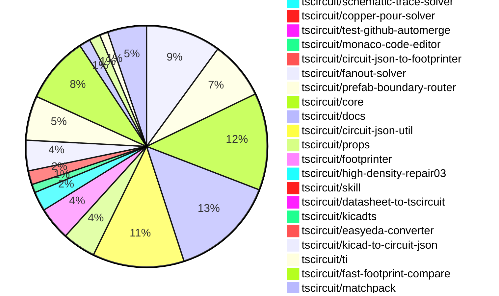

# contribution tracker

[contributions.tscircuit.com](https://contributions.tscircuit.com) ・ [tscircuit.com](https://tscircuit.com) ・ [Contribution Overviews](./contribution-overviews/) ・ [Changelogs](./changelogs/)

Generates weekly contribution overviews for tscircuit contributors. Check out all
the [contribution overviews here](./contribution-overviews/)
You can find AI-generated monthly changelogs in the [changelogs directory](./changelogs/)

- All PRs in the tscircuit org are scanned/summarized via an LLM
- The LLM classifies each Diff/PR as into a set of attributes for scoring
- All the PRs, summaries, and classifications are organized into charts and tables for [the website](https://contributions.tscircuit.com)

> Want to run locally? See the [Development Section](#development)

## Current Week

<!-- START_CURRENT_WEEK -->

# Contribution Overview 2026-07-28

The current week is shown below. There are 3 major sections:

- [Contributor Overview](#contributor-overview)
- [PRs by Repository](#prs-by-repository)
- [PRs by Contributor](#changes-by-contributor)
- [Scoring & Sponsorship Details](/docs/sponsorship-calculation-explanation.md)

## PRs by Repository


```mermaid
pie
    "tscircuit/tscircuit" : 27
    "tscircuit/tscircuit.com" : 21
    "tscircuit/eval" : 35
    "tscircuit/runframe" : 38
    "tscircuit/cli" : 33
    "tscircuit/svg.tscircuit.com" : 12
    "tscircuit/tscircuit-autorouter" : 12
    "tscircuit/schematic-trace-solver" : 7
    "tscircuit/copper-pour-solver" : 2
    "tscircuit/test-github-automerge" : 1
    "tscircuit/monaco-code-editor" : 3
    "tscircuit/circuit-json-to-footprinter" : 5
    "tscircuit/fanout-solver" : 11
    "tscircuit/prefab-boundary-router" : 16
    "tscircuit/core" : 24
    "tscircuit/docs" : 4
    "tscircuit/circuit-json-util" : 1
    "tscircuit/props" : 4
    "tscircuit/footprinter" : 1
    "tscircuit/high-density-repair03" : 2
    "tscircuit/skill" : 1
    "tscircuit/datasheet-to-tscircuit" : 2
    "tscircuit/kicadts" : 1
    "tscircuit/easyeda-converter" : 1
    "tscircuit/kicad-to-circuit-json" : 1
    "tscircuit/ti" : 3
    "tscircuit/fast-footprint-compare" : 1
    "tscircuit/matchpack" : 14
    "tscircuit/circuit-json-to-gerber" : 2
    "tscircuit/length-matching-solver" : 1
    "tscircuit/common" : 2
    "tscircuit/jscad-electronics" : 2
    "tscircuit/sparkfun-boards" : 1
    "tscircuit/laser-deformation-fix" : 1
    "tscircuit/pcbburn.com" : 1
```

## Contributor Overview

| Contributor | 🐳 Major | 🐙 Minor | 🐌 Tiny | Score | ⭐ |
|-------------|---------|---------|---------|-------|-----|
| [seveibar](#seveibar) | 9 | 5 | 9 | 56 | ⭐⭐⭐ |
| [mohan-bee](#mohan-bee) | 6 | 7 | 8 | 51 | ⭐⭐⭐ |
| [imrishabh18](#imrishabh18) | 2 | 2 | 9 | 22 | ⭐⭐ |
| [AnasSarkiz](#AnasSarkiz) | 2 | 3 | 3 | 18 | ⭐⭐ |
| [MustafaMulla29](#MustafaMulla29) | 2 | 0 | 7 | 16 | ⭐⭐ |
| [tscircuitbot](#tscircuitbot) | 0 | 0 | 183 | 14 | ⭐⭐ |
| [0hmX](#0hmX) | 3 | 0 | 1 | 14 | ⭐⭐ |
| [techmannih](#techmannih) | 0 | 1 | 11 | 13.5 | ⭐⭐ |
| [Sang-it](#Sang-it) | 1 | 1 | 0 | 6 | ⭐ |
| [rushabhcodes](#rushabhcodes) | 0 | 1 | 3 | 5 | ⭐ |
| [Hero988](#Hero988) | 0 | 2 | 0 | 4 | ⭐ |
| [GokulPandi-M](#GokulPandi-M) | 0 | 0 | 4 | 4 | ⭐ |
| [astrimid](#astrimid) | 0 | 0 | 4 | 4 | ⭐ |
| [ShiboSoftwareDev](#ShiboSoftwareDev) | 0 | 0 | 1 | 3 |  |
| [itisrohit](#itisrohit) | 0 | 1 | 0 | 2 |  |
| [anil08607](#anil08607) | 0 | 0 | 1 | 1 |  |
| [Abse2001](#Abse2001) | 0 | 0 | 1 | 1 |  |

## Staff Pass Ratio (SPR)

| Contributor | Reviewed PRs | Rejections | Approvals | SPR |
|-------------|--------------|------------|-----------|-----|
| [mohan-bee](#mohan-bee) | 8 | 1 | 8 | 87.5% |
| [AnasSarkiz](#AnasSarkiz) | 4 | 0 | 5 | 100.0% |
| [Hero988](#Hero988) | 3 | 0 | 3 | 100.0% |
| [itisrohit](#itisrohit) | 2 | 1 | 1 | 50.0% |
| [MustafaMulla29](#MustafaMulla29) | 2 | 0 | 2 | 100.0% |
| [0hmX](#0hmX) | 1 | 1 | 0 | 0.0% |
| [KrishnaX12](#KrishnaX12) | 1 | 1 | 0 | 0.0% |
| [rushabhcodes](#rushabhcodes) | 1 | 0 | 1 | 100.0% |
| [techmannih](#techmannih) | 1 | 0 | 1 | 100.0% |

<details>
<summary>mohan-bee SPR PRs (8)</summary>

- [#2902](https://github.com/tscircuit/core/pull/2902) Inflate simple MOSFET
- [#129](https://github.com/tscircuit/circuit-json-to-gerber/pull/129) Fix stretched silkscreen text
- [#184](https://github.com/tscircuit/matchpack/pull/184) Place grounded two-component load chains vertically
- [#178](https://github.com/tscircuit/matchpack/pull/178) Fix schematic testpoint overlaps with collision-aware body and trace search
- [#176](https://github.com/tscircuit/matchpack/pull/176) Offset directly connected passives below main-chip pins in schematic layouts
- [#173](https://github.com/tscircuit/matchpack/pull/173) introduce AlignTestPointsSolver
- [#177](https://github.com/tscircuit/matchpack/pull/177) Place net-only decoupling rows beside direct connections
- [#744](https://github.com/tscircuit/schematic-trace-solver/pull/744) Fix schematic trace routing to form shared same-net load junctions

</details>

<details>
<summary>AnasSarkiz SPR PRs (4)</summary>

- [#759](https://github.com/tscircuit/props/pull/759) Add via-in-pad autorouter opt-in
- [#1793](https://github.com/tscircuit/tscircuit-autorouter/pull/1793) Use optimized DRC engine for autorouting repair
- [#1784](https://github.com/tscircuit/tscircuit-autorouter/pull/1784) Make via-in-pad repair opt-in
- [#34](https://github.com/tscircuit/high-density-repair03/pull/34) Add optimized autorouting DRC engine

</details>

<details>
<summary>Hero988 SPR PRs (3)</summary>

- [#110](https://github.com/tscircuit/circuit-json-util/pull/110) fix: transform pcb_solder_paste and other component-attached elements in transformPCBElement
- [#2916](https://github.com/tscircuit/core/pull/2916) fix: bump @tscircuit/circuit-json-util to 0.0.102 so PCB transforms (grid layout, subcircuit anchoring) move solder paste with pads
- [#351](https://github.com/tscircuit/contribution-tracker/pull/351) fix: paginate GitHub list calls in data-retrieval

</details>

<details>
<summary>itisrohit SPR PRs (2)</summary>

- [#752](https://github.com/tscircuit/footprinter/pull/752) repro: solder jumper bridge trace endpoint lands outside pad boundary (FP precision)
- [#2923](https://github.com/tscircuit/core/pull/2923) repro: solder jumper bridge trace disconnected endpoint false positive

</details>

<details>
<summary>MustafaMulla29 SPR PRs (2)</summary>

- [#2933](https://github.com/tscircuit/core/pull/2933) Fix multi-port traces in the default autorouter
- [#189](https://github.com/tscircuit/matchpack/pull/189) Lay out parallel series branches

</details>

<details>
<summary>0hmX SPR PRs (1)</summary>

- [#88](https://github.com/tscircuit/common/pull/88) Split RP2040 board into centered routable subcircuits

</details>

<details>
<summary>KrishnaX12 SPR PRs (1)</summary>

- [#827](https://github.com/tscircuit/docs/pull/827) fix: use interactive runframe for 3d preview in CircuitPreview

</details>

<details>
<summary>rushabhcodes SPR PRs (1)</summary>

- [#171](https://github.com/tscircuit/circuit-json-to-gltf/pull/171) Fix rectangular PCB holes rendering as solid surfaces in 3D

</details>

<details>
<summary>techmannih SPR PRs (1)</summary>

- [#60](https://github.com/tscircuit/kicadts/pull/60) Add support for legacy KiCad footprint arcs

</details>

> Note: AI evaluates PRs and assigns 1-3 star ratings automatically. 4 and 5 star ratings require manual staff review.

## Review Table

[reviews-received-hover]: ## "Number of reviews received for PRs for this contributor"
[approvals-received-hover]: ## "Number of approvals received for PRs this contributor authored"
[rejections-received-hover]: ## "Number of rejections received for PRs this contributor authored"
[prs-opened-hover]: ## "Number of PRs opened by this contributor"
[issues-created-hover]: ## "Number of issues created by this contributor"

| Contributor | Reviews Received | Approvals Received | Rejections Received | Approvals | Rejections Given | PRs Opened | PRs Merged | Issues Created |
|---|---|---|---|---|---|---|---|---|
| [0hmX](#0hmX) | 2 | 1 | 1 | 2 | 0 | 6 | 4 | 0 |
| [Abse2001](#Abse2001) | 1 | 1 | 0 | 0 | 0 | 2 | 1 | 0 |
| [AnasSarkiz](#AnasSarkiz) | 9 | 8 | 0 | 1 | 0 | 15 | 8 | 0 |
| [anil08607](#anil08607) | 4 | 3 | 0 | 0 | 0 | 3 | 1 | 0 |
| [astrimid](#astrimid) | 1 | 1 | 0 | 0 | 0 | 8 | 4 | 0 |
| [Ayush7614](#Ayush7614) | 0 | 0 | 0 | 0 | 0 | 3 | 0 | 0 |
| [b3417](#b3417) | 0 | 0 | 0 | 0 | 0 | 1 | 0 | 0 |
| [Devesh36](#Devesh36) | 0 | 0 | 0 | 0 | 0 | 1 | 0 | 0 |
| [GokulPandi-M](#GokulPandi-M) | 12 | 7 | 1 | 0 | 0 | 7 | 4 | 0 |
| [Hero988](#Hero988) | 5 | 5 | 0 | 0 | 0 | 5 | 2 | 0 |
| [imrishabh18](#imrishabh18) | 3 | 1 | 0 | 11 | 3 | 17 | 13 | 0 |
| [itisrohit](#itisrohit) | 6 | 1 | 4 | 0 | 0 | 9 | 1 | 0 |
| [koolniko396-coder](#koolniko396-coder) | 0 | 0 | 0 | 0 | 0 | 1 | 0 | 0 |
| [KrishnaX12](#KrishnaX12) | 3 | 0 | 3 | 0 | 0 | 6 | 0 | 0 |
| [minerva32](#minerva32) | 0 | 0 | 0 | 0 | 0 | 1 | 0 | 0 |
| [mohan-bee](#mohan-bee) | 21 | 16 | 1 | 5 | 1 | 27 | 22 | 0 |
| [MustafaMulla29](#MustafaMulla29) | 6 | 5 | 0 | 4 | 1 | 12 | 9 | 0 |
| [rushabhcodes](#rushabhcodes) | 13 | 4 | 0 | 0 | 0 | 6 | 4 | 0 |
| [Sang-it](#Sang-it) | 0 | 0 | 0 | 0 | 0 | 4 | 2 | 0 |
| [seveibar](#seveibar) | 6 | 1 | 0 | 32 | 3 | 42 | 23 | 0 |
| [Shahinn0x](#Shahinn0x) | 1 | 0 | 0 | 0 | 0 | 1 | 0 | 0 |
| [ShiboSoftwareDev](#ShiboSoftwareDev) | 1 | 1 | 0 | 2 | 0 | 12 | 1 | 0 |
| [techmannih](#techmannih) | 4 | 4 | 0 | 2 | 2 | 15 | 12 | 0 |
| [tomlycett](#tomlycett) | 0 | 0 | 0 | 0 | 0 | 1 | 0 | 0 |
| [tscircuitbot](#tscircuitbot) | 0 | 0 | 0 | 0 | 0 | 233 | 183 | 0 |

## Changes by Repository

### [tscircuit/tscircuit](https://github.com/tscircuit/tscircuit)


<details>
<summary>🐌 Tiny Contributions (27)</summary>

| PR # | Impact | Contributor | Description |
|------|--------|-------------|-------------|
| [#4168](https://github.com/tscircuit/tscircuit/pull/4168) | 🐌 Tiny | tscircuitbot | Automated package update |
| [#4167](https://github.com/tscircuit/tscircuit/pull/4167) | 🐌 Tiny | tscircuitbot | Updates the tscircuitcli package from version 0.1.1778 to 0.1.1779 and the tscircuitrunframe package from version 0.0.2315 to 0.0.2316 in package.json |
| [#4166](https://github.com/tscircuit/tscircuit/pull/4166) | 🐌 Tiny | tscircuitbot | Automated package update |
| [#4165](https://github.com/tscircuit/tscircuit/pull/4165) | 🐌 Tiny | tscircuitbot | Automated package update |
| [#4161](https://github.com/tscircuit/tscircuit/pull/4161) | 🐌 Tiny | tscircuitbot | Automated package update |
| [#4160](https://github.com/tscircuit/tscircuit/pull/4160) | 🐌 Tiny | tscircuitbot | Automated package update |
| [#4159](https://github.com/tscircuit/tscircuit/pull/4159) | 🐌 Tiny | tscircuitbot | Automated package update |
| [#4158](https://github.com/tscircuit/tscircuit/pull/4158) | 🐌 Tiny | tscircuitbot | Automated package update |
| [#4154](https://github.com/tscircuit/tscircuit/pull/4154) | 🐌 Tiny | tscircuitbot | Automated package update |
| [#4153](https://github.com/tscircuit/tscircuit/pull/4153) | 🐌 Tiny | tscircuitbot | Automated package update |
| [#4152](https://github.com/tscircuit/tscircuit/pull/4152) | 🐌 Tiny | tscircuitbot | Updates the package version from 0.0.2176 to 0.0.2177 in package.json |
| [#4151](https://github.com/tscircuit/tscircuit/pull/4151) | 🐌 Tiny | tscircuitbot | Automated package update |
| [#4135](https://github.com/tscircuit/tscircuit/pull/4135) | 🐌 Tiny | tscircuitbot | Automated package update to version 0.0.2169 |
| [#4145](https://github.com/tscircuit/tscircuit/pull/4145) | 🐌 Tiny | tscircuitbot | Automated package update |
| [#4150](https://github.com/tscircuit/tscircuit/pull/4150) | 🐌 Tiny | tscircuitbot | Automated package update |
| [#4148](https://github.com/tscircuit/tscircuit/pull/4148) | 🐌 Tiny | tscircuitbot | Automated package update |
| [#4147](https://github.com/tscircuit/tscircuit/pull/4147) | 🐌 Tiny | tscircuitbot | Updates the tscircuitcli package from version 0.1.1771 to 0.1.1772 |
| [#4146](https://github.com/tscircuit/tscircuit/pull/4146) | 🐌 Tiny | tscircuitbot | Automated package update |
| [#4143](https://github.com/tscircuit/tscircuit/pull/4143) | 🐌 Tiny | tscircuitbot | Updates the package version from 0.0.2172 to 0.0.2173 in package.json |
| [#4142](https://github.com/tscircuit/tscircuit/pull/4142) | 🐌 Tiny | tscircuitbot | Automated package update |
| [#4141](https://github.com/tscircuit/tscircuit/pull/4141) | 🐌 Tiny | tscircuitbot | Automated package update |
| [#4140](https://github.com/tscircuit/tscircuit/pull/4140) | 🐌 Tiny | tscircuitbot | Updates the version of several packages in the project, including tscircuitcli, tscircuitcore, tscircuiteval, tscircuitfanout-solver, and tscircuitrunframe. |
| [#4139](https://github.com/tscircuit/tscircuit/pull/4139) | 🐌 Tiny | tscircuitbot | Automated package update |
| [#4138](https://github.com/tscircuit/tscircuit/pull/4138) | 🐌 Tiny | tscircuitbot | Automated package update |
| [#4137](https://github.com/tscircuit/tscircuit/pull/4137) | 🐌 Tiny | tscircuitbot | Automated package update |
| [#4149](https://github.com/tscircuit/tscircuit/pull/4149) | 🐌 Tiny | tscircuitbot | Automated package update |
| [#4136](https://github.com/tscircuit/tscircuit/pull/4136) | 🐌 Tiny | imrishabh18 | Updates core dependencies of the tscircuit package to their latest versions, adds fanout-solver as a direct dependency, and synchronizes related core dependencies. |

</details>

### [tscircuit/tscircuit.com](https://github.com/tscircuit/tscircuit.com)


<details>
<summary>🐌 Tiny Contributions (21)</summary>

| PR # | Impact | Contributor | Description |
|------|--------|-------------|-------------|
| [#4152](https://github.com/tscircuit/tscircuit.com/pull/4152) | 🐌 Tiny | tscircuitbot | Updates the tscircuitrunframe package from version 0.0.2315 to 0.0.2316 |
| [#4149](https://github.com/tscircuit/tscircuit.com/pull/4149) | 🐌 Tiny | tscircuitbot | Automated package update |
| [#4148](https://github.com/tscircuit/tscircuit.com/pull/4148) | 🐌 Tiny | tscircuitbot | Automated package update |
| [#4146](https://github.com/tscircuit/tscircuit.com/pull/4146) | 🐌 Tiny | tscircuitbot | Automated package update |
| [#4145](https://github.com/tscircuit/tscircuit.com/pull/4145) | 🐌 Tiny | tscircuitbot | Updates the tscircuiteval package from version 0.0.1094 to 0.0.1095 |
| [#4144](https://github.com/tscircuit/tscircuit.com/pull/4144) | 🐌 Tiny | tscircuitbot | Automated package update |
| [#4143](https://github.com/tscircuit/tscircuit.com/pull/4143) | 🐌 Tiny | tscircuitbot | Automated package update |
| [#4142](https://github.com/tscircuit/tscircuit.com/pull/4142) | 🐌 Tiny | tscircuitbot | Updates the tscircuitrunframe package from version 0.0.2311 to 0.0.2312 |
| [#4141](https://github.com/tscircuit/tscircuit.com/pull/4141) | 🐌 Tiny | tscircuitbot | Updates the tscircuiteval package from version 0.0.1092 to 0.0.1093 |
| [#4139](https://github.com/tscircuit/tscircuit.com/pull/4139) | 🐌 Tiny | tscircuitbot | Updates the tscircuitrunframe package from version 0.0.2310 to 0.0.2311 |
| [#4138](https://github.com/tscircuit/tscircuit.com/pull/4138) | 🐌 Tiny | tscircuitbot | Updates the tscircuiteval package version from 0.0.1091 to 0.0.1092 in package.json |
| [#4136](https://github.com/tscircuit/tscircuit.com/pull/4136) | 🐌 Tiny | tscircuitbot | Updates the tscircuiteval package from version 0.0.1090 to 0.0.1091 |
| [#4137](https://github.com/tscircuit/tscircuit.com/pull/4137) | 🐌 Tiny | tscircuitbot | Updates the tscircuitrunframe package from version 0.0.2309 to 0.0.2310 |
| [#4135](https://github.com/tscircuit/tscircuit.com/pull/4135) | 🐌 Tiny | tscircuitbot | Automated package update |
| [#4133](https://github.com/tscircuit/tscircuit.com/pull/4133) | 🐌 Tiny | tscircuitbot | Updates the tscircuitrunframe package from version 0.0.2306 to 0.0.2308 |
| [#4129](https://github.com/tscircuit/tscircuit.com/pull/4129) | 🐌 Tiny | tscircuitbot | Updates the tscircuitrunframe package from version 0.0.2305 to 0.0.2306 |
| [#4134](https://github.com/tscircuit/tscircuit.com/pull/4134) | 🐌 Tiny | tscircuitbot | Updates the tscircuiteval package from version 0.0.1088 to 0.0.1090 |
| [#4130](https://github.com/tscircuit/tscircuit.com/pull/4130) | 🐌 Tiny | tscircuitbot | Automated package update |
| [#4128](https://github.com/tscircuit/tscircuit.com/pull/4128) | 🐌 Tiny | tscircuitbot | Updates the tscircuiteval package to version 0.0.1087 in the package.json file |
| [#4127](https://github.com/tscircuit/tscircuit.com/pull/4127) | 🐌 Tiny | astrimid | Updates the versions of runframe and pcb-viewer dependencies in package.json, and moves the debug dependency from devDependencies to runtime dependencies. |
| [#4125](https://github.com/tscircuit/tscircuit.com/pull/4125) | 🐌 Tiny | astrimid | Updates the version of the tscircuit3d-viewer and tscircuitprops dependencies in package.json |

</details>

### [tscircuit/eval](https://github.com/tscircuit/eval)


<details>
<summary>🐌 Tiny Contributions (35)</summary>

| PR # | Impact | Contributor | Description |
|------|--------|-------------|-------------|
| [#3552](https://github.com/tscircuit/eval/pull/3552) | 🐌 Tiny | tscircuitbot | Automated package update |
| [#3551](https://github.com/tscircuit/eval/pull/3551) | 🐌 Tiny | tscircuitbot | Automated package update |
| [#3550](https://github.com/tscircuit/eval/pull/3550) | 🐌 Tiny | tscircuitbot | Updates the package version from 0.0.1094 to 0.0.1095 in package.json |
| [#3549](https://github.com/tscircuit/eval/pull/3549) | 🐌 Tiny | tscircuitbot | Automated package update |
| [#3547](https://github.com/tscircuit/eval/pull/3547) | 🐌 Tiny | tscircuitbot | Automated package update |
| [#3546](https://github.com/tscircuit/eval/pull/3546) | 🐌 Tiny | tscircuitbot | Updates package versions in package.json to the latest compatible versions. |
| [#3544](https://github.com/tscircuit/eval/pull/3544) | 🐌 Tiny | tscircuitbot | Automated package update |
| [#3543](https://github.com/tscircuit/eval/pull/3543) | 🐌 Tiny | tscircuitbot | Updates the version of the tscircuitcore package from 0.0.1546 to 0.0.1547 in package.json |
| [#3541](https://github.com/tscircuit/eval/pull/3541) | 🐌 Tiny | tscircuitbot | Automated package update |
| [#3540](https://github.com/tscircuit/eval/pull/3540) | 🐌 Tiny | tscircuitbot | Updates package dependencies to their latest versions as specified in package.json |
| [#3539](https://github.com/tscircuit/eval/pull/3539) | 🐌 Tiny | tscircuitbot | Automated package update |
| [#3499](https://github.com/tscircuit/eval/pull/3499) | 🐌 Tiny | tscircuitbot | Automated package update |
| [#3518](https://github.com/tscircuit/eval/pull/3518) | 🐌 Tiny | tscircuitbot | Updates the version of the tscircuitcore package from 0.0.1538 to 0.0.1539 in package.json |
| [#3498](https://github.com/tscircuit/eval/pull/3498) | 🐌 Tiny | tscircuitbot | Automated package update |
| [#3536](https://github.com/tscircuit/eval/pull/3536) | 🐌 Tiny | tscircuitbot | Automated package update |
| [#3519](https://github.com/tscircuit/eval/pull/3519) | 🐌 Tiny | tscircuitbot | Automated package update |
| [#3511](https://github.com/tscircuit/eval/pull/3511) | 🐌 Tiny | tscircuitbot | Automated package update |
| [#3508](https://github.com/tscircuit/eval/pull/3508) | 🐌 Tiny | tscircuitbot | Automated package update |
| [#3504](https://github.com/tscircuit/eval/pull/3504) | 🐌 Tiny | tscircuitbot | Updates the versions of the tscircuitcopper-pour-solver and tscircuitcore packages in package.json |
| [#3501](https://github.com/tscircuit/eval/pull/3501) | 🐌 Tiny | tscircuitbot | Automated package update |
| [#3497](https://github.com/tscircuit/eval/pull/3497) | 🐌 Tiny | tscircuitbot | Automated package update |
| [#3496](https://github.com/tscircuit/eval/pull/3496) | 🐌 Tiny | tscircuitbot | Automated package update |
| [#3535](https://github.com/tscircuit/eval/pull/3535) | 🐌 Tiny | tscircuitbot | Automated package update |
| [#3533](https://github.com/tscircuit/eval/pull/3533) | 🐌 Tiny | tscircuitbot | Automated package update |
| [#3532](https://github.com/tscircuit/eval/pull/3532) | 🐌 Tiny | tscircuitbot | Updates the version of the tscircuitcore package from 0.0.1543 to 0.0.1544 in package.json |
| [#3529](https://github.com/tscircuit/eval/pull/3529) | 🐌 Tiny | tscircuitbot | Automated package update |
| [#3528](https://github.com/tscircuit/eval/pull/3528) | 🐌 Tiny | tscircuitbot | Automated package update |
| [#3527](https://github.com/tscircuit/eval/pull/3527) | 🐌 Tiny | tscircuitbot | Automated package update |
| [#3523](https://github.com/tscircuit/eval/pull/3523) | 🐌 Tiny | tscircuitbot | Automated package update |
| [#3516](https://github.com/tscircuit/eval/pull/3516) | 🐌 Tiny | tscircuitbot | Automated package update to version 0.0.1086 |
| [#3515](https://github.com/tscircuit/eval/pull/3515) | 🐌 Tiny | tscircuitbot | Automated package update |
| [#3510](https://github.com/tscircuit/eval/pull/3510) | 🐌 Tiny | tscircuitbot | Automated package update |
| [#3507](https://github.com/tscircuit/eval/pull/3507) | 🐌 Tiny | tscircuitbot | Automated package update |
| [#3505](https://github.com/tscircuit/eval/pull/3505) | 🐌 Tiny | tscircuitbot | Automated package update |
| [#3502](https://github.com/tscircuit/eval/pull/3502) | 🐌 Tiny | tscircuitbot | Automated package update |

</details>

### [tscircuit/runframe](https://github.com/tscircuit/runframe)


<details>
<summary>🐌 Tiny Contributions (38)</summary>

| PR # | Impact | Contributor | Description |
|------|--------|-------------|-------------|
| [#4228](https://github.com/tscircuit/runframe/pull/4228) | 🐌 Tiny | tscircuitbot | Automated package update |
| [#4227](https://github.com/tscircuit/runframe/pull/4227) | 🐌 Tiny | tscircuitbot | Updates the circuit-json-to-gerber package from version 0.0.85 to 0.0.87 |
| [#4226](https://github.com/tscircuit/runframe/pull/4226) | 🐌 Tiny | tscircuitbot | Automated package update |
| [#4225](https://github.com/tscircuit/runframe/pull/4225) | 🐌 Tiny | tscircuitbot | Updates the tscircuiteval package from version 0.0.1095 to 0.0.1096 in the package.json file. |
| [#4224](https://github.com/tscircuit/runframe/pull/4224) | 🐌 Tiny | tscircuitbot | Automated package update |
| [#4223](https://github.com/tscircuit/runframe/pull/4223) | 🐌 Tiny | tscircuitbot | Updates the tscircuiteval package from version 0.0.1094 to 0.0.1095 in the project dependencies. |
| [#4222](https://github.com/tscircuit/runframe/pull/4222) | 🐌 Tiny | tscircuitbot | Automated package update |
| [#4221](https://github.com/tscircuit/runframe/pull/4221) | 🐌 Tiny | tscircuitbot | Updates the tscircuiteval package from version 0.0.1093 to 0.0.1094 in the package.json file. |
| [#4220](https://github.com/tscircuit/runframe/pull/4220) | 🐌 Tiny | tscircuitbot | Automated package update |
| [#4219](https://github.com/tscircuit/runframe/pull/4219) | 🐌 Tiny | tscircuitbot | Updates the tscircuiteval package from version 0.0.1092 to 0.0.1093 in the package.json file. |
| [#4218](https://github.com/tscircuit/runframe/pull/4218) | 🐌 Tiny | tscircuitbot | Automated package update |
| [#4217](https://github.com/tscircuit/runframe/pull/4217) | 🐌 Tiny | tscircuitbot | Updates the tscircuiteval package from version 0.0.1091 to 0.0.1092 in the package.json file. |
| [#4207](https://github.com/tscircuit/runframe/pull/4207) | 🐌 Tiny | tscircuitbot | Automated package update |
| [#4208](https://github.com/tscircuit/runframe/pull/4208) | 🐌 Tiny | tscircuitbot | Updates the tscircuiteval package from version 0.0.1087 to 0.0.1088 in the package.json file. |
| [#4203](https://github.com/tscircuit/runframe/pull/4203) | 🐌 Tiny | tscircuitbot | Updates the tscircuiteval package from version 0.0.1085 to 0.0.1086 in the package.json file. |
| [#4199](https://github.com/tscircuit/runframe/pull/4199) | 🐌 Tiny | tscircuitbot | Updates the package version from 0.0.2302 to 0.0.2303 in package.json |
| [#4196](https://github.com/tscircuit/runframe/pull/4196) | 🐌 Tiny | tscircuitbot | Updates the tscircuiteval package from version 0.0.1083 to 0.0.1084 in the package.json file. |
| [#4194](https://github.com/tscircuit/runframe/pull/4194) | 🐌 Tiny | tscircuitbot | Updates the package version from 0.0.2300 to 0.0.2301 in package.json |
| [#4193](https://github.com/tscircuit/runframe/pull/4193) | 🐌 Tiny | tscircuitbot | Updates the tscircuiteval package from version 0.0.1082 to 0.0.1083 in the package.json file. |
| [#4216](https://github.com/tscircuit/runframe/pull/4216) | 🐌 Tiny | tscircuitbot | Automated package update |
| [#4215](https://github.com/tscircuit/runframe/pull/4215) | 🐌 Tiny | tscircuitbot | Updates the tscircuiteval package from version 0.0.1090 to 0.0.1091 in the package.json file. |
| [#4214](https://github.com/tscircuit/runframe/pull/4214) | 🐌 Tiny | tscircuitbot | Automated package update |
| [#4213](https://github.com/tscircuit/runframe/pull/4213) | 🐌 Tiny | tscircuitbot | Updates the tscircuiteval package from version 0.0.1089 to 0.0.1090 in the package.json file. |
| [#4211](https://github.com/tscircuit/runframe/pull/4211) | 🐌 Tiny | tscircuitbot | Automated package update |
| [#4210](https://github.com/tscircuit/runframe/pull/4210) | 🐌 Tiny | tscircuitbot | Updates the tscircuiteval package from version 0.0.1088 to 0.0.1089 in the package.json file. |
| [#4204](https://github.com/tscircuit/runframe/pull/4204) | 🐌 Tiny | tscircuitbot | Automated package update |
| [#4202](https://github.com/tscircuit/runframe/pull/4202) | 🐌 Tiny | tscircuitbot | Automated package update |
| [#4198](https://github.com/tscircuit/runframe/pull/4198) | 🐌 Tiny | tscircuitbot | Updates the tscircuiteval package from version 0.0.1084 to 0.0.1085 |
| [#4197](https://github.com/tscircuit/runframe/pull/4197) | 🐌 Tiny | tscircuitbot | Updates the package version from v0.0.2301 to v0.0.2302 in package.json |
| [#4191](https://github.com/tscircuit/runframe/pull/4191) | 🐌 Tiny | tscircuitbot | Updates the tscircuiteval package to version 0.0.1082 in the package.json file. |
| [#4190](https://github.com/tscircuit/runframe/pull/4190) | 🐌 Tiny | tscircuitbot | Automated package update |
| [#4188](https://github.com/tscircuit/runframe/pull/4188) | 🐌 Tiny | tscircuitbot | Automated package update |
| [#4206](https://github.com/tscircuit/runframe/pull/4206) | 🐌 Tiny | tscircuitbot | Updates the tscircuiteval package from version 0.0.1086 to 0.0.1087 in the project dependencies. |
| [#4192](https://github.com/tscircuit/runframe/pull/4192) | 🐌 Tiny | tscircuitbot | Automated package update |
| [#4189](https://github.com/tscircuit/runframe/pull/4189) | 🐌 Tiny | tscircuitbot | Updates the tscircuiteval package from version 0.0.1080 to 0.0.1081 in the package.json file. |
| [#4187](https://github.com/tscircuit/runframe/pull/4187) | 🐌 Tiny | tscircuitbot | Updates the tscircuiteval package from version 0.0.1079 to 0.0.1080 in the project dependencies. |
| [#4200](https://github.com/tscircuit/runframe/pull/4200) | 🐌 Tiny | astrimid | Adds debug as a runtime dependency to ensure proper functionality and checks for potential issues with duplicate packages. |
| [#4201](https://github.com/tscircuit/runframe/pull/4201) | 🐌 Tiny | astrimid | Fixes the bun install command to use the frozen lockfile option, ensuring consistent dependency installation. |

</details>

### [tscircuit/cli](https://github.com/tscircuit/cli)


<details>
<summary>🐌 Tiny Contributions (33)</summary>

| PR # | Impact | Contributor | Description |
|------|--------|-------------|-------------|
| [#3927](https://github.com/tscircuit/cli/pull/3927) | 🐌 Tiny | tscircuitbot | Automated package update |
| [#3926](https://github.com/tscircuit/cli/pull/3926) | 🐌 Tiny | tscircuitbot | Updates the tscircuitrunframe package from version 0.0.2315 to 0.0.2316 |
| [#3925](https://github.com/tscircuit/cli/pull/3925) | 🐌 Tiny | tscircuitbot | Automated package update |
| [#3924](https://github.com/tscircuit/cli/pull/3924) | 🐌 Tiny | tscircuitbot | Updates the tscircuitrunframe package from version 0.0.2314 to 0.0.2315 |
| [#3923](https://github.com/tscircuit/cli/pull/3923) | 🐌 Tiny | tscircuitbot | Updates the package version from 0.1.1776 to 0.1.1777 in package.json |
| [#3922](https://github.com/tscircuit/cli/pull/3922) | 🐌 Tiny | tscircuitbot | Updates the tscircuitrunframe package from version 0.0.2313 to 0.0.2314 |
| [#3921](https://github.com/tscircuit/cli/pull/3921) | 🐌 Tiny | tscircuitbot | Automated package update |
| [#3920](https://github.com/tscircuit/cli/pull/3920) | 🐌 Tiny | tscircuitbot | Updates the tscircuitrunframe package from version 0.0.2312 to 0.0.2313 |
| [#3919](https://github.com/tscircuit/cli/pull/3919) | 🐌 Tiny | tscircuitbot | Automated package update |
| [#3918](https://github.com/tscircuit/cli/pull/3918) | 🐌 Tiny | tscircuitbot | Updates the tscircuitrunframe package from version 0.0.2311 to 0.0.2312 |
| [#3917](https://github.com/tscircuit/cli/pull/3917) | 🐌 Tiny | tscircuitbot | Automated package update |
| [#3916](https://github.com/tscircuit/cli/pull/3916) | 🐌 Tiny | tscircuitbot | Updates the tscircuitrunframe package from version 0.0.2310 to 0.0.2311 |
| [#3914](https://github.com/tscircuit/cli/pull/3914) | 🐌 Tiny | tscircuitbot | Updates the tscircuitrunframe package from version 0.0.2308 to 0.0.2310 in the package.json file. |
| [#3915](https://github.com/tscircuit/cli/pull/3915) | 🐌 Tiny | tscircuitbot | Automated package update |
| [#3908](https://github.com/tscircuit/cli/pull/3908) | 🐌 Tiny | tscircuitbot | Automated package update |
| [#3907](https://github.com/tscircuit/cli/pull/3907) | 🐌 Tiny | tscircuitbot | Updates the tscircuitrunframe package from version 0.0.2305 to 0.0.2306 |
| [#3904](https://github.com/tscircuit/cli/pull/3904) | 🐌 Tiny | tscircuitbot | Automated package update |
| [#3898](https://github.com/tscircuit/cli/pull/3898) | 🐌 Tiny | tscircuitbot | Automated package update |
| [#3896](https://github.com/tscircuit/cli/pull/3896) | 🐌 Tiny | tscircuitbot | Automated package update |
| [#3895](https://github.com/tscircuit/cli/pull/3895) | 🐌 Tiny | tscircuitbot | Updates the tscircuitrunframe package from version 0.0.2299 to 0.0.2300 |
| [#3912](https://github.com/tscircuit/cli/pull/3912) | 🐌 Tiny | tscircuitbot | Automated package update |
| [#3910](https://github.com/tscircuit/cli/pull/3910) | 🐌 Tiny | tscircuitbot | Updates the tscircuitrunframe package from version 0.0.2306 to 0.0.2308 |
| [#3906](https://github.com/tscircuit/cli/pull/3906) | 🐌 Tiny | tscircuitbot | Automated package update |
| [#3905](https://github.com/tscircuit/cli/pull/3905) | 🐌 Tiny | tscircuitbot | Updates the tscircuitrunframe package from version 0.0.2304 to 0.0.2305 |
| [#3903](https://github.com/tscircuit/cli/pull/3903) | 🐌 Tiny | tscircuitbot | Updates the tscircuitrunframe package from version 0.0.2303 to 0.0.2304 in the package.json file. |
| [#3902](https://github.com/tscircuit/cli/pull/3902) | 🐌 Tiny | tscircuitbot | Automated package update |
| [#3901](https://github.com/tscircuit/cli/pull/3901) | 🐌 Tiny | tscircuitbot | Updates the tscircuitrunframe package from version 0.0.2302 to 0.0.2303 |
| [#3900](https://github.com/tscircuit/cli/pull/3900) | 🐌 Tiny | tscircuitbot | Automated package update |
| [#3899](https://github.com/tscircuit/cli/pull/3899) | 🐌 Tiny | tscircuitbot | Updates the tscircuitrunframe package from version 0.0.2301 to 0.0.2302 |
| [#3897](https://github.com/tscircuit/cli/pull/3897) | 🐌 Tiny | tscircuitbot | Updates the tscircuitrunframe package from version 0.0.2300 to 0.0.2301 |
| [#3893](https://github.com/tscircuit/cli/pull/3893) | 🐌 Tiny | tscircuitbot | Updates the tscircuitrunframe package from version 0.0.2297 to 0.0.2299 |
| [#3911](https://github.com/tscircuit/cli/pull/3911) | 🐌 Tiny | tscircuitbot | Automated package update |
| [#3886](https://github.com/tscircuit/cli/pull/3886) | 🐌 Tiny | techmannih | Replace the generic KiCad symbol and footprint with BQ25186DLHR assets Add the matching WSON-10 STEP model Attach the imported STEP model to the example component |

</details>

### [tscircuit/svg.tscircuit.com](https://github.com/tscircuit/svg.tscircuit.com)


<details>
<summary>🐌 Tiny Contributions (12)</summary>

| PR # | Impact | Contributor | Description |
|------|--------|-------------|-------------|
| [#1916](https://github.com/tscircuit/svg.tscircuit.com/pull/1916) | 🐌 Tiny | tscircuitbot | Updates the tscircuit package version from 0.0.2180 to 0.0.2182 in package.json |
| [#1915](https://github.com/tscircuit/svg.tscircuit.com/pull/1915) | 🐌 Tiny | tscircuitbot | Updates the tscircuit package version from 0.0.2179 to 0.0.2180 in package.json |
| [#1914](https://github.com/tscircuit/svg.tscircuit.com/pull/1914) | 🐌 Tiny | tscircuitbot | Updates the tscircuit package version from 0.0.2178 to 0.0.2179 in package.json |
| [#1913](https://github.com/tscircuit/svg.tscircuit.com/pull/1913) | 🐌 Tiny | tscircuitbot | Updates the tscircuit package version from 0.0.2177 to 0.0.2178 in package.json |
| [#1912](https://github.com/tscircuit/svg.tscircuit.com/pull/1912) | 🐌 Tiny | tscircuitbot | Updates the tscircuit package version from 0.0.2176 to 0.0.2177 in package.json |
| [#1905](https://github.com/tscircuit/svg.tscircuit.com/pull/1905) | 🐌 Tiny | tscircuitbot | Updates the tscircuit package version from 0.0.2168 to 0.0.2169 in package.json |
| [#1911](https://github.com/tscircuit/svg.tscircuit.com/pull/1911) | 🐌 Tiny | tscircuitbot | Updates the tscircuit package version from 0.0.2174 to 0.0.2176 in package.json |
| [#1910](https://github.com/tscircuit/svg.tscircuit.com/pull/1910) | 🐌 Tiny | tscircuitbot | Updates the tscircuit package version from 0.0.2173 to 0.0.2174 in package.json |
| [#1909](https://github.com/tscircuit/svg.tscircuit.com/pull/1909) | 🐌 Tiny | tscircuitbot | Updates the tscircuit package version from 0.0.2172 to 0.0.2173 in package.json |
| [#1908](https://github.com/tscircuit/svg.tscircuit.com/pull/1908) | 🐌 Tiny | tscircuitbot | Updates the tscircuit package version from 0.0.2171 to 0.0.2172 in package.json |
| [#1907](https://github.com/tscircuit/svg.tscircuit.com/pull/1907) | 🐌 Tiny | tscircuitbot | Updates the tscircuit package version from 0.0.2170 to 0.0.2171 in package.json |
| [#1906](https://github.com/tscircuit/svg.tscircuit.com/pull/1906) | 🐌 Tiny | tscircuitbot | Automated package update |

</details>

### [tscircuit/tscircuit-autorouter](https://github.com/tscircuit/tscircuit-autorouter)

| PR # | Impact | Rating | Contributor | Description |
|------|--------|--------|-------------|-------------|
| [#1780](https://github.com/tscircuit/tscircuit-autorouter/pull/1780) | 🐳 Major | ⭐⭐⭐ | seveibar | Add an optional otherHdRoutes input to TraceSimplificationSolver to allow immutable routes to participate in collision checks without being modified, enabling better handling of preloaded traces during simplification. |
| [#1793](https://github.com/tscircuit/tscircuit-autorouter/pull/1793) | 🐳 Major | ⭐⭐⭐ | AnasSarkiz | Updates Pipeline 7 to use an optimized DRC engine for autorouting repair, improving evaluation speed and efficiency by reusing DRC state and focusing on changing route geometry. |
| [#1791](https://github.com/tscircuit/tscircuit-autorouter/pull/1791) | 🐳 Major | ⭐⭐⭐ | 0hmX | Summary generate the benchmark dashboard as HTML, CSS, JS, a compact data manifest, and per-run JSON files publish all dashboard assets to tscircuitautorouter-benchmark-dashboard keep full reports lazy-loaded so no individual Git blob exceeds GitHubs 100 MB limit  Validation bun test testsbenchmark-history.test.ts --timeout 9999999 bun run build |
| [#1788](https://github.com/tscircuit/tscircuit-autorouter/pull/1788) | 🐳 Major | ⭐⭐⭐ | 0hmX | Integrates the PostProcessingSolver as the final stage in Pipeline 7, resolving differential-pair names to final point-pair HD routes and visualizing the results while managing iteration budgets. |
| [#1784](https://github.com/tscircuit/tscircuit-autorouter/pull/1784) | 🐙 Minor | ⭐⭐ | AnasSarkiz | Adds an optional allowViaInPad parameter to the autorouters SimpleRouteJson type, allowing users to opt-in for via-in-pad repairs during autorouting, with default behavior set to false. |

<details>
<summary>🐌 Tiny Contributions (7)</summary>

| PR # | Impact | Contributor | Description |
|------|--------|-------------|-------------|
| [#1796](https://github.com/tscircuit/tscircuit-autorouter/pull/1796) | 🐌 Tiny | tscircuitbot | Automated package update |
| [#1794](https://github.com/tscircuit/tscircuit-autorouter/pull/1794) | 🐌 Tiny | tscircuitbot | Automated package update |
| [#1792](https://github.com/tscircuit/tscircuit-autorouter/pull/1792) | 🐌 Tiny | tscircuitbot | Automated package update |
| [#1790](https://github.com/tscircuit/tscircuit-autorouter/pull/1790) | 🐌 Tiny | tscircuitbot | Automated package update |
| [#1787](https://github.com/tscircuit/tscircuit-autorouter/pull/1787) | 🐌 Tiny | tscircuitbot | Automated package update |
| [#1781](https://github.com/tscircuit/tscircuit-autorouter/pull/1781) | 🐌 Tiny | tscircuitbot | Automated package update |
| [#1786](https://github.com/tscircuit/tscircuit-autorouter/pull/1786) | 🐌 Tiny | imrishabh18 | What changed downloaded autorouting bug report dfeaafbb-a176-4a5f-90a5-ac01f3842801 as bugreport78-dfeaaf added the generated Cosmos debugger fixture added a focused pipeline snapshot test with a 600-second timeout for slower CI runners captured the current routed visualization as an SVG snapshot Source report: https:api.tscircuit.comautoroutingbug_reportsview?autorouting_bug_report_iddfeaafbb-a176-4a5f-90a5-ac01f3842801  Why This preserves the reported routing input and current solver output in the repository so the behavior can be reproduced, inspected, and used to validate a future fix. The repro has taken between 163 and 233 seconds locally, so its explicit timeout leaves sufficient headroom for CI. This PR is a reproduction fixture only; it does not claim or implement a root-cause fix.  Validation BUN_UPDATE_SNAPSHOTS1 bun test testsbugsbugreport78-dfeaaf.test.ts --timeout 9999999 bun test testsbugsbugreport78-dfeaaf.test.ts The clean verification run passed using the tests own timeout: 1 test, 0 failures. |

</details>

### [tscircuit/schematic-trace-solver](https://github.com/tscircuit/schematic-trace-solver)

| PR # | Impact | Rating | Contributor | Description |
|------|--------|--------|-------------|-------------|
| [#744](https://github.com/tscircuit/schematic-trace-solver/pull/744) | 🐳 Major | ⭐⭐⭐ | mohan-bee | Fixes schematic trace routing to create shared load junctions for traces connected to the same net, improving readability and organization of the schematic layout. |
| [#736](https://github.com/tscircuit/schematic-trace-solver/pull/736) | 🐳 Major | ⭐⭐⭐ | mohan-bee | Fixes the issue where explicit labeled connections to single-pin peripherals disappear when their distance exceeds the maximum allowed distance during routing attempts. |
| [#741](https://github.com/tscircuit/schematic-trace-solver/pull/741) | 🐳 Major | ⭐⭐⭐ | MustafaMulla29 | Fixes routing behavior by treating sub-minimum gaps between a component and its attached text as closed routing channels, ensuring accurate trace routing. |

<details>
<summary>🐌 Tiny Contributions (4)</summary>

| PR # | Impact | Contributor | Description |
|------|--------|-------------|-------------|
| [#743](https://github.com/tscircuit/schematic-trace-solver/pull/743) | 🐌 Tiny | tscircuitbot | Adds a snapshot-only regression test and debugger page for the attached JSON solver input. |
| [#735](https://github.com/tscircuit/schematic-trace-solver/pull/735) | 🐌 Tiny | mohan-bee | Adds a snapshot-only regression test and debugger page for the captured schematic trace solver input. |
| [#738](https://github.com/tscircuit/schematic-trace-solver/pull/738) | 🐌 Tiny | MustafaMulla29 | Adds reproduction coverage for the VCC rail label fallback issue in the Core repro48 solver without changing solver behavior. |
| [#740](https://github.com/tscircuit/schematic-trace-solver/pull/740) | 🐌 Tiny | MustafaMulla29 | Adds a schematic trace solver reproduction for a TYPE_C_16PIN_2MD chip with a direct connection between pin 4 and pin 5, preserving manufacturer-part-number and reference-designator text boxes. |

</details>

### [tscircuit/copper-pour-solver](https://github.com/tscircuit/copper-pour-solver)

| PR # | Impact | Rating | Contributor | Description |
|------|--------|--------|-------------|-------------|
| [#69](https://github.com/tscircuit/copper-pour-solver/pull/69) | 🐙 Minor | ⭐⭐ | imrishabh18 | Fixes copper pour issues by converting pill-shaped plated holes into pill obstacles, ensuring proper clearance and eliminating shorts in the Gerber output. |

<details>
<summary>🐌 Tiny Contributions (1)</summary>

| PR # | Impact | Contributor | Description |
|------|--------|-------------|-------------|
| [#70](https://github.com/tscircuit/copper-pour-solver/pull/70) | 🐌 Tiny | tscircuitbot | Automated package update |

</details>

### [tscircuit/test-github-automerge](https://github.com/tscircuit/test-github-automerge)


<details>
<summary>🐌 Tiny Contributions (1)</summary>

| PR # | Impact | Contributor | Description |
|------|--------|-------------|-------------|
| [#56](https://github.com/tscircuit/test-github-automerge/pull/56) | 🐌 Tiny | tscircuitbot | Automated package update |

</details>

### [tscircuit/monaco-code-editor](https://github.com/tscircuit/monaco-code-editor)

| PR # | Impact | Rating | Contributor | Description |
|------|--------|--------|-------------|-------------|
| [#59](https://github.com/tscircuit/monaco-code-editor/pull/59) | 🐙 Minor | ⭐⭐ | rushabhcodes | Fixes type-check errors related to React 18 refs by implementing version-independent structural ref contracts for keyboard navigation and editor attachment. |

<details>
<summary>🐌 Tiny Contributions (2)</summary>

| PR # | Impact | Contributor | Description |
|------|--------|-------------|-------------|
| [#58](https://github.com/tscircuit/monaco-code-editor/pull/58) | 🐌 Tiny | tscircuitbot | Updates the package version from 0.0.19 to 0.0.20 in package.json |
| [#57](https://github.com/tscircuit/monaco-code-editor/pull/57) | 🐌 Tiny | rushabhcodes | Moves TypeScript from runtime dependencies to development dependencies and declares it as a peer dependency to avoid bundle size increase and mismatched compiler behavior. |

</details>

### [tscircuit/circuit-json-to-footprinter](https://github.com/tscircuit/circuit-json-to-footprinter)

| PR # | Impact | Rating | Contributor | Description |
|------|--------|--------|-------------|-------------|
| [#66](https://github.com/tscircuit/circuit-json-to-footprinter/pull/66) | 🐳 Major | ⭐⭐⭐ | seveibar | Allows optimized pitch parameters to use 0.005 mm increments while retaining the existing 0.01 mm optimizer grid for body and pad dimensions, and adds a regression test for a specific pitch. |
| [#67](https://github.com/tscircuit/circuit-json-to-footprinter/pull/67) | 🐙 Minor | ⭐⭐ | seveibar | Recognizes and derives dimensions for SMD pushbutton footprints, improving accuracy in footprint generation. |

<details>
<summary>🐌 Tiny Contributions (3)</summary>

| PR # | Impact | Contributor | Description |
|------|--------|-------------|-------------|
| [#68](https://github.com/tscircuit/circuit-json-to-footprinter/pull/68) | 🐌 Tiny | tscircuitbot | Automated package update |
| [#69](https://github.com/tscircuit/circuit-json-to-footprinter/pull/69) | 🐌 Tiny | seveibar | Adds support for offset thermal pads in electronic component footprints, improving accuracy in footprint recovery for PDFN power packages. |
| [#71](https://github.com/tscircuit/circuit-json-to-footprinter/pull/71) | 🐌 Tiny | Abse2001 | Adds functionality to discover and generate footprints for generic SOT-223 and DFN-4 corner-pad packages in the JLCPCB footprint discovery process. |

</details>

### [tscircuit/fanout-solver](https://github.com/tscircuit/fanout-solver)

| PR # | Impact | Rating | Contributor | Description |
|------|--------|--------|-------------|-------------|
| [#9](https://github.com/tscircuit/fanout-solver/pull/9) | 🐳 Major | ⭐⭐⭐ | imrishabh18 | Routes all 132 connections of the clad1 RP2040 on a single top copper layer using an adaptive exit pass after push-and-shove fails, addressing clearance conflicts and improving routing efficiency. |
| [#20](https://github.com/tscircuit/fanout-solver/pull/20) | 🐳 Major | ⭐⭐⭐ | imrishabh18 | Allows the adaptive single-layer fallback to run when availableCornersAndSides is configured, exposing adaptive flow sinks only on permitted directed boundary edges and retaining the nearest compatible boundary-region preference for adaptively selected exits. |
| [#13](https://github.com/tscircuit/fanout-solver/pull/13) | 🐳 Major | ⭐⭐⭐ | seveibar | Adds availableCornersAndSides as a solver-wide constraint for boundary fanouts, supporting directed regions and constraining bus directions and preferred exits to the requested boundary regions. |

<details>
<summary>🐌 Tiny Contributions (8)</summary>

| PR # | Impact | Contributor | Description |
|------|--------|-------------|-------------|
| [#18](https://github.com/tscircuit/fanout-solver/pull/18) | 🐌 Tiny | tscircuitbot | Automated package update |
| [#12](https://github.com/tscircuit/fanout-solver/pull/12) | 🐌 Tiny | tscircuitbot | Automated package update |
| [#21](https://github.com/tscircuit/fanout-solver/pull/21) | 🐌 Tiny | tscircuitbot | Automated package update |
| [#14](https://github.com/tscircuit/fanout-solver/pull/14) | 🐌 Tiny | tscircuitbot | Automated package update |
| [#10](https://github.com/tscircuit/fanout-solver/pull/10) | 🐌 Tiny | tscircuitbot | Automated package update |
| [#11](https://github.com/tscircuit/fanout-solver/pull/11) | 🐌 Tiny | imrishabh18 | This pull request changes the footprint of various components in the PCB design from 0402 to 0603. This change involves updating the dimensions and positions of components in the JSON configuration file for the PCB layout. |
| [#17](https://github.com/tscircuit/fanout-solver/pull/17) | 🐌 Tiny | seveibar | Fixes the failed npm release by declaring public access for the scoped package, allowing the successful publication of version 0.0.10 after a previous failure due to private access settings. |
| [#16](https://github.com/tscircuit/fanout-solver/pull/16) | 🐌 Tiny | seveibar | Moves tscircuitfanout-solver from GitHub Packages to the public npm registry using the standard bun-pver-release workflow, resolving dependency issues for consumers. |

</details>

### [tscircuit/prefab-boundary-router](https://github.com/tscircuit/prefab-boundary-router)

| PR # | Impact | Rating | Contributor | Description |
|------|--------|--------|-------------|-------------|
| [#5](https://github.com/tscircuit/prefab-boundary-router/pull/5) | 🐳 Major | ⭐⭐⭐ | seveibar | Summary add 20 deterministic random samples matching the production-scale shape: 120 breakout ports, 80 nets, and 80 via ports model VCC and GND as high-fanout nets with 12 breakout ports each include all 78 signal nets, with 18 randomly selected signals receiving a second port and 60 remaining singleton signals randomize boundary dimensions, port locations, signal duplication, net placement, and reciprocal via pairings per sample keep the existing size-sweep dataset and add separate production generation, benchmark, JSON report, and Markdown report paths validate exact counts, unique sample seeds, reciprocal via mappings, allowed boundary sides, net fanout, and 40 generated route demands per case  Net distribution The 120 ports across 80 nets are allocated as: VCC: 12 ports GND: 12 ports 18 signal nets: 2 ports each 60 signal nets: 1 port each VCC and GND each decompose into an 11-edge tree; the two-port signals add 18 routes. Singleton signals add no route demand, producing 40 demands per sample.  Baseline results Measured with Bun 1.3.2 on macOS arm64 after one warm-up run:  Via ports  Breakout ports  Nets  Samples solved  Successful p50p95  Attempt p50p95   ---:  ---:  ---:  ---:  ---:  ---:   80  120  80  020 (0)  na  120.10145.41 ms  All 20 samples reached the configured total rip limit of 100. The failed attempts remain included in the attempt-time percentiles.  Verification bun run format:check bun run lint bun run build bun run test  9 tests, 16,040 assertions bun run benchmark:production-stress |
| [#7](https://github.com/tscircuit/prefab-boundary-router/pull/7) | 🐳 Major | ⭐⭐⭐ | seveibar | Summary make every production-shaped sample deterministically known-feasible instead of independently randomizing via pairings and net endpoints include a 40-route, non-intersecting certificate in each case for dataset validation; the benchmark solver still receives only the routing problem route constrained two-terminal nets before merge-friendly high-fanout VCCGND trees use production-scale negotiated-routing limits (ripCost: 60, maxRipsPerRoute: 24, maxTotalRips: 300) enforce a 50 minimum solve rate in the benchmark runner and return a nonzero exit code on regression update generated reports and documentation with the new result  Why The v1 corpus paired vias independently from net endpoints, so benchmark failures mixed solver quality with potentially impossible random topologies. Profiling also showed that routing the 22 VCCGND tree edges first caused avoidable preemption of constrained signal routes. The v2 generator preserves the 120-breakout-port, 80-net, 80-via production profile while constructing each random sample from a valid non-intersecting route plan. Tests verify that every certificate uses real visibility-graph edges, reciprocal via jumps, all 80 via ports exactly once, and valid cross-net geometry.  Benchmark Measured with Bun 1.3.2 on macOS arm64 after one warm-up run:  Via ports  Breakout ports  Nets  Samples solved  Successful p50p95  Attempt p50p95   ---:  ---:  ---:  ---:  ---:  ---:   80  120  80  1520 (75)  145.26480.20 ms  153.26777.04 ms  The benchmark now fails below the required 50 solve rate.  Verification bun run format:check bun run lint bun run build bun run test  9 tests, 87,482 assertions bun run benchmark:production-stress  1520 solved, gate passed |
| [#9](https://github.com/tscircuit/prefab-boundary-router/pull/9) | 🐳 Major | ⭐⭐⭐ | seveibar | Raise the deterministic production corpus solve rate from 75 to 100 and add a browsable 20-sample GenericSolverDebugger Cosmos page with benchmark metadata. |

<details>
<summary>🐌 Tiny Contributions (13)</summary>

| PR # | Impact | Contributor | Description |
|------|--------|-------------|-------------|
| [#1](https://github.com/tscircuit/prefab-boundary-router/pull/1) | 🐌 Tiny | tscircuitbot | Automated package update |
| [#8](https://github.com/tscircuit/prefab-boundary-router/pull/8) | 🐌 Tiny | tscircuitbot | Automated package update |
| [#2](https://github.com/tscircuit/prefab-boundary-router/pull/2) | 🐌 Tiny | tscircuitbot | Automated package update |
| [#23](https://github.com/tscircuit/prefab-boundary-router/pull/23) | 🐌 Tiny | tscircuitbot | Automated package update |
| [#19](https://github.com/tscircuit/prefab-boundary-router/pull/19) | 🐌 Tiny | tscircuitbot | Automated package update |
| [#14](https://github.com/tscircuit/prefab-boundary-router/pull/14) | 🐌 Tiny | tscircuitbot | Automated package update |
| [#6](https://github.com/tscircuit/prefab-boundary-router/pull/6) | 🐌 Tiny | tscircuitbot | Automated package update |
| [#11](https://github.com/tscircuit/prefab-boundary-router/pull/11) | 🐌 Tiny | imrishabh18 | Adds a regression test for the Clad1 RP2040 routing problem after the fanout stage, preserving breakout endpoints and logical nets, while intentionally failing to highlight routing limitations. |
| [#17](https://github.com/tscircuit/prefab-boundary-router/pull/17) | 🐌 Tiny | imrishabh18 | Adds a separate no-testpoint post-fanout JSON problem, regression test, and Cosmos fixture for the Clad1 RP2040, while keeping the existing testpoint fixture unchanged. |
| [#13](https://github.com/tscircuit/prefab-boundary-router/pull/13) | 🐌 Tiny | imrishabh18 | Adds a Cosmos fixture for the Clad1 RP2040 post-fanout reproduction, enabling visual debugging of boundary problems with the GenericSolverDebugger. |
| [#3](https://github.com/tscircuit/prefab-boundary-router/pull/3) | 🐌 Tiny | seveibar | Summary add a checked-in, deterministic dataset of 20 randomly generated boundary-routing problems scale both dimensions across five buckets: 208, 4016, 6024, 8032, and 10040 viabreakout ports increase routing demand from 4 to 20 two-terminal nets while preserving random reciprocal via pairings keep via and breakout ports on the top, right, and bottom boundaries add dataset regeneration, benchmark scripts, machine-readableMarkdown results, and structuraldeterminism tests document the benchmark workflow and current results  Results Measured with Bun 1.3.2 on macOS arm64 after one warm-up run. Successful-solve percentiles only include solved cases; attempt percentiles include every case.  Via ports  Breakout ports  Solved  Solved p50 (ms)  Solved p95 (ms)  Attempt p50 (ms)  Attempt p95 (ms)   ---:  ---:  ---:  ---:  ---:  ---:  ---:   20  8  34 (75)  0.88  1.82  1.40  5.12   40  16  24 (50)  6.41  8.52  11.49  22.35   60  24  04 (0)  na  na  102.65  188.31   80  32  04 (0)  na  na  217.69  944.56   100  40  04 (0)  na  na  360.17  821.48   Overall  840  520 (25)  1.92  7.81  102.65  910.16  The corpus bounds each search at four blockers and 20,000 A states, with eight rips per route and 100 total rips. At 24 or more breakout ports, sampled cases exhaust blocker or rip limits; their wall-clock costs remain included in attempt percentiles.  Verification bun run format:check bun run lint bun run build bun run test  7 tests, 6,196 assertions bun run benchmark:stress |
| [#22](https://github.com/tscircuit/prefab-boundary-router/pull/22) | 🐌 Tiny | seveibar | Captures the current Clad1 RP2040 post-fanout handoff with every net enabled for prefab-boundary routing and adds a focused expected-failing regression covering all breakout endpoints, nets, and route demands. |
| [#15](https://github.com/tscircuit/prefab-boundary-router/pull/15) | 🐌 Tiny | seveibar | Reproduces a bug where the BoundaryRoutingPipelineSolver fails to route the final net in a Clad1 handoff with multiple endpoints, aiding in debugging without changing production behavior. |

</details>

### [tscircuit/core](https://github.com/tscircuit/core)

| PR # | Impact | Rating | Contributor | Description |
|------|--------|--------|-------------|-------------|
| [#2889](https://github.com/tscircuit/core/pull/2889) | 🐳 Major | ⭐⭐⭐ | seveibar | Add single-layer and multilayer fanout autorouters to the autorouting system, allowing for improved routing strategies and flexibility in PCB design. |
| [#2912](https://github.com/tscircuit/core/pull/2912) | 🐳 Major | ⭐⭐⭐ | seveibar | Adds a named SimpleRoutePoint type and optional port_selector metadata to enhance routing configuration by allowing identification of endpoints with stable semantic selectors instead of generated Circuit JSON IDs. |
| [#2903](https://github.com/tscircuit/core/pull/2903) | 🐳 Major | ⭐⭐⭐ | seveibar | Adds fanout boundary padding control to the autorouting phase, allowing for more precise routing around components and obstacles. |
| [#2922](https://github.com/tscircuit/core/pull/2922) | 🐙 Minor | ⭐⭐ | imrishabh18 | Renames the capacity-mesh-autorouting effect to autorouting in the Group component to simplify the naming convention. |
| [#2916](https://github.com/tscircuit/core/pull/2916) | 🐙 Minor | ⭐⭐ | Hero988 | Fixes solder paste misalignment in grid layouts by updating the circuit-json-util dependency to ensure proper transformation of solder paste with pads. |
| [#2898](https://github.com/tscircuit/core/pull/2898) | 🐙 Minor | ⭐⭐ | seveibar | Refactors the autorouting system by extracting local autorouter strategies from Group.ts, introducing a strategy interface for router creation and cache policy, while maintaining existing behavior and ensuring the default strategy remains cacheable. |
| [#2914](https://github.com/tscircuit/core/pull/2914) | 🐙 Minor | ⭐⭐ | AnasSarkiz | Adds the ability to pass the allowViaInPad option to the autorouter, enabling via-in-pad routing when specified by the user. |
| [#2909](https://github.com/tscircuit/core/pull/2909) | 🐙 Minor | ⭐⭐ | mohan-bee | Add reproducible tests for PowerSection schematic auto-layout and ESP32 testpoint schematic auto-layout, including new component definitions and focused SVG snapshots. |
| [#2902](https://github.com/tscircuit/core/pull/2902) | 🐙 Minor | ⭐⭐ | mohan-bee | Adds functionality to inflate simple MOSFET components in circuit JSON, enabling their integration into subcircuits. |
| [#2923](https://github.com/tscircuit/core/pull/2923) | 🐙 Minor | ⭐⭐ | itisrohit | Fixes false positive DRC error for solder jumper bridge traces due to missing connection metadata in the PCB rendering process. |

<details>
<summary>🐌 Tiny Contributions (14)</summary>

| PR # | Impact | Contributor | Description |
|------|--------|-------------|-------------|
| [#2899](https://github.com/tscircuit/core/pull/2899) | 🐌 Tiny | imrishabh18 | Automatically sizes schematic chip boxes using the longest displayed pin label on each opposing side, preserving explicit schWidth values and existing one-sided sizing behavior. |
| [#2901](https://github.com/tscircuit/core/pull/2901) | 🐌 Tiny | imrishabh18 | Updates the tscircuitcopper-pour-solver package from version 0.0.41 to 0.0.42, incorporating support for plated pill-hole obstacles. |
| [#2911](https://github.com/tscircuit/core/pull/2911) | 🐌 Tiny | seveibar | Replaces Cores GitHub-pinned tscircuitfanout-solver dependency with its public npm release, 0.0.10, allowing Cores release and downstream Eval update workflows to resolve the package from npm instead of GitHub. |
| [#2925](https://github.com/tscircuit/core/pull/2925) | 🐌 Tiny | techmannih | Updates the kicadts dependency from version 0.0.51 to 0.0.53 in package.json |
| [#2915](https://github.com/tscircuit/core/pull/2915) | 🐌 Tiny | techmannih | Updates the kicad-to-circuit-json dependency to version 0.0.117 in package.json |
| [#2913](https://github.com/tscircuit/core/pull/2913) | 🐌 Tiny | techmannih | Updates the kicad-to-circuit-json dependency version from 0.0.113 to 0.0.116 in package.json |
| [#2926](https://github.com/tscircuit/core/pull/2926) | 🐌 Tiny | mohan-bee | Updates the tscircuitmatchpack dependency to version 0.0.61 in package.json |
| [#2920](https://github.com/tscircuit/core/pull/2920) | 🐌 Tiny | mohan-bee | Updates the tscircuitmatchpack dependency from version 0.0.49 to 0.0.60 in package.json |
| [#2938](https://github.com/tscircuit/core/pull/2938) | 🐌 Tiny | 0hmX | Reproduces a bug where a nested subcircuit generates a routed trace despite its parent board having routingDisabled set, highlighting the unexpected behavior for future fixes. |
| [#2931](https://github.com/tscircuit/core/pull/2931) | 🐌 Tiny | MustafaMulla29 | Adds a minimal reproduction test for a trace path with three port selectors, including schematic and PCB visual snapshots to capture the intended connectivity. |
| [#2919](https://github.com/tscircuit/core/pull/2919) | 🐌 Tiny | MustafaMulla29 | Updates the version of the tscircuitschematic-trace-solver dependency from 0.0.114 to 0.0.115 in package.json |
| [#2917](https://github.com/tscircuit/core/pull/2917) | 🐌 Tiny | MustafaMulla29 | Updates the version of the tscircuitschematic-trace-solver dependency from 0.0.111 to 0.0.114 in package.json |
| [#2904](https://github.com/tscircuit/core/pull/2904) | 🐌 Tiny | GokulPandi-M | Fixes the internal rendering logic of the fuse  component to ensure that the schShowRatings prop correctly hides the ratings on the schematic symbol when set to false. |
| [#2907](https://github.com/tscircuit/core/pull/2907) | 🐌 Tiny | GokulPandi-M | Updates the version of the schematic-symbols dependency from 0.0.237 to 0.0.238 in package.json |

</details>

### [tscircuit/docs](https://github.com/tscircuit/docs)


<details>
<summary>🐌 Tiny Contributions (4)</summary>

| PR # | Impact | Contributor | Description |
|------|--------|-------------|-------------|
| [#829](https://github.com/tscircuit/docs/pull/829) | 🐌 Tiny | imrishabh18 | Removes references to the unsupported auto-cloud autorouter preset from the documentation and updates examples to use the auto preset instead. |
| [#825](https://github.com/tscircuit/docs/pull/825) | 🐌 Tiny | seveibar | Reorganizes the autorouting phase documentation to emphasize routing selected connections first, moving reroute guidance to an advanced section for better clarity. |
| [#826](https://github.com/tscircuit/docs/pull/826) | 🐌 Tiny | techmannih | Add documentation for downloading and importing KiCad symbols, footprints, and 3D models from Ultra Librarian into tscircuit. |
| [#828](https://github.com/tscircuit/docs/pull/828) | 🐌 Tiny | GokulPandi-M | Fixes rendering of 3D preview images in documentation examples by changing the CSS property from object-cover to object-contain, ensuring the complete generated board is visible. |

</details>

### [tscircuit/circuit-json-util](https://github.com/tscircuit/circuit-json-util)

| PR # | Impact | Rating | Contributor | Description |
|------|--------|--------|-------------|-------------|
| [#110](https://github.com/tscircuit/circuit-json-util/pull/110) | 🐙 Minor | ⭐⭐ | Hero988 | Fixes the issue where solder paste and other component-attached elements were not transformed during PCB layout adjustments, leading to misalignment with their corresponding pads. |

### [tscircuit/props](https://github.com/tscircuit/props)

| PR # | Impact | Rating | Contributor | Description |
|------|--------|--------|-------------|-------------|
| [#763](https://github.com/tscircuit/props/pull/763) | 🐙 Minor | ⭐⭐ | seveibar | Add reusable FanoutBoundaryPadding supporting scalar distance or directional distances for fanout boundary padding in autorouting and breakout components. |
| [#762](https://github.com/tscircuit/props/pull/762) | 🐙 Minor | ⭐⭐ | seveibar | Defines a non-empty cadModel string as a Footprinter model string, documents its independence from the components PCB footprint, and adds parser coverage for cadModelsoic8. |
| [#759](https://github.com/tscircuit/props/pull/759) | 🐙 Minor | ⭐⭐ | AnasSarkiz | Adds an option to the autorouter configuration to allow via-in-pad routing, which is disabled by default, and updates the documentation accordingly. |

<details>
<summary>🐌 Tiny Contributions (1)</summary>

| PR # | Impact | Contributor | Description |
|------|--------|-------------|-------------|
| [#764](https://github.com/tscircuit/props/pull/764) | 🐌 Tiny | seveibar | Updates the README to include documentation for the new fanoutBoundaryPadding field in AutoroutingPhaseProps and BreakoutProps. |

</details>

### [tscircuit/footprinter](https://github.com/tscircuit/footprinter)

| PR # | Impact | Rating | Contributor | Description |
|------|--------|--------|-------------|-------------|
| [#750](https://github.com/tscircuit/footprinter/pull/750) | 🐙 Minor | ⭐⭐ | seveibar | Add signed thermalpadcenteroffsetx and thermalpadcenteroffsety parameters to QFNDFNSOICTSSOPSSOPMSOPVSSOP footprints, allowing for offset thermal pads while preserving existing footprints with default values of zero. |

### [tscircuit/high-density-repair03](https://github.com/tscircuit/high-density-repair03)

| PR # | Impact | Rating | Contributor | Description |
|------|--------|--------|-------------|-------------|
| [#34](https://github.com/tscircuit/high-density-repair03/pull/34) | 🐳 Major | ⭐⭐⭐ | AnasSarkiz | Summary add a reusable AutoroutingDrcEngine that evaluates native simplified traces and SRJ obstacles without rebuilding Circuit JSON for every candidate compile static obstacleconnectivity data once and use layer-aware spatial hashes for tracetrace, tracevia, tracepad, plated-hole, and viavia checks reuse the engine across GlobalDrcForceImproveSolver and GlobalDrcBranchPortfolioSolver candidate evaluations preserve custom drcEvaluator precedence and keep the tscircuitchecks fallback for direct benchmarkdebugreference snapshots export the engine and its public types, document the intended autorouting-only boundary, and add parity, connectivity, edge-case, broad-phase, and randomized differential tests  Why Candidate scoring currently converts routes to Circuit JSON and reconstructs connectivityspatial state for every repair attempt. That correctness-oriented path is useful for final validation and debugging, but it is expensive inside the autorouting search loop. This change introduces a focused evaluator for the relaxed autorouting objective while retaining tscircuitchecks as the independent reference path.  Validation bun run typecheck bun test  49 tests passed, 382 assertions bun run formatcheck 100 deterministic randomized geometry cases: the optimized engine missed zero error IDs reported by the reference checks full 44-sample DRC14 benchmark: identical final reference result to canonical main (76 initial errors, 3 final errors, 4144 clean) same DRC14 harnessruntime environment: total solve time decreased from about 9.30s on canonical main to 6.23s on this branch (33 reduction) 500-trace synthetic hot-path comparison: approximately 8.4x faster than repeated Circuit JSON conversion plus tscircuitchecks  Correctness boundary This is intentionally an autorouting candidate-scoring engine, not a replacement for full-board DRC. Direct snapshots without an engine continue to use tscircuitchecks. Across the 44 raw DRC14 evaluator inputs, error IDs matched exactly on 42 samples; on the remaining two, the optimized engine conservatively reported one additional geometric trace-to-pad finding and did not miss a reference error. End-to-end final reference outcomes remained identical to main. |

<details>
<summary>🐌 Tiny Contributions (1)</summary>

| PR # | Impact | Contributor | Description |
|------|--------|-------------|-------------|
| [#36](https://github.com/tscircuit/high-density-repair03/pull/36) | 🐌 Tiny | AnasSarkiz | Adds 16 deterministic SRJ18 repair fixtures, sets SRJ18 as the default benchmark, generalizes the benchmark runner, and prevents comparisons between different datasets in benchmark comments. |

</details>

### [tscircuit/skill](https://github.com/tscircuit/skill)


<details>
<summary>🐌 Tiny Contributions (1)</summary>

| PR # | Impact | Contributor | Description |
|------|--------|-------------|-------------|
| [#34](https://github.com/tscircuit/skill/pull/34) | 🐌 Tiny | AnasSarkiz | Direct footprint work to footprinter strings before custom TSX, adding 45 grouped footprinter string examples and maintaining exact JLCPCB imports or custom TSX when a string does not fit. |

</details>

### [tscircuit/datasheet-to-tscircuit](https://github.com/tscircuit/datasheet-to-tscircuit)


<details>
<summary>🐌 Tiny Contributions (2)</summary>

| PR # | Impact | Contributor | Description |
|------|--------|-------------|-------------|
| [#30](https://github.com/tscircuit/datasheet-to-tscircuit/pull/30) | 🐌 Tiny | AnasSarkiz | Optimizes the production container by introducing a dedicated production dependency stage and moving buildUI-only packages into devDependencies. |
| [#31](https://github.com/tscircuit/datasheet-to-tscircuit/pull/31) | 🐌 Tiny | ShiboSoftwareDev | Optimizes Dockerfile by installing production dependencies once, extending them with dev dependencies only for the build stage, and implementing a locked Bun cache with retries to prevent integrity and transient native-download failures, reducing the image size from 351.5 MB to 289.6 MB. |

</details>

### [tscircuit/kicadts](https://github.com/tscircuit/kicadts)

| PR # | Impact | Rating | Contributor | Description |
|------|--------|--------|-------------|-------------|
| [#60](https://github.com/tscircuit/kicadts/pull/60) | 🐙 Minor | ⭐⭐ | techmannih | Adds support for legacy KiCad footprint arcs by introducing a new FpArcAngle class and modifying the FpArc class to handle angle parameters, along with a new LegacyFootprintModule for compatibility with older KiCad files. |

### [tscircuit/easyeda-converter](https://github.com/tscircuit/easyeda-converter)


<details>
<summary>🐌 Tiny Contributions (1)</summary>

| PR # | Impact | Contributor | Description |
|------|--------|-------------|-------------|
| [#417](https://github.com/tscircuit/easyeda-converter/pull/417) | 🐌 Tiny | techmannih | Summary Fixes tsci import RK3566, which successfully finds JLCPCB part C2943786 but fails during EasyEDA conversion.  Root Cause Search works correctly and resolves RK3566 to C2943786. The failure occurs during the subsequent importconversion step. EasyEDA returns this component as footprint-only data: dataStr.shape is explicitly empty, so no EasyEDA schematic symbol is available. editorVersion, hasIdFlag, BBox, and colors are omitted. packageDetail is complete and contains all 565 footprint pads. A CAD model is available. Our Zod schema incorrectly required the omitted schematic metadata, causing validation to fail before footprint conversion. There was also a separate parsing issue with BGA ball identifiers such as 1E20. They were interpreted as JavaScript scientific notation and converted to 100000000000000000000, resulting in invalid and duplicate generated port names.  Solution Provide neutral defaults for optional schematic metadata: editorVersion:  hasIdFlag: false colors:  A zero-size BBox positioned at the schematic origin Preserve exponent-like and alphanumeric BGA identifiers such as 1E20 as strings. Continue converting plain decimal pad identifiers to numbers to preserve existing behavior. The fix does not add or reconstruct missing EasyEDA schematic data. It only allows footprint-only components to pass validation. When the generated TSX is executed, tscircuit creates its existing generic chip schematic from the footprint pad identifiers. Therefore, the schematic snapshot represents the tscircuit-generated fallback, not an EasyEDA-provided RK3566 schematic.  Result C2943786 now imports with: 565 unique footprint pads 565 unique generated ports Preserved BGA identifiers such as 1A1 and 1E20 Available CAD model A generic tscircuit fallback schematic  Tests Added coverage using the actual C2943786 EasyEDA payload: Focused tests for missing schematic metadata Regression test for preserving 1E20 Generated TSX inline snapshot PCB SVG snapshot Generated fallback schematic SVG snapshot 3D snapshot TypeScript, Biome, build, and snapshot tests pass. |

</details>

### [tscircuit/kicad-to-circuit-json](https://github.com/tscircuit/kicad-to-circuit-json)


<details>
<summary>🐌 Tiny Contributions (1)</summary>

| PR # | Impact | Contributor | Description |
|------|--------|-------------|-------------|
| [#171](https://github.com/tscircuit/kicad-to-circuit-json/pull/171) | 🐌 Tiny | techmannih | Updates the kicadts dependency from version 0.0.52 to 0.0.53 in package.json |

</details>

### [tscircuit/ti](https://github.com/tscircuit/ti)


<details>
<summary>🐌 Tiny Contributions (3)</summary>

| PR # | Impact | Contributor | Description |
|------|--------|-------------|-------------|
| [#91](https://github.com/tscircuit/ti/pull/91) | 🐌 Tiny | techmannih | Fixes pin mappings and layout issues for TI chip footprints in the schematic representation. |
| [#90](https://github.com/tscircuit/ti/pull/90) | 🐌 Tiny | techmannih | Fixes pin labels for the CC2745R10 chip and updates the Wireless MCU schematic by removing unnecessary schematic texts and adjusting pin placements. |
| [#89](https://github.com/tscircuit/ti/pull/89) | 🐌 Tiny | techmannih | Fixes TI chip footprints, pin mappings, and PCB layouts in the LED driver and wireless MCU subcircuits. |

</details>

### [tscircuit/fast-footprint-compare](https://github.com/tscircuit/fast-footprint-compare)


<details>
<summary>🐌 Tiny Contributions (1)</summary>

| PR # | Impact | Contributor | Description |
|------|--------|-------------|-------------|
| [#15](https://github.com/tscircuit/fast-footprint-compare/pull/15) | 🐌 Tiny | techmannih | Updates the dependencies for circuit-json-to-footprinter and footprinter to newer versions. |

</details>

### [tscircuit/matchpack](https://github.com/tscircuit/matchpack)

| PR # | Impact | Rating | Contributor | Description |
|------|--------|--------|-------------|-------------|
| [#187](https://github.com/tscircuit/matchpack/pull/187) | 🐳 Major | ⭐⭐⭐ | mohan-bee | Adds collision-safe routing offsets for collinear schematic connections to ensure proper application of offsets in schematic layouts. |
| [#184](https://github.com/tscircuit/matchpack/pull/184) | 🐳 Major | ⭐⭐⭐ | mohan-bee | Aligns two-component load chains vertically to follow their electrical order, improving layout accuracy in circuit design. |
| [#178](https://github.com/tscircuit/matchpack/pull/178) | 🐳 Major | ⭐⭐⭐ | mohan-bee | Fixes schematic testpoint overlaps by implementing a collision-aware placement algorithm that ensures testpoints are positioned clear of nearby component bodies and connection traces. |
| [#173](https://github.com/tscircuit/matchpack/pull/173) | 🐳 Major | ⭐⭐⭐ | mohan-bee | Adds a new solver for aligning test points in circuit layouts, improving the placement of test points based on their proximity to anchor pins. |
| [#189](https://github.com/tscircuit/matchpack/pull/189) | 🐳 Major | ⭐⭐⭐ | MustafaMulla29 | Detects and aligns strongly connected series paths to two pins on the same side of a main chip, introducing a new solver for parallel series branches while preserving component rotations and maintaining clearance. |
| [#185](https://github.com/tscircuit/matchpack/pull/185) | 🐙 Minor | ⭐⭐ | mohan-bee | Add three minimized Matchpack InputProblem repros with focused LayoutPipelineSolver tests and SVG snapshots covering chip-connected diode and RC load chains, a rail-connected resistorcapacitor chain, and a standalone positive-rail-to-ground load chain. |
| [#179](https://github.com/tscircuit/matchpack/pull/179) | 🐙 Minor | ⭐⭐ | mohan-bee | Fixes incorrect offset application for horizontally placed direct passive components, ensuring proper pin alignment during layout calculations. |
| [#176](https://github.com/tscircuit/matchpack/pull/176) | 🐙 Minor | ⭐⭐ | mohan-bee | Offsets directly connected passive components below main-chip pins in schematic layouts to prevent bad routing by the schematic trace solver. |
| [#177](https://github.com/tscircuit/matchpack/pull/177) | 🐙 Minor | ⭐⭐ | mohan-bee | Repositions net-only decoupling capacitor rows to be adjacent to their direct connections, enhancing layout clarity and organization. |

<details>
<summary>🐌 Tiny Contributions (5)</summary>

| PR # | Impact | Contributor | Description |
|------|--------|-------------|-------------|
| [#181](https://github.com/tscircuit/matchpack/pull/181) | 🐌 Tiny | mohan-bee | Add a focused Matchpack reproduction for the RP2040 Power Supply schematic section extracted from Cores schematic-section-rp2040-autolayout test. |
| [#180](https://github.com/tscircuit/matchpack/pull/180) | 🐌 Tiny | mohan-bee | Provides a minimal Matchpack reproduction for a Core schematic containing an SOIC-16 chip and a directly connected 0402 resistor, capturing the problematic offset and rotation behavior of the resistor in the schematic. |
| [#175](https://github.com/tscircuit/matchpack/pull/175) | 🐌 Tiny | mohan-bee | Adds a new test and input JSON for the power section schematic auto-layout functionality. |
| [#172](https://github.com/tscircuit/matchpack/pull/172) | 🐌 Tiny | mohan-bee | Adds a comprehensive test and input data for reproducing scattered testpoint scenarios in the layout solver. |
| [#188](https://github.com/tscircuit/matchpack/pull/188) | 🐌 Tiny | MustafaMulla29 | Add test cases for the BQ24074 layout, providing regression coverage for the strong-connection status LED chain and upper status LED section. |

</details>

### [tscircuit/circuit-json-to-gerber](https://github.com/tscircuit/circuit-json-to-gerber)

| PR # | Impact | Rating | Contributor | Description |
|------|--------|--------|-------------|-------------|
| [#129](https://github.com/tscircuit/circuit-json-to-gerber/pull/129) | 🐙 Minor | ⭐⭐ | mohan-bee | Fixes the issue of horizontally stretched silkscreen text after Gerber conversion, ensuring text maintains its intended proportions. |

<details>
<summary>🐌 Tiny Contributions (1)</summary>

| PR # | Impact | Contributor | Description |
|------|--------|-------------|-------------|
| [#128](https://github.com/tscircuit/circuit-json-to-gerber/pull/128) | 🐌 Tiny | mohan-bee | This pull request introduces a new test case for reproducing an issue with stretched silkscreen text in the schematic representation. It adds a JSON file that contains a detailed description of the components, ports, and traces involved in the test case, aiming to ensure that the silkscreen text is rendered correctly in future versions of the software. |

</details>

### [tscircuit/length-matching-solver](https://github.com/tscircuit/length-matching-solver)

| PR # | Impact | Rating | Contributor | Description |
|------|--------|--------|-------------|-------------|
| [#33](https://github.com/tscircuit/length-matching-solver/pull/33) | 🐳 Major | ⭐⭐⭐ | 0hmX | Summary change PostProcessingSolver to accept and return native HD routes adapt HD geometry to the internal post-processing model and reconstruct results without losing route, via, or terminal metadata add fail-fast boundary validation, immutability coverage, and updated API documentation  Validation bun test --timeout 9999999 bun run typecheck bun run typecheck:structure bun run build |

### [tscircuit/common](https://github.com/tscircuit/common)


<details>
<summary>🐌 Tiny Contributions (2)</summary>

| PR # | Impact | Contributor | Description |
|------|--------|-------------|-------------|
| [#87](https://github.com/tscircuit/common/pull/87) | 🐌 Tiny | MustafaMulla29 | Reorganizes RP2040 support circuitry into four visible schematic sections, repositioning components for clearer schematic flow and refreshing example schematic snapshots. |
| [#85](https://github.com/tscircuit/common/pull/85) | 🐌 Tiny | GokulPandi-M | Standardizes top-level name prop forwarding across board components, ensuring consistent handling of explicit names for internal chips without string manipulation. |

</details>

### [tscircuit/jscad-electronics](https://github.com/tscircuit/jscad-electronics)


<details>
<summary>🐌 Tiny Contributions (2)</summary>

| PR # | Impact | Contributor | Description |
|------|--------|-------------|-------------|
| [#312](https://github.com/tscircuit/jscad-electronics/pull/312) | 🐌 Tiny | rushabhcodes | Add a reusable Led5050 JSCAD model with a white tapered package, yellow phosphor surface, six aligned contacts, and a shallow pin-1 corner recess, integrating the led5050 footprinter function and exporting the component with a Cosmos example and PNG snapshot regression test. |
| [#311](https://github.com/tscircuit/jscad-electronics/pull/311) | 🐌 Tiny | rushabhcodes | Adds the first dedicated 3D model implementation for crystal4 footprints, representing a 3.2  2.5  0.7 mm metal-can crystal package and validating it with a PNG snapshot test. |

</details>

### [tscircuit/sparkfun-boards](https://github.com/tscircuit/sparkfun-boards)


<details>
<summary>🐌 Tiny Contributions (1)</summary>

| PR # | Impact | Contributor | Description |
|------|--------|-------------|-------------|
| [#315](https://github.com/tscircuit/sparkfun-boards/pull/315) | 🐌 Tiny | anil08607 | Fixes the USB connector footprint by changing circular mounting holes to pill-shaped slots and updates the 3D model configuration and placement. |

</details>

### [tscircuit/laser-deformation-fix](https://github.com/tscircuit/laser-deformation-fix)

| PR # | Impact | Rating | Contributor | Description |
|------|--------|--------|-------------|-------------|
| [#2](https://github.com/tscircuit/laser-deformation-fix/pull/2) | 🐳 Major | ⭐⭐⭐ | Sang-it | Pin Tool geometry and normalize projects from their four Tool paths. BREAKING CHANGE: relearn v1 transforms as v2 before applying them. |

### [tscircuit/pcbburn.com](https://github.com/tscircuit/pcbburn.com)

| PR # | Impact | Rating | Contributor | Description |
|------|--------|--------|-------------|-------------|
| [#102](https://github.com/tscircuit/pcbburn.com/pull/102) | 🐙 Minor | ⭐⭐ | Sang-it | Adds a new layer for top soldermask removal in the circuit design process, enhancing the configuration options for laser cutting projects. |

## Changes by Contributor

### [tscircuitbot](https://github.com/tscircuitbot)


<details>
<summary>🐌 Tiny Contributions (183)</summary>

| PR # | Impact | Description |
|------|--------|-------------|
| [#4168](https://github.com/tscircuit/tscircuit/pull/4168) | 🐌 Tiny | Automated package update |
| [#4167](https://github.com/tscircuit/tscircuit/pull/4167) | 🐌 Tiny | Updates the tscircuitcli package from version 0.1.1778 to 0.1.1779 and the tscircuitrunframe package from version 0.0.2315 to 0.0.2316 in package.json |
| [#4166](https://github.com/tscircuit/tscircuit/pull/4166) | 🐌 Tiny | Automated package update |
| [#4165](https://github.com/tscircuit/tscircuit/pull/4165) | 🐌 Tiny | Automated package update |
| [#4161](https://github.com/tscircuit/tscircuit/pull/4161) | 🐌 Tiny | Automated package update |
| [#4160](https://github.com/tscircuit/tscircuit/pull/4160) | 🐌 Tiny | Automated package update |
| [#4159](https://github.com/tscircuit/tscircuit/pull/4159) | 🐌 Tiny | Automated package update |
| [#4158](https://github.com/tscircuit/tscircuit/pull/4158) | 🐌 Tiny | Automated package update |
| [#4154](https://github.com/tscircuit/tscircuit/pull/4154) | 🐌 Tiny | Automated package update |
| [#4153](https://github.com/tscircuit/tscircuit/pull/4153) | 🐌 Tiny | Automated package update |
| [#4152](https://github.com/tscircuit/tscircuit/pull/4152) | 🐌 Tiny | Updates the package version from 0.0.2176 to 0.0.2177 in package.json |
| [#4151](https://github.com/tscircuit/tscircuit/pull/4151) | 🐌 Tiny | Automated package update |
| [#4135](https://github.com/tscircuit/tscircuit/pull/4135) | 🐌 Tiny | Automated package update to version 0.0.2169 |
| [#4145](https://github.com/tscircuit/tscircuit/pull/4145) | 🐌 Tiny | Automated package update |
| [#4150](https://github.com/tscircuit/tscircuit/pull/4150) | 🐌 Tiny | Automated package update |
| [#4148](https://github.com/tscircuit/tscircuit/pull/4148) | 🐌 Tiny | Automated package update |
| [#4147](https://github.com/tscircuit/tscircuit/pull/4147) | 🐌 Tiny | Updates the tscircuitcli package from version 0.1.1771 to 0.1.1772 |
| [#4146](https://github.com/tscircuit/tscircuit/pull/4146) | 🐌 Tiny | Automated package update |
| [#4143](https://github.com/tscircuit/tscircuit/pull/4143) | 🐌 Tiny | Updates the package version from 0.0.2172 to 0.0.2173 in package.json |
| [#4142](https://github.com/tscircuit/tscircuit/pull/4142) | 🐌 Tiny | Automated package update |
| [#4141](https://github.com/tscircuit/tscircuit/pull/4141) | 🐌 Tiny | Automated package update |
| [#4140](https://github.com/tscircuit/tscircuit/pull/4140) | 🐌 Tiny | Updates the version of several packages in the project, including tscircuitcli, tscircuitcore, tscircuiteval, tscircuitfanout-solver, and tscircuitrunframe. |
| [#4139](https://github.com/tscircuit/tscircuit/pull/4139) | 🐌 Tiny | Automated package update |
| [#4138](https://github.com/tscircuit/tscircuit/pull/4138) | 🐌 Tiny | Automated package update |
| [#4137](https://github.com/tscircuit/tscircuit/pull/4137) | 🐌 Tiny | Automated package update |
| [#4149](https://github.com/tscircuit/tscircuit/pull/4149) | 🐌 Tiny | Automated package update |
| [#4152](https://github.com/tscircuit/tscircuit.com/pull/4152) | 🐌 Tiny | Updates the tscircuitrunframe package from version 0.0.2315 to 0.0.2316 |
| [#4149](https://github.com/tscircuit/tscircuit.com/pull/4149) | 🐌 Tiny | Automated package update |
| [#4148](https://github.com/tscircuit/tscircuit.com/pull/4148) | 🐌 Tiny | Automated package update |
| [#4146](https://github.com/tscircuit/tscircuit.com/pull/4146) | 🐌 Tiny | Automated package update |
| [#4145](https://github.com/tscircuit/tscircuit.com/pull/4145) | 🐌 Tiny | Updates the tscircuiteval package from version 0.0.1094 to 0.0.1095 |
| [#4144](https://github.com/tscircuit/tscircuit.com/pull/4144) | 🐌 Tiny | Automated package update |
| [#4143](https://github.com/tscircuit/tscircuit.com/pull/4143) | 🐌 Tiny | Automated package update |
| [#4142](https://github.com/tscircuit/tscircuit.com/pull/4142) | 🐌 Tiny | Updates the tscircuitrunframe package from version 0.0.2311 to 0.0.2312 |
| [#4141](https://github.com/tscircuit/tscircuit.com/pull/4141) | 🐌 Tiny | Updates the tscircuiteval package from version 0.0.1092 to 0.0.1093 |
| [#4139](https://github.com/tscircuit/tscircuit.com/pull/4139) | 🐌 Tiny | Updates the tscircuitrunframe package from version 0.0.2310 to 0.0.2311 |
| [#4138](https://github.com/tscircuit/tscircuit.com/pull/4138) | 🐌 Tiny | Updates the tscircuiteval package version from 0.0.1091 to 0.0.1092 in package.json |
| [#4136](https://github.com/tscircuit/tscircuit.com/pull/4136) | 🐌 Tiny | Updates the tscircuiteval package from version 0.0.1090 to 0.0.1091 |
| [#4137](https://github.com/tscircuit/tscircuit.com/pull/4137) | 🐌 Tiny | Updates the tscircuitrunframe package from version 0.0.2309 to 0.0.2310 |
| [#4135](https://github.com/tscircuit/tscircuit.com/pull/4135) | 🐌 Tiny | Automated package update |
| [#4133](https://github.com/tscircuit/tscircuit.com/pull/4133) | 🐌 Tiny | Updates the tscircuitrunframe package from version 0.0.2306 to 0.0.2308 |
| [#4129](https://github.com/tscircuit/tscircuit.com/pull/4129) | 🐌 Tiny | Updates the tscircuitrunframe package from version 0.0.2305 to 0.0.2306 |
| [#4134](https://github.com/tscircuit/tscircuit.com/pull/4134) | 🐌 Tiny | Updates the tscircuiteval package from version 0.0.1088 to 0.0.1090 |
| [#4130](https://github.com/tscircuit/tscircuit.com/pull/4130) | 🐌 Tiny | Automated package update |
| [#4128](https://github.com/tscircuit/tscircuit.com/pull/4128) | 🐌 Tiny | Updates the tscircuiteval package to version 0.0.1087 in the package.json file |
| [#3552](https://github.com/tscircuit/eval/pull/3552) | 🐌 Tiny | Automated package update |
| [#3551](https://github.com/tscircuit/eval/pull/3551) | 🐌 Tiny | Automated package update |
| [#3550](https://github.com/tscircuit/eval/pull/3550) | 🐌 Tiny | Updates the package version from 0.0.1094 to 0.0.1095 in package.json |
| [#3549](https://github.com/tscircuit/eval/pull/3549) | 🐌 Tiny | Automated package update |
| [#3547](https://github.com/tscircuit/eval/pull/3547) | 🐌 Tiny | Automated package update |
| [#3546](https://github.com/tscircuit/eval/pull/3546) | 🐌 Tiny | Updates package versions in package.json to the latest compatible versions. |
| [#3544](https://github.com/tscircuit/eval/pull/3544) | 🐌 Tiny | Automated package update |
| [#3543](https://github.com/tscircuit/eval/pull/3543) | 🐌 Tiny | Updates the version of the tscircuitcore package from 0.0.1546 to 0.0.1547 in package.json |
| [#3541](https://github.com/tscircuit/eval/pull/3541) | 🐌 Tiny | Automated package update |
| [#3540](https://github.com/tscircuit/eval/pull/3540) | 🐌 Tiny | Updates package dependencies to their latest versions as specified in package.json |
| [#3539](https://github.com/tscircuit/eval/pull/3539) | 🐌 Tiny | Automated package update |
| [#3499](https://github.com/tscircuit/eval/pull/3499) | 🐌 Tiny | Automated package update |
| [#3518](https://github.com/tscircuit/eval/pull/3518) | 🐌 Tiny | Updates the version of the tscircuitcore package from 0.0.1538 to 0.0.1539 in package.json |
| [#3498](https://github.com/tscircuit/eval/pull/3498) | 🐌 Tiny | Automated package update |
| [#3536](https://github.com/tscircuit/eval/pull/3536) | 🐌 Tiny | Automated package update |
| [#3519](https://github.com/tscircuit/eval/pull/3519) | 🐌 Tiny | Automated package update |
| [#3511](https://github.com/tscircuit/eval/pull/3511) | 🐌 Tiny | Automated package update |
| [#3508](https://github.com/tscircuit/eval/pull/3508) | 🐌 Tiny | Automated package update |
| [#3504](https://github.com/tscircuit/eval/pull/3504) | 🐌 Tiny | Updates the versions of the tscircuitcopper-pour-solver and tscircuitcore packages in package.json |
| [#3501](https://github.com/tscircuit/eval/pull/3501) | 🐌 Tiny | Automated package update |
| [#3497](https://github.com/tscircuit/eval/pull/3497) | 🐌 Tiny | Automated package update |
| [#3496](https://github.com/tscircuit/eval/pull/3496) | 🐌 Tiny | Automated package update |
| [#3535](https://github.com/tscircuit/eval/pull/3535) | 🐌 Tiny | Automated package update |
| [#3533](https://github.com/tscircuit/eval/pull/3533) | 🐌 Tiny | Automated package update |
| [#3532](https://github.com/tscircuit/eval/pull/3532) | 🐌 Tiny | Updates the version of the tscircuitcore package from 0.0.1543 to 0.0.1544 in package.json |
| [#3529](https://github.com/tscircuit/eval/pull/3529) | 🐌 Tiny | Automated package update |
| [#3528](https://github.com/tscircuit/eval/pull/3528) | 🐌 Tiny | Automated package update |
| [#3527](https://github.com/tscircuit/eval/pull/3527) | 🐌 Tiny | Automated package update |
| [#3523](https://github.com/tscircuit/eval/pull/3523) | 🐌 Tiny | Automated package update |
| [#3516](https://github.com/tscircuit/eval/pull/3516) | 🐌 Tiny | Automated package update to version 0.0.1086 |
| [#3515](https://github.com/tscircuit/eval/pull/3515) | 🐌 Tiny | Automated package update |
| [#3510](https://github.com/tscircuit/eval/pull/3510) | 🐌 Tiny | Automated package update |
| [#3507](https://github.com/tscircuit/eval/pull/3507) | 🐌 Tiny | Automated package update |
| [#3505](https://github.com/tscircuit/eval/pull/3505) | 🐌 Tiny | Automated package update |
| [#3502](https://github.com/tscircuit/eval/pull/3502) | 🐌 Tiny | Automated package update |
| [#4228](https://github.com/tscircuit/runframe/pull/4228) | 🐌 Tiny | Automated package update |
| [#4227](https://github.com/tscircuit/runframe/pull/4227) | 🐌 Tiny | Updates the circuit-json-to-gerber package from version 0.0.85 to 0.0.87 |
| [#4226](https://github.com/tscircuit/runframe/pull/4226) | 🐌 Tiny | Automated package update |
| [#4225](https://github.com/tscircuit/runframe/pull/4225) | 🐌 Tiny | Updates the tscircuiteval package from version 0.0.1095 to 0.0.1096 in the package.json file. |
| [#4224](https://github.com/tscircuit/runframe/pull/4224) | 🐌 Tiny | Automated package update |
| [#4223](https://github.com/tscircuit/runframe/pull/4223) | 🐌 Tiny | Updates the tscircuiteval package from version 0.0.1094 to 0.0.1095 in the project dependencies. |
| [#4222](https://github.com/tscircuit/runframe/pull/4222) | 🐌 Tiny | Automated package update |
| [#4221](https://github.com/tscircuit/runframe/pull/4221) | 🐌 Tiny | Updates the tscircuiteval package from version 0.0.1093 to 0.0.1094 in the package.json file. |
| [#4220](https://github.com/tscircuit/runframe/pull/4220) | 🐌 Tiny | Automated package update |
| [#4219](https://github.com/tscircuit/runframe/pull/4219) | 🐌 Tiny | Updates the tscircuiteval package from version 0.0.1092 to 0.0.1093 in the package.json file. |
| [#4218](https://github.com/tscircuit/runframe/pull/4218) | 🐌 Tiny | Automated package update |
| [#4217](https://github.com/tscircuit/runframe/pull/4217) | 🐌 Tiny | Updates the tscircuiteval package from version 0.0.1091 to 0.0.1092 in the package.json file. |
| [#4207](https://github.com/tscircuit/runframe/pull/4207) | 🐌 Tiny | Automated package update |
| [#4208](https://github.com/tscircuit/runframe/pull/4208) | 🐌 Tiny | Updates the tscircuiteval package from version 0.0.1087 to 0.0.1088 in the package.json file. |
| [#4203](https://github.com/tscircuit/runframe/pull/4203) | 🐌 Tiny | Updates the tscircuiteval package from version 0.0.1085 to 0.0.1086 in the package.json file. |
| [#4199](https://github.com/tscircuit/runframe/pull/4199) | 🐌 Tiny | Updates the package version from 0.0.2302 to 0.0.2303 in package.json |
| [#4196](https://github.com/tscircuit/runframe/pull/4196) | 🐌 Tiny | Updates the tscircuiteval package from version 0.0.1083 to 0.0.1084 in the package.json file. |
| [#4194](https://github.com/tscircuit/runframe/pull/4194) | 🐌 Tiny | Updates the package version from 0.0.2300 to 0.0.2301 in package.json |
| [#4193](https://github.com/tscircuit/runframe/pull/4193) | 🐌 Tiny | Updates the tscircuiteval package from version 0.0.1082 to 0.0.1083 in the package.json file. |
| [#4216](https://github.com/tscircuit/runframe/pull/4216) | 🐌 Tiny | Automated package update |
| [#4215](https://github.com/tscircuit/runframe/pull/4215) | 🐌 Tiny | Updates the tscircuiteval package from version 0.0.1090 to 0.0.1091 in the package.json file. |
| [#4214](https://github.com/tscircuit/runframe/pull/4214) | 🐌 Tiny | Automated package update |
| [#4213](https://github.com/tscircuit/runframe/pull/4213) | 🐌 Tiny | Updates the tscircuiteval package from version 0.0.1089 to 0.0.1090 in the package.json file. |
| [#4211](https://github.com/tscircuit/runframe/pull/4211) | 🐌 Tiny | Automated package update |
| [#4210](https://github.com/tscircuit/runframe/pull/4210) | 🐌 Tiny | Updates the tscircuiteval package from version 0.0.1088 to 0.0.1089 in the package.json file. |
| [#4204](https://github.com/tscircuit/runframe/pull/4204) | 🐌 Tiny | Automated package update |
| [#4202](https://github.com/tscircuit/runframe/pull/4202) | 🐌 Tiny | Automated package update |
| [#4198](https://github.com/tscircuit/runframe/pull/4198) | 🐌 Tiny | Updates the tscircuiteval package from version 0.0.1084 to 0.0.1085 |
| [#4197](https://github.com/tscircuit/runframe/pull/4197) | 🐌 Tiny | Updates the package version from v0.0.2301 to v0.0.2302 in package.json |
| [#4191](https://github.com/tscircuit/runframe/pull/4191) | 🐌 Tiny | Updates the tscircuiteval package to version 0.0.1082 in the package.json file. |
| [#4190](https://github.com/tscircuit/runframe/pull/4190) | 🐌 Tiny | Automated package update |
| [#4188](https://github.com/tscircuit/runframe/pull/4188) | 🐌 Tiny | Automated package update |
| [#4206](https://github.com/tscircuit/runframe/pull/4206) | 🐌 Tiny | Updates the tscircuiteval package from version 0.0.1086 to 0.0.1087 in the project dependencies. |
| [#4192](https://github.com/tscircuit/runframe/pull/4192) | 🐌 Tiny | Automated package update |
| [#4189](https://github.com/tscircuit/runframe/pull/4189) | 🐌 Tiny | Updates the tscircuiteval package from version 0.0.1080 to 0.0.1081 in the package.json file. |
| [#4187](https://github.com/tscircuit/runframe/pull/4187) | 🐌 Tiny | Updates the tscircuiteval package from version 0.0.1079 to 0.0.1080 in the project dependencies. |
| [#3927](https://github.com/tscircuit/cli/pull/3927) | 🐌 Tiny | Automated package update |
| [#3926](https://github.com/tscircuit/cli/pull/3926) | 🐌 Tiny | Updates the tscircuitrunframe package from version 0.0.2315 to 0.0.2316 |
| [#3925](https://github.com/tscircuit/cli/pull/3925) | 🐌 Tiny | Automated package update |
| [#3924](https://github.com/tscircuit/cli/pull/3924) | 🐌 Tiny | Updates the tscircuitrunframe package from version 0.0.2314 to 0.0.2315 |
| [#3923](https://github.com/tscircuit/cli/pull/3923) | 🐌 Tiny | Updates the package version from 0.1.1776 to 0.1.1777 in package.json |
| [#3922](https://github.com/tscircuit/cli/pull/3922) | 🐌 Tiny | Updates the tscircuitrunframe package from version 0.0.2313 to 0.0.2314 |
| [#3921](https://github.com/tscircuit/cli/pull/3921) | 🐌 Tiny | Automated package update |
| [#3920](https://github.com/tscircuit/cli/pull/3920) | 🐌 Tiny | Updates the tscircuitrunframe package from version 0.0.2312 to 0.0.2313 |
| [#3919](https://github.com/tscircuit/cli/pull/3919) | 🐌 Tiny | Automated package update |
| [#3918](https://github.com/tscircuit/cli/pull/3918) | 🐌 Tiny | Updates the tscircuitrunframe package from version 0.0.2311 to 0.0.2312 |
| [#3917](https://github.com/tscircuit/cli/pull/3917) | 🐌 Tiny | Automated package update |
| [#3916](https://github.com/tscircuit/cli/pull/3916) | 🐌 Tiny | Updates the tscircuitrunframe package from version 0.0.2310 to 0.0.2311 |
| [#3914](https://github.com/tscircuit/cli/pull/3914) | 🐌 Tiny | Updates the tscircuitrunframe package from version 0.0.2308 to 0.0.2310 in the package.json file. |
| [#3915](https://github.com/tscircuit/cli/pull/3915) | 🐌 Tiny | Automated package update |
| [#3908](https://github.com/tscircuit/cli/pull/3908) | 🐌 Tiny | Automated package update |
| [#3907](https://github.com/tscircuit/cli/pull/3907) | 🐌 Tiny | Updates the tscircuitrunframe package from version 0.0.2305 to 0.0.2306 |
| [#3904](https://github.com/tscircuit/cli/pull/3904) | 🐌 Tiny | Automated package update |
| [#3898](https://github.com/tscircuit/cli/pull/3898) | 🐌 Tiny | Automated package update |
| [#3896](https://github.com/tscircuit/cli/pull/3896) | 🐌 Tiny | Automated package update |
| [#3895](https://github.com/tscircuit/cli/pull/3895) | 🐌 Tiny | Updates the tscircuitrunframe package from version 0.0.2299 to 0.0.2300 |
| [#3912](https://github.com/tscircuit/cli/pull/3912) | 🐌 Tiny | Automated package update |
| [#3910](https://github.com/tscircuit/cli/pull/3910) | 🐌 Tiny | Updates the tscircuitrunframe package from version 0.0.2306 to 0.0.2308 |
| [#3906](https://github.com/tscircuit/cli/pull/3906) | 🐌 Tiny | Automated package update |
| [#3905](https://github.com/tscircuit/cli/pull/3905) | 🐌 Tiny | Updates the tscircuitrunframe package from version 0.0.2304 to 0.0.2305 |
| [#3903](https://github.com/tscircuit/cli/pull/3903) | 🐌 Tiny | Updates the tscircuitrunframe package from version 0.0.2303 to 0.0.2304 in the package.json file. |
| [#3902](https://github.com/tscircuit/cli/pull/3902) | 🐌 Tiny | Automated package update |
| [#3901](https://github.com/tscircuit/cli/pull/3901) | 🐌 Tiny | Updates the tscircuitrunframe package from version 0.0.2302 to 0.0.2303 |
| [#3900](https://github.com/tscircuit/cli/pull/3900) | 🐌 Tiny | Automated package update |
| [#3899](https://github.com/tscircuit/cli/pull/3899) | 🐌 Tiny | Updates the tscircuitrunframe package from version 0.0.2301 to 0.0.2302 |
| [#3897](https://github.com/tscircuit/cli/pull/3897) | 🐌 Tiny | Updates the tscircuitrunframe package from version 0.0.2300 to 0.0.2301 |
| [#3893](https://github.com/tscircuit/cli/pull/3893) | 🐌 Tiny | Updates the tscircuitrunframe package from version 0.0.2297 to 0.0.2299 |
| [#3911](https://github.com/tscircuit/cli/pull/3911) | 🐌 Tiny | Automated package update |
| [#1916](https://github.com/tscircuit/svg.tscircuit.com/pull/1916) | 🐌 Tiny | Updates the tscircuit package version from 0.0.2180 to 0.0.2182 in package.json |
| [#1915](https://github.com/tscircuit/svg.tscircuit.com/pull/1915) | 🐌 Tiny | Updates the tscircuit package version from 0.0.2179 to 0.0.2180 in package.json |
| [#1914](https://github.com/tscircuit/svg.tscircuit.com/pull/1914) | 🐌 Tiny | Updates the tscircuit package version from 0.0.2178 to 0.0.2179 in package.json |
| [#1913](https://github.com/tscircuit/svg.tscircuit.com/pull/1913) | 🐌 Tiny | Updates the tscircuit package version from 0.0.2177 to 0.0.2178 in package.json |
| [#1912](https://github.com/tscircuit/svg.tscircuit.com/pull/1912) | 🐌 Tiny | Updates the tscircuit package version from 0.0.2176 to 0.0.2177 in package.json |
| [#1905](https://github.com/tscircuit/svg.tscircuit.com/pull/1905) | 🐌 Tiny | Updates the tscircuit package version from 0.0.2168 to 0.0.2169 in package.json |
| [#1911](https://github.com/tscircuit/svg.tscircuit.com/pull/1911) | 🐌 Tiny | Updates the tscircuit package version from 0.0.2174 to 0.0.2176 in package.json |
| [#1910](https://github.com/tscircuit/svg.tscircuit.com/pull/1910) | 🐌 Tiny | Updates the tscircuit package version from 0.0.2173 to 0.0.2174 in package.json |
| [#1909](https://github.com/tscircuit/svg.tscircuit.com/pull/1909) | 🐌 Tiny | Updates the tscircuit package version from 0.0.2172 to 0.0.2173 in package.json |
| [#1908](https://github.com/tscircuit/svg.tscircuit.com/pull/1908) | 🐌 Tiny | Updates the tscircuit package version from 0.0.2171 to 0.0.2172 in package.json |
| [#1907](https://github.com/tscircuit/svg.tscircuit.com/pull/1907) | 🐌 Tiny | Updates the tscircuit package version from 0.0.2170 to 0.0.2171 in package.json |
| [#1906](https://github.com/tscircuit/svg.tscircuit.com/pull/1906) | 🐌 Tiny | Automated package update |
| [#1796](https://github.com/tscircuit/tscircuit-autorouter/pull/1796) | 🐌 Tiny | Automated package update |
| [#1794](https://github.com/tscircuit/tscircuit-autorouter/pull/1794) | 🐌 Tiny | Automated package update |
| [#1792](https://github.com/tscircuit/tscircuit-autorouter/pull/1792) | 🐌 Tiny | Automated package update |
| [#1790](https://github.com/tscircuit/tscircuit-autorouter/pull/1790) | 🐌 Tiny | Automated package update |
| [#1787](https://github.com/tscircuit/tscircuit-autorouter/pull/1787) | 🐌 Tiny | Automated package update |
| [#1781](https://github.com/tscircuit/tscircuit-autorouter/pull/1781) | 🐌 Tiny | Automated package update |
| [#743](https://github.com/tscircuit/schematic-trace-solver/pull/743) | 🐌 Tiny | Adds a snapshot-only regression test and debugger page for the attached JSON solver input. |
| [#70](https://github.com/tscircuit/copper-pour-solver/pull/70) | 🐌 Tiny | Automated package update |
| [#56](https://github.com/tscircuit/test-github-automerge/pull/56) | 🐌 Tiny | Automated package update |
| [#58](https://github.com/tscircuit/monaco-code-editor/pull/58) | 🐌 Tiny | Updates the package version from 0.0.19 to 0.0.20 in package.json |
| [#68](https://github.com/tscircuit/circuit-json-to-footprinter/pull/68) | 🐌 Tiny | Automated package update |
| [#18](https://github.com/tscircuit/fanout-solver/pull/18) | 🐌 Tiny | Automated package update |
| [#12](https://github.com/tscircuit/fanout-solver/pull/12) | 🐌 Tiny | Automated package update |
| [#21](https://github.com/tscircuit/fanout-solver/pull/21) | 🐌 Tiny | Automated package update |
| [#14](https://github.com/tscircuit/fanout-solver/pull/14) | 🐌 Tiny | Automated package update |
| [#10](https://github.com/tscircuit/fanout-solver/pull/10) | 🐌 Tiny | Automated package update |
| [#1](https://github.com/tscircuit/prefab-boundary-router/pull/1) | 🐌 Tiny | Automated package update |
| [#8](https://github.com/tscircuit/prefab-boundary-router/pull/8) | 🐌 Tiny | Automated package update |
| [#2](https://github.com/tscircuit/prefab-boundary-router/pull/2) | 🐌 Tiny | Automated package update |
| [#23](https://github.com/tscircuit/prefab-boundary-router/pull/23) | 🐌 Tiny | Automated package update |
| [#19](https://github.com/tscircuit/prefab-boundary-router/pull/19) | 🐌 Tiny | Automated package update |
| [#14](https://github.com/tscircuit/prefab-boundary-router/pull/14) | 🐌 Tiny | Automated package update |
| [#6](https://github.com/tscircuit/prefab-boundary-router/pull/6) | 🐌 Tiny | Automated package update |

</details>

### [imrishabh18](https://github.com/imrishabh18)

| PRs # | Impact | Rating | Description |
|------|--------|--------|-------------|
| [#9](https://github.com/tscircuit/fanout-solver/pull/9) | 🐳 Major | ⭐⭐⭐ | Routes all 132 connections of the clad1 RP2040 on a single top copper layer using an adaptive exit pass after push-and-shove fails, addressing clearance conflicts and improving routing efficiency. |
| [#20](https://github.com/tscircuit/fanout-solver/pull/20) | 🐳 Major | ⭐⭐⭐ | Allows the adaptive single-layer fallback to run when availableCornersAndSides is configured, exposing adaptive flow sinks only on permitted directed boundary edges and retaining the nearest compatible boundary-region preference for adaptively selected exits. |
| [#2922](https://github.com/tscircuit/core/pull/2922) | 🐙 Minor | ⭐⭐ | Renames the capacity-mesh-autorouting effect to autorouting in the Group component to simplify the naming convention. |
| [#69](https://github.com/tscircuit/copper-pour-solver/pull/69) | 🐙 Minor | ⭐⭐ | Fixes copper pour issues by converting pill-shaped plated holes into pill obstacles, ensuring proper clearance and eliminating shorts in the Gerber output. |

<details>
<summary>🐌 Tiny Contributions (9)</summary>

| PR # | Impact | Description |
|------|--------|-------------|
| [#4136](https://github.com/tscircuit/tscircuit/pull/4136) | 🐌 Tiny | Updates core dependencies of the tscircuit package to their latest versions, adds fanout-solver as a direct dependency, and synchronizes related core dependencies. |
| [#2899](https://github.com/tscircuit/core/pull/2899) | 🐌 Tiny | Automatically sizes schematic chip boxes using the longest displayed pin label on each opposing side, preserving explicit schWidth values and existing one-sided sizing behavior. |
| [#2901](https://github.com/tscircuit/core/pull/2901) | 🐌 Tiny | Updates the tscircuitcopper-pour-solver package from version 0.0.41 to 0.0.42, incorporating support for plated pill-hole obstacles. |
| [#829](https://github.com/tscircuit/docs/pull/829) | 🐌 Tiny | Removes references to the unsupported auto-cloud autorouter preset from the documentation and updates examples to use the auto preset instead. |
| [#1786](https://github.com/tscircuit/tscircuit-autorouter/pull/1786) | 🐌 Tiny | What changed downloaded autorouting bug report dfeaafbb-a176-4a5f-90a5-ac01f3842801 as bugreport78-dfeaaf added the generated Cosmos debugger fixture added a focused pipeline snapshot test with a 600-second timeout for slower CI runners captured the current routed visualization as an SVG snapshot Source report: https:api.tscircuit.comautoroutingbug_reportsview?autorouting_bug_report_iddfeaafbb-a176-4a5f-90a5-ac01f3842801  Why This preserves the reported routing input and current solver output in the repository so the behavior can be reproduced, inspected, and used to validate a future fix. The repro has taken between 163 and 233 seconds locally, so its explicit timeout leaves sufficient headroom for CI. This PR is a reproduction fixture only; it does not claim or implement a root-cause fix.  Validation BUN_UPDATE_SNAPSHOTS1 bun test testsbugsbugreport78-dfeaaf.test.ts --timeout 9999999 bun test testsbugsbugreport78-dfeaaf.test.ts The clean verification run passed using the tests own timeout: 1 test, 0 failures. |
| [#11](https://github.com/tscircuit/fanout-solver/pull/11) | 🐌 Tiny | This pull request changes the footprint of various components in the PCB design from 0402 to 0603. This change involves updating the dimensions and positions of components in the JSON configuration file for the PCB layout. |
| [#11](https://github.com/tscircuit/prefab-boundary-router/pull/11) | 🐌 Tiny | Adds a regression test for the Clad1 RP2040 routing problem after the fanout stage, preserving breakout endpoints and logical nets, while intentionally failing to highlight routing limitations. |
| [#17](https://github.com/tscircuit/prefab-boundary-router/pull/17) | 🐌 Tiny | Adds a separate no-testpoint post-fanout JSON problem, regression test, and Cosmos fixture for the Clad1 RP2040, while keeping the existing testpoint fixture unchanged. |
| [#13](https://github.com/tscircuit/prefab-boundary-router/pull/13) | 🐌 Tiny | Adds a Cosmos fixture for the Clad1 RP2040 post-fanout reproduction, enabling visual debugging of boundary problems with the GenericSolverDebugger. |

</details>

### [Hero988](https://github.com/Hero988)

| PRs # | Impact | Rating | Description |
|------|--------|--------|-------------|
| [#110](https://github.com/tscircuit/circuit-json-util/pull/110) | 🐙 Minor | ⭐⭐ | Fixes the issue where solder paste and other component-attached elements were not transformed during PCB layout adjustments, leading to misalignment with their corresponding pads. |
| [#2916](https://github.com/tscircuit/core/pull/2916) | 🐙 Minor | ⭐⭐ | Fixes solder paste misalignment in grid layouts by updating the circuit-json-util dependency to ensure proper transformation of solder paste with pads. |

### [seveibar](https://github.com/seveibar)

| PRs # | Impact | Rating | Description |
|------|--------|--------|-------------|
| [#2889](https://github.com/tscircuit/core/pull/2889) | 🐳 Major | ⭐⭐⭐ | Add single-layer and multilayer fanout autorouters to the autorouting system, allowing for improved routing strategies and flexibility in PCB design. |
| [#2912](https://github.com/tscircuit/core/pull/2912) | 🐳 Major | ⭐⭐⭐ | Adds a named SimpleRoutePoint type and optional port_selector metadata to enhance routing configuration by allowing identification of endpoints with stable semantic selectors instead of generated Circuit JSON IDs. |
| [#2903](https://github.com/tscircuit/core/pull/2903) | 🐳 Major | ⭐⭐⭐ | Adds fanout boundary padding control to the autorouting phase, allowing for more precise routing around components and obstacles. |
| [#1780](https://github.com/tscircuit/tscircuit-autorouter/pull/1780) | 🐳 Major | ⭐⭐⭐ | Add an optional otherHdRoutes input to TraceSimplificationSolver to allow immutable routes to participate in collision checks without being modified, enabling better handling of preloaded traces during simplification. |
| [#66](https://github.com/tscircuit/circuit-json-to-footprinter/pull/66) | 🐳 Major | ⭐⭐⭐ | Allows optimized pitch parameters to use 0.005 mm increments while retaining the existing 0.01 mm optimizer grid for body and pad dimensions, and adds a regression test for a specific pitch. |
| [#13](https://github.com/tscircuit/fanout-solver/pull/13) | 🐳 Major | ⭐⭐⭐ | Adds availableCornersAndSides as a solver-wide constraint for boundary fanouts, supporting directed regions and constraining bus directions and preferred exits to the requested boundary regions. |
| [#5](https://github.com/tscircuit/prefab-boundary-router/pull/5) | 🐳 Major | ⭐⭐⭐ | Summary add 20 deterministic random samples matching the production-scale shape: 120 breakout ports, 80 nets, and 80 via ports model VCC and GND as high-fanout nets with 12 breakout ports each include all 78 signal nets, with 18 randomly selected signals receiving a second port and 60 remaining singleton signals randomize boundary dimensions, port locations, signal duplication, net placement, and reciprocal via pairings per sample keep the existing size-sweep dataset and add separate production generation, benchmark, JSON report, and Markdown report paths validate exact counts, unique sample seeds, reciprocal via mappings, allowed boundary sides, net fanout, and 40 generated route demands per case  Net distribution The 120 ports across 80 nets are allocated as: VCC: 12 ports GND: 12 ports 18 signal nets: 2 ports each 60 signal nets: 1 port each VCC and GND each decompose into an 11-edge tree; the two-port signals add 18 routes. Singleton signals add no route demand, producing 40 demands per sample.  Baseline results Measured with Bun 1.3.2 on macOS arm64 after one warm-up run:  Via ports  Breakout ports  Nets  Samples solved  Successful p50p95  Attempt p50p95   ---:  ---:  ---:  ---:  ---:  ---:   80  120  80  020 (0)  na  120.10145.41 ms  All 20 samples reached the configured total rip limit of 100. The failed attempts remain included in the attempt-time percentiles.  Verification bun run format:check bun run lint bun run build bun run test  9 tests, 16,040 assertions bun run benchmark:production-stress |
| [#7](https://github.com/tscircuit/prefab-boundary-router/pull/7) | 🐳 Major | ⭐⭐⭐ | Summary make every production-shaped sample deterministically known-feasible instead of independently randomizing via pairings and net endpoints include a 40-route, non-intersecting certificate in each case for dataset validation; the benchmark solver still receives only the routing problem route constrained two-terminal nets before merge-friendly high-fanout VCCGND trees use production-scale negotiated-routing limits (ripCost: 60, maxRipsPerRoute: 24, maxTotalRips: 300) enforce a 50 minimum solve rate in the benchmark runner and return a nonzero exit code on regression update generated reports and documentation with the new result  Why The v1 corpus paired vias independently from net endpoints, so benchmark failures mixed solver quality with potentially impossible random topologies. Profiling also showed that routing the 22 VCCGND tree edges first caused avoidable preemption of constrained signal routes. The v2 generator preserves the 120-breakout-port, 80-net, 80-via production profile while constructing each random sample from a valid non-intersecting route plan. Tests verify that every certificate uses real visibility-graph edges, reciprocal via jumps, all 80 via ports exactly once, and valid cross-net geometry.  Benchmark Measured with Bun 1.3.2 on macOS arm64 after one warm-up run:  Via ports  Breakout ports  Nets  Samples solved  Successful p50p95  Attempt p50p95   ---:  ---:  ---:  ---:  ---:  ---:   80  120  80  1520 (75)  145.26480.20 ms  153.26777.04 ms  The benchmark now fails below the required 50 solve rate.  Verification bun run format:check bun run lint bun run build bun run test  9 tests, 87,482 assertions bun run benchmark:production-stress  1520 solved, gate passed |
| [#9](https://github.com/tscircuit/prefab-boundary-router/pull/9) | 🐳 Major | ⭐⭐⭐ | Raise the deterministic production corpus solve rate from 75 to 100 and add a browsable 20-sample GenericSolverDebugger Cosmos page with benchmark metadata. |
| [#763](https://github.com/tscircuit/props/pull/763) | 🐙 Minor | ⭐⭐ | Add reusable FanoutBoundaryPadding supporting scalar distance or directional distances for fanout boundary padding in autorouting and breakout components. |
| [#762](https://github.com/tscircuit/props/pull/762) | 🐙 Minor | ⭐⭐ | Defines a non-empty cadModel string as a Footprinter model string, documents its independence from the components PCB footprint, and adds parser coverage for cadModelsoic8. |
| [#750](https://github.com/tscircuit/footprinter/pull/750) | 🐙 Minor | ⭐⭐ | Add signed thermalpadcenteroffsetx and thermalpadcenteroffsety parameters to QFNDFNSOICTSSOPSSOPMSOPVSSOP footprints, allowing for offset thermal pads while preserving existing footprints with default values of zero. |
| [#2898](https://github.com/tscircuit/core/pull/2898) | 🐙 Minor | ⭐⭐ | Refactors the autorouting system by extracting local autorouter strategies from Group.ts, introducing a strategy interface for router creation and cache policy, while maintaining existing behavior and ensuring the default strategy remains cacheable. |
| [#67](https://github.com/tscircuit/circuit-json-to-footprinter/pull/67) | 🐙 Minor | ⭐⭐ | Recognizes and derives dimensions for SMD pushbutton footprints, improving accuracy in footprint generation. |

<details>
<summary>🐌 Tiny Contributions (9)</summary>

| PR # | Impact | Description |
|------|--------|-------------|
| [#764](https://github.com/tscircuit/props/pull/764) | 🐌 Tiny | Updates the README to include documentation for the new fanoutBoundaryPadding field in AutoroutingPhaseProps and BreakoutProps. |
| [#2911](https://github.com/tscircuit/core/pull/2911) | 🐌 Tiny | Replaces Cores GitHub-pinned tscircuitfanout-solver dependency with its public npm release, 0.0.10, allowing Cores release and downstream Eval update workflows to resolve the package from npm instead of GitHub. |
| [#825](https://github.com/tscircuit/docs/pull/825) | 🐌 Tiny | Reorganizes the autorouting phase documentation to emphasize routing selected connections first, moving reroute guidance to an advanced section for better clarity. |
| [#69](https://github.com/tscircuit/circuit-json-to-footprinter/pull/69) | 🐌 Tiny | Adds support for offset thermal pads in electronic component footprints, improving accuracy in footprint recovery for PDFN power packages. |
| [#17](https://github.com/tscircuit/fanout-solver/pull/17) | 🐌 Tiny | Fixes the failed npm release by declaring public access for the scoped package, allowing the successful publication of version 0.0.10 after a previous failure due to private access settings. |
| [#16](https://github.com/tscircuit/fanout-solver/pull/16) | 🐌 Tiny | Moves tscircuitfanout-solver from GitHub Packages to the public npm registry using the standard bun-pver-release workflow, resolving dependency issues for consumers. |
| [#3](https://github.com/tscircuit/prefab-boundary-router/pull/3) | 🐌 Tiny | Summary add a checked-in, deterministic dataset of 20 randomly generated boundary-routing problems scale both dimensions across five buckets: 208, 4016, 6024, 8032, and 10040 viabreakout ports increase routing demand from 4 to 20 two-terminal nets while preserving random reciprocal via pairings keep via and breakout ports on the top, right, and bottom boundaries add dataset regeneration, benchmark scripts, machine-readableMarkdown results, and structuraldeterminism tests document the benchmark workflow and current results  Results Measured with Bun 1.3.2 on macOS arm64 after one warm-up run. Successful-solve percentiles only include solved cases; attempt percentiles include every case.  Via ports  Breakout ports  Solved  Solved p50 (ms)  Solved p95 (ms)  Attempt p50 (ms)  Attempt p95 (ms)   ---:  ---:  ---:  ---:  ---:  ---:  ---:   20  8  34 (75)  0.88  1.82  1.40  5.12   40  16  24 (50)  6.41  8.52  11.49  22.35   60  24  04 (0)  na  na  102.65  188.31   80  32  04 (0)  na  na  217.69  944.56   100  40  04 (0)  na  na  360.17  821.48   Overall  840  520 (25)  1.92  7.81  102.65  910.16  The corpus bounds each search at four blockers and 20,000 A states, with eight rips per route and 100 total rips. At 24 or more breakout ports, sampled cases exhaust blocker or rip limits; their wall-clock costs remain included in attempt percentiles.  Verification bun run format:check bun run lint bun run build bun run test  7 tests, 6,196 assertions bun run benchmark:stress |
| [#22](https://github.com/tscircuit/prefab-boundary-router/pull/22) | 🐌 Tiny | Captures the current Clad1 RP2040 post-fanout handoff with every net enabled for prefab-boundary routing and adds a focused expected-failing regression covering all breakout endpoints, nets, and route demands. |
| [#15](https://github.com/tscircuit/prefab-boundary-router/pull/15) | 🐌 Tiny | Reproduces a bug where the BoundaryRoutingPipelineSolver fails to route the final net in a Clad1 handoff with multiple endpoints, aiding in debugging without changing production behavior. |

</details>

### [AnasSarkiz](https://github.com/AnasSarkiz)

| PRs # | Impact | Rating | Description |
|------|--------|--------|-------------|
| [#1793](https://github.com/tscircuit/tscircuit-autorouter/pull/1793) | 🐳 Major | ⭐⭐⭐ | Updates Pipeline 7 to use an optimized DRC engine for autorouting repair, improving evaluation speed and efficiency by reusing DRC state and focusing on changing route geometry. |
| [#34](https://github.com/tscircuit/high-density-repair03/pull/34) | 🐳 Major | ⭐⭐⭐ | Summary add a reusable AutoroutingDrcEngine that evaluates native simplified traces and SRJ obstacles without rebuilding Circuit JSON for every candidate compile static obstacleconnectivity data once and use layer-aware spatial hashes for tracetrace, tracevia, tracepad, plated-hole, and viavia checks reuse the engine across GlobalDrcForceImproveSolver and GlobalDrcBranchPortfolioSolver candidate evaluations preserve custom drcEvaluator precedence and keep the tscircuitchecks fallback for direct benchmarkdebugreference snapshots export the engine and its public types, document the intended autorouting-only boundary, and add parity, connectivity, edge-case, broad-phase, and randomized differential tests  Why Candidate scoring currently converts routes to Circuit JSON and reconstructs connectivityspatial state for every repair attempt. That correctness-oriented path is useful for final validation and debugging, but it is expensive inside the autorouting search loop. This change introduces a focused evaluator for the relaxed autorouting objective while retaining tscircuitchecks as the independent reference path.  Validation bun run typecheck bun test  49 tests passed, 382 assertions bun run formatcheck 100 deterministic randomized geometry cases: the optimized engine missed zero error IDs reported by the reference checks full 44-sample DRC14 benchmark: identical final reference result to canonical main (76 initial errors, 3 final errors, 4144 clean) same DRC14 harnessruntime environment: total solve time decreased from about 9.30s on canonical main to 6.23s on this branch (33 reduction) 500-trace synthetic hot-path comparison: approximately 8.4x faster than repeated Circuit JSON conversion plus tscircuitchecks  Correctness boundary This is intentionally an autorouting candidate-scoring engine, not a replacement for full-board DRC. Direct snapshots without an engine continue to use tscircuitchecks. Across the 44 raw DRC14 evaluator inputs, error IDs matched exactly on 42 samples; on the remaining two, the optimized engine conservatively reported one additional geometric trace-to-pad finding and did not miss a reference error. End-to-end final reference outcomes remained identical to main. |
| [#759](https://github.com/tscircuit/props/pull/759) | 🐙 Minor | ⭐⭐ | Adds an option to the autorouter configuration to allow via-in-pad routing, which is disabled by default, and updates the documentation accordingly. |
| [#2914](https://github.com/tscircuit/core/pull/2914) | 🐙 Minor | ⭐⭐ | Adds the ability to pass the allowViaInPad option to the autorouter, enabling via-in-pad routing when specified by the user. |
| [#1784](https://github.com/tscircuit/tscircuit-autorouter/pull/1784) | 🐙 Minor | ⭐⭐ | Adds an optional allowViaInPad parameter to the autorouters SimpleRouteJson type, allowing users to opt-in for via-in-pad repairs during autorouting, with default behavior set to false. |

<details>
<summary>🐌 Tiny Contributions (3)</summary>

| PR # | Impact | Description |
|------|--------|-------------|
| [#34](https://github.com/tscircuit/skill/pull/34) | 🐌 Tiny | Direct footprint work to footprinter strings before custom TSX, adding 45 grouped footprinter string examples and maintaining exact JLCPCB imports or custom TSX when a string does not fit. |
| [#36](https://github.com/tscircuit/high-density-repair03/pull/36) | 🐌 Tiny | Adds 16 deterministic SRJ18 repair fixtures, sets SRJ18 as the default benchmark, generalizes the benchmark runner, and prevents comparisons between different datasets in benchmark comments. |
| [#30](https://github.com/tscircuit/datasheet-to-tscircuit/pull/30) | 🐌 Tiny | Optimizes the production container by introducing a dedicated production dependency stage and moving buildUI-only packages into devDependencies. |

</details>

### [techmannih](https://github.com/techmannih)

| PRs # | Impact | Rating | Description |
|------|--------|--------|-------------|
| [#60](https://github.com/tscircuit/kicadts/pull/60) | 🐙 Minor | ⭐⭐ | Adds support for legacy KiCad footprint arcs by introducing a new FpArcAngle class and modifying the FpArc class to handle angle parameters, along with a new LegacyFootprintModule for compatibility with older KiCad files. |

<details>
<summary>🐌 Tiny Contributions (11)</summary>

| PR # | Impact | Description |
|------|--------|-------------|
| [#417](https://github.com/tscircuit/easyeda-converter/pull/417) | 🐌 Tiny | Summary Fixes tsci import RK3566, which successfully finds JLCPCB part C2943786 but fails during EasyEDA conversion.  Root Cause Search works correctly and resolves RK3566 to C2943786. The failure occurs during the subsequent importconversion step. EasyEDA returns this component as footprint-only data: dataStr.shape is explicitly empty, so no EasyEDA schematic symbol is available. editorVersion, hasIdFlag, BBox, and colors are omitted. packageDetail is complete and contains all 565 footprint pads. A CAD model is available. Our Zod schema incorrectly required the omitted schematic metadata, causing validation to fail before footprint conversion. There was also a separate parsing issue with BGA ball identifiers such as 1E20. They were interpreted as JavaScript scientific notation and converted to 100000000000000000000, resulting in invalid and duplicate generated port names.  Solution Provide neutral defaults for optional schematic metadata: editorVersion:  hasIdFlag: false colors:  A zero-size BBox positioned at the schematic origin Preserve exponent-like and alphanumeric BGA identifiers such as 1E20 as strings. Continue converting plain decimal pad identifiers to numbers to preserve existing behavior. The fix does not add or reconstruct missing EasyEDA schematic data. It only allows footprint-only components to pass validation. When the generated TSX is executed, tscircuit creates its existing generic chip schematic from the footprint pad identifiers. Therefore, the schematic snapshot represents the tscircuit-generated fallback, not an EasyEDA-provided RK3566 schematic.  Result C2943786 now imports with: 565 unique footprint pads 565 unique generated ports Preserved BGA identifiers such as 1A1 and 1E20 Available CAD model A generic tscircuit fallback schematic  Tests Added coverage using the actual C2943786 EasyEDA payload: Focused tests for missing schematic metadata Regression test for preserving 1E20 Generated TSX inline snapshot PCB SVG snapshot Generated fallback schematic SVG snapshot 3D snapshot TypeScript, Biome, build, and snapshot tests pass. |
| [#2925](https://github.com/tscircuit/core/pull/2925) | 🐌 Tiny | Updates the kicadts dependency from version 0.0.51 to 0.0.53 in package.json |
| [#2915](https://github.com/tscircuit/core/pull/2915) | 🐌 Tiny | Updates the kicad-to-circuit-json dependency to version 0.0.117 in package.json |
| [#2913](https://github.com/tscircuit/core/pull/2913) | 🐌 Tiny | Updates the kicad-to-circuit-json dependency version from 0.0.113 to 0.0.116 in package.json |
| [#3886](https://github.com/tscircuit/cli/pull/3886) | 🐌 Tiny | Replace the generic KiCad symbol and footprint with BQ25186DLHR assets Add the matching WSON-10 STEP model Attach the imported STEP model to the example component |
| [#826](https://github.com/tscircuit/docs/pull/826) | 🐌 Tiny | Add documentation for downloading and importing KiCad symbols, footprints, and 3D models from Ultra Librarian into tscircuit. |
| [#171](https://github.com/tscircuit/kicad-to-circuit-json/pull/171) | 🐌 Tiny | Updates the kicadts dependency from version 0.0.52 to 0.0.53 in package.json |
| [#91](https://github.com/tscircuit/ti/pull/91) | 🐌 Tiny | Fixes pin mappings and layout issues for TI chip footprints in the schematic representation. |
| [#90](https://github.com/tscircuit/ti/pull/90) | 🐌 Tiny | Fixes pin labels for the CC2745R10 chip and updates the Wireless MCU schematic by removing unnecessary schematic texts and adjusting pin placements. |
| [#89](https://github.com/tscircuit/ti/pull/89) | 🐌 Tiny | Fixes TI chip footprints, pin mappings, and PCB layouts in the LED driver and wireless MCU subcircuits. |
| [#15](https://github.com/tscircuit/fast-footprint-compare/pull/15) | 🐌 Tiny | Updates the dependencies for circuit-json-to-footprinter and footprinter to newer versions. |

</details>

### [mohan-bee](https://github.com/mohan-bee)

| PRs # | Impact | Rating | Description |
|------|--------|--------|-------------|
| [#187](https://github.com/tscircuit/matchpack/pull/187) | 🐳 Major | ⭐⭐⭐ | Adds collision-safe routing offsets for collinear schematic connections to ensure proper application of offsets in schematic layouts. |
| [#184](https://github.com/tscircuit/matchpack/pull/184) | 🐳 Major | ⭐⭐⭐ | Aligns two-component load chains vertically to follow their electrical order, improving layout accuracy in circuit design. |
| [#178](https://github.com/tscircuit/matchpack/pull/178) | 🐳 Major | ⭐⭐⭐ | Fixes schematic testpoint overlaps by implementing a collision-aware placement algorithm that ensures testpoints are positioned clear of nearby component bodies and connection traces. |
| [#173](https://github.com/tscircuit/matchpack/pull/173) | 🐳 Major | ⭐⭐⭐ | Adds a new solver for aligning test points in circuit layouts, improving the placement of test points based on their proximity to anchor pins. |
| [#744](https://github.com/tscircuit/schematic-trace-solver/pull/744) | 🐳 Major | ⭐⭐⭐ | Fixes schematic trace routing to create shared load junctions for traces connected to the same net, improving readability and organization of the schematic layout. |
| [#736](https://github.com/tscircuit/schematic-trace-solver/pull/736) | 🐳 Major | ⭐⭐⭐ | Fixes the issue where explicit labeled connections to single-pin peripherals disappear when their distance exceeds the maximum allowed distance during routing attempts. |
| [#2909](https://github.com/tscircuit/core/pull/2909) | 🐙 Minor | ⭐⭐ | Add reproducible tests for PowerSection schematic auto-layout and ESP32 testpoint schematic auto-layout, including new component definitions and focused SVG snapshots. |
| [#2902](https://github.com/tscircuit/core/pull/2902) | 🐙 Minor | ⭐⭐ | Adds functionality to inflate simple MOSFET components in circuit JSON, enabling their integration into subcircuits. |
| [#129](https://github.com/tscircuit/circuit-json-to-gerber/pull/129) | 🐙 Minor | ⭐⭐ | Fixes the issue of horizontally stretched silkscreen text after Gerber conversion, ensuring text maintains its intended proportions. |
| [#185](https://github.com/tscircuit/matchpack/pull/185) | 🐙 Minor | ⭐⭐ | Add three minimized Matchpack InputProblem repros with focused LayoutPipelineSolver tests and SVG snapshots covering chip-connected diode and RC load chains, a rail-connected resistorcapacitor chain, and a standalone positive-rail-to-ground load chain. |
| [#179](https://github.com/tscircuit/matchpack/pull/179) | 🐙 Minor | ⭐⭐ | Fixes incorrect offset application for horizontally placed direct passive components, ensuring proper pin alignment during layout calculations. |
| [#176](https://github.com/tscircuit/matchpack/pull/176) | 🐙 Minor | ⭐⭐ | Offsets directly connected passive components below main-chip pins in schematic layouts to prevent bad routing by the schematic trace solver. |
| [#177](https://github.com/tscircuit/matchpack/pull/177) | 🐙 Minor | ⭐⭐ | Repositions net-only decoupling capacitor rows to be adjacent to their direct connections, enhancing layout clarity and organization. |

<details>
<summary>🐌 Tiny Contributions (8)</summary>

| PR # | Impact | Description |
|------|--------|-------------|
| [#2926](https://github.com/tscircuit/core/pull/2926) | 🐌 Tiny | Updates the tscircuitmatchpack dependency to version 0.0.61 in package.json |
| [#2920](https://github.com/tscircuit/core/pull/2920) | 🐌 Tiny | Updates the tscircuitmatchpack dependency from version 0.0.49 to 0.0.60 in package.json |
| [#128](https://github.com/tscircuit/circuit-json-to-gerber/pull/128) | 🐌 Tiny | This pull request introduces a new test case for reproducing an issue with stretched silkscreen text in the schematic representation. It adds a JSON file that contains a detailed description of the components, ports, and traces involved in the test case, aiming to ensure that the silkscreen text is rendered correctly in future versions of the software. |
| [#181](https://github.com/tscircuit/matchpack/pull/181) | 🐌 Tiny | Add a focused Matchpack reproduction for the RP2040 Power Supply schematic section extracted from Cores schematic-section-rp2040-autolayout test. |
| [#180](https://github.com/tscircuit/matchpack/pull/180) | 🐌 Tiny | Provides a minimal Matchpack reproduction for a Core schematic containing an SOIC-16 chip and a directly connected 0402 resistor, capturing the problematic offset and rotation behavior of the resistor in the schematic. |
| [#175](https://github.com/tscircuit/matchpack/pull/175) | 🐌 Tiny | Adds a new test and input JSON for the power section schematic auto-layout functionality. |
| [#172](https://github.com/tscircuit/matchpack/pull/172) | 🐌 Tiny | Adds a comprehensive test and input data for reproducing scattered testpoint scenarios in the layout solver. |
| [#735](https://github.com/tscircuit/schematic-trace-solver/pull/735) | 🐌 Tiny | Adds a snapshot-only regression test and debugger page for the captured schematic trace solver input. |

</details>

### [0hmX](https://github.com/0hmX)

| PRs # | Impact | Rating | Description |
|------|--------|--------|-------------|
| [#1791](https://github.com/tscircuit/tscircuit-autorouter/pull/1791) | 🐳 Major | ⭐⭐⭐ | Summary generate the benchmark dashboard as HTML, CSS, JS, a compact data manifest, and per-run JSON files publish all dashboard assets to tscircuitautorouter-benchmark-dashboard keep full reports lazy-loaded so no individual Git blob exceeds GitHubs 100 MB limit  Validation bun test testsbenchmark-history.test.ts --timeout 9999999 bun run build |
| [#1788](https://github.com/tscircuit/tscircuit-autorouter/pull/1788) | 🐳 Major | ⭐⭐⭐ | Integrates the PostProcessingSolver as the final stage in Pipeline 7, resolving differential-pair names to final point-pair HD routes and visualizing the results while managing iteration budgets. |
| [#33](https://github.com/tscircuit/length-matching-solver/pull/33) | 🐳 Major | ⭐⭐⭐ | Summary change PostProcessingSolver to accept and return native HD routes adapt HD geometry to the internal post-processing model and reconstruct results without losing route, via, or terminal metadata add fail-fast boundary validation, immutability coverage, and updated API documentation  Validation bun test --timeout 9999999 bun run typecheck bun run typecheck:structure bun run build |

<details>
<summary>🐌 Tiny Contributions (1)</summary>

| PR # | Impact | Description |
|------|--------|-------------|
| [#2938](https://github.com/tscircuit/core/pull/2938) | 🐌 Tiny | Reproduces a bug where a nested subcircuit generates a routed trace despite its parent board having routingDisabled set, highlighting the unexpected behavior for future fixes. |

</details>

### [MustafaMulla29](https://github.com/MustafaMulla29)

| PRs # | Impact | Rating | Description |
|------|--------|--------|-------------|
| [#189](https://github.com/tscircuit/matchpack/pull/189) | 🐳 Major | ⭐⭐⭐ | Detects and aligns strongly connected series paths to two pins on the same side of a main chip, introducing a new solver for parallel series branches while preserving component rotations and maintaining clearance. |
| [#741](https://github.com/tscircuit/schematic-trace-solver/pull/741) | 🐳 Major | ⭐⭐⭐ | Fixes routing behavior by treating sub-minimum gaps between a component and its attached text as closed routing channels, ensuring accurate trace routing. |

<details>
<summary>🐌 Tiny Contributions (7)</summary>

| PR # | Impact | Description |
|------|--------|-------------|
| [#2931](https://github.com/tscircuit/core/pull/2931) | 🐌 Tiny | Adds a minimal reproduction test for a trace path with three port selectors, including schematic and PCB visual snapshots to capture the intended connectivity. |
| [#2919](https://github.com/tscircuit/core/pull/2919) | 🐌 Tiny | Updates the version of the tscircuitschematic-trace-solver dependency from 0.0.114 to 0.0.115 in package.json |
| [#2917](https://github.com/tscircuit/core/pull/2917) | 🐌 Tiny | Updates the version of the tscircuitschematic-trace-solver dependency from 0.0.111 to 0.0.114 in package.json |
| [#188](https://github.com/tscircuit/matchpack/pull/188) | 🐌 Tiny | Add test cases for the BQ24074 layout, providing regression coverage for the strong-connection status LED chain and upper status LED section. |
| [#738](https://github.com/tscircuit/schematic-trace-solver/pull/738) | 🐌 Tiny | Adds reproduction coverage for the VCC rail label fallback issue in the Core repro48 solver without changing solver behavior. |
| [#740](https://github.com/tscircuit/schematic-trace-solver/pull/740) | 🐌 Tiny | Adds a schematic trace solver reproduction for a TYPE_C_16PIN_2MD chip with a direct connection between pin 4 and pin 5, preserving manufacturer-part-number and reference-designator text boxes. |
| [#87](https://github.com/tscircuit/common/pull/87) | 🐌 Tiny | Reorganizes RP2040 support circuitry into four visible schematic sections, repositioning components for clearer schematic flow and refreshing example schematic snapshots. |

</details>

### [itisrohit](https://github.com/itisrohit)

| PRs # | Impact | Rating | Description |
|------|--------|--------|-------------|
| [#2923](https://github.com/tscircuit/core/pull/2923) | 🐙 Minor | ⭐⭐ | Fixes false positive DRC error for solder jumper bridge traces due to missing connection metadata in the PCB rendering process. |

### [GokulPandi-M](https://github.com/GokulPandi-M)


<details>
<summary>🐌 Tiny Contributions (4)</summary>

| PR # | Impact | Description |
|------|--------|-------------|
| [#2904](https://github.com/tscircuit/core/pull/2904) | 🐌 Tiny | Fixes the internal rendering logic of the fuse  component to ensure that the schShowRatings prop correctly hides the ratings on the schematic symbol when set to false. |
| [#2907](https://github.com/tscircuit/core/pull/2907) | 🐌 Tiny | Updates the version of the schematic-symbols dependency from 0.0.237 to 0.0.238 in package.json |
| [#828](https://github.com/tscircuit/docs/pull/828) | 🐌 Tiny | Fixes rendering of 3D preview images in documentation examples by changing the CSS property from object-cover to object-contain, ensuring the complete generated board is visible. |
| [#85](https://github.com/tscircuit/common/pull/85) | 🐌 Tiny | Standardizes top-level name prop forwarding across board components, ensuring consistent handling of explicit names for internal chips without string manipulation. |

</details>

### [rushabhcodes](https://github.com/rushabhcodes)

| PRs # | Impact | Rating | Description |
|------|--------|--------|-------------|
| [#59](https://github.com/tscircuit/monaco-code-editor/pull/59) | 🐙 Minor | ⭐⭐ | Fixes type-check errors related to React 18 refs by implementing version-independent structural ref contracts for keyboard navigation and editor attachment. |

<details>
<summary>🐌 Tiny Contributions (3)</summary>

| PR # | Impact | Description |
|------|--------|-------------|
| [#312](https://github.com/tscircuit/jscad-electronics/pull/312) | 🐌 Tiny | Add a reusable Led5050 JSCAD model with a white tapered package, yellow phosphor surface, six aligned contacts, and a shallow pin-1 corner recess, integrating the led5050 footprinter function and exporting the component with a Cosmos example and PNG snapshot regression test. |
| [#311](https://github.com/tscircuit/jscad-electronics/pull/311) | 🐌 Tiny | Adds the first dedicated 3D model implementation for crystal4 footprints, representing a 3.2  2.5  0.7 mm metal-can crystal package and validating it with a PNG snapshot test. |
| [#57](https://github.com/tscircuit/monaco-code-editor/pull/57) | 🐌 Tiny | Moves TypeScript from runtime dependencies to development dependencies and declares it as a peer dependency to avoid bundle size increase and mismatched compiler behavior. |

</details>

### [astrimid](https://github.com/astrimid)


<details>
<summary>🐌 Tiny Contributions (4)</summary>

| PR # | Impact | Description |
|------|--------|-------------|
| [#4127](https://github.com/tscircuit/tscircuit.com/pull/4127) | 🐌 Tiny | Updates the versions of runframe and pcb-viewer dependencies in package.json, and moves the debug dependency from devDependencies to runtime dependencies. |
| [#4125](https://github.com/tscircuit/tscircuit.com/pull/4125) | 🐌 Tiny | Updates the version of the tscircuit3d-viewer and tscircuitprops dependencies in package.json |
| [#4200](https://github.com/tscircuit/runframe/pull/4200) | 🐌 Tiny | Adds debug as a runtime dependency to ensure proper functionality and checks for potential issues with duplicate packages. |
| [#4201](https://github.com/tscircuit/runframe/pull/4201) | 🐌 Tiny | Fixes the bun install command to use the frozen lockfile option, ensuring consistent dependency installation. |

</details>

### [anil08607](https://github.com/anil08607)


<details>
<summary>🐌 Tiny Contributions (1)</summary>

| PR # | Impact | Description |
|------|--------|-------------|
| [#315](https://github.com/tscircuit/sparkfun-boards/pull/315) | 🐌 Tiny | Fixes the USB connector footprint by changing circular mounting holes to pill-shaped slots and updates the 3D model configuration and placement. |

</details>

### [Sang-it](https://github.com/Sang-it)

| PRs # | Impact | Rating | Description |
|------|--------|--------|-------------|
| [#2](https://github.com/tscircuit/laser-deformation-fix/pull/2) | 🐳 Major | ⭐⭐⭐ | Pin Tool geometry and normalize projects from their four Tool paths. BREAKING CHANGE: relearn v1 transforms as v2 before applying them. |
| [#102](https://github.com/tscircuit/pcbburn.com/pull/102) | 🐙 Minor | ⭐⭐ | Adds a new layer for top soldermask removal in the circuit design process, enhancing the configuration options for laser cutting projects. |

### [Abse2001](https://github.com/Abse2001)


<details>
<summary>🐌 Tiny Contributions (1)</summary>

| PR # | Impact | Description |
|------|--------|-------------|
| [#71](https://github.com/tscircuit/circuit-json-to-footprinter/pull/71) | 🐌 Tiny | Adds functionality to discover and generate footprints for generic SOT-223 and DFN-4 corner-pad packages in the JLCPCB footprint discovery process. |

</details>

### [ShiboSoftwareDev](https://github.com/ShiboSoftwareDev)


<details>
<summary>🐌 Tiny Contributions (1)</summary>

| PR # | Impact | Description |
|------|--------|-------------|
| [#31](https://github.com/tscircuit/datasheet-to-tscircuit/pull/31) | 🐌 Tiny | Optimizes Dockerfile by installing production dependencies once, extending them with dev dependencies only for the build stage, and implementing a locked Bun cache with retries to prevent integrity and transient native-download failures, reducing the image size from 351.5 MB to 289.6 MB. |

</details>

## Repository Owners

| Repository | Codeowners |
|------------|------------|
| [builder](https://github.com/tscircuit/builder/blob/main/.github/CODEOWNERS) | [seveibar](https://github.com/seveibar)
| [pcb-viewer](https://github.com/tscircuit/pcb-viewer/blob/main/.github/CODEOWNERS) | [seveibar](https://github.com/seveibar), [ShiboSoftwareDev](https://github.com/ShiboSoftwareDev), [Abse2001](https://github.com/Abse2001)
| [footprints-old](https://github.com/tscircuit/footprints-old/blob/main/.github/CODEOWNERS) | [seveibar](https://github.com/seveibar)
| [footprinter](https://github.com/tscircuit/footprinter/blob/main/.github/CODEOWNERS) | [seveibar](https://github.com/seveibar), [techmannih](https://github.com/techmannih)
| [3d-viewer](https://github.com/tscircuit/3d-viewer/blob/main/.github/CODEOWNERS) | [ShiboSoftwareDev](https://github.com/ShiboSoftwareDev), [Abse2001](https://github.com/Abse2001)
| [winterspec](https://github.com/tscircuit/winterspec/blob/main/.github/CODEOWNERS) | [seveibar](https://github.com/seveibar), [ShiboSoftwareDev](https://github.com/ShiboSoftwareDev)
| [jscad-electronics](https://github.com/tscircuit/jscad-electronics/blob/main/.github/CODEOWNERS) | [seveibar](https://github.com/seveibar), [techmannih](https://github.com/techmannih), [ShiboSoftwareDev](https://github.com/ShiboSoftwareDev), [anas-sarkez](https://github.com/anas-sarkez)
| [circuit-to-svg](https://github.com/tscircuit/circuit-to-svg/blob/main/.github/CODEOWNERS) | [imrishabh18](https://github.com/imrishabh18)
| [schematic-symbols](https://github.com/tscircuit/schematic-symbols/blob/main/.github/CODEOWNERS) | [seveibar](https://github.com/seveibar), [imrishabh18](https://github.com/imrishabh18), [techmannih](https://github.com/techmannih)
| [circuit-json-to-gerber](https://github.com/tscircuit/circuit-json-to-gerber/blob/main/.github/CODEOWNERS) | [seveibar](https://github.com/seveibar), [ShiboSoftwareDev](https://github.com/ShiboSoftwareDev)
| [tscircuit.com](https://github.com/tscircuit/tscircuit.com/blob/main/.github/CODEOWNERS) | [seveibar](https://github.com/seveibar), [imrishabh18](https://github.com/imrishabh18)
| [issue-roulette](https://github.com/tscircuit/issue-roulette/blob/main/.github/CODEOWNERS) | [Anshgrover23](https://github.com/Anshgrover23)
| [sparkfun-boards](https://github.com/tscircuit/sparkfun-boards/blob/main/.github/CODEOWNERS) | [ShiboSoftwareDev](https://github.com/ShiboSoftwareDev), [Abse2001](https://github.com/Abse2001), [MustafaMulla29](https://github.com/MustafaMulla29), [Anshgrover23](https://github.com/Anshgrover23), [techmannih](https://github.com/techmannih)
| [schematic-corpus](https://github.com/tscircuit/schematic-corpus/blob/main/.github/CODEOWNERS) | [Abse2001](https://github.com/Abse2001)
| [copper-pour-solver](https://github.com/tscircuit/copper-pour-solver/blob/main/.github/CODEOWNERS) | [seveibar](https://github.com/seveibar), [ShiboSoftwareDev](https://github.com/ShiboSoftwareDev)
| [common](https://github.com/tscircuit/common/blob/main/.github/CODEOWNERS) | [seveibar](https://github.com/seveibar), [Abse2001](https://github.com/Abse2001)
| [circuit-to-canvas](https://github.com/tscircuit/circuit-to-canvas/blob/main/.github/CODEOWNERS) | [ShiboSoftwareDev](https://github.com/ShiboSoftwareDev), [Abse2001](https://github.com/Abse2001), [techmannih](https://github.com/techmannih)
| [circuit-json-to-lbrn](https://github.com/tscircuit/circuit-json-to-lbrn/blob/main/.github/CODEOWNERS) | [AnasSarkiz](https://github.com/AnasSarkiz)
| [pcbburn.com](https://github.com/tscircuit/pcbburn.com/blob/main/.github/CODEOWNERS) | [AnasSarkiz](https://github.com/AnasSarkiz)
| [high-density-repair03](https://github.com/tscircuit/high-density-repair03/blob/main/.github/CODEOWNERS) | [Abse2001](https://github.com/Abse2001)
| [fabrication-operator-ui](https://github.com/tscircuit/fabrication-operator-ui/blob/main/.github/CODEOWNERS) | [AnasSarkiz](https://github.com/AnasSarkiz)
| [layerweaver](https://github.com/tscircuit/layerweaver/blob/main/.github/CODEOWNERS) | [0hmx](https://github.com/0hmx)

## Repositories by Owner

| User | Repo |
|------|------|
| [seveibar](https://github.com/seveibar) | [builder](https://github.com/tscircuit/builder/blob/main/.github/CODEOWNERS) |
|  | [pcb-viewer](https://github.com/tscircuit/pcb-viewer/blob/main/.github/CODEOWNERS) |
|  | [footprints-old](https://github.com/tscircuit/footprints-old/blob/main/.github/CODEOWNERS) |
|  | [footprinter](https://github.com/tscircuit/footprinter/blob/main/.github/CODEOWNERS) |
|  | [winterspec](https://github.com/tscircuit/winterspec/blob/main/.github/CODEOWNERS) |
|  | [jscad-electronics](https://github.com/tscircuit/jscad-electronics/blob/main/.github/CODEOWNERS) |
|  | [schematic-symbols](https://github.com/tscircuit/schematic-symbols/blob/main/.github/CODEOWNERS) |
|  | [circuit-json-to-gerber](https://github.com/tscircuit/circuit-json-to-gerber/blob/main/.github/CODEOWNERS) |
|  | [tscircuit.com](https://github.com/tscircuit/tscircuit.com/blob/main/.github/CODEOWNERS) |
|  | [copper-pour-solver](https://github.com/tscircuit/copper-pour-solver/blob/main/.github/CODEOWNERS) |
|  | [common](https://github.com/tscircuit/common/blob/main/.github/CODEOWNERS) |
| [ShiboSoftwareDev](https://github.com/ShiboSoftwareDev) | [pcb-viewer](https://github.com/tscircuit/pcb-viewer/blob/main/.github/CODEOWNERS) |
|  | [3d-viewer](https://github.com/tscircuit/3d-viewer/blob/main/.github/CODEOWNERS) |
|  | [winterspec](https://github.com/tscircuit/winterspec/blob/main/.github/CODEOWNERS) |
|  | [jscad-electronics](https://github.com/tscircuit/jscad-electronics/blob/main/.github/CODEOWNERS) |
|  | [circuit-json-to-gerber](https://github.com/tscircuit/circuit-json-to-gerber/blob/main/.github/CODEOWNERS) |
|  | [sparkfun-boards](https://github.com/tscircuit/sparkfun-boards/blob/main/.github/CODEOWNERS) |
|  | [copper-pour-solver](https://github.com/tscircuit/copper-pour-solver/blob/main/.github/CODEOWNERS) |
|  | [circuit-to-canvas](https://github.com/tscircuit/circuit-to-canvas/blob/main/.github/CODEOWNERS) |
| [Abse2001](https://github.com/Abse2001) | [pcb-viewer](https://github.com/tscircuit/pcb-viewer/blob/main/.github/CODEOWNERS) |
|  | [3d-viewer](https://github.com/tscircuit/3d-viewer/blob/main/.github/CODEOWNERS) |
|  | [sparkfun-boards](https://github.com/tscircuit/sparkfun-boards/blob/main/.github/CODEOWNERS) |
|  | [schematic-corpus](https://github.com/tscircuit/schematic-corpus/blob/main/.github/CODEOWNERS) |
|  | [common](https://github.com/tscircuit/common/blob/main/.github/CODEOWNERS) |
|  | [circuit-to-canvas](https://github.com/tscircuit/circuit-to-canvas/blob/main/.github/CODEOWNERS) |
|  | [high-density-repair03](https://github.com/tscircuit/high-density-repair03/blob/main/.github/CODEOWNERS) |
| [techmannih](https://github.com/techmannih) | [footprinter](https://github.com/tscircuit/footprinter/blob/main/.github/CODEOWNERS) |
|  | [jscad-electronics](https://github.com/tscircuit/jscad-electronics/blob/main/.github/CODEOWNERS) |
|  | [schematic-symbols](https://github.com/tscircuit/schematic-symbols/blob/main/.github/CODEOWNERS) |
|  | [sparkfun-boards](https://github.com/tscircuit/sparkfun-boards/blob/main/.github/CODEOWNERS) |
|  | [circuit-to-canvas](https://github.com/tscircuit/circuit-to-canvas/blob/main/.github/CODEOWNERS) |
| [anas-sarkez](https://github.com/anas-sarkez) | [jscad-electronics](https://github.com/tscircuit/jscad-electronics/blob/main/.github/CODEOWNERS) |
| [imrishabh18](https://github.com/imrishabh18) | [circuit-to-svg](https://github.com/tscircuit/circuit-to-svg/blob/main/.github/CODEOWNERS) |
|  | [schematic-symbols](https://github.com/tscircuit/schematic-symbols/blob/main/.github/CODEOWNERS) |
|  | [tscircuit.com](https://github.com/tscircuit/tscircuit.com/blob/main/.github/CODEOWNERS) |
| [Anshgrover23](https://github.com/Anshgrover23) | [issue-roulette](https://github.com/tscircuit/issue-roulette/blob/main/.github/CODEOWNERS) |
|  | [sparkfun-boards](https://github.com/tscircuit/sparkfun-boards/blob/main/.github/CODEOWNERS) |
| [MustafaMulla29](https://github.com/MustafaMulla29) | [sparkfun-boards](https://github.com/tscircuit/sparkfun-boards/blob/main/.github/CODEOWNERS) |
| [AnasSarkiz](https://github.com/AnasSarkiz) | [circuit-json-to-lbrn](https://github.com/tscircuit/circuit-json-to-lbrn/blob/main/.github/CODEOWNERS) |
|  | [pcbburn.com](https://github.com/tscircuit/pcbburn.com/blob/main/.github/CODEOWNERS) |
|  | [fabrication-operator-ui](https://github.com/tscircuit/fabrication-operator-ui/blob/main/.github/CODEOWNERS) |
| [0hmx](https://github.com/0hmx) | [layerweaver](https://github.com/tscircuit/layerweaver/blob/main/.github/CODEOWNERS) |


<!-- END_CURRENT_WEEK -->


## Development

### Prerequisites

- [Bun](https://bun.sh/) runtime
- `.env` file with required API keys:
  ```
  GITHUB_TOKEN=your_github_token
  OPENAI_API_KEY=your_openai_api_key
  DISCORD_TOKEN=your_discord_token (optional, for Discord integration)
  SLACK_BOT_TOKEN=your_slack_token (optional, for Slack integration)
  ```

### Available Scripts

#### Core Generation Scripts

- `bun run generate:weekly` - Generate current week's contribution overview
- `bun run generate:monthly` - Generate current month's contribution overview
- `bun run generate:changelog` - Generate monthly changelog from PRs

#### Analysis & Testing

- `bun run analyze-pr` - Analyze a single PR (interactive prompt)
- `bun run test:github` - Test GitHub API integration

#### Notifications & Sync

- `bun run notifications:issues` - Send notifications for new issues
- `bun run notifications:pr` - Send notifications for new PRs
- `bun run sync:discord` - Sync contributor roles with Discord

#### Data Export

- `bun run export:sponsorship` - Generate sponsorship data CSV

#### Development

- `bun run dev` - Start development server for web UI
- `bun run build` - Build for production
- `bun run format` - Format code with Biome

### Usage Examples

```bash
# Generate this week's contribution overview
bun run generate:weekly

# Generate current month's overview
bun run generate:monthly

# Analyze a specific PR
bun run analyze-pr

# Test your GitHub token setup
bun run test:github
```
