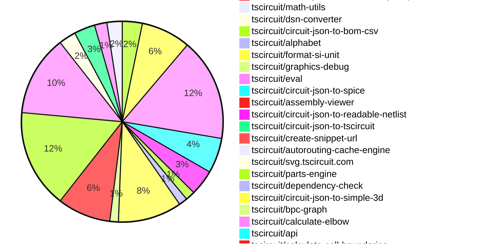

# contribution tracker

[contributions.tscircuit.com](https://contributions.tscircuit.com) ・ [tscircuit.com](https://tscircuit.com) ・ [Contribution Overviews](./contribution-overviews/) ・ [Changelogs](./changelogs/)

Generates weekly contribution overviews for tscircuit contributors. Check out all
the [contribution overviews here](./contribution-overviews/)
You can find AI-generated monthly changelogs in the [changelogs directory](./changelogs/)

- All PRs in the tscircuit org are scanned/summarized via an LLM
- The LLM classifies each Diff/PR as into a set of attributes for scoring
- All the PRs, summaries, and classifications are organized into charts and tables for [the website](https://contributions.tscircuit.com)

> Want to run locally? See the [Development Section](#development)

## Current Week

<!-- START_CURRENT_WEEK -->

# Contribution Overview 2026-08-18

The current week is shown below. There are 3 major sections:

- [Contributor Overview](#contributor-overview)
- [PRs by Repository](#prs-by-repository)
- [PRs by Contributor](#changes-by-contributor)
- [Scoring & Sponsorship Details](/docs/sponsorship-calculation-explanation.md)

## PRs by Repository


```mermaid
pie
    "tscircuit/schematic-viewer" : 7
    "tscircuit/matchpack" : 4
    "tscircuit/schematic-trace-solver" : 21
    "tscircuit/length-matching-solver" : 8
    "tscircuit/core" : 52
    "tscircuit/circuit-json-to-pnp-csv" : 2
    "tscircuit/runframe" : 108
    "tscircuit/tscircuit-autorouter" : 37
    "tscircuit/schematic-parity-testing" : 1
    "tscircuit/easyeda-converter" : 27
    "tscircuit/3d-viewer" : 3
    "tscircuit/altium-to-circuit-json" : 4
    "tscircuit/circuit-json" : 8
    "tscircuit/circuit-json-util" : 2
    "tscircuit/jscad-electronics" : 10
    "tscircuit/checks" : 9
    "tscircuit/cli" : 67
    "tscircuit/fanout-solver" : 9
    "tscircuit/circuit-json-to-footprinter" : 8
    "tscircuit/rfc" : 2
    "tscircuit/props" : 7
    "tscircuit/jlcsearch" : 5
    "tscircuit/docs" : 2
    "tscircuit/copper-pour-solver" : 2
    "tscircuit/tiny-hypergraph" : 1
    "tscircuit/circuit-json-schematic-placement-analysis" : 2
    "tscircuit/high-density-repair03" : 5
    "tscircuit/high-density-b01" : 1
    "tscircuit/nrf52810" : 1
    "tscircuit/pcb-viewer" : 4
    "tscircuit/circuit-to-svg" : 3
    "tscircuit/circuit-json-to-gerber" : 4
    "tscircuit/tscircuit.com" : 56
    "tscircuit/circuit-json-to-bpc" : 2
    "tscircuit/circuit-to-canvas" : 4
    "tscircuit/dsn-to-circuit-json" : 2
    "tscircuit/digikeysearch.tscircuit.com" : 4
    "tscircuit/winding-breakout-point-solver" : 6
    "tscircuit/tscircuit" : 104
    "tscircuit/schematic-autolayout" : 1
    "tscircuit/footprinter" : 7
    "tscircuit/manual-edit-events" : 1
    "tscircuit/plop" : 1
    "tscircuit/contribution-tracker" : 1
    "tscircuit/circuit-to-png" : 1
    "tscircuit/schematic-symbols" : 1
    "tscircuit/bun-match-svg" : 1
    "tscircuit/circuit-json-to-connectivity-map" : 1
    "tscircuit/math-utils" : 1
    "tscircuit/dsn-converter" : 1
    "tscircuit/circuit-json-to-bom-csv" : 1
    "tscircuit/alphabet" : 1
    "tscircuit/format-si-unit" : 1
    "tscircuit/graphics-debug" : 1
    "tscircuit/eval" : 85
    "tscircuit/circuit-json-to-spice" : 1
    "tscircuit/assembly-viewer" : 1
    "tscircuit/circuit-json-to-readable-netlist" : 1
    "tscircuit/circuit-json-to-tscircuit" : 1
    "tscircuit/create-snippet-url" : 1
    "tscircuit/autorouting-cache-engine" : 1
    "tscircuit/svg.tscircuit.com" : 18
    "tscircuit/parts-engine" : 1
    "tscircuit/dependency-check" : 1
    "tscircuit/circuit-json-to-simple-3d" : 1
    "tscircuit/bpc-graph" : 2
    "tscircuit/calculate-elbow" : 1
    "tscircuit/api" : 2
    "tscircuit/calculate-cell-boundaries" : 1
    "tscircuit/calculate-packing" : 1
    "tscircuit/circuit-json-to-gltf" : 2
    "tscircuit/circuit-json-to-step" : 2
    "tscircuit/circuit-preview" : 2
    "tscircuit/solver-utils" : 1
    "tscircuit/common" : 3
    "tscircuit/kicadts" : 1
    "tscircuit/poppygl" : 1
    "tscircuit/jscad-to-gltf" : 1
    "tscircuit/circuit-json-to-kicad" : 2
    "tscircuit/kicad-to-circuit-json" : 1
    "tscircuit/dsnts" : 1
    "tscircuit/ngspice-spice-engine" : 1
    "tscircuit/biscuit-boards" : 22
    "tscircuit/rectdiff" : 4
    "tscircuit/lbrnts" : 2
    "tscircuit/circuit-json-to-lbrn" : 2
    "tscircuit/circuit-json-to-dsn" : 2
    "tscircuit/bun-test-plan" : 1
    "tscircuit/curvy-trace-solver" : 2
    "tscircuit/straight-line-solver" : 1
    "tscircuit/internal-dynamic-import" : 2
    "tscircuit/circuit-json-placement-analysis" : 2
    "tscircuit/infer-cable-insertion-point" : 2
    "tscircuit/image-utils" : 2
    "tscircuit/circuit-json-routing-analysis" : 1
    "tscircuit/tscircuit.com-landing" : 2
    "tscircuit/krt-wasm" : 2
    "tscircuit/circuit-json-to-3d-png" : 2
    "tscircuit/spicets" : 1
    "tscircuit/tsci-agent" : 2
    "tscircuit/manifold-2d" : 4
    "tscircuit/create-fdm-enclosure" : 1
    "tscircuit/altiumts" : 13
    "tscircuit/circuit-json-to-fdm-component-box" : 2
    "tscircuit/gltf-slice" : 1
    "tscircuit/test-github-automerge" : 2
    "tscircuit/rp2040-motor-controller" : 1
    "tscircuit/implicit-copper-pour-solver" : 6
    "tscircuit/circuit-json-to-altium" : 16
    "tscircuit/ti-sysblocks" : 2
    "tscircuit/bga-fanout-solver" : 3
    "tscircuit/ti" : 1
    "tscircuit/system-block-designer" : 1
    "tscircuit/power-trace-expander" : 1
    "tscircuit/biscuit-board-autorouter" : 3
    "tscircuit/pcbburn.com" : 1
```

## Contributor Overview

| Contributor | 🐳 Major | 🐙 Minor | 🐌 Tiny | Score | ⭐ |
|-------------|---------|---------|---------|-------|-----|
| [seveibar](#seveibar) | 31 | 37 | 115 | 211 | 👑👑👑 |
| [ShiboSoftwareDev](#ShiboSoftwareDev) | 12 | 11 | 15 | 97.5 | 👑 |
| [mohan-bee](#mohan-bee) | 9 | 5 | 15 | 66 | ⭐⭐⭐ |
| [rushabhcodes](#rushabhcodes) | 4 | 8 | 3 | 45 | ⭐⭐ |
| [imrishabh18](#imrishabh18) | 8 | 3 | 5 | 44 | ⭐⭐ |
| [0hmX](#0hmX) | 8 | 3 | 5 | 44 | ⭐⭐ |
| [MustafaMulla29](#MustafaMulla29) | 3 | 8 | 9 | 37 | ⭐⭐ |
| [AnasSarkiz](#AnasSarkiz) | 5 | 4 | 3 | 33 | ⭐⭐ |
| [Abse2001](#Abse2001) | 6 | 2 | 1 | 31 | ⭐⭐ |
| [Sang-it](#Sang-it) | 3 | 1 | 10 | 23.5 | ⭐⭐ |
| [tscircuitbot](#tscircuitbot) | 0 | 0 | 481 | 18 | ⭐⭐ |
| [addibble](#addibble) | 2 | 3 | 2 | 16 | ⭐⭐ |
| [techmannih](#techmannih) | 1 | 4 | 2 | 15 | ⭐⭐ |
| [GokulPandi-M](#GokulPandi-M) | 0 | 3 | 7 | 13 | ⭐⭐ |
| [anil08607](#anil08607) | 1 | 2 | 4 | 12 | ⭐⭐ |
| [KrishnaX12](#KrishnaX12) | 0 | 0 | 4 | 4 | ⭐ |
| [hrithik18k](#hrithik18k) | 0 | 0 | 4 | 4 | ⭐ |
| [itisrohit](#itisrohit) | 0 | 1 | 0 | 2 |  |
| [Priyanshubhartistm](#Priyanshubhartistm) | 0 | 1 | 0 | 2 |  |

## Staff Pass Ratio (SPR)

| Contributor | Reviewed PRs | Rejections | Approvals | SPR |
|-------------|--------------|------------|-----------|-----|
| [ShiboSoftwareDev](#ShiboSoftwareDev) | 20 | 2 | 19 | 90.0% |
| [Abse2001](#Abse2001) | 8 | 0 | 8 | 100.0% |
| [mohan-bee](#mohan-bee) | 7 | 2 | 6 | 71.4% |
| [AnasSarkiz](#AnasSarkiz) | 6 | 0 | 7 | 100.0% |
| [MustafaMulla29](#MustafaMulla29) | 5 | 1 | 5 | 80.0% |
| [addibble](#addibble) | 4 | 0 | 6 | 100.0% |
| [rushabhcodes](#rushabhcodes) | 4 | 0 | 4 | 100.0% |
| [Sang-it](#Sang-it) | 3 | 0 | 3 | 100.0% |
| [0hmX](#0hmX) | 2 | 0 | 2 | 100.0% |
| [GokulPandi-M](#GokulPandi-M) | 2 | 0 | 2 | 100.0% |
| [imrishabh18](#imrishabh18) | 2 | 1 | 1 | 50.0% |
| [ArnavK-09](#ArnavK-09) | 1 | 1 | 0 | 0.0% |
| [itisrohit](#itisrohit) | 1 | 1 | 0 | 0.0% |
| [Priyanshubhartistm](#Priyanshubhartistm) | 1 | 0 | 1 | 100.0% |

<details>
<summary>ShiboSoftwareDev SPR PRs (20)</summary>

- [#3280](https://github.com/tscircuit/core/pull/3280) Place winding-aware breakout points before routing
- [#2210](https://github.com/tscircuit/tscircuit-autorouter/pull/2210) fix: forward differential pair terminal escape length
- [#2170](https://github.com/tscircuit/tscircuit-autorouter/pull/2170) Fix already-connected endpoints reserving shared routing regions
- [#2146](https://github.com/tscircuit/tscircuit-autorouter/pull/2146) Repair preloaded trace sections around through-obstacle connectivity
- [#56](https://github.com/tscircuit/length-matching-solver/pull/56) fix: honor differential-pair terminal escape constraints
- [#79](https://github.com/tscircuit/fanout-solver/pull/79) Respect existing traces as routed fanout copper
- [#61](https://github.com/tscircuit/altiumts/pull/61) Parse, serialize, and render PCB dimensions
- [#51](https://github.com/tscircuit/altiumts/pull/51) Serialize copper primitives in binary PCB documents
- [#48](https://github.com/tscircuit/altiumts/pull/48) Fix empty PCB wide strings
- [#47](https://github.com/tscircuit/altiumts/pull/47) Serialize native-length via records
- [#24](https://github.com/tscircuit/circuit-json-to-altium/pull/24) Preserve schematic title-block parameter values
- [#23](https://github.com/tscircuit/circuit-json-to-altium/pull/23) Export schematic sheets as native hierarchy
- [#22](https://github.com/tscircuit/circuit-json-to-altium/pull/22) Preserve native schematic text presentation
- [#21](https://github.com/tscircuit/circuit-json-to-altium/pull/21) Preserve custom schematic component graphics
- [#19](https://github.com/tscircuit/circuit-json-to-altium/pull/19) Render schematic sheet annotations
- [#18](https://github.com/tscircuit/circuit-json-to-altium/pull/18) Render schematic off-sheet ports
- [#15](https://github.com/tscircuit/circuit-json-to-altium/pull/15) Test real Altium schematics with native SVG round trips
- [#12](https://github.com/tscircuit/circuit-json-to-altium/pull/12) Convert PCB courtyards, keepouts, notes, and dimensions
- [#2](https://github.com/tscircuit/circuit-json-to-altium/pull/2) Test real Altium boards with native SVG round trips
- [#3](https://github.com/tscircuit/circuit-json-to-altium/pull/3) Preserve copper pours in Altium output

</details>

<details>
<summary>Abse2001 SPR PRs (8)</summary>

- [#4608](https://github.com/tscircuit/tscircuit/pull/4608) fix: ignore bundled winding solver in dependency sync
- [#500](https://github.com/tscircuit/easyeda-converter/pull/500) Preserve fabrication and PCB notes in generated footprints
- [#3376](https://github.com/tscircuit/core/pull/3376) chore: update capacity autorouter to 0.0.838
- [#4650](https://github.com/tscircuit/runframe/pull/4650) Handle wrapped solver constructor args from Core
- [#2201](https://github.com/tscircuit/tscircuit-autorouter/pull/2201) fix: update length matching solver
- [#2193](https://github.com/tscircuit/tscircuit-autorouter/pull/2193) Fix Pipeline 9 when regional routing merges fixed sections
- [#101](https://github.com/tscircuit/common/pull/101) Make RP2040 USB-C placement composable
- [#54](https://github.com/tscircuit/length-matching-solver/pull/54) fix: length-match unresolved failed pairs

</details>

<details>
<summary>mohan-bee SPR PRs (7)</summary>

- [#247](https://github.com/tscircuit/schematic-viewer/pull/247) Add scoped component and net search to schematic viewer
- [#676](https://github.com/tscircuit/circuit-to-svg/pull/676) render schematic sheet frames at their declared centers
- [#221](https://github.com/tscircuit/matchpack/pull/221) Place grounded capacitor groups without power metadata
- [#828](https://github.com/tscircuit/schematic-trace-solver/pull/828) move net-label connectors with aligned rails
- [#839](https://github.com/tscircuit/schematic-trace-solver/pull/839) prevent repeated trace overlap corrections
- [#832](https://github.com/tscircuit/schematic-trace-solver/pull/832) speed up available net orientation search
- [#822](https://github.com/tscircuit/schematic-trace-solver/pull/822) prevent merged-label overlap retries after child reroute failure

</details>

<details>
<summary>AnasSarkiz SPR PRs (6)</summary>

- [#2215](https://github.com/tscircuit/tscircuit-autorouter/pull/2215) Reproduce Pipeline 9 MangoPi pre-power connectivity loss
- [#2173](https://github.com/tscircuit/tscircuit-autorouter/pull/2173) Repair Pipeline7 chained trace/via and layer-specific pad clearance conflicts
- [#2207](https://github.com/tscircuit/tscircuit-autorouter/pull/2207) Update power trace expander to finalize MangoPi within budget
- [#2162](https://github.com/tscircuit/tscircuit-autorouter/pull/2162) Eliminate Pipeline7 circuit018's false DRC failure
- [#20](https://github.com/tscircuit/power-trace-expander/pull/20) Reproduce MangoPi R3C GND disconnection during power expansion
- [#19](https://github.com/tscircuit/power-trace-expander/pull/19) Finalize the best power-trace result within the iteration budget

</details>

<details>
<summary>MustafaMulla29 SPR PRs (5)</summary>

- [#818](https://github.com/tscircuit/footprinter/pull/818) feat: support explicit courtyard dimensions for custom passives
- [#3290](https://github.com/tscircuit/core/pull/3290) Add imported MOSFET repro for internally connected custom-symbol pins
- [#3307](https://github.com/tscircuit/core/pull/3307) Fix internally connected custom-symbol ports
- [#227](https://github.com/tscircuit/checks/pull/227) Fix shared-net trace contiguity false positives
- [#4384](https://github.com/tscircuit/cli/pull/4384) Fix compressed package upload format

</details>

<details>
<summary>addibble SPR PRs (4)</summary>

- [#805](https://github.com/tscircuit/props/pull/805) Add connectsFromAbove / connectsFromBelow to pinHeaderProps
- [#333](https://github.com/tscircuit/jscad-electronics/pull/333) Mount through-hole pin headers on top of the board, not under it
- [#331](https://github.com/tscircuit/jscad-electronics/pull/331) Add the missing 3D bodies: 32 of the 35 recorded gaps
- [#186](https://github.com/tscircuit/circuit-json-to-gltf/pull/186) Update jscad-electronics to 0.0.155: pin headers mount on the board

</details>

<details>
<summary>rushabhcodes SPR PRs (4)</summary>

- [#706](https://github.com/tscircuit/circuit-json/pull/706) Add schema for PCB components missing courtyard geometry
- [#983](https://github.com/tscircuit/3d-viewer/pull/983) fix: support realistic solder mask colors
- [#221](https://github.com/tscircuit/checks/pull/221) Warn when PCB components are missing courtyard geometry
- [#4409](https://github.com/tscircuit/cli/pull/4409) Fix concurrent builds in Bun workers

</details>

<details>
<summary>Sang-it SPR PRs (3)</summary>

- [#27](https://github.com/tscircuit/biscuit-board-autorouter/pull/27) Eliminate pointed turns from beautified PCB traces
- [#25](https://github.com/tscircuit/biscuit-board-autorouter/pull/25) Fix dangling traces after same-net pruning
- [#2](https://github.com/tscircuit/ti-sysblocks/pull/2) feat: add power bank system block

</details>

<details>
<summary>0hmX SPR PRs (2)</summary>

- [#722](https://github.com/tscircuit/circuit-json/pull/722) Add layer to pcb breakout points
- [#3377](https://github.com/tscircuit/core/pull/3377) fix: preserve implicit breakout layers in autorouting

</details>

<details>
<summary>GokulPandi-M SPR PRs (2)</summary>

- [#810](https://github.com/tscircuit/props/pull/810) Add per-port schematic pin label font size
- [#459](https://github.com/tscircuit/easyeda-converter/pull/459) Fix document-layer tracks converted to silkscreen

</details>

<details>
<summary>imrishabh18 SPR PRs (2)</summary>

- [#2145](https://github.com/tscircuit/tscircuit-autorouter/pull/2145) Respect board edge clearance in RectDiff topology
- [#76](https://github.com/tscircuit/high-density-repair03/pull/76) Keep better safe-layer DRC candidates

</details>

<details>
<summary>ArnavK-09 SPR PRs (1)</summary>

- [#35](https://github.com/tscircuit/poppygl/pull/35) feat: implement physical lighting mode

</details>

<details>
<summary>itisrohit SPR PRs (1)</summary>

- [#420](https://github.com/tscircuit/circuit-json-to-kicad/pull/420) repro(pcb): omitted hole courtyards from KiCad export

</details>

<details>
<summary>Priyanshubhartistm SPR PRs (1)</summary>

- [#105](https://github.com/tscircuit/pcbburn.com/pull/105) Add mobile nav menu to landing page header

</details>

> Note: AI evaluates PRs and assigns 1-3 star ratings automatically. 4 and 5 star ratings require manual staff review.

## Review Table

[reviews-received-hover]: ## "Number of reviews received for PRs for this contributor"
[approvals-received-hover]: ## "Number of approvals received for PRs this contributor authored"
[rejections-received-hover]: ## "Number of rejections received for PRs this contributor authored"
[prs-opened-hover]: ## "Number of PRs opened by this contributor"
[issues-created-hover]: ## "Number of issues created by this contributor"

| Contributor | Reviews Received | Approvals Received | Rejections Received | Approvals | Rejections Given | PRs Opened | PRs Merged | Issues Created |
|---|---|---|---|---|---|---|---|---|
| [0hmX](#0hmX) | 7 | 4 | 0 | 8 | 0 | 22 | 16 | 0 |
| [Abse2001](#Abse2001) | 10 | 10 | 0 | 2 | 0 | 16 | 9 | 0 |
| [addibble](#addibble) | 9 | 7 | 0 | 0 | 0 | 9 | 7 | 0 |
| [AH64-dll](#AH64-dll) | 0 | 0 | 0 | 0 | 0 | 1 | 0 | 0 |
| [AnasSarkiz](#AnasSarkiz) | 20 | 15 | 1 | 2 | 0 | 25 | 12 | 0 |
| [anil08607](#anil08607) | 13 | 10 | 2 | 0 | 0 | 11 | 7 | 0 |
| [ArnavK-09](#ArnavK-09) | 1 | 0 | 1 | 0 | 0 | 1 | 0 | 0 |
| [creationsunitassistant](#creationsunitassistant) | 0 | 0 | 0 | 0 | 0 | 1 | 0 | 0 |
| [Fhatu12](#Fhatu12) | 13 | 0 | 0 | 0 | 0 | 1 | 0 | 0 |
| [gcoinstash-cmd](#gcoinstash-cmd) | 0 | 0 | 0 | 0 | 0 | 3 | 0 | 0 |
| [GokulPandi-M](#GokulPandi-M) | 20 | 16 | 1 | 0 | 0 | 17 | 10 | 0 |
| [hrithik18k](#hrithik18k) | 8 | 6 | 0 | 0 | 0 | 5 | 4 | 0 |
| [imrishabh18](#imrishabh18) | 6 | 4 | 1 | 16 | 5 | 26 | 17 | 0 |
| [itisrohit](#itisrohit) | 4 | 1 | 1 | 0 | 0 | 5 | 1 | 0 |
| [KrishnaX12](#KrishnaX12) | 7 | 5 | 0 | 0 | 0 | 9 | 4 | 0 |
| [Luvi-1](#Luvi-1) | 0 | 0 | 0 | 0 | 0 | 1 | 0 | 0 |
| [mohan-bee](#mohan-bee) | 21 | 12 | 1 | 8 | 2 | 57 | 29 | 0 |
| [MustafaMulla29](#MustafaMulla29) | 20 | 12 | 3 | 0 | 0 | 23 | 20 | 0 |
| [obmakesomething](#obmakesomething) | 0 | 0 | 0 | 0 | 0 | 1 | 0 | 0 |
| [Ojas2095](#Ojas2095) | 0 | 0 | 0 | 0 | 0 | 2 | 0 | 0 |
| [Piotr1231](#Piotr1231) | 0 | 0 | 0 | 0 | 0 | 1 | 0 | 0 |
| [Priyanshubhartistm](#Priyanshubhartistm) | 1 | 1 | 0 | 0 | 0 | 1 | 1 | 0 |
| [Rodrigoue9](#Rodrigoue9) | 0 | 0 | 0 | 0 | 0 | 25 | 0 | 0 |
| [RohithPariki](#RohithPariki) | 0 | 0 | 0 | 0 | 0 | 1 | 0 | 0 |
| [rushabhcodes](#rushabhcodes) | 46 | 14 | 1 | 11 | 0 | 21 | 15 | 0 |
| [Sang-it](#Sang-it) | 3 | 3 | 0 | 0 | 0 | 20 | 14 | 0 |
| [seveibar](#seveibar) | 40 | 2 | 0 | 84 | 6 | 248 | 184 | 0 |
| [ShiboSoftwareDev](#ShiboSoftwareDev) | 41 | 35 | 1 | 24 | 0 | 109 | 38 | 0 |
| [techmannih](#techmannih) | 5 | 3 | 0 | 6 | 0 | 10 | 7 | 0 |
| [tscircuitbot](#tscircuitbot) | 1 | 1 | 0 | 0 | 0 | 674 | 481 | 0 |

## Changes by Repository

### [tscircuit/schematic-viewer](https://github.com/tscircuit/schematic-viewer)

| PR # | Impact | Rating | Contributor | Description |
|------|--------|--------|-------------|-------------|
| [#247](https://github.com/tscircuit/schematic-viewer/pull/247) | 🐳 Major | ⭐⭐⭐ | mohan-bee | Motivation Finding components and nets across schematic sheets should work reliably on realistic boards across desktop and mobile viewers. https:github.comuser-attachmentsassetsb0aca39b-d30c-4cb9-8173-f0e942275315 https:schematic-viewer-esz5ju9r6-tscircuit.vercel.app?fixtureId7B22path223A22examples2Fexample34-full-board-schematic-search.fixture.tsx227D |
| [#260](https://github.com/tscircuit/schematic-viewer/pull/260) | 🐳 Major | ⭐⭐⭐ | mohan-bee | Enables component search to match user-facing display names in addition to reference designators, improving search functionality. |
| [#261](https://github.com/tscircuit/schematic-viewer/pull/261) | 🐙 Minor | ⭐⭐ | mohan-bee | Enables component search to find components by their manufacturer part numbers, including case-insensitive and partial matches. |
| [#257](https://github.com/tscircuit/schematic-viewer/pull/257) | 🐙 Minor | ⭐⭐ | seveibar | Hides the raw supplier part numbers object from component details and renders JLCPCB and LCSC part numbers as external supplier links, normalizing legacy numeric-only part IDs and deduplicating repeated values, while covering parsing and rendered link behavior in the component-details tests. |

<details>
<summary>🐌 Tiny Contributions (3)</summary>

| PR # | Impact | Contributor | Description |
|------|--------|-------------|-------------|
| [#263](https://github.com/tscircuit/schematic-viewer/pull/263) | 🐌 Tiny | mohan-bee | Motivation Search results should prioritize the user-facing display name while keeping useful component identity and context visible. The full-board search example should demonstrate this behavior with the Wi-Fi smart switch circuit.  Before Results did not present the display name, reference designator, type, and value in a clear hierarchy. Chips showed the generic Chip type even when a manufacturer part number was available.  After Results show the display name on top and the reference designator, type, and value below; without a display name, the reference designator remains on top. Chips show their manufacturer part number instead of the generic type when available, and the full-board example uses the Wi-Fi smart switch circuit. |
| [#258](https://github.com/tscircuit/schematic-viewer/pull/258) | 🐌 Tiny | rushabhcodes | Fixes rendering issues for imported components by ensuring PCB previews are displayed correctly and schematic ports are connected without stray net labels. |
| [#259](https://github.com/tscircuit/schematic-viewer/pull/259) | 🐌 Tiny | seveibar | Migrates npm publishing to use GitHub Actions OIDC for authentication instead of a long-lived NPM_TOKEN, updates Node version to 24, and adds repository metadata in package.json. |

</details>

### [tscircuit/matchpack](https://github.com/tscircuit/matchpack)

| PR # | Impact | Rating | Contributor | Description |
|------|--------|--------|-------------|-------------|
| [#221](https://github.com/tscircuit/matchpack/pull/221) | 🐳 Major | ⭐⭐⭐ | mohan-bee | Groups grounded capacitors sharing a net pair when the non-ground net lacks positive-voltage metadata. |
| [#222](https://github.com/tscircuit/matchpack/pull/222) | 🐙 Minor | ⭐⭐ | seveibar | Returns a stable name for the LayoutPipelineSolver to ensure consistent identification during class-name minification and adds a regression test for verification. |

<details>
<summary>🐌 Tiny Contributions (2)</summary>

| PR # | Impact | Contributor | Description |
|------|--------|-------------|-------------|
| [#220](https://github.com/tscircuit/matchpack/pull/220) | 🐌 Tiny | mohan-bee | Fixes the arrangement of decoupling capacitors on the board 196038 schematic layout |
| [#225](https://github.com/tscircuit/matchpack/pull/225) | 🐌 Tiny | seveibar | Migrates npm publishing to use GitHub Actions OIDC for authentication, updates Node.js version, and adds repository metadata in package.json. |

</details>

### [tscircuit/schematic-trace-solver](https://github.com/tscircuit/schematic-trace-solver)

| PR # | Impact | Rating | Contributor | Description |
|------|--------|--------|-------------|-------------|
| [#838](https://github.com/tscircuit/schematic-trace-solver/pull/838) | 🐳 Major | ⭐⭐⭐ | mohan-bee | motivation: this input is taking forever or getting timeout for routing |
| [#839](https://github.com/tscircuit/schematic-trace-solver/pull/839) | 🐳 Major | ⭐⭐⭐ | mohan-bee | Fixes an issue where the trace overlap stage continues indefinitely when corrections revert to the previous routing state. |
| [#832](https://github.com/tscircuit/schematic-trace-solver/pull/832) | 🐳 Major | ⭐⭐⭐ | mohan-bee | Reduces trace-solving time for large schematics by implementing Flatbush spatial indexing for net-label orientation candidates. |
| [#856](https://github.com/tscircuit/schematic-trace-solver/pull/856) | 🐳 Major | ⭐⭐⭐ | seveibar | Detects and repairs new perpendicular crossings introduced while separating overlapping inline-label traces, preserving unrelated routes and ensuring core traces no longer intersect. |
| [#852](https://github.com/tscircuit/schematic-trace-solver/pull/852) | 🐳 Major | ⭐⭐⭐ | seveibar | Post-processes conventional endpoint labels to prevent overlap with nearby inline-label text, ensuring alignment and collision-free geometry for connector wicks. |
| [#851](https://github.com/tscircuit/schematic-trace-solver/pull/851) | 🐳 Major | ⭐⭐⭐ | seveibar | Routes distant opposing connections inside a shared schematic section when their fallback labels cannot fit, suppressing redundant net labels after successful routing. |
| [#849](https://github.com/tscircuit/schematic-trace-solver/pull/849) | 🐳 Major | ⭐⭐⭐ | seveibar | Fixes label placement for vertical rails by ensuring labels are positioned at the ends of connected traces rather than at the middle, improving schematic clarity and accuracy. |
| [#848](https://github.com/tscircuit/schematic-trace-solver/pull/848) | 🐳 Major | ⭐⭐⭐ | seveibar | Add inline-labeled stubs for eligible single-pin net connections, aligning rows on each component side to a common free-end coordinate without moving shorter labels away from their pins, preserving the whole row when an aligned extension would conflict, and deriving terminal stub direction from the actual pin facing. |
| [#860](https://github.com/tscircuit/schematic-trace-solver/pull/860) | 🐳 Major | ⭐⭐⭐ | MustafaMulla29 | Add fallbackNetLabelWidth for the conventional anchored label used only when inline placement fails, centralize net-label width lookup across placement and orientation stages, explicitly exclude fallback-only width from trace-line routing decisions, and add a focused TB67S579FTG-derived regression proving five routable signals remain continuous. |
| [#847](https://github.com/tscircuit/schematic-trace-solver/pull/847) | 🐙 Minor | ⭐⭐ | mohan-bee | Preserves the TI power output topology while avoiding the long L5 routing detour by moving L5 inward and regenerating the solver snapshot with a short local elbow. |
| [#828](https://github.com/tscircuit/schematic-trace-solver/pull/828) | 🐙 Minor | ⭐⭐ | mohan-bee | Fixes the issue where net-label connectors are not moved with their host rails, causing them to appear disconnected when the rails are aligned. |
| [#822](https://github.com/tscircuit/schematic-trace-solver/pull/822) | 🐙 Minor | ⭐⭐ | mohan-bee | Stops trace-label overlap avoidance from redispatching a merged-label collision after its child-label reroute has already failed. |
| [#855](https://github.com/tscircuit/schematic-trace-solver/pull/855) | 🐙 Minor | ⭐⭐ | seveibar | Reduces the 555 timer power section to three components and captures the cross-net overlap between BTN_IN and GND below SW1, adding a focused solver SVG snapshot. |
| [#850](https://github.com/tscircuit/schematic-trace-solver/pull/850) | 🐙 Minor | ⭐⭐ | seveibar | Allows opted-in two-pin net connections to use one inline label on a routed trace, emits matched outward endpoint stubs when a two-pin route is intentionally omitted, and preserves both anchored labels atomically if either endpoint stub conflicts. |
| [#825](https://github.com/tscircuit/schematic-trace-solver/pull/825) | 🐙 Minor | ⭐⭐ | MustafaMulla29 | Fixes label alignment for same-net junctions to ensure labels remain attached to rerouted traces without introducing diagonal segments. |

<details>
<summary>🐌 Tiny Contributions (6)</summary>

| PR # | Impact | Contributor | Description |
|------|--------|-------------|-------------|
| [#826](https://github.com/tscircuit/schematic-trace-solver/pull/826) | 🐌 Tiny | mohan-bee | Reproduces a bug related to disconnected netlabels in schematic designs with a comprehensive test case. |
| [#831](https://github.com/tscircuit/schematic-trace-solver/pull/831) | 🐌 Tiny | mohan-bee | Fixes overlapping traces in the schematic representation of the ESP-12F power and boot section. |
| [#821](https://github.com/tscircuit/schematic-trace-solver/pull/821) | 🐌 Tiny | mohan-bee | Reproduces a USB trace-label iteration exhaustion failure with a focused test case, isolating the issue from the full solver input. |
| [#844](https://github.com/tscircuit/schematic-trace-solver/pull/844) | 🐌 Tiny | seveibar | Summary capture the complete InputProblem emitted by tscircuitcore for TIDA-010076 sheet 02 (card_top) add a broad page-level solver SVG snapshot for net-label parity work retain the focused J4 repro for the split AGND rail caused by text obstacles This remains a reproduction-only PR; it does not change solver behavior.  Test plan bun test testsreprosrepro-tida010076-page02.test.ts testsreprosrepro-tida010076-j4-ground-bus.test.ts bunx tsc --noEmit bun run format:check headless 23-stage pipeline render via bun run debug:pipeline |
| [#836](https://github.com/tscircuit/schematic-trace-solver/pull/836) | 🐌 Tiny | seveibar | Migrates npm publishing to use OIDC for authentication, removing the legacy npm token and updating the Node version to 24, while adding explicit repository metadata. |
| [#824](https://github.com/tscircuit/schematic-trace-solver/pull/824) | 🐌 Tiny | seveibar | Implements getSolverName() on SchematicTracePipelineSolver to return a stable name that survives class-name minification and adds a regression test for the public solver export. |

</details>

### [tscircuit/length-matching-solver](https://github.com/tscircuit/length-matching-solver)

| PR # | Impact | Rating | Contributor | Description |
|------|--------|--------|-------------|-------------|
| [#53](https://github.com/tscircuit/length-matching-solver/pull/53) | 🐳 Major | ⭐⭐⭐ | mohan-bee | Fixes a crash in the length matching solver when encountering unmeasurable candidates by allowing the routing pipeline to continue to valid same-layer candidates. |
| [#49](https://github.com/tscircuit/length-matching-solver/pull/49) | 🐳 Major | ⭐⭐⭐ | mohan-bee | Motivation Dense camera routing needs a stable real-board reproduction for coupled-pair collision search.  Before No regression captured the 80,001-iteration search and its exact routed output.  After The RV1106G2 fixture reproduces all 80,001 iterations, expected diagnostics, and SVG output. View the generated RV1106G2 SVG snapshot(https:github.comtscircuitlength-matching-solverblobreprorv1106g2-camera-post-processingtestspost-processingperformance__snapshots__rv1106g2-camera-search.snap.svg). |
| [#50](https://github.com/tscircuit/length-matching-solver/pull/50) | 🐳 Major | ⭐⭐⭐ | mohan-bee | Reduces the time taken for differential-pair collision checks on dense boards from 86 seconds to approximately 28 seconds by optimizing the search algorithm to skip distant obstacles and layer checks. |
| [#54](https://github.com/tscircuit/length-matching-solver/pull/54) | 🐳 Major | ⭐⭐⭐ | Abse2001 | Fixes length matching for differential pairs that failed rerouting, ensuring they are kept eligible if their existing copper exceeds the requested length tolerance. |
| [#56](https://github.com/tscircuit/length-matching-solver/pull/56) | 🐳 Major | ⭐⭐⭐ | ShiboSoftwareDev | Exposes and validates maxUncoupledLength for differential-pair post-processing, ensuring proper terminal escape behavior and collision checks for routing. |
| [#58](https://github.com/tscircuit/length-matching-solver/pull/58) | 🐙 Minor | ⭐⭐ | 0hmX | Fixes a regression that caused the solver to throw an error when encountering unmeasurable cross-layer meander candidates by returning a null sentinel instead. |

<details>
<summary>🐌 Tiny Contributions (2)</summary>

| PR # | Impact | Contributor | Description |
|------|--------|-------------|-------------|
| [#52](https://github.com/tscircuit/length-matching-solver/pull/52) | 🐌 Tiny | mohan-bee | Adds a fixture and test to reproduce a crash in the length matcher when handling differential pairs that change layers before reaching comparable paired geometry. |
| [#55](https://github.com/tscircuit/length-matching-solver/pull/55) | 🐌 Tiny | ShiboSoftwareDev | Adds a minimal regression test for a differential pair with an interleaved terminal pad, capturing the no-valid-candidate result when a bounded terminal escape is requested. |

</details>

### [tscircuit/core](https://github.com/tscircuit/core)

| PR # | Impact | Rating | Contributor | Description |
|------|--------|--------|-------------|-------------|
| [#3375](https://github.com/tscircuit/core/pull/3375) | 🐳 Major | ⭐⭐⭐ | seveibar | Fixes a bug where reversing PCB routes caused incorrect trace widths, ensuring that physical copper widths are preserved during route direction changes. |
| [#3372](https://github.com/tscircuit/core/pull/3372) | 🐳 Major | ⭐⭐⭐ | seveibar | Sets the WindingBreakoutSolver as the default solver for implicit breakout points in the autorouting system, adapting the API and improving the handling of automatic breakouts while reporting infeasibility errors. |
| [#3366](https://github.com/tscircuit/core/pull/3366) | 🐳 Major | ⭐⭐⭐ | seveibar | Fixes the issue of routed child-subcircuit vias being incorrectly emitted as obstacles in SRJ, ensuring they are preserved in traces instead. |
| [#3340](https://github.com/tscircuit/core/pull/3340) | 🐳 Major | ⭐⭐⭐ | seveibar | Compares the autorouting performance of pipeline7 and pipeline9 on a dense RP2040 board, highlighting differences in phase completion and routing errors. |
| [#3276](https://github.com/tscircuit/core/pull/3276) | 🐳 Major | ⭐⭐⭐ | seveibar | Uses pcbStyle.viaHoleDiameter and pcbStyle.viaPadDiameter as autorouter via constraints when minVia props are not set, ensuring consistent via sizes for both authored and generated vias. |
| [#3376](https://github.com/tscircuit/core/pull/3376) | 🐳 Major | ⭐⭐⭐ | Abse2001 | Updates the tscircuitcapacity-autorouter dependency from 0.0.832 to 0.0.838, resolving a regression in autorouting tests and incorporating upstream fixes. |
| [#3389](https://github.com/tscircuit/core/pull/3389) | 🐳 Major | ⭐⭐⭐ | 0hmX | Changes the copper pour obstacle selection process to use the active routing PCB group ID, ensuring that only relevant copper pours are included while preserving existing non-pour obstacles and routing behavior. |
| [#3377](https://github.com/tscircuit/core/pull/3377) | 🐳 Major | ⭐⭐⭐ | 0hmX | Fixes loss of selected routing layer in autorouting for implicit breakout points, ensuring correct layer is used in Circuit JSON emission. |
| [#3399](https://github.com/tscircuit/core/pull/3399) | 🐳 Major | ⭐⭐⭐ | MustafaMulla29 | Preserves the exact source_trace_id ownership from core solver input into port-only schematic net labels, ensuring unambiguous connectivity and ownership during fallback insertion. |
| [#3210](https://github.com/tscircuit/core/pull/3210) | 🐙 Minor | ⭐⭐ | mohan-bee | Adds a test for the TB67S579FTG breakout schematic to verify inline net label spacing. |
| [#3387](https://github.com/tscircuit/core/pull/3387) | 🐙 Minor | ⭐⭐ | seveibar | Renders eligible named signal nets as inline schematic text instead of regular boxed net labels, supporting one-port nets as outward terminal stubs and two-port named nets between different schematic components with proper alignment and fallback handling. |
| [#3388](https://github.com/tscircuit/core/pull/3388) | 🐙 Minor | ⭐⭐ | seveibar | Emit a pcb_placement_error when sibling fanout boundaries overlap and enforce the larger fanoutMargin requested by either neighboring fanout. |
| [#3383](https://github.com/tscircuit/core/pull/3383) | 🐙 Minor | ⭐⭐ | seveibar | Add a self-contained PCB snapshot reproduction for routing two complete DDR byte buses between AM62L and LPDDR4 fanouts, including detailed autorouting phases and validation tests. |
| [#3370](https://github.com/tscircuit/core/pull/3370) | 🐙 Minor | ⭐⭐ | seveibar | Adds support for custom implicit breakout point solvers while preserving the existing default solver functionality. |
| [#3367](https://github.com/tscircuit/core/pull/3367) | 🐙 Minor | ⭐⭐ | seveibar | Emit labeled PCB debug rectangles for every autorouting phase when a subcircuit has multiple phases, avoiding emission for single-phase autorouting, and enabling PCB debug objects by default in circuit snapshot tests. |
| [#3352](https://github.com/tscircuit/core/pull/3352) | 🐙 Minor | ⭐⭐ | seveibar | Fixes incorrect matching of asynchronous footprint pads with duplicate pin numbers, ensuring unique PCB ports are assigned correctly. |
| [#3324](https://github.com/tscircuit/core/pull/3324) | 🐙 Minor | ⭐⭐ | seveibar | Fixes stale selector cache issues when components are added or removed in the component tree, ensuring that cached results are only invalidated when necessary. |
| [#3300](https://github.com/tscircuit/core/pull/3300) | 🐙 Minor | ⭐⭐ | seveibar | Emit a warning when a root circuit has schematic content but no schematicsheet, and remove the warning if a schematic sheet is subsequently present. |
| [#3294](https://github.com/tscircuit/core/pull/3294) | 🐙 Minor | ⭐⭐ | seveibar | Suppresses unnamed trace warnings for net connections while preserving them for unnamed port-to-port traces and adds regression coverage for a trace connected to net.GND |
| [#3288](https://github.com/tscircuit/core/pull/3288) | 🐙 Minor | ⭐⭐ | seveibar | Adds support for thermal reliefs around various SMT pad shapes, enhancing thermal management in PCB designs. |
| [#3277](https://github.com/tscircuit/core/pull/3277) | 🐙 Minor | ⭐⭐ | seveibar | Emit events for the FanoutSolver to track its lifecycle and parameters during autorouting processes. |
| [#3361](https://github.com/tscircuit/core/pull/3361) | 🐙 Minor | ⭐⭐ | imrishabh18 | Reproduces the nRF52810 circuit without copper pours, ensuring autorouting completes without errors and produces more than 60 PCB traces. |
| [#3405](https://github.com/tscircuit/core/pull/3405) | 🐙 Minor | ⭐⭐ | MustafaMulla29 | Fixes fallback label bounds for inline schematic traces by providing the correct width for fallback labels when inline placement is blocked, ensuring accurate rendering of schematic labels. |
| [#3309](https://github.com/tscircuit/core/pull/3309) | 🐙 Minor | ⭐⭐ | MustafaMulla29 | Fixes incorrect port directions and reconnects trace endpoints for custom symbols in React and Circuit JSON, ensuring accurate schematic representation and trace routing. |
| [#3290](https://github.com/tscircuit/core/pull/3290) | 🐙 Minor | ⭐⭐ | MustafaMulla29 | Adds a repro test for the DMT6007LFG_7 MOSFET component to validate internal connections of custom-symbol pins, addressing a bug in pin resolution. |
| [#3307](https://github.com/tscircuit/core/pull/3307) | 🐙 Minor | ⭐⭐ | MustafaMulla29 | Fixes the inability to resolve internally connected pin groups from all ports owned by a component, including those nested inside a custom React symbol. |

<details>
<summary>🐌 Tiny Contributions (26)</summary>

| PR # | Impact | Contributor | Description |
|------|--------|-------------|-------------|
| [#3355](https://github.com/tscircuit/core/pull/3355) | 🐌 Tiny | mohan-bee | Updates the version of the schematic-trace-solver dependency from 0.0.140 to 0.0.141 in the package.json file. |
| [#3306](https://github.com/tscircuit/core/pull/3306) | 🐌 Tiny | mohan-bee | Updates the version of the schematic-trace-solver dependency from 0.0.137 to 0.0.140 in the package.json file. |
| [#3284](https://github.com/tscircuit/core/pull/3284) | 🐌 Tiny | mohan-bee | Updates the tscircuitmatchpack dependency version from 0.0.81 to 0.0.84 in package.json |
| [#3211](https://github.com/tscircuit/core/pull/3211) | 🐌 Tiny | mohan-bee | Keeps dense inline net labels attached to their traces, ensuring they are rendered correctly against their respective traces without floating above them. |
| [#3282](https://github.com/tscircuit/core/pull/3282) | 🐌 Tiny | mohan-bee | Updates the tscircuitschematic-trace-solver dependency to version 0.0.136 in the package.json file. |
| [#3392](https://github.com/tscircuit/core/pull/3392) | 🐌 Tiny | seveibar | Updates the schematic trace solver to improve label clearance and alignment in schematic snapshots. |
| [#3371](https://github.com/tscircuit/core/pull/3371) | 🐌 Tiny | seveibar | Updates the tscircuitcapacity-autorouter dependency from version 0.0.830 to 0.0.832, including simplifications and validation tests for the autorouting functionality. |
| [#3364](https://github.com/tscircuit/core/pull/3364) | 🐌 Tiny | seveibar | Updates the tscircuitcapacity-autorouter package from version 0.0.822 to 0.0.830, refreshing affected autorouting and PCB snapshots. |
| [#3291](https://github.com/tscircuit/core/pull/3291) | 🐌 Tiny | seveibar | Migrates npm publishing to use GitHub Actions OIDC for trusted publishing instead of a long-lived NPM_TOKEN, updating the Node version and workflow permissions accordingly. |
| [#3278](https://github.com/tscircuit/core/pull/3278) | 🐌 Tiny | seveibar | Fixes orphan schematic ports by skipping rendering when the parent component has no schematic representation, and ensures that render phase events are emitted in the correct order, improving performance significantly. |
| [#3407](https://github.com/tscircuit/core/pull/3407) | 🐌 Tiny | tscircuitbot | Updates the version of the tscircuitchecks package from 0.0.168 to 0.0.169 in package.json |
| [#3368](https://github.com/tscircuit/core/pull/3368) | 🐌 Tiny | tscircuitbot | Updates the tscircuitfanout-solver package from version 0.0.33 to 0.0.35 in the package.json file. |
| [#3329](https://github.com/tscircuit/core/pull/3329) | 🐌 Tiny | tscircuitbot | Updates the version of the tscircuitchecks package from 0.0.167 to 0.0.168 in package.json |
| [#3326](https://github.com/tscircuit/core/pull/3326) | 🐌 Tiny | tscircuitbot | Updates the version of the tscircuitchecks package from 0.0.166 to 0.0.167 in package.json |
| [#3325](https://github.com/tscircuit/core/pull/3325) | 🐌 Tiny | tscircuitbot | Updates the tscircuitfanout-solver package from version 0.0.30 to 0.0.33 in the package.json file. |
| [#3302](https://github.com/tscircuit/core/pull/3302) | 🐌 Tiny | tscircuitbot | Updates the package version of tscircuitinfer-cable-insertion-point from 0.0.3 to 0.0.4 in package.json |
| [#3316](https://github.com/tscircuit/core/pull/3316) | 🐌 Tiny | tscircuitbot | Updates the version of the tscircuitchecks package from 0.0.165 to 0.0.166 in package.json |
| [#3296](https://github.com/tscircuit/core/pull/3296) | 🐌 Tiny | tscircuitbot | Updates the tscircuitchecks package from version 0.0.164 to 0.0.165 |
| [#3293](https://github.com/tscircuit/core/pull/3293) | 🐌 Tiny | tscircuitbot | Updates the tscircuitchecks package from version 0.0.163 to 0.0.164 |
| [#3285](https://github.com/tscircuit/core/pull/3285) | 🐌 Tiny | tscircuitbot | Updates the tscircuitchecks package from version 0.0.162 to 0.0.163 |
| [#3287](https://github.com/tscircuit/core/pull/3287) | 🐌 Tiny | imrishabh18 | Updates the tscircuitcapacity-autorouter dependency from version 0.0.815 to 0.0.822, ensuring that consumers of tscircuitcore utilize the latest improvements and fixes from the capacity autorouter. |
| [#3385](https://github.com/tscircuit/core/pull/3385) | 🐌 Tiny | ShiboSoftwareDev | Updates the tscircuitcapacity-autorouter package from version 0.0.838 to 0.0.839, incorporating differential-pair terminal escape forwarding and refreshing the AM62LLPDDR4 PCB snapshot for localized route changes. |
| [#3408](https://github.com/tscircuit/core/pull/3408) | 🐌 Tiny | 0hmX | Updates the tscircuitcapacity-autorouter dependency from 0.0.839 to 0.0.840 to incorporate the latest autorouter release and its length-matching solver update. |
| [#3398](https://github.com/tscircuit/core/pull/3398) | 🐌 Tiny | MustafaMulla29 | Updates the version of the footprinter dependency from 0.0.424 to 0.0.426 in package.json |
| [#3286](https://github.com/tscircuit/core/pull/3286) | 🐌 Tiny | MustafaMulla29 | Updates the tscircuitschematic-trace-solver dependency to version 0.0.137, incorporating a fix for same-net trace alignment and updating the RP2040 schematic snapshot accordingly. |
| [#3357](https://github.com/tscircuit/core/pull/3357) | 🐌 Tiny | KrishnaX12 | Bumps tscircuitfootprinter to 0.0.424 |

</details>

### [tscircuit/circuit-json-to-pnp-csv](https://github.com/tscircuit/circuit-json-to-pnp-csv)


<details>
<summary>🐌 Tiny Contributions (2)</summary>

| PR # | Impact | Contributor | Description |
|------|--------|-------------|-------------|
| [#11](https://github.com/tscircuit/circuit-json-to-pnp-csv/pull/11) | 🐌 Tiny | mohan-bee | Skips PCB testpoints from being included in the pick-and-place CSV output. |
| [#10](https://github.com/tscircuit/circuit-json-to-pnp-csv/pull/10) | 🐌 Tiny | seveibar | Migrates npm publishing to use OIDC for authentication, removes legacy npm token, updates Node version to 24, and adds missing repository metadata in package.json. |

</details>

### [tscircuit/runframe](https://github.com/tscircuit/runframe)

| PR # | Impact | Rating | Contributor | Description |
|------|--------|--------|-------------|-------------|
| [#4650](https://github.com/tscircuit/runframe/pull/4650) | 🐳 Major | ⭐⭐⭐ | Abse2001 | Fixes autorouting failure when using wrapped solver constructor arguments for AutoroutingPipelineSolver7_MultiGraph in RunFrame. |
| [#4708](https://github.com/tscircuit/runframe/pull/4708) | 🐙 Minor | ⭐⭐ | seveibar | RunFrame fabrication downloads now include through-hole, blindburied, and NPTH drill files using the same implementation as the converter CLI. |
| [#4617](https://github.com/tscircuit/runframe/pull/4617) | 🐙 Minor | ⭐⭐ | seveibar | Adds support for FanoutSolver in the Solvers tab by updating solver event handling to use exact constructor arguments from newer core versions and retaining legacy support for older events. |

<details>
<summary>🐌 Tiny Contributions (105)</summary>

| PR # | Impact | Contributor | Description |
|------|--------|-------------|-------------|
| [#4655](https://github.com/tscircuit/runframe/pull/4655) | 🐌 Tiny | mohan-bee | Updates the tscircuitschematic-viewer package to version 2.0.85 in the package.json file. |
| [#4636](https://github.com/tscircuit/runframe/pull/4636) | 🐌 Tiny | seveibar | Migrates npm publishing to use GitHub Actions OIDC instead of a long-lived NPM_TOKEN, updates Node version to 24, and adds explicit GitHub repository URL in package metadata. |
| [#4733](https://github.com/tscircuit/runframe/pull/4733) | 🐌 Tiny | tscircuitbot | Automated package update |
| [#4732](https://github.com/tscircuit/runframe/pull/4732) | 🐌 Tiny | tscircuitbot | Updates the tscircuiteval package to version 0.0.1263 in the package.json file. |
| [#4731](https://github.com/tscircuit/runframe/pull/4731) | 🐌 Tiny | tscircuitbot | Automated package update |
| [#4730](https://github.com/tscircuit/runframe/pull/4730) | 🐌 Tiny | tscircuitbot | Updates the tscircuiteval package to version 0.0.1262 in the package.json file. |
| [#4729](https://github.com/tscircuit/runframe/pull/4729) | 🐌 Tiny | tscircuitbot | Automated package update |
| [#4728](https://github.com/tscircuit/runframe/pull/4728) | 🐌 Tiny | tscircuitbot | Updates the tscircuiteval package to version 0.0.1261 in the package.json file. |
| [#4727](https://github.com/tscircuit/runframe/pull/4727) | 🐌 Tiny | tscircuitbot | Automated package update |
| [#4726](https://github.com/tscircuit/runframe/pull/4726) | 🐌 Tiny | tscircuitbot | Automated package update |
| [#4725](https://github.com/tscircuit/runframe/pull/4725) | 🐌 Tiny | tscircuitbot | Automated package update |
| [#4724](https://github.com/tscircuit/runframe/pull/4724) | 🐌 Tiny | tscircuitbot | Updates the tscircuiteval package to version 0.0.1260 in the package.json file. |
| [#4723](https://github.com/tscircuit/runframe/pull/4723) | 🐌 Tiny | tscircuitbot | Automated package update |
| [#4722](https://github.com/tscircuit/runframe/pull/4722) | 🐌 Tiny | tscircuitbot | Automated package update |
| [#4721](https://github.com/tscircuit/runframe/pull/4721) | 🐌 Tiny | tscircuitbot | Automated package update |
| [#4720](https://github.com/tscircuit/runframe/pull/4720) | 🐌 Tiny | tscircuitbot | Updates the tscircuiteval package from version 0.0.1257 to 0.0.1258 |
| [#4719](https://github.com/tscircuit/runframe/pull/4719) | 🐌 Tiny | tscircuitbot | Automated package update |
| [#4718](https://github.com/tscircuit/runframe/pull/4718) | 🐌 Tiny | tscircuitbot | Updates the tscircuiteval package to version 0.0.1257 in package.json |
| [#4717](https://github.com/tscircuit/runframe/pull/4717) | 🐌 Tiny | tscircuitbot | Automated package update |
| [#4716](https://github.com/tscircuit/runframe/pull/4716) | 🐌 Tiny | tscircuitbot | Updates the tscircuiteval package to version 0.0.1256 in the package.json file. |
| [#4715](https://github.com/tscircuit/runframe/pull/4715) | 🐌 Tiny | tscircuitbot | Automated package update |
| [#4714](https://github.com/tscircuit/runframe/pull/4714) | 🐌 Tiny | tscircuitbot | Updates the tscircuiteval package from version 0.0.1253 to 0.0.1255 in the package.json file. |
| [#4713](https://github.com/tscircuit/runframe/pull/4713) | 🐌 Tiny | tscircuitbot | Automated package update |
| [#4712](https://github.com/tscircuit/runframe/pull/4712) | 🐌 Tiny | tscircuitbot | Updates the tscircuiteval package to version 0.0.1253 in the package.json file. |
| [#4707](https://github.com/tscircuit/runframe/pull/4707) | 🐌 Tiny | tscircuitbot | Automated package update |
| [#4705](https://github.com/tscircuit/runframe/pull/4705) | 🐌 Tiny | tscircuitbot | Automated package update |
| [#4710](https://github.com/tscircuit/runframe/pull/4710) | 🐌 Tiny | tscircuitbot | Automated package update |
| [#4709](https://github.com/tscircuit/runframe/pull/4709) | 🐌 Tiny | tscircuitbot | Updates the circuit-json-to-gerber package from version 0.0.97 to 0.0.98 |
| [#4706](https://github.com/tscircuit/runframe/pull/4706) | 🐌 Tiny | tscircuitbot | Updates the circuit-json-to-gerber package from version 0.0.95 to 0.0.97 in package.json |
| [#4704](https://github.com/tscircuit/runframe/pull/4704) | 🐌 Tiny | tscircuitbot | Updates the tscircuiteval package to version 0.0.1252 in the package.json file. |
| [#4702](https://github.com/tscircuit/runframe/pull/4702) | 🐌 Tiny | tscircuitbot | Updates the tscircuiteval package to version 0.0.1251 in the package.json file. |
| [#4700](https://github.com/tscircuit/runframe/pull/4700) | 🐌 Tiny | tscircuitbot | Updates the tscircuiteval package to version 0.0.1250 in the package.json file. |
| [#4699](https://github.com/tscircuit/runframe/pull/4699) | 🐌 Tiny | tscircuitbot | Automated package update |
| [#4698](https://github.com/tscircuit/runframe/pull/4698) | 🐌 Tiny | tscircuitbot | Updates the tscircuiteval package from version 0.0.1248 to 0.0.1249 in the package.json file. |
| [#4696](https://github.com/tscircuit/runframe/pull/4696) | 🐌 Tiny | tscircuitbot | Updates the tscircuiteval package from version 0.0.1247 to 0.0.1248 in the package.json file. |
| [#4695](https://github.com/tscircuit/runframe/pull/4695) | 🐌 Tiny | tscircuitbot | Automated package update |
| [#4694](https://github.com/tscircuit/runframe/pull/4694) | 🐌 Tiny | tscircuitbot | Updates the tscircuiteval package from version 0.0.1246 to 0.0.1247 in the package.json file. |
| [#4693](https://github.com/tscircuit/runframe/pull/4693) | 🐌 Tiny | tscircuitbot | Automated package update |
| [#4692](https://github.com/tscircuit/runframe/pull/4692) | 🐌 Tiny | tscircuitbot | Updates the tscircuiteval package to version 0.0.1246 in the package.json file. |
| [#4690](https://github.com/tscircuit/runframe/pull/4690) | 🐌 Tiny | tscircuitbot | Updates the tscircuiteval package to version 0.0.1245 in the package.json file. |
| [#4703](https://github.com/tscircuit/runframe/pull/4703) | 🐌 Tiny | tscircuitbot | Automated package update |
| [#4701](https://github.com/tscircuit/runframe/pull/4701) | 🐌 Tiny | tscircuitbot | Automated package update |
| [#4697](https://github.com/tscircuit/runframe/pull/4697) | 🐌 Tiny | tscircuitbot | Automated package update |
| [#4691](https://github.com/tscircuit/runframe/pull/4691) | 🐌 Tiny | tscircuitbot | Automated package update |
| [#4689](https://github.com/tscircuit/runframe/pull/4689) | 🐌 Tiny | tscircuitbot | Automated package update |
| [#4688](https://github.com/tscircuit/runframe/pull/4688) | 🐌 Tiny | tscircuitbot | Automated package update |
| [#4687](https://github.com/tscircuit/runframe/pull/4687) | 🐌 Tiny | tscircuitbot | Updates the tscircuiteval package to version 0.0.1244 in the package.json file. |
| [#4686](https://github.com/tscircuit/runframe/pull/4686) | 🐌 Tiny | tscircuitbot | Automated package update |
| [#4685](https://github.com/tscircuit/runframe/pull/4685) | 🐌 Tiny | tscircuitbot | Automated package update |
| [#4684](https://github.com/tscircuit/runframe/pull/4684) | 🐌 Tiny | tscircuitbot | Automated package update |
| [#4683](https://github.com/tscircuit/runframe/pull/4683) | 🐌 Tiny | tscircuitbot | Updates the tscircuiteval package to version 0.0.1243 in the package.json file. |
| [#4682](https://github.com/tscircuit/runframe/pull/4682) | 🐌 Tiny | tscircuitbot | Automated package update |
| [#4681](https://github.com/tscircuit/runframe/pull/4681) | 🐌 Tiny | tscircuitbot | Updates the tscircuiteval package to version 0.0.1242 in the package.json file. |
| [#4680](https://github.com/tscircuit/runframe/pull/4680) | 🐌 Tiny | tscircuitbot | Automated package update |
| [#4679](https://github.com/tscircuit/runframe/pull/4679) | 🐌 Tiny | tscircuitbot | Updates the tscircuiteval package to version 0.0.1241 in the package.json file. |
| [#4678](https://github.com/tscircuit/runframe/pull/4678) | 🐌 Tiny | tscircuitbot | Automated package update |
| [#4677](https://github.com/tscircuit/runframe/pull/4677) | 🐌 Tiny | tscircuitbot | Updates the tscircuiteval package to version 0.0.1240 in the package.json file. |
| [#4676](https://github.com/tscircuit/runframe/pull/4676) | 🐌 Tiny | tscircuitbot | Automated package update |
| [#4674](https://github.com/tscircuit/runframe/pull/4674) | 🐌 Tiny | tscircuitbot | Automated package update |
| [#4673](https://github.com/tscircuit/runframe/pull/4673) | 🐌 Tiny | tscircuitbot | Updates the tscircuitpcb-viewer package from version 1.11.390 to 1.11.392 |
| [#4675](https://github.com/tscircuit/runframe/pull/4675) | 🐌 Tiny | tscircuitbot | Updates the tscircuiteval package from version 0.0.1238 to 0.0.1239 in the package.json file. |
| [#4644](https://github.com/tscircuit/runframe/pull/4644) | 🐌 Tiny | tscircuitbot | Updates the tscircuiteval package from version 0.0.1229 to 0.0.1230 in the package.json file. |
| [#4669](https://github.com/tscircuit/runframe/pull/4669) | 🐌 Tiny | tscircuitbot | Updates the tscircuiteval package to version 0.0.1238 in the package.json file. |
| [#4666](https://github.com/tscircuit/runframe/pull/4666) | 🐌 Tiny | tscircuitbot | Automated package update |
| [#4664](https://github.com/tscircuit/runframe/pull/4664) | 🐌 Tiny | tscircuitbot | Updates the tscircuitschematic-viewer package to version 2.0.87 |
| [#4659](https://github.com/tscircuit/runframe/pull/4659) | 🐌 Tiny | tscircuitbot | Updates the tscircuiteval package to version 0.0.1236 in the package.json file. |
| [#4658](https://github.com/tscircuit/runframe/pull/4658) | 🐌 Tiny | tscircuitbot | Automated package update |
| [#4657](https://github.com/tscircuit/runframe/pull/4657) | 🐌 Tiny | tscircuitbot | Updates the tscircuiteval package to version 0.0.1235 in the package.json file. |
| [#4654](https://github.com/tscircuit/runframe/pull/4654) | 🐌 Tiny | tscircuitbot | Automated package update |
| [#4648](https://github.com/tscircuit/runframe/pull/4648) | 🐌 Tiny | tscircuitbot | Updates the tscircuiteval package to version 0.0.1232 in the package.json file. |
| [#4646](https://github.com/tscircuit/runframe/pull/4646) | 🐌 Tiny | tscircuitbot | Updates the tscircuiteval package to version 0.0.1231 in the package.json file. |
| [#4645](https://github.com/tscircuit/runframe/pull/4645) | 🐌 Tiny | tscircuitbot | Updates the version of the circuit-json-to-kicad package from 0.0.173 to 0.0.174 in package.json |
| [#4672](https://github.com/tscircuit/runframe/pull/4672) | 🐌 Tiny | tscircuitbot | Automated package update |
| [#4671](https://github.com/tscircuit/runframe/pull/4671) | 🐌 Tiny | tscircuitbot | Updates the tscircuitschematic-viewer package to version 2.0.88 |
| [#4670](https://github.com/tscircuit/runframe/pull/4670) | 🐌 Tiny | tscircuitbot | Automated package update |
| [#4667](https://github.com/tscircuit/runframe/pull/4667) | 🐌 Tiny | tscircuitbot | Automated package update |
| [#4661](https://github.com/tscircuit/runframe/pull/4661) | 🐌 Tiny | tscircuitbot | Automated package update |
| [#4660](https://github.com/tscircuit/runframe/pull/4660) | 🐌 Tiny | tscircuitbot | Updates the tscircuitschematic-viewer package from version 2.0.85 to 2.0.86 |
| [#4653](https://github.com/tscircuit/runframe/pull/4653) | 🐌 Tiny | tscircuitbot | Automated package update |
| [#4652](https://github.com/tscircuit/runframe/pull/4652) | 🐌 Tiny | tscircuitbot | Automated package update |
| [#4651](https://github.com/tscircuit/runframe/pull/4651) | 🐌 Tiny | tscircuitbot | Automated package update |
| [#4649](https://github.com/tscircuit/runframe/pull/4649) | 🐌 Tiny | tscircuitbot | Automated package update |
| [#4665](https://github.com/tscircuit/runframe/pull/4665) | 🐌 Tiny | tscircuitbot | Automated package update |
| [#4647](https://github.com/tscircuit/runframe/pull/4647) | 🐌 Tiny | tscircuitbot | Automated package update |
| [#4643](https://github.com/tscircuit/runframe/pull/4643) | 🐌 Tiny | tscircuitbot | Automated package update |
| [#4631](https://github.com/tscircuit/runframe/pull/4631) | 🐌 Tiny | tscircuitbot | Automated package update |
| [#4615](https://github.com/tscircuit/runframe/pull/4615) | 🐌 Tiny | tscircuitbot | Updates the tscircuiteval package from version 0.0.1221 to 0.0.1222 in the package.json file. |
| [#4630](https://github.com/tscircuit/runframe/pull/4630) | 🐌 Tiny | tscircuitbot | Updates the circuit-json-to-gerber package from version 0.0.94 to 0.0.95 |
| [#4618](https://github.com/tscircuit/runframe/pull/4618) | 🐌 Tiny | tscircuitbot | Updates the tscircuiteval package from version 0.0.1222 to 0.0.1223 in the project dependencies. |
| [#4616](https://github.com/tscircuit/runframe/pull/4616) | 🐌 Tiny | tscircuitbot | Automated package update |
| [#4634](https://github.com/tscircuit/runframe/pull/4634) | 🐌 Tiny | tscircuitbot | Automated package update |
| [#4633](https://github.com/tscircuit/runframe/pull/4633) | 🐌 Tiny | tscircuitbot | Updates the package version from 0.0.2500 to 0.0.2501 in package.json |
| [#4632](https://github.com/tscircuit/runframe/pull/4632) | 🐌 Tiny | tscircuitbot | Updates the tscircuiteval package from version 0.0.1227 to 0.0.1228 in the package.json file. |
| [#4628](https://github.com/tscircuit/runframe/pull/4628) | 🐌 Tiny | tscircuitbot | Updates the tscircuiteval package from version 0.0.1226 to 0.0.1227 in the package.json file. |
| [#4626](https://github.com/tscircuit/runframe/pull/4626) | 🐌 Tiny | tscircuitbot | Updates the tscircuiteval package to version 0.0.1226 in the package.json file. |
| [#4625](https://github.com/tscircuit/runframe/pull/4625) | 🐌 Tiny | tscircuitbot | Automated package update |
| [#4619](https://github.com/tscircuit/runframe/pull/4619) | 🐌 Tiny | tscircuitbot | Automated package update |
| [#4629](https://github.com/tscircuit/runframe/pull/4629) | 🐌 Tiny | tscircuitbot | Automated package update |
| [#4627](https://github.com/tscircuit/runframe/pull/4627) | 🐌 Tiny | tscircuitbot | Automated package update |
| [#4623](https://github.com/tscircuit/runframe/pull/4623) | 🐌 Tiny | tscircuitbot | Automated package update |
| [#4622](https://github.com/tscircuit/runframe/pull/4622) | 🐌 Tiny | tscircuitbot | Updates the tscircuiteval package to version 0.0.1225 in the package.json file. |
| [#4621](https://github.com/tscircuit/runframe/pull/4621) | 🐌 Tiny | tscircuitbot | Automated package update |
| [#4620](https://github.com/tscircuit/runframe/pull/4620) | 🐌 Tiny | tscircuitbot | Updates the tscircuiteval package to version 0.0.1224 in the package.json file. |
| [#4624](https://github.com/tscircuit/runframe/pull/4624) | 🐌 Tiny | 0hmX | Updates tscircuitschematic-viewer from 2.0.77 to 2.0.81 and removes obsolete props to maintain compatibility with the latest version. |
| [#4635](https://github.com/tscircuit/runframe/pull/4635) | 🐌 Tiny | GokulPandi-M | Updates easyeda dependency to 0.0.316 to include active-low pin name normalization (RESET - N_RESET) and component conversion improvements. |

</details>

### [tscircuit/tscircuit-autorouter](https://github.com/tscircuit/tscircuit-autorouter)

| PR # | Impact | Rating | Contributor | Description |
|------|--------|--------|-------------|-------------|
| [#2204](https://github.com/tscircuit/tscircuit-autorouter/pull/2204) | 🐳 Major | ⭐⭐⭐ | seveibar | Fixes the layer switch without a via exposed by tscircuitcores unrelated-winding-breakout-scopes fixture by materializing endpoint-encoded Pipeline9 vias as co-located layer transitions before force improvement and applying the same normalization in the regional fallback cleanup path. |
| [#2196](https://github.com/tscircuit/tscircuit-autorouter/pull/2196) | 🐳 Major | ⭐⭐⭐ | seveibar | Summary record segment-level mutation provenance for accepted Pipeline9 regional and hypergraph changes, carrying it through later fixed-route splices add a second, stock TraceSimplificationSolver stage after new-trace simplification that edits only maximal contiguous mutated preload regions keep untouched preload copper, jumpers, through-obstacle routes, point separators, and already-simplified new traces immutable collision context preserve splice endpoints and handle collapsed same-boundary hairpins without broadening the editable region make spatial-index broad-phase queries account for indexed copper radius so local simplification cannot miss a neighboring-bucket blocker  Why Pipeline9 can mutate a preloaded trace during regional fallback, but the existing simplification stage treats all updated preloads as immutable otherHdRoutes. In the dense RP2040 parity fixture that allowed a short top-bottom-top excursion on source_trace_10_0 to bypass the normal useless-via pass. This supersedes 2194. Instead of cleaning an entire mutated trace with a custom pass, this PR persists exact mutation masks, forms local editable windows, and runs the regular simplification pipeline on those windows only.  Verification bunx tsc --noEmit bun run build all Pipeline9 feature tests: 4848 passed, 540 assertions bugreport96 full Game Boy fixture: passed 10 assertions; routed snapshot updated dense core parity fixture: all 18 phases completed, obstacle count stayed constant, 60 final vias, 0 autorouting errors; the highlighted vias at (8.443, -4.145) and (8.847, -4.447) are absent and source_trace_10_0 ends with 2 vias the linked core visual snapshot changes by 2.80, as expected from the simplified routing output; that core snapshot should be updated after consuming the released autorouter |
| [#2185](https://github.com/tscircuit/tscircuit-autorouter/pull/2185) | 🐳 Major | ⭐⭐⭐ | seveibar | Goal Make Pipeline9 match Pipeline7s completion, relaxed-DRC quality, and speed while keeping one preload-compatible pipeline for every input. A board with one preloaded trace runs the same stage list and solver configuration as a board with none; this PR does not delegate trace-free boards to Pipeline7 or disable preload features.  What changed Port Pipeline7s tiny-hypergraph subsolvers into Pipeline9s serialized preload-aware path: congestion duplication, section optimization, trace-density portfolio selection, and rerip preservation preferences all remain enabled with preloads. Use Pipeline7s detailed GrowShrink high-density solver wherever a node has no local fixed-copper overlap; use preload-aware B01regional routing where fixed copper is local, preserving aliases, terminal identities, buried-via spans, immutable copper, and through_obstacle primitives. Replace per-candidate full relaxed-DRC work with a reused indexed evaluator, while retaining a cached full reference validation gate before accepting a nominally clean candidate. Port Pipeline7s adaptive exact-repair portfolio into Pipeline9s joint newpreloaded repair model, including explicit tracevia ownership and collision-safe preload ID remapping. Bound post-exact terminal precision work to small residual sets. Large nonclean boards keep the exact result and remain honestly DRC-failing instead of timing out on thousands of low-yield candidate scans. Enable Pipeline7s board-edge and crossing-via simplification settings, exact differential-pair centerline gap, and power-trace expansion on the updated preload set. Preserve loud failures for invalid high-density geometry; regional retries use all legal board layers instead of emitting fabricated crossings. Add stable preload-baseline tracking so section materialization and candidate selection account for preload churn rather than hiding or freezing it.  Preload invariant There is no preload-count branch that changes Pipeline9s stage list or swaps in a separate Pipeline7 pipeline. Preloaded routes remain movable when they are the only blocker, but ordinary routes are preferred for rerip first. Immutable preloads are carried into every fallback as indexed, layer-aware copper obstacles and final candidate geometry is checked before acceptance. Regional repair is entered from the identities in the remaining DRC errors, not from the number of preloaded traces. Once a real preload-owned conflict activates that bounded joint pass, it can also clear supported ordinary errors in the same region.  Dependency PRs tscircuittiny-hypergraph167  focused selective-rerip cycle reproduction (ready prerequisite) tscircuittiny-hypergraph172  cycle recovery plus preload-preserving rerip preference without freezing caller-owned routes; stacked directly on 167 and supersedes draft 168 tscircuithigh-density-b017  preserve duplicate logical aliases and buried-via layer spans tscircuithigh-density-repair0377  explicit tracevia ownership for exact DRC repair without changing Pipeline7 defaults The package pins use the exact tested heads of those PRs.  Final benchmark evidence Serial Pipeline7 then Pipeline9 runs on the same warmed Blacksmith 4-vCPU Testbox, SRJ18, concurrency 4. The measured head is byte-for-byte identical to the current head for Pipeline7 and Pipeline9; the two later commits only restore legal-layer routing in Pipeline4 and increase the CI job timeout:  Metric  Pipeline7  Pipeline9  Pipeline9 delta   ---  ---:  ---:  ---:   Completion  81.3  81.3  equal   Relaxed DRC pass  50.0  50.0  equal   Timeouts  116  116  equal   P50  103.9s  91.0s  -12.5   P60  114.2s  114.0s  -0.2   P70  164.4s  190.6s  15.9   P80  225.6s  243.6s  8.0   P90  307.7s  311.4s  1.2   P95  343.8s  332.5s  -3.3   Average vias  209.46  206.38  -1.5  Pipeline9 matches Pipeline7s completion, relaxed-DRC pass rate, and timeout count. It is faster at P50, P60, and P95 and slower at P70, P80, and P90, with the largest gap 15.9 at P70. Both pipelines share the same remaining timeout (sample 6) and tiny-hypergraph failures (samples 1415). Same-machine main-vs-PR workflow results: SRJ18 Pipeline9: 6.3  81.3 completion, 6.3  50.0 relaxed DRC, five  one timeout, P50 360.0s  108.0s; 12 improved outcomes, 0 regressed. Preload-heavy SRJ23 Pipeline9: 96.1  100.0 completion, 82.9  85.5 relaxed DRC, zero timeouts, P95 81.8s  43.9s.  Validation bun run build bunx tsc --noEmit Focused Pipeline9 regressions covering zeroone-preload invariance, tiny subsolver parity, collision-safe ownership, immutable fixed copper, through-obstacle reconstruction, exactreference DRC parity, bounded regional repair, terminal escape, power expansion, and SRJ18SRJ23 benchmark samples Focused Pipeline4 compatibility coverage proving impossible single-layer nodes gain legal board layers without enabling invalid-geometry fallback Dependency PR testtypeformat checks are green and merge-clean Autorouter build, type, format, added-code, Vercel, and Testbox validation checks are green. All nine Bun test shards pass on the final head(https:github.comtscircuittscircuit-autorouteractionsruns32481866749). |
| [#2154](https://github.com/tscircuit/tscircuit-autorouter/pull/2154) | 🐳 Major | ⭐⭐⭐ | seveibar | Fixes overlapping via issue in autorouting by ensuring targeted repair prioritizes different-net via clearance before trace-topology candidates consume the iteration budget. |
| [#2150](https://github.com/tscircuit/tscircuit-autorouter/pull/2150) | 🐳 Major | ⭐⭐⭐ | seveibar | Summary add bugreport93 from the overlapping autorouter vias reproduction(https:gist.github.comseveibar5033268f8e1b21e34216dc96bfed2adc), including its phase input, captured bad routing, and interactive debugger fixture add a regression test that measures the reported 0.600 mm via-center spacing against the required 0.700 mm spacing add a focused SVG snapshot with a red DRC marker around the bad via pair mark the reproduction with test.skip after generating the snapshot because the full solve takes about 74 seconds  Snapshot !Zoomed overlapping-via DRC(https:raw.githubusercontent.comtscircuittscircuit-autorouterbugreport93-overlapping-viastestsbugs__snapshots__bugreport93-overlapping-vias.snap.svg)  Validation temporarily enabled the regression and generated the SVG snapshot: pass (74.05s) bun test testsbugsbugreport93-overlapping-vias.test.ts --timeout 9999999: skipped as intended bunx tsc --noEmit bun run build git diff --cached --check |
| [#2201](https://github.com/tscircuit/tscircuit-autorouter/pull/2201) | 🐳 Major | ⭐⭐⭐ | Abse2001 | Restores length matching functionality when coupled rerouting fails while ensuring original differential-pair copper is complete and within tolerance. |
| [#2193](https://github.com/tscircuit/tscircuit-autorouter/pull/2193) | 🐳 Major | ⭐⭐⭐ | Abse2001 | Summary preserve an original fixed section when a grid-based regional solver merges it with electrically equivalent same-net copper and emits no separately named replacement include every preserved section in candidate copper-conflict validation before accepting the regional result count only sections that were actually replaced in rerouting statistics regenerate the full no-breakout Game Boy input from tscircuit0.0.2384 (tscircuitcore0.0.1730, autorouter 0.0.830) convert the refreshed full no-breakout Game Boy regression to a passing routed snapshot Depends on 2192. Until that repro-only PR merges, this stacked PR also displays its fixture commits. After 2192 merges, this PR will reduce to the fix commits.  Root cause The full Game Boy repro reaches a small regional node containing two almost coincident fixed sections on the same root net. HighDensity A01A03 rasterize both sections into the same grid cells and intentionally emit one physical route. Pipeline 9 previously required exactly one named replacement for every movable fixed section and failed with expected one replacement ... got 0 even though the omitted original copper could remain safely in place. The change does not discard or invent copper. A section with no replacement remains unchanged and is added back to the fixed-route collision set. A candidate that conflicts with it still fails or retries through the existing explicit promotion path. Multiple replacements remain an invariant violation.  Result The refreshed 21-connection, 379-obstacle, 136-preloaded-trace Game Boy parent board now routes without breakout points in about 179 seconds. The routed output contains 140 traces and 153 vias. It still has 32 relaxed-DRC findings, so this PR fixes completion rather than claiming DRC-clean routing. !Full Game Boy routed with Pipeline 9(https:raw.githubusercontent.comAbse2001tscircuit-autoroutercodexfix-full-gameboy-pipeline9testsbugs__snapshots__bugreport96-full-gameboy-no-breakout-routed.snap.svg)  Validation bun test --timeout 9999999 testsbugsbugreport96-full-gameboy-no-breakout.test.ts bun test --timeout 9999999 testsfeaturespipeline9-high-density-regional-fallback.test.ts testsfeaturespipeline9-high-density-no-invalid-fallback.test.ts testsfeaturespipeline9-regional-fallback-target-layers.test.ts testsfeaturespipeline9-regular-regional-fallback-fixed-preload.test.ts bunx tsc --noEmit bun run build bun run format:check git diff --check |
| [#2178](https://github.com/tscircuit/tscircuit-autorouter/pull/2178) | 🐳 Major | ⭐⭐⭐ | imrishabh18 | Reduces the number of DRC errors in Bug Report 94 from 14 to at most 9 by pinning a specific commit and updating the safe-layer routing improvements. |
| [#2145](https://github.com/tscircuit/tscircuit-autorouter/pull/2145) | 🐳 Major | ⭐⭐⭐ | imrishabh18 | Updates RectDiff to preserve the physical board outline while applying minBoardEdgeClearance to its board-void topology blockers, ensuring zero total DRC errors as per Bug Report 88. |
| [#2210](https://github.com/tscircuit/tscircuit-autorouter/pull/2210) | 🐳 Major | ⭐⭐⭐ | ShiboSoftwareDev | Fixes the terminal escape length for differential pairs in the autorouting process, ensuring proper handling of max uncoupled length during post-processing. |
| [#2183](https://github.com/tscircuit/tscircuit-autorouter/pull/2183) | 🐳 Major | ⭐⭐⭐ | ShiboSoftwareDev | Preserves maximum-via constraints by original root when point-sharing connections merge, reconstructs the routed point-pair graph, and counts vias only on the path connecting each original connection endpoints while maintaining existing single-root reroute behavior. |
| [#2170](https://github.com/tscircuit/tscircuit-autorouter/pull/2170) | 🐳 Major | ⭐⭐⭐ | ShiboSoftwareDev | Fixes autorouting failure by allowing already-connected endpoints to share routing regions instead of reserving them exclusively. |
| [#2146](https://github.com/tscircuit/tscircuit-autorouter/pull/2146) | 🐳 Major | ⭐⭐⭐ | ShiboSoftwareDev | Stacked on 2144.  Root cause Pipeline 9 can materialize fanout traces containing a through_obstacle primitive. That primitive records connectivity supplied by a connected component obstacle; it is not a physical via or wire that exact DRC repair may relocate. Joint DRC repair previously required every selected preloaded trace to become one movable high-density route. It therefore rejected a selected trace containing through_obstacle and stopped samples such as dataset 29 samples 3 and 6. Keeping the complete trace fixed avoids that exception but is also incorrect ownership: it unnecessarily freezes the ordinary wire and via geometry on both sides. The dataset benchmark exposed that coarse behavior as a completion regression from 50 to 20, primarily through additional timeouts.  Fix Joint repair now splits a selected preloaded trace at each through_obstacle primitive: the connectivity primitive remains fixed; each ordinary copper section on either side becomes a separately anchored repair connection; DRC errors retain the identity of the section the portfolio can move; repaired sections are reassembled at their original route positions around the unchanged primitive. This directly represents repair ownership. It does not catch an error, discard connectivity, synthesize a via, or add a fallback. Missing identities, positions, routes, and overlapping repaired ranges remain explicit solver invariant errors.  PCB snapshot The snapshot is generated from the real dataset 29 sample 3 PCB with circuit-to-svg.  Repro: Pipeline 9 stops during joint repair  Fixed: ordinary sections route around preserved connectivity   ---  ---   !failing PCB(https:raw.githubusercontent.comtscircuittscircuit-autoroutere9bc32b0d51a71b63d595fe0eeb7a5c1cf261de8testsrepro__snapshots__pipeline9-through-obstacle-preloaded-trace.snap.svg)  !fixed PCB(https:raw.githubusercontent.comtscircuittscircuit-autorouter285bafefdf25e34cf8a9da15738be157b096751btestsrepro__snapshots__pipeline9-through-obstacle-preloaded-trace.snap.svg)  The test also asserts that movable ranges exclude every original through_obstacle position and that the final routed PCB still contains the preserved primitive.  Results The full 20-sample benchmark(https:github.comtscircuittscircuit-autorouterpull2146issuecomment-5329944670) uses the same Pipeline 10 command and 900-second sample limit as the repro benchmark:  Dataset 29 result  Repro PR  Coarse trace-level ownership  Section-level ownership   ---  ---:  ---:  ---:   Completion  50 (1020)  20 (420)  60 (1220)   Relaxed DRC pass  35 (720)  15 (320)  35 (720)   Timeouts  3  12  3  The section-level fix restores samples 2, 5, 10, 12, 16, 17, and 20 from timeout to solved, and additionally solves the sample 3 reproduction. Samples 8, 9, and 13 remain the same independent timeout cases. Sequential local checks use one worker:  Dataset 29 sample  Coarse trace-level result  Section-level result  Relaxed DRC   ---  ---  ---  ---   2  timeout at 900s  completes in 298.8s  pass   5  timeout at 900s  completes in 312.7s  fails; separate residual DRC work   6  completes in 882.3s  completes in 260.5s  fails; separate residual DRC work  The visual test replays the captured real sample 3 joint-repair input, asserts the section ownership invariant, and renders the exact PCB SVG deterministically in about 2.2 seconds locally. The full benchmark completes sample 3 in 555.6 seconds under 20-worker load.  Validation bun test testsrepropipeline9-through-obstacle-preloaded-trace.test.ts --timeout 9999999 bun test testsfeaturespipeline9-joint-drc-repair-metadata.test.ts testsfeaturespipeline9-drc-baseline-filter.test.ts --timeout 9999999 bunx tsc --noEmit bun run build bun run format:check .benchmark.sh --pipeline 10 --dataset 29 --sample 2 --concurrency 1 --sample-timeout 900s .benchmark.sh --pipeline 10 --dataset 29 --sample 5 --concurrency 1 --sample-timeout 900s .benchmark.sh --pipeline 10 --dataset 29 --sample 6 --concurrency 1 --sample-timeout 900s |
| [#2173](https://github.com/tscircuit/tscircuit-autorouter/pull/2173) | 🐳 Major | ⭐⭐⭐ | AnasSarkiz | Fixes autorouting failure by enabling Pipeline7 to handle trace and via conflicts more effectively, ensuring DRC compliance without fallback. |
| [#2207](https://github.com/tscircuit/tscircuit-autorouter/pull/2207) | 🐳 Major | ⭐⭐⭐ | AnasSarkiz | Updates the power trace expander to ensure that the MangoPi power expansion completes within the specified iteration budget while preserving trace records. |
| [#2162](https://github.com/tscircuit/tscircuit-autorouter/pull/2162) | 🐳 Major | ⭐⭐⭐ | AnasSarkiz | Eliminates Pipeline7s false dataset01 circuit018 DRC failure without changing routing geometry or solver behavior |
| [#2171](https://github.com/tscircuit/tscircuit-autorouter/pull/2171) | 🐙 Minor | ⭐⭐ | seveibar | Add total DRC issue counts to regular PR benchmark comparison comments and same-machine benchmark comments, displaying na when complete DRC count data is unavailable. |
| [#2176](https://github.com/tscircuit/tscircuit-autorouter/pull/2176) | 🐙 Minor | ⭐⭐ | imrishabh18 | Summary add the fixture and SVG snapshot for autorouting bug report 56fa2ec8-23e8-4f28-9953-9882e64393e3 add a regression test for the routed board assert the current 45 DRC errors after routing Bug report: https:api.tscircuit.comautoroutingbug_reportsview?autorouting_bug_report_id56fa2ec8-23e8-4f28-9953-9882e64393e3  Testing bun test testsbugsbugreport94-56fa2e.test.ts |

<details>
<summary>🐌 Tiny Contributions (19)</summary>

| PR # | Impact | Contributor | Description |
|------|--------|-------------|-------------|
| [#2189](https://github.com/tscircuit/tscircuit-autorouter/pull/2189) | 🐌 Tiny | mohan-bee | Updates the length-matching solver dependency to a specific commit to utilize the merged length-matching search optimization in the autorouter. |
| [#2190](https://github.com/tscircuit/tscircuit-autorouter/pull/2190) | 🐌 Tiny | seveibar | Configures the CI workflow to publish to npm using GitHub OIDC, updates Node.js version, and removes the long-lived NPM_TOKEN for security. |
| [#2151](https://github.com/tscircuit/tscircuit-autorouter/pull/2151) | 🐌 Tiny | seveibar | Add a profiling workflow for the SRJ18 dataset that compares the performance of Pipeline 7 solvers between the current main branch and the PR head, providing detailed stage-time percentages and results in a structured format. |
| [#2211](https://github.com/tscircuit/tscircuit-autorouter/pull/2211) | 🐌 Tiny | tscircuitbot | Automated package update |
| [#2209](https://github.com/tscircuit/tscircuit-autorouter/pull/2209) | 🐌 Tiny | tscircuitbot | Automated package update |
| [#2208](https://github.com/tscircuit/tscircuit-autorouter/pull/2208) | 🐌 Tiny | tscircuitbot | Automated package update |
| [#2205](https://github.com/tscircuit/tscircuit-autorouter/pull/2205) | 🐌 Tiny | tscircuitbot | Automated package update |
| [#2203](https://github.com/tscircuit/tscircuit-autorouter/pull/2203) | 🐌 Tiny | tscircuitbot | Automated package update |
| [#2202](https://github.com/tscircuit/tscircuit-autorouter/pull/2202) | 🐌 Tiny | tscircuitbot | Automated package update |
| [#2198](https://github.com/tscircuit/tscircuit-autorouter/pull/2198) | 🐌 Tiny | tscircuitbot | Automated package update |
| [#2195](https://github.com/tscircuit/tscircuit-autorouter/pull/2195) | 🐌 Tiny | tscircuitbot | Automated package update |
| [#2191](https://github.com/tscircuit/tscircuit-autorouter/pull/2191) | 🐌 Tiny | tscircuitbot | Automated package update |
| [#2155](https://github.com/tscircuit/tscircuit-autorouter/pull/2155) | 🐌 Tiny | tscircuitbot | Automated package update |
| [#2165](https://github.com/tscircuit/tscircuit-autorouter/pull/2165) | 🐌 Tiny | tscircuitbot | Automated package update |
| [#2163](https://github.com/tscircuit/tscircuit-autorouter/pull/2163) | 🐌 Tiny | tscircuitbot | Automated package update |
| [#2169](https://github.com/tscircuit/tscircuit-autorouter/pull/2169) | 🐌 Tiny | ShiboSoftwareDev | Reproduces a failure in autorouting when handling fanout continuation points in a routing region, demonstrating the issue without changing solver behavior. |
| [#2144](https://github.com/tscircuit/tscircuit-autorouter/pull/2144) | 🐌 Tiny | ShiboSoftwareDev | Reproduces a failure in Pipeline 9 when attempting to repair a through-obstacle trace in the autorouting process. |
| [#2213](https://github.com/tscircuit/tscircuit-autorouter/pull/2213) | 🐌 Tiny | 0hmX | Updates the length-matching solver to a cross-layer-safe version that skips unmeasurable meander candidates instead of throwing errors, ensuring stability in autorouting without changing the source API or snapshots. |
| [#2177](https://github.com/tscircuit/tscircuit-autorouter/pull/2177) | 🐌 Tiny | AnasSarkiz | Summary add bugreport97, the exact phase-free six-layer MangoPi R3C whole-board SRJ; add bugreport98, the exact constructor arguments captured immediately before powerTraceExpansionSolver; preserve the original baseline dependency so the isolated stage reproduces the 8,000,000-iteration failure; keep both resource-heavy repro tests skipped in normal CI. This PR is reproduction-only. The root implementation is power-trace-expander19(https:github.comtscircuitpower-trace-expanderpull19), and the passing dependency integration is stacked separately in 2207.  Whole-board repro (bugreport97) The SRJ is one monolithic routing problem. It contains no tscircuit autoroutingphase elements and retains both USB differential-pair constraints.  Property  Value   ---  ---:   Captured autorouter  tscircuitcapacity-autorouter0.0.833   Current PR base  tscircuitcapacity-autorouter0.0.836   Pipeline  AutoroutingPipelineSolver7_MultiGraph   Effort  cache  1  disabled   Layers  6   Connections  113   Terminals  518   Obstacles  534   Existing traces  0   Differential-pair records  2   Minimum via hole  pad  0.30  0.45 mm   SRJ SHA-256  5f4412c80e7feeaca193977bb22dabc779c8e0549154328a6e98b114a2fbf8df  The baseline 10 GiB-heap run completed pipeline stages 020, then failed at stage 21 after 1,022.199 seconds total: text PowerTraceExpanderSolver ran out of iterations  The old power stage used 8,000,001 iterations in 64.788 seconds. No final whole-board route was emitted.  Focused stage repro (bugreport98) This fixture is the exact two-element constructor tuple captured at pipeline definition index 21: 1. the six-layer pre-power SRJ, including 405 pre-power trace records and an empty fixedTraces array; 2. the exact PowerTraceExpanderOptions with allowNewVias: false and 20 selected power connections.  Property  Value   ---  ---:   Layers  6   Connections  113   Terminals  518   Pre-power trace records  405   Fixed traces  0   Selected power connections  20   Constructor tuple SHA-256  6e6ee35e29f1a7b0ddf1586ff7a04646fd7476ebfe0627f37c666ccfb59e85a7  The fixture instantiates the repository-internal PowerTraceExpansionSolver directly, avoiding the preceding multi-minute pipeline stages.  Expected behavior Power expansion is a successive approximation. Approaching its iteration limit should preserve budget for required finalization and return the best committed result with explicit qualitystatus metadata. Simply increasing the iteration limit is not the intended fix.  Validation text bun test testsbugsbugreport97-mangopi-r3c-six-layer-power-expansion.test.ts testsbugsbugreport98-mangopi-r3c-power-expansion-iteration-limit.test.ts  0 fail; 2 intentionally skipped bunx tsc --noEmit  pass bun run build  pass   Scope The earlier high-density fixture is not a confirmed nontermination bug; it solved in the debugger after 765.422 seconds and 5,878,583 iterations. The reproducible failure is the final power-expansion iteration policy and memory-heavy failed-candidate retention. This PR does not produce an accepted routed board or manufacturing output. The MangoPi board remains DO NOT FABRICATE. |

</details>

### [tscircuit/schematic-parity-testing](https://github.com/tscircuit/schematic-parity-testing)


<details>
<summary>🐌 Tiny Contributions (1)</summary>

| PR # | Impact | Contributor | Description |
|------|--------|-------------|-------------|
| [#1](https://github.com/tscircuit/schematic-parity-testing/pull/1) | 🐌 Tiny | mohan-bee | Preserve the manually matched TI page 3 schematic instead of the generic imported placement. |

</details>

### [tscircuit/easyeda-converter](https://github.com/tscircuit/easyeda-converter)

| PR # | Impact | Rating | Contributor | Description |
|------|--------|--------|-------------|-------------|
| [#498](https://github.com/tscircuit/easyeda-converter/pull/498) | 🐳 Major | ⭐⭐⭐ | rushabhcodes | Summary Fixes EasyEDA silkscreen circle conversion and prevents circles from affecting CAD model placement.  What changed Convert EasyEDA CIRCLE shapes into native pcb_silkscreen_circle elements. Preserve circle centers and radii accurately. Prevent EasyEDA stroke widths from generating filled-looking circles in TS output. Exclude presentation-only silkscreen geometry from recentering calculations. Update affected PCB, SVG, and 3D snapshots.  Bug impact Previously, circles were approximated as paths, which could shift generated CAD models during recentering. Their imported stroke widths could also make circles render as filled disks.  Verification Full test suite completed with 186 passing tests; one intermittent timeout passed when rerun individually. Focused conversion and snapshot tests pass. Build passes. |
| [#485](https://github.com/tscircuit/easyeda-converter/pull/485) | 🐳 Major | ⭐⭐⭐ | rushabhcodes | Fixes JLCPCB mechanical keyboard switch imports that are incorrectly generated as generic chip components with malformed schematic symbols. |
| [#492](https://github.com/tscircuit/easyeda-converter/pull/492) | 🐙 Minor | ⭐⭐ | rushabhcodes | Fixes a data-preservation bug in EasyEDA footprint conversion where PCB silkscreen rectangles were parsed into Circuit JSON but dropped when generating the final TypeScript component. |
| [#486](https://github.com/tscircuit/easyeda-converter/pull/486) | 🐙 Minor | ⭐⭐ | rushabhcodes | Fixes CLI conversion to .ts and .tsx outputs by updating the CLI call site to pass the payload under a rawEasy property, resolving runtime errors in TypeScript component generation. |
| [#500](https://github.com/tscircuit/easyeda-converter/pull/500) | 🐙 Minor | ⭐⭐ | Abse2001 | Summary preserve every supported PCB fabrication-note primitive when Circuit JSON is converted to a TSX footprint string preserve PCB user-note text, rectangles, paths, lines, and dimensions at the same conversion boundary retain visual metadata supported by the TSX components, including text, position, dimensions, stroke settings, color, layer, offsets, corner radii, and fabrication-text rotation import EasyEDA SOLIDREGION primitives on layer 12 (Document) as closed fabrication-note paths, including ML polygons and A arc geometry add a real JLCPCB C5378731  SK6812MINI-EA fixture from the Wi-Fi smart switch, with inline generated-TSX, PCB SVG, and 3D PNG snapshots refresh existing fixture snapshots only where genuine supplier Document-layer geometry is now preserved  Root cause There were two loss points: 1. EasyEDA Document-layer tracks were converted, but Document-layer solid regions were ignored. This dropped C5378731s supplier-provided triangular orientation marker before footprint generation. 2. generateFootprintTsx only serialized pcb_fabrication_note_path; other fabrication-note and every pcb_note_ primitive were omitted when Circuit JSON became a footprint string. The fix keeps the intended footprint string conversion. Document solid regions now become closed fabrication-note paths, and supported fabricationuser note elements are serialized into that footprint string. Arc-based regions are flattened into bounded line routes; malformed regions are not emitted as invalid one-point paths.  Supplier-backed regression The checked-in raw JLCPCBEasyEDA record for C5378731 contains: SOLIDREGION12M 4047.15 3016.1277 L 4051.15 3016.1277 L 4051.15 3018.6277 Zsolid... The regression verifies that raw layer-12 primitive becomes pcb_fabrication_note_path, appears as fabricationnotepath in the generated components footprint string, and renders as the triangular fabrication marker in the PCB snapshot. C2979182 additionally verifies curved supplier regions produce valid multi-point note routes. No test-only fabrication note is injected.  Verification bunx tsc --noEmit bun run build bun run format:check bun test testsgenerate-footprint-tsx.test.ts testsconvert-to-tsC5378731-to-ts.test.ts testsconvert-to-tsC2979182-to-ts.test.ts testsparse-testssingle-letter-shape-schema.test.ts targeted inline and PCB SVG snapshot regressions for existing fixtures containing imported layer-12 solid regions |
| [#502](https://github.com/tscircuit/easyeda-converter/pull/502) | 🐙 Minor | ⭐⭐ | GokulPandi-M | Fixes the rendering issue where EasyEDA hidden pins are incorrectly displayed as visible schematic pins in the generated TSX. |
| [#459](https://github.com/tscircuit/easyeda-converter/pull/459) | 🐙 Minor | ⭐⭐ | GokulPandi-M | Fixes the conversion of EasyEDA document-layer tracks to ensure they are preserved as fabrication notes instead of being incorrectly converted to silkscreen. |
| [#508](https://github.com/tscircuit/easyeda-converter/pull/508) | 🐙 Minor | ⭐⭐ | anil08607 | Fixes package RECT conversion by correctly parsing the layer and line-width fields and converting the stroke width using the proper EasyEDA unit scale. |
| [#484](https://github.com/tscircuit/easyeda-converter/pull/484) | 🐙 Minor | ⭐⭐ | MustafaMulla29 | Infers conservative pin attributes for imported chip power, ground, and no-connect pins, emitting the inferred attributes in generated tscircuit components while skipping ambiguous or unsupported aliases. |
| [#489](https://github.com/tscircuit/easyeda-converter/pull/489) | 🐙 Minor | ⭐⭐ | techmannih | Fixes the issue of multiple EasyEDA pin aliases being silently discarded during TypeScript component generation by preserving all aliases in the generated output. |
| [#483](https://github.com/tscircuit/easyeda-converter/pull/483) | 🐙 Minor | ⭐⭐ | AnasSarkiz | Fixes the issue of duplicate EasyEDA pad connectivity by ensuring that multiple geometries with the same pad number are treated as a single logical pin, eliminating synthetic ports and ambiguous connections. |

<details>
<summary>🐌 Tiny Contributions (16)</summary>

| PR # | Impact | Contributor | Description |
|------|--------|-------------|-------------|
| [#480](https://github.com/tscircuit/easyeda-converter/pull/480) | 🐌 Tiny | rushabhcodes | Adds a captured EasyEDA fixture and focused regression test for JLCPCB part C49234237, addressing the issue where the part generates a generic chip instead of a pushbutton component. |
| [#487](https://github.com/tscircuit/easyeda-converter/pull/487) | 🐌 Tiny | seveibar | Migrates npm publishing to use GitHub OIDC, upgrades Node version, and removes long-lived npm publishing token for enhanced security. |
| [#503](https://github.com/tscircuit/easyeda-converter/pull/503) | 🐌 Tiny | GokulPandi-M | Fixes the issue where schematic pins marked as hidden in EasyEDA were incorrectly rendered as visible in generated schematics, ensuring that hidden pins are excluded from pin labels and schematic representations while preserving them as physical PCB pads. |
| [#476](https://github.com/tscircuit/easyeda-converter/pull/476) | 🐌 Tiny | GokulPandi-M | Fixes the issue where active-low pin names with a trailing  were stripped, resulting in loss of signal semantics; now converts names like RESET to N_RESET, preserving their meaning in generated components and schematics. |
| [#475](https://github.com/tscircuit/easyeda-converter/pull/475) | 🐌 Tiny | GokulPandi-M | Fixes the issue where multi-pin inductors were incorrectly converted to two-terminal inductors, resulting in lost physical terminals in the schematic. |
| [#481](https://github.com/tscircuit/easyeda-converter/pull/481) | 🐌 Tiny | GokulPandi-M | Reproduces overlapping pin labels in the C113367 custom schematic symbol with a focused test and captures the current broken rendering in an SVG snapshot. |
| [#477](https://github.com/tscircuit/easyeda-converter/pull/477) | 🐌 Tiny | GokulPandi-M | Adds a regression test to reproduce the issue where active-low pin labels lose their polarity due to the removal of trailing hashes in the conversion process. |
| [#478](https://github.com/tscircuit/easyeda-converter/pull/478) | 🐌 Tiny | GokulPandi-M | Fixes missing slash-separated pin labels for C472489 in the schematic due to parser limitations. |
| [#506](https://github.com/tscircuit/easyeda-converter/pull/506) | 🐌 Tiny | anil08607 | Adds tests to reproduce the issue of L0805 inductors being incorrectly generated as generic chips in the circuit-to-svg conversion process. |
| [#505](https://github.com/tscircuit/easyeda-converter/pull/505) | 🐌 Tiny | anil08607 | Adds a repro test for reversed package RECT fields and incorrect stroke-width units during EasyEDA  tscircuit conversion. |
| [#488](https://github.com/tscircuit/easyeda-converter/pull/488) | 🐌 Tiny | techmannih | Adds a focused reproduction for multiple EasyEDA pin aliases being silently discarded during TypeScript component generation. |
| [#493](https://github.com/tscircuit/easyeda-converter/pull/493) | 🐌 Tiny | techmannih | Adds regression coverage for EasyEDA pin labels containing characters unsupported by the current parser regex. |
| [#497](https://github.com/tscircuit/easyeda-converter/pull/497) | 🐌 Tiny | hrithik18k | Fixes incorrect rendering of pin display labels for component C7434162 by preserving original EasyEDA labels and normalizing unsupported punctuation, ensuring pin 35 displays as 2G4_OUT and pin 36 as GND without altering their positions or numbers. |
| [#495](https://github.com/tscircuit/easyeda-converter/pull/495) | 🐌 Tiny | hrithik18k | Reproduces incorrect rendering of pin labels for JLCPCB part C7434162, specifically pin 35 missing its 2G4-OUT label and pin 36 incorrectly labeled as GND3. |
| [#491](https://github.com/tscircuit/easyeda-converter/pull/491) | 🐌 Tiny | hrithik18k | Fixes NN2-24S05C3N schematic pin labels by normalizing signed pin labels and preserving sparse pin placement for VIN_POS, GND, VO_NEG, and VO_POS. |
| [#490](https://github.com/tscircuit/easyeda-converter/pull/490) | 🐌 Tiny | hrithik18k | Adds a regression fixture and schematic snapshot for JLCPCB part C90683 (NN2-24S05C3N) to address missing schematic labels for VIN, -VO, and VO while ensuring correct pin rendering. |

</details>

### [tscircuit/3d-viewer](https://github.com/tscircuit/3d-viewer)

| PR # | Impact | Rating | Contributor | Description |
|------|--------|--------|-------------|-------------|
| [#983](https://github.com/tscircuit/3d-viewer/pull/983) | 🐳 Major | ⭐⭐⭐ | rushabhcodes | Adds support for realistic solder mask colors so board solderMaskColor...  renders with a true-to-life laminate finish instead of a flat fill. |
| [#984](https://github.com/tscircuit/3d-viewer/pull/984) | 🐙 Minor | ⭐⭐ | AnasSarkiz | Refines soldermask color rendering by implementing calibrated surface colors, opacity, and mask-over-copper compositing while maintaining existing material appearances and supporting legacy rendering for unsupported tokens. |

<details>
<summary>🐌 Tiny Contributions (1)</summary>

| PR # | Impact | Contributor | Description |
|------|--------|-------------|-------------|
| [#980](https://github.com/tscircuit/3d-viewer/pull/980) | 🐌 Tiny | seveibar | Migrates npm publishing to use GitHub Actions OIDC instead of a long-lived NPM_TOKEN, updates Node version to 24, and adds repository URL in package metadata. |

</details>

### [tscircuit/altium-to-circuit-json](https://github.com/tscircuit/altium-to-circuit-json)

| PR # | Impact | Rating | Contributor | Description |
|------|--------|--------|-------------|-------------|
| [#13](https://github.com/tscircuit/altium-to-circuit-json/pull/13) | 🐳 Major | ⭐⭐⭐ | rushabhcodes | Add a ViteReact browser viewer for Altium .PcbDoc and .SchDoc files, allowing local conversion and embedding of the tscircuit runframe preview with support for Circuit JSON downloads, along with a responsive UI and accessible controls. |
| [#11](https://github.com/tscircuit/altium-to-circuit-json/pull/11) | 🐳 Major | ⭐⭐⭐ | anil08607 | Convert component-owned courtyard geometry into pcb_courtyard_outline, mapping MECHANICAL15 to top and MECHANICAL16 to bottom courtyards, supporting Track, Arc, and Region records with path stitching and deduplication, while adding an includeCourtyards conversion option. |

<details>
<summary>🐌 Tiny Contributions (2)</summary>

| PR # | Impact | Contributor | Description |
|------|--------|-------------|-------------|
| [#10](https://github.com/tscircuit/altium-to-circuit-json/pull/10) | 🐌 Tiny | seveibar | Migrates npm publishing to use GitHub OIDC for authentication, upgrades Node.js version, and removes the long-lived npm publishing token. |
| [#12](https://github.com/tscircuit/altium-to-circuit-json/pull/12) | 🐌 Tiny | anil08607 | Adds a visual reproduction for missing PCB courtyard conversion, providing a test for the absence of courtyard geometry in the Circuit JSON output. |

</details>

### [tscircuit/circuit-json](https://github.com/tscircuit/circuit-json)

| PR # | Impact | Rating | Contributor | Description |
|------|--------|--------|-------------|-------------|
| [#719](https://github.com/tscircuit/circuit-json/pull/719) | 🐳 Major | ⭐⭐⭐ | seveibar | Add optional pcb_board.allow_blind_and_buried_vias transport to control via generation in PCB designs, with backward compatibility for existing JSON parsing. |
| [#706](https://github.com/tscircuit/circuit-json/pull/706) | 🐙 Minor | ⭐⭐ | rushabhcodes | Add a schema for PCB components that lack courtyard geometry, enabling validation and warnings for such components in circuit-json. |
| [#717](https://github.com/tscircuit/circuit-json/pull/717) | 🐙 Minor | ⭐⭐ | seveibar | Add a new PCB debug object schema with rect, line, and point variants, including ID generation and documentation. |
| [#722](https://github.com/tscircuit/circuit-json/pull/722) | 🐙 Minor | ⭐⭐ | 0hmX | Adds an optional native layer to pcb breakout points, normalizing object layer references and maintaining existing Circuit JSON validity when omitted. |

<details>
<summary>🐌 Tiny Contributions (4)</summary>

| PR # | Impact | Contributor | Description |
|------|--------|-------------|-------------|
| [#707](https://github.com/tscircuit/circuit-json/pull/707) | 🐌 Tiny | seveibar | Migrates npm publishing to use GitHub Actions OIDC for authentication, removes legacy npm token, updates Node.js version to 24, and adds missing repository metadata in package.json. |
| [#724](https://github.com/tscircuit/circuit-json/pull/724) | 🐌 Tiny | tscircuitbot | Automated package update |
| [#720](https://github.com/tscircuit/circuit-json/pull/720) | 🐌 Tiny | tscircuitbot | Automated package update |
| [#709](https://github.com/tscircuit/circuit-json/pull/709) | 🐌 Tiny | tscircuitbot | Automated package update |

</details>

### [tscircuit/circuit-json-util](https://github.com/tscircuit/circuit-json-util)

| PR # | Impact | Rating | Contributor | Description |
|------|--------|--------|-------------|-------------|
| [#119](https://github.com/tscircuit/circuit-json-util/pull/119) | 🐙 Minor | ⭐⭐ | rushabhcodes | Teach findBoundsAndCenter to calculate bounds for native pcb_silkscreen_circle elements using their center and radius. |

<details>
<summary>🐌 Tiny Contributions (1)</summary>

| PR # | Impact | Contributor | Description |
|------|--------|-------------|-------------|
| [#118](https://github.com/tscircuit/circuit-json-util/pull/118) | 🐌 Tiny | seveibar | Migrates npm publishing to use OIDC for authentication, removes legacy npm token, updates Node version to 24, and adds missing repository metadata in package.json. |

</details>

### [tscircuit/jscad-electronics](https://github.com/tscircuit/jscad-electronics)

| PR # | Impact | Rating | Contributor | Description |
|------|--------|--------|-------------|-------------|
| [#335](https://github.com/tscircuit/jscad-electronics/pull/335) | 🐳 Major | ⭐⭐⭐ | seveibar | Summary add a FlexScreen component with explicit sitsFlat placement plus 90-degree and true 180-degree fold presets route face-above and face-below folds through half-ellipse cable loops, with below-board folds beginning on top of the board and turning over its edge separate screen placement (distanceAboveBoard  distanceBelowBoard) from fold location and reach (foldDistanceFromConnector  foldOutset) support widthheight or diagonal-based sizing with configurable aspect ratios expose cable, conductor, stiffener, bend, clearance, color, and transform controls use tscircuitalphabet vector strokes for deterministic, readable snapshot annotations add 11 enlarged combined snapshot sheets containing 33 labeled views, including a foldsAboveBoard comparison at distanceAboveBoard20 with 3 mm, 6 mm, and 10 mm fold outsets add numeric orientationclearance tests, sizing tests, documentation, and a Cosmos example  Snapshot example !20 mm foldsAboveBoard fold-outset comparison(https:raw.githubusercontent.comtscircuitjscad-electronicscodexflex-screentestssnapshots__snapshots__folds-above-20mm-fold-outset.snap.png)  Verification bun run format:check bunx tsc --noEmit bun run build bun test (166 passing) |
| [#331](https://github.com/tscircuit/jscad-electronics/pull/331) | 🐳 Major | ⭐⭐⭐ | addibble | Fills in the gaps recorded by the base PR, and re-renders the same snapshots from the same cameras. Where they showed bare copper pads they now show the part; that diff is the review. The ledger goes from 35 entries to 3. Most of this is dispatch, not geometry. libFootprinter3d.tsx switches on footprinters fn and simply had no arm for these names, while a suitable body sat in lib unreferenced  SOT-563.tsx and BGA.tsx had never been reachable at all, SC-70-4 shares SC-70-6s body, SOP and SSOP are SOIC with a different lead span, SONWSONVSON are DFNs, MLP and QUAD are QFNs. Parameterised rather than aliased wherever the outline genuinely differs, since an alias reports a body that is not there: SOT-223 takes its dimensions, so SOT-89 can use it at a third of the volume TO-220 takes mouldedTab, because TO-220F encapsulates the tab LGAMLPQUAD read wh, not grid: for those grid is a pad COUNT per side (lga14 is 4x3 pads), so reading it as millimetres gave a 4 x 3 body for a part that is 2.4 x 2.9. Only vson states its outline as a grid. Four new bodies, for parts nothing in the repo resembled: DPAK (TO-252 and TO-263  a moulded body on an exposed tab, placed over the TAB pad because the footprint is asymmetric), ElectrolyticCapacitor (radial can; diameter from d or from the name, height derived and deliberately generous), Potentiometer, and SmdPushButton (whose actuator height is a separate prop, because that is what a lid has to clear). TO-92 is fixed separately in its own commit: it was translated 10.5mm up with 15mm leads, so a 4.5mm part measured 19.5mm end to end and floated above the board in every render. testsbody-coveragebody-envelope.test.ts is the assertion the pictures cannot make  the height above the board, per package, against the datasheet outline. It also records the two placements known to be wrong (to220 at 32.5mm, breakoutheaders headers hanging below the board) with the values they measure, so fixing either fails the test and prompts the note to be deleted. Still open, with reasons in the ledger: jst (only the ZH series has a body), m2host (footprinter reports no dimensions at all for it), usbcmidmount (USB-C.tsx draws with Ellipsoid and with rotation props on primitives; libvanilla implements neither and ignores the second SILENTLY rather than rejecting it, so reusing it would render the wrong shape). |
| [#336](https://github.com/tscircuit/jscad-electronics/pull/336) | 🐙 Minor | ⭐⭐ | rushabhcodes | Replaces unsupported named pinrow colors with hex value c0c0c0 to ensure correct rendering of pinrow leads as silver metal in snapshots. |
| [#338](https://github.com/tscircuit/jscad-electronics/pull/338) | 🐙 Minor | ⭐⭐ | seveibar | Adds support for FlexScreen model strings, allowing for detailed configuration of FlexScreen properties through a single parser and validation implementation. |
| [#333](https://github.com/tscircuit/jscad-electronics/pull/333) | 🐙 Minor | ⭐⭐ | addibble | Fixes the mounting orientation of through-hole pin headers to ensure they are rendered on top of the board instead of underneath, correcting a significant height misrepresentation that affected enclosure design. |

<details>
<summary>🐌 Tiny Contributions (5)</summary>

| PR # | Impact | Contributor | Description |
|------|--------|-------------|-------------|
| [#339](https://github.com/tscircuit/jscad-electronics/pull/339) | 🐌 Tiny | seveibar | Replaces the temporary GitHub SHA dependency with the published tscircuitmodelprinter0.0.2 package and locks the npm tarball and integrity hash. |
| [#334](https://github.com/tscircuit/jscad-electronics/pull/334) | 🐌 Tiny | seveibar | Migrates npm publishing to use GitHub Actions OIDC for authentication, updates Node.js version, and removes the npm token from the release step. |
| [#330](https://github.com/tscircuit/jscad-electronics/pull/330) | 🐌 Tiny | addibble | getJscadModelForFootprint accepts every footprinter name, builds whatever libFootprinter3d.tsx has a case for, and returns cleanly with geometries:  for the rest. Nothing throws, so a missing body is invisible at the point of use. It stops being invisible as soon as something measures the result: cores measureFootprinterBody feeds create-fdm-enclosure, which cannot tell whether a screw boss runs through a part that has no height. It reports component_bounds_unknown rather than guessing  so the gap is safe, but the clearance check simply does not run. The names affected are not a random tail: the SOT and TO families, electrolytics, potentiometers, switches and connectors, which are the tall parts an enclosure exists to clear. This PR fixes none of them. It makes them reviewable: testsbody-coveragefootprint-probes.ts  the ledger. NO_BODY (copper features, where empty is the right answer), PROBE (names footprinter will not parse without a pin count), MISSING_BODIES (35 gaps, with a reason each). testsbody-coverageregistry-coverage.test.ts  walks footprinters own registry, so it cannot drift as footprints are added, and puts every name in exactly one bucket. It fails in both directions, including on a gap that has been closed but left in the ledger. one poppygl snapshot per gap, rendered through distvanilla.js (the entry consumers use, not the React path) from the same camera the existing snapshot tests use. Every one of them is bare copper pads on a grid. When the bodies land, the same cameras show the parts, and the diff of these PNGs is the evidence. Also here because nothing could be rendered without it: FootprintPad threw on polygon pads (SOT-89s tab), so that footprint could not be drawn with its pads at all, and the error named the shape rather than the footprint. Polygons now extrude through Polygon  ExtrudeLinear, both of which the vanilla renderer already implements. A probe footprinter rejects is reported separately from a body that is missing  8 names used to look like failures for that reason alone. |
| [#340](https://github.com/tscircuit/jscad-electronics/pull/340) | 🐌 Tiny | KrishnaX12 | Upgrades tscircuitfootprinter to 0.0.424, fixes TS2322 type error in JSTZH1_5mm.tsx and JSTPH2_0mm.tsx, adds circle pad support to FootprintPad.tsx for BGA circular SMT pads, adds missing await and import in mountedpcbmodule-female.test.ts, and updates footprint probe ledger and BGA snapshot in testsbody-coverage |
| [#327](https://github.com/tscircuit/jscad-electronics/pull/327) | 🐌 Tiny | KrishnaX12 | Implements the parametric 3D model for JST PH (2.0mm pitch) through-hole headers, mirroring the existing JSTZH1_5mm implementation. |

</details>

### [tscircuit/checks](https://github.com/tscircuit/checks)

| PR # | Impact | Rating | Contributor | Description |
|------|--------|--------|-------------|-------------|
| [#221](https://github.com/tscircuit/checks/pull/221) | 🐙 Minor | ⭐⭐ | rushabhcodes | Detects PCB components without circle, outline, polygon, pill, or rectangular courtyard geometry and emits a warning with the component name, improving placement validation. |
| [#214](https://github.com/tscircuit/checks/pull/214) | 🐙 Minor | ⭐⭐ | seveibar | Extends the checkDifferentNetViaSpacing function to evaluate both drill-hole and copper-pad clearance for different-net vias, ensuring compliance with manufacturing constraints and improving error reporting. |
| [#234](https://github.com/tscircuit/checks/pull/234) | 🐙 Minor | ⭐⭐ | imrishabh18 | Fixes detection of single component ports that are logically connected to a named net but have no physical PCB trace. |
| [#223](https://github.com/tscircuit/checks/pull/223) | 🐙 Minor | ⭐⭐ | ShiboSoftwareDev | Validates the maximum via count for source traces and emits an error if exceeded during PCB trace routing checks. |
| [#215](https://github.com/tscircuit/checks/pull/215) | 🐙 Minor | ⭐⭐ | AnasSarkiz | Fixes false missing-pad connection by allowing sub-nanometer floating-point residue at pad boundaries in circuit018 geometry calculations. |
| [#228](https://github.com/tscircuit/checks/pull/228) | 🐙 Minor | ⭐⭐ | itisrohit | Fixes a bug where an SMT pad used as an intentional edge contact is incorrectly reported as violating the copper-to-board-edge clearance rule. |

<details>
<summary>🐌 Tiny Contributions (3)</summary>

| PR # | Impact | Contributor | Description |
|------|--------|-------------|-------------|
| [#220](https://github.com/tscircuit/checks/pull/220) | 🐌 Tiny | seveibar | Migrates npm publishing to use GitHub Actions OIDC for authentication instead of a long-lived NPM_TOKEN, updates Node version to 24, and adds explicit repository URL in package metadata. |
| [#226](https://github.com/tscircuit/checks/pull/226) | 🐌 Tiny | MustafaMulla29 | Reproduces a false missing-connection error in autorouting for a circuit with shared ground connections, providing a test case without changing checker implementation. |
| [#217](https://github.com/tscircuit/checks/pull/217) | 🐌 Tiny | AnasSarkiz | Reproduces floating-point errors at pad boundaries for rectangular, rotated-pill, and circular plated-hole pads without fixing the underlying issue. |

</details>

### [tscircuit/cli](https://github.com/tscircuit/cli)

| PR # | Impact | Rating | Contributor | Description |
|------|--------|--------|-------------|-------------|
| [#4353](https://github.com/tscircuit/cli/pull/4353) | 🐳 Major | ⭐⭐⭐ | AnasSarkiz | Allows users to select inner copper layers individually in the shorts checker, improving layer validation and error messaging for unavailable layers. |
| [#4409](https://github.com/tscircuit/cli/pull/4409) | 🐙 Minor | ⭐⭐ | rushabhcodes | Fixes build failures in concurrent Bun workers by removing the dependency on process.chdir(projectDir) and passing project directory explicitly to path-sensitive helpers. |
| [#4419](https://github.com/tscircuit/cli/pull/4419) | 🐙 Minor | ⭐⭐ | seveibar | Upgrades the Gerber file generation process by using a shared function to build fabrication ZIP files, ensuring all necessary drill files are included and removing duplicated code. |
| [#4384](https://github.com/tscircuit/cli/pull/4384) | 🐙 Minor | ⭐⭐ | MustafaMulla29 | Fixes the compressed package upload format to use gzip-compressed JSON instead of ZIP archives, ensuring compatibility with the registry API and preventing HTTP 413 errors for large files. |

<details>
<summary>🐌 Tiny Contributions (63)</summary>

| PR # | Impact | Contributor | Description |
|------|--------|-------------|-------------|
| [#4431](https://github.com/tscircuit/cli/pull/4431) | 🐌 Tiny | seveibar | Updates the schematic placement analyzer to the latest commit, incorporating relevant schematic box metadata and multi-sheet issue grouping, along with the latest trace simplification placement warnings. |
| [#4360](https://github.com/tscircuit/cli/pull/4360) | 🐌 Tiny | seveibar | Migrates npm publishing to use GitHub Actions OIDC for trusted publishing instead of a long-lived NPM_TOKEN, updates Node version to 24, and adds explicit GitHub repository URL in package metadata. |
| [#4455](https://github.com/tscircuit/cli/pull/4455) | 🐌 Tiny | tscircuitbot | Automated package update |
| [#4454](https://github.com/tscircuit/cli/pull/4454) | 🐌 Tiny | tscircuitbot | Updates the tscircuitrunframe package from version 0.0.2546 to 0.0.2547 |
| [#4452](https://github.com/tscircuit/cli/pull/4452) | 🐌 Tiny | tscircuitbot | Automated package update |
| [#4451](https://github.com/tscircuit/cli/pull/4451) | 🐌 Tiny | tscircuitbot | Automated package update |
| [#4449](https://github.com/tscircuit/cli/pull/4449) | 🐌 Tiny | tscircuitbot | Automated package update |
| [#4448](https://github.com/tscircuit/cli/pull/4448) | 🐌 Tiny | tscircuitbot | Updates the tscircuitrunframe package from version 0.0.2544 to 0.0.2545 |
| [#4447](https://github.com/tscircuit/cli/pull/4447) | 🐌 Tiny | tscircuitbot | Automated package update |
| [#4446](https://github.com/tscircuit/cli/pull/4446) | 🐌 Tiny | tscircuitbot | Updates the tscircuitrunframe package from version 0.0.2543 to 0.0.2544 |
| [#4445](https://github.com/tscircuit/cli/pull/4445) | 🐌 Tiny | tscircuitbot | Automated package update |
| [#4444](https://github.com/tscircuit/cli/pull/4444) | 🐌 Tiny | tscircuitbot | Updates the tscircuitrunframe package version from 0.0.2542 to 0.0.2543 |
| [#4443](https://github.com/tscircuit/cli/pull/4443) | 🐌 Tiny | tscircuitbot | Automated package update |
| [#4442](https://github.com/tscircuit/cli/pull/4442) | 🐌 Tiny | tscircuitbot | Updates the tscircuitrunframe package from version 0.0.2541 to 0.0.2542 |
| [#4440](https://github.com/tscircuit/cli/pull/4440) | 🐌 Tiny | tscircuitbot | Automated package update |
| [#4439](https://github.com/tscircuit/cli/pull/4439) | 🐌 Tiny | tscircuitbot | Updates the tscircuitrunframe package from version 0.0.2540 to 0.0.2541 |
| [#4437](https://github.com/tscircuit/cli/pull/4437) | 🐌 Tiny | tscircuitbot | Automated package update |
| [#4436](https://github.com/tscircuit/cli/pull/4436) | 🐌 Tiny | tscircuitbot | Automated README update with latest CLI usage output. |
| [#4432](https://github.com/tscircuit/cli/pull/4432) | 🐌 Tiny | tscircuitbot | Updates the tscircuitrunframe package to version 0.0.2540 in package.json |
| [#4434](https://github.com/tscircuit/cli/pull/4434) | 🐌 Tiny | tscircuitbot | Automated package update |
| [#4427](https://github.com/tscircuit/cli/pull/4427) | 🐌 Tiny | tscircuitbot | Automated package update |
| [#4424](https://github.com/tscircuit/cli/pull/4424) | 🐌 Tiny | tscircuitbot | Automated README update with latest CLI usage output. |
| [#4426](https://github.com/tscircuit/cli/pull/4426) | 🐌 Tiny | tscircuitbot | Automated package update |
| [#4422](https://github.com/tscircuit/cli/pull/4422) | 🐌 Tiny | tscircuitbot | Automated package update |
| [#4421](https://github.com/tscircuit/cli/pull/4421) | 🐌 Tiny | tscircuitbot | Updates the tscircuitrunframe package version from 0.0.2532 to 0.0.2536 in package.json |
| [#4415](https://github.com/tscircuit/cli/pull/4415) | 🐌 Tiny | tscircuitbot | Updates the tscircuitrunframe package version from 0.0.2530 to 0.0.2532 in package.json |
| [#4412](https://github.com/tscircuit/cli/pull/4412) | 🐌 Tiny | tscircuitbot | Updates the tscircuitrunframe package from version 0.0.2529 to 0.0.2530 |
| [#4411](https://github.com/tscircuit/cli/pull/4411) | 🐌 Tiny | tscircuitbot | Automated package update |
| [#4410](https://github.com/tscircuit/cli/pull/4410) | 🐌 Tiny | tscircuitbot | Updates the tscircuitrunframe package from version 0.0.2526 to 0.0.2529 |
| [#4406](https://github.com/tscircuit/cli/pull/4406) | 🐌 Tiny | tscircuitbot | Automated package update |
| [#4405](https://github.com/tscircuit/cli/pull/4405) | 🐌 Tiny | tscircuitbot | Updates the tscircuitrunframe package from version 0.0.2525 to 0.0.2526 |
| [#4404](https://github.com/tscircuit/cli/pull/4404) | 🐌 Tiny | tscircuitbot | Automated package update |
| [#4403](https://github.com/tscircuit/cli/pull/4403) | 🐌 Tiny | tscircuitbot | Updates the tscircuitrunframe package from version 0.0.2524 to 0.0.2525 |
| [#4399](https://github.com/tscircuit/cli/pull/4399) | 🐌 Tiny | tscircuitbot | Updates the tscircuitrunframe package from version 0.0.2521 to 0.0.2523 |
| [#4402](https://github.com/tscircuit/cli/pull/4402) | 🐌 Tiny | tscircuitbot | Automated package update |
| [#4401](https://github.com/tscircuit/cli/pull/4401) | 🐌 Tiny | tscircuitbot | Updates the tscircuitrunframe package from version 0.0.2523 to 0.0.2524 |
| [#4398](https://github.com/tscircuit/cli/pull/4398) | 🐌 Tiny | tscircuitbot | Updates the tscircuitrunframe package from version 0.0.2520 to 0.0.2521 |
| [#4396](https://github.com/tscircuit/cli/pull/4396) | 🐌 Tiny | tscircuitbot | Updates the tscircuitrunframe package version from 0.0.2518 to 0.0.2520 in package.json |
| [#4387](https://github.com/tscircuit/cli/pull/4387) | 🐌 Tiny | tscircuitbot | Updates the tscircuitrunframe package from version 0.0.2514 to 0.0.2518 |
| [#4385](https://github.com/tscircuit/cli/pull/4385) | 🐌 Tiny | tscircuitbot | Automated package update |
| [#4365](https://github.com/tscircuit/cli/pull/4365) | 🐌 Tiny | tscircuitbot | Updates the tscircuitrunframe package from version 0.0.2504 to 0.0.2506 |
| [#4381](https://github.com/tscircuit/cli/pull/4381) | 🐌 Tiny | tscircuitbot | Automated package update |
| [#4380](https://github.com/tscircuit/cli/pull/4380) | 🐌 Tiny | tscircuitbot | Updates the tscircuitrunframe package from version 0.0.2513 to 0.0.2514 |
| [#4379](https://github.com/tscircuit/cli/pull/4379) | 🐌 Tiny | tscircuitbot | Automated package update |
| [#4378](https://github.com/tscircuit/cli/pull/4378) | 🐌 Tiny | tscircuitbot | Updates the tscircuitrunframe package from version 0.0.2512 to 0.0.2513 |
| [#4376](https://github.com/tscircuit/cli/pull/4376) | 🐌 Tiny | tscircuitbot | Automated package update |
| [#4375](https://github.com/tscircuit/cli/pull/4375) | 🐌 Tiny | tscircuitbot | Updates the tscircuitrunframe package from version 0.0.2510 to 0.0.2512 |
| [#4372](https://github.com/tscircuit/cli/pull/4372) | 🐌 Tiny | tscircuitbot | Updates the tscircuitrunframe package to version 0.0.2510 |
| [#4370](https://github.com/tscircuit/cli/pull/4370) | 🐌 Tiny | tscircuitbot | Updates the tscircuitrunframe package version from 0.0.2507 to 0.0.2509 in package.json |
| [#4367](https://github.com/tscircuit/cli/pull/4367) | 🐌 Tiny | tscircuitbot | Updates the tscircuitrunframe package to version 0.0.2507 in package.json |
| [#4362](https://github.com/tscircuit/cli/pull/4362) | 🐌 Tiny | tscircuitbot | Updates the tscircuitrunframe package from version 0.0.2501 to 0.0.2504 |
| [#4357](https://github.com/tscircuit/cli/pull/4357) | 🐌 Tiny | tscircuitbot | Automated package update |
| [#4355](https://github.com/tscircuit/cli/pull/4355) | 🐌 Tiny | tscircuitbot | Updates the tscircuitrunframe package to version 0.0.2501 in the package.json file. |
| [#4359](https://github.com/tscircuit/cli/pull/4359) | 🐌 Tiny | tscircuitbot | Automated package update |
| [#4356](https://github.com/tscircuit/cli/pull/4356) | 🐌 Tiny | tscircuitbot | Automated package update |
| [#4350](https://github.com/tscircuit/cli/pull/4350) | 🐌 Tiny | tscircuitbot | Automated package update |
| [#4349](https://github.com/tscircuit/cli/pull/4349) | 🐌 Tiny | tscircuitbot | Updates the tscircuitrunframe package from version 0.0.2497 to 0.0.2498 |
| [#4348](https://github.com/tscircuit/cli/pull/4348) | 🐌 Tiny | tscircuitbot | Automated package update |
| [#4347](https://github.com/tscircuit/cli/pull/4347) | 🐌 Tiny | tscircuitbot | Updates the tscircuitrunframe package from version 0.0.2494 to 0.0.2497 |
| [#4342](https://github.com/tscircuit/cli/pull/4342) | 🐌 Tiny | tscircuitbot | Updates the tscircuitrunframe package from version 0.0.2492 to 0.0.2494 |
| [#4441](https://github.com/tscircuit/cli/pull/4441) | 🐌 Tiny | MustafaMulla29 | Updates the dependencies for footprint conversion and removes unnecessary asset-copying logic for the CLI. |
| [#4358](https://github.com/tscircuit/cli/pull/4358) | 🐌 Tiny | MustafaMulla29 | Updates the easyeda development dependency from version 0.0.307 to 0.0.315, ensuring the CLI builds include the latest converter implementation. |
| [#4423](https://github.com/tscircuit/cli/pull/4423) | 🐌 Tiny | AnasSarkiz | Updates the direct easyeda dependency from 0.0.315 to 0.0.331 |

</details>

### [tscircuit/fanout-solver](https://github.com/tscircuit/fanout-solver)

| PR # | Impact | Rating | Contributor | Description |
|------|--------|--------|-------------|-------------|
| [#79](https://github.com/tscircuit/fanout-solver/pull/79) | 🐳 Major | ⭐⭐⭐ | ShiboSoftwareDev | Fixes autorouting failure by ensuring that existing routed traces are respected during fanout segment and via selection, preventing collisions with different-net copper. |
| [#80](https://github.com/tscircuit/fanout-solver/pull/80) | 🐳 Major | ⭐⭐⭐ | 0hmX | Summary add the exact captured AM62L SOC fanout SimpleRouteJson and solver options add a minimal test.failing reproduction: JSON input  FanoutSolver  expected solve assertion add a React Cosmos debugger fixture with a numeric breakout-boundary padding input keep experimental solver changes and via-in-pad fallbacks out of this PR  Current behavior FanoutSolver.solve() currently leaves this captured input unsolved, so the assertion fails and Bun reports the test.failing case as passing. If the solver starts solving it, Bun will fail the test so the .failing marker can be removed. The numeric padding input moves the captured SRJ breakout endpoints, both bus connection-target maps, the SRJ bounds, and the shared boundary. Verified breakout endpoint x-coordinates: 1mm padding: x  -3.3501mm; failed, best attempt 033 2mm padding: x  -2.3501mm; failed, best attempt 033 3mm padding: x  -1.3501mm; failed, best attempt 033 Each setting evaluated eight layer assignments. Moving the breakout points farther away therefore does not solve the case.  Validation bun run format  passes bun test testsam62l-soc-winding-fanout-repro.test.ts  passes as an expected failure bun run typecheck  passes bun run build:site  Cosmos export passes TypeScript AST audit  zero new ConditionalExpression nodes git diff --check  passes |
| [#86](https://github.com/tscircuit/fanout-solver/pull/86) | 🐙 Minor | ⭐⭐ | rushabhcodes | Fixes TypeScript type-checking errors related to indexed access in the Dinic algorithms level checks by adding non-null assertions to ensure valid indices are used. |

<details>
<summary>🐌 Tiny Contributions (6)</summary>

| PR # | Impact | Contributor | Description |
|------|--------|-------------|-------------|
| [#76](https://github.com/tscircuit/fanout-solver/pull/76) | 🐌 Tiny | seveibar | Migrates npm publishing to use GitHub Actions OIDC for authentication, updates Node.js version, and removes the npm token from the release step. |
| [#88](https://github.com/tscircuit/fanout-solver/pull/88) | 🐌 Tiny | tscircuitbot | Automated package update |
| [#87](https://github.com/tscircuit/fanout-solver/pull/87) | 🐌 Tiny | tscircuitbot | Automated package update |
| [#83](https://github.com/tscircuit/fanout-solver/pull/83) | 🐌 Tiny | tscircuitbot | Automated package update |
| [#77](https://github.com/tscircuit/fanout-solver/pull/77) | 🐌 Tiny | tscircuitbot | Automated package update |
| [#78](https://github.com/tscircuit/fanout-solver/pull/78) | 🐌 Tiny | ShiboSoftwareDev | Reproduces a fanout issue where the autorouter fails to avoid crossing an existing different-net trace, providing a test case to validate the behavior. |

</details>

### [tscircuit/circuit-json-to-footprinter](https://github.com/tscircuit/circuit-json-to-footprinter)


<details>
<summary>🐌 Tiny Contributions (8)</summary>

| PR # | Impact | Contributor | Description |
|------|--------|-------------|-------------|
| [#106](https://github.com/tscircuit/circuit-json-to-footprinter/pull/106) | 🐌 Tiny | rushabhcodes | Updates the versions of circuit-json and format-si-unit dependencies to prevent Bun from hoisting incompatible older versions when consumed alongside current tscircuit releases. |
| [#103](https://github.com/tscircuit/circuit-json-to-footprinter/pull/103) | 🐌 Tiny | seveibar | Migrates npm publishing to use OIDC for authentication, removes legacy npm token, updates Node version to 24, and adds missing repository metadata. |
| [#110](https://github.com/tscircuit/circuit-json-to-footprinter/pull/110) | 🐌 Tiny | tscircuitbot | Automated package update |
| [#108](https://github.com/tscircuit/circuit-json-to-footprinter/pull/108) | 🐌 Tiny | tscircuitbot | Automated package update |
| [#104](https://github.com/tscircuit/circuit-json-to-footprinter/pull/104) | 🐌 Tiny | tscircuitbot | Automated package update |
| [#102](https://github.com/tscircuit/circuit-json-to-footprinter/pull/102) | 🐌 Tiny | Abse2001 | Excludes radial footprints from automatic discovery to prevent incorrect matching of two-pin barrier terminals with radial family footprints. |
| [#109](https://github.com/tscircuit/circuit-json-to-footprinter/pull/109) | 🐌 Tiny | MustafaMulla29 | Updates the tscircuitmanifold-2d dependency from version 0.0.6 to 0.0.8, allowing bundled Node environments to use embedded WASM bytes without needing a separate manifold.wasm file. |
| [#105](https://github.com/tscircuit/circuit-json-to-footprinter/pull/105) | 🐌 Tiny | MustafaMulla29 | Extracts centered axis-aligned courtyards from imported Circuit JSON and preserves courtyard dimensions for specific component types, ensuring accurate representation in the generated footprints. |

</details>

### [tscircuit/rfc](https://github.com/tscircuit/rfc)

| PR # | Impact | Rating | Contributor | Description |
|------|--------|--------|-------------|-------------|
| [#18](https://github.com/tscircuit/rfc/pull/18) | 🐳 Major | ⭐⭐⭐ | seveibar | Proposes screw bosses and enclosure mounting hardware for PCB mounting holes, defining assembly components and a manufacturing BOM separate from the PCB EBOM. |
| [#17](https://github.com/tscircuit/rfc/pull/17) | 🐳 Major | ⭐⭐⭐ | addibble | Adds enclosure.screwboss to a PCB mounting hole and proposes a manufacturing BOM for the enclosure, separate from the boards EBOM. Authoring A screw boss is declared in the hole that needs it. The render derives the boss geometry plus the screw, insert and spacer it consumes; there are no hardware elements to author, because a fasteners length and insert series are not knowable before the enclosure resolves. Two dotted namespaces: enclosure. for what an enclosure makes or consumes, assembly. for what a device does. An element goes in the namespace of the thing that consumes it. assembly.component covers every device part. A relationship is a child element and a property is a prop, so only a new prop surface earns a new element. Records One source_component per physical piece; a piece that renders also gets one cad_component, which holds the model string. Three new ftypes (assembly_device, assembly_enclosure, assembly_part), two new fields on source_component_base (parent_source_component_id, designation), one on cad_component (modelprinter_string). pcb_component_id is the frame a piece renders in; source_component_id is the piece. Pieces borrow the frame of their nearest framed ancestor, so the enclosure keeps the pcb_component it emits today and parts with no position get no cad_component and do not render. Identity A BOM line is identified by manufacturer_part_number if set, otherwise designation. This is the same specification-resolved-to-catalogue-part pipeline the EBOM already runs through partsEngine, which gains a modelprinterString parameter. The MBOM carries a resolved part number but groups on the designation, because unlike the EBOM it groups and so its row count must not depend on a lookup. Export convertCircuitJsonToMbomRows  convertMbomRowsToCsv alongside the existing EBOM pair. The EBOM is unchanged except that it, and the pick-and-place file, now exclude assembly-class parts  today an enclosure appears in both. Implementation detail, measurements and staging are in a companion document that is not part of this PR. |

### [tscircuit/props](https://github.com/tscircuit/props)

| PR # | Impact | Rating | Contributor | Description |
|------|--------|--------|-------------|-------------|
| [#809](https://github.com/tscircuit/props/pull/809) | 🐳 Major | ⭐⭐⭐ | seveibar | Add optional externalDestination geometry to each implicit-breakout connection endpoint, allowing solvers to select and align a nearer edge based on PCB world-space coordinates. |
| [#807](https://github.com/tscircuit/props/pull/807) | 🐳 Major | ⭐⭐⭐ | seveibar | Add support for an implicit breakout point solver in the autorouter, allowing users to override the default solver with a custom function. |
| [#811](https://github.com/tscircuit/props/pull/811) | 🐙 Minor | ⭐⭐ | seveibar | Adds a nonnegative fanoutMargin distance prop to breakoutfanout elements, documenting its effect on inter-fanout clearance and regenerating component type and props documentation. |
| [#808](https://github.com/tscircuit/props/pull/808) | 🐙 Minor | ⭐⭐ | seveibar | Add board-level option to allow the autorouter to generate blind and buried vias, defaulting to false to restrict newly generated vias to the full board stack. |
| [#805](https://github.com/tscircuit/props/pull/805) | 🐙 Minor | ⭐⭐ | addibble | Adds aliases connectsFromAbove and connectsFromBelow to pinHeaderProps for clearer intent regarding the mounting side of pin headers, resolving to the layer property during parsing. |
| [#810](https://github.com/tscircuit/props/pull/810) | 🐙 Minor | ⭐⭐ | GokulPandi-M | Adds an optional schPinLabelFontSize prop to port for specifying the font size of schematic pin labels, allowing for better control over label visibility without affecting other components. |

<details>
<summary>🐌 Tiny Contributions (1)</summary>

| PR # | Impact | Contributor | Description |
|------|--------|-------------|-------------|
| [#806](https://github.com/tscircuit/props/pull/806) | 🐌 Tiny | seveibar | Migrates npm publishing to use OIDC for authentication, removing the legacy npm token and updating the Node version to 24. |

</details>

### [tscircuit/jlcsearch](https://github.com/tscircuit/jlcsearch)

| PR # | Impact | Rating | Contributor | Description |
|------|--------|--------|-------------|-------------|
| [#474](https://github.com/tscircuit/jlcsearch/pull/474) | 🐳 Major | ⭐⭐⭐ | seveibar | Add a new page and JSON routes for in-stock SDRAM and DDR SDRAM ICs, including derived fields and filters for memory specifications. |
| [#470](https://github.com/tscircuit/jlcsearch/pull/470) | 🐳 Major | ⭐⭐⭐ | seveibar | Add a derived Barrel Jack table and the barrel_jackslist pageAPI route, exposing diameter, mounting, orientation, current, voltage, and pin-count filters, while excluding DC plugs and unrelated audio jacks, and migrating, populating, and smoke-testing the production D1 table on merge. |
| [#469](https://github.com/tscircuit/jlcsearch/pull/469) | 🐳 Major | ⭐⭐⭐ | seveibar | Add a derived Micro USB connector table and filtered pageAPI route, create and populate the production D1 schema during the merge sync, and add mapping, schema, rendering, and workflow smoke tests. |

<details>
<summary>🐌 Tiny Contributions (2)</summary>

| PR # | Impact | Contributor | Description |
|------|--------|-------------|-------------|
| [#476](https://github.com/tscircuit/jlcsearch/pull/476) | 🐌 Tiny | seveibar | Sanitizes the comma-separated derived-table list before using it in the Actions cache key to prevent workflow failures during migrations. |
| [#468](https://github.com/tscircuit/jlcsearch/pull/468) | 🐌 Tiny | seveibar | Update easyeda from version 0.0.307 to 0.0.310 in both the root package and Cloudflare proxy package, along with refreshing the lock file to resolve the new release. |

</details>

### [tscircuit/docs](https://github.com/tscircuit/docs)

| PR # | Impact | Rating | Contributor | Description |
|------|--------|--------|-------------|-------------|
| [#844](https://github.com/tscircuit/docs/pull/844) | 🐳 Major | ⭐⭐⭐ | seveibar | Add a guide for using Biscuit Board templates, detailing each clad wrapper with dimensions, use cases, and import examples, along with live PCB previews for comparison. |
| [#847](https://github.com/tscircuit/docs/pull/847) | 🐙 Minor | ⭐⭐ | seveibar | Embed the tscircuit AI usage video at the top of the circuit-generation guide, including a poster, native playback controls, inline playback, and a GitHub fallback link. |

### [tscircuit/copper-pour-solver](https://github.com/tscircuit/copper-pour-solver)

| PR # | Impact | Rating | Contributor | Description |
|------|--------|--------|-------------|-------------|
| [#82](https://github.com/tscircuit/copper-pour-solver/pull/82) | 🐳 Major | ⭐⭐⭐ | seveibar | Adds support for thermal reliefs on all SMT pad shapes, including rectangles, circles, pills, and polygons, enhancing the thermal management capabilities of the PCB design. |

<details>
<summary>🐌 Tiny Contributions (1)</summary>

| PR # | Impact | Contributor | Description |
|------|--------|-------------|-------------|
| [#83](https://github.com/tscircuit/copper-pour-solver/pull/83) | 🐌 Tiny | seveibar | Replace the revoked npm token with GitHub Actions OIDC trusted publishing, update the release runner to Node 24  npm 11, add a guarded manual recovery path for the existing unpublished v0.0.48 tag, and declare the repository URL required for npm provenance. |

</details>

### [tscircuit/tiny-hypergraph](https://github.com/tscircuit/tiny-hypergraph)

| PR # | Impact | Rating | Contributor | Description |
|------|--------|--------|-------------|-------------|
| [#172](https://github.com/tscircuit/tiny-hypergraph/pull/172) | 🐳 Major | ⭐⭐⭐ | seveibar | Fixes issues with selective rerip cycles and enhances the handling of caller-owned routes in the autorouting process. |

### [tscircuit/circuit-json-schematic-placement-analysis](https://github.com/tscircuit/circuit-json-schematic-placement-analysis)

| PR # | Impact | Rating | Contributor | Description |
|------|--------|--------|-------------|-------------|
| [#34](https://github.com/tscircuit/circuit-json-schematic-placement-analysis/pull/34) | 🐳 Major | ⭐⭐⭐ | seveibar | Detects naturally routed three-turn terminal doglegs that become one-turn traces after moving the attached schematic component, reporting the component, direction, distance, new coordinates, and turn-count improvement, while suppressing warnings for overlapping components. |
| [#35](https://github.com/tscircuit/circuit-json-schematic-placement-analysis/pull/35) | 🐙 Minor | ⭐⭐ | seveibar | Emit only schematic box placements that provide context for reported issues, group placements and all issue types when the circuit has multiple schematic sheets, keep compact flat output for circuits with zero or one sheet, emit an empty string when analysis finds no issues, split net-label collision fixes per sheet and preserve capacitor issue sheet metadata, resolve indirect context for verbose net labels and trace-simplification endpoints. |

### [tscircuit/high-density-repair03](https://github.com/tscircuit/high-density-repair03)

| PR # | Impact | Rating | Contributor | Description |
|------|--------|--------|-------------|-------------|
| [#77](https://github.com/tscircuit/high-density-repair03/pull/77) | 🐳 Major | ⭐⭐⭐ | seveibar | Emit explicit via IDs and owning trace IDs for trace-via and via-via DRC findings, add opt-in trace-via owner targeting for Pipeline9, preserve legacy behavior by default, and prevent unrelated vias from being moved. |
| [#73](https://github.com/tscircuit/high-density-repair03/pull/73) | 🐳 Major | ⭐⭐⭐ | seveibar | Prioritizes different-net via clearance errors during targeted repair while maintaining same-net-first ordering, preventing starvation of repairable different-net via pairs. |
| [#72](https://github.com/tscircuit/high-density-repair03/pull/72) | 🐳 Major | ⭐⭐⭐ | Abse2001 | What changed detect different-net via-to-pad clearance violations in AutoroutingDrcEngine honor minViaEdgeToPadEdgeClearance (or an explicit engine override) keep same-net pads excluded through the connectivity map target a single reported via during repair instead of treating it as a via pair  Why Pipeline 7s repair-time DRC engine did not compare vias against static pad obstacles. Full-board checks could therefore report via-to-pad violations that the repair solver never saw or attempted to fix.  Validation bun test --timeout 9999999  63 passed bun run typecheck bun run formatcheck |
| [#78](https://github.com/tscircuit/high-density-repair03/pull/78) | 🐳 Major | ⭐⭐⭐ | imrishabh18 | Stops duplicate movements of geometries after a successful paired viatrace repair to avoid applying generic segment and via movements to the same DRC error. |
| [#75](https://github.com/tscircuit/high-density-repair03/pull/75) | 🐙 Minor | ⭐⭐ | AnasSarkiz | Impact Clears Pipeline7s exact-repair clearance failures without broad routing: dataset01 circuit143: chained tracevia conflict; dataset01 circuit144: bottom-pad conflict beside a nearer wrong-layer trace segment. This keeps enableBroadFallback: false honest while preventing the dataset result from trading the circuit143 fix for a new circuit144 failure.  Root causes and fixes  Chained tracevia conflict Circuit143 enters exact repair with two DRC errors. The targeted pass improves that to one, but moving the trace exposes a nearby movable-via conflict. Either edit alone fails; the valid candidate needs both edits. The bounded displacement chain detours the conflicting trace, moves only the newly blocking movable via, derives its motion from measured clearance geometry, and accepts the composite candidate only after full-board DRC scoring.  Wrong-layer pad selection Circuit144s pad error center is geometrically closer to an innertop-side segment than to the actual bottom-layer segment touching the same transition. Repair previously selected the nearest segment first, then rejected the bottom pad because its layer did not match that incorrectly selected segment. Repair now resolves a foreign obstacletrace pair together and selects the nearest reported-route segment only from layers where the obstacle exists. Direct pcb_pad_trace_clearance_error inputs are recognized structurally, and obstacle layers use the full board layer mapping rather than assuming z1 is always bottom.  No fallback or board-specific behavior enableBroadFallback: false prevents broad input generation, validation, and execution. No circuit IDs, fixed coordinates, restart strategies, or board-specific conditions. Every speculative local candidate is accepted only after complete DRC evaluation.  Exact regressions  Board  Initial  Baseline  Final  Broad attemptedaccepted   ---  ---:  ---:  ---:  ---   circuit143  2  1  0  false  false   circuit144  1  0  0  false  false  The generic three-layer regression places the error center on a nearer inner-layer segment while the real conflict is on bottom copper. Both targeted-force and safe-layer paths must choose the layer-compatible segment and reach DRC 0.  Current-main compatibility Based on repair03 main 19c61d3 Preserves bugreport93 repair e12df3b6 Upstream targeted different-net-via tests pass alongside both dataset regressions  Validation bun test  68 passed, 0 failed, 509 assertions bun run typecheck bun run formatcheck Full Pipeline7 circuit143  external relaxed DRC 0 Full Pipeline7 circuit144  exact 1  0 in one targeted candidate; external relaxed DRC 0 Broad input absent; broad attemptedaccepted: false  false |

### [tscircuit/high-density-b01](https://github.com/tscircuit/high-density-b01)

| PR # | Impact | Rating | Contributor | Description |
|------|--------|--------|-------------|-------------|
| [#7](https://github.com/tscircuit/high-density-b01/pull/7) | 🐳 Major | ⭐⭐⭐ | seveibar | Fixes routing issues by preserving logical aliases for identical same-net endpoints sharing a physical route and managing buried via spans with optional metadata. |

### [tscircuit/nrf52810](https://github.com/tscircuit/nrf52810)

| PR # | Impact | Rating | Contributor | Description |
|------|--------|--------|-------------|-------------|
| [#5](https://github.com/tscircuit/nrf52810/pull/5) | 🐳 Major | ⭐⭐⭐ | seveibar | Fixes ground-pour shorts caused by incorrect attribution of routed traces to the ground plane, ensuring proper routing of GND connections and avoiding signal trace conflicts. |

### [tscircuit/pcb-viewer](https://github.com/tscircuit/pcb-viewer)

| PR # | Impact | Rating | Contributor | Description |
|------|--------|--------|-------------|-------------|
| [#964](https://github.com/tscircuit/pcb-viewer/pull/964) | 🐙 Minor | ⭐⭐ | seveibar | Fixes the rendering of PCB keepouts to ensure they are filtered by their declared copper layers and highlighted correctly in the viewer. |

<details>
<summary>🐌 Tiny Contributions (3)</summary>

| PR # | Impact | Contributor | Description |
|------|--------|-------------|-------------|
| [#961](https://github.com/tscircuit/pcb-viewer/pull/961) | 🐌 Tiny | seveibar | Migrates npm publishing to use GitHub Actions OIDC for authentication instead of a long-lived NPM_TOKEN, updates Node version to 24, and specifies the GitHub repository URL in package metadata. |
| [#965](https://github.com/tscircuit/pcb-viewer/pull/965) | 🐌 Tiny | tscircuitbot | Automated package update |
| [#962](https://github.com/tscircuit/pcb-viewer/pull/962) | 🐌 Tiny | tscircuitbot | Automated package update |

</details>

### [tscircuit/circuit-to-svg](https://github.com/tscircuit/circuit-to-svg)

| PR # | Impact | Rating | Contributor | Description |
|------|--------|--------|-------------|-------------|
| [#682](https://github.com/tscircuit/circuit-to-svg/pull/682) | 🐙 Minor | ⭐⭐ | seveibar | Add support for rendering PCB debug objects with opt-in visibility, including labels and scalable styles based on viewport size. |

<details>
<summary>🐌 Tiny Contributions (2)</summary>

| PR # | Impact | Contributor | Description |
|------|--------|-------------|-------------|
| [#675](https://github.com/tscircuit/circuit-to-svg/pull/675) | 🐌 Tiny | seveibar | Migrates npm publishing to use OIDC for authentication, removing the legacy npm token and updating the Node version to 24. |
| [#674](https://github.com/tscircuit/circuit-to-svg/pull/674) | 🐌 Tiny | seveibar | Summary add an opt-in shouldDrawWarnings PCB SVG option, defaulting to off render supported component warnings as yellow dashed highlights with their warning message support connector-orientation and manual-edit-conflict warnings add data attributes and overlay ordering so consumers can identify warning graphics derive a genuinely backwards USB-C placement from the real USB-C Flashlight Circuit JSON in tscircuitcore680 for the connector warning snapshot rotate the connector body, pads, holes, ports, CAD and silkscreen together while omitting its now-invalid routed traces assert that the receptacle cable insertion direction points into the board before snapshotting account for rotated component bounds when drawing warning highlights document the new option and cover its defaultopt-in behavior with a snapshot  Verification bun test (318 pass) bunx tsc --noEmit bun run build Biome formatting check on changed files git diff --check |

</details>

### [tscircuit/circuit-json-to-gerber](https://github.com/tscircuit/circuit-json-to-gerber)

| PR # | Impact | Rating | Contributor | Description |
|------|--------|--------|-------------|-------------|
| [#149](https://github.com/tscircuit/circuit-json-to-gerber/pull/149) | 🐙 Minor | ⭐⭐ | seveibar | Consolidates the generation of Gerber and Excellon files into a single API, eliminating duplication and ensuring consistency across different consumers. |
| [#147](https://github.com/tscircuit/circuit-json-to-gerber/pull/147) | 🐙 Minor | ⭐⭐ | techmannih | Adds support for rendering rotated pill-shaped PCB holes in Gerber files, including handling soldermask margins and copper pours. |

<details>
<summary>🐌 Tiny Contributions (2)</summary>

| PR # | Impact | Contributor | Description |
|------|--------|-------------|-------------|
| [#150](https://github.com/tscircuit/circuit-json-to-gerber/pull/150) | 🐌 Tiny | seveibar | Deprecates convertSoup APIs in favor of new Circuit JSON naming conventions while maintaining backward compatibility through deprecated aliases. |
| [#148](https://github.com/tscircuit/circuit-json-to-gerber/pull/148) | 🐌 Tiny | seveibar | Migrates npm publishing to use GitHub Actions OIDC for authentication instead of a long-lived NPM_TOKEN, updates Node version to 24, and adds explicit repository URL in package metadata. |

</details>

### [tscircuit/tscircuit.com](https://github.com/tscircuit/tscircuit.com)

| PR # | Impact | Rating | Contributor | Description |
|------|--------|--------|-------------|-------------|
| [#4552](https://github.com/tscircuit/tscircuit.com/pull/4552) | 🐙 Minor | ⭐⭐ | seveibar | Packages shared Gerber and Excellon files for fabrication downloads, utilizing the circuit-json-to-gerber package for authoritative file generation. |

<details>
<summary>🐌 Tiny Contributions (55)</summary>

| PR # | Impact | Contributor | Description |
|------|--------|-------------|-------------|
| [#4501](https://github.com/tscircuit/tscircuit.com/pull/4501) | 🐌 Tiny | seveibar | Migrates npm publishing to use GitHub Actions OIDC for authentication, updates Node.js version, and removes the npm token from the release step. |
| [#4577](https://github.com/tscircuit/tscircuit.com/pull/4577) | 🐌 Tiny | tscircuitbot | Automated package update |
| [#4574](https://github.com/tscircuit/tscircuit.com/pull/4574) | 🐌 Tiny | tscircuitbot | Updates the tscircuiteval package from version 0.0.1261 to 0.0.1262 |
| [#4572](https://github.com/tscircuit/tscircuit.com/pull/4572) | 🐌 Tiny | tscircuitbot | Updates the tscircuiteval package from version 0.0.1260 to 0.0.1261 |
| [#4569](https://github.com/tscircuit/tscircuit.com/pull/4569) | 🐌 Tiny | tscircuitbot | Updates the tscircuiteval package from version 0.0.1259 to 0.0.1260 |
| [#4567](https://github.com/tscircuit/tscircuit.com/pull/4567) | 🐌 Tiny | tscircuitbot | Updates the tscircuiteval package from version 0.0.1258 to 0.0.1259 |
| [#4565](https://github.com/tscircuit/tscircuit.com/pull/4565) | 🐌 Tiny | tscircuitbot | Automated package update |
| [#4563](https://github.com/tscircuit/tscircuit.com/pull/4563) | 🐌 Tiny | tscircuitbot | Updates the tscircuiteval package to version 0.0.1257 in the package.json file. |
| [#4561](https://github.com/tscircuit/tscircuit.com/pull/4561) | 🐌 Tiny | tscircuitbot | Updates the tscircuiteval package from version 0.0.1255 to 0.0.1256 |
| [#4559](https://github.com/tscircuit/tscircuit.com/pull/4559) | 🐌 Tiny | tscircuitbot | Updates the tscircuiteval package from version 0.0.1254 to 0.0.1255 |
| [#4558](https://github.com/tscircuit/tscircuit.com/pull/4558) | 🐌 Tiny | tscircuitbot | Automated package update |
| [#4556](https://github.com/tscircuit/tscircuit.com/pull/4556) | 🐌 Tiny | tscircuitbot | Updates the tscircuiteval package from version 0.0.1252 to 0.0.1253 |
| [#4548](https://github.com/tscircuit/tscircuit.com/pull/4548) | 🐌 Tiny | tscircuitbot | Automated package update |
| [#4540](https://github.com/tscircuit/tscircuit.com/pull/4540) | 🐌 Tiny | tscircuitbot | Updates the tscircuiteval package from version 0.0.1246 to 0.0.1247 |
| [#4535](https://github.com/tscircuit/tscircuit.com/pull/4535) | 🐌 Tiny | tscircuitbot | Updates the tscircuiteval package from version 0.0.1244 to 0.0.1245 |
| [#4550](https://github.com/tscircuit/tscircuit.com/pull/4550) | 🐌 Tiny | tscircuitbot | Updates the tscircuiteval package from version 0.0.1251 to 0.0.1252 |
| [#4546](https://github.com/tscircuit/tscircuit.com/pull/4546) | 🐌 Tiny | tscircuitbot | Updates the tscircuiteval package to version 0.0.1250 in the package.json file. |
| [#4538](https://github.com/tscircuit/tscircuit.com/pull/4538) | 🐌 Tiny | tscircuitbot | Updates the tscircuiteval package from version 0.0.1245 to 0.0.1246 |
| [#4522](https://github.com/tscircuit/tscircuit.com/pull/4522) | 🐌 Tiny | tscircuitbot | Updates the tscircuiteval package from version 0.0.1238 to 0.0.1239 |
| [#4532](https://github.com/tscircuit/tscircuit.com/pull/4532) | 🐌 Tiny | tscircuitbot | Automated package update |
| [#4530](https://github.com/tscircuit/tscircuit.com/pull/4530) | 🐌 Tiny | tscircuitbot | Updates the tscircuiteval package from version 0.0.1241 to 0.0.1243 |
| [#4529](https://github.com/tscircuit/tscircuit.com/pull/4529) | 🐌 Tiny | tscircuitbot | Automated package update |
| [#4527](https://github.com/tscircuit/tscircuit.com/pull/4527) | 🐌 Tiny | tscircuitbot | Automated package update |
| [#4526](https://github.com/tscircuit/tscircuit.com/pull/4526) | 🐌 Tiny | tscircuitbot | Updates the tscircuiteval package from version 0.0.1240 to 0.0.1241 |
| [#4524](https://github.com/tscircuit/tscircuit.com/pull/4524) | 🐌 Tiny | tscircuitbot | Updates the tscircuiteval package to version 0.0.1240 in the package.json file. |
| [#4521](https://github.com/tscircuit/tscircuit.com/pull/4521) | 🐌 Tiny | tscircuitbot | Automated package update |
| [#4520](https://github.com/tscircuit/tscircuit.com/pull/4520) | 🐌 Tiny | tscircuitbot | Automated package update |
| [#4518](https://github.com/tscircuit/tscircuit.com/pull/4518) | 🐌 Tiny | tscircuitbot | Updates the tscircuiteval package from version 0.0.1237 to 0.0.1238 |
| [#4516](https://github.com/tscircuit/tscircuit.com/pull/4516) | 🐌 Tiny | tscircuitbot | Automated package update |
| [#4515](https://github.com/tscircuit/tscircuit.com/pull/4515) | 🐌 Tiny | tscircuitbot | Automated package update |
| [#4514](https://github.com/tscircuit/tscircuit.com/pull/4514) | 🐌 Tiny | tscircuitbot | Automated package update |
| [#4512](https://github.com/tscircuit/tscircuit.com/pull/4512) | 🐌 Tiny | tscircuitbot | Automated package update |
| [#4511](https://github.com/tscircuit/tscircuit.com/pull/4511) | 🐌 Tiny | tscircuitbot | Automated package update |
| [#4509](https://github.com/tscircuit/tscircuit.com/pull/4509) | 🐌 Tiny | tscircuitbot | Automated package update |
| [#4507](https://github.com/tscircuit/tscircuit.com/pull/4507) | 🐌 Tiny | tscircuitbot | Automated package update for tscircuitrunframe from version 0.0.2506 to 0.0.2508 |
| [#4506](https://github.com/tscircuit/tscircuit.com/pull/4506) | 🐌 Tiny | tscircuitbot | Automated package update |
| [#4505](https://github.com/tscircuit/tscircuit.com/pull/4505) | 🐌 Tiny | tscircuitbot | Automated package update to version 0.0.219 |
| [#4503](https://github.com/tscircuit/tscircuit.com/pull/4503) | 🐌 Tiny | tscircuitbot | Updates the tscircuiteval package from version 0.0.1232 to 0.0.1233 |
| [#4500](https://github.com/tscircuit/tscircuit.com/pull/4500) | 🐌 Tiny | tscircuitbot | Automated package update |
| [#4499](https://github.com/tscircuit/tscircuit.com/pull/4499) | 🐌 Tiny | tscircuitbot | Updates the tscircuiteval package from version 0.0.1229 to 0.0.1232 |
| [#4498](https://github.com/tscircuit/tscircuit.com/pull/4498) | 🐌 Tiny | tscircuitbot | Updates the tscircuitrunframe package from version 0.0.2504 to 0.0.2505 |
| [#4496](https://github.com/tscircuit/tscircuit.com/pull/4496) | 🐌 Tiny | tscircuitbot | Updates the tscircuitrunframe package from version 0.0.2501 to 0.0.2504 |
| [#4517](https://github.com/tscircuit/tscircuit.com/pull/4517) | 🐌 Tiny | tscircuitbot | Updates the tscircuitrunframe package from version 0.0.2513 to 0.0.2514 |
| [#4494](https://github.com/tscircuit/tscircuit.com/pull/4494) | 🐌 Tiny | tscircuitbot | Updates the tscircuiteval package from version 0.0.1228 to 0.0.1229 in the package.json file. |
| [#4493](https://github.com/tscircuit/tscircuit.com/pull/4493) | 🐌 Tiny | tscircuitbot | Updates the tscircuitrunframe package from version 0.0.2500 to 0.0.2501 |
| [#4492](https://github.com/tscircuit/tscircuit.com/pull/4492) | 🐌 Tiny | tscircuitbot | Automated package update |
| [#4491](https://github.com/tscircuit/tscircuit.com/pull/4491) | 🐌 Tiny | tscircuitbot | Updates the tscircuitrunframe package from version 0.0.2499 to 0.0.2500 |
| [#4490](https://github.com/tscircuit/tscircuit.com/pull/4490) | 🐌 Tiny | tscircuitbot | Automated package update |
| [#4487](https://github.com/tscircuit/tscircuit.com/pull/4487) | 🐌 Tiny | tscircuitbot | Updates the tscircuiteval package from version 0.0.1225 to 0.0.1226 |
| [#4486](https://github.com/tscircuit/tscircuit.com/pull/4486) | 🐌 Tiny | tscircuitbot | Automated package update |
| [#4484](https://github.com/tscircuit/tscircuit.com/pull/4484) | 🐌 Tiny | tscircuitbot | Updates the tscircuiteval package from version 0.0.1223 to 0.0.1225 |
| [#4481](https://github.com/tscircuit/tscircuit.com/pull/4481) | 🐌 Tiny | tscircuitbot | Updates the tscircuitrunframe package from version 0.0.2492 to 0.0.2494 |
| [#4480](https://github.com/tscircuit/tscircuit.com/pull/4480) | 🐌 Tiny | tscircuitbot | Updates the tscircuiteval package from version 0.0.1222 to 0.0.1223 |
| [#4478](https://github.com/tscircuit/tscircuit.com/pull/4478) | 🐌 Tiny | tscircuitbot | Updates the tscircuiteval package version from 0.0.1220 to 0.0.1222 in package.json |
| [#4485](https://github.com/tscircuit/tscircuit.com/pull/4485) | 🐌 Tiny | tscircuitbot | Automated package update |

</details>

### [tscircuit/circuit-json-to-bpc](https://github.com/tscircuit/circuit-json-to-bpc)

| PR # | Impact | Rating | Contributor | Description |
|------|--------|--------|-------------|-------------|
| [#11](https://github.com/tscircuit/circuit-json-to-bpc/pull/11) | 🐙 Minor | ⭐⭐ | seveibar | Fixes the release build after circuit-json-util collection types became optional by reusing a database helper and asserting the collections that cju provides at runtime. |

<details>
<summary>🐌 Tiny Contributions (1)</summary>

| PR # | Impact | Contributor | Description |
|------|--------|-------------|-------------|
| [#10](https://github.com/tscircuit/circuit-json-to-bpc/pull/10) | 🐌 Tiny | seveibar | Migrates npm publishing to use GitHub OIDC for authentication, upgrades Node.js version, and removes long-lived npm publishing tokens. |

</details>

### [tscircuit/circuit-to-canvas](https://github.com/tscircuit/circuit-to-canvas)

| PR # | Impact | Rating | Contributor | Description |
|------|--------|--------|-------------|-------------|
| [#283](https://github.com/tscircuit/circuit-to-canvas/pull/283) | 🐙 Minor | ⭐⭐ | seveibar | Add support for rendering PCB debug objects with options for visibility, including labeled rectangles, lines, and points, while ensuring readability across different view sizes. |

<details>
<summary>🐌 Tiny Contributions (3)</summary>

| PR # | Impact | Contributor | Description |
|------|--------|-------------|-------------|
| [#281](https://github.com/tscircuit/circuit-to-canvas/pull/281) | 🐌 Tiny | seveibar | Migrates npm publishing to use GitHub OIDC for authentication, upgrades Node.js version, and removes the long-lived npm publishing token. |
| [#284](https://github.com/tscircuit/circuit-to-canvas/pull/284) | 🐌 Tiny | tscircuitbot | Automated package update |
| [#282](https://github.com/tscircuit/circuit-to-canvas/pull/282) | 🐌 Tiny | tscircuitbot | Automated package update |

</details>

### [tscircuit/dsn-to-circuit-json](https://github.com/tscircuit/dsn-to-circuit-json)

| PR # | Impact | Rating | Contributor | Description |
|------|--------|--------|-------------|-------------|
| [#21](https://github.com/tscircuit/dsn-to-circuit-json/pull/21) | 🐙 Minor | ⭐⭐ | seveibar | Fixes the declaration build by forwarding the DSN source required by SesToCircuitJsonConverter, ensuring compatibility and clear error reporting when the DSN is omitted. |

<details>
<summary>🐌 Tiny Contributions (1)</summary>

| PR # | Impact | Contributor | Description |
|------|--------|-------------|-------------|
| [#20](https://github.com/tscircuit/dsn-to-circuit-json/pull/20) | 🐌 Tiny | seveibar | Migrates npm publishing to use GitHub OIDC for authentication, upgrades Node.js version, and removes long-lived npm publishing tokens. |

</details>

### [tscircuit/digikeysearch.tscircuit.com](https://github.com/tscircuit/digikeysearch.tscircuit.com)

| PR # | Impact | Rating | Contributor | Description |
|------|--------|--------|-------------|-------------|
| [#3](https://github.com/tscircuit/digikeysearch.tscircuit.com/pull/3) | 🐙 Minor | ⭐⭐ | seveibar | Adds a new dramslist page and JSON route for DRAM memory ICs, including filters for package, memory type, and memory size, while ensuring DIMM connectors and memory modules are excluded from search results. |
| [#2](https://github.com/tscircuit/digikeysearch.tscircuit.com/pull/2) | 🐙 Minor | ⭐⭐ | seveibar | Add a new route for barrel jacks that includes filters for inner diameter, outer diameter, and mounting style, while ensuring that only jack parts with barrel dimensions are included in the search results. |
| [#1](https://github.com/tscircuit/digikeysearch.tscircuit.com/pull/1) | 🐙 Minor | ⭐⭐ | seveibar | Add a new route for Micro USB connectors, enforce a post-filter to exclude full-size USB-B parts, and expose additional filters for contact count and gender. |

<details>
<summary>🐌 Tiny Contributions (1)</summary>

| PR # | Impact | Contributor | Description |
|------|--------|-------------|-------------|
| [#4](https://github.com/tscircuit/digikeysearch.tscircuit.com/pull/4) | 🐌 Tiny | seveibar | Adds a GitHub Actions workflow to automate deployment of the Cloudflare Worker upon changes to relevant files in the main branch, including running tests and applying migrations before deployment. |

</details>

### [tscircuit/winding-breakout-point-solver](https://github.com/tscircuit/winding-breakout-point-solver)

| PR # | Impact | Rating | Contributor | Description |
|------|--------|--------|-------------|-------------|
| [#3](https://github.com/tscircuit/winding-breakout-point-solver/pull/3) | 🐳 Major | ⭐⭐⭐ | 0hmX | Summary support one or more regions through the shared reference-ordering and gate-placement algorithm preserve connection layers, geometric reference order, deterministic output, and differential-pair atomicity keep input validation in setup and validate the finalized result after gate placement expose reference-ordering and gate-placement microsteps in the solver visualization add interactive one-, two-, and three-region examples, including external destinations for the one-region view  Verification bun run format:check bun run typecheck bun test --timeout 9999999 (24 passed, 0 failed, 348 assertions) bun run build bun run build:site git diff --check |
| [#2](https://github.com/tscircuit/winding-breakout-point-solver/pull/2) | 🐳 Major | ⭐⭐⭐ | 0hmX | Summary make canonical connection records the single source of truth for endpoints, layers, and differential-pair membership replace bus-specific and layer-assignment input behavior with one global geometry-driven breakout solve derive region centers, reference winding order, and stagger spacing internally validate connection IDs, region references, endpoint coverage, bounds, and differential-pair structure migrate AM62LLPDDR4 examples, visualizations, exported types, documentation, and tests to the new API  Testing bun run format:check bun run typecheck bun test --timeout 9999999 bun run build bun run build:site git diff --check |
| [#5](https://github.com/tscircuit/winding-breakout-point-solver/pull/5) | 🐳 Major | ⭐⭐⭐ | 0hmX | Summary model buses directly in the solver input with connection membership and layer constraints treat preferredLayer as a permanent assignment and distribute flexible buses across preferredLayers keep buses contiguous, preserve differential-pair atomicity, and return layerByConnection update examples, validation, visualization, and documentation for the new contract  Testing bun run format:check bun run typecheck bun test --timeout 9999999 bun run build:site git diff --check  Consumer Follow-up changes are being pushed to tscircuitcore3304. |
| [#1](https://github.com/tscircuit/winding-breakout-point-solver/pull/1) | 🐳 Major | ⭐⭐⭐ | 0hmX | Add a Circuit JSON adapter and WindingBreakoutSolver.fromCircuitJson(...) to streamline the input process for winding breakout solutions, enhancing performance and maintainability. |
| [#7](https://github.com/tscircuit/winding-breakout-point-solver/pull/7) | 🐙 Minor | ⭐⭐ | seveibar | Establishes a visual baseline for winding solver tests by adding SVG snapshots that highlight edge changes and solver outputs. |
| [#4](https://github.com/tscircuit/winding-breakout-point-solver/pull/4) | 🐙 Minor | ⭐⭐ | 0hmX | Reduces the output of the winding breakout solver to only include breakout coordinates and join keys, removing derived fields from the public result, which requires consumers to resolve breakout point layers from input connections. |

### [tscircuit/tscircuit](https://github.com/tscircuit/tscircuit)

| PR # | Impact | Rating | Contributor | Description |
|------|--------|--------|-------------|-------------|
| [#4608](https://github.com/tscircuit/tscircuit/pull/4608) | 🐙 Minor | ⭐⭐ | Abse2001 | Prevents the dependency-sync script from requiring an unsupported GitHub dependency in the published tscircuit package by treating the winding breakout point solver as an internal dependency bundled by Core. |

<details>
<summary>🐌 Tiny Contributions (103)</summary>

| PR # | Impact | Contributor | Description |
|------|--------|-------------|-------------|
| [#4609](https://github.com/tscircuit/tscircuit/pull/4609) | 🐌 Tiny | seveibar | Adds a GitHub workflow that inspects package.json for forbidden dependencies and rejects any that contain github: or jscdn.tscircuit.com. |
| [#4559](https://github.com/tscircuit/tscircuit/pull/4559) | 🐌 Tiny | seveibar | Migrates npm publishing to use GitHub Actions OIDC for trusted publishing instead of a long-lived NPM_TOKEN, updating the workflow to support Node 24 and npm 11 while ensuring proper repository trust and permissions. |
| [#4654](https://github.com/tscircuit/tscircuit/pull/4654) | 🐌 Tiny | tscircuitbot | Automated package update |
| [#4653](https://github.com/tscircuit/tscircuit/pull/4653) | 🐌 Tiny | tscircuitbot | Automated package update |
| [#4652](https://github.com/tscircuit/tscircuit/pull/4652) | 🐌 Tiny | tscircuitbot | Updates the package version from 0.0.2407 to 0.0.2408 in package.json |
| [#4651](https://github.com/tscircuit/tscircuit/pull/4651) | 🐌 Tiny | tscircuitbot | Updates the versions of several dependencies in the package.json file, including tscircuitcli, tscircuitcore, and others. |
| [#4650](https://github.com/tscircuit/tscircuit/pull/4650) | 🐌 Tiny | tscircuitbot | Automated package update |
| [#4649](https://github.com/tscircuit/tscircuit/pull/4649) | 🐌 Tiny | tscircuitbot | Automated package update |
| [#4648](https://github.com/tscircuit/tscircuit/pull/4648) | 🐌 Tiny | tscircuitbot | Automated package update to version 0.0.2406 |
| [#4647](https://github.com/tscircuit/tscircuit/pull/4647) | 🐌 Tiny | tscircuitbot | Automated package update |
| [#4646](https://github.com/tscircuit/tscircuit/pull/4646) | 🐌 Tiny | tscircuitbot | Automated package update |
| [#4645](https://github.com/tscircuit/tscircuit/pull/4645) | 🐌 Tiny | tscircuitbot | Updates the package version from 0.0.2403 to 0.0.2404 in package.json |
| [#4644](https://github.com/tscircuit/tscircuit/pull/4644) | 🐌 Tiny | tscircuitbot | Automated package update |
| [#4643](https://github.com/tscircuit/tscircuit/pull/4643) | 🐌 Tiny | tscircuitbot | Automated package update |
| [#4642](https://github.com/tscircuit/tscircuit/pull/4642) | 🐌 Tiny | tscircuitbot | Updates the tscircuitcli package and other dependencies to their latest versions. |
| [#4640](https://github.com/tscircuit/tscircuit/pull/4640) | 🐌 Tiny | tscircuitbot | Updates the package version from 0.0.2401 to 0.0.2402 in package.json |
| [#4638](https://github.com/tscircuit/tscircuit/pull/4638) | 🐌 Tiny | tscircuitbot | Updates the package version from 0.0.2400 to 0.0.2401 in package.json |
| [#4637](https://github.com/tscircuit/tscircuit/pull/4637) | 🐌 Tiny | tscircuitbot | Automated package update |
| [#4636](https://github.com/tscircuit/tscircuit/pull/4636) | 🐌 Tiny | tscircuitbot | Updates the package version from 0.0.2399 to 0.0.2400 in package.json |
| [#4635](https://github.com/tscircuit/tscircuit/pull/4635) | 🐌 Tiny | tscircuitbot | Updates the tscircuitcli package from version 0.1.1987 to 0.1.1988 and the tscircuitrunframe package from version 0.0.2543 to 0.0.2544 in package.json |
| [#4634](https://github.com/tscircuit/tscircuit/pull/4634) | 🐌 Tiny | tscircuitbot | Automated package update |
| [#4633](https://github.com/tscircuit/tscircuit/pull/4633) | 🐌 Tiny | tscircuitbot | Automated package update |
| [#4632](https://github.com/tscircuit/tscircuit/pull/4632) | 🐌 Tiny | tscircuitbot | Automated package update |
| [#4631](https://github.com/tscircuit/tscircuit/pull/4631) | 🐌 Tiny | tscircuitbot | Automated package update |
| [#4630](https://github.com/tscircuit/tscircuit/pull/4630) | 🐌 Tiny | tscircuitbot | Automated package update |
| [#4629](https://github.com/tscircuit/tscircuit/pull/4629) | 🐌 Tiny | tscircuitbot | Automated package update |
| [#4628](https://github.com/tscircuit/tscircuit/pull/4628) | 🐌 Tiny | tscircuitbot | Automated package update |
| [#4627](https://github.com/tscircuit/tscircuit/pull/4627) | 🐌 Tiny | tscircuitbot | Automated package update |
| [#4626](https://github.com/tscircuit/tscircuit/pull/4626) | 🐌 Tiny | tscircuitbot | Automated package update |
| [#4625](https://github.com/tscircuit/tscircuit/pull/4625) | 🐌 Tiny | tscircuitbot | Automated package update |
| [#4624](https://github.com/tscircuit/tscircuit/pull/4624) | 🐌 Tiny | tscircuitbot | Automated package update |
| [#4623](https://github.com/tscircuit/tscircuit/pull/4623) | 🐌 Tiny | tscircuitbot | Automated package update |
| [#4622](https://github.com/tscircuit/tscircuit/pull/4622) | 🐌 Tiny | tscircuitbot | Automated package update |
| [#4621](https://github.com/tscircuit/tscircuit/pull/4621) | 🐌 Tiny | tscircuitbot | Updates the tscircuitcli package to version 0.1.1984 |
| [#4619](https://github.com/tscircuit/tscircuit/pull/4619) | 🐌 Tiny | tscircuitbot | Automated package update |
| [#4618](https://github.com/tscircuit/tscircuit/pull/4618) | 🐌 Tiny | tscircuitbot | Updates the tscircuitcli package to version 0.1.1983 |
| [#4616](https://github.com/tscircuit/tscircuit/pull/4616) | 🐌 Tiny | tscircuitbot | Automated package update |
| [#4615](https://github.com/tscircuit/tscircuit/pull/4615) | 🐌 Tiny | tscircuitbot | Automated package update |
| [#4614](https://github.com/tscircuit/tscircuit/pull/4614) | 🐌 Tiny | tscircuitbot | Automated package update |
| [#4612](https://github.com/tscircuit/tscircuit/pull/4612) | 🐌 Tiny | tscircuitbot | Automated package update |
| [#4613](https://github.com/tscircuit/tscircuit/pull/4613) | 🐌 Tiny | tscircuitbot | Automated package update |
| [#4610](https://github.com/tscircuit/tscircuit/pull/4610) | 🐌 Tiny | tscircuitbot | Automated package update |
| [#4604](https://github.com/tscircuit/tscircuit/pull/4604) | 🐌 Tiny | tscircuitbot | Updates the version of tscircuitcore from 0.0.1733 to 0.0.1734 and tscircuitprops from 0.0.624 to 0.0.628 in package.json |
| [#4607](https://github.com/tscircuit/tscircuit/pull/4607) | 🐌 Tiny | tscircuitbot | Automated package update |
| [#4606](https://github.com/tscircuit/tscircuit/pull/4606) | 🐌 Tiny | tscircuitbot | Updates the tscircuitcli package and other dependencies to their latest versions. |
| [#4605](https://github.com/tscircuit/tscircuit/pull/4605) | 🐌 Tiny | tscircuitbot | Automated package update |
| [#4603](https://github.com/tscircuit/tscircuit/pull/4603) | 🐌 Tiny | tscircuitbot | Automated package update |
| [#4602](https://github.com/tscircuit/tscircuit/pull/4602) | 🐌 Tiny | tscircuitbot | Automated package update |
| [#4601](https://github.com/tscircuit/tscircuit/pull/4601) | 🐌 Tiny | tscircuitbot | Automated package update |
| [#4600](https://github.com/tscircuit/tscircuit/pull/4600) | 🐌 Tiny | tscircuitbot | Automated package update |
| [#4599](https://github.com/tscircuit/tscircuit/pull/4599) | 🐌 Tiny | tscircuitbot | Automated package update to version 0.0.2383 |
| [#4598](https://github.com/tscircuit/tscircuit/pull/4598) | 🐌 Tiny | tscircuitbot | Automated package update |
| [#4597](https://github.com/tscircuit/tscircuit/pull/4597) | 🐌 Tiny | tscircuitbot | Updates the package version from 0.0.2381 to 0.0.2382 in package.json |
| [#4596](https://github.com/tscircuit/tscircuit/pull/4596) | 🐌 Tiny | tscircuitbot | Automated package update |
| [#4594](https://github.com/tscircuit/tscircuit/pull/4594) | 🐌 Tiny | tscircuitbot | Automated package update |
| [#4595](https://github.com/tscircuit/tscircuit/pull/4595) | 🐌 Tiny | tscircuitbot | Automated package update |
| [#4588](https://github.com/tscircuit/tscircuit/pull/4588) | 🐌 Tiny | tscircuitbot | Automated package update to version 0.0.2379 |
| [#4585](https://github.com/tscircuit/tscircuit/pull/4585) | 🐌 Tiny | tscircuitbot | Automated package update |
| [#4583](https://github.com/tscircuit/tscircuit/pull/4583) | 🐌 Tiny | tscircuitbot | Automated package update |
| [#4581](https://github.com/tscircuit/tscircuit/pull/4581) | 🐌 Tiny | tscircuitbot | Automated package update |
| [#4590](https://github.com/tscircuit/tscircuit/pull/4590) | 🐌 Tiny | tscircuitbot | Automated package update |
| [#4587](https://github.com/tscircuit/tscircuit/pull/4587) | 🐌 Tiny | tscircuitbot | Automated package update |
| [#4586](https://github.com/tscircuit/tscircuit/pull/4586) | 🐌 Tiny | tscircuitbot | Automated package update |
| [#4584](https://github.com/tscircuit/tscircuit/pull/4584) | 🐌 Tiny | tscircuitbot | Automated package update |
| [#4582](https://github.com/tscircuit/tscircuit/pull/4582) | 🐌 Tiny | tscircuitbot | Automated package update |
| [#4589](https://github.com/tscircuit/tscircuit/pull/4589) | 🐌 Tiny | tscircuitbot | Automated package update |
| [#4571](https://github.com/tscircuit/tscircuit/pull/4571) | 🐌 Tiny | tscircuitbot | Updates the version of the tscircuitcli and tscircuiteval packages in package.json |
| [#4569](https://github.com/tscircuit/tscircuit/pull/4569) | 🐌 Tiny | tscircuitbot | Automated package update |
| [#4561](https://github.com/tscircuit/tscircuit/pull/4561) | 🐌 Tiny | tscircuitbot | Automated package update |
| [#4580](https://github.com/tscircuit/tscircuit/pull/4580) | 🐌 Tiny | tscircuitbot | Automated package update to version 0.0.2375 |
| [#4579](https://github.com/tscircuit/tscircuit/pull/4579) | 🐌 Tiny | tscircuitbot | Automated package update |
| [#4578](https://github.com/tscircuit/tscircuit/pull/4578) | 🐌 Tiny | tscircuitbot | Automated package update to version 0.0.2374 |
| [#4577](https://github.com/tscircuit/tscircuit/pull/4577) | 🐌 Tiny | tscircuitbot | Automated package update |
| [#4576](https://github.com/tscircuit/tscircuit/pull/4576) | 🐌 Tiny | tscircuitbot | Automated package update |
| [#4575](https://github.com/tscircuit/tscircuit/pull/4575) | 🐌 Tiny | tscircuitbot | Automated package update |
| [#4574](https://github.com/tscircuit/tscircuit/pull/4574) | 🐌 Tiny | tscircuitbot | Automated package update |
| [#4573](https://github.com/tscircuit/tscircuit/pull/4573) | 🐌 Tiny | tscircuitbot | Automated package update |
| [#4572](https://github.com/tscircuit/tscircuit/pull/4572) | 🐌 Tiny | tscircuitbot | Automated package update |
| [#4570](https://github.com/tscircuit/tscircuit/pull/4570) | 🐌 Tiny | tscircuitbot | Automated package update |
| [#4568](https://github.com/tscircuit/tscircuit/pull/4568) | 🐌 Tiny | tscircuitbot | Automated package update |
| [#4567](https://github.com/tscircuit/tscircuit/pull/4567) | 🐌 Tiny | tscircuitbot | Updates the package version from 0.0.2367 to 0.0.2368 in package.json |
| [#4566](https://github.com/tscircuit/tscircuit/pull/4566) | 🐌 Tiny | tscircuitbot | Automated package update |
| [#4565](https://github.com/tscircuit/tscircuit/pull/4565) | 🐌 Tiny | tscircuitbot | Automated package update |
| [#4564](https://github.com/tscircuit/tscircuit/pull/4564) | 🐌 Tiny | tscircuitbot | Automated package update |
| [#4562](https://github.com/tscircuit/tscircuit/pull/4562) | 🐌 Tiny | tscircuitbot | Automated package update |
| [#4560](https://github.com/tscircuit/tscircuit/pull/4560) | 🐌 Tiny | tscircuitbot | Automated package update |
| [#4563](https://github.com/tscircuit/tscircuit/pull/4563) | 🐌 Tiny | tscircuitbot | Automated package update |
| [#4556](https://github.com/tscircuit/tscircuit/pull/4556) | 🐌 Tiny | tscircuitbot | Automated package update |
| [#4555](https://github.com/tscircuit/tscircuit/pull/4555) | 🐌 Tiny | tscircuitbot | Updates the tscircuitcli package to version 0.1.1957 in the package.json file. |
| [#4552](https://github.com/tscircuit/tscircuit/pull/4552) | 🐌 Tiny | tscircuitbot | Updates the package version from 0.0.2359 to 0.0.2360 in package.json |
| [#4549](https://github.com/tscircuit/tscircuit/pull/4549) | 🐌 Tiny | tscircuitbot | Updates the tscircuitcli and tscircuiteval packages to their latest versions as part of an automated package update. |
| [#4558](https://github.com/tscircuit/tscircuit/pull/4558) | 🐌 Tiny | tscircuitbot | Automated package update |
| [#4557](https://github.com/tscircuit/tscircuit/pull/4557) | 🐌 Tiny | tscircuitbot | Updates the tscircuitcli package to version 0.1.1958 in the package.json file. |
| [#4554](https://github.com/tscircuit/tscircuit/pull/4554) | 🐌 Tiny | tscircuitbot | Automated package update |
| [#4553](https://github.com/tscircuit/tscircuit/pull/4553) | 🐌 Tiny | tscircuitbot | Automated package update |
| [#4550](https://github.com/tscircuit/tscircuit/pull/4550) | 🐌 Tiny | tscircuitbot | Automated package update |
| [#4548](https://github.com/tscircuit/tscircuit/pull/4548) | 🐌 Tiny | tscircuitbot | Automated package update |
| [#4546](https://github.com/tscircuit/tscircuit/pull/4546) | 🐌 Tiny | tscircuitbot | Automated package update |
| [#4545](https://github.com/tscircuit/tscircuit/pull/4545) | 🐌 Tiny | tscircuitbot | Updates the versions of tscircuitcore and tscircuiteval packages in package.json |
| [#4551](https://github.com/tscircuit/tscircuit/pull/4551) | 🐌 Tiny | tscircuitbot | Automated package update |
| [#4547](https://github.com/tscircuit/tscircuit/pull/4547) | 🐌 Tiny | tscircuitbot | Automated package update |
| [#4639](https://github.com/tscircuit/tscircuit/pull/4639) | 🐌 Tiny | imrishabh18 | Updates the tscircuitchecks package from version 0.0.168 to 0.0.169, which includes a fix for detecting components with logical connections but no physical traces, and updates the tscircuitcore package from 0.0.1746 to 0.0.1747 to maintain compatibility with the new checks version. |
| [#4611](https://github.com/tscircuit/tscircuit/pull/4611) | 🐌 Tiny | ShiboSoftwareDev | Excludes tscircuitwinding-breakout-point-solver from the core dependency sync check to avoid redundant direct dependency and unblock workflow failure. |

</details>

### [tscircuit/schematic-autolayout](https://github.com/tscircuit/schematic-autolayout)


<details>
<summary>🐌 Tiny Contributions (1)</summary>

| PR # | Impact | Contributor | Description |
|------|--------|-------------|-------------|
| [#5](https://github.com/tscircuit/schematic-autolayout/pull/5) | 🐌 Tiny | seveibar | Migrates npm publishing to use OIDC for authentication, removes legacy npm token, updates Node version to 24, and adds missing repository metadata in package.json. |

</details>

### [tscircuit/footprinter](https://github.com/tscircuit/footprinter)

| PR # | Impact | Rating | Contributor | Description |
|------|--------|--------|-------------|-------------|
| [#818](https://github.com/tscircuit/footprinter/pull/818) | 🐙 Minor | ⭐⭐ | MustafaMulla29 | Adds cyw and cyh parameters for custom resistor, capacitor, diode, LED, and smdpads footprints to specify exact courtyard dimensions, while preserving existing behaviors and including SVG snapshots for supported families. |
| [#810](https://github.com/tscircuit/footprinter/pull/810) | 🐙 Minor | ⭐⭐ | techmannih | Adds configurable thermal vias to DFN footprints using the existing shared thermal-via implementation, supporting thermalvias, thermalviapitch, thermalviaid, and thermalviaod, while retaining existing validation for via dimensions and thermal-pad fit. |

<details>
<summary>🐌 Tiny Contributions (5)</summary>

| PR # | Impact | Contributor | Description |
|------|--------|-------------|-------------|
| [#817](https://github.com/tscircuit/footprinter/pull/817) | 🐌 Tiny | seveibar | Add fabrication-note diode symbols to generic LED, LED 2835, and LED 5050 footprints, representing LED 5050s three independent green, red, and blue dies with separate row-aligned symbols, and correcting visual tests for generic footprints. |
| [#814](https://github.com/tscircuit/footprinter/pull/814) | 🐌 Tiny | seveibar | Migrates npm publishing to use GitHub Actions OIDC for authentication, removes legacy npm token, updates Node.js version to 24, and adds missing repository metadata in package.json. |
| [#813](https://github.com/tscircuit/footprinter/pull/813) | 🐌 Tiny | addibble | Clarifies the meaning of invert and deprecates faceup, correcting misconceptions about their functionality in 3D model hints for footprints. |
| [#824](https://github.com/tscircuit/footprinter/pull/824) | 🐌 Tiny | anil08607 | Aligns JST-PH footprints with KiCad pad geometry by updating pitch and drill hole sizes, matching pad shapes, and adding parity tests and SVG snapshots for various pin variants. |
| [#815](https://github.com/tscircuit/footprinter/pull/815) | 🐌 Tiny | KrishnaX12 | Adds JST XH 2.50mm pitch through-hole wire-to-board connector family footprint support (jst4_xh, jst10_xh). |

</details>

### [tscircuit/manual-edit-events](https://github.com/tscircuit/manual-edit-events)


<details>
<summary>🐌 Tiny Contributions (1)</summary>

| PR # | Impact | Contributor | Description |
|------|--------|-------------|-------------|
| [#2](https://github.com/tscircuit/manual-edit-events/pull/2) | 🐌 Tiny | seveibar | Migrates npm publishing to use OIDC for authentication, removing the legacy npm token and updating Node.js version to 24. |

</details>

### [tscircuit/plop](https://github.com/tscircuit/plop)


<details>
<summary>🐌 Tiny Contributions (1)</summary>

| PR # | Impact | Contributor | Description |
|------|--------|-------------|-------------|
| [#31](https://github.com/tscircuit/plop/pull/31) | 🐌 Tiny | seveibar | Migrates npm publishing to use GitHub Actions OIDC for authentication, updates Node.js version, and adds repository metadata. |

</details>

### [tscircuit/contribution-tracker](https://github.com/tscircuit/contribution-tracker)


<details>
<summary>🐌 Tiny Contributions (1)</summary>

| PR # | Impact | Contributor | Description |
|------|--------|-------------|-------------|
| [#356](https://github.com/tscircuit/contribution-tracker/pull/356) | 🐌 Tiny | seveibar | Excludes the tscircuitsparkfun-boards repository from contribution scoring, removes the three-star board bonus, and adds a regression test for the exclusion. |

</details>

### [tscircuit/circuit-to-png](https://github.com/tscircuit/circuit-to-png)


<details>
<summary>🐌 Tiny Contributions (1)</summary>

| PR # | Impact | Contributor | Description |
|------|--------|-------------|-------------|
| [#14](https://github.com/tscircuit/circuit-to-png/pull/14) | 🐌 Tiny | seveibar | Migrates npm publishing to use GitHub OIDC, upgrades Node version, and removes long-lived npm publishing token for enhanced security. |

</details>

### [tscircuit/schematic-symbols](https://github.com/tscircuit/schematic-symbols)


<details>
<summary>🐌 Tiny Contributions (1)</summary>

| PR # | Impact | Contributor | Description |
|------|--------|-------------|-------------|
| [#446](https://github.com/tscircuit/schematic-symbols/pull/446) | 🐌 Tiny | seveibar | Migrates npm publishing to use GitHub Actions OIDC for authentication, removes legacy npm token, updates Node.js version to 24, and adds missing repository metadata in package.json. |

</details>

### [tscircuit/bun-match-svg](https://github.com/tscircuit/bun-match-svg)


<details>
<summary>🐌 Tiny Contributions (1)</summary>

| PR # | Impact | Contributor | Description |
|------|--------|-------------|-------------|
| [#15](https://github.com/tscircuit/bun-match-svg/pull/15) | 🐌 Tiny | seveibar | Migrates npm publishing to use GitHub OIDC, upgrades Node version, and removes long-lived npm publishing token for improved security. |

</details>

### [tscircuit/circuit-json-to-connectivity-map](https://github.com/tscircuit/circuit-json-to-connectivity-map)


<details>
<summary>🐌 Tiny Contributions (1)</summary>

| PR # | Impact | Contributor | Description |
|------|--------|-------------|-------------|
| [#36](https://github.com/tscircuit/circuit-json-to-connectivity-map/pull/36) | 🐌 Tiny | seveibar | Migrates npm publishing to use OIDC for authentication, removes legacy npm token, updates Node version to 24, and adds missing repository metadata in package.json. |

</details>

### [tscircuit/math-utils](https://github.com/tscircuit/math-utils)


<details>
<summary>🐌 Tiny Contributions (1)</summary>

| PR # | Impact | Contributor | Description |
|------|--------|-------------|-------------|
| [#45](https://github.com/tscircuit/math-utils/pull/45) | 🐌 Tiny | seveibar | Migrates npm publishing to use OIDC for authentication, removing the legacy npm token and updating the Node version to 24. |

</details>

### [tscircuit/dsn-converter](https://github.com/tscircuit/dsn-converter)


<details>
<summary>🐌 Tiny Contributions (1)</summary>

| PR # | Impact | Contributor | Description |
|------|--------|-------------|-------------|
| [#544](https://github.com/tscircuit/dsn-converter/pull/544) | 🐌 Tiny | seveibar | Migrates npm publishing to use GitHub OIDC, upgrades Node version, and removes long-lived npm publishing token for improved security and provenance. |

</details>

### [tscircuit/circuit-json-to-bom-csv](https://github.com/tscircuit/circuit-json-to-bom-csv)


<details>
<summary>🐌 Tiny Contributions (1)</summary>

| PR # | Impact | Contributor | Description |
|------|--------|-------------|-------------|
| [#19](https://github.com/tscircuit/circuit-json-to-bom-csv/pull/19) | 🐌 Tiny | seveibar | Migrates npm publishing to use OIDC for authentication, removes legacy npm token, updates Node version to 24, and adds missing repository metadata in package.json. |

</details>

### [tscircuit/alphabet](https://github.com/tscircuit/alphabet)


<details>
<summary>🐌 Tiny Contributions (1)</summary>

| PR # | Impact | Contributor | Description |
|------|--------|-------------|-------------|
| [#49](https://github.com/tscircuit/alphabet/pull/49) | 🐌 Tiny | seveibar | Migrates npm publishing to use GitHub OIDC, upgrades Node version, and removes long-lived npm publishing token for enhanced security. |

</details>

### [tscircuit/format-si-unit](https://github.com/tscircuit/format-si-unit)


<details>
<summary>🐌 Tiny Contributions (1)</summary>

| PR # | Impact | Contributor | Description |
|------|--------|-------------|-------------|
| [#21](https://github.com/tscircuit/format-si-unit/pull/21) | 🐌 Tiny | seveibar | Migrates npm publishing to use OIDC for authentication, removing the legacy npm token and updating the Node version to 24. |

</details>

### [tscircuit/graphics-debug](https://github.com/tscircuit/graphics-debug)


<details>
<summary>🐌 Tiny Contributions (1)</summary>

| PR # | Impact | Contributor | Description |
|------|--------|-------------|-------------|
| [#231](https://github.com/tscircuit/graphics-debug/pull/231) | 🐌 Tiny | seveibar | Migrates npm publishing to use GitHub Actions OIDC for authentication, updates Node.js version, and adds repository metadata. |

</details>

### [tscircuit/eval](https://github.com/tscircuit/eval)


<details>
<summary>🐌 Tiny Contributions (85)</summary>

| PR # | Impact | Contributor | Description |
|------|--------|-------------|-------------|
| [#3998](https://github.com/tscircuit/eval/pull/3998) | 🐌 Tiny | seveibar | Migrates npm publishing to use GitHub Actions OIDC for trusted publishing instead of a long-lived NPM_TOKEN, updates Node version to 24, and adds explicit GitHub repository URL in package metadata. |
| [#4100](https://github.com/tscircuit/eval/pull/4100) | 🐌 Tiny | tscircuitbot | Automated package update |
| [#4099](https://github.com/tscircuit/eval/pull/4099) | 🐌 Tiny | tscircuitbot | Automated package update |
| [#4097](https://github.com/tscircuit/eval/pull/4097) | 🐌 Tiny | tscircuitbot | Automated package update |
| [#4096](https://github.com/tscircuit/eval/pull/4096) | 🐌 Tiny | tscircuitbot | Automated package update |
| [#4094](https://github.com/tscircuit/eval/pull/4094) | 🐌 Tiny | tscircuitbot | Automated package update |
| [#4093](https://github.com/tscircuit/eval/pull/4093) | 🐌 Tiny | tscircuitbot | Automated package update |
| [#4091](https://github.com/tscircuit/eval/pull/4091) | 🐌 Tiny | tscircuitbot | Automated package update |
| [#4090](https://github.com/tscircuit/eval/pull/4090) | 🐌 Tiny | tscircuitbot | Updates the version of the tscircuitcore package from 0.0.1745 to 0.0.1746 in package.json |
| [#4088](https://github.com/tscircuit/eval/pull/4088) | 🐌 Tiny | tscircuitbot | Automated package update |
| [#4087](https://github.com/tscircuit/eval/pull/4087) | 🐌 Tiny | tscircuitbot | Updates the version of the tscircuitcore package from 0.0.1744 to 0.0.1745 in package.json |
| [#4085](https://github.com/tscircuit/eval/pull/4085) | 🐌 Tiny | tscircuitbot | Automated package update |
| [#4084](https://github.com/tscircuit/eval/pull/4084) | 🐌 Tiny | tscircuitbot | Updates package versions for dependencies in the project. |
| [#4082](https://github.com/tscircuit/eval/pull/4082) | 🐌 Tiny | tscircuitbot | Automated package update |
| [#4081](https://github.com/tscircuit/eval/pull/4081) | 🐌 Tiny | tscircuitbot | Automated package update |
| [#4079](https://github.com/tscircuit/eval/pull/4079) | 🐌 Tiny | tscircuitbot | Automated package update |
| [#4078](https://github.com/tscircuit/eval/pull/4078) | 🐌 Tiny | tscircuitbot | Updates the versions of several packages in the project, including tscircuitcore and tscircuitschematic-trace-solver. |
| [#4076](https://github.com/tscircuit/eval/pull/4076) | 🐌 Tiny | tscircuitbot | Automated package update |
| [#4075](https://github.com/tscircuit/eval/pull/4075) | 🐌 Tiny | tscircuitbot | Automated package update |
| [#4074](https://github.com/tscircuit/eval/pull/4074) | 🐌 Tiny | tscircuitbot | Automated package update |
| [#4073](https://github.com/tscircuit/eval/pull/4073) | 🐌 Tiny | tscircuitbot | Automated package update |
| [#4072](https://github.com/tscircuit/eval/pull/4072) | 🐌 Tiny | tscircuitbot | Automated package update |
| [#4070](https://github.com/tscircuit/eval/pull/4070) | 🐌 Tiny | tscircuitbot | Automated package update |
| [#4069](https://github.com/tscircuit/eval/pull/4069) | 🐌 Tiny | tscircuitbot | Automated package update |
| [#4066](https://github.com/tscircuit/eval/pull/4066) | 🐌 Tiny | tscircuitbot | Updates the version of the tscircuitcore package from 0.0.1736 to 0.0.1737 in package.json |
| [#4058](https://github.com/tscircuit/eval/pull/4058) | 🐌 Tiny | tscircuitbot | Updates the version of tscircuitcore from 0.0.1734 to 0.0.1735 and adds tscircuitwinding-breakout-point-solver as a dependency. |
| [#4051](https://github.com/tscircuit/eval/pull/4051) | 🐌 Tiny | tscircuitbot | Automated package update |
| [#4050](https://github.com/tscircuit/eval/pull/4050) | 🐌 Tiny | tscircuitbot | Updates the version of tscircuitcore from 0.0.1731 to 0.0.1732 and tscircuitfanout-solver from 0.0.33 to 0.0.35 in package.json |
| [#4047](https://github.com/tscircuit/eval/pull/4047) | 🐌 Tiny | tscircuitbot | Automated package update |
| [#4067](https://github.com/tscircuit/eval/pull/4067) | 🐌 Tiny | tscircuitbot | Automated package update |
| [#4061](https://github.com/tscircuit/eval/pull/4061) | 🐌 Tiny | tscircuitbot | Updates the versions of several dependencies in the package.json file. |
| [#4059](https://github.com/tscircuit/eval/pull/4059) | 🐌 Tiny | tscircuitbot | Automated package update |
| [#4057](https://github.com/tscircuit/eval/pull/4057) | 🐌 Tiny | tscircuitbot | Automated package update |
| [#4056](https://github.com/tscircuit/eval/pull/4056) | 🐌 Tiny | tscircuitbot | Automated package update |
| [#4054](https://github.com/tscircuit/eval/pull/4054) | 🐌 Tiny | tscircuitbot | Automated package update |
| [#4053](https://github.com/tscircuit/eval/pull/4053) | 🐌 Tiny | tscircuitbot | Automated package update |
| [#4048](https://github.com/tscircuit/eval/pull/4048) | 🐌 Tiny | tscircuitbot | Automated package update |
| [#4046](https://github.com/tscircuit/eval/pull/4046) | 🐌 Tiny | tscircuitbot | Automated package update |
| [#4045](https://github.com/tscircuit/eval/pull/4045) | 🐌 Tiny | tscircuitbot | Automated package update |
| [#4062](https://github.com/tscircuit/eval/pull/4062) | 🐌 Tiny | tscircuitbot | Automated package update |
| [#4026](https://github.com/tscircuit/eval/pull/4026) | 🐌 Tiny | tscircuitbot | Updates the version of tscircuitcore from 0.0.1723 to 0.0.1724 and tscircuitfanout-solver from 0.0.30 to 0.0.33 in package.json |
| [#4042](https://github.com/tscircuit/eval/pull/4042) | 🐌 Tiny | tscircuitbot | Automated package update |
| [#4041](https://github.com/tscircuit/eval/pull/4041) | 🐌 Tiny | tscircuitbot | Updates the versions of the tscircuitcore and tscircuitfootprinter packages in package.json |
| [#4039](https://github.com/tscircuit/eval/pull/4039) | 🐌 Tiny | tscircuitbot | Automated package update |
| [#4038](https://github.com/tscircuit/eval/pull/4038) | 🐌 Tiny | tscircuitbot | Automated package update |
| [#4036](https://github.com/tscircuit/eval/pull/4036) | 🐌 Tiny | tscircuitbot | Automated package update |
| [#4035](https://github.com/tscircuit/eval/pull/4035) | 🐌 Tiny | tscircuitbot | Automated package update |
| [#4033](https://github.com/tscircuit/eval/pull/4033) | 🐌 Tiny | tscircuitbot | Automated package update |
| [#4032](https://github.com/tscircuit/eval/pull/4032) | 🐌 Tiny | tscircuitbot | Updates the versions of several dependencies in the package.json file. |
| [#4030](https://github.com/tscircuit/eval/pull/4030) | 🐌 Tiny | tscircuitbot | Automated package update |
| [#4029](https://github.com/tscircuit/eval/pull/4029) | 🐌 Tiny | tscircuitbot | Updates the versions of several dependencies in the package.json file. |
| [#4027](https://github.com/tscircuit/eval/pull/4027) | 🐌 Tiny | tscircuitbot | Automated package update |
| [#4021](https://github.com/tscircuit/eval/pull/4021) | 🐌 Tiny | tscircuitbot | Automated package update |
| [#4024](https://github.com/tscircuit/eval/pull/4024) | 🐌 Tiny | tscircuitbot | Automated package update |
| [#4023](https://github.com/tscircuit/eval/pull/4023) | 🐌 Tiny | tscircuitbot | Automated package update |
| [#4020](https://github.com/tscircuit/eval/pull/4020) | 🐌 Tiny | tscircuitbot | Updates the version of the tscircuitcore package from 0.0.1721 to 0.0.1722 in package.json |
| [#4018](https://github.com/tscircuit/eval/pull/4018) | 🐌 Tiny | tscircuitbot | Automated package update |
| [#4017](https://github.com/tscircuit/eval/pull/4017) | 🐌 Tiny | tscircuitbot | Updates the version of the tscircuitcore package from 0.0.1720 to 0.0.1721 in package.json |
| [#4015](https://github.com/tscircuit/eval/pull/4015) | 🐌 Tiny | tscircuitbot | Automated package update |
| [#4014](https://github.com/tscircuit/eval/pull/4014) | 🐌 Tiny | tscircuitbot | Updates the version of several dependencies in the package.json file. |
| [#4012](https://github.com/tscircuit/eval/pull/4012) | 🐌 Tiny | tscircuitbot | Automated package update |
| [#4009](https://github.com/tscircuit/eval/pull/4009) | 🐌 Tiny | tscircuitbot | Automated package update |
| [#4008](https://github.com/tscircuit/eval/pull/4008) | 🐌 Tiny | tscircuitbot | Automated package update |
| [#4006](https://github.com/tscircuit/eval/pull/4006) | 🐌 Tiny | tscircuitbot | Automated package update |
| [#4005](https://github.com/tscircuit/eval/pull/4005) | 🐌 Tiny | tscircuitbot | Updates package dependencies to their latest versions as part of routine maintenance. |
| [#4002](https://github.com/tscircuit/eval/pull/4002) | 🐌 Tiny | tscircuitbot | Automated package update |
| [#4001](https://github.com/tscircuit/eval/pull/4001) | 🐌 Tiny | tscircuitbot | Updates package dependencies to their latest versions as part of routine maintenance. |
| [#3999](https://github.com/tscircuit/eval/pull/3999) | 🐌 Tiny | tscircuitbot | Automated package update |
| [#4011](https://github.com/tscircuit/eval/pull/4011) | 🐌 Tiny | tscircuitbot | Updates package dependencies to their latest versions as part of routine maintenance. |
| [#3988](https://github.com/tscircuit/eval/pull/3988) | 🐌 Tiny | tscircuitbot | Updates the version of tscircuitcore from 0.0.1708 to 0.0.1709 and tscircuitmatchpack from 0.0.81 to 0.0.84 in package.json |
| [#3985](https://github.com/tscircuit/eval/pull/3985) | 🐌 Tiny | tscircuitbot | Updates the version of tscircuitcore from 0.0.1707 to 0.0.1708 and tscircuitschematic-trace-solver from 0.0.134 to 0.0.136 in package.json |
| [#3997](https://github.com/tscircuit/eval/pull/3997) | 🐌 Tiny | tscircuitbot | Automated package update |
| [#3996](https://github.com/tscircuit/eval/pull/3996) | 🐌 Tiny | tscircuitbot | Automated package update |
| [#3992](https://github.com/tscircuit/eval/pull/3992) | 🐌 Tiny | tscircuitbot | Automated package update |
| [#3991](https://github.com/tscircuit/eval/pull/3991) | 🐌 Tiny | tscircuitbot | Updates package dependencies to their latest versions as part of routine maintenance. |
| [#3989](https://github.com/tscircuit/eval/pull/3989) | 🐌 Tiny | tscircuitbot | Automated package update |
| [#3986](https://github.com/tscircuit/eval/pull/3986) | 🐌 Tiny | tscircuitbot | Automated package update |
| [#3983](https://github.com/tscircuit/eval/pull/3983) | 🐌 Tiny | tscircuitbot | Automated package update |
| [#3982](https://github.com/tscircuit/eval/pull/3982) | 🐌 Tiny | tscircuitbot | Automated package update |
| [#3981](https://github.com/tscircuit/eval/pull/3981) | 🐌 Tiny | tscircuitbot | Automated package update |
| [#3978](https://github.com/tscircuit/eval/pull/3978) | 🐌 Tiny | tscircuitbot | Automated package update |
| [#3977](https://github.com/tscircuit/eval/pull/3977) | 🐌 Tiny | tscircuitbot | Updates the version of the tscircuitcore package from 0.0.1704 to 0.0.1705 in package.json |
| [#3975](https://github.com/tscircuit/eval/pull/3975) | 🐌 Tiny | tscircuitbot | Automated package update |
| [#3974](https://github.com/tscircuit/eval/pull/3974) | 🐌 Tiny | tscircuitbot | Automated package update |
| [#3979](https://github.com/tscircuit/eval/pull/3979) | 🐌 Tiny | tscircuitbot | Automated package update |

</details>

### [tscircuit/circuit-json-to-spice](https://github.com/tscircuit/circuit-json-to-spice)


<details>
<summary>🐌 Tiny Contributions (1)</summary>

| PR # | Impact | Contributor | Description |
|------|--------|-------------|-------------|
| [#52](https://github.com/tscircuit/circuit-json-to-spice/pull/52) | 🐌 Tiny | seveibar | Migrates npm publishing to use GitHub OIDC for authentication, upgrades Node.js version, and removes long-lived npm publishing token. |

</details>

### [tscircuit/assembly-viewer](https://github.com/tscircuit/assembly-viewer)


<details>
<summary>🐌 Tiny Contributions (1)</summary>

| PR # | Impact | Contributor | Description |
|------|--------|-------------|-------------|
| [#11](https://github.com/tscircuit/assembly-viewer/pull/11) | 🐌 Tiny | seveibar | Migrates npm publishing to use GitHub OIDC for authentication, upgrades Node.js version, and removes the long-lived npm publishing token. |

</details>

### [tscircuit/circuit-json-to-readable-netlist](https://github.com/tscircuit/circuit-json-to-readable-netlist)


<details>
<summary>🐌 Tiny Contributions (1)</summary>

| PR # | Impact | Contributor | Description |
|------|--------|-------------|-------------|
| [#692](https://github.com/tscircuit/circuit-json-to-readable-netlist/pull/692) | 🐌 Tiny | seveibar | Migrates npm publishing to use OIDC for authentication, removes legacy npm token, updates Node version to 24, and adds missing repository metadata in package.json. |

</details>

### [tscircuit/circuit-json-to-tscircuit](https://github.com/tscircuit/circuit-json-to-tscircuit)


<details>
<summary>🐌 Tiny Contributions (1)</summary>

| PR # | Impact | Contributor | Description |
|------|--------|-------------|-------------|
| [#75](https://github.com/tscircuit/circuit-json-to-tscircuit/pull/75) | 🐌 Tiny | seveibar | Migrates npm publishing to use GitHub OIDC, upgrades Node version, and removes long-lived npm publishing token for enhanced security. |

</details>

### [tscircuit/create-snippet-url](https://github.com/tscircuit/create-snippet-url)


<details>
<summary>🐌 Tiny Contributions (1)</summary>

| PR # | Impact | Contributor | Description |
|------|--------|-------------|-------------|
| [#12](https://github.com/tscircuit/create-snippet-url/pull/12) | 🐌 Tiny | seveibar | Migrates npm publishing to use GitHub OIDC for authentication, upgrades Node.js version, and removes the long-lived npm publishing token. |

</details>

### [tscircuit/autorouting-cache-engine](https://github.com/tscircuit/autorouting-cache-engine)


<details>
<summary>🐌 Tiny Contributions (1)</summary>

| PR # | Impact | Contributor | Description |
|------|--------|-------------|-------------|
| [#9](https://github.com/tscircuit/autorouting-cache-engine/pull/9) | 🐌 Tiny | seveibar | Migrates npm publishing to use GitHub OIDC for authentication, upgrades Node.js version, and removes the long-lived npm publishing token. |

</details>

### [tscircuit/svg.tscircuit.com](https://github.com/tscircuit/svg.tscircuit.com)


<details>
<summary>🐌 Tiny Contributions (18)</summary>

| PR # | Impact | Contributor | Description |
|------|--------|-------------|-------------|
| [#2080](https://github.com/tscircuit/svg.tscircuit.com/pull/2080) | 🐌 Tiny | seveibar | Updates the SVG preview service to the latest published biscuitboard package, making the latest Biscuit Board wrapper and autorouter fixes available to svg.tscircuit.com previews. |
| [#2099](https://github.com/tscircuit/svg.tscircuit.com/pull/2099) | 🐌 Tiny | tscircuitbot | Updates the tscircuit package version from 0.0.2376 to 0.0.2377 in package.json |
| [#2098](https://github.com/tscircuit/svg.tscircuit.com/pull/2098) | 🐌 Tiny | tscircuitbot | Updates the tscircuit package version from 0.0.2375 to 0.0.2376 in package.json |
| [#2094](https://github.com/tscircuit/svg.tscircuit.com/pull/2094) | 🐌 Tiny | tscircuitbot | Updates the tscircuit package version from 0.0.2369 to 0.0.2372 in package.json |
| [#2093](https://github.com/tscircuit/svg.tscircuit.com/pull/2093) | 🐌 Tiny | tscircuitbot | Updates the tscircuit package version from 0.0.2367 to 0.0.2369 in package.json |
| [#2091](https://github.com/tscircuit/svg.tscircuit.com/pull/2091) | 🐌 Tiny | tscircuitbot | Updates the tscircuit package version from 0.0.2366 to 0.0.2367 in package.json |
| [#2090](https://github.com/tscircuit/svg.tscircuit.com/pull/2090) | 🐌 Tiny | tscircuitbot | Updates the tscircuit package version from 0.0.2365 to 0.0.2366 in package.json |
| [#2089](https://github.com/tscircuit/svg.tscircuit.com/pull/2089) | 🐌 Tiny | tscircuitbot | Updates the tscircuit package version from 0.0.2363 to 0.0.2365 in package.json |
| [#2096](https://github.com/tscircuit/svg.tscircuit.com/pull/2096) | 🐌 Tiny | tscircuitbot | Updates the tscircuit package version from 0.0.2373 to 0.0.2374 in package.json |
| [#2095](https://github.com/tscircuit/svg.tscircuit.com/pull/2095) | 🐌 Tiny | tscircuitbot | Updates the tscircuit package version from 0.0.2372 to 0.0.2373 in package.json |
| [#2097](https://github.com/tscircuit/svg.tscircuit.com/pull/2097) | 🐌 Tiny | tscircuitbot | Updates the tscircuit package version from 0.0.2374 to 0.0.2375 in package.json |
| [#2087](https://github.com/tscircuit/svg.tscircuit.com/pull/2087) | 🐌 Tiny | tscircuitbot | Updates the tscircuit package version from 0.0.2362 to 0.0.2363 in package.json |
| [#2086](https://github.com/tscircuit/svg.tscircuit.com/pull/2086) | 🐌 Tiny | tscircuitbot | Updates the tscircuit package version from 0.0.2361 to 0.0.2362 in package.json |
| [#2085](https://github.com/tscircuit/svg.tscircuit.com/pull/2085) | 🐌 Tiny | tscircuitbot | Updates the tscircuit package version from 0.0.2360 to 0.0.2361 in package.json |
| [#2084](https://github.com/tscircuit/svg.tscircuit.com/pull/2084) | 🐌 Tiny | tscircuitbot | Updates the tscircuit package version from 0.0.2359 to 0.0.2360 in package.json |
| [#2083](https://github.com/tscircuit/svg.tscircuit.com/pull/2083) | 🐌 Tiny | tscircuitbot | Updates the tscircuit package version from 0.0.2358 to 0.0.2359 in package.json |
| [#2082](https://github.com/tscircuit/svg.tscircuit.com/pull/2082) | 🐌 Tiny | tscircuitbot | Updates the tscircuit package version from 0.0.2357 to 0.0.2358 in package.json |
| [#2081](https://github.com/tscircuit/svg.tscircuit.com/pull/2081) | 🐌 Tiny | tscircuitbot | Updates the tscircuit package version from 0.0.2356 to 0.0.2357 in package.json |

</details>

### [tscircuit/parts-engine](https://github.com/tscircuit/parts-engine)


<details>
<summary>🐌 Tiny Contributions (1)</summary>

| PR # | Impact | Contributor | Description |
|------|--------|-------------|-------------|
| [#50](https://github.com/tscircuit/parts-engine/pull/50) | 🐌 Tiny | seveibar | Migrates npm publishing to use GitHub Actions OIDC for authentication, removing the need for an npm token and adding repository metadata. |

</details>

### [tscircuit/dependency-check](https://github.com/tscircuit/dependency-check)


<details>
<summary>🐌 Tiny Contributions (1)</summary>

| PR # | Impact | Contributor | Description |
|------|--------|-------------|-------------|
| [#6](https://github.com/tscircuit/dependency-check/pull/6) | 🐌 Tiny | seveibar | Migrates npm publishing to use GitHub OIDC for authentication, upgrades Node.js version, and removes the long-lived npm publishing token. |

</details>

### [tscircuit/circuit-json-to-simple-3d](https://github.com/tscircuit/circuit-json-to-simple-3d)


<details>
<summary>🐌 Tiny Contributions (1)</summary>

| PR # | Impact | Contributor | Description |
|------|--------|-------------|-------------|
| [#13](https://github.com/tscircuit/circuit-json-to-simple-3d/pull/13) | 🐌 Tiny | seveibar | Migrates npm publishing to use GitHub OIDC for authentication, upgrades Node.js version, and removes long-lived npm publishing token. |

</details>

### [tscircuit/bpc-graph](https://github.com/tscircuit/bpc-graph)


<details>
<summary>🐌 Tiny Contributions (2)</summary>

| PR # | Impact | Contributor | Description |
|------|--------|-------------|-------------|
| [#72](https://github.com/tscircuit/bpc-graph/pull/72) | 🐌 Tiny | seveibar | Fixes release push authentication failure by using the workflow-scoped GitHub token instead of a bot token for version tagging in the release process. |
| [#71](https://github.com/tscircuit/bpc-graph/pull/71) | 🐌 Tiny | seveibar | Migrates npm publishing to use GitHub OIDC for authentication, upgrades Node.js version, and removes long-lived npm publishing token. |

</details>

### [tscircuit/calculate-elbow](https://github.com/tscircuit/calculate-elbow)


<details>
<summary>🐌 Tiny Contributions (1)</summary>

| PR # | Impact | Contributor | Description |
|------|--------|-------------|-------------|
| [#17](https://github.com/tscircuit/calculate-elbow/pull/17) | 🐌 Tiny | seveibar | Migrates npm publishing to use GitHub OIDC for authentication, upgrades Node.js version, and removes long-lived npm publishing token. |

</details>

### [tscircuit/api](https://github.com/tscircuit/api)


<details>
<summary>🐌 Tiny Contributions (2)</summary>

| PR # | Impact | Contributor | Description |
|------|--------|-------------|-------------|
| [#7](https://github.com/tscircuit/api/pull/7) | 🐌 Tiny | seveibar | Fixes release push authentication failure by using the workflow-scoped GitHub token instead of a bot token for version tagging in the release process. |
| [#6](https://github.com/tscircuit/api/pull/6) | 🐌 Tiny | seveibar | Migrates npm publishing to use GitHub OIDC for authentication, upgrades Node.js version, and removes the long-lived npm publishing token. |

</details>

### [tscircuit/calculate-cell-boundaries](https://github.com/tscircuit/calculate-cell-boundaries)


<details>
<summary>🐌 Tiny Contributions (1)</summary>

| PR # | Impact | Contributor | Description |
|------|--------|-------------|-------------|
| [#33](https://github.com/tscircuit/calculate-cell-boundaries/pull/33) | 🐌 Tiny | seveibar | Migrates npm publishing to use GitHub OIDC, upgrades Node.js version, and removes long-lived npm publishing token for enhanced security. |

</details>

### [tscircuit/calculate-packing](https://github.com/tscircuit/calculate-packing)


<details>
<summary>🐌 Tiny Contributions (1)</summary>

| PR # | Impact | Contributor | Description |
|------|--------|-------------|-------------|
| [#124](https://github.com/tscircuit/calculate-packing/pull/124) | 🐌 Tiny | seveibar | Migrates npm publishing to use OIDC for authentication, removing the legacy npm token and updating the Node version to 24. |

</details>

### [tscircuit/circuit-json-to-gltf](https://github.com/tscircuit/circuit-json-to-gltf)

| PR # | Impact | Rating | Contributor | Description |
|------|--------|--------|-------------|-------------|
| [#186](https://github.com/tscircuit/circuit-json-to-gltf/pull/186) | 🐙 Minor | ⭐⭐ | addibble | Fixes the rendering of pin headers by ensuring the plastic body sits on the board with pins standing up, correcting a long-standing visibility issue in the 3D representation. |

<details>
<summary>🐌 Tiny Contributions (1)</summary>

| PR # | Impact | Contributor | Description |
|------|--------|-------------|-------------|
| [#185](https://github.com/tscircuit/circuit-json-to-gltf/pull/185) | 🐌 Tiny | seveibar | Migrates npm publishing to use GitHub OIDC for authentication, upgrades Node.js version, and removes long-lived npm publishing token. |

</details>

### [tscircuit/circuit-json-to-step](https://github.com/tscircuit/circuit-json-to-step)


<details>
<summary>🐌 Tiny Contributions (2)</summary>

| PR # | Impact | Contributor | Description |
|------|--------|-------------|-------------|
| [#128](https://github.com/tscircuit/circuit-json-to-step/pull/128) | 🐌 Tiny | seveibar | Migrates npm publishing to use GitHub OIDC for authentication, upgrades Node.js version, and removes the long-lived npm publishing token. |
| [#129](https://github.com/tscircuit/circuit-json-to-step/pull/129) | 🐌 Tiny | tscircuitbot | Automated package update |

</details>

### [tscircuit/circuit-preview](https://github.com/tscircuit/circuit-preview)


<details>
<summary>🐌 Tiny Contributions (2)</summary>

| PR # | Impact | Contributor | Description |
|------|--------|-------------|-------------|
| [#22](https://github.com/tscircuit/circuit-preview/pull/22) | 🐌 Tiny | seveibar | Updates the versions of format-si-unit and circuit-json-util in package.json to resolve missing-export failures in the release build. |
| [#21](https://github.com/tscircuit/circuit-preview/pull/21) | 🐌 Tiny | seveibar | Migrates npm publishing to use GitHub OIDC for authentication, upgrades Node.js version, and removes long-lived npm publishing token. |

</details>

### [tscircuit/solver-utils](https://github.com/tscircuit/solver-utils)


<details>
<summary>🐌 Tiny Contributions (1)</summary>

| PR # | Impact | Contributor | Description |
|------|--------|-------------|-------------|
| [#28](https://github.com/tscircuit/solver-utils/pull/28) | 🐌 Tiny | seveibar | Migrates npm publishing to use OIDC for authentication, removes legacy npm token, updates Node version to 24, and adds missing repository metadata in package.json. |

</details>

### [tscircuit/common](https://github.com/tscircuit/common)

| PR # | Impact | Rating | Contributor | Description |
|------|--------|--------|-------------|-------------|
| [#103](https://github.com/tscircuit/common/pull/103) | 🐳 Major | ⭐⭐⭐ | MustafaMulla29 | Fixes routing of RP2040 crystal connections to ensure zero vias are used, preventing routing errors in PCB design. |

<details>
<summary>🐌 Tiny Contributions (2)</summary>

| PR # | Impact | Contributor | Description |
|------|--------|-------------|-------------|
| [#100](https://github.com/tscircuit/common/pull/100) | 🐌 Tiny | seveibar | Migrates npm publishing to use OIDC for authentication, removes legacy npm token, updates Node version to 24, and adds missing repository metadata in package.json. |
| [#102](https://github.com/tscircuit/common/pull/102) | 🐌 Tiny | MustafaMulla29 | Updates the dependencies for footprint conversion libraries and migrates the footprint audit script to the current API. |

</details>

### [tscircuit/kicadts](https://github.com/tscircuit/kicadts)


<details>
<summary>🐌 Tiny Contributions (1)</summary>

| PR # | Impact | Contributor | Description |
|------|--------|-------------|-------------|
| [#62](https://github.com/tscircuit/kicadts/pull/62) | 🐌 Tiny | seveibar | Migrates npm publishing to use GitHub Actions OIDC for authentication, updates Node.js version, and removes the npm token from the release step. |

</details>

### [tscircuit/poppygl](https://github.com/tscircuit/poppygl)


<details>
<summary>🐌 Tiny Contributions (1)</summary>

| PR # | Impact | Contributor | Description |
|------|--------|-------------|-------------|
| [#36](https://github.com/tscircuit/poppygl/pull/36) | 🐌 Tiny | seveibar | Migrates npm publishing to use GitHub Actions OIDC for authentication, updates Node.js version, and removes the npm token from the release step. |

</details>

### [tscircuit/jscad-to-gltf](https://github.com/tscircuit/jscad-to-gltf)


<details>
<summary>🐌 Tiny Contributions (1)</summary>

| PR # | Impact | Contributor | Description |
|------|--------|-------------|-------------|
| [#14](https://github.com/tscircuit/jscad-to-gltf/pull/14) | 🐌 Tiny | seveibar | Migrates npm publishing to use GitHub Actions OIDC for authentication, updates Node setup, and removes the npm token from the release step. |

</details>

### [tscircuit/circuit-json-to-kicad](https://github.com/tscircuit/circuit-json-to-kicad)


<details>
<summary>🐌 Tiny Contributions (2)</summary>

| PR # | Impact | Contributor | Description |
|------|--------|-------------|-------------|
| [#418](https://github.com/tscircuit/circuit-json-to-kicad/pull/418) | 🐌 Tiny | seveibar | Migrates npm publishing to use GitHub Actions OIDC for authentication instead of a long-lived NPM_TOKEN, updates Node version to 24, and adds explicit GitHub repository URL in package metadata. |
| [#419](https://github.com/tscircuit/circuit-json-to-kicad/pull/419) | 🐌 Tiny | tscircuitbot | Automated package update |

</details>

### [tscircuit/kicad-to-circuit-json](https://github.com/tscircuit/kicad-to-circuit-json)


<details>
<summary>🐌 Tiny Contributions (1)</summary>

| PR # | Impact | Contributor | Description |
|------|--------|-------------|-------------|
| [#174](https://github.com/tscircuit/kicad-to-circuit-json/pull/174) | 🐌 Tiny | seveibar | Migrates npm publishing to use GitHub Actions OIDC for authentication, updates Node.js version, and adds canonical repository metadata. |

</details>

### [tscircuit/dsnts](https://github.com/tscircuit/dsnts)


<details>
<summary>🐌 Tiny Contributions (1)</summary>

| PR # | Impact | Contributor | Description |
|------|--------|-------------|-------------|
| [#12](https://github.com/tscircuit/dsnts/pull/12) | 🐌 Tiny | seveibar | Migrates npm publishing to use GitHub OIDC for authentication, upgrades Node.js version, and removes the long-lived npm publishing token. |

</details>

### [tscircuit/ngspice-spice-engine](https://github.com/tscircuit/ngspice-spice-engine)


<details>
<summary>🐌 Tiny Contributions (1)</summary>

| PR # | Impact | Contributor | Description |
|------|--------|-------------|-------------|
| [#29](https://github.com/tscircuit/ngspice-spice-engine/pull/29) | 🐌 Tiny | seveibar | Migrates npm publishing to use GitHub Actions OIDC for authentication, removing the need for an npm token and adding repository metadata. |

</details>

### [tscircuit/biscuit-boards](https://github.com/tscircuit/biscuit-boards)

| PR # | Impact | Rating | Contributor | Description |
|------|--------|--------|-------------|-------------|
| [#72](https://github.com/tscircuit/biscuit-boards/pull/72) | 🐳 Major | ⭐⭐⭐ | Sang-it | Regenerates the inverse-distance-weighted lens calibration for all 56 points and updates calibration documentation and expected point count. |

<details>
<summary>🐌 Tiny Contributions (21)</summary>

| PR # | Impact | Contributor | Description |
|------|--------|-------------|-------------|
| [#83](https://github.com/tscircuit/biscuit-boards/pull/83) | 🐌 Tiny | seveibar | Add a pre-routed breadboard clad variant with 0.8 mm corner via breakouts, including detailed routing and connectivity for terminal strips. |
| [#82](https://github.com/tscircuit/biscuit-boards/pull/82) | 🐌 Tiny | seveibar | Migrates npm publishing to use GitHub OIDC, upgrades Node version, and removes long-lived npm publishing token for enhanced security. |
| [#71](https://github.com/tscircuit/biscuit-boards/pull/71) | 🐌 Tiny | seveibar | Exports Clad32x32 and its public constantstypes from the npm entrypoint, ensuring consumers can access it correctly. |
| [#98](https://github.com/tscircuit/biscuit-boards/pull/98) | 🐌 Tiny | tscircuitbot | Automated package update |
| [#97](https://github.com/tscircuit/biscuit-boards/pull/97) | 🐌 Tiny | tscircuitbot | Automated package update |
| [#92](https://github.com/tscircuit/biscuit-boards/pull/92) | 🐌 Tiny | tscircuitbot | Automated package update |
| [#89](https://github.com/tscircuit/biscuit-boards/pull/89) | 🐌 Tiny | tscircuitbot | Automated package update |
| [#87](https://github.com/tscircuit/biscuit-boards/pull/87) | 🐌 Tiny | tscircuitbot | Automated package update |
| [#73](https://github.com/tscircuit/biscuit-boards/pull/73) | 🐌 Tiny | tscircuitbot | Automated package update |
| [#80](https://github.com/tscircuit/biscuit-boards/pull/80) | 🐌 Tiny | tscircuitbot | Automated package update |
| [#76](https://github.com/tscircuit/biscuit-boards/pull/76) | 🐌 Tiny | tscircuitbot | Automated package update |
| [#75](https://github.com/tscircuit/biscuit-boards/pull/75) | 🐌 Tiny | tscircuitbot | Automated package update |
| [#96](https://github.com/tscircuit/biscuit-boards/pull/96) | 🐌 Tiny | Sang-it | Add a 10 mm  5.5 mm physical-feature keepout area to the BiscuitBoard, positioned 22 mm from the left edge and 1.5 mm from the bottom edge, with mirrored geometry on both copper layers. |
| [#95](https://github.com/tscircuit/biscuit-boards/pull/95) | 🐌 Tiny | Sang-it | Updates the autorouter dependency to a newer version and modifies the README and build scripts to reflect changes in circuit export configurations. |
| [#91](https://github.com/tscircuit/biscuit-boards/pull/91) | 🐌 Tiny | Sang-it | Replaces programming buttons with the B3FS-1000P footprint, organizes the circuit into schematic sections, and updates component placement and routing. |
| [#88](https://github.com/tscircuit/biscuit-boards/pull/88) | 🐌 Tiny | Sang-it | Updates the biscuit board autorouter dependency and refreshes the Bun lockfile, along with updating affected test and example circuit snapshots. |
| [#86](https://github.com/tscircuit/biscuit-boards/pull/86) | 🐌 Tiny | Sang-it | Fixes routing issues on the RP2040 photodiode board by consolidating placement changes, adjusting pad shapes, and resolving USB data resistor placement for successful autorouting completion. |
| [#85](https://github.com/tscircuit/biscuit-boards/pull/85) | 🐌 Tiny | Sang-it | Replaces motor and power connectors with specific parts, organizes schematic sections, adds a power indicator LED, and verifies connector inventory and clearance in the board test. |
| [#78](https://github.com/tscircuit/biscuit-boards/pull/78) | 🐌 Tiny | Sang-it | Add an RP2040 photodiode BiscuitBoard with a TO-18 photodiode and SOT-23-5 transimpedance amplifier, a USB-C flashable variant with a 12 MHz crystal, external QSPI flash, power LED, and GPIO25 user LED, and a programming-control variant with SMD BOOTSEL and RESET buttons. |
| [#79](https://github.com/tscircuit/biscuit-boards/pull/79) | 🐌 Tiny | Sang-it | Add a BiscuitBoard controller for one bipolar stepper using STM32C071FBP6 and TMC5130A-TA, including wiring for STEPDIR, SPI configuration, and power regulation. |
| [#74](https://github.com/tscircuit/biscuit-boards/pull/74) | 🐌 Tiny | Sang-it | Adds CI workflows for testing and TypeScript type checking using Bun, ensuring code quality and correctness. |

</details>

### [tscircuit/rectdiff](https://github.com/tscircuit/rectdiff)

| PR # | Impact | Rating | Contributor | Description |
|------|--------|--------|-------------|-------------|
| [#142](https://github.com/tscircuit/rectdiff/pull/142) | 🐳 Major | ⭐⭐⭐ | imrishabh18 | Carries minBoardEdgeClearance through RectDiffs SRJ contract and expands existing board-void blockers by that clearance while preserving the physical outline. |

<details>
<summary>🐌 Tiny Contributions (3)</summary>

| PR # | Impact | Contributor | Description |
|------|--------|-------------|-------------|
| [#144](https://github.com/tscircuit/rectdiff/pull/144) | 🐌 Tiny | seveibar | Migrates npm publishing to use GitHub Actions OIDC for authentication, updates Node.js version, and adds repository metadata. |
| [#145](https://github.com/tscircuit/rectdiff/pull/145) | 🐌 Tiny | tscircuitbot | Automated package update |
| [#143](https://github.com/tscircuit/rectdiff/pull/143) | 🐌 Tiny | tscircuitbot | Automated package update to version 0.0.50 |

</details>

### [tscircuit/lbrnts](https://github.com/tscircuit/lbrnts)


<details>
<summary>🐌 Tiny Contributions (2)</summary>

| PR # | Impact | Contributor | Description |
|------|--------|-------------|-------------|
| [#42](https://github.com/tscircuit/lbrnts/pull/42) | 🐌 Tiny | seveibar | Migrates npm publishing to use OIDC for authentication, updates Node.js version, and adds repository metadata. |
| [#43](https://github.com/tscircuit/lbrnts/pull/43) | 🐌 Tiny | tscircuitbot | Automated package update |

</details>

### [tscircuit/circuit-json-to-lbrn](https://github.com/tscircuit/circuit-json-to-lbrn)


<details>
<summary>🐌 Tiny Contributions (2)</summary>

| PR # | Impact | Contributor | Description |
|------|--------|-------------|-------------|
| [#203](https://github.com/tscircuit/circuit-json-to-lbrn/pull/203) | 🐌 Tiny | seveibar | Migrates npm publishing to use GitHub OIDC for authentication, upgrades Node.js version, and removes the long-lived npm publishing token for enhanced security. |
| [#204](https://github.com/tscircuit/circuit-json-to-lbrn/pull/204) | 🐌 Tiny | tscircuitbot | Automated package update |

</details>

### [tscircuit/circuit-json-to-dsn](https://github.com/tscircuit/circuit-json-to-dsn)


<details>
<summary>🐌 Tiny Contributions (2)</summary>

| PR # | Impact | Contributor | Description |
|------|--------|-------------|-------------|
| [#13](https://github.com/tscircuit/circuit-json-to-dsn/pull/13) | 🐌 Tiny | seveibar | Migrates npm publishing to use GitHub OIDC for authentication, upgrades Node.js version, and removes the long-lived npm publishing token. |
| [#14](https://github.com/tscircuit/circuit-json-to-dsn/pull/14) | 🐌 Tiny | tscircuitbot | Automated package update |

</details>

### [tscircuit/bun-test-plan](https://github.com/tscircuit/bun-test-plan)


<details>
<summary>🐌 Tiny Contributions (1)</summary>

| PR # | Impact | Contributor | Description |
|------|--------|-------------|-------------|
| [#7](https://github.com/tscircuit/bun-test-plan/pull/7) | 🐌 Tiny | seveibar | Migrates npm publishing to use GitHub OIDC, upgrades Node version, and removes long-lived npm publishing token for enhanced security. |

</details>

### [tscircuit/curvy-trace-solver](https://github.com/tscircuit/curvy-trace-solver)


<details>
<summary>🐌 Tiny Contributions (2)</summary>

| PR # | Impact | Contributor | Description |
|------|--------|-------------|-------------|
| [#13](https://github.com/tscircuit/curvy-trace-solver/pull/13) | 🐌 Tiny | seveibar | Migrates npm publishing to use GitHub OIDC for authentication, upgrades Node.js version, and removes long-lived npm publishing tokens. |
| [#14](https://github.com/tscircuit/curvy-trace-solver/pull/14) | 🐌 Tiny | tscircuitbot | Automated package update |

</details>

### [tscircuit/straight-line-solver](https://github.com/tscircuit/straight-line-solver)


<details>
<summary>🐌 Tiny Contributions (1)</summary>

| PR # | Impact | Contributor | Description |
|------|--------|-------------|-------------|
| [#1](https://github.com/tscircuit/straight-line-solver/pull/1) | 🐌 Tiny | seveibar | Migrates npm publishing to use OIDC for authentication, removes legacy npm token, updates Node version to 24, and fixes release workflow triggers. |

</details>

### [tscircuit/internal-dynamic-import](https://github.com/tscircuit/internal-dynamic-import)


<details>
<summary>🐌 Tiny Contributions (2)</summary>

| PR # | Impact | Contributor | Description |
|------|--------|-------------|-------------|
| [#33](https://github.com/tscircuit/internal-dynamic-import/pull/33) | 🐌 Tiny | seveibar | Migrates npm publishing to use GitHub Actions OIDC for authentication, updates Node.js version, and adds repository metadata. |
| [#34](https://github.com/tscircuit/internal-dynamic-import/pull/34) | 🐌 Tiny | tscircuitbot | Automated package update |

</details>

### [tscircuit/circuit-json-placement-analysis](https://github.com/tscircuit/circuit-json-placement-analysis)


<details>
<summary>🐌 Tiny Contributions (2)</summary>

| PR # | Impact | Contributor | Description |
|------|--------|-------------|-------------|
| [#24](https://github.com/tscircuit/circuit-json-placement-analysis/pull/24) | 🐌 Tiny | seveibar | Migrates npm publishing to use GitHub OIDC for authentication, upgrades Node.js version, and removes the long-lived npm publishing token. |
| [#25](https://github.com/tscircuit/circuit-json-placement-analysis/pull/25) | 🐌 Tiny | tscircuitbot | Automated package update |

</details>

### [tscircuit/infer-cable-insertion-point](https://github.com/tscircuit/infer-cable-insertion-point)


<details>
<summary>🐌 Tiny Contributions (2)</summary>

| PR # | Impact | Contributor | Description |
|------|--------|-------------|-------------|
| [#6](https://github.com/tscircuit/infer-cable-insertion-point/pull/6) | 🐌 Tiny | seveibar | Migrates npm publishing to use GitHub Actions OIDC for authentication, updates Node.js version, and adds repository metadata. |
| [#7](https://github.com/tscircuit/infer-cable-insertion-point/pull/7) | 🐌 Tiny | tscircuitbot | Automated package update |

</details>

### [tscircuit/image-utils](https://github.com/tscircuit/image-utils)


<details>
<summary>🐌 Tiny Contributions (2)</summary>

| PR # | Impact | Contributor | Description |
|------|--------|-------------|-------------|
| [#17](https://github.com/tscircuit/image-utils/pull/17) | 🐌 Tiny | seveibar | Migrates npm publishing to use GitHub Actions OIDC for authentication, updates Node.js version, and adds repository metadata. |
| [#18](https://github.com/tscircuit/image-utils/pull/18) | 🐌 Tiny | tscircuitbot | Automated package update |

</details>

### [tscircuit/circuit-json-routing-analysis](https://github.com/tscircuit/circuit-json-routing-analysis)


<details>
<summary>🐌 Tiny Contributions (1)</summary>

| PR # | Impact | Contributor | Description |
|------|--------|-------------|-------------|
| [#13](https://github.com/tscircuit/circuit-json-routing-analysis/pull/13) | 🐌 Tiny | seveibar | Migrates npm publishing to use GitHub OIDC for authentication, upgrades Node.js version, and removes the long-lived npm publishing token. |

</details>

### [tscircuit/tscircuit.com-landing](https://github.com/tscircuit/tscircuit.com-landing)


<details>
<summary>🐌 Tiny Contributions (2)</summary>

| PR # | Impact | Contributor | Description |
|------|--------|-------------|-------------|
| [#46](https://github.com/tscircuit/tscircuit.com-landing/pull/46) | 🐌 Tiny | seveibar | Restyles the feature intro as a wide editorial showcase, adds an AI-native eyebrow, larger headline, and action buttons, stages the existing usage video with a technical grid, and adapts the layout for mobile devices. |
| [#45](https://github.com/tscircuit/tscircuit.com-landing/pull/45) | 🐌 Tiny | seveibar | Adds a canonical usage video and poster to the feature section, enhancing the presentation of features on both desktop and mobile views. |

</details>

### [tscircuit/krt-wasm](https://github.com/tscircuit/krt-wasm)


<details>
<summary>🐌 Tiny Contributions (2)</summary>

| PR # | Impact | Contributor | Description |
|------|--------|-------------|-------------|
| [#20](https://github.com/tscircuit/krt-wasm/pull/20) | 🐌 Tiny | seveibar | Migrates npm publishing to use GitHub Actions OIDC for authentication, updates Node.js version, and adds repository metadata. |
| [#21](https://github.com/tscircuit/krt-wasm/pull/21) | 🐌 Tiny | tscircuitbot | Updates the package version from 0.1.5 to 0.1.9 in package.json |

</details>

### [tscircuit/circuit-json-to-3d-png](https://github.com/tscircuit/circuit-json-to-3d-png)


<details>
<summary>🐌 Tiny Contributions (2)</summary>

| PR # | Impact | Contributor | Description |
|------|--------|-------------|-------------|
| [#19](https://github.com/tscircuit/circuit-json-to-3d-png/pull/19) | 🐌 Tiny | seveibar | Migrates npm publishing to use GitHub OIDC for authentication, upgrades Node.js version, and removes the long-lived npm publishing token. |
| [#20](https://github.com/tscircuit/circuit-json-to-3d-png/pull/20) | 🐌 Tiny | tscircuitbot | Automated package update |

</details>

### [tscircuit/spicets](https://github.com/tscircuit/spicets)


<details>
<summary>🐌 Tiny Contributions (1)</summary>

| PR # | Impact | Contributor | Description |
|------|--------|-------------|-------------|
| [#5](https://github.com/tscircuit/spicets/pull/5) | 🐌 Tiny | seveibar | Migrates npm publishing to use GitHub Actions OIDC for authentication, removing the need for an npm token and updating the Node.js version used in the workflow. |

</details>

### [tscircuit/tsci-agent](https://github.com/tscircuit/tsci-agent)


<details>
<summary>🐌 Tiny Contributions (2)</summary>

| PR # | Impact | Contributor | Description |
|------|--------|-------------|-------------|
| [#24](https://github.com/tscircuit/tsci-agent/pull/24) | 🐌 Tiny | seveibar | Migrates npm publishing to use GitHub Actions OIDC for authentication, updates Node.js version, and adds repository metadata. |
| [#25](https://github.com/tscircuit/tsci-agent/pull/25) | 🐌 Tiny | tscircuitbot | Automated package update |

</details>

### [tscircuit/manifold-2d](https://github.com/tscircuit/manifold-2d)


<details>
<summary>🐌 Tiny Contributions (4)</summary>

| PR # | Impact | Contributor | Description |
|------|--------|-------------|-------------|
| [#10](https://github.com/tscircuit/manifold-2d/pull/10) | 🐌 Tiny | seveibar | Migrates npm publishing to use GitHub Actions OIDC for authentication, updates Node.js version, and removes the npm token from the release step. |
| [#13](https://github.com/tscircuit/manifold-2d/pull/13) | 🐌 Tiny | tscircuitbot | Automated package update |
| [#11](https://github.com/tscircuit/manifold-2d/pull/11) | 🐌 Tiny | tscircuitbot | Automated package update |
| [#12](https://github.com/tscircuit/manifold-2d/pull/12) | 🐌 Tiny | MustafaMulla29 | Fixes WASM loading in standalone Node bundles by using embedded WASM bytes instead of requiring a separate manifold.wasm file. |

</details>

### [tscircuit/create-fdm-enclosure](https://github.com/tscircuit/create-fdm-enclosure)


<details>
<summary>🐌 Tiny Contributions (1)</summary>

| PR # | Impact | Contributor | Description |
|------|--------|-------------|-------------|
| [#8](https://github.com/tscircuit/create-fdm-enclosure/pull/8) | 🐌 Tiny | seveibar | Migrates npm publishing to use GitHub OIDC, upgrades Node.js version, and removes long-lived npm publishing token for enhanced security. |

</details>

### [tscircuit/altiumts](https://github.com/tscircuit/altiumts)

| PR # | Impact | Rating | Contributor | Description |
|------|--------|--------|-------------|-------------|
| [#61](https://github.com/tscircuit/altiumts/pull/61) | 🐙 Minor | ⭐⭐ | ShiboSoftwareDev | Parse and serialize native Dimensions6 PCB records, expose semantic reference, text-position, precision, and stroke fields on dimension records, render linear dimensions with extension lines, arrows, readable labels, and text-aware line gaps, include dimensions in SVG bounds without allowing unrelated mechanical graphics to shrink the board view, and add one focused raw SVG snapshot test using field aliases observed in an upstream Altium file. |
| [#54](https://github.com/tscircuit/altiumts/pull/54) | 🐙 Minor | ⭐⭐ | ShiboSoftwareDev | Preserves and renders native Altium PCB text using its 33 justification value, while maintaining leading whitespace, Unicode, and multiline text through binary WideStrings6. |
| [#51](https://github.com/tscircuit/altiumts/pull/51) | 🐙 Minor | ⭐⭐ | ShiboSoftwareDev | Serializes Altium Fill, Polygon, and Region records into native binary .PcbDoc sections, preserving outlines, holes, and other properties while rejecting unsupported configurations. |
| [#48](https://github.com/tscircuit/altiumts/pull/48) | 🐙 Minor | ⭐⭐ | ShiboSoftwareDev | Fixes serialization of empty WideStrings6 entries to prevent shifting of subsequent text in Altium PCB files. |
| [#47](https://github.com/tscircuit/altiumts/pull/47) | 🐙 Minor | ⭐⭐ | ShiboSoftwareDev | Serializes PCB vias to ensure they retain the native Altium 209-byte payload length, fixing issues with independent Altium tooling rejecting shortened records. |
| [#65](https://github.com/tscircuit/altiumts/pull/65) | 🐙 Minor | ⭐⭐ | anil08607 | Maps Mechanical 16 to the cyan bottom-courtyard color while keeping other Mechanical layers magenta, adds regression coverage, updates the affected Elk Pi SVG snapshot, and verifies all 175 tests. |

<details>
<summary>🐌 Tiny Contributions (7)</summary>

| PR # | Impact | Contributor | Description |
|------|--------|-------------|-------------|
| [#58](https://github.com/tscircuit/altiumts/pull/58) | 🐌 Tiny | seveibar | Migrates npm publishing to use GitHub OIDC for authentication, upgrades Node.js version, and removes the long-lived npm publishing token. |
| [#67](https://github.com/tscircuit/altiumts/pull/67) | 🐌 Tiny | tscircuitbot | Automated package update |
| [#60](https://github.com/tscircuit/altiumts/pull/60) | 🐌 Tiny | tscircuitbot | Automated package update |
| [#50](https://github.com/tscircuit/altiumts/pull/50) | 🐌 Tiny | tscircuitbot | Automated package update |
| [#57](https://github.com/tscircuit/altiumts/pull/57) | 🐌 Tiny | ShiboSoftwareDev | Refreshes the 44 TI TMDS62LEVM schematic SVG snapshots to align with the document-declared font, ensuring visual consistency without altering source code or test logic. |
| [#55](https://github.com/tscircuit/altiumts/pull/55) | 🐌 Tiny | ShiboSoftwareDev | Adds a test for all nine native Altium PCB text justification values, capturing the bug where text labels are misaligned regardless of justification settings. |
| [#53](https://github.com/tscircuit/altiumts/pull/53) | 🐌 Tiny | ShiboSoftwareDev | Changes the rendering of schematic pin text to utilize document-defined fonts instead of hard-coded Arial, addressing font rendering issues in generated Altium records. |

</details>

### [tscircuit/circuit-json-to-fdm-component-box](https://github.com/tscircuit/circuit-json-to-fdm-component-box)


<details>
<summary>🐌 Tiny Contributions (2)</summary>

| PR # | Impact | Contributor | Description |
|------|--------|-------------|-------------|
| [#7](https://github.com/tscircuit/circuit-json-to-fdm-component-box/pull/7) | 🐌 Tiny | seveibar | Migrates npm publishing to use GitHub OIDC for authentication, upgrades Node.js version, and removes the long-lived npm publishing token. |
| [#8](https://github.com/tscircuit/circuit-json-to-fdm-component-box/pull/8) | 🐌 Tiny | tscircuitbot | Automated package update |

</details>

### [tscircuit/gltf-slice](https://github.com/tscircuit/gltf-slice)


<details>
<summary>🐌 Tiny Contributions (1)</summary>

| PR # | Impact | Contributor | Description |
|------|--------|-------------|-------------|
| [#4](https://github.com/tscircuit/gltf-slice/pull/4) | 🐌 Tiny | seveibar | Migrates npm publishing to use GitHub Actions OIDC for authentication, removing the need for an npm token and updating the Node.js version used in the workflow. |

</details>

### [tscircuit/test-github-automerge](https://github.com/tscircuit/test-github-automerge)


<details>
<summary>🐌 Tiny Contributions (2)</summary>

| PR # | Impact | Contributor | Description |
|------|--------|-------------|-------------|
| [#71](https://github.com/tscircuit/test-github-automerge/pull/71) | 🐌 Tiny | tscircuitbot | Automated package update |
| [#70](https://github.com/tscircuit/test-github-automerge/pull/70) | 🐌 Tiny | tscircuitbot | Updates the tscircuitcircuit-json-util package from version 0.0.108 to 0.0.110 in the development dependencies. |

</details>

### [tscircuit/rp2040-motor-controller](https://github.com/tscircuit/rp2040-motor-controller)

| PR # | Impact | Rating | Contributor | Description |
|------|--------|--------|-------------|-------------|
| [#6](https://github.com/tscircuit/rp2040-motor-controller/pull/6) | 🐳 Major | ⭐⭐⭐ | imrishabh18 | Refactors the routing algorithm to integrate power-trace expansion directly into the autorouting process, removing the need for a separate post-routing solver. |

### [tscircuit/implicit-copper-pour-solver](https://github.com/tscircuit/implicit-copper-pour-solver)

| PR # | Impact | Rating | Contributor | Description |
|------|--------|--------|-------------|-------------|
| [#7](https://github.com/tscircuit/implicit-copper-pour-solver/pull/7) | 🐳 Major | ⭐⭐⭐ | imrishabh18 | Adds a new stage for simplifying polygon edges after power polygon tracing, reducing the number of vertices while ensuring valid polygon shapes. |
| [#3](https://github.com/tscircuit/implicit-copper-pour-solver/pull/3) | 🐳 Major | ⭐⭐⭐ | imrishabh18 | Summary add the supplied nRF52810 coin-cell tracker Circuit JSON as the full solver fixture load that fixture in the GenericSolverDebugger page resolve net ownership from Circuit JSON connectivity keys, source traces, sourcePCB ports, and explicit tracevia references emit polygons only for the fixtures power nets: VBAT and GND replace the earlier reconstructed Power Trace Expansion dataset  Validation bun test bun run typecheck bun run format:check npm run build:site semantic equality check against the supplied nrf52810.json |
| [#1](https://github.com/tscircuit/implicit-copper-pour-solver/pull/1) | 🐳 Major | ⭐⭐⭐ | imrishabh18 | Add a new solver that generates implicit power-net copper pour polygons from Circuit JSON, implementing a three-stage pipeline for processing circuit data and producing copper pour outputs. |

<details>
<summary>🐌 Tiny Contributions (3)</summary>

| PR # | Impact | Contributor | Description |
|------|--------|-------------|-------------|
| [#4](https://github.com/tscircuit/implicit-copper-pour-solver/pull/4) | 🐌 Tiny | imrishabh18 | Add SVG snapshot coverage for visual regression tests, including preloading fixtures and documenting snapshot update commands. |
| [#5](https://github.com/tscircuit/implicit-copper-pour-solver/pull/5) | 🐌 Tiny | imrishabh18 | Resolves copper primitives through structural Circuit JSON connectivity instead of ID or name patterns, preferring routed PCB endpoint ports over stale representative source-trace metadata, and adds regression coverage with refreshed solved snapshots. |
| [#2](https://github.com/tscircuit/implicit-copper-pour-solver/pull/2) | 🐌 Tiny | imrishabh18 | Removes the generated root index.html that references a nonexistent srcmain.tsx, ignores the temporary renderer file when Cosmos creates it locally, and configures Vercel to run npm run build:site and deploy cosmos-export. |

</details>

### [tscircuit/circuit-json-to-altium](https://github.com/tscircuit/circuit-json-to-altium)

| PR # | Impact | Rating | Contributor | Description |
|------|--------|--------|-------------|-------------|
| [#22](https://github.com/tscircuit/circuit-json-to-altium/pull/22) | 🐳 Major | ⭐⭐⭐ | ShiboSoftwareDev | Why Altium stores visible component parameters, pin labels, net labels, and power labels with their own text presentation. The converter previously recreated much of that text with defaults, so real round-tripped schematics lost labels or changed their size, color, alignment, and placement.  What changed Preserve visible component parameters and pin text as component-owned schematic_text elements. Use a colocated schematic_text to preserve the existing presentation of a semantic net label or power label, without duplicating the rendered text. Write the preserved size, color, rotation, alignment, placement, and visibility back to the appropriate native Altium records. Keep schematic coordinates on the native Altium grid so relative text placement does not drift by one grid step. Refresh all five real open-source source-vs-converted SVG snapshots and add a focused native net-label presentation test. This uses the current Circuit JSON API. The semantic elements still describe the electrical schematic, while existing schematic_text elements carry presentation when needed. No schema change or private metadata is involved. Circuit JSON does not currently store font family, so a source distinction between Arial, Verdana, and Times cannot survive the round trip. The converter preserves every text property the current API represents and does not guess a family.  Testing bun run check 45 test files passed 496 assertions passed visually inspected all five real-schematic sourceconversion snapshots |
| [#21](https://github.com/tscircuit/circuit-json-to-altium/pull/21) | 🐳 Major | ⭐⭐⭐ | ShiboSoftwareDev | Why Circuit JSON already represents custom symbols with a schematic_symbol element. A schematic_component references it through schematic_symbol_id, and the existing schematic line, path, circle, arc, and rectangle primitives reference the same symbol ID. The converter did not process that relationship. It therefore ignored the symbol primitives and usually emitted a generic component rectangle instead.  Changes resolve custom primitives through schematic_component.schematic_symbol_id write the existing Circuit JSON line, path, circle, arc, and rectangle primitives as native component-owned Altium records retain component-scoped lookup as a compatibility fallback use the schematic_symbol name for the Altium library reference include symbol primitive extents when sizing the output sheet make the real-Altium test adapter produce the established schematic_symbol relationship add a focused test whose primitives have only schematic_symbol_id, proving that symbol lookup is required update the five real schematic SVG round-trip snapshots No Circuit JSON schema changes are needed. All ellipse records used by these five fixtures have equal primary and secondary radii, so they are existing schematic_circle elements. Rounded rectangles use the existing schematic_rect representation. Two genuinely elliptical arc records are not representable by the current Circuit JSON primitives and remain intentionally skipped rather than approximated. No AltiumTS change is needed; it already parses, serializes, and renders the native records used here.  Testing bun run check (43 tests) visually reviewed all five sourceconverted SVG snapshots |
| [#12](https://github.com/tscircuit/circuit-json-to-altium/pull/12) | 🐳 Major | ⭐⭐⭐ | ShiboSoftwareDev | Depends on https:github.comtscircuitaltiumtspull61 and pins its exact commit.  Summary preserve Circuit JSON courtyards on Altium Mechanical 1516 layers serialize rectangular and circular PCB keepouts as native Altium keepout primitives preserve fabricationdocumentation paths, lines, rectangles, text, and dimensions on Mechanical 12 share the PCB text and annotation primitive serializers instead of duplicating field construction recover courtyards, keepouts, mechanical annotations, and dimensions in the real-board round-trip adapter compare exact annotation counts across all five permitted open-source boards  Snapshots adds one focused raw side-by-side SVG snapshot for the annotation families updates the existing basic PCB snapshot to show newly preserved courtyards updates all five real-board side-by-side SVG snapshots  Validation bun run check 33 passed, 0 failed; 357 assertions verified local board provenance and hashes: four MIT boards and one CERN-OHL-P board |
| [#2](https://github.com/tscircuit/circuit-json-to-altium/pull/2) | 🐳 Major | ⭐⭐⭐ | ShiboSoftwareDev | Summary vendor five real open-source Altium .PcbDoc fixtures directly in the repository, pinned to immutable GitHub revisions with byte counts, SHA-256 digests, and local copies of their license notices use four MIT-licensed boards and one CERN-OHL-P board; remove the GPL-3.0-or-later and CC BY-SA fixtures entirely cover both native binary CFB and ASCII Altium PCB documents through the unified altiumts parser project the PCB subset supported by this converter into Circuit JSON with a narrow test fixture adapter, including components, nets, pads, holes, tracks, vias, copper arcs, and visible overlay primitives round-trip every board through native Altium  Circuit JSON  circuit-json-to-altium  native Altium render source and generated documents directly with altiumts, then embed both unchanged SVGs side by side in one .snap.svg file per test use the same single-snapshot comparison for the focused PCB and schematic visual tests assert exact component, port, pad, hole, trace, and via counts; zero component-rotation mismatches; and less than 0.03 mm relative-geometry drift fix the PCB coordinate transform and rotation conversion uncovered by the real-board tests pin current altiumtsmain at merged tscircuitaltiumts48(https:github.comtscircuitaltiumtspull48) commit e77a8b1f92309b1d7fbee86a6f11a6ffdedf5048  Vendored open-source boards  Board  Repository  Format  License   ---  ---  ---  ---   NodeMCU ESP-12  nodemcunodemcu-devkit(https:github.comnodemcunodemcu-devkittreeb0f19d6d1c49b6db4aef56ddba789a7f92f6ecce)  Binary CFB  MIT   EBAZ4205  xjtuechoEBAZ4205(https:github.comxjtuechoEBAZ4205tree05cdb45035a06fc5b4db16babf0ac6f4ee4497be)  Binary CFB  MIT   HERON Payload SSM  utat-ssHERON-pcbs(https:github.comutat-ssHERON-pcbstree7ce0d62ee6159ad9d74eb4ae941792dc0e2e4820)  Binary CFB  CERN-OHL-P   SimpleFOC Mini  simplefocSimpleFOCMini(https:github.comsimplefocSimpleFOCMinitree8e10d4ba398624bd0ef970e82c03d7a6bcc2220d)  ASCII  MIT   SimpleFOC Shield V3  simplefocArduino-SimpleFOCShield(https:github.comsimplefocArduino-SimpleFOCShieldtree2a83626b86debd5fc5f309ba06b3fb36e3b25533)  ASCII  MIT  The five native board files total 14,736,411 bytes and are committed under references. referencesREADME.md records each exact upstream path, immutable revision, byte size, checksum, and local license notice. CI verifies the committed bytes without network access before running tests.  Validation bun run check 20 tests in 20 files 255 assertions all seven visual comparisons use one side-by-side SVG snapshot per test compositor coverage verifies both embedded SVGs decode byte-for-byte to their inputs and retain their declared dimensions all five generated native .PcbDoc files reopen successfully with altiumts every round trip preserves exact measured primitive counts, rotations, and sub-0.03 mm relative geometry all new snapshots were rendered to PNG and visually reviewed |
| [#4](https://github.com/tscircuit/circuit-json-to-altium/pull/4) | 🐳 Major | ⭐⭐⭐ | ShiboSoftwareDev | Preserve every declared Circuit JSON source net, including nets without routed copper, keep declared net names and ordering stable while reindexing all generated Altium references, leave anonymous, connectionless copper unassigned instead of inventing synthetic Net- entries, retain named source traces as valid PCB nets |
| [#3](https://github.com/tscircuit/circuit-json-to-altium/pull/3) | 🐳 Major | ⭐⭐⭐ | ShiboSoftwareDev | Convert Circuit JSON rectangular, polygonal, and BRep copper pours into native Altium polygon and filled-region records, preserving pour nets, layers, holes, and openings, while ensuring consistent rendering and serialization. |
| [#19](https://github.com/tscircuit/circuit-json-to-altium/pull/19) | 🐙 Minor | ⭐⭐ | ShiboSoftwareDev | Writes free-standing Circuit JSON schematic text, rectangles, polylines, and polygons as native Altium records, preserving annotation styles and geometry across all real schematics. |
| [#18](https://github.com/tscircuit/circuit-json-to-altium/pull/18) | 🐙 Minor | ⭐⭐ | ShiboSoftwareDev | Writes componentless Circuit JSON schematic ports as native Altium off-sheet port records, preserving names, positions, and arrow semantics, while ensuring accurate rendering and font specifications. |
| [#15](https://github.com/tscircuit/circuit-json-to-altium/pull/15) | 🐙 Minor | ⭐⭐ | ShiboSoftwareDev | Summary vendor five real open-source Altium SchDoc fixtures from immutable GitHub revisions round-trip supported schematic primitives through Circuit JSON and the converter add one unchanged sourceconverted SVG snapshot per schematic test verify fixture byte counts, SHA-256 hashes, provenance, and permissive licenses Four fixtures come from the projects already used for PCB testing. EBAZ4205 has no SchDoc, so the fifth fixture is the HERON systems_pcb board schematic. The snapshots intentionally retain visible unsupported gaps instead of synthesizing missing symbol artwork, power ports, hierarchical ports, or sheet annotations.  Testing bun run check 38 test files passed, 397 assertions |
| [#10](https://github.com/tscircuit/circuit-json-to-altium/pull/10) | 🐙 Minor | ⭐⭐ | ShiboSoftwareDev | Fixes the issue where generated text in Altium is always emitted with justification 4, causing labels to move away from their source positions, by pinning the corrected altiumts renderer and adding tests for silkscreen text placement. |
| [#9](https://github.com/tscircuit/circuit-json-to-altium/pull/9) | 🐙 Minor | ⭐⭐ | ShiboSoftwareDev | Maps Circuit JSON silkscreen text anchors to Altium justification values, preserving mirroring, whitespace, multiline text, Unicode, layer, position, and rotation, while adding round-trip metrics for five open-source boards. |

<details>
<summary>🐌 Tiny Contributions (5)</summary>

| PR # | Impact | Contributor | Description |
|------|--------|-------------|-------------|
| [#20](https://github.com/tscircuit/circuit-json-to-altium/pull/20) | 🐌 Tiny | ShiboSoftwareDev | Renders source ports marked as do-not-connect in Altium schematics with a native red cross, ensuring accurate representation of unconnected pins. |
| [#17](https://github.com/tscircuit/circuit-json-to-altium/pull/17) | 🐌 Tiny | ShiboSoftwareDev | Writes Circuit JSON rail and ground net-label symbols as native Altium power-port records, preserving their orientation in the round-trip projector and updating SVG snapshots accordingly. |
| [#6](https://github.com/tscircuit/circuit-json-to-altium/pull/6) | 🐌 Tiny | ShiboSoftwareDev | Fixes the positioning and rendering of boxed schematic pin labels to ensure they are correctly aligned with the component edge and maintain proper lead lengths, while also addressing font rendering issues in SVG output. |
| [#7](https://github.com/tscircuit/circuit-json-to-altium/pull/7) | 🐌 Tiny | ShiboSoftwareDev | Add a boxed eight-pin schematic visual repro to capture the current output behavior for review and comparison. |
| [#5](https://github.com/tscircuit/circuit-json-to-altium/pull/5) | 🐌 Tiny | ShiboSoftwareDev | Preserves built-in schematic symbol geometry by resolving known Circuit JSON symbol_name references and converting them into native Altium schematic records, ensuring proper visibility and placement of designators and comments. |

</details>

### [tscircuit/ti-sysblocks](https://github.com/tscircuit/ti-sysblocks)

| PR # | Impact | Rating | Contributor | Description |
|------|--------|--------|-------------|-------------|
| [#2](https://github.com/tscircuit/ti-sysblocks/pull/2) | 🐙 Minor | ⭐⭐ | Sang-it | Add the TI Power bank system block diagram and product data, select Battery charging from the referenced TI variant by default, and register the generated definition as Cosmos page 13. |

<details>
<summary>🐌 Tiny Contributions (1)</summary>

| PR # | Impact | Contributor | Description |
|------|--------|-------------|-------------|
| [#1](https://github.com/tscircuit/ti-sysblocks/pull/1) | 🐌 Tiny | ShiboSoftwareDev | img width797 height761 altScreenshot 2026-08-24 at 7 34 12 PM srchttps:github.comuser-attachmentsassetsd0058bb2-c1e1-4ae4-b297-5b1c9f6e7801  img width804 height577 altScreenshot 2026-08-24 at 7 34 38 PM srchttps:github.comuser-attachmentsassets485aa682-c43f-4665-a8d7-b1b96e04a892   Summary add Industrial ACDC to the TI solution generator and Cosmos catalog recreate the requested digital-controlled block from TI variant 18233 with seven interactive subsystems, 274 product recommendations, and 32 reference designs include TIs analog-controlled companion variant, following the repository convention of generating every variant for an added solution refresh checked-in TI recommendations and update the catalog counts in the README  Validation bun run build bun run format:check bun run build:site bun run audit:ti visually verified the production Cosmos export at 19201080 with no browser console errors verified selecting Isolated DCDC power stage updates the details and products panel TI source: https:www.ti.comsolutionindustrial-ac-dc?variantid18233 |

</details>

### [tscircuit/bga-fanout-solver](https://github.com/tscircuit/bga-fanout-solver)

| PR # | Impact | Rating | Contributor | Description |
|------|--------|--------|-------------|-------------|
| [#2](https://github.com/tscircuit/bga-fanout-solver/pull/2) | 🐳 Major | ⭐⭐⭐ | 0hmX | Adds a reusable visualizeSimpleRouteJson utility that renders various elements of the SimpleRouteJson context, including obstacles, copper pours, connection points, and traces, while maintaining visual consistency with existing styles. |

<details>
<summary>🐌 Tiny Contributions (2)</summary>

| PR # | Impact | Contributor | Description |
|------|--------|-------------|-------------|
| [#3](https://github.com/tscircuit/bga-fanout-solver/pull/3) | 🐌 Tiny | 0hmX | Add layer offset controls to solver fixtures, allowing users to apply a visualization-only diagonal per-layer offset while preserving routing geometry. |
| [#1](https://github.com/tscircuit/bga-fanout-solver/pull/1) | 🐌 Tiny | 0hmX | Summary preserve byte-for-byte SimpleRouteJson captures from the breakout algorithmFn boundary for the latest merged consumer PR 6(https:github.com0hmXsimplified-am62l-computerpull6), merge commit 8063a9a39364d38238a2063d0d6158dec56b0593 capture with the pour-only producer correction from Core PR 3389(https:github.comtscircuitcorepull3389), commit 1a914b60f8d12f082c53d85c4ea218591bf5589d retain the full 988-obstacle SRJ, accumulated-trace behavior, 33 fixed-target connections, eight layers, three ordered DDR buses, targets, bounds, and rules change only the two RAM isCopperPour obstacle objects from SoC bounds to RAM bounds keep solver and visualizer algorithms unchanged  Raw fixtures SoC: 9,164,064 bytes, SHA-256 4ea12abe2d3f55ddc62e3d54ef48a810aa38fefb2dad7d9bc889036111afda2e byte-identical to the prior correct 988-obstacle fixture at commit 1beb42e pours: inner1inner6, center (2, 1), size 21.300000000000004 x 21.300000000000004 mm RAM: 9,164,057 bytes, SHA-256 824cc9d1f3189b4624631bc7f8d83988d425376447061e82f53a2d629c0fc3e4 988 obstacles  the same 986 non-pours  2 corrected GND pours pours: inner1inner6, center (29.675, 0.949083), size 24.05 x 19.200000000000003 mm Each input has 33 connections, three buses, eight layers, zero traces at the captured local boundary, and 11 targets on each of bottom, inner2, and inner5.  Exact comparison with the prior fixtures direct byte comparison of new SoC vs 1beb42e SoC: identical canonical comparison of RAM with obstacles removed: identical canonical comparison of all 986 RAM obstacles where isCopperPour ! true: identical canonical non-pour SHA-256 for oldnew SoC and RAM: c2a4fbf54853706cfa1d72f14a435f56e309aabb9fa5b3821929b3ba8b15a9b2 the only RAM semantic difference is its two pour objects moving from the SoC bounds to the RAM breakout bounds  Capture method and current failures A disposable consumer worktree linked tscircuitcore to the locally built corrected Core PR 3389 commit. Each raw argument was serialized at algorithmFn entry, before the consumer adapter or FixedTargetBgaFanoutSolver constructor, as two-space JSON with its capture newline. The importer validates the hash and parsed shape, then copies the original byte buffer without filtering, normalization, or reserialization. The SoC was first captured through its natural solver failure. A diagnostic custom-solver zero-trace continuation was then used only to let Core reach the independent RAM phase. The natural and diagnostic SoC captures are byte-identical. No machine-local dependency path is committed. SoC still fails in route_top_layer_dogbones: 2333 total, best residual set 1020 RAM still reaches compatibilityRoute and remains active during the focused five-second bounded subprocess check  Visualization contract each BGA source has one labeled dashed guide to its actual local pointsToConnect1 endpoint no visual primitive is produced from bus.connectionExitTargets no outside marker, segment, hover label, banner, legend, or role annotation is shown solver and visualizer routing behavior is unchanged  Validation bun install --frozen-lockfile: pass, no dependency changes bun run format:check: pass bun run typecheck: pass focused fixture, visual, and known-failure tests: 3 pass, 0 fail, 303 expectations bun test --timeout 9999999: 13 pass, 0 fail, 559 expectations bun run build:site: pass; five Cosmos fixtures and export manifest validated importer plus direct cmp: both committed fixtures are byte-identical to their boundary captures no package publish or tsci push performed |

</details>

### [tscircuit/ti](https://github.com/tscircuit/ti)

| PR # | Impact | Rating | Contributor | Description |
|------|--------|--------|-------------|-------------|
| [#110](https://github.com/tscircuit/ti/pull/110) | 🐳 Major | ⭐⭐⭐ | techmannih | Summary Replaced manual JSX footprints for 27 chips with compact Footprinter strings. Applied only matches with greater than 95 copper IoU against JLCPCBEasyEDA footprints. Preserved component metadata, pin labels, supplier part numbers, schematic configuration, and CAD models. Removed approximately 5,300 lines of manually defined footprint geometry.  Validation All 27 Footprinter strings parse successfully with the installed tscircuitfootprinter. Each generated footprint contains the expected pads. Biome formatting passes. git diff --check passes. Repository typecheck remains blocked by pre-existing TS5097 .tsx import-extension errors unrelated to these changes. No automated tests were detected by bun test. |

### [tscircuit/system-block-designer](https://github.com/tscircuit/system-block-designer)

| PR # | Impact | Rating | Contributor | Description |
|------|--------|--------|-------------|-------------|
| [#66](https://github.com/tscircuit/system-block-designer/pull/66) | 🐙 Minor | ⭐⭐ | techmannih | Updates the TI component library to version 1.0.100, adds the TPS7A2028 low-dropout regulator system block, and increases the Power category chip count from 13 to 14. |

### [tscircuit/power-trace-expander](https://github.com/tscircuit/power-trace-expander)

| PR # | Impact | Rating | Contributor | Description |
|------|--------|--------|-------------|-------------|
| [#19](https://github.com/tscircuit/power-trace-expander/pull/19) | 🐳 Major | ⭐⭐⭐ | AnasSarkiz | Reserves the final eighth of the existing 8,000,000-step budget for cleanup and direction-independent clearance repair, returning the last committed approximation instead of failing when optional width expansion reaches its share of the budget. |

### [tscircuit/biscuit-board-autorouter](https://github.com/tscircuit/biscuit-board-autorouter)

| PR # | Impact | Rating | Contributor | Description |
|------|--------|--------|-------------|-------------|
| [#27](https://github.com/tscircuit/biscuit-board-autorouter/pull/27) | 🐳 Major | ⭐⭐⭐ | Sang-it | Eliminates sharp, pointed copper artifacts introduced when beautifying same-net traces, keeping trace geometry clean around pads and tight routing areas by avoiding unnecessary spikes, centerline jogs, and disproportionate detours. |
| [#25](https://github.com/tscircuit/biscuit-board-autorouter/pull/25) | 🐳 Major | ⭐⭐⭐ | Sang-it | Fixes the issue of dangling traces that occur after same-net pruning, ensuring all emitted traces remain connected to their declared endpoints. |

<details>
<summary>🐌 Tiny Contributions (1)</summary>

| PR # | Impact | Contributor | Description |
|------|--------|-------------|-------------|
| [#24](https://github.com/tscircuit/biscuit-board-autorouter/pull/24) | 🐌 Tiny | Sang-it | Summary add an exact STM32 stepper BiscuitBoard autorouter input captured from tscircuitbiscuit-boards reproduce the successful route that leaves a dangling source_net_1 top-layer branch include an interactive debugger page and focused SVG regression snapshot  Reproduction The route ends at (-15.8, 18.5375) without a requested terminal or same-net junction. The regression test asserts that endpoint and preserves the visual crop from the report.  Validation bun run build bun run format:check bun test testsrepro08-stm32-stepper-stray-traces.test.ts |

</details>

### [tscircuit/pcbburn.com](https://github.com/tscircuit/pcbburn.com)

| PR # | Impact | Rating | Contributor | Description |
|------|--------|--------|-------------|-------------|
| [#105](https://github.com/tscircuit/pcbburn.com/pull/105) | 🐙 Minor | ⭐⭐ | Priyanshubhartistm | Adds a hamburger menu for mobile users to access previously hidden navigation links in the landing page header. |

## Changes by Contributor

### [mohan-bee](https://github.com/mohan-bee)

| PRs # | Impact | Rating | Description |
|------|--------|--------|-------------|
| [#247](https://github.com/tscircuit/schematic-viewer/pull/247) | 🐳 Major | ⭐⭐⭐ | Motivation Finding components and nets across schematic sheets should work reliably on realistic boards across desktop and mobile viewers. https:github.comuser-attachmentsassetsb0aca39b-d30c-4cb9-8173-f0e942275315 https:schematic-viewer-esz5ju9r6-tscircuit.vercel.app?fixtureId7B22path223A22examples2Fexample34-full-board-schematic-search.fixture.tsx227D |
| [#260](https://github.com/tscircuit/schematic-viewer/pull/260) | 🐳 Major | ⭐⭐⭐ | Enables component search to match user-facing display names in addition to reference designators, improving search functionality. |
| [#221](https://github.com/tscircuit/matchpack/pull/221) | 🐳 Major | ⭐⭐⭐ | Groups grounded capacitors sharing a net pair when the non-ground net lacks positive-voltage metadata. |
| [#838](https://github.com/tscircuit/schematic-trace-solver/pull/838) | 🐳 Major | ⭐⭐⭐ | motivation: this input is taking forever or getting timeout for routing |
| [#839](https://github.com/tscircuit/schematic-trace-solver/pull/839) | 🐳 Major | ⭐⭐⭐ | Fixes an issue where the trace overlap stage continues indefinitely when corrections revert to the previous routing state. |
| [#832](https://github.com/tscircuit/schematic-trace-solver/pull/832) | 🐳 Major | ⭐⭐⭐ | Reduces trace-solving time for large schematics by implementing Flatbush spatial indexing for net-label orientation candidates. |
| [#53](https://github.com/tscircuit/length-matching-solver/pull/53) | 🐳 Major | ⭐⭐⭐ | Fixes a crash in the length matching solver when encountering unmeasurable candidates by allowing the routing pipeline to continue to valid same-layer candidates. |
| [#49](https://github.com/tscircuit/length-matching-solver/pull/49) | 🐳 Major | ⭐⭐⭐ | Motivation Dense camera routing needs a stable real-board reproduction for coupled-pair collision search.  Before No regression captured the 80,001-iteration search and its exact routed output.  After The RV1106G2 fixture reproduces all 80,001 iterations, expected diagnostics, and SVG output. View the generated RV1106G2 SVG snapshot(https:github.comtscircuitlength-matching-solverblobreprorv1106g2-camera-post-processingtestspost-processingperformance__snapshots__rv1106g2-camera-search.snap.svg). |
| [#50](https://github.com/tscircuit/length-matching-solver/pull/50) | 🐳 Major | ⭐⭐⭐ | Reduces the time taken for differential-pair collision checks on dense boards from 86 seconds to approximately 28 seconds by optimizing the search algorithm to skip distant obstacles and layer checks. |
| [#261](https://github.com/tscircuit/schematic-viewer/pull/261) | 🐙 Minor | ⭐⭐ | Enables component search to find components by their manufacturer part numbers, including case-insensitive and partial matches. |
| [#3210](https://github.com/tscircuit/core/pull/3210) | 🐙 Minor | ⭐⭐ | Adds a test for the TB67S579FTG breakout schematic to verify inline net label spacing. |
| [#847](https://github.com/tscircuit/schematic-trace-solver/pull/847) | 🐙 Minor | ⭐⭐ | Preserves the TI power output topology while avoiding the long L5 routing detour by moving L5 inward and regenerating the solver snapshot with a short local elbow. |
| [#828](https://github.com/tscircuit/schematic-trace-solver/pull/828) | 🐙 Minor | ⭐⭐ | Fixes the issue where net-label connectors are not moved with their host rails, causing them to appear disconnected when the rails are aligned. |
| [#822](https://github.com/tscircuit/schematic-trace-solver/pull/822) | 🐙 Minor | ⭐⭐ | Stops trace-label overlap avoidance from redispatching a merged-label collision after its child-label reroute has already failed. |

<details>
<summary>🐌 Tiny Contributions (15)</summary>

| PR # | Impact | Description |
|------|--------|-------------|
| [#263](https://github.com/tscircuit/schematic-viewer/pull/263) | 🐌 Tiny | Motivation Search results should prioritize the user-facing display name while keeping useful component identity and context visible. The full-board search example should demonstrate this behavior with the Wi-Fi smart switch circuit.  Before Results did not present the display name, reference designator, type, and value in a clear hierarchy. Chips showed the generic Chip type even when a manufacturer part number was available.  After Results show the display name on top and the reference designator, type, and value below; without a display name, the reference designator remains on top. Chips show their manufacturer part number instead of the generic type when available, and the full-board example uses the Wi-Fi smart switch circuit. |
| [#3355](https://github.com/tscircuit/core/pull/3355) | 🐌 Tiny | Updates the version of the schematic-trace-solver dependency from 0.0.140 to 0.0.141 in the package.json file. |
| [#3306](https://github.com/tscircuit/core/pull/3306) | 🐌 Tiny | Updates the version of the schematic-trace-solver dependency from 0.0.137 to 0.0.140 in the package.json file. |
| [#3284](https://github.com/tscircuit/core/pull/3284) | 🐌 Tiny | Updates the tscircuitmatchpack dependency version from 0.0.81 to 0.0.84 in package.json |
| [#3211](https://github.com/tscircuit/core/pull/3211) | 🐌 Tiny | Keeps dense inline net labels attached to their traces, ensuring they are rendered correctly against their respective traces without floating above them. |
| [#3282](https://github.com/tscircuit/core/pull/3282) | 🐌 Tiny | Updates the tscircuitschematic-trace-solver dependency to version 0.0.136 in the package.json file. |
| [#11](https://github.com/tscircuit/circuit-json-to-pnp-csv/pull/11) | 🐌 Tiny | Skips PCB testpoints from being included in the pick-and-place CSV output. |
| [#4655](https://github.com/tscircuit/runframe/pull/4655) | 🐌 Tiny | Updates the tscircuitschematic-viewer package to version 2.0.85 in the package.json file. |
| [#2189](https://github.com/tscircuit/tscircuit-autorouter/pull/2189) | 🐌 Tiny | Updates the length-matching solver dependency to a specific commit to utilize the merged length-matching search optimization in the autorouter. |
| [#220](https://github.com/tscircuit/matchpack/pull/220) | 🐌 Tiny | Fixes the arrangement of decoupling capacitors on the board 196038 schematic layout |
| [#826](https://github.com/tscircuit/schematic-trace-solver/pull/826) | 🐌 Tiny | Reproduces a bug related to disconnected netlabels in schematic designs with a comprehensive test case. |
| [#831](https://github.com/tscircuit/schematic-trace-solver/pull/831) | 🐌 Tiny | Fixes overlapping traces in the schematic representation of the ESP-12F power and boot section. |
| [#821](https://github.com/tscircuit/schematic-trace-solver/pull/821) | 🐌 Tiny | Reproduces a USB trace-label iteration exhaustion failure with a focused test case, isolating the issue from the full solver input. |
| [#52](https://github.com/tscircuit/length-matching-solver/pull/52) | 🐌 Tiny | Adds a fixture and test to reproduce a crash in the length matcher when handling differential pairs that change layers before reaching comparable paired geometry. |
| [#1](https://github.com/tscircuit/schematic-parity-testing/pull/1) | 🐌 Tiny | Preserve the manually matched TI page 3 schematic instead of the generic imported placement. |

</details>

### [rushabhcodes](https://github.com/rushabhcodes)

| PRs # | Impact | Rating | Description |
|------|--------|--------|-------------|
| [#498](https://github.com/tscircuit/easyeda-converter/pull/498) | 🐳 Major | ⭐⭐⭐ | Summary Fixes EasyEDA silkscreen circle conversion and prevents circles from affecting CAD model placement.  What changed Convert EasyEDA CIRCLE shapes into native pcb_silkscreen_circle elements. Preserve circle centers and radii accurately. Prevent EasyEDA stroke widths from generating filled-looking circles in TS output. Exclude presentation-only silkscreen geometry from recentering calculations. Update affected PCB, SVG, and 3D snapshots.  Bug impact Previously, circles were approximated as paths, which could shift generated CAD models during recentering. Their imported stroke widths could also make circles render as filled disks.  Verification Full test suite completed with 186 passing tests; one intermittent timeout passed when rerun individually. Focused conversion and snapshot tests pass. Build passes. |
| [#485](https://github.com/tscircuit/easyeda-converter/pull/485) | 🐳 Major | ⭐⭐⭐ | Fixes JLCPCB mechanical keyboard switch imports that are incorrectly generated as generic chip components with malformed schematic symbols. |
| [#983](https://github.com/tscircuit/3d-viewer/pull/983) | 🐳 Major | ⭐⭐⭐ | Adds support for realistic solder mask colors so board solderMaskColor...  renders with a true-to-life laminate finish instead of a flat fill. |
| [#13](https://github.com/tscircuit/altium-to-circuit-json/pull/13) | 🐳 Major | ⭐⭐⭐ | Add a ViteReact browser viewer for Altium .PcbDoc and .SchDoc files, allowing local conversion and embedding of the tscircuit runframe preview with support for Circuit JSON downloads, along with a responsive UI and accessible controls. |
| [#706](https://github.com/tscircuit/circuit-json/pull/706) | 🐙 Minor | ⭐⭐ | Add a schema for PCB components that lack courtyard geometry, enabling validation and warnings for such components in circuit-json. |
| [#119](https://github.com/tscircuit/circuit-json-util/pull/119) | 🐙 Minor | ⭐⭐ | Teach findBoundsAndCenter to calculate bounds for native pcb_silkscreen_circle elements using their center and radius. |
| [#492](https://github.com/tscircuit/easyeda-converter/pull/492) | 🐙 Minor | ⭐⭐ | Fixes a data-preservation bug in EasyEDA footprint conversion where PCB silkscreen rectangles were parsed into Circuit JSON but dropped when generating the final TypeScript component. |
| [#486](https://github.com/tscircuit/easyeda-converter/pull/486) | 🐙 Minor | ⭐⭐ | Fixes CLI conversion to .ts and .tsx outputs by updating the CLI call site to pass the payload under a rawEasy property, resolving runtime errors in TypeScript component generation. |
| [#336](https://github.com/tscircuit/jscad-electronics/pull/336) | 🐙 Minor | ⭐⭐ | Replaces unsupported named pinrow colors with hex value c0c0c0 to ensure correct rendering of pinrow leads as silver metal in snapshots. |
| [#221](https://github.com/tscircuit/checks/pull/221) | 🐙 Minor | ⭐⭐ | Detects PCB components without circle, outline, polygon, pill, or rectangular courtyard geometry and emits a warning with the component name, improving placement validation. |
| [#4409](https://github.com/tscircuit/cli/pull/4409) | 🐙 Minor | ⭐⭐ | Fixes build failures in concurrent Bun workers by removing the dependency on process.chdir(projectDir) and passing project directory explicitly to path-sensitive helpers. |
| [#86](https://github.com/tscircuit/fanout-solver/pull/86) | 🐙 Minor | ⭐⭐ | Fixes TypeScript type-checking errors related to indexed access in the Dinic algorithms level checks by adding non-null assertions to ensure valid indices are used. |

<details>
<summary>🐌 Tiny Contributions (3)</summary>

| PR # | Impact | Description |
|------|--------|-------------|
| [#258](https://github.com/tscircuit/schematic-viewer/pull/258) | 🐌 Tiny | Fixes rendering issues for imported components by ensuring PCB previews are displayed correctly and schematic ports are connected without stray net labels. |
| [#480](https://github.com/tscircuit/easyeda-converter/pull/480) | 🐌 Tiny | Adds a captured EasyEDA fixture and focused regression test for JLCPCB part C49234237, addressing the issue where the part generates a generic chip instead of a pushbutton component. |
| [#106](https://github.com/tscircuit/circuit-json-to-footprinter/pull/106) | 🐌 Tiny | Updates the versions of circuit-json and format-si-unit dependencies to prevent Bun from hoisting incompatible older versions when consumed alongside current tscircuit releases. |

</details>

### [seveibar](https://github.com/seveibar)

| PRs # | Impact | Rating | Description |
|------|--------|--------|-------------|
| [#18](https://github.com/tscircuit/rfc/pull/18) | 🐳 Major | ⭐⭐⭐ | Proposes screw bosses and enclosure mounting hardware for PCB mounting holes, defining assembly components and a manufacturing BOM separate from the PCB EBOM. |
| [#719](https://github.com/tscircuit/circuit-json/pull/719) | 🐳 Major | ⭐⭐⭐ | Add optional pcb_board.allow_blind_and_buried_vias transport to control via generation in PCB designs, with backward compatibility for existing JSON parsing. |
| [#809](https://github.com/tscircuit/props/pull/809) | 🐳 Major | ⭐⭐⭐ | Add optional externalDestination geometry to each implicit-breakout connection endpoint, allowing solvers to select and align a nearer edge based on PCB world-space coordinates. |
| [#807](https://github.com/tscircuit/props/pull/807) | 🐳 Major | ⭐⭐⭐ | Add support for an implicit breakout point solver in the autorouter, allowing users to override the default solver with a custom function. |
| [#3375](https://github.com/tscircuit/core/pull/3375) | 🐳 Major | ⭐⭐⭐ | Fixes a bug where reversing PCB routes caused incorrect trace widths, ensuring that physical copper widths are preserved during route direction changes. |
| [#3372](https://github.com/tscircuit/core/pull/3372) | 🐳 Major | ⭐⭐⭐ | Sets the WindingBreakoutSolver as the default solver for implicit breakout points in the autorouting system, adapting the API and improving the handling of automatic breakouts while reporting infeasibility errors. |
| [#3366](https://github.com/tscircuit/core/pull/3366) | 🐳 Major | ⭐⭐⭐ | Fixes the issue of routed child-subcircuit vias being incorrectly emitted as obstacles in SRJ, ensuring they are preserved in traces instead. |
| [#3340](https://github.com/tscircuit/core/pull/3340) | 🐳 Major | ⭐⭐⭐ | Compares the autorouting performance of pipeline7 and pipeline9 on a dense RP2040 board, highlighting differences in phase completion and routing errors. |
| [#3276](https://github.com/tscircuit/core/pull/3276) | 🐳 Major | ⭐⭐⭐ | Uses pcbStyle.viaHoleDiameter and pcbStyle.viaPadDiameter as autorouter via constraints when minVia props are not set, ensuring consistent via sizes for both authored and generated vias. |
| [#335](https://github.com/tscircuit/jscad-electronics/pull/335) | 🐳 Major | ⭐⭐⭐ | Summary add a FlexScreen component with explicit sitsFlat placement plus 90-degree and true 180-degree fold presets route face-above and face-below folds through half-ellipse cable loops, with below-board folds beginning on top of the board and turning over its edge separate screen placement (distanceAboveBoard  distanceBelowBoard) from fold location and reach (foldDistanceFromConnector  foldOutset) support widthheight or diagonal-based sizing with configurable aspect ratios expose cable, conductor, stiffener, bend, clearance, color, and transform controls use tscircuitalphabet vector strokes for deterministic, readable snapshot annotations add 11 enlarged combined snapshot sheets containing 33 labeled views, including a foldsAboveBoard comparison at distanceAboveBoard20 with 3 mm, 6 mm, and 10 mm fold outsets add numeric orientationclearance tests, sizing tests, documentation, and a Cosmos example  Snapshot example !20 mm foldsAboveBoard fold-outset comparison(https:raw.githubusercontent.comtscircuitjscad-electronicscodexflex-screentestssnapshots__snapshots__folds-above-20mm-fold-outset.snap.png)  Verification bun run format:check bunx tsc --noEmit bun run build bun test (166 passing) |
| [#474](https://github.com/tscircuit/jlcsearch/pull/474) | 🐳 Major | ⭐⭐⭐ | Add a new page and JSON routes for in-stock SDRAM and DDR SDRAM ICs, including derived fields and filters for memory specifications. |
| [#470](https://github.com/tscircuit/jlcsearch/pull/470) | 🐳 Major | ⭐⭐⭐ | Add a derived Barrel Jack table and the barrel_jackslist pageAPI route, exposing diameter, mounting, orientation, current, voltage, and pin-count filters, while excluding DC plugs and unrelated audio jacks, and migrating, populating, and smoke-testing the production D1 table on merge. |
| [#469](https://github.com/tscircuit/jlcsearch/pull/469) | 🐳 Major | ⭐⭐⭐ | Add a derived Micro USB connector table and filtered pageAPI route, create and populate the production D1 schema during the merge sync, and add mapping, schema, rendering, and workflow smoke tests. |
| [#844](https://github.com/tscircuit/docs/pull/844) | 🐳 Major | ⭐⭐⭐ | Add a guide for using Biscuit Board templates, detailing each clad wrapper with dimensions, use cases, and import examples, along with live PCB previews for comparison. |
| [#2204](https://github.com/tscircuit/tscircuit-autorouter/pull/2204) | 🐳 Major | ⭐⭐⭐ | Fixes the layer switch without a via exposed by tscircuitcores unrelated-winding-breakout-scopes fixture by materializing endpoint-encoded Pipeline9 vias as co-located layer transitions before force improvement and applying the same normalization in the regional fallback cleanup path. |
| [#2196](https://github.com/tscircuit/tscircuit-autorouter/pull/2196) | 🐳 Major | ⭐⭐⭐ | Summary record segment-level mutation provenance for accepted Pipeline9 regional and hypergraph changes, carrying it through later fixed-route splices add a second, stock TraceSimplificationSolver stage after new-trace simplification that edits only maximal contiguous mutated preload regions keep untouched preload copper, jumpers, through-obstacle routes, point separators, and already-simplified new traces immutable collision context preserve splice endpoints and handle collapsed same-boundary hairpins without broadening the editable region make spatial-index broad-phase queries account for indexed copper radius so local simplification cannot miss a neighboring-bucket blocker  Why Pipeline9 can mutate a preloaded trace during regional fallback, but the existing simplification stage treats all updated preloads as immutable otherHdRoutes. In the dense RP2040 parity fixture that allowed a short top-bottom-top excursion on source_trace_10_0 to bypass the normal useless-via pass. This supersedes 2194. Instead of cleaning an entire mutated trace with a custom pass, this PR persists exact mutation masks, forms local editable windows, and runs the regular simplification pipeline on those windows only.  Verification bunx tsc --noEmit bun run build all Pipeline9 feature tests: 4848 passed, 540 assertions bugreport96 full Game Boy fixture: passed 10 assertions; routed snapshot updated dense core parity fixture: all 18 phases completed, obstacle count stayed constant, 60 final vias, 0 autorouting errors; the highlighted vias at (8.443, -4.145) and (8.847, -4.447) are absent and source_trace_10_0 ends with 2 vias the linked core visual snapshot changes by 2.80, as expected from the simplified routing output; that core snapshot should be updated after consuming the released autorouter |
| [#2185](https://github.com/tscircuit/tscircuit-autorouter/pull/2185) | 🐳 Major | ⭐⭐⭐ | Goal Make Pipeline9 match Pipeline7s completion, relaxed-DRC quality, and speed while keeping one preload-compatible pipeline for every input. A board with one preloaded trace runs the same stage list and solver configuration as a board with none; this PR does not delegate trace-free boards to Pipeline7 or disable preload features.  What changed Port Pipeline7s tiny-hypergraph subsolvers into Pipeline9s serialized preload-aware path: congestion duplication, section optimization, trace-density portfolio selection, and rerip preservation preferences all remain enabled with preloads. Use Pipeline7s detailed GrowShrink high-density solver wherever a node has no local fixed-copper overlap; use preload-aware B01regional routing where fixed copper is local, preserving aliases, terminal identities, buried-via spans, immutable copper, and through_obstacle primitives. Replace per-candidate full relaxed-DRC work with a reused indexed evaluator, while retaining a cached full reference validation gate before accepting a nominally clean candidate. Port Pipeline7s adaptive exact-repair portfolio into Pipeline9s joint newpreloaded repair model, including explicit tracevia ownership and collision-safe preload ID remapping. Bound post-exact terminal precision work to small residual sets. Large nonclean boards keep the exact result and remain honestly DRC-failing instead of timing out on thousands of low-yield candidate scans. Enable Pipeline7s board-edge and crossing-via simplification settings, exact differential-pair centerline gap, and power-trace expansion on the updated preload set. Preserve loud failures for invalid high-density geometry; regional retries use all legal board layers instead of emitting fabricated crossings. Add stable preload-baseline tracking so section materialization and candidate selection account for preload churn rather than hiding or freezing it.  Preload invariant There is no preload-count branch that changes Pipeline9s stage list or swaps in a separate Pipeline7 pipeline. Preloaded routes remain movable when they are the only blocker, but ordinary routes are preferred for rerip first. Immutable preloads are carried into every fallback as indexed, layer-aware copper obstacles and final candidate geometry is checked before acceptance. Regional repair is entered from the identities in the remaining DRC errors, not from the number of preloaded traces. Once a real preload-owned conflict activates that bounded joint pass, it can also clear supported ordinary errors in the same region.  Dependency PRs tscircuittiny-hypergraph167  focused selective-rerip cycle reproduction (ready prerequisite) tscircuittiny-hypergraph172  cycle recovery plus preload-preserving rerip preference without freezing caller-owned routes; stacked directly on 167 and supersedes draft 168 tscircuithigh-density-b017  preserve duplicate logical aliases and buried-via layer spans tscircuithigh-density-repair0377  explicit tracevia ownership for exact DRC repair without changing Pipeline7 defaults The package pins use the exact tested heads of those PRs.  Final benchmark evidence Serial Pipeline7 then Pipeline9 runs on the same warmed Blacksmith 4-vCPU Testbox, SRJ18, concurrency 4. The measured head is byte-for-byte identical to the current head for Pipeline7 and Pipeline9; the two later commits only restore legal-layer routing in Pipeline4 and increase the CI job timeout:  Metric  Pipeline7  Pipeline9  Pipeline9 delta   ---  ---:  ---:  ---:   Completion  81.3  81.3  equal   Relaxed DRC pass  50.0  50.0  equal   Timeouts  116  116  equal   P50  103.9s  91.0s  -12.5   P60  114.2s  114.0s  -0.2   P70  164.4s  190.6s  15.9   P80  225.6s  243.6s  8.0   P90  307.7s  311.4s  1.2   P95  343.8s  332.5s  -3.3   Average vias  209.46  206.38  -1.5  Pipeline9 matches Pipeline7s completion, relaxed-DRC pass rate, and timeout count. It is faster at P50, P60, and P95 and slower at P70, P80, and P90, with the largest gap 15.9 at P70. Both pipelines share the same remaining timeout (sample 6) and tiny-hypergraph failures (samples 1415). Same-machine main-vs-PR workflow results: SRJ18 Pipeline9: 6.3  81.3 completion, 6.3  50.0 relaxed DRC, five  one timeout, P50 360.0s  108.0s; 12 improved outcomes, 0 regressed. Preload-heavy SRJ23 Pipeline9: 96.1  100.0 completion, 82.9  85.5 relaxed DRC, zero timeouts, P95 81.8s  43.9s.  Validation bun run build bunx tsc --noEmit Focused Pipeline9 regressions covering zeroone-preload invariance, tiny subsolver parity, collision-safe ownership, immutable fixed copper, through-obstacle reconstruction, exactreference DRC parity, bounded regional repair, terminal escape, power expansion, and SRJ18SRJ23 benchmark samples Focused Pipeline4 compatibility coverage proving impossible single-layer nodes gain legal board layers without enabling invalid-geometry fallback Dependency PR testtypeformat checks are green and merge-clean Autorouter build, type, format, added-code, Vercel, and Testbox validation checks are green. All nine Bun test shards pass on the final head(https:github.comtscircuittscircuit-autorouteractionsruns32481866749). |
| [#2154](https://github.com/tscircuit/tscircuit-autorouter/pull/2154) | 🐳 Major | ⭐⭐⭐ | Fixes overlapping via issue in autorouting by ensuring targeted repair prioritizes different-net via clearance before trace-topology candidates consume the iteration budget. |
| [#2150](https://github.com/tscircuit/tscircuit-autorouter/pull/2150) | 🐳 Major | ⭐⭐⭐ | Summary add bugreport93 from the overlapping autorouter vias reproduction(https:gist.github.comseveibar5033268f8e1b21e34216dc96bfed2adc), including its phase input, captured bad routing, and interactive debugger fixture add a regression test that measures the reported 0.600 mm via-center spacing against the required 0.700 mm spacing add a focused SVG snapshot with a red DRC marker around the bad via pair mark the reproduction with test.skip after generating the snapshot because the full solve takes about 74 seconds  Snapshot !Zoomed overlapping-via DRC(https:raw.githubusercontent.comtscircuittscircuit-autorouterbugreport93-overlapping-viastestsbugs__snapshots__bugreport93-overlapping-vias.snap.svg)  Validation temporarily enabled the regression and generated the SVG snapshot: pass (74.05s) bun test testsbugsbugreport93-overlapping-vias.test.ts --timeout 9999999: skipped as intended bunx tsc --noEmit bun run build git diff --cached --check |
| [#856](https://github.com/tscircuit/schematic-trace-solver/pull/856) | 🐳 Major | ⭐⭐⭐ | Detects and repairs new perpendicular crossings introduced while separating overlapping inline-label traces, preserving unrelated routes and ensuring core traces no longer intersect. |
| [#852](https://github.com/tscircuit/schematic-trace-solver/pull/852) | 🐳 Major | ⭐⭐⭐ | Post-processes conventional endpoint labels to prevent overlap with nearby inline-label text, ensuring alignment and collision-free geometry for connector wicks. |
| [#851](https://github.com/tscircuit/schematic-trace-solver/pull/851) | 🐳 Major | ⭐⭐⭐ | Routes distant opposing connections inside a shared schematic section when their fallback labels cannot fit, suppressing redundant net labels after successful routing. |
| [#849](https://github.com/tscircuit/schematic-trace-solver/pull/849) | 🐳 Major | ⭐⭐⭐ | Fixes label placement for vertical rails by ensuring labels are positioned at the ends of connected traces rather than at the middle, improving schematic clarity and accuracy. |
| [#848](https://github.com/tscircuit/schematic-trace-solver/pull/848) | 🐳 Major | ⭐⭐⭐ | Add inline-labeled stubs for eligible single-pin net connections, aligning rows on each component side to a common free-end coordinate without moving shorter labels away from their pins, preserving the whole row when an aligned extension would conflict, and deriving terminal stub direction from the actual pin facing. |
| [#82](https://github.com/tscircuit/copper-pour-solver/pull/82) | 🐳 Major | ⭐⭐⭐ | Adds support for thermal reliefs on all SMT pad shapes, including rectangles, circles, pills, and polygons, enhancing the thermal management capabilities of the PCB design. |
| [#172](https://github.com/tscircuit/tiny-hypergraph/pull/172) | 🐳 Major | ⭐⭐⭐ | Fixes issues with selective rerip cycles and enhances the handling of caller-owned routes in the autorouting process. |
| [#34](https://github.com/tscircuit/circuit-json-schematic-placement-analysis/pull/34) | 🐳 Major | ⭐⭐⭐ | Detects naturally routed three-turn terminal doglegs that become one-turn traces after moving the attached schematic component, reporting the component, direction, distance, new coordinates, and turn-count improvement, while suppressing warnings for overlapping components. |
| [#77](https://github.com/tscircuit/high-density-repair03/pull/77) | 🐳 Major | ⭐⭐⭐ | Emit explicit via IDs and owning trace IDs for trace-via and via-via DRC findings, add opt-in trace-via owner targeting for Pipeline9, preserve legacy behavior by default, and prevent unrelated vias from being moved. |
| [#73](https://github.com/tscircuit/high-density-repair03/pull/73) | 🐳 Major | ⭐⭐⭐ | Prioritizes different-net via clearance errors during targeted repair while maintaining same-net-first ordering, preventing starvation of repairable different-net via pairs. |
| [#7](https://github.com/tscircuit/high-density-b01/pull/7) | 🐳 Major | ⭐⭐⭐ | Fixes routing issues by preserving logical aliases for identical same-net endpoints sharing a physical route and managing buried via spans with optional metadata. |
| [#5](https://github.com/tscircuit/nrf52810/pull/5) | 🐳 Major | ⭐⭐⭐ | Fixes ground-pour shorts caused by incorrect attribution of routed traces to the ground plane, ensuring proper routing of GND connections and avoiding signal trace conflicts. |
| [#257](https://github.com/tscircuit/schematic-viewer/pull/257) | 🐙 Minor | ⭐⭐ | Hides the raw supplier part numbers object from component details and renders JLCPCB and LCSC part numbers as external supplier links, normalizing legacy numeric-only part IDs and deduplicating repeated values, while covering parsing and rendered link behavior in the component-details tests. |
| [#964](https://github.com/tscircuit/pcb-viewer/pull/964) | 🐙 Minor | ⭐⭐ | Fixes the rendering of PCB keepouts to ensure they are filtered by their declared copper layers and highlighted correctly in the viewer. |
| [#717](https://github.com/tscircuit/circuit-json/pull/717) | 🐙 Minor | ⭐⭐ | Add a new PCB debug object schema with rect, line, and point variants, including ID generation and documentation. |
| [#811](https://github.com/tscircuit/props/pull/811) | 🐙 Minor | ⭐⭐ | Adds a nonnegative fanoutMargin distance prop to breakoutfanout elements, documenting its effect on inter-fanout clearance and regenerating component type and props documentation. |
| [#808](https://github.com/tscircuit/props/pull/808) | 🐙 Minor | ⭐⭐ | Add board-level option to allow the autorouter to generate blind and buried vias, defaulting to false to restrict newly generated vias to the full board stack. |
| [#3387](https://github.com/tscircuit/core/pull/3387) | 🐙 Minor | ⭐⭐ | Renders eligible named signal nets as inline schematic text instead of regular boxed net labels, supporting one-port nets as outward terminal stubs and two-port named nets between different schematic components with proper alignment and fallback handling. |
| [#3388](https://github.com/tscircuit/core/pull/3388) | 🐙 Minor | ⭐⭐ | Emit a pcb_placement_error when sibling fanout boundaries overlap and enforce the larger fanoutMargin requested by either neighboring fanout. |
| [#3383](https://github.com/tscircuit/core/pull/3383) | 🐙 Minor | ⭐⭐ | Add a self-contained PCB snapshot reproduction for routing two complete DDR byte buses between AM62L and LPDDR4 fanouts, including detailed autorouting phases and validation tests. |
| [#3370](https://github.com/tscircuit/core/pull/3370) | 🐙 Minor | ⭐⭐ | Adds support for custom implicit breakout point solvers while preserving the existing default solver functionality. |
| [#3367](https://github.com/tscircuit/core/pull/3367) | 🐙 Minor | ⭐⭐ | Emit labeled PCB debug rectangles for every autorouting phase when a subcircuit has multiple phases, avoiding emission for single-phase autorouting, and enabling PCB debug objects by default in circuit snapshot tests. |
| [#3352](https://github.com/tscircuit/core/pull/3352) | 🐙 Minor | ⭐⭐ | Fixes incorrect matching of asynchronous footprint pads with duplicate pin numbers, ensuring unique PCB ports are assigned correctly. |
| [#3324](https://github.com/tscircuit/core/pull/3324) | 🐙 Minor | ⭐⭐ | Fixes stale selector cache issues when components are added or removed in the component tree, ensuring that cached results are only invalidated when necessary. |
| [#3300](https://github.com/tscircuit/core/pull/3300) | 🐙 Minor | ⭐⭐ | Emit a warning when a root circuit has schematic content but no schematicsheet, and remove the warning if a schematic sheet is subsequently present. |
| [#3294](https://github.com/tscircuit/core/pull/3294) | 🐙 Minor | ⭐⭐ | Suppresses unnamed trace warnings for net connections while preserving them for unnamed port-to-port traces and adds regression coverage for a trace connected to net.GND |
| [#3288](https://github.com/tscircuit/core/pull/3288) | 🐙 Minor | ⭐⭐ | Adds support for thermal reliefs around various SMT pad shapes, enhancing thermal management in PCB designs. |
| [#3277](https://github.com/tscircuit/core/pull/3277) | 🐙 Minor | ⭐⭐ | Emit events for the FanoutSolver to track its lifecycle and parameters during autorouting processes. |
| [#338](https://github.com/tscircuit/jscad-electronics/pull/338) | 🐙 Minor | ⭐⭐ | Adds support for FlexScreen model strings, allowing for detailed configuration of FlexScreen properties through a single parser and validation implementation. |
| [#682](https://github.com/tscircuit/circuit-to-svg/pull/682) | 🐙 Minor | ⭐⭐ | Add support for rendering PCB debug objects with opt-in visibility, including labels and scalable styles based on viewport size. |
| [#214](https://github.com/tscircuit/checks/pull/214) | 🐙 Minor | ⭐⭐ | Extends the checkDifferentNetViaSpacing function to evaluate both drill-hole and copper-pad clearance for different-net vias, ensuring compliance with manufacturing constraints and improving error reporting. |
| [#149](https://github.com/tscircuit/circuit-json-to-gerber/pull/149) | 🐙 Minor | ⭐⭐ | Consolidates the generation of Gerber and Excellon files into a single API, eliminating duplication and ensuring consistency across different consumers. |
| [#4552](https://github.com/tscircuit/tscircuit.com/pull/4552) | 🐙 Minor | ⭐⭐ | Packages shared Gerber and Excellon files for fabrication downloads, utilizing the circuit-json-to-gerber package for authoritative file generation. |
| [#4708](https://github.com/tscircuit/runframe/pull/4708) | 🐙 Minor | ⭐⭐ | RunFrame fabrication downloads now include through-hole, blindburied, and NPTH drill files using the same implementation as the converter CLI. |
| [#4617](https://github.com/tscircuit/runframe/pull/4617) | 🐙 Minor | ⭐⭐ | Adds support for FanoutSolver in the Solvers tab by updating solver event handling to use exact constructor arguments from newer core versions and retaining legacy support for older events. |
| [#4419](https://github.com/tscircuit/cli/pull/4419) | 🐙 Minor | ⭐⭐ | Upgrades the Gerber file generation process by using a shared function to build fabrication ZIP files, ensuring all necessary drill files are included and removing duplicated code. |
| [#847](https://github.com/tscircuit/docs/pull/847) | 🐙 Minor | ⭐⭐ | Embed the tscircuit AI usage video at the top of the circuit-generation guide, including a poster, native playback controls, inline playback, and a GitHub fallback link. |
| [#2171](https://github.com/tscircuit/tscircuit-autorouter/pull/2171) | 🐙 Minor | ⭐⭐ | Add total DRC issue counts to regular PR benchmark comparison comments and same-machine benchmark comments, displaying na when complete DRC count data is unavailable. |
| [#11](https://github.com/tscircuit/circuit-json-to-bpc/pull/11) | 🐙 Minor | ⭐⭐ | Fixes the release build after circuit-json-util collection types became optional by reusing a database helper and asserting the collections that cju provides at runtime. |
| [#222](https://github.com/tscircuit/matchpack/pull/222) | 🐙 Minor | ⭐⭐ | Returns a stable name for the LayoutPipelineSolver to ensure consistent identification during class-name minification and adds a regression test for verification. |
| [#855](https://github.com/tscircuit/schematic-trace-solver/pull/855) | 🐙 Minor | ⭐⭐ | Reduces the 555 timer power section to three components and captures the cross-net overlap between BTN_IN and GND below SW1, adding a focused solver SVG snapshot. |
| [#850](https://github.com/tscircuit/schematic-trace-solver/pull/850) | 🐙 Minor | ⭐⭐ | Allows opted-in two-pin net connections to use one inline label on a routed trace, emits matched outward endpoint stubs when a two-pin route is intentionally omitted, and preserves both anchored labels atomically if either endpoint stub conflicts. |
| [#283](https://github.com/tscircuit/circuit-to-canvas/pull/283) | 🐙 Minor | ⭐⭐ | Add support for rendering PCB debug objects with options for visibility, including labeled rectangles, lines, and points, while ensuring readability across different view sizes. |
| [#21](https://github.com/tscircuit/dsn-to-circuit-json/pull/21) | 🐙 Minor | ⭐⭐ | Fixes the declaration build by forwarding the DSN source required by SesToCircuitJsonConverter, ensuring compatibility and clear error reporting when the DSN is omitted. |
| [#35](https://github.com/tscircuit/circuit-json-schematic-placement-analysis/pull/35) | 🐙 Minor | ⭐⭐ | Emit only schematic box placements that provide context for reported issues, group placements and all issue types when the circuit has multiple schematic sheets, keep compact flat output for circuits with zero or one sheet, emit an empty string when analysis finds no issues, split net-label collision fixes per sheet and preserve capacitor issue sheet metadata, resolve indirect context for verbose net labels and trace-simplification endpoints. |
| [#3](https://github.com/tscircuit/digikeysearch.tscircuit.com/pull/3) | 🐙 Minor | ⭐⭐ | Adds a new dramslist page and JSON route for DRAM memory ICs, including filters for package, memory type, and memory size, while ensuring DIMM connectors and memory modules are excluded from search results. |
| [#2](https://github.com/tscircuit/digikeysearch.tscircuit.com/pull/2) | 🐙 Minor | ⭐⭐ | Add a new route for barrel jacks that includes filters for inner diameter, outer diameter, and mounting style, while ensuring that only jack parts with barrel dimensions are included in the search results. |
| [#1](https://github.com/tscircuit/digikeysearch.tscircuit.com/pull/1) | 🐙 Minor | ⭐⭐ | Add a new route for Micro USB connectors, enforce a post-filter to exclude full-size USB-B parts, and expose additional filters for contact count and gender. |
| [#7](https://github.com/tscircuit/winding-breakout-point-solver/pull/7) | 🐙 Minor | ⭐⭐ | Establishes a visual baseline for winding solver tests by adding SVG snapshots that highlight edge changes and solver outputs. |

<details>
<summary>🐌 Tiny Contributions (115)</summary>

| PR # | Impact | Description |
|------|--------|-------------|
| [#259](https://github.com/tscircuit/schematic-viewer/pull/259) | 🐌 Tiny | Migrates npm publishing to use GitHub Actions OIDC for authentication instead of a long-lived NPM_TOKEN, updates Node version to 24, and adds repository metadata in package.json. |
| [#961](https://github.com/tscircuit/pcb-viewer/pull/961) | 🐌 Tiny | Migrates npm publishing to use GitHub Actions OIDC for authentication instead of a long-lived NPM_TOKEN, updates Node version to 24, and specifies the GitHub repository URL in package metadata. |
| [#4609](https://github.com/tscircuit/tscircuit/pull/4609) | 🐌 Tiny | Adds a GitHub workflow that inspects package.json for forbidden dependencies and rejects any that contain github: or jscdn.tscircuit.com. |
| [#4559](https://github.com/tscircuit/tscircuit/pull/4559) | 🐌 Tiny | Migrates npm publishing to use GitHub Actions OIDC for trusted publishing instead of a long-lived NPM_TOKEN, updating the workflow to support Node 24 and npm 11 while ensuring proper repository trust and permissions. |
| [#707](https://github.com/tscircuit/circuit-json/pull/707) | 🐌 Tiny | Migrates npm publishing to use GitHub Actions OIDC for authentication, removes legacy npm token, updates Node.js version to 24, and adds missing repository metadata in package.json. |
| [#5](https://github.com/tscircuit/schematic-autolayout/pull/5) | 🐌 Tiny | Migrates npm publishing to use OIDC for authentication, removes legacy npm token, updates Node version to 24, and adds missing repository metadata in package.json. |
| [#118](https://github.com/tscircuit/circuit-json-util/pull/118) | 🐌 Tiny | Migrates npm publishing to use OIDC for authentication, removes legacy npm token, updates Node version to 24, and adds missing repository metadata in package.json. |
| [#806](https://github.com/tscircuit/props/pull/806) | 🐌 Tiny | Migrates npm publishing to use OIDC for authentication, removing the legacy npm token and updating the Node version to 24. |
| [#817](https://github.com/tscircuit/footprinter/pull/817) | 🐌 Tiny | Add fabrication-note diode symbols to generic LED, LED 2835, and LED 5050 footprints, representing LED 5050s three independent green, red, and blue dies with separate row-aligned symbols, and correcting visual tests for generic footprints. |
| [#814](https://github.com/tscircuit/footprinter/pull/814) | 🐌 Tiny | Migrates npm publishing to use GitHub Actions OIDC for authentication, removes legacy npm token, updates Node.js version to 24, and adds missing repository metadata in package.json. |
| [#487](https://github.com/tscircuit/easyeda-converter/pull/487) | 🐌 Tiny | Migrates npm publishing to use GitHub OIDC, upgrades Node version, and removes long-lived npm publishing token for enhanced security. |
| [#2](https://github.com/tscircuit/manual-edit-events/pull/2) | 🐌 Tiny | Migrates npm publishing to use OIDC for authentication, removing the legacy npm token and updating Node.js version to 24. |
| [#980](https://github.com/tscircuit/3d-viewer/pull/980) | 🐌 Tiny | Migrates npm publishing to use GitHub Actions OIDC instead of a long-lived NPM_TOKEN, updates Node version to 24, and adds repository URL in package metadata. |
| [#3392](https://github.com/tscircuit/core/pull/3392) | 🐌 Tiny | Updates the schematic trace solver to improve label clearance and alignment in schematic snapshots. |
| [#3371](https://github.com/tscircuit/core/pull/3371) | 🐌 Tiny | Updates the tscircuitcapacity-autorouter dependency from version 0.0.830 to 0.0.832, including simplifications and validation tests for the autorouting functionality. |
| [#3364](https://github.com/tscircuit/core/pull/3364) | 🐌 Tiny | Updates the tscircuitcapacity-autorouter package from version 0.0.822 to 0.0.830, refreshing affected autorouting and PCB snapshots. |
| [#3291](https://github.com/tscircuit/core/pull/3291) | 🐌 Tiny | Migrates npm publishing to use GitHub Actions OIDC for trusted publishing instead of a long-lived NPM_TOKEN, updating the Node version and workflow permissions accordingly. |
| [#3278](https://github.com/tscircuit/core/pull/3278) | 🐌 Tiny | Fixes orphan schematic ports by skipping rendering when the parent component has no schematic representation, and ensures that render phase events are emitted in the correct order, improving performance significantly. |
| [#339](https://github.com/tscircuit/jscad-electronics/pull/339) | 🐌 Tiny | Replaces the temporary GitHub SHA dependency with the published tscircuitmodelprinter0.0.2 package and locks the npm tarball and integrity hash. |
| [#334](https://github.com/tscircuit/jscad-electronics/pull/334) | 🐌 Tiny | Migrates npm publishing to use GitHub Actions OIDC for authentication, updates Node.js version, and removes the npm token from the release step. |
| [#31](https://github.com/tscircuit/plop/pull/31) | 🐌 Tiny | Migrates npm publishing to use GitHub Actions OIDC for authentication, updates Node.js version, and adds repository metadata. |
| [#356](https://github.com/tscircuit/contribution-tracker/pull/356) | 🐌 Tiny | Excludes the tscircuitsparkfun-boards repository from contribution scoring, removes the three-star board bonus, and adds a regression test for the exclusion. |
| [#675](https://github.com/tscircuit/circuit-to-svg/pull/675) | 🐌 Tiny | Migrates npm publishing to use OIDC for authentication, removing the legacy npm token and updating the Node version to 24. |
| [#674](https://github.com/tscircuit/circuit-to-svg/pull/674) | 🐌 Tiny | Summary add an opt-in shouldDrawWarnings PCB SVG option, defaulting to off render supported component warnings as yellow dashed highlights with their warning message support connector-orientation and manual-edit-conflict warnings add data attributes and overlay ordering so consumers can identify warning graphics derive a genuinely backwards USB-C placement from the real USB-C Flashlight Circuit JSON in tscircuitcore680 for the connector warning snapshot rotate the connector body, pads, holes, ports, CAD and silkscreen together while omitting its now-invalid routed traces assert that the receptacle cable insertion direction points into the board before snapshotting account for rotated component bounds when drawing warning highlights document the new option and cover its defaultopt-in behavior with a snapshot  Verification bun test (318 pass) bunx tsc --noEmit bun run build Biome formatting check on changed files git diff --check |
| [#220](https://github.com/tscircuit/checks/pull/220) | 🐌 Tiny | Migrates npm publishing to use GitHub Actions OIDC for authentication instead of a long-lived NPM_TOKEN, updates Node version to 24, and adds explicit repository URL in package metadata. |
| [#14](https://github.com/tscircuit/circuit-to-png/pull/14) | 🐌 Tiny | Migrates npm publishing to use GitHub OIDC, upgrades Node version, and removes long-lived npm publishing token for enhanced security. |
| [#446](https://github.com/tscircuit/schematic-symbols/pull/446) | 🐌 Tiny | Migrates npm publishing to use GitHub Actions OIDC for authentication, removes legacy npm token, updates Node.js version to 24, and adds missing repository metadata in package.json. |
| [#150](https://github.com/tscircuit/circuit-json-to-gerber/pull/150) | 🐌 Tiny | Deprecates convertSoup APIs in favor of new Circuit JSON naming conventions while maintaining backward compatibility through deprecated aliases. |
| [#148](https://github.com/tscircuit/circuit-json-to-gerber/pull/148) | 🐌 Tiny | Migrates npm publishing to use GitHub Actions OIDC for authentication instead of a long-lived NPM_TOKEN, updates Node version to 24, and adds explicit repository URL in package metadata. |
| [#15](https://github.com/tscircuit/bun-match-svg/pull/15) | 🐌 Tiny | Migrates npm publishing to use GitHub OIDC, upgrades Node version, and removes long-lived npm publishing token for improved security. |
| [#36](https://github.com/tscircuit/circuit-json-to-connectivity-map/pull/36) | 🐌 Tiny | Migrates npm publishing to use OIDC for authentication, removes legacy npm token, updates Node version to 24, and adds missing repository metadata in package.json. |
| [#45](https://github.com/tscircuit/math-utils/pull/45) | 🐌 Tiny | Migrates npm publishing to use OIDC for authentication, removing the legacy npm token and updating the Node version to 24. |
| [#544](https://github.com/tscircuit/dsn-converter/pull/544) | 🐌 Tiny | Migrates npm publishing to use GitHub OIDC, upgrades Node version, and removes long-lived npm publishing token for improved security and provenance. |
| [#19](https://github.com/tscircuit/circuit-json-to-bom-csv/pull/19) | 🐌 Tiny | Migrates npm publishing to use OIDC for authentication, removes legacy npm token, updates Node version to 24, and adds missing repository metadata in package.json. |
| [#10](https://github.com/tscircuit/circuit-json-to-pnp-csv/pull/10) | 🐌 Tiny | Migrates npm publishing to use OIDC for authentication, removes legacy npm token, updates Node version to 24, and adds missing repository metadata in package.json. |
| [#4501](https://github.com/tscircuit/tscircuit.com/pull/4501) | 🐌 Tiny | Migrates npm publishing to use GitHub Actions OIDC for authentication, updates Node.js version, and removes the npm token from the release step. |
| [#49](https://github.com/tscircuit/alphabet/pull/49) | 🐌 Tiny | Migrates npm publishing to use GitHub OIDC, upgrades Node version, and removes long-lived npm publishing token for enhanced security. |
| [#476](https://github.com/tscircuit/jlcsearch/pull/476) | 🐌 Tiny | Sanitizes the comma-separated derived-table list before using it in the Actions cache key to prevent workflow failures during migrations. |
| [#468](https://github.com/tscircuit/jlcsearch/pull/468) | 🐌 Tiny | Update easyeda from version 0.0.307 to 0.0.310 in both the root package and Cloudflare proxy package, along with refreshing the lock file to resolve the new release. |
| [#21](https://github.com/tscircuit/format-si-unit/pull/21) | 🐌 Tiny | Migrates npm publishing to use OIDC for authentication, removing the legacy npm token and updating the Node version to 24. |
| [#231](https://github.com/tscircuit/graphics-debug/pull/231) | 🐌 Tiny | Migrates npm publishing to use GitHub Actions OIDC for authentication, updates Node.js version, and adds repository metadata. |
| [#3998](https://github.com/tscircuit/eval/pull/3998) | 🐌 Tiny | Migrates npm publishing to use GitHub Actions OIDC for trusted publishing instead of a long-lived NPM_TOKEN, updates Node version to 24, and adds explicit GitHub repository URL in package metadata. |
| [#52](https://github.com/tscircuit/circuit-json-to-spice/pull/52) | 🐌 Tiny | Migrates npm publishing to use GitHub OIDC for authentication, upgrades Node.js version, and removes long-lived npm publishing token. |
| [#4636](https://github.com/tscircuit/runframe/pull/4636) | 🐌 Tiny | Migrates npm publishing to use GitHub Actions OIDC instead of a long-lived NPM_TOKEN, updates Node version to 24, and adds explicit GitHub repository URL in package metadata. |
| [#4431](https://github.com/tscircuit/cli/pull/4431) | 🐌 Tiny | Updates the schematic placement analyzer to the latest commit, incorporating relevant schematic box metadata and multi-sheet issue grouping, along with the latest trace simplification placement warnings. |
| [#4360](https://github.com/tscircuit/cli/pull/4360) | 🐌 Tiny | Migrates npm publishing to use GitHub Actions OIDC for trusted publishing instead of a long-lived NPM_TOKEN, updates Node version to 24, and adds explicit GitHub repository URL in package metadata. |
| [#11](https://github.com/tscircuit/assembly-viewer/pull/11) | 🐌 Tiny | Migrates npm publishing to use GitHub OIDC for authentication, upgrades Node.js version, and removes the long-lived npm publishing token. |
| [#692](https://github.com/tscircuit/circuit-json-to-readable-netlist/pull/692) | 🐌 Tiny | Migrates npm publishing to use OIDC for authentication, removes legacy npm token, updates Node version to 24, and adds missing repository metadata in package.json. |
| [#75](https://github.com/tscircuit/circuit-json-to-tscircuit/pull/75) | 🐌 Tiny | Migrates npm publishing to use GitHub OIDC, upgrades Node version, and removes long-lived npm publishing token for enhanced security. |
| [#12](https://github.com/tscircuit/create-snippet-url/pull/12) | 🐌 Tiny | Migrates npm publishing to use GitHub OIDC for authentication, upgrades Node.js version, and removes the long-lived npm publishing token. |
| [#9](https://github.com/tscircuit/autorouting-cache-engine/pull/9) | 🐌 Tiny | Migrates npm publishing to use GitHub OIDC for authentication, upgrades Node.js version, and removes the long-lived npm publishing token. |
| [#2080](https://github.com/tscircuit/svg.tscircuit.com/pull/2080) | 🐌 Tiny | Updates the SVG preview service to the latest published biscuitboard package, making the latest Biscuit Board wrapper and autorouter fixes available to svg.tscircuit.com previews. |
| [#2190](https://github.com/tscircuit/tscircuit-autorouter/pull/2190) | 🐌 Tiny | Configures the CI workflow to publish to npm using GitHub OIDC, updates Node.js version, and removes the long-lived NPM_TOKEN for security. |
| [#2151](https://github.com/tscircuit/tscircuit-autorouter/pull/2151) | 🐌 Tiny | Add a profiling workflow for the SRJ18 dataset that compares the performance of Pipeline 7 solvers between the current main branch and the PR head, providing detailed stage-time percentages and results in a structured format. |
| [#50](https://github.com/tscircuit/parts-engine/pull/50) | 🐌 Tiny | Migrates npm publishing to use GitHub Actions OIDC for authentication, removing the need for an npm token and adding repository metadata. |
| [#6](https://github.com/tscircuit/dependency-check/pull/6) | 🐌 Tiny | Migrates npm publishing to use GitHub OIDC for authentication, upgrades Node.js version, and removes the long-lived npm publishing token. |
| [#13](https://github.com/tscircuit/circuit-json-to-simple-3d/pull/13) | 🐌 Tiny | Migrates npm publishing to use GitHub OIDC for authentication, upgrades Node.js version, and removes long-lived npm publishing token. |
| [#72](https://github.com/tscircuit/bpc-graph/pull/72) | 🐌 Tiny | Fixes release push authentication failure by using the workflow-scoped GitHub token instead of a bot token for version tagging in the release process. |
| [#71](https://github.com/tscircuit/bpc-graph/pull/71) | 🐌 Tiny | Migrates npm publishing to use GitHub OIDC for authentication, upgrades Node.js version, and removes long-lived npm publishing token. |
| [#10](https://github.com/tscircuit/circuit-json-to-bpc/pull/10) | 🐌 Tiny | Migrates npm publishing to use GitHub OIDC for authentication, upgrades Node.js version, and removes long-lived npm publishing tokens. |
| [#17](https://github.com/tscircuit/calculate-elbow/pull/17) | 🐌 Tiny | Migrates npm publishing to use GitHub OIDC for authentication, upgrades Node.js version, and removes long-lived npm publishing token. |
| [#7](https://github.com/tscircuit/api/pull/7) | 🐌 Tiny | Fixes release push authentication failure by using the workflow-scoped GitHub token instead of a bot token for version tagging in the release process. |
| [#6](https://github.com/tscircuit/api/pull/6) | 🐌 Tiny | Migrates npm publishing to use GitHub OIDC for authentication, upgrades Node.js version, and removes the long-lived npm publishing token. |
| [#33](https://github.com/tscircuit/calculate-cell-boundaries/pull/33) | 🐌 Tiny | Migrates npm publishing to use GitHub OIDC, upgrades Node.js version, and removes long-lived npm publishing token for enhanced security. |
| [#124](https://github.com/tscircuit/calculate-packing/pull/124) | 🐌 Tiny | Migrates npm publishing to use OIDC for authentication, removing the legacy npm token and updating the Node version to 24. |
| [#225](https://github.com/tscircuit/matchpack/pull/225) | 🐌 Tiny | Migrates npm publishing to use GitHub Actions OIDC for authentication, updates Node.js version, and adds repository metadata in package.json. |
| [#185](https://github.com/tscircuit/circuit-json-to-gltf/pull/185) | 🐌 Tiny | Migrates npm publishing to use GitHub OIDC for authentication, upgrades Node.js version, and removes long-lived npm publishing token. |
| [#128](https://github.com/tscircuit/circuit-json-to-step/pull/128) | 🐌 Tiny | Migrates npm publishing to use GitHub OIDC for authentication, upgrades Node.js version, and removes the long-lived npm publishing token. |
| [#844](https://github.com/tscircuit/schematic-trace-solver/pull/844) | 🐌 Tiny | Summary capture the complete InputProblem emitted by tscircuitcore for TIDA-010076 sheet 02 (card_top) add a broad page-level solver SVG snapshot for net-label parity work retain the focused J4 repro for the split AGND rail caused by text obstacles This remains a reproduction-only PR; it does not change solver behavior.  Test plan bun test testsreprosrepro-tida010076-page02.test.ts testsreprosrepro-tida010076-j4-ground-bus.test.ts bunx tsc --noEmit bun run format:check headless 23-stage pipeline render via bun run debug:pipeline |
| [#836](https://github.com/tscircuit/schematic-trace-solver/pull/836) | 🐌 Tiny | Migrates npm publishing to use OIDC for authentication, removing the legacy npm token and updating the Node version to 24, while adding explicit repository metadata. |
| [#824](https://github.com/tscircuit/schematic-trace-solver/pull/824) | 🐌 Tiny | Implements getSolverName() on SchematicTracePipelineSolver to return a stable name that survives class-name minification and adds a regression test for the public solver export. |
| [#22](https://github.com/tscircuit/circuit-preview/pull/22) | 🐌 Tiny | Updates the versions of format-si-unit and circuit-json-util in package.json to resolve missing-export failures in the release build. |
| [#21](https://github.com/tscircuit/circuit-preview/pull/21) | 🐌 Tiny | Migrates npm publishing to use GitHub OIDC for authentication, upgrades Node.js version, and removes long-lived npm publishing token. |
| [#83](https://github.com/tscircuit/copper-pour-solver/pull/83) | 🐌 Tiny | Replace the revoked npm token with GitHub Actions OIDC trusted publishing, update the release runner to Node 24  npm 11, add a guarded manual recovery path for the existing unpublished v0.0.48 tag, and declare the repository URL required for npm provenance. |
| [#28](https://github.com/tscircuit/solver-utils/pull/28) | 🐌 Tiny | Migrates npm publishing to use OIDC for authentication, removes legacy npm token, updates Node version to 24, and adds missing repository metadata in package.json. |
| [#100](https://github.com/tscircuit/common/pull/100) | 🐌 Tiny | Migrates npm publishing to use OIDC for authentication, removes legacy npm token, updates Node version to 24, and adds missing repository metadata in package.json. |
| [#62](https://github.com/tscircuit/kicadts/pull/62) | 🐌 Tiny | Migrates npm publishing to use GitHub Actions OIDC for authentication, updates Node.js version, and removes the npm token from the release step. |
| [#36](https://github.com/tscircuit/poppygl/pull/36) | 🐌 Tiny | Migrates npm publishing to use GitHub Actions OIDC for authentication, updates Node.js version, and removes the npm token from the release step. |
| [#14](https://github.com/tscircuit/jscad-to-gltf/pull/14) | 🐌 Tiny | Migrates npm publishing to use GitHub Actions OIDC for authentication, updates Node setup, and removes the npm token from the release step. |
| [#418](https://github.com/tscircuit/circuit-json-to-kicad/pull/418) | 🐌 Tiny | Migrates npm publishing to use GitHub Actions OIDC for authentication instead of a long-lived NPM_TOKEN, updates Node version to 24, and adds explicit GitHub repository URL in package metadata. |
| [#174](https://github.com/tscircuit/kicad-to-circuit-json/pull/174) | 🐌 Tiny | Migrates npm publishing to use GitHub Actions OIDC for authentication, updates Node.js version, and adds canonical repository metadata. |
| [#12](https://github.com/tscircuit/dsnts/pull/12) | 🐌 Tiny | Migrates npm publishing to use GitHub OIDC for authentication, upgrades Node.js version, and removes the long-lived npm publishing token. |
| [#29](https://github.com/tscircuit/ngspice-spice-engine/pull/29) | 🐌 Tiny | Migrates npm publishing to use GitHub Actions OIDC for authentication, removing the need for an npm token and adding repository metadata. |
| [#281](https://github.com/tscircuit/circuit-to-canvas/pull/281) | 🐌 Tiny | Migrates npm publishing to use GitHub OIDC for authentication, upgrades Node.js version, and removes the long-lived npm publishing token. |
| [#83](https://github.com/tscircuit/biscuit-boards/pull/83) | 🐌 Tiny | Add a pre-routed breadboard clad variant with 0.8 mm corner via breakouts, including detailed routing and connectivity for terminal strips. |
| [#82](https://github.com/tscircuit/biscuit-boards/pull/82) | 🐌 Tiny | Migrates npm publishing to use GitHub OIDC, upgrades Node version, and removes long-lived npm publishing token for enhanced security. |
| [#71](https://github.com/tscircuit/biscuit-boards/pull/71) | 🐌 Tiny | Exports Clad32x32 and its public constantstypes from the npm entrypoint, ensuring consumers can access it correctly. |
| [#144](https://github.com/tscircuit/rectdiff/pull/144) | 🐌 Tiny | Migrates npm publishing to use GitHub Actions OIDC for authentication, updates Node.js version, and adds repository metadata. |
| [#42](https://github.com/tscircuit/lbrnts/pull/42) | 🐌 Tiny | Migrates npm publishing to use OIDC for authentication, updates Node.js version, and adds repository metadata. |
| [#203](https://github.com/tscircuit/circuit-json-to-lbrn/pull/203) | 🐌 Tiny | Migrates npm publishing to use GitHub OIDC for authentication, upgrades Node.js version, and removes the long-lived npm publishing token for enhanced security. |
| [#13](https://github.com/tscircuit/circuit-json-to-dsn/pull/13) | 🐌 Tiny | Migrates npm publishing to use GitHub OIDC for authentication, upgrades Node.js version, and removes the long-lived npm publishing token. |
| [#20](https://github.com/tscircuit/dsn-to-circuit-json/pull/20) | 🐌 Tiny | Migrates npm publishing to use GitHub OIDC for authentication, upgrades Node.js version, and removes long-lived npm publishing tokens. |
| [#7](https://github.com/tscircuit/bun-test-plan/pull/7) | 🐌 Tiny | Migrates npm publishing to use GitHub OIDC, upgrades Node version, and removes long-lived npm publishing token for enhanced security. |
| [#13](https://github.com/tscircuit/curvy-trace-solver/pull/13) | 🐌 Tiny | Migrates npm publishing to use GitHub OIDC for authentication, upgrades Node.js version, and removes long-lived npm publishing tokens. |
| [#1](https://github.com/tscircuit/straight-line-solver/pull/1) | 🐌 Tiny | Migrates npm publishing to use OIDC for authentication, removes legacy npm token, updates Node version to 24, and fixes release workflow triggers. |
| [#33](https://github.com/tscircuit/internal-dynamic-import/pull/33) | 🐌 Tiny | Migrates npm publishing to use GitHub Actions OIDC for authentication, updates Node.js version, and adds repository metadata. |
| [#24](https://github.com/tscircuit/circuit-json-placement-analysis/pull/24) | 🐌 Tiny | Migrates npm publishing to use GitHub OIDC for authentication, upgrades Node.js version, and removes the long-lived npm publishing token. |
| [#6](https://github.com/tscircuit/infer-cable-insertion-point/pull/6) | 🐌 Tiny | Migrates npm publishing to use GitHub Actions OIDC for authentication, updates Node.js version, and adds repository metadata. |
| [#17](https://github.com/tscircuit/image-utils/pull/17) | 🐌 Tiny | Migrates npm publishing to use GitHub Actions OIDC for authentication, updates Node.js version, and adds repository metadata. |
| [#13](https://github.com/tscircuit/circuit-json-routing-analysis/pull/13) | 🐌 Tiny | Migrates npm publishing to use GitHub OIDC for authentication, upgrades Node.js version, and removes the long-lived npm publishing token. |
| [#46](https://github.com/tscircuit/tscircuit.com-landing/pull/46) | 🐌 Tiny | Restyles the feature intro as a wide editorial showcase, adds an AI-native eyebrow, larger headline, and action buttons, stages the existing usage video with a technical grid, and adapts the layout for mobile devices. |
| [#45](https://github.com/tscircuit/tscircuit.com-landing/pull/45) | 🐌 Tiny | Adds a canonical usage video and poster to the feature section, enhancing the presentation of features on both desktop and mobile views. |
| [#20](https://github.com/tscircuit/krt-wasm/pull/20) | 🐌 Tiny | Migrates npm publishing to use GitHub Actions OIDC for authentication, updates Node.js version, and adds repository metadata. |
| [#19](https://github.com/tscircuit/circuit-json-to-3d-png/pull/19) | 🐌 Tiny | Migrates npm publishing to use GitHub OIDC for authentication, upgrades Node.js version, and removes the long-lived npm publishing token. |
| [#5](https://github.com/tscircuit/spicets/pull/5) | 🐌 Tiny | Migrates npm publishing to use GitHub Actions OIDC for authentication, removing the need for an npm token and updating the Node.js version used in the workflow. |
| [#24](https://github.com/tscircuit/tsci-agent/pull/24) | 🐌 Tiny | Migrates npm publishing to use GitHub Actions OIDC for authentication, updates Node.js version, and adds repository metadata. |
| [#10](https://github.com/tscircuit/manifold-2d/pull/10) | 🐌 Tiny | Migrates npm publishing to use GitHub Actions OIDC for authentication, updates Node.js version, and removes the npm token from the release step. |
| [#103](https://github.com/tscircuit/circuit-json-to-footprinter/pull/103) | 🐌 Tiny | Migrates npm publishing to use OIDC for authentication, removes legacy npm token, updates Node version to 24, and adds missing repository metadata. |
| [#8](https://github.com/tscircuit/create-fdm-enclosure/pull/8) | 🐌 Tiny | Migrates npm publishing to use GitHub OIDC, upgrades Node.js version, and removes long-lived npm publishing token for enhanced security. |
| [#76](https://github.com/tscircuit/fanout-solver/pull/76) | 🐌 Tiny | Migrates npm publishing to use GitHub Actions OIDC for authentication, updates Node.js version, and removes the npm token from the release step. |
| [#58](https://github.com/tscircuit/altiumts/pull/58) | 🐌 Tiny | Migrates npm publishing to use GitHub OIDC for authentication, upgrades Node.js version, and removes the long-lived npm publishing token. |
| [#10](https://github.com/tscircuit/altium-to-circuit-json/pull/10) | 🐌 Tiny | Migrates npm publishing to use GitHub OIDC for authentication, upgrades Node.js version, and removes the long-lived npm publishing token. |
| [#4](https://github.com/tscircuit/digikeysearch.tscircuit.com/pull/4) | 🐌 Tiny | Adds a GitHub Actions workflow to automate deployment of the Cloudflare Worker upon changes to relevant files in the main branch, including running tests and applying migrations before deployment. |
| [#7](https://github.com/tscircuit/circuit-json-to-fdm-component-box/pull/7) | 🐌 Tiny | Migrates npm publishing to use GitHub OIDC for authentication, upgrades Node.js version, and removes the long-lived npm publishing token. |
| [#4](https://github.com/tscircuit/gltf-slice/pull/4) | 🐌 Tiny | Migrates npm publishing to use GitHub Actions OIDC for authentication, removing the need for an npm token and updating the Node.js version used in the workflow. |

</details>

### [tscircuitbot](https://github.com/tscircuitbot)


<details>
<summary>🐌 Tiny Contributions (481)</summary>

| PR # | Impact | Description |
|------|--------|-------------|
| [#965](https://github.com/tscircuit/pcb-viewer/pull/965) | 🐌 Tiny | Automated package update |
| [#962](https://github.com/tscircuit/pcb-viewer/pull/962) | 🐌 Tiny | Automated package update |
| [#4654](https://github.com/tscircuit/tscircuit/pull/4654) | 🐌 Tiny | Automated package update |
| [#4653](https://github.com/tscircuit/tscircuit/pull/4653) | 🐌 Tiny | Automated package update |
| [#4652](https://github.com/tscircuit/tscircuit/pull/4652) | 🐌 Tiny | Updates the package version from 0.0.2407 to 0.0.2408 in package.json |
| [#4651](https://github.com/tscircuit/tscircuit/pull/4651) | 🐌 Tiny | Updates the versions of several dependencies in the package.json file, including tscircuitcli, tscircuitcore, and others. |
| [#4650](https://github.com/tscircuit/tscircuit/pull/4650) | 🐌 Tiny | Automated package update |
| [#4649](https://github.com/tscircuit/tscircuit/pull/4649) | 🐌 Tiny | Automated package update |
| [#4648](https://github.com/tscircuit/tscircuit/pull/4648) | 🐌 Tiny | Automated package update to version 0.0.2406 |
| [#4647](https://github.com/tscircuit/tscircuit/pull/4647) | 🐌 Tiny | Automated package update |
| [#4646](https://github.com/tscircuit/tscircuit/pull/4646) | 🐌 Tiny | Automated package update |
| [#4645](https://github.com/tscircuit/tscircuit/pull/4645) | 🐌 Tiny | Updates the package version from 0.0.2403 to 0.0.2404 in package.json |
| [#4644](https://github.com/tscircuit/tscircuit/pull/4644) | 🐌 Tiny | Automated package update |
| [#4643](https://github.com/tscircuit/tscircuit/pull/4643) | 🐌 Tiny | Automated package update |
| [#4642](https://github.com/tscircuit/tscircuit/pull/4642) | 🐌 Tiny | Updates the tscircuitcli package and other dependencies to their latest versions. |
| [#4640](https://github.com/tscircuit/tscircuit/pull/4640) | 🐌 Tiny | Updates the package version from 0.0.2401 to 0.0.2402 in package.json |
| [#4638](https://github.com/tscircuit/tscircuit/pull/4638) | 🐌 Tiny | Updates the package version from 0.0.2400 to 0.0.2401 in package.json |
| [#4637](https://github.com/tscircuit/tscircuit/pull/4637) | 🐌 Tiny | Automated package update |
| [#4636](https://github.com/tscircuit/tscircuit/pull/4636) | 🐌 Tiny | Updates the package version from 0.0.2399 to 0.0.2400 in package.json |
| [#4635](https://github.com/tscircuit/tscircuit/pull/4635) | 🐌 Tiny | Updates the tscircuitcli package from version 0.1.1987 to 0.1.1988 and the tscircuitrunframe package from version 0.0.2543 to 0.0.2544 in package.json |
| [#4634](https://github.com/tscircuit/tscircuit/pull/4634) | 🐌 Tiny | Automated package update |
| [#4633](https://github.com/tscircuit/tscircuit/pull/4633) | 🐌 Tiny | Automated package update |
| [#4632](https://github.com/tscircuit/tscircuit/pull/4632) | 🐌 Tiny | Automated package update |
| [#4631](https://github.com/tscircuit/tscircuit/pull/4631) | 🐌 Tiny | Automated package update |
| [#4630](https://github.com/tscircuit/tscircuit/pull/4630) | 🐌 Tiny | Automated package update |
| [#4629](https://github.com/tscircuit/tscircuit/pull/4629) | 🐌 Tiny | Automated package update |
| [#4628](https://github.com/tscircuit/tscircuit/pull/4628) | 🐌 Tiny | Automated package update |
| [#4627](https://github.com/tscircuit/tscircuit/pull/4627) | 🐌 Tiny | Automated package update |
| [#4626](https://github.com/tscircuit/tscircuit/pull/4626) | 🐌 Tiny | Automated package update |
| [#4625](https://github.com/tscircuit/tscircuit/pull/4625) | 🐌 Tiny | Automated package update |
| [#4624](https://github.com/tscircuit/tscircuit/pull/4624) | 🐌 Tiny | Automated package update |
| [#4623](https://github.com/tscircuit/tscircuit/pull/4623) | 🐌 Tiny | Automated package update |
| [#4622](https://github.com/tscircuit/tscircuit/pull/4622) | 🐌 Tiny | Automated package update |
| [#4621](https://github.com/tscircuit/tscircuit/pull/4621) | 🐌 Tiny | Updates the tscircuitcli package to version 0.1.1984 |
| [#4619](https://github.com/tscircuit/tscircuit/pull/4619) | 🐌 Tiny | Automated package update |
| [#4618](https://github.com/tscircuit/tscircuit/pull/4618) | 🐌 Tiny | Updates the tscircuitcli package to version 0.1.1983 |
| [#4616](https://github.com/tscircuit/tscircuit/pull/4616) | 🐌 Tiny | Automated package update |
| [#4615](https://github.com/tscircuit/tscircuit/pull/4615) | 🐌 Tiny | Automated package update |
| [#4614](https://github.com/tscircuit/tscircuit/pull/4614) | 🐌 Tiny | Automated package update |
| [#4612](https://github.com/tscircuit/tscircuit/pull/4612) | 🐌 Tiny | Automated package update |
| [#4613](https://github.com/tscircuit/tscircuit/pull/4613) | 🐌 Tiny | Automated package update |
| [#4610](https://github.com/tscircuit/tscircuit/pull/4610) | 🐌 Tiny | Automated package update |
| [#4604](https://github.com/tscircuit/tscircuit/pull/4604) | 🐌 Tiny | Updates the version of tscircuitcore from 0.0.1733 to 0.0.1734 and tscircuitprops from 0.0.624 to 0.0.628 in package.json |
| [#4607](https://github.com/tscircuit/tscircuit/pull/4607) | 🐌 Tiny | Automated package update |
| [#4606](https://github.com/tscircuit/tscircuit/pull/4606) | 🐌 Tiny | Updates the tscircuitcli package and other dependencies to their latest versions. |
| [#4605](https://github.com/tscircuit/tscircuit/pull/4605) | 🐌 Tiny | Automated package update |
| [#4603](https://github.com/tscircuit/tscircuit/pull/4603) | 🐌 Tiny | Automated package update |
| [#4602](https://github.com/tscircuit/tscircuit/pull/4602) | 🐌 Tiny | Automated package update |
| [#4601](https://github.com/tscircuit/tscircuit/pull/4601) | 🐌 Tiny | Automated package update |
| [#4600](https://github.com/tscircuit/tscircuit/pull/4600) | 🐌 Tiny | Automated package update |
| [#4599](https://github.com/tscircuit/tscircuit/pull/4599) | 🐌 Tiny | Automated package update to version 0.0.2383 |
| [#4598](https://github.com/tscircuit/tscircuit/pull/4598) | 🐌 Tiny | Automated package update |
| [#4597](https://github.com/tscircuit/tscircuit/pull/4597) | 🐌 Tiny | Updates the package version from 0.0.2381 to 0.0.2382 in package.json |
| [#4596](https://github.com/tscircuit/tscircuit/pull/4596) | 🐌 Tiny | Automated package update |
| [#4594](https://github.com/tscircuit/tscircuit/pull/4594) | 🐌 Tiny | Automated package update |
| [#4595](https://github.com/tscircuit/tscircuit/pull/4595) | 🐌 Tiny | Automated package update |
| [#4588](https://github.com/tscircuit/tscircuit/pull/4588) | 🐌 Tiny | Automated package update to version 0.0.2379 |
| [#4585](https://github.com/tscircuit/tscircuit/pull/4585) | 🐌 Tiny | Automated package update |
| [#4583](https://github.com/tscircuit/tscircuit/pull/4583) | 🐌 Tiny | Automated package update |
| [#4581](https://github.com/tscircuit/tscircuit/pull/4581) | 🐌 Tiny | Automated package update |
| [#4590](https://github.com/tscircuit/tscircuit/pull/4590) | 🐌 Tiny | Automated package update |
| [#4587](https://github.com/tscircuit/tscircuit/pull/4587) | 🐌 Tiny | Automated package update |
| [#4586](https://github.com/tscircuit/tscircuit/pull/4586) | 🐌 Tiny | Automated package update |
| [#4584](https://github.com/tscircuit/tscircuit/pull/4584) | 🐌 Tiny | Automated package update |
| [#4582](https://github.com/tscircuit/tscircuit/pull/4582) | 🐌 Tiny | Automated package update |
| [#4589](https://github.com/tscircuit/tscircuit/pull/4589) | 🐌 Tiny | Automated package update |
| [#4571](https://github.com/tscircuit/tscircuit/pull/4571) | 🐌 Tiny | Updates the version of the tscircuitcli and tscircuiteval packages in package.json |
| [#4569](https://github.com/tscircuit/tscircuit/pull/4569) | 🐌 Tiny | Automated package update |
| [#4561](https://github.com/tscircuit/tscircuit/pull/4561) | 🐌 Tiny | Automated package update |
| [#4580](https://github.com/tscircuit/tscircuit/pull/4580) | 🐌 Tiny | Automated package update to version 0.0.2375 |
| [#4579](https://github.com/tscircuit/tscircuit/pull/4579) | 🐌 Tiny | Automated package update |
| [#4578](https://github.com/tscircuit/tscircuit/pull/4578) | 🐌 Tiny | Automated package update to version 0.0.2374 |
| [#4577](https://github.com/tscircuit/tscircuit/pull/4577) | 🐌 Tiny | Automated package update |
| [#4576](https://github.com/tscircuit/tscircuit/pull/4576) | 🐌 Tiny | Automated package update |
| [#4575](https://github.com/tscircuit/tscircuit/pull/4575) | 🐌 Tiny | Automated package update |
| [#4574](https://github.com/tscircuit/tscircuit/pull/4574) | 🐌 Tiny | Automated package update |
| [#4573](https://github.com/tscircuit/tscircuit/pull/4573) | 🐌 Tiny | Automated package update |
| [#4572](https://github.com/tscircuit/tscircuit/pull/4572) | 🐌 Tiny | Automated package update |
| [#4570](https://github.com/tscircuit/tscircuit/pull/4570) | 🐌 Tiny | Automated package update |
| [#4568](https://github.com/tscircuit/tscircuit/pull/4568) | 🐌 Tiny | Automated package update |
| [#4567](https://github.com/tscircuit/tscircuit/pull/4567) | 🐌 Tiny | Updates the package version from 0.0.2367 to 0.0.2368 in package.json |
| [#4566](https://github.com/tscircuit/tscircuit/pull/4566) | 🐌 Tiny | Automated package update |
| [#4565](https://github.com/tscircuit/tscircuit/pull/4565) | 🐌 Tiny | Automated package update |
| [#4564](https://github.com/tscircuit/tscircuit/pull/4564) | 🐌 Tiny | Automated package update |
| [#4562](https://github.com/tscircuit/tscircuit/pull/4562) | 🐌 Tiny | Automated package update |
| [#4560](https://github.com/tscircuit/tscircuit/pull/4560) | 🐌 Tiny | Automated package update |
| [#4563](https://github.com/tscircuit/tscircuit/pull/4563) | 🐌 Tiny | Automated package update |
| [#4556](https://github.com/tscircuit/tscircuit/pull/4556) | 🐌 Tiny | Automated package update |
| [#4555](https://github.com/tscircuit/tscircuit/pull/4555) | 🐌 Tiny | Updates the tscircuitcli package to version 0.1.1957 in the package.json file. |
| [#4552](https://github.com/tscircuit/tscircuit/pull/4552) | 🐌 Tiny | Updates the package version from 0.0.2359 to 0.0.2360 in package.json |
| [#4549](https://github.com/tscircuit/tscircuit/pull/4549) | 🐌 Tiny | Updates the tscircuitcli and tscircuiteval packages to their latest versions as part of an automated package update. |
| [#4558](https://github.com/tscircuit/tscircuit/pull/4558) | 🐌 Tiny | Automated package update |
| [#4557](https://github.com/tscircuit/tscircuit/pull/4557) | 🐌 Tiny | Updates the tscircuitcli package to version 0.1.1958 in the package.json file. |
| [#4554](https://github.com/tscircuit/tscircuit/pull/4554) | 🐌 Tiny | Automated package update |
| [#4553](https://github.com/tscircuit/tscircuit/pull/4553) | 🐌 Tiny | Automated package update |
| [#4550](https://github.com/tscircuit/tscircuit/pull/4550) | 🐌 Tiny | Automated package update |
| [#4548](https://github.com/tscircuit/tscircuit/pull/4548) | 🐌 Tiny | Automated package update |
| [#4546](https://github.com/tscircuit/tscircuit/pull/4546) | 🐌 Tiny | Automated package update |
| [#4545](https://github.com/tscircuit/tscircuit/pull/4545) | 🐌 Tiny | Updates the versions of tscircuitcore and tscircuiteval packages in package.json |
| [#4551](https://github.com/tscircuit/tscircuit/pull/4551) | 🐌 Tiny | Automated package update |
| [#4547](https://github.com/tscircuit/tscircuit/pull/4547) | 🐌 Tiny | Automated package update |
| [#724](https://github.com/tscircuit/circuit-json/pull/724) | 🐌 Tiny | Automated package update |
| [#720](https://github.com/tscircuit/circuit-json/pull/720) | 🐌 Tiny | Automated package update |
| [#709](https://github.com/tscircuit/circuit-json/pull/709) | 🐌 Tiny | Automated package update |
| [#3407](https://github.com/tscircuit/core/pull/3407) | 🐌 Tiny | Updates the version of the tscircuitchecks package from 0.0.168 to 0.0.169 in package.json |
| [#3368](https://github.com/tscircuit/core/pull/3368) | 🐌 Tiny | Updates the tscircuitfanout-solver package from version 0.0.33 to 0.0.35 in the package.json file. |
| [#3329](https://github.com/tscircuit/core/pull/3329) | 🐌 Tiny | Updates the version of the tscircuitchecks package from 0.0.167 to 0.0.168 in package.json |
| [#3326](https://github.com/tscircuit/core/pull/3326) | 🐌 Tiny | Updates the version of the tscircuitchecks package from 0.0.166 to 0.0.167 in package.json |
| [#3325](https://github.com/tscircuit/core/pull/3325) | 🐌 Tiny | Updates the tscircuitfanout-solver package from version 0.0.30 to 0.0.33 in the package.json file. |
| [#3302](https://github.com/tscircuit/core/pull/3302) | 🐌 Tiny | Updates the package version of tscircuitinfer-cable-insertion-point from 0.0.3 to 0.0.4 in package.json |
| [#3316](https://github.com/tscircuit/core/pull/3316) | 🐌 Tiny | Updates the version of the tscircuitchecks package from 0.0.165 to 0.0.166 in package.json |
| [#3296](https://github.com/tscircuit/core/pull/3296) | 🐌 Tiny | Updates the tscircuitchecks package from version 0.0.164 to 0.0.165 |
| [#3293](https://github.com/tscircuit/core/pull/3293) | 🐌 Tiny | Updates the tscircuitchecks package from version 0.0.163 to 0.0.164 |
| [#3285](https://github.com/tscircuit/core/pull/3285) | 🐌 Tiny | Updates the tscircuitchecks package from version 0.0.162 to 0.0.163 |
| [#4577](https://github.com/tscircuit/tscircuit.com/pull/4577) | 🐌 Tiny | Automated package update |
| [#4574](https://github.com/tscircuit/tscircuit.com/pull/4574) | 🐌 Tiny | Updates the tscircuiteval package from version 0.0.1261 to 0.0.1262 |
| [#4572](https://github.com/tscircuit/tscircuit.com/pull/4572) | 🐌 Tiny | Updates the tscircuiteval package from version 0.0.1260 to 0.0.1261 |
| [#4569](https://github.com/tscircuit/tscircuit.com/pull/4569) | 🐌 Tiny | Updates the tscircuiteval package from version 0.0.1259 to 0.0.1260 |
| [#4567](https://github.com/tscircuit/tscircuit.com/pull/4567) | 🐌 Tiny | Updates the tscircuiteval package from version 0.0.1258 to 0.0.1259 |
| [#4565](https://github.com/tscircuit/tscircuit.com/pull/4565) | 🐌 Tiny | Automated package update |
| [#4563](https://github.com/tscircuit/tscircuit.com/pull/4563) | 🐌 Tiny | Updates the tscircuiteval package to version 0.0.1257 in the package.json file. |
| [#4561](https://github.com/tscircuit/tscircuit.com/pull/4561) | 🐌 Tiny | Updates the tscircuiteval package from version 0.0.1255 to 0.0.1256 |
| [#4559](https://github.com/tscircuit/tscircuit.com/pull/4559) | 🐌 Tiny | Updates the tscircuiteval package from version 0.0.1254 to 0.0.1255 |
| [#4558](https://github.com/tscircuit/tscircuit.com/pull/4558) | 🐌 Tiny | Automated package update |
| [#4556](https://github.com/tscircuit/tscircuit.com/pull/4556) | 🐌 Tiny | Updates the tscircuiteval package from version 0.0.1252 to 0.0.1253 |
| [#4548](https://github.com/tscircuit/tscircuit.com/pull/4548) | 🐌 Tiny | Automated package update |
| [#4540](https://github.com/tscircuit/tscircuit.com/pull/4540) | 🐌 Tiny | Updates the tscircuiteval package from version 0.0.1246 to 0.0.1247 |
| [#4535](https://github.com/tscircuit/tscircuit.com/pull/4535) | 🐌 Tiny | Updates the tscircuiteval package from version 0.0.1244 to 0.0.1245 |
| [#4550](https://github.com/tscircuit/tscircuit.com/pull/4550) | 🐌 Tiny | Updates the tscircuiteval package from version 0.0.1251 to 0.0.1252 |
| [#4546](https://github.com/tscircuit/tscircuit.com/pull/4546) | 🐌 Tiny | Updates the tscircuiteval package to version 0.0.1250 in the package.json file. |
| [#4538](https://github.com/tscircuit/tscircuit.com/pull/4538) | 🐌 Tiny | Updates the tscircuiteval package from version 0.0.1245 to 0.0.1246 |
| [#4522](https://github.com/tscircuit/tscircuit.com/pull/4522) | 🐌 Tiny | Updates the tscircuiteval package from version 0.0.1238 to 0.0.1239 |
| [#4532](https://github.com/tscircuit/tscircuit.com/pull/4532) | 🐌 Tiny | Automated package update |
| [#4530](https://github.com/tscircuit/tscircuit.com/pull/4530) | 🐌 Tiny | Updates the tscircuiteval package from version 0.0.1241 to 0.0.1243 |
| [#4529](https://github.com/tscircuit/tscircuit.com/pull/4529) | 🐌 Tiny | Automated package update |
| [#4527](https://github.com/tscircuit/tscircuit.com/pull/4527) | 🐌 Tiny | Automated package update |
| [#4526](https://github.com/tscircuit/tscircuit.com/pull/4526) | 🐌 Tiny | Updates the tscircuiteval package from version 0.0.1240 to 0.0.1241 |
| [#4524](https://github.com/tscircuit/tscircuit.com/pull/4524) | 🐌 Tiny | Updates the tscircuiteval package to version 0.0.1240 in the package.json file. |
| [#4521](https://github.com/tscircuit/tscircuit.com/pull/4521) | 🐌 Tiny | Automated package update |
| [#4520](https://github.com/tscircuit/tscircuit.com/pull/4520) | 🐌 Tiny | Automated package update |
| [#4518](https://github.com/tscircuit/tscircuit.com/pull/4518) | 🐌 Tiny | Updates the tscircuiteval package from version 0.0.1237 to 0.0.1238 |
| [#4516](https://github.com/tscircuit/tscircuit.com/pull/4516) | 🐌 Tiny | Automated package update |
| [#4515](https://github.com/tscircuit/tscircuit.com/pull/4515) | 🐌 Tiny | Automated package update |
| [#4514](https://github.com/tscircuit/tscircuit.com/pull/4514) | 🐌 Tiny | Automated package update |
| [#4512](https://github.com/tscircuit/tscircuit.com/pull/4512) | 🐌 Tiny | Automated package update |
| [#4511](https://github.com/tscircuit/tscircuit.com/pull/4511) | 🐌 Tiny | Automated package update |
| [#4509](https://github.com/tscircuit/tscircuit.com/pull/4509) | 🐌 Tiny | Automated package update |
| [#4507](https://github.com/tscircuit/tscircuit.com/pull/4507) | 🐌 Tiny | Automated package update for tscircuitrunframe from version 0.0.2506 to 0.0.2508 |
| [#4506](https://github.com/tscircuit/tscircuit.com/pull/4506) | 🐌 Tiny | Automated package update |
| [#4505](https://github.com/tscircuit/tscircuit.com/pull/4505) | 🐌 Tiny | Automated package update to version 0.0.219 |
| [#4503](https://github.com/tscircuit/tscircuit.com/pull/4503) | 🐌 Tiny | Updates the tscircuiteval package from version 0.0.1232 to 0.0.1233 |
| [#4500](https://github.com/tscircuit/tscircuit.com/pull/4500) | 🐌 Tiny | Automated package update |
| [#4499](https://github.com/tscircuit/tscircuit.com/pull/4499) | 🐌 Tiny | Updates the tscircuiteval package from version 0.0.1229 to 0.0.1232 |
| [#4498](https://github.com/tscircuit/tscircuit.com/pull/4498) | 🐌 Tiny | Updates the tscircuitrunframe package from version 0.0.2504 to 0.0.2505 |
| [#4496](https://github.com/tscircuit/tscircuit.com/pull/4496) | 🐌 Tiny | Updates the tscircuitrunframe package from version 0.0.2501 to 0.0.2504 |
| [#4517](https://github.com/tscircuit/tscircuit.com/pull/4517) | 🐌 Tiny | Updates the tscircuitrunframe package from version 0.0.2513 to 0.0.2514 |
| [#4494](https://github.com/tscircuit/tscircuit.com/pull/4494) | 🐌 Tiny | Updates the tscircuiteval package from version 0.0.1228 to 0.0.1229 in the package.json file. |
| [#4493](https://github.com/tscircuit/tscircuit.com/pull/4493) | 🐌 Tiny | Updates the tscircuitrunframe package from version 0.0.2500 to 0.0.2501 |
| [#4492](https://github.com/tscircuit/tscircuit.com/pull/4492) | 🐌 Tiny | Automated package update |
| [#4491](https://github.com/tscircuit/tscircuit.com/pull/4491) | 🐌 Tiny | Updates the tscircuitrunframe package from version 0.0.2499 to 0.0.2500 |
| [#4490](https://github.com/tscircuit/tscircuit.com/pull/4490) | 🐌 Tiny | Automated package update |
| [#4487](https://github.com/tscircuit/tscircuit.com/pull/4487) | 🐌 Tiny | Updates the tscircuiteval package from version 0.0.1225 to 0.0.1226 |
| [#4486](https://github.com/tscircuit/tscircuit.com/pull/4486) | 🐌 Tiny | Automated package update |
| [#4484](https://github.com/tscircuit/tscircuit.com/pull/4484) | 🐌 Tiny | Updates the tscircuiteval package from version 0.0.1223 to 0.0.1225 |
| [#4481](https://github.com/tscircuit/tscircuit.com/pull/4481) | 🐌 Tiny | Updates the tscircuitrunframe package from version 0.0.2492 to 0.0.2494 |
| [#4480](https://github.com/tscircuit/tscircuit.com/pull/4480) | 🐌 Tiny | Updates the tscircuiteval package from version 0.0.1222 to 0.0.1223 |
| [#4478](https://github.com/tscircuit/tscircuit.com/pull/4478) | 🐌 Tiny | Updates the tscircuiteval package version from 0.0.1220 to 0.0.1222 in package.json |
| [#4485](https://github.com/tscircuit/tscircuit.com/pull/4485) | 🐌 Tiny | Automated package update |
| [#4100](https://github.com/tscircuit/eval/pull/4100) | 🐌 Tiny | Automated package update |
| [#4099](https://github.com/tscircuit/eval/pull/4099) | 🐌 Tiny | Automated package update |
| [#4097](https://github.com/tscircuit/eval/pull/4097) | 🐌 Tiny | Automated package update |
| [#4096](https://github.com/tscircuit/eval/pull/4096) | 🐌 Tiny | Automated package update |
| [#4094](https://github.com/tscircuit/eval/pull/4094) | 🐌 Tiny | Automated package update |
| [#4093](https://github.com/tscircuit/eval/pull/4093) | 🐌 Tiny | Automated package update |
| [#4091](https://github.com/tscircuit/eval/pull/4091) | 🐌 Tiny | Automated package update |
| [#4090](https://github.com/tscircuit/eval/pull/4090) | 🐌 Tiny | Updates the version of the tscircuitcore package from 0.0.1745 to 0.0.1746 in package.json |
| [#4088](https://github.com/tscircuit/eval/pull/4088) | 🐌 Tiny | Automated package update |
| [#4087](https://github.com/tscircuit/eval/pull/4087) | 🐌 Tiny | Updates the version of the tscircuitcore package from 0.0.1744 to 0.0.1745 in package.json |
| [#4085](https://github.com/tscircuit/eval/pull/4085) | 🐌 Tiny | Automated package update |
| [#4084](https://github.com/tscircuit/eval/pull/4084) | 🐌 Tiny | Updates package versions for dependencies in the project. |
| [#4082](https://github.com/tscircuit/eval/pull/4082) | 🐌 Tiny | Automated package update |
| [#4081](https://github.com/tscircuit/eval/pull/4081) | 🐌 Tiny | Automated package update |
| [#4079](https://github.com/tscircuit/eval/pull/4079) | 🐌 Tiny | Automated package update |
| [#4078](https://github.com/tscircuit/eval/pull/4078) | 🐌 Tiny | Updates the versions of several packages in the project, including tscircuitcore and tscircuitschematic-trace-solver. |
| [#4076](https://github.com/tscircuit/eval/pull/4076) | 🐌 Tiny | Automated package update |
| [#4075](https://github.com/tscircuit/eval/pull/4075) | 🐌 Tiny | Automated package update |
| [#4074](https://github.com/tscircuit/eval/pull/4074) | 🐌 Tiny | Automated package update |
| [#4073](https://github.com/tscircuit/eval/pull/4073) | 🐌 Tiny | Automated package update |
| [#4072](https://github.com/tscircuit/eval/pull/4072) | 🐌 Tiny | Automated package update |
| [#4070](https://github.com/tscircuit/eval/pull/4070) | 🐌 Tiny | Automated package update |
| [#4069](https://github.com/tscircuit/eval/pull/4069) | 🐌 Tiny | Automated package update |
| [#4066](https://github.com/tscircuit/eval/pull/4066) | 🐌 Tiny | Updates the version of the tscircuitcore package from 0.0.1736 to 0.0.1737 in package.json |
| [#4058](https://github.com/tscircuit/eval/pull/4058) | 🐌 Tiny | Updates the version of tscircuitcore from 0.0.1734 to 0.0.1735 and adds tscircuitwinding-breakout-point-solver as a dependency. |
| [#4051](https://github.com/tscircuit/eval/pull/4051) | 🐌 Tiny | Automated package update |
| [#4050](https://github.com/tscircuit/eval/pull/4050) | 🐌 Tiny | Updates the version of tscircuitcore from 0.0.1731 to 0.0.1732 and tscircuitfanout-solver from 0.0.33 to 0.0.35 in package.json |
| [#4047](https://github.com/tscircuit/eval/pull/4047) | 🐌 Tiny | Automated package update |
| [#4067](https://github.com/tscircuit/eval/pull/4067) | 🐌 Tiny | Automated package update |
| [#4061](https://github.com/tscircuit/eval/pull/4061) | 🐌 Tiny | Updates the versions of several dependencies in the package.json file. |
| [#4059](https://github.com/tscircuit/eval/pull/4059) | 🐌 Tiny | Automated package update |
| [#4057](https://github.com/tscircuit/eval/pull/4057) | 🐌 Tiny | Automated package update |
| [#4056](https://github.com/tscircuit/eval/pull/4056) | 🐌 Tiny | Automated package update |
| [#4054](https://github.com/tscircuit/eval/pull/4054) | 🐌 Tiny | Automated package update |
| [#4053](https://github.com/tscircuit/eval/pull/4053) | 🐌 Tiny | Automated package update |
| [#4048](https://github.com/tscircuit/eval/pull/4048) | 🐌 Tiny | Automated package update |
| [#4046](https://github.com/tscircuit/eval/pull/4046) | 🐌 Tiny | Automated package update |
| [#4045](https://github.com/tscircuit/eval/pull/4045) | 🐌 Tiny | Automated package update |
| [#4062](https://github.com/tscircuit/eval/pull/4062) | 🐌 Tiny | Automated package update |
| [#4026](https://github.com/tscircuit/eval/pull/4026) | 🐌 Tiny | Updates the version of tscircuitcore from 0.0.1723 to 0.0.1724 and tscircuitfanout-solver from 0.0.30 to 0.0.33 in package.json |
| [#4042](https://github.com/tscircuit/eval/pull/4042) | 🐌 Tiny | Automated package update |
| [#4041](https://github.com/tscircuit/eval/pull/4041) | 🐌 Tiny | Updates the versions of the tscircuitcore and tscircuitfootprinter packages in package.json |
| [#4039](https://github.com/tscircuit/eval/pull/4039) | 🐌 Tiny | Automated package update |
| [#4038](https://github.com/tscircuit/eval/pull/4038) | 🐌 Tiny | Automated package update |
| [#4036](https://github.com/tscircuit/eval/pull/4036) | 🐌 Tiny | Automated package update |
| [#4035](https://github.com/tscircuit/eval/pull/4035) | 🐌 Tiny | Automated package update |
| [#4033](https://github.com/tscircuit/eval/pull/4033) | 🐌 Tiny | Automated package update |
| [#4032](https://github.com/tscircuit/eval/pull/4032) | 🐌 Tiny | Updates the versions of several dependencies in the package.json file. |
| [#4030](https://github.com/tscircuit/eval/pull/4030) | 🐌 Tiny | Automated package update |
| [#4029](https://github.com/tscircuit/eval/pull/4029) | 🐌 Tiny | Updates the versions of several dependencies in the package.json file. |
| [#4027](https://github.com/tscircuit/eval/pull/4027) | 🐌 Tiny | Automated package update |
| [#4021](https://github.com/tscircuit/eval/pull/4021) | 🐌 Tiny | Automated package update |
| [#4024](https://github.com/tscircuit/eval/pull/4024) | 🐌 Tiny | Automated package update |
| [#4023](https://github.com/tscircuit/eval/pull/4023) | 🐌 Tiny | Automated package update |
| [#4020](https://github.com/tscircuit/eval/pull/4020) | 🐌 Tiny | Updates the version of the tscircuitcore package from 0.0.1721 to 0.0.1722 in package.json |
| [#4018](https://github.com/tscircuit/eval/pull/4018) | 🐌 Tiny | Automated package update |
| [#4017](https://github.com/tscircuit/eval/pull/4017) | 🐌 Tiny | Updates the version of the tscircuitcore package from 0.0.1720 to 0.0.1721 in package.json |
| [#4015](https://github.com/tscircuit/eval/pull/4015) | 🐌 Tiny | Automated package update |
| [#4014](https://github.com/tscircuit/eval/pull/4014) | 🐌 Tiny | Updates the version of several dependencies in the package.json file. |
| [#4012](https://github.com/tscircuit/eval/pull/4012) | 🐌 Tiny | Automated package update |
| [#4009](https://github.com/tscircuit/eval/pull/4009) | 🐌 Tiny | Automated package update |
| [#4008](https://github.com/tscircuit/eval/pull/4008) | 🐌 Tiny | Automated package update |
| [#4006](https://github.com/tscircuit/eval/pull/4006) | 🐌 Tiny | Automated package update |
| [#4005](https://github.com/tscircuit/eval/pull/4005) | 🐌 Tiny | Updates package dependencies to their latest versions as part of routine maintenance. |
| [#4002](https://github.com/tscircuit/eval/pull/4002) | 🐌 Tiny | Automated package update |
| [#4001](https://github.com/tscircuit/eval/pull/4001) | 🐌 Tiny | Updates package dependencies to their latest versions as part of routine maintenance. |
| [#3999](https://github.com/tscircuit/eval/pull/3999) | 🐌 Tiny | Automated package update |
| [#4011](https://github.com/tscircuit/eval/pull/4011) | 🐌 Tiny | Updates package dependencies to their latest versions as part of routine maintenance. |
| [#3988](https://github.com/tscircuit/eval/pull/3988) | 🐌 Tiny | Updates the version of tscircuitcore from 0.0.1708 to 0.0.1709 and tscircuitmatchpack from 0.0.81 to 0.0.84 in package.json |
| [#3985](https://github.com/tscircuit/eval/pull/3985) | 🐌 Tiny | Updates the version of tscircuitcore from 0.0.1707 to 0.0.1708 and tscircuitschematic-trace-solver from 0.0.134 to 0.0.136 in package.json |
| [#3997](https://github.com/tscircuit/eval/pull/3997) | 🐌 Tiny | Automated package update |
| [#3996](https://github.com/tscircuit/eval/pull/3996) | 🐌 Tiny | Automated package update |
| [#3992](https://github.com/tscircuit/eval/pull/3992) | 🐌 Tiny | Automated package update |
| [#3991](https://github.com/tscircuit/eval/pull/3991) | 🐌 Tiny | Updates package dependencies to their latest versions as part of routine maintenance. |
| [#3989](https://github.com/tscircuit/eval/pull/3989) | 🐌 Tiny | Automated package update |
| [#3986](https://github.com/tscircuit/eval/pull/3986) | 🐌 Tiny | Automated package update |
| [#3983](https://github.com/tscircuit/eval/pull/3983) | 🐌 Tiny | Automated package update |
| [#3982](https://github.com/tscircuit/eval/pull/3982) | 🐌 Tiny | Automated package update |
| [#3981](https://github.com/tscircuit/eval/pull/3981) | 🐌 Tiny | Automated package update |
| [#3978](https://github.com/tscircuit/eval/pull/3978) | 🐌 Tiny | Automated package update |
| [#3977](https://github.com/tscircuit/eval/pull/3977) | 🐌 Tiny | Updates the version of the tscircuitcore package from 0.0.1704 to 0.0.1705 in package.json |
| [#3975](https://github.com/tscircuit/eval/pull/3975) | 🐌 Tiny | Automated package update |
| [#3974](https://github.com/tscircuit/eval/pull/3974) | 🐌 Tiny | Automated package update |
| [#3979](https://github.com/tscircuit/eval/pull/3979) | 🐌 Tiny | Automated package update |
| [#4733](https://github.com/tscircuit/runframe/pull/4733) | 🐌 Tiny | Automated package update |
| [#4732](https://github.com/tscircuit/runframe/pull/4732) | 🐌 Tiny | Updates the tscircuiteval package to version 0.0.1263 in the package.json file. |
| [#4731](https://github.com/tscircuit/runframe/pull/4731) | 🐌 Tiny | Automated package update |
| [#4730](https://github.com/tscircuit/runframe/pull/4730) | 🐌 Tiny | Updates the tscircuiteval package to version 0.0.1262 in the package.json file. |
| [#4729](https://github.com/tscircuit/runframe/pull/4729) | 🐌 Tiny | Automated package update |
| [#4728](https://github.com/tscircuit/runframe/pull/4728) | 🐌 Tiny | Updates the tscircuiteval package to version 0.0.1261 in the package.json file. |
| [#4727](https://github.com/tscircuit/runframe/pull/4727) | 🐌 Tiny | Automated package update |
| [#4726](https://github.com/tscircuit/runframe/pull/4726) | 🐌 Tiny | Automated package update |
| [#4725](https://github.com/tscircuit/runframe/pull/4725) | 🐌 Tiny | Automated package update |
| [#4724](https://github.com/tscircuit/runframe/pull/4724) | 🐌 Tiny | Updates the tscircuiteval package to version 0.0.1260 in the package.json file. |
| [#4723](https://github.com/tscircuit/runframe/pull/4723) | 🐌 Tiny | Automated package update |
| [#4722](https://github.com/tscircuit/runframe/pull/4722) | 🐌 Tiny | Automated package update |
| [#4721](https://github.com/tscircuit/runframe/pull/4721) | 🐌 Tiny | Automated package update |
| [#4720](https://github.com/tscircuit/runframe/pull/4720) | 🐌 Tiny | Updates the tscircuiteval package from version 0.0.1257 to 0.0.1258 |
| [#4719](https://github.com/tscircuit/runframe/pull/4719) | 🐌 Tiny | Automated package update |
| [#4718](https://github.com/tscircuit/runframe/pull/4718) | 🐌 Tiny | Updates the tscircuiteval package to version 0.0.1257 in package.json |
| [#4717](https://github.com/tscircuit/runframe/pull/4717) | 🐌 Tiny | Automated package update |
| [#4716](https://github.com/tscircuit/runframe/pull/4716) | 🐌 Tiny | Updates the tscircuiteval package to version 0.0.1256 in the package.json file. |
| [#4715](https://github.com/tscircuit/runframe/pull/4715) | 🐌 Tiny | Automated package update |
| [#4714](https://github.com/tscircuit/runframe/pull/4714) | 🐌 Tiny | Updates the tscircuiteval package from version 0.0.1253 to 0.0.1255 in the package.json file. |
| [#4713](https://github.com/tscircuit/runframe/pull/4713) | 🐌 Tiny | Automated package update |
| [#4712](https://github.com/tscircuit/runframe/pull/4712) | 🐌 Tiny | Updates the tscircuiteval package to version 0.0.1253 in the package.json file. |
| [#4707](https://github.com/tscircuit/runframe/pull/4707) | 🐌 Tiny | Automated package update |
| [#4705](https://github.com/tscircuit/runframe/pull/4705) | 🐌 Tiny | Automated package update |
| [#4710](https://github.com/tscircuit/runframe/pull/4710) | 🐌 Tiny | Automated package update |
| [#4709](https://github.com/tscircuit/runframe/pull/4709) | 🐌 Tiny | Updates the circuit-json-to-gerber package from version 0.0.97 to 0.0.98 |
| [#4706](https://github.com/tscircuit/runframe/pull/4706) | 🐌 Tiny | Updates the circuit-json-to-gerber package from version 0.0.95 to 0.0.97 in package.json |
| [#4704](https://github.com/tscircuit/runframe/pull/4704) | 🐌 Tiny | Updates the tscircuiteval package to version 0.0.1252 in the package.json file. |
| [#4702](https://github.com/tscircuit/runframe/pull/4702) | 🐌 Tiny | Updates the tscircuiteval package to version 0.0.1251 in the package.json file. |
| [#4700](https://github.com/tscircuit/runframe/pull/4700) | 🐌 Tiny | Updates the tscircuiteval package to version 0.0.1250 in the package.json file. |
| [#4699](https://github.com/tscircuit/runframe/pull/4699) | 🐌 Tiny | Automated package update |
| [#4698](https://github.com/tscircuit/runframe/pull/4698) | 🐌 Tiny | Updates the tscircuiteval package from version 0.0.1248 to 0.0.1249 in the package.json file. |
| [#4696](https://github.com/tscircuit/runframe/pull/4696) | 🐌 Tiny | Updates the tscircuiteval package from version 0.0.1247 to 0.0.1248 in the package.json file. |
| [#4695](https://github.com/tscircuit/runframe/pull/4695) | 🐌 Tiny | Automated package update |
| [#4694](https://github.com/tscircuit/runframe/pull/4694) | 🐌 Tiny | Updates the tscircuiteval package from version 0.0.1246 to 0.0.1247 in the package.json file. |
| [#4693](https://github.com/tscircuit/runframe/pull/4693) | 🐌 Tiny | Automated package update |
| [#4692](https://github.com/tscircuit/runframe/pull/4692) | 🐌 Tiny | Updates the tscircuiteval package to version 0.0.1246 in the package.json file. |
| [#4690](https://github.com/tscircuit/runframe/pull/4690) | 🐌 Tiny | Updates the tscircuiteval package to version 0.0.1245 in the package.json file. |
| [#4703](https://github.com/tscircuit/runframe/pull/4703) | 🐌 Tiny | Automated package update |
| [#4701](https://github.com/tscircuit/runframe/pull/4701) | 🐌 Tiny | Automated package update |
| [#4697](https://github.com/tscircuit/runframe/pull/4697) | 🐌 Tiny | Automated package update |
| [#4691](https://github.com/tscircuit/runframe/pull/4691) | 🐌 Tiny | Automated package update |
| [#4689](https://github.com/tscircuit/runframe/pull/4689) | 🐌 Tiny | Automated package update |
| [#4688](https://github.com/tscircuit/runframe/pull/4688) | 🐌 Tiny | Automated package update |
| [#4687](https://github.com/tscircuit/runframe/pull/4687) | 🐌 Tiny | Updates the tscircuiteval package to version 0.0.1244 in the package.json file. |
| [#4686](https://github.com/tscircuit/runframe/pull/4686) | 🐌 Tiny | Automated package update |
| [#4685](https://github.com/tscircuit/runframe/pull/4685) | 🐌 Tiny | Automated package update |
| [#4684](https://github.com/tscircuit/runframe/pull/4684) | 🐌 Tiny | Automated package update |
| [#4683](https://github.com/tscircuit/runframe/pull/4683) | 🐌 Tiny | Updates the tscircuiteval package to version 0.0.1243 in the package.json file. |
| [#4682](https://github.com/tscircuit/runframe/pull/4682) | 🐌 Tiny | Automated package update |
| [#4681](https://github.com/tscircuit/runframe/pull/4681) | 🐌 Tiny | Updates the tscircuiteval package to version 0.0.1242 in the package.json file. |
| [#4680](https://github.com/tscircuit/runframe/pull/4680) | 🐌 Tiny | Automated package update |
| [#4679](https://github.com/tscircuit/runframe/pull/4679) | 🐌 Tiny | Updates the tscircuiteval package to version 0.0.1241 in the package.json file. |
| [#4678](https://github.com/tscircuit/runframe/pull/4678) | 🐌 Tiny | Automated package update |
| [#4677](https://github.com/tscircuit/runframe/pull/4677) | 🐌 Tiny | Updates the tscircuiteval package to version 0.0.1240 in the package.json file. |
| [#4676](https://github.com/tscircuit/runframe/pull/4676) | 🐌 Tiny | Automated package update |
| [#4674](https://github.com/tscircuit/runframe/pull/4674) | 🐌 Tiny | Automated package update |
| [#4673](https://github.com/tscircuit/runframe/pull/4673) | 🐌 Tiny | Updates the tscircuitpcb-viewer package from version 1.11.390 to 1.11.392 |
| [#4675](https://github.com/tscircuit/runframe/pull/4675) | 🐌 Tiny | Updates the tscircuiteval package from version 0.0.1238 to 0.0.1239 in the package.json file. |
| [#4644](https://github.com/tscircuit/runframe/pull/4644) | 🐌 Tiny | Updates the tscircuiteval package from version 0.0.1229 to 0.0.1230 in the package.json file. |
| [#4669](https://github.com/tscircuit/runframe/pull/4669) | 🐌 Tiny | Updates the tscircuiteval package to version 0.0.1238 in the package.json file. |
| [#4666](https://github.com/tscircuit/runframe/pull/4666) | 🐌 Tiny | Automated package update |
| [#4664](https://github.com/tscircuit/runframe/pull/4664) | 🐌 Tiny | Updates the tscircuitschematic-viewer package to version 2.0.87 |
| [#4659](https://github.com/tscircuit/runframe/pull/4659) | 🐌 Tiny | Updates the tscircuiteval package to version 0.0.1236 in the package.json file. |
| [#4658](https://github.com/tscircuit/runframe/pull/4658) | 🐌 Tiny | Automated package update |
| [#4657](https://github.com/tscircuit/runframe/pull/4657) | 🐌 Tiny | Updates the tscircuiteval package to version 0.0.1235 in the package.json file. |
| [#4654](https://github.com/tscircuit/runframe/pull/4654) | 🐌 Tiny | Automated package update |
| [#4648](https://github.com/tscircuit/runframe/pull/4648) | 🐌 Tiny | Updates the tscircuiteval package to version 0.0.1232 in the package.json file. |
| [#4646](https://github.com/tscircuit/runframe/pull/4646) | 🐌 Tiny | Updates the tscircuiteval package to version 0.0.1231 in the package.json file. |
| [#4645](https://github.com/tscircuit/runframe/pull/4645) | 🐌 Tiny | Updates the version of the circuit-json-to-kicad package from 0.0.173 to 0.0.174 in package.json |
| [#4672](https://github.com/tscircuit/runframe/pull/4672) | 🐌 Tiny | Automated package update |
| [#4671](https://github.com/tscircuit/runframe/pull/4671) | 🐌 Tiny | Updates the tscircuitschematic-viewer package to version 2.0.88 |
| [#4670](https://github.com/tscircuit/runframe/pull/4670) | 🐌 Tiny | Automated package update |
| [#4667](https://github.com/tscircuit/runframe/pull/4667) | 🐌 Tiny | Automated package update |
| [#4661](https://github.com/tscircuit/runframe/pull/4661) | 🐌 Tiny | Automated package update |
| [#4660](https://github.com/tscircuit/runframe/pull/4660) | 🐌 Tiny | Updates the tscircuitschematic-viewer package from version 2.0.85 to 2.0.86 |
| [#4653](https://github.com/tscircuit/runframe/pull/4653) | 🐌 Tiny | Automated package update |
| [#4652](https://github.com/tscircuit/runframe/pull/4652) | 🐌 Tiny | Automated package update |
| [#4651](https://github.com/tscircuit/runframe/pull/4651) | 🐌 Tiny | Automated package update |
| [#4649](https://github.com/tscircuit/runframe/pull/4649) | 🐌 Tiny | Automated package update |
| [#4665](https://github.com/tscircuit/runframe/pull/4665) | 🐌 Tiny | Automated package update |
| [#4647](https://github.com/tscircuit/runframe/pull/4647) | 🐌 Tiny | Automated package update |
| [#4643](https://github.com/tscircuit/runframe/pull/4643) | 🐌 Tiny | Automated package update |
| [#4631](https://github.com/tscircuit/runframe/pull/4631) | 🐌 Tiny | Automated package update |
| [#4615](https://github.com/tscircuit/runframe/pull/4615) | 🐌 Tiny | Updates the tscircuiteval package from version 0.0.1221 to 0.0.1222 in the package.json file. |
| [#4630](https://github.com/tscircuit/runframe/pull/4630) | 🐌 Tiny | Updates the circuit-json-to-gerber package from version 0.0.94 to 0.0.95 |
| [#4618](https://github.com/tscircuit/runframe/pull/4618) | 🐌 Tiny | Updates the tscircuiteval package from version 0.0.1222 to 0.0.1223 in the project dependencies. |
| [#4616](https://github.com/tscircuit/runframe/pull/4616) | 🐌 Tiny | Automated package update |
| [#4634](https://github.com/tscircuit/runframe/pull/4634) | 🐌 Tiny | Automated package update |
| [#4633](https://github.com/tscircuit/runframe/pull/4633) | 🐌 Tiny | Updates the package version from 0.0.2500 to 0.0.2501 in package.json |
| [#4632](https://github.com/tscircuit/runframe/pull/4632) | 🐌 Tiny | Updates the tscircuiteval package from version 0.0.1227 to 0.0.1228 in the package.json file. |
| [#4628](https://github.com/tscircuit/runframe/pull/4628) | 🐌 Tiny | Updates the tscircuiteval package from version 0.0.1226 to 0.0.1227 in the package.json file. |
| [#4626](https://github.com/tscircuit/runframe/pull/4626) | 🐌 Tiny | Updates the tscircuiteval package to version 0.0.1226 in the package.json file. |
| [#4625](https://github.com/tscircuit/runframe/pull/4625) | 🐌 Tiny | Automated package update |
| [#4619](https://github.com/tscircuit/runframe/pull/4619) | 🐌 Tiny | Automated package update |
| [#4629](https://github.com/tscircuit/runframe/pull/4629) | 🐌 Tiny | Automated package update |
| [#4627](https://github.com/tscircuit/runframe/pull/4627) | 🐌 Tiny | Automated package update |
| [#4623](https://github.com/tscircuit/runframe/pull/4623) | 🐌 Tiny | Automated package update |
| [#4622](https://github.com/tscircuit/runframe/pull/4622) | 🐌 Tiny | Updates the tscircuiteval package to version 0.0.1225 in the package.json file. |
| [#4621](https://github.com/tscircuit/runframe/pull/4621) | 🐌 Tiny | Automated package update |
| [#4620](https://github.com/tscircuit/runframe/pull/4620) | 🐌 Tiny | Updates the tscircuiteval package to version 0.0.1224 in the package.json file. |
| [#4455](https://github.com/tscircuit/cli/pull/4455) | 🐌 Tiny | Automated package update |
| [#4454](https://github.com/tscircuit/cli/pull/4454) | 🐌 Tiny | Updates the tscircuitrunframe package from version 0.0.2546 to 0.0.2547 |
| [#4452](https://github.com/tscircuit/cli/pull/4452) | 🐌 Tiny | Automated package update |
| [#4451](https://github.com/tscircuit/cli/pull/4451) | 🐌 Tiny | Automated package update |
| [#4449](https://github.com/tscircuit/cli/pull/4449) | 🐌 Tiny | Automated package update |
| [#4448](https://github.com/tscircuit/cli/pull/4448) | 🐌 Tiny | Updates the tscircuitrunframe package from version 0.0.2544 to 0.0.2545 |
| [#4447](https://github.com/tscircuit/cli/pull/4447) | 🐌 Tiny | Automated package update |
| [#4446](https://github.com/tscircuit/cli/pull/4446) | 🐌 Tiny | Updates the tscircuitrunframe package from version 0.0.2543 to 0.0.2544 |
| [#4445](https://github.com/tscircuit/cli/pull/4445) | 🐌 Tiny | Automated package update |
| [#4444](https://github.com/tscircuit/cli/pull/4444) | 🐌 Tiny | Updates the tscircuitrunframe package version from 0.0.2542 to 0.0.2543 |
| [#4443](https://github.com/tscircuit/cli/pull/4443) | 🐌 Tiny | Automated package update |
| [#4442](https://github.com/tscircuit/cli/pull/4442) | 🐌 Tiny | Updates the tscircuitrunframe package from version 0.0.2541 to 0.0.2542 |
| [#4440](https://github.com/tscircuit/cli/pull/4440) | 🐌 Tiny | Automated package update |
| [#4439](https://github.com/tscircuit/cli/pull/4439) | 🐌 Tiny | Updates the tscircuitrunframe package from version 0.0.2540 to 0.0.2541 |
| [#4437](https://github.com/tscircuit/cli/pull/4437) | 🐌 Tiny | Automated package update |
| [#4436](https://github.com/tscircuit/cli/pull/4436) | 🐌 Tiny | Automated README update with latest CLI usage output. |
| [#4432](https://github.com/tscircuit/cli/pull/4432) | 🐌 Tiny | Updates the tscircuitrunframe package to version 0.0.2540 in package.json |
| [#4434](https://github.com/tscircuit/cli/pull/4434) | 🐌 Tiny | Automated package update |
| [#4427](https://github.com/tscircuit/cli/pull/4427) | 🐌 Tiny | Automated package update |
| [#4424](https://github.com/tscircuit/cli/pull/4424) | 🐌 Tiny | Automated README update with latest CLI usage output. |
| [#4426](https://github.com/tscircuit/cli/pull/4426) | 🐌 Tiny | Automated package update |
| [#4422](https://github.com/tscircuit/cli/pull/4422) | 🐌 Tiny | Automated package update |
| [#4421](https://github.com/tscircuit/cli/pull/4421) | 🐌 Tiny | Updates the tscircuitrunframe package version from 0.0.2532 to 0.0.2536 in package.json |
| [#4415](https://github.com/tscircuit/cli/pull/4415) | 🐌 Tiny | Updates the tscircuitrunframe package version from 0.0.2530 to 0.0.2532 in package.json |
| [#4412](https://github.com/tscircuit/cli/pull/4412) | 🐌 Tiny | Updates the tscircuitrunframe package from version 0.0.2529 to 0.0.2530 |
| [#4411](https://github.com/tscircuit/cli/pull/4411) | 🐌 Tiny | Automated package update |
| [#4410](https://github.com/tscircuit/cli/pull/4410) | 🐌 Tiny | Updates the tscircuitrunframe package from version 0.0.2526 to 0.0.2529 |
| [#4406](https://github.com/tscircuit/cli/pull/4406) | 🐌 Tiny | Automated package update |
| [#4405](https://github.com/tscircuit/cli/pull/4405) | 🐌 Tiny | Updates the tscircuitrunframe package from version 0.0.2525 to 0.0.2526 |
| [#4404](https://github.com/tscircuit/cli/pull/4404) | 🐌 Tiny | Automated package update |
| [#4403](https://github.com/tscircuit/cli/pull/4403) | 🐌 Tiny | Updates the tscircuitrunframe package from version 0.0.2524 to 0.0.2525 |
| [#4399](https://github.com/tscircuit/cli/pull/4399) | 🐌 Tiny | Updates the tscircuitrunframe package from version 0.0.2521 to 0.0.2523 |
| [#4402](https://github.com/tscircuit/cli/pull/4402) | 🐌 Tiny | Automated package update |
| [#4401](https://github.com/tscircuit/cli/pull/4401) | 🐌 Tiny | Updates the tscircuitrunframe package from version 0.0.2523 to 0.0.2524 |
| [#4398](https://github.com/tscircuit/cli/pull/4398) | 🐌 Tiny | Updates the tscircuitrunframe package from version 0.0.2520 to 0.0.2521 |
| [#4396](https://github.com/tscircuit/cli/pull/4396) | 🐌 Tiny | Updates the tscircuitrunframe package version from 0.0.2518 to 0.0.2520 in package.json |
| [#4387](https://github.com/tscircuit/cli/pull/4387) | 🐌 Tiny | Updates the tscircuitrunframe package from version 0.0.2514 to 0.0.2518 |
| [#4385](https://github.com/tscircuit/cli/pull/4385) | 🐌 Tiny | Automated package update |
| [#4365](https://github.com/tscircuit/cli/pull/4365) | 🐌 Tiny | Updates the tscircuitrunframe package from version 0.0.2504 to 0.0.2506 |
| [#4381](https://github.com/tscircuit/cli/pull/4381) | 🐌 Tiny | Automated package update |
| [#4380](https://github.com/tscircuit/cli/pull/4380) | 🐌 Tiny | Updates the tscircuitrunframe package from version 0.0.2513 to 0.0.2514 |
| [#4379](https://github.com/tscircuit/cli/pull/4379) | 🐌 Tiny | Automated package update |
| [#4378](https://github.com/tscircuit/cli/pull/4378) | 🐌 Tiny | Updates the tscircuitrunframe package from version 0.0.2512 to 0.0.2513 |
| [#4376](https://github.com/tscircuit/cli/pull/4376) | 🐌 Tiny | Automated package update |
| [#4375](https://github.com/tscircuit/cli/pull/4375) | 🐌 Tiny | Updates the tscircuitrunframe package from version 0.0.2510 to 0.0.2512 |
| [#4372](https://github.com/tscircuit/cli/pull/4372) | 🐌 Tiny | Updates the tscircuitrunframe package to version 0.0.2510 |
| [#4370](https://github.com/tscircuit/cli/pull/4370) | 🐌 Tiny | Updates the tscircuitrunframe package version from 0.0.2507 to 0.0.2509 in package.json |
| [#4367](https://github.com/tscircuit/cli/pull/4367) | 🐌 Tiny | Updates the tscircuitrunframe package to version 0.0.2507 in package.json |
| [#4362](https://github.com/tscircuit/cli/pull/4362) | 🐌 Tiny | Updates the tscircuitrunframe package from version 0.0.2501 to 0.0.2504 |
| [#4357](https://github.com/tscircuit/cli/pull/4357) | 🐌 Tiny | Automated package update |
| [#4355](https://github.com/tscircuit/cli/pull/4355) | 🐌 Tiny | Updates the tscircuitrunframe package to version 0.0.2501 in the package.json file. |
| [#4359](https://github.com/tscircuit/cli/pull/4359) | 🐌 Tiny | Automated package update |
| [#4356](https://github.com/tscircuit/cli/pull/4356) | 🐌 Tiny | Automated package update |
| [#4350](https://github.com/tscircuit/cli/pull/4350) | 🐌 Tiny | Automated package update |
| [#4349](https://github.com/tscircuit/cli/pull/4349) | 🐌 Tiny | Updates the tscircuitrunframe package from version 0.0.2497 to 0.0.2498 |
| [#4348](https://github.com/tscircuit/cli/pull/4348) | 🐌 Tiny | Automated package update |
| [#4347](https://github.com/tscircuit/cli/pull/4347) | 🐌 Tiny | Updates the tscircuitrunframe package from version 0.0.2494 to 0.0.2497 |
| [#4342](https://github.com/tscircuit/cli/pull/4342) | 🐌 Tiny | Updates the tscircuitrunframe package from version 0.0.2492 to 0.0.2494 |
| [#2099](https://github.com/tscircuit/svg.tscircuit.com/pull/2099) | 🐌 Tiny | Updates the tscircuit package version from 0.0.2376 to 0.0.2377 in package.json |
| [#2098](https://github.com/tscircuit/svg.tscircuit.com/pull/2098) | 🐌 Tiny | Updates the tscircuit package version from 0.0.2375 to 0.0.2376 in package.json |
| [#2094](https://github.com/tscircuit/svg.tscircuit.com/pull/2094) | 🐌 Tiny | Updates the tscircuit package version from 0.0.2369 to 0.0.2372 in package.json |
| [#2093](https://github.com/tscircuit/svg.tscircuit.com/pull/2093) | 🐌 Tiny | Updates the tscircuit package version from 0.0.2367 to 0.0.2369 in package.json |
| [#2091](https://github.com/tscircuit/svg.tscircuit.com/pull/2091) | 🐌 Tiny | Updates the tscircuit package version from 0.0.2366 to 0.0.2367 in package.json |
| [#2090](https://github.com/tscircuit/svg.tscircuit.com/pull/2090) | 🐌 Tiny | Updates the tscircuit package version from 0.0.2365 to 0.0.2366 in package.json |
| [#2089](https://github.com/tscircuit/svg.tscircuit.com/pull/2089) | 🐌 Tiny | Updates the tscircuit package version from 0.0.2363 to 0.0.2365 in package.json |
| [#2096](https://github.com/tscircuit/svg.tscircuit.com/pull/2096) | 🐌 Tiny | Updates the tscircuit package version from 0.0.2373 to 0.0.2374 in package.json |
| [#2095](https://github.com/tscircuit/svg.tscircuit.com/pull/2095) | 🐌 Tiny | Updates the tscircuit package version from 0.0.2372 to 0.0.2373 in package.json |
| [#2097](https://github.com/tscircuit/svg.tscircuit.com/pull/2097) | 🐌 Tiny | Updates the tscircuit package version from 0.0.2374 to 0.0.2375 in package.json |
| [#2087](https://github.com/tscircuit/svg.tscircuit.com/pull/2087) | 🐌 Tiny | Updates the tscircuit package version from 0.0.2362 to 0.0.2363 in package.json |
| [#2086](https://github.com/tscircuit/svg.tscircuit.com/pull/2086) | 🐌 Tiny | Updates the tscircuit package version from 0.0.2361 to 0.0.2362 in package.json |
| [#2085](https://github.com/tscircuit/svg.tscircuit.com/pull/2085) | 🐌 Tiny | Updates the tscircuit package version from 0.0.2360 to 0.0.2361 in package.json |
| [#2084](https://github.com/tscircuit/svg.tscircuit.com/pull/2084) | 🐌 Tiny | Updates the tscircuit package version from 0.0.2359 to 0.0.2360 in package.json |
| [#2083](https://github.com/tscircuit/svg.tscircuit.com/pull/2083) | 🐌 Tiny | Updates the tscircuit package version from 0.0.2358 to 0.0.2359 in package.json |
| [#2082](https://github.com/tscircuit/svg.tscircuit.com/pull/2082) | 🐌 Tiny | Updates the tscircuit package version from 0.0.2357 to 0.0.2358 in package.json |
| [#2081](https://github.com/tscircuit/svg.tscircuit.com/pull/2081) | 🐌 Tiny | Updates the tscircuit package version from 0.0.2356 to 0.0.2357 in package.json |
| [#2211](https://github.com/tscircuit/tscircuit-autorouter/pull/2211) | 🐌 Tiny | Automated package update |
| [#2209](https://github.com/tscircuit/tscircuit-autorouter/pull/2209) | 🐌 Tiny | Automated package update |
| [#2208](https://github.com/tscircuit/tscircuit-autorouter/pull/2208) | 🐌 Tiny | Automated package update |
| [#2205](https://github.com/tscircuit/tscircuit-autorouter/pull/2205) | 🐌 Tiny | Automated package update |
| [#2203](https://github.com/tscircuit/tscircuit-autorouter/pull/2203) | 🐌 Tiny | Automated package update |
| [#2202](https://github.com/tscircuit/tscircuit-autorouter/pull/2202) | 🐌 Tiny | Automated package update |
| [#2198](https://github.com/tscircuit/tscircuit-autorouter/pull/2198) | 🐌 Tiny | Automated package update |
| [#2195](https://github.com/tscircuit/tscircuit-autorouter/pull/2195) | 🐌 Tiny | Automated package update |
| [#2191](https://github.com/tscircuit/tscircuit-autorouter/pull/2191) | 🐌 Tiny | Automated package update |
| [#2155](https://github.com/tscircuit/tscircuit-autorouter/pull/2155) | 🐌 Tiny | Automated package update |
| [#2165](https://github.com/tscircuit/tscircuit-autorouter/pull/2165) | 🐌 Tiny | Automated package update |
| [#2163](https://github.com/tscircuit/tscircuit-autorouter/pull/2163) | 🐌 Tiny | Automated package update |
| [#129](https://github.com/tscircuit/circuit-json-to-step/pull/129) | 🐌 Tiny | Automated package update |
| [#71](https://github.com/tscircuit/test-github-automerge/pull/71) | 🐌 Tiny | Automated package update |
| [#70](https://github.com/tscircuit/test-github-automerge/pull/70) | 🐌 Tiny | Updates the tscircuitcircuit-json-util package from version 0.0.108 to 0.0.110 in the development dependencies. |
| [#419](https://github.com/tscircuit/circuit-json-to-kicad/pull/419) | 🐌 Tiny | Automated package update |
| [#284](https://github.com/tscircuit/circuit-to-canvas/pull/284) | 🐌 Tiny | Automated package update |
| [#282](https://github.com/tscircuit/circuit-to-canvas/pull/282) | 🐌 Tiny | Automated package update |
| [#98](https://github.com/tscircuit/biscuit-boards/pull/98) | 🐌 Tiny | Automated package update |
| [#97](https://github.com/tscircuit/biscuit-boards/pull/97) | 🐌 Tiny | Automated package update |
| [#92](https://github.com/tscircuit/biscuit-boards/pull/92) | 🐌 Tiny | Automated package update |
| [#89](https://github.com/tscircuit/biscuit-boards/pull/89) | 🐌 Tiny | Automated package update |
| [#87](https://github.com/tscircuit/biscuit-boards/pull/87) | 🐌 Tiny | Automated package update |
| [#73](https://github.com/tscircuit/biscuit-boards/pull/73) | 🐌 Tiny | Automated package update |
| [#80](https://github.com/tscircuit/biscuit-boards/pull/80) | 🐌 Tiny | Automated package update |
| [#76](https://github.com/tscircuit/biscuit-boards/pull/76) | 🐌 Tiny | Automated package update |
| [#75](https://github.com/tscircuit/biscuit-boards/pull/75) | 🐌 Tiny | Automated package update |
| [#145](https://github.com/tscircuit/rectdiff/pull/145) | 🐌 Tiny | Automated package update |
| [#143](https://github.com/tscircuit/rectdiff/pull/143) | 🐌 Tiny | Automated package update to version 0.0.50 |
| [#43](https://github.com/tscircuit/lbrnts/pull/43) | 🐌 Tiny | Automated package update |
| [#204](https://github.com/tscircuit/circuit-json-to-lbrn/pull/204) | 🐌 Tiny | Automated package update |
| [#14](https://github.com/tscircuit/circuit-json-to-dsn/pull/14) | 🐌 Tiny | Automated package update |
| [#14](https://github.com/tscircuit/curvy-trace-solver/pull/14) | 🐌 Tiny | Automated package update |
| [#34](https://github.com/tscircuit/internal-dynamic-import/pull/34) | 🐌 Tiny | Automated package update |
| [#25](https://github.com/tscircuit/circuit-json-placement-analysis/pull/25) | 🐌 Tiny | Automated package update |
| [#7](https://github.com/tscircuit/infer-cable-insertion-point/pull/7) | 🐌 Tiny | Automated package update |
| [#18](https://github.com/tscircuit/image-utils/pull/18) | 🐌 Tiny | Automated package update |
| [#21](https://github.com/tscircuit/krt-wasm/pull/21) | 🐌 Tiny | Updates the package version from 0.1.5 to 0.1.9 in package.json |
| [#20](https://github.com/tscircuit/circuit-json-to-3d-png/pull/20) | 🐌 Tiny | Automated package update |
| [#25](https://github.com/tscircuit/tsci-agent/pull/25) | 🐌 Tiny | Automated package update |
| [#13](https://github.com/tscircuit/manifold-2d/pull/13) | 🐌 Tiny | Automated package update |
| [#11](https://github.com/tscircuit/manifold-2d/pull/11) | 🐌 Tiny | Automated package update |
| [#110](https://github.com/tscircuit/circuit-json-to-footprinter/pull/110) | 🐌 Tiny | Automated package update |
| [#108](https://github.com/tscircuit/circuit-json-to-footprinter/pull/108) | 🐌 Tiny | Automated package update |
| [#104](https://github.com/tscircuit/circuit-json-to-footprinter/pull/104) | 🐌 Tiny | Automated package update |
| [#88](https://github.com/tscircuit/fanout-solver/pull/88) | 🐌 Tiny | Automated package update |
| [#87](https://github.com/tscircuit/fanout-solver/pull/87) | 🐌 Tiny | Automated package update |
| [#83](https://github.com/tscircuit/fanout-solver/pull/83) | 🐌 Tiny | Automated package update |
| [#77](https://github.com/tscircuit/fanout-solver/pull/77) | 🐌 Tiny | Automated package update |
| [#67](https://github.com/tscircuit/altiumts/pull/67) | 🐌 Tiny | Automated package update |
| [#60](https://github.com/tscircuit/altiumts/pull/60) | 🐌 Tiny | Automated package update |
| [#50](https://github.com/tscircuit/altiumts/pull/50) | 🐌 Tiny | Automated package update |
| [#8](https://github.com/tscircuit/circuit-json-to-fdm-component-box/pull/8) | 🐌 Tiny | Automated package update |

</details>

### [addibble](https://github.com/addibble)

| PRs # | Impact | Rating | Description |
|------|--------|--------|-------------|
| [#17](https://github.com/tscircuit/rfc/pull/17) | 🐳 Major | ⭐⭐⭐ | Adds enclosure.screwboss to a PCB mounting hole and proposes a manufacturing BOM for the enclosure, separate from the boards EBOM. Authoring A screw boss is declared in the hole that needs it. The render derives the boss geometry plus the screw, insert and spacer it consumes; there are no hardware elements to author, because a fasteners length and insert series are not knowable before the enclosure resolves. Two dotted namespaces: enclosure. for what an enclosure makes or consumes, assembly. for what a device does. An element goes in the namespace of the thing that consumes it. assembly.component covers every device part. A relationship is a child element and a property is a prop, so only a new prop surface earns a new element. Records One source_component per physical piece; a piece that renders also gets one cad_component, which holds the model string. Three new ftypes (assembly_device, assembly_enclosure, assembly_part), two new fields on source_component_base (parent_source_component_id, designation), one on cad_component (modelprinter_string). pcb_component_id is the frame a piece renders in; source_component_id is the piece. Pieces borrow the frame of their nearest framed ancestor, so the enclosure keeps the pcb_component it emits today and parts with no position get no cad_component and do not render. Identity A BOM line is identified by manufacturer_part_number if set, otherwise designation. This is the same specification-resolved-to-catalogue-part pipeline the EBOM already runs through partsEngine, which gains a modelprinterString parameter. The MBOM carries a resolved part number but groups on the designation, because unlike the EBOM it groups and so its row count must not depend on a lookup. Export convertCircuitJsonToMbomRows  convertMbomRowsToCsv alongside the existing EBOM pair. The EBOM is unchanged except that it, and the pick-and-place file, now exclude assembly-class parts  today an enclosure appears in both. Implementation detail, measurements and staging are in a companion document that is not part of this PR. |
| [#331](https://github.com/tscircuit/jscad-electronics/pull/331) | 🐳 Major | ⭐⭐⭐ | Fills in the gaps recorded by the base PR, and re-renders the same snapshots from the same cameras. Where they showed bare copper pads they now show the part; that diff is the review. The ledger goes from 35 entries to 3. Most of this is dispatch, not geometry. libFootprinter3d.tsx switches on footprinters fn and simply had no arm for these names, while a suitable body sat in lib unreferenced  SOT-563.tsx and BGA.tsx had never been reachable at all, SC-70-4 shares SC-70-6s body, SOP and SSOP are SOIC with a different lead span, SONWSONVSON are DFNs, MLP and QUAD are QFNs. Parameterised rather than aliased wherever the outline genuinely differs, since an alias reports a body that is not there: SOT-223 takes its dimensions, so SOT-89 can use it at a third of the volume TO-220 takes mouldedTab, because TO-220F encapsulates the tab LGAMLPQUAD read wh, not grid: for those grid is a pad COUNT per side (lga14 is 4x3 pads), so reading it as millimetres gave a 4 x 3 body for a part that is 2.4 x 2.9. Only vson states its outline as a grid. Four new bodies, for parts nothing in the repo resembled: DPAK (TO-252 and TO-263  a moulded body on an exposed tab, placed over the TAB pad because the footprint is asymmetric), ElectrolyticCapacitor (radial can; diameter from d or from the name, height derived and deliberately generous), Potentiometer, and SmdPushButton (whose actuator height is a separate prop, because that is what a lid has to clear). TO-92 is fixed separately in its own commit: it was translated 10.5mm up with 15mm leads, so a 4.5mm part measured 19.5mm end to end and floated above the board in every render. testsbody-coveragebody-envelope.test.ts is the assertion the pictures cannot make  the height above the board, per package, against the datasheet outline. It also records the two placements known to be wrong (to220 at 32.5mm, breakoutheaders headers hanging below the board) with the values they measure, so fixing either fails the test and prompts the note to be deleted. Still open, with reasons in the ledger: jst (only the ZH series has a body), m2host (footprinter reports no dimensions at all for it), usbcmidmount (USB-C.tsx draws with Ellipsoid and with rotation props on primitives; libvanilla implements neither and ignores the second SILENTLY rather than rejecting it, so reusing it would render the wrong shape). |
| [#805](https://github.com/tscircuit/props/pull/805) | 🐙 Minor | ⭐⭐ | Adds aliases connectsFromAbove and connectsFromBelow to pinHeaderProps for clearer intent regarding the mounting side of pin headers, resolving to the layer property during parsing. |
| [#333](https://github.com/tscircuit/jscad-electronics/pull/333) | 🐙 Minor | ⭐⭐ | Fixes the mounting orientation of through-hole pin headers to ensure they are rendered on top of the board instead of underneath, correcting a significant height misrepresentation that affected enclosure design. |
| [#186](https://github.com/tscircuit/circuit-json-to-gltf/pull/186) | 🐙 Minor | ⭐⭐ | Fixes the rendering of pin headers by ensuring the plastic body sits on the board with pins standing up, correcting a long-standing visibility issue in the 3D representation. |

<details>
<summary>🐌 Tiny Contributions (2)</summary>

| PR # | Impact | Description |
|------|--------|-------------|
| [#813](https://github.com/tscircuit/footprinter/pull/813) | 🐌 Tiny | Clarifies the meaning of invert and deprecates faceup, correcting misconceptions about their functionality in 3D model hints for footprints. |
| [#330](https://github.com/tscircuit/jscad-electronics/pull/330) | 🐌 Tiny | getJscadModelForFootprint accepts every footprinter name, builds whatever libFootprinter3d.tsx has a case for, and returns cleanly with geometries:  for the rest. Nothing throws, so a missing body is invisible at the point of use. It stops being invisible as soon as something measures the result: cores measureFootprinterBody feeds create-fdm-enclosure, which cannot tell whether a screw boss runs through a part that has no height. It reports component_bounds_unknown rather than guessing  so the gap is safe, but the clearance check simply does not run. The names affected are not a random tail: the SOT and TO families, electrolytics, potentiometers, switches and connectors, which are the tall parts an enclosure exists to clear. This PR fixes none of them. It makes them reviewable: testsbody-coveragefootprint-probes.ts  the ledger. NO_BODY (copper features, where empty is the right answer), PROBE (names footprinter will not parse without a pin count), MISSING_BODIES (35 gaps, with a reason each). testsbody-coverageregistry-coverage.test.ts  walks footprinters own registry, so it cannot drift as footprints are added, and puts every name in exactly one bucket. It fails in both directions, including on a gap that has been closed but left in the ledger. one poppygl snapshot per gap, rendered through distvanilla.js (the entry consumers use, not the React path) from the same camera the existing snapshot tests use. Every one of them is bare copper pads on a grid. When the bodies land, the same cameras show the parts, and the diff of these PNGs is the evidence. Also here because nothing could be rendered without it: FootprintPad threw on polygon pads (SOT-89s tab), so that footprint could not be drawn with its pads at all, and the error named the shape rather than the footprint. Polygons now extrude through Polygon  ExtrudeLinear, both of which the vanilla renderer already implements. A probe footprinter rejects is reported separately from a body that is missing  8 names used to look like failures for that reason alone. |

</details>

### [Abse2001](https://github.com/Abse2001)

| PRs # | Impact | Rating | Description |
|------|--------|--------|-------------|
| [#3376](https://github.com/tscircuit/core/pull/3376) | 🐳 Major | ⭐⭐⭐ | Updates the tscircuitcapacity-autorouter dependency from 0.0.832 to 0.0.838, resolving a regression in autorouting tests and incorporating upstream fixes. |
| [#4650](https://github.com/tscircuit/runframe/pull/4650) | 🐳 Major | ⭐⭐⭐ | Fixes autorouting failure when using wrapped solver constructor arguments for AutoroutingPipelineSolver7_MultiGraph in RunFrame. |
| [#2201](https://github.com/tscircuit/tscircuit-autorouter/pull/2201) | 🐳 Major | ⭐⭐⭐ | Restores length matching functionality when coupled rerouting fails while ensuring original differential-pair copper is complete and within tolerance. |
| [#2193](https://github.com/tscircuit/tscircuit-autorouter/pull/2193) | 🐳 Major | ⭐⭐⭐ | Summary preserve an original fixed section when a grid-based regional solver merges it with electrically equivalent same-net copper and emits no separately named replacement include every preserved section in candidate copper-conflict validation before accepting the regional result count only sections that were actually replaced in rerouting statistics regenerate the full no-breakout Game Boy input from tscircuit0.0.2384 (tscircuitcore0.0.1730, autorouter 0.0.830) convert the refreshed full no-breakout Game Boy regression to a passing routed snapshot Depends on 2192. Until that repro-only PR merges, this stacked PR also displays its fixture commits. After 2192 merges, this PR will reduce to the fix commits.  Root cause The full Game Boy repro reaches a small regional node containing two almost coincident fixed sections on the same root net. HighDensity A01A03 rasterize both sections into the same grid cells and intentionally emit one physical route. Pipeline 9 previously required exactly one named replacement for every movable fixed section and failed with expected one replacement ... got 0 even though the omitted original copper could remain safely in place. The change does not discard or invent copper. A section with no replacement remains unchanged and is added back to the fixed-route collision set. A candidate that conflicts with it still fails or retries through the existing explicit promotion path. Multiple replacements remain an invariant violation.  Result The refreshed 21-connection, 379-obstacle, 136-preloaded-trace Game Boy parent board now routes without breakout points in about 179 seconds. The routed output contains 140 traces and 153 vias. It still has 32 relaxed-DRC findings, so this PR fixes completion rather than claiming DRC-clean routing. !Full Game Boy routed with Pipeline 9(https:raw.githubusercontent.comAbse2001tscircuit-autoroutercodexfix-full-gameboy-pipeline9testsbugs__snapshots__bugreport96-full-gameboy-no-breakout-routed.snap.svg)  Validation bun test --timeout 9999999 testsbugsbugreport96-full-gameboy-no-breakout.test.ts bun test --timeout 9999999 testsfeaturespipeline9-high-density-regional-fallback.test.ts testsfeaturespipeline9-high-density-no-invalid-fallback.test.ts testsfeaturespipeline9-regional-fallback-target-layers.test.ts testsfeaturespipeline9-regular-regional-fallback-fixed-preload.test.ts bunx tsc --noEmit bun run build bun run format:check git diff --check |
| [#72](https://github.com/tscircuit/high-density-repair03/pull/72) | 🐳 Major | ⭐⭐⭐ | What changed detect different-net via-to-pad clearance violations in AutoroutingDrcEngine honor minViaEdgeToPadEdgeClearance (or an explicit engine override) keep same-net pads excluded through the connectivity map target a single reported via during repair instead of treating it as a via pair  Why Pipeline 7s repair-time DRC engine did not compare vias against static pad obstacles. Full-board checks could therefore report via-to-pad violations that the repair solver never saw or attempted to fix.  Validation bun test --timeout 9999999  63 passed bun run typecheck bun run formatcheck |
| [#54](https://github.com/tscircuit/length-matching-solver/pull/54) | 🐳 Major | ⭐⭐⭐ | Fixes length matching for differential pairs that failed rerouting, ensuring they are kept eligible if their existing copper exceeds the requested length tolerance. |
| [#4608](https://github.com/tscircuit/tscircuit/pull/4608) | 🐙 Minor | ⭐⭐ | Prevents the dependency-sync script from requiring an unsupported GitHub dependency in the published tscircuit package by treating the winding breakout point solver as an internal dependency bundled by Core. |
| [#500](https://github.com/tscircuit/easyeda-converter/pull/500) | 🐙 Minor | ⭐⭐ | Summary preserve every supported PCB fabrication-note primitive when Circuit JSON is converted to a TSX footprint string preserve PCB user-note text, rectangles, paths, lines, and dimensions at the same conversion boundary retain visual metadata supported by the TSX components, including text, position, dimensions, stroke settings, color, layer, offsets, corner radii, and fabrication-text rotation import EasyEDA SOLIDREGION primitives on layer 12 (Document) as closed fabrication-note paths, including ML polygons and A arc geometry add a real JLCPCB C5378731  SK6812MINI-EA fixture from the Wi-Fi smart switch, with inline generated-TSX, PCB SVG, and 3D PNG snapshots refresh existing fixture snapshots only where genuine supplier Document-layer geometry is now preserved  Root cause There were two loss points: 1. EasyEDA Document-layer tracks were converted, but Document-layer solid regions were ignored. This dropped C5378731s supplier-provided triangular orientation marker before footprint generation. 2. generateFootprintTsx only serialized pcb_fabrication_note_path; other fabrication-note and every pcb_note_ primitive were omitted when Circuit JSON became a footprint string. The fix keeps the intended footprint string conversion. Document solid regions now become closed fabrication-note paths, and supported fabricationuser note elements are serialized into that footprint string. Arc-based regions are flattened into bounded line routes; malformed regions are not emitted as invalid one-point paths.  Supplier-backed regression The checked-in raw JLCPCBEasyEDA record for C5378731 contains: SOLIDREGION12M 4047.15 3016.1277 L 4051.15 3016.1277 L 4051.15 3018.6277 Zsolid... The regression verifies that raw layer-12 primitive becomes pcb_fabrication_note_path, appears as fabricationnotepath in the generated components footprint string, and renders as the triangular fabrication marker in the PCB snapshot. C2979182 additionally verifies curved supplier regions produce valid multi-point note routes. No test-only fabrication note is injected.  Verification bunx tsc --noEmit bun run build bun run format:check bun test testsgenerate-footprint-tsx.test.ts testsconvert-to-tsC5378731-to-ts.test.ts testsconvert-to-tsC2979182-to-ts.test.ts testsparse-testssingle-letter-shape-schema.test.ts targeted inline and PCB SVG snapshot regressions for existing fixtures containing imported layer-12 solid regions |

<details>
<summary>🐌 Tiny Contributions (1)</summary>

| PR # | Impact | Description |
|------|--------|-------------|
| [#102](https://github.com/tscircuit/circuit-json-to-footprinter/pull/102) | 🐌 Tiny | Excludes radial footprints from automatic discovery to prevent incorrect matching of two-pin barrier terminals with radial family footprints. |

</details>

### [imrishabh18](https://github.com/imrishabh18)

| PRs # | Impact | Rating | Description |
|------|--------|--------|-------------|
| [#2178](https://github.com/tscircuit/tscircuit-autorouter/pull/2178) | 🐳 Major | ⭐⭐⭐ | Reduces the number of DRC errors in Bug Report 94 from 14 to at most 9 by pinning a specific commit and updating the safe-layer routing improvements. |
| [#2145](https://github.com/tscircuit/tscircuit-autorouter/pull/2145) | 🐳 Major | ⭐⭐⭐ | Updates RectDiff to preserve the physical board outline while applying minBoardEdgeClearance to its board-void topology blockers, ensuring zero total DRC errors as per Bug Report 88. |
| [#142](https://github.com/tscircuit/rectdiff/pull/142) | 🐳 Major | ⭐⭐⭐ | Carries minBoardEdgeClearance through RectDiffs SRJ contract and expands existing board-void blockers by that clearance while preserving the physical outline. |
| [#78](https://github.com/tscircuit/high-density-repair03/pull/78) | 🐳 Major | ⭐⭐⭐ | Stops duplicate movements of geometries after a successful paired viatrace repair to avoid applying generic segment and via movements to the same DRC error. |
| [#6](https://github.com/tscircuit/rp2040-motor-controller/pull/6) | 🐳 Major | ⭐⭐⭐ | Refactors the routing algorithm to integrate power-trace expansion directly into the autorouting process, removing the need for a separate post-routing solver. |
| [#7](https://github.com/tscircuit/implicit-copper-pour-solver/pull/7) | 🐳 Major | ⭐⭐⭐ | Adds a new stage for simplifying polygon edges after power polygon tracing, reducing the number of vertices while ensuring valid polygon shapes. |
| [#3](https://github.com/tscircuit/implicit-copper-pour-solver/pull/3) | 🐳 Major | ⭐⭐⭐ | Summary add the supplied nRF52810 coin-cell tracker Circuit JSON as the full solver fixture load that fixture in the GenericSolverDebugger page resolve net ownership from Circuit JSON connectivity keys, source traces, sourcePCB ports, and explicit tracevia references emit polygons only for the fixtures power nets: VBAT and GND replace the earlier reconstructed Power Trace Expansion dataset  Validation bun test bun run typecheck bun run format:check npm run build:site semantic equality check against the supplied nrf52810.json |
| [#1](https://github.com/tscircuit/implicit-copper-pour-solver/pull/1) | 🐳 Major | ⭐⭐⭐ | Add a new solver that generates implicit power-net copper pour polygons from Circuit JSON, implementing a three-stage pipeline for processing circuit data and producing copper pour outputs. |
| [#3361](https://github.com/tscircuit/core/pull/3361) | 🐙 Minor | ⭐⭐ | Reproduces the nRF52810 circuit without copper pours, ensuring autorouting completes without errors and produces more than 60 PCB traces. |
| [#234](https://github.com/tscircuit/checks/pull/234) | 🐙 Minor | ⭐⭐ | Fixes detection of single component ports that are logically connected to a named net but have no physical PCB trace. |
| [#2176](https://github.com/tscircuit/tscircuit-autorouter/pull/2176) | 🐙 Minor | ⭐⭐ | Summary add the fixture and SVG snapshot for autorouting bug report 56fa2ec8-23e8-4f28-9953-9882e64393e3 add a regression test for the routed board assert the current 45 DRC errors after routing Bug report: https:api.tscircuit.comautoroutingbug_reportsview?autorouting_bug_report_id56fa2ec8-23e8-4f28-9953-9882e64393e3  Testing bun test testsbugsbugreport94-56fa2e.test.ts |

<details>
<summary>🐌 Tiny Contributions (5)</summary>

| PR # | Impact | Description |
|------|--------|-------------|
| [#4639](https://github.com/tscircuit/tscircuit/pull/4639) | 🐌 Tiny | Updates the tscircuitchecks package from version 0.0.168 to 0.0.169, which includes a fix for detecting components with logical connections but no physical traces, and updates the tscircuitcore package from 0.0.1746 to 0.0.1747 to maintain compatibility with the new checks version. |
| [#3287](https://github.com/tscircuit/core/pull/3287) | 🐌 Tiny | Updates the tscircuitcapacity-autorouter dependency from version 0.0.815 to 0.0.822, ensuring that consumers of tscircuitcore utilize the latest improvements and fixes from the capacity autorouter. |
| [#4](https://github.com/tscircuit/implicit-copper-pour-solver/pull/4) | 🐌 Tiny | Add SVG snapshot coverage for visual regression tests, including preloading fixtures and documenting snapshot update commands. |
| [#5](https://github.com/tscircuit/implicit-copper-pour-solver/pull/5) | 🐌 Tiny | Resolves copper primitives through structural Circuit JSON connectivity instead of ID or name patterns, preferring routed PCB endpoint ports over stale representative source-trace metadata, and adds regression coverage with refreshed solved snapshots. |
| [#2](https://github.com/tscircuit/implicit-copper-pour-solver/pull/2) | 🐌 Tiny | Removes the generated root index.html that references a nonexistent srcmain.tsx, ignores the temporary renderer file when Cosmos creates it locally, and configures Vercel to run npm run build:site and deploy cosmos-export. |

</details>

### [ShiboSoftwareDev](https://github.com/ShiboSoftwareDev)

| PRs # | Impact | Rating | Description |
|------|--------|--------|-------------|
| [#2210](https://github.com/tscircuit/tscircuit-autorouter/pull/2210) | 🐳 Major | ⭐⭐⭐ | Fixes the terminal escape length for differential pairs in the autorouting process, ensuring proper handling of max uncoupled length during post-processing. |
| [#2183](https://github.com/tscircuit/tscircuit-autorouter/pull/2183) | 🐳 Major | ⭐⭐⭐ | Preserves maximum-via constraints by original root when point-sharing connections merge, reconstructs the routed point-pair graph, and counts vias only on the path connecting each original connection endpoints while maintaining existing single-root reroute behavior. |
| [#2170](https://github.com/tscircuit/tscircuit-autorouter/pull/2170) | 🐳 Major | ⭐⭐⭐ | Fixes autorouting failure by allowing already-connected endpoints to share routing regions instead of reserving them exclusively. |
| [#2146](https://github.com/tscircuit/tscircuit-autorouter/pull/2146) | 🐳 Major | ⭐⭐⭐ | Stacked on 2144.  Root cause Pipeline 9 can materialize fanout traces containing a through_obstacle primitive. That primitive records connectivity supplied by a connected component obstacle; it is not a physical via or wire that exact DRC repair may relocate. Joint DRC repair previously required every selected preloaded trace to become one movable high-density route. It therefore rejected a selected trace containing through_obstacle and stopped samples such as dataset 29 samples 3 and 6. Keeping the complete trace fixed avoids that exception but is also incorrect ownership: it unnecessarily freezes the ordinary wire and via geometry on both sides. The dataset benchmark exposed that coarse behavior as a completion regression from 50 to 20, primarily through additional timeouts.  Fix Joint repair now splits a selected preloaded trace at each through_obstacle primitive: the connectivity primitive remains fixed; each ordinary copper section on either side becomes a separately anchored repair connection; DRC errors retain the identity of the section the portfolio can move; repaired sections are reassembled at their original route positions around the unchanged primitive. This directly represents repair ownership. It does not catch an error, discard connectivity, synthesize a via, or add a fallback. Missing identities, positions, routes, and overlapping repaired ranges remain explicit solver invariant errors.  PCB snapshot The snapshot is generated from the real dataset 29 sample 3 PCB with circuit-to-svg.  Repro: Pipeline 9 stops during joint repair  Fixed: ordinary sections route around preserved connectivity   ---  ---   !failing PCB(https:raw.githubusercontent.comtscircuittscircuit-autoroutere9bc32b0d51a71b63d595fe0eeb7a5c1cf261de8testsrepro__snapshots__pipeline9-through-obstacle-preloaded-trace.snap.svg)  !fixed PCB(https:raw.githubusercontent.comtscircuittscircuit-autorouter285bafefdf25e34cf8a9da15738be157b096751btestsrepro__snapshots__pipeline9-through-obstacle-preloaded-trace.snap.svg)  The test also asserts that movable ranges exclude every original through_obstacle position and that the final routed PCB still contains the preserved primitive.  Results The full 20-sample benchmark(https:github.comtscircuittscircuit-autorouterpull2146issuecomment-5329944670) uses the same Pipeline 10 command and 900-second sample limit as the repro benchmark:  Dataset 29 result  Repro PR  Coarse trace-level ownership  Section-level ownership   ---  ---:  ---:  ---:   Completion  50 (1020)  20 (420)  60 (1220)   Relaxed DRC pass  35 (720)  15 (320)  35 (720)   Timeouts  3  12  3  The section-level fix restores samples 2, 5, 10, 12, 16, 17, and 20 from timeout to solved, and additionally solves the sample 3 reproduction. Samples 8, 9, and 13 remain the same independent timeout cases. Sequential local checks use one worker:  Dataset 29 sample  Coarse trace-level result  Section-level result  Relaxed DRC   ---  ---  ---  ---   2  timeout at 900s  completes in 298.8s  pass   5  timeout at 900s  completes in 312.7s  fails; separate residual DRC work   6  completes in 882.3s  completes in 260.5s  fails; separate residual DRC work  The visual test replays the captured real sample 3 joint-repair input, asserts the section ownership invariant, and renders the exact PCB SVG deterministically in about 2.2 seconds locally. The full benchmark completes sample 3 in 555.6 seconds under 20-worker load.  Validation bun test testsrepropipeline9-through-obstacle-preloaded-trace.test.ts --timeout 9999999 bun test testsfeaturespipeline9-joint-drc-repair-metadata.test.ts testsfeaturespipeline9-drc-baseline-filter.test.ts --timeout 9999999 bunx tsc --noEmit bun run build bun run format:check .benchmark.sh --pipeline 10 --dataset 29 --sample 2 --concurrency 1 --sample-timeout 900s .benchmark.sh --pipeline 10 --dataset 29 --sample 5 --concurrency 1 --sample-timeout 900s .benchmark.sh --pipeline 10 --dataset 29 --sample 6 --concurrency 1 --sample-timeout 900s |
| [#56](https://github.com/tscircuit/length-matching-solver/pull/56) | 🐳 Major | ⭐⭐⭐ | Exposes and validates maxUncoupledLength for differential-pair post-processing, ensuring proper terminal escape behavior and collision checks for routing. |
| [#79](https://github.com/tscircuit/fanout-solver/pull/79) | 🐳 Major | ⭐⭐⭐ | Fixes autorouting failure by ensuring that existing routed traces are respected during fanout segment and via selection, preventing collisions with different-net copper. |
| [#22](https://github.com/tscircuit/circuit-json-to-altium/pull/22) | 🐳 Major | ⭐⭐⭐ | Why Altium stores visible component parameters, pin labels, net labels, and power labels with their own text presentation. The converter previously recreated much of that text with defaults, so real round-tripped schematics lost labels or changed their size, color, alignment, and placement.  What changed Preserve visible component parameters and pin text as component-owned schematic_text elements. Use a colocated schematic_text to preserve the existing presentation of a semantic net label or power label, without duplicating the rendered text. Write the preserved size, color, rotation, alignment, placement, and visibility back to the appropriate native Altium records. Keep schematic coordinates on the native Altium grid so relative text placement does not drift by one grid step. Refresh all five real open-source source-vs-converted SVG snapshots and add a focused native net-label presentation test. This uses the current Circuit JSON API. The semantic elements still describe the electrical schematic, while existing schematic_text elements carry presentation when needed. No schema change or private metadata is involved. Circuit JSON does not currently store font family, so a source distinction between Arial, Verdana, and Times cannot survive the round trip. The converter preserves every text property the current API represents and does not guess a family.  Testing bun run check 45 test files passed 496 assertions passed visually inspected all five real-schematic sourceconversion snapshots |
| [#21](https://github.com/tscircuit/circuit-json-to-altium/pull/21) | 🐳 Major | ⭐⭐⭐ | Why Circuit JSON already represents custom symbols with a schematic_symbol element. A schematic_component references it through schematic_symbol_id, and the existing schematic line, path, circle, arc, and rectangle primitives reference the same symbol ID. The converter did not process that relationship. It therefore ignored the symbol primitives and usually emitted a generic component rectangle instead.  Changes resolve custom primitives through schematic_component.schematic_symbol_id write the existing Circuit JSON line, path, circle, arc, and rectangle primitives as native component-owned Altium records retain component-scoped lookup as a compatibility fallback use the schematic_symbol name for the Altium library reference include symbol primitive extents when sizing the output sheet make the real-Altium test adapter produce the established schematic_symbol relationship add a focused test whose primitives have only schematic_symbol_id, proving that symbol lookup is required update the five real schematic SVG round-trip snapshots No Circuit JSON schema changes are needed. All ellipse records used by these five fixtures have equal primary and secondary radii, so they are existing schematic_circle elements. Rounded rectangles use the existing schematic_rect representation. Two genuinely elliptical arc records are not representable by the current Circuit JSON primitives and remain intentionally skipped rather than approximated. No AltiumTS change is needed; it already parses, serializes, and renders the native records used here.  Testing bun run check (43 tests) visually reviewed all five sourceconverted SVG snapshots |
| [#12](https://github.com/tscircuit/circuit-json-to-altium/pull/12) | 🐳 Major | ⭐⭐⭐ | Depends on https:github.comtscircuitaltiumtspull61 and pins its exact commit.  Summary preserve Circuit JSON courtyards on Altium Mechanical 1516 layers serialize rectangular and circular PCB keepouts as native Altium keepout primitives preserve fabricationdocumentation paths, lines, rectangles, text, and dimensions on Mechanical 12 share the PCB text and annotation primitive serializers instead of duplicating field construction recover courtyards, keepouts, mechanical annotations, and dimensions in the real-board round-trip adapter compare exact annotation counts across all five permitted open-source boards  Snapshots adds one focused raw side-by-side SVG snapshot for the annotation families updates the existing basic PCB snapshot to show newly preserved courtyards updates all five real-board side-by-side SVG snapshots  Validation bun run check 33 passed, 0 failed; 357 assertions verified local board provenance and hashes: four MIT boards and one CERN-OHL-P board |
| [#2](https://github.com/tscircuit/circuit-json-to-altium/pull/2) | 🐳 Major | ⭐⭐⭐ | Summary vendor five real open-source Altium .PcbDoc fixtures directly in the repository, pinned to immutable GitHub revisions with byte counts, SHA-256 digests, and local copies of their license notices use four MIT-licensed boards and one CERN-OHL-P board; remove the GPL-3.0-or-later and CC BY-SA fixtures entirely cover both native binary CFB and ASCII Altium PCB documents through the unified altiumts parser project the PCB subset supported by this converter into Circuit JSON with a narrow test fixture adapter, including components, nets, pads, holes, tracks, vias, copper arcs, and visible overlay primitives round-trip every board through native Altium  Circuit JSON  circuit-json-to-altium  native Altium render source and generated documents directly with altiumts, then embed both unchanged SVGs side by side in one .snap.svg file per test use the same single-snapshot comparison for the focused PCB and schematic visual tests assert exact component, port, pad, hole, trace, and via counts; zero component-rotation mismatches; and less than 0.03 mm relative-geometry drift fix the PCB coordinate transform and rotation conversion uncovered by the real-board tests pin current altiumtsmain at merged tscircuitaltiumts48(https:github.comtscircuitaltiumtspull48) commit e77a8b1f92309b1d7fbee86a6f11a6ffdedf5048  Vendored open-source boards  Board  Repository  Format  License   ---  ---  ---  ---   NodeMCU ESP-12  nodemcunodemcu-devkit(https:github.comnodemcunodemcu-devkittreeb0f19d6d1c49b6db4aef56ddba789a7f92f6ecce)  Binary CFB  MIT   EBAZ4205  xjtuechoEBAZ4205(https:github.comxjtuechoEBAZ4205tree05cdb45035a06fc5b4db16babf0ac6f4ee4497be)  Binary CFB  MIT   HERON Payload SSM  utat-ssHERON-pcbs(https:github.comutat-ssHERON-pcbstree7ce0d62ee6159ad9d74eb4ae941792dc0e2e4820)  Binary CFB  CERN-OHL-P   SimpleFOC Mini  simplefocSimpleFOCMini(https:github.comsimplefocSimpleFOCMinitree8e10d4ba398624bd0ef970e82c03d7a6bcc2220d)  ASCII  MIT   SimpleFOC Shield V3  simplefocArduino-SimpleFOCShield(https:github.comsimplefocArduino-SimpleFOCShieldtree2a83626b86debd5fc5f309ba06b3fb36e3b25533)  ASCII  MIT  The five native board files total 14,736,411 bytes and are committed under references. referencesREADME.md records each exact upstream path, immutable revision, byte size, checksum, and local license notice. CI verifies the committed bytes without network access before running tests.  Validation bun run check 20 tests in 20 files 255 assertions all seven visual comparisons use one side-by-side SVG snapshot per test compositor coverage verifies both embedded SVGs decode byte-for-byte to their inputs and retain their declared dimensions all five generated native .PcbDoc files reopen successfully with altiumts every round trip preserves exact measured primitive counts, rotations, and sub-0.03 mm relative geometry all new snapshots were rendered to PNG and visually reviewed |
| [#4](https://github.com/tscircuit/circuit-json-to-altium/pull/4) | 🐳 Major | ⭐⭐⭐ | Preserve every declared Circuit JSON source net, including nets without routed copper, keep declared net names and ordering stable while reindexing all generated Altium references, leave anonymous, connectionless copper unassigned instead of inventing synthetic Net- entries, retain named source traces as valid PCB nets |
| [#3](https://github.com/tscircuit/circuit-json-to-altium/pull/3) | 🐳 Major | ⭐⭐⭐ | Convert Circuit JSON rectangular, polygonal, and BRep copper pours into native Altium polygon and filled-region records, preserving pour nets, layers, holes, and openings, while ensuring consistent rendering and serialization. |
| [#223](https://github.com/tscircuit/checks/pull/223) | 🐙 Minor | ⭐⭐ | Validates the maximum via count for source traces and emits an error if exceeded during PCB trace routing checks. |
| [#61](https://github.com/tscircuit/altiumts/pull/61) | 🐙 Minor | ⭐⭐ | Parse and serialize native Dimensions6 PCB records, expose semantic reference, text-position, precision, and stroke fields on dimension records, render linear dimensions with extension lines, arrows, readable labels, and text-aware line gaps, include dimensions in SVG bounds without allowing unrelated mechanical graphics to shrink the board view, and add one focused raw SVG snapshot test using field aliases observed in an upstream Altium file. |
| [#54](https://github.com/tscircuit/altiumts/pull/54) | 🐙 Minor | ⭐⭐ | Preserves and renders native Altium PCB text using its 33 justification value, while maintaining leading whitespace, Unicode, and multiline text through binary WideStrings6. |
| [#51](https://github.com/tscircuit/altiumts/pull/51) | 🐙 Minor | ⭐⭐ | Serializes Altium Fill, Polygon, and Region records into native binary .PcbDoc sections, preserving outlines, holes, and other properties while rejecting unsupported configurations. |
| [#48](https://github.com/tscircuit/altiumts/pull/48) | 🐙 Minor | ⭐⭐ | Fixes serialization of empty WideStrings6 entries to prevent shifting of subsequent text in Altium PCB files. |
| [#47](https://github.com/tscircuit/altiumts/pull/47) | 🐙 Minor | ⭐⭐ | Serializes PCB vias to ensure they retain the native Altium 209-byte payload length, fixing issues with independent Altium tooling rejecting shortened records. |
| [#19](https://github.com/tscircuit/circuit-json-to-altium/pull/19) | 🐙 Minor | ⭐⭐ | Writes free-standing Circuit JSON schematic text, rectangles, polylines, and polygons as native Altium records, preserving annotation styles and geometry across all real schematics. |
| [#18](https://github.com/tscircuit/circuit-json-to-altium/pull/18) | 🐙 Minor | ⭐⭐ | Writes componentless Circuit JSON schematic ports as native Altium off-sheet port records, preserving names, positions, and arrow semantics, while ensuring accurate rendering and font specifications. |
| [#15](https://github.com/tscircuit/circuit-json-to-altium/pull/15) | 🐙 Minor | ⭐⭐ | Summary vendor five real open-source Altium SchDoc fixtures from immutable GitHub revisions round-trip supported schematic primitives through Circuit JSON and the converter add one unchanged sourceconverted SVG snapshot per schematic test verify fixture byte counts, SHA-256 hashes, provenance, and permissive licenses Four fixtures come from the projects already used for PCB testing. EBAZ4205 has no SchDoc, so the fifth fixture is the HERON systems_pcb board schematic. The snapshots intentionally retain visible unsupported gaps instead of synthesizing missing symbol artwork, power ports, hierarchical ports, or sheet annotations.  Testing bun run check 38 test files passed, 397 assertions |
| [#10](https://github.com/tscircuit/circuit-json-to-altium/pull/10) | 🐙 Minor | ⭐⭐ | Fixes the issue where generated text in Altium is always emitted with justification 4, causing labels to move away from their source positions, by pinning the corrected altiumts renderer and adding tests for silkscreen text placement. |
| [#9](https://github.com/tscircuit/circuit-json-to-altium/pull/9) | 🐙 Minor | ⭐⭐ | Maps Circuit JSON silkscreen text anchors to Altium justification values, preserving mirroring, whitespace, multiline text, Unicode, layer, position, and rotation, while adding round-trip metrics for five open-source boards. |

<details>
<summary>🐌 Tiny Contributions (15)</summary>

| PR # | Impact | Description |
|------|--------|-------------|
| [#4611](https://github.com/tscircuit/tscircuit/pull/4611) | 🐌 Tiny | Excludes tscircuitwinding-breakout-point-solver from the core dependency sync check to avoid redundant direct dependency and unblock workflow failure. |
| [#3385](https://github.com/tscircuit/core/pull/3385) | 🐌 Tiny | Updates the tscircuitcapacity-autorouter package from version 0.0.838 to 0.0.839, incorporating differential-pair terminal escape forwarding and refreshing the AM62LLPDDR4 PCB snapshot for localized route changes. |
| [#2169](https://github.com/tscircuit/tscircuit-autorouter/pull/2169) | 🐌 Tiny | Reproduces a failure in autorouting when handling fanout continuation points in a routing region, demonstrating the issue without changing solver behavior. |
| [#2144](https://github.com/tscircuit/tscircuit-autorouter/pull/2144) | 🐌 Tiny | Reproduces a failure in Pipeline 9 when attempting to repair a through-obstacle trace in the autorouting process. |
| [#55](https://github.com/tscircuit/length-matching-solver/pull/55) | 🐌 Tiny | Adds a minimal regression test for a differential pair with an interleaved terminal pad, capturing the no-valid-candidate result when a bounded terminal escape is requested. |
| [#78](https://github.com/tscircuit/fanout-solver/pull/78) | 🐌 Tiny | Reproduces a fanout issue where the autorouter fails to avoid crossing an existing different-net trace, providing a test case to validate the behavior. |
| [#57](https://github.com/tscircuit/altiumts/pull/57) | 🐌 Tiny | Refreshes the 44 TI TMDS62LEVM schematic SVG snapshots to align with the document-declared font, ensuring visual consistency without altering source code or test logic. |
| [#55](https://github.com/tscircuit/altiumts/pull/55) | 🐌 Tiny | Adds a test for all nine native Altium PCB text justification values, capturing the bug where text labels are misaligned regardless of justification settings. |
| [#53](https://github.com/tscircuit/altiumts/pull/53) | 🐌 Tiny | Changes the rendering of schematic pin text to utilize document-defined fonts instead of hard-coded Arial, addressing font rendering issues in generated Altium records. |
| [#20](https://github.com/tscircuit/circuit-json-to-altium/pull/20) | 🐌 Tiny | Renders source ports marked as do-not-connect in Altium schematics with a native red cross, ensuring accurate representation of unconnected pins. |
| [#17](https://github.com/tscircuit/circuit-json-to-altium/pull/17) | 🐌 Tiny | Writes Circuit JSON rail and ground net-label symbols as native Altium power-port records, preserving their orientation in the round-trip projector and updating SVG snapshots accordingly. |
| [#6](https://github.com/tscircuit/circuit-json-to-altium/pull/6) | 🐌 Tiny | Fixes the positioning and rendering of boxed schematic pin labels to ensure they are correctly aligned with the component edge and maintain proper lead lengths, while also addressing font rendering issues in SVG output. |
| [#7](https://github.com/tscircuit/circuit-json-to-altium/pull/7) | 🐌 Tiny | Add a boxed eight-pin schematic visual repro to capture the current output behavior for review and comparison. |
| [#5](https://github.com/tscircuit/circuit-json-to-altium/pull/5) | 🐌 Tiny | Preserves built-in schematic symbol geometry by resolving known Circuit JSON symbol_name references and converting them into native Altium schematic records, ensuring proper visibility and placement of designators and comments. |
| [#1](https://github.com/tscircuit/ti-sysblocks/pull/1) | 🐌 Tiny | img width797 height761 altScreenshot 2026-08-24 at 7 34 12 PM srchttps:github.comuser-attachmentsassetsd0058bb2-c1e1-4ae4-b297-5b1c9f6e7801  img width804 height577 altScreenshot 2026-08-24 at 7 34 38 PM srchttps:github.comuser-attachmentsassets485aa682-c43f-4665-a8d7-b1b96e04a892   Summary add Industrial ACDC to the TI solution generator and Cosmos catalog recreate the requested digital-controlled block from TI variant 18233 with seven interactive subsystems, 274 product recommendations, and 32 reference designs include TIs analog-controlled companion variant, following the repository convention of generating every variant for an added solution refresh checked-in TI recommendations and update the catalog counts in the README  Validation bun run build bun run format:check bun run build:site bun run audit:ti visually verified the production Cosmos export at 19201080 with no browser console errors verified selecting Isolated DCDC power stage updates the details and products panel TI source: https:www.ti.comsolutionindustrial-ac-dc?variantid18233 |

</details>

### [0hmX](https://github.com/0hmX)

| PRs # | Impact | Rating | Description |
|------|--------|--------|-------------|
| [#3389](https://github.com/tscircuit/core/pull/3389) | 🐳 Major | ⭐⭐⭐ | Changes the copper pour obstacle selection process to use the active routing PCB group ID, ensuring that only relevant copper pours are included while preserving existing non-pour obstacles and routing behavior. |
| [#3377](https://github.com/tscircuit/core/pull/3377) | 🐳 Major | ⭐⭐⭐ | Fixes loss of selected routing layer in autorouting for implicit breakout points, ensuring correct layer is used in Circuit JSON emission. |
| [#80](https://github.com/tscircuit/fanout-solver/pull/80) | 🐳 Major | ⭐⭐⭐ | Summary add the exact captured AM62L SOC fanout SimpleRouteJson and solver options add a minimal test.failing reproduction: JSON input  FanoutSolver  expected solve assertion add a React Cosmos debugger fixture with a numeric breakout-boundary padding input keep experimental solver changes and via-in-pad fallbacks out of this PR  Current behavior FanoutSolver.solve() currently leaves this captured input unsolved, so the assertion fails and Bun reports the test.failing case as passing. If the solver starts solving it, Bun will fail the test so the .failing marker can be removed. The numeric padding input moves the captured SRJ breakout endpoints, both bus connection-target maps, the SRJ bounds, and the shared boundary. Verified breakout endpoint x-coordinates: 1mm padding: x  -3.3501mm; failed, best attempt 033 2mm padding: x  -2.3501mm; failed, best attempt 033 3mm padding: x  -1.3501mm; failed, best attempt 033 Each setting evaluated eight layer assignments. Moving the breakout points farther away therefore does not solve the case.  Validation bun run format  passes bun test testsam62l-soc-winding-fanout-repro.test.ts  passes as an expected failure bun run typecheck  passes bun run build:site  Cosmos export passes TypeScript AST audit  zero new ConditionalExpression nodes git diff --check  passes |
| [#3](https://github.com/tscircuit/winding-breakout-point-solver/pull/3) | 🐳 Major | ⭐⭐⭐ | Summary support one or more regions through the shared reference-ordering and gate-placement algorithm preserve connection layers, geometric reference order, deterministic output, and differential-pair atomicity keep input validation in setup and validate the finalized result after gate placement expose reference-ordering and gate-placement microsteps in the solver visualization add interactive one-, two-, and three-region examples, including external destinations for the one-region view  Verification bun run format:check bun run typecheck bun test --timeout 9999999 (24 passed, 0 failed, 348 assertions) bun run build bun run build:site git diff --check |
| [#2](https://github.com/tscircuit/winding-breakout-point-solver/pull/2) | 🐳 Major | ⭐⭐⭐ | Summary make canonical connection records the single source of truth for endpoints, layers, and differential-pair membership replace bus-specific and layer-assignment input behavior with one global geometry-driven breakout solve derive region centers, reference winding order, and stagger spacing internally validate connection IDs, region references, endpoint coverage, bounds, and differential-pair structure migrate AM62LLPDDR4 examples, visualizations, exported types, documentation, and tests to the new API  Testing bun run format:check bun run typecheck bun test --timeout 9999999 bun run build bun run build:site git diff --check |
| [#5](https://github.com/tscircuit/winding-breakout-point-solver/pull/5) | 🐳 Major | ⭐⭐⭐ | Summary model buses directly in the solver input with connection membership and layer constraints treat preferredLayer as a permanent assignment and distribute flexible buses across preferredLayers keep buses contiguous, preserve differential-pair atomicity, and return layerByConnection update examples, validation, visualization, and documentation for the new contract  Testing bun run format:check bun run typecheck bun test --timeout 9999999 bun run build:site git diff --check  Consumer Follow-up changes are being pushed to tscircuitcore3304. |
| [#1](https://github.com/tscircuit/winding-breakout-point-solver/pull/1) | 🐳 Major | ⭐⭐⭐ | Add a Circuit JSON adapter and WindingBreakoutSolver.fromCircuitJson(...) to streamline the input process for winding breakout solutions, enhancing performance and maintainability. |
| [#2](https://github.com/tscircuit/bga-fanout-solver/pull/2) | 🐳 Major | ⭐⭐⭐ | Adds a reusable visualizeSimpleRouteJson utility that renders various elements of the SimpleRouteJson context, including obstacles, copper pours, connection points, and traces, while maintaining visual consistency with existing styles. |
| [#722](https://github.com/tscircuit/circuit-json/pull/722) | 🐙 Minor | ⭐⭐ | Adds an optional native layer to pcb breakout points, normalizing object layer references and maintaining existing Circuit JSON validity when omitted. |
| [#58](https://github.com/tscircuit/length-matching-solver/pull/58) | 🐙 Minor | ⭐⭐ | Fixes a regression that caused the solver to throw an error when encountering unmeasurable cross-layer meander candidates by returning a null sentinel instead. |
| [#4](https://github.com/tscircuit/winding-breakout-point-solver/pull/4) | 🐙 Minor | ⭐⭐ | Reduces the output of the winding breakout solver to only include breakout coordinates and join keys, removing derived fields from the public result, which requires consumers to resolve breakout point layers from input connections. |

<details>
<summary>🐌 Tiny Contributions (5)</summary>

| PR # | Impact | Description |
|------|--------|-------------|
| [#3408](https://github.com/tscircuit/core/pull/3408) | 🐌 Tiny | Updates the tscircuitcapacity-autorouter dependency from 0.0.839 to 0.0.840 to incorporate the latest autorouter release and its length-matching solver update. |
| [#4624](https://github.com/tscircuit/runframe/pull/4624) | 🐌 Tiny | Updates tscircuitschematic-viewer from 2.0.77 to 2.0.81 and removes obsolete props to maintain compatibility with the latest version. |
| [#2213](https://github.com/tscircuit/tscircuit-autorouter/pull/2213) | 🐌 Tiny | Updates the length-matching solver to a cross-layer-safe version that skips unmeasurable meander candidates instead of throwing errors, ensuring stability in autorouting without changing the source API or snapshots. |
| [#3](https://github.com/tscircuit/bga-fanout-solver/pull/3) | 🐌 Tiny | Add layer offset controls to solver fixtures, allowing users to apply a visualization-only diagonal per-layer offset while preserving routing geometry. |
| [#1](https://github.com/tscircuit/bga-fanout-solver/pull/1) | 🐌 Tiny | Summary preserve byte-for-byte SimpleRouteJson captures from the breakout algorithmFn boundary for the latest merged consumer PR 6(https:github.com0hmXsimplified-am62l-computerpull6), merge commit 8063a9a39364d38238a2063d0d6158dec56b0593 capture with the pour-only producer correction from Core PR 3389(https:github.comtscircuitcorepull3389), commit 1a914b60f8d12f082c53d85c4ea218591bf5589d retain the full 988-obstacle SRJ, accumulated-trace behavior, 33 fixed-target connections, eight layers, three ordered DDR buses, targets, bounds, and rules change only the two RAM isCopperPour obstacle objects from SoC bounds to RAM bounds keep solver and visualizer algorithms unchanged  Raw fixtures SoC: 9,164,064 bytes, SHA-256 4ea12abe2d3f55ddc62e3d54ef48a810aa38fefb2dad7d9bc889036111afda2e byte-identical to the prior correct 988-obstacle fixture at commit 1beb42e pours: inner1inner6, center (2, 1), size 21.300000000000004 x 21.300000000000004 mm RAM: 9,164,057 bytes, SHA-256 824cc9d1f3189b4624631bc7f8d83988d425376447061e82f53a2d629c0fc3e4 988 obstacles  the same 986 non-pours  2 corrected GND pours pours: inner1inner6, center (29.675, 0.949083), size 24.05 x 19.200000000000003 mm Each input has 33 connections, three buses, eight layers, zero traces at the captured local boundary, and 11 targets on each of bottom, inner2, and inner5.  Exact comparison with the prior fixtures direct byte comparison of new SoC vs 1beb42e SoC: identical canonical comparison of RAM with obstacles removed: identical canonical comparison of all 986 RAM obstacles where isCopperPour ! true: identical canonical non-pour SHA-256 for oldnew SoC and RAM: c2a4fbf54853706cfa1d72f14a435f56e309aabb9fa5b3821929b3ba8b15a9b2 the only RAM semantic difference is its two pour objects moving from the SoC bounds to the RAM breakout bounds  Capture method and current failures A disposable consumer worktree linked tscircuitcore to the locally built corrected Core PR 3389 commit. Each raw argument was serialized at algorithmFn entry, before the consumer adapter or FixedTargetBgaFanoutSolver constructor, as two-space JSON with its capture newline. The importer validates the hash and parsed shape, then copies the original byte buffer without filtering, normalization, or reserialization. The SoC was first captured through its natural solver failure. A diagnostic custom-solver zero-trace continuation was then used only to let Core reach the independent RAM phase. The natural and diagnostic SoC captures are byte-identical. No machine-local dependency path is committed. SoC still fails in route_top_layer_dogbones: 2333 total, best residual set 1020 RAM still reaches compatibilityRoute and remains active during the focused five-second bounded subprocess check  Visualization contract each BGA source has one labeled dashed guide to its actual local pointsToConnect1 endpoint no visual primitive is produced from bus.connectionExitTargets no outside marker, segment, hover label, banner, legend, or role annotation is shown solver and visualizer routing behavior is unchanged  Validation bun install --frozen-lockfile: pass, no dependency changes bun run format:check: pass bun run typecheck: pass focused fixture, visual, and known-failure tests: 3 pass, 0 fail, 303 expectations bun test --timeout 9999999: 13 pass, 0 fail, 559 expectations bun run build:site: pass; five Cosmos fixtures and export manifest validated importer plus direct cmp: both committed fixtures are byte-identical to their boundary captures no package publish or tsci push performed |

</details>

### [GokulPandi-M](https://github.com/GokulPandi-M)

| PRs # | Impact | Rating | Description |
|------|--------|--------|-------------|
| [#810](https://github.com/tscircuit/props/pull/810) | 🐙 Minor | ⭐⭐ | Adds an optional schPinLabelFontSize prop to port for specifying the font size of schematic pin labels, allowing for better control over label visibility without affecting other components. |
| [#502](https://github.com/tscircuit/easyeda-converter/pull/502) | 🐙 Minor | ⭐⭐ | Fixes the rendering issue where EasyEDA hidden pins are incorrectly displayed as visible schematic pins in the generated TSX. |
| [#459](https://github.com/tscircuit/easyeda-converter/pull/459) | 🐙 Minor | ⭐⭐ | Fixes the conversion of EasyEDA document-layer tracks to ensure they are preserved as fabrication notes instead of being incorrectly converted to silkscreen. |

<details>
<summary>🐌 Tiny Contributions (7)</summary>

| PR # | Impact | Description |
|------|--------|-------------|
| [#503](https://github.com/tscircuit/easyeda-converter/pull/503) | 🐌 Tiny | Fixes the issue where schematic pins marked as hidden in EasyEDA were incorrectly rendered as visible in generated schematics, ensuring that hidden pins are excluded from pin labels and schematic representations while preserving them as physical PCB pads. |
| [#476](https://github.com/tscircuit/easyeda-converter/pull/476) | 🐌 Tiny | Fixes the issue where active-low pin names with a trailing  were stripped, resulting in loss of signal semantics; now converts names like RESET to N_RESET, preserving their meaning in generated components and schematics. |
| [#475](https://github.com/tscircuit/easyeda-converter/pull/475) | 🐌 Tiny | Fixes the issue where multi-pin inductors were incorrectly converted to two-terminal inductors, resulting in lost physical terminals in the schematic. |
| [#481](https://github.com/tscircuit/easyeda-converter/pull/481) | 🐌 Tiny | Reproduces overlapping pin labels in the C113367 custom schematic symbol with a focused test and captures the current broken rendering in an SVG snapshot. |
| [#477](https://github.com/tscircuit/easyeda-converter/pull/477) | 🐌 Tiny | Adds a regression test to reproduce the issue where active-low pin labels lose their polarity due to the removal of trailing hashes in the conversion process. |
| [#478](https://github.com/tscircuit/easyeda-converter/pull/478) | 🐌 Tiny | Fixes missing slash-separated pin labels for C472489 in the schematic due to parser limitations. |
| [#4635](https://github.com/tscircuit/runframe/pull/4635) | 🐌 Tiny | Updates easyeda dependency to 0.0.316 to include active-low pin name normalization (RESET - N_RESET) and component conversion improvements. |

</details>

### [anil08607](https://github.com/anil08607)

| PRs # | Impact | Rating | Description |
|------|--------|--------|-------------|
| [#11](https://github.com/tscircuit/altium-to-circuit-json/pull/11) | 🐳 Major | ⭐⭐⭐ | Convert component-owned courtyard geometry into pcb_courtyard_outline, mapping MECHANICAL15 to top and MECHANICAL16 to bottom courtyards, supporting Track, Arc, and Region records with path stitching and deduplication, while adding an includeCourtyards conversion option. |
| [#508](https://github.com/tscircuit/easyeda-converter/pull/508) | 🐙 Minor | ⭐⭐ | Fixes package RECT conversion by correctly parsing the layer and line-width fields and converting the stroke width using the proper EasyEDA unit scale. |
| [#65](https://github.com/tscircuit/altiumts/pull/65) | 🐙 Minor | ⭐⭐ | Maps Mechanical 16 to the cyan bottom-courtyard color while keeping other Mechanical layers magenta, adds regression coverage, updates the affected Elk Pi SVG snapshot, and verifies all 175 tests. |

<details>
<summary>🐌 Tiny Contributions (4)</summary>

| PR # | Impact | Description |
|------|--------|-------------|
| [#824](https://github.com/tscircuit/footprinter/pull/824) | 🐌 Tiny | Aligns JST-PH footprints with KiCad pad geometry by updating pitch and drill hole sizes, matching pad shapes, and adding parity tests and SVG snapshots for various pin variants. |
| [#506](https://github.com/tscircuit/easyeda-converter/pull/506) | 🐌 Tiny | Adds tests to reproduce the issue of L0805 inductors being incorrectly generated as generic chips in the circuit-to-svg conversion process. |
| [#505](https://github.com/tscircuit/easyeda-converter/pull/505) | 🐌 Tiny | Adds a repro test for reversed package RECT fields and incorrect stroke-width units during EasyEDA  tscircuit conversion. |
| [#12](https://github.com/tscircuit/altium-to-circuit-json/pull/12) | 🐌 Tiny | Adds a visual reproduction for missing PCB courtyard conversion, providing a test for the absence of courtyard geometry in the Circuit JSON output. |

</details>

### [MustafaMulla29](https://github.com/MustafaMulla29)

| PRs # | Impact | Rating | Description |
|------|--------|--------|-------------|
| [#3399](https://github.com/tscircuit/core/pull/3399) | 🐳 Major | ⭐⭐⭐ | Preserves the exact source_trace_id ownership from core solver input into port-only schematic net labels, ensuring unambiguous connectivity and ownership during fallback insertion. |
| [#860](https://github.com/tscircuit/schematic-trace-solver/pull/860) | 🐳 Major | ⭐⭐⭐ | Add fallbackNetLabelWidth for the conventional anchored label used only when inline placement fails, centralize net-label width lookup across placement and orientation stages, explicitly exclude fallback-only width from trace-line routing decisions, and add a focused TB67S579FTG-derived regression proving five routable signals remain continuous. |
| [#103](https://github.com/tscircuit/common/pull/103) | 🐳 Major | ⭐⭐⭐ | Fixes routing of RP2040 crystal connections to ensure zero vias are used, preventing routing errors in PCB design. |
| [#818](https://github.com/tscircuit/footprinter/pull/818) | 🐙 Minor | ⭐⭐ | Adds cyw and cyh parameters for custom resistor, capacitor, diode, LED, and smdpads footprints to specify exact courtyard dimensions, while preserving existing behaviors and including SVG snapshots for supported families. |
| [#484](https://github.com/tscircuit/easyeda-converter/pull/484) | 🐙 Minor | ⭐⭐ | Infers conservative pin attributes for imported chip power, ground, and no-connect pins, emitting the inferred attributes in generated tscircuit components while skipping ambiguous or unsupported aliases. |
| [#3405](https://github.com/tscircuit/core/pull/3405) | 🐙 Minor | ⭐⭐ | Fixes fallback label bounds for inline schematic traces by providing the correct width for fallback labels when inline placement is blocked, ensuring accurate rendering of schematic labels. |
| [#3309](https://github.com/tscircuit/core/pull/3309) | 🐙 Minor | ⭐⭐ | Fixes incorrect port directions and reconnects trace endpoints for custom symbols in React and Circuit JSON, ensuring accurate schematic representation and trace routing. |
| [#3290](https://github.com/tscircuit/core/pull/3290) | 🐙 Minor | ⭐⭐ | Adds a repro test for the DMT6007LFG_7 MOSFET component to validate internal connections of custom-symbol pins, addressing a bug in pin resolution. |
| [#3307](https://github.com/tscircuit/core/pull/3307) | 🐙 Minor | ⭐⭐ | Fixes the inability to resolve internally connected pin groups from all ports owned by a component, including those nested inside a custom React symbol. |
| [#4384](https://github.com/tscircuit/cli/pull/4384) | 🐙 Minor | ⭐⭐ | Fixes the compressed package upload format to use gzip-compressed JSON instead of ZIP archives, ensuring compatibility with the registry API and preventing HTTP 413 errors for large files. |
| [#825](https://github.com/tscircuit/schematic-trace-solver/pull/825) | 🐙 Minor | ⭐⭐ | Fixes label alignment for same-net junctions to ensure labels remain attached to rerouted traces without introducing diagonal segments. |

<details>
<summary>🐌 Tiny Contributions (9)</summary>

| PR # | Impact | Description |
|------|--------|-------------|
| [#3398](https://github.com/tscircuit/core/pull/3398) | 🐌 Tiny | Updates the version of the footprinter dependency from 0.0.424 to 0.0.426 in package.json |
| [#3286](https://github.com/tscircuit/core/pull/3286) | 🐌 Tiny | Updates the tscircuitschematic-trace-solver dependency to version 0.0.137, incorporating a fix for same-net trace alignment and updating the RP2040 schematic snapshot accordingly. |
| [#226](https://github.com/tscircuit/checks/pull/226) | 🐌 Tiny | Reproduces a false missing-connection error in autorouting for a circuit with shared ground connections, providing a test case without changing checker implementation. |
| [#4441](https://github.com/tscircuit/cli/pull/4441) | 🐌 Tiny | Updates the dependencies for footprint conversion and removes unnecessary asset-copying logic for the CLI. |
| [#4358](https://github.com/tscircuit/cli/pull/4358) | 🐌 Tiny | Updates the easyeda development dependency from version 0.0.307 to 0.0.315, ensuring the CLI builds include the latest converter implementation. |
| [#102](https://github.com/tscircuit/common/pull/102) | 🐌 Tiny | Updates the dependencies for footprint conversion libraries and migrates the footprint audit script to the current API. |
| [#12](https://github.com/tscircuit/manifold-2d/pull/12) | 🐌 Tiny | Fixes WASM loading in standalone Node bundles by using embedded WASM bytes instead of requiring a separate manifold.wasm file. |
| [#109](https://github.com/tscircuit/circuit-json-to-footprinter/pull/109) | 🐌 Tiny | Updates the tscircuitmanifold-2d dependency from version 0.0.6 to 0.0.8, allowing bundled Node environments to use embedded WASM bytes without needing a separate manifold.wasm file. |
| [#105](https://github.com/tscircuit/circuit-json-to-footprinter/pull/105) | 🐌 Tiny | Extracts centered axis-aligned courtyards from imported Circuit JSON and preserves courtyard dimensions for specific component types, ensuring accurate representation in the generated footprints. |

</details>

### [KrishnaX12](https://github.com/KrishnaX12)


<details>
<summary>🐌 Tiny Contributions (4)</summary>

| PR # | Impact | Description |
|------|--------|-------------|
| [#815](https://github.com/tscircuit/footprinter/pull/815) | 🐌 Tiny | Adds JST XH 2.50mm pitch through-hole wire-to-board connector family footprint support (jst4_xh, jst10_xh). |
| [#3357](https://github.com/tscircuit/core/pull/3357) | 🐌 Tiny | Bumps tscircuitfootprinter to 0.0.424 |
| [#340](https://github.com/tscircuit/jscad-electronics/pull/340) | 🐌 Tiny | Upgrades tscircuitfootprinter to 0.0.424, fixes TS2322 type error in JSTZH1_5mm.tsx and JSTPH2_0mm.tsx, adds circle pad support to FootprintPad.tsx for BGA circular SMT pads, adds missing await and import in mountedpcbmodule-female.test.ts, and updates footprint probe ledger and BGA snapshot in testsbody-coverage |
| [#327](https://github.com/tscircuit/jscad-electronics/pull/327) | 🐌 Tiny | Implements the parametric 3D model for JST PH (2.0mm pitch) through-hole headers, mirroring the existing JSTZH1_5mm implementation. |

</details>

### [techmannih](https://github.com/techmannih)

| PRs # | Impact | Rating | Description |
|------|--------|--------|-------------|
| [#110](https://github.com/tscircuit/ti/pull/110) | 🐳 Major | ⭐⭐⭐ | Summary Replaced manual JSX footprints for 27 chips with compact Footprinter strings. Applied only matches with greater than 95 copper IoU against JLCPCBEasyEDA footprints. Preserved component metadata, pin labels, supplier part numbers, schematic configuration, and CAD models. Removed approximately 5,300 lines of manually defined footprint geometry.  Validation All 27 Footprinter strings parse successfully with the installed tscircuitfootprinter. Each generated footprint contains the expected pads. Biome formatting passes. git diff --check passes. Repository typecheck remains blocked by pre-existing TS5097 .tsx import-extension errors unrelated to these changes. No automated tests were detected by bun test. |
| [#810](https://github.com/tscircuit/footprinter/pull/810) | 🐙 Minor | ⭐⭐ | Adds configurable thermal vias to DFN footprints using the existing shared thermal-via implementation, supporting thermalvias, thermalviapitch, thermalviaid, and thermalviaod, while retaining existing validation for via dimensions and thermal-pad fit. |
| [#489](https://github.com/tscircuit/easyeda-converter/pull/489) | 🐙 Minor | ⭐⭐ | Fixes the issue of multiple EasyEDA pin aliases being silently discarded during TypeScript component generation by preserving all aliases in the generated output. |
| [#147](https://github.com/tscircuit/circuit-json-to-gerber/pull/147) | 🐙 Minor | ⭐⭐ | Adds support for rendering rotated pill-shaped PCB holes in Gerber files, including handling soldermask margins and copper pours. |
| [#66](https://github.com/tscircuit/system-block-designer/pull/66) | 🐙 Minor | ⭐⭐ | Updates the TI component library to version 1.0.100, adds the TPS7A2028 low-dropout regulator system block, and increases the Power category chip count from 13 to 14. |

<details>
<summary>🐌 Tiny Contributions (2)</summary>

| PR # | Impact | Description |
|------|--------|-------------|
| [#488](https://github.com/tscircuit/easyeda-converter/pull/488) | 🐌 Tiny | Adds a focused reproduction for multiple EasyEDA pin aliases being silently discarded during TypeScript component generation. |
| [#493](https://github.com/tscircuit/easyeda-converter/pull/493) | 🐌 Tiny | Adds regression coverage for EasyEDA pin labels containing characters unsupported by the current parser regex. |

</details>

### [hrithik18k](https://github.com/hrithik18k)


<details>
<summary>🐌 Tiny Contributions (4)</summary>

| PR # | Impact | Description |
|------|--------|-------------|
| [#497](https://github.com/tscircuit/easyeda-converter/pull/497) | 🐌 Tiny | Fixes incorrect rendering of pin display labels for component C7434162 by preserving original EasyEDA labels and normalizing unsupported punctuation, ensuring pin 35 displays as 2G4_OUT and pin 36 as GND without altering their positions or numbers. |
| [#495](https://github.com/tscircuit/easyeda-converter/pull/495) | 🐌 Tiny | Reproduces incorrect rendering of pin labels for JLCPCB part C7434162, specifically pin 35 missing its 2G4-OUT label and pin 36 incorrectly labeled as GND3. |
| [#491](https://github.com/tscircuit/easyeda-converter/pull/491) | 🐌 Tiny | Fixes NN2-24S05C3N schematic pin labels by normalizing signed pin labels and preserving sparse pin placement for VIN_POS, GND, VO_NEG, and VO_POS. |
| [#490](https://github.com/tscircuit/easyeda-converter/pull/490) | 🐌 Tiny | Adds a regression fixture and schematic snapshot for JLCPCB part C90683 (NN2-24S05C3N) to address missing schematic labels for VIN, -VO, and VO while ensuring correct pin rendering. |

</details>

### [AnasSarkiz](https://github.com/AnasSarkiz)

| PRs # | Impact | Rating | Description |
|------|--------|--------|-------------|
| [#4353](https://github.com/tscircuit/cli/pull/4353) | 🐳 Major | ⭐⭐⭐ | Allows users to select inner copper layers individually in the shorts checker, improving layer validation and error messaging for unavailable layers. |
| [#2173](https://github.com/tscircuit/tscircuit-autorouter/pull/2173) | 🐳 Major | ⭐⭐⭐ | Fixes autorouting failure by enabling Pipeline7 to handle trace and via conflicts more effectively, ensuring DRC compliance without fallback. |
| [#2207](https://github.com/tscircuit/tscircuit-autorouter/pull/2207) | 🐳 Major | ⭐⭐⭐ | Updates the power trace expander to ensure that the MangoPi power expansion completes within the specified iteration budget while preserving trace records. |
| [#2162](https://github.com/tscircuit/tscircuit-autorouter/pull/2162) | 🐳 Major | ⭐⭐⭐ | Eliminates Pipeline7s false dataset01 circuit018 DRC failure without changing routing geometry or solver behavior |
| [#19](https://github.com/tscircuit/power-trace-expander/pull/19) | 🐳 Major | ⭐⭐⭐ | Reserves the final eighth of the existing 8,000,000-step budget for cleanup and direction-independent clearance repair, returning the last committed approximation instead of failing when optional width expansion reaches its share of the budget. |
| [#483](https://github.com/tscircuit/easyeda-converter/pull/483) | 🐙 Minor | ⭐⭐ | Fixes the issue of duplicate EasyEDA pad connectivity by ensuring that multiple geometries with the same pad number are treated as a single logical pin, eliminating synthetic ports and ambiguous connections. |
| [#984](https://github.com/tscircuit/3d-viewer/pull/984) | 🐙 Minor | ⭐⭐ | Refines soldermask color rendering by implementing calibrated surface colors, opacity, and mask-over-copper compositing while maintaining existing material appearances and supporting legacy rendering for unsupported tokens. |
| [#215](https://github.com/tscircuit/checks/pull/215) | 🐙 Minor | ⭐⭐ | Fixes false missing-pad connection by allowing sub-nanometer floating-point residue at pad boundaries in circuit018 geometry calculations. |
| [#75](https://github.com/tscircuit/high-density-repair03/pull/75) | 🐙 Minor | ⭐⭐ | Impact Clears Pipeline7s exact-repair clearance failures without broad routing: dataset01 circuit143: chained tracevia conflict; dataset01 circuit144: bottom-pad conflict beside a nearer wrong-layer trace segment. This keeps enableBroadFallback: false honest while preventing the dataset result from trading the circuit143 fix for a new circuit144 failure.  Root causes and fixes  Chained tracevia conflict Circuit143 enters exact repair with two DRC errors. The targeted pass improves that to one, but moving the trace exposes a nearby movable-via conflict. Either edit alone fails; the valid candidate needs both edits. The bounded displacement chain detours the conflicting trace, moves only the newly blocking movable via, derives its motion from measured clearance geometry, and accepts the composite candidate only after full-board DRC scoring.  Wrong-layer pad selection Circuit144s pad error center is geometrically closer to an innertop-side segment than to the actual bottom-layer segment touching the same transition. Repair previously selected the nearest segment first, then rejected the bottom pad because its layer did not match that incorrectly selected segment. Repair now resolves a foreign obstacletrace pair together and selects the nearest reported-route segment only from layers where the obstacle exists. Direct pcb_pad_trace_clearance_error inputs are recognized structurally, and obstacle layers use the full board layer mapping rather than assuming z1 is always bottom.  No fallback or board-specific behavior enableBroadFallback: false prevents broad input generation, validation, and execution. No circuit IDs, fixed coordinates, restart strategies, or board-specific conditions. Every speculative local candidate is accepted only after complete DRC evaluation.  Exact regressions  Board  Initial  Baseline  Final  Broad attemptedaccepted   ---  ---:  ---:  ---:  ---   circuit143  2  1  0  false  false   circuit144  1  0  0  false  false  The generic three-layer regression places the error center on a nearer inner-layer segment while the real conflict is on bottom copper. Both targeted-force and safe-layer paths must choose the layer-compatible segment and reach DRC 0.  Current-main compatibility Based on repair03 main 19c61d3 Preserves bugreport93 repair e12df3b6 Upstream targeted different-net-via tests pass alongside both dataset regressions  Validation bun test  68 passed, 0 failed, 509 assertions bun run typecheck bun run formatcheck Full Pipeline7 circuit143  external relaxed DRC 0 Full Pipeline7 circuit144  exact 1  0 in one targeted candidate; external relaxed DRC 0 Broad input absent; broad attemptedaccepted: false  false |

<details>
<summary>🐌 Tiny Contributions (3)</summary>

| PR # | Impact | Description |
|------|--------|-------------|
| [#217](https://github.com/tscircuit/checks/pull/217) | 🐌 Tiny | Reproduces floating-point errors at pad boundaries for rectangular, rotated-pill, and circular plated-hole pads without fixing the underlying issue. |
| [#4423](https://github.com/tscircuit/cli/pull/4423) | 🐌 Tiny | Updates the direct easyeda dependency from 0.0.315 to 0.0.331 |
| [#2177](https://github.com/tscircuit/tscircuit-autorouter/pull/2177) | 🐌 Tiny | Summary add bugreport97, the exact phase-free six-layer MangoPi R3C whole-board SRJ; add bugreport98, the exact constructor arguments captured immediately before powerTraceExpansionSolver; preserve the original baseline dependency so the isolated stage reproduces the 8,000,000-iteration failure; keep both resource-heavy repro tests skipped in normal CI. This PR is reproduction-only. The root implementation is power-trace-expander19(https:github.comtscircuitpower-trace-expanderpull19), and the passing dependency integration is stacked separately in 2207.  Whole-board repro (bugreport97) The SRJ is one monolithic routing problem. It contains no tscircuit autoroutingphase elements and retains both USB differential-pair constraints.  Property  Value   ---  ---:   Captured autorouter  tscircuitcapacity-autorouter0.0.833   Current PR base  tscircuitcapacity-autorouter0.0.836   Pipeline  AutoroutingPipelineSolver7_MultiGraph   Effort  cache  1  disabled   Layers  6   Connections  113   Terminals  518   Obstacles  534   Existing traces  0   Differential-pair records  2   Minimum via hole  pad  0.30  0.45 mm   SRJ SHA-256  5f4412c80e7feeaca193977bb22dabc779c8e0549154328a6e98b114a2fbf8df  The baseline 10 GiB-heap run completed pipeline stages 020, then failed at stage 21 after 1,022.199 seconds total: text PowerTraceExpanderSolver ran out of iterations  The old power stage used 8,000,001 iterations in 64.788 seconds. No final whole-board route was emitted.  Focused stage repro (bugreport98) This fixture is the exact two-element constructor tuple captured at pipeline definition index 21: 1. the six-layer pre-power SRJ, including 405 pre-power trace records and an empty fixedTraces array; 2. the exact PowerTraceExpanderOptions with allowNewVias: false and 20 selected power connections.  Property  Value   ---  ---:   Layers  6   Connections  113   Terminals  518   Pre-power trace records  405   Fixed traces  0   Selected power connections  20   Constructor tuple SHA-256  6e6ee35e29f1a7b0ddf1586ff7a04646fd7476ebfe0627f37c666ccfb59e85a7  The fixture instantiates the repository-internal PowerTraceExpansionSolver directly, avoiding the preceding multi-minute pipeline stages.  Expected behavior Power expansion is a successive approximation. Approaching its iteration limit should preserve budget for required finalization and return the best committed result with explicit qualitystatus metadata. Simply increasing the iteration limit is not the intended fix.  Validation text bun test testsbugsbugreport97-mangopi-r3c-six-layer-power-expansion.test.ts testsbugsbugreport98-mangopi-r3c-power-expansion-iteration-limit.test.ts  0 fail; 2 intentionally skipped bunx tsc --noEmit  pass bun run build  pass   Scope The earlier high-density fixture is not a confirmed nontermination bug; it solved in the debugger after 765.422 seconds and 5,878,583 iterations. The reproducible failure is the final power-expansion iteration policy and memory-heavy failed-candidate retention. This PR does not produce an accepted routed board or manufacturing output. The MangoPi board remains DO NOT FABRICATE. |

</details>

### [itisrohit](https://github.com/itisrohit)

| PRs # | Impact | Rating | Description |
|------|--------|--------|-------------|
| [#228](https://github.com/tscircuit/checks/pull/228) | 🐙 Minor | ⭐⭐ | Fixes a bug where an SMT pad used as an intentional edge contact is incorrectly reported as violating the copper-to-board-edge clearance rule. |

### [Sang-it](https://github.com/Sang-it)

| PRs # | Impact | Rating | Description |
|------|--------|--------|-------------|
| [#72](https://github.com/tscircuit/biscuit-boards/pull/72) | 🐳 Major | ⭐⭐⭐ | Regenerates the inverse-distance-weighted lens calibration for all 56 points and updates calibration documentation and expected point count. |
| [#27](https://github.com/tscircuit/biscuit-board-autorouter/pull/27) | 🐳 Major | ⭐⭐⭐ | Eliminates sharp, pointed copper artifacts introduced when beautifying same-net traces, keeping trace geometry clean around pads and tight routing areas by avoiding unnecessary spikes, centerline jogs, and disproportionate detours. |
| [#25](https://github.com/tscircuit/biscuit-board-autorouter/pull/25) | 🐳 Major | ⭐⭐⭐ | Fixes the issue of dangling traces that occur after same-net pruning, ensuring all emitted traces remain connected to their declared endpoints. |
| [#2](https://github.com/tscircuit/ti-sysblocks/pull/2) | 🐙 Minor | ⭐⭐ | Add the TI Power bank system block diagram and product data, select Battery charging from the referenced TI variant by default, and register the generated definition as Cosmos page 13. |

<details>
<summary>🐌 Tiny Contributions (10)</summary>

| PR # | Impact | Description |
|------|--------|-------------|
| [#96](https://github.com/tscircuit/biscuit-boards/pull/96) | 🐌 Tiny | Add a 10 mm  5.5 mm physical-feature keepout area to the BiscuitBoard, positioned 22 mm from the left edge and 1.5 mm from the bottom edge, with mirrored geometry on both copper layers. |
| [#95](https://github.com/tscircuit/biscuit-boards/pull/95) | 🐌 Tiny | Updates the autorouter dependency to a newer version and modifies the README and build scripts to reflect changes in circuit export configurations. |
| [#91](https://github.com/tscircuit/biscuit-boards/pull/91) | 🐌 Tiny | Replaces programming buttons with the B3FS-1000P footprint, organizes the circuit into schematic sections, and updates component placement and routing. |
| [#88](https://github.com/tscircuit/biscuit-boards/pull/88) | 🐌 Tiny | Updates the biscuit board autorouter dependency and refreshes the Bun lockfile, along with updating affected test and example circuit snapshots. |
| [#86](https://github.com/tscircuit/biscuit-boards/pull/86) | 🐌 Tiny | Fixes routing issues on the RP2040 photodiode board by consolidating placement changes, adjusting pad shapes, and resolving USB data resistor placement for successful autorouting completion. |
| [#85](https://github.com/tscircuit/biscuit-boards/pull/85) | 🐌 Tiny | Replaces motor and power connectors with specific parts, organizes schematic sections, adds a power indicator LED, and verifies connector inventory and clearance in the board test. |
| [#78](https://github.com/tscircuit/biscuit-boards/pull/78) | 🐌 Tiny | Add an RP2040 photodiode BiscuitBoard with a TO-18 photodiode and SOT-23-5 transimpedance amplifier, a USB-C flashable variant with a 12 MHz crystal, external QSPI flash, power LED, and GPIO25 user LED, and a programming-control variant with SMD BOOTSEL and RESET buttons. |
| [#79](https://github.com/tscircuit/biscuit-boards/pull/79) | 🐌 Tiny | Add a BiscuitBoard controller for one bipolar stepper using STM32C071FBP6 and TMC5130A-TA, including wiring for STEPDIR, SPI configuration, and power regulation. |
| [#74](https://github.com/tscircuit/biscuit-boards/pull/74) | 🐌 Tiny | Adds CI workflows for testing and TypeScript type checking using Bun, ensuring code quality and correctness. |
| [#24](https://github.com/tscircuit/biscuit-board-autorouter/pull/24) | 🐌 Tiny | Summary add an exact STM32 stepper BiscuitBoard autorouter input captured from tscircuitbiscuit-boards reproduce the successful route that leaves a dangling source_net_1 top-layer branch include an interactive debugger page and focused SVG regression snapshot  Reproduction The route ends at (-15.8, 18.5375) without a requested terminal or same-net junction. The regression test asserts that endpoint and preserves the visual crop from the report.  Validation bun run build bun run format:check bun test testsrepro08-stm32-stepper-stray-traces.test.ts |

</details>

### [Priyanshubhartistm](https://github.com/Priyanshubhartistm)

| PRs # | Impact | Rating | Description |
|------|--------|--------|-------------|
| [#105](https://github.com/tscircuit/pcbburn.com/pull/105) | 🐙 Minor | ⭐⭐ | Adds a hamburger menu for mobile users to access previously hidden navigation links in the landing page header. |

## Repository Owners

| Repository | Codeowners |
|------------|------------|
| [builder](https://github.com/tscircuit/builder/blob/main/.github/CODEOWNERS) | [seveibar](https://github.com/seveibar)
| [pcb-viewer](https://github.com/tscircuit/pcb-viewer/blob/main/.github/CODEOWNERS) | [seveibar](https://github.com/seveibar), [ShiboSoftwareDev](https://github.com/ShiboSoftwareDev), [Abse2001](https://github.com/Abse2001)
| [footprints-old](https://github.com/tscircuit/footprints-old/blob/main/.github/CODEOWNERS) | [seveibar](https://github.com/seveibar)
| [footprinter](https://github.com/tscircuit/footprinter/blob/main/.github/CODEOWNERS) | [seveibar](https://github.com/seveibar), [techmannih](https://github.com/techmannih)
| [3d-viewer](https://github.com/tscircuit/3d-viewer/blob/main/.github/CODEOWNERS) | [ShiboSoftwareDev](https://github.com/ShiboSoftwareDev), [Abse2001](https://github.com/Abse2001)
| [winterspec](https://github.com/tscircuit/winterspec/blob/main/.github/CODEOWNERS) | [seveibar](https://github.com/seveibar), [ShiboSoftwareDev](https://github.com/ShiboSoftwareDev)
| [jscad-electronics](https://github.com/tscircuit/jscad-electronics/blob/main/.github/CODEOWNERS) | [seveibar](https://github.com/seveibar), [techmannih](https://github.com/techmannih), [ShiboSoftwareDev](https://github.com/ShiboSoftwareDev), [anas-sarkez](https://github.com/anas-sarkez)
| [circuit-to-svg](https://github.com/tscircuit/circuit-to-svg/blob/main/.github/CODEOWNERS) | [imrishabh18](https://github.com/imrishabh18)
| [schematic-symbols](https://github.com/tscircuit/schematic-symbols/blob/main/.github/CODEOWNERS) | [seveibar](https://github.com/seveibar), [imrishabh18](https://github.com/imrishabh18), [techmannih](https://github.com/techmannih)
| [circuit-json-to-gerber](https://github.com/tscircuit/circuit-json-to-gerber/blob/main/.github/CODEOWNERS) | [seveibar](https://github.com/seveibar), [ShiboSoftwareDev](https://github.com/ShiboSoftwareDev)
| [tscircuit.com](https://github.com/tscircuit/tscircuit.com/blob/main/.github/CODEOWNERS) | [seveibar](https://github.com/seveibar), [imrishabh18](https://github.com/imrishabh18)
| [issue-roulette](https://github.com/tscircuit/issue-roulette/blob/main/.github/CODEOWNERS) | [Anshgrover23](https://github.com/Anshgrover23)
| [schematic-corpus](https://github.com/tscircuit/schematic-corpus/blob/main/.github/CODEOWNERS) | [Abse2001](https://github.com/Abse2001)
| [copper-pour-solver](https://github.com/tscircuit/copper-pour-solver/blob/main/.github/CODEOWNERS) | [seveibar](https://github.com/seveibar), [ShiboSoftwareDev](https://github.com/ShiboSoftwareDev)
| [common](https://github.com/tscircuit/common/blob/main/.github/CODEOWNERS) | [seveibar](https://github.com/seveibar), [Abse2001](https://github.com/Abse2001)
| [circuit-to-canvas](https://github.com/tscircuit/circuit-to-canvas/blob/main/.github/CODEOWNERS) | [ShiboSoftwareDev](https://github.com/ShiboSoftwareDev), [Abse2001](https://github.com/Abse2001), [techmannih](https://github.com/techmannih)
| [circuit-json-to-lbrn](https://github.com/tscircuit/circuit-json-to-lbrn/blob/main/.github/CODEOWNERS) | [AnasSarkiz](https://github.com/AnasSarkiz)
| [pcbburn.com](https://github.com/tscircuit/pcbburn.com/blob/main/.github/CODEOWNERS) | [AnasSarkiz](https://github.com/AnasSarkiz)
| [high-density-repair03](https://github.com/tscircuit/high-density-repair03/blob/main/.github/CODEOWNERS) | [Abse2001](https://github.com/Abse2001)
| [fabrication-operator-ui](https://github.com/tscircuit/fabrication-operator-ui/blob/main/.github/CODEOWNERS) | [AnasSarkiz](https://github.com/AnasSarkiz)
| [layerweaver](https://github.com/tscircuit/layerweaver/blob/main/.github/CODEOWNERS) | [0hmx](https://github.com/0hmx)

## Repositories by Owner

| User | Repo |
|------|------|
| [seveibar](https://github.com/seveibar) | [builder](https://github.com/tscircuit/builder/blob/main/.github/CODEOWNERS) |
|  | [pcb-viewer](https://github.com/tscircuit/pcb-viewer/blob/main/.github/CODEOWNERS) |
|  | [footprints-old](https://github.com/tscircuit/footprints-old/blob/main/.github/CODEOWNERS) |
|  | [footprinter](https://github.com/tscircuit/footprinter/blob/main/.github/CODEOWNERS) |
|  | [winterspec](https://github.com/tscircuit/winterspec/blob/main/.github/CODEOWNERS) |
|  | [jscad-electronics](https://github.com/tscircuit/jscad-electronics/blob/main/.github/CODEOWNERS) |
|  | [schematic-symbols](https://github.com/tscircuit/schematic-symbols/blob/main/.github/CODEOWNERS) |
|  | [circuit-json-to-gerber](https://github.com/tscircuit/circuit-json-to-gerber/blob/main/.github/CODEOWNERS) |
|  | [tscircuit.com](https://github.com/tscircuit/tscircuit.com/blob/main/.github/CODEOWNERS) |
|  | [copper-pour-solver](https://github.com/tscircuit/copper-pour-solver/blob/main/.github/CODEOWNERS) |
|  | [common](https://github.com/tscircuit/common/blob/main/.github/CODEOWNERS) |
| [ShiboSoftwareDev](https://github.com/ShiboSoftwareDev) | [pcb-viewer](https://github.com/tscircuit/pcb-viewer/blob/main/.github/CODEOWNERS) |
|  | [3d-viewer](https://github.com/tscircuit/3d-viewer/blob/main/.github/CODEOWNERS) |
|  | [winterspec](https://github.com/tscircuit/winterspec/blob/main/.github/CODEOWNERS) |
|  | [jscad-electronics](https://github.com/tscircuit/jscad-electronics/blob/main/.github/CODEOWNERS) |
|  | [circuit-json-to-gerber](https://github.com/tscircuit/circuit-json-to-gerber/blob/main/.github/CODEOWNERS) |
|  | [copper-pour-solver](https://github.com/tscircuit/copper-pour-solver/blob/main/.github/CODEOWNERS) |
|  | [circuit-to-canvas](https://github.com/tscircuit/circuit-to-canvas/blob/main/.github/CODEOWNERS) |
| [Abse2001](https://github.com/Abse2001) | [pcb-viewer](https://github.com/tscircuit/pcb-viewer/blob/main/.github/CODEOWNERS) |
|  | [3d-viewer](https://github.com/tscircuit/3d-viewer/blob/main/.github/CODEOWNERS) |
|  | [schematic-corpus](https://github.com/tscircuit/schematic-corpus/blob/main/.github/CODEOWNERS) |
|  | [common](https://github.com/tscircuit/common/blob/main/.github/CODEOWNERS) |
|  | [circuit-to-canvas](https://github.com/tscircuit/circuit-to-canvas/blob/main/.github/CODEOWNERS) |
|  | [high-density-repair03](https://github.com/tscircuit/high-density-repair03/blob/main/.github/CODEOWNERS) |
| [techmannih](https://github.com/techmannih) | [footprinter](https://github.com/tscircuit/footprinter/blob/main/.github/CODEOWNERS) |
|  | [jscad-electronics](https://github.com/tscircuit/jscad-electronics/blob/main/.github/CODEOWNERS) |
|  | [schematic-symbols](https://github.com/tscircuit/schematic-symbols/blob/main/.github/CODEOWNERS) |
|  | [circuit-to-canvas](https://github.com/tscircuit/circuit-to-canvas/blob/main/.github/CODEOWNERS) |
| [anas-sarkez](https://github.com/anas-sarkez) | [jscad-electronics](https://github.com/tscircuit/jscad-electronics/blob/main/.github/CODEOWNERS) |
| [imrishabh18](https://github.com/imrishabh18) | [circuit-to-svg](https://github.com/tscircuit/circuit-to-svg/blob/main/.github/CODEOWNERS) |
|  | [schematic-symbols](https://github.com/tscircuit/schematic-symbols/blob/main/.github/CODEOWNERS) |
|  | [tscircuit.com](https://github.com/tscircuit/tscircuit.com/blob/main/.github/CODEOWNERS) |
| [Anshgrover23](https://github.com/Anshgrover23) | [issue-roulette](https://github.com/tscircuit/issue-roulette/blob/main/.github/CODEOWNERS) |
| [AnasSarkiz](https://github.com/AnasSarkiz) | [circuit-json-to-lbrn](https://github.com/tscircuit/circuit-json-to-lbrn/blob/main/.github/CODEOWNERS) |
|  | [pcbburn.com](https://github.com/tscircuit/pcbburn.com/blob/main/.github/CODEOWNERS) |
|  | [fabrication-operator-ui](https://github.com/tscircuit/fabrication-operator-ui/blob/main/.github/CODEOWNERS) |
| [0hmx](https://github.com/0hmx) | [layerweaver](https://github.com/tscircuit/layerweaver/blob/main/.github/CODEOWNERS) |


<!-- END_CURRENT_WEEK -->


## Development

### Prerequisites

- [Bun](https://bun.sh/) runtime
- `.env` file with required API keys:
  ```
  GITHUB_TOKEN=your_github_token
  OPENAI_API_KEY=your_openai_api_key
  DISCORD_TOKEN=your_discord_token (optional, for Discord integration)
  SLACK_BOT_TOKEN=your_slack_token (optional, for Slack integration)
  ```

### Available Scripts

#### Core Generation Scripts

- `bun run generate:weekly` - Generate current week's contribution overview
- `bun run generate:monthly` - Generate current month's contribution overview
- `bun run generate:changelog` - Generate monthly changelog from PRs

#### Analysis & Testing

- `bun run analyze-pr` - Analyze a single PR (interactive prompt)
- `bun run test:github` - Test GitHub API integration

#### Notifications & Sync

- `bun run notifications:issues` - Send notifications for new issues
- `bun run notifications:pr` - Send notifications for new PRs
- `bun run sync:discord` - Sync contributor roles with Discord

#### Data Export

- `bun run export:sponsorship` - Generate sponsorship data CSV

#### Development

- `bun run dev` - Start development server for web UI
- `bun run build` - Build for production
- `bun run format` - Format code with Biome

### Usage Examples

```bash
# Generate this week's contribution overview
bun run generate:weekly

# Generate current month's overview
bun run generate:monthly

# Analyze a specific PR
bun run analyze-pr

# Test your GitHub token setup
bun run test:github
```
