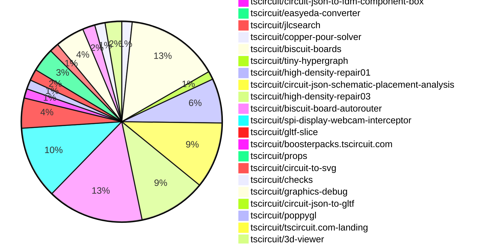

# contribution tracker

[contributions.tscircuit.com](https://contributions.tscircuit.com) ・ [tscircuit.com](https://tscircuit.com) ・ [Contribution Overviews](./contribution-overviews/) ・ [Changelogs](./changelogs/)

Generates weekly contribution overviews for tscircuit contributors. Check out all
the [contribution overviews here](./contribution-overviews/)
You can find AI-generated monthly changelogs in the [changelogs directory](./changelogs/)

- All PRs in the tscircuit org are scanned/summarized via an LLM
- The LLM classifies each Diff/PR as into a set of attributes for scoring
- All the PRs, summaries, and classifications are organized into charts and tables for [the website](https://contributions.tscircuit.com)

> Want to run locally? See the [Development Section](#development)

## Current Week

<!-- START_CURRENT_WEEK -->

# Contribution Overview 2026-08-11

The current week is shown below. There are 3 major sections:

- [Contributor Overview](#contributor-overview)
- [PRs by Repository](#prs-by-repository)
- [PRs by Contributor](#changes-by-contributor)
- [Scoring & Sponsorship Details](/docs/sponsorship-calculation-explanation.md)

## PRs by Repository


```mermaid
pie
    "tscircuit/pcb-viewer" : 10
    "tscircuit/tscircuit" : 90
    "tscircuit/circuit-json" : 8
    "tscircuit/core" : 43
    "tscircuit/tscircuit.com" : 64
    "tscircuit/eval" : 65
    "tscircuit/runframe" : 93
    "tscircuit/cli" : 70
    "tscircuit/tscircuit-autorouter" : 29
    "tscircuit/schematic-trace-solver" : 9
    "tscircuit/test-github-automerge" : 1
    "tscircuit/circuit-to-canvas" : 6
    "tscircuit/lbrnts" : 2
    "tscircuit/circuit-json-to-lbrn" : 3
    "tscircuit/internal-dynamic-import" : 4
    "tscircuit/circuit-json-placement-analysis" : 9
    "tscircuit/circuit-json-routing-analysis" : 6
    "tscircuit/monaco-code-editor" : 2
    "tscircuit/check-shorts" : 4
    "tscircuit/circuit-json-to-footprinter" : 7
    "tscircuit/fanout-solver" : 11
    "tscircuit/circuit-json-to-fdm-component-box" : 5
    "tscircuit/easyeda-converter" : 23
    "tscircuit/jlcsearch" : 9
    "tscircuit/copper-pour-solver" : 1
    "tscircuit/biscuit-boards" : 28
    "tscircuit/tiny-hypergraph" : 3
    "tscircuit/high-density-repair01" : 1
    "tscircuit/circuit-json-schematic-placement-analysis" : 1
    "tscircuit/high-density-repair03" : 4
    "tscircuit/biscuit-board-autorouter" : 12
    "tscircuit/spi-display-webcam-interceptor" : 3
    "tscircuit/gltf-slice" : 3
    "tscircuit/boosterpacks.tscircuit.com" : 5
    "tscircuit/props" : 2
    "tscircuit/circuit-to-svg" : 1
    "tscircuit/checks" : 10
    "tscircuit/graphics-debug" : 2
    "tscircuit/circuit-json-to-gltf" : 3
    "tscircuit/poppygl" : 1
    "tscircuit/tscircuit.com-landing" : 6
    "tscircuit/3d-viewer" : 5
    "tscircuit/schematic-symbols" : 1
    "tscircuit/docs" : 3
    "tscircuit/grove" : 2
    "tscircuit/awesome-tscircuit" : 1
    "tscircuit/calculate-cell-boundaries" : 4
    "tscircuit/matchpack" : 3
    "tscircuit/circuit-json-util" : 1
    "tscircuit/circuit-json-to-gerber" : 4
    "tscircuit/circuit-json-to-bom-csv" : 1
    "tscircuit/circuit-json-to-pnp-csv" : 1
    "tscircuit/fast-footprint-compare" : 4
    "tscircuit/boosters" : 16
    "tscircuit/footprinter" : 1
    "tscircuit/jscad-electronics" : 2
    "tscircuit/autorouting-dataset-01" : 2
    "tscircuit/bun-match-svg" : 1
    "tscircuit/skill" : 1
    "tscircuit/create-fdm-enclosure" : 2
    "tscircuit/tsci-agent" : 2
    "tscircuit/jscad-to-gltf" : 1
    "tscircuit/datasheet-to-tscircuit" : 2
```

## Contributor Overview

| Contributor | 🐳 Major | 🐙 Minor | 🐌 Tiny | Score | ⭐ |
|-------------|---------|---------|---------|-------|-----|
| [seveibar](#seveibar) | 43 | 29 | 45 | 243 | 👑👑👑 |
| [AnasSarkiz](#AnasSarkiz) | 8 | 9 | 10 | 63 | ⭐⭐⭐ |
| [mohan-bee](#mohan-bee) | 5 | 8 | 11 | 54 | ⭐⭐⭐ |
| [techmannih](#techmannih) | 6 | 6 | 10 | 47 | ⭐⭐ |
| [Sang-it](#Sang-it) | 3 | 6 | 16 | 37 | ⭐⭐ |
| [addibble](#addibble) | 4 | 3 | 7 | 29 | ⭐⭐ |
| [MustafaMulla29](#MustafaMulla29) | 4 | 3 | 5 | 28 | ⭐⭐ |
| [Abse2001](#Abse2001) | 3 | 1 | 10 | 25 | ⭐⭐ |
| [rushabhcodes](#rushabhcodes) | 1 | 2 | 4 | 22 | ⭐⭐ |
| [tscircuitbot](#tscircuitbot) | 0 | 0 | 416 | 20.5 | ⭐⭐ |
| [ShiboSoftwareDev](#ShiboSoftwareDev) | 2 | 3 | 4 | 20 | ⭐⭐ |
| [imrishabh18](#imrishabh18) | 2 | 0 | 8 | 17 | ⭐⭐ |
| [ArnavK-09](#ArnavK-09) | 2 | 2 | 3 | 15 | ⭐⭐ |
| [GokulPandi-M](#GokulPandi-M) | 1 | 1 | 6 | 12 | ⭐⭐ |
| [hrithik18k](#hrithik18k) | 0 | 2 | 1 | 5 | ⭐ |
| [0hmX](#0hmX) | 1 | 0 | 0 | 5 | ⭐ |
| [KrishnaX12](#KrishnaX12) | 0 | 1 | 2 | 4 | ⭐ |

## Staff Pass Ratio (SPR)

| Contributor | Reviewed PRs | Rejections | Approvals | SPR |
|-------------|--------------|------------|-----------|-----|
| [AnasSarkiz](#AnasSarkiz) | 14 | 3 | 13 | 78.6% |
| [mohan-bee](#mohan-bee) | 10 | 0 | 10 | 100.0% |
| [addibble](#addibble) | 7 | 0 | 7 | 100.0% |
| [Sang-it](#Sang-it) | 5 | 0 | 5 | 100.0% |
| [Abse2001](#Abse2001) | 4 | 1 | 3 | 75.0% |
| [ArnavK-09](#ArnavK-09) | 4 | 0 | 4 | 100.0% |
| [MustafaMulla29](#MustafaMulla29) | 4 | 1 | 5 | 75.0% |
| [ShiboSoftwareDev](#ShiboSoftwareDev) | 4 | 0 | 4 | 100.0% |
| [imrishabh18](#imrishabh18) | 3 | 2 | 1 | 33.3% |
| [GokulPandi-M](#GokulPandi-M) | 2 | 1 | 2 | 50.0% |
| [hrithik18k](#hrithik18k) | 2 | 1 | 1 | 50.0% |
| [KrishnaX12](#KrishnaX12) | 2 | 1 | 1 | 50.0% |
| [rushabhcodes](#rushabhcodes) | 2 | 1 | 1 | 50.0% |
| [techmannih](#techmannih) | 2 | 0 | 2 | 100.0% |
| [anil08607](#anil08607) | 1 | 1 | 0 | 0.0% |
| [Priyanshubhartistm](#Priyanshubhartistm) | 1 | 0 | 1 | 100.0% |

<details>
<summary>AnasSarkiz SPR PRs (14)</summary>

- [#799](https://github.com/tscircuit/footprinter/pull/799) fix(passive): define courtyards for dimensioned footprints
- [#448](https://github.com/tscircuit/easyeda-converter/pull/448) fix: import standard SMD resistors as resistor primitives
- [#439](https://github.com/tscircuit/easyeda-converter/pull/439) Generate Micro-USB connectors from EasyEDA metadata
- [#433](https://github.com/tscircuit/easyeda-converter/pull/433) Preserve exact manufacturer part numbers
- [#437](https://github.com/tscircuit/easyeda-converter/pull/437) Generate inductors from EasyEDA metadata
- [#435](https://github.com/tscircuit/easyeda-converter/pull/435) Generate four-pin crystals from EasyEDA metadata
- [#431](https://github.com/tscircuit/easyeda-converter/pull/431) Keep LED driver ICs as chips
- [#203](https://github.com/tscircuit/checks/pull/203) fix: enforce shape-accurate copper clearance against polygon board edges
- [#4248](https://github.com/tscircuit/cli/pull/4248) fix: preserve absolute paths passed to tsci export --output
- [#4247](https://github.com/tscircuit/cli/pull/4247) fix: make check placement fail when placement errors are reported
- [#2071](https://github.com/tscircuit/tscircuit-autorouter/pull/2071) Pin repair03 low-count topology fix
- [#2068](https://github.com/tscircuit/tscircuit-autorouter/pull/2068) Protect autorouter benchmark integrity from invalid PCB placements
- [#127](https://github.com/tscircuit/autorouting-dataset-01/pull/127) Prevent invalid PCB geometry from entering dataset01 benchmarks
- [#66](https://github.com/tscircuit/high-density-repair03/pull/66) Repair low-count single-trace topology conflicts

</details>

<details>
<summary>mohan-bee SPR PRs (10)</summary>

- [#116](https://github.com/tscircuit/circuit-json-util/pull/116) include rotated smt pad extents in pcb bounds
- [#199](https://github.com/tscircuit/checks/pull/199) prevent rotated pad bounding-box overlap errors
- [#18](https://github.com/tscircuit/circuit-json-to-bom-csv/pull/18) skip do-not-place parts in bom
- [#9](https://github.com/tscircuit/circuit-json-to-pnp-csv/pull/9) skip do-not-place parts in pick and place
- [#29](https://github.com/tscircuit/calculate-cell-boundaries/pull/29) merge overlapping horizontal boundaries
- [#218](https://github.com/tscircuit/matchpack/pull/218) detect and align grounded load rows
- [#216](https://github.com/tscircuit/matchpack/pull/216) Prevent loose testpoints from overlapping during row alignment
- [#806](https://github.com/tscircuit/schematic-trace-solver/pull/806) prevent same-net junction alignment from detaching net labels
- [#804](https://github.com/tscircuit/schematic-trace-solver/pull/804) Prevent VBUS label detours near port labels
- [#802](https://github.com/tscircuit/schematic-trace-solver/pull/802) obey maxMspPairDistance in LongDistancePairSolver

</details>

<details>
<summary>addibble SPR PRs (7)</summary>

- [#974](https://github.com/tscircuit/3d-viewer/pull/974) Add appearance controls for the assembled enclosure
- [#3152](https://github.com/tscircuit/core/pull/3152) Orient enclosure apertures from the component frame
- [#3174](https://github.com/tscircuit/core/pull/3174) Adopt the staged two-part FDM enclosure solver
- [#3196](https://github.com/tscircuit/core/pull/3196) Report enclosure component bodies and aperture depth
- [#3180](https://github.com/tscircuit/core/pull/3180) Emit separate base and lid CAD components
- [#3166](https://github.com/tscircuit/core/pull/3166) Add assembly.device as a compatibility container
- [#197](https://github.com/tscircuit/checks/pull/197) Consume the shared millimetre formatter

</details>

<details>
<summary>Sang-it SPR PRs (5)</summary>

- [#30](https://github.com/tscircuit/biscuit-boards/pull/30) Add bottom layer to lightburn export
- [#21](https://github.com/tscircuit/biscuit-boards/pull/21) fix BiscuitBoard using gerbers, add via-coordinate-map.csv
- [#202](https://github.com/tscircuit/circuit-json-to-lbrn/pull/202) fix: round LightBurn trace joins
- [#21](https://github.com/tscircuit/circuit-json-placement-analysis/pull/21) Warn on suboptimal two-pin orientations
- [#17](https://github.com/tscircuit/biscuit-board-autorouter/pull/17) Prune redundant same-net copper cycles

</details>

<details>
<summary>Abse2001 SPR PRs (4)</summary>

- [#3224](https://github.com/tscircuit/core/pull/3224) Fix trace connectivity through explicit vias
- [#3213](https://github.com/tscircuit/core/pull/3213) Route parent net connections through child breakout points
- [#3212](https://github.com/tscircuit/core/pull/3212) Fix default breakout routing with one-point nets
- [#13](https://github.com/tscircuit/boosters/pull/13) Add BOOSTXL-ADS7841-Q1 BoosterPack

</details>

<details>
<summary>ArnavK-09 SPR PRs (4)</summary>

- [#3160](https://github.com/tscircuit/core/pull/3160) feat: resolve noSchematicRepresentation support for Normal Component
- [#4447](https://github.com/tscircuit/tscircuit.com/pull/4447) patch: download representable 3d img size
- [#4473](https://github.com/tscircuit/runframe/pull/4473) fix(runframe-cli): schematic view options working
- [#19](https://github.com/tscircuit/tsci-agent/pull/19) patch: title and cmd guide 

</details>

<details>
<summary>MustafaMulla29 SPR PRs (4)</summary>

- [#3155](https://github.com/tscircuit/core/pull/3155) Clear overlapping different-net copper pours
- [#11](https://github.com/tscircuit/circuit-json-routing-analysis/pull/11) Add congestion severity metadata and deterministic tie-breaking
- [#9](https://github.com/tscircuit/circuit-json-routing-analysis/pull/9) Use bounding-box distance for congestion neighbors
- [#7](https://github.com/tscircuit/circuit-json-routing-analysis/pull/7) Merge duplicate routing congestion regions

</details>

<details>
<summary>ShiboSoftwareDev SPR PRs (4)</summary>

- [#4301](https://github.com/tscircuit/cli/pull/4301) fix: export all schematic sheets to SVG
- [#60](https://github.com/tscircuit/fanout-solver/pull/60) Try targeted fanout assignments before grouped beam
- [#56](https://github.com/tscircuit/fanout-solver/pull/56) Keep sequential fanout output identities distinct
- [#2](https://github.com/tscircuit/boosterpacks.tscircuit.com/pull/2) Use dedicated Circuit JSON to Altium package

</details>

<details>
<summary>imrishabh18 SPR PRs (3)</summary>

- [#3208](https://github.com/tscircuit/core/pull/3208) Fix custom passive symbol port placement
- [#2084](https://github.com/tscircuit/tscircuit-autorouter/pull/2084) Fix nested cramped escapes for bugreport91
- [#2086](https://github.com/tscircuit/tscircuit-autorouter/pull/2086) Respect board-edge clearance during trace simplification

</details>

<details>
<summary>GokulPandi-M SPR PRs (2)</summary>

- [#445](https://github.com/tscircuit/easyeda-converter/pull/445) Keep LED display driver ICs as chips
- [#442](https://github.com/tscircuit/easyeda-converter/pull/442) Preserve circular EasyEDA SMT pads

</details>

<details>
<summary>hrithik18k SPR PRs (2)</summary>

- [#201](https://github.com/tscircuit/checks/pull/201) test: Missing DRC error for component placed inside PCB cutout
- [#4502](https://github.com/tscircuit/runframe/pull/4502) Add export preparation feedback

</details>

<details>
<summary>KrishnaX12 SPR PRs (2)</summary>

- [#324](https://github.com/tscircuit/jscad-electronics/pull/324) test: add repro and snapshots for sot23_3p misalignment issue 
- [#11](https://github.com/tscircuit/jscad-to-gltf/pull/11) fix: make toColorTuple handle hex string colors

</details>

<details>
<summary>rushabhcodes SPR PRs (2)</summary>

- [#698](https://github.com/tscircuit/circuit-json/pull/698) Add voltage to simple batteries
- [#3177](https://github.com/tscircuit/core/pull/3177) Fix inductor max current rating

</details>

<details>
<summary>techmannih SPR PRs (2)</summary>

- [#797](https://github.com/tscircuit/footprinter/pull/797) Add thermal vias to QFN exposed pads
- [#17](https://github.com/tscircuit/circuit-json-placement-analysis/pull/17) Add repro for false footprint intrusion from rotated component bounds

</details>

<details>
<summary>anil08607 SPR PRs (1)</summary>

- [#3241](https://github.com/tscircuit/core/pull/3241) Add repro for incorrect bottom-layer CAD model rotation

</details>

<details>
<summary>Priyanshubhartistm SPR PRs (1)</summary>

- [#807](https://github.com/tscircuit/schematic-trace-solver/pull/807) Recover net labels that don't fit at their configured size

</details>

> Note: AI evaluates PRs and assigns 1-3 star ratings automatically. 4 and 5 star ratings require manual staff review.

## Review Table

[reviews-received-hover]: ## "Number of reviews received for PRs for this contributor"
[approvals-received-hover]: ## "Number of approvals received for PRs this contributor authored"
[rejections-received-hover]: ## "Number of rejections received for PRs this contributor authored"
[prs-opened-hover]: ## "Number of PRs opened by this contributor"
[issues-created-hover]: ## "Number of issues created by this contributor"

| Contributor | Reviews Received | Approvals Received | Rejections Received | Approvals | Rejections Given | PRs Opened | PRs Merged | Issues Created |
|---|---|---|---|---|---|---|---|---|
| [0hmX](#0hmX) | 1 | 0 | 0 | 4 | 1 | 6 | 1 | 0 |
| [Abse2001](#Abse2001) | 13 | 12 | 1 | 1 | 0 | 16 | 14 | 0 |
| [addibble](#addibble) | 18 | 14 | 0 | 0 | 0 | 18 | 14 | 0 |
| [AnasSarkiz](#AnasSarkiz) | 30 | 27 | 3 | 5 | 0 | 35 | 28 | 0 |
| [anil08607](#anil08607) | 1 | 0 | 1 | 0 | 0 | 5 | 0 | 0 |
| [ArnavK-09](#ArnavK-09) | 11 | 10 | 0 | 0 | 0 | 7 | 7 | 0 |
| [fxp](#fxp) | 0 | 0 | 0 | 0 | 0 | 6 | 0 | 0 |
| [GokulPandi-M](#GokulPandi-M) | 12 | 12 | 0 | 0 | 0 | 13 | 8 | 0 |
| [hrithik18k](#hrithik18k) | 11 | 8 | 2 | 0 | 0 | 8 | 3 | 0 |
| [imrishabh18](#imrishabh18) | 7 | 2 | 3 | 21 | 1 | 16 | 10 | 0 |
| [Jk2006k](#Jk2006k) | 0 | 0 | 0 | 0 | 0 | 2 | 0 | 0 |
| [KrishnaX12](#KrishnaX12) | 12 | 5 | 1 | 0 | 0 | 5 | 3 | 0 |
| [mohan-bee](#mohan-bee) | 20 | 19 | 0 | 8 | 0 | 32 | 24 | 0 |
| [mojeed-painless](#mojeed-painless) | 0 | 0 | 0 | 0 | 0 | 1 | 0 | 0 |
| [MustafaMulla29](#MustafaMulla29) | 7 | 7 | 0 | 3 | 0 | 13 | 12 | 0 |
| [Priyanshubhartistm](#Priyanshubhartistm) | 1 | 1 | 0 | 0 | 0 | 3 | 0 | 0 |
| [pthm](#pthm) | 0 | 0 | 0 | 0 | 0 | 4 | 0 | 0 |
| [rudra496](#rudra496) | 2 | 0 | 0 | 0 | 0 | 1 | 0 | 0 |
| [rushabhcodes](#rushabhcodes) | 25 | 8 | 1 | 11 | 0 | 13 | 7 | 0 |
| [Sang-it](#Sang-it) | 7 | 7 | 0 | 1 | 0 | 28 | 25 | 0 |
| [seveibar](#seveibar) | 20 | 2 | 0 | 94 | 10 | 166 | 120 | 0 |
| [ShiboSoftwareDev](#ShiboSoftwareDev) | 10 | 9 | 0 | 2 | 0 | 52 | 11 | 0 |
| [skaiea13-ai](#skaiea13-ai) | 0 | 0 | 0 | 0 | 0 | 1 | 0 | 0 |
| [techmannih](#techmannih) | 19 | 13 | 0 | 5 | 0 | 25 | 22 | 0 |
| [tscircuitbot](#tscircuitbot) | 0 | 0 | 0 | 0 | 0 | 590 | 416 | 0 |
| [w1ne](#w1ne) | 0 | 0 | 0 | 0 | 0 | 1 | 0 | 0 |
| [wenn-id](#wenn-id) | 0 | 0 | 0 | 1 | 0 | 0 | 0 | 0 |

## Changes by Repository

### [tscircuit/pcb-viewer](https://github.com/tscircuit/pcb-viewer)

| PR # | Impact | Rating | Contributor | Description |
|------|--------|--------|-------------|-------------|
| [#955](https://github.com/tscircuit/pcb-viewer/pull/955) | 🐳 Major | ⭐⭐⭐ | seveibar | Highlights every routed segment of a hovered PCB trace across all copper layers, preserving selected-layer-only hit testing and updating the trace highlight regression test for cross-layer behavior. |

<details>
<summary>🐌 Tiny Contributions (9)</summary>

| PR # | Impact | Contributor | Description |
|------|--------|-------------|-------------|
| [#956](https://github.com/tscircuit/pcb-viewer/pull/956) | 🐌 Tiny | tscircuitbot | Automated package update |
| [#954](https://github.com/tscircuit/pcb-viewer/pull/954) | 🐌 Tiny | tscircuitbot | Automated package update |
| [#952](https://github.com/tscircuit/pcb-viewer/pull/952) | 🐌 Tiny | tscircuitbot | Automated package update |
| [#948](https://github.com/tscircuit/pcb-viewer/pull/948) | 🐌 Tiny | tscircuitbot | Automated package update to version 1.11.385 |
| [#950](https://github.com/tscircuit/pcb-viewer/pull/950) | 🐌 Tiny | tscircuitbot | Automated package update |
| [#951](https://github.com/tscircuit/pcb-viewer/pull/951) | 🐌 Tiny | seveibar | Removes the Edit Traces and Move Components buttons from the PCB viewer toolbar, while preserving the underlying editing implementations for other consumers. |
| [#949](https://github.com/tscircuit/pcb-viewer/pull/949) | 🐌 Tiny | seveibar | Updates the dependency circuit-to-canvas from version 0.0.120 to 0.0.123 to include recent canvas-rendering fixes published to npm. |
| [#947](https://github.com/tscircuit/pcb-viewer/pull/947) | 🐌 Tiny | seveibar | Fixes trace hover tooltip labels to prefer associated trace names over pad-selector display names, adjusts tooltip size and positioning, and adds regression tests for label preference and formatting. |
| [#953](https://github.com/tscircuit/pcb-viewer/pull/953) | 🐌 Tiny | rushabhcodes | Removes the trace editing functionality from the PCB viewer, including the Edit Traces toolbar, hint overlay, and related state management. |

</details>

### [tscircuit/tscircuit](https://github.com/tscircuit/tscircuit)


<details>
<summary>🐌 Tiny Contributions (90)</summary>

| PR # | Impact | Contributor | Description |
|------|--------|-------------|-------------|
| [#4514](https://github.com/tscircuit/tscircuit/pull/4514) | 🐌 Tiny | tscircuitbot | Automated package update |
| [#4513](https://github.com/tscircuit/tscircuit/pull/4513) | 🐌 Tiny | tscircuitbot | Automated package update |
| [#4512](https://github.com/tscircuit/tscircuit/pull/4512) | 🐌 Tiny | tscircuitbot | Automated package update |
| [#4511](https://github.com/tscircuit/tscircuit/pull/4511) | 🐌 Tiny | tscircuitbot | Automated package update |
| [#4510](https://github.com/tscircuit/tscircuit/pull/4510) | 🐌 Tiny | tscircuitbot | Automated package update |
| [#4509](https://github.com/tscircuit/tscircuit/pull/4509) | 🐌 Tiny | tscircuitbot | Updates the version of the tscircuitcli package from 0.1.1935 to 0.1.1936 and the tscircuiteval package from 0.0.1206 to 0.0.1207, reflecting automated dependency updates. |
| [#4508](https://github.com/tscircuit/tscircuit/pull/4508) | 🐌 Tiny | tscircuitbot | Automated package update to version 0.0.2338 |
| [#4507](https://github.com/tscircuit/tscircuit/pull/4507) | 🐌 Tiny | tscircuitbot | Automated package update |
| [#4506](https://github.com/tscircuit/tscircuit/pull/4506) | 🐌 Tiny | tscircuitbot | Automated package update |
| [#4505](https://github.com/tscircuit/tscircuit/pull/4505) | 🐌 Tiny | tscircuitbot | Updates the tscircuitcli package and other related dependencies to their latest versions. |
| [#4504](https://github.com/tscircuit/tscircuit/pull/4504) | 🐌 Tiny | tscircuitbot | Automated package update |
| [#4503](https://github.com/tscircuit/tscircuit/pull/4503) | 🐌 Tiny | tscircuitbot | Automated package update |
| [#4502](https://github.com/tscircuit/tscircuit/pull/4502) | 🐌 Tiny | tscircuitbot | Automated package update |
| [#4501](https://github.com/tscircuit/tscircuit/pull/4501) | 🐌 Tiny | tscircuitbot | Updates the tscircuitcli package to version 0.1.1933 |
| [#4500](https://github.com/tscircuit/tscircuit/pull/4500) | 🐌 Tiny | tscircuitbot | Automated package update |
| [#4499](https://github.com/tscircuit/tscircuit/pull/4499) | 🐌 Tiny | tscircuitbot | Updates the tscircuitcli package to version 0.1.1932 in the package.json file. |
| [#4498](https://github.com/tscircuit/tscircuit/pull/4498) | 🐌 Tiny | tscircuitbot | Automated package update |
| [#4497](https://github.com/tscircuit/tscircuit/pull/4497) | 🐌 Tiny | tscircuitbot | Automated package update |
| [#4492](https://github.com/tscircuit/tscircuit/pull/4492) | 🐌 Tiny | tscircuitbot | Automated package update |
| [#4467](https://github.com/tscircuit/tscircuit/pull/4467) | 🐌 Tiny | tscircuitbot | Automated package update |
| [#4494](https://github.com/tscircuit/tscircuit/pull/4494) | 🐌 Tiny | tscircuitbot | Automated package update to version 0.0.2331 |
| [#4491](https://github.com/tscircuit/tscircuit/pull/4491) | 🐌 Tiny | tscircuitbot | Updates the tscircuitcli package from version 0.1.1927 to 0.1.1928 and the tscircuitrunframe package from version 0.0.2465 to 0.0.2466 in the package.json file. |
| [#4486](https://github.com/tscircuit/tscircuit/pull/4486) | 🐌 Tiny | tscircuitbot | Automated package update |
| [#4485](https://github.com/tscircuit/tscircuit/pull/4485) | 🐌 Tiny | tscircuitbot | Automated package update |
| [#4482](https://github.com/tscircuit/tscircuit/pull/4482) | 🐌 Tiny | tscircuitbot | Automated package update to version 0.0.2325 |
| [#4481](https://github.com/tscircuit/tscircuit/pull/4481) | 🐌 Tiny | tscircuitbot | Automated package update |
| [#4479](https://github.com/tscircuit/tscircuit/pull/4479) | 🐌 Tiny | tscircuitbot | Automated package update |
| [#4478](https://github.com/tscircuit/tscircuit/pull/4478) | 🐌 Tiny | tscircuitbot | Automated package update |
| [#4477](https://github.com/tscircuit/tscircuit/pull/4477) | 🐌 Tiny | tscircuitbot | Updates the tscircuitcli package version from 0.1.1920 to 0.1.1921 |
| [#4475](https://github.com/tscircuit/tscircuit/pull/4475) | 🐌 Tiny | tscircuitbot | Automated package update |
| [#4472](https://github.com/tscircuit/tscircuit/pull/4472) | 🐌 Tiny | tscircuitbot | Automated package update |
| [#4470](https://github.com/tscircuit/tscircuit/pull/4470) | 🐌 Tiny | tscircuitbot | Updates the tscircuitcli package from version 0.1.1917 to 0.1.1918 and the tscircuitrunframe package from version 0.0.2456 to 0.0.2457 |
| [#4466](https://github.com/tscircuit/tscircuit/pull/4466) | 🐌 Tiny | tscircuitbot | Updates the tscircuitcli and tscircuitcore packages to their latest versions. |
| [#4496](https://github.com/tscircuit/tscircuit/pull/4496) | 🐌 Tiny | tscircuitbot | Automated package update |
| [#4493](https://github.com/tscircuit/tscircuit/pull/4493) | 🐌 Tiny | tscircuitbot | Automated package update |
| [#4489](https://github.com/tscircuit/tscircuit/pull/4489) | 🐌 Tiny | tscircuitbot | Automated package update |
| [#4488](https://github.com/tscircuit/tscircuit/pull/4488) | 🐌 Tiny | tscircuitbot | Automated package update |
| [#4487](https://github.com/tscircuit/tscircuit/pull/4487) | 🐌 Tiny | tscircuitbot | Updates the tscircuitcli package to version 0.1.1926 |
| [#4483](https://github.com/tscircuit/tscircuit/pull/4483) | 🐌 Tiny | tscircuitbot | Automated package update |
| [#4480](https://github.com/tscircuit/tscircuit/pull/4480) | 🐌 Tiny | tscircuitbot | Automated package update |
| [#4476](https://github.com/tscircuit/tscircuit/pull/4476) | 🐌 Tiny | tscircuitbot | Automated package update |
| [#4473](https://github.com/tscircuit/tscircuit/pull/4473) | 🐌 Tiny | tscircuitbot | Automated package update to version 0.0.2321 |
| [#4468](https://github.com/tscircuit/tscircuit/pull/4468) | 🐌 Tiny | tscircuitbot | Updates the version of the tscircuiteval package from 0.0.1191 to 0.0.1192 in package.json |
| [#4495](https://github.com/tscircuit/tscircuit/pull/4495) | 🐌 Tiny | tscircuitbot | Automated package update |
| [#4490](https://github.com/tscircuit/tscircuit/pull/4490) | 🐌 Tiny | tscircuitbot | Automated package update |
| [#4484](https://github.com/tscircuit/tscircuit/pull/4484) | 🐌 Tiny | tscircuitbot | Updates the package version from 0.0.2325 to 0.0.2326 in package.json |
| [#4471](https://github.com/tscircuit/tscircuit/pull/4471) | 🐌 Tiny | tscircuitbot | Automated package update |
| [#4449](https://github.com/tscircuit/tscircuit/pull/4449) | 🐌 Tiny | tscircuitbot | Updates the tscircuitcli package from version 0.1.1906 to 0.1.1907 and the tscircuitrunframe package from version 0.0.2446 to 0.0.2447 in package.json |
| [#4460](https://github.com/tscircuit/tscircuit/pull/4460) | 🐌 Tiny | tscircuitbot | Automated package update to version 0.0.2315 |
| [#4459](https://github.com/tscircuit/tscircuit/pull/4459) | 🐌 Tiny | tscircuitbot | Automated package update |
| [#4457](https://github.com/tscircuit/tscircuit/pull/4457) | 🐌 Tiny | tscircuitbot | Automated package update |
| [#4456](https://github.com/tscircuit/tscircuit/pull/4456) | 🐌 Tiny | tscircuitbot | Automated package update |
| [#4455](https://github.com/tscircuit/tscircuit/pull/4455) | 🐌 Tiny | tscircuitbot | Automated package update |
| [#4453](https://github.com/tscircuit/tscircuit/pull/4453) | 🐌 Tiny | tscircuitbot | Automated package update |
| [#4450](https://github.com/tscircuit/tscircuit/pull/4450) | 🐌 Tiny | tscircuitbot | Updates the tscircuitcli package from version 0.1.1907 to 0.1.1909 and the tscircuitrunframe package from version 0.0.2447 to 0.0.2448 in the package.json file. |
| [#4446](https://github.com/tscircuit/tscircuit/pull/4446) | 🐌 Tiny | tscircuitbot | Automated package update |
| [#4445](https://github.com/tscircuit/tscircuit/pull/4445) | 🐌 Tiny | tscircuitbot | Automated package update |
| [#4464](https://github.com/tscircuit/tscircuit/pull/4464) | 🐌 Tiny | tscircuitbot | Automated package update |
| [#4463](https://github.com/tscircuit/tscircuit/pull/4463) | 🐌 Tiny | tscircuitbot | Automated package update |
| [#4462](https://github.com/tscircuit/tscircuit/pull/4462) | 🐌 Tiny | tscircuitbot | Automated package update |
| [#4458](https://github.com/tscircuit/tscircuit/pull/4458) | 🐌 Tiny | tscircuitbot | Updates the package version from 0.0.2313 to 0.0.2314 in package.json |
| [#4454](https://github.com/tscircuit/tscircuit/pull/4454) | 🐌 Tiny | tscircuitbot | Automated package update |
| [#4448](https://github.com/tscircuit/tscircuit/pull/4448) | 🐌 Tiny | tscircuitbot | Automated package update |
| [#4447](https://github.com/tscircuit/tscircuit/pull/4447) | 🐌 Tiny | tscircuitbot | Automated package update |
| [#4461](https://github.com/tscircuit/tscircuit/pull/4461) | 🐌 Tiny | tscircuitbot | Automated package update |
| [#4451](https://github.com/tscircuit/tscircuit/pull/4451) | 🐌 Tiny | tscircuitbot | Automated package update |
| [#4437](https://github.com/tscircuit/tscircuit/pull/4437) | 🐌 Tiny | tscircuitbot | Updates the tscircuitcli package from version 0.1.1902 to 0.1.1903 and the tscircuitrunframe package from version 0.0.2443 to 0.0.2444 in package.json |
| [#4433](https://github.com/tscircuit/tscircuit/pull/4433) | 🐌 Tiny | tscircuitbot | Updates the tscircuitcli package from version 0.1.1900 to 0.1.1901 and the tscircuitrunframe package from version 0.0.2441 to 0.0.2442 in package.json |
| [#4429](https://github.com/tscircuit/tscircuit/pull/4429) | 🐌 Tiny | tscircuitbot | Automated package update |
| [#4424](https://github.com/tscircuit/tscircuit/pull/4424) | 🐌 Tiny | tscircuitbot | Updates the tscircuitcli package from version 0.1.1896 to 0.1.1897 and the tscircuitrunframe package from version 0.0.2437 to 0.0.2438 in the package.json file. |
| [#4440](https://github.com/tscircuit/tscircuit/pull/4440) | 🐌 Tiny | tscircuitbot | Automated package update |
| [#4439](https://github.com/tscircuit/tscircuit/pull/4439) | 🐌 Tiny | tscircuitbot | Automated package update |
| [#4438](https://github.com/tscircuit/tscircuit/pull/4438) | 🐌 Tiny | tscircuitbot | Automated package update |
| [#4435](https://github.com/tscircuit/tscircuit/pull/4435) | 🐌 Tiny | tscircuitbot | Automated package update |
| [#4427](https://github.com/tscircuit/tscircuit/pull/4427) | 🐌 Tiny | tscircuitbot | Automated package update |
| [#4425](https://github.com/tscircuit/tscircuit/pull/4425) | 🐌 Tiny | tscircuitbot | Automated package update |
| [#4422](https://github.com/tscircuit/tscircuit/pull/4422) | 🐌 Tiny | tscircuitbot | Updates the tscircuitcli package from version 0.1.1895 to 0.1.1896 |
| [#4419](https://github.com/tscircuit/tscircuit/pull/4419) | 🐌 Tiny | tscircuitbot | Automated package update |
| [#4418](https://github.com/tscircuit/tscircuit/pull/4418) | 🐌 Tiny | tscircuitbot | Automated package update |
| [#4414](https://github.com/tscircuit/tscircuit/pull/4414) | 🐌 Tiny | tscircuitbot | Updates the package version from 0.0.2296 to 0.0.2297 in package.json |
| [#4413](https://github.com/tscircuit/tscircuit/pull/4413) | 🐌 Tiny | tscircuitbot | Automated package update |
| [#4436](https://github.com/tscircuit/tscircuit/pull/4436) | 🐌 Tiny | tscircuitbot | Automated package update to version 0.0.2306 |
| [#4430](https://github.com/tscircuit/tscircuit/pull/4430) | 🐌 Tiny | tscircuitbot | Automated package update |
| [#4428](https://github.com/tscircuit/tscircuit/pull/4428) | 🐌 Tiny | tscircuitbot | Automated package update |
| [#4421](https://github.com/tscircuit/tscircuit/pull/4421) | 🐌 Tiny | tscircuitbot | Automated package update |
| [#4434](https://github.com/tscircuit/tscircuit/pull/4434) | 🐌 Tiny | tscircuitbot | Automated package update |
| [#4432](https://github.com/tscircuit/tscircuit/pull/4432) | 🐌 Tiny | tscircuitbot | Automated package update |
| [#4431](https://github.com/tscircuit/tscircuit/pull/4431) | 🐌 Tiny | tscircuitbot | Automated package update |
| [#4423](https://github.com/tscircuit/tscircuit/pull/4423) | 🐌 Tiny | tscircuitbot | Automated package update |
| [#4420](https://github.com/tscircuit/tscircuit/pull/4420) | 🐌 Tiny | tscircuitbot | Automated package update |

</details>

### [tscircuit/circuit-json](https://github.com/tscircuit/circuit-json)

| PR # | Impact | Rating | Contributor | Description |
|------|--------|--------|-------------|-------------|
| [#702](https://github.com/tscircuit/circuit-json/pull/702) | 🐳 Major | ⭐⭐⭐ | seveibar | Adds JST SHGHZHPHXHVH to the allowed SourceSimpleConnector.standard values, introduces an optional positive-integer pin_count to the runtime Zod schema and TypeScript interface, and exports the shared SourceSimpleConnectorStandard type and standards list, closing the typeschema gap for JST connector support. |
| [#704](https://github.com/tscircuit/circuit-json/pull/704) | 🐙 Minor | ⭐⭐ | seveibar | Add optional max_via_count to the source_trace schema and TypeScript interface, along with a warning for traces exceeding this count. |
| [#700](https://github.com/tscircuit/circuit-json/pull/700) | 🐙 Minor | ⭐⭐ | seveibar | Add a general schematic_component_styling_warning circuit-json element to provide a shared warning for visual issues in schematic components, including a machine-readable styling_issue_type and optional related port IDs. |
| [#695](https://github.com/tscircuit/circuit-json/pull/695) | 🐙 Minor | ⭐⭐ | seveibar | Adds an optional show_hidden_edges field to the cad_component schema, exposing it on the typed CadComponent interface and testing schema parsing for the new rendering hint. |

<details>
<summary>🐌 Tiny Contributions (4)</summary>

| PR # | Impact | Contributor | Description |
|------|--------|-------------|-------------|
| [#705](https://github.com/tscircuit/circuit-json/pull/705) | 🐌 Tiny | tscircuitbot | Automated package update |
| [#703](https://github.com/tscircuit/circuit-json/pull/703) | 🐌 Tiny | tscircuitbot | Updates the package version from v0.0.467 to v0.0.468 in package.json |
| [#701](https://github.com/tscircuit/circuit-json/pull/701) | 🐌 Tiny | tscircuitbot | Automated package update |
| [#696](https://github.com/tscircuit/circuit-json/pull/696) | 🐌 Tiny | tscircuitbot | Automated package update |

</details>

### [tscircuit/core](https://github.com/tscircuit/core)

| PR # | Impact | Rating | Contributor | Description |
|------|--------|--------|-------------|-------------|
| [#3223](https://github.com/tscircuit/core/pull/3223) | 🐳 Major | ⭐⭐⭐ | seveibar | Update the fanout solver to derive exit targets from paired breakout points, improving routing efficiency and reducing global trace crossover. |
| [#3204](https://github.com/tscircuit/core/pull/3204) | 🐳 Major | ⭐⭐⭐ | seveibar | Updates the tscircuitcapacity-autorouter dependency to version 0.0.802, ensuring valid placement and routing checks for single-pin fixtures, and refreshing affected SVG snapshots. |
| [#3218](https://github.com/tscircuit/core/pull/3218) | 🐳 Major | ⭐⭐⭐ | seveibar | Updates the fanout solver to version 0.0.24, expanding inferred fanout boundaries to include original downstream endpoint tracks and improving boundary coverage for fanoutbreakout snapshots. |
| [#3152](https://github.com/tscircuit/core/pull/3152) | 🐳 Major | ⭐⭐⭐ | addibble | Prefer footprint-local cutoutApertureDirection over insertionDirection, preserving continuous aperture axis through component rotation and bottom-layer transforms, and deriving horizontal aperture profile roll from the PCB component frame. |
| [#3174](https://github.com/tscircuit/core/pull/3174) | 🐳 Major | ⭐⭐⭐ | addibble | Layer 2 of the staged Core enclosure migration, following merged 3166, which includes updates to the Props and create-fdm-enclosure APIs, forwards box stackclearance controls, and migrates existing placement to facecenter inputs while supporting horizontal faces. |
| [#3196](https://github.com/tscircuit/core/pull/3196) | 🐳 Major | ⭐⭐⭐ | addibble | Reports each cutout components normalized CAD-model bounds to the staged enclosure solver, falling back to the component footprint when no explicit CAD body dimensions are available, and passing signed aperture offsets and an explicitly authored aperture depth through unchanged. |
| [#3166](https://github.com/tscircuit/core/pull/3166) | 🐳 Major | ⭐⭐⭐ | addibble | Adds a new compatibility container assembly.device that allows for board discovery without altering existing Circuit JSON or electrical semantics. |
| [#3213](https://github.com/tscircuit/core/pull/3213) | 🐳 Major | ⭐⭐⭐ | Abse2001 | Route net-derived parent connections to a child breakout point instead of the childs internal PCB pad, reusing breakout-aware PCB endpoint conversion for both direct-trace and net-derived connections. |
| [#3212](https://github.com/tscircuit/core/pull/3212) | 🐳 Major | ⭐⭐⭐ | Abse2001 | Fixes default breakout routing to omit net-derived autorouter connections with fewer than two physical points, allowing legitimate one-point connections to copper planes and treating empty multi-stage autorouting phases as no-ops. |
| [#3222](https://github.com/tscircuit/core/pull/3222) | 🐙 Minor | ⭐⭐ | seveibar | Displays the manufacturer part number of referenced chips beneath their schematic box aliases, ensuring consistent part identification across schematic representations. |
| [#3205](https://github.com/tscircuit/core/pull/3205) | 🐙 Minor | ⭐⭐ | seveibar | Add support for JST SHGHZHPHXHVH connectors in the parts engine, including enhancements to schematic symbol rendering and pin normalization. |
| [#3178](https://github.com/tscircuit/core/pull/3178) | 🐙 Minor | ⭐⭐ | seveibar | Fixes copper pour rendering to correctly follow the center of rectangular boards that are offset from the origin, ensuring accurate automatic copper pours and preserving explicit outlines. |
| [#3206](https://github.com/tscircuit/core/pull/3206) | 🐙 Minor | ⭐⭐ | seveibar | Updates the schematic symbols for the speaker, including a new fixture and connection of polarity ports to VCC and GND. |
| [#3169](https://github.com/tscircuit/core/pull/3169) | 🐙 Minor | ⭐⭐ | seveibar | Expose showHiddenEdges on enclosure.fdm.box through the props package, allowing enclosure authors to opt into hidden-edge visualization from normal tscircuit JSX. |
| [#3177](https://github.com/tscircuit/core/pull/3177) | 🐙 Minor | ⭐⭐ | rushabhcodes | Preserves maxCurrentRating when rendering an inductor source component and converts values like 2A to numeric Circuit JSON value 2, while adding regression coverage for the generated source component. |
| [#3209](https://github.com/tscircuit/core/pull/3209) | 🐙 Minor | ⭐⭐ | techmannih | Fixes PCB component bounds calculation for rotated footprint primitives by transforming their local corners into board coordinates. |
| [#3180](https://github.com/tscircuit/core/pull/3180) | 🐙 Minor | ⭐⭐ | addibble | Emits two separate CAD components for the base and lid of the enclosure, allowing for independent rendering while maintaining shared ownership in the existing synthetic PCB structure. |
| [#3224](https://github.com/tscircuit/core/pull/3224) | 🐙 Minor | ⭐⭐ | Abse2001 | Fixes false overlap DRC when traces terminate at net-connected explicit vias by ensuring correct net assignment during connectivity-map generation. |
| [#3194](https://github.com/tscircuit/core/pull/3194) | 🐙 Minor | ⭐⭐ | MustafaMulla29 | Fixes cross-sheet net label collision handling by treating direct endpoints crossing schematic-sheet boundaries as solver-visible connections and refining the rules for net label generation to prevent overlaps. |
| [#3155](https://github.com/tscircuit/core/pull/3155) | 🐙 Minor | ⭐⭐ | MustafaMulla29 | Batch copper pours by owning subcircuit to apply different-net pour priority and clearance, preserving each pours net, layer, margins, outline, and solder-mask setting, while converting repro172 from an expected failure to a passing PCB snapshot. |
| [#3160](https://github.com/tscircuit/core/pull/3160) | 🐙 Minor | ⭐⭐ | ArnavK-09 | Adds support for the noSchematicRepresentation property in NormalComponent, preventing schematic rendering for components that have this property set to true. |

<details>
<summary>🐌 Tiny Contributions (22)</summary>

| PR # | Impact | Contributor | Description |
|------|--------|-------------|-------------|
| [#3216](https://github.com/tscircuit/core/pull/3216) | 🐌 Tiny | tscircuitbot | Updates the tscircuitchecks package from version 0.0.160 to 0.0.162 in the package.json file. |
| [#3199](https://github.com/tscircuit/core/pull/3199) | 🐌 Tiny | tscircuitbot | Updates the version of the tscircuitchecks package from 0.0.159 to 0.0.160 in package.json |
| [#3215](https://github.com/tscircuit/core/pull/3215) | 🐌 Tiny | tscircuitbot | Updates the tscircuitchecks package from version 0.0.160 to 0.0.162 |
| [#3192](https://github.com/tscircuit/core/pull/3192) | 🐌 Tiny | tscircuitbot | Updates the tscircuitfanout-solver package from version 0.0.21 to 0.0.23 |
| [#3168](https://github.com/tscircuit/core/pull/3168) | 🐌 Tiny | tscircuitbot | Updates the tscircuitchecks package from version 0.0.156 to 0.0.157 |
| [#3165](https://github.com/tscircuit/core/pull/3165) | 🐌 Tiny | tscircuitbot | Updates the tscircuitfanout-solver package from version 0.0.20 to 0.0.21 |
| [#3162](https://github.com/tscircuit/core/pull/3162) | 🐌 Tiny | tscircuitbot | Updates the version of the tscircuitchecks package from 0.0.155 to 0.0.156 in package.json |
| [#3161](https://github.com/tscircuit/core/pull/3161) | 🐌 Tiny | tscircuitbot | Updates the version of the tscircuitchecks package from 0.0.155 to 0.0.156 in package.json |
| [#3158](https://github.com/tscircuit/core/pull/3158) | 🐌 Tiny | tscircuitbot | Updates the tscircuitchecks package from version 0.0.154 to 0.0.155 |
| [#3156](https://github.com/tscircuit/core/pull/3156) | 🐌 Tiny | tscircuitbot | Updates the tscircuitchecks package from version 0.0.153 to 0.0.154 |
| [#3235](https://github.com/tscircuit/core/pull/3235) | 🐌 Tiny | seveibar | Updates the tscircuitschematic-trace-solver package from version 0.0.129 to 0.0.134, incorporating a merged routing fix and refreshing 18 affected schematic snapshots. |
| [#3214](https://github.com/tscircuit/core/pull/3214) | 🐌 Tiny | seveibar | Updates the tscircuitcapacity-autorouter dependency from 0.0.802 to 0.0.803 while ensuring the tscircuitfanout-solver is at its latest release (0.0.23) |
| [#3188](https://github.com/tscircuit/core/pull/3188) | 🐌 Tiny | rushabhcodes | Updates the tscircuitchecks dependency to version 0.0.159 and refreshes SVG snapshots for PCB components. |
| [#3240](https://github.com/tscircuit/core/pull/3240) | 🐌 Tiny | mohan-bee | Updates the schematic layout dependencies to use calculate-cell-boundaries 0.0.19 and Matchpack 0.0.81 for improved rendering of RP2040 section and power-section snapshots. |
| [#3173](https://github.com/tscircuit/core/pull/3173) | 🐌 Tiny | mohan-bee | Updates the matchpack dependency to version 0.0.80 in the package.json file and adjusts test timeouts for various tests. |
| [#3207](https://github.com/tscircuit/core/pull/3207) | 🐌 Tiny | techmannih | Updates the footprinter dependency version from 0.0.409 to 0.0.418 in package.json |
| [#3179](https://github.com/tscircuit/core/pull/3179) | 🐌 Tiny | techmannih | Adds a regression repro for jlcpcb:C1526234 placed at -90 next to a cap0402, demonstrating incorrect component bounds due to unrotated pad dimensions. |
| [#3219](https://github.com/tscircuit/core/pull/3219) | 🐌 Tiny | Abse2001 | Adds a minimal test case that reproduces a bug where a trace connected to a via does not inherit the correct net connectivity, leading to false DRC errors. |
| [#3198](https://github.com/tscircuit/core/pull/3198) | 🐌 Tiny | Abse2001 | Reproduces a bug where default breakout routing emits a one-point net connection, ensuring that no connection has fewer than two points during autorouting. |
| [#3190](https://github.com/tscircuit/core/pull/3190) | 🐌 Tiny | Abse2001 | Updates the circuit-json-to-gltf package from version 0.0.117 to 0.0.118, aligning generated GLB component models with the live 3D viewer and allowing the copy-core-versions pipeline to propagate it to downstream tscircuit packages. |
| [#3191](https://github.com/tscircuit/core/pull/3191) | 🐌 Tiny | MustafaMulla29 | Add a schematic-only regression reproducer for the BOOST-DRV8711 power stage to demonstrate overlapping net-labels in a stacked schematic SVG snapshot. |
| [#3163](https://github.com/tscircuit/core/pull/3163) | 🐌 Tiny | ArnavK-09 | Fixes CI build errors by updating the format-si-unit dependency version from 0.0.7 to 0.0.12 in package.json |

</details>

### [tscircuit/tscircuit.com](https://github.com/tscircuit/tscircuit.com)

| PR # | Impact | Rating | Contributor | Description |
|------|--------|--------|-------------|-------------|
| [#4394](https://github.com/tscircuit/tscircuit.com/pull/4394) | 🐳 Major | ⭐⭐⭐ | seveibar | Changes the GitHub sync process to wait for new build logs to be available before navigating to the build detail page, ensuring users see the latest logs instead of stale ones. |
| [#4376](https://github.com/tscircuit/tscircuit.com/pull/4376) | 🐳 Major | ⭐⭐⭐ | seveibar | Add an Accessory item to the project download menu, allowing users to fetch the current Circuit JSON on demand and open RunFrames shared ExportAccessoryDialog, preserving lazy loading behavior for the component-box converter. |
| [#4447](https://github.com/tscircuit/tscircuit.com/pull/4447) | 🐳 Major | ⭐⭐⭐ | ArnavK-09 | Sets the dimensions for downloading 3D images to 1920x1440 with supersampling for improved quality. |

<details>
<summary>🐌 Tiny Contributions (61)</summary>

| PR # | Impact | Contributor | Description |
|------|--------|-------------|-------------|
| [#4450](https://github.com/tscircuit/tscircuit.com/pull/4450) | 🐌 Tiny | tscircuitbot | Updates the tscircuitrunframe package to version 0.0.2478 |
| [#4449](https://github.com/tscircuit/tscircuit.com/pull/4449) | 🐌 Tiny | tscircuitbot | Updates the tscircuiteval package from version 0.0.1207 to 0.0.1209 |
| [#4446](https://github.com/tscircuit/tscircuit.com/pull/4446) | 🐌 Tiny | tscircuitbot | Automated package update |
| [#4444](https://github.com/tscircuit/tscircuit.com/pull/4444) | 🐌 Tiny | tscircuitbot | Automated package update |
| [#4442](https://github.com/tscircuit/tscircuit.com/pull/4442) | 🐌 Tiny | tscircuitbot | Updates the tscircuiteval package from version 0.0.1206 to 0.0.1207 |
| [#4441](https://github.com/tscircuit/tscircuit.com/pull/4441) | 🐌 Tiny | tscircuitbot | Updates the tscircuitrunframe package from version 0.0.2472 to 0.0.2474 and the tscircuitpcb-viewer package from version 1.11.387 to 1.11.388 in package.json |
| [#4440](https://github.com/tscircuit/tscircuit.com/pull/4440) | 🐌 Tiny | tscircuitbot | Automated package update |
| [#4438](https://github.com/tscircuit/tscircuit.com/pull/4438) | 🐌 Tiny | tscircuitbot | Automated package update |
| [#4437](https://github.com/tscircuit/tscircuit.com/pull/4437) | 🐌 Tiny | tscircuitbot | Automated package update |
| [#4433](https://github.com/tscircuit/tscircuit.com/pull/4433) | 🐌 Tiny | tscircuitbot | Updates the tscircuitrunframe package from version 0.0.2468 to 0.0.2469 |
| [#4415](https://github.com/tscircuit/tscircuit.com/pull/4415) | 🐌 Tiny | tscircuitbot | Updates the tscircuiteval package from version 0.0.1194 to 0.0.1195 |
| [#4410](https://github.com/tscircuit/tscircuit.com/pull/4410) | 🐌 Tiny | tscircuitbot | Updates the tscircuitrunframe package from version 0.0.2456 to 0.0.2457 |
| [#4434](https://github.com/tscircuit/tscircuit.com/pull/4434) | 🐌 Tiny | tscircuitbot | Updates the tscircuiteval package from version 0.0.1203 to 0.0.1204 |
| [#4432](https://github.com/tscircuit/tscircuit.com/pull/4432) | 🐌 Tiny | tscircuitbot | Updates the tscircuiteval package from version 0.0.1202 to 0.0.1203 |
| [#4431](https://github.com/tscircuit/tscircuit.com/pull/4431) | 🐌 Tiny | tscircuitbot | Updates the tscircuitrunframe package from version 0.0.2466 to 0.0.2468 |
| [#4430](https://github.com/tscircuit/tscircuit.com/pull/4430) | 🐌 Tiny | tscircuitbot | Updates the tscircuiteval package from version 0.0.1201 to 0.0.1202 |
| [#4428](https://github.com/tscircuit/tscircuit.com/pull/4428) | 🐌 Tiny | tscircuitbot | Updates the version of the tscircuiteval package from 0.0.1199 to 0.0.1201 in package.json |
| [#4426](https://github.com/tscircuit/tscircuit.com/pull/4426) | 🐌 Tiny | tscircuitbot | Updates the tscircuitrunframe package from version 0.0.2463 to 0.0.2465 |
| [#4423](https://github.com/tscircuit/tscircuit.com/pull/4423) | 🐌 Tiny | tscircuitbot | Updates the tscircuiteval package from version 0.0.1197 to 0.0.1199 |
| [#4422](https://github.com/tscircuit/tscircuit.com/pull/4422) | 🐌 Tiny | tscircuitbot | Automated package update |
| [#4420](https://github.com/tscircuit/tscircuit.com/pull/4420) | 🐌 Tiny | tscircuitbot | Updates the tscircuitrunframe package to version 0.0.2462 in the package.json file. |
| [#4419](https://github.com/tscircuit/tscircuit.com/pull/4419) | 🐌 Tiny | tscircuitbot | Updates the tscircuiteval package version from 0.0.1195 to 0.0.1197 in package.json |
| [#4418](https://github.com/tscircuit/tscircuit.com/pull/4418) | 🐌 Tiny | tscircuitbot | Updates the tscircuitrunframe package to version 0.0.2461 |
| [#4416](https://github.com/tscircuit/tscircuit.com/pull/4416) | 🐌 Tiny | tscircuitbot | Automated package update |
| [#4413](https://github.com/tscircuit/tscircuit.com/pull/4413) | 🐌 Tiny | tscircuitbot | Updates the tscircuiteval package from version 0.0.1193 to 0.0.1194 |
| [#4412](https://github.com/tscircuit/tscircuit.com/pull/4412) | 🐌 Tiny | tscircuitbot | Automated package update |
| [#4411](https://github.com/tscircuit/tscircuit.com/pull/4411) | 🐌 Tiny | tscircuitbot | Automated package update |
| [#4409](https://github.com/tscircuit/tscircuit.com/pull/4409) | 🐌 Tiny | tscircuitbot | Updates the tscircuiteval package from version 0.0.1191 to 0.0.1192 |
| [#4427](https://github.com/tscircuit/tscircuit.com/pull/4427) | 🐌 Tiny | tscircuitbot | Automated package update |
| [#4405](https://github.com/tscircuit/tscircuit.com/pull/4405) | 🐌 Tiny | tscircuitbot | Updates the tscircuiteval package from version 0.0.1189 to 0.0.1190 |
| [#4399](https://github.com/tscircuit/tscircuit.com/pull/4399) | 🐌 Tiny | tscircuitbot | Updates the tscircuiteval package from version 0.0.1185 to 0.0.1187 in the package.json file. |
| [#4393](https://github.com/tscircuit/tscircuit.com/pull/4393) | 🐌 Tiny | tscircuitbot | Automated package update for tscircuitrunframe from version 0.0.2448 to 0.0.2449 |
| [#4390](https://github.com/tscircuit/tscircuit.com/pull/4390) | 🐌 Tiny | tscircuitbot | Updates the tscircuiteval package from version 0.0.1183 to 0.0.1185 |
| [#4407](https://github.com/tscircuit/tscircuit.com/pull/4407) | 🐌 Tiny | tscircuitbot | Updates the tscircuiteval package from version 0.0.1190 to 0.0.1191 in the package.json file. |
| [#4404](https://github.com/tscircuit/tscircuit.com/pull/4404) | 🐌 Tiny | tscircuitbot | Automated package update |
| [#4402](https://github.com/tscircuit/tscircuit.com/pull/4402) | 🐌 Tiny | tscircuitbot | Automated package update |
| [#4401](https://github.com/tscircuit/tscircuit.com/pull/4401) | 🐌 Tiny | tscircuitbot | Automated package update |
| [#4389](https://github.com/tscircuit/tscircuit.com/pull/4389) | 🐌 Tiny | tscircuitbot | Updates the tscircuitrunframe package to version 0.0.2446 |
| [#4408](https://github.com/tscircuit/tscircuit.com/pull/4408) | 🐌 Tiny | tscircuitbot | Updates the tscircuitrunframe package from version 0.0.2455 to 0.0.2456 |
| [#4406](https://github.com/tscircuit/tscircuit.com/pull/4406) | 🐌 Tiny | tscircuitbot | Updates the tscircuitrunframe package from version 0.0.2454 to 0.0.2455 |
| [#4403](https://github.com/tscircuit/tscircuit.com/pull/4403) | 🐌 Tiny | tscircuitbot | Updates the tscircuiteval package from version 0.0.1188 to 0.0.1189 |
| [#4400](https://github.com/tscircuit/tscircuit.com/pull/4400) | 🐌 Tiny | tscircuitbot | Automated package update |
| [#4398](https://github.com/tscircuit/tscircuit.com/pull/4398) | 🐌 Tiny | tscircuitbot | Automated package update |
| [#4392](https://github.com/tscircuit/tscircuit.com/pull/4392) | 🐌 Tiny | tscircuitbot | Automated package update |
| [#4383](https://github.com/tscircuit/tscircuit.com/pull/4383) | 🐌 Tiny | tscircuitbot | Updates the tscircuitrunframe package from version 0.0.2439 to 0.0.2441 |
| [#4387](https://github.com/tscircuit/tscircuit.com/pull/4387) | 🐌 Tiny | tscircuitbot | Updates the tscircuitrunframe package to version 0.0.2444 |
| [#4382](https://github.com/tscircuit/tscircuit.com/pull/4382) | 🐌 Tiny | tscircuitbot | Updates the tscircuiteval package from version 0.0.1182 to 0.0.1183 |
| [#4380](https://github.com/tscircuit/tscircuit.com/pull/4380) | 🐌 Tiny | tscircuitbot | Updates the tscircuiteval package from version 0.0.1181 to 0.0.1182 |
| [#4379](https://github.com/tscircuit/tscircuit.com/pull/4379) | 🐌 Tiny | tscircuitbot | Updates the tscircuitrunframe package from version 0.0.2438 to 0.0.2439 |
| [#4377](https://github.com/tscircuit/tscircuit.com/pull/4377) | 🐌 Tiny | tscircuitbot | Automated package update |
| [#4388](https://github.com/tscircuit/tscircuit.com/pull/4388) | 🐌 Tiny | tscircuitbot | Updates the tscircuitrunframe package from version 0.0.2444 to 0.0.2445 |
| [#4386](https://github.com/tscircuit/tscircuit.com/pull/4386) | 🐌 Tiny | tscircuitbot | Automated package update |
| [#4384](https://github.com/tscircuit/tscircuit.com/pull/4384) | 🐌 Tiny | tscircuitbot | Updates the tscircuitrunframe package from version 0.0.2441 to 0.0.2442 |
| [#4378](https://github.com/tscircuit/tscircuit.com/pull/4378) | 🐌 Tiny | tscircuitbot | Updates the tscircuiteval package from version 0.0.1180 to 0.0.1181 in the package.json file. |
| [#4375](https://github.com/tscircuit/tscircuit.com/pull/4375) | 🐌 Tiny | tscircuitbot | Automated package update |
| [#4373](https://github.com/tscircuit/tscircuit.com/pull/4373) | 🐌 Tiny | tscircuitbot | Automated package update |
| [#4372](https://github.com/tscircuit/tscircuit.com/pull/4372) | 🐌 Tiny | tscircuitbot | Automated package update |
| [#4370](https://github.com/tscircuit/tscircuit.com/pull/4370) | 🐌 Tiny | tscircuitbot | Automated package update |
| [#4369](https://github.com/tscircuit/tscircuit.com/pull/4369) | 🐌 Tiny | tscircuitbot | Automated package update |
| [#4368](https://github.com/tscircuit/tscircuit.com/pull/4368) | 🐌 Tiny | tscircuitbot | Updates the tscircuitrunframe package from version 0.0.2432 to 0.0.2433 |
| [#4367](https://github.com/tscircuit/tscircuit.com/pull/4367) | 🐌 Tiny | tscircuitbot | Updates the tscircuitrunframe package from version 0.0.2431 to 0.0.2432 |

</details>

### [tscircuit/eval](https://github.com/tscircuit/eval)

| PR # | Impact | Rating | Contributor | Description |
|------|--------|--------|-------------|-------------|
| [#3903](https://github.com/tscircuit/eval/pull/3903) | 🐙 Minor | ⭐⭐ | seveibar | Merges partial runtime platform overrides with evals built-in platform defaults, preserving custom autorouter, SPICE, footprint-library, footprint-parser, and static-file-loader entries. |

<details>
<summary>🐌 Tiny Contributions (64)</summary>

| PR # | Impact | Contributor | Description |
|------|--------|-------------|-------------|
| [#3939](https://github.com/tscircuit/eval/pull/3939) | 🐌 Tiny | tscircuitbot | Automated package update |
| [#3938](https://github.com/tscircuit/eval/pull/3938) | 🐌 Tiny | tscircuitbot | Automated package update |
| [#3935](https://github.com/tscircuit/eval/pull/3935) | 🐌 Tiny | tscircuitbot | Automated package update |
| [#3934](https://github.com/tscircuit/eval/pull/3934) | 🐌 Tiny | tscircuitbot | Updates the version of the tscircuitcore package from 0.0.1687 to 0.0.1688 in package.json |
| [#3932](https://github.com/tscircuit/eval/pull/3932) | 🐌 Tiny | tscircuitbot | Automated package update |
| [#3931](https://github.com/tscircuit/eval/pull/3931) | 🐌 Tiny | tscircuitbot | Automated package update |
| [#3929](https://github.com/tscircuit/eval/pull/3929) | 🐌 Tiny | tscircuitbot | Automated package update |
| [#3928](https://github.com/tscircuit/eval/pull/3928) | 🐌 Tiny | tscircuitbot | Updates the version of the tscircuitcore package from 0.0.1685 to 0.0.1686 in package.json |
| [#3926](https://github.com/tscircuit/eval/pull/3926) | 🐌 Tiny | tscircuitbot | Automated package update |
| [#3913](https://github.com/tscircuit/eval/pull/3913) | 🐌 Tiny | tscircuitbot | Updates the version of the tscircuitcore package from 0.0.1680 to 0.0.1681 in package.json |
| [#3891](https://github.com/tscircuit/eval/pull/3891) | 🐌 Tiny | tscircuitbot | Automated package update |
| [#3920](https://github.com/tscircuit/eval/pull/3920) | 🐌 Tiny | tscircuitbot | Automated package update |
| [#3923](https://github.com/tscircuit/eval/pull/3923) | 🐌 Tiny | tscircuitbot | Automated package update |
| [#3922](https://github.com/tscircuit/eval/pull/3922) | 🐌 Tiny | tscircuitbot | Updates package dependencies to their latest versions as part of routine maintenance. |
| [#3916](https://github.com/tscircuit/eval/pull/3916) | 🐌 Tiny | tscircuitbot | Updates the version of the tscircuitcore package from 0.0.1681 to 0.0.1682 in package.json |
| [#3910](https://github.com/tscircuit/eval/pull/3910) | 🐌 Tiny | tscircuitbot | Updates the version of the tscircuitcore package from 0.0.1679 to 0.0.1680 in package.json |
| [#3904](https://github.com/tscircuit/eval/pull/3904) | 🐌 Tiny | tscircuitbot | Automated package update |
| [#3901](https://github.com/tscircuit/eval/pull/3901) | 🐌 Tiny | tscircuitbot | Updates the version of tscircuitcore from 0.0.1677 to 0.0.1678 and schematic-symbols from 0.0.238 to 0.0.239 in package.json |
| [#3899](https://github.com/tscircuit/eval/pull/3899) | 🐌 Tiny | tscircuitbot | Automated package update to version 0.0.1196 |
| [#3898](https://github.com/tscircuit/eval/pull/3898) | 🐌 Tiny | tscircuitbot | Automated package update |
| [#3896](https://github.com/tscircuit/eval/pull/3896) | 🐌 Tiny | tscircuitbot | Automated package update |
| [#3893](https://github.com/tscircuit/eval/pull/3893) | 🐌 Tiny | tscircuitbot | Automated package update |
| [#3890](https://github.com/tscircuit/eval/pull/3890) | 🐌 Tiny | tscircuitbot | Updates the version of the tscircuitcore package from 0.0.1673 to 0.0.1674 in package.json |
| [#3889](https://github.com/tscircuit/eval/pull/3889) | 🐌 Tiny | tscircuitbot | Automated package update |
| [#3919](https://github.com/tscircuit/eval/pull/3919) | 🐌 Tiny | tscircuitbot | Automated package update |
| [#3917](https://github.com/tscircuit/eval/pull/3917) | 🐌 Tiny | tscircuitbot | Automated package update |
| [#3914](https://github.com/tscircuit/eval/pull/3914) | 🐌 Tiny | tscircuitbot | Automated package update |
| [#3908](https://github.com/tscircuit/eval/pull/3908) | 🐌 Tiny | tscircuitbot | Automated package update |
| [#3902](https://github.com/tscircuit/eval/pull/3902) | 🐌 Tiny | tscircuitbot | Automated package update |
| [#3895](https://github.com/tscircuit/eval/pull/3895) | 🐌 Tiny | tscircuitbot | Automated package update |
| [#3888](https://github.com/tscircuit/eval/pull/3888) | 🐌 Tiny | tscircuitbot | Automated package update |
| [#3925](https://github.com/tscircuit/eval/pull/3925) | 🐌 Tiny | tscircuitbot | Updates the version of tscircuitcore from 0.0.1684 to 0.0.1685 and tscircuitfanout-solver from 0.0.23 to 0.0.24 in package.json |
| [#3911](https://github.com/tscircuit/eval/pull/3911) | 🐌 Tiny | tscircuitbot | Automated package update |
| [#3907](https://github.com/tscircuit/eval/pull/3907) | 🐌 Tiny | tscircuitbot | Updates package versions for core and footprinter dependencies in the project. |
| [#3894](https://github.com/tscircuit/eval/pull/3894) | 🐌 Tiny | tscircuitbot | Automated package update |
| [#3881](https://github.com/tscircuit/eval/pull/3881) | 🐌 Tiny | tscircuitbot | Automated package update |
| [#3880](https://github.com/tscircuit/eval/pull/3880) | 🐌 Tiny | tscircuitbot | Updates the version of the tscircuitcore package from 0.0.1669 to 0.0.1670 in package.json |
| [#3877](https://github.com/tscircuit/eval/pull/3877) | 🐌 Tiny | tscircuitbot | Updates the version of the tscircuitcore package from 0.0.1668 to 0.0.1669 in package.json |
| [#3874](https://github.com/tscircuit/eval/pull/3874) | 🐌 Tiny | tscircuitbot | Updates the version of tscircuitcore from 0.0.1667 to 0.0.1668 and tscircuitfanout-solver from 0.0.21 to 0.0.23 in package.json |
| [#3871](https://github.com/tscircuit/eval/pull/3871) | 🐌 Tiny | tscircuitbot | Updates package dependencies to their latest versions as part of routine maintenance. |
| [#3863](https://github.com/tscircuit/eval/pull/3863) | 🐌 Tiny | tscircuitbot | Automated package update |
| [#3886](https://github.com/tscircuit/eval/pull/3886) | 🐌 Tiny | tscircuitbot | Automated package update |
| [#3885](https://github.com/tscircuit/eval/pull/3885) | 🐌 Tiny | tscircuitbot | Updates the versions of several dependencies in the package.json file. |
| [#3878](https://github.com/tscircuit/eval/pull/3878) | 🐌 Tiny | tscircuitbot | Automated package update |
| [#3875](https://github.com/tscircuit/eval/pull/3875) | 🐌 Tiny | tscircuitbot | Automated package update |
| [#3872](https://github.com/tscircuit/eval/pull/3872) | 🐌 Tiny | tscircuitbot | Automated package update to version 0.0.1187 |
| [#3869](https://github.com/tscircuit/eval/pull/3869) | 🐌 Tiny | tscircuitbot | Automated package update to version 0.0.1186 |
| [#3862](https://github.com/tscircuit/eval/pull/3862) | 🐌 Tiny | tscircuitbot | Automated package update |
| [#3858](https://github.com/tscircuit/eval/pull/3858) | 🐌 Tiny | tscircuitbot | Automated package update |
| [#3857](https://github.com/tscircuit/eval/pull/3857) | 🐌 Tiny | tscircuitbot | Automated package update |
| [#3855](https://github.com/tscircuit/eval/pull/3855) | 🐌 Tiny | tscircuitbot | Automated package update |
| [#3854](https://github.com/tscircuit/eval/pull/3854) | 🐌 Tiny | tscircuitbot | Automated package update |
| [#3853](https://github.com/tscircuit/eval/pull/3853) | 🐌 Tiny | tscircuitbot | Automated package update |
| [#3851](https://github.com/tscircuit/eval/pull/3851) | 🐌 Tiny | tscircuitbot | Updates the version of the tscircuitcore package from 0.0.1660 to 0.0.1661 in package.json |
| [#3849](https://github.com/tscircuit/eval/pull/3849) | 🐌 Tiny | tscircuitbot | Automated package update |
| [#3848](https://github.com/tscircuit/eval/pull/3848) | 🐌 Tiny | tscircuitbot | Updates package versions for dependencies in the project |
| [#3845](https://github.com/tscircuit/eval/pull/3845) | 🐌 Tiny | tscircuitbot | Updates the package version from 0.0.1179 to 0.0.1180 in package.json |
| [#3844](https://github.com/tscircuit/eval/pull/3844) | 🐌 Tiny | tscircuitbot | Updates package versions for dependencies in the project |
| [#3838](https://github.com/tscircuit/eval/pull/3838) | 🐌 Tiny | tscircuitbot | Automated package update |
| [#3837](https://github.com/tscircuit/eval/pull/3837) | 🐌 Tiny | tscircuitbot | Updates package dependencies to their latest versions as part of routine maintenance. |
| [#3834](https://github.com/tscircuit/eval/pull/3834) | 🐌 Tiny | tscircuitbot | Automated package update |
| [#3833](https://github.com/tscircuit/eval/pull/3833) | 🐌 Tiny | tscircuitbot | Automated package update |
| [#3867](https://github.com/tscircuit/eval/pull/3867) | 🐌 Tiny | ShiboSoftwareDev | Updates the parts engine dependency to fix whitespace-only fontStyle issues for C11337. |
| [#3866](https://github.com/tscircuit/eval/pull/3866) | 🐌 Tiny | ShiboSoftwareDev | Reproduces the C11337 supplier-enrichment warning through a test that validates the SOT-23-5 footprint and checks for fontStyle parser warnings. |

</details>

### [tscircuit/runframe](https://github.com/tscircuit/runframe)

| PR # | Impact | Rating | Contributor | Description |
|------|--------|--------|-------------|-------------|
| [#4491](https://github.com/tscircuit/runframe/pull/4491) | 🐳 Major | ⭐⭐⭐ | seveibar | This pull request introduces a new dialog component for exporting accessories, specifically a component box preview. It allows users to generate a printable accessory from the components in a circuit, providing a user-friendly interface for selecting and downloading the accessory in a 3MF format. |
| [#4473](https://github.com/tscircuit/runframe/pull/4473) | 🐙 Minor | ⭐⭐ | ArnavK-09 | Fixes the issue where schematic view options were not functioning correctly in the RunFrame CLI. |

<details>
<summary>🐌 Tiny Contributions (91)</summary>

| PR # | Impact | Contributor | Description |
|------|--------|-------------|-------------|
| [#4576](https://github.com/tscircuit/runframe/pull/4576) | 🐌 Tiny | tscircuitbot | Automated package update |
| [#4575](https://github.com/tscircuit/runframe/pull/4575) | 🐌 Tiny | tscircuitbot | Updates the tscircuiteval package from version 0.0.1208 to 0.0.1209 in the package.json file. |
| [#4574](https://github.com/tscircuit/runframe/pull/4574) | 🐌 Tiny | tscircuitbot | Automated package update |
| [#4573](https://github.com/tscircuit/runframe/pull/4573) | 🐌 Tiny | tscircuitbot | Updates the tscircuiteval package from version 0.0.1207 to 0.0.1208 in the package.json file. |
| [#4572](https://github.com/tscircuit/runframe/pull/4572) | 🐌 Tiny | tscircuitbot | Automated package update |
| [#4571](https://github.com/tscircuit/runframe/pull/4571) | 🐌 Tiny | tscircuitbot | Updates the tscircuitpcb-viewer package to version 1.11.389 |
| [#4570](https://github.com/tscircuit/runframe/pull/4570) | 🐌 Tiny | tscircuitbot | Automated package update |
| [#4569](https://github.com/tscircuit/runframe/pull/4569) | 🐌 Tiny | tscircuitbot | Automated package update |
| [#4568](https://github.com/tscircuit/runframe/pull/4568) | 🐌 Tiny | tscircuitbot | Automated package update |
| [#4567](https://github.com/tscircuit/runframe/pull/4567) | 🐌 Tiny | tscircuitbot | Updates the tscircuiteval package from version 0.0.1205 to 0.0.1206 in the package.json file. |
| [#4565](https://github.com/tscircuit/runframe/pull/4565) | 🐌 Tiny | tscircuitbot | Updates the tscircuitpcb-viewer package to version 1.11.388 |
| [#4564](https://github.com/tscircuit/runframe/pull/4564) | 🐌 Tiny | tscircuitbot | Automated package update |
| [#4563](https://github.com/tscircuit/runframe/pull/4563) | 🐌 Tiny | tscircuitbot | Updates the tscircuitpcb-viewer package from version 1.11.386 to 1.11.387 |
| [#4562](https://github.com/tscircuit/runframe/pull/4562) | 🐌 Tiny | tscircuitbot | Automated package update |
| [#4561](https://github.com/tscircuit/runframe/pull/4561) | 🐌 Tiny | tscircuitbot | Updates the tscircuiteval package from version 0.0.1204 to 0.0.1205 in the package.json file. |
| [#4548](https://github.com/tscircuit/runframe/pull/4548) | 🐌 Tiny | tscircuitbot | Automated package update |
| [#4559](https://github.com/tscircuit/runframe/pull/4559) | 🐌 Tiny | tscircuitbot | Updates the tscircuiteval package from version 0.0.1203 to 0.0.1204 in the package.json file. |
| [#4549](https://github.com/tscircuit/runframe/pull/4549) | 🐌 Tiny | tscircuitbot | Updates the tscircuiteval package from version 0.0.1199 to 0.0.1200 in the package.json file. |
| [#4542](https://github.com/tscircuit/runframe/pull/4542) | 🐌 Tiny | tscircuitbot | Automated package update |
| [#4560](https://github.com/tscircuit/runframe/pull/4560) | 🐌 Tiny | tscircuitbot | Automated package update |
| [#4558](https://github.com/tscircuit/runframe/pull/4558) | 🐌 Tiny | tscircuitbot | Automated package update |
| [#4557](https://github.com/tscircuit/runframe/pull/4557) | 🐌 Tiny | tscircuitbot | Updates the tscircuiteval package from version 0.0.1202 to 0.0.1203 in the package.json file. |
| [#4555](https://github.com/tscircuit/runframe/pull/4555) | 🐌 Tiny | tscircuitbot | Updates the tscircuiteval package from version 0.0.1201 to 0.0.1202 in the package.json file. |
| [#4553](https://github.com/tscircuit/runframe/pull/4553) | 🐌 Tiny | tscircuitbot | Updates the tscircuiteval package from version 0.0.1200 to 0.0.1201 in the package.json file. |
| [#4552](https://github.com/tscircuit/runframe/pull/4552) | 🐌 Tiny | tscircuitbot | Automated package update |
| [#4551](https://github.com/tscircuit/runframe/pull/4551) | 🐌 Tiny | tscircuitbot | Automated package update |
| [#4550](https://github.com/tscircuit/runframe/pull/4550) | 🐌 Tiny | tscircuitbot | Automated package update |
| [#4547](https://github.com/tscircuit/runframe/pull/4547) | 🐌 Tiny | tscircuitbot | Updates the tscircuiteval package from version 0.0.1198 to 0.0.1199 |
| [#4546](https://github.com/tscircuit/runframe/pull/4546) | 🐌 Tiny | tscircuitbot | Automated package update |
| [#4545](https://github.com/tscircuit/runframe/pull/4545) | 🐌 Tiny | tscircuitbot | Updates the tscircuiteval package from version 0.0.1197 to 0.0.1198 |
| [#4544](https://github.com/tscircuit/runframe/pull/4544) | 🐌 Tiny | tscircuitbot | Automated package update |
| [#4543](https://github.com/tscircuit/runframe/pull/4543) | 🐌 Tiny | tscircuitbot | Updates the tscircuiteval package from version 0.0.1196 to 0.0.1197 in the package.json file. |
| [#4541](https://github.com/tscircuit/runframe/pull/4541) | 🐌 Tiny | tscircuitbot | Updates the tscircuiteval package from version 0.0.1195 to 0.0.1196 in the package.json file. |
| [#4539](https://github.com/tscircuit/runframe/pull/4539) | 🐌 Tiny | tscircuitbot | Updates the tscircuiteval package from version 0.0.1194 to 0.0.1195 in the package.json file. |
| [#4537](https://github.com/tscircuit/runframe/pull/4537) | 🐌 Tiny | tscircuitbot | Automated package update |
| [#4536](https://github.com/tscircuit/runframe/pull/4536) | 🐌 Tiny | tscircuitbot | Updates the tscircuiteval package from version 0.0.1193 to 0.0.1194 |
| [#4535](https://github.com/tscircuit/runframe/pull/4535) | 🐌 Tiny | tscircuitbot | Automated package update |
| [#4533](https://github.com/tscircuit/runframe/pull/4533) | 🐌 Tiny | tscircuitbot | Automated package update |
| [#4556](https://github.com/tscircuit/runframe/pull/4556) | 🐌 Tiny | tscircuitbot | Automated package update |
| [#4532](https://github.com/tscircuit/runframe/pull/4532) | 🐌 Tiny | tscircuitbot | Automated package update |
| [#4554](https://github.com/tscircuit/runframe/pull/4554) | 🐌 Tiny | tscircuitbot | Automated package update |
| [#4540](https://github.com/tscircuit/runframe/pull/4540) | 🐌 Tiny | tscircuitbot | Automated package update |
| [#4534](https://github.com/tscircuit/runframe/pull/4534) | 🐌 Tiny | tscircuitbot | Updates the tscircuiteval package from version 0.0.1192 to 0.0.1193 |
| [#4531](https://github.com/tscircuit/runframe/pull/4531) | 🐌 Tiny | tscircuitbot | Automated package update |
| [#4529](https://github.com/tscircuit/runframe/pull/4529) | 🐌 Tiny | tscircuitbot | Automated package update |
| [#4530](https://github.com/tscircuit/runframe/pull/4530) | 🐌 Tiny | tscircuitbot | Updates the tscircuiteval package from version 0.0.1190 to 0.0.1191 in the project dependencies. |
| [#4528](https://github.com/tscircuit/runframe/pull/4528) | 🐌 Tiny | tscircuitbot | Updates the tscircuiteval package from version 0.0.1189 to 0.0.1190 in the project dependencies. |
| [#4527](https://github.com/tscircuit/runframe/pull/4527) | 🐌 Tiny | tscircuitbot | Automated package update |
| [#4526](https://github.com/tscircuit/runframe/pull/4526) | 🐌 Tiny | tscircuitbot | Updates the tscircuiteval package from version 0.0.1188 to 0.0.1189 in the package.json file. |
| [#4525](https://github.com/tscircuit/runframe/pull/4525) | 🐌 Tiny | tscircuitbot | Automated package update |
| [#4523](https://github.com/tscircuit/runframe/pull/4523) | 🐌 Tiny | tscircuitbot | Automated package update |
| [#4522](https://github.com/tscircuit/runframe/pull/4522) | 🐌 Tiny | tscircuitbot | Updates the tscircuiteval package from version 0.0.1186 to 0.0.1187 in the package.json file. |
| [#4520](https://github.com/tscircuit/runframe/pull/4520) | 🐌 Tiny | tscircuitbot | Automated package update |
| [#4519](https://github.com/tscircuit/runframe/pull/4519) | 🐌 Tiny | tscircuitbot | Updates the tscircuiteval package from version 0.0.1185 to 0.0.1186 in the package.json file. |
| [#4514](https://github.com/tscircuit/runframe/pull/4514) | 🐌 Tiny | tscircuitbot | Automated package update |
| [#4511](https://github.com/tscircuit/runframe/pull/4511) | 🐌 Tiny | tscircuitbot | Automated package update |
| [#4510](https://github.com/tscircuit/runframe/pull/4510) | 🐌 Tiny | tscircuitbot | Updates the tscircuiteval package from version 0.0.1184 to 0.0.1185 in the project dependencies. |
| [#4509](https://github.com/tscircuit/runframe/pull/4509) | 🐌 Tiny | tscircuitbot | Automated package update |
| [#4524](https://github.com/tscircuit/runframe/pull/4524) | 🐌 Tiny | tscircuitbot | Updates the tscircuiteval package from version 0.0.1187 to 0.0.1188 in the project dependencies. |
| [#4513](https://github.com/tscircuit/runframe/pull/4513) | 🐌 Tiny | tscircuitbot | Automated package update |
| [#4512](https://github.com/tscircuit/runframe/pull/4512) | 🐌 Tiny | tscircuitbot | Updates the circuit-json-to-gerber package from version 0.0.93 to 0.0.94 |
| [#4476](https://github.com/tscircuit/runframe/pull/4476) | 🐌 Tiny | tscircuitbot | Updates the tscircuiteval package from version 0.0.1177 to 0.0.1178 |
| [#4507](https://github.com/tscircuit/runframe/pull/4507) | 🐌 Tiny | tscircuitbot | Updates the circuit-json-to-gerber package from version 0.0.92 to 0.0.93 in package.json |
| [#4506](https://github.com/tscircuit/runframe/pull/4506) | 🐌 Tiny | tscircuitbot | Automated package update |
| [#4505](https://github.com/tscircuit/runframe/pull/4505) | 🐌 Tiny | tscircuitbot | Automated package update |
| [#4504](https://github.com/tscircuit/runframe/pull/4504) | 🐌 Tiny | tscircuitbot | Updates the tscircuiteval package from version 0.0.1183 to 0.0.1184 in the package.json file. |
| [#4503](https://github.com/tscircuit/runframe/pull/4503) | 🐌 Tiny | tscircuitbot | Updates the package version from 0.0.2441 to 0.0.2442 in package.json |
| [#4501](https://github.com/tscircuit/runframe/pull/4501) | 🐌 Tiny | tscircuitbot | Updates the circuit-json-to-gerber package from version 0.0.91 to 0.0.92 |
| [#4499](https://github.com/tscircuit/runframe/pull/4499) | 🐌 Tiny | tscircuitbot | Updates the tscircuiteval package from version 0.0.1182 to 0.0.1183 |
| [#4497](https://github.com/tscircuit/runframe/pull/4497) | 🐌 Tiny | tscircuitbot | Updates the tscircuiteval package from version 0.0.1181 to 0.0.1182 |
| [#4496](https://github.com/tscircuit/runframe/pull/4496) | 🐌 Tiny | tscircuitbot | Automated package update |
| [#4495](https://github.com/tscircuit/runframe/pull/4495) | 🐌 Tiny | tscircuitbot | Updates the tscircuiteval package from version 0.0.1180 to 0.0.1181 in the package.json file. |
| [#4493](https://github.com/tscircuit/runframe/pull/4493) | 🐌 Tiny | tscircuitbot | Automated package update |
| [#4492](https://github.com/tscircuit/runframe/pull/4492) | 🐌 Tiny | tscircuitbot | Automated package update for tscircuit3d-viewer from version 0.0.590 to 0.0.591 |
| [#4490](https://github.com/tscircuit/runframe/pull/4490) | 🐌 Tiny | tscircuitbot | Automated package update |
| [#4488](https://github.com/tscircuit/runframe/pull/4488) | 🐌 Tiny | tscircuitbot | Updates the tscircuitpcb-viewer package from version 1.11.385 to 1.11.386 |
| [#4486](https://github.com/tscircuit/runframe/pull/4486) | 🐌 Tiny | tscircuitbot | Updates the package version from v0.0.2435 to v0.0.2436 in package.json |
| [#4485](https://github.com/tscircuit/runframe/pull/4485) | 🐌 Tiny | tscircuitbot | Updates the tscircuiteval package from version 0.0.1178 to 0.0.1180 in the project dependencies. |
| [#4483](https://github.com/tscircuit/runframe/pull/4483) | 🐌 Tiny | tscircuitbot | Updates the tscircuitpcb-viewer package to version 1.11.385 |
| [#4479](https://github.com/tscircuit/runframe/pull/4479) | 🐌 Tiny | tscircuitbot | Updates the tscircuit3d-viewer package to version 0.0.589 |
| [#4477](https://github.com/tscircuit/runframe/pull/4477) | 🐌 Tiny | tscircuitbot | Automated package update |
| [#4508](https://github.com/tscircuit/runframe/pull/4508) | 🐌 Tiny | tscircuitbot | Automated package update |
| [#4484](https://github.com/tscircuit/runframe/pull/4484) | 🐌 Tiny | tscircuitbot | Automated package update |
| [#4480](https://github.com/tscircuit/runframe/pull/4480) | 🐌 Tiny | tscircuitbot | Automated package update |
| [#4478](https://github.com/tscircuit/runframe/pull/4478) | 🐌 Tiny | tscircuitbot | Automated package update |
| [#4500](https://github.com/tscircuit/runframe/pull/4500) | 🐌 Tiny | tscircuitbot | Automated package update |
| [#4538](https://github.com/tscircuit/runframe/pull/4538) | 🐌 Tiny | seveibar | Summary add a responsive gallery for projects with multiple static circuit files keep the searchable file selector and add a compact gallery action beside it load pre-rendered dist assets with a 3D-first fallback chain support opening the gallery from either the file browser or a gallery URL flag preserve filetab URL state when moving between the gallery and circuit previews add a Cosmos fixture backed by checked-in CLI-generated 3D, PCB, schematic, and circuit JSON assets document the static asset convention  Why tsci build --site can expose every board in a project, but the static viewer previously required users to choose files from a text-only selector. This makes multi-board sites visual and easier to explore without fetching every circuit JSON up front. Gallery cards derive sibling preview URLs from each fileStaticAssetUrl, preferring 3d.png and falling back to PCB and schematic PNGSVG outputs.  Reviewer demo Run bun run cosmos and open the example57-static-build-gallery fixture. It starts in the gallery with three real 3D thumbnails generated using tsci build --site --all-images. Select a card to open the interactive circuit preview, then use the gallery icon beside the regular file selector to return.  Validation bun test  44 tests passed bunx tsc --noEmit bun run build bun run build:site  Cosmos export includes the fixture and all generated assets git diff --check |
| [#4489](https://github.com/tscircuit/runframe/pull/4489) | 🐌 Tiny | seveibar | Updates the dependencies for tscircuit3d-viewer and tscircuitinternal-dynamic-import to their latest versions and deduplicates circuit-to-canvas in the lockfile, completing the rollout of circuit-to-canvas0.0.123 across RunFrames viewer paths. |
| [#4515](https://github.com/tscircuit/runframe/pull/4515) | 🐌 Tiny | rushabhcodes | Updates the easyeda package to version 0.0.294 in package.json |
| [#4518](https://github.com/tscircuit/runframe/pull/4518) | 🐌 Tiny | mohan-bee | Updates the versions of circuit-json-to-bom-csv and circuit-json-to-pnp-csv packages in package.json |
| [#4472](https://github.com/tscircuit/runframe/pull/4472) | 🐌 Tiny | ArnavK-09 | before img width330 height520 altimage srchttps:github.comuser-attachmentsassetsf1da0184-6fb5-48f1-939b-44690a195648   after img width330 height520 altimage srchttps:github.comuser-attachmentsassetsdf885eb5-3d2d-4497-8f04-785eb83369ee |

</details>

### [tscircuit/cli](https://github.com/tscircuit/cli)

| PR # | Impact | Rating | Contributor | Description |
|------|--------|--------|-------------|-------------|
| [#4230](https://github.com/tscircuit/cli/pull/4230) | 🐳 Major | ⭐⭐⭐ | seveibar | Add support for exporting component boxes in 3MF format from Circuit JSON, including integration tests for validation. |
| [#4281](https://github.com/tscircuit/cli/pull/4281) | 🐙 Minor | ⭐⭐ | seveibar | Updates the schematic placement analyzer to include a newly merged vertical pin-alignment detector, enhancing the diagnostic capabilities of the CLI command tsci check schematic-placement. |
| [#4248](https://github.com/tscircuit/cli/pull/4248) | 🐙 Minor | ⭐⭐ | AnasSarkiz | Preserves absolute paths passed to the tsci export --output command, ensuring they are not altered by the project directory. |
| [#4247](https://github.com/tscircuit/cli/pull/4247) | 🐙 Minor | ⭐⭐ | AnasSarkiz | Make tsci check placement exit nonzero when scoped placement DRC errors are present and fail on actionable placement-analysis issues while keeping warning-only results successful. |

<details>
<summary>🐌 Tiny Contributions (66)</summary>

| PR # | Impact | Contributor | Description |
|------|--------|-------------|-------------|
| [#4305](https://github.com/tscircuit/cli/pull/4305) | 🐌 Tiny | tscircuitbot | Automated package update |
| [#4304](https://github.com/tscircuit/cli/pull/4304) | 🐌 Tiny | tscircuitbot | Updates the tscircuitrunframe package to version 0.0.2478 |
| [#4298](https://github.com/tscircuit/cli/pull/4298) | 🐌 Tiny | tscircuitbot | Automated package update |
| [#4297](https://github.com/tscircuit/cli/pull/4297) | 🐌 Tiny | tscircuitbot | Automated package update |
| [#4295](https://github.com/tscircuit/cli/pull/4295) | 🐌 Tiny | tscircuitbot | Updates the tscircuitrunframe package from version 0.0.2474 to 0.0.2476 |
| [#4293](https://github.com/tscircuit/cli/pull/4293) | 🐌 Tiny | tscircuitbot | Automated package update |
| [#4292](https://github.com/tscircuit/cli/pull/4292) | 🐌 Tiny | tscircuitbot | Updates the tscircuitrunframe package from version 0.0.2472 to 0.0.2474 |
| [#4289](https://github.com/tscircuit/cli/pull/4289) | 🐌 Tiny | tscircuitbot | Updates the tscircuitrunframe package to version 0.0.2472 in package.json |
| [#4288](https://github.com/tscircuit/cli/pull/4288) | 🐌 Tiny | tscircuitbot | Automated package update |
| [#4287](https://github.com/tscircuit/cli/pull/4287) | 🐌 Tiny | tscircuitbot | Automated README update with latest CLI usage output. |
| [#4284](https://github.com/tscircuit/cli/pull/4284) | 🐌 Tiny | tscircuitbot | Automated package update |
| [#4282](https://github.com/tscircuit/cli/pull/4282) | 🐌 Tiny | tscircuitbot | Updates the tscircuitrunframe package version from 0.0.2468 to 0.0.2471 in package.json |
| [#4263](https://github.com/tscircuit/cli/pull/4263) | 🐌 Tiny | tscircuitbot | Automated package update |
| [#4251](https://github.com/tscircuit/cli/pull/4251) | 🐌 Tiny | tscircuitbot | Updates the tscircuitrunframe package from version 0.0.2456 to 0.0.2457 |
| [#4277](https://github.com/tscircuit/cli/pull/4277) | 🐌 Tiny | tscircuitbot | Updates the tscircuitrunframe package version from 0.0.2467 to 0.0.2468 |
| [#4275](https://github.com/tscircuit/cli/pull/4275) | 🐌 Tiny | tscircuitbot | Updates the tscircuitrunframe package to version 0.0.2467 in package.json |
| [#4273](https://github.com/tscircuit/cli/pull/4273) | 🐌 Tiny | tscircuitbot | Updates the tscircuitrunframe package to version 0.0.2466 in package.json |
| [#4266](https://github.com/tscircuit/cli/pull/4266) | 🐌 Tiny | tscircuitbot | Updates the tscircuitrunframe package to version 0.0.2464 in the package.json file. |
| [#4262](https://github.com/tscircuit/cli/pull/4262) | 🐌 Tiny | tscircuitbot | Automated package update |
| [#4260](https://github.com/tscircuit/cli/pull/4260) | 🐌 Tiny | tscircuitbot | Automated package update |
| [#4259](https://github.com/tscircuit/cli/pull/4259) | 🐌 Tiny | tscircuitbot | Updates the tscircuitrunframe package version from 0.0.2459 to 0.0.2460 in package.json |
| [#4258](https://github.com/tscircuit/cli/pull/4258) | 🐌 Tiny | tscircuitbot | Automated package update |
| [#4257](https://github.com/tscircuit/cli/pull/4257) | 🐌 Tiny | tscircuitbot | Automated package update |
| [#4255](https://github.com/tscircuit/cli/pull/4255) | 🐌 Tiny | tscircuitbot | Updates the tscircuitrunframe package from version 0.0.2458 to 0.0.2459 |
| [#4254](https://github.com/tscircuit/cli/pull/4254) | 🐌 Tiny | tscircuitbot | Automated package update |
| [#4253](https://github.com/tscircuit/cli/pull/4253) | 🐌 Tiny | tscircuitbot | Updates the tscircuitrunframe package from version 0.0.2457 to 0.0.2458 |
| [#4249](https://github.com/tscircuit/cli/pull/4249) | 🐌 Tiny | tscircuitbot | Automated package update |
| [#4271](https://github.com/tscircuit/cli/pull/4271) | 🐌 Tiny | tscircuitbot | Updates the tscircuitrunframe package from version 0.0.2464 to 0.0.2465 |
| [#4267](https://github.com/tscircuit/cli/pull/4267) | 🐌 Tiny | tscircuitbot | Automated package update |
| [#4264](https://github.com/tscircuit/cli/pull/4264) | 🐌 Tiny | tscircuitbot | Updates the tscircuitrunframe package from version 0.0.2462 to 0.0.2463 |
| [#4244](https://github.com/tscircuit/cli/pull/4244) | 🐌 Tiny | tscircuitbot | Automated package update |
| [#4225](https://github.com/tscircuit/cli/pull/4225) | 🐌 Tiny | tscircuitbot | Updates the tscircuitrunframe package from version 0.0.2446 to 0.0.2447 |
| [#4245](https://github.com/tscircuit/cli/pull/4245) | 🐌 Tiny | tscircuitbot | Automated package update |
| [#4243](https://github.com/tscircuit/cli/pull/4243) | 🐌 Tiny | tscircuitbot | Updates the tscircuitrunframe package to version 0.0.2455 in the package.json file |
| [#4241](https://github.com/tscircuit/cli/pull/4241) | 🐌 Tiny | tscircuitbot | Updates the tscircuitrunframe package from version 0.0.2453 to 0.0.2454 |
| [#4239](https://github.com/tscircuit/cli/pull/4239) | 🐌 Tiny | tscircuitbot | Updates the tscircuitrunframe package from version 0.0.2452 to 0.0.2453 |
| [#4238](https://github.com/tscircuit/cli/pull/4238) | 🐌 Tiny | tscircuitbot | Automated package update |
| [#4237](https://github.com/tscircuit/cli/pull/4237) | 🐌 Tiny | tscircuitbot | Updates the tscircuitrunframe package to version 0.0.2452 in package.json |
| [#4223](https://github.com/tscircuit/cli/pull/4223) | 🐌 Tiny | tscircuitbot | Automated package update |
| [#4222](https://github.com/tscircuit/cli/pull/4222) | 🐌 Tiny | tscircuitbot | Updates the tscircuitrunframe package from version 0.0.2445 to 0.0.2446 |
| [#4212](https://github.com/tscircuit/cli/pull/4212) | 🐌 Tiny | tscircuitbot | Automated package update |
| [#4204](https://github.com/tscircuit/cli/pull/4204) | 🐌 Tiny | tscircuitbot | Automated package update |
| [#4218](https://github.com/tscircuit/cli/pull/4218) | 🐌 Tiny | tscircuitbot | Updates the tscircuitrunframe package from version 0.0.2444 to 0.0.2445 |
| [#4216](https://github.com/tscircuit/cli/pull/4216) | 🐌 Tiny | tscircuitbot | Updates the tscircuitrunframe package from version 0.0.2443 to 0.0.2444 |
| [#4211](https://github.com/tscircuit/cli/pull/4211) | 🐌 Tiny | tscircuitbot | Updates the tscircuitrunframe package to version 0.0.2442 |
| [#4210](https://github.com/tscircuit/cli/pull/4210) | 🐌 Tiny | tscircuitbot | Automated package update |
| [#4209](https://github.com/tscircuit/cli/pull/4209) | 🐌 Tiny | tscircuitbot | Updates the tscircuitrunframe package to version 0.0.2441 in package.json |
| [#4195](https://github.com/tscircuit/cli/pull/4195) | 🐌 Tiny | tscircuitbot | Updates the tscircuitrunframe package version from 0.0.2434 to 0.0.2435 |
| [#4221](https://github.com/tscircuit/cli/pull/4221) | 🐌 Tiny | tscircuitbot | Automated package update |
| [#4213](https://github.com/tscircuit/cli/pull/4213) | 🐌 Tiny | tscircuitbot | Updates the tscircuitrunframe package from version 0.0.2442 to 0.0.2443 |
| [#4205](https://github.com/tscircuit/cli/pull/4205) | 🐌 Tiny | tscircuitbot | Automated package update |
| [#4202](https://github.com/tscircuit/cli/pull/4202) | 🐌 Tiny | tscircuitbot | Updates the tscircuitrunframe package from version 0.0.2437 to 0.0.2438 |
| [#4201](https://github.com/tscircuit/cli/pull/4201) | 🐌 Tiny | tscircuitbot | Automated package update |
| [#4199](https://github.com/tscircuit/cli/pull/4199) | 🐌 Tiny | tscircuitbot | Updates the tscircuitrunframe package from version 0.0.2435 to 0.0.2437 |
| [#4196](https://github.com/tscircuit/cli/pull/4196) | 🐌 Tiny | tscircuitbot | Automated package update |
| [#4194](https://github.com/tscircuit/cli/pull/4194) | 🐌 Tiny | tscircuitbot | Automated package update |
| [#4193](https://github.com/tscircuit/cli/pull/4193) | 🐌 Tiny | tscircuitbot | Updates the tscircuitrunframe package from version 0.0.2431 to 0.0.2434 |
| [#4219](https://github.com/tscircuit/cli/pull/4219) | 🐌 Tiny | tscircuitbot | Automated package update |
| [#4198](https://github.com/tscircuit/cli/pull/4198) | 🐌 Tiny | seveibar | Updates the dependency circuit-to-canvas to version 0.0.123 to include recent canvas-rendering fixes that were not previously available due to version constraints. |
| [#4268](https://github.com/tscircuit/cli/pull/4268) | 🐌 Tiny | techmannih | Updates the tscircuitfootprinter dependency to version 0.0.418 in package.json |
| [#4215](https://github.com/tscircuit/cli/pull/4215) | 🐌 Tiny | techmannih | Updates the version of the tscircuitcircuit-json-placement-analysis dependency from 0.0.6 to 0.0.9 in package.json |
| [#4256](https://github.com/tscircuit/cli/pull/4256) | 🐌 Tiny | AnasSarkiz | Updates the easyeda package from version 0.0.292 to 0.0.296, incorporates fixes for capacitor and SMD resistor primitives from the easyeda-converter repository, and updates the lockfile for package integrity. |
| [#4224](https://github.com/tscircuit/cli/pull/4224) | 🐌 Tiny | AnasSarkiz | Updates the easyeda dependency from version 0.0.279 to 0.0.292 and refreshes the lockfile to include recent EasyEDA converter fixes. |
| [#4229](https://github.com/tscircuit/cli/pull/4229) | 🐌 Tiny | AnasSarkiz | Updates the circuit-json-to-gerber dependency from version 0.0.83 to 0.0.94, incorporating oval plated-hole Gerber support. |
| [#4206](https://github.com/tscircuit/cli/pull/4206) | 🐌 Tiny | MustafaMulla29 | Updates the tscircuitcircuit-json-routing-analysis package from version 0.0.6 to 0.0.7 to include the latest upstream routing-analysis changes, ensuring the CLI remains installable with the correct package artifact. |
| [#4220](https://github.com/tscircuit/cli/pull/4220) | 🐌 Tiny | MustafaMulla29 | Updates the tscircuitcircuit-json-routing-analysis package from version 0.0.7 to 0.0.8, enhancing routing diagnostics with improved distance calculations and component exclusion criteria. |

</details>

### [tscircuit/tscircuit-autorouter](https://github.com/tscircuit/tscircuit-autorouter)

| PR # | Impact | Rating | Contributor | Description |
|------|--------|--------|-------------|-------------|
| [#2090](https://github.com/tscircuit/tscircuit-autorouter/pull/2090) | 🐳 Major | ⭐⭐⭐ | seveibar | What changed Add a guarded dual-candidate tiny-hypergraph portfolio for 3099 route graphs. Evaluate the trace-density-aware candidate only when the legacy result predicts meaningful downstream failure pressure and concentrated port usage. Select the alternative when it materially disperses port concentration without PF regression, or when PF sum, squared PF, max PF, concentration, and segment count all improve together. Release the losing solver before detailed routing to avoid retaining both graph states. Record candidate and per-phase benchmark telemetry. Pin tiny-hypergraph commit 5e428bd5e88a5a74afed195c179783896aef4ca0 from tscircuittiny-hypergraph165. Remove behavior-independent high-density A overhead with numeric grid ids, explicit node construction, cached immutable via ancestry, an equivalent hole-sifting heap, optional visualization-history capture, and one shared future-penalty scan for each neighbors gh scores. Share planar pointedge obstacle queries through blocker-only per-layer indexes, flatten immutable future-connection points, cache future trace segments, and skip a redundant argument-less progress calculation. Spatially index route-stitch clearance geometry by copper layer and cache same-net lookups, while retaining the original exact clearance and endpoint-escape checks. Use tiny-hypergraphs compact typed candidate state instead of explicitly forcing sparse Map storage. Pin high-density-repair01 commit 8eaa775e7c7a2c32c12a82da4edef22477549027 from tscircuithigh-density-repair0116, conservatively pruning remote segment pairs before force-projection exact geometry.  Why Minimizing legacy global-region cost in isolation was not a universal win: several configurations shortened high-density routing but shifted more work into exact-geometry DRC repair. The portfolio spends extra global-routing time only when completed-topology diagnostics predict lower total downstream work. The first six-dataset same-machine run of the global-routing changes improved aggregate runtime by 1.55, completion from 490587 to 495587, DRC passes from 266 to 268, and timeouts from 96 to 91. Every selected candidate won and the selected subset was 30.8 faster, showing that selector recallnot candidate qualitywas the limiting factor. That was still too small as a universal performance win, so the final patch also removes detailed-routing hot-loop overhead without changing the search policy.  Follow-up selector tuning Both candidates were profiled for every evaluated SRJ19SRJ20 case and every current timeout. End-to-end matched trials used fresh one-worker processes and equal 150 second caps. The tuned selector adds five candidates across the observed benchmark population. The full audit preserves primary routing for all other rejected candidates, including known regressions.  Datasetsample  Primary  Alternative  Outcome   ---  ---:  ---:  ---   SRJ19 48  150 s timeout  77.2 s complete  timeout converted   SRJ19 91  150 s timeout  148.7 s complete  timeout converted in isolated run   SRJ19 117  150 s timeout  95.4 s complete  timeout converted   SRJ20 132  65.9 s, 4 DRC errors  58.1 s, DRC pass  11.9 faster; 166  146 vias   SRJ20 189  43.2 s, 9 DRC errors  35.0 s, DRC pass  19.0 faster; 130  114 vias  Negative controls rejected broader policies: SRJ20 sample 6 changed an 81.1 second completion into a timeout, sample 143 slowed 13.7, SRJ19 sample 173 remained a high-density timeout, SRJ20 sample 119 remained an exact-repair timeout, and SRJ19 sample 121 was neutral.  Detailed-routing speedup A more aggressive trace-density factor was rejected after it lowered every tiny-stage pressure metric on promising SRJ19 cases but merely moved their timeout into high-density or exact-geometry repair. CPU profiling then identified behavior-independent overhead in the downstream A loop. Matched one-worker trials on eight high-density-heavy dataset01 cases retained identical high-density iteration counts, via counts, DRC messages, completion, and DRC status in every case:  Metric  PR baseline  Optimized  Change   ---  ---:  ---:  ---:   High-density route time  20.84 s  13.29 s  -36.2 (1.57x faster)   End-to-end time  43.24 s  35.86 s  -17.1 (1.21x faster)   Completed  relaxed DRC  8  8  8  8  identical  The larger SRJ18 sample 11 control retained 206,760 high-density iterations, 179 vias, and zero DRC errors. Its high-density phase fell from 27.48 to 18.23 seconds (-33.7, 1.51x faster), and total time fell from 54.22 to 44.71 seconds (-17.5). A same-process memory comparison on dataset01 sample 32 reduced maximum RSS from 858 MB to 842 MB and peak footprint from 662 MB to 625 MB. The latest follow-up was measured against commit 4b97a6c on the same eight cases. It retained byte-identical final output in every case while adding another 13.9 detailed-routing and 5.5 end-to-end reduction. A separate matched panel measured another 1.5 detailed-routing reduction from the progress guard. Applying those ratios to the preceding exact comparison puts the accepted stack at approximately 1.85x faster in detailed A and 22 faster end-to-end than the original PR baseline.  Follow-up metric  4b97a6c  Spatial query sharing  Change   ---  ---:  ---:  ---:   High-density route time  17.18 s  14.79 s  -13.9   End-to-end time  40.59 s  38.34 s  -5.5  On SRJ18 sample 11, the follow-up alone reduced detailed routing from 21.65 s to 19.35 s (-10.6) with the same 206,760 iterations, 179 vias, zero DRC errors, and byte-identical output. The cleaned final sample-32 memory run used 841 MB maximum RSS and a 623 MB peak footprint, slightly below the preceding 4b97a6c measurements of 842 MB and 625 MB. The full experiment ledger is checked in at experimentstiny-hypergraph-balanced-routing.md.  Route-stitching speedup The next profile found 710 tentative stitches scanning as many as 14,968 segments and 370 vias on dataset01 sample 32, producing 3.56 million same-net checks. Dynamic R-tree indexes reduce that to 6,086 checks (-99.8), while all nearby candidates still run the original exact geometry tests. Across the same eight dense dataset01 cases, this follow-up preserved iteration counts, vias, DRC results, and byte-for-byte final output in every case:  Metric  125edc34  Indexed stitching  Change   ---  ---:  ---:  ---:   End-to-end time  41.22 s  36.60 s  -11.2   Stitch phase  3.26 s  0.147 s  -95.5  SRJ18 sample 11 was also byte-identical and improved from 48.38 s to 43.24 s (-10.6), with stitch time falling from 3.35 s to 44 ms (-98.7). SRJ23 sample 39 was byte-identical and improved from 31.87 s to 31.56 s, with stitching only 0.30 s of that sample and falling to 9 ms. A matched dataset01 sample-32 memory pair measured 833 MB to 864 MB maximum RSS and 639 MB to 667 MB peak footprint. The roughly 3-4 index overhead stays below the 1 GB safety ceiling and buys a 14 wall-time reduction in that pair. All trials remained one-worker, excluded bugreport88, and kept existing timeout limits.  Force-projection and compact-state speedups The final profile found force projection evaluating exact segment-distance geometry for every same-layer route pair. A live AABB lower bound now rejects pairs separated by at least their required clearance; remaining pairs retain the exact original order, distance calculation, and projection behavior. Across the same eight dense dataset01 cases, force-improvement time fell from 3.536 s to 2.063 s (-41.7, 1.71x faster) and end-to-end time fell 3.75. Every high-density iteration count, via count, DRC result, and output hash remained identical. SRJ18 sample 11 was also byte-identical and reduced force time from 1.328 s to 0.703 s (-47.1). Enabling tiny-hypergraphs merged compact typed candidate storage reduced its phase by 11.6 on a separate matched dense panel with identical final region costs and output. It is bounded by legal incident hops, avoiding the memory hazard of the former dense port-by-region allocation.  Final official same-machine benchmark The exact final head (54191bc) completed all six datasets and 587 scenarios. Compared with current main on the same machine, aggregate scenario time fell 15.3; P50P60P70P80 fell 26.425.827.530.3; completion increased from 492 to 510; relaxed DRC passes increased from 266 to 271; and timeouts fell from 94 to 76. There were 22 improved outcomes and zero regressions. The result is broad: every dataset improved every non-timeout-capped reported percentile. Dataset01 P95 improved 36.7 (1.58x), SRJ18 completion improved 12.5 percentage points, SRJ19 completion improved 5.5 points, and SRJ20 P50 improved 37.4 while DRC improved 2.0 points. A paired-only region audit excludes main timeouts that never emitted tiny metrics. Across 492-493 directly comparable cases, summed best max region cost changed 0.24, summed best total region cost 2.37, final max occupancy -0.13, and squared occupancy -0.54. This stays comfortably inside the 20 region-cost guardrail.  Validation bun test testssolverstinyhypergraph-candidate-portfolio.test.ts bun test testssingle-high-density-route-solver.test.ts testsdata-structuressingle-route-candidate-priority-queue.test.ts testsfeaturesnever-fail-growth-high-densitypipeline7-integration.test.ts testsfeatureshigh-density-future-cost-cmn3.test.ts bun test testsfeaturespipeline7-full-pipeline-svg-frames.test.ts testspipeline-stage-debug-runner.test.ts testshigh-density-solver-failed-node-visualization.test.ts bun test testsstitch-solvercollision-aware-stitch-selection-visual.test.ts testsstitch-solvermultilayer-connection-stitch.test.ts testsstitch-solversingle-high-density-route-stitch-gap-bridge.test.ts testsbugsbugreport44-0ec411-source-net-0-stitch.test.ts testsbugsbugreport46-ac4337-source-net-23-stitch-repro.test.ts testsfeaturespipeline7-dataset01-circuit107-open-stitch-route.test.ts bunx tsc --noEmit bun run build bun run format:check git diff --check high-density-repair01: bun test (14 pass), bunx tsc --noEmit, bun run format:check End-to-end matched Pipeline 7 trials for accepted candidates and negative controls Complete tiny-stage candidate audit across evaluated SRJ19SRJ20 cases and current timeouts 1,000 randomized priority-queue operation streams matched the legacy implementations identity order bugreport88 was intentionally excluded from local testing due its prior RAM behavior. All routing trials used one worker; no timeout was increased. |
| [#2102](https://github.com/tscircuit/tscircuit-autorouter/pull/2102) | 🐳 Major | ⭐⭐⭐ | seveibar | Replaces board-size cutoffs with a DRC-validated adaptive repair flow, optimizing the exact-geometry DRC stage to achieve an 8.65 speedup on srj18 sample 1 while maintaining zero final DRC errors. |
| [#2089](https://github.com/tscircuit/tscircuit-autorouter/pull/2089) | 🐳 Major | ⭐⭐⭐ | seveibar | Coalesces consecutive routed wire segments into a single polyline for improved SVG rendering of autorouter traces with rounded line joins. |
| [#2083](https://github.com/tscircuit/tscircuit-autorouter/pull/2083) | 🐳 Major | ⭐⭐⭐ | seveibar | Integrates a compact candidate state for the tiny-hypergraph, reducing memory usage and improving solver performance. |
| [#2086](https://github.com/tscircuit/tscircuit-autorouter/pull/2086) | 🐳 Major | ⭐⭐⭐ | imrishabh18 | Fixes autorouting failure by ensuring that trace simplification respects the minimum board-edge clearance, preventing traces from being too close to the board cutout. |
| [#2094](https://github.com/tscircuit/tscircuit-autorouter/pull/2094) | 🐳 Major | ⭐⭐⭐ | AnasSarkiz | Fixes false disconnected-pad DRC failures for preloaded traces that touch pad edges, ensuring accurate DRC evaluations without altering the actual routing. |
| [#2071](https://github.com/tscircuit/tscircuit-autorouter/pull/2071) | 🐳 Major | ⭐⭐⭐ | AnasSarkiz | Updates Pipeline 7 to consume the low-count single-trace topology repair from high-density-repair03, improving DRC-clean benchmarks for circuits 140 and 143. |
| [#2068](https://github.com/tscircuit/tscircuit-autorouter/pull/2068) | 🐳 Major | ⭐⭐⭐ | AnasSarkiz | Protects autorouter benchmark integrity by ensuring that physically invalid benchmark boards do not affect DRC results, leading to improved accuracy in autorouting evaluations. |
| [#2095](https://github.com/tscircuit/tscircuit-autorouter/pull/2095) | 🐳 Major | ⭐⭐⭐ | MustafaMulla29 | Summary add autorouting bug report 92 (951dfd6d-b6ae-4440-9745-e1c12433797c) add an AutoroutingPipelineDebugger fixture add a snapshot regression test and generated SVG snapshot give the generated test a 120-second timeout because this route takes about 32 seconds locally  Why This report captures the BOOST-DRV8848 case where wide motor-outputpower traces are routed through the constrained area around J3 and are reduced to narrow segments instead of selecting a topology that preserves the requested width. Keeping the original SimpleRouteJson and visualization as a fixture makes the behavior reproducible while developing a width-aware routing fix. View the original autorouting bug report(https:api.tscircuit.comautoroutingbug_reportsview?autorouting_bug_report_id951dfd6d-b6ae-4440-9745-e1c12433797c)  Validation bun test testsbugsbugreport92-951dfd.test.ts  1 pass, 0 fail |
| [#2112](https://github.com/tscircuit/tscircuit-autorouter/pull/2112) | 🐳 Major | ⭐⭐⭐ | 0hmX | Add per-stage timing metrics to the autorouter benchmark dashboard, allowing users to visualize the time taken for each stage of the autorouting process. |

<details>
<summary>🐌 Tiny Contributions (19)</summary>

| PR # | Impact | Contributor | Description |
|------|--------|-------------|-------------|
| [#2114](https://github.com/tscircuit/tscircuit-autorouter/pull/2114) | 🐌 Tiny | tscircuitbot | Automated package update |
| [#2107](https://github.com/tscircuit/tscircuit-autorouter/pull/2107) | 🐌 Tiny | tscircuitbot | Automated package update |
| [#2105](https://github.com/tscircuit/tscircuit-autorouter/pull/2105) | 🐌 Tiny | tscircuitbot | Automated package update |
| [#2104](https://github.com/tscircuit/tscircuit-autorouter/pull/2104) | 🐌 Tiny | tscircuitbot | Automated package update |
| [#2101](https://github.com/tscircuit/tscircuit-autorouter/pull/2101) | 🐌 Tiny | tscircuitbot | Automated package update |
| [#2096](https://github.com/tscircuit/tscircuit-autorouter/pull/2096) | 🐌 Tiny | tscircuitbot | Automated package update |
| [#2092](https://github.com/tscircuit/tscircuit-autorouter/pull/2092) | 🐌 Tiny | tscircuitbot | Automated package update |
| [#2091](https://github.com/tscircuit/tscircuit-autorouter/pull/2091) | 🐌 Tiny | tscircuitbot | Automated package update |
| [#2087](https://github.com/tscircuit/tscircuit-autorouter/pull/2087) | 🐌 Tiny | tscircuitbot | Automated package update |
| [#2069](https://github.com/tscircuit/tscircuit-autorouter/pull/2069) | 🐌 Tiny | tscircuitbot | Automated package update |
| [#2082](https://github.com/tscircuit/tscircuit-autorouter/pull/2082) | 🐌 Tiny | tscircuitbot | Automated package update |
| [#2080](https://github.com/tscircuit/tscircuit-autorouter/pull/2080) | 🐌 Tiny | tscircuitbot | Automated package update |
| [#2078](https://github.com/tscircuit/tscircuit-autorouter/pull/2078) | 🐌 Tiny | tscircuitbot | Automated package update |
| [#2072](https://github.com/tscircuit/tscircuit-autorouter/pull/2072) | 🐌 Tiny | tscircuitbot | Automated package update |
| [#2088](https://github.com/tscircuit/tscircuit-autorouter/pull/2088) | 🐌 Tiny | seveibar | Adds a CI workflow to check for hard-coded string ID prefixes in newly added production lines, preventing potential coupling of solver behavior to naming conventions. |
| [#2079](https://github.com/tscircuit/tscircuit-autorouter/pull/2079) | 🐌 Tiny | seveibar | Replace the separate main and PR benchmark summary tables with one compact Solver  Metric  Main  PR  Change comparison table, add timing rows for P60, P70, P80, and P90, and calculate timing percentiles from solved and timed-out samples while excluding non-timeout failures. |
| [#2076](https://github.com/tscircuit/tscircuit-autorouter/pull/2076) | 🐌 Tiny | seveibar | Add an opt-in same_machine_compare mode to the existing autorouter benchmark workflow, allowing for sequential benchmarking of the current main and PR head on the same machine to reduce timing noise and improve comparison accuracy. |
| [#2081](https://github.com/tscircuit/tscircuit-autorouter/pull/2081) | 🐌 Tiny | imrishabh18 | Summary add bug report fixture 1046bd7a-83a1-4867-925f-2c58e0198196 for board809  add a debugger fixture for inspecting the report interactively add a focused regression test and SVG snapshot of the terminal path-assignment state Bug report: https:api.tscircuit.comautoroutingbug_reportsview?autorouting_bug_report_id1046bd7a-83a1-4867-925f-2c58e0198196  Current behavior Pipeline 7 reaches portPointPathingSolver and fails with:  SelectiveReripTinyHyperGraphSolverWithStableInitialAssignments ran out of iterations  The solve reports globalReripReason: no_path, 1,277 global rerips, zero selective rerips, and no completed final routing output. The included snapshot records the failure state so a future solver fix can be validated against this real-board input. This looks related to 1747. This PR adds the reproduction only; it does not change solver behavior.  Validation sh bun test testsbugsbugreport91-1046bd.test.ts --timeout 9999999  Result: 1 pass, 0 failures. |
| [#2099](https://github.com/tscircuit/tscircuit-autorouter/pull/2099) | 🐌 Tiny | AnasSarkiz | Updates the autorouter benchmarks to use the placement-validated dataset01 boards, including a complete regenerated circuit018 instead of its stale partial artifact. |

</details>

### [tscircuit/schematic-trace-solver](https://github.com/tscircuit/schematic-trace-solver)

| PR # | Impact | Rating | Contributor | Description |
|------|--------|--------|-------------|-------------|
| [#809](https://github.com/tscircuit/schematic-trace-solver/pull/809) | 🐳 Major | ⭐⭐⭐ | seveibar | Routes an isolated two-pin peripheral into an existing same-component rail on a three-pin net, ensuring clean junctions and updating the Type-C LED regression to require a new ground trace and exactly one J1_GND1 label. |
| [#804](https://github.com/tscircuit/schematic-trace-solver/pull/804) | 🐳 Major | ⭐⭐⭐ | mohan-bee | Prevents available net orientation ordering from turning short VBUS connections into large label-avoidance detours. |
| [#802](https://github.com/tscircuit/schematic-trace-solver/pull/802) | 🐳 Major | ⭐⭐⭐ | mohan-bee | Enforces the maxMspPairDistance constraint in LongDistancePairSolver to prevent connections that exceed the specified distance. |
| [#799](https://github.com/tscircuit/schematic-trace-solver/pull/799) | 🐳 Major | ⭐⭐⭐ | techmannih | Fixes overlapping net labels and incorrect connector routing for dense top-edge component pins. |
| [#806](https://github.com/tscircuit/schematic-trace-solver/pull/806) | 🐙 Minor | ⭐⭐ | mohan-bee | Prevents net labels from detaching when traces are moved within the same net junction alignment. |

<details>
<summary>🐌 Tiny Contributions (4)</summary>

| PR # | Impact | Contributor | Description |
|------|--------|-------------|-------------|
| [#812](https://github.com/tscircuit/schematic-trace-solver/pull/812) | 🐌 Tiny | tscircuitbot | Adds a snapshot-only regression test and debugger page for the attached JSON solver input. |
| [#808](https://github.com/tscircuit/schematic-trace-solver/pull/808) | 🐌 Tiny | seveibar | Adds a reproduction of the TYPE-C-31-M-12 connector with a resistorLED chain and shared ground labels for testing solver behavior. |
| [#803](https://github.com/tscircuit/schematic-trace-solver/pull/803) | 🐌 Tiny | mohan-bee | Motivation Preserve the full-board case where the component 33 VBUS trace detours around nearby net labels. |
| [#805](https://github.com/tscircuit/schematic-trace-solver/pull/805) | 🐌 Tiny | mohan-bee | Adds a test case and input JSON for reproducing a disconnected netlabel issue in the schematic trace solver. |

</details>

### [tscircuit/test-github-automerge](https://github.com/tscircuit/test-github-automerge)


<details>
<summary>🐌 Tiny Contributions (1)</summary>

| PR # | Impact | Contributor | Description |
|------|--------|-------------|-------------|
| [#66](https://github.com/tscircuit/test-github-automerge/pull/66) | 🐌 Tiny | tscircuitbot | Updates the tscircuitcircuit-json-util package from version 0.0.106 to 0.0.107 in the development dependencies. |

</details>

### [tscircuit/circuit-to-canvas](https://github.com/tscircuit/circuit-to-canvas)

| PR # | Impact | Rating | Contributor | Description |
|------|--------|--------|-------------|-------------|
| [#272](https://github.com/tscircuit/circuit-to-canvas/pull/272) | 🐙 Minor | ⭐⭐ | seveibar | Summary add a PCB-only fixture from MustafaMulla29ti-boost-drv8848 v1.0.1(https:tscircuit.comMustafaMulla29ti-boost-drv8848) add a tightly zoomed visual snapshot around .U1  .VM render circuit-to-canvas and circuit-to-svg side by side from the same circuit JSON allow the comparison helper to accept an explicit viewport  Reproduction The canvas half of the snapshot shows an acute spike and polygonal shoulder where the variable-width VM trace meets U1s rotated pill pad. The SVG half stays smoothly rounded, confirming that the defect is isolated to the canvas rendering path. This first PR intentionally adds only the real-circuit reproduction and visual oracle. The renderer fix will follow separately.  Validation bun test  152 passed bun run build bun run format:check  passes with the existing max-size warning for abse-gameboy-1.0.16-pcb.json |
| [#275](https://github.com/tscircuit/circuit-to-canvas/pull/275) | 🐙 Minor | ⭐⭐ | seveibar | Add a focused visual fixture for a wide top-layer trace necking down before two SMT pads, opting into continuous width blending with route_thickness_mode: interpolated. |
| [#274](https://github.com/tscircuit/circuit-to-canvas/pull/274) | 🐙 Minor | ⭐⭐ | seveibar | Fixes rendering issues with variable-width traces by preserving interpolated necking and correcting the handling of route thickness modes in the canvas implementation. |

<details>
<summary>🐌 Tiny Contributions (3)</summary>

| PR # | Impact | Contributor | Description |
|------|--------|-------------|-------------|
| [#277](https://github.com/tscircuit/circuit-to-canvas/pull/277) | 🐌 Tiny | tscircuitbot | Automated package update |
| [#273](https://github.com/tscircuit/circuit-to-canvas/pull/273) | 🐌 Tiny | tscircuitbot | Automated package update |
| [#276](https://github.com/tscircuit/circuit-to-canvas/pull/276) | 🐌 Tiny | tscircuitbot | Automated package update |

</details>

### [tscircuit/lbrnts](https://github.com/tscircuit/lbrnts)

| PR # | Impact | Rating | Contributor | Description |
|------|--------|--------|-------------|-------------|
| [#40](https://github.com/tscircuit/lbrnts/pull/40) | 🐙 Minor | ⭐⭐ | seveibar | Serializes all boolean CutSetting properties as numeric values (0 or 1) to ensure compatibility with LightBurn, preventing project opening errors. |

<details>
<summary>🐌 Tiny Contributions (1)</summary>

| PR # | Impact | Contributor | Description |
|------|--------|-------------|-------------|
| [#41](https://github.com/tscircuit/lbrnts/pull/41) | 🐌 Tiny | tscircuitbot | Automated package update to version 0.0.23 |

</details>

### [tscircuit/circuit-json-to-lbrn](https://github.com/tscircuit/circuit-json-to-lbrn)

| PR # | Impact | Rating | Contributor | Description |
|------|--------|--------|-------------|-------------|
| [#202](https://github.com/tscircuit/circuit-json-to-lbrn/pull/202) | 🐙 Minor | ⭐⭐ | Sang-it | Fixes the generation of round arcs on the outside of trace bends while preserving sharp inner intersections in LightBurn. |

<details>
<summary>🐌 Tiny Contributions (2)</summary>

| PR # | Impact | Contributor | Description |
|------|--------|-------------|-------------|
| [#201](https://github.com/tscircuit/circuit-json-to-lbrn/pull/201) | 🐌 Tiny | tscircuitbot | Automated package update |
| [#200](https://github.com/tscircuit/circuit-json-to-lbrn/pull/200) | 🐌 Tiny | Sang-it | Summary add the complete STM32C071 display Circuit JSON freshly rendered from tscircuitbiscuit-boards main at 18839b5851fc14dbf5b567a3a2b125984fad53c4 convert the full board without altering its routes, then crop only the PCBLBRN visualization around SW_BTN1 and R_BTN1 capture the pointed copper cut-fill contours in a stacked visual snapshot assert and frame an exact 5 mm visual box around the two components This PR adds a reproduction only; it does not change converter behavior.  Verification bun test (93 passed) bunx tsc --noEmit bun run format:check |

</details>

### [tscircuit/internal-dynamic-import](https://github.com/tscircuit/internal-dynamic-import)

| PR # | Impact | Rating | Contributor | Description |
|------|--------|--------|-------------|-------------|
| [#30](https://github.com/tscircuit/internal-dynamic-import/pull/30) | 🐙 Minor | ⭐⭐ | seveibar | Adds support for the FDM component box converter by including it in the remote-module allowlist, bundling TypeScript declarations, and enabling lazy-loading for component-box downloads. |

<details>
<summary>🐌 Tiny Contributions (3)</summary>

| PR # | Impact | Contributor | Description |
|------|--------|-------------|-------------|
| [#31](https://github.com/tscircuit/internal-dynamic-import/pull/31) | 🐌 Tiny | tscircuitbot | Automated package update |
| [#29](https://github.com/tscircuit/internal-dynamic-import/pull/29) | 🐌 Tiny | tscircuitbot | Automated package update |
| [#28](https://github.com/tscircuit/internal-dynamic-import/pull/28) | 🐌 Tiny | seveibar | Updates the circuit-to-canvas dependency to version 0.0.123 to include recent canvas-rendering fixes and refreshes the resolved dependency or generated type bundle. |

</details>

### [tscircuit/circuit-json-placement-analysis](https://github.com/tscircuit/circuit-json-placement-analysis)

| PR # | Impact | Rating | Contributor | Description |
|------|--------|--------|-------------|-------------|
| [#17](https://github.com/tscircuit/circuit-json-placement-analysis/pull/17) | 🐙 Minor | ⭐⭐ | techmannih | Adds a regression repro for a false footprint intrusion reported between U1 (jlcpcb:C1526234) and C2 (cap0402). Placement analysis reports:  U1 and C2 footprint intrusion by 0.64mm. Suggested move: move C2 0.64mm right. However, the physical footprints do not collide and their courtyards are separated by approximately 0.996mm.  What the repro demonstrates The placement analysis uses the inflated pcb_component bounds generated for the rotated U1. This causes it to report a body-box intrusion even though the actual courtyard geometry is clear.  Scope This PR imports the complete Circuit JSON fixture and captures the existing incorrect placement report and visual snapshot. It does not change placement-analysis behavior. |
| [#15](https://github.com/tscircuit/circuit-json-placement-analysis/pull/15) | 🐙 Minor | ⭐⭐ | techmannih | Fixes false collision detection for rotated PCB courtyards by accurately calculating bounds based on rotation. |
| [#21](https://github.com/tscircuit/circuit-json-placement-analysis/pull/21) | 🐙 Minor | ⭐⭐ | Sang-it | Add a suboptimal_orientation warning when both direct traces of a two-pad component cross the centerline between its pads, recommending a 180-degree rotation to leave the routing channel open. |
| [#18](https://github.com/tscircuit/circuit-json-placement-analysis/pull/18) | 🐙 Minor | ⭐⭐ | Sang-it | Adds a suboptimal_orientation placement issue for two-pin components with direct pin-to-pin connections, estimating a 180-degree rotation and warning when both pins improve by at least 0.25 mm and total connection savings are at least 0.5 mm. |

<details>
<summary>🐌 Tiny Contributions (5)</summary>

| PR # | Impact | Contributor | Description |
|------|--------|-------------|-------------|
| [#22](https://github.com/tscircuit/circuit-json-placement-analysis/pull/22) | 🐌 Tiny | tscircuitbot | Automated package update |
| [#20](https://github.com/tscircuit/circuit-json-placement-analysis/pull/20) | 🐌 Tiny | tscircuitbot | Automated package update |
| [#19](https://github.com/tscircuit/circuit-json-placement-analysis/pull/19) | 🐌 Tiny | tscircuitbot | Automated package update |
| [#16](https://github.com/tscircuit/circuit-json-placement-analysis/pull/16) | 🐌 Tiny | tscircuitbot | Automated package update |
| [#13](https://github.com/tscircuit/circuit-json-placement-analysis/pull/13) | 🐌 Tiny | techmannih | Reproduces a bug where rotated courtyard rectangles incorrectly report collisions in placement analysis. |

</details>

### [tscircuit/circuit-json-routing-analysis](https://github.com/tscircuit/circuit-json-routing-analysis)

| PR # | Impact | Rating | Contributor | Description |
|------|--------|--------|-------------|-------------|
| [#11](https://github.com/tscircuit/circuit-json-routing-analysis/pull/11) | 🐳 Major | ⭐⭐⭐ | MustafaMulla29 | Adds congestion severity metadata and deterministic tie-breaking to improve routing analysis by providing clearer prioritization of congested regions based on failure probability and additional metrics. |
| [#9](https://github.com/tscircuit/circuit-json-routing-analysis/pull/9) | 🐳 Major | ⭐⭐⭐ | MustafaMulla29 | Problem The routing analysis currently chooses the closest three components using the smallest distance on any single axis. That produces misleading neighbors. For example, the Arduino snapshot reported C7 next to a congestion region spanning x6.713.9 mm even though C7 ends at x-17.2 mm. The component was roughly 24 mm away horizontally, but it was selected because it was close on the Y axis. The same report exposed the resulting geometry as: text distToLeftEdgeOfRegion-25.5mm  This makes the diagnostic noisy and prevents the CLI from reliably using the result for severity scoring or actionable placement suggestions.  Change calculate physical edge-to-edge distance between component and region bounding boxes: dx  max(horizontal gaps, 0) dy  max(vertical gaps, 0) edgeDistanceMm  hypot(dx, dy) include intersecting components plus components whose physical body is within 5 mm store bounds, edge distance, overlap depth, and directional free space as numbers include overlapDepthMm only when the component overlaps the region format measurements only in getString() remove the arbitrary closest-three selection A NearbyComponent does not carry a relationnearby field. Membership in nearbyComponents already communicates that. Overlap is represented only by the optional numeric overlapDepthMm.  Result large components are included when their body is close even if their center is far away components that are close on one axis but far away on the other are excluded displayed edge distances are never negative overlap remains available separately for future congestion scoring the Arduino example no longer reports physically distant components such as C7 for that region  Tests Regression coverage verifies: a component 0.7 mm from the region is included a large component with a distant center but nearby body is included a diagonally distant component is excluded a component 25 mm away is excluded overlap has zero edge distance and positive overlap depth serialized distances are not negative  Validation bun test bunx tsc --noEmit bun run build bun run format:check |
| [#7](https://github.com/tscircuit/circuit-json-routing-analysis/pull/7) | 🐳 Major | ⭐⭐⭐ | MustafaMulla29 | Merges strongly overlapping routing-capacity nodes into one congestion region, reducing duplicate congestion reports for better analysis without altering output format. |

<details>
<summary>🐌 Tiny Contributions (3)</summary>

| PR # | Impact | Contributor | Description |
|------|--------|-------------|-------------|
| [#12](https://github.com/tscircuit/circuit-json-routing-analysis/pull/12) | 🐌 Tiny | tscircuitbot | Automated package update |
| [#10](https://github.com/tscircuit/circuit-json-routing-analysis/pull/10) | 🐌 Tiny | tscircuitbot | Automated package update |
| [#8](https://github.com/tscircuit/circuit-json-routing-analysis/pull/8) | 🐌 Tiny | tscircuitbot | Automated package update |

</details>

### [tscircuit/monaco-code-editor](https://github.com/tscircuit/monaco-code-editor)

| PR # | Impact | Rating | Contributor | Description |
|------|--------|--------|-------------|-------------|
| [#76](https://github.com/tscircuit/monaco-code-editor/pull/76) | 🐙 Minor | ⭐⭐ | rushabhcodes | Fixes focus behavior of the rename input to ensure it is reliably focused and the filename is selected while leaving the extension unselected, matching VS Code behavior. |

<details>
<summary>🐌 Tiny Contributions (1)</summary>

| PR # | Impact | Contributor | Description |
|------|--------|-------------|-------------|
| [#77](https://github.com/tscircuit/monaco-code-editor/pull/77) | 🐌 Tiny | tscircuitbot | Automated package update |

</details>

### [tscircuit/check-shorts](https://github.com/tscircuit/check-shorts)

| PR # | Impact | Rating | Contributor | Description |
|------|--------|--------|-------------|-------------|
| [#46](https://github.com/tscircuit/check-shorts/pull/46) | 🐙 Minor | ⭐⭐ | ShiboSoftwareDev | Fixes rendering issues with PCB masks that have connected copper pours by ensuring the bitmap context uses a null-prototype canvas surface, preventing misinterpretation of Object as a canvas constructor. |

<details>
<summary>🐌 Tiny Contributions (3)</summary>

| PR # | Impact | Contributor | Description |
|------|--------|-------------|-------------|
| [#44](https://github.com/tscircuit/check-shorts/pull/44) | 🐌 Tiny | tscircuitbot | Automated package update |
| [#43](https://github.com/tscircuit/check-shorts/pull/43) | 🐌 Tiny | seveibar | Updates the circuit-to-canvas dependency to version 0.0.123 to include recent canvas-rendering fixes that were not previously available due to version constraints. |
| [#45](https://github.com/tscircuit/check-shorts/pull/45) | 🐌 Tiny | ShiboSoftwareDev | Reproduces a failure in PCB mode when an inner copper layer contains a connected trace and copper pour, allowing for easier debugging of the issue. |

</details>

### [tscircuit/circuit-json-to-footprinter](https://github.com/tscircuit/circuit-json-to-footprinter)

| PR # | Impact | Rating | Contributor | Description |
|------|--------|--------|-------------|-------------|
| [#87](https://github.com/tscircuit/circuit-json-to-footprinter/pull/87) | 🐳 Major | ⭐⭐⭐ | techmannih | Add pinMatchRate, pinsMatch, and pinMismatches to footprint comparison results, allowing for more accurate ranking of footprint candidates based on pin alignment and numeric port hints. |
| [#94](https://github.com/tscircuit/circuit-json-to-footprinter/pull/94) | 🐳 Major | ⭐⭐⭐ | techmannih | Detects and encodes thermal vias in QFN footprints during the discovery process, addressing the absence of these vias in previously recovered footprints. |
| [#88](https://github.com/tscircuit/circuit-json-to-footprinter/pull/88) | 🐳 Major | ⭐⭐⭐ | techmannih | Preserves PCB vias in footprint comparison by including them in the footprint data structure and comparison metrics. |

<details>
<summary>🐌 Tiny Contributions (4)</summary>

| PR # | Impact | Contributor | Description |
|------|--------|-------------|-------------|
| [#93](https://github.com/tscircuit/circuit-json-to-footprinter/pull/93) | 🐌 Tiny | tscircuitbot | Automated package update |
| [#91](https://github.com/tscircuit/circuit-json-to-footprinter/pull/91) | 🐌 Tiny | tscircuitbot | Automated package update |
| [#89](https://github.com/tscircuit/circuit-json-to-footprinter/pull/89) | 🐌 Tiny | tscircuitbot | Automated package update |
| [#92](https://github.com/tscircuit/circuit-json-to-footprinter/pull/92) | 🐌 Tiny | techmannih | Updates the tscircuitfootprinter dependency to version 0.0.418 and modifies the footprint generation logic to support rectangular pads for BGA components. |

</details>

### [tscircuit/fanout-solver](https://github.com/tscircuit/fanout-solver)

| PR # | Impact | Rating | Contributor | Description |
|------|--------|--------|-------------|-------------|
| [#51](https://github.com/tscircuit/fanout-solver/pull/51) | 🐳 Major | ⭐⭐⭐ | seveibar | Add connectionExitTargets to FanoutBusSpec for explicit per-connection routing guidance, allowing independent fanouts to coordinate their breakout tracks without altering circuit connectivity. |
| [#49](https://github.com/tscircuit/fanout-solver/pull/49) | 🐳 Major | ⭐⭐⭐ | seveibar | Removes the opt-in flag for endpoint-aligned fanouts, making them the default behavior for all users, thus improving routing for dense fanouts without requiring additional configuration. |
| [#44](https://github.com/tscircuit/fanout-solver/pull/44) | 🐳 Major | ⭐⭐⭐ | seveibar | Summary pin the benchmark adapter to the merged, validated generation-v2 SRJ29 BGA decoupling dataset and fail fast if an invalidolder manifest is loaded map depth-indexed signal buses to their intended board face add preferOriginalEndpointTracks, which projects each boundary route onto the real downstream pad coordinate and strongly prefers the padsource layer when legal preserve plane-aware VCCGND breakout, DRC-gated endpoint completion, and the invariant that layer-transition vias lie along trace interiors rather than at endpoints count a sample as solved only when every original endpoint is physically connected and the complete emitted copper passes independent DRC regenerate composite and per-layer SVG snapshots for passing samples 001, 005, and 009  Root cause The previous signal strategy optimized compact breakout tracks at the fanout boundary, not the coordinates and layers of the actual outside pads. A fanout could therefore look orderly near the BGA but stop beside its destination, leaving endpoint completion to recover with long global routes. The corrected dataset made this mismatch especially visible. The new strategy aligns boundary tracks with the real destination pads during fanout and favors same-layer assignments. Same-layer traces enter the pads directly; the few necessary layer changes occur at legal interior points along existing traces.  Impact The updated snapshots are deliberately gated by fanout validation, original-endpoint connectivity, and routed-copper DRC: sample001: 2323 connected sample005: 5050 connected sample009: 2525 connected Full 200-sample Blacksmith run, 6 layers, 256 assignment budget, concurrency 32, and a 180-second per-sample ceiling:  Metric  Result   ---  ---:   Strictly solved samples  159200   Fanout prefixes  7,8808,050 (97.9)   Original endpoints physically connected  7,7698,050 (96.5)   Independently DRC-clean complete attempts  198200   Partial  errors  timeouts  39  0  2   Wall time  212.03s  The 39 partially connected samples and two timeouts are not marked solved. This keeps the benchmark honest about endpoint connectivity instead of rewarding visually adjacent or boundary-only breakouts.  Validation bun test: 68 pass, 0 fail, 98,282 assertions bun run typecheck bun run format:check git diff --check full 200-sample benchmark on a Blacksmith 32-vCPU runner 21 SVG snapshots: composite plus six individual copper layers for three strictly solved samples |
| [#43](https://github.com/tscircuit/fanout-solver/pull/43) | 🐳 Major | ⭐⭐⭐ | seveibar | Adds an independent physical-copper connectivity validator for original SRJ endpoints, ensuring emitted copper connects to original endpoints and meets DRC requirements before marking a sample as solved. |
| [#56](https://github.com/tscircuit/fanout-solver/pull/56) | 🐳 Major | ⭐⭐⭐ | ShiboSoftwareDev | Fixes the issue of duplicate fanout output IDs by ensuring that each emitted fanout identity is keyed by connection name and source point index, thus preventing identity collisions in PCB routing. |

<details>
<summary>🐌 Tiny Contributions (6)</summary>

| PR # | Impact | Contributor | Description |
|------|--------|-------------|-------------|
| [#52](https://github.com/tscircuit/fanout-solver/pull/52) | 🐌 Tiny | tscircuitbot | Automated package update |
| [#50](https://github.com/tscircuit/fanout-solver/pull/50) | 🐌 Tiny | tscircuitbot | Automated package update |
| [#48](https://github.com/tscircuit/fanout-solver/pull/48) | 🐌 Tiny | tscircuitbot | Automated package update |
| [#45](https://github.com/tscircuit/fanout-solver/pull/45) | 🐌 Tiny | tscircuitbot | Automated package update |
| [#47](https://github.com/tscircuit/fanout-solver/pull/47) | 🐌 Tiny | addibble | Updates graphics-debug to 0.0.99 and bun-match-svg to 0.0.16, removing install-time libvips downloads from consumers and adding a 30-second timeout to a specific test without changing solver behavior. |
| [#55](https://github.com/tscircuit/fanout-solver/pull/55) | 🐌 Tiny | ShiboSoftwareDev | Reproduces the issue of duplicate trace identities causing rendering problems in PCB designs when using the FanoutSolver sequentially on BGA footprints. |

</details>

### [tscircuit/circuit-json-to-fdm-component-box](https://github.com/tscircuit/circuit-json-to-fdm-component-box)

| PR # | Impact | Rating | Contributor | Description |
|------|--------|--------|-------------|-------------|
| [#2](https://github.com/tscircuit/circuit-json-to-fdm-component-box/pull/2) | 🐳 Major | ⭐⭐⭐ | seveibar | Summary accept Circuit JSON directly and group confidently identical BOM components into shared compartments using manufacturer part numbers, supplier part numbers, or passive value plus package preserve every exact refdes while generating compact, uniqueness-checked raised labels add a public PoppyGL PNG preview API and a tscircuitimage-utilslooks-same snapshot matcher modeled after bun-match-svg pin an absegameboy v1.0.16 BOM fixture, reducing 78 placed components to 40 compartments, with three committed PNG baselines expose CLI controls for grouping and test-point selection  Impact Assembly organizers can now use shared compartments for repeated BOM lines while keeping the complete refdes mapping in the API and 3MF part names. Preview snapshots exercise the same manifold meshes that become the multi-material 3MF. |
| [#1](https://github.com/tscircuit/circuit-json-to-fdm-component-box/pull/1) | 🐳 Major | ⭐⭐⭐ | seveibar | Summary bootstrap the repository using the tscircuit handbook layout and generated CI workflows convert physical Circuit JSON components into naturally sorted, labeled compartments using manifold-3d package the box and raised refdes labels as a multi-part 3MF with Core base materials include Bambu Studio part metadata so the box defaults to extruder 1 and labels to extruder 2 provide a source-first TypeScript API, CLI, validation, and usage documentation  Validation bun test (9 passing) bun run typecheck bun run format:check git diff --check npm pack --dry-run generated archive passes unzip -t and both XML parts pass xmllint Bambu Studio 02.06.00.51 reports the sample manifold and preserves the extruder 12 assignments after import and re-export |

<details>
<summary>🐌 Tiny Contributions (3)</summary>

| PR # | Impact | Contributor | Description |
|------|--------|-------------|-------------|
| [#4](https://github.com/tscircuit/circuit-json-to-fdm-component-box/pull/4) | 🐌 Tiny | tscircuitbot | Automated package update |
| [#5](https://github.com/tscircuit/circuit-json-to-fdm-component-box/pull/5) | 🐌 Tiny | seveibar | Add a client-side web converter for uploading Circuit JSON, generating a preview of the FDM component box as a PNG, and providing a download option for the generated 3MF file. |
| [#3](https://github.com/tscircuit/circuit-json-to-fdm-component-box/pull/3) | 🐌 Tiny | seveibar | Builds the public API and CLI into dist with declarations and source maps, points package entrypoints and CLI bin at compiled output, and adds the standard tscircuit pver npm release workflow. |

</details>

### [tscircuit/easyeda-converter](https://github.com/tscircuit/easyeda-converter)

| PR # | Impact | Rating | Contributor | Description |
|------|--------|--------|-------------|-------------|
| [#457](https://github.com/tscircuit/easyeda-converter/pull/457) | 🐳 Major | ⭐⭐⭐ | seveibar | Coerces digit-only string values for szlcsc.id to numbers, treats missing, null, and empty dataStr.head.utime metadata as absent, normalizes EasyEDA text alignment P to left alignment, and adds focused regression coverage for all three payload families. |
| [#448](https://github.com/tscircuit/easyeda-converter/pull/448) | 🐳 Major | ⭐⭐⭐ | AnasSarkiz | Summary classify ordinary two-pin fixed SMD resistors from their R? prefix, standard resistor package, and resistance-valued metadata normalize EasyEDA resistance values to tscircuit inputs, including zero-ohm links such as 0  0ohm generate resistor with ResistorProps instead of the generic chip path preserve each imported JLCPCB code, exact manufacturer part number, inline footprint geometry, package-specific pad dimensions, and OBJSTEP model URLs omit imported custom schematic symbols for resistor primitives add table-driven regression coverage for C17168, C11702, C25744, C2929994, and C107701  Root cause The TypeScript converter had specialized generation paths for several standard primitives but no resistor path. Standard SMD resistors therefore fell through to the generic chip generator, which emitted ChipProps, chip, and potentially an imported custom schematic symbol.  Reproduction Before this change: sh bunx tsci import C17168 --jlcpcb --use-exact-footprint  generated A_0402WGF0000TCE.tsx with ChipProps and chip. With this change, the converter emits ResistorProps, resistor resistance0ohm, the same exact two-pad R0402 footprint, and the original C17168 OBJSTEP models.  Validation bun test testsconvert-to-tssmd-resistors-to-ts.test.ts  5 cases, 100 assertions bun test testsconvert-to-tssmd-resistors-to-ts.test.ts testsconvert-to-tsC2041570-to-ts.test.ts testsconvert-to-tsC57759-to-led.test.ts testsconvert-to-tsC57759-to-ts.test.ts testsconvert-to-tsC404969-to-ts.test.ts  9 tests pass bunx tsc --noEmit bun run build bun run format:check git diff --check |
| [#433](https://github.com/tscircuit/easyeda-converter/pull/433) | 🐳 Major | ⭐⭐⭐ | AnasSarkiz | Preserves the exact EasyEDA manufacturer part number in generated component metadata and reports a clear conversion error when EasyEDA does not provide a manufacturer part number instead of emitting fabricated unknown metadata. |
| [#442](https://github.com/tscircuit/easyeda-converter/pull/442) | 🐳 Major | ⭐⭐⭐ | GokulPandi-M | Summary Fixes EasyEDA ELLIPSE SMT pads being converted to rectangular tscircuit pads. Closes the regression reproduced in 429.  Root cause The SMT-pad conversion explicitly mapped EasyEDA ELLIPSE to rect, changing circular copper lands into square pads.  Fix Map EasyEDA ELLIPSE SMT pads to tscircuit circle pads. Convert the C2055640 expected-failure repro into a passing regression test. Update affected TSX and PCB snapshots to render circular pads. The stored fixture corpus contains 665 non-drilled ELLIPSE pads. All have equal width and height, so the circle representation preserves their source geometry. This includes: C2055640: 100 UFBGA pads. C2943786: 565 BGA pads.  Impact The converter now preserves the physical copper geometry of EasyEDA circular SMTBGA lands instead of adding square corners. Generated TSX uses shapecircle and a radius derived from the source pad diameter.  Validation bunx tsc --noEmit bun run format:check C2055640 conversion tests: 2 passing C2943786 conversion test: passing with 565 circular pads C2055640 courtyard and C1555 footprint snapshot tests: passing Full suite: 128 passing; remaining failures were unrelated pre-existing 5-second render timeouts during the serial local run |
| [#447](https://github.com/tscircuit/easyeda-converter/pull/447) | 🐙 Minor | ⭐⭐ | AnasSarkiz | Fixes the TypeScript converter to correctly import C1525 capacitors as capacitor primitives instead of generic chips, ensuring accurate component representation and functionality. |
| [#439](https://github.com/tscircuit/easyeda-converter/pull/439) | 🐙 Minor | ⭐⭐ | AnasSarkiz | Classifies EasyEDA USB parts with MICRO-USB packages as connectors and generates corresponding connector components with preserved metadata. |
| [#437](https://github.com/tscircuit/easyeda-converter/pull/437) | 🐙 Minor | ⭐⭐ | AnasSarkiz | Classifies EasyEDA parts with an IND- package and a valid inductance value as inductors, generating inductor components with the source records fixed inductance while preserving the exact imported footprint, supplier code, and CAD model. |
| [#435](https://github.com/tscircuit/easyeda-converter/pull/435) | 🐙 Minor | ⭐⭐ | AnasSarkiz | Classifies EasyEDA crystal metadata correctly and generates TypeScript components for two- or four-pin crystals with specified frequency. |
| [#431](https://github.com/tscircuit/easyeda-converter/pull/431) | 🐙 Minor | ⭐⭐ | AnasSarkiz | Fixes the classification of LED driver ICs to ensure they are treated as chips rather than discrete LEDs, preventing misclassification in the converter. |
| [#445](https://github.com/tscircuit/easyeda-converter/pull/445) | 🐙 Minor | ⭐⭐ | GokulPandi-M | Fixes the C82650 regression by ensuring that LED-category parts are classified as led only when they have exactly two pins, preventing misclassification of the C82650 LED display driver as a simple LED. |

<details>
<summary>🐌 Tiny Contributions (13)</summary>

| PR # | Impact | Contributor | Description |
|------|--------|-------------|-------------|
| [#453](https://github.com/tscircuit/easyeda-converter/pull/453) | 🐌 Tiny | hrithik18k | This adds a focused C15464BQ24075RGTR repro fixture plus schematic snapshot showing that EasyEDA import currently preserves active-low labels like CE, PGOOD, and CHG, which tscircuit treats as invalid pin labels instead of exposing usable aliases such as CE_N, PGOOD_N, and CHG_N. |
| [#451](https://github.com/tscircuit/easyeda-converter/pull/451) | 🐌 Tiny | imrishabh18 | Retains original EasyEDA schematic graphics for imported capacitors and resistors without altering their electrical model or footprint behavior. |
| [#430](https://github.com/tscircuit/easyeda-converter/pull/430) | 🐌 Tiny | AnasSarkiz | Adds the real EasyEDA fixture for JLCPCB part C82173 (SY7201ABC) and focused characterization coverage showing the current importer emits the six-pin LED driver IC as a discrete led instead of preserving the IC as a chip. |
| [#438](https://github.com/tscircuit/easyeda-converter/pull/438) | 🐌 Tiny | AnasSarkiz | Add the real EasyEDA fixture for JLCPCB part C404969 and reproduce the current conversion of the MicroXNJ Micro-USB receptacle as a generic chip, while keeping this PR limited to fixture and test coverage. |
| [#436](https://github.com/tscircuit/easyeda-converter/pull/436) | 🐌 Tiny | AnasSarkiz | Add the real EasyEDA fixture for JLCPCB part C2041570 and reproduce the current conversion of the TDK 2.2 uH inductor as a generic chip, keeping this PR limited to fixture and test coverage. |
| [#434](https://github.com/tscircuit/easyeda-converter/pull/434) | 🐌 Tiny | AnasSarkiz | Add the real EasyEDA fixture for JLCPCB part C284163, which includes focused characterization coverage showing the current importer emits the four-pad 24 MHz crystal as a generic chip |
| [#432](https://github.com/tscircuit/easyeda-converter/pull/432) | 🐌 Tiny | AnasSarkiz | Add metadata for the C9972 part number, ensuring the manufacturer part number is preserved and validated during conversion. |
| [#443](https://github.com/tscircuit/easyeda-converter/pull/443) | 🐌 Tiny | GokulPandi-M | Adds a focused reproduction for LCSC part C82650 (AiP1640) using its real EasyEDA response, capturing the current incorrect LED classification and providing evidence for the reproduction. |
| [#444](https://github.com/tscircuit/easyeda-converter/pull/444) | 🐌 Tiny | GokulPandi-M | Adds a focused reproduction for LCSC part C96225 (BAV99S,115) using its real EasyEDA response, capturing the current incorrect simple-diode classification and related warnings without changing production conversion logic. |
| [#446](https://github.com/tscircuit/easyeda-converter/pull/446) | 🐌 Tiny | GokulPandi-M | Fixes the misclassification of multi-pin diode arrays by ensuring they are represented as chips instead of simple diodes, preserving their electrical and footprint interface. |
| [#441](https://github.com/tscircuit/easyeda-converter/pull/441) | 🐌 Tiny | GokulPandi-M | Fixes the issue of duplicate EasyEDA symbol pin numbers by mapping them to unused footprint ports, ensuring each schematic port corresponds to a unique footprint pin. |
| [#429](https://github.com/tscircuit/easyeda-converter/pull/429) | 🐌 Tiny | GokulPandi-M | Reproduces a bug where circular EasyEDA BGA pads are incorrectly converted to rectangular pads in the tscircuit converter. |
| [#428](https://github.com/tscircuit/easyeda-converter/pull/428) | 🐌 Tiny | GokulPandi-M | Reproduces a bug where the schematic for C113367 incorrectly omits pin 4 and duplicates pin 8, adding a failing regression test and an SVG snapshot for the malformed symbol. |

</details>

### [tscircuit/jlcsearch](https://github.com/tscircuit/jlcsearch)

| PR # | Impact | Rating | Contributor | Description |
|------|--------|--------|-------------|-------------|
| [#450](https://github.com/tscircuit/jlcsearch/pull/450) | 🐳 Major | ⭐⭐⭐ | seveibar | Optimizes the population worker to process three components concurrently while implementing a shared limiter for EasyEDA requests, enhancing throughput and efficiency in data handling. |
| [#454](https://github.com/tscircuit/jlcsearch/pull/454) | 🐙 Minor | ⭐⭐ | seveibar | Add a fetch-through R2 cache for raw EasyEDA component JSON, keyed by normalized LCSC number, to reduce duplicate upstream traffic and improve efficiency in component fetching. |
| [#449](https://github.com/tscircuit/jlcsearch/pull/449) | 🐙 Minor | ⭐⭐ | seveibar | Classifies definitive EasyEDA source misses separately from transient failures and records them as nullable footprinter_strings rows, improving the backfill process by making it idempotent for components that EasyEDA definitively does not contain. |

<details>
<summary>🐌 Tiny Contributions (6)</summary>

| PR # | Impact | Contributor | Description |
|------|--------|-------------|-------------|
| [#456](https://github.com/tscircuit/jlcsearch/pull/456) | 🐌 Tiny | seveibar | Updates the easyeda dependency from version 0.0.286 to 0.0.299 and adjusts the Cloudflare proxy dependency accordingly. |
| [#455](https://github.com/tscircuit/jlcsearch/pull/455) | 🐌 Tiny | seveibar | Implements a supervised batch processing system for footprinter population that restarts the WASM workers upon encountering errors, preventing infinite retry loops and ensuring efficient resource usage. |
| [#452](https://github.com/tscircuit/jlcsearch/pull/452) | 🐌 Tiny | seveibar | Increases the footprinter component concurrency from 4 to 8 workers while retaining the existing request rate limiter and cooldown. |
| [#451](https://github.com/tscircuit/jlcsearch/pull/451) | 🐌 Tiny | seveibar | Raises the EasyEDA request-start ceiling from 2 to 4 requests per second and increases concurrent component workers from three to four while retaining existing cooldown and error handling mechanisms. |
| [#453](https://github.com/tscircuit/jlcsearch/pull/453) | 🐌 Tiny | seveibar | Changes the population workflow to allow a maximum runtime of 240 minutes and updates related configurations and documentation. |
| [#447](https://github.com/tscircuit/jlcsearch/pull/447) | 🐌 Tiny | seveibar | Add a production D1 footprinter_strings table keyed by numeric LCSC ID, allowing for the storage and retrieval of footprinter strings based on copper IoU thresholds, along with a new API for querying these strings. |

</details>

### [tscircuit/copper-pour-solver](https://github.com/tscircuit/copper-pour-solver)

| PR # | Impact | Rating | Contributor | Description |
|------|--------|--------|-------------|-------------|
| [#79](https://github.com/tscircuit/copper-pour-solver/pull/79) | 🐳 Major | ⭐⭐⭐ | seveibar | Add opt-in support for thermal reliefs in Circuit JSON conversion and manual solver inputs, allowing for configuration of reliefs with specified spoke width and count, while ensuring proper handling of plated holes during copper pour. |

### [tscircuit/biscuit-boards](https://github.com/tscircuit/biscuit-boards)

| PR # | Impact | Rating | Contributor | Description |
|------|--------|--------|-------------|-------------|
| [#19](https://github.com/tscircuit/biscuit-boards/pull/19) | 🐳 Major | ⭐⭐⭐ | seveibar | Replaces Delaunaybarycentric calibration with Shepard inverse-distance weighting, preserving global translation, rotation, and scale with an affine baseline, and blending measured residual corrections using inverse-square weights. |
| [#16](https://github.com/tscircuit/biscuit-boards/pull/16) | 🐳 Major | ⭐⭐⭐ | seveibar | Replaces bilinear lens calibration with a regularized thin-plate spline (TPS) for improved accuracy in lens distortion correction, while maintaining compatibility with the previous bilinear model. |
| [#18](https://github.com/tscircuit/biscuit-boards/pull/18) | 🐳 Major | ⭐⭐⭐ | seveibar | Flatten straight and cubic Bzier LightBurn primitives into line segments no longer than 0.5 mm, applying piecewise-linear calibration to every generated sub-vertex, preserving path topology, and adding tessellation tests. |
| [#17](https://github.com/tscircuit/biscuit-boards/pull/17) | 🐳 Major | ⭐⭐⭐ | seveibar | Replaces the smoothing TPS with a Delaunay-triangulated piecewise-affine calibration derived from the latest 15-point CSV, ensuring zero residual at all calibration points and improving interpolation accuracy. |
| [#15](https://github.com/tscircuit/biscuit-boards/pull/15) | 🐳 Major | ⭐⭐⭐ | seveibar | Derives the constrained 2  4 bilinear calibration matrix from the committed via-coordinate-map.csv and applies the forward design-to-projected transform to lens distortion files, ensuring accurate LightBurn geometry representation. |
| [#11](https://github.com/tscircuit/biscuit-boards/pull/11) | 🐳 Major | ⭐⭐⭐ | seveibar | Add lens-corrected LightBurn export functionality that applies inverse calibration to LightBurn paths, ensuring accurate laser positioning based on measured distortion. |
| [#30](https://github.com/tscircuit/biscuit-boards/pull/30) | 🐙 Minor | ⭐⭐ | Sang-it | Replace the STM32-specific exporter with a CLI that accepts any default-exported circuit component, generating populated top and mirrored bottom operations in one LightBurn project, while omitting empty bottom operations and deriving output names from the circuit filename. |
| [#14](https://github.com/tscircuit/biscuit-boards/pull/14) | 🐙 Minor | ⭐⭐ | Sang-it | Fixes the coordinate mapping for entry 10 in the coordinate map CSV file by correcting the projected Y value from 30.621 to 94.621. |
| [#21](https://github.com/tscircuit/biscuit-boards/pull/21) | 🐙 Minor | ⭐⭐ | Sang-it | Fixes BiscuitBoard calculations by correcting the range function and adding a comprehensive via-coordinate map for improved routing accuracy. |

<details>
<summary>🐌 Tiny Contributions (19)</summary>

| PR # | Impact | Contributor | Description |
|------|--------|-------------|-------------|
| [#37](https://github.com/tscircuit/biscuit-boards/pull/37) | 🐌 Tiny | seveibar | Add a new XIAO-form-factor clad with standard 2  7 pin headers and 26 fixed vias, enhancing PCB design capabilities for STM32C071  USB-C integration. |
| [#35](https://github.com/tscircuit/biscuit-boards/pull/35) | 🐌 Tiny | seveibar | Summary add a checked-in AP214 STEP model for a 0.12 mm stainless-steel BiscuitBoard stencil blank add a TypeScript generator using manifold-3d and manifold-to-step preserve the standard 75 mm  55 mm outline, 2 mm corner radius, and five 2.2 mm mounting holes add a package script, locked dependencies, and regeneration documentation  Why This provides a manufacturer-ready mechanical stencil blank aligned to the standard BiscuitBoard clad mounting-hole pattern, while keeping the artifact reproducible from the project geometry.  Validation bunx biome check README.md package.json scriptsexport-stencil-step.ts bun run typecheck bun test testsbiscuit-board.test.tsx testsbiscuit-board-autorouter.test.ts deterministic regeneration comparison with the checked-in STEP file generator assertions: 75  55  0.12 mm bounds, five-hole topology, and 492.307720 mm volume  Known unrelated test result A full bun test run also exercised the existing RP2040 routing test, which failed because the autorouter could not find a route for source_net_4:20. The stencil-specific and directly relevant tests pass. |
| [#28](https://github.com/tscircuit/biscuit-boards/pull/28) | 🐌 Tiny | seveibar | Add a reusable 75 mm  55 mm prefabricated clad for Arduino UNO R3-compatible shields, preserving the official geometry and adding assignable vias. |
| [#23](https://github.com/tscircuit/biscuit-boards/pull/23) | 🐌 Tiny | seveibar | Add a reusable 75 mm  55 mm TI BoosterPack clad with existing mounting-hole locations and male LaunchPad headers, including a clustered prefabricated field and routed feasibility design with no errors. |
| [#26](https://github.com/tscircuit/biscuit-boards/pull/26) | 🐌 Tiny | seveibar | Reduces the default routed-copper ablation margin from 0.5 mm to 0.15 mm and updates the circuit-json-to-lbrn dependency for the latest LightBurn export fixes. |
| [#20](https://github.com/tscircuit/biscuit-boards/pull/20) | 🐌 Tiny | seveibar | Updates the autorouter to beautify routed traces before power-trace expansion, regenerates PCB snapshots, and documents trace geometry improvements. |
| [#44](https://github.com/tscircuit/biscuit-boards/pull/44) | 🐌 Tiny | Sang-it | Add a 2x2 panel with two breadboards, one BoosterPack, and one Arduino shield, and a 1x2 panel with standard and perforated XIAO clads, along with previews, snapshots, package exports, and buildcheck commands. |
| [#43](https://github.com/tscircuit/biscuit-boards/pull/43) | 🐌 Tiny | Sang-it | Add a Gerber export command that removes F_Mask.gbr and B_Mask.gbr, defaults generated archives to distgerbers, and documents command usage and custom output paths. |
| [#42](https://github.com/tscircuit/biscuit-boards/pull/42) | 🐌 Tiny | Sang-it | Add a 160.2 mm x 118 mm tab-routed fabrication panel containing the breadboard, Arduino shield, BoosterPack, four standard XIAOs, and four perforated XIAOs, along with its preview, PCB snapshot, scripts, documentation, and board-file registration. |
| [#41](https://github.com/tscircuit/biscuit-boards/pull/41) | 🐌 Tiny | Sang-it | Add a 75 x 55 mm BreadboardClad with A1-J21 sockets and four power rails, constrain layer changes to 162 prefabricated vias, and export the public API with documentation, tests, and build scripts. |
| [#40](https://github.com/tscircuit/biscuit-boards/pull/40) | 🐌 Tiny | Sang-it | Add a reusable Xiao clad with perforated pin-header side edges, change the shared Xiao fixed-via pitch from 1 mm to 1.3 mm, add a bare perforated-clad example with a checked-in PCB snapshot, export and document the new library variant, and cover both clad geometries and routed fixed-via placement in tests. |
| [#39](https://github.com/tscircuit/biscuit-boards/pull/39) | 🐌 Tiny | Sang-it | Refines the Arduino UNO shield by adjusting via specifications, adding STM32C071 display and routing, and enhancing documentation and tests. |
| [#36](https://github.com/tscircuit/biscuit-boards/pull/36) | 🐌 Tiny | Sang-it | Refines the layout of the BoosterPack by arranging 289 prefabricated vias at a 1.3 mm pitch, optimizing the placement of components, and ensuring clean routing of all STM32 display example traces using fixed vias. |
| [#33](https://github.com/tscircuit/biscuit-boards/pull/33) | 🐌 Tiny | Sang-it | Updates the autorouter dependency to a newer commit version. |
| [#25](https://github.com/tscircuit/biscuit-boards/pull/25) | 🐌 Tiny | Sang-it | Updates the dependency version of tscircuitbiscuit-board-autorouter in package.json to a newer commit. |
| [#24](https://github.com/tscircuit/biscuit-boards/pull/24) | 🐌 Tiny | Sang-it | Adds a display snapshot feature for visual representation of circuit boards in the application. |
| [#32](https://github.com/tscircuit/biscuit-boards/pull/32) | 🐌 Tiny | Sang-it | Increases via size to 2.1mm and outer diameter to 2.3mm, and reverses the display pads for better orientation. |
| [#22](https://github.com/tscircuit/biscuit-boards/pull/22) | 🐌 Tiny | Sang-it | Add the stm-display circuit and update the via hole diameter to 0.8mm and the outer diameter to 1.2mm |
| [#12](https://github.com/tscircuit/biscuit-boards/pull/12) | 🐌 Tiny | Sang-it | Adds a new CSV file for coordinate mapping from circuit.json to laser coordinates. |

</details>

### [tscircuit/tiny-hypergraph](https://github.com/tscircuit/tiny-hypergraph)

| PR # | Impact | Rating | Contributor | Description |
|------|--------|--------|-------------|-------------|
| [#164](https://github.com/tscircuit/tiny-hypergraph/pull/164) | 🐳 Major | ⭐⭐⭐ | seveibar | Reduces memory allocation for candidate hops by indexing them by legal portregion pairs, improving routing performance and memory efficiency. |
| [#161](https://github.com/tscircuit/tiny-hypergraph/pull/161) | 🐳 Major | ⭐⭐⭐ | seveibar | Reduces repeated distance, angle, incidence, and reservation work in the core and outside-in routing loops, leading to improved performance without affecting routing output stability. |
| [#163](https://github.com/tscircuit/tiny-hypergraph/pull/163) | 🐙 Minor | ⭐⭐ | seveibar | This PR changes the benchmarking process to run every authorized tiny-hypergraph benchmark command on the current main and the PR head sequentially on the same runner, ensuring consistent comparison results. |

### [tscircuit/high-density-repair01](https://github.com/tscircuit/high-density-repair01)

| PR # | Impact | Rating | Contributor | Description |
|------|--------|--------|-------------|-------------|
| [#16](https://github.com/tscircuit/high-density-repair01/pull/16) | 🐳 Major | ⭐⭐⭐ | seveibar | Rejects projection segment pairs whose live axis-aligned bounds are separated by at least their required clearance, preserving original pair order and segment-distance calculations for interacting pairs, while avoiding additional spatial index allocation or changes to forceprojection parameters. |

### [tscircuit/circuit-json-schematic-placement-analysis](https://github.com/tscircuit/circuit-json-schematic-placement-analysis)

| PR # | Impact | Rating | Contributor | Description |
|------|--------|--------|-------------|-------------|
| [#33](https://github.com/tscircuit/circuit-json-schematic-placement-analysis/pull/33) | 🐳 Major | ⭐⭐⭐ | seveibar | Add a generic placement solver that detects when a vertical shift would align multiple opposing pin pairs, improving trace connections and reporting alignment details. |

### [tscircuit/high-density-repair03](https://github.com/tscircuit/high-density-repair03)

| PR # | Impact | Rating | Contributor | Description |
|------|--------|--------|-------------|-------------|
| [#70](https://github.com/tscircuit/high-density-repair03/pull/70) | 🐳 Major | ⭐⭐⭐ | seveibar | Adds an optional enableBroadFallback control to GlobalDrcForceImproveSolver to disable redundant speculative broad-force candidates, improving performance without altering existing behavior. |
| [#68](https://github.com/tscircuit/high-density-repair03/pull/68) | 🐳 Major | ⭐⭐⭐ | seveibar | Fixes via-to-trace clearance violations caused by broad repulsion processing in autorouting, ensuring compliance with DRC requirements. |
| [#66](https://github.com/tscircuit/high-density-repair03/pull/66) | 🐳 Major | ⭐⭐⭐ | AnasSarkiz | Allows low-count exact DRC topology repair when every error identifies at least one movable trace, instead of requiring a pair of movable traces, and adds a regression test for single-trace topology cases. |

<details>
<summary>🐌 Tiny Contributions (1)</summary>

| PR # | Impact | Contributor | Description |
|------|--------|-------------|-------------|
| [#69](https://github.com/tscircuit/high-density-repair03/pull/69) | 🐌 Tiny | seveibar | Run benchmarks for the PR head and its exact base SHA in the same GitHub Actions job to control for machine-to-machine variance and ensure consistent benchmarking results. |

</details>

### [tscircuit/biscuit-board-autorouter](https://github.com/tscircuit/biscuit-board-autorouter)

| PR # | Impact | Rating | Contributor | Description |
|------|--------|--------|-------------|-------------|
| [#21](https://github.com/tscircuit/biscuit-board-autorouter/pull/21) | 🐳 Major | ⭐⭐⭐ | seveibar | Optimizes the A search algorithm in the autorouter by caching heuristics and reducing overhead, resulting in significant performance improvements without altering routing decisions. |
| [#18](https://github.com/tscircuit/biscuit-board-autorouter/pull/18) | 🐳 Major | ⭐⭐⭐ | seveibar | Summary replace the RP2040-only benchmark with a suite covering the STM32C071, STM32 display, STM32 display BoosterPack, and RP2040 boards capture the complete BoosterPack Simple Route JSON fixture omit routeOrder from every case so the solvers default is exercised preserve each boards other problem-specific tuning continue through failurestimeouts and emit a single aggregate JSON report default each case to a 180-second timeout Repros 03 and 04 have byte-identical routing inputs, so the suite runs that problem once rather than double-counting two visual crops.  Why This creates a stable baseline for choosing route order automatically or changing the routing paradigm. It also makes the failure mode measurable across representative real boards instead of optimizing solely for RP2040.  Current baseline With the solver default input order: STM32C071 passes in about 1.1 seconds STM32 display routes 3333 demands in about 5.5 seconds but reports 11 clearance violations STM32 display BoosterPack passes in about 11.5 seconds RP2040 does not finish within 180 seconds The 180-second RP2040 sample reached 9397 routes at 120150 seconds. At cutoff it had 9297 routes, 3 conflict routes, 665 negotiation passes, 5,329 rips, and 78.9M expanded states. The routed count is non-monotonic because rip-and-replace temporarily disconnects routes during negotiation.  Validation bun run build bun run format:check bun run test  28 passed .benchmark.sh --casestm32 --max-ms10000 --json .benchmark.sh --caserp2040 --progress-ms30000  expected nonzero baseline after the 180-second timeout |
| [#19](https://github.com/tscircuit/biscuit-board-autorouter/pull/19) | 🐳 Major | ⭐⭐⭐ | seveibar | Make adaptive the single default route policy for every board, prioritizing pending demands from topology, endpoint availability, current occupancy, and congestion history, while preserving negotiated conflict-component queue order for reroutes. |
| [#9](https://github.com/tscircuit/biscuit-board-autorouter/pull/9) | 🐳 Major | ⭐⭐⭐ | seveibar | Summary add an always-on BeautifyBiscuitBoardTracesSolver between clearance cleanup and power-trace expansion opportunistically increase board-wide clearance toward 0.4 mm while falling back to the already-valid route on constrained boards consolidate same-net spans between shared junctions when reuse does not lengthen the connection replace unprotected Manhattan corners with the largest clearance-safe 45 chamfer show only the active final route in completed pipeline visualizations so superseded corner geometry is not rendered as live copper preserve board outlines, pads, obstacles, terminals, and prefabricated vias in beautification visualizations expose beautification stats, document the pipeline, and maintain fixed-via, RP2040, and STM32 visual snapshots  Why The router previously guaranteed minimum clearance and could simplify broad stair-step runs, but it did not optimize the cleaned result for visual spacing or deliberately reuse same-net copper before the power-trace expander widened routes.  Impact Beautification now always runs before power-trace expansion. Every candidate preserves terminals and fixed-via boundaries, is checked against obstacles and foreign nets, and the complete output is revalidated before expansion. Chamfers reserve the 0.4 mm aesthetic-clearance target locally to leave room for nominal-width expansion. The fixed-via regression asserts that the removed 90 corner coordinates are absent from the final route. The RP2040 and STM32 real-board tests assert that beautification materially changes their post-processed routes, creates 45 chamfers, and renders labeled pad and prefabricated-via geometry in their SVG snapshots.  Validation bun run format:check bun run build bun test (23 passing tests, including STM32 and RP2040 real-board repros) |
| [#10](https://github.com/tscircuit/biscuit-board-autorouter/pull/10) | 🐳 Major | ⭐⭐⭐ | seveibar | Consolidates parallel same-net trace segments by pulling one segment onto anothers centerline, ensuring the corridor is free of obstacles and foreign-net traces, while retaining clearance validation and geometry. |
| [#17](https://github.com/tscircuit/biscuit-board-autorouter/pull/17) | 🐳 Major | ⭐⭐⭐ | Sang-it | Adds a topology-cleanup stage that removes redundant copper branches from the same electrical net while preserving routed trace attachments and clearance requirements. |
| [#16](https://github.com/tscircuit/biscuit-board-autorouter/pull/16) | 🐳 Major | ⭐⭐⭐ | Sang-it | Summary capture the exact normalized STM32 display-board autorouter input from biscuit-boards document the redundant C_MCU, C_NRST, D_PWR, and prefabricated-via GND topology add a Cosmos repro page and annotated SVG regression snapshot  Reproduction The current route creates C_MCU-to-C_NRST, C_NRST-to-D_PWR, and C_MCU-to-via branches. The C_MCU-to-via branch crosses the C_NRST-to-D_PWR copper and then continues back to the already-connected C_MCU, forming a redundant same-net loop. The via branch should terminate at that crossing.  Verification bun run format:check bun run build bun run test (29 passed) |
| [#14](https://github.com/tscircuit/biscuit-board-autorouter/pull/14) | 🐳 Major | ⭐⭐⭐ | Sang-it | Fixes irregular trace expansion near pads by ensuring nominal trace width is carried into route demands and adding escape corridors for better routing around obstacles. |
| [#11](https://github.com/tscircuit/biscuit-board-autorouter/pull/11) | 🐙 Minor | ⭐⭐ | seveibar | Render bottom-layer beautified and post-processed traces with a visible dashed pattern, include the copper layer in trace visualization labels, and update the RP2040 SVG snapshot to assert that bottom traces are dashed while top traces remain solid. |

<details>
<summary>🐌 Tiny Contributions (3)</summary>

| PR # | Impact | Contributor | Description |
|------|--------|-------------|-------------|
| [#22](https://github.com/tscircuit/biscuit-board-autorouter/pull/22) | 🐌 Tiny | seveibar | Removes the Sharp dependency from SVG snapshot testing by upgrading to bun-match-svg0.0.16 and using an alternative comparison method, preserving existing SVG snapshot behavior without requiring Sharp. |
| [#12](https://github.com/tscircuit/biscuit-board-autorouter/pull/12) | 🐌 Tiny | Sang-it | Summary capture the exact STM32 display-board SimpleRouteJson from biscuit-boards add a Cosmos debugger page for the complete routing pipeline add an SVG regression snapshot focused 5 mm around R_USER_LED document the new real-project reproduction  Verification bun test (27 passed) bun run build bun run format:check |
| [#13](https://github.com/tscircuit/biscuit-board-autorouter/pull/13) | 🐌 Tiny | Sang-it | Summary capture the exact STM32 display-board autorouter input add a Cosmos reproduction focused on BTN1 and BTN2 snapshot the combined button region with a 5 mm margin  Verification bun test (28 passed) bun run build bun run format:check |

</details>

### [tscircuit/spi-display-webcam-interceptor](https://github.com/tscircuit/spi-display-webcam-interceptor)

| PR # | Impact | Rating | Contributor | Description |
|------|--------|--------|-------------|-------------|
| [#1](https://github.com/tscircuit/spi-display-webcam-interceptor/pull/1) | 🐳 Major | ⭐⭐⭐ | seveibar | Summary update tscircuit to 0.0.2289 remove the direct capacity-autorouter dependency and all custom routing phases remove breakoutfanout routing, manual PCB paths, explicit escape vias, and route post-processing route the entire design with the boards built-in autorouter set the boards minimum via drill diameter to 0.3 mm  Verification bun run typecheck npx tsci check source npx tsci check placement npx tsci check schematic-placement npx tsci build --site --autorouter-timeout 5m npx tsci check shorts --mode pcb distindexcircuit.json  no shorts detected The literal Gerber-mode npx tsci check shorts distindexcircuit.json currently exits before checking because the four-layer renderer reports Inner layer inner1 only supports copper gerbers. Passing --layer top or --layer bottom reaches the same CLI error.  Known DRC findings The routed result has two real same-layer, different-net clearance violations, but the independent shorts check finds no direct shorts: a top-layer GND trace is 0.068 mm from U_CORE_BUCK.EN (0.1 mm required) a FLASH-supply via is 0.083 mm from a PSRAM-supply trace (0.1 mm required) Also, setting only minViaHoleDiameter0.3mm currently produces 0.3 mm outer-diameter vias. Adding a conventional 0.6 mm pad diameter causes PowerTraceExpanderSolver to run out of iterations and emit no route, so that broader manufacturability change is intentionally not included here. |

<details>
<summary>🐌 Tiny Contributions (2)</summary>

| PR # | Impact | Contributor | Description |
|------|--------|-------------|-------------|
| [#3](https://github.com/tscircuit/spi-display-webcam-interceptor/pull/3) | 🐌 Tiny | seveibar | Reshapes the top-layer VBUS pour and constrains the bottom-layer 1.2 V pour to fit the new board dimensions, removing excess copper geometry. |
| [#2](https://github.com/tscircuit/spi-display-webcam-interceptor/pull/2) | 🐌 Tiny | seveibar | Upgrades tscircuit from version 0.0.2289 to 0.0.2325, reduces the board dimensions to 35.7  38.72 mm, removes four mounting holes, and adjusts component placements for a more compact design. |

</details>

### [tscircuit/gltf-slice](https://github.com/tscircuit/gltf-slice)

| PR # | Impact | Rating | Contributor | Description |
|------|--------|--------|-------------|-------------|
| [#1](https://github.com/tscircuit/gltf-slice/pull/1) | 🐳 Major | ⭐⭐⭐ | seveibar | What changed bootstraps the repository from the tscircuithandbook conventions with source-first TypeScript, Biome, no lockfile, and Bun formattypetest workflows adds in-memory and file-based GLBglTF slicing APIs plus a gltf-slice CLI supports xy, xz, and yz planes, axis-specific offsets such as zOffset, and explicit retained sides such as z clips static triangle primitives in world coordinates, including nested transforms, shared instances, non-uniform scale, and mirrored scale triangulates closed section caps across materials, disconnected solids, and nested loopsholes embeds a configurable diagonal hatch PNG as the interior cap texture interpolates vertex attributes at cut edges and preserves non-triangle primitives documents static-mesh requirements and unsupported skinsmorph targetscompressed mesh inputs  Visual validation Adds 18 committed PoppyGL PNG snapshots covering: all six planeside combinations three offsets and an uncapped comparison a rectangular tube with a hole rotatedscaled and nested transforms multiple disconnected solids a curved cylinder side section default, dense red, and dark cyan hatch styles  Checks bun install (with the handbook no-lockfile configuration) bun run lint bun run check  40 tests  84 assertions Khronos glTF Validator on generated GLB output real GLB and JSON glTF file round trips bun libcli.ts --help npm pack --dry-run |
| [#2](https://github.com/tscircuit/gltf-slice/pull/2) | 🐙 Minor | ⭐⭐ | seveibar | Adds a debug GLB for the enclosure USB cutout, a real-world integration test for slicing through the USB-C port, and a PoppyGL snapshot of the connector and enclosure wall, ensuring validation with no errors or warnings. |

<details>
<summary>🐌 Tiny Contributions (1)</summary>

| PR # | Impact | Contributor | Description |
|------|--------|-------------|-------------|
| [#3](https://github.com/tscircuit/gltf-slice/pull/3) | 🐌 Tiny | seveibar | Adds a GitHub Actions workflow for publishing the gltf-slice package to npm upon pushes to the main branch and allows manual release runs. |

</details>

### [tscircuit/boosterpacks.tscircuit.com](https://github.com/tscircuit/boosterpacks.tscircuit.com)

| PR # | Impact | Rating | Contributor | Description |
|------|--------|--------|-------------|-------------|
| [#1](https://github.com/tscircuit/boosterpacks.tscircuit.com/pull/1) | 🐳 Major | ⭐⭐⭐ | seveibar | Changes the export format for Altium files to native binary, allowing direct compatibility with Altium 365 Viewer and ensuring correct board contour orientation. |
| [#2](https://github.com/tscircuit/boosterpacks.tscircuit.com/pull/2) | 🐙 Minor | ⭐⭐ | ShiboSoftwareDev | Generates Altium downloads through the dedicated circuit-json-to-altium package, removing the previous converter implementation and retaining a single integration test for the package boundary. |

<details>
<summary>🐌 Tiny Contributions (3)</summary>

| PR # | Impact | Contributor | Description |
|------|--------|-------------|-------------|
| [#5](https://github.com/tscircuit/boosterpacks.tscircuit.com/pull/5) | 🐌 Tiny | imrishabh18 | Adds two new BoosterPack boards (BOOSTXL-BASSENSORS and TIDA-00647) and updates existing board records to reference the latest upstream commit. |
| [#4](https://github.com/tscircuit/boosterpacks.tscircuit.com/pull/4) | 🐌 Tiny | imrishabh18 | Add new BoosterPack boards including BOOST-DRV8711, BOOSTXL-ADS1119, BOOSTXL-ADS7841-Q1, BOOSTXL-AUDIO, and BOOSTXL-CC2650MA, and update existing board records to reference the newly pinned upstream commit. |
| [#6](https://github.com/tscircuit/boosterpacks.tscircuit.com/pull/6) | 🐌 Tiny | imrishabh18 | Increases the autorouter timeout for board asset generation from 600 seconds to 900 seconds to accommodate boards that require more time for routing. |

</details>

### [tscircuit/props](https://github.com/tscircuit/props)

| PR # | Impact | Rating | Contributor | Description |
|------|--------|--------|-------------|-------------|
| [#793](https://github.com/tscircuit/props/pull/793) | 🐙 Minor | ⭐⭐ | seveibar | Adds common JST wire-to-board families to ConnectorProps, introduces an optional pinCount for circuit count, and validates connector pin counts. |
| [#791](https://github.com/tscircuit/props/pull/791) | 🐙 Minor | ⭐⭐ | seveibar | Adds a boolean property showHiddenEdges to EnclosureFdmBoxProps for visualizing hidden edges in compatible 3D viewers. |

### [tscircuit/circuit-to-svg](https://github.com/tscircuit/circuit-to-svg)

| PR # | Impact | Rating | Contributor | Description |
|------|--------|--------|-------------|-------------|
| [#666](https://github.com/tscircuit/circuit-to-svg/pull/666) | 🐙 Minor | ⭐⭐ | seveibar | Adds support for rendering interpolated PCB trace widths as filled polygons, improving the visual representation of traces in the circuit-to-svg library. |

### [tscircuit/checks](https://github.com/tscircuit/checks)

| PR # | Impact | Rating | Contributor | Description |
|------|--------|--------|-------------|-------------|
| [#203](https://github.com/tscircuit/checks/pull/203) | 🐳 Major | ⭐⭐⭐ | AnasSarkiz | Add a unified copper-to-board-edge placement check for vias, SMT pads, and plated holes, ensuring accurate clearance measurements against polygon board edges and reporting violations. |
| [#205](https://github.com/tscircuit/checks/pull/205) | 🐙 Minor | ⭐⭐ | seveibar | Extends the copper edge clearance check to include copper pours, ensuring they do not violate board edge clearances and reporting violations through the existing placement-check pipeline. |
| [#204](https://github.com/tscircuit/checks/pull/204) | 🐙 Minor | ⭐⭐ | seveibar | Add a schematic check for excessive empty space above or below side-mounted pins, emitting warnings for excessive top or bottom padding. |
| [#200](https://github.com/tscircuit/checks/pull/200) | 🐙 Minor | ⭐⭐ | mohan-bee | Adds exact pad geometry checks for SMT pad overlap to improve PCB design accuracy. |
| [#199](https://github.com/tscircuit/checks/pull/199) | 🐙 Minor | ⭐⭐ | mohan-bee | Fixes false pad overlap errors in footprint DRC by implementing shape-aware gap geometry for SMT pad pairs. |
| [#202](https://github.com/tscircuit/checks/pull/202) | 🐙 Minor | ⭐⭐ | hrithik18k | Adds a placement checker for component-vs-pcb_cutout overlap, ensuring that components placed inside PCB cutouts trigger a DRCplacement error. |
| [#201](https://github.com/tscircuit/checks/pull/201) | 🐙 Minor | ⭐⭐ | hrithik18k | Adds a test to ensure that a component placed inside a PCB cutout triggers a DRCplacement error as expected. |
| [#197](https://github.com/tscircuit/checks/pull/197) | 🐙 Minor | ⭐⭐ | addibble | Imports formatMm directly from format-si-unit0.0.12 at each DRC call site, removing the checks-local implementation completely and ensuring that checks no longer exports or re-exports formatMm. |

<details>
<summary>🐌 Tiny Contributions (2)</summary>

| PR # | Impact | Contributor | Description |
|------|--------|-------------|-------------|
| [#198](https://github.com/tscircuit/checks/pull/198) | 🐌 Tiny | mohan-bee | Updates the circuit-json and tscircuit dependencies to their latest versions to consume the released rotated-pad DRC fix through the normal tscircuit dependency path. |
| [#196](https://github.com/tscircuit/checks/pull/196) | 🐌 Tiny | mohan-bee | Adds a test to reproduce the issue of a rotated pill pad overlapping a rectangular pad in PCB design, highlighting DRC errors. |

</details>

### [tscircuit/graphics-debug](https://github.com/tscircuit/graphics-debug)

| PR # | Impact | Rating | Contributor | Description |
|------|--------|--------|-------------|-------------|
| [#229](https://github.com/tscircuit/graphics-debug/pull/229) | 🐙 Minor | ⭐⭐ | seveibar | Emit stroke-linejoinround for lines in generated SVGs and use round line joins in canvas and PNG rendering paths to ensure consistent line appearance across renderers. |

<details>
<summary>🐌 Tiny Contributions (1)</summary>

| PR # | Impact | Contributor | Description |
|------|--------|-------------|-------------|
| [#230](https://github.com/tscircuit/graphics-debug/pull/230) | 🐌 Tiny | seveibar | Add a focused toMatchSvgSnapshot regression case for a thick, acute polyline and capture the current mitered SVG rendering as the baseline. |

</details>

### [tscircuit/circuit-json-to-gltf](https://github.com/tscircuit/circuit-json-to-gltf)

| PR # | Impact | Rating | Contributor | Description |
|------|--------|--------|-------------|-------------|
| [#182](https://github.com/tscircuit/circuit-json-to-gltf/pull/182) | 🐙 Minor | ⭐⭐ | seveibar | Carries cad_component.show_hidden_edges into the intermediate Box3D and emits namespaced extras.poppygl.showHiddenEdges on every glTF node path, affecting only opted-in enclosures. |

<details>
<summary>🐌 Tiny Contributions (2)</summary>

| PR # | Impact | Contributor | Description |
|------|--------|-------------|-------------|
| [#184](https://github.com/tscircuit/circuit-json-to-gltf/pull/184) | 🐌 Tiny | addibble | Document the Circuit JSON Z-up to glTF Y-up conversion and the rules for adding or changing model transforms: rotations must be remapped across the up-axis boundary, bottom-layer placement is a proper rotation, not a three-axis inversion, model formats have distinct normalization conventions, transform boundaries must state frames, units, and point-vs-direction semantics, geometry tests need off-axis probes and multiple rotations. Documentation only; no converter behavior changes. |
| [#183](https://github.com/tscircuit/circuit-json-to-gltf/pull/183) | 🐌 Tiny | Abse2001 | Updates the jscad-electronics dependency from 0.0.135 to 0.0.146 to restore correct geometry for custom resistors and capacitors in generated 3D snapshots. |

</details>

### [tscircuit/poppygl](https://github.com/tscircuit/poppygl)

| PR # | Impact | Rating | Contributor | Description |
|------|--------|--------|-------------|-------------|
| [#34](https://github.com/tscircuit/poppygl/pull/34) | 🐙 Minor | ⭐⭐ | seveibar | Add opt-in hidden-edge rendering for selected glTF nodes, meshes, or primitives, allowing for the display of occluded mechanical geometry in enclosure models without affecting PCB and component models. |

### [tscircuit/tscircuit.com-landing](https://github.com/tscircuit/tscircuit.com-landing)

| PR # | Impact | Rating | Contributor | Description |
|------|--------|--------|-------------|-------------|
| [#30](https://github.com/tscircuit/tscircuit.com-landing/pull/30) | 🐙 Minor | ⭐⭐ | seveibar | Replaces the landing hero trio with newly rendered RP2040, Game Boy, and nRF52810 boards using realistic surface outputs, ensuring consistent material response and preserving existing layout. |

<details>
<summary>🐌 Tiny Contributions (5)</summary>

| PR # | Impact | Contributor | Description |
|------|--------|-------------|-------------|
| [#40](https://github.com/tscircuit/tscircuit.com-landing/pull/40) | 🐌 Tiny | seveibar | Add a detailed hero-board GLB regeneration guide, document solder-mask and silkscreen metadata, change live feature-card copy from JSX to TSX, rewrite feature title, and align feature intro with hero copy using responsive design. |
| [#39](https://github.com/tscircuit/tscircuit.com-landing/pull/39) | 🐌 Tiny | seveibar | Changes the top-right Game Boy board from gray to red soldermask while retaining white silkscreen and the existing top-down four-board composition, and updates the reproducible Game Boy GLB and production hero image through the Blender workflow. |
| [#38](https://github.com/tscircuit/tscircuit.com-landing/pull/38) | 🐌 Tiny | seveibar | Adds a fourth circuit board to the landing page hero image, updates asset references, and includes Blender scene logic for reproducibility. |
| [#31](https://github.com/tscircuit/tscircuit.com-landing/pull/31) | 🐌 Tiny | seveibar | Replaces the hero board trio with a single shared Blender scene, ensuring consistent lighting and improved composition for the landing page. |
| [#29](https://github.com/tscircuit/tscircuit.com-landing/pull/29) | 🐌 Tiny | seveibar | Replaces the existing hero artwork with a new design featuring real shared-perspective RP2040, Game Boy, and nRF52810 board renders, updates the color palette across various sections, and adds responsive layout rules for different devices. |

</details>

### [tscircuit/3d-viewer](https://github.com/tscircuit/3d-viewer)

| PR # | Impact | Rating | Contributor | Description |
|------|--------|--------|-------------|-------------|
| [#971](https://github.com/tscircuit/3d-viewer/pull/971) | 🐳 Major | ⭐⭐⭐ | rushabhcodes | Preserves embedded OBJ Kd RGB values in the live 3D viewer and restricts alpha normalization to standalone MTL d directives. |
| [#974](https://github.com/tscircuit/3d-viewer/pull/974) | 🐙 Minor | ⭐⭐ | addibble | Adds an independent hiddentranslucentopaque display state for the single assembled enclosure entity Core emits today. |

<details>
<summary>🐌 Tiny Contributions (3)</summary>

| PR # | Impact | Contributor | Description |
|------|--------|-------------|-------------|
| [#975](https://github.com/tscircuit/3d-viewer/pull/975) | 🐌 Tiny | seveibar | Updates the dependency circuit-to-canvas to version 0.0.123 to include recent canvas-rendering fixes published to npm. |
| [#976](https://github.com/tscircuit/3d-viewer/pull/976) | 🐌 Tiny | techmannih | Updates the jscad-electronics dependency from version 0.0.138 to 0.0.146 in package.json |
| [#977](https://github.com/tscircuit/3d-viewer/pull/977) | 🐌 Tiny | addibble | Summary add a minimal compatibility story with separate base and lid cad_component records sharing one synthetic enclosure PCB owner add a prefab-board enclosure story backed by a checked-in Circuit JSON fixture demonstrate that the single Appearance  Enclosure control cycles every generated enclosure CAD part together  Compatibility scope These stories intentionally use the existing Circuit JSON representation rather than unreleased typed enclosure records. Independent baselid appearance remains deferred until Circuit JSON has an explicit enclosure-part role. The viewer behavior landed in 974, and Cores separate baselid output landed in tscircuitcore3180. This fixture-only follow-up can therefore be reviewed independently while tscircuitcore3152 proposes the final component-relative aperture-axis behavior.  Engineering guidance This PR also adds AGENTS.md guidance for the Circuit JSON Z-up to three.js Y-up boundary, canonical direction names, layer transforms, and geometry regression tests. These rules apply to the compatibility enclosure stories and every other CAD model path.  Testing bun run format:check on a clean source tree bunx tsc --noEmit package build Node bundle load Storybook production build; both new stories are emitted successfully duplicate-helper check full Bun suite: 41 passed; the five unchanged faux-boardAtariSVG baseline failures reproduce on upstream main and do not involve these story files |

</details>

### [tscircuit/schematic-symbols](https://github.com/tscircuit/schematic-symbols)


<details>
<summary>🐌 Tiny Contributions (1)</summary>

| PR # | Impact | Contributor | Description |
|------|--------|-------------|-------------|
| [#444](https://github.com/tscircuit/schematic-symbols/pull/444) | 🐌 Tiny | seveibar | Add a minimal two-terminal speaker symbol with a driver body and cone, exposing right, left, up, down, horizontal, and vertical variants, aligned to the librarys schematic grid. |

</details>

### [tscircuit/docs](https://github.com/tscircuit/docs)


<details>
<summary>🐌 Tiny Contributions (3)</summary>

| PR # | Impact | Contributor | Description |
|------|--------|-------------|-------------|
| [#841](https://github.com/tscircuit/docs/pull/841) | 🐌 Tiny | seveibar | Adds the isViaInPadAllowed property to the board  documentation, clarifying its default DRC behavior and enabling users to configure via-in-pad designs correctly. |
| [#839](https://github.com/tscircuit/docs/pull/839) | 🐌 Tiny | seveibar | Links the Web Quickstart to the AI prompting guide and simplifies the prompting guides skill setup to a single canonical Skills page link while removing the Bun-only installation snippet. |
| [#819](https://github.com/tscircuit/docs/pull/819) | 🐌 Tiny | KrishnaX12 | Corrects the specification from currentRating to maxCurrentRating for inductors to align with the tscircuitprops schema. |

</details>

### [tscircuit/grove](https://github.com/tscircuit/grove)


<details>
<summary>🐌 Tiny Contributions (2)</summary>

| PR # | Impact | Contributor | Description |
|------|--------|-------------|-------------|
| [#2](https://github.com/tscircuit/grove/pull/2) | 🐌 Tiny | seveibar | Summary add TSX recreations of 12 popular Grove modules: Button, Buzzer, Capacitive Moisture, DHT20, Digital PIR, LCD RGB Backlight, Light Sensor, OLED SSD1315, RGB LED Stick, Relay, Rotary Angle Sensor, and Ultrasonic Ranger add shared Grove connector, mounting-hole, tactile-button, and two-pin module primitives document the official Seeed sourcerevision and fidelity limits for every module commit PCB and schematic SVG snapshots for every board  Validation bun run typecheck bun run build bun run snapshot visual review of all 24 board snapshots The existing tscircuit snapshot workflow runs bun run snapshot on pull requests, so any PCB or schematic rendering drift is reviewable in CI. |
| [#1](https://github.com/tscircuit/grove/pull/1) | 🐌 Tiny | seveibar | Scaffold a BunTypeScript tscircuit catalog for Grove-compatible board recreations, establish per-board directory and attribution conventions, add a checked-in PCBschematic snapshot fixture, and implement a CI workflow for snapshot validation. |

</details>

### [tscircuit/awesome-tscircuit](https://github.com/tscircuit/awesome-tscircuit)


<details>
<summary>🐌 Tiny Contributions (1)</summary>

| PR # | Impact | Contributor | Description |
|------|--------|-------------|-------------|
| [#1](https://github.com/tscircuit/awesome-tscircuit/pull/1) | 🐌 Tiny | rushabhcodes | Adds a new project entry for a compact ATtiny85 game-console keychain to the README. |

</details>

### [tscircuit/calculate-cell-boundaries](https://github.com/tscircuit/calculate-cell-boundaries)

| PR # | Impact | Rating | Contributor | Description |
|------|--------|--------|-------------|-------------|
| [#31](https://github.com/tscircuit/calculate-cell-boundaries/pull/31) | 🐳 Major | ⭐⭐⭐ | mohan-bee | Collapses overlapping horizontal schematic section dividers into a single uninterrupted divider while maintaining cell separations, reducing the number of boundary lines from nine to eight. |
| [#29](https://github.com/tscircuit/calculate-cell-boundaries/pull/29) | 🐳 Major | ⭐⭐⭐ | mohan-bee | Fixes overlapping horizontal boundaries in boundary cleanup by merging and collapsing horizontal lines to ensure no two lines overlap. |

<details>
<summary>🐌 Tiny Contributions (2)</summary>

| PR # | Impact | Contributor | Description |
|------|--------|-------------|-------------|
| [#30](https://github.com/tscircuit/calculate-cell-boundaries/pull/30) | 🐌 Tiny | mohan-bee | Adds a snapshot test for the RP2040 layout to capture real cell bounds and regressed nine-line SVG output. |
| [#28](https://github.com/tscircuit/calculate-cell-boundaries/pull/28) | 🐌 Tiny | mohan-bee | Adds a test to reproduce the issue of overlapped or duplicate boundaries in cell calculations. |

</details>

### [tscircuit/matchpack](https://github.com/tscircuit/matchpack)

| PR # | Impact | Rating | Contributor | Description |
|------|--------|--------|-------------|-------------|
| [#216](https://github.com/tscircuit/matchpack/pull/216) | 🐳 Major | ⭐⭐⭐ | mohan-bee | Prevents loose testpoint alignment from overlapping by considering rotation-aware body sizes during schematic row alignment. |
| [#218](https://github.com/tscircuit/matchpack/pull/218) | 🐙 Minor | ⭐⭐ | mohan-bee | Aligns grounded load rows by preserving resistor-to-load chains and clustering them by their positive rail, ensuring proper alignment on the same ground rail. |

<details>
<summary>🐌 Tiny Contributions (1)</summary>

| PR # | Impact | Contributor | Description |
|------|--------|-------------|-------------|
| [#219](https://github.com/tscircuit/matchpack/pull/219) | 🐌 Tiny | mohan-bee | Updates the circuit-json dependency version to resolve type checking issues in the project |

</details>

### [tscircuit/circuit-json-util](https://github.com/tscircuit/circuit-json-util)

| PR # | Impact | Rating | Contributor | Description |
|------|--------|--------|-------------|-------------|
| [#116](https://github.com/tscircuit/circuit-json-util/pull/116) | 🐙 Minor | ⭐⭐ | mohan-bee | Fixes PCB bounds calculation to correctly account for rotated SMT pads using their ccw_rotation property. |

### [tscircuit/circuit-json-to-gerber](https://github.com/tscircuit/circuit-json-to-gerber)

| PR # | Impact | Rating | Contributor | Description |
|------|--------|--------|-------------|-------------|
| [#141](https://github.com/tscircuit/circuit-json-to-gerber/pull/141) | 🐙 Minor | ⭐⭐ | mohan-bee | Ensures non-plated holes remain free of copper when they overlap a copper pour. |
| [#143](https://github.com/tscircuit/circuit-json-to-gerber/pull/143) | 🐙 Minor | ⭐⭐ | AnasSarkiz | Fixes the export of oval plated holes to Gerber by rendering them as elliptical regions, preserving rotation and solder-mask margins, and ensuring matching solder-paste elements are rendered correctly. |

<details>
<summary>🐌 Tiny Contributions (2)</summary>

| PR # | Impact | Contributor | Description |
|------|--------|-------------|-------------|
| [#140](https://github.com/tscircuit/circuit-json-to-gerber/pull/140) | 🐌 Tiny | mohan-bee | Fixes the issue where the copper pour cutout is not actually cutting by adding a test for a bottom copper pour with a centered hole. |
| [#142](https://github.com/tscircuit/circuit-json-to-gerber/pull/142) | 🐌 Tiny | AnasSarkiz | Reproduces a failure in Gerber export when handling oval plated holes in Circuit JSON. |

</details>

### [tscircuit/circuit-json-to-bom-csv](https://github.com/tscircuit/circuit-json-to-bom-csv)

| PR # | Impact | Rating | Contributor | Description |
|------|--------|--------|-------------|-------------|
| [#18](https://github.com/tscircuit/circuit-json-to-bom-csv/pull/18) | 🐙 Minor | ⭐⭐ | mohan-bee | Omit do-not-place components from assembly BOM exports, ensuring they do not appear in BOM rows. |

### [tscircuit/circuit-json-to-pnp-csv](https://github.com/tscircuit/circuit-json-to-pnp-csv)

| PR # | Impact | Rating | Contributor | Description |
|------|--------|--------|-------------|-------------|
| [#9](https://github.com/tscircuit/circuit-json-to-pnp-csv/pull/9) | 🐙 Minor | ⭐⭐ | mohan-bee | Skips components marked as do-not-place when generating pick and place rows from circuit JSON. |

### [tscircuit/fast-footprint-compare](https://github.com/tscircuit/fast-footprint-compare)

| PR # | Impact | Rating | Contributor | Description |
|------|--------|--------|-------------|-------------|
| [#18](https://github.com/tscircuit/fast-footprint-compare/pull/18) | 🐳 Major | ⭐⭐⭐ | techmannih | Adds pin-aware validation to footprint comparison and discovery results, ensuring that footprints with identical copper geometry do not report a near-100 match when their pin mappings are incorrect. |
| [#19](https://github.com/tscircuit/fast-footprint-compare/pull/19) | 🐙 Minor | ⭐⭐ | techmannih | Adds functionality to render and compare thermal vias in JLCPCB footprints, enhancing the visual representation of PCB designs. |

<details>
<summary>🐌 Tiny Contributions (2)</summary>

| PR # | Impact | Contributor | Description |
|------|--------|-------------|-------------|
| [#21](https://github.com/tscircuit/fast-footprint-compare/pull/21) | 🐌 Tiny | techmannih | Updates the versions of the tscircuitfootprinter and circuit-json-to-footprinter dependencies in package.json. |
| [#20](https://github.com/tscircuit/fast-footprint-compare/pull/20) | 🐌 Tiny | techmannih | Fixes layout issues and text overflow in the comparison results section of the application. |

</details>

### [tscircuit/boosters](https://github.com/tscircuit/boosters)

| PR # | Impact | Rating | Contributor | Description |
|------|--------|--------|-------------|-------------|
| [#20](https://github.com/tscircuit/boosters/pull/20) | 🐳 Major | ⭐⭐⭐ | techmannih | Ref https:www.ti.comtoolBOOSTXL-RS232  3D !3D Snap(https:github.comuser-attachmentsassetsae3951fe-0f1a-49d2-a920-fc5bcf8e0209)  PCB !PCB Snap(https:github.comuser-attachmentsassetsbe98ff0f-a9ee-45c0-ba35-8c29a219b50e)  Schematic !Schematic Snap(https:github.comuser-attachmentsassets926ad13f-1e27-44b9-8694-46d3dc857d88)  Summary Add the BOOSTXL-RS232 BoosterPack circuit Add required component imports and documentation Enable PCB autorouting with routed PCB output Split the schematic into three functional sheets: RS-232 Transceiver and Power Status LEDs and Test Header Interface and Signal Routing Improve schematic spacing and alignment Add PCB, schematic, and 3D snapshots Register the board in the root README and TypeScript configuration  Validation TypeScript typecheck passes Standalone circuit build passes Autorouting completes successfully Gerber shorts check reports no shorts All snapshots match |
| [#5](https://github.com/tscircuit/boosters/pull/5) | 🐳 Major | ⭐⭐⭐ | imrishabh18 | Summary add a four-layer BOOSTXL-DRV8305EVM BoosterPack based on TIs DRV8305N three-phase motor-drive evaluation module include six MOSFET half-bridge devices, shuntcurrent sensing, voltage sensing, an auxiliary 3.3 V buck supply, terminal blocks, and LaunchPad XL headers organize the design into schematic sheets and sections and enable autorouting with 0.45 mm minimum via pads and 0.30 mm minimum via holes implement each customJLC part as a separate component under boostxl-drv8305evmimports, keeping the root entrypoint focused on board composition, nets, sheets, and routing reference UUID-pinned JLCSearch OBJSTEP assets from modelcdn.tscircuit.com, following the existing boosters pattern without committing binary model files set the repository build worker timeout to 10 minutes  Published package https:tscircuit.comimrishabh18boostxl-drv8305evm current release: tsciimrishabh18.boostxl-drv8305evm1.0.9  Validation bun run typecheck passes all referenced hosted OBJ assets return HTTP 200; STEP URLs are included where the CDN provides them before the module-only refactor, the autorouter completed 155 traces with 0 routing errors and 0 jumpers after the refactor, the generated routing graph remains unchanged at 54 connection groups and 227 obstacles; the latest stochastic routing retry reached the repository CLIs 600-second timeout |
| [#13](https://github.com/tscircuit/boosters/pull/13) | 🐳 Major | ⭐⭐⭐ | Abse2001 | Summary Add the complete local BOOSTXL-ADS7841-Q1 tscircuit project. Preserve the circuit values, fitted and DNP references, five schematic sheets, four-layer board outline, placement, routing, ground pour, mounting holes, footprints, pin mappings, supplier metadata, and CAD transforms. Update J13 to the latest local native three-pin unpopulated pinheader, including its PEC03SAAN supplier metadata, 180 PCB orientation, and the matching R31 clearance adjustment. Add the canonical PCB, schematic, and 3D snapshots. Integrate the board into the repository catalog and shared TypeScript configuration. Reference component CAD models remotely so no STEP or OBJ files are stored in the repository.  Reference links TI BOOSTXL-ADS7841-Q1 product page(https:www.ti.comtoolBOOSTXL-ADS7841-Q1) TI BOOSTXL-ADS7841-Q1 users guide (SNAU229)(https:www.ti.comlitugsnau229snau229.pdf) ADS7841-Q1 product page(https:www.ti.comproductADS7841-Q1) BOOSTXL-ADS7841-Q1 tscircuit source on this branch(https:github.comAbse2001ti-boosterstreeagentadd-boostxl-ads7841-q1boostxl-ads7841-q1) Main circuit TSX(https:github.comAbse2001ti-boostersblobagentadd-boostxl-ads7841-q1boostxl-ads7841-q1index.circuit.tsx)  Rendered snapshots  3D !BOOSTXL-ADS7841-Q1 3D render(https:raw.githubusercontent.comAbse2001ti-boosters8843c13188fca6b41ae8668091a776b6f60341b3boostxl-ads7841-q1__snapshots__index.circuit-3d.snap.png)(https:raw.githubusercontent.comAbse2001ti-boosters8843c13188fca6b41ae8668091a776b6f60341b3boostxl-ads7841-q1__snapshots__index.circuit-3d.snap.png)  PCB !BOOSTXL-ADS7841-Q1 PCB render(https:raw.githubusercontent.comAbse2001ti-boosters8843c13188fca6b41ae8668091a776b6f60341b3boostxl-ads7841-q1__snapshots__index.circuit-pcb.snap.svg)(https:raw.githubusercontent.comAbse2001ti-boosters8843c13188fca6b41ae8668091a776b6f60341b3boostxl-ads7841-q1__snapshots__index.circuit-pcb.snap.svg)  Schematic !BOOSTXL-ADS7841-Q1 schematic(https:raw.githubusercontent.comAbse2001ti-boosters8843c13188fca6b41ae8668091a776b6f60341b3boostxl-ads7841-q1__snapshots__index.circuit-schematic.snap.svg)(https:raw.githubusercontent.comAbse2001ti-boosters8843c13188fca6b41ae8668091a776b6f60341b3boostxl-ads7841-q1__snapshots__index.circuit-schematic.snap.svg)  Repository scope This PR contains only the normal tscircuit project source, TypeScript import wrappers, documentation, and canonical snapshots. It excludes Gerbers, PDFs, referencemanufacturing files, standalone project configuration, scripts, caches, dependencies, build output, and local STEPOBJ models. The circuit body matches the latest local audited source after its import declarations. The only source adaptations are flattening those import paths for the shared repository layout and replacing local CAD imports with equivalent tscircuit model-CDN URLs.  Verification bun run typecheck bun run build (all eight repository circuits passed) bunx tsci check shorts boostxl-ads7841-q1index.circuit.tsx --mode pcb --layer top (no shorts detected) bunx tsci check shorts boostxl-ads7841-q1index.circuit.tsx --mode pcb --layer bottom (no shorts detected) bunx tsci snapshot boostxl-ads7841-q1index.circuit.tsx --update --3d --disable-parts-engine (PCB, schematic, and 3D snapshots regenerated) |
| [#16](https://github.com/tscircuit/boosters/pull/16) | 🐙 Minor | ⭐⭐ | techmannih | Fixes the CAD model rotation issue for the SOT23 component in the boostxl-edumkii design by correcting the rotation offset from 180 to 0 degrees. |
| [#8](https://github.com/tscircuit/boosters/pull/8) | 🐙 Minor | ⭐⭐ | MustafaMulla29 | Summary add a complete two-layer tscircuit implementation of TIs BOOST-DRV8711 Stepper Motor BoosterPack reproduce the TI netlist, board geometry, component placement, LaunchPad mapping, trace widths, thermal-via array, and functional copper regions from the supplied hardware design files add JLCPCB component imports with remote CAD models for the DRV8711, CSD88537ND MOSFETs, headers, terminals, potentiometer, and bulk capacitor document operation, signal assignments, routing, build instructions, safety notes, and TI references in a board README list BOOST-DRV8711 in the repository README without adding board-specific package scripts  Validation bun run typecheck tsci check netlist boost-drv8711index.circuit.tsx  0 errors, 0 warnings tsci build boost-drv8711index.circuit.tsx --autorouter-timeout 600s  91 routed traces, 0 jumpers, 0 autorouter errors generated Circuit JSON  0 circuit error records bun run build  all 6 repository boards passed  References TI BOOST-DRV8711 product page(https:www.ti.comtoolBOOST-DRV8711) BOOST-DRV8711 users guide(https:www.ti.comlitpdfslvu967) BOOST-DRV8711 hardware and software files(https:www.ti.comtooldownloadSLVC575) |

<details>
<summary>🐌 Tiny Contributions (11)</summary>

| PR # | Impact | Contributor | Description |
|------|--------|-------------|-------------|
| [#9](https://github.com/tscircuit/boosters/pull/9) | 🐌 Tiny | imrishabh18 | Consolidates the BOOSTXL-EDUMKII schematic from eight separate sheets into three functional sheets, spaces sections for clarity, arranges components to eliminate overlaps, and updates documentation accordingly. |
| [#10](https://github.com/tscircuit/boosters/pull/10) | 🐌 Tiny | imrishabh18 | Add a new circuit board for the BOOSTXL-CC2650MA wireless BoosterPack, including its schematic and PCB layout, based on Texas Instruments reference design. |
| [#7](https://github.com/tscircuit/boosters/pull/7) | 🐌 Tiny | imrishabh18 | Sets minimum via hole and pad diameters for the EDU BoosterPack to meet manufacturing constraints. |
| [#17](https://github.com/tscircuit/boosters/pull/17) | 🐌 Tiny | Abse2001 | Summary Add the complete local BOOSTXL-BASSENSORS tscircuit project. Preserve the five-sheet schematic, circuit values, supplier metadata, PCB outline, placement, routing, mounting holes, four breakaway slots, silkscreen, bottom ground pour, pin mappings, footprints, and CAD transforms. Preserve the latest local J5 and J6 sensor-connector orientation. Move the left mounting holes H1 and H3 fully inside the board edge at pcbX-27.94. Add the canonical PCB, schematic, and 3D snapshots. Integrate the board into the repository catalog and shared TypeScript configuration. Reference component CAD models remotely so no STEP or OBJ files are stored in the repository.  Reference links TI BOOSTXL-BASSENSORS product page(https:www.ti.comtoolBOOSTXL-BASSENSORS) TI BOOSTXL-BASSENSORS users guide (SLAU762B)(https:www.ti.comlitugslau762bslau762b.pdf) TI BOOSTXL-BASSENSORS design archive (SLAC777)(https:www.ti.comlitzipslac777) BOOSTXL-BASSENSORS tscircuit source on this branch(https:github.comAbse2001ti-boosterstreeagentadd-boostxl-bassensorsboostxl-bassensors) Main circuit TSX(https:github.comAbse2001ti-boostersblobagentadd-boostxl-bassensorsboostxl-bassensorsindex.circuit.tsx)  Rendered snapshots These renders are pinned to the latest PR commit, 468b0b1.  3D !BOOSTXL-BASSENSORS 3D render(https:raw.githubusercontent.comAbse2001ti-boosters468b0b15f379cc5d21aaefc8712f7085891a1882boostxl-bassensors__snapshots__index.circuit-3d.snap.png)(https:raw.githubusercontent.comAbse2001ti-boosters468b0b15f379cc5d21aaefc8712f7085891a1882boostxl-bassensors__snapshots__index.circuit-3d.snap.png)  PCB !BOOSTXL-BASSENSORS PCB render(https:raw.githubusercontent.comAbse2001ti-boosters468b0b15f379cc5d21aaefc8712f7085891a1882boostxl-bassensors__snapshots__index.circuit-pcb.snap.svg)(https:raw.githubusercontent.comAbse2001ti-boosters468b0b15f379cc5d21aaefc8712f7085891a1882boostxl-bassensors__snapshots__index.circuit-pcb.snap.svg)  Schematic !BOOSTXL-BASSENSORS schematic(https:raw.githubusercontent.comAbse2001ti-boosters468b0b15f379cc5d21aaefc8712f7085891a1882boostxl-bassensors__snapshots__index.circuit-schematic.snap.svg)(https:raw.githubusercontent.comAbse2001ti-boosters468b0b15f379cc5d21aaefc8712f7085891a1882boostxl-bassensors__snapshots__index.circuit-schematic.snap.svg)  Repository scope This PR contains only the normal tscircuit project source, TypeScript import wrappers, board documentation, and canonical snapshots. It excludes Gerbers, PDFs, reference archives, standalone project configuration, scripts, caches, dependencies, build output, and local STEPOBJ models. The circuit body and imported-part definitions match the latest local source. The only source adaptations are flattening import paths for the shared repository layout and replacing bundled CAD imports with equivalent tscircuit model-CDN URLs.  Verification bunx tsc --noEmit bunx tsci check shorts boostxl-bassensorsindex.circuit.tsx --mode pcb --layer top (no shorts detected) bunx tsci check shorts boostxl-bassensorsindex.circuit.tsx --mode pcb --layer bottom (no shorts detected) bunx tsci snapshot boostxl-bassensorsindex.circuit.tsx --update --3d (schematic, PCB, and 3D snapshots regenerated)  Mechanical note The left mounting holes are now visibly enclosed by board material in both PCB and 3D renders. The local reconstruction marks the four breakaway slots as provisional pending final comparison with TI design archive SLAC777. Fabrication review and first-article mechanical validation are still required. |
| [#14](https://github.com/tscircuit/boosters/pull/14) | 🐌 Tiny | Abse2001 | Summary Add the complete BOOSTXL-ADS1119 tscircuit project from the latest local board source, including its circuit entrypoint and reusable TSX part wrappers. Preserve the boards component values, connectivity, four schematic sheets, outline, and routed PCB. Resolve four Gerber-level clearance shorts with PCB-only placementorientation corrections to C10, C16, D1, and D2; electrical connections and component values are unchanged. Update JP1 and JP3 to the latest local native two-pin pinheader definitions, including PEC02SAAN supplier metadata and their matching PCB placement adjustments. Clear the bottom-layer JP3J2J4 courtyard conflict by moving JP3 1 mm left, and rotate C15 90 to keep the regenerated route clear of U3; placement DRC remains enabled. Add canonical schematic, PCB, and 3D snapshots and register the board in the repository README and TypeScript configuration. Keep CAD models as remote modelcdn.tscircuit.com references; no STEPOBJ files, Gerbers, PDFs, dependency trees, caches, or build output are included.  Reference links TI BOOSTXL-ADS1119 product page(https:www.ti.comtoolBOOSTXL-ADS1119) BOOSTXL-ADS1119 BoosterPack Users Guide (SBAU322)(https:www.ti.comlitugsbau322sbau322.pdf) TI ADS1119 product page and datasheet(https:www.ti.comproductADS1119) Circuit source(https:github.comAbse2001ti-boostersblobe4b0994ce54b45135676e5eeabf2c421fba0ebf3boostxl-ads1119index.circuit.tsx) Board documentation(https:github.comAbse2001ti-boostersblobe4b0994ce54b45135676e5eeabf2c421fba0ebf3boostxl-ads1119README.md)  Rendered snapshots  3D !BOOSTXL-ADS1119 3D snapshot(https:raw.githubusercontent.comAbse2001ti-boosterse4b0994ce54b45135676e5eeabf2c421fba0ebf3boostxl-ads1119__snapshots__index.circuit-3d.snap.png)  PCB !BOOSTXL-ADS1119 PCB snapshot(https:raw.githubusercontent.comAbse2001ti-boosterse4b0994ce54b45135676e5eeabf2c421fba0ebf3boostxl-ads1119__snapshots__index.circuit-pcb.snap.svg)  Schematic !BOOSTXL-ADS1119 schematic snapshot(https:raw.githubusercontent.comAbse2001ti-boosterse4b0994ce54b45135676e5eeabf2c421fba0ebf3boostxl-ads1119__snapshots__index.circuit-schematic.snap.svg)  Verification bun run typecheck bunx tsci build --ci --concurrency 4 --autorouter-timeout 600s --ignore-warnings  all 8 repository circuits built with placement DRC enabled; ADS1119 autorouting completed bunx tsci check shorts boostxl-ads1119index.circuit.tsx --mode gerber --layer all  no shorts detected bunx tsci snapshot boostxl-ads1119index.circuit.tsx --update --3d --disable-parts-engine  schematic, PCB, and 3D snapshots regenerated |
| [#12](https://github.com/tscircuit/boosters/pull/12) | 🐌 Tiny | Abse2001 | Summary Add the complete local BOOSTXL-AUDIO tscircuit project. Preserve the circuits fitted and DNP references, component values, nets, board outline, placement, routing, copper, and six schematic sheets. Apply the latest local Bourns 3352T thumbwheel model transform so the potentiometer is upright and correctly seated in the 3D render. Add the canonical PCB, schematic, and 3D snapshots and integrate the board into the repository README and TypeScript configuration.  Reference links TI BOOSTXL-AUDIO product page(https:www.ti.comtoolBOOSTXL-AUDIO) TI BOOSTXL-AUDIO users guide (SLAU670A)(https:www.ti.comlitugslau670aslau670a.pdf) TI BOOSTXL-AUDIO hardware design files(https:software-dl.ti.commsp430msp430_public_swmcumsp430BOOSTXL-AUDIOlatestindex_FDS.html)  official schematics, layout, BOM, Gerbers, and Altium design archive used as reconstruction references. BOOSTXL-AUDIO tscircuit source on this branch(https:github.comAbse2001ti-boosterstreeagentadd-boostxl-audioboostxl-audio) Main circuit TSX(https:github.comAbse2001ti-boostersblobagentadd-boostxl-audioboostxl-audioindex.circuit.tsx)  Rendered snapshots  3D !BOOSTXL-AUDIO 3D render(https:raw.githubusercontent.comAbse2001ti-boostersd1d6069f7aa005ef6b2857afd1a53bb062e3b724boostxl-audio__snapshots__index.circuit-3d.snap.png)(https:raw.githubusercontent.comAbse2001ti-boostersd1d6069f7aa005ef6b2857afd1a53bb062e3b724boostxl-audio__snapshots__index.circuit-3d.snap.png)  PCB !BOOSTXL-AUDIO PCB render(https:raw.githubusercontent.comAbse2001ti-boostersagentadd-boostxl-audioboostxl-audio__snapshots__index.circuit-pcb.snap.svg)(https:raw.githubusercontent.comAbse2001ti-boostersagentadd-boostxl-audioboostxl-audio__snapshots__index.circuit-pcb.snap.svg)  Schematic !BOOSTXL-AUDIO schematic(https:raw.githubusercontent.comAbse2001ti-boostersagentadd-boostxl-audioboostxl-audio__snapshots__index.circuit-schematic.snap.svg)(https:raw.githubusercontent.comAbse2001ti-boostersagentadd-boostxl-audioboostxl-audio__snapshots__index.circuit-schematic.snap.svg)  Repository scope This PR contains only the normal tscircuit project source, import wrappers, documentation, and canonical snapshots. It excludes Gerbers, PDFs, referencemanufacturing files, Altium files, BOMs, scripts, caches, dependencies, standalone project configuration, and local STEPOBJ models. The circuit body is byte-identical to the local source after its 11 import declarations. The only source adaptation is flattening those import paths for the shared repository layout; the imported component definitions are preserved.  Verification bun run typecheck bun run build (all seven repository circuits passed) bunx tsci check shorts boostxl-audioindex.circuit.tsx --mode gerber --layer all (no shorts detected) bunx tsci snapshot boostxl-audioindex.circuit.tsx --3d --disable-parts-engine (PCB, schematic, and 3D snapshots all match) |
| [#11](https://github.com/tscircuit/boosters/pull/11) | 🐌 Tiny | Abse2001 | Summary Add the complete local BOOSTXL-ULN2003 tscircuit design. Preserve the exact circuit body, component values, pin connections, DNP choices, switch mapping, footprints, supplier metadata, and four-layer PCB routing. Include the fitted ULN2003 path, ULN2803 alternative, eighth MOSFET output, serialparallel control, motor connectors, protection, and status LEDs. Add canonical PCB, schematic, and 3D snapshots and register the board in the repository catalog and TypeScript configuration.  Reference links TI BOOSTXL-ULN2003 hardware user guide (SLCU002)(https:www.ti.comlitugslcu002slcu002.pdf)  board reference on pages 610 and complete schematic in Figure 26 on page 21. BOOSTXL-ULN2003 tscircuit source on this branch(https:github.comAbse2001ti-boosterstreeagentadd-boostxl-uln2003boostxl-uln2003) Main circuit TSX(https:github.comAbse2001ti-boostersblobagentadd-boostxl-uln2003boostxl-uln2003index.circuit.tsx)  Rendered snapshots  3D !BOOSTXL-ULN2003 3D render(https:raw.githubusercontent.comAbse2001ti-boostersagentadd-boostxl-uln2003boostxl-uln2003__snapshots__index.circuit-3d.snap.png)(https:raw.githubusercontent.comAbse2001ti-boostersagentadd-boostxl-uln2003boostxl-uln2003__snapshots__index.circuit-3d.snap.png)  PCB !BOOSTXL-ULN2003 PCB render(https:raw.githubusercontent.comAbse2001ti-boostersagentadd-boostxl-uln2003boostxl-uln2003__snapshots__index.circuit-pcb.snap.svg)(https:raw.githubusercontent.comAbse2001ti-boostersagentadd-boostxl-uln2003boostxl-uln2003__snapshots__index.circuit-pcb.snap.svg)  Schematic !BOOSTXL-ULN2003 schematic(https:raw.githubusercontent.comAbse2001ti-boostersagentadd-boostxl-uln2003boostxl-uln2003__snapshots__index.circuit-schematic.snap.svg)(https:raw.githubusercontent.comAbse2001ti-boostersagentadd-boostxl-uln2003boostxl-uln2003__snapshots__index.circuit-schematic.snap.svg)  Repository scope This follows the source-only layout used by the other TI BoosterPack projects: TSX sources, boardimport documentation, and canonical snapshots only. Gerbers, PDFs, reference archives, release scripts, caches, dependencies, standalone configs, and local STEPOBJ files are intentionally excluded. The circuit body is byte-identical to the local source after the 13 import declarations. Those imports are flattened for this repository, and their exact component wrappers replace local model-file imports with tscircuit CDN URLs.  Verification bun run typecheck bun run build  all 6 circuits passed bunx tsci snapshot boostxl-uln2003index.circuit.tsx --3d --disable-parts-engine  PCB, schematic, and 3D snapshots all match bunx tsci check shorts boostxl-uln2003index.circuit.tsx --mode pcb --layer top --pixels-per-mm 20  no shorts detected bunx tsci check shorts boostxl-uln2003index.circuit.tsx --mode pcb --layer bottom --pixels-per-mm 10  no shorts detected The current Gerber short renderer cannot process this four-layer boards inner layers and non-round slots, so the supported PCB-mode scans from the local release workflow were used for top and bottom copper. |
| [#4](https://github.com/tscircuit/boosters/pull/4) | 🐌 Tiny | Abse2001 | Summary add the BOOSTXL-TLV8544PIR tscircuit board reconstructed from the clean local source at commit 9e75133 preserve the complete circuit, pin mappings, supplier IDs, and exact imported footprint geometry keep the board folder source-only, matching the existing BoosterPack layout: TSX circuitcomponent sources plus README files reference 3D models through the tscircuit model CDN instead of committing local .step or .obj files add reproducible PCB, schematic, and 3D snapshot baselines register the board in the root README and TypeScript configuration allow up to 600 seconds for the dense PIR board route to complete in CI  Why This brings the BOOSTXL-TLV8544PIR PIR motion-detector BoosterPack into the shared TI BoosterPack repository while retaining the verified local tscircuit implementation and avoiding generated or manufacturing artifacts.  Included scope boostxl-tlv8544pirindex.circuit.tsx 12 source-only TSX component imports board and import documentation PCB, schematic, and 3D snapshots generated by tsci snapshot root repository integration No Gerbers, exports, PDFs, caches, dependencies, local CAD model files, or standalone-project configuration files are included.  Validation bun run typecheck bun run build  3 circuits passed BOOSTXL-TLV8544PIR autoroute  131 traces, 0 jumpers, 0 routing errors bunx tsci check shorts distboostxl-tlv8544pirindexcircuit.json  no shorts detected bunx tsci snapshot boostxl-tlv8544pirindex.circuit.tsx --3d --disable-parts-engine  PCB, schematic, and 3D snapshots match source integrity audit  circuit body byte-identical to the local source; component wrappers differ only in local-model imports being replaced by CDN URLs |
| [#6](https://github.com/tscircuit/boosters/pull/6) | 🐌 Tiny | Abse2001 | Adds the complete BOOSTXL-TMP107 tscircuit project, including PCB, schematic, and 3D snapshots, while preserving circuit fidelity and component metadata. |
| [#18](https://github.com/tscircuit/boosters/pull/18) | 🐌 Tiny | MustafaMulla29 | Add a source-only tscircuit implementation of TIs TIDA-00647 ADS1220 RTD BoosterPack, reproducing the native-CAD board dimensions and components. |
| [#15](https://github.com/tscircuit/boosters/pull/15) | 🐌 Tiny | MustafaMulla29 | Fixes import paths and updates footprints and CAD models for several audio components in the boostxl-audio module. |

</details>

### [tscircuit/footprinter](https://github.com/tscircuit/footprinter)

| PR # | Impact | Rating | Contributor | Description |
|------|--------|--------|-------------|-------------|
| [#797](https://github.com/tscircuit/footprinter/pull/797) | 🐙 Minor | ⭐⭐ | techmannih | Add configurable thermal-via arrays to QFN exposed pads, supporting various parameters and ensuring proper validation and isolation in a reusable helper. |

### [tscircuit/jscad-electronics](https://github.com/tscircuit/jscad-electronics)


<details>
<summary>🐌 Tiny Contributions (2)</summary>

| PR # | Impact | Contributor | Description |
|------|--------|-------------|-------------|
| [#322](https://github.com/tscircuit/jscad-electronics/pull/322) | 🐌 Tiny | techmannih | Integrates the existing SOD-123 CAD model into Footprinter3d and corrects its geometry based on the Vishay 1N4148W package drawing. |
| [#323](https://github.com/tscircuit/jscad-electronics/pull/323) | 🐌 Tiny | KrishnaX12 | Updates the jscad-to-gltf dependency to version 0.0.7 and refreshes the associated test snapshots to reflect changes in rendering. |

</details>

### [tscircuit/autorouting-dataset-01](https://github.com/tscircuit/autorouting-dataset-01)

| PR # | Impact | Rating | Contributor | Description |
|------|--------|--------|-------------|-------------|
| [#126](https://github.com/tscircuit/autorouting-dataset-01/pull/126) | 🐳 Major | ⭐⭐⭐ | AnasSarkiz | Problem Several generated boards contain invalid physical placements. Examples include plated holes over SMT pads and components extending outside the board. These bad inputs can make autorouter DRC benchmarks look improved when the board itself is wrong.  Fix run tscircuits official runAllPlacementChecks on rendered Circuit JSON block cross-component pcb_footprint_overlap_error results, covering padpad, padhole, plated-holepad, and holehole overlaps with net connectivity handled by tscircuit block pcb_component_outside_board_error results fail random-dataset generation and CI when either blocking placement error is present update 22 circuit sources and the 20 corresponding Simple Route JSON files already committed in the dataset update the tscircuit placement toolchain to the current registry releases avoid footprint-name heuristics and custom overlap geometry entirely Affected circuits: 101, 104, 105, 109, 111, 112, 114, 123, 134, 137, 138, 140, 141, 142, 143, 148, 155, 157, 162, 175, 184, and 190.  Before  after All snapshots use the same current tscircuit renderer and are cropped around the moved or overlapping components. Red markers in Before are official blocking placement errors; every After render passes with zero blocking errors. Circuits 109, 140, 141, 142, and 157 have no red marker because the current official checker does not flag their original placement; their beforeafter moves are included for complete review coverage. Circuits 184 and 190 have source changes but no committed Simple Route JSON.  Autorouter benchmark Compared with the latest dataset main using canonical tscircuit-autorouter v0.0.790 (3acb05de), Pipeline 7, effort 1:  Metric  dataset01 main  This PR   ---  ---:  ---:   Completed  8585  8585   DRC clean  7785 (90.6)  8285 (96.5)   Clean  failing regressions    0   Average vias  37.71  37.52  Newly clean: circuit114, circuit134, circuit137, circuit142, and circuit148. Remaining DRC failures: circuit018, circuit140, and circuit143. circuit101 is DRC clean after moving the pin header to its regression-safe final position.  Verification bun run check (format plus official tscircuit placement checks on all 81 present generated Circuit JSON boards) bun run build:cli bunx tsci check placement libcircuitcircuit114.tsx (0 errors, 0 warnings) bunx tsci check netlist libcircuitcircuit114.tsx (0 errors, 0 warnings) bunx tsci build libcircuitcircuit114.tsx --disable-parts-engine --ignore-errors all generated boards report no blocking footprint overlap or off-board errors bunx tsc --noEmit still reports the existing solver-constructor incompatibility in scriptsrun-benchmarksolvers.ts and the existing Vite module-resolution error; this change adds no TypeScript errors. |
| [#127](https://github.com/tscircuit/autorouting-dataset-01/pull/127) | 🐙 Minor | ⭐⭐ | AnasSarkiz | Problem The dataset validation only matched circuit1xx. That meant circuits 004, 007, 011, and 018 were never checked for invalid PCB placement, and circuit018s committed simple-route JSON was stale and contained only a small part of the real board.  Board  Before  Fix   ---  ---  ---   circuit004  Footprints overlapped mounting holes  Moved JP7 and S1 clear of the holes   circuit007  D1 was outside the board  Moved D1 inside the board   circuit011  J3 was outside the board  Moved J3 inside without creating a pad overlap   circuit018  U2C1 and R1R2 pads overlapped; SRJ was incomplete  Separated the pads and regenerated the complete board   Visual proof !Before and after placement repairs for circuits 004, 007, 011, and 018(https:github.comuser-attachmentsassets6f7dd645-89f6-444b-a317-c61cabc2b8f4) The image is uploaded to this PR body only; no snapshot files are committed.  What changed Validate every configured three-digit circuit during checks and generation. Repair the four invalid circuit placements listed above. Regenerate their simple-route JSON with the current tscircuit toolchain. Circuit018 now represents the complete board: 100 obstacles and 52 connections.  Why there is a linked autorouter PR The complete regenerated circuit018 exposes one separate false DRC: a valid preloaded solder-jumper trace ends exactly on a declared pad edge, but the DRC conversion reports it as disconnected. Autorouter PR 2094(https:github.comtscircuittscircuit-autorouterpull2094) fixes that interpretation without changing the route.  Validation bun run check All 100 configured circuits pass tscircuit placement validation. With autorouter PR 2094: 8585 dataset01 boards complete, 100 relaxed DRC, 0 timeouts. No benchmark snapshots or cache files are included in this PR. |

### [tscircuit/bun-match-svg](https://github.com/tscircuit/bun-match-svg)


<details>
<summary>🐌 Tiny Contributions (1)</summary>

| PR # | Impact | Contributor | Description |
|------|--------|-------------|-------------|
| [#14](https://github.com/tscircuit/bun-match-svg/pull/14) | 🐌 Tiny | addibble | Removes the transitive dependency on Sharp for SVG snapshot comparison by using Resvg for rasterization and image-utils for comparison, ensuring visual comparison and PNG diff generation without Sharps installation issues. |

</details>

### [tscircuit/skill](https://github.com/tscircuit/skill)


<details>
<summary>🐌 Tiny Contributions (1)</summary>

| PR # | Impact | Contributor | Description |
|------|--------|-------------|-------------|
| [#39](https://github.com/tscircuit/skill/pull/39) | 🐌 Tiny | addibble | Documents the assembly.device, enclosure.fdm.box, and enclosure.cutoutaperture components, clarifying their usage and parameters, and correcting existing guidance on connector and switch representations. |

</details>

### [tscircuit/create-fdm-enclosure](https://github.com/tscircuit/create-fdm-enclosure)


<details>
<summary>🐌 Tiny Contributions (2)</summary>

| PR # | Impact | Contributor | Description |
|------|--------|-------------|-------------|
| [#5](https://github.com/tscircuit/create-fdm-enclosure/pull/5) | 🐌 Tiny | addibble | Refactors the code to use the shared millimetre formatter from the format-si-unit package and removes the duplicate implementation of the formatter. |
| [#6](https://github.com/tscircuit/create-fdm-enclosure/pull/6) | 🐌 Tiny | addibble | Updates graphics-debug to 0.0.99, which replaced the looks-same9Sharp peer path with Resvg and tscircuitimage-utils, removing one remaining install-time libvips dependency from Core consumers. |

</details>

### [tscircuit/tsci-agent](https://github.com/tscircuit/tsci-agent)

| PR # | Impact | Rating | Contributor | Description |
|------|--------|--------|-------------|-------------|
| [#19](https://github.com/tscircuit/tsci-agent/pull/19) | 🐳 Major | ⭐⭐⭐ | ArnavK-09 | Adds rebranding functionality for terminal titles and resume commands in the interactive mode of the TSCircuit agent. |

<details>
<summary>🐌 Tiny Contributions (1)</summary>

| PR # | Impact | Contributor | Description |
|------|--------|-------------|-------------|
| [#22](https://github.com/tscircuit/tsci-agent/pull/22) | 🐌 Tiny | ArnavK-09 | Fixes the name formatting in the resume command and updates GitHub workflows to use consistent quotation marks. |

</details>

### [tscircuit/jscad-to-gltf](https://github.com/tscircuit/jscad-to-gltf)

| PR # | Impact | Rating | Contributor | Description |
|------|--------|--------|-------------|-------------|
| [#11](https://github.com/tscircuit/jscad-to-gltf/pull/11) | 🐙 Minor | ⭐⭐ | KrishnaX12 | Fixes an issue where jscad-to-gltf silently ignored hex string colors (like fff) and defaulted everything to white, causing components to disappear when rendered in poppygl due to GLTF buffer mismatches. |

### [tscircuit/datasheet-to-tscircuit](https://github.com/tscircuit/datasheet-to-tscircuit)

| PR # | Impact | Rating | Contributor | Description |
|------|--------|--------|-------------|-------------|
| [#47](https://github.com/tscircuit/datasheet-to-tscircuit/pull/47) | 🐳 Major | ⭐⭐⭐ | ShiboSoftwareDev | img width1430 height767 altScreenshot 2026-08-13 at 5 43 51 AM srchttps:github.comuser-attachmentsassets302808ae-265a-4459-8a6a-97ace99ec967  img width1429 height768 altScreenshot 2026-08-13 at 5 44 07 AM srchttps:github.comuser-attachmentsassets1c9829c1-8608-48ab-b0e7-e1217b2a815a |
| [#48](https://github.com/tscircuit/datasheet-to-tscircuit/pull/48) | 🐙 Minor | ⭐⭐ | ShiboSoftwareDev | Adds support for exporting components and applications to Altium format, including new download options and functionality for handling Altium projects. |

## Changes by Contributor

### [tscircuitbot](https://github.com/tscircuitbot)


<details>
<summary>🐌 Tiny Contributions (416)</summary>

| PR # | Impact | Description |
|------|--------|-------------|
| [#956](https://github.com/tscircuit/pcb-viewer/pull/956) | 🐌 Tiny | Automated package update |
| [#954](https://github.com/tscircuit/pcb-viewer/pull/954) | 🐌 Tiny | Automated package update |
| [#952](https://github.com/tscircuit/pcb-viewer/pull/952) | 🐌 Tiny | Automated package update |
| [#948](https://github.com/tscircuit/pcb-viewer/pull/948) | 🐌 Tiny | Automated package update to version 1.11.385 |
| [#950](https://github.com/tscircuit/pcb-viewer/pull/950) | 🐌 Tiny | Automated package update |
| [#4514](https://github.com/tscircuit/tscircuit/pull/4514) | 🐌 Tiny | Automated package update |
| [#4513](https://github.com/tscircuit/tscircuit/pull/4513) | 🐌 Tiny | Automated package update |
| [#4512](https://github.com/tscircuit/tscircuit/pull/4512) | 🐌 Tiny | Automated package update |
| [#4511](https://github.com/tscircuit/tscircuit/pull/4511) | 🐌 Tiny | Automated package update |
| [#4510](https://github.com/tscircuit/tscircuit/pull/4510) | 🐌 Tiny | Automated package update |
| [#4509](https://github.com/tscircuit/tscircuit/pull/4509) | 🐌 Tiny | Updates the version of the tscircuitcli package from 0.1.1935 to 0.1.1936 and the tscircuiteval package from 0.0.1206 to 0.0.1207, reflecting automated dependency updates. |
| [#4508](https://github.com/tscircuit/tscircuit/pull/4508) | 🐌 Tiny | Automated package update to version 0.0.2338 |
| [#4507](https://github.com/tscircuit/tscircuit/pull/4507) | 🐌 Tiny | Automated package update |
| [#4506](https://github.com/tscircuit/tscircuit/pull/4506) | 🐌 Tiny | Automated package update |
| [#4505](https://github.com/tscircuit/tscircuit/pull/4505) | 🐌 Tiny | Updates the tscircuitcli package and other related dependencies to their latest versions. |
| [#4504](https://github.com/tscircuit/tscircuit/pull/4504) | 🐌 Tiny | Automated package update |
| [#4503](https://github.com/tscircuit/tscircuit/pull/4503) | 🐌 Tiny | Automated package update |
| [#4502](https://github.com/tscircuit/tscircuit/pull/4502) | 🐌 Tiny | Automated package update |
| [#4501](https://github.com/tscircuit/tscircuit/pull/4501) | 🐌 Tiny | Updates the tscircuitcli package to version 0.1.1933 |
| [#4500](https://github.com/tscircuit/tscircuit/pull/4500) | 🐌 Tiny | Automated package update |
| [#4499](https://github.com/tscircuit/tscircuit/pull/4499) | 🐌 Tiny | Updates the tscircuitcli package to version 0.1.1932 in the package.json file. |
| [#4498](https://github.com/tscircuit/tscircuit/pull/4498) | 🐌 Tiny | Automated package update |
| [#4497](https://github.com/tscircuit/tscircuit/pull/4497) | 🐌 Tiny | Automated package update |
| [#4492](https://github.com/tscircuit/tscircuit/pull/4492) | 🐌 Tiny | Automated package update |
| [#4467](https://github.com/tscircuit/tscircuit/pull/4467) | 🐌 Tiny | Automated package update |
| [#4494](https://github.com/tscircuit/tscircuit/pull/4494) | 🐌 Tiny | Automated package update to version 0.0.2331 |
| [#4491](https://github.com/tscircuit/tscircuit/pull/4491) | 🐌 Tiny | Updates the tscircuitcli package from version 0.1.1927 to 0.1.1928 and the tscircuitrunframe package from version 0.0.2465 to 0.0.2466 in the package.json file. |
| [#4486](https://github.com/tscircuit/tscircuit/pull/4486) | 🐌 Tiny | Automated package update |
| [#4485](https://github.com/tscircuit/tscircuit/pull/4485) | 🐌 Tiny | Automated package update |
| [#4482](https://github.com/tscircuit/tscircuit/pull/4482) | 🐌 Tiny | Automated package update to version 0.0.2325 |
| [#4481](https://github.com/tscircuit/tscircuit/pull/4481) | 🐌 Tiny | Automated package update |
| [#4479](https://github.com/tscircuit/tscircuit/pull/4479) | 🐌 Tiny | Automated package update |
| [#4478](https://github.com/tscircuit/tscircuit/pull/4478) | 🐌 Tiny | Automated package update |
| [#4477](https://github.com/tscircuit/tscircuit/pull/4477) | 🐌 Tiny | Updates the tscircuitcli package version from 0.1.1920 to 0.1.1921 |
| [#4475](https://github.com/tscircuit/tscircuit/pull/4475) | 🐌 Tiny | Automated package update |
| [#4472](https://github.com/tscircuit/tscircuit/pull/4472) | 🐌 Tiny | Automated package update |
| [#4470](https://github.com/tscircuit/tscircuit/pull/4470) | 🐌 Tiny | Updates the tscircuitcli package from version 0.1.1917 to 0.1.1918 and the tscircuitrunframe package from version 0.0.2456 to 0.0.2457 |
| [#4466](https://github.com/tscircuit/tscircuit/pull/4466) | 🐌 Tiny | Updates the tscircuitcli and tscircuitcore packages to their latest versions. |
| [#4496](https://github.com/tscircuit/tscircuit/pull/4496) | 🐌 Tiny | Automated package update |
| [#4493](https://github.com/tscircuit/tscircuit/pull/4493) | 🐌 Tiny | Automated package update |
| [#4489](https://github.com/tscircuit/tscircuit/pull/4489) | 🐌 Tiny | Automated package update |
| [#4488](https://github.com/tscircuit/tscircuit/pull/4488) | 🐌 Tiny | Automated package update |
| [#4487](https://github.com/tscircuit/tscircuit/pull/4487) | 🐌 Tiny | Updates the tscircuitcli package to version 0.1.1926 |
| [#4483](https://github.com/tscircuit/tscircuit/pull/4483) | 🐌 Tiny | Automated package update |
| [#4480](https://github.com/tscircuit/tscircuit/pull/4480) | 🐌 Tiny | Automated package update |
| [#4476](https://github.com/tscircuit/tscircuit/pull/4476) | 🐌 Tiny | Automated package update |
| [#4473](https://github.com/tscircuit/tscircuit/pull/4473) | 🐌 Tiny | Automated package update to version 0.0.2321 |
| [#4468](https://github.com/tscircuit/tscircuit/pull/4468) | 🐌 Tiny | Updates the version of the tscircuiteval package from 0.0.1191 to 0.0.1192 in package.json |
| [#4495](https://github.com/tscircuit/tscircuit/pull/4495) | 🐌 Tiny | Automated package update |
| [#4490](https://github.com/tscircuit/tscircuit/pull/4490) | 🐌 Tiny | Automated package update |
| [#4484](https://github.com/tscircuit/tscircuit/pull/4484) | 🐌 Tiny | Updates the package version from 0.0.2325 to 0.0.2326 in package.json |
| [#4471](https://github.com/tscircuit/tscircuit/pull/4471) | 🐌 Tiny | Automated package update |
| [#4449](https://github.com/tscircuit/tscircuit/pull/4449) | 🐌 Tiny | Updates the tscircuitcli package from version 0.1.1906 to 0.1.1907 and the tscircuitrunframe package from version 0.0.2446 to 0.0.2447 in package.json |
| [#4460](https://github.com/tscircuit/tscircuit/pull/4460) | 🐌 Tiny | Automated package update to version 0.0.2315 |
| [#4459](https://github.com/tscircuit/tscircuit/pull/4459) | 🐌 Tiny | Automated package update |
| [#4457](https://github.com/tscircuit/tscircuit/pull/4457) | 🐌 Tiny | Automated package update |
| [#4456](https://github.com/tscircuit/tscircuit/pull/4456) | 🐌 Tiny | Automated package update |
| [#4455](https://github.com/tscircuit/tscircuit/pull/4455) | 🐌 Tiny | Automated package update |
| [#4453](https://github.com/tscircuit/tscircuit/pull/4453) | 🐌 Tiny | Automated package update |
| [#4450](https://github.com/tscircuit/tscircuit/pull/4450) | 🐌 Tiny | Updates the tscircuitcli package from version 0.1.1907 to 0.1.1909 and the tscircuitrunframe package from version 0.0.2447 to 0.0.2448 in the package.json file. |
| [#4446](https://github.com/tscircuit/tscircuit/pull/4446) | 🐌 Tiny | Automated package update |
| [#4445](https://github.com/tscircuit/tscircuit/pull/4445) | 🐌 Tiny | Automated package update |
| [#4464](https://github.com/tscircuit/tscircuit/pull/4464) | 🐌 Tiny | Automated package update |
| [#4463](https://github.com/tscircuit/tscircuit/pull/4463) | 🐌 Tiny | Automated package update |
| [#4462](https://github.com/tscircuit/tscircuit/pull/4462) | 🐌 Tiny | Automated package update |
| [#4458](https://github.com/tscircuit/tscircuit/pull/4458) | 🐌 Tiny | Updates the package version from 0.0.2313 to 0.0.2314 in package.json |
| [#4454](https://github.com/tscircuit/tscircuit/pull/4454) | 🐌 Tiny | Automated package update |
| [#4448](https://github.com/tscircuit/tscircuit/pull/4448) | 🐌 Tiny | Automated package update |
| [#4447](https://github.com/tscircuit/tscircuit/pull/4447) | 🐌 Tiny | Automated package update |
| [#4461](https://github.com/tscircuit/tscircuit/pull/4461) | 🐌 Tiny | Automated package update |
| [#4451](https://github.com/tscircuit/tscircuit/pull/4451) | 🐌 Tiny | Automated package update |
| [#4437](https://github.com/tscircuit/tscircuit/pull/4437) | 🐌 Tiny | Updates the tscircuitcli package from version 0.1.1902 to 0.1.1903 and the tscircuitrunframe package from version 0.0.2443 to 0.0.2444 in package.json |
| [#4433](https://github.com/tscircuit/tscircuit/pull/4433) | 🐌 Tiny | Updates the tscircuitcli package from version 0.1.1900 to 0.1.1901 and the tscircuitrunframe package from version 0.0.2441 to 0.0.2442 in package.json |
| [#4429](https://github.com/tscircuit/tscircuit/pull/4429) | 🐌 Tiny | Automated package update |
| [#4424](https://github.com/tscircuit/tscircuit/pull/4424) | 🐌 Tiny | Updates the tscircuitcli package from version 0.1.1896 to 0.1.1897 and the tscircuitrunframe package from version 0.0.2437 to 0.0.2438 in the package.json file. |
| [#4440](https://github.com/tscircuit/tscircuit/pull/4440) | 🐌 Tiny | Automated package update |
| [#4439](https://github.com/tscircuit/tscircuit/pull/4439) | 🐌 Tiny | Automated package update |
| [#4438](https://github.com/tscircuit/tscircuit/pull/4438) | 🐌 Tiny | Automated package update |
| [#4435](https://github.com/tscircuit/tscircuit/pull/4435) | 🐌 Tiny | Automated package update |
| [#4427](https://github.com/tscircuit/tscircuit/pull/4427) | 🐌 Tiny | Automated package update |
| [#4425](https://github.com/tscircuit/tscircuit/pull/4425) | 🐌 Tiny | Automated package update |
| [#4422](https://github.com/tscircuit/tscircuit/pull/4422) | 🐌 Tiny | Updates the tscircuitcli package from version 0.1.1895 to 0.1.1896 |
| [#4419](https://github.com/tscircuit/tscircuit/pull/4419) | 🐌 Tiny | Automated package update |
| [#4418](https://github.com/tscircuit/tscircuit/pull/4418) | 🐌 Tiny | Automated package update |
| [#4414](https://github.com/tscircuit/tscircuit/pull/4414) | 🐌 Tiny | Updates the package version from 0.0.2296 to 0.0.2297 in package.json |
| [#4413](https://github.com/tscircuit/tscircuit/pull/4413) | 🐌 Tiny | Automated package update |
| [#4436](https://github.com/tscircuit/tscircuit/pull/4436) | 🐌 Tiny | Automated package update to version 0.0.2306 |
| [#4430](https://github.com/tscircuit/tscircuit/pull/4430) | 🐌 Tiny | Automated package update |
| [#4428](https://github.com/tscircuit/tscircuit/pull/4428) | 🐌 Tiny | Automated package update |
| [#4421](https://github.com/tscircuit/tscircuit/pull/4421) | 🐌 Tiny | Automated package update |
| [#4434](https://github.com/tscircuit/tscircuit/pull/4434) | 🐌 Tiny | Automated package update |
| [#4432](https://github.com/tscircuit/tscircuit/pull/4432) | 🐌 Tiny | Automated package update |
| [#4431](https://github.com/tscircuit/tscircuit/pull/4431) | 🐌 Tiny | Automated package update |
| [#4423](https://github.com/tscircuit/tscircuit/pull/4423) | 🐌 Tiny | Automated package update |
| [#4420](https://github.com/tscircuit/tscircuit/pull/4420) | 🐌 Tiny | Automated package update |
| [#705](https://github.com/tscircuit/circuit-json/pull/705) | 🐌 Tiny | Automated package update |
| [#703](https://github.com/tscircuit/circuit-json/pull/703) | 🐌 Tiny | Updates the package version from v0.0.467 to v0.0.468 in package.json |
| [#701](https://github.com/tscircuit/circuit-json/pull/701) | 🐌 Tiny | Automated package update |
| [#696](https://github.com/tscircuit/circuit-json/pull/696) | 🐌 Tiny | Automated package update |
| [#3216](https://github.com/tscircuit/core/pull/3216) | 🐌 Tiny | Updates the tscircuitchecks package from version 0.0.160 to 0.0.162 in the package.json file. |
| [#3199](https://github.com/tscircuit/core/pull/3199) | 🐌 Tiny | Updates the version of the tscircuitchecks package from 0.0.159 to 0.0.160 in package.json |
| [#3215](https://github.com/tscircuit/core/pull/3215) | 🐌 Tiny | Updates the tscircuitchecks package from version 0.0.160 to 0.0.162 |
| [#3192](https://github.com/tscircuit/core/pull/3192) | 🐌 Tiny | Updates the tscircuitfanout-solver package from version 0.0.21 to 0.0.23 |
| [#3168](https://github.com/tscircuit/core/pull/3168) | 🐌 Tiny | Updates the tscircuitchecks package from version 0.0.156 to 0.0.157 |
| [#3165](https://github.com/tscircuit/core/pull/3165) | 🐌 Tiny | Updates the tscircuitfanout-solver package from version 0.0.20 to 0.0.21 |
| [#3162](https://github.com/tscircuit/core/pull/3162) | 🐌 Tiny | Updates the version of the tscircuitchecks package from 0.0.155 to 0.0.156 in package.json |
| [#3161](https://github.com/tscircuit/core/pull/3161) | 🐌 Tiny | Updates the version of the tscircuitchecks package from 0.0.155 to 0.0.156 in package.json |
| [#3158](https://github.com/tscircuit/core/pull/3158) | 🐌 Tiny | Updates the tscircuitchecks package from version 0.0.154 to 0.0.155 |
| [#3156](https://github.com/tscircuit/core/pull/3156) | 🐌 Tiny | Updates the tscircuitchecks package from version 0.0.153 to 0.0.154 |
| [#4450](https://github.com/tscircuit/tscircuit.com/pull/4450) | 🐌 Tiny | Updates the tscircuitrunframe package to version 0.0.2478 |
| [#4449](https://github.com/tscircuit/tscircuit.com/pull/4449) | 🐌 Tiny | Updates the tscircuiteval package from version 0.0.1207 to 0.0.1209 |
| [#4446](https://github.com/tscircuit/tscircuit.com/pull/4446) | 🐌 Tiny | Automated package update |
| [#4444](https://github.com/tscircuit/tscircuit.com/pull/4444) | 🐌 Tiny | Automated package update |
| [#4442](https://github.com/tscircuit/tscircuit.com/pull/4442) | 🐌 Tiny | Updates the tscircuiteval package from version 0.0.1206 to 0.0.1207 |
| [#4441](https://github.com/tscircuit/tscircuit.com/pull/4441) | 🐌 Tiny | Updates the tscircuitrunframe package from version 0.0.2472 to 0.0.2474 and the tscircuitpcb-viewer package from version 1.11.387 to 1.11.388 in package.json |
| [#4440](https://github.com/tscircuit/tscircuit.com/pull/4440) | 🐌 Tiny | Automated package update |
| [#4438](https://github.com/tscircuit/tscircuit.com/pull/4438) | 🐌 Tiny | Automated package update |
| [#4437](https://github.com/tscircuit/tscircuit.com/pull/4437) | 🐌 Tiny | Automated package update |
| [#4433](https://github.com/tscircuit/tscircuit.com/pull/4433) | 🐌 Tiny | Updates the tscircuitrunframe package from version 0.0.2468 to 0.0.2469 |
| [#4415](https://github.com/tscircuit/tscircuit.com/pull/4415) | 🐌 Tiny | Updates the tscircuiteval package from version 0.0.1194 to 0.0.1195 |
| [#4410](https://github.com/tscircuit/tscircuit.com/pull/4410) | 🐌 Tiny | Updates the tscircuitrunframe package from version 0.0.2456 to 0.0.2457 |
| [#4434](https://github.com/tscircuit/tscircuit.com/pull/4434) | 🐌 Tiny | Updates the tscircuiteval package from version 0.0.1203 to 0.0.1204 |
| [#4432](https://github.com/tscircuit/tscircuit.com/pull/4432) | 🐌 Tiny | Updates the tscircuiteval package from version 0.0.1202 to 0.0.1203 |
| [#4431](https://github.com/tscircuit/tscircuit.com/pull/4431) | 🐌 Tiny | Updates the tscircuitrunframe package from version 0.0.2466 to 0.0.2468 |
| [#4430](https://github.com/tscircuit/tscircuit.com/pull/4430) | 🐌 Tiny | Updates the tscircuiteval package from version 0.0.1201 to 0.0.1202 |
| [#4428](https://github.com/tscircuit/tscircuit.com/pull/4428) | 🐌 Tiny | Updates the version of the tscircuiteval package from 0.0.1199 to 0.0.1201 in package.json |
| [#4426](https://github.com/tscircuit/tscircuit.com/pull/4426) | 🐌 Tiny | Updates the tscircuitrunframe package from version 0.0.2463 to 0.0.2465 |
| [#4423](https://github.com/tscircuit/tscircuit.com/pull/4423) | 🐌 Tiny | Updates the tscircuiteval package from version 0.0.1197 to 0.0.1199 |
| [#4422](https://github.com/tscircuit/tscircuit.com/pull/4422) | 🐌 Tiny | Automated package update |
| [#4420](https://github.com/tscircuit/tscircuit.com/pull/4420) | 🐌 Tiny | Updates the tscircuitrunframe package to version 0.0.2462 in the package.json file. |
| [#4419](https://github.com/tscircuit/tscircuit.com/pull/4419) | 🐌 Tiny | Updates the tscircuiteval package version from 0.0.1195 to 0.0.1197 in package.json |
| [#4418](https://github.com/tscircuit/tscircuit.com/pull/4418) | 🐌 Tiny | Updates the tscircuitrunframe package to version 0.0.2461 |
| [#4416](https://github.com/tscircuit/tscircuit.com/pull/4416) | 🐌 Tiny | Automated package update |
| [#4413](https://github.com/tscircuit/tscircuit.com/pull/4413) | 🐌 Tiny | Updates the tscircuiteval package from version 0.0.1193 to 0.0.1194 |
| [#4412](https://github.com/tscircuit/tscircuit.com/pull/4412) | 🐌 Tiny | Automated package update |
| [#4411](https://github.com/tscircuit/tscircuit.com/pull/4411) | 🐌 Tiny | Automated package update |
| [#4409](https://github.com/tscircuit/tscircuit.com/pull/4409) | 🐌 Tiny | Updates the tscircuiteval package from version 0.0.1191 to 0.0.1192 |
| [#4427](https://github.com/tscircuit/tscircuit.com/pull/4427) | 🐌 Tiny | Automated package update |
| [#4405](https://github.com/tscircuit/tscircuit.com/pull/4405) | 🐌 Tiny | Updates the tscircuiteval package from version 0.0.1189 to 0.0.1190 |
| [#4399](https://github.com/tscircuit/tscircuit.com/pull/4399) | 🐌 Tiny | Updates the tscircuiteval package from version 0.0.1185 to 0.0.1187 in the package.json file. |
| [#4393](https://github.com/tscircuit/tscircuit.com/pull/4393) | 🐌 Tiny | Automated package update for tscircuitrunframe from version 0.0.2448 to 0.0.2449 |
| [#4390](https://github.com/tscircuit/tscircuit.com/pull/4390) | 🐌 Tiny | Updates the tscircuiteval package from version 0.0.1183 to 0.0.1185 |
| [#4407](https://github.com/tscircuit/tscircuit.com/pull/4407) | 🐌 Tiny | Updates the tscircuiteval package from version 0.0.1190 to 0.0.1191 in the package.json file. |
| [#4404](https://github.com/tscircuit/tscircuit.com/pull/4404) | 🐌 Tiny | Automated package update |
| [#4402](https://github.com/tscircuit/tscircuit.com/pull/4402) | 🐌 Tiny | Automated package update |
| [#4401](https://github.com/tscircuit/tscircuit.com/pull/4401) | 🐌 Tiny | Automated package update |
| [#4389](https://github.com/tscircuit/tscircuit.com/pull/4389) | 🐌 Tiny | Updates the tscircuitrunframe package to version 0.0.2446 |
| [#4408](https://github.com/tscircuit/tscircuit.com/pull/4408) | 🐌 Tiny | Updates the tscircuitrunframe package from version 0.0.2455 to 0.0.2456 |
| [#4406](https://github.com/tscircuit/tscircuit.com/pull/4406) | 🐌 Tiny | Updates the tscircuitrunframe package from version 0.0.2454 to 0.0.2455 |
| [#4403](https://github.com/tscircuit/tscircuit.com/pull/4403) | 🐌 Tiny | Updates the tscircuiteval package from version 0.0.1188 to 0.0.1189 |
| [#4400](https://github.com/tscircuit/tscircuit.com/pull/4400) | 🐌 Tiny | Automated package update |
| [#4398](https://github.com/tscircuit/tscircuit.com/pull/4398) | 🐌 Tiny | Automated package update |
| [#4392](https://github.com/tscircuit/tscircuit.com/pull/4392) | 🐌 Tiny | Automated package update |
| [#4383](https://github.com/tscircuit/tscircuit.com/pull/4383) | 🐌 Tiny | Updates the tscircuitrunframe package from version 0.0.2439 to 0.0.2441 |
| [#4387](https://github.com/tscircuit/tscircuit.com/pull/4387) | 🐌 Tiny | Updates the tscircuitrunframe package to version 0.0.2444 |
| [#4382](https://github.com/tscircuit/tscircuit.com/pull/4382) | 🐌 Tiny | Updates the tscircuiteval package from version 0.0.1182 to 0.0.1183 |
| [#4380](https://github.com/tscircuit/tscircuit.com/pull/4380) | 🐌 Tiny | Updates the tscircuiteval package from version 0.0.1181 to 0.0.1182 |
| [#4379](https://github.com/tscircuit/tscircuit.com/pull/4379) | 🐌 Tiny | Updates the tscircuitrunframe package from version 0.0.2438 to 0.0.2439 |
| [#4377](https://github.com/tscircuit/tscircuit.com/pull/4377) | 🐌 Tiny | Automated package update |
| [#4388](https://github.com/tscircuit/tscircuit.com/pull/4388) | 🐌 Tiny | Updates the tscircuitrunframe package from version 0.0.2444 to 0.0.2445 |
| [#4386](https://github.com/tscircuit/tscircuit.com/pull/4386) | 🐌 Tiny | Automated package update |
| [#4384](https://github.com/tscircuit/tscircuit.com/pull/4384) | 🐌 Tiny | Updates the tscircuitrunframe package from version 0.0.2441 to 0.0.2442 |
| [#4378](https://github.com/tscircuit/tscircuit.com/pull/4378) | 🐌 Tiny | Updates the tscircuiteval package from version 0.0.1180 to 0.0.1181 in the package.json file. |
| [#4375](https://github.com/tscircuit/tscircuit.com/pull/4375) | 🐌 Tiny | Automated package update |
| [#4373](https://github.com/tscircuit/tscircuit.com/pull/4373) | 🐌 Tiny | Automated package update |
| [#4372](https://github.com/tscircuit/tscircuit.com/pull/4372) | 🐌 Tiny | Automated package update |
| [#4370](https://github.com/tscircuit/tscircuit.com/pull/4370) | 🐌 Tiny | Automated package update |
| [#4369](https://github.com/tscircuit/tscircuit.com/pull/4369) | 🐌 Tiny | Automated package update |
| [#4368](https://github.com/tscircuit/tscircuit.com/pull/4368) | 🐌 Tiny | Updates the tscircuitrunframe package from version 0.0.2432 to 0.0.2433 |
| [#4367](https://github.com/tscircuit/tscircuit.com/pull/4367) | 🐌 Tiny | Updates the tscircuitrunframe package from version 0.0.2431 to 0.0.2432 |
| [#3939](https://github.com/tscircuit/eval/pull/3939) | 🐌 Tiny | Automated package update |
| [#3938](https://github.com/tscircuit/eval/pull/3938) | 🐌 Tiny | Automated package update |
| [#3935](https://github.com/tscircuit/eval/pull/3935) | 🐌 Tiny | Automated package update |
| [#3934](https://github.com/tscircuit/eval/pull/3934) | 🐌 Tiny | Updates the version of the tscircuitcore package from 0.0.1687 to 0.0.1688 in package.json |
| [#3932](https://github.com/tscircuit/eval/pull/3932) | 🐌 Tiny | Automated package update |
| [#3931](https://github.com/tscircuit/eval/pull/3931) | 🐌 Tiny | Automated package update |
| [#3929](https://github.com/tscircuit/eval/pull/3929) | 🐌 Tiny | Automated package update |
| [#3928](https://github.com/tscircuit/eval/pull/3928) | 🐌 Tiny | Updates the version of the tscircuitcore package from 0.0.1685 to 0.0.1686 in package.json |
| [#3926](https://github.com/tscircuit/eval/pull/3926) | 🐌 Tiny | Automated package update |
| [#3913](https://github.com/tscircuit/eval/pull/3913) | 🐌 Tiny | Updates the version of the tscircuitcore package from 0.0.1680 to 0.0.1681 in package.json |
| [#3891](https://github.com/tscircuit/eval/pull/3891) | 🐌 Tiny | Automated package update |
| [#3920](https://github.com/tscircuit/eval/pull/3920) | 🐌 Tiny | Automated package update |
| [#3923](https://github.com/tscircuit/eval/pull/3923) | 🐌 Tiny | Automated package update |
| [#3922](https://github.com/tscircuit/eval/pull/3922) | 🐌 Tiny | Updates package dependencies to their latest versions as part of routine maintenance. |
| [#3916](https://github.com/tscircuit/eval/pull/3916) | 🐌 Tiny | Updates the version of the tscircuitcore package from 0.0.1681 to 0.0.1682 in package.json |
| [#3910](https://github.com/tscircuit/eval/pull/3910) | 🐌 Tiny | Updates the version of the tscircuitcore package from 0.0.1679 to 0.0.1680 in package.json |
| [#3904](https://github.com/tscircuit/eval/pull/3904) | 🐌 Tiny | Automated package update |
| [#3901](https://github.com/tscircuit/eval/pull/3901) | 🐌 Tiny | Updates the version of tscircuitcore from 0.0.1677 to 0.0.1678 and schematic-symbols from 0.0.238 to 0.0.239 in package.json |
| [#3899](https://github.com/tscircuit/eval/pull/3899) | 🐌 Tiny | Automated package update to version 0.0.1196 |
| [#3898](https://github.com/tscircuit/eval/pull/3898) | 🐌 Tiny | Automated package update |
| [#3896](https://github.com/tscircuit/eval/pull/3896) | 🐌 Tiny | Automated package update |
| [#3893](https://github.com/tscircuit/eval/pull/3893) | 🐌 Tiny | Automated package update |
| [#3890](https://github.com/tscircuit/eval/pull/3890) | 🐌 Tiny | Updates the version of the tscircuitcore package from 0.0.1673 to 0.0.1674 in package.json |
| [#3889](https://github.com/tscircuit/eval/pull/3889) | 🐌 Tiny | Automated package update |
| [#3919](https://github.com/tscircuit/eval/pull/3919) | 🐌 Tiny | Automated package update |
| [#3917](https://github.com/tscircuit/eval/pull/3917) | 🐌 Tiny | Automated package update |
| [#3914](https://github.com/tscircuit/eval/pull/3914) | 🐌 Tiny | Automated package update |
| [#3908](https://github.com/tscircuit/eval/pull/3908) | 🐌 Tiny | Automated package update |
| [#3902](https://github.com/tscircuit/eval/pull/3902) | 🐌 Tiny | Automated package update |
| [#3895](https://github.com/tscircuit/eval/pull/3895) | 🐌 Tiny | Automated package update |
| [#3888](https://github.com/tscircuit/eval/pull/3888) | 🐌 Tiny | Automated package update |
| [#3925](https://github.com/tscircuit/eval/pull/3925) | 🐌 Tiny | Updates the version of tscircuitcore from 0.0.1684 to 0.0.1685 and tscircuitfanout-solver from 0.0.23 to 0.0.24 in package.json |
| [#3911](https://github.com/tscircuit/eval/pull/3911) | 🐌 Tiny | Automated package update |
| [#3907](https://github.com/tscircuit/eval/pull/3907) | 🐌 Tiny | Updates package versions for core and footprinter dependencies in the project. |
| [#3894](https://github.com/tscircuit/eval/pull/3894) | 🐌 Tiny | Automated package update |
| [#3881](https://github.com/tscircuit/eval/pull/3881) | 🐌 Tiny | Automated package update |
| [#3880](https://github.com/tscircuit/eval/pull/3880) | 🐌 Tiny | Updates the version of the tscircuitcore package from 0.0.1669 to 0.0.1670 in package.json |
| [#3877](https://github.com/tscircuit/eval/pull/3877) | 🐌 Tiny | Updates the version of the tscircuitcore package from 0.0.1668 to 0.0.1669 in package.json |
| [#3874](https://github.com/tscircuit/eval/pull/3874) | 🐌 Tiny | Updates the version of tscircuitcore from 0.0.1667 to 0.0.1668 and tscircuitfanout-solver from 0.0.21 to 0.0.23 in package.json |
| [#3871](https://github.com/tscircuit/eval/pull/3871) | 🐌 Tiny | Updates package dependencies to their latest versions as part of routine maintenance. |
| [#3863](https://github.com/tscircuit/eval/pull/3863) | 🐌 Tiny | Automated package update |
| [#3886](https://github.com/tscircuit/eval/pull/3886) | 🐌 Tiny | Automated package update |
| [#3885](https://github.com/tscircuit/eval/pull/3885) | 🐌 Tiny | Updates the versions of several dependencies in the package.json file. |
| [#3878](https://github.com/tscircuit/eval/pull/3878) | 🐌 Tiny | Automated package update |
| [#3875](https://github.com/tscircuit/eval/pull/3875) | 🐌 Tiny | Automated package update |
| [#3872](https://github.com/tscircuit/eval/pull/3872) | 🐌 Tiny | Automated package update to version 0.0.1187 |
| [#3869](https://github.com/tscircuit/eval/pull/3869) | 🐌 Tiny | Automated package update to version 0.0.1186 |
| [#3862](https://github.com/tscircuit/eval/pull/3862) | 🐌 Tiny | Automated package update |
| [#3858](https://github.com/tscircuit/eval/pull/3858) | 🐌 Tiny | Automated package update |
| [#3857](https://github.com/tscircuit/eval/pull/3857) | 🐌 Tiny | Automated package update |
| [#3855](https://github.com/tscircuit/eval/pull/3855) | 🐌 Tiny | Automated package update |
| [#3854](https://github.com/tscircuit/eval/pull/3854) | 🐌 Tiny | Automated package update |
| [#3853](https://github.com/tscircuit/eval/pull/3853) | 🐌 Tiny | Automated package update |
| [#3851](https://github.com/tscircuit/eval/pull/3851) | 🐌 Tiny | Updates the version of the tscircuitcore package from 0.0.1660 to 0.0.1661 in package.json |
| [#3849](https://github.com/tscircuit/eval/pull/3849) | 🐌 Tiny | Automated package update |
| [#3848](https://github.com/tscircuit/eval/pull/3848) | 🐌 Tiny | Updates package versions for dependencies in the project |
| [#3845](https://github.com/tscircuit/eval/pull/3845) | 🐌 Tiny | Updates the package version from 0.0.1179 to 0.0.1180 in package.json |
| [#3844](https://github.com/tscircuit/eval/pull/3844) | 🐌 Tiny | Updates package versions for dependencies in the project |
| [#3838](https://github.com/tscircuit/eval/pull/3838) | 🐌 Tiny | Automated package update |
| [#3837](https://github.com/tscircuit/eval/pull/3837) | 🐌 Tiny | Updates package dependencies to their latest versions as part of routine maintenance. |
| [#3834](https://github.com/tscircuit/eval/pull/3834) | 🐌 Tiny | Automated package update |
| [#3833](https://github.com/tscircuit/eval/pull/3833) | 🐌 Tiny | Automated package update |
| [#4576](https://github.com/tscircuit/runframe/pull/4576) | 🐌 Tiny | Automated package update |
| [#4575](https://github.com/tscircuit/runframe/pull/4575) | 🐌 Tiny | Updates the tscircuiteval package from version 0.0.1208 to 0.0.1209 in the package.json file. |
| [#4574](https://github.com/tscircuit/runframe/pull/4574) | 🐌 Tiny | Automated package update |
| [#4573](https://github.com/tscircuit/runframe/pull/4573) | 🐌 Tiny | Updates the tscircuiteval package from version 0.0.1207 to 0.0.1208 in the package.json file. |
| [#4572](https://github.com/tscircuit/runframe/pull/4572) | 🐌 Tiny | Automated package update |
| [#4571](https://github.com/tscircuit/runframe/pull/4571) | 🐌 Tiny | Updates the tscircuitpcb-viewer package to version 1.11.389 |
| [#4570](https://github.com/tscircuit/runframe/pull/4570) | 🐌 Tiny | Automated package update |
| [#4569](https://github.com/tscircuit/runframe/pull/4569) | 🐌 Tiny | Automated package update |
| [#4568](https://github.com/tscircuit/runframe/pull/4568) | 🐌 Tiny | Automated package update |
| [#4567](https://github.com/tscircuit/runframe/pull/4567) | 🐌 Tiny | Updates the tscircuiteval package from version 0.0.1205 to 0.0.1206 in the package.json file. |
| [#4565](https://github.com/tscircuit/runframe/pull/4565) | 🐌 Tiny | Updates the tscircuitpcb-viewer package to version 1.11.388 |
| [#4564](https://github.com/tscircuit/runframe/pull/4564) | 🐌 Tiny | Automated package update |
| [#4563](https://github.com/tscircuit/runframe/pull/4563) | 🐌 Tiny | Updates the tscircuitpcb-viewer package from version 1.11.386 to 1.11.387 |
| [#4562](https://github.com/tscircuit/runframe/pull/4562) | 🐌 Tiny | Automated package update |
| [#4561](https://github.com/tscircuit/runframe/pull/4561) | 🐌 Tiny | Updates the tscircuiteval package from version 0.0.1204 to 0.0.1205 in the package.json file. |
| [#4548](https://github.com/tscircuit/runframe/pull/4548) | 🐌 Tiny | Automated package update |
| [#4559](https://github.com/tscircuit/runframe/pull/4559) | 🐌 Tiny | Updates the tscircuiteval package from version 0.0.1203 to 0.0.1204 in the package.json file. |
| [#4549](https://github.com/tscircuit/runframe/pull/4549) | 🐌 Tiny | Updates the tscircuiteval package from version 0.0.1199 to 0.0.1200 in the package.json file. |
| [#4542](https://github.com/tscircuit/runframe/pull/4542) | 🐌 Tiny | Automated package update |
| [#4560](https://github.com/tscircuit/runframe/pull/4560) | 🐌 Tiny | Automated package update |
| [#4558](https://github.com/tscircuit/runframe/pull/4558) | 🐌 Tiny | Automated package update |
| [#4557](https://github.com/tscircuit/runframe/pull/4557) | 🐌 Tiny | Updates the tscircuiteval package from version 0.0.1202 to 0.0.1203 in the package.json file. |
| [#4555](https://github.com/tscircuit/runframe/pull/4555) | 🐌 Tiny | Updates the tscircuiteval package from version 0.0.1201 to 0.0.1202 in the package.json file. |
| [#4553](https://github.com/tscircuit/runframe/pull/4553) | 🐌 Tiny | Updates the tscircuiteval package from version 0.0.1200 to 0.0.1201 in the package.json file. |
| [#4552](https://github.com/tscircuit/runframe/pull/4552) | 🐌 Tiny | Automated package update |
| [#4551](https://github.com/tscircuit/runframe/pull/4551) | 🐌 Tiny | Automated package update |
| [#4550](https://github.com/tscircuit/runframe/pull/4550) | 🐌 Tiny | Automated package update |
| [#4547](https://github.com/tscircuit/runframe/pull/4547) | 🐌 Tiny | Updates the tscircuiteval package from version 0.0.1198 to 0.0.1199 |
| [#4546](https://github.com/tscircuit/runframe/pull/4546) | 🐌 Tiny | Automated package update |
| [#4545](https://github.com/tscircuit/runframe/pull/4545) | 🐌 Tiny | Updates the tscircuiteval package from version 0.0.1197 to 0.0.1198 |
| [#4544](https://github.com/tscircuit/runframe/pull/4544) | 🐌 Tiny | Automated package update |
| [#4543](https://github.com/tscircuit/runframe/pull/4543) | 🐌 Tiny | Updates the tscircuiteval package from version 0.0.1196 to 0.0.1197 in the package.json file. |
| [#4541](https://github.com/tscircuit/runframe/pull/4541) | 🐌 Tiny | Updates the tscircuiteval package from version 0.0.1195 to 0.0.1196 in the package.json file. |
| [#4539](https://github.com/tscircuit/runframe/pull/4539) | 🐌 Tiny | Updates the tscircuiteval package from version 0.0.1194 to 0.0.1195 in the package.json file. |
| [#4537](https://github.com/tscircuit/runframe/pull/4537) | 🐌 Tiny | Automated package update |
| [#4536](https://github.com/tscircuit/runframe/pull/4536) | 🐌 Tiny | Updates the tscircuiteval package from version 0.0.1193 to 0.0.1194 |
| [#4535](https://github.com/tscircuit/runframe/pull/4535) | 🐌 Tiny | Automated package update |
| [#4533](https://github.com/tscircuit/runframe/pull/4533) | 🐌 Tiny | Automated package update |
| [#4556](https://github.com/tscircuit/runframe/pull/4556) | 🐌 Tiny | Automated package update |
| [#4532](https://github.com/tscircuit/runframe/pull/4532) | 🐌 Tiny | Automated package update |
| [#4554](https://github.com/tscircuit/runframe/pull/4554) | 🐌 Tiny | Automated package update |
| [#4540](https://github.com/tscircuit/runframe/pull/4540) | 🐌 Tiny | Automated package update |
| [#4534](https://github.com/tscircuit/runframe/pull/4534) | 🐌 Tiny | Updates the tscircuiteval package from version 0.0.1192 to 0.0.1193 |
| [#4531](https://github.com/tscircuit/runframe/pull/4531) | 🐌 Tiny | Automated package update |
| [#4529](https://github.com/tscircuit/runframe/pull/4529) | 🐌 Tiny | Automated package update |
| [#4530](https://github.com/tscircuit/runframe/pull/4530) | 🐌 Tiny | Updates the tscircuiteval package from version 0.0.1190 to 0.0.1191 in the project dependencies. |
| [#4528](https://github.com/tscircuit/runframe/pull/4528) | 🐌 Tiny | Updates the tscircuiteval package from version 0.0.1189 to 0.0.1190 in the project dependencies. |
| [#4527](https://github.com/tscircuit/runframe/pull/4527) | 🐌 Tiny | Automated package update |
| [#4526](https://github.com/tscircuit/runframe/pull/4526) | 🐌 Tiny | Updates the tscircuiteval package from version 0.0.1188 to 0.0.1189 in the package.json file. |
| [#4525](https://github.com/tscircuit/runframe/pull/4525) | 🐌 Tiny | Automated package update |
| [#4523](https://github.com/tscircuit/runframe/pull/4523) | 🐌 Tiny | Automated package update |
| [#4522](https://github.com/tscircuit/runframe/pull/4522) | 🐌 Tiny | Updates the tscircuiteval package from version 0.0.1186 to 0.0.1187 in the package.json file. |
| [#4520](https://github.com/tscircuit/runframe/pull/4520) | 🐌 Tiny | Automated package update |
| [#4519](https://github.com/tscircuit/runframe/pull/4519) | 🐌 Tiny | Updates the tscircuiteval package from version 0.0.1185 to 0.0.1186 in the package.json file. |
| [#4514](https://github.com/tscircuit/runframe/pull/4514) | 🐌 Tiny | Automated package update |
| [#4511](https://github.com/tscircuit/runframe/pull/4511) | 🐌 Tiny | Automated package update |
| [#4510](https://github.com/tscircuit/runframe/pull/4510) | 🐌 Tiny | Updates the tscircuiteval package from version 0.0.1184 to 0.0.1185 in the project dependencies. |
| [#4509](https://github.com/tscircuit/runframe/pull/4509) | 🐌 Tiny | Automated package update |
| [#4524](https://github.com/tscircuit/runframe/pull/4524) | 🐌 Tiny | Updates the tscircuiteval package from version 0.0.1187 to 0.0.1188 in the project dependencies. |
| [#4513](https://github.com/tscircuit/runframe/pull/4513) | 🐌 Tiny | Automated package update |
| [#4512](https://github.com/tscircuit/runframe/pull/4512) | 🐌 Tiny | Updates the circuit-json-to-gerber package from version 0.0.93 to 0.0.94 |
| [#4476](https://github.com/tscircuit/runframe/pull/4476) | 🐌 Tiny | Updates the tscircuiteval package from version 0.0.1177 to 0.0.1178 |
| [#4507](https://github.com/tscircuit/runframe/pull/4507) | 🐌 Tiny | Updates the circuit-json-to-gerber package from version 0.0.92 to 0.0.93 in package.json |
| [#4506](https://github.com/tscircuit/runframe/pull/4506) | 🐌 Tiny | Automated package update |
| [#4505](https://github.com/tscircuit/runframe/pull/4505) | 🐌 Tiny | Automated package update |
| [#4504](https://github.com/tscircuit/runframe/pull/4504) | 🐌 Tiny | Updates the tscircuiteval package from version 0.0.1183 to 0.0.1184 in the package.json file. |
| [#4503](https://github.com/tscircuit/runframe/pull/4503) | 🐌 Tiny | Updates the package version from 0.0.2441 to 0.0.2442 in package.json |
| [#4501](https://github.com/tscircuit/runframe/pull/4501) | 🐌 Tiny | Updates the circuit-json-to-gerber package from version 0.0.91 to 0.0.92 |
| [#4499](https://github.com/tscircuit/runframe/pull/4499) | 🐌 Tiny | Updates the tscircuiteval package from version 0.0.1182 to 0.0.1183 |
| [#4497](https://github.com/tscircuit/runframe/pull/4497) | 🐌 Tiny | Updates the tscircuiteval package from version 0.0.1181 to 0.0.1182 |
| [#4496](https://github.com/tscircuit/runframe/pull/4496) | 🐌 Tiny | Automated package update |
| [#4495](https://github.com/tscircuit/runframe/pull/4495) | 🐌 Tiny | Updates the tscircuiteval package from version 0.0.1180 to 0.0.1181 in the package.json file. |
| [#4493](https://github.com/tscircuit/runframe/pull/4493) | 🐌 Tiny | Automated package update |
| [#4492](https://github.com/tscircuit/runframe/pull/4492) | 🐌 Tiny | Automated package update for tscircuit3d-viewer from version 0.0.590 to 0.0.591 |
| [#4490](https://github.com/tscircuit/runframe/pull/4490) | 🐌 Tiny | Automated package update |
| [#4488](https://github.com/tscircuit/runframe/pull/4488) | 🐌 Tiny | Updates the tscircuitpcb-viewer package from version 1.11.385 to 1.11.386 |
| [#4486](https://github.com/tscircuit/runframe/pull/4486) | 🐌 Tiny | Updates the package version from v0.0.2435 to v0.0.2436 in package.json |
| [#4485](https://github.com/tscircuit/runframe/pull/4485) | 🐌 Tiny | Updates the tscircuiteval package from version 0.0.1178 to 0.0.1180 in the project dependencies. |
| [#4483](https://github.com/tscircuit/runframe/pull/4483) | 🐌 Tiny | Updates the tscircuitpcb-viewer package to version 1.11.385 |
| [#4479](https://github.com/tscircuit/runframe/pull/4479) | 🐌 Tiny | Updates the tscircuit3d-viewer package to version 0.0.589 |
| [#4477](https://github.com/tscircuit/runframe/pull/4477) | 🐌 Tiny | Automated package update |
| [#4508](https://github.com/tscircuit/runframe/pull/4508) | 🐌 Tiny | Automated package update |
| [#4484](https://github.com/tscircuit/runframe/pull/4484) | 🐌 Tiny | Automated package update |
| [#4480](https://github.com/tscircuit/runframe/pull/4480) | 🐌 Tiny | Automated package update |
| [#4478](https://github.com/tscircuit/runframe/pull/4478) | 🐌 Tiny | Automated package update |
| [#4500](https://github.com/tscircuit/runframe/pull/4500) | 🐌 Tiny | Automated package update |
| [#4305](https://github.com/tscircuit/cli/pull/4305) | 🐌 Tiny | Automated package update |
| [#4304](https://github.com/tscircuit/cli/pull/4304) | 🐌 Tiny | Updates the tscircuitrunframe package to version 0.0.2478 |
| [#4298](https://github.com/tscircuit/cli/pull/4298) | 🐌 Tiny | Automated package update |
| [#4297](https://github.com/tscircuit/cli/pull/4297) | 🐌 Tiny | Automated package update |
| [#4295](https://github.com/tscircuit/cli/pull/4295) | 🐌 Tiny | Updates the tscircuitrunframe package from version 0.0.2474 to 0.0.2476 |
| [#4293](https://github.com/tscircuit/cli/pull/4293) | 🐌 Tiny | Automated package update |
| [#4292](https://github.com/tscircuit/cli/pull/4292) | 🐌 Tiny | Updates the tscircuitrunframe package from version 0.0.2472 to 0.0.2474 |
| [#4289](https://github.com/tscircuit/cli/pull/4289) | 🐌 Tiny | Updates the tscircuitrunframe package to version 0.0.2472 in package.json |
| [#4288](https://github.com/tscircuit/cli/pull/4288) | 🐌 Tiny | Automated package update |
| [#4287](https://github.com/tscircuit/cli/pull/4287) | 🐌 Tiny | Automated README update with latest CLI usage output. |
| [#4284](https://github.com/tscircuit/cli/pull/4284) | 🐌 Tiny | Automated package update |
| [#4282](https://github.com/tscircuit/cli/pull/4282) | 🐌 Tiny | Updates the tscircuitrunframe package version from 0.0.2468 to 0.0.2471 in package.json |
| [#4263](https://github.com/tscircuit/cli/pull/4263) | 🐌 Tiny | Automated package update |
| [#4251](https://github.com/tscircuit/cli/pull/4251) | 🐌 Tiny | Updates the tscircuitrunframe package from version 0.0.2456 to 0.0.2457 |
| [#4277](https://github.com/tscircuit/cli/pull/4277) | 🐌 Tiny | Updates the tscircuitrunframe package version from 0.0.2467 to 0.0.2468 |
| [#4275](https://github.com/tscircuit/cli/pull/4275) | 🐌 Tiny | Updates the tscircuitrunframe package to version 0.0.2467 in package.json |
| [#4273](https://github.com/tscircuit/cli/pull/4273) | 🐌 Tiny | Updates the tscircuitrunframe package to version 0.0.2466 in package.json |
| [#4266](https://github.com/tscircuit/cli/pull/4266) | 🐌 Tiny | Updates the tscircuitrunframe package to version 0.0.2464 in the package.json file. |
| [#4262](https://github.com/tscircuit/cli/pull/4262) | 🐌 Tiny | Automated package update |
| [#4260](https://github.com/tscircuit/cli/pull/4260) | 🐌 Tiny | Automated package update |
| [#4259](https://github.com/tscircuit/cli/pull/4259) | 🐌 Tiny | Updates the tscircuitrunframe package version from 0.0.2459 to 0.0.2460 in package.json |
| [#4258](https://github.com/tscircuit/cli/pull/4258) | 🐌 Tiny | Automated package update |
| [#4257](https://github.com/tscircuit/cli/pull/4257) | 🐌 Tiny | Automated package update |
| [#4255](https://github.com/tscircuit/cli/pull/4255) | 🐌 Tiny | Updates the tscircuitrunframe package from version 0.0.2458 to 0.0.2459 |
| [#4254](https://github.com/tscircuit/cli/pull/4254) | 🐌 Tiny | Automated package update |
| [#4253](https://github.com/tscircuit/cli/pull/4253) | 🐌 Tiny | Updates the tscircuitrunframe package from version 0.0.2457 to 0.0.2458 |
| [#4249](https://github.com/tscircuit/cli/pull/4249) | 🐌 Tiny | Automated package update |
| [#4271](https://github.com/tscircuit/cli/pull/4271) | 🐌 Tiny | Updates the tscircuitrunframe package from version 0.0.2464 to 0.0.2465 |
| [#4267](https://github.com/tscircuit/cli/pull/4267) | 🐌 Tiny | Automated package update |
| [#4264](https://github.com/tscircuit/cli/pull/4264) | 🐌 Tiny | Updates the tscircuitrunframe package from version 0.0.2462 to 0.0.2463 |
| [#4244](https://github.com/tscircuit/cli/pull/4244) | 🐌 Tiny | Automated package update |
| [#4225](https://github.com/tscircuit/cli/pull/4225) | 🐌 Tiny | Updates the tscircuitrunframe package from version 0.0.2446 to 0.0.2447 |
| [#4245](https://github.com/tscircuit/cli/pull/4245) | 🐌 Tiny | Automated package update |
| [#4243](https://github.com/tscircuit/cli/pull/4243) | 🐌 Tiny | Updates the tscircuitrunframe package to version 0.0.2455 in the package.json file |
| [#4241](https://github.com/tscircuit/cli/pull/4241) | 🐌 Tiny | Updates the tscircuitrunframe package from version 0.0.2453 to 0.0.2454 |
| [#4239](https://github.com/tscircuit/cli/pull/4239) | 🐌 Tiny | Updates the tscircuitrunframe package from version 0.0.2452 to 0.0.2453 |
| [#4238](https://github.com/tscircuit/cli/pull/4238) | 🐌 Tiny | Automated package update |
| [#4237](https://github.com/tscircuit/cli/pull/4237) | 🐌 Tiny | Updates the tscircuitrunframe package to version 0.0.2452 in package.json |
| [#4223](https://github.com/tscircuit/cli/pull/4223) | 🐌 Tiny | Automated package update |
| [#4222](https://github.com/tscircuit/cli/pull/4222) | 🐌 Tiny | Updates the tscircuitrunframe package from version 0.0.2445 to 0.0.2446 |
| [#4212](https://github.com/tscircuit/cli/pull/4212) | 🐌 Tiny | Automated package update |
| [#4204](https://github.com/tscircuit/cli/pull/4204) | 🐌 Tiny | Automated package update |
| [#4218](https://github.com/tscircuit/cli/pull/4218) | 🐌 Tiny | Updates the tscircuitrunframe package from version 0.0.2444 to 0.0.2445 |
| [#4216](https://github.com/tscircuit/cli/pull/4216) | 🐌 Tiny | Updates the tscircuitrunframe package from version 0.0.2443 to 0.0.2444 |
| [#4211](https://github.com/tscircuit/cli/pull/4211) | 🐌 Tiny | Updates the tscircuitrunframe package to version 0.0.2442 |
| [#4210](https://github.com/tscircuit/cli/pull/4210) | 🐌 Tiny | Automated package update |
| [#4209](https://github.com/tscircuit/cli/pull/4209) | 🐌 Tiny | Updates the tscircuitrunframe package to version 0.0.2441 in package.json |
| [#4195](https://github.com/tscircuit/cli/pull/4195) | 🐌 Tiny | Updates the tscircuitrunframe package version from 0.0.2434 to 0.0.2435 |
| [#4221](https://github.com/tscircuit/cli/pull/4221) | 🐌 Tiny | Automated package update |
| [#4213](https://github.com/tscircuit/cli/pull/4213) | 🐌 Tiny | Updates the tscircuitrunframe package from version 0.0.2442 to 0.0.2443 |
| [#4205](https://github.com/tscircuit/cli/pull/4205) | 🐌 Tiny | Automated package update |
| [#4202](https://github.com/tscircuit/cli/pull/4202) | 🐌 Tiny | Updates the tscircuitrunframe package from version 0.0.2437 to 0.0.2438 |
| [#4201](https://github.com/tscircuit/cli/pull/4201) | 🐌 Tiny | Automated package update |
| [#4199](https://github.com/tscircuit/cli/pull/4199) | 🐌 Tiny | Updates the tscircuitrunframe package from version 0.0.2435 to 0.0.2437 |
| [#4196](https://github.com/tscircuit/cli/pull/4196) | 🐌 Tiny | Automated package update |
| [#4194](https://github.com/tscircuit/cli/pull/4194) | 🐌 Tiny | Automated package update |
| [#4193](https://github.com/tscircuit/cli/pull/4193) | 🐌 Tiny | Updates the tscircuitrunframe package from version 0.0.2431 to 0.0.2434 |
| [#4219](https://github.com/tscircuit/cli/pull/4219) | 🐌 Tiny | Automated package update |
| [#2114](https://github.com/tscircuit/tscircuit-autorouter/pull/2114) | 🐌 Tiny | Automated package update |
| [#2107](https://github.com/tscircuit/tscircuit-autorouter/pull/2107) | 🐌 Tiny | Automated package update |
| [#2105](https://github.com/tscircuit/tscircuit-autorouter/pull/2105) | 🐌 Tiny | Automated package update |
| [#2104](https://github.com/tscircuit/tscircuit-autorouter/pull/2104) | 🐌 Tiny | Automated package update |
| [#2101](https://github.com/tscircuit/tscircuit-autorouter/pull/2101) | 🐌 Tiny | Automated package update |
| [#2096](https://github.com/tscircuit/tscircuit-autorouter/pull/2096) | 🐌 Tiny | Automated package update |
| [#2092](https://github.com/tscircuit/tscircuit-autorouter/pull/2092) | 🐌 Tiny | Automated package update |
| [#2091](https://github.com/tscircuit/tscircuit-autorouter/pull/2091) | 🐌 Tiny | Automated package update |
| [#2087](https://github.com/tscircuit/tscircuit-autorouter/pull/2087) | 🐌 Tiny | Automated package update |
| [#2069](https://github.com/tscircuit/tscircuit-autorouter/pull/2069) | 🐌 Tiny | Automated package update |
| [#2082](https://github.com/tscircuit/tscircuit-autorouter/pull/2082) | 🐌 Tiny | Automated package update |
| [#2080](https://github.com/tscircuit/tscircuit-autorouter/pull/2080) | 🐌 Tiny | Automated package update |
| [#2078](https://github.com/tscircuit/tscircuit-autorouter/pull/2078) | 🐌 Tiny | Automated package update |
| [#2072](https://github.com/tscircuit/tscircuit-autorouter/pull/2072) | 🐌 Tiny | Automated package update |
| [#812](https://github.com/tscircuit/schematic-trace-solver/pull/812) | 🐌 Tiny | Adds a snapshot-only regression test and debugger page for the attached JSON solver input. |
| [#66](https://github.com/tscircuit/test-github-automerge/pull/66) | 🐌 Tiny | Updates the tscircuitcircuit-json-util package from version 0.0.106 to 0.0.107 in the development dependencies. |
| [#277](https://github.com/tscircuit/circuit-to-canvas/pull/277) | 🐌 Tiny | Automated package update |
| [#273](https://github.com/tscircuit/circuit-to-canvas/pull/273) | 🐌 Tiny | Automated package update |
| [#276](https://github.com/tscircuit/circuit-to-canvas/pull/276) | 🐌 Tiny | Automated package update |
| [#41](https://github.com/tscircuit/lbrnts/pull/41) | 🐌 Tiny | Automated package update to version 0.0.23 |
| [#201](https://github.com/tscircuit/circuit-json-to-lbrn/pull/201) | 🐌 Tiny | Automated package update |
| [#31](https://github.com/tscircuit/internal-dynamic-import/pull/31) | 🐌 Tiny | Automated package update |
| [#29](https://github.com/tscircuit/internal-dynamic-import/pull/29) | 🐌 Tiny | Automated package update |
| [#22](https://github.com/tscircuit/circuit-json-placement-analysis/pull/22) | 🐌 Tiny | Automated package update |
| [#20](https://github.com/tscircuit/circuit-json-placement-analysis/pull/20) | 🐌 Tiny | Automated package update |
| [#19](https://github.com/tscircuit/circuit-json-placement-analysis/pull/19) | 🐌 Tiny | Automated package update |
| [#16](https://github.com/tscircuit/circuit-json-placement-analysis/pull/16) | 🐌 Tiny | Automated package update |
| [#12](https://github.com/tscircuit/circuit-json-routing-analysis/pull/12) | 🐌 Tiny | Automated package update |
| [#10](https://github.com/tscircuit/circuit-json-routing-analysis/pull/10) | 🐌 Tiny | Automated package update |
| [#8](https://github.com/tscircuit/circuit-json-routing-analysis/pull/8) | 🐌 Tiny | Automated package update |
| [#77](https://github.com/tscircuit/monaco-code-editor/pull/77) | 🐌 Tiny | Automated package update |
| [#44](https://github.com/tscircuit/check-shorts/pull/44) | 🐌 Tiny | Automated package update |
| [#93](https://github.com/tscircuit/circuit-json-to-footprinter/pull/93) | 🐌 Tiny | Automated package update |
| [#91](https://github.com/tscircuit/circuit-json-to-footprinter/pull/91) | 🐌 Tiny | Automated package update |
| [#89](https://github.com/tscircuit/circuit-json-to-footprinter/pull/89) | 🐌 Tiny | Automated package update |
| [#52](https://github.com/tscircuit/fanout-solver/pull/52) | 🐌 Tiny | Automated package update |
| [#50](https://github.com/tscircuit/fanout-solver/pull/50) | 🐌 Tiny | Automated package update |
| [#48](https://github.com/tscircuit/fanout-solver/pull/48) | 🐌 Tiny | Automated package update |
| [#45](https://github.com/tscircuit/fanout-solver/pull/45) | 🐌 Tiny | Automated package update |
| [#4](https://github.com/tscircuit/circuit-json-to-fdm-component-box/pull/4) | 🐌 Tiny | Automated package update |

</details>

### [seveibar](https://github.com/seveibar)

| PRs # | Impact | Rating | Description |
|------|--------|--------|-------------|
| [#955](https://github.com/tscircuit/pcb-viewer/pull/955) | 🐳 Major | ⭐⭐⭐ | Highlights every routed segment of a hovered PCB trace across all copper layers, preserving selected-layer-only hit testing and updating the trace highlight regression test for cross-layer behavior. |
| [#702](https://github.com/tscircuit/circuit-json/pull/702) | 🐳 Major | ⭐⭐⭐ | Adds JST SHGHZHPHXHVH to the allowed SourceSimpleConnector.standard values, introduces an optional positive-integer pin_count to the runtime Zod schema and TypeScript interface, and exports the shared SourceSimpleConnectorStandard type and standards list, closing the typeschema gap for JST connector support. |
| [#457](https://github.com/tscircuit/easyeda-converter/pull/457) | 🐳 Major | ⭐⭐⭐ | Coerces digit-only string values for szlcsc.id to numbers, treats missing, null, and empty dataStr.head.utime metadata as absent, normalizes EasyEDA text alignment P to left alignment, and adds focused regression coverage for all three payload families. |
| [#3223](https://github.com/tscircuit/core/pull/3223) | 🐳 Major | ⭐⭐⭐ | Update the fanout solver to derive exit targets from paired breakout points, improving routing efficiency and reducing global trace crossover. |
| [#3204](https://github.com/tscircuit/core/pull/3204) | 🐳 Major | ⭐⭐⭐ | Updates the tscircuitcapacity-autorouter dependency to version 0.0.802, ensuring valid placement and routing checks for single-pin fixtures, and refreshing affected SVG snapshots. |
| [#3218](https://github.com/tscircuit/core/pull/3218) | 🐳 Major | ⭐⭐⭐ | Updates the fanout solver to version 0.0.24, expanding inferred fanout boundaries to include original downstream endpoint tracks and improving boundary coverage for fanoutbreakout snapshots. |
| [#4394](https://github.com/tscircuit/tscircuit.com/pull/4394) | 🐳 Major | ⭐⭐⭐ | Changes the GitHub sync process to wait for new build logs to be available before navigating to the build detail page, ensuring users see the latest logs instead of stale ones. |
| [#4376](https://github.com/tscircuit/tscircuit.com/pull/4376) | 🐳 Major | ⭐⭐⭐ | Add an Accessory item to the project download menu, allowing users to fetch the current Circuit JSON on demand and open RunFrames shared ExportAccessoryDialog, preserving lazy loading behavior for the component-box converter. |
| [#450](https://github.com/tscircuit/jlcsearch/pull/450) | 🐳 Major | ⭐⭐⭐ | Optimizes the population worker to process three components concurrently while implementing a shared limiter for EasyEDA requests, enhancing throughput and efficiency in data handling. |
| [#4491](https://github.com/tscircuit/runframe/pull/4491) | 🐳 Major | ⭐⭐⭐ | This pull request introduces a new dialog component for exporting accessories, specifically a component box preview. It allows users to generate a printable accessory from the components in a circuit, providing a user-friendly interface for selecting and downloading the accessory in a 3MF format. |
| [#4230](https://github.com/tscircuit/cli/pull/4230) | 🐳 Major | ⭐⭐⭐ | Add support for exporting component boxes in 3MF format from Circuit JSON, including integration tests for validation. |
| [#2090](https://github.com/tscircuit/tscircuit-autorouter/pull/2090) | 🐳 Major | ⭐⭐⭐ | What changed Add a guarded dual-candidate tiny-hypergraph portfolio for 3099 route graphs. Evaluate the trace-density-aware candidate only when the legacy result predicts meaningful downstream failure pressure and concentrated port usage. Select the alternative when it materially disperses port concentration without PF regression, or when PF sum, squared PF, max PF, concentration, and segment count all improve together. Release the losing solver before detailed routing to avoid retaining both graph states. Record candidate and per-phase benchmark telemetry. Pin tiny-hypergraph commit 5e428bd5e88a5a74afed195c179783896aef4ca0 from tscircuittiny-hypergraph165. Remove behavior-independent high-density A overhead with numeric grid ids, explicit node construction, cached immutable via ancestry, an equivalent hole-sifting heap, optional visualization-history capture, and one shared future-penalty scan for each neighbors gh scores. Share planar pointedge obstacle queries through blocker-only per-layer indexes, flatten immutable future-connection points, cache future trace segments, and skip a redundant argument-less progress calculation. Spatially index route-stitch clearance geometry by copper layer and cache same-net lookups, while retaining the original exact clearance and endpoint-escape checks. Use tiny-hypergraphs compact typed candidate state instead of explicitly forcing sparse Map storage. Pin high-density-repair01 commit 8eaa775e7c7a2c32c12a82da4edef22477549027 from tscircuithigh-density-repair0116, conservatively pruning remote segment pairs before force-projection exact geometry.  Why Minimizing legacy global-region cost in isolation was not a universal win: several configurations shortened high-density routing but shifted more work into exact-geometry DRC repair. The portfolio spends extra global-routing time only when completed-topology diagnostics predict lower total downstream work. The first six-dataset same-machine run of the global-routing changes improved aggregate runtime by 1.55, completion from 490587 to 495587, DRC passes from 266 to 268, and timeouts from 96 to 91. Every selected candidate won and the selected subset was 30.8 faster, showing that selector recallnot candidate qualitywas the limiting factor. That was still too small as a universal performance win, so the final patch also removes detailed-routing hot-loop overhead without changing the search policy.  Follow-up selector tuning Both candidates were profiled for every evaluated SRJ19SRJ20 case and every current timeout. End-to-end matched trials used fresh one-worker processes and equal 150 second caps. The tuned selector adds five candidates across the observed benchmark population. The full audit preserves primary routing for all other rejected candidates, including known regressions.  Datasetsample  Primary  Alternative  Outcome   ---  ---:  ---:  ---   SRJ19 48  150 s timeout  77.2 s complete  timeout converted   SRJ19 91  150 s timeout  148.7 s complete  timeout converted in isolated run   SRJ19 117  150 s timeout  95.4 s complete  timeout converted   SRJ20 132  65.9 s, 4 DRC errors  58.1 s, DRC pass  11.9 faster; 166  146 vias   SRJ20 189  43.2 s, 9 DRC errors  35.0 s, DRC pass  19.0 faster; 130  114 vias  Negative controls rejected broader policies: SRJ20 sample 6 changed an 81.1 second completion into a timeout, sample 143 slowed 13.7, SRJ19 sample 173 remained a high-density timeout, SRJ20 sample 119 remained an exact-repair timeout, and SRJ19 sample 121 was neutral.  Detailed-routing speedup A more aggressive trace-density factor was rejected after it lowered every tiny-stage pressure metric on promising SRJ19 cases but merely moved their timeout into high-density or exact-geometry repair. CPU profiling then identified behavior-independent overhead in the downstream A loop. Matched one-worker trials on eight high-density-heavy dataset01 cases retained identical high-density iteration counts, via counts, DRC messages, completion, and DRC status in every case:  Metric  PR baseline  Optimized  Change   ---  ---:  ---:  ---:   High-density route time  20.84 s  13.29 s  -36.2 (1.57x faster)   End-to-end time  43.24 s  35.86 s  -17.1 (1.21x faster)   Completed  relaxed DRC  8  8  8  8  identical  The larger SRJ18 sample 11 control retained 206,760 high-density iterations, 179 vias, and zero DRC errors. Its high-density phase fell from 27.48 to 18.23 seconds (-33.7, 1.51x faster), and total time fell from 54.22 to 44.71 seconds (-17.5). A same-process memory comparison on dataset01 sample 32 reduced maximum RSS from 858 MB to 842 MB and peak footprint from 662 MB to 625 MB. The latest follow-up was measured against commit 4b97a6c on the same eight cases. It retained byte-identical final output in every case while adding another 13.9 detailed-routing and 5.5 end-to-end reduction. A separate matched panel measured another 1.5 detailed-routing reduction from the progress guard. Applying those ratios to the preceding exact comparison puts the accepted stack at approximately 1.85x faster in detailed A and 22 faster end-to-end than the original PR baseline.  Follow-up metric  4b97a6c  Spatial query sharing  Change   ---  ---:  ---:  ---:   High-density route time  17.18 s  14.79 s  -13.9   End-to-end time  40.59 s  38.34 s  -5.5  On SRJ18 sample 11, the follow-up alone reduced detailed routing from 21.65 s to 19.35 s (-10.6) with the same 206,760 iterations, 179 vias, zero DRC errors, and byte-identical output. The cleaned final sample-32 memory run used 841 MB maximum RSS and a 623 MB peak footprint, slightly below the preceding 4b97a6c measurements of 842 MB and 625 MB. The full experiment ledger is checked in at experimentstiny-hypergraph-balanced-routing.md.  Route-stitching speedup The next profile found 710 tentative stitches scanning as many as 14,968 segments and 370 vias on dataset01 sample 32, producing 3.56 million same-net checks. Dynamic R-tree indexes reduce that to 6,086 checks (-99.8), while all nearby candidates still run the original exact geometry tests. Across the same eight dense dataset01 cases, this follow-up preserved iteration counts, vias, DRC results, and byte-for-byte final output in every case:  Metric  125edc34  Indexed stitching  Change   ---  ---:  ---:  ---:   End-to-end time  41.22 s  36.60 s  -11.2   Stitch phase  3.26 s  0.147 s  -95.5  SRJ18 sample 11 was also byte-identical and improved from 48.38 s to 43.24 s (-10.6), with stitch time falling from 3.35 s to 44 ms (-98.7). SRJ23 sample 39 was byte-identical and improved from 31.87 s to 31.56 s, with stitching only 0.30 s of that sample and falling to 9 ms. A matched dataset01 sample-32 memory pair measured 833 MB to 864 MB maximum RSS and 639 MB to 667 MB peak footprint. The roughly 3-4 index overhead stays below the 1 GB safety ceiling and buys a 14 wall-time reduction in that pair. All trials remained one-worker, excluded bugreport88, and kept existing timeout limits.  Force-projection and compact-state speedups The final profile found force projection evaluating exact segment-distance geometry for every same-layer route pair. A live AABB lower bound now rejects pairs separated by at least their required clearance; remaining pairs retain the exact original order, distance calculation, and projection behavior. Across the same eight dense dataset01 cases, force-improvement time fell from 3.536 s to 2.063 s (-41.7, 1.71x faster) and end-to-end time fell 3.75. Every high-density iteration count, via count, DRC result, and output hash remained identical. SRJ18 sample 11 was also byte-identical and reduced force time from 1.328 s to 0.703 s (-47.1). Enabling tiny-hypergraphs merged compact typed candidate storage reduced its phase by 11.6 on a separate matched dense panel with identical final region costs and output. It is bounded by legal incident hops, avoiding the memory hazard of the former dense port-by-region allocation.  Final official same-machine benchmark The exact final head (54191bc) completed all six datasets and 587 scenarios. Compared with current main on the same machine, aggregate scenario time fell 15.3; P50P60P70P80 fell 26.425.827.530.3; completion increased from 492 to 510; relaxed DRC passes increased from 266 to 271; and timeouts fell from 94 to 76. There were 22 improved outcomes and zero regressions. The result is broad: every dataset improved every non-timeout-capped reported percentile. Dataset01 P95 improved 36.7 (1.58x), SRJ18 completion improved 12.5 percentage points, SRJ19 completion improved 5.5 points, and SRJ20 P50 improved 37.4 while DRC improved 2.0 points. A paired-only region audit excludes main timeouts that never emitted tiny metrics. Across 492-493 directly comparable cases, summed best max region cost changed 0.24, summed best total region cost 2.37, final max occupancy -0.13, and squared occupancy -0.54. This stays comfortably inside the 20 region-cost guardrail.  Validation bun test testssolverstinyhypergraph-candidate-portfolio.test.ts bun test testssingle-high-density-route-solver.test.ts testsdata-structuressingle-route-candidate-priority-queue.test.ts testsfeaturesnever-fail-growth-high-densitypipeline7-integration.test.ts testsfeatureshigh-density-future-cost-cmn3.test.ts bun test testsfeaturespipeline7-full-pipeline-svg-frames.test.ts testspipeline-stage-debug-runner.test.ts testshigh-density-solver-failed-node-visualization.test.ts bun test testsstitch-solvercollision-aware-stitch-selection-visual.test.ts testsstitch-solvermultilayer-connection-stitch.test.ts testsstitch-solversingle-high-density-route-stitch-gap-bridge.test.ts testsbugsbugreport44-0ec411-source-net-0-stitch.test.ts testsbugsbugreport46-ac4337-source-net-23-stitch-repro.test.ts testsfeaturespipeline7-dataset01-circuit107-open-stitch-route.test.ts bunx tsc --noEmit bun run build bun run format:check git diff --check high-density-repair01: bun test (14 pass), bunx tsc --noEmit, bun run format:check End-to-end matched Pipeline 7 trials for accepted candidates and negative controls Complete tiny-stage candidate audit across evaluated SRJ19SRJ20 cases and current timeouts 1,000 randomized priority-queue operation streams matched the legacy implementations identity order bugreport88 was intentionally excluded from local testing due its prior RAM behavior. All routing trials used one worker; no timeout was increased. |
| [#2102](https://github.com/tscircuit/tscircuit-autorouter/pull/2102) | 🐳 Major | ⭐⭐⭐ | Replaces board-size cutoffs with a DRC-validated adaptive repair flow, optimizing the exact-geometry DRC stage to achieve an 8.65 speedup on srj18 sample 1 while maintaining zero final DRC errors. |
| [#2089](https://github.com/tscircuit/tscircuit-autorouter/pull/2089) | 🐳 Major | ⭐⭐⭐ | Coalesces consecutive routed wire segments into a single polyline for improved SVG rendering of autorouter traces with rounded line joins. |
| [#2083](https://github.com/tscircuit/tscircuit-autorouter/pull/2083) | 🐳 Major | ⭐⭐⭐ | Integrates a compact candidate state for the tiny-hypergraph, reducing memory usage and improving solver performance. |
| [#809](https://github.com/tscircuit/schematic-trace-solver/pull/809) | 🐳 Major | ⭐⭐⭐ | Routes an isolated two-pin peripheral into an existing same-component rail on a three-pin net, ensuring clean junctions and updating the Type-C LED regression to require a new ground trace and exactly one J1_GND1 label. |
| [#79](https://github.com/tscircuit/copper-pour-solver/pull/79) | 🐳 Major | ⭐⭐⭐ | Add opt-in support for thermal reliefs in Circuit JSON conversion and manual solver inputs, allowing for configuration of reliefs with specified spoke width and count, while ensuring proper handling of plated holes during copper pour. |
| [#19](https://github.com/tscircuit/biscuit-boards/pull/19) | 🐳 Major | ⭐⭐⭐ | Replaces Delaunaybarycentric calibration with Shepard inverse-distance weighting, preserving global translation, rotation, and scale with an affine baseline, and blending measured residual corrections using inverse-square weights. |
| [#16](https://github.com/tscircuit/biscuit-boards/pull/16) | 🐳 Major | ⭐⭐⭐ | Replaces bilinear lens calibration with a regularized thin-plate spline (TPS) for improved accuracy in lens distortion correction, while maintaining compatibility with the previous bilinear model. |
| [#18](https://github.com/tscircuit/biscuit-boards/pull/18) | 🐳 Major | ⭐⭐⭐ | Flatten straight and cubic Bzier LightBurn primitives into line segments no longer than 0.5 mm, applying piecewise-linear calibration to every generated sub-vertex, preserving path topology, and adding tessellation tests. |
| [#17](https://github.com/tscircuit/biscuit-boards/pull/17) | 🐳 Major | ⭐⭐⭐ | Replaces the smoothing TPS with a Delaunay-triangulated piecewise-affine calibration derived from the latest 15-point CSV, ensuring zero residual at all calibration points and improving interpolation accuracy. |
| [#15](https://github.com/tscircuit/biscuit-boards/pull/15) | 🐳 Major | ⭐⭐⭐ | Derives the constrained 2  4 bilinear calibration matrix from the committed via-coordinate-map.csv and applies the forward design-to-projected transform to lens distortion files, ensuring accurate LightBurn geometry representation. |
| [#11](https://github.com/tscircuit/biscuit-boards/pull/11) | 🐳 Major | ⭐⭐⭐ | Add lens-corrected LightBurn export functionality that applies inverse calibration to LightBurn paths, ensuring accurate laser positioning based on measured distortion. |
| [#164](https://github.com/tscircuit/tiny-hypergraph/pull/164) | 🐳 Major | ⭐⭐⭐ | Reduces memory allocation for candidate hops by indexing them by legal portregion pairs, improving routing performance and memory efficiency. |
| [#161](https://github.com/tscircuit/tiny-hypergraph/pull/161) | 🐳 Major | ⭐⭐⭐ | Reduces repeated distance, angle, incidence, and reservation work in the core and outside-in routing loops, leading to improved performance without affecting routing output stability. |
| [#16](https://github.com/tscircuit/high-density-repair01/pull/16) | 🐳 Major | ⭐⭐⭐ | Rejects projection segment pairs whose live axis-aligned bounds are separated by at least their required clearance, preserving original pair order and segment-distance calculations for interacting pairs, while avoiding additional spatial index allocation or changes to forceprojection parameters. |
| [#33](https://github.com/tscircuit/circuit-json-schematic-placement-analysis/pull/33) | 🐳 Major | ⭐⭐⭐ | Add a generic placement solver that detects when a vertical shift would align multiple opposing pin pairs, improving trace connections and reporting alignment details. |
| [#70](https://github.com/tscircuit/high-density-repair03/pull/70) | 🐳 Major | ⭐⭐⭐ | Adds an optional enableBroadFallback control to GlobalDrcForceImproveSolver to disable redundant speculative broad-force candidates, improving performance without altering existing behavior. |
| [#68](https://github.com/tscircuit/high-density-repair03/pull/68) | 🐳 Major | ⭐⭐⭐ | Fixes via-to-trace clearance violations caused by broad repulsion processing in autorouting, ensuring compliance with DRC requirements. |
| [#51](https://github.com/tscircuit/fanout-solver/pull/51) | 🐳 Major | ⭐⭐⭐ | Add connectionExitTargets to FanoutBusSpec for explicit per-connection routing guidance, allowing independent fanouts to coordinate their breakout tracks without altering circuit connectivity. |
| [#49](https://github.com/tscircuit/fanout-solver/pull/49) | 🐳 Major | ⭐⭐⭐ | Removes the opt-in flag for endpoint-aligned fanouts, making them the default behavior for all users, thus improving routing for dense fanouts without requiring additional configuration. |
| [#44](https://github.com/tscircuit/fanout-solver/pull/44) | 🐳 Major | ⭐⭐⭐ | Summary pin the benchmark adapter to the merged, validated generation-v2 SRJ29 BGA decoupling dataset and fail fast if an invalidolder manifest is loaded map depth-indexed signal buses to their intended board face add preferOriginalEndpointTracks, which projects each boundary route onto the real downstream pad coordinate and strongly prefers the padsource layer when legal preserve plane-aware VCCGND breakout, DRC-gated endpoint completion, and the invariant that layer-transition vias lie along trace interiors rather than at endpoints count a sample as solved only when every original endpoint is physically connected and the complete emitted copper passes independent DRC regenerate composite and per-layer SVG snapshots for passing samples 001, 005, and 009  Root cause The previous signal strategy optimized compact breakout tracks at the fanout boundary, not the coordinates and layers of the actual outside pads. A fanout could therefore look orderly near the BGA but stop beside its destination, leaving endpoint completion to recover with long global routes. The corrected dataset made this mismatch especially visible. The new strategy aligns boundary tracks with the real destination pads during fanout and favors same-layer assignments. Same-layer traces enter the pads directly; the few necessary layer changes occur at legal interior points along existing traces.  Impact The updated snapshots are deliberately gated by fanout validation, original-endpoint connectivity, and routed-copper DRC: sample001: 2323 connected sample005: 5050 connected sample009: 2525 connected Full 200-sample Blacksmith run, 6 layers, 256 assignment budget, concurrency 32, and a 180-second per-sample ceiling:  Metric  Result   ---  ---:   Strictly solved samples  159200   Fanout prefixes  7,8808,050 (97.9)   Original endpoints physically connected  7,7698,050 (96.5)   Independently DRC-clean complete attempts  198200   Partial  errors  timeouts  39  0  2   Wall time  212.03s  The 39 partially connected samples and two timeouts are not marked solved. This keeps the benchmark honest about endpoint connectivity instead of rewarding visually adjacent or boundary-only breakouts.  Validation bun test: 68 pass, 0 fail, 98,282 assertions bun run typecheck bun run format:check git diff --check full 200-sample benchmark on a Blacksmith 32-vCPU runner 21 SVG snapshots: composite plus six individual copper layers for three strictly solved samples |
| [#43](https://github.com/tscircuit/fanout-solver/pull/43) | 🐳 Major | ⭐⭐⭐ | Adds an independent physical-copper connectivity validator for original SRJ endpoints, ensuring emitted copper connects to original endpoints and meets DRC requirements before marking a sample as solved. |
| [#21](https://github.com/tscircuit/biscuit-board-autorouter/pull/21) | 🐳 Major | ⭐⭐⭐ | Optimizes the A search algorithm in the autorouter by caching heuristics and reducing overhead, resulting in significant performance improvements without altering routing decisions. |
| [#18](https://github.com/tscircuit/biscuit-board-autorouter/pull/18) | 🐳 Major | ⭐⭐⭐ | Summary replace the RP2040-only benchmark with a suite covering the STM32C071, STM32 display, STM32 display BoosterPack, and RP2040 boards capture the complete BoosterPack Simple Route JSON fixture omit routeOrder from every case so the solvers default is exercised preserve each boards other problem-specific tuning continue through failurestimeouts and emit a single aggregate JSON report default each case to a 180-second timeout Repros 03 and 04 have byte-identical routing inputs, so the suite runs that problem once rather than double-counting two visual crops.  Why This creates a stable baseline for choosing route order automatically or changing the routing paradigm. It also makes the failure mode measurable across representative real boards instead of optimizing solely for RP2040.  Current baseline With the solver default input order: STM32C071 passes in about 1.1 seconds STM32 display routes 3333 demands in about 5.5 seconds but reports 11 clearance violations STM32 display BoosterPack passes in about 11.5 seconds RP2040 does not finish within 180 seconds The 180-second RP2040 sample reached 9397 routes at 120150 seconds. At cutoff it had 9297 routes, 3 conflict routes, 665 negotiation passes, 5,329 rips, and 78.9M expanded states. The routed count is non-monotonic because rip-and-replace temporarily disconnects routes during negotiation.  Validation bun run build bun run format:check bun run test  28 passed .benchmark.sh --casestm32 --max-ms10000 --json .benchmark.sh --caserp2040 --progress-ms30000  expected nonzero baseline after the 180-second timeout |
| [#19](https://github.com/tscircuit/biscuit-board-autorouter/pull/19) | 🐳 Major | ⭐⭐⭐ | Make adaptive the single default route policy for every board, prioritizing pending demands from topology, endpoint availability, current occupancy, and congestion history, while preserving negotiated conflict-component queue order for reroutes. |
| [#9](https://github.com/tscircuit/biscuit-board-autorouter/pull/9) | 🐳 Major | ⭐⭐⭐ | Summary add an always-on BeautifyBiscuitBoardTracesSolver between clearance cleanup and power-trace expansion opportunistically increase board-wide clearance toward 0.4 mm while falling back to the already-valid route on constrained boards consolidate same-net spans between shared junctions when reuse does not lengthen the connection replace unprotected Manhattan corners with the largest clearance-safe 45 chamfer show only the active final route in completed pipeline visualizations so superseded corner geometry is not rendered as live copper preserve board outlines, pads, obstacles, terminals, and prefabricated vias in beautification visualizations expose beautification stats, document the pipeline, and maintain fixed-via, RP2040, and STM32 visual snapshots  Why The router previously guaranteed minimum clearance and could simplify broad stair-step runs, but it did not optimize the cleaned result for visual spacing or deliberately reuse same-net copper before the power-trace expander widened routes.  Impact Beautification now always runs before power-trace expansion. Every candidate preserves terminals and fixed-via boundaries, is checked against obstacles and foreign nets, and the complete output is revalidated before expansion. Chamfers reserve the 0.4 mm aesthetic-clearance target locally to leave room for nominal-width expansion. The fixed-via regression asserts that the removed 90 corner coordinates are absent from the final route. The RP2040 and STM32 real-board tests assert that beautification materially changes their post-processed routes, creates 45 chamfers, and renders labeled pad and prefabricated-via geometry in their SVG snapshots.  Validation bun run format:check bun run build bun test (23 passing tests, including STM32 and RP2040 real-board repros) |
| [#10](https://github.com/tscircuit/biscuit-board-autorouter/pull/10) | 🐳 Major | ⭐⭐⭐ | Consolidates parallel same-net trace segments by pulling one segment onto anothers centerline, ensuring the corridor is free of obstacles and foreign-net traces, while retaining clearance validation and geometry. |
| [#1](https://github.com/tscircuit/spi-display-webcam-interceptor/pull/1) | 🐳 Major | ⭐⭐⭐ | Summary update tscircuit to 0.0.2289 remove the direct capacity-autorouter dependency and all custom routing phases remove breakoutfanout routing, manual PCB paths, explicit escape vias, and route post-processing route the entire design with the boards built-in autorouter set the boards minimum via drill diameter to 0.3 mm  Verification bun run typecheck npx tsci check source npx tsci check placement npx tsci check schematic-placement npx tsci build --site --autorouter-timeout 5m npx tsci check shorts --mode pcb distindexcircuit.json  no shorts detected The literal Gerber-mode npx tsci check shorts distindexcircuit.json currently exits before checking because the four-layer renderer reports Inner layer inner1 only supports copper gerbers. Passing --layer top or --layer bottom reaches the same CLI error.  Known DRC findings The routed result has two real same-layer, different-net clearance violations, but the independent shorts check finds no direct shorts: a top-layer GND trace is 0.068 mm from U_CORE_BUCK.EN (0.1 mm required) a FLASH-supply via is 0.083 mm from a PSRAM-supply trace (0.1 mm required) Also, setting only minViaHoleDiameter0.3mm currently produces 0.3 mm outer-diameter vias. Adding a conventional 0.6 mm pad diameter causes PowerTraceExpanderSolver to run out of iterations and emit no route, so that broader manufacturability change is intentionally not included here. |
| [#2](https://github.com/tscircuit/circuit-json-to-fdm-component-box/pull/2) | 🐳 Major | ⭐⭐⭐ | Summary accept Circuit JSON directly and group confidently identical BOM components into shared compartments using manufacturer part numbers, supplier part numbers, or passive value plus package preserve every exact refdes while generating compact, uniqueness-checked raised labels add a public PoppyGL PNG preview API and a tscircuitimage-utilslooks-same snapshot matcher modeled after bun-match-svg pin an absegameboy v1.0.16 BOM fixture, reducing 78 placed components to 40 compartments, with three committed PNG baselines expose CLI controls for grouping and test-point selection  Impact Assembly organizers can now use shared compartments for repeated BOM lines while keeping the complete refdes mapping in the API and 3MF part names. Preview snapshots exercise the same manifold meshes that become the multi-material 3MF. |
| [#1](https://github.com/tscircuit/circuit-json-to-fdm-component-box/pull/1) | 🐳 Major | ⭐⭐⭐ | Summary bootstrap the repository using the tscircuit handbook layout and generated CI workflows convert physical Circuit JSON components into naturally sorted, labeled compartments using manifold-3d package the box and raised refdes labels as a multi-part 3MF with Core base materials include Bambu Studio part metadata so the box defaults to extruder 1 and labels to extruder 2 provide a source-first TypeScript API, CLI, validation, and usage documentation  Validation bun test (9 passing) bun run typecheck bun run format:check git diff --check npm pack --dry-run generated archive passes unzip -t and both XML parts pass xmllint Bambu Studio 02.06.00.51 reports the sample manifold and preserves the extruder 12 assignments after import and re-export |
| [#1](https://github.com/tscircuit/gltf-slice/pull/1) | 🐳 Major | ⭐⭐⭐ | What changed bootstraps the repository from the tscircuithandbook conventions with source-first TypeScript, Biome, no lockfile, and Bun formattypetest workflows adds in-memory and file-based GLBglTF slicing APIs plus a gltf-slice CLI supports xy, xz, and yz planes, axis-specific offsets such as zOffset, and explicit retained sides such as z clips static triangle primitives in world coordinates, including nested transforms, shared instances, non-uniform scale, and mirrored scale triangulates closed section caps across materials, disconnected solids, and nested loopsholes embeds a configurable diagonal hatch PNG as the interior cap texture interpolates vertex attributes at cut edges and preserves non-triangle primitives documents static-mesh requirements and unsupported skinsmorph targetscompressed mesh inputs  Visual validation Adds 18 committed PoppyGL PNG snapshots covering: all six planeside combinations three offsets and an uncapped comparison a rectangular tube with a hole rotatedscaled and nested transforms multiple disconnected solids a curved cylinder side section default, dense red, and dark cyan hatch styles  Checks bun install (with the handbook no-lockfile configuration) bun run lint bun run check  40 tests  84 assertions Khronos glTF Validator on generated GLB output real GLB and JSON glTF file round trips bun libcli.ts --help npm pack --dry-run |
| [#1](https://github.com/tscircuit/boosterpacks.tscircuit.com/pull/1) | 🐳 Major | ⭐⭐⭐ | Changes the export format for Altium files to native binary, allowing direct compatibility with Altium 365 Viewer and ensuring correct board contour orientation. |
| [#704](https://github.com/tscircuit/circuit-json/pull/704) | 🐙 Minor | ⭐⭐ | Add optional max_via_count to the source_trace schema and TypeScript interface, along with a warning for traces exceeding this count. |
| [#700](https://github.com/tscircuit/circuit-json/pull/700) | 🐙 Minor | ⭐⭐ | Add a general schematic_component_styling_warning circuit-json element to provide a shared warning for visual issues in schematic components, including a machine-readable styling_issue_type and optional related port IDs. |
| [#695](https://github.com/tscircuit/circuit-json/pull/695) | 🐙 Minor | ⭐⭐ | Adds an optional show_hidden_edges field to the cad_component schema, exposing it on the typed CadComponent interface and testing schema parsing for the new rendering hint. |
| [#793](https://github.com/tscircuit/props/pull/793) | 🐙 Minor | ⭐⭐ | Adds common JST wire-to-board families to ConnectorProps, introduces an optional pinCount for circuit count, and validates connector pin counts. |
| [#791](https://github.com/tscircuit/props/pull/791) | 🐙 Minor | ⭐⭐ | Adds a boolean property showHiddenEdges to EnclosureFdmBoxProps for visualizing hidden edges in compatible 3D viewers. |
| [#3222](https://github.com/tscircuit/core/pull/3222) | 🐙 Minor | ⭐⭐ | Displays the manufacturer part number of referenced chips beneath their schematic box aliases, ensuring consistent part identification across schematic representations. |
| [#3205](https://github.com/tscircuit/core/pull/3205) | 🐙 Minor | ⭐⭐ | Add support for JST SHGHZHPHXHVH connectors in the parts engine, including enhancements to schematic symbol rendering and pin normalization. |
| [#3178](https://github.com/tscircuit/core/pull/3178) | 🐙 Minor | ⭐⭐ | Fixes copper pour rendering to correctly follow the center of rectangular boards that are offset from the origin, ensuring accurate automatic copper pours and preserving explicit outlines. |
| [#3206](https://github.com/tscircuit/core/pull/3206) | 🐙 Minor | ⭐⭐ | Updates the schematic symbols for the speaker, including a new fixture and connection of polarity ports to VCC and GND. |
| [#3169](https://github.com/tscircuit/core/pull/3169) | 🐙 Minor | ⭐⭐ | Expose showHiddenEdges on enclosure.fdm.box through the props package, allowing enclosure authors to opt into hidden-edge visualization from normal tscircuit JSX. |
| [#666](https://github.com/tscircuit/circuit-to-svg/pull/666) | 🐙 Minor | ⭐⭐ | Adds support for rendering interpolated PCB trace widths as filled polygons, improving the visual representation of traces in the circuit-to-svg library. |
| [#205](https://github.com/tscircuit/checks/pull/205) | 🐙 Minor | ⭐⭐ | Extends the copper edge clearance check to include copper pours, ensuring they do not violate board edge clearances and reporting violations through the existing placement-check pipeline. |
| [#204](https://github.com/tscircuit/checks/pull/204) | 🐙 Minor | ⭐⭐ | Add a schematic check for excessive empty space above or below side-mounted pins, emitting warnings for excessive top or bottom padding. |
| [#454](https://github.com/tscircuit/jlcsearch/pull/454) | 🐙 Minor | ⭐⭐ | Add a fetch-through R2 cache for raw EasyEDA component JSON, keyed by normalized LCSC number, to reduce duplicate upstream traffic and improve efficiency in component fetching. |
| [#449](https://github.com/tscircuit/jlcsearch/pull/449) | 🐙 Minor | ⭐⭐ | Classifies definitive EasyEDA source misses separately from transient failures and records them as nullable footprinter_strings rows, improving the backfill process by making it idempotent for components that EasyEDA definitively does not contain. |
| [#229](https://github.com/tscircuit/graphics-debug/pull/229) | 🐙 Minor | ⭐⭐ | Emit stroke-linejoinround for lines in generated SVGs and use round line joins in canvas and PNG rendering paths to ensure consistent line appearance across renderers. |
| [#3903](https://github.com/tscircuit/eval/pull/3903) | 🐙 Minor | ⭐⭐ | Merges partial runtime platform overrides with evals built-in platform defaults, preserving custom autorouter, SPICE, footprint-library, footprint-parser, and static-file-loader entries. |
| [#4281](https://github.com/tscircuit/cli/pull/4281) | 🐙 Minor | ⭐⭐ | Updates the schematic placement analyzer to include a newly merged vertical pin-alignment detector, enhancing the diagnostic capabilities of the CLI command tsci check schematic-placement. |
| [#182](https://github.com/tscircuit/circuit-json-to-gltf/pull/182) | 🐙 Minor | ⭐⭐ | Carries cad_component.show_hidden_edges into the intermediate Box3D and emits namespaced extras.poppygl.showHiddenEdges on every glTF node path, affecting only opted-in enclosures. |
| [#34](https://github.com/tscircuit/poppygl/pull/34) | 🐙 Minor | ⭐⭐ | Add opt-in hidden-edge rendering for selected glTF nodes, meshes, or primitives, allowing for the display of occluded mechanical geometry in enclosure models without affecting PCB and component models. |
| [#272](https://github.com/tscircuit/circuit-to-canvas/pull/272) | 🐙 Minor | ⭐⭐ | Summary add a PCB-only fixture from MustafaMulla29ti-boost-drv8848 v1.0.1(https:tscircuit.comMustafaMulla29ti-boost-drv8848) add a tightly zoomed visual snapshot around .U1  .VM render circuit-to-canvas and circuit-to-svg side by side from the same circuit JSON allow the comparison helper to accept an explicit viewport  Reproduction The canvas half of the snapshot shows an acute spike and polygonal shoulder where the variable-width VM trace meets U1s rotated pill pad. The SVG half stays smoothly rounded, confirming that the defect is isolated to the canvas rendering path. This first PR intentionally adds only the real-circuit reproduction and visual oracle. The renderer fix will follow separately.  Validation bun test  152 passed bun run build bun run format:check  passes with the existing max-size warning for abse-gameboy-1.0.16-pcb.json |
| [#275](https://github.com/tscircuit/circuit-to-canvas/pull/275) | 🐙 Minor | ⭐⭐ | Add a focused visual fixture for a wide top-layer trace necking down before two SMT pads, opting into continuous width blending with route_thickness_mode: interpolated. |
| [#274](https://github.com/tscircuit/circuit-to-canvas/pull/274) | 🐙 Minor | ⭐⭐ | Fixes rendering issues with variable-width traces by preserving interpolated necking and correcting the handling of route thickness modes in the canvas implementation. |
| [#40](https://github.com/tscircuit/lbrnts/pull/40) | 🐙 Minor | ⭐⭐ | Serializes all boolean CutSetting properties as numeric values (0 or 1) to ensure compatibility with LightBurn, preventing project opening errors. |
| [#30](https://github.com/tscircuit/internal-dynamic-import/pull/30) | 🐙 Minor | ⭐⭐ | Adds support for the FDM component box converter by including it in the remote-module allowlist, bundling TypeScript declarations, and enabling lazy-loading for component-box downloads. |
| [#163](https://github.com/tscircuit/tiny-hypergraph/pull/163) | 🐙 Minor | ⭐⭐ | This PR changes the benchmarking process to run every authorized tiny-hypergraph benchmark command on the current main and the PR head sequentially on the same runner, ensuring consistent comparison results. |
| [#30](https://github.com/tscircuit/tscircuit.com-landing/pull/30) | 🐙 Minor | ⭐⭐ | Replaces the landing hero trio with newly rendered RP2040, Game Boy, and nRF52810 boards using realistic surface outputs, ensuring consistent material response and preserving existing layout. |
| [#11](https://github.com/tscircuit/biscuit-board-autorouter/pull/11) | 🐙 Minor | ⭐⭐ | Render bottom-layer beautified and post-processed traces with a visible dashed pattern, include the copper layer in trace visualization labels, and update the RP2040 SVG snapshot to assert that bottom traces are dashed while top traces remain solid. |
| [#2](https://github.com/tscircuit/gltf-slice/pull/2) | 🐙 Minor | ⭐⭐ | Adds a debug GLB for the enclosure USB cutout, a real-world integration test for slicing through the USB-C port, and a PoppyGL snapshot of the connector and enclosure wall, ensuring validation with no errors or warnings. |

<details>
<summary>🐌 Tiny Contributions (45)</summary>

| PR # | Impact | Description |
|------|--------|-------------|
| [#951](https://github.com/tscircuit/pcb-viewer/pull/951) | 🐌 Tiny | Removes the Edit Traces and Move Components buttons from the PCB viewer toolbar, while preserving the underlying editing implementations for other consumers. |
| [#949](https://github.com/tscircuit/pcb-viewer/pull/949) | 🐌 Tiny | Updates the dependency circuit-to-canvas from version 0.0.120 to 0.0.123 to include recent canvas-rendering fixes published to npm. |
| [#947](https://github.com/tscircuit/pcb-viewer/pull/947) | 🐌 Tiny | Fixes trace hover tooltip labels to prefer associated trace names over pad-selector display names, adjusts tooltip size and positioning, and adds regression tests for label preference and formatting. |
| [#975](https://github.com/tscircuit/3d-viewer/pull/975) | 🐌 Tiny | Updates the dependency circuit-to-canvas to version 0.0.123 to include recent canvas-rendering fixes published to npm. |
| [#3235](https://github.com/tscircuit/core/pull/3235) | 🐌 Tiny | Updates the tscircuitschematic-trace-solver package from version 0.0.129 to 0.0.134, incorporating a merged routing fix and refreshing 18 affected schematic snapshots. |
| [#3214](https://github.com/tscircuit/core/pull/3214) | 🐌 Tiny | Updates the tscircuitcapacity-autorouter dependency from 0.0.802 to 0.0.803 while ensuring the tscircuitfanout-solver is at its latest release (0.0.23) |
| [#444](https://github.com/tscircuit/schematic-symbols/pull/444) | 🐌 Tiny | Add a minimal two-terminal speaker symbol with a driver body and cone, exposing right, left, up, down, horizontal, and vertical variants, aligned to the librarys schematic grid. |
| [#456](https://github.com/tscircuit/jlcsearch/pull/456) | 🐌 Tiny | Updates the easyeda dependency from version 0.0.286 to 0.0.299 and adjusts the Cloudflare proxy dependency accordingly. |
| [#455](https://github.com/tscircuit/jlcsearch/pull/455) | 🐌 Tiny | Implements a supervised batch processing system for footprinter population that restarts the WASM workers upon encountering errors, preventing infinite retry loops and ensuring efficient resource usage. |
| [#452](https://github.com/tscircuit/jlcsearch/pull/452) | 🐌 Tiny | Increases the footprinter component concurrency from 4 to 8 workers while retaining the existing request rate limiter and cooldown. |
| [#451](https://github.com/tscircuit/jlcsearch/pull/451) | 🐌 Tiny | Raises the EasyEDA request-start ceiling from 2 to 4 requests per second and increases concurrent component workers from three to four while retaining existing cooldown and error handling mechanisms. |
| [#453](https://github.com/tscircuit/jlcsearch/pull/453) | 🐌 Tiny | Changes the population workflow to allow a maximum runtime of 240 minutes and updates related configurations and documentation. |
| [#447](https://github.com/tscircuit/jlcsearch/pull/447) | 🐌 Tiny | Add a production D1 footprinter_strings table keyed by numeric LCSC ID, allowing for the storage and retrieval of footprinter strings based on copper IoU thresholds, along with a new API for querying these strings. |
| [#230](https://github.com/tscircuit/graphics-debug/pull/230) | 🐌 Tiny | Add a focused toMatchSvgSnapshot regression case for a thick, acute polyline and capture the current mitered SVG rendering as the baseline. |
| [#4538](https://github.com/tscircuit/runframe/pull/4538) | 🐌 Tiny | Summary add a responsive gallery for projects with multiple static circuit files keep the searchable file selector and add a compact gallery action beside it load pre-rendered dist assets with a 3D-first fallback chain support opening the gallery from either the file browser or a gallery URL flag preserve filetab URL state when moving between the gallery and circuit previews add a Cosmos fixture backed by checked-in CLI-generated 3D, PCB, schematic, and circuit JSON assets document the static asset convention  Why tsci build --site can expose every board in a project, but the static viewer previously required users to choose files from a text-only selector. This makes multi-board sites visual and easier to explore without fetching every circuit JSON up front. Gallery cards derive sibling preview URLs from each fileStaticAssetUrl, preferring 3d.png and falling back to PCB and schematic PNGSVG outputs.  Reviewer demo Run bun run cosmos and open the example57-static-build-gallery fixture. It starts in the gallery with three real 3D thumbnails generated using tsci build --site --all-images. Select a card to open the interactive circuit preview, then use the gallery icon beside the regular file selector to return.  Validation bun test  44 tests passed bunx tsc --noEmit bun run build bun run build:site  Cosmos export includes the fixture and all generated assets git diff --check |
| [#4489](https://github.com/tscircuit/runframe/pull/4489) | 🐌 Tiny | Updates the dependencies for tscircuit3d-viewer and tscircuitinternal-dynamic-import to their latest versions and deduplicates circuit-to-canvas in the lockfile, completing the rollout of circuit-to-canvas0.0.123 across RunFrames viewer paths. |
| [#4198](https://github.com/tscircuit/cli/pull/4198) | 🐌 Tiny | Updates the dependency circuit-to-canvas to version 0.0.123 to include recent canvas-rendering fixes that were not previously available due to version constraints. |
| [#841](https://github.com/tscircuit/docs/pull/841) | 🐌 Tiny | Adds the isViaInPadAllowed property to the board  documentation, clarifying its default DRC behavior and enabling users to configure via-in-pad designs correctly. |
| [#839](https://github.com/tscircuit/docs/pull/839) | 🐌 Tiny | Links the Web Quickstart to the AI prompting guide and simplifies the prompting guides skill setup to a single canonical Skills page link while removing the Bun-only installation snippet. |
| [#2088](https://github.com/tscircuit/tscircuit-autorouter/pull/2088) | 🐌 Tiny | Adds a CI workflow to check for hard-coded string ID prefixes in newly added production lines, preventing potential coupling of solver behavior to naming conventions. |
| [#2079](https://github.com/tscircuit/tscircuit-autorouter/pull/2079) | 🐌 Tiny | Replace the separate main and PR benchmark summary tables with one compact Solver  Metric  Main  PR  Change comparison table, add timing rows for P60, P70, P80, and P90, and calculate timing percentiles from solved and timed-out samples while excluding non-timeout failures. |
| [#2076](https://github.com/tscircuit/tscircuit-autorouter/pull/2076) | 🐌 Tiny | Add an opt-in same_machine_compare mode to the existing autorouter benchmark workflow, allowing for sequential benchmarking of the current main and PR head on the same machine to reduce timing noise and improve comparison accuracy. |
| [#808](https://github.com/tscircuit/schematic-trace-solver/pull/808) | 🐌 Tiny | Adds a reproduction of the TYPE-C-31-M-12 connector with a resistorLED chain and shared ground labels for testing solver behavior. |
| [#37](https://github.com/tscircuit/biscuit-boards/pull/37) | 🐌 Tiny | Add a new XIAO-form-factor clad with standard 2  7 pin headers and 26 fixed vias, enhancing PCB design capabilities for STM32C071  USB-C integration. |
| [#35](https://github.com/tscircuit/biscuit-boards/pull/35) | 🐌 Tiny | Summary add a checked-in AP214 STEP model for a 0.12 mm stainless-steel BiscuitBoard stencil blank add a TypeScript generator using manifold-3d and manifold-to-step preserve the standard 75 mm  55 mm outline, 2 mm corner radius, and five 2.2 mm mounting holes add a package script, locked dependencies, and regeneration documentation  Why This provides a manufacturer-ready mechanical stencil blank aligned to the standard BiscuitBoard clad mounting-hole pattern, while keeping the artifact reproducible from the project geometry.  Validation bunx biome check README.md package.json scriptsexport-stencil-step.ts bun run typecheck bun test testsbiscuit-board.test.tsx testsbiscuit-board-autorouter.test.ts deterministic regeneration comparison with the checked-in STEP file generator assertions: 75  55  0.12 mm bounds, five-hole topology, and 492.307720 mm volume  Known unrelated test result A full bun test run also exercised the existing RP2040 routing test, which failed because the autorouter could not find a route for source_net_4:20. The stencil-specific and directly relevant tests pass. |
| [#28](https://github.com/tscircuit/biscuit-boards/pull/28) | 🐌 Tiny | Add a reusable 75 mm  55 mm prefabricated clad for Arduino UNO R3-compatible shields, preserving the official geometry and adding assignable vias. |
| [#23](https://github.com/tscircuit/biscuit-boards/pull/23) | 🐌 Tiny | Add a reusable 75 mm  55 mm TI BoosterPack clad with existing mounting-hole locations and male LaunchPad headers, including a clustered prefabricated field and routed feasibility design with no errors. |
| [#26](https://github.com/tscircuit/biscuit-boards/pull/26) | 🐌 Tiny | Reduces the default routed-copper ablation margin from 0.5 mm to 0.15 mm and updates the circuit-json-to-lbrn dependency for the latest LightBurn export fixes. |
| [#20](https://github.com/tscircuit/biscuit-boards/pull/20) | 🐌 Tiny | Updates the autorouter to beautify routed traces before power-trace expansion, regenerates PCB snapshots, and documents trace geometry improvements. |
| [#28](https://github.com/tscircuit/internal-dynamic-import/pull/28) | 🐌 Tiny | Updates the circuit-to-canvas dependency to version 0.0.123 to include recent canvas-rendering fixes and refreshes the resolved dependency or generated type bundle. |
| [#40](https://github.com/tscircuit/tscircuit.com-landing/pull/40) | 🐌 Tiny | Add a detailed hero-board GLB regeneration guide, document solder-mask and silkscreen metadata, change live feature-card copy from JSX to TSX, rewrite feature title, and align feature intro with hero copy using responsive design. |
| [#39](https://github.com/tscircuit/tscircuit.com-landing/pull/39) | 🐌 Tiny | Changes the top-right Game Boy board from gray to red soldermask while retaining white silkscreen and the existing top-down four-board composition, and updates the reproducible Game Boy GLB and production hero image through the Blender workflow. |
| [#38](https://github.com/tscircuit/tscircuit.com-landing/pull/38) | 🐌 Tiny | Adds a fourth circuit board to the landing page hero image, updates asset references, and includes Blender scene logic for reproducibility. |
| [#31](https://github.com/tscircuit/tscircuit.com-landing/pull/31) | 🐌 Tiny | Replaces the hero board trio with a single shared Blender scene, ensuring consistent lighting and improved composition for the landing page. |
| [#29](https://github.com/tscircuit/tscircuit.com-landing/pull/29) | 🐌 Tiny | Replaces the existing hero artwork with a new design featuring real shared-perspective RP2040, Game Boy, and nRF52810 board renders, updates the color palette across various sections, and adds responsive layout rules for different devices. |
| [#69](https://github.com/tscircuit/high-density-repair03/pull/69) | 🐌 Tiny | Run benchmarks for the PR head and its exact base SHA in the same GitHub Actions job to control for machine-to-machine variance and ensure consistent benchmarking results. |
| [#43](https://github.com/tscircuit/check-shorts/pull/43) | 🐌 Tiny | Updates the circuit-to-canvas dependency to version 0.0.123 to include recent canvas-rendering fixes that were not previously available due to version constraints. |
| [#22](https://github.com/tscircuit/biscuit-board-autorouter/pull/22) | 🐌 Tiny | Removes the Sharp dependency from SVG snapshot testing by upgrading to bun-match-svg0.0.16 and using an alternative comparison method, preserving existing SVG snapshot behavior without requiring Sharp. |
| [#3](https://github.com/tscircuit/spi-display-webcam-interceptor/pull/3) | 🐌 Tiny | Reshapes the top-layer VBUS pour and constrains the bottom-layer 1.2 V pour to fit the new board dimensions, removing excess copper geometry. |
| [#2](https://github.com/tscircuit/spi-display-webcam-interceptor/pull/2) | 🐌 Tiny | Upgrades tscircuit from version 0.0.2289 to 0.0.2325, reduces the board dimensions to 35.7  38.72 mm, removes four mounting holes, and adjusts component placements for a more compact design. |
| [#5](https://github.com/tscircuit/circuit-json-to-fdm-component-box/pull/5) | 🐌 Tiny | Add a client-side web converter for uploading Circuit JSON, generating a preview of the FDM component box as a PNG, and providing a download option for the generated 3MF file. |
| [#3](https://github.com/tscircuit/circuit-json-to-fdm-component-box/pull/3) | 🐌 Tiny | Builds the public API and CLI into dist with declarations and source maps, points package entrypoints and CLI bin at compiled output, and adds the standard tscircuit pver npm release workflow. |
| [#3](https://github.com/tscircuit/gltf-slice/pull/3) | 🐌 Tiny | Adds a GitHub Actions workflow for publishing the gltf-slice package to npm upon pushes to the main branch and allows manual release runs. |
| [#2](https://github.com/tscircuit/grove/pull/2) | 🐌 Tiny | Summary add TSX recreations of 12 popular Grove modules: Button, Buzzer, Capacitive Moisture, DHT20, Digital PIR, LCD RGB Backlight, Light Sensor, OLED SSD1315, RGB LED Stick, Relay, Rotary Angle Sensor, and Ultrasonic Ranger add shared Grove connector, mounting-hole, tactile-button, and two-pin module primitives document the official Seeed sourcerevision and fidelity limits for every module commit PCB and schematic SVG snapshots for every board  Validation bun run typecheck bun run build bun run snapshot visual review of all 24 board snapshots The existing tscircuit snapshot workflow runs bun run snapshot on pull requests, so any PCB or schematic rendering drift is reviewable in CI. |
| [#1](https://github.com/tscircuit/grove/pull/1) | 🐌 Tiny | Scaffold a BunTypeScript tscircuit catalog for Grove-compatible board recreations, establish per-board directory and attribution conventions, add a checked-in PCBschematic snapshot fixture, and implement a CI workflow for snapshot validation. |

</details>

### [rushabhcodes](https://github.com/rushabhcodes)

| PRs # | Impact | Rating | Description |
|------|--------|--------|-------------|
| [#971](https://github.com/tscircuit/3d-viewer/pull/971) | 🐳 Major | ⭐⭐⭐ | Preserves embedded OBJ Kd RGB values in the live 3D viewer and restricts alpha normalization to standalone MTL d directives. |
| [#3177](https://github.com/tscircuit/core/pull/3177) | 🐙 Minor | ⭐⭐ | Preserves maxCurrentRating when rendering an inductor source component and converts values like 2A to numeric Circuit JSON value 2, while adding regression coverage for the generated source component. |
| [#76](https://github.com/tscircuit/monaco-code-editor/pull/76) | 🐙 Minor | ⭐⭐ | Fixes focus behavior of the rename input to ensure it is reliably focused and the filename is selected while leaving the extension unselected, matching VS Code behavior. |

<details>
<summary>🐌 Tiny Contributions (4)</summary>

| PR # | Impact | Description |
|------|--------|-------------|
| [#953](https://github.com/tscircuit/pcb-viewer/pull/953) | 🐌 Tiny | Removes the trace editing functionality from the PCB viewer, including the Edit Traces toolbar, hint overlay, and related state management. |
| [#3188](https://github.com/tscircuit/core/pull/3188) | 🐌 Tiny | Updates the tscircuitchecks dependency to version 0.0.159 and refreshes SVG snapshots for PCB components. |
| [#4515](https://github.com/tscircuit/runframe/pull/4515) | 🐌 Tiny | Updates the easyeda package to version 0.0.294 in package.json |
| [#1](https://github.com/tscircuit/awesome-tscircuit/pull/1) | 🐌 Tiny | Adds a new project entry for a compact ATtiny85 game-console keychain to the README. |

</details>

### [mohan-bee](https://github.com/mohan-bee)

| PRs # | Impact | Rating | Description |
|------|--------|--------|-------------|
| [#31](https://github.com/tscircuit/calculate-cell-boundaries/pull/31) | 🐳 Major | ⭐⭐⭐ | Collapses overlapping horizontal schematic section dividers into a single uninterrupted divider while maintaining cell separations, reducing the number of boundary lines from nine to eight. |
| [#29](https://github.com/tscircuit/calculate-cell-boundaries/pull/29) | 🐳 Major | ⭐⭐⭐ | Fixes overlapping horizontal boundaries in boundary cleanup by merging and collapsing horizontal lines to ensure no two lines overlap. |
| [#216](https://github.com/tscircuit/matchpack/pull/216) | 🐳 Major | ⭐⭐⭐ | Prevents loose testpoint alignment from overlapping by considering rotation-aware body sizes during schematic row alignment. |
| [#804](https://github.com/tscircuit/schematic-trace-solver/pull/804) | 🐳 Major | ⭐⭐⭐ | Prevents available net orientation ordering from turning short VBUS connections into large label-avoidance detours. |
| [#802](https://github.com/tscircuit/schematic-trace-solver/pull/802) | 🐳 Major | ⭐⭐⭐ | Enforces the maxMspPairDistance constraint in LongDistancePairSolver to prevent connections that exceed the specified distance. |
| [#116](https://github.com/tscircuit/circuit-json-util/pull/116) | 🐙 Minor | ⭐⭐ | Fixes PCB bounds calculation to correctly account for rotated SMT pads using their ccw_rotation property. |
| [#200](https://github.com/tscircuit/checks/pull/200) | 🐙 Minor | ⭐⭐ | Adds exact pad geometry checks for SMT pad overlap to improve PCB design accuracy. |
| [#199](https://github.com/tscircuit/checks/pull/199) | 🐙 Minor | ⭐⭐ | Fixes false pad overlap errors in footprint DRC by implementing shape-aware gap geometry for SMT pad pairs. |
| [#141](https://github.com/tscircuit/circuit-json-to-gerber/pull/141) | 🐙 Minor | ⭐⭐ | Ensures non-plated holes remain free of copper when they overlap a copper pour. |
| [#18](https://github.com/tscircuit/circuit-json-to-bom-csv/pull/18) | 🐙 Minor | ⭐⭐ | Omit do-not-place components from assembly BOM exports, ensuring they do not appear in BOM rows. |
| [#9](https://github.com/tscircuit/circuit-json-to-pnp-csv/pull/9) | 🐙 Minor | ⭐⭐ | Skips components marked as do-not-place when generating pick and place rows from circuit JSON. |
| [#218](https://github.com/tscircuit/matchpack/pull/218) | 🐙 Minor | ⭐⭐ | Aligns grounded load rows by preserving resistor-to-load chains and clustering them by their positive rail, ensuring proper alignment on the same ground rail. |
| [#806](https://github.com/tscircuit/schematic-trace-solver/pull/806) | 🐙 Minor | ⭐⭐ | Prevents net labels from detaching when traces are moved within the same net junction alignment. |

<details>
<summary>🐌 Tiny Contributions (11)</summary>

| PR # | Impact | Description |
|------|--------|-------------|
| [#3240](https://github.com/tscircuit/core/pull/3240) | 🐌 Tiny | Updates the schematic layout dependencies to use calculate-cell-boundaries 0.0.19 and Matchpack 0.0.81 for improved rendering of RP2040 section and power-section snapshots. |
| [#3173](https://github.com/tscircuit/core/pull/3173) | 🐌 Tiny | Updates the matchpack dependency to version 0.0.80 in the package.json file and adjusts test timeouts for various tests. |
| [#198](https://github.com/tscircuit/checks/pull/198) | 🐌 Tiny | Updates the circuit-json and tscircuit dependencies to their latest versions to consume the released rotated-pad DRC fix through the normal tscircuit dependency path. |
| [#196](https://github.com/tscircuit/checks/pull/196) | 🐌 Tiny | Adds a test to reproduce the issue of a rotated pill pad overlapping a rectangular pad in PCB design, highlighting DRC errors. |
| [#140](https://github.com/tscircuit/circuit-json-to-gerber/pull/140) | 🐌 Tiny | Fixes the issue where the copper pour cutout is not actually cutting by adding a test for a bottom copper pour with a centered hole. |
| [#4518](https://github.com/tscircuit/runframe/pull/4518) | 🐌 Tiny | Updates the versions of circuit-json-to-bom-csv and circuit-json-to-pnp-csv packages in package.json |
| [#30](https://github.com/tscircuit/calculate-cell-boundaries/pull/30) | 🐌 Tiny | Adds a snapshot test for the RP2040 layout to capture real cell bounds and regressed nine-line SVG output. |
| [#28](https://github.com/tscircuit/calculate-cell-boundaries/pull/28) | 🐌 Tiny | Adds a test to reproduce the issue of overlapped or duplicate boundaries in cell calculations. |
| [#219](https://github.com/tscircuit/matchpack/pull/219) | 🐌 Tiny | Updates the circuit-json dependency version to resolve type checking issues in the project |
| [#803](https://github.com/tscircuit/schematic-trace-solver/pull/803) | 🐌 Tiny | Motivation Preserve the full-board case where the component 33 VBUS trace detours around nearby net labels. |
| [#805](https://github.com/tscircuit/schematic-trace-solver/pull/805) | 🐌 Tiny | Adds a test case and input JSON for reproducing a disconnected netlabel issue in the schematic trace solver. |

</details>

### [techmannih](https://github.com/techmannih)

| PRs # | Impact | Rating | Description |
|------|--------|--------|-------------|
| [#799](https://github.com/tscircuit/schematic-trace-solver/pull/799) | 🐳 Major | ⭐⭐⭐ | Fixes overlapping net labels and incorrect connector routing for dense top-edge component pins. |
| [#18](https://github.com/tscircuit/fast-footprint-compare/pull/18) | 🐳 Major | ⭐⭐⭐ | Adds pin-aware validation to footprint comparison and discovery results, ensuring that footprints with identical copper geometry do not report a near-100 match when their pin mappings are incorrect. |
| [#87](https://github.com/tscircuit/circuit-json-to-footprinter/pull/87) | 🐳 Major | ⭐⭐⭐ | Add pinMatchRate, pinsMatch, and pinMismatches to footprint comparison results, allowing for more accurate ranking of footprint candidates based on pin alignment and numeric port hints. |
| [#94](https://github.com/tscircuit/circuit-json-to-footprinter/pull/94) | 🐳 Major | ⭐⭐⭐ | Detects and encodes thermal vias in QFN footprints during the discovery process, addressing the absence of these vias in previously recovered footprints. |
| [#88](https://github.com/tscircuit/circuit-json-to-footprinter/pull/88) | 🐳 Major | ⭐⭐⭐ | Preserves PCB vias in footprint comparison by including them in the footprint data structure and comparison metrics. |
| [#20](https://github.com/tscircuit/boosters/pull/20) | 🐳 Major | ⭐⭐⭐ | Ref https:www.ti.comtoolBOOSTXL-RS232  3D !3D Snap(https:github.comuser-attachmentsassetsae3951fe-0f1a-49d2-a920-fc5bcf8e0209)  PCB !PCB Snap(https:github.comuser-attachmentsassetsbe98ff0f-a9ee-45c0-ba35-8c29a219b50e)  Schematic !Schematic Snap(https:github.comuser-attachmentsassets926ad13f-1e27-44b9-8694-46d3dc857d88)  Summary Add the BOOSTXL-RS232 BoosterPack circuit Add required component imports and documentation Enable PCB autorouting with routed PCB output Split the schematic into three functional sheets: RS-232 Transceiver and Power Status LEDs and Test Header Interface and Signal Routing Improve schematic spacing and alignment Add PCB, schematic, and 3D snapshots Register the board in the root README and TypeScript configuration  Validation TypeScript typecheck passes Standalone circuit build passes Autorouting completes successfully Gerber shorts check reports no shorts All snapshots match |
| [#797](https://github.com/tscircuit/footprinter/pull/797) | 🐙 Minor | ⭐⭐ | Add configurable thermal-via arrays to QFN exposed pads, supporting various parameters and ensuring proper validation and isolation in a reusable helper. |
| [#3209](https://github.com/tscircuit/core/pull/3209) | 🐙 Minor | ⭐⭐ | Fixes PCB component bounds calculation for rotated footprint primitives by transforming their local corners into board coordinates. |
| [#17](https://github.com/tscircuit/circuit-json-placement-analysis/pull/17) | 🐙 Minor | ⭐⭐ | Adds a regression repro for a false footprint intrusion reported between U1 (jlcpcb:C1526234) and C2 (cap0402). Placement analysis reports:  U1 and C2 footprint intrusion by 0.64mm. Suggested move: move C2 0.64mm right. However, the physical footprints do not collide and their courtyards are separated by approximately 0.996mm.  What the repro demonstrates The placement analysis uses the inflated pcb_component bounds generated for the rotated U1. This causes it to report a body-box intrusion even though the actual courtyard geometry is clear.  Scope This PR imports the complete Circuit JSON fixture and captures the existing incorrect placement report and visual snapshot. It does not change placement-analysis behavior. |
| [#15](https://github.com/tscircuit/circuit-json-placement-analysis/pull/15) | 🐙 Minor | ⭐⭐ | Fixes false collision detection for rotated PCB courtyards by accurately calculating bounds based on rotation. |
| [#19](https://github.com/tscircuit/fast-footprint-compare/pull/19) | 🐙 Minor | ⭐⭐ | Adds functionality to render and compare thermal vias in JLCPCB footprints, enhancing the visual representation of PCB designs. |
| [#16](https://github.com/tscircuit/boosters/pull/16) | 🐙 Minor | ⭐⭐ | Fixes the CAD model rotation issue for the SOT23 component in the boostxl-edumkii design by correcting the rotation offset from 180 to 0 degrees. |

<details>
<summary>🐌 Tiny Contributions (10)</summary>

| PR # | Impact | Description |
|------|--------|-------------|
| [#976](https://github.com/tscircuit/3d-viewer/pull/976) | 🐌 Tiny | Updates the jscad-electronics dependency from version 0.0.138 to 0.0.146 in package.json |
| [#3207](https://github.com/tscircuit/core/pull/3207) | 🐌 Tiny | Updates the footprinter dependency version from 0.0.409 to 0.0.418 in package.json |
| [#3179](https://github.com/tscircuit/core/pull/3179) | 🐌 Tiny | Adds a regression repro for jlcpcb:C1526234 placed at -90 next to a cap0402, demonstrating incorrect component bounds due to unrotated pad dimensions. |
| [#322](https://github.com/tscircuit/jscad-electronics/pull/322) | 🐌 Tiny | Integrates the existing SOD-123 CAD model into Footprinter3d and corrects its geometry based on the Vishay 1N4148W package drawing. |
| [#4268](https://github.com/tscircuit/cli/pull/4268) | 🐌 Tiny | Updates the tscircuitfootprinter dependency to version 0.0.418 in package.json |
| [#4215](https://github.com/tscircuit/cli/pull/4215) | 🐌 Tiny | Updates the version of the tscircuitcircuit-json-placement-analysis dependency from 0.0.6 to 0.0.9 in package.json |
| [#13](https://github.com/tscircuit/circuit-json-placement-analysis/pull/13) | 🐌 Tiny | Reproduces a bug where rotated courtyard rectangles incorrectly report collisions in placement analysis. |
| [#21](https://github.com/tscircuit/fast-footprint-compare/pull/21) | 🐌 Tiny | Updates the versions of the tscircuitfootprinter and circuit-json-to-footprinter dependencies in package.json. |
| [#20](https://github.com/tscircuit/fast-footprint-compare/pull/20) | 🐌 Tiny | Fixes layout issues and text overflow in the comparison results section of the application. |
| [#92](https://github.com/tscircuit/circuit-json-to-footprinter/pull/92) | 🐌 Tiny | Updates the tscircuitfootprinter dependency to version 0.0.418 and modifies the footprint generation logic to support rectangular pads for BGA components. |

</details>

### [hrithik18k](https://github.com/hrithik18k)

| PRs # | Impact | Rating | Description |
|------|--------|--------|-------------|
| [#202](https://github.com/tscircuit/checks/pull/202) | 🐙 Minor | ⭐⭐ | Adds a placement checker for component-vs-pcb_cutout overlap, ensuring that components placed inside PCB cutouts trigger a DRCplacement error. |
| [#201](https://github.com/tscircuit/checks/pull/201) | 🐙 Minor | ⭐⭐ | Adds a test to ensure that a component placed inside a PCB cutout triggers a DRCplacement error as expected. |

<details>
<summary>🐌 Tiny Contributions (1)</summary>

| PR # | Impact | Description |
|------|--------|-------------|
| [#453](https://github.com/tscircuit/easyeda-converter/pull/453) | 🐌 Tiny | This adds a focused C15464BQ24075RGTR repro fixture plus schematic snapshot showing that EasyEDA import currently preserves active-low labels like CE, PGOOD, and CHG, which tscircuit treats as invalid pin labels instead of exposing usable aliases such as CE_N, PGOOD_N, and CHG_N. |

</details>

### [imrishabh18](https://github.com/imrishabh18)

| PRs # | Impact | Rating | Description |
|------|--------|--------|-------------|
| [#2086](https://github.com/tscircuit/tscircuit-autorouter/pull/2086) | 🐳 Major | ⭐⭐⭐ | Fixes autorouting failure by ensuring that trace simplification respects the minimum board-edge clearance, preventing traces from being too close to the board cutout. |
| [#5](https://github.com/tscircuit/boosters/pull/5) | 🐳 Major | ⭐⭐⭐ | Summary add a four-layer BOOSTXL-DRV8305EVM BoosterPack based on TIs DRV8305N three-phase motor-drive evaluation module include six MOSFET half-bridge devices, shuntcurrent sensing, voltage sensing, an auxiliary 3.3 V buck supply, terminal blocks, and LaunchPad XL headers organize the design into schematic sheets and sections and enable autorouting with 0.45 mm minimum via pads and 0.30 mm minimum via holes implement each customJLC part as a separate component under boostxl-drv8305evmimports, keeping the root entrypoint focused on board composition, nets, sheets, and routing reference UUID-pinned JLCSearch OBJSTEP assets from modelcdn.tscircuit.com, following the existing boosters pattern without committing binary model files set the repository build worker timeout to 10 minutes  Published package https:tscircuit.comimrishabh18boostxl-drv8305evm current release: tsciimrishabh18.boostxl-drv8305evm1.0.9  Validation bun run typecheck passes all referenced hosted OBJ assets return HTTP 200; STEP URLs are included where the CDN provides them before the module-only refactor, the autorouter completed 155 traces with 0 routing errors and 0 jumpers after the refactor, the generated routing graph remains unchanged at 54 connection groups and 227 obstacles; the latest stochastic routing retry reached the repository CLIs 600-second timeout |

<details>
<summary>🐌 Tiny Contributions (8)</summary>

| PR # | Impact | Description |
|------|--------|-------------|
| [#451](https://github.com/tscircuit/easyeda-converter/pull/451) | 🐌 Tiny | Retains original EasyEDA schematic graphics for imported capacitors and resistors without altering their electrical model or footprint behavior. |
| [#2081](https://github.com/tscircuit/tscircuit-autorouter/pull/2081) | 🐌 Tiny | Summary add bug report fixture 1046bd7a-83a1-4867-925f-2c58e0198196 for board809  add a debugger fixture for inspecting the report interactively add a focused regression test and SVG snapshot of the terminal path-assignment state Bug report: https:api.tscircuit.comautoroutingbug_reportsview?autorouting_bug_report_id1046bd7a-83a1-4867-925f-2c58e0198196  Current behavior Pipeline 7 reaches portPointPathingSolver and fails with:  SelectiveReripTinyHyperGraphSolverWithStableInitialAssignments ran out of iterations  The solve reports globalReripReason: no_path, 1,277 global rerips, zero selective rerips, and no completed final routing output. The included snapshot records the failure state so a future solver fix can be validated against this real-board input. This looks related to 1747. This PR adds the reproduction only; it does not change solver behavior.  Validation sh bun test testsbugsbugreport91-1046bd.test.ts --timeout 9999999  Result: 1 pass, 0 failures. |
| [#9](https://github.com/tscircuit/boosters/pull/9) | 🐌 Tiny | Consolidates the BOOSTXL-EDUMKII schematic from eight separate sheets into three functional sheets, spaces sections for clarity, arranges components to eliminate overlaps, and updates documentation accordingly. |
| [#10](https://github.com/tscircuit/boosters/pull/10) | 🐌 Tiny | Add a new circuit board for the BOOSTXL-CC2650MA wireless BoosterPack, including its schematic and PCB layout, based on Texas Instruments reference design. |
| [#7](https://github.com/tscircuit/boosters/pull/7) | 🐌 Tiny | Sets minimum via hole and pad diameters for the EDU BoosterPack to meet manufacturing constraints. |
| [#5](https://github.com/tscircuit/boosterpacks.tscircuit.com/pull/5) | 🐌 Tiny | Adds two new BoosterPack boards (BOOSTXL-BASSENSORS and TIDA-00647) and updates existing board records to reference the latest upstream commit. |
| [#4](https://github.com/tscircuit/boosterpacks.tscircuit.com/pull/4) | 🐌 Tiny | Add new BoosterPack boards including BOOST-DRV8711, BOOSTXL-ADS1119, BOOSTXL-ADS7841-Q1, BOOSTXL-AUDIO, and BOOSTXL-CC2650MA, and update existing board records to reference the newly pinned upstream commit. |
| [#6](https://github.com/tscircuit/boosterpacks.tscircuit.com/pull/6) | 🐌 Tiny | Increases the autorouter timeout for board asset generation from 600 seconds to 900 seconds to accommodate boards that require more time for routing. |

</details>

### [AnasSarkiz](https://github.com/AnasSarkiz)

| PRs # | Impact | Rating | Description |
|------|--------|--------|-------------|
| [#448](https://github.com/tscircuit/easyeda-converter/pull/448) | 🐳 Major | ⭐⭐⭐ | Summary classify ordinary two-pin fixed SMD resistors from their R? prefix, standard resistor package, and resistance-valued metadata normalize EasyEDA resistance values to tscircuit inputs, including zero-ohm links such as 0  0ohm generate resistor with ResistorProps instead of the generic chip path preserve each imported JLCPCB code, exact manufacturer part number, inline footprint geometry, package-specific pad dimensions, and OBJSTEP model URLs omit imported custom schematic symbols for resistor primitives add table-driven regression coverage for C17168, C11702, C25744, C2929994, and C107701  Root cause The TypeScript converter had specialized generation paths for several standard primitives but no resistor path. Standard SMD resistors therefore fell through to the generic chip generator, which emitted ChipProps, chip, and potentially an imported custom schematic symbol.  Reproduction Before this change: sh bunx tsci import C17168 --jlcpcb --use-exact-footprint  generated A_0402WGF0000TCE.tsx with ChipProps and chip. With this change, the converter emits ResistorProps, resistor resistance0ohm, the same exact two-pad R0402 footprint, and the original C17168 OBJSTEP models.  Validation bun test testsconvert-to-tssmd-resistors-to-ts.test.ts  5 cases, 100 assertions bun test testsconvert-to-tssmd-resistors-to-ts.test.ts testsconvert-to-tsC2041570-to-ts.test.ts testsconvert-to-tsC57759-to-led.test.ts testsconvert-to-tsC57759-to-ts.test.ts testsconvert-to-tsC404969-to-ts.test.ts  9 tests pass bunx tsc --noEmit bun run build bun run format:check git diff --check |
| [#433](https://github.com/tscircuit/easyeda-converter/pull/433) | 🐳 Major | ⭐⭐⭐ | Preserves the exact EasyEDA manufacturer part number in generated component metadata and reports a clear conversion error when EasyEDA does not provide a manufacturer part number instead of emitting fabricated unknown metadata. |
| [#203](https://github.com/tscircuit/checks/pull/203) | 🐳 Major | ⭐⭐⭐ | Add a unified copper-to-board-edge placement check for vias, SMT pads, and plated holes, ensuring accurate clearance measurements against polygon board edges and reporting violations. |
| [#2094](https://github.com/tscircuit/tscircuit-autorouter/pull/2094) | 🐳 Major | ⭐⭐⭐ | Fixes false disconnected-pad DRC failures for preloaded traces that touch pad edges, ensuring accurate DRC evaluations without altering the actual routing. |
| [#2071](https://github.com/tscircuit/tscircuit-autorouter/pull/2071) | 🐳 Major | ⭐⭐⭐ | Updates Pipeline 7 to consume the low-count single-trace topology repair from high-density-repair03, improving DRC-clean benchmarks for circuits 140 and 143. |
| [#2068](https://github.com/tscircuit/tscircuit-autorouter/pull/2068) | 🐳 Major | ⭐⭐⭐ | Protects autorouter benchmark integrity by ensuring that physically invalid benchmark boards do not affect DRC results, leading to improved accuracy in autorouting evaluations. |
| [#126](https://github.com/tscircuit/autorouting-dataset-01/pull/126) | 🐳 Major | ⭐⭐⭐ | Problem Several generated boards contain invalid physical placements. Examples include plated holes over SMT pads and components extending outside the board. These bad inputs can make autorouter DRC benchmarks look improved when the board itself is wrong.  Fix run tscircuits official runAllPlacementChecks on rendered Circuit JSON block cross-component pcb_footprint_overlap_error results, covering padpad, padhole, plated-holepad, and holehole overlaps with net connectivity handled by tscircuit block pcb_component_outside_board_error results fail random-dataset generation and CI when either blocking placement error is present update 22 circuit sources and the 20 corresponding Simple Route JSON files already committed in the dataset update the tscircuit placement toolchain to the current registry releases avoid footprint-name heuristics and custom overlap geometry entirely Affected circuits: 101, 104, 105, 109, 111, 112, 114, 123, 134, 137, 138, 140, 141, 142, 143, 148, 155, 157, 162, 175, 184, and 190.  Before  after All snapshots use the same current tscircuit renderer and are cropped around the moved or overlapping components. Red markers in Before are official blocking placement errors; every After render passes with zero blocking errors. Circuits 109, 140, 141, 142, and 157 have no red marker because the current official checker does not flag their original placement; their beforeafter moves are included for complete review coverage. Circuits 184 and 190 have source changes but no committed Simple Route JSON.  Autorouter benchmark Compared with the latest dataset main using canonical tscircuit-autorouter v0.0.790 (3acb05de), Pipeline 7, effort 1:  Metric  dataset01 main  This PR   ---  ---:  ---:   Completed  8585  8585   DRC clean  7785 (90.6)  8285 (96.5)   Clean  failing regressions    0   Average vias  37.71  37.52  Newly clean: circuit114, circuit134, circuit137, circuit142, and circuit148. Remaining DRC failures: circuit018, circuit140, and circuit143. circuit101 is DRC clean after moving the pin header to its regression-safe final position.  Verification bun run check (format plus official tscircuit placement checks on all 81 present generated Circuit JSON boards) bun run build:cli bunx tsci check placement libcircuitcircuit114.tsx (0 errors, 0 warnings) bunx tsci check netlist libcircuitcircuit114.tsx (0 errors, 0 warnings) bunx tsci build libcircuitcircuit114.tsx --disable-parts-engine --ignore-errors all generated boards report no blocking footprint overlap or off-board errors bunx tsc --noEmit still reports the existing solver-constructor incompatibility in scriptsrun-benchmarksolvers.ts and the existing Vite module-resolution error; this change adds no TypeScript errors. |
| [#66](https://github.com/tscircuit/high-density-repair03/pull/66) | 🐳 Major | ⭐⭐⭐ | Allows low-count exact DRC topology repair when every error identifies at least one movable trace, instead of requiring a pair of movable traces, and adds a regression test for single-trace topology cases. |
| [#447](https://github.com/tscircuit/easyeda-converter/pull/447) | 🐙 Minor | ⭐⭐ | Fixes the TypeScript converter to correctly import C1525 capacitors as capacitor primitives instead of generic chips, ensuring accurate component representation and functionality. |
| [#439](https://github.com/tscircuit/easyeda-converter/pull/439) | 🐙 Minor | ⭐⭐ | Classifies EasyEDA USB parts with MICRO-USB packages as connectors and generates corresponding connector components with preserved metadata. |
| [#437](https://github.com/tscircuit/easyeda-converter/pull/437) | 🐙 Minor | ⭐⭐ | Classifies EasyEDA parts with an IND- package and a valid inductance value as inductors, generating inductor components with the source records fixed inductance while preserving the exact imported footprint, supplier code, and CAD model. |
| [#435](https://github.com/tscircuit/easyeda-converter/pull/435) | 🐙 Minor | ⭐⭐ | Classifies EasyEDA crystal metadata correctly and generates TypeScript components for two- or four-pin crystals with specified frequency. |
| [#431](https://github.com/tscircuit/easyeda-converter/pull/431) | 🐙 Minor | ⭐⭐ | Fixes the classification of LED driver ICs to ensure they are treated as chips rather than discrete LEDs, preventing misclassification in the converter. |
| [#143](https://github.com/tscircuit/circuit-json-to-gerber/pull/143) | 🐙 Minor | ⭐⭐ | Fixes the export of oval plated holes to Gerber by rendering them as elliptical regions, preserving rotation and solder-mask margins, and ensuring matching solder-paste elements are rendered correctly. |
| [#4248](https://github.com/tscircuit/cli/pull/4248) | 🐙 Minor | ⭐⭐ | Preserves absolute paths passed to the tsci export --output command, ensuring they are not altered by the project directory. |
| [#4247](https://github.com/tscircuit/cli/pull/4247) | 🐙 Minor | ⭐⭐ | Make tsci check placement exit nonzero when scoped placement DRC errors are present and fail on actionable placement-analysis issues while keeping warning-only results successful. |
| [#127](https://github.com/tscircuit/autorouting-dataset-01/pull/127) | 🐙 Minor | ⭐⭐ | Problem The dataset validation only matched circuit1xx. That meant circuits 004, 007, 011, and 018 were never checked for invalid PCB placement, and circuit018s committed simple-route JSON was stale and contained only a small part of the real board.  Board  Before  Fix   ---  ---  ---   circuit004  Footprints overlapped mounting holes  Moved JP7 and S1 clear of the holes   circuit007  D1 was outside the board  Moved D1 inside the board   circuit011  J3 was outside the board  Moved J3 inside without creating a pad overlap   circuit018  U2C1 and R1R2 pads overlapped; SRJ was incomplete  Separated the pads and regenerated the complete board   Visual proof !Before and after placement repairs for circuits 004, 007, 011, and 018(https:github.comuser-attachmentsassets6f7dd645-89f6-444b-a317-c61cabc2b8f4) The image is uploaded to this PR body only; no snapshot files are committed.  What changed Validate every configured three-digit circuit during checks and generation. Repair the four invalid circuit placements listed above. Regenerate their simple-route JSON with the current tscircuit toolchain. Circuit018 now represents the complete board: 100 obstacles and 52 connections.  Why there is a linked autorouter PR The complete regenerated circuit018 exposes one separate false DRC: a valid preloaded solder-jumper trace ends exactly on a declared pad edge, but the DRC conversion reports it as disconnected. Autorouter PR 2094(https:github.comtscircuittscircuit-autorouterpull2094) fixes that interpretation without changing the route.  Validation bun run check All 100 configured circuits pass tscircuit placement validation. With autorouter PR 2094: 8585 dataset01 boards complete, 100 relaxed DRC, 0 timeouts. No benchmark snapshots or cache files are included in this PR. |

<details>
<summary>🐌 Tiny Contributions (10)</summary>

| PR # | Impact | Description |
|------|--------|-------------|
| [#430](https://github.com/tscircuit/easyeda-converter/pull/430) | 🐌 Tiny | Adds the real EasyEDA fixture for JLCPCB part C82173 (SY7201ABC) and focused characterization coverage showing the current importer emits the six-pin LED driver IC as a discrete led instead of preserving the IC as a chip. |
| [#438](https://github.com/tscircuit/easyeda-converter/pull/438) | 🐌 Tiny | Add the real EasyEDA fixture for JLCPCB part C404969 and reproduce the current conversion of the MicroXNJ Micro-USB receptacle as a generic chip, while keeping this PR limited to fixture and test coverage. |
| [#436](https://github.com/tscircuit/easyeda-converter/pull/436) | 🐌 Tiny | Add the real EasyEDA fixture for JLCPCB part C2041570 and reproduce the current conversion of the TDK 2.2 uH inductor as a generic chip, keeping this PR limited to fixture and test coverage. |
| [#434](https://github.com/tscircuit/easyeda-converter/pull/434) | 🐌 Tiny | Add the real EasyEDA fixture for JLCPCB part C284163, which includes focused characterization coverage showing the current importer emits the four-pad 24 MHz crystal as a generic chip |
| [#432](https://github.com/tscircuit/easyeda-converter/pull/432) | 🐌 Tiny | Add metadata for the C9972 part number, ensuring the manufacturer part number is preserved and validated during conversion. |
| [#142](https://github.com/tscircuit/circuit-json-to-gerber/pull/142) | 🐌 Tiny | Reproduces a failure in Gerber export when handling oval plated holes in Circuit JSON. |
| [#4256](https://github.com/tscircuit/cli/pull/4256) | 🐌 Tiny | Updates the easyeda package from version 0.0.292 to 0.0.296, incorporates fixes for capacitor and SMD resistor primitives from the easyeda-converter repository, and updates the lockfile for package integrity. |
| [#4224](https://github.com/tscircuit/cli/pull/4224) | 🐌 Tiny | Updates the easyeda dependency from version 0.0.279 to 0.0.292 and refreshes the lockfile to include recent EasyEDA converter fixes. |
| [#4229](https://github.com/tscircuit/cli/pull/4229) | 🐌 Tiny | Updates the circuit-json-to-gerber dependency from version 0.0.83 to 0.0.94, incorporating oval plated-hole Gerber support. |
| [#2099](https://github.com/tscircuit/tscircuit-autorouter/pull/2099) | 🐌 Tiny | Updates the autorouter benchmarks to use the placement-validated dataset01 boards, including a complete regenerated circuit018 instead of its stale partial artifact. |

</details>

### [GokulPandi-M](https://github.com/GokulPandi-M)

| PRs # | Impact | Rating | Description |
|------|--------|--------|-------------|
| [#442](https://github.com/tscircuit/easyeda-converter/pull/442) | 🐳 Major | ⭐⭐⭐ | Summary Fixes EasyEDA ELLIPSE SMT pads being converted to rectangular tscircuit pads. Closes the regression reproduced in 429.  Root cause The SMT-pad conversion explicitly mapped EasyEDA ELLIPSE to rect, changing circular copper lands into square pads.  Fix Map EasyEDA ELLIPSE SMT pads to tscircuit circle pads. Convert the C2055640 expected-failure repro into a passing regression test. Update affected TSX and PCB snapshots to render circular pads. The stored fixture corpus contains 665 non-drilled ELLIPSE pads. All have equal width and height, so the circle representation preserves their source geometry. This includes: C2055640: 100 UFBGA pads. C2943786: 565 BGA pads.  Impact The converter now preserves the physical copper geometry of EasyEDA circular SMTBGA lands instead of adding square corners. Generated TSX uses shapecircle and a radius derived from the source pad diameter.  Validation bunx tsc --noEmit bun run format:check C2055640 conversion tests: 2 passing C2943786 conversion test: passing with 565 circular pads C2055640 courtyard and C1555 footprint snapshot tests: passing Full suite: 128 passing; remaining failures were unrelated pre-existing 5-second render timeouts during the serial local run |
| [#445](https://github.com/tscircuit/easyeda-converter/pull/445) | 🐙 Minor | ⭐⭐ | Fixes the C82650 regression by ensuring that LED-category parts are classified as led only when they have exactly two pins, preventing misclassification of the C82650 LED display driver as a simple LED. |

<details>
<summary>🐌 Tiny Contributions (6)</summary>

| PR # | Impact | Description |
|------|--------|-------------|
| [#443](https://github.com/tscircuit/easyeda-converter/pull/443) | 🐌 Tiny | Adds a focused reproduction for LCSC part C82650 (AiP1640) using its real EasyEDA response, capturing the current incorrect LED classification and providing evidence for the reproduction. |
| [#444](https://github.com/tscircuit/easyeda-converter/pull/444) | 🐌 Tiny | Adds a focused reproduction for LCSC part C96225 (BAV99S,115) using its real EasyEDA response, capturing the current incorrect simple-diode classification and related warnings without changing production conversion logic. |
| [#446](https://github.com/tscircuit/easyeda-converter/pull/446) | 🐌 Tiny | Fixes the misclassification of multi-pin diode arrays by ensuring they are represented as chips instead of simple diodes, preserving their electrical and footprint interface. |
| [#441](https://github.com/tscircuit/easyeda-converter/pull/441) | 🐌 Tiny | Fixes the issue of duplicate EasyEDA symbol pin numbers by mapping them to unused footprint ports, ensuring each schematic port corresponds to a unique footprint pin. |
| [#429](https://github.com/tscircuit/easyeda-converter/pull/429) | 🐌 Tiny | Reproduces a bug where circular EasyEDA BGA pads are incorrectly converted to rectangular pads in the tscircuit converter. |
| [#428](https://github.com/tscircuit/easyeda-converter/pull/428) | 🐌 Tiny | Reproduces a bug where the schematic for C113367 incorrectly omits pin 4 and duplicates pin 8, adding a failing regression test and an SVG snapshot for the malformed symbol. |

</details>

### [addibble](https://github.com/addibble)

| PRs # | Impact | Rating | Description |
|------|--------|--------|-------------|
| [#3152](https://github.com/tscircuit/core/pull/3152) | 🐳 Major | ⭐⭐⭐ | Prefer footprint-local cutoutApertureDirection over insertionDirection, preserving continuous aperture axis through component rotation and bottom-layer transforms, and deriving horizontal aperture profile roll from the PCB component frame. |
| [#3174](https://github.com/tscircuit/core/pull/3174) | 🐳 Major | ⭐⭐⭐ | Layer 2 of the staged Core enclosure migration, following merged 3166, which includes updates to the Props and create-fdm-enclosure APIs, forwards box stackclearance controls, and migrates existing placement to facecenter inputs while supporting horizontal faces. |
| [#3196](https://github.com/tscircuit/core/pull/3196) | 🐳 Major | ⭐⭐⭐ | Reports each cutout components normalized CAD-model bounds to the staged enclosure solver, falling back to the component footprint when no explicit CAD body dimensions are available, and passing signed aperture offsets and an explicitly authored aperture depth through unchanged. |
| [#3166](https://github.com/tscircuit/core/pull/3166) | 🐳 Major | ⭐⭐⭐ | Adds a new compatibility container assembly.device that allows for board discovery without altering existing Circuit JSON or electrical semantics. |
| [#974](https://github.com/tscircuit/3d-viewer/pull/974) | 🐙 Minor | ⭐⭐ | Adds an independent hiddentranslucentopaque display state for the single assembled enclosure entity Core emits today. |
| [#3180](https://github.com/tscircuit/core/pull/3180) | 🐙 Minor | ⭐⭐ | Emits two separate CAD components for the base and lid of the enclosure, allowing for independent rendering while maintaining shared ownership in the existing synthetic PCB structure. |
| [#197](https://github.com/tscircuit/checks/pull/197) | 🐙 Minor | ⭐⭐ | Imports formatMm directly from format-si-unit0.0.12 at each DRC call site, removing the checks-local implementation completely and ensuring that checks no longer exports or re-exports formatMm. |

<details>
<summary>🐌 Tiny Contributions (7)</summary>

| PR # | Impact | Description |
|------|--------|-------------|
| [#977](https://github.com/tscircuit/3d-viewer/pull/977) | 🐌 Tiny | Summary add a minimal compatibility story with separate base and lid cad_component records sharing one synthetic enclosure PCB owner add a prefab-board enclosure story backed by a checked-in Circuit JSON fixture demonstrate that the single Appearance  Enclosure control cycles every generated enclosure CAD part together  Compatibility scope These stories intentionally use the existing Circuit JSON representation rather than unreleased typed enclosure records. Independent baselid appearance remains deferred until Circuit JSON has an explicit enclosure-part role. The viewer behavior landed in 974, and Cores separate baselid output landed in tscircuitcore3180. This fixture-only follow-up can therefore be reviewed independently while tscircuitcore3152 proposes the final component-relative aperture-axis behavior.  Engineering guidance This PR also adds AGENTS.md guidance for the Circuit JSON Z-up to three.js Y-up boundary, canonical direction names, layer transforms, and geometry regression tests. These rules apply to the compatibility enclosure stories and every other CAD model path.  Testing bun run format:check on a clean source tree bunx tsc --noEmit package build Node bundle load Storybook production build; both new stories are emitted successfully duplicate-helper check full Bun suite: 41 passed; the five unchanged faux-boardAtariSVG baseline failures reproduce on upstream main and do not involve these story files |
| [#14](https://github.com/tscircuit/bun-match-svg/pull/14) | 🐌 Tiny | Removes the transitive dependency on Sharp for SVG snapshot comparison by using Resvg for rasterization and image-utils for comparison, ensuring visual comparison and PNG diff generation without Sharps installation issues. |
| [#184](https://github.com/tscircuit/circuit-json-to-gltf/pull/184) | 🐌 Tiny | Document the Circuit JSON Z-up to glTF Y-up conversion and the rules for adding or changing model transforms: rotations must be remapped across the up-axis boundary, bottom-layer placement is a proper rotation, not a three-axis inversion, model formats have distinct normalization conventions, transform boundaries must state frames, units, and point-vs-direction semantics, geometry tests need off-axis probes and multiple rotations. Documentation only; no converter behavior changes. |
| [#39](https://github.com/tscircuit/skill/pull/39) | 🐌 Tiny | Documents the assembly.device, enclosure.fdm.box, and enclosure.cutoutaperture components, clarifying their usage and parameters, and correcting existing guidance on connector and switch representations. |
| [#5](https://github.com/tscircuit/create-fdm-enclosure/pull/5) | 🐌 Tiny | Refactors the code to use the shared millimetre formatter from the format-si-unit package and removes the duplicate implementation of the formatter. |
| [#6](https://github.com/tscircuit/create-fdm-enclosure/pull/6) | 🐌 Tiny | Updates graphics-debug to 0.0.99, which replaced the looks-same9Sharp peer path with Resvg and tscircuitimage-utils, removing one remaining install-time libvips dependency from Core consumers. |
| [#47](https://github.com/tscircuit/fanout-solver/pull/47) | 🐌 Tiny | Updates graphics-debug to 0.0.99 and bun-match-svg to 0.0.16, removing install-time libvips downloads from consumers and adding a 30-second timeout to a specific test without changing solver behavior. |

</details>

### [Abse2001](https://github.com/Abse2001)

| PRs # | Impact | Rating | Description |
|------|--------|--------|-------------|
| [#3213](https://github.com/tscircuit/core/pull/3213) | 🐳 Major | ⭐⭐⭐ | Route net-derived parent connections to a child breakout point instead of the childs internal PCB pad, reusing breakout-aware PCB endpoint conversion for both direct-trace and net-derived connections. |
| [#3212](https://github.com/tscircuit/core/pull/3212) | 🐳 Major | ⭐⭐⭐ | Fixes default breakout routing to omit net-derived autorouter connections with fewer than two physical points, allowing legitimate one-point connections to copper planes and treating empty multi-stage autorouting phases as no-ops. |
| [#13](https://github.com/tscircuit/boosters/pull/13) | 🐳 Major | ⭐⭐⭐ | Summary Add the complete local BOOSTXL-ADS7841-Q1 tscircuit project. Preserve the circuit values, fitted and DNP references, five schematic sheets, four-layer board outline, placement, routing, ground pour, mounting holes, footprints, pin mappings, supplier metadata, and CAD transforms. Update J13 to the latest local native three-pin unpopulated pinheader, including its PEC03SAAN supplier metadata, 180 PCB orientation, and the matching R31 clearance adjustment. Add the canonical PCB, schematic, and 3D snapshots. Integrate the board into the repository catalog and shared TypeScript configuration. Reference component CAD models remotely so no STEP or OBJ files are stored in the repository.  Reference links TI BOOSTXL-ADS7841-Q1 product page(https:www.ti.comtoolBOOSTXL-ADS7841-Q1) TI BOOSTXL-ADS7841-Q1 users guide (SNAU229)(https:www.ti.comlitugsnau229snau229.pdf) ADS7841-Q1 product page(https:www.ti.comproductADS7841-Q1) BOOSTXL-ADS7841-Q1 tscircuit source on this branch(https:github.comAbse2001ti-boosterstreeagentadd-boostxl-ads7841-q1boostxl-ads7841-q1) Main circuit TSX(https:github.comAbse2001ti-boostersblobagentadd-boostxl-ads7841-q1boostxl-ads7841-q1index.circuit.tsx)  Rendered snapshots  3D !BOOSTXL-ADS7841-Q1 3D render(https:raw.githubusercontent.comAbse2001ti-boosters8843c13188fca6b41ae8668091a776b6f60341b3boostxl-ads7841-q1__snapshots__index.circuit-3d.snap.png)(https:raw.githubusercontent.comAbse2001ti-boosters8843c13188fca6b41ae8668091a776b6f60341b3boostxl-ads7841-q1__snapshots__index.circuit-3d.snap.png)  PCB !BOOSTXL-ADS7841-Q1 PCB render(https:raw.githubusercontent.comAbse2001ti-boosters8843c13188fca6b41ae8668091a776b6f60341b3boostxl-ads7841-q1__snapshots__index.circuit-pcb.snap.svg)(https:raw.githubusercontent.comAbse2001ti-boosters8843c13188fca6b41ae8668091a776b6f60341b3boostxl-ads7841-q1__snapshots__index.circuit-pcb.snap.svg)  Schematic !BOOSTXL-ADS7841-Q1 schematic(https:raw.githubusercontent.comAbse2001ti-boosters8843c13188fca6b41ae8668091a776b6f60341b3boostxl-ads7841-q1__snapshots__index.circuit-schematic.snap.svg)(https:raw.githubusercontent.comAbse2001ti-boosters8843c13188fca6b41ae8668091a776b6f60341b3boostxl-ads7841-q1__snapshots__index.circuit-schematic.snap.svg)  Repository scope This PR contains only the normal tscircuit project source, TypeScript import wrappers, documentation, and canonical snapshots. It excludes Gerbers, PDFs, referencemanufacturing files, standalone project configuration, scripts, caches, dependencies, build output, and local STEPOBJ models. The circuit body matches the latest local audited source after its import declarations. The only source adaptations are flattening those import paths for the shared repository layout and replacing local CAD imports with equivalent tscircuit model-CDN URLs.  Verification bun run typecheck bun run build (all eight repository circuits passed) bunx tsci check shorts boostxl-ads7841-q1index.circuit.tsx --mode pcb --layer top (no shorts detected) bunx tsci check shorts boostxl-ads7841-q1index.circuit.tsx --mode pcb --layer bottom (no shorts detected) bunx tsci snapshot boostxl-ads7841-q1index.circuit.tsx --update --3d --disable-parts-engine (PCB, schematic, and 3D snapshots regenerated) |
| [#3224](https://github.com/tscircuit/core/pull/3224) | 🐙 Minor | ⭐⭐ | Fixes false overlap DRC when traces terminate at net-connected explicit vias by ensuring correct net assignment during connectivity-map generation. |

<details>
<summary>🐌 Tiny Contributions (10)</summary>

| PR # | Impact | Description |
|------|--------|-------------|
| [#3219](https://github.com/tscircuit/core/pull/3219) | 🐌 Tiny | Adds a minimal test case that reproduces a bug where a trace connected to a via does not inherit the correct net connectivity, leading to false DRC errors. |
| [#3198](https://github.com/tscircuit/core/pull/3198) | 🐌 Tiny | Reproduces a bug where default breakout routing emits a one-point net connection, ensuring that no connection has fewer than two points during autorouting. |
| [#3190](https://github.com/tscircuit/core/pull/3190) | 🐌 Tiny | Updates the circuit-json-to-gltf package from version 0.0.117 to 0.0.118, aligning generated GLB component models with the live 3D viewer and allowing the copy-core-versions pipeline to propagate it to downstream tscircuit packages. |
| [#183](https://github.com/tscircuit/circuit-json-to-gltf/pull/183) | 🐌 Tiny | Updates the jscad-electronics dependency from 0.0.135 to 0.0.146 to restore correct geometry for custom resistors and capacitors in generated 3D snapshots. |
| [#17](https://github.com/tscircuit/boosters/pull/17) | 🐌 Tiny | Summary Add the complete local BOOSTXL-BASSENSORS tscircuit project. Preserve the five-sheet schematic, circuit values, supplier metadata, PCB outline, placement, routing, mounting holes, four breakaway slots, silkscreen, bottom ground pour, pin mappings, footprints, and CAD transforms. Preserve the latest local J5 and J6 sensor-connector orientation. Move the left mounting holes H1 and H3 fully inside the board edge at pcbX-27.94. Add the canonical PCB, schematic, and 3D snapshots. Integrate the board into the repository catalog and shared TypeScript configuration. Reference component CAD models remotely so no STEP or OBJ files are stored in the repository.  Reference links TI BOOSTXL-BASSENSORS product page(https:www.ti.comtoolBOOSTXL-BASSENSORS) TI BOOSTXL-BASSENSORS users guide (SLAU762B)(https:www.ti.comlitugslau762bslau762b.pdf) TI BOOSTXL-BASSENSORS design archive (SLAC777)(https:www.ti.comlitzipslac777) BOOSTXL-BASSENSORS tscircuit source on this branch(https:github.comAbse2001ti-boosterstreeagentadd-boostxl-bassensorsboostxl-bassensors) Main circuit TSX(https:github.comAbse2001ti-boostersblobagentadd-boostxl-bassensorsboostxl-bassensorsindex.circuit.tsx)  Rendered snapshots These renders are pinned to the latest PR commit, 468b0b1.  3D !BOOSTXL-BASSENSORS 3D render(https:raw.githubusercontent.comAbse2001ti-boosters468b0b15f379cc5d21aaefc8712f7085891a1882boostxl-bassensors__snapshots__index.circuit-3d.snap.png)(https:raw.githubusercontent.comAbse2001ti-boosters468b0b15f379cc5d21aaefc8712f7085891a1882boostxl-bassensors__snapshots__index.circuit-3d.snap.png)  PCB !BOOSTXL-BASSENSORS PCB render(https:raw.githubusercontent.comAbse2001ti-boosters468b0b15f379cc5d21aaefc8712f7085891a1882boostxl-bassensors__snapshots__index.circuit-pcb.snap.svg)(https:raw.githubusercontent.comAbse2001ti-boosters468b0b15f379cc5d21aaefc8712f7085891a1882boostxl-bassensors__snapshots__index.circuit-pcb.snap.svg)  Schematic !BOOSTXL-BASSENSORS schematic(https:raw.githubusercontent.comAbse2001ti-boosters468b0b15f379cc5d21aaefc8712f7085891a1882boostxl-bassensors__snapshots__index.circuit-schematic.snap.svg)(https:raw.githubusercontent.comAbse2001ti-boosters468b0b15f379cc5d21aaefc8712f7085891a1882boostxl-bassensors__snapshots__index.circuit-schematic.snap.svg)  Repository scope This PR contains only the normal tscircuit project source, TypeScript import wrappers, board documentation, and canonical snapshots. It excludes Gerbers, PDFs, reference archives, standalone project configuration, scripts, caches, dependencies, build output, and local STEPOBJ models. The circuit body and imported-part definitions match the latest local source. The only source adaptations are flattening import paths for the shared repository layout and replacing bundled CAD imports with equivalent tscircuit model-CDN URLs.  Verification bunx tsc --noEmit bunx tsci check shorts boostxl-bassensorsindex.circuit.tsx --mode pcb --layer top (no shorts detected) bunx tsci check shorts boostxl-bassensorsindex.circuit.tsx --mode pcb --layer bottom (no shorts detected) bunx tsci snapshot boostxl-bassensorsindex.circuit.tsx --update --3d (schematic, PCB, and 3D snapshots regenerated)  Mechanical note The left mounting holes are now visibly enclosed by board material in both PCB and 3D renders. The local reconstruction marks the four breakaway slots as provisional pending final comparison with TI design archive SLAC777. Fabrication review and first-article mechanical validation are still required. |
| [#14](https://github.com/tscircuit/boosters/pull/14) | 🐌 Tiny | Summary Add the complete BOOSTXL-ADS1119 tscircuit project from the latest local board source, including its circuit entrypoint and reusable TSX part wrappers. Preserve the boards component values, connectivity, four schematic sheets, outline, and routed PCB. Resolve four Gerber-level clearance shorts with PCB-only placementorientation corrections to C10, C16, D1, and D2; electrical connections and component values are unchanged. Update JP1 and JP3 to the latest local native two-pin pinheader definitions, including PEC02SAAN supplier metadata and their matching PCB placement adjustments. Clear the bottom-layer JP3J2J4 courtyard conflict by moving JP3 1 mm left, and rotate C15 90 to keep the regenerated route clear of U3; placement DRC remains enabled. Add canonical schematic, PCB, and 3D snapshots and register the board in the repository README and TypeScript configuration. Keep CAD models as remote modelcdn.tscircuit.com references; no STEPOBJ files, Gerbers, PDFs, dependency trees, caches, or build output are included.  Reference links TI BOOSTXL-ADS1119 product page(https:www.ti.comtoolBOOSTXL-ADS1119) BOOSTXL-ADS1119 BoosterPack Users Guide (SBAU322)(https:www.ti.comlitugsbau322sbau322.pdf) TI ADS1119 product page and datasheet(https:www.ti.comproductADS1119) Circuit source(https:github.comAbse2001ti-boostersblobe4b0994ce54b45135676e5eeabf2c421fba0ebf3boostxl-ads1119index.circuit.tsx) Board documentation(https:github.comAbse2001ti-boostersblobe4b0994ce54b45135676e5eeabf2c421fba0ebf3boostxl-ads1119README.md)  Rendered snapshots  3D !BOOSTXL-ADS1119 3D snapshot(https:raw.githubusercontent.comAbse2001ti-boosterse4b0994ce54b45135676e5eeabf2c421fba0ebf3boostxl-ads1119__snapshots__index.circuit-3d.snap.png)  PCB !BOOSTXL-ADS1119 PCB snapshot(https:raw.githubusercontent.comAbse2001ti-boosterse4b0994ce54b45135676e5eeabf2c421fba0ebf3boostxl-ads1119__snapshots__index.circuit-pcb.snap.svg)  Schematic !BOOSTXL-ADS1119 schematic snapshot(https:raw.githubusercontent.comAbse2001ti-boosterse4b0994ce54b45135676e5eeabf2c421fba0ebf3boostxl-ads1119__snapshots__index.circuit-schematic.snap.svg)  Verification bun run typecheck bunx tsci build --ci --concurrency 4 --autorouter-timeout 600s --ignore-warnings  all 8 repository circuits built with placement DRC enabled; ADS1119 autorouting completed bunx tsci check shorts boostxl-ads1119index.circuit.tsx --mode gerber --layer all  no shorts detected bunx tsci snapshot boostxl-ads1119index.circuit.tsx --update --3d --disable-parts-engine  schematic, PCB, and 3D snapshots regenerated |
| [#12](https://github.com/tscircuit/boosters/pull/12) | 🐌 Tiny | Summary Add the complete local BOOSTXL-AUDIO tscircuit project. Preserve the circuits fitted and DNP references, component values, nets, board outline, placement, routing, copper, and six schematic sheets. Apply the latest local Bourns 3352T thumbwheel model transform so the potentiometer is upright and correctly seated in the 3D render. Add the canonical PCB, schematic, and 3D snapshots and integrate the board into the repository README and TypeScript configuration.  Reference links TI BOOSTXL-AUDIO product page(https:www.ti.comtoolBOOSTXL-AUDIO) TI BOOSTXL-AUDIO users guide (SLAU670A)(https:www.ti.comlitugslau670aslau670a.pdf) TI BOOSTXL-AUDIO hardware design files(https:software-dl.ti.commsp430msp430_public_swmcumsp430BOOSTXL-AUDIOlatestindex_FDS.html)  official schematics, layout, BOM, Gerbers, and Altium design archive used as reconstruction references. BOOSTXL-AUDIO tscircuit source on this branch(https:github.comAbse2001ti-boosterstreeagentadd-boostxl-audioboostxl-audio) Main circuit TSX(https:github.comAbse2001ti-boostersblobagentadd-boostxl-audioboostxl-audioindex.circuit.tsx)  Rendered snapshots  3D !BOOSTXL-AUDIO 3D render(https:raw.githubusercontent.comAbse2001ti-boostersd1d6069f7aa005ef6b2857afd1a53bb062e3b724boostxl-audio__snapshots__index.circuit-3d.snap.png)(https:raw.githubusercontent.comAbse2001ti-boostersd1d6069f7aa005ef6b2857afd1a53bb062e3b724boostxl-audio__snapshots__index.circuit-3d.snap.png)  PCB !BOOSTXL-AUDIO PCB render(https:raw.githubusercontent.comAbse2001ti-boostersagentadd-boostxl-audioboostxl-audio__snapshots__index.circuit-pcb.snap.svg)(https:raw.githubusercontent.comAbse2001ti-boostersagentadd-boostxl-audioboostxl-audio__snapshots__index.circuit-pcb.snap.svg)  Schematic !BOOSTXL-AUDIO schematic(https:raw.githubusercontent.comAbse2001ti-boostersagentadd-boostxl-audioboostxl-audio__snapshots__index.circuit-schematic.snap.svg)(https:raw.githubusercontent.comAbse2001ti-boostersagentadd-boostxl-audioboostxl-audio__snapshots__index.circuit-schematic.snap.svg)  Repository scope This PR contains only the normal tscircuit project source, import wrappers, documentation, and canonical snapshots. It excludes Gerbers, PDFs, referencemanufacturing files, Altium files, BOMs, scripts, caches, dependencies, standalone project configuration, and local STEPOBJ models. The circuit body is byte-identical to the local source after its 11 import declarations. The only source adaptation is flattening those import paths for the shared repository layout; the imported component definitions are preserved.  Verification bun run typecheck bun run build (all seven repository circuits passed) bunx tsci check shorts boostxl-audioindex.circuit.tsx --mode gerber --layer all (no shorts detected) bunx tsci snapshot boostxl-audioindex.circuit.tsx --3d --disable-parts-engine (PCB, schematic, and 3D snapshots all match) |
| [#11](https://github.com/tscircuit/boosters/pull/11) | 🐌 Tiny | Summary Add the complete local BOOSTXL-ULN2003 tscircuit design. Preserve the exact circuit body, component values, pin connections, DNP choices, switch mapping, footprints, supplier metadata, and four-layer PCB routing. Include the fitted ULN2003 path, ULN2803 alternative, eighth MOSFET output, serialparallel control, motor connectors, protection, and status LEDs. Add canonical PCB, schematic, and 3D snapshots and register the board in the repository catalog and TypeScript configuration.  Reference links TI BOOSTXL-ULN2003 hardware user guide (SLCU002)(https:www.ti.comlitugslcu002slcu002.pdf)  board reference on pages 610 and complete schematic in Figure 26 on page 21. BOOSTXL-ULN2003 tscircuit source on this branch(https:github.comAbse2001ti-boosterstreeagentadd-boostxl-uln2003boostxl-uln2003) Main circuit TSX(https:github.comAbse2001ti-boostersblobagentadd-boostxl-uln2003boostxl-uln2003index.circuit.tsx)  Rendered snapshots  3D !BOOSTXL-ULN2003 3D render(https:raw.githubusercontent.comAbse2001ti-boostersagentadd-boostxl-uln2003boostxl-uln2003__snapshots__index.circuit-3d.snap.png)(https:raw.githubusercontent.comAbse2001ti-boostersagentadd-boostxl-uln2003boostxl-uln2003__snapshots__index.circuit-3d.snap.png)  PCB !BOOSTXL-ULN2003 PCB render(https:raw.githubusercontent.comAbse2001ti-boostersagentadd-boostxl-uln2003boostxl-uln2003__snapshots__index.circuit-pcb.snap.svg)(https:raw.githubusercontent.comAbse2001ti-boostersagentadd-boostxl-uln2003boostxl-uln2003__snapshots__index.circuit-pcb.snap.svg)  Schematic !BOOSTXL-ULN2003 schematic(https:raw.githubusercontent.comAbse2001ti-boostersagentadd-boostxl-uln2003boostxl-uln2003__snapshots__index.circuit-schematic.snap.svg)(https:raw.githubusercontent.comAbse2001ti-boostersagentadd-boostxl-uln2003boostxl-uln2003__snapshots__index.circuit-schematic.snap.svg)  Repository scope This follows the source-only layout used by the other TI BoosterPack projects: TSX sources, boardimport documentation, and canonical snapshots only. Gerbers, PDFs, reference archives, release scripts, caches, dependencies, standalone configs, and local STEPOBJ files are intentionally excluded. The circuit body is byte-identical to the local source after the 13 import declarations. Those imports are flattened for this repository, and their exact component wrappers replace local model-file imports with tscircuit CDN URLs.  Verification bun run typecheck bun run build  all 6 circuits passed bunx tsci snapshot boostxl-uln2003index.circuit.tsx --3d --disable-parts-engine  PCB, schematic, and 3D snapshots all match bunx tsci check shorts boostxl-uln2003index.circuit.tsx --mode pcb --layer top --pixels-per-mm 20  no shorts detected bunx tsci check shorts boostxl-uln2003index.circuit.tsx --mode pcb --layer bottom --pixels-per-mm 10  no shorts detected The current Gerber short renderer cannot process this four-layer boards inner layers and non-round slots, so the supported PCB-mode scans from the local release workflow were used for top and bottom copper. |
| [#4](https://github.com/tscircuit/boosters/pull/4) | 🐌 Tiny | Summary add the BOOSTXL-TLV8544PIR tscircuit board reconstructed from the clean local source at commit 9e75133 preserve the complete circuit, pin mappings, supplier IDs, and exact imported footprint geometry keep the board folder source-only, matching the existing BoosterPack layout: TSX circuitcomponent sources plus README files reference 3D models through the tscircuit model CDN instead of committing local .step or .obj files add reproducible PCB, schematic, and 3D snapshot baselines register the board in the root README and TypeScript configuration allow up to 600 seconds for the dense PIR board route to complete in CI  Why This brings the BOOSTXL-TLV8544PIR PIR motion-detector BoosterPack into the shared TI BoosterPack repository while retaining the verified local tscircuit implementation and avoiding generated or manufacturing artifacts.  Included scope boostxl-tlv8544pirindex.circuit.tsx 12 source-only TSX component imports board and import documentation PCB, schematic, and 3D snapshots generated by tsci snapshot root repository integration No Gerbers, exports, PDFs, caches, dependencies, local CAD model files, or standalone-project configuration files are included.  Validation bun run typecheck bun run build  3 circuits passed BOOSTXL-TLV8544PIR autoroute  131 traces, 0 jumpers, 0 routing errors bunx tsci check shorts distboostxl-tlv8544pirindexcircuit.json  no shorts detected bunx tsci snapshot boostxl-tlv8544pirindex.circuit.tsx --3d --disable-parts-engine  PCB, schematic, and 3D snapshots match source integrity audit  circuit body byte-identical to the local source; component wrappers differ only in local-model imports being replaced by CDN URLs |
| [#6](https://github.com/tscircuit/boosters/pull/6) | 🐌 Tiny | Adds the complete BOOSTXL-TMP107 tscircuit project, including PCB, schematic, and 3D snapshots, while preserving circuit fidelity and component metadata. |

</details>

### [MustafaMulla29](https://github.com/MustafaMulla29)

| PRs # | Impact | Rating | Description |
|------|--------|--------|-------------|
| [#2095](https://github.com/tscircuit/tscircuit-autorouter/pull/2095) | 🐳 Major | ⭐⭐⭐ | Summary add autorouting bug report 92 (951dfd6d-b6ae-4440-9745-e1c12433797c) add an AutoroutingPipelineDebugger fixture add a snapshot regression test and generated SVG snapshot give the generated test a 120-second timeout because this route takes about 32 seconds locally  Why This report captures the BOOST-DRV8848 case where wide motor-outputpower traces are routed through the constrained area around J3 and are reduced to narrow segments instead of selecting a topology that preserves the requested width. Keeping the original SimpleRouteJson and visualization as a fixture makes the behavior reproducible while developing a width-aware routing fix. View the original autorouting bug report(https:api.tscircuit.comautoroutingbug_reportsview?autorouting_bug_report_id951dfd6d-b6ae-4440-9745-e1c12433797c)  Validation bun test testsbugsbugreport92-951dfd.test.ts  1 pass, 0 fail |
| [#11](https://github.com/tscircuit/circuit-json-routing-analysis/pull/11) | 🐳 Major | ⭐⭐⭐ | Adds congestion severity metadata and deterministic tie-breaking to improve routing analysis by providing clearer prioritization of congested regions based on failure probability and additional metrics. |
| [#9](https://github.com/tscircuit/circuit-json-routing-analysis/pull/9) | 🐳 Major | ⭐⭐⭐ | Problem The routing analysis currently chooses the closest three components using the smallest distance on any single axis. That produces misleading neighbors. For example, the Arduino snapshot reported C7 next to a congestion region spanning x6.713.9 mm even though C7 ends at x-17.2 mm. The component was roughly 24 mm away horizontally, but it was selected because it was close on the Y axis. The same report exposed the resulting geometry as: text distToLeftEdgeOfRegion-25.5mm  This makes the diagnostic noisy and prevents the CLI from reliably using the result for severity scoring or actionable placement suggestions.  Change calculate physical edge-to-edge distance between component and region bounding boxes: dx  max(horizontal gaps, 0) dy  max(vertical gaps, 0) edgeDistanceMm  hypot(dx, dy) include intersecting components plus components whose physical body is within 5 mm store bounds, edge distance, overlap depth, and directional free space as numbers include overlapDepthMm only when the component overlaps the region format measurements only in getString() remove the arbitrary closest-three selection A NearbyComponent does not carry a relationnearby field. Membership in nearbyComponents already communicates that. Overlap is represented only by the optional numeric overlapDepthMm.  Result large components are included when their body is close even if their center is far away components that are close on one axis but far away on the other are excluded displayed edge distances are never negative overlap remains available separately for future congestion scoring the Arduino example no longer reports physically distant components such as C7 for that region  Tests Regression coverage verifies: a component 0.7 mm from the region is included a large component with a distant center but nearby body is included a diagonally distant component is excluded a component 25 mm away is excluded overlap has zero edge distance and positive overlap depth serialized distances are not negative  Validation bun test bunx tsc --noEmit bun run build bun run format:check |
| [#7](https://github.com/tscircuit/circuit-json-routing-analysis/pull/7) | 🐳 Major | ⭐⭐⭐ | Merges strongly overlapping routing-capacity nodes into one congestion region, reducing duplicate congestion reports for better analysis without altering output format. |
| [#3194](https://github.com/tscircuit/core/pull/3194) | 🐙 Minor | ⭐⭐ | Fixes cross-sheet net label collision handling by treating direct endpoints crossing schematic-sheet boundaries as solver-visible connections and refining the rules for net label generation to prevent overlaps. |
| [#3155](https://github.com/tscircuit/core/pull/3155) | 🐙 Minor | ⭐⭐ | Batch copper pours by owning subcircuit to apply different-net pour priority and clearance, preserving each pours net, layer, margins, outline, and solder-mask setting, while converting repro172 from an expected failure to a passing PCB snapshot. |
| [#8](https://github.com/tscircuit/boosters/pull/8) | 🐙 Minor | ⭐⭐ | Summary add a complete two-layer tscircuit implementation of TIs BOOST-DRV8711 Stepper Motor BoosterPack reproduce the TI netlist, board geometry, component placement, LaunchPad mapping, trace widths, thermal-via array, and functional copper regions from the supplied hardware design files add JLCPCB component imports with remote CAD models for the DRV8711, CSD88537ND MOSFETs, headers, terminals, potentiometer, and bulk capacitor document operation, signal assignments, routing, build instructions, safety notes, and TI references in a board README list BOOST-DRV8711 in the repository README without adding board-specific package scripts  Validation bun run typecheck tsci check netlist boost-drv8711index.circuit.tsx  0 errors, 0 warnings tsci build boost-drv8711index.circuit.tsx --autorouter-timeout 600s  91 routed traces, 0 jumpers, 0 autorouter errors generated Circuit JSON  0 circuit error records bun run build  all 6 repository boards passed  References TI BOOST-DRV8711 product page(https:www.ti.comtoolBOOST-DRV8711) BOOST-DRV8711 users guide(https:www.ti.comlitpdfslvu967) BOOST-DRV8711 hardware and software files(https:www.ti.comtooldownloadSLVC575) |

<details>
<summary>🐌 Tiny Contributions (5)</summary>

| PR # | Impact | Description |
|------|--------|-------------|
| [#3191](https://github.com/tscircuit/core/pull/3191) | 🐌 Tiny | Add a schematic-only regression reproducer for the BOOST-DRV8711 power stage to demonstrate overlapping net-labels in a stacked schematic SVG snapshot. |
| [#4206](https://github.com/tscircuit/cli/pull/4206) | 🐌 Tiny | Updates the tscircuitcircuit-json-routing-analysis package from version 0.0.6 to 0.0.7 to include the latest upstream routing-analysis changes, ensuring the CLI remains installable with the correct package artifact. |
| [#4220](https://github.com/tscircuit/cli/pull/4220) | 🐌 Tiny | Updates the tscircuitcircuit-json-routing-analysis package from version 0.0.7 to 0.0.8, enhancing routing diagnostics with improved distance calculations and component exclusion criteria. |
| [#18](https://github.com/tscircuit/boosters/pull/18) | 🐌 Tiny | Add a source-only tscircuit implementation of TIs TIDA-00647 ADS1220 RTD BoosterPack, reproducing the native-CAD board dimensions and components. |
| [#15](https://github.com/tscircuit/boosters/pull/15) | 🐌 Tiny | Fixes import paths and updates footprints and CAD models for several audio components in the boostxl-audio module. |

</details>

### [ArnavK-09](https://github.com/ArnavK-09)

| PRs # | Impact | Rating | Description |
|------|--------|--------|-------------|
| [#4447](https://github.com/tscircuit/tscircuit.com/pull/4447) | 🐳 Major | ⭐⭐⭐ | Sets the dimensions for downloading 3D images to 1920x1440 with supersampling for improved quality. |
| [#19](https://github.com/tscircuit/tsci-agent/pull/19) | 🐳 Major | ⭐⭐⭐ | Adds rebranding functionality for terminal titles and resume commands in the interactive mode of the TSCircuit agent. |
| [#3160](https://github.com/tscircuit/core/pull/3160) | 🐙 Minor | ⭐⭐ | Adds support for the noSchematicRepresentation property in NormalComponent, preventing schematic rendering for components that have this property set to true. |
| [#4473](https://github.com/tscircuit/runframe/pull/4473) | 🐙 Minor | ⭐⭐ | Fixes the issue where schematic view options were not functioning correctly in the RunFrame CLI. |

<details>
<summary>🐌 Tiny Contributions (3)</summary>

| PR # | Impact | Description |
|------|--------|-------------|
| [#3163](https://github.com/tscircuit/core/pull/3163) | 🐌 Tiny | Fixes CI build errors by updating the format-si-unit dependency version from 0.0.7 to 0.0.12 in package.json |
| [#4472](https://github.com/tscircuit/runframe/pull/4472) | 🐌 Tiny | before img width330 height520 altimage srchttps:github.comuser-attachmentsassetsf1da0184-6fb5-48f1-939b-44690a195648   after img width330 height520 altimage srchttps:github.comuser-attachmentsassetsdf885eb5-3d2d-4497-8f04-785eb83369ee |
| [#22](https://github.com/tscircuit/tsci-agent/pull/22) | 🐌 Tiny | Fixes the name formatting in the resume command and updates GitHub workflows to use consistent quotation marks. |

</details>

### [KrishnaX12](https://github.com/KrishnaX12)

| PRs # | Impact | Rating | Description |
|------|--------|--------|-------------|
| [#11](https://github.com/tscircuit/jscad-to-gltf/pull/11) | 🐙 Minor | ⭐⭐ | Fixes an issue where jscad-to-gltf silently ignored hex string colors (like fff) and defaulted everything to white, causing components to disappear when rendered in poppygl due to GLTF buffer mismatches. |

<details>
<summary>🐌 Tiny Contributions (2)</summary>

| PR # | Impact | Description |
|------|--------|-------------|
| [#323](https://github.com/tscircuit/jscad-electronics/pull/323) | 🐌 Tiny | Updates the jscad-to-gltf dependency to version 0.0.7 and refreshes the associated test snapshots to reflect changes in rendering. |
| [#819](https://github.com/tscircuit/docs/pull/819) | 🐌 Tiny | Corrects the specification from currentRating to maxCurrentRating for inductors to align with the tscircuitprops schema. |

</details>

### [ShiboSoftwareDev](https://github.com/ShiboSoftwareDev)

| PRs # | Impact | Rating | Description |
|------|--------|--------|-------------|
| [#47](https://github.com/tscircuit/datasheet-to-tscircuit/pull/47) | 🐳 Major | ⭐⭐⭐ | img width1430 height767 altScreenshot 2026-08-13 at 5 43 51 AM srchttps:github.comuser-attachmentsassets302808ae-265a-4459-8a6a-97ace99ec967  img width1429 height768 altScreenshot 2026-08-13 at 5 44 07 AM srchttps:github.comuser-attachmentsassets1c9829c1-8608-48ab-b0e7-e1217b2a815a |
| [#56](https://github.com/tscircuit/fanout-solver/pull/56) | 🐳 Major | ⭐⭐⭐ | Fixes the issue of duplicate fanout output IDs by ensuring that each emitted fanout identity is keyed by connection name and source point index, thus preventing identity collisions in PCB routing. |
| [#46](https://github.com/tscircuit/check-shorts/pull/46) | 🐙 Minor | ⭐⭐ | Fixes rendering issues with PCB masks that have connected copper pours by ensuring the bitmap context uses a null-prototype canvas surface, preventing misinterpretation of Object as a canvas constructor. |
| [#48](https://github.com/tscircuit/datasheet-to-tscircuit/pull/48) | 🐙 Minor | ⭐⭐ | Adds support for exporting components and applications to Altium format, including new download options and functionality for handling Altium projects. |
| [#2](https://github.com/tscircuit/boosterpacks.tscircuit.com/pull/2) | 🐙 Minor | ⭐⭐ | Generates Altium downloads through the dedicated circuit-json-to-altium package, removing the previous converter implementation and retaining a single integration test for the package boundary. |

<details>
<summary>🐌 Tiny Contributions (4)</summary>

| PR # | Impact | Description |
|------|--------|-------------|
| [#3867](https://github.com/tscircuit/eval/pull/3867) | 🐌 Tiny | Updates the parts engine dependency to fix whitespace-only fontStyle issues for C11337. |
| [#3866](https://github.com/tscircuit/eval/pull/3866) | 🐌 Tiny | Reproduces the C11337 supplier-enrichment warning through a test that validates the SOT-23-5 footprint and checks for fontStyle parser warnings. |
| [#45](https://github.com/tscircuit/check-shorts/pull/45) | 🐌 Tiny | Reproduces a failure in PCB mode when an inner copper layer contains a connected trace and copper pour, allowing for easier debugging of the issue. |
| [#55](https://github.com/tscircuit/fanout-solver/pull/55) | 🐌 Tiny | Reproduces the issue of duplicate trace identities causing rendering problems in PCB designs when using the FanoutSolver sequentially on BGA footprints. |

</details>

### [0hmX](https://github.com/0hmX)

| PRs # | Impact | Rating | Description |
|------|--------|--------|-------------|
| [#2112](https://github.com/tscircuit/tscircuit-autorouter/pull/2112) | 🐳 Major | ⭐⭐⭐ | Add per-stage timing metrics to the autorouter benchmark dashboard, allowing users to visualize the time taken for each stage of the autorouting process. |

### [Sang-it](https://github.com/Sang-it)

| PRs # | Impact | Rating | Description |
|------|--------|--------|-------------|
| [#17](https://github.com/tscircuit/biscuit-board-autorouter/pull/17) | 🐳 Major | ⭐⭐⭐ | Adds a topology-cleanup stage that removes redundant copper branches from the same electrical net while preserving routed trace attachments and clearance requirements. |
| [#16](https://github.com/tscircuit/biscuit-board-autorouter/pull/16) | 🐳 Major | ⭐⭐⭐ | Summary capture the exact normalized STM32 display-board autorouter input from biscuit-boards document the redundant C_MCU, C_NRST, D_PWR, and prefabricated-via GND topology add a Cosmos repro page and annotated SVG regression snapshot  Reproduction The current route creates C_MCU-to-C_NRST, C_NRST-to-D_PWR, and C_MCU-to-via branches. The C_MCU-to-via branch crosses the C_NRST-to-D_PWR copper and then continues back to the already-connected C_MCU, forming a redundant same-net loop. The via branch should terminate at that crossing.  Verification bun run format:check bun run build bun run test (29 passed) |
| [#14](https://github.com/tscircuit/biscuit-board-autorouter/pull/14) | 🐳 Major | ⭐⭐⭐ | Fixes irregular trace expansion near pads by ensuring nominal trace width is carried into route demands and adding escape corridors for better routing around obstacles. |
| [#30](https://github.com/tscircuit/biscuit-boards/pull/30) | 🐙 Minor | ⭐⭐ | Replace the STM32-specific exporter with a CLI that accepts any default-exported circuit component, generating populated top and mirrored bottom operations in one LightBurn project, while omitting empty bottom operations and deriving output names from the circuit filename. |
| [#14](https://github.com/tscircuit/biscuit-boards/pull/14) | 🐙 Minor | ⭐⭐ | Fixes the coordinate mapping for entry 10 in the coordinate map CSV file by correcting the projected Y value from 30.621 to 94.621. |
| [#21](https://github.com/tscircuit/biscuit-boards/pull/21) | 🐙 Minor | ⭐⭐ | Fixes BiscuitBoard calculations by correcting the range function and adding a comprehensive via-coordinate map for improved routing accuracy. |
| [#202](https://github.com/tscircuit/circuit-json-to-lbrn/pull/202) | 🐙 Minor | ⭐⭐ | Fixes the generation of round arcs on the outside of trace bends while preserving sharp inner intersections in LightBurn. |
| [#21](https://github.com/tscircuit/circuit-json-placement-analysis/pull/21) | 🐙 Minor | ⭐⭐ | Add a suboptimal_orientation warning when both direct traces of a two-pad component cross the centerline between its pads, recommending a 180-degree rotation to leave the routing channel open. |
| [#18](https://github.com/tscircuit/circuit-json-placement-analysis/pull/18) | 🐙 Minor | ⭐⭐ | Adds a suboptimal_orientation placement issue for two-pin components with direct pin-to-pin connections, estimating a 180-degree rotation and warning when both pins improve by at least 0.25 mm and total connection savings are at least 0.5 mm. |

<details>
<summary>🐌 Tiny Contributions (16)</summary>

| PR # | Impact | Description |
|------|--------|-------------|
| [#44](https://github.com/tscircuit/biscuit-boards/pull/44) | 🐌 Tiny | Add a 2x2 panel with two breadboards, one BoosterPack, and one Arduino shield, and a 1x2 panel with standard and perforated XIAO clads, along with previews, snapshots, package exports, and buildcheck commands. |
| [#43](https://github.com/tscircuit/biscuit-boards/pull/43) | 🐌 Tiny | Add a Gerber export command that removes F_Mask.gbr and B_Mask.gbr, defaults generated archives to distgerbers, and documents command usage and custom output paths. |
| [#42](https://github.com/tscircuit/biscuit-boards/pull/42) | 🐌 Tiny | Add a 160.2 mm x 118 mm tab-routed fabrication panel containing the breadboard, Arduino shield, BoosterPack, four standard XIAOs, and four perforated XIAOs, along with its preview, PCB snapshot, scripts, documentation, and board-file registration. |
| [#41](https://github.com/tscircuit/biscuit-boards/pull/41) | 🐌 Tiny | Add a 75 x 55 mm BreadboardClad with A1-J21 sockets and four power rails, constrain layer changes to 162 prefabricated vias, and export the public API with documentation, tests, and build scripts. |
| [#40](https://github.com/tscircuit/biscuit-boards/pull/40) | 🐌 Tiny | Add a reusable Xiao clad with perforated pin-header side edges, change the shared Xiao fixed-via pitch from 1 mm to 1.3 mm, add a bare perforated-clad example with a checked-in PCB snapshot, export and document the new library variant, and cover both clad geometries and routed fixed-via placement in tests. |
| [#39](https://github.com/tscircuit/biscuit-boards/pull/39) | 🐌 Tiny | Refines the Arduino UNO shield by adjusting via specifications, adding STM32C071 display and routing, and enhancing documentation and tests. |
| [#36](https://github.com/tscircuit/biscuit-boards/pull/36) | 🐌 Tiny | Refines the layout of the BoosterPack by arranging 289 prefabricated vias at a 1.3 mm pitch, optimizing the placement of components, and ensuring clean routing of all STM32 display example traces using fixed vias. |
| [#33](https://github.com/tscircuit/biscuit-boards/pull/33) | 🐌 Tiny | Updates the autorouter dependency to a newer commit version. |
| [#25](https://github.com/tscircuit/biscuit-boards/pull/25) | 🐌 Tiny | Updates the dependency version of tscircuitbiscuit-board-autorouter in package.json to a newer commit. |
| [#24](https://github.com/tscircuit/biscuit-boards/pull/24) | 🐌 Tiny | Adds a display snapshot feature for visual representation of circuit boards in the application. |
| [#32](https://github.com/tscircuit/biscuit-boards/pull/32) | 🐌 Tiny | Increases via size to 2.1mm and outer diameter to 2.3mm, and reverses the display pads for better orientation. |
| [#22](https://github.com/tscircuit/biscuit-boards/pull/22) | 🐌 Tiny | Add the stm-display circuit and update the via hole diameter to 0.8mm and the outer diameter to 1.2mm |
| [#12](https://github.com/tscircuit/biscuit-boards/pull/12) | 🐌 Tiny | Adds a new CSV file for coordinate mapping from circuit.json to laser coordinates. |
| [#200](https://github.com/tscircuit/circuit-json-to-lbrn/pull/200) | 🐌 Tiny | Summary add the complete STM32C071 display Circuit JSON freshly rendered from tscircuitbiscuit-boards main at 18839b5851fc14dbf5b567a3a2b125984fad53c4 convert the full board without altering its routes, then crop only the PCBLBRN visualization around SW_BTN1 and R_BTN1 capture the pointed copper cut-fill contours in a stacked visual snapshot assert and frame an exact 5 mm visual box around the two components This PR adds a reproduction only; it does not change converter behavior.  Verification bun test (93 passed) bunx tsc --noEmit bun run format:check |
| [#12](https://github.com/tscircuit/biscuit-board-autorouter/pull/12) | 🐌 Tiny | Summary capture the exact STM32 display-board SimpleRouteJson from biscuit-boards add a Cosmos debugger page for the complete routing pipeline add an SVG regression snapshot focused 5 mm around R_USER_LED document the new real-project reproduction  Verification bun test (27 passed) bun run build bun run format:check |
| [#13](https://github.com/tscircuit/biscuit-board-autorouter/pull/13) | 🐌 Tiny | Summary capture the exact STM32 display-board autorouter input add a Cosmos reproduction focused on BTN1 and BTN2 snapshot the combined button region with a 5 mm margin  Verification bun test (28 passed) bun run build bun run format:check |

</details>

## Repository Owners

| Repository | Codeowners |
|------------|------------|
| [builder](https://github.com/tscircuit/builder/blob/main/.github/CODEOWNERS) | [seveibar](https://github.com/seveibar)
| [pcb-viewer](https://github.com/tscircuit/pcb-viewer/blob/main/.github/CODEOWNERS) | [seveibar](https://github.com/seveibar), [ShiboSoftwareDev](https://github.com/ShiboSoftwareDev), [Abse2001](https://github.com/Abse2001)
| [footprints-old](https://github.com/tscircuit/footprints-old/blob/main/.github/CODEOWNERS) | [seveibar](https://github.com/seveibar)
| [footprinter](https://github.com/tscircuit/footprinter/blob/main/.github/CODEOWNERS) | [seveibar](https://github.com/seveibar), [techmannih](https://github.com/techmannih)
| [3d-viewer](https://github.com/tscircuit/3d-viewer/blob/main/.github/CODEOWNERS) | [ShiboSoftwareDev](https://github.com/ShiboSoftwareDev), [Abse2001](https://github.com/Abse2001)
| [winterspec](https://github.com/tscircuit/winterspec/blob/main/.github/CODEOWNERS) | [seveibar](https://github.com/seveibar), [ShiboSoftwareDev](https://github.com/ShiboSoftwareDev)
| [jscad-electronics](https://github.com/tscircuit/jscad-electronics/blob/main/.github/CODEOWNERS) | [seveibar](https://github.com/seveibar), [techmannih](https://github.com/techmannih), [ShiboSoftwareDev](https://github.com/ShiboSoftwareDev), [anas-sarkez](https://github.com/anas-sarkez)
| [circuit-to-svg](https://github.com/tscircuit/circuit-to-svg/blob/main/.github/CODEOWNERS) | [imrishabh18](https://github.com/imrishabh18)
| [schematic-symbols](https://github.com/tscircuit/schematic-symbols/blob/main/.github/CODEOWNERS) | [seveibar](https://github.com/seveibar), [imrishabh18](https://github.com/imrishabh18), [techmannih](https://github.com/techmannih)
| [circuit-json-to-gerber](https://github.com/tscircuit/circuit-json-to-gerber/blob/main/.github/CODEOWNERS) | [seveibar](https://github.com/seveibar), [ShiboSoftwareDev](https://github.com/ShiboSoftwareDev)
| [tscircuit.com](https://github.com/tscircuit/tscircuit.com/blob/main/.github/CODEOWNERS) | [seveibar](https://github.com/seveibar), [imrishabh18](https://github.com/imrishabh18)
| [issue-roulette](https://github.com/tscircuit/issue-roulette/blob/main/.github/CODEOWNERS) | [Anshgrover23](https://github.com/Anshgrover23)
| [sparkfun-boards](https://github.com/tscircuit/sparkfun-boards/blob/main/.github/CODEOWNERS) | [ShiboSoftwareDev](https://github.com/ShiboSoftwareDev), [Abse2001](https://github.com/Abse2001), [MustafaMulla29](https://github.com/MustafaMulla29), [Anshgrover23](https://github.com/Anshgrover23), [techmannih](https://github.com/techmannih)
| [schematic-corpus](https://github.com/tscircuit/schematic-corpus/blob/main/.github/CODEOWNERS) | [Abse2001](https://github.com/Abse2001)
| [copper-pour-solver](https://github.com/tscircuit/copper-pour-solver/blob/main/.github/CODEOWNERS) | [seveibar](https://github.com/seveibar), [ShiboSoftwareDev](https://github.com/ShiboSoftwareDev)
| [common](https://github.com/tscircuit/common/blob/main/.github/CODEOWNERS) | [seveibar](https://github.com/seveibar), [Abse2001](https://github.com/Abse2001)
| [circuit-to-canvas](https://github.com/tscircuit/circuit-to-canvas/blob/main/.github/CODEOWNERS) | [ShiboSoftwareDev](https://github.com/ShiboSoftwareDev), [Abse2001](https://github.com/Abse2001), [techmannih](https://github.com/techmannih)
| [circuit-json-to-lbrn](https://github.com/tscircuit/circuit-json-to-lbrn/blob/main/.github/CODEOWNERS) | [AnasSarkiz](https://github.com/AnasSarkiz)
| [pcbburn.com](https://github.com/tscircuit/pcbburn.com/blob/main/.github/CODEOWNERS) | [AnasSarkiz](https://github.com/AnasSarkiz)
| [high-density-repair03](https://github.com/tscircuit/high-density-repair03/blob/main/.github/CODEOWNERS) | [Abse2001](https://github.com/Abse2001)
| [fabrication-operator-ui](https://github.com/tscircuit/fabrication-operator-ui/blob/main/.github/CODEOWNERS) | [AnasSarkiz](https://github.com/AnasSarkiz)
| [layerweaver](https://github.com/tscircuit/layerweaver/blob/main/.github/CODEOWNERS) | [0hmx](https://github.com/0hmx)

## Repositories by Owner

| User | Repo |
|------|------|
| [seveibar](https://github.com/seveibar) | [builder](https://github.com/tscircuit/builder/blob/main/.github/CODEOWNERS) |
|  | [pcb-viewer](https://github.com/tscircuit/pcb-viewer/blob/main/.github/CODEOWNERS) |
|  | [footprints-old](https://github.com/tscircuit/footprints-old/blob/main/.github/CODEOWNERS) |
|  | [footprinter](https://github.com/tscircuit/footprinter/blob/main/.github/CODEOWNERS) |
|  | [winterspec](https://github.com/tscircuit/winterspec/blob/main/.github/CODEOWNERS) |
|  | [jscad-electronics](https://github.com/tscircuit/jscad-electronics/blob/main/.github/CODEOWNERS) |
|  | [schematic-symbols](https://github.com/tscircuit/schematic-symbols/blob/main/.github/CODEOWNERS) |
|  | [circuit-json-to-gerber](https://github.com/tscircuit/circuit-json-to-gerber/blob/main/.github/CODEOWNERS) |
|  | [tscircuit.com](https://github.com/tscircuit/tscircuit.com/blob/main/.github/CODEOWNERS) |
|  | [copper-pour-solver](https://github.com/tscircuit/copper-pour-solver/blob/main/.github/CODEOWNERS) |
|  | [common](https://github.com/tscircuit/common/blob/main/.github/CODEOWNERS) |
| [ShiboSoftwareDev](https://github.com/ShiboSoftwareDev) | [pcb-viewer](https://github.com/tscircuit/pcb-viewer/blob/main/.github/CODEOWNERS) |
|  | [3d-viewer](https://github.com/tscircuit/3d-viewer/blob/main/.github/CODEOWNERS) |
|  | [winterspec](https://github.com/tscircuit/winterspec/blob/main/.github/CODEOWNERS) |
|  | [jscad-electronics](https://github.com/tscircuit/jscad-electronics/blob/main/.github/CODEOWNERS) |
|  | [circuit-json-to-gerber](https://github.com/tscircuit/circuit-json-to-gerber/blob/main/.github/CODEOWNERS) |
|  | [sparkfun-boards](https://github.com/tscircuit/sparkfun-boards/blob/main/.github/CODEOWNERS) |
|  | [copper-pour-solver](https://github.com/tscircuit/copper-pour-solver/blob/main/.github/CODEOWNERS) |
|  | [circuit-to-canvas](https://github.com/tscircuit/circuit-to-canvas/blob/main/.github/CODEOWNERS) |
| [Abse2001](https://github.com/Abse2001) | [pcb-viewer](https://github.com/tscircuit/pcb-viewer/blob/main/.github/CODEOWNERS) |
|  | [3d-viewer](https://github.com/tscircuit/3d-viewer/blob/main/.github/CODEOWNERS) |
|  | [sparkfun-boards](https://github.com/tscircuit/sparkfun-boards/blob/main/.github/CODEOWNERS) |
|  | [schematic-corpus](https://github.com/tscircuit/schematic-corpus/blob/main/.github/CODEOWNERS) |
|  | [common](https://github.com/tscircuit/common/blob/main/.github/CODEOWNERS) |
|  | [circuit-to-canvas](https://github.com/tscircuit/circuit-to-canvas/blob/main/.github/CODEOWNERS) |
|  | [high-density-repair03](https://github.com/tscircuit/high-density-repair03/blob/main/.github/CODEOWNERS) |
| [techmannih](https://github.com/techmannih) | [footprinter](https://github.com/tscircuit/footprinter/blob/main/.github/CODEOWNERS) |
|  | [jscad-electronics](https://github.com/tscircuit/jscad-electronics/blob/main/.github/CODEOWNERS) |
|  | [schematic-symbols](https://github.com/tscircuit/schematic-symbols/blob/main/.github/CODEOWNERS) |
|  | [sparkfun-boards](https://github.com/tscircuit/sparkfun-boards/blob/main/.github/CODEOWNERS) |
|  | [circuit-to-canvas](https://github.com/tscircuit/circuit-to-canvas/blob/main/.github/CODEOWNERS) |
| [anas-sarkez](https://github.com/anas-sarkez) | [jscad-electronics](https://github.com/tscircuit/jscad-electronics/blob/main/.github/CODEOWNERS) |
| [imrishabh18](https://github.com/imrishabh18) | [circuit-to-svg](https://github.com/tscircuit/circuit-to-svg/blob/main/.github/CODEOWNERS) |
|  | [schematic-symbols](https://github.com/tscircuit/schematic-symbols/blob/main/.github/CODEOWNERS) |
|  | [tscircuit.com](https://github.com/tscircuit/tscircuit.com/blob/main/.github/CODEOWNERS) |
| [Anshgrover23](https://github.com/Anshgrover23) | [issue-roulette](https://github.com/tscircuit/issue-roulette/blob/main/.github/CODEOWNERS) |
|  | [sparkfun-boards](https://github.com/tscircuit/sparkfun-boards/blob/main/.github/CODEOWNERS) |
| [MustafaMulla29](https://github.com/MustafaMulla29) | [sparkfun-boards](https://github.com/tscircuit/sparkfun-boards/blob/main/.github/CODEOWNERS) |
| [AnasSarkiz](https://github.com/AnasSarkiz) | [circuit-json-to-lbrn](https://github.com/tscircuit/circuit-json-to-lbrn/blob/main/.github/CODEOWNERS) |
|  | [pcbburn.com](https://github.com/tscircuit/pcbburn.com/blob/main/.github/CODEOWNERS) |
|  | [fabrication-operator-ui](https://github.com/tscircuit/fabrication-operator-ui/blob/main/.github/CODEOWNERS) |
| [0hmx](https://github.com/0hmx) | [layerweaver](https://github.com/tscircuit/layerweaver/blob/main/.github/CODEOWNERS) |


<!-- END_CURRENT_WEEK -->


## Development

### Prerequisites

- [Bun](https://bun.sh/) runtime
- `.env` file with required API keys:
  ```
  GITHUB_TOKEN=your_github_token
  OPENAI_API_KEY=your_openai_api_key
  DISCORD_TOKEN=your_discord_token (optional, for Discord integration)
  SLACK_BOT_TOKEN=your_slack_token (optional, for Slack integration)
  ```

### Available Scripts

#### Core Generation Scripts

- `bun run generate:weekly` - Generate current week's contribution overview
- `bun run generate:monthly` - Generate current month's contribution overview
- `bun run generate:changelog` - Generate monthly changelog from PRs

#### Analysis & Testing

- `bun run analyze-pr` - Analyze a single PR (interactive prompt)
- `bun run test:github` - Test GitHub API integration

#### Notifications & Sync

- `bun run notifications:issues` - Send notifications for new issues
- `bun run notifications:pr` - Send notifications for new PRs
- `bun run sync:discord` - Sync contributor roles with Discord

#### Data Export

- `bun run export:sponsorship` - Generate sponsorship data CSV

#### Development

- `bun run dev` - Start development server for web UI
- `bun run build` - Build for production
- `bun run format` - Format code with Biome

### Usage Examples

```bash
# Generate this week's contribution overview
bun run generate:weekly

# Generate current month's overview
bun run generate:monthly

# Analyze a specific PR
bun run analyze-pr

# Test your GitHub token setup
bun run test:github
```
