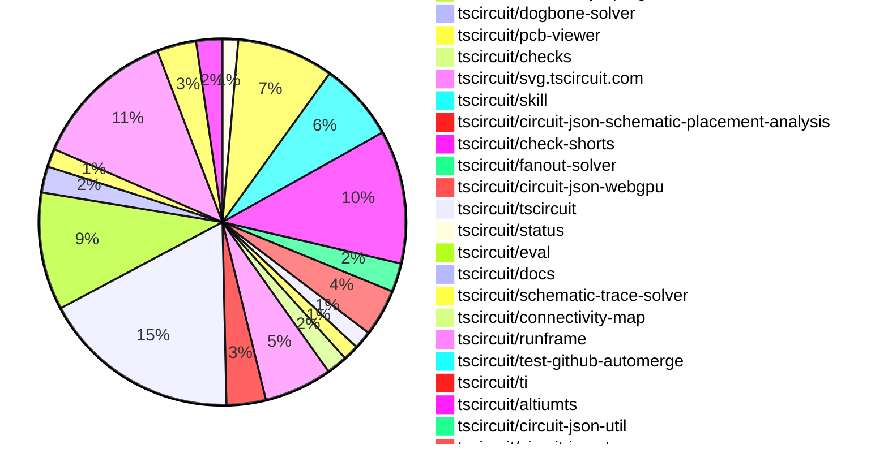

# contribution tracker

[contributions.tscircuit.com](https://contributions.tscircuit.com) ・ [tscircuit.com](https://tscircuit.com) ・ [Contribution Overviews](./contribution-overviews/) ・ [Changelogs](./changelogs/)

Generates weekly contribution overviews for tscircuit contributors. Check out all
the [contribution overviews here](./contribution-overviews/)
You can find AI-generated monthly changelogs in the [changelogs directory](./changelogs/)

- All PRs in the tscircuit org are scanned/summarized via an LLM
- The LLM classifies each Diff/PR as into a set of attributes for scoring
- All the PRs, summaries, and classifications are organized into charts and tables for [the website](https://contributions.tscircuit.com)

> Want to run locally? See the [Development Section](#development)

## Current Week

<!-- START_CURRENT_WEEK -->

# Contribution Overview 2026-09-29

The current week is shown below. There are 3 major sections:

- [Contributor Overview](#contributor-overview)
- [PRs by Repository](#prs-by-repository)
- [PRs by Contributor](#changes-by-contributor)
- [Scoring & Sponsorship Details](/docs/sponsorship-calculation-explanation.md)

## PRs by Repository


```mermaid
pie
    "tscircuit/schematic-viewer" : 1
    "tscircuit/circuit-json" : 6
    "tscircuit/props" : 5
    "tscircuit/3d-viewer" : 2
    "tscircuit/core" : 37
    "tscircuit/schematic-symbols" : 1
    "tscircuit/circuit-json-to-connectivity-map" : 2
    "tscircuit/tscircuit.com" : 30
    "tscircuit/jlcsearch" : 4
    "tscircuit/cli" : 51
    "tscircuit/circuit-json-to-tscircuit" : 11
    "tscircuit/tscircuit-autorouter" : 18
    "tscircuit/bus-lanes-solver" : 7
    "tscircuit/circuit-json-to-flattenjs" : 2
    "tscircuit/standard-jst-programmer" : 2
    "tscircuit/dogbone-solver" : 3
    "tscircuit/pcb-viewer" : 6
    "tscircuit/checks" : 8
    "tscircuit/svg.tscircuit.com" : 26
    "tscircuit/skill" : 2
    "tscircuit/circuit-json-schematic-placement-analysis" : 15
    "tscircuit/check-shorts" : 1
    "tscircuit/fanout-solver" : 2
    "tscircuit/circuit-json-webgpu" : 1
    "tscircuit/tscircuit" : 76
    "tscircuit/status" : 1
    "tscircuit/eval" : 45
    "tscircuit/docs" : 10
    "tscircuit/schematic-trace-solver" : 7
    "tscircuit/connectivity-map" : 2
    "tscircuit/runframe" : 55
    "tscircuit/test-github-automerge" : 1
    "tscircuit/ti" : 3
    "tscircuit/altiumts" : 5
    "tscircuit/circuit-json-util" : 1
    "tscircuit/circuit-json-to-pnp-csv" : 1
    "tscircuit/circuit-json-to-sysconfig" : 5
    "tscircuit/easyeda-converter" : 4
    "tscircuit/sysconfigts" : 1
    "tscircuit/circuit-json-to-gerber" : 2
    "tscircuit/altium-to-circuit-json" : 15
    "tscircuit/power-trace-expander" : 1
    "tscircuit/high-density-repair03" : 1
    "tscircuit/dataset-srj24" : 2
    "tscircuit/matchpack" : 2
    "tscircuit/kicad-to-circuit-json" : 10
    "tscircuit/circuit-json-to-kicad" : 4
    "tscircuit/copper-pour-solver" : 2
    "tscircuit/circuit-json-to-gltf" : 2
    "tscircuit/circuit-json-to-altium" : 3
```

## Contributor Overview

| Contributor | 🐳 Major | 🐙 Minor | 🐌 Tiny | Score | ⭐ |
|-------------|---------|---------|---------|-------|-----|
| [seveibar](#seveibar) | 29 | 20 | 35 | 169 | 👑👑👑 |
| [ShiboSoftwareDev](#ShiboSoftwareDev) | 9 | 9 | 11 | 80 | ⭐⭐⭐ |
| [AnasSarkiz](#AnasSarkiz) | 4 | 3 | 8 | 34 | ⭐⭐ |
| [MustafaMulla29](#MustafaMulla29) | 4 | 2 | 6 | 27 | ⭐⭐ |
| [imrishabh18](#imrishabh18) | 5 | 1 | 1 | 24 | ⭐⭐ |
| [Abse2001](#Abse2001) | 2 | 0 | 2 | 19 | ⭐⭐ |
| [techmannih](#techmannih) | 0 | 5 | 7 | 18 | ⭐⭐ |
| [tscircuitbot](#tscircuitbot) | 0 | 0 | 307 | 15.5 | ⭐⭐ |
| [KrishnaX12](#KrishnaX12) | 1 | 4 | 2 | 14 | ⭐⭐ |
| [GokulPandi-M](#GokulPandi-M) | 0 | 4 | 5 | 13 | ⭐⭐ |
| [rushabhcodes](#rushabhcodes) | 0 | 4 | 2 | 11 | ⭐⭐ |
| [mohan-bee](#mohan-bee) | 1 | 1 | 2 | 9 | ⭐ |
| [anil08607](#anil08607) | 0 | 3 | 0 | 6 | ⭐ |
| [hrithik18k](#hrithik18k) | 1 | 0 | 0 | 4 | ⭐ |
| [addibble](#addibble) | 0 | 1 | 1 | 3 |  |
| [0hmX](#0hmX) | 0 | 1 | 0 | 2 |  |
| [Devesh36](#Devesh36) | 0 | 0 | 1 | 1 |  |

## Staff Pass Ratio (SPR)

| Contributor | Reviewed PRs | Rejections | Approvals | SPR |
|-------------|--------------|------------|-----------|-----|
| [MustafaMulla29](#MustafaMulla29) | 9 | 3 | 6 | 66.7% |
| [imrishabh18](#imrishabh18) | 3 | 0 | 3 | 100.0% |
| [AnasSarkiz](#AnasSarkiz) | 2 | 1 | 2 | 50.0% |
| [ShiboSoftwareDev](#ShiboSoftwareDev) | 2 | 0 | 2 | 100.0% |
| [0hmX](#0hmX) | 1 | 0 | 1 | 100.0% |
| [Abse2001](#Abse2001) | 1 | 0 | 1 | 100.0% |
| [addibble](#addibble) | 1 | 0 | 1 | 100.0% |
| [hrithik18k](#hrithik18k) | 1 | 0 | 1 | 100.0% |
| [KrishnaX12](#KrishnaX12) | 1 | 1 | 0 | 0.0% |
| [mohan-bee](#mohan-bee) | 1 | 0 | 1 | 100.0% |

<details>
<summary>MustafaMulla29 SPR PRs (9)</summary>

- [#368](https://github.com/tscircuit/checks/pull/368) feat: add regulator capacitor and pull-resistor placement warnings
- [#1264](https://github.com/tscircuit/schematic-trace-solver/pull/1264) fix: simplify power label connectors by reattaching to rail corners
- [#159](https://github.com/tscircuit/circuit-json-schematic-placement-analysis/pull/159) feat: detect misplaced charge-pump capacitors
- [#156](https://github.com/tscircuit/circuit-json-schematic-placement-analysis/pull/156) feat: detect separated pi-filter components
- [#146](https://github.com/tscircuit/circuit-json-schematic-placement-analysis/pull/146) feat: detect sideways common-emitter amplifier stages
- [#153](https://github.com/tscircuit/circuit-json-schematic-placement-analysis/pull/153) feat: detect scattered battery cell-sense filter ladders
- [#127](https://github.com/tscircuit/circuit-json-schematic-placement-analysis/pull/127) feat: detect flyback diodes separated from relay coils
- [#124](https://github.com/tscircuit/circuit-json-schematic-placement-analysis/pull/124) feat: detect current-sense shunts separated from their inputs
- [#138](https://github.com/tscircuit/circuit-json-schematic-placement-analysis/pull/138) feat: detect scattered MOSFET gate resistor networks

</details>

<details>
<summary>imrishabh18 SPR PRs (3)</summary>

- [#2776](https://github.com/tscircuit/tscircuit-autorouter/pull/2776) Reduce bugreport107 DRC errors to 58 on macOS and 59 on Linux
- [#2780](https://github.com/tscircuit/tscircuit-autorouter/pull/2780) Reduce bugreport107 DRC errors to 63 on macOS and 65 on Linux
- [#2769](https://github.com/tscircuit/tscircuit-autorouter/pull/2769) Improve Pipeline 9 clearance repair for straight trace spans

</details>

<details>
<summary>AnasSarkiz SPR PRs (2)</summary>

- [#4204](https://github.com/tscircuit/core/pull/4204) fix: accept saved routes on plated port layers
- [#359](https://github.com/tscircuit/checks/pull/359) fix: enforce via-in-pad restrictions using hole overlap for all nets

</details>

<details>
<summary>ShiboSoftwareDev SPR PRs (2)</summary>

- [#4196](https://github.com/tscircuit/core/pull/4196) fix: emit one autorouter connection per electrical net
- [#2779](https://github.com/tscircuit/tscircuit-autorouter/pull/2779) Fix Pipeline9 via regressions after trace simplification

</details>

<details>
<summary>0hmX SPR PRs (1)</summary>

- [#623](https://github.com/tscircuit/circuit-json-to-kicad/pull/623) fix: preserve source board thickness in KiCad PCB exports

</details>

<details>
<summary>Abse2001 SPR PRs (1)</summary>

- [#2740](https://github.com/tscircuit/tscircuit-autorouter/pull/2740) Fix through-via drill spans in Pipeline 9 routing and repair

</details>

<details>
<summary>addibble SPR PRs (1)</summary>

- [#224](https://github.com/tscircuit/circuit-json-to-gltf/pull/224) Fix X and Y CAD rotation directions

</details>

<details>
<summary>hrithik18k SPR PRs (1)</summary>

- [#2790](https://github.com/tscircuit/tscircuit-autorouter/pull/2790) repro: Pipeline 9 violates via-to-pad clearance on metal-touch board

</details>

<details>
<summary>KrishnaX12 SPR PRs (1)</summary>

- [#135](https://github.com/tscircuit/circuit-json-schematic-placement-analysis/pull/135) feat: warn when I2C pull-ups are split around a chip

</details>

<details>
<summary>mohan-bee SPR PRs (1)</summary>

- [#4246](https://github.com/tscircuit/core/pull/4246) Connect duplicated USB-C shell pads

</details>

> Note: AI evaluates PRs and assigns 1-3 star ratings automatically. 4 and 5 star ratings require manual staff review.

## Review Table

[reviews-received-hover]: ## "Number of reviews received for PRs for this contributor"
[approvals-received-hover]: ## "Number of approvals received for PRs this contributor authored"
[rejections-received-hover]: ## "Number of rejections received for PRs this contributor authored"
[prs-opened-hover]: ## "Number of PRs opened by this contributor"
[issues-created-hover]: ## "Number of issues created by this contributor"

| Contributor | Reviews Received | Approvals Received | Rejections Received | Approvals | Rejections Given | PRs Opened | PRs Merged | Issues Created |
|---|---|---|---|---|---|---|---|---|
| [0hmX](#0hmX) | 1 | 1 | 0 | 0 | 0 | 7 | 1 | 0 |
| [Abse2001](#Abse2001) | 4 | 3 | 0 | 12 | 5 | 11 | 4 | 0 |
| [addibble](#addibble) | 2 | 2 | 0 | 0 | 0 | 3 | 2 | 0 |
| [Ahmed5754](#Ahmed5754) | 0 | 0 | 0 | 0 | 0 | 5 | 0 | 0 |
| [AnasSarkiz](#AnasSarkiz) | 17 | 15 | 0 | 4 | 0 | 22 | 15 | 0 |
| [anil08607](#anil08607) | 4 | 3 | 1 | 0 | 0 | 18 | 3 | 0 |
| [Ante042](#Ante042) | 0 | 0 | 0 | 0 | 0 | 1 | 0 | 0 |
| [Devesh36](#Devesh36) | 1 | 1 | 0 | 0 | 0 | 2 | 1 | 0 |
| [Furox-Art](#Furox-Art) | 0 | 0 | 0 | 0 | 0 | 7 | 0 | 0 |
| [GokulPandi-M](#GokulPandi-M) | 18 | 14 | 2 | 0 | 0 | 16 | 9 | 0 |
| [hrithik18k](#hrithik18k) | 4 | 2 | 0 | 0 | 0 | 5 | 1 | 0 |
| [imrishabh18](#imrishabh18) | 6 | 4 | 0 | 13 | 1 | 15 | 8 | 0 |
| [JoelGellis](#JoelGellis) | 0 | 0 | 0 | 0 | 0 | 1 | 0 | 0 |
| [KrishnaX12](#KrishnaX12) | 10 | 7 | 1 | 0 | 0 | 16 | 7 | 0 |
| [mohan-bee](#mohan-bee) | 1 | 1 | 0 | 1 | 0 | 6 | 4 | 0 |
| [MustafaMulla29](#MustafaMulla29) | 9 | 6 | 3 | 2 | 1 | 19 | 12 | 0 |
| [NicholasIGuess](#NicholasIGuess) | 0 | 0 | 0 | 0 | 0 | 2 | 0 | 0 |
| [NOyu015](#NOyu015) | 0 | 0 | 0 | 0 | 0 | 2 | 0 | 0 |
| [ntoledo319](#ntoledo319) | 0 | 0 | 0 | 0 | 0 | 2 | 0 | 0 |
| [rushabhcodes](#rushabhcodes) | 21 | 5 | 0 | 1 | 0 | 15 | 6 | 0 |
| [seveibar](#seveibar) | 16 | 0 | 0 | 25 | 5 | 113 | 85 | 0 |
| [ShiboSoftwareDev](#ShiboSoftwareDev) | 31 | 26 | 5 | 27 | 0 | 86 | 29 | 0 |
| [techmannih](#techmannih) | 7 | 7 | 0 | 12 | 0 | 18 | 12 | 0 |
| [tscircuitbot](#tscircuitbot) | 0 | 0 | 0 | 0 | 0 | 406 | 307 | 0 |

## Changes by Repository

### [tscircuit/schematic-viewer](https://github.com/tscircuit/schematic-viewer)

| PR # | Impact | Rating | Contributor | Description |
|------|--------|--------|-------------|-------------|
| [#280](https://github.com/tscircuit/schematic-viewer/pull/280) | 🐳 Major | ⭐⭐⭐ | seveibar | Hovering within six screen pixels of net-associated schematic text highlights its net. Right-clicking a trace, net label, or net-associated text now exposes a Net Locations submenu; choosing a destination switches sheets when needed and focuses that location. |

### [tscircuit/circuit-json](https://github.com/tscircuit/circuit-json)

| PR # | Impact | Rating | Contributor | Description |
|------|--------|--------|-------------|-------------|
| [#850](https://github.com/tscircuit/circuit-json/pull/850) | 🐳 Major | ⭐⭐⭐ | seveibar | Adds missing attributes for direction-only pins in SourcePinAttributes to preserve F1C100S pin attributes during datasheet enrichment. |
| [#847](https://github.com/tscircuit/circuit-json/pull/847) | 🐳 Major | ⭐⭐⭐ | seveibar | Add a CAD collision error schema to record mechanical collisions in Circuit JSON, including affected references and area measurements. |
| [#844](https://github.com/tscircuit/circuit-json/pull/844) | 🐳 Major | ⭐⭐⭐ | seveibar | Add source_runtime_error to represent an unexpected failure while generating or validating a circuit, allowing consumers to distinguish incomplete validation from a clean circuit. |

<details>
<summary>🐌 Tiny Contributions (3)</summary>

| PR # | Impact | Contributor | Description |
|------|--------|-------------|-------------|
| [#851](https://github.com/tscircuit/circuit-json/pull/851) | 🐌 Tiny | tscircuitbot | Automated package update |
| [#848](https://github.com/tscircuit/circuit-json/pull/848) | 🐌 Tiny | tscircuitbot | Automated package update |
| [#845](https://github.com/tscircuit/circuit-json/pull/845) | 🐌 Tiny | tscircuitbot | Automated package update |

</details>

### [tscircuit/props](https://github.com/tscircuit/props)

| PR # | Impact | Rating | Contributor | Description |
|------|--------|--------|-------------|-------------|
| [#873](https://github.com/tscircuit/props/pull/873) | 🐳 Major | ⭐⭐⭐ | seveibar | Add model to assembly.device, assembly.screen, assembly.subassembly, and assembly.cadassembly so authors can supply a modelprinterfootprinter string directly, such as modelsoic8 or modelflexscreen_w26.7mm_h19.26mm_sitsflat. |
| [#883](https://github.com/tscircuit/props/pull/883) | 🐙 Minor | ⭐⭐ | seveibar | Adds 1.5x to the autorouterEffortLevel runtime enum and public TypeScript union, enabling boards and subcircuit groups to request this effort level. |
| [#874](https://github.com/tscircuit/props/pull/874) | 🐙 Minor | ⭐⭐ | seveibar | Add dogbone as a recognized autorouter preset in the props types and schemas, enabling support for local pad-to-via escapes without boundary routing. |
| [#872](https://github.com/tscircuit/props/pull/872) | 🐙 Minor | ⭐⭐ | seveibar | Add optional modelUrl to assembly.device, assembly.screen, assembly.subassembly, and its assembly.cadassembly alias, allowing direct import of models without supplying dimensions or a modelprinter string. |

<details>
<summary>🐌 Tiny Contributions (1)</summary>

| PR # | Impact | Contributor | Description |
|------|--------|-------------|-------------|
| [#871](https://github.com/tscircuit/props/pull/871) | 🐌 Tiny | seveibar | Adds schSize to diode and LED props using the existing SchematicSymbolSize API, enabling typed JSX for compact symbols. |

</details>

### [tscircuit/3d-viewer](https://github.com/tscircuit/3d-viewer)

| PR # | Impact | Rating | Contributor | Description |
|------|--------|--------|-------------|-------------|
| [#1007](https://github.com/tscircuit/3d-viewer/pull/1007) | 🐳 Major | ⭐⭐⭐ | seveibar | Right-clicking a CAD model now offers Hide componentName. Once any model is hidden, the context menu offers Unhide All Components, including when opened on the background. |
| [#1008](https://github.com/tscircuit/3d-viewer/pull/1008) | 🐙 Minor | ⭐⭐ | seveibar | Fixes resource cleanup for enclosures and prevents unnecessary PCB texture regeneration when changing visibility states. |

### [tscircuit/core](https://github.com/tscircuit/core)

| PR # | Impact | Rating | Contributor | Description |
|------|--------|--------|-------------|-------------|
| [#4232](https://github.com/tscircuit/core/pull/4232) | 🐳 Major | ⭐⭐⭐ | seveibar | autoroutingphase autorouterbus_lanes  now routes the AM3352RAM fixture from TSX, with local pad-to-via dogbones when a layer transition is needed. Existing fanout exits are used directly. The fixture contains no custom algorithm and no saved route geometry. The solver preserves single-layer carriers, bus length matching, coupled differential pairs, curved tuning, and reduced unnecessary turns. The regression requires all 47 traces and zero errors, and checks pair gapskew, bus skew, layer transitions, detour and turn limits. Only fully routed snapshots are included. Async rendering now waits for completed effects instead of repeatedly traversing idle component trees; bus routing uses immediate task scheduling on NodeBun. A focused footprint lifecycle regression covers the idle behavior. The earlier focused suite passed 22 tests  278 assertions. Revalidation with the published solver 0.0.5 passes all 169 AM3352 assertions; the three completed signal-layer snapshots were regenerated and visually inspected. The production dependency now uses published bus-lanes-solver 0.0.5 from jscdn and connectivity-map 0.0.33. The preview workflow no longer substitutes a different solver. A separate dependency-only PR 4267(https:github.comtscircuitcorepull4267) allows these merged performance improvements to propagate through core  eval  downstream releases independently of this feature. No new prop or props release is required. autoroutingphase autorouterbus_lanes  automatically adds local dogbones only at unrouted component-pad endpoints when needed to reach the selected layer. Supplied fanout exits keep their existing layers and are never dogboned again. The rejected busLanesFanout API and props preview dependency have been removed; props PR 875 is closed. Validation after removing the option: all seven bus_lanes integration cases pass across the focused runs, including the full AM3352 test (169 assertions), automatic pad dogbones, preservation of saved fanouts without added vias, and rejection of incompatible existing fanout layers. ESM and declaration builds pass with published props. Removed the old expected-failure snapshot; no unrouted artifacts are added. AM3352 with the published solver passes locally in 23.1 seconds (47 traces, zero DRC errors, all quality gates). The hosted SVG build remains above 30 seconds; local timing is not evidence of deployed performance. |
| [#4259](https://github.com/tscircuit/core/pull/4259) | 🐳 Major | ⭐⭐⭐ | seveibar | Fixes routing calculation for AM3352 by removing the ARM-only snapshot job and reverting to normal test shards on ubuntu-latest. |
| [#4237](https://github.com/tscircuit/core/pull/4237) | 🐳 Major | ⭐⭐⭐ | seveibar | The original AM3352RAM board now routes all 47 signals with zero native DRC errors through the public phase. The fixture preserves the reference TSXs footprints, placement, 47 connections, two byte buses, three differential pairs, and timing constraints. It contains no custom algorithm or saved route plan. Automatic dogbones apply only to untouched component pads; existing fanout handoffs stay fixed. |
| [#4253](https://github.com/tscircuit/core/pull/4253) | 🐳 Major | ⭐⭐⭐ | seveibar | Fixes export issues with dogbone phase artifacts by selecting only physical ports as export anchors and using the owning fanout group for local coordinates, ensuring proper PCB trace path imports. |
| [#4235](https://github.com/tscircuit/core/pull/4235) | 🐳 Major | ⭐⭐⭐ | seveibar | Enable fanout autorouting using the dogbone algorithm for SMT pads to nearby vias without routing to the fanout boundary. |
| [#4204](https://github.com/tscircuit/core/pull/4204) | 🐳 Major | ⭐⭐⭐ | AnasSarkiz | Fixes autorouting failure by validating saved routes against PCB ports conductive layers instead of a single layer for SimpleRouteJson. |
| [#4238](https://github.com/tscircuit/core/pull/4238) | 🐳 Major | ⭐⭐⭐ | hrithik18k | Fixes obstacle generation for autorouting by ensuring that PCB traces are fully represented, including their width and end caps, preventing routing overlaps. |
| [#4244](https://github.com/tscircuit/core/pull/4244) | 🐳 Major | ⭐⭐⭐ | ShiboSoftwareDev | Fixes incorrect dimensions of rotated rectangular plated-hole obstacles in SRJ by ensuring proper rotation is applied during obstacle generation. |
| [#4248](https://github.com/tscircuit/core/pull/4248) | 🐳 Major | ⭐⭐⭐ | ShiboSoftwareDev | Emit one rectangular SRJ obstacle for circular keepouts and recognize complete circular outlines, reducing the number of obstacles significantly. |
| [#4208](https://github.com/tscircuit/core/pull/4208) | 🐳 Major | ⭐⭐⭐ | ShiboSoftwareDev | Fixes the issue where outline keepouts were not being converted to SRJ obstacles in the circuit JSON model, ensuring proper rendering and obstacle generation. |
| [#4196](https://github.com/tscircuit/core/pull/4196) | 🐳 Major | ⭐⭐⭐ | ShiboSoftwareDev | Fixes duplicate autorouter connections for electrical nets by ensuring each net is submitted only once, reducing the number of input connections from four to two. |
| [#4231](https://github.com/tscircuit/core/pull/4231) | 🐙 Minor | ⭐⭐ | seveibar | Support model... on all assembly elements, accepting direct HTTP(S) model URLs and resolving modelprinterfootprinter strings to modelcdn GLB URLs. |
| [#4228](https://github.com/tscircuit/core/pull/4228) | 🐙 Minor | ⭐⭐ | seveibar | Serializes DRC execution failures in Circuit JSON, ensuring that diagnostics from successful checks are preserved and failures are logged without disrupting the rendering of the circuit. |
| [#4216](https://github.com/tscircuit/core/pull/4216) | 🐙 Minor | ⭐⭐ | seveibar | Enables schSizesm and schSizexs for standard, avalanche, and Zener diodes and LEDs, allowing selection of compact symbols with support for boolean shorthands and variant enums. |
| [#4221](https://github.com/tscircuit/core/pull/4221) | 🐙 Minor | ⭐⭐ | seveibar | Add modelUrl rendering to assembly.device, assembly.screen, assembly.subassembly, and assembly.cadassembly, allowing direct import of housing or display models with connector-relative placement. |
| [#4217](https://github.com/tscircuit/core/pull/4217) | 🐙 Minor | ⭐⭐ | seveibar | Integrates courtyard keepout placement DRC into the core, ensuring that component courtyards entering keepouts produce placement DRC errors, including specific cases for battery connectors and mounting holes. |
| [#4240](https://github.com/tscircuit/core/pull/4240) | 🐙 Minor | ⭐⭐ | imrishabh18 | Updates the cached supplier pin 1 orientation for straight-row connectors by advancing the cache key and updating the dependency to ensure correct orientation is computed. |
| [#4246](https://github.com/tscircuit/core/pull/4246) | 🐙 Minor | ⭐⭐ | mohan-bee | Fixes routing issues for USB-C shell pads by ensuring they connect to the ground header, resolving ambiguities in PCB connections. |

<details>
<summary>🐌 Tiny Contributions (19)</summary>

| PR # | Impact | Contributor | Description |
|------|--------|-------------|-------------|
| [#4276](https://github.com/tscircuit/core/pull/4276) | 🐌 Tiny | seveibar | Updates the tscircuitbus-lanes-solver dependency from version 0.0.5 to 0.0.6, improving routing speed for the bus lanes autorouter. |
| [#4267](https://github.com/tscircuit/core/pull/4267) | 🐌 Tiny | seveibar | Updates the dependencies for bus routing and connectivity performance to their latest published versions, specifically updating tscircuitbus-lanes-solver to 0.0.5 and circuit-json-to-connectivity-map to 0.0.33. |
| [#4261](https://github.com/tscircuit/core/pull/4261) | 🐌 Tiny | seveibar | Updates the package dependencies to use compact published routing packages instead of larger npm packages, ensuring fresh installs exclude former runtime dependencies. |
| [#4230](https://github.com/tscircuit/core/pull/4230) | 🐌 Tiny | seveibar | Skip the three AM62L LPDDR4 northsouthwest orbit routing regressions, which each take roughly 34 minutes. Keep their fixtures and snapshots for re-enabling. The AM62L direct-decoupling regression and other orbit tests continue to run. Balance every discovered test file longest-first across ten shards using measured CI runtimes. Refresh the baseline from the last successful full run and give the three skipped files zero weights so their former cost no longer reserves runners. Estimated shard runtimes are approximately 112s each. In the updated successful CI run, actual test steps ranged from 84157s, down from 122216s before skipping the orbit tests (27 faster at the slowest shard). Add per-shard slow-test summaries, timing-log artifacts for every attempt, and a baseline refresh command. Preserve native crash retries and propagate ordinary test failures through tee with explicit Bash pipefail. Document slow outliers and timing maintenance in .githubtest-timings.md. Validation: plannerparser regression tests pass; targeted run confirms exactly three skipped orbit tests; all 1,483 discovered files are still assigned exactly once. Updated full CI passed all ten shards, timing reports, typecheck, dependency checks, and distribution smoke test: https:github.comtscircuitcoreactionsruns36668064842 |
| [#4236](https://github.com/tscircuit/core/pull/4236) | 🐌 Tiny | seveibar | Raises cores minimum tscircuitchecks version from 0.0.228 to 0.0.230 to ensure the inclusion of a geometry converter fix for tiny trace segments near via drills, preventing copper-pour DRC boundary-conflict exceptions. |
| [#4229](https://github.com/tscircuit/core/pull/4229) | 🐌 Tiny | seveibar | Updates the circuit-json-to-connectivity-map dependency to version 0.0.32, fixing routing issues by allowing traces to connect directly to their via ports and updating related tests accordingly. |
| [#4278](https://github.com/tscircuit/core/pull/4278) | 🐌 Tiny | tscircuitbot | Updates the version of the tscircuitchecks package from 0.0.231 to 0.0.232 in package.json |
| [#4271](https://github.com/tscircuit/core/pull/4271) | 🐌 Tiny | tscircuitbot | Updates the version of the tscircuitchecks package from 0.0.230 to 0.0.231 in package.json |
| [#4227](https://github.com/tscircuit/core/pull/4227) | 🐌 Tiny | tscircuitbot | Updates the tscircuitchecks package from version 0.0.227 to 0.0.228 |
| [#4225](https://github.com/tscircuit/core/pull/4225) | 🐌 Tiny | tscircuitbot | Updates the version of the tscircuitchecks package from 0.0.227 to 0.0.228 in package.json |
| [#4220](https://github.com/tscircuit/core/pull/4220) | 🐌 Tiny | tscircuitbot | Updates the version of the tscircuitchecks package from 0.0.226 to 0.0.227 in package.json |
| [#4219](https://github.com/tscircuit/core/pull/4219) | 🐌 Tiny | tscircuitbot | Updates the tscircuitchecks package from version 0.0.226 to 0.0.227 in the package.json file. |
| [#4218](https://github.com/tscircuit/core/pull/4218) | 🐌 Tiny | tscircuitbot | Updates the version of the tscircuitchecks package from 0.0.225 to 0.0.226 in package.json |
| [#4202](https://github.com/tscircuit/core/pull/4202) | 🐌 Tiny | AnasSarkiz | Reproduces a bug where valid bottom-layer routes between plated pins are incorrectly rejected by the autorouter, capturing the current error state for further fixes. |
| [#4273](https://github.com/tscircuit/core/pull/4273) | 🐌 Tiny | Abse2001 | Updates the tscircuitcapacity-autorouter dependency from version 0.0.941 to 0.0.951, refreshing 26 native Linux SVG snapshots for the new routing output without changing any core implementation or functionality. |
| [#4268](https://github.com/tscircuit/core/pull/4268) | 🐌 Tiny | MustafaMulla29 | Update tscircuitschematic-trace-solver from 0.0.215 to 0.0.217 in the existing jscdn tarball URL, bringing in the power-label rail attachment fix. |
| [#4207](https://github.com/tscircuit/core/pull/4207) | 🐌 Tiny | ShiboSoftwareDev | Reproduces a bug where the outline keepout obstacles are missing from the Simple Route JSON for the TMDS62LEVM board, providing a focused crop from the real board to highlight the issue. |
| [#4195](https://github.com/tscircuit/core/pull/4195) | 🐌 Tiny | ShiboSoftwareDev | Reproduces a bug where the autorouter submits duplicate connections for the same electrical nets in a TSX board, highlighting the issue through a comprehensive test. |
| [#4245](https://github.com/tscircuit/core/pull/4245) | 🐌 Tiny | mohan-bee | Reproduces a bug where duplicate USB-C shell pins lose their PCB connections despite being wired to a ground header in the schematic. |

</details>

### [tscircuit/schematic-symbols](https://github.com/tscircuit/schematic-symbols)

| PR # | Impact | Rating | Contributor | Description |
|------|--------|--------|-------------|-------------|
| [#483](https://github.com/tscircuit/schematic-symbols/pull/483) | 🐳 Major | ⭐⭐⭐ | seveibar | Adds _sm and _xs variants for diodes, LEDs, avalanche diodes, and Zener diodes in right, left, up, and down orientations: 32 symbols total. These match the existing compact passive naming and 0.5 mm  0.35 mm pin spans. Shorter leads retain readable diode bodies, LED emission arrows, and the distinct avalancheZener cathode bars. LED annotations have extra clearance for the arrows. All new variants use 1posanode and 2negcathode aliases; existing symbols are unchanged. Includes source SVGs, generated geometry and exports, 32 SVG snapshots, and usage documentation. Regression coverage checks pin spans, polarity, connected leads, closed triangles, and diode body proportions. Validation: 26 tests pass (2,237 assertions); build, TypeScript, formatting, snapshot validation, and diff checks pass. Rendered variants were visually inspected. |

### [tscircuit/circuit-json-to-connectivity-map](https://github.com/tscircuit/circuit-json-to-connectivity-map)

| PR # | Impact | Rating | Contributor | Description |
|------|--------|--------|-------------|-------------|
| [#52](https://github.com/tscircuit/circuit-json-to-connectivity-map/pull/52) | 🐳 Major | ⭐⭐⭐ | seveibar | Reduces the time taken for PCB connectivity checks by skipping distant segments, improving performance without affecting design rule checks. |
| [#51](https://github.com/tscircuit/circuit-json-to-connectivity-map/pull/51) | 🐙 Minor | ⭐⭐ | seveibar | Fixes a bug where the full connectivity map ignores PCB via port IDs, leading to disconnections in the connectivity map for traces without source trace IDs. |

### [tscircuit/tscircuit.com](https://github.com/tscircuit/tscircuit.com)

| PR # | Impact | Rating | Contributor | Description |
|------|--------|--------|-------------|-------------|
| [#5178](https://github.com/tscircuit/tscircuit.com/pull/5178) | 🐳 Major | ⭐⭐⭐ | seveibar | Replaces long manufacturer notes in datasheet pages with compact, searchable rows that display primary signals, alternate functions, serial capabilities, and electrical requirements, while retaining full notes in per-pin details. |

<details>
<summary>🐌 Tiny Contributions (29)</summary>

| PR # | Impact | Contributor | Description |
|------|--------|-------------|-------------|
| [#5180](https://github.com/tscircuit/tscircuit.com/pull/5180) | 🐌 Tiny | tscircuitbot | Automated package update |
| [#5174](https://github.com/tscircuit/tscircuit.com/pull/5174) | 🐌 Tiny | tscircuitbot | Updates the tscircuiteval package from version 0.0.1502 to 0.0.1504 in the package.json file. |
| [#5171](https://github.com/tscircuit/tscircuit.com/pull/5171) | 🐌 Tiny | tscircuitbot | Automated package update |
| [#5169](https://github.com/tscircuit/tscircuit.com/pull/5169) | 🐌 Tiny | tscircuitbot | Updates the tscircuiteval package to version 0.0.1502 in the package.json file |
| [#5166](https://github.com/tscircuit/tscircuit.com/pull/5166) | 🐌 Tiny | tscircuitbot | Automated package update |
| [#5157](https://github.com/tscircuit/tscircuit.com/pull/5157) | 🐌 Tiny | tscircuitbot | Updates the tscircuitrunframe package from version 0.0.2854 to 0.0.2855 |
| [#5153](https://github.com/tscircuit/tscircuit.com/pull/5153) | 🐌 Tiny | tscircuitbot | Updates the tscircuiteval package from version 0.0.1495 to 0.0.1496 |
| [#5141](https://github.com/tscircuit/tscircuit.com/pull/5141) | 🐌 Tiny | tscircuitbot | Updates the tscircuitrunframe package to version 0.0.2846 |
| [#5133](https://github.com/tscircuit/tscircuit.com/pull/5133) | 🐌 Tiny | tscircuitbot | Updates the tscircuitrunframe package from version 0.0.2841 to 0.0.2842 and the tscircuitpcb-viewer package from version 1.11.409 to 1.11.410 in package.json |
| [#5160](https://github.com/tscircuit/tscircuit.com/pull/5160) | 🐌 Tiny | tscircuitbot | Updates the tscircuitrunframe package to version 0.0.2857 in package.json |
| [#5159](https://github.com/tscircuit/tscircuit.com/pull/5159) | 🐌 Tiny | tscircuitbot | Updates the tscircuiteval package from version 0.0.1496 to 0.0.1498 |
| [#5158](https://github.com/tscircuit/tscircuit.com/pull/5158) | 🐌 Tiny | tscircuitbot | Updates the tscircuitrunframe package from version 0.0.2855 to 0.0.2856 |
| [#5156](https://github.com/tscircuit/tscircuit.com/pull/5156) | 🐌 Tiny | tscircuitbot | Automated package update |
| [#5151](https://github.com/tscircuit/tscircuit.com/pull/5151) | 🐌 Tiny | tscircuitbot | Updates the tscircuiteval package from version 0.0.1493 to 0.0.1495 in the package.json file. |
| [#5147](https://github.com/tscircuit/tscircuit.com/pull/5147) | 🐌 Tiny | tscircuitbot | Updates the tscircuiteval package from version 0.0.1490 to 0.0.1493 |
| [#5146](https://github.com/tscircuit/tscircuit.com/pull/5146) | 🐌 Tiny | tscircuitbot | Automated package update |
| [#5144](https://github.com/tscircuit/tscircuit.com/pull/5144) | 🐌 Tiny | tscircuitbot | Automated package update |
| [#5142](https://github.com/tscircuit/tscircuit.com/pull/5142) | 🐌 Tiny | tscircuitbot | Updates the tscircuitrunframe package to version 0.0.2847 |
| [#5140](https://github.com/tscircuit/tscircuit.com/pull/5140) | 🐌 Tiny | tscircuitbot | Updates the tscircuiteval package from version 0.0.1488 to 0.0.1490 |
| [#5139](https://github.com/tscircuit/tscircuit.com/pull/5139) | 🐌 Tiny | tscircuitbot | Automated package update |
| [#5136](https://github.com/tscircuit/tscircuit.com/pull/5136) | 🐌 Tiny | tscircuitbot | Automated package update |
| [#5135](https://github.com/tscircuit/tscircuit.com/pull/5135) | 🐌 Tiny | tscircuitbot | Updates the tscircuitrunframe package from version 0.0.2842 to 0.0.2843 |
| [#5134](https://github.com/tscircuit/tscircuit.com/pull/5134) | 🐌 Tiny | tscircuitbot | Automated package update |
| [#5130](https://github.com/tscircuit/tscircuit.com/pull/5130) | 🐌 Tiny | tscircuitbot | Automated package update |
| [#5129](https://github.com/tscircuit/tscircuit.com/pull/5129) | 🐌 Tiny | tscircuitbot | Automated package update |
| [#5165](https://github.com/tscircuit/tscircuit.com/pull/5165) | 🐌 Tiny | tscircuitbot | Automated package update |
| [#5164](https://github.com/tscircuit/tscircuit.com/pull/5164) | 🐌 Tiny | tscircuitbot | Automated package update |
| [#5162](https://github.com/tscircuit/tscircuit.com/pull/5162) | 🐌 Tiny | tscircuitbot | Updates the tscircuitrunframe package from version 0.0.2857 to 0.0.2858 |
| [#5150](https://github.com/tscircuit/tscircuit.com/pull/5150) | 🐌 Tiny | tscircuitbot | Automated package update for tscircuitrunframe from version 0.0.2849 to 0.0.2850 |

</details>

### [tscircuit/jlcsearch](https://github.com/tscircuit/jlcsearch)

| PR # | Impact | Rating | Contributor | Description |
|------|--------|--------|-------------|-------------|
| [#603](https://github.com/tscircuit/jlcsearch/pull/603) | 🐳 Major | ⭐⭐⭐ | seveibar | Adds an Optical Sensors category to the homepage with optical_sensorslist and optical_sensorslist.json, allowing users to filter optical motionnavigation sensors by various attributes. |
| [#601](https://github.com/tscircuit/jlcsearch/pull/601) | 🐳 Major | ⭐⭐⭐ | seveibar | Optimizes recovery builds by replacing metadata materialization with indexed lookups and adjusts batch sizes for uploads, ensuring faster execution and maintaining data integrity. |
| [#600](https://github.com/tscircuit/jlcsearch/pull/600) | 🐳 Major | ⭐⭐⭐ | seveibar | Restores missing Ethernet controller parts from a previous archive and updates their stock and prices from JLCPCB, ensuring data integrity and validation throughout the process. |
| [#599](https://github.com/tscircuit/jlcsearch/pull/599) | 🐳 Major | ⭐⭐⭐ | seveibar | Adds an Ethernet Controllers homepage category at ethernet_controllerslist with a matching JSON API and packagebasicpreferred filters, importing controller ICs from dedicated and mixed categories while excluding PHY-only transceivers, PoE chips, modules, and connectors. |

### [tscircuit/cli](https://github.com/tscircuit/cli)

| PR # | Impact | Rating | Contributor | Description |
|------|--------|--------|-------------|-------------|
| [#5066](https://github.com/tscircuit/cli/pull/5066) | 🐳 Major | ⭐⭐⭐ | seveibar | tsci import leaves out electrical attributes stored in the datasheet API, including the F1C100S AVCC pins 2.8 V requirement and the AP2127K-2.8TRG1 regulators 2.8 V output. Look up the imported components exact manufacturer part number through the configured registrys datasheet endpoint, validate the returned attributes with the existing props schema, and put them on Circuit JSON source ports. Generate the enriched component with released circuit-json-to-tscircuit0.0.50, which now emits pinAttributes directly. This uses the live API and does not depend on parts-engine PR 60. There is no TSX rewrite for pin attributes. Absent or empty metadata keeps the existing EasyEDA conversion path. Invalid metadata, a mismatched part, failed requests, or the 5-second lookup timeout warn and continue with the existing import. The deadline covers response headers and body; a timeout warns that the datasheet API did not respond within 5 seconds and pinAttributes may not be populated. Other lookup failures also warn that attributes may not be populated. Physical pin entries override signal-label entries; existing Circuit JSON fields are preserved. Exactcompact footprints, pin labels, suppliermanufacturer metadata, CAD references, and caller props overrides remain supported. Use tsci import C460327 --exclude-pin-attributes to skip the datasheet lookup and use the existing EasyEDA import path. Importer-inferred attributes (such as ground pins) remain. The flag is covered for both search-result imports and direct part-number fallback. Only the existing converter devDependency is upgraded; no packages are added. Validation: 20 new tests pass, including all 89 F1C100S pins and five regulator pins in both exact and compact footprint modes, canonical props validation, CAD references, caller overrides, namedphysical pin precedence, falsezero values, capabilities, and missingfailing datasheets. Typecheck, build, and formatting pass. Live CLI imports of C1511928 and C460327 match every attribute in the production datasheet API. Both generated components render with the expected 89five schematic ports; AVCC requires 2.8 V and regulator pin 5 provides 2.8 V. Rendering these isolated, unwired chips reports only the expected must-be-connected errors. The broader local import suite still hits the previously reproduced baseline dependency error: tscircuitprops does not export assemblySubassemblyProps for the footprint rendering test. This failure was also reproduced on unchanged main; dependency versions unrelated to the converter are unchanged. Uses https:github.comtscircuitcircuit-json-to-tscircuitpull121 and replaces the closed CLI-specific TSX rewrite in https:github.comtscircuitclipull5063. |

<details>
<summary>🐌 Tiny Contributions (50)</summary>

| PR # | Impact | Contributor | Description |
|------|--------|-------------|-------------|
| [#5072](https://github.com/tscircuit/cli/pull/5072) | 🐌 Tiny | tscircuitbot | Automated package update |
| [#5071](https://github.com/tscircuit/cli/pull/5071) | 🐌 Tiny | tscircuitbot | Automated package update |
| [#5070](https://github.com/tscircuit/cli/pull/5070) | 🐌 Tiny | tscircuitbot | Automated package update |
| [#5068](https://github.com/tscircuit/cli/pull/5068) | 🐌 Tiny | tscircuitbot | Automated package update |
| [#5067](https://github.com/tscircuit/cli/pull/5067) | 🐌 Tiny | tscircuitbot | Automated package update |
| [#5065](https://github.com/tscircuit/cli/pull/5065) | 🐌 Tiny | tscircuitbot | Updates the tscircuitrunframe package from version 0.0.2864 to 0.0.2866 |
| [#5062](https://github.com/tscircuit/cli/pull/5062) | 🐌 Tiny | tscircuitbot | Automated package update |
| [#5061](https://github.com/tscircuit/cli/pull/5061) | 🐌 Tiny | tscircuitbot | Updates the tscircuitrunframe package version from 0.0.2861 to 0.0.2864 in package.json |
| [#5058](https://github.com/tscircuit/cli/pull/5058) | 🐌 Tiny | tscircuitbot | Automated package update |
| [#5057](https://github.com/tscircuit/cli/pull/5057) | 🐌 Tiny | tscircuitbot | Updates the tscircuitrunframe package version from 0.0.2860 to 0.0.2861 in package.json |
| [#5040](https://github.com/tscircuit/cli/pull/5040) | 🐌 Tiny | tscircuitbot | Updates the tscircuitrunframe package from version 0.0.2853 to 0.0.2854 |
| [#5038](https://github.com/tscircuit/cli/pull/5038) | 🐌 Tiny | tscircuitbot | Updates the tscircuitrunframe package version from 0.0.2852 to 0.0.2853 |
| [#5020](https://github.com/tscircuit/cli/pull/5020) | 🐌 Tiny | tscircuitbot | Updates the tscircuitrunframe package from version 0.0.2845 to 0.0.2846 |
| [#5048](https://github.com/tscircuit/cli/pull/5048) | 🐌 Tiny | tscircuitbot | Updates the tscircuitrunframe package from version 0.0.2856 to 0.0.2857 |
| [#5033](https://github.com/tscircuit/cli/pull/5033) | 🐌 Tiny | tscircuitbot | Updates the tscircuitrunframe package from version 0.0.2850 to 0.0.2852 |
| [#5032](https://github.com/tscircuit/cli/pull/5032) | 🐌 Tiny | tscircuitbot | Updates the package version from 0.1.2196 to 0.1.2197 in package.json |
| [#5029](https://github.com/tscircuit/cli/pull/5029) | 🐌 Tiny | tscircuitbot | Automated package update |
| [#5027](https://github.com/tscircuit/cli/pull/5027) | 🐌 Tiny | tscircuitbot | Automated package update |
| [#5024](https://github.com/tscircuit/cli/pull/5024) | 🐌 Tiny | tscircuitbot | Updates the tscircuitrunframe package from version 0.0.2847 to 0.0.2848 |
| [#5016](https://github.com/tscircuit/cli/pull/5016) | 🐌 Tiny | tscircuitbot | Updates the tscircuitrunframe package version from 0.0.2844 to 0.0.2845 in package.json |
| [#5010](https://github.com/tscircuit/cli/pull/5010) | 🐌 Tiny | tscircuitbot | Updates the tscircuitrunframe package version from 0.0.2841 to 0.0.2842 |
| [#5006](https://github.com/tscircuit/cli/pull/5006) | 🐌 Tiny | tscircuitbot | Updates the tscircuitrunframe package to version 0.0.2840 |
| [#5045](https://github.com/tscircuit/cli/pull/5045) | 🐌 Tiny | tscircuitbot | Updates the tscircuitrunframe package from version 0.0.2855 to 0.0.2856 |
| [#5043](https://github.com/tscircuit/cli/pull/5043) | 🐌 Tiny | tscircuitbot | Automated package update |
| [#5041](https://github.com/tscircuit/cli/pull/5041) | 🐌 Tiny | tscircuitbot | Automated package update |
| [#5034](https://github.com/tscircuit/cli/pull/5034) | 🐌 Tiny | tscircuitbot | Automated package update |
| [#5026](https://github.com/tscircuit/cli/pull/5026) | 🐌 Tiny | tscircuitbot | Automated package update |
| [#5023](https://github.com/tscircuit/cli/pull/5023) | 🐌 Tiny | tscircuitbot | Automated package update |
| [#5022](https://github.com/tscircuit/cli/pull/5022) | 🐌 Tiny | tscircuitbot | Updates the tscircuitrunframe package to version 0.0.2847 in the package.json file |
| [#5021](https://github.com/tscircuit/cli/pull/5021) | 🐌 Tiny | tscircuitbot | Automated package update |
| [#5017](https://github.com/tscircuit/cli/pull/5017) | 🐌 Tiny | tscircuitbot | Automated package update |
| [#5014](https://github.com/tscircuit/cli/pull/5014) | 🐌 Tiny | tscircuitbot | Updates the tscircuitrunframe package version from 0.0.2843 to 0.0.2844 in package.json |
| [#5013](https://github.com/tscircuit/cli/pull/5013) | 🐌 Tiny | tscircuitbot | Automated package update |
| [#5012](https://github.com/tscircuit/cli/pull/5012) | 🐌 Tiny | tscircuitbot | Updates the tscircuitrunframe package from version 0.0.2842 to 0.0.2843 |
| [#5011](https://github.com/tscircuit/cli/pull/5011) | 🐌 Tiny | tscircuitbot | Automated package update |
| [#5009](https://github.com/tscircuit/cli/pull/5009) | 🐌 Tiny | tscircuitbot | Automated package update |
| [#5008](https://github.com/tscircuit/cli/pull/5008) | 🐌 Tiny | tscircuitbot | Updates the tscircuitrunframe package from version 0.0.2840 to 0.0.2841 |
| [#5056](https://github.com/tscircuit/cli/pull/5056) | 🐌 Tiny | tscircuitbot | Automated package update |
| [#5055](https://github.com/tscircuit/cli/pull/5055) | 🐌 Tiny | tscircuitbot | Updates the tscircuitrunframe package to version 0.0.2860 in the package.json file. |
| [#5054](https://github.com/tscircuit/cli/pull/5054) | 🐌 Tiny | tscircuitbot | Automated package update |
| [#5053](https://github.com/tscircuit/cli/pull/5053) | 🐌 Tiny | tscircuitbot | Updates the tscircuitrunframe package version from 0.0.2858 to 0.0.2859 |
| [#5051](https://github.com/tscircuit/cli/pull/5051) | 🐌 Tiny | tscircuitbot | Automated package update |
| [#5050](https://github.com/tscircuit/cli/pull/5050) | 🐌 Tiny | tscircuitbot | Updates the tscircuitrunframe package version from 0.0.2857 to 0.0.2858 |
| [#5031](https://github.com/tscircuit/cli/pull/5031) | 🐌 Tiny | tscircuitbot | Updates the tscircuitrunframe package to version 0.0.2850 in the package.json file. |
| [#5046](https://github.com/tscircuit/cli/pull/5046) | 🐌 Tiny | tscircuitbot | Automated package update |
| [#5049](https://github.com/tscircuit/cli/pull/5049) | 🐌 Tiny | tscircuitbot | Automated package update |
| [#5042](https://github.com/tscircuit/cli/pull/5042) | 🐌 Tiny | tscircuitbot | Updates the tscircuitrunframe package from version 0.0.2854 to 0.0.2855 |
| [#5037](https://github.com/tscircuit/cli/pull/5037) | 🐌 Tiny | AnasSarkiz | Restores meaningful signal names for pins in EasyEDA imports, allowing for better schematic representation and connectivity. |
| [#5069](https://github.com/tscircuit/cli/pull/5069) | 🐌 Tiny | MustafaMulla29 | Updates tscircuitcircuit-json-schematic-placement-analysis from v0.0.11 to v0.0.33 using the existing jscdn.tscircuit.com tarball URL format and refreshes bun.lock. |
| [#5028](https://github.com/tscircuit/cli/pull/5028) | 🐌 Tiny | techmannih | Fixes false shorts reporting in tsci check shorts when same-net routes contact through-vias without a source_trace_id by updating checker dependencies. |

</details>

### [tscircuit/circuit-json-to-tscircuit](https://github.com/tscircuit/circuit-json-to-tscircuit)

| PR # | Impact | Rating | Contributor | Description |
|------|--------|--------|-------------|-------------|
| [#121](https://github.com/tscircuit/circuit-json-to-tscircuit/pull/121) | 🐳 Major | ⭐⭐⭐ | seveibar | Circuit JSON can contain a pins electrical requirements, but converting it to a chip currently drops them. This loses information such as the F1C100S AVCC pin requiring 2.8 V and the AP2127K-2.8TRG1 output providing 2.8 V. Generate the chips pinAttributes directly from source_port records. Map electrical fields to the tscircuitprops names and convert supportedconfigured capability flags into capabilitiesactiveCapabilities. Preserve explicit false and zero values, use physical pin numbers when available and names otherwise, omit empty attributes, and keep caller overrides working. Avoid combining multiple components attributes into one chip. No dependencies or lockfile changes. Validation: Five new regression tests cover all 89 F1C100S pins and five regulator pins, directionoutput modes, pull resistors, capabilities, numericstring voltages and capacitances, missing attributes, named pins, component isolation, and caller overrides. Live parts-engine  enriched Circuit JSON  converter  TSX verification preserves every attribute from both production datasheets (capability arrays compared as sets). Generated attributes validate against the current tscircuitprops schema, including the correct 2.8 V requirement and output. Full suite: 37 tests pass, zero failures (the existing test.failing for dropped board children accounts for the expected failed snapshot). Typecheck, build, and formatting pass. Pairs with https:github.comtscircuitparts-enginepull60 and the merged Circuit JSON schema extension https:github.comtscircuitcircuit-jsonpull850. This moves TSX generation into the converter; downstream CLI integration should consume enriched Circuit JSON instead of rewriting generated source as in https:github.comtscircuitclipull5063. |
| [#125](https://github.com/tscircuit/circuit-json-to-tscircuit/pull/125) | 🐳 Major | ⭐⭐⭐ | ShiboSoftwareDev | Summary convert BRep silkscreen artwork into native silkscreengraphic elements retain filled outlines, interior holes, placement, and board side refresh the three affected real TI EVM round-trip comparisons  Test plan bun test bunx tsc --noEmit bun run format:check |
| [#124](https://github.com/tscircuit/circuit-json-to-tscircuit/pull/124) | 🐳 Major | ⭐⭐⭐ | ShiboSoftwareDev | Summary emit native copperpour and net elements for authored copper regions preserve rectangular, polygon, and BRep outer boundaries plus layer and solder-mask coverage refresh all four real TI EVM round-trip comparisons  Test plan bun test bunx tsc --noEmit bun run format:check |
| [#123](https://github.com/tscircuit/circuit-json-to-tscircuit/pull/123) | 🐳 Major | ⭐⭐⭐ | ShiboSoftwareDev | Summary emit native pcbtrace elements for authored PCB routes preserve every wire and via route point without rerouting refresh all four real TI EVM round-trip comparisons  Test plan bun test bunx tsc --noEmit bun run format:check |
| [#126](https://github.com/tscircuit/circuit-json-to-tscircuit/pull/126) | 🐳 Major | ⭐⭐⭐ | KrishnaX12 | Motivation PCB vias should survive Circuit JSON  tscircuit round trips. The TI EVM repros in 89 showed vias in the source board but omitted them from the generated boardfor example, all 109 LM5155 vias disappeared.  Before The footprint converter handled pads and plated holes but had no handler for pcb_via. Those records never became JSX, so the generated board lost the via arrays visible around components. !Before: LM5155 source and generated board with missing vias(https:raw.githubusercontent.comtscircuitcircuit-json-to-tscircuit47cdc0185b792a531c50bf7ea0e56a1532c2629fteststi-evms__snapshots__ti-lm5155evm-fly-roundtrip-pcb-comparison.snap.svg)  After Register convertVias alongside the existing footprint converters. Each source via becomes a via with its position, hole and copper diameters, layer endpoints, and tenting. Support the legacy is_tented field emitted by altium-to-circuit-json at the fixture generation commit(https:github.comtscircuitaltium-to-circuit-jsonblob9a578b5762e1dcca06e6d3f84f1d2950d0acc301libpcbroutingconvertPcbVia.ts), with explicit per-side tenting taking precedence. Reject vias without resolvable layer endpoints with an error naming the via. The four TI EVM round trips now preserve all source vias: LM5155 (109), LM251772 (261), DRV8307 (360), and LMG342 (411). PCB and inline TSX snapshots are refreshed; schematic snapshots are unchanged. !After: LM5155 source and generated board with restored vias(https:raw.githubusercontent.comKrishnaX12circuit-json-to-tscircuitff357d2a02004c418bc45f767155ac19bcf64bc9teststi-evms__snapshots__ti-lm5155evm-fly-roundtrip-pcb-comparison.snap.svg)  Validation Regression tests verify through, blind, and buried via geometry, layers, tenting, and missing-layer rejection. All four TI EVM tests compare rendered via counts against the source counts; all four PCB comparisons were visually checked. Additional runtime checks verify reversed layer endpoints and all supported tenting modes, including modern flags overriding legacy tenting. GitHub CI passes Bun tests, Type Check, and Format Check on ff357d2. The local snapshot-summary anomaly also occurs on the unchanged base, which exits successfully; all affected snapshots pass. Vercel preview requires maintainer authorization. |
| [#129](https://github.com/tscircuit/circuit-json-to-tscircuit/pull/129) | 🐙 Minor | ⭐⭐ | KrishnaX12 | Fixes rendering issues with silkscreen rectangles by preserving their rotation and stroke visibility based on source specifications. |
| [#127](https://github.com/tscircuit/circuit-json-to-tscircuit/pull/127) | 🐙 Minor | ⭐⭐ | KrishnaX12 | Fixes rendering issue where imported PCBs were cropped in the viewer due to incorrect board center positioning, ensuring complete visibility of the PCB including original dimensions and scale bars. |
| [#117](https://github.com/tscircuit/circuit-json-to-tscircuit/pull/117) | 🐙 Minor | ⭐⭐ | anil08607 | Updates the converter runtime to use board-aware through-hole layers, aligning Circuit JSON with its 0.0.507 schema and retaining Zod 3 peer, while adding regression tests for various layer configurations. |
| [#115](https://github.com/tscircuit/circuit-json-to-tscircuit/pull/115) | 🐙 Minor | ⭐⭐ | anil08607 | Preserves the requested componentName when converting a board, allowing for named exports alongside default exports, and adds regression tests to ensure correct functionality. |
| [#116](https://github.com/tscircuit/circuit-json-to-tscircuit/pull/116) | 🐙 Minor | ⭐⭐ | anil08607 | Fabrication note text loses its Circuit JSON ccw_rotation during conversion. Emit unit-aware pcbRotation using the shared formatter, retaining zero, negative, and arbitrary angles on both layers. Adds focused rotation and TSX syntax coverage and updates all four TI EVM inline snapshots from 89. Runtime support is already merged in tscircuitcore2963; consumers need a runtime containing that change. Validation: 29 converterCLI tests pass and the package build passes. All four TI EVM tests passed during the full-suite run. The existing test20 expected-failure repro remains unchanged. The repository runtime upgrade is covered by 117. |

<details>
<summary>🐌 Tiny Contributions (1)</summary>

| PR # | Impact | Contributor | Description |
|------|--------|-------------|-------------|
| [#89](https://github.com/tscircuit/circuit-json-to-tscircuit/pull/89) | 🐌 Tiny | ShiboSoftwareDev | Summary add checksum-derived Circuit JSON fixtures for DRV8307EVM, LM5155EVM-FLY, LM251772EVM-PD, and LMG342X-BB-EVM inline-snapshot the generated tscircuit TSX for each board evaluate every generated board with the repositorys existing runTscircuitCode path snapshot source Circuit JSON and evaluated TSX renders side by side for both PCB and schematic views  What the repro shows board outline, pads, holes, silkscreen, and rough footprint placement survive routed copper and copper pours do not survive the conversion the electrical schematic is not reconstructed; the evaluated board renders a generic multi-pin chip symbol outline keepouts are currently reported as unsupported on three fixtures This PR intentionally records the current output as a visual baseline. It does not claim equivalent round-trip fidelity.  Test plan bun test bunx tsc --noEmit bun run format:check |

</details>

### [tscircuit/tscircuit-autorouter](https://github.com/tscircuit/tscircuit-autorouter)

| PR # | Impact | Rating | Contributor | Description |
|------|--------|--------|-------------|-------------|
| [#2799](https://github.com/tscircuit/tscircuit-autorouter/pull/2799) | 🐳 Major | ⭐⭐⭐ | seveibar | Higher effort previously changed routingsearch heuristics, and extra early simplification could leave worse routes for DRC repair. Cap routing, force-improvement, and repair tuning at 1x while preserving lower-effort behavior. Pipeline 9 now spends extra effort after DRC repair: 1.5x evaluates one additional cleanup pass and 2x evaluates two. It retains a candidate only if it passes DRC and reduces vias, or keeps the same via count with fewer route points. Length matching and power-trace expansion run afterward. Cleanup and outer iteration budgets allow the additional work. Add benchmark-effort to compare pipeline 9 on all of dataset18 at 1x, 1.5x, and 2x on one Blacksmith runner. Per-sample timeouts scale to 600s900s1200s. The report shows completion, DRC, timeouts, matched runtime, and per-sampleaggregate vias; JSON reports are retained as artifacts. Fix the existing benchmark CLI truncating --effort 1.5 to 1, and verify the effective effort in every comparison report. Validation: all nine CI test shards, build, type check, format check, and added-code check passed; local build and type checking also passed; focused tests cover effective fractional effort, unchanged initial routing, baseline cleanup budgets, input immutability, and rejection of invalid optimization candidates. Higher-effort snapshot updates retain their DRC assertions and use separate LinuxmacOS expectations where routes differ. Full dataset18 comparison completed successfully. All 16 samples solved and passed relaxed DRC at every effort, with zero timeouts and no per-sample via-count increases. The PR-comment command becomes available when the dispatcherparser changes reach the default branch. Pre-merge comparison can be dispatched through the existing Autorouting Benchmark workflow on this branch with effort_comparetrue, the full commit SHA, and this PR number. Dataset18 results on one Blacksmith runner:  Effort  Solved  relaxed DRC passing  Total vias  Change vs 1x  Sum of sample runtimes   ---  ---  ---  ---  ---   1x  1616  3,576    2,227.7s   1.5x  1616  3,555  -21  2,324.6s   2x  1616  3,554  -22  2,401.6s  The improvement is modest but monotonic: 1.5x removes 21 vias, and 2x removes one additional via. No individual sample gains vias. The previously regressing sample 15 remains DRC-clean with 349 vias at all three efforts. Benchmark run and JSON artifacts(https:github.comtscircuittscircuit-autorouteractionsruns36793259438). The run uses solver revision fd9f0e4b6; subsequent commits only update labels, formatting, snapshots, and test expectations. |
| [#2776](https://github.com/tscircuit/tscircuit-autorouter/pull/2776) | 🐳 Major | ⭐⭐⭐ | imrishabh18 | Reduces DRC errors for bugreport107 to 58 on macOS and 59 on Linux by improving clearance and routing logic in the autorouter. |
| [#2780](https://github.com/tscircuit/tscircuit-autorouter/pull/2780) | 🐳 Major | ⭐⭐⭐ | imrishabh18 | Reduces DRC errors in bugreport107 from 82 to 63 on macOS and 65 on Linux by implementing a final whole-board clearance projection that moves wire bends and vias together. |
| [#2769](https://github.com/tscircuit/tscircuit-autorouter/pull/2769) | 🐳 Major | ⭐⭐⭐ | imrishabh18 | Long, straight trace spans can remain too close to copper because the clearance projector only moves existing vertices and their endpoints are locked. Add bounded subdivisions to constant-width spans on routes implicated in DRC errors, then run a refinement pass after the existing independent wire repairs. This gives the solver nearby vertices to bend while retaining terminals, junctions, widths, and via sites. |
| [#2778](https://github.com/tscircuit/tscircuit-autorouter/pull/2778) | 🐳 Major | ⭐⭐⭐ | imrishabh18 | Reduces DRC errors in bugreport107 by adjusting clearance segment lengths to improve pad-to-trace clearance without altering existing copper or connections. |
| [#2740](https://github.com/tscircuit/tscircuit-autorouter/pull/2740) | 🐳 Major | ⭐⭐⭐ | Abse2001 | Summary Fix through-via handling in Pipeline 9 and its Repair03 dependency. This PR targets main directly and contains the fix, focused regression tests, related existing-testsnapshot updates, and CI timeout classification for the existing SRJ18 sample 2 tests. It does not add the full Game Boy repro, its input, or its snapshot. The Game Boy stays in validation-only repro 2741(https:github.comtscircuittscircuit-autorouterpull2741), not for merging. No merge or auto-merge has been requested.  Bug When allowBlindAndBuriedVias is false or omitted, a via connecting top to inner1 still occupies every copper layer. Its signal transition does not define its drill span. Using only the signal layers lets a foreign net pass through the via on inner2 or bottom.  Fix Pipeline 9 fixed-copper geometry, nodeB01 obstacle selection, and regional collision checks use the existing board via policy. Through vias reserve all board layers; explicitly allowed blindburied vias retain their limited span. The geometry cache includes layer count and via policy. Repair03 is pinned to ac744fcc(https:github.comAbse2001high-density-repair03commitac744fcc8cc4e83fbf12769507e963c974f5932f): an integration commit on top of the existing cbbc86a3 pin, porting merged 143(https:github.comtscircuithigh-density-repair03pull143) drill-span handling and still-open 144(https:github.comtscircuithigh-density-repair03pull144), which refreshes via point indexes after a trace detour. Existing optimizations and invalid-endpoint checks are preserved. This is a fork integration pin, not an upstream release or the exact head of 144. Current main already includes the clearance-margin transition-identity correction and the newer trace-simplification via-preservation fix from 2779(https:github.comtscircuittscircuit-autorouterpull2779). The merge retains both; the transition-identity production code is no longer an additional diff in this PR. Signal endpoints and component-owned through-obstacle geometry are unchanged. No board-specific routing cases, new feature flags, or suppressed invariant failures.  Dependency and merge order Review and merge Repair03 144 first, then replace the integration pin with an upstream commit containing both fixes and the existing pinned behavior before merging this autorouter PR. Revalidate after changing the pin; do not assume another branch or package version is equivalent. 143 is merged; 144 was still open when checked on September 30. No PR will be merged automatically.  Focused regression tests pipeline9-fixed-via-drill-span: falsedefaulttrue via policy, every copper layer, collisions in both argument orders, layer-countcache changes, and invalid transitions. pipeline9-b01-through-via-obstacle: an actual bottom-layer route avoids a top-to-inner1 through via; explicitly permitting blind vias makes bottom available. Completion, clearance, and endpoints are checked. Its one native snapshot shows captured B01 solver states before and after routing, following Seves snapshot guidance(https:github.comtscircuittscircuit-autorouterpull2193pullrequestreview-4998204680). pipeline9-clearance-margin-through-via-transition: an inner-layer signal transition remains valid inside a through via without losing transition identity. After merging main and installing the actual merged dependencies, these three tests plus mains pipeline9-clearance-margin-tracks-via-identity passed locally: 4 tests, 73 assertions. No full-board routing or dataset benchmarks were run locally.  Timeout investigation and optimization  September 30 Latest head 13dc4a0f adds only an early geometry rejection in getConnectedPadSides plus one focused regression test. It skips net-connectivity lookups for pads that cannot contain the route terminal. The same layer test, 0.001 mm tolerance, connected-net predicate, output ordering, routing rules and dependency pins remain unchanged. The new test failed before the optimization (4 unnecessary lookups) and passes afterward. Three focused tests pass with 36 assertions. The previous standard SRJ18 benchmark(https:github.comtscircuittscircuit-autorouterpull2740issuecomment-5915973380) at 5680cbdc did regress completion from 1616 to 1416: samples 14 and 15 timed out at 360 seconds in joint repair. Dataset01 stayed 8585 complete and DRC-passing. The new benchmark below follows an actual optimization, not an unchanged retry; the earlier failures and sample14s limited timeout margin remain relevant. GitHub CPU profiling(https:github.comtscircuittscircuit-autorouteractionsruns36756273653) compared exact main e85fb193 and PR 5680cbdc with identical sample inputs. All four serial diagnostic solves completed with zero relaxed DRCs, but this is a different runnerworkload from the normal eight-worker benchmark, not proof that its timeout regression is resolved. Sample14 joint-repair wall time rose from 75.52 to 107.39 seconds. CPU samples locate most additional work in bounded regional clearance search (54.97 to 71.39 sampled seconds) and regional B01 repair (7.83 to 22.02). Repair03 portfolio time was only about 7.35 to 7.70 seconds; its via-index refresh was not the dominant measured cost. Sample15 serial total time was approximately unchanged (197.49 to 196.87 seconds). Its profile nevertheless identified about 6.01 sampled seconds of net lookup work beneath the pad-side helper, motivating the geometry-first change. This does not remove sample14s larger clearance-search cost. The completed beforeafter optimization profile(https:github.comtscircuittscircuit-autorouteractionsruns36760525317) compares old PR 5680cbdc (directory label main, not repository main) against 13dc4a0f. Both samples have byte-identical input, route JSON and DRC JSON before and after, unchanged routing iterations and clearance-search work counts, and zero relaxed DRCs. Sample14 remains 238 traces281 vias; sample15 remains 461 traces349 vias. Diagnostic instrumentation stays outside this PR. Sample14 pad-helper inclusive sampled CPU time fell 1.892 to 0.061 seconds, but serial total time was 249.972 to 254.176 seconds (1.7). Sample15 helper CPU fell 8.917 to 0.060 seconds, with serial total time 201.698 to 190.490 seconds (-5.6). This confirms the unnecessary lookup cost was removed without changing copper; it does not show a uniform end-to-end speedup. These are profiler measurements on a serial runner, not the standard benchmark score.  Completed validation at 13dc4a0f Benchmark request by PR comment(https:github.comtscircuittscircuit-autorouterpull2740issuecomment-5917460010): benchmark-all --pipeline 9 --same-machine. Both completed reports compare main e85fb193 with PR 13dc4a0f.  Dataset  Completed, main  PR  Relaxed-DRC passing, main  PR  Total DRC issues  Timeouts  Average vias, main  PR   ---  ---  ---  ---  ---  ---   Dataset01(https:github.comtscircuittscircuit-autorouterpull2740issuecomment-5917472134) (85 scenarios)  8585  8585 (100)  8585  8585 (100)  0  0  0  0  38.99  38.99   SRJ18(https:github.comtscircuittscircuit-autorouterpull2740issuecomment-5917472637) (16 scenarios)  1616  1616 (100)  1616  1616 (100)  0  0  0  0  224.00  223.50  No improved or regressed completionDRCtimeout outcomes among these 101 samples. In this new run, both previously timed-out samples complete with zero relaxed DRCs: sample14 332.931  350.864 seconds, sample15 328.781  306.854 seconds (main  PR). Sample14 has only 9.136 seconds of headroom below the unchanged 360-second timeout. The tested head meets the no-outcome-regression requirement in this run, but is not a guarantee against future runtime variation or proof that its larger regional-search cost is solved. Timing percentiles in seconds (main  PR), kept separate from routing outcomes:  Dataset  P50  P60  P70  P80  P90  P95   ---  ---  ---  ---  ---  ---  ---   Dataset01  3.48  3.36  5.07  5.20  6.15  6.21  8.85  8.81  11.27  11.92  12.82  13.41   SRJ18  104.40  106.48  132.42  142.86  200.33  187.79  242.64  262.60  310.64  295.20  329.82  317.86  SRJ18 aggregate joint-repair time is 421.715  470.144 seconds. Timing is mixed, not a uniform improvement. Every SRJ18 via-count change: sample6 278281, sample8 283284, sample12 304302, sample13 213196, sample14 277281, sample15 344349, sample16 111109. All other via counts, including every Dataset01 sample, are unchanged. Every odd-angle warning change (style, not DRC failures): SRJ18 decreases: sample2 1547925, sample7 312123, sample11 524519, sample12 900897, sample13 594575, sample15 10561012, sample16 377364. SRJ18 increases: sample3 150275, sample6 10491162, sample8 9861026, sample9 268269, sample14 712726. Average 612.81575.19. Dataset01: only sample71 changes, 7675; average 7.457.44. Game Boy LinuxmacOS revalidation(https:github.comtscircuittscircuit-autorouteractionsruns36760357113) passed on 13dc4a0f: 322 traces, 288 vias, 0 reference relaxed DRCs. Downloaded routes.json, summary.json, drc-errors.json and board.svg are byte-identical between both OSs and to the previous verified output. Route SHA256 remains e6bdeafeeed9b4603a207c7aa443f232b1945d997c29fb318a720a55de7722f8; input SHA256 remains 89cfabf40f44453f4894a67475c4a5563e171d629f52bd42a8724bb15185ace4. The identical copper preserves the prior zero through-via-contact result and the separate clearancewidth caveats below. PR 2741 and the Game Boy project were not changed. All applicable ordinary CI is green at 13dc4a0f: all nine Bun Test shards(https:github.comtscircuittscircuit-autorouteractionsruns36760305003), build, typecheck, format, code-hack check, Testbox, GitHub Vercel Build and external Vercel passed. No snapshot or assertion changes were needed for this optimization. No timeouts, DRC rules, assertions, snapshots, or through-via protection were weakened. No sample-specific cases or new flags were introduced. The Game Boys earlier zero reference relaxed DRC result is not fabrication approval; the separate checkertrace-width caveats below remain.  Previous validation  main 0.0.946 Main advanced while the previous snapshot update was being verified: 2776(https:github.comtscircuittscircuit-autorouterpull2776) changes clearance repair and reduces board-1726s Linux baseline to 59 DRCs. Production head 3a86612e merges main d3507489 (0.0.946), retaining that improvement and mains unchanged 59 assertion. The old PR-only 88 assertion and explanation are removed. The new conflict was limited to the board-1726 test and its Linux snapshot, initially resolved using mains versions. Repair03 remains ac744fcc; all other dependency pins match main. The three other Linux snapshot refreshes from the previous run passed in the latest CI. Six focused tests, including both new upstream independent-bend repair regressions, pass locally with 87 assertions. CI run 36695044821(https:github.comtscircuittscircuit-autorouteractionsruns36695044821) passed eight of nine test shards and all non-test checks (build, typecheck, format, check-added-code, Blacksmith Testbox, GitHub Vercel Build, and external Vercel). The sole failure was board-1726s Linux snapshot mismatch; all its routing, repair-improvement, and 59 assertions passed. Board-1726 improves from mains 59 DRCs to 55 (-4). Commit 527b1fff updates only its expected Linux snapshot using the unchanged .received.svg from job 109820898491, after reviewing the native beforeafter PNG. SHA256: 6df102208969152036a5a606a529713a007cafd4f050fa2c925057af6944ee29. No code, test assertions, tolerances, timeouts, inputs, or dependencies changed. CI on this snapshot-only head is now green: all nine Bun Test shards passed(https:github.comtscircuittscircuit-autorouteractionsruns36696968271), as did build, typecheck, format, check-added-code, Blacksmith Testbox, GitHub Vercel Build, and external Vercel. Board-1726 passed its native snapshot and unchanged numeric assertions. Fresh same-machine benchmarks were requested by PR comment(https:github.comtscircuittscircuit-autorouterpull2740issuecomment-5908100015), comparing main d3507489 with production head 3a86612e: Dataset01(https:github.comtscircuittscircuit-autorouterpull2740issuecomment-5908112979): 8585 complete and DRC-passing on both, 0 issues, 0 timeouts, 0 outcome changes, 38.99 average vias on both. P50 2.9 to 3.0s (2.4); P95 11.8 to 12.1s (2.8). SRJ18(https:github.comtscircuittscircuit-autorouterpull2740issuecomment-5908114645): 1616 complete and DRC-passing on both, 0 issues, 0 timeouts, 0 improvedregressed outcomes. Average vias 224.00 to 223.50; angled-trace warnings 612.81 to 575.19. P50 103.2 to 107.3s (3.9), P80 237.4 to 267.5s (12.7), P95 314.6 to 331.8s (5.5). Joint-repair aggregate time 396.664 to 458.258s. This run has slower timing but no newly failing, DRC-failing, or timed-out samples, including sample 14. Raw SRJ18 reports confirm the following via-count changes (all remain routed and DRC-passing): sample6 278281, sample8 283284, sample12 304302, sample13 213196, sample14 277281, sample15 344349, sample16 111109. No other samples via count changed. Sample14 completed in 334.65s354.03s, close to its 360s timeout; sample15 completed in 307.93s324.40s. Treat that reduced timing margin as a risk, not an observed timeout. Odd-angle warning changes are mixed: improved samples2 (1547925),7 (312123),11 (524519),12 (900897),13 (594575),15 (10561012),16 (377364); increased samples3 (150275),6 (10491162),8 (9861026),9 (268269),14 (712726). These are style warnings, not new DRCcompletion failures. This comparison was rerun because mains production routing code changed. Snapshot-only commit 527b1fff does not require another benchmark. The older results below are historical, not proof for this implementation.  Previous validation  main 0.0.944 versus production candidate f72dd50d: Dataset01 report(https:github.comtscircuittscircuit-autorouterpull2740issuecomment-5898175805): both 8585 completed and DRC-passing, 0 DRC issues, 0 timeouts, 38.99 average vias. SRJ18 report(https:github.comtscircuittscircuit-autorouterpull2740issuecomment-5898176041): both 1516 completed and DRC-passing, 0 issues among completed boards, the same sample 14 timeout. Average vias 221.00 to 220.07; sample 15 remained DRC-free but gained 7 vias. Board-1726 historically had an explicitly accepted 87 to 88 DRC change. That historical 88 assertion has since been removed in favor of current mains 59 check. Green assertions alone do not mean no regression. Sample 2 took 260.24s baseline to 300.24s candidate (15.4), mostly joint repair (54.29s to 92.66s). Both full-board sample 2 tests use the existing 600-second slow-test group. Other tests remain at 300 seconds and job budgets at 20 minutes. This is a CI allowance, not a runtime optimization. No further timeout changes were made in the main merge. All ordinary CI passed on previous head 9f914309. The new head must pass independently. Separate historical Game Boy validation(https:github.comtscircuittscircuit-autorouteractionsruns36626388346) had 109 relaxed DRCs and 9 through-via contacts, versus baseline 108  12. Repair03 detected all remaining contacts but did not repair them all. LinuxMac outputs were byte-identical. These older scores are superseded by the current validation below.  Current Game Boy validation  separate PR 2741 At the authors request, validation-only PR 2741(https:github.comtscircuittscircuit-autorouterpull2741) now tests this exact fix head 527b1fff on the unchanged full board. Workflow 36698662930(https:github.comtscircuittscircuit-autorouteractionsruns36698662930), validation head 184d33cb, completed on Linux and macOS with 322 traces, 288 vias, and 0 reference relaxed DRCs. The downloaded route JSON, summary, DRC JSON and native board SVG are byte-identical between platforms. Routing took 176.90 s on Linux and 340.83 s on macOS. Static analysis of the saved output reproduced zero reference errors and zero actual through-via contacts outside signal layers, with zero such contacts missed by Repair03. All 288 vias are converted as four-layer through vias. This is 109  0 reference findings and 9  0 through-via contacts compared with the older combined implementation, but upstream clearance repair also changed, so this is not a same-main causal comparison of this PR alone. Do not interpret this as fabrication ready: Repair03s separate indexed checker reports 5 clearance findings (2 via-to-pad and 3 same-net via-spacing). The reference benchmark omits the via-to-pad pad-clearance check and uses drill-hole spacing where this Repair03 pin uses outer-copper spacing. Minimum emitted wire width remains about 0.01667 mm. Details and artifact hashes are recorded in 2741. Those measurements preceded the current performance-only validation. The user subsequently authorized PR 2741 to assert zero reference relaxed DRCs and zero missed through-via contacts and use the actual native zero-DRC snapshot at head a83ed089. The current optimization does not modify that separate validation PR.  Review conventions Use precise drill-span terminology (Seves naming feedback(https:github.comtscircuithigh-density-repair03pull136discussion_r4049612208)); keep Pipeline 9 semantics out of shared repair code (review(https:github.comtscircuittscircuit-autorouterpull2577pullrequestreview-5223366924)); preserve loud invariant failures and actual routed snapshots. |
| [#2779](https://github.com/tscircuit/tscircuit-autorouter/pull/2779) | 🐳 Major | ⭐⭐⭐ | ShiboSoftwareDev | Fixes the preservation of Pipeline 9 vias in Dataset 18 samples 3 and 11 after updates to the trace simplifier. |

<details>
<summary>🐌 Tiny Contributions (11)</summary>

| PR # | Impact | Contributor | Description |
|------|--------|-------------|-------------|
| [#2801](https://github.com/tscircuit/tscircuit-autorouter/pull/2801) | 🐌 Tiny | tscircuitbot | Automated package update |
| [#2796](https://github.com/tscircuit/tscircuit-autorouter/pull/2796) | 🐌 Tiny | tscircuitbot | Automated package update |
| [#2795](https://github.com/tscircuit/tscircuit-autorouter/pull/2795) | 🐌 Tiny | tscircuitbot | Automated package update |
| [#2788](https://github.com/tscircuit/tscircuit-autorouter/pull/2788) | 🐌 Tiny | tscircuitbot | Automated package update |
| [#2785](https://github.com/tscircuit/tscircuit-autorouter/pull/2785) | 🐌 Tiny | tscircuitbot | Automated package update |
| [#2775](https://github.com/tscircuit/tscircuit-autorouter/pull/2775) | 🐌 Tiny | tscircuitbot | Automated package update |
| [#2781](https://github.com/tscircuit/tscircuit-autorouter/pull/2781) | 🐌 Tiny | tscircuitbot | Automated package update |
| [#2793](https://github.com/tscircuit/tscircuit-autorouter/pull/2793) | 🐌 Tiny | tscircuitbot | Automated package update |
| [#2794](https://github.com/tscircuit/tscircuit-autorouter/pull/2794) | 🐌 Tiny | Abse2001 | Replace the Repair03 fork integration pin with the exact upstream squash commit from high-density-repair03 144. |
| [#2791](https://github.com/tscircuit/tscircuit-autorouter/pull/2791) | 🐌 Tiny | ShiboSoftwareDev | Updates the dataset reference for SRJ24 to a regenerated sample, optimizing obstacle representation and maintaining connection integrity. |
| [#2787](https://github.com/tscircuit/tscircuit-autorouter/pull/2787) | 🐌 Tiny | ShiboSoftwareDev | Pins the SRJ24 dataset to a specific merged commit and exposes six TI Altium boards as SRJ24 samples with defined connection and endpoint counts. |

</details>

### [tscircuit/bus-lanes-solver](https://github.com/tscircuit/bus-lanes-solver)

| PR # | Impact | Rating | Contributor | Description |
|------|--------|--------|-------------|-------------|
| [#9](https://github.com/tscircuit/bus-lanes-solver/pull/9) | 🐳 Major | ⭐⭐⭐ | seveibar | AM3352-to-RAM routing now takes about half the time while completing all 47 signals and retaining the existing routing quality gates. Three fresh, alternating runs per version on the same MacBun 1.3.14 input measured 17.73 s  8.87 s by median (1.998, approximately 2), including automatic local dogbones, single-layer carrier routing, length matching, and final solver validation. The implementation reuses prepared copper and immutable conflict geometry, invalidates only soft grid edges affected by changed copper, and pools released search buffers with bounded request-local caches. It also removes repeated curve allocationstrigonometry during amplitude search. A stronger congestion ramp reduces retries; paired approach bends are aligned with continuous clearance checks while preserving endpoints, shared trunks, headings, and copper lengths. The AM3352 input contains original pads and no traces. All routes are computed from the public preset. Reproduction instructions(https:github.comtscircuitbus-lanes-solverblobperftwo-times-fasterdocspipeline-performance.md) and raw timingshashes(https:github.comtscircuitbus-lanes-solverblobperftwo-times-fasterdocsam3352-performance.json) are included. Local solve measurements exclude source compilation, SVG rendering, and hosted request handling.  AM3352 quality  Before  After   ---  ---:  ---:   Completed signals  4747  4747   Total planar copper  1528.38 mm  1483.87 mm   Ordinary turns  539  539   Short jogs  138  106   Acute corners  0  0   Maximum detour ratio  2.049  2.029  Validation passed: 83 solver tests  286,289 assertions; typecheck, formatting, and packaged NodebrowserTypeScript consumers. Cores unchanged AM3352 test: 169 assertions, zero native DRCcircuit errors, 47 unique completed signals, two terminal vias per signal and a single carrier layer. Bus skew 0.635 mm, pair skew 0.127 mm, and pair interior gaps 0.1000.138 mm. .benchmark.sh: all four DDR samples complete 3333 connections, retain all 66 fixed fanoutsprovenance, pass combined-copper DRC, and match all three buses within 0.1 mm total copper skew. Solve times: bottom 208 ms, left 181 ms, right 160 ms, top 140 ms. All four expected layer-change rejections also pass. Cancellation, simultaneous searches, geometry changes, oversized cache entries, heap ordering, reflectedrotated pair approaches, and exact curve-coordinate regressions. Every image below was regenerated from a successfully completed solve and visually inspected after validation.  AM3352 inner1  AM3352 inner2  AM3352 bottom   ---  ---  ---   !Completed inner1(https:raw.githubusercontent.comtscircuitbus-lanes-solverperftwo-times-fasterdocsrouted-am3352inner1-solved.png)  !Completed inner2(https:raw.githubusercontent.comtscircuitbus-lanes-solverperftwo-times-fasterdocsrouted-am3352inner2-solved.png)  !Completed bottom(https:raw.githubusercontent.comtscircuitbus-lanes-solverperftwo-times-fasterdocsrouted-am3352bottom-solved.png)   DDR left  right  DDR top  bottom   ---  ---   !Completed DDR left(https:raw.githubusercontent.comtscircuitbus-lanes-solverperftwo-times-fasterdocsrouted-ddrddr_left_io_right-solved.png)  !Completed DDR top(https:raw.githubusercontent.comtscircuitbus-lanes-solverperftwo-times-fasterdocsrouted-ddrddr_top_io_bottom-solved.png)   !Completed DDR right(https:raw.githubusercontent.comtscircuitbus-lanes-solverperftwo-times-fasterdocsrouted-ddrddr_right_io_left-solved.png)  !Completed DDR bottom(https:raw.githubusercontent.comtscircuitbus-lanes-solverperftwo-times-fasterdocsrouted-ddrddr_bottom_io_top-solved.png) |
| [#8](https://github.com/tscircuit/bus-lanes-solver/pull/8) | 🐳 Major | ⭐⭐⭐ | seveibar | AM3352RAM routing repeats millions of grid and collision checks. Reuse geometry-dependent work, bound collision searches, short-circuit exact clearance predicates, and use an indexed numeric queue. Equal A costs prefer progress toward the goal without weighting the heuristic; the initial compact bus envelope leaves 1 headroom before length tuning. The latest AM3352 solver measurement is 17.3 seconds on Bun 1.3.14. With the associated core scheduling and connectivity improvements, the real SVG handler takes 21.8 seconds locally, 46.9 seconds on the standard Linux CI runner, and 93.9 seconds on Vercel Standard CPU. A separately deployed Vercel Performance CPU preview takes 77.4 seconds for SVG and 71.8 seconds for Circuit JSON, with all 47 traces and zero DRC errors. The hosted 30-second target is not met by this PR. The project default was restored to Standard after the experiment. These end-to-end measurements include companion changes and are not an isolated solver speedup measurement. This version computes different routes: total planar copper improves from 1549.713 to 1528.379 mm, ordinary turns from 540 to 539, and short jogs from 145 to 138. Maximum detour changes from 2.04736 to 2.04874 (both below the tightened 2.05 bound). All 47 signals, zero errors, no acute corners, single-layer carriers, bus skew and coupled-pair gapskew checks pass. No saved geometry, board-specific route plan, relaxed clearance or reduced matching requirement is used. Unfinished search-weight, grid-resolution, and negotiation experiments are excluded. Validation: all current PR CI checks pass; the full solver suite passes; randomized queue updates and 40,000 exact-clearance equivalence checks cover the new primitives. Typecheck and package build pass. Core quality gates have been tightened to 1550 mm, 2.05 maximum detour, 540 ordinary turns and 145 short jogs. .benchmark.sh: all four DDR samples route 3333 signals with combined DRC passing and 0.100 mm total copper skew on each bus, including fixed fanouts. All 66 fixed paths per sample retain verified provenance. Local benchmark runtimes were 196 ms (bottom), 156 ms (left), 152 ms (right), and 129 ms (top). All four completed PNGs were regenerated and inspected; they are unchanged. Raw layer-mismatch samples reject as expected. |
| [#7](https://github.com/tscircuit/bus-lanes-solver/pull/7) | 🐳 Major | ⭐⭐⭐ | seveibar | Reduces runtime by skipping unnecessary copper clearance checks for edges that cannot improve the best route during dense bus routing. |
| [#6](https://github.com/tscircuit/bus-lanes-solver/pull/6) | 🐳 Major | ⭐⭐⭐ | seveibar | Fixes routing discrepancies between ARM and x86 architectures by standardizing distance calculations using IEEE-754 arithmetic, ensuring consistent route generation across platforms. |
| [#3](https://github.com/tscircuit/bus-lanes-solver/pull/3) | 🐳 Major | ⭐⭐⭐ | seveibar | bus_lanes now computes the complete AM3352RAM layout from the original pads and constraints. The public-phase TSX regression in core 4237 passes with 4747 signals, zero native DRC errors, and no custom algorithm or saved route geometry. |

<details>
<summary>🐌 Tiny Contributions (2)</summary>

| PR # | Impact | Contributor | Description |
|------|--------|-------------|-------------|
| [#5](https://github.com/tscircuit/bus-lanes-solver/pull/5) | 🐌 Tiny | seveibar | Fixes YAML parsing error in the release workflow due to incorrect scalar syntax, ensuring the workflow executes correctly without altering release behavior. |
| [#4](https://github.com/tscircuit/bus-lanes-solver/pull/4) | 🐌 Tiny | seveibar | Publish a standalone ESM package through GitHub Packages for public jscdn tarball installation, moving bundled dependencies to development dependencies and adding a GitHub Packages release workflow. |

</details>

### [tscircuit/circuit-json-to-flattenjs](https://github.com/tscircuit/circuit-json-to-flattenjs)

| PR # | Impact | Rating | Contributor | Description |
|------|--------|--------|-------------|-------------|
| [#3](https://github.com/tscircuit/circuit-json-to-flattenjs/pull/3) | 🐳 Major | ⭐⭐⭐ | seveibar | Fixes boundary conflict in drill geometry calculations by retrying in micrometers and returning results to millimeters, ensuring accurate copper retention and drill exclusion in PCB designs. |

<details>
<summary>🐌 Tiny Contributions (1)</summary>

| PR # | Impact | Contributor | Description |
|------|--------|-------------|-------------|
| [#2](https://github.com/tscircuit/circuit-json-to-flattenjs/pull/2) | 🐌 Tiny | seveibar | Reproduces a tiny trace drill failure with visual baseline snapshots to establish the unfixed baseline for a subsequent fix. |

</details>

### [tscircuit/standard-jst-programmer](https://github.com/tscircuit/standard-jst-programmer)

| PR # | Impact | Rating | Contributor | Description |
|------|--------|--------|-------------|-------------|
| [#3](https://github.com/tscircuit/standard-jst-programmer/pull/3) | 🐳 Major | ⭐⭐⭐ | seveibar | The programmer now has a dedicated 3-pin JST SH UART port (J5) with TXGNDRX labels and 3.3 V UART1 on GPIO8GPIO9 through 100-ohm series resistors. USB exposes UART on CDC0 and preserves power telemetry on a separate CDC1 interface; changing telemetry line settings does not affect UART. Adds StandardJstUartSide and StandardJstUartUpward for target boards. Their default pin order is RXGNDTX, with each label embedded beside its corresponding footprint pad and transformed with connector placementrotation. rolehost reverses the signal labels and selectors to TXGNDRX so a straight-through cable connects host TX to target RX. Both reuse the existing verified 3-pin JST parts and CAD models. The programmer retains its original 26  42 mm outline. The power switch moves up on the left edge, and J5 UART sits below it, away from the USB-C input. Nearby resistors and the power indicator are repositioned with checked replacement routes. Packageconfig version is 0.8.0. Existing SWD, reset, power, RGB, and Tag-Connect interfaces are preserved, with checked UART routes applied afterward. The target layout examples, README previews, firmware instructions, and fabrication exporter are updated. Historical v0.7.1 fabrication archives are explicitly identified as lacking UART. Validation: All four circuit builds passed; independent routing DRC reports zero errors. TypeScript and circuit tests passed, including hosttarget pin mapping, rotated silkscreen alignment, physical copper endpoints, signal isolation, and UART via clearance from solder lands. RP2040 UF2 firmware compiled successfully against the pinned upstreamSDK commits; its actual ELF USB descriptor passed interface and endpoint collision checks. Firmware measurement math checks and fabrication export passed. Programmer and both target PCB previews were visually inspected. Hardware has not been bench-tested. The registry package has not been published. |

<details>
<summary>🐌 Tiny Contributions (1)</summary>

| PR # | Impact | Contributor | Description |
|------|--------|-------------|-------------|
| [#2](https://github.com/tscircuit/standard-jst-programmer/pull/2) | 🐌 Tiny | seveibar | Document how to use the programmers existing three-pin JST interface for Spy-Bi-Wire: CLK to TESTSBWTCK, DIO to RSTSBWTDIO, and common ground. Include a tscircuit wiring example, five-pin adapter mapping, and 3.3 V target-power guidance. |

</details>

### [tscircuit/dogbone-solver](https://github.com/tscircuit/dogbone-solver)

| PR # | Impact | Rating | Contributor | Description |
|------|--------|--------|-------------|-------------|
| [#1](https://github.com/tscircuit/dogbone-solver/pull/1) | 🐳 Major | ⭐⭐⭐ | seveibar | Extract the BaseSolver dogbone routing implementation and asynchronous SRJ adapter from core. Includes AM3352, layer selection, infeasible-site and replay snapshots, a Cosmos GenericSolverDebugger, standard Bun CI, and GitHub Packages releases served through jscdn. Follows handbook bootstrapping and official plop templates. Validated with five tests, typechecking, formatting and Cosmos export. |

<details>
<summary>🐌 Tiny Contributions (2)</summary>

| PR # | Impact | Contributor | Description |
|------|--------|-------------|-------------|
| [#2](https://github.com/tscircuit/dogbone-solver/pull/2) | 🐌 Tiny | seveibar | Expose the labeled regression SVGs in the README and document polling mode for hosts with exhausted filesystem watchers. This follow-up change also gives pver its first post-bootstrap commit to version and publish. |
| [#3](https://github.com/tscircuit/dogbone-solver/pull/3) | 🐌 Tiny | tscircuitbot | Automated package update |

</details>

### [tscircuit/pcb-viewer](https://github.com/tscircuit/pcb-viewer)

| PR # | Impact | Rating | Contributor | Description |
|------|--------|--------|-------------|-------------|
| [#1046](https://github.com/tscircuit/pcb-viewer/pull/1046) | 🐙 Minor | ⭐⭐ | seveibar | Prevents automatic Canvas rendering when WebGPU is selected, ensuring that unsupported scenes display an error until GPU support is fixed or the user explicitly selects Canvas. |

<details>
<summary>🐌 Tiny Contributions (5)</summary>

| PR # | Impact | Contributor | Description |
|------|--------|-------------|-------------|
| [#1044](https://github.com/tscircuit/pcb-viewer/pull/1044) | 🐌 Tiny | seveibar | Fixes the bottom silkscreen rendering color in PCBViewers WebGPU mode to pale yellow instead of blue. |
| [#1041](https://github.com/tscircuit/pcb-viewer/pull/1041) | 🐌 Tiny | seveibar | Updates the pinned tscircuitcircuit-json-webgpu dependency to bring translucent keepout fills and clipped diagonal hatching into pcb-viewers WebGPU rendering, fixing the missing keepout markings reported on ESP32-E-Reader. |
| [#1047](https://github.com/tscircuit/pcb-viewer/pull/1047) | 🐌 Tiny | tscircuitbot | Automated package update |
| [#1045](https://github.com/tscircuit/pcb-viewer/pull/1045) | 🐌 Tiny | tscircuitbot | Automated package update |
| [#1043](https://github.com/tscircuit/pcb-viewer/pull/1043) | 🐌 Tiny | tscircuitbot | Automated package update |

</details>

### [tscircuit/checks](https://github.com/tscircuit/checks)

| PR # | Impact | Rating | Contributor | Description |
|------|--------|--------|-------------|-------------|
| [#361](https://github.com/tscircuit/checks/pull/361) | 🐙 Minor | ⭐⭐ | seveibar | Fixes detection of component courtyards overlapping placement keepouts, ensuring DRC is triggered even when copper remains clear. |
| [#359](https://github.com/tscircuit/checks/pull/359) | 🐙 Minor | ⭐⭐ | AnasSarkiz | Fixes via placement errors by enforcing restrictions on same-net vias whose drilled holes enter a pad when via-in-pad is disallowed, ensuring proper error reporting for overlapping vias. |
| [#368](https://github.com/tscircuit/checks/pull/368) | 🐙 Minor | ⭐⭐ | MustafaMulla29 | Enables RegulatorCapacitorsOnWrongSides and PullResistorOnWrongSide in the schematic checks, providing warnings for incorrect placement of regulator capacitors and pull resistors in schematics. |

<details>
<summary>🐌 Tiny Contributions (5)</summary>

| PR # | Impact | Contributor | Description |
|------|--------|-------------|-------------|
| [#365](https://github.com/tscircuit/checks/pull/365) | 🐌 Tiny | seveibar | Fixes copper-pour DRC issue by updating to converter 0.0.3, ensuring tiny trace segments near via drills are correctly validated without false shorts. |
| [#362](https://github.com/tscircuit/checks/pull/362) | 🐌 Tiny | seveibar | Fixes Node import issues by bundling calculate-elbow with schematic placement analysis to resolve ERR_UNSUPPORTED_DIR_IMPORT errors and ensure successful builds and imports in Node environments. |
| [#358](https://github.com/tscircuit/checks/pull/358) | 🐌 Tiny | AnasSarkiz | Reproduces a bug where same-net vias inside SMT pads bypass via-in-pad restrictions, capturing the behavior in two separate tests for allowed and disallowed cases. |
| [#346](https://github.com/tscircuit/checks/pull/346) | 🐌 Tiny | GokulPandi-M | Reproduces a bug where the MPU-6050 mini boards V3V3 via is too close to the C3 GND pad, highlighting a clearance issue without changing the checker functionality. |
| [#367](https://github.com/tscircuit/checks/pull/367) | 🐌 Tiny | MustafaMulla29 | Updates tscircuitcircuit-json-schematic-placement-analysis to version 0.0.33, preserving the existing codeload.github.com tarball URL format. |

</details>

### [tscircuit/svg.tscircuit.com](https://github.com/tscircuit/svg.tscircuit.com)

| PR # | Impact | Rating | Contributor | Description |
|------|--------|--------|-------------|-------------|
| [#2399](https://github.com/tscircuit/svg.tscircuit.com/pull/2399) | 🐙 Minor | ⭐⭐ | seveibar | Updates the rendering stack using tscircuitchecks0.0.229, which includes the upstream Node compatibility fix from tscircuitchecks362, and refreshes affected libraries while maintaining compatibility with existing versions to prevent breaking changes. |
| [#2389](https://github.com/tscircuit/svg.tscircuit.com/pull/2389) | 🐙 Minor | ⭐⭐ | seveibar | Updates dependencies to support PCB trace teardrops and adds regression tests for rendering behavior. |
| [#2420](https://github.com/tscircuit/svg.tscircuit.com/pull/2420) | 🐙 Minor | ⭐⭐ | seveibar | Adds support for rendering dogbone fanout in SVG through the code endpoint, including updates to core and props dependencies, and introduces a regression test for visual validation. |

<details>
<summary>🐌 Tiny Contributions (23)</summary>

| PR # | Impact | Contributor | Description |
|------|--------|-------------|-------------|
| [#2404](https://github.com/tscircuit/svg.tscircuit.com/pull/2404) | 🐌 Tiny | seveibar | Moves Vercel functions to Bun using bunVersion: 1.x and upgrades the rendering stack to current tscircuit versions, ensuring compatibility and improved performance. |
| [#2429](https://github.com/tscircuit/svg.tscircuit.com/pull/2429) | 🐌 Tiny | tscircuitbot | Updates the tscircuit package version from 0.0.2700 to 0.0.2701 in package.json |
| [#2428](https://github.com/tscircuit/svg.tscircuit.com/pull/2428) | 🐌 Tiny | tscircuitbot | Updates the tscircuit package version from 0.0.2699 to 0.0.2700 in package.json |
| [#2427](https://github.com/tscircuit/svg.tscircuit.com/pull/2427) | 🐌 Tiny | tscircuitbot | Updates the tscircuit package version from 0.0.2697 to 0.0.2699 in package.json |
| [#2426](https://github.com/tscircuit/svg.tscircuit.com/pull/2426) | 🐌 Tiny | tscircuitbot | Updates the tscircuitcore package from version 0.0.2029 to 0.0.2030 |
| [#2425](https://github.com/tscircuit/svg.tscircuit.com/pull/2425) | 🐌 Tiny | tscircuitbot | Automated package update |
| [#2423](https://github.com/tscircuit/svg.tscircuit.com/pull/2423) | 🐌 Tiny | tscircuitbot | Updates the tscircuit package version from 0.0.2695 to 0.0.2697 in package.json |
| [#2417](https://github.com/tscircuit/svg.tscircuit.com/pull/2417) | 🐌 Tiny | tscircuitbot | Updates the tscircuit package version from 0.0.2690 to 0.0.2692 in package.json |
| [#2416](https://github.com/tscircuit/svg.tscircuit.com/pull/2416) | 🐌 Tiny | tscircuitbot | Updates the tscircuit package version from 0.0.2689 to 0.0.2690 in package.json |
| [#2415](https://github.com/tscircuit/svg.tscircuit.com/pull/2415) | 🐌 Tiny | tscircuitbot | Updates the tscircuit package version from 0.0.2688 to 0.0.2689 in package.json |
| [#2414](https://github.com/tscircuit/svg.tscircuit.com/pull/2414) | 🐌 Tiny | tscircuitbot | Updates the tscircuit package version from 0.0.2686 to 0.0.2688 in package.json |
| [#2412](https://github.com/tscircuit/svg.tscircuit.com/pull/2412) | 🐌 Tiny | tscircuitbot | Updates the tscircuit package version from 0.0.2685 to 0.0.2686 in package.json |
| [#2411](https://github.com/tscircuit/svg.tscircuit.com/pull/2411) | 🐌 Tiny | tscircuitbot | Updates the tscircuit package version from 0.0.2683 to 0.0.2685 in package.json |
| [#2409](https://github.com/tscircuit/svg.tscircuit.com/pull/2409) | 🐌 Tiny | tscircuitbot | Updates the tscircuit package version from 0.0.2682 to 0.0.2683 in package.json |
| [#2408](https://github.com/tscircuit/svg.tscircuit.com/pull/2408) | 🐌 Tiny | tscircuitbot | Updates the tscircuit package version from 0.0.2681 to 0.0.2682 in package.json |
| [#2407](https://github.com/tscircuit/svg.tscircuit.com/pull/2407) | 🐌 Tiny | tscircuitbot | Updates the tscircuit package version from 0.0.2680 to 0.0.2681 in package.json |
| [#2406](https://github.com/tscircuit/svg.tscircuit.com/pull/2406) | 🐌 Tiny | tscircuitbot | Updates the tscircuit package version from 0.0.2679 to 0.0.2680 in package.json |
| [#2405](https://github.com/tscircuit/svg.tscircuit.com/pull/2405) | 🐌 Tiny | tscircuitbot | Automated package update |
| [#2397](https://github.com/tscircuit/svg.tscircuit.com/pull/2397) | 🐌 Tiny | tscircuitbot | Updates the tscircuit package version from 0.0.2673 to 0.0.2674 in package.json |
| [#2395](https://github.com/tscircuit/svg.tscircuit.com/pull/2395) | 🐌 Tiny | tscircuitbot | Updates the tscircuit package version from 0.0.2672 to 0.0.2673 in package.json |
| [#2394](https://github.com/tscircuit/svg.tscircuit.com/pull/2394) | 🐌 Tiny | tscircuitbot | Updates the tscircuit package version from 0.0.2668 to 0.0.2672 in package.json |
| [#2419](https://github.com/tscircuit/svg.tscircuit.com/pull/2419) | 🐌 Tiny | tscircuitbot | Updates the tscircuit package version from 0.0.2694 to 0.0.2695 in package.json |
| [#2418](https://github.com/tscircuit/svg.tscircuit.com/pull/2418) | 🐌 Tiny | tscircuitbot | Updates the tscircuit package version from 0.0.2692 to 0.0.2694 in package.json |

</details>

### [tscircuit/skill](https://github.com/tscircuit/skill)

| PR # | Impact | Rating | Contributor | Description |
|------|--------|--------|-------------|-------------|
| [#50](https://github.com/tscircuit/skill/pull/50) | 🐙 Minor | ⭐⭐ | seveibar | Add documentation for the tsci convert component.tsx --footprinter command, explaining its usage and output. |

<details>
<summary>🐌 Tiny Contributions (1)</summary>

| PR # | Impact | Contributor | Description |
|------|--------|-------------|-------------|
| [#51](https://github.com/tscircuit/skill/pull/51) | 🐌 Tiny | seveibar | Add dogbone fanout usage instructions and saved-artifact details to documentation. |

</details>

### [tscircuit/circuit-json-schematic-placement-analysis](https://github.com/tscircuit/circuit-json-schematic-placement-analysis)

| PR # | Impact | Rating | Contributor | Description |
|------|--------|--------|-------------|-------------|
| [#156](https://github.com/tscircuit/circuit-json-schematic-placement-analysis/pull/156) | 🐳 Major | ⭐⭐⭐ | MustafaMulla29 | Adds PiFilterPlacementSolver  PiFilterComponentsNotGrouped for a series inductor separated from its two grounded shunt capacitors, reporting findings on each unchanged real repro and highlighting all three parts with matching numbered diagnostics. |
| [#127](https://github.com/tscircuit/circuit-json-schematic-placement-analysis/pull/127) | 🐳 Major | ⭐⭐⭐ | MustafaMulla29 | Adds RelayFlybackDiodePlacementSolver, reporting FlybackDiodeSeparatedFromRelayCoil when a local, label-connected protection diode is placed away from its relay coil. |
| [#124](https://github.com/tscircuit/circuit-json-schematic-placement-analysis/pull/124) | 🐳 Major | ⭐⭐⭐ | MustafaMulla29 | Adds CurrentSenseShuntPlacementSolver with the CurrentSenseShuntSeparatedFromInputs advisory to identify and report local low-value shunts connected across current-sense amplifier inputs when they are improperly placed, ensuring correct sensing connections. |
| [#150](https://github.com/tscircuit/circuit-json-schematic-placement-analysis/pull/150) | 🐙 Minor | ⭐⭐ | seveibar | Detects and corrects misplaced pull-up and mixed switchresistor orientations in the RUN layout, ensuring proper placement of components based on their orientation and type. |
| [#138](https://github.com/tscircuit/circuit-json-schematic-placement-analysis/pull/138) | 🐙 Minor | ⭐⭐ | MustafaMulla29 | Adds MosfetGateNetworkPlacementSolver to report MosfetGateNetworkNotGrouped when gate resistors are separated from their MOSFET, requiring explicit roles and same schematic scope. |

<details>
<summary>🐌 Tiny Contributions (10)</summary>

| PR # | Impact | Contributor | Description |
|------|--------|-------------|-------------|
| [#151](https://github.com/tscircuit/circuit-json-schematic-placement-analysis/pull/151) | 🐌 Tiny | tscircuitbot | Automated package update |
| [#148](https://github.com/tscircuit/circuit-json-schematic-placement-analysis/pull/148) | 🐌 Tiny | tscircuitbot | Automated package update |
| [#136](https://github.com/tscircuit/circuit-json-schematic-placement-analysis/pull/136) | 🐌 Tiny | tscircuitbot | Automated package update |
| [#132](https://github.com/tscircuit/circuit-json-schematic-placement-analysis/pull/132) | 🐌 Tiny | tscircuitbot | Automated package update |
| [#142](https://github.com/tscircuit/circuit-json-schematic-placement-analysis/pull/142) | 🐌 Tiny | tscircuitbot | Automated package update |
| [#129](https://github.com/tscircuit/circuit-json-schematic-placement-analysis/pull/129) | 🐌 Tiny | GokulPandi-M | Motivation The crystal placement analyzer only evaluates crystals with exactly two source ports. Four-pin crystals also have two grounded case pins, so their load-capacitor placement is skipped even when the signal network should be analyzed.  What this PR does Adds a focused Circuit JSON reproduction derived from a real USB hub board. Models Y2 as a simple_crystal with pin_variant: four_pin and renders the built-in four-pin crystal symbol. Preserves the 24 MHz frequency, 12 pF load capacitance, two signal pins, and two grounded case pins. Keeps only U13, Y2, R33, C31, and C32 so unrelated analyzer findings do not obscure the target behavior. Records the current bug: CrystalLoadCapacitorPlacementSolver reports zero CrystalNotCenteredOverLoadCapacitors issues. This PR only adds the reproduction; it does not change the solver.  References Renesas 8V41NS0412 Evaluation Board User Guide, Figure 5 on page 10(https:www.renesas.comendocumentmah8v41ns0412-evaluation-board-user-guide) shows a four-pin crystal with pins 1 and 3 used for the oscillator signals, pins 2 and 4 grounded, and a load capacitor from each signal to ground. Microchip USB2244 Hardware Design Checklist, section 6(https:ww1.microchip.comdownloadsaemDocumentsdocumentsUNGProductDocumentsDesignChecklistUSB2244-HW-Design-Checklist-00004319.pdfpage8) documents the USB hub oscillator and load-capacitor network. !Focused real-board four-pin crystal reproduction(https:raw.githubusercontent.comGokulPandi-Mcircuit-json-schematic-placement-analysisrepro-four-pin-crystal-load-networktestscases__snapshots__usb-hub-four-pin-crystal-repro-focused.snap.svg)  Validation 120 tests pass Type-checking passes Formatting passes |
| [#155](https://github.com/tscircuit/circuit-json-schematic-placement-analysis/pull/155) | 🐌 Tiny | MustafaMulla29 | Adds unchanged complete sheets from MustafaMulla29stride-pedometer v1.0.4 (78 components) and AnasSarkizble-pedometer v1.0.7 (13-component interfaces sheet). Their series inductors are separated from the two shunt capacitors of a CLC  filter. Current analyzers report no finding on either filter. Eight files: two circuit assets, imports, tests, and unhighlighted full-sheet snapshots. Retained records are unchanged, including source connectivity and explicit do-not-place metadata. TI LP-EM-CC2340R5-RGE, sheet 1(https:e2e.ti.comcfs-file__keycommunityserver-discussions-components-files538lp_2D00_em_2D00_cc2340r5_2D00_rge_5F00_Schematic.pdf) draws C33L33C34 together. Both repros use the same 1.5 pF2.8 nH1.5 pF topology; the rest of the boards differ. Solver PR: 156, stacked on this repro. Validation: 132 tests pass; typecheck and formatting pass. |
| [#141](https://github.com/tscircuit/circuit-json-schematic-placement-analysis/pull/141) | 🐌 Tiny | MustafaMulla29 | Changes the gate-network snapshots to render Q1 with tscircuits native mosfet symbol, using native port names and retaining coverage for imported chips and floating sources. |
| [#137](https://github.com/tscircuit/circuit-json-schematic-placement-analysis/pull/137) | 🐌 Tiny | MustafaMulla29 | Adds two unchanged complete sheets where a series gate resistor and gate-to-source resistor are separated from their MOSFET: hrithik18ksmart-switch-pcb v1.0.1(https:tscircuit.comhrithik18ksmart-switch-pcb): published 14-component sheet; R2R3 are across the MCU from Q1. rushabhcodesbldc-controller v1.0.1(https:tscircuit.comrushabhcodesbldc-controller): complete eight-component PhaseA sheet, rendered from unchanged source with core 0.0.1875 because this release has no published Circuit JSON; both gate networks are scattered. Eight files: two circuit assets, import wrappers, tests, and unhighlighted full-sheet snapshots with current diagnostics. Retained source and schematic records are unchanged. Current analysis reports four existing findings on smart-switch and none on PhaseA. TI DRV8351 EVM, page 11(https:www.ti.comlitugslvucx2aslvucx2a.pdfpage11) draws R33R35 beside Q1 and R43R45 beside Q2. Different devices; the comparison is the same series-gate  gate-to-source resistor topology. TIs red crosses belong to the original reference. !TI reference and unchanged smart-switch layout(https:raw.githubusercontent.comtscircuitcircuit-json-schematic-placement-analysisa77093bc2e4c2eaff57de44808d823f6bb2ee3a8smart-reference-comparison.png) !TI reference and unchanged complete PhaseA sheet(https:raw.githubusercontent.comtscircuitcircuit-json-schematic-placement-analysisa77093bc2e4c2eaff57de44808d823f6bb2ee3a8bldc-reference-comparison.png) Validation: 126 tests pass; typecheck and formatting pass. |
| [#134](https://github.com/tscircuit/circuit-json-schematic-placement-analysis/pull/134) | 🐌 Tiny | KrishnaX12 | Motivation The published Watchy schematic(https:tscircuit.comkrishnax12watchy-eink-smartwatchschematic) places R18, the SDA pull-up, above U6 and R20, the SCL pull-up, to its right. Both connect their respective signals to P3V3, but their separated placement makes the pair harder to identify. Existing analysis does not report this arrangement.  Published schematic and reference  Original Watchy placement  TI reference   ---  ---   img width540 altWatchy: R18 above U6 and R20 to its right srchttps:github.comuser-attachmentsassets04c71f93-6d10-4c28-bcaf-a01d38416509   img width540 altTI HDC1080: SDA and SCL pull-ups grouped together with a shared supply srchttps:github.comuser-attachmentsassetsa703e13f-5adc-4f3e-97c0-90139268e7ee    R18 and R20 are drawn on different sides of U6.  The two IC pull-ups are drawn together with a shared supply connection.  TIs HDC1080 datasheet, page 1(https:www.ti.comlitdssymlinkhdc1080.pdfpage1), illustrates the grouping used as a readability reference. It uses a different sensor and does not prescribe schematic spacing or orientation.  Reproduction Preserve the published component positions and electrical connections. Run placement analysis on the controls sheet. Capture U6, R18, and R20 in a cropped snapshot, with diagnostics below it. This PR records existing analyzer behavior and adds no new placement rule.  Follow-up The proposed detector and beforeafter placement example are in 135. |

</details>

### [tscircuit/check-shorts](https://github.com/tscircuit/check-shorts)

| PR # | Impact | Rating | Contributor | Description |
|------|--------|--------|-------------|-------------|
| [#65](https://github.com/tscircuit/check-shorts/pull/65) | 🐙 Minor | ⭐⭐ | seveibar | Fixes the issue where traces without source_trace_id are treated as separate copper instead of being resolved through their PCB trace ID in the connectivity map. |

### [tscircuit/fanout-solver](https://github.com/tscircuit/fanout-solver)

| PR # | Impact | Rating | Contributor | Description |
|------|--------|--------|-------------|-------------|
| [#250](https://github.com/tscircuit/fanout-solver/pull/250) | 🐙 Minor | ⭐⭐ | seveibar | Exposes the existing dogbone pad-site matcher and candidate enumerator at the package root for local pad-to-via fanout without importing private files or running boundary routing. |

<details>
<summary>🐌 Tiny Contributions (1)</summary>

| PR # | Impact | Contributor | Description |
|------|--------|-------------|-------------|
| [#251](https://github.com/tscircuit/fanout-solver/pull/251) | 🐌 Tiny | tscircuitbot | Automated package update |

</details>

### [tscircuit/circuit-json-webgpu](https://github.com/tscircuit/circuit-json-webgpu)

| PR # | Impact | Rating | Contributor | Description |
|------|--------|--------|-------------|-------------|
| [#9](https://github.com/tscircuit/circuit-json-webgpu/pull/9) | 🐙 Minor | ⭐⭐ | seveibar | Fixes the bottom-layer silkscreen rendering color from blue to pale yellow to prevent blending with the bottom copper layer. |

### [tscircuit/tscircuit](https://github.com/tscircuit/tscircuit)


<details>
<summary>🐌 Tiny Contributions (76)</summary>

| PR # | Impact | Contributor | Description |
|------|--------|-------------|-------------|
| [#5264](https://github.com/tscircuit/tscircuit/pull/5264) | 🐌 Tiny | seveibar | Excludes tscircuitdogbone-solver from the missing-dependency check to allow the automated package-update workflow to function correctly after previous core updates. |
| [#5275](https://github.com/tscircuit/tscircuit/pull/5275) | 🐌 Tiny | tscircuitbot | Automated package update |
| [#5274](https://github.com/tscircuit/tscircuit/pull/5274) | 🐌 Tiny | tscircuitbot | Updates the tscircuitcli package to version 0.1.2212 in the package.json file |
| [#5273](https://github.com/tscircuit/tscircuit/pull/5273) | 🐌 Tiny | tscircuitbot | Automated package update |
| [#5272](https://github.com/tscircuit/tscircuit/pull/5272) | 🐌 Tiny | tscircuitbot | Updates the tscircuitcli package to version 0.1.2211 in the package.json file. |
| [#5271](https://github.com/tscircuit/tscircuit/pull/5271) | 🐌 Tiny | tscircuitbot | Automated package update |
| [#5270](https://github.com/tscircuit/tscircuit/pull/5270) | 🐌 Tiny | tscircuitbot | Updates various package dependencies in the project to their latest versions. |
| [#5269](https://github.com/tscircuit/tscircuit/pull/5269) | 🐌 Tiny | tscircuitbot | Automated package update |
| [#5268](https://github.com/tscircuit/tscircuit/pull/5268) | 🐌 Tiny | tscircuitbot | Updates the tscircuitcli package to version 0.1.2210 in package.json |
| [#5267](https://github.com/tscircuit/tscircuit/pull/5267) | 🐌 Tiny | tscircuitbot | Automated package update |
| [#5265](https://github.com/tscircuit/tscircuit/pull/5265) | 🐌 Tiny | tscircuitbot | Automated package update |
| [#5266](https://github.com/tscircuit/tscircuit/pull/5266) | 🐌 Tiny | tscircuitbot | Automated package update |
| [#5208](https://github.com/tscircuit/tscircuit/pull/5208) | 🐌 Tiny | tscircuitbot | Automated package update |
| [#5236](https://github.com/tscircuit/tscircuit/pull/5236) | 🐌 Tiny | tscircuitbot | Automated package update |
| [#5228](https://github.com/tscircuit/tscircuit/pull/5228) | 🐌 Tiny | tscircuitbot | Automated package update |
| [#5225](https://github.com/tscircuit/tscircuit/pull/5225) | 🐌 Tiny | tscircuitbot | Updates the tscircuitcli package version from 0.1.2192 to 0.1.2193 in package.json |
| [#5224](https://github.com/tscircuit/tscircuit/pull/5224) | 🐌 Tiny | tscircuitbot | Automated package update |
| [#5211](https://github.com/tscircuit/tscircuit/pull/5211) | 🐌 Tiny | tscircuitbot | Updates the tscircuitcli package to version 0.1.2189 in the package.json file |
| [#5207](https://github.com/tscircuit/tscircuit/pull/5207) | 🐌 Tiny | tscircuitbot | Automated package update |
| [#5200](https://github.com/tscircuit/tscircuit/pull/5200) | 🐌 Tiny | tscircuitbot | Updates the package version from 0.0.2665 to 0.0.2666 in package.json |
| [#5199](https://github.com/tscircuit/tscircuit/pull/5199) | 🐌 Tiny | tscircuitbot | Automated package update |
| [#5259](https://github.com/tscircuit/tscircuit/pull/5259) | 🐌 Tiny | tscircuitbot | Automated package update |
| [#5258](https://github.com/tscircuit/tscircuit/pull/5258) | 🐌 Tiny | tscircuitbot | Automated package update |
| [#5257](https://github.com/tscircuit/tscircuit/pull/5257) | 🐌 Tiny | tscircuitbot | Automated package update |
| [#5256](https://github.com/tscircuit/tscircuit/pull/5256) | 🐌 Tiny | tscircuitbot | Automated package update |
| [#5255](https://github.com/tscircuit/tscircuit/pull/5255) | 🐌 Tiny | tscircuitbot | Automated package update |
| [#5254](https://github.com/tscircuit/tscircuit/pull/5254) | 🐌 Tiny | tscircuitbot | Updates the tscircuitcli package to version 0.1.2201 in package.json |
| [#5253](https://github.com/tscircuit/tscircuit/pull/5253) | 🐌 Tiny | tscircuitbot | Updates the package version from 0.0.2691 to 0.0.2692 in package.json |
| [#5251](https://github.com/tscircuit/tscircuit/pull/5251) | 🐌 Tiny | tscircuitbot | Updates the package version from 0.0.2690 to 0.0.2691 in package.json |
| [#5250](https://github.com/tscircuit/tscircuit/pull/5250) | 🐌 Tiny | tscircuitbot | Automated package update |
| [#5249](https://github.com/tscircuit/tscircuit/pull/5249) | 🐌 Tiny | tscircuitbot | Automated package update |
| [#5248](https://github.com/tscircuit/tscircuit/pull/5248) | 🐌 Tiny | tscircuitbot | Updates the tscircuitcli package to version 0.1.2200 in the package.json file |
| [#5246](https://github.com/tscircuit/tscircuit/pull/5246) | 🐌 Tiny | tscircuitbot | Automated package update |
| [#5244](https://github.com/tscircuit/tscircuit/pull/5244) | 🐌 Tiny | tscircuitbot | Automated package update |
| [#5243](https://github.com/tscircuit/tscircuit/pull/5243) | 🐌 Tiny | tscircuitbot | Automated package update |
| [#5241](https://github.com/tscircuit/tscircuit/pull/5241) | 🐌 Tiny | tscircuitbot | Updates the tscircuitcli package to version 0.1.2198 in the package.json file |
| [#5240](https://github.com/tscircuit/tscircuit/pull/5240) | 🐌 Tiny | tscircuitbot | Automated package update |
| [#5239](https://github.com/tscircuit/tscircuit/pull/5239) | 🐌 Tiny | tscircuitbot | Automated package update |
| [#5238](https://github.com/tscircuit/tscircuit/pull/5238) | 🐌 Tiny | tscircuitbot | Automated package update |
| [#5237](https://github.com/tscircuit/tscircuit/pull/5237) | 🐌 Tiny | tscircuitbot | Updates the tscircuitcli package to version 0.1.2197 in the package.json file. |
| [#5234](https://github.com/tscircuit/tscircuit/pull/5234) | 🐌 Tiny | tscircuitbot | Updates the package version from 0.0.2682 to 0.0.2683 in package.json |
| [#5232](https://github.com/tscircuit/tscircuit/pull/5232) | 🐌 Tiny | tscircuitbot | Automated package update |
| [#5231](https://github.com/tscircuit/tscircuit/pull/5231) | 🐌 Tiny | tscircuitbot | Automated package update |
| [#5230](https://github.com/tscircuit/tscircuit/pull/5230) | 🐌 Tiny | tscircuitbot | Automated package version bump from 0.0.2680 to 0.0.2681 |
| [#5229](https://github.com/tscircuit/tscircuit/pull/5229) | 🐌 Tiny | tscircuitbot | Updates the tscircuitcli package to version 0.1.2195 in the package.json file. |
| [#5226](https://github.com/tscircuit/tscircuit/pull/5226) | 🐌 Tiny | tscircuitbot | Automated package update |
| [#5222](https://github.com/tscircuit/tscircuit/pull/5222) | 🐌 Tiny | tscircuitbot | Automated package update |
| [#5221](https://github.com/tscircuit/tscircuit/pull/5221) | 🐌 Tiny | tscircuitbot | Updates the tscircuitcli package to version 0.1.2192 in the package.json file |
| [#5220](https://github.com/tscircuit/tscircuit/pull/5220) | 🐌 Tiny | tscircuitbot | Automated package update |
| [#5219](https://github.com/tscircuit/tscircuit/pull/5219) | 🐌 Tiny | tscircuitbot | Automated package update |
| [#5218](https://github.com/tscircuit/tscircuit/pull/5218) | 🐌 Tiny | tscircuitbot | Automated package update |
| [#5217](https://github.com/tscircuit/tscircuit/pull/5217) | 🐌 Tiny | tscircuitbot | Updates the tscircuitcli package to version 0.1.2191 in the package.json file |
| [#5216](https://github.com/tscircuit/tscircuit/pull/5216) | 🐌 Tiny | tscircuitbot | Automated package update |
| [#5215](https://github.com/tscircuit/tscircuit/pull/5215) | 🐌 Tiny | tscircuitbot | Automated package update |
| [#5214](https://github.com/tscircuit/tscircuit/pull/5214) | 🐌 Tiny | tscircuitbot | Automated package update |
| [#5213](https://github.com/tscircuit/tscircuit/pull/5213) | 🐌 Tiny | tscircuitbot | Automated package update |
| [#5212](https://github.com/tscircuit/tscircuit/pull/5212) | 🐌 Tiny | tscircuitbot | Automated package update |
| [#5210](https://github.com/tscircuit/tscircuit/pull/5210) | 🐌 Tiny | tscircuitbot | Automated package update |
| [#5209](https://github.com/tscircuit/tscircuit/pull/5209) | 🐌 Tiny | tscircuitbot | Updates the version of the tscircuitrunframe package from 0.0.2843 to 0.0.2844 in package.json |
| [#5206](https://github.com/tscircuit/tscircuit/pull/5206) | 🐌 Tiny | tscircuitbot | Automated package update |
| [#5205](https://github.com/tscircuit/tscircuit/pull/5205) | 🐌 Tiny | tscircuitbot | Automated package update |
| [#5204](https://github.com/tscircuit/tscircuit/pull/5204) | 🐌 Tiny | tscircuitbot | Automated package update to version 0.0.2668 |
| [#5203](https://github.com/tscircuit/tscircuit/pull/5203) | 🐌 Tiny | tscircuitbot | Automated package update |
| [#5202](https://github.com/tscircuit/tscircuit/pull/5202) | 🐌 Tiny | tscircuitbot | Automated package update |
| [#5201](https://github.com/tscircuit/tscircuit/pull/5201) | 🐌 Tiny | tscircuitbot | Automated package update |
| [#5198](https://github.com/tscircuit/tscircuit/pull/5198) | 🐌 Tiny | tscircuitbot | Updates the package version from 0.0.2664 to 0.0.2665 in package.json |
| [#5261](https://github.com/tscircuit/tscircuit/pull/5261) | 🐌 Tiny | tscircuitbot | Automated package update |
| [#5260](https://github.com/tscircuit/tscircuit/pull/5260) | 🐌 Tiny | tscircuitbot | Updates the tscircuitcli package from version 0.1.2202 to 0.1.2203 |
| [#5245](https://github.com/tscircuit/tscircuit/pull/5245) | 🐌 Tiny | tscircuitbot | Updates the tscircuitcli package from version 0.1.2198 to 0.1.2199 and the tscircuitrunframe package from version 0.0.2854 to 0.0.2855 in the package.json file. |
| [#5235](https://github.com/tscircuit/tscircuit/pull/5235) | 🐌 Tiny | tscircuitbot | Automated package update |
| [#5252](https://github.com/tscircuit/tscircuit/pull/5252) | 🐌 Tiny | tscircuitbot | Automated package update |
| [#5242](https://github.com/tscircuit/tscircuit/pull/5242) | 🐌 Tiny | tscircuitbot | Automated package update |
| [#5233](https://github.com/tscircuit/tscircuit/pull/5233) | 🐌 Tiny | tscircuitbot | Updates the tscircuitcli package to version 0.1.2196 |
| [#5227](https://github.com/tscircuit/tscircuit/pull/5227) | 🐌 Tiny | tscircuitbot | Automated package update |
| [#5223](https://github.com/tscircuit/tscircuit/pull/5223) | 🐌 Tiny | tscircuitbot | Updates the version of the tscircuitrunframe package from 0.0.2847 to 0.0.2848 in package.json |
| [#5197](https://github.com/tscircuit/tscircuit/pull/5197) | 🐌 Tiny | tscircuitbot | Updates the tscircuitcli package to version 0.1.2185 |

</details>

### [tscircuit/status](https://github.com/tscircuit/status)


<details>
<summary>🐌 Tiny Contributions (1)</summary>

| PR # | Impact | Contributor | Description |
|------|--------|-------------|-------------|
| [#71](https://github.com/tscircuit/status/pull/71) | 🐌 Tiny | seveibar | Fixes false SVG outages by increasing the timeout for cold-render requests to 15 seconds and improving SVG content validation. |

</details>

### [tscircuit/eval](https://github.com/tscircuit/eval)


<details>
<summary>🐌 Tiny Contributions (45)</summary>

| PR # | Impact | Contributor | Description |
|------|--------|-------------|-------------|
| [#4883](https://github.com/tscircuit/eval/pull/4883) | 🐌 Tiny | seveibar | Replaces bus-lanes Git checkout and larger npm schematic solver package with versioned jscdn tarballs for bus-lanes-solver 0.0.2 and schematic-trace-solver 0.0.215, and updates connectivity-map to 1.0.1 to remove its Biome runtime dependency on fresh installs. |
| [#4898](https://github.com/tscircuit/eval/pull/4898) | 🐌 Tiny | tscircuitbot | Automated package update to version 0.0.1506 |
| [#4897](https://github.com/tscircuit/eval/pull/4897) | 🐌 Tiny | tscircuitbot | Updates package dependencies to their latest versions as part of routine maintenance. |
| [#4892](https://github.com/tscircuit/eval/pull/4892) | 🐌 Tiny | tscircuitbot | Automated package update |
| [#4891](https://github.com/tscircuit/eval/pull/4891) | 🐌 Tiny | tscircuitbot | Updates various package dependencies to their latest versions in package.json |
| [#4890](https://github.com/tscircuit/eval/pull/4890) | 🐌 Tiny | tscircuitbot | Automated package update |
| [#4889](https://github.com/tscircuit/eval/pull/4889) | 🐌 Tiny | tscircuitbot | Automated package update |
| [#4887](https://github.com/tscircuit/eval/pull/4887) | 🐌 Tiny | tscircuitbot | Automated package update |
| [#4886](https://github.com/tscircuit/eval/pull/4886) | 🐌 Tiny | tscircuitbot | Automated package update |
| [#4885](https://github.com/tscircuit/eval/pull/4885) | 🐌 Tiny | tscircuitbot | Automated package update |
| [#4840](https://github.com/tscircuit/eval/pull/4840) | 🐌 Tiny | tscircuitbot | Automated package update |
| [#4866](https://github.com/tscircuit/eval/pull/4866) | 🐌 Tiny | tscircuitbot | Automated package update |
| [#4860](https://github.com/tscircuit/eval/pull/4860) | 🐌 Tiny | tscircuitbot | Automated package update |
| [#4857](https://github.com/tscircuit/eval/pull/4857) | 🐌 Tiny | tscircuitbot | Updates the versions of the tscircuitcore and circuit-json packages in package.json |
| [#4848](https://github.com/tscircuit/eval/pull/4848) | 🐌 Tiny | tscircuitbot | Updates the version of the tscircuitcore package from 0.0.2013 to 0.0.2014 in package.json |
| [#4875](https://github.com/tscircuit/eval/pull/4875) | 🐌 Tiny | tscircuitbot | Automated package update |
| [#4872](https://github.com/tscircuit/eval/pull/4872) | 🐌 Tiny | tscircuitbot | Updates package dependencies to their latest versions in package.json |
| [#4870](https://github.com/tscircuit/eval/pull/4870) | 🐌 Tiny | tscircuitbot | Automated package update |
| [#4867](https://github.com/tscircuit/eval/pull/4867) | 🐌 Tiny | tscircuitbot | Automated package update |
| [#4864](https://github.com/tscircuit/eval/pull/4864) | 🐌 Tiny | tscircuitbot | Automated package update |
| [#4863](https://github.com/tscircuit/eval/pull/4863) | 🐌 Tiny | tscircuitbot | Automated package update |
| [#4861](https://github.com/tscircuit/eval/pull/4861) | 🐌 Tiny | tscircuitbot | Automated package update |
| [#4852](https://github.com/tscircuit/eval/pull/4852) | 🐌 Tiny | tscircuitbot | Automated package update |
| [#4851](https://github.com/tscircuit/eval/pull/4851) | 🐌 Tiny | tscircuitbot | Automated package update |
| [#4845](https://github.com/tscircuit/eval/pull/4845) | 🐌 Tiny | tscircuitbot | Automated package update |
| [#4843](https://github.com/tscircuit/eval/pull/4843) | 🐌 Tiny | tscircuitbot | Automated package update |
| [#4842](https://github.com/tscircuit/eval/pull/4842) | 🐌 Tiny | tscircuitbot | Automated package update |
| [#4838](https://github.com/tscircuit/eval/pull/4838) | 🐌 Tiny | tscircuitbot | Automated package update |
| [#4834](https://github.com/tscircuit/eval/pull/4834) | 🐌 Tiny | tscircuitbot | Updates the version of the tscircuitcore package from 0.0.2008 to 0.0.2009 in package.json |
| [#4831](https://github.com/tscircuit/eval/pull/4831) | 🐌 Tiny | tscircuitbot | Automated package update |
| [#4830](https://github.com/tscircuit/eval/pull/4830) | 🐌 Tiny | tscircuitbot | Automated package update |
| [#4876](https://github.com/tscircuit/eval/pull/4876) | 🐌 Tiny | tscircuitbot | Automated package update |
| [#4873](https://github.com/tscircuit/eval/pull/4873) | 🐌 Tiny | tscircuitbot | Automated package update |
| [#4869](https://github.com/tscircuit/eval/pull/4869) | 🐌 Tiny | tscircuitbot | Automated package update |
| [#4855](https://github.com/tscircuit/eval/pull/4855) | 🐌 Tiny | tscircuitbot | Automated package update |
| [#4854](https://github.com/tscircuit/eval/pull/4854) | 🐌 Tiny | tscircuitbot | Automated package update |
| [#4839](https://github.com/tscircuit/eval/pull/4839) | 🐌 Tiny | tscircuitbot | Automated package update |
| [#4882](https://github.com/tscircuit/eval/pull/4882) | 🐌 Tiny | tscircuitbot | Automated package update |
| [#4881](https://github.com/tscircuit/eval/pull/4881) | 🐌 Tiny | tscircuitbot | Updates the version of the tscircuitcore package from 0.0.2025 to 0.0.2026 and adds a new dependency for tscircuitdogbone-solver. |
| [#4879](https://github.com/tscircuit/eval/pull/4879) | 🐌 Tiny | tscircuitbot | Automated package update to version 0.0.1500 |
| [#4878](https://github.com/tscircuit/eval/pull/4878) | 🐌 Tiny | tscircuitbot | Updates the version of the tscircuitcore package from 0.0.2024 to 0.0.2025 in package.json |
| [#4858](https://github.com/tscircuit/eval/pull/4858) | 🐌 Tiny | tscircuitbot | Automated package update to version 0.0.1493 |
| [#4849](https://github.com/tscircuit/eval/pull/4849) | 🐌 Tiny | tscircuitbot | Automated package update |
| [#4846](https://github.com/tscircuit/eval/pull/4846) | 🐌 Tiny | tscircuitbot | Automated package update |
| [#4836](https://github.com/tscircuit/eval/pull/4836) | 🐌 Tiny | tscircuitbot | Automated package update |

</details>

### [tscircuit/docs](https://github.com/tscircuit/docs)


<details>
<summary>🐌 Tiny Contributions (10)</summary>

| PR # | Impact | Contributor | Description |
|------|--------|-------------|-------------|
| [#909](https://github.com/tscircuit/docs/pull/909) | 🐌 Tiny | seveibar | Reduces the size of the AM3352 routing example board from 70  70 mm to 22  44 mm, centering the outline around the chips and their routes, and moving the annotation inside the tighter outline. |
| [#907](https://github.com/tscircuit/docs/pull/907) | 🐌 Tiny | seveibar | Presents the AM3352-to-DDR3 section as a practical bus_lanes example, removing unnecessary commentary and clarifying component descriptions. |
| [#904](https://github.com/tscircuit/docs/pull/904) | 🐌 Tiny | seveibar | Document AM3352-to-W631GG6MB bus routing with the complete TSX source in CircuitPreview. Both the 47-signal example and the separate 89-pad VCCGND dogbone study now render through svg.tscircuit.com from fsMap. Remove all four static PCB assets, the static layer gallery, and the pcbPreviewUrl override. The examples use the public bus_lanes preset, buses, and differential pairs. Local dogbones are automatic only for unrouted pad endpoints; existing fanout exits are preserved. No custom algorithm, saved route geometry, or new props API is used. The AM3352 example requires published core 0.0.2030 or later, now deployed by the SVG service. Validation: production docs build, typecheck, and all docs CI checks pass. The exact live SVG URL shape used by CircuitPreview returned a routed image from production (HTTP 200, imagesvgxml, cache MISS), which was visually inspected. Cold rendering took 91.6 seconds: the under-30-second performance target is still unresolved. The power examples live SVG rendered in 6.8 seconds; its separate production Circuit JSON check contained 89 tracesvias and zero DRC errors. The full signal fixture passes all 169 core routingDRCquality assertions locally. Preview pages: DDR guide  AM3352 example(https:docs-git-docs-bus-lanes-am3352-guide-tscircuit.vercel.appguidesrouting-ddram3352-bus-lanes) Autorouting phase reference(https:docs-git-docs-bus-lanes-am3352-guide-tscircuit.vercel.appelementsautoroutingphaseroute-bus-lanes-without-layer-changes) Board reference(https:docs-git-docs-bus-lanes-am3352-guide-tscircuit.vercel.appelementsboard) |
| [#905](https://github.com/tscircuit/docs/pull/905) | 🐌 Tiny | seveibar | Removes the Start from a form factor section and its Arduino shield example from the AI circuit-generation guide, along with the unused CircuitPreview import. |
| [#903](https://github.com/tscircuit/docs/pull/903) | 🐌 Tiny | seveibar | Restricts the AI callout to only appear in specified introductory and getting-started documentation pages, requiring explicit front matter configuration. |
| [#902](https://github.com/tscircuit/docs/pull/902) | 🐌 Tiny | seveibar | Document local dogbone fanout with 36-pin BGA footprinter examples in the fanout element reference, clarifying limitations and updating links. |
| [#897](https://github.com/tscircuit/docs/pull/897) | 🐌 Tiny | seveibar | Document direct modelUrl imports on all four assembly elements, including device models at the world origin and displays placed relative to connectors. Lead the subassembly reference with grouping CAD children, and show imported screws aligned with real board holes. All eight code examples across the four element references and mounting guide use CircuitPreview, defaulting to 3D. Partial snippets are expanded into complete circuits. Original demo GLB models replace placeholder URLs, with asset URLs pinned to a committed revision so previews work before deployment. The hosted SVG evaluator is pinned to core from before the assembly API and returns an undefined-element error for these examples. An optional circuitJson prop lets CircuitPreview render data compiled from the displayed source while preserving the original code and editor link. Checked-in preview data includes a regeneration script and instructions; existing previews keep their default behavior. The props and core dependencies are merged: https:github.comtscircuitpropspull872 and https:github.comtscircuitcorepull4221. Validation: bun run typecheck and bun run build pass. Regenerated all eight examples with the updated core and verified their emitted CAD models. Requested the hosted 3D renders and visually inspected the screw placement, housing, cover, bracket, and display. No fenced TSX snippets remain in these five docs; every code example uses CircuitPreview. |
| [#900](https://github.com/tscircuit/docs/pull/900) | 🐌 Tiny | seveibar | Document model on assembly elements with compact FlexScreen modelprinter examples and HTTP(S) URL support, focusing on essential props and placement rules. |
| [#898](https://github.com/tscircuit/docs/pull/898) | 🐌 Tiny | seveibar | Removes the Biscuit Board template guide and its examples from the documentation. |
| [#899](https://github.com/tscircuit/docs/pull/899) | 🐌 Tiny | seveibar | Document tsci convert --footprinter for replacing explicit pads with a compact string and clarify that optional --json returns a match report, not a footprint file. |

</details>

### [tscircuit/schematic-trace-solver](https://github.com/tscircuit/schematic-trace-solver)

| PR # | Impact | Rating | Contributor | Description |
|------|--------|--------|-------------|-------------|
| [#1264](https://github.com/tscircuit/schematic-trace-solver/pull/1264) | 🐳 Major | ⭐⭐⭐ | MustafaMulla29 | Fixes the VBUS_RAW connector by reattaching it to the lower corner of the rail to simplify the connection and reduce unnecessary bends. |

<details>
<summary>🐌 Tiny Contributions (6)</summary>

| PR # | Impact | Contributor | Description |
|------|--------|-------------|-------------|
| [#1259](https://github.com/tscircuit/schematic-trace-solver/pull/1259) | 🐌 Tiny | seveibar | Fixes YAML parsing error in the release workflow due to incorrect syntax in the condition for job execution. |
| [#1258](https://github.com/tscircuit/schematic-trace-solver/pull/1258) | 🐌 Tiny | seveibar | Publish only bundled ESM and standalone TypeScript declarations through GitHub Packages for public jscdn tarball installation, replacing the npm release workflow and validating the actual tarball in CI. |
| [#1263](https://github.com/tscircuit/schematic-trace-solver/pull/1263) | 🐌 Tiny | tscircuitbot | Bumps the version number in package.json from 0.0.215 to 0.0.216 to record the version published to GitHub Packages for jscdn. |
| [#1262](https://github.com/tscircuit/schematic-trace-solver/pull/1262) | 🐌 Tiny | tscircuitbot | Adds a snapshot-only regression test and debugger page for the attached JSON solver input. |
| [#1260](https://github.com/tscircuit/schematic-trace-solver/pull/1260) | 🐌 Tiny | tscircuitbot | Records the version published to GitHub Packages for jscdn. |
| [#1256](https://github.com/tscircuit/schematic-trace-solver/pull/1256) | 🐌 Tiny | GokulPandi-M | Fixes the offset of the junction marker from the visible capacitor branch in the schematic rendering of a crystal branch. |

</details>

### [tscircuit/connectivity-map](https://github.com/tscircuit/connectivity-map)


<details>
<summary>🐌 Tiny Contributions (2)</summary>

| PR # | Impact | Contributor | Description |
|------|--------|-------------|-------------|
| [#3](https://github.com/tscircuit/connectivity-map/pull/3) | 🐌 Tiny | seveibar | Records the npm release of connectivity-map version 1.0.1, moving Biome out of production dependencies and ensuring a clean production install with verified connectivity behavior. |
| [#2](https://github.com/tscircuit/connectivity-map/pull/2) | 🐌 Tiny | seveibar | Moves Biome from runtime dependencies to devDependencies to prevent applications installing connectivity-map from downloading the formatter and its platform binaries. |

</details>

### [tscircuit/runframe](https://github.com/tscircuit/runframe)


<details>
<summary>🐌 Tiny Contributions (55)</summary>

| PR # | Impact | Contributor | Description |
|------|--------|-------------|-------------|
| [#5435](https://github.com/tscircuit/runframe/pull/5435) | 🐌 Tiny | tscircuitbot | Automated package update |
| [#5434](https://github.com/tscircuit/runframe/pull/5434) | 🐌 Tiny | tscircuitbot | Updates the tscircuiteval package from version 0.0.1504 to 0.0.1505 |
| [#5433](https://github.com/tscircuit/runframe/pull/5433) | 🐌 Tiny | tscircuitbot | Automated package update |
| [#5432](https://github.com/tscircuit/runframe/pull/5432) | 🐌 Tiny | tscircuitbot | Automated package update |
| [#5430](https://github.com/tscircuit/runframe/pull/5430) | 🐌 Tiny | tscircuitbot | Updates the tscircuiteval package from version 0.0.1502 to 0.0.1503 in the package.json file. |
| [#5429](https://github.com/tscircuit/runframe/pull/5429) | 🐌 Tiny | tscircuitbot | Automated package update |
| [#5428](https://github.com/tscircuit/runframe/pull/5428) | 🐌 Tiny | tscircuitbot | Updates the tscircuitschematic-viewer package to version 2.0.98 in the package.json file. |
| [#5426](https://github.com/tscircuit/runframe/pull/5426) | 🐌 Tiny | tscircuitbot | Automated package update |
| [#5425](https://github.com/tscircuit/runframe/pull/5425) | 🐌 Tiny | tscircuitbot | Updates the tscircuiteval package from version 0.0.1501 to 0.0.1502 in the package.json file. |
| [#5424](https://github.com/tscircuit/runframe/pull/5424) | 🐌 Tiny | tscircuitbot | Automated package update |
| [#5423](https://github.com/tscircuit/runframe/pull/5423) | 🐌 Tiny | tscircuitbot | Updates the tscircuiteval package from version 0.0.1500 to 0.0.1501 |
| [#5422](https://github.com/tscircuit/runframe/pull/5422) | 🐌 Tiny | tscircuitbot | Automated package update |
| [#5421](https://github.com/tscircuit/runframe/pull/5421) | 🐌 Tiny | tscircuitbot | Automated package update |
| [#5395](https://github.com/tscircuit/runframe/pull/5395) | 🐌 Tiny | tscircuitbot | Updates the tscircuiteval package from version 0.0.1490 to 0.0.1491 |
| [#5399](https://github.com/tscircuit/runframe/pull/5399) | 🐌 Tiny | tscircuitbot | Updates the tscircuiteval package from version 0.0.1492 to 0.0.1493 |
| [#5398](https://github.com/tscircuit/runframe/pull/5398) | 🐌 Tiny | tscircuitbot | Automated package update |
| [#5396](https://github.com/tscircuit/runframe/pull/5396) | 🐌 Tiny | tscircuitbot | Automated package update |
| [#5391](https://github.com/tscircuit/runframe/pull/5391) | 🐌 Tiny | tscircuitbot | Updates the tscircuiteval package from version 0.0.1489 to 0.0.1490 in the package.json file. |
| [#5390](https://github.com/tscircuit/runframe/pull/5390) | 🐌 Tiny | tscircuitbot | Automated package update |
| [#5379](https://github.com/tscircuit/runframe/pull/5379) | 🐌 Tiny | tscircuitbot | Updates the tscircuitpcb-viewer package from version 1.11.409 to 1.11.410 |
| [#5414](https://github.com/tscircuit/runframe/pull/5414) | 🐌 Tiny | tscircuitbot | Automated package update |
| [#5413](https://github.com/tscircuit/runframe/pull/5413) | 🐌 Tiny | tscircuitbot | Updates the tscircuiteval package from version 0.0.1497 to 0.0.1498 in the package.json file. |
| [#5412](https://github.com/tscircuit/runframe/pull/5412) | 🐌 Tiny | tscircuitbot | Automated package update |
| [#5411](https://github.com/tscircuit/runframe/pull/5411) | 🐌 Tiny | tscircuitbot | Updates the version of the circuit-json-to-gerber package from 0.0.107 to 0.0.108 in package.json |
| [#5410](https://github.com/tscircuit/runframe/pull/5410) | 🐌 Tiny | tscircuitbot | Automated package update |
| [#5409](https://github.com/tscircuit/runframe/pull/5409) | 🐌 Tiny | tscircuitbot | Updates the circuit-json-to-gerber package from version 0.0.106 to 0.0.107 |
| [#5408](https://github.com/tscircuit/runframe/pull/5408) | 🐌 Tiny | tscircuitbot | Automated package update |
| [#5407](https://github.com/tscircuit/runframe/pull/5407) | 🐌 Tiny | tscircuitbot | Updates the tscircuiteval package from version 0.0.1496 to 0.0.1497 |
| [#5406](https://github.com/tscircuit/runframe/pull/5406) | 🐌 Tiny | tscircuitbot | Automated package update |
| [#5405](https://github.com/tscircuit/runframe/pull/5405) | 🐌 Tiny | tscircuitbot | Updates the tscircuiteval package from version 0.0.1495 to 0.0.1496 |
| [#5404](https://github.com/tscircuit/runframe/pull/5404) | 🐌 Tiny | tscircuitbot | Automated package update |
| [#5403](https://github.com/tscircuit/runframe/pull/5403) | 🐌 Tiny | tscircuitbot | Updates the tscircuiteval package from version 0.0.1494 to 0.0.1495 |
| [#5402](https://github.com/tscircuit/runframe/pull/5402) | 🐌 Tiny | tscircuitbot | Automated package update |
| [#5401](https://github.com/tscircuit/runframe/pull/5401) | 🐌 Tiny | tscircuitbot | Updates the tscircuiteval package from version 0.0.1493 to 0.0.1494 in the package.json file. |
| [#5400](https://github.com/tscircuit/runframe/pull/5400) | 🐌 Tiny | tscircuitbot | Automated package update |
| [#5394](https://github.com/tscircuit/runframe/pull/5394) | 🐌 Tiny | tscircuitbot | Automated package update |
| [#5393](https://github.com/tscircuit/runframe/pull/5393) | 🐌 Tiny | tscircuitbot | Updates the tscircuitpcb-viewer package from version 1.11.410 to 1.11.412 |
| [#5392](https://github.com/tscircuit/runframe/pull/5392) | 🐌 Tiny | tscircuitbot | Automated package update |
| [#5388](https://github.com/tscircuit/runframe/pull/5388) | 🐌 Tiny | tscircuitbot | Automated package update |
| [#5387](https://github.com/tscircuit/runframe/pull/5387) | 🐌 Tiny | tscircuitbot | Updates the tscircuiteval package from version 0.0.1487 to 0.0.1488 in the package.json file. |
| [#5386](https://github.com/tscircuit/runframe/pull/5386) | 🐌 Tiny | tscircuitbot | Automated package update |
| [#5385](https://github.com/tscircuit/runframe/pull/5385) | 🐌 Tiny | tscircuitbot | Automated package update |
| [#5384](https://github.com/tscircuit/runframe/pull/5384) | 🐌 Tiny | tscircuitbot | Automated package update |
| [#5383](https://github.com/tscircuit/runframe/pull/5383) | 🐌 Tiny | tscircuitbot | Updates the tscircuiteval package from version 0.0.1483 to 0.0.1486 |
| [#5380](https://github.com/tscircuit/runframe/pull/5380) | 🐌 Tiny | tscircuitbot | Automated package update |
| [#5378](https://github.com/tscircuit/runframe/pull/5378) | 🐌 Tiny | tscircuitbot | Automated package update |
| [#5420](https://github.com/tscircuit/runframe/pull/5420) | 🐌 Tiny | tscircuitbot | Automated package update |
| [#5419](https://github.com/tscircuit/runframe/pull/5419) | 🐌 Tiny | tscircuitbot | Automated package update |
| [#5418](https://github.com/tscircuit/runframe/pull/5418) | 🐌 Tiny | tscircuitbot | Automated package update |
| [#5417](https://github.com/tscircuit/runframe/pull/5417) | 🐌 Tiny | tscircuitbot | Automated package update |
| [#5416](https://github.com/tscircuit/runframe/pull/5416) | 🐌 Tiny | tscircuitbot | Automated package update |
| [#5415](https://github.com/tscircuit/runframe/pull/5415) | 🐌 Tiny | tscircuitbot | Updates the tscircuiteval package from version 0.0.1498 to 0.0.1499 in the package.json file. |
| [#5397](https://github.com/tscircuit/runframe/pull/5397) | 🐌 Tiny | tscircuitbot | Updates the tscircuiteval package from version 0.0.1491 to 0.0.1492 in the package.json file. |
| [#5389](https://github.com/tscircuit/runframe/pull/5389) | 🐌 Tiny | tscircuitbot | Updates the tscircuiteval package from version 0.0.1488 to 0.0.1489 |
| [#5377](https://github.com/tscircuit/runframe/pull/5377) | 🐌 Tiny | tscircuitbot | Updates the tscircuiteval package from version 0.0.1482 to 0.0.1483 |

</details>

### [tscircuit/test-github-automerge](https://github.com/tscircuit/test-github-automerge)


<details>
<summary>🐌 Tiny Contributions (1)</summary>

| PR # | Impact | Contributor | Description |
|------|--------|-------------|-------------|
| [#82](https://github.com/tscircuit/test-github-automerge/pull/82) | 🐌 Tiny | tscircuitbot | Updates the tscircuitcircuit-json-util package from version 0.0.115 to 0.0.116 in the development dependencies. |

</details>

### [tscircuit/ti](https://github.com/tscircuit/ti)

| PR # | Impact | Rating | Contributor | Description |
|------|--------|--------|-------------|-------------|
| [#250](https://github.com/tscircuit/ti/pull/250) | 🐳 Major | ⭐⭐⭐ | AnasSarkiz | Adds ti generate-sysconfig .pedometer.tsx and ti check-sysconfig .pedometer.tsx to the existing CLI. TSX uses the real tscircuit compiler; Circuit JSON is also accepted. An adjacent pedometer.sysconfig.json supplies explicit firmware choices, and stable signal names resolve through connected source traces to MCU pins. The commands require Bun on PATH. The real pedometer run exposed a missing connected-trace lookup and two converter startup defaults. This revision fixes the lookup, forwards the explicit LF clock choice, and pins converter 9049b4cce0510088d9b48397759528cb532a0dbd from merged companion PR 5(https:github.comtscircuitcircuit-json-to-sysconfigpull5) as a development dependency. The npm build bundles the converter into the CLI, so installing the published package does not fetch the GitHub dependency. That converter disables LaunchPad flash startup and requires internal LF RCOSC when DIO3DIO4 are claimed. check-sysconfig verifies the installed SDK and SysConfig versions, invokes the real TI tool, and requires nonempty driverdevice C and header files. For CC2340 it also compares generated GPIO pins and states, IC pinsratemux, LF clock, reserved pins, and board startup against the resolved request. For the supported AM2434 A7B7 single-output scope, it compares the generated GPIO name, pin, direction, and MCU pinmux with the Circuit JSON request. The converters separate real-TI runner checks byte-for-byte parity with a CCS-saved pedometer reference. The commands require Bun on PATH and fail early with a clear error when it is missing.  Real CC2340 validation completed Original pedometer v0.4.4 source, compiled by tscircuit 0.0.2463; entrypoint copied byte-for-byte to pedometer.tsx. Both exact commands passed from the installed npm tarball using SysConfig 1.28.14785, CCS 21.0.1, and SimpleLink F3 SDK 9.21.00.36 at c55fa9bae0ec71b103508afac4861d446204669b. CCS opens the generated CC2340R5RGE file and reports no problems. Verified GPIO20 high, GPIO3 low, GPIO12 input without pullinterrupt, SDA8SCL6, and 100 kbits; internal LF RCOSC and no LaunchPad initialization. Real TI generated seven files. Driver Cheader and device C are byte-identical to the independent reference saved through CCS. Reserved displaydebug assignments and absence of LaunchPad flash routines are checked. Both DIO12DIO13 fixture variants passed real TI generation. Both pedometer generated C files compile individually with TI ARM Clang 5.1.1.LTS. Reproduction and scope(https:github.comtscircuittiblobadd-sysconfig-commandsdocssysconfig-validation.md).  Local validation At head 4b0a4ae, 27 Node CLI tests, the Bun import snapshot, root typecheck, formatting, npm bundle build, and tarball dry run pass. The 77 source tests passed on earlier head 5f9e3c8. Tests cover the advertised input formats, explicit LF clock and Bun requirements, SDKtool version rejection, and failures when TIs generated pin, state, IC ratemux, clock, reserved-pin, or startup output differs from the request. A mocked TI CLI that exits successfully with the wrong IC rate is now rejected by ti check-sysconfig. AM2434 rejects malformed reserved_ports; CC2340 now rejects reserved_ports: null. New CLIpackage helpers follow the handbooks named-parameter rule. The built npm CLI generated a pedometer .syscfg byte-identical to the CCS-validated file. At 4b0a4ae, the built CLI passed real ti check-sysconfig on the pedometer with seven generated files and on AM2434 A7B7 with 20 files each. The AM2434 check also handles the official MCU SDK product metadatas trailing commas. The clean localglobal tarball install passed on earlier head eae0dca; current-head package CI passed the clean installation and smoke tests.  Draft status and limits Converter PR 5 is merged. This PR remains draft and unmerged. At 4b0a4ae, package, format-check, system-block-ui, and Vercel pass; the separate tscircuit registry build is pending. The prior registry timeout is not claimed fixed. SysConfig 1.26.3, a complete firmware link, and hardware operation were not tested. AM2434 semantic checking remains limited to its supported single A7B7 output GPIO; CC2340 covers the documented pedometer GPIOICclock scope. The converters automated TI CI remains AM2434-only; CC2340 was validated locally with the dedicated runner. |
| [#252](https://github.com/tscircuit/ti/pull/252) | 🐙 Minor | ⭐⭐ | AnasSarkiz | Fixes missing SysConfig requests for the pedometer and updates open-drain I2C declarations to ensure proper firmware behavior and configuration. |

<details>
<summary>🐌 Tiny Contributions (1)</summary>

| PR # | Impact | Contributor | Description |
|------|--------|-------------|-------------|
| [#251](https://github.com/tscircuit/ti/pull/251) | 🐌 Tiny | tscircuitbot | Automated version update after publishing tscircuitti to npm. |

</details>

### [tscircuit/altiumts](https://github.com/tscircuit/altiumts)

| PR # | Impact | Rating | Contributor | Description |
|------|--------|--------|-------------|-------------|
| [#232](https://github.com/tscircuit/altiumts/pull/232) | 🐙 Minor | ⭐⭐ | ShiboSoftwareDev | Resolves schematic parameters based on the selected project variant, ensuring that variant-specific parameters are correctly prioritized and rendered without leaking values from other variants. |
| [#238](https://github.com/tscircuit/altiumts/pull/238) | 🐙 Minor | ⭐⭐ | rushabhcodes | Add viewSide: top  bottom to the combined PCB SVG renderer, allowing the opposite-side overlay to be painted behind copper while retaining Altium layer and geometry. |

<details>
<summary>🐌 Tiny Contributions (3)</summary>

| PR # | Impact | Contributor | Description |
|------|--------|-------------|-------------|
| [#236](https://github.com/tscircuit/altiumts/pull/236) | 🐌 Tiny | tscircuitbot | Automated package update |
| [#231](https://github.com/tscircuit/altiumts/pull/231) | 🐌 Tiny | tscircuitbot | Automated package update |
| [#229](https://github.com/tscircuit/altiumts/pull/229) | 🐌 Tiny | ShiboSoftwareDev | Fixes rendering issue where blank lines in schematic text frames are collapsed, ensuring proper spacing is maintained in SVG output. |

</details>

### [tscircuit/circuit-json-util](https://github.com/tscircuit/circuit-json-util)

| PR # | Impact | Rating | Contributor | Description |
|------|--------|--------|-------------|-------------|
| [#200](https://github.com/tscircuit/circuit-json-util/pull/200) | 🐳 Major | ⭐⭐⭐ | imrishabh18 | Extends the existing analyzers two-pad convention to infer pin 1 orientation for longer straight pad rows with unique, consecutive pin numbers, resolving supplier placement preparation failures. |

### [tscircuit/circuit-json-to-pnp-csv](https://github.com/tscircuit/circuit-json-to-pnp-csv)


<details>
<summary>🐌 Tiny Contributions (1)</summary>

| PR # | Impact | Contributor | Description |
|------|--------|-------------|-------------|
| [#23](https://github.com/tscircuit/circuit-json-to-pnp-csv/pull/23) | 🐌 Tiny | imrishabh18 | Fixes pin orientation detection for JST PH J1 in supplier PnP by updating the dependency to the latest version and ensuring correct rotation without altering board coordinates or CAD geometry. |

</details>

### [tscircuit/circuit-json-to-sysconfig](https://github.com/tscircuit/circuit-json-to-sysconfig)

| PR # | Impact | Rating | Contributor | Description |
|------|--------|--------|-------------|-------------|
| [#4](https://github.com/tscircuit/circuit-json-to-sysconfig/pull/4) | 🐳 Major | ⭐⭐⭐ | AnasSarkiz | Pedometer v0.4.4 uses four pins differently from the supplied development-notes reference. This draft converts the actual boards source-port identities into three GPIO requests (display isolation DIO20, charger low-power control DIO3, accelerometer input DIO12) and one 100 kbits I2C bus (DIO8 SDA  DIO6_A1_AR SCL). Display buscontrol and SWD ownership is reserved explicitly; SPI and a complete pedometer firmware application are outside this scope. The staged API now accepts multiple CC2340 GPIOs and an optional I2C request, with explicit firmware choices, exact MPNpackage resolution, aliasownership checks, conflict rejection, deterministic output and input snapshotting. GPIO electrical declarations are accepted when they agree with supported requested settings; contradictory or unsupported declarations fail. The resolved CC2340 target is carried through pin resolution and document generation, including both header versions. The AM2434 single-GPIO API and its existing testsworkflow remain intact. The public I2C max_bit_rate remains in bitss. The exporter converts 100000 bitss to the SDKs numeric maxBitRate  100 kbits; the independent v0.4.4 reference is corrected too. The regression checks numeric values before and after serializationre-parsing. The historical fixture keeps its original incorrect units unchanged and documents that error separately. The v0.4.4 source archive, per-file hashes and original generated JSON are frozen in testsfixturespedometer. The supplied reference is preserved byte-for-byte as an unmatched parser fixture. A separately authored v0.4.4 GPIOI2C reference is present but is NOT yet used as a TI-validated expectation. Detailed provenance, the four conflicting assignments, reproduction commands and status are in the fixture record(https:github.comtscircuitcircuit-json-to-sysconfigblobadd-cc2340-pedometertestsfixturespedometerREADME.md). Validation completed locally: Published tscircuit 0.0.2463 source build exited 0; rebuilding the archived sources reproduced all circuit records except the project filesystem hash. 160 tests and 3 inline snapshots passed; typecheck, formatting and git diff checks passed. A separate TSX regression circuit was rebuilt after changing pin5DIO12 to pin6DIO13; unchanged converter options follow the regenerated physical pin. The frozen pedometer was not modified. Real AM2434 native, round-trip, converted A7 and converted B7 generationcomparisons passed using SysConfig 1.14.02667 and SDK e7e068494bbd5714d6d34c55b10184a5bd84ed30. The existing green TI SysConfig validation check covers AM2434 only. It is not evidence of CC2340 acceptance. Draft blockers  NOT RUN: Separate approval is pending for SysConfig 1.26.34558 and SimpleLink F3 SDK 9.21.00.36 (official SDK revision c55fa9bae0ec71b103508afac4861d446204669b). CC2340 TI generation has NOT RUN. Independently validate the new reference, round-trip, converter output and changed-pin cases. Inspect actual SimpleLink output for pins, GPIO electrical settings, I2C assignments, no unexpected displaydebug allocations, CONFIG_I2C_0_MAXSPEED  100U, and CONFIG_I2C_0_MAXBITRATE  I2C_100kHz; reject I2C_400kHz. Implement these strict comparisons and the separate CC2340 CI job. No mocked TI acceptance is claimed. BLEFreeRTOSNVS application-preset reuse is deferred pending compatibilityresource checks. This draft explicitly selects NoRTOS and copies no historical application settings. GUI loading, CC2340 pin-change TI execution, firmware compilation and hardware execution remain unverified. Do not merge until the real CC2340 validation work is completed. |
| [#2](https://github.com/tscircuit/circuit-json-to-sysconfig/pull/2) | 🐳 Major | ⭐⭐⭐ | AnasSarkiz | Circuit JSON now produces a single GPIO SysConfig document for AM2434BSDFHIALVR. A source-port ball alias A7 fixes the output to MCU_GPIO0_5; changing that alias to B7 fixes it to MCU_GPIO0_6. Unknown parts, ambiguous identities, ownership errors, and unsupported active functions fail explicitly. |
| [#6](https://github.com/tscircuit/circuit-json-to-sysconfig/pull/6) | 🐙 Minor | ⭐⭐ | AnasSarkiz | Allows open-drain declarations for I2C SDASCL roles, resolving conflicts with existing GPIO configurations while maintaining compatibility with TIs I2CLPF3 driver. |

<details>
<summary>🐌 Tiny Contributions (2)</summary>

| PR # | Impact | Contributor | Description |
|------|--------|-------------|-------------|
| [#5](https://github.com/tscircuit/circuit-json-to-sysconfig/pull/5) | 🐌 Tiny | AnasSarkiz | Fixes CC2340 custom-board startup issues by disabling LaunchPad-specific initialization and validating configurations against CCS, ensuring compatibility with external LF crystal selection and GPIO settings. |
| [#3](https://github.com/tscircuit/circuit-json-to-sysconfig/pull/3) | 🐌 Tiny | AnasSarkiz | Adds a dedicated GitHub Actions check for real TI generation, following the local validation completed in 2. Every pull request and push to main runs the unchanged bun run validate:ti runner for native, round-trip, converted A7, and converted B7 inputs. Manual dispatch is also available. |

</details>

### [tscircuit/easyeda-converter](https://github.com/tscircuit/easyeda-converter)

| PR # | Impact | Rating | Contributor | Description |
|------|--------|--------|-------------|-------------|
| [#578](https://github.com/tscircuit/easyeda-converter/pull/578) | 🐙 Minor | ⭐⭐ | GokulPandi-M | Fixes the incorrect classification of the VBUS power pin in the USB hub board, eliminating misleading missing-power warnings for components connected to VBUS. |

<details>
<summary>🐌 Tiny Contributions (3)</summary>

| PR # | Impact | Contributor | Description |
|------|--------|-------------|-------------|
| [#582](https://github.com/tscircuit/easyeda-converter/pull/582) | 🐌 Tiny | AnasSarkiz | Fixes the representation of the TPS2553DBVR power-distribution IC by exposing all six schematic pins with their original PCB pad mappings, correcting previous misrepresentation as a two-terminal switch. |
| [#581](https://github.com/tscircuit/easyeda-converter/pull/581) | 🐌 Tiny | AnasSarkiz | Fixes the issue where the C55266 (TPS2553DBVR) component renders incorrectly as a two-terminal switch, by reproducing the missing schematic pins (EN, FAULT, ILIM, OUT) and ensuring all six source pins are correctly represented in the schematic and PCB. |
| [#577](https://github.com/tscircuit/easyeda-converter/pull/577) | 🐌 Tiny | GokulPandi-M | Fixes missing power metadata for the VBUS pin in the USBLC6-2SC6 protection chip, which previously emitted misleading warnings about power requirements. |

</details>

### [tscircuit/sysconfigts](https://github.com/tscircuit/sysconfigts)


<details>
<summary>🐌 Tiny Contributions (1)</summary>

| PR # | Impact | Contributor | Description |
|------|--------|-------------|-------------|
| [#1](https://github.com/tscircuit/sysconfigts/pull/1) | 🐌 Tiny | AnasSarkiz | Add textual inspection of .syscfg documents and CC2340 pedometer fixture tests to allow review of configuration settings and recorded target headers without executing scripts. |

</details>

### [tscircuit/circuit-json-to-gerber](https://github.com/tscircuit/circuit-json-to-gerber)

| PR # | Impact | Rating | Contributor | Description |
|------|--------|--------|-------------|-------------|
| [#184](https://github.com/tscircuit/circuit-json-to-gerber/pull/184) | 🐙 Minor | ⭐⭐ | GokulPandi-M | Fixes the omission of oval NPTH slots in Gerber output, ensuring they are correctly represented as pill-shaped openings in the fabrication viewer. |
| [#183](https://github.com/tscircuit/circuit-json-to-gerber/pull/183) | 🐙 Minor | ⭐⭐ | GokulPandi-M | Fixes omission of oval NPTH drill clearances in Gerber output for USB-C receptacles, ensuring proper copper-pour clearance and soldermask opening are generated. |

### [tscircuit/altium-to-circuit-json](https://github.com/tscircuit/altium-to-circuit-json)

| PR # | Impact | Rating | Contributor | Description |
|------|--------|--------|-------------|-------------|
| [#159](https://github.com/tscircuit/altium-to-circuit-json/pull/159) | 🐳 Major | ⭐⭐⭐ | ShiboSoftwareDev | Add a staged Altium project converter that assigns stable ID scopes to PCBschematic documents and reconciles components into canonical project-wide source identities, preserving downstream PCB connectivity. |
| [#157](https://github.com/tscircuit/altium-to-circuit-json/pull/157) | 🐙 Minor | ⭐⭐ | GokulPandi-M | Fixes the issue where drill rotations were incorrectly applied to copper pads, ensuring independent rotations for CH582 USB mounting pads. |
| [#158](https://github.com/tscircuit/altium-to-circuit-json/pull/158) | 🐙 Minor | ⭐⭐ | ShiboSoftwareDev | Adds an optional idPrefix to the generic, PCB, and schematic conversion APIs to prevent ID collisions when combining outputs from separate Altium documents. |
| [#156](https://github.com/tscircuit/altium-to-circuit-json/pull/156) | 🐙 Minor | ⭐⭐ | ShiboSoftwareDev | Scales component-owned Altium pin lines to match the stroke width of custom body primitives while preserving native Circuit JSON symbol geometry. |
| [#152](https://github.com/tscircuit/altium-to-circuit-json/pull/152) | 🐙 Minor | ⭐⭐ | ShiboSoftwareDev | Accepts parsed Altium project metadata in PCB conversion options and resolves project parameters in silkscreen text, including apostrophe-delimited concatenated special strings, while preserving unresolved strings when no project context exists. |
| [#151](https://github.com/tscircuit/altium-to-circuit-json/pull/151) | 🐙 Minor | ⭐⭐ | ShiboSoftwareDev | Emit Circuit JSON sheet_width and sheet_height metadata for Altium custom schematic pages, converting page-fitted schematic dimensions into physical millimeter units expected by the renderer. |
| [#150](https://github.com/tscircuit/altium-to-circuit-json/pull/150) | 🐙 Minor | ⭐⭐ | ShiboSoftwareDev | Resolves Altium standard sheet styles instead of treating stale CUSTOMX and CUSTOMY fields as authoritative, honors portrait orientation when selecting the standard page dimensions, and adds a real HERON PAY-SSM regression and refreshes its visual comparison. |
| [#149](https://github.com/tscircuit/altium-to-circuit-json/pull/149) | 🐙 Minor | ⭐⭐ | ShiboSoftwareDev | Recognizes complex custom schematic bodies built from any two supported primitive families and preserves specific transformer and MOSFET graphics while updating affected SVG snapshots for review. |
| [#148](https://github.com/tscircuit/altium-to-circuit-json/pull/148) | 🐙 Minor | ⭐⭐ | ShiboSoftwareDev | Fixes incorrect PCB dimension measurements by projecting Altium linear dimensions onto their stored ANGLE axis, ensuring accurate rendering and reference points in TI EVM imports. |
| [#144](https://github.com/tscircuit/altium-to-circuit-json/pull/144) | 🐙 Minor | ⭐⭐ | ShiboSoftwareDev | Resolves Altium schematic parameter references with document, component, filename, datetime, and parsed project context, while preserving context through semanticcomponent conversion and resolving component fallback values. |
| [#68](https://github.com/tscircuit/altium-to-circuit-json/pull/68) | 🐙 Minor | ⭐⭐ | KrishnaX12 | Fixes the issue where copper geometry is lost in polygon-cutout cases, ensuring linked cutouts are retained and properly exported as BREP inner rings. |

<details>
<summary>🐌 Tiny Contributions (4)</summary>

| PR # | Impact | Contributor | Description |
|------|--------|-------------|-------------|
| [#147](https://github.com/tscircuit/altium-to-circuit-json/pull/147) | 🐌 Tiny | ShiboSoftwareDev | Adds TI EVM Altium conversion snapshots for DRV8307EVM, LM5155EVM-FLY, LM251772EVM-PD, and LMG342X-BB-EVM including PCB and schematic files. |
| [#145](https://github.com/tscircuit/altium-to-circuit-json/pull/145) | 🐌 Tiny | ShiboSoftwareDev | Preserves intentional blank lines and their original row offsets in converted schematic text frames, fixes the upstream altiumts SVG renderer to position every text-frame line absolutely, and adds a regression test for row text and vertical offsets. |
| [#143](https://github.com/tscircuit/altium-to-circuit-json/pull/143) | 🐌 Tiny | ShiboSoftwareDev | Convert Altium sheet-symbol records into filled Circuit JSON bodies, preserving sheet-entry triangles, labels, and sheetfile captions while respecting includeText: false for sheet-entry labels and retaining their geometry. |
| [#135](https://github.com/tscircuit/altium-to-circuit-json/pull/135) | 🐌 Tiny | techmannih | Preserves custom single-input triangular gate bodies instead of degrading them to generic boxes, keeps primitive gate pins, inversion bubbles, clock markers, active-low overbars, and source font sizing aligned with the imported geometry, normalizes only numeric multipart prefixes for gate classification, while retaining original labels such as 1A, 1Y, 2A, and 2Y, preserves both the two-input and Schmitt-trigger gate bodies in TI LMG342X-BB-EVM; power-only multipart sections remain ordinary boxes, includes focused semantic tests and side-by-side AltiumCircuit JSON SVG regressions. |

</details>

### [tscircuit/power-trace-expander](https://github.com/tscircuit/power-trace-expander)


<details>
<summary>🐌 Tiny Contributions (1)</summary>

| PR # | Impact | Contributor | Description |
|------|--------|-------------|-------------|
| [#33](https://github.com/tscircuit/power-trace-expander/pull/33) | 🐌 Tiny | GokulPandi-M | Reproduces a bug where the terminal width calculation incorrectly reduces a valid trace width due to fragmented pad representation, without changing solver behavior. |

</details>

### [tscircuit/high-density-repair03](https://github.com/tscircuit/high-density-repair03)

| PR # | Impact | Rating | Contributor | Description |
|------|--------|--------|-------------|-------------|
| [#144](https://github.com/tscircuit/high-density-repair03/pull/144) | 🐳 Major | ⭐⭐⭐ | Abse2001 | Fixes a bug where a route changes copper layers without an explicit via, causing crashes in the autorouting process. |

### [tscircuit/dataset-srj24](https://github.com/tscircuit/dataset-srj24)


<details>
<summary>🐌 Tiny Contributions (2)</summary>

| PR # | Impact | Contributor | Description |
|------|--------|-------------|-------------|
| [#6](https://github.com/tscircuit/dataset-srj24/pull/6) | 🐌 Tiny | ShiboSoftwareDev | Summary add six TI Altium power-reference boards as sample021 through sample026 store Circuit JSON exactly as emitted by the released Altium converter derive SRJ directly from that unmodified Circuit JSON using released Core include three-panel SVG comparisons: original Altium, Circuit JSON, and SRJ pin official TI archive and source-file hashes without redistributing PcbDoc files  No dataset-side repairs There are no hand-authored connectivity repairs, geometry normalizations, synthetic portsnets, or obstacle rewrites. Pinned conversion versions: altium-to-circuit-json0.0.75 altiumtseccc0a7a99bfdff794ee6070adf21587b602e8e2 tscircuitcore0.0.2023 circuit-json0.0.506 circuit-to-svg0.0.436  Generated SRJ  Sample  Board  Connections  Endpoints  Obstacles  Layers   ---  ---  ---:  ---:  ---:  ---:   sample021  PMP23595  75  533  538  6   sample022  PMP23653 main  44  264  277  4   sample023  PMP23653 planar transformer  2  18  55  6   sample024  PMP22650 main  409  2,343  48,616  8   sample025  PMP22712  23  80  80  4   sample026  PMP22773  28  103  106  4  Every connection is source-net owned, has at least two endpoints, references real converted PCB ports, and submits each PCB port at most once. PMP22650 is intentionally large: its 159 thin outline keepouts become 45,782 SRJ routing obstacles. This is preserved as real-board benchmark pressure.  Validation bun run test  validates all 26 samples, connectivity ownership, endpoint uniqueness, source metadata, and 858 through-hole obstacles bun run build source PcbDoc SHA-256 verification during regeneration visual inspection of all six three-panel comparisons  Snapshot comparisons  PMP23595 four-phase GaN buck converter !PMP23595 comparison(https:raw.githubusercontent.comtscircuitdataset-srj248a69ef98340582ebdac471b19276661f8ff33c1esnapshotssample021-pmp23595-comparison.svg)  PMP23653 main isolated USB-C supply !PMP23653 main comparison(https:raw.githubusercontent.comtscircuitdataset-srj248a69ef98340582ebdac471b19276661f8ff33c1esnapshotssample022-pmp23653-main-comparison.svg)  PMP23653 planar transformer !PMP23653 planar transformer comparison(https:raw.githubusercontent.comtscircuitdataset-srj248a69ef98340582ebdac471b19276661f8ff33c1esnapshotssample023-pmp23653-planar-transformer-comparison.svg)  PMP22650 6.6 kW bidirectional GaN onboard charger !PMP22650 comparison(https:raw.githubusercontent.comtscircuitdataset-srj248a69ef98340582ebdac471b19276661f8ff33c1esnapshotssample024-pmp22650-main-comparison.svg)  PMP22712 auxiliary power board !PMP22712 comparison(https:raw.githubusercontent.comtscircuitdataset-srj248a69ef98340582ebdac471b19276661f8ff33c1esnapshotssample025-pmp22712-comparison.svg)  PMP22773 sensing auxiliary board !PMP22773 comparison(https:raw.githubusercontent.comtscircuitdataset-srj248a69ef98340582ebdac471b19276661f8ff33c1esnapshotssample026-pmp22773-comparison.svg) TI-derived outputs remain subject to the TI Terms of Use; the repository license does not relicense them. |
| [#7](https://github.com/tscircuit/dataset-srj24/pull/7) | 🐌 Tiny | ShiboSoftwareDev | Summary pin tscircuitcore0.0.2025 regenerate the PMP22650 SRJ sample and three-panel comparison collapse only explicitly closed circular keepouts to one rectangular obstacle retain the existing segmentjoin approximation for the five open Altium arcs  Sample 24 result connections: 409  409, unchanged layers: 8  8, unchanged bounds: unchanged total obstacles: 48,616  4,418 154 closed circles: 44,352 segmentjoin obstacles  154 rectangles five open arcs: 1,430 segmentjoin obstacles, unchanged No Circuit JSON or connectivity data changed.  Validation bun run test bun run build regenerated all six TI samples; only sample 24 changed visually inspected the updated comparison  Snapshot comparison !PMP22650 original Altium, Circuit JSON, and Simple Route JSON(https:raw.githubusercontent.comtscircuitdataset-srj24eeb95206a52c3d75d4bb3c36fef34c860f2c63cfsnapshotssample024-pmp22650-main-comparison.svg) TI-derived outputs remain subject to the TI Terms of Use; the repository license does not relicense them. |

</details>

### [tscircuit/matchpack](https://github.com/tscircuit/matchpack)

| PR # | Impact | Rating | Contributor | Description |
|------|--------|--------|-------------|-------------|
| [#276](https://github.com/tscircuit/matchpack/pull/276) | 🐳 Major | ⭐⭐⭐ | mohan-bee | Preserves the placement of single net-only decoupling capacitors around isolated multi-pin chips, ensuring correct layout around two-pin components and directly wired groups. |

<details>
<summary>🐌 Tiny Contributions (1)</summary>

| PR # | Impact | Contributor | Description |
|------|--------|-------------|-------------|
| [#275](https://github.com/tscircuit/matchpack/pull/275) | 🐌 Tiny | mohan-bee | Adds a focused matchpack snapshot reproduction for the STM32 regulator section, including two capacitors, a power LED, and a resistor, with validation tests passing. |

</details>

### [tscircuit/kicad-to-circuit-json](https://github.com/tscircuit/kicad-to-circuit-json)

| PR # | Impact | Rating | Contributor | Description |
|------|--------|--------|-------------|-------------|
| [#217](https://github.com/tscircuit/kicad-to-circuit-json/pull/217) | 🐙 Minor | ⭐⭐ | techmannih | Fixes the preservation of fabrication rectangle rotation for PCB designs, ensuring correct dimensions and orientations are maintained during the import process. |
| [#236](https://github.com/tscircuit/kicad-to-circuit-json/pull/236) | 🐙 Minor | ⭐⭐ | techmannih | Preserves the chamfered copper lost in 232, ensuring that GMSL Serializer Y1.1 and OCuLink to PCIe Adapter U7.15 import as polygons while retaining terminal identity, layer, and position. |
| [#229](https://github.com/tscircuit/kicad-to-circuit-json/pull/229) | 🐙 Minor | ⭐⭐ | techmannih | Retain the original KiCad footprint Value as source_component.display_value, independently of its manufacturer part number. |
| [#221](https://github.com/tscircuit/kicad-to-circuit-json/pull/221) | 🐙 Minor | ⭐⭐ | techmannih | Preserves explicit KiCad PCB no_connect pin types as Circuit JSON source_port.do_not_connect, ensuring that all no-connect flags are retained while maintaining net membership and pad positions unchanged. |
| [#214](https://github.com/tscircuit/kicad-to-circuit-json/pull/214) | 🐙 Minor | ⭐⭐ | techmannih | Fixes incorrect rotation of 13 fabrication rectangles in the import process for Arduino Micro and Dual Camera GMSL Adapter boards, ensuring accurate dimensions are retained during conversion. |
| [#251](https://github.com/tscircuit/kicad-to-circuit-json/pull/251) | 🐙 Minor | ⭐⭐ | rushabhcodes | Why this matters The checked-in Suneater Labs Joule Thief board has five circular Edge.Cuts openings in its battery footprints. Importing them as pcb_hole elements turns them into five standalone drilled-pad footprints on KiCad export. That changes the boards editable geometry and the appearance of the openings.  Change Import those circles as pcb_cutout elements. The existing Joule Thief Circuit JSON, SVG, and PNG snapshots are updated in this PR. Existing Joule Thief snapshot: before the fix(https:raw.githubusercontent.comtscircuitkicad-to-circuit-jsonc68c091testsreprosrepro01-joule-thief__snapshots__repro01-joule-thief-pcb.snap.png)  after the fix(https:raw.githubusercontent.comtscircuitkicad-to-circuit-json93b1aa0testsreprosrepro01-joule-thief__snapshots__repro01-joule-thief-pcb.snap.png). Without the change, the five circles remain pcb_hole elements and become drilled-pad footprints. |

<details>
<summary>🐌 Tiny Contributions (4)</summary>

| PR # | Impact | Contributor | Description |
|------|--------|-------------|-------------|
| [#228](https://github.com/tscircuit/kicad-to-circuit-json/pull/228) | 🐌 Tiny | techmannih | Adds a test to verify that the HDMI EDID Debug Board retains passive values while identifying that 53 component Value labels are lost during the import process. |
| [#220](https://github.com/tscircuit/kicad-to-circuit-json/pull/220) | 🐌 Tiny | techmannih | This PR reproduces a bug where the Corne Keyboard retains net connections but loses explicit no-connect flags for six pads during import. |
| [#232](https://github.com/tscircuit/kicad-to-circuit-json/pull/232) | 🐌 Tiny | techmannih | Reproduces two real-board chamfer losses from tscircuittscircuit4948: GMSL Serializer Y1.1 (45) and OCuLink to PCIe Adapter U7.15 (90). Import retains terminal identity, layer and position but fills the chamfer, increasing copper area from 1.4058 to 1.4300 mm and 2.9008 to 2.9400 mm respectively. |
| [#248](https://github.com/tscircuit/kicad-to-circuit-json/pull/248) | 🐌 Tiny | rushabhcodes | Reproduces a bug where KiCad footprint 3D models are lost during import by adding a test case that captures the failure without changing importer behavior. |

</details>

### [tscircuit/circuit-json-to-kicad](https://github.com/tscircuit/circuit-json-to-kicad)

| PR # | Impact | Rating | Contributor | Description |
|------|--------|--------|-------------|-------------|
| [#623](https://github.com/tscircuit/circuit-json-to-kicad/pull/623) | 🐙 Minor | ⭐⭐ | 0hmX | Fixes incorrect board thickness in KiCad PCB exports by preserving the source thickness instead of defaulting to 1.6 mm. |

<details>
<summary>🐌 Tiny Contributions (3)</summary>

| PR # | Impact | Contributor | Description |
|------|--------|-------------|-------------|
| [#605](https://github.com/tscircuit/circuit-json-to-kicad/pull/605) | 🐌 Tiny | techmannih | Preserve Circuit JSON pcb_component.do_not_place as KiCad footprint.attr.dnp, ensuring that components R1 and R2 retain their DNP status during export and reimport. |
| [#604](https://github.com/tscircuit/circuit-json-to-kicad/pull/604) | 🐌 Tiny | techmannih | Fixes the issue where exporting the Arduino Mega 2560 design results in the loss of DNP flags for components R1 and R2, despite retaining the components themselves. |
| [#618](https://github.com/tscircuit/circuit-json-to-kicad/pull/618) | 🐌 Tiny | Devesh36 | Export component-owned pcb_silkscreen_rect elements as KiCad footprint polygons on F.SilkS or B.SilkS, preserving outlinefill, dashed stroke, corner radius, and rectangle rotation. |

</details>

### [tscircuit/copper-pour-solver](https://github.com/tscircuit/copper-pour-solver)

| PR # | Impact | Rating | Contributor | Description |
|------|--------|--------|-------------|-------------|
| [#108](https://github.com/tscircuit/copper-pour-solver/pull/108) | 🐙 Minor | ⭐⭐ | KrishnaX12 | Fixes the omission of copper-pour clearance around non-plated oval holes in the circuit design, ensuring proper clearance is applied as intended. |

<details>
<summary>🐌 Tiny Contributions (1)</summary>

| PR # | Impact | Contributor | Description |
|------|--------|-------------|-------------|
| [#107](https://github.com/tscircuit/copper-pour-solver/pull/107) | 🐌 Tiny | KrishnaX12 | Reproduces the issue of missing copper-pour clearance around non-plated oval holes in PCB designs, providing a test case to validate the expected behavior. |

</details>

### [tscircuit/circuit-json-to-gltf](https://github.com/tscircuit/circuit-json-to-gltf)

| PR # | Impact | Rating | Contributor | Description |
|------|--------|--------|-------------|-------------|
| [#224](https://github.com/tscircuit/circuit-json-to-gltf/pull/224) | 🐙 Minor | ⭐⭐ | addibble | Fixes CAD model export rotation directions for X and Y axes, ensuring correct upright positioning of components in the receptacle. |

<details>
<summary>🐌 Tiny Contributions (1)</summary>

| PR # | Impact | Contributor | Description |
|------|--------|-------------|-------------|
| [#226](https://github.com/tscircuit/circuit-json-to-gltf/pull/226) | 🐌 Tiny | addibble | Add a TSX-authored M.2 carrier fixture that records the exporters current 90 degree project-Y rotation behavior without changing production code. |

</details>

### [tscircuit/circuit-json-to-altium](https://github.com/tscircuit/circuit-json-to-altium)

| PR # | Impact | Rating | Contributor | Description |
|------|--------|--------|-------------|-------------|
| [#172](https://github.com/tscircuit/circuit-json-to-altium/pull/172) | 🐙 Minor | ⭐⭐ | rushabhcodes | Exports pcb_silkscreen_line elements as Altium overlay Tracks, preserving layer, stroke width, endpoints, and component ownership. |
| [#173](https://github.com/tscircuit/circuit-json-to-altium/pull/173) | 🐙 Minor | ⭐⭐ | rushabhcodes | Repro A Circuit JSON export of the real SimpleFOC Mini Altium PCB contains 105 pcb_silkscreen_line elements. The current Circuit JSON  Altium exporter omits them, removing the component and pad outlines visible in the source rendering. This PR adds the pinned real-board fixture and a visual snapshot of the current behavior. The snapshot shows the Circuit JSON board on the left and the Altium export with the missing lines on the right. !Real SimpleFOC Mini board showing skipped silkscreen lines(https:raw.githubusercontent.comtscircuitcircuit-json-to-altiumreproreal-board-silkscreentestsassetssimplefoc-mini-silkscreen-comparison.png) Source: simplefocSimpleFOCMini revision 8e10d4ba398624bd0ef970e82c03d7a6bcc2220d, MIT license, source PCB SHA-256 8328cebe97ba8623fb2b707490e3473c6f7dc13fb0502b596b0e40c7e1613d24. Verification: the new visual test, type checking, and formatting pass. A follow-up PR will make the missing-line assertion pass and update the snapshot with the corrected export. |

<details>
<summary>🐌 Tiny Contributions (1)</summary>

| PR # | Impact | Contributor | Description |
|------|--------|-------------|-------------|
| [#174](https://github.com/tscircuit/circuit-json-to-altium/pull/174) | 🐌 Tiny | rushabhcodes | Updates the altiumts dependency to include the viewSide PCB SVG option and encodes fractional schematic coordinates at the native 20-unit scale, while refreshing existing visual snapshots for the newer renderer. |

</details>

## Changes by Contributor

### [seveibar](https://github.com/seveibar)

| PRs # | Impact | Rating | Description |
|------|--------|--------|-------------|
| [#280](https://github.com/tscircuit/schematic-viewer/pull/280) | 🐳 Major | ⭐⭐⭐ | Hovering within six screen pixels of net-associated schematic text highlights its net. Right-clicking a trace, net label, or net-associated text now exposes a Net Locations submenu; choosing a destination switches sheets when needed and focuses that location. |
| [#850](https://github.com/tscircuit/circuit-json/pull/850) | 🐳 Major | ⭐⭐⭐ | Adds missing attributes for direction-only pins in SourcePinAttributes to preserve F1C100S pin attributes during datasheet enrichment. |
| [#847](https://github.com/tscircuit/circuit-json/pull/847) | 🐳 Major | ⭐⭐⭐ | Add a CAD collision error schema to record mechanical collisions in Circuit JSON, including affected references and area measurements. |
| [#844](https://github.com/tscircuit/circuit-json/pull/844) | 🐳 Major | ⭐⭐⭐ | Add source_runtime_error to represent an unexpected failure while generating or validating a circuit, allowing consumers to distinguish incomplete validation from a clean circuit. |
| [#873](https://github.com/tscircuit/props/pull/873) | 🐳 Major | ⭐⭐⭐ | Add model to assembly.device, assembly.screen, assembly.subassembly, and assembly.cadassembly so authors can supply a modelprinterfootprinter string directly, such as modelsoic8 or modelflexscreen_w26.7mm_h19.26mm_sitsflat. |
| [#1007](https://github.com/tscircuit/3d-viewer/pull/1007) | 🐳 Major | ⭐⭐⭐ | Right-clicking a CAD model now offers Hide componentName. Once any model is hidden, the context menu offers Unhide All Components, including when opened on the background. |
| [#4232](https://github.com/tscircuit/core/pull/4232) | 🐳 Major | ⭐⭐⭐ | autoroutingphase autorouterbus_lanes  now routes the AM3352RAM fixture from TSX, with local pad-to-via dogbones when a layer transition is needed. Existing fanout exits are used directly. The fixture contains no custom algorithm and no saved route geometry. The solver preserves single-layer carriers, bus length matching, coupled differential pairs, curved tuning, and reduced unnecessary turns. The regression requires all 47 traces and zero errors, and checks pair gapskew, bus skew, layer transitions, detour and turn limits. Only fully routed snapshots are included. Async rendering now waits for completed effects instead of repeatedly traversing idle component trees; bus routing uses immediate task scheduling on NodeBun. A focused footprint lifecycle regression covers the idle behavior. The earlier focused suite passed 22 tests  278 assertions. Revalidation with the published solver 0.0.5 passes all 169 AM3352 assertions; the three completed signal-layer snapshots were regenerated and visually inspected. The production dependency now uses published bus-lanes-solver 0.0.5 from jscdn and connectivity-map 0.0.33. The preview workflow no longer substitutes a different solver. A separate dependency-only PR 4267(https:github.comtscircuitcorepull4267) allows these merged performance improvements to propagate through core  eval  downstream releases independently of this feature. No new prop or props release is required. autoroutingphase autorouterbus_lanes  automatically adds local dogbones only at unrouted component-pad endpoints when needed to reach the selected layer. Supplied fanout exits keep their existing layers and are never dogboned again. The rejected busLanesFanout API and props preview dependency have been removed; props PR 875 is closed. Validation after removing the option: all seven bus_lanes integration cases pass across the focused runs, including the full AM3352 test (169 assertions), automatic pad dogbones, preservation of saved fanouts without added vias, and rejection of incompatible existing fanout layers. ESM and declaration builds pass with published props. Removed the old expected-failure snapshot; no unrouted artifacts are added. AM3352 with the published solver passes locally in 23.1 seconds (47 traces, zero DRC errors, all quality gates). The hosted SVG build remains above 30 seconds; local timing is not evidence of deployed performance. |
| [#4259](https://github.com/tscircuit/core/pull/4259) | 🐳 Major | ⭐⭐⭐ | Fixes routing calculation for AM3352 by removing the ARM-only snapshot job and reverting to normal test shards on ubuntu-latest. |
| [#4237](https://github.com/tscircuit/core/pull/4237) | 🐳 Major | ⭐⭐⭐ | The original AM3352RAM board now routes all 47 signals with zero native DRC errors through the public phase. The fixture preserves the reference TSXs footprints, placement, 47 connections, two byte buses, three differential pairs, and timing constraints. It contains no custom algorithm or saved route plan. Automatic dogbones apply only to untouched component pads; existing fanout handoffs stay fixed. |
| [#4253](https://github.com/tscircuit/core/pull/4253) | 🐳 Major | ⭐⭐⭐ | Fixes export issues with dogbone phase artifacts by selecting only physical ports as export anchors and using the owning fanout group for local coordinates, ensuring proper PCB trace path imports. |
| [#4235](https://github.com/tscircuit/core/pull/4235) | 🐳 Major | ⭐⭐⭐ | Enable fanout autorouting using the dogbone algorithm for SMT pads to nearby vias without routing to the fanout boundary. |
| [#483](https://github.com/tscircuit/schematic-symbols/pull/483) | 🐳 Major | ⭐⭐⭐ | Adds _sm and _xs variants for diodes, LEDs, avalanche diodes, and Zener diodes in right, left, up, and down orientations: 32 symbols total. These match the existing compact passive naming and 0.5 mm  0.35 mm pin spans. Shorter leads retain readable diode bodies, LED emission arrows, and the distinct avalancheZener cathode bars. LED annotations have extra clearance for the arrows. All new variants use 1posanode and 2negcathode aliases; existing symbols are unchanged. Includes source SVGs, generated geometry and exports, 32 SVG snapshots, and usage documentation. Regression coverage checks pin spans, polarity, connected leads, closed triangles, and diode body proportions. Validation: 26 tests pass (2,237 assertions); build, TypeScript, formatting, snapshot validation, and diff checks pass. Rendered variants were visually inspected. |
| [#52](https://github.com/tscircuit/circuit-json-to-connectivity-map/pull/52) | 🐳 Major | ⭐⭐⭐ | Reduces the time taken for PCB connectivity checks by skipping distant segments, improving performance without affecting design rule checks. |
| [#5178](https://github.com/tscircuit/tscircuit.com/pull/5178) | 🐳 Major | ⭐⭐⭐ | Replaces long manufacturer notes in datasheet pages with compact, searchable rows that display primary signals, alternate functions, serial capabilities, and electrical requirements, while retaining full notes in per-pin details. |
| [#603](https://github.com/tscircuit/jlcsearch/pull/603) | 🐳 Major | ⭐⭐⭐ | Adds an Optical Sensors category to the homepage with optical_sensorslist and optical_sensorslist.json, allowing users to filter optical motionnavigation sensors by various attributes. |
| [#601](https://github.com/tscircuit/jlcsearch/pull/601) | 🐳 Major | ⭐⭐⭐ | Optimizes recovery builds by replacing metadata materialization with indexed lookups and adjusts batch sizes for uploads, ensuring faster execution and maintaining data integrity. |
| [#600](https://github.com/tscircuit/jlcsearch/pull/600) | 🐳 Major | ⭐⭐⭐ | Restores missing Ethernet controller parts from a previous archive and updates their stock and prices from JLCPCB, ensuring data integrity and validation throughout the process. |
| [#599](https://github.com/tscircuit/jlcsearch/pull/599) | 🐳 Major | ⭐⭐⭐ | Adds an Ethernet Controllers homepage category at ethernet_controllerslist with a matching JSON API and packagebasicpreferred filters, importing controller ICs from dedicated and mixed categories while excluding PHY-only transceivers, PoE chips, modules, and connectors. |
| [#5066](https://github.com/tscircuit/cli/pull/5066) | 🐳 Major | ⭐⭐⭐ | tsci import leaves out electrical attributes stored in the datasheet API, including the F1C100S AVCC pins 2.8 V requirement and the AP2127K-2.8TRG1 regulators 2.8 V output. Look up the imported components exact manufacturer part number through the configured registrys datasheet endpoint, validate the returned attributes with the existing props schema, and put them on Circuit JSON source ports. Generate the enriched component with released circuit-json-to-tscircuit0.0.50, which now emits pinAttributes directly. This uses the live API and does not depend on parts-engine PR 60. There is no TSX rewrite for pin attributes. Absent or empty metadata keeps the existing EasyEDA conversion path. Invalid metadata, a mismatched part, failed requests, or the 5-second lookup timeout warn and continue with the existing import. The deadline covers response headers and body; a timeout warns that the datasheet API did not respond within 5 seconds and pinAttributes may not be populated. Other lookup failures also warn that attributes may not be populated. Physical pin entries override signal-label entries; existing Circuit JSON fields are preserved. Exactcompact footprints, pin labels, suppliermanufacturer metadata, CAD references, and caller props overrides remain supported. Use tsci import C460327 --exclude-pin-attributes to skip the datasheet lookup and use the existing EasyEDA import path. Importer-inferred attributes (such as ground pins) remain. The flag is covered for both search-result imports and direct part-number fallback. Only the existing converter devDependency is upgraded; no packages are added. Validation: 20 new tests pass, including all 89 F1C100S pins and five regulator pins in both exact and compact footprint modes, canonical props validation, CAD references, caller overrides, namedphysical pin precedence, falsezero values, capabilities, and missingfailing datasheets. Typecheck, build, and formatting pass. Live CLI imports of C1511928 and C460327 match every attribute in the production datasheet API. Both generated components render with the expected 89five schematic ports; AVCC requires 2.8 V and regulator pin 5 provides 2.8 V. Rendering these isolated, unwired chips reports only the expected must-be-connected errors. The broader local import suite still hits the previously reproduced baseline dependency error: tscircuitprops does not export assemblySubassemblyProps for the footprint rendering test. This failure was also reproduced on unchanged main; dependency versions unrelated to the converter are unchanged. Uses https:github.comtscircuitcircuit-json-to-tscircuitpull121 and replaces the closed CLI-specific TSX rewrite in https:github.comtscircuitclipull5063. |
| [#121](https://github.com/tscircuit/circuit-json-to-tscircuit/pull/121) | 🐳 Major | ⭐⭐⭐ | Circuit JSON can contain a pins electrical requirements, but converting it to a chip currently drops them. This loses information such as the F1C100S AVCC pin requiring 2.8 V and the AP2127K-2.8TRG1 output providing 2.8 V. Generate the chips pinAttributes directly from source_port records. Map electrical fields to the tscircuitprops names and convert supportedconfigured capability flags into capabilitiesactiveCapabilities. Preserve explicit false and zero values, use physical pin numbers when available and names otherwise, omit empty attributes, and keep caller overrides working. Avoid combining multiple components attributes into one chip. No dependencies or lockfile changes. Validation: Five new regression tests cover all 89 F1C100S pins and five regulator pins, directionoutput modes, pull resistors, capabilities, numericstring voltages and capacitances, missing attributes, named pins, component isolation, and caller overrides. Live parts-engine  enriched Circuit JSON  converter  TSX verification preserves every attribute from both production datasheets (capability arrays compared as sets). Generated attributes validate against the current tscircuitprops schema, including the correct 2.8 V requirement and output. Full suite: 37 tests pass, zero failures (the existing test.failing for dropped board children accounts for the expected failed snapshot). Typecheck, build, and formatting pass. Pairs with https:github.comtscircuitparts-enginepull60 and the merged Circuit JSON schema extension https:github.comtscircuitcircuit-jsonpull850. This moves TSX generation into the converter; downstream CLI integration should consume enriched Circuit JSON instead of rewriting generated source as in https:github.comtscircuitclipull5063. |
| [#2799](https://github.com/tscircuit/tscircuit-autorouter/pull/2799) | 🐳 Major | ⭐⭐⭐ | Higher effort previously changed routingsearch heuristics, and extra early simplification could leave worse routes for DRC repair. Cap routing, force-improvement, and repair tuning at 1x while preserving lower-effort behavior. Pipeline 9 now spends extra effort after DRC repair: 1.5x evaluates one additional cleanup pass and 2x evaluates two. It retains a candidate only if it passes DRC and reduces vias, or keeps the same via count with fewer route points. Length matching and power-trace expansion run afterward. Cleanup and outer iteration budgets allow the additional work. Add benchmark-effort to compare pipeline 9 on all of dataset18 at 1x, 1.5x, and 2x on one Blacksmith runner. Per-sample timeouts scale to 600s900s1200s. The report shows completion, DRC, timeouts, matched runtime, and per-sampleaggregate vias; JSON reports are retained as artifacts. Fix the existing benchmark CLI truncating --effort 1.5 to 1, and verify the effective effort in every comparison report. Validation: all nine CI test shards, build, type check, format check, and added-code check passed; local build and type checking also passed; focused tests cover effective fractional effort, unchanged initial routing, baseline cleanup budgets, input immutability, and rejection of invalid optimization candidates. Higher-effort snapshot updates retain their DRC assertions and use separate LinuxmacOS expectations where routes differ. Full dataset18 comparison completed successfully. All 16 samples solved and passed relaxed DRC at every effort, with zero timeouts and no per-sample via-count increases. The PR-comment command becomes available when the dispatcherparser changes reach the default branch. Pre-merge comparison can be dispatched through the existing Autorouting Benchmark workflow on this branch with effort_comparetrue, the full commit SHA, and this PR number. Dataset18 results on one Blacksmith runner:  Effort  Solved  relaxed DRC passing  Total vias  Change vs 1x  Sum of sample runtimes   ---  ---  ---  ---  ---   1x  1616  3,576    2,227.7s   1.5x  1616  3,555  -21  2,324.6s   2x  1616  3,554  -22  2,401.6s  The improvement is modest but monotonic: 1.5x removes 21 vias, and 2x removes one additional via. No individual sample gains vias. The previously regressing sample 15 remains DRC-clean with 349 vias at all three efforts. Benchmark run and JSON artifacts(https:github.comtscircuittscircuit-autorouteractionsruns36793259438). The run uses solver revision fd9f0e4b6; subsequent commits only update labels, formatting, snapshots, and test expectations. |
| [#9](https://github.com/tscircuit/bus-lanes-solver/pull/9) | 🐳 Major | ⭐⭐⭐ | AM3352-to-RAM routing now takes about half the time while completing all 47 signals and retaining the existing routing quality gates. Three fresh, alternating runs per version on the same MacBun 1.3.14 input measured 17.73 s  8.87 s by median (1.998, approximately 2), including automatic local dogbones, single-layer carrier routing, length matching, and final solver validation. The implementation reuses prepared copper and immutable conflict geometry, invalidates only soft grid edges affected by changed copper, and pools released search buffers with bounded request-local caches. It also removes repeated curve allocationstrigonometry during amplitude search. A stronger congestion ramp reduces retries; paired approach bends are aligned with continuous clearance checks while preserving endpoints, shared trunks, headings, and copper lengths. The AM3352 input contains original pads and no traces. All routes are computed from the public preset. Reproduction instructions(https:github.comtscircuitbus-lanes-solverblobperftwo-times-fasterdocspipeline-performance.md) and raw timingshashes(https:github.comtscircuitbus-lanes-solverblobperftwo-times-fasterdocsam3352-performance.json) are included. Local solve measurements exclude source compilation, SVG rendering, and hosted request handling.  AM3352 quality  Before  After   ---  ---:  ---:   Completed signals  4747  4747   Total planar copper  1528.38 mm  1483.87 mm   Ordinary turns  539  539   Short jogs  138  106   Acute corners  0  0   Maximum detour ratio  2.049  2.029  Validation passed: 83 solver tests  286,289 assertions; typecheck, formatting, and packaged NodebrowserTypeScript consumers. Cores unchanged AM3352 test: 169 assertions, zero native DRCcircuit errors, 47 unique completed signals, two terminal vias per signal and a single carrier layer. Bus skew 0.635 mm, pair skew 0.127 mm, and pair interior gaps 0.1000.138 mm. .benchmark.sh: all four DDR samples complete 3333 connections, retain all 66 fixed fanoutsprovenance, pass combined-copper DRC, and match all three buses within 0.1 mm total copper skew. Solve times: bottom 208 ms, left 181 ms, right 160 ms, top 140 ms. All four expected layer-change rejections also pass. Cancellation, simultaneous searches, geometry changes, oversized cache entries, heap ordering, reflectedrotated pair approaches, and exact curve-coordinate regressions. Every image below was regenerated from a successfully completed solve and visually inspected after validation.  AM3352 inner1  AM3352 inner2  AM3352 bottom   ---  ---  ---   !Completed inner1(https:raw.githubusercontent.comtscircuitbus-lanes-solverperftwo-times-fasterdocsrouted-am3352inner1-solved.png)  !Completed inner2(https:raw.githubusercontent.comtscircuitbus-lanes-solverperftwo-times-fasterdocsrouted-am3352inner2-solved.png)  !Completed bottom(https:raw.githubusercontent.comtscircuitbus-lanes-solverperftwo-times-fasterdocsrouted-am3352bottom-solved.png)   DDR left  right  DDR top  bottom   ---  ---   !Completed DDR left(https:raw.githubusercontent.comtscircuitbus-lanes-solverperftwo-times-fasterdocsrouted-ddrddr_left_io_right-solved.png)  !Completed DDR top(https:raw.githubusercontent.comtscircuitbus-lanes-solverperftwo-times-fasterdocsrouted-ddrddr_top_io_bottom-solved.png)   !Completed DDR right(https:raw.githubusercontent.comtscircuitbus-lanes-solverperftwo-times-fasterdocsrouted-ddrddr_right_io_left-solved.png)  !Completed DDR bottom(https:raw.githubusercontent.comtscircuitbus-lanes-solverperftwo-times-fasterdocsrouted-ddrddr_bottom_io_top-solved.png) |
| [#8](https://github.com/tscircuit/bus-lanes-solver/pull/8) | 🐳 Major | ⭐⭐⭐ | AM3352RAM routing repeats millions of grid and collision checks. Reuse geometry-dependent work, bound collision searches, short-circuit exact clearance predicates, and use an indexed numeric queue. Equal A costs prefer progress toward the goal without weighting the heuristic; the initial compact bus envelope leaves 1 headroom before length tuning. The latest AM3352 solver measurement is 17.3 seconds on Bun 1.3.14. With the associated core scheduling and connectivity improvements, the real SVG handler takes 21.8 seconds locally, 46.9 seconds on the standard Linux CI runner, and 93.9 seconds on Vercel Standard CPU. A separately deployed Vercel Performance CPU preview takes 77.4 seconds for SVG and 71.8 seconds for Circuit JSON, with all 47 traces and zero DRC errors. The hosted 30-second target is not met by this PR. The project default was restored to Standard after the experiment. These end-to-end measurements include companion changes and are not an isolated solver speedup measurement. This version computes different routes: total planar copper improves from 1549.713 to 1528.379 mm, ordinary turns from 540 to 539, and short jogs from 145 to 138. Maximum detour changes from 2.04736 to 2.04874 (both below the tightened 2.05 bound). All 47 signals, zero errors, no acute corners, single-layer carriers, bus skew and coupled-pair gapskew checks pass. No saved geometry, board-specific route plan, relaxed clearance or reduced matching requirement is used. Unfinished search-weight, grid-resolution, and negotiation experiments are excluded. Validation: all current PR CI checks pass; the full solver suite passes; randomized queue updates and 40,000 exact-clearance equivalence checks cover the new primitives. Typecheck and package build pass. Core quality gates have been tightened to 1550 mm, 2.05 maximum detour, 540 ordinary turns and 145 short jogs. .benchmark.sh: all four DDR samples route 3333 signals with combined DRC passing and 0.100 mm total copper skew on each bus, including fixed fanouts. All 66 fixed paths per sample retain verified provenance. Local benchmark runtimes were 196 ms (bottom), 156 ms (left), 152 ms (right), and 129 ms (top). All four completed PNGs were regenerated and inspected; they are unchanged. Raw layer-mismatch samples reject as expected. |
| [#7](https://github.com/tscircuit/bus-lanes-solver/pull/7) | 🐳 Major | ⭐⭐⭐ | Reduces runtime by skipping unnecessary copper clearance checks for edges that cannot improve the best route during dense bus routing. |
| [#6](https://github.com/tscircuit/bus-lanes-solver/pull/6) | 🐳 Major | ⭐⭐⭐ | Fixes routing discrepancies between ARM and x86 architectures by standardizing distance calculations using IEEE-754 arithmetic, ensuring consistent route generation across platforms. |
| [#3](https://github.com/tscircuit/bus-lanes-solver/pull/3) | 🐳 Major | ⭐⭐⭐ | bus_lanes now computes the complete AM3352RAM layout from the original pads and constraints. The public-phase TSX regression in core 4237 passes with 4747 signals, zero native DRC errors, and no custom algorithm or saved route geometry. |
| [#3](https://github.com/tscircuit/circuit-json-to-flattenjs/pull/3) | 🐳 Major | ⭐⭐⭐ | Fixes boundary conflict in drill geometry calculations by retrying in micrometers and returning results to millimeters, ensuring accurate copper retention and drill exclusion in PCB designs. |
| [#3](https://github.com/tscircuit/standard-jst-programmer/pull/3) | 🐳 Major | ⭐⭐⭐ | The programmer now has a dedicated 3-pin JST SH UART port (J5) with TXGNDRX labels and 3.3 V UART1 on GPIO8GPIO9 through 100-ohm series resistors. USB exposes UART on CDC0 and preserves power telemetry on a separate CDC1 interface; changing telemetry line settings does not affect UART. Adds StandardJstUartSide and StandardJstUartUpward for target boards. Their default pin order is RXGNDTX, with each label embedded beside its corresponding footprint pad and transformed with connector placementrotation. rolehost reverses the signal labels and selectors to TXGNDRX so a straight-through cable connects host TX to target RX. Both reuse the existing verified 3-pin JST parts and CAD models. The programmer retains its original 26  42 mm outline. The power switch moves up on the left edge, and J5 UART sits below it, away from the USB-C input. Nearby resistors and the power indicator are repositioned with checked replacement routes. Packageconfig version is 0.8.0. Existing SWD, reset, power, RGB, and Tag-Connect interfaces are preserved, with checked UART routes applied afterward. The target layout examples, README previews, firmware instructions, and fabrication exporter are updated. Historical v0.7.1 fabrication archives are explicitly identified as lacking UART. Validation: All four circuit builds passed; independent routing DRC reports zero errors. TypeScript and circuit tests passed, including hosttarget pin mapping, rotated silkscreen alignment, physical copper endpoints, signal isolation, and UART via clearance from solder lands. RP2040 UF2 firmware compiled successfully against the pinned upstreamSDK commits; its actual ELF USB descriptor passed interface and endpoint collision checks. Firmware measurement math checks and fabrication export passed. Programmer and both target PCB previews were visually inspected. Hardware has not been bench-tested. The registry package has not been published. |
| [#1](https://github.com/tscircuit/dogbone-solver/pull/1) | 🐳 Major | ⭐⭐⭐ | Extract the BaseSolver dogbone routing implementation and asynchronous SRJ adapter from core. Includes AM3352, layer selection, infeasible-site and replay snapshots, a Cosmos GenericSolverDebugger, standard Bun CI, and GitHub Packages releases served through jscdn. Follows handbook bootstrapping and official plop templates. Validated with five tests, typechecking, formatting and Cosmos export. |
| [#1046](https://github.com/tscircuit/pcb-viewer/pull/1046) | 🐙 Minor | ⭐⭐ | Prevents automatic Canvas rendering when WebGPU is selected, ensuring that unsupported scenes display an error until GPU support is fixed or the user explicitly selects Canvas. |
| [#883](https://github.com/tscircuit/props/pull/883) | 🐙 Minor | ⭐⭐ | Adds 1.5x to the autorouterEffortLevel runtime enum and public TypeScript union, enabling boards and subcircuit groups to request this effort level. |
| [#874](https://github.com/tscircuit/props/pull/874) | 🐙 Minor | ⭐⭐ | Add dogbone as a recognized autorouter preset in the props types and schemas, enabling support for local pad-to-via escapes without boundary routing. |
| [#872](https://github.com/tscircuit/props/pull/872) | 🐙 Minor | ⭐⭐ | Add optional modelUrl to assembly.device, assembly.screen, assembly.subassembly, and its assembly.cadassembly alias, allowing direct import of models without supplying dimensions or a modelprinter string. |
| [#1008](https://github.com/tscircuit/3d-viewer/pull/1008) | 🐙 Minor | ⭐⭐ | Fixes resource cleanup for enclosures and prevents unnecessary PCB texture regeneration when changing visibility states. |
| [#4231](https://github.com/tscircuit/core/pull/4231) | 🐙 Minor | ⭐⭐ | Support model... on all assembly elements, accepting direct HTTP(S) model URLs and resolving modelprinterfootprinter strings to modelcdn GLB URLs. |
| [#4228](https://github.com/tscircuit/core/pull/4228) | 🐙 Minor | ⭐⭐ | Serializes DRC execution failures in Circuit JSON, ensuring that diagnostics from successful checks are preserved and failures are logged without disrupting the rendering of the circuit. |
| [#4216](https://github.com/tscircuit/core/pull/4216) | 🐙 Minor | ⭐⭐ | Enables schSizesm and schSizexs for standard, avalanche, and Zener diodes and LEDs, allowing selection of compact symbols with support for boolean shorthands and variant enums. |
| [#4221](https://github.com/tscircuit/core/pull/4221) | 🐙 Minor | ⭐⭐ | Add modelUrl rendering to assembly.device, assembly.screen, assembly.subassembly, and assembly.cadassembly, allowing direct import of housing or display models with connector-relative placement. |
| [#4217](https://github.com/tscircuit/core/pull/4217) | 🐙 Minor | ⭐⭐ | Integrates courtyard keepout placement DRC into the core, ensuring that component courtyards entering keepouts produce placement DRC errors, including specific cases for battery connectors and mounting holes. |
| [#361](https://github.com/tscircuit/checks/pull/361) | 🐙 Minor | ⭐⭐ | Fixes detection of component courtyards overlapping placement keepouts, ensuring DRC is triggered even when copper remains clear. |
| [#51](https://github.com/tscircuit/circuit-json-to-connectivity-map/pull/51) | 🐙 Minor | ⭐⭐ | Fixes a bug where the full connectivity map ignores PCB via port IDs, leading to disconnections in the connectivity map for traces without source trace IDs. |
| [#2399](https://github.com/tscircuit/svg.tscircuit.com/pull/2399) | 🐙 Minor | ⭐⭐ | Updates the rendering stack using tscircuitchecks0.0.229, which includes the upstream Node compatibility fix from tscircuitchecks362, and refreshes affected libraries while maintaining compatibility with existing versions to prevent breaking changes. |
| [#2389](https://github.com/tscircuit/svg.tscircuit.com/pull/2389) | 🐙 Minor | ⭐⭐ | Updates dependencies to support PCB trace teardrops and adds regression tests for rendering behavior. |
| [#2420](https://github.com/tscircuit/svg.tscircuit.com/pull/2420) | 🐙 Minor | ⭐⭐ | Adds support for rendering dogbone fanout in SVG through the code endpoint, including updates to core and props dependencies, and introduces a regression test for visual validation. |
| [#50](https://github.com/tscircuit/skill/pull/50) | 🐙 Minor | ⭐⭐ | Add documentation for the tsci convert component.tsx --footprinter command, explaining its usage and output. |
| [#150](https://github.com/tscircuit/circuit-json-schematic-placement-analysis/pull/150) | 🐙 Minor | ⭐⭐ | Detects and corrects misplaced pull-up and mixed switchresistor orientations in the RUN layout, ensuring proper placement of components based on their orientation and type. |
| [#65](https://github.com/tscircuit/check-shorts/pull/65) | 🐙 Minor | ⭐⭐ | Fixes the issue where traces without source_trace_id are treated as separate copper instead of being resolved through their PCB trace ID in the connectivity map. |
| [#250](https://github.com/tscircuit/fanout-solver/pull/250) | 🐙 Minor | ⭐⭐ | Exposes the existing dogbone pad-site matcher and candidate enumerator at the package root for local pad-to-via fanout without importing private files or running boundary routing. |
| [#9](https://github.com/tscircuit/circuit-json-webgpu/pull/9) | 🐙 Minor | ⭐⭐ | Fixes the bottom-layer silkscreen rendering color from blue to pale yellow to prevent blending with the bottom copper layer. |

<details>
<summary>🐌 Tiny Contributions (35)</summary>

| PR # | Impact | Description |
|------|--------|-------------|
| [#1044](https://github.com/tscircuit/pcb-viewer/pull/1044) | 🐌 Tiny | Fixes the bottom silkscreen rendering color in PCBViewers WebGPU mode to pale yellow instead of blue. |
| [#1041](https://github.com/tscircuit/pcb-viewer/pull/1041) | 🐌 Tiny | Updates the pinned tscircuitcircuit-json-webgpu dependency to bring translucent keepout fills and clipped diagonal hatching into pcb-viewers WebGPU rendering, fixing the missing keepout markings reported on ESP32-E-Reader. |
| [#5264](https://github.com/tscircuit/tscircuit/pull/5264) | 🐌 Tiny | Excludes tscircuitdogbone-solver from the missing-dependency check to allow the automated package-update workflow to function correctly after previous core updates. |
| [#871](https://github.com/tscircuit/props/pull/871) | 🐌 Tiny | Adds schSize to diode and LED props using the existing SchematicSymbolSize API, enabling typed JSX for compact symbols. |
| [#4276](https://github.com/tscircuit/core/pull/4276) | 🐌 Tiny | Updates the tscircuitbus-lanes-solver dependency from version 0.0.5 to 0.0.6, improving routing speed for the bus lanes autorouter. |
| [#4267](https://github.com/tscircuit/core/pull/4267) | 🐌 Tiny | Updates the dependencies for bus routing and connectivity performance to their latest published versions, specifically updating tscircuitbus-lanes-solver to 0.0.5 and circuit-json-to-connectivity-map to 0.0.33. |
| [#4261](https://github.com/tscircuit/core/pull/4261) | 🐌 Tiny | Updates the package dependencies to use compact published routing packages instead of larger npm packages, ensuring fresh installs exclude former runtime dependencies. |
| [#4230](https://github.com/tscircuit/core/pull/4230) | 🐌 Tiny | Skip the three AM62L LPDDR4 northsouthwest orbit routing regressions, which each take roughly 34 minutes. Keep their fixtures and snapshots for re-enabling. The AM62L direct-decoupling regression and other orbit tests continue to run. Balance every discovered test file longest-first across ten shards using measured CI runtimes. Refresh the baseline from the last successful full run and give the three skipped files zero weights so their former cost no longer reserves runners. Estimated shard runtimes are approximately 112s each. In the updated successful CI run, actual test steps ranged from 84157s, down from 122216s before skipping the orbit tests (27 faster at the slowest shard). Add per-shard slow-test summaries, timing-log artifacts for every attempt, and a baseline refresh command. Preserve native crash retries and propagate ordinary test failures through tee with explicit Bash pipefail. Document slow outliers and timing maintenance in .githubtest-timings.md. Validation: plannerparser regression tests pass; targeted run confirms exactly three skipped orbit tests; all 1,483 discovered files are still assigned exactly once. Updated full CI passed all ten shards, timing reports, typecheck, dependency checks, and distribution smoke test: https:github.comtscircuitcoreactionsruns36668064842 |
| [#4236](https://github.com/tscircuit/core/pull/4236) | 🐌 Tiny | Raises cores minimum tscircuitchecks version from 0.0.228 to 0.0.230 to ensure the inclusion of a geometry converter fix for tiny trace segments near via drills, preventing copper-pour DRC boundary-conflict exceptions. |
| [#4229](https://github.com/tscircuit/core/pull/4229) | 🐌 Tiny | Updates the circuit-json-to-connectivity-map dependency to version 0.0.32, fixing routing issues by allowing traces to connect directly to their via ports and updating related tests accordingly. |
| [#365](https://github.com/tscircuit/checks/pull/365) | 🐌 Tiny | Fixes copper-pour DRC issue by updating to converter 0.0.3, ensuring tiny trace segments near via drills are correctly validated without false shorts. |
| [#362](https://github.com/tscircuit/checks/pull/362) | 🐌 Tiny | Fixes Node import issues by bundling calculate-elbow with schematic placement analysis to resolve ERR_UNSUPPORTED_DIR_IMPORT errors and ensure successful builds and imports in Node environments. |
| [#71](https://github.com/tscircuit/status/pull/71) | 🐌 Tiny | Fixes false SVG outages by increasing the timeout for cold-render requests to 15 seconds and improving SVG content validation. |
| [#4883](https://github.com/tscircuit/eval/pull/4883) | 🐌 Tiny | Replaces bus-lanes Git checkout and larger npm schematic solver package with versioned jscdn tarballs for bus-lanes-solver 0.0.2 and schematic-trace-solver 0.0.215, and updates connectivity-map to 1.0.1 to remove its Biome runtime dependency on fresh installs. |
| [#2404](https://github.com/tscircuit/svg.tscircuit.com/pull/2404) | 🐌 Tiny | Moves Vercel functions to Bun using bunVersion: 1.x and upgrades the rendering stack to current tscircuit versions, ensuring compatibility and improved performance. |
| [#909](https://github.com/tscircuit/docs/pull/909) | 🐌 Tiny | Reduces the size of the AM3352 routing example board from 70  70 mm to 22  44 mm, centering the outline around the chips and their routes, and moving the annotation inside the tighter outline. |
| [#907](https://github.com/tscircuit/docs/pull/907) | 🐌 Tiny | Presents the AM3352-to-DDR3 section as a practical bus_lanes example, removing unnecessary commentary and clarifying component descriptions. |
| [#904](https://github.com/tscircuit/docs/pull/904) | 🐌 Tiny | Document AM3352-to-W631GG6MB bus routing with the complete TSX source in CircuitPreview. Both the 47-signal example and the separate 89-pad VCCGND dogbone study now render through svg.tscircuit.com from fsMap. Remove all four static PCB assets, the static layer gallery, and the pcbPreviewUrl override. The examples use the public bus_lanes preset, buses, and differential pairs. Local dogbones are automatic only for unrouted pad endpoints; existing fanout exits are preserved. No custom algorithm, saved route geometry, or new props API is used. The AM3352 example requires published core 0.0.2030 or later, now deployed by the SVG service. Validation: production docs build, typecheck, and all docs CI checks pass. The exact live SVG URL shape used by CircuitPreview returned a routed image from production (HTTP 200, imagesvgxml, cache MISS), which was visually inspected. Cold rendering took 91.6 seconds: the under-30-second performance target is still unresolved. The power examples live SVG rendered in 6.8 seconds; its separate production Circuit JSON check contained 89 tracesvias and zero DRC errors. The full signal fixture passes all 169 core routingDRCquality assertions locally. Preview pages: DDR guide  AM3352 example(https:docs-git-docs-bus-lanes-am3352-guide-tscircuit.vercel.appguidesrouting-ddram3352-bus-lanes) Autorouting phase reference(https:docs-git-docs-bus-lanes-am3352-guide-tscircuit.vercel.appelementsautoroutingphaseroute-bus-lanes-without-layer-changes) Board reference(https:docs-git-docs-bus-lanes-am3352-guide-tscircuit.vercel.appelementsboard) |
| [#905](https://github.com/tscircuit/docs/pull/905) | 🐌 Tiny | Removes the Start from a form factor section and its Arduino shield example from the AI circuit-generation guide, along with the unused CircuitPreview import. |
| [#903](https://github.com/tscircuit/docs/pull/903) | 🐌 Tiny | Restricts the AI callout to only appear in specified introductory and getting-started documentation pages, requiring explicit front matter configuration. |
| [#902](https://github.com/tscircuit/docs/pull/902) | 🐌 Tiny | Document local dogbone fanout with 36-pin BGA footprinter examples in the fanout element reference, clarifying limitations and updating links. |
| [#897](https://github.com/tscircuit/docs/pull/897) | 🐌 Tiny | Document direct modelUrl imports on all four assembly elements, including device models at the world origin and displays placed relative to connectors. Lead the subassembly reference with grouping CAD children, and show imported screws aligned with real board holes. All eight code examples across the four element references and mounting guide use CircuitPreview, defaulting to 3D. Partial snippets are expanded into complete circuits. Original demo GLB models replace placeholder URLs, with asset URLs pinned to a committed revision so previews work before deployment. The hosted SVG evaluator is pinned to core from before the assembly API and returns an undefined-element error for these examples. An optional circuitJson prop lets CircuitPreview render data compiled from the displayed source while preserving the original code and editor link. Checked-in preview data includes a regeneration script and instructions; existing previews keep their default behavior. The props and core dependencies are merged: https:github.comtscircuitpropspull872 and https:github.comtscircuitcorepull4221. Validation: bun run typecheck and bun run build pass. Regenerated all eight examples with the updated core and verified their emitted CAD models. Requested the hosted 3D renders and visually inspected the screw placement, housing, cover, bracket, and display. No fenced TSX snippets remain in these five docs; every code example uses CircuitPreview. |
| [#900](https://github.com/tscircuit/docs/pull/900) | 🐌 Tiny | Document model on assembly elements with compact FlexScreen modelprinter examples and HTTP(S) URL support, focusing on essential props and placement rules. |
| [#898](https://github.com/tscircuit/docs/pull/898) | 🐌 Tiny | Removes the Biscuit Board template guide and its examples from the documentation. |
| [#899](https://github.com/tscircuit/docs/pull/899) | 🐌 Tiny | Document tsci convert --footprinter for replacing explicit pads with a compact string and clarify that optional --json returns a match report, not a footprint file. |
| [#1259](https://github.com/tscircuit/schematic-trace-solver/pull/1259) | 🐌 Tiny | Fixes YAML parsing error in the release workflow due to incorrect syntax in the condition for job execution. |
| [#1258](https://github.com/tscircuit/schematic-trace-solver/pull/1258) | 🐌 Tiny | Publish only bundled ESM and standalone TypeScript declarations through GitHub Packages for public jscdn tarball installation, replacing the npm release workflow and validating the actual tarball in CI. |
| [#3](https://github.com/tscircuit/connectivity-map/pull/3) | 🐌 Tiny | Records the npm release of connectivity-map version 1.0.1, moving Biome out of production dependencies and ensuring a clean production install with verified connectivity behavior. |
| [#2](https://github.com/tscircuit/connectivity-map/pull/2) | 🐌 Tiny | Moves Biome from runtime dependencies to devDependencies to prevent applications installing connectivity-map from downloading the formatter and its platform binaries. |
| [#51](https://github.com/tscircuit/skill/pull/51) | 🐌 Tiny | Add dogbone fanout usage instructions and saved-artifact details to documentation. |
| [#5](https://github.com/tscircuit/bus-lanes-solver/pull/5) | 🐌 Tiny | Fixes YAML parsing error in the release workflow due to incorrect scalar syntax, ensuring the workflow executes correctly without altering release behavior. |
| [#4](https://github.com/tscircuit/bus-lanes-solver/pull/4) | 🐌 Tiny | Publish a standalone ESM package through GitHub Packages for public jscdn tarball installation, moving bundled dependencies to development dependencies and adding a GitHub Packages release workflow. |
| [#2](https://github.com/tscircuit/circuit-json-to-flattenjs/pull/2) | 🐌 Tiny | Reproduces a tiny trace drill failure with visual baseline snapshots to establish the unfixed baseline for a subsequent fix. |
| [#2](https://github.com/tscircuit/standard-jst-programmer/pull/2) | 🐌 Tiny | Document how to use the programmers existing three-pin JST interface for Spy-Bi-Wire: CLK to TESTSBWTCK, DIO to RSTSBWTDIO, and common ground. Include a tscircuit wiring example, five-pin adapter mapping, and 3.3 V target-power guidance. |
| [#2](https://github.com/tscircuit/dogbone-solver/pull/2) | 🐌 Tiny | Expose the labeled regression SVGs in the README and document polling mode for hosts with exhausted filesystem watchers. This follow-up change also gives pver its first post-bootstrap commit to version and publish. |

</details>

### [tscircuitbot](https://github.com/tscircuitbot)


<details>
<summary>🐌 Tiny Contributions (307)</summary>

| PR # | Impact | Description |
|------|--------|-------------|
| [#1047](https://github.com/tscircuit/pcb-viewer/pull/1047) | 🐌 Tiny | Automated package update |
| [#1045](https://github.com/tscircuit/pcb-viewer/pull/1045) | 🐌 Tiny | Automated package update |
| [#1043](https://github.com/tscircuit/pcb-viewer/pull/1043) | 🐌 Tiny | Automated package update |
| [#5275](https://github.com/tscircuit/tscircuit/pull/5275) | 🐌 Tiny | Automated package update |
| [#5274](https://github.com/tscircuit/tscircuit/pull/5274) | 🐌 Tiny | Updates the tscircuitcli package to version 0.1.2212 in the package.json file |
| [#5273](https://github.com/tscircuit/tscircuit/pull/5273) | 🐌 Tiny | Automated package update |
| [#5272](https://github.com/tscircuit/tscircuit/pull/5272) | 🐌 Tiny | Updates the tscircuitcli package to version 0.1.2211 in the package.json file. |
| [#5271](https://github.com/tscircuit/tscircuit/pull/5271) | 🐌 Tiny | Automated package update |
| [#5270](https://github.com/tscircuit/tscircuit/pull/5270) | 🐌 Tiny | Updates various package dependencies in the project to their latest versions. |
| [#5269](https://github.com/tscircuit/tscircuit/pull/5269) | 🐌 Tiny | Automated package update |
| [#5268](https://github.com/tscircuit/tscircuit/pull/5268) | 🐌 Tiny | Updates the tscircuitcli package to version 0.1.2210 in package.json |
| [#5267](https://github.com/tscircuit/tscircuit/pull/5267) | 🐌 Tiny | Automated package update |
| [#5265](https://github.com/tscircuit/tscircuit/pull/5265) | 🐌 Tiny | Automated package update |
| [#5266](https://github.com/tscircuit/tscircuit/pull/5266) | 🐌 Tiny | Automated package update |
| [#5208](https://github.com/tscircuit/tscircuit/pull/5208) | 🐌 Tiny | Automated package update |
| [#5236](https://github.com/tscircuit/tscircuit/pull/5236) | 🐌 Tiny | Automated package update |
| [#5228](https://github.com/tscircuit/tscircuit/pull/5228) | 🐌 Tiny | Automated package update |
| [#5225](https://github.com/tscircuit/tscircuit/pull/5225) | 🐌 Tiny | Updates the tscircuitcli package version from 0.1.2192 to 0.1.2193 in package.json |
| [#5224](https://github.com/tscircuit/tscircuit/pull/5224) | 🐌 Tiny | Automated package update |
| [#5211](https://github.com/tscircuit/tscircuit/pull/5211) | 🐌 Tiny | Updates the tscircuitcli package to version 0.1.2189 in the package.json file |
| [#5207](https://github.com/tscircuit/tscircuit/pull/5207) | 🐌 Tiny | Automated package update |
| [#5200](https://github.com/tscircuit/tscircuit/pull/5200) | 🐌 Tiny | Updates the package version from 0.0.2665 to 0.0.2666 in package.json |
| [#5199](https://github.com/tscircuit/tscircuit/pull/5199) | 🐌 Tiny | Automated package update |
| [#5259](https://github.com/tscircuit/tscircuit/pull/5259) | 🐌 Tiny | Automated package update |
| [#5258](https://github.com/tscircuit/tscircuit/pull/5258) | 🐌 Tiny | Automated package update |
| [#5257](https://github.com/tscircuit/tscircuit/pull/5257) | 🐌 Tiny | Automated package update |
| [#5256](https://github.com/tscircuit/tscircuit/pull/5256) | 🐌 Tiny | Automated package update |
| [#5255](https://github.com/tscircuit/tscircuit/pull/5255) | 🐌 Tiny | Automated package update |
| [#5254](https://github.com/tscircuit/tscircuit/pull/5254) | 🐌 Tiny | Updates the tscircuitcli package to version 0.1.2201 in package.json |
| [#5253](https://github.com/tscircuit/tscircuit/pull/5253) | 🐌 Tiny | Updates the package version from 0.0.2691 to 0.0.2692 in package.json |
| [#5251](https://github.com/tscircuit/tscircuit/pull/5251) | 🐌 Tiny | Updates the package version from 0.0.2690 to 0.0.2691 in package.json |
| [#5250](https://github.com/tscircuit/tscircuit/pull/5250) | 🐌 Tiny | Automated package update |
| [#5249](https://github.com/tscircuit/tscircuit/pull/5249) | 🐌 Tiny | Automated package update |
| [#5248](https://github.com/tscircuit/tscircuit/pull/5248) | 🐌 Tiny | Updates the tscircuitcli package to version 0.1.2200 in the package.json file |
| [#5246](https://github.com/tscircuit/tscircuit/pull/5246) | 🐌 Tiny | Automated package update |
| [#5244](https://github.com/tscircuit/tscircuit/pull/5244) | 🐌 Tiny | Automated package update |
| [#5243](https://github.com/tscircuit/tscircuit/pull/5243) | 🐌 Tiny | Automated package update |
| [#5241](https://github.com/tscircuit/tscircuit/pull/5241) | 🐌 Tiny | Updates the tscircuitcli package to version 0.1.2198 in the package.json file |
| [#5240](https://github.com/tscircuit/tscircuit/pull/5240) | 🐌 Tiny | Automated package update |
| [#5239](https://github.com/tscircuit/tscircuit/pull/5239) | 🐌 Tiny | Automated package update |
| [#5238](https://github.com/tscircuit/tscircuit/pull/5238) | 🐌 Tiny | Automated package update |
| [#5237](https://github.com/tscircuit/tscircuit/pull/5237) | 🐌 Tiny | Updates the tscircuitcli package to version 0.1.2197 in the package.json file. |
| [#5234](https://github.com/tscircuit/tscircuit/pull/5234) | 🐌 Tiny | Updates the package version from 0.0.2682 to 0.0.2683 in package.json |
| [#5232](https://github.com/tscircuit/tscircuit/pull/5232) | 🐌 Tiny | Automated package update |
| [#5231](https://github.com/tscircuit/tscircuit/pull/5231) | 🐌 Tiny | Automated package update |
| [#5230](https://github.com/tscircuit/tscircuit/pull/5230) | 🐌 Tiny | Automated package version bump from 0.0.2680 to 0.0.2681 |
| [#5229](https://github.com/tscircuit/tscircuit/pull/5229) | 🐌 Tiny | Updates the tscircuitcli package to version 0.1.2195 in the package.json file. |
| [#5226](https://github.com/tscircuit/tscircuit/pull/5226) | 🐌 Tiny | Automated package update |
| [#5222](https://github.com/tscircuit/tscircuit/pull/5222) | 🐌 Tiny | Automated package update |
| [#5221](https://github.com/tscircuit/tscircuit/pull/5221) | 🐌 Tiny | Updates the tscircuitcli package to version 0.1.2192 in the package.json file |
| [#5220](https://github.com/tscircuit/tscircuit/pull/5220) | 🐌 Tiny | Automated package update |
| [#5219](https://github.com/tscircuit/tscircuit/pull/5219) | 🐌 Tiny | Automated package update |
| [#5218](https://github.com/tscircuit/tscircuit/pull/5218) | 🐌 Tiny | Automated package update |
| [#5217](https://github.com/tscircuit/tscircuit/pull/5217) | 🐌 Tiny | Updates the tscircuitcli package to version 0.1.2191 in the package.json file |
| [#5216](https://github.com/tscircuit/tscircuit/pull/5216) | 🐌 Tiny | Automated package update |
| [#5215](https://github.com/tscircuit/tscircuit/pull/5215) | 🐌 Tiny | Automated package update |
| [#5214](https://github.com/tscircuit/tscircuit/pull/5214) | 🐌 Tiny | Automated package update |
| [#5213](https://github.com/tscircuit/tscircuit/pull/5213) | 🐌 Tiny | Automated package update |
| [#5212](https://github.com/tscircuit/tscircuit/pull/5212) | 🐌 Tiny | Automated package update |
| [#5210](https://github.com/tscircuit/tscircuit/pull/5210) | 🐌 Tiny | Automated package update |
| [#5209](https://github.com/tscircuit/tscircuit/pull/5209) | 🐌 Tiny | Updates the version of the tscircuitrunframe package from 0.0.2843 to 0.0.2844 in package.json |
| [#5206](https://github.com/tscircuit/tscircuit/pull/5206) | 🐌 Tiny | Automated package update |
| [#5205](https://github.com/tscircuit/tscircuit/pull/5205) | 🐌 Tiny | Automated package update |
| [#5204](https://github.com/tscircuit/tscircuit/pull/5204) | 🐌 Tiny | Automated package update to version 0.0.2668 |
| [#5203](https://github.com/tscircuit/tscircuit/pull/5203) | 🐌 Tiny | Automated package update |
| [#5202](https://github.com/tscircuit/tscircuit/pull/5202) | 🐌 Tiny | Automated package update |
| [#5201](https://github.com/tscircuit/tscircuit/pull/5201) | 🐌 Tiny | Automated package update |
| [#5198](https://github.com/tscircuit/tscircuit/pull/5198) | 🐌 Tiny | Updates the package version from 0.0.2664 to 0.0.2665 in package.json |
| [#5261](https://github.com/tscircuit/tscircuit/pull/5261) | 🐌 Tiny | Automated package update |
| [#5260](https://github.com/tscircuit/tscircuit/pull/5260) | 🐌 Tiny | Updates the tscircuitcli package from version 0.1.2202 to 0.1.2203 |
| [#5245](https://github.com/tscircuit/tscircuit/pull/5245) | 🐌 Tiny | Updates the tscircuitcli package from version 0.1.2198 to 0.1.2199 and the tscircuitrunframe package from version 0.0.2854 to 0.0.2855 in the package.json file. |
| [#5235](https://github.com/tscircuit/tscircuit/pull/5235) | 🐌 Tiny | Automated package update |
| [#5252](https://github.com/tscircuit/tscircuit/pull/5252) | 🐌 Tiny | Automated package update |
| [#5242](https://github.com/tscircuit/tscircuit/pull/5242) | 🐌 Tiny | Automated package update |
| [#5233](https://github.com/tscircuit/tscircuit/pull/5233) | 🐌 Tiny | Updates the tscircuitcli package to version 0.1.2196 |
| [#5227](https://github.com/tscircuit/tscircuit/pull/5227) | 🐌 Tiny | Automated package update |
| [#5223](https://github.com/tscircuit/tscircuit/pull/5223) | 🐌 Tiny | Updates the version of the tscircuitrunframe package from 0.0.2847 to 0.0.2848 in package.json |
| [#5197](https://github.com/tscircuit/tscircuit/pull/5197) | 🐌 Tiny | Updates the tscircuitcli package to version 0.1.2185 |
| [#851](https://github.com/tscircuit/circuit-json/pull/851) | 🐌 Tiny | Automated package update |
| [#848](https://github.com/tscircuit/circuit-json/pull/848) | 🐌 Tiny | Automated package update |
| [#845](https://github.com/tscircuit/circuit-json/pull/845) | 🐌 Tiny | Automated package update |
| [#4278](https://github.com/tscircuit/core/pull/4278) | 🐌 Tiny | Updates the version of the tscircuitchecks package from 0.0.231 to 0.0.232 in package.json |
| [#4271](https://github.com/tscircuit/core/pull/4271) | 🐌 Tiny | Updates the version of the tscircuitchecks package from 0.0.230 to 0.0.231 in package.json |
| [#4227](https://github.com/tscircuit/core/pull/4227) | 🐌 Tiny | Updates the tscircuitchecks package from version 0.0.227 to 0.0.228 |
| [#4225](https://github.com/tscircuit/core/pull/4225) | 🐌 Tiny | Updates the version of the tscircuitchecks package from 0.0.227 to 0.0.228 in package.json |
| [#4220](https://github.com/tscircuit/core/pull/4220) | 🐌 Tiny | Updates the version of the tscircuitchecks package from 0.0.226 to 0.0.227 in package.json |
| [#4219](https://github.com/tscircuit/core/pull/4219) | 🐌 Tiny | Updates the tscircuitchecks package from version 0.0.226 to 0.0.227 in the package.json file. |
| [#4218](https://github.com/tscircuit/core/pull/4218) | 🐌 Tiny | Updates the version of the tscircuitchecks package from 0.0.225 to 0.0.226 in package.json |
| [#5180](https://github.com/tscircuit/tscircuit.com/pull/5180) | 🐌 Tiny | Automated package update |
| [#5174](https://github.com/tscircuit/tscircuit.com/pull/5174) | 🐌 Tiny | Updates the tscircuiteval package from version 0.0.1502 to 0.0.1504 in the package.json file. |
| [#5171](https://github.com/tscircuit/tscircuit.com/pull/5171) | 🐌 Tiny | Automated package update |
| [#5169](https://github.com/tscircuit/tscircuit.com/pull/5169) | 🐌 Tiny | Updates the tscircuiteval package to version 0.0.1502 in the package.json file |
| [#5166](https://github.com/tscircuit/tscircuit.com/pull/5166) | 🐌 Tiny | Automated package update |
| [#5157](https://github.com/tscircuit/tscircuit.com/pull/5157) | 🐌 Tiny | Updates the tscircuitrunframe package from version 0.0.2854 to 0.0.2855 |
| [#5153](https://github.com/tscircuit/tscircuit.com/pull/5153) | 🐌 Tiny | Updates the tscircuiteval package from version 0.0.1495 to 0.0.1496 |
| [#5141](https://github.com/tscircuit/tscircuit.com/pull/5141) | 🐌 Tiny | Updates the tscircuitrunframe package to version 0.0.2846 |
| [#5133](https://github.com/tscircuit/tscircuit.com/pull/5133) | 🐌 Tiny | Updates the tscircuitrunframe package from version 0.0.2841 to 0.0.2842 and the tscircuitpcb-viewer package from version 1.11.409 to 1.11.410 in package.json |
| [#5160](https://github.com/tscircuit/tscircuit.com/pull/5160) | 🐌 Tiny | Updates the tscircuitrunframe package to version 0.0.2857 in package.json |
| [#5159](https://github.com/tscircuit/tscircuit.com/pull/5159) | 🐌 Tiny | Updates the tscircuiteval package from version 0.0.1496 to 0.0.1498 |
| [#5158](https://github.com/tscircuit/tscircuit.com/pull/5158) | 🐌 Tiny | Updates the tscircuitrunframe package from version 0.0.2855 to 0.0.2856 |
| [#5156](https://github.com/tscircuit/tscircuit.com/pull/5156) | 🐌 Tiny | Automated package update |
| [#5151](https://github.com/tscircuit/tscircuit.com/pull/5151) | 🐌 Tiny | Updates the tscircuiteval package from version 0.0.1493 to 0.0.1495 in the package.json file. |
| [#5147](https://github.com/tscircuit/tscircuit.com/pull/5147) | 🐌 Tiny | Updates the tscircuiteval package from version 0.0.1490 to 0.0.1493 |
| [#5146](https://github.com/tscircuit/tscircuit.com/pull/5146) | 🐌 Tiny | Automated package update |
| [#5144](https://github.com/tscircuit/tscircuit.com/pull/5144) | 🐌 Tiny | Automated package update |
| [#5142](https://github.com/tscircuit/tscircuit.com/pull/5142) | 🐌 Tiny | Updates the tscircuitrunframe package to version 0.0.2847 |
| [#5140](https://github.com/tscircuit/tscircuit.com/pull/5140) | 🐌 Tiny | Updates the tscircuiteval package from version 0.0.1488 to 0.0.1490 |
| [#5139](https://github.com/tscircuit/tscircuit.com/pull/5139) | 🐌 Tiny | Automated package update |
| [#5136](https://github.com/tscircuit/tscircuit.com/pull/5136) | 🐌 Tiny | Automated package update |
| [#5135](https://github.com/tscircuit/tscircuit.com/pull/5135) | 🐌 Tiny | Updates the tscircuitrunframe package from version 0.0.2842 to 0.0.2843 |
| [#5134](https://github.com/tscircuit/tscircuit.com/pull/5134) | 🐌 Tiny | Automated package update |
| [#5130](https://github.com/tscircuit/tscircuit.com/pull/5130) | 🐌 Tiny | Automated package update |
| [#5129](https://github.com/tscircuit/tscircuit.com/pull/5129) | 🐌 Tiny | Automated package update |
| [#5165](https://github.com/tscircuit/tscircuit.com/pull/5165) | 🐌 Tiny | Automated package update |
| [#5164](https://github.com/tscircuit/tscircuit.com/pull/5164) | 🐌 Tiny | Automated package update |
| [#5162](https://github.com/tscircuit/tscircuit.com/pull/5162) | 🐌 Tiny | Updates the tscircuitrunframe package from version 0.0.2857 to 0.0.2858 |
| [#5150](https://github.com/tscircuit/tscircuit.com/pull/5150) | 🐌 Tiny | Automated package update for tscircuitrunframe from version 0.0.2849 to 0.0.2850 |
| [#4898](https://github.com/tscircuit/eval/pull/4898) | 🐌 Tiny | Automated package update to version 0.0.1506 |
| [#4897](https://github.com/tscircuit/eval/pull/4897) | 🐌 Tiny | Updates package dependencies to their latest versions as part of routine maintenance. |
| [#4892](https://github.com/tscircuit/eval/pull/4892) | 🐌 Tiny | Automated package update |
| [#4891](https://github.com/tscircuit/eval/pull/4891) | 🐌 Tiny | Updates various package dependencies to their latest versions in package.json |
| [#4890](https://github.com/tscircuit/eval/pull/4890) | 🐌 Tiny | Automated package update |
| [#4889](https://github.com/tscircuit/eval/pull/4889) | 🐌 Tiny | Automated package update |
| [#4887](https://github.com/tscircuit/eval/pull/4887) | 🐌 Tiny | Automated package update |
| [#4886](https://github.com/tscircuit/eval/pull/4886) | 🐌 Tiny | Automated package update |
| [#4885](https://github.com/tscircuit/eval/pull/4885) | 🐌 Tiny | Automated package update |
| [#4840](https://github.com/tscircuit/eval/pull/4840) | 🐌 Tiny | Automated package update |
| [#4866](https://github.com/tscircuit/eval/pull/4866) | 🐌 Tiny | Automated package update |
| [#4860](https://github.com/tscircuit/eval/pull/4860) | 🐌 Tiny | Automated package update |
| [#4857](https://github.com/tscircuit/eval/pull/4857) | 🐌 Tiny | Updates the versions of the tscircuitcore and circuit-json packages in package.json |
| [#4848](https://github.com/tscircuit/eval/pull/4848) | 🐌 Tiny | Updates the version of the tscircuitcore package from 0.0.2013 to 0.0.2014 in package.json |
| [#4875](https://github.com/tscircuit/eval/pull/4875) | 🐌 Tiny | Automated package update |
| [#4872](https://github.com/tscircuit/eval/pull/4872) | 🐌 Tiny | Updates package dependencies to their latest versions in package.json |
| [#4870](https://github.com/tscircuit/eval/pull/4870) | 🐌 Tiny | Automated package update |
| [#4867](https://github.com/tscircuit/eval/pull/4867) | 🐌 Tiny | Automated package update |
| [#4864](https://github.com/tscircuit/eval/pull/4864) | 🐌 Tiny | Automated package update |
| [#4863](https://github.com/tscircuit/eval/pull/4863) | 🐌 Tiny | Automated package update |
| [#4861](https://github.com/tscircuit/eval/pull/4861) | 🐌 Tiny | Automated package update |
| [#4852](https://github.com/tscircuit/eval/pull/4852) | 🐌 Tiny | Automated package update |
| [#4851](https://github.com/tscircuit/eval/pull/4851) | 🐌 Tiny | Automated package update |
| [#4845](https://github.com/tscircuit/eval/pull/4845) | 🐌 Tiny | Automated package update |
| [#4843](https://github.com/tscircuit/eval/pull/4843) | 🐌 Tiny | Automated package update |
| [#4842](https://github.com/tscircuit/eval/pull/4842) | 🐌 Tiny | Automated package update |
| [#4838](https://github.com/tscircuit/eval/pull/4838) | 🐌 Tiny | Automated package update |
| [#4834](https://github.com/tscircuit/eval/pull/4834) | 🐌 Tiny | Updates the version of the tscircuitcore package from 0.0.2008 to 0.0.2009 in package.json |
| [#4831](https://github.com/tscircuit/eval/pull/4831) | 🐌 Tiny | Automated package update |
| [#4830](https://github.com/tscircuit/eval/pull/4830) | 🐌 Tiny | Automated package update |
| [#4876](https://github.com/tscircuit/eval/pull/4876) | 🐌 Tiny | Automated package update |
| [#4873](https://github.com/tscircuit/eval/pull/4873) | 🐌 Tiny | Automated package update |
| [#4869](https://github.com/tscircuit/eval/pull/4869) | 🐌 Tiny | Automated package update |
| [#4855](https://github.com/tscircuit/eval/pull/4855) | 🐌 Tiny | Automated package update |
| [#4854](https://github.com/tscircuit/eval/pull/4854) | 🐌 Tiny | Automated package update |
| [#4839](https://github.com/tscircuit/eval/pull/4839) | 🐌 Tiny | Automated package update |
| [#4882](https://github.com/tscircuit/eval/pull/4882) | 🐌 Tiny | Automated package update |
| [#4881](https://github.com/tscircuit/eval/pull/4881) | 🐌 Tiny | Updates the version of the tscircuitcore package from 0.0.2025 to 0.0.2026 and adds a new dependency for tscircuitdogbone-solver. |
| [#4879](https://github.com/tscircuit/eval/pull/4879) | 🐌 Tiny | Automated package update to version 0.0.1500 |
| [#4878](https://github.com/tscircuit/eval/pull/4878) | 🐌 Tiny | Updates the version of the tscircuitcore package from 0.0.2024 to 0.0.2025 in package.json |
| [#4858](https://github.com/tscircuit/eval/pull/4858) | 🐌 Tiny | Automated package update to version 0.0.1493 |
| [#4849](https://github.com/tscircuit/eval/pull/4849) | 🐌 Tiny | Automated package update |
| [#4846](https://github.com/tscircuit/eval/pull/4846) | 🐌 Tiny | Automated package update |
| [#4836](https://github.com/tscircuit/eval/pull/4836) | 🐌 Tiny | Automated package update |
| [#5435](https://github.com/tscircuit/runframe/pull/5435) | 🐌 Tiny | Automated package update |
| [#5434](https://github.com/tscircuit/runframe/pull/5434) | 🐌 Tiny | Updates the tscircuiteval package from version 0.0.1504 to 0.0.1505 |
| [#5433](https://github.com/tscircuit/runframe/pull/5433) | 🐌 Tiny | Automated package update |
| [#5432](https://github.com/tscircuit/runframe/pull/5432) | 🐌 Tiny | Automated package update |
| [#5430](https://github.com/tscircuit/runframe/pull/5430) | 🐌 Tiny | Updates the tscircuiteval package from version 0.0.1502 to 0.0.1503 in the package.json file. |
| [#5429](https://github.com/tscircuit/runframe/pull/5429) | 🐌 Tiny | Automated package update |
| [#5428](https://github.com/tscircuit/runframe/pull/5428) | 🐌 Tiny | Updates the tscircuitschematic-viewer package to version 2.0.98 in the package.json file. |
| [#5426](https://github.com/tscircuit/runframe/pull/5426) | 🐌 Tiny | Automated package update |
| [#5425](https://github.com/tscircuit/runframe/pull/5425) | 🐌 Tiny | Updates the tscircuiteval package from version 0.0.1501 to 0.0.1502 in the package.json file. |
| [#5424](https://github.com/tscircuit/runframe/pull/5424) | 🐌 Tiny | Automated package update |
| [#5423](https://github.com/tscircuit/runframe/pull/5423) | 🐌 Tiny | Updates the tscircuiteval package from version 0.0.1500 to 0.0.1501 |
| [#5422](https://github.com/tscircuit/runframe/pull/5422) | 🐌 Tiny | Automated package update |
| [#5421](https://github.com/tscircuit/runframe/pull/5421) | 🐌 Tiny | Automated package update |
| [#5395](https://github.com/tscircuit/runframe/pull/5395) | 🐌 Tiny | Updates the tscircuiteval package from version 0.0.1490 to 0.0.1491 |
| [#5399](https://github.com/tscircuit/runframe/pull/5399) | 🐌 Tiny | Updates the tscircuiteval package from version 0.0.1492 to 0.0.1493 |
| [#5398](https://github.com/tscircuit/runframe/pull/5398) | 🐌 Tiny | Automated package update |
| [#5396](https://github.com/tscircuit/runframe/pull/5396) | 🐌 Tiny | Automated package update |
| [#5391](https://github.com/tscircuit/runframe/pull/5391) | 🐌 Tiny | Updates the tscircuiteval package from version 0.0.1489 to 0.0.1490 in the package.json file. |
| [#5390](https://github.com/tscircuit/runframe/pull/5390) | 🐌 Tiny | Automated package update |
| [#5379](https://github.com/tscircuit/runframe/pull/5379) | 🐌 Tiny | Updates the tscircuitpcb-viewer package from version 1.11.409 to 1.11.410 |
| [#5414](https://github.com/tscircuit/runframe/pull/5414) | 🐌 Tiny | Automated package update |
| [#5413](https://github.com/tscircuit/runframe/pull/5413) | 🐌 Tiny | Updates the tscircuiteval package from version 0.0.1497 to 0.0.1498 in the package.json file. |
| [#5412](https://github.com/tscircuit/runframe/pull/5412) | 🐌 Tiny | Automated package update |
| [#5411](https://github.com/tscircuit/runframe/pull/5411) | 🐌 Tiny | Updates the version of the circuit-json-to-gerber package from 0.0.107 to 0.0.108 in package.json |
| [#5410](https://github.com/tscircuit/runframe/pull/5410) | 🐌 Tiny | Automated package update |
| [#5409](https://github.com/tscircuit/runframe/pull/5409) | 🐌 Tiny | Updates the circuit-json-to-gerber package from version 0.0.106 to 0.0.107 |
| [#5408](https://github.com/tscircuit/runframe/pull/5408) | 🐌 Tiny | Automated package update |
| [#5407](https://github.com/tscircuit/runframe/pull/5407) | 🐌 Tiny | Updates the tscircuiteval package from version 0.0.1496 to 0.0.1497 |
| [#5406](https://github.com/tscircuit/runframe/pull/5406) | 🐌 Tiny | Automated package update |
| [#5405](https://github.com/tscircuit/runframe/pull/5405) | 🐌 Tiny | Updates the tscircuiteval package from version 0.0.1495 to 0.0.1496 |
| [#5404](https://github.com/tscircuit/runframe/pull/5404) | 🐌 Tiny | Automated package update |
| [#5403](https://github.com/tscircuit/runframe/pull/5403) | 🐌 Tiny | Updates the tscircuiteval package from version 0.0.1494 to 0.0.1495 |
| [#5402](https://github.com/tscircuit/runframe/pull/5402) | 🐌 Tiny | Automated package update |
| [#5401](https://github.com/tscircuit/runframe/pull/5401) | 🐌 Tiny | Updates the tscircuiteval package from version 0.0.1493 to 0.0.1494 in the package.json file. |
| [#5400](https://github.com/tscircuit/runframe/pull/5400) | 🐌 Tiny | Automated package update |
| [#5394](https://github.com/tscircuit/runframe/pull/5394) | 🐌 Tiny | Automated package update |
| [#5393](https://github.com/tscircuit/runframe/pull/5393) | 🐌 Tiny | Updates the tscircuitpcb-viewer package from version 1.11.410 to 1.11.412 |
| [#5392](https://github.com/tscircuit/runframe/pull/5392) | 🐌 Tiny | Automated package update |
| [#5388](https://github.com/tscircuit/runframe/pull/5388) | 🐌 Tiny | Automated package update |
| [#5387](https://github.com/tscircuit/runframe/pull/5387) | 🐌 Tiny | Updates the tscircuiteval package from version 0.0.1487 to 0.0.1488 in the package.json file. |
| [#5386](https://github.com/tscircuit/runframe/pull/5386) | 🐌 Tiny | Automated package update |
| [#5385](https://github.com/tscircuit/runframe/pull/5385) | 🐌 Tiny | Automated package update |
| [#5384](https://github.com/tscircuit/runframe/pull/5384) | 🐌 Tiny | Automated package update |
| [#5383](https://github.com/tscircuit/runframe/pull/5383) | 🐌 Tiny | Updates the tscircuiteval package from version 0.0.1483 to 0.0.1486 |
| [#5380](https://github.com/tscircuit/runframe/pull/5380) | 🐌 Tiny | Automated package update |
| [#5378](https://github.com/tscircuit/runframe/pull/5378) | 🐌 Tiny | Automated package update |
| [#5420](https://github.com/tscircuit/runframe/pull/5420) | 🐌 Tiny | Automated package update |
| [#5419](https://github.com/tscircuit/runframe/pull/5419) | 🐌 Tiny | Automated package update |
| [#5418](https://github.com/tscircuit/runframe/pull/5418) | 🐌 Tiny | Automated package update |
| [#5417](https://github.com/tscircuit/runframe/pull/5417) | 🐌 Tiny | Automated package update |
| [#5416](https://github.com/tscircuit/runframe/pull/5416) | 🐌 Tiny | Automated package update |
| [#5415](https://github.com/tscircuit/runframe/pull/5415) | 🐌 Tiny | Updates the tscircuiteval package from version 0.0.1498 to 0.0.1499 in the package.json file. |
| [#5397](https://github.com/tscircuit/runframe/pull/5397) | 🐌 Tiny | Updates the tscircuiteval package from version 0.0.1491 to 0.0.1492 in the package.json file. |
| [#5389](https://github.com/tscircuit/runframe/pull/5389) | 🐌 Tiny | Updates the tscircuiteval package from version 0.0.1488 to 0.0.1489 |
| [#5377](https://github.com/tscircuit/runframe/pull/5377) | 🐌 Tiny | Updates the tscircuiteval package from version 0.0.1482 to 0.0.1483 |
| [#5072](https://github.com/tscircuit/cli/pull/5072) | 🐌 Tiny | Automated package update |
| [#5071](https://github.com/tscircuit/cli/pull/5071) | 🐌 Tiny | Automated package update |
| [#5070](https://github.com/tscircuit/cli/pull/5070) | 🐌 Tiny | Automated package update |
| [#5068](https://github.com/tscircuit/cli/pull/5068) | 🐌 Tiny | Automated package update |
| [#5067](https://github.com/tscircuit/cli/pull/5067) | 🐌 Tiny | Automated package update |
| [#5065](https://github.com/tscircuit/cli/pull/5065) | 🐌 Tiny | Updates the tscircuitrunframe package from version 0.0.2864 to 0.0.2866 |
| [#5062](https://github.com/tscircuit/cli/pull/5062) | 🐌 Tiny | Automated package update |
| [#5061](https://github.com/tscircuit/cli/pull/5061) | 🐌 Tiny | Updates the tscircuitrunframe package version from 0.0.2861 to 0.0.2864 in package.json |
| [#5058](https://github.com/tscircuit/cli/pull/5058) | 🐌 Tiny | Automated package update |
| [#5057](https://github.com/tscircuit/cli/pull/5057) | 🐌 Tiny | Updates the tscircuitrunframe package version from 0.0.2860 to 0.0.2861 in package.json |
| [#5040](https://github.com/tscircuit/cli/pull/5040) | 🐌 Tiny | Updates the tscircuitrunframe package from version 0.0.2853 to 0.0.2854 |
| [#5038](https://github.com/tscircuit/cli/pull/5038) | 🐌 Tiny | Updates the tscircuitrunframe package version from 0.0.2852 to 0.0.2853 |
| [#5020](https://github.com/tscircuit/cli/pull/5020) | 🐌 Tiny | Updates the tscircuitrunframe package from version 0.0.2845 to 0.0.2846 |
| [#5048](https://github.com/tscircuit/cli/pull/5048) | 🐌 Tiny | Updates the tscircuitrunframe package from version 0.0.2856 to 0.0.2857 |
| [#5033](https://github.com/tscircuit/cli/pull/5033) | 🐌 Tiny | Updates the tscircuitrunframe package from version 0.0.2850 to 0.0.2852 |
| [#5032](https://github.com/tscircuit/cli/pull/5032) | 🐌 Tiny | Updates the package version from 0.1.2196 to 0.1.2197 in package.json |
| [#5029](https://github.com/tscircuit/cli/pull/5029) | 🐌 Tiny | Automated package update |
| [#5027](https://github.com/tscircuit/cli/pull/5027) | 🐌 Tiny | Automated package update |
| [#5024](https://github.com/tscircuit/cli/pull/5024) | 🐌 Tiny | Updates the tscircuitrunframe package from version 0.0.2847 to 0.0.2848 |
| [#5016](https://github.com/tscircuit/cli/pull/5016) | 🐌 Tiny | Updates the tscircuitrunframe package version from 0.0.2844 to 0.0.2845 in package.json |
| [#5010](https://github.com/tscircuit/cli/pull/5010) | 🐌 Tiny | Updates the tscircuitrunframe package version from 0.0.2841 to 0.0.2842 |
| [#5006](https://github.com/tscircuit/cli/pull/5006) | 🐌 Tiny | Updates the tscircuitrunframe package to version 0.0.2840 |
| [#5045](https://github.com/tscircuit/cli/pull/5045) | 🐌 Tiny | Updates the tscircuitrunframe package from version 0.0.2855 to 0.0.2856 |
| [#5043](https://github.com/tscircuit/cli/pull/5043) | 🐌 Tiny | Automated package update |
| [#5041](https://github.com/tscircuit/cli/pull/5041) | 🐌 Tiny | Automated package update |
| [#5034](https://github.com/tscircuit/cli/pull/5034) | 🐌 Tiny | Automated package update |
| [#5026](https://github.com/tscircuit/cli/pull/5026) | 🐌 Tiny | Automated package update |
| [#5023](https://github.com/tscircuit/cli/pull/5023) | 🐌 Tiny | Automated package update |
| [#5022](https://github.com/tscircuit/cli/pull/5022) | 🐌 Tiny | Updates the tscircuitrunframe package to version 0.0.2847 in the package.json file |
| [#5021](https://github.com/tscircuit/cli/pull/5021) | 🐌 Tiny | Automated package update |
| [#5017](https://github.com/tscircuit/cli/pull/5017) | 🐌 Tiny | Automated package update |
| [#5014](https://github.com/tscircuit/cli/pull/5014) | 🐌 Tiny | Updates the tscircuitrunframe package version from 0.0.2843 to 0.0.2844 in package.json |
| [#5013](https://github.com/tscircuit/cli/pull/5013) | 🐌 Tiny | Automated package update |
| [#5012](https://github.com/tscircuit/cli/pull/5012) | 🐌 Tiny | Updates the tscircuitrunframe package from version 0.0.2842 to 0.0.2843 |
| [#5011](https://github.com/tscircuit/cli/pull/5011) | 🐌 Tiny | Automated package update |
| [#5009](https://github.com/tscircuit/cli/pull/5009) | 🐌 Tiny | Automated package update |
| [#5008](https://github.com/tscircuit/cli/pull/5008) | 🐌 Tiny | Updates the tscircuitrunframe package from version 0.0.2840 to 0.0.2841 |
| [#5056](https://github.com/tscircuit/cli/pull/5056) | 🐌 Tiny | Automated package update |
| [#5055](https://github.com/tscircuit/cli/pull/5055) | 🐌 Tiny | Updates the tscircuitrunframe package to version 0.0.2860 in the package.json file. |
| [#5054](https://github.com/tscircuit/cli/pull/5054) | 🐌 Tiny | Automated package update |
| [#5053](https://github.com/tscircuit/cli/pull/5053) | 🐌 Tiny | Updates the tscircuitrunframe package version from 0.0.2858 to 0.0.2859 |
| [#5051](https://github.com/tscircuit/cli/pull/5051) | 🐌 Tiny | Automated package update |
| [#5050](https://github.com/tscircuit/cli/pull/5050) | 🐌 Tiny | Updates the tscircuitrunframe package version from 0.0.2857 to 0.0.2858 |
| [#5031](https://github.com/tscircuit/cli/pull/5031) | 🐌 Tiny | Updates the tscircuitrunframe package to version 0.0.2850 in the package.json file. |
| [#5046](https://github.com/tscircuit/cli/pull/5046) | 🐌 Tiny | Automated package update |
| [#5049](https://github.com/tscircuit/cli/pull/5049) | 🐌 Tiny | Automated package update |
| [#5042](https://github.com/tscircuit/cli/pull/5042) | 🐌 Tiny | Updates the tscircuitrunframe package from version 0.0.2854 to 0.0.2855 |
| [#2429](https://github.com/tscircuit/svg.tscircuit.com/pull/2429) | 🐌 Tiny | Updates the tscircuit package version from 0.0.2700 to 0.0.2701 in package.json |
| [#2428](https://github.com/tscircuit/svg.tscircuit.com/pull/2428) | 🐌 Tiny | Updates the tscircuit package version from 0.0.2699 to 0.0.2700 in package.json |
| [#2427](https://github.com/tscircuit/svg.tscircuit.com/pull/2427) | 🐌 Tiny | Updates the tscircuit package version from 0.0.2697 to 0.0.2699 in package.json |
| [#2426](https://github.com/tscircuit/svg.tscircuit.com/pull/2426) | 🐌 Tiny | Updates the tscircuitcore package from version 0.0.2029 to 0.0.2030 |
| [#2425](https://github.com/tscircuit/svg.tscircuit.com/pull/2425) | 🐌 Tiny | Automated package update |
| [#2423](https://github.com/tscircuit/svg.tscircuit.com/pull/2423) | 🐌 Tiny | Updates the tscircuit package version from 0.0.2695 to 0.0.2697 in package.json |
| [#2417](https://github.com/tscircuit/svg.tscircuit.com/pull/2417) | 🐌 Tiny | Updates the tscircuit package version from 0.0.2690 to 0.0.2692 in package.json |
| [#2416](https://github.com/tscircuit/svg.tscircuit.com/pull/2416) | 🐌 Tiny | Updates the tscircuit package version from 0.0.2689 to 0.0.2690 in package.json |
| [#2415](https://github.com/tscircuit/svg.tscircuit.com/pull/2415) | 🐌 Tiny | Updates the tscircuit package version from 0.0.2688 to 0.0.2689 in package.json |
| [#2414](https://github.com/tscircuit/svg.tscircuit.com/pull/2414) | 🐌 Tiny | Updates the tscircuit package version from 0.0.2686 to 0.0.2688 in package.json |
| [#2412](https://github.com/tscircuit/svg.tscircuit.com/pull/2412) | 🐌 Tiny | Updates the tscircuit package version from 0.0.2685 to 0.0.2686 in package.json |
| [#2411](https://github.com/tscircuit/svg.tscircuit.com/pull/2411) | 🐌 Tiny | Updates the tscircuit package version from 0.0.2683 to 0.0.2685 in package.json |
| [#2409](https://github.com/tscircuit/svg.tscircuit.com/pull/2409) | 🐌 Tiny | Updates the tscircuit package version from 0.0.2682 to 0.0.2683 in package.json |
| [#2408](https://github.com/tscircuit/svg.tscircuit.com/pull/2408) | 🐌 Tiny | Updates the tscircuit package version from 0.0.2681 to 0.0.2682 in package.json |
| [#2407](https://github.com/tscircuit/svg.tscircuit.com/pull/2407) | 🐌 Tiny | Updates the tscircuit package version from 0.0.2680 to 0.0.2681 in package.json |
| [#2406](https://github.com/tscircuit/svg.tscircuit.com/pull/2406) | 🐌 Tiny | Updates the tscircuit package version from 0.0.2679 to 0.0.2680 in package.json |
| [#2405](https://github.com/tscircuit/svg.tscircuit.com/pull/2405) | 🐌 Tiny | Automated package update |
| [#2397](https://github.com/tscircuit/svg.tscircuit.com/pull/2397) | 🐌 Tiny | Updates the tscircuit package version from 0.0.2673 to 0.0.2674 in package.json |
| [#2395](https://github.com/tscircuit/svg.tscircuit.com/pull/2395) | 🐌 Tiny | Updates the tscircuit package version from 0.0.2672 to 0.0.2673 in package.json |
| [#2394](https://github.com/tscircuit/svg.tscircuit.com/pull/2394) | 🐌 Tiny | Updates the tscircuit package version from 0.0.2668 to 0.0.2672 in package.json |
| [#2419](https://github.com/tscircuit/svg.tscircuit.com/pull/2419) | 🐌 Tiny | Updates the tscircuit package version from 0.0.2694 to 0.0.2695 in package.json |
| [#2418](https://github.com/tscircuit/svg.tscircuit.com/pull/2418) | 🐌 Tiny | Updates the tscircuit package version from 0.0.2692 to 0.0.2694 in package.json |
| [#2801](https://github.com/tscircuit/tscircuit-autorouter/pull/2801) | 🐌 Tiny | Automated package update |
| [#2796](https://github.com/tscircuit/tscircuit-autorouter/pull/2796) | 🐌 Tiny | Automated package update |
| [#2795](https://github.com/tscircuit/tscircuit-autorouter/pull/2795) | 🐌 Tiny | Automated package update |
| [#2788](https://github.com/tscircuit/tscircuit-autorouter/pull/2788) | 🐌 Tiny | Automated package update |
| [#2785](https://github.com/tscircuit/tscircuit-autorouter/pull/2785) | 🐌 Tiny | Automated package update |
| [#2775](https://github.com/tscircuit/tscircuit-autorouter/pull/2775) | 🐌 Tiny | Automated package update |
| [#2781](https://github.com/tscircuit/tscircuit-autorouter/pull/2781) | 🐌 Tiny | Automated package update |
| [#2793](https://github.com/tscircuit/tscircuit-autorouter/pull/2793) | 🐌 Tiny | Automated package update |
| [#1263](https://github.com/tscircuit/schematic-trace-solver/pull/1263) | 🐌 Tiny | Bumps the version number in package.json from 0.0.215 to 0.0.216 to record the version published to GitHub Packages for jscdn. |
| [#1262](https://github.com/tscircuit/schematic-trace-solver/pull/1262) | 🐌 Tiny | Adds a snapshot-only regression test and debugger page for the attached JSON solver input. |
| [#1260](https://github.com/tscircuit/schematic-trace-solver/pull/1260) | 🐌 Tiny | Records the version published to GitHub Packages for jscdn. |
| [#82](https://github.com/tscircuit/test-github-automerge/pull/82) | 🐌 Tiny | Updates the tscircuitcircuit-json-util package from version 0.0.115 to 0.0.116 in the development dependencies. |
| [#151](https://github.com/tscircuit/circuit-json-schematic-placement-analysis/pull/151) | 🐌 Tiny | Automated package update |
| [#148](https://github.com/tscircuit/circuit-json-schematic-placement-analysis/pull/148) | 🐌 Tiny | Automated package update |
| [#136](https://github.com/tscircuit/circuit-json-schematic-placement-analysis/pull/136) | 🐌 Tiny | Automated package update |
| [#132](https://github.com/tscircuit/circuit-json-schematic-placement-analysis/pull/132) | 🐌 Tiny | Automated package update |
| [#142](https://github.com/tscircuit/circuit-json-schematic-placement-analysis/pull/142) | 🐌 Tiny | Automated package update |
| [#251](https://github.com/tscircuit/ti/pull/251) | 🐌 Tiny | Automated version update after publishing tscircuitti to npm. |
| [#251](https://github.com/tscircuit/fanout-solver/pull/251) | 🐌 Tiny | Automated package update |
| [#236](https://github.com/tscircuit/altiumts/pull/236) | 🐌 Tiny | Automated package update |
| [#231](https://github.com/tscircuit/altiumts/pull/231) | 🐌 Tiny | Automated package update |
| [#3](https://github.com/tscircuit/dogbone-solver/pull/3) | 🐌 Tiny | Automated package update |

</details>

### [imrishabh18](https://github.com/imrishabh18)

| PRs # | Impact | Rating | Description |
|------|--------|--------|-------------|
| [#200](https://github.com/tscircuit/circuit-json-util/pull/200) | 🐳 Major | ⭐⭐⭐ | Extends the existing analyzers two-pad convention to infer pin 1 orientation for longer straight pad rows with unique, consecutive pin numbers, resolving supplier placement preparation failures. |
| [#2776](https://github.com/tscircuit/tscircuit-autorouter/pull/2776) | 🐳 Major | ⭐⭐⭐ | Reduces DRC errors for bugreport107 to 58 on macOS and 59 on Linux by improving clearance and routing logic in the autorouter. |
| [#2780](https://github.com/tscircuit/tscircuit-autorouter/pull/2780) | 🐳 Major | ⭐⭐⭐ | Reduces DRC errors in bugreport107 from 82 to 63 on macOS and 65 on Linux by implementing a final whole-board clearance projection that moves wire bends and vias together. |
| [#2769](https://github.com/tscircuit/tscircuit-autorouter/pull/2769) | 🐳 Major | ⭐⭐⭐ | Long, straight trace spans can remain too close to copper because the clearance projector only moves existing vertices and their endpoints are locked. Add bounded subdivisions to constant-width spans on routes implicated in DRC errors, then run a refinement pass after the existing independent wire repairs. This gives the solver nearby vertices to bend while retaining terminals, junctions, widths, and via sites. |
| [#2778](https://github.com/tscircuit/tscircuit-autorouter/pull/2778) | 🐳 Major | ⭐⭐⭐ | Reduces DRC errors in bugreport107 by adjusting clearance segment lengths to improve pad-to-trace clearance without altering existing copper or connections. |
| [#4240](https://github.com/tscircuit/core/pull/4240) | 🐙 Minor | ⭐⭐ | Updates the cached supplier pin 1 orientation for straight-row connectors by advancing the cache key and updating the dependency to ensure correct orientation is computed. |

<details>
<summary>🐌 Tiny Contributions (1)</summary>

| PR # | Impact | Description |
|------|--------|-------------|
| [#23](https://github.com/tscircuit/circuit-json-to-pnp-csv/pull/23) | 🐌 Tiny | Fixes pin orientation detection for JST PH J1 in supplier PnP by updating the dependency to the latest version and ensuring correct rotation without altering board coordinates or CAD geometry. |

</details>

### [AnasSarkiz](https://github.com/AnasSarkiz)

| PRs # | Impact | Rating | Description |
|------|--------|--------|-------------|
| [#4204](https://github.com/tscircuit/core/pull/4204) | 🐳 Major | ⭐⭐⭐ | Fixes autorouting failure by validating saved routes against PCB ports conductive layers instead of a single layer for SimpleRouteJson. |
| [#250](https://github.com/tscircuit/ti/pull/250) | 🐳 Major | ⭐⭐⭐ | Adds ti generate-sysconfig .pedometer.tsx and ti check-sysconfig .pedometer.tsx to the existing CLI. TSX uses the real tscircuit compiler; Circuit JSON is also accepted. An adjacent pedometer.sysconfig.json supplies explicit firmware choices, and stable signal names resolve through connected source traces to MCU pins. The commands require Bun on PATH. The real pedometer run exposed a missing connected-trace lookup and two converter startup defaults. This revision fixes the lookup, forwards the explicit LF clock choice, and pins converter 9049b4cce0510088d9b48397759528cb532a0dbd from merged companion PR 5(https:github.comtscircuitcircuit-json-to-sysconfigpull5) as a development dependency. The npm build bundles the converter into the CLI, so installing the published package does not fetch the GitHub dependency. That converter disables LaunchPad flash startup and requires internal LF RCOSC when DIO3DIO4 are claimed. check-sysconfig verifies the installed SDK and SysConfig versions, invokes the real TI tool, and requires nonempty driverdevice C and header files. For CC2340 it also compares generated GPIO pins and states, IC pinsratemux, LF clock, reserved pins, and board startup against the resolved request. For the supported AM2434 A7B7 single-output scope, it compares the generated GPIO name, pin, direction, and MCU pinmux with the Circuit JSON request. The converters separate real-TI runner checks byte-for-byte parity with a CCS-saved pedometer reference. The commands require Bun on PATH and fail early with a clear error when it is missing.  Real CC2340 validation completed Original pedometer v0.4.4 source, compiled by tscircuit 0.0.2463; entrypoint copied byte-for-byte to pedometer.tsx. Both exact commands passed from the installed npm tarball using SysConfig 1.28.14785, CCS 21.0.1, and SimpleLink F3 SDK 9.21.00.36 at c55fa9bae0ec71b103508afac4861d446204669b. CCS opens the generated CC2340R5RGE file and reports no problems. Verified GPIO20 high, GPIO3 low, GPIO12 input without pullinterrupt, SDA8SCL6, and 100 kbits; internal LF RCOSC and no LaunchPad initialization. Real TI generated seven files. Driver Cheader and device C are byte-identical to the independent reference saved through CCS. Reserved displaydebug assignments and absence of LaunchPad flash routines are checked. Both DIO12DIO13 fixture variants passed real TI generation. Both pedometer generated C files compile individually with TI ARM Clang 5.1.1.LTS. Reproduction and scope(https:github.comtscircuittiblobadd-sysconfig-commandsdocssysconfig-validation.md).  Local validation At head 4b0a4ae, 27 Node CLI tests, the Bun import snapshot, root typecheck, formatting, npm bundle build, and tarball dry run pass. The 77 source tests passed on earlier head 5f9e3c8. Tests cover the advertised input formats, explicit LF clock and Bun requirements, SDKtool version rejection, and failures when TIs generated pin, state, IC ratemux, clock, reserved-pin, or startup output differs from the request. A mocked TI CLI that exits successfully with the wrong IC rate is now rejected by ti check-sysconfig. AM2434 rejects malformed reserved_ports; CC2340 now rejects reserved_ports: null. New CLIpackage helpers follow the handbooks named-parameter rule. The built npm CLI generated a pedometer .syscfg byte-identical to the CCS-validated file. At 4b0a4ae, the built CLI passed real ti check-sysconfig on the pedometer with seven generated files and on AM2434 A7B7 with 20 files each. The AM2434 check also handles the official MCU SDK product metadatas trailing commas. The clean localglobal tarball install passed on earlier head eae0dca; current-head package CI passed the clean installation and smoke tests.  Draft status and limits Converter PR 5 is merged. This PR remains draft and unmerged. At 4b0a4ae, package, format-check, system-block-ui, and Vercel pass; the separate tscircuit registry build is pending. The prior registry timeout is not claimed fixed. SysConfig 1.26.3, a complete firmware link, and hardware operation were not tested. AM2434 semantic checking remains limited to its supported single A7B7 output GPIO; CC2340 covers the documented pedometer GPIOICclock scope. The converters automated TI CI remains AM2434-only; CC2340 was validated locally with the dedicated runner. |
| [#4](https://github.com/tscircuit/circuit-json-to-sysconfig/pull/4) | 🐳 Major | ⭐⭐⭐ | Pedometer v0.4.4 uses four pins differently from the supplied development-notes reference. This draft converts the actual boards source-port identities into three GPIO requests (display isolation DIO20, charger low-power control DIO3, accelerometer input DIO12) and one 100 kbits I2C bus (DIO8 SDA  DIO6_A1_AR SCL). Display buscontrol and SWD ownership is reserved explicitly; SPI and a complete pedometer firmware application are outside this scope. The staged API now accepts multiple CC2340 GPIOs and an optional I2C request, with explicit firmware choices, exact MPNpackage resolution, aliasownership checks, conflict rejection, deterministic output and input snapshotting. GPIO electrical declarations are accepted when they agree with supported requested settings; contradictory or unsupported declarations fail. The resolved CC2340 target is carried through pin resolution and document generation, including both header versions. The AM2434 single-GPIO API and its existing testsworkflow remain intact. The public I2C max_bit_rate remains in bitss. The exporter converts 100000 bitss to the SDKs numeric maxBitRate  100 kbits; the independent v0.4.4 reference is corrected too. The regression checks numeric values before and after serializationre-parsing. The historical fixture keeps its original incorrect units unchanged and documents that error separately. The v0.4.4 source archive, per-file hashes and original generated JSON are frozen in testsfixturespedometer. The supplied reference is preserved byte-for-byte as an unmatched parser fixture. A separately authored v0.4.4 GPIOI2C reference is present but is NOT yet used as a TI-validated expectation. Detailed provenance, the four conflicting assignments, reproduction commands and status are in the fixture record(https:github.comtscircuitcircuit-json-to-sysconfigblobadd-cc2340-pedometertestsfixturespedometerREADME.md). Validation completed locally: Published tscircuit 0.0.2463 source build exited 0; rebuilding the archived sources reproduced all circuit records except the project filesystem hash. 160 tests and 3 inline snapshots passed; typecheck, formatting and git diff checks passed. A separate TSX regression circuit was rebuilt after changing pin5DIO12 to pin6DIO13; unchanged converter options follow the regenerated physical pin. The frozen pedometer was not modified. Real AM2434 native, round-trip, converted A7 and converted B7 generationcomparisons passed using SysConfig 1.14.02667 and SDK e7e068494bbd5714d6d34c55b10184a5bd84ed30. The existing green TI SysConfig validation check covers AM2434 only. It is not evidence of CC2340 acceptance. Draft blockers  NOT RUN: Separate approval is pending for SysConfig 1.26.34558 and SimpleLink F3 SDK 9.21.00.36 (official SDK revision c55fa9bae0ec71b103508afac4861d446204669b). CC2340 TI generation has NOT RUN. Independently validate the new reference, round-trip, converter output and changed-pin cases. Inspect actual SimpleLink output for pins, GPIO electrical settings, I2C assignments, no unexpected displaydebug allocations, CONFIG_I2C_0_MAXSPEED  100U, and CONFIG_I2C_0_MAXBITRATE  I2C_100kHz; reject I2C_400kHz. Implement these strict comparisons and the separate CC2340 CI job. No mocked TI acceptance is claimed. BLEFreeRTOSNVS application-preset reuse is deferred pending compatibilityresource checks. This draft explicitly selects NoRTOS and copies no historical application settings. GUI loading, CC2340 pin-change TI execution, firmware compilation and hardware execution remain unverified. Do not merge until the real CC2340 validation work is completed. |
| [#2](https://github.com/tscircuit/circuit-json-to-sysconfig/pull/2) | 🐳 Major | ⭐⭐⭐ | Circuit JSON now produces a single GPIO SysConfig document for AM2434BSDFHIALVR. A source-port ball alias A7 fixes the output to MCU_GPIO0_5; changing that alias to B7 fixes it to MCU_GPIO0_6. Unknown parts, ambiguous identities, ownership errors, and unsupported active functions fail explicitly. |
| [#359](https://github.com/tscircuit/checks/pull/359) | 🐙 Minor | ⭐⭐ | Fixes via placement errors by enforcing restrictions on same-net vias whose drilled holes enter a pad when via-in-pad is disallowed, ensuring proper error reporting for overlapping vias. |
| [#252](https://github.com/tscircuit/ti/pull/252) | 🐙 Minor | ⭐⭐ | Fixes missing SysConfig requests for the pedometer and updates open-drain I2C declarations to ensure proper firmware behavior and configuration. |
| [#6](https://github.com/tscircuit/circuit-json-to-sysconfig/pull/6) | 🐙 Minor | ⭐⭐ | Allows open-drain declarations for I2C SDASCL roles, resolving conflicts with existing GPIO configurations while maintaining compatibility with TIs I2CLPF3 driver. |

<details>
<summary>🐌 Tiny Contributions (8)</summary>

| PR # | Impact | Description |
|------|--------|-------------|
| [#582](https://github.com/tscircuit/easyeda-converter/pull/582) | 🐌 Tiny | Fixes the representation of the TPS2553DBVR power-distribution IC by exposing all six schematic pins with their original PCB pad mappings, correcting previous misrepresentation as a two-terminal switch. |
| [#581](https://github.com/tscircuit/easyeda-converter/pull/581) | 🐌 Tiny | Fixes the issue where the C55266 (TPS2553DBVR) component renders incorrectly as a two-terminal switch, by reproducing the missing schematic pins (EN, FAULT, ILIM, OUT) and ensuring all six source pins are correctly represented in the schematic and PCB. |
| [#4202](https://github.com/tscircuit/core/pull/4202) | 🐌 Tiny | Reproduces a bug where valid bottom-layer routes between plated pins are incorrectly rejected by the autorouter, capturing the current error state for further fixes. |
| [#358](https://github.com/tscircuit/checks/pull/358) | 🐌 Tiny | Reproduces a bug where same-net vias inside SMT pads bypass via-in-pad restrictions, capturing the behavior in two separate tests for allowed and disallowed cases. |
| [#5037](https://github.com/tscircuit/cli/pull/5037) | 🐌 Tiny | Restores meaningful signal names for pins in EasyEDA imports, allowing for better schematic representation and connectivity. |
| [#1](https://github.com/tscircuit/sysconfigts/pull/1) | 🐌 Tiny | Add textual inspection of .syscfg documents and CC2340 pedometer fixture tests to allow review of configuration settings and recorded target headers without executing scripts. |
| [#5](https://github.com/tscircuit/circuit-json-to-sysconfig/pull/5) | 🐌 Tiny | Fixes CC2340 custom-board startup issues by disabling LaunchPad-specific initialization and validating configurations against CCS, ensuring compatibility with external LF crystal selection and GPIO settings. |
| [#3](https://github.com/tscircuit/circuit-json-to-sysconfig/pull/3) | 🐌 Tiny | Adds a dedicated GitHub Actions check for real TI generation, following the local validation completed in 2. Every pull request and push to main runs the unchanged bun run validate:ti runner for native, round-trip, converted A7, and converted B7 inputs. Manual dispatch is also available. |

</details>

### [GokulPandi-M](https://github.com/GokulPandi-M)

| PRs # | Impact | Rating | Description |
|------|--------|--------|-------------|
| [#578](https://github.com/tscircuit/easyeda-converter/pull/578) | 🐙 Minor | ⭐⭐ | Fixes the incorrect classification of the VBUS power pin in the USB hub board, eliminating misleading missing-power warnings for components connected to VBUS. |
| [#184](https://github.com/tscircuit/circuit-json-to-gerber/pull/184) | 🐙 Minor | ⭐⭐ | Fixes the omission of oval NPTH slots in Gerber output, ensuring they are correctly represented as pill-shaped openings in the fabrication viewer. |
| [#183](https://github.com/tscircuit/circuit-json-to-gerber/pull/183) | 🐙 Minor | ⭐⭐ | Fixes omission of oval NPTH drill clearances in Gerber output for USB-C receptacles, ensuring proper copper-pour clearance and soldermask opening are generated. |
| [#157](https://github.com/tscircuit/altium-to-circuit-json/pull/157) | 🐙 Minor | ⭐⭐ | Fixes the issue where drill rotations were incorrectly applied to copper pads, ensuring independent rotations for CH582 USB mounting pads. |

<details>
<summary>🐌 Tiny Contributions (5)</summary>

| PR # | Impact | Description |
|------|--------|-------------|
| [#577](https://github.com/tscircuit/easyeda-converter/pull/577) | 🐌 Tiny | Fixes missing power metadata for the VBUS pin in the USBLC6-2SC6 protection chip, which previously emitted misleading warnings about power requirements. |
| [#346](https://github.com/tscircuit/checks/pull/346) | 🐌 Tiny | Reproduces a bug where the MPU-6050 mini boards V3V3 via is too close to the C3 GND pad, highlighting a clearance issue without changing the checker functionality. |
| [#1256](https://github.com/tscircuit/schematic-trace-solver/pull/1256) | 🐌 Tiny | Fixes the offset of the junction marker from the visible capacitor branch in the schematic rendering of a crystal branch. |
| [#129](https://github.com/tscircuit/circuit-json-schematic-placement-analysis/pull/129) | 🐌 Tiny | Motivation The crystal placement analyzer only evaluates crystals with exactly two source ports. Four-pin crystals also have two grounded case pins, so their load-capacitor placement is skipped even when the signal network should be analyzed.  What this PR does Adds a focused Circuit JSON reproduction derived from a real USB hub board. Models Y2 as a simple_crystal with pin_variant: four_pin and renders the built-in four-pin crystal symbol. Preserves the 24 MHz frequency, 12 pF load capacitance, two signal pins, and two grounded case pins. Keeps only U13, Y2, R33, C31, and C32 so unrelated analyzer findings do not obscure the target behavior. Records the current bug: CrystalLoadCapacitorPlacementSolver reports zero CrystalNotCenteredOverLoadCapacitors issues. This PR only adds the reproduction; it does not change the solver.  References Renesas 8V41NS0412 Evaluation Board User Guide, Figure 5 on page 10(https:www.renesas.comendocumentmah8v41ns0412-evaluation-board-user-guide) shows a four-pin crystal with pins 1 and 3 used for the oscillator signals, pins 2 and 4 grounded, and a load capacitor from each signal to ground. Microchip USB2244 Hardware Design Checklist, section 6(https:ww1.microchip.comdownloadsaemDocumentsdocumentsUNGProductDocumentsDesignChecklistUSB2244-HW-Design-Checklist-00004319.pdfpage8) documents the USB hub oscillator and load-capacitor network. !Focused real-board four-pin crystal reproduction(https:raw.githubusercontent.comGokulPandi-Mcircuit-json-schematic-placement-analysisrepro-four-pin-crystal-load-networktestscases__snapshots__usb-hub-four-pin-crystal-repro-focused.snap.svg)  Validation 120 tests pass Type-checking passes Formatting passes |
| [#33](https://github.com/tscircuit/power-trace-expander/pull/33) | 🐌 Tiny | Reproduces a bug where the terminal width calculation incorrectly reduces a valid trace width due to fragmented pad representation, without changing solver behavior. |

</details>

### [Abse2001](https://github.com/Abse2001)

| PRs # | Impact | Rating | Description |
|------|--------|--------|-------------|
| [#2740](https://github.com/tscircuit/tscircuit-autorouter/pull/2740) | 🐳 Major | ⭐⭐⭐ | Summary Fix through-via handling in Pipeline 9 and its Repair03 dependency. This PR targets main directly and contains the fix, focused regression tests, related existing-testsnapshot updates, and CI timeout classification for the existing SRJ18 sample 2 tests. It does not add the full Game Boy repro, its input, or its snapshot. The Game Boy stays in validation-only repro 2741(https:github.comtscircuittscircuit-autorouterpull2741), not for merging. No merge or auto-merge has been requested.  Bug When allowBlindAndBuriedVias is false or omitted, a via connecting top to inner1 still occupies every copper layer. Its signal transition does not define its drill span. Using only the signal layers lets a foreign net pass through the via on inner2 or bottom.  Fix Pipeline 9 fixed-copper geometry, nodeB01 obstacle selection, and regional collision checks use the existing board via policy. Through vias reserve all board layers; explicitly allowed blindburied vias retain their limited span. The geometry cache includes layer count and via policy. Repair03 is pinned to ac744fcc(https:github.comAbse2001high-density-repair03commitac744fcc8cc4e83fbf12769507e963c974f5932f): an integration commit on top of the existing cbbc86a3 pin, porting merged 143(https:github.comtscircuithigh-density-repair03pull143) drill-span handling and still-open 144(https:github.comtscircuithigh-density-repair03pull144), which refreshes via point indexes after a trace detour. Existing optimizations and invalid-endpoint checks are preserved. This is a fork integration pin, not an upstream release or the exact head of 144. Current main already includes the clearance-margin transition-identity correction and the newer trace-simplification via-preservation fix from 2779(https:github.comtscircuittscircuit-autorouterpull2779). The merge retains both; the transition-identity production code is no longer an additional diff in this PR. Signal endpoints and component-owned through-obstacle geometry are unchanged. No board-specific routing cases, new feature flags, or suppressed invariant failures.  Dependency and merge order Review and merge Repair03 144 first, then replace the integration pin with an upstream commit containing both fixes and the existing pinned behavior before merging this autorouter PR. Revalidate after changing the pin; do not assume another branch or package version is equivalent. 143 is merged; 144 was still open when checked on September 30. No PR will be merged automatically.  Focused regression tests pipeline9-fixed-via-drill-span: falsedefaulttrue via policy, every copper layer, collisions in both argument orders, layer-countcache changes, and invalid transitions. pipeline9-b01-through-via-obstacle: an actual bottom-layer route avoids a top-to-inner1 through via; explicitly permitting blind vias makes bottom available. Completion, clearance, and endpoints are checked. Its one native snapshot shows captured B01 solver states before and after routing, following Seves snapshot guidance(https:github.comtscircuittscircuit-autorouterpull2193pullrequestreview-4998204680). pipeline9-clearance-margin-through-via-transition: an inner-layer signal transition remains valid inside a through via without losing transition identity. After merging main and installing the actual merged dependencies, these three tests plus mains pipeline9-clearance-margin-tracks-via-identity passed locally: 4 tests, 73 assertions. No full-board routing or dataset benchmarks were run locally.  Timeout investigation and optimization  September 30 Latest head 13dc4a0f adds only an early geometry rejection in getConnectedPadSides plus one focused regression test. It skips net-connectivity lookups for pads that cannot contain the route terminal. The same layer test, 0.001 mm tolerance, connected-net predicate, output ordering, routing rules and dependency pins remain unchanged. The new test failed before the optimization (4 unnecessary lookups) and passes afterward. Three focused tests pass with 36 assertions. The previous standard SRJ18 benchmark(https:github.comtscircuittscircuit-autorouterpull2740issuecomment-5915973380) at 5680cbdc did regress completion from 1616 to 1416: samples 14 and 15 timed out at 360 seconds in joint repair. Dataset01 stayed 8585 complete and DRC-passing. The new benchmark below follows an actual optimization, not an unchanged retry; the earlier failures and sample14s limited timeout margin remain relevant. GitHub CPU profiling(https:github.comtscircuittscircuit-autorouteractionsruns36756273653) compared exact main e85fb193 and PR 5680cbdc with identical sample inputs. All four serial diagnostic solves completed with zero relaxed DRCs, but this is a different runnerworkload from the normal eight-worker benchmark, not proof that its timeout regression is resolved. Sample14 joint-repair wall time rose from 75.52 to 107.39 seconds. CPU samples locate most additional work in bounded regional clearance search (54.97 to 71.39 sampled seconds) and regional B01 repair (7.83 to 22.02). Repair03 portfolio time was only about 7.35 to 7.70 seconds; its via-index refresh was not the dominant measured cost. Sample15 serial total time was approximately unchanged (197.49 to 196.87 seconds). Its profile nevertheless identified about 6.01 sampled seconds of net lookup work beneath the pad-side helper, motivating the geometry-first change. This does not remove sample14s larger clearance-search cost. The completed beforeafter optimization profile(https:github.comtscircuittscircuit-autorouteractionsruns36760525317) compares old PR 5680cbdc (directory label main, not repository main) against 13dc4a0f. Both samples have byte-identical input, route JSON and DRC JSON before and after, unchanged routing iterations and clearance-search work counts, and zero relaxed DRCs. Sample14 remains 238 traces281 vias; sample15 remains 461 traces349 vias. Diagnostic instrumentation stays outside this PR. Sample14 pad-helper inclusive sampled CPU time fell 1.892 to 0.061 seconds, but serial total time was 249.972 to 254.176 seconds (1.7). Sample15 helper CPU fell 8.917 to 0.060 seconds, with serial total time 201.698 to 190.490 seconds (-5.6). This confirms the unnecessary lookup cost was removed without changing copper; it does not show a uniform end-to-end speedup. These are profiler measurements on a serial runner, not the standard benchmark score.  Completed validation at 13dc4a0f Benchmark request by PR comment(https:github.comtscircuittscircuit-autorouterpull2740issuecomment-5917460010): benchmark-all --pipeline 9 --same-machine. Both completed reports compare main e85fb193 with PR 13dc4a0f.  Dataset  Completed, main  PR  Relaxed-DRC passing, main  PR  Total DRC issues  Timeouts  Average vias, main  PR   ---  ---  ---  ---  ---  ---   Dataset01(https:github.comtscircuittscircuit-autorouterpull2740issuecomment-5917472134) (85 scenarios)  8585  8585 (100)  8585  8585 (100)  0  0  0  0  38.99  38.99   SRJ18(https:github.comtscircuittscircuit-autorouterpull2740issuecomment-5917472637) (16 scenarios)  1616  1616 (100)  1616  1616 (100)  0  0  0  0  224.00  223.50  No improved or regressed completionDRCtimeout outcomes among these 101 samples. In this new run, both previously timed-out samples complete with zero relaxed DRCs: sample14 332.931  350.864 seconds, sample15 328.781  306.854 seconds (main  PR). Sample14 has only 9.136 seconds of headroom below the unchanged 360-second timeout. The tested head meets the no-outcome-regression requirement in this run, but is not a guarantee against future runtime variation or proof that its larger regional-search cost is solved. Timing percentiles in seconds (main  PR), kept separate from routing outcomes:  Dataset  P50  P60  P70  P80  P90  P95   ---  ---  ---  ---  ---  ---  ---   Dataset01  3.48  3.36  5.07  5.20  6.15  6.21  8.85  8.81  11.27  11.92  12.82  13.41   SRJ18  104.40  106.48  132.42  142.86  200.33  187.79  242.64  262.60  310.64  295.20  329.82  317.86  SRJ18 aggregate joint-repair time is 421.715  470.144 seconds. Timing is mixed, not a uniform improvement. Every SRJ18 via-count change: sample6 278281, sample8 283284, sample12 304302, sample13 213196, sample14 277281, sample15 344349, sample16 111109. All other via counts, including every Dataset01 sample, are unchanged. Every odd-angle warning change (style, not DRC failures): SRJ18 decreases: sample2 1547925, sample7 312123, sample11 524519, sample12 900897, sample13 594575, sample15 10561012, sample16 377364. SRJ18 increases: sample3 150275, sample6 10491162, sample8 9861026, sample9 268269, sample14 712726. Average 612.81575.19. Dataset01: only sample71 changes, 7675; average 7.457.44. Game Boy LinuxmacOS revalidation(https:github.comtscircuittscircuit-autorouteractionsruns36760357113) passed on 13dc4a0f: 322 traces, 288 vias, 0 reference relaxed DRCs. Downloaded routes.json, summary.json, drc-errors.json and board.svg are byte-identical between both OSs and to the previous verified output. Route SHA256 remains e6bdeafeeed9b4603a207c7aa443f232b1945d997c29fb318a720a55de7722f8; input SHA256 remains 89cfabf40f44453f4894a67475c4a5563e171d629f52bd42a8724bb15185ace4. The identical copper preserves the prior zero through-via-contact result and the separate clearancewidth caveats below. PR 2741 and the Game Boy project were not changed. All applicable ordinary CI is green at 13dc4a0f: all nine Bun Test shards(https:github.comtscircuittscircuit-autorouteractionsruns36760305003), build, typecheck, format, code-hack check, Testbox, GitHub Vercel Build and external Vercel passed. No snapshot or assertion changes were needed for this optimization. No timeouts, DRC rules, assertions, snapshots, or through-via protection were weakened. No sample-specific cases or new flags were introduced. The Game Boys earlier zero reference relaxed DRC result is not fabrication approval; the separate checkertrace-width caveats below remain.  Previous validation  main 0.0.946 Main advanced while the previous snapshot update was being verified: 2776(https:github.comtscircuittscircuit-autorouterpull2776) changes clearance repair and reduces board-1726s Linux baseline to 59 DRCs. Production head 3a86612e merges main d3507489 (0.0.946), retaining that improvement and mains unchanged 59 assertion. The old PR-only 88 assertion and explanation are removed. The new conflict was limited to the board-1726 test and its Linux snapshot, initially resolved using mains versions. Repair03 remains ac744fcc; all other dependency pins match main. The three other Linux snapshot refreshes from the previous run passed in the latest CI. Six focused tests, including both new upstream independent-bend repair regressions, pass locally with 87 assertions. CI run 36695044821(https:github.comtscircuittscircuit-autorouteractionsruns36695044821) passed eight of nine test shards and all non-test checks (build, typecheck, format, check-added-code, Blacksmith Testbox, GitHub Vercel Build, and external Vercel). The sole failure was board-1726s Linux snapshot mismatch; all its routing, repair-improvement, and 59 assertions passed. Board-1726 improves from mains 59 DRCs to 55 (-4). Commit 527b1fff updates only its expected Linux snapshot using the unchanged .received.svg from job 109820898491, after reviewing the native beforeafter PNG. SHA256: 6df102208969152036a5a606a529713a007cafd4f050fa2c925057af6944ee29. No code, test assertions, tolerances, timeouts, inputs, or dependencies changed. CI on this snapshot-only head is now green: all nine Bun Test shards passed(https:github.comtscircuittscircuit-autorouteractionsruns36696968271), as did build, typecheck, format, check-added-code, Blacksmith Testbox, GitHub Vercel Build, and external Vercel. Board-1726 passed its native snapshot and unchanged numeric assertions. Fresh same-machine benchmarks were requested by PR comment(https:github.comtscircuittscircuit-autorouterpull2740issuecomment-5908100015), comparing main d3507489 with production head 3a86612e: Dataset01(https:github.comtscircuittscircuit-autorouterpull2740issuecomment-5908112979): 8585 complete and DRC-passing on both, 0 issues, 0 timeouts, 0 outcome changes, 38.99 average vias on both. P50 2.9 to 3.0s (2.4); P95 11.8 to 12.1s (2.8). SRJ18(https:github.comtscircuittscircuit-autorouterpull2740issuecomment-5908114645): 1616 complete and DRC-passing on both, 0 issues, 0 timeouts, 0 improvedregressed outcomes. Average vias 224.00 to 223.50; angled-trace warnings 612.81 to 575.19. P50 103.2 to 107.3s (3.9), P80 237.4 to 267.5s (12.7), P95 314.6 to 331.8s (5.5). Joint-repair aggregate time 396.664 to 458.258s. This run has slower timing but no newly failing, DRC-failing, or timed-out samples, including sample 14. Raw SRJ18 reports confirm the following via-count changes (all remain routed and DRC-passing): sample6 278281, sample8 283284, sample12 304302, sample13 213196, sample14 277281, sample15 344349, sample16 111109. No other samples via count changed. Sample14 completed in 334.65s354.03s, close to its 360s timeout; sample15 completed in 307.93s324.40s. Treat that reduced timing margin as a risk, not an observed timeout. Odd-angle warning changes are mixed: improved samples2 (1547925),7 (312123),11 (524519),12 (900897),13 (594575),15 (10561012),16 (377364); increased samples3 (150275),6 (10491162),8 (9861026),9 (268269),14 (712726). These are style warnings, not new DRCcompletion failures. This comparison was rerun because mains production routing code changed. Snapshot-only commit 527b1fff does not require another benchmark. The older results below are historical, not proof for this implementation.  Previous validation  main 0.0.944 versus production candidate f72dd50d: Dataset01 report(https:github.comtscircuittscircuit-autorouterpull2740issuecomment-5898175805): both 8585 completed and DRC-passing, 0 DRC issues, 0 timeouts, 38.99 average vias. SRJ18 report(https:github.comtscircuittscircuit-autorouterpull2740issuecomment-5898176041): both 1516 completed and DRC-passing, 0 issues among completed boards, the same sample 14 timeout. Average vias 221.00 to 220.07; sample 15 remained DRC-free but gained 7 vias. Board-1726 historically had an explicitly accepted 87 to 88 DRC change. That historical 88 assertion has since been removed in favor of current mains 59 check. Green assertions alone do not mean no regression. Sample 2 took 260.24s baseline to 300.24s candidate (15.4), mostly joint repair (54.29s to 92.66s). Both full-board sample 2 tests use the existing 600-second slow-test group. Other tests remain at 300 seconds and job budgets at 20 minutes. This is a CI allowance, not a runtime optimization. No further timeout changes were made in the main merge. All ordinary CI passed on previous head 9f914309. The new head must pass independently. Separate historical Game Boy validation(https:github.comtscircuittscircuit-autorouteractionsruns36626388346) had 109 relaxed DRCs and 9 through-via contacts, versus baseline 108  12. Repair03 detected all remaining contacts but did not repair them all. LinuxMac outputs were byte-identical. These older scores are superseded by the current validation below.  Current Game Boy validation  separate PR 2741 At the authors request, validation-only PR 2741(https:github.comtscircuittscircuit-autorouterpull2741) now tests this exact fix head 527b1fff on the unchanged full board. Workflow 36698662930(https:github.comtscircuittscircuit-autorouteractionsruns36698662930), validation head 184d33cb, completed on Linux and macOS with 322 traces, 288 vias, and 0 reference relaxed DRCs. The downloaded route JSON, summary, DRC JSON and native board SVG are byte-identical between platforms. Routing took 176.90 s on Linux and 340.83 s on macOS. Static analysis of the saved output reproduced zero reference errors and zero actual through-via contacts outside signal layers, with zero such contacts missed by Repair03. All 288 vias are converted as four-layer through vias. This is 109  0 reference findings and 9  0 through-via contacts compared with the older combined implementation, but upstream clearance repair also changed, so this is not a same-main causal comparison of this PR alone. Do not interpret this as fabrication ready: Repair03s separate indexed checker reports 5 clearance findings (2 via-to-pad and 3 same-net via-spacing). The reference benchmark omits the via-to-pad pad-clearance check and uses drill-hole spacing where this Repair03 pin uses outer-copper spacing. Minimum emitted wire width remains about 0.01667 mm. Details and artifact hashes are recorded in 2741. Those measurements preceded the current performance-only validation. The user subsequently authorized PR 2741 to assert zero reference relaxed DRCs and zero missed through-via contacts and use the actual native zero-DRC snapshot at head a83ed089. The current optimization does not modify that separate validation PR.  Review conventions Use precise drill-span terminology (Seves naming feedback(https:github.comtscircuithigh-density-repair03pull136discussion_r4049612208)); keep Pipeline 9 semantics out of shared repair code (review(https:github.comtscircuittscircuit-autorouterpull2577pullrequestreview-5223366924)); preserve loud invariant failures and actual routed snapshots. |
| [#144](https://github.com/tscircuit/high-density-repair03/pull/144) | 🐳 Major | ⭐⭐⭐ | Fixes a bug where a route changes copper layers without an explicit via, causing crashes in the autorouting process. |

<details>
<summary>🐌 Tiny Contributions (2)</summary>

| PR # | Impact | Description |
|------|--------|-------------|
| [#4273](https://github.com/tscircuit/core/pull/4273) | 🐌 Tiny | Updates the tscircuitcapacity-autorouter dependency from version 0.0.941 to 0.0.951, refreshing 26 native Linux SVG snapshots for the new routing output without changing any core implementation or functionality. |
| [#2794](https://github.com/tscircuit/tscircuit-autorouter/pull/2794) | 🐌 Tiny | Replace the Repair03 fork integration pin with the exact upstream squash commit from high-density-repair03 144. |

</details>

### [hrithik18k](https://github.com/hrithik18k)

| PRs # | Impact | Rating | Description |
|------|--------|--------|-------------|
| [#4238](https://github.com/tscircuit/core/pull/4238) | 🐳 Major | ⭐⭐⭐ | Fixes obstacle generation for autorouting by ensuring that PCB traces are fully represented, including their width and end caps, preventing routing overlaps. |

### [MustafaMulla29](https://github.com/MustafaMulla29)

| PRs # | Impact | Rating | Description |
|------|--------|--------|-------------|
| [#1264](https://github.com/tscircuit/schematic-trace-solver/pull/1264) | 🐳 Major | ⭐⭐⭐ | Fixes the VBUS_RAW connector by reattaching it to the lower corner of the rail to simplify the connection and reduce unnecessary bends. |
| [#156](https://github.com/tscircuit/circuit-json-schematic-placement-analysis/pull/156) | 🐳 Major | ⭐⭐⭐ | Adds PiFilterPlacementSolver  PiFilterComponentsNotGrouped for a series inductor separated from its two grounded shunt capacitors, reporting findings on each unchanged real repro and highlighting all three parts with matching numbered diagnostics. |
| [#127](https://github.com/tscircuit/circuit-json-schematic-placement-analysis/pull/127) | 🐳 Major | ⭐⭐⭐ | Adds RelayFlybackDiodePlacementSolver, reporting FlybackDiodeSeparatedFromRelayCoil when a local, label-connected protection diode is placed away from its relay coil. |
| [#124](https://github.com/tscircuit/circuit-json-schematic-placement-analysis/pull/124) | 🐳 Major | ⭐⭐⭐ | Adds CurrentSenseShuntPlacementSolver with the CurrentSenseShuntSeparatedFromInputs advisory to identify and report local low-value shunts connected across current-sense amplifier inputs when they are improperly placed, ensuring correct sensing connections. |
| [#368](https://github.com/tscircuit/checks/pull/368) | 🐙 Minor | ⭐⭐ | Enables RegulatorCapacitorsOnWrongSides and PullResistorOnWrongSide in the schematic checks, providing warnings for incorrect placement of regulator capacitors and pull resistors in schematics. |
| [#138](https://github.com/tscircuit/circuit-json-schematic-placement-analysis/pull/138) | 🐙 Minor | ⭐⭐ | Adds MosfetGateNetworkPlacementSolver to report MosfetGateNetworkNotGrouped when gate resistors are separated from their MOSFET, requiring explicit roles and same schematic scope. |

<details>
<summary>🐌 Tiny Contributions (6)</summary>

| PR # | Impact | Description |
|------|--------|-------------|
| [#4268](https://github.com/tscircuit/core/pull/4268) | 🐌 Tiny | Update tscircuitschematic-trace-solver from 0.0.215 to 0.0.217 in the existing jscdn tarball URL, bringing in the power-label rail attachment fix. |
| [#367](https://github.com/tscircuit/checks/pull/367) | 🐌 Tiny | Updates tscircuitcircuit-json-schematic-placement-analysis to version 0.0.33, preserving the existing codeload.github.com tarball URL format. |
| [#5069](https://github.com/tscircuit/cli/pull/5069) | 🐌 Tiny | Updates tscircuitcircuit-json-schematic-placement-analysis from v0.0.11 to v0.0.33 using the existing jscdn.tscircuit.com tarball URL format and refreshes bun.lock. |
| [#155](https://github.com/tscircuit/circuit-json-schematic-placement-analysis/pull/155) | 🐌 Tiny | Adds unchanged complete sheets from MustafaMulla29stride-pedometer v1.0.4 (78 components) and AnasSarkizble-pedometer v1.0.7 (13-component interfaces sheet). Their series inductors are separated from the two shunt capacitors of a CLC  filter. Current analyzers report no finding on either filter. Eight files: two circuit assets, imports, tests, and unhighlighted full-sheet snapshots. Retained records are unchanged, including source connectivity and explicit do-not-place metadata. TI LP-EM-CC2340R5-RGE, sheet 1(https:e2e.ti.comcfs-file__keycommunityserver-discussions-components-files538lp_2D00_em_2D00_cc2340r5_2D00_rge_5F00_Schematic.pdf) draws C33L33C34 together. Both repros use the same 1.5 pF2.8 nH1.5 pF topology; the rest of the boards differ. Solver PR: 156, stacked on this repro. Validation: 132 tests pass; typecheck and formatting pass. |
| [#141](https://github.com/tscircuit/circuit-json-schematic-placement-analysis/pull/141) | 🐌 Tiny | Changes the gate-network snapshots to render Q1 with tscircuits native mosfet symbol, using native port names and retaining coverage for imported chips and floating sources. |
| [#137](https://github.com/tscircuit/circuit-json-schematic-placement-analysis/pull/137) | 🐌 Tiny | Adds two unchanged complete sheets where a series gate resistor and gate-to-source resistor are separated from their MOSFET: hrithik18ksmart-switch-pcb v1.0.1(https:tscircuit.comhrithik18ksmart-switch-pcb): published 14-component sheet; R2R3 are across the MCU from Q1. rushabhcodesbldc-controller v1.0.1(https:tscircuit.comrushabhcodesbldc-controller): complete eight-component PhaseA sheet, rendered from unchanged source with core 0.0.1875 because this release has no published Circuit JSON; both gate networks are scattered. Eight files: two circuit assets, import wrappers, tests, and unhighlighted full-sheet snapshots with current diagnostics. Retained source and schematic records are unchanged. Current analysis reports four existing findings on smart-switch and none on PhaseA. TI DRV8351 EVM, page 11(https:www.ti.comlitugslvucx2aslvucx2a.pdfpage11) draws R33R35 beside Q1 and R43R45 beside Q2. Different devices; the comparison is the same series-gate  gate-to-source resistor topology. TIs red crosses belong to the original reference. !TI reference and unchanged smart-switch layout(https:raw.githubusercontent.comtscircuitcircuit-json-schematic-placement-analysisa77093bc2e4c2eaff57de44808d823f6bb2ee3a8smart-reference-comparison.png) !TI reference and unchanged complete PhaseA sheet(https:raw.githubusercontent.comtscircuitcircuit-json-schematic-placement-analysisa77093bc2e4c2eaff57de44808d823f6bb2ee3a8bldc-reference-comparison.png) Validation: 126 tests pass; typecheck and formatting pass. |

</details>

### [ShiboSoftwareDev](https://github.com/ShiboSoftwareDev)

| PRs # | Impact | Rating | Description |
|------|--------|--------|-------------|
| [#4244](https://github.com/tscircuit/core/pull/4244) | 🐳 Major | ⭐⭐⭐ | Fixes incorrect dimensions of rotated rectangular plated-hole obstacles in SRJ by ensuring proper rotation is applied during obstacle generation. |
| [#4248](https://github.com/tscircuit/core/pull/4248) | 🐳 Major | ⭐⭐⭐ | Emit one rectangular SRJ obstacle for circular keepouts and recognize complete circular outlines, reducing the number of obstacles significantly. |
| [#4208](https://github.com/tscircuit/core/pull/4208) | 🐳 Major | ⭐⭐⭐ | Fixes the issue where outline keepouts were not being converted to SRJ obstacles in the circuit JSON model, ensuring proper rendering and obstacle generation. |
| [#4196](https://github.com/tscircuit/core/pull/4196) | 🐳 Major | ⭐⭐⭐ | Fixes duplicate autorouter connections for electrical nets by ensuring each net is submitted only once, reducing the number of input connections from four to two. |
| [#125](https://github.com/tscircuit/circuit-json-to-tscircuit/pull/125) | 🐳 Major | ⭐⭐⭐ | Summary convert BRep silkscreen artwork into native silkscreengraphic elements retain filled outlines, interior holes, placement, and board side refresh the three affected real TI EVM round-trip comparisons  Test plan bun test bunx tsc --noEmit bun run format:check |
| [#124](https://github.com/tscircuit/circuit-json-to-tscircuit/pull/124) | 🐳 Major | ⭐⭐⭐ | Summary emit native copperpour and net elements for authored copper regions preserve rectangular, polygon, and BRep outer boundaries plus layer and solder-mask coverage refresh all four real TI EVM round-trip comparisons  Test plan bun test bunx tsc --noEmit bun run format:check |
| [#123](https://github.com/tscircuit/circuit-json-to-tscircuit/pull/123) | 🐳 Major | ⭐⭐⭐ | Summary emit native pcbtrace elements for authored PCB routes preserve every wire and via route point without rerouting refresh all four real TI EVM round-trip comparisons  Test plan bun test bunx tsc --noEmit bun run format:check |
| [#2779](https://github.com/tscircuit/tscircuit-autorouter/pull/2779) | 🐳 Major | ⭐⭐⭐ | Fixes the preservation of Pipeline 9 vias in Dataset 18 samples 3 and 11 after updates to the trace simplifier. |
| [#159](https://github.com/tscircuit/altium-to-circuit-json/pull/159) | 🐳 Major | ⭐⭐⭐ | Add a staged Altium project converter that assigns stable ID scopes to PCBschematic documents and reconciles components into canonical project-wide source identities, preserving downstream PCB connectivity. |
| [#232](https://github.com/tscircuit/altiumts/pull/232) | 🐙 Minor | ⭐⭐ | Resolves schematic parameters based on the selected project variant, ensuring that variant-specific parameters are correctly prioritized and rendered without leaking values from other variants. |
| [#158](https://github.com/tscircuit/altium-to-circuit-json/pull/158) | 🐙 Minor | ⭐⭐ | Adds an optional idPrefix to the generic, PCB, and schematic conversion APIs to prevent ID collisions when combining outputs from separate Altium documents. |
| [#156](https://github.com/tscircuit/altium-to-circuit-json/pull/156) | 🐙 Minor | ⭐⭐ | Scales component-owned Altium pin lines to match the stroke width of custom body primitives while preserving native Circuit JSON symbol geometry. |
| [#152](https://github.com/tscircuit/altium-to-circuit-json/pull/152) | 🐙 Minor | ⭐⭐ | Accepts parsed Altium project metadata in PCB conversion options and resolves project parameters in silkscreen text, including apostrophe-delimited concatenated special strings, while preserving unresolved strings when no project context exists. |
| [#151](https://github.com/tscircuit/altium-to-circuit-json/pull/151) | 🐙 Minor | ⭐⭐ | Emit Circuit JSON sheet_width and sheet_height metadata for Altium custom schematic pages, converting page-fitted schematic dimensions into physical millimeter units expected by the renderer. |
| [#150](https://github.com/tscircuit/altium-to-circuit-json/pull/150) | 🐙 Minor | ⭐⭐ | Resolves Altium standard sheet styles instead of treating stale CUSTOMX and CUSTOMY fields as authoritative, honors portrait orientation when selecting the standard page dimensions, and adds a real HERON PAY-SSM regression and refreshes its visual comparison. |
| [#149](https://github.com/tscircuit/altium-to-circuit-json/pull/149) | 🐙 Minor | ⭐⭐ | Recognizes complex custom schematic bodies built from any two supported primitive families and preserves specific transformer and MOSFET graphics while updating affected SVG snapshots for review. |
| [#148](https://github.com/tscircuit/altium-to-circuit-json/pull/148) | 🐙 Minor | ⭐⭐ | Fixes incorrect PCB dimension measurements by projecting Altium linear dimensions onto their stored ANGLE axis, ensuring accurate rendering and reference points in TI EVM imports. |
| [#144](https://github.com/tscircuit/altium-to-circuit-json/pull/144) | 🐙 Minor | ⭐⭐ | Resolves Altium schematic parameter references with document, component, filename, datetime, and parsed project context, while preserving context through semanticcomponent conversion and resolving component fallback values. |

<details>
<summary>🐌 Tiny Contributions (11)</summary>

| PR # | Impact | Description |
|------|--------|-------------|
| [#4207](https://github.com/tscircuit/core/pull/4207) | 🐌 Tiny | Reproduces a bug where the outline keepout obstacles are missing from the Simple Route JSON for the TMDS62LEVM board, providing a focused crop from the real board to highlight the issue. |
| [#4195](https://github.com/tscircuit/core/pull/4195) | 🐌 Tiny | Reproduces a bug where the autorouter submits duplicate connections for the same electrical nets in a TSX board, highlighting the issue through a comprehensive test. |
| [#89](https://github.com/tscircuit/circuit-json-to-tscircuit/pull/89) | 🐌 Tiny | Summary add checksum-derived Circuit JSON fixtures for DRV8307EVM, LM5155EVM-FLY, LM251772EVM-PD, and LMG342X-BB-EVM inline-snapshot the generated tscircuit TSX for each board evaluate every generated board with the repositorys existing runTscircuitCode path snapshot source Circuit JSON and evaluated TSX renders side by side for both PCB and schematic views  What the repro shows board outline, pads, holes, silkscreen, and rough footprint placement survive routed copper and copper pours do not survive the conversion the electrical schematic is not reconstructed; the evaluated board renders a generic multi-pin chip symbol outline keepouts are currently reported as unsupported on three fixtures This PR intentionally records the current output as a visual baseline. It does not claim equivalent round-trip fidelity.  Test plan bun test bunx tsc --noEmit bun run format:check |
| [#2791](https://github.com/tscircuit/tscircuit-autorouter/pull/2791) | 🐌 Tiny | Updates the dataset reference for SRJ24 to a regenerated sample, optimizing obstacle representation and maintaining connection integrity. |
| [#2787](https://github.com/tscircuit/tscircuit-autorouter/pull/2787) | 🐌 Tiny | Pins the SRJ24 dataset to a specific merged commit and exposes six TI Altium boards as SRJ24 samples with defined connection and endpoint counts. |
| [#6](https://github.com/tscircuit/dataset-srj24/pull/6) | 🐌 Tiny | Summary add six TI Altium power-reference boards as sample021 through sample026 store Circuit JSON exactly as emitted by the released Altium converter derive SRJ directly from that unmodified Circuit JSON using released Core include three-panel SVG comparisons: original Altium, Circuit JSON, and SRJ pin official TI archive and source-file hashes without redistributing PcbDoc files  No dataset-side repairs There are no hand-authored connectivity repairs, geometry normalizations, synthetic portsnets, or obstacle rewrites. Pinned conversion versions: altium-to-circuit-json0.0.75 altiumtseccc0a7a99bfdff794ee6070adf21587b602e8e2 tscircuitcore0.0.2023 circuit-json0.0.506 circuit-to-svg0.0.436  Generated SRJ  Sample  Board  Connections  Endpoints  Obstacles  Layers   ---  ---  ---:  ---:  ---:  ---:   sample021  PMP23595  75  533  538  6   sample022  PMP23653 main  44  264  277  4   sample023  PMP23653 planar transformer  2  18  55  6   sample024  PMP22650 main  409  2,343  48,616  8   sample025  PMP22712  23  80  80  4   sample026  PMP22773  28  103  106  4  Every connection is source-net owned, has at least two endpoints, references real converted PCB ports, and submits each PCB port at most once. PMP22650 is intentionally large: its 159 thin outline keepouts become 45,782 SRJ routing obstacles. This is preserved as real-board benchmark pressure.  Validation bun run test  validates all 26 samples, connectivity ownership, endpoint uniqueness, source metadata, and 858 through-hole obstacles bun run build source PcbDoc SHA-256 verification during regeneration visual inspection of all six three-panel comparisons  Snapshot comparisons  PMP23595 four-phase GaN buck converter !PMP23595 comparison(https:raw.githubusercontent.comtscircuitdataset-srj248a69ef98340582ebdac471b19276661f8ff33c1esnapshotssample021-pmp23595-comparison.svg)  PMP23653 main isolated USB-C supply !PMP23653 main comparison(https:raw.githubusercontent.comtscircuitdataset-srj248a69ef98340582ebdac471b19276661f8ff33c1esnapshotssample022-pmp23653-main-comparison.svg)  PMP23653 planar transformer !PMP23653 planar transformer comparison(https:raw.githubusercontent.comtscircuitdataset-srj248a69ef98340582ebdac471b19276661f8ff33c1esnapshotssample023-pmp23653-planar-transformer-comparison.svg)  PMP22650 6.6 kW bidirectional GaN onboard charger !PMP22650 comparison(https:raw.githubusercontent.comtscircuitdataset-srj248a69ef98340582ebdac471b19276661f8ff33c1esnapshotssample024-pmp22650-main-comparison.svg)  PMP22712 auxiliary power board !PMP22712 comparison(https:raw.githubusercontent.comtscircuitdataset-srj248a69ef98340582ebdac471b19276661f8ff33c1esnapshotssample025-pmp22712-comparison.svg)  PMP22773 sensing auxiliary board !PMP22773 comparison(https:raw.githubusercontent.comtscircuitdataset-srj248a69ef98340582ebdac471b19276661f8ff33c1esnapshotssample026-pmp22773-comparison.svg) TI-derived outputs remain subject to the TI Terms of Use; the repository license does not relicense them. |
| [#7](https://github.com/tscircuit/dataset-srj24/pull/7) | 🐌 Tiny | Summary pin tscircuitcore0.0.2025 regenerate the PMP22650 SRJ sample and three-panel comparison collapse only explicitly closed circular keepouts to one rectangular obstacle retain the existing segmentjoin approximation for the five open Altium arcs  Sample 24 result connections: 409  409, unchanged layers: 8  8, unchanged bounds: unchanged total obstacles: 48,616  4,418 154 closed circles: 44,352 segmentjoin obstacles  154 rectangles five open arcs: 1,430 segmentjoin obstacles, unchanged No Circuit JSON or connectivity data changed.  Validation bun run test bun run build regenerated all six TI samples; only sample 24 changed visually inspected the updated comparison  Snapshot comparison !PMP22650 original Altium, Circuit JSON, and Simple Route JSON(https:raw.githubusercontent.comtscircuitdataset-srj24eeb95206a52c3d75d4bb3c36fef34c860f2c63cfsnapshotssample024-pmp22650-main-comparison.svg) TI-derived outputs remain subject to the TI Terms of Use; the repository license does not relicense them. |
| [#229](https://github.com/tscircuit/altiumts/pull/229) | 🐌 Tiny | Fixes rendering issue where blank lines in schematic text frames are collapsed, ensuring proper spacing is maintained in SVG output. |
| [#147](https://github.com/tscircuit/altium-to-circuit-json/pull/147) | 🐌 Tiny | Adds TI EVM Altium conversion snapshots for DRV8307EVM, LM5155EVM-FLY, LM251772EVM-PD, and LMG342X-BB-EVM including PCB and schematic files. |
| [#145](https://github.com/tscircuit/altium-to-circuit-json/pull/145) | 🐌 Tiny | Preserves intentional blank lines and their original row offsets in converted schematic text frames, fixes the upstream altiumts SVG renderer to position every text-frame line absolutely, and adds a regression test for row text and vertical offsets. |
| [#143](https://github.com/tscircuit/altium-to-circuit-json/pull/143) | 🐌 Tiny | Convert Altium sheet-symbol records into filled Circuit JSON bodies, preserving sheet-entry triangles, labels, and sheetfile captions while respecting includeText: false for sheet-entry labels and retaining their geometry. |

</details>

### [mohan-bee](https://github.com/mohan-bee)

| PRs # | Impact | Rating | Description |
|------|--------|--------|-------------|
| [#276](https://github.com/tscircuit/matchpack/pull/276) | 🐳 Major | ⭐⭐⭐ | Preserves the placement of single net-only decoupling capacitors around isolated multi-pin chips, ensuring correct layout around two-pin components and directly wired groups. |
| [#4246](https://github.com/tscircuit/core/pull/4246) | 🐙 Minor | ⭐⭐ | Fixes routing issues for USB-C shell pads by ensuring they connect to the ground header, resolving ambiguities in PCB connections. |

<details>
<summary>🐌 Tiny Contributions (2)</summary>

| PR # | Impact | Description |
|------|--------|-------------|
| [#4245](https://github.com/tscircuit/core/pull/4245) | 🐌 Tiny | Reproduces a bug where duplicate USB-C shell pins lose their PCB connections despite being wired to a ground header in the schematic. |
| [#275](https://github.com/tscircuit/matchpack/pull/275) | 🐌 Tiny | Adds a focused matchpack snapshot reproduction for the STM32 regulator section, including two capacitors, a power LED, and a resistor, with validation tests passing. |

</details>

### [techmannih](https://github.com/techmannih)

| PRs # | Impact | Rating | Description |
|------|--------|--------|-------------|
| [#217](https://github.com/tscircuit/kicad-to-circuit-json/pull/217) | 🐙 Minor | ⭐⭐ | Fixes the preservation of fabrication rectangle rotation for PCB designs, ensuring correct dimensions and orientations are maintained during the import process. |
| [#236](https://github.com/tscircuit/kicad-to-circuit-json/pull/236) | 🐙 Minor | ⭐⭐ | Preserves the chamfered copper lost in 232, ensuring that GMSL Serializer Y1.1 and OCuLink to PCIe Adapter U7.15 import as polygons while retaining terminal identity, layer, and position. |
| [#229](https://github.com/tscircuit/kicad-to-circuit-json/pull/229) | 🐙 Minor | ⭐⭐ | Retain the original KiCad footprint Value as source_component.display_value, independently of its manufacturer part number. |
| [#221](https://github.com/tscircuit/kicad-to-circuit-json/pull/221) | 🐙 Minor | ⭐⭐ | Preserves explicit KiCad PCB no_connect pin types as Circuit JSON source_port.do_not_connect, ensuring that all no-connect flags are retained while maintaining net membership and pad positions unchanged. |
| [#214](https://github.com/tscircuit/kicad-to-circuit-json/pull/214) | 🐙 Minor | ⭐⭐ | Fixes incorrect rotation of 13 fabrication rectangles in the import process for Arduino Micro and Dual Camera GMSL Adapter boards, ensuring accurate dimensions are retained during conversion. |

<details>
<summary>🐌 Tiny Contributions (7)</summary>

| PR # | Impact | Description |
|------|--------|-------------|
| [#5028](https://github.com/tscircuit/cli/pull/5028) | 🐌 Tiny | Fixes false shorts reporting in tsci check shorts when same-net routes contact through-vias without a source_trace_id by updating checker dependencies. |
| [#605](https://github.com/tscircuit/circuit-json-to-kicad/pull/605) | 🐌 Tiny | Preserve Circuit JSON pcb_component.do_not_place as KiCad footprint.attr.dnp, ensuring that components R1 and R2 retain their DNP status during export and reimport. |
| [#604](https://github.com/tscircuit/circuit-json-to-kicad/pull/604) | 🐌 Tiny | Fixes the issue where exporting the Arduino Mega 2560 design results in the loss of DNP flags for components R1 and R2, despite retaining the components themselves. |
| [#228](https://github.com/tscircuit/kicad-to-circuit-json/pull/228) | 🐌 Tiny | Adds a test to verify that the HDMI EDID Debug Board retains passive values while identifying that 53 component Value labels are lost during the import process. |
| [#220](https://github.com/tscircuit/kicad-to-circuit-json/pull/220) | 🐌 Tiny | This PR reproduces a bug where the Corne Keyboard retains net connections but loses explicit no-connect flags for six pads during import. |
| [#232](https://github.com/tscircuit/kicad-to-circuit-json/pull/232) | 🐌 Tiny | Reproduces two real-board chamfer losses from tscircuittscircuit4948: GMSL Serializer Y1.1 (45) and OCuLink to PCIe Adapter U7.15 (90). Import retains terminal identity, layer and position but fills the chamfer, increasing copper area from 1.4058 to 1.4300 mm and 2.9008 to 2.9400 mm respectively. |
| [#135](https://github.com/tscircuit/altium-to-circuit-json/pull/135) | 🐌 Tiny | Preserves custom single-input triangular gate bodies instead of degrading them to generic boxes, keeps primitive gate pins, inversion bubbles, clock markers, active-low overbars, and source font sizing aligned with the imported geometry, normalizes only numeric multipart prefixes for gate classification, while retaining original labels such as 1A, 1Y, 2A, and 2Y, preserves both the two-input and Schmitt-trigger gate bodies in TI LMG342X-BB-EVM; power-only multipart sections remain ordinary boxes, includes focused semantic tests and side-by-side AltiumCircuit JSON SVG regressions. |

</details>

### [KrishnaX12](https://github.com/KrishnaX12)

| PRs # | Impact | Rating | Description |
|------|--------|--------|-------------|
| [#126](https://github.com/tscircuit/circuit-json-to-tscircuit/pull/126) | 🐳 Major | ⭐⭐⭐ | Motivation PCB vias should survive Circuit JSON  tscircuit round trips. The TI EVM repros in 89 showed vias in the source board but omitted them from the generated boardfor example, all 109 LM5155 vias disappeared.  Before The footprint converter handled pads and plated holes but had no handler for pcb_via. Those records never became JSX, so the generated board lost the via arrays visible around components. !Before: LM5155 source and generated board with missing vias(https:raw.githubusercontent.comtscircuitcircuit-json-to-tscircuit47cdc0185b792a531c50bf7ea0e56a1532c2629fteststi-evms__snapshots__ti-lm5155evm-fly-roundtrip-pcb-comparison.snap.svg)  After Register convertVias alongside the existing footprint converters. Each source via becomes a via with its position, hole and copper diameters, layer endpoints, and tenting. Support the legacy is_tented field emitted by altium-to-circuit-json at the fixture generation commit(https:github.comtscircuitaltium-to-circuit-jsonblob9a578b5762e1dcca06e6d3f84f1d2950d0acc301libpcbroutingconvertPcbVia.ts), with explicit per-side tenting taking precedence. Reject vias without resolvable layer endpoints with an error naming the via. The four TI EVM round trips now preserve all source vias: LM5155 (109), LM251772 (261), DRV8307 (360), and LMG342 (411). PCB and inline TSX snapshots are refreshed; schematic snapshots are unchanged. !After: LM5155 source and generated board with restored vias(https:raw.githubusercontent.comKrishnaX12circuit-json-to-tscircuitff357d2a02004c418bc45f767155ac19bcf64bc9teststi-evms__snapshots__ti-lm5155evm-fly-roundtrip-pcb-comparison.snap.svg)  Validation Regression tests verify through, blind, and buried via geometry, layers, tenting, and missing-layer rejection. All four TI EVM tests compare rendered via counts against the source counts; all four PCB comparisons were visually checked. Additional runtime checks verify reversed layer endpoints and all supported tenting modes, including modern flags overriding legacy tenting. GitHub CI passes Bun tests, Type Check, and Format Check on ff357d2. The local snapshot-summary anomaly also occurs on the unchanged base, which exits successfully; all affected snapshots pass. Vercel preview requires maintainer authorization. |
| [#129](https://github.com/tscircuit/circuit-json-to-tscircuit/pull/129) | 🐙 Minor | ⭐⭐ | Fixes rendering issues with silkscreen rectangles by preserving their rotation and stroke visibility based on source specifications. |
| [#127](https://github.com/tscircuit/circuit-json-to-tscircuit/pull/127) | 🐙 Minor | ⭐⭐ | Fixes rendering issue where imported PCBs were cropped in the viewer due to incorrect board center positioning, ensuring complete visibility of the PCB including original dimensions and scale bars. |
| [#108](https://github.com/tscircuit/copper-pour-solver/pull/108) | 🐙 Minor | ⭐⭐ | Fixes the omission of copper-pour clearance around non-plated oval holes in the circuit design, ensuring proper clearance is applied as intended. |
| [#68](https://github.com/tscircuit/altium-to-circuit-json/pull/68) | 🐙 Minor | ⭐⭐ | Fixes the issue where copper geometry is lost in polygon-cutout cases, ensuring linked cutouts are retained and properly exported as BREP inner rings. |

<details>
<summary>🐌 Tiny Contributions (2)</summary>

| PR # | Impact | Description |
|------|--------|-------------|
| [#107](https://github.com/tscircuit/copper-pour-solver/pull/107) | 🐌 Tiny | Reproduces the issue of missing copper-pour clearance around non-plated oval holes in PCB designs, providing a test case to validate the expected behavior. |
| [#134](https://github.com/tscircuit/circuit-json-schematic-placement-analysis/pull/134) | 🐌 Tiny | Motivation The published Watchy schematic(https:tscircuit.comkrishnax12watchy-eink-smartwatchschematic) places R18, the SDA pull-up, above U6 and R20, the SCL pull-up, to its right. Both connect their respective signals to P3V3, but their separated placement makes the pair harder to identify. Existing analysis does not report this arrangement.  Published schematic and reference  Original Watchy placement  TI reference   ---  ---   img width540 altWatchy: R18 above U6 and R20 to its right srchttps:github.comuser-attachmentsassets04c71f93-6d10-4c28-bcaf-a01d38416509   img width540 altTI HDC1080: SDA and SCL pull-ups grouped together with a shared supply srchttps:github.comuser-attachmentsassetsa703e13f-5adc-4f3e-97c0-90139268e7ee    R18 and R20 are drawn on different sides of U6.  The two IC pull-ups are drawn together with a shared supply connection.  TIs HDC1080 datasheet, page 1(https:www.ti.comlitdssymlinkhdc1080.pdfpage1), illustrates the grouping used as a readability reference. It uses a different sensor and does not prescribe schematic spacing or orientation.  Reproduction Preserve the published component positions and electrical connections. Run placement analysis on the controls sheet. Capture U6, R18, and R20 in a cropped snapshot, with diagnostics below it. This PR records existing analyzer behavior and adds no new placement rule.  Follow-up The proposed detector and beforeafter placement example are in 135. |

</details>

### [anil08607](https://github.com/anil08607)

| PRs # | Impact | Rating | Description |
|------|--------|--------|-------------|
| [#117](https://github.com/tscircuit/circuit-json-to-tscircuit/pull/117) | 🐙 Minor | ⭐⭐ | Updates the converter runtime to use board-aware through-hole layers, aligning Circuit JSON with its 0.0.507 schema and retaining Zod 3 peer, while adding regression tests for various layer configurations. |
| [#115](https://github.com/tscircuit/circuit-json-to-tscircuit/pull/115) | 🐙 Minor | ⭐⭐ | Preserves the requested componentName when converting a board, allowing for named exports alongside default exports, and adds regression tests to ensure correct functionality. |
| [#116](https://github.com/tscircuit/circuit-json-to-tscircuit/pull/116) | 🐙 Minor | ⭐⭐ | Fabrication note text loses its Circuit JSON ccw_rotation during conversion. Emit unit-aware pcbRotation using the shared formatter, retaining zero, negative, and arbitrary angles on both layers. Adds focused rotation and TSX syntax coverage and updates all four TI EVM inline snapshots from 89. Runtime support is already merged in tscircuitcore2963; consumers need a runtime containing that change. Validation: 29 converterCLI tests pass and the package build passes. All four TI EVM tests passed during the full-suite run. The existing test20 expected-failure repro remains unchanged. The repository runtime upgrade is covered by 117. |

### [addibble](https://github.com/addibble)

| PRs # | Impact | Rating | Description |
|------|--------|--------|-------------|
| [#224](https://github.com/tscircuit/circuit-json-to-gltf/pull/224) | 🐙 Minor | ⭐⭐ | Fixes CAD model export rotation directions for X and Y axes, ensuring correct upright positioning of components in the receptacle. |

<details>
<summary>🐌 Tiny Contributions (1)</summary>

| PR # | Impact | Description |
|------|--------|-------------|
| [#226](https://github.com/tscircuit/circuit-json-to-gltf/pull/226) | 🐌 Tiny | Add a TSX-authored M.2 carrier fixture that records the exporters current 90 degree project-Y rotation behavior without changing production code. |

</details>

### [0hmX](https://github.com/0hmX)

| PRs # | Impact | Rating | Description |
|------|--------|--------|-------------|
| [#623](https://github.com/tscircuit/circuit-json-to-kicad/pull/623) | 🐙 Minor | ⭐⭐ | Fixes incorrect board thickness in KiCad PCB exports by preserving the source thickness instead of defaulting to 1.6 mm. |

### [Devesh36](https://github.com/Devesh36)


<details>
<summary>🐌 Tiny Contributions (1)</summary>

| PR # | Impact | Description |
|------|--------|-------------|
| [#618](https://github.com/tscircuit/circuit-json-to-kicad/pull/618) | 🐌 Tiny | Export component-owned pcb_silkscreen_rect elements as KiCad footprint polygons on F.SilkS or B.SilkS, preserving outlinefill, dashed stroke, corner radius, and rectangle rotation. |

</details>

### [rushabhcodes](https://github.com/rushabhcodes)

| PRs # | Impact | Rating | Description |
|------|--------|--------|-------------|
| [#251](https://github.com/tscircuit/kicad-to-circuit-json/pull/251) | 🐙 Minor | ⭐⭐ | Why this matters The checked-in Suneater Labs Joule Thief board has five circular Edge.Cuts openings in its battery footprints. Importing them as pcb_hole elements turns them into five standalone drilled-pad footprints on KiCad export. That changes the boards editable geometry and the appearance of the openings.  Change Import those circles as pcb_cutout elements. The existing Joule Thief Circuit JSON, SVG, and PNG snapshots are updated in this PR. Existing Joule Thief snapshot: before the fix(https:raw.githubusercontent.comtscircuitkicad-to-circuit-jsonc68c091testsreprosrepro01-joule-thief__snapshots__repro01-joule-thief-pcb.snap.png)  after the fix(https:raw.githubusercontent.comtscircuitkicad-to-circuit-json93b1aa0testsreprosrepro01-joule-thief__snapshots__repro01-joule-thief-pcb.snap.png). Without the change, the five circles remain pcb_hole elements and become drilled-pad footprints. |
| [#238](https://github.com/tscircuit/altiumts/pull/238) | 🐙 Minor | ⭐⭐ | Add viewSide: top  bottom to the combined PCB SVG renderer, allowing the opposite-side overlay to be painted behind copper while retaining Altium layer and geometry. |
| [#172](https://github.com/tscircuit/circuit-json-to-altium/pull/172) | 🐙 Minor | ⭐⭐ | Exports pcb_silkscreen_line elements as Altium overlay Tracks, preserving layer, stroke width, endpoints, and component ownership. |
| [#173](https://github.com/tscircuit/circuit-json-to-altium/pull/173) | 🐙 Minor | ⭐⭐ | Repro A Circuit JSON export of the real SimpleFOC Mini Altium PCB contains 105 pcb_silkscreen_line elements. The current Circuit JSON  Altium exporter omits them, removing the component and pad outlines visible in the source rendering. This PR adds the pinned real-board fixture and a visual snapshot of the current behavior. The snapshot shows the Circuit JSON board on the left and the Altium export with the missing lines on the right. !Real SimpleFOC Mini board showing skipped silkscreen lines(https:raw.githubusercontent.comtscircuitcircuit-json-to-altiumreproreal-board-silkscreentestsassetssimplefoc-mini-silkscreen-comparison.png) Source: simplefocSimpleFOCMini revision 8e10d4ba398624bd0ef970e82c03d7a6bcc2220d, MIT license, source PCB SHA-256 8328cebe97ba8623fb2b707490e3473c6f7dc13fb0502b596b0e40c7e1613d24. Verification: the new visual test, type checking, and formatting pass. A follow-up PR will make the missing-line assertion pass and update the snapshot with the corrected export. |

<details>
<summary>🐌 Tiny Contributions (2)</summary>

| PR # | Impact | Description |
|------|--------|-------------|
| [#248](https://github.com/tscircuit/kicad-to-circuit-json/pull/248) | 🐌 Tiny | Reproduces a bug where KiCad footprint 3D models are lost during import by adding a test case that captures the failure without changing importer behavior. |
| [#174](https://github.com/tscircuit/circuit-json-to-altium/pull/174) | 🐌 Tiny | Updates the altiumts dependency to include the viewSide PCB SVG option and encodes fractional schematic coordinates at the native 20-unit scale, while refreshing existing visual snapshots for the newer renderer. |

</details>

## Repository Owners

| Repository | Codeowners |
|------------|------------|
| [builder](https://github.com/tscircuit/builder/blob/main/.github/CODEOWNERS) | [seveibar](https://github.com/seveibar)
| [pcb-viewer](https://github.com/tscircuit/pcb-viewer/blob/main/.github/CODEOWNERS) | [seveibar](https://github.com/seveibar), [ShiboSoftwareDev](https://github.com/ShiboSoftwareDev), [Abse2001](https://github.com/Abse2001)
| [footprints-old](https://github.com/tscircuit/footprints-old/blob/main/.github/CODEOWNERS) | [seveibar](https://github.com/seveibar)
| [footprinter](https://github.com/tscircuit/footprinter/blob/main/.github/CODEOWNERS) | [seveibar](https://github.com/seveibar), [techmannih](https://github.com/techmannih)
| [3d-viewer](https://github.com/tscircuit/3d-viewer/blob/main/.github/CODEOWNERS) | [ShiboSoftwareDev](https://github.com/ShiboSoftwareDev), [Abse2001](https://github.com/Abse2001)
| [winterspec](https://github.com/tscircuit/winterspec/blob/main/.github/CODEOWNERS) | [seveibar](https://github.com/seveibar), [ShiboSoftwareDev](https://github.com/ShiboSoftwareDev)
| [jscad-electronics](https://github.com/tscircuit/jscad-electronics/blob/main/.github/CODEOWNERS) | [seveibar](https://github.com/seveibar), [techmannih](https://github.com/techmannih), [ShiboSoftwareDev](https://github.com/ShiboSoftwareDev), [anas-sarkez](https://github.com/anas-sarkez)
| [circuit-to-svg](https://github.com/tscircuit/circuit-to-svg/blob/main/.github/CODEOWNERS) | [imrishabh18](https://github.com/imrishabh18)
| [schematic-symbols](https://github.com/tscircuit/schematic-symbols/blob/main/.github/CODEOWNERS) | [seveibar](https://github.com/seveibar), [imrishabh18](https://github.com/imrishabh18), [techmannih](https://github.com/techmannih)
| [circuit-json-to-gerber](https://github.com/tscircuit/circuit-json-to-gerber/blob/main/.github/CODEOWNERS) | [seveibar](https://github.com/seveibar), [ShiboSoftwareDev](https://github.com/ShiboSoftwareDev)
| [tscircuit.com](https://github.com/tscircuit/tscircuit.com/blob/main/.github/CODEOWNERS) | [seveibar](https://github.com/seveibar), [imrishabh18](https://github.com/imrishabh18)
| [issue-roulette](https://github.com/tscircuit/issue-roulette/blob/main/.github/CODEOWNERS) | [Anshgrover23](https://github.com/Anshgrover23)
| [schematic-corpus](https://github.com/tscircuit/schematic-corpus/blob/main/.github/CODEOWNERS) | [Abse2001](https://github.com/Abse2001)
| [copper-pour-solver](https://github.com/tscircuit/copper-pour-solver/blob/main/.github/CODEOWNERS) | [seveibar](https://github.com/seveibar), [ShiboSoftwareDev](https://github.com/ShiboSoftwareDev)
| [common](https://github.com/tscircuit/common/blob/main/.github/CODEOWNERS) | [seveibar](https://github.com/seveibar), [Abse2001](https://github.com/Abse2001)
| [circuit-to-canvas](https://github.com/tscircuit/circuit-to-canvas/blob/main/.github/CODEOWNERS) | [ShiboSoftwareDev](https://github.com/ShiboSoftwareDev), [Abse2001](https://github.com/Abse2001), [techmannih](https://github.com/techmannih)
| [circuit-json-to-lbrn](https://github.com/tscircuit/circuit-json-to-lbrn/blob/main/.github/CODEOWNERS) | [AnasSarkiz](https://github.com/AnasSarkiz)
| [pcbburn.com](https://github.com/tscircuit/pcbburn.com/blob/main/.github/CODEOWNERS) | [AnasSarkiz](https://github.com/AnasSarkiz)
| [high-density-repair03](https://github.com/tscircuit/high-density-repair03/blob/main/.github/CODEOWNERS) | [Abse2001](https://github.com/Abse2001)
| [fabrication-operator-ui](https://github.com/tscircuit/fabrication-operator-ui/blob/main/.github/CODEOWNERS) | [AnasSarkiz](https://github.com/AnasSarkiz)
| [layerweaver](https://github.com/tscircuit/layerweaver/blob/main/.github/CODEOWNERS) | [0hmx](https://github.com/0hmx)

## Repositories by Owner

| User | Repo |
|------|------|
| [seveibar](https://github.com/seveibar) | [builder](https://github.com/tscircuit/builder/blob/main/.github/CODEOWNERS) |
|  | [pcb-viewer](https://github.com/tscircuit/pcb-viewer/blob/main/.github/CODEOWNERS) |
|  | [footprints-old](https://github.com/tscircuit/footprints-old/blob/main/.github/CODEOWNERS) |
|  | [footprinter](https://github.com/tscircuit/footprinter/blob/main/.github/CODEOWNERS) |
|  | [winterspec](https://github.com/tscircuit/winterspec/blob/main/.github/CODEOWNERS) |
|  | [jscad-electronics](https://github.com/tscircuit/jscad-electronics/blob/main/.github/CODEOWNERS) |
|  | [schematic-symbols](https://github.com/tscircuit/schematic-symbols/blob/main/.github/CODEOWNERS) |
|  | [circuit-json-to-gerber](https://github.com/tscircuit/circuit-json-to-gerber/blob/main/.github/CODEOWNERS) |
|  | [tscircuit.com](https://github.com/tscircuit/tscircuit.com/blob/main/.github/CODEOWNERS) |
|  | [copper-pour-solver](https://github.com/tscircuit/copper-pour-solver/blob/main/.github/CODEOWNERS) |
|  | [common](https://github.com/tscircuit/common/blob/main/.github/CODEOWNERS) |
| [ShiboSoftwareDev](https://github.com/ShiboSoftwareDev) | [pcb-viewer](https://github.com/tscircuit/pcb-viewer/blob/main/.github/CODEOWNERS) |
|  | [3d-viewer](https://github.com/tscircuit/3d-viewer/blob/main/.github/CODEOWNERS) |
|  | [winterspec](https://github.com/tscircuit/winterspec/blob/main/.github/CODEOWNERS) |
|  | [jscad-electronics](https://github.com/tscircuit/jscad-electronics/blob/main/.github/CODEOWNERS) |
|  | [circuit-json-to-gerber](https://github.com/tscircuit/circuit-json-to-gerber/blob/main/.github/CODEOWNERS) |
|  | [copper-pour-solver](https://github.com/tscircuit/copper-pour-solver/blob/main/.github/CODEOWNERS) |
|  | [circuit-to-canvas](https://github.com/tscircuit/circuit-to-canvas/blob/main/.github/CODEOWNERS) |
| [Abse2001](https://github.com/Abse2001) | [pcb-viewer](https://github.com/tscircuit/pcb-viewer/blob/main/.github/CODEOWNERS) |
|  | [3d-viewer](https://github.com/tscircuit/3d-viewer/blob/main/.github/CODEOWNERS) |
|  | [schematic-corpus](https://github.com/tscircuit/schematic-corpus/blob/main/.github/CODEOWNERS) |
|  | [common](https://github.com/tscircuit/common/blob/main/.github/CODEOWNERS) |
|  | [circuit-to-canvas](https://github.com/tscircuit/circuit-to-canvas/blob/main/.github/CODEOWNERS) |
|  | [high-density-repair03](https://github.com/tscircuit/high-density-repair03/blob/main/.github/CODEOWNERS) |
| [techmannih](https://github.com/techmannih) | [footprinter](https://github.com/tscircuit/footprinter/blob/main/.github/CODEOWNERS) |
|  | [jscad-electronics](https://github.com/tscircuit/jscad-electronics/blob/main/.github/CODEOWNERS) |
|  | [schematic-symbols](https://github.com/tscircuit/schematic-symbols/blob/main/.github/CODEOWNERS) |
|  | [circuit-to-canvas](https://github.com/tscircuit/circuit-to-canvas/blob/main/.github/CODEOWNERS) |
| [anas-sarkez](https://github.com/anas-sarkez) | [jscad-electronics](https://github.com/tscircuit/jscad-electronics/blob/main/.github/CODEOWNERS) |
| [imrishabh18](https://github.com/imrishabh18) | [circuit-to-svg](https://github.com/tscircuit/circuit-to-svg/blob/main/.github/CODEOWNERS) |
|  | [schematic-symbols](https://github.com/tscircuit/schematic-symbols/blob/main/.github/CODEOWNERS) |
|  | [tscircuit.com](https://github.com/tscircuit/tscircuit.com/blob/main/.github/CODEOWNERS) |
| [Anshgrover23](https://github.com/Anshgrover23) | [issue-roulette](https://github.com/tscircuit/issue-roulette/blob/main/.github/CODEOWNERS) |
| [AnasSarkiz](https://github.com/AnasSarkiz) | [circuit-json-to-lbrn](https://github.com/tscircuit/circuit-json-to-lbrn/blob/main/.github/CODEOWNERS) |
|  | [pcbburn.com](https://github.com/tscircuit/pcbburn.com/blob/main/.github/CODEOWNERS) |
|  | [fabrication-operator-ui](https://github.com/tscircuit/fabrication-operator-ui/blob/main/.github/CODEOWNERS) |
| [0hmx](https://github.com/0hmx) | [layerweaver](https://github.com/tscircuit/layerweaver/blob/main/.github/CODEOWNERS) |


<!-- END_CURRENT_WEEK -->


## Development

### Prerequisites

- [Bun](https://bun.sh/) runtime
- `.env` file with required API keys:
  ```
  GITHUB_TOKEN=your_github_token
  OPENAI_API_KEY=your_openai_api_key
  DISCORD_TOKEN=your_discord_token (optional, for Discord integration)
  SLACK_BOT_TOKEN=your_slack_token (optional, for Slack integration)
  ```

### Available Scripts

#### Core Generation Scripts

- `bun run generate:weekly` - Generate current week's contribution overview
- `bun run generate:monthly` - Generate current month's contribution overview
- `bun run generate:changelog` - Generate monthly changelog from PRs

#### Analysis & Testing

- `bun run analyze-pr` - Analyze a single PR (interactive prompt)
- `bun run test:github` - Test GitHub API integration

#### Notifications & Sync

- `bun run notifications:issues` - Send notifications for new issues
- `bun run notifications:pr` - Send notifications for new PRs
- `bun run sync:discord` - Sync contributor roles with Discord

#### Data Export

- `bun run export:sponsorship` - Generate sponsorship data CSV

#### Development

- `bun run dev` - Start development server for web UI
- `bun run build` - Build for production
- `bun run format` - Format code with Biome

### Usage Examples

```bash
# Generate this week's contribution overview
bun run generate:weekly

# Generate current month's overview
bun run generate:monthly

# Analyze a specific PR
bun run analyze-pr

# Test your GitHub token setup
bun run test:github
```
