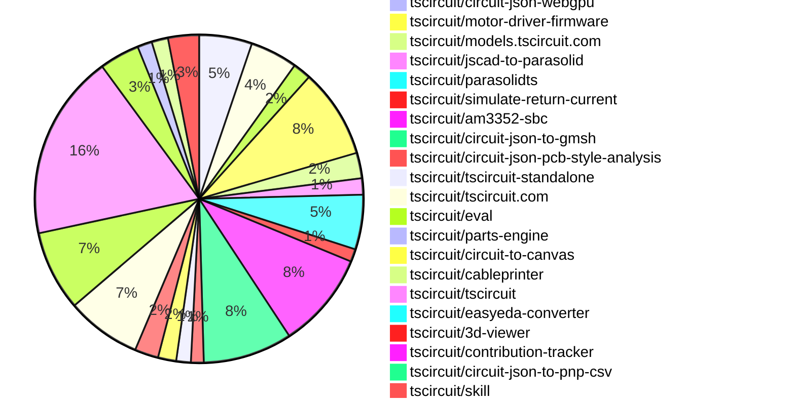

# contribution tracker

[contributions.tscircuit.com](https://contributions.tscircuit.com) ・ [tscircuit.com](https://tscircuit.com) ・ [Contribution Overviews](./contribution-overviews/) ・ [Changelogs](./changelogs/)

Generates weekly contribution overviews for tscircuit contributors. Check out all
the [contribution overviews here](./contribution-overviews/)
You can find AI-generated monthly changelogs in the [changelogs directory](./changelogs/)

- All PRs in the tscircuit org are scanned/summarized via an LLM
- The LLM classifies each Diff/PR as into a set of attributes for scoring
- All the PRs, summaries, and classifications are organized into charts and tables for [the website](https://contributions.tscircuit.com)

> Want to run locally? See the [Development Section](#development)

## Current Week

<!-- START_CURRENT_WEEK -->

# Contribution Overview 2026-10-06

The current week is shown below. There are 3 major sections:

- [Contributor Overview](#contributor-overview)
- [PRs by Repository](#prs-by-repository)
- [PRs by Contributor](#changes-by-contributor)
- [Scoring & Sponsorship Details](/docs/sponsorship-calculation-explanation.md)

## PRs by Repository


```mermaid
pie
    "tscircuit/jscad-electronics" : 29
    "tscircuit/modelprinter" : 26
    "tscircuit/pcb-viewer" : 10
    "tscircuit/schematic-viewer" : 3
    "tscircuit/cli" : 49
    "tscircuit/circuit-json" : 14
    "tscircuit/props" : 9
    "tscircuit/core" : 30
    "tscircuit/circuit-to-svg" : 7
    "tscircuit/runframe" : 53
    "tscircuit/svg.tscircuit.com" : 49
    "tscircuit/docs" : 7
    "tscircuit/circuit-json-to-gltf" : 8
    "tscircuit/jscad-to-step" : 1
    "tscircuit/bus-lanes-solver" : 2
    "tscircuit/circuit-json-webgpu" : 4
    "tscircuit/motor-driver-firmware" : 10
    "tscircuit/models.tscircuit.com" : 3
    "tscircuit/jscad-to-parasolid" : 3
    "tscircuit/parasolidts" : 2
    "tscircuit/simulate-return-current" : 2
    "tscircuit/am3352-sbc" : 2
    "tscircuit/circuit-json-to-gmsh" : 2
    "tscircuit/circuit-json-pcb-style-analysis" : 13
    "tscircuit/tscircuit-standalone" : 2
    "tscircuit/tscircuit.com" : 41
    "tscircuit/eval" : 44
    "tscircuit/parts-engine" : 1
    "tscircuit/circuit-to-canvas" : 5
    "tscircuit/cableprinter" : 3
    "tscircuit/tscircuit" : 102
    "tscircuit/easyeda-converter" : 4
    "tscircuit/3d-viewer" : 4
    "tscircuit/contribution-tracker" : 1
    "tscircuit/circuit-json-to-pnp-csv" : 1
    "tscircuit/skill" : 1
    "tscircuit/tscircuit-autorouter" : 5
    "tscircuit/schematic-trace-solver" : 4
    "tscircuit/circuit-json-schematic-placement-analysis" : 22
    "tscircuit/altiumts" : 8
    "tscircuit/matchpack" : 2
    "tscircuit/circuit-json-to-tscircuit" : 9
    "tscircuit/checks" : 3
    "tscircuit/tiny-hypergraph" : 1
    "tscircuit/altium-to-circuit-json" : 17
    "tscircuit/footprinter" : 1
    "tscircuit/circuit-json-to-altium" : 2
    "tscircuit/ti" : 2
    "tscircuit/circuit-json-to-sysconfig" : 2
    "tscircuit/simulate-pcb-noise" : 2
    "tscircuit/circuit-json-crosstalk-simulation" : 2
```

## Contributor Overview

| Contributor | 🐳 Major | 🐙 Minor | 🐌 Tiny | Score | ⭐ |
|-------------|---------|---------|---------|-------|-----|
| [seveibar](#seveibar) | 64 | 46 | 49 | 361.5 | 👑👑👑 |
| [ShiboSoftwareDev](#ShiboSoftwareDev) | 3 | 12 | 13 | 63 | ⭐⭐⭐ |
| [MustafaMulla29](#MustafaMulla29) | 5 | 4 | 8 | 37 | ⭐⭐ |
| [mohan-bee](#mohan-bee) | 4 | 6 | 4 | 36 | ⭐⭐ |
| [techmannih](#techmannih) | 0 | 9 | 9 | 28 | ⭐⭐ |
| [imrishabh18](#imrishabh18) | 3 | 1 | 4 | 19 | ⭐⭐ |
| [tscircuitbot](#tscircuitbot) | 0 | 0 | 352 | 14.5 | ⭐⭐ |
| [0hmX](#0hmX) | 1 | 2 | 1 | 10 | ⭐ |
| [GokulPandi-M](#GokulPandi-M) | 1 | 2 | 1 | 9 | ⭐ |
| [hrithik18k](#hrithik18k) | 0 | 2 | 5 | 9 | ⭐ |
| [AnasSarkiz](#AnasSarkiz) | 0 | 4 | 0 | 9 | ⭐ |
| [Devesh36](#Devesh36) | 0 | 0 | 8 | 8 | ⭐ |
| [rushabhcodes](#rushabhcodes) | 0 | 3 | 0 | 7 | ⭐ |
| [Abse2001](#Abse2001) | 0 | 0 | 1 | 7 | ⭐ |
| [sprintstate](#sprintstate) | 1 | 0 | 0 | 4 | ⭐ |
| [trixie010](#trixie010) | 0 | 1 | 0 | 2 |  |

## Staff Pass Ratio (SPR)

| Contributor | Reviewed PRs | Rejections | Approvals | SPR |
|-------------|--------------|------------|-----------|-----|
| [ShiboSoftwareDev](#ShiboSoftwareDev) | 4 | 0 | 4 | 100.0% |
| [MustafaMulla29](#MustafaMulla29) | 3 | 0 | 4 | 100.0% |
| [mohan-bee](#mohan-bee) | 2 | 0 | 2 | 100.0% |
| [techmannih](#techmannih) | 2 | 1 | 1 | 50.0% |
| [Devesh36](#Devesh36) | 1 | 1 | 0 | 0.0% |
| [GokulPandi-M](#GokulPandi-M) | 1 | 0 | 1 | 100.0% |
| [hrithik18k](#hrithik18k) | 1 | 1 | 0 | 0.0% |
| [rushabhcodes](#rushabhcodes) | 1 | 1 | 1 | 0.0% |

<details>
<summary>ShiboSoftwareDev SPR PRs (4)</summary>

- [#1017](https://github.com/tscircuit/3d-viewer/pull/1017) fix: render cad_cable elements in the interactive 3D viewer
- [#396](https://github.com/tscircuit/checks/pull/396) Fix false copper pour intersections on tiny BRep edges
- [#2894](https://github.com/tscircuit/tscircuit-autorouter/pull/2894) perf: release failed high-density route searches
- [#246](https://github.com/tscircuit/tiny-hypergraph/pull/246) Measure benchmark memory per isolated sample

</details>

<details>
<summary>MustafaMulla29 SPR PRs (3)</summary>

- [#221](https://github.com/tscircuit/circuit-json-schematic-placement-analysis/pull/221) feat: detect spread-out diode-capacitor stage junctions
- [#215](https://github.com/tscircuit/circuit-json-schematic-placement-analysis/pull/215) feat: detect backward placement in series LED chains
- [#218](https://github.com/tscircuit/circuit-json-schematic-placement-analysis/pull/218) feat: detect misaligned grounded parallel RC branches

</details>

<details>
<summary>mohan-bee SPR PRs (2)</summary>

- [#4446](https://github.com/tscircuit/core/pull/4446) preserve bus target length for routing and DRC
- [#2924](https://github.com/tscircuit/tscircuit-autorouter/pull/2924) Simplify detours in repaired preloaded traces

</details>

<details>
<summary>techmannih SPR PRs (2)</summary>

- [#814](https://github.com/tscircuit/circuit-to-svg/pull/814) Show dark centers on tented vias
- [#26](https://github.com/tscircuit/circuit-json-webgpu/pull/26) fix: support named colors with deterministic alphabet note text

</details>

<details>
<summary>Devesh36 SPR PRs (1)</summary>

- [#258](https://github.com/tscircuit/kicad-to-circuit-json/pull/258) fix: smooth fabrication circles in existing Arduino Mega snapshot (V12)

</details>

<details>
<summary>GokulPandi-M SPR PRs (1)</summary>

- [#580](https://github.com/tscircuit/easyeda-converter/pull/580) repro: regulator output inferred as required power

</details>

<details>
<summary>hrithik18k SPR PRs (1)</summary>

- [#4427](https://github.com/tscircuit/core/pull/4427) fix: preserve property inheritance for explicit undefined values

</details>

<details>
<summary>rushabhcodes SPR PRs (1)</summary>

- [#908](https://github.com/tscircuit/footprinter/pull/908) feat: allow custom pin row courtyard dimensions

</details>

> Note: AI evaluates PRs and assigns 1-3 star ratings automatically. 4 and 5 star ratings require manual staff review.

## Review Table

[reviews-received-hover]: ## "Number of reviews received for PRs for this contributor"
[approvals-received-hover]: ## "Number of approvals received for PRs this contributor authored"
[rejections-received-hover]: ## "Number of rejections received for PRs this contributor authored"
[prs-opened-hover]: ## "Number of PRs opened by this contributor"
[issues-created-hover]: ## "Number of issues created by this contributor"

| Contributor | Reviews Received | Approvals Received | Rejections Received | Approvals | Rejections Given | PRs Opened | PRs Merged | Issues Created |
|---|---|---|---|---|---|---|---|---|
| [0hmX](#0hmX) | 3 | 0 | 0 | 2 | 0 | 13 | 4 | 0 |
| [4sapp](#4sapp) | 0 | 0 | 0 | 0 | 0 | 1 | 0 | 0 |
| [Abse2001](#Abse2001) | 1 | 1 | 0 | 6 | 1 | 2 | 1 | 0 |
| [adamscarmccoy-boop](#adamscarmccoy-boop) | 0 | 0 | 0 | 0 | 0 | 2 | 0 | 0 |
| [AnasSarkiz](#AnasSarkiz) | 4 | 4 | 0 | 1 | 0 | 6 | 4 | 0 |
| [attaboy11](#attaboy11) | 0 | 0 | 0 | 0 | 0 | 1 | 0 | 0 |
| [benbatuu](#benbatuu) | 0 | 0 | 0 | 0 | 0 | 1 | 0 | 0 |
| [deividasmatt-collab](#deividasmatt-collab) | 0 | 0 | 0 | 0 | 0 | 1 | 0 | 0 |
| [Devesh36](#Devesh36) | 21 | 13 | 6 | 0 | 0 | 29 | 8 | 0 |
| [DurandA](#DurandA) | 0 | 0 | 0 | 0 | 0 | 1 | 0 | 0 |
| [Furox-Art](#Furox-Art) | 0 | 0 | 0 | 0 | 0 | 1 | 0 | 0 |
| [GokulPandi-M](#GokulPandi-M) | 13 | 5 | 3 | 0 | 0 | 11 | 4 | 0 |
| [hrithik18k](#hrithik18k) | 13 | 8 | 2 | 0 | 0 | 18 | 7 | 0 |
| [imrishabh18](#imrishabh18) | 0 | 0 | 0 | 12 | 6 | 20 | 8 | 0 |
| [KrishnaX12](#KrishnaX12) | 1 | 0 | 0 | 0 | 0 | 8 | 0 | 0 |
| [Longo125](#Longo125) | 0 | 0 | 0 | 0 | 0 | 2 | 0 | 0 |
| [mohan-bee](#mohan-bee) | 4 | 3 | 0 | 5 | 0 | 31 | 14 | 0 |
| [MustafaMulla29](#MustafaMulla29) | 8 | 8 | 0 | 2 | 0 | 17 | 17 | 0 |
| [rjdotdev](#rjdotdev) | 1 | 0 | 0 | 0 | 0 | 1 | 0 | 0 |
| [rushabhcodes](#rushabhcodes) | 15 | 4 | 0 | 11 | 0 | 9 | 3 | 0 |
| [seveibar](#seveibar) | 48 | 2 | 0 | 13 | 3 | 241 | 160 | 0 |
| [ShiboSoftwareDev](#ShiboSoftwareDev) | 30 | 26 | 0 | 19 | 0 | 115 | 28 | 0 |
| [sprintstate](#sprintstate) | 0 | 0 | 0 | 0 | 0 | 1 | 1 | 0 |
| [TassioSales](#TassioSales) | 0 | 0 | 0 | 0 | 0 | 1 | 0 | 0 |
| [techmannih](#techmannih) | 16 | 10 | 2 | 14 | 3 | 25 | 18 | 0 |
| [trixie010](#trixie010) | 1 | 1 | 0 | 0 | 0 | 2 | 1 | 0 |
| [tscircuitbot](#tscircuitbot) | 0 | 0 | 0 | 0 | 0 | 427 | 352 | 0 |
| [xiaolu-FS](#xiaolu-FS) | 0 | 0 | 0 | 0 | 0 | 5 | 0 | 0 |
| [yuu0428](#yuu0428) | 0 | 0 | 0 | 0 | 0 | 1 | 0 | 0 |
| [zenoutlabs](#zenoutlabs) | 0 | 0 | 0 | 0 | 0 | 6 | 0 | 0 |

## Changes by Repository

### [tscircuit/jscad-electronics](https://github.com/tscircuit/jscad-electronics)

| PR # | Impact | Rating | Contributor | Description |
|------|--------|--------|-------------|-------------|
| [#443](https://github.com/tscircuit/jscad-electronics/pull/443) | 🐳 Major | ⭐⭐⭐ | imrishabh18 | Adds TorsionSpring, createTorsionSpringGeom, createTorsionSpringMesh and model-string routing for a reusable open-coil spring with two straight tangent legs. |
| [#425](https://github.com/tscircuit/jscad-electronics/pull/425) | 🐳 Major | ⭐⭐⭐ | seveibar | Adding a mechanical renderer currently changes central exports, dispatch cases, pad exclusions, and dependency pins. This change discovers typed libmodelsnameregister.tsx adapters and generates ignored static registration and export modules before development, tests, and builds. Adding a renderer then requires its own model folder, tests, and documentation. The existing eight renderers register through adapters while their original component, geometry, helper implementations, and source paths remain intact. Registration is synchronous. Published main, vanilla, and cables bundles retain their export maps and entrypoint formats; vanilla keeps the existing React shims and classic JSX build, and cables remains isolated. Generation uses Bun.Glob under Bun and filesystem directory reads under Node. Direct tsup builds, npm prepareprepack, typecheck, test preload, and the Cosmos development watcher refresh generated modules. Published packages require no filesystem scan or Bun runtime. PR formattype checks also cover stacked branches. The foundation centralizes the existing shared geometrytest helpers used by the 15 pending renderer PRs, plus a separate orthographic snapshot fixture that preserves their original PNGs while retaining mains current snapshot renderer. A single immutable modelprinter preview from draft contract integration 41(https:github.comtscircuitmodelprinterpull41) supplies all pending contracts; model PRs remain separately reviewable. Once those contracts are released, the dependency can move to the stable version in one change. Validation: Current-main baseline: 368 tests passed; exact public runtime exports and 240 declarations captured. Compatibility audit: all 126 main, 28 vanilla, and one cables exports preserved; 478 bidirectional typesignature checks passed. Existing eight mechanical models, ten electronic footprints, validationfallback cases, pads, indexed meshes, materials, cables and Three conversion matched baseline. Node-only npm prepare, packed bare imports, browser bundle, strict downstream TypeScript consumer, and GLTF conversion passed. Registry, synchronous dispatch, pads, fallback, type constraints, deterministic BunNode generation and folder-addremove tests passed. Full foundation suite: 376 tests passed, 0 failed, including all existing snapshots. All 15 migrated raw snapshot images were verified byte for byte at their published commits and linked in both renderer and contract PRs. Every renderer diff contains its own added files only. All 16 PRs passed all four CI checks (64 successful checks); all 15 renderer preview packages are downloadable. After the shared MP23 preview update, the compatibility audit, 478 type checks, Nodebrowser packed consumers, and eight registration tests passed again. The published CI preview artifact also passed the same downstream audit. Combined integration: all 23 model unions and synchronous Reactvanilla dispatch passed; all 474 tests (13,692,597 assertions), types, formatting, and Node-only build passed. All 182 feature additions match the individual validated branches; only coordination documentation changed after that full suite. Merge this foundation before the stacked renderer PRs. The contract integration draft is for a shared preview, not a replacement for the individual model contract PRs. |
| [#427](https://github.com/tscircuit/jscad-electronics/pull/427) | 🐳 Major | ⭐⭐⭐ | seveibar | Adds functionality to create adapter cables with different contact pitches at each end, ensuring compact wiring in the middle and smooth fanning out near the connectors. |
| [#419](https://github.com/tscircuit/jscad-electronics/pull/419) | 🐳 Major | ⭐⭐⭐ | seveibar | Adds a renderer for the ISO Phillips pan screw with detailed geometry and validation, including integration with existing modelprinter components. |
| [#416](https://github.com/tscircuit/jscad-electronics/pull/416) | 🐳 Major | ⭐⭐⭐ | seveibar | Adds a renderer for ISO hex nuts with specific geometric features and integration into the existing model printer framework. |
| [#439](https://github.com/tscircuit/jscad-electronics/pull/439) | 🐳 Major | ⭐⭐⭐ | seveibar | Adds a radial bearing renderer for compact standard designations and explicit face flags, allowing for independent face configurations and improved rendering of ball bearings. |
| [#405](https://github.com/tscircuit/jscad-electronics/pull/405) | 🐳 Major | ⭐⭐⭐ | seveibar | Component models currently supply colors without material finishes, and the sample exporter drops material metadata. Add approximate surface materials and preserve them through the component APIs and GLB export. Share finishes for identified plasticrubber bodies, leads, contacts, copper pads, connector shells, motor parts, and mechanical metal parts. Tinned leads use metalness 0.8 and roughness 0.55 for subdued reflections. Preserve material metadata through the vanilla renderer, align React and vanilla output, and carry cable materials into previews. The browser preview uses component metalness and roughness. Keep realistic rendering disabled across CI snapshot paths to avoid its runtime cost. Restore the original test timeouts, remove extra JST supersampling, and refresh standard-rendering snapshots. PoppyGL remains updated to 0.0.34. Depends on https:github.comtscircuitjscad-to-gltfpull17. The dev dependency pins its published package preview; replace it with a released version before merging. The jscad-fiber minimum is 0.0.89. Validation: 368 tests across 243 files pass locally in 167.79 seconds, versus 360.70 seconds with realistic rendering (about 54 less time). All nine JST tests also pass after removing extra supersampling. TypeScript, formatting, and diff checks pass. Reviewed 244 refreshed snapshots. GitHub CI timing is pending. Finishes are visual approximations rather than measured optical properties. Complete PCB renders also need a separate follow-up: circuit-json-to-gltfs footprinter GLB re-import currently discards PBR properties. |
| [#449](https://github.com/tscircuit/jscad-electronics/pull/449) | 🐙 Minor | ⭐⭐ | seveibar | Extends the existing HexNut renderer to support DIN metric and imperial UNC hex nuts, fixing a rounding error and adding comprehensive geometry tests. |
| [#448](https://github.com/tscircuit/jscad-electronics/pull/448) | 🐙 Minor | ⭐⭐ | seveibar | Adds BallTransferUnit for a captive load ball in a circular cup with a three-hole mounting flange, including rendering through Footprinter3d and React, and disables Bun lockfile saving. |
| [#447](https://github.com/tscircuit/jscad-electronics/pull/447) | 🐙 Minor | ⭐⭐ | seveibar | Adds support for left-handed and right-handed threaded rods with boolean API, rejecting enum-style string inputs and updating dependencies. |
| [#445](https://github.com/tscircuit/jscad-electronics/pull/445) | 🐙 Minor | ⭐⭐ | seveibar | Updates modelprinter to version 0.0.18, enabling the renderer to accept new mechanical model flags and adds geometry equivalence tests for various components. |
| [#409](https://github.com/tscircuit/jscad-electronics/pull/409) | 🐙 Minor | ⭐⭐ | seveibar | Adds a threaded rod renderer that creates a fully threaded rod with specified dimensions and features, including a helical surface and chamfered ends, while preserving existing model geometry and public APIs. |
| [#424](https://github.com/tscircuit/jscad-electronics/pull/424) | 🐙 Minor | ⭐⭐ | seveibar | Adds startPin1Side and endPin1Side parameters to the cable mesh API to orient cable plugs and conductors based on explicit pin 1 sides, allowing for better control over cable geometry and conductor order during rendering. |
| [#420](https://github.com/tscircuit/jscad-electronics/pull/420) | 🐙 Minor | ⭐⭐ | seveibar | Adds a renderer for a shaft collar with an open shaft bore, optional rim chamfers, and a radial female-threaded set-screw hole, including geometry and mesh factories. |
| [#410](https://github.com/tscircuit/jscad-electronics/pull/410) | 🐙 Minor | ⭐⭐ | seveibar | Adds a renderer for a symmetric cable grommet with specific dimensions and geometry, including a centered panel groove and adaptive tessellation. |
| [#418](https://github.com/tscircuit/jscad-electronics/pull/418) | 🐙 Minor | ⭐⭐ | seveibar | Adds a compression spring renderer that generates the geometry for a compression spring based on specified parameters, including winding hands and terminal sections, while preserving existing model geometry and public APIs. |
| [#415](https://github.com/tscircuit/jscad-electronics/pull/415) | 🐙 Minor | ⭐⭐ | seveibar | Adds a renderer for the button socket screw with detailed geometry and integration into the existing modelprinter framework. |

<details>
<summary>🐌 Tiny Contributions (12)</summary>

| PR # | Impact | Contributor | Description |
|------|--------|-------------|-------------|
| [#442](https://github.com/tscircuit/jscad-electronics/pull/442) | 🐌 Tiny | imrishabh18 | Add HollowPositioningArmTube, a reusable hollow positioning arm tube renderer for lamp and camera assemblies, with configurable dimensions and geometry. |
| [#421](https://github.com/tscircuit/jscad-electronics/pull/421) | 🐌 Tiny | seveibar | Renders the split shaft collar with an open shaft bore, radial slit and separate clearance and female-threaded clamp-hole halves, preserving model geometry and public APIs. |
| [#428](https://github.com/tscircuit/jscad-electronics/pull/428) | 🐌 Tiny | seveibar | Updates the shared tscircuitmodelprinter dependency from 0.0.11 to 0.0.14, ensuring compatibility with the pending renderer PRs by including all 23 registered model contracts. |
| [#408](https://github.com/tscircuit/jscad-electronics/pull/408) | 🐌 Tiny | seveibar | Adds a renderer for a closed plain sleeve bearing with specified dimensions and chamfers, preserving existing component behavior and geometry. |
| [#426](https://github.com/tscircuit/jscad-electronics/pull/426) | 🐌 Tiny | seveibar | Generates JST PH and SH motor headers based on selected pin counts, replacing fixed geometry with familycount-based designs while maintaining existing PH6 geometry. |
| [#423](https://github.com/tscircuit/jscad-electronics/pull/423) | 🐌 Tiny | seveibar | Add single and grouped bullet connector cable meshes with separate gold male pins, hollow female sockets, spring slots, and solder cups, supporting various diameters and contact counts. |
| [#422](https://github.com/tscircuit/jscad-electronics/pull/422) | 🐌 Tiny | seveibar | Adds a renderer for the rigid shaft coupler with specific geometry and mounting features, including support for various bore sizes and threaded holes. |
| [#417](https://github.com/tscircuit/jscad-electronics/pull/417) | 🐌 Tiny | seveibar | Adds a renderer for the T-slot extrusion profile with specific geometric features and integrates it into the existing model printer framework. |
| [#413](https://github.com/tscircuit/jscad-electronics/pull/413) | 🐌 Tiny | seveibar | Adds a renderer for a right-triangular T-slot gusset with two complete capsule mounting slots, preserving edge clearance and through openings. |
| [#412](https://github.com/tscircuit/jscad-electronics/pull/412) | 🐌 Tiny | seveibar | Adds a renderer for the bent T-slot inside corner with two drilled mounting legs and concentric insideoutside bend surfaces, preserving existing model geometry and public APIs. |
| [#411](https://github.com/tscircuit/jscad-electronics/pull/411) | 🐌 Tiny | seveibar | Adds a renderer for a countersunk socket screw with specific geometric features and integrates it with existing modelprinter functionality. |
| [#406](https://github.com/tscircuit/jscad-electronics/pull/406) | 🐌 Tiny | seveibar | Renders the flanged bushing as one closed sleeve with an integral flange and an uninterrupted through bore, preserving public React and vanilla exports, model geometry, and pad behavior. |

</details>

### [tscircuit/modelprinter](https://github.com/tscircuit/modelprinter)

| PR # | Impact | Rating | Contributor | Description |
|------|--------|--------|-------------|-------------|
| [#58](https://github.com/tscircuit/modelprinter/pull/58) | 🐳 Major | ⭐⭐⭐ | imrishabh18 | Adds a reusable torsionspring contract for an open helical coil with two straight tangent legs, defining its dimensions and properties. |
| [#56](https://github.com/tscircuit/modelprinter/pull/56) | 🐳 Major | ⭐⭐⭐ | imrishabh18 | Add hollowpositioningarmtube, a reusable parametric contract for hollow positioning arm tubes used in lamp and camera assemblies. |
| [#65](https://github.com/tscircuit/modelprinter/pull/65) | 🐳 Major | ⭐⭐⭐ | seveibar | Adds regular DIN metric nuts from M1.6 through M24 and imperial UNC nuts from 2 through 12 and 14 through 1 inch to the existing hexnut contract, including validation for size compatibility and documentation for nominal visual envelopes. |
| [#63](https://github.com/tscircuit/modelprinter/pull/63) | 🐳 Major | ⭐⭐⭐ | seveibar | Removes enum parsing and compatibility aliases for ThreadedRod, introducing boolean flags for handedness and updating JSON representation accordingly. |
| [#60](https://github.com/tscircuit/modelprinter/pull/60) | 🐳 Major | ⭐⭐⭐ | seveibar | Mechanical model strings now accept value-free flags such as _setscrew, _singleclamp, _lefthanded, _closedground, and driveprofileshape flags, allowing for a more streamlined syntax while maintaining legacy support. |
| [#27](https://github.com/tscircuit/modelprinter/pull/27) | 🐳 Major | ⭐⭐⭐ | seveibar | Adds a new shaft collar model contract with defined parameters, validation, and documentation for use in the modelprinter library. |
| [#26](https://github.com/tscircuit/modelprinter/pull/26) | 🐳 Major | ⭐⭐⭐ | seveibar | Adds a detailed model contract for a custom compression spring, including validation, parameter parsing, and documentation for assembly visualization. |
| [#55](https://github.com/tscircuit/modelprinter/pull/55) | 🐳 Major | ⭐⭐⭐ | seveibar | Adds compact radial-bearing strings that expand into explicit dimensions and boolean face flags, allowing for more flexible and precise representation of bearing specifications. |
| [#37](https://github.com/tscircuit/modelprinter/pull/37) | 🐳 Major | ⭐⭐⭐ | seveibar | Adds a new model contract for a 90-degree countersunk socket screw according to ISO 10642:2019, including detailed specifications and validation for various parameters. |
| [#35](https://github.com/tscircuit/modelprinter/pull/35) | 🐳 Major | ⭐⭐⭐ | seveibar | Adds a new T-slot triangular gusset model with defined parameters, validation, and documentation, enhancing the model printers capabilities. |
| [#29](https://github.com/tscircuit/modelprinter/pull/29) | 🐳 Major | ⭐⭐⭐ | seveibar | Adds a new rigid shaft coupler model contract with defined properties, validation, and documentation for use in the modelprinter library. |
| [#28](https://github.com/tscircuit/modelprinter/pull/28) | 🐳 Major | ⭐⭐⭐ | seveibar | Adds a new clamping shaft collar model contract with defined parameters, validation, and documentation, including geometry specifications and integration with existing model and renderer systems. |
| [#23](https://github.com/tscircuit/modelprinter/pull/23) | 🐳 Major | ⭐⭐⭐ | seveibar | Adds a new flanged bushing model contract with strict validation, dimension helpers, and documentation for mechanical layout. |
| [#22](https://github.com/tscircuit/modelprinter/pull/22) | 🐳 Major | ⭐⭐⭐ | seveibar | Adds a new plain bushing model contract with defined properties, validation, and documentation for mechanical layout. |
| [#20](https://github.com/tscircuit/modelprinter/pull/20) | 🐳 Major | ⭐⭐⭐ | seveibar | Adds a validated metric rod definition for a threaded rod model, including specifications for dimensions, chamfers, and thread characteristics, along with comprehensive documentation and validation tests. |
| [#33](https://github.com/tscircuit/modelprinter/pull/33) | 🐳 Major | ⭐⭐⭐ | seveibar | Adds a T-slot extrusion model contract with strict validation, documentation, and geometry definitions for custom solid profiles. |
| [#34](https://github.com/tscircuit/modelprinter/pull/34) | 🐳 Major | ⭐⭐⭐ | seveibar | Adds a new T-slot inside corner model with defined parameters, validation, and documentation, ensuring proper geometry and mounting specifications. |
| [#42](https://github.com/tscircuit/modelprinter/pull/42) | 🐳 Major | ⭐⭐⭐ | seveibar | Adds support for various JST motor wire connection aliases, normalizing input formats and validating header dimensions for compatibility with motors. |
| [#43](https://github.com/tscircuit/modelprinter/pull/43) | 🐙 Minor | ⭐⭐ | seveibar | Fixes typechecking failure in NEMA variant tests to allow successful npm release by narrowing the test result to fn: nema before accessing wireConnection. |
| [#24](https://github.com/tscircuit/modelprinter/pull/24) | 🐙 Minor | ⭐⭐ | seveibar | Adds a new model contract for a fully threaded button screw according to ISO 7380-1:2022 specifications, including validation and documentation. |

<details>
<summary>🐌 Tiny Contributions (6)</summary>

| PR # | Impact | Contributor | Description |
|------|--------|-------------|-------------|
| [#57](https://github.com/tscircuit/modelprinter/pull/57) | 🐌 Tiny | imrishabh18 | Adds a new model contract for an adhesive-mount electrical component heatsink, defining its dimensions and properties for integration into the modelprinter. |
| [#64](https://github.com/tscircuit/modelprinter/pull/64) | 🐌 Tiny | seveibar | Adds the balltransferunit family for a captive upward-facing load ball in a circular cup with a three-hole top flange, including unit normalization, fixed defaults, and strict validation. |
| [#40](https://github.com/tscircuit/modelprinter/pull/40) | 🐌 Tiny | seveibar | Adding a model currently changes the same parser map, public export list, and definition-schema union across model PRs. This change discovers srcmodelsregister.ts at build time, so new models keep their registration and public API in their own directory. Each model exports a typed defineModel( name, schema, parse ) descriptor and a registration function. Bun generates ignored static imports, synchronous registration calls, public re-exports, and the concrete ModelDefinition schematype union. The package uses an instance-owned registry and preserves the existing exports, model order, schemas, and parsed outputs. Its published ESM works in Node and browsers without Bun. Normal test, typecheck, formatting, build, install, and pack workflows refresh discovery automatically. bun run generate:watch handles model-folder additionsremovals during development. The workflow is documented in docsmodel-registration.md; generated source and build outputs stay uncommitted. Validation: bun test (24 passing), bun run typecheck, bun run format:check, and bun run build. Additional checks cover clean generation, duplicateisolationparser-boundary behavior, deterministic model additionremoval, typed discriminants, Bun 1.3.2 hookswatchbuild, all 71 existing public declarations, 48 parser cases and 24 schema cases, and the packed package in plain Node plus a browser sandbox. The 15 open model PRs now target this foundation: 20, 22, 23, 24, 25, 26, 27, 28, 29, 31, 33, 34, 35, 37, and 38. Each diff adds only its own model directory, tests, and documentation; existing renderer snapshots remain in those PR descriptions. All 15 pass the required checks individually. The combined 23-model build passes 76 tests, typecheck, formatting, build, packed-package Node execution, and declaration checks. Merge this foundation first. After merging, delete its merged branch to let GitHub retarget the dependent PRs to main, or retarget them manually. |
| [#31](https://github.com/tscircuit/modelprinter/pull/31) | 🐌 Tiny | seveibar | Adds a new cable grommet model contract with defined properties, validation, and documentation for installation and geometry. |
| [#25](https://github.com/tscircuit/modelprinter/pull/25) | 🐌 Tiny | seveibar | Adds a new model for ISO hex nuts, including strict validation, dimension documentation, and integration with existing model and renderer systems. |
| [#38](https://github.com/tscircuit/modelprinter/pull/38) | 🐌 Tiny | seveibar | Adds a new model contract for ISO Phillips pan screws, defining specifications and validation for M3 to M6 sizes according to ISO standards. |

</details>

### [tscircuit/pcb-viewer](https://github.com/tscircuit/pcb-viewer)

| PR # | Impact | Rating | Contributor | Description |
|------|--------|--------|-------------|-------------|
| [#1072](https://github.com/tscircuit/pcb-viewer/pull/1072) | 🐙 Minor | ⭐⭐ | imrishabh18 | Fixes the issue where changing the rendering engine in the PCB context menu does not persist after remounting the PCBViewer, by saving the users preference in localStorage and restoring it when no renderer prop is provided. |
| [#1078](https://github.com/tscircuit/pcb-viewer/pull/1078) | 🐙 Minor | ⭐⭐ | seveibar | Fixes the issue where the PCB context menu initially focused its first button, causing it to appear selected with a blue outline, by focusing the menu container instead. |

<details>
<summary>🐌 Tiny Contributions (8)</summary>

| PR # | Impact | Contributor | Description |
|------|--------|-------------|-------------|
| [#1068](https://github.com/tscircuit/pcb-viewer/pull/1068) | 🐌 Tiny | seveibar | Adds a PCB component focus controller that allows users to focus on a PCB component when switching from the schematic view, enhancing navigation and usability. |
| [#1079](https://github.com/tscircuit/pcb-viewer/pull/1079) | 🐌 Tiny | tscircuitbot | Automated package update |
| [#1077](https://github.com/tscircuit/pcb-viewer/pull/1077) | 🐌 Tiny | tscircuitbot | Automated package update |
| [#1075](https://github.com/tscircuit/pcb-viewer/pull/1075) | 🐌 Tiny | tscircuitbot | Automated package update |
| [#1073](https://github.com/tscircuit/pcb-viewer/pull/1073) | 🐌 Tiny | tscircuitbot | Automated package update |
| [#1069](https://github.com/tscircuit/pcb-viewer/pull/1069) | 🐌 Tiny | tscircuitbot | Automated package update |
| [#1076](https://github.com/tscircuit/pcb-viewer/pull/1076) | 🐌 Tiny | mohan-bee | Updates the tscircuitcircuit-json-webgpu dependency to a specific commit, along with a minor update to tscircuitcircuit-json-util. |
| [#1074](https://github.com/tscircuit/pcb-viewer/pull/1074) | 🐌 Tiny | techmannih | Update circuit-to-canvas from 0.0.131 to 0.0.135, including the matching lockfile entry, to use the tented-via dark-center rendering from the corresponding pull request. |

</details>

### [tscircuit/schematic-viewer](https://github.com/tscircuit/schematic-viewer)

| PR # | Impact | Rating | Contributor | Description |
|------|--------|--------|-------------|-------------|
| [#283](https://github.com/tscircuit/schematic-viewer/pull/283) | 🐳 Major | ⭐⭐⭐ | seveibar | Adds a context menu option to right-clicked schematic components to navigate to the corresponding PCB component if available. |
| [#282](https://github.com/tscircuit/schematic-viewer/pull/282) | 🐳 Major | ⭐⭐⭐ | seveibar | Adds functionality to display JLCPCB part prices and stock availability in the schematic component details tooltip, fetching data from an external API and handling loading states and errors appropriately. |

<details>
<summary>🐌 Tiny Contributions (1)</summary>

| PR # | Impact | Contributor | Description |
|------|--------|-------------|-------------|
| [#284](https://github.com/tscircuit/schematic-viewer/pull/284) | 🐌 Tiny | imrishabh18 | Updates the developmenttest dependency tscircuitcircuit-json-schematic-placement-analysis from the pinned 0.0.11 CDN tarball to 0.0.46, the latest published release reported by jscdn. |

</details>

### [tscircuit/cli](https://github.com/tscircuit/cli)

| PR # | Impact | Rating | Contributor | Description |
|------|--------|--------|-------------|-------------|
| [#5180](https://github.com/tscircuit/cli/pull/5180) | 🐳 Major | ⭐⭐⭐ | seveibar | Sets CLI defaults to enable part availability checks by default, while preserving explicit opt-out and custom engines, and ensuring browser defaults remain opt-in. |

<details>
<summary>🐌 Tiny Contributions (48)</summary>

| PR # | Impact | Contributor | Description |
|------|--------|-------------|-------------|
| [#5188](https://github.com/tscircuit/cli/pull/5188) | 🐌 Tiny | imrishabh18 | Updates tscircuitcircuit-json-schematic-placement-analysis from the pinned 0.0.33 CDN tarball to 0.0.46, the latest published release reported by jscdn. Regenerates bun.lock with the new tarball integrity; other dependency resolutions are unchanged. |
| [#5201](https://github.com/tscircuit/cli/pull/5201) | 🐌 Tiny | seveibar | Removes the redundant alias for circuit-to-svg-xray and consolidates rendering to use the standard circuit-to-svg import, ensuring that both normal and X-Ray PCB rendering utilize the same import while cleaning up the Bun lockfile. |
| [#5176](https://github.com/tscircuit/cli/pull/5176) | 🐌 Tiny | seveibar | Updates EasyEDA from version 0.0.370 to 0.0.372 and normalX-ray circuit-to-svg renderers from 0.0.441 to 0.0.444, adding a regression test for filled fabrication notes using the real C41413180 fixture through the CLI exact-footprint import. |
| [#5234](https://github.com/tscircuit/cli/pull/5234) | 🐌 Tiny | tscircuitbot | Automated package update |
| [#5233](https://github.com/tscircuit/cli/pull/5233) | 🐌 Tiny | tscircuitbot | Updates the tscircuitrunframe package from version 0.0.2942 to 0.0.2943 |
| [#5232](https://github.com/tscircuit/cli/pull/5232) | 🐌 Tiny | tscircuitbot | Automated package update |
| [#5231](https://github.com/tscircuit/cli/pull/5231) | 🐌 Tiny | tscircuitbot | Automated package update |
| [#5230](https://github.com/tscircuit/cli/pull/5230) | 🐌 Tiny | tscircuitbot | Automated package update |
| [#5229](https://github.com/tscircuit/cli/pull/5229) | 🐌 Tiny | tscircuitbot | Updates the tscircuitrunframe package to version 0.0.2941 |
| [#5228](https://github.com/tscircuit/cli/pull/5228) | 🐌 Tiny | tscircuitbot | Automated package update |
| [#5226](https://github.com/tscircuit/cli/pull/5226) | 🐌 Tiny | tscircuitbot | Automated package update |
| [#5225](https://github.com/tscircuit/cli/pull/5225) | 🐌 Tiny | tscircuitbot | Updates the tscircuitrunframe package to version 0.0.2940 in the package.json file. |
| [#5224](https://github.com/tscircuit/cli/pull/5224) | 🐌 Tiny | tscircuitbot | Automated package update |
| [#5223](https://github.com/tscircuit/cli/pull/5223) | 🐌 Tiny | tscircuitbot | Updates the tscircuitrunframe package version from 0.0.2938 to 0.0.2939 |
| [#5221](https://github.com/tscircuit/cli/pull/5221) | 🐌 Tiny | tscircuitbot | Updates the tscircuitrunframe package to version 0.0.2938 |
| [#5220](https://github.com/tscircuit/cli/pull/5220) | 🐌 Tiny | tscircuitbot | Automated package update |
| [#5219](https://github.com/tscircuit/cli/pull/5219) | 🐌 Tiny | tscircuitbot | Updates the tscircuitrunframe package from version 0.0.2936 to 0.0.2937 |
| [#5216](https://github.com/tscircuit/cli/pull/5216) | 🐌 Tiny | tscircuitbot | Automated package update |
| [#5214](https://github.com/tscircuit/cli/pull/5214) | 🐌 Tiny | tscircuitbot | Automated package update |
| [#5211](https://github.com/tscircuit/cli/pull/5211) | 🐌 Tiny | tscircuitbot | Updates the tscircuitrunframe package from version 0.0.2933 to 0.0.2934 |
| [#5210](https://github.com/tscircuit/cli/pull/5210) | 🐌 Tiny | tscircuitbot | Automated package update |
| [#5209](https://github.com/tscircuit/cli/pull/5209) | 🐌 Tiny | tscircuitbot | Updates the tscircuitrunframe package version from 0.0.2932 to 0.0.2933 in package.json |
| [#5208](https://github.com/tscircuit/cli/pull/5208) | 🐌 Tiny | tscircuitbot | Automated package update |
| [#5207](https://github.com/tscircuit/cli/pull/5207) | 🐌 Tiny | tscircuitbot | Updates the tscircuitrunframe package from version 0.0.2931 to 0.0.2932 |
| [#5206](https://github.com/tscircuit/cli/pull/5206) | 🐌 Tiny | tscircuitbot | Automated package update |
| [#5205](https://github.com/tscircuit/cli/pull/5205) | 🐌 Tiny | tscircuitbot | Updates the tscircuitrunframe package from version 0.0.2930 to 0.0.2931 |
| [#5202](https://github.com/tscircuit/cli/pull/5202) | 🐌 Tiny | tscircuitbot | Updates the tscircuitrunframe package to version 0.0.2930 |
| [#5199](https://github.com/tscircuit/cli/pull/5199) | 🐌 Tiny | tscircuitbot | Automated package update |
| [#5198](https://github.com/tscircuit/cli/pull/5198) | 🐌 Tiny | tscircuitbot | Updates the tscircuitrunframe package version from 0.0.2928 to 0.0.2929 |
| [#5197](https://github.com/tscircuit/cli/pull/5197) | 🐌 Tiny | tscircuitbot | Automated package update |
| [#5196](https://github.com/tscircuit/cli/pull/5196) | 🐌 Tiny | tscircuitbot | Updates the tscircuitrunframe package from version 0.0.2927 to 0.0.2928 |
| [#5193](https://github.com/tscircuit/cli/pull/5193) | 🐌 Tiny | tscircuitbot | Automated package update |
| [#5192](https://github.com/tscircuit/cli/pull/5192) | 🐌 Tiny | tscircuitbot | Updates the tscircuitrunframe package from version 0.0.2925 to 0.0.2926 |
| [#5203](https://github.com/tscircuit/cli/pull/5203) | 🐌 Tiny | tscircuitbot | Automated package update |
| [#5194](https://github.com/tscircuit/cli/pull/5194) | 🐌 Tiny | tscircuitbot | Updates the tscircuitrunframe package from version 0.0.2926 to 0.0.2927 |
| [#5215](https://github.com/tscircuit/cli/pull/5215) | 🐌 Tiny | tscircuitbot | Updates the tscircuitrunframe package version from 0.0.2934 to 0.0.2936 in package.json |
| [#5212](https://github.com/tscircuit/cli/pull/5212) | 🐌 Tiny | tscircuitbot | Automated package update |
| [#5191](https://github.com/tscircuit/cli/pull/5191) | 🐌 Tiny | tscircuitbot | Automated package update |
| [#5190](https://github.com/tscircuit/cli/pull/5190) | 🐌 Tiny | tscircuitbot | Updates the tscircuitrunframe package from version 0.0.2924 to 0.0.2925 |
| [#5189](https://github.com/tscircuit/cli/pull/5189) | 🐌 Tiny | tscircuitbot | Automated package update |
| [#5187](https://github.com/tscircuit/cli/pull/5187) | 🐌 Tiny | tscircuitbot | Automated package update |
| [#5186](https://github.com/tscircuit/cli/pull/5186) | 🐌 Tiny | tscircuitbot | Updates the tscircuitrunframe package from version 0.0.2923 to 0.0.2924 |
| [#5185](https://github.com/tscircuit/cli/pull/5185) | 🐌 Tiny | tscircuitbot | Automated package update |
| [#5184](https://github.com/tscircuit/cli/pull/5184) | 🐌 Tiny | tscircuitbot | Updates the tscircuitrunframe package to version 0.0.2923 in the package.json file |
| [#5181](https://github.com/tscircuit/cli/pull/5181) | 🐌 Tiny | tscircuitbot | Automated package update |
| [#5172](https://github.com/tscircuit/cli/pull/5172) | 🐌 Tiny | tscircuitbot | Automated package update |
| [#5171](https://github.com/tscircuit/cli/pull/5171) | 🐌 Tiny | mohan-bee | Updates the tscircuitcircuit-json-util package to version 0.0.120 in package.json |
| [#5227](https://github.com/tscircuit/cli/pull/5227) | 🐌 Tiny | MustafaMulla29 | Updates tscircuitcircuit-json-schematic-placement-analysis from 0.0.46 to 0.0.50, keeping the existing JSCDN tarball source and refreshing its Bun lockfile entry and integrity hash. |

</details>

### [tscircuit/circuit-json](https://github.com/tscircuit/circuit-json)

| PR # | Impact | Rating | Contributor | Description |
|------|--------|--------|-------------|-------------|
| [#887](https://github.com/tscircuit/circuit-json/pull/887) | 🐳 Major | ⭐⭐⭐ | seveibar | Adds official circuit-json schemas for return-current excitations, spatial results, sampled fields, heatmap images, and portvia markers. Producers can reference plain or gzipped JSON through field_asset, including external and embedded data URLs, while consumers retain typed metadata for PCB simulation overlays. All new schemas, exported types, helper APIs, filenames, and the grid-format identifier consistently include the simulation prefix. Registers all five elements in any_circuit_element, adds pcb_return_current experiments, exports inputoutput types and contactterminal schemas, and keeps spatial results separate from the existing SPICE graph-result unions. Decoded realcomplex grids validate finite channels, matching null masks, and matching parent dimensionstype through getSimulationReturnCurrentGridJsonSchema. Field assets validate MIME typesdata URL headers; images validate PNGWebP assets and positive bounds. Built on proposal 885; this PR targets main directly and includes its proposal documents until that PR is merged. Uses the existing srcsimulation directory. Asset fetchingdecompression, cross-document reference resolution, and SVG rendering remain consumer work. Validation: Latest CI Type Check, Zod Linting, Snake Case Check, and PR package preview passed. The full Bun Test rerun is queued; the previous revisions full suite passed. 14 new tests cover element registrationdefault IDs, terminalcontact variants, invalid dimensionsMIME types, masks, and an embedded-gzip round trip. Local tsc --noEmit, npm run build, lintformat checks, and git diff --check passed. Added schema reference documentation and a field-validation usage guide. |
| [#891](https://github.com/tscircuit/circuit-json/pull/891) | 🐳 Major | ⭐⭐⭐ | seveibar | Adds cad_reference_surface records to preserve named assembly mounting frames in Circuit JSON for opt-in visualization, allowing frames on parts without CAD geometry or with multiple models. |
| [#878](https://github.com/tscircuit/circuit-json/pull/878) | 🐳 Major | ⭐⭐⭐ | seveibar | Add optional from_connector_pin1_position and to_connector_pin1_position to cad_cable, which are absolute 3D points at each connectors mating face in circuit-world millimeters, computed by the circuit producer, to fix connector roll and identify pin 1. |
| [#889](https://github.com/tscircuit/circuit-json/pull/889) | 🐙 Minor | ⭐⭐ | seveibar | Adds optional fields for printed part material and CAD color override, preserving existing behavior when omitted, and updates schema documentation with validation tests. |
| [#890](https://github.com/tscircuit/circuit-json/pull/890) | 🐙 Minor | ⭐⭐ | seveibar | Adds pcb_trace_style_warning for a trace segment that is both longer than 5 mm and more than 4 from a multiple of 45. |
| [#874](https://github.com/tscircuit/circuit-json/pull/874) | 🐙 Minor | ⭐⭐ | seveibar | Adds optional is_filled and has_stroke flags to fabrication note paths, allowing for filled polygons and stroke representation in fabrication marks. |

<details>
<summary>🐌 Tiny Contributions (8)</summary>

| PR # | Impact | Contributor | Description |
|------|--------|-------------|-------------|
| [#881](https://github.com/tscircuit/circuit-json/pull/881) | 🐌 Tiny | seveibar | Add schematic_sheet_styling_warning for sheets that use a non-default drawing area, allowing consumers to show a warning on the sheet without attaching it to an unrelated component. |
| [#877](https://github.com/tscircuit/circuit-json/pull/877) | 🐌 Tiny | seveibar | Adds source_component_availability_warning for parts whose supplier alternatives cannot be confirmed in stock, retaining references and supplier information, included in Circuit JSON unions, with generated documentation. |
| [#894](https://github.com/tscircuit/circuit-json/pull/894) | 🐌 Tiny | tscircuitbot | Automated package update |
| [#893](https://github.com/tscircuit/circuit-json/pull/893) | 🐌 Tiny | tscircuitbot | Automated package update |
| [#892](https://github.com/tscircuit/circuit-json/pull/892) | 🐌 Tiny | tscircuitbot | Automated package update |
| [#888](https://github.com/tscircuit/circuit-json/pull/888) | 🐌 Tiny | tscircuitbot | Automated package update |
| [#882](https://github.com/tscircuit/circuit-json/pull/882) | 🐌 Tiny | tscircuitbot | Automated package update |
| [#875](https://github.com/tscircuit/circuit-json/pull/875) | 🐌 Tiny | tscircuitbot | Automated package update |

</details>

### [tscircuit/props](https://github.com/tscircuit/props)

| PR # | Impact | Rating | Contributor | Description |
|------|--------|--------|-------------|-------------|
| [#926](https://github.com/tscircuit/props/pull/926) | 🐳 Major | ⭐⭐⭐ | seveibar | Adds typed and validated props for simulation.pcbreturncurrentsimulation and its nested simulation.pcbreturncurrentexcitation elements, so PCB return-current experiments can be authored in TSX. simulationProps.pcbreturncurrentsimulation and simulationProps.pcbreturncurrentexcitation expose the validators through a matching props namespace. Existing named schemas, TypeScript interfaces and module paths remain compatible. The guide and generated README use the namespaced JSX tags, with matching section anchors. Authors select the signal driverload and actual GND pads explicitly. returnSource is the load-side GND contact; returnSink is the driver-side GND contact. Current is a positive peak amplitude in amperes, and both port resistances are explicit real ohm values. Unit strings such as 5mA, 25ohm, and 100 normalize to SI values. Missing contacts, invalid dimensions, nonfinite values, and unsupported props fail validation. tsx import  simulation  from tscircuitcore simulation.pcbreturncurrentsimulation nameDDR D13 return path simulation.pcbreturncurrentexcitation source.U1  .DDR_D13 load.U2  .DQ13 groundnet.GND current5mA returnSource.U2  .GND returnSink.U1  .GND sourceImpedance25ohm loadImpedance100ohm  simulation.pcbreturncurrentsimulation  The core implementation consumes these schemas to emit pending Circuit JSON definitions after PCB routing. These props do not connect pins or run a solver. Frequency and meshsampling parameters remain CLI run options because the current pending-experiment schema cannot store them. Initial return-contact selectors identify physical PCB portspads; standalone via contacts are not supported by the solver adapter. Includes a usage guide and generated component, props, and README documentation. All four required generators were run. Validation: all 654 tests pass, including six new tests for units, required contacts, layer inputs, and rejected run settings; typecheck, ESMdeclaration build, formatting, and built namespace-exportSI parsing smoke test pass. |
| [#923](https://github.com/tscircuit/props/pull/923) | 🐳 Major | ⭐⭐⭐ | seveibar | Adds assembly.referencesurface as a typed child of generic and printed assembly parts, with named part-local planes and unit-aware center offsets, along with optional printed-part color and material properties. |
| [#919](https://github.com/tscircuit/props/pull/919) | 🐳 Major | ⭐⭐⭐ | seveibar | Adds assemblyProps.part for generic components of an assembly, requiring a nonempty name and optionally accepting displayName, model, modelUrl, or cadModel, with validation tests and documentation. |
| [#914](https://github.com/tscircuit/props/pull/914) | 🐙 Minor | ⭐⭐ | seveibar | Adds optional boolean properties isFilled and hasStroke to fabrication note path props, allowing for fill-only and stroke-only fabrication paths in EasyEDA solid-region symbols. |
| [#910](https://github.com/tscircuit/props/pull/910) | 🐙 Minor | ⭐⭐ | seveibar | Add optional AssemblyCableProps.model for an explicit cable specification, allowing users to specify cable models directly instead of relying on endpoint inference. |
| [#915](https://github.com/tscircuit/props/pull/915) | 🐙 Minor | ⭐⭐ | seveibar | Adds optional stock and price lookup support to PartsEngine, plus an opt-in platform.checkAvailability setting for core to use it during rendering. |
| [#912](https://github.com/tscircuit/props/pull/912) | 🐙 Minor | ⭐⭐ | seveibar | Replaces the wireConnection enum with an optional string for arbitrary cable connection names, preserving legacy normalization and defaults. |

<details>
<summary>🐌 Tiny Contributions (2)</summary>

| PR # | Impact | Contributor | Description |
|------|--------|-------------|-------------|
| [#913](https://github.com/tscircuit/props/pull/913) | 🐌 Tiny | seveibar | Preserves authored cable connection strings verbatim and removes props-level spelling replacements, ensuring modelprinter handles parsing at the model-string boundary without changing defaults and custom-model conflicts. |
| [#911](https://github.com/tscircuit/props/pull/911) | 🐌 Tiny | seveibar | Normalizes six-pin JST PH motor terminations to jst6_ph and accepts legacy inputs jst-ph-6 and jst_ph_6 during props parsing, updating documentation and adding regression tests. |

</details>

### [tscircuit/core](https://github.com/tscircuit/core)

| PR # | Impact | Rating | Contributor | Description |
|------|--------|--------|-------------|-------------|
| [#4448](https://github.com/tscircuit/core/pull/4448) | 🐳 Major | ⭐⭐⭐ | seveibar | Adds child assembly.referencesurface mounting anchors to generic and printed parts, then emits their resolved frames as cad_reference_surface records. For example, PART.anchor can position a board or printed part independently of the parts CAD geometry. Named JSCAD references also emit these records, and duplicate surface names are rejected across both forms. Frames use unit-aware centerXOffsetcenterYOffsetcenterZOffset, XYXZYZ planes, and perpendicular normalDirection values (x, x-, y, y-, z, z-). Optional paired widthheight survive serialization. Centers, normals, and X tangents follow finalized world placement, including inherited rotations and bottom-layer mounting. Geometry-free parts emit frames; model offsets do not move them. Schematic-only builds omit CAD records. Printed parts preserve optional color and material (pla, petg, nylon) on source records, with the explicit color override on CAD records. Imported models compose offsets inside their mounting frame. Includes usage documentation and an inspected JSCAD lamp visual: a base, hollow printed stem, tapered hollow shade with a collar and three spokes, and a bulb. The exploded and underside views enable showReferenceSurfaces to display named cyan mounting frames and orange outward normals. Validation: 63 assembly tests, TypeScript, and package build. Regression checks compare emitted frames with actual transformed probe geometry at 090180270 degrees on both layers, check tilted imported-model offsets, JSCAD reference frames, dimensions, repeat-render stability, and schematic-only behavior. The lamp test checks world mesh bounds, a hollow shade, and the 60 mm shade lift. Dependencies: tscircuitprops923 (merged; published props 0.0.697) tscircuitcircuit-json891 (merged; reference-surface schema) tscircuitcircuit-json889 (merged; published Circuit JSON 0.0.525) tscircuitcircuit-json-to-gltf244 (merged; using published renderer 0.0.151) All prerequisites are merged and published. Dependencies use tscircuitprops0.0.697, circuit-json0.0.525, and circuit-json-to-gltf0.0.151; no package previews remain. |
| [#4420](https://github.com/tscircuit/core/pull/4420) | 🐳 Major | ⭐⭐⭐ | seveibar | Computes cable connector pin 1 positions for automatic plug alignment, ensuring accurate alignment of cable plugs with their respective headers across various rotations and PCB layers. |
| [#4417](https://github.com/tscircuit/core/pull/4417) | 🐳 Major | ⭐⭐⭐ | seveibar | Passes authored wireConnection strings directly to modelprinter and infers motor cable familypin count from its shared JST connector profile, enhancing compatibility with JST PH and SH connections. |
| [#4467](https://github.com/tscircuit/core/pull/4467) | 🐳 Major | ⭐⭐⭐ | mohan-bee | Fixes full-board bus preservation failure by enabling the preserveOutputTraces flag for bus lanes, ensuring completed lanes remain as connected obstacles in later routing phases. |
| [#4446](https://github.com/tscircuit/core/pull/4446) | 🐳 Major | ⭐⭐⭐ | mohan-bee | Fixes the issue where targetLength and lengthTolerance were dropped before routing and DRC, ensuring that the router receives the required length range and DRC detects routes outside that range. |
| [#4445](https://github.com/tscircuit/core/pull/4445) | 🐳 Major | ⭐⭐⭐ | mohan-bee | Reproduces a bug where an eight-bit bus silently misses its declared 50 0.5 mm target length during autorouting, with a comprehensive test and PCB snapshot. |
| [#4452](https://github.com/tscircuit/core/pull/4452) | 🐙 Minor | ⭐⭐ | seveibar | Updates the modelprinter dependency to version 0.0.18, enabling mechanical flags such as _setscrew, _lefthanded, and _closedground. |
| [#4444](https://github.com/tscircuit/core/pull/4444) | 🐙 Minor | ⭐⭐ | seveibar | Adds assembly.part  for generic components of an assembly using the props introduced in a previous pull request. Parts retain their source identity with optional CAD geometry supplied by model, modelUrl, or cadModel, including JSX CAD children. |
| [#4440](https://github.com/tscircuit/core/pull/4440) | 🐙 Minor | ⭐⭐ | seveibar | Emit a sheet style warning when a schematic sheet uses ANSI B or custom widthheight instead of the default A4 drawing area. |
| [#4429](https://github.com/tscircuit/core/pull/4429) | 🐙 Minor | ⭐⭐ | seveibar | Only check availability and show warnings for suppliers with nonempty part numbers explicitly supplied in supplierPartNumbers props, preventing unwanted warnings for automatically selected parts. |
| [#4428](https://github.com/tscircuit/core/pull/4428) | 🐙 Minor | ⭐⭐ | seveibar | Restricts automatic datasheet enrichment to only chips and op amps, preventing passive components and connectors from appearing in the missing-datasheet dashboard. |
| [#4424](https://github.com/tscircuit/core/pull/4424) | 🐙 Minor | ⭐⭐ | seveibar | Core can now check supplier stock through the configured parts engine when platform.checkAvailability is explicitly true, providing warnings for components that may not have availability from suppliers. |
| [#4416](https://github.com/tscircuit/core/pull/4416) | 🐙 Minor | ⭐⭐ | seveibar | Adds explicit model selection to the existing assembly.cable API, allowing users to specify cable models directly while retaining existing standards and connector properties. |
| [#4466](https://github.com/tscircuit/core/pull/4466) | 🐙 Minor | ⭐⭐ | mohan-bee | Reproduces Pipeline 9 rerouting completed top-only LCD bus lanes with explicit phases and numeric assertions for failure recording. |
| [#4434](https://github.com/tscircuit/core/pull/4434) | 🐙 Minor | ⭐⭐ | mohan-bee | Restores missing stencil apertures for pill-shaped SMT pads, allowing them to emit solder paste while preserving their attributes and skipping masked or collapsed apertures. |
| [#4433](https://github.com/tscircuit/core/pull/4433) | 🐙 Minor | ⭐⭐ | mohan-bee | Reproduces the issue of missing solder paste on pill-shaped SMT pads and rotated pill pads in PCB snapshots, ensuring that the expected solder paste apertures are present in the rendering. |
| [#4432](https://github.com/tscircuit/core/pull/4432) | 🐙 Minor | ⭐⭐ | techmannih | Updates the SVG renderer to use circuit-to-svg 0.0.445, incorporating dark centers for tented vias and refreshing board-tenting snapshots while maintaining defaults and explicit overrides. |
| [#4455](https://github.com/tscircuit/core/pull/4455) | 🐙 Minor | ⭐⭐ | ShiboSoftwareDev | Reproduces a bug where the TMDS62LEVM sheet title is shifted into its frame due to core recentring the fixed-size sheet. |
| [#4419](https://github.com/tscircuit/core/pull/4419) | 🐙 Minor | ⭐⭐ | ShiboSoftwareDev | Fixes rendering issue by separating SVG paths to eliminate duplicate contours in the LM251772EVM-PD filled regions while preserving open stroke paths. |
| [#4470](https://github.com/tscircuit/core/pull/4470) | 🐙 Minor | ⭐⭐ | hrithik18k | Reproduces a round through-hole pad receiving stencil paste on both sides without requesting it, ensuring that the paste is emitted only when explicitly opted in. |

<details>
<summary>🐌 Tiny Contributions (10)</summary>

| PR # | Impact | Contributor | Description |
|------|--------|-------------|-------------|
| [#4422](https://github.com/tscircuit/core/pull/4422) | 🐌 Tiny | seveibar | Updates the development dependency of modelprinter from version 0.0.6 to 0.0.10 to ensure builds and assembly tests utilize the released per-model registry through existing APIs. |
| [#4415](https://github.com/tscircuit/core/pull/4415) | 🐌 Tiny | seveibar | Reproduces a bug where the six-pin JST PH cable plug is misaligned with the controller boards header in the documentation, capturing the current bug without adding connector rotation or cable path adjustments. |
| [#4407](https://github.com/tscircuit/core/pull/4407) | 🐌 Tiny | seveibar | Updates the pinned PoppyGL dev dependency from 0.0.30 to 0.0.34, the latest npm release, for the 3D snapshot rendering fixtures. |
| [#4474](https://github.com/tscircuit/core/pull/4474) | 🐌 Tiny | tscircuitbot | Updates the tscircuitchecks package to version 0.0.243 in package.json |
| [#4475](https://github.com/tscircuit/core/pull/4475) | 🐌 Tiny | techmannih | Updates the bundled tscircuitschematic-trace-solver dependency to fix ground-label clearance issues in the TMC5160 schematic. |
| [#4471](https://github.com/tscircuit/core/pull/4471) | 🐌 Tiny | techmannih | Reproduces a schematic issue where the TMC5160 shared ground bus intersects its GND symbol and label, highlighting a visual defect without implementing routing changes. |
| [#4456](https://github.com/tscircuit/core/pull/4456) | 🐌 Tiny | ShiboSoftwareDev | Keeps explicitly sized schematic sheets centered on the schematic origin and avoids emitting an undeclared center field for this path. |
| [#4465](https://github.com/tscircuit/core/pull/4465) | 🐌 Tiny | GokulPandi-M | Updates the schematic trace solver to version 0.0.229, aligning shared-pin junctions for improved trace geometry and direction handling. |
| [#4454](https://github.com/tscircuit/core/pull/4454) | 🐌 Tiny | Devesh36 | Updates the tscircuitfootprinter dependency in package.json from version 0.0.430 to 0.0.431, reflecting the latest npm release. |
| [#4418](https://github.com/tscircuit/core/pull/4418) | 🐌 Tiny | Abse2001 | Updates the tscircuitchecks dependency to version 0.0.242, fixing false copper-pour shorts caused by collinear hole-edge subdivisions. |

</details>

### [tscircuit/circuit-to-svg](https://github.com/tscircuit/circuit-to-svg)

| PR # | Impact | Rating | Contributor | Description |
|------|--------|--------|-------------|-------------|
| [#818](https://github.com/tscircuit/circuit-to-svg/pull/818) | 🐳 Major | ⭐⭐⭐ | seveibar | Circuit JSON now stores PCB return-current results, sampled fields, heatmap Assets, and actual portvia markers. Passing simulationResultId to convertCircuitJsonToPcbSvg overlays one completed result on the PCB; ordinary rendering remains unchanged when the parameter is omitted. The overlay selects the requested layer, preserves absent-copper masks, highlights the excitation trace in cyanorange for topbottom, and places signalGND pad and via markers at their referenced PCB coordinates. Sheet-current magnitudes divided by the stored foil thickness give average density in Amm, rather than a local maximum within the skin layer. Optional fixed-length arrows show current direction at the excitation currents positive peak. There is no public phase control. The legend reports the stored frequency, units, and what the arrows mean. convertCircuitJsonToPcbSimulationSvg adds asynchronous embedded JSONgzip Asset loading and an explicit resolveAsset callback for external assets. It loads only the selected resultlayer and validates decoded channels with the official Circuit JSON schema. The renderer does not run a solver or infer missing results. ts await convertCircuitJsonToPcbSimulationSvg(circuitJson,  simulationResultId: simulation_pcb_return_current_result_0, layer: inner1, returnCurrent:  showVectors: true , )  The visual snapshot renders a completed Palace 100 MHz, 5 mA finite-conductivity surface-impedance EM solve over its PCB, with real signalGND terminals, current-direction arrows, and a full-range 00.21 Amm numeric scale. The actual second-order solve has 45,493 tetrahedra and 314,698 unknowns. The 0.05 mm output cells form a 160120 grid with 19,176 finite conductor samples and 24 masked drill samples; sampling sums the current on the exposed foil faces without filling or extrapolating missing data. Its portable Circuit JSON fixture is copied unmodified, including embedded gzip complex fields and the transparent heatmap. Source input, modelconfig, solver log, raw port CSVs, normalization data, and hashsampling validation evidence trace the stored values to the solver output. The fixture documents the surface-impedance assumption and distinguishes smaller output cells from established FEM convergence. Validation: the full suite passed (460 tests, one existing todo); ten focused tests pass, including the real-data snapshot without update mode. They also cover selection, maskszero values, thickness conversion, row orientation, the in-phase vector component and full complex density magnitude, separate terminal positions, JSONgzip round trips, selected-asset resolution, image bounds, a common numeric density scale replacing stored images, and explicit invalid-reference failures. Type check, package build, full format check, dependency check, and git diff --check passed. Uses the published circuit-json 0.0.522 schemas from tscircuitcircuit-json887. |
| [#812](https://github.com/tscircuit/circuit-to-svg/pull/812) | 🐙 Minor | ⭐⭐ | seveibar | Support the optional is_filled and has_stroke fabrication path flags introduced in circuit-json. Filled routes close implicitly and use the existing path color; has_stroke: false renders a solid region without widening its boundary. Omitted flags preserve legacy strokes. |
| [#813](https://github.com/tscircuit/circuit-to-svg/pull/813) | 🐙 Minor | ⭐⭐ | seveibar | Fixes the issue of double alpha application on fabrication paths by applying color alpha as SVG element opacity, ensuring fill and stroke coverage is composited once. |
| [#814](https://github.com/tscircuit/circuit-to-svg/pull/814) | 🐙 Minor | ⭐⭐ | techmannih | Shades the hole area of tented vias at half the mask colours RGB intensity on the tented side, improving visual representation without altering drill geometry. |
| [#810](https://github.com/tscircuit/circuit-to-svg/pull/810) | 🐙 Minor | ⭐⭐ | ShiboSoftwareDev | Reproduces a bug where the global schematic primitive order is lost during rendering, ensuring that the component body is rendered before terminal artwork in the SVG output. |

<details>
<summary>🐌 Tiny Contributions (2)</summary>

| PR # | Impact | Contributor | Description |
|------|--------|-------------|-------------|
| [#815](https://github.com/tscircuit/circuit-to-svg/pull/815) | 🐌 Tiny | seveibar | Render schematic_sheet_styling_warning as an existing warning callout targeting the affected sheets frame, using visual SVG snapshots for the warning callout and sheet frame. |
| [#809](https://github.com/tscircuit/circuit-to-svg/pull/809) | 🐌 Tiny | ShiboSoftwareDev | Replaces the per-type global primitive buckets with one ordered bucket to preserve Circuit JSON order without guessing that a filled rectangle is a component body. |

</details>

### [tscircuit/runframe](https://github.com/tscircuit/runframe)

| PR # | Impact | Rating | Contributor | Description |
|------|--------|--------|-------------|-------------|
| [#5568](https://github.com/tscircuit/runframe/pull/5568) | 🐳 Major | ⭐⭐⭐ | seveibar | Selecting Show on PCB in the schematic viewer now resolves the component in the current Circuit JSON, queues PCB focus, and switches to the PCB tab. The PCB viewer centers and outlines that component and selects its copper layer. The callback is omitted when availableTabs excludes PCB; stale component identities do not change tabs. |

<details>
<summary>🐌 Tiny Contributions (52)</summary>

| PR # | Impact | Contributor | Description |
|------|--------|-------------|-------------|
| [#5569](https://github.com/tscircuit/runframe/pull/5569) | 🐌 Tiny | seveibar | Updates EasyEDA to 0.0.372 and circuit-to-svg to 0.0.444 for filled fabrication-note polygons with uniform opacity, ensuring that all filledno-stroke fabrication paths are preserved during JLCPCB import. |
| [#5628](https://github.com/tscircuit/runframe/pull/5628) | 🐌 Tiny | tscircuitbot | Automated package update |
| [#5627](https://github.com/tscircuit/runframe/pull/5627) | 🐌 Tiny | tscircuitbot | Updates the tscircuitpcb-viewer package to version 1.11.424 |
| [#5626](https://github.com/tscircuit/runframe/pull/5626) | 🐌 Tiny | tscircuitbot | Automated package update |
| [#5625](https://github.com/tscircuit/runframe/pull/5625) | 🐌 Tiny | tscircuitbot | Automated package update |
| [#5623](https://github.com/tscircuit/runframe/pull/5623) | 🐌 Tiny | tscircuitbot | Automated package update |
| [#5622](https://github.com/tscircuit/runframe/pull/5622) | 🐌 Tiny | tscircuitbot | Updates the tscircuiteval package from version 0.0.1581 to 0.0.1582 |
| [#5621](https://github.com/tscircuit/runframe/pull/5621) | 🐌 Tiny | tscircuitbot | Automated package update |
| [#5620](https://github.com/tscircuit/runframe/pull/5620) | 🐌 Tiny | tscircuitbot | Updates the tscircuiteval package from version 0.0.1580 to 0.0.1581 |
| [#5617](https://github.com/tscircuit/runframe/pull/5617) | 🐌 Tiny | tscircuitbot | Automated package update |
| [#5616](https://github.com/tscircuit/runframe/pull/5616) | 🐌 Tiny | tscircuitbot | Updates the tscircuiteval package from version 0.0.1579 to 0.0.1580 |
| [#5615](https://github.com/tscircuit/runframe/pull/5615) | 🐌 Tiny | tscircuitbot | Automated package update |
| [#5614](https://github.com/tscircuit/runframe/pull/5614) | 🐌 Tiny | tscircuitbot | Automated package update |
| [#5613](https://github.com/tscircuit/runframe/pull/5613) | 🐌 Tiny | tscircuitbot | Automated package update |
| [#5611](https://github.com/tscircuit/runframe/pull/5611) | 🐌 Tiny | tscircuitbot | Automated package update |
| [#5607](https://github.com/tscircuit/runframe/pull/5607) | 🐌 Tiny | tscircuitbot | Updates the tscircuitpcb-viewer package to version 1.11.422 |
| [#5605](https://github.com/tscircuit/runframe/pull/5605) | 🐌 Tiny | tscircuitbot | Updates the tscircuiteval package from version 0.0.1576 to 0.0.1577 in the package.json file. |
| [#5604](https://github.com/tscircuit/runframe/pull/5604) | 🐌 Tiny | tscircuitbot | Automated package update |
| [#5601](https://github.com/tscircuit/runframe/pull/5601) | 🐌 Tiny | tscircuitbot | Updates the tscircuiteval package from version 0.0.1574 to 0.0.1575 in the package.json file. |
| [#5590](https://github.com/tscircuit/runframe/pull/5590) | 🐌 Tiny | tscircuitbot | Updates the tscircuiteval package from version 0.0.1573 to 0.0.1574 in the package.json file. |
| [#5589](https://github.com/tscircuit/runframe/pull/5589) | 🐌 Tiny | tscircuitbot | Automated package update |
| [#5587](https://github.com/tscircuit/runframe/pull/5587) | 🐌 Tiny | tscircuitbot | Automated package update |
| [#5586](https://github.com/tscircuit/runframe/pull/5586) | 🐌 Tiny | tscircuitbot | Automated package update |
| [#5608](https://github.com/tscircuit/runframe/pull/5608) | 🐌 Tiny | tscircuitbot | Automated package update |
| [#5600](https://github.com/tscircuit/runframe/pull/5600) | 🐌 Tiny | tscircuitbot | Automated package update |
| [#5594](https://github.com/tscircuit/runframe/pull/5594) | 🐌 Tiny | tscircuitbot | Automated package update |
| [#5593](https://github.com/tscircuit/runframe/pull/5593) | 🐌 Tiny | tscircuitbot | Automated package update |
| [#5591](https://github.com/tscircuit/runframe/pull/5591) | 🐌 Tiny | tscircuitbot | Automated package update |
| [#5588](https://github.com/tscircuit/runframe/pull/5588) | 🐌 Tiny | tscircuitbot | Updates the tscircuiteval package from version 0.0.1572 to 0.0.1573 |
| [#5609](https://github.com/tscircuit/runframe/pull/5609) | 🐌 Tiny | tscircuitbot | Updates the tscircuiteval package from version 0.0.1577 to 0.0.1578 |
| [#5603](https://github.com/tscircuit/runframe/pull/5603) | 🐌 Tiny | tscircuitbot | Updates the tscircuiteval package from version 0.0.1575 to 0.0.1576 |
| [#5602](https://github.com/tscircuit/runframe/pull/5602) | 🐌 Tiny | tscircuitbot | Automated package update |
| [#5599](https://github.com/tscircuit/runframe/pull/5599) | 🐌 Tiny | tscircuitbot | Automated package update |
| [#5585](https://github.com/tscircuit/runframe/pull/5585) | 🐌 Tiny | tscircuitbot | Automated package update |
| [#5584](https://github.com/tscircuit/runframe/pull/5584) | 🐌 Tiny | tscircuitbot | Updates the tscircuiteval package from version 0.0.1570 to 0.0.1571 |
| [#5582](https://github.com/tscircuit/runframe/pull/5582) | 🐌 Tiny | tscircuitbot | Automated package update |
| [#5581](https://github.com/tscircuit/runframe/pull/5581) | 🐌 Tiny | tscircuitbot | Updates the tscircuiteval package from version 0.0.1569 to 0.0.1570 in the package.json file. |
| [#5579](https://github.com/tscircuit/runframe/pull/5579) | 🐌 Tiny | tscircuitbot | Updates the tscircuiteval package from version 0.0.1568 to 0.0.1569 in the package.json file. |
| [#5576](https://github.com/tscircuit/runframe/pull/5576) | 🐌 Tiny | tscircuitbot | Automated package update |
| [#5575](https://github.com/tscircuit/runframe/pull/5575) | 🐌 Tiny | tscircuitbot | Updates the tscircuiteval package from version 0.0.1566 to 0.0.1567 |
| [#5574](https://github.com/tscircuit/runframe/pull/5574) | 🐌 Tiny | tscircuitbot | Automated package update |
| [#5571](https://github.com/tscircuit/runframe/pull/5571) | 🐌 Tiny | tscircuitbot | Updates the tscircuiteval package from version 0.0.1564 to 0.0.1565 |
| [#5566](https://github.com/tscircuit/runframe/pull/5566) | 🐌 Tiny | tscircuitbot | Updates the tscircuiteval package from version 0.0.1563 to 0.0.1564 |
| [#5558](https://github.com/tscircuit/runframe/pull/5558) | 🐌 Tiny | tscircuitbot | Updates the tscircuiteval package from version 0.0.1561 to 0.0.1562 |
| [#5580](https://github.com/tscircuit/runframe/pull/5580) | 🐌 Tiny | tscircuitbot | Automated package update |
| [#5577](https://github.com/tscircuit/runframe/pull/5577) | 🐌 Tiny | tscircuitbot | Automated package update |
| [#5567](https://github.com/tscircuit/runframe/pull/5567) | 🐌 Tiny | tscircuitbot | Automated package update |
| [#5560](https://github.com/tscircuit/runframe/pull/5560) | 🐌 Tiny | tscircuitbot | Automated package update |
| [#5573](https://github.com/tscircuit/runframe/pull/5573) | 🐌 Tiny | tscircuitbot | Updates the tscircuiteval package from version 0.0.1565 to 0.0.1566 |
| [#5563](https://github.com/tscircuit/runframe/pull/5563) | 🐌 Tiny | tscircuitbot | Updates the tscircuitschematic-viewer package from version 2.0.98 to 2.0.100 |
| [#5559](https://github.com/tscircuit/runframe/pull/5559) | 🐌 Tiny | tscircuitbot | Automated package update |
| [#5610](https://github.com/tscircuit/runframe/pull/5610) | 🐌 Tiny | techmannih | Updates the PCB and 3D viewer dependencies to use the latest versions that support tented-via dark-center rendering with Canvas 0.0.135. |

</details>

### [tscircuit/svg.tscircuit.com](https://github.com/tscircuit/svg.tscircuit.com)

| PR # | Impact | Rating | Contributor | Description |
|------|--------|--------|-------------|-------------|
| [#2484](https://github.com/tscircuit/svg.tscircuit.com/pull/2484) | 🐳 Major | ⭐⭐⭐ | seveibar | Adds support for GLB downloads and camera presets in the deployed renderer, resolving HTTP 400 errors for GLB format requests and enhancing the 3D rendering capabilities. |
| [#2476](https://github.com/tscircuit/svg.tscircuit.com/pull/2476) | 🐳 Major | ⭐⭐⭐ | seveibar | Adds 3D camera presets for PNGSVG rendering, enables GLB downloads without requiring svg_type or view, and implements caching for 3D models in the svg3 container. |

<details>
<summary>🐌 Tiny Contributions (47)</summary>

| PR # | Impact | Contributor | Description |
|------|--------|-------------|-------------|
| [#2521](https://github.com/tscircuit/svg.tscircuit.com/pull/2521) | 🐌 Tiny | seveibar | Updates the circuit-json-to-gltf dependency to version 0.0.152 and circuit-to-svg to 0.0.445, ensuring the renderer uses the corrected mesh winding for GLB and 3D renders, while maintaining compatibility with existing assets. |
| [#2534](https://github.com/tscircuit/svg.tscircuit.com/pull/2534) | 🐌 Tiny | tscircuitbot | Updates the tscircuit package version from 0.0.2794 to 0.0.2795 in package.json |
| [#2533](https://github.com/tscircuit/svg.tscircuit.com/pull/2533) | 🐌 Tiny | tscircuitbot | Updates the tscircuit package version from 0.0.2793 to 0.0.2794 in package.json |
| [#2532](https://github.com/tscircuit/svg.tscircuit.com/pull/2532) | 🐌 Tiny | tscircuitbot | Updates the tscircuit package version from 0.0.2792 to 0.0.2793 in package.json |
| [#2531](https://github.com/tscircuit/svg.tscircuit.com/pull/2531) | 🐌 Tiny | tscircuitbot | Updates the tscircuit package version from 0.0.2791 to 0.0.2792 in package.json |
| [#2530](https://github.com/tscircuit/svg.tscircuit.com/pull/2530) | 🐌 Tiny | tscircuitbot | Updates the tscircuit package version from 0.0.2790 to 0.0.2791 in package.json |
| [#2529](https://github.com/tscircuit/svg.tscircuit.com/pull/2529) | 🐌 Tiny | tscircuitbot | Updates the tscircuit package version from 0.0.2789 to 0.0.2790 in package.json |
| [#2528](https://github.com/tscircuit/svg.tscircuit.com/pull/2528) | 🐌 Tiny | tscircuitbot | Updates the tscircuit package version from 0.0.2788 to 0.0.2789 in package.json |
| [#2527](https://github.com/tscircuit/svg.tscircuit.com/pull/2527) | 🐌 Tiny | tscircuitbot | Updates the tscircuit package version from 0.0.2787 to 0.0.2788 in package.json |
| [#2526](https://github.com/tscircuit/svg.tscircuit.com/pull/2526) | 🐌 Tiny | tscircuitbot | Updates the tscircuit package version from 0.0.2786 to 0.0.2787 in package.json |
| [#2525](https://github.com/tscircuit/svg.tscircuit.com/pull/2525) | 🐌 Tiny | tscircuitbot | Updates the tscircuit package version from 0.0.2785 to 0.0.2786 in package.json |
| [#2524](https://github.com/tscircuit/svg.tscircuit.com/pull/2524) | 🐌 Tiny | tscircuitbot | Updates the tscircuit package version from 0.0.2784 to 0.0.2785 in package.json |
| [#2523](https://github.com/tscircuit/svg.tscircuit.com/pull/2523) | 🐌 Tiny | tscircuitbot | Updates the tscircuit package version from 0.0.2783 to 0.0.2784 in package.json |
| [#2522](https://github.com/tscircuit/svg.tscircuit.com/pull/2522) | 🐌 Tiny | tscircuitbot | Updates the tscircuit package from version 0.0.2782 to 0.0.2783 in package.json |
| [#2520](https://github.com/tscircuit/svg.tscircuit.com/pull/2520) | 🐌 Tiny | tscircuitbot | Updates the tscircuit package version from 0.0.2781 to 0.0.2782 in package.json |
| [#2519](https://github.com/tscircuit/svg.tscircuit.com/pull/2519) | 🐌 Tiny | tscircuitbot | Updates the tscircuit package version from 0.0.2780 to 0.0.2781 in package.json |
| [#2518](https://github.com/tscircuit/svg.tscircuit.com/pull/2518) | 🐌 Tiny | tscircuitbot | Updates the tscircuit package version from 0.0.2779 to 0.0.2780 in package.json |
| [#2517](https://github.com/tscircuit/svg.tscircuit.com/pull/2517) | 🐌 Tiny | tscircuitbot | Updates the tscircuit package version from 0.0.2778 to 0.0.2779 in package.json |
| [#2513](https://github.com/tscircuit/svg.tscircuit.com/pull/2513) | 🐌 Tiny | tscircuitbot | Updates the tscircuit package version from 0.0.2774 to 0.0.2775 in package.json |
| [#2508](https://github.com/tscircuit/svg.tscircuit.com/pull/2508) | 🐌 Tiny | tscircuitbot | Updates the tscircuit package version from 0.0.2769 to 0.0.2770 in package.json |
| [#2505](https://github.com/tscircuit/svg.tscircuit.com/pull/2505) | 🐌 Tiny | tscircuitbot | Updates the tscircuit package version from 0.0.2767 to 0.0.2768 in package.json |
| [#2501](https://github.com/tscircuit/svg.tscircuit.com/pull/2501) | 🐌 Tiny | tscircuitbot | Updates the tscircuit package version from 0.0.2763 to 0.0.2764 in package.json |
| [#2500](https://github.com/tscircuit/svg.tscircuit.com/pull/2500) | 🐌 Tiny | tscircuitbot | Updates the tscircuit package version from 0.0.2762 to 0.0.2763 in package.json |
| [#2516](https://github.com/tscircuit/svg.tscircuit.com/pull/2516) | 🐌 Tiny | tscircuitbot | Updates the tscircuit package version from 0.0.2776 to 0.0.2778 in package.json |
| [#2514](https://github.com/tscircuit/svg.tscircuit.com/pull/2514) | 🐌 Tiny | tscircuitbot | Updates the tscircuit package version from 0.0.2775 to 0.0.2776 in package.json |
| [#2512](https://github.com/tscircuit/svg.tscircuit.com/pull/2512) | 🐌 Tiny | tscircuitbot | Updates the tscircuit package version from 0.0.2773 to 0.0.2774 in package.json |
| [#2511](https://github.com/tscircuit/svg.tscircuit.com/pull/2511) | 🐌 Tiny | tscircuitbot | Updates the tscircuit package version from 0.0.2770 to 0.0.2773 in package.json |
| [#2506](https://github.com/tscircuit/svg.tscircuit.com/pull/2506) | 🐌 Tiny | tscircuitbot | Updates the tscircuit package version from 0.0.2768 to 0.0.2769 in package.json |
| [#2504](https://github.com/tscircuit/svg.tscircuit.com/pull/2504) | 🐌 Tiny | tscircuitbot | Updates the tscircuit package version from 0.0.2766 to 0.0.2767 in package.json |
| [#2503](https://github.com/tscircuit/svg.tscircuit.com/pull/2503) | 🐌 Tiny | tscircuitbot | Updates the tscircuit package version from 0.0.2765 to 0.0.2766 in package.json |
| [#2502](https://github.com/tscircuit/svg.tscircuit.com/pull/2502) | 🐌 Tiny | tscircuitbot | Updates the tscircuit package version from 0.0.2764 to 0.0.2765 in package.json |
| [#2499](https://github.com/tscircuit/svg.tscircuit.com/pull/2499) | 🐌 Tiny | tscircuitbot | Updates the tscircuit package version from 0.0.2761 to 0.0.2762 in package.json |
| [#2498](https://github.com/tscircuit/svg.tscircuit.com/pull/2498) | 🐌 Tiny | tscircuitbot | Updates the tscircuit package version from 0.0.2760 to 0.0.2761 in package.json |
| [#2497](https://github.com/tscircuit/svg.tscircuit.com/pull/2497) | 🐌 Tiny | tscircuitbot | Updates the tscircuit package version from 0.0.2759 to 0.0.2760 in package.json |
| [#2496](https://github.com/tscircuit/svg.tscircuit.com/pull/2496) | 🐌 Tiny | tscircuitbot | Updates the tscircuit package version from 0.0.2757 to 0.0.2759 in package.json |
| [#2490](https://github.com/tscircuit/svg.tscircuit.com/pull/2490) | 🐌 Tiny | tscircuitbot | Updates the tscircuit package version from 0.0.2752 to 0.0.2753 in package.json |
| [#2493](https://github.com/tscircuit/svg.tscircuit.com/pull/2493) | 🐌 Tiny | tscircuitbot | Updates the tscircuit package version from 0.0.2755 to 0.0.2756 in package.json |
| [#2491](https://github.com/tscircuit/svg.tscircuit.com/pull/2491) | 🐌 Tiny | tscircuitbot | Updates the tscircuit package version from 0.0.2753 to 0.0.2754 in package.json |
| [#2494](https://github.com/tscircuit/svg.tscircuit.com/pull/2494) | 🐌 Tiny | tscircuitbot | Updates the tscircuit package version from 0.0.2756 to 0.0.2757 in package.json |
| [#2492](https://github.com/tscircuit/svg.tscircuit.com/pull/2492) | 🐌 Tiny | tscircuitbot | Updates the tscircuit package version from 0.0.2754 to 0.0.2755 in package.json |
| [#2489](https://github.com/tscircuit/svg.tscircuit.com/pull/2489) | 🐌 Tiny | tscircuitbot | Updates the tscircuit package version from 0.0.2751 to 0.0.2752 in package.json |
| [#2488](https://github.com/tscircuit/svg.tscircuit.com/pull/2488) | 🐌 Tiny | tscircuitbot | Updates the tscircuit package version from 0.0.2750 to 0.0.2751 in package.json |
| [#2487](https://github.com/tscircuit/svg.tscircuit.com/pull/2487) | 🐌 Tiny | tscircuitbot | Updates the tscircuit package version from 0.0.2749 to 0.0.2750 in package.json |
| [#2486](https://github.com/tscircuit/svg.tscircuit.com/pull/2486) | 🐌 Tiny | tscircuitbot | Updates the tscircuit package version from 0.0.2748 to 0.0.2749 in package.json |
| [#2485](https://github.com/tscircuit/svg.tscircuit.com/pull/2485) | 🐌 Tiny | tscircuitbot | Updates the tscircuit package version from 0.0.2747 to 0.0.2748 in package.json |
| [#2482](https://github.com/tscircuit/svg.tscircuit.com/pull/2482) | 🐌 Tiny | tscircuitbot | Updates the tscircuit package version from 0.0.2745 to 0.0.2747 in package.json |
| [#2480](https://github.com/tscircuit/svg.tscircuit.com/pull/2480) | 🐌 Tiny | tscircuitbot | Updates the tscircuit package version from 0.0.2744 to 0.0.2745 in package.json |

</details>

### [tscircuit/docs](https://github.com/tscircuit/docs)

| PR # | Impact | Rating | Contributor | Description |
|------|--------|--------|-------------|-------------|
| [#936](https://github.com/tscircuit/docs/pull/936) | 🐳 Major | ⭐⭐⭐ | seveibar | Adds a runnable assembly.cable model...  example with three 3.5 mm female contacts at one end and three 4 mm female contacts at the other, documenting adapter cable models and clarifying JST endpoint standards. |
| [#927](https://github.com/tscircuit/docs/pull/927) | 🐳 Major | ⭐⭐⭐ | seveibar | Adds the missing pcbbend  and pcbstiffener  element references with four runnable examples, API tables, and cross-links. Stiffener examples show the bottom face using cameraPresetbottom-center-angled. |

<details>
<summary>🐌 Tiny Contributions (5)</summary>

| PR # | Impact | Contributor | Description |
|------|--------|-------------|-------------|
| [#935](https://github.com/tscircuit/docs/pull/935) | 🐌 Tiny | seveibar | Adds the assembly.part  element reference for generic mechanical components, following the core implementation. Documents optional model sources, identity, CAD transforms, inherited placement, and when to use a printed part or subassembly instead. |
| [#929](https://github.com/tscircuit/docs/pull/929) | 🐌 Tiny | seveibar | Document source_component_availability_warning and the may not have availability message, including zerounknown stock and failed lookups. Explain CLI versus browser defaults and how live checks affect repeatable builds. Show the project opt-out in tscircuit.config.ts through platformConfig.checkAvailability: false, and the programmatic RootCircuit platform option. Clarify that the CLI JSON config schema does not support this setting. |
| [#940](https://github.com/tscircuit/docs/pull/940) | 🐌 Tiny | techmannih | Add documentation for via tenting properties, including default solder-mask coverage and examples using live previews. |
| [#938](https://github.com/tscircuit/docs/pull/938) | 🐌 Tiny | Devesh36 | Corrects the diode example footprint description to match the explicitly set footprint in the code, ensuring consistency for users. |
| [#937](https://github.com/tscircuit/docs/pull/937) | 🐌 Tiny | Devesh36 | Fixes the issue where the SPDT switch symbol was not rendering in the switch comparison example due to a naming conflict with the SPST switch. |

</details>

### [tscircuit/circuit-json-to-gltf](https://github.com/tscircuit/circuit-json-to-gltf)

| PR # | Impact | Rating | Contributor | Description |
|------|--------|--------|-------------|-------------|
| [#249](https://github.com/tscircuit/circuit-json-to-gltf/pull/249) | 🐳 Major | ⭐⭐⭐ | seveibar | A stiffener can expose its board-contact face instead of its outer face because main still mixes outward geometry with serializers that reverse triangles. GLB node transforms also still mishandle reflections, nonuniform scales, explicit matrices and parentchild composition. Bring the remaining changes from 246 and 247 onto main. Those PRs merged into their stacked base branches; only 245 reached main and the 0.0.150 release. This PR preserves the reviewed implementation, including the optional opts.getDefaultUv API, with no further source or test changes. Mains package version is retained. Scene3D triangles use outward winding with matching normals. Coordinate reflections reverse winding once, normals use the inverse transpose, and UVs remain attached to their vertices. Loaders, material groups, textured boards and rigid folding follow the same contract. GLB node transforms use parent  local composition and the selected scene. Validation: The original full-suite validation passed all 371 tests across 135 files. The fresh local run passes 370, with only the existing 880-hole stress test exceeding its 100-second limit (125 seconds); its GLB conversion and PNG snapshot match succeed. An isolated rerun also hits that limit while constructing the same circuit input (130 seconds). No snapshots were updated. Full type checking, formatting of all changed files and diff checks pass. The resulting source and tests match the previously validated final 247 head byte for byte. After merging and publishing, update the pinned exporter dependency and lockfile in tscircuitsvg.tscircuit.com, deploy the SVG3 renderer and refresh its cache to reach the docs 3D assets. |
| [#247](https://github.com/tscircuit/circuit-json-to-gltf/pull/247) | 🐳 Major | ⭐⭐⭐ | seveibar | Ensures that Scene3D triangles face outward, their normals agree, and authored UVs stay attached to vertices, addressing inconsistencies in geometry representation across different formats. |
| [#245](https://github.com/tscircuit/circuit-json-to-gltf/pull/245) | 🐳 Major | ⭐⭐⭐ | seveibar | Preserves mesh orientation during negative and nonuniform scaling by correcting normals and winding through shared linear-transform helpers. |
| [#246](https://github.com/tscircuit/circuit-json-to-gltf/pull/246) | 🐳 Major | ⭐⭐⭐ | seveibar | Fixes GLB reflectednonuniform node scales that invert faces or leave normals incorrect by properly composing world transforms and applying them to triangles. |
| [#240](https://github.com/tscircuit/circuit-json-to-gltf/pull/240) | 🐳 Major | ⭐⭐⭐ | seveibar | Consume resolved cable connector pin 1 positions and convert their transverse offsets from the paths wire exits to the mesh APIs pin 1 sides before the circuit-to-scene transform. |
| [#244](https://github.com/tscircuit/circuit-json-to-gltf/pull/244) | 🐙 Minor | ⭐⭐ | seveibar | Adds showReferenceSurfaces: true to GLTFGLB conversion, allowing named cad_reference_surface records to render as translucent rectangles with outlines, outward normal arrows, and PART.surface labels, while also honoring cad_component.color as a mesh color override. |
| [#239](https://github.com/tscircuit/circuit-json-to-gltf/pull/239) | 🐙 Minor | ⭐⭐ | seveibar | Render generic adaptercable_a(CONNECTOR)_b(CONNECTOR) strings through Cableprinter and jscad-electronics, ensuring proper rendering and validation of various connector types and configurations. |
| [#242](https://github.com/tscircuit/circuit-json-to-gltf/pull/242) | 🐙 Minor | ⭐⭐ | techmannih | Require circuit-to-svg 0.0.445 so GLB board textures include the dark tented-via centers from a previous pull request. Add an explicit TSX board with topbottom GLB snapshots covering inherited top tenting, exposed and bottom-only overrides, both-side tenting, route vias, and overlapping pad openings. Texture probes verify the center shading and clipping. Update the existing silkscreenpad-opening regression to distinguish the dark center from the surrounding annulus. |

### [tscircuit/jscad-to-step](https://github.com/tscircuit/jscad-to-step)

| PR # | Impact | Rating | Contributor | Description |
|------|--------|--------|-------------|-------------|
| [#17](https://github.com/tscircuit/jscad-to-step/pull/17) | 🐳 Major | ⭐⭐⭐ | seveibar | Merges connected coplanar polygons in STEP exports, reducing the number of faces and preserving holes, while allowing for individual polygon retention if specified. |

### [tscircuit/bus-lanes-solver](https://github.com/tscircuit/bus-lanes-solver)

| PR # | Impact | Rating | Contributor | Description |
|------|--------|--------|-------------|-------------|
| [#42](https://github.com/tscircuit/bus-lanes-solver/pull/42) | 🐳 Major | ⭐⭐⭐ | seveibar | The powered AM3352 control now routes all 47 signals with a single inner1 carrier under the default matched goal. Whole pad-to-pad length matching, physical differential coupling, ordinary geometry and native combined-copper DRC all pass. Every signal uses owned TOP escapes and exactly two plated vias; all 161 immutable FanoutSolver power traces, vias, pad joins and provenance are preserved. The native pipeline derives paired backbones and timing targets from actual package geometry. It negotiates signal routes, matching banks and controls together, then releases neighboring package exits during fine-grid repairs. Independent final checks reject connected but unmatched routes. No stored signal route is replayed, and no DRC or matching tolerance is relaxed. ts const solver  new BusLanesPipelineSolver(input,  singleCarrier:  fixedConnections: metadata.powerConnections , ) solver.solve() if (!solver.solved) throw Error(solver.error ?? Routing failed)  Reproduce the fresh control with bun scriptsroute-control-inner1.ts. The control-inner1 preset is included in the standard benchmark, alongside the ten existing samples. The default and CI routing budgets are 3600 seconds per sample; explicitly supplied search budgets remain authoritative. Validation: Fresh default control-inner1: 4747, zero combined-copper DRC issues across all four physical planes, BYTE0BYTE1 skew 0.635000  0.635000 mm. DQS0DQS1CK skew 0.048900  0.004720  0.002792 mm, against the original 0.127 mm limit. All three pairs pass physical coupling and have 0 mm separated exterior copper. Zero acute corners, sharp curve corners, illegal ordinary turns or non-octilinear ordinary segments. 94 signal vias, 255 total, and all fixed copper remains unchanged. Fresh standard benchmark workers: 1111 completed, with native DRC, whole-copper matching and coupling passing in every sample. Successful captures were independently audited again before export. All eleven inspected PNG snapshots show every physical copper plane, including TOP escapes and fixed power dogbones. Full per-bus lengths and runtimes(https:github.comtscircuitbus-lanes-solverblobfixcontrol-single-inner1docsrouted-am3352-placementsbenchmark-results.json). Merged CI suite: 456 passed, zero failed. Typecheck, build, formatting, and packed NodebrowserTypeScript consumers passed. The fresh control-inner1 route took 1906.120 seconds (31.8 minutes) on this machine. Search performance remains a practical limitation; runtimes vary with load. Legacy planar corridor tuning keeps its original 512-candidate budget, while the new native paired refiners use the larger budget explicitly. Independent inner1 report(https:github.comtscircuitbus-lanes-solverblobfixcontrol-single-inner1docscontrol-inner1report.json)  All eleven successful, inspected snapshots(https:github.comtscircuitbus-lanes-solverblobfixcontrol-single-inner1docsrouted-am3352-placementsREADME.md) !47 matched inner1 signals; all physical planes; native DRC and coupling passed(https:raw.githubusercontent.comtscircuitbus-lanes-solverfixcontrol-single-inner1docsrouted-am3352-placementscontrol-inner1-solved.png) |

<details>
<summary>🐌 Tiny Contributions (1)</summary>

| PR # | Impact | Contributor | Description |
|------|--------|-------------|-------------|
| [#43](https://github.com/tscircuit/bus-lanes-solver/pull/43) | 🐌 Tiny | seveibar | The AM3352 SBC fails initial escape allocation when bottom-side pads block every local through-via site for DDR_D2, even though a native top-layer route is allowed. The pipeline now detects that condition after allocation failure and falls back to the permitted native pad layer, keeping differential partners together and preserving supplied fanout copper. Adds the actual astraam3352-sbc0.1.21 placement: 47 unresolved DDR connections, 1,111 padhole obstacles, and 67 immutable ground escapes, with no DDR routing cache. The debugger and CLI reproduce the failure and a seven-decoupler diagnostic placement. Each byte group freshly routes against all board obstacles; simultaneous direct full-board search remains unresolved. Also adds a reproducible package-first workflow. A fresh outer-layer package search generates all 47 signal paths, then independent full-board acceptance checks every actual obstacle, connectivity, fixed GND copper, byte matching and all three pairs before emitting output. The captured BGA geometry, endpoints, routing rules and clearances must match; added CA constraints are rejected rather than silently omitted. Validation: .benchmark.sh --timeout-seconds 1800 --require-all-solved: 1010 cases, each 4747 connected with independent combined-copper DRC and planar matching passing. All 161 fixed power fanouts remain unchanged. Outer-layer runtime: 941.990 s, with 8 top and 39 bottom carriers. The fresh outer-layer output also passes the complete-board checker: 47 signals, all 1,111 obstacles and the actual 67 fixed GND escapes; no DRC issues. Both byte skews are 0.635 mm; all pair skews are 0.127 mm, with exterior coupling passing. The new package-first CLI was run end to end: 4747 signals accepted in 923.915 s (3,752,530 iterations), with zero full-board DRC issues. Its output exactly matches the independently completed benchmark result; the complete report is committed. 24 focused tests passed (1,899 assertions), including both fresh full-obstacle byte solves, excluded-layer protection, differential partner fallback, immutable fanouts and strict package-workflow input checks. Typecheck passed, including the new CLI and snapshot exporter. All ten fresh benchmark PNGs and the completed full-board PNG were opened and visually inspected. Snapshot exporters gate output on complete connectivity and independent validation. Failed diagnostic captures remain local. Reproduction and measured limitations(https:github.comtscircuitbus-lanes-solverblobfixam3352-sbc-outer-layer-sampledocsam3352-sbc-reproduction.md)  Fresh benchmark gallery, per-bus copper skews, runtimes and artifact hashes(https:github.comtscircuitbus-lanes-solverblobfixam3352-sbc-outer-layer-sampledocsam3352-sbc-regressionREADME.md) !Fresh 47-signal routing accepted against the full SBC(https:raw.githubusercontent.comtscircuitbus-lanes-solverfixam3352-sbc-outer-layer-sampledocsam3352-sbc-regressionsbc-completed.png) This does not claim convergence of the direct full-board search, addresscontrolclock timing closure, absolute-length compliance, or viapackage-delay signoff. The outer-layer benchmark constrains byte buses and differential pairs. |

</details>

### [tscircuit/circuit-json-webgpu](https://github.com/tscircuit/circuit-json-webgpu)

| PR # | Impact | Rating | Contributor | Description |
|------|--------|--------|-------------|-------------|
| [#20](https://github.com/tscircuit/circuit-json-webgpu/pull/20) | 🐳 Major | ⭐⭐⭐ | seveibar | Support is_filled and has_stroke on fabrication paths, tessellate filled routes as polygons, apply path color to fill and stroke, and add geometry regressions for various attributes. |
| [#21](https://github.com/tscircuit/circuit-json-webgpu/pull/21) | 🐳 Major | ⭐⭐⭐ | seveibar | Unifies the alpha blending of overlapping fabrication paths by modifying the tessellation process to apply alpha only once at joins and filled edges, ensuring consistent rendering across segments. |
| [#22](https://github.com/tscircuit/circuit-json-webgpu/pull/22) | 🐙 Minor | ⭐⭐ | mohan-bee | Fixes the ignored soldermask opening that was previously unsupported, ensuring that the opening exposes copper while the surrounding mask remains intact. |

<details>
<summary>🐌 Tiny Contributions (1)</summary>

| PR # | Impact | Contributor | Description |
|------|--------|-------------|-------------|
| [#23](https://github.com/tscircuit/circuit-json-webgpu/pull/23) | 🐌 Tiny | mohan-bee | Reproduces the issue of an ignored soldermask opening in WebGPU rendering with a minimal test case and documentation of the failure. |

</details>

### [tscircuit/motor-driver-firmware](https://github.com/tscircuit/motor-driver-firmware)

| PR # | Impact | Rating | Contributor | Description |
|------|--------|--------|-------------|-------------|
| [#12](https://github.com/tscircuit/motor-driver-firmware/pull/12) | 🐳 Major | ⭐⭐⭐ | seveibar | GOTO prepares both finite moves before issuing either run command. The longer axis uses the selected target speed; the shorter axis scales speed and acceleration by its distance ratio, giving both profiles the same planned duration with fixed 400 ms ramps. There are no Stop commands or repeated status queries mid-return. Firmware now pushes compact motion telemetry and a full completion frame. Small scheduling delays no longer accumulate into every pulse deadline; whole missed periods still rebase without bursts. Finite-profile constants are cached, per-step closures removed, and active loop sleep reduced to 25 us. The browser no longer applies the start-temperature threshold or buzzer alarm to ongoing motion. Validation: 40 Python tests including preparationruncancellation, phase preservation, zero endpoints, and matched longshort axis durations; gantry, positions, dashboard, song, syntax, and staging checks pass. Both physical boards are updated and verified stopped; physical smoothness and arrival error were not measured. USB start latency and step quantization can affect actual arrival. |
| [#5](https://github.com/tscircuit/motor-driver-firmware/pull/5) | 🐳 Major | ⭐⭐⭐ | seveibar | Removes the gantry enable checkbox, allowing direct motor control with arrow keys while ensuring safety checks for faults and telemetry are in place. |
| [#11](https://github.com/tscircuit/motor-driver-firmware/pull/11) | 🐙 Minor | ⭐⭐ | seveibar | Remove synthesized voice playback and use the ordinary PWM tone driver for temperature chirps, test beeps, and buzzer songs. Deletes the speech adapter, asset, settings, commands, and webpage controls. Adds a short test-tone button to each gantry axis. Validated PWM tonerestshutdown, beep expiry and alarm priority with legacy saved voice settings, dashboard removal of speech controls, and all motion regressions. Both boards were updated and their hashes and stopped telemetry verified. A 2731 Hz test tone was requested on each board and telemetry confirmed it started and ended without motor movement; audible output was not independently measured. |
| [#10](https://github.com/tscircuit/motor-driver-firmware/pull/10) | 🐙 Minor | ⭐⭐ | seveibar | Fixes gantry acceleration and deceleration ramps to a fixed 400 ms duration, removing the acceleration input and ensuring smoother transitions between speeds. |
| [#9](https://github.com/tscircuit/motor-driver-firmware/pull/9) | 🐙 Minor | ⭐⭐ | seveibar | GOTO now starts X and Y together instead of waiting for X to finish before starting Y. Both axes use the selected target speed and independently acceleratedecelerate to their exact saved half-step coordinates. Acceleration is chosen automatically for a quarter-second ramp within each boards supported range. Short moves may not reach the target speed, and unequal moves can finish at different times. |
| [#7](https://github.com/tscircuit/motor-driver-firmware/pull/7) | 🐙 Minor | ⭐⭐ | seveibar | Add three saved-position rows to the gantry page, each with SAVE and GOTO functionality, allowing users to record and return to specific commanded positions for the gantry axes. |
| [#6](https://github.com/tscircuit/motor-driver-firmware/pull/6) | 🐙 Minor | ⭐⭐ | seveibar | Removes firmware shutdown triggered by late motion deadlines and jog transition timeouts, allowing motion to continue with one overdue step while maintaining diagnostic lateness counters. |
| [#4](https://github.com/tscircuit/motor-driver-firmware/pull/4) | 🐙 Minor | ⭐⭐ | seveibar | Gantry jogging now uses continuous half-step motion: holding an arrow ramps to the selected maximum speed, and releasing requests a bounded firmware deceleration tail before coils release. |

<details>
<summary>🐌 Tiny Contributions (2)</summary>

| PR # | Impact | Contributor | Description |
|------|--------|-------------|-------------|
| [#8](https://github.com/tscircuit/motor-driver-firmware/pull/8) | 🐌 Tiny | seveibar | Holding horizontal and vertical arrows now jogs X and Y simultaneously. Each axis tracks held input and sends commands immediately, with 16 ms reconciliation and independent USB acknowledgement queues. Opposing keys cancel on their axis; re-pressing or reversing no longer waits for braking completion. Adds fullhalf step selection and removes the gantry and RP2040 speed ceilings. Firmware adds live jog ramp retargeting, resume during braking, and immediate jog start without the finite-move alignment dwell. Defaults are 150 selected stepssec and 600 stepssec. Saved-position returns remain exact half-step moves. Validation: 39 Python tests, gantry multi-keyracefull-stepunbounded-speed tests, saved positions, dashboard, song, JS syntax, firmware staging, and local browser inspection. Both connected boards have been upgraded and their file checksums, healthy stopped telemetry, jog capability, and null speed ceiling verified. Physical movement was not exercised during validation. |
| [#3](https://github.com/tscircuit/motor-driver-firmware/pull/3) | 🐌 Tiny | seveibar | Add a two-board gantry page at gantry.html, allowing users to connect two controllers for independent X and Y axis jogging using arrow keys, with safety features and telemetry checks. |

</details>

### [tscircuit/models.tscircuit.com](https://github.com/tscircuit/models.tscircuit.com)

| PR # | Impact | Rating | Contributor | Description |
|------|--------|--------|-------------|-------------|
| [#6](https://github.com/tscircuit/models.tscircuit.com/pull/6) | 🐳 Major | ⭐⭐⭐ | seveibar | Update the models site to published ModelPrinter 0.0.10 and JSCAD Electronics 0.0.190, integrating HexBolt into the catalog with support for ISO selectors, metric size, length, handedness, and thread visibility, while updating dependencies and ensuring all existing models remain functional. |
| [#7](https://github.com/tscircuit/models.tscircuit.com/pull/7) | 🐙 Minor | ⭐⭐ | seveibar | Updates the jscad-to-parasolid dependency to version 0.0.3, which merges connected coplanar polygons into planar faces for gear exports, and adds a regression test for verifying the export functionality. |

<details>
<summary>🐌 Tiny Contributions (1)</summary>

| PR # | Impact | Contributor | Description |
|------|--------|-------------|-------------|
| [#8](https://github.com/tscircuit/models.tscircuit.com/pull/8) | 🐌 Tiny | seveibar | Fixes artifacts in helical gear X_T exports when holes are cut in Shapr3D by updating jscad-to-parasolid from 0.0.3 to 0.0.4, which resolves issues with exterior-region chain and nominal geometry state. |

</details>

### [tscircuit/jscad-to-parasolid](https://github.com/tscircuit/jscad-to-parasolid)

| PR # | Impact | Rating | Contributor | Description |
|------|--------|--------|-------------|-------------|
| [#2](https://github.com/tscircuit/jscad-to-parasolid/pull/2) | 🐳 Major | ⭐⭐⭐ | seveibar | JSCAD gear caps currently export as many coplanar CAD faces. This converter merges connected coplanar regions with matching effective colors, extracts outerhole boundaries, and constructs native Parasolid entity graphs. A 16-tooth spur gear with a 4 mm bore goes from 768 to 194 total faces and from 192 top faces to one top face, preserving the bore loop and areavolume to numerical precision. All geometry-to-topology work lives here: polygon normalization, vertex welding, CSG T-junction splitting, closed-manifold validation, winding repair, coplanar region merging, and hole boundary extraction. buildParasolidRepository creates typed Body, Region, Shell, Face, Loop, Fin, Edge, Vertex, Point, Line, and Plane entities with named fields and native references, plus native RGB attribute entities. Repository.getString() performs serialization. build-parasolid.ts is a small coordinator; focused modules under libparasolid handle polygon normalization, manifold validation, body topology, native RGB attributes, entity allocation, and shared geometry typesmath. No parser-library geometry factory or raw positional XT record writer is used. Merging defaults to true;  mergeCoplanarFaces: false  preserves polygon faces. Color boundaries remain separate; ambiguous or near-touching trimming boundaries conservatively retain their source polygons. jscadToParasolidBodies retains its existing unmerged polygon API. Curved walls remain faceted; analytic cylindercurve reconstruction is outside this PR. Validation: 47 unit tests and 24 native CADvisual tests pass; typecheck, formatting, and ESMdeclaration build pass. Independent parasolid-kitOCCT import validates closed solids, area, volume, bounds, colors, and complete tessellation with healing disabled. The sites four Parasolid download tests and typecheck pass using the local builds; its gear export has one top face with a bore boundary. Supports published parasolidts 0.0.2 and merged 0.0.3 (0.0.2  0.0.3). All native entity APIs used here exist in both versions, so fresh installs and CI work before 0.0.3 is published and select it once available. The gear comparison retains all assertions with a 90-second timeout for slower hosted runners. A clean install with the registry package passes all 71 tests, typechecking, formatting, and the ESMdeclaration build. No website source changes or deployments are included. |
| [#3](https://github.com/tscircuit/jscad-to-parasolid/pull/3) | 🐙 Minor | ⭐⭐ | seveibar | Fixes incorrect native metadata in helical gear X_T exports that caused artifacts when cutting holes in Shapr3D by ensuring the exterior region is correctly ordered and linked in the body-region chain. |

<details>
<summary>🐌 Tiny Contributions (1)</summary>

| PR # | Impact | Contributor | Description |
|------|--------|-------------|-------------|
| [#1](https://github.com/tscircuit/jscad-to-parasolid/pull/1) | 🐌 Tiny | seveibar | Updates the jscad-electronics dependency to version 0.0.190 and verifies synchronous registered-model dispatch through the Parasolid exporter, ensuring all built-in families and exports are correctly handled without altering existing rendering code or policies. |

</details>

### [tscircuit/parasolidts](https://github.com/tscircuit/parasolidts)

| PR # | Impact | Rating | Contributor | Description |
|------|--------|--------|-------------|-------------|
| [#3](https://github.com/tscircuit/parasolidts/pull/3) | 🐳 Major | ⭐⭐⭐ | seveibar | Refactors Parasolid authoring to utilize native entity classes, removing legacy geometry factories and enhancing the repositorys entity management and validation processes. |
| [#1](https://github.com/tscircuit/parasolidts/pull/1) | 🐳 Major | ⭐⭐⭐ | sprintstate | Rejects nonpositive transmitted indices and revalidates typed record IDs before serialization, ensuring that entity IDs are positive integers and preventing duplicate IDs from being emitted. |

### [tscircuit/simulate-return-current](https://github.com/tscircuit/simulate-return-current)

| PR # | Impact | Rating | Contributor | Description |
|------|--------|--------|-------------|-------------|
| [#16](https://github.com/tscircuit/simulate-return-current/pull/16) | 🐳 Major | ⭐⭐⭐ | seveibar | Prototype Circuit JSON inputoutput for return-current simulations using the merged schemas from circuit-json887, including an explicit finite-conductivity EM boundary model for supported two-layer boards. |
| [#15](https://github.com/tscircuit/simulate-return-current/pull/15) | 🐳 Major | ⭐⭐⭐ | seveibar | Fixes issues with AM3352 copper polygons that pass Shapely validity but create invalid OpenCASCADE solids due to pinched holes, ensuring proper geometry repairs before Boolean operations. |

### [tscircuit/am3352-sbc](https://github.com/tscircuit/am3352-sbc)

| PR # | Impact | Rating | Contributor | Description |
|------|--------|--------|-------------|-------------|
| [#2](https://github.com/tscircuit/am3352-sbc/pull/2) | 🐳 Major | ⭐⭐⭐ | seveibar | The native TopBottom bus solver could generate tuning copper that retraces or touches itself, creating a shortcut through the matched trace length. This PR vendors the fix and adds PCB visual regression tests for all four copper layers. The vendored solver is pinned to source commit aa214adb66403c6be14acd5fea29432702fb97f5 (native solver 45(https:github.comtscircuitbus-lanes-solverpull45), main solver 44(https:github.comtscircuitbus-lanes-solverpull44)). Native complete-copper self-short auditing is mandatory at acceptance and after optimization, and benchmark approval independently rejects self-touching traces. The SBC physical audit covers crossings, touches, adjacent retraces, duplicate handoffs and untimed controls. Add SVG snapshot comparisons, matching GitHub-viewable PNGs, missing-baseline protection, and CI uploads of magenta snapshot diffs. bun run test:pcb checks the images; bun run snapshot:pcb explicitly updates them. See the four-layer PCB gallery(https:github.comtscircuitam3352-sbcblobfixreject-self-touching-ddrdocspcb-snapshotsREADME.md). DDR regeneration remains blocked. These initial snapshots show the inherited partial checkpoint, not newly accepted DDR routing. The existing DDR still uses inner layers. Three fresh searches against actual native fixed copper failed: the standard search exhausted its plans after 44 minutes, alternative ordering exhausted 30 minutes, and a bounded window exhausted 20 minutes. No new routes were promoted. The search summary(https:github.comtscircuitam3352-sbcblobfixreject-self-touching-ddrdocspcb-snapshotsregeneration.json) records the failures. A fresh routing comparison additionally requires complete timing, coupling and physical acceptance, including zero self shorts; snapshot:pcb-diff rejects the inherited routes. Fix the standalone DDR exporter to hydrate native fixed copper before compaction, matching live routing and including 79 missing inline-via obstacles. The hydrated fixed-copper baseline passes its physical audit with zero issues. Preserve authored fanouts, strict paired-prefix planning, timed-via limits and all DDR timing constraints. Validation: SBC routingsnapshot suite: 152 tests passed, 0 failed, including all four PCB snapshots. An intentional geometry mismatch was rejected and produced a diff PNG. Type checking, explicit snapshot-test type checking, frozen dependency installation and vendor integrity checks passed. Main solver after merge conflict resolution: 480 tests passed, and 1111 AM3352 benchmark layouts passed complete routing, DRC, TOTAL copper matching and self-short auditing. Native solver: 476 tests passed, with the completed native benchmark gallery(https:github.comtscircuitbus-lanes-solverblobfixreject-self-touching-nativedocsself-touching-guardREADME.md). Complete-board routing and manufacturing signoff remain outstanding. The images are review references for the partial checkpoint. |
| [#1](https://github.com/tscircuit/am3352-sbc/pull/1) | 🐙 Minor | ⭐⭐ | seveibar | Configure the AM3352 SBC for new signal routing on TopBottom and declare inner1inner2 as unbroken GND planes. The board keeps four physical layers, 1.6 mm thickness, full-stack through vias and the RAM below the CPU at (-10, -32), rotated 270 degrees. Separate native routing phases cover DDR, USBTMDS, LCD, controlboot, power and ground, with fixed-copper hydration and independent physical checks. This is a partial routing checkpoint. The 47 inherited DDR paths still use inner layers, the accepted outer-route cache is empty, and the existing output artifacts belong to the imported source checkpoint. Complete DDR replacement and whole-board routing acceptance remain pending. Replace the stale imported README with the actual branch status. Automatic CI checks dependencies, types, routing tests and a placement render; complete build and physical audit remain available through the optional full_board_signoff workflow input. The full build still rejects inherited inner-layer DDR and only publishes complete audited routing. Validation on the published dependency graph: TypeScript passes. 143 routing tests pass with 779 assertions. DDR, capacity and fanout dependency checks pass. Placement render passes with no runtime or native errors: four layers, 221 components, 511 authored traces, 398 vias, and GND pours on both inner layers. Workflow YAML and preservation of the complete-board buildaudit gates verified. Source imported from astraam3352-sbc v0.1.19(https:tscircuit.comastraam3352-sbc). Repository name am3552-sbc follows the requested destination; the hardware remains AM3352. |

### [tscircuit/circuit-json-to-gmsh](https://github.com/tscircuit/circuit-json-to-gmsh)

| PR # | Impact | Rating | Contributor | Description |
|------|--------|--------|-------------|-------------|
| [#1](https://github.com/tscircuit/circuit-json-to-gmsh/pull/1) | 🐳 Major | ⭐⭐⭐ | seveibar | The AM3352 Palace CAD failures were receiving invalid OpenCASCADE solids even though their 2D polygons passed GEOS validity checks. This adds a reusable circuit-json  Gmsh converter, isolated source reproductions, and TSX-generated native CAD and PoppyGL snapshot regressions. Preserve layer stackups, copper outlines, plated barrels, drill voids, and dielectric materials. Provide CLIlibrary exports, optional conformal tetrahedral meshing, and native triangle previews with cutaways and cross sections. Replace generated bounding-box antipads with offsets of actual per-layer copper footprints. This removes the five touching-hole artifacts in the bottom GND foil. Detect genuine point contacts before extrusion. Apply an audited 0.1 m half-width local copper-removal notch, reject disconnected results, and independently validate the isolated beforeafter BReps with OpenCASCADE. Strict mode rejects the same inputs and writes reproductions. Include originalfixed AM3352 top GND, bottom GND, and inner1 DDR_VREF solids with source identifiers, coordinates, provenance, and repair receipts. Validation: 7 Bun tests pass with native GmshOpenCASCADE and nonblank PoppyGL image comparisons; TypeScript, Biome, Ruff, CLI smoke test, generated examples, and the Cosmos gallery build pass locally. The full AM3352 CAD assembly produced 5,572 solids in 288.35 s with 11.7 GiB peak RSS and matching expectednative volume. That benchmark is CAD assembly only: full-board conformal meshing and a Palace EM solve remain unvalidated. The original full-size Boolean exception was not reproduced in a minimal case; the independent BRep checks demonstrate the invalid inputs and the repairs. |
| [#2](https://github.com/tscircuit/circuit-json-to-gmsh/pull/2) | 🐳 Major | ⭐⭐⭐ | seveibar | Conformal exports previously trusted Gmshs success and positive cell quality without independently checking the saved mesh against PCB materials, interfaces, voids, and terminal paths. This reloads the saved MSH in a fresh process, rejects failed checks, and preserves diagnostic artifacts. Actual AM3352 source-via copper, rendered with PoppyGL with the substrate hidden. Red is DQS0, cyan is DQSn0; all surrounding copper is retained. Thickness is exaggerated 3 for visual inspection. |

### [tscircuit/circuit-json-pcb-style-analysis](https://github.com/tscircuit/circuit-json-pcb-style-analysis)

| PR # | Impact | Rating | Contributor | Description |
|------|--------|--------|-------------|-------------|
| [#12](https://github.com/tscircuit/circuit-json-pcb-style-analysis/pull/12) | 🐳 Major | ⭐⭐⭐ | seveibar | Add an independent PcbTraceStaircase rule to detect repetitive staircase routing in PCB designs, enabling detection of staircase patterns regardless of trace width or angle, and updating analysis results accordingly. |
| [#8](https://github.com/tscircuit/circuit-json-pcb-style-analysis/pull/8) | 🐳 Major | ⭐⭐⭐ | seveibar | Fixes the analyzer to detect effective odd-angle runs that were previously reported as zero errors, specifically addressing issues with tiny route steps and allowed-angle staircases that bypassed length and angle checks. |
| [#1](https://github.com/tscircuit/circuit-json-pcb-style-analysis/pull/1) | 🐳 Major | ⭐⭐⭐ | seveibar | Flag a PCB trace segment only when it is both strictly longer than 5 mm and more than 4 from the nearest multiple of 45. Long standard-direction runs and short segments at arbitrary angles pass. Both thresholds remain configurable. The solver-utils pipeline selects length-qualified candidates without emitting errors, then checks their angles. Each failure produces one PcbTraceSegmentOddAngle with traceroute indices, layer, endpoints, midpoint, copper bounds, measured length and angle, and both thresholds. Issue filtering preserves the required length stage. Browser-safe analysis and SVG APIs prepare a future PCB viewer Run Style Analysis action. Visual testing commits one combined overview per real board, seven total. Positive default-rule examples: published PD power supply (5 errors), Corne keyboard (45), NEMA-34 controller (1), and RC car controller (2). The gallery opens on PD power supply. Arduino Micro, Game Boy, and USB-C flashlight are negative regressions. Every failing segment is highlighted once in red. Aggregate views retain the overview layout even for a single error; individual cropped artifacts remain available on demand. Analyzed 14 published boards from tscircuit.coms registry; the survey records package links, pinned release IDs, routed trace counts, and default-rule results. Published fixtures retain every original boardtrace record with complete unchanged route arrays; unrelated element types are omitted. Provenance includes sourcefixture SHA-256 hashes and fixture-to-release Circuit JSON index maps. Tests match all published-board error locations and measurements to the full downloaded releases and verify that every failure is highlighted once. All regressions use real boards. Coverage includes positive default-rule and configurable strict analysis, unchanged inputs, original route metadata, repeated trace IDs, Game Boys 292 vias and duplicate layer-transition points, exact threshold acceptance on a real segment, candidate handoff, and artifact filtering. Native RC car, Game Boy, and flashlight fixtures are retained byte-for-byte; the Arduino fixture follows documented SRJ conversion. Follows the schematic analyzers staged pipelineartifact pattern and pcb-trace-linters directionadjacency conventions. Includes real-board Cosmos debuggers, BunBiomeTypeScript CI, browser build, and manual GitHub Packages workflow. Validation: all 23 tests, type checking, formatting, and browser build pass locally. PD supply, Corne, NEMA-34, and RC car combined snapshots were visually inspected. CI also checks the full Cosmos export with fresh dependencies. |
| [#2](https://github.com/tscircuit/circuit-json-pcb-style-analysis/pull/2) | 🐳 Major | ⭐⭐⭐ | seveibar | Add pcb-style-analysis circuit.json as a Bun executable exposed through the packages bin entry. It reports located style issues, can emit machine-readable JSON and one combined SVG overview, and accepts configurable lengthangle thresholds. Exit codes distinguish clean boards (0), style issues (1), and commandinput errors (2); JSONSVG output is still generated when style issues are found. Replace the entire README with CLI installation and usage: install Bun, install from GitHub globally with dependency scripts disabled, analyze files, save SVGJSON, adjust thresholds, interpret exit codes, and run from a checkout with a real-board example. The executable ships as source and needs no build step. CLI integration tests use the real PD power supply and flashlight boards to verify issue locations, clean JSON, all five highlights in one overview, configurable thresholds, exit codes, unchanged inputs, help, invalid argumentsfiles, and protection against replacing the input with an SVG. Validation: all 27 tests, TypeScript, formatting, and browser build pass locally. Packed the package and installed its CLI into an isolated global Bun directory; the installed commands help and real PD board analysis work with --ignore-scripts. |

<details>
<summary>🐌 Tiny Contributions (9)</summary>

| PR # | Impact | Contributor | Description |
|------|--------|-------------|-------------|
| [#15](https://github.com/tscircuit/circuit-json-pcb-style-analysis/pull/15) | 🐌 Tiny | seveibar | Publish a self-contained JavaScript root entry while retaining TypeScript type exports and the existing browser entry, and validate the built package in CI with a jscdn smoke check after publication. |
| [#11](https://github.com/tscircuit/circuit-json-pcb-style-analysis/pull/11) | 🐌 Tiny | seveibar | Adds a lossless gzip fixture of the latest AM3352 board to reproduce a regression where the analyzer reports zero issues despite extensive stair-stepping, including a failing test for staircase bends. |
| [#7](https://github.com/tscircuit/circuit-json-pcb-style-analysis/pull/7) | 🐌 Tiny | seveibar | The linked AM3352 SBC uses tiny allowed-angle steps to make an effectively long odd-angle run pass both style checks. The pairwise analyzer reports zero issues on the complete board. This adds a regression using the complete, unmodified trace at source Circuit JSON index 10435, with source URL and SHA-256 provenance. Its route indices 31308 form an 18.397 mm run at 247.938, but each of the 277 steps is at most 0.1 mm and individually uses an allowed direction. The test asserts that this run must be reported. Validation: the new regression fails on main at expect(issue).toBeDefined(), confirming the bypass. This is the deliberately failing repro layer; the fix is stacked on this branch in 8(https:github.comtscircuitcircuit-json-pcb-style-analysispull8). The complete original board now has a tested SVG snapshot and PNG preview showing 0 issues detected. The SHA-256-verified source is stored losslessly as a gzip fixture. The regression intentionally still fails until the stacked fix lands. !Complete AM3352 repro: 0 issues detected(https:raw.githubusercontent.comtscircuitcircuit-json-pcb-style-analysisreproam3352-segmented-odd-angletests__snapshots__am3352-sbc-overview.snap.png) |
| [#5](https://github.com/tscircuit/circuit-json-pcb-style-analysis/pull/5) | 🐌 Tiny | seveibar | Prevents version-bump merges from triggering unintended republishing of the analyzer by modifying the publishing workflow to check commit subjects before publishing. |
| [#3](https://github.com/tscircuit/circuit-json-pcb-style-analysis/pull/3) | 🐌 Tiny | seveibar | Replaces the manual publish workflow with an automated GitHub Packages publishing process, including version bumping and browser bundle export. |
| [#14](https://github.com/tscircuit/circuit-json-pcb-style-analysis/pull/14) | 🐌 Tiny | tscircuitbot | Automated package update |
| [#10](https://github.com/tscircuit/circuit-json-pcb-style-analysis/pull/10) | 🐌 Tiny | tscircuitbot | Automated package update |
| [#6](https://github.com/tscircuit/circuit-json-pcb-style-analysis/pull/6) | 🐌 Tiny | tscircuitbot | Automated package update |
| [#4](https://github.com/tscircuit/circuit-json-pcb-style-analysis/pull/4) | 🐌 Tiny | tscircuitbot | Automated package update |

</details>

### [tscircuit/tscircuit-standalone](https://github.com/tscircuit/tscircuit-standalone)

| PR # | Impact | Rating | Contributor | Description |
|------|--------|--------|-------------|-------------|
| [#2](https://github.com/tscircuit/tscircuit-standalone/pull/2) | 🐳 Major | ⭐⭐⭐ | seveibar | The standalone CLI could import C2040 but could not build a circuit. This adds tsci build entry using an embedded evaluatorworker, the offline platform, and local routing. A compiled executable now imports C2040 and builds a src circuit using the generated component without project node_modules, tokens, or BunNode on PATH. Builds produce Circuit JSON, PCBschematic SVG previews, and a diagnostic report. Design-rule errors preserve those inspection artifacts and return status 1. Missing modulesparts and unsupported remote footprintsassetsproviders fail locally before publishing new artifacts. The loader follows a bounded local static source graph, supports ordinary TypeScript extension substitution, preloads Unicode-bound imports, and assigns unique virtual module paths to avoid evals relative-import cache collisions. The worker replaces online provider defaults, captures swallowed async failures, and rejects custom parts engines and authored cloud routing. Three examples and their inspection snapshots are included:  Example  SMT pads  PCB traces  Vias  Core errors  Warnings   ---  ---:  ---:  ---:  ---:  ---:   LEDresistor  6  3  0  0  3   RP2040 runtime fixture  72  26  8  0  5   Direct supplier footprint  59  2  2  0  4  RP2040 regressions check all 57 U1 pads, routed 3.1 mm thermal ground, and geometric schematic continuity to powerground labels. Inspection found an upstream automatic-layout ground-label omission; the RP2040 fixture uses explicit schematic placement as a workaround. Its source netlist was correct. The remaining warnings concern unsourced passives, intentionally incomplete supplier-chip metadata, and compact sheet sizing. Validation: bun run check passes (63 tests, typecheck, binary compilation, and clean-directory binary smoke). CI qualification(https:github.comtscircuittscircuit-standaloneactionsruns37892852019) passed native socket tracing with zero network attempts on the exercised successfailure paths, builds in a network namespace, and compilationartifact upload for all five targets. Build artifacts include reproducible dependency notice inventories. Native qualification beyond Linux x64, complete runtimeWASM licensing, RunFramedev, simulation, catalog growth, and an official release remain planned. |

<details>
<summary>🐌 Tiny Contributions (1)</summary>

| PR # | Impact | Contributor | Description |
|------|--------|-------------|-------------|
| [#1](https://github.com/tscircuit/tscircuit-standalone/pull/1) | 🐌 Tiny | seveibar | Start the standalone distribution with a verified compact RP2040C2040 catalog entry, a catalog-backed custom PlatformConfig, and a compiled tsci prototype supporting local import and catalog inspection. Unknown parts and unsupported requests fail without network fallback; generated components omit remote CAD assets and imports preserve existing files. Add a concrete implementation plan and commit-pinned audits for the required CLI, propscoreeval, RunFrame, workerassets, catalog expansion, and binary release work. Full renderingdevRunFrame and exports are explicitly deferred to those upstream milestones. Validation: frozen dependency installation, TypeScript check, 11 tests, host binary compile, and clean-directory binary smoke with no BunNode on PATH all pass locally. RP2040 qualification matches all 57 pads at 99.8179 copper IoU. CI adds native network tracing, network-denied Linux smoke, and cross-build artifacts for LinuxmacOS x64arm64 and Windows x64. Local tracingnamespaces are unavailable in this managed container, so those checks run in CI. |

</details>

### [tscircuit/tscircuit.com](https://github.com/tscircuit/tscircuit.com)

| PR # | Impact | Rating | Contributor | Description |
|------|--------|--------|-------------|-------------|
| [#5314](https://github.com/tscircuit/tscircuit.com/pull/5314) | 🐙 Minor | ⭐⭐ | seveibar | Routes Git clone requests to the production APIs Git smart HTTP endpoints instead of the page renderer. |

<details>
<summary>🐌 Tiny Contributions (40)</summary>

| PR # | Impact | Contributor | Description |
|------|--------|-------------|-------------|
| [#5345](https://github.com/tscircuit/tscircuit.com/pull/5345) | 🐌 Tiny | tscircuitbot | Automated package update |
| [#5344](https://github.com/tscircuit/tscircuit.com/pull/5344) | 🐌 Tiny | tscircuitbot | Automated package update |
| [#5341](https://github.com/tscircuit/tscircuit.com/pull/5341) | 🐌 Tiny | tscircuitbot | Automated package update |
| [#5340](https://github.com/tscircuit/tscircuit.com/pull/5340) | 🐌 Tiny | tscircuitbot | Automated package update |
| [#5338](https://github.com/tscircuit/tscircuit.com/pull/5338) | 🐌 Tiny | tscircuitbot | Updates the tscircuitrunframe package to version 0.0.2939 |
| [#5333](https://github.com/tscircuit/tscircuit.com/pull/5333) | 🐌 Tiny | tscircuitbot | Updates the tscircuitrunframe package to version 0.0.2937 |
| [#5331](https://github.com/tscircuit/tscircuit.com/pull/5331) | 🐌 Tiny | tscircuitbot | Updates the tscircuiteval package from version 0.0.1577 to 0.0.1578 |
| [#5332](https://github.com/tscircuit/tscircuit.com/pull/5332) | 🐌 Tiny | tscircuitbot | Automated package update |
| [#5330](https://github.com/tscircuit/tscircuit.com/pull/5330) | 🐌 Tiny | tscircuitbot | Automated package update |
| [#5329](https://github.com/tscircuit/tscircuit.com/pull/5329) | 🐌 Tiny | tscircuitbot | Automated package update |
| [#5328](https://github.com/tscircuit/tscircuit.com/pull/5328) | 🐌 Tiny | tscircuitbot | Updates the tscircuiteval package from version 0.0.1576 to 0.0.1577 |
| [#5325](https://github.com/tscircuit/tscircuit.com/pull/5325) | 🐌 Tiny | tscircuitbot | Automated package update |
| [#5323](https://github.com/tscircuit/tscircuit.com/pull/5323) | 🐌 Tiny | tscircuitbot | Automated package update |
| [#5321](https://github.com/tscircuit/tscircuit.com/pull/5321) | 🐌 Tiny | tscircuitbot | Updates the tscircuitrunframe package to version 0.0.2930 |
| [#5319](https://github.com/tscircuit/tscircuit.com/pull/5319) | 🐌 Tiny | tscircuitbot | Updates the tscircuitrunframe package from version 0.0.2927 to 0.0.2928 |
| [#5318](https://github.com/tscircuit/tscircuit.com/pull/5318) | 🐌 Tiny | tscircuitbot | Updates the tscircuiteval package from version 0.0.1573 to 0.0.1574 |
| [#5317](https://github.com/tscircuit/tscircuit.com/pull/5317) | 🐌 Tiny | tscircuitbot | Automated package update |
| [#5315](https://github.com/tscircuit/tscircuit.com/pull/5315) | 🐌 Tiny | tscircuitbot | Updates the tscircuitrunframe package from version 0.0.2925 to 0.0.2926 |
| [#5313](https://github.com/tscircuit/tscircuit.com/pull/5313) | 🐌 Tiny | tscircuitbot | Automated package update |
| [#5320](https://github.com/tscircuit/tscircuit.com/pull/5320) | 🐌 Tiny | tscircuitbot | Automated package update |
| [#5316](https://github.com/tscircuit/tscircuit.com/pull/5316) | 🐌 Tiny | tscircuitbot | Automated package update |
| [#5308](https://github.com/tscircuit/tscircuit.com/pull/5308) | 🐌 Tiny | tscircuitbot | Updates the tscircuitrunframe package from version 0.0.2921 to 0.0.2923 and the tscircuitschematic-viewer package from version 2.0.100 to 2.0.102 in package.json |
| [#5294](https://github.com/tscircuit/tscircuit.com/pull/5294) | 🐌 Tiny | tscircuitbot | Updates the version of the tscircuiteval package from 0.0.1562 to 0.0.1563 in package.json |
| [#5292](https://github.com/tscircuit/tscircuit.com/pull/5292) | 🐌 Tiny | tscircuitbot | Updates the tscircuiteval package to version 0.0.1562 in the package.json file. |
| [#5312](https://github.com/tscircuit/tscircuit.com/pull/5312) | 🐌 Tiny | tscircuitbot | Updates the tscircuitrunframe package to version 0.0.2925 in the package.json file. |
| [#5311](https://github.com/tscircuit/tscircuit.com/pull/5311) | 🐌 Tiny | tscircuitbot | Updates the tscircuiteval package from version 0.0.1570 to 0.0.1571 |
| [#5310](https://github.com/tscircuit/tscircuit.com/pull/5310) | 🐌 Tiny | tscircuitbot | Automated package update |
| [#5309](https://github.com/tscircuit/tscircuit.com/pull/5309) | 🐌 Tiny | tscircuitbot | Automated package update |
| [#5307](https://github.com/tscircuit/tscircuit.com/pull/5307) | 🐌 Tiny | tscircuitbot | Updates the tscircuiteval package from version 0.0.1568 to 0.0.1569 |
| [#5305](https://github.com/tscircuit/tscircuit.com/pull/5305) | 🐌 Tiny | tscircuitbot | Updates the tscircuiteval package from version 0.0.1566 to 0.0.1568 |
| [#5304](https://github.com/tscircuit/tscircuit.com/pull/5304) | 🐌 Tiny | tscircuitbot | Automated package update |
| [#5302](https://github.com/tscircuit/tscircuit.com/pull/5302) | 🐌 Tiny | tscircuitbot | Automated package update |
| [#5301](https://github.com/tscircuit/tscircuit.com/pull/5301) | 🐌 Tiny | tscircuitbot | Updates the tscircuiteval package from version 0.0.1565 to 0.0.1566 |
| [#5299](https://github.com/tscircuit/tscircuit.com/pull/5299) | 🐌 Tiny | tscircuitbot | Updates the tscircuiteval package from version 0.0.1564 to 0.0.1565 |
| [#5296](https://github.com/tscircuit/tscircuit.com/pull/5296) | 🐌 Tiny | tscircuitbot | Updates the tscircuitrunframe package from version 0.0.2916 to 0.0.2917 |
| [#5293](https://github.com/tscircuit/tscircuit.com/pull/5293) | 🐌 Tiny | tscircuitbot | Updates the tscircuitrunframe package from version 0.0.2915 to 0.0.2916 |
| [#5298](https://github.com/tscircuit/tscircuit.com/pull/5298) | 🐌 Tiny | tscircuitbot | Automated package update |
| [#5297](https://github.com/tscircuit/tscircuit.com/pull/5297) | 🐌 Tiny | tscircuitbot | Updates the tscircuiteval package from version 0.0.1563 to 0.0.1564 |
| [#5334](https://github.com/tscircuit/tscircuit.com/pull/5334) | 🐌 Tiny | techmannih | Updates RunFrame and viewers to improve 3D rendering of tented vias by synchronizing versions and resolving Canvas dependencies. |
| [#5326](https://github.com/tscircuit/tscircuit.com/pull/5326) | 🐌 Tiny | ShiboSoftwareDev | Fixes Vercel build failure that prevented the cable-rendering update from reaching tscircuit.com by updating dependencies and refreshing the lockfile. |

</details>

### [tscircuit/eval](https://github.com/tscircuit/eval)

| PR # | Impact | Rating | Contributor | Description |
|------|--------|--------|-------------|-------------|
| [#5104](https://github.com/tscircuit/eval/pull/5104) | 🐙 Minor | ⭐⭐ | seveibar | Upgrades the default parts engine to version 0.0.37 to support availability lookups without requiring additional configuration, ensuring stock and price information can be fetched seamlessly. |

<details>
<summary>🐌 Tiny Contributions (43)</summary>

| PR # | Impact | Contributor | Description |
|------|--------|-------------|-------------|
| [#5151](https://github.com/tscircuit/eval/pull/5151) | 🐌 Tiny | tscircuitbot | Automated package update |
| [#5150](https://github.com/tscircuit/eval/pull/5150) | 🐌 Tiny | tscircuitbot | Automated package update |
| [#5148](https://github.com/tscircuit/eval/pull/5148) | 🐌 Tiny | tscircuitbot | Automated package update |
| [#5147](https://github.com/tscircuit/eval/pull/5147) | 🐌 Tiny | tscircuitbot | Automated package update |
| [#5145](https://github.com/tscircuit/eval/pull/5145) | 🐌 Tiny | tscircuitbot | Automated package update |
| [#5144](https://github.com/tscircuit/eval/pull/5144) | 🐌 Tiny | tscircuitbot | Automated package update |
| [#5142](https://github.com/tscircuit/eval/pull/5142) | 🐌 Tiny | tscircuitbot | Automated package update |
| [#5141](https://github.com/tscircuit/eval/pull/5141) | 🐌 Tiny | tscircuitbot | Automated package update |
| [#5139](https://github.com/tscircuit/eval/pull/5139) | 🐌 Tiny | tscircuitbot | Automated package update |
| [#5138](https://github.com/tscircuit/eval/pull/5138) | 🐌 Tiny | tscircuitbot | Updates package dependencies in package.json to their latest versions. |
| [#5119](https://github.com/tscircuit/eval/pull/5119) | 🐌 Tiny | tscircuitbot | Automated package update |
| [#5135](https://github.com/tscircuit/eval/pull/5135) | 🐌 Tiny | tscircuitbot | Updates the version of the tscircuitcore package from 0.0.2112 to 0.0.2113 in package.json |
| [#5130](https://github.com/tscircuit/eval/pull/5130) | 🐌 Tiny | tscircuitbot | Automated package update |
| [#5129](https://github.com/tscircuit/eval/pull/5129) | 🐌 Tiny | tscircuitbot | Updates the version of the tscircuitcore package from 0.0.2110 to 0.0.2111 in package.json |
| [#5126](https://github.com/tscircuit/eval/pull/5126) | 🐌 Tiny | tscircuitbot | Updates the version of tscircuitcore from 0.0.2109 to 0.0.2110 and tscircuitprops from 0.0.695 to 0.0.696 in package.json |
| [#5123](https://github.com/tscircuit/eval/pull/5123) | 🐌 Tiny | tscircuitbot | Automated package update |
| [#5122](https://github.com/tscircuit/eval/pull/5122) | 🐌 Tiny | tscircuitbot | Updates the version of the tscircuitcore package from 0.0.2108 to 0.0.2109 in package.json |
| [#5120](https://github.com/tscircuit/eval/pull/5120) | 🐌 Tiny | tscircuitbot | Automated package update |
| [#5116](https://github.com/tscircuit/eval/pull/5116) | 🐌 Tiny | tscircuitbot | Automated package update |
| [#5136](https://github.com/tscircuit/eval/pull/5136) | 🐌 Tiny | tscircuitbot | Automated package update |
| [#5133](https://github.com/tscircuit/eval/pull/5133) | 🐌 Tiny | tscircuitbot | Automated package update |
| [#5132](https://github.com/tscircuit/eval/pull/5132) | 🐌 Tiny | tscircuitbot | Automated package update |
| [#5127](https://github.com/tscircuit/eval/pull/5127) | 🐌 Tiny | tscircuitbot | Automated package update |
| [#5117](https://github.com/tscircuit/eval/pull/5117) | 🐌 Tiny | tscircuitbot | Automated package update |
| [#5114](https://github.com/tscircuit/eval/pull/5114) | 🐌 Tiny | tscircuitbot | Automated package update |
| [#5113](https://github.com/tscircuit/eval/pull/5113) | 🐌 Tiny | tscircuitbot | Updates various package dependencies to their latest versions in package.json |
| [#5111](https://github.com/tscircuit/eval/pull/5111) | 🐌 Tiny | tscircuitbot | Automated package update |
| [#5110](https://github.com/tscircuit/eval/pull/5110) | 🐌 Tiny | tscircuitbot | Updates the version of the tscircuitcore package from 0.0.2104 to 0.0.2105 in package.json |
| [#5108](https://github.com/tscircuit/eval/pull/5108) | 🐌 Tiny | tscircuitbot | Automated package update |
| [#5107](https://github.com/tscircuit/eval/pull/5107) | 🐌 Tiny | tscircuitbot | Automated package update |
| [#5105](https://github.com/tscircuit/eval/pull/5105) | 🐌 Tiny | tscircuitbot | Automated package update |
| [#5103](https://github.com/tscircuit/eval/pull/5103) | 🐌 Tiny | tscircuitbot | Automated package update |
| [#5100](https://github.com/tscircuit/eval/pull/5100) | 🐌 Tiny | tscircuitbot | Automated package update |
| [#5099](https://github.com/tscircuit/eval/pull/5099) | 🐌 Tiny | tscircuitbot | Automated package update |
| [#5097](https://github.com/tscircuit/eval/pull/5097) | 🐌 Tiny | tscircuitbot | Automated package update |
| [#5096](https://github.com/tscircuit/eval/pull/5096) | 🐌 Tiny | tscircuitbot | Updates various package dependencies in the project to their latest versions. |
| [#5092](https://github.com/tscircuit/eval/pull/5092) | 🐌 Tiny | tscircuitbot | Updates the package version from 0.0.1564 to 0.0.1565 in package.json |
| [#5091](https://github.com/tscircuit/eval/pull/5091) | 🐌 Tiny | tscircuitbot | Updates the versions of the tscircuitcore and poppygl packages in package.json |
| [#5088](https://github.com/tscircuit/eval/pull/5088) | 🐌 Tiny | tscircuitbot | Automated package update |
| [#5087](https://github.com/tscircuit/eval/pull/5087) | 🐌 Tiny | tscircuitbot | Updates the version of several dependencies in the package.json file. |
| [#5085](https://github.com/tscircuit/eval/pull/5085) | 🐌 Tiny | tscircuitbot | Automated package update |
| [#5084](https://github.com/tscircuit/eval/pull/5084) | 🐌 Tiny | tscircuitbot | Automated package update |
| [#5102](https://github.com/tscircuit/eval/pull/5102) | 🐌 Tiny | tscircuitbot | Updates the version of tscircuitcore from 0.0.2102 to 0.0.2103 and tscircuitmodelprinter from 0.0.10 to 0.0.11 in package.json |

</details>

### [tscircuit/parts-engine](https://github.com/tscircuit/parts-engine)

| PR # | Impact | Rating | Contributor | Description |
|------|--------|--------|-------------|-------------|
| [#61](https://github.com/tscircuit/parts-engine/pull/61) | 🐙 Minor | ⭐⭐ | seveibar | Adds optional stock and price lookup support to the JLC parts engine. fetchPartAvailability( supplierName: jlcpcb, supplierPartNumber: C1525 ) queries jlcsearch and returns  stock, price, currency, checkedAt , with unknown stockprice represented by null. Price is a numeric per-unit quote at the lowest quantity tier, in USD. Supports numeric and string quotes, price1, JSON tiers, and legacy quantity ranges. Normalize and match exact part numbers; preserve zero stock and zero prices. Use the requests fetch override, then the engines configured fetch, then global fetch. Forward cancellation, apply a 10-second timeout, and bypass the part-selection cache so subsequent calls fetch again. Return undefined for unsupported suppliers without issuing requests. Service failures reject; callers can emit advisory warnings. Export the shared requestresult types and document the API. No new Circuit JSON availability record is needed; core continues to emit its existing availability warning. Uses released tscircuitprops 0.0.694 for the optional method and shared result types (https:github.comtscircuitpropspull915). Core consumes the method in https:github.comtscircuitcorepull4424; the warning schema is in https:github.comtscircuitcircuit-jsonpull877. Validation: all 74 tests pass, including the new pricestock, fetch override, normalization, cancellation, refresh, unsupported-supplier, and failure tests. Type check, formatting check, and build also pass. The connector import tests use a recorded C165948 EasyEDA fixture and a fixed manufacturer search result, preserving the 12-pad4-hole assertions without depending on changing live catalog results. The manufacturer test also verifies exact matching when a fuzzy result appears first. |

### [tscircuit/circuit-to-canvas](https://github.com/tscircuit/circuit-to-canvas)

| PR # | Impact | Rating | Contributor | Description |
|------|--------|--------|-------------|-------------|
| [#302](https://github.com/tscircuit/circuit-to-canvas/pull/302) | 🐙 Minor | ⭐⭐ | seveibar | Ensures uniform opacity for fabrication paths by consolidating overlapping segments into a single fill, preventing alpha accumulation at joins and retraced segments. |
| [#300](https://github.com/tscircuit/circuit-to-canvas/pull/300) | 🐙 Minor | ⭐⭐ | seveibar | Support the optional is_filled and has_stroke fabrication path flags introduced in circuit-json. Filled routes close implicitly and use the existing path color; has_stroke: false renders a solid region without widening its boundary. Omitted flags preserve legacy strokes. |
| [#304](https://github.com/tscircuit/circuit-to-canvas/pull/304) | 🐙 Minor | ⭐⭐ | techmannih | Shade the hole area on the tented side using the existing PCB colour-map pattern, providing dark defaults and supporting colorOverrides for tented vias without adding a color-parsing dependency. |

<details>
<summary>🐌 Tiny Contributions (2)</summary>

| PR # | Impact | Contributor | Description |
|------|--------|-------------|-------------|
| [#301](https://github.com/tscircuit/circuit-to-canvas/pull/301) | 🐌 Tiny | tscircuitbot | Automated package update |
| [#303](https://github.com/tscircuit/circuit-to-canvas/pull/303) | 🐌 Tiny | tscircuitbot | Automated package update |

</details>

### [tscircuit/cableprinter](https://github.com/tscircuit/cableprinter)

| PR # | Impact | Rating | Contributor | Description |
|------|--------|--------|-------------|-------------|
| [#10](https://github.com/tscircuit/cableprinter/pull/10) | 🐙 Minor | ⭐⭐ | seveibar | Compose independently specified connector ends with adaptercable_a(CONNECTOR)_b(CONNECTOR) to create generic adapter cables. |

<details>
<summary>🐌 Tiny Contributions (2)</summary>

| PR # | Impact | Contributor | Description |
|------|--------|-------------|-------------|
| [#8](https://github.com/tscircuit/cableprinter/pull/8) | 🐌 Tiny | seveibar | Defines eight bullet connector sizes with independent end genders and validation for contact counts, diameters, and wire pitch. |
| [#9](https://github.com/tscircuit/cableprinter/pull/9) | 🐌 Tiny | tscircuitbot | Automated package update |

</details>

### [tscircuit/tscircuit](https://github.com/tscircuit/tscircuit)


<details>
<summary>🐌 Tiny Contributions (102)</summary>

| PR # | Impact | Contributor | Description |
|------|--------|-------------|-------------|
| [#5389](https://github.com/tscircuit/tscircuit/pull/5389) | 🐌 Tiny | seveibar | Updates the existing PnP converter dependency from 0.0.16 to 0.0.20, allowing current Circuit JSON and utility versions to share the consumer dependency graph. |
| [#5483](https://github.com/tscircuit/tscircuit/pull/5483) | 🐌 Tiny | tscircuitbot | Automated package update |
| [#5482](https://github.com/tscircuit/tscircuit/pull/5482) | 🐌 Tiny | tscircuitbot | Updates the tscircuitcli package to version 0.1.2278 |
| [#5481](https://github.com/tscircuit/tscircuit/pull/5481) | 🐌 Tiny | tscircuitbot | Automated package update |
| [#5480](https://github.com/tscircuit/tscircuit/pull/5480) | 🐌 Tiny | tscircuitbot | Automated package update |
| [#5479](https://github.com/tscircuit/tscircuit/pull/5479) | 🐌 Tiny | tscircuitbot | Automated package update |
| [#5478](https://github.com/tscircuit/tscircuit/pull/5478) | 🐌 Tiny | tscircuitbot | Updates the tscircuitcli package to version 0.1.2277 in the package.json file |
| [#5477](https://github.com/tscircuit/tscircuit/pull/5477) | 🐌 Tiny | tscircuitbot | Automated package update |
| [#5476](https://github.com/tscircuit/tscircuit/pull/5476) | 🐌 Tiny | tscircuitbot | Automated package update |
| [#5475](https://github.com/tscircuit/tscircuit/pull/5475) | 🐌 Tiny | tscircuitbot | Automated package update |
| [#5474](https://github.com/tscircuit/tscircuit/pull/5474) | 🐌 Tiny | tscircuitbot | Updates the tscircuitcli package version from 0.1.2275 to 0.1.2276 |
| [#5473](https://github.com/tscircuit/tscircuit/pull/5473) | 🐌 Tiny | tscircuitbot | Automated package update to version 0.0.2791 |
| [#5472](https://github.com/tscircuit/tscircuit/pull/5472) | 🐌 Tiny | tscircuitbot | Automated package update |
| [#5471](https://github.com/tscircuit/tscircuit/pull/5471) | 🐌 Tiny | tscircuitbot | Automated package update to version 0.0.2790 |
| [#5470](https://github.com/tscircuit/tscircuit/pull/5470) | 🐌 Tiny | tscircuitbot | Updates the tscircuitcli package from version 0.1.2274 to 0.1.2275 |
| [#5469](https://github.com/tscircuit/tscircuit/pull/5469) | 🐌 Tiny | tscircuitbot | Automated package update |
| [#5468](https://github.com/tscircuit/tscircuit/pull/5468) | 🐌 Tiny | tscircuitbot | Automated package update |
| [#5467](https://github.com/tscircuit/tscircuit/pull/5467) | 🐌 Tiny | tscircuitbot | Automated package update |
| [#5466](https://github.com/tscircuit/tscircuit/pull/5466) | 🐌 Tiny | tscircuitbot | Updates the tscircuitcli package to version 0.1.2274 |
| [#5465](https://github.com/tscircuit/tscircuit/pull/5465) | 🐌 Tiny | tscircuitbot | Automated package update |
| [#5464](https://github.com/tscircuit/tscircuit/pull/5464) | 🐌 Tiny | tscircuitbot | Automated package update |
| [#5463](https://github.com/tscircuit/tscircuit/pull/5463) | 🐌 Tiny | tscircuitbot | Automated package update to version 0.0.2786 |
| [#5462](https://github.com/tscircuit/tscircuit/pull/5462) | 🐌 Tiny | tscircuitbot | Updates the tscircuitcli package to version 0.1.2273 in the package.json file |
| [#5461](https://github.com/tscircuit/tscircuit/pull/5461) | 🐌 Tiny | tscircuitbot | Automated package update |
| [#5460](https://github.com/tscircuit/tscircuit/pull/5460) | 🐌 Tiny | tscircuitbot | Automated package update |
| [#5459](https://github.com/tscircuit/tscircuit/pull/5459) | 🐌 Tiny | tscircuitbot | Automated package update to version 0.0.2784 |
| [#5458](https://github.com/tscircuit/tscircuit/pull/5458) | 🐌 Tiny | tscircuitbot | Automated package update |
| [#5457](https://github.com/tscircuit/tscircuit/pull/5457) | 🐌 Tiny | tscircuitbot | Updates the package version from 0.0.2782 to 0.0.2783 in package.json |
| [#5456](https://github.com/tscircuit/tscircuit/pull/5456) | 🐌 Tiny | tscircuitbot | Updates the tscircuitcli package version from 0.1.2270 to 0.1.2271 in package.json |
| [#5455](https://github.com/tscircuit/tscircuit/pull/5455) | 🐌 Tiny | tscircuitbot | Automated package update |
| [#5454](https://github.com/tscircuit/tscircuit/pull/5454) | 🐌 Tiny | tscircuitbot | Automated package update |
| [#5453](https://github.com/tscircuit/tscircuit/pull/5453) | 🐌 Tiny | tscircuitbot | Updates the package version from 0.0.2780 to 0.0.2781 in package.json |
| [#5452](https://github.com/tscircuit/tscircuit/pull/5452) | 🐌 Tiny | tscircuitbot | Updates the tscircuitcli package version from 0.1.2269 to 0.1.2270 in package.json |
| [#5451](https://github.com/tscircuit/tscircuit/pull/5451) | 🐌 Tiny | tscircuitbot | Automated package update |
| [#5450](https://github.com/tscircuit/tscircuit/pull/5450) | 🐌 Tiny | tscircuitbot | Automated package update |
| [#5444](https://github.com/tscircuit/tscircuit/pull/5444) | 🐌 Tiny | tscircuitbot | Updates the tscircuitcli package to version 0.1.2268 in the package.json file. |
| [#5443](https://github.com/tscircuit/tscircuit/pull/5443) | 🐌 Tiny | tscircuitbot | Automated package update |
| [#5442](https://github.com/tscircuit/tscircuit/pull/5442) | 🐌 Tiny | tscircuitbot | Automated package update |
| [#5440](https://github.com/tscircuit/tscircuit/pull/5440) | 🐌 Tiny | tscircuitbot | Automated package update |
| [#5438](https://github.com/tscircuit/tscircuit/pull/5438) | 🐌 Tiny | tscircuitbot | Updates the package version from 0.0.2773 to 0.0.2774 in package.json |
| [#5437](https://github.com/tscircuit/tscircuit/pull/5437) | 🐌 Tiny | tscircuitbot | Updates the tscircuitcli package to version 0.1.2267 in the package.json file |
| [#5434](https://github.com/tscircuit/tscircuit/pull/5434) | 🐌 Tiny | tscircuitbot | Updates the package version from 0.0.2771 to 0.0.2772 in package.json |
| [#5433](https://github.com/tscircuit/tscircuit/pull/5433) | 🐌 Tiny | tscircuitbot | Updates the tscircuitcli package to version 0.1.2266 in the package.json file. |
| [#5432](https://github.com/tscircuit/tscircuit/pull/5432) | 🐌 Tiny | tscircuitbot | Updates the package version from 0.0.2770 to 0.0.2771 in package.json |
| [#5427](https://github.com/tscircuit/tscircuit/pull/5427) | 🐌 Tiny | tscircuitbot | Updates the version of the tscircuitrunframe package from 0.0.2931 to 0.0.2932 in package.json |
| [#5415](https://github.com/tscircuit/tscircuit/pull/5415) | 🐌 Tiny | tscircuitbot | Updates the tscircuitcli package to version 0.1.2261 |
| [#5414](https://github.com/tscircuit/tscircuit/pull/5414) | 🐌 Tiny | tscircuitbot | Automated package update |
| [#5413](https://github.com/tscircuit/tscircuit/pull/5413) | 🐌 Tiny | tscircuitbot | Updates the version of several packages in the project, including tscircuitcli, tscircuitcore, tscircuiteval, tscircuitprops, and tscircuitrunframe. |
| [#5412](https://github.com/tscircuit/tscircuit/pull/5412) | 🐌 Tiny | tscircuitbot | Automated package update |
| [#5410](https://github.com/tscircuit/tscircuit/pull/5410) | 🐌 Tiny | tscircuitbot | Automated package update |
| [#5409](https://github.com/tscircuit/tscircuit/pull/5409) | 🐌 Tiny | tscircuitbot | Updates the tscircuitcli package to version 0.1.2259 in the package.json file |
| [#5449](https://github.com/tscircuit/tscircuit/pull/5449) | 🐌 Tiny | tscircuitbot | Automated package update |
| [#5448](https://github.com/tscircuit/tscircuit/pull/5448) | 🐌 Tiny | tscircuitbot | Automated package update |
| [#5447](https://github.com/tscircuit/tscircuit/pull/5447) | 🐌 Tiny | tscircuitbot | Automated package update |
| [#5446](https://github.com/tscircuit/tscircuit/pull/5446) | 🐌 Tiny | tscircuitbot | Automated package update |
| [#5445](https://github.com/tscircuit/tscircuit/pull/5445) | 🐌 Tiny | tscircuitbot | Automated package update |
| [#5441](https://github.com/tscircuit/tscircuit/pull/5441) | 🐌 Tiny | tscircuitbot | Automated package update |
| [#5436](https://github.com/tscircuit/tscircuit/pull/5436) | 🐌 Tiny | tscircuitbot | Automated package update |
| [#5435](https://github.com/tscircuit/tscircuit/pull/5435) | 🐌 Tiny | tscircuitbot | Automated package update |
| [#5430](https://github.com/tscircuit/tscircuit/pull/5430) | 🐌 Tiny | tscircuitbot | Automated package update |
| [#5428](https://github.com/tscircuit/tscircuit/pull/5428) | 🐌 Tiny | tscircuitbot | Automated package update |
| [#5425](https://github.com/tscircuit/tscircuit/pull/5425) | 🐌 Tiny | tscircuitbot | Automated package update |
| [#5424](https://github.com/tscircuit/tscircuit/pull/5424) | 🐌 Tiny | tscircuitbot | Updates the tscircuitcli package to version 0.1.2264 in the package.json file |
| [#5423](https://github.com/tscircuit/tscircuit/pull/5423) | 🐌 Tiny | tscircuitbot | Updates the package version from 0.0.2766 to 0.0.2767 in package.json |
| [#5421](https://github.com/tscircuit/tscircuit/pull/5421) | 🐌 Tiny | tscircuitbot | Automated package update |
| [#5420](https://github.com/tscircuit/tscircuit/pull/5420) | 🐌 Tiny | tscircuitbot | Updates the tscircuitcli package to version 0.1.2263 in the package.json file. |
| [#5419](https://github.com/tscircuit/tscircuit/pull/5419) | 🐌 Tiny | tscircuitbot | Automated package update |
| [#5418](https://github.com/tscircuit/tscircuit/pull/5418) | 🐌 Tiny | tscircuitbot | Automated package update |
| [#5416](https://github.com/tscircuit/tscircuit/pull/5416) | 🐌 Tiny | tscircuitbot | Automated package update |
| [#5411](https://github.com/tscircuit/tscircuit/pull/5411) | 🐌 Tiny | tscircuitbot | Updates the version of several dependencies in the package.json file. |
| [#5408](https://github.com/tscircuit/tscircuit/pull/5408) | 🐌 Tiny | tscircuitbot | Automated package update |
| [#5407](https://github.com/tscircuit/tscircuit/pull/5407) | 🐌 Tiny | tscircuitbot | Automated package update |
| [#5431](https://github.com/tscircuit/tscircuit/pull/5431) | 🐌 Tiny | tscircuitbot | Automated package update |
| [#5429](https://github.com/tscircuit/tscircuit/pull/5429) | 🐌 Tiny | tscircuitbot | Updates the tscircuitcli package from version 0.1.2264 to 0.1.2265 |
| [#5422](https://github.com/tscircuit/tscircuit/pull/5422) | 🐌 Tiny | tscircuitbot | Automated package update |
| [#5405](https://github.com/tscircuit/tscircuit/pull/5405) | 🐌 Tiny | tscircuitbot | Updates the tscircuitcli package version from 0.1.2257 to 0.1.2258 in package.json |
| [#5404](https://github.com/tscircuit/tscircuit/pull/5404) | 🐌 Tiny | tscircuitbot | Automated package update |
| [#5401](https://github.com/tscircuit/tscircuit/pull/5401) | 🐌 Tiny | tscircuitbot | Updates the tscircuitcli package version from 0.1.2256 to 0.1.2257 in package.json |
| [#5397](https://github.com/tscircuit/tscircuit/pull/5397) | 🐌 Tiny | tscircuitbot | Updates the tscircuitcli package to version 0.1.2256 |
| [#5392](https://github.com/tscircuit/tscircuit/pull/5392) | 🐌 Tiny | tscircuitbot | Updates the tscircuitcli package version from 0.1.2254 to 0.1.2255 |
| [#5390](https://github.com/tscircuit/tscircuit/pull/5390) | 🐌 Tiny | tscircuitbot | Updates the versions of several dependencies in the package.json file. |
| [#5388](https://github.com/tscircuit/tscircuit/pull/5388) | 🐌 Tiny | tscircuitbot | Automated package update |
| [#5387](https://github.com/tscircuit/tscircuit/pull/5387) | 🐌 Tiny | tscircuitbot | Updates the tscircuitcli package to version 0.1.2254 in the package.json file. |
| [#5385](https://github.com/tscircuit/tscircuit/pull/5385) | 🐌 Tiny | tscircuitbot | Automated package update |
| [#5379](https://github.com/tscircuit/tscircuit/pull/5379) | 🐌 Tiny | tscircuitbot | Updates the tscircuitcli package to version 0.1.2253 in the package.json file |
| [#5377](https://github.com/tscircuit/tscircuit/pull/5377) | 🐌 Tiny | tscircuitbot | Automated package update |
| [#5406](https://github.com/tscircuit/tscircuit/pull/5406) | 🐌 Tiny | tscircuitbot | Automated package update |
| [#5403](https://github.com/tscircuit/tscircuit/pull/5403) | 🐌 Tiny | tscircuitbot | Automated package update |
| [#5402](https://github.com/tscircuit/tscircuit/pull/5402) | 🐌 Tiny | tscircuitbot | Automated package update |
| [#5400](https://github.com/tscircuit/tscircuit/pull/5400) | 🐌 Tiny | tscircuitbot | Automated package update |
| [#5398](https://github.com/tscircuit/tscircuit/pull/5398) | 🐌 Tiny | tscircuitbot | Automated package update to version 0.0.2755 |
| [#5396](https://github.com/tscircuit/tscircuit/pull/5396) | 🐌 Tiny | tscircuitbot | Automated package update |
| [#5394](https://github.com/tscircuit/tscircuit/pull/5394) | 🐌 Tiny | tscircuitbot | Automated package update |
| [#5393](https://github.com/tscircuit/tscircuit/pull/5393) | 🐌 Tiny | tscircuitbot | Automated package update |
| [#5391](https://github.com/tscircuit/tscircuit/pull/5391) | 🐌 Tiny | tscircuitbot | Automated package update |
| [#5380](https://github.com/tscircuit/tscircuit/pull/5380) | 🐌 Tiny | tscircuitbot | Automated package update |
| [#5375](https://github.com/tscircuit/tscircuit/pull/5375) | 🐌 Tiny | tscircuitbot | Automated package update |
| [#5399](https://github.com/tscircuit/tscircuit/pull/5399) | 🐌 Tiny | tscircuitbot | Automated package update |
| [#5395](https://github.com/tscircuit/tscircuit/pull/5395) | 🐌 Tiny | tscircuitbot | Automated package update |
| [#5386](https://github.com/tscircuit/tscircuit/pull/5386) | 🐌 Tiny | tscircuitbot | Automated package update |
| [#5376](https://github.com/tscircuit/tscircuit/pull/5376) | 🐌 Tiny | tscircuitbot | Updates various package dependencies in the project to their latest versions. |
| [#5373](https://github.com/tscircuit/tscircuit/pull/5373) | 🐌 Tiny | ShiboSoftwareDev | Excludes tscircuitcableprinter from dependency syncing to unblock the automated tscircuitcore update workflow. |

</details>

### [tscircuit/easyeda-converter](https://github.com/tscircuit/easyeda-converter)

| PR # | Impact | Rating | Contributor | Description |
|------|--------|--------|-------------|-------------|
| [#580](https://github.com/tscircuit/easyeda-converter/pull/580) | 🐙 Minor | ⭐⭐ | GokulPandi-M | Fixes the incorrect inference of the VDD18 pin as a required power input in the USB2244-AEZG-06 SD-card controller, ensuring it is treated as an internal regulator output instead. |
| [#579](https://github.com/tscircuit/easyeda-converter/pull/579) | 🐙 Minor | ⭐⭐ | GokulPandi-M | Fixes missing power metadata for suffixed VDD pins on the USB2517I-JZX component in the EasyEDA converter. |
| [#597](https://github.com/tscircuit/easyeda-converter/pull/597) | 🐙 Minor | ⭐⭐ | trixie010 | Fixes floating-point error in arc generation by adding relative tolerance to semicircular arcs in silkscreen geometry. |

<details>
<summary>🐌 Tiny Contributions (1)</summary>

| PR # | Impact | Contributor | Description |
|------|--------|-------------|-------------|
| [#595](https://github.com/tscircuit/easyeda-converter/pull/595) | 🐌 Tiny | seveibar | EasyEDA document-layer SOLIDREGION coordinates describe filled boundaries. Importing them with a 0.254 mm stroke swamps the RGB LEDs 0.127 mm plus-sign arms; the temporary thin-outline fallback also loses their filled appearance. Emit is_filledhas_stroke with zero stroke width and carry the fill controls into generated fabricationnotepath TSX. TRACK notes retain their supplier-specified stroke widths. The C41413180 fixture has direct Circuit JSON and generated-TSX visual regressions. The round-trip test checks all four symbols stay filled, have no outline, and retain the plus-sign geometry. Updates affected visual and inline TSX snapshots, including goldens required by CIs SVG rasterizer. A fixture input uses satisfies rather than widening its type to the props input union; its deep equality assertion is preserved. Uses published tscircuitcore 0.0.2100, tscircuitprops 0.0.693, circuit-json 0.0.518, and circuit-to-svg 0.0.444, which preserves uniform opacity across overlapping fill and stroke. Validation: all 338 tests pass with published core 0.0.2100 across the three CI shards, with 77 inline snapshots and 1,693 assertions. Type and format checks pass. Local build and the focused RGB Circuit JSONTSX regressions pass. Supporting props and core PRs are merged and published. All dependency specifications now use npm releases; no preview dependencies remain. CI passes with the published core release. !Direct imported fabrication symbols(https:raw.githubusercontent.comtscircuiteasyeda-converterfixsolid-region-fabrication-stroketestsconvert-to-soup-tests__snapshots__c41413180-fabrication-notes.snap.svg) !Generated TSX preserves the filled symbols(https:raw.githubusercontent.comtscircuiteasyeda-converterfixsolid-region-fabrication-stroketestsconvert-to-ts__snapshots__c41413180-filled-fabrication-notes.snap.svg) |

</details>

### [tscircuit/3d-viewer](https://github.com/tscircuit/3d-viewer)

| PR # | Impact | Rating | Contributor | Description |
|------|--------|--------|-------------|-------------|
| [#1017](https://github.com/tscircuit/3d-viewer/pull/1017) | 🐳 Major | ⭐⭐⭐ | ShiboSoftwareDev | Fixes rendering of cad_cable elements in the interactive 3D viewer, ensuring cables are displayed correctly in the 3D environment and SVG snapshots. |

<details>
<summary>🐌 Tiny Contributions (3)</summary>

| PR # | Impact | Contributor | Description |
|------|--------|-------------|-------------|
| [#1015](https://github.com/tscircuit/3d-viewer/pull/1015) | 🐌 Tiny | seveibar | Moves the Show on schematic option to be immediately below the Hide action in the 3D viewers context menu for better accessibility. |
| [#1021](https://github.com/tscircuit/3d-viewer/pull/1021) | 🐌 Tiny | techmannih | Updates the circuit-to-canvas minimum version from 0.0.131 to 0.0.135 to include the tented-via dark-center rendering feature. |
| [#1016](https://github.com/tscircuit/3d-viewer/pull/1016) | 🐌 Tiny | ShiboSoftwareDev | Reproduces the issue of the cad_cable element being omitted from the interactive 3D viewer by adding a minimal Storybook story and a Bun SVG snapshot for testing. |

</details>

### [tscircuit/contribution-tracker](https://github.com/tscircuit/contribution-tracker)


<details>
<summary>🐌 Tiny Contributions (1)</summary>

| PR # | Impact | Contributor | Description |
|------|--------|-------------|-------------|
| [#375](https://github.com/tscircuit/contribution-tracker/pull/375) | 🐌 Tiny | seveibar | PRs to tscircuitcircuit-json-to-altium and tscircuitcircuit-json-to-kicad now always receive one star (Tiny), including PRs with major contribution attributes or manual star labels. Automatic scoring and manual ratings for other repositories retain their existing behavior. |

</details>

### [tscircuit/circuit-json-to-pnp-csv](https://github.com/tscircuit/circuit-json-to-pnp-csv)


<details>
<summary>🐌 Tiny Contributions (1)</summary>

| PR # | Impact | Contributor | Description |
|------|--------|-------------|-------------|
| [#24](https://github.com/tscircuit/circuit-json-to-pnp-csv/pull/24) | 🐌 Tiny | seveibar | Changes the peer dependency for circuit-json to a wildcard and updates the Bun lockfile, ensuring compatibility with current releases and adding CI checks for packed installations. |

</details>

### [tscircuit/skill](https://github.com/tscircuit/skill)


<details>
<summary>🐌 Tiny Contributions (1)</summary>

| PR # | Impact | Contributor | Description |
|------|--------|-------------|-------------|
| [#53](https://github.com/tscircuit/skill/pull/53) | 🐌 Tiny | seveibar | Updates the skill description to clarify its use for electronic circuit design tasks, emphasizing component selection, connectivity, schematic organization, and more, while de-emphasizing the tsci CLI. |

</details>

### [tscircuit/tscircuit-autorouter](https://github.com/tscircuit/tscircuit-autorouter)

| PR # | Impact | Rating | Contributor | Description |
|------|--------|--------|-------------|-------------|
| [#2924](https://github.com/tscircuit/tscircuit-autorouter/pull/2924) | 🐳 Major | ⭐⭐⭐ | mohan-bee | Enables vertex shortcuts for repaired preloaded traces, reducing unnecessary routing complexity and eliminating DRC errors in USB_DP. |
| [#2894](https://github.com/tscircuit/tscircuit-autorouter/pull/2894) | 🐳 Major | ⭐⭐⭐ | ShiboSoftwareDev | Releases memory held by failed high-density route searches when detailed search-history capture is disabled, improving memory efficiency. |
| [#2923](https://github.com/tscircuit/tscircuit-autorouter/pull/2923) | 🐙 Minor | ⭐⭐ | mohan-bee | Motivation Reproduce USB_DP and USB shield detours on the MIDI keyboard.  Before The detours had no complete phase-routing regression.  After Capture full-board snapshots of the first phase and final routing. Check USB connectivity, preloaded shield preservation, and zero routing DRC errors. |

<details>
<summary>🐌 Tiny Contributions (2)</summary>

| PR # | Impact | Contributor | Description |
|------|--------|-------------|-------------|
| [#2929](https://github.com/tscircuit/tscircuit-autorouter/pull/2929) | 🐌 Tiny | tscircuitbot | Automated package update |
| [#2907](https://github.com/tscircuit/tscircuit-autorouter/pull/2907) | 🐌 Tiny | tscircuitbot | Automated package update |

</details>

### [tscircuit/schematic-trace-solver](https://github.com/tscircuit/schematic-trace-solver)

| PR # | Impact | Rating | Contributor | Description |
|------|--------|--------|-------------|-------------|
| [#1257](https://github.com/tscircuit/schematic-trace-solver/pull/1257) | 🐳 Major | ⭐⭐⭐ | GokulPandi-M | Fixes alignment of shared-pin branches with junctions to ensure correct geometry recognition regardless of route length or orientation. |
| [#1306](https://github.com/tscircuit/schematic-trace-solver/pull/1306) | 🐙 Minor | ⭐⭐ | techmannih | Fixes ground rail alignment to prevent overlap with their labels in schematic designs, ensuring that ground labels do not intersect with traces during layout adjustments. |

<details>
<summary>🐌 Tiny Contributions (2)</summary>

| PR # | Impact | Contributor | Description |
|------|--------|-------------|-------------|
| [#1304](https://github.com/tscircuit/schematic-trace-solver/pull/1304) | 🐌 Tiny | tscircuitbot | Bumps the version number in package.json from 0.0.228 to 0.0.229 to record the version published to GitHub Packages for jscdn. |
| [#1305](https://github.com/tscircuit/schematic-trace-solver/pull/1305) | 🐌 Tiny | techmannih | Reproduces a bug where the TMC5160 ground bus intersects its GND label, capturing the issue with a test and snapshot for future resolution. |

</details>

### [tscircuit/circuit-json-schematic-placement-analysis](https://github.com/tscircuit/circuit-json-schematic-placement-analysis)

| PR # | Impact | Rating | Contributor | Description |
|------|--------|--------|-------------|-------------|
| [#236](https://github.com/tscircuit/circuit-json-schematic-placement-analysis/pull/236) | 🐳 Major | ⭐⭐⭐ | MustafaMulla29 | Detects incorrect rail orientation for transistors and provides placement advice without modifying the circuit. |
| [#230](https://github.com/tscircuit/circuit-json-schematic-placement-analysis/pull/230) | 🐳 Major | ⭐⭐⭐ | MustafaMulla29 | Adds ChipSupplyInductorPlacementSolver, emitting InductorSeparatedFromChipPin for a native inductor placed far from its directly connected chip pin when the other terminal reaches an explicitly marked power net returning to the same chip. |
| [#227](https://github.com/tscircuit/circuit-json-schematic-placement-analysis/pull/227) | 🐳 Major | ⭐⭐⭐ | MustafaMulla29 | Detects inline diode branches sharing a power node and recommends their placement to improve schematic clarity. |
| [#215](https://github.com/tscircuit/circuit-json-schematic-placement-analysis/pull/215) | 🐳 Major | ⭐⭐⭐ | MustafaMulla29 | Adds SeriesLedChainPlacementSolver, reporting SeriesLedChainNotOrdered when an unbranched chain of at least three LEDs contains a remote connection that runs behind a connected pin. |
| [#218](https://github.com/tscircuit/circuit-json-schematic-placement-analysis/pull/218) | 🐳 Major | ⭐⭐⭐ | MustafaMulla29 | Adds ParallelRcPlacementSolver  ParallelRcNotAligned for a unique resistor and capacitor connected between the same chip pin and ground, improving schematic readability by detecting misalignments in their placement. |
| [#234](https://github.com/tscircuit/circuit-json-schematic-placement-analysis/pull/234) | 🐙 Minor | ⭐⭐ | MustafaMulla29 | Fixes overlapping baseemitter aliases for native transistor pins, ensuring reliable netlist preservation in TSX amplifiers. |
| [#221](https://github.com/tscircuit/circuit-json-schematic-placement-analysis/pull/221) | 🐙 Minor | ⭐⭐ | MustafaMulla29 | Adds DiodeCapacitorStagePlacementSolver, which reports DiodeCapacitorJunctionTooSpreadOut when a local diode-capacitor stage is difficult to follow because its three connected terminals are spread apart. |
| [#211](https://github.com/tscircuit/circuit-json-schematic-placement-analysis/pull/211) | 🐙 Minor | ⭐⭐ | MustafaMulla29 | Adds a solver to detect resistors placed far from their connected chip pin, providing placement advisories for improved schematic clarity. |

<details>
<summary>🐌 Tiny Contributions (14)</summary>

| PR # | Impact | Contributor | Description |
|------|--------|-------------|-------------|
| [#240](https://github.com/tscircuit/circuit-json-schematic-placement-analysis/pull/240) | 🐌 Tiny | tscircuitbot | Automated package update |
| [#239](https://github.com/tscircuit/circuit-json-schematic-placement-analysis/pull/239) | 🐌 Tiny | tscircuitbot | Automated package update |
| [#233](https://github.com/tscircuit/circuit-json-schematic-placement-analysis/pull/233) | 🐌 Tiny | tscircuitbot | Automated package update |
| [#232](https://github.com/tscircuit/circuit-json-schematic-placement-analysis/pull/232) | 🐌 Tiny | tscircuitbot | Automated package update |
| [#225](https://github.com/tscircuit/circuit-json-schematic-placement-analysis/pull/225) | 🐌 Tiny | tscircuitbot | Automated package update |
| [#224](https://github.com/tscircuit/circuit-json-schematic-placement-analysis/pull/224) | 🐌 Tiny | tscircuitbot | Automated package update |
| [#213](https://github.com/tscircuit/circuit-json-schematic-placement-analysis/pull/213) | 🐌 Tiny | tscircuitbot | Automated package update |
| [#235](https://github.com/tscircuit/circuit-json-schematic-placement-analysis/pull/235) | 🐌 Tiny | MustafaMulla29 | Adds a comprehensive test and TSX fixture for reproducing the full QRNG sheet with two sideways transistor stages, ensuring correct connectivity and orientation of components. |
| [#229](https://github.com/tscircuit/circuit-json-schematic-placement-analysis/pull/229) | 🐌 Tiny | MustafaMulla29 | Reproduces the complete Stride chip supply inductor placement in the schematic, ensuring accurate connectivity and separation from the associated chip. |
| [#226](https://github.com/tscircuit/circuit-json-schematic-placement-analysis/pull/226) | 🐌 Tiny | MustafaMulla29 | Reproduces the placement of diodes D2 and D5 drawn one above the other in a shared-node configuration, ensuring correct connectivity and schematic representation. |
| [#220](https://github.com/tscircuit/circuit-json-schematic-placement-analysis/pull/220) | 🐌 Tiny | MustafaMulla29 | Reproduces the complete E-Reader display sheet with separated D2D3C16 junction and verifies all terminal positions, directions, and connectivity groups against the published export. |
| [#217](https://github.com/tscircuit/circuit-json-schematic-placement-analysis/pull/217) | 🐌 Tiny | MustafaMulla29 | Reproduces the complete 14-component Power sheet from AnasSarkizmagnetic-shutter-remote-r8 v0.3.20, ensuring accurate placement and connectivity of components R3 and C9 across the same two nets. |
| [#214](https://github.com/tscircuit/circuit-json-schematic-placement-analysis/pull/214) | 🐌 Tiny | MustafaMulla29 | Reproduces the complete 14-component Light sheet from musebook-reading-clip-lamp v0.4.0, ensuring accurate representation of a six-LED series chain with specific component placements and connections. |
| [#210](https://github.com/tscircuit/circuit-json-schematic-placement-analysis/pull/210) | 🐌 Tiny | MustafaMulla29 | Reproduces a test case for a resistor placement issue in a charger schematic, ensuring accurate connections and component arrangements. |

</details>

### [tscircuit/altiumts](https://github.com/tscircuit/altiumts)

| PR # | Impact | Rating | Contributor | Description |
|------|--------|--------|-------------|-------------|
| [#259](https://github.com/tscircuit/altiumts/pull/259) | 🐙 Minor | ⭐⭐ | techmannih | Fixes the vertical placement of active native PCB text strings to ensure proper alignment and visibility of evaluation warnings and caution labels. |
| [#243](https://github.com/tscircuit/altiumts/pull/243) | 🐙 Minor | ⭐⭐ | techmannih | Fixes text placement issues in PCB designs by honoring the native validity flag for text justification, ensuring titles are fully visible and correctly anchored. |
| [#244](https://github.com/tscircuit/altiumts/pull/244) | 🐙 Minor | ⭐⭐ | techmannih | Resolves PCB project special strings from matching project files, allowing for proper rendering of parameters like PRJ_Number and PCB_Rev in PCB SVGs. |
| [#240](https://github.com/tscircuit/altiumts/pull/240) | 🐙 Minor | ⭐⭐ | techmannih | Adds regression tests to ensure native PCB text rotation and mirroring behavior is preserved for various angles and orientations. |

<details>
<summary>🐌 Tiny Contributions (4)</summary>

| PR # | Impact | Contributor | Description |
|------|--------|-------------|-------------|
| [#257](https://github.com/tscircuit/altiumts/pull/257) | 🐌 Tiny | tscircuitbot | Automated package update |
| [#258](https://github.com/tscircuit/altiumts/pull/258) | 🐌 Tiny | tscircuitbot | Automated package update |
| [#253](https://github.com/tscircuit/altiumts/pull/253) | 🐌 Tiny | tscircuitbot | Automated package update |
| [#256](https://github.com/tscircuit/altiumts/pull/256) | 🐌 Tiny | techmannih | Existing PCB snapshots show only AltiumTS output, which makes differences from Altium difficult to review. This replaces 27 existing snapshot files with real Altium on the left and the original tests AltiumTS output on the right. The two extra PMP comparison snapshots are removed; comparisons now use the original snapshot filenames. This is a comparison baseline. Production rendering code, source documents, renderer options, and existing geometry assertions are unchanged.  Coverage The corpus contains 46 PCB snapshots: 27 comparisons and 19 still awaiting usable references. A checked inventory covers every existing PCB snapshot and fails if a case is omitted.  Board  Captured views   ---  ---   C17  Full PCB, top solder   DSP5509 CIII  Full design including off-board components   Elk Pi  Full, top copper, overlay, bottom routing, inner pad stack, polygon cutout, roundrect pads, slots, rotated pads   Novena eDP  Full, component bodies, U10C, AUX net, paste detail, solder detail   STM32 ST-Link V2  Full, mechanical layer 7   TI power boards  PMP22650, PMP22712, PMP22773, PMP23595, PMP23653 main and planar transformer   AM62L  Top copper, text hidden; existing golden output caveat below  PMP22712PMP22773 use the original uploaded Altium screenshots. Other references were captured in the official Altium 365 Viewer from the exact PCB documents consumed by these tests. Metadata records sourcescreenshot hashes, image format, dimensions, layers, and crop alignment. Tests verify the unchanged embedded image bytes. Detail crops retain the captured raster resolution; Altiums componentnet selection dims unrelated primitives whereas the existing AltiumTS tests filter them out.  Remaining limitations 8 real-board views (CH582, Sample Board, SimpleFOC Shield, and five SimpleFOC Mini views): the official viewer rejected the original ASCII documents in single-board ZIPs. Safe binary serialization cannot preserve all their records. 11 synthetic cases: the generated native fixtures did not produce usable viewer renders, or native serialization is unsupported. The original testssnapshots remain intact, with concrete blockers in coverage.json. These need native Altium reference captures. AM62Ls renderer test did not complete within 120 seconds. Its real Altium reference is captured, but the right panel wraps the existing checked-in golden SVG. The image explicitly labels this limitation; it is not a newly validated renderer result. Capture provenance, the full inventory, and regeneration instructions are in board-comparisons.md(https:github.comtscircuitaltiumtsblob66887f18e4cf35b52af9de576e535a54e3266b92testsfixturesaltium-referenceboard-comparisons.md) and coverage.json(https:github.comtscircuitaltiumtsblob66887f18e4cf35b52af9de576e535a54e3266b92testsfixturesaltium-referencecoverage.json).  Elk Pi baseline verification The reviews apparent pad deletion is an SVG ordering change inherited from the base renderer. Both Elk Pi comparison panels were regenerated independently from base commit 4cf4aad7357c733b72dd85f97fdfeab70e4ba502; that output is byte-for-byte identical to the embedded AltiumTS panels. Bottom routing retains all 42 pads, including all 20 MULTILAYER pads. Its entire SVG-line multiset matches the old golden; only paint order differs. The test now asserts both pad counts so missing hidden pads cannot pass unnoticed. The middle-layer polygon is an existing MID1 outline with fillnone, outside the 120-by-120 crop. The old golden omitted this markup, but the base renderer already emits it. Raster comparisons against the original goldens found zero changed pixel channels in both views. The pixel-based snapshot matcher retains old markup when rendered pixels match, explaining why these changes first appeared when the comparison wrappers were generated. Moved escapeXml to module scope to follow the named-closure guidance. No snapshots or production code changed in this review follow-up. The fixture hash and fresh base-render SVG hashes are recorded in board-comparisons.md for reproduction.  Validation bun run download-references passed. Suite excluding the three existing AM62L cases: 349 passed, 0 failed, 3 filtered out. Reference inventoryimage validation: 3 passed; focused review run including both Elk Pi views: 6 passed. Library and site typechecks, formatting, lint, library build, site build, and git diff --check passed. All 27 comparison images visually reviewed. Separate AM62L renderer attempt timed out at 120 seconds, as noted above.  Examples PMP22712, retaining the current unresolved text for comparison: !PMP22712 real Altium and AltiumTS(https:raw.githubusercontent.comtscircuitaltiumts66887f18e4cf35b52af9de576e535a54e3266b92testssvg__snapshots__ti-pmp22712-pcb.snap.svg) C17: !C17 real Altium and AltiumTS(https:raw.githubusercontent.comtscircuitaltiumts66887f18e4cf35b52af9de576e535a54e3266b92testssvg__snapshots__c17-main-pcb.snap.svg) Novena eDP: !Novena real Altium and AltiumTS(https:raw.githubusercontent.comtscircuitaltiumts66887f18e4cf35b52af9de576e535a54e3266b92testssvg__snapshots__novena-edp-adapter-pcb.snap.svg) |

</details>

### [tscircuit/matchpack](https://github.com/tscircuit/matchpack)

| PR # | Impact | Rating | Contributor | Description |
|------|--------|--------|-------------|-------------|
| [#279](https://github.com/tscircuit/matchpack/pull/279) | 🐙 Minor | ⭐⭐ | mohan-bee | Aligns loose testpoints horizontally to improve layout clarity and collision clearance in the circuit design. |

<details>
<summary>🐌 Tiny Contributions (1)</summary>

| PR # | Impact | Contributor | Description |
|------|--------|-------------|-------------|
| [#278](https://github.com/tscircuit/matchpack/pull/278) | 🐌 Tiny | mohan-bee | Reproduces the mini mp3 player controller sheet layout in matchpack, adding a controller-only input and passing SVG snapshot test with readable component names and exported rail flags. |

</details>

### [tscircuit/circuit-json-to-tscircuit](https://github.com/tscircuit/circuit-json-to-tscircuit)

| PR # | Impact | Rating | Contributor | Description |
|------|--------|--------|-------------|-------------|
| [#175](https://github.com/tscircuit/circuit-json-to-tscircuit/pull/175) | 🐳 Major | ⭐⭐⭐ | ShiboSoftwareDev | Preserves Altium-derived filled circular outline keepouts when converting real TI boards to native tscircuit keepouts, limited to closed, consistently traversed full circles. |
| [#188](https://github.com/tscircuit/circuit-json-to-tscircuit/pull/188) | 🐙 Minor | ⭐⭐ | ShiboSoftwareDev | Summary materialize the standard A4 or ANSI B dimensions when imported Circuit JSON omits explicit sheet dimensions keep round-tripped schematic sheets anchored to the source coordinate system assert source and rendered sheet centers in the real TI EVM round-trip fixture  Visual regression coverage Updated the standalone DRV8307EVM and four real TI EVM comparison snapshots. The source and generated panels now share the same sheet origin.  Validation bun test (107 pass) bun run format:check bun run build |
| [#181](https://github.com/tscircuit/circuit-json-to-tscircuit/pull/181) | 🐙 Minor | ⭐⭐ | ShiboSoftwareDev | Summary emit native schematicgraphic elements for imported Circuit JSON graphics preserve inline SVG content and image URLs through tscircuit compilation update the unchanged TMDS62LEVM sheet 05 comparison so its real AM62L block diagram appears on both sides  Stack 1. renderer repro: https:github.comtscircuitcircuit-to-svgpull816 2. renderer fix: https:github.comtscircuitcircuit-to-svgpull817 3. real-board converter repro: https:github.comtscircuitcircuit-json-to-tscircuitpull184 4. this converter fix  Validation focused before and after snapshots inspected complete suite passes with 107 tests and 0 failures build and format checks pass |
| [#173](https://github.com/tscircuit/circuit-json-to-tscircuit/pull/173) | 🐙 Minor | ⭐⭐ | ShiboSoftwareDev | Preserves the layering of custom component primitives in schematic rendering by ensuring that component bodies are emitted before their details, maintaining the source order of other schematic primitives. |

<details>
<summary>🐌 Tiny Contributions (5)</summary>

| PR # | Impact | Contributor | Description |
|------|--------|-------------|-------------|
| [#189](https://github.com/tscircuit/circuit-json-to-tscircuit/pull/189) | 🐌 Tiny | ShiboSoftwareDev | Rejects non-uniform scaling and shearing of standard library artwork while preserving rigid pin-identity transforms for schematic symbols. |
| [#186](https://github.com/tscircuit/circuit-json-to-tscircuit/pull/186) | 🐌 Tiny | ShiboSoftwareDev | Aligns circuit-json with the released runtime and updates tscircuit to version 0.0.2775-libonly, fixing the alignment issue of the round-trip title and sheet frame with the source. |
| [#184](https://github.com/tscircuit/circuit-json-to-tscircuit/pull/184) | 🐌 Tiny | ShiboSoftwareDev | Reproduces the dropped TMDS62LEVM sheet 05 block diagram in the rendering process without modifying any existing Circuit JSON elements. |
| [#172](https://github.com/tscircuit/circuit-json-to-tscircuit/pull/172) | 🐌 Tiny | ShiboSoftwareDev | Adds a regression test for the TMDS62LEVM sheet 32 RJ45 to demonstrate layering loss in custom components, ensuring the converter emits the body after a terminal primitive. |
| [#168](https://github.com/tscircuit/circuit-json-to-tscircuit/pull/168) | 🐌 Tiny | ShiboSoftwareDev | Fixes the issue where a standalone schematic sheet collapses into a single chip by reproducing the schematic and providing a fix for the rendering issue. |

</details>

### [tscircuit/checks](https://github.com/tscircuit/checks)

| PR # | Impact | Rating | Contributor | Description |
|------|--------|--------|-------------|-------------|
| [#395](https://github.com/tscircuit/checks/pull/395) | 🐙 Minor | ⭐⭐ | ShiboSoftwareDev | Extracts the VDDIO inner-layer pour and H3 mounting-hole elements directly from the demos prebuilt DP83825EVM Circuit JSON. The SVG snapshot shows the real geometry and the current false VDDIO-to-H3 short. No production code changes. |
| [#396](https://github.com/tscircuit/checks/pull/396) | 🐙 Minor | ⭐⭐ | ShiboSoftwareDev | Fixes false copper pour intersections caused by tiny BRep edges leading to incorrect short circuit detection. |
| [#399](https://github.com/tscircuit/checks/pull/399) | 🐙 Minor | ⭐⭐ | MustafaMulla29 | Enable three existing placement analyzers in checkSchematicPlacement to report schematic component styling warnings for voltage dividers, series LED chains, and parallel RC placements. |

### [tscircuit/tiny-hypergraph](https://github.com/tscircuit/tiny-hypergraph)

| PR # | Impact | Rating | Contributor | Description |
|------|--------|--------|-------------|-------------|
| [#246](https://github.com/tscircuit/tiny-hypergraph/pull/246) | 🐙 Minor | ⭐⭐ | ShiboSoftwareDev | This PR changes the benchmark memory measurement method to run each sample in a fresh process, allowing for accurate peak memory readings per sample instead of relying on a single process, which was affected by garbage collection. |

### [tscircuit/altium-to-circuit-json](https://github.com/tscircuit/altium-to-circuit-json)

| PR # | Impact | Rating | Contributor | Description |
|------|--------|--------|-------------|-------------|
| [#172](https://github.com/tscircuit/altium-to-circuit-json/pull/172) | 🐙 Minor | ⭐⭐ | ShiboSoftwareDev | Converts embedded Altium STEP bodies into Circuit JSON CAD components using their source position, board side, height, and rotation. All 228 models across the five TI EVM repros are checked individually and rendered in top and bottom 3D snapshots. |
| [#177](https://github.com/tscircuit/altium-to-circuit-json/pull/177) | 🐙 Minor | ⭐⭐ | ShiboSoftwareDev | Maps Altium solder-mask expansions that fully close an opening to Circuit JSONs existing covered-pad representation instead of emitting an invalid negative radius. |
| [#165](https://github.com/tscircuit/altium-to-circuit-json/pull/165) | 🐙 Minor | ⭐⭐ | ShiboSoftwareDev | Associates no-ERC markers with schematic components based on their Altium anchor matching a component port, preventing orphaned markers when components are removed. |
| [#181](https://github.com/tscircuit/altium-to-circuit-json/pull/181) | 🐙 Minor | ⭐⭐ | hrithik18k | Preserves complete custom symbols for LM5155 U3 and D4, and LMG342X potentiometers by recognizing filled polygons and supporting polylines, ensuring the identity and electrical meaning of components are maintained during conversion. |

<details>
<summary>🐌 Tiny Contributions (13)</summary>

| PR # | Impact | Contributor | Description |
|------|--------|-------------|-------------|
| [#171](https://github.com/tscircuit/altium-to-circuit-json/pull/171) | 🐌 Tiny | ShiboSoftwareDev | Reproduces the loss of embedded CAD models during the conversion of Texas Instruments EVM designs to Circuit JSON format, providing visual evidence of the issue through 3D snapshots. |
| [#175](https://github.com/tscircuit/altium-to-circuit-json/pull/175) | 🐌 Tiny | ShiboSoftwareDev | Fixes rendering issue where hidden Altium implementation parameters were incorrectly displayed as overlapping schematic text. |
| [#164](https://github.com/tscircuit/altium-to-circuit-json/pull/164) | 🐌 Tiny | ShiboSoftwareDev | Fixes ownership assignment for component-owned labels and numeric pin designators in schematics, ensuring they are emitted with the correct schematic component id. |
| [#183](https://github.com/tscircuit/altium-to-circuit-json/pull/183) | 🐌 Tiny | hrithik18k | Preserves the distinction of Schottky diodes in schematic conversions by ensuring that their specific details are retained in the generated symbols, rather than being rendered as ordinary diodes. |
| [#178](https://github.com/tscircuit/altium-to-circuit-json/pull/178) | 🐌 Tiny | hrithik18k | Fixes loss of capacitor polarity marks and curved plates during schematic conversion for Arduino Uno components C1 and C2. |
| [#176](https://github.com/tscircuit/altium-to-circuit-json/pull/176) | 🐌 Tiny | hrithik18k | Fixes overly thick strokes in schematic components by scaling stroke widths according to document scale and decoding Altium TSize widths correctly. |
| [#180](https://github.com/tscircuit/altium-to-circuit-json/pull/180) | 🐌 Tiny | hrithik18k | Fixes the reversed diode polarity in converted schematics to ensure correct representation of anode and cathode terminals, preventing misinterpretation of circuit functionality. |
| [#179](https://github.com/tscircuit/altium-to-circuit-json/pull/179) | 🐌 Tiny | hrithik18k | Fixes the graphical representation of polarized capacitors with curved plates in the schematic conversion process, ensuring accurate rendering of their polarity regardless of how the  sign is represented. |
| [#194](https://github.com/tscircuit/altium-to-circuit-json/pull/194) | 🐌 Tiny | Devesh36 | Preserves the internal actuators of DIP switches and maintains the correct orientation of resistor labels during conversion from Altium to Circuit JSON. |
| [#193](https://github.com/tscircuit/altium-to-circuit-json/pull/193) | 🐌 Tiny | Devesh36 | Fixes rendering issue where LM5155EVM-FLY U3 was displayed as a generic box instead of its original shunt-reference symbol due to custom-body heuristic limitations. |
| [#170](https://github.com/tscircuit/altium-to-circuit-json/pull/170) | 🐌 Tiny | Devesh36 | Fixes the preservation of circular schematic component bodies by converting fully rounded square rectangles into circular graphics while retaining their properties. |
| [#169](https://github.com/tscircuit/altium-to-circuit-json/pull/169) | 🐌 Tiny | Devesh36 | Preserves LED emission arrows when Altium components have D-prefixed designators, manufacturer library references, and LED component descriptions. |
| [#166](https://github.com/tscircuit/altium-to-circuit-json/pull/166) | 🐌 Tiny | Devesh36 | Reproduces the issue where Arduino schematics circular bodies become rectangular boxes after conversion, with tests to validate the behavior. |

</details>

### [tscircuit/footprinter](https://github.com/tscircuit/footprinter)

| PR # | Impact | Rating | Contributor | Description |
|------|--------|--------|-------------|-------------|
| [#908](https://github.com/tscircuit/footprinter/pull/908) | 🐙 Minor | ⭐⭐ | rushabhcodes | Adds optional overrides for courtyard width and height in pin rows, allowing for precise control over package envelope dimensions. |

### [tscircuit/circuit-json-to-altium](https://github.com/tscircuit/circuit-json-to-altium)

| PR # | Impact | Rating | Contributor | Description |
|------|--------|--------|-------------|-------------|
| [#186](https://github.com/tscircuit/circuit-json-to-altium/pull/186) | 🐙 Minor | ⭐⭐ | rushabhcodes | Fixes the issue where filled silkscreen rectangles are lost during Altium to Circuit JSON round trips due to improper handling in the PCB exporter. |
| [#179](https://github.com/tscircuit/circuit-json-to-altium/pull/179) | 🐙 Minor | ⭐⭐ | rushabhcodes | Fixes the copper dimensions of rectangular plated pads during Circuit JSON to Altium export, ensuring accurate representation of pad sizes. |

### [tscircuit/ti](https://github.com/tscircuit/ti)

| PR # | Impact | Rating | Contributor | Description |
|------|--------|--------|-------------|-------------|
| [#257](https://github.com/tscircuit/ti/pull/257) | 🐙 Minor | ⭐⭐ | AnasSarkiz | When ti generate-sysconfig encounters connected MCU pins without selected functions, it previously printed generated record IDs, Bun source excerpts and a stack trace. Bundle the actionable converter from converter PR 9 at commit 3da9ac4b464a84eac13615dc684da7105065c685, and report its message with a nonzero exit status. |
| [#259](https://github.com/tscircuit/ti/pull/259) | 🐙 Minor | ⭐⭐ | AnasSarkiz | Updates the bundled converter to handle CC2340 GPIO capability metadata, allowing bidirectional pins to coexist with explicit GPIO choices and improving error reporting for missing GPIO directions. |

### [tscircuit/circuit-json-to-sysconfig](https://github.com/tscircuit/circuit-json-to-sysconfig)

| PR # | Impact | Rating | Contributor | Description |
|------|--------|--------|-------------|-------------|
| [#10](https://github.com/tscircuit/circuit-json-to-sysconfig/pull/10) | 🐙 Minor | ⭐⭐ | AnasSarkiz | Changes the converter to correctly interpret bidirectional GPIO capabilities for CC2340 pins, allowing for proper GPIO function exports without conflicts. |
| [#9](https://github.com/tscircuit/circuit-json-to-sysconfig/pull/9) | 🐙 Minor | ⭐⭐ | AnasSarkiz | Connected CC2340 pins without a selected function previously produced generated record IDs and repeated instructions. Report the component name and part number, list each physical pin number and label, and provide one set of instructions for correcting TSX pinAttributes. |

### [tscircuit/simulate-pcb-noise](https://github.com/tscircuit/simulate-pcb-noise)

| PR # | Impact | Rating | Contributor | Description |
|------|--------|--------|-------------|-------------|
| [#1](https://github.com/tscircuit/simulate-pcb-noise/pull/1) | 🐳 Major | ⭐⭐⭐ | 0hmX | Computes PCB crosstalk waveforms, receiver eyes and spectra from Circuit JSON, with paired switchingquiet-aggressor runs. Known-UI and authored-clock timing both produce eyes; authored clocks remain nominal references. |

<details>
<summary>🐌 Tiny Contributions (1)</summary>

| PR # | Impact | Contributor | Description |
|------|--------|-------------|-------------|
| [#2](https://github.com/tscircuit/simulate-pcb-noise/pull/2) | 🐌 Tiny | 0hmX | This PR adds a visual README that includes verified crosstalk and eye plots, enhancing the documentation and usability of the repository. |

</details>

### [tscircuit/circuit-json-crosstalk-simulation](https://github.com/tscircuit/circuit-json-crosstalk-simulation)

| PR # | Impact | Rating | Contributor | Description |
|------|--------|--------|-------------|-------------|
| [#3](https://github.com/tscircuit/circuit-json-crosstalk-simulation/pull/3) | 🐙 Minor | ⭐⭐ | 0hmX | The runner uses the pinned circuit-json-to-gmsh API and its conformally validated PCB BREP, then adds air and four audited port apertures while preserving exported material geometry. bun run simulate renders two TSX layouts, runs six sequential broadband Palace cases, and saves two separate mesh  actual ParaView field  quiet-switching victim-eye images. bun run render reproduces those images from saved native data. An additional timing view uses the same computed victim voltages: an ideal reference DQS above the data, both-edge sampling instants, illustrative voltage-valid windows and clock-aligned eyes. No clock channel or device setuphold margin is simulated. New runs save it automatically; a separate Python command adds it to older saved data. The two original three-panel images are unchanged. All 984 original native solves and rendering completed successfully. Both full complex-channel mesh checks failed: maximum all-S changes 0.03700.0391 against 0.01, selected-coupling changes 95.425.57 against 5. The CLI exits 1 after saving artifacts. Wider spacing has lower added victim noise across seven saved variants, but a weak FEXT ranking reverses with refinement. Assumed PEClossless materials and ideal matched sources remain explicit; no DDR or routing qualification is claimed. The read-only diagnostic verifies fixed physical CAD, material and signal inputs and records absoluterelative errors. The refinement guard rejects a shorter transition that coarsens the interior. Six further controlled meshes are prepared: volume-remesh control, central volume refinement with all surfaces frozen, and port-interior refinement with other surfacescontact edges frozen. Audits verify the intended discretization changes, but their native solves were never run. No numerical improvement is claimed; original failures and tolerances remain. Preparation limitations include the required adjacent-volume remesh for port refinement and one low-quality tetrahedron in the wider volume case. Includes exact inputs, six original raw channels, three images, sourceruntime fingerprints, diagnosis and preparation audits. Full native meshesfieldslogswaveforms and retained failed preflight remain local. Supported geometry is an explicit straight two-layer subset. MIT; no GitHub CI added; main and prior outputs preserved. |
| [#2](https://github.com/tscircuit/circuit-json-crosstalk-simulation/pull/2) | 🐙 Minor | ⭐⭐ | 0hmX | The CLI now renders two actual TSX layouts with 0.10.8 mm spacing, runs native Palace broadband channels on two meshes each, and saves a geometry-first local report with same-axis quietswitching victim eyes and added noise. |

## Changes by Contributor

### [imrishabh18](https://github.com/imrishabh18)

| PRs # | Impact | Rating | Description |
|------|--------|--------|-------------|
| [#443](https://github.com/tscircuit/jscad-electronics/pull/443) | 🐳 Major | ⭐⭐⭐ | Adds TorsionSpring, createTorsionSpringGeom, createTorsionSpringMesh and model-string routing for a reusable open-coil spring with two straight tangent legs. |
| [#58](https://github.com/tscircuit/modelprinter/pull/58) | 🐳 Major | ⭐⭐⭐ | Adds a reusable torsionspring contract for an open helical coil with two straight tangent legs, defining its dimensions and properties. |
| [#56](https://github.com/tscircuit/modelprinter/pull/56) | 🐳 Major | ⭐⭐⭐ | Add hollowpositioningarmtube, a reusable parametric contract for hollow positioning arm tubes used in lamp and camera assemblies. |
| [#1072](https://github.com/tscircuit/pcb-viewer/pull/1072) | 🐙 Minor | ⭐⭐ | Fixes the issue where changing the rendering engine in the PCB context menu does not persist after remounting the PCBViewer, by saving the users preference in localStorage and restoring it when no renderer prop is provided. |

<details>
<summary>🐌 Tiny Contributions (4)</summary>

| PR # | Impact | Description |
|------|--------|-------------|
| [#284](https://github.com/tscircuit/schematic-viewer/pull/284) | 🐌 Tiny | Updates the developmenttest dependency tscircuitcircuit-json-schematic-placement-analysis from the pinned 0.0.11 CDN tarball to 0.0.46, the latest published release reported by jscdn. |
| [#442](https://github.com/tscircuit/jscad-electronics/pull/442) | 🐌 Tiny | Add HollowPositioningArmTube, a reusable hollow positioning arm tube renderer for lamp and camera assemblies, with configurable dimensions and geometry. |
| [#5188](https://github.com/tscircuit/cli/pull/5188) | 🐌 Tiny | Updates tscircuitcircuit-json-schematic-placement-analysis from the pinned 0.0.33 CDN tarball to 0.0.46, the latest published release reported by jscdn. Regenerates bun.lock with the new tarball integrity; other dependency resolutions are unchanged. |
| [#57](https://github.com/tscircuit/modelprinter/pull/57) | 🐌 Tiny | Adds a new model contract for an adhesive-mount electrical component heatsink, defining its dimensions and properties for integration into the modelprinter. |

</details>

### [seveibar](https://github.com/seveibar)

| PRs # | Impact | Rating | Description |
|------|--------|--------|-------------|
| [#283](https://github.com/tscircuit/schematic-viewer/pull/283) | 🐳 Major | ⭐⭐⭐ | Adds a context menu option to right-clicked schematic components to navigate to the corresponding PCB component if available. |
| [#282](https://github.com/tscircuit/schematic-viewer/pull/282) | 🐳 Major | ⭐⭐⭐ | Adds functionality to display JLCPCB part prices and stock availability in the schematic component details tooltip, fetching data from an external API and handling loading states and errors appropriately. |
| [#887](https://github.com/tscircuit/circuit-json/pull/887) | 🐳 Major | ⭐⭐⭐ | Adds official circuit-json schemas for return-current excitations, spatial results, sampled fields, heatmap images, and portvia markers. Producers can reference plain or gzipped JSON through field_asset, including external and embedded data URLs, while consumers retain typed metadata for PCB simulation overlays. All new schemas, exported types, helper APIs, filenames, and the grid-format identifier consistently include the simulation prefix. Registers all five elements in any_circuit_element, adds pcb_return_current experiments, exports inputoutput types and contactterminal schemas, and keeps spatial results separate from the existing SPICE graph-result unions. Decoded realcomplex grids validate finite channels, matching null masks, and matching parent dimensionstype through getSimulationReturnCurrentGridJsonSchema. Field assets validate MIME typesdata URL headers; images validate PNGWebP assets and positive bounds. Built on proposal 885; this PR targets main directly and includes its proposal documents until that PR is merged. Uses the existing srcsimulation directory. Asset fetchingdecompression, cross-document reference resolution, and SVG rendering remain consumer work. Validation: Latest CI Type Check, Zod Linting, Snake Case Check, and PR package preview passed. The full Bun Test rerun is queued; the previous revisions full suite passed. 14 new tests cover element registrationdefault IDs, terminalcontact variants, invalid dimensionsMIME types, masks, and an embedded-gzip round trip. Local tsc --noEmit, npm run build, lintformat checks, and git diff --check passed. Added schema reference documentation and a field-validation usage guide. |
| [#891](https://github.com/tscircuit/circuit-json/pull/891) | 🐳 Major | ⭐⭐⭐ | Adds cad_reference_surface records to preserve named assembly mounting frames in Circuit JSON for opt-in visualization, allowing frames on parts without CAD geometry or with multiple models. |
| [#878](https://github.com/tscircuit/circuit-json/pull/878) | 🐳 Major | ⭐⭐⭐ | Add optional from_connector_pin1_position and to_connector_pin1_position to cad_cable, which are absolute 3D points at each connectors mating face in circuit-world millimeters, computed by the circuit producer, to fix connector roll and identify pin 1. |
| [#926](https://github.com/tscircuit/props/pull/926) | 🐳 Major | ⭐⭐⭐ | Adds typed and validated props for simulation.pcbreturncurrentsimulation and its nested simulation.pcbreturncurrentexcitation elements, so PCB return-current experiments can be authored in TSX. simulationProps.pcbreturncurrentsimulation and simulationProps.pcbreturncurrentexcitation expose the validators through a matching props namespace. Existing named schemas, TypeScript interfaces and module paths remain compatible. The guide and generated README use the namespaced JSX tags, with matching section anchors. Authors select the signal driverload and actual GND pads explicitly. returnSource is the load-side GND contact; returnSink is the driver-side GND contact. Current is a positive peak amplitude in amperes, and both port resistances are explicit real ohm values. Unit strings such as 5mA, 25ohm, and 100 normalize to SI values. Missing contacts, invalid dimensions, nonfinite values, and unsupported props fail validation. tsx import  simulation  from tscircuitcore simulation.pcbreturncurrentsimulation nameDDR D13 return path simulation.pcbreturncurrentexcitation source.U1  .DDR_D13 load.U2  .DQ13 groundnet.GND current5mA returnSource.U2  .GND returnSink.U1  .GND sourceImpedance25ohm loadImpedance100ohm  simulation.pcbreturncurrentsimulation  The core implementation consumes these schemas to emit pending Circuit JSON definitions after PCB routing. These props do not connect pins or run a solver. Frequency and meshsampling parameters remain CLI run options because the current pending-experiment schema cannot store them. Initial return-contact selectors identify physical PCB portspads; standalone via contacts are not supported by the solver adapter. Includes a usage guide and generated component, props, and README documentation. All four required generators were run. Validation: all 654 tests pass, including six new tests for units, required contacts, layer inputs, and rejected run settings; typecheck, ESMdeclaration build, formatting, and built namespace-exportSI parsing smoke test pass. |
| [#923](https://github.com/tscircuit/props/pull/923) | 🐳 Major | ⭐⭐⭐ | Adds assembly.referencesurface as a typed child of generic and printed assembly parts, with named part-local planes and unit-aware center offsets, along with optional printed-part color and material properties. |
| [#919](https://github.com/tscircuit/props/pull/919) | 🐳 Major | ⭐⭐⭐ | Adds assemblyProps.part for generic components of an assembly, requiring a nonempty name and optionally accepting displayName, model, modelUrl, or cadModel, with validation tests and documentation. |
| [#4448](https://github.com/tscircuit/core/pull/4448) | 🐳 Major | ⭐⭐⭐ | Adds child assembly.referencesurface mounting anchors to generic and printed parts, then emits their resolved frames as cad_reference_surface records. For example, PART.anchor can position a board or printed part independently of the parts CAD geometry. Named JSCAD references also emit these records, and duplicate surface names are rejected across both forms. Frames use unit-aware centerXOffsetcenterYOffsetcenterZOffset, XYXZYZ planes, and perpendicular normalDirection values (x, x-, y, y-, z, z-). Optional paired widthheight survive serialization. Centers, normals, and X tangents follow finalized world placement, including inherited rotations and bottom-layer mounting. Geometry-free parts emit frames; model offsets do not move them. Schematic-only builds omit CAD records. Printed parts preserve optional color and material (pla, petg, nylon) on source records, with the explicit color override on CAD records. Imported models compose offsets inside their mounting frame. Includes usage documentation and an inspected JSCAD lamp visual: a base, hollow printed stem, tapered hollow shade with a collar and three spokes, and a bulb. The exploded and underside views enable showReferenceSurfaces to display named cyan mounting frames and orange outward normals. Validation: 63 assembly tests, TypeScript, and package build. Regression checks compare emitted frames with actual transformed probe geometry at 090180270 degrees on both layers, check tilted imported-model offsets, JSCAD reference frames, dimensions, repeat-render stability, and schematic-only behavior. The lamp test checks world mesh bounds, a hollow shade, and the 60 mm shade lift. Dependencies: tscircuitprops923 (merged; published props 0.0.697) tscircuitcircuit-json891 (merged; reference-surface schema) tscircuitcircuit-json889 (merged; published Circuit JSON 0.0.525) tscircuitcircuit-json-to-gltf244 (merged; using published renderer 0.0.151) All prerequisites are merged and published. Dependencies use tscircuitprops0.0.697, circuit-json0.0.525, and circuit-json-to-gltf0.0.151; no package previews remain. |
| [#4420](https://github.com/tscircuit/core/pull/4420) | 🐳 Major | ⭐⭐⭐ | Computes cable connector pin 1 positions for automatic plug alignment, ensuring accurate alignment of cable plugs with their respective headers across various rotations and PCB layers. |
| [#4417](https://github.com/tscircuit/core/pull/4417) | 🐳 Major | ⭐⭐⭐ | Passes authored wireConnection strings directly to modelprinter and infers motor cable familypin count from its shared JST connector profile, enhancing compatibility with JST PH and SH connections. |
| [#425](https://github.com/tscircuit/jscad-electronics/pull/425) | 🐳 Major | ⭐⭐⭐ | Adding a mechanical renderer currently changes central exports, dispatch cases, pad exclusions, and dependency pins. This change discovers typed libmodelsnameregister.tsx adapters and generates ignored static registration and export modules before development, tests, and builds. Adding a renderer then requires its own model folder, tests, and documentation. The existing eight renderers register through adapters while their original component, geometry, helper implementations, and source paths remain intact. Registration is synchronous. Published main, vanilla, and cables bundles retain their export maps and entrypoint formats; vanilla keeps the existing React shims and classic JSX build, and cables remains isolated. Generation uses Bun.Glob under Bun and filesystem directory reads under Node. Direct tsup builds, npm prepareprepack, typecheck, test preload, and the Cosmos development watcher refresh generated modules. Published packages require no filesystem scan or Bun runtime. PR formattype checks also cover stacked branches. The foundation centralizes the existing shared geometrytest helpers used by the 15 pending renderer PRs, plus a separate orthographic snapshot fixture that preserves their original PNGs while retaining mains current snapshot renderer. A single immutable modelprinter preview from draft contract integration 41(https:github.comtscircuitmodelprinterpull41) supplies all pending contracts; model PRs remain separately reviewable. Once those contracts are released, the dependency can move to the stable version in one change. Validation: Current-main baseline: 368 tests passed; exact public runtime exports and 240 declarations captured. Compatibility audit: all 126 main, 28 vanilla, and one cables exports preserved; 478 bidirectional typesignature checks passed. Existing eight mechanical models, ten electronic footprints, validationfallback cases, pads, indexed meshes, materials, cables and Three conversion matched baseline. Node-only npm prepare, packed bare imports, browser bundle, strict downstream TypeScript consumer, and GLTF conversion passed. Registry, synchronous dispatch, pads, fallback, type constraints, deterministic BunNode generation and folder-addremove tests passed. Full foundation suite: 376 tests passed, 0 failed, including all existing snapshots. All 15 migrated raw snapshot images were verified byte for byte at their published commits and linked in both renderer and contract PRs. Every renderer diff contains its own added files only. All 16 PRs passed all four CI checks (64 successful checks); all 15 renderer preview packages are downloadable. After the shared MP23 preview update, the compatibility audit, 478 type checks, Nodebrowser packed consumers, and eight registration tests passed again. The published CI preview artifact also passed the same downstream audit. Combined integration: all 23 model unions and synchronous Reactvanilla dispatch passed; all 474 tests (13,692,597 assertions), types, formatting, and Node-only build passed. All 182 feature additions match the individual validated branches; only coordination documentation changed after that full suite. Merge this foundation before the stacked renderer PRs. The contract integration draft is for a shared preview, not a replacement for the individual model contract PRs. |
| [#427](https://github.com/tscircuit/jscad-electronics/pull/427) | 🐳 Major | ⭐⭐⭐ | Adds functionality to create adapter cables with different contact pitches at each end, ensuring compact wiring in the middle and smooth fanning out near the connectors. |
| [#419](https://github.com/tscircuit/jscad-electronics/pull/419) | 🐳 Major | ⭐⭐⭐ | Adds a renderer for the ISO Phillips pan screw with detailed geometry and validation, including integration with existing modelprinter components. |
| [#416](https://github.com/tscircuit/jscad-electronics/pull/416) | 🐳 Major | ⭐⭐⭐ | Adds a renderer for ISO hex nuts with specific geometric features and integration into the existing model printer framework. |
| [#439](https://github.com/tscircuit/jscad-electronics/pull/439) | 🐳 Major | ⭐⭐⭐ | Adds a radial bearing renderer for compact standard designations and explicit face flags, allowing for independent face configurations and improved rendering of ball bearings. |
| [#405](https://github.com/tscircuit/jscad-electronics/pull/405) | 🐳 Major | ⭐⭐⭐ | Component models currently supply colors without material finishes, and the sample exporter drops material metadata. Add approximate surface materials and preserve them through the component APIs and GLB export. Share finishes for identified plasticrubber bodies, leads, contacts, copper pads, connector shells, motor parts, and mechanical metal parts. Tinned leads use metalness 0.8 and roughness 0.55 for subdued reflections. Preserve material metadata through the vanilla renderer, align React and vanilla output, and carry cable materials into previews. The browser preview uses component metalness and roughness. Keep realistic rendering disabled across CI snapshot paths to avoid its runtime cost. Restore the original test timeouts, remove extra JST supersampling, and refresh standard-rendering snapshots. PoppyGL remains updated to 0.0.34. Depends on https:github.comtscircuitjscad-to-gltfpull17. The dev dependency pins its published package preview; replace it with a released version before merging. The jscad-fiber minimum is 0.0.89. Validation: 368 tests across 243 files pass locally in 167.79 seconds, versus 360.70 seconds with realistic rendering (about 54 less time). All nine JST tests also pass after removing extra supersampling. TypeScript, formatting, and diff checks pass. Reviewed 244 refreshed snapshots. GitHub CI timing is pending. Finishes are visual approximations rather than measured optical properties. Complete PCB renders also need a separate follow-up: circuit-json-to-gltfs footprinter GLB re-import currently discards PBR properties. |
| [#818](https://github.com/tscircuit/circuit-to-svg/pull/818) | 🐳 Major | ⭐⭐⭐ | Circuit JSON now stores PCB return-current results, sampled fields, heatmap Assets, and actual portvia markers. Passing simulationResultId to convertCircuitJsonToPcbSvg overlays one completed result on the PCB; ordinary rendering remains unchanged when the parameter is omitted. The overlay selects the requested layer, preserves absent-copper masks, highlights the excitation trace in cyanorange for topbottom, and places signalGND pad and via markers at their referenced PCB coordinates. Sheet-current magnitudes divided by the stored foil thickness give average density in Amm, rather than a local maximum within the skin layer. Optional fixed-length arrows show current direction at the excitation currents positive peak. There is no public phase control. The legend reports the stored frequency, units, and what the arrows mean. convertCircuitJsonToPcbSimulationSvg adds asynchronous embedded JSONgzip Asset loading and an explicit resolveAsset callback for external assets. It loads only the selected resultlayer and validates decoded channels with the official Circuit JSON schema. The renderer does not run a solver or infer missing results. ts await convertCircuitJsonToPcbSimulationSvg(circuitJson,  simulationResultId: simulation_pcb_return_current_result_0, layer: inner1, returnCurrent:  showVectors: true , )  The visual snapshot renders a completed Palace 100 MHz, 5 mA finite-conductivity surface-impedance EM solve over its PCB, with real signalGND terminals, current-direction arrows, and a full-range 00.21 Amm numeric scale. The actual second-order solve has 45,493 tetrahedra and 314,698 unknowns. The 0.05 mm output cells form a 160120 grid with 19,176 finite conductor samples and 24 masked drill samples; sampling sums the current on the exposed foil faces without filling or extrapolating missing data. Its portable Circuit JSON fixture is copied unmodified, including embedded gzip complex fields and the transparent heatmap. Source input, modelconfig, solver log, raw port CSVs, normalization data, and hashsampling validation evidence trace the stored values to the solver output. The fixture documents the surface-impedance assumption and distinguishes smaller output cells from established FEM convergence. Validation: the full suite passed (460 tests, one existing todo); ten focused tests pass, including the real-data snapshot without update mode. They also cover selection, maskszero values, thickness conversion, row orientation, the in-phase vector component and full complex density magnitude, separate terminal positions, JSONgzip round trips, selected-asset resolution, image bounds, a common numeric density scale replacing stored images, and explicit invalid-reference failures. Type check, package build, full format check, dependency check, and git diff --check passed. Uses the published circuit-json 0.0.522 schemas from tscircuitcircuit-json887. |
| [#5568](https://github.com/tscircuit/runframe/pull/5568) | 🐳 Major | ⭐⭐⭐ | Selecting Show on PCB in the schematic viewer now resolves the component in the current Circuit JSON, queues PCB focus, and switches to the PCB tab. The PCB viewer centers and outlines that component and selects its copper layer. The callback is omitted when availableTabs excludes PCB; stale component identities do not change tabs. |
| [#5180](https://github.com/tscircuit/cli/pull/5180) | 🐳 Major | ⭐⭐⭐ | Sets CLI defaults to enable part availability checks by default, while preserving explicit opt-out and custom engines, and ensuring browser defaults remain opt-in. |
| [#2484](https://github.com/tscircuit/svg.tscircuit.com/pull/2484) | 🐳 Major | ⭐⭐⭐ | Adds support for GLB downloads and camera presets in the deployed renderer, resolving HTTP 400 errors for GLB format requests and enhancing the 3D rendering capabilities. |
| [#2476](https://github.com/tscircuit/svg.tscircuit.com/pull/2476) | 🐳 Major | ⭐⭐⭐ | Adds 3D camera presets for PNGSVG rendering, enables GLB downloads without requiring svg_type or view, and implements caching for 3D models in the svg3 container. |
| [#936](https://github.com/tscircuit/docs/pull/936) | 🐳 Major | ⭐⭐⭐ | Adds a runnable assembly.cable model...  example with three 3.5 mm female contacts at one end and three 4 mm female contacts at the other, documenting adapter cable models and clarifying JST endpoint standards. |
| [#927](https://github.com/tscircuit/docs/pull/927) | 🐳 Major | ⭐⭐⭐ | Adds the missing pcbbend  and pcbstiffener  element references with four runnable examples, API tables, and cross-links. Stiffener examples show the bottom face using cameraPresetbottom-center-angled. |
| [#249](https://github.com/tscircuit/circuit-json-to-gltf/pull/249) | 🐳 Major | ⭐⭐⭐ | A stiffener can expose its board-contact face instead of its outer face because main still mixes outward geometry with serializers that reverse triangles. GLB node transforms also still mishandle reflections, nonuniform scales, explicit matrices and parentchild composition. Bring the remaining changes from 246 and 247 onto main. Those PRs merged into their stacked base branches; only 245 reached main and the 0.0.150 release. This PR preserves the reviewed implementation, including the optional opts.getDefaultUv API, with no further source or test changes. Mains package version is retained. Scene3D triangles use outward winding with matching normals. Coordinate reflections reverse winding once, normals use the inverse transpose, and UVs remain attached to their vertices. Loaders, material groups, textured boards and rigid folding follow the same contract. GLB node transforms use parent  local composition and the selected scene. Validation: The original full-suite validation passed all 371 tests across 135 files. The fresh local run passes 370, with only the existing 880-hole stress test exceeding its 100-second limit (125 seconds); its GLB conversion and PNG snapshot match succeed. An isolated rerun also hits that limit while constructing the same circuit input (130 seconds). No snapshots were updated. Full type checking, formatting of all changed files and diff checks pass. The resulting source and tests match the previously validated final 247 head byte for byte. After merging and publishing, update the pinned exporter dependency and lockfile in tscircuitsvg.tscircuit.com, deploy the SVG3 renderer and refresh its cache to reach the docs 3D assets. |
| [#247](https://github.com/tscircuit/circuit-json-to-gltf/pull/247) | 🐳 Major | ⭐⭐⭐ | Ensures that Scene3D triangles face outward, their normals agree, and authored UVs stay attached to vertices, addressing inconsistencies in geometry representation across different formats. |
| [#245](https://github.com/tscircuit/circuit-json-to-gltf/pull/245) | 🐳 Major | ⭐⭐⭐ | Preserves mesh orientation during negative and nonuniform scaling by correcting normals and winding through shared linear-transform helpers. |
| [#246](https://github.com/tscircuit/circuit-json-to-gltf/pull/246) | 🐳 Major | ⭐⭐⭐ | Fixes GLB reflectednonuniform node scales that invert faces or leave normals incorrect by properly composing world transforms and applying them to triangles. |
| [#240](https://github.com/tscircuit/circuit-json-to-gltf/pull/240) | 🐳 Major | ⭐⭐⭐ | Consume resolved cable connector pin 1 positions and convert their transverse offsets from the paths wire exits to the mesh APIs pin 1 sides before the circuit-to-scene transform. |
| [#17](https://github.com/tscircuit/jscad-to-step/pull/17) | 🐳 Major | ⭐⭐⭐ | Merges connected coplanar polygons in STEP exports, reducing the number of faces and preserving holes, while allowing for individual polygon retention if specified. |
| [#65](https://github.com/tscircuit/modelprinter/pull/65) | 🐳 Major | ⭐⭐⭐ | Adds regular DIN metric nuts from M1.6 through M24 and imperial UNC nuts from 2 through 12 and 14 through 1 inch to the existing hexnut contract, including validation for size compatibility and documentation for nominal visual envelopes. |
| [#63](https://github.com/tscircuit/modelprinter/pull/63) | 🐳 Major | ⭐⭐⭐ | Removes enum parsing and compatibility aliases for ThreadedRod, introducing boolean flags for handedness and updating JSON representation accordingly. |
| [#60](https://github.com/tscircuit/modelprinter/pull/60) | 🐳 Major | ⭐⭐⭐ | Mechanical model strings now accept value-free flags such as _setscrew, _singleclamp, _lefthanded, _closedground, and driveprofileshape flags, allowing for a more streamlined syntax while maintaining legacy support. |
| [#27](https://github.com/tscircuit/modelprinter/pull/27) | 🐳 Major | ⭐⭐⭐ | Adds a new shaft collar model contract with defined parameters, validation, and documentation for use in the modelprinter library. |
| [#26](https://github.com/tscircuit/modelprinter/pull/26) | 🐳 Major | ⭐⭐⭐ | Adds a detailed model contract for a custom compression spring, including validation, parameter parsing, and documentation for assembly visualization. |
| [#55](https://github.com/tscircuit/modelprinter/pull/55) | 🐳 Major | ⭐⭐⭐ | Adds compact radial-bearing strings that expand into explicit dimensions and boolean face flags, allowing for more flexible and precise representation of bearing specifications. |
| [#37](https://github.com/tscircuit/modelprinter/pull/37) | 🐳 Major | ⭐⭐⭐ | Adds a new model contract for a 90-degree countersunk socket screw according to ISO 10642:2019, including detailed specifications and validation for various parameters. |
| [#35](https://github.com/tscircuit/modelprinter/pull/35) | 🐳 Major | ⭐⭐⭐ | Adds a new T-slot triangular gusset model with defined parameters, validation, and documentation, enhancing the model printers capabilities. |
| [#29](https://github.com/tscircuit/modelprinter/pull/29) | 🐳 Major | ⭐⭐⭐ | Adds a new rigid shaft coupler model contract with defined properties, validation, and documentation for use in the modelprinter library. |
| [#28](https://github.com/tscircuit/modelprinter/pull/28) | 🐳 Major | ⭐⭐⭐ | Adds a new clamping shaft collar model contract with defined parameters, validation, and documentation, including geometry specifications and integration with existing model and renderer systems. |
| [#23](https://github.com/tscircuit/modelprinter/pull/23) | 🐳 Major | ⭐⭐⭐ | Adds a new flanged bushing model contract with strict validation, dimension helpers, and documentation for mechanical layout. |
| [#22](https://github.com/tscircuit/modelprinter/pull/22) | 🐳 Major | ⭐⭐⭐ | Adds a new plain bushing model contract with defined properties, validation, and documentation for mechanical layout. |
| [#20](https://github.com/tscircuit/modelprinter/pull/20) | 🐳 Major | ⭐⭐⭐ | Adds a validated metric rod definition for a threaded rod model, including specifications for dimensions, chamfers, and thread characteristics, along with comprehensive documentation and validation tests. |
| [#33](https://github.com/tscircuit/modelprinter/pull/33) | 🐳 Major | ⭐⭐⭐ | Adds a T-slot extrusion model contract with strict validation, documentation, and geometry definitions for custom solid profiles. |
| [#34](https://github.com/tscircuit/modelprinter/pull/34) | 🐳 Major | ⭐⭐⭐ | Adds a new T-slot inside corner model with defined parameters, validation, and documentation, ensuring proper geometry and mounting specifications. |
| [#42](https://github.com/tscircuit/modelprinter/pull/42) | 🐳 Major | ⭐⭐⭐ | Adds support for various JST motor wire connection aliases, normalizing input formats and validating header dimensions for compatibility with motors. |
| [#42](https://github.com/tscircuit/bus-lanes-solver/pull/42) | 🐳 Major | ⭐⭐⭐ | The powered AM3352 control now routes all 47 signals with a single inner1 carrier under the default matched goal. Whole pad-to-pad length matching, physical differential coupling, ordinary geometry and native combined-copper DRC all pass. Every signal uses owned TOP escapes and exactly two plated vias; all 161 immutable FanoutSolver power traces, vias, pad joins and provenance are preserved. The native pipeline derives paired backbones and timing targets from actual package geometry. It negotiates signal routes, matching banks and controls together, then releases neighboring package exits during fine-grid repairs. Independent final checks reject connected but unmatched routes. No stored signal route is replayed, and no DRC or matching tolerance is relaxed. ts const solver  new BusLanesPipelineSolver(input,  singleCarrier:  fixedConnections: metadata.powerConnections , ) solver.solve() if (!solver.solved) throw Error(solver.error ?? Routing failed)  Reproduce the fresh control with bun scriptsroute-control-inner1.ts. The control-inner1 preset is included in the standard benchmark, alongside the ten existing samples. The default and CI routing budgets are 3600 seconds per sample; explicitly supplied search budgets remain authoritative. Validation: Fresh default control-inner1: 4747, zero combined-copper DRC issues across all four physical planes, BYTE0BYTE1 skew 0.635000  0.635000 mm. DQS0DQS1CK skew 0.048900  0.004720  0.002792 mm, against the original 0.127 mm limit. All three pairs pass physical coupling and have 0 mm separated exterior copper. Zero acute corners, sharp curve corners, illegal ordinary turns or non-octilinear ordinary segments. 94 signal vias, 255 total, and all fixed copper remains unchanged. Fresh standard benchmark workers: 1111 completed, with native DRC, whole-copper matching and coupling passing in every sample. Successful captures were independently audited again before export. All eleven inspected PNG snapshots show every physical copper plane, including TOP escapes and fixed power dogbones. Full per-bus lengths and runtimes(https:github.comtscircuitbus-lanes-solverblobfixcontrol-single-inner1docsrouted-am3352-placementsbenchmark-results.json). Merged CI suite: 456 passed, zero failed. Typecheck, build, formatting, and packed NodebrowserTypeScript consumers passed. The fresh control-inner1 route took 1906.120 seconds (31.8 minutes) on this machine. Search performance remains a practical limitation; runtimes vary with load. Legacy planar corridor tuning keeps its original 512-candidate budget, while the new native paired refiners use the larger budget explicitly. Independent inner1 report(https:github.comtscircuitbus-lanes-solverblobfixcontrol-single-inner1docscontrol-inner1report.json)  All eleven successful, inspected snapshots(https:github.comtscircuitbus-lanes-solverblobfixcontrol-single-inner1docsrouted-am3352-placementsREADME.md) !47 matched inner1 signals; all physical planes; native DRC and coupling passed(https:raw.githubusercontent.comtscircuitbus-lanes-solverfixcontrol-single-inner1docsrouted-am3352-placementscontrol-inner1-solved.png) |
| [#20](https://github.com/tscircuit/circuit-json-webgpu/pull/20) | 🐳 Major | ⭐⭐⭐ | Support is_filled and has_stroke on fabrication paths, tessellate filled routes as polygons, apply path color to fill and stroke, and add geometry regressions for various attributes. |
| [#21](https://github.com/tscircuit/circuit-json-webgpu/pull/21) | 🐳 Major | ⭐⭐⭐ | Unifies the alpha blending of overlapping fabrication paths by modifying the tessellation process to apply alpha only once at joins and filled edges, ensuring consistent rendering across segments. |
| [#12](https://github.com/tscircuit/motor-driver-firmware/pull/12) | 🐳 Major | ⭐⭐⭐ | GOTO prepares both finite moves before issuing either run command. The longer axis uses the selected target speed; the shorter axis scales speed and acceleration by its distance ratio, giving both profiles the same planned duration with fixed 400 ms ramps. There are no Stop commands or repeated status queries mid-return. Firmware now pushes compact motion telemetry and a full completion frame. Small scheduling delays no longer accumulate into every pulse deadline; whole missed periods still rebase without bursts. Finite-profile constants are cached, per-step closures removed, and active loop sleep reduced to 25 us. The browser no longer applies the start-temperature threshold or buzzer alarm to ongoing motion. Validation: 40 Python tests including preparationruncancellation, phase preservation, zero endpoints, and matched longshort axis durations; gantry, positions, dashboard, song, syntax, and staging checks pass. Both physical boards are updated and verified stopped; physical smoothness and arrival error were not measured. USB start latency and step quantization can affect actual arrival. |
| [#5](https://github.com/tscircuit/motor-driver-firmware/pull/5) | 🐳 Major | ⭐⭐⭐ | Removes the gantry enable checkbox, allowing direct motor control with arrow keys while ensuring safety checks for faults and telemetry are in place. |
| [#6](https://github.com/tscircuit/models.tscircuit.com/pull/6) | 🐳 Major | ⭐⭐⭐ | Update the models site to published ModelPrinter 0.0.10 and JSCAD Electronics 0.0.190, integrating HexBolt into the catalog with support for ISO selectors, metric size, length, handedness, and thread visibility, while updating dependencies and ensuring all existing models remain functional. |
| [#2](https://github.com/tscircuit/jscad-to-parasolid/pull/2) | 🐳 Major | ⭐⭐⭐ | JSCAD gear caps currently export as many coplanar CAD faces. This converter merges connected coplanar regions with matching effective colors, extracts outerhole boundaries, and constructs native Parasolid entity graphs. A 16-tooth spur gear with a 4 mm bore goes from 768 to 194 total faces and from 192 top faces to one top face, preserving the bore loop and areavolume to numerical precision. All geometry-to-topology work lives here: polygon normalization, vertex welding, CSG T-junction splitting, closed-manifold validation, winding repair, coplanar region merging, and hole boundary extraction. buildParasolidRepository creates typed Body, Region, Shell, Face, Loop, Fin, Edge, Vertex, Point, Line, and Plane entities with named fields and native references, plus native RGB attribute entities. Repository.getString() performs serialization. build-parasolid.ts is a small coordinator; focused modules under libparasolid handle polygon normalization, manifold validation, body topology, native RGB attributes, entity allocation, and shared geometry typesmath. No parser-library geometry factory or raw positional XT record writer is used. Merging defaults to true;  mergeCoplanarFaces: false  preserves polygon faces. Color boundaries remain separate; ambiguous or near-touching trimming boundaries conservatively retain their source polygons. jscadToParasolidBodies retains its existing unmerged polygon API. Curved walls remain faceted; analytic cylindercurve reconstruction is outside this PR. Validation: 47 unit tests and 24 native CADvisual tests pass; typecheck, formatting, and ESMdeclaration build pass. Independent parasolid-kitOCCT import validates closed solids, area, volume, bounds, colors, and complete tessellation with healing disabled. The sites four Parasolid download tests and typecheck pass using the local builds; its gear export has one top face with a bore boundary. Supports published parasolidts 0.0.2 and merged 0.0.3 (0.0.2  0.0.3). All native entity APIs used here exist in both versions, so fresh installs and CI work before 0.0.3 is published and select it once available. The gear comparison retains all assertions with a 90-second timeout for slower hosted runners. A clean install with the registry package passes all 71 tests, typechecking, formatting, and the ESMdeclaration build. No website source changes or deployments are included. |
| [#3](https://github.com/tscircuit/parasolidts/pull/3) | 🐳 Major | ⭐⭐⭐ | Refactors Parasolid authoring to utilize native entity classes, removing legacy geometry factories and enhancing the repositorys entity management and validation processes. |
| [#16](https://github.com/tscircuit/simulate-return-current/pull/16) | 🐳 Major | ⭐⭐⭐ | Prototype Circuit JSON inputoutput for return-current simulations using the merged schemas from circuit-json887, including an explicit finite-conductivity EM boundary model for supported two-layer boards. |
| [#15](https://github.com/tscircuit/simulate-return-current/pull/15) | 🐳 Major | ⭐⭐⭐ | Fixes issues with AM3352 copper polygons that pass Shapely validity but create invalid OpenCASCADE solids due to pinched holes, ensuring proper geometry repairs before Boolean operations. |
| [#2](https://github.com/tscircuit/am3352-sbc/pull/2) | 🐳 Major | ⭐⭐⭐ | The native TopBottom bus solver could generate tuning copper that retraces or touches itself, creating a shortcut through the matched trace length. This PR vendors the fix and adds PCB visual regression tests for all four copper layers. The vendored solver is pinned to source commit aa214adb66403c6be14acd5fea29432702fb97f5 (native solver 45(https:github.comtscircuitbus-lanes-solverpull45), main solver 44(https:github.comtscircuitbus-lanes-solverpull44)). Native complete-copper self-short auditing is mandatory at acceptance and after optimization, and benchmark approval independently rejects self-touching traces. The SBC physical audit covers crossings, touches, adjacent retraces, duplicate handoffs and untimed controls. Add SVG snapshot comparisons, matching GitHub-viewable PNGs, missing-baseline protection, and CI uploads of magenta snapshot diffs. bun run test:pcb checks the images; bun run snapshot:pcb explicitly updates them. See the four-layer PCB gallery(https:github.comtscircuitam3352-sbcblobfixreject-self-touching-ddrdocspcb-snapshotsREADME.md). DDR regeneration remains blocked. These initial snapshots show the inherited partial checkpoint, not newly accepted DDR routing. The existing DDR still uses inner layers. Three fresh searches against actual native fixed copper failed: the standard search exhausted its plans after 44 minutes, alternative ordering exhausted 30 minutes, and a bounded window exhausted 20 minutes. No new routes were promoted. The search summary(https:github.comtscircuitam3352-sbcblobfixreject-self-touching-ddrdocspcb-snapshotsregeneration.json) records the failures. A fresh routing comparison additionally requires complete timing, coupling and physical acceptance, including zero self shorts; snapshot:pcb-diff rejects the inherited routes. Fix the standalone DDR exporter to hydrate native fixed copper before compaction, matching live routing and including 79 missing inline-via obstacles. The hydrated fixed-copper baseline passes its physical audit with zero issues. Preserve authored fanouts, strict paired-prefix planning, timed-via limits and all DDR timing constraints. Validation: SBC routingsnapshot suite: 152 tests passed, 0 failed, including all four PCB snapshots. An intentional geometry mismatch was rejected and produced a diff PNG. Type checking, explicit snapshot-test type checking, frozen dependency installation and vendor integrity checks passed. Main solver after merge conflict resolution: 480 tests passed, and 1111 AM3352 benchmark layouts passed complete routing, DRC, TOTAL copper matching and self-short auditing. Native solver: 476 tests passed, with the completed native benchmark gallery(https:github.comtscircuitbus-lanes-solverblobfixreject-self-touching-nativedocsself-touching-guardREADME.md). Complete-board routing and manufacturing signoff remain outstanding. The images are review references for the partial checkpoint. |
| [#1](https://github.com/tscircuit/circuit-json-to-gmsh/pull/1) | 🐳 Major | ⭐⭐⭐ | The AM3352 Palace CAD failures were receiving invalid OpenCASCADE solids even though their 2D polygons passed GEOS validity checks. This adds a reusable circuit-json  Gmsh converter, isolated source reproductions, and TSX-generated native CAD and PoppyGL snapshot regressions. Preserve layer stackups, copper outlines, plated barrels, drill voids, and dielectric materials. Provide CLIlibrary exports, optional conformal tetrahedral meshing, and native triangle previews with cutaways and cross sections. Replace generated bounding-box antipads with offsets of actual per-layer copper footprints. This removes the five touching-hole artifacts in the bottom GND foil. Detect genuine point contacts before extrusion. Apply an audited 0.1 m half-width local copper-removal notch, reject disconnected results, and independently validate the isolated beforeafter BReps with OpenCASCADE. Strict mode rejects the same inputs and writes reproductions. Include originalfixed AM3352 top GND, bottom GND, and inner1 DDR_VREF solids with source identifiers, coordinates, provenance, and repair receipts. Validation: 7 Bun tests pass with native GmshOpenCASCADE and nonblank PoppyGL image comparisons; TypeScript, Biome, Ruff, CLI smoke test, generated examples, and the Cosmos gallery build pass locally. The full AM3352 CAD assembly produced 5,572 solids in 288.35 s with 11.7 GiB peak RSS and matching expectednative volume. That benchmark is CAD assembly only: full-board conformal meshing and a Palace EM solve remain unvalidated. The original full-size Boolean exception was not reproduced in a minimal case; the independent BRep checks demonstrate the invalid inputs and the repairs. |
| [#2](https://github.com/tscircuit/circuit-json-to-gmsh/pull/2) | 🐳 Major | ⭐⭐⭐ | Conformal exports previously trusted Gmshs success and positive cell quality without independently checking the saved mesh against PCB materials, interfaces, voids, and terminal paths. This reloads the saved MSH in a fresh process, rejects failed checks, and preserves diagnostic artifacts. Actual AM3352 source-via copper, rendered with PoppyGL with the substrate hidden. Red is DQS0, cyan is DQSn0; all surrounding copper is retained. Thickness is exaggerated 3 for visual inspection. |
| [#12](https://github.com/tscircuit/circuit-json-pcb-style-analysis/pull/12) | 🐳 Major | ⭐⭐⭐ | Add an independent PcbTraceStaircase rule to detect repetitive staircase routing in PCB designs, enabling detection of staircase patterns regardless of trace width or angle, and updating analysis results accordingly. |
| [#8](https://github.com/tscircuit/circuit-json-pcb-style-analysis/pull/8) | 🐳 Major | ⭐⭐⭐ | Fixes the analyzer to detect effective odd-angle runs that were previously reported as zero errors, specifically addressing issues with tiny route steps and allowed-angle staircases that bypassed length and angle checks. |
| [#1](https://github.com/tscircuit/circuit-json-pcb-style-analysis/pull/1) | 🐳 Major | ⭐⭐⭐ | Flag a PCB trace segment only when it is both strictly longer than 5 mm and more than 4 from the nearest multiple of 45. Long standard-direction runs and short segments at arbitrary angles pass. Both thresholds remain configurable. The solver-utils pipeline selects length-qualified candidates without emitting errors, then checks their angles. Each failure produces one PcbTraceSegmentOddAngle with traceroute indices, layer, endpoints, midpoint, copper bounds, measured length and angle, and both thresholds. Issue filtering preserves the required length stage. Browser-safe analysis and SVG APIs prepare a future PCB viewer Run Style Analysis action. Visual testing commits one combined overview per real board, seven total. Positive default-rule examples: published PD power supply (5 errors), Corne keyboard (45), NEMA-34 controller (1), and RC car controller (2). The gallery opens on PD power supply. Arduino Micro, Game Boy, and USB-C flashlight are negative regressions. Every failing segment is highlighted once in red. Aggregate views retain the overview layout even for a single error; individual cropped artifacts remain available on demand. Analyzed 14 published boards from tscircuit.coms registry; the survey records package links, pinned release IDs, routed trace counts, and default-rule results. Published fixtures retain every original boardtrace record with complete unchanged route arrays; unrelated element types are omitted. Provenance includes sourcefixture SHA-256 hashes and fixture-to-release Circuit JSON index maps. Tests match all published-board error locations and measurements to the full downloaded releases and verify that every failure is highlighted once. All regressions use real boards. Coverage includes positive default-rule and configurable strict analysis, unchanged inputs, original route metadata, repeated trace IDs, Game Boys 292 vias and duplicate layer-transition points, exact threshold acceptance on a real segment, candidate handoff, and artifact filtering. Native RC car, Game Boy, and flashlight fixtures are retained byte-for-byte; the Arduino fixture follows documented SRJ conversion. Follows the schematic analyzers staged pipelineartifact pattern and pcb-trace-linters directionadjacency conventions. Includes real-board Cosmos debuggers, BunBiomeTypeScript CI, browser build, and manual GitHub Packages workflow. Validation: all 23 tests, type checking, formatting, and browser build pass locally. PD supply, Corne, NEMA-34, and RC car combined snapshots were visually inspected. CI also checks the full Cosmos export with fresh dependencies. |
| [#2](https://github.com/tscircuit/circuit-json-pcb-style-analysis/pull/2) | 🐳 Major | ⭐⭐⭐ | Add pcb-style-analysis circuit.json as a Bun executable exposed through the packages bin entry. It reports located style issues, can emit machine-readable JSON and one combined SVG overview, and accepts configurable lengthangle thresholds. Exit codes distinguish clean boards (0), style issues (1), and commandinput errors (2); JSONSVG output is still generated when style issues are found. Replace the entire README with CLI installation and usage: install Bun, install from GitHub globally with dependency scripts disabled, analyze files, save SVGJSON, adjust thresholds, interpret exit codes, and run from a checkout with a real-board example. The executable ships as source and needs no build step. CLI integration tests use the real PD power supply and flashlight boards to verify issue locations, clean JSON, all five highlights in one overview, configurable thresholds, exit codes, unchanged inputs, help, invalid argumentsfiles, and protection against replacing the input with an SVG. Validation: all 27 tests, TypeScript, formatting, and browser build pass locally. Packed the package and installed its CLI into an isolated global Bun directory; the installed commands help and real PD board analysis work with --ignore-scripts. |
| [#2](https://github.com/tscircuit/tscircuit-standalone/pull/2) | 🐳 Major | ⭐⭐⭐ | The standalone CLI could import C2040 but could not build a circuit. This adds tsci build entry using an embedded evaluatorworker, the offline platform, and local routing. A compiled executable now imports C2040 and builds a src circuit using the generated component without project node_modules, tokens, or BunNode on PATH. Builds produce Circuit JSON, PCBschematic SVG previews, and a diagnostic report. Design-rule errors preserve those inspection artifacts and return status 1. Missing modulesparts and unsupported remote footprintsassetsproviders fail locally before publishing new artifacts. The loader follows a bounded local static source graph, supports ordinary TypeScript extension substitution, preloads Unicode-bound imports, and assigns unique virtual module paths to avoid evals relative-import cache collisions. The worker replaces online provider defaults, captures swallowed async failures, and rejects custom parts engines and authored cloud routing. Three examples and their inspection snapshots are included:  Example  SMT pads  PCB traces  Vias  Core errors  Warnings   ---  ---:  ---:  ---:  ---:  ---:   LEDresistor  6  3  0  0  3   RP2040 runtime fixture  72  26  8  0  5   Direct supplier footprint  59  2  2  0  4  RP2040 regressions check all 57 U1 pads, routed 3.1 mm thermal ground, and geometric schematic continuity to powerground labels. Inspection found an upstream automatic-layout ground-label omission; the RP2040 fixture uses explicit schematic placement as a workaround. Its source netlist was correct. The remaining warnings concern unsourced passives, intentionally incomplete supplier-chip metadata, and compact sheet sizing. Validation: bun run check passes (63 tests, typecheck, binary compilation, and clean-directory binary smoke). CI qualification(https:github.comtscircuittscircuit-standaloneactionsruns37892852019) passed native socket tracing with zero network attempts on the exercised successfailure paths, builds in a network namespace, and compilationartifact upload for all five targets. Build artifacts include reproducible dependency notice inventories. Native qualification beyond Linux x64, complete runtimeWASM licensing, RunFramedev, simulation, catalog growth, and an official release remain planned. |
| [#1078](https://github.com/tscircuit/pcb-viewer/pull/1078) | 🐙 Minor | ⭐⭐ | Fixes the issue where the PCB context menu initially focused its first button, causing it to appear selected with a blue outline, by focusing the menu container instead. |
| [#889](https://github.com/tscircuit/circuit-json/pull/889) | 🐙 Minor | ⭐⭐ | Adds optional fields for printed part material and CAD color override, preserving existing behavior when omitted, and updates schema documentation with validation tests. |
| [#890](https://github.com/tscircuit/circuit-json/pull/890) | 🐙 Minor | ⭐⭐ | Adds pcb_trace_style_warning for a trace segment that is both longer than 5 mm and more than 4 from a multiple of 45. |
| [#874](https://github.com/tscircuit/circuit-json/pull/874) | 🐙 Minor | ⭐⭐ | Adds optional is_filled and has_stroke flags to fabrication note paths, allowing for filled polygons and stroke representation in fabrication marks. |
| [#914](https://github.com/tscircuit/props/pull/914) | 🐙 Minor | ⭐⭐ | Adds optional boolean properties isFilled and hasStroke to fabrication note path props, allowing for fill-only and stroke-only fabrication paths in EasyEDA solid-region symbols. |
| [#910](https://github.com/tscircuit/props/pull/910) | 🐙 Minor | ⭐⭐ | Add optional AssemblyCableProps.model for an explicit cable specification, allowing users to specify cable models directly instead of relying on endpoint inference. |
| [#915](https://github.com/tscircuit/props/pull/915) | 🐙 Minor | ⭐⭐ | Adds optional stock and price lookup support to PartsEngine, plus an opt-in platform.checkAvailability setting for core to use it during rendering. |
| [#912](https://github.com/tscircuit/props/pull/912) | 🐙 Minor | ⭐⭐ | Replaces the wireConnection enum with an optional string for arbitrary cable connection names, preserving legacy normalization and defaults. |
| [#4452](https://github.com/tscircuit/core/pull/4452) | 🐙 Minor | ⭐⭐ | Updates the modelprinter dependency to version 0.0.18, enabling mechanical flags such as _setscrew, _lefthanded, and _closedground. |
| [#4444](https://github.com/tscircuit/core/pull/4444) | 🐙 Minor | ⭐⭐ | Adds assembly.part  for generic components of an assembly using the props introduced in a previous pull request. Parts retain their source identity with optional CAD geometry supplied by model, modelUrl, or cadModel, including JSX CAD children. |
| [#4440](https://github.com/tscircuit/core/pull/4440) | 🐙 Minor | ⭐⭐ | Emit a sheet style warning when a schematic sheet uses ANSI B or custom widthheight instead of the default A4 drawing area. |
| [#4429](https://github.com/tscircuit/core/pull/4429) | 🐙 Minor | ⭐⭐ | Only check availability and show warnings for suppliers with nonempty part numbers explicitly supplied in supplierPartNumbers props, preventing unwanted warnings for automatically selected parts. |
| [#4428](https://github.com/tscircuit/core/pull/4428) | 🐙 Minor | ⭐⭐ | Restricts automatic datasheet enrichment to only chips and op amps, preventing passive components and connectors from appearing in the missing-datasheet dashboard. |
| [#4424](https://github.com/tscircuit/core/pull/4424) | 🐙 Minor | ⭐⭐ | Core can now check supplier stock through the configured parts engine when platform.checkAvailability is explicitly true, providing warnings for components that may not have availability from suppliers. |
| [#4416](https://github.com/tscircuit/core/pull/4416) | 🐙 Minor | ⭐⭐ | Adds explicit model selection to the existing assembly.cable API, allowing users to specify cable models directly while retaining existing standards and connector properties. |
| [#449](https://github.com/tscircuit/jscad-electronics/pull/449) | 🐙 Minor | ⭐⭐ | Extends the existing HexNut renderer to support DIN metric and imperial UNC hex nuts, fixing a rounding error and adding comprehensive geometry tests. |
| [#448](https://github.com/tscircuit/jscad-electronics/pull/448) | 🐙 Minor | ⭐⭐ | Adds BallTransferUnit for a captive load ball in a circular cup with a three-hole mounting flange, including rendering through Footprinter3d and React, and disables Bun lockfile saving. |
| [#447](https://github.com/tscircuit/jscad-electronics/pull/447) | 🐙 Minor | ⭐⭐ | Adds support for left-handed and right-handed threaded rods with boolean API, rejecting enum-style string inputs and updating dependencies. |
| [#445](https://github.com/tscircuit/jscad-electronics/pull/445) | 🐙 Minor | ⭐⭐ | Updates modelprinter to version 0.0.18, enabling the renderer to accept new mechanical model flags and adds geometry equivalence tests for various components. |
| [#409](https://github.com/tscircuit/jscad-electronics/pull/409) | 🐙 Minor | ⭐⭐ | Adds a threaded rod renderer that creates a fully threaded rod with specified dimensions and features, including a helical surface and chamfered ends, while preserving existing model geometry and public APIs. |
| [#424](https://github.com/tscircuit/jscad-electronics/pull/424) | 🐙 Minor | ⭐⭐ | Adds startPin1Side and endPin1Side parameters to the cable mesh API to orient cable plugs and conductors based on explicit pin 1 sides, allowing for better control over cable geometry and conductor order during rendering. |
| [#420](https://github.com/tscircuit/jscad-electronics/pull/420) | 🐙 Minor | ⭐⭐ | Adds a renderer for a shaft collar with an open shaft bore, optional rim chamfers, and a radial female-threaded set-screw hole, including geometry and mesh factories. |
| [#410](https://github.com/tscircuit/jscad-electronics/pull/410) | 🐙 Minor | ⭐⭐ | Adds a renderer for a symmetric cable grommet with specific dimensions and geometry, including a centered panel groove and adaptive tessellation. |
| [#418](https://github.com/tscircuit/jscad-electronics/pull/418) | 🐙 Minor | ⭐⭐ | Adds a compression spring renderer that generates the geometry for a compression spring based on specified parameters, including winding hands and terminal sections, while preserving existing model geometry and public APIs. |
| [#415](https://github.com/tscircuit/jscad-electronics/pull/415) | 🐙 Minor | ⭐⭐ | Adds a renderer for the button socket screw with detailed geometry and integration into the existing modelprinter framework. |
| [#812](https://github.com/tscircuit/circuit-to-svg/pull/812) | 🐙 Minor | ⭐⭐ | Support the optional is_filled and has_stroke fabrication path flags introduced in circuit-json. Filled routes close implicitly and use the existing path color; has_stroke: false renders a solid region without widening its boundary. Omitted flags preserve legacy strokes. |
| [#813](https://github.com/tscircuit/circuit-to-svg/pull/813) | 🐙 Minor | ⭐⭐ | Fixes the issue of double alpha application on fabrication paths by applying color alpha as SVG element opacity, ensuring fill and stroke coverage is composited once. |
| [#5314](https://github.com/tscircuit/tscircuit.com/pull/5314) | 🐙 Minor | ⭐⭐ | Routes Git clone requests to the production APIs Git smart HTTP endpoints instead of the page renderer. |
| [#5104](https://github.com/tscircuit/eval/pull/5104) | 🐙 Minor | ⭐⭐ | Upgrades the default parts engine to version 0.0.37 to support availability lookups without requiring additional configuration, ensuring stock and price information can be fetched seamlessly. |
| [#61](https://github.com/tscircuit/parts-engine/pull/61) | 🐙 Minor | ⭐⭐ | Adds optional stock and price lookup support to the JLC parts engine. fetchPartAvailability( supplierName: jlcpcb, supplierPartNumber: C1525 ) queries jlcsearch and returns  stock, price, currency, checkedAt , with unknown stockprice represented by null. Price is a numeric per-unit quote at the lowest quantity tier, in USD. Supports numeric and string quotes, price1, JSON tiers, and legacy quantity ranges. Normalize and match exact part numbers; preserve zero stock and zero prices. Use the requests fetch override, then the engines configured fetch, then global fetch. Forward cancellation, apply a 10-second timeout, and bypass the part-selection cache so subsequent calls fetch again. Return undefined for unsupported suppliers without issuing requests. Service failures reject; callers can emit advisory warnings. Export the shared requestresult types and document the API. No new Circuit JSON availability record is needed; core continues to emit its existing availability warning. Uses released tscircuitprops 0.0.694 for the optional method and shared result types (https:github.comtscircuitpropspull915). Core consumes the method in https:github.comtscircuitcorepull4424; the warning schema is in https:github.comtscircuitcircuit-jsonpull877. Validation: all 74 tests pass, including the new pricestock, fetch override, normalization, cancellation, refresh, unsupported-supplier, and failure tests. Type check, formatting check, and build also pass. The connector import tests use a recorded C165948 EasyEDA fixture and a fixed manufacturer search result, preserving the 12-pad4-hole assertions without depending on changing live catalog results. The manufacturer test also verifies exact matching when a fuzzy result appears first. |
| [#244](https://github.com/tscircuit/circuit-json-to-gltf/pull/244) | 🐙 Minor | ⭐⭐ | Adds showReferenceSurfaces: true to GLTFGLB conversion, allowing named cad_reference_surface records to render as translucent rectangles with outlines, outward normal arrows, and PART.surface labels, while also honoring cad_component.color as a mesh color override. |
| [#239](https://github.com/tscircuit/circuit-json-to-gltf/pull/239) | 🐙 Minor | ⭐⭐ | Render generic adaptercable_a(CONNECTOR)_b(CONNECTOR) strings through Cableprinter and jscad-electronics, ensuring proper rendering and validation of various connector types and configurations. |
| [#302](https://github.com/tscircuit/circuit-to-canvas/pull/302) | 🐙 Minor | ⭐⭐ | Ensures uniform opacity for fabrication paths by consolidating overlapping segments into a single fill, preventing alpha accumulation at joins and retraced segments. |
| [#300](https://github.com/tscircuit/circuit-to-canvas/pull/300) | 🐙 Minor | ⭐⭐ | Support the optional is_filled and has_stroke fabrication path flags introduced in circuit-json. Filled routes close implicitly and use the existing path color; has_stroke: false renders a solid region without widening its boundary. Omitted flags preserve legacy strokes. |
| [#43](https://github.com/tscircuit/modelprinter/pull/43) | 🐙 Minor | ⭐⭐ | Fixes typechecking failure in NEMA variant tests to allow successful npm release by narrowing the test result to fn: nema before accessing wireConnection. |
| [#24](https://github.com/tscircuit/modelprinter/pull/24) | 🐙 Minor | ⭐⭐ | Adds a new model contract for a fully threaded button screw according to ISO 7380-1:2022 specifications, including validation and documentation. |
| [#11](https://github.com/tscircuit/motor-driver-firmware/pull/11) | 🐙 Minor | ⭐⭐ | Remove synthesized voice playback and use the ordinary PWM tone driver for temperature chirps, test beeps, and buzzer songs. Deletes the speech adapter, asset, settings, commands, and webpage controls. Adds a short test-tone button to each gantry axis. Validated PWM tonerestshutdown, beep expiry and alarm priority with legacy saved voice settings, dashboard removal of speech controls, and all motion regressions. Both boards were updated and their hashes and stopped telemetry verified. A 2731 Hz test tone was requested on each board and telemetry confirmed it started and ended without motor movement; audible output was not independently measured. |
| [#10](https://github.com/tscircuit/motor-driver-firmware/pull/10) | 🐙 Minor | ⭐⭐ | Fixes gantry acceleration and deceleration ramps to a fixed 400 ms duration, removing the acceleration input and ensuring smoother transitions between speeds. |
| [#9](https://github.com/tscircuit/motor-driver-firmware/pull/9) | 🐙 Minor | ⭐⭐ | GOTO now starts X and Y together instead of waiting for X to finish before starting Y. Both axes use the selected target speed and independently acceleratedecelerate to their exact saved half-step coordinates. Acceleration is chosen automatically for a quarter-second ramp within each boards supported range. Short moves may not reach the target speed, and unequal moves can finish at different times. |
| [#7](https://github.com/tscircuit/motor-driver-firmware/pull/7) | 🐙 Minor | ⭐⭐ | Add three saved-position rows to the gantry page, each with SAVE and GOTO functionality, allowing users to record and return to specific commanded positions for the gantry axes. |
| [#6](https://github.com/tscircuit/motor-driver-firmware/pull/6) | 🐙 Minor | ⭐⭐ | Removes firmware shutdown triggered by late motion deadlines and jog transition timeouts, allowing motion to continue with one overdue step while maintaining diagnostic lateness counters. |
| [#4](https://github.com/tscircuit/motor-driver-firmware/pull/4) | 🐙 Minor | ⭐⭐ | Gantry jogging now uses continuous half-step motion: holding an arrow ramps to the selected maximum speed, and releasing requests a bounded firmware deceleration tail before coils release. |
| [#7](https://github.com/tscircuit/models.tscircuit.com/pull/7) | 🐙 Minor | ⭐⭐ | Updates the jscad-to-parasolid dependency to version 0.0.3, which merges connected coplanar polygons into planar faces for gear exports, and adds a regression test for verifying the export functionality. |
| [#3](https://github.com/tscircuit/jscad-to-parasolid/pull/3) | 🐙 Minor | ⭐⭐ | Fixes incorrect native metadata in helical gear X_T exports that caused artifacts when cutting holes in Shapr3D by ensuring the exterior region is correctly ordered and linked in the body-region chain. |
| [#10](https://github.com/tscircuit/cableprinter/pull/10) | 🐙 Minor | ⭐⭐ | Compose independently specified connector ends with adaptercable_a(CONNECTOR)_b(CONNECTOR) to create generic adapter cables. |
| [#1](https://github.com/tscircuit/am3352-sbc/pull/1) | 🐙 Minor | ⭐⭐ | Configure the AM3352 SBC for new signal routing on TopBottom and declare inner1inner2 as unbroken GND planes. The board keeps four physical layers, 1.6 mm thickness, full-stack through vias and the RAM below the CPU at (-10, -32), rotated 270 degrees. Separate native routing phases cover DDR, USBTMDS, LCD, controlboot, power and ground, with fixed-copper hydration and independent physical checks. This is a partial routing checkpoint. The 47 inherited DDR paths still use inner layers, the accepted outer-route cache is empty, and the existing output artifacts belong to the imported source checkpoint. Complete DDR replacement and whole-board routing acceptance remain pending. Replace the stale imported README with the actual branch status. Automatic CI checks dependencies, types, routing tests and a placement render; complete build and physical audit remain available through the optional full_board_signoff workflow input. The full build still rejects inherited inner-layer DDR and only publishes complete audited routing. Validation on the published dependency graph: TypeScript passes. 143 routing tests pass with 779 assertions. DDR, capacity and fanout dependency checks pass. Placement render passes with no runtime or native errors: four layers, 221 components, 511 authored traces, 398 vias, and GND pours on both inner layers. Workflow YAML and preservation of the complete-board buildaudit gates verified. Source imported from astraam3352-sbc v0.1.19(https:tscircuit.comastraam3352-sbc). Repository name am3552-sbc follows the requested destination; the hardware remains AM3352. |

<details>
<summary>🐌 Tiny Contributions (49)</summary>

| PR # | Impact | Description |
|------|--------|-------------|
| [#1068](https://github.com/tscircuit/pcb-viewer/pull/1068) | 🐌 Tiny | Adds a PCB component focus controller that allows users to focus on a PCB component when switching from the schematic view, enhancing navigation and usability. |
| [#5389](https://github.com/tscircuit/tscircuit/pull/5389) | 🐌 Tiny | Updates the existing PnP converter dependency from 0.0.16 to 0.0.20, allowing current Circuit JSON and utility versions to share the consumer dependency graph. |
| [#881](https://github.com/tscircuit/circuit-json/pull/881) | 🐌 Tiny | Add schematic_sheet_styling_warning for sheets that use a non-default drawing area, allowing consumers to show a warning on the sheet without attaching it to an unrelated component. |
| [#877](https://github.com/tscircuit/circuit-json/pull/877) | 🐌 Tiny | Adds source_component_availability_warning for parts whose supplier alternatives cannot be confirmed in stock, retaining references and supplier information, included in Circuit JSON unions, with generated documentation. |
| [#913](https://github.com/tscircuit/props/pull/913) | 🐌 Tiny | Preserves authored cable connection strings verbatim and removes props-level spelling replacements, ensuring modelprinter handles parsing at the model-string boundary without changing defaults and custom-model conflicts. |
| [#911](https://github.com/tscircuit/props/pull/911) | 🐌 Tiny | Normalizes six-pin JST PH motor terminations to jst6_ph and accepts legacy inputs jst-ph-6 and jst_ph_6 during props parsing, updating documentation and adding regression tests. |
| [#595](https://github.com/tscircuit/easyeda-converter/pull/595) | 🐌 Tiny | EasyEDA document-layer SOLIDREGION coordinates describe filled boundaries. Importing them with a 0.254 mm stroke swamps the RGB LEDs 0.127 mm plus-sign arms; the temporary thin-outline fallback also loses their filled appearance. Emit is_filledhas_stroke with zero stroke width and carry the fill controls into generated fabricationnotepath TSX. TRACK notes retain their supplier-specified stroke widths. The C41413180 fixture has direct Circuit JSON and generated-TSX visual regressions. The round-trip test checks all four symbols stay filled, have no outline, and retain the plus-sign geometry. Updates affected visual and inline TSX snapshots, including goldens required by CIs SVG rasterizer. A fixture input uses satisfies rather than widening its type to the props input union; its deep equality assertion is preserved. Uses published tscircuitcore 0.0.2100, tscircuitprops 0.0.693, circuit-json 0.0.518, and circuit-to-svg 0.0.444, which preserves uniform opacity across overlapping fill and stroke. Validation: all 338 tests pass with published core 0.0.2100 across the three CI shards, with 77 inline snapshots and 1,693 assertions. Type and format checks pass. Local build and the focused RGB Circuit JSONTSX regressions pass. Supporting props and core PRs are merged and published. All dependency specifications now use npm releases; no preview dependencies remain. CI passes with the published core release. !Direct imported fabrication symbols(https:raw.githubusercontent.comtscircuiteasyeda-converterfixsolid-region-fabrication-stroketestsconvert-to-soup-tests__snapshots__c41413180-fabrication-notes.snap.svg) !Generated TSX preserves the filled symbols(https:raw.githubusercontent.comtscircuiteasyeda-converterfixsolid-region-fabrication-stroketestsconvert-to-ts__snapshots__c41413180-filled-fabrication-notes.snap.svg) |
| [#1015](https://github.com/tscircuit/3d-viewer/pull/1015) | 🐌 Tiny | Moves the Show on schematic option to be immediately below the Hide action in the 3D viewers context menu for better accessibility. |
| [#4422](https://github.com/tscircuit/core/pull/4422) | 🐌 Tiny | Updates the development dependency of modelprinter from version 0.0.6 to 0.0.10 to ensure builds and assembly tests utilize the released per-model registry through existing APIs. |
| [#4415](https://github.com/tscircuit/core/pull/4415) | 🐌 Tiny | Reproduces a bug where the six-pin JST PH cable plug is misaligned with the controller boards header in the documentation, capturing the current bug without adding connector rotation or cable path adjustments. |
| [#4407](https://github.com/tscircuit/core/pull/4407) | 🐌 Tiny | Updates the pinned PoppyGL dev dependency from 0.0.30 to 0.0.34, the latest npm release, for the 3D snapshot rendering fixtures. |
| [#421](https://github.com/tscircuit/jscad-electronics/pull/421) | 🐌 Tiny | Renders the split shaft collar with an open shaft bore, radial slit and separate clearance and female-threaded clamp-hole halves, preserving model geometry and public APIs. |
| [#428](https://github.com/tscircuit/jscad-electronics/pull/428) | 🐌 Tiny | Updates the shared tscircuitmodelprinter dependency from 0.0.11 to 0.0.14, ensuring compatibility with the pending renderer PRs by including all 23 registered model contracts. |
| [#408](https://github.com/tscircuit/jscad-electronics/pull/408) | 🐌 Tiny | Adds a renderer for a closed plain sleeve bearing with specified dimensions and chamfers, preserving existing component behavior and geometry. |
| [#426](https://github.com/tscircuit/jscad-electronics/pull/426) | 🐌 Tiny | Generates JST PH and SH motor headers based on selected pin counts, replacing fixed geometry with familycount-based designs while maintaining existing PH6 geometry. |
| [#423](https://github.com/tscircuit/jscad-electronics/pull/423) | 🐌 Tiny | Add single and grouped bullet connector cable meshes with separate gold male pins, hollow female sockets, spring slots, and solder cups, supporting various diameters and contact counts. |
| [#422](https://github.com/tscircuit/jscad-electronics/pull/422) | 🐌 Tiny | Adds a renderer for the rigid shaft coupler with specific geometry and mounting features, including support for various bore sizes and threaded holes. |
| [#417](https://github.com/tscircuit/jscad-electronics/pull/417) | 🐌 Tiny | Adds a renderer for the T-slot extrusion profile with specific geometric features and integrates it into the existing model printer framework. |
| [#413](https://github.com/tscircuit/jscad-electronics/pull/413) | 🐌 Tiny | Adds a renderer for a right-triangular T-slot gusset with two complete capsule mounting slots, preserving edge clearance and through openings. |
| [#412](https://github.com/tscircuit/jscad-electronics/pull/412) | 🐌 Tiny | Adds a renderer for the bent T-slot inside corner with two drilled mounting legs and concentric insideoutside bend surfaces, preserving existing model geometry and public APIs. |
| [#411](https://github.com/tscircuit/jscad-electronics/pull/411) | 🐌 Tiny | Adds a renderer for a countersunk socket screw with specific geometric features and integrates it with existing modelprinter functionality. |
| [#406](https://github.com/tscircuit/jscad-electronics/pull/406) | 🐌 Tiny | Renders the flanged bushing as one closed sleeve with an integral flange and an uninterrupted through bore, preserving public React and vanilla exports, model geometry, and pad behavior. |
| [#375](https://github.com/tscircuit/contribution-tracker/pull/375) | 🐌 Tiny | PRs to tscircuitcircuit-json-to-altium and tscircuitcircuit-json-to-kicad now always receive one star (Tiny), including PRs with major contribution attributes or manual star labels. Automatic scoring and manual ratings for other repositories retain their existing behavior. |
| [#815](https://github.com/tscircuit/circuit-to-svg/pull/815) | 🐌 Tiny | Render schematic_sheet_styling_warning as an existing warning callout targeting the affected sheets frame, using visual SVG snapshots for the warning callout and sheet frame. |
| [#24](https://github.com/tscircuit/circuit-json-to-pnp-csv/pull/24) | 🐌 Tiny | Changes the peer dependency for circuit-json to a wildcard and updates the Bun lockfile, ensuring compatibility with current releases and adding CI checks for packed installations. |
| [#5569](https://github.com/tscircuit/runframe/pull/5569) | 🐌 Tiny | Updates EasyEDA to 0.0.372 and circuit-to-svg to 0.0.444 for filled fabrication-note polygons with uniform opacity, ensuring that all filledno-stroke fabrication paths are preserved during JLCPCB import. |
| [#5201](https://github.com/tscircuit/cli/pull/5201) | 🐌 Tiny | Removes the redundant alias for circuit-to-svg-xray and consolidates rendering to use the standard circuit-to-svg import, ensuring that both normal and X-Ray PCB rendering utilize the same import while cleaning up the Bun lockfile. |
| [#5176](https://github.com/tscircuit/cli/pull/5176) | 🐌 Tiny | Updates EasyEDA from version 0.0.370 to 0.0.372 and normalX-ray circuit-to-svg renderers from 0.0.441 to 0.0.444, adding a regression test for filled fabrication notes using the real C41413180 fixture through the CLI exact-footprint import. |
| [#2521](https://github.com/tscircuit/svg.tscircuit.com/pull/2521) | 🐌 Tiny | Updates the circuit-json-to-gltf dependency to version 0.0.152 and circuit-to-svg to 0.0.445, ensuring the renderer uses the corrected mesh winding for GLB and 3D renders, while maintaining compatibility with existing assets. |
| [#935](https://github.com/tscircuit/docs/pull/935) | 🐌 Tiny | Adds the assembly.part  element reference for generic mechanical components, following the core implementation. Documents optional model sources, identity, CAD transforms, inherited placement, and when to use a printed part or subassembly instead. |
| [#929](https://github.com/tscircuit/docs/pull/929) | 🐌 Tiny | Document source_component_availability_warning and the may not have availability message, including zerounknown stock and failed lookups. Explain CLI versus browser defaults and how live checks affect repeatable builds. Show the project opt-out in tscircuit.config.ts through platformConfig.checkAvailability: false, and the programmatic RootCircuit platform option. Clarify that the CLI JSON config schema does not support this setting. |
| [#53](https://github.com/tscircuit/skill/pull/53) | 🐌 Tiny | Updates the skill description to clarify its use for electronic circuit design tasks, emphasizing component selection, connectivity, schematic organization, and more, while de-emphasizing the tsci CLI. |
| [#64](https://github.com/tscircuit/modelprinter/pull/64) | 🐌 Tiny | Adds the balltransferunit family for a captive upward-facing load ball in a circular cup with a three-hole top flange, including unit normalization, fixed defaults, and strict validation. |
| [#40](https://github.com/tscircuit/modelprinter/pull/40) | 🐌 Tiny | Adding a model currently changes the same parser map, public export list, and definition-schema union across model PRs. This change discovers srcmodelsregister.ts at build time, so new models keep their registration and public API in their own directory. Each model exports a typed defineModel( name, schema, parse ) descriptor and a registration function. Bun generates ignored static imports, synchronous registration calls, public re-exports, and the concrete ModelDefinition schematype union. The package uses an instance-owned registry and preserves the existing exports, model order, schemas, and parsed outputs. Its published ESM works in Node and browsers without Bun. Normal test, typecheck, formatting, build, install, and pack workflows refresh discovery automatically. bun run generate:watch handles model-folder additionsremovals during development. The workflow is documented in docsmodel-registration.md; generated source and build outputs stay uncommitted. Validation: bun test (24 passing), bun run typecheck, bun run format:check, and bun run build. Additional checks cover clean generation, duplicateisolationparser-boundary behavior, deterministic model additionremoval, typed discriminants, Bun 1.3.2 hookswatchbuild, all 71 existing public declarations, 48 parser cases and 24 schema cases, and the packed package in plain Node plus a browser sandbox. The 15 open model PRs now target this foundation: 20, 22, 23, 24, 25, 26, 27, 28, 29, 31, 33, 34, 35, 37, and 38. Each diff adds only its own model directory, tests, and documentation; existing renderer snapshots remain in those PR descriptions. All 15 pass the required checks individually. The combined 23-model build passes 76 tests, typecheck, formatting, build, packed-package Node execution, and declaration checks. Merge this foundation first. After merging, delete its merged branch to let GitHub retarget the dependent PRs to main, or retarget them manually. |
| [#31](https://github.com/tscircuit/modelprinter/pull/31) | 🐌 Tiny | Adds a new cable grommet model contract with defined properties, validation, and documentation for installation and geometry. |
| [#25](https://github.com/tscircuit/modelprinter/pull/25) | 🐌 Tiny | Adds a new model for ISO hex nuts, including strict validation, dimension documentation, and integration with existing model and renderer systems. |
| [#38](https://github.com/tscircuit/modelprinter/pull/38) | 🐌 Tiny | Adds a new model contract for ISO Phillips pan screws, defining specifications and validation for M3 to M6 sizes according to ISO standards. |
| [#43](https://github.com/tscircuit/bus-lanes-solver/pull/43) | 🐌 Tiny | The AM3352 SBC fails initial escape allocation when bottom-side pads block every local through-via site for DDR_D2, even though a native top-layer route is allowed. The pipeline now detects that condition after allocation failure and falls back to the permitted native pad layer, keeping differential partners together and preserving supplied fanout copper. Adds the actual astraam3352-sbc0.1.21 placement: 47 unresolved DDR connections, 1,111 padhole obstacles, and 67 immutable ground escapes, with no DDR routing cache. The debugger and CLI reproduce the failure and a seven-decoupler diagnostic placement. Each byte group freshly routes against all board obstacles; simultaneous direct full-board search remains unresolved. Also adds a reproducible package-first workflow. A fresh outer-layer package search generates all 47 signal paths, then independent full-board acceptance checks every actual obstacle, connectivity, fixed GND copper, byte matching and all three pairs before emitting output. The captured BGA geometry, endpoints, routing rules and clearances must match; added CA constraints are rejected rather than silently omitted. Validation: .benchmark.sh --timeout-seconds 1800 --require-all-solved: 1010 cases, each 4747 connected with independent combined-copper DRC and planar matching passing. All 161 fixed power fanouts remain unchanged. Outer-layer runtime: 941.990 s, with 8 top and 39 bottom carriers. The fresh outer-layer output also passes the complete-board checker: 47 signals, all 1,111 obstacles and the actual 67 fixed GND escapes; no DRC issues. Both byte skews are 0.635 mm; all pair skews are 0.127 mm, with exterior coupling passing. The new package-first CLI was run end to end: 4747 signals accepted in 923.915 s (3,752,530 iterations), with zero full-board DRC issues. Its output exactly matches the independently completed benchmark result; the complete report is committed. 24 focused tests passed (1,899 assertions), including both fresh full-obstacle byte solves, excluded-layer protection, differential partner fallback, immutable fanouts and strict package-workflow input checks. Typecheck passed, including the new CLI and snapshot exporter. All ten fresh benchmark PNGs and the completed full-board PNG were opened and visually inspected. Snapshot exporters gate output on complete connectivity and independent validation. Failed diagnostic captures remain local. Reproduction and measured limitations(https:github.comtscircuitbus-lanes-solverblobfixam3352-sbc-outer-layer-sampledocsam3352-sbc-reproduction.md)  Fresh benchmark gallery, per-bus copper skews, runtimes and artifact hashes(https:github.comtscircuitbus-lanes-solverblobfixam3352-sbc-outer-layer-sampledocsam3352-sbc-regressionREADME.md) !Fresh 47-signal routing accepted against the full SBC(https:raw.githubusercontent.comtscircuitbus-lanes-solverfixam3352-sbc-outer-layer-sampledocsam3352-sbc-regressionsbc-completed.png) This does not claim convergence of the direct full-board search, addresscontrolclock timing closure, absolute-length compliance, or viapackage-delay signoff. The outer-layer benchmark constrains byte buses and differential pairs. |
| [#8](https://github.com/tscircuit/motor-driver-firmware/pull/8) | 🐌 Tiny | Holding horizontal and vertical arrows now jogs X and Y simultaneously. Each axis tracks held input and sends commands immediately, with 16 ms reconciliation and independent USB acknowledgement queues. Opposing keys cancel on their axis; re-pressing or reversing no longer waits for braking completion. Adds fullhalf step selection and removes the gantry and RP2040 speed ceilings. Firmware adds live jog ramp retargeting, resume during braking, and immediate jog start without the finite-move alignment dwell. Defaults are 150 selected stepssec and 600 stepssec. Saved-position returns remain exact half-step moves. Validation: 39 Python tests, gantry multi-keyracefull-stepunbounded-speed tests, saved positions, dashboard, song, JS syntax, firmware staging, and local browser inspection. Both connected boards have been upgraded and their file checksums, healthy stopped telemetry, jog capability, and null speed ceiling verified. Physical movement was not exercised during validation. |
| [#3](https://github.com/tscircuit/motor-driver-firmware/pull/3) | 🐌 Tiny | Add a two-board gantry page at gantry.html, allowing users to connect two controllers for independent X and Y axis jogging using arrow keys, with safety features and telemetry checks. |
| [#8](https://github.com/tscircuit/models.tscircuit.com/pull/8) | 🐌 Tiny | Fixes artifacts in helical gear X_T exports when holes are cut in Shapr3D by updating jscad-to-parasolid from 0.0.3 to 0.0.4, which resolves issues with exterior-region chain and nominal geometry state. |
| [#1](https://github.com/tscircuit/jscad-to-parasolid/pull/1) | 🐌 Tiny | Updates the jscad-electronics dependency to version 0.0.190 and verifies synchronous registered-model dispatch through the Parasolid exporter, ensuring all built-in families and exports are correctly handled without altering existing rendering code or policies. |
| [#8](https://github.com/tscircuit/cableprinter/pull/8) | 🐌 Tiny | Defines eight bullet connector sizes with independent end genders and validation for contact counts, diameters, and wire pitch. |
| [#15](https://github.com/tscircuit/circuit-json-pcb-style-analysis/pull/15) | 🐌 Tiny | Publish a self-contained JavaScript root entry while retaining TypeScript type exports and the existing browser entry, and validate the built package in CI with a jscdn smoke check after publication. |
| [#11](https://github.com/tscircuit/circuit-json-pcb-style-analysis/pull/11) | 🐌 Tiny | Adds a lossless gzip fixture of the latest AM3352 board to reproduce a regression where the analyzer reports zero issues despite extensive stair-stepping, including a failing test for staircase bends. |
| [#7](https://github.com/tscircuit/circuit-json-pcb-style-analysis/pull/7) | 🐌 Tiny | The linked AM3352 SBC uses tiny allowed-angle steps to make an effectively long odd-angle run pass both style checks. The pairwise analyzer reports zero issues on the complete board. This adds a regression using the complete, unmodified trace at source Circuit JSON index 10435, with source URL and SHA-256 provenance. Its route indices 31308 form an 18.397 mm run at 247.938, but each of the 277 steps is at most 0.1 mm and individually uses an allowed direction. The test asserts that this run must be reported. Validation: the new regression fails on main at expect(issue).toBeDefined(), confirming the bypass. This is the deliberately failing repro layer; the fix is stacked on this branch in 8(https:github.comtscircuitcircuit-json-pcb-style-analysispull8). The complete original board now has a tested SVG snapshot and PNG preview showing 0 issues detected. The SHA-256-verified source is stored losslessly as a gzip fixture. The regression intentionally still fails until the stacked fix lands. !Complete AM3352 repro: 0 issues detected(https:raw.githubusercontent.comtscircuitcircuit-json-pcb-style-analysisreproam3352-segmented-odd-angletests__snapshots__am3352-sbc-overview.snap.png) |
| [#5](https://github.com/tscircuit/circuit-json-pcb-style-analysis/pull/5) | 🐌 Tiny | Prevents version-bump merges from triggering unintended republishing of the analyzer by modifying the publishing workflow to check commit subjects before publishing. |
| [#3](https://github.com/tscircuit/circuit-json-pcb-style-analysis/pull/3) | 🐌 Tiny | Replaces the manual publish workflow with an automated GitHub Packages publishing process, including version bumping and browser bundle export. |
| [#1](https://github.com/tscircuit/tscircuit-standalone/pull/1) | 🐌 Tiny | Start the standalone distribution with a verified compact RP2040C2040 catalog entry, a catalog-backed custom PlatformConfig, and a compiled tsci prototype supporting local import and catalog inspection. Unknown parts and unsupported requests fail without network fallback; generated components omit remote CAD assets and imports preserve existing files. Add a concrete implementation plan and commit-pinned audits for the required CLI, propscoreeval, RunFrame, workerassets, catalog expansion, and binary release work. Full renderingdevRunFrame and exports are explicitly deferred to those upstream milestones. Validation: frozen dependency installation, TypeScript check, 11 tests, host binary compile, and clean-directory binary smoke with no BunNode on PATH all pass locally. RP2040 qualification matches all 57 pads at 99.8179 copper IoU. CI adds native network tracing, network-denied Linux smoke, and cross-build artifacts for LinuxmacOS x64arm64 and Windows x64. Local tracingnamespaces are unavailable in this managed container, so those checks run in CI. |

</details>

### [tscircuitbot](https://github.com/tscircuitbot)


<details>
<summary>🐌 Tiny Contributions (352)</summary>

| PR # | Impact | Description |
|------|--------|-------------|
| [#1079](https://github.com/tscircuit/pcb-viewer/pull/1079) | 🐌 Tiny | Automated package update |
| [#1077](https://github.com/tscircuit/pcb-viewer/pull/1077) | 🐌 Tiny | Automated package update |
| [#1075](https://github.com/tscircuit/pcb-viewer/pull/1075) | 🐌 Tiny | Automated package update |
| [#1073](https://github.com/tscircuit/pcb-viewer/pull/1073) | 🐌 Tiny | Automated package update |
| [#1069](https://github.com/tscircuit/pcb-viewer/pull/1069) | 🐌 Tiny | Automated package update |
| [#5483](https://github.com/tscircuit/tscircuit/pull/5483) | 🐌 Tiny | Automated package update |
| [#5482](https://github.com/tscircuit/tscircuit/pull/5482) | 🐌 Tiny | Updates the tscircuitcli package to version 0.1.2278 |
| [#5481](https://github.com/tscircuit/tscircuit/pull/5481) | 🐌 Tiny | Automated package update |
| [#5480](https://github.com/tscircuit/tscircuit/pull/5480) | 🐌 Tiny | Automated package update |
| [#5479](https://github.com/tscircuit/tscircuit/pull/5479) | 🐌 Tiny | Automated package update |
| [#5478](https://github.com/tscircuit/tscircuit/pull/5478) | 🐌 Tiny | Updates the tscircuitcli package to version 0.1.2277 in the package.json file |
| [#5477](https://github.com/tscircuit/tscircuit/pull/5477) | 🐌 Tiny | Automated package update |
| [#5476](https://github.com/tscircuit/tscircuit/pull/5476) | 🐌 Tiny | Automated package update |
| [#5475](https://github.com/tscircuit/tscircuit/pull/5475) | 🐌 Tiny | Automated package update |
| [#5474](https://github.com/tscircuit/tscircuit/pull/5474) | 🐌 Tiny | Updates the tscircuitcli package version from 0.1.2275 to 0.1.2276 |
| [#5473](https://github.com/tscircuit/tscircuit/pull/5473) | 🐌 Tiny | Automated package update to version 0.0.2791 |
| [#5472](https://github.com/tscircuit/tscircuit/pull/5472) | 🐌 Tiny | Automated package update |
| [#5471](https://github.com/tscircuit/tscircuit/pull/5471) | 🐌 Tiny | Automated package update to version 0.0.2790 |
| [#5470](https://github.com/tscircuit/tscircuit/pull/5470) | 🐌 Tiny | Updates the tscircuitcli package from version 0.1.2274 to 0.1.2275 |
| [#5469](https://github.com/tscircuit/tscircuit/pull/5469) | 🐌 Tiny | Automated package update |
| [#5468](https://github.com/tscircuit/tscircuit/pull/5468) | 🐌 Tiny | Automated package update |
| [#5467](https://github.com/tscircuit/tscircuit/pull/5467) | 🐌 Tiny | Automated package update |
| [#5466](https://github.com/tscircuit/tscircuit/pull/5466) | 🐌 Tiny | Updates the tscircuitcli package to version 0.1.2274 |
| [#5465](https://github.com/tscircuit/tscircuit/pull/5465) | 🐌 Tiny | Automated package update |
| [#5464](https://github.com/tscircuit/tscircuit/pull/5464) | 🐌 Tiny | Automated package update |
| [#5463](https://github.com/tscircuit/tscircuit/pull/5463) | 🐌 Tiny | Automated package update to version 0.0.2786 |
| [#5462](https://github.com/tscircuit/tscircuit/pull/5462) | 🐌 Tiny | Updates the tscircuitcli package to version 0.1.2273 in the package.json file |
| [#5461](https://github.com/tscircuit/tscircuit/pull/5461) | 🐌 Tiny | Automated package update |
| [#5460](https://github.com/tscircuit/tscircuit/pull/5460) | 🐌 Tiny | Automated package update |
| [#5459](https://github.com/tscircuit/tscircuit/pull/5459) | 🐌 Tiny | Automated package update to version 0.0.2784 |
| [#5458](https://github.com/tscircuit/tscircuit/pull/5458) | 🐌 Tiny | Automated package update |
| [#5457](https://github.com/tscircuit/tscircuit/pull/5457) | 🐌 Tiny | Updates the package version from 0.0.2782 to 0.0.2783 in package.json |
| [#5456](https://github.com/tscircuit/tscircuit/pull/5456) | 🐌 Tiny | Updates the tscircuitcli package version from 0.1.2270 to 0.1.2271 in package.json |
| [#5455](https://github.com/tscircuit/tscircuit/pull/5455) | 🐌 Tiny | Automated package update |
| [#5454](https://github.com/tscircuit/tscircuit/pull/5454) | 🐌 Tiny | Automated package update |
| [#5453](https://github.com/tscircuit/tscircuit/pull/5453) | 🐌 Tiny | Updates the package version from 0.0.2780 to 0.0.2781 in package.json |
| [#5452](https://github.com/tscircuit/tscircuit/pull/5452) | 🐌 Tiny | Updates the tscircuitcli package version from 0.1.2269 to 0.1.2270 in package.json |
| [#5451](https://github.com/tscircuit/tscircuit/pull/5451) | 🐌 Tiny | Automated package update |
| [#5450](https://github.com/tscircuit/tscircuit/pull/5450) | 🐌 Tiny | Automated package update |
| [#5444](https://github.com/tscircuit/tscircuit/pull/5444) | 🐌 Tiny | Updates the tscircuitcli package to version 0.1.2268 in the package.json file. |
| [#5443](https://github.com/tscircuit/tscircuit/pull/5443) | 🐌 Tiny | Automated package update |
| [#5442](https://github.com/tscircuit/tscircuit/pull/5442) | 🐌 Tiny | Automated package update |
| [#5440](https://github.com/tscircuit/tscircuit/pull/5440) | 🐌 Tiny | Automated package update |
| [#5438](https://github.com/tscircuit/tscircuit/pull/5438) | 🐌 Tiny | Updates the package version from 0.0.2773 to 0.0.2774 in package.json |
| [#5437](https://github.com/tscircuit/tscircuit/pull/5437) | 🐌 Tiny | Updates the tscircuitcli package to version 0.1.2267 in the package.json file |
| [#5434](https://github.com/tscircuit/tscircuit/pull/5434) | 🐌 Tiny | Updates the package version from 0.0.2771 to 0.0.2772 in package.json |
| [#5433](https://github.com/tscircuit/tscircuit/pull/5433) | 🐌 Tiny | Updates the tscircuitcli package to version 0.1.2266 in the package.json file. |
| [#5432](https://github.com/tscircuit/tscircuit/pull/5432) | 🐌 Tiny | Updates the package version from 0.0.2770 to 0.0.2771 in package.json |
| [#5427](https://github.com/tscircuit/tscircuit/pull/5427) | 🐌 Tiny | Updates the version of the tscircuitrunframe package from 0.0.2931 to 0.0.2932 in package.json |
| [#5415](https://github.com/tscircuit/tscircuit/pull/5415) | 🐌 Tiny | Updates the tscircuitcli package to version 0.1.2261 |
| [#5414](https://github.com/tscircuit/tscircuit/pull/5414) | 🐌 Tiny | Automated package update |
| [#5413](https://github.com/tscircuit/tscircuit/pull/5413) | 🐌 Tiny | Updates the version of several packages in the project, including tscircuitcli, tscircuitcore, tscircuiteval, tscircuitprops, and tscircuitrunframe. |
| [#5412](https://github.com/tscircuit/tscircuit/pull/5412) | 🐌 Tiny | Automated package update |
| [#5410](https://github.com/tscircuit/tscircuit/pull/5410) | 🐌 Tiny | Automated package update |
| [#5409](https://github.com/tscircuit/tscircuit/pull/5409) | 🐌 Tiny | Updates the tscircuitcli package to version 0.1.2259 in the package.json file |
| [#5449](https://github.com/tscircuit/tscircuit/pull/5449) | 🐌 Tiny | Automated package update |
| [#5448](https://github.com/tscircuit/tscircuit/pull/5448) | 🐌 Tiny | Automated package update |
| [#5447](https://github.com/tscircuit/tscircuit/pull/5447) | 🐌 Tiny | Automated package update |
| [#5446](https://github.com/tscircuit/tscircuit/pull/5446) | 🐌 Tiny | Automated package update |
| [#5445](https://github.com/tscircuit/tscircuit/pull/5445) | 🐌 Tiny | Automated package update |
| [#5441](https://github.com/tscircuit/tscircuit/pull/5441) | 🐌 Tiny | Automated package update |
| [#5436](https://github.com/tscircuit/tscircuit/pull/5436) | 🐌 Tiny | Automated package update |
| [#5435](https://github.com/tscircuit/tscircuit/pull/5435) | 🐌 Tiny | Automated package update |
| [#5430](https://github.com/tscircuit/tscircuit/pull/5430) | 🐌 Tiny | Automated package update |
| [#5428](https://github.com/tscircuit/tscircuit/pull/5428) | 🐌 Tiny | Automated package update |
| [#5425](https://github.com/tscircuit/tscircuit/pull/5425) | 🐌 Tiny | Automated package update |
| [#5424](https://github.com/tscircuit/tscircuit/pull/5424) | 🐌 Tiny | Updates the tscircuitcli package to version 0.1.2264 in the package.json file |
| [#5423](https://github.com/tscircuit/tscircuit/pull/5423) | 🐌 Tiny | Updates the package version from 0.0.2766 to 0.0.2767 in package.json |
| [#5421](https://github.com/tscircuit/tscircuit/pull/5421) | 🐌 Tiny | Automated package update |
| [#5420](https://github.com/tscircuit/tscircuit/pull/5420) | 🐌 Tiny | Updates the tscircuitcli package to version 0.1.2263 in the package.json file. |
| [#5419](https://github.com/tscircuit/tscircuit/pull/5419) | 🐌 Tiny | Automated package update |
| [#5418](https://github.com/tscircuit/tscircuit/pull/5418) | 🐌 Tiny | Automated package update |
| [#5416](https://github.com/tscircuit/tscircuit/pull/5416) | 🐌 Tiny | Automated package update |
| [#5411](https://github.com/tscircuit/tscircuit/pull/5411) | 🐌 Tiny | Updates the version of several dependencies in the package.json file. |
| [#5408](https://github.com/tscircuit/tscircuit/pull/5408) | 🐌 Tiny | Automated package update |
| [#5407](https://github.com/tscircuit/tscircuit/pull/5407) | 🐌 Tiny | Automated package update |
| [#5431](https://github.com/tscircuit/tscircuit/pull/5431) | 🐌 Tiny | Automated package update |
| [#5429](https://github.com/tscircuit/tscircuit/pull/5429) | 🐌 Tiny | Updates the tscircuitcli package from version 0.1.2264 to 0.1.2265 |
| [#5422](https://github.com/tscircuit/tscircuit/pull/5422) | 🐌 Tiny | Automated package update |
| [#5405](https://github.com/tscircuit/tscircuit/pull/5405) | 🐌 Tiny | Updates the tscircuitcli package version from 0.1.2257 to 0.1.2258 in package.json |
| [#5404](https://github.com/tscircuit/tscircuit/pull/5404) | 🐌 Tiny | Automated package update |
| [#5401](https://github.com/tscircuit/tscircuit/pull/5401) | 🐌 Tiny | Updates the tscircuitcli package version from 0.1.2256 to 0.1.2257 in package.json |
| [#5397](https://github.com/tscircuit/tscircuit/pull/5397) | 🐌 Tiny | Updates the tscircuitcli package to version 0.1.2256 |
| [#5392](https://github.com/tscircuit/tscircuit/pull/5392) | 🐌 Tiny | Updates the tscircuitcli package version from 0.1.2254 to 0.1.2255 |
| [#5390](https://github.com/tscircuit/tscircuit/pull/5390) | 🐌 Tiny | Updates the versions of several dependencies in the package.json file. |
| [#5388](https://github.com/tscircuit/tscircuit/pull/5388) | 🐌 Tiny | Automated package update |
| [#5387](https://github.com/tscircuit/tscircuit/pull/5387) | 🐌 Tiny | Updates the tscircuitcli package to version 0.1.2254 in the package.json file. |
| [#5385](https://github.com/tscircuit/tscircuit/pull/5385) | 🐌 Tiny | Automated package update |
| [#5379](https://github.com/tscircuit/tscircuit/pull/5379) | 🐌 Tiny | Updates the tscircuitcli package to version 0.1.2253 in the package.json file |
| [#5377](https://github.com/tscircuit/tscircuit/pull/5377) | 🐌 Tiny | Automated package update |
| [#5406](https://github.com/tscircuit/tscircuit/pull/5406) | 🐌 Tiny | Automated package update |
| [#5403](https://github.com/tscircuit/tscircuit/pull/5403) | 🐌 Tiny | Automated package update |
| [#5402](https://github.com/tscircuit/tscircuit/pull/5402) | 🐌 Tiny | Automated package update |
| [#5400](https://github.com/tscircuit/tscircuit/pull/5400) | 🐌 Tiny | Automated package update |
| [#5398](https://github.com/tscircuit/tscircuit/pull/5398) | 🐌 Tiny | Automated package update to version 0.0.2755 |
| [#5396](https://github.com/tscircuit/tscircuit/pull/5396) | 🐌 Tiny | Automated package update |
| [#5394](https://github.com/tscircuit/tscircuit/pull/5394) | 🐌 Tiny | Automated package update |
| [#5393](https://github.com/tscircuit/tscircuit/pull/5393) | 🐌 Tiny | Automated package update |
| [#5391](https://github.com/tscircuit/tscircuit/pull/5391) | 🐌 Tiny | Automated package update |
| [#5380](https://github.com/tscircuit/tscircuit/pull/5380) | 🐌 Tiny | Automated package update |
| [#5375](https://github.com/tscircuit/tscircuit/pull/5375) | 🐌 Tiny | Automated package update |
| [#5399](https://github.com/tscircuit/tscircuit/pull/5399) | 🐌 Tiny | Automated package update |
| [#5395](https://github.com/tscircuit/tscircuit/pull/5395) | 🐌 Tiny | Automated package update |
| [#5386](https://github.com/tscircuit/tscircuit/pull/5386) | 🐌 Tiny | Automated package update |
| [#5376](https://github.com/tscircuit/tscircuit/pull/5376) | 🐌 Tiny | Updates various package dependencies in the project to their latest versions. |
| [#894](https://github.com/tscircuit/circuit-json/pull/894) | 🐌 Tiny | Automated package update |
| [#893](https://github.com/tscircuit/circuit-json/pull/893) | 🐌 Tiny | Automated package update |
| [#892](https://github.com/tscircuit/circuit-json/pull/892) | 🐌 Tiny | Automated package update |
| [#888](https://github.com/tscircuit/circuit-json/pull/888) | 🐌 Tiny | Automated package update |
| [#882](https://github.com/tscircuit/circuit-json/pull/882) | 🐌 Tiny | Automated package update |
| [#875](https://github.com/tscircuit/circuit-json/pull/875) | 🐌 Tiny | Automated package update |
| [#4474](https://github.com/tscircuit/core/pull/4474) | 🐌 Tiny | Updates the tscircuitchecks package to version 0.0.243 in package.json |
| [#5345](https://github.com/tscircuit/tscircuit.com/pull/5345) | 🐌 Tiny | Automated package update |
| [#5344](https://github.com/tscircuit/tscircuit.com/pull/5344) | 🐌 Tiny | Automated package update |
| [#5341](https://github.com/tscircuit/tscircuit.com/pull/5341) | 🐌 Tiny | Automated package update |
| [#5340](https://github.com/tscircuit/tscircuit.com/pull/5340) | 🐌 Tiny | Automated package update |
| [#5338](https://github.com/tscircuit/tscircuit.com/pull/5338) | 🐌 Tiny | Updates the tscircuitrunframe package to version 0.0.2939 |
| [#5333](https://github.com/tscircuit/tscircuit.com/pull/5333) | 🐌 Tiny | Updates the tscircuitrunframe package to version 0.0.2937 |
| [#5331](https://github.com/tscircuit/tscircuit.com/pull/5331) | 🐌 Tiny | Updates the tscircuiteval package from version 0.0.1577 to 0.0.1578 |
| [#5332](https://github.com/tscircuit/tscircuit.com/pull/5332) | 🐌 Tiny | Automated package update |
| [#5330](https://github.com/tscircuit/tscircuit.com/pull/5330) | 🐌 Tiny | Automated package update |
| [#5329](https://github.com/tscircuit/tscircuit.com/pull/5329) | 🐌 Tiny | Automated package update |
| [#5328](https://github.com/tscircuit/tscircuit.com/pull/5328) | 🐌 Tiny | Updates the tscircuiteval package from version 0.0.1576 to 0.0.1577 |
| [#5325](https://github.com/tscircuit/tscircuit.com/pull/5325) | 🐌 Tiny | Automated package update |
| [#5323](https://github.com/tscircuit/tscircuit.com/pull/5323) | 🐌 Tiny | Automated package update |
| [#5321](https://github.com/tscircuit/tscircuit.com/pull/5321) | 🐌 Tiny | Updates the tscircuitrunframe package to version 0.0.2930 |
| [#5319](https://github.com/tscircuit/tscircuit.com/pull/5319) | 🐌 Tiny | Updates the tscircuitrunframe package from version 0.0.2927 to 0.0.2928 |
| [#5318](https://github.com/tscircuit/tscircuit.com/pull/5318) | 🐌 Tiny | Updates the tscircuiteval package from version 0.0.1573 to 0.0.1574 |
| [#5317](https://github.com/tscircuit/tscircuit.com/pull/5317) | 🐌 Tiny | Automated package update |
| [#5315](https://github.com/tscircuit/tscircuit.com/pull/5315) | 🐌 Tiny | Updates the tscircuitrunframe package from version 0.0.2925 to 0.0.2926 |
| [#5313](https://github.com/tscircuit/tscircuit.com/pull/5313) | 🐌 Tiny | Automated package update |
| [#5320](https://github.com/tscircuit/tscircuit.com/pull/5320) | 🐌 Tiny | Automated package update |
| [#5316](https://github.com/tscircuit/tscircuit.com/pull/5316) | 🐌 Tiny | Automated package update |
| [#5308](https://github.com/tscircuit/tscircuit.com/pull/5308) | 🐌 Tiny | Updates the tscircuitrunframe package from version 0.0.2921 to 0.0.2923 and the tscircuitschematic-viewer package from version 2.0.100 to 2.0.102 in package.json |
| [#5294](https://github.com/tscircuit/tscircuit.com/pull/5294) | 🐌 Tiny | Updates the version of the tscircuiteval package from 0.0.1562 to 0.0.1563 in package.json |
| [#5292](https://github.com/tscircuit/tscircuit.com/pull/5292) | 🐌 Tiny | Updates the tscircuiteval package to version 0.0.1562 in the package.json file. |
| [#5312](https://github.com/tscircuit/tscircuit.com/pull/5312) | 🐌 Tiny | Updates the tscircuitrunframe package to version 0.0.2925 in the package.json file. |
| [#5311](https://github.com/tscircuit/tscircuit.com/pull/5311) | 🐌 Tiny | Updates the tscircuiteval package from version 0.0.1570 to 0.0.1571 |
| [#5310](https://github.com/tscircuit/tscircuit.com/pull/5310) | 🐌 Tiny | Automated package update |
| [#5309](https://github.com/tscircuit/tscircuit.com/pull/5309) | 🐌 Tiny | Automated package update |
| [#5307](https://github.com/tscircuit/tscircuit.com/pull/5307) | 🐌 Tiny | Updates the tscircuiteval package from version 0.0.1568 to 0.0.1569 |
| [#5305](https://github.com/tscircuit/tscircuit.com/pull/5305) | 🐌 Tiny | Updates the tscircuiteval package from version 0.0.1566 to 0.0.1568 |
| [#5304](https://github.com/tscircuit/tscircuit.com/pull/5304) | 🐌 Tiny | Automated package update |
| [#5302](https://github.com/tscircuit/tscircuit.com/pull/5302) | 🐌 Tiny | Automated package update |
| [#5301](https://github.com/tscircuit/tscircuit.com/pull/5301) | 🐌 Tiny | Updates the tscircuiteval package from version 0.0.1565 to 0.0.1566 |
| [#5299](https://github.com/tscircuit/tscircuit.com/pull/5299) | 🐌 Tiny | Updates the tscircuiteval package from version 0.0.1564 to 0.0.1565 |
| [#5296](https://github.com/tscircuit/tscircuit.com/pull/5296) | 🐌 Tiny | Updates the tscircuitrunframe package from version 0.0.2916 to 0.0.2917 |
| [#5293](https://github.com/tscircuit/tscircuit.com/pull/5293) | 🐌 Tiny | Updates the tscircuitrunframe package from version 0.0.2915 to 0.0.2916 |
| [#5298](https://github.com/tscircuit/tscircuit.com/pull/5298) | 🐌 Tiny | Automated package update |
| [#5297](https://github.com/tscircuit/tscircuit.com/pull/5297) | 🐌 Tiny | Updates the tscircuiteval package from version 0.0.1563 to 0.0.1564 |
| [#5151](https://github.com/tscircuit/eval/pull/5151) | 🐌 Tiny | Automated package update |
| [#5150](https://github.com/tscircuit/eval/pull/5150) | 🐌 Tiny | Automated package update |
| [#5148](https://github.com/tscircuit/eval/pull/5148) | 🐌 Tiny | Automated package update |
| [#5147](https://github.com/tscircuit/eval/pull/5147) | 🐌 Tiny | Automated package update |
| [#5145](https://github.com/tscircuit/eval/pull/5145) | 🐌 Tiny | Automated package update |
| [#5144](https://github.com/tscircuit/eval/pull/5144) | 🐌 Tiny | Automated package update |
| [#5142](https://github.com/tscircuit/eval/pull/5142) | 🐌 Tiny | Automated package update |
| [#5141](https://github.com/tscircuit/eval/pull/5141) | 🐌 Tiny | Automated package update |
| [#5139](https://github.com/tscircuit/eval/pull/5139) | 🐌 Tiny | Automated package update |
| [#5138](https://github.com/tscircuit/eval/pull/5138) | 🐌 Tiny | Updates package dependencies in package.json to their latest versions. |
| [#5119](https://github.com/tscircuit/eval/pull/5119) | 🐌 Tiny | Automated package update |
| [#5135](https://github.com/tscircuit/eval/pull/5135) | 🐌 Tiny | Updates the version of the tscircuitcore package from 0.0.2112 to 0.0.2113 in package.json |
| [#5130](https://github.com/tscircuit/eval/pull/5130) | 🐌 Tiny | Automated package update |
| [#5129](https://github.com/tscircuit/eval/pull/5129) | 🐌 Tiny | Updates the version of the tscircuitcore package from 0.0.2110 to 0.0.2111 in package.json |
| [#5126](https://github.com/tscircuit/eval/pull/5126) | 🐌 Tiny | Updates the version of tscircuitcore from 0.0.2109 to 0.0.2110 and tscircuitprops from 0.0.695 to 0.0.696 in package.json |
| [#5123](https://github.com/tscircuit/eval/pull/5123) | 🐌 Tiny | Automated package update |
| [#5122](https://github.com/tscircuit/eval/pull/5122) | 🐌 Tiny | Updates the version of the tscircuitcore package from 0.0.2108 to 0.0.2109 in package.json |
| [#5120](https://github.com/tscircuit/eval/pull/5120) | 🐌 Tiny | Automated package update |
| [#5116](https://github.com/tscircuit/eval/pull/5116) | 🐌 Tiny | Automated package update |
| [#5136](https://github.com/tscircuit/eval/pull/5136) | 🐌 Tiny | Automated package update |
| [#5133](https://github.com/tscircuit/eval/pull/5133) | 🐌 Tiny | Automated package update |
| [#5132](https://github.com/tscircuit/eval/pull/5132) | 🐌 Tiny | Automated package update |
| [#5127](https://github.com/tscircuit/eval/pull/5127) | 🐌 Tiny | Automated package update |
| [#5117](https://github.com/tscircuit/eval/pull/5117) | 🐌 Tiny | Automated package update |
| [#5114](https://github.com/tscircuit/eval/pull/5114) | 🐌 Tiny | Automated package update |
| [#5113](https://github.com/tscircuit/eval/pull/5113) | 🐌 Tiny | Updates various package dependencies to their latest versions in package.json |
| [#5111](https://github.com/tscircuit/eval/pull/5111) | 🐌 Tiny | Automated package update |
| [#5110](https://github.com/tscircuit/eval/pull/5110) | 🐌 Tiny | Updates the version of the tscircuitcore package from 0.0.2104 to 0.0.2105 in package.json |
| [#5108](https://github.com/tscircuit/eval/pull/5108) | 🐌 Tiny | Automated package update |
| [#5107](https://github.com/tscircuit/eval/pull/5107) | 🐌 Tiny | Automated package update |
| [#5105](https://github.com/tscircuit/eval/pull/5105) | 🐌 Tiny | Automated package update |
| [#5103](https://github.com/tscircuit/eval/pull/5103) | 🐌 Tiny | Automated package update |
| [#5100](https://github.com/tscircuit/eval/pull/5100) | 🐌 Tiny | Automated package update |
| [#5099](https://github.com/tscircuit/eval/pull/5099) | 🐌 Tiny | Automated package update |
| [#5097](https://github.com/tscircuit/eval/pull/5097) | 🐌 Tiny | Automated package update |
| [#5096](https://github.com/tscircuit/eval/pull/5096) | 🐌 Tiny | Updates various package dependencies in the project to their latest versions. |
| [#5092](https://github.com/tscircuit/eval/pull/5092) | 🐌 Tiny | Updates the package version from 0.0.1564 to 0.0.1565 in package.json |
| [#5091](https://github.com/tscircuit/eval/pull/5091) | 🐌 Tiny | Updates the versions of the tscircuitcore and poppygl packages in package.json |
| [#5088](https://github.com/tscircuit/eval/pull/5088) | 🐌 Tiny | Automated package update |
| [#5087](https://github.com/tscircuit/eval/pull/5087) | 🐌 Tiny | Updates the version of several dependencies in the package.json file. |
| [#5085](https://github.com/tscircuit/eval/pull/5085) | 🐌 Tiny | Automated package update |
| [#5084](https://github.com/tscircuit/eval/pull/5084) | 🐌 Tiny | Automated package update |
| [#5102](https://github.com/tscircuit/eval/pull/5102) | 🐌 Tiny | Updates the version of tscircuitcore from 0.0.2102 to 0.0.2103 and tscircuitmodelprinter from 0.0.10 to 0.0.11 in package.json |
| [#5628](https://github.com/tscircuit/runframe/pull/5628) | 🐌 Tiny | Automated package update |
| [#5627](https://github.com/tscircuit/runframe/pull/5627) | 🐌 Tiny | Updates the tscircuitpcb-viewer package to version 1.11.424 |
| [#5626](https://github.com/tscircuit/runframe/pull/5626) | 🐌 Tiny | Automated package update |
| [#5625](https://github.com/tscircuit/runframe/pull/5625) | 🐌 Tiny | Automated package update |
| [#5623](https://github.com/tscircuit/runframe/pull/5623) | 🐌 Tiny | Automated package update |
| [#5622](https://github.com/tscircuit/runframe/pull/5622) | 🐌 Tiny | Updates the tscircuiteval package from version 0.0.1581 to 0.0.1582 |
| [#5621](https://github.com/tscircuit/runframe/pull/5621) | 🐌 Tiny | Automated package update |
| [#5620](https://github.com/tscircuit/runframe/pull/5620) | 🐌 Tiny | Updates the tscircuiteval package from version 0.0.1580 to 0.0.1581 |
| [#5617](https://github.com/tscircuit/runframe/pull/5617) | 🐌 Tiny | Automated package update |
| [#5616](https://github.com/tscircuit/runframe/pull/5616) | 🐌 Tiny | Updates the tscircuiteval package from version 0.0.1579 to 0.0.1580 |
| [#5615](https://github.com/tscircuit/runframe/pull/5615) | 🐌 Tiny | Automated package update |
| [#5614](https://github.com/tscircuit/runframe/pull/5614) | 🐌 Tiny | Automated package update |
| [#5613](https://github.com/tscircuit/runframe/pull/5613) | 🐌 Tiny | Automated package update |
| [#5611](https://github.com/tscircuit/runframe/pull/5611) | 🐌 Tiny | Automated package update |
| [#5607](https://github.com/tscircuit/runframe/pull/5607) | 🐌 Tiny | Updates the tscircuitpcb-viewer package to version 1.11.422 |
| [#5605](https://github.com/tscircuit/runframe/pull/5605) | 🐌 Tiny | Updates the tscircuiteval package from version 0.0.1576 to 0.0.1577 in the package.json file. |
| [#5604](https://github.com/tscircuit/runframe/pull/5604) | 🐌 Tiny | Automated package update |
| [#5601](https://github.com/tscircuit/runframe/pull/5601) | 🐌 Tiny | Updates the tscircuiteval package from version 0.0.1574 to 0.0.1575 in the package.json file. |
| [#5590](https://github.com/tscircuit/runframe/pull/5590) | 🐌 Tiny | Updates the tscircuiteval package from version 0.0.1573 to 0.0.1574 in the package.json file. |
| [#5589](https://github.com/tscircuit/runframe/pull/5589) | 🐌 Tiny | Automated package update |
| [#5587](https://github.com/tscircuit/runframe/pull/5587) | 🐌 Tiny | Automated package update |
| [#5586](https://github.com/tscircuit/runframe/pull/5586) | 🐌 Tiny | Automated package update |
| [#5608](https://github.com/tscircuit/runframe/pull/5608) | 🐌 Tiny | Automated package update |
| [#5600](https://github.com/tscircuit/runframe/pull/5600) | 🐌 Tiny | Automated package update |
| [#5594](https://github.com/tscircuit/runframe/pull/5594) | 🐌 Tiny | Automated package update |
| [#5593](https://github.com/tscircuit/runframe/pull/5593) | 🐌 Tiny | Automated package update |
| [#5591](https://github.com/tscircuit/runframe/pull/5591) | 🐌 Tiny | Automated package update |
| [#5588](https://github.com/tscircuit/runframe/pull/5588) | 🐌 Tiny | Updates the tscircuiteval package from version 0.0.1572 to 0.0.1573 |
| [#5609](https://github.com/tscircuit/runframe/pull/5609) | 🐌 Tiny | Updates the tscircuiteval package from version 0.0.1577 to 0.0.1578 |
| [#5603](https://github.com/tscircuit/runframe/pull/5603) | 🐌 Tiny | Updates the tscircuiteval package from version 0.0.1575 to 0.0.1576 |
| [#5602](https://github.com/tscircuit/runframe/pull/5602) | 🐌 Tiny | Automated package update |
| [#5599](https://github.com/tscircuit/runframe/pull/5599) | 🐌 Tiny | Automated package update |
| [#5585](https://github.com/tscircuit/runframe/pull/5585) | 🐌 Tiny | Automated package update |
| [#5584](https://github.com/tscircuit/runframe/pull/5584) | 🐌 Tiny | Updates the tscircuiteval package from version 0.0.1570 to 0.0.1571 |
| [#5582](https://github.com/tscircuit/runframe/pull/5582) | 🐌 Tiny | Automated package update |
| [#5581](https://github.com/tscircuit/runframe/pull/5581) | 🐌 Tiny | Updates the tscircuiteval package from version 0.0.1569 to 0.0.1570 in the package.json file. |
| [#5579](https://github.com/tscircuit/runframe/pull/5579) | 🐌 Tiny | Updates the tscircuiteval package from version 0.0.1568 to 0.0.1569 in the package.json file. |
| [#5576](https://github.com/tscircuit/runframe/pull/5576) | 🐌 Tiny | Automated package update |
| [#5575](https://github.com/tscircuit/runframe/pull/5575) | 🐌 Tiny | Updates the tscircuiteval package from version 0.0.1566 to 0.0.1567 |
| [#5574](https://github.com/tscircuit/runframe/pull/5574) | 🐌 Tiny | Automated package update |
| [#5571](https://github.com/tscircuit/runframe/pull/5571) | 🐌 Tiny | Updates the tscircuiteval package from version 0.0.1564 to 0.0.1565 |
| [#5566](https://github.com/tscircuit/runframe/pull/5566) | 🐌 Tiny | Updates the tscircuiteval package from version 0.0.1563 to 0.0.1564 |
| [#5558](https://github.com/tscircuit/runframe/pull/5558) | 🐌 Tiny | Updates the tscircuiteval package from version 0.0.1561 to 0.0.1562 |
| [#5580](https://github.com/tscircuit/runframe/pull/5580) | 🐌 Tiny | Automated package update |
| [#5577](https://github.com/tscircuit/runframe/pull/5577) | 🐌 Tiny | Automated package update |
| [#5567](https://github.com/tscircuit/runframe/pull/5567) | 🐌 Tiny | Automated package update |
| [#5560](https://github.com/tscircuit/runframe/pull/5560) | 🐌 Tiny | Automated package update |
| [#5573](https://github.com/tscircuit/runframe/pull/5573) | 🐌 Tiny | Updates the tscircuiteval package from version 0.0.1565 to 0.0.1566 |
| [#5563](https://github.com/tscircuit/runframe/pull/5563) | 🐌 Tiny | Updates the tscircuitschematic-viewer package from version 2.0.98 to 2.0.100 |
| [#5559](https://github.com/tscircuit/runframe/pull/5559) | 🐌 Tiny | Automated package update |
| [#5234](https://github.com/tscircuit/cli/pull/5234) | 🐌 Tiny | Automated package update |
| [#5233](https://github.com/tscircuit/cli/pull/5233) | 🐌 Tiny | Updates the tscircuitrunframe package from version 0.0.2942 to 0.0.2943 |
| [#5232](https://github.com/tscircuit/cli/pull/5232) | 🐌 Tiny | Automated package update |
| [#5231](https://github.com/tscircuit/cli/pull/5231) | 🐌 Tiny | Automated package update |
| [#5230](https://github.com/tscircuit/cli/pull/5230) | 🐌 Tiny | Automated package update |
| [#5229](https://github.com/tscircuit/cli/pull/5229) | 🐌 Tiny | Updates the tscircuitrunframe package to version 0.0.2941 |
| [#5228](https://github.com/tscircuit/cli/pull/5228) | 🐌 Tiny | Automated package update |
| [#5226](https://github.com/tscircuit/cli/pull/5226) | 🐌 Tiny | Automated package update |
| [#5225](https://github.com/tscircuit/cli/pull/5225) | 🐌 Tiny | Updates the tscircuitrunframe package to version 0.0.2940 in the package.json file. |
| [#5224](https://github.com/tscircuit/cli/pull/5224) | 🐌 Tiny | Automated package update |
| [#5223](https://github.com/tscircuit/cli/pull/5223) | 🐌 Tiny | Updates the tscircuitrunframe package version from 0.0.2938 to 0.0.2939 |
| [#5221](https://github.com/tscircuit/cli/pull/5221) | 🐌 Tiny | Updates the tscircuitrunframe package to version 0.0.2938 |
| [#5220](https://github.com/tscircuit/cli/pull/5220) | 🐌 Tiny | Automated package update |
| [#5219](https://github.com/tscircuit/cli/pull/5219) | 🐌 Tiny | Updates the tscircuitrunframe package from version 0.0.2936 to 0.0.2937 |
| [#5216](https://github.com/tscircuit/cli/pull/5216) | 🐌 Tiny | Automated package update |
| [#5214](https://github.com/tscircuit/cli/pull/5214) | 🐌 Tiny | Automated package update |
| [#5211](https://github.com/tscircuit/cli/pull/5211) | 🐌 Tiny | Updates the tscircuitrunframe package from version 0.0.2933 to 0.0.2934 |
| [#5210](https://github.com/tscircuit/cli/pull/5210) | 🐌 Tiny | Automated package update |
| [#5209](https://github.com/tscircuit/cli/pull/5209) | 🐌 Tiny | Updates the tscircuitrunframe package version from 0.0.2932 to 0.0.2933 in package.json |
| [#5208](https://github.com/tscircuit/cli/pull/5208) | 🐌 Tiny | Automated package update |
| [#5207](https://github.com/tscircuit/cli/pull/5207) | 🐌 Tiny | Updates the tscircuitrunframe package from version 0.0.2931 to 0.0.2932 |
| [#5206](https://github.com/tscircuit/cli/pull/5206) | 🐌 Tiny | Automated package update |
| [#5205](https://github.com/tscircuit/cli/pull/5205) | 🐌 Tiny | Updates the tscircuitrunframe package from version 0.0.2930 to 0.0.2931 |
| [#5202](https://github.com/tscircuit/cli/pull/5202) | 🐌 Tiny | Updates the tscircuitrunframe package to version 0.0.2930 |
| [#5199](https://github.com/tscircuit/cli/pull/5199) | 🐌 Tiny | Automated package update |
| [#5198](https://github.com/tscircuit/cli/pull/5198) | 🐌 Tiny | Updates the tscircuitrunframe package version from 0.0.2928 to 0.0.2929 |
| [#5197](https://github.com/tscircuit/cli/pull/5197) | 🐌 Tiny | Automated package update |
| [#5196](https://github.com/tscircuit/cli/pull/5196) | 🐌 Tiny | Updates the tscircuitrunframe package from version 0.0.2927 to 0.0.2928 |
| [#5193](https://github.com/tscircuit/cli/pull/5193) | 🐌 Tiny | Automated package update |
| [#5192](https://github.com/tscircuit/cli/pull/5192) | 🐌 Tiny | Updates the tscircuitrunframe package from version 0.0.2925 to 0.0.2926 |
| [#5203](https://github.com/tscircuit/cli/pull/5203) | 🐌 Tiny | Automated package update |
| [#5194](https://github.com/tscircuit/cli/pull/5194) | 🐌 Tiny | Updates the tscircuitrunframe package from version 0.0.2926 to 0.0.2927 |
| [#5215](https://github.com/tscircuit/cli/pull/5215) | 🐌 Tiny | Updates the tscircuitrunframe package version from 0.0.2934 to 0.0.2936 in package.json |
| [#5212](https://github.com/tscircuit/cli/pull/5212) | 🐌 Tiny | Automated package update |
| [#5191](https://github.com/tscircuit/cli/pull/5191) | 🐌 Tiny | Automated package update |
| [#5190](https://github.com/tscircuit/cli/pull/5190) | 🐌 Tiny | Updates the tscircuitrunframe package from version 0.0.2924 to 0.0.2925 |
| [#5189](https://github.com/tscircuit/cli/pull/5189) | 🐌 Tiny | Automated package update |
| [#5187](https://github.com/tscircuit/cli/pull/5187) | 🐌 Tiny | Automated package update |
| [#5186](https://github.com/tscircuit/cli/pull/5186) | 🐌 Tiny | Updates the tscircuitrunframe package from version 0.0.2923 to 0.0.2924 |
| [#5185](https://github.com/tscircuit/cli/pull/5185) | 🐌 Tiny | Automated package update |
| [#5184](https://github.com/tscircuit/cli/pull/5184) | 🐌 Tiny | Updates the tscircuitrunframe package to version 0.0.2923 in the package.json file |
| [#5181](https://github.com/tscircuit/cli/pull/5181) | 🐌 Tiny | Automated package update |
| [#5172](https://github.com/tscircuit/cli/pull/5172) | 🐌 Tiny | Automated package update |
| [#2534](https://github.com/tscircuit/svg.tscircuit.com/pull/2534) | 🐌 Tiny | Updates the tscircuit package version from 0.0.2794 to 0.0.2795 in package.json |
| [#2533](https://github.com/tscircuit/svg.tscircuit.com/pull/2533) | 🐌 Tiny | Updates the tscircuit package version from 0.0.2793 to 0.0.2794 in package.json |
| [#2532](https://github.com/tscircuit/svg.tscircuit.com/pull/2532) | 🐌 Tiny | Updates the tscircuit package version from 0.0.2792 to 0.0.2793 in package.json |
| [#2531](https://github.com/tscircuit/svg.tscircuit.com/pull/2531) | 🐌 Tiny | Updates the tscircuit package version from 0.0.2791 to 0.0.2792 in package.json |
| [#2530](https://github.com/tscircuit/svg.tscircuit.com/pull/2530) | 🐌 Tiny | Updates the tscircuit package version from 0.0.2790 to 0.0.2791 in package.json |
| [#2529](https://github.com/tscircuit/svg.tscircuit.com/pull/2529) | 🐌 Tiny | Updates the tscircuit package version from 0.0.2789 to 0.0.2790 in package.json |
| [#2528](https://github.com/tscircuit/svg.tscircuit.com/pull/2528) | 🐌 Tiny | Updates the tscircuit package version from 0.0.2788 to 0.0.2789 in package.json |
| [#2527](https://github.com/tscircuit/svg.tscircuit.com/pull/2527) | 🐌 Tiny | Updates the tscircuit package version from 0.0.2787 to 0.0.2788 in package.json |
| [#2526](https://github.com/tscircuit/svg.tscircuit.com/pull/2526) | 🐌 Tiny | Updates the tscircuit package version from 0.0.2786 to 0.0.2787 in package.json |
| [#2525](https://github.com/tscircuit/svg.tscircuit.com/pull/2525) | 🐌 Tiny | Updates the tscircuit package version from 0.0.2785 to 0.0.2786 in package.json |
| [#2524](https://github.com/tscircuit/svg.tscircuit.com/pull/2524) | 🐌 Tiny | Updates the tscircuit package version from 0.0.2784 to 0.0.2785 in package.json |
| [#2523](https://github.com/tscircuit/svg.tscircuit.com/pull/2523) | 🐌 Tiny | Updates the tscircuit package version from 0.0.2783 to 0.0.2784 in package.json |
| [#2522](https://github.com/tscircuit/svg.tscircuit.com/pull/2522) | 🐌 Tiny | Updates the tscircuit package from version 0.0.2782 to 0.0.2783 in package.json |
| [#2520](https://github.com/tscircuit/svg.tscircuit.com/pull/2520) | 🐌 Tiny | Updates the tscircuit package version from 0.0.2781 to 0.0.2782 in package.json |
| [#2519](https://github.com/tscircuit/svg.tscircuit.com/pull/2519) | 🐌 Tiny | Updates the tscircuit package version from 0.0.2780 to 0.0.2781 in package.json |
| [#2518](https://github.com/tscircuit/svg.tscircuit.com/pull/2518) | 🐌 Tiny | Updates the tscircuit package version from 0.0.2779 to 0.0.2780 in package.json |
| [#2517](https://github.com/tscircuit/svg.tscircuit.com/pull/2517) | 🐌 Tiny | Updates the tscircuit package version from 0.0.2778 to 0.0.2779 in package.json |
| [#2513](https://github.com/tscircuit/svg.tscircuit.com/pull/2513) | 🐌 Tiny | Updates the tscircuit package version from 0.0.2774 to 0.0.2775 in package.json |
| [#2508](https://github.com/tscircuit/svg.tscircuit.com/pull/2508) | 🐌 Tiny | Updates the tscircuit package version from 0.0.2769 to 0.0.2770 in package.json |
| [#2505](https://github.com/tscircuit/svg.tscircuit.com/pull/2505) | 🐌 Tiny | Updates the tscircuit package version from 0.0.2767 to 0.0.2768 in package.json |
| [#2501](https://github.com/tscircuit/svg.tscircuit.com/pull/2501) | 🐌 Tiny | Updates the tscircuit package version from 0.0.2763 to 0.0.2764 in package.json |
| [#2500](https://github.com/tscircuit/svg.tscircuit.com/pull/2500) | 🐌 Tiny | Updates the tscircuit package version from 0.0.2762 to 0.0.2763 in package.json |
| [#2516](https://github.com/tscircuit/svg.tscircuit.com/pull/2516) | 🐌 Tiny | Updates the tscircuit package version from 0.0.2776 to 0.0.2778 in package.json |
| [#2514](https://github.com/tscircuit/svg.tscircuit.com/pull/2514) | 🐌 Tiny | Updates the tscircuit package version from 0.0.2775 to 0.0.2776 in package.json |
| [#2512](https://github.com/tscircuit/svg.tscircuit.com/pull/2512) | 🐌 Tiny | Updates the tscircuit package version from 0.0.2773 to 0.0.2774 in package.json |
| [#2511](https://github.com/tscircuit/svg.tscircuit.com/pull/2511) | 🐌 Tiny | Updates the tscircuit package version from 0.0.2770 to 0.0.2773 in package.json |
| [#2506](https://github.com/tscircuit/svg.tscircuit.com/pull/2506) | 🐌 Tiny | Updates the tscircuit package version from 0.0.2768 to 0.0.2769 in package.json |
| [#2504](https://github.com/tscircuit/svg.tscircuit.com/pull/2504) | 🐌 Tiny | Updates the tscircuit package version from 0.0.2766 to 0.0.2767 in package.json |
| [#2503](https://github.com/tscircuit/svg.tscircuit.com/pull/2503) | 🐌 Tiny | Updates the tscircuit package version from 0.0.2765 to 0.0.2766 in package.json |
| [#2502](https://github.com/tscircuit/svg.tscircuit.com/pull/2502) | 🐌 Tiny | Updates the tscircuit package version from 0.0.2764 to 0.0.2765 in package.json |
| [#2499](https://github.com/tscircuit/svg.tscircuit.com/pull/2499) | 🐌 Tiny | Updates the tscircuit package version from 0.0.2761 to 0.0.2762 in package.json |
| [#2498](https://github.com/tscircuit/svg.tscircuit.com/pull/2498) | 🐌 Tiny | Updates the tscircuit package version from 0.0.2760 to 0.0.2761 in package.json |
| [#2497](https://github.com/tscircuit/svg.tscircuit.com/pull/2497) | 🐌 Tiny | Updates the tscircuit package version from 0.0.2759 to 0.0.2760 in package.json |
| [#2496](https://github.com/tscircuit/svg.tscircuit.com/pull/2496) | 🐌 Tiny | Updates the tscircuit package version from 0.0.2757 to 0.0.2759 in package.json |
| [#2490](https://github.com/tscircuit/svg.tscircuit.com/pull/2490) | 🐌 Tiny | Updates the tscircuit package version from 0.0.2752 to 0.0.2753 in package.json |
| [#2493](https://github.com/tscircuit/svg.tscircuit.com/pull/2493) | 🐌 Tiny | Updates the tscircuit package version from 0.0.2755 to 0.0.2756 in package.json |
| [#2491](https://github.com/tscircuit/svg.tscircuit.com/pull/2491) | 🐌 Tiny | Updates the tscircuit package version from 0.0.2753 to 0.0.2754 in package.json |
| [#2494](https://github.com/tscircuit/svg.tscircuit.com/pull/2494) | 🐌 Tiny | Updates the tscircuit package version from 0.0.2756 to 0.0.2757 in package.json |
| [#2492](https://github.com/tscircuit/svg.tscircuit.com/pull/2492) | 🐌 Tiny | Updates the tscircuit package version from 0.0.2754 to 0.0.2755 in package.json |
| [#2489](https://github.com/tscircuit/svg.tscircuit.com/pull/2489) | 🐌 Tiny | Updates the tscircuit package version from 0.0.2751 to 0.0.2752 in package.json |
| [#2488](https://github.com/tscircuit/svg.tscircuit.com/pull/2488) | 🐌 Tiny | Updates the tscircuit package version from 0.0.2750 to 0.0.2751 in package.json |
| [#2487](https://github.com/tscircuit/svg.tscircuit.com/pull/2487) | 🐌 Tiny | Updates the tscircuit package version from 0.0.2749 to 0.0.2750 in package.json |
| [#2486](https://github.com/tscircuit/svg.tscircuit.com/pull/2486) | 🐌 Tiny | Updates the tscircuit package version from 0.0.2748 to 0.0.2749 in package.json |
| [#2485](https://github.com/tscircuit/svg.tscircuit.com/pull/2485) | 🐌 Tiny | Updates the tscircuit package version from 0.0.2747 to 0.0.2748 in package.json |
| [#2482](https://github.com/tscircuit/svg.tscircuit.com/pull/2482) | 🐌 Tiny | Updates the tscircuit package version from 0.0.2745 to 0.0.2747 in package.json |
| [#2480](https://github.com/tscircuit/svg.tscircuit.com/pull/2480) | 🐌 Tiny | Updates the tscircuit package version from 0.0.2744 to 0.0.2745 in package.json |
| [#2929](https://github.com/tscircuit/tscircuit-autorouter/pull/2929) | 🐌 Tiny | Automated package update |
| [#2907](https://github.com/tscircuit/tscircuit-autorouter/pull/2907) | 🐌 Tiny | Automated package update |
| [#1304](https://github.com/tscircuit/schematic-trace-solver/pull/1304) | 🐌 Tiny | Bumps the version number in package.json from 0.0.228 to 0.0.229 to record the version published to GitHub Packages for jscdn. |
| [#301](https://github.com/tscircuit/circuit-to-canvas/pull/301) | 🐌 Tiny | Automated package update |
| [#303](https://github.com/tscircuit/circuit-to-canvas/pull/303) | 🐌 Tiny | Automated package update |
| [#240](https://github.com/tscircuit/circuit-json-schematic-placement-analysis/pull/240) | 🐌 Tiny | Automated package update |
| [#239](https://github.com/tscircuit/circuit-json-schematic-placement-analysis/pull/239) | 🐌 Tiny | Automated package update |
| [#233](https://github.com/tscircuit/circuit-json-schematic-placement-analysis/pull/233) | 🐌 Tiny | Automated package update |
| [#232](https://github.com/tscircuit/circuit-json-schematic-placement-analysis/pull/232) | 🐌 Tiny | Automated package update |
| [#225](https://github.com/tscircuit/circuit-json-schematic-placement-analysis/pull/225) | 🐌 Tiny | Automated package update |
| [#224](https://github.com/tscircuit/circuit-json-schematic-placement-analysis/pull/224) | 🐌 Tiny | Automated package update |
| [#213](https://github.com/tscircuit/circuit-json-schematic-placement-analysis/pull/213) | 🐌 Tiny | Automated package update |
| [#257](https://github.com/tscircuit/altiumts/pull/257) | 🐌 Tiny | Automated package update |
| [#258](https://github.com/tscircuit/altiumts/pull/258) | 🐌 Tiny | Automated package update |
| [#253](https://github.com/tscircuit/altiumts/pull/253) | 🐌 Tiny | Automated package update |
| [#9](https://github.com/tscircuit/cableprinter/pull/9) | 🐌 Tiny | Automated package update |
| [#14](https://github.com/tscircuit/circuit-json-pcb-style-analysis/pull/14) | 🐌 Tiny | Automated package update |
| [#10](https://github.com/tscircuit/circuit-json-pcb-style-analysis/pull/10) | 🐌 Tiny | Automated package update |
| [#6](https://github.com/tscircuit/circuit-json-pcb-style-analysis/pull/6) | 🐌 Tiny | Automated package update |
| [#4](https://github.com/tscircuit/circuit-json-pcb-style-analysis/pull/4) | 🐌 Tiny | Automated package update |

</details>

### [mohan-bee](https://github.com/mohan-bee)

| PRs # | Impact | Rating | Description |
|------|--------|--------|-------------|
| [#4467](https://github.com/tscircuit/core/pull/4467) | 🐳 Major | ⭐⭐⭐ | Fixes full-board bus preservation failure by enabling the preserveOutputTraces flag for bus lanes, ensuring completed lanes remain as connected obstacles in later routing phases. |
| [#4446](https://github.com/tscircuit/core/pull/4446) | 🐳 Major | ⭐⭐⭐ | Fixes the issue where targetLength and lengthTolerance were dropped before routing and DRC, ensuring that the router receives the required length range and DRC detects routes outside that range. |
| [#4445](https://github.com/tscircuit/core/pull/4445) | 🐳 Major | ⭐⭐⭐ | Reproduces a bug where an eight-bit bus silently misses its declared 50 0.5 mm target length during autorouting, with a comprehensive test and PCB snapshot. |
| [#2924](https://github.com/tscircuit/tscircuit-autorouter/pull/2924) | 🐳 Major | ⭐⭐⭐ | Enables vertex shortcuts for repaired preloaded traces, reducing unnecessary routing complexity and eliminating DRC errors in USB_DP. |
| [#4466](https://github.com/tscircuit/core/pull/4466) | 🐙 Minor | ⭐⭐ | Reproduces Pipeline 9 rerouting completed top-only LCD bus lanes with explicit phases and numeric assertions for failure recording. |
| [#4434](https://github.com/tscircuit/core/pull/4434) | 🐙 Minor | ⭐⭐ | Restores missing stencil apertures for pill-shaped SMT pads, allowing them to emit solder paste while preserving their attributes and skipping masked or collapsed apertures. |
| [#4433](https://github.com/tscircuit/core/pull/4433) | 🐙 Minor | ⭐⭐ | Reproduces the issue of missing solder paste on pill-shaped SMT pads and rotated pill pads in PCB snapshots, ensuring that the expected solder paste apertures are present in the rendering. |
| [#2923](https://github.com/tscircuit/tscircuit-autorouter/pull/2923) | 🐙 Minor | ⭐⭐ | Motivation Reproduce USB_DP and USB shield detours on the MIDI keyboard.  Before The detours had no complete phase-routing regression.  After Capture full-board snapshots of the first phase and final routing. Check USB connectivity, preloaded shield preservation, and zero routing DRC errors. |
| [#279](https://github.com/tscircuit/matchpack/pull/279) | 🐙 Minor | ⭐⭐ | Aligns loose testpoints horizontally to improve layout clarity and collision clearance in the circuit design. |
| [#22](https://github.com/tscircuit/circuit-json-webgpu/pull/22) | 🐙 Minor | ⭐⭐ | Fixes the ignored soldermask opening that was previously unsupported, ensuring that the opening exposes copper while the surrounding mask remains intact. |

<details>
<summary>🐌 Tiny Contributions (4)</summary>

| PR # | Impact | Description |
|------|--------|-------------|
| [#1076](https://github.com/tscircuit/pcb-viewer/pull/1076) | 🐌 Tiny | Updates the tscircuitcircuit-json-webgpu dependency to a specific commit, along with a minor update to tscircuitcircuit-json-util. |
| [#5171](https://github.com/tscircuit/cli/pull/5171) | 🐌 Tiny | Updates the tscircuitcircuit-json-util package to version 0.0.120 in package.json |
| [#278](https://github.com/tscircuit/matchpack/pull/278) | 🐌 Tiny | Reproduces the mini mp3 player controller sheet layout in matchpack, adding a controller-only input and passing SVG snapshot test with readable component names and exported rail flags. |
| [#23](https://github.com/tscircuit/circuit-json-webgpu/pull/23) | 🐌 Tiny | Reproduces the issue of an ignored soldermask opening in WebGPU rendering with a minimal test case and documentation of the failure. |

</details>

### [techmannih](https://github.com/techmannih)

| PRs # | Impact | Rating | Description |
|------|--------|--------|-------------|
| [#4432](https://github.com/tscircuit/core/pull/4432) | 🐙 Minor | ⭐⭐ | Updates the SVG renderer to use circuit-to-svg 0.0.445, incorporating dark centers for tented vias and refreshing board-tenting snapshots while maintaining defaults and explicit overrides. |
| [#814](https://github.com/tscircuit/circuit-to-svg/pull/814) | 🐙 Minor | ⭐⭐ | Shades the hole area of tented vias at half the mask colours RGB intensity on the tented side, improving visual representation without altering drill geometry. |
| [#242](https://github.com/tscircuit/circuit-json-to-gltf/pull/242) | 🐙 Minor | ⭐⭐ | Require circuit-to-svg 0.0.445 so GLB board textures include the dark tented-via centers from a previous pull request. Add an explicit TSX board with topbottom GLB snapshots covering inherited top tenting, exposed and bottom-only overrides, both-side tenting, route vias, and overlapping pad openings. Texture probes verify the center shading and clipping. Update the existing silkscreenpad-opening regression to distinguish the dark center from the surrounding annulus. |
| [#1306](https://github.com/tscircuit/schematic-trace-solver/pull/1306) | 🐙 Minor | ⭐⭐ | Fixes ground rail alignment to prevent overlap with their labels in schematic designs, ensuring that ground labels do not intersect with traces during layout adjustments. |
| [#304](https://github.com/tscircuit/circuit-to-canvas/pull/304) | 🐙 Minor | ⭐⭐ | Shade the hole area on the tented side using the existing PCB colour-map pattern, providing dark defaults and supporting colorOverrides for tented vias without adding a color-parsing dependency. |
| [#259](https://github.com/tscircuit/altiumts/pull/259) | 🐙 Minor | ⭐⭐ | Fixes the vertical placement of active native PCB text strings to ensure proper alignment and visibility of evaluation warnings and caution labels. |
| [#243](https://github.com/tscircuit/altiumts/pull/243) | 🐙 Minor | ⭐⭐ | Fixes text placement issues in PCB designs by honoring the native validity flag for text justification, ensuring titles are fully visible and correctly anchored. |
| [#244](https://github.com/tscircuit/altiumts/pull/244) | 🐙 Minor | ⭐⭐ | Resolves PCB project special strings from matching project files, allowing for proper rendering of parameters like PRJ_Number and PCB_Rev in PCB SVGs. |
| [#240](https://github.com/tscircuit/altiumts/pull/240) | 🐙 Minor | ⭐⭐ | Adds regression tests to ensure native PCB text rotation and mirroring behavior is preserved for various angles and orientations. |

<details>
<summary>🐌 Tiny Contributions (9)</summary>

| PR # | Impact | Description |
|------|--------|-------------|
| [#1074](https://github.com/tscircuit/pcb-viewer/pull/1074) | 🐌 Tiny | Update circuit-to-canvas from 0.0.131 to 0.0.135, including the matching lockfile entry, to use the tented-via dark-center rendering from the corresponding pull request. |
| [#1021](https://github.com/tscircuit/3d-viewer/pull/1021) | 🐌 Tiny | Updates the circuit-to-canvas minimum version from 0.0.131 to 0.0.135 to include the tented-via dark-center rendering feature. |
| [#4475](https://github.com/tscircuit/core/pull/4475) | 🐌 Tiny | Updates the bundled tscircuitschematic-trace-solver dependency to fix ground-label clearance issues in the TMC5160 schematic. |
| [#4471](https://github.com/tscircuit/core/pull/4471) | 🐌 Tiny | Reproduces a schematic issue where the TMC5160 shared ground bus intersects its GND symbol and label, highlighting a visual defect without implementing routing changes. |
| [#5334](https://github.com/tscircuit/tscircuit.com/pull/5334) | 🐌 Tiny | Updates RunFrame and viewers to improve 3D rendering of tented vias by synchronizing versions and resolving Canvas dependencies. |
| [#5610](https://github.com/tscircuit/runframe/pull/5610) | 🐌 Tiny | Updates the PCB and 3D viewer dependencies to use the latest versions that support tented-via dark-center rendering with Canvas 0.0.135. |
| [#940](https://github.com/tscircuit/docs/pull/940) | 🐌 Tiny | Add documentation for via tenting properties, including default solder-mask coverage and examples using live previews. |
| [#1305](https://github.com/tscircuit/schematic-trace-solver/pull/1305) | 🐌 Tiny | Reproduces a bug where the TMC5160 ground bus intersects its GND label, capturing the issue with a test and snapshot for future resolution. |
| [#256](https://github.com/tscircuit/altiumts/pull/256) | 🐌 Tiny | Existing PCB snapshots show only AltiumTS output, which makes differences from Altium difficult to review. This replaces 27 existing snapshot files with real Altium on the left and the original tests AltiumTS output on the right. The two extra PMP comparison snapshots are removed; comparisons now use the original snapshot filenames. This is a comparison baseline. Production rendering code, source documents, renderer options, and existing geometry assertions are unchanged.  Coverage The corpus contains 46 PCB snapshots: 27 comparisons and 19 still awaiting usable references. A checked inventory covers every existing PCB snapshot and fails if a case is omitted.  Board  Captured views   ---  ---   C17  Full PCB, top solder   DSP5509 CIII  Full design including off-board components   Elk Pi  Full, top copper, overlay, bottom routing, inner pad stack, polygon cutout, roundrect pads, slots, rotated pads   Novena eDP  Full, component bodies, U10C, AUX net, paste detail, solder detail   STM32 ST-Link V2  Full, mechanical layer 7   TI power boards  PMP22650, PMP22712, PMP22773, PMP23595, PMP23653 main and planar transformer   AM62L  Top copper, text hidden; existing golden output caveat below  PMP22712PMP22773 use the original uploaded Altium screenshots. Other references were captured in the official Altium 365 Viewer from the exact PCB documents consumed by these tests. Metadata records sourcescreenshot hashes, image format, dimensions, layers, and crop alignment. Tests verify the unchanged embedded image bytes. Detail crops retain the captured raster resolution; Altiums componentnet selection dims unrelated primitives whereas the existing AltiumTS tests filter them out.  Remaining limitations 8 real-board views (CH582, Sample Board, SimpleFOC Shield, and five SimpleFOC Mini views): the official viewer rejected the original ASCII documents in single-board ZIPs. Safe binary serialization cannot preserve all their records. 11 synthetic cases: the generated native fixtures did not produce usable viewer renders, or native serialization is unsupported. The original testssnapshots remain intact, with concrete blockers in coverage.json. These need native Altium reference captures. AM62Ls renderer test did not complete within 120 seconds. Its real Altium reference is captured, but the right panel wraps the existing checked-in golden SVG. The image explicitly labels this limitation; it is not a newly validated renderer result. Capture provenance, the full inventory, and regeneration instructions are in board-comparisons.md(https:github.comtscircuitaltiumtsblob66887f18e4cf35b52af9de576e535a54e3266b92testsfixturesaltium-referenceboard-comparisons.md) and coverage.json(https:github.comtscircuitaltiumtsblob66887f18e4cf35b52af9de576e535a54e3266b92testsfixturesaltium-referencecoverage.json).  Elk Pi baseline verification The reviews apparent pad deletion is an SVG ordering change inherited from the base renderer. Both Elk Pi comparison panels were regenerated independently from base commit 4cf4aad7357c733b72dd85f97fdfeab70e4ba502; that output is byte-for-byte identical to the embedded AltiumTS panels. Bottom routing retains all 42 pads, including all 20 MULTILAYER pads. Its entire SVG-line multiset matches the old golden; only paint order differs. The test now asserts both pad counts so missing hidden pads cannot pass unnoticed. The middle-layer polygon is an existing MID1 outline with fillnone, outside the 120-by-120 crop. The old golden omitted this markup, but the base renderer already emits it. Raster comparisons against the original goldens found zero changed pixel channels in both views. The pixel-based snapshot matcher retains old markup when rendered pixels match, explaining why these changes first appeared when the comparison wrappers were generated. Moved escapeXml to module scope to follow the named-closure guidance. No snapshots or production code changed in this review follow-up. The fixture hash and fresh base-render SVG hashes are recorded in board-comparisons.md for reproduction.  Validation bun run download-references passed. Suite excluding the three existing AM62L cases: 349 passed, 0 failed, 3 filtered out. Reference inventoryimage validation: 3 passed; focused review run including both Elk Pi views: 6 passed. Library and site typechecks, formatting, lint, library build, site build, and git diff --check passed. All 27 comparison images visually reviewed. Separate AM62L renderer attempt timed out at 120 seconds, as noted above.  Examples PMP22712, retaining the current unresolved text for comparison: !PMP22712 real Altium and AltiumTS(https:raw.githubusercontent.comtscircuitaltiumts66887f18e4cf35b52af9de576e535a54e3266b92testssvg__snapshots__ti-pmp22712-pcb.snap.svg) C17: !C17 real Altium and AltiumTS(https:raw.githubusercontent.comtscircuitaltiumts66887f18e4cf35b52af9de576e535a54e3266b92testssvg__snapshots__c17-main-pcb.snap.svg) Novena eDP: !Novena real Altium and AltiumTS(https:raw.githubusercontent.comtscircuitaltiumts66887f18e4cf35b52af9de576e535a54e3266b92testssvg__snapshots__novena-edp-adapter-pcb.snap.svg) |

</details>

### [ShiboSoftwareDev](https://github.com/ShiboSoftwareDev)

| PRs # | Impact | Rating | Description |
|------|--------|--------|-------------|
| [#1017](https://github.com/tscircuit/3d-viewer/pull/1017) | 🐳 Major | ⭐⭐⭐ | Fixes rendering of cad_cable elements in the interactive 3D viewer, ensuring cables are displayed correctly in the 3D environment and SVG snapshots. |
| [#175](https://github.com/tscircuit/circuit-json-to-tscircuit/pull/175) | 🐳 Major | ⭐⭐⭐ | Preserves Altium-derived filled circular outline keepouts when converting real TI boards to native tscircuit keepouts, limited to closed, consistently traversed full circles. |
| [#2894](https://github.com/tscircuit/tscircuit-autorouter/pull/2894) | 🐳 Major | ⭐⭐⭐ | Releases memory held by failed high-density route searches when detailed search-history capture is disabled, improving memory efficiency. |
| [#4455](https://github.com/tscircuit/core/pull/4455) | 🐙 Minor | ⭐⭐ | Reproduces a bug where the TMDS62LEVM sheet title is shifted into its frame due to core recentring the fixed-size sheet. |
| [#4419](https://github.com/tscircuit/core/pull/4419) | 🐙 Minor | ⭐⭐ | Fixes rendering issue by separating SVG paths to eliminate duplicate contours in the LM251772EVM-PD filled regions while preserving open stroke paths. |
| [#810](https://github.com/tscircuit/circuit-to-svg/pull/810) | 🐙 Minor | ⭐⭐ | Reproduces a bug where the global schematic primitive order is lost during rendering, ensuring that the component body is rendered before terminal artwork in the SVG output. |
| [#395](https://github.com/tscircuit/checks/pull/395) | 🐙 Minor | ⭐⭐ | Extracts the VDDIO inner-layer pour and H3 mounting-hole elements directly from the demos prebuilt DP83825EVM Circuit JSON. The SVG snapshot shows the real geometry and the current false VDDIO-to-H3 short. No production code changes. |
| [#396](https://github.com/tscircuit/checks/pull/396) | 🐙 Minor | ⭐⭐ | Fixes false copper pour intersections caused by tiny BRep edges leading to incorrect short circuit detection. |
| [#188](https://github.com/tscircuit/circuit-json-to-tscircuit/pull/188) | 🐙 Minor | ⭐⭐ | Summary materialize the standard A4 or ANSI B dimensions when imported Circuit JSON omits explicit sheet dimensions keep round-tripped schematic sheets anchored to the source coordinate system assert source and rendered sheet centers in the real TI EVM round-trip fixture  Visual regression coverage Updated the standalone DRV8307EVM and four real TI EVM comparison snapshots. The source and generated panels now share the same sheet origin.  Validation bun test (107 pass) bun run format:check bun run build |
| [#181](https://github.com/tscircuit/circuit-json-to-tscircuit/pull/181) | 🐙 Minor | ⭐⭐ | Summary emit native schematicgraphic elements for imported Circuit JSON graphics preserve inline SVG content and image URLs through tscircuit compilation update the unchanged TMDS62LEVM sheet 05 comparison so its real AM62L block diagram appears on both sides  Stack 1. renderer repro: https:github.comtscircuitcircuit-to-svgpull816 2. renderer fix: https:github.comtscircuitcircuit-to-svgpull817 3. real-board converter repro: https:github.comtscircuitcircuit-json-to-tscircuitpull184 4. this converter fix  Validation focused before and after snapshots inspected complete suite passes with 107 tests and 0 failures build and format checks pass |
| [#173](https://github.com/tscircuit/circuit-json-to-tscircuit/pull/173) | 🐙 Minor | ⭐⭐ | Preserves the layering of custom component primitives in schematic rendering by ensuring that component bodies are emitted before their details, maintaining the source order of other schematic primitives. |
| [#246](https://github.com/tscircuit/tiny-hypergraph/pull/246) | 🐙 Minor | ⭐⭐ | This PR changes the benchmark memory measurement method to run each sample in a fresh process, allowing for accurate peak memory readings per sample instead of relying on a single process, which was affected by garbage collection. |
| [#172](https://github.com/tscircuit/altium-to-circuit-json/pull/172) | 🐙 Minor | ⭐⭐ | Converts embedded Altium STEP bodies into Circuit JSON CAD components using their source position, board side, height, and rotation. All 228 models across the five TI EVM repros are checked individually and rendered in top and bottom 3D snapshots. |
| [#177](https://github.com/tscircuit/altium-to-circuit-json/pull/177) | 🐙 Minor | ⭐⭐ | Maps Altium solder-mask expansions that fully close an opening to Circuit JSONs existing covered-pad representation instead of emitting an invalid negative radius. |
| [#165](https://github.com/tscircuit/altium-to-circuit-json/pull/165) | 🐙 Minor | ⭐⭐ | Associates no-ERC markers with schematic components based on their Altium anchor matching a component port, preventing orphaned markers when components are removed. |

<details>
<summary>🐌 Tiny Contributions (13)</summary>

| PR # | Impact | Description |
|------|--------|-------------|
| [#5373](https://github.com/tscircuit/tscircuit/pull/5373) | 🐌 Tiny | Excludes tscircuitcableprinter from dependency syncing to unblock the automated tscircuitcore update workflow. |
| [#1016](https://github.com/tscircuit/3d-viewer/pull/1016) | 🐌 Tiny | Reproduces the issue of the cad_cable element being omitted from the interactive 3D viewer by adding a minimal Storybook story and a Bun SVG snapshot for testing. |
| [#4456](https://github.com/tscircuit/core/pull/4456) | 🐌 Tiny | Keeps explicitly sized schematic sheets centered on the schematic origin and avoids emitting an undeclared center field for this path. |
| [#809](https://github.com/tscircuit/circuit-to-svg/pull/809) | 🐌 Tiny | Replaces the per-type global primitive buckets with one ordered bucket to preserve Circuit JSON order without guessing that a filled rectangle is a component body. |
| [#5326](https://github.com/tscircuit/tscircuit.com/pull/5326) | 🐌 Tiny | Fixes Vercel build failure that prevented the cable-rendering update from reaching tscircuit.com by updating dependencies and refreshing the lockfile. |
| [#189](https://github.com/tscircuit/circuit-json-to-tscircuit/pull/189) | 🐌 Tiny | Rejects non-uniform scaling and shearing of standard library artwork while preserving rigid pin-identity transforms for schematic symbols. |
| [#186](https://github.com/tscircuit/circuit-json-to-tscircuit/pull/186) | 🐌 Tiny | Aligns circuit-json with the released runtime and updates tscircuit to version 0.0.2775-libonly, fixing the alignment issue of the round-trip title and sheet frame with the source. |
| [#184](https://github.com/tscircuit/circuit-json-to-tscircuit/pull/184) | 🐌 Tiny | Reproduces the dropped TMDS62LEVM sheet 05 block diagram in the rendering process without modifying any existing Circuit JSON elements. |
| [#172](https://github.com/tscircuit/circuit-json-to-tscircuit/pull/172) | 🐌 Tiny | Adds a regression test for the TMDS62LEVM sheet 32 RJ45 to demonstrate layering loss in custom components, ensuring the converter emits the body after a terminal primitive. |
| [#168](https://github.com/tscircuit/circuit-json-to-tscircuit/pull/168) | 🐌 Tiny | Fixes the issue where a standalone schematic sheet collapses into a single chip by reproducing the schematic and providing a fix for the rendering issue. |
| [#171](https://github.com/tscircuit/altium-to-circuit-json/pull/171) | 🐌 Tiny | Reproduces the loss of embedded CAD models during the conversion of Texas Instruments EVM designs to Circuit JSON format, providing visual evidence of the issue through 3D snapshots. |
| [#175](https://github.com/tscircuit/altium-to-circuit-json/pull/175) | 🐌 Tiny | Fixes rendering issue where hidden Altium implementation parameters were incorrectly displayed as overlapping schematic text. |
| [#164](https://github.com/tscircuit/altium-to-circuit-json/pull/164) | 🐌 Tiny | Fixes ownership assignment for component-owned labels and numeric pin designators in schematics, ensuring they are emitted with the correct schematic component id. |

</details>

### [rushabhcodes](https://github.com/rushabhcodes)

| PRs # | Impact | Rating | Description |
|------|--------|--------|-------------|
| [#908](https://github.com/tscircuit/footprinter/pull/908) | 🐙 Minor | ⭐⭐ | Adds optional overrides for courtyard width and height in pin rows, allowing for precise control over package envelope dimensions. |
| [#186](https://github.com/tscircuit/circuit-json-to-altium/pull/186) | 🐙 Minor | ⭐⭐ | Fixes the issue where filled silkscreen rectangles are lost during Altium to Circuit JSON round trips due to improper handling in the PCB exporter. |
| [#179](https://github.com/tscircuit/circuit-json-to-altium/pull/179) | 🐙 Minor | ⭐⭐ | Fixes the copper dimensions of rectangular plated pads during Circuit JSON to Altium export, ensuring accurate representation of pad sizes. |

### [GokulPandi-M](https://github.com/GokulPandi-M)

| PRs # | Impact | Rating | Description |
|------|--------|--------|-------------|
| [#1257](https://github.com/tscircuit/schematic-trace-solver/pull/1257) | 🐳 Major | ⭐⭐⭐ | Fixes alignment of shared-pin branches with junctions to ensure correct geometry recognition regardless of route length or orientation. |
| [#580](https://github.com/tscircuit/easyeda-converter/pull/580) | 🐙 Minor | ⭐⭐ | Fixes the incorrect inference of the VDD18 pin as a required power input in the USB2244-AEZG-06 SD-card controller, ensuring it is treated as an internal regulator output instead. |
| [#579](https://github.com/tscircuit/easyeda-converter/pull/579) | 🐙 Minor | ⭐⭐ | Fixes missing power metadata for suffixed VDD pins on the USB2517I-JZX component in the EasyEDA converter. |

<details>
<summary>🐌 Tiny Contributions (1)</summary>

| PR # | Impact | Description |
|------|--------|-------------|
| [#4465](https://github.com/tscircuit/core/pull/4465) | 🐌 Tiny | Updates the schematic trace solver to version 0.0.229, aligning shared-pin junctions for improved trace geometry and direction handling. |

</details>

### [trixie010](https://github.com/trixie010)

| PRs # | Impact | Rating | Description |
|------|--------|--------|-------------|
| [#597](https://github.com/tscircuit/easyeda-converter/pull/597) | 🐙 Minor | ⭐⭐ | Fixes floating-point error in arc generation by adding relative tolerance to semicircular arcs in silkscreen geometry. |

### [hrithik18k](https://github.com/hrithik18k)

| PRs # | Impact | Rating | Description |
|------|--------|--------|-------------|
| [#4470](https://github.com/tscircuit/core/pull/4470) | 🐙 Minor | ⭐⭐ | Reproduces a round through-hole pad receiving stencil paste on both sides without requesting it, ensuring that the paste is emitted only when explicitly opted in. |
| [#181](https://github.com/tscircuit/altium-to-circuit-json/pull/181) | 🐙 Minor | ⭐⭐ | Preserves complete custom symbols for LM5155 U3 and D4, and LMG342X potentiometers by recognizing filled polygons and supporting polylines, ensuring the identity and electrical meaning of components are maintained during conversion. |

<details>
<summary>🐌 Tiny Contributions (5)</summary>

| PR # | Impact | Description |
|------|--------|-------------|
| [#183](https://github.com/tscircuit/altium-to-circuit-json/pull/183) | 🐌 Tiny | Preserves the distinction of Schottky diodes in schematic conversions by ensuring that their specific details are retained in the generated symbols, rather than being rendered as ordinary diodes. |
| [#178](https://github.com/tscircuit/altium-to-circuit-json/pull/178) | 🐌 Tiny | Fixes loss of capacitor polarity marks and curved plates during schematic conversion for Arduino Uno components C1 and C2. |
| [#176](https://github.com/tscircuit/altium-to-circuit-json/pull/176) | 🐌 Tiny | Fixes overly thick strokes in schematic components by scaling stroke widths according to document scale and decoding Altium TSize widths correctly. |
| [#180](https://github.com/tscircuit/altium-to-circuit-json/pull/180) | 🐌 Tiny | Fixes the reversed diode polarity in converted schematics to ensure correct representation of anode and cathode terminals, preventing misinterpretation of circuit functionality. |
| [#179](https://github.com/tscircuit/altium-to-circuit-json/pull/179) | 🐌 Tiny | Fixes the graphical representation of polarized capacitors with curved plates in the schematic conversion process, ensuring accurate rendering of their polarity regardless of how the  sign is represented. |

</details>

### [Devesh36](https://github.com/Devesh36)


<details>
<summary>🐌 Tiny Contributions (8)</summary>

| PR # | Impact | Description |
|------|--------|-------------|
| [#4454](https://github.com/tscircuit/core/pull/4454) | 🐌 Tiny | Updates the tscircuitfootprinter dependency in package.json from version 0.0.430 to 0.0.431, reflecting the latest npm release. |
| [#938](https://github.com/tscircuit/docs/pull/938) | 🐌 Tiny | Corrects the diode example footprint description to match the explicitly set footprint in the code, ensuring consistency for users. |
| [#937](https://github.com/tscircuit/docs/pull/937) | 🐌 Tiny | Fixes the issue where the SPDT switch symbol was not rendering in the switch comparison example due to a naming conflict with the SPST switch. |
| [#194](https://github.com/tscircuit/altium-to-circuit-json/pull/194) | 🐌 Tiny | Preserves the internal actuators of DIP switches and maintains the correct orientation of resistor labels during conversion from Altium to Circuit JSON. |
| [#193](https://github.com/tscircuit/altium-to-circuit-json/pull/193) | 🐌 Tiny | Fixes rendering issue where LM5155EVM-FLY U3 was displayed as a generic box instead of its original shunt-reference symbol due to custom-body heuristic limitations. |
| [#170](https://github.com/tscircuit/altium-to-circuit-json/pull/170) | 🐌 Tiny | Fixes the preservation of circular schematic component bodies by converting fully rounded square rectangles into circular graphics while retaining their properties. |
| [#169](https://github.com/tscircuit/altium-to-circuit-json/pull/169) | 🐌 Tiny | Preserves LED emission arrows when Altium components have D-prefixed designators, manufacturer library references, and LED component descriptions. |
| [#166](https://github.com/tscircuit/altium-to-circuit-json/pull/166) | 🐌 Tiny | Reproduces the issue where Arduino schematics circular bodies become rectangular boxes after conversion, with tests to validate the behavior. |

</details>

### [Abse2001](https://github.com/Abse2001)


<details>
<summary>🐌 Tiny Contributions (1)</summary>

| PR # | Impact | Description |
|------|--------|-------------|
| [#4418](https://github.com/tscircuit/core/pull/4418) | 🐌 Tiny | Updates the tscircuitchecks dependency to version 0.0.242, fixing false copper-pour shorts caused by collinear hole-edge subdivisions. |

</details>

### [MustafaMulla29](https://github.com/MustafaMulla29)

| PRs # | Impact | Rating | Description |
|------|--------|--------|-------------|
| [#236](https://github.com/tscircuit/circuit-json-schematic-placement-analysis/pull/236) | 🐳 Major | ⭐⭐⭐ | Detects incorrect rail orientation for transistors and provides placement advice without modifying the circuit. |
| [#230](https://github.com/tscircuit/circuit-json-schematic-placement-analysis/pull/230) | 🐳 Major | ⭐⭐⭐ | Adds ChipSupplyInductorPlacementSolver, emitting InductorSeparatedFromChipPin for a native inductor placed far from its directly connected chip pin when the other terminal reaches an explicitly marked power net returning to the same chip. |
| [#227](https://github.com/tscircuit/circuit-json-schematic-placement-analysis/pull/227) | 🐳 Major | ⭐⭐⭐ | Detects inline diode branches sharing a power node and recommends their placement to improve schematic clarity. |
| [#215](https://github.com/tscircuit/circuit-json-schematic-placement-analysis/pull/215) | 🐳 Major | ⭐⭐⭐ | Adds SeriesLedChainPlacementSolver, reporting SeriesLedChainNotOrdered when an unbranched chain of at least three LEDs contains a remote connection that runs behind a connected pin. |
| [#218](https://github.com/tscircuit/circuit-json-schematic-placement-analysis/pull/218) | 🐳 Major | ⭐⭐⭐ | Adds ParallelRcPlacementSolver  ParallelRcNotAligned for a unique resistor and capacitor connected between the same chip pin and ground, improving schematic readability by detecting misalignments in their placement. |
| [#399](https://github.com/tscircuit/checks/pull/399) | 🐙 Minor | ⭐⭐ | Enable three existing placement analyzers in checkSchematicPlacement to report schematic component styling warnings for voltage dividers, series LED chains, and parallel RC placements. |
| [#234](https://github.com/tscircuit/circuit-json-schematic-placement-analysis/pull/234) | 🐙 Minor | ⭐⭐ | Fixes overlapping baseemitter aliases for native transistor pins, ensuring reliable netlist preservation in TSX amplifiers. |
| [#221](https://github.com/tscircuit/circuit-json-schematic-placement-analysis/pull/221) | 🐙 Minor | ⭐⭐ | Adds DiodeCapacitorStagePlacementSolver, which reports DiodeCapacitorJunctionTooSpreadOut when a local diode-capacitor stage is difficult to follow because its three connected terminals are spread apart. |
| [#211](https://github.com/tscircuit/circuit-json-schematic-placement-analysis/pull/211) | 🐙 Minor | ⭐⭐ | Adds a solver to detect resistors placed far from their connected chip pin, providing placement advisories for improved schematic clarity. |

<details>
<summary>🐌 Tiny Contributions (8)</summary>

| PR # | Impact | Description |
|------|--------|-------------|
| [#5227](https://github.com/tscircuit/cli/pull/5227) | 🐌 Tiny | Updates tscircuitcircuit-json-schematic-placement-analysis from 0.0.46 to 0.0.50, keeping the existing JSCDN tarball source and refreshing its Bun lockfile entry and integrity hash. |
| [#235](https://github.com/tscircuit/circuit-json-schematic-placement-analysis/pull/235) | 🐌 Tiny | Adds a comprehensive test and TSX fixture for reproducing the full QRNG sheet with two sideways transistor stages, ensuring correct connectivity and orientation of components. |
| [#229](https://github.com/tscircuit/circuit-json-schematic-placement-analysis/pull/229) | 🐌 Tiny | Reproduces the complete Stride chip supply inductor placement in the schematic, ensuring accurate connectivity and separation from the associated chip. |
| [#226](https://github.com/tscircuit/circuit-json-schematic-placement-analysis/pull/226) | 🐌 Tiny | Reproduces the placement of diodes D2 and D5 drawn one above the other in a shared-node configuration, ensuring correct connectivity and schematic representation. |
| [#220](https://github.com/tscircuit/circuit-json-schematic-placement-analysis/pull/220) | 🐌 Tiny | Reproduces the complete E-Reader display sheet with separated D2D3C16 junction and verifies all terminal positions, directions, and connectivity groups against the published export. |
| [#217](https://github.com/tscircuit/circuit-json-schematic-placement-analysis/pull/217) | 🐌 Tiny | Reproduces the complete 14-component Power sheet from AnasSarkizmagnetic-shutter-remote-r8 v0.3.20, ensuring accurate placement and connectivity of components R3 and C9 across the same two nets. |
| [#214](https://github.com/tscircuit/circuit-json-schematic-placement-analysis/pull/214) | 🐌 Tiny | Reproduces the complete 14-component Light sheet from musebook-reading-clip-lamp v0.4.0, ensuring accurate representation of a six-LED series chain with specific component placements and connections. |
| [#210](https://github.com/tscircuit/circuit-json-schematic-placement-analysis/pull/210) | 🐌 Tiny | Reproduces a test case for a resistor placement issue in a charger schematic, ensuring accurate connections and component arrangements. |

</details>

### [AnasSarkiz](https://github.com/AnasSarkiz)

| PRs # | Impact | Rating | Description |
|------|--------|--------|-------------|
| [#257](https://github.com/tscircuit/ti/pull/257) | 🐙 Minor | ⭐⭐ | When ti generate-sysconfig encounters connected MCU pins without selected functions, it previously printed generated record IDs, Bun source excerpts and a stack trace. Bundle the actionable converter from converter PR 9 at commit 3da9ac4b464a84eac13615dc684da7105065c685, and report its message with a nonzero exit status. |
| [#259](https://github.com/tscircuit/ti/pull/259) | 🐙 Minor | ⭐⭐ | Updates the bundled converter to handle CC2340 GPIO capability metadata, allowing bidirectional pins to coexist with explicit GPIO choices and improving error reporting for missing GPIO directions. |
| [#10](https://github.com/tscircuit/circuit-json-to-sysconfig/pull/10) | 🐙 Minor | ⭐⭐ | Changes the converter to correctly interpret bidirectional GPIO capabilities for CC2340 pins, allowing for proper GPIO function exports without conflicts. |
| [#9](https://github.com/tscircuit/circuit-json-to-sysconfig/pull/9) | 🐙 Minor | ⭐⭐ | Connected CC2340 pins without a selected function previously produced generated record IDs and repeated instructions. Report the component name and part number, list each physical pin number and label, and provide one set of instructions for correcting TSX pinAttributes. |

### [sprintstate](https://github.com/sprintstate)

| PRs # | Impact | Rating | Description |
|------|--------|--------|-------------|
| [#1](https://github.com/tscircuit/parasolidts/pull/1) | 🐳 Major | ⭐⭐⭐ | Rejects nonpositive transmitted indices and revalidates typed record IDs before serialization, ensuring that entity IDs are positive integers and preventing duplicate IDs from being emitted. |

### [0hmX](https://github.com/0hmX)

| PRs # | Impact | Rating | Description |
|------|--------|--------|-------------|
| [#1](https://github.com/tscircuit/simulate-pcb-noise/pull/1) | 🐳 Major | ⭐⭐⭐ | Computes PCB crosstalk waveforms, receiver eyes and spectra from Circuit JSON, with paired switchingquiet-aggressor runs. Known-UI and authored-clock timing both produce eyes; authored clocks remain nominal references. |
| [#3](https://github.com/tscircuit/circuit-json-crosstalk-simulation/pull/3) | 🐙 Minor | ⭐⭐ | The runner uses the pinned circuit-json-to-gmsh API and its conformally validated PCB BREP, then adds air and four audited port apertures while preserving exported material geometry. bun run simulate renders two TSX layouts, runs six sequential broadband Palace cases, and saves two separate mesh  actual ParaView field  quiet-switching victim-eye images. bun run render reproduces those images from saved native data. An additional timing view uses the same computed victim voltages: an ideal reference DQS above the data, both-edge sampling instants, illustrative voltage-valid windows and clock-aligned eyes. No clock channel or device setuphold margin is simulated. New runs save it automatically; a separate Python command adds it to older saved data. The two original three-panel images are unchanged. All 984 original native solves and rendering completed successfully. Both full complex-channel mesh checks failed: maximum all-S changes 0.03700.0391 against 0.01, selected-coupling changes 95.425.57 against 5. The CLI exits 1 after saving artifacts. Wider spacing has lower added victim noise across seven saved variants, but a weak FEXT ranking reverses with refinement. Assumed PEClossless materials and ideal matched sources remain explicit; no DDR or routing qualification is claimed. The read-only diagnostic verifies fixed physical CAD, material and signal inputs and records absoluterelative errors. The refinement guard rejects a shorter transition that coarsens the interior. Six further controlled meshes are prepared: volume-remesh control, central volume refinement with all surfaces frozen, and port-interior refinement with other surfacescontact edges frozen. Audits verify the intended discretization changes, but their native solves were never run. No numerical improvement is claimed; original failures and tolerances remain. Preparation limitations include the required adjacent-volume remesh for port refinement and one low-quality tetrahedron in the wider volume case. Includes exact inputs, six original raw channels, three images, sourceruntime fingerprints, diagnosis and preparation audits. Full native meshesfieldslogswaveforms and retained failed preflight remain local. Supported geometry is an explicit straight two-layer subset. MIT; no GitHub CI added; main and prior outputs preserved. |
| [#2](https://github.com/tscircuit/circuit-json-crosstalk-simulation/pull/2) | 🐙 Minor | ⭐⭐ | The CLI now renders two actual TSX layouts with 0.10.8 mm spacing, runs native Palace broadband channels on two meshes each, and saves a geometry-first local report with same-axis quietswitching victim eyes and added noise. |

<details>
<summary>🐌 Tiny Contributions (1)</summary>

| PR # | Impact | Description |
|------|--------|-------------|
| [#2](https://github.com/tscircuit/simulate-pcb-noise/pull/2) | 🐌 Tiny | This PR adds a visual README that includes verified crosstalk and eye plots, enhancing the documentation and usability of the repository. |

</details>

## Repository Owners

| Repository | Codeowners |
|------------|------------|
| [builder](https://github.com/tscircuit/builder/blob/main/.github/CODEOWNERS) | [seveibar](https://github.com/seveibar)
| [pcb-viewer](https://github.com/tscircuit/pcb-viewer/blob/main/.github/CODEOWNERS) | [seveibar](https://github.com/seveibar), [ShiboSoftwareDev](https://github.com/ShiboSoftwareDev), [Abse2001](https://github.com/Abse2001)
| [footprints-old](https://github.com/tscircuit/footprints-old/blob/main/.github/CODEOWNERS) | [seveibar](https://github.com/seveibar)
| [footprinter](https://github.com/tscircuit/footprinter/blob/main/.github/CODEOWNERS) | [seveibar](https://github.com/seveibar), [techmannih](https://github.com/techmannih)
| [3d-viewer](https://github.com/tscircuit/3d-viewer/blob/main/.github/CODEOWNERS) | [ShiboSoftwareDev](https://github.com/ShiboSoftwareDev), [Abse2001](https://github.com/Abse2001)
| [winterspec](https://github.com/tscircuit/winterspec/blob/main/.github/CODEOWNERS) | [seveibar](https://github.com/seveibar), [ShiboSoftwareDev](https://github.com/ShiboSoftwareDev)
| [jscad-electronics](https://github.com/tscircuit/jscad-electronics/blob/main/.github/CODEOWNERS) | [seveibar](https://github.com/seveibar), [techmannih](https://github.com/techmannih), [ShiboSoftwareDev](https://github.com/ShiboSoftwareDev), [anas-sarkez](https://github.com/anas-sarkez)
| [circuit-to-svg](https://github.com/tscircuit/circuit-to-svg/blob/main/.github/CODEOWNERS) | [imrishabh18](https://github.com/imrishabh18)
| [schematic-symbols](https://github.com/tscircuit/schematic-symbols/blob/main/.github/CODEOWNERS) | [seveibar](https://github.com/seveibar), [imrishabh18](https://github.com/imrishabh18), [techmannih](https://github.com/techmannih)
| [circuit-json-to-gerber](https://github.com/tscircuit/circuit-json-to-gerber/blob/main/.github/CODEOWNERS) | [seveibar](https://github.com/seveibar), [ShiboSoftwareDev](https://github.com/ShiboSoftwareDev)
| [tscircuit.com](https://github.com/tscircuit/tscircuit.com/blob/main/.github/CODEOWNERS) | [seveibar](https://github.com/seveibar), [imrishabh18](https://github.com/imrishabh18)
| [issue-roulette](https://github.com/tscircuit/issue-roulette/blob/main/.github/CODEOWNERS) | [Anshgrover23](https://github.com/Anshgrover23)
| [schematic-corpus](https://github.com/tscircuit/schematic-corpus/blob/main/.github/CODEOWNERS) | [Abse2001](https://github.com/Abse2001)
| [copper-pour-solver](https://github.com/tscircuit/copper-pour-solver/blob/main/.github/CODEOWNERS) | [seveibar](https://github.com/seveibar), [ShiboSoftwareDev](https://github.com/ShiboSoftwareDev)
| [common](https://github.com/tscircuit/common/blob/main/.github/CODEOWNERS) | [seveibar](https://github.com/seveibar), [Abse2001](https://github.com/Abse2001)
| [circuit-to-canvas](https://github.com/tscircuit/circuit-to-canvas/blob/main/.github/CODEOWNERS) | [ShiboSoftwareDev](https://github.com/ShiboSoftwareDev), [Abse2001](https://github.com/Abse2001), [techmannih](https://github.com/techmannih)
| [circuit-json-to-lbrn](https://github.com/tscircuit/circuit-json-to-lbrn/blob/main/.github/CODEOWNERS) | [AnasSarkiz](https://github.com/AnasSarkiz)
| [pcbburn.com](https://github.com/tscircuit/pcbburn.com/blob/main/.github/CODEOWNERS) | [AnasSarkiz](https://github.com/AnasSarkiz)
| [high-density-repair03](https://github.com/tscircuit/high-density-repair03/blob/main/.github/CODEOWNERS) | [Abse2001](https://github.com/Abse2001)
| [fabrication-operator-ui](https://github.com/tscircuit/fabrication-operator-ui/blob/main/.github/CODEOWNERS) | [AnasSarkiz](https://github.com/AnasSarkiz)
| [layerweaver](https://github.com/tscircuit/layerweaver/blob/main/.github/CODEOWNERS) | [0hmx](https://github.com/0hmx)

## Repositories by Owner

| User | Repo |
|------|------|
| [seveibar](https://github.com/seveibar) | [builder](https://github.com/tscircuit/builder/blob/main/.github/CODEOWNERS) |
|  | [pcb-viewer](https://github.com/tscircuit/pcb-viewer/blob/main/.github/CODEOWNERS) |
|  | [footprints-old](https://github.com/tscircuit/footprints-old/blob/main/.github/CODEOWNERS) |
|  | [footprinter](https://github.com/tscircuit/footprinter/blob/main/.github/CODEOWNERS) |
|  | [winterspec](https://github.com/tscircuit/winterspec/blob/main/.github/CODEOWNERS) |
|  | [jscad-electronics](https://github.com/tscircuit/jscad-electronics/blob/main/.github/CODEOWNERS) |
|  | [schematic-symbols](https://github.com/tscircuit/schematic-symbols/blob/main/.github/CODEOWNERS) |
|  | [circuit-json-to-gerber](https://github.com/tscircuit/circuit-json-to-gerber/blob/main/.github/CODEOWNERS) |
|  | [tscircuit.com](https://github.com/tscircuit/tscircuit.com/blob/main/.github/CODEOWNERS) |
|  | [copper-pour-solver](https://github.com/tscircuit/copper-pour-solver/blob/main/.github/CODEOWNERS) |
|  | [common](https://github.com/tscircuit/common/blob/main/.github/CODEOWNERS) |
| [ShiboSoftwareDev](https://github.com/ShiboSoftwareDev) | [pcb-viewer](https://github.com/tscircuit/pcb-viewer/blob/main/.github/CODEOWNERS) |
|  | [3d-viewer](https://github.com/tscircuit/3d-viewer/blob/main/.github/CODEOWNERS) |
|  | [winterspec](https://github.com/tscircuit/winterspec/blob/main/.github/CODEOWNERS) |
|  | [jscad-electronics](https://github.com/tscircuit/jscad-electronics/blob/main/.github/CODEOWNERS) |
|  | [circuit-json-to-gerber](https://github.com/tscircuit/circuit-json-to-gerber/blob/main/.github/CODEOWNERS) |
|  | [copper-pour-solver](https://github.com/tscircuit/copper-pour-solver/blob/main/.github/CODEOWNERS) |
|  | [circuit-to-canvas](https://github.com/tscircuit/circuit-to-canvas/blob/main/.github/CODEOWNERS) |
| [Abse2001](https://github.com/Abse2001) | [pcb-viewer](https://github.com/tscircuit/pcb-viewer/blob/main/.github/CODEOWNERS) |
|  | [3d-viewer](https://github.com/tscircuit/3d-viewer/blob/main/.github/CODEOWNERS) |
|  | [schematic-corpus](https://github.com/tscircuit/schematic-corpus/blob/main/.github/CODEOWNERS) |
|  | [common](https://github.com/tscircuit/common/blob/main/.github/CODEOWNERS) |
|  | [circuit-to-canvas](https://github.com/tscircuit/circuit-to-canvas/blob/main/.github/CODEOWNERS) |
|  | [high-density-repair03](https://github.com/tscircuit/high-density-repair03/blob/main/.github/CODEOWNERS) |
| [techmannih](https://github.com/techmannih) | [footprinter](https://github.com/tscircuit/footprinter/blob/main/.github/CODEOWNERS) |
|  | [jscad-electronics](https://github.com/tscircuit/jscad-electronics/blob/main/.github/CODEOWNERS) |
|  | [schematic-symbols](https://github.com/tscircuit/schematic-symbols/blob/main/.github/CODEOWNERS) |
|  | [circuit-to-canvas](https://github.com/tscircuit/circuit-to-canvas/blob/main/.github/CODEOWNERS) |
| [anas-sarkez](https://github.com/anas-sarkez) | [jscad-electronics](https://github.com/tscircuit/jscad-electronics/blob/main/.github/CODEOWNERS) |
| [imrishabh18](https://github.com/imrishabh18) | [circuit-to-svg](https://github.com/tscircuit/circuit-to-svg/blob/main/.github/CODEOWNERS) |
|  | [schematic-symbols](https://github.com/tscircuit/schematic-symbols/blob/main/.github/CODEOWNERS) |
|  | [tscircuit.com](https://github.com/tscircuit/tscircuit.com/blob/main/.github/CODEOWNERS) |
| [Anshgrover23](https://github.com/Anshgrover23) | [issue-roulette](https://github.com/tscircuit/issue-roulette/blob/main/.github/CODEOWNERS) |
| [AnasSarkiz](https://github.com/AnasSarkiz) | [circuit-json-to-lbrn](https://github.com/tscircuit/circuit-json-to-lbrn/blob/main/.github/CODEOWNERS) |
|  | [pcbburn.com](https://github.com/tscircuit/pcbburn.com/blob/main/.github/CODEOWNERS) |
|  | [fabrication-operator-ui](https://github.com/tscircuit/fabrication-operator-ui/blob/main/.github/CODEOWNERS) |
| [0hmx](https://github.com/0hmx) | [layerweaver](https://github.com/tscircuit/layerweaver/blob/main/.github/CODEOWNERS) |


<!-- END_CURRENT_WEEK -->


## Development

### Prerequisites

- [Bun](https://bun.sh/) runtime
- `.env` file with required API keys:
  ```
  GITHUB_TOKEN=your_github_token
  OPENAI_API_KEY=your_openai_api_key
  DISCORD_TOKEN=your_discord_token (optional, for Discord integration)
  SLACK_BOT_TOKEN=your_slack_token (optional, for Slack integration)
  ```

### Available Scripts

#### Core Generation Scripts

- `bun run generate:weekly` - Generate current week's contribution overview
- `bun run generate:monthly` - Generate current month's contribution overview
- `bun run generate:changelog` - Generate monthly changelog from PRs

#### Analysis & Testing

- `bun run analyze-pr` - Analyze a single PR (interactive prompt)
- `bun run test:github` - Test GitHub API integration

#### Notifications & Sync

- `bun run notifications:issues` - Send notifications for new issues
- `bun run notifications:pr` - Send notifications for new PRs
- `bun run sync:discord` - Sync contributor roles with Discord

#### Data Export

- `bun run export:sponsorship` - Generate sponsorship data CSV

#### Development

- `bun run dev` - Start development server for web UI
- `bun run build` - Build for production
- `bun run format` - Format code with Biome

### Usage Examples

```bash
# Generate this week's contribution overview
bun run generate:weekly

# Generate current month's overview
bun run generate:monthly

# Analyze a specific PR
bun run analyze-pr

# Test your GitHub token setup
bun run test:github
```
