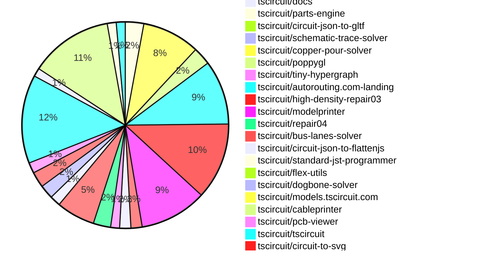

# contribution tracker

[contributions.tscircuit.com](https://contributions.tscircuit.com) ・ [tscircuit.com](https://tscircuit.com) ・ [Contribution Overviews](./contribution-overviews/) ・ [Changelogs](./changelogs/)

Generates weekly contribution overviews for tscircuit contributors. Check out all
the [contribution overviews here](./contribution-overviews/)
You can find AI-generated monthly changelogs in the [changelogs directory](./changelogs/)

- All PRs in the tscircuit org are scanned/summarized via an LLM
- The LLM classifies each Diff/PR as into a set of attributes for scoring
- All the PRs, summaries, and classifications are organized into charts and tables for [the website](https://contributions.tscircuit.com)

> Want to run locally? See the [Development Section](#development)

## Current Week

<!-- START_CURRENT_WEEK -->

# Contribution Overview 2026-09-29

The current week is shown below. There are 3 major sections:

- [Contributor Overview](#contributor-overview)
- [PRs by Repository](#prs-by-repository)
- [PRs by Contributor](#changes-by-contributor)
- [Scoring & Sponsorship Details](/docs/sponsorship-calculation-explanation.md)

## PRs by Repository


```mermaid
pie
    "tscircuit/circuit-json-util" : 7
    "tscircuit/tscircuit-autorouter" : 33
    "tscircuit/high-density-a01" : 1
    "tscircuit/schematic-viewer" : 2
    "tscircuit/core" : 103
    "tscircuit/circuit-json-schematic-placement-analysis" : 32
    "tscircuit/circuit-json-to-pnp-csv" : 1
    "tscircuit/tscircuit.com" : 115
    "tscircuit/runframe" : 137
    "tscircuit/cli" : 120
    "tscircuit/power-trace-expander" : 3
    "tscircuit/circuit-json" : 20
    "tscircuit/props" : 20
    "tscircuit/easyeda-converter" : 12
    "tscircuit/3d-viewer" : 6
    "tscircuit/jscad-planner" : 3
    "tscircuit/jscad-electronics" : 7
    "tscircuit/jscad-fiber" : 4
    "tscircuit/checks" : 16
    "tscircuit/schematic-symbols" : 1
    "tscircuit/circuit-json-to-connectivity-map" : 2
    "tscircuit/jlcsearch" : 5
    "tscircuit/circuit-json-to-tscircuit" : 31
    "tscircuit/svg.tscircuit.com" : 69
    "tscircuit/docs" : 19
    "tscircuit/parts-engine" : 1
    "tscircuit/circuit-json-to-gltf" : 11
    "tscircuit/schematic-trace-solver" : 25
    "tscircuit/copper-pour-solver" : 5
    "tscircuit/poppygl" : 6
    "tscircuit/tiny-hypergraph" : 1
    "tscircuit/autorouting.com-landing" : 1
    "tscircuit/high-density-repair03" : 3
    "tscircuit/modelprinter" : 6
    "tscircuit/repair04" : 3
    "tscircuit/bus-lanes-solver" : 28
    "tscircuit/circuit-json-to-flattenjs" : 2
    "tscircuit/standard-jst-programmer" : 2
    "tscircuit/flex-utils" : 3
    "tscircuit/dogbone-solver" : 3
    "tscircuit/models.tscircuit.com" : 5
    "tscircuit/cableprinter" : 6
    "tscircuit/pcb-viewer" : 19
    "tscircuit/tscircuit" : 158
    "tscircuit/circuit-to-svg" : 5
    "tscircuit/circuit-json-to-gerber" : 5
    "tscircuit/status" : 2
    "tscircuit/skill" : 2
    "tscircuit/tscircuit.com-landing" : 15
    "tscircuit/check-shorts" : 1
    "tscircuit/fanout-solver" : 3
    "tscircuit/circuit-json-webgpu" : 6
    "tscircuit/footprinter" : 1
    "tscircuit/eval" : 148
    "tscircuit/connectivity-map" : 2
    "tscircuit/circuit-json-to-3d-png" : 1
    "tscircuit/circuit-json-to-footprinter" : 2
    "tscircuit/test-github-automerge" : 4
    "tscircuit/circuit-json-to-kicad" : 7
    "tscircuit/ti" : 3
    "tscircuit/altiumts" : 5
    "tscircuit/altium-to-circuit-json" : 16
    "tscircuit/dataset-srj24" : 2
    "tscircuit/circuit-json-to-sysconfig" : 5
    "tscircuit/sysconfigts" : 1
    "tscircuit/matchpack" : 2
    "tscircuit/calculate-cell-boundaries" : 2
    "tscircuit/kicad-to-circuit-json" : 16
    "tscircuit/circuit-json-to-altium" : 8
```

## Contributor Overview

| Contributor | 🐳 Major | 🐙 Minor | 🐌 Tiny | Score | ⭐ |
|-------------|---------|---------|---------|-------|-----|
| [seveibar](#seveibar) | 116 | 84 | 116 | 645.5 | 👑👑👑 |
| [ShiboSoftwareDev](#ShiboSoftwareDev) | 12 | 17 | 24 | 110.5 | 👑 |
| [AnasSarkiz](#AnasSarkiz) | 6 | 15 | 16 | 73 | ⭐⭐⭐ |
| [mohan-bee](#mohan-bee) | 4 | 9 | 8 | 46 | ⭐⭐ |
| [imrishabh18](#imrishabh18) | 7 | 4 | 6 | 43 | ⭐⭐ |
| [MustafaMulla29](#MustafaMulla29) | 6 | 3 | 10 | 41 | ⭐⭐ |
| [techmannih](#techmannih) | 0 | 11 | 12 | 35 | ⭐⭐ |
| [Abse2001](#Abse2001) | 2 | 0 | 3 | 26 | ⭐⭐ |
| [tscircuitbot](#tscircuitbot) | 0 | 0 | 784 | 20.5 | ⭐⭐ |
| [rushabhcodes](#rushabhcodes) | 0 | 7 | 4 | 19 | ⭐⭐ |
| [GokulPandi-M](#GokulPandi-M) | 0 | 4 | 6 | 14 | ⭐⭐ |
| [KrishnaX12](#KrishnaX12) | 1 | 4 | 2 | 14 | ⭐⭐ |
| [anil08607](#anil08607) | 0 | 6 | 1 | 13 | ⭐⭐ |
| [hrithik18k](#hrithik18k) | 1 | 1 | 3 | 8.5 | ⭐ |
| [addibble](#addibble) | 0 | 1 | 1 | 3 |  |
| [0hmX](#0hmX) | 0 | 1 | 0 | 2 |  |
| [Devesh36](#Devesh36) | 0 | 0 | 2 | 2 |  |
| [trixie010](#trixie010) | 0 | 0 | 1 | 1 |  |

## Staff Pass Ratio (SPR)

| Contributor | Reviewed PRs | Rejections | Approvals | SPR |
|-------------|--------------|------------|-----------|-----|
| [MustafaMulla29](#MustafaMulla29) | 11 | 4 | 9 | 63.6% |
| [imrishabh18](#imrishabh18) | 7 | 0 | 7 | 100.0% |
| [ShiboSoftwareDev](#ShiboSoftwareDev) | 6 | 2 | 4 | 66.7% |
| [mohan-bee](#mohan-bee) | 5 | 0 | 5 | 100.0% |
| [AnasSarkiz](#AnasSarkiz) | 3 | 1 | 3 | 66.7% |
| [anil08607](#anil08607) | 2 | 1 | 2 | 50.0% |
| [hrithik18k](#hrithik18k) | 2 | 2 | 1 | 0.0% |
| [0hmX](#0hmX) | 1 | 0 | 1 | 100.0% |
| [Abse2001](#Abse2001) | 1 | 0 | 1 | 100.0% |
| [addibble](#addibble) | 1 | 0 | 1 | 100.0% |
| [KrishnaX12](#KrishnaX12) | 1 | 1 | 0 | 0.0% |
| [rushabhcodes](#rushabhcodes) | 1 | 0 | 1 | 100.0% |

<details>
<summary>MustafaMulla29 SPR PRs (11)</summary>

- [#368](https://github.com/tscircuit/checks/pull/368) feat: add regulator capacitor and pull-resistor placement warnings
- [#1264](https://github.com/tscircuit/schematic-trace-solver/pull/1264) fix: simplify power label connectors by reattaching to rail corners
- [#180](https://github.com/tscircuit/circuit-json-schematic-placement-analysis/pull/180) Fix false component overlaps caused by schematic annotation boxes
- [#183](https://github.com/tscircuit/circuit-json-schematic-placement-analysis/pull/183) Validate schematic shrink suggestions against all pins and labels
- [#159](https://github.com/tscircuit/circuit-json-schematic-placement-analysis/pull/159) feat: detect capacitors separated from connected chip pins
- [#156](https://github.com/tscircuit/circuit-json-schematic-placement-analysis/pull/156) feat: detect separated pi-filter components
- [#146](https://github.com/tscircuit/circuit-json-schematic-placement-analysis/pull/146) feat: detect sideways common-emitter amplifier stages
- [#153](https://github.com/tscircuit/circuit-json-schematic-placement-analysis/pull/153) feat: detect scattered battery cell-sense filter ladders
- [#127](https://github.com/tscircuit/circuit-json-schematic-placement-analysis/pull/127) feat: detect flyback diodes separated from relay coils
- [#124](https://github.com/tscircuit/circuit-json-schematic-placement-analysis/pull/124) feat: detect current-sense shunts separated from their inputs
- [#138](https://github.com/tscircuit/circuit-json-schematic-placement-analysis/pull/138) feat: detect scattered MOSFET gate resistor networks

</details>

<details>
<summary>imrishabh18 SPR PRs (7)</summary>

- [#2786](https://github.com/tscircuit/tscircuit-autorouter/pull/2786) Fix via clearance in the existing projection solver
- [#2820](https://github.com/tscircuit/tscircuit-autorouter/pull/2820) perf: reduce port ownership lookup and cache key overhead
- [#2776](https://github.com/tscircuit/tscircuit-autorouter/pull/2776) Reduce bugreport107 DRC errors to 58 on macOS and 59 on Linux
- [#2780](https://github.com/tscircuit/tscircuit-autorouter/pull/2780) Reduce bugreport107 DRC errors to 63 on macOS and 65 on Linux
- [#2769](https://github.com/tscircuit/tscircuit-autorouter/pull/2769) Improve Pipeline 9 clearance repair for straight trace spans
- [#122](https://github.com/tscircuit/high-density-a01/pull/122) Make A03 path scores deterministic across platforms
- [#25](https://github.com/tscircuit/repair04/pull/25) Let clearance projection slide vias along pad boundaries

</details>

<details>
<summary>ShiboSoftwareDev SPR PRs (6)</summary>

- [#1053](https://github.com/tscircuit/pcb-viewer/pull/1053) Report when the active PCB renderer has produced a frame
- [#1052](https://github.com/tscircuit/pcb-viewer/pull/1052) fix: keep TI EVM dimensions on WebGPU
- [#877](https://github.com/tscircuit/props/pull/877) Add props for precomputed PCB copper pours
- [#4295](https://github.com/tscircuit/core/pull/4295) fix: correct bottom CAD rotation composition for model offsets
- [#4196](https://github.com/tscircuit/core/pull/4196) fix: emit one autorouter connection per electrical net
- [#2779](https://github.com/tscircuit/tscircuit-autorouter/pull/2779) Fix Pipeline9 via regressions after trace simplification

</details>

<details>
<summary>mohan-bee SPR PRs (5)</summary>

- [#209](https://github.com/tscircuit/circuit-json-util/pull/209) move rectangular and circular cutouts with PCB geometry
- [#4312](https://github.com/tscircuit/core/pull/4312) report missing anchor ports for manual pcb paths
- [#4281](https://github.com/tscircuit/core/pull/4281) fix ignored net connection declarations
- [#4246](https://github.com/tscircuit/core/pull/4246) Connect duplicated USB-C shell pads
- [#1272](https://github.com/tscircuit/schematic-trace-solver/pull/1272) keep terminal pin bridges compact when joining opposing loads

</details>

<details>
<summary>AnasSarkiz SPR PRs (3)</summary>

- [#4323](https://github.com/tscircuit/core/pull/4323) Preserve PCB connections for separated polygon contacts
- [#4204](https://github.com/tscircuit/core/pull/4204) fix: accept saved routes on plated port layers
- [#359](https://github.com/tscircuit/checks/pull/359) fix: enforce via-in-pad restrictions using hole overlap for all nets

</details>

<details>
<summary>anil08607 SPR PRs (2)</summary>

- [#884](https://github.com/tscircuit/props/pull/884) Allow pcbRotation on silkscreen rectangles
- [#4274](https://github.com/tscircuit/core/pull/4274) Reproduce arbitrary silkscreen rectangle rotation

</details>

<details>
<summary>hrithik18k SPR PRs (2)</summary>

- [#4272](https://github.com/tscircuit/core/pull/4272) fix: prevent routing through wide footprint copper
- [#2790](https://github.com/tscircuit/tscircuit-autorouter/pull/2790) repro: show Pipeline 9 via-to-pad clearance errors on the board

</details>

<details>
<summary>0hmX SPR PRs (1)</summary>

- [#623](https://github.com/tscircuit/circuit-json-to-kicad/pull/623) fix: preserve source board thickness in KiCad PCB exports

</details>

<details>
<summary>Abse2001 SPR PRs (1)</summary>

- [#2740](https://github.com/tscircuit/tscircuit-autorouter/pull/2740) Fix through-via drill spans in Pipeline 9 routing and repair

</details>

<details>
<summary>addibble SPR PRs (1)</summary>

- [#224](https://github.com/tscircuit/circuit-json-to-gltf/pull/224) Fix X and Y CAD rotation directions

</details>

<details>
<summary>KrishnaX12 SPR PRs (1)</summary>

- [#135](https://github.com/tscircuit/circuit-json-schematic-placement-analysis/pull/135) feat: warn when I2C pull-ups are split around a chip

</details>

<details>
<summary>rushabhcodes SPR PRs (1)</summary>

- [#181](https://github.com/tscircuit/circuit-json-to-altium/pull/181) fix: preserve inner copper track layers

</details>

> Note: AI evaluates PRs and assigns 1-3 star ratings automatically. 4 and 5 star ratings require manual staff review.

## Review Table

[reviews-received-hover]: ## "Number of reviews received for PRs for this contributor"
[approvals-received-hover]: ## "Number of approvals received for PRs this contributor authored"
[rejections-received-hover]: ## "Number of rejections received for PRs this contributor authored"
[prs-opened-hover]: ## "Number of PRs opened by this contributor"
[issues-created-hover]: ## "Number of issues created by this contributor"

| Contributor | Reviews Received | Approvals Received | Rejections Received | Approvals | Rejections Given | PRs Opened | PRs Merged | Issues Created |
|---|---|---|---|---|---|---|---|---|
| [0hmX](#0hmX) | 1 | 1 | 0 | 0 | 0 | 12 | 1 | 0 |
| [Abse2001](#Abse2001) | 5 | 4 | 0 | 28 | 2 | 15 | 5 | 0 |
| [addibble](#addibble) | 2 | 2 | 0 | 0 | 0 | 3 | 2 | 0 |
| [Ahmed5754](#Ahmed5754) | 0 | 0 | 0 | 0 | 0 | 5 | 0 | 0 |
| [aliforever](#aliforever) | 0 | 0 | 0 | 0 | 0 | 1 | 0 | 0 |
| [AnasSarkiz](#AnasSarkiz) | 36 | 34 | 0 | 8 | 0 | 59 | 37 | 0 |
| [Angelel02](#Angelel02) | 0 | 0 | 0 | 0 | 0 | 1 | 0 | 0 |
| [anil08607](#anil08607) | 11 | 7 | 2 | 0 | 0 | 19 | 7 | 0 |
| [Ante042](#Ante042) | 0 | 0 | 0 | 0 | 0 | 1 | 0 | 0 |
| [damnbrocrazy-svg](#damnbrocrazy-svg) | 0 | 0 | 0 | 0 | 0 | 2 | 0 | 0 |
| [Devesh36](#Devesh36) | 2 | 2 | 0 | 0 | 0 | 4 | 2 | 0 |
| [EazyHood](#EazyHood) | 0 | 0 | 0 | 0 | 0 | 1 | 0 | 0 |
| [Furox-Art](#Furox-Art) | 0 | 0 | 0 | 0 | 0 | 7 | 0 | 0 |
| [GokulPandi-M](#GokulPandi-M) | 19 | 15 | 2 | 0 | 0 | 20 | 10 | 0 |
| [hrithik18k](#hrithik18k) | 13 | 8 | 3 | 0 | 0 | 16 | 5 | 0 |
| [Ialyahya96](#Ialyahya96) | 0 | 0 | 0 | 0 | 0 | 18 | 0 | 0 |
| [imrishabh18](#imrishabh18) | 12 | 8 | 0 | 18 | 4 | 46 | 20 | 0 |
| [JoelGellis](#JoelGellis) | 0 | 0 | 0 | 0 | 0 | 1 | 0 | 0 |
| [KrishnaX12](#KrishnaX12) | 10 | 7 | 1 | 0 | 0 | 17 | 7 | 0 |
| [marcos452652258-gif](#marcos452652258-gif) | 0 | 0 | 0 | 0 | 0 | 1 | 0 | 0 |
| [matiaseichner-lab](#matiaseichner-lab) | 0 | 0 | 0 | 0 | 0 | 1 | 0 | 0 |
| [mohan-bee](#mohan-bee) | 7 | 7 | 0 | 4 | 0 | 35 | 21 | 0 |
| [MustafaMulla29](#MustafaMulla29) | 11 | 9 | 2 | 2 | 1 | 29 | 19 | 0 |
| [NicholasIGuess](#NicholasIGuess) | 0 | 0 | 0 | 0 | 0 | 2 | 0 | 0 |
| [NOyu015](#NOyu015) | 0 | 0 | 0 | 0 | 0 | 2 | 0 | 0 |
| [ntoledo319](#ntoledo319) | 0 | 0 | 0 | 0 | 0 | 2 | 0 | 0 |
| [Primuez](#Primuez) | 0 | 0 | 0 | 0 | 0 | 1 | 0 | 0 |
| [Ratkir](#Ratkir) | 0 | 0 | 0 | 0 | 0 | 1 | 0 | 0 |
| [rushabhcodes](#rushabhcodes) | 55 | 10 | 0 | 3 | 0 | 38 | 11 | 0 |
| [seveibar](#seveibar) | 65 | 0 | 0 | 44 | 9 | 458 | 323 | 0 |
| [ShiboSoftwareDev](#ShiboSoftwareDev) | 59 | 50 | 4 | 44 | 0 | 147 | 53 | 0 |
| [sprintstate](#sprintstate) | 0 | 0 | 0 | 0 | 0 | 15 | 0 | 0 |
| [Surebob](#Surebob) | 0 | 0 | 0 | 0 | 0 | 3 | 0 | 0 |
| [techmannih](#techmannih) | 11 | 11 | 0 | 26 | 0 | 37 | 23 | 0 |
| [theluckystrike](#theluckystrike) | 0 | 0 | 0 | 0 | 0 | 7 | 0 | 0 |
| [trixie010](#trixie010) | 9 | 1 | 2 | 0 | 0 | 6 | 1 | 0 |
| [tscircuitbot](#tscircuitbot) | 1 | 1 | 0 | 0 | 0 | 1013 | 785 | 0 |
| [woahwhattheheck](#woahwhattheheck) | 0 | 0 | 0 | 0 | 0 | 1 | 0 | 0 |

## Changes by Repository

### [tscircuit/circuit-json-util](https://github.com/tscircuit/circuit-json-util)

| PR # | Impact | Rating | Contributor | Description |
|------|--------|--------|-------------|-------------|
| [#200](https://github.com/tscircuit/circuit-json-util/pull/200) | 🐳 Major | ⭐⭐⭐ | imrishabh18 | Extends the existing analyzers two-pad convention to infer pin 1 orientation for longer straight pad rows with unique, consecutive pin numbers, resolving supplier placement preparation failures. |
| [#204](https://github.com/tscircuit/circuit-json-util/pull/204) | 🐳 Major | ⭐⭐⭐ | seveibar | Transforms explicit solder-mask opening geometry to ensure that their pads move correctly with cached or packed PCB components, preserving local dimensions, IDs, ownership, and attachment face while handling various shapes and orientations. |
| [#206](https://github.com/tscircuit/circuit-json-util/pull/206) | 🐙 Minor | ⭐⭐ | AnasSarkiz | Fixes the issue where polygon solder paste remains at its original position during PCB placement, ensuring that paste stays aligned with its pad by applying the existing point transform to copper outlines, paste outlines, and inner openings. |
| [#212](https://github.com/tscircuit/circuit-json-util/pull/212) | 🐙 Minor | ⭐⭐ | mohan-bee | Aligns polygon, path, and rectangular cutouts with transformed PCB geometry by applying transformations to their coordinates and orientations. |
| [#209](https://github.com/tscircuit/circuit-json-util/pull/209) | 🐙 Minor | ⭐⭐ | mohan-bee | Fixes the issue where rectangular and circular cutouts do not move with the PCB geometry, ensuring proper alignment during transformations. |
| [#208](https://github.com/tscircuit/circuit-json-util/pull/208) | 🐙 Minor | ⭐⭐ | mohan-bee | Fixes the issue where rectangular cutouts do not move with the footprint geometry during repositioning, ensuring accurate PCB representation. |

<details>
<summary>🐌 Tiny Contributions (1)</summary>

| PR # | Impact | Contributor | Description |
|------|--------|-------------|-------------|
| [#211](https://github.com/tscircuit/circuit-json-util/pull/211) | 🐌 Tiny | mohan-bee | Reproduces the bug where polygon cutout paths drift during translation and rectangular cutouts do not rotate correctly after transformation, providing comprehensive tests for both issues. |

</details>

### [tscircuit/tscircuit-autorouter](https://github.com/tscircuit/tscircuit-autorouter)

| PR # | Impact | Rating | Contributor | Description |
|------|--------|--------|-------------|-------------|
| [#2820](https://github.com/tscircuit/tscircuit-autorouter/pull/2820) | 🐳 Major | ⭐⭐⭐ | imrishabh18 | Reduces overhead in port ownership lookup and cache key construction by indexing ownership once per solver and buffering typed serialization before hashing. |
| [#2776](https://github.com/tscircuit/tscircuit-autorouter/pull/2776) | 🐳 Major | ⭐⭐⭐ | imrishabh18 | Reduces DRC errors for bugreport107 to 58 on macOS and 59 on Linux by improving clearance and routing logic in the autorouter. |
| [#2780](https://github.com/tscircuit/tscircuit-autorouter/pull/2780) | 🐳 Major | ⭐⭐⭐ | imrishabh18 | Reduces DRC errors in bugreport107 from 82 to 63 on macOS and 65 on Linux by implementing a final whole-board clearance projection that moves wire bends and vias together. |
| [#2769](https://github.com/tscircuit/tscircuit-autorouter/pull/2769) | 🐳 Major | ⭐⭐⭐ | imrishabh18 | Long, straight trace spans can remain too close to copper because the clearance projector only moves existing vertices and their endpoints are locked. Add bounded subdivisions to constant-width spans on routes implicated in DRC errors, then run a refinement pass after the existing independent wire repairs. This gives the solver nearby vertices to bend while retaining terminals, junctions, widths, and via sites. |
| [#2778](https://github.com/tscircuit/tscircuit-autorouter/pull/2778) | 🐳 Major | ⭐⭐⭐ | imrishabh18 | Reduces DRC errors in bugreport107 by adjusting clearance segment lengths to improve pad-to-trace clearance without altering existing copper or connections. |
| [#2835](https://github.com/tscircuit/tscircuit-autorouter/pull/2835) | 🐳 Major | ⭐⭐⭐ | seveibar | Optimizes the HD endpoint geometry and seed scoring by precomputing segment geometry per force pass, reusing repeated endpoint projections, and rejecting duplicate native layouts before scoring. |
| [#2836](https://github.com/tscircuit/tscircuit-autorouter/pull/2836) | 🐳 Major | ⭐⭐⭐ | seveibar | Reduces overhead in the repair process by optimizing the query and evaluator setup, focusing on reusing net decisions and improving context handling. |
| [#2834](https://github.com/tscircuit/tscircuit-autorouter/pull/2834) | 🐳 Major | ⭐⭐⭐ | seveibar | Reduces routing overhead by optimizing port routing processes, including region scanning, workspace allocation, and statistics management, while maintaining existing routing policies and behaviors. |
| [#2823](https://github.com/tscircuit/tscircuit-autorouter/pull/2823) | 🐳 Major | ⭐⭐⭐ | seveibar | The default local Pipeline 9 returned a solved Muse e-paper result with 0.135411 mm between different-net via copper lands, below the boards 0.15 mm pad-edge rule. This change routes the identical captured input with zero DRC errors, preserving all 92 vias 0.3 mm drills and 0.5 mm copper diameters. Fixes 2822. The reproduction is retained in this PR; its original characterization-only commit is 341c786e51765f3f4ff9ef8f8278244eedb1758d. The failure belongs to autorouting and repair, and the board contains no copper pours. The pinned checks 0.0.222 checker only checked drill gaps, while the projection solver used the relaxed 0.1 mm via clearance. The consuming build also checks copper. Updating the checker alone exposes the failure but leaves this pair unrepaired. Upgrade checks to 0.0.233 so reference DRC measures different-net via copper on shared layers. Preserve the declared minPadEdgeToPadEdgeClearance on the reference DRC board and forward it into clearance projection. Keep drill clearance separate and retain the existing precision margin for coupled projection. Keep the indexed engines search heuristic separate: its single via copper gap applies to both same-net and different-net pairs, while the electrical pad rule applies to different nets. Reference DRC checks the declared rules before accepting candidates. Turn the captured full-board reproduction into an unconditional zero-DRC regression with independent copper-gap measurements. Add focused cases with distinct copper, trace and drill rules, including terminal and input preservation. Correct the older unit case that treated overlapping copper as legal merely because drill clearance passed. No new repair stage, report-specific coordinates, post-routing correction, or DRC tolerance relaxation is added. Validation: 43 focused tests pass, covering solver repair, reference DRC, clearance projection, continuity, differential pairs and the beforeafter Muse snapshots. The same-net search regression fails under the previous rule and passes with the correction. TypeScript check and library build pass. The complete Muse tsci build --site passes all 23 board checks, with zero circuit errorswarnings. A local CLI adapter returns the built fixed solvers output unchanged. Its main-phase SRJ is deep-equal to the original failing capture; closest different-net via copper gap is 0.15 mm. The original published Muse project is preserved. The fix has not been released to npm or merged. The fixtures REPORT.md contains the input provenance, beforeafter measurements, and reproduction command.  Visual comparison Same captured SRJ, cache disabled, effort 1, 92 physical vias with 0.3 mm drills and 0.5 mm copper. Both views use the same current checker and the declared 0.15 mm copper rule. Each image includes the full-board overview and the affected BOOST_SW  RESE vias at the same magnification. The translucent rings add half the required copper clearance to each via. Original reproduction: 1 DRC error, 0.135411 mm copper gap. Frozen, unmodified output freshly captured from published capacity-autorouter 0.0.953. !Original reproduction snapshot(https:raw.githubusercontent.comtscircuittscircuit-autorouter06059f45d085411c7909da90c964022f169b32c8testsrepro__snapshots__pipeline9-muse-eink-original-output.snap.svg) Fix: 0 DRC errors, 0.150000 mm copper gap. The fixed regression freshly solves the identical input and snapshots its unmodified output. !Fixed autorouter snapshot(https:raw.githubusercontent.comtscircuittscircuit-autorouter06059f45d085411c7909da90c964022f169b32c8testsrepro__snapshots__pipeline9-muse-eink-via-copper-clearance.snap.svg) Both numericalDRC assertions and SVG snapshot comparisons pass on a normal rerun (202 assertions). The captured original output, SVG snapshots, generating tests and provenance are committed in this PR. The full-board CI failure was isolated to power expansion: captured routes had zero declared-rule errors before expansion and four afterward. Companion power-trace-expander35(https:github.comtscircuitpower-trace-expanderpull35) fixes the dependencys missing via copper rule. This PR pins its backport onto the existing dependency base, with no unrelated upgrade. Replaying the exact Linux CI input now yields zero declared-rule errors. The complete Linux solve and its declared-rule DRC assertion also pass in CI. The T113 physical assertions pass on Linux and macOS; its affected board SVGs were rendered and reviewed before updating, with no changes to image tolerance or physical assertions. Final CI run 37091884057(https:github.comtscircuittscircuit-autorouteractionsruns37091884057) is green on 71fcdf5a117aa1a5d07787c3ff19a612e396ed8f: all nine test shards, format, TypeScript, build, added-code and deployment checks pass. The local T113 rerun also passes its 17 assertions and reviewed SVG comparison. The regional fixtures initial count is now 118 because the upgraded checker additionally catches a 0.095 mm different-net via copper gap; its zero-final-error and bounded-work assertions are unchanged. Declared-rule failures in the full-board test now report their exact errors and upload the routed geometry for diagnosis. |
| [#2829](https://github.com/tscircuit/tscircuit-autorouter/pull/2829) | 🐳 Major | ⭐⭐⭐ | seveibar | Reduces high-density routing overhead by sharing geometry and caching proven-free planar points, improving efficiency in routing calculations. |
| [#2811](https://github.com/tscircuit/tscircuit-autorouter/pull/2811) | 🐳 Major | ⭐⭐⭐ | seveibar | Board 1726 currently leaves about 55 relaxed DRC errors after Pipeline 9 routing. This change clears the goal repro to zero relaxed and declared-clearance errors, including after final power-trace expansion. Regional repair uses one effort-scaled policy for every board. It starts with a small allowance and earns additional bounded search only when a physically valid candidate reduces the whole-board reference DRC count. The previous route-count threshold is removed. Required-clearance projection runs before precision-margin refinement so exact-fit channels can be repaired without first asking for infeasible extra slack. All added repair work uses persistent Pipeline subsolvers. Exact, B01, regional search, clearance projection, reported-via merging, and repair04 path searches expose their active child and advance it once per parent step. No added nested solve(), synchronous child-step drains, or generators. The incremental repair04 classes are proposed upstream in repair04 fix PR 26(https:github.comtscircuitrepair04pull26), which targets main and includes the visual fixtures captured in repro PR 27(https:github.comtscircuitrepair04pull27). The repro PR captures 13 real PCB close-ups; the fix updates eight SVG snapshots with the same input panels, viewports, colors, and computed measurements. Both upstream PRs have green CI. This PR pins the immutable 422b7546 source commit and has no Bun patch or patchedDependencies. Existing synchronous APIs remain intact; the new classes use bounded preparation, search, and sweep batches. When a via pair needs more separation while touching fixed pads, projection removes the inward movement and retains feasible motion along the pad boundary. This applies only to via-to-via constraints; pad and wire constraints retain their existing movement behavior. Conservative rounding correction and uniform ray shortening handle rotated pads and board limits while preserving the exact physical guards, locked endpoints, displacement limits, and solver budgets. Validation (benchmark production 15783c90; 5dfa8557 changes only the inspected T113 expected snapshot; current head b0d74d07 replaces the patch with semantically identical upstream repair04 source): Final goal output: relaxed DRC 0, declared DRC with board clearance 0 after power expansion. Independent regional-output checks also report fixed-obstacle, newly worsened fixed-obstacle, and new via-pad violations 0. Saved production-stage replays: goal 0 in 273.9s (8 regions attempted, 6 accepted, 3,584 calls, 4,841,277 nodes); sample 14 0 in 64.9s, with every physical guard clear. These are stage replays, not cold full-pipeline benchmark times. Fresh installation of the upstream commit matches all 27 repair04 library files exactly. Nine focused consumer tests pass (1,257 assertions), along with full TypeScript checking and build. The upstream repair04 fix passes all 163 tests (30,491 assertions), typecheck, formatting, and its current PR CI(https:github.comtscircuitrepair04actionsruns36982046969). The upstream PR adds repro tests and snapshots while keeping all 27 library files byte-identical to the pinned source. Source review confirms the transfer preserves the tested patchs behavior. Reviewed and updated observed failing Linux goal, T113, and via-inner2 snapshots. Full goal CI on the patch-free head(https:github.comtscircuittscircuit-autorouteractionsruns36975615842job110738689115) passed all eight assertions in 827.5s, including both zero-DRC checks and the final snapshot. Controlled sample-14 pair(https:github.comtscircuittscircuit-autorouteractionsruns36970688436): main and PR both complete with DRC 0; 316.57s  293.51s (7.28). Joint repair takes 118.04s  99.71s. Vias 281  294 (4.63); odd-angle segments 726  709 (2.34). Configured detector reports no regressions. Full paired dataset 18(https:github.comtscircuittscircuit-autorouteractionsruns36970678706): main 1516 complete and DRC-clean, PR 1416. Sample 14 times out on both sides; sample 15 completes on main at 357.72s and hits the unchanged 360s limit on PR during length matching, after joint repair completed (86.33s  86.54s). The configured detector flags the completionDRC-rate loss. On the 14 mutually completed samples, mean vias rise 0.81 and odd-angle segments fall 4.68. Controlled sample-15 pair(https:github.comtscircuittscircuit-autorouteractionsruns36972258221): main and PR both complete with DRC 0; 261.51s  264.31s (1.07). HD iterations are identical (302,999); joint repair takes 66.58s  69.88s. Vias 349  356 (2.01); odd-angle segments 1,012  1,197 (18.28). The configured detector reports no regressions, but does not check odd angles. The full-run timeout and this style tradeoff remain recorded. Patch-free-head CI(https:github.comtscircuittscircuit-autorouteractionsruns36975615842) is green: all nine test shards, build, typecheck, format, code checks, and Vercel pass. Fullcontrolled-14 benchmarks used 15783c90; controlled-15 used 5dfa8557, with identical production source. |
| [#2799](https://github.com/tscircuit/tscircuit-autorouter/pull/2799) | 🐳 Major | ⭐⭐⭐ | seveibar | Higher effort previously changed routingsearch heuristics, and extra early simplification could leave worse routes for DRC repair. Cap routing, force-improvement, and repair tuning at 1x while preserving lower-effort behavior. Pipeline 9 now spends extra effort after DRC repair: 1.5x evaluates one additional cleanup pass and 2x evaluates two. It retains a candidate only if it passes DRC and reduces vias, or keeps the same via count with fewer route points. Length matching and power-trace expansion run afterward. Cleanup and outer iteration budgets allow the additional work. Add benchmark-effort to compare pipeline 9 on all of dataset18 at 1x, 1.5x, and 2x on one Blacksmith runner. Per-sample timeouts scale to 600s900s1200s. The report shows completion, DRC, timeouts, matched runtime, and per-sampleaggregate vias; JSON reports are retained as artifacts. Fix the existing benchmark CLI truncating --effort 1.5 to 1, and verify the effective effort in every comparison report. Validation: all nine CI test shards, build, type check, format check, and added-code check passed; local build and type checking also passed; focused tests cover effective fractional effort, unchanged initial routing, baseline cleanup budgets, input immutability, and rejection of invalid optimization candidates. Higher-effort snapshot updates retain their DRC assertions and use separate LinuxmacOS expectations where routes differ. Full dataset18 comparison completed successfully. All 16 samples solved and passed relaxed DRC at every effort, with zero timeouts and no per-sample via-count increases. The PR-comment command becomes available when the dispatcherparser changes reach the default branch. Pre-merge comparison can be dispatched through the existing Autorouting Benchmark workflow on this branch with effort_comparetrue, the full commit SHA, and this PR number. Dataset18 results on one Blacksmith runner:  Effort  Solved  relaxed DRC passing  Total vias  Change vs 1x  Sum of sample runtimes   ---  ---  ---  ---  ---   1x  1616  3,576    2,227.7s   1.5x  1616  3,555  -21  2,324.6s   2x  1616  3,554  -22  2,401.6s  The improvement is modest but monotonic: 1.5x removes 21 vias, and 2x removes one additional via. No individual sample gains vias. The previously regressing sample 15 remains DRC-clean with 349 vias at all three efforts. Benchmark run and JSON artifacts(https:github.comtscircuittscircuit-autorouteractionsruns36793259438). The run uses solver revision fd9f0e4b6; subsequent commits only update labels, formatting, snapshots, and test expectations. |
| [#2779](https://github.com/tscircuit/tscircuit-autorouter/pull/2779) | 🐳 Major | ⭐⭐⭐ | ShiboSoftwareDev | Fixes the preservation of Pipeline 9 vias in Dataset 18 samples 3 and 11 after updates to the trace simplifier. |
| [#2740](https://github.com/tscircuit/tscircuit-autorouter/pull/2740) | 🐳 Major | ⭐⭐⭐ | Abse2001 | Summary Fix through-via handling in Pipeline 9 and its Repair03 dependency. This PR targets main directly and contains the fix, focused regression tests, related existing-testsnapshot updates, and CI timeout classification for the existing SRJ18 sample 2 tests. It does not add the full Game Boy repro, its input, or its snapshot. The Game Boy stays in validation-only repro 2741(https:github.comtscircuittscircuit-autorouterpull2741), not for merging. No merge or auto-merge has been requested.  Bug When allowBlindAndBuriedVias is false or omitted, a via connecting top to inner1 still occupies every copper layer. Its signal transition does not define its drill span. Using only the signal layers lets a foreign net pass through the via on inner2 or bottom.  Fix Pipeline 9 fixed-copper geometry, nodeB01 obstacle selection, and regional collision checks use the existing board via policy. Through vias reserve all board layers; explicitly allowed blindburied vias retain their limited span. The geometry cache includes layer count and via policy. Repair03 is pinned to ac744fcc(https:github.comAbse2001high-density-repair03commitac744fcc8cc4e83fbf12769507e963c974f5932f): an integration commit on top of the existing cbbc86a3 pin, porting merged 143(https:github.comtscircuithigh-density-repair03pull143) drill-span handling and still-open 144(https:github.comtscircuithigh-density-repair03pull144), which refreshes via point indexes after a trace detour. Existing optimizations and invalid-endpoint checks are preserved. This is a fork integration pin, not an upstream release or the exact head of 144. Current main already includes the clearance-margin transition-identity correction and the newer trace-simplification via-preservation fix from 2779(https:github.comtscircuittscircuit-autorouterpull2779). The merge retains both; the transition-identity production code is no longer an additional diff in this PR. Signal endpoints and component-owned through-obstacle geometry are unchanged. No board-specific routing cases, new feature flags, or suppressed invariant failures.  Dependency and merge order Review and merge Repair03 144 first, then replace the integration pin with an upstream commit containing both fixes and the existing pinned behavior before merging this autorouter PR. Revalidate after changing the pin; do not assume another branch or package version is equivalent. 143 is merged; 144 was still open when checked on September 30. No PR will be merged automatically.  Focused regression tests pipeline9-fixed-via-drill-span: falsedefaulttrue via policy, every copper layer, collisions in both argument orders, layer-countcache changes, and invalid transitions. pipeline9-b01-through-via-obstacle: an actual bottom-layer route avoids a top-to-inner1 through via; explicitly permitting blind vias makes bottom available. Completion, clearance, and endpoints are checked. Its one native snapshot shows captured B01 solver states before and after routing, following Seves snapshot guidance(https:github.comtscircuittscircuit-autorouterpull2193pullrequestreview-4998204680). pipeline9-clearance-margin-through-via-transition: an inner-layer signal transition remains valid inside a through via without losing transition identity. After merging main and installing the actual merged dependencies, these three tests plus mains pipeline9-clearance-margin-tracks-via-identity passed locally: 4 tests, 73 assertions. No full-board routing or dataset benchmarks were run locally.  Timeout investigation and optimization  September 30 Latest head 13dc4a0f adds only an early geometry rejection in getConnectedPadSides plus one focused regression test. It skips net-connectivity lookups for pads that cannot contain the route terminal. The same layer test, 0.001 mm tolerance, connected-net predicate, output ordering, routing rules and dependency pins remain unchanged. The new test failed before the optimization (4 unnecessary lookups) and passes afterward. Three focused tests pass with 36 assertions. The previous standard SRJ18 benchmark(https:github.comtscircuittscircuit-autorouterpull2740issuecomment-5915973380) at 5680cbdc did regress completion from 1616 to 1416: samples 14 and 15 timed out at 360 seconds in joint repair. Dataset01 stayed 8585 complete and DRC-passing. The new benchmark below follows an actual optimization, not an unchanged retry; the earlier failures and sample14s limited timeout margin remain relevant. GitHub CPU profiling(https:github.comtscircuittscircuit-autorouteractionsruns36756273653) compared exact main e85fb193 and PR 5680cbdc with identical sample inputs. All four serial diagnostic solves completed with zero relaxed DRCs, but this is a different runnerworkload from the normal eight-worker benchmark, not proof that its timeout regression is resolved. Sample14 joint-repair wall time rose from 75.52 to 107.39 seconds. CPU samples locate most additional work in bounded regional clearance search (54.97 to 71.39 sampled seconds) and regional B01 repair (7.83 to 22.02). Repair03 portfolio time was only about 7.35 to 7.70 seconds; its via-index refresh was not the dominant measured cost. Sample15 serial total time was approximately unchanged (197.49 to 196.87 seconds). Its profile nevertheless identified about 6.01 sampled seconds of net lookup work beneath the pad-side helper, motivating the geometry-first change. This does not remove sample14s larger clearance-search cost. The completed beforeafter optimization profile(https:github.comtscircuittscircuit-autorouteractionsruns36760525317) compares old PR 5680cbdc (directory label main, not repository main) against 13dc4a0f. Both samples have byte-identical input, route JSON and DRC JSON before and after, unchanged routing iterations and clearance-search work counts, and zero relaxed DRCs. Sample14 remains 238 traces281 vias; sample15 remains 461 traces349 vias. Diagnostic instrumentation stays outside this PR. Sample14 pad-helper inclusive sampled CPU time fell 1.892 to 0.061 seconds, but serial total time was 249.972 to 254.176 seconds (1.7). Sample15 helper CPU fell 8.917 to 0.060 seconds, with serial total time 201.698 to 190.490 seconds (-5.6). This confirms the unnecessary lookup cost was removed without changing copper; it does not show a uniform end-to-end speedup. These are profiler measurements on a serial runner, not the standard benchmark score.  Completed validation at 13dc4a0f Benchmark request by PR comment(https:github.comtscircuittscircuit-autorouterpull2740issuecomment-5917460010): benchmark-all --pipeline 9 --same-machine. Both completed reports compare main e85fb193 with PR 13dc4a0f.  Dataset  Completed, main  PR  Relaxed-DRC passing, main  PR  Total DRC issues  Timeouts  Average vias, main  PR   ---  ---  ---  ---  ---  ---   Dataset01(https:github.comtscircuittscircuit-autorouterpull2740issuecomment-5917472134) (85 scenarios)  8585  8585 (100)  8585  8585 (100)  0  0  0  0  38.99  38.99   SRJ18(https:github.comtscircuittscircuit-autorouterpull2740issuecomment-5917472637) (16 scenarios)  1616  1616 (100)  1616  1616 (100)  0  0  0  0  224.00  223.50  No improved or regressed completionDRCtimeout outcomes among these 101 samples. In this new run, both previously timed-out samples complete with zero relaxed DRCs: sample14 332.931  350.864 seconds, sample15 328.781  306.854 seconds (main  PR). Sample14 has only 9.136 seconds of headroom below the unchanged 360-second timeout. The tested head meets the no-outcome-regression requirement in this run, but is not a guarantee against future runtime variation or proof that its larger regional-search cost is solved. Timing percentiles in seconds (main  PR), kept separate from routing outcomes:  Dataset  P50  P60  P70  P80  P90  P95   ---  ---  ---  ---  ---  ---  ---   Dataset01  3.48  3.36  5.07  5.20  6.15  6.21  8.85  8.81  11.27  11.92  12.82  13.41   SRJ18  104.40  106.48  132.42  142.86  200.33  187.79  242.64  262.60  310.64  295.20  329.82  317.86  SRJ18 aggregate joint-repair time is 421.715  470.144 seconds. Timing is mixed, not a uniform improvement. Every SRJ18 via-count change: sample6 278281, sample8 283284, sample12 304302, sample13 213196, sample14 277281, sample15 344349, sample16 111109. All other via counts, including every Dataset01 sample, are unchanged. Every odd-angle warning change (style, not DRC failures): SRJ18 decreases: sample2 1547925, sample7 312123, sample11 524519, sample12 900897, sample13 594575, sample15 10561012, sample16 377364. SRJ18 increases: sample3 150275, sample6 10491162, sample8 9861026, sample9 268269, sample14 712726. Average 612.81575.19. Dataset01: only sample71 changes, 7675; average 7.457.44. Game Boy LinuxmacOS revalidation(https:github.comtscircuittscircuit-autorouteractionsruns36760357113) passed on 13dc4a0f: 322 traces, 288 vias, 0 reference relaxed DRCs. Downloaded routes.json, summary.json, drc-errors.json and board.svg are byte-identical between both OSs and to the previous verified output. Route SHA256 remains e6bdeafeeed9b4603a207c7aa443f232b1945d997c29fb318a720a55de7722f8; input SHA256 remains 89cfabf40f44453f4894a67475c4a5563e171d629f52bd42a8724bb15185ace4. The identical copper preserves the prior zero through-via-contact result and the separate clearancewidth caveats below. PR 2741 and the Game Boy project were not changed. All applicable ordinary CI is green at 13dc4a0f: all nine Bun Test shards(https:github.comtscircuittscircuit-autorouteractionsruns36760305003), build, typecheck, format, code-hack check, Testbox, GitHub Vercel Build and external Vercel passed. No snapshot or assertion changes were needed for this optimization. No timeouts, DRC rules, assertions, snapshots, or through-via protection were weakened. No sample-specific cases or new flags were introduced. The Game Boys earlier zero reference relaxed DRC result is not fabrication approval; the separate checkertrace-width caveats below remain.  Previous validation  main 0.0.946 Main advanced while the previous snapshot update was being verified: 2776(https:github.comtscircuittscircuit-autorouterpull2776) changes clearance repair and reduces board-1726s Linux baseline to 59 DRCs. Production head 3a86612e merges main d3507489 (0.0.946), retaining that improvement and mains unchanged 59 assertion. The old PR-only 88 assertion and explanation are removed. The new conflict was limited to the board-1726 test and its Linux snapshot, initially resolved using mains versions. Repair03 remains ac744fcc; all other dependency pins match main. The three other Linux snapshot refreshes from the previous run passed in the latest CI. Six focused tests, including both new upstream independent-bend repair regressions, pass locally with 87 assertions. CI run 36695044821(https:github.comtscircuittscircuit-autorouteractionsruns36695044821) passed eight of nine test shards and all non-test checks (build, typecheck, format, check-added-code, Blacksmith Testbox, GitHub Vercel Build, and external Vercel). The sole failure was board-1726s Linux snapshot mismatch; all its routing, repair-improvement, and 59 assertions passed. Board-1726 improves from mains 59 DRCs to 55 (-4). Commit 527b1fff updates only its expected Linux snapshot using the unchanged .received.svg from job 109820898491, after reviewing the native beforeafter PNG. SHA256: 6df102208969152036a5a606a529713a007cafd4f050fa2c925057af6944ee29. No code, test assertions, tolerances, timeouts, inputs, or dependencies changed. CI on this snapshot-only head is now green: all nine Bun Test shards passed(https:github.comtscircuittscircuit-autorouteractionsruns36696968271), as did build, typecheck, format, check-added-code, Blacksmith Testbox, GitHub Vercel Build, and external Vercel. Board-1726 passed its native snapshot and unchanged numeric assertions. Fresh same-machine benchmarks were requested by PR comment(https:github.comtscircuittscircuit-autorouterpull2740issuecomment-5908100015), comparing main d3507489 with production head 3a86612e: Dataset01(https:github.comtscircuittscircuit-autorouterpull2740issuecomment-5908112979): 8585 complete and DRC-passing on both, 0 issues, 0 timeouts, 0 outcome changes, 38.99 average vias on both. P50 2.9 to 3.0s (2.4); P95 11.8 to 12.1s (2.8). SRJ18(https:github.comtscircuittscircuit-autorouterpull2740issuecomment-5908114645): 1616 complete and DRC-passing on both, 0 issues, 0 timeouts, 0 improvedregressed outcomes. Average vias 224.00 to 223.50; angled-trace warnings 612.81 to 575.19. P50 103.2 to 107.3s (3.9), P80 237.4 to 267.5s (12.7), P95 314.6 to 331.8s (5.5). Joint-repair aggregate time 396.664 to 458.258s. This run has slower timing but no newly failing, DRC-failing, or timed-out samples, including sample 14. Raw SRJ18 reports confirm the following via-count changes (all remain routed and DRC-passing): sample6 278281, sample8 283284, sample12 304302, sample13 213196, sample14 277281, sample15 344349, sample16 111109. No other samples via count changed. Sample14 completed in 334.65s354.03s, close to its 360s timeout; sample15 completed in 307.93s324.40s. Treat that reduced timing margin as a risk, not an observed timeout. Odd-angle warning changes are mixed: improved samples2 (1547925),7 (312123),11 (524519),12 (900897),13 (594575),15 (10561012),16 (377364); increased samples3 (150275),6 (10491162),8 (9861026),9 (268269),14 (712726). These are style warnings, not new DRCcompletion failures. This comparison was rerun because mains production routing code changed. Snapshot-only commit 527b1fff does not require another benchmark. The older results below are historical, not proof for this implementation.  Previous validation  main 0.0.944 versus production candidate f72dd50d: Dataset01 report(https:github.comtscircuittscircuit-autorouterpull2740issuecomment-5898175805): both 8585 completed and DRC-passing, 0 DRC issues, 0 timeouts, 38.99 average vias. SRJ18 report(https:github.comtscircuittscircuit-autorouterpull2740issuecomment-5898176041): both 1516 completed and DRC-passing, 0 issues among completed boards, the same sample 14 timeout. Average vias 221.00 to 220.07; sample 15 remained DRC-free but gained 7 vias. Board-1726 historically had an explicitly accepted 87 to 88 DRC change. That historical 88 assertion has since been removed in favor of current mains 59 check. Green assertions alone do not mean no regression. Sample 2 took 260.24s baseline to 300.24s candidate (15.4), mostly joint repair (54.29s to 92.66s). Both full-board sample 2 tests use the existing 600-second slow-test group. Other tests remain at 300 seconds and job budgets at 20 minutes. This is a CI allowance, not a runtime optimization. No further timeout changes were made in the main merge. All ordinary CI passed on previous head 9f914309. The new head must pass independently. Separate historical Game Boy validation(https:github.comtscircuittscircuit-autorouteractionsruns36626388346) had 109 relaxed DRCs and 9 through-via contacts, versus baseline 108  12. Repair03 detected all remaining contacts but did not repair them all. LinuxMac outputs were byte-identical. These older scores are superseded by the current validation below.  Current Game Boy validation  separate PR 2741 At the authors request, validation-only PR 2741(https:github.comtscircuittscircuit-autorouterpull2741) now tests this exact fix head 527b1fff on the unchanged full board. Workflow 36698662930(https:github.comtscircuittscircuit-autorouteractionsruns36698662930), validation head 184d33cb, completed on Linux and macOS with 322 traces, 288 vias, and 0 reference relaxed DRCs. The downloaded route JSON, summary, DRC JSON and native board SVG are byte-identical between platforms. Routing took 176.90 s on Linux and 340.83 s on macOS. Static analysis of the saved output reproduced zero reference errors and zero actual through-via contacts outside signal layers, with zero such contacts missed by Repair03. All 288 vias are converted as four-layer through vias. This is 109  0 reference findings and 9  0 through-via contacts compared with the older combined implementation, but upstream clearance repair also changed, so this is not a same-main causal comparison of this PR alone. Do not interpret this as fabrication ready: Repair03s separate indexed checker reports 5 clearance findings (2 via-to-pad and 3 same-net via-spacing). The reference benchmark omits the via-to-pad pad-clearance check and uses drill-hole spacing where this Repair03 pin uses outer-copper spacing. Minimum emitted wire width remains about 0.01667 mm. Details and artifact hashes are recorded in 2741. Those measurements preceded the current performance-only validation. The user subsequently authorized PR 2741 to assert zero reference relaxed DRCs and zero missed through-via contacts and use the actual native zero-DRC snapshot at head a83ed089. The current optimization does not modify that separate validation PR.  Review conventions Use precise drill-span terminology (Seves naming feedback(https:github.comtscircuithigh-density-repair03pull136discussion_r4049612208)); keep Pipeline 9 semantics out of shared repair code (review(https:github.comtscircuittscircuit-autorouterpull2577pullrequestreview-5223366924)); preserve loud invariant failures and actual routed snapshots. |

<details>
<summary>🐌 Tiny Contributions (19)</summary>

| PR # | Impact | Contributor | Description |
|------|--------|-------------|-------------|
| [#2827](https://github.com/tscircuit/tscircuit-autorouter/pull/2827) | 🐌 Tiny | seveibar | Updates the dependency pin for high-density-repair03 to reduce dataset18 median runtime by 4.3 while preserving completion and relaxed DRC passing. |
| [#2843](https://github.com/tscircuit/tscircuit-autorouter/pull/2843) | 🐌 Tiny | tscircuitbot | Automated package update |
| [#2842](https://github.com/tscircuit/tscircuit-autorouter/pull/2842) | 🐌 Tiny | tscircuitbot | Automated package update |
| [#2832](https://github.com/tscircuit/tscircuit-autorouter/pull/2832) | 🐌 Tiny | tscircuitbot | Automated package update |
| [#2828](https://github.com/tscircuit/tscircuit-autorouter/pull/2828) | 🐌 Tiny | tscircuitbot | Automated package update |
| [#2825](https://github.com/tscircuit/tscircuit-autorouter/pull/2825) | 🐌 Tiny | tscircuitbot | Automated package update |
| [#2821](https://github.com/tscircuit/tscircuit-autorouter/pull/2821) | 🐌 Tiny | tscircuitbot | Automated package update |
| [#2819](https://github.com/tscircuit/tscircuit-autorouter/pull/2819) | 🐌 Tiny | tscircuitbot | Automated package update |
| [#2801](https://github.com/tscircuit/tscircuit-autorouter/pull/2801) | 🐌 Tiny | tscircuitbot | Automated package update |
| [#2796](https://github.com/tscircuit/tscircuit-autorouter/pull/2796) | 🐌 Tiny | tscircuitbot | Automated package update |
| [#2795](https://github.com/tscircuit/tscircuit-autorouter/pull/2795) | 🐌 Tiny | tscircuitbot | Automated package update |
| [#2793](https://github.com/tscircuit/tscircuit-autorouter/pull/2793) | 🐌 Tiny | tscircuitbot | Automated package update |
| [#2788](https://github.com/tscircuit/tscircuit-autorouter/pull/2788) | 🐌 Tiny | tscircuitbot | Automated package update |
| [#2785](https://github.com/tscircuit/tscircuit-autorouter/pull/2785) | 🐌 Tiny | tscircuitbot | Automated package update |
| [#2775](https://github.com/tscircuit/tscircuit-autorouter/pull/2775) | 🐌 Tiny | tscircuitbot | Automated package update |
| [#2781](https://github.com/tscircuit/tscircuit-autorouter/pull/2781) | 🐌 Tiny | tscircuitbot | Automated package update |
| [#2791](https://github.com/tscircuit/tscircuit-autorouter/pull/2791) | 🐌 Tiny | ShiboSoftwareDev | Updates the dataset reference for SRJ24 to a regenerated sample, optimizing obstacle representation and maintaining connection integrity. |
| [#2787](https://github.com/tscircuit/tscircuit-autorouter/pull/2787) | 🐌 Tiny | ShiboSoftwareDev | Pins the SRJ24 dataset to a specific merged commit and exposes six TI Altium boards as SRJ24 samples with defined connection and endpoint counts. |
| [#2794](https://github.com/tscircuit/tscircuit-autorouter/pull/2794) | 🐌 Tiny | Abse2001 | Replace the Repair03 fork integration pin with the exact upstream squash commit from high-density-repair03 144. |

</details>

### [tscircuit/high-density-a01](https://github.com/tscircuit/high-density-a01)

| PR # | Impact | Rating | Contributor | Description |
|------|--------|--------|-------------|-------------|
| [#122](https://github.com/tscircuit/high-density-a01/pull/122) | 🐳 Major | ⭐⭐⭐ | imrishabh18 | Fixes inconsistency in A03 path scoring between macOS and Linux by standardizing vector length calculations, ensuring reproducible routing decisions across platforms. |

### [tscircuit/schematic-viewer](https://github.com/tscircuit/schematic-viewer)

| PR # | Impact | Rating | Contributor | Description |
|------|--------|--------|-------------|-------------|
| [#280](https://github.com/tscircuit/schematic-viewer/pull/280) | 🐳 Major | ⭐⭐⭐ | seveibar | Hovering within six screen pixels of net-associated schematic text highlights its net. Right-clicking a trace, net label, or net-associated text now exposes a Net Locations submenu; choosing a destination switches sheets when needed and focuses that location. |
| [#281](https://github.com/tscircuit/schematic-viewer/pull/281) | 🐙 Minor | ⭐⭐ | imrishabh18 | Fixes scrolling issues in the component details popup that prevented native scrolling and could close the popup. |

### [tscircuit/core](https://github.com/tscircuit/core)

| PR # | Impact | Rating | Contributor | Description |
|------|--------|--------|-------------|-------------|
| [#4368](https://github.com/tscircuit/core/pull/4368) | 🐳 Major | ⭐⭐⭐ | seveibar | A chip can declare requiresVoltage: 1.8V while its fetched part metadata says requires_voltage: 3.3. Rendering now compares explicit pinAttributes with the original fetched facts, before overrides are merged, and emits one warning per chip with declaredfetched values for up to three affected pins plus a remaining count. The check runs in each chips source lifecycle, using the same physical-pin and alias matching as source rendering. It reuses imported metadata or fetches datasheet information through the configured parts engine for a custom footprint or manufacturer part number. Fetching comparison facts does not import the official footprint or replace the users overrides. The board no longer orchestrates chip pin-specification checks. Share pending, successful, missing, and failed metadata lookups for repeated chips within a circuit instance, keyed by suppliermanufacturer part numbers and fetch implementation. Supplier imports and custom-footprint validation share the same fallback sequence; a new circuit instance can retry. Fallback diagnostics still use each chips own name. Run this validation and its additional metadata fetches only for the chip primitive. Resistor, capacitor, inductor, crystal, and connector primitives retain their existing behavior. Physical passives declared as chip are still included. Normalize voltage units and compare explicit booleans, including false and zero. Omitted declarations and unknown fetched fields are not mismatches. Compare declared capabilities with fetched support. Runtime selections may differ from fetched defaults, but selecting an explicitly unsupported mode or capability warns. Display properties and intentional noConnect choices are excluded. Updateremove the same aggregate diagnostic on rechecks. Reuse source_component_pins_underspecified_warning for Circuit JSON compatibility; a conflict summary replaces legacy chip-pin warnings. Otherwise the existing all-underspecified, missing-power, and missing-ground checks remain in the chip lifecycle. Respect DRC controls and avoid repeating a supplier footprints datasheet request after a timeout or legacy-engine fallback. Without fetched electrical facts, the comparison cannot verify datasheet accuracy. Eighteen regression tests cover imports, custom footprints, rendering without a board or official footprint, aliases, unit equivalence, capabilities, unavailableambiguous facts, DRC controls, immutability, warning updates, shared requests and failures, cache isolation, retries in a fresh circuit, and exclusion of passives. Exactly two new snapshots show fetched facts beside the users code and explain the generated result inside the image. !Custom footprint with conflicting pin declarations(https:raw.githubusercontent.comtscircuitcorefeatchip-pin-attributes-validationtestscomponentsnormal-components__snapshots__chip-pin-attributes-fetched-mismatch-schematic.snap.svg) !Matching declarations and omitted attributes(https:raw.githubusercontent.comtscircuitcorefeatchip-pin-attributes-validationtestscomponentsnormal-components__snapshots__chip-pin-attributes-fetched-match-schematic.snap.svg) Public-board compatibility study (details(https:github.comtscircuitcoreblobfeatchip-pin-attributes-validationdocschip-pin-attributes-validation.mdpublic-board-compatibility-study)): Inspected six public boards and replayed their instantiated component declarations through source-only rendering. The RP2040 controllers 13 attributed chip instances share 10 distinct lookups; Gameboy and AM3352RAM add none. F1C100S declarations produce one warning for swapped PE0PE1 IC and TPY1TPY2 UARTSPI capabilities. Confirmed all four against Allwinners PDF and added a regression preserving physical pin numbers and shared requests. Observed limitations: antennacrystal devices represented as chip still get lookups; the JLC metadata flow also requests supplier geometry and model assets; missing metadata, supplier misses, and underscore-form manufacturer identities leave chips unverified. Full-board layoutrender compatibility was not established; the successful checks are isolated declaration replays. Validation: Focused comparison, fetch caching, passive exclusion, and datasheetlegacy fallback regressions: 23 passing. Prior broader component, subcircuit, imported-metadata, and DRC regression run: 507 passing, 4 skipped; this update adds a passing public-board regression and documentation only. bunx tsc --noEmit and bun run build. |
| [#4353](https://github.com/tscircuit/core/pull/4353) | 🐳 Major | ⭐⭐⭐ | seveibar | Add assembly.printedpart with jscad, model, modelUrl, or cadModel as alternative geometry sources, reusing existing assembly CAD resolution and transforms. |
| [#4347](https://github.com/tscircuit/core/pull/4347) | 🐳 Major | ⭐⭐⭐ | seveibar | Boards can align a connector or edge relative to a NEMA motors wire exit or shaft flat, with clockwisecounterclockwise turns viewed looking at the mounting face. |
| [#4324](https://github.com/tscircuit/core/pull/4324) | 🐳 Major | ⭐⭐⭐ | seveibar | Core now implements the motor and board-mount props added in tscircuitprops893. Authors can assemble a controller and a NEMA motor without creating a model URL or manually calculating CAD offsets: tsx assembly.device assembly.motor nameNEMA17 standardnema17  Rp2040MotorController mountedToNEMA17.backface mountGap6mm  assembly.device  The controller must forward these props to its board. standard supports NEMA81723; model accepts a custom NEMA modelprinter string instead. The optional shaftFacingDirection defaults to z and supports all six signed axes. Core parses modelprinter specs and resolves modelcdn GLBs; mesh generation remains in jscad-electronics. Backface mounting uses the actual model body length and finalized PCB thickness to measure the requested gap from the nearest board surface. Boards keep their existing PCB coordinates; the motor follows the board center and in-plane rotation. Mount references resolve in the nearest assembly device, including forward references, with errors for missingambiguous targets and conflicting placements. Board mounting currently supports z and z-. Sideways motors render, but sideways board mounts report a clear error until Circuit JSON and the renderers support rotated PCB boards. Validation: 32 assemblynamespacecontainer tests pass, including ten new motor tests with annotated PNG snapshots pairing TSX on the left with the render on the right. Shaft orientations, NEMA standards and backface mounting directions each have one combined comparison image per test file; the PCB-disabled case explicitly shows only R1 in the schematic. Geometry assertions measure exported GLB bounds for all standards, all six directions, custom dimensions, and the 6 mm surface gap. All ten CI test shards, typecheck, package buildpreview, dist smoke tests and dependency checks pass. The RP2040 controller placement build also succeeds with the new API: a 1.6 mm PCB and 6 mm rear clearance produce the NEMA17 origin at Z  -44.8 mm. All 1,901 emitted PCB records match an unmounted build under the same core. This integration check disables routing: the projects saved route plan from an older core rejects the current routing input and needs a separate migration. The unmodified controller build without an assembly also rejects the route plan under current core. |
| [#4332](https://github.com/tscircuit/core/pull/4332) | 🐳 Major | ⭐⭐⭐ | seveibar | Preserves electrical attributes from imported parts when converting Circuit JSON to footprint primitives, ensuring that essential specifications like voltage requirements are retained during the rendering process. |
| [#4334](https://github.com/tscircuit/core/pull/4334) | 🐳 Major | ⭐⭐⭐ | seveibar | Enables voltage compatibility checks for the F1C100S AVCC pin, ensuring correct voltage connections and updating related dependencies and tests. |
| [#4333](https://github.com/tscircuit/core/pull/4333) | 🐳 Major | ⭐⭐⭐ | seveibar | Preserves supplier part numbers and fetch function when strict legacy parts engines reject the datasheet option, ensuring successful fallbacks and proper error handling. |
| [#4326](https://github.com/tscircuit/core/pull/4326) | 🐳 Major | ⭐⭐⭐ | seveibar | Placed parts emit source_missing_manufacturer_part_number_warning only when they have neither a manufacturer part number nor a non-empty supplier part number after parts-engine resolution finishes. For example, a resistor whose engine lookup returns  jlcpcb: C123  does not need an explicit MPN; an empty or failed lookup leaves the part unresolved and produces a warning. Explicit supplier part numbers also satisfy the check. Resistors, capacitors, and inductors follow the same resolution rule as other components, and doNotPlace remains exempt. The new warning phase runs after PartsEngineRender and waits for its asynchronous effects plus footprint fetches. The parts-engine findPart API returns supplier IDs, so the check uses those matches without inventing or copying an MPN. It respects DRC disabling, emits one warning per source component with connector standard metadata, and removes stale warnings when a later update resolves a part. All part renderers resolve mpn, mfn, and manufacturerPartNumber consistently into manufacturer_part_number. This also fixes previously ignored mfn aliases on chips, pinouts, jumpers, and solder jumpers, and uses the resolved number for schematic labels and connector parts-engine lookups. Props prerequisite https:github.comtscircuitpropspull895 is merged and released in tscircuitprops0.0.680. Core follows current mains 0.0.681 dev dependency and override, which include the alias API. Peer dependencies retain  as required by the repositorys internal-package policy. Validation uses the published props package. The warning-schema prerequisite https:github.comtscircuitcircuit-jsonpull856 is also merged and released in circuit-json0.0.511. Core uses that minimum in its dev dependency and override. Validation uses the published packages, with no local prerequisite builds. Validation: all CI checks pass on the latest commit, including all ten test shards, type checking, dependency policy, formatting, package preview, and distribution smoke tests. All 18 focused MPNparts-engine tests also pass locally. The local componentbase-componentroot-circuit run with Bun 1.3.2 had 451 passing tests, 3 skips, and one pre-existing numeric snapshot formatting difference in pin-header-pcbOrientation.test.tsx; CIs Bun version passes it. Coverage checks aliases across 23 part types, pending lookups, successful automatic passive selection, emptyfailed lookups, cache hits, disabled engines, standard connector selection, explicitemptyblank supplier IDs, stale-warning removal, ownershipdeduplication, DRC disabling, and doNotPlace exemptions. EasyEDA imports already emit manufacturerPartNumber, which satisfies this check. Additional fallbackskip-path regression coverage: https:github.comtscircuitclipull5122. No generator changes are required. |
| [#4304](https://github.com/tscircuit/core/pull/4304) | 🐳 Major | ⭐⭐⭐ | seveibar | Restores the functionality of asynchronous PCB ports by ensuring that newly matched pads can schedule PCB-port rendering without allocating unnecessary phase-state maps, maintaining the integrity of the schematic snapshot. |
| [#4302](https://github.com/tscircuit/core/pull/4302) | 🐳 Major | ⭐⭐⭐ | seveibar | Preserves canonical pin attributes such as isInput, isBidirectional, and isGpio in source-port Circuit JSON, which were previously dropped during rendering. |
| [#4269](https://github.com/tscircuit/core/pull/4269) | 🐳 Major | ⭐⭐⭐ | seveibar | Preserves user-supplied options in the autorouter configuration when using the fanout preset, ensuring that custom algorithms can be invoked correctly without losing configuration details. |
| [#4232](https://github.com/tscircuit/core/pull/4232) | 🐳 Major | ⭐⭐⭐ | seveibar | autoroutingphase autorouterbus_lanes  now routes the AM3352RAM fixture from TSX, with local pad-to-via dogbones when a layer transition is needed. Existing fanout exits are used directly. The fixture contains no custom algorithm and no saved route geometry. The solver preserves single-layer carriers, bus length matching, coupled differential pairs, curved tuning, and reduced unnecessary turns. The regression requires all 47 traces and zero errors, and checks pair gapskew, bus skew, layer transitions, detour and turn limits. Only fully routed snapshots are included. Async rendering now waits for completed effects instead of repeatedly traversing idle component trees; bus routing uses immediate task scheduling on NodeBun. A focused footprint lifecycle regression covers the idle behavior. The earlier focused suite passed 22 tests  278 assertions. Revalidation with the published solver 0.0.5 passes all 169 AM3352 assertions; the three completed signal-layer snapshots were regenerated and visually inspected. The production dependency now uses published bus-lanes-solver 0.0.5 from jscdn and connectivity-map 0.0.33. The preview workflow no longer substitutes a different solver. A separate dependency-only PR 4267(https:github.comtscircuitcorepull4267) allows these merged performance improvements to propagate through core  eval  downstream releases independently of this feature. No new prop or props release is required. autoroutingphase autorouterbus_lanes  automatically adds local dogbones only at unrouted component-pad endpoints when needed to reach the selected layer. Supplied fanout exits keep their existing layers and are never dogboned again. The rejected busLanesFanout API and props preview dependency have been removed; props PR 875 is closed. Validation after removing the option: all seven bus_lanes integration cases pass across the focused runs, including the full AM3352 test (169 assertions), automatic pad dogbones, preservation of saved fanouts without added vias, and rejection of incompatible existing fanout layers. ESM and declaration builds pass with published props. Removed the old expected-failure snapshot; no unrouted artifacts are added. AM3352 with the published solver passes locally in 23.1 seconds (47 traces, zero DRC errors, all quality gates). The hosted SVG build remains above 30 seconds; local timing is not evidence of deployed performance. |
| [#4237](https://github.com/tscircuit/core/pull/4237) | 🐳 Major | ⭐⭐⭐ | seveibar | The original AM3352RAM board now routes all 47 signals with zero native DRC errors through the public phase. The fixture preserves the reference TSXs footprints, placement, 47 connections, two byte buses, three differential pairs, and timing constraints. It contains no custom algorithm or saved route plan. Automatic dogbones apply only to untouched component pads; existing fanout handoffs stay fixed. |
| [#4235](https://github.com/tscircuit/core/pull/4235) | 🐳 Major | ⭐⭐⭐ | seveibar | Enable fanout autorouting using the dogbone algorithm for SMT pads to nearby vias without routing to the fanout boundary. |
| [#4259](https://github.com/tscircuit/core/pull/4259) | 🐳 Major | ⭐⭐⭐ | seveibar | Fixes routing calculation for AM3352 by removing the ARM-only snapshot job and reverting to normal test shards on ubuntu-latest. |
| [#4253](https://github.com/tscircuit/core/pull/4253) | 🐳 Major | ⭐⭐⭐ | seveibar | Fixes export issues with dogbone phase artifacts by selecting only physical ports as export anchors and using the owning fanout group for local coordinates, ensuring proper PCB trace path imports. |
| [#4244](https://github.com/tscircuit/core/pull/4244) | 🐳 Major | ⭐⭐⭐ | ShiboSoftwareDev | Fixes incorrect dimensions of rotated rectangular plated-hole obstacles in SRJ by ensuring proper rotation is applied during obstacle generation. |
| [#4248](https://github.com/tscircuit/core/pull/4248) | 🐳 Major | ⭐⭐⭐ | ShiboSoftwareDev | Emit one rectangular SRJ obstacle for circular keepouts and recognize complete circular outlines, reducing the number of obstacles significantly. |
| [#4208](https://github.com/tscircuit/core/pull/4208) | 🐳 Major | ⭐⭐⭐ | ShiboSoftwareDev | Fixes the issue where outline keepouts were not being converted to SRJ obstacles in the circuit JSON model, ensuring proper rendering and obstacle generation. |
| [#4196](https://github.com/tscircuit/core/pull/4196) | 🐳 Major | ⭐⭐⭐ | ShiboSoftwareDev | Fixes duplicate autorouter connections for electrical nets by ensuring each net is submitted only once, reducing the number of input connections from four to two. |
| [#4323](https://github.com/tscircuit/core/pull/4323) | 🐳 Major | ⭐⭐⭐ | AnasSarkiz | Fixes autorouting failure by ensuring that separated polygon contacts for ground connections are correctly recognized and connected in the PCB layout. |
| [#4204](https://github.com/tscircuit/core/pull/4204) | 🐳 Major | ⭐⭐⭐ | AnasSarkiz | Fixes autorouting failure by validating saved routes against PCB ports conductive layers instead of a single layer for SimpleRouteJson. |
| [#4382](https://github.com/tscircuit/core/pull/4382) | 🐳 Major | ⭐⭐⭐ | mohan-bee | Fixes routing issues by preserving the rotation of rectangular cutouts, ensuring copper does not cross their geometry. |
| [#4383](https://github.com/tscircuit/core/pull/4383) | 🐳 Major | ⭐⭐⭐ | mohan-bee | Reproduces copper routing through a rotated rectangular opening, ensuring that routing obstacles respect the cutout rotation on the reverse-mount RGB board. |
| [#4238](https://github.com/tscircuit/core/pull/4238) | 🐳 Major | ⭐⭐⭐ | hrithik18k | Fixes obstacle generation for autorouting by ensuring that PCB traces are fully represented, including their width and end caps, preventing routing overlaps. |
| [#4240](https://github.com/tscircuit/core/pull/4240) | 🐙 Minor | ⭐⭐ | imrishabh18 | Updates the cached supplier pin 1 orientation for straight-row connectors by advancing the cache key and updating the dependency to ensure correct orientation is computed. |
| [#4367](https://github.com/tscircuit/core/pull/4367) | 🐙 Minor | ⭐⭐ | seveibar | Add assembly.cable so a named motor connector can connect to a PCB connector with an inferred physical cable route, including a NEMA17 motor example. |
| [#4362](https://github.com/tscircuit/core/pull/4362) | 🐙 Minor | ⭐⭐ | seveibar | Motors can now attach their frontface or backface to a named assembly face using mountedTo, mountFace, and mountGap, removing the need for manually positioned CAD subassemblies when placing motors on printer frames or brackets. |
| [#4318](https://github.com/tscircuit/core/pull/4318) | 🐙 Minor | ⭐⭐ | seveibar | Updates the Footprinter to correctly handle BGA pin numbering conventions, ensuring accurate rendering of column-major BGA footprints and fixing numeric ID assignments. |
| [#4331](https://github.com/tscircuit/core/pull/4331) | 🐙 Minor | ⭐⭐ | seveibar | Adds rounded tear relief cutouts to the pcbbend component, allowing for circular cutouts at bend endpoints when a tearReliefRadius prop is specified, enhancing the PCB design capabilities without altering existing behavior when the prop is omitted. |
| [#4327](https://github.com/tscircuit/core/pull/4327) | 🐙 Minor | ⭐⭐ | seveibar | Enables crosshatch copper pour option in the solver, allowing for physical copper geometry representation while retaining solid fill when omitted. |
| [#4325](https://github.com/tscircuit/core/pull/4325) | 🐙 Minor | ⭐⭐ | seveibar | Changes PCB fold error messages to display readable names for boards, components, and bends instead of IDs, and adds a policy against using IDs in user-facing messages. |
| [#4291](https://github.com/tscircuit/core/pull/4291) | 🐙 Minor | ⭐⭐ | seveibar | Adds TSX solder-mask openings for flex coverlay windows to accommodate flex contact rows with a continuous coverlay window across multiple fingers. |
| [#4329](https://github.com/tscircuit/core/pull/4329) | 🐙 Minor | ⭐⭐ | seveibar | Forwards crosshatchPitch and crosshatchWidth from copperpour  to the copper-pour solver, allowing for custom copper pour dimensions in PCB designs. |
| [#4321](https://github.com/tscircuit/core/pull/4321) | 🐙 Minor | ⭐⭐ | seveibar | Adopts the new bend-zone checks from tscircuitchecks0.0.234, enhancing the cores ability to report bend-zone pad, via, stiffener, or trace violations, and adds integration regression tests for these checks. |
| [#4279](https://github.com/tscircuit/core/pull/4279) | 🐙 Minor | ⭐⭐ | seveibar | Fixes rendering issues for nonparallel PCB bends and CAD mounts in bend zones, ensuring that errors are reported while preserving flat placements for PCB, schematic, and 3D outputs. |
| [#4301](https://github.com/tscircuit/core/pull/4301) | 🐙 Minor | ⭐⭐ | seveibar | Enables independent and nested folding of flex PCBs, resolving placement errors and ensuring correct rendering of both flat and folded states. |
| [#4288](https://github.com/tscircuit/core/pull/4288) | 🐙 Minor | ⭐⭐ | seveibar | Fixes rendering issues with U-shaped flex boards by adopting finite bend regions and updating dependencies for accurate CAD representation. |
| [#4290](https://github.com/tscircuit/core/pull/4290) | 🐙 Minor | ⭐⭐ | seveibar | Adds single_layer_routing as an autorouter preset alias for bus_lanes, ensuring identical routed geometry for both string and config forms without mutating input. |
| [#4231](https://github.com/tscircuit/core/pull/4231) | 🐙 Minor | ⭐⭐ | seveibar | Support model... on all assembly elements, accepting direct HTTP(S) model URLs and resolving modelprinterfootprinter strings to modelcdn GLB URLs. |
| [#4228](https://github.com/tscircuit/core/pull/4228) | 🐙 Minor | ⭐⭐ | seveibar | Serializes DRC execution failures in Circuit JSON, ensuring that diagnostics from successful checks are preserved and failures are logged without disrupting the rendering of the circuit. |
| [#4216](https://github.com/tscircuit/core/pull/4216) | 🐙 Minor | ⭐⭐ | seveibar | Enables schSizesm and schSizexs for standard, avalanche, and Zener diodes and LEDs, allowing selection of compact symbols with support for boolean shorthands and variant enums. |
| [#4221](https://github.com/tscircuit/core/pull/4221) | 🐙 Minor | ⭐⭐ | seveibar | Add modelUrl rendering to assembly.device, assembly.screen, assembly.subassembly, and assembly.cadassembly, allowing direct import of housing or display models with connector-relative placement. |
| [#4217](https://github.com/tscircuit/core/pull/4217) | 🐙 Minor | ⭐⭐ | seveibar | Integrates courtyard keepout placement DRC into the core, ensuring that component courtyards entering keepouts produce placement DRC errors, including specific cases for battery connectors and mounting holes. |
| [#4295](https://github.com/tscircuit/core/pull/4295) | 🐙 Minor | ⭐⭐ | ShiboSoftwareDev | Fixes bottom-layer CAD rotation when a model has a Z rotation offset. |
| [#4294](https://github.com/tscircuit/core/pull/4294) | 🐙 Minor | ⭐⭐ | ShiboSoftwareDev | Fixes CAD rotation issues for the NEMA8 U_3V3 component by ensuring accurate bottom-side model offsets and PCB rotations in tests. |
| [#4359](https://github.com/tscircuit/core/pull/4359) | 🐙 Minor | ⭐⭐ | AnasSarkiz | Adds support for solder paste on polygon SMT pads, ensuring all pads receive paste according to specified margins and rules, while maintaining existing functionality and compatibility with the rendering system. |
| [#4344](https://github.com/tscircuit/core/pull/4344) | 🐙 Minor | ⭐⭐ | AnasSarkiz | Adds support for generating solder paste on polygon SMT pads, ensuring proper paste emission for ground-pad polygons and maintaining existing copper and schematic integrity. |
| [#4335](https://github.com/tscircuit/core/pull/4335) | 🐙 Minor | ⭐⭐ | AnasSarkiz | Fixes the issue where polygon SMT pads do not receive solder paste during PCB generation, specifically addressing the omission of paste for ground polygons in the ICS-43434 import. |
| [#4316](https://github.com/tscircuit/core/pull/4316) | 🐙 Minor | ⭐⭐ | AnasSarkiz | Through-hole pill pads now emit schema-valid paste that follows the pads final rotation on both outer layers. The paste radius matches the smaller copper-pad dimension, so a 90 slot gets horizontal paste aligned with its copper pad. |
| [#4315](https://github.com/tscircuit/core/pull/4315) | 🐙 Minor | ⭐⭐ | AnasSarkiz | Reproduces a bug where through-hole pill pads emit solder paste without the required radius, causing misalignment in PCB output. |
| [#4341](https://github.com/tscircuit/core/pull/4341) | 🐙 Minor | ⭐⭐ | AnasSarkiz | Fixes the issue where reference labels above custom symbols trigger a missing_reference_designator_text warning due to lack of association with their parent schematic components. |
| [#4340](https://github.com/tscircuit/core/pull/4340) | 🐙 Minor | ⭐⭐ | AnasSarkiz | Fixes the issue where custom symbol labels render correctly but lose their association with components, leading to warnings about missing reference designators. |
| [#4312](https://github.com/tscircuit/core/pull/4312) | 🐙 Minor | ⭐⭐ | mohan-bee | Reports an error when a manual PCB path is attempted without a connected port, preventing rendering until a valid connection is established. |
| [#4281](https://github.com/tscircuit/core/pull/4281) | 🐙 Minor | ⭐⭐ | mohan-bee | Fixes the issue where net connection declarations are ignored, ensuring that connections are properly established in the circuit. |
| [#4246](https://github.com/tscircuit/core/pull/4246) | 🐙 Minor | ⭐⭐ | mohan-bee | Fixes routing issues for USB-C shell pads by ensuring they connect to the ground header, resolving ambiguities in PCB connections. |
| [#4274](https://github.com/tscircuit/core/pull/4274) | 🐙 Minor | ⭐⭐ | anil08607 | Fixes rendering issue where silkscreen rectangles with specific rotations (30 and 45) render horizontally instead of following the requested rotation. |
| [#4266](https://github.com/tscircuit/core/pull/4266) | 🐙 Minor | ⭐⭐ | anil08607 | Adds functionality to ensure PCB note and fabrication note dimensions emit native offset distance and direction, preventing duplicate renderer geometry and maintaining transform integrity. |

<details>
<summary>🐌 Tiny Contributions (45)</summary>

| PR # | Impact | Contributor | Description |
|------|--------|-------------|-------------|
| [#4402](https://github.com/tscircuit/core/pull/4402) | 🐌 Tiny | seveibar | Updates tscircuitchecks from 0.0.237 to 0.0.240 in devDependencies |
| [#4399](https://github.com/tscircuit/core/pull/4399) | 🐌 Tiny | seveibar | Updates the circuit-json-to-gltf dependency to version 0.0.145, enabling multi-board assemblies to render each PCB with its own geometry and textures, correcting previous omissions in the exporter. |
| [#4370](https://github.com/tscircuit/core/pull/4370) | 🐌 Tiny | seveibar | Updates the tscircuitbus-lanes-solver dependency from version 0.0.20 to 0.0.21, incorporating inner-layer envelope compaction that reduces average area by 6.11 without regressions on other samples. |
| [#4366](https://github.com/tscircuit/core/pull/4366) | 🐌 Tiny | seveibar | Updates the tscircuitbus-lanes-solver dependency from version 0.0.19 to 0.0.20, incorporating coordinated length compaction to reduce matched signal routing envelopes. |
| [#4361](https://github.com/tscircuit/core/pull/4361) | 🐌 Tiny | seveibar | Updates the schematic trace solver dependency to version 0.0.225, fixing the Y1 pin-direction issue and updating schematic snapshots accordingly. |
| [#4360](https://github.com/tscircuit/core/pull/4360) | 🐌 Tiny | seveibar | Updates the bus-lanes solver dependency from version 0.0.17 to 0.0.19, incorporating envelope compaction, absolute bus-length support, bounded-search repairs, and generated pair-escape via-land fix. |
| [#4356](https://github.com/tscircuit/core/pull/4356) | 🐌 Tiny | seveibar | Updates tscircuitcapacity-autorouter from 0.0.954 to the latest published release, 0.0.958, bringing in the latest routing performance improvements. No compatibility fixes or snapshot changes were required. |
| [#4358](https://github.com/tscircuit/core/pull/4358) | 🐌 Tiny | seveibar | Updates the bus-lanes solver dependency from version 0.0.16 to 0.0.17, incorporating the final-acceptance lifecycle and preserving accepted routes during envelope optimization interruptions. |
| [#4348](https://github.com/tscircuit/core/pull/4348) | 🐌 Tiny | seveibar | Updates the bundled bus-lanes solver from 0.0.9 to the published jscdn 0.0.15 release, including the compact two-layer routing changes in tscircuitbus-lanes-solver25. Refreshes only the fully routed AM3352 inner1inner2 snapshots; the bottom snapshot remains unchanged. |
| [#4357](https://github.com/tscircuit/core/pull/4357) | 🐌 Tiny | seveibar | Updates the tscircuitbus-lanes-solver dependency to version 0.0.16, which includes performance metrics and validation results without introducing new functionality or dependencies. |
| [#4320](https://github.com/tscircuit/core/pull/4320) | 🐌 Tiny | seveibar | Updates tscircuitcapacity-autorouter from 0.0.952 to 0.0.953, picking up the port ownership lookup and cache-key construction optimizations from tscircuittscircuit-autorouter2820. |
| [#4330](https://github.com/tscircuit/core/pull/4330) | 🐌 Tiny | seveibar | Raise Cores tscircuitcapacity-autorouter dependency from 0.0.953 to 0.0.954, the published release containing the declared via copper-clearance fixes from tscircuit-autorouter2823. This brings the routingrepair and power-expansion corrections into Cores development dependency floor. |
| [#4317](https://github.com/tscircuit/core/pull/4317) | 🐌 Tiny | seveibar | Updates the bundled bus-lanes solver from jscdn 0.0.6 to 0.0.9, incorporating compact meander packing and a fix for the native-pad AM3352 pair-coupling. |
| [#4319](https://github.com/tscircuit/core/pull/4319) | 🐌 Tiny | seveibar | Updates tscircuitcapacity-autorouter from 0.0.951 to 0.0.952, the latest published release. |
| [#4328](https://github.com/tscircuit/core/pull/4328) | 🐌 Tiny | seveibar | Updates PoppyGL to version 0.0.30 to fix thumbnail clipping issues in 3D renders of large displays behind the camera. |
| [#4303](https://github.com/tscircuit/core/pull/4303) | 🐌 Tiny | seveibar | Updates the pinned tscircuitschematic-trace-solver tarball from 0.0.217 to 0.0.220, incorporating pre-inline explicit-wire recovery and feedback elbow improvements, while ensuring all tests pass successfully. |
| [#4287](https://github.com/tscircuit/core/pull/4287) | 🐌 Tiny | seveibar | Bundles the schematic trace solvers JavaScript and public types inside Core to eliminate the need for consumers to supply it separately, addressing Bun 1.3s duplicate-tarball resolution bug. |
| [#4276](https://github.com/tscircuit/core/pull/4276) | 🐌 Tiny | seveibar | Updates the tscircuitbus-lanes-solver dependency from version 0.0.5 to 0.0.6, improving routing speed for the bus lanes autorouter. |
| [#4267](https://github.com/tscircuit/core/pull/4267) | 🐌 Tiny | seveibar | Updates the dependencies for bus routing and connectivity performance to their latest published versions, specifically updating tscircuitbus-lanes-solver to 0.0.5 and circuit-json-to-connectivity-map to 0.0.33. |
| [#4261](https://github.com/tscircuit/core/pull/4261) | 🐌 Tiny | seveibar | Updates the package dependencies to use compact published routing packages instead of larger npm packages, ensuring fresh installs exclude former runtime dependencies. |
| [#4230](https://github.com/tscircuit/core/pull/4230) | 🐌 Tiny | seveibar | Skip the three AM62L LPDDR4 northsouthwest orbit routing regressions, which each take roughly 34 minutes. Keep their fixtures and snapshots for re-enabling. The AM62L direct-decoupling regression and other orbit tests continue to run. Balance every discovered test file longest-first across ten shards using measured CI runtimes. Refresh the baseline from the last successful full run and give the three skipped files zero weights so their former cost no longer reserves runners. Estimated shard runtimes are approximately 112s each. In the updated successful CI run, actual test steps ranged from 84157s, down from 122216s before skipping the orbit tests (27 faster at the slowest shard). Add per-shard slow-test summaries, timing-log artifacts for every attempt, and a baseline refresh command. Preserve native crash retries and propagate ordinary test failures through tee with explicit Bash pipefail. Document slow outliers and timing maintenance in .githubtest-timings.md. Validation: plannerparser regression tests pass; targeted run confirms exactly three skipped orbit tests; all 1,483 discovered files are still assigned exactly once. Updated full CI passed all ten shards, timing reports, typecheck, dependency checks, and distribution smoke test: https:github.comtscircuitcoreactionsruns36668064842 |
| [#4236](https://github.com/tscircuit/core/pull/4236) | 🐌 Tiny | seveibar | Raises cores minimum tscircuitchecks version from 0.0.228 to 0.0.230 to ensure the inclusion of a geometry converter fix for tiny trace segments near via drills, preventing copper-pour DRC boundary-conflict exceptions. |
| [#4229](https://github.com/tscircuit/core/pull/4229) | 🐌 Tiny | seveibar | Updates the circuit-json-to-connectivity-map dependency to version 0.0.32, fixing routing issues by allowing traces to connect directly to their via ports and updating related tests accordingly. |
| [#4351](https://github.com/tscircuit/core/pull/4351) | 🐌 Tiny | tscircuitbot | Updates the tscircuitchecks package version from 0.0.236 to 0.0.237 in package.json |
| [#4278](https://github.com/tscircuit/core/pull/4278) | 🐌 Tiny | tscircuitbot | Updates the version of the tscircuitchecks package from 0.0.231 to 0.0.232 in package.json |
| [#4271](https://github.com/tscircuit/core/pull/4271) | 🐌 Tiny | tscircuitbot | Updates the version of the tscircuitchecks package from 0.0.230 to 0.0.231 in package.json |
| [#4227](https://github.com/tscircuit/core/pull/4227) | 🐌 Tiny | tscircuitbot | Updates the tscircuitchecks package from version 0.0.227 to 0.0.228 |
| [#4225](https://github.com/tscircuit/core/pull/4225) | 🐌 Tiny | tscircuitbot | Updates the version of the tscircuitchecks package from 0.0.227 to 0.0.228 in package.json |
| [#4220](https://github.com/tscircuit/core/pull/4220) | 🐌 Tiny | tscircuitbot | Updates the version of the tscircuitchecks package from 0.0.226 to 0.0.227 in package.json |
| [#4219](https://github.com/tscircuit/core/pull/4219) | 🐌 Tiny | tscircuitbot | Updates the tscircuitchecks package from version 0.0.226 to 0.0.227 in the package.json file. |
| [#4218](https://github.com/tscircuit/core/pull/4218) | 🐌 Tiny | tscircuitbot | Updates the version of the tscircuitchecks package from 0.0.225 to 0.0.226 in package.json |
| [#4207](https://github.com/tscircuit/core/pull/4207) | 🐌 Tiny | ShiboSoftwareDev | Reproduces a bug where the outline keepout obstacles are missing from the Simple Route JSON for the TMDS62LEVM board, providing a focused crop from the real board to highlight the issue. |
| [#4195](https://github.com/tscircuit/core/pull/4195) | 🐌 Tiny | ShiboSoftwareDev | Reproduces a bug where the autorouter submits duplicate connections for the same electrical nets in a TSX board, highlighting the issue through a comprehensive test. |
| [#4322](https://github.com/tscircuit/core/pull/4322) | 🐌 Tiny | AnasSarkiz | Reproduces the missing PCB ground connection for the ICS-43434 component, highlighting the failure in autorouting due to the absence of ground PCB contacts. |
| [#4202](https://github.com/tscircuit/core/pull/4202) | 🐌 Tiny | AnasSarkiz | Reproduces a bug where valid bottom-layer routes between plated pins are incorrectly rejected by the autorouter, capturing the current error state for further fixes. |
| [#4311](https://github.com/tscircuit/core/pull/4311) | 🐌 Tiny | mohan-bee | Reproduces a crash when a manual PCB path connects only nets, capturing the error in a test case. |
| [#4306](https://github.com/tscircuit/core/pull/4306) | 🐌 Tiny | mohan-bee | Updates the tscircuitschematic-trace-solver dependency to version 0.0.221 in the package.json file. |
| [#4280](https://github.com/tscircuit/core/pull/4280) | 🐌 Tiny | mohan-bee | Reproduces a bug where the net connectsTo declaration leaves selected pins disconnected, making it easier to review and address the issue. |
| [#4309](https://github.com/tscircuit/core/pull/4309) | 🐌 Tiny | mohan-bee | Updates the dependency calculate-cell-boundaries from version 0.0.24 to 0.0.25 in the package.json file. |
| [#4245](https://github.com/tscircuit/core/pull/4245) | 🐌 Tiny | mohan-bee | Reproduces a bug where duplicate USB-C shell pins lose their PCB connections despite being wired to a ground header in the schematic. |
| [#4310](https://github.com/tscircuit/core/pull/4310) | 🐌 Tiny | hrithik18k | Updates the tscircuitschematic-trace-solver package from version 0.0.221 to 0.0.223, incorporating routing and branch fixes from previous merges without requiring changes to existing schematics. |
| [#4307](https://github.com/tscircuit/core/pull/4307) | 🐌 Tiny | techmannih | Update kicad-to-circuit-json from 0.0.117 to the published 0.0.142 release and refresh the nine Arduino Uno importreroute SVG snapshots for the new importer output. |
| [#4285](https://github.com/tscircuit/core/pull/4285) | 🐌 Tiny | MustafaMulla29 | Bumps tscircuitchecks from 0.0.232 to 0.0.233. |
| [#4268](https://github.com/tscircuit/core/pull/4268) | 🐌 Tiny | MustafaMulla29 | Update tscircuitschematic-trace-solver from 0.0.215 to 0.0.217 in the existing jscdn tarball URL, bringing in the power-label rail attachment fix. |
| [#4273](https://github.com/tscircuit/core/pull/4273) | 🐌 Tiny | Abse2001 | Updates the tscircuitcapacity-autorouter dependency from version 0.0.941 to 0.0.951, refreshing 26 native Linux SVG snapshots for the new routing output without changing any core implementation or functionality. |

</details>

### [tscircuit/circuit-json-schematic-placement-analysis](https://github.com/tscircuit/circuit-json-schematic-placement-analysis)

| PR # | Impact | Rating | Contributor | Description |
|------|--------|--------|-------------|-------------|
| [#183](https://github.com/tscircuit/circuit-json-schematic-placement-analysis/pull/183) | 🐳 Major | ⭐⭐⭐ | MustafaMulla29 | Schematic shrink suggestions can ignore longer pin banks, introduce corner-label collisions, and mistake inline symbol artwork for empty space. Both padding and width suggestions now validate all pin banks, label geometry and the footprint of inline artwork before recommending a smaller box. The shared validator derives minimum dimensions from Circuit JSON pin sides, positions, spacing and displayed label geometry. It preserves a 0.2 schematic-unit gap between labels on different sides and retains the existing 0.02 collision clearance. Combined and single-axis proposals are checked together, preserving valid follow-up suggestions instead of discarding an entire resize when only one axis is unsafe. Inline paths, circles and rectangles emitted by core are measured from their coordinates and stroke widths, linked by schematic_component_id. Their bounding footprint participates in the same containment and clearance constraints as labels. There is no connector-standard exception, artwork-based component exclusion, name matching or guessed scaling formula. The calculation conservatively preserves the currently rendered drawing footprint; when core rescales artwork during a re-render, reanalysis can find a further valid reduction. For the real J_PD fixture, reducing width from 8 to 1.4 leaves a height warning with a safe 3.10 suggestion. The input-sheet fixture retains all four valid padding warnings. The existing USB-C symbols on the BLDC and Trellis boards receive no shrink suggestion. The native USB-C TSX test also exercises an oversized version: its suggestions preserve artwork and labels, and repeated native re-renders reach a compact state with zero findings. Validation: All 145 tests pass; TypeScript and formatting pass, with two existing large-fixture formatting warnings. Native TSX re-renders check pin clearance, label gaps, artwork containment and labelartwork separation. All eight mirrored corner cases assert width and height at translated positions, with one representative stacked snapshot per axis. Stacked snapshots retain every intermediate warning and final issue count. Stacked on 182. Merge the reproduction first, then retarget this PR to main. The PCB project itself is unchanged. |
| [#159](https://github.com/tscircuit/circuit-json-schematic-placement-analysis/pull/159) | 🐳 Major | ⭐⭐⭐ | MustafaMulla29 | Adds a new solver to detect capacitors that are placed far from their connected chip pins, ensuring they are readable beside those pins for better schematic clarity. |
| [#156](https://github.com/tscircuit/circuit-json-schematic-placement-analysis/pull/156) | 🐳 Major | ⭐⭐⭐ | MustafaMulla29 | Adds PiFilterPlacementSolver  PiFilterComponentsNotGrouped for a series inductor separated from its two grounded shunt capacitors, reporting findings on each unchanged real repro and highlighting all three parts with matching numbered diagnostics. |
| [#127](https://github.com/tscircuit/circuit-json-schematic-placement-analysis/pull/127) | 🐳 Major | ⭐⭐⭐ | MustafaMulla29 | Adds RelayFlybackDiodePlacementSolver, reporting FlybackDiodeSeparatedFromRelayCoil when a local, label-connected protection diode is placed away from its relay coil. |
| [#124](https://github.com/tscircuit/circuit-json-schematic-placement-analysis/pull/124) | 🐳 Major | ⭐⭐⭐ | MustafaMulla29 | Adds CurrentSenseShuntPlacementSolver with the CurrentSenseShuntSeparatedFromInputs advisory to identify and report local low-value shunts connected across current-sense amplifier inputs when they are improperly placed, ensuring correct sensing connections. |
| [#170](https://github.com/tscircuit/circuit-json-schematic-placement-analysis/pull/170) | 🐙 Minor | ⭐⭐ | imrishabh18 | Detects overlapping trace-generated schematic text labels and includes them in collision detection while excluding componentsymbol-owned text. |
| [#169](https://github.com/tscircuit/circuit-json-schematic-placement-analysis/pull/169) | 🐙 Minor | ⭐⭐ | imrishabh18 | Detects overlapping trace-generated schematic text labels by including schematic_text records with source_trace_id in text-clearance detection, reporting SchematicTextCollision issues for overlaps. |
| [#165](https://github.com/tscircuit/circuit-json-schematic-placement-analysis/pull/165) | 🐙 Minor | ⭐⭐ | seveibar | Fixes the issue where vertical supply-to-signal resistors were skipped by the TwoPinComponentHasInvertedRails check due to the lack of a ground connection, by extending the check to include typed resistors with an explicitly positive supply. |
| [#150](https://github.com/tscircuit/circuit-json-schematic-placement-analysis/pull/150) | 🐙 Minor | ⭐⭐ | seveibar | Detects and corrects misplaced pull-up and mixed switchresistor orientations in the RUN layout, ensuring proper placement of components based on their orientation and type. |
| [#180](https://github.com/tscircuit/circuit-json-schematic-placement-analysis/pull/180) | 🐙 Minor | ⭐⭐ | MustafaMulla29 | Fixes false component overlaps caused by schematic annotation boxes by excluding unowned annotation boxes from component placement analysis and converting standalone box coordinates to placement centers. |
| [#138](https://github.com/tscircuit/circuit-json-schematic-placement-analysis/pull/138) | 🐙 Minor | ⭐⭐ | MustafaMulla29 | Adds MosfetGateNetworkPlacementSolver to report MosfetGateNetworkNotGrouped when gate resistors are separated from their MOSFET, requiring explicit roles and same schematic scope. |

<details>
<summary>🐌 Tiny Contributions (21)</summary>

| PR # | Impact | Contributor | Description |
|------|--------|-------------|-------------|
| [#172](https://github.com/tscircuit/circuit-json-schematic-placement-analysis/pull/172) | 🐌 Tiny | imrishabh18 | The motor_driver sheet in imrishabh18rp2040-motor-controller1.0.42(https:tscircuit.comimrishabh18rp2040-motor-controller?version1.0.42schematic) contains crowded and overlapping labels, including the labels above the drivers upper pins, but the current placement analyzer reports no issues. Add a reproduction of the complete 19-component sheet, including the H-Bridge, Power  Control section and Stepper Motor Output connector. Preserve its A4 sheet dimensions, component positions, 26 routed traces, labels, section dividers, and explanatory text. The fixture is literal exported Circuit JSON, with no component factories or generated label calls. Its 380 records contain this sheets geometry, its source connections and referenced endpoints, and the required groupnet metadata. Source endpoints on other sheets are retained only when directly connected to this sheet; their schematic geometry and unrelated source connections are excluded. The single stacked SVG snapshot shows the full sheet above the analyzers current Matching issues: 0 result. This is a reproduction-only PR. It records the analyzers current behavior without changing production analysis or correcting the board layout. Validation: 139 tests pass; TypeScript typecheck passes. |
| [#162](https://github.com/tscircuit/circuit-json-schematic-placement-analysis/pull/162) | 🐌 Tiny | seveibar | Adds a directive to AGENTS.md forbidding the use of string checks on names or labels to establish semantic meaning or infer electrical roles, requiring explicit typed metadata and connectivitytopology instead. |
| [#186](https://github.com/tscircuit/circuit-json-schematic-placement-analysis/pull/186) | 🐌 Tiny | tscircuitbot | Automated package update |
| [#185](https://github.com/tscircuit/circuit-json-schematic-placement-analysis/pull/185) | 🐌 Tiny | tscircuitbot | Automated package update |
| [#166](https://github.com/tscircuit/circuit-json-schematic-placement-analysis/pull/166) | 🐌 Tiny | tscircuitbot | Automated package update |
| [#163](https://github.com/tscircuit/circuit-json-schematic-placement-analysis/pull/163) | 🐌 Tiny | tscircuitbot | Automated package update |
| [#171](https://github.com/tscircuit/circuit-json-schematic-placement-analysis/pull/171) | 🐌 Tiny | tscircuitbot | Automated package update |
| [#164](https://github.com/tscircuit/circuit-json-schematic-placement-analysis/pull/164) | 🐌 Tiny | tscircuitbot | Automated package update |
| [#151](https://github.com/tscircuit/circuit-json-schematic-placement-analysis/pull/151) | 🐌 Tiny | tscircuitbot | Automated package update |
| [#148](https://github.com/tscircuit/circuit-json-schematic-placement-analysis/pull/148) | 🐌 Tiny | tscircuitbot | Automated package update |
| [#136](https://github.com/tscircuit/circuit-json-schematic-placement-analysis/pull/136) | 🐌 Tiny | tscircuitbot | Automated package update |
| [#132](https://github.com/tscircuit/circuit-json-schematic-placement-analysis/pull/132) | 🐌 Tiny | tscircuitbot | Automated package update |
| [#142](https://github.com/tscircuit/circuit-json-schematic-placement-analysis/pull/142) | 🐌 Tiny | tscircuitbot | Automated package update |
| [#129](https://github.com/tscircuit/circuit-json-schematic-placement-analysis/pull/129) | 🐌 Tiny | GokulPandi-M | Motivation The crystal placement analyzer only evaluates crystals with exactly two source ports. Four-pin crystals also have two grounded case pins, so their load-capacitor placement is skipped even when the signal network should be analyzed.  What this PR does Adds a focused Circuit JSON reproduction derived from a real USB hub board. Models Y2 as a simple_crystal with pin_variant: four_pin and renders the built-in four-pin crystal symbol. Preserves the 24 MHz frequency, 12 pF load capacitance, two signal pins, and two grounded case pins. Keeps only U13, Y2, R33, C31, and C32 so unrelated analyzer findings do not obscure the target behavior. Records the current bug: CrystalLoadCapacitorPlacementSolver reports zero CrystalNotCenteredOverLoadCapacitors issues. This PR only adds the reproduction; it does not change the solver.  References Renesas 8V41NS0412 Evaluation Board User Guide, Figure 5 on page 10(https:www.renesas.comendocumentmah8v41ns0412-evaluation-board-user-guide) shows a four-pin crystal with pins 1 and 3 used for the oscillator signals, pins 2 and 4 grounded, and a load capacitor from each signal to ground. Microchip USB2244 Hardware Design Checklist, section 6(https:ww1.microchip.comdownloadsaemDocumentsdocumentsUNGProductDocumentsDesignChecklistUSB2244-HW-Design-Checklist-00004319.pdfpage8) documents the USB hub oscillator and load-capacitor network. !Focused real-board four-pin crystal reproduction(https:raw.githubusercontent.comGokulPandi-Mcircuit-json-schematic-placement-analysisrepro-four-pin-crystal-load-networktestscases__snapshots__usb-hub-four-pin-crystal-repro-focused.snap.svg)  Validation 120 tests pass Type-checking passes Formatting passes |
| [#179](https://github.com/tscircuit/circuit-json-schematic-placement-analysis/pull/179) | 🐌 Tiny | MustafaMulla29 | Reproduces false component overlaps in the BLDC controllers Phase V circuit schematic, highlighting issues with the analysis without making changes to the analyzer itself. |
| [#182](https://github.com/tscircuit/circuit-json-schematic-placement-analysis/pull/182) | 🐌 Tiny | MustafaMulla29 | Reproduces unsafe symbol shrinking suggestions from the BLDC board, demonstrating new collisions and incorrect behavior in pin-padding analysis. |
| [#158](https://github.com/tscircuit/circuit-json-schematic-placement-analysis/pull/158) | 🐌 Tiny | MustafaMulla29 | Adds a TSX repro of the complete 18-component driver sheet from imrishabh18nema-23-stepper-controller v1.0.8, including the placement of the charge-pump capacitor C_CP and its connections to the DRV8462 driver. |
| [#155](https://github.com/tscircuit/circuit-json-schematic-placement-analysis/pull/155) | 🐌 Tiny | MustafaMulla29 | Adds unchanged complete sheets from MustafaMulla29stride-pedometer v1.0.4 (78 components) and AnasSarkizble-pedometer v1.0.7 (13-component interfaces sheet). Their series inductors are separated from the two shunt capacitors of a CLC  filter. Current analyzers report no finding on either filter. Eight files: two circuit assets, imports, tests, and unhighlighted full-sheet snapshots. Retained records are unchanged, including source connectivity and explicit do-not-place metadata. TI LP-EM-CC2340R5-RGE, sheet 1(https:e2e.ti.comcfs-file__keycommunityserver-discussions-components-files538lp_2D00_em_2D00_cc2340r5_2D00_rge_5F00_Schematic.pdf) draws C33L33C34 together. Both repros use the same 1.5 pF2.8 nH1.5 pF topology; the rest of the boards differ. Solver PR: 156, stacked on this repro. Validation: 132 tests pass; typecheck and formatting pass. |
| [#141](https://github.com/tscircuit/circuit-json-schematic-placement-analysis/pull/141) | 🐌 Tiny | MustafaMulla29 | Changes the gate-network snapshots to render Q1 with tscircuits native mosfet symbol, using native port names and retaining coverage for imported chips and floating sources. |
| [#137](https://github.com/tscircuit/circuit-json-schematic-placement-analysis/pull/137) | 🐌 Tiny | MustafaMulla29 | Adds two unchanged complete sheets where a series gate resistor and gate-to-source resistor are separated from their MOSFET: hrithik18ksmart-switch-pcb v1.0.1(https:tscircuit.comhrithik18ksmart-switch-pcb): published 14-component sheet; R2R3 are across the MCU from Q1. rushabhcodesbldc-controller v1.0.1(https:tscircuit.comrushabhcodesbldc-controller): complete eight-component PhaseA sheet, rendered from unchanged source with core 0.0.1875 because this release has no published Circuit JSON; both gate networks are scattered. Eight files: two circuit assets, import wrappers, tests, and unhighlighted full-sheet snapshots with current diagnostics. Retained source and schematic records are unchanged. Current analysis reports four existing findings on smart-switch and none on PhaseA. TI DRV8351 EVM, page 11(https:www.ti.comlitugslvucx2aslvucx2a.pdfpage11) draws R33R35 beside Q1 and R43R45 beside Q2. Different devices; the comparison is the same series-gate  gate-to-source resistor topology. TIs red crosses belong to the original reference. !TI reference and unchanged smart-switch layout(https:raw.githubusercontent.comtscircuitcircuit-json-schematic-placement-analysisa77093bc2e4c2eaff57de44808d823f6bb2ee3a8smart-reference-comparison.png) !TI reference and unchanged complete PhaseA sheet(https:raw.githubusercontent.comtscircuitcircuit-json-schematic-placement-analysisa77093bc2e4c2eaff57de44808d823f6bb2ee3a8bldc-reference-comparison.png) Validation: 126 tests pass; typecheck and formatting pass. |
| [#134](https://github.com/tscircuit/circuit-json-schematic-placement-analysis/pull/134) | 🐌 Tiny | KrishnaX12 | Motivation The published Watchy schematic(https:tscircuit.comkrishnax12watchy-eink-smartwatchschematic) places R18, the SDA pull-up, above U6 and R20, the SCL pull-up, to its right. Both connect their respective signals to P3V3, but their separated placement makes the pair harder to identify. Existing analysis does not report this arrangement.  Published schematic and reference  Original Watchy placement  TI reference   ---  ---   img width540 altWatchy: R18 above U6 and R20 to its right srchttps:github.comuser-attachmentsassets04c71f93-6d10-4c28-bcaf-a01d38416509   img width540 altTI HDC1080: SDA and SCL pull-ups grouped together with a shared supply srchttps:github.comuser-attachmentsassetsa703e13f-5adc-4f3e-97c0-90139268e7ee    R18 and R20 are drawn on different sides of U6.  The two IC pull-ups are drawn together with a shared supply connection.  TIs HDC1080 datasheet, page 1(https:www.ti.comlitdssymlinkhdc1080.pdfpage1), illustrates the grouping used as a readability reference. It uses a different sensor and does not prescribe schematic spacing or orientation.  Reproduction Preserve the published component positions and electrical connections. Run placement analysis on the controls sheet. Capture U6, R18, and R20 in a cropped snapshot, with diagnostics below it. This PR records existing analyzer behavior and adds no new placement rule.  Follow-up The proposed detector and beforeafter placement example are in 135. |

</details>

### [tscircuit/circuit-json-to-pnp-csv](https://github.com/tscircuit/circuit-json-to-pnp-csv)


<details>
<summary>🐌 Tiny Contributions (1)</summary>

| PR # | Impact | Contributor | Description |
|------|--------|-------------|-------------|
| [#23](https://github.com/tscircuit/circuit-json-to-pnp-csv/pull/23) | 🐌 Tiny | imrishabh18 | Fixes pin orientation detection for JST PH J1 in supplier PnP by updating the dependency to the latest version and ensuring correct rotation without altering board coordinates or CAD geometry. |

</details>

### [tscircuit/tscircuit.com](https://github.com/tscircuit/tscircuit.com)

| PR # | Impact | Rating | Contributor | Description |
|------|--------|--------|-------------|-------------|
| [#5248](https://github.com/tscircuit/tscircuit.com/pull/5248) | 🐳 Major | ⭐⭐⭐ | seveibar | Enables right-click navigation from the 3D viewer to the schematic view on package pages, allowing users to focus on schematic components directly from the 3D view. |
| [#5225](https://github.com/tscircuit/tscircuit.com/pull/5225) | 🐳 Major | ⭐⭐⭐ | seveibar | Adds a Footprint section to datasheet pages, including a PCB SVG preview and a Copy TSX button for users to copy the complete stored component TSX with pin attributes. |
| [#5183](https://github.com/tscircuit/tscircuit.com/pull/5183) | 🐳 Major | ⭐⭐⭐ | seveibar | Fixes the SEO metadata and favicon for the datasheets page, ensuring proper indexing and representation in search results. |
| [#5178](https://github.com/tscircuit/tscircuit.com/pull/5178) | 🐳 Major | ⭐⭐⭐ | seveibar | Replaces long manufacturer notes in datasheet pages with compact, searchable rows that display primary signals, alternate functions, serial capabilities, and electrical requirements, while retaining full notes in per-pin details. |

<details>
<summary>🐌 Tiny Contributions (111)</summary>

| PR # | Impact | Contributor | Description |
|------|--------|-------------|-------------|
| [#5187](https://github.com/tscircuit/tscircuit.com/pull/5187) | 🐌 Tiny | imrishabh18 | Updates the PCB tab to import tscircuitpcb-viewer version 1.11.414 and advances the website to the latest runframe version 0.0.2871, ensuring the lockfile reflects these changes. |
| [#5196](https://github.com/tscircuit/tscircuit.com/pull/5196) | 🐌 Tiny | seveibar | Aligns both app header variants with the landing-page navigation: Playground, Docs, Datasheets, and a Community submenu containing Discord and Knowledge Base. The desktop submenu opens on hover using the existing Radix navigation menu; mobile uses a tap-to-toggle submenu. Editor is removed from the header navigation. |
| [#5197](https://github.com/tscircuit/tscircuit.com/pull/5197) | 🐌 Tiny | seveibar | Adds Blog as the first Community submenu link, pointing to https:blog.tscircuit.com. |
| [#5193](https://github.com/tscircuit/tscircuit.com/pull/5193) | 🐌 Tiny | seveibar | Adds a Datasheets  chip name breadcrumb above each datasheet page title, allowing users to navigate back to the datasheets index. |
| [#5280](https://github.com/tscircuit/tscircuit.com/pull/5280) | 🐌 Tiny | tscircuitbot | Updates the tscircuiteval package from version 0.0.1555 to 0.0.1556 |
| [#5279](https://github.com/tscircuit/tscircuit.com/pull/5279) | 🐌 Tiny | tscircuitbot | Automated package update |
| [#5278](https://github.com/tscircuit/tscircuit.com/pull/5278) | 🐌 Tiny | tscircuitbot | Updates the tscircuitrunframe package version from 0.0.2908 to 0.0.2909 |
| [#5277](https://github.com/tscircuit/tscircuit.com/pull/5277) | 🐌 Tiny | tscircuitbot | Updates the tscircuitrunframe package from version 0.0.2907 to 0.0.2908 |
| [#5276](https://github.com/tscircuit/tscircuit.com/pull/5276) | 🐌 Tiny | tscircuitbot | Updates the tscircuiteval package from version 0.0.1554 to 0.0.1555 |
| [#5275](https://github.com/tscircuit/tscircuit.com/pull/5275) | 🐌 Tiny | tscircuitbot | Automated package update |
| [#5274](https://github.com/tscircuit/tscircuit.com/pull/5274) | 🐌 Tiny | tscircuitbot | Updates the tscircuiteval package from version 0.0.1553 to 0.0.1554 in the package.json file. |
| [#5273](https://github.com/tscircuit/tscircuit.com/pull/5273) | 🐌 Tiny | tscircuitbot | Automated package update |
| [#5272](https://github.com/tscircuit/tscircuit.com/pull/5272) | 🐌 Tiny | tscircuitbot | Updates the tscircuitrunframe package from version 0.0.2905 to 0.0.2906 |
| [#5271](https://github.com/tscircuit/tscircuit.com/pull/5271) | 🐌 Tiny | tscircuitbot | Updates the tscircuiteval package from version 0.0.1551 to 0.0.1552 |
| [#5270](https://github.com/tscircuit/tscircuit.com/pull/5270) | 🐌 Tiny | tscircuitbot | Automated package update |
| [#5269](https://github.com/tscircuit/tscircuit.com/pull/5269) | 🐌 Tiny | tscircuitbot | Automated package update |
| [#5268](https://github.com/tscircuit/tscircuit.com/pull/5268) | 🐌 Tiny | tscircuitbot | Automated package update |
| [#5267](https://github.com/tscircuit/tscircuit.com/pull/5267) | 🐌 Tiny | tscircuitbot | Updates the tscircuiteval package to version 0.0.1550 |
| [#5265](https://github.com/tscircuit/tscircuit.com/pull/5265) | 🐌 Tiny | tscircuitbot | Automated package update |
| [#5264](https://github.com/tscircuit/tscircuit.com/pull/5264) | 🐌 Tiny | tscircuitbot | Updates the tscircuiteval package from version 0.0.1548 to 0.0.1549 |
| [#5263](https://github.com/tscircuit/tscircuit.com/pull/5263) | 🐌 Tiny | tscircuitbot | Updates the tscircuitrunframe package from version 0.0.2901 to 0.0.2902 |
| [#5262](https://github.com/tscircuit/tscircuit.com/pull/5262) | 🐌 Tiny | tscircuitbot | Automated package update |
| [#5261](https://github.com/tscircuit/tscircuit.com/pull/5261) | 🐌 Tiny | tscircuitbot | Updates the tscircuitrunframe package version from 0.0.2900 to 0.0.2901 |
| [#5259](https://github.com/tscircuit/tscircuit.com/pull/5259) | 🐌 Tiny | tscircuitbot | Updates the tscircuitrunframe package to version 0.0.2900 |
| [#5258](https://github.com/tscircuit/tscircuit.com/pull/5258) | 🐌 Tiny | tscircuitbot | Updates the tscircuiteval package from version 0.0.1545 to 0.0.1546 in the package.json file. |
| [#5257](https://github.com/tscircuit/tscircuit.com/pull/5257) | 🐌 Tiny | tscircuitbot | Automated package update |
| [#5254](https://github.com/tscircuit/tscircuit.com/pull/5254) | 🐌 Tiny | tscircuitbot | Updates the tscircuiteval package from version 0.0.1543 to 0.0.1544 |
| [#5253](https://github.com/tscircuit/tscircuit.com/pull/5253) | 🐌 Tiny | tscircuitbot | Updates the tscircuiteval package to version 0.0.1543 in the package.json file. |
| [#5250](https://github.com/tscircuit/tscircuit.com/pull/5250) | 🐌 Tiny | tscircuitbot | Updates the tscircuitrunframe package from version 0.0.2896 to 0.0.2897 |
| [#5249](https://github.com/tscircuit/tscircuit.com/pull/5249) | 🐌 Tiny | tscircuitbot | Automated package update |
| [#5256](https://github.com/tscircuit/tscircuit.com/pull/5256) | 🐌 Tiny | tscircuitbot | Automated package update |
| [#5255](https://github.com/tscircuit/tscircuit.com/pull/5255) | 🐌 Tiny | tscircuitbot | Updates the tscircuitrunframe package from version 0.0.2897 to 0.0.2898 |
| [#5252](https://github.com/tscircuit/tscircuit.com/pull/5252) | 🐌 Tiny | tscircuitbot | Updates the tscircuiteval package from version 0.0.1541 to 0.0.1542 in the package.json file. |
| [#5251](https://github.com/tscircuit/tscircuit.com/pull/5251) | 🐌 Tiny | tscircuitbot | Updates the tscircuiteval package to version 0.0.1541 in the package.json file. |
| [#5245](https://github.com/tscircuit/tscircuit.com/pull/5245) | 🐌 Tiny | tscircuitbot | Automated package update |
| [#5222](https://github.com/tscircuit/tscircuit.com/pull/5222) | 🐌 Tiny | tscircuitbot | Automated package update |
| [#5221](https://github.com/tscircuit/tscircuit.com/pull/5221) | 🐌 Tiny | tscircuitbot | Updates the tscircuiteval package from version 0.0.1521 to 0.0.1522 |
| [#5217](https://github.com/tscircuit/tscircuit.com/pull/5217) | 🐌 Tiny | tscircuitbot | Updates the tscircuiteval package from version 0.0.1518 to 0.0.1519 |
| [#5247](https://github.com/tscircuit/tscircuit.com/pull/5247) | 🐌 Tiny | tscircuitbot | Updates the tscircuitrunframe package from version 0.0.2895 to 0.0.2896 |
| [#5246](https://github.com/tscircuit/tscircuit.com/pull/5246) | 🐌 Tiny | tscircuitbot | Updates the tscircuitrunframe package from version 0.0.2894 to 0.0.2895 |
| [#5242](https://github.com/tscircuit/tscircuit.com/pull/5242) | 🐌 Tiny | tscircuitbot | Updates the tscircuiteval package from version 0.0.1535 to 0.0.1536 and downgrades the tscircuitpcb-viewer package from version 1.11.416 to 1.11.415. |
| [#5234](https://github.com/tscircuit/tscircuit.com/pull/5234) | 🐌 Tiny | tscircuitbot | Updates the tscircuiteval package from version 0.0.1531 to 0.0.1533 in the package.json file. |
| [#5232](https://github.com/tscircuit/tscircuit.com/pull/5232) | 🐌 Tiny | tscircuitbot | Updates the tscircuiteval package version from 0.0.1529 to 0.0.1531 in package.json |
| [#5226](https://github.com/tscircuit/tscircuit.com/pull/5226) | 🐌 Tiny | tscircuitbot | Updates the tscircuitrunframe package from version 0.0.2887 to 0.0.2888 |
| [#5220](https://github.com/tscircuit/tscircuit.com/pull/5220) | 🐌 Tiny | tscircuitbot | Automated package update |
| [#5219](https://github.com/tscircuit/tscircuit.com/pull/5219) | 🐌 Tiny | tscircuitbot | Automated package update |
| [#5218](https://github.com/tscircuit/tscircuit.com/pull/5218) | 🐌 Tiny | tscircuitbot | Updates the tscircuitrunframe package from version 0.0.2884 to 0.0.2885 |
| [#5215](https://github.com/tscircuit/tscircuit.com/pull/5215) | 🐌 Tiny | tscircuitbot | Updates the tscircuiteval package from version 0.0.1517 to 0.0.1518 in the package.json file. |
| [#5244](https://github.com/tscircuit/tscircuit.com/pull/5244) | 🐌 Tiny | tscircuitbot | Automated package update |
| [#5243](https://github.com/tscircuit/tscircuit.com/pull/5243) | 🐌 Tiny | tscircuitbot | Automated package update |
| [#5238](https://github.com/tscircuit/tscircuit.com/pull/5238) | 🐌 Tiny | tscircuitbot | Automated package update |
| [#5237](https://github.com/tscircuit/tscircuit.com/pull/5237) | 🐌 Tiny | tscircuitbot | Automated package update |
| [#5236](https://github.com/tscircuit/tscircuit.com/pull/5236) | 🐌 Tiny | tscircuitbot | Automated package update |
| [#5233](https://github.com/tscircuit/tscircuit.com/pull/5233) | 🐌 Tiny | tscircuitbot | Automated package update |
| [#5231](https://github.com/tscircuit/tscircuit.com/pull/5231) | 🐌 Tiny | tscircuitbot | Automated package update |
| [#5230](https://github.com/tscircuit/tscircuit.com/pull/5230) | 🐌 Tiny | tscircuitbot | Automated package update |
| [#5229](https://github.com/tscircuit/tscircuit.com/pull/5229) | 🐌 Tiny | tscircuitbot | Updates the tscircuiteval package from version 0.0.1527 to 0.0.1528 |
| [#5228](https://github.com/tscircuit/tscircuit.com/pull/5228) | 🐌 Tiny | tscircuitbot | Updates the tscircuiteval package from version 0.0.1525 to 0.0.1527 |
| [#5224](https://github.com/tscircuit/tscircuit.com/pull/5224) | 🐌 Tiny | tscircuitbot | Automated package update |
| [#5223](https://github.com/tscircuit/tscircuit.com/pull/5223) | 🐌 Tiny | tscircuitbot | Automated package update |
| [#5216](https://github.com/tscircuit/tscircuit.com/pull/5216) | 🐌 Tiny | tscircuitbot | Automated package update |
| [#5239](https://github.com/tscircuit/tscircuit.com/pull/5239) | 🐌 Tiny | tscircuitbot | Updates the tscircuitrunframe package from version 0.0.2892 to 0.0.2893 |
| [#5235](https://github.com/tscircuit/tscircuit.com/pull/5235) | 🐌 Tiny | tscircuitbot | Updates the tscircuitrunframe package to version 0.0.2891 |
| [#5206](https://github.com/tscircuit/tscircuit.com/pull/5206) | 🐌 Tiny | tscircuitbot | Updates the tscircuiteval package from version 0.0.1513 to 0.0.1514 in the package.json file. |
| [#5204](https://github.com/tscircuit/tscircuit.com/pull/5204) | 🐌 Tiny | tscircuitbot | Automated package update |
| [#5191](https://github.com/tscircuit/tscircuit.com/pull/5191) | 🐌 Tiny | tscircuitbot | Updates the tscircuiteval package from version 0.0.1507 to 0.0.1509 and downgrades the tscircuitpcb-viewer package from version 1.11.414 to 1.11.413. |
| [#5214](https://github.com/tscircuit/tscircuit.com/pull/5214) | 🐌 Tiny | tscircuitbot | Updates the tscircuitrunframe package from version 0.0.2882 to 0.0.2883 |
| [#5210](https://github.com/tscircuit/tscircuit.com/pull/5210) | 🐌 Tiny | tscircuitbot | Updates the tscircuitrunframe package from version 0.0.2880 to 0.0.2881 |
| [#5209](https://github.com/tscircuit/tscircuit.com/pull/5209) | 🐌 Tiny | tscircuitbot | Updates the tscircuitrunframe package version from 0.0.2878 to 0.0.2880 |
| [#5188](https://github.com/tscircuit/tscircuit.com/pull/5188) | 🐌 Tiny | tscircuitbot | Automated package update |
| [#5186](https://github.com/tscircuit/tscircuit.com/pull/5186) | 🐌 Tiny | tscircuitbot | Updates the tscircuitrunframe package version from 0.0.2868 to 0.0.2870 |
| [#5182](https://github.com/tscircuit/tscircuit.com/pull/5182) | 🐌 Tiny | tscircuitbot | Updates the tscircuitrunframe package from version 0.0.2867 to 0.0.2868 |
| [#5213](https://github.com/tscircuit/tscircuit.com/pull/5213) | 🐌 Tiny | tscircuitbot | Automated package update |
| [#5205](https://github.com/tscircuit/tscircuit.com/pull/5205) | 🐌 Tiny | tscircuitbot | Updates the tscircuitrunframe package to version 0.0.2878 |
| [#5203](https://github.com/tscircuit/tscircuit.com/pull/5203) | 🐌 Tiny | tscircuitbot | Automated package update |
| [#5201](https://github.com/tscircuit/tscircuit.com/pull/5201) | 🐌 Tiny | tscircuitbot | Updates the tscircuiteval package from version 0.0.1509 to 0.0.1511 in the package.json file. |
| [#5200](https://github.com/tscircuit/tscircuit.com/pull/5200) | 🐌 Tiny | tscircuitbot | Automated package update |
| [#5192](https://github.com/tscircuit/tscircuit.com/pull/5192) | 🐌 Tiny | tscircuitbot | Automated package update |
| [#5212](https://github.com/tscircuit/tscircuit.com/pull/5212) | 🐌 Tiny | tscircuitbot | Automated package update |
| [#5184](https://github.com/tscircuit/tscircuit.com/pull/5184) | 🐌 Tiny | tscircuitbot | Updates the tscircuiteval package from version 0.0.1504 to 0.0.1507 in the package.json file. |
| [#5174](https://github.com/tscircuit/tscircuit.com/pull/5174) | 🐌 Tiny | tscircuitbot | Updates the tscircuiteval package from version 0.0.1502 to 0.0.1504 in the package.json file. |
| [#5162](https://github.com/tscircuit/tscircuit.com/pull/5162) | 🐌 Tiny | tscircuitbot | Updates the tscircuitrunframe package from version 0.0.2857 to 0.0.2858 |
| [#5180](https://github.com/tscircuit/tscircuit.com/pull/5180) | 🐌 Tiny | tscircuitbot | Automated package update |
| [#5171](https://github.com/tscircuit/tscircuit.com/pull/5171) | 🐌 Tiny | tscircuitbot | Automated package update |
| [#5169](https://github.com/tscircuit/tscircuit.com/pull/5169) | 🐌 Tiny | tscircuitbot | Updates the tscircuiteval package to version 0.0.1502 in the package.json file |
| [#5166](https://github.com/tscircuit/tscircuit.com/pull/5166) | 🐌 Tiny | tscircuitbot | Automated package update |
| [#5165](https://github.com/tscircuit/tscircuit.com/pull/5165) | 🐌 Tiny | tscircuitbot | Automated package update |
| [#5164](https://github.com/tscircuit/tscircuit.com/pull/5164) | 🐌 Tiny | tscircuitbot | Automated package update |
| [#5157](https://github.com/tscircuit/tscircuit.com/pull/5157) | 🐌 Tiny | tscircuitbot | Updates the tscircuitrunframe package from version 0.0.2854 to 0.0.2855 |
| [#5153](https://github.com/tscircuit/tscircuit.com/pull/5153) | 🐌 Tiny | tscircuitbot | Updates the tscircuiteval package from version 0.0.1495 to 0.0.1496 |
| [#5141](https://github.com/tscircuit/tscircuit.com/pull/5141) | 🐌 Tiny | tscircuitbot | Updates the tscircuitrunframe package to version 0.0.2846 |
| [#5133](https://github.com/tscircuit/tscircuit.com/pull/5133) | 🐌 Tiny | tscircuitbot | Updates the tscircuitrunframe package from version 0.0.2841 to 0.0.2842 and the tscircuitpcb-viewer package from version 1.11.409 to 1.11.410 in package.json |
| [#5160](https://github.com/tscircuit/tscircuit.com/pull/5160) | 🐌 Tiny | tscircuitbot | Updates the tscircuitrunframe package to version 0.0.2857 in package.json |
| [#5159](https://github.com/tscircuit/tscircuit.com/pull/5159) | 🐌 Tiny | tscircuitbot | Updates the tscircuiteval package from version 0.0.1496 to 0.0.1498 |
| [#5158](https://github.com/tscircuit/tscircuit.com/pull/5158) | 🐌 Tiny | tscircuitbot | Updates the tscircuitrunframe package from version 0.0.2855 to 0.0.2856 |
| [#5156](https://github.com/tscircuit/tscircuit.com/pull/5156) | 🐌 Tiny | tscircuitbot | Automated package update |
| [#5151](https://github.com/tscircuit/tscircuit.com/pull/5151) | 🐌 Tiny | tscircuitbot | Updates the tscircuiteval package from version 0.0.1493 to 0.0.1495 in the package.json file. |
| [#5147](https://github.com/tscircuit/tscircuit.com/pull/5147) | 🐌 Tiny | tscircuitbot | Updates the tscircuiteval package from version 0.0.1490 to 0.0.1493 |
| [#5146](https://github.com/tscircuit/tscircuit.com/pull/5146) | 🐌 Tiny | tscircuitbot | Automated package update |
| [#5144](https://github.com/tscircuit/tscircuit.com/pull/5144) | 🐌 Tiny | tscircuitbot | Automated package update |
| [#5142](https://github.com/tscircuit/tscircuit.com/pull/5142) | 🐌 Tiny | tscircuitbot | Updates the tscircuitrunframe package to version 0.0.2847 |
| [#5140](https://github.com/tscircuit/tscircuit.com/pull/5140) | 🐌 Tiny | tscircuitbot | Updates the tscircuiteval package from version 0.0.1488 to 0.0.1490 |
| [#5139](https://github.com/tscircuit/tscircuit.com/pull/5139) | 🐌 Tiny | tscircuitbot | Automated package update |
| [#5136](https://github.com/tscircuit/tscircuit.com/pull/5136) | 🐌 Tiny | tscircuitbot | Automated package update |
| [#5135](https://github.com/tscircuit/tscircuit.com/pull/5135) | 🐌 Tiny | tscircuitbot | Updates the tscircuitrunframe package from version 0.0.2842 to 0.0.2843 |
| [#5134](https://github.com/tscircuit/tscircuit.com/pull/5134) | 🐌 Tiny | tscircuitbot | Automated package update |
| [#5130](https://github.com/tscircuit/tscircuit.com/pull/5130) | 🐌 Tiny | tscircuitbot | Automated package update |
| [#5129](https://github.com/tscircuit/tscircuit.com/pull/5129) | 🐌 Tiny | tscircuitbot | Automated package update |
| [#5150](https://github.com/tscircuit/tscircuit.com/pull/5150) | 🐌 Tiny | tscircuitbot | Automated package update for tscircuitrunframe from version 0.0.2849 to 0.0.2850 |
| [#5241](https://github.com/tscircuit/tscircuit.com/pull/5241) | 🐌 Tiny | ShiboSoftwareDev | Updates the tscircuitpcb-viewer dependency to version 1.11.416, incorporating WebGPU support for rotated pill holes and fixing the PCB view for a specific project. |
| [#5227](https://github.com/tscircuit/tscircuit.com/pull/5227) | 🐌 Tiny | techmannih | Update the tscircuit dev dependency from 0.0.2467 to 0.0.2742 and refresh bun.lock for its dependency tree. |

</details>

### [tscircuit/runframe](https://github.com/tscircuit/runframe)


<details>
<summary>🐌 Tiny Contributions (137)</summary>

| PR # | Impact | Contributor | Description |
|------|--------|-------------|-------------|
| [#5442](https://github.com/tscircuit/runframe/pull/5442) | 🐌 Tiny | imrishabh18 | Updates the runframe dependency to use pcb-viewer version 1.11.414 for the embedded PCB preview. |
| [#5546](https://github.com/tscircuit/runframe/pull/5546) | 🐌 Tiny | tscircuitbot | Updates the tscircuiteval package from version 0.0.1555 to 0.0.1556 |
| [#5545](https://github.com/tscircuit/runframe/pull/5545) | 🐌 Tiny | tscircuitbot | Updates the package version from 0.0.2910 to 0.0.2911 in package.json |
| [#5543](https://github.com/tscircuit/runframe/pull/5543) | 🐌 Tiny | tscircuitbot | Updates the tscircuitpcb-viewer package from version 1.11.417 to 1.11.418 |
| [#5544](https://github.com/tscircuit/runframe/pull/5544) | 🐌 Tiny | tscircuitbot | Automated package update |
| [#5542](https://github.com/tscircuit/runframe/pull/5542) | 🐌 Tiny | tscircuitbot | Updates the tscircuitpcb-viewer package from version 1.11.416 to 1.11.417 |
| [#5541](https://github.com/tscircuit/runframe/pull/5541) | 🐌 Tiny | tscircuitbot | Automated package update |
| [#5540](https://github.com/tscircuit/runframe/pull/5540) | 🐌 Tiny | tscircuitbot | Updates the tscircuiteval package from version 0.0.1554 to 0.0.1555 in the package.json file. |
| [#5537](https://github.com/tscircuit/runframe/pull/5537) | 🐌 Tiny | tscircuitbot | Automated package update |
| [#5536](https://github.com/tscircuit/runframe/pull/5536) | 🐌 Tiny | tscircuitbot | Updates the tscircuiteval package from version 0.0.1553 to 0.0.1554 |
| [#5535](https://github.com/tscircuit/runframe/pull/5535) | 🐌 Tiny | tscircuitbot | Updates the tscircuiteval package from version 0.0.1552 to 0.0.1553 |
| [#5534](https://github.com/tscircuit/runframe/pull/5534) | 🐌 Tiny | tscircuitbot | Automated package update |
| [#5533](https://github.com/tscircuit/runframe/pull/5533) | 🐌 Tiny | tscircuitbot | Updates the tscircuiteval package from version 0.0.1551 to 0.0.1552 |
| [#5532](https://github.com/tscircuit/runframe/pull/5532) | 🐌 Tiny | tscircuitbot | Automated package update |
| [#5531](https://github.com/tscircuit/runframe/pull/5531) | 🐌 Tiny | tscircuitbot | Updates the tscircuiteval package from version 0.0.1550 to 0.0.1551 in the package.json file. |
| [#5530](https://github.com/tscircuit/runframe/pull/5530) | 🐌 Tiny | tscircuitbot | Automated package update |
| [#5529](https://github.com/tscircuit/runframe/pull/5529) | 🐌 Tiny | tscircuitbot | Automated package update |
| [#5528](https://github.com/tscircuit/runframe/pull/5528) | 🐌 Tiny | tscircuitbot | Automated package update |
| [#5527](https://github.com/tscircuit/runframe/pull/5527) | 🐌 Tiny | tscircuitbot | Updates the tscircuiteval package from version 0.0.1548 to 0.0.1549 |
| [#5526](https://github.com/tscircuit/runframe/pull/5526) | 🐌 Tiny | tscircuitbot | Updates the tscircuitpcb-viewer package from version 1.11.415 to 1.11.416 |
| [#5524](https://github.com/tscircuit/runframe/pull/5524) | 🐌 Tiny | tscircuitbot | Updates the tscircuiteval package from version 0.0.1547 to 0.0.1548 in the package.json file. |
| [#5523](https://github.com/tscircuit/runframe/pull/5523) | 🐌 Tiny | tscircuitbot | Automated package update |
| [#5522](https://github.com/tscircuit/runframe/pull/5522) | 🐌 Tiny | tscircuitbot | Updates the tscircuiteval package from version 0.0.1546 to 0.0.1547 |
| [#5520](https://github.com/tscircuit/runframe/pull/5520) | 🐌 Tiny | tscircuitbot | Automated package update |
| [#5512](https://github.com/tscircuit/runframe/pull/5512) | 🐌 Tiny | tscircuitbot | Automated package update |
| [#5511](https://github.com/tscircuit/runframe/pull/5511) | 🐌 Tiny | tscircuitbot | Updates the tscircuiteval package from version 0.0.1540 to 0.0.1544 in the package.json file. |
| [#5506](https://github.com/tscircuit/runframe/pull/5506) | 🐌 Tiny | tscircuitbot | Automated package update |
| [#5515](https://github.com/tscircuit/runframe/pull/5515) | 🐌 Tiny | tscircuitbot | Automated package update |
| [#5503](https://github.com/tscircuit/runframe/pull/5503) | 🐌 Tiny | tscircuitbot | Updates the version of the circuit-json-to-gerber package from 0.0.109 to 0.0.111 in package.json |
| [#5514](https://github.com/tscircuit/runframe/pull/5514) | 🐌 Tiny | tscircuitbot | Updates the tscircuiteval package from version 0.0.1544 to 0.0.1545 |
| [#5505](https://github.com/tscircuit/runframe/pull/5505) | 🐌 Tiny | tscircuitbot | Updates the tscircuiteval package from version 0.0.1538 to 0.0.1540 in the package.json file. |
| [#5484](https://github.com/tscircuit/runframe/pull/5484) | 🐌 Tiny | tscircuitbot | Updates the tscircuiteval package from version 0.0.1522 to 0.0.1525 in the package.json file. |
| [#5501](https://github.com/tscircuit/runframe/pull/5501) | 🐌 Tiny | tscircuitbot | Updates the tscircuiteval package from version 0.0.1536 to 0.0.1538 in the package.json file. |
| [#5498](https://github.com/tscircuit/runframe/pull/5498) | 🐌 Tiny | tscircuitbot | Updates the tscircuiteval package from version 0.0.1535 to 0.0.1536 |
| [#5497](https://github.com/tscircuit/runframe/pull/5497) | 🐌 Tiny | tscircuitbot | Automated package update |
| [#5495](https://github.com/tscircuit/runframe/pull/5495) | 🐌 Tiny | tscircuitbot | Automated package update |
| [#5494](https://github.com/tscircuit/runframe/pull/5494) | 🐌 Tiny | tscircuitbot | Updates the tscircuiteval package from version 0.0.1533 to 0.0.1534 |
| [#5482](https://github.com/tscircuit/runframe/pull/5482) | 🐌 Tiny | tscircuitbot | Updates the tscircuiteval package from version 0.0.1521 to 0.0.1522 in the package.json file. |
| [#5475](https://github.com/tscircuit/runframe/pull/5475) | 🐌 Tiny | tscircuitbot | Automated package update |
| [#5502](https://github.com/tscircuit/runframe/pull/5502) | 🐌 Tiny | tscircuitbot | Automated package update |
| [#5499](https://github.com/tscircuit/runframe/pull/5499) | 🐌 Tiny | tscircuitbot | Automated package update |
| [#5490](https://github.com/tscircuit/runframe/pull/5490) | 🐌 Tiny | tscircuitbot | Updates the tscircuiteval package from version 0.0.1529 to 0.0.1531 in the package.json file. |
| [#5489](https://github.com/tscircuit/runframe/pull/5489) | 🐌 Tiny | tscircuitbot | Automated package update |
| [#5485](https://github.com/tscircuit/runframe/pull/5485) | 🐌 Tiny | tscircuitbot | Automated package update |
| [#5474](https://github.com/tscircuit/runframe/pull/5474) | 🐌 Tiny | tscircuitbot | Updates the tscircuiteval package from version 0.0.1518 to 0.0.1519 |
| [#5472](https://github.com/tscircuit/runframe/pull/5472) | 🐌 Tiny | tscircuitbot | Automated package update |
| [#5471](https://github.com/tscircuit/runframe/pull/5471) | 🐌 Tiny | tscircuitbot | Automated package update |
| [#5496](https://github.com/tscircuit/runframe/pull/5496) | 🐌 Tiny | tscircuitbot | Updates the tscircuiteval package from version 0.0.1534 to 0.0.1535 in the package.json file. |
| [#5492](https://github.com/tscircuit/runframe/pull/5492) | 🐌 Tiny | tscircuitbot | Updates the tscircuiteval package from version 0.0.1531 to 0.0.1533 in the package.json file. |
| [#5488](https://github.com/tscircuit/runframe/pull/5488) | 🐌 Tiny | tscircuitbot | Updates the tscircuiteval package from version 0.0.1525 to 0.0.1529 in the package.json file. |
| [#5477](https://github.com/tscircuit/runframe/pull/5477) | 🐌 Tiny | tscircuitbot | Updates the tscircuiteval package from version 0.0.1519 to 0.0.1521 in the package.json file. |
| [#5468](https://github.com/tscircuit/runframe/pull/5468) | 🐌 Tiny | tscircuitbot | Updates the tscircuiteval package from version 0.0.1516 to 0.0.1517 |
| [#5467](https://github.com/tscircuit/runframe/pull/5467) | 🐌 Tiny | tscircuitbot | Automated package update |
| [#5466](https://github.com/tscircuit/runframe/pull/5466) | 🐌 Tiny | tscircuitbot | Updates the tscircuiteval package from version 0.0.1515 to 0.0.1516 |
| [#5465](https://github.com/tscircuit/runframe/pull/5465) | 🐌 Tiny | tscircuitbot | Automated package update |
| [#5464](https://github.com/tscircuit/runframe/pull/5464) | 🐌 Tiny | tscircuitbot | Updates the circuit-json-to-kicad package version from 0.0.224 to 0.0.229 in package.json |
| [#5462](https://github.com/tscircuit/runframe/pull/5462) | 🐌 Tiny | tscircuitbot | Automated package update |
| [#5461](https://github.com/tscircuit/runframe/pull/5461) | 🐌 Tiny | tscircuitbot | Updates the tscircuiteval package from version 0.0.1514 to 0.0.1515 |
| [#5460](https://github.com/tscircuit/runframe/pull/5460) | 🐌 Tiny | tscircuitbot | Updates the version of the circuit-json-to-gerber package from 0.0.108 to 0.0.109 in package.json |
| [#5459](https://github.com/tscircuit/runframe/pull/5459) | 🐌 Tiny | tscircuitbot | Automated package update |
| [#5458](https://github.com/tscircuit/runframe/pull/5458) | 🐌 Tiny | tscircuitbot | Updates the tscircuiteval package from version 0.0.1513 to 0.0.1514 |
| [#5457](https://github.com/tscircuit/runframe/pull/5457) | 🐌 Tiny | tscircuitbot | Automated package update |
| [#5456](https://github.com/tscircuit/runframe/pull/5456) | 🐌 Tiny | tscircuitbot | Updates the tscircuiteval package from version 0.0.1512 to 0.0.1513 |
| [#5454](https://github.com/tscircuit/runframe/pull/5454) | 🐌 Tiny | tscircuitbot | Updates the tscircuiteval package from version 0.0.1511 to 0.0.1512 in the package.json file. |
| [#5452](https://github.com/tscircuit/runframe/pull/5452) | 🐌 Tiny | tscircuitbot | Updates the tscircuiteval package from version 0.0.1510 to 0.0.1511 |
| [#5451](https://github.com/tscircuit/runframe/pull/5451) | 🐌 Tiny | tscircuitbot | Automated package update |
| [#5450](https://github.com/tscircuit/runframe/pull/5450) | 🐌 Tiny | tscircuitbot | Updates the tscircuitpcb-viewer package from version 1.11.414 to 1.11.415 |
| [#5448](https://github.com/tscircuit/runframe/pull/5448) | 🐌 Tiny | tscircuitbot | Updates the tscircuiteval package from version 0.0.1509 to 0.0.1510 |
| [#5447](https://github.com/tscircuit/runframe/pull/5447) | 🐌 Tiny | tscircuitbot | Automated package update |
| [#5446](https://github.com/tscircuit/runframe/pull/5446) | 🐌 Tiny | tscircuitbot | Automated package update |
| [#5445](https://github.com/tscircuit/runframe/pull/5445) | 🐌 Tiny | tscircuitbot | Automated package update |
| [#5444](https://github.com/tscircuit/runframe/pull/5444) | 🐌 Tiny | tscircuitbot | Automated package update |
| [#5443](https://github.com/tscircuit/runframe/pull/5443) | 🐌 Tiny | tscircuitbot | Automated package update |
| [#5439](https://github.com/tscircuit/runframe/pull/5439) | 🐌 Tiny | tscircuitbot | Updates the tscircuitpcb-viewer package from version 1.11.412 to 1.11.413 |
| [#5438](https://github.com/tscircuit/runframe/pull/5438) | 🐌 Tiny | tscircuitbot | Updates the tscircuiteval package from version 0.0.1506 to 0.0.1507 |
| [#5440](https://github.com/tscircuit/runframe/pull/5440) | 🐌 Tiny | tscircuitbot | Automated package update |
| [#5469](https://github.com/tscircuit/runframe/pull/5469) | 🐌 Tiny | tscircuitbot | Automated package update |
| [#5455](https://github.com/tscircuit/runframe/pull/5455) | 🐌 Tiny | tscircuitbot | Automated package update |
| [#5453](https://github.com/tscircuit/runframe/pull/5453) | 🐌 Tiny | tscircuitbot | Automated package update |
| [#5449](https://github.com/tscircuit/runframe/pull/5449) | 🐌 Tiny | tscircuitbot | Automated package update |
| [#5437](https://github.com/tscircuit/runframe/pull/5437) | 🐌 Tiny | tscircuitbot | Automated package update |
| [#5436](https://github.com/tscircuit/runframe/pull/5436) | 🐌 Tiny | tscircuitbot | Automated package update |
| [#5430](https://github.com/tscircuit/runframe/pull/5430) | 🐌 Tiny | tscircuitbot | Updates the tscircuiteval package from version 0.0.1502 to 0.0.1503 in the package.json file. |
| [#5428](https://github.com/tscircuit/runframe/pull/5428) | 🐌 Tiny | tscircuitbot | Updates the tscircuitschematic-viewer package to version 2.0.98 in the package.json file. |
| [#5425](https://github.com/tscircuit/runframe/pull/5425) | 🐌 Tiny | tscircuitbot | Updates the tscircuiteval package from version 0.0.1501 to 0.0.1502 in the package.json file. |
| [#5423](https://github.com/tscircuit/runframe/pull/5423) | 🐌 Tiny | tscircuitbot | Updates the tscircuiteval package from version 0.0.1500 to 0.0.1501 |
| [#5420](https://github.com/tscircuit/runframe/pull/5420) | 🐌 Tiny | tscircuitbot | Automated package update |
| [#5435](https://github.com/tscircuit/runframe/pull/5435) | 🐌 Tiny | tscircuitbot | Automated package update |
| [#5434](https://github.com/tscircuit/runframe/pull/5434) | 🐌 Tiny | tscircuitbot | Updates the tscircuiteval package from version 0.0.1504 to 0.0.1505 |
| [#5433](https://github.com/tscircuit/runframe/pull/5433) | 🐌 Tiny | tscircuitbot | Automated package update |
| [#5432](https://github.com/tscircuit/runframe/pull/5432) | 🐌 Tiny | tscircuitbot | Automated package update |
| [#5429](https://github.com/tscircuit/runframe/pull/5429) | 🐌 Tiny | tscircuitbot | Automated package update |
| [#5426](https://github.com/tscircuit/runframe/pull/5426) | 🐌 Tiny | tscircuitbot | Automated package update |
| [#5424](https://github.com/tscircuit/runframe/pull/5424) | 🐌 Tiny | tscircuitbot | Automated package update |
| [#5422](https://github.com/tscircuit/runframe/pull/5422) | 🐌 Tiny | tscircuitbot | Automated package update |
| [#5421](https://github.com/tscircuit/runframe/pull/5421) | 🐌 Tiny | tscircuitbot | Automated package update |
| [#5419](https://github.com/tscircuit/runframe/pull/5419) | 🐌 Tiny | tscircuitbot | Automated package update |
| [#5418](https://github.com/tscircuit/runframe/pull/5418) | 🐌 Tiny | tscircuitbot | Automated package update |
| [#5417](https://github.com/tscircuit/runframe/pull/5417) | 🐌 Tiny | tscircuitbot | Automated package update |
| [#5416](https://github.com/tscircuit/runframe/pull/5416) | 🐌 Tiny | tscircuitbot | Automated package update |
| [#5415](https://github.com/tscircuit/runframe/pull/5415) | 🐌 Tiny | tscircuitbot | Updates the tscircuiteval package from version 0.0.1498 to 0.0.1499 in the package.json file. |
| [#5395](https://github.com/tscircuit/runframe/pull/5395) | 🐌 Tiny | tscircuitbot | Updates the tscircuiteval package from version 0.0.1490 to 0.0.1491 |
| [#5399](https://github.com/tscircuit/runframe/pull/5399) | 🐌 Tiny | tscircuitbot | Updates the tscircuiteval package from version 0.0.1492 to 0.0.1493 |
| [#5398](https://github.com/tscircuit/runframe/pull/5398) | 🐌 Tiny | tscircuitbot | Automated package update |
| [#5396](https://github.com/tscircuit/runframe/pull/5396) | 🐌 Tiny | tscircuitbot | Automated package update |
| [#5391](https://github.com/tscircuit/runframe/pull/5391) | 🐌 Tiny | tscircuitbot | Updates the tscircuiteval package from version 0.0.1489 to 0.0.1490 in the package.json file. |
| [#5390](https://github.com/tscircuit/runframe/pull/5390) | 🐌 Tiny | tscircuitbot | Automated package update |
| [#5379](https://github.com/tscircuit/runframe/pull/5379) | 🐌 Tiny | tscircuitbot | Updates the tscircuitpcb-viewer package from version 1.11.409 to 1.11.410 |
| [#5414](https://github.com/tscircuit/runframe/pull/5414) | 🐌 Tiny | tscircuitbot | Automated package update |
| [#5413](https://github.com/tscircuit/runframe/pull/5413) | 🐌 Tiny | tscircuitbot | Updates the tscircuiteval package from version 0.0.1497 to 0.0.1498 in the package.json file. |
| [#5412](https://github.com/tscircuit/runframe/pull/5412) | 🐌 Tiny | tscircuitbot | Automated package update |
| [#5411](https://github.com/tscircuit/runframe/pull/5411) | 🐌 Tiny | tscircuitbot | Updates the version of the circuit-json-to-gerber package from 0.0.107 to 0.0.108 in package.json |
| [#5410](https://github.com/tscircuit/runframe/pull/5410) | 🐌 Tiny | tscircuitbot | Automated package update |
| [#5409](https://github.com/tscircuit/runframe/pull/5409) | 🐌 Tiny | tscircuitbot | Updates the circuit-json-to-gerber package from version 0.0.106 to 0.0.107 |
| [#5408](https://github.com/tscircuit/runframe/pull/5408) | 🐌 Tiny | tscircuitbot | Automated package update |
| [#5407](https://github.com/tscircuit/runframe/pull/5407) | 🐌 Tiny | tscircuitbot | Updates the tscircuiteval package from version 0.0.1496 to 0.0.1497 |
| [#5406](https://github.com/tscircuit/runframe/pull/5406) | 🐌 Tiny | tscircuitbot | Automated package update |
| [#5405](https://github.com/tscircuit/runframe/pull/5405) | 🐌 Tiny | tscircuitbot | Updates the tscircuiteval package from version 0.0.1495 to 0.0.1496 |
| [#5404](https://github.com/tscircuit/runframe/pull/5404) | 🐌 Tiny | tscircuitbot | Automated package update |
| [#5403](https://github.com/tscircuit/runframe/pull/5403) | 🐌 Tiny | tscircuitbot | Updates the tscircuiteval package from version 0.0.1494 to 0.0.1495 |
| [#5402](https://github.com/tscircuit/runframe/pull/5402) | 🐌 Tiny | tscircuitbot | Automated package update |
| [#5401](https://github.com/tscircuit/runframe/pull/5401) | 🐌 Tiny | tscircuitbot | Updates the tscircuiteval package from version 0.0.1493 to 0.0.1494 in the package.json file. |
| [#5400](https://github.com/tscircuit/runframe/pull/5400) | 🐌 Tiny | tscircuitbot | Automated package update |
| [#5394](https://github.com/tscircuit/runframe/pull/5394) | 🐌 Tiny | tscircuitbot | Automated package update |
| [#5393](https://github.com/tscircuit/runframe/pull/5393) | 🐌 Tiny | tscircuitbot | Updates the tscircuitpcb-viewer package from version 1.11.410 to 1.11.412 |
| [#5392](https://github.com/tscircuit/runframe/pull/5392) | 🐌 Tiny | tscircuitbot | Automated package update |
| [#5388](https://github.com/tscircuit/runframe/pull/5388) | 🐌 Tiny | tscircuitbot | Automated package update |
| [#5387](https://github.com/tscircuit/runframe/pull/5387) | 🐌 Tiny | tscircuitbot | Updates the tscircuiteval package from version 0.0.1487 to 0.0.1488 in the package.json file. |
| [#5386](https://github.com/tscircuit/runframe/pull/5386) | 🐌 Tiny | tscircuitbot | Automated package update |
| [#5385](https://github.com/tscircuit/runframe/pull/5385) | 🐌 Tiny | tscircuitbot | Automated package update |
| [#5384](https://github.com/tscircuit/runframe/pull/5384) | 🐌 Tiny | tscircuitbot | Automated package update |
| [#5383](https://github.com/tscircuit/runframe/pull/5383) | 🐌 Tiny | tscircuitbot | Updates the tscircuiteval package from version 0.0.1483 to 0.0.1486 |
| [#5380](https://github.com/tscircuit/runframe/pull/5380) | 🐌 Tiny | tscircuitbot | Automated package update |
| [#5378](https://github.com/tscircuit/runframe/pull/5378) | 🐌 Tiny | tscircuitbot | Automated package update |
| [#5397](https://github.com/tscircuit/runframe/pull/5397) | 🐌 Tiny | tscircuitbot | Updates the tscircuiteval package from version 0.0.1491 to 0.0.1492 in the package.json file. |
| [#5389](https://github.com/tscircuit/runframe/pull/5389) | 🐌 Tiny | tscircuitbot | Updates the tscircuiteval package from version 0.0.1488 to 0.0.1489 |
| [#5377](https://github.com/tscircuit/runframe/pull/5377) | 🐌 Tiny | tscircuitbot | Updates the tscircuiteval package from version 0.0.1482 to 0.0.1483 |

</details>

### [tscircuit/cli](https://github.com/tscircuit/cli)

| PR # | Impact | Rating | Contributor | Description |
|------|--------|--------|-------------|-------------|
| [#5094](https://github.com/tscircuit/cli/pull/5094) | 🐳 Major | ⭐⭐⭐ | seveibar | Prevents attribute merging between pins when compact pin aliases collide by maintaining original generated TSX and providing a CLI explanation for exact pin conflicts. |
| [#5066](https://github.com/tscircuit/cli/pull/5066) | 🐳 Major | ⭐⭐⭐ | seveibar | tsci import leaves out electrical attributes stored in the datasheet API, including the F1C100S AVCC pins 2.8 V requirement and the AP2127K-2.8TRG1 regulators 2.8 V output. Look up the imported components exact manufacturer part number through the configured registrys datasheet endpoint, validate the returned attributes with the existing props schema, and put them on Circuit JSON source ports. Generate the enriched component with released circuit-json-to-tscircuit0.0.50, which now emits pinAttributes directly. This uses the live API and does not depend on parts-engine PR 60. There is no TSX rewrite for pin attributes. Absent or empty metadata keeps the existing EasyEDA conversion path. Invalid metadata, a mismatched part, failed requests, or the 5-second lookup timeout warn and continue with the existing import. The deadline covers response headers and body; a timeout warns that the datasheet API did not respond within 5 seconds and pinAttributes may not be populated. Other lookup failures also warn that attributes may not be populated. Physical pin entries override signal-label entries; existing Circuit JSON fields are preserved. Exactcompact footprints, pin labels, suppliermanufacturer metadata, CAD references, and caller props overrides remain supported. Use tsci import C460327 --exclude-pin-attributes to skip the datasheet lookup and use the existing EasyEDA import path. Importer-inferred attributes (such as ground pins) remain. The flag is covered for both search-result imports and direct part-number fallback. Only the existing converter devDependency is upgraded; no packages are added. Validation: 20 new tests pass, including all 89 F1C100S pins and five regulator pins in both exact and compact footprint modes, canonical props validation, CAD references, caller overrides, namedphysical pin precedence, falsezero values, capabilities, and missingfailing datasheets. Typecheck, build, and formatting pass. Live CLI imports of C1511928 and C460327 match every attribute in the production datasheet API. Both generated components render with the expected 89five schematic ports; AVCC requires 2.8 V and regulator pin 5 provides 2.8 V. Rendering these isolated, unwired chips reports only the expected must-be-connected errors. The broader local import suite still hits the previously reproduced baseline dependency error: tscircuitprops does not export assemblySubassemblyProps for the footprint rendering test. This failure was also reproduced on unchanged main; dependency versions unrelated to the converter are unchanged. Uses https:github.comtscircuitcircuit-json-to-tscircuitpull121 and replaces the closed CLI-specific TSX rewrite in https:github.comtscircuitclipull5063. |
| [#5129](https://github.com/tscircuit/cli/pull/5129) | 🐙 Minor | ⭐⭐ | seveibar | tsci import now passes validated datasheet pinAttributes through EasyEDAs native Circuit JSON and TSX converters. This preserves attributes keyed by physical pin numbers or BGA balls, including explicit empty rows, while retaining the supplier component type, custom schematic symbol, footprint and CAD settings. Use the published easyeda0.0.369 API from easyeda-converter590(https:github.comtscircuiteasyeda-converterpull590) and remove the CLI-owned attribute mapper and generic TSX conversion branch. The existing datasheet lookup, schema validation, five-second deadline, failure warning and --exclude-pin-attributes flag remain. No new dependencies are added. Validation: Five new import regressions cover all 29 DRV8818PWPR physical rows in exact and compact footprints, numericprefixed overrides with false and zero values, explicit empty rows, untouched-pin inference, a custom supplier symbol and pushbutton classification. Existing F1C100S, i.MX6 BGA, exclusion and stalled headersbody tests remain. Import test group: 37 passed, 1 existing skipped, 0 failed. Frozen-lockfile install, production build, TypeScript, repository formatting and dependency-policy checks pass. Actual CLI imports using the published EasyEDA release and live datasheet API pass for all 47 available stepper supplier geometries plus F1C100S: 1,256 physical contacts and 3,095 populated fields preserved, with zero warnings or mismatches. All four documented empty rows remain empty. All 48 outputs match their --exclude-pin-attributes counterparts after removing only attributes, preserving footprint, labels, component type and CAD settings. F1C100S retains all 89 physical contacts and 366 stored fields. |
| [#5099](https://github.com/tscircuit/cli/pull/5099) | 🐙 Minor | ⭐⭐ | seveibar | Updates the CLI to include PCB stiffener drawings in Gerber exports by adopting a newer converter version, ensuring proper registration and metadata in the output files. |
| [#5131](https://github.com/tscircuit/cli/pull/5131) | 🐙 Minor | ⭐⭐ | seveibar | Adds support for TSCIRCUIT_TOKEN environment variable authentication, allowing CI to authenticate without a saved session token. |

<details>
<summary>🐌 Tiny Contributions (115)</summary>

| PR # | Impact | Contributor | Description |
|------|--------|-------------|-------------|
| [#5159](https://github.com/tscircuit/cli/pull/5159) | 🐌 Tiny | imrishabh18 | Updates package.json version to 0.1.2248 to match the latest release tag and unblock npm publishing. |
| [#5128](https://github.com/tscircuit/cli/pull/5128) | 🐌 Tiny | seveibar | Fixes npm publishing by pinning the direct dependency of poppygl to exactly 0.0.30 to match the override, preventing npm from rejecting the publish due to version conflicts. |
| [#5108](https://github.com/tscircuit/cli/pull/5108) | 🐌 Tiny | seveibar | tsci import can now compact the 624-ball i.MX6 footprint using its column-major supplier numbering and missing A1 ball, preserving pin attributes without introducing conflicting numeric aliases. Update the existing discovery dependency to published circuit-json-to-footprinter 0.0.59 and Footprinter to 0.0.430, consuming tscircuitcircuit-json-to-footprinter124 and tscircuitfootprinter905 through the existing import pipeline. No new dependencies or pin-remapping workaround. Add offline integration coverage using the real C430888  MCIMX6D6AVT08AD supplier response and stored API attributes. Verify compact and exact imports, physical ball labels, canonical schema validity, every stored attribute value, and the absence of added aliases. Physical pin coverage is independent of attribute count: the converter omits the six empty source attribute maps rather than inventing requirements. Validation: 33 import tests pass, one existing test is skipped; typecheck, formatting, and CLI build pass. Existing collision fallback, thermal-pad aliases, --exclude-pin-attributes, and fetch-timeout behavior remain covered. Full CLI CI is green on the merged branch, including all five Linux test shards and Windows tests. Frozen-lockfile install, all 33 import tests (one existing skip), typecheck, formatting, and CLI build pass on the merged branch. Live imports of F1C100S and three i.MX6 variants preserve every stored API attribute in TSX and rendered source ports across 1,951 physical contacts using published Core 0.0.2050 and Footprinter 0.0.430. All 1,872 i.MX6 pad positions match supplier geometry within 0.000196 mm. Runtime update: tscircuitcore4318 is merged with fully green CI. The existing downstream updater has already propagated Core 0.0.2052 and Footprinter 0.0.430 into the public tscircuit package in tscircuittscircuit5340. The redundant manual downstream PR tscircuittscircuit5333 is closed; the sparse-BGA rendering regression is retained in Core. Existing projects need a compatible runtime to render these new numbering conventions. |
| [#5125](https://github.com/tscircuit/cli/pull/5125) | 🐌 Tiny | seveibar | Updates the PoppyGL dependency to version 0.0.30 for CLI-generated 3D previews, ensuring proper rendering of large displays without clipping issues. |
| [#5158](https://github.com/tscircuit/cli/pull/5158) | 🐌 Tiny | tscircuitbot | Updates the tscircuitrunframe package from version 0.0.2909 to 0.0.2910 |
| [#5157](https://github.com/tscircuit/cli/pull/5157) | 🐌 Tiny | tscircuitbot | Updates the tscircuitrunframe package from version 0.0.2908 to 0.0.2909 |
| [#5156](https://github.com/tscircuit/cli/pull/5156) | 🐌 Tiny | tscircuitbot | Updates the tscircuitrunframe package from version 0.0.2907 to 0.0.2908 |
| [#5154](https://github.com/tscircuit/cli/pull/5154) | 🐌 Tiny | tscircuitbot | Updates the tscircuitrunframe package version from 0.0.2905 to 0.0.2907 in package.json |
| [#5152](https://github.com/tscircuit/cli/pull/5152) | 🐌 Tiny | tscircuitbot | Updates the tscircuitrunframe package version from 0.0.2904 to 0.0.2905 in package.json |
| [#5151](https://github.com/tscircuit/cli/pull/5151) | 🐌 Tiny | tscircuitbot | Updates the tscircuitrunframe package version from 0.0.2903 to 0.0.2904 in package.json |
| [#5150](https://github.com/tscircuit/cli/pull/5150) | 🐌 Tiny | tscircuitbot | Updates the tscircuitrunframe package from version 0.0.2902 to 0.0.2903 |
| [#5149](https://github.com/tscircuit/cli/pull/5149) | 🐌 Tiny | tscircuitbot | Adds support for polygon solder paste apertures in CLI previews and Gerber exports, utilizing updated versions of circuit-to-svg and circuit-json-to-gerber. |
| [#5142](https://github.com/tscircuit/cli/pull/5142) | 🐌 Tiny | tscircuitbot | Updates the tscircuitrunframe package from version 0.0.2897 to 0.0.2898 |
| [#5141](https://github.com/tscircuit/cli/pull/5141) | 🐌 Tiny | tscircuitbot | Updates the tscircuitrunframe package from version 0.0.2896 to 0.0.2897 |
| [#5135](https://github.com/tscircuit/cli/pull/5135) | 🐌 Tiny | tscircuitbot | Updates the tscircuitrunframe package from version 0.0.2892 to 0.0.2893 |
| [#5130](https://github.com/tscircuit/cli/pull/5130) | 🐌 Tiny | tscircuitbot | Updates the tscircuitrunframe package to version 0.0.2890 |
| [#5126](https://github.com/tscircuit/cli/pull/5126) | 🐌 Tiny | tscircuitbot | Updates the tscircuitrunframe package version from 0.0.2888 to 0.0.2889 in package.json |
| [#5124](https://github.com/tscircuit/cli/pull/5124) | 🐌 Tiny | tscircuitbot | Automated package update |
| [#5112](https://github.com/tscircuit/cli/pull/5112) | 🐌 Tiny | tscircuitbot | Automated package update |
| [#5109](https://github.com/tscircuit/cli/pull/5109) | 🐌 Tiny | tscircuitbot | Updates the tscircuitrunframe package to version 0.0.2884 in package.json |
| [#5140](https://github.com/tscircuit/cli/pull/5140) | 🐌 Tiny | tscircuitbot | Automated package update |
| [#5138](https://github.com/tscircuit/cli/pull/5138) | 🐌 Tiny | tscircuitbot | Updates the tscircuitrunframe package version from 0.0.2894 to 0.0.2895 in package.json |
| [#5137](https://github.com/tscircuit/cli/pull/5137) | 🐌 Tiny | tscircuitbot | Updates the tscircuiteval package from version 0.0.1402 to 0.0.1538 |
| [#5136](https://github.com/tscircuit/cli/pull/5136) | 🐌 Tiny | tscircuitbot | Updates the tscircuitrunframe package from version 0.0.2893 to 0.0.2894 |
| [#5134](https://github.com/tscircuit/cli/pull/5134) | 🐌 Tiny | tscircuitbot | Updates the tscircuitrunframe package from version 0.0.2891 to 0.0.2892 |
| [#5133](https://github.com/tscircuit/cli/pull/5133) | 🐌 Tiny | tscircuitbot | Updates the tscircuitrunframe package version from 0.0.2890 to 0.0.2891 in package.json |
| [#5127](https://github.com/tscircuit/cli/pull/5127) | 🐌 Tiny | tscircuitbot | Automated package update |
| [#5119](https://github.com/tscircuit/cli/pull/5119) | 🐌 Tiny | tscircuitbot | Automated package update |
| [#5117](https://github.com/tscircuit/cli/pull/5117) | 🐌 Tiny | tscircuitbot | Automated package update |
| [#5116](https://github.com/tscircuit/cli/pull/5116) | 🐌 Tiny | tscircuitbot | Automated package update |
| [#5114](https://github.com/tscircuit/cli/pull/5114) | 🐌 Tiny | tscircuitbot | Automated package update |
| [#5113](https://github.com/tscircuit/cli/pull/5113) | 🐌 Tiny | tscircuitbot | Updates the tscircuitrunframe package to version 0.0.2885 |
| [#5110](https://github.com/tscircuit/cli/pull/5110) | 🐌 Tiny | tscircuitbot | Automated package update |
| [#5123](https://github.com/tscircuit/cli/pull/5123) | 🐌 Tiny | tscircuitbot | Updates the tscircuitrunframe package from version 0.0.2886 to 0.0.2888 |
| [#5118](https://github.com/tscircuit/cli/pull/5118) | 🐌 Tiny | tscircuitbot | Updates the tscircuitrunframe package from version 0.0.2885 to 0.0.2886 |
| [#5106](https://github.com/tscircuit/cli/pull/5106) | 🐌 Tiny | tscircuitbot | Updates the tscircuitrunframe package to version 0.0.2883 in the package.json file |
| [#5105](https://github.com/tscircuit/cli/pull/5105) | 🐌 Tiny | tscircuitbot | Automated package update |
| [#5104](https://github.com/tscircuit/cli/pull/5104) | 🐌 Tiny | tscircuitbot | Updates the tscircuitrunframe package to version 0.0.2882 in package.json |
| [#5093](https://github.com/tscircuit/cli/pull/5093) | 🐌 Tiny | tscircuitbot | Automated package update |
| [#5090](https://github.com/tscircuit/cli/pull/5090) | 🐌 Tiny | tscircuitbot | Updates the tscircuitrunframe package version from 0.0.2876 to 0.0.2877 in package.json |
| [#5088](https://github.com/tscircuit/cli/pull/5088) | 🐌 Tiny | tscircuitbot | Updates the tscircuitrunframe package from version 0.0.2875 to 0.0.2876 |
| [#5082](https://github.com/tscircuit/cli/pull/5082) | 🐌 Tiny | tscircuitbot | Updates the tscircuitrunframe package version from 0.0.2872 to 0.0.2873 in package.json |
| [#5080](https://github.com/tscircuit/cli/pull/5080) | 🐌 Tiny | tscircuitbot | Updates the tscircuitrunframe package from version 0.0.2871 to 0.0.2872 |
| [#5079](https://github.com/tscircuit/cli/pull/5079) | 🐌 Tiny | tscircuitbot | Automated package update |
| [#5078](https://github.com/tscircuit/cli/pull/5078) | 🐌 Tiny | tscircuitbot | Automated package update |
| [#5076](https://github.com/tscircuit/cli/pull/5076) | 🐌 Tiny | tscircuitbot | Updates the tscircuitrunframe package version from 0.0.2868 to 0.0.2870 in package.json |
| [#5073](https://github.com/tscircuit/cli/pull/5073) | 🐌 Tiny | tscircuitbot | Updates the tscircuitrunframe package version from 0.0.2867 to 0.0.2868 |
| [#5103](https://github.com/tscircuit/cli/pull/5103) | 🐌 Tiny | tscircuitbot | Automated package update |
| [#5101](https://github.com/tscircuit/cli/pull/5101) | 🐌 Tiny | tscircuitbot | Automated package update |
| [#5098](https://github.com/tscircuit/cli/pull/5098) | 🐌 Tiny | tscircuitbot | Automated package update |
| [#5097](https://github.com/tscircuit/cli/pull/5097) | 🐌 Tiny | tscircuitbot | Automated package update |
| [#5089](https://github.com/tscircuit/cli/pull/5089) | 🐌 Tiny | tscircuitbot | Automated package update |
| [#5087](https://github.com/tscircuit/cli/pull/5087) | 🐌 Tiny | tscircuitbot | Automated package update |
| [#5086](https://github.com/tscircuit/cli/pull/5086) | 🐌 Tiny | tscircuitbot | Updates the tscircuitrunframe package to version 0.0.2875 |
| [#5084](https://github.com/tscircuit/cli/pull/5084) | 🐌 Tiny | tscircuitbot | Updates the tscircuitrunframe package from version 0.0.2873 to 0.0.2874 |
| [#5083](https://github.com/tscircuit/cli/pull/5083) | 🐌 Tiny | tscircuitbot | Automated package update |
| [#5077](https://github.com/tscircuit/cli/pull/5077) | 🐌 Tiny | tscircuitbot | Automated package update |
| [#5074](https://github.com/tscircuit/cli/pull/5074) | 🐌 Tiny | tscircuitbot | Automated package update |
| [#5107](https://github.com/tscircuit/cli/pull/5107) | 🐌 Tiny | tscircuitbot | Automated package update |
| [#5100](https://github.com/tscircuit/cli/pull/5100) | 🐌 Tiny | tscircuitbot | Updates the tscircuitrunframe package version from 0.0.2880 to 0.0.2881 in package.json |
| [#5092](https://github.com/tscircuit/cli/pull/5092) | 🐌 Tiny | tscircuitbot | Updates the tscircuitrunframe package to version 0.0.2878 |
| [#5072](https://github.com/tscircuit/cli/pull/5072) | 🐌 Tiny | tscircuitbot | Automated package update |
| [#5070](https://github.com/tscircuit/cli/pull/5070) | 🐌 Tiny | tscircuitbot | Automated package update |
| [#5068](https://github.com/tscircuit/cli/pull/5068) | 🐌 Tiny | tscircuitbot | Automated package update |
| [#5067](https://github.com/tscircuit/cli/pull/5067) | 🐌 Tiny | tscircuitbot | Automated package update |
| [#5065](https://github.com/tscircuit/cli/pull/5065) | 🐌 Tiny | tscircuitbot | Updates the tscircuitrunframe package from version 0.0.2864 to 0.0.2866 |
| [#5062](https://github.com/tscircuit/cli/pull/5062) | 🐌 Tiny | tscircuitbot | Automated package update |
| [#5061](https://github.com/tscircuit/cli/pull/5061) | 🐌 Tiny | tscircuitbot | Updates the tscircuitrunframe package version from 0.0.2861 to 0.0.2864 in package.json |
| [#5058](https://github.com/tscircuit/cli/pull/5058) | 🐌 Tiny | tscircuitbot | Automated package update |
| [#5057](https://github.com/tscircuit/cli/pull/5057) | 🐌 Tiny | tscircuitbot | Updates the tscircuitrunframe package version from 0.0.2860 to 0.0.2861 in package.json |
| [#5055](https://github.com/tscircuit/cli/pull/5055) | 🐌 Tiny | tscircuitbot | Updates the tscircuitrunframe package to version 0.0.2860 in the package.json file. |
| [#5054](https://github.com/tscircuit/cli/pull/5054) | 🐌 Tiny | tscircuitbot | Automated package update |
| [#5053](https://github.com/tscircuit/cli/pull/5053) | 🐌 Tiny | tscircuitbot | Updates the tscircuitrunframe package version from 0.0.2858 to 0.0.2859 |
| [#5050](https://github.com/tscircuit/cli/pull/5050) | 🐌 Tiny | tscircuitbot | Updates the tscircuitrunframe package version from 0.0.2857 to 0.0.2858 |
| [#5071](https://github.com/tscircuit/cli/pull/5071) | 🐌 Tiny | tscircuitbot | Automated package update |
| [#5049](https://github.com/tscircuit/cli/pull/5049) | 🐌 Tiny | tscircuitbot | Automated package update |
| [#5040](https://github.com/tscircuit/cli/pull/5040) | 🐌 Tiny | tscircuitbot | Updates the tscircuitrunframe package from version 0.0.2853 to 0.0.2854 |
| [#5038](https://github.com/tscircuit/cli/pull/5038) | 🐌 Tiny | tscircuitbot | Updates the tscircuitrunframe package version from 0.0.2852 to 0.0.2853 |
| [#5020](https://github.com/tscircuit/cli/pull/5020) | 🐌 Tiny | tscircuitbot | Updates the tscircuitrunframe package from version 0.0.2845 to 0.0.2846 |
| [#5048](https://github.com/tscircuit/cli/pull/5048) | 🐌 Tiny | tscircuitbot | Updates the tscircuitrunframe package from version 0.0.2856 to 0.0.2857 |
| [#5033](https://github.com/tscircuit/cli/pull/5033) | 🐌 Tiny | tscircuitbot | Updates the tscircuitrunframe package from version 0.0.2850 to 0.0.2852 |
| [#5032](https://github.com/tscircuit/cli/pull/5032) | 🐌 Tiny | tscircuitbot | Updates the package version from 0.1.2196 to 0.1.2197 in package.json |
| [#5029](https://github.com/tscircuit/cli/pull/5029) | 🐌 Tiny | tscircuitbot | Automated package update |
| [#5027](https://github.com/tscircuit/cli/pull/5027) | 🐌 Tiny | tscircuitbot | Automated package update |
| [#5024](https://github.com/tscircuit/cli/pull/5024) | 🐌 Tiny | tscircuitbot | Updates the tscircuitrunframe package from version 0.0.2847 to 0.0.2848 |
| [#5016](https://github.com/tscircuit/cli/pull/5016) | 🐌 Tiny | tscircuitbot | Updates the tscircuitrunframe package version from 0.0.2844 to 0.0.2845 in package.json |
| [#5010](https://github.com/tscircuit/cli/pull/5010) | 🐌 Tiny | tscircuitbot | Updates the tscircuitrunframe package version from 0.0.2841 to 0.0.2842 |
| [#5006](https://github.com/tscircuit/cli/pull/5006) | 🐌 Tiny | tscircuitbot | Updates the tscircuitrunframe package to version 0.0.2840 |
| [#5045](https://github.com/tscircuit/cli/pull/5045) | 🐌 Tiny | tscircuitbot | Updates the tscircuitrunframe package from version 0.0.2855 to 0.0.2856 |
| [#5043](https://github.com/tscircuit/cli/pull/5043) | 🐌 Tiny | tscircuitbot | Automated package update |
| [#5041](https://github.com/tscircuit/cli/pull/5041) | 🐌 Tiny | tscircuitbot | Automated package update |
| [#5034](https://github.com/tscircuit/cli/pull/5034) | 🐌 Tiny | tscircuitbot | Automated package update |
| [#5026](https://github.com/tscircuit/cli/pull/5026) | 🐌 Tiny | tscircuitbot | Automated package update |
| [#5023](https://github.com/tscircuit/cli/pull/5023) | 🐌 Tiny | tscircuitbot | Automated package update |
| [#5022](https://github.com/tscircuit/cli/pull/5022) | 🐌 Tiny | tscircuitbot | Updates the tscircuitrunframe package to version 0.0.2847 in the package.json file |
| [#5021](https://github.com/tscircuit/cli/pull/5021) | 🐌 Tiny | tscircuitbot | Automated package update |
| [#5017](https://github.com/tscircuit/cli/pull/5017) | 🐌 Tiny | tscircuitbot | Automated package update |
| [#5014](https://github.com/tscircuit/cli/pull/5014) | 🐌 Tiny | tscircuitbot | Updates the tscircuitrunframe package version from 0.0.2843 to 0.0.2844 in package.json |
| [#5013](https://github.com/tscircuit/cli/pull/5013) | 🐌 Tiny | tscircuitbot | Automated package update |
| [#5012](https://github.com/tscircuit/cli/pull/5012) | 🐌 Tiny | tscircuitbot | Updates the tscircuitrunframe package from version 0.0.2842 to 0.0.2843 |
| [#5011](https://github.com/tscircuit/cli/pull/5011) | 🐌 Tiny | tscircuitbot | Automated package update |
| [#5009](https://github.com/tscircuit/cli/pull/5009) | 🐌 Tiny | tscircuitbot | Automated package update |
| [#5008](https://github.com/tscircuit/cli/pull/5008) | 🐌 Tiny | tscircuitbot | Updates the tscircuitrunframe package from version 0.0.2840 to 0.0.2841 |
| [#5056](https://github.com/tscircuit/cli/pull/5056) | 🐌 Tiny | tscircuitbot | Automated package update |
| [#5051](https://github.com/tscircuit/cli/pull/5051) | 🐌 Tiny | tscircuitbot | Automated package update |
| [#5031](https://github.com/tscircuit/cli/pull/5031) | 🐌 Tiny | tscircuitbot | Updates the tscircuitrunframe package to version 0.0.2850 in the package.json file. |
| [#5046](https://github.com/tscircuit/cli/pull/5046) | 🐌 Tiny | tscircuitbot | Automated package update |
| [#5042](https://github.com/tscircuit/cli/pull/5042) | 🐌 Tiny | tscircuitbot | Updates the tscircuitrunframe package from version 0.0.2854 to 0.0.2855 |
| [#5147](https://github.com/tscircuit/cli/pull/5147) | 🐌 Tiny | AnasSarkiz | Restores CLI startup functionality by updating the circuit-json dependency to version 0.0.515, allowing for consistent loading of current routing-constraint schemas. |
| [#5115](https://github.com/tscircuit/cli/pull/5115) | 🐌 Tiny | AnasSarkiz | Preserves all mechanical-switch terminals and explicit EasyEDA drill geometry in CLI imports, ensuring accurate representation of component dimensions. |
| [#5111](https://github.com/tscircuit/cli/pull/5111) | 🐌 Tiny | AnasSarkiz | Updates the CLI to import a 180 m current-sense resistor correctly by changing the dependency versions in package.json and bun.lock, ensuring compatibility and passing all related tests. |
| [#5037](https://github.com/tscircuit/cli/pull/5037) | 🐌 Tiny | AnasSarkiz | Restores meaningful signal names for pins in EasyEDA imports, allowing for better schematic representation and connectivity. |
| [#5102](https://github.com/tscircuit/cli/pull/5102) | 🐌 Tiny | techmannih | Updates the KiCad exporter from version 0.0.212 to 0.0.230, incorporating fixes for DNP, manufacturer part-number, board-thickness, and geometry into CLI exports. |
| [#5028](https://github.com/tscircuit/cli/pull/5028) | 🐌 Tiny | techmannih | Fixes false shorts reporting in tsci check shorts when same-net routes contact through-vias without a source_trace_id by updating checker dependencies. |
| [#5069](https://github.com/tscircuit/cli/pull/5069) | 🐌 Tiny | MustafaMulla29 | Updates tscircuitcircuit-json-schematic-placement-analysis from v0.0.11 to v0.0.33 using the existing jscdn.tscircuit.com tarball URL format and refreshes bun.lock. |

</details>

### [tscircuit/power-trace-expander](https://github.com/tscircuit/power-trace-expander)

| PR # | Impact | Rating | Contributor | Description |
|------|--------|--------|-------------|-------------|
| [#35](https://github.com/tscircuit/power-trace-expander/pull/35) | 🐳 Major | ⭐⭐⭐ | seveibar | Fixes copper clearance violations between different-net vias during power expansion in PCB design. |

<details>
<summary>🐌 Tiny Contributions (2)</summary>

| PR # | Impact | Contributor | Description |
|------|--------|-------------|-------------|
| [#38](https://github.com/tscircuit/power-trace-expander/pull/38) | 🐌 Tiny | imrishabh18 | Applies formatting to existing geometry and via tests without changing behavior, ensuring a clean format check for the repository. |
| [#33](https://github.com/tscircuit/power-trace-expander/pull/33) | 🐌 Tiny | GokulPandi-M | Reproduces a bug where the terminal width calculation incorrectly reduces a valid trace width due to fragmented pad representation, without changing solver behavior. |

</details>

### [tscircuit/circuit-json](https://github.com/tscircuit/circuit-json)

| PR # | Impact | Rating | Contributor | Description |
|------|--------|--------|-------------|-------------|
| [#868](https://github.com/tscircuit/circuit-json/pull/868) | 🐳 Major | ⭐⭐⭐ | seveibar | Add optional required_voltage_tolerance to SourcePinAttributes to retain voltage requirements tolerance when Circuit JSON is saved, loaded, or checked outside core. |
| [#866](https://github.com/tscircuit/circuit-json/pull/866) | 🐳 Major | ⭐⭐⭐ | seveibar | Add cad_cable to represent a physical assembly cable independently of its electrical pin mapping, including cable name, resolved source-component endpoints, cableprinter definition string, and a sampled world-space centerline. |
| [#864](https://github.com/tscircuit/circuit-json/pull/864) | 🐳 Major | ⭐⭐⭐ | seveibar | Add printedpart, subassembly, and motor as source_component ftypes so assembly parts can retain their source identity and CAD references without being labeled simple_chip. |
| [#858](https://github.com/tscircuit/circuit-json/pull/858) | 🐳 Major | ⭐⭐⭐ | seveibar | Normalizes requires_voltage and provides_voltage attributes to numeric volts, allowing for direct comparison of electrical values without string interpretation. |
| [#854](https://github.com/tscircuit/circuit-json/pull/854) | 🐳 Major | ⭐⭐⭐ | seveibar | Add pcb_soldermask_opening for defining solder-mask openings in PCB designs, allowing for flexible coverlay windows that span multiple pads without adding copper or solder paste. |
| [#850](https://github.com/tscircuit/circuit-json/pull/850) | 🐳 Major | ⭐⭐⭐ | seveibar | Adds missing attributes for direction-only pins in SourcePinAttributes to preserve F1C100S pin attributes during datasheet enrichment. |
| [#847](https://github.com/tscircuit/circuit-json/pull/847) | 🐳 Major | ⭐⭐⭐ | seveibar | Add a CAD collision error schema to record mechanical collisions in Circuit JSON, including affected references and area measurements. |
| [#844](https://github.com/tscircuit/circuit-json/pull/844) | 🐳 Major | ⭐⭐⭐ | seveibar | Add source_runtime_error to represent an unexpected failure while generating or validating a circuit, allowing consumers to distinguish incomplete validation from a clean circuit. |
| [#859](https://github.com/tscircuit/circuit-json/pull/859) | 🐳 Major | ⭐⭐⭐ | AnasSarkiz | Adds support for polygon SMT pads to carry validated solder paste contours in Circuit JSON, allowing for absolute board-space contours and optional inner openings. |
| [#856](https://github.com/tscircuit/circuit-json/pull/856) | 🐙 Minor | ⭐⭐ | seveibar | Allows source components to emit missing manufacturer part number warnings without requiring a connector standard, enhancing flexibility in warning generation. |

<details>
<summary>🐌 Tiny Contributions (10)</summary>

| PR # | Impact | Contributor | Description |
|------|--------|-------------|-------------|
| [#862](https://github.com/tscircuit/circuit-json/pull/862) | 🐌 Tiny | seveibar | Persist natural bus and differential-pair routing constraints directly on source_bus: length bounds and targets, resolved length-matching references, centerline spacing, and flat nominalminmax impedance values. No vendor profiles or protocol defaults are introduced. |
| [#869](https://github.com/tscircuit/circuit-json/pull/869) | 🐌 Tiny | tscircuitbot | Automated package update |
| [#867](https://github.com/tscircuit/circuit-json/pull/867) | 🐌 Tiny | tscircuitbot | Automated package update |
| [#863](https://github.com/tscircuit/circuit-json/pull/863) | 🐌 Tiny | tscircuitbot | Automated package update |
| [#861](https://github.com/tscircuit/circuit-json/pull/861) | 🐌 Tiny | tscircuitbot | Automated package update |
| [#860](https://github.com/tscircuit/circuit-json/pull/860) | 🐌 Tiny | tscircuitbot | Automated package update |
| [#857](https://github.com/tscircuit/circuit-json/pull/857) | 🐌 Tiny | tscircuitbot | Automated package update |
| [#851](https://github.com/tscircuit/circuit-json/pull/851) | 🐌 Tiny | tscircuitbot | Automated package update |
| [#848](https://github.com/tscircuit/circuit-json/pull/848) | 🐌 Tiny | tscircuitbot | Automated package update |
| [#845](https://github.com/tscircuit/circuit-json/pull/845) | 🐌 Tiny | tscircuitbot | Automated package update |

</details>

### [tscircuit/props](https://github.com/tscircuit/props)

| PR # | Impact | Rating | Contributor | Description |
|------|--------|--------|-------------|-------------|
| [#901](https://github.com/tscircuit/props/pull/901) | 🐳 Major | ⭐⭐⭐ | seveibar | Put routing intent directly on bus and differentialpair. A bus names its associated pair with lengthMatchTo; its maxLengthSkew applies to the combined signals while the pair can retain its own tighter skew. Shared target lengths refer to existing signalsgroups, without another grouping element. tsx bus nameDATA0 connections...dataSignals, maskSignal lengthMatchTo.DQS0 maxLengthSkew25mil maxLength reference: longest_manhattan  pcbTraceSpacing3w pcbSpacingToOtherSignals4w targetImpedance5025ohm   Impedance input is scalarXML-compatible: numeric ohms, a unit string, or an absolute tolerance string. targetImpedance5025ohm normalizes to nominal 50 ohms and flat MinMax bounds 2575 ohms. Alternatively, declare targetImpedanceMin25ohm targetImpedanceMax75ohm without a nominal target. Differential pairs support the equivalent targetDifferentialImpedanceMinMax props. Existing scalar targets keep their scalar output, object impedance ranges are rejected, and conflicting boundstolerance notations are rejected. pcbEscapeSpacing is removed for now. Adds direct minLength, maxLength, targetLength, lengthTolerance, pcbTraceSpacing and pcbSpacingToOtherSignals props. Relative length expressions and width-relative spacing retain their geometry intent; no electrical defaults, protocol profile, new JSX element, expected-member-count field, check-only grouping API or generic constraint wrapper is introduced. Existing connectionspair polarity supply membership; existing pinAttributes remain available for pin-level electrical intent. The existing relative length object API remains unchanged in this update. See docspcb-bus-routing.md for datastrobe and commandclock authoring examples, accepted inputs, normalized output, conflicts and migration. Validation: all 610 local tests, type check and package build pass. All four documentation generators run. CI is green: tests, types, formatting and package preview build pass. CorechecksCircuit JSON PRs 4346374862 still need adaptation to this author-facing API; this props PR does not claim runtime enforcement or hardware compliance. |
| [#903](https://github.com/tscircuit/props/pull/903) | 🐳 Major | ⭐⭐⭐ | seveibar | Add assembly.printedpart with exactly one geometry source: jscad, model, modelUrl, or cadModel. Existing CAD formats, including JSX and null, are accepted. For JSCAD parts, mountedTo and mountFace connect named reference faces, with optional mountGap. The schema preserves JSX without evaluating it and validates source conflicts and mounting inputs. |
| [#873](https://github.com/tscircuit/props/pull/873) | 🐳 Major | ⭐⭐⭐ | seveibar | Add model to assembly.device, assembly.screen, assembly.subassembly, and assembly.cadassembly so authors can supply a modelprinterfootprinter string directly, such as modelsoic8 or modelflexscreen_w26.7mm_h19.26mm_sitsflat. |
| [#905](https://github.com/tscircuit/props/pull/905) | 🐙 Minor | ⭐⭐ | seveibar | Add mountedTo, mountFace, and mountGap to assembly.motor to allow motors to mount to named frame or bracket faces, improving assembly flexibility. |
| [#904](https://github.com/tscircuit/props/pull/904) | 🐙 Minor | ⭐⭐ | seveibar | Adds AssemblyCableProps and assemblyProps.cable for defining cables between assembly endpoints with validation and documentation. |
| [#893](https://github.com/tscircuit/props/pull/893) | 🐙 Minor | ⭐⭐ | seveibar | Add assembly.motor with motor standard, shaft direction, and board mounting target properties to simplify motor controller assembly without requiring modelcdn URLs or CAD offsets. |
| [#897](https://github.com/tscircuit/props/pull/897) | 🐙 Minor | ⭐⭐ | seveibar | Adds crosshatch boolean option to copper pours, allowing for 45-degree crosshatch fill with specified parameters while preserving solid copper around boundaries and connections. |
| [#898](https://github.com/tscircuit/props/pull/898) | 🐙 Minor | ⭐⭐ | seveibar | Adds optional crosshatchPitch and crosshatchWidth distances to copperpour , keeping crosshatch as the boolean switch. |
| [#896](https://github.com/tscircuit/props/pull/896) | 🐙 Minor | ⭐⭐ | seveibar | Adds an opt-in tearReliefRadius prop to pcbbend  for rounded tear-relief cutouts intended to reduce tearing at flex edges. |
| [#895](https://github.com/tscircuit/props/pull/895) | 🐙 Minor | ⭐⭐ | seveibar | Components now accept mpn alongside manufacturerPartNumber and mfn, including mounted boards. Crystals existing mpn definition is inherited from the common component props. |
| [#891](https://github.com/tscircuit/props/pull/891) | 🐙 Minor | ⭐⭐ | seveibar | Renames the recently introduced single_layer_bus and single_layer_buses presets to single_layer_routing, normalizing to bus_lanes in string and config forms while updating types, schemas, tests, and documentation. |
| [#890](https://github.com/tscircuit/props/pull/890) | 🐙 Minor | ⭐⭐ | seveibar | Adds single_layer_bus and single_layer_buses as typed autorouter preset aliases for bus_lanes, normalizing to existing routing behavior without introducing conflicts or migrations. |
| [#883](https://github.com/tscircuit/props/pull/883) | 🐙 Minor | ⭐⭐ | seveibar | Adds 1.5x to the autorouterEffortLevel runtime enum and public TypeScript union, enabling boards and subcircuit groups to request this effort level. |
| [#874](https://github.com/tscircuit/props/pull/874) | 🐙 Minor | ⭐⭐ | seveibar | Add dogbone as a recognized autorouter preset in the props types and schemas, enabling support for local pad-to-via escapes without boundary routing. |
| [#872](https://github.com/tscircuit/props/pull/872) | 🐙 Minor | ⭐⭐ | seveibar | Add optional modelUrl to assembly.device, assembly.screen, assembly.subassembly, and its assembly.cadassembly alias, allowing direct import of models without supplying dimensions or a modelprinter string. |
| [#886](https://github.com/tscircuit/props/pull/886) | 🐙 Minor | ⭐⭐ | anil08607 | Adds an optional unitless offset direction in footprint-local coordinates to PCB and fabrication dimensions, preserving existing API functionality. |

<details>
<summary>🐌 Tiny Contributions (4)</summary>

| PR # | Impact | Contributor | Description |
|------|--------|-------------|-------------|
| [#906](https://github.com/tscircuit/props/pull/906) | 🐌 Tiny | seveibar | Adds optional requiredVoltageTolerance to PinAttributeMap and its Zod schema, allowing for the specification of voltage tolerance as a fraction or percentage. |
| [#902](https://github.com/tscircuit/props/pull/902) | 🐌 Tiny | seveibar | Adds relative board mounting props and removes the unreleased motorRotation prop. |
| [#892](https://github.com/tscircuit/props/pull/892) | 🐌 Tiny | seveibar | Add pcbsoldermaskopening props for a rectangle, circle, or polygon on an explicitly selected topbottom face to define continuous coverlay windows across flex contact rows. |
| [#871](https://github.com/tscircuit/props/pull/871) | 🐌 Tiny | seveibar | Adds schSize to diode and LED props using the existing SchematicSymbolSize API, enabling typed JSX for compact symbols. |

</details>

### [tscircuit/easyeda-converter](https://github.com/tscircuit/easyeda-converter)

| PR # | Impact | Rating | Contributor | Description |
|------|--------|--------|-------------|-------------|
| [#590](https://github.com/tscircuit/easyeda-converter/pull/590) | 🐳 Major | ⭐⭐⭐ | seveibar | Callers currently cannot supply reviewed datasheet pin attributes to EasyEDA conversion. This forces tsci import to merge attributes itself and use a separate TSX conversion path, where numeric datasheet keys can be lost. Add optional caller-supplied pinAttributes to Circuit JSON conversion and both rawparsed TSX entry points, using the existing props schema. Resolve attributes against actual footprint pad identifiers, including BGA balls, and write them onto source_port records before using the normal TSX generator. Physical rows take precedence over signal aliases; explicit empty rows, false values, zero quantities and serial capabilities survive. Existing symbol selection, component classification, footprint geometry and CAD handling are preserved. The caller retains responsibility for fetching and validating datasheet metadata. There are no new runtime dependencies or datasheet API requests. Existing development versions of props, tscircuit and circuit-json-util are updated to support the current schemas; one pushbutton schematic snapshot is refreshed for the current native symbol position. Validation: 12 focused tests  233 assertions, including all 29 DRV8818 pads, BGA identifiers, repeated pads, alias conflicts, explicit uncertainty and a semantic TypeScript check for capability arrays. Normal EasyEDA conversion preserves all 2,729 attribute fields across 47 real stepper-driver imports  1,167 physical contacts. Strict props and Circuit JSON validation pass; geometry, labels, symbols, classification and CAD metadata match the conversion without supplied attributes. TypeScript, Biome and NodebrowserCLI builds with declaration files pass. No-option generated TSX is byte-identical to the original generator for all ten component types. The full suite completed with 317 passing tests and eight snapshot failures. The pushbutton snapshot was reviewed, refreshed and its test passes. The remaining seven CAD snapshot failures reproduce with the original conversion code on the same development runtime; all 19 compared TSXCircuit JSON outputs are byte-identical. A renderer OBJ request returning HTTP 403 HTML was observed for C2886621, resulting in an empty CAD mesh. Those seven reference images are intentionally retained. This provides the upstream API needed to replace the CLI-owned merge and alternate conversion path discussed in tscircuitcli5129. |
| [#591](https://github.com/tscircuit/easyeda-converter/pull/591) | 🐙 Minor | ⭐⭐ | AnasSarkiz | Importing C105188 (TLV3201AIDBVR), C94934 (TPD2EUSB30ADRTR), C20917 (AO3400A), or C15127 (AO3401A) produces custom schematic artwork without the component reference label. This PR captures that behavior before the fix with raw EasyEDA fixtures and schematic SVG snapshots of two differently named instances of each part. C94934 also verifies that its existing GND annotation is preserved. The tests intentionally assert the current missing-label behavior; the stacked fix will change those assertions to require each instances reference text. Validation: all four new reproductions pass; formatting, TypeScript checks, and build pass. The full local suite had 320 passes, seven existing 3D snapshot failures, and two 5-second timeouts. Rerunning the affected existing tests with CIs 60-second timeout exposes eight repeatable pre-existing 3D snapshot mismatches; the new reproductions still pass. No existing 3D snapshots or converter implementation are changed. |
| [#587](https://github.com/tscircuit/easyeda-converter/pull/587) | 🐙 Minor | ⭐⭐ | AnasSarkiz | Fixes the issue where current-sense resistors are imported without electrical resistance due to incorrect symbol prefix classification. |
| [#578](https://github.com/tscircuit/easyeda-converter/pull/578) | 🐙 Minor | ⭐⭐ | GokulPandi-M | Fixes the incorrect classification of the VBUS power pin in the USB hub board, eliminating misleading missing-power warnings for components connected to VBUS. |

<details>
<summary>🐌 Tiny Contributions (8)</summary>

| PR # | Impact | Contributor | Description |
|------|--------|-------------|-------------|
| [#592](https://github.com/tscircuit/easyeda-converter/pull/592) | 🐌 Tiny | AnasSarkiz | Adds instance reference labels to imported custom symbols for better visibility and clarity in schematic representations. |
| [#586](https://github.com/tscircuit/easyeda-converter/pull/586) | 🐌 Tiny | AnasSarkiz | Preserves all terminals and drill dimensions for multi-terminal mechanical switches in the PCB mapping. |
| [#588](https://github.com/tscircuit/easyeda-converter/pull/588) | 🐌 Tiny | AnasSarkiz | Fixes the import of current-sense resistors to correctly retain and display their resistance value, allowing for proper classification and representation in schematics. |
| [#585](https://github.com/tscircuit/easyeda-converter/pull/585) | 🐌 Tiny | AnasSarkiz | Fixes the import of the C221539 switch symbol to correctly represent its three terminals and adjusts drill slots to match manufacturer specifications. |
| [#581](https://github.com/tscircuit/easyeda-converter/pull/581) | 🐌 Tiny | AnasSarkiz | Fixes the issue where the C55266 (TPS2553DBVR) component renders incorrectly as a two-terminal switch, by reproducing the missing schematic pins (EN, FAULT, ILIM, OUT) and ensuring all six source pins are correctly represented in the schematic and PCB. |
| [#582](https://github.com/tscircuit/easyeda-converter/pull/582) | 🐌 Tiny | AnasSarkiz | Fixes the representation of the TPS2553DBVR power-distribution IC by exposing all six schematic pins with their original PCB pad mappings, correcting previous misrepresentation as a two-terminal switch. |
| [#593](https://github.com/tscircuit/easyeda-converter/pull/593) | 🐌 Tiny | trixie010 | Fixes the omission of non-plated through-hole slots in the generated TSX footprint by correctly emitting them as pcb_cutout polygons. |
| [#577](https://github.com/tscircuit/easyeda-converter/pull/577) | 🐌 Tiny | GokulPandi-M | Fixes missing power metadata for the VBUS pin in the USBLC6-2SC6 protection chip, which previously emitted misleading warnings about power requirements. |

</details>

### [tscircuit/3d-viewer](https://github.com/tscircuit/3d-viewer)

| PR # | Impact | Rating | Contributor | Description |
|------|--------|--------|-------------|-------------|
| [#1007](https://github.com/tscircuit/3d-viewer/pull/1007) | 🐳 Major | ⭐⭐⭐ | seveibar | Right-clicking a CAD model now offers Hide componentName. Once any model is hidden, the context menu offers Unhide All Components, including when opened on the background. |
| [#1012](https://github.com/tscircuit/3d-viewer/pull/1012) | 🐙 Minor | ⭐⭐ | seveibar | Updates Circuit JSON to 0.0.515 to recognize printedpart, subassembly, and motor source components, and updates development dependencies to core 0.0.2079, props 0.0.685, and jscad-planner 0.0.18. |
| [#1008](https://github.com/tscircuit/3d-viewer/pull/1008) | 🐙 Minor | ⭐⭐ | seveibar | Fixes resource cleanup for enclosures and prevents unnecessary PCB texture regeneration when changing visibility states. |

<details>
<summary>🐌 Tiny Contributions (3)</summary>

| PR # | Impact | Contributor | Description |
|------|--------|-------------|-------------|
| [#1011](https://github.com/tscircuit/3d-viewer/pull/1011) | 🐌 Tiny | seveibar | Updates the viewer development stack to the published NEMA assembly packages and aligns circuit-json and circuit-json-util with core, while refreshing SVG snapshots and adding IntersectionObserver stub in tests. |
| [#1010](https://github.com/tscircuit/3d-viewer/pull/1010) | 🐌 Tiny | seveibar | Removes the fanout-solver dependency patch and reverts to strict TypeScript checking, ensuring the viewer operates without routing or rendering behavior changes. |
| [#1009](https://github.com/tscircuit/3d-viewer/pull/1009) | 🐌 Tiny | seveibar | Updates the modelprinter dependency to a specific version and imports new mesh generators from jscad-electronics, enabling additional NEMA motor support in the viewer. |

</details>

### [tscircuit/jscad-planner](https://github.com/tscircuit/jscad-planner)

| PR # | Impact | Rating | Contributor | Description |
|------|--------|--------|-------------|-------------|
| [#18](https://github.com/tscircuit/jscad-planner/pull/18) | 🐳 Major | ⭐⭐⭐ | seveibar | Adds named reference planes to survive JSCAD JSON round trips without becoming printable geometry, including metadata and a resolver for geometry-only plans. |
| [#20](https://github.com/tscircuit/jscad-planner/pull/20) | 🐙 Minor | ⭐⭐ | seveibar | Adds support for the b.material element in JSCAD plans, allowing material settings to persist through plan execution and enabling new material operations. |

<details>
<summary>🐌 Tiny Contributions (1)</summary>

| PR # | Impact | Contributor | Description |
|------|--------|-------------|-------------|
| [#19](https://github.com/tscircuit/jscad-planner/pull/19) | 🐌 Tiny | seveibar | Switches to a trusted npm publishing workflow and adds package previews for testing printed-part integration while npm setup is completed. |

</details>

### [tscircuit/jscad-electronics](https://github.com/tscircuit/jscad-electronics)

| PR # | Impact | Rating | Contributor | Description |
|------|--------|--------|-------------|-------------|
| [#404](https://github.com/tscircuit/jscad-electronics/pull/404) | 🐳 Major | ⭐⭐⭐ | seveibar | Adds 3D cable meshes for USB-C, JST SHPH, and NEMA 5-15P to IEC C13 cables, including detailed connector models and a new API for mesh generation. |
| [#402](https://github.com/tscircuit/jscad-electronics/pull/402) | 🐳 Major | ⭐⭐⭐ | seveibar | Add parameterized external spur gears and worm screws to the React and vanilla renderers, including Footprinter3d model-string routing, standalone JSCAD solids, and indexed mesh factories. Mechanical gear strings also work through the with-pads API without generating PCB copper. Examples: ts spurgear24_m1mm_w5mm_bore5mm_hubdiameter10mm_hublength3mm wormgear_m1mm_d10mm_l20mm_starts2_left_bore3mm  Spur gears use sampled involute flanks, circular tooth tipsroot valleys, optional through bores and integrated hubs. Worm screws sweep a trapezoidal axial rack profile, supporting one to eight starts and either hand. Both support phase and resolution controls, adapt root faceting to preserve thin borehub walls, and reject mesh allocations above one million vertices. The guide documents pitch conventions and approximation limits: spur root filletsundercut and conjugate worm wheels are outside this initial implementation. Depends on https:github.comtscircuitmodelprinterpull11. The manifest and lockfile pin its published gear-enabled package preview; replace that preview with a released ModelPrinter version after the spec lands. Validation: bun test --timeout 10000 passes all 323 tests, and build, TypeScript and formatting pass. Geometry regressions cover manifold edges, outward winding, positive triangle areasvolume, independent involute and helical profile measurements, handedness, startslead, bores, near-root walls, allocation limits, large phases, and Reactvanilla parity. Eight Cosmos variants and three four-view PNG snapshots cover the new models. |
| [#403](https://github.com/tscircuit/jscad-electronics/pull/403) | 🐳 Major | ⭐⭐⭐ | seveibar | Adds HelicalGear, indexed meshJSCAD factories, and helicalgear routing through React, Footprinter3d, and vanilla without PCB pads. |
| [#398](https://github.com/tscircuit/jscad-electronics/pull/398) | 🐳 Major | ⭐⭐⭐ | seveibar | Adds NEMA8, NEMA17, and NEMA23 JSCAD models and moves the existing hex socket bolt and sheet-metal generators out of modelprinter. Model strings, schemas, dimensions, defaults, and validation come from modelprinter PR 7; this repository owns the models and visual tests. The motors have accurately positioned mounting bores, blind-hole floors or through-flange holes, pilots, and configurable roundD shafts. Tests probe the rendered solids at the mounting centers and shaft flats, including custom dimensions and rotated flats. Motor defaults and coordinate conventions are documented in modelprinter. HexSocketBolt and SheetMetal components and JSCAD solid factories wrap the migrated indexed surfaces without changing their geometry. Existing mesh factories and types are exported from jscad-electronics. Footprinter3d and vanilla helpers route these mechanical strings and return no PCB pads. Geometry topology checks and four-view poppygl snapshots move here; the migrated PNGs were reviewed with this repositorys renderer versions. Node ESM tests cover the built vanilla models. The dependency is pinned to the modelprinter spec PR commit so CI uses the real contract without duplicate defaults or parsers. Release order: publish the updated modelprinter package first, then replace the Git pin with that published version before releasing jscad-electronics. Sets Node 24 for Vercel; its previous Node 20 project default was discontinued. Validation: all 294 tests pass; typecheck, format check, library build, and Cosmos site build pass. A fresh consumer install verifies Git preparation and Node loading. GitHub Actions and Vercel are green on the final PR commit (cbcbf48). |

<details>
<summary>🐌 Tiny Contributions (3)</summary>

| PR # | Impact | Contributor | Description |
|------|--------|-------------|-------------|
| [#401](https://github.com/tscircuit/jscad-electronics/pull/401) | 🐌 Tiny | seveibar | Adds wire exit representation for NEMA motors and introduces an optional six-pin JST-PH connector, enhancing the motors geometry and visual representation. |
| [#400](https://github.com/tscircuit/jscad-electronics/pull/400) | 🐌 Tiny | seveibar | Adds rendering of rear socket-head screws and blind bores for NEMA8, NEMA17, and NEMA23 motors, with configurable parameters for pitch, diameter, and screw size. |
| [#399](https://github.com/tscircuit/jscad-electronics/pull/399) | 🐌 Tiny | seveibar | Replaces the temporary modelprinter Git commit dependency with the published spec package, tscircuitmodelprinter0.0.4, and updates migration documentation accordingly. |

</details>

### [tscircuit/jscad-fiber](https://github.com/tscircuit/jscad-fiber)

| PR # | Impact | Rating | Contributor | Description |
|------|--------|--------|-------------|-------------|
| [#137](https://github.com/tscircuit/jscad-fiber/pull/137) | 🐳 Major | ⭐⭐⭐ | seveibar | Add a material element to the jscad JSX namespace: tsx import  jscad as b  from jscad-fiber b.material colorsilver metalness1 roughness0.25 b.cube size2  b.material  Material settings are top-level props on b.material. Material is also exported as a standalone component, and geometry components accept a material object prop. Components forward material settings to the reconciler without withMaterialwithMaterialProp wrappers. There are no README changes. The material element compiles to a planner node with type: applyMaterial, a material settings object, and its child shape. That name belongs to the plan representation; TSX consumers use b.material. Shared material types and native geometry helpers come from jscad-planner. Materials survive rendering, plan execution, transforms, extrusions, and subtraction, and both fiber Three.js rendering paths use the material settings. Async rendering keeps the public geometry container flat and updates material groups when their children change. Depends on https:github.comtscircuitjscad-plannerpull20 for plan execution. The dependency is pinned to its published preview (https:pkg.pr.newjscad-planner49da3c2); replace it with the released planner version after that PR lands. Validation: 27 tests pass, including top-level material settings, planner execution, material updates, and async group changes. Type checking, build, formatting, and whitespace checks pass; the existing dependency lockfile passed a frozen install. |
| [#134](https://github.com/tscircuit/jscad-fiber/pull/134) | 🐳 Major | ⭐⭐⭐ | seveibar | Adds a new headless JSX component namespace and functionality for compiling synchronous JSX components into serializable operation JSON, including support for named reference rectangles. |

<details>
<summary>🐌 Tiny Contributions (2)</summary>

| PR # | Impact | Contributor | Description |
|------|--------|-------------|-------------|
| [#136](https://github.com/tscircuit/jscad-fiber/pull/136) | 🐌 Tiny | seveibar | Fixes the release job failure by using the built-in GitHub token for version tag pushes instead of a bot token, preventing HTTP 403 errors during Git push operations. |
| [#135](https://github.com/tscircuit/jscad-fiber/pull/135) | 🐌 Tiny | seveibar | Switches to a trusted npm publishing workflow and adds package previews for testing printed-part integration while npm setup is completed. |

</details>

### [tscircuit/checks](https://github.com/tscircuit/checks)

| PR # | Impact | Rating | Contributor | Description |
|------|--------|--------|-------------|-------------|
| [#375](https://github.com/tscircuit/checks/pull/375) | 🐳 Major | ⭐⭐⭐ | seveibar | Add routed DDR constraint snapshots that compare passing and mutated copper for DDR byte-lane routing, highlighting violations and providing detailed measurements. |
| [#374](https://github.com/tscircuit/checks/pull/374) | 🐳 Major | ⭐⭐⭐ | seveibar | Check length, spacing and impedance intent directly from source_bus, matching the natural bus and differential-pair props published in props 901. Length matching includes resolved external traces without changing electrical membership. Lengths come from complete pad-to-pad copper geometry, including planar fanouts; cached lengths and guessed via barrel depths are excluded. Spacing checks include partial copper and unrelated signals outside declared buses, use the larger local width for width multipliers, and exclude declared differential partners and same-net fragments. No reduced escape-spacing allowance is inferred. Violations use specific pcb_bus_routing_constraint_error elements; missing geometry and physical impedance analysis use separate pcb_bus_routing_constraint_warning elements, so an unverified rule cannot look like a pass. Diagnostics are discriminated by routing_rule, with required rule-specific measurement names. Lengths and centerline spacing are mm, impedance is ohms; no units property is emitted. Spacing errors include the measured separation and offending PCB trace. Validation: 14 focused geometryconstraint tests pass. Circuit JSON 862 is merged and this PR now uses published circuit-json 0.0.514. CI validates the complete suite and package build against that release. Core integration follows in 4346; these checks do not certify an electrical interface or replace physical stackup and signal-integrity analysis. |
| [#372](https://github.com/tscircuit/checks/pull/372) | 🐳 Major | ⭐⭐⭐ | seveibar | User-facing diagnostics currently expose Circuit JSON IDs directly or through readable-name helpers that fall back to IDs. Use readable elementcomponentpinnet names throughout the checks, with honest labels such as unnamed via and unnamed bend when names are unavailable. Diagnostic IDs and object-reference fields remain unchanged. |
| [#385](https://github.com/tscircuit/checks/pull/385) | 🐙 Minor | ⭐⭐ | seveibar | Fixes false disconnected-port error when a trace contacts a plated through-hole pad on the AM3352 USB bulk capacitor. |
| [#370](https://github.com/tscircuit/checks/pull/370) | 🐙 Minor | ⭐⭐ | seveibar | Add DRC checks for placement of vias, pads, stiffeners, and trace corners within finite PCB bend zones to ensure compliance with design rules. |
| [#373](https://github.com/tscircuit/checks/pull/373) | 🐙 Minor | ⭐⭐ | seveibar | Adds a check for incompatible voltage levels on source pins, ensuring that connected components meet their voltage requirements and reporting errors for mismatches. |
| [#361](https://github.com/tscircuit/checks/pull/361) | 🐙 Minor | ⭐⭐ | seveibar | Fixes detection of component courtyards overlapping placement keepouts, ensuring DRC is triggered even when copper remains clear. |
| [#359](https://github.com/tscircuit/checks/pull/359) | 🐙 Minor | ⭐⭐ | AnasSarkiz | Fixes via placement errors by enforcing restrictions on same-net vias whose drilled holes enter a pad when via-in-pad is disallowed, ensuring proper error reporting for overlapping vias. |
| [#368](https://github.com/tscircuit/checks/pull/368) | 🐙 Minor | ⭐⭐ | MustafaMulla29 | Enables RegulatorCapacitorsOnWrongSides and PullResistorOnWrongSide in the schematic checks, providing warnings for incorrect placement of regulator capacitors and pull resistors in schematics. |

<details>
<summary>🐌 Tiny Contributions (7)</summary>

| PR # | Impact | Contributor | Description |
|------|--------|-------------|-------------|
| [#383](https://github.com/tscircuit/checks/pull/383) | 🐌 Tiny | seveibar | Reproduces the AM3352 USB bulk capacitor false positive error due to incorrect connectivity reporting caused by a trace endpoint being outside the tolerance range. |
| [#379](https://github.com/tscircuit/checks/pull/379) | 🐌 Tiny | seveibar | Adds a missing peer dependency for tscircuitcircuit-json-util and aligns its version with the consuming application to ensure compatibility. |
| [#365](https://github.com/tscircuit/checks/pull/365) | 🐌 Tiny | seveibar | Fixes copper-pour DRC issue by updating to converter 0.0.3, ensuring tiny trace segments near via drills are correctly validated without false shorts. |
| [#362](https://github.com/tscircuit/checks/pull/362) | 🐌 Tiny | seveibar | Fixes Node import issues by bundling calculate-elbow with schematic placement analysis to resolve ERR_UNSUPPORTED_DIR_IMPORT errors and ensure successful builds and imports in Node environments. |
| [#358](https://github.com/tscircuit/checks/pull/358) | 🐌 Tiny | AnasSarkiz | Reproduces a bug where same-net vias inside SMT pads bypass via-in-pad restrictions, capturing the behavior in two separate tests for allowed and disallowed cases. |
| [#346](https://github.com/tscircuit/checks/pull/346) | 🐌 Tiny | GokulPandi-M | Reproduces a bug where the MPU-6050 mini boards V3V3 via is too close to the C3 GND pad, highlighting a clearance issue without changing the checker functionality. |
| [#367](https://github.com/tscircuit/checks/pull/367) | 🐌 Tiny | MustafaMulla29 | Updates tscircuitcircuit-json-schematic-placement-analysis to version 0.0.33, preserving the existing codeload.github.com tarball URL format. |

</details>

### [tscircuit/schematic-symbols](https://github.com/tscircuit/schematic-symbols)

| PR # | Impact | Rating | Contributor | Description |
|------|--------|--------|-------------|-------------|
| [#483](https://github.com/tscircuit/schematic-symbols/pull/483) | 🐳 Major | ⭐⭐⭐ | seveibar | Adds _sm and _xs variants for diodes, LEDs, avalanche diodes, and Zener diodes in right, left, up, and down orientations: 32 symbols total. These match the existing compact passive naming and 0.5 mm  0.35 mm pin spans. Shorter leads retain readable diode bodies, LED emission arrows, and the distinct avalancheZener cathode bars. LED annotations have extra clearance for the arrows. All new variants use 1posanode and 2negcathode aliases; existing symbols are unchanged. Includes source SVGs, generated geometry and exports, 32 SVG snapshots, and usage documentation. Regression coverage checks pin spans, polarity, connected leads, closed triangles, and diode body proportions. Validation: 26 tests pass (2,237 assertions); build, TypeScript, formatting, snapshot validation, and diff checks pass. Rendered variants were visually inspected. |

### [tscircuit/circuit-json-to-connectivity-map](https://github.com/tscircuit/circuit-json-to-connectivity-map)

| PR # | Impact | Rating | Contributor | Description |
|------|--------|--------|-------------|-------------|
| [#52](https://github.com/tscircuit/circuit-json-to-connectivity-map/pull/52) | 🐳 Major | ⭐⭐⭐ | seveibar | Reduces the time taken for PCB connectivity checks by skipping distant segments, improving performance without affecting design rule checks. |
| [#51](https://github.com/tscircuit/circuit-json-to-connectivity-map/pull/51) | 🐙 Minor | ⭐⭐ | seveibar | Fixes a bug where the full connectivity map ignores PCB via port IDs, leading to disconnections in the connectivity map for traces without source trace IDs. |

### [tscircuit/jlcsearch](https://github.com/tscircuit/jlcsearch)

| PR # | Impact | Rating | Contributor | Description |
|------|--------|--------|-------------|-------------|
| [#604](https://github.com/tscircuit/jlcsearch/pull/604) | 🐳 Major | ⭐⭐⭐ | seveibar | Adds support for importing and displaying optical sensors, including zero-stock mouse sensors, from the JLCPCB catalog, ensuring they remain visible even when out of stock. |
| [#603](https://github.com/tscircuit/jlcsearch/pull/603) | 🐳 Major | ⭐⭐⭐ | seveibar | Adds an Optical Sensors category to the homepage with optical_sensorslist and optical_sensorslist.json, allowing users to filter optical motionnavigation sensors by various attributes. |
| [#601](https://github.com/tscircuit/jlcsearch/pull/601) | 🐳 Major | ⭐⭐⭐ | seveibar | Optimizes recovery builds by replacing metadata materialization with indexed lookups and adjusts batch sizes for uploads, ensuring faster execution and maintaining data integrity. |
| [#600](https://github.com/tscircuit/jlcsearch/pull/600) | 🐳 Major | ⭐⭐⭐ | seveibar | Restores missing Ethernet controller parts from a previous archive and updates their stock and prices from JLCPCB, ensuring data integrity and validation throughout the process. |
| [#599](https://github.com/tscircuit/jlcsearch/pull/599) | 🐳 Major | ⭐⭐⭐ | seveibar | Adds an Ethernet Controllers homepage category at ethernet_controllerslist with a matching JSON API and packagebasicpreferred filters, importing controller ICs from dedicated and mixed categories while excluding PHY-only transceivers, PoE chips, modules, and connectors. |

### [tscircuit/circuit-json-to-tscircuit](https://github.com/tscircuit/circuit-json-to-tscircuit)

| PR # | Impact | Rating | Contributor | Description |
|------|--------|--------|-------------|-------------|
| [#121](https://github.com/tscircuit/circuit-json-to-tscircuit/pull/121) | 🐳 Major | ⭐⭐⭐ | seveibar | Circuit JSON can contain a pins electrical requirements, but converting it to a chip currently drops them. This loses information such as the F1C100S AVCC pin requiring 2.8 V and the AP2127K-2.8TRG1 output providing 2.8 V. Generate the chips pinAttributes directly from source_port records. Map electrical fields to the tscircuitprops names and convert supportedconfigured capability flags into capabilitiesactiveCapabilities. Preserve explicit false and zero values, use physical pin numbers when available and names otherwise, omit empty attributes, and keep caller overrides working. Avoid combining multiple components attributes into one chip. No dependencies or lockfile changes. Validation: Five new regression tests cover all 89 F1C100S pins and five regulator pins, directionoutput modes, pull resistors, capabilities, numericstring voltages and capacitances, missing attributes, named pins, component isolation, and caller overrides. Live parts-engine  enriched Circuit JSON  converter  TSX verification preserves every attribute from both production datasheets (capability arrays compared as sets). Generated attributes validate against the current tscircuitprops schema, including the correct 2.8 V requirement and output. Full suite: 37 tests pass, zero failures (the existing test.failing for dropped board children accounts for the expected failed snapshot). Typecheck, build, and formatting pass. Pairs with https:github.comtscircuitparts-enginepull60 and the merged Circuit JSON schema extension https:github.comtscircuitcircuit-jsonpull850. This moves TSX generation into the converter; downstream CLI integration should consume enriched Circuit JSON instead of rewriting generated source as in https:github.comtscircuitclipull5063. |
| [#132](https://github.com/tscircuit/circuit-json-to-tscircuit/pull/132) | 🐳 Major | ⭐⭐⭐ | ShiboSoftwareDev | Preserves the fabrication dimension offset distance and direction through the native primitive, ensuring no synthetic extension paths are emitted and preventing duplicate renderer lines. |
| [#131](https://github.com/tscircuit/circuit-json-to-tscircuit/pull/131) | 🐳 Major | ⭐⭐⭐ | ShiboSoftwareDev | Summary preserve complete board schematics instead of collapsing them into one generic chip convert components, net labels, primitives, and traces through native tscircuit schematic elements rather than SVG retain source coordinates and styling, with focused regressions and four real TI EVM visual comparisons supersedes 92  Testing bun test: 56 passed bun run build bun run format:check |
| [#125](https://github.com/tscircuit/circuit-json-to-tscircuit/pull/125) | 🐳 Major | ⭐⭐⭐ | ShiboSoftwareDev | Summary convert BRep silkscreen artwork into native silkscreengraphic elements retain filled outlines, interior holes, placement, and board side refresh the three affected real TI EVM round-trip comparisons  Test plan bun test bunx tsc --noEmit bun run format:check |
| [#124](https://github.com/tscircuit/circuit-json-to-tscircuit/pull/124) | 🐳 Major | ⭐⭐⭐ | ShiboSoftwareDev | Summary emit native copperpour and net elements for authored copper regions preserve rectangular, polygon, and BRep outer boundaries plus layer and solder-mask coverage refresh all four real TI EVM round-trip comparisons  Test plan bun test bunx tsc --noEmit bun run format:check |
| [#123](https://github.com/tscircuit/circuit-json-to-tscircuit/pull/123) | 🐳 Major | ⭐⭐⭐ | ShiboSoftwareDev | Summary emit native pcbtrace elements for authored PCB routes preserve every wire and via route point without rerouting refresh all four real TI EVM round-trip comparisons  Test plan bun test bunx tsc --noEmit bun run format:check |
| [#126](https://github.com/tscircuit/circuit-json-to-tscircuit/pull/126) | 🐳 Major | ⭐⭐⭐ | KrishnaX12 | Motivation PCB vias should survive Circuit JSON  tscircuit round trips. The TI EVM repros in 89 showed vias in the source board but omitted them from the generated boardfor example, all 109 LM5155 vias disappeared.  Before The footprint converter handled pads and plated holes but had no handler for pcb_via. Those records never became JSX, so the generated board lost the via arrays visible around components. !Before: LM5155 source and generated board with missing vias(https:raw.githubusercontent.comtscircuitcircuit-json-to-tscircuit47cdc0185b792a531c50bf7ea0e56a1532c2629fteststi-evms__snapshots__ti-lm5155evm-fly-roundtrip-pcb-comparison.snap.svg)  After Register convertVias alongside the existing footprint converters. Each source via becomes a via with its position, hole and copper diameters, layer endpoints, and tenting. Support the legacy is_tented field emitted by altium-to-circuit-json at the fixture generation commit(https:github.comtscircuitaltium-to-circuit-jsonblob9a578b5762e1dcca06e6d3f84f1d2950d0acc301libpcbroutingconvertPcbVia.ts), with explicit per-side tenting taking precedence. Reject vias without resolvable layer endpoints with an error naming the via. The four TI EVM round trips now preserve all source vias: LM5155 (109), LM251772 (261), DRV8307 (360), and LMG342 (411). PCB and inline TSX snapshots are refreshed; schematic snapshots are unchanged. !After: LM5155 source and generated board with restored vias(https:raw.githubusercontent.comKrishnaX12circuit-json-to-tscircuitff357d2a02004c418bc45f767155ac19bcf64bc9teststi-evms__snapshots__ti-lm5155evm-fly-roundtrip-pcb-comparison.snap.svg)  Validation Regression tests verify through, blind, and buried via geometry, layers, tenting, and missing-layer rejection. All four TI EVM tests compare rendered via counts against the source counts; all four PCB comparisons were visually checked. Additional runtime checks verify reversed layer endpoints and all supported tenting modes, including modern flags overriding legacy tenting. GitHub CI passes Bun tests, Type Check, and Format Check on ff357d2. The local snapshot-summary anomaly also occurs on the unchanged base, which exits successfully; all affected snapshots pass. Vercel preview requires maintainer authorization. |
| [#147](https://github.com/tscircuit/circuit-json-to-tscircuit/pull/147) | 🐙 Minor | ⭐⭐ | ShiboSoftwareDev | Reconstructs imported box-port input and output arrows with native schematic paths, matching circuit-to-svg arrow size, direction, separation, fill, and stroke conventions, while adding focused runtime coverage and updating all affected real TI EVM comparisons. |
| [#146](https://github.com/tscircuit/circuit-json-to-tscircuit/pull/146) | 🐙 Minor | ⭐⭐ | ShiboSoftwareDev | Fixes the issue of duplicate numeric box pin labels by treating numeric source-port names as pin designators instead of display labels, while maintaining explicit display labels and non-numeric source-port fallback behavior. |
| [#145](https://github.com/tscircuit/circuit-json-to-tscircuit/pull/145) | 🐙 Minor | ⭐⭐ | ShiboSoftwareDev | Summary pass imported net-label text through both schematic symbol placeholder forms add focused runtime coverage for symbolic net labels update all affected real TI EVM round-trip comparisons  Testing bun test bun run build bun run format:check |
| [#130](https://github.com/tscircuit/circuit-json-to-tscircuit/pull/130) | 🐙 Minor | ⭐⭐ | ShiboSoftwareDev | Preserves PCB note dimension offset distance, direction, and layer through the native primitive, while keeping authored endpoints unchanged and preventing duplicate renderer lines. |
| [#117](https://github.com/tscircuit/circuit-json-to-tscircuit/pull/117) | 🐙 Minor | ⭐⭐ | anil08607 | Updates the converter runtime to use board-aware through-hole layers, aligning Circuit JSON with its 0.0.507 schema and retaining Zod 3 peer, while adding regression tests for various layer configurations. |
| [#115](https://github.com/tscircuit/circuit-json-to-tscircuit/pull/115) | 🐙 Minor | ⭐⭐ | anil08607 | Preserves the requested componentName when converting a board, allowing for named exports alongside default exports, and adds regression tests to ensure correct functionality. |
| [#116](https://github.com/tscircuit/circuit-json-to-tscircuit/pull/116) | 🐙 Minor | ⭐⭐ | anil08607 | Fabrication note text loses its Circuit JSON ccw_rotation during conversion. Emit unit-aware pcbRotation using the shared formatter, retaining zero, negative, and arbitrary angles on both layers. Adds focused rotation and TSX syntax coverage and updates all four TI EVM inline snapshots from 89. Runtime support is already merged in tscircuitcore2963; consumers need a runtime containing that change. Validation: 29 converterCLI tests pass and the package build passes. All four TI EVM tests passed during the full-suite run. The existing test20 expected-failure repro remains unchanged. The repository runtime upgrade is covered by 117. |
| [#129](https://github.com/tscircuit/circuit-json-to-tscircuit/pull/129) | 🐙 Minor | ⭐⭐ | KrishnaX12 | Fixes rendering issues with silkscreen rectangles by preserving their rotation and stroke visibility based on source specifications. |
| [#127](https://github.com/tscircuit/circuit-json-to-tscircuit/pull/127) | 🐙 Minor | ⭐⭐ | KrishnaX12 | Fixes rendering issue where imported PCBs were cropped in the viewer due to incorrect board center positioning, ensuring complete visibility of the PCB including original dimensions and scale bars. |

<details>
<summary>🐌 Tiny Contributions (15)</summary>

| PR # | Impact | Contributor | Description |
|------|--------|-------------|-------------|
| [#156](https://github.com/tscircuit/circuit-json-to-tscircuit/pull/156) | 🐌 Tiny | ShiboSoftwareDev | Resolves raw Altium project tokens in TI LM251772EVM-PD, LM5155EVM-FLY, and LMG342X-BB-EVM fixtures by replacing them with values from matching .PrjPcb files and regenerating PCB comparisons and TSX snapshots. |
| [#154](https://github.com/tscircuit/circuit-json-to-tscircuit/pull/154) | 🐌 Tiny | ShiboSoftwareDev | Fixes the issue where schematic pin labels are not displayed correctly by ensuring they are emitted only when specified, and maintains source port names as electrical metadata. |
| [#113](https://github.com/tscircuit/circuit-json-to-tscircuit/pull/113) | 🐌 Tiny | ShiboSoftwareDev | Fixes the issue of emitting duplicate schematic ports for multi-unit components by ensuring only one port is emitted for each canonical source_port_id, preventing ambiguity in pin declarations. |
| [#138](https://github.com/tscircuit/circuit-json-to-tscircuit/pull/138) | 🐌 Tiny | ShiboSoftwareDev | Prefer schematic_port.display_pin_label when reconstructing box-component pin text and keep source-port names as the fallback when no display label exists, along with focused coverage and updated affected real TI EVM round-trip snapshots. |
| [#135](https://github.com/tscircuit/circuit-json-to-tscircuit/pull/135) | 🐌 Tiny | ShiboSoftwareDev | Summary reconstruct the default circuit-to-svg pin-label and pin-number scale and offsets for schema-only box components preserve the vertical orientation of top and bottom pin text document that these presentation values are renderer defaults because Circuit JSON does not encode them add a real TI LM251772EVM-PD regression and refresh affected visual snapshots  Validation bun test: 61 passed, 0 failed bun run format:check bun run build git diff --check focused TI LM251772EVM-PD regression passes after cleanup |
| [#140](https://github.com/tscircuit/circuit-json-to-tscircuit/pull/140) | 🐌 Tiny | ShiboSoftwareDev | Summary render reconstructed box-component pin labels and numbers with the compiled schematic pin-text color add focused runtime coverage for both text elements update the affected real TI EVM round-trip comparisons  Testing bun test bun run build bun run format:check |
| [#139](https://github.com/tscircuit/circuit-json-to-tscircuit/pull/139) | 🐌 Tiny | ShiboSoftwareDev | Summary render reconstructed box-component pin stubs with the compiled schematic stroke width and outline color add focused runtime coverage for the resulting line style update the affected real TI EVM round-trip comparisons  Testing bun test bun run build bun run format:check |
| [#136](https://github.com/tscircuit/circuit-json-to-tscircuit/pull/136) | 🐌 Tiny | ShiboSoftwareDev | Summary render imported schematic traces with the canonical green wire color add focused coverage for the rendered Circuit JSON stroke color update the real TI EVM round-trip snapshots  Testing bun test bun run build bun run format:check |
| [#134](https://github.com/tscircuit/circuit-json-to-tscircuit/pull/134) | 🐌 Tiny | ShiboSoftwareDev | Summary reconstruct the default circuit-to-svg body presentation for schema-only box components document that the stroke and fill are renderer defaults because Circuit JSON does not encode box body styling emit a filled schematic path with the default outline width and colors add a real TI LM5155EVM-FLY regression and refresh affected visual snapshots  Validation bun test: 61 passed, 0 failed bun run format:check bun run build git diff --check focused TI LM5155EVM-FLY regression passes after cleanup |
| [#137](https://github.com/tscircuit/circuit-json-to-tscircuit/pull/137) | 🐌 Tiny | ShiboSoftwareDev | Summary remove the default outline that inflated imported junction markers match the source renderers canonical junction color strengthen focused coverage and update the real TI EVM round-trip snapshots  Testing bun test bun run build bun run format:check |
| [#89](https://github.com/tscircuit/circuit-json-to-tscircuit/pull/89) | 🐌 Tiny | ShiboSoftwareDev | Summary add checksum-derived Circuit JSON fixtures for DRV8307EVM, LM5155EVM-FLY, LM251772EVM-PD, and LMG342X-BB-EVM inline-snapshot the generated tscircuit TSX for each board evaluate every generated board with the repositorys existing runTscircuitCode path snapshot source Circuit JSON and evaluated TSX renders side by side for both PCB and schematic views  What the repro shows board outline, pads, holes, silkscreen, and rough footprint placement survive routed copper and copper pours do not survive the conversion the electrical schematic is not reconstructed; the evaluated board renders a generic multi-pin chip symbol outline keepouts are currently reported as unsupported on three fixtures This PR intentionally records the current output as a visual baseline. It does not claim equivalent round-trip fidelity.  Test plan bun test bunx tsc --noEmit bun run format:check |
| [#143](https://github.com/tscircuit/circuit-json-to-tscircuit/pull/143) | 🐌 Tiny | anil08607 | Fixes clipping issue in TI EVM schematic comparison snapshots by disabling normalization in the comparison helper, ensuring full canvas is preserved and preventing overlap of panels. |
| [#151](https://github.com/tscircuit/circuit-json-to-tscircuit/pull/151) | 🐌 Tiny | GokulPandi-M | Sets the stroke width of reconstructed library-symbol circles to match the circuit-to-svg component-outline width, addressing discrepancies in rendering thickness for MOSFET body circles. |
| [#153](https://github.com/tscircuit/circuit-json-to-tscircuit/pull/153) | 🐌 Tiny | hrithik18k | Motive: Preserve schematic symbol outline thickness during Circuit JSON  TSX  Circuit JSON conversion. Library resistors and capacitors in 89 render with 0.02 mm outlines, but the converter copied the symbol librarys 0.012 mm path width. That made 230 symbols across the four TI fixtures 40 thinner after conversion (43 DRV8307, 87 LM251772, 54 LM5155, 46 LMG342X). Use the same documented component-outline width for library paths and circles. This extends the circle styling from 151: circuit-to-svg deliberately uses this fixed width regardless of the library primitive width or symbol scale. There are no board names, component IDs, or geometry heuristics in the implementation. Explicit standalone schematic path widths remain unchanged.  Validation Five runtimerendering regressions compare source and converted SVG stroke-to-segment ratios, avoiding differences caused by SVG auto-fit. They cover all four fixtures, verticalhorizontal resistors, ordinarypolarized capacitors, scaling, and a diode control. Four fail before the fix; all five pass afterward. 66 regular tests pass with zero failed tests. The existing test20 expected-failure test still prints a failed-snapshot summary while the test run exits successfully. All four full TI board round-trip tests pass; regenerated schematic and generated-TSX snapshots are included. PCB snapshots are unchanged. The local full-board runs used temporary 600-second timeouts, restored before commit. TypeScript, build, formatting, and git diff whitespace checks pass.  Snapshot diff The SVG changes are limited to stroke widths and insignificant whitespace. Each image contains the original schematic on the left and the round-trip result on the right. No PNG assets are added. drv8307evm: snapshot diff(https:github.comtscircuitcircuit-json-to-tscircuitpull153filesdiff-cda1dc18551c891beb675f51cb5d4bf3b7899831374177dac57ccc7e0d9706bc) lm251772evm-pd: snapshot diff(https:github.comtscircuitcircuit-json-to-tscircuitpull153filesdiff-63bfe4de8b9e31106fc98e7a163f0dd5baaaf81264dd705c300fd92ae7bbd23f) lm5155evm-fly: snapshot diff(https:github.comtscircuitcircuit-json-to-tscircuitpull153filesdiff-082a95830959a569aedc6836628057de0d0ac9ed3d3b52021c15d891a5998847) lmg342x-bb-evm: snapshot diff(https:github.comtscircuitcircuit-json-to-tscircuitpull153filesdiff-0f50bb9136c693a8e788aa1560a85270f2080ff38c6e33590e87067772c56493) |
| [#150](https://github.com/tscircuit/circuit-json-to-tscircuit/pull/150) | 🐌 Tiny | hrithik18k | Preserve the placement and directional outline of imported TI board net labels using native tscircuit rendering. |

</details>

### [tscircuit/svg.tscircuit.com](https://github.com/tscircuit/svg.tscircuit.com)

| PR # | Impact | Rating | Contributor | Description |
|------|--------|--------|-------------|-------------|
| [#2473](https://github.com/tscircuit/svg.tscircuit.com/pull/2473) | 🐳 Major | ⭐⭐⭐ | seveibar | Changes the caching strategy for generated images to allow serving stale images while refreshing the CDN cache, improving user experience during cache refreshes and handling rendering failures more effectively. |
| [#2472](https://github.com/tscircuit/svg.tscircuit.com/pull/2472) | 🐳 Major | ⭐⭐⭐ | seveibar | CircuitPreview can now evaluate and render assemblies containing printed parts, NEMA motors and inferred cables using published core 0.0.2088 and glTF exporter 0.0.144. Pin the required modelprinterplanner releases so the older umbrella package cannot resolve incompatible peer modules. |
| [#2471](https://github.com/tscircuit/svg.tscircuit.com/pull/2471) | 🐙 Minor | ⭐⭐ | seveibar | Adds a realistic rendering option for 3D PNG and SVG outputs, allowing for studio lighting, soft shadows, and reflections. |
| [#2420](https://github.com/tscircuit/svg.tscircuit.com/pull/2420) | 🐙 Minor | ⭐⭐ | seveibar | Adds support for rendering dogbone fanout in SVG through the code endpoint, including updates to core and props dependencies, and introduces a regression test for visual validation. |
| [#2399](https://github.com/tscircuit/svg.tscircuit.com/pull/2399) | 🐙 Minor | ⭐⭐ | seveibar | Updates the rendering stack using tscircuitchecks0.0.229, which includes the upstream Node compatibility fix from tscircuitchecks362, and refreshes affected libraries while maintaining compatibility with existing versions to prevent breaking changes. |
| [#2389](https://github.com/tscircuit/svg.tscircuit.com/pull/2389) | 🐙 Minor | ⭐⭐ | seveibar | Updates dependencies to support PCB trace teardrops and adds regression tests for rendering behavior. |

<details>
<summary>🐌 Tiny Contributions (63)</summary>

| PR # | Impact | Contributor | Description |
|------|--------|-------------|-------------|
| [#2468](https://github.com/tscircuit/svg.tscircuit.com/pull/2468) | 🐌 Tiny | seveibar | Bumps the PoppyGL override from 0.0.29 to 0.0.30 to fix rendering issues with 3D thumbnails and synchronize dependencies. |
| [#2404](https://github.com/tscircuit/svg.tscircuit.com/pull/2404) | 🐌 Tiny | seveibar | Moves Vercel functions to Bun using bunVersion: 1.x and upgrades the rendering stack to current tscircuit versions, ensuring compatibility and improved performance. |
| [#2470](https://github.com/tscircuit/svg.tscircuit.com/pull/2470) | 🐌 Tiny | tscircuitbot | Updates the tscircuit package version from 0.0.2742 to 0.0.2743 in package.json |
| [#2469](https://github.com/tscircuit/svg.tscircuit.com/pull/2469) | 🐌 Tiny | tscircuitbot | Updates the tscircuit package version from 0.0.2740 to 0.0.2742 in package.json |
| [#2465](https://github.com/tscircuit/svg.tscircuit.com/pull/2465) | 🐌 Tiny | tscircuitbot | Updates the tscircuit package version from 0.0.2737 to 0.0.2739 in package.json |
| [#2464](https://github.com/tscircuit/svg.tscircuit.com/pull/2464) | 🐌 Tiny | tscircuitbot | Updates the tscircuit package version from 0.0.2736 to 0.0.2737 in package.json |
| [#2463](https://github.com/tscircuit/svg.tscircuit.com/pull/2463) | 🐌 Tiny | tscircuitbot | Updates the tscircuit package version from 0.0.2735 to 0.0.2736 in package.json |
| [#2461](https://github.com/tscircuit/svg.tscircuit.com/pull/2461) | 🐌 Tiny | tscircuitbot | Updates the tscircuit package version from 0.0.2733 to 0.0.2734 in package.json |
| [#2459](https://github.com/tscircuit/svg.tscircuit.com/pull/2459) | 🐌 Tiny | tscircuitbot | Updates the tscircuit package version from 0.0.2731 to 0.0.2732 |
| [#2456](https://github.com/tscircuit/svg.tscircuit.com/pull/2456) | 🐌 Tiny | tscircuitbot | Updates the tscircuit package version from 0.0.2728 to 0.0.2729 in package.json |
| [#2462](https://github.com/tscircuit/svg.tscircuit.com/pull/2462) | 🐌 Tiny | tscircuitbot | Updates the tscircuit package version from 0.0.2734 to 0.0.2735 in package.json |
| [#2458](https://github.com/tscircuit/svg.tscircuit.com/pull/2458) | 🐌 Tiny | tscircuitbot | Updates the tscircuit package version from 0.0.2730 to 0.0.2731 in package.json |
| [#2457](https://github.com/tscircuit/svg.tscircuit.com/pull/2457) | 🐌 Tiny | tscircuitbot | Updates the tscircuit package version from 0.0.2729 to 0.0.2730 in package.json |
| [#2467](https://github.com/tscircuit/svg.tscircuit.com/pull/2467) | 🐌 Tiny | tscircuitbot | Updates the tscircuit package version from 0.0.2739 to 0.0.2740 in package.json |
| [#2460](https://github.com/tscircuit/svg.tscircuit.com/pull/2460) | 🐌 Tiny | tscircuitbot | Updates the tscircuit package version from 0.0.2732 to 0.0.2733 in package.json |
| [#2432](https://github.com/tscircuit/svg.tscircuit.com/pull/2432) | 🐌 Tiny | tscircuitbot | Updates the tscircuit package version from 0.0.2704 to 0.0.2705 in package.json |
| [#2446](https://github.com/tscircuit/svg.tscircuit.com/pull/2446) | 🐌 Tiny | tscircuitbot | Updates the tscircuit package version from 0.0.2718 to 0.0.2719 in package.json |
| [#2435](https://github.com/tscircuit/svg.tscircuit.com/pull/2435) | 🐌 Tiny | tscircuitbot | Updates the tscircuit package version from 0.0.2707 to 0.0.2708 in package.json |
| [#2431](https://github.com/tscircuit/svg.tscircuit.com/pull/2431) | 🐌 Tiny | tscircuitbot | Updates the tscircuit package version from 0.0.2702 to 0.0.2704 in package.json |
| [#2455](https://github.com/tscircuit/svg.tscircuit.com/pull/2455) | 🐌 Tiny | tscircuitbot | Updates the tscircuit package from version 0.0.2727 to 0.0.2728 in package.json |
| [#2453](https://github.com/tscircuit/svg.tscircuit.com/pull/2453) | 🐌 Tiny | tscircuitbot | Updates the tscircuit package version from 0.0.2725 to 0.0.2726 in package.json |
| [#2452](https://github.com/tscircuit/svg.tscircuit.com/pull/2452) | 🐌 Tiny | tscircuitbot | Updates the tscircuit package version from 0.0.2724 to 0.0.2725 in package.json |
| [#2451](https://github.com/tscircuit/svg.tscircuit.com/pull/2451) | 🐌 Tiny | tscircuitbot | Updates the tscircuit package version from 0.0.2723 to 0.0.2724 in package.json |
| [#2450](https://github.com/tscircuit/svg.tscircuit.com/pull/2450) | 🐌 Tiny | tscircuitbot | Updates the tscircuit package version from 0.0.2722 to 0.0.2723 in package.json |
| [#2449](https://github.com/tscircuit/svg.tscircuit.com/pull/2449) | 🐌 Tiny | tscircuitbot | Updates the tscircuit package version from 0.0.2721 to 0.0.2722 in package.json |
| [#2448](https://github.com/tscircuit/svg.tscircuit.com/pull/2448) | 🐌 Tiny | tscircuitbot | Updates the tscircuit package version from 0.0.2720 to 0.0.2721 in package.json |
| [#2447](https://github.com/tscircuit/svg.tscircuit.com/pull/2447) | 🐌 Tiny | tscircuitbot | Updates the tscircuit package version from 0.0.2719 to 0.0.2720 in package.json |
| [#2445](https://github.com/tscircuit/svg.tscircuit.com/pull/2445) | 🐌 Tiny | tscircuitbot | Updates the tscircuit package version from 0.0.2717 to 0.0.2718 in package.json |
| [#2444](https://github.com/tscircuit/svg.tscircuit.com/pull/2444) | 🐌 Tiny | tscircuitbot | Updates the tscircuit package version from 0.0.2716 to 0.0.2717 in package.json |
| [#2443](https://github.com/tscircuit/svg.tscircuit.com/pull/2443) | 🐌 Tiny | tscircuitbot | Updates the tscircuit package version from 0.0.2715 to 0.0.2716 in package.json |
| [#2442](https://github.com/tscircuit/svg.tscircuit.com/pull/2442) | 🐌 Tiny | tscircuitbot | Updates the tscircuit package version from 0.0.2714 to 0.0.2715 in package.json |
| [#2441](https://github.com/tscircuit/svg.tscircuit.com/pull/2441) | 🐌 Tiny | tscircuitbot | Updates the tscircuit package version from 0.0.2713 to 0.0.2714 in package.json |
| [#2440](https://github.com/tscircuit/svg.tscircuit.com/pull/2440) | 🐌 Tiny | tscircuitbot | Updates the tscircuit package version from 0.0.2712 to 0.0.2713 in package.json |
| [#2439](https://github.com/tscircuit/svg.tscircuit.com/pull/2439) | 🐌 Tiny | tscircuitbot | Updates the tscircuit package version from 0.0.2711 to 0.0.2712 in package.json |
| [#2438](https://github.com/tscircuit/svg.tscircuit.com/pull/2438) | 🐌 Tiny | tscircuitbot | Updates the tscircuit package version from 0.0.2710 to 0.0.2711 in package.json |
| [#2437](https://github.com/tscircuit/svg.tscircuit.com/pull/2437) | 🐌 Tiny | tscircuitbot | Updates the tscircuit package version from 0.0.2709 to 0.0.2710 in package.json |
| [#2434](https://github.com/tscircuit/svg.tscircuit.com/pull/2434) | 🐌 Tiny | tscircuitbot | Updates the tscircuit package version from 0.0.2706 to 0.0.2707 in package.json |
| [#2433](https://github.com/tscircuit/svg.tscircuit.com/pull/2433) | 🐌 Tiny | tscircuitbot | Updates the tscircuit package version from 0.0.2705 to 0.0.2706 in package.json |
| [#2430](https://github.com/tscircuit/svg.tscircuit.com/pull/2430) | 🐌 Tiny | tscircuitbot | Updates the tscircuit package version from 0.0.2701 to 0.0.2702 in package.json |
| [#2454](https://github.com/tscircuit/svg.tscircuit.com/pull/2454) | 🐌 Tiny | tscircuitbot | Updates the tscircuit package version from 0.0.2726 to 0.0.2727 in package.json |
| [#2436](https://github.com/tscircuit/svg.tscircuit.com/pull/2436) | 🐌 Tiny | tscircuitbot | Updates the tscircuit package version from 0.0.2708 to 0.0.2709 in package.json |
| [#2427](https://github.com/tscircuit/svg.tscircuit.com/pull/2427) | 🐌 Tiny | tscircuitbot | Updates the tscircuit package version from 0.0.2697 to 0.0.2699 in package.json |
| [#2426](https://github.com/tscircuit/svg.tscircuit.com/pull/2426) | 🐌 Tiny | tscircuitbot | Updates the tscircuitcore package from version 0.0.2029 to 0.0.2030 |
| [#2419](https://github.com/tscircuit/svg.tscircuit.com/pull/2419) | 🐌 Tiny | tscircuitbot | Updates the tscircuit package version from 0.0.2694 to 0.0.2695 in package.json |
| [#2418](https://github.com/tscircuit/svg.tscircuit.com/pull/2418) | 🐌 Tiny | tscircuitbot | Updates the tscircuit package version from 0.0.2692 to 0.0.2694 in package.json |
| [#2429](https://github.com/tscircuit/svg.tscircuit.com/pull/2429) | 🐌 Tiny | tscircuitbot | Updates the tscircuit package version from 0.0.2700 to 0.0.2701 in package.json |
| [#2425](https://github.com/tscircuit/svg.tscircuit.com/pull/2425) | 🐌 Tiny | tscircuitbot | Automated package update |
| [#2423](https://github.com/tscircuit/svg.tscircuit.com/pull/2423) | 🐌 Tiny | tscircuitbot | Updates the tscircuit package version from 0.0.2695 to 0.0.2697 in package.json |
| [#2428](https://github.com/tscircuit/svg.tscircuit.com/pull/2428) | 🐌 Tiny | tscircuitbot | Updates the tscircuit package version from 0.0.2699 to 0.0.2700 in package.json |
| [#2417](https://github.com/tscircuit/svg.tscircuit.com/pull/2417) | 🐌 Tiny | tscircuitbot | Updates the tscircuit package version from 0.0.2690 to 0.0.2692 in package.json |
| [#2416](https://github.com/tscircuit/svg.tscircuit.com/pull/2416) | 🐌 Tiny | tscircuitbot | Updates the tscircuit package version from 0.0.2689 to 0.0.2690 in package.json |
| [#2415](https://github.com/tscircuit/svg.tscircuit.com/pull/2415) | 🐌 Tiny | tscircuitbot | Updates the tscircuit package version from 0.0.2688 to 0.0.2689 in package.json |
| [#2414](https://github.com/tscircuit/svg.tscircuit.com/pull/2414) | 🐌 Tiny | tscircuitbot | Updates the tscircuit package version from 0.0.2686 to 0.0.2688 in package.json |
| [#2412](https://github.com/tscircuit/svg.tscircuit.com/pull/2412) | 🐌 Tiny | tscircuitbot | Updates the tscircuit package version from 0.0.2685 to 0.0.2686 in package.json |
| [#2411](https://github.com/tscircuit/svg.tscircuit.com/pull/2411) | 🐌 Tiny | tscircuitbot | Updates the tscircuit package version from 0.0.2683 to 0.0.2685 in package.json |
| [#2409](https://github.com/tscircuit/svg.tscircuit.com/pull/2409) | 🐌 Tiny | tscircuitbot | Updates the tscircuit package version from 0.0.2682 to 0.0.2683 in package.json |
| [#2408](https://github.com/tscircuit/svg.tscircuit.com/pull/2408) | 🐌 Tiny | tscircuitbot | Updates the tscircuit package version from 0.0.2681 to 0.0.2682 in package.json |
| [#2407](https://github.com/tscircuit/svg.tscircuit.com/pull/2407) | 🐌 Tiny | tscircuitbot | Updates the tscircuit package version from 0.0.2680 to 0.0.2681 in package.json |
| [#2406](https://github.com/tscircuit/svg.tscircuit.com/pull/2406) | 🐌 Tiny | tscircuitbot | Updates the tscircuit package version from 0.0.2679 to 0.0.2680 in package.json |
| [#2405](https://github.com/tscircuit/svg.tscircuit.com/pull/2405) | 🐌 Tiny | tscircuitbot | Automated package update |
| [#2397](https://github.com/tscircuit/svg.tscircuit.com/pull/2397) | 🐌 Tiny | tscircuitbot | Updates the tscircuit package version from 0.0.2673 to 0.0.2674 in package.json |
| [#2395](https://github.com/tscircuit/svg.tscircuit.com/pull/2395) | 🐌 Tiny | tscircuitbot | Updates the tscircuit package version from 0.0.2672 to 0.0.2673 in package.json |
| [#2394](https://github.com/tscircuit/svg.tscircuit.com/pull/2394) | 🐌 Tiny | tscircuitbot | Updates the tscircuit package version from 0.0.2668 to 0.0.2672 in package.json |

</details>

### [tscircuit/docs](https://github.com/tscircuit/docs)

| PR # | Impact | Rating | Contributor | Description |
|------|--------|--------|-------------|-------------|
| [#921](https://github.com/tscircuit/docs/pull/921) | 🐳 Major | ⭐⭐⭐ | seveibar | Changes the default behavior of 3D previews in documentation to use realistic lighting, enhancing the visual quality of hosted 3D previews. |
| [#919](https://github.com/tscircuit/docs/pull/919) | 🐳 Major | ⭐⭐⭐ | seveibar | Add an Advanced Assembly guide demonstrating the new motor face-mounting API with a NEMA17 attached to a printed L bracket, then a controller mounted on the same base. Both CircuitPreview examples show the assembly TSX first and include complete bracketcontroller source in file tabs. Checked-in 3D renders and Circuit JSON come from the same source maps, with a regeneration script. Explain named reference faces, orientation, clearances, matching mounting holes, and PCB anchoring; link the guide from the motor and printed-part references and document the motor mounting props. Validation: Docs typecheck and production build pass. Both examples pass tsci build and TypeScript checking against published core 0.0.2085 and props 0.0.687. Published CLI CADboardhole geometry matches the checked-in previews. Verified file tabs, 3D previews, and controller PCB view in the browser. |

<details>
<summary>🐌 Tiny Contributions (17)</summary>

| PR # | Impact | Contributor | Description |
|------|--------|-------------|-------------|
| [#917](https://github.com/tscircuit/docs/pull/917) | 🐌 Tiny | seveibar | Add an assembly.printedpart reference page with a complete motorspacerboard example importing assembly and jscad from tscircuit, including detailed geometry and mounting instructions. |
| [#916](https://github.com/tscircuit/docs/pull/916) | 🐌 Tiny | seveibar | Documents crosshatch on copperpour  with small source-only CircuitPreview examples for the default mesh and a customized 2mm pitch  0.4mm copper width, explaining crosshatchPitch, crosshatchWidth, clipped edge openings, the width-dependent solid rim, and tiny-fragment filtering. |
| [#915](https://github.com/tscircuit/docs/pull/915) | 🐌 Tiny | seveibar | Document assembly.motor so users can add NEMA8, NEMA17, and NEMA23 motors and mount a controller board to NEMA17.backface with mountGap. |
| [#914](https://github.com/tscircuit/docs/pull/914) | 🐌 Tiny | seveibar | Unlists the old Quickstart ChatGPT guide and replaces its Intro sidebar entry with Quickstart AI, linking directly to the existing circuit generation guide. |
| [#913](https://github.com/tscircuit/docs/pull/913) | 🐌 Tiny | seveibar | Removes battery and capacitor polarity warning callouts and repeated connection reminders from their descriptions while retaining essential warnings about specific API behavior and limitations. |
| [#912](https://github.com/tscircuit/docs/pull/912) | 🐌 Tiny | seveibar | Changes the documentation header navigation to match the structure of tscircuit.com, including links to Playground, Docs, Datasheets, and a Community dropdown with Blog, Discord, and Knowledge Base. |
| [#911](https://github.com/tscircuit/docs/pull/911) | 🐌 Tiny | seveibar | Refines the documentation header and typography, updates section navigation, and retires certain categories while preserving legacy URLs. |
| [#904](https://github.com/tscircuit/docs/pull/904) | 🐌 Tiny | seveibar | Document AM3352-to-W631GG6MB bus routing with the complete TSX source in CircuitPreview. Both the 47-signal example and the separate 89-pad VCCGND dogbone study now render through svg.tscircuit.com from fsMap. Remove all four static PCB assets, the static layer gallery, and the pcbPreviewUrl override. The examples use the public bus_lanes preset, buses, and differential pairs. Local dogbones are automatic only for unrouted pad endpoints; existing fanout exits are preserved. No custom algorithm, saved route geometry, or new props API is used. The AM3352 example requires published core 0.0.2030 or later, now deployed by the SVG service. Validation: production docs build, typecheck, and all docs CI checks pass. The exact live SVG URL shape used by CircuitPreview returned a routed image from production (HTTP 200, imagesvgxml, cache MISS), which was visually inspected. Cold rendering took 91.6 seconds: the under-30-second performance target is still unresolved. The power examples live SVG rendered in 6.8 seconds; its separate production Circuit JSON check contained 89 tracesvias and zero DRC errors. The full signal fixture passes all 169 core routingDRCquality assertions locally. Preview pages: DDR guide  AM3352 example(https:docs-git-docs-bus-lanes-am3352-guide-tscircuit.vercel.appguidesrouting-ddram3352-bus-lanes) Autorouting phase reference(https:docs-git-docs-bus-lanes-am3352-guide-tscircuit.vercel.appelementsautoroutingphaseroute-bus-lanes-without-layer-changes) Board reference(https:docs-git-docs-bus-lanes-am3352-guide-tscircuit.vercel.appelementsboard) |
| [#907](https://github.com/tscircuit/docs/pull/907) | 🐌 Tiny | seveibar | Presents the AM3352-to-DDR3 section as a practical bus_lanes example, removing unnecessary commentary and clarifying component descriptions. |
| [#909](https://github.com/tscircuit/docs/pull/909) | 🐌 Tiny | seveibar | Reduces the size of the AM3352 routing example board from 70  70 mm to 22  44 mm, centering the outline around the chips and their routes, and moving the annotation inside the tighter outline. |
| [#902](https://github.com/tscircuit/docs/pull/902) | 🐌 Tiny | seveibar | Document local dogbone fanout with 36-pin BGA footprinter examples in the fanout element reference, clarifying limitations and updating links. |
| [#905](https://github.com/tscircuit/docs/pull/905) | 🐌 Tiny | seveibar | Removes the Start from a form factor section and its Arduino shield example from the AI circuit-generation guide, along with the unused CircuitPreview import. |
| [#903](https://github.com/tscircuit/docs/pull/903) | 🐌 Tiny | seveibar | Restricts the AI callout to only appear in specified introductory and getting-started documentation pages, requiring explicit front matter configuration. |
| [#897](https://github.com/tscircuit/docs/pull/897) | 🐌 Tiny | seveibar | Document direct modelUrl imports on all four assembly elements, including device models at the world origin and displays placed relative to connectors. Lead the subassembly reference with grouping CAD children, and show imported screws aligned with real board holes. All eight code examples across the four element references and mounting guide use CircuitPreview, defaulting to 3D. Partial snippets are expanded into complete circuits. Original demo GLB models replace placeholder URLs, with asset URLs pinned to a committed revision so previews work before deployment. The hosted SVG evaluator is pinned to core from before the assembly API and returns an undefined-element error for these examples. An optional circuitJson prop lets CircuitPreview render data compiled from the displayed source while preserving the original code and editor link. Checked-in preview data includes a regeneration script and instructions; existing previews keep their default behavior. The props and core dependencies are merged: https:github.comtscircuitpropspull872 and https:github.comtscircuitcorepull4221. Validation: bun run typecheck and bun run build pass. Regenerated all eight examples with the updated core and verified their emitted CAD models. Requested the hosted 3D renders and visually inspected the screw placement, housing, cover, bracket, and display. No fenced TSX snippets remain in these five docs; every code example uses CircuitPreview. |
| [#900](https://github.com/tscircuit/docs/pull/900) | 🐌 Tiny | seveibar | Document model on assembly elements with compact FlexScreen modelprinter examples and HTTP(S) URL support, focusing on essential props and placement rules. |
| [#898](https://github.com/tscircuit/docs/pull/898) | 🐌 Tiny | seveibar | Removes the Biscuit Board template guide and its examples from the documentation. |
| [#899](https://github.com/tscircuit/docs/pull/899) | 🐌 Tiny | seveibar | Document tsci convert --footprinter for replacing explicit pads with a compact string and clarify that optional --json returns a match report, not a footprint file. |

</details>

### [tscircuit/parts-engine](https://github.com/tscircuit/parts-engine)

| PR # | Impact | Rating | Contributor | Description |
|------|--------|--------|-------------|-------------|
| [#60](https://github.com/tscircuit/parts-engine/pull/60) | 🐳 Major | ⭐⭐⭐ | seveibar | Imported chips need datasheet pin attributes in their Circuit JSON so downstream consumers can check electrical requirements. For example, the F1C100S analog supply requires 2.8V, and the imported regulator output must preserve its actual voltage variant. |

### [tscircuit/circuit-json-to-gltf](https://github.com/tscircuit/circuit-json-to-gltf)

| PR # | Impact | Rating | Contributor | Description |
|------|--------|--------|-------------|-------------|
| [#237](https://github.com/tscircuit/circuit-json-to-gltf/pull/237) | 🐳 Major | ⭐⭐⭐ | seveibar | Multi-board assemblies previously exported only the first PCB, leaving the other boards connector models floating in space. Export every board at its own world position with its own thickness, holes, cutouts, and texture data. Browser exports use the full conversion path for multiple boards. Board textures are assigned before material caching, so another board cannot reuse and overwrite the first boards material. Previously both boards showed the second boards footprint image even though PCB and CAD coordinates agreed. Adds a regression fixture from the USB-C hostcontroller docs example and checks both board meshes, textures, cable geometry, GLB export, and browser exports without cables. The generated docs render was inspected with both boards and the cable visible. Docs example: tscircuitdocs920. |
| [#236](https://github.com/tscircuit/circuit-json-to-gltf/pull/236) | 🐙 Minor | ⭐⭐ | seveibar | Render cad_cable records using jscad-electronics physical connector and cable meshes, preserving per-mesh colors and supporting cable-only scenes as well as assemblies containing boards. |
| [#234](https://github.com/tscircuit/circuit-json-to-gltf/pull/234) | 🐙 Minor | ⭐⭐ | seveibar | Updates jscad-electronics to 0.0.182 to enable modelprinter NEMA strings to produce motor geometry in circuit GLTFGLB exports and adds assembly regression tests for NEMA8, NEMA17, and NEMA23 frames. |
| [#233](https://github.com/tscircuit/circuit-json-to-gltf/pull/233) | 🐙 Minor | ⭐⭐ | seveibar | Boards with material: flex and no explicit solder-mask color currently render green. Resolve their default surface and edge colors to the polyimide amber used by 3d-viewer, including the no-bend browser path. Explicit mask, background, side and silkscreen colors retain priority; empty and not_specified mask values use the material default. |
| [#232](https://github.com/tscircuit/circuit-json-to-gltf/pull/232) | 🐙 Minor | ⭐⭐ | seveibar | Updates the PCB bending functionality to support independent and nested nonparallel bends, enhancing the flexibility of PCB design. |
| [#230](https://github.com/tscircuit/circuit-json-to-gltf/pull/230) | 🐙 Minor | ⭐⭐ | seveibar | Fixes GLTFGLB export failures for unsupported PCB bends and rigid objects crossing a bend zone by retaining existing flat geometry for declared limitations while allowing unexpected errors to propagate. |
| [#229](https://github.com/tscircuit/circuit-json-to-gltf/pull/229) | 🐙 Minor | ⭐⭐ | seveibar | Fixes the issue where the U-shaped board cannot export its finite left-tail fold due to the exporter creating a fold without the board outline, by adopting tscircuitflex-utils 0.0.6 and passing the correct board outline after translation. |
| [#231](https://github.com/tscircuit/circuit-json-to-gltf/pull/231) | 🐙 Minor | ⭐⭐ | seveibar | Adds opt-in metadata to display Circuit JSON errors in 3D exports using PoppyGLs debug labels, preserving existing geometry and materials. |
| [#224](https://github.com/tscircuit/circuit-json-to-gltf/pull/224) | 🐙 Minor | ⭐⭐ | addibble | Fixes CAD model export rotation directions for X and Y axes, ensuring correct upright positioning of components in the receptacle. |

<details>
<summary>🐌 Tiny Contributions (2)</summary>

| PR # | Impact | Contributor | Description |
|------|--------|-------------|-------------|
| [#235](https://github.com/tscircuit/circuit-json-to-gltf/pull/235) | 🐌 Tiny | seveibar | Fixes incorrect rotation of NEMA17 motor in exported GLBs when CAD X and Y rotations are combined, ensuring proper alignment of components in 3D space. |
| [#226](https://github.com/tscircuit/circuit-json-to-gltf/pull/226) | 🐌 Tiny | addibble | Add a TSX-authored M.2 carrier fixture that records the exporters current 90 degree project-Y rotation behavior without changing production code. |

</details>

### [tscircuit/schematic-trace-solver](https://github.com/tscircuit/schematic-trace-solver)

| PR # | Impact | Rating | Contributor | Description |
|------|--------|--------|-------------|-------------|
| [#1289](https://github.com/tscircuit/schematic-trace-solver/pull/1289) | 🐳 Major | ⭐⭐⭐ | seveibar | Fixes the issue where expanding a components obstacle bounds incorrectly clears pin directions, causing unnecessary routing detours. |
| [#1276](https://github.com/tscircuit/schematic-trace-solver/pull/1276) | 🐳 Major | ⭐⭐⭐ | seveibar | Allows recovery of explicit inline elbows between routed feedback islands in the LTC3115 schematic, improving trace connectivity and label management. |
| [#1274](https://github.com/tscircuit/schematic-trace-solver/pull/1274) | 🐳 Major | ⭐⭐⭐ | seveibar | Recovers explicit inline-eligible wires before inline conversion, preventing the loss of connections during the terminal label conversion process. |
| [#1270](https://github.com/tscircuit/schematic-trace-solver/pull/1270) | 🐳 Major | ⭐⭐⭐ | mohan-bee | Motivation Reproduce the USB-C Ethernet adapter schematic sheet in the trace solver.  Before The automatically laid-out sheet had no standalone solver fixture.  After Capture all 43 components and 29 nets with a simple snapshot test and interactive pipeline debugger page. The snapshot test and TypeScript check pass; solver behavior is unchanged. |
| [#1264](https://github.com/tscircuit/schematic-trace-solver/pull/1264) | 🐳 Major | ⭐⭐⭐ | MustafaMulla29 | Fixes the VBUS_RAW connector by reattaching it to the lower corner of the rail to simplify the connection and reduce unnecessary bends. |
| [#1273](https://github.com/tscircuit/schematic-trace-solver/pull/1273) | 🐙 Minor | ⭐⭐ | seveibar | Reconstructs the LTC3115 buck-boost logic supply as solver input, with all 18 components, 55 terminals, 15 named nets, approximate source placement, and explicit wired islands, including a test for the explicit R_FF.2  C_FF.1 connection. |
| [#1279](https://github.com/tscircuit/schematic-trace-solver/pull/1279) | 🐙 Minor | ⭐⭐ | mohan-bee | Fixes junction preservation during inline label shifts in USB-C Ethernet schematic, preventing gaps in supply branch connections. |
| [#1272](https://github.com/tscircuit/schematic-trace-solver/pull/1272) | 🐙 Minor | ⭐⭐ | mohan-bee | Preserves compact terminal pin bridges when opposing loads join between their pins, addressing crowded junctions in USB-C layouts. |
| [#1268](https://github.com/tscircuit/schematic-trace-solver/pull/1268) | 🐙 Minor | ⭐⭐ | hrithik18k | Fixes alignment of shared same-net pin rails and labeled branches to ensure proper connectivity and geometry without special cases for components, pins, or coordinates. |

<details>
<summary>🐌 Tiny Contributions (16)</summary>

| PR # | Impact | Contributor | Description |
|------|--------|-------------|-------------|
| [#1288](https://github.com/tscircuit/schematic-trace-solver/pull/1288) | 🐌 Tiny | seveibar | Reproduces unnecessary bends in the HOSCO trace for the Y1 crystal layout, providing a test fixture and validation for the current behavior. |
| [#1284](https://github.com/tscircuit/schematic-trace-solver/pull/1284) | 🐌 Tiny | seveibar | Fixes the rendering of the AVCC connection in the F1C schematic to ensure it is displayed as a single straight trace with an inline label instead of two inline terminal labels. |
| [#1258](https://github.com/tscircuit/schematic-trace-solver/pull/1258) | 🐌 Tiny | seveibar | Publish only bundled ESM and standalone TypeScript declarations through GitHub Packages for public jscdn tarball installation, replacing the npm release workflow and validating the actual tarball in CI. |
| [#1259](https://github.com/tscircuit/schematic-trace-solver/pull/1259) | 🐌 Tiny | seveibar | Fixes YAML parsing error in the release workflow due to incorrect syntax in the condition for job execution. |
| [#1291](https://github.com/tscircuit/schematic-trace-solver/pull/1291) | 🐌 Tiny | tscircuitbot | Bumps the version number in package.json from 0.0.224 to 0.0.225 to record the version published to GitHub Packages for jscdn. |
| [#1285](https://github.com/tscircuit/schematic-trace-solver/pull/1285) | 🐌 Tiny | tscircuitbot | Updates the package version from 0.0.223 to 0.0.224 in package.json for jscdn publishing. |
| [#1267](https://github.com/tscircuit/schematic-trace-solver/pull/1267) | 🐌 Tiny | tscircuitbot | Adds a snapshot-only regression test and debugger page for the attached JSON solver input. |
| [#1281](https://github.com/tscircuit/schematic-trace-solver/pull/1281) | 🐌 Tiny | tscircuitbot | Updates the package version to v0.0.223 for jscdn publishing. |
| [#1280](https://github.com/tscircuit/schematic-trace-solver/pull/1280) | 🐌 Tiny | tscircuitbot | Bumps the version number in package.json from 0.0.221 to 0.0.222 to record the version published to GitHub Packages for jscdn. |
| [#1277](https://github.com/tscircuit/schematic-trace-solver/pull/1277) | 🐌 Tiny | tscircuitbot | Updates the package version to v0.0.220 for jscdn publication. |
| [#1275](https://github.com/tscircuit/schematic-trace-solver/pull/1275) | 🐌 Tiny | tscircuitbot | Updates the package version to v0.0.219 for jscdn publication. |
| [#1278](https://github.com/tscircuit/schematic-trace-solver/pull/1278) | 🐌 Tiny | tscircuitbot | Updates the package version to v0.0.221 for jscdn publication. |
| [#1262](https://github.com/tscircuit/schematic-trace-solver/pull/1262) | 🐌 Tiny | tscircuitbot | Adds a snapshot-only regression test and debugger page for the attached JSON solver input. |
| [#1260](https://github.com/tscircuit/schematic-trace-solver/pull/1260) | 🐌 Tiny | tscircuitbot | Records the version published to GitHub Packages for jscdn. |
| [#1263](https://github.com/tscircuit/schematic-trace-solver/pull/1263) | 🐌 Tiny | tscircuitbot | Bumps the version number in package.json from 0.0.215 to 0.0.216 to record the version published to GitHub Packages for jscdn. |
| [#1256](https://github.com/tscircuit/schematic-trace-solver/pull/1256) | 🐌 Tiny | GokulPandi-M | Fixes the offset of the junction marker from the visible capacitor branch in the schematic rendering of a crystal branch. |

</details>

### [tscircuit/copper-pour-solver](https://github.com/tscircuit/copper-pour-solver)

| PR # | Impact | Rating | Contributor | Description |
|------|--------|--------|-------------|-------------|
| [#109](https://github.com/tscircuit/copper-pour-solver/pull/109) | 🐳 Major | ⭐⭐⭐ | seveibar | Adds crosshatch option for copper pours, allowing for a 45-degree mesh with specified dimensions, while preserving solid fill and existing copper connectivity. |
| [#110](https://github.com/tscircuit/copper-pour-solver/pull/110) | 🐳 Major | ⭐⭐⭐ | seveibar | Clips square openings at pour edges, retaining partial openings while discarding small fragments to ensure a clean copper pour. |
| [#111](https://github.com/tscircuit/copper-pour-solver/pull/111) | 🐙 Minor | ⭐⭐ | seveibar | Allows crosshatched pours to specify crosshatchPitch and crosshatchWidth in millimetres on both direct regions and Circuit JSON converter options, with validation and default settings. |
| [#108](https://github.com/tscircuit/copper-pour-solver/pull/108) | 🐙 Minor | ⭐⭐ | KrishnaX12 | Fixes the omission of copper-pour clearance around non-plated oval holes in the circuit design, ensuring proper clearance is applied as intended. |

<details>
<summary>🐌 Tiny Contributions (1)</summary>

| PR # | Impact | Contributor | Description |
|------|--------|-------------|-------------|
| [#107](https://github.com/tscircuit/copper-pour-solver/pull/107) | 🐌 Tiny | KrishnaX12 | Reproduces the issue of missing copper-pour clearance around non-plated oval holes in PCB designs, providing a test case to validate the expected behavior. |

</details>

### [tscircuit/poppygl](https://github.com/tscircuit/poppygl)

| PR # | Impact | Rating | Contributor | Description |
|------|--------|--------|-------------|-------------|
| [#43](https://github.com/tscircuit/poppygl/pull/43) | 🐳 Major | ⭐⭐⭐ | seveibar | Add a benchmarking script and documentation to establish repeatable realistic-rendering performance and compare rendering times and accuracy against a baseline using five committed offline scenes. |
| [#44](https://github.com/tscircuit/poppygl/pull/44) | 🐳 Major | ⭐⭐⭐ | seveibar | Reduces realistic render time by 63 while maintaining existing Blender rendering quality and precision through optimization of ray BVH traversal and caching techniques. |
| [#42](https://github.com/tscircuit/poppygl/pull/42) | 🐳 Major | ⭐⭐⭐ | seveibar | PoppyGLs default diffuse lighting leaves CAD models flat and gives metals little material response. This adds an opt-in realistic: true software studio renderer, with a committed Blender Cycles reference and four existing-model comparisons. Omitting the flag preserves the existing renderer. Retain glTF scalar metallicroughness factors and use prefiltered GGX environment lighting, BVH geometry visibility, bounded secondary rays, and guided denoising. Correct camera near-plane handling for a large studio floor. Commit an original procedural NEMA17 GLB, editable Blender scene, 512-sample Cycles reference, source hashes, matching cameraenvironment settings, and a parity snapshoterror gate. At 900900 with 2 supersampling, normalized RGB MAE improves from 0.1700 (default) to 0.0316 (realistic). Port the existing Arduino Uno fixture, USB-C PCB, and USB enclosure, plus the refreshed Model CDN SOIC-8 into a saved-image gallery with a defaultrealistic toggle. Both modes use identical camera, geometry, materials, and floor; SOIC-8 receives explicit plasticsteel materials because the source has none. Show the NEMA17 comparison directly in the main README and document installation, URLGLB rendering, realistic lighting, and camerabackground settings without test or regeneration instructions. Correct the documented option defaults. Keep jscadmodeling development-only and explicitly external in the release build. Bundle metadata, runtimetype declarations, and packed release contents contain no JSCAD code or runtime imports. Pin jscad-electronics to 0.0.187, verified against npms latest tag, as a development dependency. Add a visual integration test that generates SOIC-8 geometry directly from its vanilla API. The older SOIC-8 fixture is preserved; the gallery now uses a fresh committed Model CDN GLB, with its source URL, retrieval date, and hash recorded. The latest JSCAD-generated geometry is checked against this CDN render (normalized RGB MAE 0.00026). |
| [#45](https://github.com/tscircuit/poppygl/pull/45) | 🐙 Minor | ⭐⭐ | seveibar | Adds support for glTF emissive materials, including emissive factors, textures, and strength, allowing emissive surfaces to be visible without illumination. |
| [#41](https://github.com/tscircuit/poppygl/pull/41) | 🐙 Minor | ⭐⭐ | seveibar | Fixes the missing PCB when an attached display crosses behind the thumbnail camera by clipping triangles against the homogeneous near plane before perspective division. |

<details>
<summary>🐌 Tiny Contributions (1)</summary>

| PR # | Impact | Contributor | Description |
|------|--------|-------------|-------------|
| [#40](https://github.com/tscircuit/poppygl/pull/40) | 🐌 Tiny | seveibar | Reproduces a rendering bug where a display extends behind the thumbnail camera, causing incorrect painting over the PCB, with a regression test that intentionally fails to highlight the issue. |

</details>

### [tscircuit/tiny-hypergraph](https://github.com/tscircuit/tiny-hypergraph)

| PR # | Impact | Rating | Contributor | Description |
|------|--------|--------|-------------|-------------|
| [#226](https://github.com/tscircuit/tiny-hypergraph/pull/226) | 🐳 Major | ⭐⭐⭐ | seveibar | The independent consumer dataset18 result verifies 6.01 lower P50 runtime and 10.78 lower summed elapsed for the isolated port-tiny group against autorouter main ef0ad74. Both revisions complete and pass relaxed DRC on all 16 samples with zero issuestimeouts; all exported non-timing metrics and budgets match. Actual checkout SHAs and raw artifact bytes were independently verified. This measures the consumers historical performance backport and its integration; this main-targeted dependency PR retains its own baseline enginerouting behavior. The result does not establish an identical percentage for this dependency main branch. Repeated port-graph solves rebuild topology-sized workspaces, endpoint sets, and temporary intersection geometry. Reuse these allocations and index congested ports by boundary while preserving candidate costs, search order, and routing budgets. This ports the performance changes from 225 onto current main (0750fa4). Mains blocker-reachability fixes and benchmark dataset fallback remain intact. The routing-policy commits on 211 are excluded. |

### [tscircuit/autorouting.com-landing](https://github.com/tscircuit/autorouting.com-landing)

| PR # | Impact | Rating | Contributor | Description |
|------|--------|--------|-------------|-------------|
| [#5](https://github.com/tscircuit/autorouting.com-landing/pull/5) | 🐳 Major | ⭐⭐⭐ | seveibar | Fixes autorouter loading issues on the landing page by bundling a tested Pipeline7 solver into the web worker, ensuring routing starts without npmCDN requests, and updates dependencies within existing major versions. |

### [tscircuit/high-density-repair03](https://github.com/tscircuit/high-density-repair03)

| PR # | Impact | Rating | Contributor | Description |
|------|--------|--------|-------------|-------------|
| [#156](https://github.com/tscircuit/high-density-repair03/pull/156) | 🐳 Major | ⭐⭐⭐ | seveibar | Reduces overhead in DRC setup and connectivity checks by optimizing route evaluations and caching mechanisms, leading to improved performance in autorouting processes. |
| [#155](https://github.com/tscircuit/high-density-repair03/pull/155) | 🐳 Major | ⭐⭐⭐ | seveibar | Global DRC repair repeatedly deduplicatessorts neighboring item indexes and recomputes segment-contact distances while exploring candidates. This reduces that work while preserving candidate order and contact choices: Reuse generation-stamped bitsets to enumerate spatial candidates in ascending original-index order. Use a stable first-minimum contact scan, computing each distance once and preserving ties. Reject distant obstacles before connectivitylayer predicates. Allocate via-group visited sets lazily and remove redundant deduplication of disjoint ranges. This main-targeting branch starts at 6f6e5dbfc1eb5616f2b81b4ace76884c85d572b5. It preserves mains diameter parameter and observed unique layer order in collectViaNodes, including a 3, 1, 2 stack. It excludes unrelated fixes from the older autorouter-pinned branch. Benchmark additions change no production algorithms, thresholds, or settings. The controlled full-repair replay compares exact historical ccad3906aee0ef2 worktrees with the same transitive dependencies and fresh native ConnectivityMap 0.0.19 for both. Three sequential alternating timed runs per variant gave 26.325118.9977 s (27.8 lower median). All eight runs, including warmups, had identical routes, 16 iterations, repair statistics, and independent DRC output. Sourcefixture checks, all samples, provenance, and reproduction steps are committed under benchmarksrepair-isolation. The official repair-only consumer autorouter 2827(https:github.comtscircuittscircuit-autorouterpull2827) measured 4.318 lower P50 (95.88591.744 s) and 3.146 lower total elapsed time, with all 16 cases completing and passing relaxed DRC, zero issues and timeouts. Both this official result and the controlled full-repair replay concern the original ccadaee pins, not the current-main port. The benchmarked pinned branch stays in 154. Run bun run benchmark:spatial-index --out tmprepair-spatial-benchmark.json to compare original Setsort grid, production bitset grid, Flatbush and RBush over nine deterministic distributions, a labeled static Pipeline9 fixture, and four actual captured repair windows. Production-compatible mode indexes integer cell rectangles and checks every complete sorted output against a brute-force oracle. Physical-AABB mode is separately labeled because moving geometry prevents it from being an equivalent production replacement. Tree packages are development-only; constructionquery costs, nine trials, ranges, checksums, and installed versions are recorded. On this main ports two captured segment windows, bitset query medians fell 63.962.2. Summed separate buildquery medians across all four windows fell 25.354910.2059 ms (59.7). Flatbush won small via windows and long-rectangle generated cases; bitsets lost on sparse scattered-ID queries at 16,384 items. These are index-workload measurements, not full dataset18 proof. All samples and interpretation are under benchmarksspatial-index. A benchmark-only same-aee full-repair backend comparison gave 17.5192 s bitsets vs 21.4458 s Flatbush (22.4 more tree-adapter time) with identical outputsstatisticsindependent DRC across all six runs. This limited experiment used two alternating measured runs per variant plus warmups and includes bounds-snapshot conversioncounters. RBush is measured in the index harness; no full-stage RBush timing was run. Earlier single-pass diagnostics observed 39.71630.17624.435 s: the combined bitsetobstaclevia-allocation group saved 9.540s, then stable first-minimum selection saved 5.741s. Those runs used the previous sharedindexed connectivity setup, had possible local contention, and are not the newer native-connectivity isolation. The groupedmarginal observations cannot establish independent causal shares for each change. Local validation: 96 tests  3,955 assertions passed, full TypeScript checking including all three benchmark runners and USB fixture, and full repository format check. Independent fairness reviews verified ordered oracle parity, identical build boundaries, and clearly labeled construction estimates. The already-mocked portfolio incumbent regression now replays its genuine native CC1 constructor input, with capture provenance, while retaining every assertion and both live USB integration tests. No test timeout was changed. The complete suite also passes under CIs Bun 1.3.1. |
| [#144](https://github.com/tscircuit/high-density-repair03/pull/144) | 🐳 Major | ⭐⭐⭐ | Abse2001 | Fixes a bug where a route changes copper layers without an explicit via, causing crashes in the autorouting process. |

### [tscircuit/modelprinter](https://github.com/tscircuit/modelprinter)

| PR # | Impact | Rating | Contributor | Description |
|------|--------|--------|-------------|-------------|
| [#11](https://github.com/tscircuit/modelprinter/pull/11) | 🐳 Major | ⭐⭐⭐ | seveibar | Add renderer-independent spur gear and worm gear model strings, strict parameter schemas, and dimension helpers for gear geometry specification through the existing API. |
| [#9](https://github.com/tscircuit/modelprinter/pull/9) | 🐳 Major | ⭐⭐⭐ | seveibar | Adds specifications for rear-face holes and screws for NEMA8, NEMA17, and NEMA23 motors, including validation and configuration options. |
| [#7](https://github.com/tscircuit/modelprinter/pull/7) | 🐳 Major | ⭐⭐⭐ | seveibar | Adds parameter specifications for NEMA 8, 17, and 23 motors and makes modelprinter a spec-only package. All bolt and sheet-metal mesh generators, geometry assertions, renderer dependencies, and PNG snapshots move to jscad-electronics PR 398. |
| [#12](https://github.com/tscircuit/modelprinter/pull/12) | 🐙 Minor | ⭐⭐ | seveibar | Adds helical gear model strings and exported schemastypesdimension helpers for the companion renderer, reusing spur validation and introducing new properties for helical gears. |

<details>
<summary>🐌 Tiny Contributions (2)</summary>

| PR # | Impact | Contributor | Description |
|------|--------|-------------|-------------|
| [#10](https://github.com/tscircuit/modelprinter/pull/10) | 🐌 Tiny | seveibar | Adds NEMA wire termination specifications and named reference points for motor alignment, including configurable wire angles and visible terminations. |
| [#8](https://github.com/tscircuit/modelprinter/pull/8) | 🐌 Tiny | seveibar | Changes the publishing workflow of the modelprinter package to publish to the public npm registry instead of GitHub Packages, enabling dependency updates for jscad-electronics. |

</details>

### [tscircuit/repair04](https://github.com/tscircuit/repair04)

| PR # | Impact | Rating | Contributor | Description |
|------|--------|--------|-------------|-------------|
| [#1](https://github.com/tscircuit/repair04/pull/1) | 🐳 Major | ⭐⭐⭐ | seveibar | Dense bounded repairs repeatedly convert unchanged copper and query the same obstacles. This change reuses that immutable geometry and exposes deterministic work limits so Pipeline9 can bound unsuccessful searches. Reuse converted traces, fixed-obstacle results, physical-via geometry, static pad contacts and prepared A obstacles within each solver. Preserve route indices, alias ownership, validation order and independent returned errors. Pin repair03 PR 100 at bbc6ea4b9a1ef11e6e6c827bdad514b37727d0df. Enable its static obstacle-net membership cache, immutable trace geometry and ordered spatial-query reuse, and conservative rectangular-obstacle precheck. The engine receives solver-owned immutable context and trace objects. Dynamic buckets, route order and global via ownership are rebuilt for each evaluation; the dependency flags remain disabled by default. Reuse up to 128 exact duplicate proposal scores until an accepted route changes. Validate candidate copper and mandatory via-pad clearance before indexed scoring. Add optional maxCandidateAttempts and maxPathSearchNodes. Attempts include yielded proposals rejected by permissions; nodes count actual heap pops across searches and accepted states. Budget completion retains validated progress and reports remaining DRC. Invalid geometry and solver failures still surface. Repair operates on the supplied bounded region. Endpoint and boundary-collar protection, fixed copper, via permissions, new via-pad rejection, candidate order and DRC acceptance rules are preserved. Default search budgets remain unchanged in this package; Pipeline9 selects its policy. Validation at 91644859f79c001db96f1e41fd38dfd713731a15: 62 tests  10,632 assertions, typecheck, and formatting passed on their first attempts. Raw job logs and commit metadata confirm that all actual CI checkout trees equal this commits tree. Local tests, typecheck, formatting and bundled build also passed. All 14 core source files equal the tested final prototype; all 27 installed engine source files equal the pinned commit. The installed 121-input source graph differs from the preceding revision only in Repair04Solver.ts and AutoroutingDrcEngine.ts; all 301 installed package manifests are unchanged. The dependency passed 103 tests  1,945 assertions. Its final default and opt-in paths matched ordered errors and statistics across 800 saved-input comparisons, including reordered traces and mutation of previously returned results. Earlier cache stages also matched 21,072 synthetic solver step states and repeated guard cases. Successive matched Blacksmith cropped-region diagnostics on SRJ18 013016 measured 29.6136.44 lower solve time for immutable spatial reuse, a further 13.9813.84 for ordered dynamic-query cell reuse, and a further 9.357.92 for rectangular-obstacle prechecks. Each pair preserved exact routes, statistics and outcomes. These are selected-region diagnostics, not full-dataset performance claims; the percentages compare successive variants and are not additive. Fresh published-source benchmark-all --same-machine results and the SRJ33 quality gate are still pending. Pipeline9 integration PR 2420(https:github.comtscircuittscircuit-autorouterpull2420) |
| [#26](https://github.com/tscircuit/repair04/pull/26) | 🐳 Major | ⭐⭐⭐ | seveibar | Real PCB via pairs can remain too close when fixed pads block their normal separation direction. This adds incremental clearance subsolvers and preserves feasible tangent motion for via-to-via separation, with conservative rounding and board-limit handling. Existing synchronous APIs remain unchanged. |
| [#5](https://github.com/tscircuit/repair04/pull/5) | 🐳 Major | ⭐⭐⭐ | seveibar | Dense routing can trap an individual trace behind neighboring tracks that also need to move. Add negotiateTraceClearance, a bounded regional operation that keeps pads, collars, locked via transitions and immutable copper fixed while negotiating space between movable spans. Its congestion cost estimates the geometric work of rerouting a blocking span. Searches share the callers node and call budgets; returned candidates require atomic DRC and physical validation. An explicit drill diameter reserves hole clearance even when two vias connect disjoint layers. Export relaxTraceClearance as a complementary bounded operation that preserves fixed contacts, shared junctions, widths, vertices and via transition indices. It uses the configured clearance without an extra fixed margin, handles wire vertices inside pads, and permits an existing via-pad contact to improve only when unchanged route topology proves via correspondence. New contacts, altered spans, changed diameters and ambiguous correspondence are rejected. Regional repair directs indexed contacts to their owning routes. Existing via-pad contacts receive direct position candidates under the existing permissions and work budget. A uses conservative pad envelopes consistent with the DRC scorer; final physical guards retain actual rotated and rounded pad geometry. Immutable through-obstacle spans are preserved across repair collars. The nested DRC dependency includes current pad rotations with immutable geometry, static-query and dynamic-query reuse (dependency PR 108(https:github.comtscircuithigh-density-repair03pull108)). Fixed anchors include the endpoints of movable spans. Separate branch endpoints can share an immutable electrical attachment only when they lie inside the same physical pad on a supported layer and declare the same net. Circular plated-hole copper retains its circular planning outline; SMT pad envelopes remain conservative. Feasible incumbent spans preserve their existing vertices and consume no A nodes. Incumbent validation and search expansion both enforce mechanical drill spacing within the same route, using the callers actual hole diameter. Consecutive layer transitions at exactly the same XY location share one physical hole. Invalid hole dimensions and non-colocated via transitions are rejected. Validation: all 122 tests pass (13,075 assertions) and full typechecking passes. All three CI jobs pass at dde0b003ccd0194421112bdaa8015f08cf27634b: Bun Test, Type Check and Format Check. New regressions cover coupled pad escapes, rerouting cost, locked vias, boundary preservation, exhausted searches, drill spacing across disjoint layers, fixed junction sites, plated-hole corners and shared physical pad attachments. Existing regressions cover measured clearance, exact-fit corridors, conservative oval corners, interior pad contacts and correspondence-verified via movement. CI-reported layout changes were applied directly and checked for equivalent emitted JavaScript. Verified native Joint replays of the current update reach zero reference DRC on samples 6, 12, 13 and 15, with no new fixed-geometry or via-pad violations. Compared with the published shared-pad baseline, samples 13 and 15 use 36 and 11 fewer search nodes respectively. Sample 2 still has two residual pad contacts at the existing work limit; its remaining region can be repaired within 69,429 additional nodes, which is not counted as a completed production pass. These targeted runs are not a completed same-machine dataset benchmark. The autorouter integration and full benchmark remain in progress in autorouter PR 2447(https:github.comtscircuittscircuit-autorouterpull2447). The caller performs full reference validation before accepting candidates; partial routes are never labeled clean. |

### [tscircuit/bus-lanes-solver](https://github.com/tscircuit/bus-lanes-solver)

| PR # | Impact | Rating | Contributor | Description |
|------|--------|--------|-------------|-------------|
| [#39](https://github.com/tscircuit/bus-lanes-solver/pull/39) | 🐳 Major | ⭐⭐⭐ | seveibar | Change Reduce the five inner-layer-only signal envelopes by a further 6.11 on average against merged PR 38. All four original placements retain exactly their previous area, and no sample regresses. The gain is concentrated in complete commandaddress routing. After existing compaction, optimize complete matching groups while holding other carriers fixed. Paired tuning banks can contract straight legs while preserving sampled arcs. Bounded searches restore direction equalities after LP rounding, reserve matching slack, and publish only smaller complete validated envelopes. Fixed fanouts and their provenance remain immutable; interrupted searches retain the accepted route.  Inner-layer sample  Before (mm)  After (mm)  Reduction  New solve (s)  Group search (s)   ---  ---:  ---:  ---:  ---:  ---:   inner-layers  419.080  419.080  0.00  106.2  0.0   inner-layers-right  788.424  788.424  0.00  144.3  0.0   inner-layers-left  723.468  723.058  0.06  282.0  48.8   inner-layers-above  941.052  906.054  3.72  376.0  167.2   inner-layers-complete-ca  1340.099  981.139  26.79  425.1  147.7   Validation All 99 benchmark samples complete 4747 routes, pass native combined-copper DRC, full pad-to-pad buspair matching, and exterior coupling. Inputs and all 161 fixed power dogbones remain unchanged. Bus skew remains 0.635 mm and pair skew 0.127 mm. Per-bus measured skew for every sample is in the report(https:github.comtscircuitbus-lanes-solverblobcodexinner-layer-envelope-compactiondocsinner-layer-compactionREADME.md), alongside baseline and final JSON. Recorded total solve time: 1250.1  1572.9 s (25.8). Historical baseline and fresh runs share a machine with other checks, so this is not a controlled speed comparison. Added group-search time is shown above. CI budget rises from 300 to 480 seconds per sample and 30 to 40 minutes per job; acceptance tolerances and existing test timeouts stay unchanged. bun test: 331 passed, 0 failed, 114 files, 541,392 assertions. Targeted regression tests also passed after the final early-stop adjustment. bun run typecheck, bun run format:check, and bun run test:package: passed, including isolated NodebrowserTypeScript consumers. All four legacy DDR samples also complete 3333 routes.  Routed sample snapshots All images show successful complete routes and were individually inspected. The standard AM3352 exporter independently revalidated every final benchmark route before rendering. Original: control(https:github.comtscircuitbus-lanes-solverblobcodexinner-layer-envelope-compactiondocsinner-layer-compactioncontrol-solved.png), right(https:github.comtscircuitbus-lanes-solverblobcodexinner-layer-compactiondocsinner-layer-compactionright-solved.png), left(https:github.comtscircuitbus-lanes-solverblobcodexinner-layer-compactiondocsinner-layer-compactionleft-solved.png), above(https:github.comtscircuitbus-lanes-solverblobcodexinner-layer-compactiondocsinner-layer-compactionabove-solved.png). Inner-layer-only: below(https:github.comtscircuitbus-lanes-solverblobcodexinner-layer-envelope-compactiondocsinner-layer-compactioninner-layers-solved.png), right(https:github.comtscircuitbus-lanes-solverblobcodexinner-layer-envelope-compactiondocsinner-layer-compactioninner-layers-right-solved.png), left(https:github.comtscircuitbus-lanes-solverblobcodexinner-layer-envelope-compactiondocsinner-layer-compactioninner-layers-left-solved.png), above(https:github.comtscircuitbus-lanes-solverblobcodexinner-layer-envelope-compactiondocsinner-layer-compactioninner-layers-above-solved.png), complete commandaddress(https:github.comtscircuitbus-lanes-solverblobcodexinner-layer-envelope-compactiondocsinner-layer-compactioninner-layers-complete-ca-solved.png). Legacy DDR: left(https:github.comtscircuitbus-lanes-solverblobcodexinner-layer-envelope-compactiondocsinner-layer-compactionlegacy-ddrddr_left_io_right-solved.png), right(https:github.comtscircuitbus-lanes-solverblobcodexinner-layer-envelope-compactiondocsinner-layer-compactionlegacy-ddrddr_right_io_left-solved.png), top(https:github.comtscircuitbus-lanes-solverblobcodexinner-layer-envelope-compactiondocsinner-layer-compactionlegacy-ddrddr_top_io_bottom-solved.png), bottom(https:github.comtscircuitbus-lanes-solverblobcodexinner-layer-envelope-compactiondocsinner-layer-compactionlegacy-ddrddr_bottom_io_top-solved.png). |
| [#38](https://github.com/tscircuit/bus-lanes-solver/pull/38) | 🐳 Major | ⭐⭐⭐ | seveibar | Change Further reduce the envelopes left by v0.0.19 by allowing matched lanes to shorten together within their full-copper length limits. Paired rails move together, and straight legs between rigid sampled bends can contract. Fixed fanouts, terminal vias, bend radii, and all existing acceptance checks are preserved. Across all nine AM3352 samples, the unweighted mean reduction is 4.02 and total area falls 4.89 (6,752.55  6,422.35 mm). Seven samples improve and none regress; the largest gains are inner-layer above (10.64), left (9.80), and complete CA (6.01). The additional searches cost runtime. CI and the three long AM3352 integration tests now use 300-second allowances; the CLI default remains 180 seconds. Searches retain the best validated route, bound simplex work and memory, and stop trying alternative neighborhoods after a completed neighborhood gains 5.  Validation Benchmark: all nine final workers finish in 56.6285.1 seconds (300-second allowance): 4747 connectivity, native combined-copper DRC, exterior coupling, and the declared 0.635 mm bus and 0.127 mm pair skew limits pass. All 161 fixed power dogbones and original inputs are unchanged. 325 tests pass; type checking, formatting, and isolated NodebrowserTypeScript package-consumer checks pass. All nine final AM3352 snapshots and four completed legacy DDR snapshots were inspected. The standard exporter independently revalidates the AM3352 routes before writing images. Per-sample areas, full-pad skew, runtimes, measurements, and routed snapshots(https:github.comtscircuitbus-lanes-solverblobcodexfurther-envelope-compactiondocsenvelope-compaction-furtherREADME.md).  Routed sample snapshots All snapshots show completed routes and were individually inspected. Original placements: control(https:github.comtscircuitbus-lanes-solverblobcodexfurther-envelope-compactiondocsenvelope-compaction-furthercontrol-solved.png), right(https:github.comtscircuitbus-lanes-solverblobcodexfurther-envelope-compactiondocsenvelope-compaction-furtherright-solved.png), left(https:github.comtscircuitbus-lanes-solverblobcodexfurther-envelope-compactiondocsenvelope-compaction-furtherleft-solved.png), above(https:github.comtscircuitbus-lanes-solverblobcodexfurther-envelope-compactiondocsenvelope-compaction-furtherabove-solved.png). Inner-layer-only placements: inner-layers(https:github.comtscircuitbus-lanes-solverblobcodexfurther-envelope-compactiondocsenvelope-compaction-furtherinner-layers-solved.png), inner-layers-right(https:github.comtscircuitbus-lanes-solverblobcodexfurther-envelope-compactiondocsenvelope-compaction-furtherinner-layers-right-solved.png), inner-layers-left(https:github.comtscircuitbus-lanes-solverblobcodexfurther-envelope-compactiondocsenvelope-compaction-furtherinner-layers-left-solved.png), inner-layers-above(https:github.comtscircuitbus-lanes-solverblobcodexfurther-envelope-compactiondocsenvelope-compaction-furtherinner-layers-above-solved.png). Complete commandaddress bus: inner-layers-complete-ca(https:github.comtscircuitbus-lanes-solverblobcodexfurther-envelope-compactiondocsenvelope-compaction-furtherinner-layers-complete-ca-solved.png). Legacy DDR: left_io_right(https:github.comtscircuitbus-lanes-solverblobcodexfurther-envelope-compactiondocsenvelope-compaction-furtherlegacy-ddrddr_left_io_right-solved.png), right_io_left(https:github.comtscircuitbus-lanes-solverblobcodexfurther-envelope-compactiondocsenvelope-compaction-furtherlegacy-ddrddr_right_io_left-solved.png), top_io_bottom(https:github.comtscircuitbus-lanes-solverblobcodexfurther-envelope-compactiondocsenvelope-compaction-furtherlegacy-ddrddr_top_io_bottom-solved.png), bottom_io_top(https:github.comtscircuitbus-lanes-solverblobcodexfurther-envelope-compactiondocsenvelope-compaction-furtherlegacy-ddrddr_bottom_io_top-solved.png). |
| [#29](https://github.com/tscircuit/bus-lanes-solver/pull/29) | 🐳 Major | ⭐⭐⭐ | seveibar | Stacked on 28; base is reproam3352-complete-ca-bus. Adding the complete 24-signal CAclock timing bus previously exhausted 800,000 iterations. This change completes all 47 signals on inner1inner2 in 117.507 s  72,455 iterations, with all three timing groups and all three differential pairs independently validated. Native copper DRC, connectivity, exterior coupling, input immutability and all 161 fixed power dogbones pass. !Validated complete three-bus route(https:raw.githubusercontent.comtscircuitbus-lanes-solverd260c5b4e3d0949acd9a2b1c0eb2f9763743fc89docsrouted-am3352-complete-cacomplete-ca-solved.png) The shared-layer search now continues ordinary-lane negotiation before committing a nearly complete assignment to via-site repair. Folded tuning gets a bounded allowance per lane, retains completed ordinary corrections, and considers larger deficits first. Multi-bus matching can explore wider interior banks; single-bus matching keeps its established width choices. No fixture-specific routes, moved terminals or relaxed geometrytiming constraints are used.  Complete-CA check  Measured result   ---  ---   BYTE0  BYTE1  CA-clock skew  0.635  0.635  0.635 mm (within existing floating-point epsilon)   DQS0  DQS1  CK pair skew  0.020663  0.127000  0.072830 mm   Native combined DRC  Pass: 208 traces, 53,383 segments, 255 vias   Complete connectivity  exterior coupling  immutable power  Pass  This fixes the reproduction, not full SBC DDR compliance. CAclock lengths are 74.97075.605 mm, exceeding the SBCs 63.5 mm absolute ceiling. Absolute limits and board electrical validation remain outstanding; existing SBC copper is preserved. Validation: 282 tests pass, including two physical-pocket regressions that fail with the original tuner and a guard preventing unfinished outputs from reaching the image exporter. Typecheck, formatting, package build and isolated NodebrowserTypeScript consumers pass. .benchmark.sh --timeout-seconds 120 --require-all-solved: 88 pass, each 4747 connected, native DRC and configured matchingcoupling pass; runtimes 23.43982.101 s. BYTE0BYTE1 skews are 0.6350.635 mm in every case; all pair skews 0.127 mm. Fresh complete-CA and all eight original placement snapshots passed export guards and were individually inspected. Per-case runtimes, skews, all eight snapshots and full JSON reports(https:github.comtscircuitbus-lanes-solverblobd260c5b4e3d0949acd9a2b1c0eb2f9763743fc89docsrouted-am3352-complete-caREADME.md). CI now requires the complete-CA reproduction. The original placement deadline increases from 60 to 120 s because the unmodified parent already times out on slower runners; complete-CA gets 180 s. No acceptance check is removed. Reproduce: bun scriptsrepro-am3352-ca-bus.ts --timeout-seconds 180. Export the validated image with bun scriptssnapshot-am3352-ca-routed.ts. |
| [#36](https://github.com/tscircuit/bus-lanes-solver/pull/36) | 🐳 Major | ⭐⭐⭐ | seveibar | The AM3352 SBC needs total pad-to-pad length bounds in addition to skew matching. This adds bus minLengthmaxLength, keeps costlength alternatives in bounded grid searches, repairs conflicting shared-layer routes, and rebalances only newly generated local pair escapes. Fixed FanoutSolver copper stays immutable. Includes main0.0.18 envelope compaction. The current native-pad reproduction at RAM (-10,-32,270) connects 4747 signals on inner1inner2 and passes native copper DRC, native matched-trace self-short checks including via lands, all three timing-bus skews, and all three applicable exterior pair coupling checks. A full-board integration also regenerated all 375 power escapes and preserved all 47 DDR routes exactly, with no unexpected native clearanceplacement errors. Peripheral routing and other rail distribution remain incomplete. CA meets strict TI lengths. Byte 0 and byte 1 still exceed strict maxima by 3.03 mm and 4.08 mm: this remains draft, is not DDR compliance, and has not replacedpublished the saved board. Earlier trial artifacts were superseded after full-board checks caught a DQS bend inside its own via pad; newly generated approaches now reject that bypass and the reproduction explicitly audits it. Reproduce: bun scriptsbenchmark-am3352-length-bounds.ts --rotated-sbc --allowance-mm 4.9 --timeout-seconds 300 --output rotated-trial.json. No saved signal routes are loaded. Exit 3 intentionally reports strict length failure. Current runtime: 77.895 s under concurrent development load, not an isolated performance comparison. Completed rotated trial snapshot(https:github.comtscircuitbus-lanes-solverblobfixshort-ddr-pathsdocsabsolute-length-boundsrotated-trial-solved.png)  independent report and nine-sample gallery(https:github.comtscircuitbus-lanes-solverblobfixshort-ddr-pathsdocsabsolute-length-boundsREADME.md). Validation: typecheck; full suite 312 pass  0 fail before the via-land change; 15 focused tests after it; 99 declared benchmarks passed with connectivity, native DRC, total-copper skew and fixed power preservation. The boards custom algorithmFn imports a self-contained source-hashed bundle and keeps strict timingcoupling gates, including when tryFinalAcceptance retains a completed route during envelope optimization. Strict shortening remains in progress. |
| [#35](https://github.com/tscircuit/bus-lanes-solver/pull/35) | 🐳 Major | ⭐⭐⭐ | seveibar | Completed AM3352 routes now undergo bounded envelope compaction. Across all nine declared samples, total signal envelope area falls 7.72, from 7,317.67 to 6,752.55 mm. Individual improvements range from 0.15 to 18.43; the unweighted mean is 6.86. The compactor preserves matched copper lengths, segment directions, tuning-bank shapes, differential pairs, endpoints, vias and fixed fanouts. Proposals must reduce the envelope and pass the existing geometry, clearance, skew and coupling validators before replacing the accepted route. Cancellation or an unsuccessful proposal retains the accepted routing. The measurement report(docsenvelope-compactionREADME.md) includes per-sample area, full pad-to-pad buspair skew, runtime and reviewed completed snapshots. Compaction adds a median 10.07 seconds per sample (5.2235.85 seconds); all nine finish within the existing 180-second routing budget. Validation: Strict nine-sample benchmark: 99 solved; 4747 signals each; zero native DRC errors; all buspair skew and coupling checks pass; inputs and all 161 fixed power dogbones unchanged. Completed snapshots independently revalidated by the standard exporter and visually inspected for every declared AM3352 sample and all four legacy DDR placements. TypeScript, formatting and isolated NodebrowserTypeScript package checks pass. Full suite: 298 tests across 109 files, 536,065 assertions, zero failures. New cases cover compaction, rotationsreflections, immutable copper, curve preservation and cancellation. |
| [#25](https://github.com/tscircuit/bus-lanes-solver/pull/25) | 🐳 Major | ⭐⭐⭐ | seveibar | Two-layer bus routing reserved equally wide tuning lanes for control signals that did not need matching, pushing the outer traces far from the chips. Allocate tuning-bank space according to buspair demand, use dense curves in the narrower banks, and slide unconstrained control segments inward after matching. Across the four powered AM3352 placements, the combined signal bounding-box area falls 29.4 (4,981.89  3,516.38 mm), with every placement improving: |
| [#21](https://github.com/tscircuit/bus-lanes-solver/pull/21) | 🐳 Major | ⭐⭐⭐ | seveibar | This adds RAM-right, RAM-left, and RAM-above samples restricted to inner1inner2, alongside restricted-below and the four existing placements. The AM3352 stays fixed. .benchmark.sh runs exactly these eight samples with a 60-second routing limit. All eight pass locally within 60 seconds, each with 4747 signals, native DRC, full pad-to-pad length matching, exterior pair coupling, and all 161 power dogbones preserved. The latest full local run takes 8.747.8 seconds per sample. All eight completed routed images have been regenerated, validated, and visually inspected. CI limitation: the final hosted Ubuntu benchmark is 68: inner-layer leftabove exceed the 60-second cap on the slower runners. Tests, type checking, formatting, package validation, and preview checks pass. An earlier standard Ubuntu run completed 88(https:github.comtscircuitbus-lanes-solveractionsruns37119869068) (10.857.3 seconds), but that timing is not consistent across hosted runners. The final benchmark run(https:github.comtscircuitbus-lanes-solveractionsruns37120648732) remains red; the limit has not been relaxed. The built package also routes the hardest inner-layer above sample under Node 26V8 locally in 57.8 seconds, with 4747 signals and native DRC, matching, and coupling checks passing. The solver computes paired corridors, local signal dogbones, and single-layer carriers from the input geometry. It jointly negotiates newly generated dogbone sites and signal layers, then repairs the remaining bounded carriervia conflict region. Supplied fanouts stay immutable; vias remain terminal dogbones only. This adds no chip-specific names, coordinates, saved signal routes, or weakened acceptance rules. Disconnected-grid checks and conservative score lower bounds avoid futile searches without changing candidate ordering or accepted geometry. Shared tuning banks preserve pair spacing on either side of the centerline. Duplicate vertices can no longer conceal sharp curve handoffs; length tuning skips those candidates and continues searching. Regression tests cover multi-terminal reachability, rotated package sites, immutable copper, paired meanders, and conventional curve handoffs.  Sample  Routing  Including validation  Signals  Native DRC  Byte 0  byte 1 skew  DQS0  DQS1  clock skew   ---  ---:  ---:  ---  ---  ---  ---   control  13.622 s  15.636 s  4747  Pass  0.635  0.635 mm  0.078  0.127  0.073 mm   right  8.711 s  11.066 s  4747  Pass  0.635  0.635 mm  0.096  0.122  0.103 mm   left  12.570 s  18.276 s  4747  Pass  0.635  0.635 mm  0.011  0.127  0.105 mm   above  16.907 s  21.024 s  4747  Pass  0.635  0.635 mm  0.127  0.127  0.127 mm   inner-layers  22.394 s  24.505 s  4747  Pass  0.635  0.635 mm  0.078  0.127  0.127 mm   inner-layers-right  20.783 s  22.934 s  4747  Pass  0.635  0.635 mm  0.124  0.127  0.127 mm   inner-layers-left  39.223 s  44.990 s  4747  Pass  0.635  0.635 mm  0.127  0.127  0.105 mm   inner-layers-above  47.775 s  50.616 s  4747  Pass  0.635  0.635 mm  0.127  0.127  0.127 mm  Measured with Bun 1.3.2 on macOS arm64. Byte-bus tolerance is 0.635 mm; pair tolerance is 0.127 mm. Routing time includes matching. Fixture validation and native DRC are included in the total column. Routed review images (one panel per active signal layer): !control(https:raw.githubusercontent.comtscircuitbus-lanes-solversolverinner-layers-all-geometriesdocsrouted-am3352-placementscontrol-solved.png) !right(https:raw.githubusercontent.comtscircuitbus-lanes-solversolverinner-layers-all-geometriesdocsrouted-am3352-placementsright-solved.png) !left(https:raw.githubusercontent.comtscircuitbus-lanes-solversolverinner-layers-all-geometriesdocsrouted-am3352-placementsleft-solved.png) !above(https:raw.githubusercontent.comtscircuitbus-lanes-solversolverinner-layers-all-geometriesdocsrouted-am3352-placementsabove-solved.png) !inner-layers(https:raw.githubusercontent.comtscircuitbus-lanes-solversolverinner-layers-all-geometriesdocsrouted-am3352-placementsinner-layers-solved.png) !inner-layers-right(https:raw.githubusercontent.comtscircuitbus-lanes-solversolverinner-layers-all-geometriesdocsrouted-am3352-placementsinner-layers-right-solved.png) !inner-layers-left(https:raw.githubusercontent.comtscircuitbus-lanes-solversolverinner-layers-all-geometriesdocsrouted-am3352-placementsinner-layers-left-solved.png) !inner-layers-above(https:raw.githubusercontent.comtscircuitbus-lanes-solversolverinner-layers-all-geometriesdocsrouted-am3352-placementsinner-layers-above-solved.png) |
| [#20](https://github.com/tscircuit/bus-lanes-solver/pull/20) | 🐳 Major | ⭐⭐⭐ | seveibar | The previous tuning-bank entrances reserved depth for every lane, even when their moves did not cross. Resolve only actual entrance dependencies, using the full differential-channel width, to open longer central runs and test narrower banks. This reduces control bounds another 11.2 and left bounds 26.5 beyond current main. Right and above retain their previous bounds. Adds a rounded folded serpentine for short, taller pockets that ordinary meanders cannot fill. Fold width is solved algebraically against emitted chord length; there is no amplitude search. Both rails are normal offsets of one centerline. Ordinary and partial-bank solutions retain priority, and the single-lane fallback has a separate 128-candidate cap. Narrow-bank probes perform one complete tuning attempt before existing fallbacks. Based on e50b499, including merged 18 native-pad routing and package-local pair-tuning fixes. No dependencies, trace widths, clearances, length tolerances or bend radii are relaxed.  RAM placement  Total copper bounds, mm  Further reduction  Fresh local solve   ---  ---:  ---:  ---:   Control  683.1  606.5  11.2  13.764 s   Right  686.5  686.5  0.0  12.888 s   Left  854.3  628.3  26.5  18.396 s   Above  810.6  810.6  0.0  27.707 s  .benchmark.sh --timeout-seconds 30 --require-all-solved: 44, each with 4747 signals, passing native DRC, BYTE0 and BYTE1 total copper skew 0.635 mm, pair skew 0.127 mm, zero exterior pair separation, and 161 immutable VCCGND dogbones. Measured on macOS arm64  Bun 1.3.2. Total solve plus validation is 15.820  15.291  23.967  33.255 seconds; the table reports solve time. CI retains its existing 180-second deadline because runner speeds vary. The bounds improvement comes from opening and packing narrower banks. Folded curves add a tested alternative for blocked pockets; they are used only when ordinary tuning cannot complete. Vacancy metrics remain in every report. Unoccupied middle area falls from 189.3 to 165.7 mm for control and 335.2 to 215.7 mm for left. It increases for the unchanged rightabove envelopes; the metric is not minimized by adding unnecessary copper. Validation: 230 tests pass, including the native-pad AM3352 regression from 18, folded-curve lengthradiusclearancepair tests, obstacle-pocket integration, and entrance-order tests. Typecheck, formatting, and isolated NodebrowserTypeScript package consumers pass. All CI checks are green at 7d9068c, with 230 tests passing and both four-placement benchmark runs passing. Ubuntu PR-run solves were 19.575  17.751  25.949  38.789 seconds; the separate push run measured 28.444  26.623  37.782  55.730 seconds. Both reproduce the local bounds and quality results. The under-30-second result is local, not a guarantee for every shared CI runner. Review in three commits: cab6949 adds folded curves and bounded fallback tuning; ba87247 adds entrance ordering and narrower bank probes; 7d9068c contains only measured reports and fresh routed snapshots. All four snapshots must validate before the exporter writes any files, and all four were inspected. Complete measurements and per-layer free-space data are in the routed snapshot guide(https:github.comtscircuitbus-lanes-solverblob7d9068cdd7804aaa9c117df4bde873d922003a35docsrouted-am3352-placementsREADME.md). |
| [#16](https://github.com/tscircuit/bus-lanes-solver/pull/16) | 🐳 Major | ⭐⭐⭐ | seveibar | The previous rounded banks still left large central gaps because their entrances forced every lane outward. Try ordered interior banks first, staggering each entrance by the full channel width (including both differential rails). Existing rounded tuning, bend radius, DRC and length matching remain the acceptance checks. This reduces total copper bounds another 5.816.4 beyond merged 14 and reduces total signal length in all four samples. Also track unoccupied middle-envelope area and the largest free rectangle per layer. The clearance-aware 0.1 mm grid measures packing headroom; exact DRC remains authoritative. The metric is diagnostic and is not used to add unnecessary length.  RAM placement  Total copper bounds, mm  Reduction  Unoccupied middle, mm  Fresh local solve   ---  ---:  ---:  ---:  ---:   Control  725.1  683.1  5.8  224.7  189.9  13.363 s   Right  804.2  686.5  14.6  418.7  314.0  15.142 s   Left  1022.2  854.3  16.4  429.6  334.3  18.013 s   Above  930.9  810.6  12.9  291.1  236.5  25.095 s  .benchmark.sh --timeout-seconds 30 --require-all-solved passes 44 on macOS arm64  Bun 1.3.2. Every case has 4747 signals, passing native DRC, both byte buses 0.635 mm total copper skew, every pair 0.127 mm, zero exterior pair separation, and all 161 immutable VCCGND dogbones. Local solve plus validation is 14.917  18.930  23.510  29.839 seconds. CI retains its existing machine-independent 180-second deadline. All 223 tests pass locally, along with typecheck, formatting and isolated NodebrowserTypeScript package consumers. All CI checks are green at 57b57ad, including both four-placement benchmark runs. Ubuntu PR-run solve times were 14.944  16.163  20.008  26.675 seconds; the separate push run was 21.557  23.225  27.819  35.695 seconds. Both reproduce the local envelopevacancy measurements and pass all connectivity, DRC, matching and coupling checks. Review the algorithm in 955802c, then the measurements and four fresh validated snapshots in 57b57ad. Generated JSON reports are collapsed in the diff; the measurement guide(https:github.comtscircuitbus-lanes-solverblob57b57adeffcde933af7a54d6c9d228a5175be2fadocsrouted-am3352-placementsREADME.md) explains the score and links the complete data. The exporter validated all four routes before writing these artifacts; all four images were inspected. Control  fully routed !control routed(https:raw.githubusercontent.comtscircuitbus-lanes-solver57b57adeffcde933af7a54d6c9d228a5175be2fadocsrouted-am3352-placementscontrol-solved.png) Right  fully routed !right routed(https:raw.githubusercontent.comtscircuitbus-lanes-solver57b57adeffcde933af7a54d6c9d228a5175be2fadocsrouted-am3352-placementsright-solved.png) Left  fully routed !left routed(https:raw.githubusercontent.comtscircuitbus-lanes-solver57b57adeffcde933af7a54d6c9d228a5175be2fadocsrouted-am3352-placementsleft-solved.png) Above  fully routed !above routed(https:raw.githubusercontent.comtscircuitbus-lanes-solver57b57adeffcde933af7a54d6c9d228a5175be2fadocsrouted-am3352-placementsabove-solved.png) |
| [#19](https://github.com/tscircuit/bus-lanes-solver/pull/19) | 🐳 Major | ⭐⭐⭐ | seveibar | Routes the AM3352 benchmark with RAM below the CPU, utilizing inner1 and inner2 layers for signal carriers, achieving a routing time of 27.817 seconds for 47 signals while maintaining power integrity and DRC compliance. |
| [#23](https://github.com/tscircuit/bus-lanes-solver/pull/23) | 🐳 Major | ⭐⭐⭐ | seveibar | Preserves the established retry order for ordinary terminal searches and opts into early reachability retries only when negotiating fresh dogbone sites, ensuring that routing quality and physical pair-spacing limits are maintained without introducing new routing logic or quality thresholds. |
| [#18](https://github.com/tscircuit/bus-lanes-solver/pull/18) | 🐳 Major | ⭐⭐⭐ | seveibar | Fixes routing from native pads for the AM3352RAM snapshot, addressing issues with pair approaches and maintaining DRC, bus skew, differential skew, and physical coupling checks. |
| [#12](https://github.com/tscircuit/bus-lanes-solver/pull/12) | 🐳 Major | ⭐⭐⭐ | seveibar | The four AM3352RAM placements now compute all 47 signal routes, match their lengths, and keep differential pairs together outside native packagefanout regions. All four finish under 30 seconds on the measured machine, including final validation. The 161 supplied VCCGND dogbones remain immutable obstacles. |
| [#14](https://github.com/tscircuit/bus-lanes-solver/pull/14) | 🐳 Major | ⭐⭐⭐ | seveibar | The wide tuning banks left large gaps between traces and pushed AM3352RAM routes far from the chip-to-chip centerline. This packs rounded meanders into narrower banks, reducing overall copper bounding area by 3139, signal-only bounds by 3239, and total copper length by 1215 across all four placements. Stacked on 12 (solverfour-placements-complete). No new JSX props or solver dependency changes.  Implementation Try dense rounded cells in the existing corridor, then compact banks before wider fallbacks. Use available run length and minimum bend radius to choose cell counts; paired cells share the same centerline and preserve both rail radii. Try the unchanged corridor once before spending work on every small corner-trim variation. The full refinement search remains available as a fallback. Add overallper-layer copper bounds and the maximum middle-region offset from the physical chip-center axis to the benchmark. Bounds include wire radii and via pads. Both overall bounds (including fixed power) and signal-only bounds are reported.  Measured results Fresh serial runs on the users macOS arm64 computer, Bun 1.3.2. Baseline is 12 at d8f004d; no saved signal geometry is replayed.  Placement  Overall bounds area (mm)  Reduction  Signal-only reduction  Middle offset (mm)  Routing  Total with validation   ---  ---:  ---:  ---:  ---:  ---:  ---:   Control  1104.2  725.1  34.3  34.3  13.60  9.20  15.326 s  17.587 s   Right  1174.3  804.2  31.5  32.2  17.00  12.50  19.055 s  24.753 s   Left  1615.0  1022.2  36.7  35.5  22.06  14.86  21.383 s  27.463 s   Above  1524.6  930.9  38.9  38.9  18.40  11.46  26.453 s  31.397 s  All four pass 4747 connectivity, native DRC, pad-to-pad matching, and zero exterior pair separation. All 161 fixed power dogbones and their provenance remain unchanged. Every byte bus stays within 0.635 mm skew and every pair within 0.127 mm (numerical epsilon included). Ordinarycurved angle checks pass. Timing claims are for the measured computer; shared CI runners use the existing larger budget.  Routed snapshots Generated by a separate fresh run; all four must pass validation before the exporter writes any image. Each completed image was visually inspected. !Control, 4747 routed(https:raw.githubusercontent.comtscircuitbus-lanes-solversolvercompact-meander-banksdocsrouted-am3352-placementscontrol-solved.png) !Right, 4747 routed(https:raw.githubusercontent.comtscircuitbus-lanes-solversolvercompact-meander-banksdocsrouted-am3352-placementsright-solved.png) !Left, 4747 routed(https:raw.githubusercontent.comtscircuitbus-lanes-solversolvercompact-meander-banksdocsrouted-am3352-placementsleft-solved.png) !Above, 4747 routed(https:raw.githubusercontent.comtscircuitbus-lanes-solversolvercompact-meander-banksdocsrouted-am3352-placementsabove-solved.png)  Validation .benchmark.sh --timeout-seconds 30 --require-all-solved: 44 pass. Packed singlepair tuning regressions check lower height, unchanged endpoints, DRC, self-clearance, skew, coupling, and conventional angles. The integrated matcher regression checks that packing is enabled automatically. Footprint tests cover wirevia radii, per-layer envelopes, and translatedrotated package centerlines. bun run typecheck, bun run format:check, and git diff --check pass. bun run test:package passes isolated Node, browser, and TypeScript consumers. All 218 tests pass in the Ubuntu PR test job. The Ubuntu PR benchmark(https:github.comtscircuitbus-lanes-solveractionsruns37034896222) passes 44 with identical reported copperfootprint metrics: control 14.977 s, right 18.696 s, left 20.678 s, above 24.722 s. Shared-runner timing varies; CI retains its existing budget. All checks are green at 2d33734. Both Ubuntu benchmark runs pass 44. The duplicate push-triggered run on another shared runner took 26.866  33.802  38.359  46.159 seconds; the faster PR run above is not a universal CI timing guarantee. The local routing measurements all remain below 30 seconds. |
| [#9](https://github.com/tscircuit/bus-lanes-solver/pull/9) | 🐳 Major | ⭐⭐⭐ | seveibar | AM3352-to-RAM routing now takes about half the time while completing all 47 signals and retaining the existing routing quality gates. Three fresh, alternating runs per version on the same MacBun 1.3.14 input measured 17.73 s  8.87 s by median (1.998, approximately 2), including automatic local dogbones, single-layer carrier routing, length matching, and final solver validation. The implementation reuses prepared copper and immutable conflict geometry, invalidates only soft grid edges affected by changed copper, and pools released search buffers with bounded request-local caches. It also removes repeated curve allocationstrigonometry during amplitude search. A stronger congestion ramp reduces retries; paired approach bends are aligned with continuous clearance checks while preserving endpoints, shared trunks, headings, and copper lengths. The AM3352 input contains original pads and no traces. All routes are computed from the public preset. Reproduction instructions(https:github.comtscircuitbus-lanes-solverblobperftwo-times-fasterdocspipeline-performance.md) and raw timingshashes(https:github.comtscircuitbus-lanes-solverblobperftwo-times-fasterdocsam3352-performance.json) are included. Local solve measurements exclude source compilation, SVG rendering, and hosted request handling.  AM3352 quality  Before  After   ---  ---:  ---:   Completed signals  4747  4747   Total planar copper  1528.38 mm  1483.87 mm   Ordinary turns  539  539   Short jogs  138  106   Acute corners  0  0   Maximum detour ratio  2.049  2.029  Validation passed: 83 solver tests  286,289 assertions; typecheck, formatting, and packaged NodebrowserTypeScript consumers. Cores unchanged AM3352 test: 169 assertions, zero native DRCcircuit errors, 47 unique completed signals, two terminal vias per signal and a single carrier layer. Bus skew 0.635 mm, pair skew 0.127 mm, and pair interior gaps 0.1000.138 mm. .benchmark.sh: all four DDR samples complete 3333 connections, retain all 66 fixed fanoutsprovenance, pass combined-copper DRC, and match all three buses within 0.1 mm total copper skew. Solve times: bottom 208 ms, left 181 ms, right 160 ms, top 140 ms. All four expected layer-change rejections also pass. Cancellation, simultaneous searches, geometry changes, oversized cache entries, heap ordering, reflectedrotated pair approaches, and exact curve-coordinate regressions. Every image below was regenerated from a successfully completed solve and visually inspected after validation.  AM3352 inner1  AM3352 inner2  AM3352 bottom   ---  ---  ---   !Completed inner1(https:raw.githubusercontent.comtscircuitbus-lanes-solverperftwo-times-fasterdocsrouted-am3352inner1-solved.png)  !Completed inner2(https:raw.githubusercontent.comtscircuitbus-lanes-solverperftwo-times-fasterdocsrouted-am3352inner2-solved.png)  !Completed bottom(https:raw.githubusercontent.comtscircuitbus-lanes-solverperftwo-times-fasterdocsrouted-am3352bottom-solved.png)   DDR left  right  DDR top  bottom   ---  ---   !Completed DDR left(https:raw.githubusercontent.comtscircuitbus-lanes-solverperftwo-times-fasterdocsrouted-ddrddr_left_io_right-solved.png)  !Completed DDR top(https:raw.githubusercontent.comtscircuitbus-lanes-solverperftwo-times-fasterdocsrouted-ddrddr_top_io_bottom-solved.png)   !Completed DDR right(https:raw.githubusercontent.comtscircuitbus-lanes-solverperftwo-times-fasterdocsrouted-ddrddr_right_io_left-solved.png)  !Completed DDR bottom(https:raw.githubusercontent.comtscircuitbus-lanes-solverperftwo-times-fasterdocsrouted-ddrddr_bottom_io_top-solved.png) |
| [#8](https://github.com/tscircuit/bus-lanes-solver/pull/8) | 🐳 Major | ⭐⭐⭐ | seveibar | AM3352RAM routing repeats millions of grid and collision checks. Reuse geometry-dependent work, bound collision searches, short-circuit exact clearance predicates, and use an indexed numeric queue. Equal A costs prefer progress toward the goal without weighting the heuristic; the initial compact bus envelope leaves 1 headroom before length tuning. The latest AM3352 solver measurement is 17.3 seconds on Bun 1.3.14. With the associated core scheduling and connectivity improvements, the real SVG handler takes 21.8 seconds locally, 46.9 seconds on the standard Linux CI runner, and 93.9 seconds on Vercel Standard CPU. A separately deployed Vercel Performance CPU preview takes 77.4 seconds for SVG and 71.8 seconds for Circuit JSON, with all 47 traces and zero DRC errors. The hosted 30-second target is not met by this PR. The project default was restored to Standard after the experiment. These end-to-end measurements include companion changes and are not an isolated solver speedup measurement. This version computes different routes: total planar copper improves from 1549.713 to 1528.379 mm, ordinary turns from 540 to 539, and short jogs from 145 to 138. Maximum detour changes from 2.04736 to 2.04874 (both below the tightened 2.05 bound). All 47 signals, zero errors, no acute corners, single-layer carriers, bus skew and coupled-pair gapskew checks pass. No saved geometry, board-specific route plan, relaxed clearance or reduced matching requirement is used. Unfinished search-weight, grid-resolution, and negotiation experiments are excluded. Validation: all current PR CI checks pass; the full solver suite passes; randomized queue updates and 40,000 exact-clearance equivalence checks cover the new primitives. Typecheck and package build pass. Core quality gates have been tightened to 1550 mm, 2.05 maximum detour, 540 ordinary turns and 145 short jogs. .benchmark.sh: all four DDR samples route 3333 signals with combined DRC passing and 0.100 mm total copper skew on each bus, including fixed fanouts. All 66 fixed paths per sample retain verified provenance. Local benchmark runtimes were 196 ms (bottom), 156 ms (left), 152 ms (right), and 129 ms (top). All four completed PNGs were regenerated and inspected; they are unchanged. Raw layer-mismatch samples reject as expected. |
| [#7](https://github.com/tscircuit/bus-lanes-solver/pull/7) | 🐳 Major | ⭐⭐⭐ | seveibar | Reduces runtime by skipping unnecessary copper clearance checks for edges that cannot improve the best route during dense bus routing. |
| [#6](https://github.com/tscircuit/bus-lanes-solver/pull/6) | 🐳 Major | ⭐⭐⭐ | seveibar | Fixes routing discrepancies between ARM and x86 architectures by standardizing distance calculations using IEEE-754 arithmetic, ensuring consistent route generation across platforms. |
| [#3](https://github.com/tscircuit/bus-lanes-solver/pull/3) | 🐳 Major | ⭐⭐⭐ | seveibar | bus_lanes now computes the complete AM3352RAM layout from the original pads and constraints. The public-phase TSX regression in core 4237 passes with 4747 signals, zero native DRC errors, and no custom algorithm or saved route geometry. |
| [#30](https://github.com/tscircuit/bus-lanes-solver/pull/30) | 🐙 Minor | ⭐⭐ | seveibar | Length matching no longer forces an entire bus onto one carrier layer. A 24-signal addressclock matching group previously overfilled its preferred layer and failed; the pipeline now allocates its members across allowed layers while matching their total copper lengths globally. Differential partners still share a carrier layer, and existing fanouts remain immutable. Small buses retain co-location as an initial routing preference when the stack and handoffs permit it; retries may split them. Explicit allowedLayers remain hard constraints. Multilayer groups use the general routingmatching path rather than the specialized same-layer bus path. No new public props or board-specific routing logic are introduced. Independent-lane tuning also rejects new returns into its own terminal via land, preventing a copper shortcut found by native self-short checks. The existing coupled-pair correction path is preserved. Snapshot export retains route data rather than all completed search caches.  Routed review image !4747 routed, matching buses across inner1inner2bottom(https:raw.githubusercontent.comtscircuitbus-lanes-solverfixmultilayer-matching-groupsdocsrouted-am3352-multilayercore-multilayer-solved.png) Measurement report and snapshot guide(https:github.comtscircuitbus-lanes-solverblobfixmultilayer-matching-groupsdocsrouted-am3352-multilayerREADME.md)  Eight powered placement snapshots(https:github.comtscircuitbus-lanes-solverblobfixmultilayer-matching-groupsdocsrouted-am3352-placementsREADME.md) The expanded core input routes 4747 signals in 16.424s locally, using inner115, inner222, bottom10. Native copper DRC, buspair length matching and pair-coupling measurements pass. Byte skew is 0.635mm, addressclock skew 2.54mm and pair skew 0.127mm, measured over total copper. Remaining core quality limitation: this expanded result totals 1,767.185mm of planar copper, above cores existing 1,550mm compactness ceiling; maxmean detour is 2.0631.739 versus the 2.051.55 ceilings. This PR fixes the routing failure; it does not relax that ceiling or claim that the full core integration test or electrical DDR signoff passes.  Validation 280 tests pass, including immutable mixed-layer fanout handoffs, global matching, pair layer identity, the actual expanded core input, native wirevia copper DRC, and independent-lane via clearance. Type checking, formatting, build, and isolated NodebrowserTypeScript package consumers pass. The eight powered placement cases use their existing FanoutSolver combined-copper DRC validator. The expanded core input additionally runs published tscircuitchecks self-short and overlap checks with materialized via lands. These validation scopes are distinct; the existing paired terminal correction path is not broadened here. Final isolated benchmark: 88, all 4747 connected, fixed power preserved, existing combined-copper DRC and total-copper matching passed. Route times: control 12.178s, right 11.878s, left 16.165s, above 24.613s, inner-layers 22.548s, inner-layers-right 28.706s, inner-layers-left 39.298s, inner-layers-above 50.063s.  CI status All 280 tests pass on standard Ubuntu, including the expanded corenative copper DRC regression. Formatting, type checking, package consumers, and preview build also pass. The 60s Ubuntu benchmark remains red: inner-layers-left and inner-layers-above timed out. This workflow already fails on main (baseline run(https:github.comtscircuitbus-lanes-solveractionsruns37147207215)): inner-layers-left took 57.922s and inner-layers-above timed out. No timeout or quality gate is relaxed. The local final run passes all eight placements in 11.87850.063s; its validated images are unchanged from the existing gallery. Keeping the PR draft for routing review while the shared benchmark performance limitation remains. |
| [#32](https://github.com/tscircuit/bus-lanes-solver/pull/32) | 🐙 Minor | ⭐⭐ | seveibar | Preserves accepted routing results during interruptions in the envelope optimization process, ensuring that incomplete optimizations do not overwrite valid outputs. |
| [#10](https://github.com/tscircuit/bus-lanes-solver/pull/10) | 🐙 Minor | ⭐⭐ | seveibar | Replace the benchmarks AM62L, mixed-layer, and prefix cases with exactly four AM3352RAM placements: the original (0, -27) control and RAM at (27, 0), (-27, 0), and (0, 27) mm. The AM3352 remains at (0, 0) with the original 47 signals, board rules, bus constraints, and chip orientations. Before signal routing, supply and ground pads have 161 immutable local dogbones produced by the real FanoutSolver. Their wire copper and full-stack via barrels are obstacles on the relevant layers. CPU supply domains stay separate; the references explicit GND ties and capacitormonitor pins retain their identities. One native capture and two hashed component-local fanout records generate all four placements. Regression tests replay the fanouts and verify pad geometry, ownership, via obstacles, and fixed-copper preservation. Current benchmark result: 04 placements complete with power copper included. All four exhaust the lane search; each preserves 161 power dogbones with zero fixed-copper DRC issues. The original signal-only control previously routed 4747, so including the power escapes exposes another reproducible failure.  RAM placement  Routing time  Signal routes   ---  ---:  ---:   Original (0, -27)  50.487 s  047   Right (27, 0)  4.201 s  047   Left (-27, 0)  4.180 s  047   Above (0, 27)  0.268 s  047  .benchmark.sh always attempts these four cases serially in fresh processes and writes benchmark-results.json. Completed cases must pass connectivity, combined-copper DRC, via-free carriers, and pad-to-pad buspair length matching. Search failures and timeouts remain FAIL outcomes in the score. Measurement mode records them; invalid fixtures, crashed workers, and invalid completed copper exit nonzero. --require-all-solved adds a strict completion gate. CI runs the same four-case measurement and uploads its JSON. Validation: bun test passed 94 tests with zero failures; typecheck, formatting, package build, and isolated NodebrowserTypeScript consumers passed. .benchmark.sh recorded the four results above on macOS arm64 with Bun 1.3.2. The solver implementation and dependencies are unchanged. Review the runner in scriptsbenchmark.ts, placementpower preparation in scriptsam3352-samples.ts, and independent audit in scriptsvalidate-am3352-sample.ts. The fixture directory documents the capture and fanout provenance. |

<details>
<summary>🐌 Tiny Contributions (6)</summary>

| PR # | Impact | Contributor | Description |
|------|--------|-------------|-------------|
| [#31](https://github.com/tscircuit/bus-lanes-solver/pull/31) | 🐌 Tiny | seveibar | Adds a new complete 24-signal CAclock sample to the AM3352 benchmark, requiring all nine samples to pass strict validation checks. |
| [#26](https://github.com/tscircuit/bus-lanes-solver/pull/26) | 🐌 Tiny | seveibar | Allows the pver tool to record published versions directly on the main branch using the GITHUB_TOKEN, eliminating the need for a separate bot-token version PR and auto-merge steps, while ensuring versioning remains serialized and accurate for future releases. |
| [#24](https://github.com/tscircuit/bus-lanes-solver/pull/24) | 🐌 Tiny | seveibar | Updates the version in package.json from 0.0.1 to 0.0.12 to reflect the latest published version and unblock the publishing process. |
| [#28](https://github.com/tscircuit/bus-lanes-solver/pull/28) | 🐌 Tiny | seveibar | Adding the complete 24-signal addresscontrolclock timing bus to the existing powered AM3352 inner-layers fixture exhausts v0.0.15s 800,000-iteration budget. The unchanged fixture routes all 47 signals in 36.658 s; adding only that bus fails in route_shared_layers after 114.394 s. |
| [#4](https://github.com/tscircuit/bus-lanes-solver/pull/4) | 🐌 Tiny | seveibar | Publish a standalone ESM package through GitHub Packages for public jscdn tarball installation, moving bundled dependencies to development dependencies and adding a GitHub Packages release workflow. |
| [#5](https://github.com/tscircuit/bus-lanes-solver/pull/5) | 🐌 Tiny | seveibar | Fixes YAML parsing error in the release workflow due to incorrect scalar syntax, ensuring the workflow executes correctly without altering release behavior. |

</details>

### [tscircuit/circuit-json-to-flattenjs](https://github.com/tscircuit/circuit-json-to-flattenjs)

| PR # | Impact | Rating | Contributor | Description |
|------|--------|--------|-------------|-------------|
| [#3](https://github.com/tscircuit/circuit-json-to-flattenjs/pull/3) | 🐳 Major | ⭐⭐⭐ | seveibar | Fixes boundary conflict in drill geometry calculations by retrying in micrometers and returning results to millimeters, ensuring accurate copper retention and drill exclusion in PCB designs. |

<details>
<summary>🐌 Tiny Contributions (1)</summary>

| PR # | Impact | Contributor | Description |
|------|--------|-------------|-------------|
| [#2](https://github.com/tscircuit/circuit-json-to-flattenjs/pull/2) | 🐌 Tiny | seveibar | Reproduces a tiny trace drill failure with visual baseline snapshots to establish the unfixed baseline for a subsequent fix. |

</details>

### [tscircuit/standard-jst-programmer](https://github.com/tscircuit/standard-jst-programmer)

| PR # | Impact | Rating | Contributor | Description |
|------|--------|--------|-------------|-------------|
| [#3](https://github.com/tscircuit/standard-jst-programmer/pull/3) | 🐳 Major | ⭐⭐⭐ | seveibar | The programmer now has a dedicated 3-pin JST SH UART port (J5) with TXGNDRX labels and 3.3 V UART1 on GPIO8GPIO9 through 100-ohm series resistors. USB exposes UART on CDC0 and preserves power telemetry on a separate CDC1 interface; changing telemetry line settings does not affect UART. Adds StandardJstUartSide and StandardJstUartUpward for target boards. Their default pin order is RXGNDTX, with each label embedded beside its corresponding footprint pad and transformed with connector placementrotation. rolehost reverses the signal labels and selectors to TXGNDRX so a straight-through cable connects host TX to target RX. Both reuse the existing verified 3-pin JST parts and CAD models. The programmer retains its original 26  42 mm outline. The power switch moves up on the left edge, and J5 UART sits below it, away from the USB-C input. Nearby resistors and the power indicator are repositioned with checked replacement routes. Packageconfig version is 0.8.0. Existing SWD, reset, power, RGB, and Tag-Connect interfaces are preserved, with checked UART routes applied afterward. The target layout examples, README previews, firmware instructions, and fabrication exporter are updated. Historical v0.7.1 fabrication archives are explicitly identified as lacking UART. Validation: All four circuit builds passed; independent routing DRC reports zero errors. TypeScript and circuit tests passed, including hosttarget pin mapping, rotated silkscreen alignment, physical copper endpoints, signal isolation, and UART via clearance from solder lands. RP2040 UF2 firmware compiled successfully against the pinned upstreamSDK commits; its actual ELF USB descriptor passed interface and endpoint collision checks. Firmware measurement math checks and fabrication export passed. Programmer and both target PCB previews were visually inspected. Hardware has not been bench-tested. The registry package has not been published. |

<details>
<summary>🐌 Tiny Contributions (1)</summary>

| PR # | Impact | Contributor | Description |
|------|--------|-------------|-------------|
| [#2](https://github.com/tscircuit/standard-jst-programmer/pull/2) | 🐌 Tiny | seveibar | Document how to use the programmers existing three-pin JST interface for Spy-Bi-Wire: CLK to TESTSBWTCK, DIO to RSTSBWTDIO, and common ground. Include a tscircuit wiring example, five-pin adapter mapping, and 3.3 V target-power guidance. |

</details>

### [tscircuit/flex-utils](https://github.com/tscircuit/flex-utils)

| PR # | Impact | Rating | Contributor | Description |
|------|--------|--------|-------------|-------------|
| [#5](https://github.com/tscircuit/flex-utils/pull/5) | 🐳 Major | ⭐⭐⭐ | seveibar | Adds support for finite PCB bend regions by allowing a board-local outline to define the connected region cut off by bends, improving the handling of flex-board tails during deformation. |
| [#7](https://github.com/tscircuit/flex-utils/pull/7) | 🐳 Major | ⭐⭐⭐ | seveibar | Allows independent regions to fold about different axes and supports nested folds, enhancing the flexibility of PCB design. |
| [#6](https://github.com/tscircuit/flex-utils/pull/6) | 🐳 Major | ⭐⭐⭐ | seveibar | Add explicit shared folding results for unsupported PCB folds to allow renderers to retain flat geometry for known limitations while rejecting unexpected failures. |

### [tscircuit/dogbone-solver](https://github.com/tscircuit/dogbone-solver)

| PR # | Impact | Rating | Contributor | Description |
|------|--------|--------|-------------|-------------|
| [#1](https://github.com/tscircuit/dogbone-solver/pull/1) | 🐳 Major | ⭐⭐⭐ | seveibar | Extract the BaseSolver dogbone routing implementation and asynchronous SRJ adapter from core. Includes AM3352, layer selection, infeasible-site and replay snapshots, a Cosmos GenericSolverDebugger, standard Bun CI, and GitHub Packages releases served through jscdn. Follows handbook bootstrapping and official plop templates. Validated with five tests, typechecking, formatting and Cosmos export. |

<details>
<summary>🐌 Tiny Contributions (2)</summary>

| PR # | Impact | Contributor | Description |
|------|--------|-------------|-------------|
| [#2](https://github.com/tscircuit/dogbone-solver/pull/2) | 🐌 Tiny | seveibar | Expose the labeled regression SVGs in the README and document polling mode for hosts with exhausted filesystem watchers. This follow-up change also gives pver its first post-bootstrap commit to version and publish. |
| [#3](https://github.com/tscircuit/dogbone-solver/pull/3) | 🐌 Tiny | tscircuitbot | Automated package update |

</details>

### [tscircuit/models.tscircuit.com](https://github.com/tscircuit/models.tscircuit.com)

| PR # | Impact | Rating | Contributor | Description |
|------|--------|--------|-------------|-------------|
| [#1](https://github.com/tscircuit/models.tscircuit.com/pull/1) | 🐳 Major | ⭐⭐⭐ | seveibar | Create a searchable workbench for configuring ModelPrinter and Footprinter functions with live previews. The catalog includes all six current ModelPrinter functions (including spur gears and multi-start worm screws) and all 104 Footprinter functions. Generate parameter controls from the model schemas and checked-in Footprinter schema metadata; recompute dependent defaults when presets change. Render real geometry in a cancellable worker with interactive Three.js views and precise footprint SVG previews. Invalid inputs retain the last valid preview. Provide editable DSL, TypeScriptJSX exports, parameter JSON, and configuration share links. Use exact typed overrides when the footprint string grammar cannot express an option. Add responsive mobile panels, catalog regeneration tooling, CI, setup documentation, and Vercel build configuration. Validation: 145 unit tests cover catalog coverage, schema inputs, serialization, presets, and actual generated geometry. Seven browser tests cover live gear changes, footprint pads, boolean overrides, DSL imports, NEMA presets, invalid-input recovery, sharing, and mobile controls. Typecheck and production build pass. Repository provisioned through tscircuitcreate-repo80. Connecting a hosting project and assigning models.tscircuit.com remains a deployment step. |
| [#3](https://github.com/tscircuit/models.tscircuit.com/pull/3) | 🐳 Major | ⭐⭐⭐ | seveibar | Adds a Download dropdown beside Share on every model and footprint configuration page, with GLB and STEP options that export the current preview geometry. Downloads wait for valid, up-to-date geometry and support keyboard navigation, mobile layouts, progress, cancellation on edits, and error feedback. |
| [#4](https://github.com/tscircuit/models.tscircuit.com/pull/4) | 🐳 Major | ⭐⭐⭐ | seveibar | Synchronizes model URLs with explicit parameter inputs and automates daily updates for model libraries, ensuring that the application reflects the latest changes and maintains user configurations accurately. |
| [#5](https://github.com/tscircuit/models.tscircuit.com/pull/5) | 🐙 Minor | ⭐⭐ | seveibar | Add Parasolid (.x_t) alongside GLB and STEP in each model pages Download menu, using npm jscad-to-parasolid0.0.2 (with npm parasolidts0.0.2 for test validation). Exports regenerate the current resolved parameters (including JSON-only placement) from full-precision JSCAD solids, avoiding collapsed faces in Float32 display meshes. CAD conversion runs in a lazy-loaded worker with the existing timeout, cancellation, and error UI. |

<details>
<summary>🐌 Tiny Contributions (1)</summary>

| PR # | Impact | Contributor | Description |
|------|--------|-------------|-------------|
| [#2](https://github.com/tscircuit/models.tscircuit.com/pull/2) | 🐌 Tiny | seveibar | The configurator now opens with a searchable gallery of real ModelPrinter and Footprinter test strings. Selecting an example loads its exact configuration and realtime preview. The interface uses Tailwinds default neutral colors, the tscircuit icon, a model string editor at the top, and compact parameter controls. Every development start and production build regenerates both catalogs from pinned upstream source commits matching the installed packages. The static test scanner discovers and validates 513 examples across all 253 test files, including templates and shared fixtures, and records their source locations. Builds fetch these public sources automatically without requiring sibling checkouts. Parameter controls come from the native Zod schemas, with duplicate aliases, fixed values, and ignored inherited fields removed. This removes 444 irrelevant controls while preserving DSL imports. Pin-count changes for JST and SOT packages now update their actual geometry. Gallery previews load lazily through a shared worker and snapshot renderer. Share links preserve empty parameter overrides after resetting an imported example. Validation: 161 unit tests, TypeScript checks, a production build, and all eight browser tests passed. Browser coverage includes actual example thumbnails, model-string imports, realtime gear and footprint edits, validation recovery, sharing, and mobile controls. |

</details>

### [tscircuit/cableprinter](https://github.com/tscircuit/cableprinter)

| PR # | Impact | Rating | Contributor | Description |
|------|--------|--------|-------------|-------------|
| [#1](https://github.com/tscircuit/cableprinter/pull/1) | 🐳 Major | ⭐⭐⭐ | seveibar | Introduce cable definitions for USB-C, JST SH (1 mm), JST PH (2 mm), and US wall-power cords (NEMA 5-15P to IEC C13). The DSL and Zod schemas describe connector pairs, dimensions and cable cross sections independently of placement and routing. The visual snapshots render actual indexed 3D triangle meshes with poppygl. They include cable assemblies, connector close-ups, shared-scale JST pin-count comparisons, and a scene containing three independent cables. The Cosmos playground renders these meshes live on a canvas. Definition code appears beside the renders. Snapshot labels use tscircuitalphabet stroke glyphs; no bundled or system fonts are needed. Mesh generation lives in https:github.comtscircuitjscad-electronicspull404, consumed here through its immutable preview package as a dev dependency. Production lib remains a specification package. Supplied centerlines are fixtures; automatic routing, sagging, and Circuit JSON integration remain separate. Bootstrapped using the handbook and tscircuitplop templates: source entrypoint, no lockfile, Biome, Bun checks, CosmosVite, gallery build artifacts, and GitHub Packages publishing. Manufacturer dimensions and representative geometry are documented in the README. Validation: 13 tests pass against the published mesh preview package, including three poppygl visual comparisons. Typecheck, format check, and Cosmos export pass. Inspected all three rendered PNGs. Local browser verification was blocked by a saved browser permission. !3D cable meshes and connector details(https:raw.githubusercontent.comtscircuitcableprinterfeatcable-definitionstests__snapshots__common-cables.snap.png) !JST 3D pin-count comparison(https:raw.githubusercontent.comtscircuitcableprinterfeatcable-definitionstests__snapshots__jst-pin-counts.snap.png) !Multiple 3D cable meshes(https:raw.githubusercontent.comtscircuitcableprinterfeatcable-definitionstests__snapshots__multi-cable-device.snap.png) |

<details>
<summary>🐌 Tiny Contributions (5)</summary>

| PR # | Impact | Contributor | Description |
|------|--------|-------------|-------------|
| [#6](https://github.com/tscircuit/cableprinter/pull/6) | 🐌 Tiny | seveibar | Replace the old GitHub Packages proxy instructions with npm installation, compiled ESMtypes, and the trusted publishing workflow. |
| [#4](https://github.com/tscircuit/cableprinter/pull/4) | 🐌 Tiny | seveibar | Switches the cableprinter release workflow to publish to the public npm registry, including a compiled ESM entrypoint and TypeScript declarations, while removing unnecessary files from the npm package. |
| [#7](https://github.com/tscircuit/cableprinter/pull/7) | 🐌 Tiny | tscircuitbot | Automated package update |
| [#5](https://github.com/tscircuit/cableprinter/pull/5) | 🐌 Tiny | tscircuitbot | Automated package update |
| [#2](https://github.com/tscircuit/cableprinter/pull/2) | 🐌 Tiny | tscircuitbot | Automated package update |

</details>

### [tscircuit/pcb-viewer](https://github.com/tscircuit/pcb-viewer)

| PR # | Impact | Rating | Contributor | Description |
|------|--------|--------|-------------|-------------|
| [#1063](https://github.com/tscircuit/pcb-viewer/pull/1063) | 🐳 Major | ⭐⭐⭐ | ShiboSoftwareDev | Adds onRenderComplete for Canvas and WebGPU so hosts can hide loading UI only after the current board has rendered. WebGPU completion messages are tied to the submitted scene, preventing stale or duplicate frames from completing a newer render. Includes coverage for the stale-frame race and switching to Canvas. |
| [#1059](https://github.com/tscircuit/pcb-viewer/pull/1059) | 🐙 Minor | ⭐⭐ | seveibar | Closes the View menu when clicking or starting a pan on the PCB canvas, and dismisses it when clicking other toolbar controls. |
| [#1046](https://github.com/tscircuit/pcb-viewer/pull/1046) | 🐙 Minor | ⭐⭐ | seveibar | Prevents automatic Canvas rendering when WebGPU is selected, ensuring that unsupported scenes display an error until GPU support is fixed or the user explicitly selects Canvas. |

<details>
<summary>🐌 Tiny Contributions (16)</summary>

| PR # | Impact | Contributor | Description |
|------|--------|-------------|-------------|
| [#1060](https://github.com/tscircuit/pcb-viewer/pull/1060) | 🐌 Tiny | seveibar | Allows users to edit the visibility and opacity of copper pours on a PCB, with options for opacity levels and persistence across sessions. |
| [#1057](https://github.com/tscircuit/pcb-viewer/pull/1057) | 🐌 Tiny | seveibar | Fixes unsupported geometry errors in WebGPU preview by updating the renderer to support rotated pill holes and rectangular pads. |
| [#1054](https://github.com/tscircuit/pcb-viewer/pull/1054) | 🐌 Tiny | seveibar | Fixes the WebGPU worker shutdown issue by updating the renderer commit to ensure proper device destruction after queued GPU work settles. |
| [#1044](https://github.com/tscircuit/pcb-viewer/pull/1044) | 🐌 Tiny | seveibar | Fixes the bottom silkscreen rendering color in PCBViewers WebGPU mode to pale yellow instead of blue. |
| [#1041](https://github.com/tscircuit/pcb-viewer/pull/1041) | 🐌 Tiny | seveibar | Updates the pinned tscircuitcircuit-json-webgpu dependency to bring translucent keepout fills and clipped diagonal hatching into pcb-viewers WebGPU rendering, fixing the missing keepout markings reported on ESP32-E-Reader. |
| [#1065](https://github.com/tscircuit/pcb-viewer/pull/1065) | 🐌 Tiny | tscircuitbot | Automated package update |
| [#1064](https://github.com/tscircuit/pcb-viewer/pull/1064) | 🐌 Tiny | tscircuitbot | Automated package update |
| [#1061](https://github.com/tscircuit/pcb-viewer/pull/1061) | 🐌 Tiny | tscircuitbot | Automated package update |
| [#1058](https://github.com/tscircuit/pcb-viewer/pull/1058) | 🐌 Tiny | tscircuitbot | Automated package update |
| [#1055](https://github.com/tscircuit/pcb-viewer/pull/1055) | 🐌 Tiny | tscircuitbot | Automated package update |
| [#1051](https://github.com/tscircuit/pcb-viewer/pull/1051) | 🐌 Tiny | tscircuitbot | Automated package update |
| [#1047](https://github.com/tscircuit/pcb-viewer/pull/1047) | 🐌 Tiny | tscircuitbot | Automated package update |
| [#1045](https://github.com/tscircuit/pcb-viewer/pull/1045) | 🐌 Tiny | tscircuitbot | Automated package update |
| [#1043](https://github.com/tscircuit/pcb-viewer/pull/1043) | 🐌 Tiny | tscircuitbot | Automated package update |
| [#1062](https://github.com/tscircuit/pcb-viewer/pull/1062) | 🐌 Tiny | ShiboSoftwareDev | Updates circuit-json-webgpu to support PCB fabrication dimensions and adds a regression test for the DRV8307EVM to ensure its outline and dimensions render correctly with WebGPU without switching to Canvas. |
| [#1050](https://github.com/tscircuit/pcb-viewer/pull/1050) | 🐌 Tiny | ShiboSoftwareDev | Removes the tscircuitcore import from the browser bundle, replacing it with a local implementation, and keeps tscircuitcore as a development dependency only. |

</details>

### [tscircuit/tscircuit](https://github.com/tscircuit/tscircuit)

| PR # | Impact | Rating | Contributor | Description |
|------|--------|--------|-------------|-------------|
| [#5364](https://github.com/tscircuit/tscircuit/pull/5364) | 🐙 Minor | ⭐⭐ | seveibar | Ship NEMA mounting and printed-part assemblies through the published tscircuit package, updating core and dependencies to support new functionality and ensure compatibility. |

<details>
<summary>🐌 Tiny Contributions (157)</summary>

| PR # | Impact | Contributor | Description |
|------|--------|-------------|-------------|
| [#5264](https://github.com/tscircuit/tscircuit/pull/5264) | 🐌 Tiny | seveibar | Excludes tscircuitdogbone-solver from the missing-dependency check to allow the automated package-update workflow to function correctly after previous core updates. |
| [#5366](https://github.com/tscircuit/tscircuit/pull/5366) | 🐌 Tiny | tscircuitbot | Automated package update |
| [#5362](https://github.com/tscircuit/tscircuit/pull/5362) | 🐌 Tiny | tscircuitbot | Automated package update |
| [#5350](https://github.com/tscircuit/tscircuit/pull/5350) | 🐌 Tiny | tscircuitbot | Updates the version of tscircuitcore from 0.0.2053 to 0.0.2054 and tscircuiteval from 0.0.1521 to 0.0.1522 in package.json |
| [#5359](https://github.com/tscircuit/tscircuit/pull/5359) | 🐌 Tiny | tscircuitbot | Automated package update |
| [#5358](https://github.com/tscircuit/tscircuit/pull/5358) | 🐌 Tiny | tscircuitbot | Updates the tscircuitcli package to version 0.1.2235 |
| [#5348](https://github.com/tscircuit/tscircuit/pull/5348) | 🐌 Tiny | tscircuitbot | Automated package update |
| [#5347](https://github.com/tscircuit/tscircuit/pull/5347) | 🐌 Tiny | tscircuitbot | Automated package update |
| [#5346](https://github.com/tscircuit/tscircuit/pull/5346) | 🐌 Tiny | tscircuitbot | Automated package update |
| [#5345](https://github.com/tscircuit/tscircuit/pull/5345) | 🐌 Tiny | tscircuitbot | Automated package update |
| [#5344](https://github.com/tscircuit/tscircuit/pull/5344) | 🐌 Tiny | tscircuitbot | Updates the tscircuitcli package version from 0.1.2230 to 0.1.2231 in package.json |
| [#5339](https://github.com/tscircuit/tscircuit/pull/5339) | 🐌 Tiny | tscircuitbot | Automated package update |
| [#5337](https://github.com/tscircuit/tscircuit/pull/5337) | 🐌 Tiny | tscircuitbot | Automated package update |
| [#5336](https://github.com/tscircuit/tscircuit/pull/5336) | 🐌 Tiny | tscircuitbot | Updates the tscircuitcli package to version 0.1.2229 |
| [#5335](https://github.com/tscircuit/tscircuit/pull/5335) | 🐌 Tiny | tscircuitbot | Automated package update |
| [#5334](https://github.com/tscircuit/tscircuit/pull/5334) | 🐌 Tiny | tscircuitbot | Updates the version of the tscircuitcore and tscircuitrunframe packages in package.json |
| [#5357](https://github.com/tscircuit/tscircuit/pull/5357) | 🐌 Tiny | tscircuitbot | Automated package update |
| [#5355](https://github.com/tscircuit/tscircuit/pull/5355) | 🐌 Tiny | tscircuitbot | Automated package update |
| [#5354](https://github.com/tscircuit/tscircuit/pull/5354) | 🐌 Tiny | tscircuitbot | Automated package update |
| [#5352](https://github.com/tscircuit/tscircuit/pull/5352) | 🐌 Tiny | tscircuitbot | Updates the tscircuitcli package to version 0.1.2233 in the package.json file |
| [#5351](https://github.com/tscircuit/tscircuit/pull/5351) | 🐌 Tiny | tscircuitbot | Automated package update |
| [#5349](https://github.com/tscircuit/tscircuit/pull/5349) | 🐌 Tiny | tscircuitbot | Automated package update |
| [#5343](https://github.com/tscircuit/tscircuit/pull/5343) | 🐌 Tiny | tscircuitbot | Automated package update |
| [#5342](https://github.com/tscircuit/tscircuit/pull/5342) | 🐌 Tiny | tscircuitbot | Updates the version of the tscircuitrunframe package from 0.0.2885 to 0.0.2886 in package.json |
| [#5341](https://github.com/tscircuit/tscircuit/pull/5341) | 🐌 Tiny | tscircuitbot | Automated package update |
| [#5340](https://github.com/tscircuit/tscircuit/pull/5340) | 🐌 Tiny | tscircuitbot | Automated package update |
| [#5338](https://github.com/tscircuit/tscircuit/pull/5338) | 🐌 Tiny | tscircuitbot | Updates the version of the tscircuiteval package from 0.0.1518 to 0.0.1519 in package.json |
| [#5356](https://github.com/tscircuit/tscircuit/pull/5356) | 🐌 Tiny | tscircuitbot | Updates the tscircuitcli package version from 0.1.2233 to 0.1.2234 and the tscircuitrunframe package version from 0.0.2886 to 0.0.2887 in package.json |
| [#5330](https://github.com/tscircuit/tscircuit/pull/5330) | 🐌 Tiny | tscircuitbot | Updates the package version from 0.0.2727 to 0.0.2728 in package.json |
| [#5312](https://github.com/tscircuit/tscircuit/pull/5312) | 🐌 Tiny | tscircuitbot | Automated package update |
| [#5309](https://github.com/tscircuit/tscircuit/pull/5309) | 🐌 Tiny | tscircuitbot | Updates the tscircuitcli package to version 0.1.2222 in package.json |
| [#5307](https://github.com/tscircuit/tscircuit/pull/5307) | 🐌 Tiny | tscircuitbot | Updates the tscircuitcli package from version 0.1.2220 to 0.1.2221 and the tscircuitrunframe package from version 0.0.2878 to 0.0.2879 in package.json |
| [#5297](https://github.com/tscircuit/tscircuit/pull/5297) | 🐌 Tiny | tscircuitbot | Updates the tscircuitcli package from version 0.1.2217 to 0.1.2218 and the tscircuitrunframe package from version 0.0.2875 to 0.0.2876 in package.json |
| [#5329](https://github.com/tscircuit/tscircuit/pull/5329) | 🐌 Tiny | tscircuitbot | Automated package update |
| [#5327](https://github.com/tscircuit/tscircuit/pull/5327) | 🐌 Tiny | tscircuitbot | Updates the tscircuitcli package to version 0.1.2227 |
| [#5326](https://github.com/tscircuit/tscircuit/pull/5326) | 🐌 Tiny | tscircuitbot | Automated package update |
| [#5322](https://github.com/tscircuit/tscircuit/pull/5322) | 🐌 Tiny | tscircuitbot | Updates the package version from 0.0.2723 to 0.0.2724 in package.json |
| [#5319](https://github.com/tscircuit/tscircuit/pull/5319) | 🐌 Tiny | tscircuitbot | Updates the tscircuitcli package to version 0.1.2225 |
| [#5318](https://github.com/tscircuit/tscircuit/pull/5318) | 🐌 Tiny | tscircuitbot | Automated package update |
| [#5315](https://github.com/tscircuit/tscircuit/pull/5315) | 🐌 Tiny | tscircuitbot | Updates the tscircuitcli package to version 0.1.2224 in the package.json file |
| [#5311](https://github.com/tscircuit/tscircuit/pull/5311) | 🐌 Tiny | tscircuitbot | Automated package update |
| [#5308](https://github.com/tscircuit/tscircuit/pull/5308) | 🐌 Tiny | tscircuitbot | Automated package update |
| [#5306](https://github.com/tscircuit/tscircuit/pull/5306) | 🐌 Tiny | tscircuitbot | Automated package update |
| [#5302](https://github.com/tscircuit/tscircuit/pull/5302) | 🐌 Tiny | tscircuitbot | Automated package update |
| [#5299](https://github.com/tscircuit/tscircuit/pull/5299) | 🐌 Tiny | tscircuitbot | Updates the tscircuitcli package version from 0.1.2218 to 0.1.2219 in package.json |
| [#5298](https://github.com/tscircuit/tscircuit/pull/5298) | 🐌 Tiny | tscircuitbot | Automated package update |
| [#5296](https://github.com/tscircuit/tscircuit/pull/5296) | 🐌 Tiny | tscircuitbot | Automated package update to version 0.0.2711 |
| [#5293](https://github.com/tscircuit/tscircuit/pull/5293) | 🐌 Tiny | tscircuitbot | Updates the tscircuitcli and tscircuitcore packages to their latest versions. |
| [#5292](https://github.com/tscircuit/tscircuit/pull/5292) | 🐌 Tiny | tscircuitbot | Automated package update |
| [#5291](https://github.com/tscircuit/tscircuit/pull/5291) | 🐌 Tiny | tscircuitbot | Automated package update |
| [#5289](https://github.com/tscircuit/tscircuit/pull/5289) | 🐌 Tiny | tscircuitbot | Automated package update |
| [#5287](https://github.com/tscircuit/tscircuit/pull/5287) | 🐌 Tiny | tscircuitbot | Updates the tscircuitcli package from version 0.1.2214 to 0.1.2215 |
| [#5283](https://github.com/tscircuit/tscircuit/pull/5283) | 🐌 Tiny | tscircuitbot | Updates the tscircuitcli package from version 0.1.2213 to 0.1.2214 |
| [#5281](https://github.com/tscircuit/tscircuit/pull/5281) | 🐌 Tiny | tscircuitbot | Updates the version of several dependencies in the package.json file, including tscircuitcli, tscircuitcore, and tscircuiteval. |
| [#5279](https://github.com/tscircuit/tscircuit/pull/5279) | 🐌 Tiny | tscircuitbot | Automated package update |
| [#5332](https://github.com/tscircuit/tscircuit/pull/5332) | 🐌 Tiny | tscircuitbot | Automated package update |
| [#5331](https://github.com/tscircuit/tscircuit/pull/5331) | 🐌 Tiny | tscircuitbot | Updates the tscircuitcli package to version 0.1.2228 in the package.json file |
| [#5328](https://github.com/tscircuit/tscircuit/pull/5328) | 🐌 Tiny | tscircuitbot | Automated package update |
| [#5325](https://github.com/tscircuit/tscircuit/pull/5325) | 🐌 Tiny | tscircuitbot | Automated package update |
| [#5324](https://github.com/tscircuit/tscircuit/pull/5324) | 🐌 Tiny | tscircuitbot | Automated package update |
| [#5323](https://github.com/tscircuit/tscircuit/pull/5323) | 🐌 Tiny | tscircuitbot | Updates the tscircuitcli package to version 0.1.2226 in the package.json file. |
| [#5321](https://github.com/tscircuit/tscircuit/pull/5321) | 🐌 Tiny | tscircuitbot | Automated package update |
| [#5320](https://github.com/tscircuit/tscircuit/pull/5320) | 🐌 Tiny | tscircuitbot | Automated package update |
| [#5317](https://github.com/tscircuit/tscircuit/pull/5317) | 🐌 Tiny | tscircuitbot | Updates the version of the tscircuiteval and tscircuitrunframe packages in package.json |
| [#5316](https://github.com/tscircuit/tscircuit/pull/5316) | 🐌 Tiny | tscircuitbot | Automated package update |
| [#5314](https://github.com/tscircuit/tscircuit/pull/5314) | 🐌 Tiny | tscircuitbot | Automated package update |
| [#5313](https://github.com/tscircuit/tscircuit/pull/5313) | 🐌 Tiny | tscircuitbot | Automated package update |
| [#5305](https://github.com/tscircuit/tscircuit/pull/5305) | 🐌 Tiny | tscircuitbot | Automated package update |
| [#5303](https://github.com/tscircuit/tscircuit/pull/5303) | 🐌 Tiny | tscircuitbot | Updates the tscircuitcli package to version 0.1.2220 |
| [#5301](https://github.com/tscircuit/tscircuit/pull/5301) | 🐌 Tiny | tscircuitbot | Automated package update |
| [#5300](https://github.com/tscircuit/tscircuit/pull/5300) | 🐌 Tiny | tscircuitbot | Updates the package version from 0.0.2712 to 0.0.2713 in package.json |
| [#5295](https://github.com/tscircuit/tscircuit/pull/5295) | 🐌 Tiny | tscircuitbot | Automated package update |
| [#5294](https://github.com/tscircuit/tscircuit/pull/5294) | 🐌 Tiny | tscircuitbot | Automated package update |
| [#5290](https://github.com/tscircuit/tscircuit/pull/5290) | 🐌 Tiny | tscircuitbot | Automated package update |
| [#5286](https://github.com/tscircuit/tscircuit/pull/5286) | 🐌 Tiny | tscircuitbot | Automated package update to version 0.0.2706 |
| [#5284](https://github.com/tscircuit/tscircuit/pull/5284) | 🐌 Tiny | tscircuitbot | Automated package update |
| [#5282](https://github.com/tscircuit/tscircuit/pull/5282) | 🐌 Tiny | tscircuitbot | Automated package update |
| [#5280](https://github.com/tscircuit/tscircuit/pull/5280) | 🐌 Tiny | tscircuitbot | Automated package update |
| [#5310](https://github.com/tscircuit/tscircuit/pull/5310) | 🐌 Tiny | tscircuitbot | Automated package update |
| [#5304](https://github.com/tscircuit/tscircuit/pull/5304) | 🐌 Tiny | tscircuitbot | Automated package update |
| [#5288](https://github.com/tscircuit/tscircuit/pull/5288) | 🐌 Tiny | tscircuitbot | Automated package update |
| [#5285](https://github.com/tscircuit/tscircuit/pull/5285) | 🐌 Tiny | tscircuitbot | Updates the version of the tscircuitrunframe package from 0.0.2871 to 0.0.2872 in package.json |
| [#5274](https://github.com/tscircuit/tscircuit/pull/5274) | 🐌 Tiny | tscircuitbot | Updates the tscircuitcli package to version 0.1.2212 in the package.json file |
| [#5272](https://github.com/tscircuit/tscircuit/pull/5272) | 🐌 Tiny | tscircuitbot | Updates the tscircuitcli package to version 0.1.2211 in the package.json file. |
| [#5265](https://github.com/tscircuit/tscircuit/pull/5265) | 🐌 Tiny | tscircuitbot | Automated package update |
| [#5275](https://github.com/tscircuit/tscircuit/pull/5275) | 🐌 Tiny | tscircuitbot | Automated package update |
| [#5273](https://github.com/tscircuit/tscircuit/pull/5273) | 🐌 Tiny | tscircuitbot | Automated package update |
| [#5271](https://github.com/tscircuit/tscircuit/pull/5271) | 🐌 Tiny | tscircuitbot | Automated package update |
| [#5269](https://github.com/tscircuit/tscircuit/pull/5269) | 🐌 Tiny | tscircuitbot | Automated package update |
| [#5268](https://github.com/tscircuit/tscircuit/pull/5268) | 🐌 Tiny | tscircuitbot | Updates the tscircuitcli package to version 0.1.2210 in package.json |
| [#5267](https://github.com/tscircuit/tscircuit/pull/5267) | 🐌 Tiny | tscircuitbot | Automated package update |
| [#5266](https://github.com/tscircuit/tscircuit/pull/5266) | 🐌 Tiny | tscircuitbot | Automated package update |
| [#5260](https://github.com/tscircuit/tscircuit/pull/5260) | 🐌 Tiny | tscircuitbot | Updates the tscircuitcli package from version 0.1.2202 to 0.1.2203 |
| [#5270](https://github.com/tscircuit/tscircuit/pull/5270) | 🐌 Tiny | tscircuitbot | Updates various package dependencies in the project to their latest versions. |
| [#5208](https://github.com/tscircuit/tscircuit/pull/5208) | 🐌 Tiny | tscircuitbot | Automated package update |
| [#5236](https://github.com/tscircuit/tscircuit/pull/5236) | 🐌 Tiny | tscircuitbot | Automated package update |
| [#5228](https://github.com/tscircuit/tscircuit/pull/5228) | 🐌 Tiny | tscircuitbot | Automated package update |
| [#5225](https://github.com/tscircuit/tscircuit/pull/5225) | 🐌 Tiny | tscircuitbot | Updates the tscircuitcli package version from 0.1.2192 to 0.1.2193 in package.json |
| [#5224](https://github.com/tscircuit/tscircuit/pull/5224) | 🐌 Tiny | tscircuitbot | Automated package update |
| [#5211](https://github.com/tscircuit/tscircuit/pull/5211) | 🐌 Tiny | tscircuitbot | Updates the tscircuitcli package to version 0.1.2189 in the package.json file |
| [#5207](https://github.com/tscircuit/tscircuit/pull/5207) | 🐌 Tiny | tscircuitbot | Automated package update |
| [#5200](https://github.com/tscircuit/tscircuit/pull/5200) | 🐌 Tiny | tscircuitbot | Updates the package version from 0.0.2665 to 0.0.2666 in package.json |
| [#5199](https://github.com/tscircuit/tscircuit/pull/5199) | 🐌 Tiny | tscircuitbot | Automated package update |
| [#5259](https://github.com/tscircuit/tscircuit/pull/5259) | 🐌 Tiny | tscircuitbot | Automated package update |
| [#5258](https://github.com/tscircuit/tscircuit/pull/5258) | 🐌 Tiny | tscircuitbot | Automated package update |
| [#5257](https://github.com/tscircuit/tscircuit/pull/5257) | 🐌 Tiny | tscircuitbot | Automated package update |
| [#5256](https://github.com/tscircuit/tscircuit/pull/5256) | 🐌 Tiny | tscircuitbot | Automated package update |
| [#5255](https://github.com/tscircuit/tscircuit/pull/5255) | 🐌 Tiny | tscircuitbot | Automated package update |
| [#5254](https://github.com/tscircuit/tscircuit/pull/5254) | 🐌 Tiny | tscircuitbot | Updates the tscircuitcli package to version 0.1.2201 in package.json |
| [#5253](https://github.com/tscircuit/tscircuit/pull/5253) | 🐌 Tiny | tscircuitbot | Updates the package version from 0.0.2691 to 0.0.2692 in package.json |
| [#5251](https://github.com/tscircuit/tscircuit/pull/5251) | 🐌 Tiny | tscircuitbot | Updates the package version from 0.0.2690 to 0.0.2691 in package.json |
| [#5250](https://github.com/tscircuit/tscircuit/pull/5250) | 🐌 Tiny | tscircuitbot | Automated package update |
| [#5249](https://github.com/tscircuit/tscircuit/pull/5249) | 🐌 Tiny | tscircuitbot | Automated package update |
| [#5248](https://github.com/tscircuit/tscircuit/pull/5248) | 🐌 Tiny | tscircuitbot | Updates the tscircuitcli package to version 0.1.2200 in the package.json file |
| [#5246](https://github.com/tscircuit/tscircuit/pull/5246) | 🐌 Tiny | tscircuitbot | Automated package update |
| [#5244](https://github.com/tscircuit/tscircuit/pull/5244) | 🐌 Tiny | tscircuitbot | Automated package update |
| [#5243](https://github.com/tscircuit/tscircuit/pull/5243) | 🐌 Tiny | tscircuitbot | Automated package update |
| [#5241](https://github.com/tscircuit/tscircuit/pull/5241) | 🐌 Tiny | tscircuitbot | Updates the tscircuitcli package to version 0.1.2198 in the package.json file |
| [#5240](https://github.com/tscircuit/tscircuit/pull/5240) | 🐌 Tiny | tscircuitbot | Automated package update |
| [#5239](https://github.com/tscircuit/tscircuit/pull/5239) | 🐌 Tiny | tscircuitbot | Automated package update |
| [#5238](https://github.com/tscircuit/tscircuit/pull/5238) | 🐌 Tiny | tscircuitbot | Automated package update |
| [#5237](https://github.com/tscircuit/tscircuit/pull/5237) | 🐌 Tiny | tscircuitbot | Updates the tscircuitcli package to version 0.1.2197 in the package.json file. |
| [#5234](https://github.com/tscircuit/tscircuit/pull/5234) | 🐌 Tiny | tscircuitbot | Updates the package version from 0.0.2682 to 0.0.2683 in package.json |
| [#5232](https://github.com/tscircuit/tscircuit/pull/5232) | 🐌 Tiny | tscircuitbot | Automated package update |
| [#5231](https://github.com/tscircuit/tscircuit/pull/5231) | 🐌 Tiny | tscircuitbot | Automated package update |
| [#5230](https://github.com/tscircuit/tscircuit/pull/5230) | 🐌 Tiny | tscircuitbot | Automated package version bump from 0.0.2680 to 0.0.2681 |
| [#5229](https://github.com/tscircuit/tscircuit/pull/5229) | 🐌 Tiny | tscircuitbot | Updates the tscircuitcli package to version 0.1.2195 in the package.json file. |
| [#5226](https://github.com/tscircuit/tscircuit/pull/5226) | 🐌 Tiny | tscircuitbot | Automated package update |
| [#5222](https://github.com/tscircuit/tscircuit/pull/5222) | 🐌 Tiny | tscircuitbot | Automated package update |
| [#5221](https://github.com/tscircuit/tscircuit/pull/5221) | 🐌 Tiny | tscircuitbot | Updates the tscircuitcli package to version 0.1.2192 in the package.json file |
| [#5220](https://github.com/tscircuit/tscircuit/pull/5220) | 🐌 Tiny | tscircuitbot | Automated package update |
| [#5219](https://github.com/tscircuit/tscircuit/pull/5219) | 🐌 Tiny | tscircuitbot | Automated package update |
| [#5218](https://github.com/tscircuit/tscircuit/pull/5218) | 🐌 Tiny | tscircuitbot | Automated package update |
| [#5217](https://github.com/tscircuit/tscircuit/pull/5217) | 🐌 Tiny | tscircuitbot | Updates the tscircuitcli package to version 0.1.2191 in the package.json file |
| [#5216](https://github.com/tscircuit/tscircuit/pull/5216) | 🐌 Tiny | tscircuitbot | Automated package update |
| [#5215](https://github.com/tscircuit/tscircuit/pull/5215) | 🐌 Tiny | tscircuitbot | Automated package update |
| [#5214](https://github.com/tscircuit/tscircuit/pull/5214) | 🐌 Tiny | tscircuitbot | Automated package update |
| [#5213](https://github.com/tscircuit/tscircuit/pull/5213) | 🐌 Tiny | tscircuitbot | Automated package update |
| [#5212](https://github.com/tscircuit/tscircuit/pull/5212) | 🐌 Tiny | tscircuitbot | Automated package update |
| [#5210](https://github.com/tscircuit/tscircuit/pull/5210) | 🐌 Tiny | tscircuitbot | Automated package update |
| [#5209](https://github.com/tscircuit/tscircuit/pull/5209) | 🐌 Tiny | tscircuitbot | Updates the version of the tscircuitrunframe package from 0.0.2843 to 0.0.2844 in package.json |
| [#5206](https://github.com/tscircuit/tscircuit/pull/5206) | 🐌 Tiny | tscircuitbot | Automated package update |
| [#5205](https://github.com/tscircuit/tscircuit/pull/5205) | 🐌 Tiny | tscircuitbot | Automated package update |
| [#5204](https://github.com/tscircuit/tscircuit/pull/5204) | 🐌 Tiny | tscircuitbot | Automated package update to version 0.0.2668 |
| [#5203](https://github.com/tscircuit/tscircuit/pull/5203) | 🐌 Tiny | tscircuitbot | Automated package update |
| [#5202](https://github.com/tscircuit/tscircuit/pull/5202) | 🐌 Tiny | tscircuitbot | Automated package update |
| [#5201](https://github.com/tscircuit/tscircuit/pull/5201) | 🐌 Tiny | tscircuitbot | Automated package update |
| [#5198](https://github.com/tscircuit/tscircuit/pull/5198) | 🐌 Tiny | tscircuitbot | Updates the package version from 0.0.2664 to 0.0.2665 in package.json |
| [#5261](https://github.com/tscircuit/tscircuit/pull/5261) | 🐌 Tiny | tscircuitbot | Automated package update |
| [#5245](https://github.com/tscircuit/tscircuit/pull/5245) | 🐌 Tiny | tscircuitbot | Updates the tscircuitcli package from version 0.1.2198 to 0.1.2199 and the tscircuitrunframe package from version 0.0.2854 to 0.0.2855 in the package.json file. |
| [#5235](https://github.com/tscircuit/tscircuit/pull/5235) | 🐌 Tiny | tscircuitbot | Automated package update |
| [#5252](https://github.com/tscircuit/tscircuit/pull/5252) | 🐌 Tiny | tscircuitbot | Automated package update |
| [#5242](https://github.com/tscircuit/tscircuit/pull/5242) | 🐌 Tiny | tscircuitbot | Automated package update |
| [#5233](https://github.com/tscircuit/tscircuit/pull/5233) | 🐌 Tiny | tscircuitbot | Updates the tscircuitcli package to version 0.1.2196 |
| [#5227](https://github.com/tscircuit/tscircuit/pull/5227) | 🐌 Tiny | tscircuitbot | Automated package update |
| [#5223](https://github.com/tscircuit/tscircuit/pull/5223) | 🐌 Tiny | tscircuitbot | Updates the version of the tscircuitrunframe package from 0.0.2847 to 0.0.2848 in package.json |
| [#5197](https://github.com/tscircuit/tscircuit/pull/5197) | 🐌 Tiny | tscircuitbot | Updates the tscircuitcli package to version 0.1.2185 |

</details>

### [tscircuit/circuit-to-svg](https://github.com/tscircuit/circuit-to-svg)

| PR # | Impact | Rating | Contributor | Description |
|------|--------|--------|-------------|-------------|
| [#806](https://github.com/tscircuit/circuit-to-svg/pull/806) | 🐙 Minor | ⭐⭐ | seveibar | Render source port errors at schematic pins with shouldDrawErrors, allowing for local message callouts and highlighting of referenced pins for various error types. |
| [#802](https://github.com/tscircuit/circuit-to-svg/pull/802) | 🐙 Minor | ⭐⭐ | seveibar | Render explicit solder-mask openings on the selected face when showSolderMask is enabled, exposing substrate and clipping underlying copper, including covered traces and pours. |
| [#803](https://github.com/tscircuit/circuit-to-svg/pull/803) | 🐙 Minor | ⭐⭐ | seveibar | Adds the ability to render optional finite PCB bend line overlays in SVG outputs, improving the inspection of flex layouts intended folds. |
| [#807](https://github.com/tscircuit/circuit-to-svg/pull/807) | 🐙 Minor | ⭐⭐ | AnasSarkiz | Adds support for rendering polygon solder paste elements in PCB and stencil previews, preventing crashes by implementing a polygon branch in the renderer and updating bounds calculations accordingly. |

<details>
<summary>🐌 Tiny Contributions (1)</summary>

| PR # | Impact | Contributor | Description |
|------|--------|-------------|-------------|
| [#805](https://github.com/tscircuit/circuit-to-svg/pull/805) | 🐌 Tiny | seveibar | Adds support for highlighting pins referenced by source_component_misconfigured_error in schematic SVGs, including error messages as tooltips and labels. |

</details>

### [tscircuit/circuit-json-to-gerber](https://github.com/tscircuit/circuit-json-to-gerber)

| PR # | Impact | Rating | Contributor | Description |
|------|--------|--------|-------------|-------------|
| [#187](https://github.com/tscircuit/circuit-json-to-gerber/pull/187) | 🐙 Minor | ⭐⭐ | seveibar | Exports explicit solder-mask and coverlay opening regions to Gerber output, allowing for precise control over mask pad openings and ensuring accurate representation of coverlay windows. |
| [#186](https://github.com/tscircuit/circuit-json-to-gerber/pull/186) | 🐙 Minor | ⭐⭐ | seveibar | Adds support for exporting PCB stiffener outlines in Gerber format, including handling of rotated rectangles and polygons, while preserving existing layer functionalities. |
| [#189](https://github.com/tscircuit/circuit-json-to-gerber/pull/189) | 🐙 Minor | ⭐⭐ | AnasSarkiz | Adds support for polygon solder paste in Gerber output, fixing the unsupported shape error and enabling closed regions with concave outlines and inner openings. |
| [#184](https://github.com/tscircuit/circuit-json-to-gerber/pull/184) | 🐙 Minor | ⭐⭐ | GokulPandi-M | Fixes the omission of oval NPTH slots in Gerber output, ensuring they are correctly represented as pill-shaped openings in the fabrication viewer. |
| [#183](https://github.com/tscircuit/circuit-json-to-gerber/pull/183) | 🐙 Minor | ⭐⭐ | GokulPandi-M | Fixes omission of oval NPTH drill clearances in Gerber output for USB-C receptacles, ensuring proper copper-pour clearance and soldermask opening are generated. |

### [tscircuit/status](https://github.com/tscircuit/status)

| PR # | Impact | Rating | Contributor | Description |
|------|--------|--------|-------------|-------------|
| [#72](https://github.com/tscircuit/status/pull/72) | 🐙 Minor | ⭐⭐ | seveibar | Fixes false SVG service outages by accepting public caching and rejecting no-store error responses in the SVG service health check. |

<details>
<summary>🐌 Tiny Contributions (1)</summary>

| PR # | Impact | Contributor | Description |
|------|--------|-------------|-------------|
| [#71](https://github.com/tscircuit/status/pull/71) | 🐌 Tiny | seveibar | Fixes false SVG outages by increasing the timeout for cold-render requests to 15 seconds and improving SVG content validation. |

</details>

### [tscircuit/skill](https://github.com/tscircuit/skill)

| PR # | Impact | Rating | Contributor | Description |
|------|--------|--------|-------------|-------------|
| [#50](https://github.com/tscircuit/skill/pull/50) | 🐙 Minor | ⭐⭐ | seveibar | Add documentation for the tsci convert component.tsx --footprinter command, explaining its usage and output. |

<details>
<summary>🐌 Tiny Contributions (1)</summary>

| PR # | Impact | Contributor | Description |
|------|--------|-------------|-------------|
| [#51](https://github.com/tscircuit/skill/pull/51) | 🐌 Tiny | seveibar | Add dogbone fanout usage instructions and saved-artifact details to documentation. |

</details>

### [tscircuit/tscircuit.com-landing](https://github.com/tscircuit/tscircuit.com-landing)

| PR # | Impact | Rating | Contributor | Description |
|------|--------|--------|-------------|-------------|
| [#60](https://github.com/tscircuit/tscircuit.com-landing/pull/60) | 🐙 Minor | ⭐⭐ | seveibar | Adds a gallery of six physically verified community boards to the homepage, showcasing tscircuit designs as manufactured hardware with links to their respective community designs or build logs. |
| [#52](https://github.com/tscircuit/tscircuit.com-landing/pull/52) | 🐙 Minor | ⭐⭐ | seveibar | Updates the desktop and mobile header with a Community submenu containing Discord and Knowledge Base, and adds a top-level Datasheets link to datasheets. Removes the Editor link from both header menus. |
| [#51](https://github.com/tscircuit/tscircuit.com-landing/pull/51) | 🐙 Minor | ⭐⭐ | seveibar | Changes the homepage favicon to a stable high-resolution PNG for improved search result representation. |

<details>
<summary>🐌 Tiny Contributions (12)</summary>

| PR # | Impact | Contributor | Description |
|------|--------|-------------|-------------|
| [#68](https://github.com/tscircuit/tscircuit.com-landing/pull/68) | 🐌 Tiny | seveibar | Adjusts hero typography by changing font weight, setting explicit title line breaks, and modifying layout for responsive design. |
| [#67](https://github.com/tscircuit/tscircuit.com-landing/pull/67) | 🐌 Tiny | seveibar | Refines the hero sections border styling and modifies the feature grid to extend to the viewports edge with a simplified design, removing decorative elements and ensuring no horizontal overflow. |
| [#64](https://github.com/tscircuit/tscircuit.com-landing/pull/64) | 🐌 Tiny | seveibar | Adds a dedicated Features heading and aligns the width of the Featured Boards section to 1200px. |
| [#63](https://github.com/tscircuit/tscircuit.com-landing/pull/63) | 🐌 Tiny | seveibar | Centers the Featured Boards section within a maximum width of 1280px and updates the AI design heading to a more concise title. |
| [#55](https://github.com/tscircuit/tscircuit.com-landing/pull/55) | 🐌 Tiny | seveibar | Refines the design of featured board cards by updating styles, replacing certain boards, and improving layout for better readability and aesthetics. |
| [#54](https://github.com/tscircuit/tscircuit.com-landing/pull/54) | 🐌 Tiny | seveibar | Refines the landing header typography and styling by updating font families, sizes, colors, and hover states, while ensuring consistent spacing and accessibility features. |
| [#65](https://github.com/tscircuit/tscircuit.com-landing/pull/65) | 🐌 Tiny | seveibar | Separates the Featured Boards section from surrounding content by adding a full-width pale gray background and adjusting spacing for mobile view. |
| [#62](https://github.com/tscircuit/tscircuit.com-landing/pull/62) | 🐌 Tiny | seveibar | Unifies the homepage hero typography with the header by using a lighter headline, balanced wrapping, and consistent action button sizes, while preserving the original artwork and layout. |
| [#58](https://github.com/tscircuit/tscircuit.com-landing/pull/58) | 🐌 Tiny | seveibar | Removes the Boards teams actually sent to fab section from the homepage and deletes associated unused styles and render assets. |
| [#57](https://github.com/tscircuit/tscircuit.com-landing/pull/57) | 🐌 Tiny | seveibar | Refines the FAQ section layout by adjusting typography, implementing a grid layout for better alignment, and enhancing accordion styling with new controls and focus visibility. |
| [#56](https://github.com/tscircuit/tscircuit.com-landing/pull/56) | 🐌 Tiny | seveibar | Refines the homepage footer typography by increasing link text size to 14px, reusing the headers branding, and improving layout for better visual coherence and accessibility. |
| [#53](https://github.com/tscircuit/tscircuit.com-landing/pull/53) | 🐌 Tiny | seveibar | Adds Blog as the first Community submenu link, pointing to blog.tscircuit.com, in both desktop and mobile navigation. |

</details>

### [tscircuit/check-shorts](https://github.com/tscircuit/check-shorts)

| PR # | Impact | Rating | Contributor | Description |
|------|--------|--------|-------------|-------------|
| [#65](https://github.com/tscircuit/check-shorts/pull/65) | 🐙 Minor | ⭐⭐ | seveibar | Fixes the issue where traces without source_trace_id are treated as separate copper instead of being resolved through their PCB trace ID in the connectivity map. |

### [tscircuit/fanout-solver](https://github.com/tscircuit/fanout-solver)

| PR # | Impact | Rating | Contributor | Description |
|------|--------|--------|-------------|-------------|
| [#250](https://github.com/tscircuit/fanout-solver/pull/250) | 🐙 Minor | ⭐⭐ | seveibar | Exposes the existing dogbone pad-site matcher and candidate enumerator at the package root for local pad-to-via fanout without importing private files or running boundary routing. |

<details>
<summary>🐌 Tiny Contributions (2)</summary>

| PR # | Impact | Contributor | Description |
|------|--------|-------------|-------------|
| [#253](https://github.com/tscircuit/fanout-solver/pull/253) | 🐌 Tiny | seveibar | Explicitly types the empty sourcePlans array as FanoutRoutePlan to resolve TypeScript errors TS2345 and TS2339 in downstream typechecks when strict null checks are enabled. |
| [#251](https://github.com/tscircuit/fanout-solver/pull/251) | 🐌 Tiny | tscircuitbot | Automated package update |

</details>

### [tscircuit/circuit-json-webgpu](https://github.com/tscircuit/circuit-json-webgpu)

| PR # | Impact | Rating | Contributor | Description |
|------|--------|--------|-------------|-------------|
| [#17](https://github.com/tscircuit/circuit-json-webgpu/pull/17) | 🐙 Minor | ⭐⭐ | seveibar | Copper pours can now be faded independently of other PCB copper with RenderOptions.copperPourOpacity (01, default 1). |
| [#15](https://github.com/tscircuit/circuit-json-webgpu/pull/15) | 🐙 Minor | ⭐⭐ | seveibar | Fixes scene compilation failure for imported socket footprints using rotated pill holes with rectangular pads, ensuring proper rendering and geometry handling. |
| [#13](https://github.com/tscircuit/circuit-json-webgpu/pull/13) | 🐙 Minor | ⭐⭐ | seveibar | Defers GPU device destruction until queued work settles to prevent Chrome from becoming unresponsive during WebGPU worker failure cleanup. |
| [#11](https://github.com/tscircuit/circuit-json-webgpu/pull/11) | 🐙 Minor | ⭐⭐ | seveibar | Fixes PCB preview failure caused by unsupported breakout routing points in the F1C100S board rendering process. |
| [#9](https://github.com/tscircuit/circuit-json-webgpu/pull/9) | 🐙 Minor | ⭐⭐ | seveibar | Fixes the bottom-layer silkscreen rendering color from blue to pale yellow to prevent blending with the bottom copper layer. |
| [#12](https://github.com/tscircuit/circuit-json-webgpu/pull/12) | 🐙 Minor | ⭐⭐ | ShiboSoftwareDev | Fixes rendering of PCB dimensions in WebGPU by implementing geometry for fabrication and note dimensions, ensuring proper display and diagnostics handling. |

### [tscircuit/footprinter](https://github.com/tscircuit/footprinter)


<details>
<summary>🐌 Tiny Contributions (1)</summary>

| PR # | Impact | Contributor | Description |
|------|--------|-------------|-------------|
| [#905](https://github.com/tscircuit/footprinter/pull/905) | 🐌 Tiny | seveibar | Add named BGA pin numbering conventions to support column-major and ball-coordinate numbering for BGA footprints, improving compatibility with existing chip layouts. |

</details>

### [tscircuit/eval](https://github.com/tscircuit/eval)


<details>
<summary>🐌 Tiny Contributions (148)</summary>

| PR # | Impact | Contributor | Description |
|------|--------|-------------|-------------|
| [#4883](https://github.com/tscircuit/eval/pull/4883) | 🐌 Tiny | seveibar | Replaces bus-lanes Git checkout and larger npm schematic solver package with versioned jscdn tarballs for bus-lanes-solver 0.0.2 and schematic-trace-solver 0.0.215, and updates connectivity-map to 1.0.1 to remove its Biome runtime dependency on fresh installs. |
| [#5069](https://github.com/tscircuit/eval/pull/5069) | 🐌 Tiny | tscircuitbot | Automated package update |
| [#5067](https://github.com/tscircuit/eval/pull/5067) | 🐌 Tiny | tscircuitbot | Automated package update |
| [#5066](https://github.com/tscircuit/eval/pull/5066) | 🐌 Tiny | tscircuitbot | Updates the version of the tscircuitcore package from 0.0.2090 to 0.0.2091 in package.json |
| [#5064](https://github.com/tscircuit/eval/pull/5064) | 🐌 Tiny | tscircuitbot | Automated package update |
| [#5063](https://github.com/tscircuit/eval/pull/5063) | 🐌 Tiny | tscircuitbot | Updates the version of the tscircuitcore package from 0.0.2089 to 0.0.2090 in package.json |
| [#5061](https://github.com/tscircuit/eval/pull/5061) | 🐌 Tiny | tscircuitbot | Automated package update |
| [#5060](https://github.com/tscircuit/eval/pull/5060) | 🐌 Tiny | tscircuitbot | Updates the version of the tscircuitcore package from 0.0.2088 to 0.0.2089 in package.json |
| [#5058](https://github.com/tscircuit/eval/pull/5058) | 🐌 Tiny | tscircuitbot | Automated package update |
| [#5057](https://github.com/tscircuit/eval/pull/5057) | 🐌 Tiny | tscircuitbot | Automated package update |
| [#5055](https://github.com/tscircuit/eval/pull/5055) | 🐌 Tiny | tscircuitbot | Automated package update |
| [#5054](https://github.com/tscircuit/eval/pull/5054) | 🐌 Tiny | tscircuitbot | Updates the version of tscircuitcore and tscircuitbus-lanes-solver in package.json |
| [#5052](https://github.com/tscircuit/eval/pull/5052) | 🐌 Tiny | tscircuitbot | Updates the package version from 0.0.1551 to 0.0.1552 in package.json |
| [#5051](https://github.com/tscircuit/eval/pull/5051) | 🐌 Tiny | tscircuitbot | Updates package versions in package.json to the latest compatible versions. |
| [#5049](https://github.com/tscircuit/eval/pull/5049) | 🐌 Tiny | tscircuitbot | Automated package update |
| [#5048](https://github.com/tscircuit/eval/pull/5048) | 🐌 Tiny | tscircuitbot | Automated package update |
| [#5046](https://github.com/tscircuit/eval/pull/5046) | 🐌 Tiny | tscircuitbot | Automated package update |
| [#5045](https://github.com/tscircuit/eval/pull/5045) | 🐌 Tiny | tscircuitbot | Updates the version of several dependencies in the package.json file. |
| [#5041](https://github.com/tscircuit/eval/pull/5041) | 🐌 Tiny | tscircuitbot | Automated package update |
| [#5040](https://github.com/tscircuit/eval/pull/5040) | 🐌 Tiny | tscircuitbot | Updates package dependencies to their latest versions in package.json |
| [#5038](https://github.com/tscircuit/eval/pull/5038) | 🐌 Tiny | tscircuitbot | Automated package update |
| [#5037](https://github.com/tscircuit/eval/pull/5037) | 🐌 Tiny | tscircuitbot | Updates the version of tscircuitcore from 0.0.2080 to 0.0.2081 and circuit-to-svg from 0.0.438 to 0.0.440 in package.json |
| [#5035](https://github.com/tscircuit/eval/pull/5035) | 🐌 Tiny | tscircuitbot | Automated package update |
| [#5034](https://github.com/tscircuit/eval/pull/5034) | 🐌 Tiny | tscircuitbot | Updates package dependencies to their latest versions |
| [#5028](https://github.com/tscircuit/eval/pull/5028) | 🐌 Tiny | tscircuitbot | Updates the version of tscircuitcore from 0.0.2077 to 0.0.2078 and tscircuitbus-lanes-solver from 0.0.15 to 0.0.16 in package.json |
| [#5026](https://github.com/tscircuit/eval/pull/5026) | 🐌 Tiny | tscircuitbot | Automated package update |
| [#5025](https://github.com/tscircuit/eval/pull/5025) | 🐌 Tiny | tscircuitbot | Automated package update |
| [#5020](https://github.com/tscircuit/eval/pull/5020) | 🐌 Tiny | tscircuitbot | Automated package update |
| [#5015](https://github.com/tscircuit/eval/pull/5015) | 🐌 Tiny | tscircuitbot | Automated package update |
| [#5014](https://github.com/tscircuit/eval/pull/5014) | 🐌 Tiny | tscircuitbot | Automated package update |
| [#5012](https://github.com/tscircuit/eval/pull/5012) | 🐌 Tiny | tscircuitbot | Automated package update |
| [#5011](https://github.com/tscircuit/eval/pull/5011) | 🐌 Tiny | tscircuitbot | Updates package dependencies to their latest versions as part of routine maintenance. |
| [#5009](https://github.com/tscircuit/eval/pull/5009) | 🐌 Tiny | tscircuitbot | Automated package update |
| [#5008](https://github.com/tscircuit/eval/pull/5008) | 🐌 Tiny | tscircuitbot | Automated package update |
| [#5032](https://github.com/tscircuit/eval/pull/5032) | 🐌 Tiny | tscircuitbot | Automated package update |
| [#5031](https://github.com/tscircuit/eval/pull/5031) | 🐌 Tiny | tscircuitbot | Automated package update |
| [#5029](https://github.com/tscircuit/eval/pull/5029) | 🐌 Tiny | tscircuitbot | Automated package update |
| [#5024](https://github.com/tscircuit/eval/pull/5024) | 🐌 Tiny | tscircuitbot | Automated package update |
| [#5022](https://github.com/tscircuit/eval/pull/5022) | 🐌 Tiny | tscircuitbot | Updates package dependencies to their latest versions in package.json |
| [#5019](https://github.com/tscircuit/eval/pull/5019) | 🐌 Tiny | tscircuitbot | Automated package update |
| [#5005](https://github.com/tscircuit/eval/pull/5005) | 🐌 Tiny | tscircuitbot | Updates the version of the tscircuitcore package from 0.0.2069 to 0.0.2070 in package.json |
| [#4995](https://github.com/tscircuit/eval/pull/4995) | 🐌 Tiny | tscircuitbot | Automated package update |
| [#4983](https://github.com/tscircuit/eval/pull/4983) | 🐌 Tiny | tscircuitbot | Updates the versions of the tscircuitcore and poppygl packages in package.json |
| [#4962](https://github.com/tscircuit/eval/pull/4962) | 🐌 Tiny | tscircuitbot | Automated package update |
| [#4959](https://github.com/tscircuit/eval/pull/4959) | 🐌 Tiny | tscircuitbot | Automated package update |
| [#4948](https://github.com/tscircuit/eval/pull/4948) | 🐌 Tiny | tscircuitbot | Automated package update |
| [#5006](https://github.com/tscircuit/eval/pull/5006) | 🐌 Tiny | tscircuitbot | Automated package update |
| [#5004](https://github.com/tscircuit/eval/pull/5004) | 🐌 Tiny | tscircuitbot | Automated package update |
| [#5003](https://github.com/tscircuit/eval/pull/5003) | 🐌 Tiny | tscircuitbot | Updates package dependencies to their latest versions as part of routine maintenance. |
| [#5001](https://github.com/tscircuit/eval/pull/5001) | 🐌 Tiny | tscircuitbot | Automated package update |
| [#5000](https://github.com/tscircuit/eval/pull/5000) | 🐌 Tiny | tscircuitbot | Automated package update |
| [#4998](https://github.com/tscircuit/eval/pull/4998) | 🐌 Tiny | tscircuitbot | Automated package update |
| [#4997](https://github.com/tscircuit/eval/pull/4997) | 🐌 Tiny | tscircuitbot | Automated package update |
| [#4991](https://github.com/tscircuit/eval/pull/4991) | 🐌 Tiny | tscircuitbot | Automated package update |
| [#4987](https://github.com/tscircuit/eval/pull/4987) | 🐌 Tiny | tscircuitbot | Automated package update |
| [#4986](https://github.com/tscircuit/eval/pull/4986) | 🐌 Tiny | tscircuitbot | Updates package versions for dependencies in the project. |
| [#4984](https://github.com/tscircuit/eval/pull/4984) | 🐌 Tiny | tscircuitbot | Automated package update |
| [#4981](https://github.com/tscircuit/eval/pull/4981) | 🐌 Tiny | tscircuitbot | Automated package update |
| [#4980](https://github.com/tscircuit/eval/pull/4980) | 🐌 Tiny | tscircuitbot | Automated package update |
| [#4978](https://github.com/tscircuit/eval/pull/4978) | 🐌 Tiny | tscircuitbot | Automated package update |
| [#4977](https://github.com/tscircuit/eval/pull/4977) | 🐌 Tiny | tscircuitbot | Automated package update |
| [#4975](https://github.com/tscircuit/eval/pull/4975) | 🐌 Tiny | tscircuitbot | Automated package update |
| [#4974](https://github.com/tscircuit/eval/pull/4974) | 🐌 Tiny | tscircuitbot | Automated package update |
| [#4972](https://github.com/tscircuit/eval/pull/4972) | 🐌 Tiny | tscircuitbot | Automated package update |
| [#4968](https://github.com/tscircuit/eval/pull/4968) | 🐌 Tiny | tscircuitbot | Automated package update |
| [#4966](https://github.com/tscircuit/eval/pull/4966) | 🐌 Tiny | tscircuitbot | Automated package update |
| [#4965](https://github.com/tscircuit/eval/pull/4965) | 🐌 Tiny | tscircuitbot | Automated package update |
| [#4963](https://github.com/tscircuit/eval/pull/4963) | 🐌 Tiny | tscircuitbot | Automated package update |
| [#4961](https://github.com/tscircuit/eval/pull/4961) | 🐌 Tiny | tscircuitbot | Automated package update |
| [#4957](https://github.com/tscircuit/eval/pull/4957) | 🐌 Tiny | tscircuitbot | Automated package update |
| [#4956](https://github.com/tscircuit/eval/pull/4956) | 🐌 Tiny | tscircuitbot | Updates the versions of several dependencies in the package.json file. |
| [#4953](https://github.com/tscircuit/eval/pull/4953) | 🐌 Tiny | tscircuitbot | Automated package update |
| [#4950](https://github.com/tscircuit/eval/pull/4950) | 🐌 Tiny | tscircuitbot | Updates the version of the tscircuitcore package from 0.0.2050 to 0.0.2051 in package.json |
| [#4947](https://github.com/tscircuit/eval/pull/4947) | 🐌 Tiny | tscircuitbot | Automated package update |
| [#4994](https://github.com/tscircuit/eval/pull/4994) | 🐌 Tiny | tscircuitbot | Automated package update |
| [#4992](https://github.com/tscircuit/eval/pull/4992) | 🐌 Tiny | tscircuitbot | Automated package update |
| [#4971](https://github.com/tscircuit/eval/pull/4971) | 🐌 Tiny | tscircuitbot | Automated package update |
| [#4969](https://github.com/tscircuit/eval/pull/4969) | 🐌 Tiny | tscircuitbot | Automated package update |
| [#4954](https://github.com/tscircuit/eval/pull/4954) | 🐌 Tiny | tscircuitbot | Automated package update |
| [#4951](https://github.com/tscircuit/eval/pull/4951) | 🐌 Tiny | tscircuitbot | Automated package update |
| [#4939](https://github.com/tscircuit/eval/pull/4939) | 🐌 Tiny | tscircuitbot | Updates package dependencies to their latest versions as part of routine maintenance. |
| [#4934](https://github.com/tscircuit/eval/pull/4934) | 🐌 Tiny | tscircuitbot | Automated package update |
| [#4925](https://github.com/tscircuit/eval/pull/4925) | 🐌 Tiny | tscircuitbot | Automated package update |
| [#4916](https://github.com/tscircuit/eval/pull/4916) | 🐌 Tiny | tscircuitbot | Automated package update |
| [#4915](https://github.com/tscircuit/eval/pull/4915) | 🐌 Tiny | tscircuitbot | Updates the version of the tscircuitcore package from 0.0.2038 to 0.0.2039 in package.json |
| [#4913](https://github.com/tscircuit/eval/pull/4913) | 🐌 Tiny | tscircuitbot | Automated package update |
| [#4912](https://github.com/tscircuit/eval/pull/4912) | 🐌 Tiny | tscircuitbot | Updates various package dependencies to their latest versions in package.json |
| [#4945](https://github.com/tscircuit/eval/pull/4945) | 🐌 Tiny | tscircuitbot | Automated package update |
| [#4944](https://github.com/tscircuit/eval/pull/4944) | 🐌 Tiny | tscircuitbot | Updates the versions of the tscircuitcore and kicad-to-circuit-json packages in package.json |
| [#4940](https://github.com/tscircuit/eval/pull/4940) | 🐌 Tiny | tscircuitbot | Automated package update |
| [#4937](https://github.com/tscircuit/eval/pull/4937) | 🐌 Tiny | tscircuitbot | Automated package update |
| [#4936](https://github.com/tscircuit/eval/pull/4936) | 🐌 Tiny | tscircuitbot | Automated package update |
| [#4933](https://github.com/tscircuit/eval/pull/4933) | 🐌 Tiny | tscircuitbot | Automated package update |
| [#4931](https://github.com/tscircuit/eval/pull/4931) | 🐌 Tiny | tscircuitbot | Automated package update |
| [#4930](https://github.com/tscircuit/eval/pull/4930) | 🐌 Tiny | tscircuitbot | Updates various package dependencies to their latest versions in package.json |
| [#4928](https://github.com/tscircuit/eval/pull/4928) | 🐌 Tiny | tscircuitbot | Automated package update |
| [#4927](https://github.com/tscircuit/eval/pull/4927) | 🐌 Tiny | tscircuitbot | Automated package update |
| [#4924](https://github.com/tscircuit/eval/pull/4924) | 🐌 Tiny | tscircuitbot | Updates the version of the tscircuitcore package from 0.0.2041 to 0.0.2042 in package.json |
| [#4922](https://github.com/tscircuit/eval/pull/4922) | 🐌 Tiny | tscircuitbot | Automated package update |
| [#4921](https://github.com/tscircuit/eval/pull/4921) | 🐌 Tiny | tscircuitbot | Automated package update |
| [#4918](https://github.com/tscircuit/eval/pull/4918) | 🐌 Tiny | tscircuitbot | Automated package update |
| [#4910](https://github.com/tscircuit/eval/pull/4910) | 🐌 Tiny | tscircuitbot | Automated package update |
| [#4919](https://github.com/tscircuit/eval/pull/4919) | 🐌 Tiny | tscircuitbot | Automated package update |
| [#4881](https://github.com/tscircuit/eval/pull/4881) | 🐌 Tiny | tscircuitbot | Updates the version of the tscircuitcore package from 0.0.2025 to 0.0.2026 and adds a new dependency for tscircuitdogbone-solver. |
| [#4898](https://github.com/tscircuit/eval/pull/4898) | 🐌 Tiny | tscircuitbot | Automated package update to version 0.0.1506 |
| [#4897](https://github.com/tscircuit/eval/pull/4897) | 🐌 Tiny | tscircuitbot | Updates package dependencies to their latest versions as part of routine maintenance. |
| [#4892](https://github.com/tscircuit/eval/pull/4892) | 🐌 Tiny | tscircuitbot | Automated package update |
| [#4891](https://github.com/tscircuit/eval/pull/4891) | 🐌 Tiny | tscircuitbot | Updates various package dependencies to their latest versions in package.json |
| [#4890](https://github.com/tscircuit/eval/pull/4890) | 🐌 Tiny | tscircuitbot | Automated package update |
| [#4889](https://github.com/tscircuit/eval/pull/4889) | 🐌 Tiny | tscircuitbot | Automated package update |
| [#4887](https://github.com/tscircuit/eval/pull/4887) | 🐌 Tiny | tscircuitbot | Automated package update |
| [#4886](https://github.com/tscircuit/eval/pull/4886) | 🐌 Tiny | tscircuitbot | Automated package update |
| [#4885](https://github.com/tscircuit/eval/pull/4885) | 🐌 Tiny | tscircuitbot | Automated package update |
| [#4882](https://github.com/tscircuit/eval/pull/4882) | 🐌 Tiny | tscircuitbot | Automated package update |
| [#4878](https://github.com/tscircuit/eval/pull/4878) | 🐌 Tiny | tscircuitbot | Updates the version of the tscircuitcore package from 0.0.2024 to 0.0.2025 in package.json |
| [#4840](https://github.com/tscircuit/eval/pull/4840) | 🐌 Tiny | tscircuitbot | Automated package update |
| [#4866](https://github.com/tscircuit/eval/pull/4866) | 🐌 Tiny | tscircuitbot | Automated package update |
| [#4860](https://github.com/tscircuit/eval/pull/4860) | 🐌 Tiny | tscircuitbot | Automated package update |
| [#4857](https://github.com/tscircuit/eval/pull/4857) | 🐌 Tiny | tscircuitbot | Updates the versions of the tscircuitcore and circuit-json packages in package.json |
| [#4848](https://github.com/tscircuit/eval/pull/4848) | 🐌 Tiny | tscircuitbot | Updates the version of the tscircuitcore package from 0.0.2013 to 0.0.2014 in package.json |
| [#4875](https://github.com/tscircuit/eval/pull/4875) | 🐌 Tiny | tscircuitbot | Automated package update |
| [#4872](https://github.com/tscircuit/eval/pull/4872) | 🐌 Tiny | tscircuitbot | Updates package dependencies to their latest versions in package.json |
| [#4870](https://github.com/tscircuit/eval/pull/4870) | 🐌 Tiny | tscircuitbot | Automated package update |
| [#4867](https://github.com/tscircuit/eval/pull/4867) | 🐌 Tiny | tscircuitbot | Automated package update |
| [#4864](https://github.com/tscircuit/eval/pull/4864) | 🐌 Tiny | tscircuitbot | Automated package update |
| [#4863](https://github.com/tscircuit/eval/pull/4863) | 🐌 Tiny | tscircuitbot | Automated package update |
| [#4861](https://github.com/tscircuit/eval/pull/4861) | 🐌 Tiny | tscircuitbot | Automated package update |
| [#4852](https://github.com/tscircuit/eval/pull/4852) | 🐌 Tiny | tscircuitbot | Automated package update |
| [#4851](https://github.com/tscircuit/eval/pull/4851) | 🐌 Tiny | tscircuitbot | Automated package update |
| [#4845](https://github.com/tscircuit/eval/pull/4845) | 🐌 Tiny | tscircuitbot | Automated package update |
| [#4843](https://github.com/tscircuit/eval/pull/4843) | 🐌 Tiny | tscircuitbot | Automated package update |
| [#4842](https://github.com/tscircuit/eval/pull/4842) | 🐌 Tiny | tscircuitbot | Automated package update |
| [#4838](https://github.com/tscircuit/eval/pull/4838) | 🐌 Tiny | tscircuitbot | Automated package update |
| [#4834](https://github.com/tscircuit/eval/pull/4834) | 🐌 Tiny | tscircuitbot | Updates the version of the tscircuitcore package from 0.0.2008 to 0.0.2009 in package.json |
| [#4831](https://github.com/tscircuit/eval/pull/4831) | 🐌 Tiny | tscircuitbot | Automated package update |
| [#4830](https://github.com/tscircuit/eval/pull/4830) | 🐌 Tiny | tscircuitbot | Automated package update |
| [#4876](https://github.com/tscircuit/eval/pull/4876) | 🐌 Tiny | tscircuitbot | Automated package update |
| [#4873](https://github.com/tscircuit/eval/pull/4873) | 🐌 Tiny | tscircuitbot | Automated package update |
| [#4869](https://github.com/tscircuit/eval/pull/4869) | 🐌 Tiny | tscircuitbot | Automated package update |
| [#4855](https://github.com/tscircuit/eval/pull/4855) | 🐌 Tiny | tscircuitbot | Automated package update |
| [#4854](https://github.com/tscircuit/eval/pull/4854) | 🐌 Tiny | tscircuitbot | Automated package update |
| [#4839](https://github.com/tscircuit/eval/pull/4839) | 🐌 Tiny | tscircuitbot | Automated package update |
| [#4879](https://github.com/tscircuit/eval/pull/4879) | 🐌 Tiny | tscircuitbot | Automated package update to version 0.0.1500 |
| [#4858](https://github.com/tscircuit/eval/pull/4858) | 🐌 Tiny | tscircuitbot | Automated package update to version 0.0.1493 |
| [#4849](https://github.com/tscircuit/eval/pull/4849) | 🐌 Tiny | tscircuitbot | Automated package update |
| [#4846](https://github.com/tscircuit/eval/pull/4846) | 🐌 Tiny | tscircuitbot | Automated package update |
| [#4836](https://github.com/tscircuit/eval/pull/4836) | 🐌 Tiny | tscircuitbot | Automated package update |
| [#4907](https://github.com/tscircuit/eval/pull/4907) | 🐌 Tiny | Abse2001 | Updates Bun to version 1.4.2 and synchronizes Core package versions to resolve installation issues and ensure compatibility. |

</details>

### [tscircuit/connectivity-map](https://github.com/tscircuit/connectivity-map)


<details>
<summary>🐌 Tiny Contributions (2)</summary>

| PR # | Impact | Contributor | Description |
|------|--------|-------------|-------------|
| [#3](https://github.com/tscircuit/connectivity-map/pull/3) | 🐌 Tiny | seveibar | Records the npm release of connectivity-map version 1.0.1, moving Biome out of production dependencies and ensuring a clean production install with verified connectivity behavior. |
| [#2](https://github.com/tscircuit/connectivity-map/pull/2) | 🐌 Tiny | seveibar | Moves Biome from runtime dependencies to devDependencies to prevent applications installing connectivity-map from downloading the formatter and its platform binaries. |

</details>

### [tscircuit/circuit-json-to-3d-png](https://github.com/tscircuit/circuit-json-to-3d-png)


<details>
<summary>🐌 Tiny Contributions (1)</summary>

| PR # | Impact | Contributor | Description |
|------|--------|-------------|-------------|
| [#24](https://github.com/tscircuit/circuit-json-to-3d-png/pull/24) | 🐌 Tiny | seveibar | Updates PoppyGL from version 0.0.24 to 0.0.30 to include a fix for near-plane clipping, ensuring large displays behind the thumbnail camera retain the PCB instead of being obscured. |

</details>

### [tscircuit/circuit-json-to-footprinter](https://github.com/tscircuit/circuit-json-to-footprinter)


<details>
<summary>🐌 Tiny Contributions (2)</summary>

| PR # | Impact | Contributor | Description |
|------|--------|-------------|-------------|
| [#124](https://github.com/tscircuit/circuit-json-to-footprinter/pull/124) | 🐌 Tiny | seveibar | BGA discovery could compact a supplier footprint using the wrong pin order or the wrong missing-ball mask. On the 624-ball i.MX6, a high copper-overlap score previously allowed a center gap and aliases that conflicted with physical pin IDs. Measure the populated grid for circular and square pads, preserve its missing-ball mask, and evaluate all four origins with the named row-major, column-major, and coordinate-only conventions from Footprinter 0.0.430. Estimate pitch across the full span to avoid accumulated supplier-coordinate rounding. Compare ball-coordinate hints as well as numeric IDs, requiring both to agree when both are supplied. Keep legacy row-label candidates available. The independent C430888  MCIMX6D6AVT08AD fixture now discovers: text bga624_grid25x25_p0.8mm_pad0.4mm_missing(1)_blorigin_pinnumbering(columnmajor)  This upgrades an existing Footprinter dependency; it adds no dependencies. Refresh the two JST expectations affected by Footprinters already released PH geometry change (the same differences reproduce on unchanged discovery code). Validation: Full suite: 166 tests pass; typecheck, format check, and package build pass. Regression coverage includes asymmetric gaps, every origin, both numeric orders, coordinate-only IDs, skippedextended row labels, legacy labels, conflicting coordinates, and unsupported numeric IDs. The independent supplier fixture checks all 624 numeric IDs, ball labels, and pad positions. Additional local import round-trip verification covers MCIMX6D6AVT08AD, MCIMX6U7CVM08AD, and MCIMX6U6AVM08AC: 1,872 contacts. The CLIs existing mappingreplacement helpers produce identity maps with unchanged pin labels and attributes; every rendered contact retains its canonical attributes. Maximum pad-center error is 0.000196 mm. Rendering uses an isolated local Core build containing merged PR4302, so this check does not claim a released CLI already includes these updates. After this merges and publishes, the CLI can consume the new discovery release with Footprinter 0.0.430 or newer. |
| [#126](https://github.com/tscircuit/circuit-json-to-footprinter/pull/126) | 🐌 Tiny | rushabhcodes | Update the circuit-json runtime dependency from 0.0.506 to 0.0.515, aligning the package with the latest Circuit JSON release and symbols required by current tscircuit tooling. |

</details>

### [tscircuit/test-github-automerge](https://github.com/tscircuit/test-github-automerge)


<details>
<summary>🐌 Tiny Contributions (4)</summary>

| PR # | Impact | Contributor | Description |
|------|--------|-------------|-------------|
| [#88](https://github.com/tscircuit/test-github-automerge/pull/88) | 🐌 Tiny | tscircuitbot | Updates the tscircuitcircuit-json-util package to version 0.0.119 in the project dependencies. |
| [#87](https://github.com/tscircuit/test-github-automerge/pull/87) | 🐌 Tiny | tscircuitbot | Updates the tscircuitcircuit-json-util package to version 0.0.118 in the project dependencies. |
| [#85](https://github.com/tscircuit/test-github-automerge/pull/85) | 🐌 Tiny | tscircuitbot | Updates the tscircuitcircuit-json-util package from version 0.0.116 to 0.0.117 in the development dependencies. |
| [#82](https://github.com/tscircuit/test-github-automerge/pull/82) | 🐌 Tiny | tscircuitbot | Updates the tscircuitcircuit-json-util package from version 0.0.115 to 0.0.116 in the development dependencies. |

</details>

### [tscircuit/circuit-json-to-kicad](https://github.com/tscircuit/circuit-json-to-kicad)

| PR # | Impact | Rating | Contributor | Description |
|------|--------|--------|-------------|-------------|
| [#607](https://github.com/tscircuit/circuit-json-to-kicad/pull/607) | 🐙 Minor | ⭐⭐ | techmannih | Writes source_component.manufacturer_part_number as an independent hidden KiCad MPN property for every component type, ensuring that the HDMI EDID Debug Board retains 98 MPN fields across 110 components during export and reimport. |
| [#623](https://github.com/tscircuit/circuit-json-to-kicad/pull/623) | 🐙 Minor | ⭐⭐ | 0hmX | Fixes incorrect board thickness in KiCad PCB exports by preserving the source thickness instead of defaulting to 1.6 mm. |

<details>
<summary>🐌 Tiny Contributions (5)</summary>

| PR # | Impact | Contributor | Description |
|------|--------|-------------|-------------|
| [#627](https://github.com/tscircuit/circuit-json-to-kicad/pull/627) | 🐌 Tiny | tscircuitbot | Automated package update |
| [#606](https://github.com/tscircuit/circuit-json-to-kicad/pull/606) | 🐌 Tiny | techmannih | Fixes the issue where exporting HDMI EDID components results in the loss of 98 manufacturer part numbers (MPNs) during the export process. |
| [#605](https://github.com/tscircuit/circuit-json-to-kicad/pull/605) | 🐌 Tiny | techmannih | Preserve Circuit JSON pcb_component.do_not_place as KiCad footprint.attr.dnp, ensuring that components R1 and R2 retain their DNP status during export and reimport. |
| [#604](https://github.com/tscircuit/circuit-json-to-kicad/pull/604) | 🐌 Tiny | techmannih | Fixes the issue where exporting the Arduino Mega 2560 design results in the loss of DNP flags for components R1 and R2, despite retaining the components themselves. |
| [#618](https://github.com/tscircuit/circuit-json-to-kicad/pull/618) | 🐌 Tiny | Devesh36 | Export component-owned pcb_silkscreen_rect elements as KiCad footprint polygons on F.SilkS or B.SilkS, preserving outlinefill, dashed stroke, corner radius, and rectangle rotation. |

</details>

### [tscircuit/ti](https://github.com/tscircuit/ti)

| PR # | Impact | Rating | Contributor | Description |
|------|--------|--------|-------------|-------------|
| [#250](https://github.com/tscircuit/ti/pull/250) | 🐳 Major | ⭐⭐⭐ | AnasSarkiz | Adds ti generate-sysconfig .pedometer.tsx and ti check-sysconfig .pedometer.tsx to the existing CLI. TSX uses the real tscircuit compiler; Circuit JSON is also accepted. An adjacent pedometer.sysconfig.json supplies explicit firmware choices, and stable signal names resolve through connected source traces to MCU pins. The commands require Bun on PATH. The real pedometer run exposed a missing connected-trace lookup and two converter startup defaults. This revision fixes the lookup, forwards the explicit LF clock choice, and pins converter 9049b4cce0510088d9b48397759528cb532a0dbd from merged companion PR 5(https:github.comtscircuitcircuit-json-to-sysconfigpull5) as a development dependency. The npm build bundles the converter into the CLI, so installing the published package does not fetch the GitHub dependency. That converter disables LaunchPad flash startup and requires internal LF RCOSC when DIO3DIO4 are claimed. check-sysconfig verifies the installed SDK and SysConfig versions, invokes the real TI tool, and requires nonempty driverdevice C and header files. For CC2340 it also compares generated GPIO pins and states, IC pinsratemux, LF clock, reserved pins, and board startup against the resolved request. For the supported AM2434 A7B7 single-output scope, it compares the generated GPIO name, pin, direction, and MCU pinmux with the Circuit JSON request. The converters separate real-TI runner checks byte-for-byte parity with a CCS-saved pedometer reference. The commands require Bun on PATH and fail early with a clear error when it is missing.  Real CC2340 validation completed Original pedometer v0.4.4 source, compiled by tscircuit 0.0.2463; entrypoint copied byte-for-byte to pedometer.tsx. Both exact commands passed from the installed npm tarball using SysConfig 1.28.14785, CCS 21.0.1, and SimpleLink F3 SDK 9.21.00.36 at c55fa9bae0ec71b103508afac4861d446204669b. CCS opens the generated CC2340R5RGE file and reports no problems. Verified GPIO20 high, GPIO3 low, GPIO12 input without pullinterrupt, SDA8SCL6, and 100 kbits; internal LF RCOSC and no LaunchPad initialization. Real TI generated seven files. Driver Cheader and device C are byte-identical to the independent reference saved through CCS. Reserved displaydebug assignments and absence of LaunchPad flash routines are checked. Both DIO12DIO13 fixture variants passed real TI generation. Both pedometer generated C files compile individually with TI ARM Clang 5.1.1.LTS. Reproduction and scope(https:github.comtscircuittiblobadd-sysconfig-commandsdocssysconfig-validation.md).  Local validation At head 4b0a4ae, 27 Node CLI tests, the Bun import snapshot, root typecheck, formatting, npm bundle build, and tarball dry run pass. The 77 source tests passed on earlier head 5f9e3c8. Tests cover the advertised input formats, explicit LF clock and Bun requirements, SDKtool version rejection, and failures when TIs generated pin, state, IC ratemux, clock, reserved-pin, or startup output differs from the request. A mocked TI CLI that exits successfully with the wrong IC rate is now rejected by ti check-sysconfig. AM2434 rejects malformed reserved_ports; CC2340 now rejects reserved_ports: null. New CLIpackage helpers follow the handbooks named-parameter rule. The built npm CLI generated a pedometer .syscfg byte-identical to the CCS-validated file. At 4b0a4ae, the built CLI passed real ti check-sysconfig on the pedometer with seven generated files and on AM2434 A7B7 with 20 files each. The AM2434 check also handles the official MCU SDK product metadatas trailing commas. The clean localglobal tarball install passed on earlier head eae0dca; current-head package CI passed the clean installation and smoke tests.  Draft status and limits Converter PR 5 is merged. This PR remains draft and unmerged. At 4b0a4ae, package, format-check, system-block-ui, and Vercel pass; the separate tscircuit registry build is pending. The prior registry timeout is not claimed fixed. SysConfig 1.26.3, a complete firmware link, and hardware operation were not tested. AM2434 semantic checking remains limited to its supported single A7B7 output GPIO; CC2340 covers the documented pedometer GPIOICclock scope. The converters automated TI CI remains AM2434-only; CC2340 was validated locally with the dedicated runner. |
| [#252](https://github.com/tscircuit/ti/pull/252) | 🐙 Minor | ⭐⭐ | AnasSarkiz | Fixes missing SysConfig requests for the pedometer and updates open-drain I2C declarations to ensure proper firmware behavior and configuration. |

<details>
<summary>🐌 Tiny Contributions (1)</summary>

| PR # | Impact | Contributor | Description |
|------|--------|-------------|-------------|
| [#251](https://github.com/tscircuit/ti/pull/251) | 🐌 Tiny | tscircuitbot | Automated version update after publishing tscircuitti to npm. |

</details>

### [tscircuit/altiumts](https://github.com/tscircuit/altiumts)

| PR # | Impact | Rating | Contributor | Description |
|------|--------|--------|-------------|-------------|
| [#232](https://github.com/tscircuit/altiumts/pull/232) | 🐙 Minor | ⭐⭐ | ShiboSoftwareDev | Resolves schematic parameters based on the selected project variant, ensuring that variant-specific parameters are correctly prioritized and rendered without leaking values from other variants. |
| [#238](https://github.com/tscircuit/altiumts/pull/238) | 🐙 Minor | ⭐⭐ | rushabhcodes | Add viewSide: top  bottom to the combined PCB SVG renderer, allowing the opposite-side overlay to be painted behind copper while retaining Altium layer and geometry. |

<details>
<summary>🐌 Tiny Contributions (3)</summary>

| PR # | Impact | Contributor | Description |
|------|--------|-------------|-------------|
| [#236](https://github.com/tscircuit/altiumts/pull/236) | 🐌 Tiny | tscircuitbot | Automated package update |
| [#231](https://github.com/tscircuit/altiumts/pull/231) | 🐌 Tiny | tscircuitbot | Automated package update |
| [#229](https://github.com/tscircuit/altiumts/pull/229) | 🐌 Tiny | ShiboSoftwareDev | Fixes rendering issue where blank lines in schematic text frames are collapsed, ensuring proper spacing is maintained in SVG output. |

</details>

### [tscircuit/altium-to-circuit-json](https://github.com/tscircuit/altium-to-circuit-json)

| PR # | Impact | Rating | Contributor | Description |
|------|--------|--------|-------------|-------------|
| [#159](https://github.com/tscircuit/altium-to-circuit-json/pull/159) | 🐳 Major | ⭐⭐⭐ | ShiboSoftwareDev | Add a staged Altium project converter that assigns stable ID scopes to PCBschematic documents and reconciles components into canonical project-wide source identities, preserving downstream PCB connectivity. |
| [#160](https://github.com/tscircuit/altium-to-circuit-json/pull/160) | 🐙 Minor | ⭐⭐ | ShiboSoftwareDev | Resolves Altium .Layer_Name strings for copper and overlay text, preserving custom copper-stack names while providing standard Altium layers with their display names. |
| [#156](https://github.com/tscircuit/altium-to-circuit-json/pull/156) | 🐙 Minor | ⭐⭐ | ShiboSoftwareDev | Scales component-owned Altium pin lines to match the stroke width of custom body primitives while preserving native Circuit JSON symbol geometry. |
| [#158](https://github.com/tscircuit/altium-to-circuit-json/pull/158) | 🐙 Minor | ⭐⭐ | ShiboSoftwareDev | Adds an optional idPrefix to the generic, PCB, and schematic conversion APIs to prevent ID collisions when combining outputs from separate Altium documents. |
| [#152](https://github.com/tscircuit/altium-to-circuit-json/pull/152) | 🐙 Minor | ⭐⭐ | ShiboSoftwareDev | Accepts parsed Altium project metadata in PCB conversion options and resolves project parameters in silkscreen text, including apostrophe-delimited concatenated special strings, while preserving unresolved strings when no project context exists. |
| [#151](https://github.com/tscircuit/altium-to-circuit-json/pull/151) | 🐙 Minor | ⭐⭐ | ShiboSoftwareDev | Emit Circuit JSON sheet_width and sheet_height metadata for Altium custom schematic pages, converting page-fitted schematic dimensions into physical millimeter units expected by the renderer. |
| [#150](https://github.com/tscircuit/altium-to-circuit-json/pull/150) | 🐙 Minor | ⭐⭐ | ShiboSoftwareDev | Resolves Altium standard sheet styles instead of treating stale CUSTOMX and CUSTOMY fields as authoritative, honors portrait orientation when selecting the standard page dimensions, and adds a real HERON PAY-SSM regression and refreshes its visual comparison. |
| [#149](https://github.com/tscircuit/altium-to-circuit-json/pull/149) | 🐙 Minor | ⭐⭐ | ShiboSoftwareDev | Recognizes complex custom schematic bodies built from any two supported primitive families and preserves specific transformer and MOSFET graphics while updating affected SVG snapshots for review. |
| [#148](https://github.com/tscircuit/altium-to-circuit-json/pull/148) | 🐙 Minor | ⭐⭐ | ShiboSoftwareDev | Fixes incorrect PCB dimension measurements by projecting Altium linear dimensions onto their stored ANGLE axis, ensuring accurate rendering and reference points in TI EVM imports. |
| [#144](https://github.com/tscircuit/altium-to-circuit-json/pull/144) | 🐙 Minor | ⭐⭐ | ShiboSoftwareDev | Resolves Altium schematic parameter references with document, component, filename, datetime, and parsed project context, while preserving context through semanticcomponent conversion and resolving component fallback values. |
| [#157](https://github.com/tscircuit/altium-to-circuit-json/pull/157) | 🐙 Minor | ⭐⭐ | GokulPandi-M | Fixes the issue where drill rotations were incorrectly applied to copper pads, ensuring independent rotations for CH582 USB mounting pads. |
| [#68](https://github.com/tscircuit/altium-to-circuit-json/pull/68) | 🐙 Minor | ⭐⭐ | KrishnaX12 | Fixes the issue where copper geometry is lost in polygon-cutout cases, ensuring linked cutouts are retained and properly exported as BREP inner rings. |

<details>
<summary>🐌 Tiny Contributions (4)</summary>

| PR # | Impact | Contributor | Description |
|------|--------|-------------|-------------|
| [#147](https://github.com/tscircuit/altium-to-circuit-json/pull/147) | 🐌 Tiny | ShiboSoftwareDev | Adds TI EVM Altium conversion snapshots for DRV8307EVM, LM5155EVM-FLY, LM251772EVM-PD, and LMG342X-BB-EVM including PCB and schematic files. |
| [#145](https://github.com/tscircuit/altium-to-circuit-json/pull/145) | 🐌 Tiny | ShiboSoftwareDev | Preserves intentional blank lines and their original row offsets in converted schematic text frames, fixes the upstream altiumts SVG renderer to position every text-frame line absolutely, and adds a regression test for row text and vertical offsets. |
| [#143](https://github.com/tscircuit/altium-to-circuit-json/pull/143) | 🐌 Tiny | ShiboSoftwareDev | Convert Altium sheet-symbol records into filled Circuit JSON bodies, preserving sheet-entry triangles, labels, and sheetfile captions while respecting includeText: false for sheet-entry labels and retaining their geometry. |
| [#135](https://github.com/tscircuit/altium-to-circuit-json/pull/135) | 🐌 Tiny | techmannih | Preserves custom single-input triangular gate bodies instead of degrading them to generic boxes, keeps primitive gate pins, inversion bubbles, clock markers, active-low overbars, and source font sizing aligned with the imported geometry, normalizes only numeric multipart prefixes for gate classification, while retaining original labels such as 1A, 1Y, 2A, and 2Y, preserves both the two-input and Schmitt-trigger gate bodies in TI LMG342X-BB-EVM; power-only multipart sections remain ordinary boxes, includes focused semantic tests and side-by-side AltiumCircuit JSON SVG regressions. |

</details>

### [tscircuit/dataset-srj24](https://github.com/tscircuit/dataset-srj24)


<details>
<summary>🐌 Tiny Contributions (2)</summary>

| PR # | Impact | Contributor | Description |
|------|--------|-------------|-------------|
| [#7](https://github.com/tscircuit/dataset-srj24/pull/7) | 🐌 Tiny | ShiboSoftwareDev | Summary pin tscircuitcore0.0.2025 regenerate the PMP22650 SRJ sample and three-panel comparison collapse only explicitly closed circular keepouts to one rectangular obstacle retain the existing segmentjoin approximation for the five open Altium arcs  Sample 24 result connections: 409  409, unchanged layers: 8  8, unchanged bounds: unchanged total obstacles: 48,616  4,418 154 closed circles: 44,352 segmentjoin obstacles  154 rectangles five open arcs: 1,430 segmentjoin obstacles, unchanged No Circuit JSON or connectivity data changed.  Validation bun run test bun run build regenerated all six TI samples; only sample 24 changed visually inspected the updated comparison  Snapshot comparison !PMP22650 original Altium, Circuit JSON, and Simple Route JSON(https:raw.githubusercontent.comtscircuitdataset-srj24eeb95206a52c3d75d4bb3c36fef34c860f2c63cfsnapshotssample024-pmp22650-main-comparison.svg) TI-derived outputs remain subject to the TI Terms of Use; the repository license does not relicense them. |
| [#6](https://github.com/tscircuit/dataset-srj24/pull/6) | 🐌 Tiny | ShiboSoftwareDev | Summary add six TI Altium power-reference boards as sample021 through sample026 store Circuit JSON exactly as emitted by the released Altium converter derive SRJ directly from that unmodified Circuit JSON using released Core include three-panel SVG comparisons: original Altium, Circuit JSON, and SRJ pin official TI archive and source-file hashes without redistributing PcbDoc files  No dataset-side repairs There are no hand-authored connectivity repairs, geometry normalizations, synthetic portsnets, or obstacle rewrites. Pinned conversion versions: altium-to-circuit-json0.0.75 altiumtseccc0a7a99bfdff794ee6070adf21587b602e8e2 tscircuitcore0.0.2023 circuit-json0.0.506 circuit-to-svg0.0.436  Generated SRJ  Sample  Board  Connections  Endpoints  Obstacles  Layers   ---  ---  ---:  ---:  ---:  ---:   sample021  PMP23595  75  533  538  6   sample022  PMP23653 main  44  264  277  4   sample023  PMP23653 planar transformer  2  18  55  6   sample024  PMP22650 main  409  2,343  48,616  8   sample025  PMP22712  23  80  80  4   sample026  PMP22773  28  103  106  4  Every connection is source-net owned, has at least two endpoints, references real converted PCB ports, and submits each PCB port at most once. PMP22650 is intentionally large: its 159 thin outline keepouts become 45,782 SRJ routing obstacles. This is preserved as real-board benchmark pressure.  Validation bun run test  validates all 26 samples, connectivity ownership, endpoint uniqueness, source metadata, and 858 through-hole obstacles bun run build source PcbDoc SHA-256 verification during regeneration visual inspection of all six three-panel comparisons  Snapshot comparisons  PMP23595 four-phase GaN buck converter !PMP23595 comparison(https:raw.githubusercontent.comtscircuitdataset-srj248a69ef98340582ebdac471b19276661f8ff33c1esnapshotssample021-pmp23595-comparison.svg)  PMP23653 main isolated USB-C supply !PMP23653 main comparison(https:raw.githubusercontent.comtscircuitdataset-srj248a69ef98340582ebdac471b19276661f8ff33c1esnapshotssample022-pmp23653-main-comparison.svg)  PMP23653 planar transformer !PMP23653 planar transformer comparison(https:raw.githubusercontent.comtscircuitdataset-srj248a69ef98340582ebdac471b19276661f8ff33c1esnapshotssample023-pmp23653-planar-transformer-comparison.svg)  PMP22650 6.6 kW bidirectional GaN onboard charger !PMP22650 comparison(https:raw.githubusercontent.comtscircuitdataset-srj248a69ef98340582ebdac471b19276661f8ff33c1esnapshotssample024-pmp22650-main-comparison.svg)  PMP22712 auxiliary power board !PMP22712 comparison(https:raw.githubusercontent.comtscircuitdataset-srj248a69ef98340582ebdac471b19276661f8ff33c1esnapshotssample025-pmp22712-comparison.svg)  PMP22773 sensing auxiliary board !PMP22773 comparison(https:raw.githubusercontent.comtscircuitdataset-srj248a69ef98340582ebdac471b19276661f8ff33c1esnapshotssample026-pmp22773-comparison.svg) TI-derived outputs remain subject to the TI Terms of Use; the repository license does not relicense them. |

</details>

### [tscircuit/circuit-json-to-sysconfig](https://github.com/tscircuit/circuit-json-to-sysconfig)

| PR # | Impact | Rating | Contributor | Description |
|------|--------|--------|-------------|-------------|
| [#4](https://github.com/tscircuit/circuit-json-to-sysconfig/pull/4) | 🐳 Major | ⭐⭐⭐ | AnasSarkiz | Pedometer v0.4.4 uses four pins differently from the supplied development-notes reference. This draft converts the actual boards source-port identities into three GPIO requests (display isolation DIO20, charger low-power control DIO3, accelerometer input DIO12) and one 100 kbits I2C bus (DIO8 SDA  DIO6_A1_AR SCL). Display buscontrol and SWD ownership is reserved explicitly; SPI and a complete pedometer firmware application are outside this scope. The staged API now accepts multiple CC2340 GPIOs and an optional I2C request, with explicit firmware choices, exact MPNpackage resolution, aliasownership checks, conflict rejection, deterministic output and input snapshotting. GPIO electrical declarations are accepted when they agree with supported requested settings; contradictory or unsupported declarations fail. The resolved CC2340 target is carried through pin resolution and document generation, including both header versions. The AM2434 single-GPIO API and its existing testsworkflow remain intact. The public I2C max_bit_rate remains in bitss. The exporter converts 100000 bitss to the SDKs numeric maxBitRate  100 kbits; the independent v0.4.4 reference is corrected too. The regression checks numeric values before and after serializationre-parsing. The historical fixture keeps its original incorrect units unchanged and documents that error separately. The v0.4.4 source archive, per-file hashes and original generated JSON are frozen in testsfixturespedometer. The supplied reference is preserved byte-for-byte as an unmatched parser fixture. A separately authored v0.4.4 GPIOI2C reference is present but is NOT yet used as a TI-validated expectation. Detailed provenance, the four conflicting assignments, reproduction commands and status are in the fixture record(https:github.comtscircuitcircuit-json-to-sysconfigblobadd-cc2340-pedometertestsfixturespedometerREADME.md). Validation completed locally: Published tscircuit 0.0.2463 source build exited 0; rebuilding the archived sources reproduced all circuit records except the project filesystem hash. 160 tests and 3 inline snapshots passed; typecheck, formatting and git diff checks passed. A separate TSX regression circuit was rebuilt after changing pin5DIO12 to pin6DIO13; unchanged converter options follow the regenerated physical pin. The frozen pedometer was not modified. Real AM2434 native, round-trip, converted A7 and converted B7 generationcomparisons passed using SysConfig 1.14.02667 and SDK e7e068494bbd5714d6d34c55b10184a5bd84ed30. The existing green TI SysConfig validation check covers AM2434 only. It is not evidence of CC2340 acceptance. Draft blockers  NOT RUN: Separate approval is pending for SysConfig 1.26.34558 and SimpleLink F3 SDK 9.21.00.36 (official SDK revision c55fa9bae0ec71b103508afac4861d446204669b). CC2340 TI generation has NOT RUN. Independently validate the new reference, round-trip, converter output and changed-pin cases. Inspect actual SimpleLink output for pins, GPIO electrical settings, I2C assignments, no unexpected displaydebug allocations, CONFIG_I2C_0_MAXSPEED  100U, and CONFIG_I2C_0_MAXBITRATE  I2C_100kHz; reject I2C_400kHz. Implement these strict comparisons and the separate CC2340 CI job. No mocked TI acceptance is claimed. BLEFreeRTOSNVS application-preset reuse is deferred pending compatibilityresource checks. This draft explicitly selects NoRTOS and copies no historical application settings. GUI loading, CC2340 pin-change TI execution, firmware compilation and hardware execution remain unverified. Do not merge until the real CC2340 validation work is completed. |
| [#2](https://github.com/tscircuit/circuit-json-to-sysconfig/pull/2) | 🐳 Major | ⭐⭐⭐ | AnasSarkiz | Circuit JSON now produces a single GPIO SysConfig document for AM2434BSDFHIALVR. A source-port ball alias A7 fixes the output to MCU_GPIO0_5; changing that alias to B7 fixes it to MCU_GPIO0_6. Unknown parts, ambiguous identities, ownership errors, and unsupported active functions fail explicitly. |
| [#6](https://github.com/tscircuit/circuit-json-to-sysconfig/pull/6) | 🐙 Minor | ⭐⭐ | AnasSarkiz | Allows open-drain declarations for I2C SDASCL roles, resolving conflicts with existing GPIO configurations while maintaining compatibility with TIs I2CLPF3 driver. |

<details>
<summary>🐌 Tiny Contributions (2)</summary>

| PR # | Impact | Contributor | Description |
|------|--------|-------------|-------------|
| [#5](https://github.com/tscircuit/circuit-json-to-sysconfig/pull/5) | 🐌 Tiny | AnasSarkiz | Fixes CC2340 custom-board startup issues by disabling LaunchPad-specific initialization and validating configurations against CCS, ensuring compatibility with external LF crystal selection and GPIO settings. |
| [#3](https://github.com/tscircuit/circuit-json-to-sysconfig/pull/3) | 🐌 Tiny | AnasSarkiz | Adds a dedicated GitHub Actions check for real TI generation, following the local validation completed in 2. Every pull request and push to main runs the unchanged bun run validate:ti runner for native, round-trip, converted A7, and converted B7 inputs. Manual dispatch is also available. |

</details>

### [tscircuit/sysconfigts](https://github.com/tscircuit/sysconfigts)


<details>
<summary>🐌 Tiny Contributions (1)</summary>

| PR # | Impact | Contributor | Description |
|------|--------|-------------|-------------|
| [#1](https://github.com/tscircuit/sysconfigts/pull/1) | 🐌 Tiny | AnasSarkiz | Add textual inspection of .syscfg documents and CC2340 pedometer fixture tests to allow review of configuration settings and recorded target headers without executing scripts. |

</details>

### [tscircuit/matchpack](https://github.com/tscircuit/matchpack)

| PR # | Impact | Rating | Contributor | Description |
|------|--------|--------|-------------|-------------|
| [#276](https://github.com/tscircuit/matchpack/pull/276) | 🐳 Major | ⭐⭐⭐ | mohan-bee | Preserves the placement of single net-only decoupling capacitors around isolated multi-pin chips, ensuring correct layout around two-pin components and directly wired groups. |

<details>
<summary>🐌 Tiny Contributions (1)</summary>

| PR # | Impact | Contributor | Description |
|------|--------|-------------|-------------|
| [#275](https://github.com/tscircuit/matchpack/pull/275) | 🐌 Tiny | mohan-bee | Adds a focused matchpack snapshot reproduction for the STM32 regulator section, including two capacitors, a power LED, and a resistor, with validation tests passing. |

</details>

### [tscircuit/calculate-cell-boundaries](https://github.com/tscircuit/calculate-cell-boundaries)

| PR # | Impact | Rating | Contributor | Description |
|------|--------|--------|-------------|-------------|
| [#46](https://github.com/tscircuit/calculate-cell-boundaries/pull/46) | 🐙 Minor | ⭐⭐ | mohan-bee | Fixes the issue where grid iteration limits prevent the generation of schematic dividers in the cm4 calculation. |

<details>
<summary>🐌 Tiny Contributions (1)</summary>

| PR # | Impact | Contributor | Description |
|------|--------|-------------|-------------|
| [#45](https://github.com/tscircuit/calculate-cell-boundaries/pull/45) | 🐌 Tiny | mohan-bee | Reproduces a bug where the cm4 schematic loses section dividers due to grid solver limitations, adding a regression test to ensure all section containers are accounted for during grid solving. |

</details>

### [tscircuit/kicad-to-circuit-json](https://github.com/tscircuit/kicad-to-circuit-json)

| PR # | Impact | Rating | Contributor | Description |
|------|--------|--------|-------------|-------------|
| [#237](https://github.com/tscircuit/kicad-to-circuit-json/pull/237) | 🐙 Minor | ⭐⭐ | techmannih | Reports when importing a solid-filled fabrication circle as an unfilled path, providing actionable diagnostics for users. |
| [#235](https://github.com/tscircuit/kicad-to-circuit-json/pull/235) | 🐙 Minor | ⭐⭐ | techmannih | Fixes the omission of the solid-fill flag for a fabrication circle in the GMSL serializer, ensuring that a diagnostic is reported when the fill is not supported during import. |
| [#234](https://github.com/tscircuit/kicad-to-circuit-json/pull/234) | 🐙 Minor | ⭐⭐ | techmannih | Preserves intrinsic KiCad schematic no_connect pin types and explicit NC markers as source_port.do_not_connect, ensuring all electrical constraints are retained without ambiguity. |
| [#222](https://github.com/tscircuit/kicad-to-circuit-json/pull/222) | 🐙 Minor | ⭐⭐ | techmannih | Preserves KiCad general.thickness on pcb_board when creating or updating the imported board, ensuring the correct thickness is retained during the import process. |
| [#218](https://github.com/tscircuit/kicad-to-circuit-json/pull/218) | 🐙 Minor | ⭐⭐ | techmannih | Fixes the omission of board thickness in the USB-C Power Adapter import while preserving the number of copper layers. |
| [#217](https://github.com/tscircuit/kicad-to-circuit-json/pull/217) | 🐙 Minor | ⭐⭐ | techmannih | Fixes the preservation of fabrication rectangle rotation for PCB designs, ensuring correct dimensions and orientations are maintained during the import process. |
| [#236](https://github.com/tscircuit/kicad-to-circuit-json/pull/236) | 🐙 Minor | ⭐⭐ | techmannih | Preserves the chamfered copper lost in 232, ensuring that GMSL Serializer Y1.1 and OCuLink to PCIe Adapter U7.15 import as polygons while retaining terminal identity, layer, and position. |
| [#229](https://github.com/tscircuit/kicad-to-circuit-json/pull/229) | 🐙 Minor | ⭐⭐ | techmannih | Retain the original KiCad footprint Value as source_component.display_value, independently of its manufacturer part number. |
| [#221](https://github.com/tscircuit/kicad-to-circuit-json/pull/221) | 🐙 Minor | ⭐⭐ | techmannih | Preserves explicit KiCad PCB no_connect pin types as Circuit JSON source_port.do_not_connect, ensuring that all no-connect flags are retained while maintaining net membership and pad positions unchanged. |
| [#214](https://github.com/tscircuit/kicad-to-circuit-json/pull/214) | 🐙 Minor | ⭐⭐ | techmannih | Fixes incorrect rotation of 13 fabrication rectangles in the import process for Arduino Micro and Dual Camera GMSL Adapter boards, ensuring accurate dimensions are retained during conversion. |
| [#251](https://github.com/tscircuit/kicad-to-circuit-json/pull/251) | 🐙 Minor | ⭐⭐ | rushabhcodes | Why this matters The checked-in Suneater Labs Joule Thief board has five circular Edge.Cuts openings in its battery footprints. Importing them as pcb_hole elements turns them into five standalone drilled-pad footprints on KiCad export. That changes the boards editable geometry and the appearance of the openings.  Change Import those circles as pcb_cutout elements. The existing Joule Thief Circuit JSON, SVG, and PNG snapshots are updated in this PR. Existing Joule Thief snapshot: before the fix(https:raw.githubusercontent.comtscircuitkicad-to-circuit-jsonc68c091testsreprosrepro01-joule-thief__snapshots__repro01-joule-thief-pcb.snap.png)  after the fix(https:raw.githubusercontent.comtscircuitkicad-to-circuit-json93b1aa0testsreprosrepro01-joule-thief__snapshots__repro01-joule-thief-pcb.snap.png). Without the change, the five circles remain pcb_hole elements and become drilled-pad footprints. |

<details>
<summary>🐌 Tiny Contributions (5)</summary>

| PR # | Impact | Contributor | Description |
|------|--------|-------------|-------------|
| [#233](https://github.com/tscircuit/kicad-to-circuit-json/pull/233) | 🐌 Tiny | techmannih | Reproduces a bug where Easyduino schematic draws NC markers but loses 16 electrical constraints during import. |
| [#228](https://github.com/tscircuit/kicad-to-circuit-json/pull/228) | 🐌 Tiny | techmannih | Adds a test to verify that the HDMI EDID Debug Board retains passive values while identifying that 53 component Value labels are lost during the import process. |
| [#220](https://github.com/tscircuit/kicad-to-circuit-json/pull/220) | 🐌 Tiny | techmannih | This PR reproduces a bug where the Corne Keyboard retains net connections but loses explicit no-connect flags for six pads during import. |
| [#232](https://github.com/tscircuit/kicad-to-circuit-json/pull/232) | 🐌 Tiny | techmannih | Reproduces two real-board chamfer losses from tscircuittscircuit4948: GMSL Serializer Y1.1 (45) and OCuLink to PCIe Adapter U7.15 (90). Import retains terminal identity, layer and position but fills the chamfer, increasing copper area from 1.4058 to 1.4300 mm and 2.9008 to 2.9400 mm respectively. |
| [#248](https://github.com/tscircuit/kicad-to-circuit-json/pull/248) | 🐌 Tiny | rushabhcodes | Reproduces a bug where KiCad footprint 3D models are lost during import by adding a test case that captures the failure without changing importer behavior. |

</details>

### [tscircuit/circuit-json-to-altium](https://github.com/tscircuit/circuit-json-to-altium)

| PR # | Impact | Rating | Contributor | Description |
|------|--------|--------|-------------|-------------|
| [#184](https://github.com/tscircuit/circuit-json-to-altium/pull/184) | 🐙 Minor | ⭐⭐ | rushabhcodes | Fixes the orientation of USB-C mounting slots for NEMA17, ensuring they are exported correctly relative to the pads rotation and dimensions. |
| [#182](https://github.com/tscircuit/circuit-json-to-altium/pull/182) | 🐙 Minor | ⭐⭐ | rushabhcodes | Fixes omission of NEMA17s 13 silkscreen circles from Altium export by exporting circle outlines as closed tracks and filled circles as regions, preserving their geometry and attributes. |
| [#181](https://github.com/tscircuit/circuit-json-to-altium/pull/181) | 🐙 Minor | ⭐⭐ | rushabhcodes | Fixes the export of inner copper track layers to their correct Altium mid-layer identities while preserving top and bottom tracks. |
| [#172](https://github.com/tscircuit/circuit-json-to-altium/pull/172) | 🐙 Minor | ⭐⭐ | rushabhcodes | Exports pcb_silkscreen_line elements as Altium overlay Tracks, preserving layer, stroke width, endpoints, and component ownership. |
| [#173](https://github.com/tscircuit/circuit-json-to-altium/pull/173) | 🐙 Minor | ⭐⭐ | rushabhcodes | Repro A Circuit JSON export of the real SimpleFOC Mini Altium PCB contains 105 pcb_silkscreen_line elements. The current Circuit JSON  Altium exporter omits them, removing the component and pad outlines visible in the source rendering. This PR adds the pinned real-board fixture and a visual snapshot of the current behavior. The snapshot shows the Circuit JSON board on the left and the Altium export with the missing lines on the right. !Real SimpleFOC Mini board showing skipped silkscreen lines(https:raw.githubusercontent.comtscircuitcircuit-json-to-altiumreproreal-board-silkscreentestsassetssimplefoc-mini-silkscreen-comparison.png) Source: simplefocSimpleFOCMini revision 8e10d4ba398624bd0ef970e82c03d7a6bcc2220d, MIT license, source PCB SHA-256 8328cebe97ba8623fb2b707490e3473c6f7dc13fb0502b596b0e40c7e1613d24. Verification: the new visual test, type checking, and formatting pass. A follow-up PR will make the missing-line assertion pass and update the snapshot with the corrected export. |

<details>
<summary>🐌 Tiny Contributions (3)</summary>

| PR # | Impact | Contributor | Description |
|------|--------|-------------|-------------|
| [#177](https://github.com/tscircuit/circuit-json-to-altium/pull/177) | 🐌 Tiny | Devesh36 | Refactors the SMT pad shape helper to accept a named options object instead of multiple positional arguments while preserving existing pad shape conversion behavior. |
| [#180](https://github.com/tscircuit/circuit-json-to-altium/pull/180) | 🐌 Tiny | rushabhcodes | Reproduces inner1 and inner2 tracks moving to top copper using the supplied nema17 board. The snapshot compares the full Circuit JSON board with its Altium export, without a layer filter. Uses test.failing for the known bug. No fix, docs, or scripts. |
| [#174](https://github.com/tscircuit/circuit-json-to-altium/pull/174) | 🐌 Tiny | rushabhcodes | Updates the altiumts dependency to include the viewSide PCB SVG option and encodes fractional schematic coordinates at the native 20-unit scale, while refreshing existing visual snapshots for the newer renderer. |

</details>

## Changes by Contributor

### [imrishabh18](https://github.com/imrishabh18)

| PRs # | Impact | Rating | Description |
|------|--------|--------|-------------|
| [#200](https://github.com/tscircuit/circuit-json-util/pull/200) | 🐳 Major | ⭐⭐⭐ | Extends the existing analyzers two-pad convention to infer pin 1 orientation for longer straight pad rows with unique, consecutive pin numbers, resolving supplier placement preparation failures. |
| [#2820](https://github.com/tscircuit/tscircuit-autorouter/pull/2820) | 🐳 Major | ⭐⭐⭐ | Reduces overhead in port ownership lookup and cache key construction by indexing ownership once per solver and buffering typed serialization before hashing. |
| [#2776](https://github.com/tscircuit/tscircuit-autorouter/pull/2776) | 🐳 Major | ⭐⭐⭐ | Reduces DRC errors for bugreport107 to 58 on macOS and 59 on Linux by improving clearance and routing logic in the autorouter. |
| [#2780](https://github.com/tscircuit/tscircuit-autorouter/pull/2780) | 🐳 Major | ⭐⭐⭐ | Reduces DRC errors in bugreport107 from 82 to 63 on macOS and 65 on Linux by implementing a final whole-board clearance projection that moves wire bends and vias together. |
| [#2769](https://github.com/tscircuit/tscircuit-autorouter/pull/2769) | 🐳 Major | ⭐⭐⭐ | Long, straight trace spans can remain too close to copper because the clearance projector only moves existing vertices and their endpoints are locked. Add bounded subdivisions to constant-width spans on routes implicated in DRC errors, then run a refinement pass after the existing independent wire repairs. This gives the solver nearby vertices to bend while retaining terminals, junctions, widths, and via sites. |
| [#2778](https://github.com/tscircuit/tscircuit-autorouter/pull/2778) | 🐳 Major | ⭐⭐⭐ | Reduces DRC errors in bugreport107 by adjusting clearance segment lengths to improve pad-to-trace clearance without altering existing copper or connections. |
| [#122](https://github.com/tscircuit/high-density-a01/pull/122) | 🐳 Major | ⭐⭐⭐ | Fixes inconsistency in A03 path scoring between macOS and Linux by standardizing vector length calculations, ensuring reproducible routing decisions across platforms. |
| [#281](https://github.com/tscircuit/schematic-viewer/pull/281) | 🐙 Minor | ⭐⭐ | Fixes scrolling issues in the component details popup that prevented native scrolling and could close the popup. |
| [#4240](https://github.com/tscircuit/core/pull/4240) | 🐙 Minor | ⭐⭐ | Updates the cached supplier pin 1 orientation for straight-row connectors by advancing the cache key and updating the dependency to ensure correct orientation is computed. |
| [#170](https://github.com/tscircuit/circuit-json-schematic-placement-analysis/pull/170) | 🐙 Minor | ⭐⭐ | Detects overlapping trace-generated schematic text labels and includes them in collision detection while excluding componentsymbol-owned text. |
| [#169](https://github.com/tscircuit/circuit-json-schematic-placement-analysis/pull/169) | 🐙 Minor | ⭐⭐ | Detects overlapping trace-generated schematic text labels by including schematic_text records with source_trace_id in text-clearance detection, reporting SchematicTextCollision issues for overlaps. |

<details>
<summary>🐌 Tiny Contributions (6)</summary>

| PR # | Impact | Description |
|------|--------|-------------|
| [#23](https://github.com/tscircuit/circuit-json-to-pnp-csv/pull/23) | 🐌 Tiny | Fixes pin orientation detection for JST PH J1 in supplier PnP by updating the dependency to the latest version and ensuring correct rotation without altering board coordinates or CAD geometry. |
| [#5187](https://github.com/tscircuit/tscircuit.com/pull/5187) | 🐌 Tiny | Updates the PCB tab to import tscircuitpcb-viewer version 1.11.414 and advances the website to the latest runframe version 0.0.2871, ensuring the lockfile reflects these changes. |
| [#5442](https://github.com/tscircuit/runframe/pull/5442) | 🐌 Tiny | Updates the runframe dependency to use pcb-viewer version 1.11.414 for the embedded PCB preview. |
| [#5159](https://github.com/tscircuit/cli/pull/5159) | 🐌 Tiny | Updates package.json version to 0.1.2248 to match the latest release tag and unblock npm publishing. |
| [#172](https://github.com/tscircuit/circuit-json-schematic-placement-analysis/pull/172) | 🐌 Tiny | The motor_driver sheet in imrishabh18rp2040-motor-controller1.0.42(https:tscircuit.comimrishabh18rp2040-motor-controller?version1.0.42schematic) contains crowded and overlapping labels, including the labels above the drivers upper pins, but the current placement analyzer reports no issues. Add a reproduction of the complete 19-component sheet, including the H-Bridge, Power  Control section and Stepper Motor Output connector. Preserve its A4 sheet dimensions, component positions, 26 routed traces, labels, section dividers, and explanatory text. The fixture is literal exported Circuit JSON, with no component factories or generated label calls. Its 380 records contain this sheets geometry, its source connections and referenced endpoints, and the required groupnet metadata. Source endpoints on other sheets are retained only when directly connected to this sheet; their schematic geometry and unrelated source connections are excluded. The single stacked SVG snapshot shows the full sheet above the analyzers current Matching issues: 0 result. This is a reproduction-only PR. It records the analyzers current behavior without changing production analysis or correcting the board layout. Validation: 139 tests pass; TypeScript typecheck passes. |
| [#38](https://github.com/tscircuit/power-trace-expander/pull/38) | 🐌 Tiny | Applies formatting to existing geometry and via tests without changing behavior, ensuring a clean format check for the repository. |

</details>

### [seveibar](https://github.com/seveibar)

| PRs # | Impact | Rating | Description |
|------|--------|--------|-------------|
| [#280](https://github.com/tscircuit/schematic-viewer/pull/280) | 🐳 Major | ⭐⭐⭐ | Hovering within six screen pixels of net-associated schematic text highlights its net. Right-clicking a trace, net label, or net-associated text now exposes a Net Locations submenu; choosing a destination switches sheets when needed and focuses that location. |
| [#868](https://github.com/tscircuit/circuit-json/pull/868) | 🐳 Major | ⭐⭐⭐ | Add optional required_voltage_tolerance to SourcePinAttributes to retain voltage requirements tolerance when Circuit JSON is saved, loaded, or checked outside core. |
| [#866](https://github.com/tscircuit/circuit-json/pull/866) | 🐳 Major | ⭐⭐⭐ | Add cad_cable to represent a physical assembly cable independently of its electrical pin mapping, including cable name, resolved source-component endpoints, cableprinter definition string, and a sampled world-space centerline. |
| [#864](https://github.com/tscircuit/circuit-json/pull/864) | 🐳 Major | ⭐⭐⭐ | Add printedpart, subassembly, and motor as source_component ftypes so assembly parts can retain their source identity and CAD references without being labeled simple_chip. |
| [#858](https://github.com/tscircuit/circuit-json/pull/858) | 🐳 Major | ⭐⭐⭐ | Normalizes requires_voltage and provides_voltage attributes to numeric volts, allowing for direct comparison of electrical values without string interpretation. |
| [#854](https://github.com/tscircuit/circuit-json/pull/854) | 🐳 Major | ⭐⭐⭐ | Add pcb_soldermask_opening for defining solder-mask openings in PCB designs, allowing for flexible coverlay windows that span multiple pads without adding copper or solder paste. |
| [#850](https://github.com/tscircuit/circuit-json/pull/850) | 🐳 Major | ⭐⭐⭐ | Adds missing attributes for direction-only pins in SourcePinAttributes to preserve F1C100S pin attributes during datasheet enrichment. |
| [#847](https://github.com/tscircuit/circuit-json/pull/847) | 🐳 Major | ⭐⭐⭐ | Add a CAD collision error schema to record mechanical collisions in Circuit JSON, including affected references and area measurements. |
| [#844](https://github.com/tscircuit/circuit-json/pull/844) | 🐳 Major | ⭐⭐⭐ | Add source_runtime_error to represent an unexpected failure while generating or validating a circuit, allowing consumers to distinguish incomplete validation from a clean circuit. |
| [#204](https://github.com/tscircuit/circuit-json-util/pull/204) | 🐳 Major | ⭐⭐⭐ | Transforms explicit solder-mask opening geometry to ensure that their pads move correctly with cached or packed PCB components, preserving local dimensions, IDs, ownership, and attachment face while handling various shapes and orientations. |
| [#901](https://github.com/tscircuit/props/pull/901) | 🐳 Major | ⭐⭐⭐ | Put routing intent directly on bus and differentialpair. A bus names its associated pair with lengthMatchTo; its maxLengthSkew applies to the combined signals while the pair can retain its own tighter skew. Shared target lengths refer to existing signalsgroups, without another grouping element. tsx bus nameDATA0 connections...dataSignals, maskSignal lengthMatchTo.DQS0 maxLengthSkew25mil maxLength reference: longest_manhattan  pcbTraceSpacing3w pcbSpacingToOtherSignals4w targetImpedance5025ohm   Impedance input is scalarXML-compatible: numeric ohms, a unit string, or an absolute tolerance string. targetImpedance5025ohm normalizes to nominal 50 ohms and flat MinMax bounds 2575 ohms. Alternatively, declare targetImpedanceMin25ohm targetImpedanceMax75ohm without a nominal target. Differential pairs support the equivalent targetDifferentialImpedanceMinMax props. Existing scalar targets keep their scalar output, object impedance ranges are rejected, and conflicting boundstolerance notations are rejected. pcbEscapeSpacing is removed for now. Adds direct minLength, maxLength, targetLength, lengthTolerance, pcbTraceSpacing and pcbSpacingToOtherSignals props. Relative length expressions and width-relative spacing retain their geometry intent; no electrical defaults, protocol profile, new JSX element, expected-member-count field, check-only grouping API or generic constraint wrapper is introduced. Existing connectionspair polarity supply membership; existing pinAttributes remain available for pin-level electrical intent. The existing relative length object API remains unchanged in this update. See docspcb-bus-routing.md for datastrobe and commandclock authoring examples, accepted inputs, normalized output, conflicts and migration. Validation: all 610 local tests, type check and package build pass. All four documentation generators run. CI is green: tests, types, formatting and package preview build pass. CorechecksCircuit JSON PRs 4346374862 still need adaptation to this author-facing API; this props PR does not claim runtime enforcement or hardware compliance. |
| [#903](https://github.com/tscircuit/props/pull/903) | 🐳 Major | ⭐⭐⭐ | Add assembly.printedpart with exactly one geometry source: jscad, model, modelUrl, or cadModel. Existing CAD formats, including JSX and null, are accepted. For JSCAD parts, mountedTo and mountFace connect named reference faces, with optional mountGap. The schema preserves JSX without evaluating it and validates source conflicts and mounting inputs. |
| [#873](https://github.com/tscircuit/props/pull/873) | 🐳 Major | ⭐⭐⭐ | Add model to assembly.device, assembly.screen, assembly.subassembly, and assembly.cadassembly so authors can supply a modelprinterfootprinter string directly, such as modelsoic8 or modelflexscreen_w26.7mm_h19.26mm_sitsflat. |
| [#590](https://github.com/tscircuit/easyeda-converter/pull/590) | 🐳 Major | ⭐⭐⭐ | Callers currently cannot supply reviewed datasheet pin attributes to EasyEDA conversion. This forces tsci import to merge attributes itself and use a separate TSX conversion path, where numeric datasheet keys can be lost. Add optional caller-supplied pinAttributes to Circuit JSON conversion and both rawparsed TSX entry points, using the existing props schema. Resolve attributes against actual footprint pad identifiers, including BGA balls, and write them onto source_port records before using the normal TSX generator. Physical rows take precedence over signal aliases; explicit empty rows, false values, zero quantities and serial capabilities survive. Existing symbol selection, component classification, footprint geometry and CAD handling are preserved. The caller retains responsibility for fetching and validating datasheet metadata. There are no new runtime dependencies or datasheet API requests. Existing development versions of props, tscircuit and circuit-json-util are updated to support the current schemas; one pushbutton schematic snapshot is refreshed for the current native symbol position. Validation: 12 focused tests  233 assertions, including all 29 DRV8818 pads, BGA identifiers, repeated pads, alias conflicts, explicit uncertainty and a semantic TypeScript check for capability arrays. Normal EasyEDA conversion preserves all 2,729 attribute fields across 47 real stepper-driver imports  1,167 physical contacts. Strict props and Circuit JSON validation pass; geometry, labels, symbols, classification and CAD metadata match the conversion without supplied attributes. TypeScript, Biome and NodebrowserCLI builds with declaration files pass. No-option generated TSX is byte-identical to the original generator for all ten component types. The full suite completed with 317 passing tests and eight snapshot failures. The pushbutton snapshot was reviewed, refreshed and its test passes. The remaining seven CAD snapshot failures reproduce with the original conversion code on the same development runtime; all 19 compared TSXCircuit JSON outputs are byte-identical. A renderer OBJ request returning HTTP 403 HTML was observed for C2886621, resulting in an empty CAD mesh. Those seven reference images are intentionally retained. This provides the upstream API needed to replace the CLI-owned merge and alternate conversion path discussed in tscircuitcli5129. |
| [#1007](https://github.com/tscircuit/3d-viewer/pull/1007) | 🐳 Major | ⭐⭐⭐ | Right-clicking a CAD model now offers Hide componentName. Once any model is hidden, the context menu offers Unhide All Components, including when opened on the background. |
| [#18](https://github.com/tscircuit/jscad-planner/pull/18) | 🐳 Major | ⭐⭐⭐ | Adds named reference planes to survive JSCAD JSON round trips without becoming printable geometry, including metadata and a resolver for geometry-only plans. |
| [#4368](https://github.com/tscircuit/core/pull/4368) | 🐳 Major | ⭐⭐⭐ | A chip can declare requiresVoltage: 1.8V while its fetched part metadata says requires_voltage: 3.3. Rendering now compares explicit pinAttributes with the original fetched facts, before overrides are merged, and emits one warning per chip with declaredfetched values for up to three affected pins plus a remaining count. The check runs in each chips source lifecycle, using the same physical-pin and alias matching as source rendering. It reuses imported metadata or fetches datasheet information through the configured parts engine for a custom footprint or manufacturer part number. Fetching comparison facts does not import the official footprint or replace the users overrides. The board no longer orchestrates chip pin-specification checks. Share pending, successful, missing, and failed metadata lookups for repeated chips within a circuit instance, keyed by suppliermanufacturer part numbers and fetch implementation. Supplier imports and custom-footprint validation share the same fallback sequence; a new circuit instance can retry. Fallback diagnostics still use each chips own name. Run this validation and its additional metadata fetches only for the chip primitive. Resistor, capacitor, inductor, crystal, and connector primitives retain their existing behavior. Physical passives declared as chip are still included. Normalize voltage units and compare explicit booleans, including false and zero. Omitted declarations and unknown fetched fields are not mismatches. Compare declared capabilities with fetched support. Runtime selections may differ from fetched defaults, but selecting an explicitly unsupported mode or capability warns. Display properties and intentional noConnect choices are excluded. Updateremove the same aggregate diagnostic on rechecks. Reuse source_component_pins_underspecified_warning for Circuit JSON compatibility; a conflict summary replaces legacy chip-pin warnings. Otherwise the existing all-underspecified, missing-power, and missing-ground checks remain in the chip lifecycle. Respect DRC controls and avoid repeating a supplier footprints datasheet request after a timeout or legacy-engine fallback. Without fetched electrical facts, the comparison cannot verify datasheet accuracy. Eighteen regression tests cover imports, custom footprints, rendering without a board or official footprint, aliases, unit equivalence, capabilities, unavailableambiguous facts, DRC controls, immutability, warning updates, shared requests and failures, cache isolation, retries in a fresh circuit, and exclusion of passives. Exactly two new snapshots show fetched facts beside the users code and explain the generated result inside the image. !Custom footprint with conflicting pin declarations(https:raw.githubusercontent.comtscircuitcorefeatchip-pin-attributes-validationtestscomponentsnormal-components__snapshots__chip-pin-attributes-fetched-mismatch-schematic.snap.svg) !Matching declarations and omitted attributes(https:raw.githubusercontent.comtscircuitcorefeatchip-pin-attributes-validationtestscomponentsnormal-components__snapshots__chip-pin-attributes-fetched-match-schematic.snap.svg) Public-board compatibility study (details(https:github.comtscircuitcoreblobfeatchip-pin-attributes-validationdocschip-pin-attributes-validation.mdpublic-board-compatibility-study)): Inspected six public boards and replayed their instantiated component declarations through source-only rendering. The RP2040 controllers 13 attributed chip instances share 10 distinct lookups; Gameboy and AM3352RAM add none. F1C100S declarations produce one warning for swapped PE0PE1 IC and TPY1TPY2 UARTSPI capabilities. Confirmed all four against Allwinners PDF and added a regression preserving physical pin numbers and shared requests. Observed limitations: antennacrystal devices represented as chip still get lookups; the JLC metadata flow also requests supplier geometry and model assets; missing metadata, supplier misses, and underscore-form manufacturer identities leave chips unverified. Full-board layoutrender compatibility was not established; the successful checks are isolated declaration replays. Validation: Focused comparison, fetch caching, passive exclusion, and datasheetlegacy fallback regressions: 23 passing. Prior broader component, subcircuit, imported-metadata, and DRC regression run: 507 passing, 4 skipped; this update adds a passing public-board regression and documentation only. bunx tsc --noEmit and bun run build. |
| [#4353](https://github.com/tscircuit/core/pull/4353) | 🐳 Major | ⭐⭐⭐ | Add assembly.printedpart with jscad, model, modelUrl, or cadModel as alternative geometry sources, reusing existing assembly CAD resolution and transforms. |
| [#4347](https://github.com/tscircuit/core/pull/4347) | 🐳 Major | ⭐⭐⭐ | Boards can align a connector or edge relative to a NEMA motors wire exit or shaft flat, with clockwisecounterclockwise turns viewed looking at the mounting face. |
| [#4324](https://github.com/tscircuit/core/pull/4324) | 🐳 Major | ⭐⭐⭐ | Core now implements the motor and board-mount props added in tscircuitprops893. Authors can assemble a controller and a NEMA motor without creating a model URL or manually calculating CAD offsets: tsx assembly.device assembly.motor nameNEMA17 standardnema17  Rp2040MotorController mountedToNEMA17.backface mountGap6mm  assembly.device  The controller must forward these props to its board. standard supports NEMA81723; model accepts a custom NEMA modelprinter string instead. The optional shaftFacingDirection defaults to z and supports all six signed axes. Core parses modelprinter specs and resolves modelcdn GLBs; mesh generation remains in jscad-electronics. Backface mounting uses the actual model body length and finalized PCB thickness to measure the requested gap from the nearest board surface. Boards keep their existing PCB coordinates; the motor follows the board center and in-plane rotation. Mount references resolve in the nearest assembly device, including forward references, with errors for missingambiguous targets and conflicting placements. Board mounting currently supports z and z-. Sideways motors render, but sideways board mounts report a clear error until Circuit JSON and the renderers support rotated PCB boards. Validation: 32 assemblynamespacecontainer tests pass, including ten new motor tests with annotated PNG snapshots pairing TSX on the left with the render on the right. Shaft orientations, NEMA standards and backface mounting directions each have one combined comparison image per test file; the PCB-disabled case explicitly shows only R1 in the schematic. Geometry assertions measure exported GLB bounds for all standards, all six directions, custom dimensions, and the 6 mm surface gap. All ten CI test shards, typecheck, package buildpreview, dist smoke tests and dependency checks pass. The RP2040 controller placement build also succeeds with the new API: a 1.6 mm PCB and 6 mm rear clearance produce the NEMA17 origin at Z  -44.8 mm. All 1,901 emitted PCB records match an unmounted build under the same core. This integration check disables routing: the projects saved route plan from an older core rejects the current routing input and needs a separate migration. The unmodified controller build without an assembly also rejects the route plan under current core. |
| [#4332](https://github.com/tscircuit/core/pull/4332) | 🐳 Major | ⭐⭐⭐ | Preserves electrical attributes from imported parts when converting Circuit JSON to footprint primitives, ensuring that essential specifications like voltage requirements are retained during the rendering process. |
| [#4334](https://github.com/tscircuit/core/pull/4334) | 🐳 Major | ⭐⭐⭐ | Enables voltage compatibility checks for the F1C100S AVCC pin, ensuring correct voltage connections and updating related dependencies and tests. |
| [#4333](https://github.com/tscircuit/core/pull/4333) | 🐳 Major | ⭐⭐⭐ | Preserves supplier part numbers and fetch function when strict legacy parts engines reject the datasheet option, ensuring successful fallbacks and proper error handling. |
| [#4326](https://github.com/tscircuit/core/pull/4326) | 🐳 Major | ⭐⭐⭐ | Placed parts emit source_missing_manufacturer_part_number_warning only when they have neither a manufacturer part number nor a non-empty supplier part number after parts-engine resolution finishes. For example, a resistor whose engine lookup returns  jlcpcb: C123  does not need an explicit MPN; an empty or failed lookup leaves the part unresolved and produces a warning. Explicit supplier part numbers also satisfy the check. Resistors, capacitors, and inductors follow the same resolution rule as other components, and doNotPlace remains exempt. The new warning phase runs after PartsEngineRender and waits for its asynchronous effects plus footprint fetches. The parts-engine findPart API returns supplier IDs, so the check uses those matches without inventing or copying an MPN. It respects DRC disabling, emits one warning per source component with connector standard metadata, and removes stale warnings when a later update resolves a part. All part renderers resolve mpn, mfn, and manufacturerPartNumber consistently into manufacturer_part_number. This also fixes previously ignored mfn aliases on chips, pinouts, jumpers, and solder jumpers, and uses the resolved number for schematic labels and connector parts-engine lookups. Props prerequisite https:github.comtscircuitpropspull895 is merged and released in tscircuitprops0.0.680. Core follows current mains 0.0.681 dev dependency and override, which include the alias API. Peer dependencies retain  as required by the repositorys internal-package policy. Validation uses the published props package. The warning-schema prerequisite https:github.comtscircuitcircuit-jsonpull856 is also merged and released in circuit-json0.0.511. Core uses that minimum in its dev dependency and override. Validation uses the published packages, with no local prerequisite builds. Validation: all CI checks pass on the latest commit, including all ten test shards, type checking, dependency policy, formatting, package preview, and distribution smoke tests. All 18 focused MPNparts-engine tests also pass locally. The local componentbase-componentroot-circuit run with Bun 1.3.2 had 451 passing tests, 3 skips, and one pre-existing numeric snapshot formatting difference in pin-header-pcbOrientation.test.tsx; CIs Bun version passes it. Coverage checks aliases across 23 part types, pending lookups, successful automatic passive selection, emptyfailed lookups, cache hits, disabled engines, standard connector selection, explicitemptyblank supplier IDs, stale-warning removal, ownershipdeduplication, DRC disabling, and doNotPlace exemptions. EasyEDA imports already emit manufacturerPartNumber, which satisfies this check. Additional fallbackskip-path regression coverage: https:github.comtscircuitclipull5122. No generator changes are required. |
| [#4304](https://github.com/tscircuit/core/pull/4304) | 🐳 Major | ⭐⭐⭐ | Restores the functionality of asynchronous PCB ports by ensuring that newly matched pads can schedule PCB-port rendering without allocating unnecessary phase-state maps, maintaining the integrity of the schematic snapshot. |
| [#4302](https://github.com/tscircuit/core/pull/4302) | 🐳 Major | ⭐⭐⭐ | Preserves canonical pin attributes such as isInput, isBidirectional, and isGpio in source-port Circuit JSON, which were previously dropped during rendering. |
| [#4269](https://github.com/tscircuit/core/pull/4269) | 🐳 Major | ⭐⭐⭐ | Preserves user-supplied options in the autorouter configuration when using the fanout preset, ensuring that custom algorithms can be invoked correctly without losing configuration details. |
| [#4232](https://github.com/tscircuit/core/pull/4232) | 🐳 Major | ⭐⭐⭐ | autoroutingphase autorouterbus_lanes  now routes the AM3352RAM fixture from TSX, with local pad-to-via dogbones when a layer transition is needed. Existing fanout exits are used directly. The fixture contains no custom algorithm and no saved route geometry. The solver preserves single-layer carriers, bus length matching, coupled differential pairs, curved tuning, and reduced unnecessary turns. The regression requires all 47 traces and zero errors, and checks pair gapskew, bus skew, layer transitions, detour and turn limits. Only fully routed snapshots are included. Async rendering now waits for completed effects instead of repeatedly traversing idle component trees; bus routing uses immediate task scheduling on NodeBun. A focused footprint lifecycle regression covers the idle behavior. The earlier focused suite passed 22 tests  278 assertions. Revalidation with the published solver 0.0.5 passes all 169 AM3352 assertions; the three completed signal-layer snapshots were regenerated and visually inspected. The production dependency now uses published bus-lanes-solver 0.0.5 from jscdn and connectivity-map 0.0.33. The preview workflow no longer substitutes a different solver. A separate dependency-only PR 4267(https:github.comtscircuitcorepull4267) allows these merged performance improvements to propagate through core  eval  downstream releases independently of this feature. No new prop or props release is required. autoroutingphase autorouterbus_lanes  automatically adds local dogbones only at unrouted component-pad endpoints when needed to reach the selected layer. Supplied fanout exits keep their existing layers and are never dogboned again. The rejected busLanesFanout API and props preview dependency have been removed; props PR 875 is closed. Validation after removing the option: all seven bus_lanes integration cases pass across the focused runs, including the full AM3352 test (169 assertions), automatic pad dogbones, preservation of saved fanouts without added vias, and rejection of incompatible existing fanout layers. ESM and declaration builds pass with published props. Removed the old expected-failure snapshot; no unrouted artifacts are added. AM3352 with the published solver passes locally in 23.1 seconds (47 traces, zero DRC errors, all quality gates). The hosted SVG build remains above 30 seconds; local timing is not evidence of deployed performance. |
| [#4237](https://github.com/tscircuit/core/pull/4237) | 🐳 Major | ⭐⭐⭐ | The original AM3352RAM board now routes all 47 signals with zero native DRC errors through the public phase. The fixture preserves the reference TSXs footprints, placement, 47 connections, two byte buses, three differential pairs, and timing constraints. It contains no custom algorithm or saved route plan. Automatic dogbones apply only to untouched component pads; existing fanout handoffs stay fixed. |
| [#4235](https://github.com/tscircuit/core/pull/4235) | 🐳 Major | ⭐⭐⭐ | Enable fanout autorouting using the dogbone algorithm for SMT pads to nearby vias without routing to the fanout boundary. |
| [#4259](https://github.com/tscircuit/core/pull/4259) | 🐳 Major | ⭐⭐⭐ | Fixes routing calculation for AM3352 by removing the ARM-only snapshot job and reverting to normal test shards on ubuntu-latest. |
| [#4253](https://github.com/tscircuit/core/pull/4253) | 🐳 Major | ⭐⭐⭐ | Fixes export issues with dogbone phase artifacts by selecting only physical ports as export anchors and using the owning fanout group for local coordinates, ensuring proper PCB trace path imports. |
| [#404](https://github.com/tscircuit/jscad-electronics/pull/404) | 🐳 Major | ⭐⭐⭐ | Adds 3D cable meshes for USB-C, JST SHPH, and NEMA 5-15P to IEC C13 cables, including detailed connector models and a new API for mesh generation. |
| [#402](https://github.com/tscircuit/jscad-electronics/pull/402) | 🐳 Major | ⭐⭐⭐ | Add parameterized external spur gears and worm screws to the React and vanilla renderers, including Footprinter3d model-string routing, standalone JSCAD solids, and indexed mesh factories. Mechanical gear strings also work through the with-pads API without generating PCB copper. Examples: ts spurgear24_m1mm_w5mm_bore5mm_hubdiameter10mm_hublength3mm wormgear_m1mm_d10mm_l20mm_starts2_left_bore3mm  Spur gears use sampled involute flanks, circular tooth tipsroot valleys, optional through bores and integrated hubs. Worm screws sweep a trapezoidal axial rack profile, supporting one to eight starts and either hand. Both support phase and resolution controls, adapt root faceting to preserve thin borehub walls, and reject mesh allocations above one million vertices. The guide documents pitch conventions and approximation limits: spur root filletsundercut and conjugate worm wheels are outside this initial implementation. Depends on https:github.comtscircuitmodelprinterpull11. The manifest and lockfile pin its published gear-enabled package preview; replace that preview with a released ModelPrinter version after the spec lands. Validation: bun test --timeout 10000 passes all 323 tests, and build, TypeScript and formatting pass. Geometry regressions cover manifold edges, outward winding, positive triangle areasvolume, independent involute and helical profile measurements, handedness, startslead, bores, near-root walls, allocation limits, large phases, and Reactvanilla parity. Eight Cosmos variants and three four-view PNG snapshots cover the new models. |
| [#403](https://github.com/tscircuit/jscad-electronics/pull/403) | 🐳 Major | ⭐⭐⭐ | Adds HelicalGear, indexed meshJSCAD factories, and helicalgear routing through React, Footprinter3d, and vanilla without PCB pads. |
| [#398](https://github.com/tscircuit/jscad-electronics/pull/398) | 🐳 Major | ⭐⭐⭐ | Adds NEMA8, NEMA17, and NEMA23 JSCAD models and moves the existing hex socket bolt and sheet-metal generators out of modelprinter. Model strings, schemas, dimensions, defaults, and validation come from modelprinter PR 7; this repository owns the models and visual tests. The motors have accurately positioned mounting bores, blind-hole floors or through-flange holes, pilots, and configurable roundD shafts. Tests probe the rendered solids at the mounting centers and shaft flats, including custom dimensions and rotated flats. Motor defaults and coordinate conventions are documented in modelprinter. HexSocketBolt and SheetMetal components and JSCAD solid factories wrap the migrated indexed surfaces without changing their geometry. Existing mesh factories and types are exported from jscad-electronics. Footprinter3d and vanilla helpers route these mechanical strings and return no PCB pads. Geometry topology checks and four-view poppygl snapshots move here; the migrated PNGs were reviewed with this repositorys renderer versions. Node ESM tests cover the built vanilla models. The dependency is pinned to the modelprinter spec PR commit so CI uses the real contract without duplicate defaults or parsers. Release order: publish the updated modelprinter package first, then replace the Git pin with that published version before releasing jscad-electronics. Sets Node 24 for Vercel; its previous Node 20 project default was discontinued. Validation: all 294 tests pass; typecheck, format check, library build, and Cosmos site build pass. A fresh consumer install verifies Git preparation and Node loading. GitHub Actions and Vercel are green on the final PR commit (cbcbf48). |
| [#137](https://github.com/tscircuit/jscad-fiber/pull/137) | 🐳 Major | ⭐⭐⭐ | Add a material element to the jscad JSX namespace: tsx import  jscad as b  from jscad-fiber b.material colorsilver metalness1 roughness0.25 b.cube size2  b.material  Material settings are top-level props on b.material. Material is also exported as a standalone component, and geometry components accept a material object prop. Components forward material settings to the reconciler without withMaterialwithMaterialProp wrappers. There are no README changes. The material element compiles to a planner node with type: applyMaterial, a material settings object, and its child shape. That name belongs to the plan representation; TSX consumers use b.material. Shared material types and native geometry helpers come from jscad-planner. Materials survive rendering, plan execution, transforms, extrusions, and subtraction, and both fiber Three.js rendering paths use the material settings. Async rendering keeps the public geometry container flat and updates material groups when their children change. Depends on https:github.comtscircuitjscad-plannerpull20 for plan execution. The dependency is pinned to its published preview (https:pkg.pr.newjscad-planner49da3c2); replace it with the released planner version after that PR lands. Validation: 27 tests pass, including top-level material settings, planner execution, material updates, and async group changes. Type checking, build, formatting, and whitespace checks pass; the existing dependency lockfile passed a frozen install. |
| [#134](https://github.com/tscircuit/jscad-fiber/pull/134) | 🐳 Major | ⭐⭐⭐ | Adds a new headless JSX component namespace and functionality for compiling synchronous JSX components into serializable operation JSON, including support for named reference rectangles. |
| [#375](https://github.com/tscircuit/checks/pull/375) | 🐳 Major | ⭐⭐⭐ | Add routed DDR constraint snapshots that compare passing and mutated copper for DDR byte-lane routing, highlighting violations and providing detailed measurements. |
| [#374](https://github.com/tscircuit/checks/pull/374) | 🐳 Major | ⭐⭐⭐ | Check length, spacing and impedance intent directly from source_bus, matching the natural bus and differential-pair props published in props 901. Length matching includes resolved external traces without changing electrical membership. Lengths come from complete pad-to-pad copper geometry, including planar fanouts; cached lengths and guessed via barrel depths are excluded. Spacing checks include partial copper and unrelated signals outside declared buses, use the larger local width for width multipliers, and exclude declared differential partners and same-net fragments. No reduced escape-spacing allowance is inferred. Violations use specific pcb_bus_routing_constraint_error elements; missing geometry and physical impedance analysis use separate pcb_bus_routing_constraint_warning elements, so an unverified rule cannot look like a pass. Diagnostics are discriminated by routing_rule, with required rule-specific measurement names. Lengths and centerline spacing are mm, impedance is ohms; no units property is emitted. Spacing errors include the measured separation and offending PCB trace. Validation: 14 focused geometryconstraint tests pass. Circuit JSON 862 is merged and this PR now uses published circuit-json 0.0.514. CI validates the complete suite and package build against that release. Core integration follows in 4346; these checks do not certify an electrical interface or replace physical stackup and signal-integrity analysis. |
| [#372](https://github.com/tscircuit/checks/pull/372) | 🐳 Major | ⭐⭐⭐ | User-facing diagnostics currently expose Circuit JSON IDs directly or through readable-name helpers that fall back to IDs. Use readable elementcomponentpinnet names throughout the checks, with honest labels such as unnamed via and unnamed bend when names are unavailable. Diagnostic IDs and object-reference fields remain unchanged. |
| [#483](https://github.com/tscircuit/schematic-symbols/pull/483) | 🐳 Major | ⭐⭐⭐ | Adds _sm and _xs variants for diodes, LEDs, avalanche diodes, and Zener diodes in right, left, up, and down orientations: 32 symbols total. These match the existing compact passive naming and 0.5 mm  0.35 mm pin spans. Shorter leads retain readable diode bodies, LED emission arrows, and the distinct avalancheZener cathode bars. LED annotations have extra clearance for the arrows. All new variants use 1posanode and 2negcathode aliases; existing symbols are unchanged. Includes source SVGs, generated geometry and exports, 32 SVG snapshots, and usage documentation. Regression coverage checks pin spans, polarity, connected leads, closed triangles, and diode body proportions. Validation: 26 tests pass (2,237 assertions); build, TypeScript, formatting, snapshot validation, and diff checks pass. Rendered variants were visually inspected. |
| [#52](https://github.com/tscircuit/circuit-json-to-connectivity-map/pull/52) | 🐳 Major | ⭐⭐⭐ | Reduces the time taken for PCB connectivity checks by skipping distant segments, improving performance without affecting design rule checks. |
| [#5248](https://github.com/tscircuit/tscircuit.com/pull/5248) | 🐳 Major | ⭐⭐⭐ | Enables right-click navigation from the 3D viewer to the schematic view on package pages, allowing users to focus on schematic components directly from the 3D view. |
| [#5225](https://github.com/tscircuit/tscircuit.com/pull/5225) | 🐳 Major | ⭐⭐⭐ | Adds a Footprint section to datasheet pages, including a PCB SVG preview and a Copy TSX button for users to copy the complete stored component TSX with pin attributes. |
| [#5183](https://github.com/tscircuit/tscircuit.com/pull/5183) | 🐳 Major | ⭐⭐⭐ | Fixes the SEO metadata and favicon for the datasheets page, ensuring proper indexing and representation in search results. |
| [#5178](https://github.com/tscircuit/tscircuit.com/pull/5178) | 🐳 Major | ⭐⭐⭐ | Replaces long manufacturer notes in datasheet pages with compact, searchable rows that display primary signals, alternate functions, serial capabilities, and electrical requirements, while retaining full notes in per-pin details. |
| [#604](https://github.com/tscircuit/jlcsearch/pull/604) | 🐳 Major | ⭐⭐⭐ | Adds support for importing and displaying optical sensors, including zero-stock mouse sensors, from the JLCPCB catalog, ensuring they remain visible even when out of stock. |
| [#603](https://github.com/tscircuit/jlcsearch/pull/603) | 🐳 Major | ⭐⭐⭐ | Adds an Optical Sensors category to the homepage with optical_sensorslist and optical_sensorslist.json, allowing users to filter optical motionnavigation sensors by various attributes. |
| [#601](https://github.com/tscircuit/jlcsearch/pull/601) | 🐳 Major | ⭐⭐⭐ | Optimizes recovery builds by replacing metadata materialization with indexed lookups and adjusts batch sizes for uploads, ensuring faster execution and maintaining data integrity. |
| [#600](https://github.com/tscircuit/jlcsearch/pull/600) | 🐳 Major | ⭐⭐⭐ | Restores missing Ethernet controller parts from a previous archive and updates their stock and prices from JLCPCB, ensuring data integrity and validation throughout the process. |
| [#599](https://github.com/tscircuit/jlcsearch/pull/599) | 🐳 Major | ⭐⭐⭐ | Adds an Ethernet Controllers homepage category at ethernet_controllerslist with a matching JSON API and packagebasicpreferred filters, importing controller ICs from dedicated and mixed categories while excluding PHY-only transceivers, PoE chips, modules, and connectors. |
| [#5094](https://github.com/tscircuit/cli/pull/5094) | 🐳 Major | ⭐⭐⭐ | Prevents attribute merging between pins when compact pin aliases collide by maintaining original generated TSX and providing a CLI explanation for exact pin conflicts. |
| [#5066](https://github.com/tscircuit/cli/pull/5066) | 🐳 Major | ⭐⭐⭐ | tsci import leaves out electrical attributes stored in the datasheet API, including the F1C100S AVCC pins 2.8 V requirement and the AP2127K-2.8TRG1 regulators 2.8 V output. Look up the imported components exact manufacturer part number through the configured registrys datasheet endpoint, validate the returned attributes with the existing props schema, and put them on Circuit JSON source ports. Generate the enriched component with released circuit-json-to-tscircuit0.0.50, which now emits pinAttributes directly. This uses the live API and does not depend on parts-engine PR 60. There is no TSX rewrite for pin attributes. Absent or empty metadata keeps the existing EasyEDA conversion path. Invalid metadata, a mismatched part, failed requests, or the 5-second lookup timeout warn and continue with the existing import. The deadline covers response headers and body; a timeout warns that the datasheet API did not respond within 5 seconds and pinAttributes may not be populated. Other lookup failures also warn that attributes may not be populated. Physical pin entries override signal-label entries; existing Circuit JSON fields are preserved. Exactcompact footprints, pin labels, suppliermanufacturer metadata, CAD references, and caller props overrides remain supported. Use tsci import C460327 --exclude-pin-attributes to skip the datasheet lookup and use the existing EasyEDA import path. Importer-inferred attributes (such as ground pins) remain. The flag is covered for both search-result imports and direct part-number fallback. Only the existing converter devDependency is upgraded; no packages are added. Validation: 20 new tests pass, including all 89 F1C100S pins and five regulator pins in both exact and compact footprint modes, canonical props validation, CAD references, caller overrides, namedphysical pin precedence, falsezero values, capabilities, and missingfailing datasheets. Typecheck, build, and formatting pass. Live CLI imports of C1511928 and C460327 match every attribute in the production datasheet API. Both generated components render with the expected 89five schematic ports; AVCC requires 2.8 V and regulator pin 5 provides 2.8 V. Rendering these isolated, unwired chips reports only the expected must-be-connected errors. The broader local import suite still hits the previously reproduced baseline dependency error: tscircuitprops does not export assemblySubassemblyProps for the footprint rendering test. This failure was also reproduced on unchanged main; dependency versions unrelated to the converter are unchanged. Uses https:github.comtscircuitcircuit-json-to-tscircuitpull121 and replaces the closed CLI-specific TSX rewrite in https:github.comtscircuitclipull5063. |
| [#121](https://github.com/tscircuit/circuit-json-to-tscircuit/pull/121) | 🐳 Major | ⭐⭐⭐ | Circuit JSON can contain a pins electrical requirements, but converting it to a chip currently drops them. This loses information such as the F1C100S AVCC pin requiring 2.8 V and the AP2127K-2.8TRG1 output providing 2.8 V. Generate the chips pinAttributes directly from source_port records. Map electrical fields to the tscircuitprops names and convert supportedconfigured capability flags into capabilitiesactiveCapabilities. Preserve explicit false and zero values, use physical pin numbers when available and names otherwise, omit empty attributes, and keep caller overrides working. Avoid combining multiple components attributes into one chip. No dependencies or lockfile changes. Validation: Five new regression tests cover all 89 F1C100S pins and five regulator pins, directionoutput modes, pull resistors, capabilities, numericstring voltages and capacitances, missing attributes, named pins, component isolation, and caller overrides. Live parts-engine  enriched Circuit JSON  converter  TSX verification preserves every attribute from both production datasheets (capability arrays compared as sets). Generated attributes validate against the current tscircuitprops schema, including the correct 2.8 V requirement and output. Full suite: 37 tests pass, zero failures (the existing test.failing for dropped board children accounts for the expected failed snapshot). Typecheck, build, and formatting pass. Pairs with https:github.comtscircuitparts-enginepull60 and the merged Circuit JSON schema extension https:github.comtscircuitcircuit-jsonpull850. This moves TSX generation into the converter; downstream CLI integration should consume enriched Circuit JSON instead of rewriting generated source as in https:github.comtscircuitclipull5063. |
| [#2473](https://github.com/tscircuit/svg.tscircuit.com/pull/2473) | 🐳 Major | ⭐⭐⭐ | Changes the caching strategy for generated images to allow serving stale images while refreshing the CDN cache, improving user experience during cache refreshes and handling rendering failures more effectively. |
| [#2472](https://github.com/tscircuit/svg.tscircuit.com/pull/2472) | 🐳 Major | ⭐⭐⭐ | CircuitPreview can now evaluate and render assemblies containing printed parts, NEMA motors and inferred cables using published core 0.0.2088 and glTF exporter 0.0.144. Pin the required modelprinterplanner releases so the older umbrella package cannot resolve incompatible peer modules. |
| [#921](https://github.com/tscircuit/docs/pull/921) | 🐳 Major | ⭐⭐⭐ | Changes the default behavior of 3D previews in documentation to use realistic lighting, enhancing the visual quality of hosted 3D previews. |
| [#919](https://github.com/tscircuit/docs/pull/919) | 🐳 Major | ⭐⭐⭐ | Add an Advanced Assembly guide demonstrating the new motor face-mounting API with a NEMA17 attached to a printed L bracket, then a controller mounted on the same base. Both CircuitPreview examples show the assembly TSX first and include complete bracketcontroller source in file tabs. Checked-in 3D renders and Circuit JSON come from the same source maps, with a regeneration script. Explain named reference faces, orientation, clearances, matching mounting holes, and PCB anchoring; link the guide from the motor and printed-part references and document the motor mounting props. Validation: Docs typecheck and production build pass. Both examples pass tsci build and TypeScript checking against published core 0.0.2085 and props 0.0.687. Published CLI CADboardhole geometry matches the checked-in previews. Verified file tabs, 3D previews, and controller PCB view in the browser. |
| [#2835](https://github.com/tscircuit/tscircuit-autorouter/pull/2835) | 🐳 Major | ⭐⭐⭐ | Optimizes the HD endpoint geometry and seed scoring by precomputing segment geometry per force pass, reusing repeated endpoint projections, and rejecting duplicate native layouts before scoring. |
| [#2836](https://github.com/tscircuit/tscircuit-autorouter/pull/2836) | 🐳 Major | ⭐⭐⭐ | Reduces overhead in the repair process by optimizing the query and evaluator setup, focusing on reusing net decisions and improving context handling. |
| [#2834](https://github.com/tscircuit/tscircuit-autorouter/pull/2834) | 🐳 Major | ⭐⭐⭐ | Reduces routing overhead by optimizing port routing processes, including region scanning, workspace allocation, and statistics management, while maintaining existing routing policies and behaviors. |
| [#2823](https://github.com/tscircuit/tscircuit-autorouter/pull/2823) | 🐳 Major | ⭐⭐⭐ | The default local Pipeline 9 returned a solved Muse e-paper result with 0.135411 mm between different-net via copper lands, below the boards 0.15 mm pad-edge rule. This change routes the identical captured input with zero DRC errors, preserving all 92 vias 0.3 mm drills and 0.5 mm copper diameters. Fixes 2822. The reproduction is retained in this PR; its original characterization-only commit is 341c786e51765f3f4ff9ef8f8278244eedb1758d. The failure belongs to autorouting and repair, and the board contains no copper pours. The pinned checks 0.0.222 checker only checked drill gaps, while the projection solver used the relaxed 0.1 mm via clearance. The consuming build also checks copper. Updating the checker alone exposes the failure but leaves this pair unrepaired. Upgrade checks to 0.0.233 so reference DRC measures different-net via copper on shared layers. Preserve the declared minPadEdgeToPadEdgeClearance on the reference DRC board and forward it into clearance projection. Keep drill clearance separate and retain the existing precision margin for coupled projection. Keep the indexed engines search heuristic separate: its single via copper gap applies to both same-net and different-net pairs, while the electrical pad rule applies to different nets. Reference DRC checks the declared rules before accepting candidates. Turn the captured full-board reproduction into an unconditional zero-DRC regression with independent copper-gap measurements. Add focused cases with distinct copper, trace and drill rules, including terminal and input preservation. Correct the older unit case that treated overlapping copper as legal merely because drill clearance passed. No new repair stage, report-specific coordinates, post-routing correction, or DRC tolerance relaxation is added. Validation: 43 focused tests pass, covering solver repair, reference DRC, clearance projection, continuity, differential pairs and the beforeafter Muse snapshots. The same-net search regression fails under the previous rule and passes with the correction. TypeScript check and library build pass. The complete Muse tsci build --site passes all 23 board checks, with zero circuit errorswarnings. A local CLI adapter returns the built fixed solvers output unchanged. Its main-phase SRJ is deep-equal to the original failing capture; closest different-net via copper gap is 0.15 mm. The original published Muse project is preserved. The fix has not been released to npm or merged. The fixtures REPORT.md contains the input provenance, beforeafter measurements, and reproduction command.  Visual comparison Same captured SRJ, cache disabled, effort 1, 92 physical vias with 0.3 mm drills and 0.5 mm copper. Both views use the same current checker and the declared 0.15 mm copper rule. Each image includes the full-board overview and the affected BOOST_SW  RESE vias at the same magnification. The translucent rings add half the required copper clearance to each via. Original reproduction: 1 DRC error, 0.135411 mm copper gap. Frozen, unmodified output freshly captured from published capacity-autorouter 0.0.953. !Original reproduction snapshot(https:raw.githubusercontent.comtscircuittscircuit-autorouter06059f45d085411c7909da90c964022f169b32c8testsrepro__snapshots__pipeline9-muse-eink-original-output.snap.svg) Fix: 0 DRC errors, 0.150000 mm copper gap. The fixed regression freshly solves the identical input and snapshots its unmodified output. !Fixed autorouter snapshot(https:raw.githubusercontent.comtscircuittscircuit-autorouter06059f45d085411c7909da90c964022f169b32c8testsrepro__snapshots__pipeline9-muse-eink-via-copper-clearance.snap.svg) Both numericalDRC assertions and SVG snapshot comparisons pass on a normal rerun (202 assertions). The captured original output, SVG snapshots, generating tests and provenance are committed in this PR. The full-board CI failure was isolated to power expansion: captured routes had zero declared-rule errors before expansion and four afterward. Companion power-trace-expander35(https:github.comtscircuitpower-trace-expanderpull35) fixes the dependencys missing via copper rule. This PR pins its backport onto the existing dependency base, with no unrelated upgrade. Replaying the exact Linux CI input now yields zero declared-rule errors. The complete Linux solve and its declared-rule DRC assertion also pass in CI. The T113 physical assertions pass on Linux and macOS; its affected board SVGs were rendered and reviewed before updating, with no changes to image tolerance or physical assertions. Final CI run 37091884057(https:github.comtscircuittscircuit-autorouteractionsruns37091884057) is green on 71fcdf5a117aa1a5d07787c3ff19a612e396ed8f: all nine test shards, format, TypeScript, build, added-code and deployment checks pass. The local T113 rerun also passes its 17 assertions and reviewed SVG comparison. The regional fixtures initial count is now 118 because the upgraded checker additionally catches a 0.095 mm different-net via copper gap; its zero-final-error and bounded-work assertions are unchanged. Declared-rule failures in the full-board test now report their exact errors and upload the routed geometry for diagnosis. |
| [#2829](https://github.com/tscircuit/tscircuit-autorouter/pull/2829) | 🐳 Major | ⭐⭐⭐ | Reduces high-density routing overhead by sharing geometry and caching proven-free planar points, improving efficiency in routing calculations. |
| [#2811](https://github.com/tscircuit/tscircuit-autorouter/pull/2811) | 🐳 Major | ⭐⭐⭐ | Board 1726 currently leaves about 55 relaxed DRC errors after Pipeline 9 routing. This change clears the goal repro to zero relaxed and declared-clearance errors, including after final power-trace expansion. Regional repair uses one effort-scaled policy for every board. It starts with a small allowance and earns additional bounded search only when a physically valid candidate reduces the whole-board reference DRC count. The previous route-count threshold is removed. Required-clearance projection runs before precision-margin refinement so exact-fit channels can be repaired without first asking for infeasible extra slack. All added repair work uses persistent Pipeline subsolvers. Exact, B01, regional search, clearance projection, reported-via merging, and repair04 path searches expose their active child and advance it once per parent step. No added nested solve(), synchronous child-step drains, or generators. The incremental repair04 classes are proposed upstream in repair04 fix PR 26(https:github.comtscircuitrepair04pull26), which targets main and includes the visual fixtures captured in repro PR 27(https:github.comtscircuitrepair04pull27). The repro PR captures 13 real PCB close-ups; the fix updates eight SVG snapshots with the same input panels, viewports, colors, and computed measurements. Both upstream PRs have green CI. This PR pins the immutable 422b7546 source commit and has no Bun patch or patchedDependencies. Existing synchronous APIs remain intact; the new classes use bounded preparation, search, and sweep batches. When a via pair needs more separation while touching fixed pads, projection removes the inward movement and retains feasible motion along the pad boundary. This applies only to via-to-via constraints; pad and wire constraints retain their existing movement behavior. Conservative rounding correction and uniform ray shortening handle rotated pads and board limits while preserving the exact physical guards, locked endpoints, displacement limits, and solver budgets. Validation (benchmark production 15783c90; 5dfa8557 changes only the inspected T113 expected snapshot; current head b0d74d07 replaces the patch with semantically identical upstream repair04 source): Final goal output: relaxed DRC 0, declared DRC with board clearance 0 after power expansion. Independent regional-output checks also report fixed-obstacle, newly worsened fixed-obstacle, and new via-pad violations 0. Saved production-stage replays: goal 0 in 273.9s (8 regions attempted, 6 accepted, 3,584 calls, 4,841,277 nodes); sample 14 0 in 64.9s, with every physical guard clear. These are stage replays, not cold full-pipeline benchmark times. Fresh installation of the upstream commit matches all 27 repair04 library files exactly. Nine focused consumer tests pass (1,257 assertions), along with full TypeScript checking and build. The upstream repair04 fix passes all 163 tests (30,491 assertions), typecheck, formatting, and its current PR CI(https:github.comtscircuitrepair04actionsruns36982046969). The upstream PR adds repro tests and snapshots while keeping all 27 library files byte-identical to the pinned source. Source review confirms the transfer preserves the tested patchs behavior. Reviewed and updated observed failing Linux goal, T113, and via-inner2 snapshots. Full goal CI on the patch-free head(https:github.comtscircuittscircuit-autorouteractionsruns36975615842job110738689115) passed all eight assertions in 827.5s, including both zero-DRC checks and the final snapshot. Controlled sample-14 pair(https:github.comtscircuittscircuit-autorouteractionsruns36970688436): main and PR both complete with DRC 0; 316.57s  293.51s (7.28). Joint repair takes 118.04s  99.71s. Vias 281  294 (4.63); odd-angle segments 726  709 (2.34). Configured detector reports no regressions. Full paired dataset 18(https:github.comtscircuittscircuit-autorouteractionsruns36970678706): main 1516 complete and DRC-clean, PR 1416. Sample 14 times out on both sides; sample 15 completes on main at 357.72s and hits the unchanged 360s limit on PR during length matching, after joint repair completed (86.33s  86.54s). The configured detector flags the completionDRC-rate loss. On the 14 mutually completed samples, mean vias rise 0.81 and odd-angle segments fall 4.68. Controlled sample-15 pair(https:github.comtscircuittscircuit-autorouteractionsruns36972258221): main and PR both complete with DRC 0; 261.51s  264.31s (1.07). HD iterations are identical (302,999); joint repair takes 66.58s  69.88s. Vias 349  356 (2.01); odd-angle segments 1,012  1,197 (18.28). The configured detector reports no regressions, but does not check odd angles. The full-run timeout and this style tradeoff remain recorded. Patch-free-head CI(https:github.comtscircuittscircuit-autorouteractionsruns36975615842) is green: all nine test shards, build, typecheck, format, code checks, and Vercel pass. Fullcontrolled-14 benchmarks used 15783c90; controlled-15 used 5dfa8557, with identical production source. |
| [#2799](https://github.com/tscircuit/tscircuit-autorouter/pull/2799) | 🐳 Major | ⭐⭐⭐ | Higher effort previously changed routingsearch heuristics, and extra early simplification could leave worse routes for DRC repair. Cap routing, force-improvement, and repair tuning at 1x while preserving lower-effort behavior. Pipeline 9 now spends extra effort after DRC repair: 1.5x evaluates one additional cleanup pass and 2x evaluates two. It retains a candidate only if it passes DRC and reduces vias, or keeps the same via count with fewer route points. Length matching and power-trace expansion run afterward. Cleanup and outer iteration budgets allow the additional work. Add benchmark-effort to compare pipeline 9 on all of dataset18 at 1x, 1.5x, and 2x on one Blacksmith runner. Per-sample timeouts scale to 600s900s1200s. The report shows completion, DRC, timeouts, matched runtime, and per-sampleaggregate vias; JSON reports are retained as artifacts. Fix the existing benchmark CLI truncating --effort 1.5 to 1, and verify the effective effort in every comparison report. Validation: all nine CI test shards, build, type check, format check, and added-code check passed; local build and type checking also passed; focused tests cover effective fractional effort, unchanged initial routing, baseline cleanup budgets, input immutability, and rejection of invalid optimization candidates. Higher-effort snapshot updates retain their DRC assertions and use separate LinuxmacOS expectations where routes differ. Full dataset18 comparison completed successfully. All 16 samples solved and passed relaxed DRC at every effort, with zero timeouts and no per-sample via-count increases. The PR-comment command becomes available when the dispatcherparser changes reach the default branch. Pre-merge comparison can be dispatched through the existing Autorouting Benchmark workflow on this branch with effort_comparetrue, the full commit SHA, and this PR number. Dataset18 results on one Blacksmith runner:  Effort  Solved  relaxed DRC passing  Total vias  Change vs 1x  Sum of sample runtimes   ---  ---  ---  ---  ---   1x  1616  3,576    2,227.7s   1.5x  1616  3,555  -21  2,324.6s   2x  1616  3,554  -22  2,401.6s  The improvement is modest but monotonic: 1.5x removes 21 vias, and 2x removes one additional via. No individual sample gains vias. The previously regressing sample 15 remains DRC-clean with 349 vias at all three efforts. Benchmark run and JSON artifacts(https:github.comtscircuittscircuit-autorouteractionsruns36793259438). The run uses solver revision fd9f0e4b6; subsequent commits only update labels, formatting, snapshots, and test expectations. |
| [#60](https://github.com/tscircuit/parts-engine/pull/60) | 🐳 Major | ⭐⭐⭐ | Imported chips need datasheet pin attributes in their Circuit JSON so downstream consumers can check electrical requirements. For example, the F1C100S analog supply requires 2.8V, and the imported regulator output must preserve its actual voltage variant. |
| [#237](https://github.com/tscircuit/circuit-json-to-gltf/pull/237) | 🐳 Major | ⭐⭐⭐ | Multi-board assemblies previously exported only the first PCB, leaving the other boards connector models floating in space. Export every board at its own world position with its own thickness, holes, cutouts, and texture data. Browser exports use the full conversion path for multiple boards. Board textures are assigned before material caching, so another board cannot reuse and overwrite the first boards material. Previously both boards showed the second boards footprint image even though PCB and CAD coordinates agreed. Adds a regression fixture from the USB-C hostcontroller docs example and checks both board meshes, textures, cable geometry, GLB export, and browser exports without cables. The generated docs render was inspected with both boards and the cable visible. Docs example: tscircuitdocs920. |
| [#1289](https://github.com/tscircuit/schematic-trace-solver/pull/1289) | 🐳 Major | ⭐⭐⭐ | Fixes the issue where expanding a components obstacle bounds incorrectly clears pin directions, causing unnecessary routing detours. |
| [#1276](https://github.com/tscircuit/schematic-trace-solver/pull/1276) | 🐳 Major | ⭐⭐⭐ | Allows recovery of explicit inline elbows between routed feedback islands in the LTC3115 schematic, improving trace connectivity and label management. |
| [#1274](https://github.com/tscircuit/schematic-trace-solver/pull/1274) | 🐳 Major | ⭐⭐⭐ | Recovers explicit inline-eligible wires before inline conversion, preventing the loss of connections during the terminal label conversion process. |
| [#109](https://github.com/tscircuit/copper-pour-solver/pull/109) | 🐳 Major | ⭐⭐⭐ | Adds crosshatch option for copper pours, allowing for a 45-degree mesh with specified dimensions, while preserving solid fill and existing copper connectivity. |
| [#110](https://github.com/tscircuit/copper-pour-solver/pull/110) | 🐳 Major | ⭐⭐⭐ | Clips square openings at pour edges, retaining partial openings while discarding small fragments to ensure a clean copper pour. |
| [#43](https://github.com/tscircuit/poppygl/pull/43) | 🐳 Major | ⭐⭐⭐ | Add a benchmarking script and documentation to establish repeatable realistic-rendering performance and compare rendering times and accuracy against a baseline using five committed offline scenes. |
| [#44](https://github.com/tscircuit/poppygl/pull/44) | 🐳 Major | ⭐⭐⭐ | Reduces realistic render time by 63 while maintaining existing Blender rendering quality and precision through optimization of ray BVH traversal and caching techniques. |
| [#42](https://github.com/tscircuit/poppygl/pull/42) | 🐳 Major | ⭐⭐⭐ | PoppyGLs default diffuse lighting leaves CAD models flat and gives metals little material response. This adds an opt-in realistic: true software studio renderer, with a committed Blender Cycles reference and four existing-model comparisons. Omitting the flag preserves the existing renderer. Retain glTF scalar metallicroughness factors and use prefiltered GGX environment lighting, BVH geometry visibility, bounded secondary rays, and guided denoising. Correct camera near-plane handling for a large studio floor. Commit an original procedural NEMA17 GLB, editable Blender scene, 512-sample Cycles reference, source hashes, matching cameraenvironment settings, and a parity snapshoterror gate. At 900900 with 2 supersampling, normalized RGB MAE improves from 0.1700 (default) to 0.0316 (realistic). Port the existing Arduino Uno fixture, USB-C PCB, and USB enclosure, plus the refreshed Model CDN SOIC-8 into a saved-image gallery with a defaultrealistic toggle. Both modes use identical camera, geometry, materials, and floor; SOIC-8 receives explicit plasticsteel materials because the source has none. Show the NEMA17 comparison directly in the main README and document installation, URLGLB rendering, realistic lighting, and camerabackground settings without test or regeneration instructions. Correct the documented option defaults. Keep jscadmodeling development-only and explicitly external in the release build. Bundle metadata, runtimetype declarations, and packed release contents contain no JSCAD code or runtime imports. Pin jscad-electronics to 0.0.187, verified against npms latest tag, as a development dependency. Add a visual integration test that generates SOIC-8 geometry directly from its vanilla API. The older SOIC-8 fixture is preserved; the gallery now uses a fresh committed Model CDN GLB, with its source URL, retrieval date, and hash recorded. The latest JSCAD-generated geometry is checked against this CDN render (normalized RGB MAE 0.00026). |
| [#226](https://github.com/tscircuit/tiny-hypergraph/pull/226) | 🐳 Major | ⭐⭐⭐ | The independent consumer dataset18 result verifies 6.01 lower P50 runtime and 10.78 lower summed elapsed for the isolated port-tiny group against autorouter main ef0ad74. Both revisions complete and pass relaxed DRC on all 16 samples with zero issuestimeouts; all exported non-timing metrics and budgets match. Actual checkout SHAs and raw artifact bytes were independently verified. This measures the consumers historical performance backport and its integration; this main-targeted dependency PR retains its own baseline enginerouting behavior. The result does not establish an identical percentage for this dependency main branch. Repeated port-graph solves rebuild topology-sized workspaces, endpoint sets, and temporary intersection geometry. Reuse these allocations and index congested ports by boundary while preserving candidate costs, search order, and routing budgets. This ports the performance changes from 225 onto current main (0750fa4). Mains blocker-reachability fixes and benchmark dataset fallback remain intact. The routing-policy commits on 211 are excluded. |
| [#5](https://github.com/tscircuit/autorouting.com-landing/pull/5) | 🐳 Major | ⭐⭐⭐ | Fixes autorouter loading issues on the landing page by bundling a tested Pipeline7 solver into the web worker, ensuring routing starts without npmCDN requests, and updates dependencies within existing major versions. |
| [#156](https://github.com/tscircuit/high-density-repair03/pull/156) | 🐳 Major | ⭐⭐⭐ | Reduces overhead in DRC setup and connectivity checks by optimizing route evaluations and caching mechanisms, leading to improved performance in autorouting processes. |
| [#155](https://github.com/tscircuit/high-density-repair03/pull/155) | 🐳 Major | ⭐⭐⭐ | Global DRC repair repeatedly deduplicatessorts neighboring item indexes and recomputes segment-contact distances while exploring candidates. This reduces that work while preserving candidate order and contact choices: Reuse generation-stamped bitsets to enumerate spatial candidates in ascending original-index order. Use a stable first-minimum contact scan, computing each distance once and preserving ties. Reject distant obstacles before connectivitylayer predicates. Allocate via-group visited sets lazily and remove redundant deduplication of disjoint ranges. This main-targeting branch starts at 6f6e5dbfc1eb5616f2b81b4ace76884c85d572b5. It preserves mains diameter parameter and observed unique layer order in collectViaNodes, including a 3, 1, 2 stack. It excludes unrelated fixes from the older autorouter-pinned branch. Benchmark additions change no production algorithms, thresholds, or settings. The controlled full-repair replay compares exact historical ccad3906aee0ef2 worktrees with the same transitive dependencies and fresh native ConnectivityMap 0.0.19 for both. Three sequential alternating timed runs per variant gave 26.325118.9977 s (27.8 lower median). All eight runs, including warmups, had identical routes, 16 iterations, repair statistics, and independent DRC output. Sourcefixture checks, all samples, provenance, and reproduction steps are committed under benchmarksrepair-isolation. The official repair-only consumer autorouter 2827(https:github.comtscircuittscircuit-autorouterpull2827) measured 4.318 lower P50 (95.88591.744 s) and 3.146 lower total elapsed time, with all 16 cases completing and passing relaxed DRC, zero issues and timeouts. Both this official result and the controlled full-repair replay concern the original ccadaee pins, not the current-main port. The benchmarked pinned branch stays in 154. Run bun run benchmark:spatial-index --out tmprepair-spatial-benchmark.json to compare original Setsort grid, production bitset grid, Flatbush and RBush over nine deterministic distributions, a labeled static Pipeline9 fixture, and four actual captured repair windows. Production-compatible mode indexes integer cell rectangles and checks every complete sorted output against a brute-force oracle. Physical-AABB mode is separately labeled because moving geometry prevents it from being an equivalent production replacement. Tree packages are development-only; constructionquery costs, nine trials, ranges, checksums, and installed versions are recorded. On this main ports two captured segment windows, bitset query medians fell 63.962.2. Summed separate buildquery medians across all four windows fell 25.354910.2059 ms (59.7). Flatbush won small via windows and long-rectangle generated cases; bitsets lost on sparse scattered-ID queries at 16,384 items. These are index-workload measurements, not full dataset18 proof. All samples and interpretation are under benchmarksspatial-index. A benchmark-only same-aee full-repair backend comparison gave 17.5192 s bitsets vs 21.4458 s Flatbush (22.4 more tree-adapter time) with identical outputsstatisticsindependent DRC across all six runs. This limited experiment used two alternating measured runs per variant plus warmups and includes bounds-snapshot conversioncounters. RBush is measured in the index harness; no full-stage RBush timing was run. Earlier single-pass diagnostics observed 39.71630.17624.435 s: the combined bitsetobstaclevia-allocation group saved 9.540s, then stable first-minimum selection saved 5.741s. Those runs used the previous sharedindexed connectivity setup, had possible local contention, and are not the newer native-connectivity isolation. The groupedmarginal observations cannot establish independent causal shares for each change. Local validation: 96 tests  3,955 assertions passed, full TypeScript checking including all three benchmark runners and USB fixture, and full repository format check. Independent fairness reviews verified ordered oracle parity, identical build boundaries, and clearly labeled construction estimates. The already-mocked portfolio incumbent regression now replays its genuine native CC1 constructor input, with capture provenance, while retaining every assertion and both live USB integration tests. No test timeout was changed. The complete suite also passes under CIs Bun 1.3.1. |
| [#35](https://github.com/tscircuit/power-trace-expander/pull/35) | 🐳 Major | ⭐⭐⭐ | Fixes copper clearance violations between different-net vias during power expansion in PCB design. |
| [#11](https://github.com/tscircuit/modelprinter/pull/11) | 🐳 Major | ⭐⭐⭐ | Add renderer-independent spur gear and worm gear model strings, strict parameter schemas, and dimension helpers for gear geometry specification through the existing API. |
| [#9](https://github.com/tscircuit/modelprinter/pull/9) | 🐳 Major | ⭐⭐⭐ | Adds specifications for rear-face holes and screws for NEMA8, NEMA17, and NEMA23 motors, including validation and configuration options. |
| [#7](https://github.com/tscircuit/modelprinter/pull/7) | 🐳 Major | ⭐⭐⭐ | Adds parameter specifications for NEMA 8, 17, and 23 motors and makes modelprinter a spec-only package. All bolt and sheet-metal mesh generators, geometry assertions, renderer dependencies, and PNG snapshots move to jscad-electronics PR 398. |
| [#1](https://github.com/tscircuit/repair04/pull/1) | 🐳 Major | ⭐⭐⭐ | Dense bounded repairs repeatedly convert unchanged copper and query the same obstacles. This change reuses that immutable geometry and exposes deterministic work limits so Pipeline9 can bound unsuccessful searches. Reuse converted traces, fixed-obstacle results, physical-via geometry, static pad contacts and prepared A obstacles within each solver. Preserve route indices, alias ownership, validation order and independent returned errors. Pin repair03 PR 100 at bbc6ea4b9a1ef11e6e6c827bdad514b37727d0df. Enable its static obstacle-net membership cache, immutable trace geometry and ordered spatial-query reuse, and conservative rectangular-obstacle precheck. The engine receives solver-owned immutable context and trace objects. Dynamic buckets, route order and global via ownership are rebuilt for each evaluation; the dependency flags remain disabled by default. Reuse up to 128 exact duplicate proposal scores until an accepted route changes. Validate candidate copper and mandatory via-pad clearance before indexed scoring. Add optional maxCandidateAttempts and maxPathSearchNodes. Attempts include yielded proposals rejected by permissions; nodes count actual heap pops across searches and accepted states. Budget completion retains validated progress and reports remaining DRC. Invalid geometry and solver failures still surface. Repair operates on the supplied bounded region. Endpoint and boundary-collar protection, fixed copper, via permissions, new via-pad rejection, candidate order and DRC acceptance rules are preserved. Default search budgets remain unchanged in this package; Pipeline9 selects its policy. Validation at 91644859f79c001db96f1e41fd38dfd713731a15: 62 tests  10,632 assertions, typecheck, and formatting passed on their first attempts. Raw job logs and commit metadata confirm that all actual CI checkout trees equal this commits tree. Local tests, typecheck, formatting and bundled build also passed. All 14 core source files equal the tested final prototype; all 27 installed engine source files equal the pinned commit. The installed 121-input source graph differs from the preceding revision only in Repair04Solver.ts and AutoroutingDrcEngine.ts; all 301 installed package manifests are unchanged. The dependency passed 103 tests  1,945 assertions. Its final default and opt-in paths matched ordered errors and statistics across 800 saved-input comparisons, including reordered traces and mutation of previously returned results. Earlier cache stages also matched 21,072 synthetic solver step states and repeated guard cases. Successive matched Blacksmith cropped-region diagnostics on SRJ18 013016 measured 29.6136.44 lower solve time for immutable spatial reuse, a further 13.9813.84 for ordered dynamic-query cell reuse, and a further 9.357.92 for rectangular-obstacle prechecks. Each pair preserved exact routes, statistics and outcomes. These are selected-region diagnostics, not full-dataset performance claims; the percentages compare successive variants and are not additive. Fresh published-source benchmark-all --same-machine results and the SRJ33 quality gate are still pending. Pipeline9 integration PR 2420(https:github.comtscircuittscircuit-autorouterpull2420) |
| [#26](https://github.com/tscircuit/repair04/pull/26) | 🐳 Major | ⭐⭐⭐ | Real PCB via pairs can remain too close when fixed pads block their normal separation direction. This adds incremental clearance subsolvers and preserves feasible tangent motion for via-to-via separation, with conservative rounding and board-limit handling. Existing synchronous APIs remain unchanged. |
| [#5](https://github.com/tscircuit/repair04/pull/5) | 🐳 Major | ⭐⭐⭐ | Dense routing can trap an individual trace behind neighboring tracks that also need to move. Add negotiateTraceClearance, a bounded regional operation that keeps pads, collars, locked via transitions and immutable copper fixed while negotiating space between movable spans. Its congestion cost estimates the geometric work of rerouting a blocking span. Searches share the callers node and call budgets; returned candidates require atomic DRC and physical validation. An explicit drill diameter reserves hole clearance even when two vias connect disjoint layers. Export relaxTraceClearance as a complementary bounded operation that preserves fixed contacts, shared junctions, widths, vertices and via transition indices. It uses the configured clearance without an extra fixed margin, handles wire vertices inside pads, and permits an existing via-pad contact to improve only when unchanged route topology proves via correspondence. New contacts, altered spans, changed diameters and ambiguous correspondence are rejected. Regional repair directs indexed contacts to their owning routes. Existing via-pad contacts receive direct position candidates under the existing permissions and work budget. A uses conservative pad envelopes consistent with the DRC scorer; final physical guards retain actual rotated and rounded pad geometry. Immutable through-obstacle spans are preserved across repair collars. The nested DRC dependency includes current pad rotations with immutable geometry, static-query and dynamic-query reuse (dependency PR 108(https:github.comtscircuithigh-density-repair03pull108)). Fixed anchors include the endpoints of movable spans. Separate branch endpoints can share an immutable electrical attachment only when they lie inside the same physical pad on a supported layer and declare the same net. Circular plated-hole copper retains its circular planning outline; SMT pad envelopes remain conservative. Feasible incumbent spans preserve their existing vertices and consume no A nodes. Incumbent validation and search expansion both enforce mechanical drill spacing within the same route, using the callers actual hole diameter. Consecutive layer transitions at exactly the same XY location share one physical hole. Invalid hole dimensions and non-colocated via transitions are rejected. Validation: all 122 tests pass (13,075 assertions) and full typechecking passes. All three CI jobs pass at dde0b003ccd0194421112bdaa8015f08cf27634b: Bun Test, Type Check and Format Check. New regressions cover coupled pad escapes, rerouting cost, locked vias, boundary preservation, exhausted searches, drill spacing across disjoint layers, fixed junction sites, plated-hole corners and shared physical pad attachments. Existing regressions cover measured clearance, exact-fit corridors, conservative oval corners, interior pad contacts and correspondence-verified via movement. CI-reported layout changes were applied directly and checked for equivalent emitted JavaScript. Verified native Joint replays of the current update reach zero reference DRC on samples 6, 12, 13 and 15, with no new fixed-geometry or via-pad violations. Compared with the published shared-pad baseline, samples 13 and 15 use 36 and 11 fewer search nodes respectively. Sample 2 still has two residual pad contacts at the existing work limit; its remaining region can be repaired within 69,429 additional nodes, which is not counted as a completed production pass. These targeted runs are not a completed same-machine dataset benchmark. The autorouter integration and full benchmark remain in progress in autorouter PR 2447(https:github.comtscircuittscircuit-autorouterpull2447). The caller performs full reference validation before accepting candidates; partial routes are never labeled clean. |
| [#39](https://github.com/tscircuit/bus-lanes-solver/pull/39) | 🐳 Major | ⭐⭐⭐ | Change Reduce the five inner-layer-only signal envelopes by a further 6.11 on average against merged PR 38. All four original placements retain exactly their previous area, and no sample regresses. The gain is concentrated in complete commandaddress routing. After existing compaction, optimize complete matching groups while holding other carriers fixed. Paired tuning banks can contract straight legs while preserving sampled arcs. Bounded searches restore direction equalities after LP rounding, reserve matching slack, and publish only smaller complete validated envelopes. Fixed fanouts and their provenance remain immutable; interrupted searches retain the accepted route.  Inner-layer sample  Before (mm)  After (mm)  Reduction  New solve (s)  Group search (s)   ---  ---:  ---:  ---:  ---:  ---:   inner-layers  419.080  419.080  0.00  106.2  0.0   inner-layers-right  788.424  788.424  0.00  144.3  0.0   inner-layers-left  723.468  723.058  0.06  282.0  48.8   inner-layers-above  941.052  906.054  3.72  376.0  167.2   inner-layers-complete-ca  1340.099  981.139  26.79  425.1  147.7   Validation All 99 benchmark samples complete 4747 routes, pass native combined-copper DRC, full pad-to-pad buspair matching, and exterior coupling. Inputs and all 161 fixed power dogbones remain unchanged. Bus skew remains 0.635 mm and pair skew 0.127 mm. Per-bus measured skew for every sample is in the report(https:github.comtscircuitbus-lanes-solverblobcodexinner-layer-envelope-compactiondocsinner-layer-compactionREADME.md), alongside baseline and final JSON. Recorded total solve time: 1250.1  1572.9 s (25.8). Historical baseline and fresh runs share a machine with other checks, so this is not a controlled speed comparison. Added group-search time is shown above. CI budget rises from 300 to 480 seconds per sample and 30 to 40 minutes per job; acceptance tolerances and existing test timeouts stay unchanged. bun test: 331 passed, 0 failed, 114 files, 541,392 assertions. Targeted regression tests also passed after the final early-stop adjustment. bun run typecheck, bun run format:check, and bun run test:package: passed, including isolated NodebrowserTypeScript consumers. All four legacy DDR samples also complete 3333 routes.  Routed sample snapshots All images show successful complete routes and were individually inspected. The standard AM3352 exporter independently revalidated every final benchmark route before rendering. Original: control(https:github.comtscircuitbus-lanes-solverblobcodexinner-layer-envelope-compactiondocsinner-layer-compactioncontrol-solved.png), right(https:github.comtscircuitbus-lanes-solverblobcodexinner-layer-compactiondocsinner-layer-compactionright-solved.png), left(https:github.comtscircuitbus-lanes-solverblobcodexinner-layer-compactiondocsinner-layer-compactionleft-solved.png), above(https:github.comtscircuitbus-lanes-solverblobcodexinner-layer-compactiondocsinner-layer-compactionabove-solved.png). Inner-layer-only: below(https:github.comtscircuitbus-lanes-solverblobcodexinner-layer-envelope-compactiondocsinner-layer-compactioninner-layers-solved.png), right(https:github.comtscircuitbus-lanes-solverblobcodexinner-layer-envelope-compactiondocsinner-layer-compactioninner-layers-right-solved.png), left(https:github.comtscircuitbus-lanes-solverblobcodexinner-layer-envelope-compactiondocsinner-layer-compactioninner-layers-left-solved.png), above(https:github.comtscircuitbus-lanes-solverblobcodexinner-layer-envelope-compactiondocsinner-layer-compactioninner-layers-above-solved.png), complete commandaddress(https:github.comtscircuitbus-lanes-solverblobcodexinner-layer-envelope-compactiondocsinner-layer-compactioninner-layers-complete-ca-solved.png). Legacy DDR: left(https:github.comtscircuitbus-lanes-solverblobcodexinner-layer-envelope-compactiondocsinner-layer-compactionlegacy-ddrddr_left_io_right-solved.png), right(https:github.comtscircuitbus-lanes-solverblobcodexinner-layer-envelope-compactiondocsinner-layer-compactionlegacy-ddrddr_right_io_left-solved.png), top(https:github.comtscircuitbus-lanes-solverblobcodexinner-layer-envelope-compactiondocsinner-layer-compactionlegacy-ddrddr_top_io_bottom-solved.png), bottom(https:github.comtscircuitbus-lanes-solverblobcodexinner-layer-envelope-compactiondocsinner-layer-compactionlegacy-ddrddr_bottom_io_top-solved.png). |
| [#38](https://github.com/tscircuit/bus-lanes-solver/pull/38) | 🐳 Major | ⭐⭐⭐ | Change Further reduce the envelopes left by v0.0.19 by allowing matched lanes to shorten together within their full-copper length limits. Paired rails move together, and straight legs between rigid sampled bends can contract. Fixed fanouts, terminal vias, bend radii, and all existing acceptance checks are preserved. Across all nine AM3352 samples, the unweighted mean reduction is 4.02 and total area falls 4.89 (6,752.55  6,422.35 mm). Seven samples improve and none regress; the largest gains are inner-layer above (10.64), left (9.80), and complete CA (6.01). The additional searches cost runtime. CI and the three long AM3352 integration tests now use 300-second allowances; the CLI default remains 180 seconds. Searches retain the best validated route, bound simplex work and memory, and stop trying alternative neighborhoods after a completed neighborhood gains 5.  Validation Benchmark: all nine final workers finish in 56.6285.1 seconds (300-second allowance): 4747 connectivity, native combined-copper DRC, exterior coupling, and the declared 0.635 mm bus and 0.127 mm pair skew limits pass. All 161 fixed power dogbones and original inputs are unchanged. 325 tests pass; type checking, formatting, and isolated NodebrowserTypeScript package-consumer checks pass. All nine final AM3352 snapshots and four completed legacy DDR snapshots were inspected. The standard exporter independently revalidates the AM3352 routes before writing images. Per-sample areas, full-pad skew, runtimes, measurements, and routed snapshots(https:github.comtscircuitbus-lanes-solverblobcodexfurther-envelope-compactiondocsenvelope-compaction-furtherREADME.md).  Routed sample snapshots All snapshots show completed routes and were individually inspected. Original placements: control(https:github.comtscircuitbus-lanes-solverblobcodexfurther-envelope-compactiondocsenvelope-compaction-furthercontrol-solved.png), right(https:github.comtscircuitbus-lanes-solverblobcodexfurther-envelope-compactiondocsenvelope-compaction-furtherright-solved.png), left(https:github.comtscircuitbus-lanes-solverblobcodexfurther-envelope-compactiondocsenvelope-compaction-furtherleft-solved.png), above(https:github.comtscircuitbus-lanes-solverblobcodexfurther-envelope-compactiondocsenvelope-compaction-furtherabove-solved.png). Inner-layer-only placements: inner-layers(https:github.comtscircuitbus-lanes-solverblobcodexfurther-envelope-compactiondocsenvelope-compaction-furtherinner-layers-solved.png), inner-layers-right(https:github.comtscircuitbus-lanes-solverblobcodexfurther-envelope-compactiondocsenvelope-compaction-furtherinner-layers-right-solved.png), inner-layers-left(https:github.comtscircuitbus-lanes-solverblobcodexfurther-envelope-compactiondocsenvelope-compaction-furtherinner-layers-left-solved.png), inner-layers-above(https:github.comtscircuitbus-lanes-solverblobcodexfurther-envelope-compactiondocsenvelope-compaction-furtherinner-layers-above-solved.png). Complete commandaddress bus: inner-layers-complete-ca(https:github.comtscircuitbus-lanes-solverblobcodexfurther-envelope-compactiondocsenvelope-compaction-furtherinner-layers-complete-ca-solved.png). Legacy DDR: left_io_right(https:github.comtscircuitbus-lanes-solverblobcodexfurther-envelope-compactiondocsenvelope-compaction-furtherlegacy-ddrddr_left_io_right-solved.png), right_io_left(https:github.comtscircuitbus-lanes-solverblobcodexfurther-envelope-compactiondocsenvelope-compaction-furtherlegacy-ddrddr_right_io_left-solved.png), top_io_bottom(https:github.comtscircuitbus-lanes-solverblobcodexfurther-envelope-compactiondocsenvelope-compaction-furtherlegacy-ddrddr_top_io_bottom-solved.png), bottom_io_top(https:github.comtscircuitbus-lanes-solverblobcodexfurther-envelope-compactiondocsenvelope-compaction-furtherlegacy-ddrddr_bottom_io_top-solved.png). |
| [#29](https://github.com/tscircuit/bus-lanes-solver/pull/29) | 🐳 Major | ⭐⭐⭐ | Stacked on 28; base is reproam3352-complete-ca-bus. Adding the complete 24-signal CAclock timing bus previously exhausted 800,000 iterations. This change completes all 47 signals on inner1inner2 in 117.507 s  72,455 iterations, with all three timing groups and all three differential pairs independently validated. Native copper DRC, connectivity, exterior coupling, input immutability and all 161 fixed power dogbones pass. !Validated complete three-bus route(https:raw.githubusercontent.comtscircuitbus-lanes-solverd260c5b4e3d0949acd9a2b1c0eb2f9763743fc89docsrouted-am3352-complete-cacomplete-ca-solved.png) The shared-layer search now continues ordinary-lane negotiation before committing a nearly complete assignment to via-site repair. Folded tuning gets a bounded allowance per lane, retains completed ordinary corrections, and considers larger deficits first. Multi-bus matching can explore wider interior banks; single-bus matching keeps its established width choices. No fixture-specific routes, moved terminals or relaxed geometrytiming constraints are used.  Complete-CA check  Measured result   ---  ---   BYTE0  BYTE1  CA-clock skew  0.635  0.635  0.635 mm (within existing floating-point epsilon)   DQS0  DQS1  CK pair skew  0.020663  0.127000  0.072830 mm   Native combined DRC  Pass: 208 traces, 53,383 segments, 255 vias   Complete connectivity  exterior coupling  immutable power  Pass  This fixes the reproduction, not full SBC DDR compliance. CAclock lengths are 74.97075.605 mm, exceeding the SBCs 63.5 mm absolute ceiling. Absolute limits and board electrical validation remain outstanding; existing SBC copper is preserved. Validation: 282 tests pass, including two physical-pocket regressions that fail with the original tuner and a guard preventing unfinished outputs from reaching the image exporter. Typecheck, formatting, package build and isolated NodebrowserTypeScript consumers pass. .benchmark.sh --timeout-seconds 120 --require-all-solved: 88 pass, each 4747 connected, native DRC and configured matchingcoupling pass; runtimes 23.43982.101 s. BYTE0BYTE1 skews are 0.6350.635 mm in every case; all pair skews 0.127 mm. Fresh complete-CA and all eight original placement snapshots passed export guards and were individually inspected. Per-case runtimes, skews, all eight snapshots and full JSON reports(https:github.comtscircuitbus-lanes-solverblobd260c5b4e3d0949acd9a2b1c0eb2f9763743fc89docsrouted-am3352-complete-caREADME.md). CI now requires the complete-CA reproduction. The original placement deadline increases from 60 to 120 s because the unmodified parent already times out on slower runners; complete-CA gets 180 s. No acceptance check is removed. Reproduce: bun scriptsrepro-am3352-ca-bus.ts --timeout-seconds 180. Export the validated image with bun scriptssnapshot-am3352-ca-routed.ts. |
| [#36](https://github.com/tscircuit/bus-lanes-solver/pull/36) | 🐳 Major | ⭐⭐⭐ | The AM3352 SBC needs total pad-to-pad length bounds in addition to skew matching. This adds bus minLengthmaxLength, keeps costlength alternatives in bounded grid searches, repairs conflicting shared-layer routes, and rebalances only newly generated local pair escapes. Fixed FanoutSolver copper stays immutable. Includes main0.0.18 envelope compaction. The current native-pad reproduction at RAM (-10,-32,270) connects 4747 signals on inner1inner2 and passes native copper DRC, native matched-trace self-short checks including via lands, all three timing-bus skews, and all three applicable exterior pair coupling checks. A full-board integration also regenerated all 375 power escapes and preserved all 47 DDR routes exactly, with no unexpected native clearanceplacement errors. Peripheral routing and other rail distribution remain incomplete. CA meets strict TI lengths. Byte 0 and byte 1 still exceed strict maxima by 3.03 mm and 4.08 mm: this remains draft, is not DDR compliance, and has not replacedpublished the saved board. Earlier trial artifacts were superseded after full-board checks caught a DQS bend inside its own via pad; newly generated approaches now reject that bypass and the reproduction explicitly audits it. Reproduce: bun scriptsbenchmark-am3352-length-bounds.ts --rotated-sbc --allowance-mm 4.9 --timeout-seconds 300 --output rotated-trial.json. No saved signal routes are loaded. Exit 3 intentionally reports strict length failure. Current runtime: 77.895 s under concurrent development load, not an isolated performance comparison. Completed rotated trial snapshot(https:github.comtscircuitbus-lanes-solverblobfixshort-ddr-pathsdocsabsolute-length-boundsrotated-trial-solved.png)  independent report and nine-sample gallery(https:github.comtscircuitbus-lanes-solverblobfixshort-ddr-pathsdocsabsolute-length-boundsREADME.md). Validation: typecheck; full suite 312 pass  0 fail before the via-land change; 15 focused tests after it; 99 declared benchmarks passed with connectivity, native DRC, total-copper skew and fixed power preservation. The boards custom algorithmFn imports a self-contained source-hashed bundle and keeps strict timingcoupling gates, including when tryFinalAcceptance retains a completed route during envelope optimization. Strict shortening remains in progress. |
| [#35](https://github.com/tscircuit/bus-lanes-solver/pull/35) | 🐳 Major | ⭐⭐⭐ | Completed AM3352 routes now undergo bounded envelope compaction. Across all nine declared samples, total signal envelope area falls 7.72, from 7,317.67 to 6,752.55 mm. Individual improvements range from 0.15 to 18.43; the unweighted mean is 6.86. The compactor preserves matched copper lengths, segment directions, tuning-bank shapes, differential pairs, endpoints, vias and fixed fanouts. Proposals must reduce the envelope and pass the existing geometry, clearance, skew and coupling validators before replacing the accepted route. Cancellation or an unsuccessful proposal retains the accepted routing. The measurement report(docsenvelope-compactionREADME.md) includes per-sample area, full pad-to-pad buspair skew, runtime and reviewed completed snapshots. Compaction adds a median 10.07 seconds per sample (5.2235.85 seconds); all nine finish within the existing 180-second routing budget. Validation: Strict nine-sample benchmark: 99 solved; 4747 signals each; zero native DRC errors; all buspair skew and coupling checks pass; inputs and all 161 fixed power dogbones unchanged. Completed snapshots independently revalidated by the standard exporter and visually inspected for every declared AM3352 sample and all four legacy DDR placements. TypeScript, formatting and isolated NodebrowserTypeScript package checks pass. Full suite: 298 tests across 109 files, 536,065 assertions, zero failures. New cases cover compaction, rotationsreflections, immutable copper, curve preservation and cancellation. |
| [#25](https://github.com/tscircuit/bus-lanes-solver/pull/25) | 🐳 Major | ⭐⭐⭐ | Two-layer bus routing reserved equally wide tuning lanes for control signals that did not need matching, pushing the outer traces far from the chips. Allocate tuning-bank space according to buspair demand, use dense curves in the narrower banks, and slide unconstrained control segments inward after matching. Across the four powered AM3352 placements, the combined signal bounding-box area falls 29.4 (4,981.89  3,516.38 mm), with every placement improving: |
| [#21](https://github.com/tscircuit/bus-lanes-solver/pull/21) | 🐳 Major | ⭐⭐⭐ | This adds RAM-right, RAM-left, and RAM-above samples restricted to inner1inner2, alongside restricted-below and the four existing placements. The AM3352 stays fixed. .benchmark.sh runs exactly these eight samples with a 60-second routing limit. All eight pass locally within 60 seconds, each with 4747 signals, native DRC, full pad-to-pad length matching, exterior pair coupling, and all 161 power dogbones preserved. The latest full local run takes 8.747.8 seconds per sample. All eight completed routed images have been regenerated, validated, and visually inspected. CI limitation: the final hosted Ubuntu benchmark is 68: inner-layer leftabove exceed the 60-second cap on the slower runners. Tests, type checking, formatting, package validation, and preview checks pass. An earlier standard Ubuntu run completed 88(https:github.comtscircuitbus-lanes-solveractionsruns37119869068) (10.857.3 seconds), but that timing is not consistent across hosted runners. The final benchmark run(https:github.comtscircuitbus-lanes-solveractionsruns37120648732) remains red; the limit has not been relaxed. The built package also routes the hardest inner-layer above sample under Node 26V8 locally in 57.8 seconds, with 4747 signals and native DRC, matching, and coupling checks passing. The solver computes paired corridors, local signal dogbones, and single-layer carriers from the input geometry. It jointly negotiates newly generated dogbone sites and signal layers, then repairs the remaining bounded carriervia conflict region. Supplied fanouts stay immutable; vias remain terminal dogbones only. This adds no chip-specific names, coordinates, saved signal routes, or weakened acceptance rules. Disconnected-grid checks and conservative score lower bounds avoid futile searches without changing candidate ordering or accepted geometry. Shared tuning banks preserve pair spacing on either side of the centerline. Duplicate vertices can no longer conceal sharp curve handoffs; length tuning skips those candidates and continues searching. Regression tests cover multi-terminal reachability, rotated package sites, immutable copper, paired meanders, and conventional curve handoffs.  Sample  Routing  Including validation  Signals  Native DRC  Byte 0  byte 1 skew  DQS0  DQS1  clock skew   ---  ---:  ---:  ---  ---  ---  ---   control  13.622 s  15.636 s  4747  Pass  0.635  0.635 mm  0.078  0.127  0.073 mm   right  8.711 s  11.066 s  4747  Pass  0.635  0.635 mm  0.096  0.122  0.103 mm   left  12.570 s  18.276 s  4747  Pass  0.635  0.635 mm  0.011  0.127  0.105 mm   above  16.907 s  21.024 s  4747  Pass  0.635  0.635 mm  0.127  0.127  0.127 mm   inner-layers  22.394 s  24.505 s  4747  Pass  0.635  0.635 mm  0.078  0.127  0.127 mm   inner-layers-right  20.783 s  22.934 s  4747  Pass  0.635  0.635 mm  0.124  0.127  0.127 mm   inner-layers-left  39.223 s  44.990 s  4747  Pass  0.635  0.635 mm  0.127  0.127  0.105 mm   inner-layers-above  47.775 s  50.616 s  4747  Pass  0.635  0.635 mm  0.127  0.127  0.127 mm  Measured with Bun 1.3.2 on macOS arm64. Byte-bus tolerance is 0.635 mm; pair tolerance is 0.127 mm. Routing time includes matching. Fixture validation and native DRC are included in the total column. Routed review images (one panel per active signal layer): !control(https:raw.githubusercontent.comtscircuitbus-lanes-solversolverinner-layers-all-geometriesdocsrouted-am3352-placementscontrol-solved.png) !right(https:raw.githubusercontent.comtscircuitbus-lanes-solversolverinner-layers-all-geometriesdocsrouted-am3352-placementsright-solved.png) !left(https:raw.githubusercontent.comtscircuitbus-lanes-solversolverinner-layers-all-geometriesdocsrouted-am3352-placementsleft-solved.png) !above(https:raw.githubusercontent.comtscircuitbus-lanes-solversolverinner-layers-all-geometriesdocsrouted-am3352-placementsabove-solved.png) !inner-layers(https:raw.githubusercontent.comtscircuitbus-lanes-solversolverinner-layers-all-geometriesdocsrouted-am3352-placementsinner-layers-solved.png) !inner-layers-right(https:raw.githubusercontent.comtscircuitbus-lanes-solversolverinner-layers-all-geometriesdocsrouted-am3352-placementsinner-layers-right-solved.png) !inner-layers-left(https:raw.githubusercontent.comtscircuitbus-lanes-solversolverinner-layers-all-geometriesdocsrouted-am3352-placementsinner-layers-left-solved.png) !inner-layers-above(https:raw.githubusercontent.comtscircuitbus-lanes-solversolverinner-layers-all-geometriesdocsrouted-am3352-placementsinner-layers-above-solved.png) |
| [#20](https://github.com/tscircuit/bus-lanes-solver/pull/20) | 🐳 Major | ⭐⭐⭐ | The previous tuning-bank entrances reserved depth for every lane, even when their moves did not cross. Resolve only actual entrance dependencies, using the full differential-channel width, to open longer central runs and test narrower banks. This reduces control bounds another 11.2 and left bounds 26.5 beyond current main. Right and above retain their previous bounds. Adds a rounded folded serpentine for short, taller pockets that ordinary meanders cannot fill. Fold width is solved algebraically against emitted chord length; there is no amplitude search. Both rails are normal offsets of one centerline. Ordinary and partial-bank solutions retain priority, and the single-lane fallback has a separate 128-candidate cap. Narrow-bank probes perform one complete tuning attempt before existing fallbacks. Based on e50b499, including merged 18 native-pad routing and package-local pair-tuning fixes. No dependencies, trace widths, clearances, length tolerances or bend radii are relaxed.  RAM placement  Total copper bounds, mm  Further reduction  Fresh local solve   ---  ---:  ---:  ---:   Control  683.1  606.5  11.2  13.764 s   Right  686.5  686.5  0.0  12.888 s   Left  854.3  628.3  26.5  18.396 s   Above  810.6  810.6  0.0  27.707 s  .benchmark.sh --timeout-seconds 30 --require-all-solved: 44, each with 4747 signals, passing native DRC, BYTE0 and BYTE1 total copper skew 0.635 mm, pair skew 0.127 mm, zero exterior pair separation, and 161 immutable VCCGND dogbones. Measured on macOS arm64  Bun 1.3.2. Total solve plus validation is 15.820  15.291  23.967  33.255 seconds; the table reports solve time. CI retains its existing 180-second deadline because runner speeds vary. The bounds improvement comes from opening and packing narrower banks. Folded curves add a tested alternative for blocked pockets; they are used only when ordinary tuning cannot complete. Vacancy metrics remain in every report. Unoccupied middle area falls from 189.3 to 165.7 mm for control and 335.2 to 215.7 mm for left. It increases for the unchanged rightabove envelopes; the metric is not minimized by adding unnecessary copper. Validation: 230 tests pass, including the native-pad AM3352 regression from 18, folded-curve lengthradiusclearancepair tests, obstacle-pocket integration, and entrance-order tests. Typecheck, formatting, and isolated NodebrowserTypeScript package consumers pass. All CI checks are green at 7d9068c, with 230 tests passing and both four-placement benchmark runs passing. Ubuntu PR-run solves were 19.575  17.751  25.949  38.789 seconds; the separate push run measured 28.444  26.623  37.782  55.730 seconds. Both reproduce the local bounds and quality results. The under-30-second result is local, not a guarantee for every shared CI runner. Review in three commits: cab6949 adds folded curves and bounded fallback tuning; ba87247 adds entrance ordering and narrower bank probes; 7d9068c contains only measured reports and fresh routed snapshots. All four snapshots must validate before the exporter writes any files, and all four were inspected. Complete measurements and per-layer free-space data are in the routed snapshot guide(https:github.comtscircuitbus-lanes-solverblob7d9068cdd7804aaa9c117df4bde873d922003a35docsrouted-am3352-placementsREADME.md). |
| [#16](https://github.com/tscircuit/bus-lanes-solver/pull/16) | 🐳 Major | ⭐⭐⭐ | The previous rounded banks still left large central gaps because their entrances forced every lane outward. Try ordered interior banks first, staggering each entrance by the full channel width (including both differential rails). Existing rounded tuning, bend radius, DRC and length matching remain the acceptance checks. This reduces total copper bounds another 5.816.4 beyond merged 14 and reduces total signal length in all four samples. Also track unoccupied middle-envelope area and the largest free rectangle per layer. The clearance-aware 0.1 mm grid measures packing headroom; exact DRC remains authoritative. The metric is diagnostic and is not used to add unnecessary length.  RAM placement  Total copper bounds, mm  Reduction  Unoccupied middle, mm  Fresh local solve   ---  ---:  ---:  ---:  ---:   Control  725.1  683.1  5.8  224.7  189.9  13.363 s   Right  804.2  686.5  14.6  418.7  314.0  15.142 s   Left  1022.2  854.3  16.4  429.6  334.3  18.013 s   Above  930.9  810.6  12.9  291.1  236.5  25.095 s  .benchmark.sh --timeout-seconds 30 --require-all-solved passes 44 on macOS arm64  Bun 1.3.2. Every case has 4747 signals, passing native DRC, both byte buses 0.635 mm total copper skew, every pair 0.127 mm, zero exterior pair separation, and all 161 immutable VCCGND dogbones. Local solve plus validation is 14.917  18.930  23.510  29.839 seconds. CI retains its existing machine-independent 180-second deadline. All 223 tests pass locally, along with typecheck, formatting and isolated NodebrowserTypeScript package consumers. All CI checks are green at 57b57ad, including both four-placement benchmark runs. Ubuntu PR-run solve times were 14.944  16.163  20.008  26.675 seconds; the separate push run was 21.557  23.225  27.819  35.695 seconds. Both reproduce the local envelopevacancy measurements and pass all connectivity, DRC, matching and coupling checks. Review the algorithm in 955802c, then the measurements and four fresh validated snapshots in 57b57ad. Generated JSON reports are collapsed in the diff; the measurement guide(https:github.comtscircuitbus-lanes-solverblob57b57adeffcde933af7a54d6c9d228a5175be2fadocsrouted-am3352-placementsREADME.md) explains the score and links the complete data. The exporter validated all four routes before writing these artifacts; all four images were inspected. Control  fully routed !control routed(https:raw.githubusercontent.comtscircuitbus-lanes-solver57b57adeffcde933af7a54d6c9d228a5175be2fadocsrouted-am3352-placementscontrol-solved.png) Right  fully routed !right routed(https:raw.githubusercontent.comtscircuitbus-lanes-solver57b57adeffcde933af7a54d6c9d228a5175be2fadocsrouted-am3352-placementsright-solved.png) Left  fully routed !left routed(https:raw.githubusercontent.comtscircuitbus-lanes-solver57b57adeffcde933af7a54d6c9d228a5175be2fadocsrouted-am3352-placementsleft-solved.png) Above  fully routed !above routed(https:raw.githubusercontent.comtscircuitbus-lanes-solver57b57adeffcde933af7a54d6c9d228a5175be2fadocsrouted-am3352-placementsabove-solved.png) |
| [#19](https://github.com/tscircuit/bus-lanes-solver/pull/19) | 🐳 Major | ⭐⭐⭐ | Routes the AM3352 benchmark with RAM below the CPU, utilizing inner1 and inner2 layers for signal carriers, achieving a routing time of 27.817 seconds for 47 signals while maintaining power integrity and DRC compliance. |
| [#23](https://github.com/tscircuit/bus-lanes-solver/pull/23) | 🐳 Major | ⭐⭐⭐ | Preserves the established retry order for ordinary terminal searches and opts into early reachability retries only when negotiating fresh dogbone sites, ensuring that routing quality and physical pair-spacing limits are maintained without introducing new routing logic or quality thresholds. |
| [#18](https://github.com/tscircuit/bus-lanes-solver/pull/18) | 🐳 Major | ⭐⭐⭐ | Fixes routing from native pads for the AM3352RAM snapshot, addressing issues with pair approaches and maintaining DRC, bus skew, differential skew, and physical coupling checks. |
| [#12](https://github.com/tscircuit/bus-lanes-solver/pull/12) | 🐳 Major | ⭐⭐⭐ | The four AM3352RAM placements now compute all 47 signal routes, match their lengths, and keep differential pairs together outside native packagefanout regions. All four finish under 30 seconds on the measured machine, including final validation. The 161 supplied VCCGND dogbones remain immutable obstacles. |
| [#14](https://github.com/tscircuit/bus-lanes-solver/pull/14) | 🐳 Major | ⭐⭐⭐ | The wide tuning banks left large gaps between traces and pushed AM3352RAM routes far from the chip-to-chip centerline. This packs rounded meanders into narrower banks, reducing overall copper bounding area by 3139, signal-only bounds by 3239, and total copper length by 1215 across all four placements. Stacked on 12 (solverfour-placements-complete). No new JSX props or solver dependency changes.  Implementation Try dense rounded cells in the existing corridor, then compact banks before wider fallbacks. Use available run length and minimum bend radius to choose cell counts; paired cells share the same centerline and preserve both rail radii. Try the unchanged corridor once before spending work on every small corner-trim variation. The full refinement search remains available as a fallback. Add overallper-layer copper bounds and the maximum middle-region offset from the physical chip-center axis to the benchmark. Bounds include wire radii and via pads. Both overall bounds (including fixed power) and signal-only bounds are reported.  Measured results Fresh serial runs on the users macOS arm64 computer, Bun 1.3.2. Baseline is 12 at d8f004d; no saved signal geometry is replayed.  Placement  Overall bounds area (mm)  Reduction  Signal-only reduction  Middle offset (mm)  Routing  Total with validation   ---  ---:  ---:  ---:  ---:  ---:  ---:   Control  1104.2  725.1  34.3  34.3  13.60  9.20  15.326 s  17.587 s   Right  1174.3  804.2  31.5  32.2  17.00  12.50  19.055 s  24.753 s   Left  1615.0  1022.2  36.7  35.5  22.06  14.86  21.383 s  27.463 s   Above  1524.6  930.9  38.9  38.9  18.40  11.46  26.453 s  31.397 s  All four pass 4747 connectivity, native DRC, pad-to-pad matching, and zero exterior pair separation. All 161 fixed power dogbones and their provenance remain unchanged. Every byte bus stays within 0.635 mm skew and every pair within 0.127 mm (numerical epsilon included). Ordinarycurved angle checks pass. Timing claims are for the measured computer; shared CI runners use the existing larger budget.  Routed snapshots Generated by a separate fresh run; all four must pass validation before the exporter writes any image. Each completed image was visually inspected. !Control, 4747 routed(https:raw.githubusercontent.comtscircuitbus-lanes-solversolvercompact-meander-banksdocsrouted-am3352-placementscontrol-solved.png) !Right, 4747 routed(https:raw.githubusercontent.comtscircuitbus-lanes-solversolvercompact-meander-banksdocsrouted-am3352-placementsright-solved.png) !Left, 4747 routed(https:raw.githubusercontent.comtscircuitbus-lanes-solversolvercompact-meander-banksdocsrouted-am3352-placementsleft-solved.png) !Above, 4747 routed(https:raw.githubusercontent.comtscircuitbus-lanes-solversolvercompact-meander-banksdocsrouted-am3352-placementsabove-solved.png)  Validation .benchmark.sh --timeout-seconds 30 --require-all-solved: 44 pass. Packed singlepair tuning regressions check lower height, unchanged endpoints, DRC, self-clearance, skew, coupling, and conventional angles. The integrated matcher regression checks that packing is enabled automatically. Footprint tests cover wirevia radii, per-layer envelopes, and translatedrotated package centerlines. bun run typecheck, bun run format:check, and git diff --check pass. bun run test:package passes isolated Node, browser, and TypeScript consumers. All 218 tests pass in the Ubuntu PR test job. The Ubuntu PR benchmark(https:github.comtscircuitbus-lanes-solveractionsruns37034896222) passes 44 with identical reported copperfootprint metrics: control 14.977 s, right 18.696 s, left 20.678 s, above 24.722 s. Shared-runner timing varies; CI retains its existing budget. All checks are green at 2d33734. Both Ubuntu benchmark runs pass 44. The duplicate push-triggered run on another shared runner took 26.866  33.802  38.359  46.159 seconds; the faster PR run above is not a universal CI timing guarantee. The local routing measurements all remain below 30 seconds. |
| [#9](https://github.com/tscircuit/bus-lanes-solver/pull/9) | 🐳 Major | ⭐⭐⭐ | AM3352-to-RAM routing now takes about half the time while completing all 47 signals and retaining the existing routing quality gates. Three fresh, alternating runs per version on the same MacBun 1.3.14 input measured 17.73 s  8.87 s by median (1.998, approximately 2), including automatic local dogbones, single-layer carrier routing, length matching, and final solver validation. The implementation reuses prepared copper and immutable conflict geometry, invalidates only soft grid edges affected by changed copper, and pools released search buffers with bounded request-local caches. It also removes repeated curve allocationstrigonometry during amplitude search. A stronger congestion ramp reduces retries; paired approach bends are aligned with continuous clearance checks while preserving endpoints, shared trunks, headings, and copper lengths. The AM3352 input contains original pads and no traces. All routes are computed from the public preset. Reproduction instructions(https:github.comtscircuitbus-lanes-solverblobperftwo-times-fasterdocspipeline-performance.md) and raw timingshashes(https:github.comtscircuitbus-lanes-solverblobperftwo-times-fasterdocsam3352-performance.json) are included. Local solve measurements exclude source compilation, SVG rendering, and hosted request handling.  AM3352 quality  Before  After   ---  ---:  ---:   Completed signals  4747  4747   Total planar copper  1528.38 mm  1483.87 mm   Ordinary turns  539  539   Short jogs  138  106   Acute corners  0  0   Maximum detour ratio  2.049  2.029  Validation passed: 83 solver tests  286,289 assertions; typecheck, formatting, and packaged NodebrowserTypeScript consumers. Cores unchanged AM3352 test: 169 assertions, zero native DRCcircuit errors, 47 unique completed signals, two terminal vias per signal and a single carrier layer. Bus skew 0.635 mm, pair skew 0.127 mm, and pair interior gaps 0.1000.138 mm. .benchmark.sh: all four DDR samples complete 3333 connections, retain all 66 fixed fanoutsprovenance, pass combined-copper DRC, and match all three buses within 0.1 mm total copper skew. Solve times: bottom 208 ms, left 181 ms, right 160 ms, top 140 ms. All four expected layer-change rejections also pass. Cancellation, simultaneous searches, geometry changes, oversized cache entries, heap ordering, reflectedrotated pair approaches, and exact curve-coordinate regressions. Every image below was regenerated from a successfully completed solve and visually inspected after validation.  AM3352 inner1  AM3352 inner2  AM3352 bottom   ---  ---  ---   !Completed inner1(https:raw.githubusercontent.comtscircuitbus-lanes-solverperftwo-times-fasterdocsrouted-am3352inner1-solved.png)  !Completed inner2(https:raw.githubusercontent.comtscircuitbus-lanes-solverperftwo-times-fasterdocsrouted-am3352inner2-solved.png)  !Completed bottom(https:raw.githubusercontent.comtscircuitbus-lanes-solverperftwo-times-fasterdocsrouted-am3352bottom-solved.png)   DDR left  right  DDR top  bottom   ---  ---   !Completed DDR left(https:raw.githubusercontent.comtscircuitbus-lanes-solverperftwo-times-fasterdocsrouted-ddrddr_left_io_right-solved.png)  !Completed DDR top(https:raw.githubusercontent.comtscircuitbus-lanes-solverperftwo-times-fasterdocsrouted-ddrddr_top_io_bottom-solved.png)   !Completed DDR right(https:raw.githubusercontent.comtscircuitbus-lanes-solverperftwo-times-fasterdocsrouted-ddrddr_right_io_left-solved.png)  !Completed DDR bottom(https:raw.githubusercontent.comtscircuitbus-lanes-solverperftwo-times-fasterdocsrouted-ddrddr_bottom_io_top-solved.png) |
| [#8](https://github.com/tscircuit/bus-lanes-solver/pull/8) | 🐳 Major | ⭐⭐⭐ | AM3352RAM routing repeats millions of grid and collision checks. Reuse geometry-dependent work, bound collision searches, short-circuit exact clearance predicates, and use an indexed numeric queue. Equal A costs prefer progress toward the goal without weighting the heuristic; the initial compact bus envelope leaves 1 headroom before length tuning. The latest AM3352 solver measurement is 17.3 seconds on Bun 1.3.14. With the associated core scheduling and connectivity improvements, the real SVG handler takes 21.8 seconds locally, 46.9 seconds on the standard Linux CI runner, and 93.9 seconds on Vercel Standard CPU. A separately deployed Vercel Performance CPU preview takes 77.4 seconds for SVG and 71.8 seconds for Circuit JSON, with all 47 traces and zero DRC errors. The hosted 30-second target is not met by this PR. The project default was restored to Standard after the experiment. These end-to-end measurements include companion changes and are not an isolated solver speedup measurement. This version computes different routes: total planar copper improves from 1549.713 to 1528.379 mm, ordinary turns from 540 to 539, and short jogs from 145 to 138. Maximum detour changes from 2.04736 to 2.04874 (both below the tightened 2.05 bound). All 47 signals, zero errors, no acute corners, single-layer carriers, bus skew and coupled-pair gapskew checks pass. No saved geometry, board-specific route plan, relaxed clearance or reduced matching requirement is used. Unfinished search-weight, grid-resolution, and negotiation experiments are excluded. Validation: all current PR CI checks pass; the full solver suite passes; randomized queue updates and 40,000 exact-clearance equivalence checks cover the new primitives. Typecheck and package build pass. Core quality gates have been tightened to 1550 mm, 2.05 maximum detour, 540 ordinary turns and 145 short jogs. .benchmark.sh: all four DDR samples route 3333 signals with combined DRC passing and 0.100 mm total copper skew on each bus, including fixed fanouts. All 66 fixed paths per sample retain verified provenance. Local benchmark runtimes were 196 ms (bottom), 156 ms (left), 152 ms (right), and 129 ms (top). All four completed PNGs were regenerated and inspected; they are unchanged. Raw layer-mismatch samples reject as expected. |
| [#7](https://github.com/tscircuit/bus-lanes-solver/pull/7) | 🐳 Major | ⭐⭐⭐ | Reduces runtime by skipping unnecessary copper clearance checks for edges that cannot improve the best route during dense bus routing. |
| [#6](https://github.com/tscircuit/bus-lanes-solver/pull/6) | 🐳 Major | ⭐⭐⭐ | Fixes routing discrepancies between ARM and x86 architectures by standardizing distance calculations using IEEE-754 arithmetic, ensuring consistent route generation across platforms. |
| [#3](https://github.com/tscircuit/bus-lanes-solver/pull/3) | 🐳 Major | ⭐⭐⭐ | bus_lanes now computes the complete AM3352RAM layout from the original pads and constraints. The public-phase TSX regression in core 4237 passes with 4747 signals, zero native DRC errors, and no custom algorithm or saved route geometry. |
| [#3](https://github.com/tscircuit/circuit-json-to-flattenjs/pull/3) | 🐳 Major | ⭐⭐⭐ | Fixes boundary conflict in drill geometry calculations by retrying in micrometers and returning results to millimeters, ensuring accurate copper retention and drill exclusion in PCB designs. |
| [#3](https://github.com/tscircuit/standard-jst-programmer/pull/3) | 🐳 Major | ⭐⭐⭐ | The programmer now has a dedicated 3-pin JST SH UART port (J5) with TXGNDRX labels and 3.3 V UART1 on GPIO8GPIO9 through 100-ohm series resistors. USB exposes UART on CDC0 and preserves power telemetry on a separate CDC1 interface; changing telemetry line settings does not affect UART. Adds StandardJstUartSide and StandardJstUartUpward for target boards. Their default pin order is RXGNDTX, with each label embedded beside its corresponding footprint pad and transformed with connector placementrotation. rolehost reverses the signal labels and selectors to TXGNDRX so a straight-through cable connects host TX to target RX. Both reuse the existing verified 3-pin JST parts and CAD models. The programmer retains its original 26  42 mm outline. The power switch moves up on the left edge, and J5 UART sits below it, away from the USB-C input. Nearby resistors and the power indicator are repositioned with checked replacement routes. Packageconfig version is 0.8.0. Existing SWD, reset, power, RGB, and Tag-Connect interfaces are preserved, with checked UART routes applied afterward. The target layout examples, README previews, firmware instructions, and fabrication exporter are updated. Historical v0.7.1 fabrication archives are explicitly identified as lacking UART. Validation: All four circuit builds passed; independent routing DRC reports zero errors. TypeScript and circuit tests passed, including hosttarget pin mapping, rotated silkscreen alignment, physical copper endpoints, signal isolation, and UART via clearance from solder lands. RP2040 UF2 firmware compiled successfully against the pinned upstreamSDK commits; its actual ELF USB descriptor passed interface and endpoint collision checks. Firmware measurement math checks and fabrication export passed. Programmer and both target PCB previews were visually inspected. Hardware has not been bench-tested. The registry package has not been published. |
| [#5](https://github.com/tscircuit/flex-utils/pull/5) | 🐳 Major | ⭐⭐⭐ | Adds support for finite PCB bend regions by allowing a board-local outline to define the connected region cut off by bends, improving the handling of flex-board tails during deformation. |
| [#7](https://github.com/tscircuit/flex-utils/pull/7) | 🐳 Major | ⭐⭐⭐ | Allows independent regions to fold about different axes and supports nested folds, enhancing the flexibility of PCB design. |
| [#6](https://github.com/tscircuit/flex-utils/pull/6) | 🐳 Major | ⭐⭐⭐ | Add explicit shared folding results for unsupported PCB folds to allow renderers to retain flat geometry for known limitations while rejecting unexpected failures. |
| [#1](https://github.com/tscircuit/dogbone-solver/pull/1) | 🐳 Major | ⭐⭐⭐ | Extract the BaseSolver dogbone routing implementation and asynchronous SRJ adapter from core. Includes AM3352, layer selection, infeasible-site and replay snapshots, a Cosmos GenericSolverDebugger, standard Bun CI, and GitHub Packages releases served through jscdn. Follows handbook bootstrapping and official plop templates. Validated with five tests, typechecking, formatting and Cosmos export. |
| [#1](https://github.com/tscircuit/models.tscircuit.com/pull/1) | 🐳 Major | ⭐⭐⭐ | Create a searchable workbench for configuring ModelPrinter and Footprinter functions with live previews. The catalog includes all six current ModelPrinter functions (including spur gears and multi-start worm screws) and all 104 Footprinter functions. Generate parameter controls from the model schemas and checked-in Footprinter schema metadata; recompute dependent defaults when presets change. Render real geometry in a cancellable worker with interactive Three.js views and precise footprint SVG previews. Invalid inputs retain the last valid preview. Provide editable DSL, TypeScriptJSX exports, parameter JSON, and configuration share links. Use exact typed overrides when the footprint string grammar cannot express an option. Add responsive mobile panels, catalog regeneration tooling, CI, setup documentation, and Vercel build configuration. Validation: 145 unit tests cover catalog coverage, schema inputs, serialization, presets, and actual generated geometry. Seven browser tests cover live gear changes, footprint pads, boolean overrides, DSL imports, NEMA presets, invalid-input recovery, sharing, and mobile controls. Typecheck and production build pass. Repository provisioned through tscircuitcreate-repo80. Connecting a hosting project and assigning models.tscircuit.com remains a deployment step. |
| [#3](https://github.com/tscircuit/models.tscircuit.com/pull/3) | 🐳 Major | ⭐⭐⭐ | Adds a Download dropdown beside Share on every model and footprint configuration page, with GLB and STEP options that export the current preview geometry. Downloads wait for valid, up-to-date geometry and support keyboard navigation, mobile layouts, progress, cancellation on edits, and error feedback. |
| [#4](https://github.com/tscircuit/models.tscircuit.com/pull/4) | 🐳 Major | ⭐⭐⭐ | Synchronizes model URLs with explicit parameter inputs and automates daily updates for model libraries, ensuring that the application reflects the latest changes and maintains user configurations accurately. |
| [#1](https://github.com/tscircuit/cableprinter/pull/1) | 🐳 Major | ⭐⭐⭐ | Introduce cable definitions for USB-C, JST SH (1 mm), JST PH (2 mm), and US wall-power cords (NEMA 5-15P to IEC C13). The DSL and Zod schemas describe connector pairs, dimensions and cable cross sections independently of placement and routing. The visual snapshots render actual indexed 3D triangle meshes with poppygl. They include cable assemblies, connector close-ups, shared-scale JST pin-count comparisons, and a scene containing three independent cables. The Cosmos playground renders these meshes live on a canvas. Definition code appears beside the renders. Snapshot labels use tscircuitalphabet stroke glyphs; no bundled or system fonts are needed. Mesh generation lives in https:github.comtscircuitjscad-electronicspull404, consumed here through its immutable preview package as a dev dependency. Production lib remains a specification package. Supplied centerlines are fixtures; automatic routing, sagging, and Circuit JSON integration remain separate. Bootstrapped using the handbook and tscircuitplop templates: source entrypoint, no lockfile, Biome, Bun checks, CosmosVite, gallery build artifacts, and GitHub Packages publishing. Manufacturer dimensions and representative geometry are documented in the README. Validation: 13 tests pass against the published mesh preview package, including three poppygl visual comparisons. Typecheck, format check, and Cosmos export pass. Inspected all three rendered PNGs. Local browser verification was blocked by a saved browser permission. !3D cable meshes and connector details(https:raw.githubusercontent.comtscircuitcableprinterfeatcable-definitionstests__snapshots__common-cables.snap.png) !JST 3D pin-count comparison(https:raw.githubusercontent.comtscircuitcableprinterfeatcable-definitionstests__snapshots__jst-pin-counts.snap.png) !Multiple 3D cable meshes(https:raw.githubusercontent.comtscircuitcableprinterfeatcable-definitionstests__snapshots__multi-cable-device.snap.png) |
| [#1059](https://github.com/tscircuit/pcb-viewer/pull/1059) | 🐙 Minor | ⭐⭐ | Closes the View menu when clicking or starting a pan on the PCB canvas, and dismisses it when clicking other toolbar controls. |
| [#1046](https://github.com/tscircuit/pcb-viewer/pull/1046) | 🐙 Minor | ⭐⭐ | Prevents automatic Canvas rendering when WebGPU is selected, ensuring that unsupported scenes display an error until GPU support is fixed or the user explicitly selects Canvas. |
| [#5364](https://github.com/tscircuit/tscircuit/pull/5364) | 🐙 Minor | ⭐⭐ | Ship NEMA mounting and printed-part assemblies through the published tscircuit package, updating core and dependencies to support new functionality and ensure compatibility. |
| [#856](https://github.com/tscircuit/circuit-json/pull/856) | 🐙 Minor | ⭐⭐ | Allows source components to emit missing manufacturer part number warnings without requiring a connector standard, enhancing flexibility in warning generation. |
| [#905](https://github.com/tscircuit/props/pull/905) | 🐙 Minor | ⭐⭐ | Add mountedTo, mountFace, and mountGap to assembly.motor to allow motors to mount to named frame or bracket faces, improving assembly flexibility. |
| [#904](https://github.com/tscircuit/props/pull/904) | 🐙 Minor | ⭐⭐ | Adds AssemblyCableProps and assemblyProps.cable for defining cables between assembly endpoints with validation and documentation. |
| [#893](https://github.com/tscircuit/props/pull/893) | 🐙 Minor | ⭐⭐ | Add assembly.motor with motor standard, shaft direction, and board mounting target properties to simplify motor controller assembly without requiring modelcdn URLs or CAD offsets. |
| [#897](https://github.com/tscircuit/props/pull/897) | 🐙 Minor | ⭐⭐ | Adds crosshatch boolean option to copper pours, allowing for 45-degree crosshatch fill with specified parameters while preserving solid copper around boundaries and connections. |
| [#898](https://github.com/tscircuit/props/pull/898) | 🐙 Minor | ⭐⭐ | Adds optional crosshatchPitch and crosshatchWidth distances to copperpour , keeping crosshatch as the boolean switch. |
| [#896](https://github.com/tscircuit/props/pull/896) | 🐙 Minor | ⭐⭐ | Adds an opt-in tearReliefRadius prop to pcbbend  for rounded tear-relief cutouts intended to reduce tearing at flex edges. |
| [#895](https://github.com/tscircuit/props/pull/895) | 🐙 Minor | ⭐⭐ | Components now accept mpn alongside manufacturerPartNumber and mfn, including mounted boards. Crystals existing mpn definition is inherited from the common component props. |
| [#891](https://github.com/tscircuit/props/pull/891) | 🐙 Minor | ⭐⭐ | Renames the recently introduced single_layer_bus and single_layer_buses presets to single_layer_routing, normalizing to bus_lanes in string and config forms while updating types, schemas, tests, and documentation. |
| [#890](https://github.com/tscircuit/props/pull/890) | 🐙 Minor | ⭐⭐ | Adds single_layer_bus and single_layer_buses as typed autorouter preset aliases for bus_lanes, normalizing to existing routing behavior without introducing conflicts or migrations. |
| [#883](https://github.com/tscircuit/props/pull/883) | 🐙 Minor | ⭐⭐ | Adds 1.5x to the autorouterEffortLevel runtime enum and public TypeScript union, enabling boards and subcircuit groups to request this effort level. |
| [#874](https://github.com/tscircuit/props/pull/874) | 🐙 Minor | ⭐⭐ | Add dogbone as a recognized autorouter preset in the props types and schemas, enabling support for local pad-to-via escapes without boundary routing. |
| [#872](https://github.com/tscircuit/props/pull/872) | 🐙 Minor | ⭐⭐ | Add optional modelUrl to assembly.device, assembly.screen, assembly.subassembly, and its assembly.cadassembly alias, allowing direct import of models without supplying dimensions or a modelprinter string. |
| [#1012](https://github.com/tscircuit/3d-viewer/pull/1012) | 🐙 Minor | ⭐⭐ | Updates Circuit JSON to 0.0.515 to recognize printedpart, subassembly, and motor source components, and updates development dependencies to core 0.0.2079, props 0.0.685, and jscad-planner 0.0.18. |
| [#1008](https://github.com/tscircuit/3d-viewer/pull/1008) | 🐙 Minor | ⭐⭐ | Fixes resource cleanup for enclosures and prevents unnecessary PCB texture regeneration when changing visibility states. |
| [#20](https://github.com/tscircuit/jscad-planner/pull/20) | 🐙 Minor | ⭐⭐ | Adds support for the b.material element in JSCAD plans, allowing material settings to persist through plan execution and enabling new material operations. |
| [#4367](https://github.com/tscircuit/core/pull/4367) | 🐙 Minor | ⭐⭐ | Add assembly.cable so a named motor connector can connect to a PCB connector with an inferred physical cable route, including a NEMA17 motor example. |
| [#4362](https://github.com/tscircuit/core/pull/4362) | 🐙 Minor | ⭐⭐ | Motors can now attach their frontface or backface to a named assembly face using mountedTo, mountFace, and mountGap, removing the need for manually positioned CAD subassemblies when placing motors on printer frames or brackets. |
| [#4318](https://github.com/tscircuit/core/pull/4318) | 🐙 Minor | ⭐⭐ | Updates the Footprinter to correctly handle BGA pin numbering conventions, ensuring accurate rendering of column-major BGA footprints and fixing numeric ID assignments. |
| [#4331](https://github.com/tscircuit/core/pull/4331) | 🐙 Minor | ⭐⭐ | Adds rounded tear relief cutouts to the pcbbend component, allowing for circular cutouts at bend endpoints when a tearReliefRadius prop is specified, enhancing the PCB design capabilities without altering existing behavior when the prop is omitted. |
| [#4327](https://github.com/tscircuit/core/pull/4327) | 🐙 Minor | ⭐⭐ | Enables crosshatch copper pour option in the solver, allowing for physical copper geometry representation while retaining solid fill when omitted. |
| [#4325](https://github.com/tscircuit/core/pull/4325) | 🐙 Minor | ⭐⭐ | Changes PCB fold error messages to display readable names for boards, components, and bends instead of IDs, and adds a policy against using IDs in user-facing messages. |
| [#4291](https://github.com/tscircuit/core/pull/4291) | 🐙 Minor | ⭐⭐ | Adds TSX solder-mask openings for flex coverlay windows to accommodate flex contact rows with a continuous coverlay window across multiple fingers. |
| [#4329](https://github.com/tscircuit/core/pull/4329) | 🐙 Minor | ⭐⭐ | Forwards crosshatchPitch and crosshatchWidth from copperpour  to the copper-pour solver, allowing for custom copper pour dimensions in PCB designs. |
| [#4321](https://github.com/tscircuit/core/pull/4321) | 🐙 Minor | ⭐⭐ | Adopts the new bend-zone checks from tscircuitchecks0.0.234, enhancing the cores ability to report bend-zone pad, via, stiffener, or trace violations, and adds integration regression tests for these checks. |
| [#4279](https://github.com/tscircuit/core/pull/4279) | 🐙 Minor | ⭐⭐ | Fixes rendering issues for nonparallel PCB bends and CAD mounts in bend zones, ensuring that errors are reported while preserving flat placements for PCB, schematic, and 3D outputs. |
| [#4301](https://github.com/tscircuit/core/pull/4301) | 🐙 Minor | ⭐⭐ | Enables independent and nested folding of flex PCBs, resolving placement errors and ensuring correct rendering of both flat and folded states. |
| [#4288](https://github.com/tscircuit/core/pull/4288) | 🐙 Minor | ⭐⭐ | Fixes rendering issues with U-shaped flex boards by adopting finite bend regions and updating dependencies for accurate CAD representation. |
| [#4290](https://github.com/tscircuit/core/pull/4290) | 🐙 Minor | ⭐⭐ | Adds single_layer_routing as an autorouter preset alias for bus_lanes, ensuring identical routed geometry for both string and config forms without mutating input. |
| [#4231](https://github.com/tscircuit/core/pull/4231) | 🐙 Minor | ⭐⭐ | Support model... on all assembly elements, accepting direct HTTP(S) model URLs and resolving modelprinterfootprinter strings to modelcdn GLB URLs. |
| [#4228](https://github.com/tscircuit/core/pull/4228) | 🐙 Minor | ⭐⭐ | Serializes DRC execution failures in Circuit JSON, ensuring that diagnostics from successful checks are preserved and failures are logged without disrupting the rendering of the circuit. |
| [#4216](https://github.com/tscircuit/core/pull/4216) | 🐙 Minor | ⭐⭐ | Enables schSizesm and schSizexs for standard, avalanche, and Zener diodes and LEDs, allowing selection of compact symbols with support for boolean shorthands and variant enums. |
| [#4221](https://github.com/tscircuit/core/pull/4221) | 🐙 Minor | ⭐⭐ | Add modelUrl rendering to assembly.device, assembly.screen, assembly.subassembly, and assembly.cadassembly, allowing direct import of housing or display models with connector-relative placement. |
| [#4217](https://github.com/tscircuit/core/pull/4217) | 🐙 Minor | ⭐⭐ | Integrates courtyard keepout placement DRC into the core, ensuring that component courtyards entering keepouts produce placement DRC errors, including specific cases for battery connectors and mounting holes. |
| [#806](https://github.com/tscircuit/circuit-to-svg/pull/806) | 🐙 Minor | ⭐⭐ | Render source port errors at schematic pins with shouldDrawErrors, allowing for local message callouts and highlighting of referenced pins for various error types. |
| [#802](https://github.com/tscircuit/circuit-to-svg/pull/802) | 🐙 Minor | ⭐⭐ | Render explicit solder-mask openings on the selected face when showSolderMask is enabled, exposing substrate and clipping underlying copper, including covered traces and pours. |
| [#803](https://github.com/tscircuit/circuit-to-svg/pull/803) | 🐙 Minor | ⭐⭐ | Adds the ability to render optional finite PCB bend line overlays in SVG outputs, improving the inspection of flex layouts intended folds. |
| [#385](https://github.com/tscircuit/checks/pull/385) | 🐙 Minor | ⭐⭐ | Fixes false disconnected-port error when a trace contacts a plated through-hole pad on the AM3352 USB bulk capacitor. |
| [#370](https://github.com/tscircuit/checks/pull/370) | 🐙 Minor | ⭐⭐ | Add DRC checks for placement of vias, pads, stiffeners, and trace corners within finite PCB bend zones to ensure compliance with design rules. |
| [#373](https://github.com/tscircuit/checks/pull/373) | 🐙 Minor | ⭐⭐ | Adds a check for incompatible voltage levels on source pins, ensuring that connected components meet their voltage requirements and reporting errors for mismatches. |
| [#361](https://github.com/tscircuit/checks/pull/361) | 🐙 Minor | ⭐⭐ | Fixes detection of component courtyards overlapping placement keepouts, ensuring DRC is triggered even when copper remains clear. |
| [#187](https://github.com/tscircuit/circuit-json-to-gerber/pull/187) | 🐙 Minor | ⭐⭐ | Exports explicit solder-mask and coverlay opening regions to Gerber output, allowing for precise control over mask pad openings and ensuring accurate representation of coverlay windows. |
| [#186](https://github.com/tscircuit/circuit-json-to-gerber/pull/186) | 🐙 Minor | ⭐⭐ | Adds support for exporting PCB stiffener outlines in Gerber format, including handling of rotated rectangles and polygons, while preserving existing layer functionalities. |
| [#51](https://github.com/tscircuit/circuit-json-to-connectivity-map/pull/51) | 🐙 Minor | ⭐⭐ | Fixes a bug where the full connectivity map ignores PCB via port IDs, leading to disconnections in the connectivity map for traces without source trace IDs. |
| [#72](https://github.com/tscircuit/status/pull/72) | 🐙 Minor | ⭐⭐ | Fixes false SVG service outages by accepting public caching and rejecting no-store error responses in the SVG service health check. |
| [#5129](https://github.com/tscircuit/cli/pull/5129) | 🐙 Minor | ⭐⭐ | tsci import now passes validated datasheet pinAttributes through EasyEDAs native Circuit JSON and TSX converters. This preserves attributes keyed by physical pin numbers or BGA balls, including explicit empty rows, while retaining the supplier component type, custom schematic symbol, footprint and CAD settings. Use the published easyeda0.0.369 API from easyeda-converter590(https:github.comtscircuiteasyeda-converterpull590) and remove the CLI-owned attribute mapper and generic TSX conversion branch. The existing datasheet lookup, schema validation, five-second deadline, failure warning and --exclude-pin-attributes flag remain. No new dependencies are added. Validation: Five new import regressions cover all 29 DRV8818PWPR physical rows in exact and compact footprints, numericprefixed overrides with false and zero values, explicit empty rows, untouched-pin inference, a custom supplier symbol and pushbutton classification. Existing F1C100S, i.MX6 BGA, exclusion and stalled headersbody tests remain. Import test group: 37 passed, 1 existing skipped, 0 failed. Frozen-lockfile install, production build, TypeScript, repository formatting and dependency-policy checks pass. Actual CLI imports using the published EasyEDA release and live datasheet API pass for all 47 available stepper supplier geometries plus F1C100S: 1,256 physical contacts and 3,095 populated fields preserved, with zero warnings or mismatches. All four documented empty rows remain empty. All 48 outputs match their --exclude-pin-attributes counterparts after removing only attributes, preserving footprint, labels, component type and CAD settings. F1C100S retains all 89 physical contacts and 366 stored fields. |
| [#5099](https://github.com/tscircuit/cli/pull/5099) | 🐙 Minor | ⭐⭐ | Updates the CLI to include PCB stiffener drawings in Gerber exports by adopting a newer converter version, ensuring proper registration and metadata in the output files. |
| [#5131](https://github.com/tscircuit/cli/pull/5131) | 🐙 Minor | ⭐⭐ | Adds support for TSCIRCUIT_TOKEN environment variable authentication, allowing CI to authenticate without a saved session token. |
| [#2471](https://github.com/tscircuit/svg.tscircuit.com/pull/2471) | 🐙 Minor | ⭐⭐ | Adds a realistic rendering option for 3D PNG and SVG outputs, allowing for studio lighting, soft shadows, and reflections. |
| [#2420](https://github.com/tscircuit/svg.tscircuit.com/pull/2420) | 🐙 Minor | ⭐⭐ | Adds support for rendering dogbone fanout in SVG through the code endpoint, including updates to core and props dependencies, and introduces a regression test for visual validation. |
| [#2399](https://github.com/tscircuit/svg.tscircuit.com/pull/2399) | 🐙 Minor | ⭐⭐ | Updates the rendering stack using tscircuitchecks0.0.229, which includes the upstream Node compatibility fix from tscircuitchecks362, and refreshes affected libraries while maintaining compatibility with existing versions to prevent breaking changes. |
| [#2389](https://github.com/tscircuit/svg.tscircuit.com/pull/2389) | 🐙 Minor | ⭐⭐ | Updates dependencies to support PCB trace teardrops and adds regression tests for rendering behavior. |
| [#236](https://github.com/tscircuit/circuit-json-to-gltf/pull/236) | 🐙 Minor | ⭐⭐ | Render cad_cable records using jscad-electronics physical connector and cable meshes, preserving per-mesh colors and supporting cable-only scenes as well as assemblies containing boards. |
| [#234](https://github.com/tscircuit/circuit-json-to-gltf/pull/234) | 🐙 Minor | ⭐⭐ | Updates jscad-electronics to 0.0.182 to enable modelprinter NEMA strings to produce motor geometry in circuit GLTFGLB exports and adds assembly regression tests for NEMA8, NEMA17, and NEMA23 frames. |
| [#233](https://github.com/tscircuit/circuit-json-to-gltf/pull/233) | 🐙 Minor | ⭐⭐ | Boards with material: flex and no explicit solder-mask color currently render green. Resolve their default surface and edge colors to the polyimide amber used by 3d-viewer, including the no-bend browser path. Explicit mask, background, side and silkscreen colors retain priority; empty and not_specified mask values use the material default. |
| [#232](https://github.com/tscircuit/circuit-json-to-gltf/pull/232) | 🐙 Minor | ⭐⭐ | Updates the PCB bending functionality to support independent and nested nonparallel bends, enhancing the flexibility of PCB design. |
| [#230](https://github.com/tscircuit/circuit-json-to-gltf/pull/230) | 🐙 Minor | ⭐⭐ | Fixes GLTFGLB export failures for unsupported PCB bends and rigid objects crossing a bend zone by retaining existing flat geometry for declared limitations while allowing unexpected errors to propagate. |
| [#229](https://github.com/tscircuit/circuit-json-to-gltf/pull/229) | 🐙 Minor | ⭐⭐ | Fixes the issue where the U-shaped board cannot export its finite left-tail fold due to the exporter creating a fold without the board outline, by adopting tscircuitflex-utils 0.0.6 and passing the correct board outline after translation. |
| [#231](https://github.com/tscircuit/circuit-json-to-gltf/pull/231) | 🐙 Minor | ⭐⭐ | Adds opt-in metadata to display Circuit JSON errors in 3D exports using PoppyGLs debug labels, preserving existing geometry and materials. |
| [#1273](https://github.com/tscircuit/schematic-trace-solver/pull/1273) | 🐙 Minor | ⭐⭐ | Reconstructs the LTC3115 buck-boost logic supply as solver input, with all 18 components, 55 terminals, 15 named nets, approximate source placement, and explicit wired islands, including a test for the explicit R_FF.2  C_FF.1 connection. |
| [#111](https://github.com/tscircuit/copper-pour-solver/pull/111) | 🐙 Minor | ⭐⭐ | Allows crosshatched pours to specify crosshatchPitch and crosshatchWidth in millimetres on both direct regions and Circuit JSON converter options, with validation and default settings. |
| [#45](https://github.com/tscircuit/poppygl/pull/45) | 🐙 Minor | ⭐⭐ | Adds support for glTF emissive materials, including emissive factors, textures, and strength, allowing emissive surfaces to be visible without illumination. |
| [#41](https://github.com/tscircuit/poppygl/pull/41) | 🐙 Minor | ⭐⭐ | Fixes the missing PCB when an attached display crosses behind the thumbnail camera by clipping triangles against the homogeneous near plane before perspective division. |
| [#50](https://github.com/tscircuit/skill/pull/50) | 🐙 Minor | ⭐⭐ | Add documentation for the tsci convert component.tsx --footprinter command, explaining its usage and output. |
| [#60](https://github.com/tscircuit/tscircuit.com-landing/pull/60) | 🐙 Minor | ⭐⭐ | Adds a gallery of six physically verified community boards to the homepage, showcasing tscircuit designs as manufactured hardware with links to their respective community designs or build logs. |
| [#52](https://github.com/tscircuit/tscircuit.com-landing/pull/52) | 🐙 Minor | ⭐⭐ | Updates the desktop and mobile header with a Community submenu containing Discord and Knowledge Base, and adds a top-level Datasheets link to datasheets. Removes the Editor link from both header menus. |
| [#51](https://github.com/tscircuit/tscircuit.com-landing/pull/51) | 🐙 Minor | ⭐⭐ | Changes the homepage favicon to a stable high-resolution PNG for improved search result representation. |
| [#165](https://github.com/tscircuit/circuit-json-schematic-placement-analysis/pull/165) | 🐙 Minor | ⭐⭐ | Fixes the issue where vertical supply-to-signal resistors were skipped by the TwoPinComponentHasInvertedRails check due to the lack of a ground connection, by extending the check to include typed resistors with an explicitly positive supply. |
| [#150](https://github.com/tscircuit/circuit-json-schematic-placement-analysis/pull/150) | 🐙 Minor | ⭐⭐ | Detects and corrects misplaced pull-up and mixed switchresistor orientations in the RUN layout, ensuring proper placement of components based on their orientation and type. |
| [#65](https://github.com/tscircuit/check-shorts/pull/65) | 🐙 Minor | ⭐⭐ | Fixes the issue where traces without source_trace_id are treated as separate copper instead of being resolved through their PCB trace ID in the connectivity map. |
| [#250](https://github.com/tscircuit/fanout-solver/pull/250) | 🐙 Minor | ⭐⭐ | Exposes the existing dogbone pad-site matcher and candidate enumerator at the package root for local pad-to-via fanout without importing private files or running boundary routing. |
| [#12](https://github.com/tscircuit/modelprinter/pull/12) | 🐙 Minor | ⭐⭐ | Adds helical gear model strings and exported schemastypesdimension helpers for the companion renderer, reusing spur validation and introducing new properties for helical gears. |
| [#30](https://github.com/tscircuit/bus-lanes-solver/pull/30) | 🐙 Minor | ⭐⭐ | Length matching no longer forces an entire bus onto one carrier layer. A 24-signal addressclock matching group previously overfilled its preferred layer and failed; the pipeline now allocates its members across allowed layers while matching their total copper lengths globally. Differential partners still share a carrier layer, and existing fanouts remain immutable. Small buses retain co-location as an initial routing preference when the stack and handoffs permit it; retries may split them. Explicit allowedLayers remain hard constraints. Multilayer groups use the general routingmatching path rather than the specialized same-layer bus path. No new public props or board-specific routing logic are introduced. Independent-lane tuning also rejects new returns into its own terminal via land, preventing a copper shortcut found by native self-short checks. The existing coupled-pair correction path is preserved. Snapshot export retains route data rather than all completed search caches.  Routed review image !4747 routed, matching buses across inner1inner2bottom(https:raw.githubusercontent.comtscircuitbus-lanes-solverfixmultilayer-matching-groupsdocsrouted-am3352-multilayercore-multilayer-solved.png) Measurement report and snapshot guide(https:github.comtscircuitbus-lanes-solverblobfixmultilayer-matching-groupsdocsrouted-am3352-multilayerREADME.md)  Eight powered placement snapshots(https:github.comtscircuitbus-lanes-solverblobfixmultilayer-matching-groupsdocsrouted-am3352-placementsREADME.md) The expanded core input routes 4747 signals in 16.424s locally, using inner115, inner222, bottom10. Native copper DRC, buspair length matching and pair-coupling measurements pass. Byte skew is 0.635mm, addressclock skew 2.54mm and pair skew 0.127mm, measured over total copper. Remaining core quality limitation: this expanded result totals 1,767.185mm of planar copper, above cores existing 1,550mm compactness ceiling; maxmean detour is 2.0631.739 versus the 2.051.55 ceilings. This PR fixes the routing failure; it does not relax that ceiling or claim that the full core integration test or electrical DDR signoff passes.  Validation 280 tests pass, including immutable mixed-layer fanout handoffs, global matching, pair layer identity, the actual expanded core input, native wirevia copper DRC, and independent-lane via clearance. Type checking, formatting, build, and isolated NodebrowserTypeScript package consumers pass. The eight powered placement cases use their existing FanoutSolver combined-copper DRC validator. The expanded core input additionally runs published tscircuitchecks self-short and overlap checks with materialized via lands. These validation scopes are distinct; the existing paired terminal correction path is not broadened here. Final isolated benchmark: 88, all 4747 connected, fixed power preserved, existing combined-copper DRC and total-copper matching passed. Route times: control 12.178s, right 11.878s, left 16.165s, above 24.613s, inner-layers 22.548s, inner-layers-right 28.706s, inner-layers-left 39.298s, inner-layers-above 50.063s.  CI status All 280 tests pass on standard Ubuntu, including the expanded corenative copper DRC regression. Formatting, type checking, package consumers, and preview build also pass. The 60s Ubuntu benchmark remains red: inner-layers-left and inner-layers-above timed out. This workflow already fails on main (baseline run(https:github.comtscircuitbus-lanes-solveractionsruns37147207215)): inner-layers-left took 57.922s and inner-layers-above timed out. No timeout or quality gate is relaxed. The local final run passes all eight placements in 11.87850.063s; its validated images are unchanged from the existing gallery. Keeping the PR draft for routing review while the shared benchmark performance limitation remains. |
| [#32](https://github.com/tscircuit/bus-lanes-solver/pull/32) | 🐙 Minor | ⭐⭐ | Preserves accepted routing results during interruptions in the envelope optimization process, ensuring that incomplete optimizations do not overwrite valid outputs. |
| [#10](https://github.com/tscircuit/bus-lanes-solver/pull/10) | 🐙 Minor | ⭐⭐ | Replace the benchmarks AM62L, mixed-layer, and prefix cases with exactly four AM3352RAM placements: the original (0, -27) control and RAM at (27, 0), (-27, 0), and (0, 27) mm. The AM3352 remains at (0, 0) with the original 47 signals, board rules, bus constraints, and chip orientations. Before signal routing, supply and ground pads have 161 immutable local dogbones produced by the real FanoutSolver. Their wire copper and full-stack via barrels are obstacles on the relevant layers. CPU supply domains stay separate; the references explicit GND ties and capacitormonitor pins retain their identities. One native capture and two hashed component-local fanout records generate all four placements. Regression tests replay the fanouts and verify pad geometry, ownership, via obstacles, and fixed-copper preservation. Current benchmark result: 04 placements complete with power copper included. All four exhaust the lane search; each preserves 161 power dogbones with zero fixed-copper DRC issues. The original signal-only control previously routed 4747, so including the power escapes exposes another reproducible failure.  RAM placement  Routing time  Signal routes   ---  ---:  ---:   Original (0, -27)  50.487 s  047   Right (27, 0)  4.201 s  047   Left (-27, 0)  4.180 s  047   Above (0, 27)  0.268 s  047  .benchmark.sh always attempts these four cases serially in fresh processes and writes benchmark-results.json. Completed cases must pass connectivity, combined-copper DRC, via-free carriers, and pad-to-pad buspair length matching. Search failures and timeouts remain FAIL outcomes in the score. Measurement mode records them; invalid fixtures, crashed workers, and invalid completed copper exit nonzero. --require-all-solved adds a strict completion gate. CI runs the same four-case measurement and uploads its JSON. Validation: bun test passed 94 tests with zero failures; typecheck, formatting, package build, and isolated NodebrowserTypeScript consumers passed. .benchmark.sh recorded the four results above on macOS arm64 with Bun 1.3.2. The solver implementation and dependencies are unchanged. Review the runner in scriptsbenchmark.ts, placementpower preparation in scriptsam3352-samples.ts, and independent audit in scriptsvalidate-am3352-sample.ts. The fixture directory documents the capture and fanout provenance. |
| [#17](https://github.com/tscircuit/circuit-json-webgpu/pull/17) | 🐙 Minor | ⭐⭐ | Copper pours can now be faded independently of other PCB copper with RenderOptions.copperPourOpacity (01, default 1). |
| [#15](https://github.com/tscircuit/circuit-json-webgpu/pull/15) | 🐙 Minor | ⭐⭐ | Fixes scene compilation failure for imported socket footprints using rotated pill holes with rectangular pads, ensuring proper rendering and geometry handling. |
| [#13](https://github.com/tscircuit/circuit-json-webgpu/pull/13) | 🐙 Minor | ⭐⭐ | Defers GPU device destruction until queued work settles to prevent Chrome from becoming unresponsive during WebGPU worker failure cleanup. |
| [#11](https://github.com/tscircuit/circuit-json-webgpu/pull/11) | 🐙 Minor | ⭐⭐ | Fixes PCB preview failure caused by unsupported breakout routing points in the F1C100S board rendering process. |
| [#9](https://github.com/tscircuit/circuit-json-webgpu/pull/9) | 🐙 Minor | ⭐⭐ | Fixes the bottom-layer silkscreen rendering color from blue to pale yellow to prevent blending with the bottom copper layer. |
| [#5](https://github.com/tscircuit/models.tscircuit.com/pull/5) | 🐙 Minor | ⭐⭐ | Add Parasolid (.x_t) alongside GLB and STEP in each model pages Download menu, using npm jscad-to-parasolid0.0.2 (with npm parasolidts0.0.2 for test validation). Exports regenerate the current resolved parameters (including JSON-only placement) from full-precision JSCAD solids, avoiding collapsed faces in Float32 display meshes. CAD conversion runs in a lazy-loaded worker with the existing timeout, cancellation, and error UI. |

<details>
<summary>🐌 Tiny Contributions (116)</summary>

| PR # | Impact | Description |
|------|--------|-------------|
| [#1060](https://github.com/tscircuit/pcb-viewer/pull/1060) | 🐌 Tiny | Allows users to edit the visibility and opacity of copper pours on a PCB, with options for opacity levels and persistence across sessions. |
| [#1057](https://github.com/tscircuit/pcb-viewer/pull/1057) | 🐌 Tiny | Fixes unsupported geometry errors in WebGPU preview by updating the renderer to support rotated pill holes and rectangular pads. |
| [#1054](https://github.com/tscircuit/pcb-viewer/pull/1054) | 🐌 Tiny | Fixes the WebGPU worker shutdown issue by updating the renderer commit to ensure proper device destruction after queued GPU work settles. |
| [#1044](https://github.com/tscircuit/pcb-viewer/pull/1044) | 🐌 Tiny | Fixes the bottom silkscreen rendering color in PCBViewers WebGPU mode to pale yellow instead of blue. |
| [#1041](https://github.com/tscircuit/pcb-viewer/pull/1041) | 🐌 Tiny | Updates the pinned tscircuitcircuit-json-webgpu dependency to bring translucent keepout fills and clipped diagonal hatching into pcb-viewers WebGPU rendering, fixing the missing keepout markings reported on ESP32-E-Reader. |
| [#5264](https://github.com/tscircuit/tscircuit/pull/5264) | 🐌 Tiny | Excludes tscircuitdogbone-solver from the missing-dependency check to allow the automated package-update workflow to function correctly after previous core updates. |
| [#862](https://github.com/tscircuit/circuit-json/pull/862) | 🐌 Tiny | Persist natural bus and differential-pair routing constraints directly on source_bus: length bounds and targets, resolved length-matching references, centerline spacing, and flat nominalminmax impedance values. No vendor profiles or protocol defaults are introduced. |
| [#906](https://github.com/tscircuit/props/pull/906) | 🐌 Tiny | Adds optional requiredVoltageTolerance to PinAttributeMap and its Zod schema, allowing for the specification of voltage tolerance as a fraction or percentage. |
| [#902](https://github.com/tscircuit/props/pull/902) | 🐌 Tiny | Adds relative board mounting props and removes the unreleased motorRotation prop. |
| [#892](https://github.com/tscircuit/props/pull/892) | 🐌 Tiny | Add pcbsoldermaskopening props for a rectangle, circle, or polygon on an explicitly selected topbottom face to define continuous coverlay windows across flex contact rows. |
| [#871](https://github.com/tscircuit/props/pull/871) | 🐌 Tiny | Adds schSize to diode and LED props using the existing SchematicSymbolSize API, enabling typed JSX for compact symbols. |
| [#905](https://github.com/tscircuit/footprinter/pull/905) | 🐌 Tiny | Add named BGA pin numbering conventions to support column-major and ball-coordinate numbering for BGA footprints, improving compatibility with existing chip layouts. |
| [#1011](https://github.com/tscircuit/3d-viewer/pull/1011) | 🐌 Tiny | Updates the viewer development stack to the published NEMA assembly packages and aligns circuit-json and circuit-json-util with core, while refreshing SVG snapshots and adding IntersectionObserver stub in tests. |
| [#1010](https://github.com/tscircuit/3d-viewer/pull/1010) | 🐌 Tiny | Removes the fanout-solver dependency patch and reverts to strict TypeScript checking, ensuring the viewer operates without routing or rendering behavior changes. |
| [#1009](https://github.com/tscircuit/3d-viewer/pull/1009) | 🐌 Tiny | Updates the modelprinter dependency to a specific version and imports new mesh generators from jscad-electronics, enabling additional NEMA motor support in the viewer. |
| [#19](https://github.com/tscircuit/jscad-planner/pull/19) | 🐌 Tiny | Switches to a trusted npm publishing workflow and adds package previews for testing printed-part integration while npm setup is completed. |
| [#4402](https://github.com/tscircuit/core/pull/4402) | 🐌 Tiny | Updates tscircuitchecks from 0.0.237 to 0.0.240 in devDependencies |
| [#4399](https://github.com/tscircuit/core/pull/4399) | 🐌 Tiny | Updates the circuit-json-to-gltf dependency to version 0.0.145, enabling multi-board assemblies to render each PCB with its own geometry and textures, correcting previous omissions in the exporter. |
| [#4370](https://github.com/tscircuit/core/pull/4370) | 🐌 Tiny | Updates the tscircuitbus-lanes-solver dependency from version 0.0.20 to 0.0.21, incorporating inner-layer envelope compaction that reduces average area by 6.11 without regressions on other samples. |
| [#4366](https://github.com/tscircuit/core/pull/4366) | 🐌 Tiny | Updates the tscircuitbus-lanes-solver dependency from version 0.0.19 to 0.0.20, incorporating coordinated length compaction to reduce matched signal routing envelopes. |
| [#4361](https://github.com/tscircuit/core/pull/4361) | 🐌 Tiny | Updates the schematic trace solver dependency to version 0.0.225, fixing the Y1 pin-direction issue and updating schematic snapshots accordingly. |
| [#4360](https://github.com/tscircuit/core/pull/4360) | 🐌 Tiny | Updates the bus-lanes solver dependency from version 0.0.17 to 0.0.19, incorporating envelope compaction, absolute bus-length support, bounded-search repairs, and generated pair-escape via-land fix. |
| [#4356](https://github.com/tscircuit/core/pull/4356) | 🐌 Tiny | Updates tscircuitcapacity-autorouter from 0.0.954 to the latest published release, 0.0.958, bringing in the latest routing performance improvements. No compatibility fixes or snapshot changes were required. |
| [#4358](https://github.com/tscircuit/core/pull/4358) | 🐌 Tiny | Updates the bus-lanes solver dependency from version 0.0.16 to 0.0.17, incorporating the final-acceptance lifecycle and preserving accepted routes during envelope optimization interruptions. |
| [#4348](https://github.com/tscircuit/core/pull/4348) | 🐌 Tiny | Updates the bundled bus-lanes solver from 0.0.9 to the published jscdn 0.0.15 release, including the compact two-layer routing changes in tscircuitbus-lanes-solver25. Refreshes only the fully routed AM3352 inner1inner2 snapshots; the bottom snapshot remains unchanged. |
| [#4357](https://github.com/tscircuit/core/pull/4357) | 🐌 Tiny | Updates the tscircuitbus-lanes-solver dependency to version 0.0.16, which includes performance metrics and validation results without introducing new functionality or dependencies. |
| [#4320](https://github.com/tscircuit/core/pull/4320) | 🐌 Tiny | Updates tscircuitcapacity-autorouter from 0.0.952 to 0.0.953, picking up the port ownership lookup and cache-key construction optimizations from tscircuittscircuit-autorouter2820. |
| [#4330](https://github.com/tscircuit/core/pull/4330) | 🐌 Tiny | Raise Cores tscircuitcapacity-autorouter dependency from 0.0.953 to 0.0.954, the published release containing the declared via copper-clearance fixes from tscircuit-autorouter2823. This brings the routingrepair and power-expansion corrections into Cores development dependency floor. |
| [#4317](https://github.com/tscircuit/core/pull/4317) | 🐌 Tiny | Updates the bundled bus-lanes solver from jscdn 0.0.6 to 0.0.9, incorporating compact meander packing and a fix for the native-pad AM3352 pair-coupling. |
| [#4319](https://github.com/tscircuit/core/pull/4319) | 🐌 Tiny | Updates tscircuitcapacity-autorouter from 0.0.951 to 0.0.952, the latest published release. |
| [#4328](https://github.com/tscircuit/core/pull/4328) | 🐌 Tiny | Updates PoppyGL to version 0.0.30 to fix thumbnail clipping issues in 3D renders of large displays behind the camera. |
| [#4303](https://github.com/tscircuit/core/pull/4303) | 🐌 Tiny | Updates the pinned tscircuitschematic-trace-solver tarball from 0.0.217 to 0.0.220, incorporating pre-inline explicit-wire recovery and feedback elbow improvements, while ensuring all tests pass successfully. |
| [#4287](https://github.com/tscircuit/core/pull/4287) | 🐌 Tiny | Bundles the schematic trace solvers JavaScript and public types inside Core to eliminate the need for consumers to supply it separately, addressing Bun 1.3s duplicate-tarball resolution bug. |
| [#4276](https://github.com/tscircuit/core/pull/4276) | 🐌 Tiny | Updates the tscircuitbus-lanes-solver dependency from version 0.0.5 to 0.0.6, improving routing speed for the bus lanes autorouter. |
| [#4267](https://github.com/tscircuit/core/pull/4267) | 🐌 Tiny | Updates the dependencies for bus routing and connectivity performance to their latest published versions, specifically updating tscircuitbus-lanes-solver to 0.0.5 and circuit-json-to-connectivity-map to 0.0.33. |
| [#4261](https://github.com/tscircuit/core/pull/4261) | 🐌 Tiny | Updates the package dependencies to use compact published routing packages instead of larger npm packages, ensuring fresh installs exclude former runtime dependencies. |
| [#4230](https://github.com/tscircuit/core/pull/4230) | 🐌 Tiny | Skip the three AM62L LPDDR4 northsouthwest orbit routing regressions, which each take roughly 34 minutes. Keep their fixtures and snapshots for re-enabling. The AM62L direct-decoupling regression and other orbit tests continue to run. Balance every discovered test file longest-first across ten shards using measured CI runtimes. Refresh the baseline from the last successful full run and give the three skipped files zero weights so their former cost no longer reserves runners. Estimated shard runtimes are approximately 112s each. In the updated successful CI run, actual test steps ranged from 84157s, down from 122216s before skipping the orbit tests (27 faster at the slowest shard). Add per-shard slow-test summaries, timing-log artifacts for every attempt, and a baseline refresh command. Preserve native crash retries and propagate ordinary test failures through tee with explicit Bash pipefail. Document slow outliers and timing maintenance in .githubtest-timings.md. Validation: plannerparser regression tests pass; targeted run confirms exactly three skipped orbit tests; all 1,483 discovered files are still assigned exactly once. Updated full CI passed all ten shards, timing reports, typecheck, dependency checks, and distribution smoke test: https:github.comtscircuitcoreactionsruns36668064842 |
| [#4236](https://github.com/tscircuit/core/pull/4236) | 🐌 Tiny | Raises cores minimum tscircuitchecks version from 0.0.228 to 0.0.230 to ensure the inclusion of a geometry converter fix for tiny trace segments near via drills, preventing copper-pour DRC boundary-conflict exceptions. |
| [#4229](https://github.com/tscircuit/core/pull/4229) | 🐌 Tiny | Updates the circuit-json-to-connectivity-map dependency to version 0.0.32, fixing routing issues by allowing traces to connect directly to their via ports and updating related tests accordingly. |
| [#401](https://github.com/tscircuit/jscad-electronics/pull/401) | 🐌 Tiny | Adds wire exit representation for NEMA motors and introduces an optional six-pin JST-PH connector, enhancing the motors geometry and visual representation. |
| [#400](https://github.com/tscircuit/jscad-electronics/pull/400) | 🐌 Tiny | Adds rendering of rear socket-head screws and blind bores for NEMA8, NEMA17, and NEMA23 motors, with configurable parameters for pitch, diameter, and screw size. |
| [#399](https://github.com/tscircuit/jscad-electronics/pull/399) | 🐌 Tiny | Replaces the temporary modelprinter Git commit dependency with the published spec package, tscircuitmodelprinter0.0.4, and updates migration documentation accordingly. |
| [#136](https://github.com/tscircuit/jscad-fiber/pull/136) | 🐌 Tiny | Fixes the release job failure by using the built-in GitHub token for version tag pushes instead of a bot token, preventing HTTP 403 errors during Git push operations. |
| [#135](https://github.com/tscircuit/jscad-fiber/pull/135) | 🐌 Tiny | Switches to a trusted npm publishing workflow and adds package previews for testing printed-part integration while npm setup is completed. |
| [#805](https://github.com/tscircuit/circuit-to-svg/pull/805) | 🐌 Tiny | Adds support for highlighting pins referenced by source_component_misconfigured_error in schematic SVGs, including error messages as tooltips and labels. |
| [#383](https://github.com/tscircuit/checks/pull/383) | 🐌 Tiny | Reproduces the AM3352 USB bulk capacitor false positive error due to incorrect connectivity reporting caused by a trace endpoint being outside the tolerance range. |
| [#379](https://github.com/tscircuit/checks/pull/379) | 🐌 Tiny | Adds a missing peer dependency for tscircuitcircuit-json-util and aligns its version with the consuming application to ensure compatibility. |
| [#365](https://github.com/tscircuit/checks/pull/365) | 🐌 Tiny | Fixes copper-pour DRC issue by updating to converter 0.0.3, ensuring tiny trace segments near via drills are correctly validated without false shorts. |
| [#362](https://github.com/tscircuit/checks/pull/362) | 🐌 Tiny | Fixes Node import issues by bundling calculate-elbow with schematic placement analysis to resolve ERR_UNSUPPORTED_DIR_IMPORT errors and ensure successful builds and imports in Node environments. |
| [#5196](https://github.com/tscircuit/tscircuit.com/pull/5196) | 🐌 Tiny | Aligns both app header variants with the landing-page navigation: Playground, Docs, Datasheets, and a Community submenu containing Discord and Knowledge Base. The desktop submenu opens on hover using the existing Radix navigation menu; mobile uses a tap-to-toggle submenu. Editor is removed from the header navigation. |
| [#5197](https://github.com/tscircuit/tscircuit.com/pull/5197) | 🐌 Tiny | Adds Blog as the first Community submenu link, pointing to https:blog.tscircuit.com. |
| [#5193](https://github.com/tscircuit/tscircuit.com/pull/5193) | 🐌 Tiny | Adds a Datasheets  chip name breadcrumb above each datasheet page title, allowing users to navigate back to the datasheets index. |
| [#71](https://github.com/tscircuit/status/pull/71) | 🐌 Tiny | Fixes false SVG outages by increasing the timeout for cold-render requests to 15 seconds and improving SVG content validation. |
| [#4883](https://github.com/tscircuit/eval/pull/4883) | 🐌 Tiny | Replaces bus-lanes Git checkout and larger npm schematic solver package with versioned jscdn tarballs for bus-lanes-solver 0.0.2 and schematic-trace-solver 0.0.215, and updates connectivity-map to 1.0.1 to remove its Biome runtime dependency on fresh installs. |
| [#5128](https://github.com/tscircuit/cli/pull/5128) | 🐌 Tiny | Fixes npm publishing by pinning the direct dependency of poppygl to exactly 0.0.30 to match the override, preventing npm from rejecting the publish due to version conflicts. |
| [#5108](https://github.com/tscircuit/cli/pull/5108) | 🐌 Tiny | tsci import can now compact the 624-ball i.MX6 footprint using its column-major supplier numbering and missing A1 ball, preserving pin attributes without introducing conflicting numeric aliases. Update the existing discovery dependency to published circuit-json-to-footprinter 0.0.59 and Footprinter to 0.0.430, consuming tscircuitcircuit-json-to-footprinter124 and tscircuitfootprinter905 through the existing import pipeline. No new dependencies or pin-remapping workaround. Add offline integration coverage using the real C430888  MCIMX6D6AVT08AD supplier response and stored API attributes. Verify compact and exact imports, physical ball labels, canonical schema validity, every stored attribute value, and the absence of added aliases. Physical pin coverage is independent of attribute count: the converter omits the six empty source attribute maps rather than inventing requirements. Validation: 33 import tests pass, one existing test is skipped; typecheck, formatting, and CLI build pass. Existing collision fallback, thermal-pad aliases, --exclude-pin-attributes, and fetch-timeout behavior remain covered. Full CLI CI is green on the merged branch, including all five Linux test shards and Windows tests. Frozen-lockfile install, all 33 import tests (one existing skip), typecheck, formatting, and CLI build pass on the merged branch. Live imports of F1C100S and three i.MX6 variants preserve every stored API attribute in TSX and rendered source ports across 1,951 physical contacts using published Core 0.0.2050 and Footprinter 0.0.430. All 1,872 i.MX6 pad positions match supplier geometry within 0.000196 mm. Runtime update: tscircuitcore4318 is merged with fully green CI. The existing downstream updater has already propagated Core 0.0.2052 and Footprinter 0.0.430 into the public tscircuit package in tscircuittscircuit5340. The redundant manual downstream PR tscircuittscircuit5333 is closed; the sparse-BGA rendering regression is retained in Core. Existing projects need a compatible runtime to render these new numbering conventions. |
| [#5125](https://github.com/tscircuit/cli/pull/5125) | 🐌 Tiny | Updates the PoppyGL dependency to version 0.0.30 for CLI-generated 3D previews, ensuring proper rendering of large displays without clipping issues. |
| [#2468](https://github.com/tscircuit/svg.tscircuit.com/pull/2468) | 🐌 Tiny | Bumps the PoppyGL override from 0.0.29 to 0.0.30 to fix rendering issues with 3D thumbnails and synchronize dependencies. |
| [#2404](https://github.com/tscircuit/svg.tscircuit.com/pull/2404) | 🐌 Tiny | Moves Vercel functions to Bun using bunVersion: 1.x and upgrades the rendering stack to current tscircuit versions, ensuring compatibility and improved performance. |
| [#917](https://github.com/tscircuit/docs/pull/917) | 🐌 Tiny | Add an assembly.printedpart reference page with a complete motorspacerboard example importing assembly and jscad from tscircuit, including detailed geometry and mounting instructions. |
| [#916](https://github.com/tscircuit/docs/pull/916) | 🐌 Tiny | Documents crosshatch on copperpour  with small source-only CircuitPreview examples for the default mesh and a customized 2mm pitch  0.4mm copper width, explaining crosshatchPitch, crosshatchWidth, clipped edge openings, the width-dependent solid rim, and tiny-fragment filtering. |
| [#915](https://github.com/tscircuit/docs/pull/915) | 🐌 Tiny | Document assembly.motor so users can add NEMA8, NEMA17, and NEMA23 motors and mount a controller board to NEMA17.backface with mountGap. |
| [#914](https://github.com/tscircuit/docs/pull/914) | 🐌 Tiny | Unlists the old Quickstart ChatGPT guide and replaces its Intro sidebar entry with Quickstart AI, linking directly to the existing circuit generation guide. |
| [#913](https://github.com/tscircuit/docs/pull/913) | 🐌 Tiny | Removes battery and capacitor polarity warning callouts and repeated connection reminders from their descriptions while retaining essential warnings about specific API behavior and limitations. |
| [#912](https://github.com/tscircuit/docs/pull/912) | 🐌 Tiny | Changes the documentation header navigation to match the structure of tscircuit.com, including links to Playground, Docs, Datasheets, and a Community dropdown with Blog, Discord, and Knowledge Base. |
| [#911](https://github.com/tscircuit/docs/pull/911) | 🐌 Tiny | Refines the documentation header and typography, updates section navigation, and retires certain categories while preserving legacy URLs. |
| [#904](https://github.com/tscircuit/docs/pull/904) | 🐌 Tiny | Document AM3352-to-W631GG6MB bus routing with the complete TSX source in CircuitPreview. Both the 47-signal example and the separate 89-pad VCCGND dogbone study now render through svg.tscircuit.com from fsMap. Remove all four static PCB assets, the static layer gallery, and the pcbPreviewUrl override. The examples use the public bus_lanes preset, buses, and differential pairs. Local dogbones are automatic only for unrouted pad endpoints; existing fanout exits are preserved. No custom algorithm, saved route geometry, or new props API is used. The AM3352 example requires published core 0.0.2030 or later, now deployed by the SVG service. Validation: production docs build, typecheck, and all docs CI checks pass. The exact live SVG URL shape used by CircuitPreview returned a routed image from production (HTTP 200, imagesvgxml, cache MISS), which was visually inspected. Cold rendering took 91.6 seconds: the under-30-second performance target is still unresolved. The power examples live SVG rendered in 6.8 seconds; its separate production Circuit JSON check contained 89 tracesvias and zero DRC errors. The full signal fixture passes all 169 core routingDRCquality assertions locally. Preview pages: DDR guide  AM3352 example(https:docs-git-docs-bus-lanes-am3352-guide-tscircuit.vercel.appguidesrouting-ddram3352-bus-lanes) Autorouting phase reference(https:docs-git-docs-bus-lanes-am3352-guide-tscircuit.vercel.appelementsautoroutingphaseroute-bus-lanes-without-layer-changes) Board reference(https:docs-git-docs-bus-lanes-am3352-guide-tscircuit.vercel.appelementsboard) |
| [#907](https://github.com/tscircuit/docs/pull/907) | 🐌 Tiny | Presents the AM3352-to-DDR3 section as a practical bus_lanes example, removing unnecessary commentary and clarifying component descriptions. |
| [#909](https://github.com/tscircuit/docs/pull/909) | 🐌 Tiny | Reduces the size of the AM3352 routing example board from 70  70 mm to 22  44 mm, centering the outline around the chips and their routes, and moving the annotation inside the tighter outline. |
| [#902](https://github.com/tscircuit/docs/pull/902) | 🐌 Tiny | Document local dogbone fanout with 36-pin BGA footprinter examples in the fanout element reference, clarifying limitations and updating links. |
| [#905](https://github.com/tscircuit/docs/pull/905) | 🐌 Tiny | Removes the Start from a form factor section and its Arduino shield example from the AI circuit-generation guide, along with the unused CircuitPreview import. |
| [#903](https://github.com/tscircuit/docs/pull/903) | 🐌 Tiny | Restricts the AI callout to only appear in specified introductory and getting-started documentation pages, requiring explicit front matter configuration. |
| [#897](https://github.com/tscircuit/docs/pull/897) | 🐌 Tiny | Document direct modelUrl imports on all four assembly elements, including device models at the world origin and displays placed relative to connectors. Lead the subassembly reference with grouping CAD children, and show imported screws aligned with real board holes. All eight code examples across the four element references and mounting guide use CircuitPreview, defaulting to 3D. Partial snippets are expanded into complete circuits. Original demo GLB models replace placeholder URLs, with asset URLs pinned to a committed revision so previews work before deployment. The hosted SVG evaluator is pinned to core from before the assembly API and returns an undefined-element error for these examples. An optional circuitJson prop lets CircuitPreview render data compiled from the displayed source while preserving the original code and editor link. Checked-in preview data includes a regeneration script and instructions; existing previews keep their default behavior. The props and core dependencies are merged: https:github.comtscircuitpropspull872 and https:github.comtscircuitcorepull4221. Validation: bun run typecheck and bun run build pass. Regenerated all eight examples with the updated core and verified their emitted CAD models. Requested the hosted 3D renders and visually inspected the screw placement, housing, cover, bracket, and display. No fenced TSX snippets remain in these five docs; every code example uses CircuitPreview. |
| [#900](https://github.com/tscircuit/docs/pull/900) | 🐌 Tiny | Document model on assembly elements with compact FlexScreen modelprinter examples and HTTP(S) URL support, focusing on essential props and placement rules. |
| [#898](https://github.com/tscircuit/docs/pull/898) | 🐌 Tiny | Removes the Biscuit Board template guide and its examples from the documentation. |
| [#899](https://github.com/tscircuit/docs/pull/899) | 🐌 Tiny | Document tsci convert --footprinter for replacing explicit pads with a compact string and clarify that optional --json returns a match report, not a footprint file. |
| [#2827](https://github.com/tscircuit/tscircuit-autorouter/pull/2827) | 🐌 Tiny | Updates the dependency pin for high-density-repair03 to reduce dataset18 median runtime by 4.3 while preserving completion and relaxed DRC passing. |
| [#235](https://github.com/tscircuit/circuit-json-to-gltf/pull/235) | 🐌 Tiny | Fixes incorrect rotation of NEMA17 motor in exported GLBs when CAD X and Y rotations are combined, ensuring proper alignment of components in 3D space. |
| [#1288](https://github.com/tscircuit/schematic-trace-solver/pull/1288) | 🐌 Tiny | Reproduces unnecessary bends in the HOSCO trace for the Y1 crystal layout, providing a test fixture and validation for the current behavior. |
| [#1284](https://github.com/tscircuit/schematic-trace-solver/pull/1284) | 🐌 Tiny | Fixes the rendering of the AVCC connection in the F1C schematic to ensure it is displayed as a single straight trace with an inline label instead of two inline terminal labels. |
| [#1258](https://github.com/tscircuit/schematic-trace-solver/pull/1258) | 🐌 Tiny | Publish only bundled ESM and standalone TypeScript declarations through GitHub Packages for public jscdn tarball installation, replacing the npm release workflow and validating the actual tarball in CI. |
| [#1259](https://github.com/tscircuit/schematic-trace-solver/pull/1259) | 🐌 Tiny | Fixes YAML parsing error in the release workflow due to incorrect syntax in the condition for job execution. |
| [#3](https://github.com/tscircuit/connectivity-map/pull/3) | 🐌 Tiny | Records the npm release of connectivity-map version 1.0.1, moving Biome out of production dependencies and ensuring a clean production install with verified connectivity behavior. |
| [#2](https://github.com/tscircuit/connectivity-map/pull/2) | 🐌 Tiny | Moves Biome from runtime dependencies to devDependencies to prevent applications installing connectivity-map from downloading the formatter and its platform binaries. |
| [#40](https://github.com/tscircuit/poppygl/pull/40) | 🐌 Tiny | Reproduces a rendering bug where a display extends behind the thumbnail camera, causing incorrect painting over the PCB, with a regression test that intentionally fails to highlight the issue. |
| [#51](https://github.com/tscircuit/skill/pull/51) | 🐌 Tiny | Add dogbone fanout usage instructions and saved-artifact details to documentation. |
| [#68](https://github.com/tscircuit/tscircuit.com-landing/pull/68) | 🐌 Tiny | Adjusts hero typography by changing font weight, setting explicit title line breaks, and modifying layout for responsive design. |
| [#67](https://github.com/tscircuit/tscircuit.com-landing/pull/67) | 🐌 Tiny | Refines the hero sections border styling and modifies the feature grid to extend to the viewports edge with a simplified design, removing decorative elements and ensuring no horizontal overflow. |
| [#64](https://github.com/tscircuit/tscircuit.com-landing/pull/64) | 🐌 Tiny | Adds a dedicated Features heading and aligns the width of the Featured Boards section to 1200px. |
| [#63](https://github.com/tscircuit/tscircuit.com-landing/pull/63) | 🐌 Tiny | Centers the Featured Boards section within a maximum width of 1280px and updates the AI design heading to a more concise title. |
| [#55](https://github.com/tscircuit/tscircuit.com-landing/pull/55) | 🐌 Tiny | Refines the design of featured board cards by updating styles, replacing certain boards, and improving layout for better readability and aesthetics. |
| [#54](https://github.com/tscircuit/tscircuit.com-landing/pull/54) | 🐌 Tiny | Refines the landing header typography and styling by updating font families, sizes, colors, and hover states, while ensuring consistent spacing and accessibility features. |
| [#65](https://github.com/tscircuit/tscircuit.com-landing/pull/65) | 🐌 Tiny | Separates the Featured Boards section from surrounding content by adding a full-width pale gray background and adjusting spacing for mobile view. |
| [#62](https://github.com/tscircuit/tscircuit.com-landing/pull/62) | 🐌 Tiny | Unifies the homepage hero typography with the header by using a lighter headline, balanced wrapping, and consistent action button sizes, while preserving the original artwork and layout. |
| [#58](https://github.com/tscircuit/tscircuit.com-landing/pull/58) | 🐌 Tiny | Removes the Boards teams actually sent to fab section from the homepage and deletes associated unused styles and render assets. |
| [#57](https://github.com/tscircuit/tscircuit.com-landing/pull/57) | 🐌 Tiny | Refines the FAQ section layout by adjusting typography, implementing a grid layout for better alignment, and enhancing accordion styling with new controls and focus visibility. |
| [#56](https://github.com/tscircuit/tscircuit.com-landing/pull/56) | 🐌 Tiny | Refines the homepage footer typography by increasing link text size to 14px, reusing the headers branding, and improving layout for better visual coherence and accessibility. |
| [#53](https://github.com/tscircuit/tscircuit.com-landing/pull/53) | 🐌 Tiny | Adds Blog as the first Community submenu link, pointing to blog.tscircuit.com, in both desktop and mobile navigation. |
| [#162](https://github.com/tscircuit/circuit-json-schematic-placement-analysis/pull/162) | 🐌 Tiny | Adds a directive to AGENTS.md forbidding the use of string checks on names or labels to establish semantic meaning or infer electrical roles, requiring explicit typed metadata and connectivitytopology instead. |
| [#24](https://github.com/tscircuit/circuit-json-to-3d-png/pull/24) | 🐌 Tiny | Updates PoppyGL from version 0.0.24 to 0.0.30 to include a fix for near-plane clipping, ensuring large displays behind the thumbnail camera retain the PCB instead of being obscured. |
| [#124](https://github.com/tscircuit/circuit-json-to-footprinter/pull/124) | 🐌 Tiny | BGA discovery could compact a supplier footprint using the wrong pin order or the wrong missing-ball mask. On the 624-ball i.MX6, a high copper-overlap score previously allowed a center gap and aliases that conflicted with physical pin IDs. Measure the populated grid for circular and square pads, preserve its missing-ball mask, and evaluate all four origins with the named row-major, column-major, and coordinate-only conventions from Footprinter 0.0.430. Estimate pitch across the full span to avoid accumulated supplier-coordinate rounding. Compare ball-coordinate hints as well as numeric IDs, requiring both to agree when both are supplied. Keep legacy row-label candidates available. The independent C430888  MCIMX6D6AVT08AD fixture now discovers: text bga624_grid25x25_p0.8mm_pad0.4mm_missing(1)_blorigin_pinnumbering(columnmajor)  This upgrades an existing Footprinter dependency; it adds no dependencies. Refresh the two JST expectations affected by Footprinters already released PH geometry change (the same differences reproduce on unchanged discovery code). Validation: Full suite: 166 tests pass; typecheck, format check, and package build pass. Regression coverage includes asymmetric gaps, every origin, both numeric orders, coordinate-only IDs, skippedextended row labels, legacy labels, conflicting coordinates, and unsupported numeric IDs. The independent supplier fixture checks all 624 numeric IDs, ball labels, and pad positions. Additional local import round-trip verification covers MCIMX6D6AVT08AD, MCIMX6U7CVM08AD, and MCIMX6U6AVM08AC: 1,872 contacts. The CLIs existing mappingreplacement helpers produce identity maps with unchanged pin labels and attributes; every rendered contact retains its canonical attributes. Maximum pad-center error is 0.000196 mm. Rendering uses an isolated local Core build containing merged PR4302, so this check does not claim a released CLI already includes these updates. After this merges and publishes, the CLI can consume the new discovery release with Footprinter 0.0.430 or newer. |
| [#253](https://github.com/tscircuit/fanout-solver/pull/253) | 🐌 Tiny | Explicitly types the empty sourcePlans array as FanoutRoutePlan to resolve TypeScript errors TS2345 and TS2339 in downstream typechecks when strict null checks are enabled. |
| [#10](https://github.com/tscircuit/modelprinter/pull/10) | 🐌 Tiny | Adds NEMA wire termination specifications and named reference points for motor alignment, including configurable wire angles and visible terminations. |
| [#8](https://github.com/tscircuit/modelprinter/pull/8) | 🐌 Tiny | Changes the publishing workflow of the modelprinter package to publish to the public npm registry instead of GitHub Packages, enabling dependency updates for jscad-electronics. |
| [#31](https://github.com/tscircuit/bus-lanes-solver/pull/31) | 🐌 Tiny | Adds a new complete 24-signal CAclock sample to the AM3352 benchmark, requiring all nine samples to pass strict validation checks. |
| [#26](https://github.com/tscircuit/bus-lanes-solver/pull/26) | 🐌 Tiny | Allows the pver tool to record published versions directly on the main branch using the GITHUB_TOKEN, eliminating the need for a separate bot-token version PR and auto-merge steps, while ensuring versioning remains serialized and accurate for future releases. |
| [#24](https://github.com/tscircuit/bus-lanes-solver/pull/24) | 🐌 Tiny | Updates the version in package.json from 0.0.1 to 0.0.12 to reflect the latest published version and unblock the publishing process. |
| [#28](https://github.com/tscircuit/bus-lanes-solver/pull/28) | 🐌 Tiny | Adding the complete 24-signal addresscontrolclock timing bus to the existing powered AM3352 inner-layers fixture exhausts v0.0.15s 800,000-iteration budget. The unchanged fixture routes all 47 signals in 36.658 s; adding only that bus fails in route_shared_layers after 114.394 s. |
| [#4](https://github.com/tscircuit/bus-lanes-solver/pull/4) | 🐌 Tiny | Publish a standalone ESM package through GitHub Packages for public jscdn tarball installation, moving bundled dependencies to development dependencies and adding a GitHub Packages release workflow. |
| [#5](https://github.com/tscircuit/bus-lanes-solver/pull/5) | 🐌 Tiny | Fixes YAML parsing error in the release workflow due to incorrect scalar syntax, ensuring the workflow executes correctly without altering release behavior. |
| [#2](https://github.com/tscircuit/circuit-json-to-flattenjs/pull/2) | 🐌 Tiny | Reproduces a tiny trace drill failure with visual baseline snapshots to establish the unfixed baseline for a subsequent fix. |
| [#2](https://github.com/tscircuit/standard-jst-programmer/pull/2) | 🐌 Tiny | Document how to use the programmers existing three-pin JST interface for Spy-Bi-Wire: CLK to TESTSBWTCK, DIO to RSTSBWTDIO, and common ground. Include a tscircuit wiring example, five-pin adapter mapping, and 3.3 V target-power guidance. |
| [#2](https://github.com/tscircuit/dogbone-solver/pull/2) | 🐌 Tiny | Expose the labeled regression SVGs in the README and document polling mode for hosts with exhausted filesystem watchers. This follow-up change also gives pver its first post-bootstrap commit to version and publish. |
| [#2](https://github.com/tscircuit/models.tscircuit.com/pull/2) | 🐌 Tiny | The configurator now opens with a searchable gallery of real ModelPrinter and Footprinter test strings. Selecting an example loads its exact configuration and realtime preview. The interface uses Tailwinds default neutral colors, the tscircuit icon, a model string editor at the top, and compact parameter controls. Every development start and production build regenerates both catalogs from pinned upstream source commits matching the installed packages. The static test scanner discovers and validates 513 examples across all 253 test files, including templates and shared fixtures, and records their source locations. Builds fetch these public sources automatically without requiring sibling checkouts. Parameter controls come from the native Zod schemas, with duplicate aliases, fixed values, and ignored inherited fields removed. This removes 444 irrelevant controls while preserving DSL imports. Pin-count changes for JST and SOT packages now update their actual geometry. Gallery previews load lazily through a shared worker and snapshot renderer. Share links preserve empty parameter overrides after resetting an imported example. Validation: 161 unit tests, TypeScript checks, a production build, and all eight browser tests passed. Browser coverage includes actual example thumbnails, model-string imports, realtime gear and footprint edits, validation recovery, sharing, and mobile controls. |
| [#6](https://github.com/tscircuit/cableprinter/pull/6) | 🐌 Tiny | Replace the old GitHub Packages proxy instructions with npm installation, compiled ESMtypes, and the trusted publishing workflow. |
| [#4](https://github.com/tscircuit/cableprinter/pull/4) | 🐌 Tiny | Switches the cableprinter release workflow to publish to the public npm registry, including a compiled ESM entrypoint and TypeScript declarations, while removing unnecessary files from the npm package. |

</details>

### [tscircuitbot](https://github.com/tscircuitbot)


<details>
<summary>🐌 Tiny Contributions (784)</summary>

| PR # | Impact | Description |
|------|--------|-------------|
| [#1065](https://github.com/tscircuit/pcb-viewer/pull/1065) | 🐌 Tiny | Automated package update |
| [#1064](https://github.com/tscircuit/pcb-viewer/pull/1064) | 🐌 Tiny | Automated package update |
| [#1061](https://github.com/tscircuit/pcb-viewer/pull/1061) | 🐌 Tiny | Automated package update |
| [#1058](https://github.com/tscircuit/pcb-viewer/pull/1058) | 🐌 Tiny | Automated package update |
| [#1055](https://github.com/tscircuit/pcb-viewer/pull/1055) | 🐌 Tiny | Automated package update |
| [#1051](https://github.com/tscircuit/pcb-viewer/pull/1051) | 🐌 Tiny | Automated package update |
| [#1047](https://github.com/tscircuit/pcb-viewer/pull/1047) | 🐌 Tiny | Automated package update |
| [#1045](https://github.com/tscircuit/pcb-viewer/pull/1045) | 🐌 Tiny | Automated package update |
| [#1043](https://github.com/tscircuit/pcb-viewer/pull/1043) | 🐌 Tiny | Automated package update |
| [#5366](https://github.com/tscircuit/tscircuit/pull/5366) | 🐌 Tiny | Automated package update |
| [#5362](https://github.com/tscircuit/tscircuit/pull/5362) | 🐌 Tiny | Automated package update |
| [#5350](https://github.com/tscircuit/tscircuit/pull/5350) | 🐌 Tiny | Updates the version of tscircuitcore from 0.0.2053 to 0.0.2054 and tscircuiteval from 0.0.1521 to 0.0.1522 in package.json |
| [#5359](https://github.com/tscircuit/tscircuit/pull/5359) | 🐌 Tiny | Automated package update |
| [#5358](https://github.com/tscircuit/tscircuit/pull/5358) | 🐌 Tiny | Updates the tscircuitcli package to version 0.1.2235 |
| [#5348](https://github.com/tscircuit/tscircuit/pull/5348) | 🐌 Tiny | Automated package update |
| [#5347](https://github.com/tscircuit/tscircuit/pull/5347) | 🐌 Tiny | Automated package update |
| [#5346](https://github.com/tscircuit/tscircuit/pull/5346) | 🐌 Tiny | Automated package update |
| [#5345](https://github.com/tscircuit/tscircuit/pull/5345) | 🐌 Tiny | Automated package update |
| [#5344](https://github.com/tscircuit/tscircuit/pull/5344) | 🐌 Tiny | Updates the tscircuitcli package version from 0.1.2230 to 0.1.2231 in package.json |
| [#5339](https://github.com/tscircuit/tscircuit/pull/5339) | 🐌 Tiny | Automated package update |
| [#5337](https://github.com/tscircuit/tscircuit/pull/5337) | 🐌 Tiny | Automated package update |
| [#5336](https://github.com/tscircuit/tscircuit/pull/5336) | 🐌 Tiny | Updates the tscircuitcli package to version 0.1.2229 |
| [#5335](https://github.com/tscircuit/tscircuit/pull/5335) | 🐌 Tiny | Automated package update |
| [#5334](https://github.com/tscircuit/tscircuit/pull/5334) | 🐌 Tiny | Updates the version of the tscircuitcore and tscircuitrunframe packages in package.json |
| [#5357](https://github.com/tscircuit/tscircuit/pull/5357) | 🐌 Tiny | Automated package update |
| [#5355](https://github.com/tscircuit/tscircuit/pull/5355) | 🐌 Tiny | Automated package update |
| [#5354](https://github.com/tscircuit/tscircuit/pull/5354) | 🐌 Tiny | Automated package update |
| [#5352](https://github.com/tscircuit/tscircuit/pull/5352) | 🐌 Tiny | Updates the tscircuitcli package to version 0.1.2233 in the package.json file |
| [#5351](https://github.com/tscircuit/tscircuit/pull/5351) | 🐌 Tiny | Automated package update |
| [#5349](https://github.com/tscircuit/tscircuit/pull/5349) | 🐌 Tiny | Automated package update |
| [#5343](https://github.com/tscircuit/tscircuit/pull/5343) | 🐌 Tiny | Automated package update |
| [#5342](https://github.com/tscircuit/tscircuit/pull/5342) | 🐌 Tiny | Updates the version of the tscircuitrunframe package from 0.0.2885 to 0.0.2886 in package.json |
| [#5341](https://github.com/tscircuit/tscircuit/pull/5341) | 🐌 Tiny | Automated package update |
| [#5340](https://github.com/tscircuit/tscircuit/pull/5340) | 🐌 Tiny | Automated package update |
| [#5338](https://github.com/tscircuit/tscircuit/pull/5338) | 🐌 Tiny | Updates the version of the tscircuiteval package from 0.0.1518 to 0.0.1519 in package.json |
| [#5356](https://github.com/tscircuit/tscircuit/pull/5356) | 🐌 Tiny | Updates the tscircuitcli package version from 0.1.2233 to 0.1.2234 and the tscircuitrunframe package version from 0.0.2886 to 0.0.2887 in package.json |
| [#5330](https://github.com/tscircuit/tscircuit/pull/5330) | 🐌 Tiny | Updates the package version from 0.0.2727 to 0.0.2728 in package.json |
| [#5312](https://github.com/tscircuit/tscircuit/pull/5312) | 🐌 Tiny | Automated package update |
| [#5309](https://github.com/tscircuit/tscircuit/pull/5309) | 🐌 Tiny | Updates the tscircuitcli package to version 0.1.2222 in package.json |
| [#5307](https://github.com/tscircuit/tscircuit/pull/5307) | 🐌 Tiny | Updates the tscircuitcli package from version 0.1.2220 to 0.1.2221 and the tscircuitrunframe package from version 0.0.2878 to 0.0.2879 in package.json |
| [#5297](https://github.com/tscircuit/tscircuit/pull/5297) | 🐌 Tiny | Updates the tscircuitcli package from version 0.1.2217 to 0.1.2218 and the tscircuitrunframe package from version 0.0.2875 to 0.0.2876 in package.json |
| [#5329](https://github.com/tscircuit/tscircuit/pull/5329) | 🐌 Tiny | Automated package update |
| [#5327](https://github.com/tscircuit/tscircuit/pull/5327) | 🐌 Tiny | Updates the tscircuitcli package to version 0.1.2227 |
| [#5326](https://github.com/tscircuit/tscircuit/pull/5326) | 🐌 Tiny | Automated package update |
| [#5322](https://github.com/tscircuit/tscircuit/pull/5322) | 🐌 Tiny | Updates the package version from 0.0.2723 to 0.0.2724 in package.json |
| [#5319](https://github.com/tscircuit/tscircuit/pull/5319) | 🐌 Tiny | Updates the tscircuitcli package to version 0.1.2225 |
| [#5318](https://github.com/tscircuit/tscircuit/pull/5318) | 🐌 Tiny | Automated package update |
| [#5315](https://github.com/tscircuit/tscircuit/pull/5315) | 🐌 Tiny | Updates the tscircuitcli package to version 0.1.2224 in the package.json file |
| [#5311](https://github.com/tscircuit/tscircuit/pull/5311) | 🐌 Tiny | Automated package update |
| [#5308](https://github.com/tscircuit/tscircuit/pull/5308) | 🐌 Tiny | Automated package update |
| [#5306](https://github.com/tscircuit/tscircuit/pull/5306) | 🐌 Tiny | Automated package update |
| [#5302](https://github.com/tscircuit/tscircuit/pull/5302) | 🐌 Tiny | Automated package update |
| [#5299](https://github.com/tscircuit/tscircuit/pull/5299) | 🐌 Tiny | Updates the tscircuitcli package version from 0.1.2218 to 0.1.2219 in package.json |
| [#5298](https://github.com/tscircuit/tscircuit/pull/5298) | 🐌 Tiny | Automated package update |
| [#5296](https://github.com/tscircuit/tscircuit/pull/5296) | 🐌 Tiny | Automated package update to version 0.0.2711 |
| [#5293](https://github.com/tscircuit/tscircuit/pull/5293) | 🐌 Tiny | Updates the tscircuitcli and tscircuitcore packages to their latest versions. |
| [#5292](https://github.com/tscircuit/tscircuit/pull/5292) | 🐌 Tiny | Automated package update |
| [#5291](https://github.com/tscircuit/tscircuit/pull/5291) | 🐌 Tiny | Automated package update |
| [#5289](https://github.com/tscircuit/tscircuit/pull/5289) | 🐌 Tiny | Automated package update |
| [#5287](https://github.com/tscircuit/tscircuit/pull/5287) | 🐌 Tiny | Updates the tscircuitcli package from version 0.1.2214 to 0.1.2215 |
| [#5283](https://github.com/tscircuit/tscircuit/pull/5283) | 🐌 Tiny | Updates the tscircuitcli package from version 0.1.2213 to 0.1.2214 |
| [#5281](https://github.com/tscircuit/tscircuit/pull/5281) | 🐌 Tiny | Updates the version of several dependencies in the package.json file, including tscircuitcli, tscircuitcore, and tscircuiteval. |
| [#5279](https://github.com/tscircuit/tscircuit/pull/5279) | 🐌 Tiny | Automated package update |
| [#5332](https://github.com/tscircuit/tscircuit/pull/5332) | 🐌 Tiny | Automated package update |
| [#5331](https://github.com/tscircuit/tscircuit/pull/5331) | 🐌 Tiny | Updates the tscircuitcli package to version 0.1.2228 in the package.json file |
| [#5328](https://github.com/tscircuit/tscircuit/pull/5328) | 🐌 Tiny | Automated package update |
| [#5325](https://github.com/tscircuit/tscircuit/pull/5325) | 🐌 Tiny | Automated package update |
| [#5324](https://github.com/tscircuit/tscircuit/pull/5324) | 🐌 Tiny | Automated package update |
| [#5323](https://github.com/tscircuit/tscircuit/pull/5323) | 🐌 Tiny | Updates the tscircuitcli package to version 0.1.2226 in the package.json file. |
| [#5321](https://github.com/tscircuit/tscircuit/pull/5321) | 🐌 Tiny | Automated package update |
| [#5320](https://github.com/tscircuit/tscircuit/pull/5320) | 🐌 Tiny | Automated package update |
| [#5317](https://github.com/tscircuit/tscircuit/pull/5317) | 🐌 Tiny | Updates the version of the tscircuiteval and tscircuitrunframe packages in package.json |
| [#5316](https://github.com/tscircuit/tscircuit/pull/5316) | 🐌 Tiny | Automated package update |
| [#5314](https://github.com/tscircuit/tscircuit/pull/5314) | 🐌 Tiny | Automated package update |
| [#5313](https://github.com/tscircuit/tscircuit/pull/5313) | 🐌 Tiny | Automated package update |
| [#5305](https://github.com/tscircuit/tscircuit/pull/5305) | 🐌 Tiny | Automated package update |
| [#5303](https://github.com/tscircuit/tscircuit/pull/5303) | 🐌 Tiny | Updates the tscircuitcli package to version 0.1.2220 |
| [#5301](https://github.com/tscircuit/tscircuit/pull/5301) | 🐌 Tiny | Automated package update |
| [#5300](https://github.com/tscircuit/tscircuit/pull/5300) | 🐌 Tiny | Updates the package version from 0.0.2712 to 0.0.2713 in package.json |
| [#5295](https://github.com/tscircuit/tscircuit/pull/5295) | 🐌 Tiny | Automated package update |
| [#5294](https://github.com/tscircuit/tscircuit/pull/5294) | 🐌 Tiny | Automated package update |
| [#5290](https://github.com/tscircuit/tscircuit/pull/5290) | 🐌 Tiny | Automated package update |
| [#5286](https://github.com/tscircuit/tscircuit/pull/5286) | 🐌 Tiny | Automated package update to version 0.0.2706 |
| [#5284](https://github.com/tscircuit/tscircuit/pull/5284) | 🐌 Tiny | Automated package update |
| [#5282](https://github.com/tscircuit/tscircuit/pull/5282) | 🐌 Tiny | Automated package update |
| [#5280](https://github.com/tscircuit/tscircuit/pull/5280) | 🐌 Tiny | Automated package update |
| [#5310](https://github.com/tscircuit/tscircuit/pull/5310) | 🐌 Tiny | Automated package update |
| [#5304](https://github.com/tscircuit/tscircuit/pull/5304) | 🐌 Tiny | Automated package update |
| [#5288](https://github.com/tscircuit/tscircuit/pull/5288) | 🐌 Tiny | Automated package update |
| [#5285](https://github.com/tscircuit/tscircuit/pull/5285) | 🐌 Tiny | Updates the version of the tscircuitrunframe package from 0.0.2871 to 0.0.2872 in package.json |
| [#5274](https://github.com/tscircuit/tscircuit/pull/5274) | 🐌 Tiny | Updates the tscircuitcli package to version 0.1.2212 in the package.json file |
| [#5272](https://github.com/tscircuit/tscircuit/pull/5272) | 🐌 Tiny | Updates the tscircuitcli package to version 0.1.2211 in the package.json file. |
| [#5265](https://github.com/tscircuit/tscircuit/pull/5265) | 🐌 Tiny | Automated package update |
| [#5275](https://github.com/tscircuit/tscircuit/pull/5275) | 🐌 Tiny | Automated package update |
| [#5273](https://github.com/tscircuit/tscircuit/pull/5273) | 🐌 Tiny | Automated package update |
| [#5271](https://github.com/tscircuit/tscircuit/pull/5271) | 🐌 Tiny | Automated package update |
| [#5269](https://github.com/tscircuit/tscircuit/pull/5269) | 🐌 Tiny | Automated package update |
| [#5268](https://github.com/tscircuit/tscircuit/pull/5268) | 🐌 Tiny | Updates the tscircuitcli package to version 0.1.2210 in package.json |
| [#5267](https://github.com/tscircuit/tscircuit/pull/5267) | 🐌 Tiny | Automated package update |
| [#5266](https://github.com/tscircuit/tscircuit/pull/5266) | 🐌 Tiny | Automated package update |
| [#5260](https://github.com/tscircuit/tscircuit/pull/5260) | 🐌 Tiny | Updates the tscircuitcli package from version 0.1.2202 to 0.1.2203 |
| [#5270](https://github.com/tscircuit/tscircuit/pull/5270) | 🐌 Tiny | Updates various package dependencies in the project to their latest versions. |
| [#5208](https://github.com/tscircuit/tscircuit/pull/5208) | 🐌 Tiny | Automated package update |
| [#5236](https://github.com/tscircuit/tscircuit/pull/5236) | 🐌 Tiny | Automated package update |
| [#5228](https://github.com/tscircuit/tscircuit/pull/5228) | 🐌 Tiny | Automated package update |
| [#5225](https://github.com/tscircuit/tscircuit/pull/5225) | 🐌 Tiny | Updates the tscircuitcli package version from 0.1.2192 to 0.1.2193 in package.json |
| [#5224](https://github.com/tscircuit/tscircuit/pull/5224) | 🐌 Tiny | Automated package update |
| [#5211](https://github.com/tscircuit/tscircuit/pull/5211) | 🐌 Tiny | Updates the tscircuitcli package to version 0.1.2189 in the package.json file |
| [#5207](https://github.com/tscircuit/tscircuit/pull/5207) | 🐌 Tiny | Automated package update |
| [#5200](https://github.com/tscircuit/tscircuit/pull/5200) | 🐌 Tiny | Updates the package version from 0.0.2665 to 0.0.2666 in package.json |
| [#5199](https://github.com/tscircuit/tscircuit/pull/5199) | 🐌 Tiny | Automated package update |
| [#5259](https://github.com/tscircuit/tscircuit/pull/5259) | 🐌 Tiny | Automated package update |
| [#5258](https://github.com/tscircuit/tscircuit/pull/5258) | 🐌 Tiny | Automated package update |
| [#5257](https://github.com/tscircuit/tscircuit/pull/5257) | 🐌 Tiny | Automated package update |
| [#5256](https://github.com/tscircuit/tscircuit/pull/5256) | 🐌 Tiny | Automated package update |
| [#5255](https://github.com/tscircuit/tscircuit/pull/5255) | 🐌 Tiny | Automated package update |
| [#5254](https://github.com/tscircuit/tscircuit/pull/5254) | 🐌 Tiny | Updates the tscircuitcli package to version 0.1.2201 in package.json |
| [#5253](https://github.com/tscircuit/tscircuit/pull/5253) | 🐌 Tiny | Updates the package version from 0.0.2691 to 0.0.2692 in package.json |
| [#5251](https://github.com/tscircuit/tscircuit/pull/5251) | 🐌 Tiny | Updates the package version from 0.0.2690 to 0.0.2691 in package.json |
| [#5250](https://github.com/tscircuit/tscircuit/pull/5250) | 🐌 Tiny | Automated package update |
| [#5249](https://github.com/tscircuit/tscircuit/pull/5249) | 🐌 Tiny | Automated package update |
| [#5248](https://github.com/tscircuit/tscircuit/pull/5248) | 🐌 Tiny | Updates the tscircuitcli package to version 0.1.2200 in the package.json file |
| [#5246](https://github.com/tscircuit/tscircuit/pull/5246) | 🐌 Tiny | Automated package update |
| [#5244](https://github.com/tscircuit/tscircuit/pull/5244) | 🐌 Tiny | Automated package update |
| [#5243](https://github.com/tscircuit/tscircuit/pull/5243) | 🐌 Tiny | Automated package update |
| [#5241](https://github.com/tscircuit/tscircuit/pull/5241) | 🐌 Tiny | Updates the tscircuitcli package to version 0.1.2198 in the package.json file |
| [#5240](https://github.com/tscircuit/tscircuit/pull/5240) | 🐌 Tiny | Automated package update |
| [#5239](https://github.com/tscircuit/tscircuit/pull/5239) | 🐌 Tiny | Automated package update |
| [#5238](https://github.com/tscircuit/tscircuit/pull/5238) | 🐌 Tiny | Automated package update |
| [#5237](https://github.com/tscircuit/tscircuit/pull/5237) | 🐌 Tiny | Updates the tscircuitcli package to version 0.1.2197 in the package.json file. |
| [#5234](https://github.com/tscircuit/tscircuit/pull/5234) | 🐌 Tiny | Updates the package version from 0.0.2682 to 0.0.2683 in package.json |
| [#5232](https://github.com/tscircuit/tscircuit/pull/5232) | 🐌 Tiny | Automated package update |
| [#5231](https://github.com/tscircuit/tscircuit/pull/5231) | 🐌 Tiny | Automated package update |
| [#5230](https://github.com/tscircuit/tscircuit/pull/5230) | 🐌 Tiny | Automated package version bump from 0.0.2680 to 0.0.2681 |
| [#5229](https://github.com/tscircuit/tscircuit/pull/5229) | 🐌 Tiny | Updates the tscircuitcli package to version 0.1.2195 in the package.json file. |
| [#5226](https://github.com/tscircuit/tscircuit/pull/5226) | 🐌 Tiny | Automated package update |
| [#5222](https://github.com/tscircuit/tscircuit/pull/5222) | 🐌 Tiny | Automated package update |
| [#5221](https://github.com/tscircuit/tscircuit/pull/5221) | 🐌 Tiny | Updates the tscircuitcli package to version 0.1.2192 in the package.json file |
| [#5220](https://github.com/tscircuit/tscircuit/pull/5220) | 🐌 Tiny | Automated package update |
| [#5219](https://github.com/tscircuit/tscircuit/pull/5219) | 🐌 Tiny | Automated package update |
| [#5218](https://github.com/tscircuit/tscircuit/pull/5218) | 🐌 Tiny | Automated package update |
| [#5217](https://github.com/tscircuit/tscircuit/pull/5217) | 🐌 Tiny | Updates the tscircuitcli package to version 0.1.2191 in the package.json file |
| [#5216](https://github.com/tscircuit/tscircuit/pull/5216) | 🐌 Tiny | Automated package update |
| [#5215](https://github.com/tscircuit/tscircuit/pull/5215) | 🐌 Tiny | Automated package update |
| [#5214](https://github.com/tscircuit/tscircuit/pull/5214) | 🐌 Tiny | Automated package update |
| [#5213](https://github.com/tscircuit/tscircuit/pull/5213) | 🐌 Tiny | Automated package update |
| [#5212](https://github.com/tscircuit/tscircuit/pull/5212) | 🐌 Tiny | Automated package update |
| [#5210](https://github.com/tscircuit/tscircuit/pull/5210) | 🐌 Tiny | Automated package update |
| [#5209](https://github.com/tscircuit/tscircuit/pull/5209) | 🐌 Tiny | Updates the version of the tscircuitrunframe package from 0.0.2843 to 0.0.2844 in package.json |
| [#5206](https://github.com/tscircuit/tscircuit/pull/5206) | 🐌 Tiny | Automated package update |
| [#5205](https://github.com/tscircuit/tscircuit/pull/5205) | 🐌 Tiny | Automated package update |
| [#5204](https://github.com/tscircuit/tscircuit/pull/5204) | 🐌 Tiny | Automated package update to version 0.0.2668 |
| [#5203](https://github.com/tscircuit/tscircuit/pull/5203) | 🐌 Tiny | Automated package update |
| [#5202](https://github.com/tscircuit/tscircuit/pull/5202) | 🐌 Tiny | Automated package update |
| [#5201](https://github.com/tscircuit/tscircuit/pull/5201) | 🐌 Tiny | Automated package update |
| [#5198](https://github.com/tscircuit/tscircuit/pull/5198) | 🐌 Tiny | Updates the package version from 0.0.2664 to 0.0.2665 in package.json |
| [#5261](https://github.com/tscircuit/tscircuit/pull/5261) | 🐌 Tiny | Automated package update |
| [#5245](https://github.com/tscircuit/tscircuit/pull/5245) | 🐌 Tiny | Updates the tscircuitcli package from version 0.1.2198 to 0.1.2199 and the tscircuitrunframe package from version 0.0.2854 to 0.0.2855 in the package.json file. |
| [#5235](https://github.com/tscircuit/tscircuit/pull/5235) | 🐌 Tiny | Automated package update |
| [#5252](https://github.com/tscircuit/tscircuit/pull/5252) | 🐌 Tiny | Automated package update |
| [#5242](https://github.com/tscircuit/tscircuit/pull/5242) | 🐌 Tiny | Automated package update |
| [#5233](https://github.com/tscircuit/tscircuit/pull/5233) | 🐌 Tiny | Updates the tscircuitcli package to version 0.1.2196 |
| [#5227](https://github.com/tscircuit/tscircuit/pull/5227) | 🐌 Tiny | Automated package update |
| [#5223](https://github.com/tscircuit/tscircuit/pull/5223) | 🐌 Tiny | Updates the version of the tscircuitrunframe package from 0.0.2847 to 0.0.2848 in package.json |
| [#5197](https://github.com/tscircuit/tscircuit/pull/5197) | 🐌 Tiny | Updates the tscircuitcli package to version 0.1.2185 |
| [#869](https://github.com/tscircuit/circuit-json/pull/869) | 🐌 Tiny | Automated package update |
| [#867](https://github.com/tscircuit/circuit-json/pull/867) | 🐌 Tiny | Automated package update |
| [#863](https://github.com/tscircuit/circuit-json/pull/863) | 🐌 Tiny | Automated package update |
| [#861](https://github.com/tscircuit/circuit-json/pull/861) | 🐌 Tiny | Automated package update |
| [#860](https://github.com/tscircuit/circuit-json/pull/860) | 🐌 Tiny | Automated package update |
| [#857](https://github.com/tscircuit/circuit-json/pull/857) | 🐌 Tiny | Automated package update |
| [#851](https://github.com/tscircuit/circuit-json/pull/851) | 🐌 Tiny | Automated package update |
| [#848](https://github.com/tscircuit/circuit-json/pull/848) | 🐌 Tiny | Automated package update |
| [#845](https://github.com/tscircuit/circuit-json/pull/845) | 🐌 Tiny | Automated package update |
| [#4351](https://github.com/tscircuit/core/pull/4351) | 🐌 Tiny | Updates the tscircuitchecks package version from 0.0.236 to 0.0.237 in package.json |
| [#4278](https://github.com/tscircuit/core/pull/4278) | 🐌 Tiny | Updates the version of the tscircuitchecks package from 0.0.231 to 0.0.232 in package.json |
| [#4271](https://github.com/tscircuit/core/pull/4271) | 🐌 Tiny | Updates the version of the tscircuitchecks package from 0.0.230 to 0.0.231 in package.json |
| [#4227](https://github.com/tscircuit/core/pull/4227) | 🐌 Tiny | Updates the tscircuitchecks package from version 0.0.227 to 0.0.228 |
| [#4225](https://github.com/tscircuit/core/pull/4225) | 🐌 Tiny | Updates the version of the tscircuitchecks package from 0.0.227 to 0.0.228 in package.json |
| [#4220](https://github.com/tscircuit/core/pull/4220) | 🐌 Tiny | Updates the version of the tscircuitchecks package from 0.0.226 to 0.0.227 in package.json |
| [#4219](https://github.com/tscircuit/core/pull/4219) | 🐌 Tiny | Updates the tscircuitchecks package from version 0.0.226 to 0.0.227 in the package.json file. |
| [#4218](https://github.com/tscircuit/core/pull/4218) | 🐌 Tiny | Updates the version of the tscircuitchecks package from 0.0.225 to 0.0.226 in package.json |
| [#5280](https://github.com/tscircuit/tscircuit.com/pull/5280) | 🐌 Tiny | Updates the tscircuiteval package from version 0.0.1555 to 0.0.1556 |
| [#5279](https://github.com/tscircuit/tscircuit.com/pull/5279) | 🐌 Tiny | Automated package update |
| [#5278](https://github.com/tscircuit/tscircuit.com/pull/5278) | 🐌 Tiny | Updates the tscircuitrunframe package version from 0.0.2908 to 0.0.2909 |
| [#5277](https://github.com/tscircuit/tscircuit.com/pull/5277) | 🐌 Tiny | Updates the tscircuitrunframe package from version 0.0.2907 to 0.0.2908 |
| [#5276](https://github.com/tscircuit/tscircuit.com/pull/5276) | 🐌 Tiny | Updates the tscircuiteval package from version 0.0.1554 to 0.0.1555 |
| [#5275](https://github.com/tscircuit/tscircuit.com/pull/5275) | 🐌 Tiny | Automated package update |
| [#5274](https://github.com/tscircuit/tscircuit.com/pull/5274) | 🐌 Tiny | Updates the tscircuiteval package from version 0.0.1553 to 0.0.1554 in the package.json file. |
| [#5273](https://github.com/tscircuit/tscircuit.com/pull/5273) | 🐌 Tiny | Automated package update |
| [#5272](https://github.com/tscircuit/tscircuit.com/pull/5272) | 🐌 Tiny | Updates the tscircuitrunframe package from version 0.0.2905 to 0.0.2906 |
| [#5271](https://github.com/tscircuit/tscircuit.com/pull/5271) | 🐌 Tiny | Updates the tscircuiteval package from version 0.0.1551 to 0.0.1552 |
| [#5270](https://github.com/tscircuit/tscircuit.com/pull/5270) | 🐌 Tiny | Automated package update |
| [#5269](https://github.com/tscircuit/tscircuit.com/pull/5269) | 🐌 Tiny | Automated package update |
| [#5268](https://github.com/tscircuit/tscircuit.com/pull/5268) | 🐌 Tiny | Automated package update |
| [#5267](https://github.com/tscircuit/tscircuit.com/pull/5267) | 🐌 Tiny | Updates the tscircuiteval package to version 0.0.1550 |
| [#5265](https://github.com/tscircuit/tscircuit.com/pull/5265) | 🐌 Tiny | Automated package update |
| [#5264](https://github.com/tscircuit/tscircuit.com/pull/5264) | 🐌 Tiny | Updates the tscircuiteval package from version 0.0.1548 to 0.0.1549 |
| [#5263](https://github.com/tscircuit/tscircuit.com/pull/5263) | 🐌 Tiny | Updates the tscircuitrunframe package from version 0.0.2901 to 0.0.2902 |
| [#5262](https://github.com/tscircuit/tscircuit.com/pull/5262) | 🐌 Tiny | Automated package update |
| [#5261](https://github.com/tscircuit/tscircuit.com/pull/5261) | 🐌 Tiny | Updates the tscircuitrunframe package version from 0.0.2900 to 0.0.2901 |
| [#5259](https://github.com/tscircuit/tscircuit.com/pull/5259) | 🐌 Tiny | Updates the tscircuitrunframe package to version 0.0.2900 |
| [#5258](https://github.com/tscircuit/tscircuit.com/pull/5258) | 🐌 Tiny | Updates the tscircuiteval package from version 0.0.1545 to 0.0.1546 in the package.json file. |
| [#5257](https://github.com/tscircuit/tscircuit.com/pull/5257) | 🐌 Tiny | Automated package update |
| [#5254](https://github.com/tscircuit/tscircuit.com/pull/5254) | 🐌 Tiny | Updates the tscircuiteval package from version 0.0.1543 to 0.0.1544 |
| [#5253](https://github.com/tscircuit/tscircuit.com/pull/5253) | 🐌 Tiny | Updates the tscircuiteval package to version 0.0.1543 in the package.json file. |
| [#5250](https://github.com/tscircuit/tscircuit.com/pull/5250) | 🐌 Tiny | Updates the tscircuitrunframe package from version 0.0.2896 to 0.0.2897 |
| [#5249](https://github.com/tscircuit/tscircuit.com/pull/5249) | 🐌 Tiny | Automated package update |
| [#5256](https://github.com/tscircuit/tscircuit.com/pull/5256) | 🐌 Tiny | Automated package update |
| [#5255](https://github.com/tscircuit/tscircuit.com/pull/5255) | 🐌 Tiny | Updates the tscircuitrunframe package from version 0.0.2897 to 0.0.2898 |
| [#5252](https://github.com/tscircuit/tscircuit.com/pull/5252) | 🐌 Tiny | Updates the tscircuiteval package from version 0.0.1541 to 0.0.1542 in the package.json file. |
| [#5251](https://github.com/tscircuit/tscircuit.com/pull/5251) | 🐌 Tiny | Updates the tscircuiteval package to version 0.0.1541 in the package.json file. |
| [#5245](https://github.com/tscircuit/tscircuit.com/pull/5245) | 🐌 Tiny | Automated package update |
| [#5222](https://github.com/tscircuit/tscircuit.com/pull/5222) | 🐌 Tiny | Automated package update |
| [#5221](https://github.com/tscircuit/tscircuit.com/pull/5221) | 🐌 Tiny | Updates the tscircuiteval package from version 0.0.1521 to 0.0.1522 |
| [#5217](https://github.com/tscircuit/tscircuit.com/pull/5217) | 🐌 Tiny | Updates the tscircuiteval package from version 0.0.1518 to 0.0.1519 |
| [#5247](https://github.com/tscircuit/tscircuit.com/pull/5247) | 🐌 Tiny | Updates the tscircuitrunframe package from version 0.0.2895 to 0.0.2896 |
| [#5246](https://github.com/tscircuit/tscircuit.com/pull/5246) | 🐌 Tiny | Updates the tscircuitrunframe package from version 0.0.2894 to 0.0.2895 |
| [#5242](https://github.com/tscircuit/tscircuit.com/pull/5242) | 🐌 Tiny | Updates the tscircuiteval package from version 0.0.1535 to 0.0.1536 and downgrades the tscircuitpcb-viewer package from version 1.11.416 to 1.11.415. |
| [#5234](https://github.com/tscircuit/tscircuit.com/pull/5234) | 🐌 Tiny | Updates the tscircuiteval package from version 0.0.1531 to 0.0.1533 in the package.json file. |
| [#5232](https://github.com/tscircuit/tscircuit.com/pull/5232) | 🐌 Tiny | Updates the tscircuiteval package version from 0.0.1529 to 0.0.1531 in package.json |
| [#5226](https://github.com/tscircuit/tscircuit.com/pull/5226) | 🐌 Tiny | Updates the tscircuitrunframe package from version 0.0.2887 to 0.0.2888 |
| [#5220](https://github.com/tscircuit/tscircuit.com/pull/5220) | 🐌 Tiny | Automated package update |
| [#5219](https://github.com/tscircuit/tscircuit.com/pull/5219) | 🐌 Tiny | Automated package update |
| [#5218](https://github.com/tscircuit/tscircuit.com/pull/5218) | 🐌 Tiny | Updates the tscircuitrunframe package from version 0.0.2884 to 0.0.2885 |
| [#5215](https://github.com/tscircuit/tscircuit.com/pull/5215) | 🐌 Tiny | Updates the tscircuiteval package from version 0.0.1517 to 0.0.1518 in the package.json file. |
| [#5244](https://github.com/tscircuit/tscircuit.com/pull/5244) | 🐌 Tiny | Automated package update |
| [#5243](https://github.com/tscircuit/tscircuit.com/pull/5243) | 🐌 Tiny | Automated package update |
| [#5238](https://github.com/tscircuit/tscircuit.com/pull/5238) | 🐌 Tiny | Automated package update |
| [#5237](https://github.com/tscircuit/tscircuit.com/pull/5237) | 🐌 Tiny | Automated package update |
| [#5236](https://github.com/tscircuit/tscircuit.com/pull/5236) | 🐌 Tiny | Automated package update |
| [#5233](https://github.com/tscircuit/tscircuit.com/pull/5233) | 🐌 Tiny | Automated package update |
| [#5231](https://github.com/tscircuit/tscircuit.com/pull/5231) | 🐌 Tiny | Automated package update |
| [#5230](https://github.com/tscircuit/tscircuit.com/pull/5230) | 🐌 Tiny | Automated package update |
| [#5229](https://github.com/tscircuit/tscircuit.com/pull/5229) | 🐌 Tiny | Updates the tscircuiteval package from version 0.0.1527 to 0.0.1528 |
| [#5228](https://github.com/tscircuit/tscircuit.com/pull/5228) | 🐌 Tiny | Updates the tscircuiteval package from version 0.0.1525 to 0.0.1527 |
| [#5224](https://github.com/tscircuit/tscircuit.com/pull/5224) | 🐌 Tiny | Automated package update |
| [#5223](https://github.com/tscircuit/tscircuit.com/pull/5223) | 🐌 Tiny | Automated package update |
| [#5216](https://github.com/tscircuit/tscircuit.com/pull/5216) | 🐌 Tiny | Automated package update |
| [#5239](https://github.com/tscircuit/tscircuit.com/pull/5239) | 🐌 Tiny | Updates the tscircuitrunframe package from version 0.0.2892 to 0.0.2893 |
| [#5235](https://github.com/tscircuit/tscircuit.com/pull/5235) | 🐌 Tiny | Updates the tscircuitrunframe package to version 0.0.2891 |
| [#5206](https://github.com/tscircuit/tscircuit.com/pull/5206) | 🐌 Tiny | Updates the tscircuiteval package from version 0.0.1513 to 0.0.1514 in the package.json file. |
| [#5204](https://github.com/tscircuit/tscircuit.com/pull/5204) | 🐌 Tiny | Automated package update |
| [#5191](https://github.com/tscircuit/tscircuit.com/pull/5191) | 🐌 Tiny | Updates the tscircuiteval package from version 0.0.1507 to 0.0.1509 and downgrades the tscircuitpcb-viewer package from version 1.11.414 to 1.11.413. |
| [#5214](https://github.com/tscircuit/tscircuit.com/pull/5214) | 🐌 Tiny | Updates the tscircuitrunframe package from version 0.0.2882 to 0.0.2883 |
| [#5210](https://github.com/tscircuit/tscircuit.com/pull/5210) | 🐌 Tiny | Updates the tscircuitrunframe package from version 0.0.2880 to 0.0.2881 |
| [#5209](https://github.com/tscircuit/tscircuit.com/pull/5209) | 🐌 Tiny | Updates the tscircuitrunframe package version from 0.0.2878 to 0.0.2880 |
| [#5188](https://github.com/tscircuit/tscircuit.com/pull/5188) | 🐌 Tiny | Automated package update |
| [#5186](https://github.com/tscircuit/tscircuit.com/pull/5186) | 🐌 Tiny | Updates the tscircuitrunframe package version from 0.0.2868 to 0.0.2870 |
| [#5182](https://github.com/tscircuit/tscircuit.com/pull/5182) | 🐌 Tiny | Updates the tscircuitrunframe package from version 0.0.2867 to 0.0.2868 |
| [#5213](https://github.com/tscircuit/tscircuit.com/pull/5213) | 🐌 Tiny | Automated package update |
| [#5205](https://github.com/tscircuit/tscircuit.com/pull/5205) | 🐌 Tiny | Updates the tscircuitrunframe package to version 0.0.2878 |
| [#5203](https://github.com/tscircuit/tscircuit.com/pull/5203) | 🐌 Tiny | Automated package update |
| [#5201](https://github.com/tscircuit/tscircuit.com/pull/5201) | 🐌 Tiny | Updates the tscircuiteval package from version 0.0.1509 to 0.0.1511 in the package.json file. |
| [#5200](https://github.com/tscircuit/tscircuit.com/pull/5200) | 🐌 Tiny | Automated package update |
| [#5192](https://github.com/tscircuit/tscircuit.com/pull/5192) | 🐌 Tiny | Automated package update |
| [#5212](https://github.com/tscircuit/tscircuit.com/pull/5212) | 🐌 Tiny | Automated package update |
| [#5184](https://github.com/tscircuit/tscircuit.com/pull/5184) | 🐌 Tiny | Updates the tscircuiteval package from version 0.0.1504 to 0.0.1507 in the package.json file. |
| [#5174](https://github.com/tscircuit/tscircuit.com/pull/5174) | 🐌 Tiny | Updates the tscircuiteval package from version 0.0.1502 to 0.0.1504 in the package.json file. |
| [#5162](https://github.com/tscircuit/tscircuit.com/pull/5162) | 🐌 Tiny | Updates the tscircuitrunframe package from version 0.0.2857 to 0.0.2858 |
| [#5180](https://github.com/tscircuit/tscircuit.com/pull/5180) | 🐌 Tiny | Automated package update |
| [#5171](https://github.com/tscircuit/tscircuit.com/pull/5171) | 🐌 Tiny | Automated package update |
| [#5169](https://github.com/tscircuit/tscircuit.com/pull/5169) | 🐌 Tiny | Updates the tscircuiteval package to version 0.0.1502 in the package.json file |
| [#5166](https://github.com/tscircuit/tscircuit.com/pull/5166) | 🐌 Tiny | Automated package update |
| [#5165](https://github.com/tscircuit/tscircuit.com/pull/5165) | 🐌 Tiny | Automated package update |
| [#5164](https://github.com/tscircuit/tscircuit.com/pull/5164) | 🐌 Tiny | Automated package update |
| [#5157](https://github.com/tscircuit/tscircuit.com/pull/5157) | 🐌 Tiny | Updates the tscircuitrunframe package from version 0.0.2854 to 0.0.2855 |
| [#5153](https://github.com/tscircuit/tscircuit.com/pull/5153) | 🐌 Tiny | Updates the tscircuiteval package from version 0.0.1495 to 0.0.1496 |
| [#5141](https://github.com/tscircuit/tscircuit.com/pull/5141) | 🐌 Tiny | Updates the tscircuitrunframe package to version 0.0.2846 |
| [#5133](https://github.com/tscircuit/tscircuit.com/pull/5133) | 🐌 Tiny | Updates the tscircuitrunframe package from version 0.0.2841 to 0.0.2842 and the tscircuitpcb-viewer package from version 1.11.409 to 1.11.410 in package.json |
| [#5160](https://github.com/tscircuit/tscircuit.com/pull/5160) | 🐌 Tiny | Updates the tscircuitrunframe package to version 0.0.2857 in package.json |
| [#5159](https://github.com/tscircuit/tscircuit.com/pull/5159) | 🐌 Tiny | Updates the tscircuiteval package from version 0.0.1496 to 0.0.1498 |
| [#5158](https://github.com/tscircuit/tscircuit.com/pull/5158) | 🐌 Tiny | Updates the tscircuitrunframe package from version 0.0.2855 to 0.0.2856 |
| [#5156](https://github.com/tscircuit/tscircuit.com/pull/5156) | 🐌 Tiny | Automated package update |
| [#5151](https://github.com/tscircuit/tscircuit.com/pull/5151) | 🐌 Tiny | Updates the tscircuiteval package from version 0.0.1493 to 0.0.1495 in the package.json file. |
| [#5147](https://github.com/tscircuit/tscircuit.com/pull/5147) | 🐌 Tiny | Updates the tscircuiteval package from version 0.0.1490 to 0.0.1493 |
| [#5146](https://github.com/tscircuit/tscircuit.com/pull/5146) | 🐌 Tiny | Automated package update |
| [#5144](https://github.com/tscircuit/tscircuit.com/pull/5144) | 🐌 Tiny | Automated package update |
| [#5142](https://github.com/tscircuit/tscircuit.com/pull/5142) | 🐌 Tiny | Updates the tscircuitrunframe package to version 0.0.2847 |
| [#5140](https://github.com/tscircuit/tscircuit.com/pull/5140) | 🐌 Tiny | Updates the tscircuiteval package from version 0.0.1488 to 0.0.1490 |
| [#5139](https://github.com/tscircuit/tscircuit.com/pull/5139) | 🐌 Tiny | Automated package update |
| [#5136](https://github.com/tscircuit/tscircuit.com/pull/5136) | 🐌 Tiny | Automated package update |
| [#5135](https://github.com/tscircuit/tscircuit.com/pull/5135) | 🐌 Tiny | Updates the tscircuitrunframe package from version 0.0.2842 to 0.0.2843 |
| [#5134](https://github.com/tscircuit/tscircuit.com/pull/5134) | 🐌 Tiny | Automated package update |
| [#5130](https://github.com/tscircuit/tscircuit.com/pull/5130) | 🐌 Tiny | Automated package update |
| [#5129](https://github.com/tscircuit/tscircuit.com/pull/5129) | 🐌 Tiny | Automated package update |
| [#5150](https://github.com/tscircuit/tscircuit.com/pull/5150) | 🐌 Tiny | Automated package update for tscircuitrunframe from version 0.0.2849 to 0.0.2850 |
| [#5069](https://github.com/tscircuit/eval/pull/5069) | 🐌 Tiny | Automated package update |
| [#5067](https://github.com/tscircuit/eval/pull/5067) | 🐌 Tiny | Automated package update |
| [#5066](https://github.com/tscircuit/eval/pull/5066) | 🐌 Tiny | Updates the version of the tscircuitcore package from 0.0.2090 to 0.0.2091 in package.json |
| [#5064](https://github.com/tscircuit/eval/pull/5064) | 🐌 Tiny | Automated package update |
| [#5063](https://github.com/tscircuit/eval/pull/5063) | 🐌 Tiny | Updates the version of the tscircuitcore package from 0.0.2089 to 0.0.2090 in package.json |
| [#5061](https://github.com/tscircuit/eval/pull/5061) | 🐌 Tiny | Automated package update |
| [#5060](https://github.com/tscircuit/eval/pull/5060) | 🐌 Tiny | Updates the version of the tscircuitcore package from 0.0.2088 to 0.0.2089 in package.json |
| [#5058](https://github.com/tscircuit/eval/pull/5058) | 🐌 Tiny | Automated package update |
| [#5057](https://github.com/tscircuit/eval/pull/5057) | 🐌 Tiny | Automated package update |
| [#5055](https://github.com/tscircuit/eval/pull/5055) | 🐌 Tiny | Automated package update |
| [#5054](https://github.com/tscircuit/eval/pull/5054) | 🐌 Tiny | Updates the version of tscircuitcore and tscircuitbus-lanes-solver in package.json |
| [#5052](https://github.com/tscircuit/eval/pull/5052) | 🐌 Tiny | Updates the package version from 0.0.1551 to 0.0.1552 in package.json |
| [#5051](https://github.com/tscircuit/eval/pull/5051) | 🐌 Tiny | Updates package versions in package.json to the latest compatible versions. |
| [#5049](https://github.com/tscircuit/eval/pull/5049) | 🐌 Tiny | Automated package update |
| [#5048](https://github.com/tscircuit/eval/pull/5048) | 🐌 Tiny | Automated package update |
| [#5046](https://github.com/tscircuit/eval/pull/5046) | 🐌 Tiny | Automated package update |
| [#5045](https://github.com/tscircuit/eval/pull/5045) | 🐌 Tiny | Updates the version of several dependencies in the package.json file. |
| [#5041](https://github.com/tscircuit/eval/pull/5041) | 🐌 Tiny | Automated package update |
| [#5040](https://github.com/tscircuit/eval/pull/5040) | 🐌 Tiny | Updates package dependencies to their latest versions in package.json |
| [#5038](https://github.com/tscircuit/eval/pull/5038) | 🐌 Tiny | Automated package update |
| [#5037](https://github.com/tscircuit/eval/pull/5037) | 🐌 Tiny | Updates the version of tscircuitcore from 0.0.2080 to 0.0.2081 and circuit-to-svg from 0.0.438 to 0.0.440 in package.json |
| [#5035](https://github.com/tscircuit/eval/pull/5035) | 🐌 Tiny | Automated package update |
| [#5034](https://github.com/tscircuit/eval/pull/5034) | 🐌 Tiny | Updates package dependencies to their latest versions |
| [#5028](https://github.com/tscircuit/eval/pull/5028) | 🐌 Tiny | Updates the version of tscircuitcore from 0.0.2077 to 0.0.2078 and tscircuitbus-lanes-solver from 0.0.15 to 0.0.16 in package.json |
| [#5026](https://github.com/tscircuit/eval/pull/5026) | 🐌 Tiny | Automated package update |
| [#5025](https://github.com/tscircuit/eval/pull/5025) | 🐌 Tiny | Automated package update |
| [#5020](https://github.com/tscircuit/eval/pull/5020) | 🐌 Tiny | Automated package update |
| [#5015](https://github.com/tscircuit/eval/pull/5015) | 🐌 Tiny | Automated package update |
| [#5014](https://github.com/tscircuit/eval/pull/5014) | 🐌 Tiny | Automated package update |
| [#5012](https://github.com/tscircuit/eval/pull/5012) | 🐌 Tiny | Automated package update |
| [#5011](https://github.com/tscircuit/eval/pull/5011) | 🐌 Tiny | Updates package dependencies to their latest versions as part of routine maintenance. |
| [#5009](https://github.com/tscircuit/eval/pull/5009) | 🐌 Tiny | Automated package update |
| [#5008](https://github.com/tscircuit/eval/pull/5008) | 🐌 Tiny | Automated package update |
| [#5032](https://github.com/tscircuit/eval/pull/5032) | 🐌 Tiny | Automated package update |
| [#5031](https://github.com/tscircuit/eval/pull/5031) | 🐌 Tiny | Automated package update |
| [#5029](https://github.com/tscircuit/eval/pull/5029) | 🐌 Tiny | Automated package update |
| [#5024](https://github.com/tscircuit/eval/pull/5024) | 🐌 Tiny | Automated package update |
| [#5022](https://github.com/tscircuit/eval/pull/5022) | 🐌 Tiny | Updates package dependencies to their latest versions in package.json |
| [#5019](https://github.com/tscircuit/eval/pull/5019) | 🐌 Tiny | Automated package update |
| [#5005](https://github.com/tscircuit/eval/pull/5005) | 🐌 Tiny | Updates the version of the tscircuitcore package from 0.0.2069 to 0.0.2070 in package.json |
| [#4995](https://github.com/tscircuit/eval/pull/4995) | 🐌 Tiny | Automated package update |
| [#4983](https://github.com/tscircuit/eval/pull/4983) | 🐌 Tiny | Updates the versions of the tscircuitcore and poppygl packages in package.json |
| [#4962](https://github.com/tscircuit/eval/pull/4962) | 🐌 Tiny | Automated package update |
| [#4959](https://github.com/tscircuit/eval/pull/4959) | 🐌 Tiny | Automated package update |
| [#4948](https://github.com/tscircuit/eval/pull/4948) | 🐌 Tiny | Automated package update |
| [#5006](https://github.com/tscircuit/eval/pull/5006) | 🐌 Tiny | Automated package update |
| [#5004](https://github.com/tscircuit/eval/pull/5004) | 🐌 Tiny | Automated package update |
| [#5003](https://github.com/tscircuit/eval/pull/5003) | 🐌 Tiny | Updates package dependencies to their latest versions as part of routine maintenance. |
| [#5001](https://github.com/tscircuit/eval/pull/5001) | 🐌 Tiny | Automated package update |
| [#5000](https://github.com/tscircuit/eval/pull/5000) | 🐌 Tiny | Automated package update |
| [#4998](https://github.com/tscircuit/eval/pull/4998) | 🐌 Tiny | Automated package update |
| [#4997](https://github.com/tscircuit/eval/pull/4997) | 🐌 Tiny | Automated package update |
| [#4991](https://github.com/tscircuit/eval/pull/4991) | 🐌 Tiny | Automated package update |
| [#4987](https://github.com/tscircuit/eval/pull/4987) | 🐌 Tiny | Automated package update |
| [#4986](https://github.com/tscircuit/eval/pull/4986) | 🐌 Tiny | Updates package versions for dependencies in the project. |
| [#4984](https://github.com/tscircuit/eval/pull/4984) | 🐌 Tiny | Automated package update |
| [#4981](https://github.com/tscircuit/eval/pull/4981) | 🐌 Tiny | Automated package update |
| [#4980](https://github.com/tscircuit/eval/pull/4980) | 🐌 Tiny | Automated package update |
| [#4978](https://github.com/tscircuit/eval/pull/4978) | 🐌 Tiny | Automated package update |
| [#4977](https://github.com/tscircuit/eval/pull/4977) | 🐌 Tiny | Automated package update |
| [#4975](https://github.com/tscircuit/eval/pull/4975) | 🐌 Tiny | Automated package update |
| [#4974](https://github.com/tscircuit/eval/pull/4974) | 🐌 Tiny | Automated package update |
| [#4972](https://github.com/tscircuit/eval/pull/4972) | 🐌 Tiny | Automated package update |
| [#4968](https://github.com/tscircuit/eval/pull/4968) | 🐌 Tiny | Automated package update |
| [#4966](https://github.com/tscircuit/eval/pull/4966) | 🐌 Tiny | Automated package update |
| [#4965](https://github.com/tscircuit/eval/pull/4965) | 🐌 Tiny | Automated package update |
| [#4963](https://github.com/tscircuit/eval/pull/4963) | 🐌 Tiny | Automated package update |
| [#4961](https://github.com/tscircuit/eval/pull/4961) | 🐌 Tiny | Automated package update |
| [#4957](https://github.com/tscircuit/eval/pull/4957) | 🐌 Tiny | Automated package update |
| [#4956](https://github.com/tscircuit/eval/pull/4956) | 🐌 Tiny | Updates the versions of several dependencies in the package.json file. |
| [#4953](https://github.com/tscircuit/eval/pull/4953) | 🐌 Tiny | Automated package update |
| [#4950](https://github.com/tscircuit/eval/pull/4950) | 🐌 Tiny | Updates the version of the tscircuitcore package from 0.0.2050 to 0.0.2051 in package.json |
| [#4947](https://github.com/tscircuit/eval/pull/4947) | 🐌 Tiny | Automated package update |
| [#4994](https://github.com/tscircuit/eval/pull/4994) | 🐌 Tiny | Automated package update |
| [#4992](https://github.com/tscircuit/eval/pull/4992) | 🐌 Tiny | Automated package update |
| [#4971](https://github.com/tscircuit/eval/pull/4971) | 🐌 Tiny | Automated package update |
| [#4969](https://github.com/tscircuit/eval/pull/4969) | 🐌 Tiny | Automated package update |
| [#4954](https://github.com/tscircuit/eval/pull/4954) | 🐌 Tiny | Automated package update |
| [#4951](https://github.com/tscircuit/eval/pull/4951) | 🐌 Tiny | Automated package update |
| [#4939](https://github.com/tscircuit/eval/pull/4939) | 🐌 Tiny | Updates package dependencies to their latest versions as part of routine maintenance. |
| [#4934](https://github.com/tscircuit/eval/pull/4934) | 🐌 Tiny | Automated package update |
| [#4925](https://github.com/tscircuit/eval/pull/4925) | 🐌 Tiny | Automated package update |
| [#4916](https://github.com/tscircuit/eval/pull/4916) | 🐌 Tiny | Automated package update |
| [#4915](https://github.com/tscircuit/eval/pull/4915) | 🐌 Tiny | Updates the version of the tscircuitcore package from 0.0.2038 to 0.0.2039 in package.json |
| [#4913](https://github.com/tscircuit/eval/pull/4913) | 🐌 Tiny | Automated package update |
| [#4912](https://github.com/tscircuit/eval/pull/4912) | 🐌 Tiny | Updates various package dependencies to their latest versions in package.json |
| [#4945](https://github.com/tscircuit/eval/pull/4945) | 🐌 Tiny | Automated package update |
| [#4944](https://github.com/tscircuit/eval/pull/4944) | 🐌 Tiny | Updates the versions of the tscircuitcore and kicad-to-circuit-json packages in package.json |
| [#4940](https://github.com/tscircuit/eval/pull/4940) | 🐌 Tiny | Automated package update |
| [#4937](https://github.com/tscircuit/eval/pull/4937) | 🐌 Tiny | Automated package update |
| [#4936](https://github.com/tscircuit/eval/pull/4936) | 🐌 Tiny | Automated package update |
| [#4933](https://github.com/tscircuit/eval/pull/4933) | 🐌 Tiny | Automated package update |
| [#4931](https://github.com/tscircuit/eval/pull/4931) | 🐌 Tiny | Automated package update |
| [#4930](https://github.com/tscircuit/eval/pull/4930) | 🐌 Tiny | Updates various package dependencies to their latest versions in package.json |
| [#4928](https://github.com/tscircuit/eval/pull/4928) | 🐌 Tiny | Automated package update |
| [#4927](https://github.com/tscircuit/eval/pull/4927) | 🐌 Tiny | Automated package update |
| [#4924](https://github.com/tscircuit/eval/pull/4924) | 🐌 Tiny | Updates the version of the tscircuitcore package from 0.0.2041 to 0.0.2042 in package.json |
| [#4922](https://github.com/tscircuit/eval/pull/4922) | 🐌 Tiny | Automated package update |
| [#4921](https://github.com/tscircuit/eval/pull/4921) | 🐌 Tiny | Automated package update |
| [#4918](https://github.com/tscircuit/eval/pull/4918) | 🐌 Tiny | Automated package update |
| [#4910](https://github.com/tscircuit/eval/pull/4910) | 🐌 Tiny | Automated package update |
| [#4919](https://github.com/tscircuit/eval/pull/4919) | 🐌 Tiny | Automated package update |
| [#4881](https://github.com/tscircuit/eval/pull/4881) | 🐌 Tiny | Updates the version of the tscircuitcore package from 0.0.2025 to 0.0.2026 and adds a new dependency for tscircuitdogbone-solver. |
| [#4898](https://github.com/tscircuit/eval/pull/4898) | 🐌 Tiny | Automated package update to version 0.0.1506 |
| [#4897](https://github.com/tscircuit/eval/pull/4897) | 🐌 Tiny | Updates package dependencies to their latest versions as part of routine maintenance. |
| [#4892](https://github.com/tscircuit/eval/pull/4892) | 🐌 Tiny | Automated package update |
| [#4891](https://github.com/tscircuit/eval/pull/4891) | 🐌 Tiny | Updates various package dependencies to their latest versions in package.json |
| [#4890](https://github.com/tscircuit/eval/pull/4890) | 🐌 Tiny | Automated package update |
| [#4889](https://github.com/tscircuit/eval/pull/4889) | 🐌 Tiny | Automated package update |
| [#4887](https://github.com/tscircuit/eval/pull/4887) | 🐌 Tiny | Automated package update |
| [#4886](https://github.com/tscircuit/eval/pull/4886) | 🐌 Tiny | Automated package update |
| [#4885](https://github.com/tscircuit/eval/pull/4885) | 🐌 Tiny | Automated package update |
| [#4882](https://github.com/tscircuit/eval/pull/4882) | 🐌 Tiny | Automated package update |
| [#4878](https://github.com/tscircuit/eval/pull/4878) | 🐌 Tiny | Updates the version of the tscircuitcore package from 0.0.2024 to 0.0.2025 in package.json |
| [#4840](https://github.com/tscircuit/eval/pull/4840) | 🐌 Tiny | Automated package update |
| [#4866](https://github.com/tscircuit/eval/pull/4866) | 🐌 Tiny | Automated package update |
| [#4860](https://github.com/tscircuit/eval/pull/4860) | 🐌 Tiny | Automated package update |
| [#4857](https://github.com/tscircuit/eval/pull/4857) | 🐌 Tiny | Updates the versions of the tscircuitcore and circuit-json packages in package.json |
| [#4848](https://github.com/tscircuit/eval/pull/4848) | 🐌 Tiny | Updates the version of the tscircuitcore package from 0.0.2013 to 0.0.2014 in package.json |
| [#4875](https://github.com/tscircuit/eval/pull/4875) | 🐌 Tiny | Automated package update |
| [#4872](https://github.com/tscircuit/eval/pull/4872) | 🐌 Tiny | Updates package dependencies to their latest versions in package.json |
| [#4870](https://github.com/tscircuit/eval/pull/4870) | 🐌 Tiny | Automated package update |
| [#4867](https://github.com/tscircuit/eval/pull/4867) | 🐌 Tiny | Automated package update |
| [#4864](https://github.com/tscircuit/eval/pull/4864) | 🐌 Tiny | Automated package update |
| [#4863](https://github.com/tscircuit/eval/pull/4863) | 🐌 Tiny | Automated package update |
| [#4861](https://github.com/tscircuit/eval/pull/4861) | 🐌 Tiny | Automated package update |
| [#4852](https://github.com/tscircuit/eval/pull/4852) | 🐌 Tiny | Automated package update |
| [#4851](https://github.com/tscircuit/eval/pull/4851) | 🐌 Tiny | Automated package update |
| [#4845](https://github.com/tscircuit/eval/pull/4845) | 🐌 Tiny | Automated package update |
| [#4843](https://github.com/tscircuit/eval/pull/4843) | 🐌 Tiny | Automated package update |
| [#4842](https://github.com/tscircuit/eval/pull/4842) | 🐌 Tiny | Automated package update |
| [#4838](https://github.com/tscircuit/eval/pull/4838) | 🐌 Tiny | Automated package update |
| [#4834](https://github.com/tscircuit/eval/pull/4834) | 🐌 Tiny | Updates the version of the tscircuitcore package from 0.0.2008 to 0.0.2009 in package.json |
| [#4831](https://github.com/tscircuit/eval/pull/4831) | 🐌 Tiny | Automated package update |
| [#4830](https://github.com/tscircuit/eval/pull/4830) | 🐌 Tiny | Automated package update |
| [#4876](https://github.com/tscircuit/eval/pull/4876) | 🐌 Tiny | Automated package update |
| [#4873](https://github.com/tscircuit/eval/pull/4873) | 🐌 Tiny | Automated package update |
| [#4869](https://github.com/tscircuit/eval/pull/4869) | 🐌 Tiny | Automated package update |
| [#4855](https://github.com/tscircuit/eval/pull/4855) | 🐌 Tiny | Automated package update |
| [#4854](https://github.com/tscircuit/eval/pull/4854) | 🐌 Tiny | Automated package update |
| [#4839](https://github.com/tscircuit/eval/pull/4839) | 🐌 Tiny | Automated package update |
| [#4879](https://github.com/tscircuit/eval/pull/4879) | 🐌 Tiny | Automated package update to version 0.0.1500 |
| [#4858](https://github.com/tscircuit/eval/pull/4858) | 🐌 Tiny | Automated package update to version 0.0.1493 |
| [#4849](https://github.com/tscircuit/eval/pull/4849) | 🐌 Tiny | Automated package update |
| [#4846](https://github.com/tscircuit/eval/pull/4846) | 🐌 Tiny | Automated package update |
| [#4836](https://github.com/tscircuit/eval/pull/4836) | 🐌 Tiny | Automated package update |
| [#5546](https://github.com/tscircuit/runframe/pull/5546) | 🐌 Tiny | Updates the tscircuiteval package from version 0.0.1555 to 0.0.1556 |
| [#5545](https://github.com/tscircuit/runframe/pull/5545) | 🐌 Tiny | Updates the package version from 0.0.2910 to 0.0.2911 in package.json |
| [#5543](https://github.com/tscircuit/runframe/pull/5543) | 🐌 Tiny | Updates the tscircuitpcb-viewer package from version 1.11.417 to 1.11.418 |
| [#5544](https://github.com/tscircuit/runframe/pull/5544) | 🐌 Tiny | Automated package update |
| [#5542](https://github.com/tscircuit/runframe/pull/5542) | 🐌 Tiny | Updates the tscircuitpcb-viewer package from version 1.11.416 to 1.11.417 |
| [#5541](https://github.com/tscircuit/runframe/pull/5541) | 🐌 Tiny | Automated package update |
| [#5540](https://github.com/tscircuit/runframe/pull/5540) | 🐌 Tiny | Updates the tscircuiteval package from version 0.0.1554 to 0.0.1555 in the package.json file. |
| [#5537](https://github.com/tscircuit/runframe/pull/5537) | 🐌 Tiny | Automated package update |
| [#5536](https://github.com/tscircuit/runframe/pull/5536) | 🐌 Tiny | Updates the tscircuiteval package from version 0.0.1553 to 0.0.1554 |
| [#5535](https://github.com/tscircuit/runframe/pull/5535) | 🐌 Tiny | Updates the tscircuiteval package from version 0.0.1552 to 0.0.1553 |
| [#5534](https://github.com/tscircuit/runframe/pull/5534) | 🐌 Tiny | Automated package update |
| [#5533](https://github.com/tscircuit/runframe/pull/5533) | 🐌 Tiny | Updates the tscircuiteval package from version 0.0.1551 to 0.0.1552 |
| [#5532](https://github.com/tscircuit/runframe/pull/5532) | 🐌 Tiny | Automated package update |
| [#5531](https://github.com/tscircuit/runframe/pull/5531) | 🐌 Tiny | Updates the tscircuiteval package from version 0.0.1550 to 0.0.1551 in the package.json file. |
| [#5530](https://github.com/tscircuit/runframe/pull/5530) | 🐌 Tiny | Automated package update |
| [#5529](https://github.com/tscircuit/runframe/pull/5529) | 🐌 Tiny | Automated package update |
| [#5528](https://github.com/tscircuit/runframe/pull/5528) | 🐌 Tiny | Automated package update |
| [#5527](https://github.com/tscircuit/runframe/pull/5527) | 🐌 Tiny | Updates the tscircuiteval package from version 0.0.1548 to 0.0.1549 |
| [#5526](https://github.com/tscircuit/runframe/pull/5526) | 🐌 Tiny | Updates the tscircuitpcb-viewer package from version 1.11.415 to 1.11.416 |
| [#5524](https://github.com/tscircuit/runframe/pull/5524) | 🐌 Tiny | Updates the tscircuiteval package from version 0.0.1547 to 0.0.1548 in the package.json file. |
| [#5523](https://github.com/tscircuit/runframe/pull/5523) | 🐌 Tiny | Automated package update |
| [#5522](https://github.com/tscircuit/runframe/pull/5522) | 🐌 Tiny | Updates the tscircuiteval package from version 0.0.1546 to 0.0.1547 |
| [#5520](https://github.com/tscircuit/runframe/pull/5520) | 🐌 Tiny | Automated package update |
| [#5512](https://github.com/tscircuit/runframe/pull/5512) | 🐌 Tiny | Automated package update |
| [#5511](https://github.com/tscircuit/runframe/pull/5511) | 🐌 Tiny | Updates the tscircuiteval package from version 0.0.1540 to 0.0.1544 in the package.json file. |
| [#5506](https://github.com/tscircuit/runframe/pull/5506) | 🐌 Tiny | Automated package update |
| [#5515](https://github.com/tscircuit/runframe/pull/5515) | 🐌 Tiny | Automated package update |
| [#5503](https://github.com/tscircuit/runframe/pull/5503) | 🐌 Tiny | Updates the version of the circuit-json-to-gerber package from 0.0.109 to 0.0.111 in package.json |
| [#5514](https://github.com/tscircuit/runframe/pull/5514) | 🐌 Tiny | Updates the tscircuiteval package from version 0.0.1544 to 0.0.1545 |
| [#5505](https://github.com/tscircuit/runframe/pull/5505) | 🐌 Tiny | Updates the tscircuiteval package from version 0.0.1538 to 0.0.1540 in the package.json file. |
| [#5484](https://github.com/tscircuit/runframe/pull/5484) | 🐌 Tiny | Updates the tscircuiteval package from version 0.0.1522 to 0.0.1525 in the package.json file. |
| [#5501](https://github.com/tscircuit/runframe/pull/5501) | 🐌 Tiny | Updates the tscircuiteval package from version 0.0.1536 to 0.0.1538 in the package.json file. |
| [#5498](https://github.com/tscircuit/runframe/pull/5498) | 🐌 Tiny | Updates the tscircuiteval package from version 0.0.1535 to 0.0.1536 |
| [#5497](https://github.com/tscircuit/runframe/pull/5497) | 🐌 Tiny | Automated package update |
| [#5495](https://github.com/tscircuit/runframe/pull/5495) | 🐌 Tiny | Automated package update |
| [#5494](https://github.com/tscircuit/runframe/pull/5494) | 🐌 Tiny | Updates the tscircuiteval package from version 0.0.1533 to 0.0.1534 |
| [#5482](https://github.com/tscircuit/runframe/pull/5482) | 🐌 Tiny | Updates the tscircuiteval package from version 0.0.1521 to 0.0.1522 in the package.json file. |
| [#5475](https://github.com/tscircuit/runframe/pull/5475) | 🐌 Tiny | Automated package update |
| [#5502](https://github.com/tscircuit/runframe/pull/5502) | 🐌 Tiny | Automated package update |
| [#5499](https://github.com/tscircuit/runframe/pull/5499) | 🐌 Tiny | Automated package update |
| [#5490](https://github.com/tscircuit/runframe/pull/5490) | 🐌 Tiny | Updates the tscircuiteval package from version 0.0.1529 to 0.0.1531 in the package.json file. |
| [#5489](https://github.com/tscircuit/runframe/pull/5489) | 🐌 Tiny | Automated package update |
| [#5485](https://github.com/tscircuit/runframe/pull/5485) | 🐌 Tiny | Automated package update |
| [#5474](https://github.com/tscircuit/runframe/pull/5474) | 🐌 Tiny | Updates the tscircuiteval package from version 0.0.1518 to 0.0.1519 |
| [#5472](https://github.com/tscircuit/runframe/pull/5472) | 🐌 Tiny | Automated package update |
| [#5471](https://github.com/tscircuit/runframe/pull/5471) | 🐌 Tiny | Automated package update |
| [#5496](https://github.com/tscircuit/runframe/pull/5496) | 🐌 Tiny | Updates the tscircuiteval package from version 0.0.1534 to 0.0.1535 in the package.json file. |
| [#5492](https://github.com/tscircuit/runframe/pull/5492) | 🐌 Tiny | Updates the tscircuiteval package from version 0.0.1531 to 0.0.1533 in the package.json file. |
| [#5488](https://github.com/tscircuit/runframe/pull/5488) | 🐌 Tiny | Updates the tscircuiteval package from version 0.0.1525 to 0.0.1529 in the package.json file. |
| [#5477](https://github.com/tscircuit/runframe/pull/5477) | 🐌 Tiny | Updates the tscircuiteval package from version 0.0.1519 to 0.0.1521 in the package.json file. |
| [#5468](https://github.com/tscircuit/runframe/pull/5468) | 🐌 Tiny | Updates the tscircuiteval package from version 0.0.1516 to 0.0.1517 |
| [#5467](https://github.com/tscircuit/runframe/pull/5467) | 🐌 Tiny | Automated package update |
| [#5466](https://github.com/tscircuit/runframe/pull/5466) | 🐌 Tiny | Updates the tscircuiteval package from version 0.0.1515 to 0.0.1516 |
| [#5465](https://github.com/tscircuit/runframe/pull/5465) | 🐌 Tiny | Automated package update |
| [#5464](https://github.com/tscircuit/runframe/pull/5464) | 🐌 Tiny | Updates the circuit-json-to-kicad package version from 0.0.224 to 0.0.229 in package.json |
| [#5462](https://github.com/tscircuit/runframe/pull/5462) | 🐌 Tiny | Automated package update |
| [#5461](https://github.com/tscircuit/runframe/pull/5461) | 🐌 Tiny | Updates the tscircuiteval package from version 0.0.1514 to 0.0.1515 |
| [#5460](https://github.com/tscircuit/runframe/pull/5460) | 🐌 Tiny | Updates the version of the circuit-json-to-gerber package from 0.0.108 to 0.0.109 in package.json |
| [#5459](https://github.com/tscircuit/runframe/pull/5459) | 🐌 Tiny | Automated package update |
| [#5458](https://github.com/tscircuit/runframe/pull/5458) | 🐌 Tiny | Updates the tscircuiteval package from version 0.0.1513 to 0.0.1514 |
| [#5457](https://github.com/tscircuit/runframe/pull/5457) | 🐌 Tiny | Automated package update |
| [#5456](https://github.com/tscircuit/runframe/pull/5456) | 🐌 Tiny | Updates the tscircuiteval package from version 0.0.1512 to 0.0.1513 |
| [#5454](https://github.com/tscircuit/runframe/pull/5454) | 🐌 Tiny | Updates the tscircuiteval package from version 0.0.1511 to 0.0.1512 in the package.json file. |
| [#5452](https://github.com/tscircuit/runframe/pull/5452) | 🐌 Tiny | Updates the tscircuiteval package from version 0.0.1510 to 0.0.1511 |
| [#5451](https://github.com/tscircuit/runframe/pull/5451) | 🐌 Tiny | Automated package update |
| [#5450](https://github.com/tscircuit/runframe/pull/5450) | 🐌 Tiny | Updates the tscircuitpcb-viewer package from version 1.11.414 to 1.11.415 |
| [#5448](https://github.com/tscircuit/runframe/pull/5448) | 🐌 Tiny | Updates the tscircuiteval package from version 0.0.1509 to 0.0.1510 |
| [#5447](https://github.com/tscircuit/runframe/pull/5447) | 🐌 Tiny | Automated package update |
| [#5446](https://github.com/tscircuit/runframe/pull/5446) | 🐌 Tiny | Automated package update |
| [#5445](https://github.com/tscircuit/runframe/pull/5445) | 🐌 Tiny | Automated package update |
| [#5444](https://github.com/tscircuit/runframe/pull/5444) | 🐌 Tiny | Automated package update |
| [#5443](https://github.com/tscircuit/runframe/pull/5443) | 🐌 Tiny | Automated package update |
| [#5439](https://github.com/tscircuit/runframe/pull/5439) | 🐌 Tiny | Updates the tscircuitpcb-viewer package from version 1.11.412 to 1.11.413 |
| [#5438](https://github.com/tscircuit/runframe/pull/5438) | 🐌 Tiny | Updates the tscircuiteval package from version 0.0.1506 to 0.0.1507 |
| [#5440](https://github.com/tscircuit/runframe/pull/5440) | 🐌 Tiny | Automated package update |
| [#5469](https://github.com/tscircuit/runframe/pull/5469) | 🐌 Tiny | Automated package update |
| [#5455](https://github.com/tscircuit/runframe/pull/5455) | 🐌 Tiny | Automated package update |
| [#5453](https://github.com/tscircuit/runframe/pull/5453) | 🐌 Tiny | Automated package update |
| [#5449](https://github.com/tscircuit/runframe/pull/5449) | 🐌 Tiny | Automated package update |
| [#5437](https://github.com/tscircuit/runframe/pull/5437) | 🐌 Tiny | Automated package update |
| [#5436](https://github.com/tscircuit/runframe/pull/5436) | 🐌 Tiny | Automated package update |
| [#5430](https://github.com/tscircuit/runframe/pull/5430) | 🐌 Tiny | Updates the tscircuiteval package from version 0.0.1502 to 0.0.1503 in the package.json file. |
| [#5428](https://github.com/tscircuit/runframe/pull/5428) | 🐌 Tiny | Updates the tscircuitschematic-viewer package to version 2.0.98 in the package.json file. |
| [#5425](https://github.com/tscircuit/runframe/pull/5425) | 🐌 Tiny | Updates the tscircuiteval package from version 0.0.1501 to 0.0.1502 in the package.json file. |
| [#5423](https://github.com/tscircuit/runframe/pull/5423) | 🐌 Tiny | Updates the tscircuiteval package from version 0.0.1500 to 0.0.1501 |
| [#5420](https://github.com/tscircuit/runframe/pull/5420) | 🐌 Tiny | Automated package update |
| [#5435](https://github.com/tscircuit/runframe/pull/5435) | 🐌 Tiny | Automated package update |
| [#5434](https://github.com/tscircuit/runframe/pull/5434) | 🐌 Tiny | Updates the tscircuiteval package from version 0.0.1504 to 0.0.1505 |
| [#5433](https://github.com/tscircuit/runframe/pull/5433) | 🐌 Tiny | Automated package update |
| [#5432](https://github.com/tscircuit/runframe/pull/5432) | 🐌 Tiny | Automated package update |
| [#5429](https://github.com/tscircuit/runframe/pull/5429) | 🐌 Tiny | Automated package update |
| [#5426](https://github.com/tscircuit/runframe/pull/5426) | 🐌 Tiny | Automated package update |
| [#5424](https://github.com/tscircuit/runframe/pull/5424) | 🐌 Tiny | Automated package update |
| [#5422](https://github.com/tscircuit/runframe/pull/5422) | 🐌 Tiny | Automated package update |
| [#5421](https://github.com/tscircuit/runframe/pull/5421) | 🐌 Tiny | Automated package update |
| [#5419](https://github.com/tscircuit/runframe/pull/5419) | 🐌 Tiny | Automated package update |
| [#5418](https://github.com/tscircuit/runframe/pull/5418) | 🐌 Tiny | Automated package update |
| [#5417](https://github.com/tscircuit/runframe/pull/5417) | 🐌 Tiny | Automated package update |
| [#5416](https://github.com/tscircuit/runframe/pull/5416) | 🐌 Tiny | Automated package update |
| [#5415](https://github.com/tscircuit/runframe/pull/5415) | 🐌 Tiny | Updates the tscircuiteval package from version 0.0.1498 to 0.0.1499 in the package.json file. |
| [#5395](https://github.com/tscircuit/runframe/pull/5395) | 🐌 Tiny | Updates the tscircuiteval package from version 0.0.1490 to 0.0.1491 |
| [#5399](https://github.com/tscircuit/runframe/pull/5399) | 🐌 Tiny | Updates the tscircuiteval package from version 0.0.1492 to 0.0.1493 |
| [#5398](https://github.com/tscircuit/runframe/pull/5398) | 🐌 Tiny | Automated package update |
| [#5396](https://github.com/tscircuit/runframe/pull/5396) | 🐌 Tiny | Automated package update |
| [#5391](https://github.com/tscircuit/runframe/pull/5391) | 🐌 Tiny | Updates the tscircuiteval package from version 0.0.1489 to 0.0.1490 in the package.json file. |
| [#5390](https://github.com/tscircuit/runframe/pull/5390) | 🐌 Tiny | Automated package update |
| [#5379](https://github.com/tscircuit/runframe/pull/5379) | 🐌 Tiny | Updates the tscircuitpcb-viewer package from version 1.11.409 to 1.11.410 |
| [#5414](https://github.com/tscircuit/runframe/pull/5414) | 🐌 Tiny | Automated package update |
| [#5413](https://github.com/tscircuit/runframe/pull/5413) | 🐌 Tiny | Updates the tscircuiteval package from version 0.0.1497 to 0.0.1498 in the package.json file. |
| [#5412](https://github.com/tscircuit/runframe/pull/5412) | 🐌 Tiny | Automated package update |
| [#5411](https://github.com/tscircuit/runframe/pull/5411) | 🐌 Tiny | Updates the version of the circuit-json-to-gerber package from 0.0.107 to 0.0.108 in package.json |
| [#5410](https://github.com/tscircuit/runframe/pull/5410) | 🐌 Tiny | Automated package update |
| [#5409](https://github.com/tscircuit/runframe/pull/5409) | 🐌 Tiny | Updates the circuit-json-to-gerber package from version 0.0.106 to 0.0.107 |
| [#5408](https://github.com/tscircuit/runframe/pull/5408) | 🐌 Tiny | Automated package update |
| [#5407](https://github.com/tscircuit/runframe/pull/5407) | 🐌 Tiny | Updates the tscircuiteval package from version 0.0.1496 to 0.0.1497 |
| [#5406](https://github.com/tscircuit/runframe/pull/5406) | 🐌 Tiny | Automated package update |
| [#5405](https://github.com/tscircuit/runframe/pull/5405) | 🐌 Tiny | Updates the tscircuiteval package from version 0.0.1495 to 0.0.1496 |
| [#5404](https://github.com/tscircuit/runframe/pull/5404) | 🐌 Tiny | Automated package update |
| [#5403](https://github.com/tscircuit/runframe/pull/5403) | 🐌 Tiny | Updates the tscircuiteval package from version 0.0.1494 to 0.0.1495 |
| [#5402](https://github.com/tscircuit/runframe/pull/5402) | 🐌 Tiny | Automated package update |
| [#5401](https://github.com/tscircuit/runframe/pull/5401) | 🐌 Tiny | Updates the tscircuiteval package from version 0.0.1493 to 0.0.1494 in the package.json file. |
| [#5400](https://github.com/tscircuit/runframe/pull/5400) | 🐌 Tiny | Automated package update |
| [#5394](https://github.com/tscircuit/runframe/pull/5394) | 🐌 Tiny | Automated package update |
| [#5393](https://github.com/tscircuit/runframe/pull/5393) | 🐌 Tiny | Updates the tscircuitpcb-viewer package from version 1.11.410 to 1.11.412 |
| [#5392](https://github.com/tscircuit/runframe/pull/5392) | 🐌 Tiny | Automated package update |
| [#5388](https://github.com/tscircuit/runframe/pull/5388) | 🐌 Tiny | Automated package update |
| [#5387](https://github.com/tscircuit/runframe/pull/5387) | 🐌 Tiny | Updates the tscircuiteval package from version 0.0.1487 to 0.0.1488 in the package.json file. |
| [#5386](https://github.com/tscircuit/runframe/pull/5386) | 🐌 Tiny | Automated package update |
| [#5385](https://github.com/tscircuit/runframe/pull/5385) | 🐌 Tiny | Automated package update |
| [#5384](https://github.com/tscircuit/runframe/pull/5384) | 🐌 Tiny | Automated package update |
| [#5383](https://github.com/tscircuit/runframe/pull/5383) | 🐌 Tiny | Updates the tscircuiteval package from version 0.0.1483 to 0.0.1486 |
| [#5380](https://github.com/tscircuit/runframe/pull/5380) | 🐌 Tiny | Automated package update |
| [#5378](https://github.com/tscircuit/runframe/pull/5378) | 🐌 Tiny | Automated package update |
| [#5397](https://github.com/tscircuit/runframe/pull/5397) | 🐌 Tiny | Updates the tscircuiteval package from version 0.0.1491 to 0.0.1492 in the package.json file. |
| [#5389](https://github.com/tscircuit/runframe/pull/5389) | 🐌 Tiny | Updates the tscircuiteval package from version 0.0.1488 to 0.0.1489 |
| [#5377](https://github.com/tscircuit/runframe/pull/5377) | 🐌 Tiny | Updates the tscircuiteval package from version 0.0.1482 to 0.0.1483 |
| [#5158](https://github.com/tscircuit/cli/pull/5158) | 🐌 Tiny | Updates the tscircuitrunframe package from version 0.0.2909 to 0.0.2910 |
| [#5157](https://github.com/tscircuit/cli/pull/5157) | 🐌 Tiny | Updates the tscircuitrunframe package from version 0.0.2908 to 0.0.2909 |
| [#5156](https://github.com/tscircuit/cli/pull/5156) | 🐌 Tiny | Updates the tscircuitrunframe package from version 0.0.2907 to 0.0.2908 |
| [#5154](https://github.com/tscircuit/cli/pull/5154) | 🐌 Tiny | Updates the tscircuitrunframe package version from 0.0.2905 to 0.0.2907 in package.json |
| [#5152](https://github.com/tscircuit/cli/pull/5152) | 🐌 Tiny | Updates the tscircuitrunframe package version from 0.0.2904 to 0.0.2905 in package.json |
| [#5151](https://github.com/tscircuit/cli/pull/5151) | 🐌 Tiny | Updates the tscircuitrunframe package version from 0.0.2903 to 0.0.2904 in package.json |
| [#5150](https://github.com/tscircuit/cli/pull/5150) | 🐌 Tiny | Updates the tscircuitrunframe package from version 0.0.2902 to 0.0.2903 |
| [#5149](https://github.com/tscircuit/cli/pull/5149) | 🐌 Tiny | Adds support for polygon solder paste apertures in CLI previews and Gerber exports, utilizing updated versions of circuit-to-svg and circuit-json-to-gerber. |
| [#5142](https://github.com/tscircuit/cli/pull/5142) | 🐌 Tiny | Updates the tscircuitrunframe package from version 0.0.2897 to 0.0.2898 |
| [#5141](https://github.com/tscircuit/cli/pull/5141) | 🐌 Tiny | Updates the tscircuitrunframe package from version 0.0.2896 to 0.0.2897 |
| [#5135](https://github.com/tscircuit/cli/pull/5135) | 🐌 Tiny | Updates the tscircuitrunframe package from version 0.0.2892 to 0.0.2893 |
| [#5130](https://github.com/tscircuit/cli/pull/5130) | 🐌 Tiny | Updates the tscircuitrunframe package to version 0.0.2890 |
| [#5126](https://github.com/tscircuit/cli/pull/5126) | 🐌 Tiny | Updates the tscircuitrunframe package version from 0.0.2888 to 0.0.2889 in package.json |
| [#5124](https://github.com/tscircuit/cli/pull/5124) | 🐌 Tiny | Automated package update |
| [#5112](https://github.com/tscircuit/cli/pull/5112) | 🐌 Tiny | Automated package update |
| [#5109](https://github.com/tscircuit/cli/pull/5109) | 🐌 Tiny | Updates the tscircuitrunframe package to version 0.0.2884 in package.json |
| [#5140](https://github.com/tscircuit/cli/pull/5140) | 🐌 Tiny | Automated package update |
| [#5138](https://github.com/tscircuit/cli/pull/5138) | 🐌 Tiny | Updates the tscircuitrunframe package version from 0.0.2894 to 0.0.2895 in package.json |
| [#5137](https://github.com/tscircuit/cli/pull/5137) | 🐌 Tiny | Updates the tscircuiteval package from version 0.0.1402 to 0.0.1538 |
| [#5136](https://github.com/tscircuit/cli/pull/5136) | 🐌 Tiny | Updates the tscircuitrunframe package from version 0.0.2893 to 0.0.2894 |
| [#5134](https://github.com/tscircuit/cli/pull/5134) | 🐌 Tiny | Updates the tscircuitrunframe package from version 0.0.2891 to 0.0.2892 |
| [#5133](https://github.com/tscircuit/cli/pull/5133) | 🐌 Tiny | Updates the tscircuitrunframe package version from 0.0.2890 to 0.0.2891 in package.json |
| [#5127](https://github.com/tscircuit/cli/pull/5127) | 🐌 Tiny | Automated package update |
| [#5119](https://github.com/tscircuit/cli/pull/5119) | 🐌 Tiny | Automated package update |
| [#5117](https://github.com/tscircuit/cli/pull/5117) | 🐌 Tiny | Automated package update |
| [#5116](https://github.com/tscircuit/cli/pull/5116) | 🐌 Tiny | Automated package update |
| [#5114](https://github.com/tscircuit/cli/pull/5114) | 🐌 Tiny | Automated package update |
| [#5113](https://github.com/tscircuit/cli/pull/5113) | 🐌 Tiny | Updates the tscircuitrunframe package to version 0.0.2885 |
| [#5110](https://github.com/tscircuit/cli/pull/5110) | 🐌 Tiny | Automated package update |
| [#5123](https://github.com/tscircuit/cli/pull/5123) | 🐌 Tiny | Updates the tscircuitrunframe package from version 0.0.2886 to 0.0.2888 |
| [#5118](https://github.com/tscircuit/cli/pull/5118) | 🐌 Tiny | Updates the tscircuitrunframe package from version 0.0.2885 to 0.0.2886 |
| [#5106](https://github.com/tscircuit/cli/pull/5106) | 🐌 Tiny | Updates the tscircuitrunframe package to version 0.0.2883 in the package.json file |
| [#5105](https://github.com/tscircuit/cli/pull/5105) | 🐌 Tiny | Automated package update |
| [#5104](https://github.com/tscircuit/cli/pull/5104) | 🐌 Tiny | Updates the tscircuitrunframe package to version 0.0.2882 in package.json |
| [#5093](https://github.com/tscircuit/cli/pull/5093) | 🐌 Tiny | Automated package update |
| [#5090](https://github.com/tscircuit/cli/pull/5090) | 🐌 Tiny | Updates the tscircuitrunframe package version from 0.0.2876 to 0.0.2877 in package.json |
| [#5088](https://github.com/tscircuit/cli/pull/5088) | 🐌 Tiny | Updates the tscircuitrunframe package from version 0.0.2875 to 0.0.2876 |
| [#5082](https://github.com/tscircuit/cli/pull/5082) | 🐌 Tiny | Updates the tscircuitrunframe package version from 0.0.2872 to 0.0.2873 in package.json |
| [#5080](https://github.com/tscircuit/cli/pull/5080) | 🐌 Tiny | Updates the tscircuitrunframe package from version 0.0.2871 to 0.0.2872 |
| [#5079](https://github.com/tscircuit/cli/pull/5079) | 🐌 Tiny | Automated package update |
| [#5078](https://github.com/tscircuit/cli/pull/5078) | 🐌 Tiny | Automated package update |
| [#5076](https://github.com/tscircuit/cli/pull/5076) | 🐌 Tiny | Updates the tscircuitrunframe package version from 0.0.2868 to 0.0.2870 in package.json |
| [#5073](https://github.com/tscircuit/cli/pull/5073) | 🐌 Tiny | Updates the tscircuitrunframe package version from 0.0.2867 to 0.0.2868 |
| [#5103](https://github.com/tscircuit/cli/pull/5103) | 🐌 Tiny | Automated package update |
| [#5101](https://github.com/tscircuit/cli/pull/5101) | 🐌 Tiny | Automated package update |
| [#5098](https://github.com/tscircuit/cli/pull/5098) | 🐌 Tiny | Automated package update |
| [#5097](https://github.com/tscircuit/cli/pull/5097) | 🐌 Tiny | Automated package update |
| [#5089](https://github.com/tscircuit/cli/pull/5089) | 🐌 Tiny | Automated package update |
| [#5087](https://github.com/tscircuit/cli/pull/5087) | 🐌 Tiny | Automated package update |
| [#5086](https://github.com/tscircuit/cli/pull/5086) | 🐌 Tiny | Updates the tscircuitrunframe package to version 0.0.2875 |
| [#5084](https://github.com/tscircuit/cli/pull/5084) | 🐌 Tiny | Updates the tscircuitrunframe package from version 0.0.2873 to 0.0.2874 |
| [#5083](https://github.com/tscircuit/cli/pull/5083) | 🐌 Tiny | Automated package update |
| [#5077](https://github.com/tscircuit/cli/pull/5077) | 🐌 Tiny | Automated package update |
| [#5074](https://github.com/tscircuit/cli/pull/5074) | 🐌 Tiny | Automated package update |
| [#5107](https://github.com/tscircuit/cli/pull/5107) | 🐌 Tiny | Automated package update |
| [#5100](https://github.com/tscircuit/cli/pull/5100) | 🐌 Tiny | Updates the tscircuitrunframe package version from 0.0.2880 to 0.0.2881 in package.json |
| [#5092](https://github.com/tscircuit/cli/pull/5092) | 🐌 Tiny | Updates the tscircuitrunframe package to version 0.0.2878 |
| [#5072](https://github.com/tscircuit/cli/pull/5072) | 🐌 Tiny | Automated package update |
| [#5070](https://github.com/tscircuit/cli/pull/5070) | 🐌 Tiny | Automated package update |
| [#5068](https://github.com/tscircuit/cli/pull/5068) | 🐌 Tiny | Automated package update |
| [#5067](https://github.com/tscircuit/cli/pull/5067) | 🐌 Tiny | Automated package update |
| [#5065](https://github.com/tscircuit/cli/pull/5065) | 🐌 Tiny | Updates the tscircuitrunframe package from version 0.0.2864 to 0.0.2866 |
| [#5062](https://github.com/tscircuit/cli/pull/5062) | 🐌 Tiny | Automated package update |
| [#5061](https://github.com/tscircuit/cli/pull/5061) | 🐌 Tiny | Updates the tscircuitrunframe package version from 0.0.2861 to 0.0.2864 in package.json |
| [#5058](https://github.com/tscircuit/cli/pull/5058) | 🐌 Tiny | Automated package update |
| [#5057](https://github.com/tscircuit/cli/pull/5057) | 🐌 Tiny | Updates the tscircuitrunframe package version from 0.0.2860 to 0.0.2861 in package.json |
| [#5055](https://github.com/tscircuit/cli/pull/5055) | 🐌 Tiny | Updates the tscircuitrunframe package to version 0.0.2860 in the package.json file. |
| [#5054](https://github.com/tscircuit/cli/pull/5054) | 🐌 Tiny | Automated package update |
| [#5053](https://github.com/tscircuit/cli/pull/5053) | 🐌 Tiny | Updates the tscircuitrunframe package version from 0.0.2858 to 0.0.2859 |
| [#5050](https://github.com/tscircuit/cli/pull/5050) | 🐌 Tiny | Updates the tscircuitrunframe package version from 0.0.2857 to 0.0.2858 |
| [#5071](https://github.com/tscircuit/cli/pull/5071) | 🐌 Tiny | Automated package update |
| [#5049](https://github.com/tscircuit/cli/pull/5049) | 🐌 Tiny | Automated package update |
| [#5040](https://github.com/tscircuit/cli/pull/5040) | 🐌 Tiny | Updates the tscircuitrunframe package from version 0.0.2853 to 0.0.2854 |
| [#5038](https://github.com/tscircuit/cli/pull/5038) | 🐌 Tiny | Updates the tscircuitrunframe package version from 0.0.2852 to 0.0.2853 |
| [#5020](https://github.com/tscircuit/cli/pull/5020) | 🐌 Tiny | Updates the tscircuitrunframe package from version 0.0.2845 to 0.0.2846 |
| [#5048](https://github.com/tscircuit/cli/pull/5048) | 🐌 Tiny | Updates the tscircuitrunframe package from version 0.0.2856 to 0.0.2857 |
| [#5033](https://github.com/tscircuit/cli/pull/5033) | 🐌 Tiny | Updates the tscircuitrunframe package from version 0.0.2850 to 0.0.2852 |
| [#5032](https://github.com/tscircuit/cli/pull/5032) | 🐌 Tiny | Updates the package version from 0.1.2196 to 0.1.2197 in package.json |
| [#5029](https://github.com/tscircuit/cli/pull/5029) | 🐌 Tiny | Automated package update |
| [#5027](https://github.com/tscircuit/cli/pull/5027) | 🐌 Tiny | Automated package update |
| [#5024](https://github.com/tscircuit/cli/pull/5024) | 🐌 Tiny | Updates the tscircuitrunframe package from version 0.0.2847 to 0.0.2848 |
| [#5016](https://github.com/tscircuit/cli/pull/5016) | 🐌 Tiny | Updates the tscircuitrunframe package version from 0.0.2844 to 0.0.2845 in package.json |
| [#5010](https://github.com/tscircuit/cli/pull/5010) | 🐌 Tiny | Updates the tscircuitrunframe package version from 0.0.2841 to 0.0.2842 |
| [#5006](https://github.com/tscircuit/cli/pull/5006) | 🐌 Tiny | Updates the tscircuitrunframe package to version 0.0.2840 |
| [#5045](https://github.com/tscircuit/cli/pull/5045) | 🐌 Tiny | Updates the tscircuitrunframe package from version 0.0.2855 to 0.0.2856 |
| [#5043](https://github.com/tscircuit/cli/pull/5043) | 🐌 Tiny | Automated package update |
| [#5041](https://github.com/tscircuit/cli/pull/5041) | 🐌 Tiny | Automated package update |
| [#5034](https://github.com/tscircuit/cli/pull/5034) | 🐌 Tiny | Automated package update |
| [#5026](https://github.com/tscircuit/cli/pull/5026) | 🐌 Tiny | Automated package update |
| [#5023](https://github.com/tscircuit/cli/pull/5023) | 🐌 Tiny | Automated package update |
| [#5022](https://github.com/tscircuit/cli/pull/5022) | 🐌 Tiny | Updates the tscircuitrunframe package to version 0.0.2847 in the package.json file |
| [#5021](https://github.com/tscircuit/cli/pull/5021) | 🐌 Tiny | Automated package update |
| [#5017](https://github.com/tscircuit/cli/pull/5017) | 🐌 Tiny | Automated package update |
| [#5014](https://github.com/tscircuit/cli/pull/5014) | 🐌 Tiny | Updates the tscircuitrunframe package version from 0.0.2843 to 0.0.2844 in package.json |
| [#5013](https://github.com/tscircuit/cli/pull/5013) | 🐌 Tiny | Automated package update |
| [#5012](https://github.com/tscircuit/cli/pull/5012) | 🐌 Tiny | Updates the tscircuitrunframe package from version 0.0.2842 to 0.0.2843 |
| [#5011](https://github.com/tscircuit/cli/pull/5011) | 🐌 Tiny | Automated package update |
| [#5009](https://github.com/tscircuit/cli/pull/5009) | 🐌 Tiny | Automated package update |
| [#5008](https://github.com/tscircuit/cli/pull/5008) | 🐌 Tiny | Updates the tscircuitrunframe package from version 0.0.2840 to 0.0.2841 |
| [#5056](https://github.com/tscircuit/cli/pull/5056) | 🐌 Tiny | Automated package update |
| [#5051](https://github.com/tscircuit/cli/pull/5051) | 🐌 Tiny | Automated package update |
| [#5031](https://github.com/tscircuit/cli/pull/5031) | 🐌 Tiny | Updates the tscircuitrunframe package to version 0.0.2850 in the package.json file. |
| [#5046](https://github.com/tscircuit/cli/pull/5046) | 🐌 Tiny | Automated package update |
| [#5042](https://github.com/tscircuit/cli/pull/5042) | 🐌 Tiny | Updates the tscircuitrunframe package from version 0.0.2854 to 0.0.2855 |
| [#2470](https://github.com/tscircuit/svg.tscircuit.com/pull/2470) | 🐌 Tiny | Updates the tscircuit package version from 0.0.2742 to 0.0.2743 in package.json |
| [#2469](https://github.com/tscircuit/svg.tscircuit.com/pull/2469) | 🐌 Tiny | Updates the tscircuit package version from 0.0.2740 to 0.0.2742 in package.json |
| [#2465](https://github.com/tscircuit/svg.tscircuit.com/pull/2465) | 🐌 Tiny | Updates the tscircuit package version from 0.0.2737 to 0.0.2739 in package.json |
| [#2464](https://github.com/tscircuit/svg.tscircuit.com/pull/2464) | 🐌 Tiny | Updates the tscircuit package version from 0.0.2736 to 0.0.2737 in package.json |
| [#2463](https://github.com/tscircuit/svg.tscircuit.com/pull/2463) | 🐌 Tiny | Updates the tscircuit package version from 0.0.2735 to 0.0.2736 in package.json |
| [#2461](https://github.com/tscircuit/svg.tscircuit.com/pull/2461) | 🐌 Tiny | Updates the tscircuit package version from 0.0.2733 to 0.0.2734 in package.json |
| [#2459](https://github.com/tscircuit/svg.tscircuit.com/pull/2459) | 🐌 Tiny | Updates the tscircuit package version from 0.0.2731 to 0.0.2732 |
| [#2456](https://github.com/tscircuit/svg.tscircuit.com/pull/2456) | 🐌 Tiny | Updates the tscircuit package version from 0.0.2728 to 0.0.2729 in package.json |
| [#2462](https://github.com/tscircuit/svg.tscircuit.com/pull/2462) | 🐌 Tiny | Updates the tscircuit package version from 0.0.2734 to 0.0.2735 in package.json |
| [#2458](https://github.com/tscircuit/svg.tscircuit.com/pull/2458) | 🐌 Tiny | Updates the tscircuit package version from 0.0.2730 to 0.0.2731 in package.json |
| [#2457](https://github.com/tscircuit/svg.tscircuit.com/pull/2457) | 🐌 Tiny | Updates the tscircuit package version from 0.0.2729 to 0.0.2730 in package.json |
| [#2467](https://github.com/tscircuit/svg.tscircuit.com/pull/2467) | 🐌 Tiny | Updates the tscircuit package version from 0.0.2739 to 0.0.2740 in package.json |
| [#2460](https://github.com/tscircuit/svg.tscircuit.com/pull/2460) | 🐌 Tiny | Updates the tscircuit package version from 0.0.2732 to 0.0.2733 in package.json |
| [#2432](https://github.com/tscircuit/svg.tscircuit.com/pull/2432) | 🐌 Tiny | Updates the tscircuit package version from 0.0.2704 to 0.0.2705 in package.json |
| [#2446](https://github.com/tscircuit/svg.tscircuit.com/pull/2446) | 🐌 Tiny | Updates the tscircuit package version from 0.0.2718 to 0.0.2719 in package.json |
| [#2435](https://github.com/tscircuit/svg.tscircuit.com/pull/2435) | 🐌 Tiny | Updates the tscircuit package version from 0.0.2707 to 0.0.2708 in package.json |
| [#2431](https://github.com/tscircuit/svg.tscircuit.com/pull/2431) | 🐌 Tiny | Updates the tscircuit package version from 0.0.2702 to 0.0.2704 in package.json |
| [#2455](https://github.com/tscircuit/svg.tscircuit.com/pull/2455) | 🐌 Tiny | Updates the tscircuit package from version 0.0.2727 to 0.0.2728 in package.json |
| [#2453](https://github.com/tscircuit/svg.tscircuit.com/pull/2453) | 🐌 Tiny | Updates the tscircuit package version from 0.0.2725 to 0.0.2726 in package.json |
| [#2452](https://github.com/tscircuit/svg.tscircuit.com/pull/2452) | 🐌 Tiny | Updates the tscircuit package version from 0.0.2724 to 0.0.2725 in package.json |
| [#2451](https://github.com/tscircuit/svg.tscircuit.com/pull/2451) | 🐌 Tiny | Updates the tscircuit package version from 0.0.2723 to 0.0.2724 in package.json |
| [#2450](https://github.com/tscircuit/svg.tscircuit.com/pull/2450) | 🐌 Tiny | Updates the tscircuit package version from 0.0.2722 to 0.0.2723 in package.json |
| [#2449](https://github.com/tscircuit/svg.tscircuit.com/pull/2449) | 🐌 Tiny | Updates the tscircuit package version from 0.0.2721 to 0.0.2722 in package.json |
| [#2448](https://github.com/tscircuit/svg.tscircuit.com/pull/2448) | 🐌 Tiny | Updates the tscircuit package version from 0.0.2720 to 0.0.2721 in package.json |
| [#2447](https://github.com/tscircuit/svg.tscircuit.com/pull/2447) | 🐌 Tiny | Updates the tscircuit package version from 0.0.2719 to 0.0.2720 in package.json |
| [#2445](https://github.com/tscircuit/svg.tscircuit.com/pull/2445) | 🐌 Tiny | Updates the tscircuit package version from 0.0.2717 to 0.0.2718 in package.json |
| [#2444](https://github.com/tscircuit/svg.tscircuit.com/pull/2444) | 🐌 Tiny | Updates the tscircuit package version from 0.0.2716 to 0.0.2717 in package.json |
| [#2443](https://github.com/tscircuit/svg.tscircuit.com/pull/2443) | 🐌 Tiny | Updates the tscircuit package version from 0.0.2715 to 0.0.2716 in package.json |
| [#2442](https://github.com/tscircuit/svg.tscircuit.com/pull/2442) | 🐌 Tiny | Updates the tscircuit package version from 0.0.2714 to 0.0.2715 in package.json |
| [#2441](https://github.com/tscircuit/svg.tscircuit.com/pull/2441) | 🐌 Tiny | Updates the tscircuit package version from 0.0.2713 to 0.0.2714 in package.json |
| [#2440](https://github.com/tscircuit/svg.tscircuit.com/pull/2440) | 🐌 Tiny | Updates the tscircuit package version from 0.0.2712 to 0.0.2713 in package.json |
| [#2439](https://github.com/tscircuit/svg.tscircuit.com/pull/2439) | 🐌 Tiny | Updates the tscircuit package version from 0.0.2711 to 0.0.2712 in package.json |
| [#2438](https://github.com/tscircuit/svg.tscircuit.com/pull/2438) | 🐌 Tiny | Updates the tscircuit package version from 0.0.2710 to 0.0.2711 in package.json |
| [#2437](https://github.com/tscircuit/svg.tscircuit.com/pull/2437) | 🐌 Tiny | Updates the tscircuit package version from 0.0.2709 to 0.0.2710 in package.json |
| [#2434](https://github.com/tscircuit/svg.tscircuit.com/pull/2434) | 🐌 Tiny | Updates the tscircuit package version from 0.0.2706 to 0.0.2707 in package.json |
| [#2433](https://github.com/tscircuit/svg.tscircuit.com/pull/2433) | 🐌 Tiny | Updates the tscircuit package version from 0.0.2705 to 0.0.2706 in package.json |
| [#2430](https://github.com/tscircuit/svg.tscircuit.com/pull/2430) | 🐌 Tiny | Updates the tscircuit package version from 0.0.2701 to 0.0.2702 in package.json |
| [#2454](https://github.com/tscircuit/svg.tscircuit.com/pull/2454) | 🐌 Tiny | Updates the tscircuit package version from 0.0.2726 to 0.0.2727 in package.json |
| [#2436](https://github.com/tscircuit/svg.tscircuit.com/pull/2436) | 🐌 Tiny | Updates the tscircuit package version from 0.0.2708 to 0.0.2709 in package.json |
| [#2427](https://github.com/tscircuit/svg.tscircuit.com/pull/2427) | 🐌 Tiny | Updates the tscircuit package version from 0.0.2697 to 0.0.2699 in package.json |
| [#2426](https://github.com/tscircuit/svg.tscircuit.com/pull/2426) | 🐌 Tiny | Updates the tscircuitcore package from version 0.0.2029 to 0.0.2030 |
| [#2419](https://github.com/tscircuit/svg.tscircuit.com/pull/2419) | 🐌 Tiny | Updates the tscircuit package version from 0.0.2694 to 0.0.2695 in package.json |
| [#2418](https://github.com/tscircuit/svg.tscircuit.com/pull/2418) | 🐌 Tiny | Updates the tscircuit package version from 0.0.2692 to 0.0.2694 in package.json |
| [#2429](https://github.com/tscircuit/svg.tscircuit.com/pull/2429) | 🐌 Tiny | Updates the tscircuit package version from 0.0.2700 to 0.0.2701 in package.json |
| [#2425](https://github.com/tscircuit/svg.tscircuit.com/pull/2425) | 🐌 Tiny | Automated package update |
| [#2423](https://github.com/tscircuit/svg.tscircuit.com/pull/2423) | 🐌 Tiny | Updates the tscircuit package version from 0.0.2695 to 0.0.2697 in package.json |
| [#2428](https://github.com/tscircuit/svg.tscircuit.com/pull/2428) | 🐌 Tiny | Updates the tscircuit package version from 0.0.2699 to 0.0.2700 in package.json |
| [#2417](https://github.com/tscircuit/svg.tscircuit.com/pull/2417) | 🐌 Tiny | Updates the tscircuit package version from 0.0.2690 to 0.0.2692 in package.json |
| [#2416](https://github.com/tscircuit/svg.tscircuit.com/pull/2416) | 🐌 Tiny | Updates the tscircuit package version from 0.0.2689 to 0.0.2690 in package.json |
| [#2415](https://github.com/tscircuit/svg.tscircuit.com/pull/2415) | 🐌 Tiny | Updates the tscircuit package version from 0.0.2688 to 0.0.2689 in package.json |
| [#2414](https://github.com/tscircuit/svg.tscircuit.com/pull/2414) | 🐌 Tiny | Updates the tscircuit package version from 0.0.2686 to 0.0.2688 in package.json |
| [#2412](https://github.com/tscircuit/svg.tscircuit.com/pull/2412) | 🐌 Tiny | Updates the tscircuit package version from 0.0.2685 to 0.0.2686 in package.json |
| [#2411](https://github.com/tscircuit/svg.tscircuit.com/pull/2411) | 🐌 Tiny | Updates the tscircuit package version from 0.0.2683 to 0.0.2685 in package.json |
| [#2409](https://github.com/tscircuit/svg.tscircuit.com/pull/2409) | 🐌 Tiny | Updates the tscircuit package version from 0.0.2682 to 0.0.2683 in package.json |
| [#2408](https://github.com/tscircuit/svg.tscircuit.com/pull/2408) | 🐌 Tiny | Updates the tscircuit package version from 0.0.2681 to 0.0.2682 in package.json |
| [#2407](https://github.com/tscircuit/svg.tscircuit.com/pull/2407) | 🐌 Tiny | Updates the tscircuit package version from 0.0.2680 to 0.0.2681 in package.json |
| [#2406](https://github.com/tscircuit/svg.tscircuit.com/pull/2406) | 🐌 Tiny | Updates the tscircuit package version from 0.0.2679 to 0.0.2680 in package.json |
| [#2405](https://github.com/tscircuit/svg.tscircuit.com/pull/2405) | 🐌 Tiny | Automated package update |
| [#2397](https://github.com/tscircuit/svg.tscircuit.com/pull/2397) | 🐌 Tiny | Updates the tscircuit package version from 0.0.2673 to 0.0.2674 in package.json |
| [#2395](https://github.com/tscircuit/svg.tscircuit.com/pull/2395) | 🐌 Tiny | Updates the tscircuit package version from 0.0.2672 to 0.0.2673 in package.json |
| [#2394](https://github.com/tscircuit/svg.tscircuit.com/pull/2394) | 🐌 Tiny | Updates the tscircuit package version from 0.0.2668 to 0.0.2672 in package.json |
| [#2843](https://github.com/tscircuit/tscircuit-autorouter/pull/2843) | 🐌 Tiny | Automated package update |
| [#2842](https://github.com/tscircuit/tscircuit-autorouter/pull/2842) | 🐌 Tiny | Automated package update |
| [#2832](https://github.com/tscircuit/tscircuit-autorouter/pull/2832) | 🐌 Tiny | Automated package update |
| [#2828](https://github.com/tscircuit/tscircuit-autorouter/pull/2828) | 🐌 Tiny | Automated package update |
| [#2825](https://github.com/tscircuit/tscircuit-autorouter/pull/2825) | 🐌 Tiny | Automated package update |
| [#2821](https://github.com/tscircuit/tscircuit-autorouter/pull/2821) | 🐌 Tiny | Automated package update |
| [#2819](https://github.com/tscircuit/tscircuit-autorouter/pull/2819) | 🐌 Tiny | Automated package update |
| [#2801](https://github.com/tscircuit/tscircuit-autorouter/pull/2801) | 🐌 Tiny | Automated package update |
| [#2796](https://github.com/tscircuit/tscircuit-autorouter/pull/2796) | 🐌 Tiny | Automated package update |
| [#2795](https://github.com/tscircuit/tscircuit-autorouter/pull/2795) | 🐌 Tiny | Automated package update |
| [#2793](https://github.com/tscircuit/tscircuit-autorouter/pull/2793) | 🐌 Tiny | Automated package update |
| [#2788](https://github.com/tscircuit/tscircuit-autorouter/pull/2788) | 🐌 Tiny | Automated package update |
| [#2785](https://github.com/tscircuit/tscircuit-autorouter/pull/2785) | 🐌 Tiny | Automated package update |
| [#2775](https://github.com/tscircuit/tscircuit-autorouter/pull/2775) | 🐌 Tiny | Automated package update |
| [#2781](https://github.com/tscircuit/tscircuit-autorouter/pull/2781) | 🐌 Tiny | Automated package update |
| [#1291](https://github.com/tscircuit/schematic-trace-solver/pull/1291) | 🐌 Tiny | Bumps the version number in package.json from 0.0.224 to 0.0.225 to record the version published to GitHub Packages for jscdn. |
| [#1285](https://github.com/tscircuit/schematic-trace-solver/pull/1285) | 🐌 Tiny | Updates the package version from 0.0.223 to 0.0.224 in package.json for jscdn publishing. |
| [#1267](https://github.com/tscircuit/schematic-trace-solver/pull/1267) | 🐌 Tiny | Adds a snapshot-only regression test and debugger page for the attached JSON solver input. |
| [#1281](https://github.com/tscircuit/schematic-trace-solver/pull/1281) | 🐌 Tiny | Updates the package version to v0.0.223 for jscdn publishing. |
| [#1280](https://github.com/tscircuit/schematic-trace-solver/pull/1280) | 🐌 Tiny | Bumps the version number in package.json from 0.0.221 to 0.0.222 to record the version published to GitHub Packages for jscdn. |
| [#1277](https://github.com/tscircuit/schematic-trace-solver/pull/1277) | 🐌 Tiny | Updates the package version to v0.0.220 for jscdn publication. |
| [#1275](https://github.com/tscircuit/schematic-trace-solver/pull/1275) | 🐌 Tiny | Updates the package version to v0.0.219 for jscdn publication. |
| [#1278](https://github.com/tscircuit/schematic-trace-solver/pull/1278) | 🐌 Tiny | Updates the package version to v0.0.221 for jscdn publication. |
| [#1262](https://github.com/tscircuit/schematic-trace-solver/pull/1262) | 🐌 Tiny | Adds a snapshot-only regression test and debugger page for the attached JSON solver input. |
| [#1260](https://github.com/tscircuit/schematic-trace-solver/pull/1260) | 🐌 Tiny | Records the version published to GitHub Packages for jscdn. |
| [#1263](https://github.com/tscircuit/schematic-trace-solver/pull/1263) | 🐌 Tiny | Bumps the version number in package.json from 0.0.215 to 0.0.216 to record the version published to GitHub Packages for jscdn. |
| [#88](https://github.com/tscircuit/test-github-automerge/pull/88) | 🐌 Tiny | Updates the tscircuitcircuit-json-util package to version 0.0.119 in the project dependencies. |
| [#87](https://github.com/tscircuit/test-github-automerge/pull/87) | 🐌 Tiny | Updates the tscircuitcircuit-json-util package to version 0.0.118 in the project dependencies. |
| [#85](https://github.com/tscircuit/test-github-automerge/pull/85) | 🐌 Tiny | Updates the tscircuitcircuit-json-util package from version 0.0.116 to 0.0.117 in the development dependencies. |
| [#82](https://github.com/tscircuit/test-github-automerge/pull/82) | 🐌 Tiny | Updates the tscircuitcircuit-json-util package from version 0.0.115 to 0.0.116 in the development dependencies. |
| [#627](https://github.com/tscircuit/circuit-json-to-kicad/pull/627) | 🐌 Tiny | Automated package update |
| [#186](https://github.com/tscircuit/circuit-json-schematic-placement-analysis/pull/186) | 🐌 Tiny | Automated package update |
| [#185](https://github.com/tscircuit/circuit-json-schematic-placement-analysis/pull/185) | 🐌 Tiny | Automated package update |
| [#166](https://github.com/tscircuit/circuit-json-schematic-placement-analysis/pull/166) | 🐌 Tiny | Automated package update |
| [#163](https://github.com/tscircuit/circuit-json-schematic-placement-analysis/pull/163) | 🐌 Tiny | Automated package update |
| [#171](https://github.com/tscircuit/circuit-json-schematic-placement-analysis/pull/171) | 🐌 Tiny | Automated package update |
| [#164](https://github.com/tscircuit/circuit-json-schematic-placement-analysis/pull/164) | 🐌 Tiny | Automated package update |
| [#151](https://github.com/tscircuit/circuit-json-schematic-placement-analysis/pull/151) | 🐌 Tiny | Automated package update |
| [#148](https://github.com/tscircuit/circuit-json-schematic-placement-analysis/pull/148) | 🐌 Tiny | Automated package update |
| [#136](https://github.com/tscircuit/circuit-json-schematic-placement-analysis/pull/136) | 🐌 Tiny | Automated package update |
| [#132](https://github.com/tscircuit/circuit-json-schematic-placement-analysis/pull/132) | 🐌 Tiny | Automated package update |
| [#142](https://github.com/tscircuit/circuit-json-schematic-placement-analysis/pull/142) | 🐌 Tiny | Automated package update |
| [#251](https://github.com/tscircuit/ti/pull/251) | 🐌 Tiny | Automated version update after publishing tscircuitti to npm. |
| [#251](https://github.com/tscircuit/fanout-solver/pull/251) | 🐌 Tiny | Automated package update |
| [#236](https://github.com/tscircuit/altiumts/pull/236) | 🐌 Tiny | Automated package update |
| [#231](https://github.com/tscircuit/altiumts/pull/231) | 🐌 Tiny | Automated package update |
| [#3](https://github.com/tscircuit/dogbone-solver/pull/3) | 🐌 Tiny | Automated package update |
| [#7](https://github.com/tscircuit/cableprinter/pull/7) | 🐌 Tiny | Automated package update |
| [#5](https://github.com/tscircuit/cableprinter/pull/5) | 🐌 Tiny | Automated package update |
| [#2](https://github.com/tscircuit/cableprinter/pull/2) | 🐌 Tiny | Automated package update |

</details>

### [ShiboSoftwareDev](https://github.com/ShiboSoftwareDev)

| PRs # | Impact | Rating | Description |
|------|--------|--------|-------------|
| [#1063](https://github.com/tscircuit/pcb-viewer/pull/1063) | 🐳 Major | ⭐⭐⭐ | Adds onRenderComplete for Canvas and WebGPU so hosts can hide loading UI only after the current board has rendered. WebGPU completion messages are tied to the submitted scene, preventing stale or duplicate frames from completing a newer render. Includes coverage for the stale-frame race and switching to Canvas. |
| [#4244](https://github.com/tscircuit/core/pull/4244) | 🐳 Major | ⭐⭐⭐ | Fixes incorrect dimensions of rotated rectangular plated-hole obstacles in SRJ by ensuring proper rotation is applied during obstacle generation. |
| [#4248](https://github.com/tscircuit/core/pull/4248) | 🐳 Major | ⭐⭐⭐ | Emit one rectangular SRJ obstacle for circular keepouts and recognize complete circular outlines, reducing the number of obstacles significantly. |
| [#4208](https://github.com/tscircuit/core/pull/4208) | 🐳 Major | ⭐⭐⭐ | Fixes the issue where outline keepouts were not being converted to SRJ obstacles in the circuit JSON model, ensuring proper rendering and obstacle generation. |
| [#4196](https://github.com/tscircuit/core/pull/4196) | 🐳 Major | ⭐⭐⭐ | Fixes duplicate autorouter connections for electrical nets by ensuring each net is submitted only once, reducing the number of input connections from four to two. |
| [#132](https://github.com/tscircuit/circuit-json-to-tscircuit/pull/132) | 🐳 Major | ⭐⭐⭐ | Preserves the fabrication dimension offset distance and direction through the native primitive, ensuring no synthetic extension paths are emitted and preventing duplicate renderer lines. |
| [#131](https://github.com/tscircuit/circuit-json-to-tscircuit/pull/131) | 🐳 Major | ⭐⭐⭐ | Summary preserve complete board schematics instead of collapsing them into one generic chip convert components, net labels, primitives, and traces through native tscircuit schematic elements rather than SVG retain source coordinates and styling, with focused regressions and four real TI EVM visual comparisons supersedes 92  Testing bun test: 56 passed bun run build bun run format:check |
| [#125](https://github.com/tscircuit/circuit-json-to-tscircuit/pull/125) | 🐳 Major | ⭐⭐⭐ | Summary convert BRep silkscreen artwork into native silkscreengraphic elements retain filled outlines, interior holes, placement, and board side refresh the three affected real TI EVM round-trip comparisons  Test plan bun test bunx tsc --noEmit bun run format:check |
| [#124](https://github.com/tscircuit/circuit-json-to-tscircuit/pull/124) | 🐳 Major | ⭐⭐⭐ | Summary emit native copperpour and net elements for authored copper regions preserve rectangular, polygon, and BRep outer boundaries plus layer and solder-mask coverage refresh all four real TI EVM round-trip comparisons  Test plan bun test bunx tsc --noEmit bun run format:check |
| [#123](https://github.com/tscircuit/circuit-json-to-tscircuit/pull/123) | 🐳 Major | ⭐⭐⭐ | Summary emit native pcbtrace elements for authored PCB routes preserve every wire and via route point without rerouting refresh all four real TI EVM round-trip comparisons  Test plan bun test bunx tsc --noEmit bun run format:check |
| [#2779](https://github.com/tscircuit/tscircuit-autorouter/pull/2779) | 🐳 Major | ⭐⭐⭐ | Fixes the preservation of Pipeline 9 vias in Dataset 18 samples 3 and 11 after updates to the trace simplifier. |
| [#159](https://github.com/tscircuit/altium-to-circuit-json/pull/159) | 🐳 Major | ⭐⭐⭐ | Add a staged Altium project converter that assigns stable ID scopes to PCBschematic documents and reconciles components into canonical project-wide source identities, preserving downstream PCB connectivity. |
| [#4295](https://github.com/tscircuit/core/pull/4295) | 🐙 Minor | ⭐⭐ | Fixes bottom-layer CAD rotation when a model has a Z rotation offset. |
| [#4294](https://github.com/tscircuit/core/pull/4294) | 🐙 Minor | ⭐⭐ | Fixes CAD rotation issues for the NEMA8 U_3V3 component by ensuring accurate bottom-side model offsets and PCB rotations in tests. |
| [#147](https://github.com/tscircuit/circuit-json-to-tscircuit/pull/147) | 🐙 Minor | ⭐⭐ | Reconstructs imported box-port input and output arrows with native schematic paths, matching circuit-to-svg arrow size, direction, separation, fill, and stroke conventions, while adding focused runtime coverage and updating all affected real TI EVM comparisons. |
| [#146](https://github.com/tscircuit/circuit-json-to-tscircuit/pull/146) | 🐙 Minor | ⭐⭐ | Fixes the issue of duplicate numeric box pin labels by treating numeric source-port names as pin designators instead of display labels, while maintaining explicit display labels and non-numeric source-port fallback behavior. |
| [#145](https://github.com/tscircuit/circuit-json-to-tscircuit/pull/145) | 🐙 Minor | ⭐⭐ | Summary pass imported net-label text through both schematic symbol placeholder forms add focused runtime coverage for symbolic net labels update all affected real TI EVM round-trip comparisons  Testing bun test bun run build bun run format:check |
| [#130](https://github.com/tscircuit/circuit-json-to-tscircuit/pull/130) | 🐙 Minor | ⭐⭐ | Preserves PCB note dimension offset distance, direction, and layer through the native primitive, while keeping authored endpoints unchanged and preventing duplicate renderer lines. |
| [#232](https://github.com/tscircuit/altiumts/pull/232) | 🐙 Minor | ⭐⭐ | Resolves schematic parameters based on the selected project variant, ensuring that variant-specific parameters are correctly prioritized and rendered without leaking values from other variants. |
| [#160](https://github.com/tscircuit/altium-to-circuit-json/pull/160) | 🐙 Minor | ⭐⭐ | Resolves Altium .Layer_Name strings for copper and overlay text, preserving custom copper-stack names while providing standard Altium layers with their display names. |
| [#156](https://github.com/tscircuit/altium-to-circuit-json/pull/156) | 🐙 Minor | ⭐⭐ | Scales component-owned Altium pin lines to match the stroke width of custom body primitives while preserving native Circuit JSON symbol geometry. |
| [#158](https://github.com/tscircuit/altium-to-circuit-json/pull/158) | 🐙 Minor | ⭐⭐ | Adds an optional idPrefix to the generic, PCB, and schematic conversion APIs to prevent ID collisions when combining outputs from separate Altium documents. |
| [#152](https://github.com/tscircuit/altium-to-circuit-json/pull/152) | 🐙 Minor | ⭐⭐ | Accepts parsed Altium project metadata in PCB conversion options and resolves project parameters in silkscreen text, including apostrophe-delimited concatenated special strings, while preserving unresolved strings when no project context exists. |
| [#151](https://github.com/tscircuit/altium-to-circuit-json/pull/151) | 🐙 Minor | ⭐⭐ | Emit Circuit JSON sheet_width and sheet_height metadata for Altium custom schematic pages, converting page-fitted schematic dimensions into physical millimeter units expected by the renderer. |
| [#150](https://github.com/tscircuit/altium-to-circuit-json/pull/150) | 🐙 Minor | ⭐⭐ | Resolves Altium standard sheet styles instead of treating stale CUSTOMX and CUSTOMY fields as authoritative, honors portrait orientation when selecting the standard page dimensions, and adds a real HERON PAY-SSM regression and refreshes its visual comparison. |
| [#149](https://github.com/tscircuit/altium-to-circuit-json/pull/149) | 🐙 Minor | ⭐⭐ | Recognizes complex custom schematic bodies built from any two supported primitive families and preserves specific transformer and MOSFET graphics while updating affected SVG snapshots for review. |
| [#148](https://github.com/tscircuit/altium-to-circuit-json/pull/148) | 🐙 Minor | ⭐⭐ | Fixes incorrect PCB dimension measurements by projecting Altium linear dimensions onto their stored ANGLE axis, ensuring accurate rendering and reference points in TI EVM imports. |
| [#144](https://github.com/tscircuit/altium-to-circuit-json/pull/144) | 🐙 Minor | ⭐⭐ | Resolves Altium schematic parameter references with document, component, filename, datetime, and parsed project context, while preserving context through semanticcomponent conversion and resolving component fallback values. |
| [#12](https://github.com/tscircuit/circuit-json-webgpu/pull/12) | 🐙 Minor | ⭐⭐ | Fixes rendering of PCB dimensions in WebGPU by implementing geometry for fabrication and note dimensions, ensuring proper display and diagnostics handling. |

<details>
<summary>🐌 Tiny Contributions (24)</summary>

| PR # | Impact | Description |
|------|--------|-------------|
| [#1062](https://github.com/tscircuit/pcb-viewer/pull/1062) | 🐌 Tiny | Updates circuit-json-webgpu to support PCB fabrication dimensions and adds a regression test for the DRV8307EVM to ensure its outline and dimensions render correctly with WebGPU without switching to Canvas. |
| [#1050](https://github.com/tscircuit/pcb-viewer/pull/1050) | 🐌 Tiny | Removes the tscircuitcore import from the browser bundle, replacing it with a local implementation, and keeps tscircuitcore as a development dependency only. |
| [#4207](https://github.com/tscircuit/core/pull/4207) | 🐌 Tiny | Reproduces a bug where the outline keepout obstacles are missing from the Simple Route JSON for the TMDS62LEVM board, providing a focused crop from the real board to highlight the issue. |
| [#4195](https://github.com/tscircuit/core/pull/4195) | 🐌 Tiny | Reproduces a bug where the autorouter submits duplicate connections for the same electrical nets in a TSX board, highlighting the issue through a comprehensive test. |
| [#5241](https://github.com/tscircuit/tscircuit.com/pull/5241) | 🐌 Tiny | Updates the tscircuitpcb-viewer dependency to version 1.11.416, incorporating WebGPU support for rotated pill holes and fixing the PCB view for a specific project. |
| [#156](https://github.com/tscircuit/circuit-json-to-tscircuit/pull/156) | 🐌 Tiny | Resolves raw Altium project tokens in TI LM251772EVM-PD, LM5155EVM-FLY, and LMG342X-BB-EVM fixtures by replacing them with values from matching .PrjPcb files and regenerating PCB comparisons and TSX snapshots. |
| [#154](https://github.com/tscircuit/circuit-json-to-tscircuit/pull/154) | 🐌 Tiny | Fixes the issue where schematic pin labels are not displayed correctly by ensuring they are emitted only when specified, and maintains source port names as electrical metadata. |
| [#113](https://github.com/tscircuit/circuit-json-to-tscircuit/pull/113) | 🐌 Tiny | Fixes the issue of emitting duplicate schematic ports for multi-unit components by ensuring only one port is emitted for each canonical source_port_id, preventing ambiguity in pin declarations. |
| [#138](https://github.com/tscircuit/circuit-json-to-tscircuit/pull/138) | 🐌 Tiny | Prefer schematic_port.display_pin_label when reconstructing box-component pin text and keep source-port names as the fallback when no display label exists, along with focused coverage and updated affected real TI EVM round-trip snapshots. |
| [#135](https://github.com/tscircuit/circuit-json-to-tscircuit/pull/135) | 🐌 Tiny | Summary reconstruct the default circuit-to-svg pin-label and pin-number scale and offsets for schema-only box components preserve the vertical orientation of top and bottom pin text document that these presentation values are renderer defaults because Circuit JSON does not encode them add a real TI LM251772EVM-PD regression and refresh affected visual snapshots  Validation bun test: 61 passed, 0 failed bun run format:check bun run build git diff --check focused TI LM251772EVM-PD regression passes after cleanup |
| [#140](https://github.com/tscircuit/circuit-json-to-tscircuit/pull/140) | 🐌 Tiny | Summary render reconstructed box-component pin labels and numbers with the compiled schematic pin-text color add focused runtime coverage for both text elements update the affected real TI EVM round-trip comparisons  Testing bun test bun run build bun run format:check |
| [#139](https://github.com/tscircuit/circuit-json-to-tscircuit/pull/139) | 🐌 Tiny | Summary render reconstructed box-component pin stubs with the compiled schematic stroke width and outline color add focused runtime coverage for the resulting line style update the affected real TI EVM round-trip comparisons  Testing bun test bun run build bun run format:check |
| [#136](https://github.com/tscircuit/circuit-json-to-tscircuit/pull/136) | 🐌 Tiny | Summary render imported schematic traces with the canonical green wire color add focused coverage for the rendered Circuit JSON stroke color update the real TI EVM round-trip snapshots  Testing bun test bun run build bun run format:check |
| [#134](https://github.com/tscircuit/circuit-json-to-tscircuit/pull/134) | 🐌 Tiny | Summary reconstruct the default circuit-to-svg body presentation for schema-only box components document that the stroke and fill are renderer defaults because Circuit JSON does not encode box body styling emit a filled schematic path with the default outline width and colors add a real TI LM5155EVM-FLY regression and refresh affected visual snapshots  Validation bun test: 61 passed, 0 failed bun run format:check bun run build git diff --check focused TI LM5155EVM-FLY regression passes after cleanup |
| [#137](https://github.com/tscircuit/circuit-json-to-tscircuit/pull/137) | 🐌 Tiny | Summary remove the default outline that inflated imported junction markers match the source renderers canonical junction color strengthen focused coverage and update the real TI EVM round-trip snapshots  Testing bun test bun run build bun run format:check |
| [#89](https://github.com/tscircuit/circuit-json-to-tscircuit/pull/89) | 🐌 Tiny | Summary add checksum-derived Circuit JSON fixtures for DRV8307EVM, LM5155EVM-FLY, LM251772EVM-PD, and LMG342X-BB-EVM inline-snapshot the generated tscircuit TSX for each board evaluate every generated board with the repositorys existing runTscircuitCode path snapshot source Circuit JSON and evaluated TSX renders side by side for both PCB and schematic views  What the repro shows board outline, pads, holes, silkscreen, and rough footprint placement survive routed copper and copper pours do not survive the conversion the electrical schematic is not reconstructed; the evaluated board renders a generic multi-pin chip symbol outline keepouts are currently reported as unsupported on three fixtures This PR intentionally records the current output as a visual baseline. It does not claim equivalent round-trip fidelity.  Test plan bun test bunx tsc --noEmit bun run format:check |
| [#2791](https://github.com/tscircuit/tscircuit-autorouter/pull/2791) | 🐌 Tiny | Updates the dataset reference for SRJ24 to a regenerated sample, optimizing obstacle representation and maintaining connection integrity. |
| [#2787](https://github.com/tscircuit/tscircuit-autorouter/pull/2787) | 🐌 Tiny | Pins the SRJ24 dataset to a specific merged commit and exposes six TI Altium boards as SRJ24 samples with defined connection and endpoint counts. |
| [#7](https://github.com/tscircuit/dataset-srj24/pull/7) | 🐌 Tiny | Summary pin tscircuitcore0.0.2025 regenerate the PMP22650 SRJ sample and three-panel comparison collapse only explicitly closed circular keepouts to one rectangular obstacle retain the existing segmentjoin approximation for the five open Altium arcs  Sample 24 result connections: 409  409, unchanged layers: 8  8, unchanged bounds: unchanged total obstacles: 48,616  4,418 154 closed circles: 44,352 segmentjoin obstacles  154 rectangles five open arcs: 1,430 segmentjoin obstacles, unchanged No Circuit JSON or connectivity data changed.  Validation bun run test bun run build regenerated all six TI samples; only sample 24 changed visually inspected the updated comparison  Snapshot comparison !PMP22650 original Altium, Circuit JSON, and Simple Route JSON(https:raw.githubusercontent.comtscircuitdataset-srj24eeb95206a52c3d75d4bb3c36fef34c860f2c63cfsnapshotssample024-pmp22650-main-comparison.svg) TI-derived outputs remain subject to the TI Terms of Use; the repository license does not relicense them. |
| [#6](https://github.com/tscircuit/dataset-srj24/pull/6) | 🐌 Tiny | Summary add six TI Altium power-reference boards as sample021 through sample026 store Circuit JSON exactly as emitted by the released Altium converter derive SRJ directly from that unmodified Circuit JSON using released Core include three-panel SVG comparisons: original Altium, Circuit JSON, and SRJ pin official TI archive and source-file hashes without redistributing PcbDoc files  No dataset-side repairs There are no hand-authored connectivity repairs, geometry normalizations, synthetic portsnets, or obstacle rewrites. Pinned conversion versions: altium-to-circuit-json0.0.75 altiumtseccc0a7a99bfdff794ee6070adf21587b602e8e2 tscircuitcore0.0.2023 circuit-json0.0.506 circuit-to-svg0.0.436  Generated SRJ  Sample  Board  Connections  Endpoints  Obstacles  Layers   ---  ---  ---:  ---:  ---:  ---:   sample021  PMP23595  75  533  538  6   sample022  PMP23653 main  44  264  277  4   sample023  PMP23653 planar transformer  2  18  55  6   sample024  PMP22650 main  409  2,343  48,616  8   sample025  PMP22712  23  80  80  4   sample026  PMP22773  28  103  106  4  Every connection is source-net owned, has at least two endpoints, references real converted PCB ports, and submits each PCB port at most once. PMP22650 is intentionally large: its 159 thin outline keepouts become 45,782 SRJ routing obstacles. This is preserved as real-board benchmark pressure.  Validation bun run test  validates all 26 samples, connectivity ownership, endpoint uniqueness, source metadata, and 858 through-hole obstacles bun run build source PcbDoc SHA-256 verification during regeneration visual inspection of all six three-panel comparisons  Snapshot comparisons  PMP23595 four-phase GaN buck converter !PMP23595 comparison(https:raw.githubusercontent.comtscircuitdataset-srj248a69ef98340582ebdac471b19276661f8ff33c1esnapshotssample021-pmp23595-comparison.svg)  PMP23653 main isolated USB-C supply !PMP23653 main comparison(https:raw.githubusercontent.comtscircuitdataset-srj248a69ef98340582ebdac471b19276661f8ff33c1esnapshotssample022-pmp23653-main-comparison.svg)  PMP23653 planar transformer !PMP23653 planar transformer comparison(https:raw.githubusercontent.comtscircuitdataset-srj248a69ef98340582ebdac471b19276661f8ff33c1esnapshotssample023-pmp23653-planar-transformer-comparison.svg)  PMP22650 6.6 kW bidirectional GaN onboard charger !PMP22650 comparison(https:raw.githubusercontent.comtscircuitdataset-srj248a69ef98340582ebdac471b19276661f8ff33c1esnapshotssample024-pmp22650-main-comparison.svg)  PMP22712 auxiliary power board !PMP22712 comparison(https:raw.githubusercontent.comtscircuitdataset-srj248a69ef98340582ebdac471b19276661f8ff33c1esnapshotssample025-pmp22712-comparison.svg)  PMP22773 sensing auxiliary board !PMP22773 comparison(https:raw.githubusercontent.comtscircuitdataset-srj248a69ef98340582ebdac471b19276661f8ff33c1esnapshotssample026-pmp22773-comparison.svg) TI-derived outputs remain subject to the TI Terms of Use; the repository license does not relicense them. |
| [#229](https://github.com/tscircuit/altiumts/pull/229) | 🐌 Tiny | Fixes rendering issue where blank lines in schematic text frames are collapsed, ensuring proper spacing is maintained in SVG output. |
| [#147](https://github.com/tscircuit/altium-to-circuit-json/pull/147) | 🐌 Tiny | Adds TI EVM Altium conversion snapshots for DRV8307EVM, LM5155EVM-FLY, LM251772EVM-PD, and LMG342X-BB-EVM including PCB and schematic files. |
| [#145](https://github.com/tscircuit/altium-to-circuit-json/pull/145) | 🐌 Tiny | Preserves intentional blank lines and their original row offsets in converted schematic text frames, fixes the upstream altiumts SVG renderer to position every text-frame line absolutely, and adds a regression test for row text and vertical offsets. |
| [#143](https://github.com/tscircuit/altium-to-circuit-json/pull/143) | 🐌 Tiny | Convert Altium sheet-symbol records into filled Circuit JSON bodies, preserving sheet-entry triangles, labels, and sheetfile captions while respecting includeText: false for sheet-entry labels and retaining their geometry. |

</details>

### [AnasSarkiz](https://github.com/AnasSarkiz)

| PRs # | Impact | Rating | Description |
|------|--------|--------|-------------|
| [#859](https://github.com/tscircuit/circuit-json/pull/859) | 🐳 Major | ⭐⭐⭐ | Adds support for polygon SMT pads to carry validated solder paste contours in Circuit JSON, allowing for absolute board-space contours and optional inner openings. |
| [#4323](https://github.com/tscircuit/core/pull/4323) | 🐳 Major | ⭐⭐⭐ | Fixes autorouting failure by ensuring that separated polygon contacts for ground connections are correctly recognized and connected in the PCB layout. |
| [#4204](https://github.com/tscircuit/core/pull/4204) | 🐳 Major | ⭐⭐⭐ | Fixes autorouting failure by validating saved routes against PCB ports conductive layers instead of a single layer for SimpleRouteJson. |
| [#250](https://github.com/tscircuit/ti/pull/250) | 🐳 Major | ⭐⭐⭐ | Adds ti generate-sysconfig .pedometer.tsx and ti check-sysconfig .pedometer.tsx to the existing CLI. TSX uses the real tscircuit compiler; Circuit JSON is also accepted. An adjacent pedometer.sysconfig.json supplies explicit firmware choices, and stable signal names resolve through connected source traces to MCU pins. The commands require Bun on PATH. The real pedometer run exposed a missing connected-trace lookup and two converter startup defaults. This revision fixes the lookup, forwards the explicit LF clock choice, and pins converter 9049b4cce0510088d9b48397759528cb532a0dbd from merged companion PR 5(https:github.comtscircuitcircuit-json-to-sysconfigpull5) as a development dependency. The npm build bundles the converter into the CLI, so installing the published package does not fetch the GitHub dependency. That converter disables LaunchPad flash startup and requires internal LF RCOSC when DIO3DIO4 are claimed. check-sysconfig verifies the installed SDK and SysConfig versions, invokes the real TI tool, and requires nonempty driverdevice C and header files. For CC2340 it also compares generated GPIO pins and states, IC pinsratemux, LF clock, reserved pins, and board startup against the resolved request. For the supported AM2434 A7B7 single-output scope, it compares the generated GPIO name, pin, direction, and MCU pinmux with the Circuit JSON request. The converters separate real-TI runner checks byte-for-byte parity with a CCS-saved pedometer reference. The commands require Bun on PATH and fail early with a clear error when it is missing.  Real CC2340 validation completed Original pedometer v0.4.4 source, compiled by tscircuit 0.0.2463; entrypoint copied byte-for-byte to pedometer.tsx. Both exact commands passed from the installed npm tarball using SysConfig 1.28.14785, CCS 21.0.1, and SimpleLink F3 SDK 9.21.00.36 at c55fa9bae0ec71b103508afac4861d446204669b. CCS opens the generated CC2340R5RGE file and reports no problems. Verified GPIO20 high, GPIO3 low, GPIO12 input without pullinterrupt, SDA8SCL6, and 100 kbits; internal LF RCOSC and no LaunchPad initialization. Real TI generated seven files. Driver Cheader and device C are byte-identical to the independent reference saved through CCS. Reserved displaydebug assignments and absence of LaunchPad flash routines are checked. Both DIO12DIO13 fixture variants passed real TI generation. Both pedometer generated C files compile individually with TI ARM Clang 5.1.1.LTS. Reproduction and scope(https:github.comtscircuittiblobadd-sysconfig-commandsdocssysconfig-validation.md).  Local validation At head 4b0a4ae, 27 Node CLI tests, the Bun import snapshot, root typecheck, formatting, npm bundle build, and tarball dry run pass. The 77 source tests passed on earlier head 5f9e3c8. Tests cover the advertised input formats, explicit LF clock and Bun requirements, SDKtool version rejection, and failures when TIs generated pin, state, IC ratemux, clock, reserved-pin, or startup output differs from the request. A mocked TI CLI that exits successfully with the wrong IC rate is now rejected by ti check-sysconfig. AM2434 rejects malformed reserved_ports; CC2340 now rejects reserved_ports: null. New CLIpackage helpers follow the handbooks named-parameter rule. The built npm CLI generated a pedometer .syscfg byte-identical to the CCS-validated file. At 4b0a4ae, the built CLI passed real ti check-sysconfig on the pedometer with seven generated files and on AM2434 A7B7 with 20 files each. The AM2434 check also handles the official MCU SDK product metadatas trailing commas. The clean localglobal tarball install passed on earlier head eae0dca; current-head package CI passed the clean installation and smoke tests.  Draft status and limits Converter PR 5 is merged. This PR remains draft and unmerged. At 4b0a4ae, package, format-check, system-block-ui, and Vercel pass; the separate tscircuit registry build is pending. The prior registry timeout is not claimed fixed. SysConfig 1.26.3, a complete firmware link, and hardware operation were not tested. AM2434 semantic checking remains limited to its supported single A7B7 output GPIO; CC2340 covers the documented pedometer GPIOICclock scope. The converters automated TI CI remains AM2434-only; CC2340 was validated locally with the dedicated runner. |
| [#4](https://github.com/tscircuit/circuit-json-to-sysconfig/pull/4) | 🐳 Major | ⭐⭐⭐ | Pedometer v0.4.4 uses four pins differently from the supplied development-notes reference. This draft converts the actual boards source-port identities into three GPIO requests (display isolation DIO20, charger low-power control DIO3, accelerometer input DIO12) and one 100 kbits I2C bus (DIO8 SDA  DIO6_A1_AR SCL). Display buscontrol and SWD ownership is reserved explicitly; SPI and a complete pedometer firmware application are outside this scope. The staged API now accepts multiple CC2340 GPIOs and an optional I2C request, with explicit firmware choices, exact MPNpackage resolution, aliasownership checks, conflict rejection, deterministic output and input snapshotting. GPIO electrical declarations are accepted when they agree with supported requested settings; contradictory or unsupported declarations fail. The resolved CC2340 target is carried through pin resolution and document generation, including both header versions. The AM2434 single-GPIO API and its existing testsworkflow remain intact. The public I2C max_bit_rate remains in bitss. The exporter converts 100000 bitss to the SDKs numeric maxBitRate  100 kbits; the independent v0.4.4 reference is corrected too. The regression checks numeric values before and after serializationre-parsing. The historical fixture keeps its original incorrect units unchanged and documents that error separately. The v0.4.4 source archive, per-file hashes and original generated JSON are frozen in testsfixturespedometer. The supplied reference is preserved byte-for-byte as an unmatched parser fixture. A separately authored v0.4.4 GPIOI2C reference is present but is NOT yet used as a TI-validated expectation. Detailed provenance, the four conflicting assignments, reproduction commands and status are in the fixture record(https:github.comtscircuitcircuit-json-to-sysconfigblobadd-cc2340-pedometertestsfixturespedometerREADME.md). Validation completed locally: Published tscircuit 0.0.2463 source build exited 0; rebuilding the archived sources reproduced all circuit records except the project filesystem hash. 160 tests and 3 inline snapshots passed; typecheck, formatting and git diff checks passed. A separate TSX regression circuit was rebuilt after changing pin5DIO12 to pin6DIO13; unchanged converter options follow the regenerated physical pin. The frozen pedometer was not modified. Real AM2434 native, round-trip, converted A7 and converted B7 generationcomparisons passed using SysConfig 1.14.02667 and SDK e7e068494bbd5714d6d34c55b10184a5bd84ed30. The existing green TI SysConfig validation check covers AM2434 only. It is not evidence of CC2340 acceptance. Draft blockers  NOT RUN: Separate approval is pending for SysConfig 1.26.34558 and SimpleLink F3 SDK 9.21.00.36 (official SDK revision c55fa9bae0ec71b103508afac4861d446204669b). CC2340 TI generation has NOT RUN. Independently validate the new reference, round-trip, converter output and changed-pin cases. Inspect actual SimpleLink output for pins, GPIO electrical settings, I2C assignments, no unexpected displaydebug allocations, CONFIG_I2C_0_MAXSPEED  100U, and CONFIG_I2C_0_MAXBITRATE  I2C_100kHz; reject I2C_400kHz. Implement these strict comparisons and the separate CC2340 CI job. No mocked TI acceptance is claimed. BLEFreeRTOSNVS application-preset reuse is deferred pending compatibilityresource checks. This draft explicitly selects NoRTOS and copies no historical application settings. GUI loading, CC2340 pin-change TI execution, firmware compilation and hardware execution remain unverified. Do not merge until the real CC2340 validation work is completed. |
| [#2](https://github.com/tscircuit/circuit-json-to-sysconfig/pull/2) | 🐳 Major | ⭐⭐⭐ | Circuit JSON now produces a single GPIO SysConfig document for AM2434BSDFHIALVR. A source-port ball alias A7 fixes the output to MCU_GPIO0_5; changing that alias to B7 fixes it to MCU_GPIO0_6. Unknown parts, ambiguous identities, ownership errors, and unsupported active functions fail explicitly. |
| [#206](https://github.com/tscircuit/circuit-json-util/pull/206) | 🐙 Minor | ⭐⭐ | Fixes the issue where polygon solder paste remains at its original position during PCB placement, ensuring that paste stays aligned with its pad by applying the existing point transform to copper outlines, paste outlines, and inner openings. |
| [#591](https://github.com/tscircuit/easyeda-converter/pull/591) | 🐙 Minor | ⭐⭐ | Importing C105188 (TLV3201AIDBVR), C94934 (TPD2EUSB30ADRTR), C20917 (AO3400A), or C15127 (AO3401A) produces custom schematic artwork without the component reference label. This PR captures that behavior before the fix with raw EasyEDA fixtures and schematic SVG snapshots of two differently named instances of each part. C94934 also verifies that its existing GND annotation is preserved. The tests intentionally assert the current missing-label behavior; the stacked fix will change those assertions to require each instances reference text. Validation: all four new reproductions pass; formatting, TypeScript checks, and build pass. The full local suite had 320 passes, seven existing 3D snapshot failures, and two 5-second timeouts. Rerunning the affected existing tests with CIs 60-second timeout exposes eight repeatable pre-existing 3D snapshot mismatches; the new reproductions still pass. No existing 3D snapshots or converter implementation are changed. |
| [#587](https://github.com/tscircuit/easyeda-converter/pull/587) | 🐙 Minor | ⭐⭐ | Fixes the issue where current-sense resistors are imported without electrical resistance due to incorrect symbol prefix classification. |
| [#4359](https://github.com/tscircuit/core/pull/4359) | 🐙 Minor | ⭐⭐ | Adds support for solder paste on polygon SMT pads, ensuring all pads receive paste according to specified margins and rules, while maintaining existing functionality and compatibility with the rendering system. |
| [#4344](https://github.com/tscircuit/core/pull/4344) | 🐙 Minor | ⭐⭐ | Adds support for generating solder paste on polygon SMT pads, ensuring proper paste emission for ground-pad polygons and maintaining existing copper and schematic integrity. |
| [#4335](https://github.com/tscircuit/core/pull/4335) | 🐙 Minor | ⭐⭐ | Fixes the issue where polygon SMT pads do not receive solder paste during PCB generation, specifically addressing the omission of paste for ground polygons in the ICS-43434 import. |
| [#4316](https://github.com/tscircuit/core/pull/4316) | 🐙 Minor | ⭐⭐ | Through-hole pill pads now emit schema-valid paste that follows the pads final rotation on both outer layers. The paste radius matches the smaller copper-pad dimension, so a 90 slot gets horizontal paste aligned with its copper pad. |
| [#4315](https://github.com/tscircuit/core/pull/4315) | 🐙 Minor | ⭐⭐ | Reproduces a bug where through-hole pill pads emit solder paste without the required radius, causing misalignment in PCB output. |
| [#4341](https://github.com/tscircuit/core/pull/4341) | 🐙 Minor | ⭐⭐ | Fixes the issue where reference labels above custom symbols trigger a missing_reference_designator_text warning due to lack of association with their parent schematic components. |
| [#4340](https://github.com/tscircuit/core/pull/4340) | 🐙 Minor | ⭐⭐ | Fixes the issue where custom symbol labels render correctly but lose their association with components, leading to warnings about missing reference designators. |
| [#807](https://github.com/tscircuit/circuit-to-svg/pull/807) | 🐙 Minor | ⭐⭐ | Adds support for rendering polygon solder paste elements in PCB and stencil previews, preventing crashes by implementing a polygon branch in the renderer and updating bounds calculations accordingly. |
| [#359](https://github.com/tscircuit/checks/pull/359) | 🐙 Minor | ⭐⭐ | Fixes via placement errors by enforcing restrictions on same-net vias whose drilled holes enter a pad when via-in-pad is disallowed, ensuring proper error reporting for overlapping vias. |
| [#189](https://github.com/tscircuit/circuit-json-to-gerber/pull/189) | 🐙 Minor | ⭐⭐ | Adds support for polygon solder paste in Gerber output, fixing the unsupported shape error and enabling closed regions with concave outlines and inner openings. |
| [#252](https://github.com/tscircuit/ti/pull/252) | 🐙 Minor | ⭐⭐ | Fixes missing SysConfig requests for the pedometer and updates open-drain I2C declarations to ensure proper firmware behavior and configuration. |
| [#6](https://github.com/tscircuit/circuit-json-to-sysconfig/pull/6) | 🐙 Minor | ⭐⭐ | Allows open-drain declarations for I2C SDASCL roles, resolving conflicts with existing GPIO configurations while maintaining compatibility with TIs I2CLPF3 driver. |

<details>
<summary>🐌 Tiny Contributions (16)</summary>

| PR # | Impact | Description |
|------|--------|-------------|
| [#592](https://github.com/tscircuit/easyeda-converter/pull/592) | 🐌 Tiny | Adds instance reference labels to imported custom symbols for better visibility and clarity in schematic representations. |
| [#586](https://github.com/tscircuit/easyeda-converter/pull/586) | 🐌 Tiny | Preserves all terminals and drill dimensions for multi-terminal mechanical switches in the PCB mapping. |
| [#588](https://github.com/tscircuit/easyeda-converter/pull/588) | 🐌 Tiny | Fixes the import of current-sense resistors to correctly retain and display their resistance value, allowing for proper classification and representation in schematics. |
| [#585](https://github.com/tscircuit/easyeda-converter/pull/585) | 🐌 Tiny | Fixes the import of the C221539 switch symbol to correctly represent its three terminals and adjusts drill slots to match manufacturer specifications. |
| [#581](https://github.com/tscircuit/easyeda-converter/pull/581) | 🐌 Tiny | Fixes the issue where the C55266 (TPS2553DBVR) component renders incorrectly as a two-terminal switch, by reproducing the missing schematic pins (EN, FAULT, ILIM, OUT) and ensuring all six source pins are correctly represented in the schematic and PCB. |
| [#582](https://github.com/tscircuit/easyeda-converter/pull/582) | 🐌 Tiny | Fixes the representation of the TPS2553DBVR power-distribution IC by exposing all six schematic pins with their original PCB pad mappings, correcting previous misrepresentation as a two-terminal switch. |
| [#4322](https://github.com/tscircuit/core/pull/4322) | 🐌 Tiny | Reproduces the missing PCB ground connection for the ICS-43434 component, highlighting the failure in autorouting due to the absence of ground PCB contacts. |
| [#4202](https://github.com/tscircuit/core/pull/4202) | 🐌 Tiny | Reproduces a bug where valid bottom-layer routes between plated pins are incorrectly rejected by the autorouter, capturing the current error state for further fixes. |
| [#358](https://github.com/tscircuit/checks/pull/358) | 🐌 Tiny | Reproduces a bug where same-net vias inside SMT pads bypass via-in-pad restrictions, capturing the behavior in two separate tests for allowed and disallowed cases. |
| [#5147](https://github.com/tscircuit/cli/pull/5147) | 🐌 Tiny | Restores CLI startup functionality by updating the circuit-json dependency to version 0.0.515, allowing for consistent loading of current routing-constraint schemas. |
| [#5115](https://github.com/tscircuit/cli/pull/5115) | 🐌 Tiny | Preserves all mechanical-switch terminals and explicit EasyEDA drill geometry in CLI imports, ensuring accurate representation of component dimensions. |
| [#5111](https://github.com/tscircuit/cli/pull/5111) | 🐌 Tiny | Updates the CLI to import a 180 m current-sense resistor correctly by changing the dependency versions in package.json and bun.lock, ensuring compatibility and passing all related tests. |
| [#5037](https://github.com/tscircuit/cli/pull/5037) | 🐌 Tiny | Restores meaningful signal names for pins in EasyEDA imports, allowing for better schematic representation and connectivity. |
| [#1](https://github.com/tscircuit/sysconfigts/pull/1) | 🐌 Tiny | Add textual inspection of .syscfg documents and CC2340 pedometer fixture tests to allow review of configuration settings and recorded target headers without executing scripts. |
| [#5](https://github.com/tscircuit/circuit-json-to-sysconfig/pull/5) | 🐌 Tiny | Fixes CC2340 custom-board startup issues by disabling LaunchPad-specific initialization and validating configurations against CCS, ensuring compatibility with external LF crystal selection and GPIO settings. |
| [#3](https://github.com/tscircuit/circuit-json-to-sysconfig/pull/3) | 🐌 Tiny | Adds a dedicated GitHub Actions check for real TI generation, following the local validation completed in 2. Every pull request and push to main runs the unchanged bun run validate:ti runner for native, round-trip, converted A7, and converted B7 inputs. Manual dispatch is also available. |

</details>

### [mohan-bee](https://github.com/mohan-bee)

| PRs # | Impact | Rating | Description |
|------|--------|--------|-------------|
| [#4382](https://github.com/tscircuit/core/pull/4382) | 🐳 Major | ⭐⭐⭐ | Fixes routing issues by preserving the rotation of rectangular cutouts, ensuring copper does not cross their geometry. |
| [#4383](https://github.com/tscircuit/core/pull/4383) | 🐳 Major | ⭐⭐⭐ | Reproduces copper routing through a rotated rectangular opening, ensuring that routing obstacles respect the cutout rotation on the reverse-mount RGB board. |
| [#276](https://github.com/tscircuit/matchpack/pull/276) | 🐳 Major | ⭐⭐⭐ | Preserves the placement of single net-only decoupling capacitors around isolated multi-pin chips, ensuring correct layout around two-pin components and directly wired groups. |
| [#1270](https://github.com/tscircuit/schematic-trace-solver/pull/1270) | 🐳 Major | ⭐⭐⭐ | Motivation Reproduce the USB-C Ethernet adapter schematic sheet in the trace solver.  Before The automatically laid-out sheet had no standalone solver fixture.  After Capture all 43 components and 29 nets with a simple snapshot test and interactive pipeline debugger page. The snapshot test and TypeScript check pass; solver behavior is unchanged. |
| [#212](https://github.com/tscircuit/circuit-json-util/pull/212) | 🐙 Minor | ⭐⭐ | Aligns polygon, path, and rectangular cutouts with transformed PCB geometry by applying transformations to their coordinates and orientations. |
| [#209](https://github.com/tscircuit/circuit-json-util/pull/209) | 🐙 Minor | ⭐⭐ | Fixes the issue where rectangular and circular cutouts do not move with the PCB geometry, ensuring proper alignment during transformations. |
| [#208](https://github.com/tscircuit/circuit-json-util/pull/208) | 🐙 Minor | ⭐⭐ | Fixes the issue where rectangular cutouts do not move with the footprint geometry during repositioning, ensuring accurate PCB representation. |
| [#4312](https://github.com/tscircuit/core/pull/4312) | 🐙 Minor | ⭐⭐ | Reports an error when a manual PCB path is attempted without a connected port, preventing rendering until a valid connection is established. |
| [#4281](https://github.com/tscircuit/core/pull/4281) | 🐙 Minor | ⭐⭐ | Fixes the issue where net connection declarations are ignored, ensuring that connections are properly established in the circuit. |
| [#4246](https://github.com/tscircuit/core/pull/4246) | 🐙 Minor | ⭐⭐ | Fixes routing issues for USB-C shell pads by ensuring they connect to the ground header, resolving ambiguities in PCB connections. |
| [#46](https://github.com/tscircuit/calculate-cell-boundaries/pull/46) | 🐙 Minor | ⭐⭐ | Fixes the issue where grid iteration limits prevent the generation of schematic dividers in the cm4 calculation. |
| [#1279](https://github.com/tscircuit/schematic-trace-solver/pull/1279) | 🐙 Minor | ⭐⭐ | Fixes junction preservation during inline label shifts in USB-C Ethernet schematic, preventing gaps in supply branch connections. |
| [#1272](https://github.com/tscircuit/schematic-trace-solver/pull/1272) | 🐙 Minor | ⭐⭐ | Preserves compact terminal pin bridges when opposing loads join between their pins, addressing crowded junctions in USB-C layouts. |

<details>
<summary>🐌 Tiny Contributions (8)</summary>

| PR # | Impact | Description |
|------|--------|-------------|
| [#211](https://github.com/tscircuit/circuit-json-util/pull/211) | 🐌 Tiny | Reproduces the bug where polygon cutout paths drift during translation and rectangular cutouts do not rotate correctly after transformation, providing comprehensive tests for both issues. |
| [#4311](https://github.com/tscircuit/core/pull/4311) | 🐌 Tiny | Reproduces a crash when a manual PCB path connects only nets, capturing the error in a test case. |
| [#4306](https://github.com/tscircuit/core/pull/4306) | 🐌 Tiny | Updates the tscircuitschematic-trace-solver dependency to version 0.0.221 in the package.json file. |
| [#4280](https://github.com/tscircuit/core/pull/4280) | 🐌 Tiny | Reproduces a bug where the net connectsTo declaration leaves selected pins disconnected, making it easier to review and address the issue. |
| [#4309](https://github.com/tscircuit/core/pull/4309) | 🐌 Tiny | Updates the dependency calculate-cell-boundaries from version 0.0.24 to 0.0.25 in the package.json file. |
| [#4245](https://github.com/tscircuit/core/pull/4245) | 🐌 Tiny | Reproduces a bug where duplicate USB-C shell pins lose their PCB connections despite being wired to a ground header in the schematic. |
| [#45](https://github.com/tscircuit/calculate-cell-boundaries/pull/45) | 🐌 Tiny | Reproduces a bug where the cm4 schematic loses section dividers due to grid solver limitations, adding a regression test to ensure all section containers are accounted for during grid solving. |
| [#275](https://github.com/tscircuit/matchpack/pull/275) | 🐌 Tiny | Adds a focused matchpack snapshot reproduction for the STM32 regulator section, including two capacitors, a power LED, and a resistor, with validation tests passing. |

</details>

### [anil08607](https://github.com/anil08607)

| PRs # | Impact | Rating | Description |
|------|--------|--------|-------------|
| [#886](https://github.com/tscircuit/props/pull/886) | 🐙 Minor | ⭐⭐ | Adds an optional unitless offset direction in footprint-local coordinates to PCB and fabrication dimensions, preserving existing API functionality. |
| [#4274](https://github.com/tscircuit/core/pull/4274) | 🐙 Minor | ⭐⭐ | Fixes rendering issue where silkscreen rectangles with specific rotations (30 and 45) render horizontally instead of following the requested rotation. |
| [#4266](https://github.com/tscircuit/core/pull/4266) | 🐙 Minor | ⭐⭐ | Adds functionality to ensure PCB note and fabrication note dimensions emit native offset distance and direction, preventing duplicate renderer geometry and maintaining transform integrity. |
| [#117](https://github.com/tscircuit/circuit-json-to-tscircuit/pull/117) | 🐙 Minor | ⭐⭐ | Updates the converter runtime to use board-aware through-hole layers, aligning Circuit JSON with its 0.0.507 schema and retaining Zod 3 peer, while adding regression tests for various layer configurations. |
| [#115](https://github.com/tscircuit/circuit-json-to-tscircuit/pull/115) | 🐙 Minor | ⭐⭐ | Preserves the requested componentName when converting a board, allowing for named exports alongside default exports, and adds regression tests to ensure correct functionality. |
| [#116](https://github.com/tscircuit/circuit-json-to-tscircuit/pull/116) | 🐙 Minor | ⭐⭐ | Fabrication note text loses its Circuit JSON ccw_rotation during conversion. Emit unit-aware pcbRotation using the shared formatter, retaining zero, negative, and arbitrary angles on both layers. Adds focused rotation and TSX syntax coverage and updates all four TI EVM inline snapshots from 89. Runtime support is already merged in tscircuitcore2963; consumers need a runtime containing that change. Validation: 29 converterCLI tests pass and the package build passes. All four TI EVM tests passed during the full-suite run. The existing test20 expected-failure repro remains unchanged. The repository runtime upgrade is covered by 117. |

<details>
<summary>🐌 Tiny Contributions (1)</summary>

| PR # | Impact | Description |
|------|--------|-------------|
| [#143](https://github.com/tscircuit/circuit-json-to-tscircuit/pull/143) | 🐌 Tiny | Fixes clipping issue in TI EVM schematic comparison snapshots by disabling normalization in the comparison helper, ensuring full canvas is preserved and preventing overlap of panels. |

</details>

### [trixie010](https://github.com/trixie010)


<details>
<summary>🐌 Tiny Contributions (1)</summary>

| PR # | Impact | Description |
|------|--------|-------------|
| [#593](https://github.com/tscircuit/easyeda-converter/pull/593) | 🐌 Tiny | Fixes the omission of non-plated through-hole slots in the generated TSX footprint by correctly emitting them as pcb_cutout polygons. |

</details>

### [GokulPandi-M](https://github.com/GokulPandi-M)

| PRs # | Impact | Rating | Description |
|------|--------|--------|-------------|
| [#578](https://github.com/tscircuit/easyeda-converter/pull/578) | 🐙 Minor | ⭐⭐ | Fixes the incorrect classification of the VBUS power pin in the USB hub board, eliminating misleading missing-power warnings for components connected to VBUS. |
| [#184](https://github.com/tscircuit/circuit-json-to-gerber/pull/184) | 🐙 Minor | ⭐⭐ | Fixes the omission of oval NPTH slots in Gerber output, ensuring they are correctly represented as pill-shaped openings in the fabrication viewer. |
| [#183](https://github.com/tscircuit/circuit-json-to-gerber/pull/183) | 🐙 Minor | ⭐⭐ | Fixes omission of oval NPTH drill clearances in Gerber output for USB-C receptacles, ensuring proper copper-pour clearance and soldermask opening are generated. |
| [#157](https://github.com/tscircuit/altium-to-circuit-json/pull/157) | 🐙 Minor | ⭐⭐ | Fixes the issue where drill rotations were incorrectly applied to copper pads, ensuring independent rotations for CH582 USB mounting pads. |

<details>
<summary>🐌 Tiny Contributions (6)</summary>

| PR # | Impact | Description |
|------|--------|-------------|
| [#577](https://github.com/tscircuit/easyeda-converter/pull/577) | 🐌 Tiny | Fixes missing power metadata for the VBUS pin in the USBLC6-2SC6 protection chip, which previously emitted misleading warnings about power requirements. |
| [#346](https://github.com/tscircuit/checks/pull/346) | 🐌 Tiny | Reproduces a bug where the MPU-6050 mini boards V3V3 via is too close to the C3 GND pad, highlighting a clearance issue without changing the checker functionality. |
| [#151](https://github.com/tscircuit/circuit-json-to-tscircuit/pull/151) | 🐌 Tiny | Sets the stroke width of reconstructed library-symbol circles to match the circuit-to-svg component-outline width, addressing discrepancies in rendering thickness for MOSFET body circles. |
| [#1256](https://github.com/tscircuit/schematic-trace-solver/pull/1256) | 🐌 Tiny | Fixes the offset of the junction marker from the visible capacitor branch in the schematic rendering of a crystal branch. |
| [#129](https://github.com/tscircuit/circuit-json-schematic-placement-analysis/pull/129) | 🐌 Tiny | Motivation The crystal placement analyzer only evaluates crystals with exactly two source ports. Four-pin crystals also have two grounded case pins, so their load-capacitor placement is skipped even when the signal network should be analyzed.  What this PR does Adds a focused Circuit JSON reproduction derived from a real USB hub board. Models Y2 as a simple_crystal with pin_variant: four_pin and renders the built-in four-pin crystal symbol. Preserves the 24 MHz frequency, 12 pF load capacitance, two signal pins, and two grounded case pins. Keeps only U13, Y2, R33, C31, and C32 so unrelated analyzer findings do not obscure the target behavior. Records the current bug: CrystalLoadCapacitorPlacementSolver reports zero CrystalNotCenteredOverLoadCapacitors issues. This PR only adds the reproduction; it does not change the solver.  References Renesas 8V41NS0412 Evaluation Board User Guide, Figure 5 on page 10(https:www.renesas.comendocumentmah8v41ns0412-evaluation-board-user-guide) shows a four-pin crystal with pins 1 and 3 used for the oscillator signals, pins 2 and 4 grounded, and a load capacitor from each signal to ground. Microchip USB2244 Hardware Design Checklist, section 6(https:ww1.microchip.comdownloadsaemDocumentsdocumentsUNGProductDocumentsDesignChecklistUSB2244-HW-Design-Checklist-00004319.pdfpage8) documents the USB hub oscillator and load-capacitor network. !Focused real-board four-pin crystal reproduction(https:raw.githubusercontent.comGokulPandi-Mcircuit-json-schematic-placement-analysisrepro-four-pin-crystal-load-networktestscases__snapshots__usb-hub-four-pin-crystal-repro-focused.snap.svg)  Validation 120 tests pass Type-checking passes Formatting passes |
| [#33](https://github.com/tscircuit/power-trace-expander/pull/33) | 🐌 Tiny | Reproduces a bug where the terminal width calculation incorrectly reduces a valid trace width due to fragmented pad representation, without changing solver behavior. |

</details>

### [hrithik18k](https://github.com/hrithik18k)

| PRs # | Impact | Rating | Description |
|------|--------|--------|-------------|
| [#4238](https://github.com/tscircuit/core/pull/4238) | 🐳 Major | ⭐⭐⭐ | Fixes obstacle generation for autorouting by ensuring that PCB traces are fully represented, including their width and end caps, preventing routing overlaps. |
| [#1268](https://github.com/tscircuit/schematic-trace-solver/pull/1268) | 🐙 Minor | ⭐⭐ | Fixes alignment of shared same-net pin rails and labeled branches to ensure proper connectivity and geometry without special cases for components, pins, or coordinates. |

<details>
<summary>🐌 Tiny Contributions (3)</summary>

| PR # | Impact | Description |
|------|--------|-------------|
| [#4310](https://github.com/tscircuit/core/pull/4310) | 🐌 Tiny | Updates the tscircuitschematic-trace-solver package from version 0.0.221 to 0.0.223, incorporating routing and branch fixes from previous merges without requiring changes to existing schematics. |
| [#153](https://github.com/tscircuit/circuit-json-to-tscircuit/pull/153) | 🐌 Tiny | Motive: Preserve schematic symbol outline thickness during Circuit JSON  TSX  Circuit JSON conversion. Library resistors and capacitors in 89 render with 0.02 mm outlines, but the converter copied the symbol librarys 0.012 mm path width. That made 230 symbols across the four TI fixtures 40 thinner after conversion (43 DRV8307, 87 LM251772, 54 LM5155, 46 LMG342X). Use the same documented component-outline width for library paths and circles. This extends the circle styling from 151: circuit-to-svg deliberately uses this fixed width regardless of the library primitive width or symbol scale. There are no board names, component IDs, or geometry heuristics in the implementation. Explicit standalone schematic path widths remain unchanged.  Validation Five runtimerendering regressions compare source and converted SVG stroke-to-segment ratios, avoiding differences caused by SVG auto-fit. They cover all four fixtures, verticalhorizontal resistors, ordinarypolarized capacitors, scaling, and a diode control. Four fail before the fix; all five pass afterward. 66 regular tests pass with zero failed tests. The existing test20 expected-failure test still prints a failed-snapshot summary while the test run exits successfully. All four full TI board round-trip tests pass; regenerated schematic and generated-TSX snapshots are included. PCB snapshots are unchanged. The local full-board runs used temporary 600-second timeouts, restored before commit. TypeScript, build, formatting, and git diff whitespace checks pass.  Snapshot diff The SVG changes are limited to stroke widths and insignificant whitespace. Each image contains the original schematic on the left and the round-trip result on the right. No PNG assets are added. drv8307evm: snapshot diff(https:github.comtscircuitcircuit-json-to-tscircuitpull153filesdiff-cda1dc18551c891beb675f51cb5d4bf3b7899831374177dac57ccc7e0d9706bc) lm251772evm-pd: snapshot diff(https:github.comtscircuitcircuit-json-to-tscircuitpull153filesdiff-63bfe4de8b9e31106fc98e7a163f0dd5baaaf81264dd705c300fd92ae7bbd23f) lm5155evm-fly: snapshot diff(https:github.comtscircuitcircuit-json-to-tscircuitpull153filesdiff-082a95830959a569aedc6836628057de0d0ac9ed3d3b52021c15d891a5998847) lmg342x-bb-evm: snapshot diff(https:github.comtscircuitcircuit-json-to-tscircuitpull153filesdiff-0f50bb9136c693a8e788aa1560a85270f2080ff38c6e33590e87067772c56493) |
| [#150](https://github.com/tscircuit/circuit-json-to-tscircuit/pull/150) | 🐌 Tiny | Preserve the placement and directional outline of imported TI board net labels using native tscircuit rendering. |

</details>

### [techmannih](https://github.com/techmannih)

| PRs # | Impact | Rating | Description |
|------|--------|--------|-------------|
| [#607](https://github.com/tscircuit/circuit-json-to-kicad/pull/607) | 🐙 Minor | ⭐⭐ | Writes source_component.manufacturer_part_number as an independent hidden KiCad MPN property for every component type, ensuring that the HDMI EDID Debug Board retains 98 MPN fields across 110 components during export and reimport. |
| [#237](https://github.com/tscircuit/kicad-to-circuit-json/pull/237) | 🐙 Minor | ⭐⭐ | Reports when importing a solid-filled fabrication circle as an unfilled path, providing actionable diagnostics for users. |
| [#235](https://github.com/tscircuit/kicad-to-circuit-json/pull/235) | 🐙 Minor | ⭐⭐ | Fixes the omission of the solid-fill flag for a fabrication circle in the GMSL serializer, ensuring that a diagnostic is reported when the fill is not supported during import. |
| [#234](https://github.com/tscircuit/kicad-to-circuit-json/pull/234) | 🐙 Minor | ⭐⭐ | Preserves intrinsic KiCad schematic no_connect pin types and explicit NC markers as source_port.do_not_connect, ensuring all electrical constraints are retained without ambiguity. |
| [#222](https://github.com/tscircuit/kicad-to-circuit-json/pull/222) | 🐙 Minor | ⭐⭐ | Preserves KiCad general.thickness on pcb_board when creating or updating the imported board, ensuring the correct thickness is retained during the import process. |
| [#218](https://github.com/tscircuit/kicad-to-circuit-json/pull/218) | 🐙 Minor | ⭐⭐ | Fixes the omission of board thickness in the USB-C Power Adapter import while preserving the number of copper layers. |
| [#217](https://github.com/tscircuit/kicad-to-circuit-json/pull/217) | 🐙 Minor | ⭐⭐ | Fixes the preservation of fabrication rectangle rotation for PCB designs, ensuring correct dimensions and orientations are maintained during the import process. |
| [#236](https://github.com/tscircuit/kicad-to-circuit-json/pull/236) | 🐙 Minor | ⭐⭐ | Preserves the chamfered copper lost in 232, ensuring that GMSL Serializer Y1.1 and OCuLink to PCIe Adapter U7.15 import as polygons while retaining terminal identity, layer, and position. |
| [#229](https://github.com/tscircuit/kicad-to-circuit-json/pull/229) | 🐙 Minor | ⭐⭐ | Retain the original KiCad footprint Value as source_component.display_value, independently of its manufacturer part number. |
| [#221](https://github.com/tscircuit/kicad-to-circuit-json/pull/221) | 🐙 Minor | ⭐⭐ | Preserves explicit KiCad PCB no_connect pin types as Circuit JSON source_port.do_not_connect, ensuring that all no-connect flags are retained while maintaining net membership and pad positions unchanged. |
| [#214](https://github.com/tscircuit/kicad-to-circuit-json/pull/214) | 🐙 Minor | ⭐⭐ | Fixes incorrect rotation of 13 fabrication rectangles in the import process for Arduino Micro and Dual Camera GMSL Adapter boards, ensuring accurate dimensions are retained during conversion. |

<details>
<summary>🐌 Tiny Contributions (12)</summary>

| PR # | Impact | Description |
|------|--------|-------------|
| [#4307](https://github.com/tscircuit/core/pull/4307) | 🐌 Tiny | Update kicad-to-circuit-json from 0.0.117 to the published 0.0.142 release and refresh the nine Arduino Uno importreroute SVG snapshots for the new importer output. |
| [#5227](https://github.com/tscircuit/tscircuit.com/pull/5227) | 🐌 Tiny | Update the tscircuit dev dependency from 0.0.2467 to 0.0.2742 and refresh bun.lock for its dependency tree. |
| [#5102](https://github.com/tscircuit/cli/pull/5102) | 🐌 Tiny | Updates the KiCad exporter from version 0.0.212 to 0.0.230, incorporating fixes for DNP, manufacturer part-number, board-thickness, and geometry into CLI exports. |
| [#5028](https://github.com/tscircuit/cli/pull/5028) | 🐌 Tiny | Fixes false shorts reporting in tsci check shorts when same-net routes contact through-vias without a source_trace_id by updating checker dependencies. |
| [#606](https://github.com/tscircuit/circuit-json-to-kicad/pull/606) | 🐌 Tiny | Fixes the issue where exporting HDMI EDID components results in the loss of 98 manufacturer part numbers (MPNs) during the export process. |
| [#605](https://github.com/tscircuit/circuit-json-to-kicad/pull/605) | 🐌 Tiny | Preserve Circuit JSON pcb_component.do_not_place as KiCad footprint.attr.dnp, ensuring that components R1 and R2 retain their DNP status during export and reimport. |
| [#604](https://github.com/tscircuit/circuit-json-to-kicad/pull/604) | 🐌 Tiny | Fixes the issue where exporting the Arduino Mega 2560 design results in the loss of DNP flags for components R1 and R2, despite retaining the components themselves. |
| [#233](https://github.com/tscircuit/kicad-to-circuit-json/pull/233) | 🐌 Tiny | Reproduces a bug where Easyduino schematic draws NC markers but loses 16 electrical constraints during import. |
| [#228](https://github.com/tscircuit/kicad-to-circuit-json/pull/228) | 🐌 Tiny | Adds a test to verify that the HDMI EDID Debug Board retains passive values while identifying that 53 component Value labels are lost during the import process. |
| [#220](https://github.com/tscircuit/kicad-to-circuit-json/pull/220) | 🐌 Tiny | This PR reproduces a bug where the Corne Keyboard retains net connections but loses explicit no-connect flags for six pads during import. |
| [#232](https://github.com/tscircuit/kicad-to-circuit-json/pull/232) | 🐌 Tiny | Reproduces two real-board chamfer losses from tscircuittscircuit4948: GMSL Serializer Y1.1 (45) and OCuLink to PCIe Adapter U7.15 (90). Import retains terminal identity, layer and position but fills the chamfer, increasing copper area from 1.4058 to 1.4300 mm and 2.9008 to 2.9400 mm respectively. |
| [#135](https://github.com/tscircuit/altium-to-circuit-json/pull/135) | 🐌 Tiny | Preserves custom single-input triangular gate bodies instead of degrading them to generic boxes, keeps primitive gate pins, inversion bubbles, clock markers, active-low overbars, and source font sizing aligned with the imported geometry, normalizes only numeric multipart prefixes for gate classification, while retaining original labels such as 1A, 1Y, 2A, and 2Y, preserves both the two-input and Schmitt-trigger gate bodies in TI LMG342X-BB-EVM; power-only multipart sections remain ordinary boxes, includes focused semantic tests and side-by-side AltiumCircuit JSON SVG regressions. |

</details>

### [MustafaMulla29](https://github.com/MustafaMulla29)

| PRs # | Impact | Rating | Description |
|------|--------|--------|-------------|
| [#1264](https://github.com/tscircuit/schematic-trace-solver/pull/1264) | 🐳 Major | ⭐⭐⭐ | Fixes the VBUS_RAW connector by reattaching it to the lower corner of the rail to simplify the connection and reduce unnecessary bends. |
| [#183](https://github.com/tscircuit/circuit-json-schematic-placement-analysis/pull/183) | 🐳 Major | ⭐⭐⭐ | Schematic shrink suggestions can ignore longer pin banks, introduce corner-label collisions, and mistake inline symbol artwork for empty space. Both padding and width suggestions now validate all pin banks, label geometry and the footprint of inline artwork before recommending a smaller box. The shared validator derives minimum dimensions from Circuit JSON pin sides, positions, spacing and displayed label geometry. It preserves a 0.2 schematic-unit gap between labels on different sides and retains the existing 0.02 collision clearance. Combined and single-axis proposals are checked together, preserving valid follow-up suggestions instead of discarding an entire resize when only one axis is unsafe. Inline paths, circles and rectangles emitted by core are measured from their coordinates and stroke widths, linked by schematic_component_id. Their bounding footprint participates in the same containment and clearance constraints as labels. There is no connector-standard exception, artwork-based component exclusion, name matching or guessed scaling formula. The calculation conservatively preserves the currently rendered drawing footprint; when core rescales artwork during a re-render, reanalysis can find a further valid reduction. For the real J_PD fixture, reducing width from 8 to 1.4 leaves a height warning with a safe 3.10 suggestion. The input-sheet fixture retains all four valid padding warnings. The existing USB-C symbols on the BLDC and Trellis boards receive no shrink suggestion. The native USB-C TSX test also exercises an oversized version: its suggestions preserve artwork and labels, and repeated native re-renders reach a compact state with zero findings. Validation: All 145 tests pass; TypeScript and formatting pass, with two existing large-fixture formatting warnings. Native TSX re-renders check pin clearance, label gaps, artwork containment and labelartwork separation. All eight mirrored corner cases assert width and height at translated positions, with one representative stacked snapshot per axis. Stacked snapshots retain every intermediate warning and final issue count. Stacked on 182. Merge the reproduction first, then retarget this PR to main. The PCB project itself is unchanged. |
| [#159](https://github.com/tscircuit/circuit-json-schematic-placement-analysis/pull/159) | 🐳 Major | ⭐⭐⭐ | Adds a new solver to detect capacitors that are placed far from their connected chip pins, ensuring they are readable beside those pins for better schematic clarity. |
| [#156](https://github.com/tscircuit/circuit-json-schematic-placement-analysis/pull/156) | 🐳 Major | ⭐⭐⭐ | Adds PiFilterPlacementSolver  PiFilterComponentsNotGrouped for a series inductor separated from its two grounded shunt capacitors, reporting findings on each unchanged real repro and highlighting all three parts with matching numbered diagnostics. |
| [#127](https://github.com/tscircuit/circuit-json-schematic-placement-analysis/pull/127) | 🐳 Major | ⭐⭐⭐ | Adds RelayFlybackDiodePlacementSolver, reporting FlybackDiodeSeparatedFromRelayCoil when a local, label-connected protection diode is placed away from its relay coil. |
| [#124](https://github.com/tscircuit/circuit-json-schematic-placement-analysis/pull/124) | 🐳 Major | ⭐⭐⭐ | Adds CurrentSenseShuntPlacementSolver with the CurrentSenseShuntSeparatedFromInputs advisory to identify and report local low-value shunts connected across current-sense amplifier inputs when they are improperly placed, ensuring correct sensing connections. |
| [#368](https://github.com/tscircuit/checks/pull/368) | 🐙 Minor | ⭐⭐ | Enables RegulatorCapacitorsOnWrongSides and PullResistorOnWrongSide in the schematic checks, providing warnings for incorrect placement of regulator capacitors and pull resistors in schematics. |
| [#180](https://github.com/tscircuit/circuit-json-schematic-placement-analysis/pull/180) | 🐙 Minor | ⭐⭐ | Fixes false component overlaps caused by schematic annotation boxes by excluding unowned annotation boxes from component placement analysis and converting standalone box coordinates to placement centers. |
| [#138](https://github.com/tscircuit/circuit-json-schematic-placement-analysis/pull/138) | 🐙 Minor | ⭐⭐ | Adds MosfetGateNetworkPlacementSolver to report MosfetGateNetworkNotGrouped when gate resistors are separated from their MOSFET, requiring explicit roles and same schematic scope. |

<details>
<summary>🐌 Tiny Contributions (10)</summary>

| PR # | Impact | Description |
|------|--------|-------------|
| [#4285](https://github.com/tscircuit/core/pull/4285) | 🐌 Tiny | Bumps tscircuitchecks from 0.0.232 to 0.0.233. |
| [#4268](https://github.com/tscircuit/core/pull/4268) | 🐌 Tiny | Update tscircuitschematic-trace-solver from 0.0.215 to 0.0.217 in the existing jscdn tarball URL, bringing in the power-label rail attachment fix. |
| [#367](https://github.com/tscircuit/checks/pull/367) | 🐌 Tiny | Updates tscircuitcircuit-json-schematic-placement-analysis to version 0.0.33, preserving the existing codeload.github.com tarball URL format. |
| [#5069](https://github.com/tscircuit/cli/pull/5069) | 🐌 Tiny | Updates tscircuitcircuit-json-schematic-placement-analysis from v0.0.11 to v0.0.33 using the existing jscdn.tscircuit.com tarball URL format and refreshes bun.lock. |
| [#179](https://github.com/tscircuit/circuit-json-schematic-placement-analysis/pull/179) | 🐌 Tiny | Reproduces false component overlaps in the BLDC controllers Phase V circuit schematic, highlighting issues with the analysis without making changes to the analyzer itself. |
| [#182](https://github.com/tscircuit/circuit-json-schematic-placement-analysis/pull/182) | 🐌 Tiny | Reproduces unsafe symbol shrinking suggestions from the BLDC board, demonstrating new collisions and incorrect behavior in pin-padding analysis. |
| [#158](https://github.com/tscircuit/circuit-json-schematic-placement-analysis/pull/158) | 🐌 Tiny | Adds a TSX repro of the complete 18-component driver sheet from imrishabh18nema-23-stepper-controller v1.0.8, including the placement of the charge-pump capacitor C_CP and its connections to the DRV8462 driver. |
| [#155](https://github.com/tscircuit/circuit-json-schematic-placement-analysis/pull/155) | 🐌 Tiny | Adds unchanged complete sheets from MustafaMulla29stride-pedometer v1.0.4 (78 components) and AnasSarkizble-pedometer v1.0.7 (13-component interfaces sheet). Their series inductors are separated from the two shunt capacitors of a CLC  filter. Current analyzers report no finding on either filter. Eight files: two circuit assets, imports, tests, and unhighlighted full-sheet snapshots. Retained records are unchanged, including source connectivity and explicit do-not-place metadata. TI LP-EM-CC2340R5-RGE, sheet 1(https:e2e.ti.comcfs-file__keycommunityserver-discussions-components-files538lp_2D00_em_2D00_cc2340r5_2D00_rge_5F00_Schematic.pdf) draws C33L33C34 together. Both repros use the same 1.5 pF2.8 nH1.5 pF topology; the rest of the boards differ. Solver PR: 156, stacked on this repro. Validation: 132 tests pass; typecheck and formatting pass. |
| [#141](https://github.com/tscircuit/circuit-json-schematic-placement-analysis/pull/141) | 🐌 Tiny | Changes the gate-network snapshots to render Q1 with tscircuits native mosfet symbol, using native port names and retaining coverage for imported chips and floating sources. |
| [#137](https://github.com/tscircuit/circuit-json-schematic-placement-analysis/pull/137) | 🐌 Tiny | Adds two unchanged complete sheets where a series gate resistor and gate-to-source resistor are separated from their MOSFET: hrithik18ksmart-switch-pcb v1.0.1(https:tscircuit.comhrithik18ksmart-switch-pcb): published 14-component sheet; R2R3 are across the MCU from Q1. rushabhcodesbldc-controller v1.0.1(https:tscircuit.comrushabhcodesbldc-controller): complete eight-component PhaseA sheet, rendered from unchanged source with core 0.0.1875 because this release has no published Circuit JSON; both gate networks are scattered. Eight files: two circuit assets, import wrappers, tests, and unhighlighted full-sheet snapshots with current diagnostics. Retained source and schematic records are unchanged. Current analysis reports four existing findings on smart-switch and none on PhaseA. TI DRV8351 EVM, page 11(https:www.ti.comlitugslvucx2aslvucx2a.pdfpage11) draws R33R35 beside Q1 and R43R45 beside Q2. Different devices; the comparison is the same series-gate  gate-to-source resistor topology. TIs red crosses belong to the original reference. !TI reference and unchanged smart-switch layout(https:raw.githubusercontent.comtscircuitcircuit-json-schematic-placement-analysisa77093bc2e4c2eaff57de44808d823f6bb2ee3a8smart-reference-comparison.png) !TI reference and unchanged complete PhaseA sheet(https:raw.githubusercontent.comtscircuitcircuit-json-schematic-placement-analysisa77093bc2e4c2eaff57de44808d823f6bb2ee3a8bldc-reference-comparison.png) Validation: 126 tests pass; typecheck and formatting pass. |

</details>

### [Abse2001](https://github.com/Abse2001)

| PRs # | Impact | Rating | Description |
|------|--------|--------|-------------|
| [#2740](https://github.com/tscircuit/tscircuit-autorouter/pull/2740) | 🐳 Major | ⭐⭐⭐ | Summary Fix through-via handling in Pipeline 9 and its Repair03 dependency. This PR targets main directly and contains the fix, focused regression tests, related existing-testsnapshot updates, and CI timeout classification for the existing SRJ18 sample 2 tests. It does not add the full Game Boy repro, its input, or its snapshot. The Game Boy stays in validation-only repro 2741(https:github.comtscircuittscircuit-autorouterpull2741), not for merging. No merge or auto-merge has been requested.  Bug When allowBlindAndBuriedVias is false or omitted, a via connecting top to inner1 still occupies every copper layer. Its signal transition does not define its drill span. Using only the signal layers lets a foreign net pass through the via on inner2 or bottom.  Fix Pipeline 9 fixed-copper geometry, nodeB01 obstacle selection, and regional collision checks use the existing board via policy. Through vias reserve all board layers; explicitly allowed blindburied vias retain their limited span. The geometry cache includes layer count and via policy. Repair03 is pinned to ac744fcc(https:github.comAbse2001high-density-repair03commitac744fcc8cc4e83fbf12769507e963c974f5932f): an integration commit on top of the existing cbbc86a3 pin, porting merged 143(https:github.comtscircuithigh-density-repair03pull143) drill-span handling and still-open 144(https:github.comtscircuithigh-density-repair03pull144), which refreshes via point indexes after a trace detour. Existing optimizations and invalid-endpoint checks are preserved. This is a fork integration pin, not an upstream release or the exact head of 144. Current main already includes the clearance-margin transition-identity correction and the newer trace-simplification via-preservation fix from 2779(https:github.comtscircuittscircuit-autorouterpull2779). The merge retains both; the transition-identity production code is no longer an additional diff in this PR. Signal endpoints and component-owned through-obstacle geometry are unchanged. No board-specific routing cases, new feature flags, or suppressed invariant failures.  Dependency and merge order Review and merge Repair03 144 first, then replace the integration pin with an upstream commit containing both fixes and the existing pinned behavior before merging this autorouter PR. Revalidate after changing the pin; do not assume another branch or package version is equivalent. 143 is merged; 144 was still open when checked on September 30. No PR will be merged automatically.  Focused regression tests pipeline9-fixed-via-drill-span: falsedefaulttrue via policy, every copper layer, collisions in both argument orders, layer-countcache changes, and invalid transitions. pipeline9-b01-through-via-obstacle: an actual bottom-layer route avoids a top-to-inner1 through via; explicitly permitting blind vias makes bottom available. Completion, clearance, and endpoints are checked. Its one native snapshot shows captured B01 solver states before and after routing, following Seves snapshot guidance(https:github.comtscircuittscircuit-autorouterpull2193pullrequestreview-4998204680). pipeline9-clearance-margin-through-via-transition: an inner-layer signal transition remains valid inside a through via without losing transition identity. After merging main and installing the actual merged dependencies, these three tests plus mains pipeline9-clearance-margin-tracks-via-identity passed locally: 4 tests, 73 assertions. No full-board routing or dataset benchmarks were run locally.  Timeout investigation and optimization  September 30 Latest head 13dc4a0f adds only an early geometry rejection in getConnectedPadSides plus one focused regression test. It skips net-connectivity lookups for pads that cannot contain the route terminal. The same layer test, 0.001 mm tolerance, connected-net predicate, output ordering, routing rules and dependency pins remain unchanged. The new test failed before the optimization (4 unnecessary lookups) and passes afterward. Three focused tests pass with 36 assertions. The previous standard SRJ18 benchmark(https:github.comtscircuittscircuit-autorouterpull2740issuecomment-5915973380) at 5680cbdc did regress completion from 1616 to 1416: samples 14 and 15 timed out at 360 seconds in joint repair. Dataset01 stayed 8585 complete and DRC-passing. The new benchmark below follows an actual optimization, not an unchanged retry; the earlier failures and sample14s limited timeout margin remain relevant. GitHub CPU profiling(https:github.comtscircuittscircuit-autorouteractionsruns36756273653) compared exact main e85fb193 and PR 5680cbdc with identical sample inputs. All four serial diagnostic solves completed with zero relaxed DRCs, but this is a different runnerworkload from the normal eight-worker benchmark, not proof that its timeout regression is resolved. Sample14 joint-repair wall time rose from 75.52 to 107.39 seconds. CPU samples locate most additional work in bounded regional clearance search (54.97 to 71.39 sampled seconds) and regional B01 repair (7.83 to 22.02). Repair03 portfolio time was only about 7.35 to 7.70 seconds; its via-index refresh was not the dominant measured cost. Sample15 serial total time was approximately unchanged (197.49 to 196.87 seconds). Its profile nevertheless identified about 6.01 sampled seconds of net lookup work beneath the pad-side helper, motivating the geometry-first change. This does not remove sample14s larger clearance-search cost. The completed beforeafter optimization profile(https:github.comtscircuittscircuit-autorouteractionsruns36760525317) compares old PR 5680cbdc (directory label main, not repository main) against 13dc4a0f. Both samples have byte-identical input, route JSON and DRC JSON before and after, unchanged routing iterations and clearance-search work counts, and zero relaxed DRCs. Sample14 remains 238 traces281 vias; sample15 remains 461 traces349 vias. Diagnostic instrumentation stays outside this PR. Sample14 pad-helper inclusive sampled CPU time fell 1.892 to 0.061 seconds, but serial total time was 249.972 to 254.176 seconds (1.7). Sample15 helper CPU fell 8.917 to 0.060 seconds, with serial total time 201.698 to 190.490 seconds (-5.6). This confirms the unnecessary lookup cost was removed without changing copper; it does not show a uniform end-to-end speedup. These are profiler measurements on a serial runner, not the standard benchmark score.  Completed validation at 13dc4a0f Benchmark request by PR comment(https:github.comtscircuittscircuit-autorouterpull2740issuecomment-5917460010): benchmark-all --pipeline 9 --same-machine. Both completed reports compare main e85fb193 with PR 13dc4a0f.  Dataset  Completed, main  PR  Relaxed-DRC passing, main  PR  Total DRC issues  Timeouts  Average vias, main  PR   ---  ---  ---  ---  ---  ---   Dataset01(https:github.comtscircuittscircuit-autorouterpull2740issuecomment-5917472134) (85 scenarios)  8585  8585 (100)  8585  8585 (100)  0  0  0  0  38.99  38.99   SRJ18(https:github.comtscircuittscircuit-autorouterpull2740issuecomment-5917472637) (16 scenarios)  1616  1616 (100)  1616  1616 (100)  0  0  0  0  224.00  223.50  No improved or regressed completionDRCtimeout outcomes among these 101 samples. In this new run, both previously timed-out samples complete with zero relaxed DRCs: sample14 332.931  350.864 seconds, sample15 328.781  306.854 seconds (main  PR). Sample14 has only 9.136 seconds of headroom below the unchanged 360-second timeout. The tested head meets the no-outcome-regression requirement in this run, but is not a guarantee against future runtime variation or proof that its larger regional-search cost is solved. Timing percentiles in seconds (main  PR), kept separate from routing outcomes:  Dataset  P50  P60  P70  P80  P90  P95   ---  ---  ---  ---  ---  ---  ---   Dataset01  3.48  3.36  5.07  5.20  6.15  6.21  8.85  8.81  11.27  11.92  12.82  13.41   SRJ18  104.40  106.48  132.42  142.86  200.33  187.79  242.64  262.60  310.64  295.20  329.82  317.86  SRJ18 aggregate joint-repair time is 421.715  470.144 seconds. Timing is mixed, not a uniform improvement. Every SRJ18 via-count change: sample6 278281, sample8 283284, sample12 304302, sample13 213196, sample14 277281, sample15 344349, sample16 111109. All other via counts, including every Dataset01 sample, are unchanged. Every odd-angle warning change (style, not DRC failures): SRJ18 decreases: sample2 1547925, sample7 312123, sample11 524519, sample12 900897, sample13 594575, sample15 10561012, sample16 377364. SRJ18 increases: sample3 150275, sample6 10491162, sample8 9861026, sample9 268269, sample14 712726. Average 612.81575.19. Dataset01: only sample71 changes, 7675; average 7.457.44. Game Boy LinuxmacOS revalidation(https:github.comtscircuittscircuit-autorouteractionsruns36760357113) passed on 13dc4a0f: 322 traces, 288 vias, 0 reference relaxed DRCs. Downloaded routes.json, summary.json, drc-errors.json and board.svg are byte-identical between both OSs and to the previous verified output. Route SHA256 remains e6bdeafeeed9b4603a207c7aa443f232b1945d997c29fb318a720a55de7722f8; input SHA256 remains 89cfabf40f44453f4894a67475c4a5563e171d629f52bd42a8724bb15185ace4. The identical copper preserves the prior zero through-via-contact result and the separate clearancewidth caveats below. PR 2741 and the Game Boy project were not changed. All applicable ordinary CI is green at 13dc4a0f: all nine Bun Test shards(https:github.comtscircuittscircuit-autorouteractionsruns36760305003), build, typecheck, format, code-hack check, Testbox, GitHub Vercel Build and external Vercel passed. No snapshot or assertion changes were needed for this optimization. No timeouts, DRC rules, assertions, snapshots, or through-via protection were weakened. No sample-specific cases or new flags were introduced. The Game Boys earlier zero reference relaxed DRC result is not fabrication approval; the separate checkertrace-width caveats below remain.  Previous validation  main 0.0.946 Main advanced while the previous snapshot update was being verified: 2776(https:github.comtscircuittscircuit-autorouterpull2776) changes clearance repair and reduces board-1726s Linux baseline to 59 DRCs. Production head 3a86612e merges main d3507489 (0.0.946), retaining that improvement and mains unchanged 59 assertion. The old PR-only 88 assertion and explanation are removed. The new conflict was limited to the board-1726 test and its Linux snapshot, initially resolved using mains versions. Repair03 remains ac744fcc; all other dependency pins match main. The three other Linux snapshot refreshes from the previous run passed in the latest CI. Six focused tests, including both new upstream independent-bend repair regressions, pass locally with 87 assertions. CI run 36695044821(https:github.comtscircuittscircuit-autorouteractionsruns36695044821) passed eight of nine test shards and all non-test checks (build, typecheck, format, check-added-code, Blacksmith Testbox, GitHub Vercel Build, and external Vercel). The sole failure was board-1726s Linux snapshot mismatch; all its routing, repair-improvement, and 59 assertions passed. Board-1726 improves from mains 59 DRCs to 55 (-4). Commit 527b1fff updates only its expected Linux snapshot using the unchanged .received.svg from job 109820898491, after reviewing the native beforeafter PNG. SHA256: 6df102208969152036a5a606a529713a007cafd4f050fa2c925057af6944ee29. No code, test assertions, tolerances, timeouts, inputs, or dependencies changed. CI on this snapshot-only head is now green: all nine Bun Test shards passed(https:github.comtscircuittscircuit-autorouteractionsruns36696968271), as did build, typecheck, format, check-added-code, Blacksmith Testbox, GitHub Vercel Build, and external Vercel. Board-1726 passed its native snapshot and unchanged numeric assertions. Fresh same-machine benchmarks were requested by PR comment(https:github.comtscircuittscircuit-autorouterpull2740issuecomment-5908100015), comparing main d3507489 with production head 3a86612e: Dataset01(https:github.comtscircuittscircuit-autorouterpull2740issuecomment-5908112979): 8585 complete and DRC-passing on both, 0 issues, 0 timeouts, 0 outcome changes, 38.99 average vias on both. P50 2.9 to 3.0s (2.4); P95 11.8 to 12.1s (2.8). SRJ18(https:github.comtscircuittscircuit-autorouterpull2740issuecomment-5908114645): 1616 complete and DRC-passing on both, 0 issues, 0 timeouts, 0 improvedregressed outcomes. Average vias 224.00 to 223.50; angled-trace warnings 612.81 to 575.19. P50 103.2 to 107.3s (3.9), P80 237.4 to 267.5s (12.7), P95 314.6 to 331.8s (5.5). Joint-repair aggregate time 396.664 to 458.258s. This run has slower timing but no newly failing, DRC-failing, or timed-out samples, including sample 14. Raw SRJ18 reports confirm the following via-count changes (all remain routed and DRC-passing): sample6 278281, sample8 283284, sample12 304302, sample13 213196, sample14 277281, sample15 344349, sample16 111109. No other samples via count changed. Sample14 completed in 334.65s354.03s, close to its 360s timeout; sample15 completed in 307.93s324.40s. Treat that reduced timing margin as a risk, not an observed timeout. Odd-angle warning changes are mixed: improved samples2 (1547925),7 (312123),11 (524519),12 (900897),13 (594575),15 (10561012),16 (377364); increased samples3 (150275),6 (10491162),8 (9861026),9 (268269),14 (712726). These are style warnings, not new DRCcompletion failures. This comparison was rerun because mains production routing code changed. Snapshot-only commit 527b1fff does not require another benchmark. The older results below are historical, not proof for this implementation.  Previous validation  main 0.0.944 versus production candidate f72dd50d: Dataset01 report(https:github.comtscircuittscircuit-autorouterpull2740issuecomment-5898175805): both 8585 completed and DRC-passing, 0 DRC issues, 0 timeouts, 38.99 average vias. SRJ18 report(https:github.comtscircuittscircuit-autorouterpull2740issuecomment-5898176041): both 1516 completed and DRC-passing, 0 issues among completed boards, the same sample 14 timeout. Average vias 221.00 to 220.07; sample 15 remained DRC-free but gained 7 vias. Board-1726 historically had an explicitly accepted 87 to 88 DRC change. That historical 88 assertion has since been removed in favor of current mains 59 check. Green assertions alone do not mean no regression. Sample 2 took 260.24s baseline to 300.24s candidate (15.4), mostly joint repair (54.29s to 92.66s). Both full-board sample 2 tests use the existing 600-second slow-test group. Other tests remain at 300 seconds and job budgets at 20 minutes. This is a CI allowance, not a runtime optimization. No further timeout changes were made in the main merge. All ordinary CI passed on previous head 9f914309. The new head must pass independently. Separate historical Game Boy validation(https:github.comtscircuittscircuit-autorouteractionsruns36626388346) had 109 relaxed DRCs and 9 through-via contacts, versus baseline 108  12. Repair03 detected all remaining contacts but did not repair them all. LinuxMac outputs were byte-identical. These older scores are superseded by the current validation below.  Current Game Boy validation  separate PR 2741 At the authors request, validation-only PR 2741(https:github.comtscircuittscircuit-autorouterpull2741) now tests this exact fix head 527b1fff on the unchanged full board. Workflow 36698662930(https:github.comtscircuittscircuit-autorouteractionsruns36698662930), validation head 184d33cb, completed on Linux and macOS with 322 traces, 288 vias, and 0 reference relaxed DRCs. The downloaded route JSON, summary, DRC JSON and native board SVG are byte-identical between platforms. Routing took 176.90 s on Linux and 340.83 s on macOS. Static analysis of the saved output reproduced zero reference errors and zero actual through-via contacts outside signal layers, with zero such contacts missed by Repair03. All 288 vias are converted as four-layer through vias. This is 109  0 reference findings and 9  0 through-via contacts compared with the older combined implementation, but upstream clearance repair also changed, so this is not a same-main causal comparison of this PR alone. Do not interpret this as fabrication ready: Repair03s separate indexed checker reports 5 clearance findings (2 via-to-pad and 3 same-net via-spacing). The reference benchmark omits the via-to-pad pad-clearance check and uses drill-hole spacing where this Repair03 pin uses outer-copper spacing. Minimum emitted wire width remains about 0.01667 mm. Details and artifact hashes are recorded in 2741. Those measurements preceded the current performance-only validation. The user subsequently authorized PR 2741 to assert zero reference relaxed DRCs and zero missed through-via contacts and use the actual native zero-DRC snapshot at head a83ed089. The current optimization does not modify that separate validation PR.  Review conventions Use precise drill-span terminology (Seves naming feedback(https:github.comtscircuithigh-density-repair03pull136discussion_r4049612208)); keep Pipeline 9 semantics out of shared repair code (review(https:github.comtscircuittscircuit-autorouterpull2577pullrequestreview-5223366924)); preserve loud invariant failures and actual routed snapshots. |
| [#144](https://github.com/tscircuit/high-density-repair03/pull/144) | 🐳 Major | ⭐⭐⭐ | Fixes a bug where a route changes copper layers without an explicit via, causing crashes in the autorouting process. |

<details>
<summary>🐌 Tiny Contributions (3)</summary>

| PR # | Impact | Description |
|------|--------|-------------|
| [#4273](https://github.com/tscircuit/core/pull/4273) | 🐌 Tiny | Updates the tscircuitcapacity-autorouter dependency from version 0.0.941 to 0.0.951, refreshing 26 native Linux SVG snapshots for the new routing output without changing any core implementation or functionality. |
| [#4907](https://github.com/tscircuit/eval/pull/4907) | 🐌 Tiny | Updates Bun to version 1.4.2 and synchronizes Core package versions to resolve installation issues and ensure compatibility. |
| [#2794](https://github.com/tscircuit/tscircuit-autorouter/pull/2794) | 🐌 Tiny | Replace the Repair03 fork integration pin with the exact upstream squash commit from high-density-repair03 144. |

</details>

### [KrishnaX12](https://github.com/KrishnaX12)

| PRs # | Impact | Rating | Description |
|------|--------|--------|-------------|
| [#126](https://github.com/tscircuit/circuit-json-to-tscircuit/pull/126) | 🐳 Major | ⭐⭐⭐ | Motivation PCB vias should survive Circuit JSON  tscircuit round trips. The TI EVM repros in 89 showed vias in the source board but omitted them from the generated boardfor example, all 109 LM5155 vias disappeared.  Before The footprint converter handled pads and plated holes but had no handler for pcb_via. Those records never became JSX, so the generated board lost the via arrays visible around components. !Before: LM5155 source and generated board with missing vias(https:raw.githubusercontent.comtscircuitcircuit-json-to-tscircuit47cdc0185b792a531c50bf7ea0e56a1532c2629fteststi-evms__snapshots__ti-lm5155evm-fly-roundtrip-pcb-comparison.snap.svg)  After Register convertVias alongside the existing footprint converters. Each source via becomes a via with its position, hole and copper diameters, layer endpoints, and tenting. Support the legacy is_tented field emitted by altium-to-circuit-json at the fixture generation commit(https:github.comtscircuitaltium-to-circuit-jsonblob9a578b5762e1dcca06e6d3f84f1d2950d0acc301libpcbroutingconvertPcbVia.ts), with explicit per-side tenting taking precedence. Reject vias without resolvable layer endpoints with an error naming the via. The four TI EVM round trips now preserve all source vias: LM5155 (109), LM251772 (261), DRV8307 (360), and LMG342 (411). PCB and inline TSX snapshots are refreshed; schematic snapshots are unchanged. !After: LM5155 source and generated board with restored vias(https:raw.githubusercontent.comKrishnaX12circuit-json-to-tscircuitff357d2a02004c418bc45f767155ac19bcf64bc9teststi-evms__snapshots__ti-lm5155evm-fly-roundtrip-pcb-comparison.snap.svg)  Validation Regression tests verify through, blind, and buried via geometry, layers, tenting, and missing-layer rejection. All four TI EVM tests compare rendered via counts against the source counts; all four PCB comparisons were visually checked. Additional runtime checks verify reversed layer endpoints and all supported tenting modes, including modern flags overriding legacy tenting. GitHub CI passes Bun tests, Type Check, and Format Check on ff357d2. The local snapshot-summary anomaly also occurs on the unchanged base, which exits successfully; all affected snapshots pass. Vercel preview requires maintainer authorization. |
| [#129](https://github.com/tscircuit/circuit-json-to-tscircuit/pull/129) | 🐙 Minor | ⭐⭐ | Fixes rendering issues with silkscreen rectangles by preserving their rotation and stroke visibility based on source specifications. |
| [#127](https://github.com/tscircuit/circuit-json-to-tscircuit/pull/127) | 🐙 Minor | ⭐⭐ | Fixes rendering issue where imported PCBs were cropped in the viewer due to incorrect board center positioning, ensuring complete visibility of the PCB including original dimensions and scale bars. |
| [#108](https://github.com/tscircuit/copper-pour-solver/pull/108) | 🐙 Minor | ⭐⭐ | Fixes the omission of copper-pour clearance around non-plated oval holes in the circuit design, ensuring proper clearance is applied as intended. |
| [#68](https://github.com/tscircuit/altium-to-circuit-json/pull/68) | 🐙 Minor | ⭐⭐ | Fixes the issue where copper geometry is lost in polygon-cutout cases, ensuring linked cutouts are retained and properly exported as BREP inner rings. |

<details>
<summary>🐌 Tiny Contributions (2)</summary>

| PR # | Impact | Description |
|------|--------|-------------|
| [#107](https://github.com/tscircuit/copper-pour-solver/pull/107) | 🐌 Tiny | Reproduces the issue of missing copper-pour clearance around non-plated oval holes in PCB designs, providing a test case to validate the expected behavior. |
| [#134](https://github.com/tscircuit/circuit-json-schematic-placement-analysis/pull/134) | 🐌 Tiny | Motivation The published Watchy schematic(https:tscircuit.comkrishnax12watchy-eink-smartwatchschematic) places R18, the SDA pull-up, above U6 and R20, the SCL pull-up, to its right. Both connect their respective signals to P3V3, but their separated placement makes the pair harder to identify. Existing analysis does not report this arrangement.  Published schematic and reference  Original Watchy placement  TI reference   ---  ---   img width540 altWatchy: R18 above U6 and R20 to its right srchttps:github.comuser-attachmentsassets04c71f93-6d10-4c28-bcaf-a01d38416509   img width540 altTI HDC1080: SDA and SCL pull-ups grouped together with a shared supply srchttps:github.comuser-attachmentsassetsa703e13f-5adc-4f3e-97c0-90139268e7ee    R18 and R20 are drawn on different sides of U6.  The two IC pull-ups are drawn together with a shared supply connection.  TIs HDC1080 datasheet, page 1(https:www.ti.comlitdssymlinkhdc1080.pdfpage1), illustrates the grouping used as a readability reference. It uses a different sensor and does not prescribe schematic spacing or orientation.  Reproduction Preserve the published component positions and electrical connections. Run placement analysis on the controls sheet. Capture U6, R18, and R20 in a cropped snapshot, with diagnostics below it. This PR records existing analyzer behavior and adds no new placement rule.  Follow-up The proposed detector and beforeafter placement example are in 135. |

</details>

### [addibble](https://github.com/addibble)

| PRs # | Impact | Rating | Description |
|------|--------|--------|-------------|
| [#224](https://github.com/tscircuit/circuit-json-to-gltf/pull/224) | 🐙 Minor | ⭐⭐ | Fixes CAD model export rotation directions for X and Y axes, ensuring correct upright positioning of components in the receptacle. |

<details>
<summary>🐌 Tiny Contributions (1)</summary>

| PR # | Impact | Description |
|------|--------|-------------|
| [#226](https://github.com/tscircuit/circuit-json-to-gltf/pull/226) | 🐌 Tiny | Add a TSX-authored M.2 carrier fixture that records the exporters current 90 degree project-Y rotation behavior without changing production code. |

</details>

### [0hmX](https://github.com/0hmX)

| PRs # | Impact | Rating | Description |
|------|--------|--------|-------------|
| [#623](https://github.com/tscircuit/circuit-json-to-kicad/pull/623) | 🐙 Minor | ⭐⭐ | Fixes incorrect board thickness in KiCad PCB exports by preserving the source thickness instead of defaulting to 1.6 mm. |

### [Devesh36](https://github.com/Devesh36)


<details>
<summary>🐌 Tiny Contributions (2)</summary>

| PR # | Impact | Description |
|------|--------|-------------|
| [#618](https://github.com/tscircuit/circuit-json-to-kicad/pull/618) | 🐌 Tiny | Export component-owned pcb_silkscreen_rect elements as KiCad footprint polygons on F.SilkS or B.SilkS, preserving outlinefill, dashed stroke, corner radius, and rectangle rotation. |
| [#177](https://github.com/tscircuit/circuit-json-to-altium/pull/177) | 🐌 Tiny | Refactors the SMT pad shape helper to accept a named options object instead of multiple positional arguments while preserving existing pad shape conversion behavior. |

</details>

### [rushabhcodes](https://github.com/rushabhcodes)

| PRs # | Impact | Rating | Description |
|------|--------|--------|-------------|
| [#251](https://github.com/tscircuit/kicad-to-circuit-json/pull/251) | 🐙 Minor | ⭐⭐ | Why this matters The checked-in Suneater Labs Joule Thief board has five circular Edge.Cuts openings in its battery footprints. Importing them as pcb_hole elements turns them into five standalone drilled-pad footprints on KiCad export. That changes the boards editable geometry and the appearance of the openings.  Change Import those circles as pcb_cutout elements. The existing Joule Thief Circuit JSON, SVG, and PNG snapshots are updated in this PR. Existing Joule Thief snapshot: before the fix(https:raw.githubusercontent.comtscircuitkicad-to-circuit-jsonc68c091testsreprosrepro01-joule-thief__snapshots__repro01-joule-thief-pcb.snap.png)  after the fix(https:raw.githubusercontent.comtscircuitkicad-to-circuit-json93b1aa0testsreprosrepro01-joule-thief__snapshots__repro01-joule-thief-pcb.snap.png). Without the change, the five circles remain pcb_hole elements and become drilled-pad footprints. |
| [#238](https://github.com/tscircuit/altiumts/pull/238) | 🐙 Minor | ⭐⭐ | Add viewSide: top  bottom to the combined PCB SVG renderer, allowing the opposite-side overlay to be painted behind copper while retaining Altium layer and geometry. |
| [#184](https://github.com/tscircuit/circuit-json-to-altium/pull/184) | 🐙 Minor | ⭐⭐ | Fixes the orientation of USB-C mounting slots for NEMA17, ensuring they are exported correctly relative to the pads rotation and dimensions. |
| [#182](https://github.com/tscircuit/circuit-json-to-altium/pull/182) | 🐙 Minor | ⭐⭐ | Fixes omission of NEMA17s 13 silkscreen circles from Altium export by exporting circle outlines as closed tracks and filled circles as regions, preserving their geometry and attributes. |
| [#181](https://github.com/tscircuit/circuit-json-to-altium/pull/181) | 🐙 Minor | ⭐⭐ | Fixes the export of inner copper track layers to their correct Altium mid-layer identities while preserving top and bottom tracks. |
| [#172](https://github.com/tscircuit/circuit-json-to-altium/pull/172) | 🐙 Minor | ⭐⭐ | Exports pcb_silkscreen_line elements as Altium overlay Tracks, preserving layer, stroke width, endpoints, and component ownership. |
| [#173](https://github.com/tscircuit/circuit-json-to-altium/pull/173) | 🐙 Minor | ⭐⭐ | Repro A Circuit JSON export of the real SimpleFOC Mini Altium PCB contains 105 pcb_silkscreen_line elements. The current Circuit JSON  Altium exporter omits them, removing the component and pad outlines visible in the source rendering. This PR adds the pinned real-board fixture and a visual snapshot of the current behavior. The snapshot shows the Circuit JSON board on the left and the Altium export with the missing lines on the right. !Real SimpleFOC Mini board showing skipped silkscreen lines(https:raw.githubusercontent.comtscircuitcircuit-json-to-altiumreproreal-board-silkscreentestsassetssimplefoc-mini-silkscreen-comparison.png) Source: simplefocSimpleFOCMini revision 8e10d4ba398624bd0ef970e82c03d7a6bcc2220d, MIT license, source PCB SHA-256 8328cebe97ba8623fb2b707490e3473c6f7dc13fb0502b596b0e40c7e1613d24. Verification: the new visual test, type checking, and formatting pass. A follow-up PR will make the missing-line assertion pass and update the snapshot with the corrected export. |

<details>
<summary>🐌 Tiny Contributions (4)</summary>

| PR # | Impact | Description |
|------|--------|-------------|
| [#248](https://github.com/tscircuit/kicad-to-circuit-json/pull/248) | 🐌 Tiny | Reproduces a bug where KiCad footprint 3D models are lost during import by adding a test case that captures the failure without changing importer behavior. |
| [#126](https://github.com/tscircuit/circuit-json-to-footprinter/pull/126) | 🐌 Tiny | Update the circuit-json runtime dependency from 0.0.506 to 0.0.515, aligning the package with the latest Circuit JSON release and symbols required by current tscircuit tooling. |
| [#180](https://github.com/tscircuit/circuit-json-to-altium/pull/180) | 🐌 Tiny | Reproduces inner1 and inner2 tracks moving to top copper using the supplied nema17 board. The snapshot compares the full Circuit JSON board with its Altium export, without a layer filter. Uses test.failing for the known bug. No fix, docs, or scripts. |
| [#174](https://github.com/tscircuit/circuit-json-to-altium/pull/174) | 🐌 Tiny | Updates the altiumts dependency to include the viewSide PCB SVG option and encodes fractional schematic coordinates at the native 20-unit scale, while refreshing existing visual snapshots for the newer renderer. |

</details>

## Repository Owners

| Repository | Codeowners |
|------------|------------|
| [builder](https://github.com/tscircuit/builder/blob/main/.github/CODEOWNERS) | [seveibar](https://github.com/seveibar)
| [pcb-viewer](https://github.com/tscircuit/pcb-viewer/blob/main/.github/CODEOWNERS) | [seveibar](https://github.com/seveibar), [ShiboSoftwareDev](https://github.com/ShiboSoftwareDev), [Abse2001](https://github.com/Abse2001)
| [footprints-old](https://github.com/tscircuit/footprints-old/blob/main/.github/CODEOWNERS) | [seveibar](https://github.com/seveibar)
| [footprinter](https://github.com/tscircuit/footprinter/blob/main/.github/CODEOWNERS) | [seveibar](https://github.com/seveibar), [techmannih](https://github.com/techmannih)
| [3d-viewer](https://github.com/tscircuit/3d-viewer/blob/main/.github/CODEOWNERS) | [ShiboSoftwareDev](https://github.com/ShiboSoftwareDev), [Abse2001](https://github.com/Abse2001)
| [winterspec](https://github.com/tscircuit/winterspec/blob/main/.github/CODEOWNERS) | [seveibar](https://github.com/seveibar), [ShiboSoftwareDev](https://github.com/ShiboSoftwareDev)
| [jscad-electronics](https://github.com/tscircuit/jscad-electronics/blob/main/.github/CODEOWNERS) | [seveibar](https://github.com/seveibar), [techmannih](https://github.com/techmannih), [ShiboSoftwareDev](https://github.com/ShiboSoftwareDev), [anas-sarkez](https://github.com/anas-sarkez)
| [circuit-to-svg](https://github.com/tscircuit/circuit-to-svg/blob/main/.github/CODEOWNERS) | [imrishabh18](https://github.com/imrishabh18)
| [schematic-symbols](https://github.com/tscircuit/schematic-symbols/blob/main/.github/CODEOWNERS) | [seveibar](https://github.com/seveibar), [imrishabh18](https://github.com/imrishabh18), [techmannih](https://github.com/techmannih)
| [circuit-json-to-gerber](https://github.com/tscircuit/circuit-json-to-gerber/blob/main/.github/CODEOWNERS) | [seveibar](https://github.com/seveibar), [ShiboSoftwareDev](https://github.com/ShiboSoftwareDev)
| [tscircuit.com](https://github.com/tscircuit/tscircuit.com/blob/main/.github/CODEOWNERS) | [seveibar](https://github.com/seveibar), [imrishabh18](https://github.com/imrishabh18)
| [issue-roulette](https://github.com/tscircuit/issue-roulette/blob/main/.github/CODEOWNERS) | [Anshgrover23](https://github.com/Anshgrover23)
| [schematic-corpus](https://github.com/tscircuit/schematic-corpus/blob/main/.github/CODEOWNERS) | [Abse2001](https://github.com/Abse2001)
| [copper-pour-solver](https://github.com/tscircuit/copper-pour-solver/blob/main/.github/CODEOWNERS) | [seveibar](https://github.com/seveibar), [ShiboSoftwareDev](https://github.com/ShiboSoftwareDev)
| [common](https://github.com/tscircuit/common/blob/main/.github/CODEOWNERS) | [seveibar](https://github.com/seveibar), [Abse2001](https://github.com/Abse2001)
| [circuit-to-canvas](https://github.com/tscircuit/circuit-to-canvas/blob/main/.github/CODEOWNERS) | [ShiboSoftwareDev](https://github.com/ShiboSoftwareDev), [Abse2001](https://github.com/Abse2001), [techmannih](https://github.com/techmannih)
| [circuit-json-to-lbrn](https://github.com/tscircuit/circuit-json-to-lbrn/blob/main/.github/CODEOWNERS) | [AnasSarkiz](https://github.com/AnasSarkiz)
| [pcbburn.com](https://github.com/tscircuit/pcbburn.com/blob/main/.github/CODEOWNERS) | [AnasSarkiz](https://github.com/AnasSarkiz)
| [high-density-repair03](https://github.com/tscircuit/high-density-repair03/blob/main/.github/CODEOWNERS) | [Abse2001](https://github.com/Abse2001)
| [fabrication-operator-ui](https://github.com/tscircuit/fabrication-operator-ui/blob/main/.github/CODEOWNERS) | [AnasSarkiz](https://github.com/AnasSarkiz)
| [layerweaver](https://github.com/tscircuit/layerweaver/blob/main/.github/CODEOWNERS) | [0hmx](https://github.com/0hmx)

## Repositories by Owner

| User | Repo |
|------|------|
| [seveibar](https://github.com/seveibar) | [builder](https://github.com/tscircuit/builder/blob/main/.github/CODEOWNERS) |
|  | [pcb-viewer](https://github.com/tscircuit/pcb-viewer/blob/main/.github/CODEOWNERS) |
|  | [footprints-old](https://github.com/tscircuit/footprints-old/blob/main/.github/CODEOWNERS) |
|  | [footprinter](https://github.com/tscircuit/footprinter/blob/main/.github/CODEOWNERS) |
|  | [winterspec](https://github.com/tscircuit/winterspec/blob/main/.github/CODEOWNERS) |
|  | [jscad-electronics](https://github.com/tscircuit/jscad-electronics/blob/main/.github/CODEOWNERS) |
|  | [schematic-symbols](https://github.com/tscircuit/schematic-symbols/blob/main/.github/CODEOWNERS) |
|  | [circuit-json-to-gerber](https://github.com/tscircuit/circuit-json-to-gerber/blob/main/.github/CODEOWNERS) |
|  | [tscircuit.com](https://github.com/tscircuit/tscircuit.com/blob/main/.github/CODEOWNERS) |
|  | [copper-pour-solver](https://github.com/tscircuit/copper-pour-solver/blob/main/.github/CODEOWNERS) |
|  | [common](https://github.com/tscircuit/common/blob/main/.github/CODEOWNERS) |
| [ShiboSoftwareDev](https://github.com/ShiboSoftwareDev) | [pcb-viewer](https://github.com/tscircuit/pcb-viewer/blob/main/.github/CODEOWNERS) |
|  | [3d-viewer](https://github.com/tscircuit/3d-viewer/blob/main/.github/CODEOWNERS) |
|  | [winterspec](https://github.com/tscircuit/winterspec/blob/main/.github/CODEOWNERS) |
|  | [jscad-electronics](https://github.com/tscircuit/jscad-electronics/blob/main/.github/CODEOWNERS) |
|  | [circuit-json-to-gerber](https://github.com/tscircuit/circuit-json-to-gerber/blob/main/.github/CODEOWNERS) |
|  | [copper-pour-solver](https://github.com/tscircuit/copper-pour-solver/blob/main/.github/CODEOWNERS) |
|  | [circuit-to-canvas](https://github.com/tscircuit/circuit-to-canvas/blob/main/.github/CODEOWNERS) |
| [Abse2001](https://github.com/Abse2001) | [pcb-viewer](https://github.com/tscircuit/pcb-viewer/blob/main/.github/CODEOWNERS) |
|  | [3d-viewer](https://github.com/tscircuit/3d-viewer/blob/main/.github/CODEOWNERS) |
|  | [schematic-corpus](https://github.com/tscircuit/schematic-corpus/blob/main/.github/CODEOWNERS) |
|  | [common](https://github.com/tscircuit/common/blob/main/.github/CODEOWNERS) |
|  | [circuit-to-canvas](https://github.com/tscircuit/circuit-to-canvas/blob/main/.github/CODEOWNERS) |
|  | [high-density-repair03](https://github.com/tscircuit/high-density-repair03/blob/main/.github/CODEOWNERS) |
| [techmannih](https://github.com/techmannih) | [footprinter](https://github.com/tscircuit/footprinter/blob/main/.github/CODEOWNERS) |
|  | [jscad-electronics](https://github.com/tscircuit/jscad-electronics/blob/main/.github/CODEOWNERS) |
|  | [schematic-symbols](https://github.com/tscircuit/schematic-symbols/blob/main/.github/CODEOWNERS) |
|  | [circuit-to-canvas](https://github.com/tscircuit/circuit-to-canvas/blob/main/.github/CODEOWNERS) |
| [anas-sarkez](https://github.com/anas-sarkez) | [jscad-electronics](https://github.com/tscircuit/jscad-electronics/blob/main/.github/CODEOWNERS) |
| [imrishabh18](https://github.com/imrishabh18) | [circuit-to-svg](https://github.com/tscircuit/circuit-to-svg/blob/main/.github/CODEOWNERS) |
|  | [schematic-symbols](https://github.com/tscircuit/schematic-symbols/blob/main/.github/CODEOWNERS) |
|  | [tscircuit.com](https://github.com/tscircuit/tscircuit.com/blob/main/.github/CODEOWNERS) |
| [Anshgrover23](https://github.com/Anshgrover23) | [issue-roulette](https://github.com/tscircuit/issue-roulette/blob/main/.github/CODEOWNERS) |
| [AnasSarkiz](https://github.com/AnasSarkiz) | [circuit-json-to-lbrn](https://github.com/tscircuit/circuit-json-to-lbrn/blob/main/.github/CODEOWNERS) |
|  | [pcbburn.com](https://github.com/tscircuit/pcbburn.com/blob/main/.github/CODEOWNERS) |
|  | [fabrication-operator-ui](https://github.com/tscircuit/fabrication-operator-ui/blob/main/.github/CODEOWNERS) |
| [0hmx](https://github.com/0hmx) | [layerweaver](https://github.com/tscircuit/layerweaver/blob/main/.github/CODEOWNERS) |


<!-- END_CURRENT_WEEK -->


## Development

### Prerequisites

- [Bun](https://bun.sh/) runtime
- `.env` file with required API keys:
  ```
  GITHUB_TOKEN=your_github_token
  OPENAI_API_KEY=your_openai_api_key
  DISCORD_TOKEN=your_discord_token (optional, for Discord integration)
  SLACK_BOT_TOKEN=your_slack_token (optional, for Slack integration)
  ```

### Available Scripts

#### Core Generation Scripts

- `bun run generate:weekly` - Generate current week's contribution overview
- `bun run generate:monthly` - Generate current month's contribution overview
- `bun run generate:changelog` - Generate monthly changelog from PRs

#### Analysis & Testing

- `bun run analyze-pr` - Analyze a single PR (interactive prompt)
- `bun run test:github` - Test GitHub API integration

#### Notifications & Sync

- `bun run notifications:issues` - Send notifications for new issues
- `bun run notifications:pr` - Send notifications for new PRs
- `bun run sync:discord` - Sync contributor roles with Discord

#### Data Export

- `bun run export:sponsorship` - Generate sponsorship data CSV

#### Development

- `bun run dev` - Start development server for web UI
- `bun run build` - Build for production
- `bun run format` - Format code with Biome

### Usage Examples

```bash
# Generate this week's contribution overview
bun run generate:weekly

# Generate current month's overview
bun run generate:monthly

# Analyze a specific PR
bun run analyze-pr

# Test your GitHub token setup
bun run test:github
```
