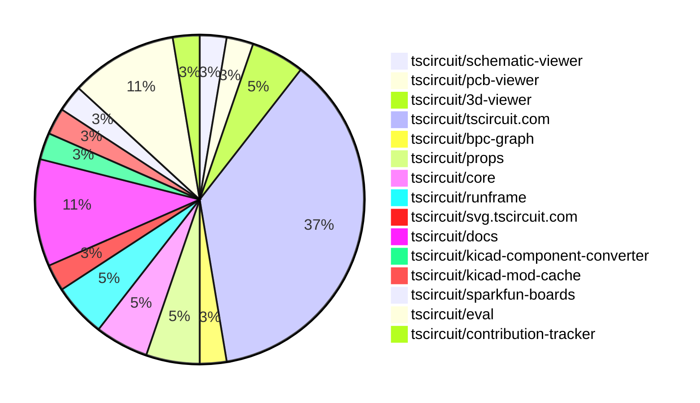
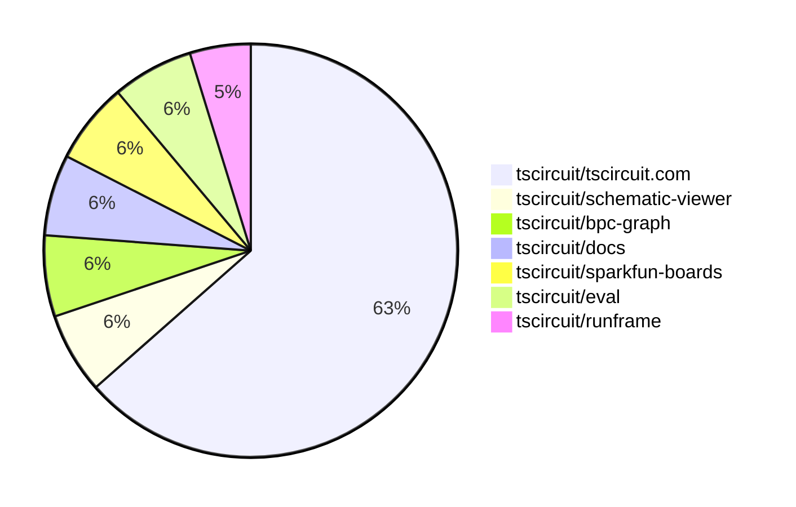

# contribution-tracker

[contributions.tscircuit.com](https://contributions.tscircuit.com) ・ [tscircuit.com](https://tscircuit.com) ・ [Contribution Overviews](./contribution-overviews/) ・ [Changelogs](./changelogs/)

Generates weekly contribution overviews for tscircuit contributors. Check out all
the [contribution overviews here](./contribution-overviews/)
You can find AI-generated monthly changelogs in the [changelogs directory](./changelogs/).

- All PRs in the tscircuit org are scanned/summarized via an LLM
- The LLM classifies each Diff/PR as into a set of attributes for scoring
- All the PRs, summaries, and classifications are organized into charts and tables for [the website](https://contributions.tscircuit.com)

> Want to run locally? See the [Development Section](#development)

The current week is shown below. There are 3 major sections:

- [Contributor Overview](#contributor-overview)
- [PRs by Repository](#prs-by-repository)
- [PRs by Contributor](#changes-by-contributor)

## Current Week

<!-- START_CURRENT_WEEK -->

# Contribution Overview 2025-08-06

## PRs by Repository



## Contributor Overview

| Contributor | 🐳 Major | 🐙 Minor | 🐌 Tiny | ⭐ | Score | Discussion Contributions |
|-------------|---------|---------|---------|-----|----------------|--------------------------|
| [seveibar](#seveibar) | 5 | 1 | 8 | ⭐⭐⭐ | 44 | 0🔹 0🔶 0💎 |
| [ArnavK-09](#ArnavK-09) | 4 | 2 | 5 | ⭐⭐ | 25 | 0🔹 0🔶 0💎 |
| [ShiboSoftwareDev](#ShiboSoftwareDev) | 1 | 1 | 1 | ⭐ | 8 | 0🔹 0🔶 0💎 |
| [MustafaMulla29](#MustafaMulla29) | 1 | 0 | 4 | ⭐ | 8 | 0🔹 0🔶 0💎 |
| [Abse2001](#Abse2001) | 0 | 1 | 1 |  | 2.5 | 0🔹 0🔶 0💎 |
| [tscircuitbot](#tscircuitbot) | 0 | 0 | 2 |  | 2 | 0🔹 0🔶 0💎 |
| [pxlpal](#pxlpal) | 0 | 0 | 1 |  | 1 | 0🔹 0🔶 0💎 |

### Discussion Contribution Legend

- 🔹 Normal Comments: Basic participation with minimal effort
- 🔶 Great Informative Comments: Thoughtful participation that adds value
- 💎 Incredible Comments: Exceptional participation with high-quality content

## Review Table

[reviews-received-hover]: ## "Number of reviews received for PRs for this contributor"
[approvals-received-hover]: ## "Number of approvals received for PRs this contributor authored"
[rejections-received-hover]: ## "Number of rejections received for PRs this contributor authored"
[prs-opened-hover]: ## "Number of PRs opened by this contributor"
[issues-created-hover]: ## "Number of issues created by this contributor"
[bountied-issues-hover]: ## "Number of issues this contributor created with a bounty"
[bountied-issue-$-hover]: ## "Total bounty amount placed on issues authored by this contributor"

| Contributor | Reviews Received | Approvals Received | Rejections Received | Approvals | Rejections | PRs Opened | PRs Merged | Score | Issues Created | Bountied Issues | Bountied Issue $ |
|---|---|---|---|---|---|---|---|---|---|---|---|
| [ShiboSoftwareDev](#ShiboSoftwareDev) | 7 | 5 | 0 | 1 | 0 | 5 | 4 | 8 | 0 | 0 | 0 |
| [seveibar](#seveibar) | 3 | 0 | 0 | 21 | 1 | 17 | 14 | 44 | 0 | 0 | 0 |
| [graphite-app[bot]](#graphite-app[bot]) | 0 | 0 | 0 | 0 | 0 | 0 | 0 | 0 | 0 | 0 | 0 |
| [pxlpal](#pxlpal) | 2 | 1 | 0 | 0 | 0 | 1 | 1 | 1 | 0 | 0 | 0 |
| [MustafaMulla29](#MustafaMulla29) | 14 | 5 | 1 | 0 | 0 | 7 | 5 | 8 | 0 | 0 | 0 |
| [Abse2001](#Abse2001) | 2 | 2 | 0 | 0 | 0 | 2 | 2 | 2.5 | 0 | 0 | 0 |
| [imrishabh18](#imrishabh18) | 0 | 0 | 0 | 1 | 1 | 0 | 0 | 0 | 0 | 0 | 0 |
| [ArnavK-09](#ArnavK-09) | 18 | 10 | 1 | 0 | 0 | 11 | 11 | 25 | 0 | 0 | 0 |
| [tscircuitbot](#tscircuitbot) | 0 | 0 | 0 | 0 | 0 | 5 | 2 | 2 | 0 | 0 | 0 |

## Top 7 Repositories by Contribution Points



## Changes by Repository

### [tscircuit/schematic-viewer](https://github.com/tscircuit/schematic-viewer)

| PR # | Impact | Rating | Contributor | Description |
|------|--------|--------|-------------|-------------|
| [#102](https://github.com/tscircuit/schematic-viewer/pull/102) | 🐳 Major | ⭐⭐⭐ | ShiboSoftwareDev | Adds SPICE simulation functionality that runs in a background web worker, ensuring UI responsiveness and reruns when circuit JSON changes. |

### [tscircuit/pcb-viewer](https://github.com/tscircuit/pcb-viewer)

| PR # | Impact | Rating | Contributor | Description |
|------|--------|--------|-------------|-------------|
| [#352](https://github.com/tscircuit/pcb-viewer/pull/352) | 🐙 Minor | ⭐⭐ | ShiboSoftwareDev | Adds support for rendering rotated pill holes with rectangular pads in PCB designs, enhancing the PCBViewers capabilities. |

### [tscircuit/3d-viewer](https://github.com/tscircuit/3d-viewer)


<details>
<summary>🐌 Tiny Contributions (2)</summary>

| PR # | Impact | Contributor | Description |
|------|--------|-------------|-------------|
| [#398](https://github.com/tscircuit/3d-viewer/pull/398) | 🐌 Tiny | ShiboSoftwareDev | Updates the version of react-threedrei from 9.121.4 to 10.6.1 in package.json to resolve compatibility issues with react-reconciler. |
| [#397](https://github.com/tscircuit/3d-viewer/pull/397) | 🐌 Tiny | seveibar | Moves the core library to dev dependencies and updates several package versions in package.json. |

</details>

### [tscircuit/tscircuit.com](https://github.com/tscircuit/tscircuit.com)

| PR # | Impact | Rating | Contributor | Description |
|------|--------|--------|-------------|-------------|
| [#1548](https://github.com/tscircuit/tscircuit.com/pull/1548) | 🐳 Major | ⭐⭐⭐ | seveibar | Adds handling for cases where package build information is not available, displaying a message to the user instead of failing silently. |
| [#1547](https://github.com/tscircuit/tscircuit.com/pull/1547) | 🐳 Major | ⭐⭐⭐ | seveibar | Allows the package releases page to function correctly even when no build is found for a package release, ensuring users can still access release information without errors. |
| [#1546](https://github.com/tscircuit/tscircuit.com/pull/1546) | 🐳 Major | ⭐⭐⭐ | seveibar | Refactors the UI to replace package builds with releases where relevant, introduces new pages for releases and release details, and updates routing and components accordingly. |
| [#1545](https://github.com/tscircuit/tscircuit.com/pull/1545) | 🐳 Major | ⭐⭐⭐ | seveibar | Adds a GitHub repository selector component with a refresh button and search functionality, allowing users to refresh their repositories and search through them. |
| [#1555](https://github.com/tscircuit/tscircuit.com/pull/1555) | 🐳 Major | ⭐⭐⭐ | ArnavK-09 | Update schema to move branch_name, commit_message, and commit_author from PackageBuild to PackageRelease, update UI components to use release metadata instead of build metadata, fix route paths to use releases instead of release, remove mock package builds data, set default sidebar state to collapsed in preview page, and ask user to connect github repo |
| [#1551](https://github.com/tscircuit/tscircuit.com/pull/1551) | 🐳 Major | ⭐⭐⭐ | ArnavK-09 | Refactors the build status logic and modifies the preview component to enhance its functionality and user experience. |
| [#1549](https://github.com/tscircuit/tscircuit.com/pull/1549) | 🐳 Major | ⭐⭐⭐ | ArnavK-09 | Refactors the preview functionality to utilize release-based URLs, adds a new release preview page, and updates routing for preview and build links accordingly. |
| [#1544](https://github.com/tscircuit/tscircuit.com/pull/1544) | 🐳 Major | ⭐⭐⭐ | ArnavK-09 | This pull request introduces new endpoints for listing package builds and retrieving specific package build details. It also includes the necessary schema definitions and integration tests to ensure functionality. The changes are aimed at enhancing the APIs capabilities related to package builds, allowing users to access build information more effectively. |
| [#1554](https://github.com/tscircuit/tscircuit.com/pull/1554) | 🐙 Minor | ⭐⭐ | seveibar | Fixes a bug in the transformFilesToTreeData function by ensuring safe property access to prevent runtime errors when accessing children nodes. |
| [#1543](https://github.com/tscircuit/tscircuit.com/pull/1543) | 🐙 Minor | ⭐⭐ | ArnavK-09 | Add allow_pr_previews field to package schema and update API, pass currentAllowPrPreviews to edit dialog components, update GitHubRepositorySelector to use allowPrPreviews instead of enablePrPreview, include is_pr_preview and github_pr_number in package release mapping |

<details>
<summary>🐌 Tiny Contributions (4)</summary>

| PR # | Impact | Contributor | Description |
|------|--------|-------------|-------------|
| [#1553](https://github.com/tscircuit/tscircuit.com/pull/1553) | 🐌 Tiny | seveibar | Increases the timeout duration for reloading the application from 10 seconds to 3 minutes when an error occurs, allowing for more time to recover from errors before a reload is attempted. |
| [#1556](https://github.com/tscircuit/tscircuit.com/pull/1556) | 🐌 Tiny | ArnavK-09 | Updates the default description in the MobileSidebar component to an empty string instead of a predefined text. |
| [#1550](https://github.com/tscircuit/tscircuit.com/pull/1550) | 🐌 Tiny | ArnavK-09 | Add custom scrollbar styling for html and body elements to enhance visual appearance. |
| [#1542](https://github.com/tscircuit/tscircuit.com/pull/1542) | 🐌 Tiny | ArnavK-09 | Replace ConnectedReposCards with ConnectedPackagesList component Add GitHub repo linkingunlinking functionality Improve UI for connected packages with build status and preview Remove unused ConnectedRepoSettings component Update API to handle nullable github_repo_full_name Remove extra settings dialog |

</details>

### [tscircuit/bpc-graph](https://github.com/tscircuit/bpc-graph)

| PR # | Impact | Rating | Contributor | Description |
|------|--------|--------|-------------|-------------|
| [#69](https://github.com/tscircuit/bpc-graph/pull/69) | 🐳 Major | ⭐⭐⭐ | seveibar | Adds a new PinSpacePartitionProcessor class to partition a canonical right-facing graph into smaller right-facing graphs based on gaps between pins. |

### [tscircuit/props](https://github.com/tscircuit/props)


<details>
<summary>🐌 Tiny Contributions (2)</summary>

| PR # | Impact | Contributor | Description |
|------|--------|-------------|-------------|
| [#354](https://github.com/tscircuit/props/pull/354) | 🐌 Tiny | seveibar | Adds properties for specifying a reference and explicit PCB path for traces via pcbPathRelativeTo and pcbPath. |
| [#351](https://github.com/tscircuit/props/pull/351) | 🐌 Tiny | pxlpal | Adds autocomplete functionality for the footprint prop, allowing editors to suggest common footprints while still permitting custom strings. |

</details>

### [tscircuit/core](https://github.com/tscircuit/core)


<details>
<summary>🐌 Tiny Contributions (2)</summary>

| PR # | Impact | Contributor | Description |
|------|--------|-------------|-------------|
| [#1133](https://github.com/tscircuit/core/pull/1133) | 🐌 Tiny | seveibar | Adds support for manual routing of traces using pcbPath, allowing traces to be treated as obstacles and skipping autorouting for defined pcbPaths. |
| [#1134](https://github.com/tscircuit/core/pull/1134) | 🐌 Tiny | MustafaMulla29 | Adds the showSilkscreenPinLabels prop to control the visibility of silkscreen pin labels in the PinHeader component, along with corresponding tests. |

</details>

### [tscircuit/runframe](https://github.com/tscircuit/runframe)

| PR # | Impact | Rating | Contributor | Description |
|------|--------|--------|-------------|-------------|
| [#968](https://github.com/tscircuit/runframe/pull/968) | 🐙 Minor | ⭐⭐ | ArnavK-09 | Fixes URL encoding errors in ErrorTabContent that were breaking tscircuit.com |

<details>
<summary>🐌 Tiny Contributions (1)</summary>

| PR # | Impact | Contributor | Description |
|------|--------|-------------|-------------|
| [#969](https://github.com/tscircuit/runframe/pull/969) | 🐌 Tiny | seveibar | Updates the easyeda dependency to version 0.0.217 in package.json |

</details>

### [tscircuit/svg.tscircuit.com](https://github.com/tscircuit/svg.tscircuit.com)


<details>
<summary>🐌 Tiny Contributions (1)</summary>

| PR # | Impact | Contributor | Description |
|------|--------|-------------|-------------|
| [#270](https://github.com/tscircuit/svg.tscircuit.com/pull/270) | 🐌 Tiny | seveibar | Updates the tscircuit dependency version from 0.0.581 to 0.0.582 in package.json |

</details>

### [tscircuit/docs](https://github.com/tscircuit/docs)


<details>
<summary>🐌 Tiny Contributions (4)</summary>

| PR # | Impact | Contributor | Description |
|------|--------|-------------|-------------|
| [#111](https://github.com/tscircuit/docs/pull/111) | 🐌 Tiny | seveibar | Updates the PCB path trace example to use more intuitive syntax for specifying trace connections between components. |
| [#110](https://github.com/tscircuit/docs/pull/110) | 🐌 Tiny | seveibar | Documents the pcbPath and pcbPathRelativeTo properties on the trace  element and adds an example for manual PCB pathing with a notch. |
| [#109](https://github.com/tscircuit/docs/pull/109) | 🐌 Tiny | MustafaMulla29 | Adds documentation for the fuse component, detailing its properties, usage, and specifications. |
| [#108](https://github.com/tscircuit/docs/pull/108) | 🐌 Tiny | MustafaMulla29 | Adds documentation for the battery  element, detailing its usage, specifications, and examples for users. |

</details>

### [tscircuit/kicad-component-converter](https://github.com/tscircuit/kicad-component-converter)

| PR # | Impact | Rating | Contributor | Description |
|------|--------|--------|-------------|-------------|
| [#124](https://github.com/tscircuit/kicad-component-converter/pull/124) | 🐙 Minor | ⭐⭐ | Abse2001 | Adds parsing for plated and non-plated holes in KiCad components, including comprehensive test coverage for the new functionality. |

### [tscircuit/kicad-mod-cache](https://github.com/tscircuit/kicad-mod-cache)


<details>
<summary>🐌 Tiny Contributions (1)</summary>

| PR # | Impact | Contributor | Description |
|------|--------|-------------|-------------|
| [#3](https://github.com/tscircuit/kicad-mod-cache/pull/3) | 🐌 Tiny | Abse2001 | Updates the kicad-component-converter dependency from version 0.1.9 to 0.1.10 in package.json |

</details>

### [tscircuit/sparkfun-boards](https://github.com/tscircuit/sparkfun-boards)

| PR # | Impact | Rating | Contributor | Description |
|------|--------|--------|-------------|-------------|
| [#109](https://github.com/tscircuit/sparkfun-boards/pull/109) | 🐳 Major | ⭐⭐⭐ | MustafaMulla29 | Introduces a new circuit board for the SparkFun Atmospheric Sensor Breakout - BME280, including its schematic and footprint. |

### [tscircuit/eval](https://github.com/tscircuit/eval)


<details>
<summary>🐌 Tiny Contributions (4)</summary>

| PR # | Impact | Contributor | Description |
|------|--------|-------------|-------------|
| [#807](https://github.com/tscircuit/eval/pull/807) | 🐌 Tiny | MustafaMulla29 | Updates the core dependency to version 0.0.616 to support the implementation of the showSilkscreenPinLabels property. |
| [#804](https://github.com/tscircuit/eval/pull/804) | 🐌 Tiny | ArnavK-09 | Removes unnecessary conditional wrapping of components in a board, simplifying the default entrypoint setup. |
| [#803](https://github.com/tscircuit/eval/pull/803) | 🐌 Tiny | tscircuitbot | Automated update of tscircuitcore to v0.0.615. |
| [#801](https://github.com/tscircuit/eval/pull/801) | 🐌 Tiny | tscircuitbot | Automated update of tscircuitcore to v0.0.614. |

</details>

### [tscircuit/contribution-tracker](https://github.com/tscircuit/contribution-tracker)


<details>
<summary>🐌 Tiny Contributions (1)</summary>

| PR # | Impact | Contributor | Description |
|------|--------|-------------|-------------|
| [#214](https://github.com/tscircuit/contribution-tracker/pull/214) | 🐌 Tiny | ArnavK-09 | This PR refactors the prompt generation function to avoid displaying No description provided when there is no description in the pull request. Instead, it conditionally includes the description only if it exists, improving the clarity of the output. |

</details>

## Changes by Contributor

### [ShiboSoftwareDev](https://github.com/ShiboSoftwareDev)

| PRs # | Impact | Rating | Description |
|------|--------|--------|-------------|
| [#102](https://github.com/tscircuit/schematic-viewer/pull/102) | 🐳 Major | ⭐⭐⭐ | Adds SPICE simulation functionality that runs in a background web worker, ensuring UI responsiveness and reruns when circuit JSON changes. |
| [#352](https://github.com/tscircuit/pcb-viewer/pull/352) | 🐙 Minor | ⭐⭐ | Adds support for rendering rotated pill holes with rectangular pads in PCB designs, enhancing the PCBViewers capabilities. |

<details>
<summary>🐌 Tiny Contributions (1)</summary>

| PR # | Impact | Description |
|------|--------|-------------|
| [#398](https://github.com/tscircuit/3d-viewer/pull/398) | 🐌 Tiny | Updates the version of react-threedrei from 9.121.4 to 10.6.1 in package.json to resolve compatibility issues with react-reconciler. |

</details>

### [seveibar](https://github.com/seveibar)

| PRs # | Impact | Rating | Description |
|------|--------|--------|-------------|
| [#1548](https://github.com/tscircuit/tscircuit.com/pull/1548) | 🐳 Major | ⭐⭐⭐ | Adds handling for cases where package build information is not available, displaying a message to the user instead of failing silently. |
| [#1547](https://github.com/tscircuit/tscircuit.com/pull/1547) | 🐳 Major | ⭐⭐⭐ | Allows the package releases page to function correctly even when no build is found for a package release, ensuring users can still access release information without errors. |
| [#1546](https://github.com/tscircuit/tscircuit.com/pull/1546) | 🐳 Major | ⭐⭐⭐ | Refactors the UI to replace package builds with releases where relevant, introduces new pages for releases and release details, and updates routing and components accordingly. |
| [#1545](https://github.com/tscircuit/tscircuit.com/pull/1545) | 🐳 Major | ⭐⭐⭐ | Adds a GitHub repository selector component with a refresh button and search functionality, allowing users to refresh their repositories and search through them. |
| [#69](https://github.com/tscircuit/bpc-graph/pull/69) | 🐳 Major | ⭐⭐⭐ | Adds a new PinSpacePartitionProcessor class to partition a canonical right-facing graph into smaller right-facing graphs based on gaps between pins. |
| [#1554](https://github.com/tscircuit/tscircuit.com/pull/1554) | 🐙 Minor | ⭐⭐ | Fixes a bug in the transformFilesToTreeData function by ensuring safe property access to prevent runtime errors when accessing children nodes. |

<details>
<summary>🐌 Tiny Contributions (8)</summary>

| PR # | Impact | Description |
|------|--------|-------------|
| [#354](https://github.com/tscircuit/props/pull/354) | 🐌 Tiny | Adds properties for specifying a reference and explicit PCB path for traces via pcbPathRelativeTo and pcbPath. |
| [#397](https://github.com/tscircuit/3d-viewer/pull/397) | 🐌 Tiny | Moves the core library to dev dependencies and updates several package versions in package.json. |
| [#1133](https://github.com/tscircuit/core/pull/1133) | 🐌 Tiny | Adds support for manual routing of traces using pcbPath, allowing traces to be treated as obstacles and skipping autorouting for defined pcbPaths. |
| [#1553](https://github.com/tscircuit/tscircuit.com/pull/1553) | 🐌 Tiny | Increases the timeout duration for reloading the application from 10 seconds to 3 minutes when an error occurs, allowing for more time to recover from errors before a reload is attempted. |
| [#969](https://github.com/tscircuit/runframe/pull/969) | 🐌 Tiny | Updates the easyeda dependency to version 0.0.217 in package.json |
| [#270](https://github.com/tscircuit/svg.tscircuit.com/pull/270) | 🐌 Tiny | Updates the tscircuit dependency version from 0.0.581 to 0.0.582 in package.json |
| [#111](https://github.com/tscircuit/docs/pull/111) | 🐌 Tiny | Updates the PCB path trace example to use more intuitive syntax for specifying trace connections between components. |
| [#110](https://github.com/tscircuit/docs/pull/110) | 🐌 Tiny | Documents the pcbPath and pcbPathRelativeTo properties on the trace  element and adds an example for manual PCB pathing with a notch. |

</details>

### [pxlpal](https://github.com/pxlpal)


<details>
<summary>🐌 Tiny Contributions (1)</summary>

| PR # | Impact | Description |
|------|--------|-------------|
| [#351](https://github.com/tscircuit/props/pull/351) | 🐌 Tiny | Adds autocomplete functionality for the footprint prop, allowing editors to suggest common footprints while still permitting custom strings. |

</details>

### [Abse2001](https://github.com/Abse2001)

| PRs # | Impact | Rating | Description |
|------|--------|--------|-------------|
| [#124](https://github.com/tscircuit/kicad-component-converter/pull/124) | 🐙 Minor | ⭐⭐ | Adds parsing for plated and non-plated holes in KiCad components, including comprehensive test coverage for the new functionality. |

<details>
<summary>🐌 Tiny Contributions (1)</summary>

| PR # | Impact | Description |
|------|--------|-------------|
| [#3](https://github.com/tscircuit/kicad-mod-cache/pull/3) | 🐌 Tiny | Updates the kicad-component-converter dependency from version 0.1.9 to 0.1.10 in package.json |

</details>

### [MustafaMulla29](https://github.com/MustafaMulla29)

| PRs # | Impact | Rating | Description |
|------|--------|--------|-------------|
| [#109](https://github.com/tscircuit/sparkfun-boards/pull/109) | 🐳 Major | ⭐⭐⭐ | Introduces a new circuit board for the SparkFun Atmospheric Sensor Breakout - BME280, including its schematic and footprint. |

<details>
<summary>🐌 Tiny Contributions (4)</summary>

| PR # | Impact | Description |
|------|--------|-------------|
| [#1134](https://github.com/tscircuit/core/pull/1134) | 🐌 Tiny | Adds the showSilkscreenPinLabels prop to control the visibility of silkscreen pin labels in the PinHeader component, along with corresponding tests. |
| [#807](https://github.com/tscircuit/eval/pull/807) | 🐌 Tiny | Updates the core dependency to version 0.0.616 to support the implementation of the showSilkscreenPinLabels property. |
| [#109](https://github.com/tscircuit/docs/pull/109) | 🐌 Tiny | Adds documentation for the fuse component, detailing its properties, usage, and specifications. |
| [#108](https://github.com/tscircuit/docs/pull/108) | 🐌 Tiny | Adds documentation for the battery  element, detailing its usage, specifications, and examples for users. |

</details>

### [ArnavK-09](https://github.com/ArnavK-09)

| PRs # | Impact | Rating | Description |
|------|--------|--------|-------------|
| [#1555](https://github.com/tscircuit/tscircuit.com/pull/1555) | 🐳 Major | ⭐⭐⭐ | Update schema to move branch_name, commit_message, and commit_author from PackageBuild to PackageRelease, update UI components to use release metadata instead of build metadata, fix route paths to use releases instead of release, remove mock package builds data, set default sidebar state to collapsed in preview page, and ask user to connect github repo |
| [#1551](https://github.com/tscircuit/tscircuit.com/pull/1551) | 🐳 Major | ⭐⭐⭐ | Refactors the build status logic and modifies the preview component to enhance its functionality and user experience. |
| [#1549](https://github.com/tscircuit/tscircuit.com/pull/1549) | 🐳 Major | ⭐⭐⭐ | Refactors the preview functionality to utilize release-based URLs, adds a new release preview page, and updates routing for preview and build links accordingly. |
| [#1544](https://github.com/tscircuit/tscircuit.com/pull/1544) | 🐳 Major | ⭐⭐⭐ | This pull request introduces new endpoints for listing package builds and retrieving specific package build details. It also includes the necessary schema definitions and integration tests to ensure functionality. The changes are aimed at enhancing the APIs capabilities related to package builds, allowing users to access build information more effectively. |
| [#1543](https://github.com/tscircuit/tscircuit.com/pull/1543) | 🐙 Minor | ⭐⭐ | Add allow_pr_previews field to package schema and update API, pass currentAllowPrPreviews to edit dialog components, update GitHubRepositorySelector to use allowPrPreviews instead of enablePrPreview, include is_pr_preview and github_pr_number in package release mapping |
| [#968](https://github.com/tscircuit/runframe/pull/968) | 🐙 Minor | ⭐⭐ | Fixes URL encoding errors in ErrorTabContent that were breaking tscircuit.com |

<details>
<summary>🐌 Tiny Contributions (5)</summary>

| PR # | Impact | Description |
|------|--------|-------------|
| [#214](https://github.com/tscircuit/contribution-tracker/pull/214) | 🐌 Tiny | This PR refactors the prompt generation function to avoid displaying No description provided when there is no description in the pull request. Instead, it conditionally includes the description only if it exists, improving the clarity of the output. |
| [#1556](https://github.com/tscircuit/tscircuit.com/pull/1556) | 🐌 Tiny | Updates the default description in the MobileSidebar component to an empty string instead of a predefined text. |
| [#1550](https://github.com/tscircuit/tscircuit.com/pull/1550) | 🐌 Tiny | Add custom scrollbar styling for html and body elements to enhance visual appearance. |
| [#1542](https://github.com/tscircuit/tscircuit.com/pull/1542) | 🐌 Tiny | Replace ConnectedReposCards with ConnectedPackagesList component Add GitHub repo linkingunlinking functionality Improve UI for connected packages with build status and preview Remove unused ConnectedRepoSettings component Update API to handle nullable github_repo_full_name Remove extra settings dialog |
| [#804](https://github.com/tscircuit/eval/pull/804) | 🐌 Tiny | Removes unnecessary conditional wrapping of components in a board, simplifying the default entrypoint setup. |

</details>

### [tscircuitbot](https://github.com/tscircuitbot)


<details>
<summary>🐌 Tiny Contributions (2)</summary>

| PR # | Impact | Description |
|------|--------|-------------|
| [#803](https://github.com/tscircuit/eval/pull/803) | 🐌 Tiny | Automated update of tscircuitcore to v0.0.615. |
| [#801](https://github.com/tscircuit/eval/pull/801) | 🐌 Tiny | Automated update of tscircuitcore to v0.0.614. |

</details>

## Repository Owners

| Repository | Codeowners |
|------------|------------|
| [builder](https://github.com/tscircuit/builder/blob/main/.github/CODEOWNERS) | [seveibar](https://github.com/seveibar)
| [pcb-viewer](https://github.com/tscircuit/pcb-viewer/blob/main/.github/CODEOWNERS) | [seveibar](https://github.com/seveibar), [ShiboSoftwareDev](https://github.com/ShiboSoftwareDev)
| [footprints](https://github.com/tscircuit/footprints/blob/main/.github/CODEOWNERS) | [seveibar](https://github.com/seveibar)
| [footprinter](https://github.com/tscircuit/footprinter/blob/main/.github/CODEOWNERS) | [seveibar](https://github.com/seveibar), [techmannih](https://github.com/techmannih)
| [winterspec](https://github.com/tscircuit/winterspec/blob/main/.github/CODEOWNERS) | [seveibar](https://github.com/seveibar), [ShiboSoftwareDev](https://github.com/ShiboSoftwareDev)
| [jscad-electronics](https://github.com/tscircuit/jscad-electronics/blob/main/.github/CODEOWNERS) | [seveibar](https://github.com/seveibar), [abhijitxy](https://github.com/abhijitxy), [anas-sarkez](https://github.com/anas-sarkez)
| [circuit-to-svg](https://github.com/tscircuit/circuit-to-svg/blob/main/.github/CODEOWNERS) | [imrishabh18](https://github.com/imrishabh18)
| [schematic-symbols](https://github.com/tscircuit/schematic-symbols/blob/main/.github/CODEOWNERS) | [seveibar](https://github.com/seveibar), [imrishabh18](https://github.com/imrishabh18), [techmannih](https://github.com/techmannih)
| [circuit-json-to-gerber](https://github.com/tscircuit/circuit-json-to-gerber/blob/main/.github/CODEOWNERS) | [seveibar](https://github.com/seveibar), [ShiboSoftwareDev](https://github.com/ShiboSoftwareDev)
| [tscircuit.com](https://github.com/tscircuit/tscircuit.com/blob/main/.github/CODEOWNERS) | [seveibar](https://github.com/seveibar), [imrishabh18](https://github.com/imrishabh18)
| [cli](https://github.com/tscircuit/cli/blob/main/.github/CODEOWNERS) | [seveibar](https://github.com/seveibar), [imrishabh18](https://github.com/imrishabh18), [ArnavK-09](https://github.com/ArnavK-09)
| [issue-roulette](https://github.com/tscircuit/issue-roulette/blob/main/.github/CODEOWNERS) | [Anshgrover23](https://github.com/Anshgrover23)
| [sparkfun-boards](https://github.com/tscircuit/sparkfun-boards/blob/main/.github/CODEOWNERS) | [ShiboSoftwareDev](https://github.com/ShiboSoftwareDev), [MustafaMulla29](https://github.com/MustafaMulla29), [Anshgrover23](https://github.com/Anshgrover23), [Abse2001](https://github.com/Abse2001), [techmannih](https://github.com/techmannih)
| [schematic-corpus](https://github.com/tscircuit/schematic-corpus/blob/main/.github/CODEOWNERS) | [Abse2001](https://github.com/Abse2001)

## Repositories by Owner

| User | Repo |
|------|------|
| [seveibar](https://github.com/seveibar) | [builder](https://github.com/tscircuit/builder/blob/main/.github/CODEOWNERS) |
|  | [pcb-viewer](https://github.com/tscircuit/pcb-viewer/blob/main/.github/CODEOWNERS) |
|  | [footprints](https://github.com/tscircuit/footprints/blob/main/.github/CODEOWNERS) |
|  | [footprinter](https://github.com/tscircuit/footprinter/blob/main/.github/CODEOWNERS) |
|  | [winterspec](https://github.com/tscircuit/winterspec/blob/main/.github/CODEOWNERS) |
|  | [jscad-electronics](https://github.com/tscircuit/jscad-electronics/blob/main/.github/CODEOWNERS) |
|  | [schematic-symbols](https://github.com/tscircuit/schematic-symbols/blob/main/.github/CODEOWNERS) |
|  | [circuit-json-to-gerber](https://github.com/tscircuit/circuit-json-to-gerber/blob/main/.github/CODEOWNERS) |
|  | [tscircuit.com](https://github.com/tscircuit/tscircuit.com/blob/main/.github/CODEOWNERS) |
|  | [cli](https://github.com/tscircuit/cli/blob/main/.github/CODEOWNERS) |
| [ShiboSoftwareDev](https://github.com/ShiboSoftwareDev) | [pcb-viewer](https://github.com/tscircuit/pcb-viewer/blob/main/.github/CODEOWNERS) |
|  | [winterspec](https://github.com/tscircuit/winterspec/blob/main/.github/CODEOWNERS) |
|  | [circuit-json-to-gerber](https://github.com/tscircuit/circuit-json-to-gerber/blob/main/.github/CODEOWNERS) |
|  | [sparkfun-boards](https://github.com/tscircuit/sparkfun-boards/blob/main/.github/CODEOWNERS) |
| [techmannih](https://github.com/techmannih) | [footprinter](https://github.com/tscircuit/footprinter/blob/main/.github/CODEOWNERS) |
|  | [schematic-symbols](https://github.com/tscircuit/schematic-symbols/blob/main/.github/CODEOWNERS) |
|  | [sparkfun-boards](https://github.com/tscircuit/sparkfun-boards/blob/main/.github/CODEOWNERS) |
| [abhijitxy](https://github.com/abhijitxy) | [jscad-electronics](https://github.com/tscircuit/jscad-electronics/blob/main/.github/CODEOWNERS) |
| [anas-sarkez](https://github.com/anas-sarkez) | [jscad-electronics](https://github.com/tscircuit/jscad-electronics/blob/main/.github/CODEOWNERS) |
| [imrishabh18](https://github.com/imrishabh18) | [circuit-to-svg](https://github.com/tscircuit/circuit-to-svg/blob/main/.github/CODEOWNERS) |
|  | [schematic-symbols](https://github.com/tscircuit/schematic-symbols/blob/main/.github/CODEOWNERS) |
|  | [tscircuit.com](https://github.com/tscircuit/tscircuit.com/blob/main/.github/CODEOWNERS) |
|  | [cli](https://github.com/tscircuit/cli/blob/main/.github/CODEOWNERS) |
| [ArnavK-09](https://github.com/ArnavK-09) | [cli](https://github.com/tscircuit/cli/blob/main/.github/CODEOWNERS) |
| [Anshgrover23](https://github.com/Anshgrover23) | [issue-roulette](https://github.com/tscircuit/issue-roulette/blob/main/.github/CODEOWNERS) |
|  | [sparkfun-boards](https://github.com/tscircuit/sparkfun-boards/blob/main/.github/CODEOWNERS) |
| [MustafaMulla29](https://github.com/MustafaMulla29) | [sparkfun-boards](https://github.com/tscircuit/sparkfun-boards/blob/main/.github/CODEOWNERS) |
| [Abse2001](https://github.com/Abse2001) | [sparkfun-boards](https://github.com/tscircuit/sparkfun-boards/blob/main/.github/CODEOWNERS) |
|  | [schematic-corpus](https://github.com/tscircuit/schematic-corpus/blob/main/.github/CODEOWNERS) |


<!-- END_CURRENT_WEEK -->


## Development

### Prerequisites

- [Bun](https://bun.sh/) runtime
- `.env` file with required API keys:
  ```
  GITHUB_TOKEN=your_github_token
  OPENAI_API_KEY=your_openai_api_key
  DISCORD_TOKEN=your_discord_token (optional, for Discord integration)
  SLACK_BOT_TOKEN=your_slack_token (optional, for Slack integration)
  ```

### Available Scripts

#### Core Generation Scripts

- `bun run generate:weekly` - Generate current week's contribution overview
- `bun run generate:monthly` - Generate current month's contribution overview
- `bun run generate:changelog` - Generate monthly changelog from PRs

#### Analysis & Testing

- `bun run analyze-pr` - Analyze a single PR (interactive prompt)
- `bun run test:github` - Test GitHub API integration

#### Notifications & Sync

- `bun run notifications:issues` - Send notifications for new issues
- `bun run notifications:pr` - Send notifications for new PRs
- `bun run sync:discord` - Sync contributor roles with Discord

#### Data Export

- `bun run export:sponsorship` - Generate sponsorship data CSV

#### Development

- `bun run dev` - Start development server for web UI
- `bun run build` - Build for production
- `bun run format` - Format code with Biome

### Usage Examples

```bash
# Generate this week's contribution overview
bun run generate:weekly

# Generate current month's overview
bun run generate:monthly

# Analyze a specific PR
bun run analyze-pr

# Test your GitHub token setup
bun run test:github
```
