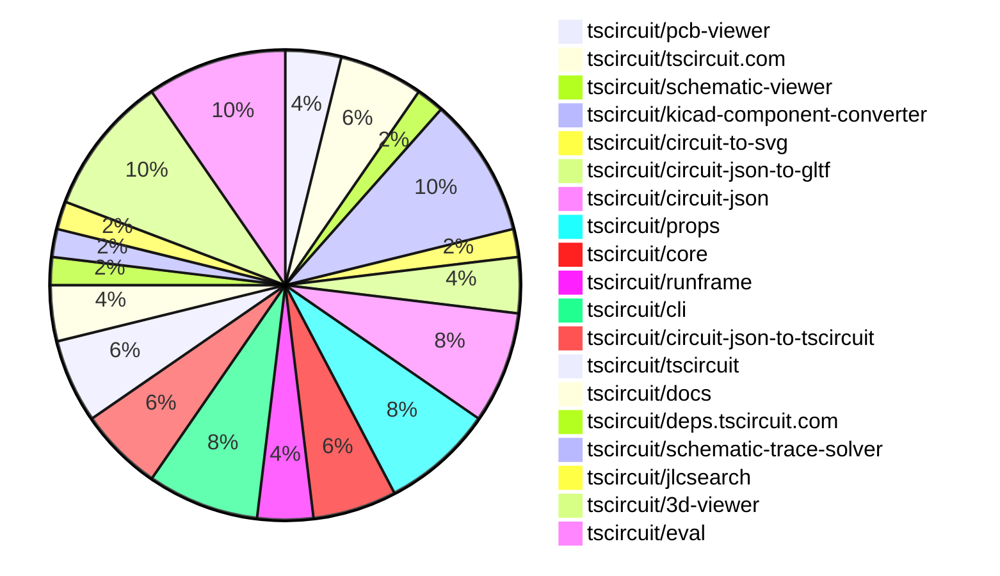
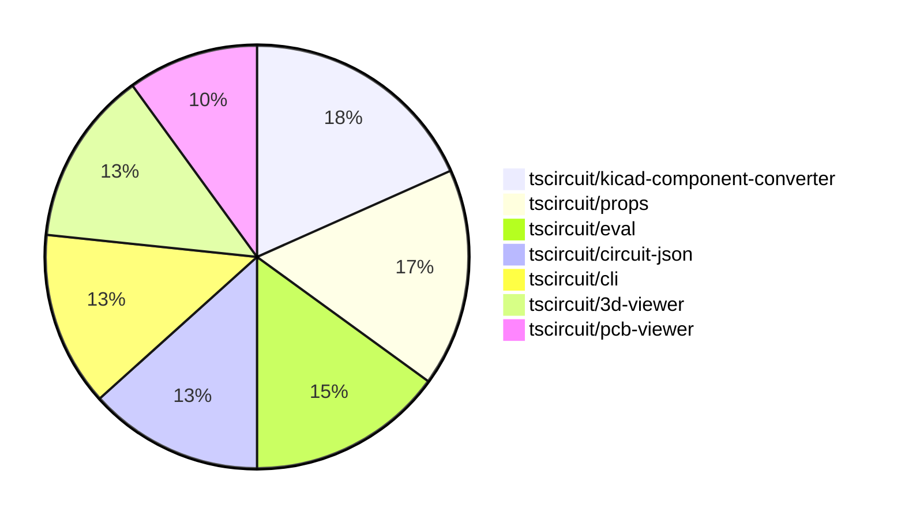

# contribution-tracker

[contributions.tscircuit.com](https://contributions.tscircuit.com) ・ [tscircuit.com](https://tscircuit.com) ・ [Contribution Overviews](./contribution-overviews/) ・ [Changelogs](./changelogs/)

Generates weekly contribution overviews for tscircuit contributors. Check out all
the [contribution overviews here](./contribution-overviews/)
You can find AI-generated monthly changelogs in the [changelogs directory](./changelogs/).

- All PRs in the tscircuit org are scanned/summarized via an LLM
- The LLM classifies each Diff/PR as into a set of attributes for scoring
- All the PRs, summaries, and classifications are organized into charts and tables for [the website](https://contributions.tscircuit.com)

> Want to run locally? See the [Development Section](#development)

The current week is shown below. There are 3 major sections:

- [Contributor Overview](#contributor-overview)
- [PRs by Repository](#prs-by-repository)
- [PRs by Contributor](#changes-by-contributor)

## Current Week

<!-- START_CURRENT_WEEK -->

# Contribution Overview 2025-09-10

## PRs by Repository



## Contributor Overview

| Contributor | 🐳 Major | 🐙 Minor | 🐌 Tiny | ⭐ | Score | Discussion Contributions |
|-------------|---------|---------|---------|-----|----------------|--------------------------|
| [imrishabh18](#imrishabh18) | 3 | 9 | 9 | ⭐⭐⭐ | 41.5 | 0🔹 0🔶 0💎 |
| [seveibar](#seveibar) | 1 | 8 | 5 | ⭐⭐⭐ | 39 | 0🔹 0🔶 0💎 |
| [ShiboSoftwareDev](#ShiboSoftwareDev) | 2 | 3 | 2 | ⭐⭐ | 15.5 | 0🔹 0🔶 0💎 |
| [ArnavK-09](#ArnavK-09) | 2 | 0 | 1 | ⭐ | 9 | 0🔹 0🔶 0💎 |
| [techmannih](#techmannih) | 0 | 2 | 1 | ⭐ | 5 | 0🔹 0🔶 0💎 |
| [Abse2001](#Abse2001) | 0 | 1 | 1 |  | 3 | 0🔹 0🔶 0💎 |
| [AnasSarkiz](#AnasSarkiz) | 0 | 1 | 0 |  | 2 | 0🔹 0🔶 0💎 |
| [tscircuitbot](#tscircuitbot) | 0 | 0 | 1 |  | 1 | 0🔹 0🔶 0💎 |

### Discussion Contribution Legend

- 🔹 Normal Comments: Basic participation with minimal effort
- 🔶 Great Informative Comments: Thoughtful participation that adds value
- 💎 Incredible Comments: Exceptional participation with high-quality content

## Review Table

[reviews-received-hover]: ## "Number of reviews received for PRs for this contributor"
[approvals-received-hover]: ## "Number of approvals received for PRs this contributor authored"
[rejections-received-hover]: ## "Number of rejections received for PRs this contributor authored"
[prs-opened-hover]: ## "Number of PRs opened by this contributor"
[issues-created-hover]: ## "Number of issues created by this contributor"
[bountied-issues-hover]: ## "Number of issues this contributor created with a bounty"
[bountied-issue-$-hover]: ## "Total bounty amount placed on issues authored by this contributor"

| Contributor | Reviews Received | Approvals Received | Rejections Received | Approvals | Rejections | PRs Opened | PRs Merged | Score | Issues Created | Bountied Issues | Bountied Issue $ |
|---|---|---|---|---|---|---|---|---|---|---|---|
| [ArnavK-09](#ArnavK-09) | 14 | 3 | 1 | 0 | 0 | 4 | 3 | 9 | 0 | 0 | 0 |
| [seveibar](#seveibar) | 8 | 0 | 0 | 20 | 9 | 16 | 14 | 39 | 0 | 0 | 0 |
| [imrishabh18](#imrishabh18) | 11 | 6 | 0 | 2 | 1 | 22 | 21 | 41.5 | 0 | 0 | 0 |
| [techmannih](#techmannih) | 7 | 2 | 1 | 0 | 0 | 5 | 3 | 5 | 0 | 0 | 0 |
| [AnasSarkiz](#AnasSarkiz) | 16 | 1 | 4 | 0 | 0 | 3 | 1 | 2 | 0 | 0 | 0 |
| [ShiboSoftwareDev](#ShiboSoftwareDev) | 10 | 7 | 1 | 0 | 0 | 8 | 7 | 15.5 | 0 | 0 | 0 |
| [Abse2001](#Abse2001) | 3 | 2 | 0 | 0 | 0 | 2 | 2 | 3 | 0 | 0 | 0 |
| [tscircuitbot](#tscircuitbot) | 0 | 0 | 0 | 0 | 0 | 6 | 1 | 1 | 0 | 0 | 0 |
| [baeoc](#baeoc) | 1 | 0 | 0 | 0 | 0 | 1 | 0 | 0 | 0 | 0 | 0 |
| [MAVRICK-1](#MAVRICK-1) | 4 | 1 | 3 | 0 | 0 | 2 | 0 | 0 | 0 | 0 | 0 |
| [Bhavyajain21](#Bhavyajain21) | 1 | 0 | 0 | 0 | 0 | 1 | 0 | 0 | 0 | 0 | 0 |
| [DiwanshuVerma](#DiwanshuVerma) | 0 | 0 | 0 | 0 | 0 | 1 | 0 | 0 | 0 | 0 | 0 |

## Top 7 Repositories by Contribution Points



## Changes by Repository

### [tscircuit/pcb-viewer](https://github.com/tscircuit/pcb-viewer)

| PR # | Impact | Rating | Contributor | Description |
|------|--------|--------|-------------|-------------|
| [#369](https://github.com/tscircuit/pcb-viewer/pull/369) | 🐳 Major | ⭐⭐⭐ | ArnavK-09 | fix 368  claim 368 |
| [#371](https://github.com/tscircuit/pcb-viewer/pull/371) | 🐙 Minor | ⭐⭐ | imrishabh18 | Adds support for hole offsets in the circular_hole_with_rect_pad element, allowing for more precise placement of holes in PCB designs. |

### [tscircuit/tscircuit.com](https://github.com/tscircuit/tscircuit.com)

| PR # | Impact | Rating | Contributor | Description |
|------|--------|--------|-------------|-------------|
| [#1638](https://github.com/tscircuit/tscircuit.com/pull/1638) | 🐳 Major | ⭐⭐⭐ | ArnavK-09 | Fixes a bug where the UI displayed outdated content after files were saved, ensuring the latest changes are reflected immediately. |

<details>
<summary>🐌 Tiny Contributions (2)</summary>

| PR # | Impact | Contributor | Description |
|------|--------|-------------|-------------|
| [#1655](https://github.com/tscircuit/tscircuit.com/pull/1655) | 🐌 Tiny | imrishabh18 | Updates the versions of the 3D viewer and assembly viewer dependencies in the project. |
| [#1657](https://github.com/tscircuit/tscircuit.com/pull/1657) | 🐌 Tiny | Abse2001 | Updates the dependency version of the 3d-viewer package from 0.0.375 to 0.0.379 in package.json |

</details>

### [tscircuit/schematic-viewer](https://github.com/tscircuit/schematic-viewer)


<details>
<summary>🐌 Tiny Contributions (1)</summary>

| PR # | Impact | Contributor | Description |
|------|--------|-------------|-------------|
| [#130](https://github.com/tscircuit/schematic-viewer/pull/130) | 🐌 Tiny | ArnavK-09 | Removes rounded borders from group overlays in the schematic viewer by setting the rx and ry attributes to 0. |

</details>

### [tscircuit/kicad-component-converter](https://github.com/tscircuit/kicad-component-converter)

| PR # | Impact | Rating | Contributor | Description |
|------|--------|--------|-------------|-------------|
| [#131](https://github.com/tscircuit/kicad-component-converter/pull/131) | 🐳 Major | ⭐⭐⭐ | imrishabh18 | Adds a button to download the generated tsx code from the circuit JSON. |
| [#129](https://github.com/tscircuit/kicad-component-converter/pull/129) | 🐙 Minor | ⭐⭐ | imrishabh18 | Adds support for a new pad shape circular_hole_with_rect_pad in the KiCad component converter, allowing for better representation of specific PCB designs. |
| [#128](https://github.com/tscircuit/kicad-component-converter/pull/128) | 🐙 Minor | ⭐⭐ | imrishabh18 | Fixes support for failing kicad_mod files when handling capacitor_6x2 attributes by filtering out non-numeric values before parsing. |
| [#134](https://github.com/tscircuit/kicad-component-converter/pull/134) | 🐙 Minor | ⭐⭐ | ShiboSoftwareDev | Adds support for the fp_poly directive in KiCad module files, enabling conversion of polygon shapes on copper, silkscreen, and fabrication layers into appropriate circuit elements. |

<details>
<summary>🐌 Tiny Contributions (1)</summary>

| PR # | Impact | Contributor | Description |
|------|--------|-------------|-------------|
| [#130](https://github.com/tscircuit/kicad-component-converter/pull/130) | 🐌 Tiny | imrishabh18 | Adds a vercel.json configuration file for Vercel deployment and updates dependencies in package.json |

</details>

### [tscircuit/circuit-to-svg](https://github.com/tscircuit/circuit-to-svg)

| PR # | Impact | Rating | Contributor | Description |
|------|--------|--------|-------------|-------------|
| [#310](https://github.com/tscircuit/circuit-to-svg/pull/310) | 🐳 Major | ⭐⭐⭐ | imrishabh18 | Adds an offset for the hole inside the pad in PCB designs, allowing for more precise placement of holes in relation to their pads. |

### [tscircuit/circuit-json-to-gltf](https://github.com/tscircuit/circuit-json-to-gltf)

| PR # | Impact | Rating | Contributor | Description |
|------|--------|--------|-------------|-------------|
| [#9](https://github.com/tscircuit/circuit-json-to-gltf/pull/9) | 🐳 Major | ⭐⭐⭐ | imrishabh18 | Enables SVG to PNG conversion in a Node.js environment using native Resvg for high-quality rendering, with a fallback to browser methods if necessary. |

<details>
<summary>🐌 Tiny Contributions (1)</summary>

| PR # | Impact | Contributor | Description |
|------|--------|-------------|-------------|
| [#8](https://github.com/tscircuit/circuit-json-to-gltf/pull/8) | 🐌 Tiny | imrishabh18 | Fixes relative import for WASM file in Node.js environment |

</details>

### [tscircuit/circuit-json](https://github.com/tscircuit/circuit-json)

| PR # | Impact | Rating | Contributor | Description |
|------|--------|--------|-------------|-------------|
| [#274](https://github.com/tscircuit/circuit-json/pull/274) | 🐙 Minor | ⭐⭐ | imrishabh18 | Adds hole offset parameters for circular plated holes with rectangular pads to allow for non-centered hole placements. |
| [#275](https://github.com/tscircuit/circuit-json/pull/275) | 🐙 Minor | ⭐⭐ | techmannih | Adds knockout functionality for silkscreen text in PCB designs, allowing for customizable padding around the text. |
| [#273](https://github.com/tscircuit/circuit-json/pull/273) | 🐙 Minor | ⭐⭐ | seveibar | Adds an optional model_unit_to_mm_scale_factor to the CAD component schema, allowing for unit scaling in CAD components. |
| [#272](https://github.com/tscircuit/circuit-json/pull/272) | 🐙 Minor | ⭐⭐ | AnasSarkiz | Add PcbComponentOutsideBoardError to detect when PCB components are placed outside the boards physical boundaries, with detailed positioning data for debugging and automated correction. |

### [tscircuit/props](https://github.com/tscircuit/props)

| PR # | Impact | Rating | Contributor | Description |
|------|--------|--------|-------------|-------------|
| [#376](https://github.com/tscircuit/props/pull/376) | 🐳 Major | ⭐⭐⭐ | ShiboSoftwareDev | Refactors the copper-pour component to support a more flexible and customizable interface for different shape types. |
| [#392](https://github.com/tscircuit/props/pull/392) | 🐙 Minor | ⭐⭐ | imrishabh18 | Adds properties pcbHoleOffsetX and pcbHoleOffsetY to the CircularHoleWithRectPlatedProps interface for specifying PCB hole offsets. |
| [#393](https://github.com/tscircuit/props/pull/393) | 🐙 Minor | ⭐⭐ | techmannih | Adds properties for knockout effect and padding for silkscreen text in PCB layouts |
| [#391](https://github.com/tscircuit/props/pull/391) | 🐙 Minor | ⭐⭐ | seveibar | Allows specifying CAD model unit scale via optional modelUnitToMmScale and covers the new CAD model property in tests. |

### [tscircuit/core](https://github.com/tscircuit/core)

| PR # | Impact | Rating | Contributor | Description |
|------|--------|--------|-------------|-------------|
| [#1326](https://github.com/tscircuit/core/pull/1326) | 🐙 Minor | ⭐⭐ | imrishabh18 | Adds support for hole offset in the shape circular_hole_with_rect_pad by introducing new properties for hole offsets in the PlatedHole component. |
| [#1327](https://github.com/tscircuit/core/pull/1327) | 🐙 Minor | ⭐⭐ | seveibar | Adds support for generating rounded board outlines when the borderRadius property is set, along with a snapshot test for this feature. |
| [#1325](https://github.com/tscircuit/core/pull/1325) | 🐙 Minor | ⭐⭐ | seveibar | Maps cadModel.modelUnitToMmScale onto cad_component.model_unit_to_mm_scale_factor and updates dependencies for improved CAD component scale factor propagation. |

### [tscircuit/runframe](https://github.com/tscircuit/runframe)

| PR # | Impact | Rating | Contributor | Description |
|------|--------|--------|-------------|-------------|
| [#1121](https://github.com/tscircuit/runframe/pull/1121) | 🐙 Minor | ⭐⭐ | imrishabh18 | Adds a GLB export option in the RunFrame file menu, allowing users to export circuit designs in the GLB format using the circuit-json-to-gltf library. |

<details>
<summary>🐌 Tiny Contributions (1)</summary>

| PR # | Impact | Contributor | Description |
|------|--------|-------------|-------------|
| [#1112](https://github.com/tscircuit/runframe/pull/1112) | 🐌 Tiny | imrishabh18 | Updates the 3D viewer dependency and adds an example for using an asynchronous footprint circuit in the RunFrame component. |

</details>

### [tscircuit/cli](https://github.com/tscircuit/cli)

| PR # | Impact | Rating | Contributor | Description |
|------|--------|--------|-------------|-------------|
| [#332](https://github.com/tscircuit/cli/pull/332) | 🐳 Major | ⭐⭐⭐ | ShiboSoftwareDev | Enables successful import of npm packages in the CLI after updates to eval and runframe. |
| [#330](https://github.com/tscircuit/cli/pull/330) | 🐙 Minor | ⭐⭐ | imrishabh18 | Adds a command to convert .kicad_mod files into TSX components, integrating kicad and circuit-json conversion packages. |

<details>
<summary>🐌 Tiny Contributions (2)</summary>

| PR # | Impact | Contributor | Description |
|------|--------|-------------|-------------|
| [#327](https://github.com/tscircuit/cli/pull/327) | 🐌 Tiny | seveibar | Updates the RunFrame and easyeda dependencies to their latest versions in the package.json file |
| [#322](https://github.com/tscircuit/cli/pull/322) | 🐌 Tiny | ShiboSoftwareDev | Updates various dependencies in the project, including version changes for existing packages and the addition of a new dependency. |

</details>

### [tscircuit/circuit-json-to-tscircuit](https://github.com/tscircuit/circuit-json-to-tscircuit)

| PR # | Impact | Rating | Contributor | Description |
|------|--------|--------|-------------|-------------|
| [#11](https://github.com/tscircuit/circuit-json-to-tscircuit/pull/11) | 🐙 Minor | ⭐⭐ | imrishabh18 | Adds silkscreentext and silkscreenpath elements to the generated TSX code for PCB footprints, enhancing the representation of silkscreen features in the output. |

<details>
<summary>🐌 Tiny Contributions (2)</summary>

| PR # | Impact | Contributor | Description |
|------|--------|-------------|-------------|
| [#10](https://github.com/tscircuit/circuit-json-to-tscircuit/pull/10) | 🐌 Tiny | imrishabh18 | Changes the build process to utilize tsup-node instead of tsup for building TypeScript files. |
| [#9](https://github.com/tscircuit/circuit-json-to-tscircuit/pull/9) | 🐌 Tiny | seveibar | Removes the deprecated createUseComponent hook from the generated component template and updates the component generation to use ChipProps instead. |

</details>

### [tscircuit/tscircuit](https://github.com/tscircuit/tscircuit)


<details>
<summary>🐌 Tiny Contributions (3)</summary>

| PR # | Impact | Contributor | Description |
|------|--------|-------------|-------------|
| [#769](https://github.com/tscircuit/tscircuit/pull/769) | 🐌 Tiny | imrishabh18 | Updates the versions of the tscircuitprops and circuit-json dependencies in package.json |
| [#773](https://github.com/tscircuit/tscircuit/pull/773) | 🐌 Tiny | techmannih | Updates the circuit-json dependency to version 0.0.251 in package.json |
| [#772](https://github.com/tscircuit/tscircuit/pull/772) | 🐌 Tiny | seveibar | Exports the ChipProps type from the tscircuitprops module for use in other parts of the application. |

</details>

### [tscircuit/docs](https://github.com/tscircuit/docs)


<details>
<summary>🐌 Tiny Contributions (2)</summary>

| PR # | Impact | Contributor | Description |
|------|--------|-------------|-------------|
| [#139](https://github.com/tscircuit/docs/pull/139) | 🐌 Tiny | imrishabh18 | Adds documentation for using KiCads footprint libraries with tscircuit, detailing the format and usage of the kicad: prefix for footprint references. |
| [#142](https://github.com/tscircuit/docs/pull/142) | 🐌 Tiny | seveibar | Fixes the sidebar category label for tscircuit Essentials by renaming the category JSON file to the correct format. |

</details>

### [tscircuit/deps.tscircuit.com](https://github.com/tscircuit/deps.tscircuit.com)


<details>
<summary>🐌 Tiny Contributions (1)</summary>

| PR # | Impact | Contributor | Description |
|------|--------|-------------|-------------|
| [#26](https://github.com/tscircuit/deps.tscircuit.com/pull/26) | 🐌 Tiny | imrishabh18 | Adds a new Upstream category to the dependency graph, allowing users to filter dependencies related to the core version used in circuit previews. |

</details>

### [tscircuit/schematic-trace-solver](https://github.com/tscircuit/schematic-trace-solver)


<details>
<summary>🐌 Tiny Contributions (1)</summary>

| PR # | Impact | Contributor | Description |
|------|--------|-------------|-------------|
| [#59](https://github.com/tscircuit/schematic-trace-solver/pull/59) | 🐌 Tiny | imrishabh18 | Adds a test case for missing schematic-trace functionality related to specific schematic orientations. |

</details>

### [tscircuit/jlcsearch](https://github.com/tscircuit/jlcsearch)

| PR # | Impact | Rating | Contributor | Description |
|------|--------|--------|-------------|-------------|
| [#86](https://github.com/tscircuit/jlcsearch/pull/86) | 🐳 Major | ⭐⭐⭐ | seveibar | Add JST connector derived table and route, expose JST connectors link on home page, and cover JST connectors API with tests. |

### [tscircuit/3d-viewer](https://github.com/tscircuit/3d-viewer)

| PR # | Impact | Rating | Contributor | Description |
|------|--------|--------|-------------|-------------|
| [#470](https://github.com/tscircuit/3d-viewer/pull/470) | 🐙 Minor | ⭐⭐ | seveibar | Adds model unit scaling support and removes KiCad autoscaling line |
| [#469](https://github.com/tscircuit/3d-viewer/pull/469) | 🐙 Minor | ⭐⭐ | seveibar | Sanitizes VRML DEFUSE names containing hyphens before parsing, ensuring compatibility with the VRML parser and adds a regression test for this functionality. |
| [#472](https://github.com/tscircuit/3d-viewer/pull/472) | 🐙 Minor | ⭐⭐ | Abse2001 | Fixes tooltip positioning calculations to ensure tooltips are displayed correctly when the 3D viewer is embedded in containers with different positioning contexts. |

<details>
<summary>🐌 Tiny Contributions (2)</summary>

| PR # | Impact | Contributor | Description |
|------|--------|-------------|-------------|
| [#468](https://github.com/tscircuit/3d-viewer/pull/468) | 🐌 Tiny | seveibar | Fixes start script, adds KiCad resistor story, adds proper async rendering, and replicates VRMLLoader error. |
| [#465](https://github.com/tscircuit/3d-viewer/pull/465) | 🐌 Tiny | ShiboSoftwareDev | Adds a story test for GLTF model support in the CadViewer component. |

</details>

### [tscircuit/eval](https://github.com/tscircuit/eval)

| PR # | Impact | Rating | Contributor | Description |
|------|--------|--------|-------------|-------------|
| [#1029](https://github.com/tscircuit/eval/pull/1029) | 🐙 Minor | ⭐⭐ | seveibar | Sets the model unit scale for WRLs derived from KiCad STEP files to 2.54 mm. |
| [#1028](https://github.com/tscircuit/eval/pull/1028) | 🐙 Minor | ⭐⭐ | seveibar | Adds an export for the function that retrieves the default platform configuration for tscircuit. |
| [#1032](https://github.com/tscircuit/eval/pull/1032) | 🐙 Minor | ⭐⭐ | ShiboSoftwareDev | Adds support for importing .gltf files that reference external binary (.bin) or image assets, enabling inlining of these assets as data URIs within the GLTF structure. |
| [#1033](https://github.com/tscircuit/eval/pull/1033) | 🐙 Minor | ⭐⭐ | ShiboSoftwareDev | Fixes the issue where NPM packages with their own dependencies were not being resolved correctly by implementing recursive loading of transitive dependencies. |

<details>
<summary>🐌 Tiny Contributions (1)</summary>

| PR # | Impact | Contributor | Description |
|------|--------|-------------|-------------|
| [#1031](https://github.com/tscircuit/eval/pull/1031) | 🐌 Tiny | tscircuitbot | Automated update of tscircuitcore to v0.0.715. |

</details>

## Changes by Contributor

### [ArnavK-09](https://github.com/ArnavK-09)

| PRs # | Impact | Rating | Description |
|------|--------|--------|-------------|
| [#369](https://github.com/tscircuit/pcb-viewer/pull/369) | 🐳 Major | ⭐⭐⭐ | fix 368  claim 368 |
| [#1638](https://github.com/tscircuit/tscircuit.com/pull/1638) | 🐳 Major | ⭐⭐⭐ | Fixes a bug where the UI displayed outdated content after files were saved, ensuring the latest changes are reflected immediately. |

<details>
<summary>🐌 Tiny Contributions (1)</summary>

| PR # | Impact | Description |
|------|--------|-------------|
| [#130](https://github.com/tscircuit/schematic-viewer/pull/130) | 🐌 Tiny | Removes rounded borders from group overlays in the schematic viewer by setting the rx and ry attributes to 0. |

</details>

### [imrishabh18](https://github.com/imrishabh18)

| PRs # | Impact | Rating | Description |
|------|--------|--------|-------------|
| [#131](https://github.com/tscircuit/kicad-component-converter/pull/131) | 🐳 Major | ⭐⭐⭐ | Adds a button to download the generated tsx code from the circuit JSON. |
| [#310](https://github.com/tscircuit/circuit-to-svg/pull/310) | 🐳 Major | ⭐⭐⭐ | Adds an offset for the hole inside the pad in PCB designs, allowing for more precise placement of holes in relation to their pads. |
| [#9](https://github.com/tscircuit/circuit-json-to-gltf/pull/9) | 🐳 Major | ⭐⭐⭐ | Enables SVG to PNG conversion in a Node.js environment using native Resvg for high-quality rendering, with a fallback to browser methods if necessary. |
| [#371](https://github.com/tscircuit/pcb-viewer/pull/371) | 🐙 Minor | ⭐⭐ | Adds support for hole offsets in the circular_hole_with_rect_pad element, allowing for more precise placement of holes in PCB designs. |
| [#274](https://github.com/tscircuit/circuit-json/pull/274) | 🐙 Minor | ⭐⭐ | Adds hole offset parameters for circular plated holes with rectangular pads to allow for non-centered hole placements. |
| [#392](https://github.com/tscircuit/props/pull/392) | 🐙 Minor | ⭐⭐ | Adds properties pcbHoleOffsetX and pcbHoleOffsetY to the CircularHoleWithRectPlatedProps interface for specifying PCB hole offsets. |
| [#129](https://github.com/tscircuit/kicad-component-converter/pull/129) | 🐙 Minor | ⭐⭐ | Adds support for a new pad shape circular_hole_with_rect_pad in the KiCad component converter, allowing for better representation of specific PCB designs. |
| [#128](https://github.com/tscircuit/kicad-component-converter/pull/128) | 🐙 Minor | ⭐⭐ | Fixes support for failing kicad_mod files when handling capacitor_6x2 attributes by filtering out non-numeric values before parsing. |
| [#1326](https://github.com/tscircuit/core/pull/1326) | 🐙 Minor | ⭐⭐ | Adds support for hole offset in the shape circular_hole_with_rect_pad by introducing new properties for hole offsets in the PlatedHole component. |
| [#1121](https://github.com/tscircuit/runframe/pull/1121) | 🐙 Minor | ⭐⭐ | Adds a GLB export option in the RunFrame file menu, allowing users to export circuit designs in the GLB format using the circuit-json-to-gltf library. |
| [#330](https://github.com/tscircuit/cli/pull/330) | 🐙 Minor | ⭐⭐ | Adds a command to convert .kicad_mod files into TSX components, integrating kicad and circuit-json conversion packages. |
| [#11](https://github.com/tscircuit/circuit-json-to-tscircuit/pull/11) | 🐙 Minor | ⭐⭐ | Adds silkscreentext and silkscreenpath elements to the generated TSX code for PCB footprints, enhancing the representation of silkscreen features in the output. |

<details>
<summary>🐌 Tiny Contributions (9)</summary>

| PR # | Impact | Description |
|------|--------|-------------|
| [#769](https://github.com/tscircuit/tscircuit/pull/769) | 🐌 Tiny | Updates the versions of the tscircuitprops and circuit-json dependencies in package.json |
| [#130](https://github.com/tscircuit/kicad-component-converter/pull/130) | 🐌 Tiny | Adds a vercel.json configuration file for Vercel deployment and updates dependencies in package.json |
| [#1655](https://github.com/tscircuit/tscircuit.com/pull/1655) | 🐌 Tiny | Updates the versions of the 3D viewer and assembly viewer dependencies in the project. |
| [#1112](https://github.com/tscircuit/runframe/pull/1112) | 🐌 Tiny | Updates the 3D viewer dependency and adds an example for using an asynchronous footprint circuit in the RunFrame component. |
| [#10](https://github.com/tscircuit/circuit-json-to-tscircuit/pull/10) | 🐌 Tiny | Changes the build process to utilize tsup-node instead of tsup for building TypeScript files. |
| [#139](https://github.com/tscircuit/docs/pull/139) | 🐌 Tiny | Adds documentation for using KiCads footprint libraries with tscircuit, detailing the format and usage of the kicad: prefix for footprint references. |
| [#26](https://github.com/tscircuit/deps.tscircuit.com/pull/26) | 🐌 Tiny | Adds a new Upstream category to the dependency graph, allowing users to filter dependencies related to the core version used in circuit previews. |
| [#8](https://github.com/tscircuit/circuit-json-to-gltf/pull/8) | 🐌 Tiny | Fixes relative import for WASM file in Node.js environment |
| [#59](https://github.com/tscircuit/schematic-trace-solver/pull/59) | 🐌 Tiny | Adds a test case for missing schematic-trace functionality related to specific schematic orientations. |

</details>

### [techmannih](https://github.com/techmannih)

| PRs # | Impact | Rating | Description |
|------|--------|--------|-------------|
| [#275](https://github.com/tscircuit/circuit-json/pull/275) | 🐙 Minor | ⭐⭐ | Adds knockout functionality for silkscreen text in PCB designs, allowing for customizable padding around the text. |
| [#393](https://github.com/tscircuit/props/pull/393) | 🐙 Minor | ⭐⭐ | Adds properties for knockout effect and padding for silkscreen text in PCB layouts |

<details>
<summary>🐌 Tiny Contributions (1)</summary>

| PR # | Impact | Description |
|------|--------|-------------|
| [#773](https://github.com/tscircuit/tscircuit/pull/773) | 🐌 Tiny | Updates the circuit-json dependency to version 0.0.251 in package.json |

</details>

### [seveibar](https://github.com/seveibar)

| PRs # | Impact | Rating | Description |
|------|--------|--------|-------------|
| [#86](https://github.com/tscircuit/jlcsearch/pull/86) | 🐳 Major | ⭐⭐⭐ | Add JST connector derived table and route, expose JST connectors link on home page, and cover JST connectors API with tests. |
| [#273](https://github.com/tscircuit/circuit-json/pull/273) | 🐙 Minor | ⭐⭐ | Adds an optional model_unit_to_mm_scale_factor to the CAD component schema, allowing for unit scaling in CAD components. |
| [#391](https://github.com/tscircuit/props/pull/391) | 🐙 Minor | ⭐⭐ | Allows specifying CAD model unit scale via optional modelUnitToMmScale and covers the new CAD model property in tests. |
| [#470](https://github.com/tscircuit/3d-viewer/pull/470) | 🐙 Minor | ⭐⭐ | Adds model unit scaling support and removes KiCad autoscaling line |
| [#469](https://github.com/tscircuit/3d-viewer/pull/469) | 🐙 Minor | ⭐⭐ | Sanitizes VRML DEFUSE names containing hyphens before parsing, ensuring compatibility with the VRML parser and adds a regression test for this functionality. |
| [#1327](https://github.com/tscircuit/core/pull/1327) | 🐙 Minor | ⭐⭐ | Adds support for generating rounded board outlines when the borderRadius property is set, along with a snapshot test for this feature. |
| [#1325](https://github.com/tscircuit/core/pull/1325) | 🐙 Minor | ⭐⭐ | Maps cadModel.modelUnitToMmScale onto cad_component.model_unit_to_mm_scale_factor and updates dependencies for improved CAD component scale factor propagation. |
| [#1029](https://github.com/tscircuit/eval/pull/1029) | 🐙 Minor | ⭐⭐ | Sets the model unit scale for WRLs derived from KiCad STEP files to 2.54 mm. |
| [#1028](https://github.com/tscircuit/eval/pull/1028) | 🐙 Minor | ⭐⭐ | Adds an export for the function that retrieves the default platform configuration for tscircuit. |

<details>
<summary>🐌 Tiny Contributions (5)</summary>

| PR # | Impact | Description |
|------|--------|-------------|
| [#772](https://github.com/tscircuit/tscircuit/pull/772) | 🐌 Tiny | Exports the ChipProps type from the tscircuitprops module for use in other parts of the application. |
| [#468](https://github.com/tscircuit/3d-viewer/pull/468) | 🐌 Tiny | Fixes start script, adds KiCad resistor story, adds proper async rendering, and replicates VRMLLoader error. |
| [#327](https://github.com/tscircuit/cli/pull/327) | 🐌 Tiny | Updates the RunFrame and easyeda dependencies to their latest versions in the package.json file |
| [#9](https://github.com/tscircuit/circuit-json-to-tscircuit/pull/9) | 🐌 Tiny | Removes the deprecated createUseComponent hook from the generated component template and updates the component generation to use ChipProps instead. |
| [#142](https://github.com/tscircuit/docs/pull/142) | 🐌 Tiny | Fixes the sidebar category label for tscircuit Essentials by renaming the category JSON file to the correct format. |

</details>

### [AnasSarkiz](https://github.com/AnasSarkiz)

| PRs # | Impact | Rating | Description |
|------|--------|--------|-------------|
| [#272](https://github.com/tscircuit/circuit-json/pull/272) | 🐙 Minor | ⭐⭐ | Add PcbComponentOutsideBoardError to detect when PCB components are placed outside the boards physical boundaries, with detailed positioning data for debugging and automated correction. |

### [ShiboSoftwareDev](https://github.com/ShiboSoftwareDev)

| PRs # | Impact | Rating | Description |
|------|--------|--------|-------------|
| [#376](https://github.com/tscircuit/props/pull/376) | 🐳 Major | ⭐⭐⭐ | Refactors the copper-pour component to support a more flexible and customizable interface for different shape types. |
| [#332](https://github.com/tscircuit/cli/pull/332) | 🐳 Major | ⭐⭐⭐ | Enables successful import of npm packages in the CLI after updates to eval and runframe. |
| [#134](https://github.com/tscircuit/kicad-component-converter/pull/134) | 🐙 Minor | ⭐⭐ | Adds support for the fp_poly directive in KiCad module files, enabling conversion of polygon shapes on copper, silkscreen, and fabrication layers into appropriate circuit elements. |
| [#1032](https://github.com/tscircuit/eval/pull/1032) | 🐙 Minor | ⭐⭐ | Adds support for importing .gltf files that reference external binary (.bin) or image assets, enabling inlining of these assets as data URIs within the GLTF structure. |
| [#1033](https://github.com/tscircuit/eval/pull/1033) | 🐙 Minor | ⭐⭐ | Fixes the issue where NPM packages with their own dependencies were not being resolved correctly by implementing recursive loading of transitive dependencies. |

<details>
<summary>🐌 Tiny Contributions (2)</summary>

| PR # | Impact | Description |
|------|--------|-------------|
| [#465](https://github.com/tscircuit/3d-viewer/pull/465) | 🐌 Tiny | Adds a story test for GLTF model support in the CadViewer component. |
| [#322](https://github.com/tscircuit/cli/pull/322) | 🐌 Tiny | Updates various dependencies in the project, including version changes for existing packages and the addition of a new dependency. |

</details>

### [Abse2001](https://github.com/Abse2001)

| PRs # | Impact | Rating | Description |
|------|--------|--------|-------------|
| [#472](https://github.com/tscircuit/3d-viewer/pull/472) | 🐙 Minor | ⭐⭐ | Fixes tooltip positioning calculations to ensure tooltips are displayed correctly when the 3D viewer is embedded in containers with different positioning contexts. |

<details>
<summary>🐌 Tiny Contributions (1)</summary>

| PR # | Impact | Description |
|------|--------|-------------|
| [#1657](https://github.com/tscircuit/tscircuit.com/pull/1657) | 🐌 Tiny | Updates the dependency version of the 3d-viewer package from 0.0.375 to 0.0.379 in package.json |

</details>

### [tscircuitbot](https://github.com/tscircuitbot)


<details>
<summary>🐌 Tiny Contributions (1)</summary>

| PR # | Impact | Description |
|------|--------|-------------|
| [#1031](https://github.com/tscircuit/eval/pull/1031) | 🐌 Tiny | Automated update of tscircuitcore to v0.0.715. |

</details>

## Repository Owners

| Repository | Codeowners |
|------------|------------|
| [builder](https://github.com/tscircuit/builder/blob/main/.github/CODEOWNERS) | [seveibar](https://github.com/seveibar)
| [pcb-viewer](https://github.com/tscircuit/pcb-viewer/blob/main/.github/CODEOWNERS) | [seveibar](https://github.com/seveibar), [ShiboSoftwareDev](https://github.com/ShiboSoftwareDev)
| [footprints-old](https://github.com/tscircuit/footprints-old/blob/main/.github/CODEOWNERS) | [seveibar](https://github.com/seveibar)
| [footprinter](https://github.com/tscircuit/footprinter/blob/main/.github/CODEOWNERS) | [seveibar](https://github.com/seveibar), [techmannih](https://github.com/techmannih)
| [3d-viewer](https://github.com/tscircuit/3d-viewer/blob/main/.github/CODEOWNERS) | [ShiboSoftwareDev](https://github.com/ShiboSoftwareDev)
| [winterspec](https://github.com/tscircuit/winterspec/blob/main/.github/CODEOWNERS) | [seveibar](https://github.com/seveibar), [ShiboSoftwareDev](https://github.com/ShiboSoftwareDev)
| [jscad-electronics](https://github.com/tscircuit/jscad-electronics/blob/main/.github/CODEOWNERS) | [seveibar](https://github.com/seveibar), [abhijitxy](https://github.com/abhijitxy), [anas-sarkez](https://github.com/anas-sarkez)
| [circuit-to-svg](https://github.com/tscircuit/circuit-to-svg/blob/main/.github/CODEOWNERS) | [imrishabh18](https://github.com/imrishabh18)
| [schematic-symbols](https://github.com/tscircuit/schematic-symbols/blob/main/.github/CODEOWNERS) | [seveibar](https://github.com/seveibar), [imrishabh18](https://github.com/imrishabh18), [techmannih](https://github.com/techmannih)
| [circuit-json-to-gerber](https://github.com/tscircuit/circuit-json-to-gerber/blob/main/.github/CODEOWNERS) | [seveibar](https://github.com/seveibar), [ShiboSoftwareDev](https://github.com/ShiboSoftwareDev)
| [tscircuit.com](https://github.com/tscircuit/tscircuit.com/blob/main/.github/CODEOWNERS) | [seveibar](https://github.com/seveibar), [imrishabh18](https://github.com/imrishabh18)
| [cli](https://github.com/tscircuit/cli/blob/main/.github/CODEOWNERS) | [seveibar](https://github.com/seveibar), [imrishabh18](https://github.com/imrishabh18), [ArnavK-09](https://github.com/ArnavK-09)
| [issue-roulette](https://github.com/tscircuit/issue-roulette/blob/main/.github/CODEOWNERS) | [Anshgrover23](https://github.com/Anshgrover23)
| [sparkfun-boards](https://github.com/tscircuit/sparkfun-boards/blob/main/.github/CODEOWNERS) | [ShiboSoftwareDev](https://github.com/ShiboSoftwareDev), [Abse2001](https://github.com/Abse2001), [MustafaMulla29](https://github.com/MustafaMulla29), [Anshgrover23](https://github.com/Anshgrover23), [techmannih](https://github.com/techmannih)
| [schematic-corpus](https://github.com/tscircuit/schematic-corpus/blob/main/.github/CODEOWNERS) | [Abse2001](https://github.com/Abse2001)

## Repositories by Owner

| User | Repo |
|------|------|
| [seveibar](https://github.com/seveibar) | [builder](https://github.com/tscircuit/builder/blob/main/.github/CODEOWNERS) |
|  | [pcb-viewer](https://github.com/tscircuit/pcb-viewer/blob/main/.github/CODEOWNERS) |
|  | [footprints-old](https://github.com/tscircuit/footprints-old/blob/main/.github/CODEOWNERS) |
|  | [footprinter](https://github.com/tscircuit/footprinter/blob/main/.github/CODEOWNERS) |
|  | [winterspec](https://github.com/tscircuit/winterspec/blob/main/.github/CODEOWNERS) |
|  | [jscad-electronics](https://github.com/tscircuit/jscad-electronics/blob/main/.github/CODEOWNERS) |
|  | [schematic-symbols](https://github.com/tscircuit/schematic-symbols/blob/main/.github/CODEOWNERS) |
|  | [circuit-json-to-gerber](https://github.com/tscircuit/circuit-json-to-gerber/blob/main/.github/CODEOWNERS) |
|  | [tscircuit.com](https://github.com/tscircuit/tscircuit.com/blob/main/.github/CODEOWNERS) |
|  | [cli](https://github.com/tscircuit/cli/blob/main/.github/CODEOWNERS) |
| [ShiboSoftwareDev](https://github.com/ShiboSoftwareDev) | [pcb-viewer](https://github.com/tscircuit/pcb-viewer/blob/main/.github/CODEOWNERS) |
|  | [3d-viewer](https://github.com/tscircuit/3d-viewer/blob/main/.github/CODEOWNERS) |
|  | [winterspec](https://github.com/tscircuit/winterspec/blob/main/.github/CODEOWNERS) |
|  | [circuit-json-to-gerber](https://github.com/tscircuit/circuit-json-to-gerber/blob/main/.github/CODEOWNERS) |
|  | [sparkfun-boards](https://github.com/tscircuit/sparkfun-boards/blob/main/.github/CODEOWNERS) |
| [techmannih](https://github.com/techmannih) | [footprinter](https://github.com/tscircuit/footprinter/blob/main/.github/CODEOWNERS) |
|  | [schematic-symbols](https://github.com/tscircuit/schematic-symbols/blob/main/.github/CODEOWNERS) |
|  | [sparkfun-boards](https://github.com/tscircuit/sparkfun-boards/blob/main/.github/CODEOWNERS) |
| [abhijitxy](https://github.com/abhijitxy) | [jscad-electronics](https://github.com/tscircuit/jscad-electronics/blob/main/.github/CODEOWNERS) |
| [anas-sarkez](https://github.com/anas-sarkez) | [jscad-electronics](https://github.com/tscircuit/jscad-electronics/blob/main/.github/CODEOWNERS) |
| [imrishabh18](https://github.com/imrishabh18) | [circuit-to-svg](https://github.com/tscircuit/circuit-to-svg/blob/main/.github/CODEOWNERS) |
|  | [schematic-symbols](https://github.com/tscircuit/schematic-symbols/blob/main/.github/CODEOWNERS) |
|  | [tscircuit.com](https://github.com/tscircuit/tscircuit.com/blob/main/.github/CODEOWNERS) |
|  | [cli](https://github.com/tscircuit/cli/blob/main/.github/CODEOWNERS) |
| [ArnavK-09](https://github.com/ArnavK-09) | [cli](https://github.com/tscircuit/cli/blob/main/.github/CODEOWNERS) |
| [Anshgrover23](https://github.com/Anshgrover23) | [issue-roulette](https://github.com/tscircuit/issue-roulette/blob/main/.github/CODEOWNERS) |
|  | [sparkfun-boards](https://github.com/tscircuit/sparkfun-boards/blob/main/.github/CODEOWNERS) |
| [Abse2001](https://github.com/Abse2001) | [sparkfun-boards](https://github.com/tscircuit/sparkfun-boards/blob/main/.github/CODEOWNERS) |
|  | [schematic-corpus](https://github.com/tscircuit/schematic-corpus/blob/main/.github/CODEOWNERS) |
| [MustafaMulla29](https://github.com/MustafaMulla29) | [sparkfun-boards](https://github.com/tscircuit/sparkfun-boards/blob/main/.github/CODEOWNERS) |


<!-- END_CURRENT_WEEK -->


## Development

### Prerequisites

- [Bun](https://bun.sh/) runtime
- `.env` file with required API keys:
  ```
  GITHUB_TOKEN=your_github_token
  OPENAI_API_KEY=your_openai_api_key
  DISCORD_TOKEN=your_discord_token (optional, for Discord integration)
  SLACK_BOT_TOKEN=your_slack_token (optional, for Slack integration)
  ```

### Available Scripts

#### Core Generation Scripts

- `bun run generate:weekly` - Generate current week's contribution overview
- `bun run generate:monthly` - Generate current month's contribution overview
- `bun run generate:changelog` - Generate monthly changelog from PRs

#### Analysis & Testing

- `bun run analyze-pr` - Analyze a single PR (interactive prompt)
- `bun run test:github` - Test GitHub API integration

#### Notifications & Sync

- `bun run notifications:issues` - Send notifications for new issues
- `bun run notifications:pr` - Send notifications for new PRs
- `bun run sync:discord` - Sync contributor roles with Discord

#### Data Export

- `bun run export:sponsorship` - Generate sponsorship data CSV

#### Development

- `bun run dev` - Start development server for web UI
- `bun run build` - Build for production
- `bun run format` - Format code with Biome

### Usage Examples

```bash
# Generate this week's contribution overview
bun run generate:weekly

# Generate current month's overview
bun run generate:monthly

# Analyze a specific PR
bun run analyze-pr

# Test your GitHub token setup
bun run test:github
```
