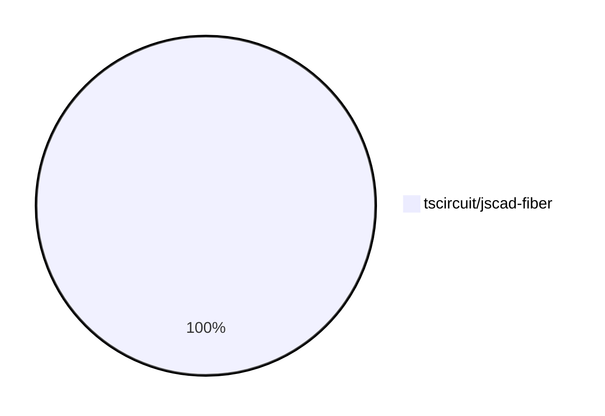

# contribution-tracker

Generates weekly contribution overviews for tscircuit contributors. Check out all
the [contribution overviews here](./contribution-overviews/)

* All PRs in the tscircuit org are scanned/summarized via Claude Haiku
* Claude classifies each Diff/PR as a Major, Minor or Tiny contribution
* All the PRs, summaries, and classifications are organized into charts and tables

The current week is shown below. There are 3 major sections:

* [Contributor Overview](#contributor-overview)
* [PRs by Repository](#prs-by-repository)
* [PRs by Contributor](#changes-by-contributor)

## Current Week

<!-- START_CURRENT_WEEK -->

# Contribution Overview 2024-08-03

## PRs by Repository

## Contributor Overview

| Contributor | 🐳 Major | 🐙 Minor | 🐌 Tiny |
|-------------|-------|-------|-------|
| Slaviiiii | 0 | 4 | 0 |

## Changes by Repository

### [tscircuit/jscad-fiber](https://github.com/tscircuit/jscad-fiber)

| PR # | Impact | Contributor | Description |
|------|--------|-------------|-------------|
| [#59](https://github.com/tscircuit/jscad-fiber/pull/59) | 🐙 Minor | Slaviiiii | Wrap the `ExtrudeRotate` component with `withColorProp` and `withOffsetProp` wrappers to add color and offset functionality. |
| [#58](https://github.com/tscircuit/jscad-fiber/pull/58) | 🐙 Minor | Slaviiiii | Wrap the ExtrudeRectangular component with color and offset prop wrappers. |
| [#56](https://github.com/tscircuit/jscad-fiber/pull/56) | 🐙 Minor | Slaviiiii | Adds color and offset props to the ExtrudeHelical component |
| [#57](https://github.com/tscircuit/jscad-fiber/pull/57) | 🐙 Minor | Slaviiiii | Wrap the ExtrudeLinear component with withColorProp and withOffsetProp HOCs to add support for `color` and `center` props. |

## Changes by Contributor

### [Slaviiiii](https://github.com/Slaviiiii)

| PR # | Impact | Description |
|------|--------|-------------|
| [#59](https://github.com/tscircuit/jscad-fiber/pull/59) | 🐙 Minor | Wrap the `ExtrudeRotate` component with `withColorProp` and `withOffsetProp` wrappers to add color and offset functionality. |
| [#58](https://github.com/tscircuit/jscad-fiber/pull/58) | 🐙 Minor | Wrap the ExtrudeRectangular component with color and offset prop wrappers. |
| [#56](https://github.com/tscircuit/jscad-fiber/pull/56) | 🐙 Minor | Adds color and offset props to the ExtrudeHelical component |
| [#57](https://github.com/tscircuit/jscad-fiber/pull/57) | 🐙 Minor | Wrap the ExtrudeLinear component with withColorProp and withOffsetProp HOCs to add support for `color` and `center` props. |

<!-- END_CURRENT_WEEK -->
