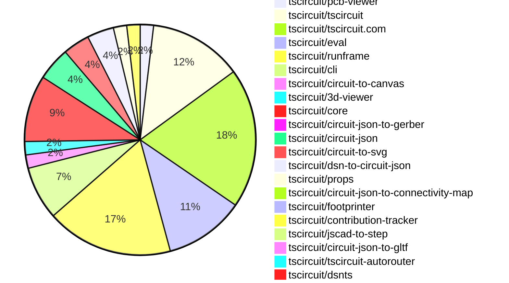
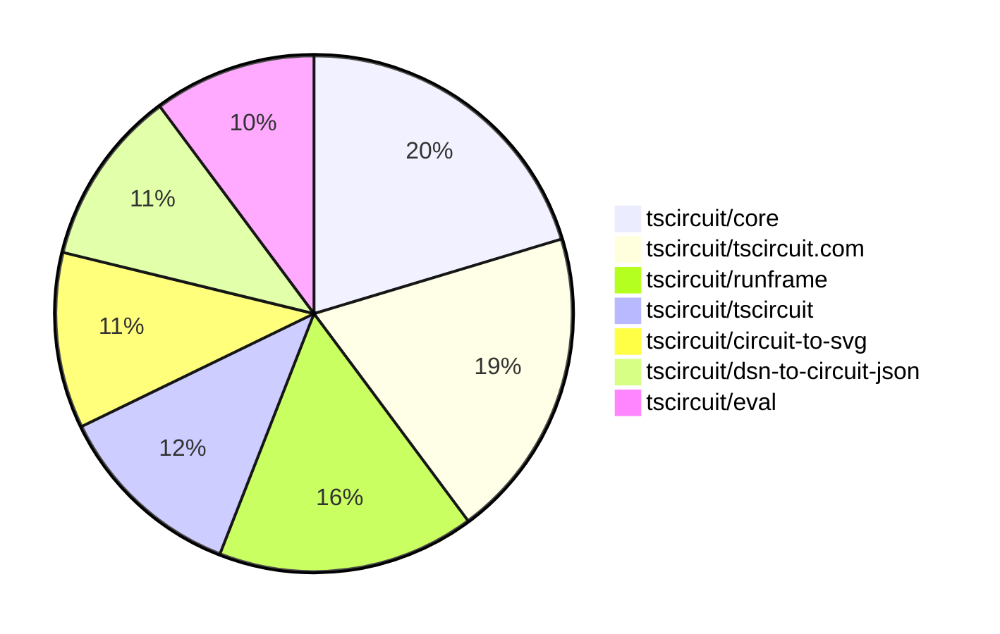

# contribution-tracker

[contributions.tscircuit.com](https://contributions.tscircuit.com) ・ [tscircuit.com](https://tscircuit.com) ・ [Contribution Overviews](./contribution-overviews/) ・ [Changelogs](./changelogs/)

Generates weekly contribution overviews for tscircuit contributors. Check out all
the [contribution overviews here](./contribution-overviews/)
You can find AI-generated monthly changelogs in the [changelogs directory](./changelogs/).

- All PRs in the tscircuit org are scanned/summarized via an LLM
- The LLM classifies each Diff/PR as into a set of attributes for scoring
- All the PRs, summaries, and classifications are organized into charts and tables for [the website](https://contributions.tscircuit.com)

> Want to run locally? See the [Development Section](#development)

The current week is shown below. There are 4 major sections:

- [Contributor Overview](#contributor-overview)
- [PRs by Repository](#prs-by-repository)
- [PRs by Contributor](#changes-by-contributor)
- [Scoring & Sponsorship System](#scoring--sponsorship-system)

## Current Week

<!-- START_CURRENT_WEEK -->

# Contribution Overview 2025-12-10

The current week is shown below. There are 4 major sections:

- [Contributor Overview](#contributor-overview)
- [PRs by Repository](#prs-by-repository)
- [PRs by Contributor](#changes-by-contributor)
- [Scoring & Sponsorship System](#scoring--sponsorship-system)

## PRs by Repository



## Contributor Overview

| Contributor | 🐳 Major | 🐙 Minor | 🐌 Tiny | ⭐ | Score | Discussion Contributions |
|-------------|---------|---------|---------|-----|----------------|--------------------------|
| [seveibar](#seveibar) | 6 | 4 | 6 | ⭐⭐⭐ | 39 | 0🔹 0🔶 0💎 |
| [tscircuitbot](#tscircuitbot) | 0 | 0 | 68 | ⭐⭐ | 14.5 | 0🔹 0🔶 0💎 |
| [imrishabh18](#imrishabh18) | 2 | 1 | 1 | ⭐⭐ | 12 | 0🔹 0🔶 0💎 |
| [ShiboSoftwareDev](#ShiboSoftwareDev) | 1 | 3 | 1 | ⭐⭐ | 11 | 0🔹 0🔶 0💎 |
| [ArnavK-09](#ArnavK-09) | 0 | 3 | 4 | ⭐ | 9.5 | 0🔹 0🔶 0💎 |
| [Abse2001](#Abse2001) | 0 | 4 | 0 | ⭐ | 8 | 0🔹 0🔶 0💎 |
| [MustafaMulla29](#MustafaMulla29) | 1 | 1 | 2 | ⭐ | 8 | 0🔹 0🔶 0💎 |
| [techmannih](#techmannih) | 1 | 0 | 0 | ⭐ | 5 | 0🔹 0🔶 0💎 |
| [Asymtode712](#Asymtode712) | 0 | 2 | 0 | ⭐ | 4 | 0🔹 0🔶 0💎 |
| [0hmX](#0hmX) | 1 | 0 | 0 | ⭐ | 4 | 0🔹 0🔶 0💎 |
| [shehaban](#shehaban) | 0 | 0 | 1 |  | 1 | 0🔹 0🔶 0💎 |
| [Devesh36](#Devesh36) | 0 | 0 | 1 |  | 1 | 0🔹 0🔶 0💎 |

> Note: AI evaluates PRs and assigns 1-3 star ratings automatically. 4 and 5 star ratings require manual staff review.

### Discussion Contribution Legend

- 🔹 Normal Comments: Basic participation with minimal effort
- 🔶 Great Informative Comments: Thoughtful participation that adds value
- 💎 Incredible Comments: Exceptional participation with high-quality content

## Review Table

[reviews-received-hover]: ## "Number of reviews received for PRs for this contributor"
[approvals-received-hover]: ## "Number of approvals received for PRs this contributor authored"
[rejections-received-hover]: ## "Number of rejections received for PRs this contributor authored"
[prs-opened-hover]: ## "Number of PRs opened by this contributor"
[issues-created-hover]: ## "Number of issues created by this contributor"
[bountied-issues-hover]: ## "Number of issues this contributor created with a bounty"
[bountied-issue-$-hover]: ## "Total bounty amount placed on issues authored by this contributor"

| Contributor | Reviews Received | Approvals Received | Rejections Received | Approvals | Rejections | PRs Opened | PRs Merged | Score | Issues Created | Bountied Issues | Bountied Issue $ |
|---|---|---|---|---|---|---|---|---|---|---|---|
| [Quanta-Naut](#Quanta-Naut) | 6 | 1 | 3 | 0 | 0 | 1 | 0 | 0 | 0 | 0 | 0 |
| [imrishabh18](#imrishabh18) | 0 | 0 | 0 | 5 | 1 | 4 | 4 | 12 | 0 | 0 | 0 |
| [seveibar](#seveibar) | 6 | 0 | 0 | 21 | 5 | 29 | 16 | 39 | 0 | 0 | 0 |
| [tscircuitbot](#tscircuitbot) | 2 | 0 | 0 | 0 | 0 | 94 | 68 | 14.5 | 0 | 0 | 0 |
| [Abse2001](#Abse2001) | 7 | 5 | 0 | 0 | 0 | 4 | 4 | 8 | 0 | 0 | 0 |
| [ShiboSoftwareDev](#ShiboSoftwareDev) | 9 | 7 | 0 | 0 | 0 | 6 | 5 | 11 | 0 | 0 | 0 |
| [Devesh36](#Devesh36) | 2 | 1 | 1 | 0 | 0 | 3 | 1 | 1 | 0 | 0 | 0 |
| [Asymtode712](#Asymtode712) | 2 | 2 | 0 | 0 | 0 | 2 | 2 | 4 | 0 | 0 | 0 |
| [shehaban](#shehaban) | 2 | 2 | 0 | 0 | 0 | 1 | 1 | 1 | 0 | 0 | 0 |
| [techmannih](#techmannih) | 1 | 1 | 0 | 1 | 0 | 3 | 1 | 5 | 0 | 0 | 0 |
| [0hmX](#0hmX) | 9 | 1 | 0 | 0 | 0 | 10 | 1 | 4 | 0 | 0 | 0 |
| [Ayushjhawar8](#Ayushjhawar8) | 7 | 1 | 2 | 0 | 0 | 3 | 0 | 0 | 0 | 0 | 0 |
| [ArnavK-09](#ArnavK-09) | 4 | 3 | 0 | 0 | 0 | 8 | 7 | 9.5 | 0 | 0 | 0 |
| [pxlpal](#pxlpal) | 1 | 1 | 0 | 0 | 0 | 1 | 0 | 0 | 0 | 0 | 0 |
| [MustafaMulla29](#MustafaMulla29) | 4 | 2 | 0 | 0 | 0 | 4 | 4 | 8 | 0 | 0 | 0 |
| [Copilot](#Copilot) | 0 | 0 | 0 | 0 | 0 | 1 | 0 | 0 | 0 | 0 | 0 |

## Top 7 Repositories by Contribution Points



## Scoring & Sponsorship System

### Overview

PRs are analyzed by AI and assigned a **star rating (1-3 stars)**. 4 and 5 star ratings can only be manually assigned by staff. Weekly scores use `2^(starRating - 1)` per PR (capped at 12 PRs per rating), plus review/discussion points.

### Weekly Score → Star String

| Score Range | Star String | Count Value |
|------------|-------------|-------------|
| 0-3 | (empty) | 0 stars |
| 4-10 | ⭐ | 1 star |
| 11-30 | ⭐⭐ | 2 stars |
| 31-50 | ⭐⭐⭐ | 3 stars |
| 51-75 | 👑 | 1 crown |
| 76-100 | 👑👑 | 2 crowns |
| 101+ | 👑👑👑 | 3 crowns |

> Crowns count as 3 stars for sponsorship.

### Monthly Sponsorship Calculation

The sponsorship system calculates monthly payments based on your **weekly star counts** over the complete weeks in that month (typically 4-5 weeks, Wednesday-Tuesday format).

**Step 1: Collect Weekly Stars**
- All complete weeks in the month are analyzed
- Each week's star string is converted to a numeric count (⭐ = 1 star, ⭐⭐⭐ = 3 stars)
- Example: `[2, 2, 2, 1, 0]` means 2 stars in week 1, 2 stars in week 2, etc.

**Step 2: Calculate Metrics**
- **Median stars**: The median value of all weekly star counts
- **Min stars**: The minimum weekly star count
- **Max stars**: The maximum weekly star count
- **High score**: The maximum raw weekly score (0-100+ range from the scoring table) from any week in the month

**Step 3: Determine Base Amount**
The sponsorship amount is calculated based on these metrics (checked in order):

| Condition | Base Amount |
|-----------|-------------|
| `minStarCount >= 3` | **$700** |
| `medianStars >= 3` | **$550** |
| `medianStars >= 2.5` | **$400** |
| `medianStars >= 2` | **$250** |
| `medianStars >= 1.5` | **$120** |
| `medianStars >= 1` | **$75** |
| `maxStarCount >= 2` | **$45** |
| `maxStarCount >= 1` | **$30** |
| `highScore >= 3` (and all stars = 0) | **$10** |

| Maintainer Level | Monthly Bonus |
|------------------|---------------|
| Level 1 | **$200** |
| Level 2 | **$350** |
| Level 3 | **$500** |
| Level 4 | **$850** |
| Level 5 | **$1300** |
| Level 6 | **$2000** |

**Final Amount** = Base Amount + Maintainer Bonus

## Changes by Repository

### [tscircuit/pcb-viewer](https://github.com/tscircuit/pcb-viewer)

| PR # | Impact | Rating | Contributor | Description |
|------|--------|--------|-------------|-------------|
| [#535](https://github.com/tscircuit/pcb-viewer/pull/535) | 🐙 Minor | ⭐⭐ | Abse2001 | This update simplifies how group anchor offsets are calculated, corrects component width and height handling, cleans up anchor detection logic, and removes unused files and imports. |

<details>
<summary>🐌 Tiny Contributions (1)</summary>

| PR # | Impact | Contributor | Description |
|------|--------|-------------|-------------|
| [#536](https://github.com/tscircuit/pcb-viewer/pull/536) | 🐌 Tiny | tscircuitbot | Automated package update |

</details>

### [tscircuit/tscircuit](https://github.com/tscircuit/tscircuit)


<details>
<summary>🐌 Tiny Contributions (14)</summary>

| PR # | Impact | Contributor | Description |
|------|--------|-------------|-------------|
| [#1618](https://github.com/tscircuit/tscircuit/pull/1618) | 🐌 Tiny | tscircuitbot | Automated package update |
| [#1617](https://github.com/tscircuit/tscircuit/pull/1617) | 🐌 Tiny | tscircuitbot | Automated package update |
| [#1616](https://github.com/tscircuit/tscircuit/pull/1616) | 🐌 Tiny | tscircuitbot | Automated package update |
| [#1615](https://github.com/tscircuit/tscircuit/pull/1615) | 🐌 Tiny | tscircuitbot | Automated package update |
| [#1614](https://github.com/tscircuit/tscircuit/pull/1614) | 🐌 Tiny | tscircuitbot | Automated package update |
| [#1613](https://github.com/tscircuit/tscircuit/pull/1613) | 🐌 Tiny | tscircuitbot | Automated package update |
| [#1612](https://github.com/tscircuit/tscircuit/pull/1612) | 🐌 Tiny | tscircuitbot | Automated package update |
| [#1611](https://github.com/tscircuit/tscircuit/pull/1611) | 🐌 Tiny | tscircuitbot | Automated package update |
| [#1610](https://github.com/tscircuit/tscircuit/pull/1610) | 🐌 Tiny | tscircuitbot | Automated package update |
| [#1609](https://github.com/tscircuit/tscircuit/pull/1609) | 🐌 Tiny | tscircuitbot | Updates the version of several dependencies in the package.json file, including tscircuitcli, tscircuitcore, tscircuiteval, tscircuitprops, and tscircuitrunframe. |
| [#1608](https://github.com/tscircuit/tscircuit/pull/1608) | 🐌 Tiny | tscircuitbot | Automated package update |
| [#1607](https://github.com/tscircuit/tscircuit/pull/1607) | 🐌 Tiny | tscircuitbot | Updates the tscircuitcli package to version 0.1.618 in package.json |
| [#1606](https://github.com/tscircuit/tscircuit/pull/1606) | 🐌 Tiny | tscircuitbot | Automated package update |
| [#1605](https://github.com/tscircuit/tscircuit/pull/1605) | 🐌 Tiny | tscircuitbot | Updates the tscircuitcli package from version 0.1.616 to 0.1.617 and updates the tscircuitrunframe package from version 0.0.1370 to 0.0.1371, while downgrading the calculate-packing package from version 0.0.68 to 0.0.66. |

</details>

### [tscircuit/tscircuit.com](https://github.com/tscircuit/tscircuit.com)

| PR # | Impact | Rating | Contributor | Description |
|------|--------|--------|-------------|-------------|
| [#2190](https://github.com/tscircuit/tscircuit.com/pull/2190) | 🐙 Minor | ⭐⭐ | ArnavK-09 | Modifies the organization sign-in hook to conditionally append a query parameter for Google authentication when using a fake API. |
| [#2186](https://github.com/tscircuit/tscircuit.com/pull/2186) | 🐙 Minor | ⭐⭐ | ArnavK-09 | Fixes the login link redirection to the organization login page when a user is not authenticated. |

<details>
<summary>🐌 Tiny Contributions (19)</summary>

| PR # | Impact | Contributor | Description |
|------|--------|-------------|-------------|
| [#2197](https://github.com/tscircuit/tscircuit.com/pull/2197) | 🐌 Tiny | tscircuitbot | Automated package update to version 0.0.161 |
| [#2196](https://github.com/tscircuit/tscircuit.com/pull/2196) | 🐌 Tiny | tscircuitbot | Updates the tscircuitrunframe package to version 0.0.1379 in package.json |
| [#2195](https://github.com/tscircuit/tscircuit.com/pull/2195) | 🐌 Tiny | tscircuitbot | Updates the tscircuitrunframe package from version 0.0.1377 to 0.0.1378 |
| [#2194](https://github.com/tscircuit/tscircuit.com/pull/2194) | 🐌 Tiny | tscircuitbot | Updates the tscircuiteval package from version 0.0.535 to 0.0.537 |
| [#2193](https://github.com/tscircuit/tscircuit.com/pull/2193) | 🐌 Tiny | tscircuitbot | Automated package update |
| [#2192](https://github.com/tscircuit/tscircuit.com/pull/2192) | 🐌 Tiny | tscircuitbot | Updates the tscircuiteval package from version 0.0.534 to 0.0.535 |
| [#2185](https://github.com/tscircuit/tscircuit.com/pull/2185) | 🐌 Tiny | tscircuitbot | Updates the tscircuitrunframe package from version 0.0.1375 to 0.0.1376 |
| [#2184](https://github.com/tscircuit/tscircuit.com/pull/2184) | 🐌 Tiny | tscircuitbot | Updates the tscircuitrunframe package from version 0.0.1374 to 0.0.1375 |
| [#2183](https://github.com/tscircuit/tscircuit.com/pull/2183) | 🐌 Tiny | tscircuitbot | Updates the tscircuiteval package from version 0.0.533 to 0.0.534 |
| [#2182](https://github.com/tscircuit/tscircuit.com/pull/2182) | 🐌 Tiny | tscircuitbot | Updates the tscircuitrunframe package from version 0.0.1373 to 0.0.1374 |
| [#2181](https://github.com/tscircuit/tscircuit.com/pull/2181) | 🐌 Tiny | tscircuitbot | Updates the tscircuiteval package from version 0.0.532 to 0.0.533 |
| [#2179](https://github.com/tscircuit/tscircuit.com/pull/2179) | 🐌 Tiny | tscircuitbot | Updates the tscircuitrunframe package to version 0.0.1373 |
| [#2178](https://github.com/tscircuit/tscircuit.com/pull/2178) | 🐌 Tiny | tscircuitbot | Updates the tscircuitrunframe package from version 0.0.1371 to 0.0.1372 |
| [#2177](https://github.com/tscircuit/tscircuit.com/pull/2177) | 🐌 Tiny | tscircuitbot | Automated package update |
| [#2176](https://github.com/tscircuit/tscircuit.com/pull/2176) | 🐌 Tiny | tscircuitbot | Automated package update |
| [#2187](https://github.com/tscircuit/tscircuit.com/pull/2187) | 🐌 Tiny | ArnavK-09 | Changes the minimum character requirement for organization handles and display names from 5 to 3 characters in the API and frontend validation. |
| [#2189](https://github.com/tscircuit/tscircuit.com/pull/2189) | 🐌 Tiny | ArnavK-09 | Fixes layout and styling issues in the OrganizationHeader component, ensuring proper alignment and spacing of elements. |
| [#2188](https://github.com/tscircuit/tscircuit.com/pull/2188) | 🐌 Tiny | ArnavK-09 | Fixes the visibility of the save button based on the package management permissions of the user. |
| [#2175](https://github.com/tscircuit/tscircuit.com/pull/2175) | 🐌 Tiny | Devesh36 | Fixes horizontal overflow in the Usercode Logs section by allowing long log messages to wrap naturally instead of breaking the layout. |

</details>

### [tscircuit/eval](https://github.com/tscircuit/eval)


<details>
<summary>🐌 Tiny Contributions (12)</summary>

| PR # | Impact | Contributor | Description |
|------|--------|-------------|-------------|
| [#1701](https://github.com/tscircuit/eval/pull/1701) | 🐌 Tiny | tscircuitbot | Automated package update |
| [#1700](https://github.com/tscircuit/eval/pull/1700) | 🐌 Tiny | tscircuitbot | Automated package update |
| [#1699](https://github.com/tscircuit/eval/pull/1699) | 🐌 Tiny | tscircuitbot | Updates the package version from 0.0.535 to 0.0.536 in package.json |
| [#1698](https://github.com/tscircuit/eval/pull/1698) | 🐌 Tiny | tscircuitbot | Updates the version of the tscircuitcore package from 0.0.916 to 0.0.917 in package.json |
| [#1696](https://github.com/tscircuit/eval/pull/1696) | 🐌 Tiny | tscircuitbot | Automated package update |
| [#1695](https://github.com/tscircuit/eval/pull/1695) | 🐌 Tiny | tscircuitbot | Automated package update |
| [#1693](https://github.com/tscircuit/eval/pull/1693) | 🐌 Tiny | tscircuitbot | Automated package update |
| [#1692](https://github.com/tscircuit/eval/pull/1692) | 🐌 Tiny | tscircuitbot | Updates package dependencies to their latest versions in package.json |
| [#1688](https://github.com/tscircuit/eval/pull/1688) | 🐌 Tiny | tscircuitbot | Automated package update |
| [#1687](https://github.com/tscircuit/eval/pull/1687) | 🐌 Tiny | tscircuitbot | Updates the version of the tscircuitcore package from 0.0.912 to 0.0.913 in package.json |
| [#1685](https://github.com/tscircuit/eval/pull/1685) | 🐌 Tiny | tscircuitbot | Automated package update |
| [#1684](https://github.com/tscircuit/eval/pull/1684) | 🐌 Tiny | tscircuitbot | Automated package update |

</details>

### [tscircuit/runframe](https://github.com/tscircuit/runframe)


<details>
<summary>🐌 Tiny Contributions (19)</summary>

| PR # | Impact | Contributor | Description |
|------|--------|-------------|-------------|
| [#2069](https://github.com/tscircuit/runframe/pull/2069) | 🐌 Tiny | tscircuitbot | Updates the package version from 0.0.1378 to 0.0.1379 in package.json |
| [#2068](https://github.com/tscircuit/runframe/pull/2068) | 🐌 Tiny | tscircuitbot | Updates the tscircuitpcb-viewer package from version 1.11.280 to 1.11.281 |
| [#2067](https://github.com/tscircuit/runframe/pull/2067) | 🐌 Tiny | tscircuitbot | Automated package update |
| [#2066](https://github.com/tscircuit/runframe/pull/2066) | 🐌 Tiny | tscircuitbot | Updates the tscircuiteval package from version 0.0.535 to 0.0.537 |
| [#2065](https://github.com/tscircuit/runframe/pull/2065) | 🐌 Tiny | tscircuitbot | Automated package update |
| [#2064](https://github.com/tscircuit/runframe/pull/2064) | 🐌 Tiny | tscircuitbot | Updates the tscircuiteval package to version 0.0.535 in package.json |
| [#2063](https://github.com/tscircuit/runframe/pull/2063) | 🐌 Tiny | tscircuitbot | Automated package update |
| [#2062](https://github.com/tscircuit/runframe/pull/2062) | 🐌 Tiny | tscircuitbot | Updates the tscircuit3d-viewer package from version 0.0.470 to 0.0.471 |
| [#2061](https://github.com/tscircuit/runframe/pull/2061) | 🐌 Tiny | tscircuitbot | Automated package update |
| [#2060](https://github.com/tscircuit/runframe/pull/2060) | 🐌 Tiny | tscircuitbot | Updates the tscircuiteval package from version 0.0.533 to 0.0.534 |
| [#2059](https://github.com/tscircuit/runframe/pull/2059) | 🐌 Tiny | tscircuitbot | Automated package update |
| [#2058](https://github.com/tscircuit/runframe/pull/2058) | 🐌 Tiny | tscircuitbot | Updates the tscircuiteval package from version 0.0.532 to 0.0.533 |
| [#2057](https://github.com/tscircuit/runframe/pull/2057) | 🐌 Tiny | tscircuitbot | Automated package update |
| [#2056](https://github.com/tscircuit/runframe/pull/2056) | 🐌 Tiny | tscircuitbot | Updates the circuit-json-to-gerber package from version 0.0.44 to 0.0.46 in package.json |
| [#2055](https://github.com/tscircuit/runframe/pull/2055) | 🐌 Tiny | tscircuitbot | Automated package update |
| [#2054](https://github.com/tscircuit/runframe/pull/2054) | 🐌 Tiny | tscircuitbot | Updates the tscircuiteval package to version 0.0.532 in the package.json file. |
| [#2053](https://github.com/tscircuit/runframe/pull/2053) | 🐌 Tiny | tscircuitbot | Updates the tscircuit3d-viewer package from version 0.0.469 to 0.0.470 |
| [#2052](https://github.com/tscircuit/runframe/pull/2052) | 🐌 Tiny | tscircuitbot | Automated package update |
| [#2051](https://github.com/tscircuit/runframe/pull/2051) | 🐌 Tiny | MustafaMulla29 | Updates the version of circuit-json-to-gltf from 0.0.53 to 0.0.56 in package.json |

</details>

### [tscircuit/cli](https://github.com/tscircuit/cli)


<details>
<summary>🐌 Tiny Contributions (8)</summary>

| PR # | Impact | Contributor | Description |
|------|--------|-------------|-------------|
| [#1320](https://github.com/tscircuit/cli/pull/1320) | 🐌 Tiny | tscircuitbot | Updates the tscircuitrunframe package from version 0.0.1377 to 0.0.1378 |
| [#1318](https://github.com/tscircuit/cli/pull/1318) | 🐌 Tiny | tscircuitbot | Updates the tscircuitrunframe package from version 0.0.1376 to 0.0.1377 |
| [#1316](https://github.com/tscircuit/cli/pull/1316) | 🐌 Tiny | tscircuitbot | Updates the tscircuitrunframe package from version 0.0.1375 to 0.0.1376 |
| [#1314](https://github.com/tscircuit/cli/pull/1314) | 🐌 Tiny | tscircuitbot | Updates the tscircuitrunframe package from version 0.0.1374 to 0.0.1375 |
| [#1312](https://github.com/tscircuit/cli/pull/1312) | 🐌 Tiny | tscircuitbot | Updates the tscircuitrunframe package from version 0.0.1373 to 0.0.1374 |
| [#1310](https://github.com/tscircuit/cli/pull/1310) | 🐌 Tiny | tscircuitbot | Automated package update |
| [#1304](https://github.com/tscircuit/cli/pull/1304) | 🐌 Tiny | tscircuitbot | Updates the tscircuitrunframe package from version 0.0.1370 to 0.0.1371 |
| [#1306](https://github.com/tscircuit/cli/pull/1306) | 🐌 Tiny | MustafaMulla29 | Updates the version of the circuit-json-to-gltf dependency from 0.0.51 to 0.0.56 in package.json |

</details>

### [tscircuit/circuit-to-canvas](https://github.com/tscircuit/circuit-to-canvas)


<details>
<summary>🐌 Tiny Contributions (2)</summary>

| PR # | Impact | Contributor | Description |
|------|--------|-------------|-------------|
| [#2](https://github.com/tscircuit/circuit-to-canvas/pull/2) | 🐌 Tiny | tscircuitbot | Updates the package version from 0.0.1 to 0.0.2 in package.json |
| [#1](https://github.com/tscircuit/circuit-to-canvas/pull/1) | 🐌 Tiny | seveibar | Fixes type errors in the codebase and reformats code for consistency and readability. |

</details>

### [tscircuit/3d-viewer](https://github.com/tscircuit/3d-viewer)

| PR # | Impact | Rating | Contributor | Description |
|------|--------|--------|-------------|-------------|
| [#617](https://github.com/tscircuit/3d-viewer/pull/617) | 🐙 Minor | ⭐⭐ | Abse2001 | Add support for rendering pcb_copper_text elements in the 3D PCB viewer, implement knockout text feature, fix text mirroring logic, and improve text clarity by increasing texture resolution. |
| [#619](https://github.com/tscircuit/3d-viewer/pull/619) | 🐙 Minor | ⭐⭐ | ShiboSoftwareDev | Adds support for visualizing the outlines of individual boards within a pcb_panel, improving clarity in board placement and shape, and ensures correct property inheritance from boards. |

### [tscircuit/core](https://github.com/tscircuit/core)

| PR # | Impact | Rating | Contributor | Description |
|------|--------|--------|-------------|-------------|
| [#1751](https://github.com/tscircuit/core/pull/1751) | 🐳 Major | ⭐⭐⭐ | seveibar | Adds positioning metadata position_mode for packed and relative components, ensuring that positioned_relative_to_ fields are not written when packing PCB components and extending tests for relative metadata. |
| [#1741](https://github.com/tscircuit/core/pull/1741) | 🐳 Major | ⭐⭐⭐ | seveibar | Adds support for source_component_internal_connection to enable 0-ohm jumper behavior for interconnects with standard footprints. |
| [#1742](https://github.com/tscircuit/core/pull/1742) | 🐳 Major | ⭐⭐⭐ | seveibar | Fixes issues with interconnect not routing and adds tests for future interconnect features. |
| [#1734](https://github.com/tscircuit/core/pull/1734) | 🐙 Minor | ⭐⭐ | Abse2001 | Adds lifecycle events for packing operations, including error reporting and metadata emission for better debugging and UI integration. |
| [#1738](https://github.com/tscircuit/core/pull/1738) | 🐙 Minor | ⭐⭐ | Asymtode712 | Adds voltage and frequency display to voltage source schematic symbols. |
| [#1743](https://github.com/tscircuit/core/pull/1743) | 🐙 Minor | ⭐⭐ | seveibar | Ensures single-layer boards utilize the assignable via autorouting solver, aligning with laser_prefab behavior and removing the explicit laser_prefab preset from the single-layer interconnect bridge test. |
| [#1740](https://github.com/tscircuit/core/pull/1740) | 🐙 Minor | ⭐⭐ | ShiboSoftwareDev | Adds configurable edge padding properties to panel components, allowing for flexible control over the space between auto-arranged boards and the panels edges, while preserving a default 5mm margin if no padding props are supplied. |
| [#1736](https://github.com/tscircuit/core/pull/1736) | 🐙 Minor | ⭐⭐ | ShiboSoftwareDev | Refactors the panel packing feature to support dynamic grid layouts and custom board outlines, enhancing the handling of boards of varying sizes. |

<details>
<summary>🐌 Tiny Contributions (2)</summary>

| PR # | Impact | Contributor | Description |
|------|--------|-------------|-------------|
| [#1753](https://github.com/tscircuit/core/pull/1753) | 🐌 Tiny | seveibar | Updates the calculate-packing dependency from version 0.0.66 to 0.0.68 in package.json |
| [#1746](https://github.com/tscircuit/core/pull/1746) | 🐌 Tiny | seveibar | Adds placeholder tests for failing position_mode and anchor offsets implementation, and updates circuit to SVG for correct future drawing of anchor offsets. |

</details>

### [tscircuit/circuit-json-to-gerber](https://github.com/tscircuit/circuit-json-to-gerber)

| PR # | Impact | Rating | Contributor | Description |
|------|--------|--------|-------------|-------------|
| [#74](https://github.com/tscircuit/circuit-json-to-gerber/pull/74) | 🐙 Minor | ⭐⭐ | Abse2001 | Adds full Gerber support for pcb_copper_text, including aperture config, vector text rendering, rotation, mirroring, and anchor alignment, with knockout mode support for proper copper cutout text. |

### [tscircuit/circuit-json](https://github.com/tscircuit/circuit-json)

| PR # | Impact | Rating | Contributor | Description |
|------|--------|--------|-------------|-------------|
| [#372](https://github.com/tscircuit/circuit-json/pull/372) | 🐳 Major | ⭐⭐⭐ | seveibar | Moves display offset metadata into PCB models and introduces position mode metadata on pcb_group, enhancing the structure and functionality of PCB components and groups. |
| [#373](https://github.com/tscircuit/circuit-json/pull/373) | 🐙 Minor | ⭐⭐ | Asymtode712 | Adds a label_side field to the SchematicVoltageProbe interface to allow voltage probe labels to be positioned on either side of the arrow, preventing overlaps. |
| [#371](https://github.com/tscircuit/circuit-json/pull/371) | 🐙 Minor | ⭐⭐ | seveibar | Add optional display_x_offset and display_y_offset metadata to source components to document how these offsets should be displayed to mirror user input |
| [#370](https://github.com/tscircuit/circuit-json/pull/370) | 🐙 Minor | ⭐⭐ | seveibar | Adds support for board-relative positioning of PCB components by introducing a new field positioned_relative_to_pcb_board_id in the PCB component definition and updating tests accordingly. |

<details>
<summary>🐌 Tiny Contributions (1)</summary>

| PR # | Impact | Contributor | Description |
|------|--------|-------------|-------------|
| [#369](https://github.com/tscircuit/circuit-json/pull/369) | 🐌 Tiny | seveibar | Adds an optional subcircuit_id to source_component_internal_connection types, documents the new field in README and source component overview, and expands internal connection test to cover subcircuit_id parsing. |

</details>

### [tscircuit/circuit-to-svg](https://github.com/tscircuit/circuit-to-svg)

| PR # | Impact | Rating | Contributor | Description |
|------|--------|--------|-------------|-------------|
| [#447](https://github.com/tscircuit/circuit-to-svg/pull/447) | 🐳 Major | ⭐⭐⭐ | seveibar | Updates circuit-json to the latest version, renders anchor offset indicators for components positioned relative to a PCB board, and adds a PCB test for board-relative offsets and display overrides. |
| [#449](https://github.com/tscircuit/circuit-to-svg/pull/449) | 🐳 Major | ⭐⭐⭐ | ShiboSoftwareDev | Adds support for visualizing anchor offsets for pcb_group elements that are positioned relative to another pcb_group, extending functionality previously limited to pcb_component elements. |
| [#450](https://github.com/tscircuit/circuit-to-svg/pull/450) | 🐳 Major | ⭐⭐⭐ | techmannih | Adds support for positioning PCB components relative to the PCB board in SVG generation. |

<details>
<summary>🐌 Tiny Contributions (1)</summary>

| PR # | Impact | Contributor | Description |
|------|--------|-------------|-------------|
| [#448](https://github.com/tscircuit/circuit-to-svg/pull/448) | 🐌 Tiny | seveibar | Fixes the position_mode from relative to relative_to_group_anchor in PCB components and adds type definitions for better type safety. |

</details>

### [tscircuit/dsn-to-circuit-json](https://github.com/tscircuit/dsn-to-circuit-json)

| PR # | Impact | Rating | Contributor | Description |
|------|--------|--------|-------------|-------------|
| [#15](https://github.com/tscircuit/dsn-to-circuit-json/pull/15) | 🐳 Major | ⭐⭐⭐ | seveibar | This pull request introduces a significant refactor of the codebase, particularly focusing on setting up the solver architecture for PCB stitching. It includes the addition of new solver classes, updates to existing modules, and changes to the project structure to accommodate these enhancements. The changes aim to improve the modularity and maintainability of the code, making it easier to implement future features related to circuit design and PCB layout. |
| [#14](https://github.com/tscircuit/dsn-to-circuit-json/pull/14) | 🐳 Major | ⭐⭐⭐ | imrishabh18 | Refactors file names and updates the pipeline solver to include SMT pads and plated holes for better visualization in the circuit design. |
| [#12](https://github.com/tscircuit/dsn-to-circuit-json/pull/12) | 🐳 Major | ⭐⭐⭐ | imrishabh18 | This pull request adds an example for the interconnect board and removes the previously used circuit JSON. The changes include modifications to the SesToCircuitJsonConverter class, where the originalCircuitJson option is removed from the constructor and related functions. Additionally, the PcbTraceCombineStage class has been deleted, which was responsible for combining PCB traces. This simplifies the conversion process and focuses on the new example provided. |

<details>
<summary>🐌 Tiny Contributions (1)</summary>

| PR # | Impact | Contributor | Description |
|------|--------|-------------|-------------|
| [#13](https://github.com/tscircuit/dsn-to-circuit-json/pull/13) | 🐌 Tiny | imrishabh18 | This pull request addresses issues with the parsing of SMT pads in the DSN files by the DSNTS library, correcting the vertical pad definitions. Additionally, it enhances the documentation by adding a comprehensive README file that outlines the usage, installation, and architecture of the project. |

</details>

### [tscircuit/props](https://github.com/tscircuit/props)

| PR # | Impact | Rating | Contributor | Description |
|------|--------|--------|-------------|-------------|
| [#529](https://github.com/tscircuit/props/pull/529) | 🐙 Minor | ⭐⭐ | seveibar | Adds anchorAlignment prop to board and panel components, marking boardAnchorAlignment as preferring the new anchorAlignment prop, and expands tests and documentation accordingly. |

<details>
<summary>🐌 Tiny Contributions (1)</summary>

| PR # | Impact | Contributor | Description |
|------|--------|-------------|-------------|
| [#528](https://github.com/tscircuit/props/pull/528) | 🐌 Tiny | ShiboSoftwareDev | Adds edge margin properties (edgePadding, edgePaddingLeft, edgePaddingRight, edgePaddingTop, edgePaddingBottom) to the PanelProps interface for customizing panel margins. |

</details>

### [tscircuit/circuit-json-to-connectivity-map](https://github.com/tscircuit/circuit-json-to-connectivity-map)


<details>
<summary>🐌 Tiny Contributions (1)</summary>

| PR # | Impact | Contributor | Description |
|------|--------|-------------|-------------|
| [#12](https://github.com/tscircuit/circuit-json-to-connectivity-map/pull/12) | 🐌 Tiny | seveibar | Removes the lockfile and adds support for source_component_internal_connection in the connectivity map. |

</details>

### [tscircuit/footprinter](https://github.com/tscircuit/footprinter)


<details>
<summary>🐌 Tiny Contributions (1)</summary>

| PR # | Impact | Contributor | Description |
|------|--------|-------------|-------------|
| [#440](https://github.com/tscircuit/footprinter/pull/440) | 🐌 Tiny | shehaban | Adds SOT-343-4 footprint definition with 4 pads. |

</details>

### [tscircuit/contribution-tracker](https://github.com/tscircuit/contribution-tracker)

| PR # | Impact | Rating | Contributor | Description |
|------|--------|--------|-------------|-------------|
| [#279](https://github.com/tscircuit/contribution-tracker/pull/279) | 🐙 Minor | ⭐⭐ | ArnavK-09 | Adds functionality to post a comment on a pull request after its analysis is completed |

<details>
<summary>🐌 Tiny Contributions (1)</summary>

| PR # | Impact | Contributor | Description |
|------|--------|-------------|-------------|
| [#281](https://github.com/tscircuit/contribution-tracker/pull/281) | 🐌 Tiny | ArnavK-09 | Adds a scrollable section for staff contributors in the ContributorOverview component, improving usability when many contributors are present. |

</details>

### [tscircuit/jscad-to-step](https://github.com/tscircuit/jscad-to-step)

| PR # | Impact | Rating | Contributor | Description |
|------|--------|--------|-------------|-------------|
| [#2](https://github.com/tscircuit/jscad-to-step/pull/2) | 🐳 Major | ⭐⭐⭐ | MustafaMulla29 | Adds a new function to convert jscad-planner operations to STEP format, along with a test for rendering a cube and necessary dependencies for testing. |

### [tscircuit/circuit-json-to-gltf](https://github.com/tscircuit/circuit-json-to-gltf)

| PR # | Impact | Rating | Contributor | Description |
|------|--------|--------|-------------|-------------|
| [#102](https://github.com/tscircuit/circuit-json-to-gltf/pull/102) | 🐙 Minor | ⭐⭐ | MustafaMulla29 | Fixes GLB export failure in browser due to undefined initWasm when resvgresvg-wasm is externalized in RunFrame. |

### [tscircuit/tscircuit-autorouter](https://github.com/tscircuit/tscircuit-autorouter)

| PR # | Impact | Rating | Contributor | Description |
|------|--------|--------|-------------|-------------|
| [#393](https://github.com/tscircuit/tscircuit-autorouter/pull/393) | 🐳 Major | ⭐⭐⭐ | 0hmX | Fixes false obstacle rejection in autorouting by linking Minimum Spanning Tree sub-routes to their parent net identifiers, ensuring valid paths are recognized as connections. |

### [tscircuit/dsnts](https://github.com/tscircuit/dsnts)

| PR # | Impact | Rating | Contributor | Description |
|------|--------|--------|-------------|-------------|
| [#11](https://github.com/tscircuit/dsnts/pull/11) | 🐙 Minor | ⭐⭐ | imrishabh18 | Fixes the parsing of pin coordinates in the DSN format, ensuring that the pin number is correctly interpreted as the x coordinate. |

## Changes by Contributor

### [tscircuitbot](https://github.com/tscircuitbot)


<details>
<summary>🐌 Tiny Contributions (68)</summary>

| PR # | Impact | Description |
|------|--------|-------------|
| [#536](https://github.com/tscircuit/pcb-viewer/pull/536) | 🐌 Tiny | Automated package update |
| [#1618](https://github.com/tscircuit/tscircuit/pull/1618) | 🐌 Tiny | Automated package update |
| [#1617](https://github.com/tscircuit/tscircuit/pull/1617) | 🐌 Tiny | Automated package update |
| [#1616](https://github.com/tscircuit/tscircuit/pull/1616) | 🐌 Tiny | Automated package update |
| [#1615](https://github.com/tscircuit/tscircuit/pull/1615) | 🐌 Tiny | Automated package update |
| [#1614](https://github.com/tscircuit/tscircuit/pull/1614) | 🐌 Tiny | Automated package update |
| [#1613](https://github.com/tscircuit/tscircuit/pull/1613) | 🐌 Tiny | Automated package update |
| [#1612](https://github.com/tscircuit/tscircuit/pull/1612) | 🐌 Tiny | Automated package update |
| [#1611](https://github.com/tscircuit/tscircuit/pull/1611) | 🐌 Tiny | Automated package update |
| [#1610](https://github.com/tscircuit/tscircuit/pull/1610) | 🐌 Tiny | Automated package update |
| [#1609](https://github.com/tscircuit/tscircuit/pull/1609) | 🐌 Tiny | Updates the version of several dependencies in the package.json file, including tscircuitcli, tscircuitcore, tscircuiteval, tscircuitprops, and tscircuitrunframe. |
| [#1608](https://github.com/tscircuit/tscircuit/pull/1608) | 🐌 Tiny | Automated package update |
| [#1607](https://github.com/tscircuit/tscircuit/pull/1607) | 🐌 Tiny | Updates the tscircuitcli package to version 0.1.618 in package.json |
| [#1606](https://github.com/tscircuit/tscircuit/pull/1606) | 🐌 Tiny | Automated package update |
| [#1605](https://github.com/tscircuit/tscircuit/pull/1605) | 🐌 Tiny | Updates the tscircuitcli package from version 0.1.616 to 0.1.617 and updates the tscircuitrunframe package from version 0.0.1370 to 0.0.1371, while downgrading the calculate-packing package from version 0.0.68 to 0.0.66. |
| [#2197](https://github.com/tscircuit/tscircuit.com/pull/2197) | 🐌 Tiny | Automated package update to version 0.0.161 |
| [#2196](https://github.com/tscircuit/tscircuit.com/pull/2196) | 🐌 Tiny | Updates the tscircuitrunframe package to version 0.0.1379 in package.json |
| [#2195](https://github.com/tscircuit/tscircuit.com/pull/2195) | 🐌 Tiny | Updates the tscircuitrunframe package from version 0.0.1377 to 0.0.1378 |
| [#2194](https://github.com/tscircuit/tscircuit.com/pull/2194) | 🐌 Tiny | Updates the tscircuiteval package from version 0.0.535 to 0.0.537 |
| [#2193](https://github.com/tscircuit/tscircuit.com/pull/2193) | 🐌 Tiny | Automated package update |
| [#2192](https://github.com/tscircuit/tscircuit.com/pull/2192) | 🐌 Tiny | Updates the tscircuiteval package from version 0.0.534 to 0.0.535 |
| [#2185](https://github.com/tscircuit/tscircuit.com/pull/2185) | 🐌 Tiny | Updates the tscircuitrunframe package from version 0.0.1375 to 0.0.1376 |
| [#2184](https://github.com/tscircuit/tscircuit.com/pull/2184) | 🐌 Tiny | Updates the tscircuitrunframe package from version 0.0.1374 to 0.0.1375 |
| [#2183](https://github.com/tscircuit/tscircuit.com/pull/2183) | 🐌 Tiny | Updates the tscircuiteval package from version 0.0.533 to 0.0.534 |
| [#2182](https://github.com/tscircuit/tscircuit.com/pull/2182) | 🐌 Tiny | Updates the tscircuitrunframe package from version 0.0.1373 to 0.0.1374 |
| [#2181](https://github.com/tscircuit/tscircuit.com/pull/2181) | 🐌 Tiny | Updates the tscircuiteval package from version 0.0.532 to 0.0.533 |
| [#2179](https://github.com/tscircuit/tscircuit.com/pull/2179) | 🐌 Tiny | Updates the tscircuitrunframe package to version 0.0.1373 |
| [#2178](https://github.com/tscircuit/tscircuit.com/pull/2178) | 🐌 Tiny | Updates the tscircuitrunframe package from version 0.0.1371 to 0.0.1372 |
| [#2177](https://github.com/tscircuit/tscircuit.com/pull/2177) | 🐌 Tiny | Automated package update |
| [#2176](https://github.com/tscircuit/tscircuit.com/pull/2176) | 🐌 Tiny | Automated package update |
| [#1701](https://github.com/tscircuit/eval/pull/1701) | 🐌 Tiny | Automated package update |
| [#1700](https://github.com/tscircuit/eval/pull/1700) | 🐌 Tiny | Automated package update |
| [#1699](https://github.com/tscircuit/eval/pull/1699) | 🐌 Tiny | Updates the package version from 0.0.535 to 0.0.536 in package.json |
| [#1698](https://github.com/tscircuit/eval/pull/1698) | 🐌 Tiny | Updates the version of the tscircuitcore package from 0.0.916 to 0.0.917 in package.json |
| [#1696](https://github.com/tscircuit/eval/pull/1696) | 🐌 Tiny | Automated package update |
| [#1695](https://github.com/tscircuit/eval/pull/1695) | 🐌 Tiny | Automated package update |
| [#1693](https://github.com/tscircuit/eval/pull/1693) | 🐌 Tiny | Automated package update |
| [#1692](https://github.com/tscircuit/eval/pull/1692) | 🐌 Tiny | Updates package dependencies to their latest versions in package.json |
| [#1688](https://github.com/tscircuit/eval/pull/1688) | 🐌 Tiny | Automated package update |
| [#1687](https://github.com/tscircuit/eval/pull/1687) | 🐌 Tiny | Updates the version of the tscircuitcore package from 0.0.912 to 0.0.913 in package.json |
| [#1685](https://github.com/tscircuit/eval/pull/1685) | 🐌 Tiny | Automated package update |
| [#1684](https://github.com/tscircuit/eval/pull/1684) | 🐌 Tiny | Automated package update |
| [#2069](https://github.com/tscircuit/runframe/pull/2069) | 🐌 Tiny | Updates the package version from 0.0.1378 to 0.0.1379 in package.json |
| [#2068](https://github.com/tscircuit/runframe/pull/2068) | 🐌 Tiny | Updates the tscircuitpcb-viewer package from version 1.11.280 to 1.11.281 |
| [#2067](https://github.com/tscircuit/runframe/pull/2067) | 🐌 Tiny | Automated package update |
| [#2066](https://github.com/tscircuit/runframe/pull/2066) | 🐌 Tiny | Updates the tscircuiteval package from version 0.0.535 to 0.0.537 |
| [#2065](https://github.com/tscircuit/runframe/pull/2065) | 🐌 Tiny | Automated package update |
| [#2064](https://github.com/tscircuit/runframe/pull/2064) | 🐌 Tiny | Updates the tscircuiteval package to version 0.0.535 in package.json |
| [#2063](https://github.com/tscircuit/runframe/pull/2063) | 🐌 Tiny | Automated package update |
| [#2062](https://github.com/tscircuit/runframe/pull/2062) | 🐌 Tiny | Updates the tscircuit3d-viewer package from version 0.0.470 to 0.0.471 |
| [#2061](https://github.com/tscircuit/runframe/pull/2061) | 🐌 Tiny | Automated package update |
| [#2060](https://github.com/tscircuit/runframe/pull/2060) | 🐌 Tiny | Updates the tscircuiteval package from version 0.0.533 to 0.0.534 |
| [#2059](https://github.com/tscircuit/runframe/pull/2059) | 🐌 Tiny | Automated package update |
| [#2058](https://github.com/tscircuit/runframe/pull/2058) | 🐌 Tiny | Updates the tscircuiteval package from version 0.0.532 to 0.0.533 |
| [#2057](https://github.com/tscircuit/runframe/pull/2057) | 🐌 Tiny | Automated package update |
| [#2056](https://github.com/tscircuit/runframe/pull/2056) | 🐌 Tiny | Updates the circuit-json-to-gerber package from version 0.0.44 to 0.0.46 in package.json |
| [#2055](https://github.com/tscircuit/runframe/pull/2055) | 🐌 Tiny | Automated package update |
| [#2054](https://github.com/tscircuit/runframe/pull/2054) | 🐌 Tiny | Updates the tscircuiteval package to version 0.0.532 in the package.json file. |
| [#2053](https://github.com/tscircuit/runframe/pull/2053) | 🐌 Tiny | Updates the tscircuit3d-viewer package from version 0.0.469 to 0.0.470 |
| [#2052](https://github.com/tscircuit/runframe/pull/2052) | 🐌 Tiny | Automated package update |
| [#1320](https://github.com/tscircuit/cli/pull/1320) | 🐌 Tiny | Updates the tscircuitrunframe package from version 0.0.1377 to 0.0.1378 |
| [#1318](https://github.com/tscircuit/cli/pull/1318) | 🐌 Tiny | Updates the tscircuitrunframe package from version 0.0.1376 to 0.0.1377 |
| [#1316](https://github.com/tscircuit/cli/pull/1316) | 🐌 Tiny | Updates the tscircuitrunframe package from version 0.0.1375 to 0.0.1376 |
| [#1314](https://github.com/tscircuit/cli/pull/1314) | 🐌 Tiny | Updates the tscircuitrunframe package from version 0.0.1374 to 0.0.1375 |
| [#1312](https://github.com/tscircuit/cli/pull/1312) | 🐌 Tiny | Updates the tscircuitrunframe package from version 0.0.1373 to 0.0.1374 |
| [#1310](https://github.com/tscircuit/cli/pull/1310) | 🐌 Tiny | Automated package update |
| [#1304](https://github.com/tscircuit/cli/pull/1304) | 🐌 Tiny | Updates the tscircuitrunframe package from version 0.0.1370 to 0.0.1371 |
| [#2](https://github.com/tscircuit/circuit-to-canvas/pull/2) | 🐌 Tiny | Updates the package version from 0.0.1 to 0.0.2 in package.json |

</details>

### [Abse2001](https://github.com/Abse2001)

| PRs # | Impact | Rating | Description |
|------|--------|--------|-------------|
| [#535](https://github.com/tscircuit/pcb-viewer/pull/535) | 🐙 Minor | ⭐⭐ | This update simplifies how group anchor offsets are calculated, corrects component width and height handling, cleans up anchor detection logic, and removes unused files and imports. |
| [#617](https://github.com/tscircuit/3d-viewer/pull/617) | 🐙 Minor | ⭐⭐ | Add support for rendering pcb_copper_text elements in the 3D PCB viewer, implement knockout text feature, fix text mirroring logic, and improve text clarity by increasing texture resolution. |
| [#1734](https://github.com/tscircuit/core/pull/1734) | 🐙 Minor | ⭐⭐ | Adds lifecycle events for packing operations, including error reporting and metadata emission for better debugging and UI integration. |
| [#74](https://github.com/tscircuit/circuit-json-to-gerber/pull/74) | 🐙 Minor | ⭐⭐ | Adds full Gerber support for pcb_copper_text, including aperture config, vector text rendering, rotation, mirroring, and anchor alignment, with knockout mode support for proper copper cutout text. |

### [Asymtode712](https://github.com/Asymtode712)

| PRs # | Impact | Rating | Description |
|------|--------|--------|-------------|
| [#373](https://github.com/tscircuit/circuit-json/pull/373) | 🐙 Minor | ⭐⭐ | Adds a label_side field to the SchematicVoltageProbe interface to allow voltage probe labels to be positioned on either side of the arrow, preventing overlaps. |
| [#1738](https://github.com/tscircuit/core/pull/1738) | 🐙 Minor | ⭐⭐ | Adds voltage and frequency display to voltage source schematic symbols. |

### [seveibar](https://github.com/seveibar)

| PRs # | Impact | Rating | Description |
|------|--------|--------|-------------|
| [#372](https://github.com/tscircuit/circuit-json/pull/372) | 🐳 Major | ⭐⭐⭐ | Moves display offset metadata into PCB models and introduces position mode metadata on pcb_group, enhancing the structure and functionality of PCB components and groups. |
| [#1751](https://github.com/tscircuit/core/pull/1751) | 🐳 Major | ⭐⭐⭐ | Adds positioning metadata position_mode for packed and relative components, ensuring that positioned_relative_to_ fields are not written when packing PCB components and extending tests for relative metadata. |
| [#1741](https://github.com/tscircuit/core/pull/1741) | 🐳 Major | ⭐⭐⭐ | Adds support for source_component_internal_connection to enable 0-ohm jumper behavior for interconnects with standard footprints. |
| [#1742](https://github.com/tscircuit/core/pull/1742) | 🐳 Major | ⭐⭐⭐ | Fixes issues with interconnect not routing and adds tests for future interconnect features. |
| [#447](https://github.com/tscircuit/circuit-to-svg/pull/447) | 🐳 Major | ⭐⭐⭐ | Updates circuit-json to the latest version, renders anchor offset indicators for components positioned relative to a PCB board, and adds a PCB test for board-relative offsets and display overrides. |
| [#15](https://github.com/tscircuit/dsn-to-circuit-json/pull/15) | 🐳 Major | ⭐⭐⭐ | This pull request introduces a significant refactor of the codebase, particularly focusing on setting up the solver architecture for PCB stitching. It includes the addition of new solver classes, updates to existing modules, and changes to the project structure to accommodate these enhancements. The changes aim to improve the modularity and maintainability of the code, making it easier to implement future features related to circuit design and PCB layout. |
| [#371](https://github.com/tscircuit/circuit-json/pull/371) | 🐙 Minor | ⭐⭐ | Add optional display_x_offset and display_y_offset metadata to source components to document how these offsets should be displayed to mirror user input |
| [#370](https://github.com/tscircuit/circuit-json/pull/370) | 🐙 Minor | ⭐⭐ | Adds support for board-relative positioning of PCB components by introducing a new field positioned_relative_to_pcb_board_id in the PCB component definition and updating tests accordingly. |
| [#529](https://github.com/tscircuit/props/pull/529) | 🐙 Minor | ⭐⭐ | Adds anchorAlignment prop to board and panel components, marking boardAnchorAlignment as preferring the new anchorAlignment prop, and expands tests and documentation accordingly. |
| [#1743](https://github.com/tscircuit/core/pull/1743) | 🐙 Minor | ⭐⭐ | Ensures single-layer boards utilize the assignable via autorouting solver, aligning with laser_prefab behavior and removing the explicit laser_prefab preset from the single-layer interconnect bridge test. |

<details>
<summary>🐌 Tiny Contributions (6)</summary>

| PR # | Impact | Description |
|------|--------|-------------|
| [#369](https://github.com/tscircuit/circuit-json/pull/369) | 🐌 Tiny | Adds an optional subcircuit_id to source_component_internal_connection types, documents the new field in README and source component overview, and expands internal connection test to cover subcircuit_id parsing. |
| [#1753](https://github.com/tscircuit/core/pull/1753) | 🐌 Tiny | Updates the calculate-packing dependency from version 0.0.66 to 0.0.68 in package.json |
| [#1746](https://github.com/tscircuit/core/pull/1746) | 🐌 Tiny | Adds placeholder tests for failing position_mode and anchor offsets implementation, and updates circuit to SVG for correct future drawing of anchor offsets. |
| [#448](https://github.com/tscircuit/circuit-to-svg/pull/448) | 🐌 Tiny | Fixes the position_mode from relative to relative_to_group_anchor in PCB components and adds type definitions for better type safety. |
| [#12](https://github.com/tscircuit/circuit-json-to-connectivity-map/pull/12) | 🐌 Tiny | Removes the lockfile and adds support for source_component_internal_connection in the connectivity map. |
| [#1](https://github.com/tscircuit/circuit-to-canvas/pull/1) | 🐌 Tiny | Fixes type errors in the codebase and reformats code for consistency and readability. |

</details>

### [ShiboSoftwareDev](https://github.com/ShiboSoftwareDev)

| PRs # | Impact | Rating | Description |
|------|--------|--------|-------------|
| [#449](https://github.com/tscircuit/circuit-to-svg/pull/449) | 🐳 Major | ⭐⭐⭐ | Adds support for visualizing anchor offsets for pcb_group elements that are positioned relative to another pcb_group, extending functionality previously limited to pcb_component elements. |
| [#619](https://github.com/tscircuit/3d-viewer/pull/619) | 🐙 Minor | ⭐⭐ | Adds support for visualizing the outlines of individual boards within a pcb_panel, improving clarity in board placement and shape, and ensures correct property inheritance from boards. |
| [#1740](https://github.com/tscircuit/core/pull/1740) | 🐙 Minor | ⭐⭐ | Adds configurable edge padding properties to panel components, allowing for flexible control over the space between auto-arranged boards and the panels edges, while preserving a default 5mm margin if no padding props are supplied. |
| [#1736](https://github.com/tscircuit/core/pull/1736) | 🐙 Minor | ⭐⭐ | Refactors the panel packing feature to support dynamic grid layouts and custom board outlines, enhancing the handling of boards of varying sizes. |

<details>
<summary>🐌 Tiny Contributions (1)</summary>

| PR # | Impact | Description |
|------|--------|-------------|
| [#528](https://github.com/tscircuit/props/pull/528) | 🐌 Tiny | Adds edge margin properties (edgePadding, edgePaddingLeft, edgePaddingRight, edgePaddingTop, edgePaddingBottom) to the PanelProps interface for customizing panel margins. |

</details>

### [shehaban](https://github.com/shehaban)


<details>
<summary>🐌 Tiny Contributions (1)</summary>

| PR # | Impact | Description |
|------|--------|-------------|
| [#440](https://github.com/tscircuit/footprinter/pull/440) | 🐌 Tiny | Adds SOT-343-4 footprint definition with 4 pads. |

</details>

### [ArnavK-09](https://github.com/ArnavK-09)

| PRs # | Impact | Rating | Description |
|------|--------|--------|-------------|
| [#279](https://github.com/tscircuit/contribution-tracker/pull/279) | 🐙 Minor | ⭐⭐ | Adds functionality to post a comment on a pull request after its analysis is completed |
| [#2190](https://github.com/tscircuit/tscircuit.com/pull/2190) | 🐙 Minor | ⭐⭐ | Modifies the organization sign-in hook to conditionally append a query parameter for Google authentication when using a fake API. |
| [#2186](https://github.com/tscircuit/tscircuit.com/pull/2186) | 🐙 Minor | ⭐⭐ | Fixes the login link redirection to the organization login page when a user is not authenticated. |

<details>
<summary>🐌 Tiny Contributions (4)</summary>

| PR # | Impact | Description |
|------|--------|-------------|
| [#281](https://github.com/tscircuit/contribution-tracker/pull/281) | 🐌 Tiny | Adds a scrollable section for staff contributors in the ContributorOverview component, improving usability when many contributors are present. |
| [#2187](https://github.com/tscircuit/tscircuit.com/pull/2187) | 🐌 Tiny | Changes the minimum character requirement for organization handles and display names from 5 to 3 characters in the API and frontend validation. |
| [#2189](https://github.com/tscircuit/tscircuit.com/pull/2189) | 🐌 Tiny | Fixes layout and styling issues in the OrganizationHeader component, ensuring proper alignment and spacing of elements. |
| [#2188](https://github.com/tscircuit/tscircuit.com/pull/2188) | 🐌 Tiny | Fixes the visibility of the save button based on the package management permissions of the user. |

</details>

### [techmannih](https://github.com/techmannih)

| PRs # | Impact | Rating | Description |
|------|--------|--------|-------------|
| [#450](https://github.com/tscircuit/circuit-to-svg/pull/450) | 🐳 Major | ⭐⭐⭐ | Adds support for positioning PCB components relative to the PCB board in SVG generation. |

### [Devesh36](https://github.com/Devesh36)


<details>
<summary>🐌 Tiny Contributions (1)</summary>

| PR # | Impact | Description |
|------|--------|-------------|
| [#2175](https://github.com/tscircuit/tscircuit.com/pull/2175) | 🐌 Tiny | Fixes horizontal overflow in the Usercode Logs section by allowing long log messages to wrap naturally instead of breaking the layout. |

</details>

### [MustafaMulla29](https://github.com/MustafaMulla29)

| PRs # | Impact | Rating | Description |
|------|--------|--------|-------------|
| [#2](https://github.com/tscircuit/jscad-to-step/pull/2) | 🐳 Major | ⭐⭐⭐ | Adds a new function to convert jscad-planner operations to STEP format, along with a test for rendering a cube and necessary dependencies for testing. |
| [#102](https://github.com/tscircuit/circuit-json-to-gltf/pull/102) | 🐙 Minor | ⭐⭐ | Fixes GLB export failure in browser due to undefined initWasm when resvgresvg-wasm is externalized in RunFrame. |

<details>
<summary>🐌 Tiny Contributions (2)</summary>

| PR # | Impact | Description |
|------|--------|-------------|
| [#2051](https://github.com/tscircuit/runframe/pull/2051) | 🐌 Tiny | Updates the version of circuit-json-to-gltf from 0.0.53 to 0.0.56 in package.json |
| [#1306](https://github.com/tscircuit/cli/pull/1306) | 🐌 Tiny | Updates the version of the circuit-json-to-gltf dependency from 0.0.51 to 0.0.56 in package.json |

</details>

### [0hmX](https://github.com/0hmX)

| PRs # | Impact | Rating | Description |
|------|--------|--------|-------------|
| [#393](https://github.com/tscircuit/tscircuit-autorouter/pull/393) | 🐳 Major | ⭐⭐⭐ | Fixes false obstacle rejection in autorouting by linking Minimum Spanning Tree sub-routes to their parent net identifiers, ensuring valid paths are recognized as connections. |

### [imrishabh18](https://github.com/imrishabh18)

| PRs # | Impact | Rating | Description |
|------|--------|--------|-------------|
| [#14](https://github.com/tscircuit/dsn-to-circuit-json/pull/14) | 🐳 Major | ⭐⭐⭐ | Refactors file names and updates the pipeline solver to include SMT pads and plated holes for better visualization in the circuit design. |
| [#12](https://github.com/tscircuit/dsn-to-circuit-json/pull/12) | 🐳 Major | ⭐⭐⭐ | This pull request adds an example for the interconnect board and removes the previously used circuit JSON. The changes include modifications to the SesToCircuitJsonConverter class, where the originalCircuitJson option is removed from the constructor and related functions. Additionally, the PcbTraceCombineStage class has been deleted, which was responsible for combining PCB traces. This simplifies the conversion process and focuses on the new example provided. |
| [#11](https://github.com/tscircuit/dsnts/pull/11) | 🐙 Minor | ⭐⭐ | Fixes the parsing of pin coordinates in the DSN format, ensuring that the pin number is correctly interpreted as the x coordinate. |

<details>
<summary>🐌 Tiny Contributions (1)</summary>

| PR # | Impact | Description |
|------|--------|-------------|
| [#13](https://github.com/tscircuit/dsn-to-circuit-json/pull/13) | 🐌 Tiny | This pull request addresses issues with the parsing of SMT pads in the DSN files by the DSNTS library, correcting the vertical pad definitions. Additionally, it enhances the documentation by adding a comprehensive README file that outlines the usage, installation, and architecture of the project. |

</details>

## Repository Owners

| Repository | Codeowners |
|------------|------------|
| [builder](https://github.com/tscircuit/builder/blob/main/.github/CODEOWNERS) | [seveibar](https://github.com/seveibar)
| [pcb-viewer](https://github.com/tscircuit/pcb-viewer/blob/main/.github/CODEOWNERS) | [seveibar](https://github.com/seveibar), [ShiboSoftwareDev](https://github.com/ShiboSoftwareDev)
| [footprints-old](https://github.com/tscircuit/footprints-old/blob/main/.github/CODEOWNERS) | [seveibar](https://github.com/seveibar)
| [footprinter](https://github.com/tscircuit/footprinter/blob/main/.github/CODEOWNERS) | [seveibar](https://github.com/seveibar), [techmannih](https://github.com/techmannih)
| [3d-viewer](https://github.com/tscircuit/3d-viewer/blob/main/.github/CODEOWNERS) | [ShiboSoftwareDev](https://github.com/ShiboSoftwareDev)
| [winterspec](https://github.com/tscircuit/winterspec/blob/main/.github/CODEOWNERS) | [seveibar](https://github.com/seveibar), [ShiboSoftwareDev](https://github.com/ShiboSoftwareDev)
| [jscad-electronics](https://github.com/tscircuit/jscad-electronics/blob/main/.github/CODEOWNERS) | [seveibar](https://github.com/seveibar), [techmannih](https://github.com/techmannih), [ShiboSoftwareDev](https://github.com/ShiboSoftwareDev), [anas-sarkez](https://github.com/anas-sarkez)
| [circuit-to-svg](https://github.com/tscircuit/circuit-to-svg/blob/main/.github/CODEOWNERS) | [imrishabh18](https://github.com/imrishabh18)
| [schematic-symbols](https://github.com/tscircuit/schematic-symbols/blob/main/.github/CODEOWNERS) | [seveibar](https://github.com/seveibar), [imrishabh18](https://github.com/imrishabh18), [techmannih](https://github.com/techmannih)
| [circuit-json-to-gerber](https://github.com/tscircuit/circuit-json-to-gerber/blob/main/.github/CODEOWNERS) | [seveibar](https://github.com/seveibar), [ShiboSoftwareDev](https://github.com/ShiboSoftwareDev)
| [tscircuit.com](https://github.com/tscircuit/tscircuit.com/blob/main/.github/CODEOWNERS) | [seveibar](https://github.com/seveibar), [imrishabh18](https://github.com/imrishabh18)
| [issue-roulette](https://github.com/tscircuit/issue-roulette/blob/main/.github/CODEOWNERS) | [Anshgrover23](https://github.com/Anshgrover23)
| [sparkfun-boards](https://github.com/tscircuit/sparkfun-boards/blob/main/.github/CODEOWNERS) | [ShiboSoftwareDev](https://github.com/ShiboSoftwareDev), [Abse2001](https://github.com/Abse2001), [MustafaMulla29](https://github.com/MustafaMulla29), [Anshgrover23](https://github.com/Anshgrover23), [techmannih](https://github.com/techmannih)
| [schematic-corpus](https://github.com/tscircuit/schematic-corpus/blob/main/.github/CODEOWNERS) | [Abse2001](https://github.com/Abse2001)
| [copper-pour-solver](https://github.com/tscircuit/copper-pour-solver/blob/main/.github/CODEOWNERS) | [seveibar](https://github.com/seveibar), [ShiboSoftwareDev](https://github.com/ShiboSoftwareDev)
| [common](https://github.com/tscircuit/common/blob/main/.github/CODEOWNERS) | [seveibar](https://github.com/seveibar), [Abse2001](https://github.com/Abse2001)

## Repositories by Owner

| User | Repo |
|------|------|
| [seveibar](https://github.com/seveibar) | [builder](https://github.com/tscircuit/builder/blob/main/.github/CODEOWNERS) |
|  | [pcb-viewer](https://github.com/tscircuit/pcb-viewer/blob/main/.github/CODEOWNERS) |
|  | [footprints-old](https://github.com/tscircuit/footprints-old/blob/main/.github/CODEOWNERS) |
|  | [footprinter](https://github.com/tscircuit/footprinter/blob/main/.github/CODEOWNERS) |
|  | [winterspec](https://github.com/tscircuit/winterspec/blob/main/.github/CODEOWNERS) |
|  | [jscad-electronics](https://github.com/tscircuit/jscad-electronics/blob/main/.github/CODEOWNERS) |
|  | [schematic-symbols](https://github.com/tscircuit/schematic-symbols/blob/main/.github/CODEOWNERS) |
|  | [circuit-json-to-gerber](https://github.com/tscircuit/circuit-json-to-gerber/blob/main/.github/CODEOWNERS) |
|  | [tscircuit.com](https://github.com/tscircuit/tscircuit.com/blob/main/.github/CODEOWNERS) |
|  | [copper-pour-solver](https://github.com/tscircuit/copper-pour-solver/blob/main/.github/CODEOWNERS) |
|  | [common](https://github.com/tscircuit/common/blob/main/.github/CODEOWNERS) |
| [ShiboSoftwareDev](https://github.com/ShiboSoftwareDev) | [pcb-viewer](https://github.com/tscircuit/pcb-viewer/blob/main/.github/CODEOWNERS) |
|  | [3d-viewer](https://github.com/tscircuit/3d-viewer/blob/main/.github/CODEOWNERS) |
|  | [winterspec](https://github.com/tscircuit/winterspec/blob/main/.github/CODEOWNERS) |
|  | [jscad-electronics](https://github.com/tscircuit/jscad-electronics/blob/main/.github/CODEOWNERS) |
|  | [circuit-json-to-gerber](https://github.com/tscircuit/circuit-json-to-gerber/blob/main/.github/CODEOWNERS) |
|  | [sparkfun-boards](https://github.com/tscircuit/sparkfun-boards/blob/main/.github/CODEOWNERS) |
|  | [copper-pour-solver](https://github.com/tscircuit/copper-pour-solver/blob/main/.github/CODEOWNERS) |
| [techmannih](https://github.com/techmannih) | [footprinter](https://github.com/tscircuit/footprinter/blob/main/.github/CODEOWNERS) |
|  | [jscad-electronics](https://github.com/tscircuit/jscad-electronics/blob/main/.github/CODEOWNERS) |
|  | [schematic-symbols](https://github.com/tscircuit/schematic-symbols/blob/main/.github/CODEOWNERS) |
|  | [sparkfun-boards](https://github.com/tscircuit/sparkfun-boards/blob/main/.github/CODEOWNERS) |
| [anas-sarkez](https://github.com/anas-sarkez) | [jscad-electronics](https://github.com/tscircuit/jscad-electronics/blob/main/.github/CODEOWNERS) |
| [imrishabh18](https://github.com/imrishabh18) | [circuit-to-svg](https://github.com/tscircuit/circuit-to-svg/blob/main/.github/CODEOWNERS) |
|  | [schematic-symbols](https://github.com/tscircuit/schematic-symbols/blob/main/.github/CODEOWNERS) |
|  | [tscircuit.com](https://github.com/tscircuit/tscircuit.com/blob/main/.github/CODEOWNERS) |
| [Anshgrover23](https://github.com/Anshgrover23) | [issue-roulette](https://github.com/tscircuit/issue-roulette/blob/main/.github/CODEOWNERS) |
|  | [sparkfun-boards](https://github.com/tscircuit/sparkfun-boards/blob/main/.github/CODEOWNERS) |
| [Abse2001](https://github.com/Abse2001) | [sparkfun-boards](https://github.com/tscircuit/sparkfun-boards/blob/main/.github/CODEOWNERS) |
|  | [schematic-corpus](https://github.com/tscircuit/schematic-corpus/blob/main/.github/CODEOWNERS) |
|  | [common](https://github.com/tscircuit/common/blob/main/.github/CODEOWNERS) |
| [MustafaMulla29](https://github.com/MustafaMulla29) | [sparkfun-boards](https://github.com/tscircuit/sparkfun-boards/blob/main/.github/CODEOWNERS) |


<!-- END_CURRENT_WEEK -->


## Development

### Prerequisites

- [Bun](https://bun.sh/) runtime
- `.env` file with required API keys:
  ```
  GITHUB_TOKEN=your_github_token
  OPENAI_API_KEY=your_openai_api_key
  DISCORD_TOKEN=your_discord_token (optional, for Discord integration)
  SLACK_BOT_TOKEN=your_slack_token (optional, for Slack integration)
  ```

### Available Scripts

#### Core Generation Scripts

- `bun run generate:weekly` - Generate current week's contribution overview
- `bun run generate:monthly` - Generate current month's contribution overview
- `bun run generate:changelog` - Generate monthly changelog from PRs

#### Analysis & Testing

- `bun run analyze-pr` - Analyze a single PR (interactive prompt)
- `bun run test:github` - Test GitHub API integration

#### Notifications & Sync

- `bun run notifications:issues` - Send notifications for new issues
- `bun run notifications:pr` - Send notifications for new PRs
- `bun run sync:discord` - Sync contributor roles with Discord

#### Data Export

- `bun run export:sponsorship` - Generate sponsorship data CSV

#### Development

- `bun run dev` - Start development server for web UI
- `bun run build` - Build for production
- `bun run format` - Format code with Biome

### Usage Examples

```bash
# Generate this week's contribution overview
bun run generate:weekly

# Generate current month's overview
bun run generate:monthly

# Analyze a specific PR
bun run analyze-pr

# Test your GitHub token setup
bun run test:github
```
