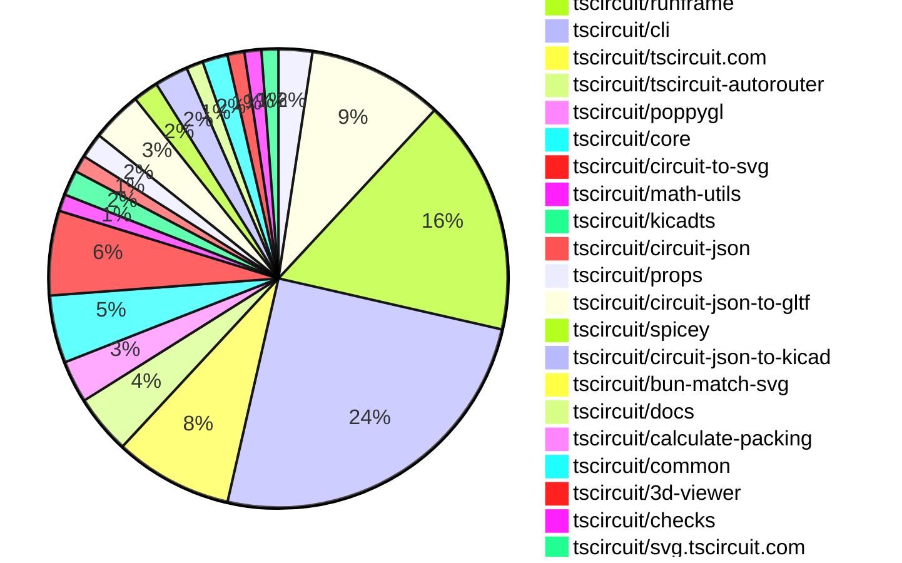
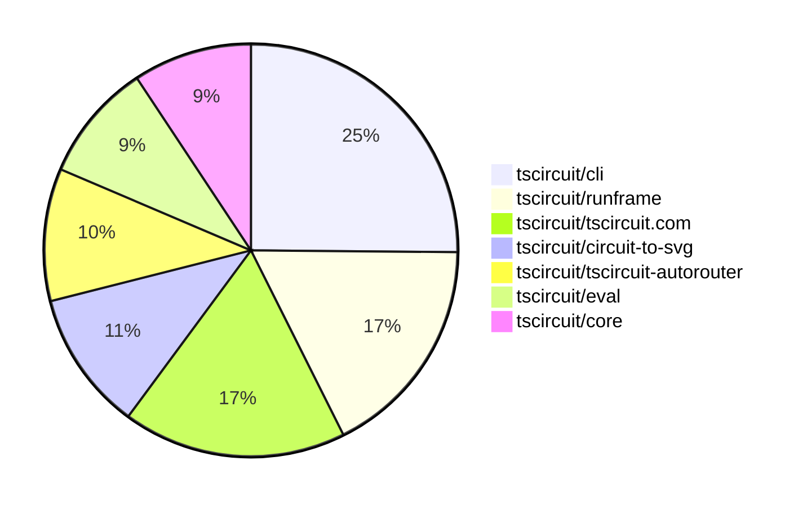

# contribution-tracker

[contributions.tscircuit.com](https://contributions.tscircuit.com) ・ [tscircuit.com](https://tscircuit.com) ・ [Contribution Overviews](./contribution-overviews/) ・ [Changelogs](./changelogs/)

Generates weekly contribution overviews for tscircuit contributors. Check out all
the [contribution overviews here](./contribution-overviews/)
You can find AI-generated monthly changelogs in the [changelogs directory](./changelogs/).

- All PRs in the tscircuit org are scanned/summarized via an LLM
- The LLM classifies each Diff/PR as into a set of attributes for scoring
- All the PRs, summaries, and classifications are organized into charts and tables for [the website](https://contributions.tscircuit.com)

> Want to run locally? See the [Development Section](#development)

The current week is shown below. There are 3 major sections:

- [Contributor Overview](#contributor-overview)
- [PRs by Repository](#prs-by-repository)
- [PRs by Contributor](#changes-by-contributor)

## Current Week

<!-- START_CURRENT_WEEK -->

# Contribution Overview 2025-10-01

## PRs by Repository



## Contributor Overview

| Contributor | 🐳 Major | 🐙 Minor | 🐌 Tiny | ⭐ | Score | Discussion Contributions |
|-------------|---------|---------|---------|-----|----------------|--------------------------|
| [seveibar](#seveibar) | 10 | 16 | 17 | 👑👑 | 91 | 0🔹 0🔶 0💎 |
| [imrishabh18](#imrishabh18) | 2 | 5 | 6 | ⭐⭐ | 29 | 0🔹 0🔶 0💎 |
| [ShiboSoftwareDev](#ShiboSoftwareDev) | 3 | 2 | 3 | ⭐⭐ | 18.5 | 0🔹 0🔶 0💎 |
| [ArnavK-09](#ArnavK-09) | 1 | 6 | 0 | ⭐⭐ | 17 | 0🔹 0🔶 0💎 |
| [0hmX](#0hmX) | 1 | 5 | 3 | ⭐⭐ | 17 | 0🔹 0🔶 0💎 |
| [tscircuitbot](#tscircuitbot) | 0 | 0 | 80 | ⭐⭐ | 15 | 0🔹 0🔶 0💎 |
| [Abse2001](#Abse2001) | 1 | 1 | 1 | ⭐ | 8 | 0🔹 0🔶 0💎 |
| [MustafaMulla29](#MustafaMulla29) | 0 | 3 | 2 | ⭐ | 8 | 0🔹 0🔶 0💎 |
| [pxlpal](#pxlpal) | 1 | 0 | 0 | ⭐ | 4 | 0🔹 0🔶 0💎 |
| [techmannih](#techmannih) | 0 | 1 | 0 |  | 2 | 0🔹 0🔶 0💎 |
| [Ayushjhawar8](#Ayushjhawar8) | 0 | 0 | 1 |  | 1 | 0🔹 0🔶 0💎 |
| [jayantpranjal0](#jayantpranjal0) | 0 | 0 | 1 |  | 1 | 0🔹 0🔶 0💎 |

### Discussion Contribution Legend

- 🔹 Normal Comments: Basic participation with minimal effort
- 🔶 Great Informative Comments: Thoughtful participation that adds value
- 💎 Incredible Comments: Exceptional participation with high-quality content

## Review Table

[reviews-received-hover]: ## "Number of reviews received for PRs for this contributor"
[approvals-received-hover]: ## "Number of approvals received for PRs this contributor authored"
[rejections-received-hover]: ## "Number of rejections received for PRs this contributor authored"
[prs-opened-hover]: ## "Number of PRs opened by this contributor"
[issues-created-hover]: ## "Number of issues created by this contributor"
[bountied-issues-hover]: ## "Number of issues this contributor created with a bounty"
[bountied-issue-$-hover]: ## "Total bounty amount placed on issues authored by this contributor"

| Contributor | Reviews Received | Approvals Received | Rejections Received | Approvals | Rejections | PRs Opened | PRs Merged | Score | Issues Created | Bountied Issues | Bountied Issue $ |
|---|---|---|---|---|---|---|---|---|---|---|---|
| [naaa760](#naaa760) | 0 | 0 | 0 | 0 | 0 | 6 | 0 | 0 | 0 | 0 | 0 |
| [tscircuitbot](#tscircuitbot) | 0 | 0 | 0 | 0 | 0 | 102 | 80 | 15 | 0 | 0 | 0 |
| [imrishabh18](#imrishabh18) | 6 | 5 | 0 | 3 | 3 | 14 | 13 | 29 | 0 | 0 | 0 |
| [seveibar](#seveibar) | 33 | 0 | 0 | 38 | 5 | 58 | 43 | 91 | 0 | 0 | 0 |
| [Quanta-Naut](#Quanta-Naut) | 13 | 0 | 1 | 0 | 0 | 1 | 0 | 0 | 0 | 0 | 0 |
| [Abse2001](#Abse2001) | 4 | 3 | 0 | 1 | 0 | 4 | 3 | 8 | 0 | 0 | 0 |
| [techmannih](#techmannih) | 2 | 1 | 0 | 0 | 0 | 1 | 1 | 2 | 0 | 0 | 0 |
| [Excellencedev](#Excellencedev) | 9 | 0 | 1 | 0 | 0 | 7 | 0 | 0 | 0 | 0 | 0 |
| [MustafaMulla29](#MustafaMulla29) | 19 | 7 | 2 | 0 | 0 | 6 | 5 | 8 | 0 | 0 | 0 |
| [ArnavK-09](#ArnavK-09) | 9 | 7 | 0 | 1 | 0 | 7 | 7 | 17 | 0 | 0 | 0 |
| [Omar8345](#Omar8345) | 0 | 0 | 0 | 0 | 0 | 1 | 0 | 0 | 0 | 0 | 0 |
| [Sanjay-Kirti](#Sanjay-Kirti) | 4 | 0 | 0 | 0 | 0 | 1 | 0 | 0 | 0 | 0 | 0 |
| [saish9901](#saish9901) | 2 | 0 | 1 | 0 | 0 | 1 | 0 | 0 | 0 | 0 | 0 |
| [ShiboSoftwareDev](#ShiboSoftwareDev) | 10 | 9 | 0 | 0 | 0 | 9 | 8 | 18.5 | 0 | 0 | 0 |
| [0hmX](#0hmX) | 9 | 9 | 0 | 0 | 0 | 9 | 9 | 17 | 0 | 0 | 0 |
| [Ayushjhawar8](#Ayushjhawar8) | 2 | 1 | 1 | 0 | 0 | 2 | 1 | 1 | 0 | 0 | 0 |
| [baeoc](#baeoc) | 1 | 0 | 1 | 0 | 0 | 2 | 0 | 0 | 0 | 0 | 0 |
| [jayantpranjal0](#jayantpranjal0) | 0 | 0 | 0 | 0 | 0 | 1 | 1 | 1 | 0 | 0 | 0 |
| [pxlpal](#pxlpal) | 1 | 1 | 0 | 0 | 0 | 2 | 1 | 4 | 0 | 0 | 0 |
| [RaghavArora14](#RaghavArora14) | 0 | 0 | 0 | 0 | 0 | 1 | 0 | 0 | 0 | 0 | 0 |
| [1914Jegx](#1914Jegx) | 1 | 0 | 1 | 0 | 0 | 2 | 0 | 0 | 0 | 0 | 0 |

## Top 7 Repositories by Contribution Points



## Changes by Repository

### [tscircuit/tscircuit](https://github.com/tscircuit/tscircuit)


<details>
<summary>🐌 Tiny Contributions (4)</summary>

| PR # | Impact | Contributor | Description |
|------|--------|-------------|-------------|
| [#894](https://github.com/tscircuit/tscircuit/pull/894) | 🐌 Tiny | tscircuitbot | Automated package update |
| [#892](https://github.com/tscircuit/tscircuit/pull/892) | 🐌 Tiny | tscircuitbot | Automated package update |
| [#893](https://github.com/tscircuit/tscircuit/pull/893) | 🐌 Tiny | imrishabh18 | Updates the CLI dependency version from 0.1.259 to 0.1.262 in package.json |
| [#891](https://github.com/tscircuit/tscircuit/pull/891) | 🐌 Tiny | imrishabh18 | Updates the CLI dependency version from 0.1.253 to 0.1.259 in package.json |

</details>

### [tscircuit/eval](https://github.com/tscircuit/eval)

| PR # | Impact | Rating | Contributor | Description |
|------|--------|--------|-------------|-------------|
| [#1168](https://github.com/tscircuit/eval/pull/1168) | 🐙 Minor | ⭐⭐ | ArnavK-09 | Removes outdated KiCad logic and unused footprint parsing code from the project. |

<details>
<summary>🐌 Tiny Contributions (15)</summary>

| PR # | Impact | Contributor | Description |
|------|--------|-------------|-------------|
| [#1175](https://github.com/tscircuit/eval/pull/1175) | 🐌 Tiny | tscircuitbot | Automated package update |
| [#1174](https://github.com/tscircuit/eval/pull/1174) | 🐌 Tiny | tscircuitbot | Automated package update |
| [#1172](https://github.com/tscircuit/eval/pull/1172) | 🐌 Tiny | tscircuitbot | Automated package update |
| [#1171](https://github.com/tscircuit/eval/pull/1171) | 🐌 Tiny | tscircuitbot | Automated package update |
| [#1169](https://github.com/tscircuit/eval/pull/1169) | 🐌 Tiny | tscircuitbot | Automated package update |
| [#1167](https://github.com/tscircuit/eval/pull/1167) | 🐌 Tiny | tscircuitbot | Automated package update |
| [#1165](https://github.com/tscircuit/eval/pull/1165) | 🐌 Tiny | tscircuitbot | Updates package dependencies to their latest versions in package.json |
| [#1164](https://github.com/tscircuit/eval/pull/1164) | 🐌 Tiny | tscircuitbot | Automated package update |
| [#1162](https://github.com/tscircuit/eval/pull/1162) | 🐌 Tiny | tscircuitbot | Updates the version of the tscircuitcore package from 0.0.756 to 0.0.757 in package.json |
| [#1160](https://github.com/tscircuit/eval/pull/1160) | 🐌 Tiny | tscircuitbot | Automated package update |
| [#1158](https://github.com/tscircuit/eval/pull/1158) | 🐌 Tiny | tscircuitbot | Automated package update |
| [#1159](https://github.com/tscircuit/eval/pull/1159) | 🐌 Tiny | tscircuitbot | Automated package update |
| [#1157](https://github.com/tscircuit/eval/pull/1157) | 🐌 Tiny | tscircuitbot | Automated package update |
| [#1156](https://github.com/tscircuit/eval/pull/1156) | 🐌 Tiny | tscircuitbot | Automated package update |
| [#1155](https://github.com/tscircuit/eval/pull/1155) | 🐌 Tiny | tscircuitbot | Automated package update |

</details>

### [tscircuit/runframe](https://github.com/tscircuit/runframe)

| PR # | Impact | Rating | Contributor | Description |
|------|--------|--------|-------------|-------------|
| [#1314](https://github.com/tscircuit/runframe/pull/1314) | 🐳 Major | ⭐⭐⭐ | seveibar | Add a Pinout SVG export option in the export menu, implementing SVG export using circuit-to-svg and a download helper. |
| [#1297](https://github.com/tscircuit/runframe/pull/1297) | 🐙 Minor | ⭐⭐ | seveibar | Adds functionality to export KiCad projects by creating a zip file containing the schematic and PCB files from the circuit JSON. |

<details>
<summary>🐌 Tiny Contributions (26)</summary>

| PR # | Impact | Contributor | Description |
|------|--------|-------------|-------------|
| [#1326](https://github.com/tscircuit/runframe/pull/1326) | 🐌 Tiny | tscircuitbot | Automated package update |
| [#1325](https://github.com/tscircuit/runframe/pull/1325) | 🐌 Tiny | tscircuitbot | Updates the tscircuiteval package to version 0.0.362 |
| [#1324](https://github.com/tscircuit/runframe/pull/1324) | 🐌 Tiny | tscircuitbot | Updates the tscircuiteval package from version 0.0.361 to 0.0.362 |
| [#1322](https://github.com/tscircuit/runframe/pull/1322) | 🐌 Tiny | tscircuitbot | Automated package update |
| [#1321](https://github.com/tscircuit/runframe/pull/1321) | 🐌 Tiny | tscircuitbot | Updates the tscircuiteval package to version 0.0.361 in the package.json file. |
| [#1320](https://github.com/tscircuit/runframe/pull/1320) | 🐌 Tiny | tscircuitbot | Updates the tscircuiteval package to version 0.0.361 |
| [#1318](https://github.com/tscircuit/runframe/pull/1318) | 🐌 Tiny | tscircuitbot | Automated package update |
| [#1317](https://github.com/tscircuit/runframe/pull/1317) | 🐌 Tiny | tscircuitbot | Automated package update |
| [#1316](https://github.com/tscircuit/runframe/pull/1316) | 🐌 Tiny | tscircuitbot | Updates the tscircuiteval package from version 0.0.359 to 0.0.360 |
| [#1315](https://github.com/tscircuit/runframe/pull/1315) | 🐌 Tiny | tscircuitbot | Automated package update |
| [#1312](https://github.com/tscircuit/runframe/pull/1312) | 🐌 Tiny | tscircuitbot | Automated package update |
| [#1311](https://github.com/tscircuit/runframe/pull/1311) | 🐌 Tiny | tscircuitbot | Updates the tscircuiteval package to version 0.0.359 |
| [#1310](https://github.com/tscircuit/runframe/pull/1310) | 🐌 Tiny | tscircuitbot | Updates the tscircuiteval package to version 0.0.359 in the package.json file. |
| [#1308](https://github.com/tscircuit/runframe/pull/1308) | 🐌 Tiny | tscircuitbot | Automated package update |
| [#1307](https://github.com/tscircuit/runframe/pull/1307) | 🐌 Tiny | tscircuitbot | Updates the tscircuiteval package to version 0.0.358 in the package.json file. |
| [#1306](https://github.com/tscircuit/runframe/pull/1306) | 🐌 Tiny | tscircuitbot | Updates the tscircuiteval package to version 0.0.358 in the package.json file. |
| [#1303](https://github.com/tscircuit/runframe/pull/1303) | 🐌 Tiny | tscircuitbot | Automated package update |
| [#1302](https://github.com/tscircuit/runframe/pull/1302) | 🐌 Tiny | tscircuitbot | Updates the tscircuiteval package to version 0.0.357 in the package.json file. |
| [#1301](https://github.com/tscircuit/runframe/pull/1301) | 🐌 Tiny | tscircuitbot | Updates the tscircuiteval package to version 0.0.357 in the package.json file. |
| [#1300](https://github.com/tscircuit/runframe/pull/1300) | 🐌 Tiny | tscircuitbot | Updates the tscircuiteval package from version 0.0.355 to 0.0.356 |
| [#1299](https://github.com/tscircuit/runframe/pull/1299) | 🐌 Tiny | tscircuitbot | Updates the tscircuiteval package to version 0.0.356 in the package.json file. |
| [#1298](https://github.com/tscircuit/runframe/pull/1298) | 🐌 Tiny | tscircuitbot | Updates the tscircuiteval package to version 0.0.355 in the package.json file. |
| [#1296](https://github.com/tscircuit/runframe/pull/1296) | 🐌 Tiny | tscircuitbot | Updates the package version from 0.0.1032 to 0.0.1033 in package.json |
| [#1295](https://github.com/tscircuit/runframe/pull/1295) | 🐌 Tiny | tscircuitbot | Updates the tscircuit3d-viewer package to version 0.0.406 in package.json |
| [#1294](https://github.com/tscircuit/runframe/pull/1294) | 🐌 Tiny | tscircuitbot | Automated package update |
| [#1293](https://github.com/tscircuit/runframe/pull/1293) | 🐌 Tiny | tscircuitbot | Updates the tscircuit3d-viewer package to version 0.0.405 in package.json |

</details>

### [tscircuit/cli](https://github.com/tscircuit/cli)

| PR # | Impact | Rating | Contributor | Description |
|------|--------|--------|-------------|-------------|
| [#442](https://github.com/tscircuit/cli/pull/442) | 🐙 Minor | ⭐⭐ | imrishabh18 | Replaces the simple 3D SVG conversion in snapshot generation with a poppygl-based GLB to PNG workflow, writing 3D snapshots as rendered PNG buffers and adjusting diffing logic accordingly, while removing the unused simple 3D dependency from package metadata. |
| [#435](https://github.com/tscircuit/cli/pull/435) | 🐙 Minor | ⭐⭐ | imrishabh18 | Switches the 3D PNG generation process from using simple-3d to poppygl, enhancing the rendering of 3D images in the tscircuit build process. |
| [#431](https://github.com/tscircuit/cli/pull/431) | 🐙 Minor | ⭐⭐ | seveibar | Add support for exporting KiCad schematic, PCB, and zip files using circuit-json-to-kicad, including necessary dependencies and CLI tests for the new formats. |
| [#423](https://github.com/tscircuit/cli/pull/423) | 🐙 Minor | ⭐⭐ | seveibar | Moves the logic for resolving tsci tarball URLs into a shared helper and reuses it from the add command when the registry entry is missing. |

<details>
<summary>🐌 Tiny Contributions (38)</summary>

| PR # | Impact | Contributor | Description |
|------|--------|-------------|-------------|
| [#470](https://github.com/tscircuit/cli/pull/470) | 🐌 Tiny | tscircuitbot | Automated package update |
| [#469](https://github.com/tscircuit/cli/pull/469) | 🐌 Tiny | tscircuitbot | Updates the tscircuitrunframe package from version 0.0.1045 to 0.0.1047 |
| [#468](https://github.com/tscircuit/cli/pull/468) | 🐌 Tiny | tscircuitbot | Automated package update |
| [#467](https://github.com/tscircuit/cli/pull/467) | 🐌 Tiny | tscircuitbot | Updates the tscircuitrunframe package to version 0.0.1045 |
| [#466](https://github.com/tscircuit/cli/pull/466) | 🐌 Tiny | tscircuitbot | Automated package update to version 0.1.272 |
| [#464](https://github.com/tscircuit/cli/pull/464) | 🐌 Tiny | tscircuitbot | Automated package update |
| [#463](https://github.com/tscircuit/cli/pull/463) | 🐌 Tiny | tscircuitbot | Automated package update |
| [#462](https://github.com/tscircuit/cli/pull/462) | 🐌 Tiny | tscircuitbot | Automated package update for tscircuitrunframe from version 0.0.1042 to 0.0.1043 |
| [#461](https://github.com/tscircuit/cli/pull/461) | 🐌 Tiny | tscircuitbot | Automated package update |
| [#459](https://github.com/tscircuit/cli/pull/459) | 🐌 Tiny | tscircuitbot | Updates the tscircuitrunframe package to version 0.0.1042 in the package.json file. |
| [#457](https://github.com/tscircuit/cli/pull/457) | 🐌 Tiny | tscircuitbot | Automated package update |
| [#456](https://github.com/tscircuit/cli/pull/456) | 🐌 Tiny | tscircuitbot | Updates the tscircuitrunframe package to version 0.0.1041 |
| [#454](https://github.com/tscircuit/cli/pull/454) | 🐌 Tiny | tscircuitbot | Automated package update |
| [#453](https://github.com/tscircuit/cli/pull/453) | 🐌 Tiny | tscircuitbot | Updates the tscircuitrunframe package from version 0.0.1039 to 0.0.1040 |
| [#452](https://github.com/tscircuit/cli/pull/452) | 🐌 Tiny | tscircuitbot | Automated package update |
| [#450](https://github.com/tscircuit/cli/pull/450) | 🐌 Tiny | tscircuitbot | Updates the tscircuitrunframe package to version 0.0.1039 in the package.json file. |
| [#451](https://github.com/tscircuit/cli/pull/451) | 🐌 Tiny | tscircuitbot | Automated package update |
| [#449](https://github.com/tscircuit/cli/pull/449) | 🐌 Tiny | tscircuitbot | Updates the tscircuitrunframe package from version 0.0.1038 to 0.0.1039 |
| [#448](https://github.com/tscircuit/cli/pull/448) | 🐌 Tiny | tscircuitbot | Automated package update |
| [#446](https://github.com/tscircuit/cli/pull/446) | 🐌 Tiny | tscircuitbot | Automated package update |
| [#447](https://github.com/tscircuit/cli/pull/447) | 🐌 Tiny | tscircuitbot | Automated package update |
| [#444](https://github.com/tscircuit/cli/pull/444) | 🐌 Tiny | tscircuitbot | Automated package update |
| [#445](https://github.com/tscircuit/cli/pull/445) | 🐌 Tiny | tscircuitbot | Automated package update |
| [#443](https://github.com/tscircuit/cli/pull/443) | 🐌 Tiny | tscircuitbot | Updates the tscircuitrunframe package to version 0.0.1037 |
| [#441](https://github.com/tscircuit/cli/pull/441) | 🐌 Tiny | tscircuitbot | Automated package update to version 0.1.262 |
| [#440](https://github.com/tscircuit/cli/pull/440) | 🐌 Tiny | tscircuitbot | Automated package update |
| [#439](https://github.com/tscircuit/cli/pull/439) | 🐌 Tiny | tscircuitbot | Updates the tscircuitrunframe package from version 0.0.1034 to 0.0.1036 |
| [#438](https://github.com/tscircuit/cli/pull/438) | 🐌 Tiny | tscircuitbot | Automated package update |
| [#436](https://github.com/tscircuit/cli/pull/436) | 🐌 Tiny | tscircuitbot | Updates the tscircuitrunframe package from version 0.0.1033 to 0.0.1034 |
| [#434](https://github.com/tscircuit/cli/pull/434) | 🐌 Tiny | tscircuitbot | Automated package update |
| [#432](https://github.com/tscircuit/cli/pull/432) | 🐌 Tiny | tscircuitbot | Automated package update |
| [#430](https://github.com/tscircuit/cli/pull/430) | 🐌 Tiny | tscircuitbot | Automated package update |
| [#429](https://github.com/tscircuit/cli/pull/429) | 🐌 Tiny | tscircuitbot | Updates the tscircuitrunframe package from version 0.0.1032 to 0.0.1033 |
| [#426](https://github.com/tscircuit/cli/pull/426) | 🐌 Tiny | tscircuitbot | Updates the tscircuitrunframe package to version 0.0.1032 |
| [#427](https://github.com/tscircuit/cli/pull/427) | 🐌 Tiny | tscircuitbot | Automated package update |
| [#425](https://github.com/tscircuit/cli/pull/425) | 🐌 Tiny | tscircuitbot | Updates the tscircuitrunframe package from version 0.0.1031 to 0.0.1032 in the package.json file. |
| [#424](https://github.com/tscircuit/cli/pull/424) | 🐌 Tiny | tscircuitbot | Automated package update |
| [#433](https://github.com/tscircuit/cli/pull/433) | 🐌 Tiny | imrishabh18 | Adds additional logging during the tscircuit build command to help diagnose RPC disconnects caused by lack of stdout output. |

</details>

### [tscircuit/tscircuit.com](https://github.com/tscircuit/tscircuit.com)

| PR # | Impact | Rating | Contributor | Description |
|------|--------|--------|-------------|-------------|
| [#1754](https://github.com/tscircuit/tscircuit.com/pull/1754) | 🐳 Major | ⭐⭐⭐ | imrishabh18 | Updates the test fixtures and routes to support creating packages under an organization, including adjustments to package naming conventions and organization membership handling. |
| [#1752](https://github.com/tscircuit/tscircuit.com/pull/1752) | 🐳 Major | ⭐⭐⭐ | seveibar | Update the header settings link to go to the signed-in users settings page and add a dedicated redirect route so settings forwards to usernamesettings |
| [#1728](https://github.com/tscircuit/tscircuit.com/pull/1728) | 🐳 Major | ⭐⭐⭐ | ArnavK-09 | Allows organization managers to perform tasks related to package management in the ImportantFilesView component. |
| [#1742](https://github.com/tscircuit/tscircuit.com/pull/1742) | 🐳 Major | ⭐⭐⭐ | pxlpal | Migrate to ImportComponentDialog2, use single dialog for everywhere where import is exposed |
| [#1749](https://github.com/tscircuit/tscircuit.com/pull/1749) | 🐙 Minor | ⭐⭐ | ArnavK-09 | Prevents the dropdown menu from displaying during navigation loading to enhance user experience. |
| [#1748](https://github.com/tscircuit/tscircuit.com/pull/1748) | 🐙 Minor | ⭐⭐ | ArnavK-09 | Prevents flickering by ensuring that the user profile page does not render until the account data has been fetched. |
| [#1746](https://github.com/tscircuit/tscircuit.com/pull/1746) | 🐙 Minor | ⭐⭐ | ArnavK-09 | Refactors the NewPackageSavePromptDialog component to include the full package name based on the selected organization or GitHub username. |
| [#1747](https://github.com/tscircuit/tscircuit.com/pull/1747) | 🐙 Minor | ⭐⭐ | ArnavK-09 | Adjusts the tab layout in the user profile page to enhance responsiveness by modifying the CSS classes used for the tabs. |
| [#1744](https://github.com/tscircuit/tscircuit.com/pull/1744) | 🐙 Minor | ⭐⭐ | 0hmX | Fixes unexpected scrolling and layout issues in the code editor by implementing a responsive flexbox layout that adjusts to the window size, enhancing the user editing experience. |
| [#1743](https://github.com/tscircuit/tscircuit.com/pull/1743) | 🐙 Minor | ⭐⭐ | 0hmX | Adds functionality to convert circuit JSON to KiCad PCB and schematic formats using new converters. |

<details>
<summary>🐌 Tiny Contributions (4)</summary>

| PR # | Impact | Contributor | Description |
|------|--------|-------------|-------------|
| [#1751](https://github.com/tscircuit/tscircuit.com/pull/1751) | 🐌 Tiny | imrishabh18 | Fixes the npm release failure for the fake-snippets package by updating the version number in package.json from 0.0.98 to 0.0.109. |
| [#1750](https://github.com/tscircuit/tscircuit.com/pull/1750) | 🐌 Tiny | imrishabh18 | Removes the openai package dependency as it is only used in the fake snippets and not in production, while updating the cli with the latest fake-snippets package version for types and seedDB. |
| [#1755](https://github.com/tscircuit/tscircuit.com/pull/1755) | 🐌 Tiny | 0hmX | Updates the circuit-json-to-kicad dependency version from 0.0.3 to 0.0.4 in package.json |
| [#1745](https://github.com/tscircuit/tscircuit.com/pull/1745) | 🐌 Tiny | 0hmX | Adds the --host option to the development script to allow easy access to the local network URL. |

</details>

### [tscircuit/tscircuit-autorouter](https://github.com/tscircuit/tscircuit-autorouter)

| PR # | Impact | Rating | Contributor | Description |
|------|--------|--------|-------------|-------------|
| [#256](https://github.com/tscircuit/tscircuit-autorouter/pull/256) | 🐳 Major | ⭐⭐⭐ | imrishabh18 | Fixes the visualization of failed connections in the autorouting process by displaying the last failed connection instead of the next one when no candidates are available. |
| [#268](https://github.com/tscircuit/tscircuit-autorouter/pull/268) | 🐳 Major | ⭐⭐⭐ | seveibar | Fixes path simplification to ensure that routing segments do not leave the board outline, preventing potential routing errors. |
| [#265](https://github.com/tscircuit/tscircuit-autorouter/pull/265) | 🐳 Major | ⭐⭐⭐ | seveibar | Adds support for an optional outline polygon in the capacity node solver, allowing the solver to treat space outside the outline as obstacles and includes a new fixture for demonstration. |
| [#260](https://github.com/tscircuit/tscircuit-autorouter/pull/260) | 🐳 Major | ⭐⭐⭐ | seveibar | Fixes path simplification to ensure the solver falls back to the original segment when no 45 path can reach the tail, preserving vias and endpoints, and adds a regression test for a previously identified bug. |

<details>
<summary>🐌 Tiny Contributions (3)</summary>

| PR # | Impact | Contributor | Description |
|------|--------|-------------|-------------|
| [#258](https://github.com/tscircuit/tscircuit-autorouter/pull/258) | 🐌 Tiny | imrishabh18 | Adds a simplified reproduction of an autorouting bug using a JSON fixture and a React component for debugging. |
| [#269](https://github.com/tscircuit/tscircuit-autorouter/pull/269) | 🐌 Tiny | seveibar | Adds a GitHub Actions stalebot workflow to automatically close stale issues and pull requests after a period of inactivity. |
| [#266](https://github.com/tscircuit/tscircuit-autorouter/pull/266) | 🐌 Tiny | seveibar | Draws the PCB outline in the initial problem visualization for visibility before solving starts, reuses the outline polygon when available, and modifies the capacity mesh outline visualization by removing explicit stroke width and adding point typing for linting compliance. |

</details>

### [tscircuit/poppygl](https://github.com/tscircuit/poppygl)

| PR # | Impact | Rating | Contributor | Description |
|------|--------|--------|-------------|-------------|
| [#7](https://github.com/tscircuit/poppygl/pull/7) | 🐙 Minor | ⭐⭐ | imrishabh18 | Allows the renderGLTFToPNGBuffer function to accept a GLTF model as either a file path or a JSON string, enhancing flexibility in rendering. |
| [#6](https://github.com/tscircuit/poppygl/pull/6) | 🐙 Minor | ⭐⭐ | imrishabh18 | Exports the renderGLTFToPNGBuffer function from the library for use in other modules. |
| [#5](https://github.com/tscircuit/poppygl/pull/5) | 🐙 Minor | ⭐⭐ | imrishabh18 | Adds support for a customizable background color in the rendering options of the SoftwareRenderer, allowing users to specify a background color for rendered images. |
| [#2](https://github.com/tscircuit/poppygl/pull/2) | 🐙 Minor | ⭐⭐ | 0hmX | Fixes the camera drag behavior in the viewer by inverting the horizontal drag direction. |

<details>
<summary>🐌 Tiny Contributions (1)</summary>

| PR # | Impact | Contributor | Description |
|------|--------|-------------|-------------|
| [#3](https://github.com/tscircuit/poppygl/pull/3) | 🐌 Tiny | seveibar | Adds a new example page that utilizes the PoppyGlViewer component to display a SOIC8 chip model. |

</details>

### [tscircuit/core](https://github.com/tscircuit/core)

| PR # | Impact | Rating | Contributor | Description |
|------|--------|--------|-------------|-------------|
| [#1431](https://github.com/tscircuit/core/pull/1431) | 🐳 Major | ⭐⭐⭐ | seveibar | Fixes autorouter routing through a U-shaped board outline and adds a regression test to ensure correct behavior. |
| [#1441](https://github.com/tscircuit/core/pull/1441) | 🐙 Minor | ⭐⭐ | seveibar | Integrates the spicey simulation engine into the circuit simulation framework, adding support for analog simulations. |
| [#1427](https://github.com/tscircuit/core/pull/1427) | 🐙 Minor | ⭐⭐ | seveibar | Integrates SPICE simulation capabilities into the core rendering engine, allowing for circuit simulations using SPICE engines and generating corresponding simulation results. |
| [#1428](https://github.com/tscircuit/core/pull/1428) | 🐙 Minor | ⭐⭐ | Abse2001 | Adds MicroModBoard and GreenpillBoard fixtures with full pin mapping and a snapshot test for PCB packing verification. |
| [#1436](https://github.com/tscircuit/core/pull/1436) | 🐙 Minor | ⭐⭐ | MustafaMulla29 | Adds functionality to check for PCB traces that extend beyond the board boundaries and includes tests for this check. |
| [#1434](https://github.com/tscircuit/core/pull/1434) | 🐙 Minor | ⭐⭐ | ArnavK-09 | Resolves relative footprint URLs by constructing asset URLs based on the projects base URL and adds a fallback mechanism for loading footprints. |
| [#1419](https://github.com/tscircuit/core/pull/1419) | 🐙 Minor | ⭐⭐ | ShiboSoftwareDev | Replace the simple-3d SVG pipeline with GLTF-based rendering, generating 3D snapshots as PNGs using poppygls rasterizer. |

<details>
<summary>🐌 Tiny Contributions (1)</summary>

| PR # | Impact | Contributor | Description |
|------|--------|-------------|-------------|
| [#1435](https://github.com/tscircuit/core/pull/1435) | 🐌 Tiny | MustafaMulla29 | Updates the tscircuitchecks dependency from version 0.0.75 to 0.0.79 in package.json |

</details>

### [tscircuit/circuit-to-svg](https://github.com/tscircuit/circuit-to-svg)

| PR # | Impact | Rating | Contributor | Description |
|------|--------|--------|-------------|-------------|
| [#340](https://github.com/tscircuit/circuit-to-svg/pull/340) | 🐳 Major | ⭐⭐⭐ | seveibar | Add a converter that combines schematic and simulation graph SVGs with vertical stacking, exposes the converter from the public API, and parses child SVGs safely, while covering the new behavior with snapshot tests and layout assertions. |
| [#337](https://github.com/tscircuit/circuit-to-svg/pull/337) | 🐳 Major | ⭐⭐⭐ | seveibar | Add a dedicated converter for simulation transient voltage graphs and supporting types, export the simulation graph converter for standalone SVG generation, and cover rendering and filtering with SVG snapshot tests. |
| [#345](https://github.com/tscircuit/circuit-to-svg/pull/345) | 🐳 Major | ⭐⭐⭐ | ShiboSoftwareDev | Enhances pinout diagrams for small-pad boards by dynamically scaling UI elements and improving label separation for better readability. |
| [#349](https://github.com/tscircuit/circuit-to-svg/pull/349) | 🐙 Minor | ⭐⭐ | ShiboSoftwareDev | Exports simulation types to enhance functionality in spicey. |

<details>
<summary>🐌 Tiny Contributions (6)</summary>

| PR # | Impact | Contributor | Description |
|------|--------|-------------|-------------|
| [#344](https://github.com/tscircuit/circuit-to-svg/pull/344) | 🐌 Tiny | seveibar | Replaces README snapshot links with embedded images for inline rendering of previews. |
| [#341](https://github.com/tscircuit/circuit-to-svg/pull/341) | 🐌 Tiny | seveibar | Streamlines the README usage snippet to highlight minimal schematic conversion, adds TypeScript snippets and snapshot links for each API section, and removes obsolete contributing and license sections to keep the documentation focused on usage. |
| [#339](https://github.com/tscircuit/circuit-to-svg/pull/339) | 🐌 Tiny | seveibar | Add a stalebot GitHub Actions workflow to automatically mark and close stale issues and pull requests |
| [#343](https://github.com/tscircuit/circuit-to-svg/pull/343) | 🐌 Tiny | ShiboSoftwareDev | fix rotation issues better label style and alignment some routing improvements |
| [#352](https://github.com/tscircuit/circuit-to-svg/pull/352) | 🐌 Tiny | Ayushjhawar8 | Fixes the graphs styling, adjusts padding, and repositions the legend for better visual alignment. |
| [#348](https://github.com/tscircuit/circuit-to-svg/pull/348) | 🐌 Tiny | jayantpranjal0 | Adds documentation for the shouldDrawErrors option, which allows users to display visual error indicators for pcb_trace_error elements in the circuit JSON. |

</details>

### [tscircuit/math-utils](https://github.com/tscircuit/math-utils)

| PR # | Impact | Rating | Contributor | Description |
|------|--------|--------|-------------|-------------|
| [#23](https://github.com/tscircuit/math-utils/pull/23) | 🐳 Major | ⭐⭐⭐ | seveibar | Add polygon utility module with point containment, overlap, and inclusion helpers for bounds and rect inputs |
| [#24](https://github.com/tscircuit/math-utils/pull/24) | 🐙 Minor | ⭐⭐ | seveibar | Adds support for a new UniversalRect type that allows polygon helpers to accept both center-based rectangles and bounds, enhancing flexibility in rectangle representation. |

### [tscircuit/kicadts](https://github.com/tscircuit/kicadts)

| PR # | Impact | Rating | Contributor | Description |
|------|--------|--------|-------------|-------------|
| [#8](https://github.com/tscircuit/kicadts/pull/8) | 🐳 Major | ⭐⭐⭐ | seveibar | Changes the handling of sheet_instances in KicadSch to support multiple entries, allowing for an array of sheet instances while maintaining flexibility for single instances. |
| [#6](https://github.com/tscircuit/kicadts/pull/6) | 🐙 Minor | ⭐⭐ | seveibar | Fixes the token representation for sheet instances in the KiCad schematic parser and adds a test for it. |

<details>
<summary>🐌 Tiny Contributions (1)</summary>

| PR # | Impact | Contributor | Description |
|------|--------|-------------|-------------|
| [#7](https://github.com/tscircuit/kicadts/pull/7) | 🐌 Tiny | seveibar | Adds an npm version badge to the project README for quick navigation to the published package. |

</details>

### [tscircuit/circuit-json](https://github.com/tscircuit/circuit-json)

| PR # | Impact | Rating | Contributor | Description |
|------|--------|--------|-------------|-------------|
| [#302](https://github.com/tscircuit/circuit-json/pull/302) | 🐙 Minor | ⭐⭐ | seveibar | Add a simulation_switch schema with optional timing and frequency configuration, expose the new component in the simulation exports and README documentation, and cover the parser with dedicated unit tests. |

<details>
<summary>🐌 Tiny Contributions (1)</summary>

| PR # | Impact | Contributor | Description |
|------|--------|-------------|-------------|
| [#301](https://github.com/tscircuit/circuit-json/pull/301) | 🐌 Tiny | seveibar | Add CAD components to the generated README documentation, including a dedicated section for CAD components and the inclusion of CAD TypeScript files. |

</details>

### [tscircuit/props](https://github.com/tscircuit/props)

| PR # | Impact | Rating | Contributor | Description |
|------|--------|--------|-------------|-------------|
| [#429](https://github.com/tscircuit/props/pull/429) | 🐙 Minor | ⭐⭐ | seveibar | Add optional simulation scheduling fields to platform configuration and validate them with circuit-json schemas. |

<details>
<summary>🐌 Tiny Contributions (2)</summary>

| PR # | Impact | Contributor | Description |
|------|--------|-------------|-------------|
| [#428](https://github.com/tscircuit/props/pull/428) | 🐌 Tiny | seveibar | Refactors the platform configuration to use a spice engine map instead of a single engine entry, adds an analog simulation component definition that defaults to spice transient analysis, and updates tests and documentation to cover the new configuration and component. |
| [#427](https://github.com/tscircuit/props/pull/427) | 🐌 Tiny | seveibar | Simplifies board color typing to use AutocompleteString presets, adds shared solder mask and silkscreen color props while removing dielectric core color, and documents and tests the revised board color configuration options. |

</details>

### [tscircuit/circuit-json-to-gltf](https://github.com/tscircuit/circuit-json-to-gltf)

| PR # | Impact | Rating | Contributor | Description |
|------|--------|--------|-------------|-------------|
| [#33](https://github.com/tscircuit/circuit-json-to-gltf/pull/33) | 🐙 Minor | ⭐⭐ | seveibar | Fixes incorrectly rotated GLB models and addresses issues with GLB color loading. |
| [#29](https://github.com/tscircuit/circuit-json-to-gltf/pull/29) | 🐙 Minor | ⭐⭐ | seveibar | Adds support for generating 3D models from footprint strings in the circuit-to-3D conversion process. |
| [#25](https://github.com/tscircuit/circuit-json-to-gltf/pull/25) | 🐙 Minor | ⭐⭐ | seveibar | Adds support for loading GLB models in the 3D circuit visualization, allowing users to utilize GLB files alongside STL and OBJ formats. |
| [#24](https://github.com/tscircuit/circuit-json-to-gltf/pull/24) | 🐙 Minor | ⭐⭐ | seveibar | Adds an example for rendering a GLB model in the circuit visualization. |
| [#37](https://github.com/tscircuit/circuit-json-to-gltf/pull/37) | 🐙 Minor | ⭐⭐ | MustafaMulla29 | Fixes the GLTF generation for components on the bottom layer to ensure correct positioning and rotation in 3D rendering. |
| [#31](https://github.com/tscircuit/circuit-json-to-gltf/pull/31) | 🐙 Minor | ⭐⭐ | 0hmX | Adds support for loading GLTF models in the circuit-to-3D conversion process by introducing a new model_gltf_url property for cad_components. |

### [tscircuit/spicey](https://github.com/tscircuit/spicey)

| PR # | Impact | Rating | Contributor | Description |
|------|--------|--------|-------------|-------------|
| [#4](https://github.com/tscircuit/spicey/pull/4) | 🐳 Major | ⭐⭐⭐ | ShiboSoftwareDev | Adds a comparison framework for transient analysis between spicey and ngspice, integrating eecircuit-engine for simulations, adding visual snapshot testing, and fixing a parsing bug related to the PULSE() source definition. |
| [#6](https://github.com/tscircuit/spicey/pull/6) | 🐙 Minor | ⭐⭐ | seveibar | Add support for voltage-controlled switches with piecewise linear (PWL) control in SPICE netlists, including new transient solver functionality and regression tests. |

<details>
<summary>🐌 Tiny Contributions (1)</summary>

| PR # | Impact | Contributor | Description |
|------|--------|-------------|-------------|
| [#2](https://github.com/tscircuit/spicey/pull/2) | 🐌 Tiny | seveibar | Summary document a modular directory layout in the README for future feature expansion split the SPICE simulator into focused parsing, analysis, formatting, math, stamping, and utility modules with one exported function per file re-export the new modules through libindex.ts to preserve the public API  Testing bunx tsc --noEmit bun test testsbasicsbasics01.test.ts |

</details>

### [tscircuit/circuit-json-to-kicad](https://github.com/tscircuit/circuit-json-to-kicad)

| PR # | Impact | Rating | Contributor | Description |
|------|--------|--------|-------------|-------------|
| [#3](https://github.com/tscircuit/circuit-json-to-kicad/pull/3) | 🐳 Major | ⭐⭐⭐ | 0hmX | This pull request removes an extra 0 from the coordinates of a Junction object in the AddSchematicTracesStage class, which was causing issues with junctions and the kicad_sch format. Additionally, it introduces new tests to ensure the functionality is preserved and correct. |
| [#2](https://github.com/tscircuit/circuit-json-to-kicad/pull/2) | 🐙 Minor | ⭐⭐ | seveibar | Add example with chip, init schematic chip conversion, including debug output and fixes for chip pins. |
| [#1](https://github.com/tscircuit/circuit-json-to-kicad/pull/1) | 🐙 Minor | ⭐⭐ | seveibar | Adds support for PCB conversion from Circuit JSON to KiCad PCB format, including stages for initializing the PCB, adding nets, footprints, traces, vias, and graphics. |

<details>
<summary>🐌 Tiny Contributions (1)</summary>

| PR # | Impact | Contributor | Description |
|------|--------|-------------|-------------|
| [#4](https://github.com/tscircuit/circuit-json-to-kicad/pull/4) | 🐌 Tiny | seveibar | Run the bun test workflow inside the KiCad 9.0 docker container instead of installing packages on the runner |

</details>

### [tscircuit/bun-match-svg](https://github.com/tscircuit/bun-match-svg)


<details>
<summary>🐌 Tiny Contributions (1)</summary>

| PR # | Impact | Contributor | Description |
|------|--------|-------------|-------------|
| [#12](https://github.com/tscircuit/bun-match-svg/pull/12) | 🐌 Tiny | seveibar | Changes SVG snapshot filenames to include the originating test file name, updating related tests to expect the new naming convention. |

</details>

### [tscircuit/docs](https://github.com/tscircuit/docs)

| PR # | Impact | Rating | Contributor | Description |
|------|--------|--------|-------------|-------------|
| [#164](https://github.com/tscircuit/docs/pull/164) | 🐳 Major | ⭐⭐⭐ | ShiboSoftwareDev | Adds a new guide for generating pinout diagrams and updates the CircuitPreview component to support rendering pinout views. |

<details>
<summary>🐌 Tiny Contributions (1)</summary>

| PR # | Impact | Contributor | Description |
|------|--------|-------------|-------------|
| [#165](https://github.com/tscircuit/docs/pull/165) | 🐌 Tiny | seveibar | Documents the copperpour  groundplane element, including usage tips and key properties. |

</details>

### [tscircuit/calculate-packing](https://github.com/tscircuit/calculate-packing)


<details>
<summary>🐌 Tiny Contributions (1)</summary>

| PR # | Impact | Contributor | Description |
|------|--------|-------------|-------------|
| [#52](https://github.com/tscircuit/calculate-packing/pull/52) | 🐌 Tiny | seveibar | This pull request introduces new files and test snapshots for repro06, enhancing the testing framework and providing additional test cases for the project. |

</details>

### [tscircuit/common](https://github.com/tscircuit/common)


<details>
<summary>🐌 Tiny Contributions (3)</summary>

| PR # | Impact | Contributor | Description |
|------|--------|-------------|-------------|
| [#24](https://github.com/tscircuit/common/pull/24) | 🐌 Tiny | seveibar | Sets explicit board names for the MicroMod board variants to prevent component name collisions during tsci build. |
| [#23](https://github.com/tscircuit/common/pull/23) | 🐌 Tiny | seveibar | Add support for board props in board components by implementing a shared helper to split chip and board props, updating exported board components to accept these props, and covering the new functionality with unit tests. |
| [#21](https://github.com/tscircuit/common/pull/21) | 🐌 Tiny | Abse2001 | Adds CM5Connector and CM5Receiver components with full pinouts and footprints for Raspberry Pi Compute Module 5 carrier board development, including PCB and 3D snapshots for verification. |

</details>

### [tscircuit/3d-viewer](https://github.com/tscircuit/3d-viewer)

| PR # | Impact | Rating | Contributor | Description |
|------|--------|--------|-------------|-------------|
| [#509](https://github.com/tscircuit/3d-viewer/pull/509) | 🐳 Major | ⭐⭐⭐ | Abse2001 | Adds environment map configuration and a default environment map for GLB models to improve rendering quality. |
| [#501](https://github.com/tscircuit/3d-viewer/pull/501) | 🐙 Minor | ⭐⭐ | techmannih | Adds support for rectangular border radius to SMT pads and plated holes in the PCB design. |

### [tscircuit/checks](https://github.com/tscircuit/checks)

| PR # | Impact | Rating | Contributor | Description |
|------|--------|--------|-------------|-------------|
| [#79](https://github.com/tscircuit/checks/pull/79) | 🐙 Minor | ⭐⭐ | MustafaMulla29 | Checks if PCB traces are too close to or outside the board outline, ensuring compliance with design rules. |

<details>
<summary>🐌 Tiny Contributions (1)</summary>

| PR # | Impact | Contributor | Description |
|------|--------|-------------|-------------|
| [#80](https://github.com/tscircuit/checks/pull/80) | 🐌 Tiny | MustafaMulla29 | Modifies the checkTraceOutOfBoard tests to utilize the shouldDrawErrors property for visualizing errors with a red diamond indicator. |

</details>

### [tscircuit/svg.tscircuit.com](https://github.com/tscircuit/svg.tscircuit.com)


<details>
<summary>🐌 Tiny Contributions (2)</summary>

| PR # | Impact | Contributor | Description |
|------|--------|-------------|-------------|
| [#355](https://github.com/tscircuit/svg.tscircuit.com/pull/355) | 🐌 Tiny | ShiboSoftwareDev | Adds a global afterEach cleanup for spawned Bun servers in tests, ensuring all servers are closed after each test execution. |
| [#354](https://github.com/tscircuit/svg.tscircuit.com/pull/354) | 🐌 Tiny | ShiboSoftwareDev | Updates the version of the circuit-to-svg dependency to 0.0.215 in package.json |

</details>

### [tscircuit/jscad-electronics](https://github.com/tscircuit/jscad-electronics)

| PR # | Impact | Rating | Contributor | Description |
|------|--------|--------|-------------|-------------|
| [#121](https://github.com/tscircuit/jscad-electronics/pull/121) | 🐙 Minor | ⭐⭐ | 0hmX | Fixes the inverted winding order issue in the extrudeLinear operation, ensuring correct polygon rendering. |

### [tscircuit/jscad-to-gltf](https://github.com/tscircuit/jscad-to-gltf)


<details>
<summary>🐌 Tiny Contributions (1)</summary>

| PR # | Impact | Contributor | Description |
|------|--------|-------------|-------------|
| [#7](https://github.com/tscircuit/jscad-to-gltf/pull/7) | 🐌 Tiny | 0hmX | Updates the jscad-electronics dependency from version 0.0.42 to 0.0.43 and modifies the test to accommodate the new version. |

</details>

## Changes by Contributor

### [tscircuitbot](https://github.com/tscircuitbot)


<details>
<summary>🐌 Tiny Contributions (80)</summary>

| PR # | Impact | Description |
|------|--------|-------------|
| [#894](https://github.com/tscircuit/tscircuit/pull/894) | 🐌 Tiny | Automated package update |
| [#892](https://github.com/tscircuit/tscircuit/pull/892) | 🐌 Tiny | Automated package update |
| [#1175](https://github.com/tscircuit/eval/pull/1175) | 🐌 Tiny | Automated package update |
| [#1174](https://github.com/tscircuit/eval/pull/1174) | 🐌 Tiny | Automated package update |
| [#1172](https://github.com/tscircuit/eval/pull/1172) | 🐌 Tiny | Automated package update |
| [#1171](https://github.com/tscircuit/eval/pull/1171) | 🐌 Tiny | Automated package update |
| [#1169](https://github.com/tscircuit/eval/pull/1169) | 🐌 Tiny | Automated package update |
| [#1167](https://github.com/tscircuit/eval/pull/1167) | 🐌 Tiny | Automated package update |
| [#1165](https://github.com/tscircuit/eval/pull/1165) | 🐌 Tiny | Updates package dependencies to their latest versions in package.json |
| [#1164](https://github.com/tscircuit/eval/pull/1164) | 🐌 Tiny | Automated package update |
| [#1162](https://github.com/tscircuit/eval/pull/1162) | 🐌 Tiny | Updates the version of the tscircuitcore package from 0.0.756 to 0.0.757 in package.json |
| [#1160](https://github.com/tscircuit/eval/pull/1160) | 🐌 Tiny | Automated package update |
| [#1158](https://github.com/tscircuit/eval/pull/1158) | 🐌 Tiny | Automated package update |
| [#1159](https://github.com/tscircuit/eval/pull/1159) | 🐌 Tiny | Automated package update |
| [#1157](https://github.com/tscircuit/eval/pull/1157) | 🐌 Tiny | Automated package update |
| [#1156](https://github.com/tscircuit/eval/pull/1156) | 🐌 Tiny | Automated package update |
| [#1155](https://github.com/tscircuit/eval/pull/1155) | 🐌 Tiny | Automated package update |
| [#1326](https://github.com/tscircuit/runframe/pull/1326) | 🐌 Tiny | Automated package update |
| [#1325](https://github.com/tscircuit/runframe/pull/1325) | 🐌 Tiny | Updates the tscircuiteval package to version 0.0.362 |
| [#1324](https://github.com/tscircuit/runframe/pull/1324) | 🐌 Tiny | Updates the tscircuiteval package from version 0.0.361 to 0.0.362 |
| [#1322](https://github.com/tscircuit/runframe/pull/1322) | 🐌 Tiny | Automated package update |
| [#1321](https://github.com/tscircuit/runframe/pull/1321) | 🐌 Tiny | Updates the tscircuiteval package to version 0.0.361 in the package.json file. |
| [#1320](https://github.com/tscircuit/runframe/pull/1320) | 🐌 Tiny | Updates the tscircuiteval package to version 0.0.361 |
| [#1318](https://github.com/tscircuit/runframe/pull/1318) | 🐌 Tiny | Automated package update |
| [#1317](https://github.com/tscircuit/runframe/pull/1317) | 🐌 Tiny | Automated package update |
| [#1316](https://github.com/tscircuit/runframe/pull/1316) | 🐌 Tiny | Updates the tscircuiteval package from version 0.0.359 to 0.0.360 |
| [#1315](https://github.com/tscircuit/runframe/pull/1315) | 🐌 Tiny | Automated package update |
| [#1312](https://github.com/tscircuit/runframe/pull/1312) | 🐌 Tiny | Automated package update |
| [#1311](https://github.com/tscircuit/runframe/pull/1311) | 🐌 Tiny | Updates the tscircuiteval package to version 0.0.359 |
| [#1310](https://github.com/tscircuit/runframe/pull/1310) | 🐌 Tiny | Updates the tscircuiteval package to version 0.0.359 in the package.json file. |
| [#1308](https://github.com/tscircuit/runframe/pull/1308) | 🐌 Tiny | Automated package update |
| [#1307](https://github.com/tscircuit/runframe/pull/1307) | 🐌 Tiny | Updates the tscircuiteval package to version 0.0.358 in the package.json file. |
| [#1306](https://github.com/tscircuit/runframe/pull/1306) | 🐌 Tiny | Updates the tscircuiteval package to version 0.0.358 in the package.json file. |
| [#1303](https://github.com/tscircuit/runframe/pull/1303) | 🐌 Tiny | Automated package update |
| [#1302](https://github.com/tscircuit/runframe/pull/1302) | 🐌 Tiny | Updates the tscircuiteval package to version 0.0.357 in the package.json file. |
| [#1301](https://github.com/tscircuit/runframe/pull/1301) | 🐌 Tiny | Updates the tscircuiteval package to version 0.0.357 in the package.json file. |
| [#1300](https://github.com/tscircuit/runframe/pull/1300) | 🐌 Tiny | Updates the tscircuiteval package from version 0.0.355 to 0.0.356 |
| [#1299](https://github.com/tscircuit/runframe/pull/1299) | 🐌 Tiny | Updates the tscircuiteval package to version 0.0.356 in the package.json file. |
| [#1298](https://github.com/tscircuit/runframe/pull/1298) | 🐌 Tiny | Updates the tscircuiteval package to version 0.0.355 in the package.json file. |
| [#1296](https://github.com/tscircuit/runframe/pull/1296) | 🐌 Tiny | Updates the package version from 0.0.1032 to 0.0.1033 in package.json |
| [#1295](https://github.com/tscircuit/runframe/pull/1295) | 🐌 Tiny | Updates the tscircuit3d-viewer package to version 0.0.406 in package.json |
| [#1294](https://github.com/tscircuit/runframe/pull/1294) | 🐌 Tiny | Automated package update |
| [#1293](https://github.com/tscircuit/runframe/pull/1293) | 🐌 Tiny | Updates the tscircuit3d-viewer package to version 0.0.405 in package.json |
| [#470](https://github.com/tscircuit/cli/pull/470) | 🐌 Tiny | Automated package update |
| [#469](https://github.com/tscircuit/cli/pull/469) | 🐌 Tiny | Updates the tscircuitrunframe package from version 0.0.1045 to 0.0.1047 |
| [#468](https://github.com/tscircuit/cli/pull/468) | 🐌 Tiny | Automated package update |
| [#467](https://github.com/tscircuit/cli/pull/467) | 🐌 Tiny | Updates the tscircuitrunframe package to version 0.0.1045 |
| [#466](https://github.com/tscircuit/cli/pull/466) | 🐌 Tiny | Automated package update to version 0.1.272 |
| [#464](https://github.com/tscircuit/cli/pull/464) | 🐌 Tiny | Automated package update |
| [#463](https://github.com/tscircuit/cli/pull/463) | 🐌 Tiny | Automated package update |
| [#462](https://github.com/tscircuit/cli/pull/462) | 🐌 Tiny | Automated package update for tscircuitrunframe from version 0.0.1042 to 0.0.1043 |
| [#461](https://github.com/tscircuit/cli/pull/461) | 🐌 Tiny | Automated package update |
| [#459](https://github.com/tscircuit/cli/pull/459) | 🐌 Tiny | Updates the tscircuitrunframe package to version 0.0.1042 in the package.json file. |
| [#457](https://github.com/tscircuit/cli/pull/457) | 🐌 Tiny | Automated package update |
| [#456](https://github.com/tscircuit/cli/pull/456) | 🐌 Tiny | Updates the tscircuitrunframe package to version 0.0.1041 |
| [#454](https://github.com/tscircuit/cli/pull/454) | 🐌 Tiny | Automated package update |
| [#453](https://github.com/tscircuit/cli/pull/453) | 🐌 Tiny | Updates the tscircuitrunframe package from version 0.0.1039 to 0.0.1040 |
| [#452](https://github.com/tscircuit/cli/pull/452) | 🐌 Tiny | Automated package update |
| [#450](https://github.com/tscircuit/cli/pull/450) | 🐌 Tiny | Updates the tscircuitrunframe package to version 0.0.1039 in the package.json file. |
| [#451](https://github.com/tscircuit/cli/pull/451) | 🐌 Tiny | Automated package update |
| [#449](https://github.com/tscircuit/cli/pull/449) | 🐌 Tiny | Updates the tscircuitrunframe package from version 0.0.1038 to 0.0.1039 |
| [#448](https://github.com/tscircuit/cli/pull/448) | 🐌 Tiny | Automated package update |
| [#446](https://github.com/tscircuit/cli/pull/446) | 🐌 Tiny | Automated package update |
| [#447](https://github.com/tscircuit/cli/pull/447) | 🐌 Tiny | Automated package update |
| [#444](https://github.com/tscircuit/cli/pull/444) | 🐌 Tiny | Automated package update |
| [#445](https://github.com/tscircuit/cli/pull/445) | 🐌 Tiny | Automated package update |
| [#443](https://github.com/tscircuit/cli/pull/443) | 🐌 Tiny | Updates the tscircuitrunframe package to version 0.0.1037 |
| [#441](https://github.com/tscircuit/cli/pull/441) | 🐌 Tiny | Automated package update to version 0.1.262 |
| [#440](https://github.com/tscircuit/cli/pull/440) | 🐌 Tiny | Automated package update |
| [#439](https://github.com/tscircuit/cli/pull/439) | 🐌 Tiny | Updates the tscircuitrunframe package from version 0.0.1034 to 0.0.1036 |
| [#438](https://github.com/tscircuit/cli/pull/438) | 🐌 Tiny | Automated package update |
| [#436](https://github.com/tscircuit/cli/pull/436) | 🐌 Tiny | Updates the tscircuitrunframe package from version 0.0.1033 to 0.0.1034 |
| [#434](https://github.com/tscircuit/cli/pull/434) | 🐌 Tiny | Automated package update |
| [#432](https://github.com/tscircuit/cli/pull/432) | 🐌 Tiny | Automated package update |
| [#430](https://github.com/tscircuit/cli/pull/430) | 🐌 Tiny | Automated package update |
| [#429](https://github.com/tscircuit/cli/pull/429) | 🐌 Tiny | Updates the tscircuitrunframe package from version 0.0.1032 to 0.0.1033 |
| [#426](https://github.com/tscircuit/cli/pull/426) | 🐌 Tiny | Updates the tscircuitrunframe package to version 0.0.1032 |
| [#427](https://github.com/tscircuit/cli/pull/427) | 🐌 Tiny | Automated package update |
| [#425](https://github.com/tscircuit/cli/pull/425) | 🐌 Tiny | Updates the tscircuitrunframe package from version 0.0.1031 to 0.0.1032 in the package.json file. |
| [#424](https://github.com/tscircuit/cli/pull/424) | 🐌 Tiny | Automated package update |

</details>

### [imrishabh18](https://github.com/imrishabh18)

| PRs # | Impact | Rating | Description |
|------|--------|--------|-------------|
| [#1754](https://github.com/tscircuit/tscircuit.com/pull/1754) | 🐳 Major | ⭐⭐⭐ | Updates the test fixtures and routes to support creating packages under an organization, including adjustments to package naming conventions and organization membership handling. |
| [#256](https://github.com/tscircuit/tscircuit-autorouter/pull/256) | 🐳 Major | ⭐⭐⭐ | Fixes the visualization of failed connections in the autorouting process by displaying the last failed connection instead of the next one when no candidates are available. |
| [#442](https://github.com/tscircuit/cli/pull/442) | 🐙 Minor | ⭐⭐ | Replaces the simple 3D SVG conversion in snapshot generation with a poppygl-based GLB to PNG workflow, writing 3D snapshots as rendered PNG buffers and adjusting diffing logic accordingly, while removing the unused simple 3D dependency from package metadata. |
| [#435](https://github.com/tscircuit/cli/pull/435) | 🐙 Minor | ⭐⭐ | Switches the 3D PNG generation process from using simple-3d to poppygl, enhancing the rendering of 3D images in the tscircuit build process. |
| [#7](https://github.com/tscircuit/poppygl/pull/7) | 🐙 Minor | ⭐⭐ | Allows the renderGLTFToPNGBuffer function to accept a GLTF model as either a file path or a JSON string, enhancing flexibility in rendering. |
| [#6](https://github.com/tscircuit/poppygl/pull/6) | 🐙 Minor | ⭐⭐ | Exports the renderGLTFToPNGBuffer function from the library for use in other modules. |
| [#5](https://github.com/tscircuit/poppygl/pull/5) | 🐙 Minor | ⭐⭐ | Adds support for a customizable background color in the rendering options of the SoftwareRenderer, allowing users to specify a background color for rendered images. |

<details>
<summary>🐌 Tiny Contributions (6)</summary>

| PR # | Impact | Description |
|------|--------|-------------|
| [#893](https://github.com/tscircuit/tscircuit/pull/893) | 🐌 Tiny | Updates the CLI dependency version from 0.1.259 to 0.1.262 in package.json |
| [#891](https://github.com/tscircuit/tscircuit/pull/891) | 🐌 Tiny | Updates the CLI dependency version from 0.1.253 to 0.1.259 in package.json |
| [#1751](https://github.com/tscircuit/tscircuit.com/pull/1751) | 🐌 Tiny | Fixes the npm release failure for the fake-snippets package by updating the version number in package.json from 0.0.98 to 0.0.109. |
| [#1750](https://github.com/tscircuit/tscircuit.com/pull/1750) | 🐌 Tiny | Removes the openai package dependency as it is only used in the fake snippets and not in production, while updating the cli with the latest fake-snippets package version for types and seedDB. |
| [#433](https://github.com/tscircuit/cli/pull/433) | 🐌 Tiny | Adds additional logging during the tscircuit build command to help diagnose RPC disconnects caused by lack of stdout output. |
| [#258](https://github.com/tscircuit/tscircuit-autorouter/pull/258) | 🐌 Tiny | Adds a simplified reproduction of an autorouting bug using a JSON fixture and a React component for debugging. |

</details>

### [seveibar](https://github.com/seveibar)

| PRs # | Impact | Rating | Description |
|------|--------|--------|-------------|
| [#1431](https://github.com/tscircuit/core/pull/1431) | 🐳 Major | ⭐⭐⭐ | Fixes autorouter routing through a U-shaped board outline and adds a regression test to ensure correct behavior. |
| [#340](https://github.com/tscircuit/circuit-to-svg/pull/340) | 🐳 Major | ⭐⭐⭐ | Add a converter that combines schematic and simulation graph SVGs with vertical stacking, exposes the converter from the public API, and parses child SVGs safely, while covering the new behavior with snapshot tests and layout assertions. |
| [#337](https://github.com/tscircuit/circuit-to-svg/pull/337) | 🐳 Major | ⭐⭐⭐ | Add a dedicated converter for simulation transient voltage graphs and supporting types, export the simulation graph converter for standalone SVG generation, and cover rendering and filtering with SVG snapshot tests. |
| [#23](https://github.com/tscircuit/math-utils/pull/23) | 🐳 Major | ⭐⭐⭐ | Add polygon utility module with point containment, overlap, and inclusion helpers for bounds and rect inputs |
| [#1752](https://github.com/tscircuit/tscircuit.com/pull/1752) | 🐳 Major | ⭐⭐⭐ | Update the header settings link to go to the signed-in users settings page and add a dedicated redirect route so settings forwards to usernamesettings |
| [#1314](https://github.com/tscircuit/runframe/pull/1314) | 🐳 Major | ⭐⭐⭐ | Add a Pinout SVG export option in the export menu, implementing SVG export using circuit-to-svg and a download helper. |
| [#268](https://github.com/tscircuit/tscircuit-autorouter/pull/268) | 🐳 Major | ⭐⭐⭐ | Fixes path simplification to ensure that routing segments do not leave the board outline, preventing potential routing errors. |
| [#265](https://github.com/tscircuit/tscircuit-autorouter/pull/265) | 🐳 Major | ⭐⭐⭐ | Adds support for an optional outline polygon in the capacity node solver, allowing the solver to treat space outside the outline as obstacles and includes a new fixture for demonstration. |
| [#260](https://github.com/tscircuit/tscircuit-autorouter/pull/260) | 🐳 Major | ⭐⭐⭐ | Fixes path simplification to ensure the solver falls back to the original segment when no 45 path can reach the tail, preserving vias and endpoints, and adds a regression test for a previously identified bug. |
| [#8](https://github.com/tscircuit/kicadts/pull/8) | 🐳 Major | ⭐⭐⭐ | Changes the handling of sheet_instances in KicadSch to support multiple entries, allowing for an array of sheet instances while maintaining flexibility for single instances. |
| [#302](https://github.com/tscircuit/circuit-json/pull/302) | 🐙 Minor | ⭐⭐ | Add a simulation_switch schema with optional timing and frequency configuration, expose the new component in the simulation exports and README documentation, and cover the parser with dedicated unit tests. |
| [#429](https://github.com/tscircuit/props/pull/429) | 🐙 Minor | ⭐⭐ | Add optional simulation scheduling fields to platform configuration and validate them with circuit-json schemas. |
| [#1441](https://github.com/tscircuit/core/pull/1441) | 🐙 Minor | ⭐⭐ | Integrates the spicey simulation engine into the circuit simulation framework, adding support for analog simulations. |
| [#1427](https://github.com/tscircuit/core/pull/1427) | 🐙 Minor | ⭐⭐ | Integrates SPICE simulation capabilities into the core rendering engine, allowing for circuit simulations using SPICE engines and generating corresponding simulation results. |
| [#24](https://github.com/tscircuit/math-utils/pull/24) | 🐙 Minor | ⭐⭐ | Adds support for a new UniversalRect type that allows polygon helpers to accept both center-based rectangles and bounds, enhancing flexibility in rectangle representation. |
| [#1297](https://github.com/tscircuit/runframe/pull/1297) | 🐙 Minor | ⭐⭐ | Adds functionality to export KiCad projects by creating a zip file containing the schematic and PCB files from the circuit JSON. |
| [#431](https://github.com/tscircuit/cli/pull/431) | 🐙 Minor | ⭐⭐ | Add support for exporting KiCad schematic, PCB, and zip files using circuit-json-to-kicad, including necessary dependencies and CLI tests for the new formats. |
| [#423](https://github.com/tscircuit/cli/pull/423) | 🐙 Minor | ⭐⭐ | Moves the logic for resolving tsci tarball URLs into a shared helper and reuses it from the add command when the registry entry is missing. |
| [#33](https://github.com/tscircuit/circuit-json-to-gltf/pull/33) | 🐙 Minor | ⭐⭐ | Fixes incorrectly rotated GLB models and addresses issues with GLB color loading. |
| [#29](https://github.com/tscircuit/circuit-json-to-gltf/pull/29) | 🐙 Minor | ⭐⭐ | Adds support for generating 3D models from footprint strings in the circuit-to-3D conversion process. |
| [#25](https://github.com/tscircuit/circuit-json-to-gltf/pull/25) | 🐙 Minor | ⭐⭐ | Adds support for loading GLB models in the 3D circuit visualization, allowing users to utilize GLB files alongside STL and OBJ formats. |
| [#24](https://github.com/tscircuit/circuit-json-to-gltf/pull/24) | 🐙 Minor | ⭐⭐ | Adds an example for rendering a GLB model in the circuit visualization. |
| [#6](https://github.com/tscircuit/kicadts/pull/6) | 🐙 Minor | ⭐⭐ | Fixes the token representation for sheet instances in the KiCad schematic parser and adds a test for it. |
| [#6](https://github.com/tscircuit/spicey/pull/6) | 🐙 Minor | ⭐⭐ | Add support for voltage-controlled switches with piecewise linear (PWL) control in SPICE netlists, including new transient solver functionality and regression tests. |
| [#2](https://github.com/tscircuit/circuit-json-to-kicad/pull/2) | 🐙 Minor | ⭐⭐ | Add example with chip, init schematic chip conversion, including debug output and fixes for chip pins. |
| [#1](https://github.com/tscircuit/circuit-json-to-kicad/pull/1) | 🐙 Minor | ⭐⭐ | Adds support for PCB conversion from Circuit JSON to KiCad PCB format, including stages for initializing the PCB, adding nets, footprints, traces, vias, and graphics. |

<details>
<summary>🐌 Tiny Contributions (17)</summary>

| PR # | Impact | Description |
|------|--------|-------------|
| [#301](https://github.com/tscircuit/circuit-json/pull/301) | 🐌 Tiny | Add CAD components to the generated README documentation, including a dedicated section for CAD components and the inclusion of CAD TypeScript files. |
| [#428](https://github.com/tscircuit/props/pull/428) | 🐌 Tiny | Refactors the platform configuration to use a spice engine map instead of a single engine entry, adds an analog simulation component definition that defaults to spice transient analysis, and updates tests and documentation to cover the new configuration and component. |
| [#427](https://github.com/tscircuit/props/pull/427) | 🐌 Tiny | Simplifies board color typing to use AutocompleteString presets, adds shared solder mask and silkscreen color props while removing dielectric core color, and documents and tests the revised board color configuration options. |
| [#344](https://github.com/tscircuit/circuit-to-svg/pull/344) | 🐌 Tiny | Replaces README snapshot links with embedded images for inline rendering of previews. |
| [#341](https://github.com/tscircuit/circuit-to-svg/pull/341) | 🐌 Tiny | Streamlines the README usage snippet to highlight minimal schematic conversion, adds TypeScript snippets and snapshot links for each API section, and removes obsolete contributing and license sections to keep the documentation focused on usage. |
| [#339](https://github.com/tscircuit/circuit-to-svg/pull/339) | 🐌 Tiny | Add a stalebot GitHub Actions workflow to automatically mark and close stale issues and pull requests |
| [#12](https://github.com/tscircuit/bun-match-svg/pull/12) | 🐌 Tiny | Changes SVG snapshot filenames to include the originating test file name, updating related tests to expect the new naming convention. |
| [#165](https://github.com/tscircuit/docs/pull/165) | 🐌 Tiny | Documents the copperpour  groundplane element, including usage tips and key properties. |
| [#269](https://github.com/tscircuit/tscircuit-autorouter/pull/269) | 🐌 Tiny | Adds a GitHub Actions stalebot workflow to automatically close stale issues and pull requests after a period of inactivity. |
| [#266](https://github.com/tscircuit/tscircuit-autorouter/pull/266) | 🐌 Tiny | Draws the PCB outline in the initial problem visualization for visibility before solving starts, reuses the outline polygon when available, and modifies the capacity mesh outline visualization by removing explicit stroke width and adding point typing for linting compliance. |
| [#52](https://github.com/tscircuit/calculate-packing/pull/52) | 🐌 Tiny | This pull request introduces new files and test snapshots for repro06, enhancing the testing framework and providing additional test cases for the project. |
| [#24](https://github.com/tscircuit/common/pull/24) | 🐌 Tiny | Sets explicit board names for the MicroMod board variants to prevent component name collisions during tsci build. |
| [#23](https://github.com/tscircuit/common/pull/23) | 🐌 Tiny | Add support for board props in board components by implementing a shared helper to split chip and board props, updating exported board components to accept these props, and covering the new functionality with unit tests. |
| [#7](https://github.com/tscircuit/kicadts/pull/7) | 🐌 Tiny | Adds an npm version badge to the project README for quick navigation to the published package. |
| [#3](https://github.com/tscircuit/poppygl/pull/3) | 🐌 Tiny | Adds a new example page that utilizes the PoppyGlViewer component to display a SOIC8 chip model. |
| [#2](https://github.com/tscircuit/spicey/pull/2) | 🐌 Tiny | Summary document a modular directory layout in the README for future feature expansion split the SPICE simulator into focused parsing, analysis, formatting, math, stamping, and utility modules with one exported function per file re-export the new modules through libindex.ts to preserve the public API  Testing bunx tsc --noEmit bun test testsbasicsbasics01.test.ts |
| [#4](https://github.com/tscircuit/circuit-json-to-kicad/pull/4) | 🐌 Tiny | Run the bun test workflow inside the KiCad 9.0 docker container instead of installing packages on the runner |

</details>

### [Abse2001](https://github.com/Abse2001)

| PRs # | Impact | Rating | Description |
|------|--------|--------|-------------|
| [#509](https://github.com/tscircuit/3d-viewer/pull/509) | 🐳 Major | ⭐⭐⭐ | Adds environment map configuration and a default environment map for GLB models to improve rendering quality. |
| [#1428](https://github.com/tscircuit/core/pull/1428) | 🐙 Minor | ⭐⭐ | Adds MicroModBoard and GreenpillBoard fixtures with full pin mapping and a snapshot test for PCB packing verification. |

<details>
<summary>🐌 Tiny Contributions (1)</summary>

| PR # | Impact | Description |
|------|--------|-------------|
| [#21](https://github.com/tscircuit/common/pull/21) | 🐌 Tiny | Adds CM5Connector and CM5Receiver components with full pinouts and footprints for Raspberry Pi Compute Module 5 carrier board development, including PCB and 3D snapshots for verification. |

</details>

### [techmannih](https://github.com/techmannih)

| PRs # | Impact | Rating | Description |
|------|--------|--------|-------------|
| [#501](https://github.com/tscircuit/3d-viewer/pull/501) | 🐙 Minor | ⭐⭐ | Adds support for rectangular border radius to SMT pads and plated holes in the PCB design. |

### [MustafaMulla29](https://github.com/MustafaMulla29)

| PRs # | Impact | Rating | Description |
|------|--------|--------|-------------|
| [#1436](https://github.com/tscircuit/core/pull/1436) | 🐙 Minor | ⭐⭐ | Adds functionality to check for PCB traces that extend beyond the board boundaries and includes tests for this check. |
| [#79](https://github.com/tscircuit/checks/pull/79) | 🐙 Minor | ⭐⭐ | Checks if PCB traces are too close to or outside the board outline, ensuring compliance with design rules. |
| [#37](https://github.com/tscircuit/circuit-json-to-gltf/pull/37) | 🐙 Minor | ⭐⭐ | Fixes the GLTF generation for components on the bottom layer to ensure correct positioning and rotation in 3D rendering. |

<details>
<summary>🐌 Tiny Contributions (2)</summary>

| PR # | Impact | Description |
|------|--------|-------------|
| [#1435](https://github.com/tscircuit/core/pull/1435) | 🐌 Tiny | Updates the tscircuitchecks dependency from version 0.0.75 to 0.0.79 in package.json |
| [#80](https://github.com/tscircuit/checks/pull/80) | 🐌 Tiny | Modifies the checkTraceOutOfBoard tests to utilize the shouldDrawErrors property for visualizing errors with a red diamond indicator. |

</details>

### [ArnavK-09](https://github.com/ArnavK-09)

| PRs # | Impact | Rating | Description |
|------|--------|--------|-------------|
| [#1728](https://github.com/tscircuit/tscircuit.com/pull/1728) | 🐳 Major | ⭐⭐⭐ | Allows organization managers to perform tasks related to package management in the ImportantFilesView component. |
| [#1434](https://github.com/tscircuit/core/pull/1434) | 🐙 Minor | ⭐⭐ | Resolves relative footprint URLs by constructing asset URLs based on the projects base URL and adds a fallback mechanism for loading footprints. |
| [#1749](https://github.com/tscircuit/tscircuit.com/pull/1749) | 🐙 Minor | ⭐⭐ | Prevents the dropdown menu from displaying during navigation loading to enhance user experience. |
| [#1748](https://github.com/tscircuit/tscircuit.com/pull/1748) | 🐙 Minor | ⭐⭐ | Prevents flickering by ensuring that the user profile page does not render until the account data has been fetched. |
| [#1746](https://github.com/tscircuit/tscircuit.com/pull/1746) | 🐙 Minor | ⭐⭐ | Refactors the NewPackageSavePromptDialog component to include the full package name based on the selected organization or GitHub username. |
| [#1747](https://github.com/tscircuit/tscircuit.com/pull/1747) | 🐙 Minor | ⭐⭐ | Adjusts the tab layout in the user profile page to enhance responsiveness by modifying the CSS classes used for the tabs. |
| [#1168](https://github.com/tscircuit/eval/pull/1168) | 🐙 Minor | ⭐⭐ | Removes outdated KiCad logic and unused footprint parsing code from the project. |

### [ShiboSoftwareDev](https://github.com/ShiboSoftwareDev)

| PRs # | Impact | Rating | Description |
|------|--------|--------|-------------|
| [#345](https://github.com/tscircuit/circuit-to-svg/pull/345) | 🐳 Major | ⭐⭐⭐ | Enhances pinout diagrams for small-pad boards by dynamically scaling UI elements and improving label separation for better readability. |
| [#164](https://github.com/tscircuit/docs/pull/164) | 🐳 Major | ⭐⭐⭐ | Adds a new guide for generating pinout diagrams and updates the CircuitPreview component to support rendering pinout views. |
| [#4](https://github.com/tscircuit/spicey/pull/4) | 🐳 Major | ⭐⭐⭐ | Adds a comparison framework for transient analysis between spicey and ngspice, integrating eecircuit-engine for simulations, adding visual snapshot testing, and fixing a parsing bug related to the PULSE() source definition. |
| [#1419](https://github.com/tscircuit/core/pull/1419) | 🐙 Minor | ⭐⭐ | Replace the simple-3d SVG pipeline with GLTF-based rendering, generating 3D snapshots as PNGs using poppygls rasterizer. |
| [#349](https://github.com/tscircuit/circuit-to-svg/pull/349) | 🐙 Minor | ⭐⭐ | Exports simulation types to enhance functionality in spicey. |

<details>
<summary>🐌 Tiny Contributions (3)</summary>

| PR # | Impact | Description |
|------|--------|-------------|
| [#343](https://github.com/tscircuit/circuit-to-svg/pull/343) | 🐌 Tiny | fix rotation issues better label style and alignment some routing improvements |
| [#355](https://github.com/tscircuit/svg.tscircuit.com/pull/355) | 🐌 Tiny | Adds a global afterEach cleanup for spawned Bun servers in tests, ensuring all servers are closed after each test execution. |
| [#354](https://github.com/tscircuit/svg.tscircuit.com/pull/354) | 🐌 Tiny | Updates the version of the circuit-to-svg dependency to 0.0.215 in package.json |

</details>

### [0hmX](https://github.com/0hmX)

| PRs # | Impact | Rating | Description |
|------|--------|--------|-------------|
| [#3](https://github.com/tscircuit/circuit-json-to-kicad/pull/3) | 🐳 Major | ⭐⭐⭐ | This pull request removes an extra 0 from the coordinates of a Junction object in the AddSchematicTracesStage class, which was causing issues with junctions and the kicad_sch format. Additionally, it introduces new tests to ensure the functionality is preserved and correct. |
| [#121](https://github.com/tscircuit/jscad-electronics/pull/121) | 🐙 Minor | ⭐⭐ | Fixes the inverted winding order issue in the extrudeLinear operation, ensuring correct polygon rendering. |
| [#1744](https://github.com/tscircuit/tscircuit.com/pull/1744) | 🐙 Minor | ⭐⭐ | Fixes unexpected scrolling and layout issues in the code editor by implementing a responsive flexbox layout that adjusts to the window size, enhancing the user editing experience. |
| [#1743](https://github.com/tscircuit/tscircuit.com/pull/1743) | 🐙 Minor | ⭐⭐ | Adds functionality to convert circuit JSON to KiCad PCB and schematic formats using new converters. |
| [#31](https://github.com/tscircuit/circuit-json-to-gltf/pull/31) | 🐙 Minor | ⭐⭐ | Adds support for loading GLTF models in the circuit-to-3D conversion process by introducing a new model_gltf_url property for cad_components. |
| [#2](https://github.com/tscircuit/poppygl/pull/2) | 🐙 Minor | ⭐⭐ | Fixes the camera drag behavior in the viewer by inverting the horizontal drag direction. |

<details>
<summary>🐌 Tiny Contributions (3)</summary>

| PR # | Impact | Description |
|------|--------|-------------|
| [#1755](https://github.com/tscircuit/tscircuit.com/pull/1755) | 🐌 Tiny | Updates the circuit-json-to-kicad dependency version from 0.0.3 to 0.0.4 in package.json |
| [#1745](https://github.com/tscircuit/tscircuit.com/pull/1745) | 🐌 Tiny | Adds the --host option to the development script to allow easy access to the local network URL. |
| [#7](https://github.com/tscircuit/jscad-to-gltf/pull/7) | 🐌 Tiny | Updates the jscad-electronics dependency from version 0.0.42 to 0.0.43 and modifies the test to accommodate the new version. |

</details>

### [Ayushjhawar8](https://github.com/Ayushjhawar8)


<details>
<summary>🐌 Tiny Contributions (1)</summary>

| PR # | Impact | Description |
|------|--------|-------------|
| [#352](https://github.com/tscircuit/circuit-to-svg/pull/352) | 🐌 Tiny | Fixes the graphs styling, adjusts padding, and repositions the legend for better visual alignment. |

</details>

### [jayantpranjal0](https://github.com/jayantpranjal0)


<details>
<summary>🐌 Tiny Contributions (1)</summary>

| PR # | Impact | Description |
|------|--------|-------------|
| [#348](https://github.com/tscircuit/circuit-to-svg/pull/348) | 🐌 Tiny | Adds documentation for the shouldDrawErrors option, which allows users to display visual error indicators for pcb_trace_error elements in the circuit JSON. |

</details>

### [pxlpal](https://github.com/pxlpal)

| PRs # | Impact | Rating | Description |
|------|--------|--------|-------------|
| [#1742](https://github.com/tscircuit/tscircuit.com/pull/1742) | 🐳 Major | ⭐⭐⭐ | Migrate to ImportComponentDialog2, use single dialog for everywhere where import is exposed |

## Repository Owners

| Repository | Codeowners |
|------------|------------|
| [builder](https://github.com/tscircuit/builder/blob/main/.github/CODEOWNERS) | [seveibar](https://github.com/seveibar)
| [pcb-viewer](https://github.com/tscircuit/pcb-viewer/blob/main/.github/CODEOWNERS) | [seveibar](https://github.com/seveibar), [ShiboSoftwareDev](https://github.com/ShiboSoftwareDev)
| [footprints-old](https://github.com/tscircuit/footprints-old/blob/main/.github/CODEOWNERS) | [seveibar](https://github.com/seveibar)
| [footprinter](https://github.com/tscircuit/footprinter/blob/main/.github/CODEOWNERS) | [seveibar](https://github.com/seveibar), [techmannih](https://github.com/techmannih)
| [3d-viewer](https://github.com/tscircuit/3d-viewer/blob/main/.github/CODEOWNERS) | [ShiboSoftwareDev](https://github.com/ShiboSoftwareDev)
| [winterspec](https://github.com/tscircuit/winterspec/blob/main/.github/CODEOWNERS) | [seveibar](https://github.com/seveibar), [ShiboSoftwareDev](https://github.com/ShiboSoftwareDev)
| [jscad-electronics](https://github.com/tscircuit/jscad-electronics/blob/main/.github/CODEOWNERS) | [seveibar](https://github.com/seveibar), [abhijitxy](https://github.com/abhijitxy), [anas-sarkez](https://github.com/anas-sarkez)
| [circuit-to-svg](https://github.com/tscircuit/circuit-to-svg/blob/main/.github/CODEOWNERS) | [imrishabh18](https://github.com/imrishabh18)
| [schematic-symbols](https://github.com/tscircuit/schematic-symbols/blob/main/.github/CODEOWNERS) | [seveibar](https://github.com/seveibar), [imrishabh18](https://github.com/imrishabh18), [techmannih](https://github.com/techmannih)
| [circuit-json-to-gerber](https://github.com/tscircuit/circuit-json-to-gerber/blob/main/.github/CODEOWNERS) | [seveibar](https://github.com/seveibar), [ShiboSoftwareDev](https://github.com/ShiboSoftwareDev)
| [tscircuit.com](https://github.com/tscircuit/tscircuit.com/blob/main/.github/CODEOWNERS) | [seveibar](https://github.com/seveibar), [imrishabh18](https://github.com/imrishabh18)
| [issue-roulette](https://github.com/tscircuit/issue-roulette/blob/main/.github/CODEOWNERS) | [Anshgrover23](https://github.com/Anshgrover23)
| [sparkfun-boards](https://github.com/tscircuit/sparkfun-boards/blob/main/.github/CODEOWNERS) | [ShiboSoftwareDev](https://github.com/ShiboSoftwareDev), [Abse2001](https://github.com/Abse2001), [MustafaMulla29](https://github.com/MustafaMulla29), [Anshgrover23](https://github.com/Anshgrover23), [techmannih](https://github.com/techmannih)
| [schematic-corpus](https://github.com/tscircuit/schematic-corpus/blob/main/.github/CODEOWNERS) | [Abse2001](https://github.com/Abse2001)

## Repositories by Owner

| User | Repo |
|------|------|
| [seveibar](https://github.com/seveibar) | [builder](https://github.com/tscircuit/builder/blob/main/.github/CODEOWNERS) |
|  | [pcb-viewer](https://github.com/tscircuit/pcb-viewer/blob/main/.github/CODEOWNERS) |
|  | [footprints-old](https://github.com/tscircuit/footprints-old/blob/main/.github/CODEOWNERS) |
|  | [footprinter](https://github.com/tscircuit/footprinter/blob/main/.github/CODEOWNERS) |
|  | [winterspec](https://github.com/tscircuit/winterspec/blob/main/.github/CODEOWNERS) |
|  | [jscad-electronics](https://github.com/tscircuit/jscad-electronics/blob/main/.github/CODEOWNERS) |
|  | [schematic-symbols](https://github.com/tscircuit/schematic-symbols/blob/main/.github/CODEOWNERS) |
|  | [circuit-json-to-gerber](https://github.com/tscircuit/circuit-json-to-gerber/blob/main/.github/CODEOWNERS) |
|  | [tscircuit.com](https://github.com/tscircuit/tscircuit.com/blob/main/.github/CODEOWNERS) |
| [ShiboSoftwareDev](https://github.com/ShiboSoftwareDev) | [pcb-viewer](https://github.com/tscircuit/pcb-viewer/blob/main/.github/CODEOWNERS) |
|  | [3d-viewer](https://github.com/tscircuit/3d-viewer/blob/main/.github/CODEOWNERS) |
|  | [winterspec](https://github.com/tscircuit/winterspec/blob/main/.github/CODEOWNERS) |
|  | [circuit-json-to-gerber](https://github.com/tscircuit/circuit-json-to-gerber/blob/main/.github/CODEOWNERS) |
|  | [sparkfun-boards](https://github.com/tscircuit/sparkfun-boards/blob/main/.github/CODEOWNERS) |
| [techmannih](https://github.com/techmannih) | [footprinter](https://github.com/tscircuit/footprinter/blob/main/.github/CODEOWNERS) |
|  | [schematic-symbols](https://github.com/tscircuit/schematic-symbols/blob/main/.github/CODEOWNERS) |
|  | [sparkfun-boards](https://github.com/tscircuit/sparkfun-boards/blob/main/.github/CODEOWNERS) |
| [abhijitxy](https://github.com/abhijitxy) | [jscad-electronics](https://github.com/tscircuit/jscad-electronics/blob/main/.github/CODEOWNERS) |
| [anas-sarkez](https://github.com/anas-sarkez) | [jscad-electronics](https://github.com/tscircuit/jscad-electronics/blob/main/.github/CODEOWNERS) |
| [imrishabh18](https://github.com/imrishabh18) | [circuit-to-svg](https://github.com/tscircuit/circuit-to-svg/blob/main/.github/CODEOWNERS) |
|  | [schematic-symbols](https://github.com/tscircuit/schematic-symbols/blob/main/.github/CODEOWNERS) |
|  | [tscircuit.com](https://github.com/tscircuit/tscircuit.com/blob/main/.github/CODEOWNERS) |
| [Anshgrover23](https://github.com/Anshgrover23) | [issue-roulette](https://github.com/tscircuit/issue-roulette/blob/main/.github/CODEOWNERS) |
|  | [sparkfun-boards](https://github.com/tscircuit/sparkfun-boards/blob/main/.github/CODEOWNERS) |
| [Abse2001](https://github.com/Abse2001) | [sparkfun-boards](https://github.com/tscircuit/sparkfun-boards/blob/main/.github/CODEOWNERS) |
|  | [schematic-corpus](https://github.com/tscircuit/schematic-corpus/blob/main/.github/CODEOWNERS) |
| [MustafaMulla29](https://github.com/MustafaMulla29) | [sparkfun-boards](https://github.com/tscircuit/sparkfun-boards/blob/main/.github/CODEOWNERS) |


<!-- END_CURRENT_WEEK -->


## Development

### Prerequisites

- [Bun](https://bun.sh/) runtime
- `.env` file with required API keys:
  ```
  GITHUB_TOKEN=your_github_token
  OPENAI_API_KEY=your_openai_api_key
  DISCORD_TOKEN=your_discord_token (optional, for Discord integration)
  SLACK_BOT_TOKEN=your_slack_token (optional, for Slack integration)
  ```

### Available Scripts

#### Core Generation Scripts

- `bun run generate:weekly` - Generate current week's contribution overview
- `bun run generate:monthly` - Generate current month's contribution overview
- `bun run generate:changelog` - Generate monthly changelog from PRs

#### Analysis & Testing

- `bun run analyze-pr` - Analyze a single PR (interactive prompt)
- `bun run test:github` - Test GitHub API integration

#### Notifications & Sync

- `bun run notifications:issues` - Send notifications for new issues
- `bun run notifications:pr` - Send notifications for new PRs
- `bun run sync:discord` - Sync contributor roles with Discord

#### Data Export

- `bun run export:sponsorship` - Generate sponsorship data CSV

#### Development

- `bun run dev` - Start development server for web UI
- `bun run build` - Build for production
- `bun run format` - Format code with Biome

### Usage Examples

```bash
# Generate this week's contribution overview
bun run generate:weekly

# Generate current month's overview
bun run generate:monthly

# Analyze a specific PR
bun run analyze-pr

# Test your GitHub token setup
bun run test:github
```
