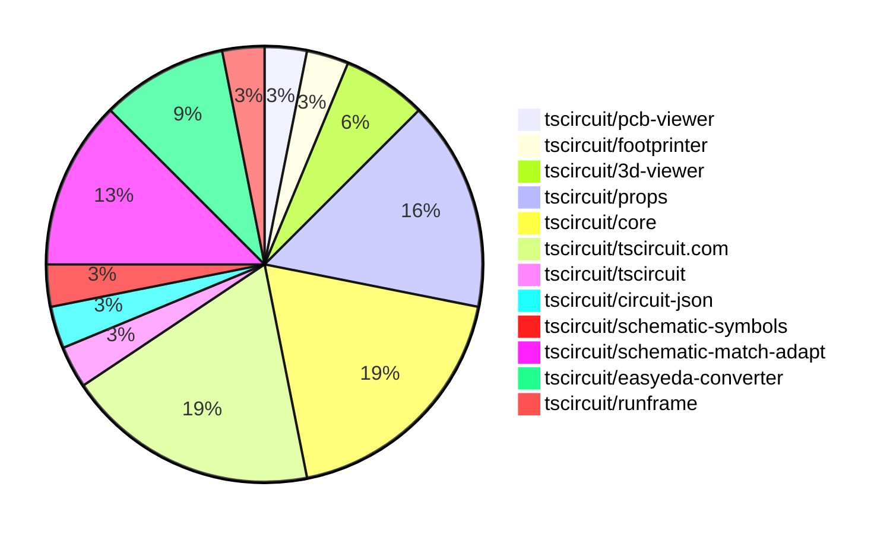

# contribution-tracker

Generates weekly contribution overviews for tscircuit contributors. Check out all
the [contribution overviews here](./contribution-overviews/)

* All PRs in the tscircuit org are scanned/summarized via Claude Haiku
* Claude classifies each Diff/PR as a Major, Minor or Tiny contribution
* All the PRs, summaries, and classifications are organized into charts and tables

The current week is shown below. There are 3 major sections:

* [Contributor Overview](#contributor-overview)
* [PRs by Repository](#prs-by-repository)
* [PRs by Contributor](#changes-by-contributor)

## Current Week

<!-- START_CURRENT_WEEK -->

# Contribution Overview 2025-05-28

## PRs by Repository

## Contributor Overview

| Contributor | 🐳 Major | 🐙 Minor | 🐌 Tiny | ⭐ | Issues Created | Discussion Contributions |
|-------------|---------|---------|---------|-----|----------------|--------------------------|
| [seveibar](#seveibar) | 0 | 11 | 1 | ⭐⭐⭐ | 11 | 0🔹 0🔶 0💎 |
| [imrishabh18](#imrishabh18) | 0 | 3 | 1 | ⭐⭐ | 5 | 0🔹 0🔶 0💎 |
| [Anshgrover23](#Anshgrover23) | 0 | 4 | 0 | ⭐⭐ | 2 | 0🔹 0🔶 0💎 |
| [ShiboSoftwareDev](#ShiboSoftwareDev) | 0 | 4 | 0 | ⭐ | 2 | 0🔹 0🔶 0💎 |
| [ArnavK-09](#ArnavK-09) | 0 | 2 | 0 | ⭐ | 2 | 0🔹 0🔶 0💎 |
| [techmannih](#techmannih) | 0 | 1 | 1 | ⭐ | 2 | 0🔹 0🔶 0💎 |
| [Abse2001](#Abse2001) | 0 | 2 | 0 | ⭐ | 3 | 0🔹 0🔶 0💎 |
| [andrii-balitskyi](#andrii-balitskyi) | 0 | 2 | 0 | ⭐ | 0 | 0🔹 0🔶 0💎 |

### Discussion Contribution Legend

- 🔹 Normal Comments: Basic participation with minimal effort
- 🔶 Great Informative Comments: Thoughtful participation that adds value
- 💎 Incredible Comments: Exceptional participation with high-quality content

## Review Table

[reviews-received-hover]: ## "Number of reviews received for PRs for this contributor"
[approvals-received-hover]: ## "Number of approvals received for PRs this contributor authored"
[rejections-received-hover]: ## "Number of rejections received for PRs this contributor authored"
[prs-opened-hover]: ## "Number of PRs opened by this contributor"
[issues-created-hover]: ## "Number of issues created by this contributor"
[bountied-issues-hover]: ## "Number of issues this contributor created with a bounty"
[bountied-issue-$-hover]: ## "Total bounty amount placed on issues authored by this contributor"

| Contributor | Reviews Received | Approvals Received | Rejections Received | Approvals | Rejections | PRs Opened | PRs Merged | Issues Created | Bountied Issues | Bountied Issue $ |
|---|---|---|---|---|---|---|---|---|---|---|
| [ShiboSoftwareDev](#ShiboSoftwareDev) | 5 | 5 | 0 | 0 | 0 | 5 | 4 | 2 | 1 | 18 |
| [seveibar](#seveibar) | 3 | 0 | 0 | 17 | 3 | 20 | 12 | 11 | 2 | 35 |
| [imrishabh18](#imrishabh18) | 4 | 2 | 0 | 4 | 1 | 4 | 4 | 5 | 1 | 5 |
| [techmannih](#techmannih) | 12 | 6 | 2 | 0 | 1 | 9 | 2 | 2 | 0 | 0 |
| [Anshgrover23](#Anshgrover23) | 6 | 5 | 1 | 4 | 1 | 5 | 4 | 2 | 0 | 0 |
| [Abse2001](#Abse2001) | 2 | 2 | 0 | 0 | 0 | 2 | 2 | 3 | 0 | 0 |
| [graphite-app[bot]](#graphite-app[bot]) | 0 | 0 | 0 | 0 | 0 | 0 | 0 | 0 | 0 | 0 |
| [ArnavK-09](#ArnavK-09) | 7 | 3 | 0 | 0 | 0 | 3 | 2 | 2 | 1 | 10 |
| [andrii-balitskyi](#andrii-balitskyi) | 4 | 2 | 0 | 0 | 0 | 2 | 2 | 0 | 0 | 0 |
| [tscircuitbot](#tscircuitbot) | 0 | 0 | 0 | 0 | 0 | 12 | 0 | 0 | 0 | 0 |
| [Apocalypse96](#Apocalypse96) | 3 | 0 | 3 | 0 | 0 | 2 | 0 | 0 | 0 | 0 |

## Changes by Repository

### [tscircuit/pcb-viewer](https://github.com/tscircuit/pcb-viewer)

| PR # | Impact | Contributor | Description | Milestone Aligned |
|------|--------|-------------|-------------|-------------------|
| [#297](https://github.com/tscircuit/pcb-viewer/pull/297) | 🐙 Minor | ShiboSoftwareDev | This pull request introduces support for nine-point anchor alignment for silkscreen texts in the PCB viewer. It enhances the text rendering capabilities by allowing more precise positioning of silkscreen text on printed circuit boards. The changes include updates to the text alignment logic and adjustments to the drawing functions to accommodate the new alignment options. Additionally, it aligns font sizes with the circuit-to-svg specifications, ensuring consistency in text rendering across different components. | ❌ |

### [tscircuit/footprinter](https://github.com/tscircuit/footprinter)

| PR # | Impact | Contributor | Description | Milestone Aligned |
|------|--------|-------------|-------------|-------------------|
| [#282](https://github.com/tscircuit/footprinter/pull/282) | 🐙 Minor | ShiboSoftwareDev | This pull request refactors the `pinrow` functionality in the footprinter module. It introduces new parameters for pin label positioning and modifies the logic for determining the anchor position of pin labels. The changes enhance the flexibility of pin label placement and improve the overall structure of the code, making it easier to maintain and extend in the future. | ✅ |

### [tscircuit/3d-viewer](https://github.com/tscircuit/3d-viewer)

| PR # | Impact | Contributor | Description | Milestone Aligned |
|------|--------|-------------|-------------|-------------------|
| [#304](https://github.com/tscircuit/3d-viewer/pull/304) | 🐙 Minor | ShiboSoftwareDev | This pull request updates the jscad-electronics package from version 0.0.27 to 0.0.29 and adds a new chip component with a SOIC footprint to the BoardOutline story. This change aims to fix issues related to TSSOP and SOIC footprints in the circuit design. | ❌ |
| [#302](https://github.com/tscircuit/3d-viewer/pull/302) | 🐙 Minor | ShiboSoftwareDev | This pull request introduces support for nine-point anchor alignment for silkscreen texts in the PCB design tool. It modifies the geometry generation for silkscreen text to allow for more flexible positioning based on various anchor points, enhancing the usability and precision of text placement on PCBs. The changes include adjustments to the height calculations and the addition of new alignment options in the text rendering functions. | ✅ |

### [tscircuit/props](https://github.com/tscircuit/props)

| PR # | Impact | Contributor | Description | Milestone Aligned |
|------|--------|-------------|-------------|-------------------|
| [#241](https://github.com/tscircuit/props/pull/241) | 🐙 Minor | imrishabh18 | This pull request adds a new property `schPinArrangement` to the `PinHeaderProps` interface, which allows for specifying the pin arrangement in schematic view. This enhancement is aimed at improving the flexibility and functionality of the PinHeader component in the context of schematic representations. | ✅ |
| [#247](https://github.com/tscircuit/props/pull/247) | 🐙 Minor | Abse2001 | This PR adds optional padding properties (paddingTop, paddingBottom, paddingLeft, paddingRight) to the schematicBoxProps in the schematic-box.ts file, allowing for more flexible layout options in the component. | ❌ |
| [#245](https://github.com/tscircuit/props/pull/245) | 🐙 Minor | seveibar | This pull request extends the footprint library map to support asynchronous footprints and introduces a local cache engine. It modifies the `PlatformConfig` interface to allow for a new structure in the `footprintLibraryMap`, enabling it to handle both arrays and asynchronous functions that return circuit JSON. Additionally, it adds a `localCacheEngine` property that follows a subset of the localStorage interface. | ✅ |
| [#243](https://github.com/tscircuit/props/pull/243) | 🐙 Minor | seveibar | This PR extends the `PlatformConfig` interface by adding an optional `footprintLibraryMap` property, which is a record structure. It also updates the Zod schema for platform configuration to include this new property. The changes aim to enhance the platform configuration capabilities. | ✅ |
| [#242](https://github.com/tscircuit/props/pull/242) | 🐙 Minor | seveibar | This pull request introduces a new `<connector />` component to the project. It includes the following changes: a new component is added, documentation is updated in the README and generated docs, the connector is exported from the public index, tests for the connector props are added, the prop `type` is renamed to `standard`, and the `pinCount` prop is removed from the connector. | ❌ |

### [tscircuit/core](https://github.com/tscircuit/core)

| PR # | Impact | Contributor | Description | Milestone Aligned |
|------|--------|-------------|-------------|-------------------|
| [#835](https://github.com/tscircuit/core/pull/835) | 🐙 Minor | imrishabh18 | This pull request adds support for specifying the order of pins in the PinHeader component. It introduces a new property, `schPinArrangement`, which allows users to define the arrangement of pins on both the left and right sides of the component. Additionally, it updates the package dependency for `@tscircuit/props` and includes tests to ensure the new functionality works as expected. | ✅ |
| [#839](https://github.com/tscircuit/core/pull/839) | 🐙 Minor | seveibar | This pull request introduces local caching for parts engine queries, allowing for improved performance by reducing redundant queries. It exposes a new type, LocalCacheEngine, and extends the platform configuration to support this caching mechanism. Additionally, it includes tests to verify the caching logic for parts engine queries. | ❌ |
| [#838](https://github.com/tscircuit/core/pull/838) | 🐙 Minor | seveibar | This pull request adds support for jumpers with custom pins defined as string unions, allowing for more flexible function selectors in the codebase. It modifies type definitions to include new pin names and updates the relevant records to accommodate these changes, enhancing the functionality of the library for keyboard building. | ✅ |
| [#834](https://github.com/tscircuit/core/pull/834) | 🐙 Minor | seveibar | This pull request updates the default behavior of the <jumper/> component to create a single-sided schematic box. It also includes updates to snapshots to reflect the new rendering of the jumper schematic. | ✅ |
| [#831](https://github.com/tscircuit/core/pull/831) | 🐙 Minor | seveibar | This pull request adds support for the `SHLD` net selector in the codebase. It allows the use of `sel.net.SHLD` and `sel.U1.SHLD`, and includes tests to verify the functionality of these new selectors. | ✅ |
| [#844](https://github.com/tscircuit/core/pull/844) | 🐙 Minor | Anshgrover23 | This pull request exports the normalizePinLabels function from the schematic module, making it available for use in other parts of the application. This change is necessary to address an issue related to pin label normalization as referenced in issue #100. | ❌ |

### [tscircuit/tscircuit.com](https://github.com/tscircuit/tscircuit.com)

| PR # | Impact | Contributor | Description | Milestone Aligned |
|------|--------|-------------|-------------|-------------------|
| [#1180](https://github.com/tscircuit/tscircuit.com/pull/1180) | 🐙 Minor | imrishabh18 | This pull request adds support for retrieving user accounts by their GitHub username. It introduces a new POST method to the existing account retrieval API, allowing users to fetch account details based on their GitHub username. Additionally, it includes tests to ensure the functionality works as expected, handling both successful and error scenarios. | ❌ |
| [#1178](https://github.com/tscircuit/tscircuit.com/pull/1178) | 🐙 Minor | ArnavK-09 | This pull request refactors the landing page to improve the responsiveness and layout of buttons for a better mobile experience. It adjusts the button widths and layout to ensure they are more user-friendly on mobile devices, enhancing the overall user interface. | ❌ |
| [#1170](https://github.com/tscircuit/tscircuit.com/pull/1170) | 🐙 Minor | ArnavK-09 | This pull request introduces a feature that restricts access to private packages based on the user's session. If a package is marked as private and the authenticated user is not the owner of the package, a 404 error is returned, indicating that the package is not found. This change enhances security by ensuring that only authorized users can access private packages. | ✅ |
| [#1175](https://github.com/tscircuit/tscircuit.com/pull/1175) | 🐙 Minor | andrii-balitskyi | This pull request introduces server-side rendering (SSR) data injection into the HTML response before the initial render. It modifies the existing HTML generation function to include SSR package data, which allows for improved performance and reduced API calls on the initial page load. The changes include new tags for SSR data in the HTML and a new utility function to populate the React Query cache with this SSR data, enhancing the overall user experience by preloading necessary data. | ❌ |
| [#1162](https://github.com/tscircuit/tscircuit.com/pull/1162) | 🐌 Tiny | techmannih | This pull request applies consistent capitalization to user-facing strings in the application, specifically changing 'Log in' to 'Log In' and 'Sign out' to 'Sign Out'. Additionally, it updates a message in the dashboard to refer to 'packages' instead of 'snippets'. | ❌ |
| [#1179](https://github.com/tscircuit/tscircuit.com/pull/1179) | 🐌 Tiny | seveibar | This pull request reintroduces the `PrefetchPageLink` for the Online Example button, changing its link to point internally to `/seveibar/usb-c-flashlight#3d`. This modification allows users to access the USBC Flashlight example directly from the landing page. | ❌ |

### [tscircuit/tscircuit](https://github.com/tscircuit/tscircuit)

| PR # | Impact | Contributor | Description | Milestone Aligned |
|------|--------|-------------|-------------|-------------------|
| [#661](https://github.com/tscircuit/tscircuit/pull/661) | 🐌 Tiny | imrishabh18 | This pull request updates several dependencies in the project, including versions for '@tscircuit/capacity-autorouter', '@tscircuit/core', '@tscircuit/props', 'circuit-json', and 'schematic-symbols'. | ❌ |

### [tscircuit/circuit-json](https://github.com/tscircuit/circuit-json)

| PR # | Impact | Contributor | Description | Milestone Aligned |
|------|--------|-------------|-------------|-------------------|
| [#200](https://github.com/tscircuit/circuit-json/pull/200) | 🐙 Minor | techmannih | This pull request adds support for a new component called 'simple_fuse' to the circuit JSON library. It includes the definition of the component with its properties, such as current and voltage ratings, and integrates it into the existing component structure. | ❌ |

### [tscircuit/schematic-symbols](https://github.com/tscircuit/schematic-symbols)

| PR # | Impact | Contributor | Description | Milestone Aligned |
|------|--------|-------------|-------------|-------------------|
| [#284](https://github.com/tscircuit/schematic-symbols/pull/284) | 🐙 Minor | Abse2001 | This pull request introduces a new VCC symbol to the schematic symbols repository. It adds a JSON representation of the VCC symbol and updates the TypeScript files to include this new symbol in the base symbol names and symbols index. The PR also creates multiple variations of the VCC symbol for different orientations (up, down, left, right). | ❌ |

### [tscircuit/schematic-match-adapt](https://github.com/tscircuit/schematic-match-adapt)

| PR # | Impact | Contributor | Description | Milestone Aligned |
|------|--------|-------------|-------------|-------------------|
| [#19](https://github.com/tscircuit/schematic-match-adapt/pull/19) | 🐙 Minor | seveibar | This pull request introduces a new template (template8) for circuit building. It adds a new file for template8 and updates the index to include this new template in the TEMPLATE_FN_MAP. The new template provides a schematic layout for a chip with specific pin configurations and labels, which can be used in building circuits. | ✅ |
| [#18](https://github.com/tscircuit/schematic-match-adapt/pull/18) | 🐙 Minor | seveibar | This pull request introduces a new template (Template7) for circuit design and adds a force-directed graph visualization for netlists. The changes include new files for the template and visualization components, as well as modifications to existing files to integrate these features. The visualization allows users to interactively view connections between components in a circuit, enhancing the usability and functionality of the schematic match adapt tool. | ❌ |
| [#17](https://github.com/tscircuit/schematic-match-adapt/pull/17) | 🐙 Minor | seveibar | No description provided | ✅ |
| [#16](https://github.com/tscircuit/schematic-match-adapt/pull/16) | 🐙 Minor | seveibar | This pull request breaks up the adaptation process into multiple solvers, allowing for independent adaptation of matched templates. It also introduces functionality to display the output of the circuit in SVG format after layout has been applied, and fixes issues related to applying layouts to circuit JSON, ensuring that proper net labels are included. The changes enhance the modularity and usability of the adaptation process, making it easier to manage and visualize circuit layouts. | ❌ |

### [tscircuit/easyeda-converter](https://github.com/tscircuit/easyeda-converter)

| PR # | Impact | Contributor | Description | Milestone Aligned |
|------|--------|-------------|-------------|-------------------|
| [#205](https://github.com/tscircuit/easyeda-converter/pull/205) | 🐙 Minor | Anshgrover23 | This pull request removes the local implementation of the `normalizePinLabels` function and imports it from the `@tscircuit/core` package instead. This change helps to centralize the function's implementation and potentially reduce code duplication. Additionally, it updates the relevant tests and package dependencies to reflect this change. | ❌ |
| [#204](https://github.com/tscircuit/easyeda-converter/pull/204) | 🐙 Minor | Anshgrover23 | This pull request adds missing parts to the project, specifically two new components (C1046 and C281113) that are essential for the functionality of the easyeda-converter. It includes new test cases to ensure the conversion of these components into TypeScript files and verifies their correctness in generating circuit JSON without errors. | ❌ |
| [#202](https://github.com/tscircuit/easyeda-converter/pull/202) | 🐙 Minor | Anshgrover23 | This pull request adds a missing component (C9900017879) to the easyeda-converter project. It includes updates to the JSON schema to allow for null values in the component parameters, adds a new test case for the component, and includes the component's data in the repository. This enhances the library's capability to handle additional components, specifically for keyboard building. | ❌ |

### [tscircuit/runframe](https://github.com/tscircuit/runframe)

| PR # | Impact | Contributor | Description | Milestone Aligned |
|------|--------|-------------|-------------|-------------------|
| [#667](https://github.com/tscircuit/runframe/pull/667) | 🐙 Minor | andrii-balitskyi | This PR addresses an issue where the execution would hang indefinitely when users clicked the stop button during circuit compilation and then tried to run again. It resolves problems related to mutex deadlock, race conditions, and stale UI state by implementing a cancellation mechanism and ensuring proper cleanup of resources. Users can now stop execution cleanly, rerun immediately, and see accurate progress indicators. | ❌ |

## Changes by Contributor

### [ShiboSoftwareDev](https://github.com/ShiboSoftwareDev)

| PR # | Impact | Description | Milestone Aligned |
|------|--------|-------------|-------------------|
| [#297](https://github.com/tscircuit/pcb-viewer/pull/297) | 🐙 Minor | This pull request introduces support for nine-point anchor alignment for silkscreen texts in the PCB viewer. It enhances the text rendering capabilities by allowing more precise positioning of silkscreen text on printed circuit boards. The changes include updates to the text alignment logic and adjustments to the drawing functions to accommodate the new alignment options. Additionally, it aligns font sizes with the circuit-to-svg specifications, ensuring consistency in text rendering across different components. | ❌ |
| [#282](https://github.com/tscircuit/footprinter/pull/282) | 🐙 Minor | This pull request refactors the `pinrow` functionality in the footprinter module. It introduces new parameters for pin label positioning and modifies the logic for determining the anchor position of pin labels. The changes enhance the flexibility of pin label placement and improve the overall structure of the code, making it easier to maintain and extend in the future. | ✅ |
| [#304](https://github.com/tscircuit/3d-viewer/pull/304) | 🐙 Minor | This pull request updates the jscad-electronics package from version 0.0.27 to 0.0.29 and adds a new chip component with a SOIC footprint to the BoardOutline story. This change aims to fix issues related to TSSOP and SOIC footprints in the circuit design. | ❌ |
| [#302](https://github.com/tscircuit/3d-viewer/pull/302) | 🐙 Minor | This pull request introduces support for nine-point anchor alignment for silkscreen texts in the PCB design tool. It modifies the geometry generation for silkscreen text to allow for more flexible positioning based on various anchor points, enhancing the usability and precision of text placement on PCBs. The changes include adjustments to the height calculations and the addition of new alignment options in the text rendering functions. | ✅ |

### [imrishabh18](https://github.com/imrishabh18)

| PR # | Impact | Description | Milestone Aligned |
|------|--------|-------------|-------------------|
| [#241](https://github.com/tscircuit/props/pull/241) | 🐙 Minor | This pull request adds a new property `schPinArrangement` to the `PinHeaderProps` interface, which allows for specifying the pin arrangement in schematic view. This enhancement is aimed at improving the flexibility and functionality of the PinHeader component in the context of schematic representations. | ✅ |
| [#835](https://github.com/tscircuit/core/pull/835) | 🐙 Minor | This pull request adds support for specifying the order of pins in the PinHeader component. It introduces a new property, `schPinArrangement`, which allows users to define the arrangement of pins on both the left and right sides of the component. Additionally, it updates the package dependency for `@tscircuit/props` and includes tests to ensure the new functionality works as expected. | ✅ |
| [#1180](https://github.com/tscircuit/tscircuit.com/pull/1180) | 🐙 Minor | This pull request adds support for retrieving user accounts by their GitHub username. It introduces a new POST method to the existing account retrieval API, allowing users to fetch account details based on their GitHub username. Additionally, it includes tests to ensure the functionality works as expected, handling both successful and error scenarios. | ❌ |
| [#661](https://github.com/tscircuit/tscircuit/pull/661) | 🐌 Tiny | This pull request updates several dependencies in the project, including versions for '@tscircuit/capacity-autorouter', '@tscircuit/core', '@tscircuit/props', 'circuit-json', and 'schematic-symbols'. | ❌ |

### [techmannih](https://github.com/techmannih)

| PR # | Impact | Description | Milestone Aligned |
|------|--------|-------------|-------------------|
| [#200](https://github.com/tscircuit/circuit-json/pull/200) | 🐙 Minor | This pull request adds support for a new component called 'simple_fuse' to the circuit JSON library. It includes the definition of the component with its properties, such as current and voltage ratings, and integrates it into the existing component structure. | ❌ |
| [#1162](https://github.com/tscircuit/tscircuit.com/pull/1162) | 🐌 Tiny | This pull request applies consistent capitalization to user-facing strings in the application, specifically changing 'Log in' to 'Log In' and 'Sign out' to 'Sign Out'. Additionally, it updates a message in the dashboard to refer to 'packages' instead of 'snippets'. | ❌ |

### [Abse2001](https://github.com/Abse2001)

| PR # | Impact | Description | Milestone Aligned |
|------|--------|-------------|-------------------|
| [#247](https://github.com/tscircuit/props/pull/247) | 🐙 Minor | This PR adds optional padding properties (paddingTop, paddingBottom, paddingLeft, paddingRight) to the schematicBoxProps in the schematic-box.ts file, allowing for more flexible layout options in the component. | ❌ |
| [#284](https://github.com/tscircuit/schematic-symbols/pull/284) | 🐙 Minor | This pull request introduces a new VCC symbol to the schematic symbols repository. It adds a JSON representation of the VCC symbol and updates the TypeScript files to include this new symbol in the base symbol names and symbols index. The PR also creates multiple variations of the VCC symbol for different orientations (up, down, left, right). | ❌ |

### [seveibar](https://github.com/seveibar)

| PR # | Impact | Description | Milestone Aligned |
|------|--------|-------------|-------------------|
| [#245](https://github.com/tscircuit/props/pull/245) | 🐙 Minor | This pull request extends the footprint library map to support asynchronous footprints and introduces a local cache engine. It modifies the `PlatformConfig` interface to allow for a new structure in the `footprintLibraryMap`, enabling it to handle both arrays and asynchronous functions that return circuit JSON. Additionally, it adds a `localCacheEngine` property that follows a subset of the localStorage interface. | ✅ |
| [#243](https://github.com/tscircuit/props/pull/243) | 🐙 Minor | This PR extends the `PlatformConfig` interface by adding an optional `footprintLibraryMap` property, which is a record structure. It also updates the Zod schema for platform configuration to include this new property. The changes aim to enhance the platform configuration capabilities. | ✅ |
| [#242](https://github.com/tscircuit/props/pull/242) | 🐙 Minor | This pull request introduces a new `<connector />` component to the project. It includes the following changes: a new component is added, documentation is updated in the README and generated docs, the connector is exported from the public index, tests for the connector props are added, the prop `type` is renamed to `standard`, and the `pinCount` prop is removed from the connector. | ❌ |
| [#839](https://github.com/tscircuit/core/pull/839) | 🐙 Minor | This pull request introduces local caching for parts engine queries, allowing for improved performance by reducing redundant queries. It exposes a new type, LocalCacheEngine, and extends the platform configuration to support this caching mechanism. Additionally, it includes tests to verify the caching logic for parts engine queries. | ❌ |
| [#838](https://github.com/tscircuit/core/pull/838) | 🐙 Minor | This pull request adds support for jumpers with custom pins defined as string unions, allowing for more flexible function selectors in the codebase. It modifies type definitions to include new pin names and updates the relevant records to accommodate these changes, enhancing the functionality of the library for keyboard building. | ✅ |
| [#834](https://github.com/tscircuit/core/pull/834) | 🐙 Minor | This pull request updates the default behavior of the <jumper/> component to create a single-sided schematic box. It also includes updates to snapshots to reflect the new rendering of the jumper schematic. | ✅ |
| [#831](https://github.com/tscircuit/core/pull/831) | 🐙 Minor | This pull request adds support for the `SHLD` net selector in the codebase. It allows the use of `sel.net.SHLD` and `sel.U1.SHLD`, and includes tests to verify the functionality of these new selectors. | ✅ |
| [#19](https://github.com/tscircuit/schematic-match-adapt/pull/19) | 🐙 Minor | This pull request introduces a new template (template8) for circuit building. It adds a new file for template8 and updates the index to include this new template in the TEMPLATE_FN_MAP. The new template provides a schematic layout for a chip with specific pin configurations and labels, which can be used in building circuits. | ✅ |
| [#18](https://github.com/tscircuit/schematic-match-adapt/pull/18) | 🐙 Minor | This pull request introduces a new template (Template7) for circuit design and adds a force-directed graph visualization for netlists. The changes include new files for the template and visualization components, as well as modifications to existing files to integrate these features. The visualization allows users to interactively view connections between components in a circuit, enhancing the usability and functionality of the schematic match adapt tool. | ❌ |
| [#17](https://github.com/tscircuit/schematic-match-adapt/pull/17) | 🐙 Minor | No description provided | ✅ |
| [#16](https://github.com/tscircuit/schematic-match-adapt/pull/16) | 🐙 Minor | This pull request breaks up the adaptation process into multiple solvers, allowing for independent adaptation of matched templates. It also introduces functionality to display the output of the circuit in SVG format after layout has been applied, and fixes issues related to applying layouts to circuit JSON, ensuring that proper net labels are included. The changes enhance the modularity and usability of the adaptation process, making it easier to manage and visualize circuit layouts. | ❌ |
| [#1179](https://github.com/tscircuit/tscircuit.com/pull/1179) | 🐌 Tiny | This pull request reintroduces the `PrefetchPageLink` for the Online Example button, changing its link to point internally to `/seveibar/usb-c-flashlight#3d`. This modification allows users to access the USBC Flashlight example directly from the landing page. | ❌ |

### [Anshgrover23](https://github.com/Anshgrover23)

| PR # | Impact | Description | Milestone Aligned |
|------|--------|-------------|-------------------|
| [#205](https://github.com/tscircuit/easyeda-converter/pull/205) | 🐙 Minor | This pull request removes the local implementation of the `normalizePinLabels` function and imports it from the `@tscircuit/core` package instead. This change helps to centralize the function's implementation and potentially reduce code duplication. Additionally, it updates the relevant tests and package dependencies to reflect this change. | ❌ |
| [#204](https://github.com/tscircuit/easyeda-converter/pull/204) | 🐙 Minor | This pull request adds missing parts to the project, specifically two new components (C1046 and C281113) that are essential for the functionality of the easyeda-converter. It includes new test cases to ensure the conversion of these components into TypeScript files and verifies their correctness in generating circuit JSON without errors. | ❌ |
| [#202](https://github.com/tscircuit/easyeda-converter/pull/202) | 🐙 Minor | This pull request adds a missing component (C9900017879) to the easyeda-converter project. It includes updates to the JSON schema to allow for null values in the component parameters, adds a new test case for the component, and includes the component's data in the repository. This enhances the library's capability to handle additional components, specifically for keyboard building. | ❌ |
| [#844](https://github.com/tscircuit/core/pull/844) | 🐙 Minor | This pull request exports the normalizePinLabels function from the schematic module, making it available for use in other parts of the application. This change is necessary to address an issue related to pin label normalization as referenced in issue #100. | ❌ |

### [ArnavK-09](https://github.com/ArnavK-09)

| PR # | Impact | Description | Milestone Aligned |
|------|--------|-------------|-------------------|
| [#1178](https://github.com/tscircuit/tscircuit.com/pull/1178) | 🐙 Minor | This pull request refactors the landing page to improve the responsiveness and layout of buttons for a better mobile experience. It adjusts the button widths and layout to ensure they are more user-friendly on mobile devices, enhancing the overall user interface. | ❌ |
| [#1170](https://github.com/tscircuit/tscircuit.com/pull/1170) | 🐙 Minor | This pull request introduces a feature that restricts access to private packages based on the user's session. If a package is marked as private and the authenticated user is not the owner of the package, a 404 error is returned, indicating that the package is not found. This change enhances security by ensuring that only authorized users can access private packages. | ✅ |

### [andrii-balitskyi](https://github.com/andrii-balitskyi)

| PR # | Impact | Description | Milestone Aligned |
|------|--------|-------------|-------------------|
| [#1175](https://github.com/tscircuit/tscircuit.com/pull/1175) | 🐙 Minor | This pull request introduces server-side rendering (SSR) data injection into the HTML response before the initial render. It modifies the existing HTML generation function to include SSR package data, which allows for improved performance and reduced API calls on the initial page load. The changes include new tags for SSR data in the HTML and a new utility function to populate the React Query cache with this SSR data, enhancing the overall user experience by preloading necessary data. | ❌ |
| [#667](https://github.com/tscircuit/runframe/pull/667) | 🐙 Minor | This PR addresses an issue where the execution would hang indefinitely when users clicked the stop button during circuit compilation and then tried to run again. It resolves problems related to mutex deadlock, race conditions, and stale UI state by implementing a cancellation mechanism and ensuring proper cleanup of resources. Users can now stop execution cleanly, rerun immediately, and see accurate progress indicators. | ❌ |

<!-- END_CURRENT_WEEK -->
