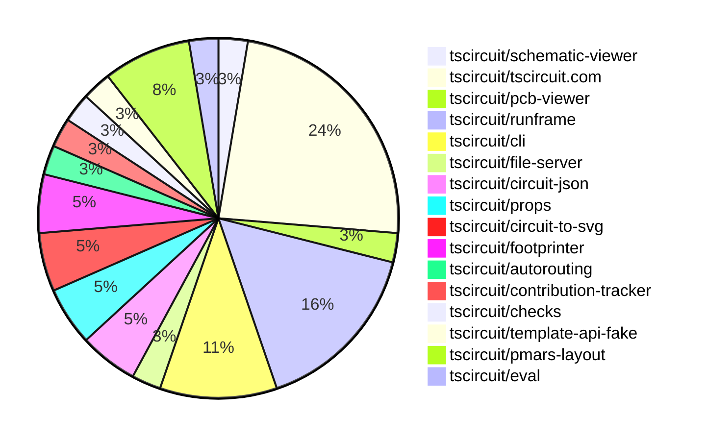

# contribution-tracker

Generates weekly contribution overviews for tscircuit contributors. Check out all
the [contribution overviews here](./contribution-overviews/)

* All PRs in the tscircuit org are scanned/summarized via Claude Haiku
* Claude classifies each Diff/PR as a Major, Minor or Tiny contribution
* All the PRs, summaries, and classifications are organized into charts and tables

The current week is shown below. There are 3 major sections:

* [Contributor Overview](#contributor-overview)
* [PRs by Repository](#prs-by-repository)
* [PRs by Contributor](#changes-by-contributor)

## Current Week

<!-- START_CURRENT_WEEK -->

# Contribution Overview 2025-05-21

## PRs by Repository

## Contributor Overview

| Contributor | 🐳 Major | 🐙 Minor | 🐌 Tiny | ⭐ | Issues Created | Discussion Contributions |
|-------------|---------|---------|---------|-----|----------------|--------------------------|
| [imrishabh18](#imrishabh18) | 0 | 13 | 3 | ⭐⭐⭐ | 8 | 0🔹 0🔶 0💎 |
| [seveibar](#seveibar) | 3 | 1 | 0 | ⭐⭐ | 8 | 0🔹 1🔶 0💎 |
| [ArnavK-09](#ArnavK-09) | 0 | 4 | 0 | ⭐ | 4 | 0🔹 0🔶 0💎 |
| [ShiboSoftwareDev](#ShiboSoftwareDev) | 0 | 4 | 1 | ⭐ | 3 | 0🔹 0🔶 0💎 |
| [techmannih](#techmannih) | 0 | 4 | 0 | ⭐ | 2 | 0🔹 0🔶 0💎 |
| [Abse2001](#Abse2001) | 0 | 3 | 0 | ⭐ | 1 | 0🔹 0🔶 0💎 |
| [andrii-balitskyi](#andrii-balitskyi) | 0 | 2 | 0 | ⭐ | 0 | 0🔹 0🔶 0💎 |

### Discussion Contribution Legend

- 🔹 Participating: Basic participation with minimal effort
- 🔶 Very Active: Thoughtful participation that adds value
- 💎 Extremely Active: Exceptional participation with high-quality content

## Review Table

[reviews-received-hover]: ## "Number of reviews received for PRs for this contributor"
[approvals-received-hover]: ## "Number of approvals received for PRs this contributor authored"
[rejections-received-hover]: ## "Number of rejections received for PRs this contributor authored"
[prs-opened-hover]: ## "Number of PRs opened by this contributor"
[issues-created-hover]: ## "Number of issues created by this contributor"
[bountied-issues-hover]: ## "Number of issues this contributor created with a bounty"
[bountied-issue-$-hover]: ## "Total bounty amount placed on issues authored by this contributor"

| Contributor | Reviews Received | Approvals Received | Rejections Received | Approvals | Rejections | PRs Opened | PRs Merged | Issues Created | Bountied Issues | Bountied Issue $ |
|---|---|---|---|---|---|---|---|---|---|---|
| [ArnavK-09](#ArnavK-09) | 23 | 5 | 1 | 0 | 0 | 12 | 4 | 4 | 0 | 0 |
| [seveibar](#seveibar) | 0 | 0 | 0 | 15 | 4 | 6 | 4 | 8 | 1 | 10 |
| [imrishabh18](#imrishabh18) | 7 | 2 | 1 | 5 | 0 | 17 | 16 | 8 | 0 | 0 |
| [techmannih](#techmannih) | 13 | 3 | 2 | 0 | 0 | 7 | 4 | 2 | 0 | 0 |
| [Abse2001](#Abse2001) | 7 | 3 | 0 | 0 | 0 | 4 | 3 | 1 | 0 | 0 |
| [graphite-app[bot]](#graphite-app[bot]) | 0 | 0 | 0 | 0 | 0 | 0 | 0 | 0 | 0 | 0 |
| [ShiboSoftwareDev](#ShiboSoftwareDev) | 18 | 6 | 1 | 0 | 0 | 8 | 5 | 3 | 0 | 0 |
| [Anshgrover23](#Anshgrover23) | 0 | 0 | 0 | 1 | 1 | 0 | 0 | 1 | 1 | 10 |
| [andrii-balitskyi](#andrii-balitskyi) | 4 | 2 | 0 | 0 | 0 | 3 | 2 | 0 | 0 | 0 |

## Changes by Repository

### [tscircuit/schematic-viewer](https://github.com/tscircuit/schematic-viewer)

| PR # | Impact | Contributor | Description | Milestone Aligned |
|------|--------|-------------|-------------|-------------------|
| [#94](https://github.com/tscircuit/schematic-viewer/pull/94) | 🐙 Minor | ArnavK-09 | Refactor z-index values in EditIcon and SchematicViewer components | ✅ |

### [tscircuit/tscircuit.com](https://github.com/tscircuit/tscircuit.com)

| PR # | Impact | Contributor | Description | Milestone Aligned |
|------|--------|-------------|-------------|-------------------|
| [#1146](https://github.com/tscircuit/tscircuit.com/pull/1146) | 🐙 Minor | ArnavK-09 | Update terminology in QuickstartPage to reflect package usage instead of snippets | ❌ |
| [#1147](https://github.com/tscircuit/tscircuit.com/pull/1147) | 🐙 Minor | ArnavK-09 | Fix an issue where an error is not being shown on the first run. | ❌ |
| [#1144](https://github.com/tscircuit/tscircuit.com/pull/1144) | 🐙 Minor | ArnavK-09 | Fixes a bug where the important file preview doesn't update when the list of important files changes. | ✅ |
| [#1154](https://github.com/tscircuit/tscircuit.com/pull/1154) | 🐙 Minor | imrishabh18 | Update runframe package to fix report button issue | ✅ |
| [#1152](https://github.com/tscircuit/tscircuit.com/pull/1152) | 🐙 Minor | imrishabh18 |  | ❌ |
| [#1142](https://github.com/tscircuit/tscircuit.com/pull/1142) | 🐙 Minor | imrishabh18 | Invalidates the cache after deleting or updating a package in the runframe. | ✅ |
| [#1141](https://github.com/tscircuit/tscircuit.com/pull/1141) | 🐙 Minor | imrishabh18 | Removes the `/preview` page from the application. | ❌ |
| [#1140](https://github.com/tscircuit/tscircuit.com/pull/1140) | 🐙 Minor | imrishabh18 | Fix the `cmd + k` search functionality to show unique packages instead of duplicates. | ❌ |
| [#1148](https://github.com/tscircuit/tscircuit.com/pull/1148) | 🐙 Minor | andrii-balitskyi | Make the code editor interactive before full type checking is ready. | ❌ |

### [tscircuit/pcb-viewer](https://github.com/tscircuit/pcb-viewer)

| PR # | Impact | Contributor | Description | Milestone Aligned |
|------|--------|-------------|-------------|-------------------|
| [#288](https://github.com/tscircuit/pcb-viewer/pull/288) | 🐙 Minor | imrishabh18 | Remove the "circuit-to-svg" package as it is causing issues in dependent packages. | ❌ |

### [tscircuit/runframe](https://github.com/tscircuit/runframe)

| PR # | Impact | Contributor | Description | Milestone Aligned |
|------|--------|-------------|-------------|-------------------|
| [#654](https://github.com/tscircuit/runframe/pull/654) | 🐙 Minor | imrishabh18 | Add a fallback file entrypoint to the report issue button | ✅ |
| [#653](https://github.com/tscircuit/runframe/pull/653) | 🐙 Minor | imrishabh18 | Fixed the issue where the "Report issue" button was missing the circuit code. | ✅ |
| [#647](https://github.com/tscircuit/runframe/pull/647) | 🐙 Minor | imrishabh18 | Updating dependencies, including adding the `@tscircuit/footprinter` package and updating versions of `@tscircuit/pcb-viewer`, `circuit-to-svg`, and `schematic-symbols`. | ❌ |
| [#634](https://github.com/tscircuit/runframe/pull/634) | 🐙 Minor | andrii-balitskyi | Fixes a bug where the "Errors" tab fails to display error details on the first run failure. | ✅ |
| [#639](https://github.com/tscircuit/runframe/pull/639) | 🐌 Tiny | imrishabh18 | Update the version of the `@tscircuit/file-server` dependency from `0.0.23` to `0.0.24`. | ✅ |
| [#637](https://github.com/tscircuit/runframe/pull/637) | 🐌 Tiny | imrishabh18 | Update the `easyeda` dependency to version `0.0.142` | ✅ |

### [tscircuit/cli](https://github.com/tscircuit/cli)

| PR # | Impact | Contributor | Description | Milestone Aligned |
|------|--------|-------------|-------------|-------------------|
| [#204](https://github.com/tscircuit/cli/pull/204) | 🐙 Minor | imrishabh18 | Fix issue with importing JLCPCB parts not being added to the file system | ✅ |
| [#202](https://github.com/tscircuit/cli/pull/202) | 🐙 Minor | imrishabh18 | Fix the `upgrade` command to correctly check for and update the CLI to the latest version. | ✅ |
| [#200](https://github.com/tscircuit/cli/pull/200) | 🐙 Minor | imrishabh18 | Update the `@tscircuit/runframe` dependency to version `0.0.481` | ✅ |
| [#203](https://github.com/tscircuit/cli/pull/203) | 🐌 Tiny | imrishabh18 | Fix packages import from the dialog | ❌ |

### [tscircuit/file-server](https://github.com/tscircuit/file-server)

| PR # | Impact | Contributor | Description | Milestone Aligned |
|------|--------|-------------|-------------|-------------------|
| [#15](https://github.com/tscircuit/file-server/pull/15) | 🐙 Minor | imrishabh18 | Add support for HTTP/2 by setting the "authority" header in addition to the "Host" header. | ✅ |

### [tscircuit/circuit-json](https://github.com/tscircuit/circuit-json)

| PR # | Impact | Contributor | Description | Milestone Aligned |
|------|--------|-------------|-------------|-------------------|
| [#197](https://github.com/tscircuit/circuit-json/pull/197) | 🐙 Minor | Abse2001 | Update the `schematic_box` type to include a new `is_dashed` property. | ✅ |
| [#198](https://github.com/tscircuit/circuit-json/pull/198) | 🐙 Minor | ShiboSoftwareDev | Replaces the `anchor_alignment` field in the `pcb_silkscreen_text` type with a new type called `NinePointAnchor`. | ✅ |

### [tscircuit/props](https://github.com/tscircuit/props)

| PR # | Impact | Contributor | Description | Milestone Aligned |
|------|--------|-------------|-------------|-------------------|
| [#236](https://github.com/tscircuit/props/pull/236) | 🐙 Minor | Abse2001 | Added new properties to the `schematic-box` component, including `padding`, `title`, `overlay`, and `strokeStyle`. | ✅ |
| [#238](https://github.com/tscircuit/props/pull/238) | 🐙 Minor | ShiboSoftwareDev | Adds support for nine-point anchoring of silkscreen text | ✅ |

### [tscircuit/circuit-to-svg](https://github.com/tscircuit/circuit-to-svg)

| PR # | Impact | Contributor | Description | Milestone Aligned |
|------|--------|-------------|-------------|-------------------|
| [#220](https://github.com/tscircuit/circuit-to-svg/pull/220) | 🐙 Minor | Abse2001 | Update dependency version for "@tscircuit/core" | ❌ |
| [#221](https://github.com/tscircuit/circuit-to-svg/pull/221) | 🐙 Minor | ShiboSoftwareDev | Adds support for nine-point anchor alignment for silkscreen texts | ✅ |

### [tscircuit/footprinter](https://github.com/tscircuit/footprinter)

| PR # | Impact | Contributor | Description | Milestone Aligned |
|------|--------|-------------|-------------|-------------------|
| [#270](https://github.com/tscircuit/footprinter/pull/270) | 🐙 Minor | ShiboSoftwareDev | Updated the `circuit-to-svg` and `ss` packages | ✅ |
| [#272](https://github.com/tscircuit/footprinter/pull/272) | 🐙 Minor | techmannih | Add support for the `nosquareplating` flag in the `pinrow` function, which allows for a circular pad to be used for the first pin instead of a rectangular pad. | ✅ |

### [tscircuit/autorouting](https://github.com/tscircuit/autorouting)

| PR # | Impact | Contributor | Description | Milestone Aligned |
|------|--------|-------------|-------------|-------------------|
| [#111](https://github.com/tscircuit/autorouting/pull/111) | 🐌 Tiny | ShiboSoftwareDev | Updated dependencies and snapshots | ✅ |

### [tscircuit/contribution-tracker](https://github.com/tscircuit/contribution-tracker)

| PR # | Impact | Contributor | Description | Milestone Aligned |
|------|--------|-------------|-------------|-------------------|
| [#149](https://github.com/tscircuit/contribution-tracker/pull/149) | 🐙 Minor | techmannih | Apply a 1.25 multiplier to the sponsorship amount calculations. | ❌ |

### [tscircuit/checks](https://github.com/tscircuit/checks)

| PR # | Impact | Contributor | Description | Milestone Aligned |
|------|--------|-------------|-------------|-------------------|
| [#47](https://github.com/tscircuit/checks/pull/47) | 🐙 Minor | techmannih | Adds a GitHub workflow to perform type checking using Bun for the repository. | ✅ |

### [tscircuit/template-api-fake](https://github.com/tscircuit/template-api-fake)

| PR # | Impact | Contributor | Description | Milestone Aligned |
|------|--------|-------------|-------------|-------------------|
| [#12](https://github.com/tscircuit/template-api-fake/pull/12) | 🐙 Minor | techmannih | Add GitHub Actions workflows for format checking, testing, and publishing to npm | ✅ |

### [tscircuit/pmars-layout](https://github.com/tscircuit/pmars-layout)

| PR # | Impact | Contributor | Description | Milestone Aligned |
|------|--------|-------------|-------------|-------------------|
| [#7](https://github.com/tscircuit/pmars-layout/pull/7) | 🐳 Major | seveibar | Adds a matching and scoring system for circuit boards, along with a better grid stringification feature. | ✅ |
| [#5](https://github.com/tscircuit/pmars-layout/pull/5) | 🐳 Major | seveibar | The change adds new types for various edit operations, such as adding labels to pins, adding pins to sides, removing pins from sides, adding passives to pins, clearing pins, and removing chips. It also adds a function to adapt a template circuit to a target netlist by applying these edit operations. | ✅ |
| [#4](https://github.com/tscircuit/pmars-layout/pull/4) | 🐳 Major | seveibar | Introduces complex tscircuit-based layouts, normalization fixes, and the ability to apply and get net lists from Circuit JSON. | ✅ |

### [tscircuit/eval](https://github.com/tscircuit/eval)

| PR # | Impact | Contributor | Description | Milestone Aligned |
|------|--------|-------------|-------------|-------------------|
| [#366](https://github.com/tscircuit/eval/pull/366) | 🐙 Minor | seveibar | Add a script to copy core dependency versions to the current package.json file during postinstall. | ✅ |

## Changes by Contributor

### [ArnavK-09](https://github.com/ArnavK-09)

| PR # | Impact | Description | Milestone Aligned |
|------|--------|-------------|-------------------|
| [#94](https://github.com/tscircuit/schematic-viewer/pull/94) | 🐙 Minor | Refactor z-index values in EditIcon and SchematicViewer components | ✅ |
| [#1146](https://github.com/tscircuit/tscircuit.com/pull/1146) | 🐙 Minor | Update terminology in QuickstartPage to reflect package usage instead of snippets | ❌ |
| [#1147](https://github.com/tscircuit/tscircuit.com/pull/1147) | 🐙 Minor | Fix an issue where an error is not being shown on the first run. | ❌ |
| [#1144](https://github.com/tscircuit/tscircuit.com/pull/1144) | 🐙 Minor | Fixes a bug where the important file preview doesn't update when the list of important files changes. | ✅ |

### [imrishabh18](https://github.com/imrishabh18)

| PR # | Impact | Description | Milestone Aligned |
|------|--------|-------------|-------------------|
| [#288](https://github.com/tscircuit/pcb-viewer/pull/288) | 🐙 Minor | Remove the "circuit-to-svg" package as it is causing issues in dependent packages. | ❌ |
| [#1154](https://github.com/tscircuit/tscircuit.com/pull/1154) | 🐙 Minor | Update runframe package to fix report button issue | ✅ |
| [#1152](https://github.com/tscircuit/tscircuit.com/pull/1152) | 🐙 Minor |  | ❌ |
| [#1142](https://github.com/tscircuit/tscircuit.com/pull/1142) | 🐙 Minor | Invalidates the cache after deleting or updating a package in the runframe. | ✅ |
| [#1141](https://github.com/tscircuit/tscircuit.com/pull/1141) | 🐙 Minor | Removes the `/preview` page from the application. | ❌ |
| [#1140](https://github.com/tscircuit/tscircuit.com/pull/1140) | 🐙 Minor | Fix the `cmd + k` search functionality to show unique packages instead of duplicates. | ❌ |
| [#654](https://github.com/tscircuit/runframe/pull/654) | 🐙 Minor | Add a fallback file entrypoint to the report issue button | ✅ |
| [#653](https://github.com/tscircuit/runframe/pull/653) | 🐙 Minor | Fixed the issue where the "Report issue" button was missing the circuit code. | ✅ |
| [#647](https://github.com/tscircuit/runframe/pull/647) | 🐙 Minor | Updating dependencies, including adding the `@tscircuit/footprinter` package and updating versions of `@tscircuit/pcb-viewer`, `circuit-to-svg`, and `schematic-symbols`. | ❌ |
| [#204](https://github.com/tscircuit/cli/pull/204) | 🐙 Minor | Fix issue with importing JLCPCB parts not being added to the file system | ✅ |
| [#202](https://github.com/tscircuit/cli/pull/202) | 🐙 Minor | Fix the `upgrade` command to correctly check for and update the CLI to the latest version. | ✅ |
| [#200](https://github.com/tscircuit/cli/pull/200) | 🐙 Minor | Update the `@tscircuit/runframe` dependency to version `0.0.481` | ✅ |
| [#15](https://github.com/tscircuit/file-server/pull/15) | 🐙 Minor | Add support for HTTP/2 by setting the "authority" header in addition to the "Host" header. | ✅ |
| [#639](https://github.com/tscircuit/runframe/pull/639) | 🐌 Tiny | Update the version of the `@tscircuit/file-server` dependency from `0.0.23` to `0.0.24`. | ✅ |
| [#637](https://github.com/tscircuit/runframe/pull/637) | 🐌 Tiny | Update the `easyeda` dependency to version `0.0.142` | ✅ |
| [#203](https://github.com/tscircuit/cli/pull/203) | 🐌 Tiny | Fix packages import from the dialog | ❌ |

### [Abse2001](https://github.com/Abse2001)

| PR # | Impact | Description | Milestone Aligned |
|------|--------|-------------|-------------------|
| [#197](https://github.com/tscircuit/circuit-json/pull/197) | 🐙 Minor | Update the `schematic_box` type to include a new `is_dashed` property. | ✅ |
| [#236](https://github.com/tscircuit/props/pull/236) | 🐙 Minor | Added new properties to the `schematic-box` component, including `padding`, `title`, `overlay`, and `strokeStyle`. | ✅ |
| [#220](https://github.com/tscircuit/circuit-to-svg/pull/220) | 🐙 Minor | Update dependency version for "@tscircuit/core" | ❌ |

### [ShiboSoftwareDev](https://github.com/ShiboSoftwareDev)

| PR # | Impact | Description | Milestone Aligned |
|------|--------|-------------|-------------------|
| [#198](https://github.com/tscircuit/circuit-json/pull/198) | 🐙 Minor | Replaces the `anchor_alignment` field in the `pcb_silkscreen_text` type with a new type called `NinePointAnchor`. | ✅ |
| [#238](https://github.com/tscircuit/props/pull/238) | 🐙 Minor | Adds support for nine-point anchoring of silkscreen text | ✅ |
| [#270](https://github.com/tscircuit/footprinter/pull/270) | 🐙 Minor | Updated the `circuit-to-svg` and `ss` packages | ✅ |
| [#221](https://github.com/tscircuit/circuit-to-svg/pull/221) | 🐙 Minor | Adds support for nine-point anchor alignment for silkscreen texts | ✅ |
| [#111](https://github.com/tscircuit/autorouting/pull/111) | 🐌 Tiny | Updated dependencies and snapshots | ✅ |

### [techmannih](https://github.com/techmannih)

| PR # | Impact | Description | Milestone Aligned |
|------|--------|-------------|-------------------|
| [#272](https://github.com/tscircuit/footprinter/pull/272) | 🐙 Minor | Add support for the `nosquareplating` flag in the `pinrow` function, which allows for a circular pad to be used for the first pin instead of a rectangular pad. | ✅ |
| [#149](https://github.com/tscircuit/contribution-tracker/pull/149) | 🐙 Minor | Apply a 1.25 multiplier to the sponsorship amount calculations. | ❌ |
| [#47](https://github.com/tscircuit/checks/pull/47) | 🐙 Minor | Adds a GitHub workflow to perform type checking using Bun for the repository. | ✅ |
| [#12](https://github.com/tscircuit/template-api-fake/pull/12) | 🐙 Minor | Add GitHub Actions workflows for format checking, testing, and publishing to npm | ✅ |

### [andrii-balitskyi](https://github.com/andrii-balitskyi)

| PR # | Impact | Description | Milestone Aligned |
|------|--------|-------------|-------------------|
| [#1148](https://github.com/tscircuit/tscircuit.com/pull/1148) | 🐙 Minor | Make the code editor interactive before full type checking is ready. | ❌ |
| [#634](https://github.com/tscircuit/runframe/pull/634) | 🐙 Minor | Fixes a bug where the "Errors" tab fails to display error details on the first run failure. | ✅ |

### [seveibar](https://github.com/seveibar)

| PR # | Impact | Description | Milestone Aligned |
|------|--------|-------------|-------------------|
| [#7](https://github.com/tscircuit/pmars-layout/pull/7) | 🐳 Major | Adds a matching and scoring system for circuit boards, along with a better grid stringification feature. | ✅ |
| [#5](https://github.com/tscircuit/pmars-layout/pull/5) | 🐳 Major | The change adds new types for various edit operations, such as adding labels to pins, adding pins to sides, removing pins from sides, adding passives to pins, clearing pins, and removing chips. It also adds a function to adapt a template circuit to a target netlist by applying these edit operations. | ✅ |
| [#4](https://github.com/tscircuit/pmars-layout/pull/4) | 🐳 Major | Introduces complex tscircuit-based layouts, normalization fixes, and the ability to apply and get net lists from Circuit JSON. | ✅ |
| [#366](https://github.com/tscircuit/eval/pull/366) | 🐙 Minor | Add a script to copy core dependency versions to the current package.json file during postinstall. | ✅ |

<!-- END_CURRENT_WEEK -->
