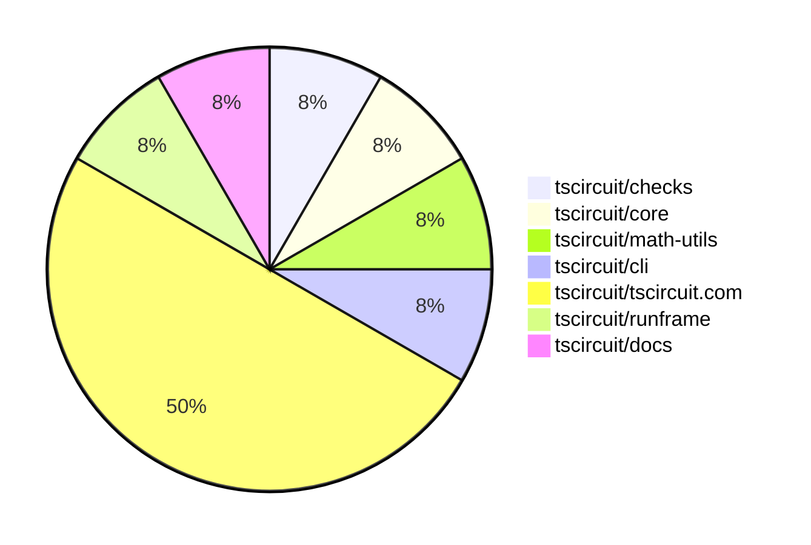

# contribution-tracker

Generates weekly contribution overviews for tscircuit contributors. Check out all
the [contribution overviews here](./contribution-overviews/)

* All PRs in the tscircuit org are scanned/summarized via Claude Haiku
* Claude classifies each Diff/PR as a Major, Minor or Tiny contribution
* All the PRs, summaries, and classifications are organized into charts and tables

The current week is shown below. There are 3 major sections:

* [Contributor Overview](#contributor-overview)
* [PRs by Repository](#prs-by-repository)
* [PRs by Contributor](#changes-by-contributor)

## Current Week

<!-- START_CURRENT_WEEK -->

# Contribution Overview 2025-04-23

## PRs by Repository

## Contributor Overview

| Contributor | 🐳 Major | 🐙 Minor | 🐌 Tiny | ⭐ | Issues Created | Discussion Contributions |
|-------------|---------|---------|---------|-----|----------------|--------------------------|
| [seveibar](#seveibar) | 0 | 1 | 0 | ⭐⭐ | 14 | 0🔹 0🔶 0💎 |
| [imrishabh18](#imrishabh18) | 0 | 2 | 0 | ⭐⭐ | 3 | 0🔹 0🔶 0💎 |
| [ArnavK-09](#ArnavK-09) | 1 | 3 | 0 | ⭐⭐ | 1 | 0🔹 0🔶 0💎 |
| [Abse2001](#Abse2001) | 1 | 1 | 0 | ⭐ | 1 | 0🔹 0🔶 0💎 |
| [dhvll](#dhvll) | 1 | 0 | 0 | ⭐ | 0 | 0🔹 0🔶 0💎 |
| [MustafaMulla29](#MustafaMulla29) | 0 | 0 | 0 |  | 2 | 0🔹 0🔶 0💎 |
| [mohan-bee](#mohan-bee) | 0 | 1 | 0 |  | 0 | 0🔹 0🔶 0💎 |

### Discussion Contribution Legend

- 🔹 Participating: Basic participation with minimal effort
- 🔶 Very Active: Thoughtful participation that adds value
- 💎 Extremely Active: Exceptional participation with high-quality content

## Review Table

[reviews-received-hover]: ## "Number of reviews received for PRs for this contributor"
[approvals-received-hover]: ## "Number of approvals received for PRs this contributor authored"
[rejections-received-hover]: ## "Number of rejections received for PRs this contributor authored"
[prs-opened-hover]: ## "Number of PRs opened by this contributor"
[issues-created-hover]: ## "Number of issues created by this contributor"
[bountied-issues-hover]: ## "Number of issues this contributor created with a bounty"
[bountied-issue-$-hover]: ## "Total bounty amount placed on issues authored by this contributor"

| Contributor | Reviews Received | Approvals Received | Rejections Received | Approvals | Rejections | PRs Opened | PRs Merged | Issues Created | Bountied Issues | Bountied Issue $ |
|---|---|---|---|---|---|---|---|---|---|---|
| [guptadeepak8](#guptadeepak8) | 0 | 0 | 0 | 0 | 0 | 1 | 0 | 0 | 0 | 0 |
| [Abse2001](#Abse2001) | 2 | 2 | 0 | 0 | 0 | 2 | 2 | 1 | 0 | 0 |
| [seveibar](#seveibar) | 0 | 0 | 0 | 10 | 1 | 3 | 1 | 14 | 7 | 99 |
| [MustafaMulla29](#MustafaMulla29) | 5 | 1 | 2 | 0 | 0 | 2 | 1 | 2 | 2 | 25 |
| [imrishabh18](#imrishabh18) | 2 | 0 | 0 | 1 | 2 | 3 | 2 | 3 | 3 | 57 |
| [ArnavK-09](#ArnavK-09) | 6 | 5 | 0 | 0 | 1 | 5 | 4 | 1 | 0 | 0 |
| [dhvll](#dhvll) | 2 | 2 | 0 | 0 | 0 | 1 | 1 | 0 | 0 | 0 |
| [ShiboSoftwareDev](#ShiboSoftwareDev) | 1 | 0 | 1 | 0 | 0 | 1 | 0 | 1 | 0 | 0 |
| [mohan-bee](#mohan-bee) | 1 | 1 | 0 | 0 | 0 | 1 | 1 | 0 | 0 | 0 |
| [roshanDev-eng](#roshanDev-eng) | 3 | 0 | 1 | 0 | 0 | 1 | 0 | 0 | 0 | 0 |

## Changes by Repository

### [tscircuit/checks](https://github.com/tscircuit/checks)

| PR # | Impact | Contributor | Description | Milestone Aligned |
|------|--------|-------------|-------------|-------------------|
| [#36](https://github.com/tscircuit/checks/pull/36) | 🐳 Major | Abse2001 | Introduces a new DRC rule to check if PCB components are out of the board boundary. | ❌ |

### [tscircuit/core](https://github.com/tscircuit/core)

| PR # | Impact | Contributor | Description | Milestone Aligned |
|------|--------|-------------|-------------|-------------------|
| [#756](https://github.com/tscircuit/core/pull/756) | 🐙 Minor | Abse2001 | Fix flaky test for schematic trace overlap with manufacturer label. | ✅ |

### [tscircuit/math-utils](https://github.com/tscircuit/math-utils)

| PR # | Impact | Contributor | Description | Milestone Aligned |
|------|--------|-------------|-------------|-------------------|
| [#10](https://github.com/tscircuit/math-utils/pull/10) | 🐙 Minor | seveibar | Adds two utility functions: `distSq` to calculate the squared distance between two points, and `pointToSegmentClosestPoint` to find the closest point on a line segment to a given point. | ✅ |

### [tscircuit/cli](https://github.com/tscircuit/cli)

| PR # | Impact | Contributor | Description | Milestone Aligned |
|------|--------|-------------|-------------|-------------------|
| [#183](https://github.com/tscircuit/cli/pull/183) | 🐳 Major | ArnavK-09 | Introduces a new configuration option `alwaysCloneWithAuthorName` to control whether the author name is included in the cloned snippet directory by default, and improves error handling for the clone command. | ✅ |

### [tscircuit/tscircuit.com](https://github.com/tscircuit/tscircuit.com)

| PR # | Impact | Contributor | Description | Milestone Aligned |
|------|--------|-------------|-------------|-------------------|
| [#926](https://github.com/tscircuit/tscircuit.com/pull/926) | 🐳 Major | dhvll | Adds a new `starred_at` field to the snippet schema and updates the logic to fetch and display the star timestamp for packages and snippets. | ❌ |
| [#937](https://github.com/tscircuit/tscircuit.com/pull/937) | 🐙 Minor | ArnavK-09 | Add a useRef hook to the input element and focus it on component mount to enhance user experience by immediately allowing keyboard input. | ✅ |
| [#933](https://github.com/tscircuit/tscircuit.com/pull/933) | 🐙 Minor | imrishabh18 | Fix to ensure the order dialog opens correctly. | ✅ |
| [#921](https://github.com/tscircuit/tscircuit.com/pull/921) | 🐙 Minor | imrishabh18 | Add internal user to filter out the analytics from posthog | ❌ |
| [#928](https://github.com/tscircuit/tscircuit.com/pull/928) | 🟣 | MustafaMulla29 | Fix the overflow and tooltip UI when hovering over code components | ✅ |
| [#925](https://github.com/tscircuit/tscircuit.com/pull/925) | 🐙 Minor | mohan-bee | Update the order button to improve the UI. | ✅ |

### [tscircuit/runframe](https://github.com/tscircuit/runframe)

| PR # | Impact | Contributor | Description | Milestone Aligned |
|------|--------|-------------|-------------|-------------------|
| [#497](https://github.com/tscircuit/runframe/pull/497) | 🐙 Minor | ArnavK-09 | Enhance the PreviewEmptyState component by adding a dynamic tip for users, improving the visual layout, and making the component more informative. | ✅ |

### [tscircuit/docs](https://github.com/tscircuit/docs)

| PR # | Impact | Contributor | Description | Milestone Aligned |
|------|--------|-------------|-------------|-------------------|
| [#38](https://github.com/tscircuit/docs/pull/38) | 🐙 Minor | ArnavK-09 | Adds responsive styles for iframes and prevents horizontal overflow | ✅ |

## Changes by Contributor

### [Abse2001](https://github.com/Abse2001)

| PR # | Impact | Description | Milestone Aligned |
|------|--------|-------------|-------------------|
| [#36](https://github.com/tscircuit/checks/pull/36) | 🐳 Major | Introduces a new DRC rule to check if PCB components are out of the board boundary. | ❌ |
| [#756](https://github.com/tscircuit/core/pull/756) | 🐙 Minor | Fix flaky test for schematic trace overlap with manufacturer label. | ✅ |

### [seveibar](https://github.com/seveibar)

| PR # | Impact | Description | Milestone Aligned |
|------|--------|-------------|-------------------|
| [#10](https://github.com/tscircuit/math-utils/pull/10) | 🐙 Minor | Adds two utility functions: `distSq` to calculate the squared distance between two points, and `pointToSegmentClosestPoint` to find the closest point on a line segment to a given point. | ✅ |

### [ArnavK-09](https://github.com/ArnavK-09)

| PR # | Impact | Description | Milestone Aligned |
|------|--------|-------------|-------------------|
| [#183](https://github.com/tscircuit/cli/pull/183) | 🐳 Major | Introduces a new configuration option `alwaysCloneWithAuthorName` to control whether the author name is included in the cloned snippet directory by default, and improves error handling for the clone command. | ✅ |
| [#937](https://github.com/tscircuit/tscircuit.com/pull/937) | 🐙 Minor | Add a useRef hook to the input element and focus it on component mount to enhance user experience by immediately allowing keyboard input. | ✅ |
| [#497](https://github.com/tscircuit/runframe/pull/497) | 🐙 Minor | Enhance the PreviewEmptyState component by adding a dynamic tip for users, improving the visual layout, and making the component more informative. | ✅ |
| [#38](https://github.com/tscircuit/docs/pull/38) | 🐙 Minor | Adds responsive styles for iframes and prevents horizontal overflow | ✅ |

### [dhvll](https://github.com/dhvll)

| PR # | Impact | Description | Milestone Aligned |
|------|--------|-------------|-------------------|
| [#926](https://github.com/tscircuit/tscircuit.com/pull/926) | 🐳 Major | Adds a new `starred_at` field to the snippet schema and updates the logic to fetch and display the star timestamp for packages and snippets. | ❌ |

### [imrishabh18](https://github.com/imrishabh18)

| PR # | Impact | Description | Milestone Aligned |
|------|--------|-------------|-------------------|
| [#933](https://github.com/tscircuit/tscircuit.com/pull/933) | 🐙 Minor | Fix to ensure the order dialog opens correctly. | ✅ |
| [#921](https://github.com/tscircuit/tscircuit.com/pull/921) | 🐙 Minor | Add internal user to filter out the analytics from posthog | ❌ |

### [MustafaMulla29](https://github.com/MustafaMulla29)

| PR # | Impact | Description | Milestone Aligned |
|------|--------|-------------|-------------------|
| [#928](https://github.com/tscircuit/tscircuit.com/pull/928) | 🟣 | Fix the overflow and tooltip UI when hovering over code components | ✅ |

### [mohan-bee](https://github.com/mohan-bee)

| PR # | Impact | Description | Milestone Aligned |
|------|--------|-------------|-------------------|
| [#925](https://github.com/tscircuit/tscircuit.com/pull/925) | 🐙 Minor | Update the order button to improve the UI. | ✅ |

<!-- END_CURRENT_WEEK -->
