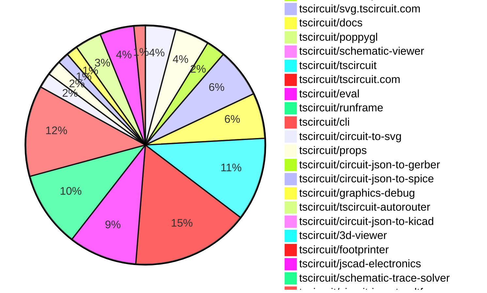
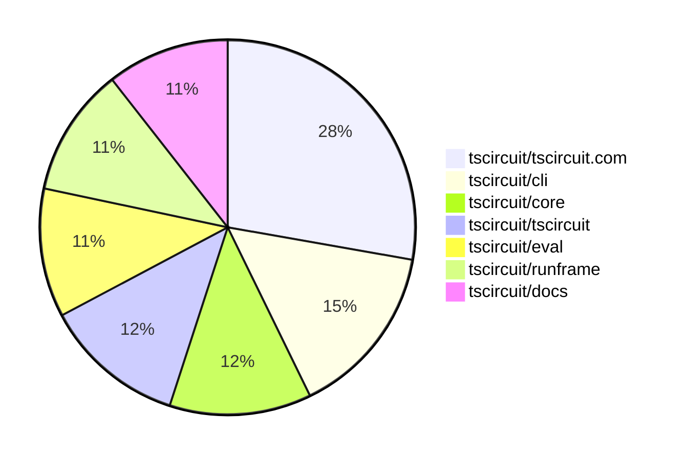

# contribution-tracker

[contributions.tscircuit.com](https://contributions.tscircuit.com) ・ [tscircuit.com](https://tscircuit.com) ・ [Contribution Overviews](./contribution-overviews/) ・ [Changelogs](./changelogs/)

Generates weekly contribution overviews for tscircuit contributors. Check out all
the [contribution overviews here](./contribution-overviews/)
You can find AI-generated monthly changelogs in the [changelogs directory](./changelogs/).

- All PRs in the tscircuit org are scanned/summarized via an LLM
- The LLM classifies each Diff/PR as into a set of attributes for scoring
- All the PRs, summaries, and classifications are organized into charts and tables for [the website](https://contributions.tscircuit.com)

> Want to run locally? See the [Development Section](#development)

The current week is shown below. There are 4 major sections:

- [Contributor Overview](#contributor-overview)
- [PRs by Repository](#prs-by-repository)
- [PRs by Contributor](#changes-by-contributor)
- [Scoring & Sponsorship System](#scoring--sponsorship-system)

## Current Week

<!-- START_CURRENT_WEEK -->

# Contribution Overview 2025-11-12

The current week is shown below. There are 4 major sections:

- [Contributor Overview](#contributor-overview)
- [PRs by Repository](#prs-by-repository)
- [PRs by Contributor](#changes-by-contributor)
- [Scoring & Sponsorship System](#scoring--sponsorship-system)

## PRs by Repository



## Contributor Overview

| Contributor | 🐳 Major | 🐙 Minor | 🐌 Tiny | ⭐ | Score | Discussion Contributions |
|-------------|---------|---------|---------|-----|----------------|--------------------------|
| [ShiboSoftwareDev](#ShiboSoftwareDev) | 3 | 10 | 6 | ⭐⭐⭐ | 47.5 | 0🔹 0🔶 0💎 |
| [seveibar](#seveibar) | 5 | 3 | 5 | ⭐⭐⭐ | 46 | 0🔹 0🔶 0💎 |
| [imrishabh18](#imrishabh18) | 2 | 4 | 8 | ⭐⭐ | 29 | 0🔹 0🔶 0💎 |
| [techmannih](#techmannih) | 2 | 3 | 4 | ⭐⭐ | 27 | 0🔹 0🔶 0💎 |
| [ArnavK-09](#ArnavK-09) | 3 | 4 | 4 | ⭐⭐ | 24 | 0🔹 0🔶 0💎 |
| [Ayushjhawar8](#Ayushjhawar8) | 2 | 5 | 1 | ⭐⭐ | 20 | 0🔹 0🔶 0💎 |
| [0hmX](#0hmX) | 3 | 0 | 3 | ⭐⭐ | 15 | 0🔹 0🔶 0💎 |
| [tscircuitbot](#tscircuitbot) | 0 | 0 | 105 | ⭐⭐ | 13.5 | 0🔹 0🔶 0💎 |
| [rushabhcodes](#rushabhcodes) | 0 | 0 | 10 | ⭐⭐ | 13 | 0🔹 0🔶 0💎 |
| [baeoc](#baeoc) | 0 | 1 | 3 | ⭐ | 7 | 0🔹 0🔶 0💎 |
| [Abse2001](#Abse2001) | 1 | 0 | 1 | ⭐ | 7 | 0🔹 0🔶 0💎 |
| [pxlpal](#pxlpal) | 1 | 0 | 0 | ⭐ | 4 | 0🔹 0🔶 0💎 |
| [nailoo](#nailoo) | 0 | 1 | 2 | ⭐ | 4 | 0🔹 0🔶 0💎 |
| [RaghavArora14](#RaghavArora14) | 0 | 0 | 1 |  | 3 | 0🔹 0🔶 0💎 |

> Note: AI evaluates PRs and assigns 1-3 star ratings automatically. 4 and 5 star ratings require manual staff review.

### Discussion Contribution Legend

- 🔹 Normal Comments: Basic participation with minimal effort
- 🔶 Great Informative Comments: Thoughtful participation that adds value
- 💎 Incredible Comments: Exceptional participation with high-quality content

## Review Table

[reviews-received-hover]: ## "Number of reviews received for PRs for this contributor"
[approvals-received-hover]: ## "Number of approvals received for PRs this contributor authored"
[rejections-received-hover]: ## "Number of rejections received for PRs this contributor authored"
[prs-opened-hover]: ## "Number of PRs opened by this contributor"
[issues-created-hover]: ## "Number of issues created by this contributor"
[bountied-issues-hover]: ## "Number of issues this contributor created with a bounty"
[bountied-issue-$-hover]: ## "Total bounty amount placed on issues authored by this contributor"

| Contributor | Reviews Received | Approvals Received | Rejections Received | Approvals | Rejections | PRs Opened | PRs Merged | Score | Issues Created | Bountied Issues | Bountied Issue $ |
|---|---|---|---|---|---|---|---|---|---|---|---|
| [Ayushjhawar8](#Ayushjhawar8) | 33 | 7 | 1 | 0 | 0 | 11 | 8 | 20 | 0 | 0 | 0 |
| [seveibar](#seveibar) | 8 | 0 | 0 | 45 | 6 | 21 | 13 | 46 | 0 | 0 | 0 |
| [tscircuitbot](#tscircuitbot) | 0 | 0 | 0 | 0 | 0 | 122 | 105 | 13.5 | 0 | 0 | 0 |
| [techmannih](#techmannih) | 16 | 8 | 0 | 6 | 1 | 10 | 9 | 27 | 0 | 0 | 0 |
| [imrishabh18](#imrishabh18) | 12 | 5 | 0 | 4 | 0 | 15 | 14 | 29 | 0 | 0 | 0 |
| [ShiboSoftwareDev](#ShiboSoftwareDev) | 19 | 14 | 0 | 9 | 0 | 20 | 19 | 47.5 | 0 | 0 | 0 |
| [rushabhcodes](#rushabhcodes) | 25 | 13 | 1 | 2 | 1 | 13 | 10 | 13 | 0 | 0 | 0 |
| [Abse2001](#Abse2001) | 8 | 2 | 2 | 2 | 1 | 4 | 2 | 7 | 0 | 0 | 0 |
| [baeoc](#baeoc) | 8 | 5 | 0 | 0 | 0 | 5 | 4 | 7 | 0 | 0 | 0 |
| [RaghavArora14](#RaghavArora14) | 14 | 4 | 1 | 0 | 0 | 3 | 1 | 3 | 0 | 0 | 0 |
| [Dasdebsankar54](#Dasdebsankar54) | 3 | 0 | 1 | 0 | 0 | 1 | 0 | 0 | 0 | 0 | 0 |
| [nailoo](#nailoo) | 4 | 3 | 0 | 0 | 0 | 3 | 3 | 4 | 0 | 0 | 0 |
| [ArnavK-09](#ArnavK-09) | 2 | 1 | 0 | 0 | 0 | 13 | 12 | 24 | 0 | 0 | 0 |
| [pxlpal](#pxlpal) | 1 | 1 | 0 | 0 | 0 | 1 | 1 | 4 | 0 | 0 | 0 |
| [0hmX](#0hmX) | 23 | 4 | 1 | 0 | 0 | 13 | 6 | 15 | 0 | 0 | 0 |
| [MustafaMulla29](#MustafaMulla29) | 0 | 0 | 0 | 0 | 0 | 0 | 0 | 0 | 0 | 0 | 0 |
| [Kunal-Darekar](#Kunal-Darekar) | 0 | 0 | 0 | 0 | 0 | 1 | 0 | 0 | 0 | 0 | 0 |
| [Enity300](#Enity300) | 3 | 1 | 2 | 0 | 0 | 1 | 0 | 0 | 0 | 0 | 0 |

## Top 7 Repositories by Contribution Points



## Scoring & Sponsorship System

### Overview

PRs are analyzed by AI and assigned a **star rating (1-3 stars)**. 4 and 5 star ratings can only be manually assigned by staff. Weekly scores use `2^(starRating - 1)` per PR (capped at 12 PRs per rating), plus review/discussion points.

### Weekly Score → Star String

| Score Range | Star String | Count Value |
|------------|-------------|-------------|
| 0-3 | (empty) | 0 stars |
| 4-10 | ⭐ | 1 star |
| 11-30 | ⭐⭐ | 2 stars |
| 31-50 | ⭐⭐⭐ | 3 stars |
| 51-75 | 👑 | 1 crown |
| 76-100 | 👑👑 | 2 crowns |
| 101+ | 👑👑👑 | 3 crowns |

> Crowns count as 3 stars for sponsorship.

### Monthly Sponsorship Calculation

The sponsorship system calculates monthly payments based on your **weekly star counts** over the complete weeks in that month (typically 4-5 weeks, Wednesday-Tuesday format).

**Step 1: Collect Weekly Stars**
- All complete weeks in the month are analyzed
- Each week's star string is converted to a numeric count (⭐ = 1 star, ⭐⭐⭐ = 3 stars)
- Example: `[2, 2, 2, 1, 0]` means 2 stars in week 1, 2 stars in week 2, etc.

**Step 2: Calculate Metrics**
- **Median stars**: The median value of all weekly star counts
- **Min stars**: The minimum weekly star count
- **Max stars**: The maximum weekly star count
- **High score**: The maximum raw weekly score (0-100+ range from the scoring table) from any week in the month

**Step 3: Determine Base Amount**
The sponsorship amount is calculated based on these metrics (checked in order):

| Condition | Base Amount |
|-----------|-------------|
| `minStarCount >= 3` | **$500** |
| `medianStars >= 3` | **$450** |
| `medianStars >= 2.5` | **$300** |
| `medianStars >= 2` | **$200** |
| `medianStars >= 1.5` | **$100** |
| `medianStars >= 1` | **$75** |
| `maxStarCount >= 2` | **$25** |
| `maxStarCount >= 1` | **$15** |
| `highScore >= 3` (and all stars = 0) | **$5** |

| Maintainer Level | Monthly Bonus |
|------------------|---------------|
| Level 1 | **$200** |
| Level 2 | **$350** |
| Level 3 | **$500** |

**Final Amount** = Base Amount + Maintainer Bonus

## Changes by Repository

### [tscircuit/pcb-viewer](https://github.com/tscircuit/pcb-viewer)

| PR # | Impact | Rating | Contributor | Description |
|------|--------|--------|-------------|-------------|
| [#477](https://github.com/tscircuit/pcb-viewer/pull/477) | 🐳 Major | ⭐⭐⭐ | Ayushjhawar8 | Adds a diagonal label for measurements in the DimensionOverlay component, displaying the distance in a visually distinct manner. |
| [#476](https://github.com/tscircuit/pcb-viewer/pull/476) | 🐙 Minor | ⭐⭐ | Ayushjhawar8 | Add origin snapping point for the dimension tool, allowing the PCB origin to be an always-available snapping target alongside element-derived anchors. |
| [#472](https://github.com/tscircuit/pcb-viewer/pull/472) | 🐙 Minor | ⭐⭐ | techmannih | Adds support for rectangular holes in PCB designs, allowing users to define rectangular hole shapes with specified dimensions in the PCB viewer. |

<details>
<summary>🐌 Tiny Contributions (5)</summary>

| PR # | Impact | Contributor | Description |
|------|--------|-------------|-------------|
| [#479](https://github.com/tscircuit/pcb-viewer/pull/479) | 🐌 Tiny | tscircuitbot | Automated package update |
| [#478](https://github.com/tscircuit/pcb-viewer/pull/478) | 🐌 Tiny | tscircuitbot | Automated package update |
| [#475](https://github.com/tscircuit/pcb-viewer/pull/475) | 🐌 Tiny | tscircuitbot | Automated package update |
| [#474](https://github.com/tscircuit/pcb-viewer/pull/474) | 🐌 Tiny | tscircuitbot | Automated package update |
| [#473](https://github.com/tscircuit/pcb-viewer/pull/473) | 🐌 Tiny | techmannih | Adds a center property to the PCB panel configuration, allowing for precise positioning of components within the panel. |

</details>

### [tscircuit/core](https://github.com/tscircuit/core)

| PR # | Impact | Rating | Contributor | Description |
|------|--------|--------|-------------|-------------|
| [#1650](https://github.com/tscircuit/core/pull/1650) | 🐳 Major | ⭐⭐⭐ | Ayushjhawar8 | Adds pcb_panel records with width, height, center, and solder mask coverage info, and upgrades circuit-json to v0.0.307. |
| [#1659](https://github.com/tscircuit/core/pull/1659) | 🐳 Major | ⭐⭐⭐ | techmannih | Adds support for a new hole shape with a polygon pad in the PlatedHole component, allowing for more complex pad outlines in PCB designs. |
| [#1655](https://github.com/tscircuit/core/pull/1655) | 🐙 Minor | ⭐⭐ | ShiboSoftwareDev | Adds a new SPICE analysis test for a half-bridge rectifier circuit using ngspice as the simulation engine. |
| [#1656](https://github.com/tscircuit/core/pull/1656) | 🐙 Minor | ⭐⭐ | ShiboSoftwareDev | Add support for inflating source_trace elements from subcircuit circuitJson, allowing pre-wired subcircuits to maintain internal connections upon instantiation. |
| [#1651](https://github.com/tscircuit/core/pull/1651) | 🐙 Minor | ⭐⭐ | ShiboSoftwareDev | Adds support for inflating diode components when they are defined within a circuitJson property of a subcircuit. |
| [#1649](https://github.com/tscircuit/core/pull/1649) | 🐙 Minor | ⭐⭐ | ShiboSoftwareDev | Adds support for inflating inductor components when defined within a circuitJson property of a subcircuit. |
| [#1648](https://github.com/tscircuit/core/pull/1648) | 🐙 Minor | ⭐⭐ | ShiboSoftwareDev | Add support for inflating capacitor components from circuitJson when used in a subcircuit |
| [#1653](https://github.com/tscircuit/core/pull/1653) | 🐙 Minor | ⭐⭐ | seveibar | Includes component name and provided net identifier in the validation error messages for net names containing  or -. |
| [#1652](https://github.com/tscircuit/core/pull/1652) | 🐙 Minor | ⭐⭐ | seveibar | Fixes SmtPad rendering issues when port hints are omitted by defaulting to an empty hint list and ensures proper reuse of normalized port hint arrays across all shapes. |

### [tscircuit/circuit-json](https://github.com/tscircuit/circuit-json)

| PR # | Impact | Rating | Contributor | Description |
|------|--------|--------|-------------|-------------|
| [#349](https://github.com/tscircuit/circuit-json/pull/349) | 🐳 Major | ⭐⭐⭐ | ShiboSoftwareDev | Removes redundant name field from schematic_voltage_probe and simulation_voltage_probe since its inherited from the source component, updates simulation_transient_voltage_graph to reference source_component_id instead of schematic_voltage_probe_id and simulation_voltage_probe_id for cleaner data model, and updates tests to reflect the new structure. |
| [#344](https://github.com/tscircuit/circuit-json/pull/344) | 🐙 Minor | ⭐⭐ | Ayushjhawar8 | Adds a required center point to the pcb_panel schema and TypeScript interface, and updates PCB panel tests to include the center position. |
| [#345](https://github.com/tscircuit/circuit-json/pull/345) | 🐙 Minor | ⭐⭐ | techmannih | Adds a new interface for a plated hole with a polygon pad schema in the PCB design. |
| [#348](https://github.com/tscircuit/circuit-json/pull/348) | 🐙 Minor | ⭐⭐ | ShiboSoftwareDev | Add new source_simple_voltage_probe component to represent voltage probes at the source level and add source_component_id field to simulation and schematic voltage probes for linking. |
| [#347](https://github.com/tscircuit/circuit-json/pull/347) | 🐙 Minor | ⭐⭐ | ShiboSoftwareDev | Adds an optional name property to SchematicVoltageProbe for identifying simulation results associated with that probe. |

### [tscircuit/svg.tscircuit.com](https://github.com/tscircuit/svg.tscircuit.com)

| PR # | Impact | Rating | Contributor | Description |
|------|--------|--------|-------------|-------------|
| [#588](https://github.com/tscircuit/svg.tscircuit.com/pull/588) | 🐙 Minor | ⭐⭐ | Ayushjhawar8 | Changes the grid and section colors in the 3D PNG rendering function and allows for a customizable background color through query parameters. |
| [#580](https://github.com/tscircuit/svg.tscircuit.com/pull/580) | 🐙 Minor | ⭐⭐ | imrishabh18 | Adds an offset y position to the infinite grid rendering functionality, allowing for better positioning in 3D views. |

<details>
<summary>🐌 Tiny Contributions (11)</summary>

| PR # | Impact | Contributor | Description |
|------|--------|-------------|-------------|
| [#591](https://github.com/tscircuit/svg.tscircuit.com/pull/591) | 🐌 Tiny | tscircuitbot | Updates the tscircuit package version from 0.0.900 to 0.0.901 in package.json |
| [#590](https://github.com/tscircuit/svg.tscircuit.com/pull/590) | 🐌 Tiny | tscircuitbot | Updates the tscircuit package version from 0.0.899 to 0.0.900 in package.json |
| [#589](https://github.com/tscircuit/svg.tscircuit.com/pull/589) | 🐌 Tiny | tscircuitbot | Updates the tscircuit package version from 0.0.898 to 0.0.899 in package.json |
| [#587](https://github.com/tscircuit/svg.tscircuit.com/pull/587) | 🐌 Tiny | tscircuitbot | Updates the tscircuit package version from 0.0.897 to 0.0.898 in package.json |
| [#586](https://github.com/tscircuit/svg.tscircuit.com/pull/586) | 🐌 Tiny | tscircuitbot | Updates the tscircuit package version from 0.0.896 to 0.0.897 in package.json |
| [#585](https://github.com/tscircuit/svg.tscircuit.com/pull/585) | 🐌 Tiny | tscircuitbot | Updates the tscircuit package version from 0.0.895 to 0.0.896 in package.json |
| [#584](https://github.com/tscircuit/svg.tscircuit.com/pull/584) | 🐌 Tiny | tscircuitbot | Automated package update |
| [#583](https://github.com/tscircuit/svg.tscircuit.com/pull/583) | 🐌 Tiny | tscircuitbot | Automated package update |
| [#582](https://github.com/tscircuit/svg.tscircuit.com/pull/582) | 🐌 Tiny | tscircuitbot | Updates the tscircuit package version from 0.0.891 to 0.0.892 in package.json |
| [#581](https://github.com/tscircuit/svg.tscircuit.com/pull/581) | 🐌 Tiny | tscircuitbot | Updates the tscircuit package version from 0.0.890 to 0.0.891 in package.json |
| [#579](https://github.com/tscircuit/svg.tscircuit.com/pull/579) | 🐌 Tiny | imrishabh18 | Updates the circuit-json-to-gltf package to version 0.0.37, fixing the issue of overlapping infinite grid rendering in the application. |

</details>

### [tscircuit/docs](https://github.com/tscircuit/docs)

| PR # | Impact | Rating | Contributor | Description |
|------|--------|--------|-------------|-------------|
| [#329](https://github.com/tscircuit/docs/pull/329) | 🐳 Major | ⭐⭐⭐ | ShiboSoftwareDev | Adds a verticalStack prop to the CircuitPreview component, allowing for a vertical layout with the image preview on top of the code editor, and updates SPICE simulation examples to use this layout while hiding PCB and 3D tabs. |
| [#335](https://github.com/tscircuit/docs/pull/335) | 🐙 Minor | ⭐⭐ | Ayushjhawar8 | Fixes the issue of infinite grid lines in the 3D rendering of PCBs by adding a background color parameter to the SVG generation URL. |
| [#325](https://github.com/tscircuit/docs/pull/325) | 🐙 Minor | ⭐⭐ | ShiboSoftwareDev | Adds an RC charging circuit example to the SPICE simulation documentation and clarifies the default spice engine in the documentation. |
| [#331](https://github.com/tscircuit/docs/pull/331) | 🐙 Minor | ⭐⭐ | nailoo | Fixes rendering issues in the 3D view by adding a board tag to the silkscreen rectangle component. |
| [#332](https://github.com/tscircuit/docs/pull/332) | 🐙 Minor | ⭐⭐ | baeoc | Fixes rendering issues in 3D and PCB views by adding a board tag to the VAI component. |

<details>
<summary>🐌 Tiny Contributions (7)</summary>

| PR # | Impact | Contributor | Description |
|------|--------|-------------|-------------|
| [#330](https://github.com/tscircuit/docs/pull/330) | 🐌 Tiny | imrishabh18 | Updates the flowchart in the documentation to reflect the connection from Runframe to tscircuit.com. |
| [#333](https://github.com/tscircuit/docs/pull/333) | 🐌 Tiny | ShiboSoftwareDev | Adds a new SPICE simulation example for a half-wave rectifier circuit and introduces a new Diodes category in the documentation. |
| [#328](https://github.com/tscircuit/docs/pull/328) | 🐌 Tiny | ShiboSoftwareDev | Adds a new documentation page with an example of using a switch  component in a SPICE simulation and updates the introduction to include details on the switch  components simulation-specific properties. |
| [#326](https://github.com/tscircuit/docs/pull/326) | 🐌 Tiny | ShiboSoftwareDev | Refactors the SPICE simulation documentation by moving it from the Advanced section to a new, dedicated SPICE Simulation category within the Guides, splitting the single page into separate files for better organization and direct linking to specific examples. |
| [#327](https://github.com/tscircuit/docs/pull/327) | 🐌 Tiny | seveibar | Adds the schematicDisabled property to the board property reference table and moves schematic-disabled guidance into a tip callout with an example. |
| [#324](https://github.com/tscircuit/docs/pull/324) | 🐌 Tiny | nailoo | Fixes the PCB and 3D view representation for the Manufacturer Part Number documentation by adding a name attribute to the diode component. |
| [#334](https://github.com/tscircuit/docs/pull/334) | 🐌 Tiny | baeoc | Fixes rendering issue by adding a board tag to the silkscreencircle component for 3D view. |

</details>

### [tscircuit/poppygl](https://github.com/tscircuit/poppygl)

| PR # | Impact | Rating | Contributor | Description |
|------|--------|--------|-------------|-------------|
| [#21](https://github.com/tscircuit/poppygl/pull/21) | 🐙 Minor | ⭐⭐ | Ayushjhawar8 | Adds support to parse hex string for backgroundColor, allowing users to specify background colors in hex format. |

### [tscircuit/schematic-viewer](https://github.com/tscircuit/schematic-viewer)


<details>
<summary>🐌 Tiny Contributions (1)</summary>

| PR # | Impact | Contributor | Description |
|------|--------|-------------|-------------|
| [#146](https://github.com/tscircuit/schematic-viewer/pull/146) | 🐌 Tiny | Ayushjhawar8 | Add descriptive tooltips to the schematic viewers control icons to explain their actions |

</details>

### [tscircuit/tscircuit](https://github.com/tscircuit/tscircuit)


<details>
<summary>🐌 Tiny Contributions (22)</summary>

| PR # | Impact | Contributor | Description |
|------|--------|-------------|-------------|
| [#1344](https://github.com/tscircuit/tscircuit/pull/1344) | 🐌 Tiny | tscircuitbot | Automated package update |
| [#1343](https://github.com/tscircuit/tscircuit/pull/1343) | 🐌 Tiny | tscircuitbot | Automated package update |
| [#1342](https://github.com/tscircuit/tscircuit/pull/1342) | 🐌 Tiny | tscircuitbot | Automated package update |
| [#1341](https://github.com/tscircuit/tscircuit/pull/1341) | 🐌 Tiny | tscircuitbot | Automated package update |
| [#1340](https://github.com/tscircuit/tscircuit/pull/1340) | 🐌 Tiny | tscircuitbot | Automated package update |
| [#1339](https://github.com/tscircuit/tscircuit/pull/1339) | 🐌 Tiny | tscircuitbot | Automated package update |
| [#1338](https://github.com/tscircuit/tscircuit/pull/1338) | 🐌 Tiny | tscircuitbot | Automated package update to version 0.0.898 |
| [#1337](https://github.com/tscircuit/tscircuit/pull/1337) | 🐌 Tiny | tscircuitbot | Automated package update |
| [#1335](https://github.com/tscircuit/tscircuit/pull/1335) | 🐌 Tiny | tscircuitbot | Automated package update |
| [#1334](https://github.com/tscircuit/tscircuit/pull/1334) | 🐌 Tiny | tscircuitbot | Automated package update |
| [#1333](https://github.com/tscircuit/tscircuit/pull/1333) | 🐌 Tiny | tscircuitbot | Automated package update |
| [#1332](https://github.com/tscircuit/tscircuit/pull/1332) | 🐌 Tiny | tscircuitbot | Automated package update |
| [#1331](https://github.com/tscircuit/tscircuit/pull/1331) | 🐌 Tiny | tscircuitbot | Automated package update |
| [#1328](https://github.com/tscircuit/tscircuit/pull/1328) | 🐌 Tiny | tscircuitbot | Automated package update |
| [#1327](https://github.com/tscircuit/tscircuit/pull/1327) | 🐌 Tiny | tscircuitbot | Updates the tscircuitcli package to version 0.1.485 in the package.json file. |
| [#1326](https://github.com/tscircuit/tscircuit/pull/1326) | 🐌 Tiny | tscircuitbot | Automated package update |
| [#1325](https://github.com/tscircuit/tscircuit/pull/1325) | 🐌 Tiny | tscircuitbot | Automated package update |
| [#1324](https://github.com/tscircuit/tscircuit/pull/1324) | 🐌 Tiny | tscircuitbot | Automated package update |
| [#1323](https://github.com/tscircuit/tscircuit/pull/1323) | 🐌 Tiny | tscircuitbot | Updates the versions of several packages including tscircuitcli, tscircuitcore, and tscircuiteval in package.json |
| [#1322](https://github.com/tscircuit/tscircuit/pull/1322) | 🐌 Tiny | tscircuitbot | Automated package update |
| [#1321](https://github.com/tscircuit/tscircuit/pull/1321) | 🐌 Tiny | tscircuitbot | Automated package update |
| [#1330](https://github.com/tscircuit/tscircuit/pull/1330) | 🐌 Tiny | imrishabh18 | Updates the versions of the tscircuitcli and tscircuiteval packages in package.json |

</details>

### [tscircuit/tscircuit.com](https://github.com/tscircuit/tscircuit.com)

| PR # | Impact | Rating | Contributor | Description |
|------|--------|--------|-------------|-------------|
| [#2004](https://github.com/tscircuit/tscircuit.com/pull/2004) | 🐳 Major | ⭐⭐⭐ | imrishabh18 | Fixes the image preview functionality by fetching images from package files instead of relying on URLs. |
| [#2019](https://github.com/tscircuit/tscircuit.com/pull/2019) | 🐳 Major | ⭐⭐⭐ | ArnavK-09 | Changes organization filtering to use tscircuit_handle and account_id instead of github_handle for unauthenticated users. |
| [#2018](https://github.com/tscircuit/tscircuit.com/pull/2018) | 🐳 Major | ⭐⭐⭐ | ArnavK-09 | Prevents the display of a double dialog in the editor when the tscircuit handle is not set, prompting the user to set it before saving a package. |
| [#1998](https://github.com/tscircuit/tscircuit.com/pull/1998) | 🐳 Major | ⭐⭐⭐ | ArnavK-09 | Adds functionality for managing tscircuit_handle, including validation, updates, and a dialog for users to set their handle if not already done. |
| [#1992](https://github.com/tscircuit/tscircuit.com/pull/1992) | 🐳 Major | ⭐⭐⭐ | pxlpal | Adds support for updating the user handle and implements a redirect after authentication if the handle is not set. |
| [#2011](https://github.com/tscircuit/tscircuit.com/pull/2011) | 🐙 Minor | ⭐⭐ | ArnavK-09 | Adds an optional tscircuit_handle parameter to the account retrieval API, allowing users to fetch accounts using their tscircuit handle in addition to the existing GitHub username. |
| [#2016](https://github.com/tscircuit/tscircuit.com/pull/2016) | 🐙 Minor | ⭐⭐ | ArnavK-09 | Changes the organization creation form to use tscircuit_handle instead of account_id and updates validation messages and layout for better responsiveness. |
| [#2007](https://github.com/tscircuit/tscircuit.com/pull/2007) | 🐙 Minor | ⭐⭐ | ArnavK-09 | Fixes signout error in the HeaderLogin component when attempting to log out. |
| [#2009](https://github.com/tscircuit/tscircuit.com/pull/2009) | 🐙 Minor | ⭐⭐ | ArnavK-09 | Adds an optional tscircuit_handle parameter to the account retrieval process, enhancing the functionality of package star mutations. |

<details>
<summary>🐌 Tiny Contributions (22)</summary>

| PR # | Impact | Contributor | Description |
|------|--------|-------------|-------------|
| [#2020](https://github.com/tscircuit/tscircuit.com/pull/2020) | 🐌 Tiny | tscircuitbot | Automated package update |
| [#2017](https://github.com/tscircuit/tscircuit.com/pull/2017) | 🐌 Tiny | tscircuitbot | Automated package update |
| [#2012](https://github.com/tscircuit/tscircuit.com/pull/2012) | 🐌 Tiny | tscircuitbot | Automated package update |
| [#2006](https://github.com/tscircuit/tscircuit.com/pull/2006) | 🐌 Tiny | tscircuitbot | Updates the tscircuiteval package from version 0.0.474 to 0.0.475 |
| [#2005](https://github.com/tscircuit/tscircuit.com/pull/2005) | 🐌 Tiny | tscircuitbot | Automated package update |
| [#2003](https://github.com/tscircuit/tscircuit.com/pull/2003) | 🐌 Tiny | tscircuitbot | Updates the tscircuiteval package to version 0.0.474 in the package.json file. |
| [#2002](https://github.com/tscircuit/tscircuit.com/pull/2002) | 🐌 Tiny | tscircuitbot | Updates the tscircuiteval package from version 0.0.472 to 0.0.473 |
| [#2001](https://github.com/tscircuit/tscircuit.com/pull/2001) | 🐌 Tiny | tscircuitbot | Updates the tscircuiteval package to version 0.0.472 in the package.json file. |
| [#2000](https://github.com/tscircuit/tscircuit.com/pull/2000) | 🐌 Tiny | tscircuitbot | Automated package update |
| [#1994](https://github.com/tscircuit/tscircuit.com/pull/1994) | 🐌 Tiny | tscircuitbot | Updates the tscircuiteval package to version 0.0.471 in the package.json file. |
| [#1993](https://github.com/tscircuit/tscircuit.com/pull/1993) | 🐌 Tiny | tscircuitbot | Updates the tscircuiteval package to version 0.0.470 in package.json |
| [#1990](https://github.com/tscircuit/tscircuit.com/pull/1990) | 🐌 Tiny | tscircuitbot | Automated package update |
| [#1988](https://github.com/tscircuit/tscircuit.com/pull/1988) | 🐌 Tiny | tscircuitbot | Automated package update |
| [#1987](https://github.com/tscircuit/tscircuit.com/pull/1987) | 🐌 Tiny | tscircuitbot | Updates the tscircuiteval package to version 0.0.467 in the package.json file. |
| [#1996](https://github.com/tscircuit/tscircuit.com/pull/1996) | 🐌 Tiny | techmannih | Updates the tscircuitpcb-viewer package to version 1.11.256 in the package.json file. |
| [#1997](https://github.com/tscircuit/tscircuit.com/pull/1997) | 🐌 Tiny | techmannih | Updates the tscircuit3d-viewer package to version 0.0.435 in the package.json file. |
| [#1991](https://github.com/tscircuit/tscircuit.com/pull/1991) | 🐌 Tiny | imrishabh18 | Removes the build step status list from the releases sidebar on the package view page and eliminates the transpilation and circuit JSON build status helpers that fed the sidebar list. |
| [#1981](https://github.com/tscircuit/tscircuit.com/pull/1981) | 🐌 Tiny | imrishabh18 | Removes the logs section for the package release, retaining only the user code logs. |
| [#2013](https://github.com/tscircuit/tscircuit.com/pull/2013) | 🐌 Tiny | ArnavK-09 | Refactors the dashboard layout for new organization accounts, improving the user interface and experience for first-time users. |
| [#2014](https://github.com/tscircuit/tscircuit.com/pull/2014) | 🐌 Tiny | ArnavK-09 | Fixes error handling in the useAxios hook to correctly retrieve error codes from the response data. |
| [#2015](https://github.com/tscircuit/tscircuit.com/pull/2015) | 🐌 Tiny | ArnavK-09 | Changes the organization creation form to use handle instead of name and enhances layout responsiveness for better user experience. |
| [#2008](https://github.com/tscircuit/tscircuit.com/pull/2008) | 🐌 Tiny | ArnavK-09 | Replaces the existing avatar component with a new GithubAvatarWithFallback component for user settings page. |

</details>

### [tscircuit/eval](https://github.com/tscircuit/eval)

| PR # | Impact | Rating | Contributor | Description |
|------|--------|--------|-------------|-------------|
| [#1516](https://github.com/tscircuit/eval/pull/1516) | 🐙 Minor | ⭐⭐ | imrishabh18 | Adds support for a custom node modules resolver to allow dynamic resolution of modules not present in the filesystem map. |
| [#1495](https://github.com/tscircuit/eval/pull/1495) | 🐙 Minor | ⭐⭐ | imrishabh18 | Add support for importing kicad_pcb files directly into the circuit simulation environment, enabling users to utilize KiCad PCB designs seamlessly. |

<details>
<summary>🐌 Tiny Contributions (16)</summary>

| PR # | Impact | Contributor | Description |
|------|--------|-------------|-------------|
| [#1525](https://github.com/tscircuit/eval/pull/1525) | 🐌 Tiny | tscircuitbot | Automated package update |
| [#1524](https://github.com/tscircuit/eval/pull/1524) | 🐌 Tiny | tscircuitbot | Updates various package dependencies to their latest versions in package.json |
| [#1522](https://github.com/tscircuit/eval/pull/1522) | 🐌 Tiny | tscircuitbot | Automated package update |
| [#1521](https://github.com/tscircuit/eval/pull/1521) | 🐌 Tiny | tscircuitbot | Automated package update |
| [#1520](https://github.com/tscircuit/eval/pull/1520) | 🐌 Tiny | tscircuitbot | Automated package update |
| [#1518](https://github.com/tscircuit/eval/pull/1518) | 🐌 Tiny | tscircuitbot | Automated package update |
| [#1517](https://github.com/tscircuit/eval/pull/1517) | 🐌 Tiny | tscircuitbot | Updates the version of the tscircuitcore package from 0.0.864 to 0.0.865 in package.json |
| [#1515](https://github.com/tscircuit/eval/pull/1515) | 🐌 Tiny | tscircuitbot | Automated package update |
| [#1514](https://github.com/tscircuit/eval/pull/1514) | 🐌 Tiny | tscircuitbot | Automated package update |
| [#1511](https://github.com/tscircuit/eval/pull/1511) | 🐌 Tiny | tscircuitbot | Automated package update |
| [#1510](https://github.com/tscircuit/eval/pull/1510) | 🐌 Tiny | tscircuitbot | Automated package update |
| [#1508](https://github.com/tscircuit/eval/pull/1508) | 🐌 Tiny | tscircuitbot | Automated package update |
| [#1507](https://github.com/tscircuit/eval/pull/1507) | 🐌 Tiny | tscircuitbot | Automated package update |
| [#1506](https://github.com/tscircuit/eval/pull/1506) | 🐌 Tiny | tscircuitbot | Updates the version of the tscircuitcore package from 0.0.860 to 0.0.861 in package.json |
| [#1504](https://github.com/tscircuit/eval/pull/1504) | 🐌 Tiny | tscircuitbot | Automated package update |
| [#1503](https://github.com/tscircuit/eval/pull/1503) | 🐌 Tiny | tscircuitbot | Updates the version of the tscircuitcore package from 0.0.859 to 0.0.860 in package.json |

</details>

### [tscircuit/runframe](https://github.com/tscircuit/runframe)


<details>
<summary>🐌 Tiny Contributions (20)</summary>

| PR # | Impact | Contributor | Description |
|------|--------|-------------|-------------|
| [#1782](https://github.com/tscircuit/runframe/pull/1782) | 🐌 Tiny | tscircuitbot | Automated package update to version 0.0.1253 |
| [#1781](https://github.com/tscircuit/runframe/pull/1781) | 🐌 Tiny | tscircuitbot | Updates the tscircuitpcb-viewer package from version 1.11.259 to 1.11.260 |
| [#1779](https://github.com/tscircuit/runframe/pull/1779) | 🐌 Tiny | tscircuitbot | Automated package update |
| [#1778](https://github.com/tscircuit/runframe/pull/1778) | 🐌 Tiny | tscircuitbot | Updates the tscircuitpcb-viewer package from version 1.11.258 to 1.11.259 |
| [#1776](https://github.com/tscircuit/runframe/pull/1776) | 🐌 Tiny | tscircuitbot | Updates the package version from 0.0.1250 to 0.0.1251 in package.json |
| [#1772](https://github.com/tscircuit/runframe/pull/1772) | 🐌 Tiny | tscircuitbot | Automated package update to version 0.0.1250 |
| [#1771](https://github.com/tscircuit/runframe/pull/1771) | 🐌 Tiny | tscircuitbot | Updates the tscircuitpcb-viewer package from version 1.11.257 to 1.11.258 |
| [#1770](https://github.com/tscircuit/runframe/pull/1770) | 🐌 Tiny | tscircuitbot | Updates the package version from 0.0.1248 to 0.0.1249 in package.json |
| [#1769](https://github.com/tscircuit/runframe/pull/1769) | 🐌 Tiny | tscircuitbot | Updates the tscircuitpcb-viewer package from version 1.11.256 to 1.11.257 |
| [#1767](https://github.com/tscircuit/runframe/pull/1767) | 🐌 Tiny | tscircuitbot | Automated package update |
| [#1766](https://github.com/tscircuit/runframe/pull/1766) | 🐌 Tiny | tscircuitbot | Updates the tscircuit3d-viewer package to version 0.0.435 in the package.json file. |
| [#1763](https://github.com/tscircuit/runframe/pull/1763) | 🐌 Tiny | tscircuitbot | Automated package update |
| [#1762](https://github.com/tscircuit/runframe/pull/1762) | 🐌 Tiny | tscircuitbot | Updates the tscircuiteval package to version 0.0.468 in the package.json file. |
| [#1761](https://github.com/tscircuit/runframe/pull/1761) | 🐌 Tiny | tscircuitbot | Automated package update |
| [#1760](https://github.com/tscircuit/runframe/pull/1760) | 🐌 Tiny | tscircuitbot | Updates the tscircuiteval package to version 0.0.467 in the package.json file. |
| [#1759](https://github.com/tscircuit/runframe/pull/1759) | 🐌 Tiny | tscircuitbot | Updates the package version from 0.0.1244 to 0.0.1245 in package.json |
| [#1758](https://github.com/tscircuit/runframe/pull/1758) | 🐌 Tiny | tscircuitbot | Updates the tscircuitschematic-viewer package from version 2.0.48 to 2.0.49 |
| [#1756](https://github.com/tscircuit/runframe/pull/1756) | 🐌 Tiny | tscircuitbot | Automated package update |
| [#1775](https://github.com/tscircuit/runframe/pull/1775) | 🐌 Tiny | imrishabh18 | Updates the UPSTREAM_REPOS environment variable to include tscircuit.com, allowing for integration with the specified repository. |
| [#1755](https://github.com/tscircuit/runframe/pull/1755) | 🐌 Tiny | seveibar | Updates the circuit-json-to-kicad dependency to version 0.0.25 and refreshes the lockfile to track the new version. |

</details>

### [tscircuit/cli](https://github.com/tscircuit/cli)

| PR # | Impact | Rating | Contributor | Description |
|------|--------|--------|-------------|-------------|
| [#923](https://github.com/tscircuit/cli/pull/923) | 🐳 Major | ⭐⭐⭐ | imrishabh18 | Adds support for the tsci install command to install project dependencies and generate a package.json if needed. |

<details>
<summary>🐌 Tiny Contributions (23)</summary>

| PR # | Impact | Contributor | Description |
|------|--------|-------------|-------------|
| [#943](https://github.com/tscircuit/cli/pull/943) | 🐌 Tiny | tscircuitbot | Automated package update |
| [#942](https://github.com/tscircuit/cli/pull/942) | 🐌 Tiny | tscircuitbot | Updates the tscircuitrunframe package from version 0.0.1252 to 0.0.1253 |
| [#940](https://github.com/tscircuit/cli/pull/940) | 🐌 Tiny | tscircuitbot | Automated package update |
| [#939](https://github.com/tscircuit/cli/pull/939) | 🐌 Tiny | tscircuitbot | Updates the tscircuitrunframe package from version 0.0.1251 to 0.0.1252 |
| [#938](https://github.com/tscircuit/cli/pull/938) | 🐌 Tiny | tscircuitbot | Automated package update |
| [#937](https://github.com/tscircuit/cli/pull/937) | 🐌 Tiny | tscircuitbot | Updates the tscircuitrunframe package from version 0.0.1250 to 0.0.1251 |
| [#936](https://github.com/tscircuit/cli/pull/936) | 🐌 Tiny | tscircuitbot | Automated package update |
| [#935](https://github.com/tscircuit/cli/pull/935) | 🐌 Tiny | tscircuitbot | Updates the tscircuitrunframe package to version 0.0.1250 in the package.json file. |
| [#934](https://github.com/tscircuit/cli/pull/934) | 🐌 Tiny | tscircuitbot | Automated package update |
| [#933](https://github.com/tscircuit/cli/pull/933) | 🐌 Tiny | tscircuitbot | Updates the tscircuitrunframe package to version 0.0.1249 in the package.json file |
| [#932](https://github.com/tscircuit/cli/pull/932) | 🐌 Tiny | tscircuitbot | Automated package update |
| [#931](https://github.com/tscircuit/cli/pull/931) | 🐌 Tiny | tscircuitbot | Updates the tscircuitrunframe package to version 0.0.1248 in package.json |
| [#930](https://github.com/tscircuit/cli/pull/930) | 🐌 Tiny | tscircuitbot | Automated package update |
| [#928](https://github.com/tscircuit/cli/pull/928) | 🐌 Tiny | tscircuitbot | Automated package update |
| [#927](https://github.com/tscircuit/cli/pull/927) | 🐌 Tiny | tscircuitbot | Automated package update |
| [#926](https://github.com/tscircuit/cli/pull/926) | 🐌 Tiny | tscircuitbot | Updates the tscircuitrunframe package to version 0.0.1247 |
| [#925](https://github.com/tscircuit/cli/pull/925) | 🐌 Tiny | tscircuitbot | Automated package update |
| [#924](https://github.com/tscircuit/cli/pull/924) | 🐌 Tiny | tscircuitbot | Automated package update |
| [#922](https://github.com/tscircuit/cli/pull/922) | 🐌 Tiny | tscircuitbot | Automated package update |
| [#921](https://github.com/tscircuit/cli/pull/921) | 🐌 Tiny | tscircuitbot | Updates the tscircuitrunframe package to version 0.0.1245 in the package.json file |
| [#920](https://github.com/tscircuit/cli/pull/920) | 🐌 Tiny | tscircuitbot | Automated package update |
| [#919](https://github.com/tscircuit/cli/pull/919) | 🐌 Tiny | tscircuitbot | Updates the tscircuitrunframe package from version 0.0.1242 to 0.0.1244 |
| [#929](https://github.com/tscircuit/cli/pull/929) | 🐌 Tiny | imrishabh18 | Adds tscircuit as a development dependency in package.json to facilitate development processes. |

</details>

### [tscircuit/circuit-to-svg](https://github.com/tscircuit/circuit-to-svg)

| PR # | Impact | Rating | Contributor | Description |
|------|--------|--------|-------------|-------------|
| [#420](https://github.com/tscircuit/circuit-to-svg/pull/420) | 🐳 Major | ⭐⭐⭐ | techmannih | Adds support for rendering plated holes with polygon pads in SVG format, including various hole shapes such as circle, oval, and pill. |
| [#422](https://github.com/tscircuit/circuit-to-svg/pull/422) | 🐳 Major | ⭐⭐⭐ | ShiboSoftwareDev | Updates the schematic SVG rendering to support the name property on schematic voltage probes, displaying the name as the probes label and formatting it with voltage if present. |

<details>
<summary>🐌 Tiny Contributions (2)</summary>

| PR # | Impact | Contributor | Description |
|------|--------|-------------|-------------|
| [#421](https://github.com/tscircuit/circuit-to-svg/pull/421) | 🐌 Tiny | techmannih | Adds center coordinates for PCB panels in the panel configuration. |
| [#423](https://github.com/tscircuit/circuit-to-svg/pull/423) | 🐌 Tiny | ShiboSoftwareDev | Adjusts the alignment of schematic voltage probe labels and the position of arrows to improve readability and clarity. |

</details>

### [tscircuit/props](https://github.com/tscircuit/props)

| PR # | Impact | Rating | Contributor | Description |
|------|--------|--------|-------------|-------------|
| [#497](https://github.com/tscircuit/props/pull/497) | 🐙 Minor | ⭐⭐ | techmannih | Adds the HoleWithPolygonPadPlatedHoleProps interface to define properties for a new type of plated hole with polygon pads in PCB layouts. |
| [#495](https://github.com/tscircuit/props/pull/495) | 🐙 Minor | ⭐⭐ | imrishabh18 | Adds a new property nodeModulesResolver to the PlatformConfig interface, allowing for custom resolution of module paths. |
| [#494](https://github.com/tscircuit/props/pull/494) | 🐙 Minor | ⭐⭐ | seveibar | Adds an optional circuitJson property to the footprint  component API and schema, allowing for serialized circuit JSON to describe a precompiled footprint. |

<details>
<summary>🐌 Tiny Contributions (1)</summary>

| PR # | Impact | Contributor | Description |
|------|--------|-------------|-------------|
| [#496](https://github.com/tscircuit/props/pull/496) | 🐌 Tiny | imrishabh18 | Changes the return type of nodeModulesResolver to allow null when modules are not found, improving error handling. |

</details>

### [tscircuit/circuit-json-to-gerber](https://github.com/tscircuit/circuit-json-to-gerber)

| PR # | Impact | Rating | Contributor | Description |
|------|--------|--------|-------------|-------------|
| [#65](https://github.com/tscircuit/circuit-json-to-gerber/pull/65) | 🐙 Minor | ⭐⭐ | ShiboSoftwareDev | Adds support for rendering PCB panels containing multiple boards. |

### [tscircuit/circuit-json-to-spice](https://github.com/tscircuit/circuit-json-to-spice)

| PR # | Impact | Rating | Contributor | Description |
|------|--------|--------|-------------|-------------|
| [#23](https://github.com/tscircuit/circuit-json-to-spice/pull/23) | 🐙 Minor | ⭐⭐ | ShiboSoftwareDev | Modifies SPICE netlist generation to use names from simulation_voltage_probe elements for node naming, ensuring more readable and predictable netlists. |

<details>
<summary>🐌 Tiny Contributions (2)</summary>

| PR # | Impact | Contributor | Description |
|------|--------|-------------|-------------|
| [#21](https://github.com/tscircuit/circuit-json-to-spice/pull/21) | 🐌 Tiny | ShiboSoftwareDev | Updates the versions of dependencies in package.json to the latest compatible versions. |
| [#22](https://github.com/tscircuit/circuit-json-to-spice/pull/22) | 🐌 Tiny | ShiboSoftwareDev | Increases the timeout for bun tests in the workflow configuration to prevent premature test failures. |

</details>

### [tscircuit/graphics-debug](https://github.com/tscircuit/graphics-debug)

| PR # | Impact | Rating | Contributor | Description |
|------|--------|--------|-------------|-------------|
| [#81](https://github.com/tscircuit/graphics-debug/pull/81) | 🐳 Major | ⭐⭐⭐ | seveibar | Fixes SVG line stroke width scaling by applying the transformation matrix when emitting SVG, ensuring accurate rendering of stroke widths in graphics objects. |
| [#80](https://github.com/tscircuit/graphics-debug/pull/80) | 🐳 Major | ⭐⭐⭐ | 0hmX | Add support for rendering arrows in the graphics library, including new arrow geometry calculations and SVG generation. |

<details>
<summary>🐌 Tiny Contributions (1)</summary>

| PR # | Impact | Contributor | Description |
|------|--------|-------------|-------------|
| [#82](https://github.com/tscircuit/graphics-debug/pull/82) | 🐌 Tiny | seveibar | Changes the default background color for SVG rendering to white and updates related snapshots in tests. |

</details>

### [tscircuit/tscircuit-autorouter](https://github.com/tscircuit/tscircuit-autorouter)

| PR # | Impact | Rating | Contributor | Description |
|------|--------|--------|-------------|-------------|
| [#316](https://github.com/tscircuit/tscircuit-autorouter/pull/316) | 🐳 Major | ⭐⭐⭐ | seveibar | Propagates SimpleRouteJson.minViaDiameter through the autorouting pipeline to ensure high-density solvers and stitchers honor configurable via sizing, updating capacity estimation and visualizations accordingly. |
| [#314](https://github.com/tscircuit/tscircuit-autorouter/pull/314) | 🐳 Major | ⭐⭐⭐ | seveibar | Add manual bug report ID input fallback to allow users to load reports when the URL lacks parameters, enabling parsing of URLs or raw IDs from user input and updating the page state accordingly. |
| [#318](https://github.com/tscircuit/tscircuit-autorouter/pull/318) | 🐳 Major | ⭐⭐⭐ | 0hmX | Keeps the original node in the straw nodes list if no new straw nodes are created during the autorouting process. |

<details>
<summary>🐌 Tiny Contributions (4)</summary>

| PR # | Impact | Contributor | Description |
|------|--------|-------------|-------------|
| [#313](https://github.com/tscircuit/tscircuit-autorouter/pull/313) | 🐌 Tiny | seveibar | This pull request introduces a new test template and a bug report fixture for testing the autorouting functionality. It includes a JSON file that outlines the bug report details and a corresponding React component to visualize the autorouting pipeline debugger with the provided bug report data. |
| [#312](https://github.com/tscircuit/tscircuit-autorouter/pull/312) | 🐌 Tiny | 0hmX | Updates the test template for bug report tests to use the AutoroutingPipelineSolver and snapshot testing. |
| [#311](https://github.com/tscircuit/tscircuit-autorouter/pull/311) | 🐌 Tiny | 0hmX | ref: https:github.comtscircuittscircuit-autorouterissues296 |
| [#303](https://github.com/tscircuit/tscircuit-autorouter/pull/303) | 🐌 Tiny | 0hmX | Updates the bun version in multiple GitHub workflows to 1.3.1 from the latest version. |

</details>

### [tscircuit/circuit-json-to-kicad](https://github.com/tscircuit/circuit-json-to-kicad)

| PR # | Impact | Rating | Contributor | Description |
|------|--------|--------|-------------|-------------|
| [#33](https://github.com/tscircuit/circuit-json-to-kicad/pull/33) | 🐳 Major | ⭐⭐⭐ | seveibar | Builds the KiCad net list from source netstraces keyed by each subcircuit_connectivity_map_key, propagates connectivity-derived net metadata to traces, vias, and footprint pads so rats nests appear in KiCad, and adds a regression test that asserts nets are created from connectivity keys and referenced across pads, segments, and vias. |
| [#34](https://github.com/tscircuit/circuit-json-to-kicad/pull/34) | 🐳 Major | ⭐⭐⭐ | seveibar | Adds a new site for uploading and testing Circuit JSON files, along with implementing deterministic UUIDs for components. |

### [tscircuit/3d-viewer](https://github.com/tscircuit/3d-viewer)


<details>
<summary>🐌 Tiny Contributions (1)</summary>

| PR # | Impact | Contributor | Description |
|------|--------|-------------|-------------|
| [#569](https://github.com/tscircuit/3d-viewer/pull/569) | 🐌 Tiny | seveibar | This pull request introduces an orthogonal camera option to the 3D viewer and refactors the camera controller to use a context-based approach. It includes updates to the CadViewer, CadViewerContainer, and related components to support the new camera type and improve the overall camera management system. |

</details>

### [tscircuit/footprinter](https://github.com/tscircuit/footprinter)


<details>
<summary>🐌 Tiny Contributions (2)</summary>

| PR # | Impact | Contributor | Description |
|------|--------|-------------|-------------|
| [#420](https://github.com/tscircuit/footprinter/pull/420) | 🐌 Tiny | rushabhcodes | Changes the default width of the SOT-89 footprint from 4.80mm to 4.20mm, adjusts pad positions accordingly, updates SVG snapshots, and adds new test files for validation against KiCad. |
| [#418](https://github.com/tscircuit/footprinter/pull/418) | 🐌 Tiny | rushabhcodes | Updates the SOT-363 footprint parameters and adds a new test to check for parity with KiCads footprint. |

</details>

### [tscircuit/jscad-electronics](https://github.com/tscircuit/jscad-electronics)


<details>
<summary>🐌 Tiny Contributions (9)</summary>

| PR # | Impact | Contributor | Description |
|------|--------|-------------|-------------|
| [#225](https://github.com/tscircuit/jscad-electronics/pull/225) | 🐌 Tiny | rushabhcodes | Adds support for the SOD323F diode package, including its 3D model implementation, integration into the renderer, and example and snapshot tests. |
| [#224](https://github.com/tscircuit/jscad-electronics/pull/224) | 🐌 Tiny | rushabhcodes | Adds support for the SOD323 diode package, enabling rendering and usage in 3D models and related tests. |
| [#223](https://github.com/tscircuit/jscad-electronics/pull/223) | 🐌 Tiny | rushabhcodes | Adds support for the SOD-128 diode footprint, including its 3D model, integration into footprint selection, and test coverage. |
| [#222](https://github.com/tscircuit/jscad-electronics/pull/222) | 🐌 Tiny | rushabhcodes | Adds support for the SOD123W diode package to the 3D footprint rendering system, including implementation, integration into footprint selection, and a snapshot test for rendering verification. |
| [#221](https://github.com/tscircuit/jscad-electronics/pull/221) | 🐌 Tiny | rushabhcodes | Adds support for the SOT23W footprint, including 3D rendering and snapshot tests for the component. |
| [#217](https://github.com/tscircuit/jscad-electronics/pull/217) | 🐌 Tiny | rushabhcodes | Adds support for the SOT-457 surface-mount package to the 3D footprint rendering system, including a new component, integration into rendering logic, and tests. |
| [#214](https://github.com/tscircuit/jscad-electronics/pull/214) | 🐌 Tiny | rushabhcodes | Adds support for the TO92 package to the 3D footprint rendering library by implementing the TO92 component, integrating it into the footprint renderer, and adding an example and snapshot test. |
| [#219](https://github.com/tscircuit/jscad-electronics/pull/219) | 🐌 Tiny | rushabhcodes | Adds support for the SOT-363 surface-mount package to the 3D footprint rendering system, including a new component, integration into rendering logic, and tests. |
| [#212](https://github.com/tscircuit/jscad-electronics/pull/212) | 🐌 Tiny | RaghavArora14 | Adds support for the MS-013 MSOP package to the 3D footprint rendering system, including a new component, example usage, and snapshot tests. |

</details>

### [tscircuit/schematic-trace-solver](https://github.com/tscircuit/schematic-trace-solver)

| PR # | Impact | Rating | Contributor | Description |
|------|--------|--------|-------------|-------------|
| [#97](https://github.com/tscircuit/schematic-trace-solver/pull/97) | 🐳 Major | ⭐⭐⭐ | 0hmX | Fixes the issue of trace looping in schematic trace routing by implementing a two-phase overlap avoidance strategy. |

### [tscircuit/circuit-json-to-gltf](https://github.com/tscircuit/circuit-json-to-gltf)


<details>
<summary>🐌 Tiny Contributions (3)</summary>

| PR # | Impact | Contributor | Description |
|------|--------|-------------|-------------|
| [#80](https://github.com/tscircuit/circuit-json-to-gltf/pull/80) | 🐌 Tiny | nailoo | Updates the circuit-json dependency to version 0.0.309 and modifies related code to handle non-nullable width and height properties in PCB calculations. |
| [#77](https://github.com/tscircuit/circuit-json-to-gltf/pull/77) | 🐌 Tiny | baeoc | Adds a test to reproduce the behavior of silkscreen text font sizing in circuit rendering. |
| [#78](https://github.com/tscircuit/circuit-json-to-gltf/pull/78) | 🐌 Tiny | baeoc | Updates the bun version in the GitHub workflow configuration to 1.3.1 from the latest version. |

</details>

### [tscircuit/calculate-packing](https://github.com/tscircuit/calculate-packing)

| PR # | Impact | Rating | Contributor | Description |
|------|--------|--------|-------------|-------------|
| [#68](https://github.com/tscircuit/calculate-packing/pull/68) | 🐳 Major | ⭐⭐⭐ | Abse2001 | This PR improves the packing pipeline by automatically detecting board-level elements that are not part of the component tree and adding them as packing obstacles. Key Changes Introduced getElementsOutsideTree() to detect plated holes and other PCB elements not included in the circuit tree. Added these elements to packOutput.obstacles, ensuring pack solvers respect board-level geometry. Defaulted opts.obstacles to an empty array for safer merging. Updated repro pages and tests to demonstrate the new behavior. This ensures pack placement no longer overlaps with board-level plated holes or outline geometry, fixing incorrect placements and improving solver stability. |

### [tscircuit/sparkfun-boards](https://github.com/tscircuit/sparkfun-boards)


<details>
<summary>🐌 Tiny Contributions (1)</summary>

| PR # | Impact | Contributor | Description |
|------|--------|-------------|-------------|
| [#204](https://github.com/tscircuit/sparkfun-boards/pull/204) | 🐌 Tiny | Abse2001 | This pull request updates the tscircuit dependency to enhance the PCB schematic and 3D snapshots for various SparkFun boards. The changes include modifications to the 3D snapshot images and PCB representations, ensuring better visualization and accuracy in the design files. |

</details>

## Changes by Contributor

### [Ayushjhawar8](https://github.com/Ayushjhawar8)

| PRs # | Impact | Rating | Description |
|------|--------|--------|-------------|
| [#477](https://github.com/tscircuit/pcb-viewer/pull/477) | 🐳 Major | ⭐⭐⭐ | Adds a diagonal label for measurements in the DimensionOverlay component, displaying the distance in a visually distinct manner. |
| [#1650](https://github.com/tscircuit/core/pull/1650) | 🐳 Major | ⭐⭐⭐ | Adds pcb_panel records with width, height, center, and solder mask coverage info, and upgrades circuit-json to v0.0.307. |
| [#476](https://github.com/tscircuit/pcb-viewer/pull/476) | 🐙 Minor | ⭐⭐ | Add origin snapping point for the dimension tool, allowing the PCB origin to be an always-available snapping target alongside element-derived anchors. |
| [#344](https://github.com/tscircuit/circuit-json/pull/344) | 🐙 Minor | ⭐⭐ | Adds a required center point to the pcb_panel schema and TypeScript interface, and updates PCB panel tests to include the center position. |
| [#588](https://github.com/tscircuit/svg.tscircuit.com/pull/588) | 🐙 Minor | ⭐⭐ | Changes the grid and section colors in the 3D PNG rendering function and allows for a customizable background color through query parameters. |
| [#335](https://github.com/tscircuit/docs/pull/335) | 🐙 Minor | ⭐⭐ | Fixes the issue of infinite grid lines in the 3D rendering of PCBs by adding a background color parameter to the SVG generation URL. |
| [#21](https://github.com/tscircuit/poppygl/pull/21) | 🐙 Minor | ⭐⭐ | Adds support to parse hex string for backgroundColor, allowing users to specify background colors in hex format. |

<details>
<summary>🐌 Tiny Contributions (1)</summary>

| PR # | Impact | Description |
|------|--------|-------------|
| [#146](https://github.com/tscircuit/schematic-viewer/pull/146) | 🐌 Tiny | Add descriptive tooltips to the schematic viewers control icons to explain their actions |

</details>

### [tscircuitbot](https://github.com/tscircuitbot)


<details>
<summary>🐌 Tiny Contributions (105)</summary>

| PR # | Impact | Description |
|------|--------|-------------|
| [#479](https://github.com/tscircuit/pcb-viewer/pull/479) | 🐌 Tiny | Automated package update |
| [#478](https://github.com/tscircuit/pcb-viewer/pull/478) | 🐌 Tiny | Automated package update |
| [#475](https://github.com/tscircuit/pcb-viewer/pull/475) | 🐌 Tiny | Automated package update |
| [#474](https://github.com/tscircuit/pcb-viewer/pull/474) | 🐌 Tiny | Automated package update |
| [#1344](https://github.com/tscircuit/tscircuit/pull/1344) | 🐌 Tiny | Automated package update |
| [#1343](https://github.com/tscircuit/tscircuit/pull/1343) | 🐌 Tiny | Automated package update |
| [#1342](https://github.com/tscircuit/tscircuit/pull/1342) | 🐌 Tiny | Automated package update |
| [#1341](https://github.com/tscircuit/tscircuit/pull/1341) | 🐌 Tiny | Automated package update |
| [#1340](https://github.com/tscircuit/tscircuit/pull/1340) | 🐌 Tiny | Automated package update |
| [#1339](https://github.com/tscircuit/tscircuit/pull/1339) | 🐌 Tiny | Automated package update |
| [#1338](https://github.com/tscircuit/tscircuit/pull/1338) | 🐌 Tiny | Automated package update to version 0.0.898 |
| [#1337](https://github.com/tscircuit/tscircuit/pull/1337) | 🐌 Tiny | Automated package update |
| [#1335](https://github.com/tscircuit/tscircuit/pull/1335) | 🐌 Tiny | Automated package update |
| [#1334](https://github.com/tscircuit/tscircuit/pull/1334) | 🐌 Tiny | Automated package update |
| [#1333](https://github.com/tscircuit/tscircuit/pull/1333) | 🐌 Tiny | Automated package update |
| [#1332](https://github.com/tscircuit/tscircuit/pull/1332) | 🐌 Tiny | Automated package update |
| [#1331](https://github.com/tscircuit/tscircuit/pull/1331) | 🐌 Tiny | Automated package update |
| [#1328](https://github.com/tscircuit/tscircuit/pull/1328) | 🐌 Tiny | Automated package update |
| [#1327](https://github.com/tscircuit/tscircuit/pull/1327) | 🐌 Tiny | Updates the tscircuitcli package to version 0.1.485 in the package.json file. |
| [#1326](https://github.com/tscircuit/tscircuit/pull/1326) | 🐌 Tiny | Automated package update |
| [#1325](https://github.com/tscircuit/tscircuit/pull/1325) | 🐌 Tiny | Automated package update |
| [#1324](https://github.com/tscircuit/tscircuit/pull/1324) | 🐌 Tiny | Automated package update |
| [#1323](https://github.com/tscircuit/tscircuit/pull/1323) | 🐌 Tiny | Updates the versions of several packages including tscircuitcli, tscircuitcore, and tscircuiteval in package.json |
| [#1322](https://github.com/tscircuit/tscircuit/pull/1322) | 🐌 Tiny | Automated package update |
| [#1321](https://github.com/tscircuit/tscircuit/pull/1321) | 🐌 Tiny | Automated package update |
| [#2020](https://github.com/tscircuit/tscircuit.com/pull/2020) | 🐌 Tiny | Automated package update |
| [#2017](https://github.com/tscircuit/tscircuit.com/pull/2017) | 🐌 Tiny | Automated package update |
| [#2012](https://github.com/tscircuit/tscircuit.com/pull/2012) | 🐌 Tiny | Automated package update |
| [#2006](https://github.com/tscircuit/tscircuit.com/pull/2006) | 🐌 Tiny | Updates the tscircuiteval package from version 0.0.474 to 0.0.475 |
| [#2005](https://github.com/tscircuit/tscircuit.com/pull/2005) | 🐌 Tiny | Automated package update |
| [#2003](https://github.com/tscircuit/tscircuit.com/pull/2003) | 🐌 Tiny | Updates the tscircuiteval package to version 0.0.474 in the package.json file. |
| [#2002](https://github.com/tscircuit/tscircuit.com/pull/2002) | 🐌 Tiny | Updates the tscircuiteval package from version 0.0.472 to 0.0.473 |
| [#2001](https://github.com/tscircuit/tscircuit.com/pull/2001) | 🐌 Tiny | Updates the tscircuiteval package to version 0.0.472 in the package.json file. |
| [#2000](https://github.com/tscircuit/tscircuit.com/pull/2000) | 🐌 Tiny | Automated package update |
| [#1994](https://github.com/tscircuit/tscircuit.com/pull/1994) | 🐌 Tiny | Updates the tscircuiteval package to version 0.0.471 in the package.json file. |
| [#1993](https://github.com/tscircuit/tscircuit.com/pull/1993) | 🐌 Tiny | Updates the tscircuiteval package to version 0.0.470 in package.json |
| [#1990](https://github.com/tscircuit/tscircuit.com/pull/1990) | 🐌 Tiny | Automated package update |
| [#1988](https://github.com/tscircuit/tscircuit.com/pull/1988) | 🐌 Tiny | Automated package update |
| [#1987](https://github.com/tscircuit/tscircuit.com/pull/1987) | 🐌 Tiny | Updates the tscircuiteval package to version 0.0.467 in the package.json file. |
| [#1525](https://github.com/tscircuit/eval/pull/1525) | 🐌 Tiny | Automated package update |
| [#1524](https://github.com/tscircuit/eval/pull/1524) | 🐌 Tiny | Updates various package dependencies to their latest versions in package.json |
| [#1522](https://github.com/tscircuit/eval/pull/1522) | 🐌 Tiny | Automated package update |
| [#1521](https://github.com/tscircuit/eval/pull/1521) | 🐌 Tiny | Automated package update |
| [#1520](https://github.com/tscircuit/eval/pull/1520) | 🐌 Tiny | Automated package update |
| [#1518](https://github.com/tscircuit/eval/pull/1518) | 🐌 Tiny | Automated package update |
| [#1517](https://github.com/tscircuit/eval/pull/1517) | 🐌 Tiny | Updates the version of the tscircuitcore package from 0.0.864 to 0.0.865 in package.json |
| [#1515](https://github.com/tscircuit/eval/pull/1515) | 🐌 Tiny | Automated package update |
| [#1514](https://github.com/tscircuit/eval/pull/1514) | 🐌 Tiny | Automated package update |
| [#1511](https://github.com/tscircuit/eval/pull/1511) | 🐌 Tiny | Automated package update |
| [#1510](https://github.com/tscircuit/eval/pull/1510) | 🐌 Tiny | Automated package update |
| [#1508](https://github.com/tscircuit/eval/pull/1508) | 🐌 Tiny | Automated package update |
| [#1507](https://github.com/tscircuit/eval/pull/1507) | 🐌 Tiny | Automated package update |
| [#1506](https://github.com/tscircuit/eval/pull/1506) | 🐌 Tiny | Updates the version of the tscircuitcore package from 0.0.860 to 0.0.861 in package.json |
| [#1504](https://github.com/tscircuit/eval/pull/1504) | 🐌 Tiny | Automated package update |
| [#1503](https://github.com/tscircuit/eval/pull/1503) | 🐌 Tiny | Updates the version of the tscircuitcore package from 0.0.859 to 0.0.860 in package.json |
| [#1782](https://github.com/tscircuit/runframe/pull/1782) | 🐌 Tiny | Automated package update to version 0.0.1253 |
| [#1781](https://github.com/tscircuit/runframe/pull/1781) | 🐌 Tiny | Updates the tscircuitpcb-viewer package from version 1.11.259 to 1.11.260 |
| [#1779](https://github.com/tscircuit/runframe/pull/1779) | 🐌 Tiny | Automated package update |
| [#1778](https://github.com/tscircuit/runframe/pull/1778) | 🐌 Tiny | Updates the tscircuitpcb-viewer package from version 1.11.258 to 1.11.259 |
| [#1776](https://github.com/tscircuit/runframe/pull/1776) | 🐌 Tiny | Updates the package version from 0.0.1250 to 0.0.1251 in package.json |
| [#1772](https://github.com/tscircuit/runframe/pull/1772) | 🐌 Tiny | Automated package update to version 0.0.1250 |
| [#1771](https://github.com/tscircuit/runframe/pull/1771) | 🐌 Tiny | Updates the tscircuitpcb-viewer package from version 1.11.257 to 1.11.258 |
| [#1770](https://github.com/tscircuit/runframe/pull/1770) | 🐌 Tiny | Updates the package version from 0.0.1248 to 0.0.1249 in package.json |
| [#1769](https://github.com/tscircuit/runframe/pull/1769) | 🐌 Tiny | Updates the tscircuitpcb-viewer package from version 1.11.256 to 1.11.257 |
| [#1767](https://github.com/tscircuit/runframe/pull/1767) | 🐌 Tiny | Automated package update |
| [#1766](https://github.com/tscircuit/runframe/pull/1766) | 🐌 Tiny | Updates the tscircuit3d-viewer package to version 0.0.435 in the package.json file. |
| [#1763](https://github.com/tscircuit/runframe/pull/1763) | 🐌 Tiny | Automated package update |
| [#1762](https://github.com/tscircuit/runframe/pull/1762) | 🐌 Tiny | Updates the tscircuiteval package to version 0.0.468 in the package.json file. |
| [#1761](https://github.com/tscircuit/runframe/pull/1761) | 🐌 Tiny | Automated package update |
| [#1760](https://github.com/tscircuit/runframe/pull/1760) | 🐌 Tiny | Updates the tscircuiteval package to version 0.0.467 in the package.json file. |
| [#1759](https://github.com/tscircuit/runframe/pull/1759) | 🐌 Tiny | Updates the package version from 0.0.1244 to 0.0.1245 in package.json |
| [#1758](https://github.com/tscircuit/runframe/pull/1758) | 🐌 Tiny | Updates the tscircuitschematic-viewer package from version 2.0.48 to 2.0.49 |
| [#1756](https://github.com/tscircuit/runframe/pull/1756) | 🐌 Tiny | Automated package update |
| [#943](https://github.com/tscircuit/cli/pull/943) | 🐌 Tiny | Automated package update |
| [#942](https://github.com/tscircuit/cli/pull/942) | 🐌 Tiny | Updates the tscircuitrunframe package from version 0.0.1252 to 0.0.1253 |
| [#940](https://github.com/tscircuit/cli/pull/940) | 🐌 Tiny | Automated package update |
| [#939](https://github.com/tscircuit/cli/pull/939) | 🐌 Tiny | Updates the tscircuitrunframe package from version 0.0.1251 to 0.0.1252 |
| [#938](https://github.com/tscircuit/cli/pull/938) | 🐌 Tiny | Automated package update |
| [#937](https://github.com/tscircuit/cli/pull/937) | 🐌 Tiny | Updates the tscircuitrunframe package from version 0.0.1250 to 0.0.1251 |
| [#936](https://github.com/tscircuit/cli/pull/936) | 🐌 Tiny | Automated package update |
| [#935](https://github.com/tscircuit/cli/pull/935) | 🐌 Tiny | Updates the tscircuitrunframe package to version 0.0.1250 in the package.json file. |
| [#934](https://github.com/tscircuit/cli/pull/934) | 🐌 Tiny | Automated package update |
| [#933](https://github.com/tscircuit/cli/pull/933) | 🐌 Tiny | Updates the tscircuitrunframe package to version 0.0.1249 in the package.json file |
| [#932](https://github.com/tscircuit/cli/pull/932) | 🐌 Tiny | Automated package update |
| [#931](https://github.com/tscircuit/cli/pull/931) | 🐌 Tiny | Updates the tscircuitrunframe package to version 0.0.1248 in package.json |
| [#930](https://github.com/tscircuit/cli/pull/930) | 🐌 Tiny | Automated package update |
| [#928](https://github.com/tscircuit/cli/pull/928) | 🐌 Tiny | Automated package update |
| [#927](https://github.com/tscircuit/cli/pull/927) | 🐌 Tiny | Automated package update |
| [#926](https://github.com/tscircuit/cli/pull/926) | 🐌 Tiny | Updates the tscircuitrunframe package to version 0.0.1247 |
| [#925](https://github.com/tscircuit/cli/pull/925) | 🐌 Tiny | Automated package update |
| [#924](https://github.com/tscircuit/cli/pull/924) | 🐌 Tiny | Automated package update |
| [#922](https://github.com/tscircuit/cli/pull/922) | 🐌 Tiny | Automated package update |
| [#921](https://github.com/tscircuit/cli/pull/921) | 🐌 Tiny | Updates the tscircuitrunframe package to version 0.0.1245 in the package.json file |
| [#920](https://github.com/tscircuit/cli/pull/920) | 🐌 Tiny | Automated package update |
| [#919](https://github.com/tscircuit/cli/pull/919) | 🐌 Tiny | Updates the tscircuitrunframe package from version 0.0.1242 to 0.0.1244 |
| [#591](https://github.com/tscircuit/svg.tscircuit.com/pull/591) | 🐌 Tiny | Updates the tscircuit package version from 0.0.900 to 0.0.901 in package.json |
| [#590](https://github.com/tscircuit/svg.tscircuit.com/pull/590) | 🐌 Tiny | Updates the tscircuit package version from 0.0.899 to 0.0.900 in package.json |
| [#589](https://github.com/tscircuit/svg.tscircuit.com/pull/589) | 🐌 Tiny | Updates the tscircuit package version from 0.0.898 to 0.0.899 in package.json |
| [#587](https://github.com/tscircuit/svg.tscircuit.com/pull/587) | 🐌 Tiny | Updates the tscircuit package version from 0.0.897 to 0.0.898 in package.json |
| [#586](https://github.com/tscircuit/svg.tscircuit.com/pull/586) | 🐌 Tiny | Updates the tscircuit package version from 0.0.896 to 0.0.897 in package.json |
| [#585](https://github.com/tscircuit/svg.tscircuit.com/pull/585) | 🐌 Tiny | Updates the tscircuit package version from 0.0.895 to 0.0.896 in package.json |
| [#584](https://github.com/tscircuit/svg.tscircuit.com/pull/584) | 🐌 Tiny | Automated package update |
| [#583](https://github.com/tscircuit/svg.tscircuit.com/pull/583) | 🐌 Tiny | Automated package update |
| [#582](https://github.com/tscircuit/svg.tscircuit.com/pull/582) | 🐌 Tiny | Updates the tscircuit package version from 0.0.891 to 0.0.892 in package.json |
| [#581](https://github.com/tscircuit/svg.tscircuit.com/pull/581) | 🐌 Tiny | Updates the tscircuit package version from 0.0.890 to 0.0.891 in package.json |

</details>

### [techmannih](https://github.com/techmannih)

| PRs # | Impact | Rating | Description |
|------|--------|--------|-------------|
| [#1659](https://github.com/tscircuit/core/pull/1659) | 🐳 Major | ⭐⭐⭐ | Adds support for a new hole shape with a polygon pad in the PlatedHole component, allowing for more complex pad outlines in PCB designs. |
| [#420](https://github.com/tscircuit/circuit-to-svg/pull/420) | 🐳 Major | ⭐⭐⭐ | Adds support for rendering plated holes with polygon pads in SVG format, including various hole shapes such as circle, oval, and pill. |
| [#472](https://github.com/tscircuit/pcb-viewer/pull/472) | 🐙 Minor | ⭐⭐ | Adds support for rectangular holes in PCB designs, allowing users to define rectangular hole shapes with specified dimensions in the PCB viewer. |
| [#345](https://github.com/tscircuit/circuit-json/pull/345) | 🐙 Minor | ⭐⭐ | Adds a new interface for a plated hole with a polygon pad schema in the PCB design. |
| [#497](https://github.com/tscircuit/props/pull/497) | 🐙 Minor | ⭐⭐ | Adds the HoleWithPolygonPadPlatedHoleProps interface to define properties for a new type of plated hole with polygon pads in PCB layouts. |

<details>
<summary>🐌 Tiny Contributions (4)</summary>

| PR # | Impact | Description |
|------|--------|-------------|
| [#473](https://github.com/tscircuit/pcb-viewer/pull/473) | 🐌 Tiny | Adds a center property to the PCB panel configuration, allowing for precise positioning of components within the panel. |
| [#421](https://github.com/tscircuit/circuit-to-svg/pull/421) | 🐌 Tiny | Adds center coordinates for PCB panels in the panel configuration. |
| [#1996](https://github.com/tscircuit/tscircuit.com/pull/1996) | 🐌 Tiny | Updates the tscircuitpcb-viewer package to version 1.11.256 in the package.json file. |
| [#1997](https://github.com/tscircuit/tscircuit.com/pull/1997) | 🐌 Tiny | Updates the tscircuit3d-viewer package to version 0.0.435 in the package.json file. |

</details>

### [imrishabh18](https://github.com/imrishabh18)

| PRs # | Impact | Rating | Description |
|------|--------|--------|-------------|
| [#2004](https://github.com/tscircuit/tscircuit.com/pull/2004) | 🐳 Major | ⭐⭐⭐ | Fixes the image preview functionality by fetching images from package files instead of relying on URLs. |
| [#923](https://github.com/tscircuit/cli/pull/923) | 🐳 Major | ⭐⭐⭐ | Adds support for the tsci install command to install project dependencies and generate a package.json if needed. |
| [#495](https://github.com/tscircuit/props/pull/495) | 🐙 Minor | ⭐⭐ | Adds a new property nodeModulesResolver to the PlatformConfig interface, allowing for custom resolution of module paths. |
| [#1516](https://github.com/tscircuit/eval/pull/1516) | 🐙 Minor | ⭐⭐ | Adds support for a custom node modules resolver to allow dynamic resolution of modules not present in the filesystem map. |
| [#1495](https://github.com/tscircuit/eval/pull/1495) | 🐙 Minor | ⭐⭐ | Add support for importing kicad_pcb files directly into the circuit simulation environment, enabling users to utilize KiCad PCB designs seamlessly. |
| [#580](https://github.com/tscircuit/svg.tscircuit.com/pull/580) | 🐙 Minor | ⭐⭐ | Adds an offset y position to the infinite grid rendering functionality, allowing for better positioning in 3D views. |

<details>
<summary>🐌 Tiny Contributions (8)</summary>

| PR # | Impact | Description |
|------|--------|-------------|
| [#1330](https://github.com/tscircuit/tscircuit/pull/1330) | 🐌 Tiny | Updates the versions of the tscircuitcli and tscircuiteval packages in package.json |
| [#496](https://github.com/tscircuit/props/pull/496) | 🐌 Tiny | Changes the return type of nodeModulesResolver to allow null when modules are not found, improving error handling. |
| [#1991](https://github.com/tscircuit/tscircuit.com/pull/1991) | 🐌 Tiny | Removes the build step status list from the releases sidebar on the package view page and eliminates the transpilation and circuit JSON build status helpers that fed the sidebar list. |
| [#1981](https://github.com/tscircuit/tscircuit.com/pull/1981) | 🐌 Tiny | Removes the logs section for the package release, retaining only the user code logs. |
| [#1775](https://github.com/tscircuit/runframe/pull/1775) | 🐌 Tiny | Updates the UPSTREAM_REPOS environment variable to include tscircuit.com, allowing for integration with the specified repository. |
| [#929](https://github.com/tscircuit/cli/pull/929) | 🐌 Tiny | Adds tscircuit as a development dependency in package.json to facilitate development processes. |
| [#579](https://github.com/tscircuit/svg.tscircuit.com/pull/579) | 🐌 Tiny | Updates the circuit-json-to-gltf package to version 0.0.37, fixing the issue of overlapping infinite grid rendering in the application. |
| [#330](https://github.com/tscircuit/docs/pull/330) | 🐌 Tiny | Updates the flowchart in the documentation to reflect the connection from Runframe to tscircuit.com. |

</details>

### [ShiboSoftwareDev](https://github.com/ShiboSoftwareDev)

| PRs # | Impact | Rating | Description |
|------|--------|--------|-------------|
| [#349](https://github.com/tscircuit/circuit-json/pull/349) | 🐳 Major | ⭐⭐⭐ | Removes redundant name field from schematic_voltage_probe and simulation_voltage_probe since its inherited from the source component, updates simulation_transient_voltage_graph to reference source_component_id instead of schematic_voltage_probe_id and simulation_voltage_probe_id for cleaner data model, and updates tests to reflect the new structure. |
| [#422](https://github.com/tscircuit/circuit-to-svg/pull/422) | 🐳 Major | ⭐⭐⭐ | Updates the schematic SVG rendering to support the name property on schematic voltage probes, displaying the name as the probes label and formatting it with voltage if present. |
| [#329](https://github.com/tscircuit/docs/pull/329) | 🐳 Major | ⭐⭐⭐ | Adds a verticalStack prop to the CircuitPreview component, allowing for a vertical layout with the image preview on top of the code editor, and updates SPICE simulation examples to use this layout while hiding PCB and 3D tabs. |
| [#348](https://github.com/tscircuit/circuit-json/pull/348) | 🐙 Minor | ⭐⭐ | Add new source_simple_voltage_probe component to represent voltage probes at the source level and add source_component_id field to simulation and schematic voltage probes for linking. |
| [#347](https://github.com/tscircuit/circuit-json/pull/347) | 🐙 Minor | ⭐⭐ | Adds an optional name property to SchematicVoltageProbe for identifying simulation results associated with that probe. |
| [#1655](https://github.com/tscircuit/core/pull/1655) | 🐙 Minor | ⭐⭐ | Adds a new SPICE analysis test for a half-bridge rectifier circuit using ngspice as the simulation engine. |
| [#1656](https://github.com/tscircuit/core/pull/1656) | 🐙 Minor | ⭐⭐ | Add support for inflating source_trace elements from subcircuit circuitJson, allowing pre-wired subcircuits to maintain internal connections upon instantiation. |
| [#1651](https://github.com/tscircuit/core/pull/1651) | 🐙 Minor | ⭐⭐ | Adds support for inflating diode components when they are defined within a circuitJson property of a subcircuit. |
| [#1649](https://github.com/tscircuit/core/pull/1649) | 🐙 Minor | ⭐⭐ | Adds support for inflating inductor components when defined within a circuitJson property of a subcircuit. |
| [#1648](https://github.com/tscircuit/core/pull/1648) | 🐙 Minor | ⭐⭐ | Add support for inflating capacitor components from circuitJson when used in a subcircuit |
| [#65](https://github.com/tscircuit/circuit-json-to-gerber/pull/65) | 🐙 Minor | ⭐⭐ | Adds support for rendering PCB panels containing multiple boards. |
| [#23](https://github.com/tscircuit/circuit-json-to-spice/pull/23) | 🐙 Minor | ⭐⭐ | Modifies SPICE netlist generation to use names from simulation_voltage_probe elements for node naming, ensuring more readable and predictable netlists. |
| [#325](https://github.com/tscircuit/docs/pull/325) | 🐙 Minor | ⭐⭐ | Adds an RC charging circuit example to the SPICE simulation documentation and clarifies the default spice engine in the documentation. |

<details>
<summary>🐌 Tiny Contributions (6)</summary>

| PR # | Impact | Description |
|------|--------|-------------|
| [#423](https://github.com/tscircuit/circuit-to-svg/pull/423) | 🐌 Tiny | Adjusts the alignment of schematic voltage probe labels and the position of arrows to improve readability and clarity. |
| [#21](https://github.com/tscircuit/circuit-json-to-spice/pull/21) | 🐌 Tiny | Updates the versions of dependencies in package.json to the latest compatible versions. |
| [#22](https://github.com/tscircuit/circuit-json-to-spice/pull/22) | 🐌 Tiny | Increases the timeout for bun tests in the workflow configuration to prevent premature test failures. |
| [#333](https://github.com/tscircuit/docs/pull/333) | 🐌 Tiny | Adds a new SPICE simulation example for a half-wave rectifier circuit and introduces a new Diodes category in the documentation. |
| [#328](https://github.com/tscircuit/docs/pull/328) | 🐌 Tiny | Adds a new documentation page with an example of using a switch  component in a SPICE simulation and updates the introduction to include details on the switch  components simulation-specific properties. |
| [#326](https://github.com/tscircuit/docs/pull/326) | 🐌 Tiny | Refactors the SPICE simulation documentation by moving it from the Advanced section to a new, dedicated SPICE Simulation category within the Guides, splitting the single page into separate files for better organization and direct linking to specific examples. |

</details>

### [seveibar](https://github.com/seveibar)

| PRs # | Impact | Rating | Description |
|------|--------|--------|-------------|
| [#81](https://github.com/tscircuit/graphics-debug/pull/81) | 🐳 Major | ⭐⭐⭐ | Fixes SVG line stroke width scaling by applying the transformation matrix when emitting SVG, ensuring accurate rendering of stroke widths in graphics objects. |
| [#316](https://github.com/tscircuit/tscircuit-autorouter/pull/316) | 🐳 Major | ⭐⭐⭐ | Propagates SimpleRouteJson.minViaDiameter through the autorouting pipeline to ensure high-density solvers and stitchers honor configurable via sizing, updating capacity estimation and visualizations accordingly. |
| [#314](https://github.com/tscircuit/tscircuit-autorouter/pull/314) | 🐳 Major | ⭐⭐⭐ | Add manual bug report ID input fallback to allow users to load reports when the URL lacks parameters, enabling parsing of URLs or raw IDs from user input and updating the page state accordingly. |
| [#33](https://github.com/tscircuit/circuit-json-to-kicad/pull/33) | 🐳 Major | ⭐⭐⭐ | Builds the KiCad net list from source netstraces keyed by each subcircuit_connectivity_map_key, propagates connectivity-derived net metadata to traces, vias, and footprint pads so rats nests appear in KiCad, and adds a regression test that asserts nets are created from connectivity keys and referenced across pads, segments, and vias. |
| [#34](https://github.com/tscircuit/circuit-json-to-kicad/pull/34) | 🐳 Major | ⭐⭐⭐ | Adds a new site for uploading and testing Circuit JSON files, along with implementing deterministic UUIDs for components. |
| [#494](https://github.com/tscircuit/props/pull/494) | 🐙 Minor | ⭐⭐ | Adds an optional circuitJson property to the footprint  component API and schema, allowing for serialized circuit JSON to describe a precompiled footprint. |
| [#1653](https://github.com/tscircuit/core/pull/1653) | 🐙 Minor | ⭐⭐ | Includes component name and provided net identifier in the validation error messages for net names containing  or -. |
| [#1652](https://github.com/tscircuit/core/pull/1652) | 🐙 Minor | ⭐⭐ | Fixes SmtPad rendering issues when port hints are omitted by defaulting to an empty hint list and ensures proper reuse of normalized port hint arrays across all shapes. |

<details>
<summary>🐌 Tiny Contributions (5)</summary>

| PR # | Impact | Description |
|------|--------|-------------|
| [#569](https://github.com/tscircuit/3d-viewer/pull/569) | 🐌 Tiny | This pull request introduces an orthogonal camera option to the 3D viewer and refactors the camera controller to use a context-based approach. It includes updates to the CadViewer, CadViewerContainer, and related components to support the new camera type and improve the overall camera management system. |
| [#82](https://github.com/tscircuit/graphics-debug/pull/82) | 🐌 Tiny | Changes the default background color for SVG rendering to white and updates related snapshots in tests. |
| [#1755](https://github.com/tscircuit/runframe/pull/1755) | 🐌 Tiny | Updates the circuit-json-to-kicad dependency to version 0.0.25 and refreshes the lockfile to track the new version. |
| [#327](https://github.com/tscircuit/docs/pull/327) | 🐌 Tiny | Adds the schematicDisabled property to the board property reference table and moves schematic-disabled guidance into a tip callout with an example. |
| [#313](https://github.com/tscircuit/tscircuit-autorouter/pull/313) | 🐌 Tiny | This pull request introduces a new test template and a bug report fixture for testing the autorouting functionality. It includes a JSON file that outlines the bug report details and a corresponding React component to visualize the autorouting pipeline debugger with the provided bug report data. |

</details>

### [rushabhcodes](https://github.com/rushabhcodes)


<details>
<summary>🐌 Tiny Contributions (10)</summary>

| PR # | Impact | Description |
|------|--------|-------------|
| [#420](https://github.com/tscircuit/footprinter/pull/420) | 🐌 Tiny | Changes the default width of the SOT-89 footprint from 4.80mm to 4.20mm, adjusts pad positions accordingly, updates SVG snapshots, and adds new test files for validation against KiCad. |
| [#418](https://github.com/tscircuit/footprinter/pull/418) | 🐌 Tiny | Updates the SOT-363 footprint parameters and adds a new test to check for parity with KiCads footprint. |
| [#225](https://github.com/tscircuit/jscad-electronics/pull/225) | 🐌 Tiny | Adds support for the SOD323F diode package, including its 3D model implementation, integration into the renderer, and example and snapshot tests. |
| [#224](https://github.com/tscircuit/jscad-electronics/pull/224) | 🐌 Tiny | Adds support for the SOD323 diode package, enabling rendering and usage in 3D models and related tests. |
| [#223](https://github.com/tscircuit/jscad-electronics/pull/223) | 🐌 Tiny | Adds support for the SOD-128 diode footprint, including its 3D model, integration into footprint selection, and test coverage. |
| [#222](https://github.com/tscircuit/jscad-electronics/pull/222) | 🐌 Tiny | Adds support for the SOD123W diode package to the 3D footprint rendering system, including implementation, integration into footprint selection, and a snapshot test for rendering verification. |
| [#221](https://github.com/tscircuit/jscad-electronics/pull/221) | 🐌 Tiny | Adds support for the SOT23W footprint, including 3D rendering and snapshot tests for the component. |
| [#217](https://github.com/tscircuit/jscad-electronics/pull/217) | 🐌 Tiny | Adds support for the SOT-457 surface-mount package to the 3D footprint rendering system, including a new component, integration into rendering logic, and tests. |
| [#214](https://github.com/tscircuit/jscad-electronics/pull/214) | 🐌 Tiny | Adds support for the TO92 package to the 3D footprint rendering library by implementing the TO92 component, integrating it into the footprint renderer, and adding an example and snapshot test. |
| [#219](https://github.com/tscircuit/jscad-electronics/pull/219) | 🐌 Tiny | Adds support for the SOT-363 surface-mount package to the 3D footprint rendering system, including a new component, integration into rendering logic, and tests. |

</details>

### [RaghavArora14](https://github.com/RaghavArora14)


<details>
<summary>🐌 Tiny Contributions (1)</summary>

| PR # | Impact | Description |
|------|--------|-------------|
| [#212](https://github.com/tscircuit/jscad-electronics/pull/212) | 🐌 Tiny | Adds support for the MS-013 MSOP package to the 3D footprint rendering system, including a new component, example usage, and snapshot tests. |

</details>

### [ArnavK-09](https://github.com/ArnavK-09)

| PRs # | Impact | Rating | Description |
|------|--------|--------|-------------|
| [#2019](https://github.com/tscircuit/tscircuit.com/pull/2019) | 🐳 Major | ⭐⭐⭐ | Changes organization filtering to use tscircuit_handle and account_id instead of github_handle for unauthenticated users. |
| [#2018](https://github.com/tscircuit/tscircuit.com/pull/2018) | 🐳 Major | ⭐⭐⭐ | Prevents the display of a double dialog in the editor when the tscircuit handle is not set, prompting the user to set it before saving a package. |
| [#1998](https://github.com/tscircuit/tscircuit.com/pull/1998) | 🐳 Major | ⭐⭐⭐ | Adds functionality for managing tscircuit_handle, including validation, updates, and a dialog for users to set their handle if not already done. |
| [#2011](https://github.com/tscircuit/tscircuit.com/pull/2011) | 🐙 Minor | ⭐⭐ | Adds an optional tscircuit_handle parameter to the account retrieval API, allowing users to fetch accounts using their tscircuit handle in addition to the existing GitHub username. |
| [#2016](https://github.com/tscircuit/tscircuit.com/pull/2016) | 🐙 Minor | ⭐⭐ | Changes the organization creation form to use tscircuit_handle instead of account_id and updates validation messages and layout for better responsiveness. |
| [#2007](https://github.com/tscircuit/tscircuit.com/pull/2007) | 🐙 Minor | ⭐⭐ | Fixes signout error in the HeaderLogin component when attempting to log out. |
| [#2009](https://github.com/tscircuit/tscircuit.com/pull/2009) | 🐙 Minor | ⭐⭐ | Adds an optional tscircuit_handle parameter to the account retrieval process, enhancing the functionality of package star mutations. |

<details>
<summary>🐌 Tiny Contributions (4)</summary>

| PR # | Impact | Description |
|------|--------|-------------|
| [#2013](https://github.com/tscircuit/tscircuit.com/pull/2013) | 🐌 Tiny | Refactors the dashboard layout for new organization accounts, improving the user interface and experience for first-time users. |
| [#2014](https://github.com/tscircuit/tscircuit.com/pull/2014) | 🐌 Tiny | Fixes error handling in the useAxios hook to correctly retrieve error codes from the response data. |
| [#2015](https://github.com/tscircuit/tscircuit.com/pull/2015) | 🐌 Tiny | Changes the organization creation form to use handle instead of name and enhances layout responsiveness for better user experience. |
| [#2008](https://github.com/tscircuit/tscircuit.com/pull/2008) | 🐌 Tiny | Replaces the existing avatar component with a new GithubAvatarWithFallback component for user settings page. |

</details>

### [pxlpal](https://github.com/pxlpal)

| PRs # | Impact | Rating | Description |
|------|--------|--------|-------------|
| [#1992](https://github.com/tscircuit/tscircuit.com/pull/1992) | 🐳 Major | ⭐⭐⭐ | Adds support for updating the user handle and implements a redirect after authentication if the handle is not set. |

### [0hmX](https://github.com/0hmX)

| PRs # | Impact | Rating | Description |
|------|--------|--------|-------------|
| [#80](https://github.com/tscircuit/graphics-debug/pull/80) | 🐳 Major | ⭐⭐⭐ | Add support for rendering arrows in the graphics library, including new arrow geometry calculations and SVG generation. |
| [#318](https://github.com/tscircuit/tscircuit-autorouter/pull/318) | 🐳 Major | ⭐⭐⭐ | Keeps the original node in the straw nodes list if no new straw nodes are created during the autorouting process. |
| [#97](https://github.com/tscircuit/schematic-trace-solver/pull/97) | 🐳 Major | ⭐⭐⭐ | Fixes the issue of trace looping in schematic trace routing by implementing a two-phase overlap avoidance strategy. |

<details>
<summary>🐌 Tiny Contributions (3)</summary>

| PR # | Impact | Description |
|------|--------|-------------|
| [#312](https://github.com/tscircuit/tscircuit-autorouter/pull/312) | 🐌 Tiny | Updates the test template for bug report tests to use the AutoroutingPipelineSolver and snapshot testing. |
| [#311](https://github.com/tscircuit/tscircuit-autorouter/pull/311) | 🐌 Tiny | ref: https:github.comtscircuittscircuit-autorouterissues296 |
| [#303](https://github.com/tscircuit/tscircuit-autorouter/pull/303) | 🐌 Tiny | Updates the bun version in multiple GitHub workflows to 1.3.1 from the latest version. |

</details>

### [nailoo](https://github.com/nailoo)

| PRs # | Impact | Rating | Description |
|------|--------|--------|-------------|
| [#331](https://github.com/tscircuit/docs/pull/331) | 🐙 Minor | ⭐⭐ | Fixes rendering issues in the 3D view by adding a board tag to the silkscreen rectangle component. |

<details>
<summary>🐌 Tiny Contributions (2)</summary>

| PR # | Impact | Description |
|------|--------|-------------|
| [#324](https://github.com/tscircuit/docs/pull/324) | 🐌 Tiny | Fixes the PCB and 3D view representation for the Manufacturer Part Number documentation by adding a name attribute to the diode component. |
| [#80](https://github.com/tscircuit/circuit-json-to-gltf/pull/80) | 🐌 Tiny | Updates the circuit-json dependency to version 0.0.309 and modifies related code to handle non-nullable width and height properties in PCB calculations. |

</details>

### [baeoc](https://github.com/baeoc)

| PRs # | Impact | Rating | Description |
|------|--------|--------|-------------|
| [#332](https://github.com/tscircuit/docs/pull/332) | 🐙 Minor | ⭐⭐ | Fixes rendering issues in 3D and PCB views by adding a board tag to the VAI component. |

<details>
<summary>🐌 Tiny Contributions (3)</summary>

| PR # | Impact | Description |
|------|--------|-------------|
| [#334](https://github.com/tscircuit/docs/pull/334) | 🐌 Tiny | Fixes rendering issue by adding a board tag to the silkscreencircle component for 3D view. |
| [#77](https://github.com/tscircuit/circuit-json-to-gltf/pull/77) | 🐌 Tiny | Adds a test to reproduce the behavior of silkscreen text font sizing in circuit rendering. |
| [#78](https://github.com/tscircuit/circuit-json-to-gltf/pull/78) | 🐌 Tiny | Updates the bun version in the GitHub workflow configuration to 1.3.1 from the latest version. |

</details>

### [Abse2001](https://github.com/Abse2001)

| PRs # | Impact | Rating | Description |
|------|--------|--------|-------------|
| [#68](https://github.com/tscircuit/calculate-packing/pull/68) | 🐳 Major | ⭐⭐⭐ | This PR improves the packing pipeline by automatically detecting board-level elements that are not part of the component tree and adding them as packing obstacles. Key Changes Introduced getElementsOutsideTree() to detect plated holes and other PCB elements not included in the circuit tree. Added these elements to packOutput.obstacles, ensuring pack solvers respect board-level geometry. Defaulted opts.obstacles to an empty array for safer merging. Updated repro pages and tests to demonstrate the new behavior. This ensures pack placement no longer overlaps with board-level plated holes or outline geometry, fixing incorrect placements and improving solver stability. |

<details>
<summary>🐌 Tiny Contributions (1)</summary>

| PR # | Impact | Description |
|------|--------|-------------|
| [#204](https://github.com/tscircuit/sparkfun-boards/pull/204) | 🐌 Tiny | This pull request updates the tscircuit dependency to enhance the PCB schematic and 3D snapshots for various SparkFun boards. The changes include modifications to the 3D snapshot images and PCB representations, ensuring better visualization and accuracy in the design files. |

</details>

## Repository Owners

| Repository | Codeowners |
|------------|------------|
| [builder](https://github.com/tscircuit/builder/blob/main/.github/CODEOWNERS) | [seveibar](https://github.com/seveibar)
| [pcb-viewer](https://github.com/tscircuit/pcb-viewer/blob/main/.github/CODEOWNERS) | [seveibar](https://github.com/seveibar), [ShiboSoftwareDev](https://github.com/ShiboSoftwareDev)
| [footprints-old](https://github.com/tscircuit/footprints-old/blob/main/.github/CODEOWNERS) | [seveibar](https://github.com/seveibar)
| [footprinter](https://github.com/tscircuit/footprinter/blob/main/.github/CODEOWNERS) | [seveibar](https://github.com/seveibar), [techmannih](https://github.com/techmannih)
| [3d-viewer](https://github.com/tscircuit/3d-viewer/blob/main/.github/CODEOWNERS) | [ShiboSoftwareDev](https://github.com/ShiboSoftwareDev)
| [winterspec](https://github.com/tscircuit/winterspec/blob/main/.github/CODEOWNERS) | [seveibar](https://github.com/seveibar), [ShiboSoftwareDev](https://github.com/ShiboSoftwareDev)
| [jscad-electronics](https://github.com/tscircuit/jscad-electronics/blob/main/.github/CODEOWNERS) | [seveibar](https://github.com/seveibar), [techmannih](https://github.com/techmannih), [ShiboSoftwareDev](https://github.com/ShiboSoftwareDev), [anas-sarkez](https://github.com/anas-sarkez)
| [circuit-to-svg](https://github.com/tscircuit/circuit-to-svg/blob/main/.github/CODEOWNERS) | [imrishabh18](https://github.com/imrishabh18)
| [schematic-symbols](https://github.com/tscircuit/schematic-symbols/blob/main/.github/CODEOWNERS) | [seveibar](https://github.com/seveibar), [imrishabh18](https://github.com/imrishabh18), [techmannih](https://github.com/techmannih)
| [circuit-json-to-gerber](https://github.com/tscircuit/circuit-json-to-gerber/blob/main/.github/CODEOWNERS) | [seveibar](https://github.com/seveibar), [ShiboSoftwareDev](https://github.com/ShiboSoftwareDev)
| [tscircuit.com](https://github.com/tscircuit/tscircuit.com/blob/main/.github/CODEOWNERS) | [seveibar](https://github.com/seveibar), [imrishabh18](https://github.com/imrishabh18)
| [issue-roulette](https://github.com/tscircuit/issue-roulette/blob/main/.github/CODEOWNERS) | [Anshgrover23](https://github.com/Anshgrover23)
| [sparkfun-boards](https://github.com/tscircuit/sparkfun-boards/blob/main/.github/CODEOWNERS) | [ShiboSoftwareDev](https://github.com/ShiboSoftwareDev), [Abse2001](https://github.com/Abse2001), [MustafaMulla29](https://github.com/MustafaMulla29), [Anshgrover23](https://github.com/Anshgrover23), [techmannih](https://github.com/techmannih)
| [schematic-corpus](https://github.com/tscircuit/schematic-corpus/blob/main/.github/CODEOWNERS) | [Abse2001](https://github.com/Abse2001)
| [copper-pour-solver](https://github.com/tscircuit/copper-pour-solver/blob/main/.github/CODEOWNERS) | [seveibar](https://github.com/seveibar), [ShiboSoftwareDev](https://github.com/ShiboSoftwareDev)
| [common](https://github.com/tscircuit/common/blob/main/.github/CODEOWNERS) | [seveibar](https://github.com/seveibar), [Abse2001](https://github.com/Abse2001)

## Repositories by Owner

| User | Repo |
|------|------|
| [seveibar](https://github.com/seveibar) | [builder](https://github.com/tscircuit/builder/blob/main/.github/CODEOWNERS) |
|  | [pcb-viewer](https://github.com/tscircuit/pcb-viewer/blob/main/.github/CODEOWNERS) |
|  | [footprints-old](https://github.com/tscircuit/footprints-old/blob/main/.github/CODEOWNERS) |
|  | [footprinter](https://github.com/tscircuit/footprinter/blob/main/.github/CODEOWNERS) |
|  | [winterspec](https://github.com/tscircuit/winterspec/blob/main/.github/CODEOWNERS) |
|  | [jscad-electronics](https://github.com/tscircuit/jscad-electronics/blob/main/.github/CODEOWNERS) |
|  | [schematic-symbols](https://github.com/tscircuit/schematic-symbols/blob/main/.github/CODEOWNERS) |
|  | [circuit-json-to-gerber](https://github.com/tscircuit/circuit-json-to-gerber/blob/main/.github/CODEOWNERS) |
|  | [tscircuit.com](https://github.com/tscircuit/tscircuit.com/blob/main/.github/CODEOWNERS) |
|  | [copper-pour-solver](https://github.com/tscircuit/copper-pour-solver/blob/main/.github/CODEOWNERS) |
|  | [common](https://github.com/tscircuit/common/blob/main/.github/CODEOWNERS) |
| [ShiboSoftwareDev](https://github.com/ShiboSoftwareDev) | [pcb-viewer](https://github.com/tscircuit/pcb-viewer/blob/main/.github/CODEOWNERS) |
|  | [3d-viewer](https://github.com/tscircuit/3d-viewer/blob/main/.github/CODEOWNERS) |
|  | [winterspec](https://github.com/tscircuit/winterspec/blob/main/.github/CODEOWNERS) |
|  | [jscad-electronics](https://github.com/tscircuit/jscad-electronics/blob/main/.github/CODEOWNERS) |
|  | [circuit-json-to-gerber](https://github.com/tscircuit/circuit-json-to-gerber/blob/main/.github/CODEOWNERS) |
|  | [sparkfun-boards](https://github.com/tscircuit/sparkfun-boards/blob/main/.github/CODEOWNERS) |
|  | [copper-pour-solver](https://github.com/tscircuit/copper-pour-solver/blob/main/.github/CODEOWNERS) |
| [techmannih](https://github.com/techmannih) | [footprinter](https://github.com/tscircuit/footprinter/blob/main/.github/CODEOWNERS) |
|  | [jscad-electronics](https://github.com/tscircuit/jscad-electronics/blob/main/.github/CODEOWNERS) |
|  | [schematic-symbols](https://github.com/tscircuit/schematic-symbols/blob/main/.github/CODEOWNERS) |
|  | [sparkfun-boards](https://github.com/tscircuit/sparkfun-boards/blob/main/.github/CODEOWNERS) |
| [anas-sarkez](https://github.com/anas-sarkez) | [jscad-electronics](https://github.com/tscircuit/jscad-electronics/blob/main/.github/CODEOWNERS) |
| [imrishabh18](https://github.com/imrishabh18) | [circuit-to-svg](https://github.com/tscircuit/circuit-to-svg/blob/main/.github/CODEOWNERS) |
|  | [schematic-symbols](https://github.com/tscircuit/schematic-symbols/blob/main/.github/CODEOWNERS) |
|  | [tscircuit.com](https://github.com/tscircuit/tscircuit.com/blob/main/.github/CODEOWNERS) |
| [Anshgrover23](https://github.com/Anshgrover23) | [issue-roulette](https://github.com/tscircuit/issue-roulette/blob/main/.github/CODEOWNERS) |
|  | [sparkfun-boards](https://github.com/tscircuit/sparkfun-boards/blob/main/.github/CODEOWNERS) |
| [Abse2001](https://github.com/Abse2001) | [sparkfun-boards](https://github.com/tscircuit/sparkfun-boards/blob/main/.github/CODEOWNERS) |
|  | [schematic-corpus](https://github.com/tscircuit/schematic-corpus/blob/main/.github/CODEOWNERS) |
|  | [common](https://github.com/tscircuit/common/blob/main/.github/CODEOWNERS) |
| [MustafaMulla29](https://github.com/MustafaMulla29) | [sparkfun-boards](https://github.com/tscircuit/sparkfun-boards/blob/main/.github/CODEOWNERS) |


<!-- END_CURRENT_WEEK -->


## Development

### Prerequisites

- [Bun](https://bun.sh/) runtime
- `.env` file with required API keys:
  ```
  GITHUB_TOKEN=your_github_token
  OPENAI_API_KEY=your_openai_api_key
  DISCORD_TOKEN=your_discord_token (optional, for Discord integration)
  SLACK_BOT_TOKEN=your_slack_token (optional, for Slack integration)
  ```

### Available Scripts

#### Core Generation Scripts

- `bun run generate:weekly` - Generate current week's contribution overview
- `bun run generate:monthly` - Generate current month's contribution overview
- `bun run generate:changelog` - Generate monthly changelog from PRs

#### Analysis & Testing

- `bun run analyze-pr` - Analyze a single PR (interactive prompt)
- `bun run test:github` - Test GitHub API integration

#### Notifications & Sync

- `bun run notifications:issues` - Send notifications for new issues
- `bun run notifications:pr` - Send notifications for new PRs
- `bun run sync:discord` - Sync contributor roles with Discord

#### Data Export

- `bun run export:sponsorship` - Generate sponsorship data CSV

#### Development

- `bun run dev` - Start development server for web UI
- `bun run build` - Build for production
- `bun run format` - Format code with Biome

### Usage Examples

```bash
# Generate this week's contribution overview
bun run generate:weekly

# Generate current month's overview
bun run generate:monthly

# Analyze a specific PR
bun run analyze-pr

# Test your GitHub token setup
bun run test:github
```
