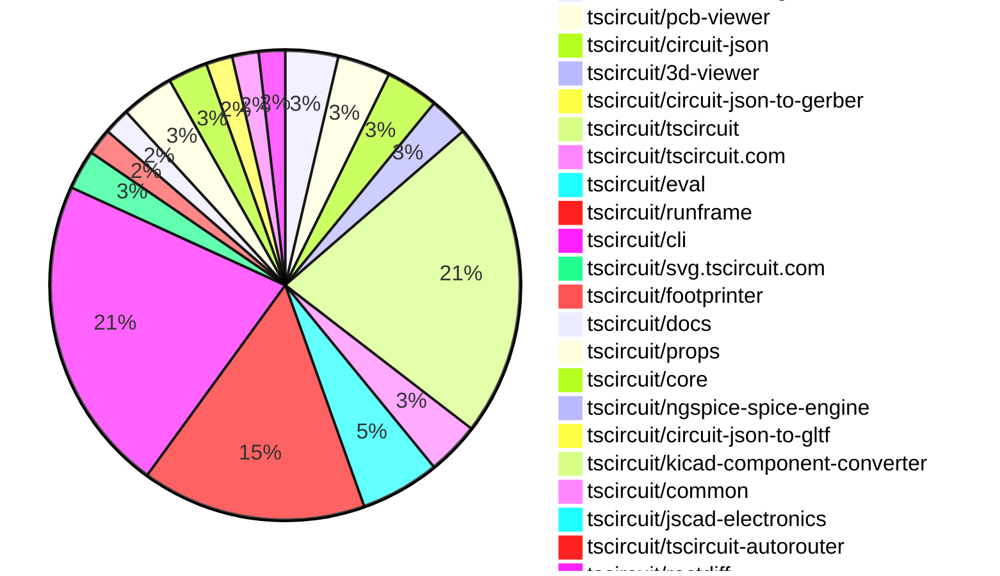
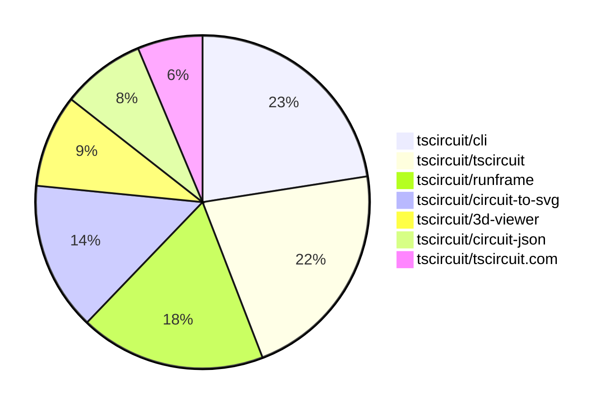

# contribution-tracker

[contributions.tscircuit.com](https://contributions.tscircuit.com) ・ [tscircuit.com](https://tscircuit.com) ・ [Contribution Overviews](./contribution-overviews/) ・ [Changelogs](./changelogs/)

Generates weekly contribution overviews for tscircuit contributors. Check out all
the [contribution overviews here](./contribution-overviews/)
You can find AI-generated monthly changelogs in the [changelogs directory](./changelogs/).

- All PRs in the tscircuit org are scanned/summarized via an LLM
- The LLM classifies each Diff/PR as into a set of attributes for scoring
- All the PRs, summaries, and classifications are organized into charts and tables for [the website](https://contributions.tscircuit.com)

> Want to run locally? See the [Development Section](#development)

The current week is shown below. There are 4 major sections:

- [Contributor Overview](#contributor-overview)
- [PRs by Repository](#prs-by-repository)
- [PRs by Contributor](#changes-by-contributor)
- [Scoring & Sponsorship System](#scoring--sponsorship-system)

## Current Week

<!-- START_CURRENT_WEEK -->

# Contribution Overview 2025-11-19

The current week is shown below. There are 4 major sections:

- [Contributor Overview](#contributor-overview)
- [PRs by Repository](#prs-by-repository)
- [PRs by Contributor](#changes-by-contributor)
- [Scoring & Sponsorship System](#scoring--sponsorship-system)

## PRs by Repository



## Contributor Overview

| Contributor | 🐳 Major | 🐙 Minor | 🐌 Tiny | ⭐ | Score | Discussion Contributions |
|-------------|---------|---------|---------|-----|----------------|--------------------------|
| [imrishabh18](#imrishabh18) | 4 | 2 | 5 | ⭐⭐ | 26 | 0🔹 0🔶 0💎 |
| [seveibar](#seveibar) | 1 | 1 | 3 | ⭐⭐ | 23 | 0🔹 0🔶 0💎 |
| [tscircuitbot](#tscircuitbot) | 0 | 0 | 71 | ⭐⭐ | 12.5 | 0🔹 0🔶 0💎 |
| [Abse2001](#Abse2001) | 1 | 4 | 0 | ⭐⭐ | 12 | 0🔹 0🔶 0💎 |
| [ShiboSoftwareDev](#ShiboSoftwareDev) | 0 | 5 | 0 | ⭐⭐ | 11 | 0🔹 0🔶 0💎 |
| [ArnavK-09](#ArnavK-09) | 2 | 0 | 3 | ⭐⭐ | 11 | 0🔹 0🔶 0💎 |
| [Ayushjhawar8](#Ayushjhawar8) | 1 | 2 | 1 | ⭐ | 9 | 0🔹 0🔶 0💎 |
| [techmannih](#techmannih) | 1 | 1 | 2 | ⭐ | 8 | 0🔹 0🔶 0💎 |
| [0hmX](#0hmX) | 1 | 0 | 2 | ⭐ | 5.5 | 0🔹 0🔶 0💎 |
| [joncherry](#joncherry) | 0 | 0 | 1 |  | 1 | 0🔹 0🔶 0💎 |
| [RaghavArora14](#RaghavArora14) | 0 | 0 | 1 |  | 1 | 0🔹 0🔶 0💎 |

> Note: AI evaluates PRs and assigns 1-3 star ratings automatically. 4 and 5 star ratings require manual staff review.

### Discussion Contribution Legend

- 🔹 Normal Comments: Basic participation with minimal effort
- 🔶 Great Informative Comments: Thoughtful participation that adds value
- 💎 Incredible Comments: Exceptional participation with high-quality content

## Review Table

[reviews-received-hover]: ## "Number of reviews received for PRs for this contributor"
[approvals-received-hover]: ## "Number of approvals received for PRs this contributor authored"
[rejections-received-hover]: ## "Number of rejections received for PRs this contributor authored"
[prs-opened-hover]: ## "Number of PRs opened by this contributor"
[issues-created-hover]: ## "Number of issues created by this contributor"
[bountied-issues-hover]: ## "Number of issues this contributor created with a bounty"
[bountied-issue-$-hover]: ## "Total bounty amount placed on issues authored by this contributor"

| Contributor | Reviews Received | Approvals Received | Rejections Received | Approvals | Rejections | PRs Opened | PRs Merged | Score | Issues Created | Bountied Issues | Bountied Issue $ |
|---|---|---|---|---|---|---|---|---|---|---|---|
| [Abse2001](#Abse2001) | 5 | 5 | 0 | 0 | 0 | 6 | 5 | 12 | 0 | 0 | 0 |
| [seveibar](#seveibar) | 0 | 0 | 0 | 25 | 1 | 9 | 5 | 23 | 0 | 0 | 0 |
| [tscircuitbot](#tscircuitbot) | 0 | 0 | 0 | 0 | 0 | 87 | 71 | 12.5 | 0 | 0 | 0 |
| [techmannih](#techmannih) | 8 | 5 | 0 | 0 | 0 | 4 | 4 | 8 | 0 | 0 | 0 |
| [rushabhcodes](#rushabhcodes) | 7 | 0 | 1 | 1 | 0 | 1 | 0 | 0 | 0 | 0 | 0 |
| [imrishabh18](#imrishabh18) | 4 | 3 | 0 | 1 | 1 | 12 | 11 | 26 | 0 | 0 | 0 |
| [ShiboSoftwareDev](#ShiboSoftwareDev) | 4 | 4 | 0 | 1 | 0 | 5 | 5 | 11 | 0 | 0 | 0 |
| [Ayushjhawar8](#Ayushjhawar8) | 22 | 4 | 1 | 0 | 0 | 5 | 4 | 9 | 0 | 0 | 0 |
| [joncherry](#joncherry) | 3 | 2 | 0 | 0 | 0 | 2 | 1 | 1 | 0 | 0 | 0 |
| [nailoo](#nailoo) | 0 | 0 | 0 | 1 | 1 | 0 | 0 | 0 | 0 | 0 | 0 |
| [RaghavArora14](#RaghavArora14) | 7 | 3 | 2 | 0 | 0 | 1 | 1 | 1 | 0 | 0 | 0 |
| [baeoc](#baeoc) | 0 | 0 | 0 | 0 | 1 | 0 | 0 | 0 | 0 | 0 | 0 |
| [ArnavK-09](#ArnavK-09) | 3 | 1 | 0 | 0 | 0 | 6 | 5 | 11 | 0 | 0 | 0 |
| [0hmX](#0hmX) | 8 | 2 | 0 | 0 | 0 | 5 | 3 | 5.5 | 0 | 0 | 0 |

## Top 7 Repositories by Contribution Points



## Scoring & Sponsorship System

### Overview

PRs are analyzed by AI and assigned a **star rating (1-3 stars)**. 4 and 5 star ratings can only be manually assigned by staff. Weekly scores use `2^(starRating - 1)` per PR (capped at 12 PRs per rating), plus review/discussion points.

### Weekly Score → Star String

| Score Range | Star String | Count Value |
|------------|-------------|-------------|
| 0-3 | (empty) | 0 stars |
| 4-10 | ⭐ | 1 star |
| 11-30 | ⭐⭐ | 2 stars |
| 31-50 | ⭐⭐⭐ | 3 stars |
| 51-75 | 👑 | 1 crown |
| 76-100 | 👑👑 | 2 crowns |
| 101+ | 👑👑👑 | 3 crowns |

> Crowns count as 3 stars for sponsorship.

### Monthly Sponsorship Calculation

The sponsorship system calculates monthly payments based on your **weekly star counts** over the complete weeks in that month (typically 4-5 weeks, Wednesday-Tuesday format).

**Step 1: Collect Weekly Stars**
- All complete weeks in the month are analyzed
- Each week's star string is converted to a numeric count (⭐ = 1 star, ⭐⭐⭐ = 3 stars)
- Example: `[2, 2, 2, 1, 0]` means 2 stars in week 1, 2 stars in week 2, etc.

**Step 2: Calculate Metrics**
- **Median stars**: The median value of all weekly star counts
- **Min stars**: The minimum weekly star count
- **Max stars**: The maximum weekly star count
- **High score**: The maximum raw weekly score (0-100+ range from the scoring table) from any week in the month

**Step 3: Determine Base Amount**
The sponsorship amount is calculated based on these metrics (checked in order):

| Condition | Base Amount |
|-----------|-------------|
| `minStarCount >= 3` | **$500** |
| `medianStars >= 3` | **$450** |
| `medianStars >= 2.5` | **$300** |
| `medianStars >= 2` | **$200** |
| `medianStars >= 1.5` | **$100** |
| `medianStars >= 1` | **$75** |
| `maxStarCount >= 2` | **$25** |
| `maxStarCount >= 1` | **$15** |
| `highScore >= 3` (and all stars = 0) | **$5** |

| Maintainer Level | Monthly Bonus |
|------------------|---------------|
| Level 1 | **$200** |
| Level 2 | **$350** |
| Level 3 | **$500** |

**Final Amount** = Base Amount + Maintainer Bonus

## Changes by Repository

### [tscircuit/circuit-to-svg](https://github.com/tscircuit/circuit-to-svg)

| PR # | Impact | Rating | Contributor | Description |
|------|--------|--------|-------------|-------------|
| [#430](https://github.com/tscircuit/circuit-to-svg/pull/430) | 🐳 Major | ⭐⭐⭐ | Abse2001 | Adds support for corner_radius on rectangular PCB cutouts, converting the radius into SVG rxry, scaling by the board transform, and ensuring compatibility with rotation. Includes updates to circuit-json and a snapshot test for verification. |
| [#431](https://github.com/tscircuit/circuit-to-svg/pull/431) | 🐳 Major | ⭐⭐⭐ | imrishabh18 | Adds support for the is_covered_with_solder_mask property in pcb_hole and pcb_plated_hole, affecting how solder masks are rendered based on this property. |
| [#428](https://github.com/tscircuit/circuit-to-svg/pull/428) | 🐳 Major | ⭐⭐⭐ | imrishabh18 | Adds support for soldermask_margin around SMT pads, allowing for customizable solder mask dimensions in PCB designs. |
| [#429](https://github.com/tscircuit/circuit-to-svg/pull/429) | 🐳 Major | ⭐⭐⭐ | imrishabh18 | Add support for soldermask margin in PCB holes, allowing for customizable soldermask dimensions based on hole specifications. |

### [tscircuit/pcb-viewer](https://github.com/tscircuit/pcb-viewer)

| PR # | Impact | Rating | Contributor | Description |
|------|--------|--------|-------------|-------------|
| [#487](https://github.com/tscircuit/pcb-viewer/pull/487) | 🐙 Minor | ⭐⭐ | Abse2001 | Adds support for corner radius in PCB cutouts, updates the circuit-json dependency, and includes a unit test for rounded PCB cutout handling. |
| [#484](https://github.com/tscircuit/pcb-viewer/pull/484) | 🐙 Minor | ⭐⭐ | techmannih | Adds support for a new hole shape hole_with_polygon_pad in PCB design, allowing for more complex pad outlines and hole shapes in the PCBViewer. |

<details>
<summary>🐌 Tiny Contributions (2)</summary>

| PR # | Impact | Contributor | Description |
|------|--------|-------------|-------------|
| [#488](https://github.com/tscircuit/pcb-viewer/pull/488) | 🐌 Tiny | tscircuitbot | Automated package update |
| [#485](https://github.com/tscircuit/pcb-viewer/pull/485) | 🐌 Tiny | tscircuitbot | Automated package update |

</details>

### [tscircuit/circuit-json](https://github.com/tscircuit/circuit-json)

| PR # | Impact | Rating | Contributor | Description |
|------|--------|--------|-------------|-------------|
| [#356](https://github.com/tscircuit/circuit-json/pull/356) | 🐳 Major | ⭐⭐⭐ | imrishabh18 | Adds an optional boolean property is_covered_with_solder_mask to various PCB hole types to indicate if they are covered with solder mask. |
| [#355](https://github.com/tscircuit/circuit-json/pull/355) | 🐙 Minor | ⭐⭐ | Abse2001 | Adds an optional corner_radius property to the PcbCutoutRect type, allowing for rounded corners in PCB cutouts. |
| [#357](https://github.com/tscircuit/circuit-json/pull/357) | 🐙 Minor | ⭐⭐ | imrishabh18 | Adds an optional boolean field is_covered_with_solder_mask to the pcb_plated_hole_circle definition to indicate if the hole is covered with solder mask. |

<details>
<summary>🐌 Tiny Contributions (1)</summary>

| PR # | Impact | Contributor | Description |
|------|--------|-------------|-------------|
| [#354](https://github.com/tscircuit/circuit-json/pull/354) | 🐌 Tiny | imrishabh18 | Adds an optional soldermask_margin property to SMT pads, holes, and plated holes in the PCB design schema. |

</details>

### [tscircuit/3d-viewer](https://github.com/tscircuit/3d-viewer)

| PR # | Impact | Rating | Contributor | Description |
|------|--------|--------|-------------|-------------|
| [#573](https://github.com/tscircuit/3d-viewer/pull/573) | 🐳 Major | ⭐⭐⭐ | techmannih | Adds support for a new hole shape with polygon pads in the PCB design, allowing for more complex pad outlines and hole shapes. |
| [#575](https://github.com/tscircuit/3d-viewer/pull/575) | 🐳 Major | ⭐⭐⭐ | Ayushjhawar8 | Add a keyboard shortcut menu that allows users to view and search for keyboard shortcuts using a dialog interface. |
| [#574](https://github.com/tscircuit/3d-viewer/pull/574) | 🐙 Minor | ⭐⭐ | Abse2001 | Add corner radius handling to PCB cutouts in both the JSCAD and Manifold pipelines, update the circuit-json dependency to v0.0.317 to surface corner radius data, and add coverage ensuring rounded cutouts generate more detailed meshes than sharp ones. |

### [tscircuit/circuit-json-to-gerber](https://github.com/tscircuit/circuit-json-to-gerber)

| PR # | Impact | Rating | Contributor | Description |
|------|--------|--------|-------------|-------------|
| [#66](https://github.com/tscircuit/circuit-json-to-gerber/pull/66) | 🐙 Minor | ⭐⭐ | Abse2001 | Add support for corner radius on rectangular PCB cutouts when generating edge cuts, update circuit-json to version 0.0.317, and add a gerber snapshot test covering rounded PCB cutouts. |

### [tscircuit/tscircuit](https://github.com/tscircuit/tscircuit)


<details>
<summary>🐌 Tiny Contributions (24)</summary>

| PR # | Impact | Contributor | Description |
|------|--------|-------------|-------------|
| [#1392](https://github.com/tscircuit/tscircuit/pull/1392) | 🐌 Tiny | tscircuitbot | Automated package update |
| [#1391](https://github.com/tscircuit/tscircuit/pull/1391) | 🐌 Tiny | tscircuitbot | Updates package versions for tscircuitcli, tscircuitcore, tscircuiteval, circuit-json, circuit-to-svg, and tscircuitrunframe in package.json |
| [#1390](https://github.com/tscircuit/tscircuit/pull/1390) | 🐌 Tiny | tscircuitbot | Automated package update |
| [#1389](https://github.com/tscircuit/tscircuit/pull/1389) | 🐌 Tiny | tscircuitbot | Updates the tscircuitcli package from version 0.1.514 to 0.1.515 |
| [#1388](https://github.com/tscircuit/tscircuit/pull/1388) | 🐌 Tiny | tscircuitbot | Automated package update |
| [#1387](https://github.com/tscircuit/tscircuit/pull/1387) | 🐌 Tiny | tscircuitbot | Automated package update |
| [#1386](https://github.com/tscircuit/tscircuit/pull/1386) | 🐌 Tiny | tscircuitbot | Automated package update |
| [#1385](https://github.com/tscircuit/tscircuit/pull/1385) | 🐌 Tiny | tscircuitbot | Automated package update |
| [#1384](https://github.com/tscircuit/tscircuit/pull/1384) | 🐌 Tiny | tscircuitbot | Automated package update to version 0.0.921 |
| [#1383](https://github.com/tscircuit/tscircuit/pull/1383) | 🐌 Tiny | tscircuitbot | Automated package update |
| [#1382](https://github.com/tscircuit/tscircuit/pull/1382) | 🐌 Tiny | tscircuitbot | Automated package update |
| [#1381](https://github.com/tscircuit/tscircuit/pull/1381) | 🐌 Tiny | tscircuitbot | Automated package update |
| [#1380](https://github.com/tscircuit/tscircuit/pull/1380) | 🐌 Tiny | tscircuitbot | Automated package update |
| [#1379](https://github.com/tscircuit/tscircuit/pull/1379) | 🐌 Tiny | tscircuitbot | Automated package update |
| [#1378](https://github.com/tscircuit/tscircuit/pull/1378) | 🐌 Tiny | tscircuitbot | Automated package update |
| [#1377](https://github.com/tscircuit/tscircuit/pull/1377) | 🐌 Tiny | tscircuitbot | Automated package update |
| [#1376](https://github.com/tscircuit/tscircuit/pull/1376) | 🐌 Tiny | tscircuitbot | Automated package update |
| [#1375](https://github.com/tscircuit/tscircuit/pull/1375) | 🐌 Tiny | tscircuitbot | Automated package update |
| [#1374](https://github.com/tscircuit/tscircuit/pull/1374) | 🐌 Tiny | tscircuitbot | Automated package update |
| [#1373](https://github.com/tscircuit/tscircuit/pull/1373) | 🐌 Tiny | tscircuitbot | Updates the tscircuitcli package to version 0.1.507 in package.json |
| [#1372](https://github.com/tscircuit/tscircuit/pull/1372) | 🐌 Tiny | tscircuitbot | Automated package update |
| [#1371](https://github.com/tscircuit/tscircuit/pull/1371) | 🐌 Tiny | tscircuitbot | Updates the tscircuitcli package to version 0.1.506 in the package.json file. |
| [#1370](https://github.com/tscircuit/tscircuit/pull/1370) | 🐌 Tiny | tscircuitbot | Automated package update |
| [#1369](https://github.com/tscircuit/tscircuit/pull/1369) | 🐌 Tiny | tscircuitbot | Updates the tscircuitcli package from version 0.1.504 to 0.1.505 |

</details>

### [tscircuit/tscircuit.com](https://github.com/tscircuit/tscircuit.com)

| PR # | Impact | Rating | Contributor | Description |
|------|--------|--------|-------------|-------------|
| [#2028](https://github.com/tscircuit/tscircuit.com/pull/2028) | 🐳 Major | ⭐⭐⭐ | ArnavK-09 | Refactors organization-related API and database logic to replace the name field with tscircuit_handle, ensuring consistency across the codebase and improving the clarity of organization identifiers. |

<details>
<summary>🐌 Tiny Contributions (3)</summary>

| PR # | Impact | Contributor | Description |
|------|--------|-------------|-------------|
| [#2046](https://github.com/tscircuit/tscircuit.com/pull/2046) | 🐌 Tiny | tscircuitbot | Automated package update |
| [#2045](https://github.com/tscircuit/tscircuit.com/pull/2045) | 🐌 Tiny | tscircuitbot | Updates the tscircuiteval package from version 0.0.478 to 0.0.479 |
| [#2043](https://github.com/tscircuit/tscircuit.com/pull/2043) | 🐌 Tiny | tscircuitbot | Updates the tscircuiteval package version from 0.0.476 to 0.0.478 in package.json |

</details>

### [tscircuit/eval](https://github.com/tscircuit/eval)

| PR # | Impact | Rating | Contributor | Description |
|------|--------|--------|-------------|-------------|
| [#1535](https://github.com/tscircuit/eval/pull/1535) | 🐙 Minor | ⭐⭐ | imrishabh18 | Creates a blob URL for static assets with content instead of using a static URL, improving the handling of file imports in the web worker. |

<details>
<summary>🐌 Tiny Contributions (5)</summary>

| PR # | Impact | Contributor | Description |
|------|--------|-------------|-------------|
| [#1538](https://github.com/tscircuit/eval/pull/1538) | 🐌 Tiny | tscircuitbot | Automated package update |
| [#1537](https://github.com/tscircuit/eval/pull/1537) | 🐌 Tiny | tscircuitbot | Automated package update |
| [#1536](https://github.com/tscircuit/eval/pull/1536) | 🐌 Tiny | tscircuitbot | Automated package update |
| [#1534](https://github.com/tscircuit/eval/pull/1534) | 🐌 Tiny | tscircuitbot | Automated package update |
| [#1533](https://github.com/tscircuit/eval/pull/1533) | 🐌 Tiny | tscircuitbot | Automated package update |

</details>

### [tscircuit/runframe](https://github.com/tscircuit/runframe)

| PR # | Impact | Rating | Contributor | Description |
|------|--------|--------|-------------|-------------|
| [#1811](https://github.com/tscircuit/runframe/pull/1811) | 🐳 Major | ⭐⭐⭐ | ArnavK-09 | This pull request introduces support for new preview URLs and adds a 3D preview option to the ImportComponentDialog2 component. It modifies the existing preview tab functionality to include a new 3D option, allowing users to view 3D representations of components alongside PCB and schematic previews. The changes also include updates to the TscircuitPackageDetailsDialog to accommodate the new preview type and ensure that the appropriate URLs are fetched for each preview type. |

<details>
<summary>🐌 Tiny Contributions (16)</summary>

| PR # | Impact | Contributor | Description |
|------|--------|-------------|-------------|
| [#1814](https://github.com/tscircuit/runframe/pull/1814) | 🐌 Tiny | tscircuitbot | Automated package update |
| [#1813](https://github.com/tscircuit/runframe/pull/1813) | 🐌 Tiny | tscircuitbot | Updates the tscircuiteval package to version 0.0.480 in the package.json file. |
| [#1812](https://github.com/tscircuit/runframe/pull/1812) | 🐌 Tiny | tscircuitbot | Automated package update |
| [#1810](https://github.com/tscircuit/runframe/pull/1810) | 🐌 Tiny | tscircuitbot | Automated package update |
| [#1808](https://github.com/tscircuit/runframe/pull/1808) | 🐌 Tiny | tscircuitbot | Automated package update |
| [#1805](https://github.com/tscircuit/runframe/pull/1805) | 🐌 Tiny | tscircuitbot | Automated package update to version 0.0.1263 |
| [#1804](https://github.com/tscircuit/runframe/pull/1804) | 🐌 Tiny | tscircuitbot | Updates the tscircuit3d-viewer package to version 0.0.440 |
| [#1803](https://github.com/tscircuit/runframe/pull/1803) | 🐌 Tiny | tscircuitbot | Automated package update |
| [#1802](https://github.com/tscircuit/runframe/pull/1802) | 🐌 Tiny | tscircuitbot | Updates the tscircuitpcb-viewer package from version 1.11.262 to 1.11.263 |
| [#1801](https://github.com/tscircuit/runframe/pull/1801) | 🐌 Tiny | tscircuitbot | Automated package update |
| [#1800](https://github.com/tscircuit/runframe/pull/1800) | 🐌 Tiny | tscircuitbot | Automated package update |
| [#1798](https://github.com/tscircuit/runframe/pull/1798) | 🐌 Tiny | tscircuitbot | Updates the package version from 0.0.1258 to 0.0.1259 in package.json |
| [#1797](https://github.com/tscircuit/runframe/pull/1797) | 🐌 Tiny | tscircuitbot | Updates the tscircuitpcb-viewer package from version 1.11.261 to 1.11.262 |
| [#1796](https://github.com/tscircuit/runframe/pull/1796) | 🐌 Tiny | tscircuitbot | Updates the tscircuit3d-viewer package from version 0.0.437 to 0.0.438 |
| [#1807](https://github.com/tscircuit/runframe/pull/1807) | 🐌 Tiny | imrishabh18 | Updates the version of the tscircuiteval package from 0.0.468 to 0.0.479 and updates kicadts package from 0.0.10 to 0.0.22 while adding kicad-to-circuit-json package version 0.0.17 in package.json |
| [#1809](https://github.com/tscircuit/runframe/pull/1809) | 🐌 Tiny | ArnavK-09 | Removes a placeholder error throw in the ImportComponentDialogForCli component, indicating that the implementation for package installation is pending. |

</details>

### [tscircuit/cli](https://github.com/tscircuit/cli)

| PR # | Impact | Rating | Contributor | Description |
|------|--------|--------|-------------|-------------|
| [#972](https://github.com/tscircuit/cli/pull/972) | 🐙 Minor | ⭐⭐ | seveibar | Moves the transpile build logic into a dedicated static asset Rollup plugin that recognizes CAD assets and extends TypeScript declarations for new CAD-related extensions. |

<details>
<summary>🐌 Tiny Contributions (23)</summary>

| PR # | Impact | Contributor | Description |
|------|--------|-------------|-------------|
| [#995](https://github.com/tscircuit/cli/pull/995) | 🐌 Tiny | tscircuitbot | Automated package update |
| [#994](https://github.com/tscircuit/cli/pull/994) | 🐌 Tiny | tscircuitbot | Updates the tscircuitrunframe package to version 0.0.1267 in the package.json file. |
| [#993](https://github.com/tscircuit/cli/pull/993) | 🐌 Tiny | tscircuitbot | Automated package update |
| [#991](https://github.com/tscircuit/cli/pull/991) | 🐌 Tiny | tscircuitbot | Automated package update |
| [#990](https://github.com/tscircuit/cli/pull/990) | 🐌 Tiny | tscircuitbot | Automated package update |
| [#989](https://github.com/tscircuit/cli/pull/989) | 🐌 Tiny | tscircuitbot | Automated package update |
| [#987](https://github.com/tscircuit/cli/pull/987) | 🐌 Tiny | tscircuitbot | Updates the tscircuitrunframe package from version 0.0.1264 to 0.0.1265 |
| [#986](https://github.com/tscircuit/cli/pull/986) | 🐌 Tiny | tscircuitbot | Automated package update to version 0.1.512 |
| [#985](https://github.com/tscircuit/cli/pull/985) | 🐌 Tiny | tscircuitbot | Automated package update |
| [#984](https://github.com/tscircuit/cli/pull/984) | 🐌 Tiny | tscircuitbot | Automated package update |
| [#983](https://github.com/tscircuit/cli/pull/983) | 🐌 Tiny | tscircuitbot | Updates the tscircuitrunframe package from version 0.0.1262 to 0.0.1263 |
| [#982](https://github.com/tscircuit/cli/pull/982) | 🐌 Tiny | tscircuitbot | Automated package update |
| [#981](https://github.com/tscircuit/cli/pull/981) | 🐌 Tiny | tscircuitbot | Updates the tscircuitrunframe package from version 0.0.1261 to 0.0.1262 in the package.json file. |
| [#980](https://github.com/tscircuit/cli/pull/980) | 🐌 Tiny | tscircuitbot | Automated package update |
| [#979](https://github.com/tscircuit/cli/pull/979) | 🐌 Tiny | tscircuitbot | Updates the tscircuitrunframe package from version 0.0.1259 to 0.0.1261 |
| [#978](https://github.com/tscircuit/cli/pull/978) | 🐌 Tiny | tscircuitbot | Automated package update |
| [#977](https://github.com/tscircuit/cli/pull/977) | 🐌 Tiny | tscircuitbot | Updates the tscircuitrunframe package from version 0.0.1258 to 0.0.1259 |
| [#975](https://github.com/tscircuit/cli/pull/975) | 🐌 Tiny | tscircuitbot | Automated package update |
| [#973](https://github.com/tscircuit/cli/pull/973) | 🐌 Tiny | tscircuitbot | Automated package update |
| [#970](https://github.com/tscircuit/cli/pull/970) | 🐌 Tiny | tscircuitbot | Automated package update |
| [#974](https://github.com/tscircuit/cli/pull/974) | 🐌 Tiny | imrishabh18 | Fixes transpilation errors specific to Windows and adds a dedicated test workflow for Windows environments. |
| [#969](https://github.com/tscircuit/cli/pull/969) | 🐌 Tiny | seveibar | Adds a targeted hint when the build fails due to a type-only export being re-exported without the type modifier, improving error messaging for users. |
| [#992](https://github.com/tscircuit/cli/pull/992) | 🐌 Tiny | ArnavK-09 | Renames snippet references to package in DevServer for clarity, enhances pushSnippet to accept a logging function and improves success message handling, and adds a new TypeScript declaration file for .kicad_mod files. |

</details>

### [tscircuit/svg.tscircuit.com](https://github.com/tscircuit/svg.tscircuit.com)


<details>
<summary>🐌 Tiny Contributions (3)</summary>

| PR # | Impact | Contributor | Description |
|------|--------|-------------|-------------|
| [#605](https://github.com/tscircuit/svg.tscircuit.com/pull/605) | 🐌 Tiny | tscircuitbot | Updates the tscircuit package version from 0.0.915 to 0.0.916 in package.json |
| [#604](https://github.com/tscircuit/svg.tscircuit.com/pull/604) | 🐌 Tiny | tscircuitbot | Updates the tscircuit package version from 0.0.914 to 0.0.915 in package.json |
| [#603](https://github.com/tscircuit/svg.tscircuit.com/pull/603) | 🐌 Tiny | tscircuitbot | Updates the tscircuit package version from 0.0.913 to 0.0.914 in package.json |

</details>

### [tscircuit/footprinter](https://github.com/tscircuit/footprinter)


<details>
<summary>🐌 Tiny Contributions (2)</summary>

| PR # | Impact | Contributor | Description |
|------|--------|-------------|-------------|
| [#419](https://github.com/tscircuit/footprinter/pull/419) | 🐌 Tiny | techmannih | Fixes the inner and outer diameter values for DIP components in the footprint definitions. |
| [#427](https://github.com/tscircuit/footprinter/pull/427) | 🐌 Tiny | joncherry | Adds the norefdes flag to all footprints to disable reference designator labels, enhancing the flexibility of footprint definitions. |

</details>

### [tscircuit/docs](https://github.com/tscircuit/docs)


<details>
<summary>🐌 Tiny Contributions (2)</summary>

| PR # | Impact | Contributor | Description |
|------|--------|-------------|-------------|
| [#339](https://github.com/tscircuit/docs/pull/339) | 🐌 Tiny | techmannih | Hides the 3D and PCB view tabs for schematic components in the CircuitPreview component. |
| [#345](https://github.com/tscircuit/docs/pull/345) | 🐌 Tiny | ArnavK-09 | Fixes the copy button overlapping the title on screens wider than 500px by adjusting the media query to 800px. |

</details>

### [tscircuit/props](https://github.com/tscircuit/props)

| PR # | Impact | Rating | Contributor | Description |
|------|--------|--------|-------------|-------------|
| [#505](https://github.com/tscircuit/props/pull/505) | 🐙 Minor | ⭐⭐ | ShiboSoftwareDev | Adds props to the Panel component to support panelization methods like tab-routing. |
| [#502](https://github.com/tscircuit/props/pull/502) | 🐙 Minor | ⭐⭐ | Ayushjhawar8 | Adds a mustBeConnected property to pin attributes, allowing for more precise control over pin connection requirements in circuit designs. |

<details>
<summary>🐌 Tiny Contributions (2)</summary>

| PR # | Impact | Contributor | Description |
|------|--------|-------------|-------------|
| [#503](https://github.com/tscircuit/props/pull/503) | 🐌 Tiny | imrishabh18 | Adds the solderMaskMargin property to CircleHoleProps, PillHoleProps, RectHoleProps, CirclePlatedHoleProps, OvalPlatedHoleProps, PillPlatedHoleProps, and various SMT pad properties to allow for customizable solder mask margins. |
| [#504](https://github.com/tscircuit/props/pull/504) | 🐌 Tiny | imrishabh18 | Adds a new property coveredWithSolderMask to the interfaces for various hole types in PCB design, allowing for better control over solder mask application. |

</details>

### [tscircuit/core](https://github.com/tscircuit/core)

| PR # | Impact | Rating | Contributor | Description |
|------|--------|--------|-------------|-------------|
| [#1667](https://github.com/tscircuit/core/pull/1667) | 🐙 Minor | ⭐⭐ | ShiboSoftwareDev | Disables the auto-layout feature for panels when any child board has explicit pcbX or pcbY coordinates, preventing unexpected layouts with mixed positioned boards. |
| [#1666](https://github.com/tscircuit/core/pull/1666) | 🐙 Minor | ⭐⭐ | ShiboSoftwareDev | This change implements automatic arrangement of boards within a panel, generating tabs and mouse bites, and dynamically resizing the panel based on the contained boards. |
| [#1660](https://github.com/tscircuit/core/pull/1660) | 🐙 Minor | ⭐⭐ | ShiboSoftwareDev | Add schematic representation for VoltageProbe components to provide better visual feedback for SPICE simulations. |

### [tscircuit/ngspice-spice-engine](https://github.com/tscircuit/ngspice-spice-engine)

| PR # | Impact | Rating | Contributor | Description |
|------|--------|--------|-------------|-------------|
| [#3](https://github.com/tscircuit/ngspice-spice-engine/pull/3) | 🐙 Minor | ⭐⭐ | ShiboSoftwareDev | Preserves the casing of net names specified in the .print tran command of the SPICE string in the final output voltage graphs. |

### [tscircuit/circuit-json-to-gltf](https://github.com/tscircuit/circuit-json-to-gltf)

| PR # | Impact | Rating | Contributor | Description |
|------|--------|--------|-------------|-------------|
| [#83](https://github.com/tscircuit/circuit-json-to-gltf/pull/83) | 🐙 Minor | ⭐⭐ | Ayushjhawar8 | Adds support for rendering PCB panels in GLTF format, including texture rendering and bounding box calculations. |

<details>
<summary>🐌 Tiny Contributions (1)</summary>

| PR # | Impact | Contributor | Description |
|------|--------|-------------|-------------|
| [#85](https://github.com/tscircuit/circuit-json-to-gltf/pull/85) | 🐌 Tiny | Ayushjhawar8 | Refactors the panel mesh functionality by moving it into a separate file for better organization and maintainability. |

</details>

### [tscircuit/kicad-component-converter](https://github.com/tscircuit/kicad-component-converter)

| PR # | Impact | Rating | Contributor | Description |
|------|--------|--------|-------------|-------------|
| [#170](https://github.com/tscircuit/kicad-component-converter/pull/170) | 🐳 Major | ⭐⭐⭐ | seveibar | Propagates numeric pin numbers to pcb_smtpad and pcb_plated_hole elements when port names are numeric, verifies that plated holes keep pin numbers, and adds a new SMD footprint regression covering pin_number on pads. |

### [tscircuit/common](https://github.com/tscircuit/common)


<details>
<summary>🐌 Tiny Contributions (2)</summary>

| PR # | Impact | Contributor | Description |
|------|--------|-------------|-------------|
| [#54](https://github.com/tscircuit/common/pull/54) | 🐌 Tiny | seveibar | Refines the XiaoReceiver component by marking pin labels as a const map for stronger literal inference and typing the props with ChipProps to validate connections. |
| [#53](https://github.com/tscircuit/common/pull/53) | 🐌 Tiny | seveibar | Exports the XiaoReceiver circuit from the package entrypoint for external import. |

</details>

### [tscircuit/jscad-electronics](https://github.com/tscircuit/jscad-electronics)


<details>
<summary>🐌 Tiny Contributions (1)</summary>

| PR # | Impact | Contributor | Description |
|------|--------|-------------|-------------|
| [#235](https://github.com/tscircuit/jscad-electronics/pull/235) | 🐌 Tiny | RaghavArora14 | Add SOT-886 component implementation with 6 terminals (3 per side) and create example file demonstrating SOT-886 usage with ExtrudedPads |

</details>

### [tscircuit/tscircuit-autorouter](https://github.com/tscircuit/tscircuit-autorouter)

| PR # | Impact | Rating | Contributor | Description |
|------|--------|--------|-------------|-------------|
| [#327](https://github.com/tscircuit/tscircuit-autorouter/pull/327) | 🐳 Major | ⭐⭐⭐ | 0hmX | Implements a new routing optimization feature that uses off-board connections to find more efficient paths. |

### [tscircuit/rectdiff](https://github.com/tscircuit/rectdiff)


<details>
<summary>🐌 Tiny Contributions (2)</summary>

| PR # | Impact | Contributor | Description |
|------|--------|-------------|-------------|
| [#3](https://github.com/tscircuit/rectdiff/pull/3) | 🐌 Tiny | 0hmX | This pull request updates the bun version in multiple GitHub workflows from latest to 1.3.1. It also includes minor formatting changes in the codebase, such as adjusting the formatting of TypeScript function signatures and comments for better readability. The changes are primarily focused on ensuring compatibility with the specified bun version and improving code clarity. |
| [#2](https://github.com/tscircuit/rectdiff/pull/2) | 🐌 Tiny | 0hmX | Adds formatting scripts to the project for consistent code style enforcement using biome. |

</details>

## Changes by Contributor

### [Abse2001](https://github.com/Abse2001)

| PRs # | Impact | Rating | Description |
|------|--------|--------|-------------|
| [#430](https://github.com/tscircuit/circuit-to-svg/pull/430) | 🐳 Major | ⭐⭐⭐ | Adds support for corner_radius on rectangular PCB cutouts, converting the radius into SVG rxry, scaling by the board transform, and ensuring compatibility with rotation. Includes updates to circuit-json and a snapshot test for verification. |
| [#487](https://github.com/tscircuit/pcb-viewer/pull/487) | 🐙 Minor | ⭐⭐ | Adds support for corner radius in PCB cutouts, updates the circuit-json dependency, and includes a unit test for rounded PCB cutout handling. |
| [#355](https://github.com/tscircuit/circuit-json/pull/355) | 🐙 Minor | ⭐⭐ | Adds an optional corner_radius property to the PcbCutoutRect type, allowing for rounded corners in PCB cutouts. |
| [#574](https://github.com/tscircuit/3d-viewer/pull/574) | 🐙 Minor | ⭐⭐ | Add corner radius handling to PCB cutouts in both the JSCAD and Manifold pipelines, update the circuit-json dependency to v0.0.317 to surface corner radius data, and add coverage ensuring rounded cutouts generate more detailed meshes than sharp ones. |
| [#66](https://github.com/tscircuit/circuit-json-to-gerber/pull/66) | 🐙 Minor | ⭐⭐ | Add support for corner radius on rectangular PCB cutouts when generating edge cuts, update circuit-json to version 0.0.317, and add a gerber snapshot test covering rounded PCB cutouts. |

### [tscircuitbot](https://github.com/tscircuitbot)


<details>
<summary>🐌 Tiny Contributions (71)</summary>

| PR # | Impact | Description |
|------|--------|-------------|
| [#488](https://github.com/tscircuit/pcb-viewer/pull/488) | 🐌 Tiny | Automated package update |
| [#485](https://github.com/tscircuit/pcb-viewer/pull/485) | 🐌 Tiny | Automated package update |
| [#1392](https://github.com/tscircuit/tscircuit/pull/1392) | 🐌 Tiny | Automated package update |
| [#1391](https://github.com/tscircuit/tscircuit/pull/1391) | 🐌 Tiny | Updates package versions for tscircuitcli, tscircuitcore, tscircuiteval, circuit-json, circuit-to-svg, and tscircuitrunframe in package.json |
| [#1390](https://github.com/tscircuit/tscircuit/pull/1390) | 🐌 Tiny | Automated package update |
| [#1389](https://github.com/tscircuit/tscircuit/pull/1389) | 🐌 Tiny | Updates the tscircuitcli package from version 0.1.514 to 0.1.515 |
| [#1388](https://github.com/tscircuit/tscircuit/pull/1388) | 🐌 Tiny | Automated package update |
| [#1387](https://github.com/tscircuit/tscircuit/pull/1387) | 🐌 Tiny | Automated package update |
| [#1386](https://github.com/tscircuit/tscircuit/pull/1386) | 🐌 Tiny | Automated package update |
| [#1385](https://github.com/tscircuit/tscircuit/pull/1385) | 🐌 Tiny | Automated package update |
| [#1384](https://github.com/tscircuit/tscircuit/pull/1384) | 🐌 Tiny | Automated package update to version 0.0.921 |
| [#1383](https://github.com/tscircuit/tscircuit/pull/1383) | 🐌 Tiny | Automated package update |
| [#1382](https://github.com/tscircuit/tscircuit/pull/1382) | 🐌 Tiny | Automated package update |
| [#1381](https://github.com/tscircuit/tscircuit/pull/1381) | 🐌 Tiny | Automated package update |
| [#1380](https://github.com/tscircuit/tscircuit/pull/1380) | 🐌 Tiny | Automated package update |
| [#1379](https://github.com/tscircuit/tscircuit/pull/1379) | 🐌 Tiny | Automated package update |
| [#1378](https://github.com/tscircuit/tscircuit/pull/1378) | 🐌 Tiny | Automated package update |
| [#1377](https://github.com/tscircuit/tscircuit/pull/1377) | 🐌 Tiny | Automated package update |
| [#1376](https://github.com/tscircuit/tscircuit/pull/1376) | 🐌 Tiny | Automated package update |
| [#1375](https://github.com/tscircuit/tscircuit/pull/1375) | 🐌 Tiny | Automated package update |
| [#1374](https://github.com/tscircuit/tscircuit/pull/1374) | 🐌 Tiny | Automated package update |
| [#1373](https://github.com/tscircuit/tscircuit/pull/1373) | 🐌 Tiny | Updates the tscircuitcli package to version 0.1.507 in package.json |
| [#1372](https://github.com/tscircuit/tscircuit/pull/1372) | 🐌 Tiny | Automated package update |
| [#1371](https://github.com/tscircuit/tscircuit/pull/1371) | 🐌 Tiny | Updates the tscircuitcli package to version 0.1.506 in the package.json file. |
| [#1370](https://github.com/tscircuit/tscircuit/pull/1370) | 🐌 Tiny | Automated package update |
| [#1369](https://github.com/tscircuit/tscircuit/pull/1369) | 🐌 Tiny | Updates the tscircuitcli package from version 0.1.504 to 0.1.505 |
| [#2046](https://github.com/tscircuit/tscircuit.com/pull/2046) | 🐌 Tiny | Automated package update |
| [#2045](https://github.com/tscircuit/tscircuit.com/pull/2045) | 🐌 Tiny | Updates the tscircuiteval package from version 0.0.478 to 0.0.479 |
| [#2043](https://github.com/tscircuit/tscircuit.com/pull/2043) | 🐌 Tiny | Updates the tscircuiteval package version from 0.0.476 to 0.0.478 in package.json |
| [#1538](https://github.com/tscircuit/eval/pull/1538) | 🐌 Tiny | Automated package update |
| [#1537](https://github.com/tscircuit/eval/pull/1537) | 🐌 Tiny | Automated package update |
| [#1536](https://github.com/tscircuit/eval/pull/1536) | 🐌 Tiny | Automated package update |
| [#1534](https://github.com/tscircuit/eval/pull/1534) | 🐌 Tiny | Automated package update |
| [#1533](https://github.com/tscircuit/eval/pull/1533) | 🐌 Tiny | Automated package update |
| [#1814](https://github.com/tscircuit/runframe/pull/1814) | 🐌 Tiny | Automated package update |
| [#1813](https://github.com/tscircuit/runframe/pull/1813) | 🐌 Tiny | Updates the tscircuiteval package to version 0.0.480 in the package.json file. |
| [#1812](https://github.com/tscircuit/runframe/pull/1812) | 🐌 Tiny | Automated package update |
| [#1810](https://github.com/tscircuit/runframe/pull/1810) | 🐌 Tiny | Automated package update |
| [#1808](https://github.com/tscircuit/runframe/pull/1808) | 🐌 Tiny | Automated package update |
| [#1805](https://github.com/tscircuit/runframe/pull/1805) | 🐌 Tiny | Automated package update to version 0.0.1263 |
| [#1804](https://github.com/tscircuit/runframe/pull/1804) | 🐌 Tiny | Updates the tscircuit3d-viewer package to version 0.0.440 |
| [#1803](https://github.com/tscircuit/runframe/pull/1803) | 🐌 Tiny | Automated package update |
| [#1802](https://github.com/tscircuit/runframe/pull/1802) | 🐌 Tiny | Updates the tscircuitpcb-viewer package from version 1.11.262 to 1.11.263 |
| [#1801](https://github.com/tscircuit/runframe/pull/1801) | 🐌 Tiny | Automated package update |
| [#1800](https://github.com/tscircuit/runframe/pull/1800) | 🐌 Tiny | Automated package update |
| [#1798](https://github.com/tscircuit/runframe/pull/1798) | 🐌 Tiny | Updates the package version from 0.0.1258 to 0.0.1259 in package.json |
| [#1797](https://github.com/tscircuit/runframe/pull/1797) | 🐌 Tiny | Updates the tscircuitpcb-viewer package from version 1.11.261 to 1.11.262 |
| [#1796](https://github.com/tscircuit/runframe/pull/1796) | 🐌 Tiny | Updates the tscircuit3d-viewer package from version 0.0.437 to 0.0.438 |
| [#995](https://github.com/tscircuit/cli/pull/995) | 🐌 Tiny | Automated package update |
| [#994](https://github.com/tscircuit/cli/pull/994) | 🐌 Tiny | Updates the tscircuitrunframe package to version 0.0.1267 in the package.json file. |
| [#993](https://github.com/tscircuit/cli/pull/993) | 🐌 Tiny | Automated package update |
| [#991](https://github.com/tscircuit/cli/pull/991) | 🐌 Tiny | Automated package update |
| [#990](https://github.com/tscircuit/cli/pull/990) | 🐌 Tiny | Automated package update |
| [#989](https://github.com/tscircuit/cli/pull/989) | 🐌 Tiny | Automated package update |
| [#987](https://github.com/tscircuit/cli/pull/987) | 🐌 Tiny | Updates the tscircuitrunframe package from version 0.0.1264 to 0.0.1265 |
| [#986](https://github.com/tscircuit/cli/pull/986) | 🐌 Tiny | Automated package update to version 0.1.512 |
| [#985](https://github.com/tscircuit/cli/pull/985) | 🐌 Tiny | Automated package update |
| [#984](https://github.com/tscircuit/cli/pull/984) | 🐌 Tiny | Automated package update |
| [#983](https://github.com/tscircuit/cli/pull/983) | 🐌 Tiny | Updates the tscircuitrunframe package from version 0.0.1262 to 0.0.1263 |
| [#982](https://github.com/tscircuit/cli/pull/982) | 🐌 Tiny | Automated package update |
| [#981](https://github.com/tscircuit/cli/pull/981) | 🐌 Tiny | Updates the tscircuitrunframe package from version 0.0.1261 to 0.0.1262 in the package.json file. |
| [#980](https://github.com/tscircuit/cli/pull/980) | 🐌 Tiny | Automated package update |
| [#979](https://github.com/tscircuit/cli/pull/979) | 🐌 Tiny | Updates the tscircuitrunframe package from version 0.0.1259 to 0.0.1261 |
| [#978](https://github.com/tscircuit/cli/pull/978) | 🐌 Tiny | Automated package update |
| [#977](https://github.com/tscircuit/cli/pull/977) | 🐌 Tiny | Updates the tscircuitrunframe package from version 0.0.1258 to 0.0.1259 |
| [#975](https://github.com/tscircuit/cli/pull/975) | 🐌 Tiny | Automated package update |
| [#973](https://github.com/tscircuit/cli/pull/973) | 🐌 Tiny | Automated package update |
| [#970](https://github.com/tscircuit/cli/pull/970) | 🐌 Tiny | Automated package update |
| [#605](https://github.com/tscircuit/svg.tscircuit.com/pull/605) | 🐌 Tiny | Updates the tscircuit package version from 0.0.915 to 0.0.916 in package.json |
| [#604](https://github.com/tscircuit/svg.tscircuit.com/pull/604) | 🐌 Tiny | Updates the tscircuit package version from 0.0.914 to 0.0.915 in package.json |
| [#603](https://github.com/tscircuit/svg.tscircuit.com/pull/603) | 🐌 Tiny | Updates the tscircuit package version from 0.0.913 to 0.0.914 in package.json |

</details>

### [techmannih](https://github.com/techmannih)

| PRs # | Impact | Rating | Description |
|------|--------|--------|-------------|
| [#573](https://github.com/tscircuit/3d-viewer/pull/573) | 🐳 Major | ⭐⭐⭐ | Adds support for a new hole shape with polygon pads in the PCB design, allowing for more complex pad outlines and hole shapes. |
| [#484](https://github.com/tscircuit/pcb-viewer/pull/484) | 🐙 Minor | ⭐⭐ | Adds support for a new hole shape hole_with_polygon_pad in PCB design, allowing for more complex pad outlines and hole shapes in the PCBViewer. |

<details>
<summary>🐌 Tiny Contributions (2)</summary>

| PR # | Impact | Description |
|------|--------|-------------|
| [#419](https://github.com/tscircuit/footprinter/pull/419) | 🐌 Tiny | Fixes the inner and outer diameter values for DIP components in the footprint definitions. |
| [#339](https://github.com/tscircuit/docs/pull/339) | 🐌 Tiny | Hides the 3D and PCB view tabs for schematic components in the CircuitPreview component. |

</details>

### [imrishabh18](https://github.com/imrishabh18)

| PRs # | Impact | Rating | Description |
|------|--------|--------|-------------|
| [#356](https://github.com/tscircuit/circuit-json/pull/356) | 🐳 Major | ⭐⭐⭐ | Adds an optional boolean property is_covered_with_solder_mask to various PCB hole types to indicate if they are covered with solder mask. |
| [#431](https://github.com/tscircuit/circuit-to-svg/pull/431) | 🐳 Major | ⭐⭐⭐ | Adds support for the is_covered_with_solder_mask property in pcb_hole and pcb_plated_hole, affecting how solder masks are rendered based on this property. |
| [#428](https://github.com/tscircuit/circuit-to-svg/pull/428) | 🐳 Major | ⭐⭐⭐ | Adds support for soldermask_margin around SMT pads, allowing for customizable solder mask dimensions in PCB designs. |
| [#429](https://github.com/tscircuit/circuit-to-svg/pull/429) | 🐳 Major | ⭐⭐⭐ | Add support for soldermask margin in PCB holes, allowing for customizable soldermask dimensions based on hole specifications. |
| [#357](https://github.com/tscircuit/circuit-json/pull/357) | 🐙 Minor | ⭐⭐ | Adds an optional boolean field is_covered_with_solder_mask to the pcb_plated_hole_circle definition to indicate if the hole is covered with solder mask. |
| [#1535](https://github.com/tscircuit/eval/pull/1535) | 🐙 Minor | ⭐⭐ | Creates a blob URL for static assets with content instead of using a static URL, improving the handling of file imports in the web worker. |

<details>
<summary>🐌 Tiny Contributions (5)</summary>

| PR # | Impact | Description |
|------|--------|-------------|
| [#354](https://github.com/tscircuit/circuit-json/pull/354) | 🐌 Tiny | Adds an optional soldermask_margin property to SMT pads, holes, and plated holes in the PCB design schema. |
| [#503](https://github.com/tscircuit/props/pull/503) | 🐌 Tiny | Adds the solderMaskMargin property to CircleHoleProps, PillHoleProps, RectHoleProps, CirclePlatedHoleProps, OvalPlatedHoleProps, PillPlatedHoleProps, and various SMT pad properties to allow for customizable solder mask margins. |
| [#504](https://github.com/tscircuit/props/pull/504) | 🐌 Tiny | Adds a new property coveredWithSolderMask to the interfaces for various hole types in PCB design, allowing for better control over solder mask application. |
| [#1807](https://github.com/tscircuit/runframe/pull/1807) | 🐌 Tiny | Updates the version of the tscircuiteval package from 0.0.468 to 0.0.479 and updates kicadts package from 0.0.10 to 0.0.22 while adding kicad-to-circuit-json package version 0.0.17 in package.json |
| [#974](https://github.com/tscircuit/cli/pull/974) | 🐌 Tiny | Fixes transpilation errors specific to Windows and adds a dedicated test workflow for Windows environments. |

</details>

### [ShiboSoftwareDev](https://github.com/ShiboSoftwareDev)

| PRs # | Impact | Rating | Description |
|------|--------|--------|-------------|
| [#505](https://github.com/tscircuit/props/pull/505) | 🐙 Minor | ⭐⭐ | Adds props to the Panel component to support panelization methods like tab-routing. |
| [#1667](https://github.com/tscircuit/core/pull/1667) | 🐙 Minor | ⭐⭐ | Disables the auto-layout feature for panels when any child board has explicit pcbX or pcbY coordinates, preventing unexpected layouts with mixed positioned boards. |
| [#1666](https://github.com/tscircuit/core/pull/1666) | 🐙 Minor | ⭐⭐ | This change implements automatic arrangement of boards within a panel, generating tabs and mouse bites, and dynamically resizing the panel based on the contained boards. |
| [#1660](https://github.com/tscircuit/core/pull/1660) | 🐙 Minor | ⭐⭐ | Add schematic representation for VoltageProbe components to provide better visual feedback for SPICE simulations. |
| [#3](https://github.com/tscircuit/ngspice-spice-engine/pull/3) | 🐙 Minor | ⭐⭐ | Preserves the casing of net names specified in the .print tran command of the SPICE string in the final output voltage graphs. |

### [Ayushjhawar8](https://github.com/Ayushjhawar8)

| PRs # | Impact | Rating | Description |
|------|--------|--------|-------------|
| [#575](https://github.com/tscircuit/3d-viewer/pull/575) | 🐳 Major | ⭐⭐⭐ | Add a keyboard shortcut menu that allows users to view and search for keyboard shortcuts using a dialog interface. |
| [#502](https://github.com/tscircuit/props/pull/502) | 🐙 Minor | ⭐⭐ | Adds a mustBeConnected property to pin attributes, allowing for more precise control over pin connection requirements in circuit designs. |
| [#83](https://github.com/tscircuit/circuit-json-to-gltf/pull/83) | 🐙 Minor | ⭐⭐ | Adds support for rendering PCB panels in GLTF format, including texture rendering and bounding box calculations. |

<details>
<summary>🐌 Tiny Contributions (1)</summary>

| PR # | Impact | Description |
|------|--------|-------------|
| [#85](https://github.com/tscircuit/circuit-json-to-gltf/pull/85) | 🐌 Tiny | Refactors the panel mesh functionality by moving it into a separate file for better organization and maintainability. |

</details>

### [joncherry](https://github.com/joncherry)


<details>
<summary>🐌 Tiny Contributions (1)</summary>

| PR # | Impact | Description |
|------|--------|-------------|
| [#427](https://github.com/tscircuit/footprinter/pull/427) | 🐌 Tiny | Adds the norefdes flag to all footprints to disable reference designator labels, enhancing the flexibility of footprint definitions. |

</details>

### [seveibar](https://github.com/seveibar)

| PRs # | Impact | Rating | Description |
|------|--------|--------|-------------|
| [#170](https://github.com/tscircuit/kicad-component-converter/pull/170) | 🐳 Major | ⭐⭐⭐ | Propagates numeric pin numbers to pcb_smtpad and pcb_plated_hole elements when port names are numeric, verifies that plated holes keep pin numbers, and adds a new SMD footprint regression covering pin_number on pads. |
| [#972](https://github.com/tscircuit/cli/pull/972) | 🐙 Minor | ⭐⭐ | Moves the transpile build logic into a dedicated static asset Rollup plugin that recognizes CAD assets and extends TypeScript declarations for new CAD-related extensions. |

<details>
<summary>🐌 Tiny Contributions (3)</summary>

| PR # | Impact | Description |
|------|--------|-------------|
| [#969](https://github.com/tscircuit/cli/pull/969) | 🐌 Tiny | Adds a targeted hint when the build fails due to a type-only export being re-exported without the type modifier, improving error messaging for users. |
| [#54](https://github.com/tscircuit/common/pull/54) | 🐌 Tiny | Refines the XiaoReceiver component by marking pin labels as a const map for stronger literal inference and typing the props with ChipProps to validate connections. |
| [#53](https://github.com/tscircuit/common/pull/53) | 🐌 Tiny | Exports the XiaoReceiver circuit from the package entrypoint for external import. |

</details>

### [RaghavArora14](https://github.com/RaghavArora14)


<details>
<summary>🐌 Tiny Contributions (1)</summary>

| PR # | Impact | Description |
|------|--------|-------------|
| [#235](https://github.com/tscircuit/jscad-electronics/pull/235) | 🐌 Tiny | Add SOT-886 component implementation with 6 terminals (3 per side) and create example file demonstrating SOT-886 usage with ExtrudedPads |

</details>

### [ArnavK-09](https://github.com/ArnavK-09)

| PRs # | Impact | Rating | Description |
|------|--------|--------|-------------|
| [#2028](https://github.com/tscircuit/tscircuit.com/pull/2028) | 🐳 Major | ⭐⭐⭐ | Refactors organization-related API and database logic to replace the name field with tscircuit_handle, ensuring consistency across the codebase and improving the clarity of organization identifiers. |
| [#1811](https://github.com/tscircuit/runframe/pull/1811) | 🐳 Major | ⭐⭐⭐ | This pull request introduces support for new preview URLs and adds a 3D preview option to the ImportComponentDialog2 component. It modifies the existing preview tab functionality to include a new 3D option, allowing users to view 3D representations of components alongside PCB and schematic previews. The changes also include updates to the TscircuitPackageDetailsDialog to accommodate the new preview type and ensure that the appropriate URLs are fetched for each preview type. |

<details>
<summary>🐌 Tiny Contributions (3)</summary>

| PR # | Impact | Description |
|------|--------|-------------|
| [#1809](https://github.com/tscircuit/runframe/pull/1809) | 🐌 Tiny | Removes a placeholder error throw in the ImportComponentDialogForCli component, indicating that the implementation for package installation is pending. |
| [#992](https://github.com/tscircuit/cli/pull/992) | 🐌 Tiny | Renames snippet references to package in DevServer for clarity, enhances pushSnippet to accept a logging function and improves success message handling, and adds a new TypeScript declaration file for .kicad_mod files. |
| [#345](https://github.com/tscircuit/docs/pull/345) | 🐌 Tiny | Fixes the copy button overlapping the title on screens wider than 500px by adjusting the media query to 800px. |

</details>

### [0hmX](https://github.com/0hmX)

| PRs # | Impact | Rating | Description |
|------|--------|--------|-------------|
| [#327](https://github.com/tscircuit/tscircuit-autorouter/pull/327) | 🐳 Major | ⭐⭐⭐ | Implements a new routing optimization feature that uses off-board connections to find more efficient paths. |

<details>
<summary>🐌 Tiny Contributions (2)</summary>

| PR # | Impact | Description |
|------|--------|-------------|
| [#3](https://github.com/tscircuit/rectdiff/pull/3) | 🐌 Tiny | This pull request updates the bun version in multiple GitHub workflows from latest to 1.3.1. It also includes minor formatting changes in the codebase, such as adjusting the formatting of TypeScript function signatures and comments for better readability. The changes are primarily focused on ensuring compatibility with the specified bun version and improving code clarity. |
| [#2](https://github.com/tscircuit/rectdiff/pull/2) | 🐌 Tiny | Adds formatting scripts to the project for consistent code style enforcement using biome. |

</details>

## Repository Owners

| Repository | Codeowners |
|------------|------------|
| [builder](https://github.com/tscircuit/builder/blob/main/.github/CODEOWNERS) | [seveibar](https://github.com/seveibar)
| [pcb-viewer](https://github.com/tscircuit/pcb-viewer/blob/main/.github/CODEOWNERS) | [seveibar](https://github.com/seveibar), [ShiboSoftwareDev](https://github.com/ShiboSoftwareDev)
| [footprints-old](https://github.com/tscircuit/footprints-old/blob/main/.github/CODEOWNERS) | [seveibar](https://github.com/seveibar)
| [footprinter](https://github.com/tscircuit/footprinter/blob/main/.github/CODEOWNERS) | [seveibar](https://github.com/seveibar), [techmannih](https://github.com/techmannih)
| [3d-viewer](https://github.com/tscircuit/3d-viewer/blob/main/.github/CODEOWNERS) | [ShiboSoftwareDev](https://github.com/ShiboSoftwareDev)
| [winterspec](https://github.com/tscircuit/winterspec/blob/main/.github/CODEOWNERS) | [seveibar](https://github.com/seveibar), [ShiboSoftwareDev](https://github.com/ShiboSoftwareDev)
| [jscad-electronics](https://github.com/tscircuit/jscad-electronics/blob/main/.github/CODEOWNERS) | [seveibar](https://github.com/seveibar), [techmannih](https://github.com/techmannih), [ShiboSoftwareDev](https://github.com/ShiboSoftwareDev), [anas-sarkez](https://github.com/anas-sarkez)
| [circuit-to-svg](https://github.com/tscircuit/circuit-to-svg/blob/main/.github/CODEOWNERS) | [imrishabh18](https://github.com/imrishabh18)
| [schematic-symbols](https://github.com/tscircuit/schematic-symbols/blob/main/.github/CODEOWNERS) | [seveibar](https://github.com/seveibar), [imrishabh18](https://github.com/imrishabh18), [techmannih](https://github.com/techmannih)
| [circuit-json-to-gerber](https://github.com/tscircuit/circuit-json-to-gerber/blob/main/.github/CODEOWNERS) | [seveibar](https://github.com/seveibar), [ShiboSoftwareDev](https://github.com/ShiboSoftwareDev)
| [tscircuit.com](https://github.com/tscircuit/tscircuit.com/blob/main/.github/CODEOWNERS) | [seveibar](https://github.com/seveibar), [imrishabh18](https://github.com/imrishabh18)
| [issue-roulette](https://github.com/tscircuit/issue-roulette/blob/main/.github/CODEOWNERS) | [Anshgrover23](https://github.com/Anshgrover23)
| [sparkfun-boards](https://github.com/tscircuit/sparkfun-boards/blob/main/.github/CODEOWNERS) | [ShiboSoftwareDev](https://github.com/ShiboSoftwareDev), [Abse2001](https://github.com/Abse2001), [MustafaMulla29](https://github.com/MustafaMulla29), [Anshgrover23](https://github.com/Anshgrover23), [techmannih](https://github.com/techmannih)
| [schematic-corpus](https://github.com/tscircuit/schematic-corpus/blob/main/.github/CODEOWNERS) | [Abse2001](https://github.com/Abse2001)
| [copper-pour-solver](https://github.com/tscircuit/copper-pour-solver/blob/main/.github/CODEOWNERS) | [seveibar](https://github.com/seveibar), [ShiboSoftwareDev](https://github.com/ShiboSoftwareDev)
| [common](https://github.com/tscircuit/common/blob/main/.github/CODEOWNERS) | [seveibar](https://github.com/seveibar), [Abse2001](https://github.com/Abse2001)

## Repositories by Owner

| User | Repo |
|------|------|
| [seveibar](https://github.com/seveibar) | [builder](https://github.com/tscircuit/builder/blob/main/.github/CODEOWNERS) |
|  | [pcb-viewer](https://github.com/tscircuit/pcb-viewer/blob/main/.github/CODEOWNERS) |
|  | [footprints-old](https://github.com/tscircuit/footprints-old/blob/main/.github/CODEOWNERS) |
|  | [footprinter](https://github.com/tscircuit/footprinter/blob/main/.github/CODEOWNERS) |
|  | [winterspec](https://github.com/tscircuit/winterspec/blob/main/.github/CODEOWNERS) |
|  | [jscad-electronics](https://github.com/tscircuit/jscad-electronics/blob/main/.github/CODEOWNERS) |
|  | [schematic-symbols](https://github.com/tscircuit/schematic-symbols/blob/main/.github/CODEOWNERS) |
|  | [circuit-json-to-gerber](https://github.com/tscircuit/circuit-json-to-gerber/blob/main/.github/CODEOWNERS) |
|  | [tscircuit.com](https://github.com/tscircuit/tscircuit.com/blob/main/.github/CODEOWNERS) |
|  | [copper-pour-solver](https://github.com/tscircuit/copper-pour-solver/blob/main/.github/CODEOWNERS) |
|  | [common](https://github.com/tscircuit/common/blob/main/.github/CODEOWNERS) |
| [ShiboSoftwareDev](https://github.com/ShiboSoftwareDev) | [pcb-viewer](https://github.com/tscircuit/pcb-viewer/blob/main/.github/CODEOWNERS) |
|  | [3d-viewer](https://github.com/tscircuit/3d-viewer/blob/main/.github/CODEOWNERS) |
|  | [winterspec](https://github.com/tscircuit/winterspec/blob/main/.github/CODEOWNERS) |
|  | [jscad-electronics](https://github.com/tscircuit/jscad-electronics/blob/main/.github/CODEOWNERS) |
|  | [circuit-json-to-gerber](https://github.com/tscircuit/circuit-json-to-gerber/blob/main/.github/CODEOWNERS) |
|  | [sparkfun-boards](https://github.com/tscircuit/sparkfun-boards/blob/main/.github/CODEOWNERS) |
|  | [copper-pour-solver](https://github.com/tscircuit/copper-pour-solver/blob/main/.github/CODEOWNERS) |
| [techmannih](https://github.com/techmannih) | [footprinter](https://github.com/tscircuit/footprinter/blob/main/.github/CODEOWNERS) |
|  | [jscad-electronics](https://github.com/tscircuit/jscad-electronics/blob/main/.github/CODEOWNERS) |
|  | [schematic-symbols](https://github.com/tscircuit/schematic-symbols/blob/main/.github/CODEOWNERS) |
|  | [sparkfun-boards](https://github.com/tscircuit/sparkfun-boards/blob/main/.github/CODEOWNERS) |
| [anas-sarkez](https://github.com/anas-sarkez) | [jscad-electronics](https://github.com/tscircuit/jscad-electronics/blob/main/.github/CODEOWNERS) |
| [imrishabh18](https://github.com/imrishabh18) | [circuit-to-svg](https://github.com/tscircuit/circuit-to-svg/blob/main/.github/CODEOWNERS) |
|  | [schematic-symbols](https://github.com/tscircuit/schematic-symbols/blob/main/.github/CODEOWNERS) |
|  | [tscircuit.com](https://github.com/tscircuit/tscircuit.com/blob/main/.github/CODEOWNERS) |
| [Anshgrover23](https://github.com/Anshgrover23) | [issue-roulette](https://github.com/tscircuit/issue-roulette/blob/main/.github/CODEOWNERS) |
|  | [sparkfun-boards](https://github.com/tscircuit/sparkfun-boards/blob/main/.github/CODEOWNERS) |
| [Abse2001](https://github.com/Abse2001) | [sparkfun-boards](https://github.com/tscircuit/sparkfun-boards/blob/main/.github/CODEOWNERS) |
|  | [schematic-corpus](https://github.com/tscircuit/schematic-corpus/blob/main/.github/CODEOWNERS) |
|  | [common](https://github.com/tscircuit/common/blob/main/.github/CODEOWNERS) |
| [MustafaMulla29](https://github.com/MustafaMulla29) | [sparkfun-boards](https://github.com/tscircuit/sparkfun-boards/blob/main/.github/CODEOWNERS) |


<!-- END_CURRENT_WEEK -->


## Development

### Prerequisites

- [Bun](https://bun.sh/) runtime
- `.env` file with required API keys:
  ```
  GITHUB_TOKEN=your_github_token
  OPENAI_API_KEY=your_openai_api_key
  DISCORD_TOKEN=your_discord_token (optional, for Discord integration)
  SLACK_BOT_TOKEN=your_slack_token (optional, for Slack integration)
  ```

### Available Scripts

#### Core Generation Scripts

- `bun run generate:weekly` - Generate current week's contribution overview
- `bun run generate:monthly` - Generate current month's contribution overview
- `bun run generate:changelog` - Generate monthly changelog from PRs

#### Analysis & Testing

- `bun run analyze-pr` - Analyze a single PR (interactive prompt)
- `bun run test:github` - Test GitHub API integration

#### Notifications & Sync

- `bun run notifications:issues` - Send notifications for new issues
- `bun run notifications:pr` - Send notifications for new PRs
- `bun run sync:discord` - Sync contributor roles with Discord

#### Data Export

- `bun run export:sponsorship` - Generate sponsorship data CSV

#### Development

- `bun run dev` - Start development server for web UI
- `bun run build` - Build for production
- `bun run format` - Format code with Biome

### Usage Examples

```bash
# Generate this week's contribution overview
bun run generate:weekly

# Generate current month's overview
bun run generate:monthly

# Analyze a specific PR
bun run analyze-pr

# Test your GitHub token setup
bun run test:github
```
