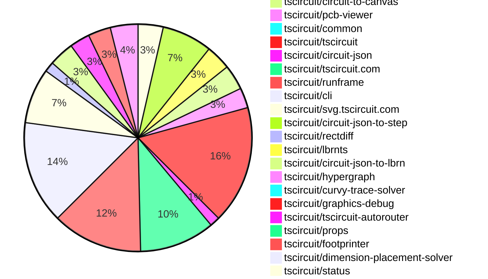

# contribution tracker

[contributions.tscircuit.com](https://contributions.tscircuit.com) ・ [tscircuit.com](https://tscircuit.com) ・ [Contribution Overviews](./contribution-overviews/) ・ [Changelogs](./changelogs/)

Generates weekly contribution overviews for tscircuit contributors. Check out all
the [contribution overviews here](./contribution-overviews/)
You can find AI-generated monthly changelogs in the [changelogs directory](./changelogs/)

- All PRs in the tscircuit org are scanned/summarized via an LLM
- The LLM classifies each Diff/PR as into a set of attributes for scoring
- All the PRs, summaries, and classifications are organized into charts and tables for [the website](https://contributions.tscircuit.com)

> Want to run locally? See the [Development Section](#development)

The current week is shown below. There are 4 major sections:

- [Contributor Overview](#contributor-overview)
- [PRs by Repository](#prs-by-repository)
- [PRs by Contributor](#changes-by-contributor)
- [Scoring & Sponsorship System](#scoring--sponsorship-system)

## Current Week

<!-- START_CURRENT_WEEK -->

# Contribution Overview 2026-01-14

The current week is shown below. There are 3 major sections:

- [Contributor Overview](#contributor-overview)
- [PRs by Repository](#prs-by-repository)
- [PRs by Contributor](#changes-by-contributor)
- [Scoring & Sponsorship Details](/docs/sponsorship-calculation-explanation.md)

## PRs by Repository



## Contributor Overview

| Contributor | 🐳 Major | 🐙 Minor | 🐌 Tiny | ⭐ | Discussion Contributions |
|-------------|---------|---------|---------|-----|--------------------------|
| [rushabhcodes](#rushabhcodes) | 4 | 1 | 2 | ⭐⭐⭐ | 0🔹 0🔶 0💎 |
| [seveibar](#seveibar) | 7 | 2 | 2 | ⭐⭐⭐ | 0🔹 0🔶 0💎 |
| [ShiboSoftwareDev](#ShiboSoftwareDev) | 2 | 7 | 2 | ⭐⭐⭐ | 0🔹 0🔶 0💎 |
| [techmannih](#techmannih) | 3 | 4 | 2 | ⭐⭐⭐ | 0🔹 0🔶 0💎 |
| [Abse2001](#Abse2001) | 2 | 8 | 1 | ⭐⭐⭐ | 0🔹 0🔶 0💎 |
| [AnasSarkiz](#AnasSarkiz) | 5 | 3 | 5 | ⭐⭐⭐ | 0🔹 0🔶 0💎 |
| [ArnavK-09](#ArnavK-09) | 5 | 3 | 6 | ⭐⭐⭐ | 0🔹 0🔶 0💎 |
| [imrishabh18](#imrishabh18) | 4 | 5 | 3 | ⭐⭐ | 0🔹 0🔶 0💎 |
| [0hmX](#0hmX) | 7 | 0 | 0 | ⭐⭐ | 0🔹 0🔶 0💎 |
| [tscircuitbot](#tscircuitbot) | 0 | 0 | 193 | ⭐⭐ | 0🔹 0🔶 0💎 |
| [Ayushjhawar8](#Ayushjhawar8) | 1 | 2 | 6 | ⭐⭐ | 0🔹 0🔶 0💎 |
| [MustafaMulla29](#MustafaMulla29) | 1 | 2 | 1 | ⭐ | 0🔹 0🔶 0💎 |
| [Heinrich-XIAO](#Heinrich-XIAO) | 0 | 0 | 1 |  | 0🔹 0🔶 0💎 |
| [Sahil-Gupta584](#Sahil-Gupta584) | 0 | 0 | 1 |  | 0🔹 0🔶 0💎 |

> Note: AI evaluates PRs and assigns 1-3 star ratings automatically. 4 and 5 star ratings require manual staff review.

### Discussion Contribution Legend

- 🔹 Normal Comments: Basic participation with minimal effort
- 🔶 Great Informative Comments: Thoughtful participation that adds value
- 💎 Incredible Comments: Exceptional participation with high-quality content

## Review Table

[reviews-received-hover]: ## "Number of reviews received for PRs for this contributor"
[approvals-received-hover]: ## "Number of approvals received for PRs this contributor authored"
[rejections-received-hover]: ## "Number of rejections received for PRs this contributor authored"
[prs-opened-hover]: ## "Number of PRs opened by this contributor"
[issues-created-hover]: ## "Number of issues created by this contributor"

| Contributor | Reviews Received | Approvals Received | Rejections Received | Approvals | Rejections | PRs Opened | PRs Merged | Issues Created |
|---|---|---|---|---|---|---|---|---|
| [MustafaMulla29](#MustafaMulla29) | 8 | 3 | 1 | 0 | 0 | 5 | 4 | 0 |
| [bimakw](#bimakw) | 6 | 1 | 3 | 0 | 0 | 6 | 0 | 0 |
| [rushabhcodes](#rushabhcodes) | 41 | 7 | 5 | 2 | 9 | 14 | 7 | 0 |
| [Abse2001](#Abse2001) | 12 | 11 | 0 | 6 | 0 | 12 | 11 | 0 |
| [ShiboSoftwareDev](#ShiboSoftwareDev) | 21 | 10 | 2 | 10 | 0 | 15 | 12 | 0 |
| [seveibar](#seveibar) | 0 | 0 | 0 | 50 | 13 | 15 | 11 | 0 |
| [tscircuitbot](#tscircuitbot) | 0 | 0 | 0 | 0 | 0 | 237 | 193 | 0 |
| [Ayushjhawar8](#Ayushjhawar8) | 15 | 5 | 2 | 0 | 0 | 13 | 9 | 0 |
| [techmannih](#techmannih) | 14 | 9 | 2 | 2 | 1 | 11 | 9 | 0 |
| [MichaelWalker-git](#MichaelWalker-git) | 0 | 0 | 0 | 0 | 0 | 1 | 0 | 0 |
| [SolariSystems](#SolariSystems) | 1 | 0 | 0 | 0 | 0 | 2 | 0 | 0 |
| [gokseniin](#gokseniin) | 1 | 0 | 0 | 0 | 0 | 1 | 0 | 0 |
| [AnasSarkiz](#AnasSarkiz) | 4 | 4 | 0 | 1 | 0 | 15 | 13 | 0 |
| [Kesavaraja67](#Kesavaraja67) | 2 | 0 | 1 | 0 | 0 | 1 | 0 | 0 |
| [imrishabh18](#imrishabh18) | 10 | 6 | 1 | 6 | 7 | 16 | 12 | 0 |
| [Heinrich-XIAO](#Heinrich-XIAO) | 5 | 2 | 1 | 0 | 0 | 4 | 1 | 0 |
| [ArnavK-09](#ArnavK-09) | 21 | 12 | 2 | 0 | 0 | 17 | 14 | 0 |
| [Devesh36](#Devesh36) | 4 | 1 | 1 | 0 | 0 | 1 | 0 | 0 |
| [maxwellyoung](#maxwellyoung) | 2 | 0 | 1 | 0 | 0 | 2 | 0 | 0 |
| [Sahil-Gupta584](#Sahil-Gupta584) | 3 | 1 | 0 | 0 | 0 | 1 | 1 | 0 |
| [0hmX](#0hmX) | 8 | 5 | 1 | 0 | 1 | 11 | 7 | 0 |
| [Godzilla675](#Godzilla675) | 7 | 0 | 2 | 0 | 0 | 1 | 0 | 0 |
| [anzal787](#anzal787) | 7 | 0 | 2 | 0 | 0 | 6 | 0 | 0 |
| [dei96303-boop](#dei96303-boop) | 1 | 0 | 0 | 0 | 0 | 1 | 0 | 0 |
| [GhostDragonAlpha](#GhostDragonAlpha) | 0 | 0 | 0 | 0 | 0 | 3 | 0 | 0 |
| [giajoe24](#giajoe24) | 3 | 0 | 2 | 0 | 0 | 2 | 0 | 0 |
| [krapcys1-maker](#krapcys1-maker) | 2 | 0 | 2 | 0 | 0 | 2 | 0 | 0 |

## Changes by Repository

### [tscircuit/circuit-to-svg](https://github.com/tscircuit/circuit-to-svg)

| PR # | Impact | Rating | Contributor | Description |
|------|--------|--------|-------------|-------------|
| [#479](https://github.com/tscircuit/circuit-to-svg/pull/479) | 🐳 Major | ⭐⭐⭐ | MustafaMulla29 | Adds support for rendering schematic paths in SVG format by implementing a new function to create SVG objects from schematic path data. |
| [#481](https://github.com/tscircuit/circuit-to-svg/pull/481) | 🐳 Major | ⭐⭐⭐ | techmannih | Implemented soldermask_margin_left, soldermask_margin_top, soldermask_margin_right, and soldermask_margin_bottom for rect and rotated_rect SMT pads, allowing for positive and negative margin values to control soldermask coverage. |

### [tscircuit/core](https://github.com/tscircuit/core)

| PR # | Impact | Rating | Contributor | Description |
|------|--------|--------|-------------|-------------|
| [#1840](https://github.com/tscircuit/core/pull/1840) | 🐳 Major | ⭐⭐⭐ | ShiboSoftwareDev | Adds a new PanelBoardLayout render phase that computes board positions before PCB rendering, ensuring proper transform-based positioning for boards inside panels and eliminating post-render repositioning issues. |
| [#1839](https://github.com/tscircuit/core/pull/1839) | 🐳 Major | ⭐⭐⭐ | imrishabh18 | Optimizes the handling of duplicate component names within subcircuits by implementing a caching mechanism for component name mapping. |
| [#1843](https://github.com/tscircuit/core/pull/1843) | 🐳 Major | ⭐⭐⭐ | imrishabh18 | Optimizes the doInitialPcbLayout phase by eliminating expensive database scans, improving performance during PCB layout initialization. |
| [#1833](https://github.com/tscircuit/core/pull/1833) | 🐳 Major | ⭐⭐⭐ | seveibar | Updates the autorouter to accept an effort level parameter and adjusts the size of 1206x4 jumpers to match the 3612 metric. |
| [#1834](https://github.com/tscircuit/core/pull/1834) | 🐳 Major | ⭐⭐⭐ | seveibar | Updates the autorouting algorithm to relax the port point rip threshold, potentially improving routing efficiency in complex circuits. |
| [#1835](https://github.com/tscircuit/core/pull/1835) | 🐙 Minor | ⭐⭐ | MustafaMulla29 | Adds support for the schematicpath  element in the schematic rendering system, allowing for the definition of paths with specified points and fill properties. |
| [#1845](https://github.com/tscircuit/core/pull/1845) | 🐙 Minor | ⭐⭐ | ShiboSoftwareDev | Adds scaling logic to reduce tab width and length for small boards, implementing a minimum scale factor to maintain usability and includes a test case for verification. |
| [#1836](https://github.com/tscircuit/core/pull/1836) | 🐙 Minor | ⭐⭐ | ShiboSoftwareDev | Fixes positioning issues of child and grandchild groups in PCB designs during panel auto-layout operations by updating their coordinates when the parent board moves. |
| [#1841](https://github.com/tscircuit/core/pull/1841) | 🐙 Minor | ⭐⭐ | imrishabh18 | Fixes a bug where the initial parts engine render was still executed even when partsEngineDisabled was set to true. |

<details>
<summary>🐌 Tiny Contributions (1)</summary>

| PR # | Impact | Contributor | Description |
|------|--------|-------------|-------------|
| [#1832](https://github.com/tscircuit/core/pull/1832) | 🐌 Tiny | ShiboSoftwareDev | Updates the tscircuitcircuit-json-util dependency to version 0.0.75 in package.json |

</details>

### [tscircuit/eval](https://github.com/tscircuit/eval)

| PR # | Impact | Rating | Contributor | Description |
|------|--------|--------|-------------|-------------|
| [#1878](https://github.com/tscircuit/eval/pull/1878) | 🐙 Minor | ⭐⭐ | MustafaMulla29 | Adds a fragment identifier to blob URLs for STEP files to ensure correct file type detection and prevent fallback to STL URLs, resolving warnings in the console. |
| [#1874](https://github.com/tscircuit/eval/pull/1874) | 🐙 Minor | ⭐⭐ | ShiboSoftwareDev | Fixes critical Error resolving module specifier npmeecircuit-engine1.5.6esm error that breaks ngspice SPICE simulations in browser environments |

<details>
<summary>🐌 Tiny Contributions (18)</summary>

| PR # | Impact | Contributor | Description |
|------|--------|-------------|-------------|
| [#1888](https://github.com/tscircuit/eval/pull/1888) | 🐌 Tiny | tscircuitbot | Automated package update to version 0.0.594 |
| [#1887](https://github.com/tscircuit/eval/pull/1887) | 🐌 Tiny | tscircuitbot | Automated package update |
| [#1885](https://github.com/tscircuit/eval/pull/1885) | 🐌 Tiny | tscircuitbot | Automated package update |
| [#1884](https://github.com/tscircuit/eval/pull/1884) | 🐌 Tiny | tscircuitbot | Automated package update |
| [#1881](https://github.com/tscircuit/eval/pull/1881) | 🐌 Tiny | tscircuitbot | Automated package update |
| [#1880](https://github.com/tscircuit/eval/pull/1880) | 🐌 Tiny | tscircuitbot | Automated package update |
| [#1875](https://github.com/tscircuit/eval/pull/1875) | 🐌 Tiny | tscircuitbot | Automated package update |
| [#1871](https://github.com/tscircuit/eval/pull/1871) | 🐌 Tiny | tscircuitbot | Automated package update |
| [#1870](https://github.com/tscircuit/eval/pull/1870) | 🐌 Tiny | tscircuitbot | Updates the version of the tscircuitcore package from 0.0.971 to 0.0.972 in package.json |
| [#1868](https://github.com/tscircuit/eval/pull/1868) | 🐌 Tiny | tscircuitbot | Automated package update |
| [#1861](https://github.com/tscircuit/eval/pull/1861) | 🐌 Tiny | tscircuitbot | Updates package dependencies to their latest versions in package.json |
| [#1867](https://github.com/tscircuit/eval/pull/1867) | 🐌 Tiny | tscircuitbot | Automated package update |
| [#1865](https://github.com/tscircuit/eval/pull/1865) | 🐌 Tiny | tscircuitbot | Automated package update |
| [#1864](https://github.com/tscircuit/eval/pull/1864) | 🐌 Tiny | tscircuitbot | Automated package update |
| [#1862](https://github.com/tscircuit/eval/pull/1862) | 🐌 Tiny | tscircuitbot | Automated package update |
| [#1860](https://github.com/tscircuit/eval/pull/1860) | 🐌 Tiny | tscircuitbot | Automated package update |
| [#1859](https://github.com/tscircuit/eval/pull/1859) | 🐌 Tiny | tscircuitbot | Automated package update |
| [#1883](https://github.com/tscircuit/eval/pull/1883) | 🐌 Tiny | ArnavK-09 | Improves the error message for non-exported components in the evalCompiledJs function to provide clearer guidance on type exports. |

</details>

### [tscircuit/schematic-viewer](https://github.com/tscircuit/schematic-viewer)


<details>
<summary>🐌 Tiny Contributions (1)</summary>

| PR # | Impact | Contributor | Description |
|------|--------|-------------|-------------|
| [#158](https://github.com/tscircuit/schematic-viewer/pull/158) | 🐌 Tiny | MustafaMulla29 | Updates the tscircuit dependency to version 0.0.1149 to enable schematic_path rendering functionality. |

</details>

### [tscircuit/3d-viewer](https://github.com/tscircuit/3d-viewer)

| PR # | Impact | Rating | Contributor | Description |
|------|--------|--------|-------------|-------------|
| [#659](https://github.com/tscircuit/3d-viewer/pull/659) | 🐳 Major | ⭐⭐⭐ | Abse2001 | Implements layer-aware Z-positioning for CAD components to ensure accurate placement on PCB surfaces based on board thickness, centralizing positioning logic across multiple model formats and enhancing test coverage for panelization. |
| [#661](https://github.com/tscircuit/3d-viewer/pull/661) | 🐙 Minor | ⭐⭐ | Abse2001 | Fixes geometry edge case that could cause JSCAD to throw during rounded-rectangle generation by aligning border-radius clamping logic with JSCADs internal constraints. |
| [#662](https://github.com/tscircuit/3d-viewer/pull/662) | 🐙 Minor | ⭐⭐ | Abse2001 | Fixes incorrect orientation of bottom-layer CAD components by correcting Z-axis rotation handling during layer flipping. |
| [#660](https://github.com/tscircuit/3d-viewer/pull/660) | 🐙 Minor | ⭐⭐ | Abse2001 | Fixes a rendering bug in the JSCAD viewer by standardizing the default PCB thickness from 1.6 mm to 1.4 mm, ensuring consistent soldermask visualization across panelized boards. |
| [#655](https://github.com/tscircuit/3d-viewer/pull/655) | 🐙 Minor | ⭐⭐ | Abse2001 | Fixes soldermask clearance issues for polygon-shaped pads by rendering their full outlines, ensuring accurate fabrication and visual fidelity. |
| [#652](https://github.com/tscircuit/3d-viewer/pull/652) | 🐙 Minor | ⭐⭐ | techmannih | Refactors the Manifold and JSCAD implementations to ensure shapes are rotated at the origin prior to being translated to their final positions, improving the accuracy of shape placements. |
| [#657](https://github.com/tscircuit/3d-viewer/pull/657) | 🐙 Minor | ⭐⭐ | ShiboSoftwareDev | Adds comprehensive support for the new rotated_pill_hole_with_rect_pad plated hole shape across all rendering engines and visualization layers. |
| [#658](https://github.com/tscircuit/3d-viewer/pull/658) | 🐙 Minor | ⭐⭐ | ShiboSoftwareDev | Fixes a bug where the barrel rotation of plated holes was incorrectly handled due to a copy-paste error in the code. |
| [#654](https://github.com/tscircuit/3d-viewer/pull/654) | 🐙 Minor | ⭐⭐ | ShiboSoftwareDev | Adds support for pill-shaped plated holes with rectangular pads, including validation logic and comprehensive test coverage. |
| [#651](https://github.com/tscircuit/3d-viewer/pull/651) | 🐙 Minor | ⭐⭐ | ShiboSoftwareDev | Adds support for oval hole elements in PCB design, allowing for oval-shaped holes to be created and rendered in the 3D viewer. |

### [tscircuit/circuit-to-canvas](https://github.com/tscircuit/circuit-to-canvas)

| PR # | Impact | Rating | Contributor | Description |
|------|--------|--------|-------------|-------------|
| [#119](https://github.com/tscircuit/circuit-to-canvas/pull/119) | 🐳 Major | ⭐⭐⭐ | Abse2001 | Introduces a dedicated soldermask rendering engine with correct positivenegative margin semantics. Reorders the entire draw pipeline to match real PCB fabrication layers (substrate  copper  soldermask  silkscreen  drills). Simplifies pad, hole, and plated-hole rendering by removing inline soldermask hacks and centralizing logic. Fixes long-standing visual inaccuracies for soldermask coverage, margins, and cutouts across all shapes. Updates snapshots to reflect physically accurate PCB output. |
| [#123](https://github.com/tscircuit/circuit-to-canvas/pull/123) | 🐙 Minor | ⭐⭐ | Abse2001 | Fixes incorrect silkscreen text placement by properly handling all center-based anchor alignments and locking the behavior down with a comprehensive visual regression test. |
| [#121](https://github.com/tscircuit/circuit-to-canvas/pull/121) | 🐙 Minor | ⭐⭐ | Abse2001 | This PR introduces an explicit rendering switch to separate PCB outline drawing from substrate (front material) fill, eliminating unintended visual occlusion and improving layer correctness across canvas renders. |
| [#116](https://github.com/tscircuit/circuit-to-canvas/pull/116) | 🐙 Minor | ⭐⭐ | Ayushjhawar8 | Add support for rendering multi-line text in copper and silkscreen layers of PCB designs, allowing for better text representation in circuit designs. |
| [#117](https://github.com/tscircuit/circuit-to-canvas/pull/117) | 🐙 Minor | ⭐⭐ | techmannih | Adds support for asymmetric soldermask margins for rectangular and rotated rectangular SMT pads in PCB designs. |

<details>
<summary>🐌 Tiny Contributions (5)</summary>

| PR # | Impact | Contributor | Description |
|------|--------|-------------|-------------|
| [#125](https://github.com/tscircuit/circuit-to-canvas/pull/125) | 🐌 Tiny | tscircuitbot | Updates the package version from 0.0.53 to 0.0.54 in package.json |
| [#122](https://github.com/tscircuit/circuit-to-canvas/pull/122) | 🐌 Tiny | tscircuitbot | Automated package update |
| [#124](https://github.com/tscircuit/circuit-to-canvas/pull/124) | 🐌 Tiny | tscircuitbot | Updates the package version from 0.0.52 to 0.0.53 in package.json |
| [#120](https://github.com/tscircuit/circuit-to-canvas/pull/120) | 🐌 Tiny | tscircuitbot | Automated package update |
| [#118](https://github.com/tscircuit/circuit-to-canvas/pull/118) | 🐌 Tiny | tscircuitbot | Updates the package version from 0.0.49 to 0.0.50 in package.json |

</details>

### [tscircuit/pcb-viewer](https://github.com/tscircuit/pcb-viewer)

| PR # | Impact | Rating | Contributor | Description |
|------|--------|--------|-------------|-------------|
| [#611](https://github.com/tscircuit/pcb-viewer/pull/611) | 🐙 Minor | ⭐⭐ | Abse2001 | Fixes inconsistent soldermask rendering by threading the soldermask visibility flag through the entire canvas drawing pipeline and aligning the viewer with the latest circuit-to-canvas behavior. |
| [#614](https://github.com/tscircuit/pcb-viewer/pull/614) | 🐙 Minor | ⭐⭐ | Abse2001 | Fixes missing SMT pad rendering on inner copper layers by fully extending the canvas render pipeline to support pads on multilayer boards. |
| [#609](https://github.com/tscircuit/pcb-viewer/pull/609) | 🐙 Minor | ⭐⭐ | Ayushjhawar8 | Fixes the issue where the d key hotkey triggers while typing in input fields, preventing unintended actions. |

<details>
<summary>🐌 Tiny Contributions (5)</summary>

| PR # | Impact | Contributor | Description |
|------|--------|-------------|-------------|
| [#615](https://github.com/tscircuit/pcb-viewer/pull/615) | 🐌 Tiny | tscircuitbot | Automated package update |
| [#612](https://github.com/tscircuit/pcb-viewer/pull/612) | 🐌 Tiny | tscircuitbot | Automated package update to version 1.11.317 |
| [#610](https://github.com/tscircuit/pcb-viewer/pull/610) | 🐌 Tiny | tscircuitbot | Automated package update |
| [#608](https://github.com/tscircuit/pcb-viewer/pull/608) | 🐌 Tiny | tscircuitbot | Automated package update to version 1.11.315 |
| [#607](https://github.com/tscircuit/pcb-viewer/pull/607) | 🐌 Tiny | techmannih | Adds a new fixture for asymmetric soldermask margins for rectangular and rotated rectangular SMT pads in the PCB viewer. |

</details>

### [tscircuit/common](https://github.com/tscircuit/common)


<details>
<summary>🐌 Tiny Contributions (1)</summary>

| PR # | Impact | Contributor | Description |
|------|--------|-------------|-------------|
| [#65](https://github.com/tscircuit/common/pull/65) | 🐌 Tiny | Abse2001 | Updates the tscircuit dependency version from 0.0.1136 to 0.0.1158 in package.json |

</details>

### [tscircuit/tscircuit](https://github.com/tscircuit/tscircuit)


<details>
<summary>🐌 Tiny Contributions (47)</summary>

| PR # | Impact | Contributor | Description |
|------|--------|-------------|-------------|
| [#1895](https://github.com/tscircuit/tscircuit/pull/1895) | 🐌 Tiny | tscircuitbot | Automated package update |
| [#1894](https://github.com/tscircuit/tscircuit/pull/1894) | 🐌 Tiny | tscircuitbot | Automated package update |
| [#1893](https://github.com/tscircuit/tscircuit/pull/1893) | 🐌 Tiny | tscircuitbot | Automated package update |
| [#1892](https://github.com/tscircuit/tscircuit/pull/1892) | 🐌 Tiny | tscircuitbot | Automated package update |
| [#1891](https://github.com/tscircuit/tscircuit/pull/1891) | 🐌 Tiny | tscircuitbot | Automated package update |
| [#1890](https://github.com/tscircuit/tscircuit/pull/1890) | 🐌 Tiny | tscircuitbot | Automated package update |
| [#1888](https://github.com/tscircuit/tscircuit/pull/1888) | 🐌 Tiny | tscircuitbot | Automated package update |
| [#1887](https://github.com/tscircuit/tscircuit/pull/1887) | 🐌 Tiny | tscircuitbot | Updates the tscircuitcli and tscircuitcore packages to their latest versions. |
| [#1886](https://github.com/tscircuit/tscircuit/pull/1886) | 🐌 Tiny | tscircuitbot | Automated package update |
| [#1885](https://github.com/tscircuit/tscircuit/pull/1885) | 🐌 Tiny | tscircuitbot | Updates the versions of several dependencies in the package.json file, including tscircuitcli, tscircuitcore, and tscircuiteval. |
| [#1881](https://github.com/tscircuit/tscircuit/pull/1881) | 🐌 Tiny | tscircuitbot | Automated package update |
| [#1878](https://github.com/tscircuit/tscircuit/pull/1878) | 🐌 Tiny | tscircuitbot | Automated package update |
| [#1879](https://github.com/tscircuit/tscircuit/pull/1879) | 🐌 Tiny | tscircuitbot | Automated package update |
| [#1883](https://github.com/tscircuit/tscircuit/pull/1883) | 🐌 Tiny | tscircuitbot | Updates the tscircuitcli package from version 0.1.763 to 0.1.764 and the tscircuitrunframe package from version 0.0.1491 to 0.0.1492 in package.json |
| [#1882](https://github.com/tscircuit/tscircuit/pull/1882) | 🐌 Tiny | tscircuitbot | Automated package update |
| [#1875](https://github.com/tscircuit/tscircuit/pull/1875) | 🐌 Tiny | tscircuitbot | Automated package update |
| [#1884](https://github.com/tscircuit/tscircuit/pull/1884) | 🐌 Tiny | tscircuitbot | Automated package update |
| [#1880](https://github.com/tscircuit/tscircuit/pull/1880) | 🐌 Tiny | tscircuitbot | Automated package update |
| [#1877](https://github.com/tscircuit/tscircuit/pull/1877) | 🐌 Tiny | tscircuitbot | Automated package update |
| [#1876](https://github.com/tscircuit/tscircuit/pull/1876) | 🐌 Tiny | tscircuitbot | Automated package update |
| [#1874](https://github.com/tscircuit/tscircuit/pull/1874) | 🐌 Tiny | tscircuitbot | Automated package update |
| [#1870](https://github.com/tscircuit/tscircuit/pull/1870) | 🐌 Tiny | tscircuitbot | Automated package update |
| [#1873](https://github.com/tscircuit/tscircuit/pull/1873) | 🐌 Tiny | tscircuitbot | Updates the tscircuitcli and tscircuitcore packages to their latest versions. |
| [#1869](https://github.com/tscircuit/tscircuit/pull/1869) | 🐌 Tiny | tscircuitbot | Updates the tscircuitcli package from version 0.1.757 to 0.1.758 and the tscircuitrunframe package from version 0.0.1484 to 0.0.1486. |
| [#1867](https://github.com/tscircuit/tscircuit/pull/1867) | 🐌 Tiny | tscircuitbot | Updates the package version from 0.0.1150 to 0.0.1151 in package.json |
| [#1866](https://github.com/tscircuit/tscircuit/pull/1866) | 🐌 Tiny | tscircuitbot | Automated package update |
| [#1864](https://github.com/tscircuit/tscircuit/pull/1864) | 🐌 Tiny | tscircuitbot | Automated package update |
| [#1865](https://github.com/tscircuit/tscircuit/pull/1865) | 🐌 Tiny | tscircuitbot | Automated package update |
| [#1862](https://github.com/tscircuit/tscircuit/pull/1862) | 🐌 Tiny | tscircuitbot | Automated package update |
| [#1863](https://github.com/tscircuit/tscircuit/pull/1863) | 🐌 Tiny | tscircuitbot | Automated package update |
| [#1849](https://github.com/tscircuit/tscircuit/pull/1849) | 🐌 Tiny | tscircuitbot | Updates the package version from 0.0.1141 to 0.0.1142 in package.json |
| [#1853](https://github.com/tscircuit/tscircuit/pull/1853) | 🐌 Tiny | tscircuitbot | Automated package update |
| [#1857](https://github.com/tscircuit/tscircuit/pull/1857) | 🐌 Tiny | tscircuitbot | Automated package update |
| [#1848](https://github.com/tscircuit/tscircuit/pull/1848) | 🐌 Tiny | tscircuitbot | Updates the tscircuitcli package to version 0.1.748 in the package.json file. |
| [#1852](https://github.com/tscircuit/tscircuit/pull/1852) | 🐌 Tiny | tscircuitbot | Automated package update |
| [#1854](https://github.com/tscircuit/tscircuit/pull/1854) | 🐌 Tiny | tscircuitbot | Updates the tscircuitcli package to version 0.1.751 in the package.json file. |
| [#1858](https://github.com/tscircuit/tscircuit/pull/1858) | 🐌 Tiny | tscircuitbot | Updates the tscircuitcli package to version 0.1.753 |
| [#1860](https://github.com/tscircuit/tscircuit/pull/1860) | 🐌 Tiny | tscircuitbot | Updates the tscircuitcli package from version 0.1.753 to 0.1.754 |
| [#1850](https://github.com/tscircuit/tscircuit/pull/1850) | 🐌 Tiny | tscircuitbot | Updates the tscircuitcli package to version 0.1.749 in the package.json file. |
| [#1861](https://github.com/tscircuit/tscircuit/pull/1861) | 🐌 Tiny | tscircuitbot | Automated package update |
| [#1859](https://github.com/tscircuit/tscircuit/pull/1859) | 🐌 Tiny | tscircuitbot | Updates the package version from 0.0.1146 to 0.0.1147 in package.json |
| [#1856](https://github.com/tscircuit/tscircuit/pull/1856) | 🐌 Tiny | tscircuitbot | Automated package update |
| [#1855](https://github.com/tscircuit/tscircuit/pull/1855) | 🐌 Tiny | tscircuitbot | Automated package update |
| [#1844](https://github.com/tscircuit/tscircuit/pull/1844) | 🐌 Tiny | tscircuitbot | Updates the tscircuitcli package and other dependencies to their latest versions. |
| [#1847](https://github.com/tscircuit/tscircuit/pull/1847) | 🐌 Tiny | tscircuitbot | Automated package update |
| [#1845](https://github.com/tscircuit/tscircuit/pull/1845) | 🐌 Tiny | tscircuitbot | Automated package update |
| [#1846](https://github.com/tscircuit/tscircuit/pull/1846) | 🐌 Tiny | tscircuitbot | Automated package update |

</details>

### [tscircuit/circuit-json](https://github.com/tscircuit/circuit-json)

| PR # | Impact | Rating | Contributor | Description |
|------|--------|--------|-------------|-------------|
| [#413](https://github.com/tscircuit/circuit-json/pull/413) | 🐳 Major | ⭐⭐⭐ | techmannih | Refactors soldermask properties in the pcb_smtpad to use individual margin properties instead of a single margin and dimensions. |
| [#410](https://github.com/tscircuit/circuit-json/pull/410) | 🐳 Major | ⭐⭐⭐ | techmannih | Adds soldermask_center_offset, soldermask_width, and soldermask_height properties to rectangular pads in the PCB design schema. |

<details>
<summary>🐌 Tiny Contributions (2)</summary>

| PR # | Impact | Contributor | Description |
|------|--------|-------------|-------------|
| [#414](https://github.com/tscircuit/circuit-json/pull/414) | 🐌 Tiny | tscircuitbot | Automated package update |
| [#411](https://github.com/tscircuit/circuit-json/pull/411) | 🐌 Tiny | tscircuitbot | Updates the package version from v0.0.354 to v0.0.355 in package.json |

</details>

### [tscircuit/tscircuit.com](https://github.com/tscircuit/tscircuit.com)

| PR # | Impact | Rating | Contributor | Description |
|------|--------|--------|-------------|-------------|
| [#2472](https://github.com/tscircuit/tscircuit.com/pull/2472) | 🐳 Major | ⭐⭐⭐ | imrishabh18 | Invalidates the cached queries for packageRelease and packageBuild after a rebuild operation to ensure fresh data is fetched. |
| [#2513](https://github.com/tscircuit/tscircuit.com/pull/2513) | 🐳 Major | ⭐⭐⭐ | ArnavK-09 | Implements an organization settings page and a new package save prompt dialog, enhancing user interaction with package creation and organization management. |
| [#2507](https://github.com/tscircuit/tscircuit.com/pull/2507) | 🐳 Major | ⭐⭐⭐ | ArnavK-09 | Added Tooltip functionality to display full date in SidebarReleasesSection, updated links to direct to specific release versions, implemented mobile and desktop dropdowns in BuildItemRow and ReleaseItemRow for better action management, and improved layout and styling for better user experience. |
| [#2506](https://github.com/tscircuit/tscircuit.com/pull/2506) | 🐳 Major | ⭐⭐⭐ | ArnavK-09 | Adds a detailed view for build information, including logs and deployment details for specific builds of a package release. |
| [#2471](https://github.com/tscircuit/tscircuit.com/pull/2471) | 🐳 Major | ⭐⭐⭐ | ArnavK-09 | Refactors the Release Details Page to improve the structure and functionality, including the addition of new components for displaying installation commands and build logs. |
| [#2476](https://github.com/tscircuit/tscircuit.com/pull/2476) | 🐙 Minor | ⭐⭐ | seveibar | Add a new API endpoint to retrieve a packages preview circuit JSON based on configuration, replacing hardcoded paths in the frontend with a dynamic approach that respects the packages configuration file. |
| [#2492](https://github.com/tscircuit/tscircuit.com/pull/2492) | 🐙 Minor | ⭐⭐ | ArnavK-09 | Filters the trending packages displayed on the home page to only include those with valid CAD preview images, improving the user experience by preventing broken image links. |

<details>
<summary>🐌 Tiny Contributions (23)</summary>

| PR # | Impact | Contributor | Description |
|------|--------|-------------|-------------|
| [#2515](https://github.com/tscircuit/tscircuit.com/pull/2515) | 🐌 Tiny | tscircuitbot | Updates the tscircuitrunframe package from version 0.0.1495 to 0.0.1496 |
| [#2514](https://github.com/tscircuit/tscircuit.com/pull/2514) | 🐌 Tiny | tscircuitbot | Updates the tscircuiteval package from version 0.0.593 to 0.0.594 |
| [#2512](https://github.com/tscircuit/tscircuit.com/pull/2512) | 🐌 Tiny | tscircuitbot | Updates the tscircuitrunframe package from version 0.0.1494 to 0.0.1495 |
| [#2511](https://github.com/tscircuit/tscircuit.com/pull/2511) | 🐌 Tiny | tscircuitbot | Automated package update |
| [#2510](https://github.com/tscircuit/tscircuit.com/pull/2510) | 🐌 Tiny | tscircuitbot | Updates the tscircuitrunframe package from version 0.0.1493 to 0.0.1494 |
| [#2509](https://github.com/tscircuit/tscircuit.com/pull/2509) | 🐌 Tiny | tscircuitbot | Updates the tscircuiteval package from version 0.0.591 to 0.0.592 |
| [#2505](https://github.com/tscircuit/tscircuit.com/pull/2505) | 🐌 Tiny | tscircuitbot | Updates the tscircuitrunframe package from version 0.0.1492 to 0.0.1493 |
| [#2504](https://github.com/tscircuit/tscircuit.com/pull/2504) | 🐌 Tiny | tscircuitbot | Automated package update |
| [#2502](https://github.com/tscircuit/tscircuit.com/pull/2502) | 🐌 Tiny | tscircuitbot | Updates the tscircuitrunframe package version from 0.0.1489 to 0.0.1491 in package.json |
| [#2500](https://github.com/tscircuit/tscircuit.com/pull/2500) | 🐌 Tiny | tscircuitbot | Updates the tscircuitrunframe package version from 0.0.1488 to 0.0.1489 in package.json |
| [#2499](https://github.com/tscircuit/tscircuit.com/pull/2499) | 🐌 Tiny | tscircuitbot | Updates the tscircuitrunframe package from version 0.0.1487 to 0.0.1488 |
| [#2503](https://github.com/tscircuit/tscircuit.com/pull/2503) | 🐌 Tiny | tscircuitbot | Automated package update |
| [#2501](https://github.com/tscircuit/tscircuit.com/pull/2501) | 🐌 Tiny | tscircuitbot | Updates the tscircuiteval package version from 0.0.589 to 0.0.590 |
| [#2498](https://github.com/tscircuit/tscircuit.com/pull/2498) | 🐌 Tiny | tscircuitbot | Automated package update |
| [#2485](https://github.com/tscircuit/tscircuit.com/pull/2485) | 🐌 Tiny | tscircuitbot | Automated package update |
| [#2483](https://github.com/tscircuit/tscircuit.com/pull/2483) | 🐌 Tiny | tscircuitbot | Automated package update |
| [#2479](https://github.com/tscircuit/tscircuit.com/pull/2479) | 🐌 Tiny | tscircuitbot | Automated package update |
| [#2477](https://github.com/tscircuit/tscircuit.com/pull/2477) | 🐌 Tiny | tscircuitbot | Automated package update to version 0.0.187 |
| [#2481](https://github.com/tscircuit/tscircuit.com/pull/2481) | 🐌 Tiny | tscircuitbot | Updates the tscircuiteval package to version 0.0.587 in package.json |
| [#2474](https://github.com/tscircuit/tscircuit.com/pull/2474) | 🐌 Tiny | tscircuitbot | Updates the tscircuiteval package from version 0.0.584 to 0.0.585 |
| [#2497](https://github.com/tscircuit/tscircuit.com/pull/2497) | 🐌 Tiny | Ayushjhawar8 | Updates the tscircuitrunframe package to version 0.0.1486 and the circuit-json-to-kicad package to version 0.0.34, along with updating the kicadts package to version 0.0.23 in package.json |
| [#2508](https://github.com/tscircuit/tscircuit.com/pull/2508) | 🐌 Tiny | ArnavK-09 | Updates the release link to use package_release_id and adds clipboard functionality to copy the release ID in the sidebar and releases list. |
| [#2491](https://github.com/tscircuit/tscircuit.com/pull/2491) | 🐌 Tiny | ArnavK-09 | Fixes overflow issues in card and skeleton components on the dashboard, organization profile, and user profile pages. |

</details>

### [tscircuit/runframe](https://github.com/tscircuit/runframe)

| PR # | Impact | Rating | Contributor | Description |
|------|--------|--------|-------------|-------------|
| [#2354](https://github.com/tscircuit/runframe/pull/2354) | 🐳 Major | ⭐⭐⭐ | imrishabh18 | Adds support for TSCIRCUIT_DEFAULT_MAIN_COMPONENT_PATH to set a default preview path for circuits in the RunFrame component. |
| [#2337](https://github.com/tscircuit/runframe/pull/2337) | 🐙 Minor | ⭐⭐ | ArnavK-09 | Disables the schematic view in the CircuitJsonPreview component when PCB panels are present in the circuit JSON. |

<details>
<summary>🐌 Tiny Contributions (34)</summary>

| PR # | Impact | Contributor | Description |
|------|--------|-------------|-------------|
| [#2366](https://github.com/tscircuit/runframe/pull/2366) | 🐌 Tiny | tscircuitbot | Automated package update |
| [#2365](https://github.com/tscircuit/runframe/pull/2365) | 🐌 Tiny | tscircuitbot | Automated package update |
| [#2364](https://github.com/tscircuit/runframe/pull/2364) | 🐌 Tiny | tscircuitbot | Automated package update |
| [#2363](https://github.com/tscircuit/runframe/pull/2363) | 🐌 Tiny | tscircuitbot | Automated package update |
| [#2362](https://github.com/tscircuit/runframe/pull/2362) | 🐌 Tiny | tscircuitbot | Automated package update |
| [#2361](https://github.com/tscircuit/runframe/pull/2361) | 🐌 Tiny | tscircuitbot | Updates the tscircuiteval package from version 0.0.591 to 0.0.592 in the package.json file. |
| [#2359](https://github.com/tscircuit/runframe/pull/2359) | 🐌 Tiny | tscircuitbot | Updates the tscircuiteval package from version 0.0.590 to 0.0.591 |
| [#2357](https://github.com/tscircuit/runframe/pull/2357) | 🐌 Tiny | tscircuitbot | Automated package update |
| [#2356](https://github.com/tscircuit/runframe/pull/2356) | 🐌 Tiny | tscircuitbot | Updates the tscircuit3d-viewer package from version 0.0.500 to 0.0.501 |
| [#2355](https://github.com/tscircuit/runframe/pull/2355) | 🐌 Tiny | tscircuitbot | Automated package update |
| [#2352](https://github.com/tscircuit/runframe/pull/2352) | 🐌 Tiny | tscircuitbot | Updates the tscircuiteval package to version 0.0.590 in the package.json file. |
| [#2350](https://github.com/tscircuit/runframe/pull/2350) | 🐌 Tiny | tscircuitbot | Updates the tscircuitpcb-viewer package from version 1.11.316 to 1.11.317 |
| [#2353](https://github.com/tscircuit/runframe/pull/2353) | 🐌 Tiny | tscircuitbot | Automated package update |
| [#2351](https://github.com/tscircuit/runframe/pull/2351) | 🐌 Tiny | tscircuitbot | Automated package update |
| [#2349](https://github.com/tscircuit/runframe/pull/2349) | 🐌 Tiny | tscircuitbot | Automated package update |
| [#2348](https://github.com/tscircuit/runframe/pull/2348) | 🐌 Tiny | tscircuitbot | Automated package update |
| [#2347](https://github.com/tscircuit/runframe/pull/2347) | 🐌 Tiny | tscircuitbot | Automated package update |
| [#2346](https://github.com/tscircuit/runframe/pull/2346) | 🐌 Tiny | tscircuitbot | Updates the tscircuit3d-viewer package from version 0.0.489 to 0.0.499 |
| [#2344](https://github.com/tscircuit/runframe/pull/2344) | 🐌 Tiny | tscircuitbot | Automated package update |
| [#2338](https://github.com/tscircuit/runframe/pull/2338) | 🐌 Tiny | tscircuitbot | Automated package update |
| [#2334](https://github.com/tscircuit/runframe/pull/2334) | 🐌 Tiny | tscircuitbot | Automated package update |
| [#2333](https://github.com/tscircuit/runframe/pull/2333) | 🐌 Tiny | tscircuitbot | Updates the tscircuitschematic-viewer package to version 2.0.52 in package.json |
| [#2330](https://github.com/tscircuit/runframe/pull/2330) | 🐌 Tiny | tscircuitbot | Updates the tscircuiteval package to version 0.0.589 in the package.json file. |
| [#2331](https://github.com/tscircuit/runframe/pull/2331) | 🐌 Tiny | tscircuitbot | Automated package update |
| [#2325](https://github.com/tscircuit/runframe/pull/2325) | 🐌 Tiny | tscircuitbot | Automated package update |
| [#2324](https://github.com/tscircuit/runframe/pull/2324) | 🐌 Tiny | tscircuitbot | Updates the tscircuiteval package to version 0.0.588 in the package.json file. |
| [#2319](https://github.com/tscircuit/runframe/pull/2319) | 🐌 Tiny | tscircuitbot | Updates the tscircuiteval package to version 0.0.586 in the package.json file. |
| [#2322](https://github.com/tscircuit/runframe/pull/2322) | 🐌 Tiny | tscircuitbot | Automated package update |
| [#2321](https://github.com/tscircuit/runframe/pull/2321) | 🐌 Tiny | tscircuitbot | Updates the tscircuiteval package to version 0.0.587 in the package.json file. |
| [#2320](https://github.com/tscircuit/runframe/pull/2320) | 🐌 Tiny | tscircuitbot | Automated package update |
| [#2316](https://github.com/tscircuit/runframe/pull/2316) | 🐌 Tiny | tscircuitbot | Updates the tscircuiteval package to version 0.0.585 in package.json |
| [#2317](https://github.com/tscircuit/runframe/pull/2317) | 🐌 Tiny | tscircuitbot | Automated package update |
| [#2343](https://github.com/tscircuit/runframe/pull/2343) | 🐌 Tiny | Ayushjhawar8 | Increases the timeout for test cases involving CircuitWebWorker to 120 seconds to accommodate longer execution times. |
| [#2341](https://github.com/tscircuit/runframe/pull/2341) | 🐌 Tiny | Ayushjhawar8 | Updates the tscircuitpcb-viewer package to version 1.11.316 and the circuit-json-to-step package to version 0.0.13 in the package.json file. |

</details>

### [tscircuit/cli](https://github.com/tscircuit/cli)

| PR # | Impact | Rating | Contributor | Description |
|------|--------|--------|-------------|-------------|
| [#1654](https://github.com/tscircuit/cli/pull/1654) | 🐙 Minor | ⭐⭐ | imrishabh18 | Adds support for generating KiCad footprint libraries during the CI build process using the tsci build --ci command. |
| [#1634](https://github.com/tscircuit/cli/pull/1634) | 🐙 Minor | ⭐⭐ | imrishabh18 | Add a project config option to let a project declare the default component to show when generating a static site so the generated site can open a chosen circuit by default. |
| [#1629](https://github.com/tscircuit/cli/pull/1629) | 🐙 Minor | ⭐⭐ | imrishabh18 | Updates the clone functionality to correctly handle binary package files by utilizing a dedicated download endpoint instead of assuming text content. |
| [#1628](https://github.com/tscircuit/cli/pull/1628) | 🐙 Minor | ⭐⭐ | imrishabh18 | Fixes the issue where the clone command strips dist segments, causing files to be written to the package root instead of under dist. |
| [#1623](https://github.com/tscircuit/cli/pull/1623) | 🐙 Minor | ⭐⭐ | seveibar | Adds a Bun plugin to register static asset loaders for STEP and other file types, preventing them from being parsed as TypeScript and ensuring correct resolution during CLI execution. |

<details>
<summary>🐌 Tiny Contributions (36)</summary>

| PR # | Impact | Contributor | Description |
|------|--------|-------------|-------------|
| [#1668](https://github.com/tscircuit/cli/pull/1668) | 🐌 Tiny | tscircuitbot | Automated package update |
| [#1667](https://github.com/tscircuit/cli/pull/1667) | 🐌 Tiny | tscircuitbot | Updates the tscircuitrunframe package from version 0.0.1495 to 0.0.1496 |
| [#1664](https://github.com/tscircuit/cli/pull/1664) | 🐌 Tiny | tscircuitbot | Automated package update |
| [#1663](https://github.com/tscircuit/cli/pull/1663) | 🐌 Tiny | tscircuitbot | Updates the tscircuitrunframe package from version 0.0.1494 to 0.0.1495 |
| [#1660](https://github.com/tscircuit/cli/pull/1660) | 🐌 Tiny | tscircuitbot | Automated package update |
| [#1659](https://github.com/tscircuit/cli/pull/1659) | 🐌 Tiny | tscircuitbot | Updates the tscircuitrunframe package from version 0.0.1493 to 0.0.1494 |
| [#1655](https://github.com/tscircuit/cli/pull/1655) | 🐌 Tiny | tscircuitbot | Automated package update |
| [#1653](https://github.com/tscircuit/cli/pull/1653) | 🐌 Tiny | tscircuitbot | Automated package update |
| [#1652](https://github.com/tscircuit/cli/pull/1652) | 🐌 Tiny | tscircuitbot | Updates the tscircuitrunframe package from version 0.0.1492 to 0.0.1493 |
| [#1648](https://github.com/tscircuit/cli/pull/1648) | 🐌 Tiny | tscircuitbot | Updates the tscircuitrunframe package from version 0.0.1489 to 0.0.1491 |
| [#1644](https://github.com/tscircuit/cli/pull/1644) | 🐌 Tiny | tscircuitbot | Automated package update |
| [#1645](https://github.com/tscircuit/cli/pull/1645) | 🐌 Tiny | tscircuitbot | Updates the tscircuitrunframe package from version 0.0.1488 to 0.0.1489 |
| [#1649](https://github.com/tscircuit/cli/pull/1649) | 🐌 Tiny | tscircuitbot | Automated package update |
| [#1643](https://github.com/tscircuit/cli/pull/1643) | 🐌 Tiny | tscircuitbot | Updates the tscircuitrunframe package from version 0.0.1487 to 0.0.1488 |
| [#1646](https://github.com/tscircuit/cli/pull/1646) | 🐌 Tiny | tscircuitbot | Automated package update |
| [#1651](https://github.com/tscircuit/cli/pull/1651) | 🐌 Tiny | tscircuitbot | Automated package update |
| [#1650](https://github.com/tscircuit/cli/pull/1650) | 🐌 Tiny | tscircuitbot | Automated package update |
| [#1639](https://github.com/tscircuit/cli/pull/1639) | 🐌 Tiny | tscircuitbot | Updates the tscircuitrunframe package from version 0.0.1484 to 0.0.1486 |
| [#1640](https://github.com/tscircuit/cli/pull/1640) | 🐌 Tiny | tscircuitbot | Automated package update |
| [#1642](https://github.com/tscircuit/cli/pull/1642) | 🐌 Tiny | tscircuitbot | Automated package update |
| [#1641](https://github.com/tscircuit/cli/pull/1641) | 🐌 Tiny | tscircuitbot | Updates the tscircuitrunframe package to version 0.0.1487 in the package.json file |
| [#1637](https://github.com/tscircuit/cli/pull/1637) | 🐌 Tiny | tscircuitbot | Automated package update |
| [#1638](https://github.com/tscircuit/cli/pull/1638) | 🐌 Tiny | tscircuitbot | Automated package update |
| [#1635](https://github.com/tscircuit/cli/pull/1635) | 🐌 Tiny | tscircuitbot | Updates the tscircuitrunframe package from version 0.0.1482 to 0.0.1483 |
| [#1632](https://github.com/tscircuit/cli/pull/1632) | 🐌 Tiny | tscircuitbot | Updates the tscircuitrunframe package from version 0.0.1481 to 0.0.1482 |
| [#1633](https://github.com/tscircuit/cli/pull/1633) | 🐌 Tiny | tscircuitbot | Automated package update |
| [#1636](https://github.com/tscircuit/cli/pull/1636) | 🐌 Tiny | tscircuitbot | Automated package update |
| [#1631](https://github.com/tscircuit/cli/pull/1631) | 🐌 Tiny | tscircuitbot | Automated package update |
| [#1630](https://github.com/tscircuit/cli/pull/1630) | 🐌 Tiny | tscircuitbot | Automated package update |
| [#1625](https://github.com/tscircuit/cli/pull/1625) | 🐌 Tiny | tscircuitbot | Updates the tscircuitrunframe package from version 0.0.1480 to 0.0.1481 |
| [#1626](https://github.com/tscircuit/cli/pull/1626) | 🐌 Tiny | tscircuitbot | Automated package update |
| [#1624](https://github.com/tscircuit/cli/pull/1624) | 🐌 Tiny | tscircuitbot | Automated package update |
| [#1620](https://github.com/tscircuit/cli/pull/1620) | 🐌 Tiny | tscircuitbot | Updates the tscircuitrunframe package from version 0.0.1476 to 0.0.1480 |
| [#1609](https://github.com/tscircuit/cli/pull/1609) | 🐌 Tiny | Ayushjhawar8 | Adds tests to verify the execution of buildCommand and prebuildCommand when using the --ci flag in the tscircuit CLI. |
| [#1614](https://github.com/tscircuit/cli/pull/1614) | 🐌 Tiny | imrishabh18 | Removes stringification of error messages and utilizes native error formatting for better debugging information. |
| [#1617](https://github.com/tscircuit/cli/pull/1617) | 🐌 Tiny | imrishabh18 | Adds a configuration option to skip local installation of the tscircuit package, allowing the use of the latest version available in the cloud. |

</details>

### [tscircuit/svg.tscircuit.com](https://github.com/tscircuit/svg.tscircuit.com)


<details>
<summary>🐌 Tiny Contributions (22)</summary>

| PR # | Impact | Contributor | Description |
|------|--------|-------------|-------------|
| [#847](https://github.com/tscircuit/svg.tscircuit.com/pull/847) | 🐌 Tiny | tscircuitbot | Updates the tscircuit package version from 0.0.1162 to 0.0.1163 in package.json |
| [#846](https://github.com/tscircuit/svg.tscircuit.com/pull/846) | 🐌 Tiny | tscircuitbot | Updates the tscircuit package from version 0.0.1161 to 0.0.1162 in package.json |
| [#845](https://github.com/tscircuit/svg.tscircuit.com/pull/845) | 🐌 Tiny | tscircuitbot | Updates the tscircuit package version from 0.0.1160 to 0.0.1161 in package.json |
| [#844](https://github.com/tscircuit/svg.tscircuit.com/pull/844) | 🐌 Tiny | tscircuitbot | Updates the tscircuit package version from 0.0.1159 to 0.0.1160 in package.json |
| [#843](https://github.com/tscircuit/svg.tscircuit.com/pull/843) | 🐌 Tiny | tscircuitbot | Updates the tscircuit package version from 0.0.1158 to 0.0.1159 in package.json |
| [#838](https://github.com/tscircuit/svg.tscircuit.com/pull/838) | 🐌 Tiny | tscircuitbot | Updates the tscircuit package version from 0.0.1153 to 0.0.1154 in package.json |
| [#839](https://github.com/tscircuit/svg.tscircuit.com/pull/839) | 🐌 Tiny | tscircuitbot | Updates the tscircuit package from version 0.0.1154 to 0.0.1155 in package.json |
| [#842](https://github.com/tscircuit/svg.tscircuit.com/pull/842) | 🐌 Tiny | tscircuitbot | Automated package update |
| [#840](https://github.com/tscircuit/svg.tscircuit.com/pull/840) | 🐌 Tiny | tscircuitbot | Automated package update |
| [#837](https://github.com/tscircuit/svg.tscircuit.com/pull/837) | 🐌 Tiny | tscircuitbot | Updates the tscircuit package version from 0.0.1152 to 0.0.1153 in package.json |
| [#836](https://github.com/tscircuit/svg.tscircuit.com/pull/836) | 🐌 Tiny | tscircuitbot | Updates the tscircuit package from version 0.0.1151 to 0.0.1152 in package.json |
| [#835](https://github.com/tscircuit/svg.tscircuit.com/pull/835) | 🐌 Tiny | tscircuitbot | Updates the tscircuit package version from 0.0.1150 to 0.0.1151 in package.json |
| [#834](https://github.com/tscircuit/svg.tscircuit.com/pull/834) | 🐌 Tiny | tscircuitbot | Updates the tscircuit package version from 0.0.1149 to 0.0.1150 in package.json |
| [#833](https://github.com/tscircuit/svg.tscircuit.com/pull/833) | 🐌 Tiny | tscircuitbot | Automated package update |
| [#832](https://github.com/tscircuit/svg.tscircuit.com/pull/832) | 🐌 Tiny | tscircuitbot | Updates the tscircuit package from version 0.0.1147 to 0.0.1148 in package.json |
| [#829](https://github.com/tscircuit/svg.tscircuit.com/pull/829) | 🐌 Tiny | tscircuitbot | Updates the tscircuit package version from 0.0.1144 to 0.0.1145 in package.json |
| [#827](https://github.com/tscircuit/svg.tscircuit.com/pull/827) | 🐌 Tiny | tscircuitbot | Updates the tscircuit package version from 0.0.1141 to 0.0.1142 in package.json |
| [#828](https://github.com/tscircuit/svg.tscircuit.com/pull/828) | 🐌 Tiny | tscircuitbot | Updates the tscircuit package version from 0.0.1142 to 0.0.1144 in package.json |
| [#830](https://github.com/tscircuit/svg.tscircuit.com/pull/830) | 🐌 Tiny | tscircuitbot | Automated package update |
| [#831](https://github.com/tscircuit/svg.tscircuit.com/pull/831) | 🐌 Tiny | tscircuitbot | Updates the tscircuit package from version 0.0.1146 to 0.0.1147 in package.json |
| [#825](https://github.com/tscircuit/svg.tscircuit.com/pull/825) | 🐌 Tiny | tscircuitbot | Updates the tscircuit package version from 0.0.1139 to 0.0.1140 in package.json |
| [#826](https://github.com/tscircuit/svg.tscircuit.com/pull/826) | 🐌 Tiny | tscircuitbot | Automated package update |

</details>

### [tscircuit/circuit-json-to-step](https://github.com/tscircuit/circuit-json-to-step)


<details>
<summary>🐌 Tiny Contributions (2)</summary>

| PR # | Impact | Contributor | Description |
|------|--------|-------------|-------------|
| [#44](https://github.com/tscircuit/circuit-json-to-step/pull/44) | 🐌 Tiny | tscircuitbot | Automated package update |
| [#43](https://github.com/tscircuit/circuit-json-to-step/pull/43) | 🐌 Tiny | Ayushjhawar8 | Moves tscircuitcircuit-json-util from dependencies to peerDependencies in package.json |

</details>

### [tscircuit/rectdiff](https://github.com/tscircuit/rectdiff)

| PR # | Impact | Rating | Contributor | Description |
|------|--------|--------|-------------|-------------|
| [#67](https://github.com/tscircuit/rectdiff/pull/67) | 🐳 Major | ⭐⭐⭐ | 0hmX | Adds obstacle clearance functionality to improve routing efficiency by adjusting the capacity node distance from obstacles, allowing for less post-processing. |
| [#69](https://github.com/tscircuit/rectdiff/pull/69) | 🐳 Major | ⭐⭐⭐ | 0hmX | Fixes visualization issues related to obstacle overlap and gaps, adds z layer labels, and introduces a new test for output consistency. |

<details>
<summary>🐌 Tiny Contributions (2)</summary>

| PR # | Impact | Contributor | Description |
|------|--------|-------------|-------------|
| [#70](https://github.com/tscircuit/rectdiff/pull/70) | 🐌 Tiny | tscircuitbot | Automated package update |
| [#68](https://github.com/tscircuit/rectdiff/pull/68) | 🐌 Tiny | tscircuitbot | Automated package update |

</details>

### [tscircuit/lbrnts](https://github.com/tscircuit/lbrnts)

| PR # | Impact | Rating | Contributor | Description |
|------|--------|--------|-------------|-------------|
| [#21](https://github.com/tscircuit/lbrnts/pull/21) | 🐳 Major | ⭐⭐⭐ | seveibar | Adds support for rendering polygon cutouts in SVG, allowing for complex shapes with holes to be represented accurately. |

<details>
<summary>🐌 Tiny Contributions (1)</summary>

| PR # | Impact | Contributor | Description |
|------|--------|-------------|-------------|
| [#22](https://github.com/tscircuit/lbrnts/pull/22) | 🐌 Tiny | tscircuitbot | Updates the package version from 0.0.12 to 0.0.13 in package.json |

</details>

### [tscircuit/circuit-json-to-lbrn](https://github.com/tscircuit/circuit-json-to-lbrn)

| PR # | Impact | Rating | Contributor | Description |
|------|--------|--------|-------------|-------------|
| [#93](https://github.com/tscircuit/circuit-json-to-lbrn/pull/93) | 🐳 Major | ⭐⭐⭐ | seveibar | copper fill1 copper fill fix |
| [#90](https://github.com/tscircuit/circuit-json-to-lbrn/pull/90) | 🐳 Major | ⭐⭐⭐ | AnasSarkiz | Adds a Soldermask Margin () input field to the conversion options in the site UI and exposes the existing solderMaskMarginPercent library option to end users, allowing percentage-based solder mask margin adjustments alongside the existing absolute (mm) margin option |
| [#88](https://github.com/tscircuit/circuit-json-to-lbrn/pull/88) | 🐙 Minor | ⭐⭐ | AnasSarkiz | Adds a solderMaskMarginPercent option for percentage-based solder mask margins that scale with PCB element dimensions, ensuring backward compatibility and clamping to prevent negative openings. |
| [#86](https://github.com/tscircuit/circuit-json-to-lbrn/pull/86) | 🐙 Minor | ⭐⭐ | AnasSarkiz | Summary Fixed critical bug where traces failed to merge with connected rectangular plated hole pads, causing separate shapes instead of continuous copper. Implemented by refactoring copper geometry handling to eliminate code duplication and ensure consistent net-connection behavior.  Changes New helper function: addCopperGeometryToNetOrProject() centralizes net-connected vs. unconnected copper geometry logic Refactored 10 handlers: All plated hole (4) and SMT pad (6) handlers now use standardized merging logic Bug resolution: Plated hole pads correctly merge with traces on same net instead of creating gapsoverlaps Test coverage: Added example04 test case demonstrating proper trace-pad continuity |

<details>
<summary>🐌 Tiny Contributions (6)</summary>

| PR # | Impact | Contributor | Description |
|------|--------|-------------|-------------|
| [#96](https://github.com/tscircuit/circuit-json-to-lbrn/pull/96) | 🐌 Tiny | tscircuitbot | Automated package update |
| [#94](https://github.com/tscircuit/circuit-json-to-lbrn/pull/94) | 🐌 Tiny | tscircuitbot | Automated package update to version 0.0.43 |
| [#91](https://github.com/tscircuit/circuit-json-to-lbrn/pull/91) | 🐌 Tiny | tscircuitbot | Automated package update |
| [#89](https://github.com/tscircuit/circuit-json-to-lbrn/pull/89) | 🐌 Tiny | tscircuitbot | Automated package update |
| [#87](https://github.com/tscircuit/circuit-json-to-lbrn/pull/87) | 🐌 Tiny | tscircuitbot | Automated package update |
| [#95](https://github.com/tscircuit/circuit-json-to-lbrn/pull/95) | 🐌 Tiny | seveibar | better browser support fix issue with example circuit format |

</details>

### [tscircuit/hypergraph](https://github.com/tscircuit/hypergraph)

| PR # | Impact | Rating | Contributor | Description |
|------|--------|--------|-------------|-------------|
| [#28](https://github.com/tscircuit/hypergraph/pull/28) | 🐳 Major | ⭐⭐⭐ | ArnavK-09 | Fixes the website preview rendering issue by adjusting the Vite configuration to deduplicate React and React-DOM dependencies. |

<details>
<summary>🐌 Tiny Contributions (1)</summary>

| PR # | Impact | Contributor | Description |
|------|--------|-------------|-------------|
| [#30](https://github.com/tscircuit/hypergraph/pull/30) | 🐌 Tiny | tscircuitbot | Automated package update |

</details>

### [tscircuit/curvy-trace-solver](https://github.com/tscircuit/curvy-trace-solver)

| PR # | Impact | Rating | Contributor | Description |
|------|--------|--------|-------------|-------------|
| [#11](https://github.com/tscircuit/curvy-trace-solver/pull/11) | 🐳 Major | ⭐⭐⭐ | seveibar | angled trace solver 1 angled trace solver test and benchmark shape penalties and better corning |

<details>
<summary>🐌 Tiny Contributions (1)</summary>

| PR # | Impact | Contributor | Description |
|------|--------|-------------|-------------|
| [#12](https://github.com/tscircuit/curvy-trace-solver/pull/12) | 🐌 Tiny | tscircuitbot | Automated package update |

</details>

### [tscircuit/graphics-debug](https://github.com/tscircuit/graphics-debug)

| PR # | Impact | Rating | Contributor | Description |
|------|--------|--------|-------------|-------------|
| [#92](https://github.com/tscircuit/graphics-debug/pull/92) | 🐳 Major | ⭐⭐⭐ | Ayushjhawar8 | Adds a diagonal measurement label to the dimension tool, displaying the distance of diagonal measurements in the graphics interface. |

### [tscircuit/tscircuit-autorouter](https://github.com/tscircuit/tscircuit-autorouter)

| PR # | Impact | Rating | Contributor | Description |
|------|--------|--------|-------------|-------------|
| [#540](https://github.com/tscircuit/tscircuit-autorouter/pull/540) | 🐳 Major | ⭐⭐⭐ | seveibar | Adds minimum and maximum ripping power factor thresholds and tracks rip count in statistics for autorouting. |
| [#534](https://github.com/tscircuit/tscircuit-autorouter/pull/534) | 🐳 Major | ⭐⭐⭐ | seveibar | Updates jumper configurations and calculations for node failure probability in the autorouter, including adjustments to jumper sizes and counts. |
| [#537](https://github.com/tscircuit/tscircuit-autorouter/pull/537) | 🐳 Major | ⭐⭐⭐ | 0hmX | Applies z layer checks and integrates the Trace Width Solver to address trace clearance issues in autorouting. |
| [#542](https://github.com/tscircuit/tscircuit-autorouter/pull/542) | 🐳 Major | ⭐⭐⭐ | 0hmX | Exposes the old router functionality through the existing autorouting pipeline, allowing for improved routing capabilities without off-board routing cases. |
| [#543](https://github.com/tscircuit/tscircuit-autorouter/pull/543) | 🐳 Major | ⭐⭐⭐ | 0hmX | Optimizes port distribution logic by implementing a more efficient data structure for lookups and enhancing visualization features. |
| [#531](https://github.com/tscircuit/tscircuit-autorouter/pull/531) | 🐳 Major | ⭐⭐⭐ | 0hmX | Redistributes port points uniformly along the sides of nodes to optimize routing density and prevent congestion. |
| [#536](https://github.com/tscircuit/tscircuit-autorouter/pull/536) | 🐳 Major | ⭐⭐⭐ | 0hmX | Fixes autorouting behavior to prevent illegal cross-layer path interactions in the autorouter. |

<details>
<summary>🐌 Tiny Contributions (1)</summary>

| PR # | Impact | Contributor | Description |
|------|--------|-------------|-------------|
| [#539](https://github.com/tscircuit/tscircuit-autorouter/pull/539) | 🐌 Tiny | Ayushjhawar8 | Updates the graphics-debug dependency to version 0.0.77 in the package.json file. |

</details>

### [tscircuit/props](https://github.com/tscircuit/props)

| PR # | Impact | Rating | Contributor | Description |
|------|--------|--------|-------------|-------------|
| [#554](https://github.com/tscircuit/props/pull/554) | 🐙 Minor | ⭐⭐ | techmannih | Adds individual solder mask margin properties for rectangular and rotated rectangular surface mount pads, allowing for more precise control over solder mask dimensions. |

### [tscircuit/footprinter](https://github.com/tscircuit/footprinter)

| PR # | Impact | Rating | Contributor | Description |
|------|--------|--------|-------------|-------------|
| [#484](https://github.com/tscircuit/footprinter/pull/484) | 🐳 Major | ⭐⭐⭐ | rushabhcodes | Adds support for rendering USB connectors on the silkscreen of mounted PCB modules, including new parameters for USB position and type, updated rendering logic, and a test for the new feature. |
| [#485](https://github.com/tscircuit/footprinter/pull/485) | 🐳 Major | ⭐⭐⭐ | rushabhcodes | Refactors the TSSOP footprint generator to enhance parameter handling and custom padsilkscreen generation, improving flexibility and accuracy for TSSOP footprints. |
| [#481](https://github.com/tscircuit/footprinter/pull/481) | 🐳 Major | ⭐⭐⭐ | rushabhcodes | Adds support for specifying USB connector position and type on mounted PCB modules, along with a test to verify SVG output. |
| [#477](https://github.com/tscircuit/footprinter/pull/477) | 🐳 Major | ⭐⭐⭐ | rushabhcodes | Adds a new mountedpcbmodule footprint generator with customizable pin and hole arrangements, and comprehensive automated tests for SVG output verification. |
| [#480](https://github.com/tscircuit/footprinter/pull/480) | 🐙 Minor | ⭐⭐ | techmannih | Adds support for resistor array naming conventions that use x instead of underscores, allowing for formats like 1206x4. |
| [#487](https://github.com/tscircuit/footprinter/pull/487) | 🐙 Minor | ⭐⭐ | rushabhcodes | Adds support for specifying individual pin counts on each side of the mounted PCB module, including updates to schema validation, calculation logic, pin rendering, and new tests. |

<details>
<summary>🐌 Tiny Contributions (3)</summary>

| PR # | Impact | Contributor | Description |
|------|--------|-------------|-------------|
| [#479](https://github.com/tscircuit/footprinter/pull/479) | 🐌 Tiny | techmannih | Changes resistor array definitions to use numeric pad parameters for dimensions instead of strings. |
| [#483](https://github.com/tscircuit/footprinter/pull/483) | 🐌 Tiny | rushabhcodes | Adjusts dimensions and positions of PCB pads and boundaries in tssop10.snap.svg, modifies silkscreen paths and text attributes for better alignment representation, and updates viewBox and dimensions in tssop10_boolean_difference.snap.svg for consistency. |
| [#478](https://github.com/tscircuit/footprinter/pull/478) | 🐌 Tiny | rushabhcodes | Refactors type definitions and improves code clarity by updating type imports, refining numeric constant usage, and cleaning up function logic across multiple helper files. |

</details>

### [tscircuit/dimension-placement-solver](https://github.com/tscircuit/dimension-placement-solver)

| PR # | Impact | Rating | Contributor | Description |
|------|--------|--------|-------------|-------------|
| [#5](https://github.com/tscircuit/dimension-placement-solver/pull/5) | 🐳 Major | ⭐⭐⭐ | ShiboSoftwareDev | This enhancement splits diagonal offsets in PCB layouts into sequential horizontal and vertical dimensions, improving clarity in component positioning. |

<details>
<summary>🐌 Tiny Contributions (1)</summary>

| PR # | Impact | Contributor | Description |
|------|--------|-------------|-------------|
| [#6](https://github.com/tscircuit/dimension-placement-solver/pull/6) | 🐌 Tiny | ShiboSoftwareDev | Adds CICD workflows for format and type checks in the repository |

</details>

### [tscircuit/status](https://github.com/tscircuit/status)


<details>
<summary>🐌 Tiny Contributions (1)</summary>

| PR # | Impact | Contributor | Description |
|------|--------|-------------|-------------|
| [#62](https://github.com/tscircuit/status/pull/62) | 🐌 Tiny | imrishabh18 | Adds the --disable-parts-engine flag to the tscircuit build command to allow users to build circuits without the parts engine. |

</details>

### [tscircuit/docs](https://github.com/tscircuit/docs)


<details>
<summary>🐌 Tiny Contributions (3)</summary>

| PR # | Impact | Contributor | Description |
|------|--------|-------------|-------------|
| [#407](https://github.com/tscircuit/docs/pull/407) | 🐌 Tiny | seveibar | Add a tutorial for building a Raspberry Pi HAT with a buzzer, including code testing playground and notes on autorouter. |
| [#411](https://github.com/tscircuit/docs/pull/411) | 🐌 Tiny | ArnavK-09 | Prevents flickering of the copy button by removing unnecessary theme-based class toggles in the CopyPageButton component. |
| [#404](https://github.com/tscircuit/docs/pull/404) | 🐌 Tiny | Sahil-Gupta584 | Fixes the ArduinoShield example by correcting component values and trace connections for better functionality. |

</details>

### [tscircuit/contribution-tracker](https://github.com/tscircuit/contribution-tracker)


<details>
<summary>🐌 Tiny Contributions (1)</summary>

| PR # | Impact | Contributor | Description |
|------|--------|-------------|-------------|
| [#294](https://github.com/tscircuit/contribution-tracker/pull/294) | 🐌 Tiny | Heinrich-XIAO | Adds a new reimbursement entry for a USB-B cable and associated import charges for the user Heinrich-XIAO. |

</details>

### [tscircuit/jlcsearch](https://github.com/tscircuit/jlcsearch)

| PR # | Impact | Rating | Contributor | Description |
|------|--------|--------|-------------|-------------|
| [#114](https://github.com/tscircuit/jlcsearch/pull/114) | 🐙 Minor | ⭐⭐ | ArnavK-09 | Fixes an issue where the search functionality throws errors when the search term contains dots. |

### [tscircuit/release-tracker.tscircuit.com](https://github.com/tscircuit/release-tracker.tscircuit.com)


<details>
<summary>🐌 Tiny Contributions (1)</summary>

| PR # | Impact | Contributor | Description |
|------|--------|-------------|-------------|
| [#7](https://github.com/tscircuit/release-tracker.tscircuit.com/pull/7) | 🐌 Tiny | ArnavK-09 | Prevents overflow by making the UI mobile responsive with a new table container and improved styling for smaller screens. |

</details>

### [tscircuit/pcbburn.com](https://github.com/tscircuit/pcbburn.com)

| PR # | Impact | Rating | Contributor | Description |
|------|--------|--------|-------------|-------------|
| [#37](https://github.com/tscircuit/pcbburn.com/pull/37) | 🐳 Major | ⭐⭐⭐ | AnasSarkiz | This PR transforms the preview canvas UX by replacing two non-functional rotate buttons with three interactive zoom controls: Zoom In (), Zoom Out (-), and Fit to Screen (magnifying glass icon). Unlike the previous inert placeholders, these buttons now enable smooth, center-focused scaling that zooms towards the geometric center of each view container (LBRNPCB), maintaining visual stability and user focus during interactions. |
| [#33](https://github.com/tscircuit/pcbburn.com/pull/33) | 🐳 Major | ⭐⭐⭐ | AnasSarkiz | Generates LBRN and PCB SVGs only when their views are active, splitting preview rendering to avoid redundant work on every settings change while maintaining a unified loading state and reducing CPU load. |
| [#34](https://github.com/tscircuit/pcbburn.com/pull/34) | 🐳 Major | ⭐⭐⭐ | AnasSarkiz | Caches the last LBRN inputs and PCB circuit to skip SVG regeneration when switching views without data changes, avoiding unnecessary work by reusing existing SVGs while keeping loading state accurate. |
| [#28](https://github.com/tscircuit/pcbburn.com/pull/28) | 🐳 Major | ⭐⭐⭐ | AnasSarkiz | Adds support for the solderMaskMarginPercent option, enabling percentage-based soldermask margin adjustments in PCB design settings. |
| [#30](https://github.com/tscircuit/pcbburn.com/pull/30) | 🐙 Minor | ⭐⭐ | AnasSarkiz | Fixes disruptive viewport resets in the SVG preview when interacting with the PCB burn settings panel, preserving user zoom and pan states during configuration changes. |

<details>
<summary>🐌 Tiny Contributions (6)</summary>

| PR # | Impact | Contributor | Description |
|------|--------|-------------|-------------|
| [#29](https://github.com/tscircuit/pcbburn.com/pull/29) | 🐌 Tiny | ArnavK-09 | Refactors UI components to improve mobile responsiveness and adjusts styling for better layout on mobile devices. |
| [#36](https://github.com/tscircuit/pcbburn.com/pull/36) | 🐌 Tiny | AnasSarkiz | Fixes deployment issue where video and image assets were not loading in production due to improper asset placement for the Vite build process. |
| [#35](https://github.com/tscircuit/pcbburn.com/pull/35) | 🐌 Tiny | AnasSarkiz | Adds a demo video showcasing the laser machining process and a PCB board example with detailed descriptions to the landing page. |
| [#32](https://github.com/tscircuit/pcbburn.com/pull/32) | 🐌 Tiny | AnasSarkiz | Updates the circuit-json dependency from version 0.0.342 to 0.0.356 in package.json |
| [#31](https://github.com/tscircuit/pcbburn.com/pull/31) | 🐌 Tiny | AnasSarkiz | Adds userSelect: none styles to SVG container divs, overlay info badges, and empty state elements in the PreviewCanvas component to prevent accidental text selection during pan and zoom interactions. |
| [#27](https://github.com/tscircuit/pcbburn.com/pull/27) | 🐌 Tiny | AnasSarkiz | Updates the version of the circuit-json-to-lbrn dependency from 0.0.39 to 0.0.40 in package.json |

</details>

## Changes by Contributor

### [MustafaMulla29](https://github.com/MustafaMulla29)

| PRs # | Impact | Rating | Description |
|------|--------|--------|-------------|
| [#479](https://github.com/tscircuit/circuit-to-svg/pull/479) | 🐳 Major | ⭐⭐⭐ | Adds support for rendering schematic paths in SVG format by implementing a new function to create SVG objects from schematic path data. |
| [#1835](https://github.com/tscircuit/core/pull/1835) | 🐙 Minor | ⭐⭐ | Adds support for the schematicpath  element in the schematic rendering system, allowing for the definition of paths with specified points and fill properties. |
| [#1878](https://github.com/tscircuit/eval/pull/1878) | 🐙 Minor | ⭐⭐ | Adds a fragment identifier to blob URLs for STEP files to ensure correct file type detection and prevent fallback to STL URLs, resolving warnings in the console. |

<details>
<summary>🐌 Tiny Contributions (1)</summary>

| PR # | Impact | Description |
|------|--------|-------------|
| [#158](https://github.com/tscircuit/schematic-viewer/pull/158) | 🐌 Tiny | Updates the tscircuit dependency to version 0.0.1149 to enable schematic_path rendering functionality. |

</details>

### [Abse2001](https://github.com/Abse2001)

| PRs # | Impact | Rating | Description |
|------|--------|--------|-------------|
| [#659](https://github.com/tscircuit/3d-viewer/pull/659) | 🐳 Major | ⭐⭐⭐ | Implements layer-aware Z-positioning for CAD components to ensure accurate placement on PCB surfaces based on board thickness, centralizing positioning logic across multiple model formats and enhancing test coverage for panelization. |
| [#119](https://github.com/tscircuit/circuit-to-canvas/pull/119) | 🐳 Major | ⭐⭐⭐ | Introduces a dedicated soldermask rendering engine with correct positivenegative margin semantics. Reorders the entire draw pipeline to match real PCB fabrication layers (substrate  copper  soldermask  silkscreen  drills). Simplifies pad, hole, and plated-hole rendering by removing inline soldermask hacks and centralizing logic. Fixes long-standing visual inaccuracies for soldermask coverage, margins, and cutouts across all shapes. Updates snapshots to reflect physically accurate PCB output. |
| [#611](https://github.com/tscircuit/pcb-viewer/pull/611) | 🐙 Minor | ⭐⭐ | Fixes inconsistent soldermask rendering by threading the soldermask visibility flag through the entire canvas drawing pipeline and aligning the viewer with the latest circuit-to-canvas behavior. |
| [#614](https://github.com/tscircuit/pcb-viewer/pull/614) | 🐙 Minor | ⭐⭐ | Fixes missing SMT pad rendering on inner copper layers by fully extending the canvas render pipeline to support pads on multilayer boards. |
| [#661](https://github.com/tscircuit/3d-viewer/pull/661) | 🐙 Minor | ⭐⭐ | Fixes geometry edge case that could cause JSCAD to throw during rounded-rectangle generation by aligning border-radius clamping logic with JSCADs internal constraints. |
| [#662](https://github.com/tscircuit/3d-viewer/pull/662) | 🐙 Minor | ⭐⭐ | Fixes incorrect orientation of bottom-layer CAD components by correcting Z-axis rotation handling during layer flipping. |
| [#660](https://github.com/tscircuit/3d-viewer/pull/660) | 🐙 Minor | ⭐⭐ | Fixes a rendering bug in the JSCAD viewer by standardizing the default PCB thickness from 1.6 mm to 1.4 mm, ensuring consistent soldermask visualization across panelized boards. |
| [#655](https://github.com/tscircuit/3d-viewer/pull/655) | 🐙 Minor | ⭐⭐ | Fixes soldermask clearance issues for polygon-shaped pads by rendering their full outlines, ensuring accurate fabrication and visual fidelity. |
| [#123](https://github.com/tscircuit/circuit-to-canvas/pull/123) | 🐙 Minor | ⭐⭐ | Fixes incorrect silkscreen text placement by properly handling all center-based anchor alignments and locking the behavior down with a comprehensive visual regression test. |
| [#121](https://github.com/tscircuit/circuit-to-canvas/pull/121) | 🐙 Minor | ⭐⭐ | This PR introduces an explicit rendering switch to separate PCB outline drawing from substrate (front material) fill, eliminating unintended visual occlusion and improving layer correctness across canvas renders. |

<details>
<summary>🐌 Tiny Contributions (1)</summary>

| PR # | Impact | Description |
|------|--------|-------------|
| [#65](https://github.com/tscircuit/common/pull/65) | 🐌 Tiny | Updates the tscircuit dependency version from 0.0.1136 to 0.0.1158 in package.json |

</details>

### [tscircuitbot](https://github.com/tscircuitbot)


<details>
<summary>🐌 Tiny Contributions (193)</summary>

| PR # | Impact | Description |
|------|--------|-------------|
| [#615](https://github.com/tscircuit/pcb-viewer/pull/615) | 🐌 Tiny | Automated package update |
| [#612](https://github.com/tscircuit/pcb-viewer/pull/612) | 🐌 Tiny | Automated package update to version 1.11.317 |
| [#610](https://github.com/tscircuit/pcb-viewer/pull/610) | 🐌 Tiny | Automated package update |
| [#608](https://github.com/tscircuit/pcb-viewer/pull/608) | 🐌 Tiny | Automated package update to version 1.11.315 |
| [#1895](https://github.com/tscircuit/tscircuit/pull/1895) | 🐌 Tiny | Automated package update |
| [#1894](https://github.com/tscircuit/tscircuit/pull/1894) | 🐌 Tiny | Automated package update |
| [#1893](https://github.com/tscircuit/tscircuit/pull/1893) | 🐌 Tiny | Automated package update |
| [#1892](https://github.com/tscircuit/tscircuit/pull/1892) | 🐌 Tiny | Automated package update |
| [#1891](https://github.com/tscircuit/tscircuit/pull/1891) | 🐌 Tiny | Automated package update |
| [#1890](https://github.com/tscircuit/tscircuit/pull/1890) | 🐌 Tiny | Automated package update |
| [#1888](https://github.com/tscircuit/tscircuit/pull/1888) | 🐌 Tiny | Automated package update |
| [#1887](https://github.com/tscircuit/tscircuit/pull/1887) | 🐌 Tiny | Updates the tscircuitcli and tscircuitcore packages to their latest versions. |
| [#1886](https://github.com/tscircuit/tscircuit/pull/1886) | 🐌 Tiny | Automated package update |
| [#1885](https://github.com/tscircuit/tscircuit/pull/1885) | 🐌 Tiny | Updates the versions of several dependencies in the package.json file, including tscircuitcli, tscircuitcore, and tscircuiteval. |
| [#1881](https://github.com/tscircuit/tscircuit/pull/1881) | 🐌 Tiny | Automated package update |
| [#1878](https://github.com/tscircuit/tscircuit/pull/1878) | 🐌 Tiny | Automated package update |
| [#1879](https://github.com/tscircuit/tscircuit/pull/1879) | 🐌 Tiny | Automated package update |
| [#1883](https://github.com/tscircuit/tscircuit/pull/1883) | 🐌 Tiny | Updates the tscircuitcli package from version 0.1.763 to 0.1.764 and the tscircuitrunframe package from version 0.0.1491 to 0.0.1492 in package.json |
| [#1882](https://github.com/tscircuit/tscircuit/pull/1882) | 🐌 Tiny | Automated package update |
| [#1875](https://github.com/tscircuit/tscircuit/pull/1875) | 🐌 Tiny | Automated package update |
| [#1884](https://github.com/tscircuit/tscircuit/pull/1884) | 🐌 Tiny | Automated package update |
| [#1880](https://github.com/tscircuit/tscircuit/pull/1880) | 🐌 Tiny | Automated package update |
| [#1877](https://github.com/tscircuit/tscircuit/pull/1877) | 🐌 Tiny | Automated package update |
| [#1876](https://github.com/tscircuit/tscircuit/pull/1876) | 🐌 Tiny | Automated package update |
| [#1874](https://github.com/tscircuit/tscircuit/pull/1874) | 🐌 Tiny | Automated package update |
| [#1870](https://github.com/tscircuit/tscircuit/pull/1870) | 🐌 Tiny | Automated package update |
| [#1873](https://github.com/tscircuit/tscircuit/pull/1873) | 🐌 Tiny | Updates the tscircuitcli and tscircuitcore packages to their latest versions. |
| [#1869](https://github.com/tscircuit/tscircuit/pull/1869) | 🐌 Tiny | Updates the tscircuitcli package from version 0.1.757 to 0.1.758 and the tscircuitrunframe package from version 0.0.1484 to 0.0.1486. |
| [#1867](https://github.com/tscircuit/tscircuit/pull/1867) | 🐌 Tiny | Updates the package version from 0.0.1150 to 0.0.1151 in package.json |
| [#1866](https://github.com/tscircuit/tscircuit/pull/1866) | 🐌 Tiny | Automated package update |
| [#1864](https://github.com/tscircuit/tscircuit/pull/1864) | 🐌 Tiny | Automated package update |
| [#1865](https://github.com/tscircuit/tscircuit/pull/1865) | 🐌 Tiny | Automated package update |
| [#1862](https://github.com/tscircuit/tscircuit/pull/1862) | 🐌 Tiny | Automated package update |
| [#1863](https://github.com/tscircuit/tscircuit/pull/1863) | 🐌 Tiny | Automated package update |
| [#1849](https://github.com/tscircuit/tscircuit/pull/1849) | 🐌 Tiny | Updates the package version from 0.0.1141 to 0.0.1142 in package.json |
| [#1853](https://github.com/tscircuit/tscircuit/pull/1853) | 🐌 Tiny | Automated package update |
| [#1857](https://github.com/tscircuit/tscircuit/pull/1857) | 🐌 Tiny | Automated package update |
| [#1848](https://github.com/tscircuit/tscircuit/pull/1848) | 🐌 Tiny | Updates the tscircuitcli package to version 0.1.748 in the package.json file. |
| [#1852](https://github.com/tscircuit/tscircuit/pull/1852) | 🐌 Tiny | Automated package update |
| [#1854](https://github.com/tscircuit/tscircuit/pull/1854) | 🐌 Tiny | Updates the tscircuitcli package to version 0.1.751 in the package.json file. |
| [#1858](https://github.com/tscircuit/tscircuit/pull/1858) | 🐌 Tiny | Updates the tscircuitcli package to version 0.1.753 |
| [#1860](https://github.com/tscircuit/tscircuit/pull/1860) | 🐌 Tiny | Updates the tscircuitcli package from version 0.1.753 to 0.1.754 |
| [#1850](https://github.com/tscircuit/tscircuit/pull/1850) | 🐌 Tiny | Updates the tscircuitcli package to version 0.1.749 in the package.json file. |
| [#1861](https://github.com/tscircuit/tscircuit/pull/1861) | 🐌 Tiny | Automated package update |
| [#1859](https://github.com/tscircuit/tscircuit/pull/1859) | 🐌 Tiny | Updates the package version from 0.0.1146 to 0.0.1147 in package.json |
| [#1856](https://github.com/tscircuit/tscircuit/pull/1856) | 🐌 Tiny | Automated package update |
| [#1855](https://github.com/tscircuit/tscircuit/pull/1855) | 🐌 Tiny | Automated package update |
| [#1844](https://github.com/tscircuit/tscircuit/pull/1844) | 🐌 Tiny | Updates the tscircuitcli package and other dependencies to their latest versions. |
| [#1847](https://github.com/tscircuit/tscircuit/pull/1847) | 🐌 Tiny | Automated package update |
| [#1845](https://github.com/tscircuit/tscircuit/pull/1845) | 🐌 Tiny | Automated package update |
| [#1846](https://github.com/tscircuit/tscircuit/pull/1846) | 🐌 Tiny | Automated package update |
| [#414](https://github.com/tscircuit/circuit-json/pull/414) | 🐌 Tiny | Automated package update |
| [#411](https://github.com/tscircuit/circuit-json/pull/411) | 🐌 Tiny | Updates the package version from v0.0.354 to v0.0.355 in package.json |
| [#2515](https://github.com/tscircuit/tscircuit.com/pull/2515) | 🐌 Tiny | Updates the tscircuitrunframe package from version 0.0.1495 to 0.0.1496 |
| [#2514](https://github.com/tscircuit/tscircuit.com/pull/2514) | 🐌 Tiny | Updates the tscircuiteval package from version 0.0.593 to 0.0.594 |
| [#2512](https://github.com/tscircuit/tscircuit.com/pull/2512) | 🐌 Tiny | Updates the tscircuitrunframe package from version 0.0.1494 to 0.0.1495 |
| [#2511](https://github.com/tscircuit/tscircuit.com/pull/2511) | 🐌 Tiny | Automated package update |
| [#2510](https://github.com/tscircuit/tscircuit.com/pull/2510) | 🐌 Tiny | Updates the tscircuitrunframe package from version 0.0.1493 to 0.0.1494 |
| [#2509](https://github.com/tscircuit/tscircuit.com/pull/2509) | 🐌 Tiny | Updates the tscircuiteval package from version 0.0.591 to 0.0.592 |
| [#2505](https://github.com/tscircuit/tscircuit.com/pull/2505) | 🐌 Tiny | Updates the tscircuitrunframe package from version 0.0.1492 to 0.0.1493 |
| [#2504](https://github.com/tscircuit/tscircuit.com/pull/2504) | 🐌 Tiny | Automated package update |
| [#2502](https://github.com/tscircuit/tscircuit.com/pull/2502) | 🐌 Tiny | Updates the tscircuitrunframe package version from 0.0.1489 to 0.0.1491 in package.json |
| [#2500](https://github.com/tscircuit/tscircuit.com/pull/2500) | 🐌 Tiny | Updates the tscircuitrunframe package version from 0.0.1488 to 0.0.1489 in package.json |
| [#2499](https://github.com/tscircuit/tscircuit.com/pull/2499) | 🐌 Tiny | Updates the tscircuitrunframe package from version 0.0.1487 to 0.0.1488 |
| [#2503](https://github.com/tscircuit/tscircuit.com/pull/2503) | 🐌 Tiny | Automated package update |
| [#2501](https://github.com/tscircuit/tscircuit.com/pull/2501) | 🐌 Tiny | Updates the tscircuiteval package version from 0.0.589 to 0.0.590 |
| [#2498](https://github.com/tscircuit/tscircuit.com/pull/2498) | 🐌 Tiny | Automated package update |
| [#2485](https://github.com/tscircuit/tscircuit.com/pull/2485) | 🐌 Tiny | Automated package update |
| [#2483](https://github.com/tscircuit/tscircuit.com/pull/2483) | 🐌 Tiny | Automated package update |
| [#2479](https://github.com/tscircuit/tscircuit.com/pull/2479) | 🐌 Tiny | Automated package update |
| [#2477](https://github.com/tscircuit/tscircuit.com/pull/2477) | 🐌 Tiny | Automated package update to version 0.0.187 |
| [#2481](https://github.com/tscircuit/tscircuit.com/pull/2481) | 🐌 Tiny | Updates the tscircuiteval package to version 0.0.587 in package.json |
| [#2474](https://github.com/tscircuit/tscircuit.com/pull/2474) | 🐌 Tiny | Updates the tscircuiteval package from version 0.0.584 to 0.0.585 |
| [#1888](https://github.com/tscircuit/eval/pull/1888) | 🐌 Tiny | Automated package update to version 0.0.594 |
| [#1887](https://github.com/tscircuit/eval/pull/1887) | 🐌 Tiny | Automated package update |
| [#1885](https://github.com/tscircuit/eval/pull/1885) | 🐌 Tiny | Automated package update |
| [#1884](https://github.com/tscircuit/eval/pull/1884) | 🐌 Tiny | Automated package update |
| [#1881](https://github.com/tscircuit/eval/pull/1881) | 🐌 Tiny | Automated package update |
| [#1880](https://github.com/tscircuit/eval/pull/1880) | 🐌 Tiny | Automated package update |
| [#1875](https://github.com/tscircuit/eval/pull/1875) | 🐌 Tiny | Automated package update |
| [#1871](https://github.com/tscircuit/eval/pull/1871) | 🐌 Tiny | Automated package update |
| [#1870](https://github.com/tscircuit/eval/pull/1870) | 🐌 Tiny | Updates the version of the tscircuitcore package from 0.0.971 to 0.0.972 in package.json |
| [#1868](https://github.com/tscircuit/eval/pull/1868) | 🐌 Tiny | Automated package update |
| [#1861](https://github.com/tscircuit/eval/pull/1861) | 🐌 Tiny | Updates package dependencies to their latest versions in package.json |
| [#1867](https://github.com/tscircuit/eval/pull/1867) | 🐌 Tiny | Automated package update |
| [#1865](https://github.com/tscircuit/eval/pull/1865) | 🐌 Tiny | Automated package update |
| [#1864](https://github.com/tscircuit/eval/pull/1864) | 🐌 Tiny | Automated package update |
| [#1862](https://github.com/tscircuit/eval/pull/1862) | 🐌 Tiny | Automated package update |
| [#1860](https://github.com/tscircuit/eval/pull/1860) | 🐌 Tiny | Automated package update |
| [#1859](https://github.com/tscircuit/eval/pull/1859) | 🐌 Tiny | Automated package update |
| [#2366](https://github.com/tscircuit/runframe/pull/2366) | 🐌 Tiny | Automated package update |
| [#2365](https://github.com/tscircuit/runframe/pull/2365) | 🐌 Tiny | Automated package update |
| [#2364](https://github.com/tscircuit/runframe/pull/2364) | 🐌 Tiny | Automated package update |
| [#2363](https://github.com/tscircuit/runframe/pull/2363) | 🐌 Tiny | Automated package update |
| [#2362](https://github.com/tscircuit/runframe/pull/2362) | 🐌 Tiny | Automated package update |
| [#2361](https://github.com/tscircuit/runframe/pull/2361) | 🐌 Tiny | Updates the tscircuiteval package from version 0.0.591 to 0.0.592 in the package.json file. |
| [#2359](https://github.com/tscircuit/runframe/pull/2359) | 🐌 Tiny | Updates the tscircuiteval package from version 0.0.590 to 0.0.591 |
| [#2357](https://github.com/tscircuit/runframe/pull/2357) | 🐌 Tiny | Automated package update |
| [#2356](https://github.com/tscircuit/runframe/pull/2356) | 🐌 Tiny | Updates the tscircuit3d-viewer package from version 0.0.500 to 0.0.501 |
| [#2355](https://github.com/tscircuit/runframe/pull/2355) | 🐌 Tiny | Automated package update |
| [#2352](https://github.com/tscircuit/runframe/pull/2352) | 🐌 Tiny | Updates the tscircuiteval package to version 0.0.590 in the package.json file. |
| [#2350](https://github.com/tscircuit/runframe/pull/2350) | 🐌 Tiny | Updates the tscircuitpcb-viewer package from version 1.11.316 to 1.11.317 |
| [#2353](https://github.com/tscircuit/runframe/pull/2353) | 🐌 Tiny | Automated package update |
| [#2351](https://github.com/tscircuit/runframe/pull/2351) | 🐌 Tiny | Automated package update |
| [#2349](https://github.com/tscircuit/runframe/pull/2349) | 🐌 Tiny | Automated package update |
| [#2348](https://github.com/tscircuit/runframe/pull/2348) | 🐌 Tiny | Automated package update |
| [#2347](https://github.com/tscircuit/runframe/pull/2347) | 🐌 Tiny | Automated package update |
| [#2346](https://github.com/tscircuit/runframe/pull/2346) | 🐌 Tiny | Updates the tscircuit3d-viewer package from version 0.0.489 to 0.0.499 |
| [#2344](https://github.com/tscircuit/runframe/pull/2344) | 🐌 Tiny | Automated package update |
| [#2338](https://github.com/tscircuit/runframe/pull/2338) | 🐌 Tiny | Automated package update |
| [#2334](https://github.com/tscircuit/runframe/pull/2334) | 🐌 Tiny | Automated package update |
| [#2333](https://github.com/tscircuit/runframe/pull/2333) | 🐌 Tiny | Updates the tscircuitschematic-viewer package to version 2.0.52 in package.json |
| [#2330](https://github.com/tscircuit/runframe/pull/2330) | 🐌 Tiny | Updates the tscircuiteval package to version 0.0.589 in the package.json file. |
| [#2331](https://github.com/tscircuit/runframe/pull/2331) | 🐌 Tiny | Automated package update |
| [#2325](https://github.com/tscircuit/runframe/pull/2325) | 🐌 Tiny | Automated package update |
| [#2324](https://github.com/tscircuit/runframe/pull/2324) | 🐌 Tiny | Updates the tscircuiteval package to version 0.0.588 in the package.json file. |
| [#2319](https://github.com/tscircuit/runframe/pull/2319) | 🐌 Tiny | Updates the tscircuiteval package to version 0.0.586 in the package.json file. |
| [#2322](https://github.com/tscircuit/runframe/pull/2322) | 🐌 Tiny | Automated package update |
| [#2321](https://github.com/tscircuit/runframe/pull/2321) | 🐌 Tiny | Updates the tscircuiteval package to version 0.0.587 in the package.json file. |
| [#2320](https://github.com/tscircuit/runframe/pull/2320) | 🐌 Tiny | Automated package update |
| [#2316](https://github.com/tscircuit/runframe/pull/2316) | 🐌 Tiny | Updates the tscircuiteval package to version 0.0.585 in package.json |
| [#2317](https://github.com/tscircuit/runframe/pull/2317) | 🐌 Tiny | Automated package update |
| [#1668](https://github.com/tscircuit/cli/pull/1668) | 🐌 Tiny | Automated package update |
| [#1667](https://github.com/tscircuit/cli/pull/1667) | 🐌 Tiny | Updates the tscircuitrunframe package from version 0.0.1495 to 0.0.1496 |
| [#1664](https://github.com/tscircuit/cli/pull/1664) | 🐌 Tiny | Automated package update |
| [#1663](https://github.com/tscircuit/cli/pull/1663) | 🐌 Tiny | Updates the tscircuitrunframe package from version 0.0.1494 to 0.0.1495 |
| [#1660](https://github.com/tscircuit/cli/pull/1660) | 🐌 Tiny | Automated package update |
| [#1659](https://github.com/tscircuit/cli/pull/1659) | 🐌 Tiny | Updates the tscircuitrunframe package from version 0.0.1493 to 0.0.1494 |
| [#1655](https://github.com/tscircuit/cli/pull/1655) | 🐌 Tiny | Automated package update |
| [#1653](https://github.com/tscircuit/cli/pull/1653) | 🐌 Tiny | Automated package update |
| [#1652](https://github.com/tscircuit/cli/pull/1652) | 🐌 Tiny | Updates the tscircuitrunframe package from version 0.0.1492 to 0.0.1493 |
| [#1648](https://github.com/tscircuit/cli/pull/1648) | 🐌 Tiny | Updates the tscircuitrunframe package from version 0.0.1489 to 0.0.1491 |
| [#1644](https://github.com/tscircuit/cli/pull/1644) | 🐌 Tiny | Automated package update |
| [#1645](https://github.com/tscircuit/cli/pull/1645) | 🐌 Tiny | Updates the tscircuitrunframe package from version 0.0.1488 to 0.0.1489 |
| [#1649](https://github.com/tscircuit/cli/pull/1649) | 🐌 Tiny | Automated package update |
| [#1643](https://github.com/tscircuit/cli/pull/1643) | 🐌 Tiny | Updates the tscircuitrunframe package from version 0.0.1487 to 0.0.1488 |
| [#1646](https://github.com/tscircuit/cli/pull/1646) | 🐌 Tiny | Automated package update |
| [#1651](https://github.com/tscircuit/cli/pull/1651) | 🐌 Tiny | Automated package update |
| [#1650](https://github.com/tscircuit/cli/pull/1650) | 🐌 Tiny | Automated package update |
| [#1639](https://github.com/tscircuit/cli/pull/1639) | 🐌 Tiny | Updates the tscircuitrunframe package from version 0.0.1484 to 0.0.1486 |
| [#1640](https://github.com/tscircuit/cli/pull/1640) | 🐌 Tiny | Automated package update |
| [#1642](https://github.com/tscircuit/cli/pull/1642) | 🐌 Tiny | Automated package update |
| [#1641](https://github.com/tscircuit/cli/pull/1641) | 🐌 Tiny | Updates the tscircuitrunframe package to version 0.0.1487 in the package.json file |
| [#1637](https://github.com/tscircuit/cli/pull/1637) | 🐌 Tiny | Automated package update |
| [#1638](https://github.com/tscircuit/cli/pull/1638) | 🐌 Tiny | Automated package update |
| [#1635](https://github.com/tscircuit/cli/pull/1635) | 🐌 Tiny | Updates the tscircuitrunframe package from version 0.0.1482 to 0.0.1483 |
| [#1632](https://github.com/tscircuit/cli/pull/1632) | 🐌 Tiny | Updates the tscircuitrunframe package from version 0.0.1481 to 0.0.1482 |
| [#1633](https://github.com/tscircuit/cli/pull/1633) | 🐌 Tiny | Automated package update |
| [#1636](https://github.com/tscircuit/cli/pull/1636) | 🐌 Tiny | Automated package update |
| [#1631](https://github.com/tscircuit/cli/pull/1631) | 🐌 Tiny | Automated package update |
| [#1630](https://github.com/tscircuit/cli/pull/1630) | 🐌 Tiny | Automated package update |
| [#1625](https://github.com/tscircuit/cli/pull/1625) | 🐌 Tiny | Updates the tscircuitrunframe package from version 0.0.1480 to 0.0.1481 |
| [#1626](https://github.com/tscircuit/cli/pull/1626) | 🐌 Tiny | Automated package update |
| [#1624](https://github.com/tscircuit/cli/pull/1624) | 🐌 Tiny | Automated package update |
| [#1620](https://github.com/tscircuit/cli/pull/1620) | 🐌 Tiny | Updates the tscircuitrunframe package from version 0.0.1476 to 0.0.1480 |
| [#847](https://github.com/tscircuit/svg.tscircuit.com/pull/847) | 🐌 Tiny | Updates the tscircuit package version from 0.0.1162 to 0.0.1163 in package.json |
| [#846](https://github.com/tscircuit/svg.tscircuit.com/pull/846) | 🐌 Tiny | Updates the tscircuit package from version 0.0.1161 to 0.0.1162 in package.json |
| [#845](https://github.com/tscircuit/svg.tscircuit.com/pull/845) | 🐌 Tiny | Updates the tscircuit package version from 0.0.1160 to 0.0.1161 in package.json |
| [#844](https://github.com/tscircuit/svg.tscircuit.com/pull/844) | 🐌 Tiny | Updates the tscircuit package version from 0.0.1159 to 0.0.1160 in package.json |
| [#843](https://github.com/tscircuit/svg.tscircuit.com/pull/843) | 🐌 Tiny | Updates the tscircuit package version from 0.0.1158 to 0.0.1159 in package.json |
| [#838](https://github.com/tscircuit/svg.tscircuit.com/pull/838) | 🐌 Tiny | Updates the tscircuit package version from 0.0.1153 to 0.0.1154 in package.json |
| [#839](https://github.com/tscircuit/svg.tscircuit.com/pull/839) | 🐌 Tiny | Updates the tscircuit package from version 0.0.1154 to 0.0.1155 in package.json |
| [#842](https://github.com/tscircuit/svg.tscircuit.com/pull/842) | 🐌 Tiny | Automated package update |
| [#840](https://github.com/tscircuit/svg.tscircuit.com/pull/840) | 🐌 Tiny | Automated package update |
| [#837](https://github.com/tscircuit/svg.tscircuit.com/pull/837) | 🐌 Tiny | Updates the tscircuit package version from 0.0.1152 to 0.0.1153 in package.json |
| [#836](https://github.com/tscircuit/svg.tscircuit.com/pull/836) | 🐌 Tiny | Updates the tscircuit package from version 0.0.1151 to 0.0.1152 in package.json |
| [#835](https://github.com/tscircuit/svg.tscircuit.com/pull/835) | 🐌 Tiny | Updates the tscircuit package version from 0.0.1150 to 0.0.1151 in package.json |
| [#834](https://github.com/tscircuit/svg.tscircuit.com/pull/834) | 🐌 Tiny | Updates the tscircuit package version from 0.0.1149 to 0.0.1150 in package.json |
| [#833](https://github.com/tscircuit/svg.tscircuit.com/pull/833) | 🐌 Tiny | Automated package update |
| [#832](https://github.com/tscircuit/svg.tscircuit.com/pull/832) | 🐌 Tiny | Updates the tscircuit package from version 0.0.1147 to 0.0.1148 in package.json |
| [#829](https://github.com/tscircuit/svg.tscircuit.com/pull/829) | 🐌 Tiny | Updates the tscircuit package version from 0.0.1144 to 0.0.1145 in package.json |
| [#827](https://github.com/tscircuit/svg.tscircuit.com/pull/827) | 🐌 Tiny | Updates the tscircuit package version from 0.0.1141 to 0.0.1142 in package.json |
| [#828](https://github.com/tscircuit/svg.tscircuit.com/pull/828) | 🐌 Tiny | Updates the tscircuit package version from 0.0.1142 to 0.0.1144 in package.json |
| [#830](https://github.com/tscircuit/svg.tscircuit.com/pull/830) | 🐌 Tiny | Automated package update |
| [#831](https://github.com/tscircuit/svg.tscircuit.com/pull/831) | 🐌 Tiny | Updates the tscircuit package from version 0.0.1146 to 0.0.1147 in package.json |
| [#825](https://github.com/tscircuit/svg.tscircuit.com/pull/825) | 🐌 Tiny | Updates the tscircuit package version from 0.0.1139 to 0.0.1140 in package.json |
| [#826](https://github.com/tscircuit/svg.tscircuit.com/pull/826) | 🐌 Tiny | Automated package update |
| [#44](https://github.com/tscircuit/circuit-json-to-step/pull/44) | 🐌 Tiny | Automated package update |
| [#125](https://github.com/tscircuit/circuit-to-canvas/pull/125) | 🐌 Tiny | Updates the package version from 0.0.53 to 0.0.54 in package.json |
| [#122](https://github.com/tscircuit/circuit-to-canvas/pull/122) | 🐌 Tiny | Automated package update |
| [#124](https://github.com/tscircuit/circuit-to-canvas/pull/124) | 🐌 Tiny | Updates the package version from 0.0.52 to 0.0.53 in package.json |
| [#120](https://github.com/tscircuit/circuit-to-canvas/pull/120) | 🐌 Tiny | Automated package update |
| [#118](https://github.com/tscircuit/circuit-to-canvas/pull/118) | 🐌 Tiny | Updates the package version from 0.0.49 to 0.0.50 in package.json |
| [#70](https://github.com/tscircuit/rectdiff/pull/70) | 🐌 Tiny | Automated package update |
| [#68](https://github.com/tscircuit/rectdiff/pull/68) | 🐌 Tiny | Automated package update |
| [#22](https://github.com/tscircuit/lbrnts/pull/22) | 🐌 Tiny | Updates the package version from 0.0.12 to 0.0.13 in package.json |
| [#96](https://github.com/tscircuit/circuit-json-to-lbrn/pull/96) | 🐌 Tiny | Automated package update |
| [#94](https://github.com/tscircuit/circuit-json-to-lbrn/pull/94) | 🐌 Tiny | Automated package update to version 0.0.43 |
| [#91](https://github.com/tscircuit/circuit-json-to-lbrn/pull/91) | 🐌 Tiny | Automated package update |
| [#89](https://github.com/tscircuit/circuit-json-to-lbrn/pull/89) | 🐌 Tiny | Automated package update |
| [#87](https://github.com/tscircuit/circuit-json-to-lbrn/pull/87) | 🐌 Tiny | Automated package update |
| [#30](https://github.com/tscircuit/hypergraph/pull/30) | 🐌 Tiny | Automated package update |
| [#12](https://github.com/tscircuit/curvy-trace-solver/pull/12) | 🐌 Tiny | Automated package update |

</details>

### [Ayushjhawar8](https://github.com/Ayushjhawar8)

| PRs # | Impact | Rating | Description |
|------|--------|--------|-------------|
| [#92](https://github.com/tscircuit/graphics-debug/pull/92) | 🐳 Major | ⭐⭐⭐ | Adds a diagonal measurement label to the dimension tool, displaying the distance of diagonal measurements in the graphics interface. |
| [#609](https://github.com/tscircuit/pcb-viewer/pull/609) | 🐙 Minor | ⭐⭐ | Fixes the issue where the d key hotkey triggers while typing in input fields, preventing unintended actions. |
| [#116](https://github.com/tscircuit/circuit-to-canvas/pull/116) | 🐙 Minor | ⭐⭐ | Add support for rendering multi-line text in copper and silkscreen layers of PCB designs, allowing for better text representation in circuit designs. |

<details>
<summary>🐌 Tiny Contributions (6)</summary>

| PR # | Impact | Description |
|------|--------|-------------|
| [#2497](https://github.com/tscircuit/tscircuit.com/pull/2497) | 🐌 Tiny | Updates the tscircuitrunframe package to version 0.0.1486 and the circuit-json-to-kicad package to version 0.0.34, along with updating the kicadts package to version 0.0.23 in package.json |
| [#2343](https://github.com/tscircuit/runframe/pull/2343) | 🐌 Tiny | Increases the timeout for test cases involving CircuitWebWorker to 120 seconds to accommodate longer execution times. |
| [#2341](https://github.com/tscircuit/runframe/pull/2341) | 🐌 Tiny | Updates the tscircuitpcb-viewer package to version 1.11.316 and the circuit-json-to-step package to version 0.0.13 in the package.json file. |
| [#1609](https://github.com/tscircuit/cli/pull/1609) | 🐌 Tiny | Adds tests to verify the execution of buildCommand and prebuildCommand when using the --ci flag in the tscircuit CLI. |
| [#539](https://github.com/tscircuit/tscircuit-autorouter/pull/539) | 🐌 Tiny | Updates the graphics-debug dependency to version 0.0.77 in the package.json file. |
| [#43](https://github.com/tscircuit/circuit-json-to-step/pull/43) | 🐌 Tiny | Moves tscircuitcircuit-json-util from dependencies to peerDependencies in package.json |

</details>

### [techmannih](https://github.com/techmannih)

| PRs # | Impact | Rating | Description |
|------|--------|--------|-------------|
| [#413](https://github.com/tscircuit/circuit-json/pull/413) | 🐳 Major | ⭐⭐⭐ | Refactors soldermask properties in the pcb_smtpad to use individual margin properties instead of a single margin and dimensions. |
| [#410](https://github.com/tscircuit/circuit-json/pull/410) | 🐳 Major | ⭐⭐⭐ | Adds soldermask_center_offset, soldermask_width, and soldermask_height properties to rectangular pads in the PCB design schema. |
| [#481](https://github.com/tscircuit/circuit-to-svg/pull/481) | 🐳 Major | ⭐⭐⭐ | Implemented soldermask_margin_left, soldermask_margin_top, soldermask_margin_right, and soldermask_margin_bottom for rect and rotated_rect SMT pads, allowing for positive and negative margin values to control soldermask coverage. |
| [#554](https://github.com/tscircuit/props/pull/554) | 🐙 Minor | ⭐⭐ | Adds individual solder mask margin properties for rectangular and rotated rectangular surface mount pads, allowing for more precise control over solder mask dimensions. |
| [#480](https://github.com/tscircuit/footprinter/pull/480) | 🐙 Minor | ⭐⭐ | Adds support for resistor array naming conventions that use x instead of underscores, allowing for formats like 1206x4. |
| [#652](https://github.com/tscircuit/3d-viewer/pull/652) | 🐙 Minor | ⭐⭐ | Refactors the Manifold and JSCAD implementations to ensure shapes are rotated at the origin prior to being translated to their final positions, improving the accuracy of shape placements. |
| [#117](https://github.com/tscircuit/circuit-to-canvas/pull/117) | 🐙 Minor | ⭐⭐ | Adds support for asymmetric soldermask margins for rectangular and rotated rectangular SMT pads in PCB designs. |

<details>
<summary>🐌 Tiny Contributions (2)</summary>

| PR # | Impact | Description |
|------|--------|-------------|
| [#607](https://github.com/tscircuit/pcb-viewer/pull/607) | 🐌 Tiny | Adds a new fixture for asymmetric soldermask margins for rectangular and rotated rectangular SMT pads in the PCB viewer. |
| [#479](https://github.com/tscircuit/footprinter/pull/479) | 🐌 Tiny | Changes resistor array definitions to use numeric pad parameters for dimensions instead of strings. |

</details>

### [rushabhcodes](https://github.com/rushabhcodes)

| PRs # | Impact | Rating | Description |
|------|--------|--------|-------------|
| [#484](https://github.com/tscircuit/footprinter/pull/484) | 🐳 Major | ⭐⭐⭐ | Adds support for rendering USB connectors on the silkscreen of mounted PCB modules, including new parameters for USB position and type, updated rendering logic, and a test for the new feature. |
| [#485](https://github.com/tscircuit/footprinter/pull/485) | 🐳 Major | ⭐⭐⭐ | Refactors the TSSOP footprint generator to enhance parameter handling and custom padsilkscreen generation, improving flexibility and accuracy for TSSOP footprints. |
| [#481](https://github.com/tscircuit/footprinter/pull/481) | 🐳 Major | ⭐⭐⭐ | Adds support for specifying USB connector position and type on mounted PCB modules, along with a test to verify SVG output. |
| [#477](https://github.com/tscircuit/footprinter/pull/477) | 🐳 Major | ⭐⭐⭐ | Adds a new mountedpcbmodule footprint generator with customizable pin and hole arrangements, and comprehensive automated tests for SVG output verification. |
| [#487](https://github.com/tscircuit/footprinter/pull/487) | 🐙 Minor | ⭐⭐ | Adds support for specifying individual pin counts on each side of the mounted PCB module, including updates to schema validation, calculation logic, pin rendering, and new tests. |

<details>
<summary>🐌 Tiny Contributions (2)</summary>

| PR # | Impact | Description |
|------|--------|-------------|
| [#483](https://github.com/tscircuit/footprinter/pull/483) | 🐌 Tiny | Adjusts dimensions and positions of PCB pads and boundaries in tssop10.snap.svg, modifies silkscreen paths and text attributes for better alignment representation, and updates viewBox and dimensions in tssop10_boolean_difference.snap.svg for consistency. |
| [#478](https://github.com/tscircuit/footprinter/pull/478) | 🐌 Tiny | Refactors type definitions and improves code clarity by updating type imports, refining numeric constant usage, and cleaning up function logic across multiple helper files. |

</details>

### [ShiboSoftwareDev](https://github.com/ShiboSoftwareDev)

| PRs # | Impact | Rating | Description |
|------|--------|--------|-------------|
| [#1840](https://github.com/tscircuit/core/pull/1840) | 🐳 Major | ⭐⭐⭐ | Adds a new PanelBoardLayout render phase that computes board positions before PCB rendering, ensuring proper transform-based positioning for boards inside panels and eliminating post-render repositioning issues. |
| [#5](https://github.com/tscircuit/dimension-placement-solver/pull/5) | 🐳 Major | ⭐⭐⭐ | This enhancement splits diagonal offsets in PCB layouts into sequential horizontal and vertical dimensions, improving clarity in component positioning. |
| [#657](https://github.com/tscircuit/3d-viewer/pull/657) | 🐙 Minor | ⭐⭐ | Adds comprehensive support for the new rotated_pill_hole_with_rect_pad plated hole shape across all rendering engines and visualization layers. |
| [#658](https://github.com/tscircuit/3d-viewer/pull/658) | 🐙 Minor | ⭐⭐ | Fixes a bug where the barrel rotation of plated holes was incorrectly handled due to a copy-paste error in the code. |
| [#654](https://github.com/tscircuit/3d-viewer/pull/654) | 🐙 Minor | ⭐⭐ | Adds support for pill-shaped plated holes with rectangular pads, including validation logic and comprehensive test coverage. |
| [#651](https://github.com/tscircuit/3d-viewer/pull/651) | 🐙 Minor | ⭐⭐ | Adds support for oval hole elements in PCB design, allowing for oval-shaped holes to be created and rendered in the 3D viewer. |
| [#1845](https://github.com/tscircuit/core/pull/1845) | 🐙 Minor | ⭐⭐ | Adds scaling logic to reduce tab width and length for small boards, implementing a minimum scale factor to maintain usability and includes a test case for verification. |
| [#1836](https://github.com/tscircuit/core/pull/1836) | 🐙 Minor | ⭐⭐ | Fixes positioning issues of child and grandchild groups in PCB designs during panel auto-layout operations by updating their coordinates when the parent board moves. |
| [#1874](https://github.com/tscircuit/eval/pull/1874) | 🐙 Minor | ⭐⭐ | Fixes critical Error resolving module specifier npmeecircuit-engine1.5.6esm error that breaks ngspice SPICE simulations in browser environments |

<details>
<summary>🐌 Tiny Contributions (2)</summary>

| PR # | Impact | Description |
|------|--------|-------------|
| [#1832](https://github.com/tscircuit/core/pull/1832) | 🐌 Tiny | Updates the tscircuitcircuit-json-util dependency to version 0.0.75 in package.json |
| [#6](https://github.com/tscircuit/dimension-placement-solver/pull/6) | 🐌 Tiny | Adds CICD workflows for format and type checks in the repository |

</details>

### [imrishabh18](https://github.com/imrishabh18)

| PRs # | Impact | Rating | Description |
|------|--------|--------|-------------|
| [#1839](https://github.com/tscircuit/core/pull/1839) | 🐳 Major | ⭐⭐⭐ | Optimizes the handling of duplicate component names within subcircuits by implementing a caching mechanism for component name mapping. |
| [#1843](https://github.com/tscircuit/core/pull/1843) | 🐳 Major | ⭐⭐⭐ | Optimizes the doInitialPcbLayout phase by eliminating expensive database scans, improving performance during PCB layout initialization. |
| [#2472](https://github.com/tscircuit/tscircuit.com/pull/2472) | 🐳 Major | ⭐⭐⭐ | Invalidates the cached queries for packageRelease and packageBuild after a rebuild operation to ensure fresh data is fetched. |
| [#2354](https://github.com/tscircuit/runframe/pull/2354) | 🐳 Major | ⭐⭐⭐ | Adds support for TSCIRCUIT_DEFAULT_MAIN_COMPONENT_PATH to set a default preview path for circuits in the RunFrame component. |
| [#1841](https://github.com/tscircuit/core/pull/1841) | 🐙 Minor | ⭐⭐ | Fixes a bug where the initial parts engine render was still executed even when partsEngineDisabled was set to true. |
| [#1654](https://github.com/tscircuit/cli/pull/1654) | 🐙 Minor | ⭐⭐ | Adds support for generating KiCad footprint libraries during the CI build process using the tsci build --ci command. |
| [#1634](https://github.com/tscircuit/cli/pull/1634) | 🐙 Minor | ⭐⭐ | Add a project config option to let a project declare the default component to show when generating a static site so the generated site can open a chosen circuit by default. |
| [#1629](https://github.com/tscircuit/cli/pull/1629) | 🐙 Minor | ⭐⭐ | Updates the clone functionality to correctly handle binary package files by utilizing a dedicated download endpoint instead of assuming text content. |
| [#1628](https://github.com/tscircuit/cli/pull/1628) | 🐙 Minor | ⭐⭐ | Fixes the issue where the clone command strips dist segments, causing files to be written to the package root instead of under dist. |

<details>
<summary>🐌 Tiny Contributions (3)</summary>

| PR # | Impact | Description |
|------|--------|-------------|
| [#62](https://github.com/tscircuit/status/pull/62) | 🐌 Tiny | Adds the --disable-parts-engine flag to the tscircuit build command to allow users to build circuits without the parts engine. |
| [#1614](https://github.com/tscircuit/cli/pull/1614) | 🐌 Tiny | Removes stringification of error messages and utilizes native error formatting for better debugging information. |
| [#1617](https://github.com/tscircuit/cli/pull/1617) | 🐌 Tiny | Adds a configuration option to skip local installation of the tscircuit package, allowing the use of the latest version available in the cloud. |

</details>

### [seveibar](https://github.com/seveibar)

| PRs # | Impact | Rating | Description |
|------|--------|--------|-------------|
| [#1833](https://github.com/tscircuit/core/pull/1833) | 🐳 Major | ⭐⭐⭐ | Updates the autorouter to accept an effort level parameter and adjusts the size of 1206x4 jumpers to match the 3612 metric. |
| [#1834](https://github.com/tscircuit/core/pull/1834) | 🐳 Major | ⭐⭐⭐ | Updates the autorouting algorithm to relax the port point rip threshold, potentially improving routing efficiency in complex circuits. |
| [#540](https://github.com/tscircuit/tscircuit-autorouter/pull/540) | 🐳 Major | ⭐⭐⭐ | Adds minimum and maximum ripping power factor thresholds and tracks rip count in statistics for autorouting. |
| [#534](https://github.com/tscircuit/tscircuit-autorouter/pull/534) | 🐳 Major | ⭐⭐⭐ | Updates jumper configurations and calculations for node failure probability in the autorouter, including adjustments to jumper sizes and counts. |
| [#21](https://github.com/tscircuit/lbrnts/pull/21) | 🐳 Major | ⭐⭐⭐ | Adds support for rendering polygon cutouts in SVG, allowing for complex shapes with holes to be represented accurately. |
| [#93](https://github.com/tscircuit/circuit-json-to-lbrn/pull/93) | 🐳 Major | ⭐⭐⭐ | copper fill1 copper fill fix |
| [#11](https://github.com/tscircuit/curvy-trace-solver/pull/11) | 🐳 Major | ⭐⭐⭐ | angled trace solver 1 angled trace solver test and benchmark shape penalties and better corning |
| [#2476](https://github.com/tscircuit/tscircuit.com/pull/2476) | 🐙 Minor | ⭐⭐ | Add a new API endpoint to retrieve a packages preview circuit JSON based on configuration, replacing hardcoded paths in the frontend with a dynamic approach that respects the packages configuration file. |
| [#1623](https://github.com/tscircuit/cli/pull/1623) | 🐙 Minor | ⭐⭐ | Adds a Bun plugin to register static asset loaders for STEP and other file types, preventing them from being parsed as TypeScript and ensuring correct resolution during CLI execution. |

<details>
<summary>🐌 Tiny Contributions (2)</summary>

| PR # | Impact | Description |
|------|--------|-------------|
| [#407](https://github.com/tscircuit/docs/pull/407) | 🐌 Tiny | Add a tutorial for building a Raspberry Pi HAT with a buzzer, including code testing playground and notes on autorouter. |
| [#95](https://github.com/tscircuit/circuit-json-to-lbrn/pull/95) | 🐌 Tiny | better browser support fix issue with example circuit format |

</details>

### [Heinrich-XIAO](https://github.com/Heinrich-XIAO)


<details>
<summary>🐌 Tiny Contributions (1)</summary>

| PR # | Impact | Description |
|------|--------|-------------|
| [#294](https://github.com/tscircuit/contribution-tracker/pull/294) | 🐌 Tiny | Adds a new reimbursement entry for a USB-B cable and associated import charges for the user Heinrich-XIAO. |

</details>

### [ArnavK-09](https://github.com/ArnavK-09)

| PRs # | Impact | Rating | Description |
|------|--------|--------|-------------|
| [#2513](https://github.com/tscircuit/tscircuit.com/pull/2513) | 🐳 Major | ⭐⭐⭐ | Implements an organization settings page and a new package save prompt dialog, enhancing user interaction with package creation and organization management. |
| [#2507](https://github.com/tscircuit/tscircuit.com/pull/2507) | 🐳 Major | ⭐⭐⭐ | Added Tooltip functionality to display full date in SidebarReleasesSection, updated links to direct to specific release versions, implemented mobile and desktop dropdowns in BuildItemRow and ReleaseItemRow for better action management, and improved layout and styling for better user experience. |
| [#2506](https://github.com/tscircuit/tscircuit.com/pull/2506) | 🐳 Major | ⭐⭐⭐ | Adds a detailed view for build information, including logs and deployment details for specific builds of a package release. |
| [#2471](https://github.com/tscircuit/tscircuit.com/pull/2471) | 🐳 Major | ⭐⭐⭐ | Refactors the Release Details Page to improve the structure and functionality, including the addition of new components for displaying installation commands and build logs. |
| [#28](https://github.com/tscircuit/hypergraph/pull/28) | 🐳 Major | ⭐⭐⭐ | Fixes the website preview rendering issue by adjusting the Vite configuration to deduplicate React and React-DOM dependencies. |
| [#2492](https://github.com/tscircuit/tscircuit.com/pull/2492) | 🐙 Minor | ⭐⭐ | Filters the trending packages displayed on the home page to only include those with valid CAD preview images, improving the user experience by preventing broken image links. |
| [#114](https://github.com/tscircuit/jlcsearch/pull/114) | 🐙 Minor | ⭐⭐ | Fixes an issue where the search functionality throws errors when the search term contains dots. |
| [#2337](https://github.com/tscircuit/runframe/pull/2337) | 🐙 Minor | ⭐⭐ | Disables the schematic view in the CircuitJsonPreview component when PCB panels are present in the circuit JSON. |

<details>
<summary>🐌 Tiny Contributions (6)</summary>

| PR # | Impact | Description |
|------|--------|-------------|
| [#2508](https://github.com/tscircuit/tscircuit.com/pull/2508) | 🐌 Tiny | Updates the release link to use package_release_id and adds clipboard functionality to copy the release ID in the sidebar and releases list. |
| [#2491](https://github.com/tscircuit/tscircuit.com/pull/2491) | 🐌 Tiny | Fixes overflow issues in card and skeleton components on the dashboard, organization profile, and user profile pages. |
| [#1883](https://github.com/tscircuit/eval/pull/1883) | 🐌 Tiny | Improves the error message for non-exported components in the evalCompiledJs function to provide clearer guidance on type exports. |
| [#411](https://github.com/tscircuit/docs/pull/411) | 🐌 Tiny | Prevents flickering of the copy button by removing unnecessary theme-based class toggles in the CopyPageButton component. |
| [#7](https://github.com/tscircuit/release-tracker.tscircuit.com/pull/7) | 🐌 Tiny | Prevents overflow by making the UI mobile responsive with a new table container and improved styling for smaller screens. |
| [#29](https://github.com/tscircuit/pcbburn.com/pull/29) | 🐌 Tiny | Refactors UI components to improve mobile responsiveness and adjusts styling for better layout on mobile devices. |

</details>

### [Sahil-Gupta584](https://github.com/Sahil-Gupta584)


<details>
<summary>🐌 Tiny Contributions (1)</summary>

| PR # | Impact | Description |
|------|--------|-------------|
| [#404](https://github.com/tscircuit/docs/pull/404) | 🐌 Tiny | Fixes the ArduinoShield example by correcting component values and trace connections for better functionality. |

</details>

### [0hmX](https://github.com/0hmX)

| PRs # | Impact | Rating | Description |
|------|--------|--------|-------------|
| [#537](https://github.com/tscircuit/tscircuit-autorouter/pull/537) | 🐳 Major | ⭐⭐⭐ | Applies z layer checks and integrates the Trace Width Solver to address trace clearance issues in autorouting. |
| [#542](https://github.com/tscircuit/tscircuit-autorouter/pull/542) | 🐳 Major | ⭐⭐⭐ | Exposes the old router functionality through the existing autorouting pipeline, allowing for improved routing capabilities without off-board routing cases. |
| [#543](https://github.com/tscircuit/tscircuit-autorouter/pull/543) | 🐳 Major | ⭐⭐⭐ | Optimizes port distribution logic by implementing a more efficient data structure for lookups and enhancing visualization features. |
| [#531](https://github.com/tscircuit/tscircuit-autorouter/pull/531) | 🐳 Major | ⭐⭐⭐ | Redistributes port points uniformly along the sides of nodes to optimize routing density and prevent congestion. |
| [#536](https://github.com/tscircuit/tscircuit-autorouter/pull/536) | 🐳 Major | ⭐⭐⭐ | Fixes autorouting behavior to prevent illegal cross-layer path interactions in the autorouter. |
| [#67](https://github.com/tscircuit/rectdiff/pull/67) | 🐳 Major | ⭐⭐⭐ | Adds obstacle clearance functionality to improve routing efficiency by adjusting the capacity node distance from obstacles, allowing for less post-processing. |
| [#69](https://github.com/tscircuit/rectdiff/pull/69) | 🐳 Major | ⭐⭐⭐ | Fixes visualization issues related to obstacle overlap and gaps, adds z layer labels, and introduces a new test for output consistency. |

### [AnasSarkiz](https://github.com/AnasSarkiz)

| PRs # | Impact | Rating | Description |
|------|--------|--------|-------------|
| [#90](https://github.com/tscircuit/circuit-json-to-lbrn/pull/90) | 🐳 Major | ⭐⭐⭐ | Adds a Soldermask Margin () input field to the conversion options in the site UI and exposes the existing solderMaskMarginPercent library option to end users, allowing percentage-based solder mask margin adjustments alongside the existing absolute (mm) margin option |
| [#37](https://github.com/tscircuit/pcbburn.com/pull/37) | 🐳 Major | ⭐⭐⭐ | This PR transforms the preview canvas UX by replacing two non-functional rotate buttons with three interactive zoom controls: Zoom In (), Zoom Out (-), and Fit to Screen (magnifying glass icon). Unlike the previous inert placeholders, these buttons now enable smooth, center-focused scaling that zooms towards the geometric center of each view container (LBRNPCB), maintaining visual stability and user focus during interactions. |
| [#33](https://github.com/tscircuit/pcbburn.com/pull/33) | 🐳 Major | ⭐⭐⭐ | Generates LBRN and PCB SVGs only when their views are active, splitting preview rendering to avoid redundant work on every settings change while maintaining a unified loading state and reducing CPU load. |
| [#34](https://github.com/tscircuit/pcbburn.com/pull/34) | 🐳 Major | ⭐⭐⭐ | Caches the last LBRN inputs and PCB circuit to skip SVG regeneration when switching views without data changes, avoiding unnecessary work by reusing existing SVGs while keeping loading state accurate. |
| [#28](https://github.com/tscircuit/pcbburn.com/pull/28) | 🐳 Major | ⭐⭐⭐ | Adds support for the solderMaskMarginPercent option, enabling percentage-based soldermask margin adjustments in PCB design settings. |
| [#88](https://github.com/tscircuit/circuit-json-to-lbrn/pull/88) | 🐙 Minor | ⭐⭐ | Adds a solderMaskMarginPercent option for percentage-based solder mask margins that scale with PCB element dimensions, ensuring backward compatibility and clamping to prevent negative openings. |
| [#86](https://github.com/tscircuit/circuit-json-to-lbrn/pull/86) | 🐙 Minor | ⭐⭐ | Summary Fixed critical bug where traces failed to merge with connected rectangular plated hole pads, causing separate shapes instead of continuous copper. Implemented by refactoring copper geometry handling to eliminate code duplication and ensure consistent net-connection behavior.  Changes New helper function: addCopperGeometryToNetOrProject() centralizes net-connected vs. unconnected copper geometry logic Refactored 10 handlers: All plated hole (4) and SMT pad (6) handlers now use standardized merging logic Bug resolution: Plated hole pads correctly merge with traces on same net instead of creating gapsoverlaps Test coverage: Added example04 test case demonstrating proper trace-pad continuity |
| [#30](https://github.com/tscircuit/pcbburn.com/pull/30) | 🐙 Minor | ⭐⭐ | Fixes disruptive viewport resets in the SVG preview when interacting with the PCB burn settings panel, preserving user zoom and pan states during configuration changes. |

<details>
<summary>🐌 Tiny Contributions (5)</summary>

| PR # | Impact | Description |
|------|--------|-------------|
| [#36](https://github.com/tscircuit/pcbburn.com/pull/36) | 🐌 Tiny | Fixes deployment issue where video and image assets were not loading in production due to improper asset placement for the Vite build process. |
| [#35](https://github.com/tscircuit/pcbburn.com/pull/35) | 🐌 Tiny | Adds a demo video showcasing the laser machining process and a PCB board example with detailed descriptions to the landing page. |
| [#32](https://github.com/tscircuit/pcbburn.com/pull/32) | 🐌 Tiny | Updates the circuit-json dependency from version 0.0.342 to 0.0.356 in package.json |
| [#31](https://github.com/tscircuit/pcbburn.com/pull/31) | 🐌 Tiny | Adds userSelect: none styles to SVG container divs, overlay info badges, and empty state elements in the PreviewCanvas component to prevent accidental text selection during pan and zoom interactions. |
| [#27](https://github.com/tscircuit/pcbburn.com/pull/27) | 🐌 Tiny | Updates the version of the circuit-json-to-lbrn dependency from 0.0.39 to 0.0.40 in package.json |

</details>

## Repository Owners

| Repository | Codeowners |
|------------|------------|
| [builder](https://github.com/tscircuit/builder/blob/main/.github/CODEOWNERS) | [seveibar](https://github.com/seveibar)
| [pcb-viewer](https://github.com/tscircuit/pcb-viewer/blob/main/.github/CODEOWNERS) | [seveibar](https://github.com/seveibar), [ShiboSoftwareDev](https://github.com/ShiboSoftwareDev)
| [footprints-old](https://github.com/tscircuit/footprints-old/blob/main/.github/CODEOWNERS) | [seveibar](https://github.com/seveibar)
| [footprinter](https://github.com/tscircuit/footprinter/blob/main/.github/CODEOWNERS) | [seveibar](https://github.com/seveibar), [techmannih](https://github.com/techmannih)
| [3d-viewer](https://github.com/tscircuit/3d-viewer/blob/main/.github/CODEOWNERS) | [ShiboSoftwareDev](https://github.com/ShiboSoftwareDev)
| [winterspec](https://github.com/tscircuit/winterspec/blob/main/.github/CODEOWNERS) | [seveibar](https://github.com/seveibar), [ShiboSoftwareDev](https://github.com/ShiboSoftwareDev)
| [jscad-electronics](https://github.com/tscircuit/jscad-electronics/blob/main/.github/CODEOWNERS) | [seveibar](https://github.com/seveibar), [techmannih](https://github.com/techmannih), [ShiboSoftwareDev](https://github.com/ShiboSoftwareDev), [anas-sarkez](https://github.com/anas-sarkez)
| [circuit-to-svg](https://github.com/tscircuit/circuit-to-svg/blob/main/.github/CODEOWNERS) | [imrishabh18](https://github.com/imrishabh18)
| [schematic-symbols](https://github.com/tscircuit/schematic-symbols/blob/main/.github/CODEOWNERS) | [seveibar](https://github.com/seveibar), [imrishabh18](https://github.com/imrishabh18), [techmannih](https://github.com/techmannih)
| [circuit-json-to-gerber](https://github.com/tscircuit/circuit-json-to-gerber/blob/main/.github/CODEOWNERS) | [seveibar](https://github.com/seveibar), [ShiboSoftwareDev](https://github.com/ShiboSoftwareDev)
| [tscircuit.com](https://github.com/tscircuit/tscircuit.com/blob/main/.github/CODEOWNERS) | [seveibar](https://github.com/seveibar), [imrishabh18](https://github.com/imrishabh18)
| [issue-roulette](https://github.com/tscircuit/issue-roulette/blob/main/.github/CODEOWNERS) | [Anshgrover23](https://github.com/Anshgrover23)
| [sparkfun-boards](https://github.com/tscircuit/sparkfun-boards/blob/main/.github/CODEOWNERS) | [ShiboSoftwareDev](https://github.com/ShiboSoftwareDev), [Abse2001](https://github.com/Abse2001), [MustafaMulla29](https://github.com/MustafaMulla29), [Anshgrover23](https://github.com/Anshgrover23), [techmannih](https://github.com/techmannih)
| [schematic-corpus](https://github.com/tscircuit/schematic-corpus/blob/main/.github/CODEOWNERS) | [Abse2001](https://github.com/Abse2001)
| [copper-pour-solver](https://github.com/tscircuit/copper-pour-solver/blob/main/.github/CODEOWNERS) | [seveibar](https://github.com/seveibar), [ShiboSoftwareDev](https://github.com/ShiboSoftwareDev)
| [common](https://github.com/tscircuit/common/blob/main/.github/CODEOWNERS) | [seveibar](https://github.com/seveibar), [Abse2001](https://github.com/Abse2001)

## Repositories by Owner

| User | Repo |
|------|------|
| [seveibar](https://github.com/seveibar) | [builder](https://github.com/tscircuit/builder/blob/main/.github/CODEOWNERS) |
|  | [pcb-viewer](https://github.com/tscircuit/pcb-viewer/blob/main/.github/CODEOWNERS) |
|  | [footprints-old](https://github.com/tscircuit/footprints-old/blob/main/.github/CODEOWNERS) |
|  | [footprinter](https://github.com/tscircuit/footprinter/blob/main/.github/CODEOWNERS) |
|  | [winterspec](https://github.com/tscircuit/winterspec/blob/main/.github/CODEOWNERS) |
|  | [jscad-electronics](https://github.com/tscircuit/jscad-electronics/blob/main/.github/CODEOWNERS) |
|  | [schematic-symbols](https://github.com/tscircuit/schematic-symbols/blob/main/.github/CODEOWNERS) |
|  | [circuit-json-to-gerber](https://github.com/tscircuit/circuit-json-to-gerber/blob/main/.github/CODEOWNERS) |
|  | [tscircuit.com](https://github.com/tscircuit/tscircuit.com/blob/main/.github/CODEOWNERS) |
|  | [copper-pour-solver](https://github.com/tscircuit/copper-pour-solver/blob/main/.github/CODEOWNERS) |
|  | [common](https://github.com/tscircuit/common/blob/main/.github/CODEOWNERS) |
| [ShiboSoftwareDev](https://github.com/ShiboSoftwareDev) | [pcb-viewer](https://github.com/tscircuit/pcb-viewer/blob/main/.github/CODEOWNERS) |
|  | [3d-viewer](https://github.com/tscircuit/3d-viewer/blob/main/.github/CODEOWNERS) |
|  | [winterspec](https://github.com/tscircuit/winterspec/blob/main/.github/CODEOWNERS) |
|  | [jscad-electronics](https://github.com/tscircuit/jscad-electronics/blob/main/.github/CODEOWNERS) |
|  | [circuit-json-to-gerber](https://github.com/tscircuit/circuit-json-to-gerber/blob/main/.github/CODEOWNERS) |
|  | [sparkfun-boards](https://github.com/tscircuit/sparkfun-boards/blob/main/.github/CODEOWNERS) |
|  | [copper-pour-solver](https://github.com/tscircuit/copper-pour-solver/blob/main/.github/CODEOWNERS) |
| [techmannih](https://github.com/techmannih) | [footprinter](https://github.com/tscircuit/footprinter/blob/main/.github/CODEOWNERS) |
|  | [jscad-electronics](https://github.com/tscircuit/jscad-electronics/blob/main/.github/CODEOWNERS) |
|  | [schematic-symbols](https://github.com/tscircuit/schematic-symbols/blob/main/.github/CODEOWNERS) |
|  | [sparkfun-boards](https://github.com/tscircuit/sparkfun-boards/blob/main/.github/CODEOWNERS) |
| [anas-sarkez](https://github.com/anas-sarkez) | [jscad-electronics](https://github.com/tscircuit/jscad-electronics/blob/main/.github/CODEOWNERS) |
| [imrishabh18](https://github.com/imrishabh18) | [circuit-to-svg](https://github.com/tscircuit/circuit-to-svg/blob/main/.github/CODEOWNERS) |
|  | [schematic-symbols](https://github.com/tscircuit/schematic-symbols/blob/main/.github/CODEOWNERS) |
|  | [tscircuit.com](https://github.com/tscircuit/tscircuit.com/blob/main/.github/CODEOWNERS) |
| [Anshgrover23](https://github.com/Anshgrover23) | [issue-roulette](https://github.com/tscircuit/issue-roulette/blob/main/.github/CODEOWNERS) |
|  | [sparkfun-boards](https://github.com/tscircuit/sparkfun-boards/blob/main/.github/CODEOWNERS) |
| [Abse2001](https://github.com/Abse2001) | [sparkfun-boards](https://github.com/tscircuit/sparkfun-boards/blob/main/.github/CODEOWNERS) |
|  | [schematic-corpus](https://github.com/tscircuit/schematic-corpus/blob/main/.github/CODEOWNERS) |
|  | [common](https://github.com/tscircuit/common/blob/main/.github/CODEOWNERS) |
| [MustafaMulla29](https://github.com/MustafaMulla29) | [sparkfun-boards](https://github.com/tscircuit/sparkfun-boards/blob/main/.github/CODEOWNERS) |


<!-- END_CURRENT_WEEK -->


## Development

### Prerequisites

- [Bun](https://bun.sh/) runtime
- `.env` file with required API keys:
  ```
  GITHUB_TOKEN=your_github_token
  OPENAI_API_KEY=your_openai_api_key
  DISCORD_TOKEN=your_discord_token (optional, for Discord integration)
  SLACK_BOT_TOKEN=your_slack_token (optional, for Slack integration)
  ```

### Available Scripts

#### Core Generation Scripts

- `bun run generate:weekly` - Generate current week's contribution overview
- `bun run generate:monthly` - Generate current month's contribution overview
- `bun run generate:changelog` - Generate monthly changelog from PRs

#### Analysis & Testing

- `bun run analyze-pr` - Analyze a single PR (interactive prompt)
- `bun run test:github` - Test GitHub API integration

#### Notifications & Sync

- `bun run notifications:issues` - Send notifications for new issues
- `bun run notifications:pr` - Send notifications for new PRs
- `bun run sync:discord` - Sync contributor roles with Discord

#### Data Export

- `bun run export:sponsorship` - Generate sponsorship data CSV

#### Development

- `bun run dev` - Start development server for web UI
- `bun run build` - Build for production
- `bun run format` - Format code with Biome

### Usage Examples

```bash
# Generate this week's contribution overview
bun run generate:weekly

# Generate current month's overview
bun run generate:monthly

# Analyze a specific PR
bun run analyze-pr

# Test your GitHub token setup
bun run test:github
```
