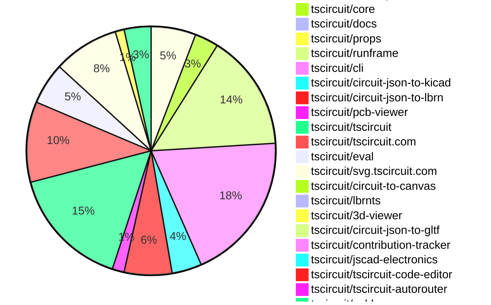

# contribution tracker

[contributions.tscircuit.com](https://contributions.tscircuit.com) ・ [tscircuit.com](https://tscircuit.com) ・ [Contribution Overviews](./contribution-overviews/) ・ [Changelogs](./changelogs/)

Generates weekly contribution overviews for tscircuit contributors. Check out all
the [contribution overviews here](./contribution-overviews/)
You can find AI-generated monthly changelogs in the [changelogs directory](./changelogs/)

- All PRs in the tscircuit org are scanned/summarized via an LLM
- The LLM classifies each Diff/PR as into a set of attributes for scoring
- All the PRs, summaries, and classifications are organized into charts and tables for [the website](https://contributions.tscircuit.com)

> Want to run locally? See the [Development Section](#development)

## Current Week

<!-- START_CURRENT_WEEK -->

# Contribution Overview 2026-01-28

The current week is shown below. There are 3 major sections:

- [Contributor Overview](#contributor-overview)
- [PRs by Repository](#prs-by-repository)
- [PRs by Contributor](#changes-by-contributor)
- [Scoring & Sponsorship Details](/docs/sponsorship-calculation-explanation.md)

## PRs by Repository



## Contributor Overview

| Contributor | 🐳 Major | 🐙 Minor | 🐌 Tiny | ⭐ | Discussion Contributions |
|-------------|---------|---------|---------|-----|--------------------------|
| [seveibar](#seveibar) | 5 | 12 | 6 | 👑 | 0🔹 0🔶 0💎 |
| [AnasSarkiz](#AnasSarkiz) | 2 | 11 | 4 | ⭐⭐⭐ | 0🔹 0🔶 0💎 |
| [tscircuitbot](#tscircuitbot) | 0 | 0 | 203 | ⭐⭐ | 0🔹 0🔶 0💎 |
| [Abse2001](#Abse2001) | 0 | 6 | 2 | ⭐⭐ | 0🔹 0🔶 0💎 |
| [imrishabh18](#imrishabh18) | 0 | 4 | 5 | ⭐⭐ | 0🔹 0🔶 0💎 |
| [ShiboSoftwareDev](#ShiboSoftwareDev) | 0 | 2 | 0 | ⭐⭐ | 0🔹 0🔶 0💎 |
| [techmannih](#techmannih) | 0 | 4 | 1 | ⭐ | 0🔹 0🔶 0💎 |
| [ArnavK-09](#ArnavK-09) | 1 | 0 | 1 | ⭐ | 0🔹 0🔶 0💎 |
| [rushabhcodes](#rushabhcodes) | 0 | 1 | 2 | ⭐ | 0🔹 0🔶 0💎 |
| [0hmX](#0hmX) | 1 | 0 | 0 | ⭐ | 0🔹 0🔶 0💎 |
| [MustafaMulla29](#MustafaMulla29) | 1 | 0 | 0 | ⭐ | 0🔹 0🔶 0💎 |
| [Ayushjhawar8](#Ayushjhawar8) | 0 | 0 | 1 |  | 0🔹 0🔶 0💎 |

> Note: AI evaluates PRs and assigns 1-3 star ratings automatically. 4 and 5 star ratings require manual staff review.

### Discussion Contribution Legend

- 🔹 Normal Comments: Basic participation with minimal effort
- 🔶 Great Informative Comments: Thoughtful participation that adds value
- 💎 Incredible Comments: Exceptional participation with high-quality content

## Review Table

[reviews-received-hover]: ## "Number of reviews received for PRs for this contributor"
[approvals-received-hover]: ## "Number of approvals received for PRs this contributor authored"
[rejections-received-hover]: ## "Number of rejections received for PRs this contributor authored"
[prs-opened-hover]: ## "Number of PRs opened by this contributor"
[issues-created-hover]: ## "Number of issues created by this contributor"

| Contributor | Reviews Received | Approvals Received | Rejections Received | Approvals | Rejections | PRs Opened | PRs Merged | Issues Created |
|---|---|---|---|---|---|---|---|---|
| [seveibar](#seveibar) | 10 | 0 | 0 | 19 | 7 | 33 | 24 | 0 |
| [tscircuitbot](#tscircuitbot) | 1 | 0 | 0 | 0 | 0 | 225 | 203 | 0 |
| [Abse2001](#Abse2001) | 9 | 9 | 0 | 0 | 0 | 8 | 8 | 0 |
| [ShiboSoftwareDev](#ShiboSoftwareDev) | 3 | 2 | 0 | 7 | 0 | 3 | 3 | 0 |
| [imrishabh18](#imrishabh18) | 2 | 2 | 0 | 3 | 1 | 9 | 9 | 0 |
| [techmannih](#techmannih) | 10 | 5 | 2 | 1 | 0 | 10 | 5 | 0 |
| [MustafaMulla29](#MustafaMulla29) | 8 | 2 | 3 | 0 | 0 | 4 | 1 | 0 |
| [Ayushjhawar8](#Ayushjhawar8) | 5 | 1 | 0 | 0 | 0 | 2 | 1 | 0 |
| [rushabhcodes](#rushabhcodes) | 13 | 4 | 2 | 0 | 0 | 4 | 3 | 0 |
| [ArnavK-09](#ArnavK-09) | 1 | 1 | 0 | 2 | 0 | 4 | 4 | 0 |
| [bimakw](#bimakw) | 0 | 0 | 0 | 0 | 0 | 1 | 0 | 0 |
| [0hmX](#0hmX) | 4 | 3 | 0 | 0 | 0 | 3 | 2 | 0 |
| [pxlpal](#pxlpal) | 3 | 0 | 1 | 0 | 0 | 1 | 0 | 0 |
| [AnasSarkiz](#AnasSarkiz) | 3 | 3 | 0 | 0 | 0 | 17 | 17 | 0 |

## Changes by Repository

### [tscircuit/schematic-viewer](https://github.com/tscircuit/schematic-viewer)

| PR # | Impact | Rating | Contributor | Description |
|------|--------|--------|-------------|-------------|
| [#161](https://github.com/tscircuit/schematic-viewer/pull/161) | 🐳 Major | ⭐⭐⭐ | seveibar | Adds the ability to show schematic ports on hover when view mode is enabled |

### [tscircuit/circuit-json](https://github.com/tscircuit/circuit-json)

| PR # | Impact | Rating | Contributor | Description |
|------|--------|--------|-------------|-------------|
| [#442](https://github.com/tscircuit/circuit-json/pull/442) | 🐳 Major | ⭐⭐⭐ | seveibar | Allows schematic elements to optionally associate with a named symbol instead of a component, enhancing flexibility in schematic design. |
| [#438](https://github.com/tscircuit/circuit-json/pull/438) | 🐳 Major | ⭐⭐⭐ | seveibar | Adds a shared base error schema for circuit JSON errors, centralizing common fields and introducing an optional is_fatal property for error severity classification. |
| [#440](https://github.com/tscircuit/circuit-json/pull/440) | 🐙 Minor | ⭐⭐ | seveibar | Add schematic_symbol support and allow schematic_component to reference it |
| [#436](https://github.com/tscircuit/circuit-json/pull/436) | 🐙 Minor | ⭐⭐ | seveibar | Adds an anchor alignment field to cad_component, allowing specification of placement alignment semantics with options center and xy_center_z_board. |
| [#433](https://github.com/tscircuit/circuit-json/pull/433) | 🐙 Minor | ⭐⭐ | seveibar | Add a new error type for PCB panelization placement failures, ensuring it is recognized in the type system and tooling. |
| [#448](https://github.com/tscircuit/circuit-json/pull/448) | 🐙 Minor | ⭐⭐ | techmannih | Adds an optional display_max_resistance property to the simple potentiometer component, allowing for more flexible representation of maximum resistance values. |
| [#447](https://github.com/tscircuit/circuit-json/pull/447) | 🐙 Minor | ⭐⭐ | techmannih | Adds the PcbSilkscreenOval type to the PcbCircuitElement union, resolving import errors in the 3D viewer. |
| [#445](https://github.com/tscircuit/circuit-json/pull/445) | 🐙 Minor | ⭐⭐ | techmannih | Adds support for a new simple voltage source component in the circuit JSON schema. |

<details>
<summary>🐌 Tiny Contributions (7)</summary>

| PR # | Impact | Contributor | Description |
|------|--------|-------------|-------------|
| [#449](https://github.com/tscircuit/circuit-json/pull/449) | 🐌 Tiny | tscircuitbot | Automated package update |
| [#444](https://github.com/tscircuit/circuit-json/pull/444) | 🐌 Tiny | tscircuitbot | Automated package update |
| [#443](https://github.com/tscircuit/circuit-json/pull/443) | 🐌 Tiny | tscircuitbot | Automated package update |
| [#441](https://github.com/tscircuit/circuit-json/pull/441) | 🐌 Tiny | tscircuitbot | Automated package update |
| [#437](https://github.com/tscircuit/circuit-json/pull/437) | 🐌 Tiny | tscircuitbot | Automated package update |
| [#439](https://github.com/tscircuit/circuit-json/pull/439) | 🐌 Tiny | tscircuitbot | Automated package update |
| [#434](https://github.com/tscircuit/circuit-json/pull/434) | 🐌 Tiny | tscircuitbot | Automated package update |

</details>

### [tscircuit/core](https://github.com/tscircuit/core)

| PR # | Impact | Rating | Contributor | Description |
|------|--------|--------|-------------|-------------|
| [#1879](https://github.com/tscircuit/core/pull/1879) | 🐳 Major | ⭐⭐⭐ | seveibar | Adds schematic_symbol_id to various schematic components to enhance their association with symbols during rendering. |
| [#1878](https://github.com/tscircuit/core/pull/1878) | 🐙 Minor | ⭐⭐ | seveibar | Adds support for resizing schematic symbols, allowing components to adjust their dimensions based on user-defined sizes. |
| [#1876](https://github.com/tscircuit/core/pull/1876) | 🐙 Minor | ⭐⭐ | seveibar | Fixes the chip displayName issue by ensuring the displayName is used if available, otherwise falls back to the name property. |
| [#1870](https://github.com/tscircuit/core/pull/1870) | 🐙 Minor | ⭐⭐ | seveibar | Adds an error handling mechanism for multiple boards in a panel without specified pcbXpcbY positions when layoutMode is set to none. |
| [#1875](https://github.com/tscircuit/core/pull/1875) | 🐙 Minor | ⭐⭐ | imrishabh18 | Fixes the issue where the fetch() function fails for paths starting with . by normalizing the path before resolving it. |
| [#1874](https://github.com/tscircuit/core/pull/1874) | 🐙 Minor | ⭐⭐ | imrishabh18 | Fixes the issue where relative paths starting with . were not supported in asset path handling. |
| [#1872](https://github.com/tscircuit/core/pull/1872) | 🐙 Minor | ⭐⭐ | ShiboSoftwareDev | Adds a new subpanel component enabling nested panel hierarchies within panel elements, supporting recursive nesting for complex manufacturing layouts and comprehensive validation for board containment and positioning. |

<details>
<summary>🐌 Tiny Contributions (1)</summary>

| PR # | Impact | Contributor | Description |
|------|--------|-------------|-------------|
| [#1873](https://github.com/tscircuit/core/pull/1873) | 🐌 Tiny | Abse2001 | Updates the circuit-json-to-gltf dependency to version 0.0.62 in package.json and modifies related snapshot tests for 3D rendering components. |

</details>

### [tscircuit/docs](https://github.com/tscircuit/docs)

| PR # | Impact | Rating | Contributor | Description |
|------|--------|--------|-------------|-------------|
| [#421](https://github.com/tscircuit/docs/pull/421) | 🐳 Major | ⭐⭐⭐ | seveibar | Adds kicadPinMetadata property for KiCad pin electrical and visual properties in the documentation. |

<details>
<summary>🐌 Tiny Contributions (1)</summary>

| PR # | Impact | Contributor | Description |
|------|--------|-------------|-------------|
| [#420](https://github.com/tscircuit/docs/pull/420) | 🐌 Tiny | seveibar | Adds documentation for KiCad-specific metadata properties for footprints and symbols in tscircuit components |

</details>

### [tscircuit/props](https://github.com/tscircuit/props)

| PR # | Impact | Rating | Contributor | Description |
|------|--------|--------|-------------|-------------|
| [#571](https://github.com/tscircuit/props/pull/571) | 🐙 Minor | ⭐⭐ | seveibar | Adds width and height properties to the SymbolProps interface, allowing for more flexible symbol dimensions in the library. |

<details>
<summary>🐌 Tiny Contributions (1)</summary>

| PR # | Impact | Contributor | Description |
|------|--------|-------------|-------------|
| [#572](https://github.com/tscircuit/props/pull/572) | 🐌 Tiny | seveibar | Add support for per-pin KiCad metadata including electrical type and graphic style to port properties, allowing ports to carry KiCad-specific pin attributes alongside existing metadata. |

</details>

### [tscircuit/runframe](https://github.com/tscircuit/runframe)

| PR # | Impact | Rating | Contributor | Description |
|------|--------|--------|-------------|-------------|
| [#2469](https://github.com/tscircuit/runframe/pull/2469) | 🐙 Minor | ⭐⭐ | seveibar | Adds toggle functionality for showing schematic debug grid and schematic ports in the CircuitJsonPreview component. |

<details>
<summary>🐌 Tiny Contributions (38)</summary>

| PR # | Impact | Contributor | Description |
|------|--------|-------------|-------------|
| [#2468](https://github.com/tscircuit/runframe/pull/2468) | 🐌 Tiny | seveibar | Adds a new dropdown menu for viewing schematic options in the File Menu Left Header component. |
| [#2508](https://github.com/tscircuit/runframe/pull/2508) | 🐌 Tiny | tscircuitbot | Automated package update |
| [#2507](https://github.com/tscircuit/runframe/pull/2507) | 🐌 Tiny | tscircuitbot | Updates the circuit-json-to-kicad package from version 0.0.53 to 0.0.54 |
| [#2505](https://github.com/tscircuit/runframe/pull/2505) | 🐌 Tiny | tscircuitbot | Automated package update |
| [#2504](https://github.com/tscircuit/runframe/pull/2504) | 🐌 Tiny | tscircuitbot | Automated package update |
| [#2503](https://github.com/tscircuit/runframe/pull/2503) | 🐌 Tiny | tscircuitbot | Automated package update |
| [#2502](https://github.com/tscircuit/runframe/pull/2502) | 🐌 Tiny | tscircuitbot | Updates the circuit-json-to-kicad package version from 0.0.52 to 0.0.53 in package.json |
| [#2500](https://github.com/tscircuit/runframe/pull/2500) | 🐌 Tiny | tscircuitbot | Automated package update |
| [#2499](https://github.com/tscircuit/runframe/pull/2499) | 🐌 Tiny | tscircuitbot | Updates the circuit-json-to-kicad package from version 0.0.51 to 0.0.52 |
| [#2497](https://github.com/tscircuit/runframe/pull/2497) | 🐌 Tiny | tscircuitbot | Automated package update |
| [#2496](https://github.com/tscircuit/runframe/pull/2496) | 🐌 Tiny | tscircuitbot | Automated package update |
| [#2495](https://github.com/tscircuit/runframe/pull/2495) | 🐌 Tiny | tscircuitbot | Updates the tscircuiteval package to version 0.0.618 in the package.json file. |
| [#2494](https://github.com/tscircuit/runframe/pull/2494) | 🐌 Tiny | tscircuitbot | Automated package update |
| [#2493](https://github.com/tscircuit/runframe/pull/2493) | 🐌 Tiny | tscircuitbot | Updates the circuit-json-to-kicad package from version 0.0.50 to 0.0.51 in package.json |
| [#2491](https://github.com/tscircuit/runframe/pull/2491) | 🐌 Tiny | tscircuitbot | Automated package update |
| [#2490](https://github.com/tscircuit/runframe/pull/2490) | 🐌 Tiny | tscircuitbot | Updates the circuit-json-to-kicad package from version 0.0.49 to 0.0.50 |
| [#2488](https://github.com/tscircuit/runframe/pull/2488) | 🐌 Tiny | tscircuitbot | Automated package update |
| [#2487](https://github.com/tscircuit/runframe/pull/2487) | 🐌 Tiny | tscircuitbot | Updates the tscircuiteval package to version 0.0.617 in the package.json file. |
| [#2480](https://github.com/tscircuit/runframe/pull/2480) | 🐌 Tiny | tscircuitbot | Updates the tscircuiteval package to version 0.0.614 in the package.json file. |
| [#2484](https://github.com/tscircuit/runframe/pull/2484) | 🐌 Tiny | tscircuitbot | Updates the tscircuiteval package to version 0.0.616 in the package.json file. |
| [#2482](https://github.com/tscircuit/runframe/pull/2482) | 🐌 Tiny | tscircuitbot | Updates the tscircuiteval package from version 0.0.614 to 0.0.615 in the package.json file. |
| [#2478](https://github.com/tscircuit/runframe/pull/2478) | 🐌 Tiny | tscircuitbot | Updates the tscircuiteval package to version 0.0.613 in the package.json file. |
| [#2485](https://github.com/tscircuit/runframe/pull/2485) | 🐌 Tiny | tscircuitbot | Automated package update |
| [#2483](https://github.com/tscircuit/runframe/pull/2483) | 🐌 Tiny | tscircuitbot | Automated package update |
| [#2481](https://github.com/tscircuit/runframe/pull/2481) | 🐌 Tiny | tscircuitbot | Automated package update |
| [#2479](https://github.com/tscircuit/runframe/pull/2479) | 🐌 Tiny | tscircuitbot | Automated package update |
| [#2464](https://github.com/tscircuit/runframe/pull/2464) | 🐌 Tiny | tscircuitbot | Automated package update |
| [#2472](https://github.com/tscircuit/runframe/pull/2472) | 🐌 Tiny | tscircuitbot | Updates the tscircuit3d-viewer package from version 0.0.501 to 0.0.502 |
| [#2471](https://github.com/tscircuit/runframe/pull/2471) | 🐌 Tiny | tscircuitbot | Updates the package version from 0.0.1538 to 0.0.1539 in package.json |
| [#2474](https://github.com/tscircuit/runframe/pull/2474) | 🐌 Tiny | tscircuitbot | Updates the tscircuit3d-viewer package from version 0.0.502 to 0.0.503 in the package.json file. |
| [#2476](https://github.com/tscircuit/runframe/pull/2476) | 🐌 Tiny | tscircuitbot | Updates the tscircuitpcb-viewer package to version 1.11.326 |
| [#2467](https://github.com/tscircuit/runframe/pull/2467) | 🐌 Tiny | tscircuitbot | Automated package update |
| [#2475](https://github.com/tscircuit/runframe/pull/2475) | 🐌 Tiny | tscircuitbot | Automated package update |
| [#2463](https://github.com/tscircuit/runframe/pull/2463) | 🐌 Tiny | tscircuitbot | Updates the tscircuiteval package from version 0.0.611 to 0.0.612 in the package.json file. |
| [#2466](https://github.com/tscircuit/runframe/pull/2466) | 🐌 Tiny | tscircuitbot | Updates the tscircuitschematic-viewer package to version 2.0.55 in the package.json file. |
| [#2470](https://github.com/tscircuit/runframe/pull/2470) | 🐌 Tiny | tscircuitbot | Updates the tscircuitpcb-viewer package from version 1.11.322 to 1.11.325 |
| [#2473](https://github.com/tscircuit/runframe/pull/2473) | 🐌 Tiny | tscircuitbot | Automated package update |
| [#2477](https://github.com/tscircuit/runframe/pull/2477) | 🐌 Tiny | tscircuitbot | Automated package update |

</details>

### [tscircuit/cli](https://github.com/tscircuit/cli)

| PR # | Impact | Rating | Contributor | Description |
|------|--------|--------|-------------|-------------|
| [#1832](https://github.com/tscircuit/cli/pull/1832) | 🐙 Minor | ⭐⭐ | seveibar | Fixes invalid hash error by allowing the use of a local PCM base URL for asset generation. |
| [#1857](https://github.com/tscircuit/cli/pull/1857) | 🐙 Minor | ⭐⭐ | imrishabh18 | Adds support for extracting KiCad symbol metadata from React components, enhancing the librarys functionality for users. |
| [#1841](https://github.com/tscircuit/cli/pull/1841) | 🐙 Minor | ⭐⭐ | imrishabh18 | Fixes the clone command to correctly fetch the authentication token from the npmrc file for user authentication. |

<details>
<summary>🐌 Tiny Contributions (47)</summary>

| PR # | Impact | Contributor | Description |
|------|--------|-------------|-------------|
| [#1849](https://github.com/tscircuit/cli/pull/1849) | 🐌 Tiny | seveibar | Changes the default license setting from MIT to Unknown for KiCad exports in the generatePcmAssets function. |
| [#1829](https://github.com/tscircuit/cli/pull/1829) | 🐌 Tiny | seveibar | Adds a KiCad PCM proxy server to the development server, enabling auto-updating of KiCad PCM assets during development. |
| [#1824](https://github.com/tscircuit/cli/pull/1824) | 🐌 Tiny | seveibar | Creates a separate kicad-library-pcm directory to accommodate PCM-specific library contents and paths. |
| [#1858](https://github.com/tscircuit/cli/pull/1858) | 🐌 Tiny | tscircuitbot | Automated package update |
| [#1856](https://github.com/tscircuit/cli/pull/1856) | 🐌 Tiny | tscircuitbot | Updates the package version from v0.1.854 to v0.1.855 in package.json |
| [#1854](https://github.com/tscircuit/cli/pull/1854) | 🐌 Tiny | tscircuitbot | Automated package update |
| [#1853](https://github.com/tscircuit/cli/pull/1853) | 🐌 Tiny | tscircuitbot | Updates the tscircuitrunframe package from version 0.0.1554 to 0.0.1555 |
| [#1851](https://github.com/tscircuit/cli/pull/1851) | 🐌 Tiny | tscircuitbot | Updates the tscircuitrunframe package from version 0.0.1553 to 0.0.1554 |
| [#1850](https://github.com/tscircuit/cli/pull/1850) | 🐌 Tiny | tscircuitbot | Automated package update |
| [#1848](https://github.com/tscircuit/cli/pull/1848) | 🐌 Tiny | tscircuitbot | Automated package update |
| [#1847](https://github.com/tscircuit/cli/pull/1847) | 🐌 Tiny | tscircuitbot | Updates the tscircuitrunframe package from version 0.0.1552 to 0.0.1553 |
| [#1846](https://github.com/tscircuit/cli/pull/1846) | 🐌 Tiny | tscircuitbot | Automated package update |
| [#1844](https://github.com/tscircuit/cli/pull/1844) | 🐌 Tiny | tscircuitbot | Automated package update |
| [#1843](https://github.com/tscircuit/cli/pull/1843) | 🐌 Tiny | tscircuitbot | Updates the tscircuitrunframe package from version 0.0.1551 to 0.0.1552 |
| [#1842](https://github.com/tscircuit/cli/pull/1842) | 🐌 Tiny | tscircuitbot | Automated package update |
| [#1840](https://github.com/tscircuit/cli/pull/1840) | 🐌 Tiny | tscircuitbot | Automated package update |
| [#1839](https://github.com/tscircuit/cli/pull/1839) | 🐌 Tiny | tscircuitbot | Automated package update |
| [#1837](https://github.com/tscircuit/cli/pull/1837) | 🐌 Tiny | tscircuitbot | Updates the tscircuitrunframe package from version 0.0.1549 to 0.0.1550 |
| [#1835](https://github.com/tscircuit/cli/pull/1835) | 🐌 Tiny | tscircuitbot | Automated package update |
| [#1834](https://github.com/tscircuit/cli/pull/1834) | 🐌 Tiny | tscircuitbot | Updates the tscircuitrunframe package version from 0.0.1547 to 0.0.1549 in package.json |
| [#1833](https://github.com/tscircuit/cli/pull/1833) | 🐌 Tiny | tscircuitbot | Automated package update |
| [#1830](https://github.com/tscircuit/cli/pull/1830) | 🐌 Tiny | tscircuitbot | Automated package update |
| [#1828](https://github.com/tscircuit/cli/pull/1828) | 🐌 Tiny | tscircuitbot | Automated package update |
| [#1827](https://github.com/tscircuit/cli/pull/1827) | 🐌 Tiny | tscircuitbot | Updates the tscircuitrunframe package from version 0.0.1546 to 0.0.1547 |
| [#1826](https://github.com/tscircuit/cli/pull/1826) | 🐌 Tiny | tscircuitbot | Automated package update |
| [#1825](https://github.com/tscircuit/cli/pull/1825) | 🐌 Tiny | tscircuitbot | Automated package update |
| [#1811](https://github.com/tscircuit/cli/pull/1811) | 🐌 Tiny | tscircuitbot | Updates the tscircuitrunframe package from version 0.0.1541 to 0.0.1542 |
| [#1822](https://github.com/tscircuit/cli/pull/1822) | 🐌 Tiny | tscircuitbot | Automated package update |
| [#1816](https://github.com/tscircuit/cli/pull/1816) | 🐌 Tiny | tscircuitbot | Automated package update |
| [#1823](https://github.com/tscircuit/cli/pull/1823) | 🐌 Tiny | tscircuitbot | Automated package update |
| [#1821](https://github.com/tscircuit/cli/pull/1821) | 🐌 Tiny | tscircuitbot | Updates the tscircuitrunframe package from version 0.0.1545 to 0.0.1546 |
| [#1815](https://github.com/tscircuit/cli/pull/1815) | 🐌 Tiny | tscircuitbot | Updates the tscircuitrunframe package from version 0.0.1543 to 0.0.1544 |
| [#1814](https://github.com/tscircuit/cli/pull/1814) | 🐌 Tiny | tscircuitbot | Automated package update |
| [#1820](https://github.com/tscircuit/cli/pull/1820) | 🐌 Tiny | tscircuitbot | Automated package update |
| [#1819](https://github.com/tscircuit/cli/pull/1819) | 🐌 Tiny | tscircuitbot | Updates the tscircuitrunframe package version from 0.0.1544 to 0.0.1545 |
| [#1813](https://github.com/tscircuit/cli/pull/1813) | 🐌 Tiny | tscircuitbot | Updates the tscircuitrunframe package to version 0.0.1543 in the package.json file. |
| [#1807](https://github.com/tscircuit/cli/pull/1807) | 🐌 Tiny | tscircuitbot | Updates the tscircuitrunframe package to version 0.0.1540 |
| [#1801](https://github.com/tscircuit/cli/pull/1801) | 🐌 Tiny | tscircuitbot | Updates the tscircuitrunframe package from version 0.0.1536 to 0.0.1537 |
| [#1803](https://github.com/tscircuit/cli/pull/1803) | 🐌 Tiny | tscircuitbot | Updates the tscircuitrunframe package from version 0.0.1537 to 0.0.1538 |
| [#1808](https://github.com/tscircuit/cli/pull/1808) | 🐌 Tiny | tscircuitbot | Automated package update |
| [#1804](https://github.com/tscircuit/cli/pull/1804) | 🐌 Tiny | tscircuitbot | Automated package update |
| [#1809](https://github.com/tscircuit/cli/pull/1809) | 🐌 Tiny | tscircuitbot | Updates the tscircuitrunframe package from version 0.0.1540 to 0.0.1541 |
| [#1802](https://github.com/tscircuit/cli/pull/1802) | 🐌 Tiny | tscircuitbot | Automated package update |
| [#1810](https://github.com/tscircuit/cli/pull/1810) | 🐌 Tiny | tscircuitbot | Automated package update |
| [#1805](https://github.com/tscircuit/cli/pull/1805) | 🐌 Tiny | tscircuitbot | Updates the tscircuitrunframe package to version 0.0.1539 |
| [#1845](https://github.com/tscircuit/cli/pull/1845) | 🐌 Tiny | imrishabh18 | Updates the version of the circuit-json-to-kicad dependency from 0.0.40 to 0.0.52 in package.json |
| [#1817](https://github.com/tscircuit/cli/pull/1817) | 🐌 Tiny | imrishabh18 | Changes static asset file imports to use relative paths, improving file resolution in the circuit_json context. |

</details>

### [tscircuit/circuit-json-to-kicad](https://github.com/tscircuit/circuit-json-to-kicad)

| PR # | Impact | Rating | Contributor | Description |
|------|--------|--------|-------------|-------------|
| [#92](https://github.com/tscircuit/circuit-json-to-kicad/pull/92) | 🐙 Minor | ⭐⭐ | seveibar | Adds support for custom symbols in circuit JSON, allowing schematic components to reference custom symbols via schematic_symbol_id, and prepares for upstream support by modifying the circuit JSON structure accordingly. |
| [#90](https://github.com/tscircuit/circuit-json-to-kicad/pull/90) | 🐙 Minor | ⭐⭐ | seveibar | Changes the method of generating reference designators by prioritizing the component ftype over the component name. |
| [#84](https://github.com/tscircuit/circuit-json-to-kicad/pull/84) | 🐙 Minor | ⭐⭐ | techmannih | Fixes the issue where the max_resistance value does not display for potentiometer components in the schematic. |

<details>
<summary>🐌 Tiny Contributions (7)</summary>

| PR # | Impact | Contributor | Description |
|------|--------|-------------|-------------|
| [#96](https://github.com/tscircuit/circuit-json-to-kicad/pull/96) | 🐌 Tiny | tscircuitbot | Automated package update |
| [#95](https://github.com/tscircuit/circuit-json-to-kicad/pull/95) | 🐌 Tiny | tscircuitbot | Automated package update |
| [#93](https://github.com/tscircuit/circuit-json-to-kicad/pull/93) | 🐌 Tiny | tscircuitbot | Automated package update |
| [#91](https://github.com/tscircuit/circuit-json-to-kicad/pull/91) | 🐌 Tiny | tscircuitbot | Automated package update |
| [#89](https://github.com/tscircuit/circuit-json-to-kicad/pull/89) | 🐌 Tiny | tscircuitbot | Automated package update |
| [#97](https://github.com/tscircuit/circuit-json-to-kicad/pull/97) | 🐌 Tiny | imrishabh18 | Fixes font sizing and prevents the default font value from being displayed in KiCad footprint metadata. |
| [#94](https://github.com/tscircuit/circuit-json-to-kicad/pull/94) | 🐌 Tiny | imrishabh18 | Updates the tscircuit dependency to version 0.0.1237 and removes the circuit-to-svg dependency from the project. |

</details>

### [tscircuit/circuit-json-to-lbrn](https://github.com/tscircuit/circuit-json-to-lbrn)

| PR # | Impact | Rating | Contributor | Description |
|------|--------|--------|-------------|-------------|
| [#118](https://github.com/tscircuit/circuit-json-to-lbrn/pull/118) | 🐳 Major | ⭐⭐⭐ | AnasSarkiz | Removes layer inclusion toggles from the settings UI so layers are always included. Forces copper, soldermask, silkscreen, copper cut fill, and topbottom layers to stay enabled in LBRN options. |
| [#112](https://github.com/tscircuit/circuit-json-to-lbrn/pull/112) | 🐙 Minor | ⭐⭐ | seveibar | Adds functionality to create an oxidation cleaning layer for laser ablation to clean oxidation from the copper surface of the PCB. |
| [#126](https://github.com/tscircuit/circuit-json-to-lbrn/pull/126) | 🐙 Minor | ⭐⭐ | AnasSarkiz | Sets qPulseWidth: 1 on every cut setting generated by convertCircuitJsonToLbrn, ensuring consistent laser pulse timing for soldermask, clearance, copper fill, and oxidation cleaning layers. |
| [#124](https://github.com/tscircuit/circuit-json-to-lbrn/pull/124) | 🐙 Minor | ⭐⭐ | AnasSarkiz | Forces a fixed interval of 0.03 for both copper hatch passes to stabilize scan density regardless of laser spot size, ensuring repeatable copper engraving behavior by removing spot-size variance. |
| [#116](https://github.com/tscircuit/circuit-json-to-lbrn/pull/116) | 🐙 Minor | ⭐⭐ | AnasSarkiz | Add a new soldermask cure cut setting and layer index, generate cure geometry by subtracting soldermask openings from board outline, and add tests and snapshots covering soldermask cure output. |
| [#114](https://github.com/tscircuit/circuit-json-to-lbrn/pull/114) | 🐙 Minor | ⭐⭐ | AnasSarkiz | Replace the cut-setting field from pulseWidth to qPulseWidth so LBRN receives the correct parameter. Keep laser profile defaults and UI in ns, aligning tests and docs with the correct field. Bump lbrnts to 0.0.17 to match the updated schema. |

<details>
<summary>🐌 Tiny Contributions (10)</summary>

| PR # | Impact | Contributor | Description |
|------|--------|-------------|-------------|
| [#127](https://github.com/tscircuit/circuit-json-to-lbrn/pull/127) | 🐌 Tiny | tscircuitbot | Automated package update |
| [#121](https://github.com/tscircuit/circuit-json-to-lbrn/pull/121) | 🐌 Tiny | tscircuitbot | Automated package update |
| [#125](https://github.com/tscircuit/circuit-json-to-lbrn/pull/125) | 🐌 Tiny | tscircuitbot | Automated package update |
| [#123](https://github.com/tscircuit/circuit-json-to-lbrn/pull/123) | 🐌 Tiny | tscircuitbot | Automated package update |
| [#119](https://github.com/tscircuit/circuit-json-to-lbrn/pull/119) | 🐌 Tiny | tscircuitbot | Automated package update |
| [#117](https://github.com/tscircuit/circuit-json-to-lbrn/pull/117) | 🐌 Tiny | tscircuitbot | Automated package update to version 0.0.55 |
| [#113](https://github.com/tscircuit/circuit-json-to-lbrn/pull/113) | 🐌 Tiny | tscircuitbot | Automated package update |
| [#115](https://github.com/tscircuit/circuit-json-to-lbrn/pull/115) | 🐌 Tiny | tscircuitbot | Automated package update |
| [#122](https://github.com/tscircuit/circuit-json-to-lbrn/pull/122) | 🐌 Tiny | AnasSarkiz | Always include the oxidation cleaning layer in conversion options and simplify soldermask-related layer names for cleaner output labeling. |
| [#120](https://github.com/tscircuit/circuit-json-to-lbrn/pull/120) | 🐌 Tiny | AnasSarkiz | Removes the option to include bottom layers in the conversion process, limiting output to only top layers. |

</details>

### [tscircuit/pcb-viewer](https://github.com/tscircuit/pcb-viewer)

| PR # | Impact | Rating | Contributor | Description |
|------|--------|--------|-------------|-------------|
| [#631](https://github.com/tscircuit/pcb-viewer/pull/631) | 🐙 Minor | ⭐⭐ | Abse2001 | Fixes PCB rendering issues by making soldermask a first-class layer and correcting drillsilkscreen ordering across the canvas pipeline. |
| [#633](https://github.com/tscircuit/pcb-viewer/pull/633) | 🐙 Minor | ⭐⭐ | Abse2001 | Fixes PCB note rendering order by explicitly associating top_notes and bottom_notes with their respective foreground sides, mirroring silkscreen behavior. |

<details>
<summary>🐌 Tiny Contributions (2)</summary>

| PR # | Impact | Contributor | Description |
|------|--------|-------------|-------------|
| [#634](https://github.com/tscircuit/pcb-viewer/pull/634) | 🐌 Tiny | tscircuitbot | Automated package update |
| [#632](https://github.com/tscircuit/pcb-viewer/pull/632) | 🐌 Tiny | tscircuitbot | Automated package update to version 1.11.325 |

</details>

### [tscircuit/tscircuit](https://github.com/tscircuit/tscircuit)


<details>
<summary>🐌 Tiny Contributions (41)</summary>

| PR # | Impact | Contributor | Description |
|------|--------|-------------|-------------|
| [#2064](https://github.com/tscircuit/tscircuit/pull/2064) | 🐌 Tiny | tscircuitbot | Automated package update |
| [#2063](https://github.com/tscircuit/tscircuit/pull/2063) | 🐌 Tiny | tscircuitbot | Updates the tscircuitcli package to version 0.1.856 in package.json |
| [#2062](https://github.com/tscircuit/tscircuit/pull/2062) | 🐌 Tiny | tscircuitbot | Automated package update |
| [#2061](https://github.com/tscircuit/tscircuit/pull/2061) | 🐌 Tiny | tscircuitbot | Updates the tscircuitcli package to version 0.1.855 in package.json |
| [#2060](https://github.com/tscircuit/tscircuit/pull/2060) | 🐌 Tiny | tscircuitbot | Automated package update |
| [#2059](https://github.com/tscircuit/tscircuit/pull/2059) | 🐌 Tiny | tscircuitbot | Automated package update |
| [#2058](https://github.com/tscircuit/tscircuit/pull/2058) | 🐌 Tiny | tscircuitbot | Automated package update |
| [#2057](https://github.com/tscircuit/tscircuit/pull/2057) | 🐌 Tiny | tscircuitbot | Automated package update |
| [#2056](https://github.com/tscircuit/tscircuit/pull/2056) | 🐌 Tiny | tscircuitbot | Automated package update |
| [#2055](https://github.com/tscircuit/tscircuit/pull/2055) | 🐌 Tiny | tscircuitbot | Updates the tscircuitcli package to version 0.1.852 in the package.json file. |
| [#2054](https://github.com/tscircuit/tscircuit/pull/2054) | 🐌 Tiny | tscircuitbot | Automated package update |
| [#2053](https://github.com/tscircuit/tscircuit/pull/2053) | 🐌 Tiny | tscircuitbot | Automated package update |
| [#2052](https://github.com/tscircuit/tscircuit/pull/2052) | 🐌 Tiny | tscircuitbot | Updates the package version from 0.0.1236 to 0.0.1237 in package.json |
| [#2051](https://github.com/tscircuit/tscircuit/pull/2051) | 🐌 Tiny | tscircuitbot | Updates the tscircuitcli package to version 0.1.850 in the package.json file. |
| [#2050](https://github.com/tscircuit/tscircuit/pull/2050) | 🐌 Tiny | tscircuitbot | Updates the package version from 0.0.1235 to 0.0.1236 in package.json |
| [#2049](https://github.com/tscircuit/tscircuit/pull/2049) | 🐌 Tiny | tscircuitbot | Automated package update |
| [#2048](https://github.com/tscircuit/tscircuit/pull/2048) | 🐌 Tiny | tscircuitbot | Updates the package version from 0.0.1234 to 0.0.1235 in package.json |
| [#2047](https://github.com/tscircuit/tscircuit/pull/2047) | 🐌 Tiny | tscircuitbot | Updates the tscircuitcli package to version 0.1.848 in package.json |
| [#2046](https://github.com/tscircuit/tscircuit/pull/2046) | 🐌 Tiny | tscircuitbot | Automated package update |
| [#2045](https://github.com/tscircuit/tscircuit/pull/2045) | 🐌 Tiny | tscircuitbot | Automated package update |
| [#2044](https://github.com/tscircuit/tscircuit/pull/2044) | 🐌 Tiny | tscircuitbot | Updates the package version from 0.0.1232 to 0.0.1233 in package.json |
| [#2043](https://github.com/tscircuit/tscircuit/pull/2043) | 🐌 Tiny | tscircuitbot | Automated package update |
| [#2042](https://github.com/tscircuit/tscircuit/pull/2042) | 🐌 Tiny | tscircuitbot | Updates the package version from 0.0.1231 to 0.0.1232 in package.json |
| [#2041](https://github.com/tscircuit/tscircuit/pull/2041) | 🐌 Tiny | tscircuitbot | Automated package update |
| [#2040](https://github.com/tscircuit/tscircuit/pull/2040) | 🐌 Tiny | tscircuitbot | Automated package update |
| [#2039](https://github.com/tscircuit/tscircuit/pull/2039) | 🐌 Tiny | tscircuitbot | Updates the package version from 0.0.1229 to 0.0.1230 in package.json |
| [#2038](https://github.com/tscircuit/tscircuit/pull/2038) | 🐌 Tiny | tscircuitbot | Automated package update |
| [#2037](https://github.com/tscircuit/tscircuit/pull/2037) | 🐌 Tiny | tscircuitbot | Automated package update |
| [#2036](https://github.com/tscircuit/tscircuit/pull/2036) | 🐌 Tiny | tscircuitbot | Updates the tscircuitcli package to version 0.1.843 |
| [#2035](https://github.com/tscircuit/tscircuit/pull/2035) | 🐌 Tiny | tscircuitbot | Automated package update |
| [#2034](https://github.com/tscircuit/tscircuit/pull/2034) | 🐌 Tiny | tscircuitbot | Automated package update |
| [#2033](https://github.com/tscircuit/tscircuit/pull/2033) | 🐌 Tiny | tscircuitbot | Updates the package version from 0.0.1226 to 0.0.1227 in package.json |
| [#2032](https://github.com/tscircuit/tscircuit/pull/2032) | 🐌 Tiny | tscircuitbot | Updates the tscircuitcli package to version 0.1.841 |
| [#2031](https://github.com/tscircuit/tscircuit/pull/2031) | 🐌 Tiny | tscircuitbot | Automated package update |
| [#2030](https://github.com/tscircuit/tscircuit/pull/2030) | 🐌 Tiny | tscircuitbot | Updates the tscircuitcli and tscircuitcore packages to their latest versions. |
| [#2028](https://github.com/tscircuit/tscircuit/pull/2028) | 🐌 Tiny | tscircuitbot | Updates the tscircuitcli package to version 0.1.839 in package.json |
| [#2025](https://github.com/tscircuit/tscircuit/pull/2025) | 🐌 Tiny | tscircuitbot | Updates the package version from 0.0.1222 to 0.0.1223 in package.json |
| [#2029](https://github.com/tscircuit/tscircuit/pull/2029) | 🐌 Tiny | tscircuitbot | Automated package update |
| [#2026](https://github.com/tscircuit/tscircuit/pull/2026) | 🐌 Tiny | tscircuitbot | Automated package update |
| [#2027](https://github.com/tscircuit/tscircuit/pull/2027) | 🐌 Tiny | tscircuitbot | Automated package update |
| [#2024](https://github.com/tscircuit/tscircuit/pull/2024) | 🐌 Tiny | imrishabh18 | Updates dependencies in package.json to resolve a failing GitHub action due to a missing dependency on svg-path-commander added in circuit-to-svg. |

</details>

### [tscircuit/tscircuit.com](https://github.com/tscircuit/tscircuit.com)


<details>
<summary>🐌 Tiny Contributions (27)</summary>

| PR # | Impact | Contributor | Description |
|------|--------|-------------|-------------|
| [#2613](https://github.com/tscircuit/tscircuit.com/pull/2613) | 🐌 Tiny | tscircuitbot | Updates the tscircuitrunframe package to version 0.0.1555 |
| [#2612](https://github.com/tscircuit/tscircuit.com/pull/2612) | 🐌 Tiny | tscircuitbot | Automated package update |
| [#2611](https://github.com/tscircuit/tscircuit.com/pull/2611) | 🐌 Tiny | tscircuitbot | Updates the tscircuitrunframe package from version 0.0.1552 to 0.0.1553 |
| [#2610](https://github.com/tscircuit/tscircuit.com/pull/2610) | 🐌 Tiny | tscircuitbot | Updates the tscircuitrunframe package from version 0.0.1551 to 0.0.1552 |
| [#2609](https://github.com/tscircuit/tscircuit.com/pull/2609) | 🐌 Tiny | tscircuitbot | Updates the tscircuitrunframe package to version 0.0.1551 |
| [#2608](https://github.com/tscircuit/tscircuit.com/pull/2608) | 🐌 Tiny | tscircuitbot | Automated package update for tscircuitrunframe from version 0.0.1549 to 0.0.1550 |
| [#2607](https://github.com/tscircuit/tscircuit.com/pull/2607) | 🐌 Tiny | tscircuitbot | Updates the tscircuiteval package from version 0.0.617 to 0.0.618 |
| [#2606](https://github.com/tscircuit/tscircuit.com/pull/2606) | 🐌 Tiny | tscircuitbot | Updates the tscircuitrunframe package from version 0.0.1548 to 0.0.1549 |
| [#2605](https://github.com/tscircuit/tscircuit.com/pull/2605) | 🐌 Tiny | tscircuitbot | Updates the tscircuitrunframe package from version 0.0.1547 to 0.0.1548 |
| [#2604](https://github.com/tscircuit/tscircuit.com/pull/2604) | 🐌 Tiny | tscircuitbot | Updates the tscircuitrunframe package to version 0.0.1547 in the package.json file |
| [#2603](https://github.com/tscircuit/tscircuit.com/pull/2603) | 🐌 Tiny | tscircuitbot | Updates the tscircuiteval package from version 0.0.616 to 0.0.617 |
| [#2602](https://github.com/tscircuit/tscircuit.com/pull/2602) | 🐌 Tiny | tscircuitbot | Updates the tscircuitrunframe package from version 0.0.1545 to 0.0.1546 |
| [#2601](https://github.com/tscircuit/tscircuit.com/pull/2601) | 🐌 Tiny | tscircuitbot | Updates the tscircuiteval package from version 0.0.615 to 0.0.616 |
| [#2600](https://github.com/tscircuit/tscircuit.com/pull/2600) | 🐌 Tiny | tscircuitbot | Updates the tscircuitrunframe package from version 0.0.1544 to 0.0.1545 |
| [#2599](https://github.com/tscircuit/tscircuit.com/pull/2599) | 🐌 Tiny | tscircuitbot | Updates the tscircuiteval package from version 0.0.614 to 0.0.615 |
| [#2597](https://github.com/tscircuit/tscircuit.com/pull/2597) | 🐌 Tiny | tscircuitbot | Automated package update |
| [#2596](https://github.com/tscircuit/tscircuit.com/pull/2596) | 🐌 Tiny | tscircuitbot | Automated package update |
| [#2594](https://github.com/tscircuit/tscircuit.com/pull/2594) | 🐌 Tiny | tscircuitbot | Automated package update for tscircuiteval from version 0.0.612 to 0.0.613 |
| [#2595](https://github.com/tscircuit/tscircuit.com/pull/2595) | 🐌 Tiny | tscircuitbot | Automated package update |
| [#2587](https://github.com/tscircuit/tscircuit.com/pull/2587) | 🐌 Tiny | tscircuitbot | Updates the tscircuitrunframe package to version 0.0.1537 |
| [#2588](https://github.com/tscircuit/tscircuit.com/pull/2588) | 🐌 Tiny | tscircuitbot | Updates the tscircuitrunframe package from version 0.0.1537 to 0.0.1538 and the tscircuitschematic-viewer package from version 2.0.54 to 2.0.55 |
| [#2591](https://github.com/tscircuit/tscircuit.com/pull/2591) | 🐌 Tiny | tscircuitbot | Automated package update |
| [#2590](https://github.com/tscircuit/tscircuit.com/pull/2590) | 🐌 Tiny | tscircuitbot | Automated package update |
| [#2586](https://github.com/tscircuit/tscircuit.com/pull/2586) | 🐌 Tiny | tscircuitbot | Automated package update |
| [#2592](https://github.com/tscircuit/tscircuit.com/pull/2592) | 🐌 Tiny | tscircuitbot | Updates the version of the tscircuitrunframe package from 0.0.1540 to 0.0.1541 in package.json |
| [#2574](https://github.com/tscircuit/tscircuit.com/pull/2574) | 🐌 Tiny | rushabhcodes | Updates the jscad-electronics dependency from version 0.0.25 to 0.0.113 in package.json to incorporate new improvements and bug fixes. |
| [#2598](https://github.com/tscircuit/tscircuit.com/pull/2598) | 🐌 Tiny | ArnavK-09 | Removes unnecessary readme files from the important files view in the package page component. |

</details>

### [tscircuit/eval](https://github.com/tscircuit/eval)


<details>
<summary>🐌 Tiny Contributions (14)</summary>

| PR # | Impact | Contributor | Description |
|------|--------|-------------|-------------|
| [#1959](https://github.com/tscircuit/eval/pull/1959) | 🐌 Tiny | tscircuitbot | Automated package update to version 0.0.618 |
| [#1958](https://github.com/tscircuit/eval/pull/1958) | 🐌 Tiny | tscircuitbot | Automated package update |
| [#1956](https://github.com/tscircuit/eval/pull/1956) | 🐌 Tiny | tscircuitbot | Automated package update |
| [#1955](https://github.com/tscircuit/eval/pull/1955) | 🐌 Tiny | tscircuitbot | Automated package update |
| [#1950](https://github.com/tscircuit/eval/pull/1950) | 🐌 Tiny | tscircuitbot | Updates the version of the tscircuitcore package from 0.0.997 to 0.0.998 in package.json |
| [#1947](https://github.com/tscircuit/eval/pull/1947) | 🐌 Tiny | tscircuitbot | Updates the version of the tscircuitcore package from 0.0.996 to 0.0.997 in package.json |
| [#1951](https://github.com/tscircuit/eval/pull/1951) | 🐌 Tiny | tscircuitbot | Automated package update to version 0.0.616 |
| [#1948](https://github.com/tscircuit/eval/pull/1948) | 🐌 Tiny | tscircuitbot | Automated package update |
| [#1945](https://github.com/tscircuit/eval/pull/1945) | 🐌 Tiny | tscircuitbot | Automated package update |
| [#1944](https://github.com/tscircuit/eval/pull/1944) | 🐌 Tiny | tscircuitbot | Automated package update |
| [#1942](https://github.com/tscircuit/eval/pull/1942) | 🐌 Tiny | tscircuitbot | Automated package update |
| [#1941](https://github.com/tscircuit/eval/pull/1941) | 🐌 Tiny | tscircuitbot | Automated package update |
| [#1938](https://github.com/tscircuit/eval/pull/1938) | 🐌 Tiny | tscircuitbot | Automated package update |
| [#1939](https://github.com/tscircuit/eval/pull/1939) | 🐌 Tiny | tscircuitbot | Automated package update |

</details>

### [tscircuit/svg.tscircuit.com](https://github.com/tscircuit/svg.tscircuit.com)


<details>
<summary>🐌 Tiny Contributions (22)</summary>

| PR # | Impact | Contributor | Description |
|------|--------|-------------|-------------|
| [#929](https://github.com/tscircuit/svg.tscircuit.com/pull/929) | 🐌 Tiny | tscircuitbot | Updates the tscircuit package version from 0.0.1242 to 0.0.1243 in package.json |
| [#928](https://github.com/tscircuit/svg.tscircuit.com/pull/928) | 🐌 Tiny | tscircuitbot | Updates the tscircuit package version from 0.0.1241 to 0.0.1242 in package.json |
| [#927](https://github.com/tscircuit/svg.tscircuit.com/pull/927) | 🐌 Tiny | tscircuitbot | Updates the tscircuit package version from 0.0.1240 to 0.0.1241 in package.json |
| [#926](https://github.com/tscircuit/svg.tscircuit.com/pull/926) | 🐌 Tiny | tscircuitbot | Updates the tscircuit package version from 0.0.1239 to 0.0.1240 in package.json |
| [#925](https://github.com/tscircuit/svg.tscircuit.com/pull/925) | 🐌 Tiny | tscircuitbot | Updates the tscircuit package version from 0.0.1238 to 0.0.1239 in package.json |
| [#924](https://github.com/tscircuit/svg.tscircuit.com/pull/924) | 🐌 Tiny | tscircuitbot | Updates the tscircuit package version from 0.0.1237 to 0.0.1238 in package.json |
| [#923](https://github.com/tscircuit/svg.tscircuit.com/pull/923) | 🐌 Tiny | tscircuitbot | Updates the tscircuit package version from 0.0.1236 to 0.0.1237 in package.json |
| [#922](https://github.com/tscircuit/svg.tscircuit.com/pull/922) | 🐌 Tiny | tscircuitbot | Updates the tscircuit package version from 0.0.1235 to 0.0.1236 in package.json |
| [#921](https://github.com/tscircuit/svg.tscircuit.com/pull/921) | 🐌 Tiny | tscircuitbot | Updates the tscircuit package version from 0.0.1234 to 0.0.1235 in package.json |
| [#920](https://github.com/tscircuit/svg.tscircuit.com/pull/920) | 🐌 Tiny | tscircuitbot | Updates the tscircuit package version from 0.0.1233 to 0.0.1234 in package.json |
| [#919](https://github.com/tscircuit/svg.tscircuit.com/pull/919) | 🐌 Tiny | tscircuitbot | Updates the tscircuit package version from 0.0.1232 to 0.0.1233 in package.json |
| [#918](https://github.com/tscircuit/svg.tscircuit.com/pull/918) | 🐌 Tiny | tscircuitbot | Updates the tscircuit package version from 0.0.1231 to 0.0.1232 in package.json |
| [#917](https://github.com/tscircuit/svg.tscircuit.com/pull/917) | 🐌 Tiny | tscircuitbot | Updates the tscircuit package version from 0.0.1230 to 0.0.1231 in package.json |
| [#916](https://github.com/tscircuit/svg.tscircuit.com/pull/916) | 🐌 Tiny | tscircuitbot | Automated package update |
| [#915](https://github.com/tscircuit/svg.tscircuit.com/pull/915) | 🐌 Tiny | tscircuitbot | Updates the tscircuit package version from 0.0.1228 to 0.0.1229 in package.json |
| [#914](https://github.com/tscircuit/svg.tscircuit.com/pull/914) | 🐌 Tiny | tscircuitbot | Updates the tscircuit package version from 0.0.1227 to 0.0.1228 in package.json |
| [#913](https://github.com/tscircuit/svg.tscircuit.com/pull/913) | 🐌 Tiny | tscircuitbot | Updates the tscircuit package from version 0.0.1226 to 0.0.1227 in package.json |
| [#912](https://github.com/tscircuit/svg.tscircuit.com/pull/912) | 🐌 Tiny | tscircuitbot | Updates the tscircuit package version from 0.0.1225 to 0.0.1226 in package.json |
| [#911](https://github.com/tscircuit/svg.tscircuit.com/pull/911) | 🐌 Tiny | tscircuitbot | Updates the tscircuit package version from 0.0.1224 to 0.0.1225 in package.json |
| [#910](https://github.com/tscircuit/svg.tscircuit.com/pull/910) | 🐌 Tiny | tscircuitbot | Updates the tscircuit package version from 0.0.1223 to 0.0.1224 in package.json |
| [#908](https://github.com/tscircuit/svg.tscircuit.com/pull/908) | 🐌 Tiny | tscircuitbot | Updates the tscircuit package version from 0.0.1222 to 0.0.1223 in package.json |
| [#909](https://github.com/tscircuit/svg.tscircuit.com/pull/909) | 🐌 Tiny | Abse2001 | Updates the circuit-json-to-gltf dependency version from 0.0.48 to 0.0.62 in package.json, along with changes to snapshot images in tests. |

</details>

### [tscircuit/circuit-to-canvas](https://github.com/tscircuit/circuit-to-canvas)

| PR # | Impact | Rating | Contributor | Description |
|------|--------|--------|-------------|-------------|
| [#138](https://github.com/tscircuit/circuit-to-canvas/pull/138) | 🐙 Minor | ⭐⭐ | Abse2001 | Fixes PCB rendering order to ensure soldermask correctly covers holes, improving visual accuracy in canvas rendering. |

<details>
<summary>🐌 Tiny Contributions (1)</summary>

| PR # | Impact | Contributor | Description |
|------|--------|-------------|-------------|
| [#139](https://github.com/tscircuit/circuit-to-canvas/pull/139) | 🐌 Tiny | tscircuitbot | Automated package update |

</details>

### [tscircuit/lbrnts](https://github.com/tscircuit/lbrnts)

| PR # | Impact | Rating | Contributor | Description |
|------|--------|--------|-------------|-------------|
| [#29](https://github.com/tscircuit/lbrnts/pull/29) | 🐙 Minor | ⭐⭐ | AnasSarkiz | Replaces all pulseWidth usage with qPulseWidth to match LightBurns QPulseWidth XML field, emits QPulseWidth Value1 in cut settings, and updates XML snapshot and roundtrip tests to validate the new field. |

<details>
<summary>🐌 Tiny Contributions (1)</summary>

| PR # | Impact | Contributor | Description |
|------|--------|-------------|-------------|
| [#30](https://github.com/tscircuit/lbrnts/pull/30) | 🐌 Tiny | tscircuitbot | Updates the package version from 0.0.16 to 0.0.17 in package.json |

</details>

### [tscircuit/3d-viewer](https://github.com/tscircuit/3d-viewer)

| PR # | Impact | Rating | Contributor | Description |
|------|--------|--------|-------------|-------------|
| [#665](https://github.com/tscircuit/3d-viewer/pull/665) | 🐙 Minor | ⭐⭐ | Abse2001 | Removes copper pour generation from BoardGeomBuilders 3D JSCAD geometry pipeline and re-implements copper pours as dedicated topbottom textures in JscadBoardTextures, improving performance and aligning rendering with traces. |
| [#666](https://github.com/tscircuit/3d-viewer/pull/666) | 🐙 Minor | ⭐⭐ | Abse2001 | Fixes z-fighting between copper layers, soldermask, and board surfaces by enabling polygon offset for copper textures, ensuring correct visual stacking. |

<details>
<summary>🐌 Tiny Contributions (1)</summary>

| PR # | Impact | Contributor | Description |
|------|--------|-------------|-------------|
| [#668](https://github.com/tscircuit/3d-viewer/pull/668) | 🐌 Tiny | techmannih | Sets a default anchor alignment for CadComponents to center to ensure consistent rendering and positioning. |

</details>

### [tscircuit/circuit-json-to-gltf](https://github.com/tscircuit/circuit-json-to-gltf)

| PR # | Impact | Rating | Contributor | Description |
|------|--------|--------|-------------|-------------|
| [#113](https://github.com/tscircuit/circuit-json-to-gltf/pull/113) | 🐙 Minor | ⭐⭐ | Abse2001 | Adds explicit color support for the soldermaskWithCopperUnderneath layer in the board renderer, ensuring masked copper regions render correctly and visibly distinct on both top and bottom sides. |

### [tscircuit/contribution-tracker](https://github.com/tscircuit/contribution-tracker)

| PR # | Impact | Rating | Contributor | Description |
|------|--------|--------|-------------|-------------|
| [#298](https://github.com/tscircuit/contribution-tracker/pull/298) | 🐙 Minor | ⭐⭐ | ShiboSoftwareDev | Shifts the weekly start date calculation to align with Tuesday 18:30 UTC by applying a 5.5-hour offset from the last Wednesday, ensuring consistent UTC documentation and adding a test for early-Wednesday behavior. |

<details>
<summary>🐌 Tiny Contributions (1)</summary>

| PR # | Impact | Contributor | Description |
|------|--------|-------------|-------------|
| [#297](https://github.com/tscircuit/contribution-tracker/pull/297) | 🐌 Tiny | rushabhcodes | Removes the outdated section headers under the Current Week heading in the README file to streamline documentation. |

</details>

### [tscircuit/jscad-electronics](https://github.com/tscircuit/jscad-electronics)

| PR # | Impact | Rating | Contributor | Description |
|------|--------|--------|-------------|-------------|
| [#257](https://github.com/tscircuit/jscad-electronics/pull/257) | 🐙 Minor | ⭐⭐ | rushabhcodes | This PR adds a new function to render footprints with extruded pads in JSCAD models and updates the test helper to ensure rendered images include these pads. |

### [tscircuit/tscircuit-code-editor](https://github.com/tscircuit/tscircuit-code-editor)

| PR # | Impact | Rating | Contributor | Description |
|------|--------|--------|-------------|-------------|
| [#4](https://github.com/tscircuit/tscircuit-code-editor/pull/4) | 🐳 Major | ⭐⭐⭐ | ArnavK-09 | Adds a new CodeEditor component and Editor component with multiple features for file editing and management. |

### [tscircuit/tscircuit-autorouter](https://github.com/tscircuit/tscircuit-autorouter)

| PR # | Impact | Rating | Contributor | Description |
|------|--------|--------|-------------|-------------|
| [#548](https://github.com/tscircuit/tscircuit-autorouter/pull/548) | 🐳 Major | ⭐⭐⭐ | 0hmX | hg-portpoint: move hypergraph portpoint solver into subfolder, fix imports and types process better WIP break viz WIP WIP WIP This is added as a new pipeline you can pick form the dropdown |

<details>
<summary>🐌 Tiny Contributions (1)</summary>

| PR # | Impact | Contributor | Description |
|------|--------|-------------|-------------|
| [#550](https://github.com/tscircuit/tscircuit-autorouter/pull/550) | 🐌 Tiny | Ayushjhawar8 | e dependency |

</details>

### [tscircuit/pcbburn.com](https://github.com/tscircuit/pcbburn.com)

| PR # | Impact | Rating | Contributor | Description |
|------|--------|--------|-------------|-------------|
| [#58](https://github.com/tscircuit/pcbburn.com/pull/58) | 🐳 Major | ⭐⭐⭐ | AnasSarkiz | Removes layer inclusion toggles from the settings UI so layers are always included and forces copper, soldermask, silkscreen, copper cut fill, and topbottom layers to stay enabled in LBRN options. |
| [#60](https://github.com/tscircuit/pcbburn.com/pull/60) | 🐙 Minor | ⭐⭐ | AnasSarkiz | Adds support for the soldermask cure layer in the workspace context. |
| [#59](https://github.com/tscircuit/pcbburn.com/pull/59) | 🐙 Minor | ⭐⭐ | AnasSarkiz | Adds the includeOxidationCleaningLayer option and enforces top-layer output in the workspace context. |
| [#57](https://github.com/tscircuit/pcbburn.com/pull/57) | 🐙 Minor | ⭐⭐ | AnasSarkiz | Fixes broken sitemap and replaces external links with crawlable anchors to improve SEO performance. |
| [#56](https://github.com/tscircuit/pcbburn.com/pull/56) | 🐙 Minor | ⭐⭐ | AnasSarkiz | Expands primary metadata with keyword-focused title and description, adds canonical URL, Open Graph and Twitter card metadata, and JSON-LD structured data for PCBBurn. |
| [#55](https://github.com/tscircuit/pcbburn.com/pull/55) | 🐙 Minor | ⭐⭐ | AnasSarkiz | Adds sitemap.xml and robots.txt files to enhance search engine visibility for the pcbburn.com website |
| [#52](https://github.com/tscircuit/pcbburn.com/pull/52) | 🐙 Minor | ⭐⭐ | AnasSarkiz | Fixes broken LBRN export XML formatting and standardizes .lbrn2 filenames for circuit exports |

<details>
<summary>🐌 Tiny Contributions (2)</summary>

| PR # | Impact | Contributor | Description |
|------|--------|-------------|-------------|
| [#54](https://github.com/tscircuit/pcbburn.com/pull/54) | 🐌 Tiny | AnasSarkiz | Adds a link to the Discord channel in the main navbar for quicker access to the community. |
| [#53](https://github.com/tscircuit/pcbburn.com/pull/53) | 🐌 Tiny | AnasSarkiz | Updates laser profile defaults and pulse width inputs to use ns values instead of seconds to match the latest circuit-json-to-lbrn expectations and bumps circuit-json-to-lbrn and lbrnts versions in package.json and bun.lock. |

</details>

### [tscircuit/jlc100](https://github.com/tscircuit/jlc100)

| PR # | Impact | Rating | Contributor | Description |
|------|--------|--------|-------------|-------------|
| [#1](https://github.com/tscircuit/jlc100/pull/1) | 🐳 Major | ⭐⭐⭐ | MustafaMulla29 | This pull request initializes the tsci project and imports various components from the JLCPCB library, including processors and microcontrollers. It sets up the project structure, adds necessary files, and includes specific components that are essential for the development of electronic circuits. |

## Changes by Contributor

### [seveibar](https://github.com/seveibar)

| PRs # | Impact | Rating | Description |
|------|--------|--------|-------------|
| [#161](https://github.com/tscircuit/schematic-viewer/pull/161) | 🐳 Major | ⭐⭐⭐ | Adds the ability to show schematic ports on hover when view mode is enabled |
| [#442](https://github.com/tscircuit/circuit-json/pull/442) | 🐳 Major | ⭐⭐⭐ | Allows schematic elements to optionally associate with a named symbol instead of a component, enhancing flexibility in schematic design. |
| [#438](https://github.com/tscircuit/circuit-json/pull/438) | 🐳 Major | ⭐⭐⭐ | Adds a shared base error schema for circuit JSON errors, centralizing common fields and introducing an optional is_fatal property for error severity classification. |
| [#1879](https://github.com/tscircuit/core/pull/1879) | 🐳 Major | ⭐⭐⭐ | Adds schematic_symbol_id to various schematic components to enhance their association with symbols during rendering. |
| [#421](https://github.com/tscircuit/docs/pull/421) | 🐳 Major | ⭐⭐⭐ | Adds kicadPinMetadata property for KiCad pin electrical and visual properties in the documentation. |
| [#440](https://github.com/tscircuit/circuit-json/pull/440) | 🐙 Minor | ⭐⭐ | Add schematic_symbol support and allow schematic_component to reference it |
| [#436](https://github.com/tscircuit/circuit-json/pull/436) | 🐙 Minor | ⭐⭐ | Adds an anchor alignment field to cad_component, allowing specification of placement alignment semantics with options center and xy_center_z_board. |
| [#433](https://github.com/tscircuit/circuit-json/pull/433) | 🐙 Minor | ⭐⭐ | Add a new error type for PCB panelization placement failures, ensuring it is recognized in the type system and tooling. |
| [#571](https://github.com/tscircuit/props/pull/571) | 🐙 Minor | ⭐⭐ | Adds width and height properties to the SymbolProps interface, allowing for more flexible symbol dimensions in the library. |
| [#1878](https://github.com/tscircuit/core/pull/1878) | 🐙 Minor | ⭐⭐ | Adds support for resizing schematic symbols, allowing components to adjust their dimensions based on user-defined sizes. |
| [#1876](https://github.com/tscircuit/core/pull/1876) | 🐙 Minor | ⭐⭐ | Fixes the chip displayName issue by ensuring the displayName is used if available, otherwise falls back to the name property. |
| [#1870](https://github.com/tscircuit/core/pull/1870) | 🐙 Minor | ⭐⭐ | Adds an error handling mechanism for multiple boards in a panel without specified pcbXpcbY positions when layoutMode is set to none. |
| [#2469](https://github.com/tscircuit/runframe/pull/2469) | 🐙 Minor | ⭐⭐ | Adds toggle functionality for showing schematic debug grid and schematic ports in the CircuitJsonPreview component. |
| [#1832](https://github.com/tscircuit/cli/pull/1832) | 🐙 Minor | ⭐⭐ | Fixes invalid hash error by allowing the use of a local PCM base URL for asset generation. |
| [#92](https://github.com/tscircuit/circuit-json-to-kicad/pull/92) | 🐙 Minor | ⭐⭐ | Adds support for custom symbols in circuit JSON, allowing schematic components to reference custom symbols via schematic_symbol_id, and prepares for upstream support by modifying the circuit JSON structure accordingly. |
| [#90](https://github.com/tscircuit/circuit-json-to-kicad/pull/90) | 🐙 Minor | ⭐⭐ | Changes the method of generating reference designators by prioritizing the component ftype over the component name. |
| [#112](https://github.com/tscircuit/circuit-json-to-lbrn/pull/112) | 🐙 Minor | ⭐⭐ | Adds functionality to create an oxidation cleaning layer for laser ablation to clean oxidation from the copper surface of the PCB. |

<details>
<summary>🐌 Tiny Contributions (6)</summary>

| PR # | Impact | Description |
|------|--------|-------------|
| [#572](https://github.com/tscircuit/props/pull/572) | 🐌 Tiny | Add support for per-pin KiCad metadata including electrical type and graphic style to port properties, allowing ports to carry KiCad-specific pin attributes alongside existing metadata. |
| [#2468](https://github.com/tscircuit/runframe/pull/2468) | 🐌 Tiny | Adds a new dropdown menu for viewing schematic options in the File Menu Left Header component. |
| [#1849](https://github.com/tscircuit/cli/pull/1849) | 🐌 Tiny | Changes the default license setting from MIT to Unknown for KiCad exports in the generatePcmAssets function. |
| [#1829](https://github.com/tscircuit/cli/pull/1829) | 🐌 Tiny | Adds a KiCad PCM proxy server to the development server, enabling auto-updating of KiCad PCM assets during development. |
| [#1824](https://github.com/tscircuit/cli/pull/1824) | 🐌 Tiny | Creates a separate kicad-library-pcm directory to accommodate PCM-specific library contents and paths. |
| [#420](https://github.com/tscircuit/docs/pull/420) | 🐌 Tiny | Adds documentation for KiCad-specific metadata properties for footprints and symbols in tscircuit components |

</details>

### [tscircuitbot](https://github.com/tscircuitbot)


<details>
<summary>🐌 Tiny Contributions (203)</summary>

| PR # | Impact | Description |
|------|--------|-------------|
| [#634](https://github.com/tscircuit/pcb-viewer/pull/634) | 🐌 Tiny | Automated package update |
| [#632](https://github.com/tscircuit/pcb-viewer/pull/632) | 🐌 Tiny | Automated package update to version 1.11.325 |
| [#2064](https://github.com/tscircuit/tscircuit/pull/2064) | 🐌 Tiny | Automated package update |
| [#2063](https://github.com/tscircuit/tscircuit/pull/2063) | 🐌 Tiny | Updates the tscircuitcli package to version 0.1.856 in package.json |
| [#2062](https://github.com/tscircuit/tscircuit/pull/2062) | 🐌 Tiny | Automated package update |
| [#2061](https://github.com/tscircuit/tscircuit/pull/2061) | 🐌 Tiny | Updates the tscircuitcli package to version 0.1.855 in package.json |
| [#2060](https://github.com/tscircuit/tscircuit/pull/2060) | 🐌 Tiny | Automated package update |
| [#2059](https://github.com/tscircuit/tscircuit/pull/2059) | 🐌 Tiny | Automated package update |
| [#2058](https://github.com/tscircuit/tscircuit/pull/2058) | 🐌 Tiny | Automated package update |
| [#2057](https://github.com/tscircuit/tscircuit/pull/2057) | 🐌 Tiny | Automated package update |
| [#2056](https://github.com/tscircuit/tscircuit/pull/2056) | 🐌 Tiny | Automated package update |
| [#2055](https://github.com/tscircuit/tscircuit/pull/2055) | 🐌 Tiny | Updates the tscircuitcli package to version 0.1.852 in the package.json file. |
| [#2054](https://github.com/tscircuit/tscircuit/pull/2054) | 🐌 Tiny | Automated package update |
| [#2053](https://github.com/tscircuit/tscircuit/pull/2053) | 🐌 Tiny | Automated package update |
| [#2052](https://github.com/tscircuit/tscircuit/pull/2052) | 🐌 Tiny | Updates the package version from 0.0.1236 to 0.0.1237 in package.json |
| [#2051](https://github.com/tscircuit/tscircuit/pull/2051) | 🐌 Tiny | Updates the tscircuitcli package to version 0.1.850 in the package.json file. |
| [#2050](https://github.com/tscircuit/tscircuit/pull/2050) | 🐌 Tiny | Updates the package version from 0.0.1235 to 0.0.1236 in package.json |
| [#2049](https://github.com/tscircuit/tscircuit/pull/2049) | 🐌 Tiny | Automated package update |
| [#2048](https://github.com/tscircuit/tscircuit/pull/2048) | 🐌 Tiny | Updates the package version from 0.0.1234 to 0.0.1235 in package.json |
| [#2047](https://github.com/tscircuit/tscircuit/pull/2047) | 🐌 Tiny | Updates the tscircuitcli package to version 0.1.848 in package.json |
| [#2046](https://github.com/tscircuit/tscircuit/pull/2046) | 🐌 Tiny | Automated package update |
| [#2045](https://github.com/tscircuit/tscircuit/pull/2045) | 🐌 Tiny | Automated package update |
| [#2044](https://github.com/tscircuit/tscircuit/pull/2044) | 🐌 Tiny | Updates the package version from 0.0.1232 to 0.0.1233 in package.json |
| [#2043](https://github.com/tscircuit/tscircuit/pull/2043) | 🐌 Tiny | Automated package update |
| [#2042](https://github.com/tscircuit/tscircuit/pull/2042) | 🐌 Tiny | Updates the package version from 0.0.1231 to 0.0.1232 in package.json |
| [#2041](https://github.com/tscircuit/tscircuit/pull/2041) | 🐌 Tiny | Automated package update |
| [#2040](https://github.com/tscircuit/tscircuit/pull/2040) | 🐌 Tiny | Automated package update |
| [#2039](https://github.com/tscircuit/tscircuit/pull/2039) | 🐌 Tiny | Updates the package version from 0.0.1229 to 0.0.1230 in package.json |
| [#2038](https://github.com/tscircuit/tscircuit/pull/2038) | 🐌 Tiny | Automated package update |
| [#2037](https://github.com/tscircuit/tscircuit/pull/2037) | 🐌 Tiny | Automated package update |
| [#2036](https://github.com/tscircuit/tscircuit/pull/2036) | 🐌 Tiny | Updates the tscircuitcli package to version 0.1.843 |
| [#2035](https://github.com/tscircuit/tscircuit/pull/2035) | 🐌 Tiny | Automated package update |
| [#2034](https://github.com/tscircuit/tscircuit/pull/2034) | 🐌 Tiny | Automated package update |
| [#2033](https://github.com/tscircuit/tscircuit/pull/2033) | 🐌 Tiny | Updates the package version from 0.0.1226 to 0.0.1227 in package.json |
| [#2032](https://github.com/tscircuit/tscircuit/pull/2032) | 🐌 Tiny | Updates the tscircuitcli package to version 0.1.841 |
| [#2031](https://github.com/tscircuit/tscircuit/pull/2031) | 🐌 Tiny | Automated package update |
| [#2030](https://github.com/tscircuit/tscircuit/pull/2030) | 🐌 Tiny | Updates the tscircuitcli and tscircuitcore packages to their latest versions. |
| [#2028](https://github.com/tscircuit/tscircuit/pull/2028) | 🐌 Tiny | Updates the tscircuitcli package to version 0.1.839 in package.json |
| [#2025](https://github.com/tscircuit/tscircuit/pull/2025) | 🐌 Tiny | Updates the package version from 0.0.1222 to 0.0.1223 in package.json |
| [#2029](https://github.com/tscircuit/tscircuit/pull/2029) | 🐌 Tiny | Automated package update |
| [#2026](https://github.com/tscircuit/tscircuit/pull/2026) | 🐌 Tiny | Automated package update |
| [#2027](https://github.com/tscircuit/tscircuit/pull/2027) | 🐌 Tiny | Automated package update |
| [#449](https://github.com/tscircuit/circuit-json/pull/449) | 🐌 Tiny | Automated package update |
| [#444](https://github.com/tscircuit/circuit-json/pull/444) | 🐌 Tiny | Automated package update |
| [#443](https://github.com/tscircuit/circuit-json/pull/443) | 🐌 Tiny | Automated package update |
| [#441](https://github.com/tscircuit/circuit-json/pull/441) | 🐌 Tiny | Automated package update |
| [#437](https://github.com/tscircuit/circuit-json/pull/437) | 🐌 Tiny | Automated package update |
| [#439](https://github.com/tscircuit/circuit-json/pull/439) | 🐌 Tiny | Automated package update |
| [#434](https://github.com/tscircuit/circuit-json/pull/434) | 🐌 Tiny | Automated package update |
| [#2613](https://github.com/tscircuit/tscircuit.com/pull/2613) | 🐌 Tiny | Updates the tscircuitrunframe package to version 0.0.1555 |
| [#2612](https://github.com/tscircuit/tscircuit.com/pull/2612) | 🐌 Tiny | Automated package update |
| [#2611](https://github.com/tscircuit/tscircuit.com/pull/2611) | 🐌 Tiny | Updates the tscircuitrunframe package from version 0.0.1552 to 0.0.1553 |
| [#2610](https://github.com/tscircuit/tscircuit.com/pull/2610) | 🐌 Tiny | Updates the tscircuitrunframe package from version 0.0.1551 to 0.0.1552 |
| [#2609](https://github.com/tscircuit/tscircuit.com/pull/2609) | 🐌 Tiny | Updates the tscircuitrunframe package to version 0.0.1551 |
| [#2608](https://github.com/tscircuit/tscircuit.com/pull/2608) | 🐌 Tiny | Automated package update for tscircuitrunframe from version 0.0.1549 to 0.0.1550 |
| [#2607](https://github.com/tscircuit/tscircuit.com/pull/2607) | 🐌 Tiny | Updates the tscircuiteval package from version 0.0.617 to 0.0.618 |
| [#2606](https://github.com/tscircuit/tscircuit.com/pull/2606) | 🐌 Tiny | Updates the tscircuitrunframe package from version 0.0.1548 to 0.0.1549 |
| [#2605](https://github.com/tscircuit/tscircuit.com/pull/2605) | 🐌 Tiny | Updates the tscircuitrunframe package from version 0.0.1547 to 0.0.1548 |
| [#2604](https://github.com/tscircuit/tscircuit.com/pull/2604) | 🐌 Tiny | Updates the tscircuitrunframe package to version 0.0.1547 in the package.json file |
| [#2603](https://github.com/tscircuit/tscircuit.com/pull/2603) | 🐌 Tiny | Updates the tscircuiteval package from version 0.0.616 to 0.0.617 |
| [#2602](https://github.com/tscircuit/tscircuit.com/pull/2602) | 🐌 Tiny | Updates the tscircuitrunframe package from version 0.0.1545 to 0.0.1546 |
| [#2601](https://github.com/tscircuit/tscircuit.com/pull/2601) | 🐌 Tiny | Updates the tscircuiteval package from version 0.0.615 to 0.0.616 |
| [#2600](https://github.com/tscircuit/tscircuit.com/pull/2600) | 🐌 Tiny | Updates the tscircuitrunframe package from version 0.0.1544 to 0.0.1545 |
| [#2599](https://github.com/tscircuit/tscircuit.com/pull/2599) | 🐌 Tiny | Updates the tscircuiteval package from version 0.0.614 to 0.0.615 |
| [#2597](https://github.com/tscircuit/tscircuit.com/pull/2597) | 🐌 Tiny | Automated package update |
| [#2596](https://github.com/tscircuit/tscircuit.com/pull/2596) | 🐌 Tiny | Automated package update |
| [#2594](https://github.com/tscircuit/tscircuit.com/pull/2594) | 🐌 Tiny | Automated package update for tscircuiteval from version 0.0.612 to 0.0.613 |
| [#2595](https://github.com/tscircuit/tscircuit.com/pull/2595) | 🐌 Tiny | Automated package update |
| [#2587](https://github.com/tscircuit/tscircuit.com/pull/2587) | 🐌 Tiny | Updates the tscircuitrunframe package to version 0.0.1537 |
| [#2588](https://github.com/tscircuit/tscircuit.com/pull/2588) | 🐌 Tiny | Updates the tscircuitrunframe package from version 0.0.1537 to 0.0.1538 and the tscircuitschematic-viewer package from version 2.0.54 to 2.0.55 |
| [#2591](https://github.com/tscircuit/tscircuit.com/pull/2591) | 🐌 Tiny | Automated package update |
| [#2590](https://github.com/tscircuit/tscircuit.com/pull/2590) | 🐌 Tiny | Automated package update |
| [#2586](https://github.com/tscircuit/tscircuit.com/pull/2586) | 🐌 Tiny | Automated package update |
| [#2592](https://github.com/tscircuit/tscircuit.com/pull/2592) | 🐌 Tiny | Updates the version of the tscircuitrunframe package from 0.0.1540 to 0.0.1541 in package.json |
| [#1959](https://github.com/tscircuit/eval/pull/1959) | 🐌 Tiny | Automated package update to version 0.0.618 |
| [#1958](https://github.com/tscircuit/eval/pull/1958) | 🐌 Tiny | Automated package update |
| [#1956](https://github.com/tscircuit/eval/pull/1956) | 🐌 Tiny | Automated package update |
| [#1955](https://github.com/tscircuit/eval/pull/1955) | 🐌 Tiny | Automated package update |
| [#1950](https://github.com/tscircuit/eval/pull/1950) | 🐌 Tiny | Updates the version of the tscircuitcore package from 0.0.997 to 0.0.998 in package.json |
| [#1947](https://github.com/tscircuit/eval/pull/1947) | 🐌 Tiny | Updates the version of the tscircuitcore package from 0.0.996 to 0.0.997 in package.json |
| [#1951](https://github.com/tscircuit/eval/pull/1951) | 🐌 Tiny | Automated package update to version 0.0.616 |
| [#1948](https://github.com/tscircuit/eval/pull/1948) | 🐌 Tiny | Automated package update |
| [#1945](https://github.com/tscircuit/eval/pull/1945) | 🐌 Tiny | Automated package update |
| [#1944](https://github.com/tscircuit/eval/pull/1944) | 🐌 Tiny | Automated package update |
| [#1942](https://github.com/tscircuit/eval/pull/1942) | 🐌 Tiny | Automated package update |
| [#1941](https://github.com/tscircuit/eval/pull/1941) | 🐌 Tiny | Automated package update |
| [#1938](https://github.com/tscircuit/eval/pull/1938) | 🐌 Tiny | Automated package update |
| [#1939](https://github.com/tscircuit/eval/pull/1939) | 🐌 Tiny | Automated package update |
| [#2508](https://github.com/tscircuit/runframe/pull/2508) | 🐌 Tiny | Automated package update |
| [#2507](https://github.com/tscircuit/runframe/pull/2507) | 🐌 Tiny | Updates the circuit-json-to-kicad package from version 0.0.53 to 0.0.54 |
| [#2505](https://github.com/tscircuit/runframe/pull/2505) | 🐌 Tiny | Automated package update |
| [#2504](https://github.com/tscircuit/runframe/pull/2504) | 🐌 Tiny | Automated package update |
| [#2503](https://github.com/tscircuit/runframe/pull/2503) | 🐌 Tiny | Automated package update |
| [#2502](https://github.com/tscircuit/runframe/pull/2502) | 🐌 Tiny | Updates the circuit-json-to-kicad package version from 0.0.52 to 0.0.53 in package.json |
| [#2500](https://github.com/tscircuit/runframe/pull/2500) | 🐌 Tiny | Automated package update |
| [#2499](https://github.com/tscircuit/runframe/pull/2499) | 🐌 Tiny | Updates the circuit-json-to-kicad package from version 0.0.51 to 0.0.52 |
| [#2497](https://github.com/tscircuit/runframe/pull/2497) | 🐌 Tiny | Automated package update |
| [#2496](https://github.com/tscircuit/runframe/pull/2496) | 🐌 Tiny | Automated package update |
| [#2495](https://github.com/tscircuit/runframe/pull/2495) | 🐌 Tiny | Updates the tscircuiteval package to version 0.0.618 in the package.json file. |
| [#2494](https://github.com/tscircuit/runframe/pull/2494) | 🐌 Tiny | Automated package update |
| [#2493](https://github.com/tscircuit/runframe/pull/2493) | 🐌 Tiny | Updates the circuit-json-to-kicad package from version 0.0.50 to 0.0.51 in package.json |
| [#2491](https://github.com/tscircuit/runframe/pull/2491) | 🐌 Tiny | Automated package update |
| [#2490](https://github.com/tscircuit/runframe/pull/2490) | 🐌 Tiny | Updates the circuit-json-to-kicad package from version 0.0.49 to 0.0.50 |
| [#2488](https://github.com/tscircuit/runframe/pull/2488) | 🐌 Tiny | Automated package update |
| [#2487](https://github.com/tscircuit/runframe/pull/2487) | 🐌 Tiny | Updates the tscircuiteval package to version 0.0.617 in the package.json file. |
| [#2480](https://github.com/tscircuit/runframe/pull/2480) | 🐌 Tiny | Updates the tscircuiteval package to version 0.0.614 in the package.json file. |
| [#2484](https://github.com/tscircuit/runframe/pull/2484) | 🐌 Tiny | Updates the tscircuiteval package to version 0.0.616 in the package.json file. |
| [#2482](https://github.com/tscircuit/runframe/pull/2482) | 🐌 Tiny | Updates the tscircuiteval package from version 0.0.614 to 0.0.615 in the package.json file. |
| [#2478](https://github.com/tscircuit/runframe/pull/2478) | 🐌 Tiny | Updates the tscircuiteval package to version 0.0.613 in the package.json file. |
| [#2485](https://github.com/tscircuit/runframe/pull/2485) | 🐌 Tiny | Automated package update |
| [#2483](https://github.com/tscircuit/runframe/pull/2483) | 🐌 Tiny | Automated package update |
| [#2481](https://github.com/tscircuit/runframe/pull/2481) | 🐌 Tiny | Automated package update |
| [#2479](https://github.com/tscircuit/runframe/pull/2479) | 🐌 Tiny | Automated package update |
| [#2464](https://github.com/tscircuit/runframe/pull/2464) | 🐌 Tiny | Automated package update |
| [#2472](https://github.com/tscircuit/runframe/pull/2472) | 🐌 Tiny | Updates the tscircuit3d-viewer package from version 0.0.501 to 0.0.502 |
| [#2471](https://github.com/tscircuit/runframe/pull/2471) | 🐌 Tiny | Updates the package version from 0.0.1538 to 0.0.1539 in package.json |
| [#2474](https://github.com/tscircuit/runframe/pull/2474) | 🐌 Tiny | Updates the tscircuit3d-viewer package from version 0.0.502 to 0.0.503 in the package.json file. |
| [#2476](https://github.com/tscircuit/runframe/pull/2476) | 🐌 Tiny | Updates the tscircuitpcb-viewer package to version 1.11.326 |
| [#2467](https://github.com/tscircuit/runframe/pull/2467) | 🐌 Tiny | Automated package update |
| [#2475](https://github.com/tscircuit/runframe/pull/2475) | 🐌 Tiny | Automated package update |
| [#2463](https://github.com/tscircuit/runframe/pull/2463) | 🐌 Tiny | Updates the tscircuiteval package from version 0.0.611 to 0.0.612 in the package.json file. |
| [#2466](https://github.com/tscircuit/runframe/pull/2466) | 🐌 Tiny | Updates the tscircuitschematic-viewer package to version 2.0.55 in the package.json file. |
| [#2470](https://github.com/tscircuit/runframe/pull/2470) | 🐌 Tiny | Updates the tscircuitpcb-viewer package from version 1.11.322 to 1.11.325 |
| [#2473](https://github.com/tscircuit/runframe/pull/2473) | 🐌 Tiny | Automated package update |
| [#2477](https://github.com/tscircuit/runframe/pull/2477) | 🐌 Tiny | Automated package update |
| [#1858](https://github.com/tscircuit/cli/pull/1858) | 🐌 Tiny | Automated package update |
| [#1856](https://github.com/tscircuit/cli/pull/1856) | 🐌 Tiny | Updates the package version from v0.1.854 to v0.1.855 in package.json |
| [#1854](https://github.com/tscircuit/cli/pull/1854) | 🐌 Tiny | Automated package update |
| [#1853](https://github.com/tscircuit/cli/pull/1853) | 🐌 Tiny | Updates the tscircuitrunframe package from version 0.0.1554 to 0.0.1555 |
| [#1851](https://github.com/tscircuit/cli/pull/1851) | 🐌 Tiny | Updates the tscircuitrunframe package from version 0.0.1553 to 0.0.1554 |
| [#1850](https://github.com/tscircuit/cli/pull/1850) | 🐌 Tiny | Automated package update |
| [#1848](https://github.com/tscircuit/cli/pull/1848) | 🐌 Tiny | Automated package update |
| [#1847](https://github.com/tscircuit/cli/pull/1847) | 🐌 Tiny | Updates the tscircuitrunframe package from version 0.0.1552 to 0.0.1553 |
| [#1846](https://github.com/tscircuit/cli/pull/1846) | 🐌 Tiny | Automated package update |
| [#1844](https://github.com/tscircuit/cli/pull/1844) | 🐌 Tiny | Automated package update |
| [#1843](https://github.com/tscircuit/cli/pull/1843) | 🐌 Tiny | Updates the tscircuitrunframe package from version 0.0.1551 to 0.0.1552 |
| [#1842](https://github.com/tscircuit/cli/pull/1842) | 🐌 Tiny | Automated package update |
| [#1840](https://github.com/tscircuit/cli/pull/1840) | 🐌 Tiny | Automated package update |
| [#1839](https://github.com/tscircuit/cli/pull/1839) | 🐌 Tiny | Automated package update |
| [#1837](https://github.com/tscircuit/cli/pull/1837) | 🐌 Tiny | Updates the tscircuitrunframe package from version 0.0.1549 to 0.0.1550 |
| [#1835](https://github.com/tscircuit/cli/pull/1835) | 🐌 Tiny | Automated package update |
| [#1834](https://github.com/tscircuit/cli/pull/1834) | 🐌 Tiny | Updates the tscircuitrunframe package version from 0.0.1547 to 0.0.1549 in package.json |
| [#1833](https://github.com/tscircuit/cli/pull/1833) | 🐌 Tiny | Automated package update |
| [#1830](https://github.com/tscircuit/cli/pull/1830) | 🐌 Tiny | Automated package update |
| [#1828](https://github.com/tscircuit/cli/pull/1828) | 🐌 Tiny | Automated package update |
| [#1827](https://github.com/tscircuit/cli/pull/1827) | 🐌 Tiny | Updates the tscircuitrunframe package from version 0.0.1546 to 0.0.1547 |
| [#1826](https://github.com/tscircuit/cli/pull/1826) | 🐌 Tiny | Automated package update |
| [#1825](https://github.com/tscircuit/cli/pull/1825) | 🐌 Tiny | Automated package update |
| [#1811](https://github.com/tscircuit/cli/pull/1811) | 🐌 Tiny | Updates the tscircuitrunframe package from version 0.0.1541 to 0.0.1542 |
| [#1822](https://github.com/tscircuit/cli/pull/1822) | 🐌 Tiny | Automated package update |
| [#1816](https://github.com/tscircuit/cli/pull/1816) | 🐌 Tiny | Automated package update |
| [#1823](https://github.com/tscircuit/cli/pull/1823) | 🐌 Tiny | Automated package update |
| [#1821](https://github.com/tscircuit/cli/pull/1821) | 🐌 Tiny | Updates the tscircuitrunframe package from version 0.0.1545 to 0.0.1546 |
| [#1815](https://github.com/tscircuit/cli/pull/1815) | 🐌 Tiny | Updates the tscircuitrunframe package from version 0.0.1543 to 0.0.1544 |
| [#1814](https://github.com/tscircuit/cli/pull/1814) | 🐌 Tiny | Automated package update |
| [#1820](https://github.com/tscircuit/cli/pull/1820) | 🐌 Tiny | Automated package update |
| [#1819](https://github.com/tscircuit/cli/pull/1819) | 🐌 Tiny | Updates the tscircuitrunframe package version from 0.0.1544 to 0.0.1545 |
| [#1813](https://github.com/tscircuit/cli/pull/1813) | 🐌 Tiny | Updates the tscircuitrunframe package to version 0.0.1543 in the package.json file. |
| [#1807](https://github.com/tscircuit/cli/pull/1807) | 🐌 Tiny | Updates the tscircuitrunframe package to version 0.0.1540 |
| [#1801](https://github.com/tscircuit/cli/pull/1801) | 🐌 Tiny | Updates the tscircuitrunframe package from version 0.0.1536 to 0.0.1537 |
| [#1803](https://github.com/tscircuit/cli/pull/1803) | 🐌 Tiny | Updates the tscircuitrunframe package from version 0.0.1537 to 0.0.1538 |
| [#1808](https://github.com/tscircuit/cli/pull/1808) | 🐌 Tiny | Automated package update |
| [#1804](https://github.com/tscircuit/cli/pull/1804) | 🐌 Tiny | Automated package update |
| [#1809](https://github.com/tscircuit/cli/pull/1809) | 🐌 Tiny | Updates the tscircuitrunframe package from version 0.0.1540 to 0.0.1541 |
| [#1802](https://github.com/tscircuit/cli/pull/1802) | 🐌 Tiny | Automated package update |
| [#1810](https://github.com/tscircuit/cli/pull/1810) | 🐌 Tiny | Automated package update |
| [#1805](https://github.com/tscircuit/cli/pull/1805) | 🐌 Tiny | Updates the tscircuitrunframe package to version 0.0.1539 |
| [#929](https://github.com/tscircuit/svg.tscircuit.com/pull/929) | 🐌 Tiny | Updates the tscircuit package version from 0.0.1242 to 0.0.1243 in package.json |
| [#928](https://github.com/tscircuit/svg.tscircuit.com/pull/928) | 🐌 Tiny | Updates the tscircuit package version from 0.0.1241 to 0.0.1242 in package.json |
| [#927](https://github.com/tscircuit/svg.tscircuit.com/pull/927) | 🐌 Tiny | Updates the tscircuit package version from 0.0.1240 to 0.0.1241 in package.json |
| [#926](https://github.com/tscircuit/svg.tscircuit.com/pull/926) | 🐌 Tiny | Updates the tscircuit package version from 0.0.1239 to 0.0.1240 in package.json |
| [#925](https://github.com/tscircuit/svg.tscircuit.com/pull/925) | 🐌 Tiny | Updates the tscircuit package version from 0.0.1238 to 0.0.1239 in package.json |
| [#924](https://github.com/tscircuit/svg.tscircuit.com/pull/924) | 🐌 Tiny | Updates the tscircuit package version from 0.0.1237 to 0.0.1238 in package.json |
| [#923](https://github.com/tscircuit/svg.tscircuit.com/pull/923) | 🐌 Tiny | Updates the tscircuit package version from 0.0.1236 to 0.0.1237 in package.json |
| [#922](https://github.com/tscircuit/svg.tscircuit.com/pull/922) | 🐌 Tiny | Updates the tscircuit package version from 0.0.1235 to 0.0.1236 in package.json |
| [#921](https://github.com/tscircuit/svg.tscircuit.com/pull/921) | 🐌 Tiny | Updates the tscircuit package version from 0.0.1234 to 0.0.1235 in package.json |
| [#920](https://github.com/tscircuit/svg.tscircuit.com/pull/920) | 🐌 Tiny | Updates the tscircuit package version from 0.0.1233 to 0.0.1234 in package.json |
| [#919](https://github.com/tscircuit/svg.tscircuit.com/pull/919) | 🐌 Tiny | Updates the tscircuit package version from 0.0.1232 to 0.0.1233 in package.json |
| [#918](https://github.com/tscircuit/svg.tscircuit.com/pull/918) | 🐌 Tiny | Updates the tscircuit package version from 0.0.1231 to 0.0.1232 in package.json |
| [#917](https://github.com/tscircuit/svg.tscircuit.com/pull/917) | 🐌 Tiny | Updates the tscircuit package version from 0.0.1230 to 0.0.1231 in package.json |
| [#916](https://github.com/tscircuit/svg.tscircuit.com/pull/916) | 🐌 Tiny | Automated package update |
| [#915](https://github.com/tscircuit/svg.tscircuit.com/pull/915) | 🐌 Tiny | Updates the tscircuit package version from 0.0.1228 to 0.0.1229 in package.json |
| [#914](https://github.com/tscircuit/svg.tscircuit.com/pull/914) | 🐌 Tiny | Updates the tscircuit package version from 0.0.1227 to 0.0.1228 in package.json |
| [#913](https://github.com/tscircuit/svg.tscircuit.com/pull/913) | 🐌 Tiny | Updates the tscircuit package from version 0.0.1226 to 0.0.1227 in package.json |
| [#912](https://github.com/tscircuit/svg.tscircuit.com/pull/912) | 🐌 Tiny | Updates the tscircuit package version from 0.0.1225 to 0.0.1226 in package.json |
| [#911](https://github.com/tscircuit/svg.tscircuit.com/pull/911) | 🐌 Tiny | Updates the tscircuit package version from 0.0.1224 to 0.0.1225 in package.json |
| [#910](https://github.com/tscircuit/svg.tscircuit.com/pull/910) | 🐌 Tiny | Updates the tscircuit package version from 0.0.1223 to 0.0.1224 in package.json |
| [#908](https://github.com/tscircuit/svg.tscircuit.com/pull/908) | 🐌 Tiny | Updates the tscircuit package version from 0.0.1222 to 0.0.1223 in package.json |
| [#96](https://github.com/tscircuit/circuit-json-to-kicad/pull/96) | 🐌 Tiny | Automated package update |
| [#95](https://github.com/tscircuit/circuit-json-to-kicad/pull/95) | 🐌 Tiny | Automated package update |
| [#93](https://github.com/tscircuit/circuit-json-to-kicad/pull/93) | 🐌 Tiny | Automated package update |
| [#91](https://github.com/tscircuit/circuit-json-to-kicad/pull/91) | 🐌 Tiny | Automated package update |
| [#89](https://github.com/tscircuit/circuit-json-to-kicad/pull/89) | 🐌 Tiny | Automated package update |
| [#139](https://github.com/tscircuit/circuit-to-canvas/pull/139) | 🐌 Tiny | Automated package update |
| [#30](https://github.com/tscircuit/lbrnts/pull/30) | 🐌 Tiny | Updates the package version from 0.0.16 to 0.0.17 in package.json |
| [#127](https://github.com/tscircuit/circuit-json-to-lbrn/pull/127) | 🐌 Tiny | Automated package update |
| [#121](https://github.com/tscircuit/circuit-json-to-lbrn/pull/121) | 🐌 Tiny | Automated package update |
| [#125](https://github.com/tscircuit/circuit-json-to-lbrn/pull/125) | 🐌 Tiny | Automated package update |
| [#123](https://github.com/tscircuit/circuit-json-to-lbrn/pull/123) | 🐌 Tiny | Automated package update |
| [#119](https://github.com/tscircuit/circuit-json-to-lbrn/pull/119) | 🐌 Tiny | Automated package update |
| [#117](https://github.com/tscircuit/circuit-json-to-lbrn/pull/117) | 🐌 Tiny | Automated package update to version 0.0.55 |
| [#113](https://github.com/tscircuit/circuit-json-to-lbrn/pull/113) | 🐌 Tiny | Automated package update |
| [#115](https://github.com/tscircuit/circuit-json-to-lbrn/pull/115) | 🐌 Tiny | Automated package update |

</details>

### [Abse2001](https://github.com/Abse2001)

| PRs # | Impact | Rating | Description |
|------|--------|--------|-------------|
| [#631](https://github.com/tscircuit/pcb-viewer/pull/631) | 🐙 Minor | ⭐⭐ | Fixes PCB rendering issues by making soldermask a first-class layer and correcting drillsilkscreen ordering across the canvas pipeline. |
| [#633](https://github.com/tscircuit/pcb-viewer/pull/633) | 🐙 Minor | ⭐⭐ | Fixes PCB note rendering order by explicitly associating top_notes and bottom_notes with their respective foreground sides, mirroring silkscreen behavior. |
| [#665](https://github.com/tscircuit/3d-viewer/pull/665) | 🐙 Minor | ⭐⭐ | Removes copper pour generation from BoardGeomBuilders 3D JSCAD geometry pipeline and re-implements copper pours as dedicated topbottom textures in JscadBoardTextures, improving performance and aligning rendering with traces. |
| [#666](https://github.com/tscircuit/3d-viewer/pull/666) | 🐙 Minor | ⭐⭐ | Fixes z-fighting between copper layers, soldermask, and board surfaces by enabling polygon offset for copper textures, ensuring correct visual stacking. |
| [#113](https://github.com/tscircuit/circuit-json-to-gltf/pull/113) | 🐙 Minor | ⭐⭐ | Adds explicit color support for the soldermaskWithCopperUnderneath layer in the board renderer, ensuring masked copper regions render correctly and visibly distinct on both top and bottom sides. |
| [#138](https://github.com/tscircuit/circuit-to-canvas/pull/138) | 🐙 Minor | ⭐⭐ | Fixes PCB rendering order to ensure soldermask correctly covers holes, improving visual accuracy in canvas rendering. |

<details>
<summary>🐌 Tiny Contributions (2)</summary>

| PR # | Impact | Description |
|------|--------|-------------|
| [#1873](https://github.com/tscircuit/core/pull/1873) | 🐌 Tiny | Updates the circuit-json-to-gltf dependency to version 0.0.62 in package.json and modifies related snapshot tests for 3D rendering components. |
| [#909](https://github.com/tscircuit/svg.tscircuit.com/pull/909) | 🐌 Tiny | Updates the circuit-json-to-gltf dependency version from 0.0.48 to 0.0.62 in package.json, along with changes to snapshot images in tests. |

</details>

### [imrishabh18](https://github.com/imrishabh18)

| PRs # | Impact | Rating | Description |
|------|--------|--------|-------------|
| [#1875](https://github.com/tscircuit/core/pull/1875) | 🐙 Minor | ⭐⭐ | Fixes the issue where the fetch() function fails for paths starting with . by normalizing the path before resolving it. |
| [#1874](https://github.com/tscircuit/core/pull/1874) | 🐙 Minor | ⭐⭐ | Fixes the issue where relative paths starting with . were not supported in asset path handling. |
| [#1857](https://github.com/tscircuit/cli/pull/1857) | 🐙 Minor | ⭐⭐ | Adds support for extracting KiCad symbol metadata from React components, enhancing the librarys functionality for users. |
| [#1841](https://github.com/tscircuit/cli/pull/1841) | 🐙 Minor | ⭐⭐ | Fixes the clone command to correctly fetch the authentication token from the npmrc file for user authentication. |

<details>
<summary>🐌 Tiny Contributions (5)</summary>

| PR # | Impact | Description |
|------|--------|-------------|
| [#2024](https://github.com/tscircuit/tscircuit/pull/2024) | 🐌 Tiny | Updates dependencies in package.json to resolve a failing GitHub action due to a missing dependency on svg-path-commander added in circuit-to-svg. |
| [#1845](https://github.com/tscircuit/cli/pull/1845) | 🐌 Tiny | Updates the version of the circuit-json-to-kicad dependency from 0.0.40 to 0.0.52 in package.json |
| [#1817](https://github.com/tscircuit/cli/pull/1817) | 🐌 Tiny | Changes static asset file imports to use relative paths, improving file resolution in the circuit_json context. |
| [#97](https://github.com/tscircuit/circuit-json-to-kicad/pull/97) | 🐌 Tiny | Fixes font sizing and prevents the default font value from being displayed in KiCad footprint metadata. |
| [#94](https://github.com/tscircuit/circuit-json-to-kicad/pull/94) | 🐌 Tiny | Updates the tscircuit dependency to version 0.0.1237 and removes the circuit-to-svg dependency from the project. |

</details>

### [techmannih](https://github.com/techmannih)

| PRs # | Impact | Rating | Description |
|------|--------|--------|-------------|
| [#448](https://github.com/tscircuit/circuit-json/pull/448) | 🐙 Minor | ⭐⭐ | Adds an optional display_max_resistance property to the simple potentiometer component, allowing for more flexible representation of maximum resistance values. |
| [#447](https://github.com/tscircuit/circuit-json/pull/447) | 🐙 Minor | ⭐⭐ | Adds the PcbSilkscreenOval type to the PcbCircuitElement union, resolving import errors in the 3D viewer. |
| [#445](https://github.com/tscircuit/circuit-json/pull/445) | 🐙 Minor | ⭐⭐ | Adds support for a new simple voltage source component in the circuit JSON schema. |
| [#84](https://github.com/tscircuit/circuit-json-to-kicad/pull/84) | 🐙 Minor | ⭐⭐ | Fixes the issue where the max_resistance value does not display for potentiometer components in the schematic. |

<details>
<summary>🐌 Tiny Contributions (1)</summary>

| PR # | Impact | Description |
|------|--------|-------------|
| [#668](https://github.com/tscircuit/3d-viewer/pull/668) | 🐌 Tiny | Sets a default anchor alignment for CadComponents to center to ensure consistent rendering and positioning. |

</details>

### [ShiboSoftwareDev](https://github.com/ShiboSoftwareDev)

| PRs # | Impact | Rating | Description |
|------|--------|--------|-------------|
| [#1872](https://github.com/tscircuit/core/pull/1872) | 🐙 Minor | ⭐⭐ | Adds a new subpanel component enabling nested panel hierarchies within panel elements, supporting recursive nesting for complex manufacturing layouts and comprehensive validation for board containment and positioning. |
| [#298](https://github.com/tscircuit/contribution-tracker/pull/298) | 🐙 Minor | ⭐⭐ | Shifts the weekly start date calculation to align with Tuesday 18:30 UTC by applying a 5.5-hour offset from the last Wednesday, ensuring consistent UTC documentation and adding a test for early-Wednesday behavior. |

### [rushabhcodes](https://github.com/rushabhcodes)

| PRs # | Impact | Rating | Description |
|------|--------|--------|-------------|
| [#257](https://github.com/tscircuit/jscad-electronics/pull/257) | 🐙 Minor | ⭐⭐ | This PR adds a new function to render footprints with extruded pads in JSCAD models and updates the test helper to ensure rendered images include these pads. |

<details>
<summary>🐌 Tiny Contributions (2)</summary>

| PR # | Impact | Description |
|------|--------|-------------|
| [#297](https://github.com/tscircuit/contribution-tracker/pull/297) | 🐌 Tiny | Removes the outdated section headers under the Current Week heading in the README file to streamline documentation. |
| [#2574](https://github.com/tscircuit/tscircuit.com/pull/2574) | 🐌 Tiny | Updates the jscad-electronics dependency from version 0.0.25 to 0.0.113 in package.json to incorporate new improvements and bug fixes. |

</details>

### [ArnavK-09](https://github.com/ArnavK-09)

| PRs # | Impact | Rating | Description |
|------|--------|--------|-------------|
| [#4](https://github.com/tscircuit/tscircuit-code-editor/pull/4) | 🐳 Major | ⭐⭐⭐ | Adds a new CodeEditor component and Editor component with multiple features for file editing and management. |

<details>
<summary>🐌 Tiny Contributions (1)</summary>

| PR # | Impact | Description |
|------|--------|-------------|
| [#2598](https://github.com/tscircuit/tscircuit.com/pull/2598) | 🐌 Tiny | Removes unnecessary readme files from the important files view in the package page component. |

</details>

### [Ayushjhawar8](https://github.com/Ayushjhawar8)


<details>
<summary>🐌 Tiny Contributions (1)</summary>

| PR # | Impact | Description |
|------|--------|-------------|
| [#550](https://github.com/tscircuit/tscircuit-autorouter/pull/550) | 🐌 Tiny | e dependency |

</details>

### [0hmX](https://github.com/0hmX)

| PRs # | Impact | Rating | Description |
|------|--------|--------|-------------|
| [#548](https://github.com/tscircuit/tscircuit-autorouter/pull/548) | 🐳 Major | ⭐⭐⭐ | hg-portpoint: move hypergraph portpoint solver into subfolder, fix imports and types process better WIP break viz WIP WIP WIP This is added as a new pipeline you can pick form the dropdown |

### [AnasSarkiz](https://github.com/AnasSarkiz)

| PRs # | Impact | Rating | Description |
|------|--------|--------|-------------|
| [#118](https://github.com/tscircuit/circuit-json-to-lbrn/pull/118) | 🐳 Major | ⭐⭐⭐ | Removes layer inclusion toggles from the settings UI so layers are always included. Forces copper, soldermask, silkscreen, copper cut fill, and topbottom layers to stay enabled in LBRN options. |
| [#58](https://github.com/tscircuit/pcbburn.com/pull/58) | 🐳 Major | ⭐⭐⭐ | Removes layer inclusion toggles from the settings UI so layers are always included and forces copper, soldermask, silkscreen, copper cut fill, and topbottom layers to stay enabled in LBRN options. |
| [#29](https://github.com/tscircuit/lbrnts/pull/29) | 🐙 Minor | ⭐⭐ | Replaces all pulseWidth usage with qPulseWidth to match LightBurns QPulseWidth XML field, emits QPulseWidth Value1 in cut settings, and updates XML snapshot and roundtrip tests to validate the new field. |
| [#126](https://github.com/tscircuit/circuit-json-to-lbrn/pull/126) | 🐙 Minor | ⭐⭐ | Sets qPulseWidth: 1 on every cut setting generated by convertCircuitJsonToLbrn, ensuring consistent laser pulse timing for soldermask, clearance, copper fill, and oxidation cleaning layers. |
| [#124](https://github.com/tscircuit/circuit-json-to-lbrn/pull/124) | 🐙 Minor | ⭐⭐ | Forces a fixed interval of 0.03 for both copper hatch passes to stabilize scan density regardless of laser spot size, ensuring repeatable copper engraving behavior by removing spot-size variance. |
| [#116](https://github.com/tscircuit/circuit-json-to-lbrn/pull/116) | 🐙 Minor | ⭐⭐ | Add a new soldermask cure cut setting and layer index, generate cure geometry by subtracting soldermask openings from board outline, and add tests and snapshots covering soldermask cure output. |
| [#114](https://github.com/tscircuit/circuit-json-to-lbrn/pull/114) | 🐙 Minor | ⭐⭐ | Replace the cut-setting field from pulseWidth to qPulseWidth so LBRN receives the correct parameter. Keep laser profile defaults and UI in ns, aligning tests and docs with the correct field. Bump lbrnts to 0.0.17 to match the updated schema. |
| [#60](https://github.com/tscircuit/pcbburn.com/pull/60) | 🐙 Minor | ⭐⭐ | Adds support for the soldermask cure layer in the workspace context. |
| [#59](https://github.com/tscircuit/pcbburn.com/pull/59) | 🐙 Minor | ⭐⭐ | Adds the includeOxidationCleaningLayer option and enforces top-layer output in the workspace context. |
| [#57](https://github.com/tscircuit/pcbburn.com/pull/57) | 🐙 Minor | ⭐⭐ | Fixes broken sitemap and replaces external links with crawlable anchors to improve SEO performance. |
| [#56](https://github.com/tscircuit/pcbburn.com/pull/56) | 🐙 Minor | ⭐⭐ | Expands primary metadata with keyword-focused title and description, adds canonical URL, Open Graph and Twitter card metadata, and JSON-LD structured data for PCBBurn. |
| [#55](https://github.com/tscircuit/pcbburn.com/pull/55) | 🐙 Minor | ⭐⭐ | Adds sitemap.xml and robots.txt files to enhance search engine visibility for the pcbburn.com website |
| [#52](https://github.com/tscircuit/pcbburn.com/pull/52) | 🐙 Minor | ⭐⭐ | Fixes broken LBRN export XML formatting and standardizes .lbrn2 filenames for circuit exports |

<details>
<summary>🐌 Tiny Contributions (4)</summary>

| PR # | Impact | Description |
|------|--------|-------------|
| [#122](https://github.com/tscircuit/circuit-json-to-lbrn/pull/122) | 🐌 Tiny | Always include the oxidation cleaning layer in conversion options and simplify soldermask-related layer names for cleaner output labeling. |
| [#120](https://github.com/tscircuit/circuit-json-to-lbrn/pull/120) | 🐌 Tiny | Removes the option to include bottom layers in the conversion process, limiting output to only top layers. |
| [#54](https://github.com/tscircuit/pcbburn.com/pull/54) | 🐌 Tiny | Adds a link to the Discord channel in the main navbar for quicker access to the community. |
| [#53](https://github.com/tscircuit/pcbburn.com/pull/53) | 🐌 Tiny | Updates laser profile defaults and pulse width inputs to use ns values instead of seconds to match the latest circuit-json-to-lbrn expectations and bumps circuit-json-to-lbrn and lbrnts versions in package.json and bun.lock. |

</details>

### [MustafaMulla29](https://github.com/MustafaMulla29)

| PRs # | Impact | Rating | Description |
|------|--------|--------|-------------|
| [#1](https://github.com/tscircuit/jlc100/pull/1) | 🐳 Major | ⭐⭐⭐ | This pull request initializes the tsci project and imports various components from the JLCPCB library, including processors and microcontrollers. It sets up the project structure, adds necessary files, and includes specific components that are essential for the development of electronic circuits. |

## Repository Owners

| Repository | Codeowners |
|------------|------------|
| [builder](https://github.com/tscircuit/builder/blob/main/.github/CODEOWNERS) | [seveibar](https://github.com/seveibar)
| [pcb-viewer](https://github.com/tscircuit/pcb-viewer/blob/main/.github/CODEOWNERS) | [seveibar](https://github.com/seveibar), [ShiboSoftwareDev](https://github.com/ShiboSoftwareDev)
| [footprints-old](https://github.com/tscircuit/footprints-old/blob/main/.github/CODEOWNERS) | [seveibar](https://github.com/seveibar)
| [footprinter](https://github.com/tscircuit/footprinter/blob/main/.github/CODEOWNERS) | [seveibar](https://github.com/seveibar), [techmannih](https://github.com/techmannih)
| [3d-viewer](https://github.com/tscircuit/3d-viewer/blob/main/.github/CODEOWNERS) | [ShiboSoftwareDev](https://github.com/ShiboSoftwareDev)
| [winterspec](https://github.com/tscircuit/winterspec/blob/main/.github/CODEOWNERS) | [seveibar](https://github.com/seveibar), [ShiboSoftwareDev](https://github.com/ShiboSoftwareDev)
| [jscad-electronics](https://github.com/tscircuit/jscad-electronics/blob/main/.github/CODEOWNERS) | [seveibar](https://github.com/seveibar), [techmannih](https://github.com/techmannih), [ShiboSoftwareDev](https://github.com/ShiboSoftwareDev), [anas-sarkez](https://github.com/anas-sarkez)
| [circuit-to-svg](https://github.com/tscircuit/circuit-to-svg/blob/main/.github/CODEOWNERS) | [imrishabh18](https://github.com/imrishabh18)
| [schematic-symbols](https://github.com/tscircuit/schematic-symbols/blob/main/.github/CODEOWNERS) | [seveibar](https://github.com/seveibar), [imrishabh18](https://github.com/imrishabh18), [techmannih](https://github.com/techmannih)
| [circuit-json-to-gerber](https://github.com/tscircuit/circuit-json-to-gerber/blob/main/.github/CODEOWNERS) | [seveibar](https://github.com/seveibar), [ShiboSoftwareDev](https://github.com/ShiboSoftwareDev)
| [tscircuit.com](https://github.com/tscircuit/tscircuit.com/blob/main/.github/CODEOWNERS) | [seveibar](https://github.com/seveibar), [imrishabh18](https://github.com/imrishabh18)
| [issue-roulette](https://github.com/tscircuit/issue-roulette/blob/main/.github/CODEOWNERS) | [Anshgrover23](https://github.com/Anshgrover23)
| [sparkfun-boards](https://github.com/tscircuit/sparkfun-boards/blob/main/.github/CODEOWNERS) | [ShiboSoftwareDev](https://github.com/ShiboSoftwareDev), [Abse2001](https://github.com/Abse2001), [MustafaMulla29](https://github.com/MustafaMulla29), [Anshgrover23](https://github.com/Anshgrover23), [techmannih](https://github.com/techmannih)
| [schematic-corpus](https://github.com/tscircuit/schematic-corpus/blob/main/.github/CODEOWNERS) | [Abse2001](https://github.com/Abse2001)
| [copper-pour-solver](https://github.com/tscircuit/copper-pour-solver/blob/main/.github/CODEOWNERS) | [seveibar](https://github.com/seveibar), [ShiboSoftwareDev](https://github.com/ShiboSoftwareDev)
| [common](https://github.com/tscircuit/common/blob/main/.github/CODEOWNERS) | [seveibar](https://github.com/seveibar), [Abse2001](https://github.com/Abse2001)
| [circuit-json-to-lbrn](https://github.com/tscircuit/circuit-json-to-lbrn/blob/main/.github/CODEOWNERS) | [AnasSarkiz](https://github.com/AnasSarkiz)
| [pcbburn.com](https://github.com/tscircuit/pcbburn.com/blob/main/.github/CODEOWNERS) | [AnasSarkiz](https://github.com/AnasSarkiz)

## Repositories by Owner

| User | Repo |
|------|------|
| [seveibar](https://github.com/seveibar) | [builder](https://github.com/tscircuit/builder/blob/main/.github/CODEOWNERS) |
|  | [pcb-viewer](https://github.com/tscircuit/pcb-viewer/blob/main/.github/CODEOWNERS) |
|  | [footprints-old](https://github.com/tscircuit/footprints-old/blob/main/.github/CODEOWNERS) |
|  | [footprinter](https://github.com/tscircuit/footprinter/blob/main/.github/CODEOWNERS) |
|  | [winterspec](https://github.com/tscircuit/winterspec/blob/main/.github/CODEOWNERS) |
|  | [jscad-electronics](https://github.com/tscircuit/jscad-electronics/blob/main/.github/CODEOWNERS) |
|  | [schematic-symbols](https://github.com/tscircuit/schematic-symbols/blob/main/.github/CODEOWNERS) |
|  | [circuit-json-to-gerber](https://github.com/tscircuit/circuit-json-to-gerber/blob/main/.github/CODEOWNERS) |
|  | [tscircuit.com](https://github.com/tscircuit/tscircuit.com/blob/main/.github/CODEOWNERS) |
|  | [copper-pour-solver](https://github.com/tscircuit/copper-pour-solver/blob/main/.github/CODEOWNERS) |
|  | [common](https://github.com/tscircuit/common/blob/main/.github/CODEOWNERS) |
| [ShiboSoftwareDev](https://github.com/ShiboSoftwareDev) | [pcb-viewer](https://github.com/tscircuit/pcb-viewer/blob/main/.github/CODEOWNERS) |
|  | [3d-viewer](https://github.com/tscircuit/3d-viewer/blob/main/.github/CODEOWNERS) |
|  | [winterspec](https://github.com/tscircuit/winterspec/blob/main/.github/CODEOWNERS) |
|  | [jscad-electronics](https://github.com/tscircuit/jscad-electronics/blob/main/.github/CODEOWNERS) |
|  | [circuit-json-to-gerber](https://github.com/tscircuit/circuit-json-to-gerber/blob/main/.github/CODEOWNERS) |
|  | [sparkfun-boards](https://github.com/tscircuit/sparkfun-boards/blob/main/.github/CODEOWNERS) |
|  | [copper-pour-solver](https://github.com/tscircuit/copper-pour-solver/blob/main/.github/CODEOWNERS) |
| [techmannih](https://github.com/techmannih) | [footprinter](https://github.com/tscircuit/footprinter/blob/main/.github/CODEOWNERS) |
|  | [jscad-electronics](https://github.com/tscircuit/jscad-electronics/blob/main/.github/CODEOWNERS) |
|  | [schematic-symbols](https://github.com/tscircuit/schematic-symbols/blob/main/.github/CODEOWNERS) |
|  | [sparkfun-boards](https://github.com/tscircuit/sparkfun-boards/blob/main/.github/CODEOWNERS) |
| [anas-sarkez](https://github.com/anas-sarkez) | [jscad-electronics](https://github.com/tscircuit/jscad-electronics/blob/main/.github/CODEOWNERS) |
| [imrishabh18](https://github.com/imrishabh18) | [circuit-to-svg](https://github.com/tscircuit/circuit-to-svg/blob/main/.github/CODEOWNERS) |
|  | [schematic-symbols](https://github.com/tscircuit/schematic-symbols/blob/main/.github/CODEOWNERS) |
|  | [tscircuit.com](https://github.com/tscircuit/tscircuit.com/blob/main/.github/CODEOWNERS) |
| [Anshgrover23](https://github.com/Anshgrover23) | [issue-roulette](https://github.com/tscircuit/issue-roulette/blob/main/.github/CODEOWNERS) |
|  | [sparkfun-boards](https://github.com/tscircuit/sparkfun-boards/blob/main/.github/CODEOWNERS) |
| [Abse2001](https://github.com/Abse2001) | [sparkfun-boards](https://github.com/tscircuit/sparkfun-boards/blob/main/.github/CODEOWNERS) |
|  | [schematic-corpus](https://github.com/tscircuit/schematic-corpus/blob/main/.github/CODEOWNERS) |
|  | [common](https://github.com/tscircuit/common/blob/main/.github/CODEOWNERS) |
| [MustafaMulla29](https://github.com/MustafaMulla29) | [sparkfun-boards](https://github.com/tscircuit/sparkfun-boards/blob/main/.github/CODEOWNERS) |
| [AnasSarkiz](https://github.com/AnasSarkiz) | [circuit-json-to-lbrn](https://github.com/tscircuit/circuit-json-to-lbrn/blob/main/.github/CODEOWNERS) |
|  | [pcbburn.com](https://github.com/tscircuit/pcbburn.com/blob/main/.github/CODEOWNERS) |


<!-- END_CURRENT_WEEK -->


## Development

### Prerequisites

- [Bun](https://bun.sh/) runtime
- `.env` file with required API keys:
  ```
  GITHUB_TOKEN=your_github_token
  OPENAI_API_KEY=your_openai_api_key
  DISCORD_TOKEN=your_discord_token (optional, for Discord integration)
  SLACK_BOT_TOKEN=your_slack_token (optional, for Slack integration)
  ```

### Available Scripts

#### Core Generation Scripts

- `bun run generate:weekly` - Generate current week's contribution overview
- `bun run generate:monthly` - Generate current month's contribution overview
- `bun run generate:changelog` - Generate monthly changelog from PRs

#### Analysis & Testing

- `bun run analyze-pr` - Analyze a single PR (interactive prompt)
- `bun run test:github` - Test GitHub API integration

#### Notifications & Sync

- `bun run notifications:issues` - Send notifications for new issues
- `bun run notifications:pr` - Send notifications for new PRs
- `bun run sync:discord` - Sync contributor roles with Discord

#### Data Export

- `bun run export:sponsorship` - Generate sponsorship data CSV

#### Development

- `bun run dev` - Start development server for web UI
- `bun run build` - Build for production
- `bun run format` - Format code with Biome

### Usage Examples

```bash
# Generate this week's contribution overview
bun run generate:weekly

# Generate current month's overview
bun run generate:monthly

# Analyze a specific PR
bun run analyze-pr

# Test your GitHub token setup
bun run test:github
```
