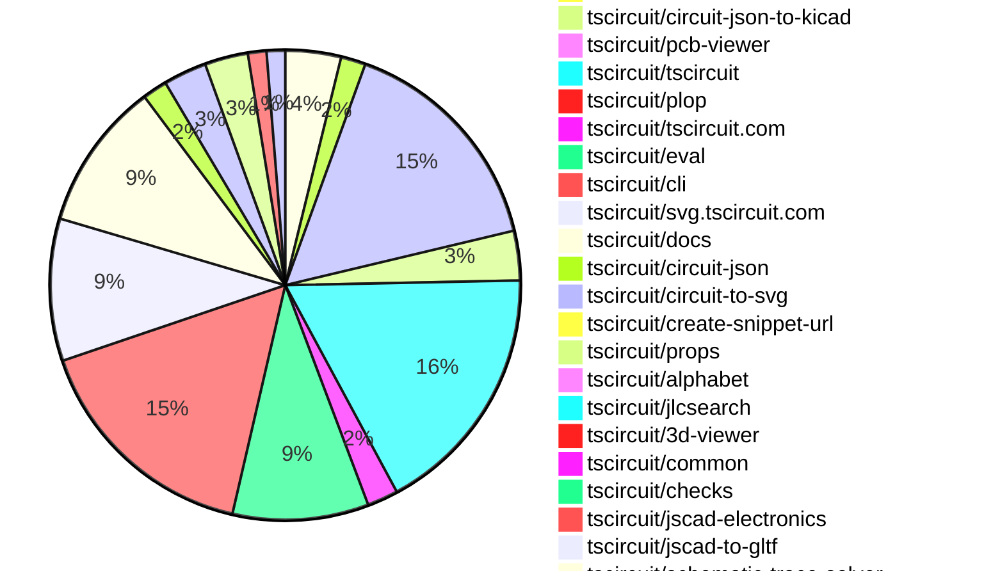
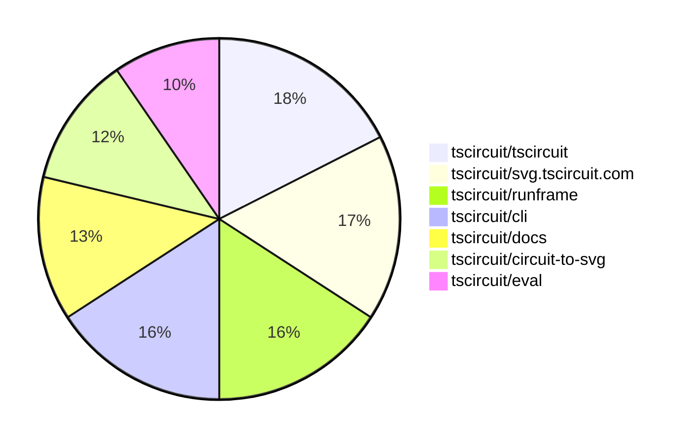

# contribution-tracker

[contributions.tscircuit.com](https://contributions.tscircuit.com) ・ [tscircuit.com](https://tscircuit.com) ・ [Contribution Overviews](./contribution-overviews/) ・ [Changelogs](./changelogs/)

Generates weekly contribution overviews for tscircuit contributors. Check out all
the [contribution overviews here](./contribution-overviews/)
You can find AI-generated monthly changelogs in the [changelogs directory](./changelogs/).

- All PRs in the tscircuit org are scanned/summarized via an LLM
- The LLM classifies each Diff/PR as into a set of attributes for scoring
- All the PRs, summaries, and classifications are organized into charts and tables for [the website](https://contributions.tscircuit.com)

> Want to run locally? See the [Development Section](#development)

The current week is shown below. There are 3 major sections:

- [Contributor Overview](#contributor-overview)
- [PRs by Repository](#prs-by-repository)
- [PRs by Contributor](#changes-by-contributor)

## Current Week

<!-- START_CURRENT_WEEK -->

# Contribution Overview 2025-10-08

## PRs by Repository



## Contributor Overview

| Contributor | 🐳 Major | 🐙 Minor | 🐌 Tiny | ⭐ | Score | Discussion Contributions |
|-------------|---------|---------|---------|-----|----------------|--------------------------|
| [seveibar](#seveibar) | 9 | 9 | 23 | 👑👑 | 78 | 0🔹 0🔶 0💎 |
| [imrishabh18](#imrishabh18) | 0 | 15 | 22 | ⭐⭐⭐ | 42.5 | 0🔹 0🔶 0💎 |
| [MustafaMulla29](#MustafaMulla29) | 3 | 5 | 2 | ⭐⭐ | 27 | 0🔹 0🔶 0💎 |
| [tscircuitbot](#tscircuitbot) | 0 | 0 | 127 | ⭐⭐ | 18 | 0🔹 0🔶 0💎 |
| [ShiboSoftwareDev](#ShiboSoftwareDev) | 1 | 6 | 0 | ⭐⭐ | 18 | 0🔹 0🔶 0💎 |
| [ArnavK-09](#ArnavK-09) | 2 | 1 | 3 | ⭐⭐ | 13 | 0🔹 0🔶 0💎 |
| [Abse2001](#Abse2001) | 0 | 2 | 4 | ⭐ | 10 | 0🔹 0🔶 0💎 |
| [Asymtode712](#Asymtode712) | 1 | 1 | 2 | ⭐ | 8 | 0🔹 0🔶 0💎 |
| [pxlpal](#pxlpal) | 2 | 0 | 0 | ⭐ | 8 | 0🔹 0🔶 0💎 |
| [Ayushjhawar8](#Ayushjhawar8) | 0 | 2 | 3 | ⭐ | 7 | 0🔹 0🔶 0💎 |
| [0hmX](#0hmX) | 1 | 0 | 2 | ⭐ | 6 | 0🔹 0🔶 0💎 |
| [nailoo](#nailoo) | 0 | 1 | 1 | ⭐ | 4 | 0🔹 0🔶 0💎 |
| [Heinrich-XIAO](#Heinrich-XIAO) | 0 | 1 | 0 |  | 2 | 0🔹 0🔶 0💎 |
| [techmannih](#techmannih) | 0 | 0 | 1 |  | 1 | 0🔹 0🔶 0💎 |
| [devroy10](#devroy10) | 0 | 0 | 1 |  | 1 | 0🔹 0🔶 0💎 |

### Discussion Contribution Legend

- 🔹 Normal Comments: Basic participation with minimal effort
- 🔶 Great Informative Comments: Thoughtful participation that adds value
- 💎 Incredible Comments: Exceptional participation with high-quality content

## Review Table

[reviews-received-hover]: ## "Number of reviews received for PRs for this contributor"
[approvals-received-hover]: ## "Number of approvals received for PRs this contributor authored"
[rejections-received-hover]: ## "Number of rejections received for PRs this contributor authored"
[prs-opened-hover]: ## "Number of PRs opened by this contributor"
[issues-created-hover]: ## "Number of issues created by this contributor"
[bountied-issues-hover]: ## "Number of issues this contributor created with a bounty"
[bountied-issue-$-hover]: ## "Total bounty amount placed on issues authored by this contributor"

| Contributor | Reviews Received | Approvals Received | Rejections Received | Approvals | Rejections | PRs Opened | PRs Merged | Score | Issues Created | Bountied Issues | Bountied Issue $ |
|---|---|---|---|---|---|---|---|---|---|---|---|
| [Quanta-Naut](#Quanta-Naut) | 1 | 1 | 0 | 0 | 0 | 2 | 0 | 0 | 0 | 0 | 0 |
| [imrishabh18](#imrishabh18) | 27 | 11 | 1 | 6 | 1 | 39 | 37 | 42.5 | 0 | 0 | 0 |
| [Excellencedev](#Excellencedev) | 11 | 0 | 2 | 0 | 0 | 12 | 0 | 0 | 0 | 0 | 0 |
| [baeoc](#baeoc) | 4 | 0 | 2 | 0 | 0 | 1 | 0 | 0 | 0 | 0 | 0 |
| [seveibar](#seveibar) | 31 | 1 | 0 | 55 | 18 | 55 | 42 | 78 | 0 | 0 | 0 |
| [tscircuitbot](#tscircuitbot) | 1 | 0 | 0 | 0 | 0 | 151 | 128 | 18 | 0 | 0 | 0 |
| [YadavAkhileshh](#YadavAkhileshh) | 0 | 0 | 0 | 0 | 0 | 2 | 0 | 0 | 0 | 0 | 0 |
| [Abse2001](#Abse2001) | 15 | 7 | 3 | 1 | 1 | 13 | 6 | 10 | 0 | 0 | 0 |
| [MustafaMulla29](#MustafaMulla29) | 22 | 13 | 2 | 0 | 0 | 13 | 10 | 27 | 0 | 0 | 0 |
| [nailoo](#nailoo) | 3 | 2 | 0 | 0 | 0 | 2 | 2 | 4 | 0 | 0 | 0 |
| [techmannih](#techmannih) | 2 | 1 | 0 | 0 | 0 | 2 | 1 | 1 | 0 | 0 | 0 |
| [Pranjal6955](#Pranjal6955) | 1 | 0 | 0 | 0 | 0 | 2 | 0 | 0 | 0 | 0 | 0 |
| [ShiboSoftwareDev](#ShiboSoftwareDev) | 26 | 7 | 4 | 1 | 0 | 10 | 7 | 18 | 0 | 0 | 0 |
| [devroy10](#devroy10) | 4 | 2 | 0 | 0 | 0 | 5 | 1 | 1 | 0 | 0 | 0 |
| [codecraft26](#codecraft26) | 3 | 0 | 0 | 0 | 0 | 3 | 0 | 0 | 0 | 0 | 0 |
| [jayantpranjal0](#jayantpranjal0) | 2 | 0 | 1 | 0 | 0 | 3 | 0 | 0 | 0 | 0 | 0 |
| [0hmX](#0hmX) | 7 | 2 | 0 | 0 | 0 | 5 | 3 | 6 | 0 | 0 | 0 |
| [ArnavK-09](#ArnavK-09) | 9 | 6 | 0 | 0 | 0 | 6 | 6 | 13 | 0 | 0 | 0 |
| [bitsbyritik](#bitsbyritik) | 0 | 0 | 0 | 0 | 0 | 1 | 0 | 0 | 0 | 0 | 0 |
| [Asymtode712](#Asymtode712) | 13 | 4 | 4 | 0 | 0 | 8 | 4 | 8 | 0 | 0 | 0 |
| [Ayushjhawar8](#Ayushjhawar8) | 5 | 5 | 0 | 0 | 0 | 6 | 5 | 7 | 0 | 0 | 0 |
| [Omar8345](#Omar8345) | 1 | 0 | 1 | 1 | 0 | 4 | 0 | 0 | 0 | 0 | 0 |
| [Richiemighty](#Richiemighty) | 0 | 0 | 0 | 0 | 0 | 1 | 0 | 0 | 0 | 0 | 0 |
| [yakhilgithub](#yakhilgithub) | 0 | 0 | 0 | 0 | 0 | 1 | 0 | 0 | 0 | 0 | 0 |
| [pxlpal](#pxlpal) | 2 | 1 | 0 | 0 | 0 | 2 | 2 | 8 | 0 | 0 | 0 |
| [knileshh](#knileshh) | 1 | 0 | 0 | 0 | 0 | 1 | 0 | 0 | 0 | 0 | 0 |
| [992manav](#992manav) | 0 | 0 | 0 | 0 | 0 | 1 | 0 | 0 | 0 | 0 | 0 |
| [saish9901](#saish9901) | 0 | 0 | 0 | 0 | 0 | 4 | 0 | 0 | 0 | 0 | 0 |
| [Sohail52](#Sohail52) | 0 | 0 | 0 | 0 | 0 | 1 | 0 | 0 | 0 | 0 | 0 |
| [DevGajjar28](#DevGajjar28) | 0 | 0 | 0 | 0 | 0 | 1 | 0 | 0 | 0 | 0 | 0 |
| [Heinrich-XIAO](#Heinrich-XIAO) | 1 | 1 | 0 | 0 | 0 | 1 | 1 | 2 | 0 | 0 | 0 |

## Top 7 Repositories by Contribution Points



## Changes by Repository

### [tscircuit/kicad-component-converter](https://github.com/tscircuit/kicad-component-converter)

| PR # | Impact | Rating | Contributor | Description |
|------|--------|--------|-------------|-------------|
| [#146](https://github.com/tscircuit/kicad-component-converter/pull/146) | 🐙 Minor | ⭐⭐ | imrishabh18 | Fixes the conversion of fp_line to silkscreen and skips user-defined layers in the KiCad to TSCircuit conversion process. |

### [tscircuit/core](https://github.com/tscircuit/core)

| PR # | Impact | Rating | Contributor | Description |
|------|--------|--------|-------------|-------------|
| [#1475](https://github.com/tscircuit/core/pull/1475) | 🐙 Minor | ⭐⭐ | imrishabh18 | Adds support for autolayout functionality for schematic primitive elements, allowing for dynamic adjustment of their positions during layout changes. |
| [#1474](https://github.com/tscircuit/core/pull/1474) | 🐙 Minor | ⭐⭐ | imrishabh18 | Fixes failure in trace creation when using the connection property in components. |
| [#1471](https://github.com/tscircuit/core/pull/1471) | 🐙 Minor | ⭐⭐ | imrishabh18 | Adds support for tracing connections between ports of React symbols in the schematic, allowing for better representation and interaction of components. |
| [#1476](https://github.com/tscircuit/core/pull/1476) | 🐙 Minor | ⭐⭐ | seveibar | Reuse the shared getFileExtension helper in the cad model primitive so absolute paths are handled consistently and extend the helper to strip queryhash fragments, handle path segments, and normalize the returned extension. |
| [#1463](https://github.com/tscircuit/core/pull/1463) | 🐙 Minor | ⭐⭐ | seveibar | Upgrades the calculate-packing library version and adds a test for Arduino shield components packed outside the board. |
| [#1478](https://github.com/tscircuit/core/pull/1478) | 🐙 Minor | ⭐⭐ | MustafaMulla29 | Adds a design rule check for PCB component overlap to prevent overlapping pads between components. |
| [#1456](https://github.com/tscircuit/core/pull/1456) | 🐙 Minor | ⭐⭐ | ShiboSoftwareDev | Adds support for duration and timePerStep props to the analogsimulation  component, allowing customization of SPICE transient analysis parameters. |

<details>
<summary>🐌 Tiny Contributions (2)</summary>

| PR # | Impact | Contributor | Description |
|------|--------|-------------|-------------|
| [#1473](https://github.com/tscircuit/core/pull/1473) | 🐌 Tiny | nailoo | Updates the circuit-to-svg dependency from version 0.0.221 to 0.0.228 in package.json |
| [#1464](https://github.com/tscircuit/core/pull/1464) | 🐌 Tiny | 0hmX | Updates the schematic-trace-solver dependency to version 0.0.41 in package.json |

</details>

### [tscircuit/status](https://github.com/tscircuit/status)

| PR # | Impact | Rating | Contributor | Description |
|------|--------|--------|-------------|-------------|
| [#50](https://github.com/tscircuit/status/pull/50) | 🐙 Minor | ⭐⭐ | imrishabh18 | Adds a health check for the usercode service to monitor its status and performance. |

<details>
<summary>🐌 Tiny Contributions (3)</summary>

| PR # | Impact | Contributor | Description |
|------|--------|-------------|-------------|
| [#53](https://github.com/tscircuit/status/pull/53) | 🐌 Tiny | imrishabh18 | Fixes the name of the ignored service in the Discord notification script from check-usercode-health to usercode_api. |
| [#52](https://github.com/tscircuit/status/pull/52) | 🐌 Tiny | imrishabh18 | Adds functionality to ignore Discord notifications for the check-usercode-health service. |
| [#51](https://github.com/tscircuit/status/pull/51) | 🐌 Tiny | imrishabh18 | Increases the timeout limit for health checks from 2 minutes to 5 minutes. |

</details>

### [tscircuit/runframe](https://github.com/tscircuit/runframe)

| PR # | Impact | Rating | Contributor | Description |
|------|--------|--------|-------------|-------------|
| [#1375](https://github.com/tscircuit/runframe/pull/1375) | 🐙 Minor | ⭐⭐ | imrishabh18 | Adds functionality to export a KiCad project including the project file, schematic, and PCB files in a zip format. |

<details>
<summary>🐌 Tiny Contributions (36)</summary>

| PR # | Impact | Contributor | Description |
|------|--------|-------------|-------------|
| [#1396](https://github.com/tscircuit/runframe/pull/1396) | 🐌 Tiny | imrishabh18 | Adds a GitHub Actions workflow to send Slack notifications for failed automated package update PRs. |
| [#1364](https://github.com/tscircuit/runframe/pull/1364) | 🐌 Tiny | imrishabh18 | This pull request adds a new generated styles file to the project, which includes various CSS styles and utility classes for the application. The styles are generated using Tailwind CSS, providing a comprehensive set of utility classes for layout, spacing, typography, and more. |
| [#1363](https://github.com/tscircuit/runframe/pull/1363) | 🐌 Tiny | imrishabh18 | Adds a GitHub token to the workflow for closing existing pull requests by the bot. |
| [#1361](https://github.com/tscircuit/runframe/pull/1361) | 🐌 Tiny | imrishabh18 | Modifies the GitHub Actions workflow to prevent publishing on push events that start with v in the commit message. |
| [#1397](https://github.com/tscircuit/runframe/pull/1397) | 🐌 Tiny | tscircuitbot | Automated package update |
| [#1395](https://github.com/tscircuit/runframe/pull/1395) | 🐌 Tiny | tscircuitbot | Automated package update to version 0.0.1074 |
| [#1394](https://github.com/tscircuit/runframe/pull/1394) | 🐌 Tiny | tscircuitbot | Updates the tscircuiteval package to version 0.0.379 in the package.json file. |
| [#1393](https://github.com/tscircuit/runframe/pull/1393) | 🐌 Tiny | tscircuitbot | Automated package update |
| [#1392](https://github.com/tscircuit/runframe/pull/1392) | 🐌 Tiny | tscircuitbot | Automated package update for tscircuit3d-viewer from version 0.0.408 to 0.0.409 |
| [#1391](https://github.com/tscircuit/runframe/pull/1391) | 🐌 Tiny | tscircuitbot | Automated package update |
| [#1390](https://github.com/tscircuit/runframe/pull/1390) | 🐌 Tiny | tscircuitbot | Updates the tscircuiteval package to version 0.0.378 in the package.json file. |
| [#1389](https://github.com/tscircuit/runframe/pull/1389) | 🐌 Tiny | tscircuitbot | Updates the package version from 0.0.1070 to 0.0.1071 in package.json |
| [#1388](https://github.com/tscircuit/runframe/pull/1388) | 🐌 Tiny | tscircuitbot | Updates the tscircuiteval package to version 0.0.377 in the package.json file. |
| [#1387](https://github.com/tscircuit/runframe/pull/1387) | 🐌 Tiny | tscircuitbot | Updates the package version from 0.0.1069 to 0.0.1070 in package.json |
| [#1384](https://github.com/tscircuit/runframe/pull/1384) | 🐌 Tiny | tscircuitbot | Automated package update to version 0.0.1069 |
| [#1380](https://github.com/tscircuit/runframe/pull/1380) | 🐌 Tiny | tscircuitbot | Automated package update to version 0.0.1068 |
| [#1379](https://github.com/tscircuit/runframe/pull/1379) | 🐌 Tiny | tscircuitbot | Updates the tscircuiteval package to version 0.0.376 |
| [#1378](https://github.com/tscircuit/runframe/pull/1378) | 🐌 Tiny | tscircuitbot | Automated package update to version 0.0.1067 |
| [#1377](https://github.com/tscircuit/runframe/pull/1377) | 🐌 Tiny | tscircuitbot | Updates the tscircuiteval package from version 0.0.374 to 0.0.375 |
| [#1376](https://github.com/tscircuit/runframe/pull/1376) | 🐌 Tiny | tscircuitbot | Automated package update to version 0.0.1066 |
| [#1374](https://github.com/tscircuit/runframe/pull/1374) | 🐌 Tiny | tscircuitbot | Updates the package version from 0.0.1064 to 0.0.1065 in package.json |
| [#1373](https://github.com/tscircuit/runframe/pull/1373) | 🐌 Tiny | tscircuitbot | Updates the tscircuit3d-viewer package to version 0.0.408 in the package.json file. |
| [#1372](https://github.com/tscircuit/runframe/pull/1372) | 🐌 Tiny | tscircuitbot | Automated package update to version 0.0.1064 |
| [#1371](https://github.com/tscircuit/runframe/pull/1371) | 🐌 Tiny | tscircuitbot | Updates the tscircuiteval package from version 0.0.373 to 0.0.374 |
| [#1369](https://github.com/tscircuit/runframe/pull/1369) | 🐌 Tiny | tscircuitbot | Automated package update |
| [#1368](https://github.com/tscircuit/runframe/pull/1368) | 🐌 Tiny | tscircuitbot | Updates the tscircuiteval package from version 0.0.372 to 0.0.373 |
| [#1367](https://github.com/tscircuit/runframe/pull/1367) | 🐌 Tiny | tscircuitbot | Automated package update |
| [#1366](https://github.com/tscircuit/runframe/pull/1366) | 🐌 Tiny | tscircuitbot | Updates the tscircuiteval package to version 0.0.372 |
| [#1365](https://github.com/tscircuit/runframe/pull/1365) | 🐌 Tiny | tscircuitbot | Automated package update |
| [#1362](https://github.com/tscircuit/runframe/pull/1362) | 🐌 Tiny | tscircuitbot | Updates the tscircuiteval package to version 0.0.371 in the package.json file. |
| [#1360](https://github.com/tscircuit/runframe/pull/1360) | 🐌 Tiny | tscircuitbot | Updates the tscircuiteval package to version 0.0.370 in the package.json file. |
| [#1359](https://github.com/tscircuit/runframe/pull/1359) | 🐌 Tiny | tscircuitbot | Updates the tscircuiteval package to version 0.0.370 |
| [#1358](https://github.com/tscircuit/runframe/pull/1358) | 🐌 Tiny | tscircuitbot | Updates the tscircuiteval package from version 0.0.368 to 0.0.369 in the package.json file. |
| [#1357](https://github.com/tscircuit/runframe/pull/1357) | 🐌 Tiny | tscircuitbot | Updates the tscircuiteval package from version 0.0.368 to 0.0.369 |
| [#1386](https://github.com/tscircuit/runframe/pull/1386) | 🐌 Tiny | Ayushjhawar8 | Removes TypeScript (.ts) icons from the file selector and adds support for JSX (.jsx) files in the file filtering and display logic. |
| [#1383](https://github.com/tscircuit/runframe/pull/1383) | 🐌 Tiny | Ayushjhawar8 | Removes .ts files from the RunFrame file explorer, allowing only .tsx and .circuit.json files to be displayed. |

</details>

### [tscircuit/kicadts](https://github.com/tscircuit/kicadts)

| PR # | Impact | Rating | Contributor | Description |
|------|--------|--------|-------------|-------------|
| [#9](https://github.com/tscircuit/kicadts/pull/9) | 🐙 Minor | ⭐⭐ | imrishabh18 | Adds support for GlobalLabel in KiCad schematic representation, allowing for enhanced labeling of signals across sheets. |

### [tscircuit/circuit-json-to-kicad](https://github.com/tscircuit/circuit-json-to-kicad)

| PR # | Impact | Rating | Contributor | Description |
|------|--------|--------|-------------|-------------|
| [#26](https://github.com/tscircuit/circuit-json-to-kicad/pull/26) | 🐙 Minor | ⭐⭐ | imrishabh18 | Adds support for standalone silkscreen text elements that are not associated with any components in the PCB design. |
| [#25](https://github.com/tscircuit/circuit-json-to-kicad/pull/25) | 🐙 Minor | ⭐⭐ | imrishabh18 | Adds rotation functionality to PCB components, allowing for accurate placement in KiCad. |
| [#24](https://github.com/tscircuit/circuit-json-to-kicad/pull/24) | 🐙 Minor | ⭐⭐ | imrishabh18 | Adds support for converting non-plated holes (pcb_hole) to non-plated through holes (np_thru_hole) in the PCB generation process. |
| [#23](https://github.com/tscircuit/circuit-json-to-kicad/pull/23) | 🐙 Minor | ⭐⭐ | imrishabh18 | Removes the default graphics text component and replaces it with footprint text for PCB silkscreen elements. |
| [#22](https://github.com/tscircuit/circuit-json-to-kicad/pull/22) | 🐙 Minor | ⭐⭐ | imrishabh18 | Adds support for PCB silkscreen text and corrects the positioning of SMD pads in the PCB layout. |
| [#21](https://github.com/tscircuit/circuit-json-to-kicad/pull/21) | 🐙 Minor | ⭐⭐ | imrishabh18 | Adds support for converting pcb_plated_hole elements to through-hole pads in KiCad, enhancing the footprint generation process. |
| [#20](https://github.com/tscircuit/circuit-json-to-kicad/pull/20) | 🐙 Minor | ⭐⭐ | imrishabh18 | Converts net labels without a symbol name to global labels in KiCad export, enhancing schematic representation. |
| [#19](https://github.com/tscircuit/circuit-json-to-kicad/pull/19) | 🐙 Minor | ⭐⭐ | imrishabh18 | Adds support for net labels with symbols for ground and power in schematic generation, allowing for better representation of these elements in the schematic. |

### [tscircuit/pcb-viewer](https://github.com/tscircuit/pcb-viewer)


<details>
<summary>🐌 Tiny Contributions (1)</summary>

| PR # | Impact | Contributor | Description |
|------|--------|-------------|-------------|
| [#392](https://github.com/tscircuit/pcb-viewer/pull/392) | 🐌 Tiny | imrishabh18 | Adds a GitHub Actions workflow that prevents direct pushes to the main branch and automates version bumping and package updates. |

</details>

### [tscircuit/tscircuit](https://github.com/tscircuit/tscircuit)

| PR # | Impact | Rating | Contributor | Description |
|------|--------|--------|-------------|-------------|
| [#928](https://github.com/tscircuit/tscircuit/pull/928) | 🐙 Minor | ⭐⭐ | Abse2001 | Adds tscircuitcommon to the DO_NOT_SYNC_PACKAGE list in the core versioning script. |

<details>
<summary>🐌 Tiny Contributions (40)</summary>

| PR # | Impact | Contributor | Description |
|------|--------|-------------|-------------|
| [#963](https://github.com/tscircuit/tscircuit/pull/963) | 🐌 Tiny | imrishabh18 | Updates the kicad-component-converter dependency to version 0.1.22 in package.json |
| [#978](https://github.com/tscircuit/tscircuit/pull/978) | 🐌 Tiny | tscircuitbot | Automated package update |
| [#977](https://github.com/tscircuit/tscircuit/pull/977) | 🐌 Tiny | tscircuitbot | Updates the tscircuitcli package from version 0.1.308 to 0.1.309 and the tscircuitrunframe package from version 0.0.1074 to 0.0.1075 in package.json |
| [#976](https://github.com/tscircuit/tscircuit/pull/976) | 🐌 Tiny | tscircuitbot | Automated package update |
| [#975](https://github.com/tscircuit/tscircuit/pull/975) | 🐌 Tiny | tscircuitbot | Updates the tscircuitcli package and other dependencies to their latest versions. |
| [#968](https://github.com/tscircuit/tscircuit/pull/968) | 🐌 Tiny | tscircuitbot | Automated package update |
| [#967](https://github.com/tscircuit/tscircuit/pull/967) | 🐌 Tiny | tscircuitbot | Updates the tscircuitcli package to version 0.1.307 |
| [#966](https://github.com/tscircuit/tscircuit/pull/966) | 🐌 Tiny | tscircuitbot | Automated package update |
| [#965](https://github.com/tscircuit/tscircuit/pull/965) | 🐌 Tiny | tscircuitbot | Updates the tscircuitcli package from version 0.1.305 to 0.1.306 and the tscircuiteval package from version 0.0.377 to 0.0.378, along with the tscircuitrunframe package from version 0.0.1071 to 0.0.1072. |
| [#964](https://github.com/tscircuit/tscircuit/pull/964) | 🐌 Tiny | tscircuitbot | Automated package update |
| [#962](https://github.com/tscircuit/tscircuit/pull/962) | 🐌 Tiny | tscircuitbot | Automated package update |
| [#961](https://github.com/tscircuit/tscircuit/pull/961) | 🐌 Tiny | tscircuitbot | Automated package update |
| [#958](https://github.com/tscircuit/tscircuit/pull/958) | 🐌 Tiny | tscircuitbot | Automated package update |
| [#957](https://github.com/tscircuit/tscircuit/pull/957) | 🐌 Tiny | tscircuitbot | Updates the tscircuitcli package to version 0.1.304 |
| [#956](https://github.com/tscircuit/tscircuit/pull/956) | 🐌 Tiny | tscircuitbot | Automated package update |
| [#955](https://github.com/tscircuit/tscircuit/pull/955) | 🐌 Tiny | tscircuitbot | Automated package update |
| [#953](https://github.com/tscircuit/tscircuit/pull/953) | 🐌 Tiny | tscircuitbot | Updates the package version from 0.0.729 to 0.0.730 in package.json |
| [#952](https://github.com/tscircuit/tscircuit/pull/952) | 🐌 Tiny | tscircuitbot | Updates the tscircuitcli package from version 0.1.302 to 0.1.303 and the tscircuitrunframe package from version 0.0.1069 to 0.0.1070 in package.json |
| [#951](https://github.com/tscircuit/tscircuit/pull/951) | 🐌 Tiny | tscircuitbot | Automated package update |
| [#950](https://github.com/tscircuit/tscircuit/pull/950) | 🐌 Tiny | tscircuitbot | Updates the tscircuitcli package to version 0.1.302 in the package.json file |
| [#949](https://github.com/tscircuit/tscircuit/pull/949) | 🐌 Tiny | tscircuitbot | Updates the package version from 0.0.727 to 0.0.728 in package.json |
| [#948](https://github.com/tscircuit/tscircuit/pull/948) | 🐌 Tiny | tscircuitbot | Automated package update |
| [#947](https://github.com/tscircuit/tscircuit/pull/947) | 🐌 Tiny | tscircuitbot | Updates the package version from 0.0.726 to 0.0.727 in package.json |
| [#946](https://github.com/tscircuit/tscircuit/pull/946) | 🐌 Tiny | tscircuitbot | Automated package update |
| [#945](https://github.com/tscircuit/tscircuit/pull/945) | 🐌 Tiny | tscircuitbot | Updates the package version from 0.0.723 to 0.0.726 in package.json |
| [#944](https://github.com/tscircuit/tscircuit/pull/944) | 🐌 Tiny | tscircuitbot | Automated package update |
| [#942](https://github.com/tscircuit/tscircuit/pull/942) | 🐌 Tiny | tscircuitbot | Updates the tscircuitcli package to version 0.1.298 in package.json |
| [#940](https://github.com/tscircuit/tscircuit/pull/940) | 🐌 Tiny | tscircuitbot | Automated package update |
| [#938](https://github.com/tscircuit/tscircuit/pull/938) | 🐌 Tiny | tscircuitbot | Updates the package version from 0.0.722 to 0.0.723 in package.json |
| [#937](https://github.com/tscircuit/tscircuit/pull/937) | 🐌 Tiny | tscircuitbot | Automated package update |
| [#936](https://github.com/tscircuit/tscircuit/pull/936) | 🐌 Tiny | tscircuitbot | Automated package update to version 0.0.722 |
| [#935](https://github.com/tscircuit/tscircuit/pull/935) | 🐌 Tiny | tscircuitbot | Updates the tscircuitcli and tscircuiteval packages to their latest versions. |
| [#934](https://github.com/tscircuit/tscircuit/pull/934) | 🐌 Tiny | tscircuitbot | Automated package update |
| [#933](https://github.com/tscircuit/tscircuit/pull/933) | 🐌 Tiny | tscircuitbot | Automated package update |
| [#932](https://github.com/tscircuit/tscircuit/pull/932) | 🐌 Tiny | tscircuitbot | Automated package update |
| [#931](https://github.com/tscircuit/tscircuit/pull/931) | 🐌 Tiny | tscircuitbot | Automated package update |
| [#930](https://github.com/tscircuit/tscircuit/pull/930) | 🐌 Tiny | tscircuitbot | Automated package update |
| [#925](https://github.com/tscircuit/tscircuit/pull/925) | 🐌 Tiny | tscircuitbot | Automated package update |
| [#954](https://github.com/tscircuit/tscircuit/pull/954) | 🐌 Tiny | seveibar | Adds TypeScript declarations for various 3D file formats including .obj, .stl, .kicad_mod, .glb, .gltf, and .step to resolve type issues in the project. |
| [#924](https://github.com/tscircuit/tscircuit/pull/924) | 🐌 Tiny | seveibar | Skip the bun-pver-release workflow when the triggering push commit message starts with v |

</details>

### [tscircuit/plop](https://github.com/tscircuit/plop)


<details>
<summary>🐌 Tiny Contributions (1)</summary>

| PR # | Impact | Contributor | Description |
|------|--------|-------------|-------------|
| [#22](https://github.com/tscircuit/plop/pull/22) | 🐌 Tiny | imrishabh18 | Prevents the release of a version bump when the commit message starts with v. |

</details>

### [tscircuit/tscircuit.com](https://github.com/tscircuit/tscircuit.com)

| PR # | Impact | Rating | Contributor | Description |
|------|--------|--------|-------------|-------------|
| [#1782](https://github.com/tscircuit/tscircuit.com/pull/1782) | 🐳 Major | ⭐⭐⭐ | ArnavK-09 | Add github_handle to PublicOrgSchema and seed data, introduce GithubAvatarWithFallback component, implement useOrgByName hook, and update ProfileRouter to utilize it, along with UI adjustments for members card padding and org grid columns. |
| [#1783](https://github.com/tscircuit/tscircuit.com/pull/1783) | 🐙 Minor | ⭐⭐ | ArnavK-09 | Adds a size parameter to GitHub avatar URLs, allowing customization of avatar dimensions in various components. |

<details>
<summary>🐌 Tiny Contributions (3)</summary>

| PR # | Impact | Contributor | Description |
|------|--------|-------------|-------------|
| [#1785](https://github.com/tscircuit/tscircuit.com/pull/1785) | 🐌 Tiny | imrishabh18 | Removes the display of the Joined date for organization members on the organization page. |
| [#1781](https://github.com/tscircuit/tscircuit.com/pull/1781) | 🐌 Tiny | imrishabh18 | Updates the versions of kicadts and circuit-json-to-kicad dependencies in package.json |
| [#1778](https://github.com/tscircuit/tscircuit.com/pull/1778) | 🐌 Tiny | Asymtode712 | Updates the dependency version of tscircuit3d-viewer to resolve lighting issues in the 3D viewer. |

</details>

### [tscircuit/eval](https://github.com/tscircuit/eval)

| PR # | Impact | Rating | Contributor | Description |
|------|--------|--------|-------------|-------------|
| [#1211](https://github.com/tscircuit/eval/pull/1211) | 🐙 Minor | ⭐⭐ | ShiboSoftwareDev | Adds support for resolving non-relative imports using tsconfig.json paths, including wildcard and exact aliases, with extension fallback and tests included. |

<details>
<summary>🐌 Tiny Contributions (21)</summary>

| PR # | Impact | Contributor | Description |
|------|--------|-------------|-------------|
| [#1232](https://github.com/tscircuit/eval/pull/1232) | 🐌 Tiny | imrishabh18 | Adds a GitHub Actions workflow to send a Slack notification when CI fails for automated package update pull requests. |
| [#1230](https://github.com/tscircuit/eval/pull/1230) | 🐌 Tiny | imrishabh18 | Updates the kicad-component-converter dependency to version 0.1.22 and modifies import paths in the test configuration for TypeScript. |
| [#1199](https://github.com/tscircuit/eval/pull/1199) | 🐌 Tiny | imrishabh18 | Modifies the GitHub Actions workflow to prevent publishing on push events that start with v in the commit message. |
| [#1197](https://github.com/tscircuit/eval/pull/1197) | 🐌 Tiny | imrishabh18 | Updates the GitHub Actions workflow to close existing pull requests with titles containing chore: update packages instead of update tscircuitcore. |
| [#1233](https://github.com/tscircuit/eval/pull/1233) | 🐌 Tiny | tscircuitbot | Automated package update |
| [#1231](https://github.com/tscircuit/eval/pull/1231) | 🐌 Tiny | tscircuitbot | Automated package update |
| [#1229](https://github.com/tscircuit/eval/pull/1229) | 🐌 Tiny | tscircuitbot | Automated package update |
| [#1228](https://github.com/tscircuit/eval/pull/1228) | 🐌 Tiny | tscircuitbot | Automated package update |
| [#1227](https://github.com/tscircuit/eval/pull/1227) | 🐌 Tiny | tscircuitbot | Automated package update |
| [#1226](https://github.com/tscircuit/eval/pull/1226) | 🐌 Tiny | tscircuitbot | Updates the version of the tscircuitcore package from 0.0.774 to 0.0.775 in package.json |
| [#1224](https://github.com/tscircuit/eval/pull/1224) | 🐌 Tiny | tscircuitbot | Automated package update |
| [#1223](https://github.com/tscircuit/eval/pull/1223) | 🐌 Tiny | tscircuitbot | Updates the version of the tscircuitcore package from 0.0.771 to 0.0.774 in package.json |
| [#1217](https://github.com/tscircuit/eval/pull/1217) | 🐌 Tiny | tscircuitbot | Updates the package version from 0.0.373 to 0.0.374 in package.json |
| [#1216](https://github.com/tscircuit/eval/pull/1216) | 🐌 Tiny | tscircuitbot | Automated package update |
| [#1214](https://github.com/tscircuit/eval/pull/1214) | 🐌 Tiny | tscircuitbot | Automated package update |
| [#1213](https://github.com/tscircuit/eval/pull/1213) | 🐌 Tiny | tscircuitbot | Updates the package version from 0.0.371 to 0.0.372 in package.json |
| [#1200](https://github.com/tscircuit/eval/pull/1200) | 🐌 Tiny | tscircuitbot | Automated package update |
| [#1198](https://github.com/tscircuit/eval/pull/1198) | 🐌 Tiny | tscircuitbot | Automated package update |
| [#1196](https://github.com/tscircuit/eval/pull/1196) | 🐌 Tiny | tscircuitbot | Automated package update |
| [#1195](https://github.com/tscircuit/eval/pull/1195) | 🐌 Tiny | tscircuitbot | Automated package update |
| [#1212](https://github.com/tscircuit/eval/pull/1212) | 🐌 Tiny | seveibar | Updates the bun test workflow to execute each test file in its own bun process and retry on segmentation faults, skipping the step when no test files exist in the matrix directory. |

</details>

### [tscircuit/cli](https://github.com/tscircuit/cli)


<details>
<summary>🐌 Tiny Contributions (38)</summary>

| PR # | Impact | Contributor | Description |
|------|--------|-------------|-------------|
| [#544](https://github.com/tscircuit/cli/pull/544) | 🐌 Tiny | imrishabh18 | Updates the kicad-component-converter and tscircuit dependencies in package.json to their latest versions. |
| [#506](https://github.com/tscircuit/cli/pull/506) | 🐌 Tiny | imrishabh18 | Modifies the GitHub Actions workflow to prevent publishing on push events that start with v in the commit message. |
| [#550](https://github.com/tscircuit/cli/pull/550) | 🐌 Tiny | tscircuitbot | Automated package update |
| [#549](https://github.com/tscircuit/cli/pull/549) | 🐌 Tiny | tscircuitbot | Updates the tscircuitrunframe package to version 0.0.1075 |
| [#548](https://github.com/tscircuit/cli/pull/548) | 🐌 Tiny | tscircuitbot | Automated package update |
| [#547](https://github.com/tscircuit/cli/pull/547) | 🐌 Tiny | tscircuitbot | Updates the tscircuitrunframe package from version 0.0.1072 to 0.0.1074 |
| [#545](https://github.com/tscircuit/cli/pull/545) | 🐌 Tiny | tscircuitbot | Automated package update |
| [#543](https://github.com/tscircuit/cli/pull/543) | 🐌 Tiny | tscircuitbot | Automated package update |
| [#542](https://github.com/tscircuit/cli/pull/542) | 🐌 Tiny | tscircuitbot | Updates the tscircuitrunframe package to version 0.0.1072 in the package.json file. |
| [#541](https://github.com/tscircuit/cli/pull/541) | 🐌 Tiny | tscircuitbot | Automated package update |
| [#540](https://github.com/tscircuit/cli/pull/540) | 🐌 Tiny | tscircuitbot | Updates the tscircuitrunframe package from version 0.0.1070 to 0.0.1071 |
| [#539](https://github.com/tscircuit/cli/pull/539) | 🐌 Tiny | tscircuitbot | Automated package update |
| [#537](https://github.com/tscircuit/cli/pull/537) | 🐌 Tiny | tscircuitbot | Automated package update |
| [#536](https://github.com/tscircuit/cli/pull/536) | 🐌 Tiny | tscircuitbot | Updates the tscircuitrunframe package to version 0.0.1070 |
| [#535](https://github.com/tscircuit/cli/pull/535) | 🐌 Tiny | tscircuitbot | Automated package update |
| [#533](https://github.com/tscircuit/cli/pull/533) | 🐌 Tiny | tscircuitbot | Automated package update |
| [#532](https://github.com/tscircuit/cli/pull/532) | 🐌 Tiny | tscircuitbot | Updates the tscircuitrunframe package version from 0.0.1068 to 0.0.1069 in package.json |
| [#531](https://github.com/tscircuit/cli/pull/531) | 🐌 Tiny | tscircuitbot | Automated package update to version 0.1.300 |
| [#530](https://github.com/tscircuit/cli/pull/530) | 🐌 Tiny | tscircuitbot | Updates the tscircuitrunframe package to version 0.0.1068 in the package.json file |
| [#529](https://github.com/tscircuit/cli/pull/529) | 🐌 Tiny | tscircuitbot | Automated package update |
| [#528](https://github.com/tscircuit/cli/pull/528) | 🐌 Tiny | tscircuitbot | Updates the tscircuitrunframe package from version 0.0.1066 to 0.0.1067 |
| [#527](https://github.com/tscircuit/cli/pull/527) | 🐌 Tiny | tscircuitbot | Automated package update |
| [#524](https://github.com/tscircuit/cli/pull/524) | 🐌 Tiny | tscircuitbot | Automated package update |
| [#523](https://github.com/tscircuit/cli/pull/523) | 🐌 Tiny | tscircuitbot | Updates the tscircuitrunframe package from version 0.0.1064 to 0.0.1066 |
| [#522](https://github.com/tscircuit/cli/pull/522) | 🐌 Tiny | tscircuitbot | Automated package update |
| [#521](https://github.com/tscircuit/cli/pull/521) | 🐌 Tiny | tscircuitbot | Updates the tscircuitrunframe package to version 0.0.1064 in the package.json file. |
| [#519](https://github.com/tscircuit/cli/pull/519) | 🐌 Tiny | tscircuitbot | Automated package update |
| [#517](https://github.com/tscircuit/cli/pull/517) | 🐌 Tiny | tscircuitbot | Updates the tscircuitrunframe package from version 0.0.1062 to 0.0.1063 |
| [#515](https://github.com/tscircuit/cli/pull/515) | 🐌 Tiny | tscircuitbot | Automated package update |
| [#514](https://github.com/tscircuit/cli/pull/514) | 🐌 Tiny | tscircuitbot | Updates the tscircuitrunframe package from version 0.0.1061 to 0.0.1062 |
| [#512](https://github.com/tscircuit/cli/pull/512) | 🐌 Tiny | tscircuitbot | Automated package update |
| [#510](https://github.com/tscircuit/cli/pull/510) | 🐌 Tiny | tscircuitbot | Automated package update |
| [#509](https://github.com/tscircuit/cli/pull/509) | 🐌 Tiny | tscircuitbot | Updates the tscircuitrunframe package to version 0.0.1061 |
| [#507](https://github.com/tscircuit/cli/pull/507) | 🐌 Tiny | tscircuitbot | Automated package update |
| [#538](https://github.com/tscircuit/cli/pull/538) | 🐌 Tiny | seveibar | Changes TypeScript configuration to use tscircuit instead of tscircuitcore for type definitions. |
| [#525](https://github.com/tscircuit/cli/pull/525) | 🐌 Tiny | seveibar | Adds examples for loading GLB files and reproduces a project-relative-path loading issue. |
| [#534](https://github.com/tscircuit/cli/pull/534) | 🐌 Tiny | Abse2001 | Updates the tscircuit dependency version from 0.0.723 to 0.0.728 in the package.json file. |
| [#511](https://github.com/tscircuit/cli/pull/511) | 🐌 Tiny | ArnavK-09 | Adds a KiCad import example and reorganizes example directories for better structure. |

</details>

### [tscircuit/svg.tscircuit.com](https://github.com/tscircuit/svg.tscircuit.com)

| PR # | Impact | Rating | Contributor | Description |
|------|--------|--------|-------------|-------------|
| [#403](https://github.com/tscircuit/svg.tscircuit.com/pull/403) | 🐳 Major | ⭐⭐⭐ | seveibar | Add support for the schsim view by wiring request parsing, routing, and rendering to the schematic simulation converter, update documentation and generated URL listings to include schematic simulation output, and add a snapshot test that exercises the new schematic simulation SVG flow using runTscircuitCode. |
| [#376](https://github.com/tscircuit/svg.tscircuit.com/pull/376) | 🐳 Major | ⭐⭐⭐ | seveibar | Renders 3D PNG requests by converting circuit JSON to GLB and rasterizing with poppygl, adds dependencies for GLB generation and reusable PNG sizing parameters, and covers GLB-backed CAD model boards with a new PNG regression test. |
| [#372](https://github.com/tscircuit/svg.tscircuit.com/pull/372) | 🐳 Major | ⭐⭐⭐ | ArnavK-09 | Adds full revamp with fsmap support, updates dependencies, and fixes URL handling. |
| [#402](https://github.com/tscircuit/svg.tscircuit.com/pull/402) | 🐳 Major | ⭐⭐⭐ | pxlpal | Adds support for generating assembly views in both SVG and PNG formats for circuit designs. |
| [#384](https://github.com/tscircuit/svg.tscircuit.com/pull/384) | 🐳 Major | ⭐⭐⭐ | pxlpal | Adds support for generating assembly SVG and PNG views from TSCircuit code, enhancing the APIs capabilities for visualizing circuit designs. |
| [#390](https://github.com/tscircuit/svg.tscircuit.com/pull/390) | 🐙 Minor | ⭐⭐ | seveibar | Add support for project_base_url to configure project-specific base URLs in requests |
| [#385](https://github.com/tscircuit/svg.tscircuit.com/pull/385) | 🐙 Minor | ⭐⭐ | seveibar | Add documentation for fs_map input option and implement parsing utilities for GET and POST requests, including validation and testing. |

<details>
<summary>🐌 Tiny Contributions (16)</summary>

| PR # | Impact | Contributor | Description |
|------|--------|-------------|-------------|
| [#382](https://github.com/tscircuit/svg.tscircuit.com/pull/382) | 🐌 Tiny | imrishabh18 | Adds a GitHub token to the workflow to enable closing pull requests by the bot. |
| [#405](https://github.com/tscircuit/svg.tscircuit.com/pull/405) | 🐌 Tiny | tscircuitbot | Updates the tscircuit package version from 0.0.738 to 0.0.739 in package.json |
| [#404](https://github.com/tscircuit/svg.tscircuit.com/pull/404) | 🐌 Tiny | tscircuitbot | Automated package update |
| [#396](https://github.com/tscircuit/svg.tscircuit.com/pull/396) | 🐌 Tiny | tscircuitbot | Updates the tscircuit package version from 0.0.732 to 0.0.733 in package.json |
| [#395](https://github.com/tscircuit/svg.tscircuit.com/pull/395) | 🐌 Tiny | tscircuitbot | Updates the tscircuit package version from 0.0.731 to 0.0.732 in package.json |
| [#394](https://github.com/tscircuit/svg.tscircuit.com/pull/394) | 🐌 Tiny | tscircuitbot | Updates the tscircuit package version from 0.0.730 to 0.0.731 in package.json |
| [#393](https://github.com/tscircuit/svg.tscircuit.com/pull/393) | 🐌 Tiny | tscircuitbot | Updates the tscircuit package version from 0.0.729 to 0.0.730 in package.json |
| [#392](https://github.com/tscircuit/svg.tscircuit.com/pull/392) | 🐌 Tiny | tscircuitbot | Updates the tscircuit package version from 0.0.728 to 0.0.729 in package.json |
| [#391](https://github.com/tscircuit/svg.tscircuit.com/pull/391) | 🐌 Tiny | tscircuitbot | Updates the tscircuit package version from 0.0.727 to 0.0.728 in package.json |
| [#387](https://github.com/tscircuit/svg.tscircuit.com/pull/387) | 🐌 Tiny | tscircuitbot | Updates the tscircuit package version from 0.0.726 to 0.0.727 in package.json |
| [#386](https://github.com/tscircuit/svg.tscircuit.com/pull/386) | 🐌 Tiny | tscircuitbot | Updates the tscircuit package version from 0.0.723 to 0.0.726 in package.json |
| [#383](https://github.com/tscircuit/svg.tscircuit.com/pull/383) | 🐌 Tiny | tscircuitbot | Updates the tscircuit package version from 0.0.722 to 0.0.723 in package.json |
| [#375](https://github.com/tscircuit/svg.tscircuit.com/pull/375) | 🐌 Tiny | tscircuitbot | Automated package update |
| [#397](https://github.com/tscircuit/svg.tscircuit.com/pull/397) | 🐌 Tiny | seveibar | Refactors the endpoint handling logic by separating different request handlers into individual files for better organization and maintainability. |
| [#389](https://github.com/tscircuit/svg.tscircuit.com/pull/389) | 🐌 Tiny | seveibar | Adds preview images for PCB, schematic, pinout, and 3D outputs in the README, linking each image to the generated asset for immediate access. |
| [#378](https://github.com/tscircuit/svg.tscircuit.com/pull/378) | 🐌 Tiny | seveibar | Fixes PNG generation for PCB, schematic, and pinout types in the Next.js server and adds corresponding PNG URLs to the generated HTML table. |

</details>

### [tscircuit/docs](https://github.com/tscircuit/docs)

| PR # | Impact | Rating | Contributor | Description |
|------|--------|--------|-------------|-------------|
| [#208](https://github.com/tscircuit/docs/pull/208) | 🐳 Major | ⭐⭐⭐ | seveibar | Simplifies the import example for CAD models and adds support for loading static assets from the documentation using projectBaseUrl in CircuitPreview. |
| [#221](https://github.com/tscircuit/docs/pull/221) | 🐙 Minor | ⭐⭐ | seveibar | Adds detailed documentation on group positioning and automatic packing for PCB layout in the tscircuit documentation. |
| [#204](https://github.com/tscircuit/docs/pull/204) | 🐙 Minor | ⭐⭐ | MustafaMulla29 | Fixes the markdown generation for the Copy page by implementing the turndown package and improves the mobile view layout. |
| [#214](https://github.com/tscircuit/docs/pull/214) | 🐙 Minor | ⭐⭐ | Ayushjhawar8 | Revamps the index and overview page of the documentation to improve layout and styling, enhancing user navigation and readability. |
| [#186](https://github.com/tscircuit/docs/pull/186) | 🐙 Minor | ⭐⭐ | Ayushjhawar8 | Removes breadcrumb navigation and centers the body content of the documentation, adjusts subtitle alignment, and modifies various styling elements for better visual consistency. |

<details>
<summary>🐌 Tiny Contributions (19)</summary>

| PR # | Impact | Contributor | Description |
|------|--------|-------------|-------------|
| [#230](https://github.com/tscircuit/docs/pull/230) | 🐌 Tiny | imrishabh18 | Adds documentation for the tscircuit.config.json file, detailing its configuration options and usage. |
| [#227](https://github.com/tscircuit/docs/pull/227) | 🐌 Tiny | imrishabh18 | Adds documentation for the schematicarc , schematiccircle , schematicline , schematicrect , and symbol  components used in custom schematic representations. |
| [#209](https://github.com/tscircuit/docs/pull/209) | 🐌 Tiny | imrishabh18 | Adds documentation for configuring TypeScript path aliases in tscircuit projects and updates the dependency version for create-snippet-url. |
| [#225](https://github.com/tscircuit/docs/pull/225) | 🐌 Tiny | seveibar | Replaces the intro page CircuitPreview snippet with an updated USB-C flashlight example. |
| [#217](https://github.com/tscircuit/docs/pull/217) | 🐌 Tiny | seveibar | Adds a Docusaurus Root wrapper that tags level-3 sidebar links with a padding class and updates custom CSS so level-3 links keep their indentation on hover and active states. |
| [#215](https://github.com/tscircuit/docs/pull/215) | 🐌 Tiny | seveibar | Increases indentation for level 3 sidebar links to improve hierarchy clarity |
| [#213](https://github.com/tscircuit/docs/pull/213) | 🐌 Tiny | seveibar | Fixes CircuitPreview projectBaseUrl and file path issues, and adds a new guide for using groups in PCB layout. |
| [#212](https://github.com/tscircuit/docs/pull/212) | 🐌 Tiny | seveibar | Fixes the import of local glb files by updating the model references in the documentation. |
| [#205](https://github.com/tscircuit/docs/pull/205) | 🐌 Tiny | seveibar | Adds an example for importing local GLB models into the CAD model component. |
| [#201](https://github.com/tscircuit/docs/pull/201) | 🐌 Tiny | seveibar | Adds a CAD assembly example to demonstrate how to integrate multiple 3D models of components in a circuit design. |
| [#190](https://github.com/tscircuit/docs/pull/190) | 🐌 Tiny | seveibar | Corrects the Quickstart CLI guide to use the HTTP localhost URL when accessing the dev server |
| [#200](https://github.com/tscircuit/docs/pull/200) | 🐌 Tiny | seveibar | Adds documentation for CAD assembly and CAD model components, including usage examples and supported file formats. |
| [#228](https://github.com/tscircuit/docs/pull/228) | 🐌 Tiny | Abse2001 | Adds documentation for board anchor properties, allowing users to control the boards position and alignment. |
| [#192](https://github.com/tscircuit/docs/pull/192) | 🐌 Tiny | MustafaMulla29 | Adds a new Copy Page Button component that allows users to copy the current page content as Markdown and open it in AI chat applications. |
| [#189](https://github.com/tscircuit/docs/pull/189) | 🐌 Tiny | 0hmX | Fixes incorrect usage of HTTPS in the documentation by changing the URL from https:localhost:3020 to http:localhost:3020. |
| [#199](https://github.com/tscircuit/docs/pull/199) | 🐌 Tiny | ArnavK-09 | Adds a rotation transformation to the Scroll back to top button for improved visual feedback. |
| [#196](https://github.com/tscircuit/docs/pull/196) | 🐌 Tiny | ArnavK-09 | Updates sidebar icons and adjusts margins for better layout in the documentation. |
| [#220](https://github.com/tscircuit/docs/pull/220) | 🐌 Tiny | Asymtode712 | Fixes inconsistent padding behavior in the documentation sidebar for level-3 menu items by enforcing padding rules and removing conflicting styles. |
| [#223](https://github.com/tscircuit/docs/pull/223) | 🐌 Tiny | Ayushjhawar8 | Fixes markdown formatting issues, adds missing descriptions to documentation pages, and adjusts spacing before the first paragraph in several markdown files. |

</details>

### [tscircuit/circuit-json](https://github.com/tscircuit/circuit-json)

| PR # | Impact | Rating | Contributor | Description |
|------|--------|--------|-------------|-------------|
| [#309](https://github.com/tscircuit/circuit-json/pull/309) | 🐳 Major | ⭐⭐⭐ | seveibar | Add schemas and TypeScript interfaces for PCB fabrication note rectangle, courtyard rectangle, and courtyard outline, expose these elements in PCB exports, and add tests for parsing these new elements. |
| [#308](https://github.com/tscircuit/circuit-json/pull/308) | 🐙 Minor | ⭐⭐ | seveibar | Require a source_group_id on source_board definitions in the schema and interface, document the new requirement in the README reference, and cover the required field with a dedicated unit test. |
| [#310](https://github.com/tscircuit/circuit-json/pull/310) | 🐙 Minor | ⭐⭐ | MustafaMulla29 | Adds support for pill-shaped and rotated pill-shaped holes in PCB designs, enhancing the flexibility of hole shapes available for PCB layouts. |

<details>
<summary>🐌 Tiny Contributions (1)</summary>

| PR # | Impact | Contributor | Description |
|------|--------|-------------|-------------|
| [#311](https://github.com/tscircuit/circuit-json/pull/311) | 🐌 Tiny | seveibar | Add PCB note dimension, line, path, rect, and text schemas to circuit-json and export them, along with coverage tests to confirm default handling for the new components. |

</details>

### [tscircuit/circuit-to-svg](https://github.com/tscircuit/circuit-to-svg)

| PR # | Impact | Rating | Contributor | Description |
|------|--------|--------|-------------|-------------|
| [#375](https://github.com/tscircuit/circuit-to-svg/pull/375) | 🐳 Major | ⭐⭐⭐ | seveibar | Add SVG creation support for pcb_fabrication_note_rect, include fabrication note rectangles in PCB bounds and sorting, and update fabrication note tests and snapshots for the new shape. |
| [#373](https://github.com/tscircuit/circuit-to-svg/pull/373) | 🐳 Major | ⭐⭐⭐ | seveibar | Add SVG object builders for PCB note text, rect, path, and line primitives, wire them into PCB rendering and layering order, and add a snapshot test covering the new PCB note primitives. |
| [#372](https://github.com/tscircuit/circuit-to-svg/pull/372) | 🐳 Major | ⭐⭐⭐ | seveibar | Add support for rendering pcb_note_dimension elements with lines, arrowheads, and optional text, ensuring they sort with other fabrication notes and include snapshot coverage. |
| [#370](https://github.com/tscircuit/circuit-to-svg/pull/370) | 🐳 Major | ⭐⭐⭐ | seveibar | Adds an optional grid configuration to PCB SVG conversion for drawing a semi-transparent overlay, allowing users to control cell size and line color, and includes PCB snapshot coverage for default and custom grid colors to prevent regressions. |
| [#376](https://github.com/tscircuit/circuit-to-svg/pull/376) | 🐳 Major | ⭐⭐⭐ | MustafaMulla29 | Adds support for pill and rotated pill shapes in PCB hole rendering. |
| [#371](https://github.com/tscircuit/circuit-to-svg/pull/371) | 🐳 Major | ⭐⭐⭐ | MustafaMulla29 | Adds support for visual error indicators for PCB footprint overlap errors in circuit JSON rendering. |
| [#369](https://github.com/tscircuit/circuit-to-svg/pull/369) | 🐳 Major | ⭐⭐⭐ | ShiboSoftwareDev | Updates simulation graph generation to use the name from a simulation_voltage_probe element as a fallback label for the corresponding simulation_transient_voltage_graph in the SVG legend. |

### [tscircuit/create-snippet-url](https://github.com/tscircuit/create-snippet-url)

| PR # | Impact | Rating | Contributor | Description |
|------|--------|--------|-------------|-------------|
| [#6](https://github.com/tscircuit/create-snippet-url/pull/6) | 🐳 Major | ⭐⭐⭐ | seveibar | Allows createSvgUrl to accept either raw code or an fsMap payload when building svg.tscircuit.com links, and adds optional rendering settings such as format and PNG dimensions. |

### [tscircuit/props](https://github.com/tscircuit/props)

| PR # | Impact | Rating | Contributor | Description |
|------|--------|--------|-------------|-------------|
| [#446](https://github.com/tscircuit/props/pull/446) | 🐙 Minor | ⭐⭐ | seveibar | Add PCB note text, line, rect, and path prop specifications for colored PCB annotations and introduce PCB and fabrication note dimension props for measuring between two points. |
| [#442](https://github.com/tscircuit/props/pull/442) | 🐙 Minor | ⭐⭐ | seveibar | Allows cadmodel  props to accept an optional stepUrl, regenerates documentation to surface the new property, and extends the cadmodel unit test coverage for the new field. |
| [#440](https://github.com/tscircuit/props/pull/440) | 🐙 Minor | ⭐⭐ | seveibar | Adds an optional thickness distance property to the board component schema and regenerates documentation to include the new board thickness prop. |

<details>
<summary>🐌 Tiny Contributions (4)</summary>

| PR # | Impact | Contributor | Description |
|------|--------|-------------|-------------|
| [#447](https://github.com/tscircuit/props/pull/447) | 🐌 Tiny | seveibar | Adds a pcbPositionAnchor prop to group props with nine-point anchor autocomplete support and regenerates documentation to reflect this change. |
| [#445](https://github.com/tscircuit/props/pull/445) | 🐌 Tiny | seveibar | Updates the README generation script to include fabrication note components in the component table and interface section, ensuring all components are listed correctly. |
| [#441](https://github.com/tscircuit/props/pull/441) | 🐌 Tiny | seveibar | Add prop definitions for fabricationnoterect , courtyardrect , and courtyardoutline ; expose the new schemas through the public index and regenerate documentation; bump circuit-json to pick up the latest fabrication and courtyard shape types and add focused tests. |
| [#444](https://github.com/tscircuit/props/pull/444) | 🐌 Tiny | Abse2001 | Removes the connections property from the BoardProps interface, affecting how board components are defined and used. |

</details>

### [tscircuit/alphabet](https://github.com/tscircuit/alphabet)


<details>
<summary>🐌 Tiny Contributions (1)</summary>

| PR # | Impact | Contributor | Description |
|------|--------|-------------|-------------|
| [#14](https://github.com/tscircuit/alphabet/pull/14) | 🐌 Tiny | seveibar | Adds an SVG path definition for the comma glyph to enable rendering like other punctuation marks. |

</details>

### [tscircuit/jlcsearch](https://github.com/tscircuit/jlcsearch)


<details>
<summary>🐌 Tiny Contributions (1)</summary>

| PR # | Impact | Contributor | Description |
|------|--------|-------------|-------------|
| [#95](https://github.com/tscircuit/jlcsearch/pull/95) | 🐌 Tiny | seveibar | Fixes test cleanup by implementing a global deferred cleanup queue that runs after each test execution. |

</details>

### [tscircuit/3d-viewer](https://github.com/tscircuit/3d-viewer)

| PR # | Impact | Rating | Contributor | Description |
|------|--------|--------|-------------|-------------|
| [#519](https://github.com/tscircuit/3d-viewer/pull/519) | 🐙 Minor | ⭐⭐ | Abse2001 | Added boardClipGeom  boardClipVolume to define a slightly expanded clipping region around the board. Applied clipping to pads, traces, copper pours, vias, and plated holes. Updated createBoardGeomWithOutline to support xyOutset for small outward expansion. Refactored plated-hole.ts with a maybeClip helper and more consistent through-hole generation. Extended manifold processing functions to use the new clip volume. Added PlatedHoleEdge story to test cases where holes sit right at the edge. |
| [#514](https://github.com/tscircuit/3d-viewer/pull/514) | 🐙 Minor | ⭐⭐ | nailoo | Fixes the support for rectangular border radius in the manifold processing of plated holes, ensuring accurate rendering and geometry creation for components with rounded edges. |

### [tscircuit/common](https://github.com/tscircuit/common)

| PR # | Impact | Rating | Contributor | Description |
|------|--------|--------|-------------|-------------|
| [#28](https://github.com/tscircuit/common/pull/28) | 🐙 Minor | ⭐⭐ | Heinrich-XIAO | Fixes error: Cannot create component micromod: A component with the same name already exists |

<details>
<summary>🐌 Tiny Contributions (1)</summary>

| PR # | Impact | Contributor | Description |
|------|--------|-------------|-------------|
| [#31](https://github.com/tscircuit/common/pull/31) | 🐌 Tiny | Abse2001 | Refactors the usage of splitBoardAndChipProps across components, enhancing prop handling in ArduinoShield and MicroModBoard, and fixes naming and typing issues for better consistency. |

</details>

### [tscircuit/checks](https://github.com/tscircuit/checks)

| PR # | Impact | Rating | Contributor | Description |
|------|--------|--------|-------------|-------------|
| [#87](https://github.com/tscircuit/checks/pull/87) | 🐳 Major | ⭐⭐⭐ | MustafaMulla29 | Adds a new check to detect overlapping PCB footprint elements (pads, holes) from different components on different nets, allowing for better error detection in PCB design. |

### [tscircuit/jscad-electronics](https://github.com/tscircuit/jscad-electronics)

| PR # | Impact | Rating | Contributor | Description |
|------|--------|--------|-------------|-------------|
| [#128](https://github.com/tscircuit/jscad-electronics/pull/128) | 🐙 Minor | ⭐⭐ | MustafaMulla29 | Adds axisTransform functionality to support flat objects in snapshots by converting JSCAD models from Y-up to Z-up orientation. |

<details>
<summary>🐌 Tiny Contributions (2)</summary>

| PR # | Impact | Contributor | Description |
|------|--------|-------------|-------------|
| [#125](https://github.com/tscircuit/jscad-electronics/pull/125) | 🐌 Tiny | MustafaMulla29 | Add snapshot testing for PNG images using poppygl and png-matcher to ensure visual consistency of rendered footprints. |
| [#123](https://github.com/tscircuit/jscad-electronics/pull/123) | 🐌 Tiny | techmannih | Add a tapered top surface to the generic chip body using a hull between different footprint sizes and adjust the chip body construction to combine the straight section with the tapered cap. |

</details>

### [tscircuit/jscad-to-gltf](https://github.com/tscircuit/jscad-to-gltf)

| PR # | Impact | Rating | Contributor | Description |
|------|--------|--------|-------------|-------------|
| [#8](https://github.com/tscircuit/jscad-to-gltf/pull/8) | 🐙 Minor | ⭐⭐ | MustafaMulla29 | Adds support for axis transformation to convert JSCAD Y-up coordinate system to glTF Z-up, allowing objects to lie flat when viewed in glTF viewers. |

### [tscircuit/schematic-trace-solver](https://github.com/tscircuit/schematic-trace-solver)

| PR # | Impact | Rating | Contributor | Description |
|------|--------|--------|-------------|-------------|
| [#74](https://github.com/tscircuit/schematic-trace-solver/pull/74) | 🐳 Major | ⭐⭐⭐ | 0hmX | Adds functionality to allow long traces in schematic designs that do not intersect with existing traces, enhancing the routing capabilities of the schematic trace solver. |

### [tscircuit/circuit-json-to-spice](https://github.com/tscircuit/circuit-json-to-spice)

| PR # | Impact | Rating | Contributor | Description |
|------|--------|--------|-------------|-------------|
| [#14](https://github.com/tscircuit/circuit-json-to-spice/pull/14) | 🐙 Minor | ⭐⭐ | ShiboSoftwareDev | Adds support for simulation voltage probes, enabling the generation of .PRINT TRAN statements for SPICE simulations. |

### [tscircuit/spicey](https://github.com/tscircuit/spicey)

| PR # | Impact | Rating | Contributor | Description |
|------|--------|--------|-------------|-------------|
| [#9](https://github.com/tscircuit/spicey/pull/9) | 🐙 Minor | ⭐⭐ | ShiboSoftwareDev | Makes node names case-insensitive during netlist parsing and simulation, ensuring consistent handling of node names in component definitions and .PRINT statements. |
| [#8](https://github.com/tscircuit/spicey/pull/8) | 🐙 Minor | ⭐⭐ | ShiboSoftwareDev | Adds support for .PRINT TRAN statements to specify output probes for transient analysis, allowing users to filter output voltages based on specified probes. |
| [#7](https://github.com/tscircuit/spicey/pull/7) | 🐙 Minor | ⭐⭐ | ShiboSoftwareDev | Adds support for Diode (D) and Switch (SW) models in the SPICE simulator, enabling accurate transient analysis for these components. |

### [tscircuit/poppygl](https://github.com/tscircuit/poppygl)

| PR # | Impact | Rating | Contributor | Description |
|------|--------|--------|-------------|-------------|
| [#17](https://github.com/tscircuit/poppygl/pull/17) | 🐳 Major | ⭐⭐⭐ | Asymtode712 | Adds an infinite grid rendering feature with a fade-out effect for improved visual representation in 3D scenes. |
| [#18](https://github.com/tscircuit/poppygl/pull/18) | 🐙 Minor | ⭐⭐ | Asymtode712 | Enables infinite grid to pass through the center of components with configurable Y-position and proper depth testing for correct geometry occlusion. |

### [tscircuit/circuit-json-to-step](https://github.com/tscircuit/circuit-json-to-step)


<details>
<summary>🐌 Tiny Contributions (1)</summary>

| PR # | Impact | Contributor | Description |
|------|--------|-------------|-------------|
| [#11](https://github.com/tscircuit/circuit-json-to-step/pull/11) | 🐌 Tiny | devroy10 | Replaces writeFileSync with await Bun.write(...) in the test suite to prevent test failures due to missing debug-output directory, and updates README accordingly. |

</details>

## Changes by Contributor

### [imrishabh18](https://github.com/imrishabh18)

| PRs # | Impact | Rating | Description |
|------|--------|--------|-------------|
| [#146](https://github.com/tscircuit/kicad-component-converter/pull/146) | 🐙 Minor | ⭐⭐ | Fixes the conversion of fp_line to silkscreen and skips user-defined layers in the KiCad to TSCircuit conversion process. |
| [#1475](https://github.com/tscircuit/core/pull/1475) | 🐙 Minor | ⭐⭐ | Adds support for autolayout functionality for schematic primitive elements, allowing for dynamic adjustment of their positions during layout changes. |
| [#1474](https://github.com/tscircuit/core/pull/1474) | 🐙 Minor | ⭐⭐ | Fixes failure in trace creation when using the connection property in components. |
| [#1471](https://github.com/tscircuit/core/pull/1471) | 🐙 Minor | ⭐⭐ | Adds support for tracing connections between ports of React symbols in the schematic, allowing for better representation and interaction of components. |
| [#50](https://github.com/tscircuit/status/pull/50) | 🐙 Minor | ⭐⭐ | Adds a health check for the usercode service to monitor its status and performance. |
| [#1375](https://github.com/tscircuit/runframe/pull/1375) | 🐙 Minor | ⭐⭐ | Adds functionality to export a KiCad project including the project file, schematic, and PCB files in a zip format. |
| [#9](https://github.com/tscircuit/kicadts/pull/9) | 🐙 Minor | ⭐⭐ | Adds support for GlobalLabel in KiCad schematic representation, allowing for enhanced labeling of signals across sheets. |
| [#26](https://github.com/tscircuit/circuit-json-to-kicad/pull/26) | 🐙 Minor | ⭐⭐ | Adds support for standalone silkscreen text elements that are not associated with any components in the PCB design. |
| [#25](https://github.com/tscircuit/circuit-json-to-kicad/pull/25) | 🐙 Minor | ⭐⭐ | Adds rotation functionality to PCB components, allowing for accurate placement in KiCad. |
| [#24](https://github.com/tscircuit/circuit-json-to-kicad/pull/24) | 🐙 Minor | ⭐⭐ | Adds support for converting non-plated holes (pcb_hole) to non-plated through holes (np_thru_hole) in the PCB generation process. |
| [#23](https://github.com/tscircuit/circuit-json-to-kicad/pull/23) | 🐙 Minor | ⭐⭐ | Removes the default graphics text component and replaces it with footprint text for PCB silkscreen elements. |
| [#22](https://github.com/tscircuit/circuit-json-to-kicad/pull/22) | 🐙 Minor | ⭐⭐ | Adds support for PCB silkscreen text and corrects the positioning of SMD pads in the PCB layout. |
| [#21](https://github.com/tscircuit/circuit-json-to-kicad/pull/21) | 🐙 Minor | ⭐⭐ | Adds support for converting pcb_plated_hole elements to through-hole pads in KiCad, enhancing the footprint generation process. |
| [#20](https://github.com/tscircuit/circuit-json-to-kicad/pull/20) | 🐙 Minor | ⭐⭐ | Converts net labels without a symbol name to global labels in KiCad export, enhancing schematic representation. |
| [#19](https://github.com/tscircuit/circuit-json-to-kicad/pull/19) | 🐙 Minor | ⭐⭐ | Adds support for net labels with symbols for ground and power in schematic generation, allowing for better representation of these elements in the schematic. |

<details>
<summary>🐌 Tiny Contributions (22)</summary>

| PR # | Impact | Description |
|------|--------|-------------|
| [#392](https://github.com/tscircuit/pcb-viewer/pull/392) | 🐌 Tiny | Adds a GitHub Actions workflow that prevents direct pushes to the main branch and automates version bumping and package updates. |
| [#963](https://github.com/tscircuit/tscircuit/pull/963) | 🐌 Tiny | Updates the kicad-component-converter dependency to version 0.1.22 in package.json |
| [#22](https://github.com/tscircuit/plop/pull/22) | 🐌 Tiny | Prevents the release of a version bump when the commit message starts with v. |
| [#1785](https://github.com/tscircuit/tscircuit.com/pull/1785) | 🐌 Tiny | Removes the display of the Joined date for organization members on the organization page. |
| [#1781](https://github.com/tscircuit/tscircuit.com/pull/1781) | 🐌 Tiny | Updates the versions of kicadts and circuit-json-to-kicad dependencies in package.json |
| [#53](https://github.com/tscircuit/status/pull/53) | 🐌 Tiny | Fixes the name of the ignored service in the Discord notification script from check-usercode-health to usercode_api. |
| [#52](https://github.com/tscircuit/status/pull/52) | 🐌 Tiny | Adds functionality to ignore Discord notifications for the check-usercode-health service. |
| [#51](https://github.com/tscircuit/status/pull/51) | 🐌 Tiny | Increases the timeout limit for health checks from 2 minutes to 5 minutes. |
| [#1232](https://github.com/tscircuit/eval/pull/1232) | 🐌 Tiny | Adds a GitHub Actions workflow to send a Slack notification when CI fails for automated package update pull requests. |
| [#1230](https://github.com/tscircuit/eval/pull/1230) | 🐌 Tiny | Updates the kicad-component-converter dependency to version 0.1.22 and modifies import paths in the test configuration for TypeScript. |
| [#1199](https://github.com/tscircuit/eval/pull/1199) | 🐌 Tiny | Modifies the GitHub Actions workflow to prevent publishing on push events that start with v in the commit message. |
| [#1197](https://github.com/tscircuit/eval/pull/1197) | 🐌 Tiny | Updates the GitHub Actions workflow to close existing pull requests with titles containing chore: update packages instead of update tscircuitcore. |
| [#1396](https://github.com/tscircuit/runframe/pull/1396) | 🐌 Tiny | Adds a GitHub Actions workflow to send Slack notifications for failed automated package update PRs. |
| [#1364](https://github.com/tscircuit/runframe/pull/1364) | 🐌 Tiny | This pull request adds a new generated styles file to the project, which includes various CSS styles and utility classes for the application. The styles are generated using Tailwind CSS, providing a comprehensive set of utility classes for layout, spacing, typography, and more. |
| [#1363](https://github.com/tscircuit/runframe/pull/1363) | 🐌 Tiny | Adds a GitHub token to the workflow for closing existing pull requests by the bot. |
| [#1361](https://github.com/tscircuit/runframe/pull/1361) | 🐌 Tiny | Modifies the GitHub Actions workflow to prevent publishing on push events that start with v in the commit message. |
| [#544](https://github.com/tscircuit/cli/pull/544) | 🐌 Tiny | Updates the kicad-component-converter and tscircuit dependencies in package.json to their latest versions. |
| [#506](https://github.com/tscircuit/cli/pull/506) | 🐌 Tiny | Modifies the GitHub Actions workflow to prevent publishing on push events that start with v in the commit message. |
| [#382](https://github.com/tscircuit/svg.tscircuit.com/pull/382) | 🐌 Tiny | Adds a GitHub token to the workflow to enable closing pull requests by the bot. |
| [#230](https://github.com/tscircuit/docs/pull/230) | 🐌 Tiny | Adds documentation for the tscircuit.config.json file, detailing its configuration options and usage. |
| [#227](https://github.com/tscircuit/docs/pull/227) | 🐌 Tiny | Adds documentation for the schematicarc , schematiccircle , schematicline , schematicrect , and symbol  components used in custom schematic representations. |
| [#209](https://github.com/tscircuit/docs/pull/209) | 🐌 Tiny | Adds documentation for configuring TypeScript path aliases in tscircuit projects and updates the dependency version for create-snippet-url. |

</details>

### [tscircuitbot](https://github.com/tscircuitbot)


<details>
<summary>🐌 Tiny Contributions (127)</summary>

| PR # | Impact | Description |
|------|--------|-------------|
| [#978](https://github.com/tscircuit/tscircuit/pull/978) | 🐌 Tiny | Automated package update |
| [#977](https://github.com/tscircuit/tscircuit/pull/977) | 🐌 Tiny | Updates the tscircuitcli package from version 0.1.308 to 0.1.309 and the tscircuitrunframe package from version 0.0.1074 to 0.0.1075 in package.json |
| [#976](https://github.com/tscircuit/tscircuit/pull/976) | 🐌 Tiny | Automated package update |
| [#975](https://github.com/tscircuit/tscircuit/pull/975) | 🐌 Tiny | Updates the tscircuitcli package and other dependencies to their latest versions. |
| [#968](https://github.com/tscircuit/tscircuit/pull/968) | 🐌 Tiny | Automated package update |
| [#967](https://github.com/tscircuit/tscircuit/pull/967) | 🐌 Tiny | Updates the tscircuitcli package to version 0.1.307 |
| [#966](https://github.com/tscircuit/tscircuit/pull/966) | 🐌 Tiny | Automated package update |
| [#965](https://github.com/tscircuit/tscircuit/pull/965) | 🐌 Tiny | Updates the tscircuitcli package from version 0.1.305 to 0.1.306 and the tscircuiteval package from version 0.0.377 to 0.0.378, along with the tscircuitrunframe package from version 0.0.1071 to 0.0.1072. |
| [#964](https://github.com/tscircuit/tscircuit/pull/964) | 🐌 Tiny | Automated package update |
| [#962](https://github.com/tscircuit/tscircuit/pull/962) | 🐌 Tiny | Automated package update |
| [#961](https://github.com/tscircuit/tscircuit/pull/961) | 🐌 Tiny | Automated package update |
| [#958](https://github.com/tscircuit/tscircuit/pull/958) | 🐌 Tiny | Automated package update |
| [#957](https://github.com/tscircuit/tscircuit/pull/957) | 🐌 Tiny | Updates the tscircuitcli package to version 0.1.304 |
| [#956](https://github.com/tscircuit/tscircuit/pull/956) | 🐌 Tiny | Automated package update |
| [#955](https://github.com/tscircuit/tscircuit/pull/955) | 🐌 Tiny | Automated package update |
| [#953](https://github.com/tscircuit/tscircuit/pull/953) | 🐌 Tiny | Updates the package version from 0.0.729 to 0.0.730 in package.json |
| [#952](https://github.com/tscircuit/tscircuit/pull/952) | 🐌 Tiny | Updates the tscircuitcli package from version 0.1.302 to 0.1.303 and the tscircuitrunframe package from version 0.0.1069 to 0.0.1070 in package.json |
| [#951](https://github.com/tscircuit/tscircuit/pull/951) | 🐌 Tiny | Automated package update |
| [#950](https://github.com/tscircuit/tscircuit/pull/950) | 🐌 Tiny | Updates the tscircuitcli package to version 0.1.302 in the package.json file |
| [#949](https://github.com/tscircuit/tscircuit/pull/949) | 🐌 Tiny | Updates the package version from 0.0.727 to 0.0.728 in package.json |
| [#948](https://github.com/tscircuit/tscircuit/pull/948) | 🐌 Tiny | Automated package update |
| [#947](https://github.com/tscircuit/tscircuit/pull/947) | 🐌 Tiny | Updates the package version from 0.0.726 to 0.0.727 in package.json |
| [#946](https://github.com/tscircuit/tscircuit/pull/946) | 🐌 Tiny | Automated package update |
| [#945](https://github.com/tscircuit/tscircuit/pull/945) | 🐌 Tiny | Updates the package version from 0.0.723 to 0.0.726 in package.json |
| [#944](https://github.com/tscircuit/tscircuit/pull/944) | 🐌 Tiny | Automated package update |
| [#942](https://github.com/tscircuit/tscircuit/pull/942) | 🐌 Tiny | Updates the tscircuitcli package to version 0.1.298 in package.json |
| [#940](https://github.com/tscircuit/tscircuit/pull/940) | 🐌 Tiny | Automated package update |
| [#938](https://github.com/tscircuit/tscircuit/pull/938) | 🐌 Tiny | Updates the package version from 0.0.722 to 0.0.723 in package.json |
| [#937](https://github.com/tscircuit/tscircuit/pull/937) | 🐌 Tiny | Automated package update |
| [#936](https://github.com/tscircuit/tscircuit/pull/936) | 🐌 Tiny | Automated package update to version 0.0.722 |
| [#935](https://github.com/tscircuit/tscircuit/pull/935) | 🐌 Tiny | Updates the tscircuitcli and tscircuiteval packages to their latest versions. |
| [#934](https://github.com/tscircuit/tscircuit/pull/934) | 🐌 Tiny | Automated package update |
| [#933](https://github.com/tscircuit/tscircuit/pull/933) | 🐌 Tiny | Automated package update |
| [#932](https://github.com/tscircuit/tscircuit/pull/932) | 🐌 Tiny | Automated package update |
| [#931](https://github.com/tscircuit/tscircuit/pull/931) | 🐌 Tiny | Automated package update |
| [#930](https://github.com/tscircuit/tscircuit/pull/930) | 🐌 Tiny | Automated package update |
| [#925](https://github.com/tscircuit/tscircuit/pull/925) | 🐌 Tiny | Automated package update |
| [#1233](https://github.com/tscircuit/eval/pull/1233) | 🐌 Tiny | Automated package update |
| [#1231](https://github.com/tscircuit/eval/pull/1231) | 🐌 Tiny | Automated package update |
| [#1229](https://github.com/tscircuit/eval/pull/1229) | 🐌 Tiny | Automated package update |
| [#1228](https://github.com/tscircuit/eval/pull/1228) | 🐌 Tiny | Automated package update |
| [#1227](https://github.com/tscircuit/eval/pull/1227) | 🐌 Tiny | Automated package update |
| [#1226](https://github.com/tscircuit/eval/pull/1226) | 🐌 Tiny | Updates the version of the tscircuitcore package from 0.0.774 to 0.0.775 in package.json |
| [#1224](https://github.com/tscircuit/eval/pull/1224) | 🐌 Tiny | Automated package update |
| [#1223](https://github.com/tscircuit/eval/pull/1223) | 🐌 Tiny | Updates the version of the tscircuitcore package from 0.0.771 to 0.0.774 in package.json |
| [#1217](https://github.com/tscircuit/eval/pull/1217) | 🐌 Tiny | Updates the package version from 0.0.373 to 0.0.374 in package.json |
| [#1216](https://github.com/tscircuit/eval/pull/1216) | 🐌 Tiny | Automated package update |
| [#1214](https://github.com/tscircuit/eval/pull/1214) | 🐌 Tiny | Automated package update |
| [#1213](https://github.com/tscircuit/eval/pull/1213) | 🐌 Tiny | Updates the package version from 0.0.371 to 0.0.372 in package.json |
| [#1200](https://github.com/tscircuit/eval/pull/1200) | 🐌 Tiny | Automated package update |
| [#1198](https://github.com/tscircuit/eval/pull/1198) | 🐌 Tiny | Automated package update |
| [#1196](https://github.com/tscircuit/eval/pull/1196) | 🐌 Tiny | Automated package update |
| [#1195](https://github.com/tscircuit/eval/pull/1195) | 🐌 Tiny | Automated package update |
| [#1397](https://github.com/tscircuit/runframe/pull/1397) | 🐌 Tiny | Automated package update |
| [#1395](https://github.com/tscircuit/runframe/pull/1395) | 🐌 Tiny | Automated package update to version 0.0.1074 |
| [#1394](https://github.com/tscircuit/runframe/pull/1394) | 🐌 Tiny | Updates the tscircuiteval package to version 0.0.379 in the package.json file. |
| [#1393](https://github.com/tscircuit/runframe/pull/1393) | 🐌 Tiny | Automated package update |
| [#1392](https://github.com/tscircuit/runframe/pull/1392) | 🐌 Tiny | Automated package update for tscircuit3d-viewer from version 0.0.408 to 0.0.409 |
| [#1391](https://github.com/tscircuit/runframe/pull/1391) | 🐌 Tiny | Automated package update |
| [#1390](https://github.com/tscircuit/runframe/pull/1390) | 🐌 Tiny | Updates the tscircuiteval package to version 0.0.378 in the package.json file. |
| [#1389](https://github.com/tscircuit/runframe/pull/1389) | 🐌 Tiny | Updates the package version from 0.0.1070 to 0.0.1071 in package.json |
| [#1388](https://github.com/tscircuit/runframe/pull/1388) | 🐌 Tiny | Updates the tscircuiteval package to version 0.0.377 in the package.json file. |
| [#1387](https://github.com/tscircuit/runframe/pull/1387) | 🐌 Tiny | Updates the package version from 0.0.1069 to 0.0.1070 in package.json |
| [#1384](https://github.com/tscircuit/runframe/pull/1384) | 🐌 Tiny | Automated package update to version 0.0.1069 |
| [#1380](https://github.com/tscircuit/runframe/pull/1380) | 🐌 Tiny | Automated package update to version 0.0.1068 |
| [#1379](https://github.com/tscircuit/runframe/pull/1379) | 🐌 Tiny | Updates the tscircuiteval package to version 0.0.376 |
| [#1378](https://github.com/tscircuit/runframe/pull/1378) | 🐌 Tiny | Automated package update to version 0.0.1067 |
| [#1377](https://github.com/tscircuit/runframe/pull/1377) | 🐌 Tiny | Updates the tscircuiteval package from version 0.0.374 to 0.0.375 |
| [#1376](https://github.com/tscircuit/runframe/pull/1376) | 🐌 Tiny | Automated package update to version 0.0.1066 |
| [#1374](https://github.com/tscircuit/runframe/pull/1374) | 🐌 Tiny | Updates the package version from 0.0.1064 to 0.0.1065 in package.json |
| [#1373](https://github.com/tscircuit/runframe/pull/1373) | 🐌 Tiny | Updates the tscircuit3d-viewer package to version 0.0.408 in the package.json file. |
| [#1372](https://github.com/tscircuit/runframe/pull/1372) | 🐌 Tiny | Automated package update to version 0.0.1064 |
| [#1371](https://github.com/tscircuit/runframe/pull/1371) | 🐌 Tiny | Updates the tscircuiteval package from version 0.0.373 to 0.0.374 |
| [#1369](https://github.com/tscircuit/runframe/pull/1369) | 🐌 Tiny | Automated package update |
| [#1368](https://github.com/tscircuit/runframe/pull/1368) | 🐌 Tiny | Updates the tscircuiteval package from version 0.0.372 to 0.0.373 |
| [#1367](https://github.com/tscircuit/runframe/pull/1367) | 🐌 Tiny | Automated package update |
| [#1366](https://github.com/tscircuit/runframe/pull/1366) | 🐌 Tiny | Updates the tscircuiteval package to version 0.0.372 |
| [#1365](https://github.com/tscircuit/runframe/pull/1365) | 🐌 Tiny | Automated package update |
| [#1362](https://github.com/tscircuit/runframe/pull/1362) | 🐌 Tiny | Updates the tscircuiteval package to version 0.0.371 in the package.json file. |
| [#1360](https://github.com/tscircuit/runframe/pull/1360) | 🐌 Tiny | Updates the tscircuiteval package to version 0.0.370 in the package.json file. |
| [#1359](https://github.com/tscircuit/runframe/pull/1359) | 🐌 Tiny | Updates the tscircuiteval package to version 0.0.370 |
| [#1358](https://github.com/tscircuit/runframe/pull/1358) | 🐌 Tiny | Updates the tscircuiteval package from version 0.0.368 to 0.0.369 in the package.json file. |
| [#1357](https://github.com/tscircuit/runframe/pull/1357) | 🐌 Tiny | Updates the tscircuiteval package from version 0.0.368 to 0.0.369 |
| [#550](https://github.com/tscircuit/cli/pull/550) | 🐌 Tiny | Automated package update |
| [#549](https://github.com/tscircuit/cli/pull/549) | 🐌 Tiny | Updates the tscircuitrunframe package to version 0.0.1075 |
| [#548](https://github.com/tscircuit/cli/pull/548) | 🐌 Tiny | Automated package update |
| [#547](https://github.com/tscircuit/cli/pull/547) | 🐌 Tiny | Updates the tscircuitrunframe package from version 0.0.1072 to 0.0.1074 |
| [#545](https://github.com/tscircuit/cli/pull/545) | 🐌 Tiny | Automated package update |
| [#543](https://github.com/tscircuit/cli/pull/543) | 🐌 Tiny | Automated package update |
| [#542](https://github.com/tscircuit/cli/pull/542) | 🐌 Tiny | Updates the tscircuitrunframe package to version 0.0.1072 in the package.json file. |
| [#541](https://github.com/tscircuit/cli/pull/541) | 🐌 Tiny | Automated package update |
| [#540](https://github.com/tscircuit/cli/pull/540) | 🐌 Tiny | Updates the tscircuitrunframe package from version 0.0.1070 to 0.0.1071 |
| [#539](https://github.com/tscircuit/cli/pull/539) | 🐌 Tiny | Automated package update |
| [#537](https://github.com/tscircuit/cli/pull/537) | 🐌 Tiny | Automated package update |
| [#536](https://github.com/tscircuit/cli/pull/536) | 🐌 Tiny | Updates the tscircuitrunframe package to version 0.0.1070 |
| [#535](https://github.com/tscircuit/cli/pull/535) | 🐌 Tiny | Automated package update |
| [#533](https://github.com/tscircuit/cli/pull/533) | 🐌 Tiny | Automated package update |
| [#532](https://github.com/tscircuit/cli/pull/532) | 🐌 Tiny | Updates the tscircuitrunframe package version from 0.0.1068 to 0.0.1069 in package.json |
| [#531](https://github.com/tscircuit/cli/pull/531) | 🐌 Tiny | Automated package update to version 0.1.300 |
| [#530](https://github.com/tscircuit/cli/pull/530) | 🐌 Tiny | Updates the tscircuitrunframe package to version 0.0.1068 in the package.json file |
| [#529](https://github.com/tscircuit/cli/pull/529) | 🐌 Tiny | Automated package update |
| [#528](https://github.com/tscircuit/cli/pull/528) | 🐌 Tiny | Updates the tscircuitrunframe package from version 0.0.1066 to 0.0.1067 |
| [#527](https://github.com/tscircuit/cli/pull/527) | 🐌 Tiny | Automated package update |
| [#524](https://github.com/tscircuit/cli/pull/524) | 🐌 Tiny | Automated package update |
| [#523](https://github.com/tscircuit/cli/pull/523) | 🐌 Tiny | Updates the tscircuitrunframe package from version 0.0.1064 to 0.0.1066 |
| [#522](https://github.com/tscircuit/cli/pull/522) | 🐌 Tiny | Automated package update |
| [#521](https://github.com/tscircuit/cli/pull/521) | 🐌 Tiny | Updates the tscircuitrunframe package to version 0.0.1064 in the package.json file. |
| [#519](https://github.com/tscircuit/cli/pull/519) | 🐌 Tiny | Automated package update |
| [#517](https://github.com/tscircuit/cli/pull/517) | 🐌 Tiny | Updates the tscircuitrunframe package from version 0.0.1062 to 0.0.1063 |
| [#515](https://github.com/tscircuit/cli/pull/515) | 🐌 Tiny | Automated package update |
| [#514](https://github.com/tscircuit/cli/pull/514) | 🐌 Tiny | Updates the tscircuitrunframe package from version 0.0.1061 to 0.0.1062 |
| [#512](https://github.com/tscircuit/cli/pull/512) | 🐌 Tiny | Automated package update |
| [#510](https://github.com/tscircuit/cli/pull/510) | 🐌 Tiny | Automated package update |
| [#509](https://github.com/tscircuit/cli/pull/509) | 🐌 Tiny | Updates the tscircuitrunframe package to version 0.0.1061 |
| [#507](https://github.com/tscircuit/cli/pull/507) | 🐌 Tiny | Automated package update |
| [#405](https://github.com/tscircuit/svg.tscircuit.com/pull/405) | 🐌 Tiny | Updates the tscircuit package version from 0.0.738 to 0.0.739 in package.json |
| [#404](https://github.com/tscircuit/svg.tscircuit.com/pull/404) | 🐌 Tiny | Automated package update |
| [#396](https://github.com/tscircuit/svg.tscircuit.com/pull/396) | 🐌 Tiny | Updates the tscircuit package version from 0.0.732 to 0.0.733 in package.json |
| [#395](https://github.com/tscircuit/svg.tscircuit.com/pull/395) | 🐌 Tiny | Updates the tscircuit package version from 0.0.731 to 0.0.732 in package.json |
| [#394](https://github.com/tscircuit/svg.tscircuit.com/pull/394) | 🐌 Tiny | Updates the tscircuit package version from 0.0.730 to 0.0.731 in package.json |
| [#393](https://github.com/tscircuit/svg.tscircuit.com/pull/393) | 🐌 Tiny | Updates the tscircuit package version from 0.0.729 to 0.0.730 in package.json |
| [#392](https://github.com/tscircuit/svg.tscircuit.com/pull/392) | 🐌 Tiny | Updates the tscircuit package version from 0.0.728 to 0.0.729 in package.json |
| [#391](https://github.com/tscircuit/svg.tscircuit.com/pull/391) | 🐌 Tiny | Updates the tscircuit package version from 0.0.727 to 0.0.728 in package.json |
| [#387](https://github.com/tscircuit/svg.tscircuit.com/pull/387) | 🐌 Tiny | Updates the tscircuit package version from 0.0.726 to 0.0.727 in package.json |
| [#386](https://github.com/tscircuit/svg.tscircuit.com/pull/386) | 🐌 Tiny | Updates the tscircuit package version from 0.0.723 to 0.0.726 in package.json |
| [#383](https://github.com/tscircuit/svg.tscircuit.com/pull/383) | 🐌 Tiny | Updates the tscircuit package version from 0.0.722 to 0.0.723 in package.json |
| [#375](https://github.com/tscircuit/svg.tscircuit.com/pull/375) | 🐌 Tiny | Automated package update |

</details>

### [seveibar](https://github.com/seveibar)

| PRs # | Impact | Rating | Description |
|------|--------|--------|-------------|
| [#309](https://github.com/tscircuit/circuit-json/pull/309) | 🐳 Major | ⭐⭐⭐ | Add schemas and TypeScript interfaces for PCB fabrication note rectangle, courtyard rectangle, and courtyard outline, expose these elements in PCB exports, and add tests for parsing these new elements. |
| [#375](https://github.com/tscircuit/circuit-to-svg/pull/375) | 🐳 Major | ⭐⭐⭐ | Add SVG creation support for pcb_fabrication_note_rect, include fabrication note rectangles in PCB bounds and sorting, and update fabrication note tests and snapshots for the new shape. |
| [#373](https://github.com/tscircuit/circuit-to-svg/pull/373) | 🐳 Major | ⭐⭐⭐ | Add SVG object builders for PCB note text, rect, path, and line primitives, wire them into PCB rendering and layering order, and add a snapshot test covering the new PCB note primitives. |
| [#372](https://github.com/tscircuit/circuit-to-svg/pull/372) | 🐳 Major | ⭐⭐⭐ | Add support for rendering pcb_note_dimension elements with lines, arrowheads, and optional text, ensuring they sort with other fabrication notes and include snapshot coverage. |
| [#370](https://github.com/tscircuit/circuit-to-svg/pull/370) | 🐳 Major | ⭐⭐⭐ | Adds an optional grid configuration to PCB SVG conversion for drawing a semi-transparent overlay, allowing users to control cell size and line color, and includes PCB snapshot coverage for default and custom grid colors to prevent regressions. |
| [#6](https://github.com/tscircuit/create-snippet-url/pull/6) | 🐳 Major | ⭐⭐⭐ | Allows createSvgUrl to accept either raw code or an fsMap payload when building svg.tscircuit.com links, and adds optional rendering settings such as format and PNG dimensions. |
| [#403](https://github.com/tscircuit/svg.tscircuit.com/pull/403) | 🐳 Major | ⭐⭐⭐ | Add support for the schsim view by wiring request parsing, routing, and rendering to the schematic simulation converter, update documentation and generated URL listings to include schematic simulation output, and add a snapshot test that exercises the new schematic simulation SVG flow using runTscircuitCode. |
| [#376](https://github.com/tscircuit/svg.tscircuit.com/pull/376) | 🐳 Major | ⭐⭐⭐ | Renders 3D PNG requests by converting circuit JSON to GLB and rasterizing with poppygl, adds dependencies for GLB generation and reusable PNG sizing parameters, and covers GLB-backed CAD model boards with a new PNG regression test. |
| [#208](https://github.com/tscircuit/docs/pull/208) | 🐳 Major | ⭐⭐⭐ | Simplifies the import example for CAD models and adds support for loading static assets from the documentation using projectBaseUrl in CircuitPreview. |
| [#308](https://github.com/tscircuit/circuit-json/pull/308) | 🐙 Minor | ⭐⭐ | Require a source_group_id on source_board definitions in the schema and interface, document the new requirement in the README reference, and cover the required field with a dedicated unit test. |
| [#446](https://github.com/tscircuit/props/pull/446) | 🐙 Minor | ⭐⭐ | Add PCB note text, line, rect, and path prop specifications for colored PCB annotations and introduce PCB and fabrication note dimension props for measuring between two points. |
| [#442](https://github.com/tscircuit/props/pull/442) | 🐙 Minor | ⭐⭐ | Allows cadmodel  props to accept an optional stepUrl, regenerates documentation to surface the new property, and extends the cadmodel unit test coverage for the new field. |
| [#440](https://github.com/tscircuit/props/pull/440) | 🐙 Minor | ⭐⭐ | Adds an optional thickness distance property to the board component schema and regenerates documentation to include the new board thickness prop. |
| [#1476](https://github.com/tscircuit/core/pull/1476) | 🐙 Minor | ⭐⭐ | Reuse the shared getFileExtension helper in the cad model primitive so absolute paths are handled consistently and extend the helper to strip queryhash fragments, handle path segments, and normalize the returned extension. |
| [#1463](https://github.com/tscircuit/core/pull/1463) | 🐙 Minor | ⭐⭐ | Upgrades the calculate-packing library version and adds a test for Arduino shield components packed outside the board. |
| [#390](https://github.com/tscircuit/svg.tscircuit.com/pull/390) | 🐙 Minor | ⭐⭐ | Add support for project_base_url to configure project-specific base URLs in requests |
| [#385](https://github.com/tscircuit/svg.tscircuit.com/pull/385) | 🐙 Minor | ⭐⭐ | Add documentation for fs_map input option and implement parsing utilities for GET and POST requests, including validation and testing. |
| [#221](https://github.com/tscircuit/docs/pull/221) | 🐙 Minor | ⭐⭐ | Adds detailed documentation on group positioning and automatic packing for PCB layout in the tscircuit documentation. |

<details>
<summary>🐌 Tiny Contributions (23)</summary>

| PR # | Impact | Description |
|------|--------|-------------|
| [#954](https://github.com/tscircuit/tscircuit/pull/954) | 🐌 Tiny | Adds TypeScript declarations for various 3D file formats including .obj, .stl, .kicad_mod, .glb, .gltf, and .step to resolve type issues in the project. |
| [#924](https://github.com/tscircuit/tscircuit/pull/924) | 🐌 Tiny | Skip the bun-pver-release workflow when the triggering push commit message starts with v |
| [#311](https://github.com/tscircuit/circuit-json/pull/311) | 🐌 Tiny | Add PCB note dimension, line, path, rect, and text schemas to circuit-json and export them, along with coverage tests to confirm default handling for the new components. |
| [#447](https://github.com/tscircuit/props/pull/447) | 🐌 Tiny | Adds a pcbPositionAnchor prop to group props with nine-point anchor autocomplete support and regenerates documentation to reflect this change. |
| [#445](https://github.com/tscircuit/props/pull/445) | 🐌 Tiny | Updates the README generation script to include fabrication note components in the component table and interface section, ensuring all components are listed correctly. |
| [#441](https://github.com/tscircuit/props/pull/441) | 🐌 Tiny | Add prop definitions for fabricationnoterect , courtyardrect , and courtyardoutline ; expose the new schemas through the public index and regenerate documentation; bump circuit-json to pick up the latest fabrication and courtyard shape types and add focused tests. |
| [#14](https://github.com/tscircuit/alphabet/pull/14) | 🐌 Tiny | Adds an SVG path definition for the comma glyph to enable rendering like other punctuation marks. |
| [#95](https://github.com/tscircuit/jlcsearch/pull/95) | 🐌 Tiny | Fixes test cleanup by implementing a global deferred cleanup queue that runs after each test execution. |
| [#1212](https://github.com/tscircuit/eval/pull/1212) | 🐌 Tiny | Updates the bun test workflow to execute each test file in its own bun process and retry on segmentation faults, skipping the step when no test files exist in the matrix directory. |
| [#538](https://github.com/tscircuit/cli/pull/538) | 🐌 Tiny | Changes TypeScript configuration to use tscircuit instead of tscircuitcore for type definitions. |
| [#525](https://github.com/tscircuit/cli/pull/525) | 🐌 Tiny | Adds examples for loading GLB files and reproduces a project-relative-path loading issue. |
| [#397](https://github.com/tscircuit/svg.tscircuit.com/pull/397) | 🐌 Tiny | Refactors the endpoint handling logic by separating different request handlers into individual files for better organization and maintainability. |
| [#389](https://github.com/tscircuit/svg.tscircuit.com/pull/389) | 🐌 Tiny | Adds preview images for PCB, schematic, pinout, and 3D outputs in the README, linking each image to the generated asset for immediate access. |
| [#378](https://github.com/tscircuit/svg.tscircuit.com/pull/378) | 🐌 Tiny | Fixes PNG generation for PCB, schematic, and pinout types in the Next.js server and adds corresponding PNG URLs to the generated HTML table. |
| [#225](https://github.com/tscircuit/docs/pull/225) | 🐌 Tiny | Replaces the intro page CircuitPreview snippet with an updated USB-C flashlight example. |
| [#217](https://github.com/tscircuit/docs/pull/217) | 🐌 Tiny | Adds a Docusaurus Root wrapper that tags level-3 sidebar links with a padding class and updates custom CSS so level-3 links keep their indentation on hover and active states. |
| [#215](https://github.com/tscircuit/docs/pull/215) | 🐌 Tiny | Increases indentation for level 3 sidebar links to improve hierarchy clarity |
| [#213](https://github.com/tscircuit/docs/pull/213) | 🐌 Tiny | Fixes CircuitPreview projectBaseUrl and file path issues, and adds a new guide for using groups in PCB layout. |
| [#212](https://github.com/tscircuit/docs/pull/212) | 🐌 Tiny | Fixes the import of local glb files by updating the model references in the documentation. |
| [#205](https://github.com/tscircuit/docs/pull/205) | 🐌 Tiny | Adds an example for importing local GLB models into the CAD model component. |
| [#201](https://github.com/tscircuit/docs/pull/201) | 🐌 Tiny | Adds a CAD assembly example to demonstrate how to integrate multiple 3D models of components in a circuit design. |
| [#190](https://github.com/tscircuit/docs/pull/190) | 🐌 Tiny | Corrects the Quickstart CLI guide to use the HTTP localhost URL when accessing the dev server |
| [#200](https://github.com/tscircuit/docs/pull/200) | 🐌 Tiny | Adds documentation for CAD assembly and CAD model components, including usage examples and supported file formats. |

</details>

### [Abse2001](https://github.com/Abse2001)

| PRs # | Impact | Rating | Description |
|------|--------|--------|-------------|
| [#928](https://github.com/tscircuit/tscircuit/pull/928) | 🐙 Minor | ⭐⭐ | Adds tscircuitcommon to the DO_NOT_SYNC_PACKAGE list in the core versioning script. |
| [#519](https://github.com/tscircuit/3d-viewer/pull/519) | 🐙 Minor | ⭐⭐ | Added boardClipGeom  boardClipVolume to define a slightly expanded clipping region around the board. Applied clipping to pads, traces, copper pours, vias, and plated holes. Updated createBoardGeomWithOutline to support xyOutset for small outward expansion. Refactored plated-hole.ts with a maybeClip helper and more consistent through-hole generation. Extended manifold processing functions to use the new clip volume. Added PlatedHoleEdge story to test cases where holes sit right at the edge. |

<details>
<summary>🐌 Tiny Contributions (4)</summary>

| PR # | Impact | Description |
|------|--------|-------------|
| [#444](https://github.com/tscircuit/props/pull/444) | 🐌 Tiny | Removes the connections property from the BoardProps interface, affecting how board components are defined and used. |
| [#534](https://github.com/tscircuit/cli/pull/534) | 🐌 Tiny | Updates the tscircuit dependency version from 0.0.723 to 0.0.728 in the package.json file. |
| [#228](https://github.com/tscircuit/docs/pull/228) | 🐌 Tiny | Adds documentation for board anchor properties, allowing users to control the boards position and alignment. |
| [#31](https://github.com/tscircuit/common/pull/31) | 🐌 Tiny | Refactors the usage of splitBoardAndChipProps across components, enhancing prop handling in ArduinoShield and MicroModBoard, and fixes naming and typing issues for better consistency. |

</details>

### [MustafaMulla29](https://github.com/MustafaMulla29)

| PRs # | Impact | Rating | Description |
|------|--------|--------|-------------|
| [#376](https://github.com/tscircuit/circuit-to-svg/pull/376) | 🐳 Major | ⭐⭐⭐ | Adds support for pill and rotated pill shapes in PCB hole rendering. |
| [#371](https://github.com/tscircuit/circuit-to-svg/pull/371) | 🐳 Major | ⭐⭐⭐ | Adds support for visual error indicators for PCB footprint overlap errors in circuit JSON rendering. |
| [#87](https://github.com/tscircuit/checks/pull/87) | 🐳 Major | ⭐⭐⭐ | Adds a new check to detect overlapping PCB footprint elements (pads, holes) from different components on different nets, allowing for better error detection in PCB design. |
| [#310](https://github.com/tscircuit/circuit-json/pull/310) | 🐙 Minor | ⭐⭐ | Adds support for pill-shaped and rotated pill-shaped holes in PCB designs, enhancing the flexibility of hole shapes available for PCB layouts. |
| [#1478](https://github.com/tscircuit/core/pull/1478) | 🐙 Minor | ⭐⭐ | Adds a design rule check for PCB component overlap to prevent overlapping pads between components. |
| [#128](https://github.com/tscircuit/jscad-electronics/pull/128) | 🐙 Minor | ⭐⭐ | Adds axisTransform functionality to support flat objects in snapshots by converting JSCAD models from Y-up to Z-up orientation. |
| [#204](https://github.com/tscircuit/docs/pull/204) | 🐙 Minor | ⭐⭐ | Fixes the markdown generation for the Copy page by implementing the turndown package and improves the mobile view layout. |
| [#8](https://github.com/tscircuit/jscad-to-gltf/pull/8) | 🐙 Minor | ⭐⭐ | Adds support for axis transformation to convert JSCAD Y-up coordinate system to glTF Z-up, allowing objects to lie flat when viewed in glTF viewers. |

<details>
<summary>🐌 Tiny Contributions (2)</summary>

| PR # | Impact | Description |
|------|--------|-------------|
| [#125](https://github.com/tscircuit/jscad-electronics/pull/125) | 🐌 Tiny | Add snapshot testing for PNG images using poppygl and png-matcher to ensure visual consistency of rendered footprints. |
| [#192](https://github.com/tscircuit/docs/pull/192) | 🐌 Tiny | Adds a new Copy Page Button component that allows users to copy the current page content as Markdown and open it in AI chat applications. |

</details>

### [nailoo](https://github.com/nailoo)

| PRs # | Impact | Rating | Description |
|------|--------|--------|-------------|
| [#514](https://github.com/tscircuit/3d-viewer/pull/514) | 🐙 Minor | ⭐⭐ | Fixes the support for rectangular border radius in the manifold processing of plated holes, ensuring accurate rendering and geometry creation for components with rounded edges. |

<details>
<summary>🐌 Tiny Contributions (1)</summary>

| PR # | Impact | Description |
|------|--------|-------------|
| [#1473](https://github.com/tscircuit/core/pull/1473) | 🐌 Tiny | Updates the circuit-to-svg dependency from version 0.0.221 to 0.0.228 in package.json |

</details>

### [0hmX](https://github.com/0hmX)

| PRs # | Impact | Rating | Description |
|------|--------|--------|-------------|
| [#74](https://github.com/tscircuit/schematic-trace-solver/pull/74) | 🐳 Major | ⭐⭐⭐ | Adds functionality to allow long traces in schematic designs that do not intersect with existing traces, enhancing the routing capabilities of the schematic trace solver. |

<details>
<summary>🐌 Tiny Contributions (2)</summary>

| PR # | Impact | Description |
|------|--------|-------------|
| [#1464](https://github.com/tscircuit/core/pull/1464) | 🐌 Tiny | Updates the schematic-trace-solver dependency to version 0.0.41 in package.json |
| [#189](https://github.com/tscircuit/docs/pull/189) | 🐌 Tiny | Fixes incorrect usage of HTTPS in the documentation by changing the URL from https:localhost:3020 to http:localhost:3020. |

</details>

### [ShiboSoftwareDev](https://github.com/ShiboSoftwareDev)

| PRs # | Impact | Rating | Description |
|------|--------|--------|-------------|
| [#369](https://github.com/tscircuit/circuit-to-svg/pull/369) | 🐳 Major | ⭐⭐⭐ | Updates simulation graph generation to use the name from a simulation_voltage_probe element as a fallback label for the corresponding simulation_transient_voltage_graph in the SVG legend. |
| [#1456](https://github.com/tscircuit/core/pull/1456) | 🐙 Minor | ⭐⭐ | Adds support for duration and timePerStep props to the analogsimulation  component, allowing customization of SPICE transient analysis parameters. |
| [#1211](https://github.com/tscircuit/eval/pull/1211) | 🐙 Minor | ⭐⭐ | Adds support for resolving non-relative imports using tsconfig.json paths, including wildcard and exact aliases, with extension fallback and tests included. |
| [#14](https://github.com/tscircuit/circuit-json-to-spice/pull/14) | 🐙 Minor | ⭐⭐ | Adds support for simulation voltage probes, enabling the generation of .PRINT TRAN statements for SPICE simulations. |
| [#9](https://github.com/tscircuit/spicey/pull/9) | 🐙 Minor | ⭐⭐ | Makes node names case-insensitive during netlist parsing and simulation, ensuring consistent handling of node names in component definitions and .PRINT statements. |
| [#8](https://github.com/tscircuit/spicey/pull/8) | 🐙 Minor | ⭐⭐ | Adds support for .PRINT TRAN statements to specify output probes for transient analysis, allowing users to filter output voltages based on specified probes. |
| [#7](https://github.com/tscircuit/spicey/pull/7) | 🐙 Minor | ⭐⭐ | Adds support for Diode (D) and Switch (SW) models in the SPICE simulator, enabling accurate transient analysis for these components. |

### [techmannih](https://github.com/techmannih)


<details>
<summary>🐌 Tiny Contributions (1)</summary>

| PR # | Impact | Description |
|------|--------|-------------|
| [#123](https://github.com/tscircuit/jscad-electronics/pull/123) | 🐌 Tiny | Add a tapered top surface to the generic chip body using a hull between different footprint sizes and adjust the chip body construction to combine the straight section with the tapered cap. |

</details>

### [ArnavK-09](https://github.com/ArnavK-09)

| PRs # | Impact | Rating | Description |
|------|--------|--------|-------------|
| [#1782](https://github.com/tscircuit/tscircuit.com/pull/1782) | 🐳 Major | ⭐⭐⭐ | Add github_handle to PublicOrgSchema and seed data, introduce GithubAvatarWithFallback component, implement useOrgByName hook, and update ProfileRouter to utilize it, along with UI adjustments for members card padding and org grid columns. |
| [#372](https://github.com/tscircuit/svg.tscircuit.com/pull/372) | 🐳 Major | ⭐⭐⭐ | Adds full revamp with fsmap support, updates dependencies, and fixes URL handling. |
| [#1783](https://github.com/tscircuit/tscircuit.com/pull/1783) | 🐙 Minor | ⭐⭐ | Adds a size parameter to GitHub avatar URLs, allowing customization of avatar dimensions in various components. |

<details>
<summary>🐌 Tiny Contributions (3)</summary>

| PR # | Impact | Description |
|------|--------|-------------|
| [#511](https://github.com/tscircuit/cli/pull/511) | 🐌 Tiny | Adds a KiCad import example and reorganizes example directories for better structure. |
| [#199](https://github.com/tscircuit/docs/pull/199) | 🐌 Tiny | Adds a rotation transformation to the Scroll back to top button for improved visual feedback. |
| [#196](https://github.com/tscircuit/docs/pull/196) | 🐌 Tiny | Updates sidebar icons and adjusts margins for better layout in the documentation. |

</details>

### [Asymtode712](https://github.com/Asymtode712)

| PRs # | Impact | Rating | Description |
|------|--------|--------|-------------|
| [#17](https://github.com/tscircuit/poppygl/pull/17) | 🐳 Major | ⭐⭐⭐ | Adds an infinite grid rendering feature with a fade-out effect for improved visual representation in 3D scenes. |
| [#18](https://github.com/tscircuit/poppygl/pull/18) | 🐙 Minor | ⭐⭐ | Enables infinite grid to pass through the center of components with configurable Y-position and proper depth testing for correct geometry occlusion. |

<details>
<summary>🐌 Tiny Contributions (2)</summary>

| PR # | Impact | Description |
|------|--------|-------------|
| [#1778](https://github.com/tscircuit/tscircuit.com/pull/1778) | 🐌 Tiny | Updates the dependency version of tscircuit3d-viewer to resolve lighting issues in the 3D viewer. |
| [#220](https://github.com/tscircuit/docs/pull/220) | 🐌 Tiny | Fixes inconsistent padding behavior in the documentation sidebar for level-3 menu items by enforcing padding rules and removing conflicting styles. |

</details>

### [Ayushjhawar8](https://github.com/Ayushjhawar8)

| PRs # | Impact | Rating | Description |
|------|--------|--------|-------------|
| [#214](https://github.com/tscircuit/docs/pull/214) | 🐙 Minor | ⭐⭐ | Revamps the index and overview page of the documentation to improve layout and styling, enhancing user navigation and readability. |
| [#186](https://github.com/tscircuit/docs/pull/186) | 🐙 Minor | ⭐⭐ | Removes breadcrumb navigation and centers the body content of the documentation, adjusts subtitle alignment, and modifies various styling elements for better visual consistency. |

<details>
<summary>🐌 Tiny Contributions (3)</summary>

| PR # | Impact | Description |
|------|--------|-------------|
| [#1386](https://github.com/tscircuit/runframe/pull/1386) | 🐌 Tiny | Removes TypeScript (.ts) icons from the file selector and adds support for JSX (.jsx) files in the file filtering and display logic. |
| [#1383](https://github.com/tscircuit/runframe/pull/1383) | 🐌 Tiny | Removes .ts files from the RunFrame file explorer, allowing only .tsx and .circuit.json files to be displayed. |
| [#223](https://github.com/tscircuit/docs/pull/223) | 🐌 Tiny | Fixes markdown formatting issues, adds missing descriptions to documentation pages, and adjusts spacing before the first paragraph in several markdown files. |

</details>

### [pxlpal](https://github.com/pxlpal)

| PRs # | Impact | Rating | Description |
|------|--------|--------|-------------|
| [#402](https://github.com/tscircuit/svg.tscircuit.com/pull/402) | 🐳 Major | ⭐⭐⭐ | Adds support for generating assembly views in both SVG and PNG formats for circuit designs. |
| [#384](https://github.com/tscircuit/svg.tscircuit.com/pull/384) | 🐳 Major | ⭐⭐⭐ | Adds support for generating assembly SVG and PNG views from TSCircuit code, enhancing the APIs capabilities for visualizing circuit designs. |

### [devroy10](https://github.com/devroy10)


<details>
<summary>🐌 Tiny Contributions (1)</summary>

| PR # | Impact | Description |
|------|--------|-------------|
| [#11](https://github.com/tscircuit/circuit-json-to-step/pull/11) | 🐌 Tiny | Replaces writeFileSync with await Bun.write(...) in the test suite to prevent test failures due to missing debug-output directory, and updates README accordingly. |

</details>

### [Heinrich-XIAO](https://github.com/Heinrich-XIAO)

| PRs # | Impact | Rating | Description |
|------|--------|--------|-------------|
| [#28](https://github.com/tscircuit/common/pull/28) | 🐙 Minor | ⭐⭐ | Fixes error: Cannot create component micromod: A component with the same name already exists |

## Repository Owners

| Repository | Codeowners |
|------------|------------|
| [builder](https://github.com/tscircuit/builder/blob/main/.github/CODEOWNERS) | [seveibar](https://github.com/seveibar)
| [pcb-viewer](https://github.com/tscircuit/pcb-viewer/blob/main/.github/CODEOWNERS) | [seveibar](https://github.com/seveibar), [ShiboSoftwareDev](https://github.com/ShiboSoftwareDev)
| [footprints-old](https://github.com/tscircuit/footprints-old/blob/main/.github/CODEOWNERS) | [seveibar](https://github.com/seveibar)
| [footprinter](https://github.com/tscircuit/footprinter/blob/main/.github/CODEOWNERS) | [seveibar](https://github.com/seveibar), [techmannih](https://github.com/techmannih)
| [3d-viewer](https://github.com/tscircuit/3d-viewer/blob/main/.github/CODEOWNERS) | [ShiboSoftwareDev](https://github.com/ShiboSoftwareDev)
| [winterspec](https://github.com/tscircuit/winterspec/blob/main/.github/CODEOWNERS) | [seveibar](https://github.com/seveibar), [ShiboSoftwareDev](https://github.com/ShiboSoftwareDev)
| [jscad-electronics](https://github.com/tscircuit/jscad-electronics/blob/main/.github/CODEOWNERS) | [seveibar](https://github.com/seveibar), [abhijitxy](https://github.com/abhijitxy), [anas-sarkez](https://github.com/anas-sarkez)
| [circuit-to-svg](https://github.com/tscircuit/circuit-to-svg/blob/main/.github/CODEOWNERS) | [imrishabh18](https://github.com/imrishabh18)
| [schematic-symbols](https://github.com/tscircuit/schematic-symbols/blob/main/.github/CODEOWNERS) | [seveibar](https://github.com/seveibar), [imrishabh18](https://github.com/imrishabh18), [techmannih](https://github.com/techmannih)
| [circuit-json-to-gerber](https://github.com/tscircuit/circuit-json-to-gerber/blob/main/.github/CODEOWNERS) | [seveibar](https://github.com/seveibar), [ShiboSoftwareDev](https://github.com/ShiboSoftwareDev)
| [tscircuit.com](https://github.com/tscircuit/tscircuit.com/blob/main/.github/CODEOWNERS) | [seveibar](https://github.com/seveibar), [imrishabh18](https://github.com/imrishabh18)
| [issue-roulette](https://github.com/tscircuit/issue-roulette/blob/main/.github/CODEOWNERS) | [Anshgrover23](https://github.com/Anshgrover23)
| [sparkfun-boards](https://github.com/tscircuit/sparkfun-boards/blob/main/.github/CODEOWNERS) | [ShiboSoftwareDev](https://github.com/ShiboSoftwareDev), [Abse2001](https://github.com/Abse2001), [MustafaMulla29](https://github.com/MustafaMulla29), [Anshgrover23](https://github.com/Anshgrover23), [techmannih](https://github.com/techmannih)
| [schematic-corpus](https://github.com/tscircuit/schematic-corpus/blob/main/.github/CODEOWNERS) | [Abse2001](https://github.com/Abse2001)

## Repositories by Owner

| User | Repo |
|------|------|
| [seveibar](https://github.com/seveibar) | [builder](https://github.com/tscircuit/builder/blob/main/.github/CODEOWNERS) |
|  | [pcb-viewer](https://github.com/tscircuit/pcb-viewer/blob/main/.github/CODEOWNERS) |
|  | [footprints-old](https://github.com/tscircuit/footprints-old/blob/main/.github/CODEOWNERS) |
|  | [footprinter](https://github.com/tscircuit/footprinter/blob/main/.github/CODEOWNERS) |
|  | [winterspec](https://github.com/tscircuit/winterspec/blob/main/.github/CODEOWNERS) |
|  | [jscad-electronics](https://github.com/tscircuit/jscad-electronics/blob/main/.github/CODEOWNERS) |
|  | [schematic-symbols](https://github.com/tscircuit/schematic-symbols/blob/main/.github/CODEOWNERS) |
|  | [circuit-json-to-gerber](https://github.com/tscircuit/circuit-json-to-gerber/blob/main/.github/CODEOWNERS) |
|  | [tscircuit.com](https://github.com/tscircuit/tscircuit.com/blob/main/.github/CODEOWNERS) |
| [ShiboSoftwareDev](https://github.com/ShiboSoftwareDev) | [pcb-viewer](https://github.com/tscircuit/pcb-viewer/blob/main/.github/CODEOWNERS) |
|  | [3d-viewer](https://github.com/tscircuit/3d-viewer/blob/main/.github/CODEOWNERS) |
|  | [winterspec](https://github.com/tscircuit/winterspec/blob/main/.github/CODEOWNERS) |
|  | [circuit-json-to-gerber](https://github.com/tscircuit/circuit-json-to-gerber/blob/main/.github/CODEOWNERS) |
|  | [sparkfun-boards](https://github.com/tscircuit/sparkfun-boards/blob/main/.github/CODEOWNERS) |
| [techmannih](https://github.com/techmannih) | [footprinter](https://github.com/tscircuit/footprinter/blob/main/.github/CODEOWNERS) |
|  | [schematic-symbols](https://github.com/tscircuit/schematic-symbols/blob/main/.github/CODEOWNERS) |
|  | [sparkfun-boards](https://github.com/tscircuit/sparkfun-boards/blob/main/.github/CODEOWNERS) |
| [abhijitxy](https://github.com/abhijitxy) | [jscad-electronics](https://github.com/tscircuit/jscad-electronics/blob/main/.github/CODEOWNERS) |
| [anas-sarkez](https://github.com/anas-sarkez) | [jscad-electronics](https://github.com/tscircuit/jscad-electronics/blob/main/.github/CODEOWNERS) |
| [imrishabh18](https://github.com/imrishabh18) | [circuit-to-svg](https://github.com/tscircuit/circuit-to-svg/blob/main/.github/CODEOWNERS) |
|  | [schematic-symbols](https://github.com/tscircuit/schematic-symbols/blob/main/.github/CODEOWNERS) |
|  | [tscircuit.com](https://github.com/tscircuit/tscircuit.com/blob/main/.github/CODEOWNERS) |
| [Anshgrover23](https://github.com/Anshgrover23) | [issue-roulette](https://github.com/tscircuit/issue-roulette/blob/main/.github/CODEOWNERS) |
|  | [sparkfun-boards](https://github.com/tscircuit/sparkfun-boards/blob/main/.github/CODEOWNERS) |
| [Abse2001](https://github.com/Abse2001) | [sparkfun-boards](https://github.com/tscircuit/sparkfun-boards/blob/main/.github/CODEOWNERS) |
|  | [schematic-corpus](https://github.com/tscircuit/schematic-corpus/blob/main/.github/CODEOWNERS) |
| [MustafaMulla29](https://github.com/MustafaMulla29) | [sparkfun-boards](https://github.com/tscircuit/sparkfun-boards/blob/main/.github/CODEOWNERS) |


<!-- END_CURRENT_WEEK -->


## Development

### Prerequisites

- [Bun](https://bun.sh/) runtime
- `.env` file with required API keys:
  ```
  GITHUB_TOKEN=your_github_token
  OPENAI_API_KEY=your_openai_api_key
  DISCORD_TOKEN=your_discord_token (optional, for Discord integration)
  SLACK_BOT_TOKEN=your_slack_token (optional, for Slack integration)
  ```

### Available Scripts

#### Core Generation Scripts

- `bun run generate:weekly` - Generate current week's contribution overview
- `bun run generate:monthly` - Generate current month's contribution overview
- `bun run generate:changelog` - Generate monthly changelog from PRs

#### Analysis & Testing

- `bun run analyze-pr` - Analyze a single PR (interactive prompt)
- `bun run test:github` - Test GitHub API integration

#### Notifications & Sync

- `bun run notifications:issues` - Send notifications for new issues
- `bun run notifications:pr` - Send notifications for new PRs
- `bun run sync:discord` - Sync contributor roles with Discord

#### Data Export

- `bun run export:sponsorship` - Generate sponsorship data CSV

#### Development

- `bun run dev` - Start development server for web UI
- `bun run build` - Build for production
- `bun run format` - Format code with Biome

### Usage Examples

```bash
# Generate this week's contribution overview
bun run generate:weekly

# Generate current month's overview
bun run generate:monthly

# Analyze a specific PR
bun run analyze-pr

# Test your GitHub token setup
bun run test:github
```
