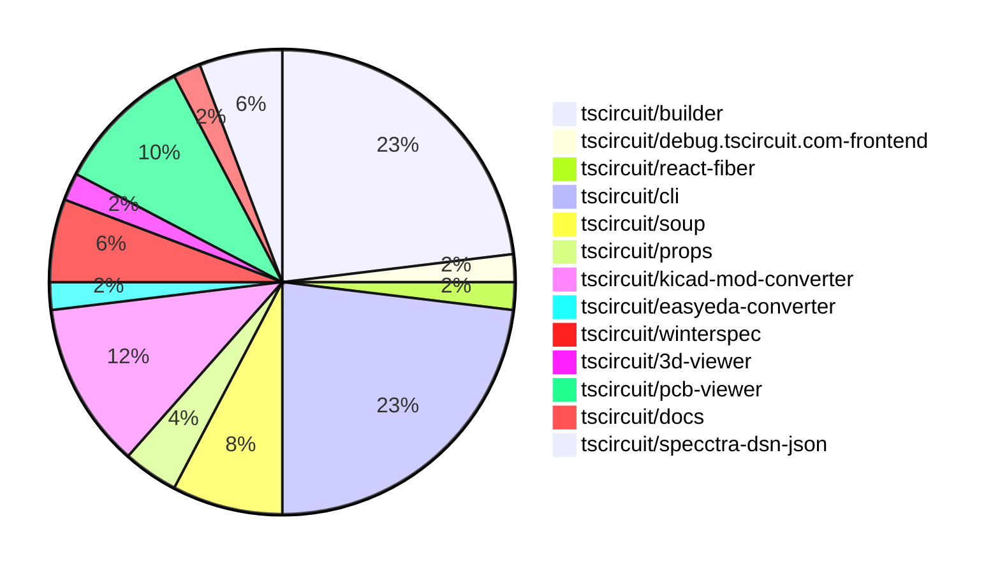

# Contribution Overview 2024-06-29

## PRs by Repository

## Contributor Overview

| Contributor | Major | Minor | Other |
|-------------|-------|-------|-------|
| seveibar | 16 | 11 | 0 |
| imrishabh18 | 9 | 4 | 0 |
| DamilolaAlao | 2 | 1 | 0 |
| Slaviiiii | 1 | 2 | 0 |
| sahilahluwalia | 1 | 0 | 0 |
| andrii-balitskyi | 3 | 0 | 0 |

## Changes by Repository

### tscircuit/builder

| PR # | Impact | Contributor | Description |
|------|--------|-------------|-------------|
| [#63](https://github.com/tscircuit/builder/pull/63) | Major | seveibar | Update the layout engine to fix an issue where silkscreen footprints do not move when translated via manual edits. |
| [#61](https://github.com/tscircuit/builder/pull/61) | Major | seveibar | Improve CAD model test by adding a resistor and a trace to the board |
| [#58](https://github.com/tscircuit/builder/pull/58) | Major | seveibar | Reverts the previous change that added support for oval-shaped plated holes. |
| [#56](https://github.com/tscircuit/builder/pull/56) | Major | seveibar | Accept cadModel prop |
| [#59](https://github.com/tscircuit/builder/pull/59) | Major | imrishabh18 | Introduce support for oval and pill-shaped plated holes in the PlatedHoleBuilder, in addition to the existing circle shape. |
| [#57](https://github.com/tscircuit/builder/pull/57) | Major | imrishabh18 | Added support for oval-shaped plated holes in the PCB footprint builder. |
| [#54](https://github.com/tscircuit/builder/pull/54) | Major | imrishabh18 | Adds obstacle detection for net labels in the schematic routing algorithm. |
| [#66](https://github.com/tscircuit/builder/pull/66) | Minor | seveibar | Handle undefined board thickness in the `ComponentBuilder` class. |
| [#65](https://github.com/tscircuit/builder/pull/65) | Minor | seveibar | Change the dependency installation command from `npm install` to `npm ci` for the release workflow. |
| [#64](https://github.com/tscircuit/builder/pull/64) | Minor | seveibar | Add a GitHub Actions workflow to run the build check on push to main and pull requests to main |
| [#62](https://github.com/tscircuit/builder/pull/62) | Minor | seveibar | Fixes prop remapping in the component builder. |
| [#60](https://github.com/tscircuit/builder/pull/60) | Minor | imrishabh18 | Update a snapshot test to fix a test case. |

### tscircuit/debug.tscircuit.com-frontend

| PR # | Impact | Contributor | Description |
|------|--------|-------------|-------------|
| [#124](https://github.com/tscircuit/debug.tscircuit.com-frontend/pull/124) | Major | seveibar | Introduce a 3D viewer component and add error handling for it, along with various other layout changes and improvements. |

### tscircuit/react-fiber

| PR # | Impact | Contributor | Description |
|------|--------|-------------|-------------|
| [#12](https://github.com/tscircuit/react-fiber/pull/12) | Minor | seveibar | Update dependencies, improve logging, and add a new CAD model feature |

### tscircuit/cli

| PR # | Impact | Contributor | Description |
|------|--------|-------------|-------------|
| [#71](https://github.com/tscircuit/cli/pull/71) | Minor | seveibar | Hoist the example-project directory to the root of the repository |
| [#69](https://github.com/tscircuit/cli/pull/69) |  | seveibar | Here is the analysis of the provided pull request: |
| [#68](https://github.com/tscircuit/cli/pull/68) | Major | seveibar | Introduce a new Level-based database layer with Zod validation for the application's database schema. |
| [#67](https://github.com/tscircuit/cli/pull/67) | Major | seveibar | Add test setup for dev-server-api |
| [#66](https://github.com/tscircuit/cli/pull/66) | Major | seveibar | Add a static routes build step to fix CLI import not resolving |
| [#63](https://github.com/tscircuit/cli/pull/63) | Minor | seveibar | Add "winterspec" as a dependency to the project. |
| [#62](https://github.com/tscircuit/cli/pull/62) |  | seveibar |  |
| [#61](https://github.com/tscircuit/cli/pull/61) | Major | seveibar | Change the start script for the API server to use Bun instead of EdgeSpec. |
| [#59](https://github.com/tscircuit/cli/pull/59) | Major | seveibar | Integrated a 3D viewer into the CLI preview. |
| [#56](https://github.com/tscircuit/cli/pull/56) | Major | sahilahluwalia | Fixes a bad overlap issue on the TSCI dev overlay during export. |
| [#57](https://github.com/tscircuit/cli/pull/57) | Minor | DamilolaAlao | Add a project prefix name to the exported CSV file names for BOM and PNP. |
| [#64](https://github.com/tscircuit/cli/pull/64) | Minor | Slaviiiii | Fix package name in file menu |

### tscircuit/soup

| PR # | Impact | Contributor | Description |
|------|--------|-------------|-------------|
| [#6](https://github.com/tscircuit/soup/pull/6) | Major | seveibar | Introduce a new CAD component model to handle 3D models and related information for PCB components. |
| [#7](https://github.com/tscircuit/soup/pull/7) | Major | imrishabh18 | Add support for oval type in the PCB silkscreen |
| [#8](https://github.com/tscircuit/soup/pull/8) | Major | DamilolaAlao | Add a new type for PCB silkscreen pill |
| [#10](https://github.com/tscircuit/soup/pull/10) | Minor | seveibar | Minor tweaks to the `cad_component` module. |

### tscircuit/props

| PR # | Impact | Contributor | Description |
|------|--------|-------------|-------------|
| [#2](https://github.com/tscircuit/props/pull/2) | Major | seveibar | Add support for a new `cadModel` prop that can be a CAD model in either STL, OBJ, or JSCAD format. |
| [#3](https://github.com/tscircuit/props/pull/3) | Major | imrishabh18 | Added support for oval-shaped plated holes in the `platedHoleProps` type. |

### tscircuit/kicad-mod-converter

| PR # | Impact | Contributor | Description |
|------|--------|-------------|-------------|
| [#24](https://github.com/tscircuit/kicad-mod-converter/pull/24) | Major | seveibar | The pull request formats the entire codebase by applying various formatting rules, including for JavaScript code. |
| [#21](https://github.com/tscircuit/kicad-mod-converter/pull/21) | Major | imrishabh18 | Added the oval shape for plated_hole. |
| [#18](https://github.com/tscircuit/kicad-mod-converter/pull/18) | Major | Slaviiiii | Finish kicad json serialization |
| [#23](https://github.com/tscircuit/kicad-mod-converter/pull/23) | Minor | seveibar | Add a GitHub Actions workflow to check the code formatting |
| [#22](https://github.com/tscircuit/kicad-mod-converter/pull/22) | Minor | imrishabh18 | Change the shape of platedhole components from "oval" to "pill" |
| [#19](https://github.com/tscircuit/kicad-mod-converter/pull/19) | Minor | imrishabh18 | Add fabrication line to the KiCad to TSCircuit conversion process |

### tscircuit/easyeda-converter

| PR # | Impact | Contributor | Description |
|------|--------|-------------|-------------|
| [#4](https://github.com/tscircuit/easyeda-converter/pull/4) | Major | seveibar | Introduce basic GitHub Actions workflows for format checking, publishing to npm, and running tests and benchmarks. |

### tscircuit/winterspec

| PR # | Impact | Contributor | Description |
|------|--------|-------------|-------------|
| [#4](https://github.com/tscircuit/winterspec/pull/4) | Major | seveibar | Add a new `bundle-routes` command to the CLI that generates a bundle of routes from a directory. |
| [#2](https://github.com/tscircuit/winterspec/pull/2) | Major | seveibar | The pull request introduces many exports and helpers to make Bun servers easier to work with. |
| [#3](https://github.com/tscircuit/winterspec/pull/3) | Minor | seveibar | Add edgeruntime request adapter for better bun support |

### tscircuit/3d-viewer

| PR # | Impact | Contributor | Description |
|------|--------|-------------|-------------|
| [#3](https://github.com/tscircuit/3d-viewer/pull/3) | Minor | seveibar | Remove old app files and support not having a PCB board. |

### tscircuit/pcb-viewer

| PR # | Impact | Contributor | Description |
|------|--------|-------------|-------------|
| [#24](https://github.com/tscircuit/pcb-viewer/pull/24) | Major | imrishabh18 | Added support for a new "pill" shape for plated holes in the `convert-element-to-primitive.ts` file. |
| [#23](https://github.com/tscircuit/pcb-viewer/pull/23) | Major | imrishabh18 | Add support for oval-shaped plated holes in the `convert-element-to-primitive` function. |
| [#19](https://github.com/tscircuit/pcb-viewer/pull/19) | Major | imrishabh18 | Adds support for drawing oval primitives in the PCB viewer. |
| [#21](https://github.com/tscircuit/pcb-viewer/pull/21) | Major | DamilolaAlao | Add support for rendering pill-shaped elements on the PCB silkscreen. |
| [#20](https://github.com/tscircuit/pcb-viewer/pull/20) | Minor | imrishabh18 | Update the syntax in `pcb-viewer` to use `radius_x` and `radius_y` instead of `radiusX` and `radiusY`. |

### tscircuit/docs

| PR # | Impact | Contributor | Description |
|------|--------|-------------|-------------|
| [#7](https://github.com/tscircuit/docs/pull/7) | Minor | Slaviiiii | Update the bug component by renaming `port_arrangement` to `schPortArrangement` and `port_labels` to `pinLabels`. |

### tscircuit/specctra-dsn-json

| PR # | Impact | Contributor | Description |
|------|--------|-------------|-------------|
| [#8](https://github.com/tscircuit/specctra-dsn-json/pull/8) | Major | andrii-balitskyi | This pull request adds support for parsing the `library` DSN element, including parsing of `image`, `padstack`, and related sub-elements. |
| [#7](https://github.com/tscircuit/specctra-dsn-json/pull/7) | Major | andrii-balitskyi | Implement placement parser, update types, and add support for parsing placement pins |
| [#6](https://github.com/tscircuit/specctra-dsn-json/pull/6) | Major | andrii-balitskyi | Introduce a new parser to parse pcb, parser, resolution, unit, and structure elements |

## Changes by Contributor

### seveibar

| PR # | Impact | Description |
|------|--------|-------------|
| [#63](https://github.com/tscircuit/builder/pull/63) | Major | Update the layout engine to fix an issue where silkscreen footprints do not move when translated via manual edits. |
| [#61](https://github.com/tscircuit/builder/pull/61) | Major | Improve CAD model test by adding a resistor and a trace to the board |
| [#58](https://github.com/tscircuit/builder/pull/58) | Major | Reverts the previous change that added support for oval-shaped plated holes. |
| [#56](https://github.com/tscircuit/builder/pull/56) | Major | Accept cadModel prop |
| [#124](https://github.com/tscircuit/debug.tscircuit.com-frontend/pull/124) | Major | Introduce a 3D viewer component and add error handling for it, along with various other layout changes and improvements. |
| [#66](https://github.com/tscircuit/builder/pull/66) | Minor | Handle undefined board thickness in the `ComponentBuilder` class. |
| [#65](https://github.com/tscircuit/builder/pull/65) | Minor | Change the dependency installation command from `npm install` to `npm ci` for the release workflow. |
| [#64](https://github.com/tscircuit/builder/pull/64) | Minor | Add a GitHub Actions workflow to run the build check on push to main and pull requests to main |
| [#62](https://github.com/tscircuit/builder/pull/62) | Minor | Fixes prop remapping in the component builder. |
| [#12](https://github.com/tscircuit/react-fiber/pull/12) | Minor | Update dependencies, improve logging, and add a new CAD model feature |
| [#71](https://github.com/tscircuit/cli/pull/71) | Minor | Hoist the example-project directory to the root of the repository |
| [#69](https://github.com/tscircuit/cli/pull/69) |  | Here is the analysis of the provided pull request: |
| [#68](https://github.com/tscircuit/cli/pull/68) | Major | Introduce a new Level-based database layer with Zod validation for the application's database schema. |
| [#67](https://github.com/tscircuit/cli/pull/67) | Major | Add test setup for dev-server-api |
| [#66](https://github.com/tscircuit/cli/pull/66) | Major | Add a static routes build step to fix CLI import not resolving |
| [#63](https://github.com/tscircuit/cli/pull/63) | Minor | Add "winterspec" as a dependency to the project. |
| [#62](https://github.com/tscircuit/cli/pull/62) |  |  |
| [#61](https://github.com/tscircuit/cli/pull/61) | Major | Change the start script for the API server to use Bun instead of EdgeSpec. |
| [#59](https://github.com/tscircuit/cli/pull/59) | Major | Integrated a 3D viewer into the CLI preview. |
| [#6](https://github.com/tscircuit/soup/pull/6) | Major | Introduce a new CAD component model to handle 3D models and related information for PCB components. |
| [#2](https://github.com/tscircuit/props/pull/2) | Major | Add support for a new `cadModel` prop that can be a CAD model in either STL, OBJ, or JSCAD format. |
| [#24](https://github.com/tscircuit/kicad-mod-converter/pull/24) | Major | The pull request formats the entire codebase by applying various formatting rules, including for JavaScript code. |
| [#4](https://github.com/tscircuit/easyeda-converter/pull/4) | Major | Introduce basic GitHub Actions workflows for format checking, publishing to npm, and running tests and benchmarks. |
| [#4](https://github.com/tscircuit/winterspec/pull/4) | Major | Add a new `bundle-routes` command to the CLI that generates a bundle of routes from a directory. |
| [#2](https://github.com/tscircuit/winterspec/pull/2) | Major | The pull request introduces many exports and helpers to make Bun servers easier to work with. |
| [#10](https://github.com/tscircuit/soup/pull/10) | Minor | Minor tweaks to the `cad_component` module. |
| [#23](https://github.com/tscircuit/kicad-mod-converter/pull/23) | Minor | Add a GitHub Actions workflow to check the code formatting |
| [#3](https://github.com/tscircuit/3d-viewer/pull/3) | Minor | Remove old app files and support not having a PCB board. |
| [#3](https://github.com/tscircuit/winterspec/pull/3) | Minor | Add edgeruntime request adapter for better bun support |

### imrishabh18

| PR # | Impact | Description |
|------|--------|-------------|
| [#59](https://github.com/tscircuit/builder/pull/59) | Major | Introduce support for oval and pill-shaped plated holes in the PlatedHoleBuilder, in addition to the existing circle shape. |
| [#57](https://github.com/tscircuit/builder/pull/57) | Major | Added support for oval-shaped plated holes in the PCB footprint builder. |
| [#54](https://github.com/tscircuit/builder/pull/54) | Major | Adds obstacle detection for net labels in the schematic routing algorithm. |
| [#24](https://github.com/tscircuit/pcb-viewer/pull/24) | Major | Added support for a new "pill" shape for plated holes in the `convert-element-to-primitive.ts` file. |
| [#23](https://github.com/tscircuit/pcb-viewer/pull/23) | Major | Add support for oval-shaped plated holes in the `convert-element-to-primitive` function. |
| [#19](https://github.com/tscircuit/pcb-viewer/pull/19) | Major | Adds support for drawing oval primitives in the PCB viewer. |
| [#7](https://github.com/tscircuit/soup/pull/7) | Major | Add support for oval type in the PCB silkscreen |
| [#3](https://github.com/tscircuit/props/pull/3) | Major | Added support for oval-shaped plated holes in the `platedHoleProps` type. |
| [#21](https://github.com/tscircuit/kicad-mod-converter/pull/21) | Major | Added the oval shape for plated_hole. |
| [#60](https://github.com/tscircuit/builder/pull/60) | Minor | Update a snapshot test to fix a test case. |
| [#20](https://github.com/tscircuit/pcb-viewer/pull/20) | Minor | Update the syntax in `pcb-viewer` to use `radius_x` and `radius_y` instead of `radiusX` and `radiusY`. |
| [#22](https://github.com/tscircuit/kicad-mod-converter/pull/22) | Minor | Change the shape of platedhole components from "oval" to "pill" |
| [#19](https://github.com/tscircuit/kicad-mod-converter/pull/19) | Minor | Add fabrication line to the KiCad to TSCircuit conversion process |

### DamilolaAlao

| PR # | Impact | Description |
|------|--------|-------------|
| [#21](https://github.com/tscircuit/pcb-viewer/pull/21) | Major | Add support for rendering pill-shaped elements on the PCB silkscreen. |
| [#8](https://github.com/tscircuit/soup/pull/8) | Major | Add a new type for PCB silkscreen pill |
| [#57](https://github.com/tscircuit/cli/pull/57) | Minor | Add a project prefix name to the exported CSV file names for BOM and PNP. |

### Slaviiiii

| PR # | Impact | Description |
|------|--------|-------------|
| [#18](https://github.com/tscircuit/kicad-mod-converter/pull/18) | Major | Finish kicad json serialization |
| [#64](https://github.com/tscircuit/cli/pull/64) | Minor | Fix package name in file menu |
| [#7](https://github.com/tscircuit/docs/pull/7) | Minor | Update the bug component by renaming `port_arrangement` to `schPortArrangement` and `port_labels` to `pinLabels`. |

### sahilahluwalia

| PR # | Impact | Description |
|------|--------|-------------|
| [#56](https://github.com/tscircuit/cli/pull/56) | Major | Fixes a bad overlap issue on the TSCI dev overlay during export. |

### andrii-balitskyi

| PR # | Impact | Description |
|------|--------|-------------|
| [#8](https://github.com/tscircuit/specctra-dsn-json/pull/8) | Major | This pull request adds support for parsing the `library` DSN element, including parsing of `image`, `padstack`, and related sub-elements. |
| [#7](https://github.com/tscircuit/specctra-dsn-json/pull/7) | Major | Implement placement parser, update types, and add support for parsing placement pins |
| [#6](https://github.com/tscircuit/specctra-dsn-json/pull/6) | Major | Introduce a new parser to parse pcb, parser, resolution, unit, and structure elements |

