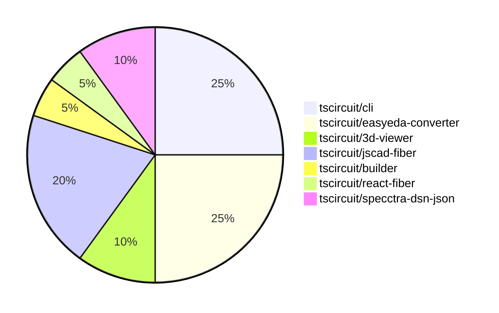

# Contribution Overview 2024-07-06

## PRs by Repository

## Contributor Overview

| Contributor | 🐳 Major | 🐙 Minor | 🐌 Tiny |
|-------------|-------|-------|-------|
| seveibar | 8 | 8 | 0 |
| andrii-balitskyi | 3 | 0 | 0 |
| Slaviiiii | 1 | 0 | 0 |

## Changes by Repository

### [tscircuit/cli](https://github.com/tscircuit/cli)

| PR # | Impact | Contributor | Description |
|------|--------|-------------|-------------|
| [#69](https://github.com/tscircuit/cli/pull/69) | 🐳 Major | seveibar | Remove sqlite, refactor to use level |
| [#68](https://github.com/tscircuit/cli/pull/68) | 🐳 Major | seveibar | Introduce a new level-based database schema and migration handler to move away from SQLite. |
| [#67](https://github.com/tscircuit/cli/pull/67) | 🐳 Major | seveibar | Add test setup for dev-server-api |
| [#76](https://github.com/tscircuit/cli/pull/76) | 🐙 Minor | seveibar | Change the database storage from "level" to "memory-level" for Stackblitz compatibility. |
| [#71](https://github.com/tscircuit/cli/pull/71) | 🐙 Minor | seveibar | Hoist the "example-project" directory from the "tests/assets" subdirectory to the root directory. |

### [tscircuit/easyeda-converter](https://github.com/tscircuit/easyeda-converter)

| PR # | Impact | Contributor | Description |
|------|--------|-------------|-------------|
| [#8](https://github.com/tscircuit/easyeda-converter/pull/8) | 🐳 Major | seveibar | Fixes the release script, introduces formatting scripts, and adds a biome component. |
| [#7](https://github.com/tscircuit/easyeda-converter/pull/7) | 🐳 Major | seveibar | Add a new test showing broken pad positioning |
| [#13](https://github.com/tscircuit/easyeda-converter/pull/13) | 🐳 Major | andrii-balitskyi | Fix mm conversion in `generateFootprintTsx` function |
| [#11](https://github.com/tscircuit/easyeda-converter/pull/11) | 🐙 Minor | seveibar | Add support for loading CAD model rotation |
| [#10](https://github.com/tscircuit/easyeda-converter/pull/10) | 🐙 Minor | seveibar | Improve automatic output filenames by using the base name of the input file instead of the full file name. |

### [tscircuit/3d-viewer](https://github.com/tscircuit/3d-viewer)

| PR # | Impact | Contributor | Description |
|------|--------|-------------|-------------|
| [#5](https://github.com/tscircuit/3d-viewer/pull/5) | 🐳 Major | seveibar | Switch the rotation unit from radians to degrees in the CadViewer component. |
| [#3](https://github.com/tscircuit/3d-viewer/pull/3) | 🐙 Minor | seveibar | Remove old app files and support not having a PCB board. |

### [tscircuit/jscad-fiber](https://github.com/tscircuit/jscad-fiber)

| PR # | Impact | Contributor | Description |
|------|--------|-------------|-------------|
| [#9](https://github.com/tscircuit/jscad-fiber/pull/9) | 🐳 Major | seveibar | Fix rendering for polygons by handling 2D and 3D shapes differently in the `convertCSGToThreeGeom` function. |
| [#6](https://github.com/tscircuit/jscad-fiber/pull/6) | 🐳 Major | seveibar | Adds support for the Polygon primitive, and adds GitHub Actions workflows for TypeScript type checking and code formatting checks. |
| [#3](https://github.com/tscircuit/jscad-fiber/pull/3) | 🐳 Major | Slaviiiii | Add support for missing 3D shapes including Cuboid, RoundedCuboid, GeodesicSphere, Ellipsoid, Cylinder, and RoundedCylinder. |
| [#8](https://github.com/tscircuit/jscad-fiber/pull/8) | 🐙 Minor | seveibar | Format all project files to follow the specified indentation style and add an ignore rule for the `cosmos-export` directory. |

### [tscircuit/builder](https://github.com/tscircuit/builder)

| PR # | Impact | Contributor | Description |
|------|--------|-------------|-------------|
| [#66](https://github.com/tscircuit/builder/pull/66) | 🐙 Minor | seveibar | Handle undefined board thickness in the ComponentBuilder. |

### [tscircuit/react-fiber](https://github.com/tscircuit/react-fiber)

| PR # | Impact | Contributor | Description |
|------|--------|-------------|-------------|
| [#12](https://github.com/tscircuit/react-fiber/pull/12) | 🐙 Minor | seveibar | Tweaks and improvements with soup logging and cadModel |

### [tscircuit/specctra-dsn-json](https://github.com/tscircuit/specctra-dsn-json)

| PR # | Impact | Contributor | Description |
|------|--------|-------------|-------------|
| [#10](https://github.com/tscircuit/specctra-dsn-json/pull/10) | 🐳 Major | andrii-balitskyi | Introduce DSN wiring parsing support |
| [#9](https://github.com/tscircuit/specctra-dsn-json/pull/9) | 🐳 Major | andrii-balitskyi | Implement parsing of the `network` DSN element, including support for `net`, `via`, `via_rule`, and `class` elements. |

## Changes by Contributor

### [seveibar](https://github.com/seveibar)

| PR # | Impact | Description |
|------|--------|-------------|
| [#69](https://github.com/tscircuit/cli/pull/69) | 🐳 Major | Remove sqlite, refactor to use level |
| [#68](https://github.com/tscircuit/cli/pull/68) | 🐳 Major | Introduce a new level-based database schema and migration handler to move away from SQLite. |
| [#67](https://github.com/tscircuit/cli/pull/67) | 🐳 Major | Add test setup for dev-server-api |
| [#8](https://github.com/tscircuit/easyeda-converter/pull/8) | 🐳 Major | Fixes the release script, introduces formatting scripts, and adds a biome component. |
| [#7](https://github.com/tscircuit/easyeda-converter/pull/7) | 🐳 Major | Add a new test showing broken pad positioning |
| [#5](https://github.com/tscircuit/3d-viewer/pull/5) | 🐳 Major | Switch the rotation unit from radians to degrees in the CadViewer component. |
| [#9](https://github.com/tscircuit/jscad-fiber/pull/9) | 🐳 Major | Fix rendering for polygons by handling 2D and 3D shapes differently in the `convertCSGToThreeGeom` function. |
| [#6](https://github.com/tscircuit/jscad-fiber/pull/6) | 🐳 Major | Adds support for the Polygon primitive, and adds GitHub Actions workflows for TypeScript type checking and code formatting checks. |
| [#66](https://github.com/tscircuit/builder/pull/66) | 🐙 Minor | Handle undefined board thickness in the ComponentBuilder. |
| [#12](https://github.com/tscircuit/react-fiber/pull/12) | 🐙 Minor | Tweaks and improvements with soup logging and cadModel |
| [#76](https://github.com/tscircuit/cli/pull/76) | 🐙 Minor | Change the database storage from "level" to "memory-level" for Stackblitz compatibility. |
| [#71](https://github.com/tscircuit/cli/pull/71) | 🐙 Minor | Hoist the "example-project" directory from the "tests/assets" subdirectory to the root directory. |
| [#11](https://github.com/tscircuit/easyeda-converter/pull/11) | 🐙 Minor | Add support for loading CAD model rotation |
| [#10](https://github.com/tscircuit/easyeda-converter/pull/10) | 🐙 Minor | Improve automatic output filenames by using the base name of the input file instead of the full file name. |
| [#3](https://github.com/tscircuit/3d-viewer/pull/3) | 🐙 Minor | Remove old app files and support not having a PCB board. |
| [#8](https://github.com/tscircuit/jscad-fiber/pull/8) | 🐙 Minor | Format all project files to follow the specified indentation style and add an ignore rule for the `cosmos-export` directory. |

### [andrii-balitskyi](https://github.com/andrii-balitskyi)

| PR # | Impact | Description |
|------|--------|-------------|
| [#13](https://github.com/tscircuit/easyeda-converter/pull/13) | 🐳 Major | Fix mm conversion in `generateFootprintTsx` function |
| [#10](https://github.com/tscircuit/specctra-dsn-json/pull/10) | 🐳 Major | Introduce DSN wiring parsing support |
| [#9](https://github.com/tscircuit/specctra-dsn-json/pull/9) | 🐳 Major | Implement parsing of the `network` DSN element, including support for `net`, `via`, `via_rule`, and `class` elements. |

### [Slaviiiii](https://github.com/Slaviiiii)

| PR # | Impact | Description |
|------|--------|-------------|
| [#3](https://github.com/tscircuit/jscad-fiber/pull/3) | 🐳 Major | Add support for missing 3D shapes including Cuboid, RoundedCuboid, GeodesicSphere, Ellipsoid, Cylinder, and RoundedCylinder. |

