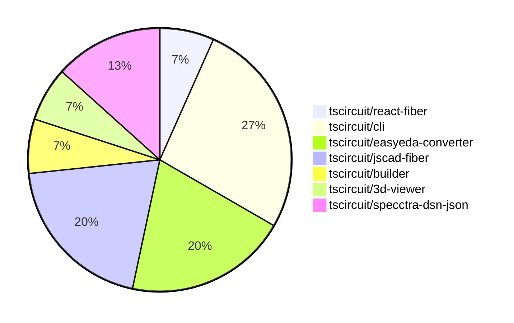

# Contribution Overview 2024-07-06

## PRs by Repository

## Contributor Overview

| Contributor | Major | Minor | Other |
|-------------|-------|-------|-------|
| seveibar | 6 | 5 | 0 |
| andrii-balitskyi | 2 | 0 | 0 |
| Slaviiiii | 1 | 0 | 0 |

## Changes by Repository

### [tscircuit/react-fiber](https://github.com/tscircuit/react-fiber)

| PR # | Impact | Contributor | Description |
|------|--------|-------------|-------------|
| [#12](https://github.com/tscircuit/react-fiber/pull/12) | Major | seveibar | Introduces the `@tscircuit/log-soup` package, updates dependencies, and includes a new `cadModel` prop in the component. |

### [tscircuit/cli](https://github.com/tscircuit/cli)

| PR # | Impact | Contributor | Description |
|------|--------|-------------|-------------|
| [#69](https://github.com/tscircuit/cli/pull/69) | Major | seveibar | Refactor the database implementation by removing SQLite and using the Level database instead. |
| [#68](https://github.com/tscircuit/cli/pull/68) | Major | seveibar | Introduce a new level-based database schema and handler to migrate off SQLite. |
| [#71](https://github.com/tscircuit/cli/pull/71) | Minor | seveibar | Move the example-project directory to the root of the repository. |
| [#67](https://github.com/tscircuit/cli/pull/67) | Minor | seveibar | Add test setup for dev-server-api |

### [tscircuit/easyeda-converter](https://github.com/tscircuit/easyeda-converter)

| PR # | Impact | Contributor | Description |
|------|--------|-------------|-------------|
| [#8](https://github.com/tscircuit/easyeda-converter/pull/8) | Major | seveibar | Fix release script, introduce formatting scripts, and add biome. |
| [#7](https://github.com/tscircuit/easyeda-converter/pull/7) | Major | seveibar | This pull request adds a new test showing broken pad positioning. |
| [#10](https://github.com/tscircuit/easyeda-converter/pull/10) | Minor | seveibar | Improve automatic output filenames to use the base filename instead of the full input filename. |

### [tscircuit/jscad-fiber](https://github.com/tscircuit/jscad-fiber)

| PR # | Impact | Contributor | Description |
|------|--------|-------------|-------------|
| [#8](https://github.com/tscircuit/jscad-fiber/pull/8) | Major | seveibar | This pull request formats the entire codebase by applying a consistent code style and formatting. |
| [#6](https://github.com/tscircuit/jscad-fiber/pull/6) |  | seveibar |  |
| [#3](https://github.com/tscircuit/jscad-fiber/pull/3) | Major | Slaviiiii | Add missing 3D shapes to the examples |

### [tscircuit/builder](https://github.com/tscircuit/builder)

| PR # | Impact | Contributor | Description |
|------|--------|-------------|-------------|
| [#66](https://github.com/tscircuit/builder/pull/66) | Minor | seveibar | Handle undefined board thickness in the ComponentBuilder class. |

### [tscircuit/3d-viewer](https://github.com/tscircuit/3d-viewer)

| PR # | Impact | Contributor | Description |
|------|--------|-------------|-------------|
| [#3](https://github.com/tscircuit/3d-viewer/pull/3) | Minor | seveibar | Remove old app files and support not having a PCB board. |

### [tscircuit/specctra-dsn-json](https://github.com/tscircuit/specctra-dsn-json)

| PR # | Impact | Contributor | Description |
|------|--------|-------------|-------------|
| [#10](https://github.com/tscircuit/specctra-dsn-json/pull/10) | Major | andrii-balitskyi | Introduce support for parsing the `wiring` DSN element |
| [#9](https://github.com/tscircuit/specctra-dsn-json/pull/9) | Major | andrii-balitskyi | Implement parsing for the `network` DSN element, including parsing for `net`, `via`, `via_rule`, and `class` elements. |

## Changes by Contributor

### [seveibar](https://github.com/seveibar)

| PR # | Impact | Description |
|------|--------|-------------|
| [#12](https://github.com/tscircuit/react-fiber/pull/12) | Major | Introduces the `@tscircuit/log-soup` package, updates dependencies, and includes a new `cadModel` prop in the component. |
| [#69](https://github.com/tscircuit/cli/pull/69) | Major | Refactor the database implementation by removing SQLite and using the Level database instead. |
| [#68](https://github.com/tscircuit/cli/pull/68) | Major | Introduce a new level-based database schema and handler to migrate off SQLite. |
| [#8](https://github.com/tscircuit/easyeda-converter/pull/8) | Major | Fix release script, introduce formatting scripts, and add biome. |
| [#7](https://github.com/tscircuit/easyeda-converter/pull/7) | Major | This pull request adds a new test showing broken pad positioning. |
| [#8](https://github.com/tscircuit/jscad-fiber/pull/8) | Major | This pull request formats the entire codebase by applying a consistent code style and formatting. |
| [#66](https://github.com/tscircuit/builder/pull/66) | Minor | Handle undefined board thickness in the ComponentBuilder class. |
| [#71](https://github.com/tscircuit/cli/pull/71) | Minor | Move the example-project directory to the root of the repository. |
| [#67](https://github.com/tscircuit/cli/pull/67) | Minor | Add test setup for dev-server-api |
| [#10](https://github.com/tscircuit/easyeda-converter/pull/10) | Minor | Improve automatic output filenames to use the base filename instead of the full input filename. |
| [#3](https://github.com/tscircuit/3d-viewer/pull/3) | Minor | Remove old app files and support not having a PCB board. |
| [#6](https://github.com/tscircuit/jscad-fiber/pull/6) |  |  |

### [andrii-balitskyi](https://github.com/andrii-balitskyi)

| PR # | Impact | Description |
|------|--------|-------------|
| [#10](https://github.com/tscircuit/specctra-dsn-json/pull/10) | Major | Introduce support for parsing the `wiring` DSN element |
| [#9](https://github.com/tscircuit/specctra-dsn-json/pull/9) | Major | Implement parsing for the `network` DSN element, including parsing for `net`, `via`, `via_rule`, and `class` elements. |

### [Slaviiiii](https://github.com/Slaviiiii)

| PR # | Impact | Description |
|------|--------|-------------|
| [#3](https://github.com/tscircuit/jscad-fiber/pull/3) | Major | Add missing 3D shapes to the examples |

